# 《10 倍比 2 倍更容易》21 天共读营 实战手册 202403

> 来源：[`jviztcgxxfy.feishu.cn/docx/RutodIZZlot6BVxjHAOcrDBmnof`](https://jviztcgxxfy.feishu.cn/docx/RutodIZZlot6BVxjHAOcrDBmnof)

内容出品人： 易仁永澄、倪克寒、黄莹 Ying（翻译润色）

手册出品方：生财有术团队

出品时间：2024 年 2 月 28 日

手册使用说明：本手册是你阅读《10x is easier than 2X》的辅助材料，帮助你更好地理解书中的核心概念，从而学以致用，解决自身业务的增长问题。

建议：如果需要快速定位到精确内容，可以使用快捷键 Ctrl + F/command + F 的形式，搜索「关键字/词」，查找你想要的内容。

# 【前言】了解全书脉络

## 写在前面

7 个章节、20 多个关键概念、35 个引发思考的关键问题

帮你在宏观层面搭建起「10X 增长」的完整思维框架

硅谷王川、生财有术创始人亦仁重磅推荐

### 为什么要读这本书？

10 倍增长（也简写为 10X） 的概念你一定不陌生，甚至这也是每个企业家、创业者、生财航海家的内心渴望。

我们都希望无论是自己的事业、还是自己的人生，都能够像很多真的 10X 增长的人一样，充满奇迹色彩、令人称道。

我们也希望能够摆脱眼前的泥潭，进入到财富、事业、人生发展的快车道，而不是像现在一样，投入和回报很不成正比。

10X 增长并不是一个噱头，英伟达一个交易日就可以涨出 2 个英特尔+阿里+腾讯。

同样，它也不是只有大公司才能做到的事情，它就是实实在在发生在我们的身边，有人就是可以抓住关键点，然后异军突起，短短的时间里，就把其他人拉下了很远的距离。

人人都渴望的状态、身边遍布着各种成功案例，甚至我们日常嘴上经常说着「10 倍、10 倍」，可是真正了解这个思维方式内涵的人却寥寥无几，很多人知晓了概念也不知道如何系统化地应用在自己的事业、生活之中。

亦仁老板面对这种情况，期待航海家们能够通过认真学习本书，建立起对 10X 概念整体框架、内涵、做法的基本共识，帮助航海家们真的成为 10 倍增长者。

在这样的期待下，我们组织发起了《10X is easier than 2X》的共读活动。

### 领读嘉宾介绍

### 本次共读的目标

1.完成《10 倍比 2 倍更容易》一书的阅读，了解 10X 增长的基本概念、内涵

2.通过阅读提出关于自己事业体 10X 增长中可能遇到的问题和困扰

### 21 天的共读安排

1.我们把本书分成 7 个部分，每个部分阅读三天的时间

2.书籍原文内容需要你自行阅读，总体阅读时间大约需要 20-40 分钟/天

a.阅读水平高的老板，自行阅读过程中，更多地回答我们提出的辅助思考问题

b.时间很忙的老板，可以提前查看我们为你准备的关键内容萃取，帮你快速了解章节内容

3.领读嘉宾会帮你梳理本章节中的关键概念、问题，以及一些辅助资料

4.通过你的阅读、以及领读嘉宾的提问，你尝试着练习、回答、测试，加深对相关章节的理解领悟

5.群内可以随时发起交流活动，请使用以下符号发起主题交流

a.#我要分享：分享自己的阅读、实践中的感受、收获

b.#我有困惑：对于某个部分的内容无法有效理解的困扰

c.#我有疑问：对于书中内容应用于自己的实际工作、生活的疑问

d.随机交流时不需要增加「#」号

### 对船员的要求和期待

1.要求参与者认真阅读本书籍，了解书中提出的若干概念，为后续航海家社群建立统一的话语体系打好基础

2.要求参与者书写自己的阅读体会、收获

3.要求参与者结合自己的实际业务，提出在阅读过程中的问题、困惑、需求

以下内容由生财有术联合圈友@易仁永澄、@倪克寒 制作而成，仅供航海船员以及航海家学习使用。

同时也欢迎圈友们在实践过程中持续反馈，和我们共同完善，可以联系你的航海家管家提供修改建议～

## 领读音频

### 10X 是什么？

### 作者简介

### 缺乏 10X 思维方式会给决策者带来怎样的困境

总之，这本书提醒决策者，采用 10 倍增长思维是实现突破性成功的关键，而忽视这种思维方式可能会导致企业错失重大成长机会，并面临许多风险和威胁。

### 本书的整体结构

### 辅助阅读资料

混沌思维模型扑克牌珍藏版.pdf

## 本模块的任务

1.任务 1：请快速略读【前言】模块内容

2.任务 2：

3.任务 3：

【逐段翻译版】10x Is Easier Than 2x.pdf

为了确保我们的页码一致，请你使用本版本（群内会反复提供）

# 0【导言】开启你的 10 倍之旅（3 月 1 日 to 3 日）

## 领读音频

视频资料：https://o2r4amaky8.feishu.cn/minutes/obcnurd1et9i5iqwlm71512z

引言是本书的总览：

1.从米开朗基罗 37 岁前的成就入手，展示了一种独特的「进程 Process」，每当采用这种进程，就会实现内在（存在、状态、能力、能量）到外在（作品、影响）的非线性增长。

2.极为简要地介绍了这种「进程」（作者也把它定义为一种游戏），这种进程也被高度浓缩为一个概念「10X」。

3.序言的介绍中，对 10X 的以下要点进行了提及：

a.10X 带来的若干价值：扩展、简化、识别、精通、领导、授权、变革、自由

b.10X 的核心特征：关注质，而不是量（因此是做少的艺术）；非线性增长；不单纯是外部结果，最重要是内在的过程

c.10X 的前提条件：当事人决心，并做出承诺。

4.序言中隐含了一个由内到外的 10X 的框架：心理灵活性 —— 10X 思维方式 —— 自由

5.由于各位老板都是业界的实践者，在阅读的时候很容易带入到自己的理解，这里特别要提出一点，本书之所以被很多大佬推荐，他给的并不是外部/实质的解决方案，反而它更关注务虚的部分、内在的部分。

a.书中特别提到了：历史上最伟大的艺术家和企业家都明白 10 倍和 2 倍思维的区别。（P35）10x 已经成为创业、金融和自助圈中流行的一个时髦概念。然而，大 多数人根本上误解了 10x 的含义和它能做什么。 他们在生活中挣扎着表现出 10 倍。他们 陷入了 2x 的心态。但更重要的是，他们对 10 倍的追求导致他们寻找错 误的东西，一场无休止的追求更多的比赛。 （P36）

b.因此，请小心一些「先入为主」的思维惯性，它可能会阻碍着你了解到这本书的精髓

c.本书强调的内部要素包括：你（you）这个人的内核、你的决定、你是如何做出承诺、你的需求/想要、你的心态，这些前提具备的情况下，10X 进程才可以开启。

## 自主阅读

### 本章节的整体位置

### 自主阅读日期

### 自主阅读导引：本章节的整体结构

符号的需要更专注、更用心，摘抄笔记、反复理解的部分。

1.17-27 页，米开朗基罗是如何取得令人震惊的成绩的？（故事的上半部分）

2\. 27-28 页，核心观点：心理灵活性是持续暴涨的关键！

3.29-35 页，米开朗基罗是如何延续自己的暴涨的？

4\. 36-44 页 ，为什么 10X 这种反常识的理念，竟然更简单、更容易、更好？

5.45-50 页，作者是 10X 发展的经历是怎样的？ 以及两个作者之间的故事。

6.51-58 页，本书的结构是怎样的？它将如何完整地改变你的事业和人生？

## 好问题引领生命方向，这些问题帮助你的阅读更聚焦！

1.怎样的成长方式可以让自己在多个方面实现暴涨，并转变成另外一个人？

2.什么叫「心理灵活性」？如何做到「心理灵活性」？

3.什么会阻碍你去往生命的下一个阶段？

4.渐进式进步的特征是什么？为什么这是对生命的浪费？

5.我认为 10X 是什么？

6.什么是你渴望的自由的人生状态？

1.17-27 页，米开朗基罗是如何取得令人震惊的成绩的？（故事的上半部分）

a.日常，我们通常会渴望拥有某一种特定的「能力」

b.而米开朗基罗在打磨自己的「Hercules-赫拉克勒斯」作品中体现了一种完全不同的成长方式

c.这是一种怎样的发展方式呢？可以让自己在精神、情感、技能、创造力、能力、作品、影响力的方面都取得暴涨，甚至让他完全变了另外一个人呢？

2\. 27-28 页，核心观点：心理灵活性是持续暴涨的关键！

a.摘抄「心理灵活性」的关键解释，尤其放慢速度理解「context & content」的概念

b.尝试着用自己的话去解释什么叫「心理灵活性」？

c.做到「心理灵活性」的有效策略是什么？

d.为什么「心理灵活性」是开展 10X 进程、实现 10X 增长的必要前提？换句话说：为什么情绪和思绪成为了制约自己 10X 增长的关键挑战？

3.29-35 页，米开朗基罗是如何延续自己的暴涨的？

a.什么会阻碍你完全投入到 10X 的过程？而米开朗基罗却会不断做到呢？

b.书中提到了：让你在这里的东西，不会让你在那里。检视你的事业、生活等各方面，什么一直停留在原地？

4\. 36-44 页 ，为什么 10X 这种反常识的理念，竟然更简单、更容易、更好？

a.什么是渐进式的进步？它的典型特征是什么？

b.10X 关注的重点是什么？

c.摘抄重要内容，并且回答这个问题：我认为，10X = ？

d.最根本的质变来自哪里？

e.10X 为什么是重要的过滤器，它是如何把那些让自己变得平庸的东西从生命中过滤掉的？

f.两个层次的自由是什么？四项基本自由是什么？

g.10X 是如何不断扩大自由的？是如何帮助我们开启扩大自由的这场无限游戏的？

5.45-50 页，作者是 10X 发展的经历是怎样的？ 以及两个作者之间的故事。

6.51-58 页，本书的结构是怎样的？它将如何完整地改变你的事业和人生？

a.什么是一个人/组织的增长和创造力停滞的根本原因？

b.初步了解本书的整体结构，并找到你好奇的内容

7.合上序言部分，10X 这种反直觉、独特的思维方式还在不断闪现着它的影子，本章节最后一个问题

a.通过这三天对序言的阅读，哪一个点最触动你的内心？

b.你有哪些困惑的点？有哪些好奇的渴望探索的点？

c.什么是你渴望的自由的人生状态？

这些问题并不需要全部回答，你只需要在阅读前先看一下，头脑中就会形成心锚

可以在潜意识中更好地组织要阅读的内容，提升阅读效率。

对于你特别有触动、感兴趣的问题，建议你给自己一些时间，落笔写出它的答案。

## 关键概念

1.心理灵活性、韧性（内在状态、心力）

2.10X（思维框架、方式；整体策略）

a.10X Process：你不是天生伟大，而你可以通过一种方式达到传奇级别，这种不断追求的方式被定义为 10X 进程（P26）

b.Going 10X：10 倍意味着你生活在你能想象的最内在和最令人兴奋的未来之上。

c.Going 10x means your attention is directly on far less, but it’s insanely more potent and impactful because it’s focused rather than spread thin. 追求 10 倍增长，意味着你的注意力只能集中在极少数事物上。但因为得到了集中的关注，这些事物变得极为更加强大，且更有影响力。 （P39）

d.10X Future：10 倍的未来成为你做任何事情的过滤器，而你现在的生活大多数都无法通过 10 倍的过滤器。（P39）

e.10X 差异：10x is a qualitative difference from before and after, a wholesale innovation and upgrade. 10 倍增长是一种质的飞跃，是全面的创新和升级。 （P38）

f.10x is the vehicle：10x 是改变你自己和你的生活的工具。 （P40）

g.10x is playing the infinite game of expanding your freedom. 追求 10 倍增长，就是在不断扩大自由的无限游戏中探索。（P44）

3.自由（最终结果、渴望及追求）

## 关键金句

## 自测题

1.我相信我可以实现 10X 好么？

2.我日常更关心结果，还是更关注结果产生的原因？

3.我是不是处于「很紧、很用力」的努力之中？

4.我的思维模式是哪一种：

a.A.做少得多

b.B.做少得少

c.C.做多得多

d.D.做多得少

5.一段时间内，我是非常清楚我的目标的，高度聚焦在目标上，并且我可以预判到目标实现后所形成的带动效应

6.我习惯性地改善某个关键点的质量，以带动整体发展

7.我有意识地删减一些事件，而不是把一切都放在脑海中

8.日常，我是很有意识地追求自由，并且为之认真思考、认真努力

9.我会非常有意识地安排自己的时间，投入到高回报活动上

## 部分难以理解的内容

### P13：smartness contest 充满聪明者的竞争环境

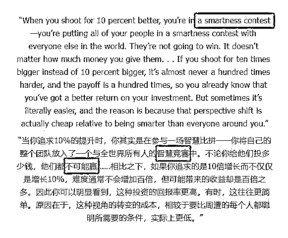

为什么，把人们放在聪明的竞争环境中，人们却不会赢呢？

这段话的核心观点是关于设定目标和创新的方式。作者通过对比追求 10%的改进和追求 10 倍增长的目标，来阐述一个关于创新和竞争的观点。下面是对这段内容的解释：

1.追求 10%的改进意味着进入一个智慧比拼：作者认为，当你的目标是使事物仅仅提高 10%，你的竞争基础就变成了谁更聪明、谁的执行力更强。在全球化的环境中，你的团队与世界上无数的智慧和资源竞争，要想在这场比拼中脱颖而出极其困难，因为总会有人可能拥有更多的资源、更好的策略或更高效的执行力。

2.追求 10 倍的增长提供了不同的视角：相比之下，如果目标是实现 10 倍而非 10%的增长，这个目标迫使人们跳出传统思维的框架，寻找彻底不同的解决方案和创新途径。这种巨大的跃进不仅可能在实现上并不比小幅改进更难，而且由于它的野心更大，所带来的回报也远远超过简单地追求小幅度改进。

3.从 10 倍增长的角度思考可能更容易：作者进一步指出，有时追求更宏大的目标反而更容易，因为这种目标迫使人们进行根本性的思考和创新，而不是在现有框架内苦苦挣扎。当你寻求彻底改变游戏规则而不仅仅是在现有规则内寻求小幅度改进时，你可能会发现一些意想不到的简单解决方案，或者至少，你的创新努力不会直接与他人的小幅改进努力竞争。

总结来说，这段话鼓励人们采取更加大胆的创新策略，不要仅仅满足于小幅度的改进，因为在全球竞争激烈的环境中，只有真正的、大胆的创新才能使你脱颖而出。通过追求更大胆的目标，你不仅可能会发现实现这些目标比预期的更容易，而且这样的目标能带来更大的回报。

### P17：the master calls a butterfly

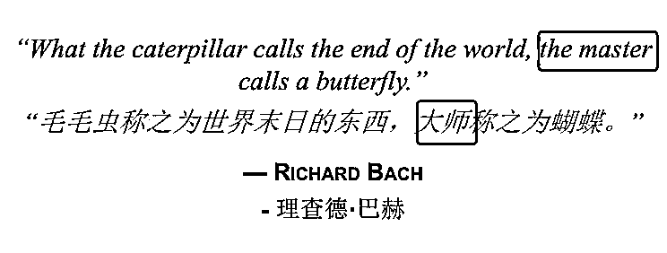

为什么要把毛毛虫和大师放在一起对应呢？

更好的翻译如下图：毛虫眼中的末日，是智者眼中的化蝶

如果用更好的方式信达雅地翻译，其实是：夏虫不可语冰。

“夏虫不可语冰”出自《庄子·外篇·秋水》，这句话的意思是，对于只在夏天生活的虫子，无法与它们讨论冰冻的事情，因为它们的生命周期不涉及冬天，无法理解冰是什么。

这个成语用来比喻人的见识受到时间和经验的限制，对于自己未经历过或未曾了解的事物缺乏认识和理解

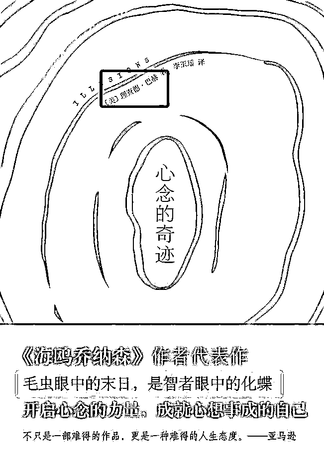

### 米开朗基罗的生平

米开朗基罗·布奥纳罗蒂（Michelangelo Buonarroti，1475-1564）是文艺复兴时期的意大利雕塑家、画家、建筑师和诗人，被认为是艺术史上最伟大的艺术家之一。他的作品因其技巧的精湛和美的力量而闻名于世。

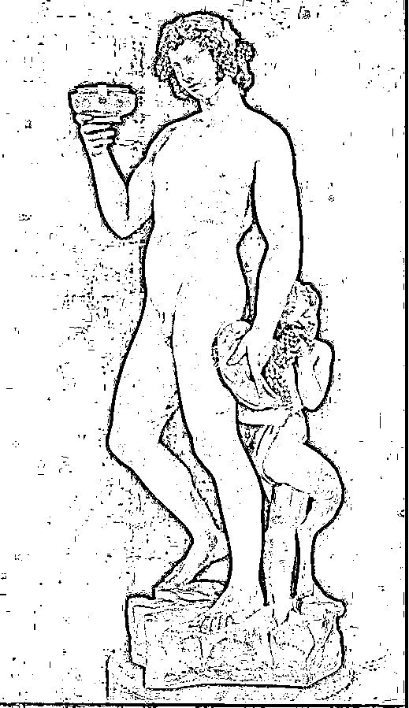

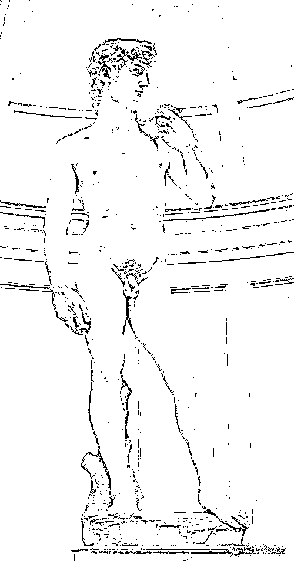

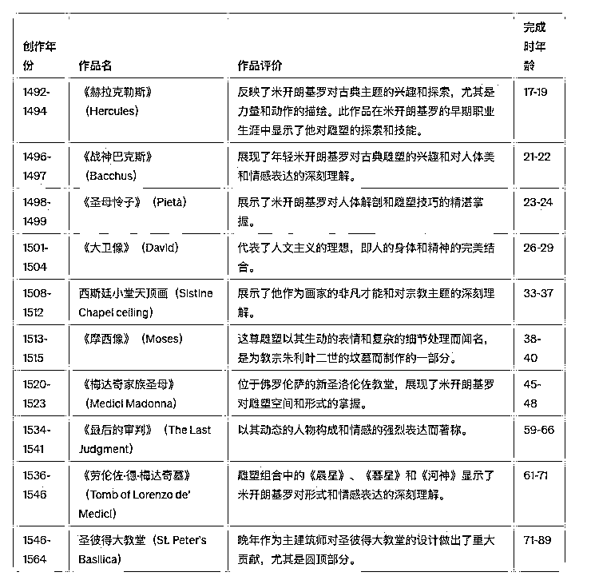

# 1【第一章】10 倍思维与 2 倍思维

## 领读音频

https://o2r4amaky8.feishu.cn/minutes/obcnwtn3553um8s8qxp86361

第一章是对 10X 思维方式的整体介绍，从更加全貌的角度，打开 10X 思维的盒子。

本章用「三个模块+一个总结」的方式，提供了以下重点内容：

1.2X 思维模式的运转方式带来了混乱，10X 思维模式的运转方式带来了简化和增长，引言部分就介绍了这两种思维方式的运转过程。

2.书中给出了关于 10X 和 2X 的思维框架，我为你做了整理，并增加了一些我的理解，帮助你更好地了解本章

3.本书还给了三个实际案例，分别分析了 10X 思维方式做为原则的使用，以及具体在应用过程中可能出现的不同阶段，面对不同阶段的调整方式及效果说明。

4.此外，书中还提到了很多极为实用的工具，例如：unless 工具、成为谁的英雄工具、收益调整预演工具等。

有了本章内容，一个整体的 10X 框架就会呈现在你的面前，你也可以按图索骥地去对照自己哪个部分具备能力、哪个部分可能缺乏思考。

第一个模块，P60-68 本章引言：为什么 2X 的思维方式是（你内心渴望的）结果的敌人？

5.引言部分提出了「根因」：为什么 10X 比 2X 更简单、更容易让人感受到激情满满？

6.基本逻辑链条如下：（配图见下方）

a.导致混乱的逻辑：

a.if 想要去未来 then 感受到未来不确定，使得内心不舒服

b.Then 沿用过去的经验，至少能够让自己内心舒服

c.Then 用过去的旧地图，面对全新的未来，路径增多、效用无法验证

d.Then 那就多做、多努力、多尝试，持续带来混乱

e.Then 更帮助自己铸就了：不敢想像未来的动力源

f.Then 越是有这样的动力模式，越不敢采用 10X，越陷入在 2X 的平庸之中，也就真的变成了个「普通人」

b.带来「持续非线性增长」的逻辑：

a.If 坚信 10X 的基本逻辑

b.Then 决心要去往一个「我」渴望的 10X 的未来

c.But 不知道这个未来怎么过去，怎么办？Then 使用 unless 工具

d.Then 基本可以过滤掉所有的噪音，成功路径基本就只有一条

e.Then 把所有的注意力/时间/精力全部投入到这条路径上，努力提高这条路径上的「质」

f.Then 带来内外在的全面翻新和改变

g.Then 更相信 10X 的基本逻辑

h.Then 越是有这样的动力模式，越想要一次次使用 10X 进程，不断玩 10X 的游戏，不断获得人生的自由

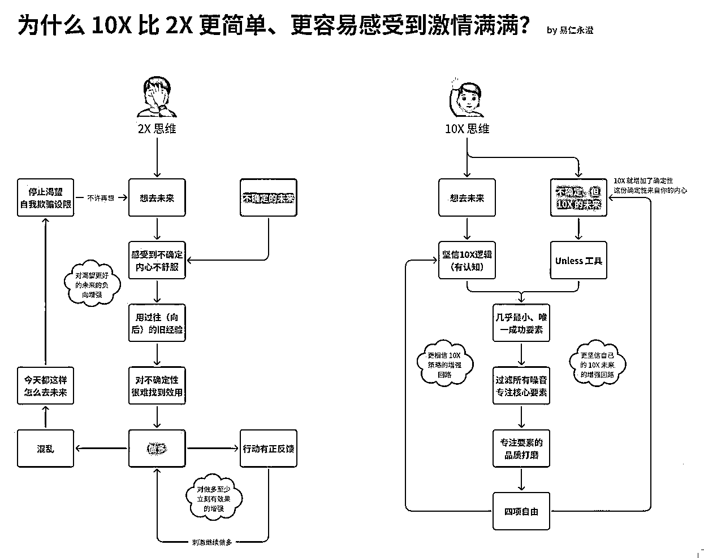

7.本节还提出了对人的基本要求：高成就期待、诚实、对路径更挑剔

8.本节有个重要的工具：unless 工具，这个工具，基本解决了「决心获得 10X 增长者」内心的最大干扰和障碍！

第二个模块，P69-88 思维框架：为什么两种思维方式是截然相反的？

9.本节提到了两种思维框架，我为你做了粗糙的整理，节省你的再整理时间，同时也是查漏补缺，帮你看看有哪些要点是自己在阅读的时候未关注的事宜。

10.本节作者谈及一个很关键的概念：不对称收益。如何做到 20%的投入，实现可以带来 10X 效果的 80%的回报？

a.本章采用「系统思维」，也就是：「输入-系统-输出」来建构的讨论基调，提出振聋发聩的问题：「你把时间用在在系统内做事」还是「把时间用在调整系统，以支持不对称的输出（20%投入，输出 80%）」？这是一个极佳的算账策略，这个问题会持续激发我们思考，我们的时间、精力投入策略。只有有了这个前提，我们才有可能拥有动力去在后续停下现在的 80%的时间投入、甚至放弃一些金钱的收入，以节省精力去搭建增长系统。（P69-76）

11.包括上述这一条，在这个部分之中（P69-76），共有非常重要的五项内容：

a.系统思维 + 决心成为一个改进系统的人 + 时间精力投入的重新选择

b.时间精力投入的重要思维方式：由 Dan 博士改进的「28 分配策略」

c.决心要改进的重要前提：设置系统输出。这里有两个条件：①定目标；②定宏大目标

d.对比了 2X 和 10X 的投入和产出事宜，尤其提出 2X 的人不愿意为「改变」投入必要的心力（停在舒适区），导致无法进入 10X 状态

e.这里有一个很有效的工具：收益调整预演工具（P75）

12.之后，书中给出一个 实际案例（P77-86），你可以根据这个案例来对照一下自己的事业。通过这个案例，作者补充了几个重要的观点：

a.日程紧凑的企业家是无法完成自我转型的，强调了：注意力、时间的投入（20%高回报投入）问题，以及强调 10X 必须要完成自我转型（愿景、思维模式、行动、习惯、心态等）

b.这里有一个很有效的工具：成为谁的英雄工具（P79）

13.最后作者总结并提出了几个自我检视的问题，帮助你进行自我对照。

第三个模块，P89- 如何连续采用「10X 进程」获得跃迁式的发展，并创造指数级的自由

14.本节讲了 linda 的故事，在这条故事线中，你会看到 linda 跨越式成长的一些重要的阶段：

a.缺乏认知补认知

b.有了认知就实践

c.进入圈子搞经验

d.找到当前优势就投入

e.感觉不好就调整

f.不断减除 80%的时间

g.开启动用组织杠杆

h.持续这个过程，不断更新社会杠杆

i.成为领导者，领导各类生产要素（趋势、平台、资本、文化、组织、市场、技术、团队、机制）有效整合发挥效用

15.同时，从这个故事中，你还可以看到：减除 80%的时间为什么会让自己充满兴奋和激情；为什么要问「who」而不是「how」的问题。尤其是，这里体现了一个关键点：「只要我感觉不对了，就要做出调整，而不是忍受和延续」

16.通过这个模块，我们可以看到一个 10X 跨越发展者从 0 开始的基本轨迹，很有借鉴意义。

最后一部分是总结模块，我反而建议的是：你先看看总结模块的内容，有个印象，再从其中你感兴趣的部分入手，完成第一章的阅读。

## 自主阅读

### 本章节的整体位置

### 自主阅读日期

### 自主阅读导引：本章节的整体结构

1.P60-68 本章引言：为什么 2X 的思维方式是（你内心渴望的）结果的敌人？

2.P69-88 思维框架：为什么两种思维方式是截然相反的？

3.P88-112 综合案例：如何连续采用「10X 进程」获得跃迁式的发展，并创造指数级的自由

4.P112-115 Chapter Takeaways：本章要点总结

## 好问题引引领生命方向，这些问题帮助你的阅读更聚焦！

1.2X 的思维过程是怎样的？10X 的思维过程是怎样的？

2.为什么，书中说你现在基本上所做的一切都是噪音？

3.你的时间、精力、注意力，通常都会被无意识地投入到哪些方向？

4.哪些人和事，是你可以投入最少时间精力、但是却可以实现最大回报的？

5.你日常是希望问：「如何做 How」，还是「谁来做 Who」？

更多细致的问题，请查看下方的阅读列表。

你可以先读一遍书，回头再看一下我的问题，再来回答一遍答案。

P60-68 本章引言：为什么 2X 的思维方式是（你内心渴望的）结果的敌人？

1.在你的日常习惯里，你是习惯向自己提出「2X」的问题，还是「10X」的问题？

2.除了缺乏「10X」的基本认知和意识之外，你觉得自己总是不由自主地提出「2X」的问题，是因为内心深处真正担心的是什么？

3.请尝试用自己的话说说看，2X 策略的基本假设是面向过去的、10X 策略的基本假设是面向未来的，这个本质的差别为什么会带来最终结果的巨大不同？

4.10X 是面向未知的未来做思考的，为什么提出「unless」的问题，就可以帮助自己有力量、有勇气去往未来呢？

5.你会不会担心自己如果选择了 10X，根本做不到怎么办？结合本节内容，会给你带来怎样的力量？

6.10X 倍好对人的特质有一定要求，你需要是一个「高成就期待型」，同时要极度诚实地面对无效的解决方案，你在这些特质上，已经具备的条件是什么？

7.谈谈你对书中所提到的「基本上一切都是噪声、你现在做的一切都是噪声」的感受、触动、启发、理解

P69-88 思维框架：为什么两种思维方式是截然相反的？

8.借助对图书的阅读、以及我为你提供的思维框架的整理，你觉得自己没有按照 10X 的思维方式活，最关键的影响要素是什么？

9.你觉得自己出现了 2X 中的哪些典型特征和结果？

10.日常的你，是在「系统中」工作，被动地输入、随机地输出，还是在「系统外」工作，确定的输出、精准地输入、不断优化你的系统？

11.你的时间、精力、注意力，通常都会被无意识地投入到哪些方向？

12.Dan 博士的 28 框架，给你带来了哪些启发？

13.日常你有没有明确的制定目标的习惯？你有没有宏大的目标，并且非常自信地为这个目标持续投入？

14.假如让你现在停下 80%的投入，你要停下哪些投入？

15.停下了这些投入，会导致你的收益情况损失多少？你需要用多少时间，通过形成更有价值的新业务，恢复到当前收益？

16.哪些人和事，是你可以投入最少时间精力、但是却可以实现最大回报的？

17.你的哪些 80%的努力，会让你一直缺乏时间思考并且最终分散了你未来最大的飞跃？

P88-112 如何连续采用「10X 进程」获得跃迁式的发展，并创造指数级的自由

18.Linda 的故事里，包含着哪些重要的阶段？

19.从她使用「Who」（助理、代理人、换平台）等方面，你有什么感受？

20.为什么停止投入 80%的时间，会让自己的状态变得更好？

21.如果面对身边的人不支持你实现快增长，你有什么感受？

22.你有没有过快速发展期，现在是不是有意识地在找方法帮助自己快速发展，还是停滞了？如果停滞了，是什么在干扰和障碍你？

23.你有没有开始尝试着领导他人去产生 10X 的结果？

## 关键概念/重要思想

1.Bad question（坏问题）：

a.你问向自己的，但是无法带来 10X 愿景清晰、核心条件明确、注意力收敛、目标明确、效果产出、Who not how 的，都是坏问题（P61）

2.最稀缺的资源：有效的注意力（P62）

a.决策者最重要的事情，就是保持良好的状态（建议去参加我的另外一个航海活动：睡饱饱）、以及把注意力用来做出最有杠杆效用的决策、并带动团队投入其中！

3\. 思维工具：Unless 工具（P63）

a.It would be impossible, unless... Then ask yourself how can you create these ‘unless’ conditions to make the impossible, possible. 接着问自己，你怎么能创造出这些‘除非’的条件，把不可能变成可能。

b.Dr. Barnard points out those conditions and strategies are where the entrepreneur should focus if they want the highest return on time and energy. 巴纳德博士指出，如果企业家想获得时间和精力投资的最高回报，就应该专注于这些条件和策略。

4.噪音（P63）

a.Everything else they’re doing is noise. 他们所做的一切都是噪音。

5.目标

a.如何判断目标有效（P62）

a.To make a goal effective, you’ve got to test its outer-limits. Push it out as far as you can. Only once you make your goal impossible will you stop operating based on your current assumptions and knowledge. You’ll be open to new ideas, and you’ll entertain different paths that you’ve never considered. 为了让自己保持真正的开放，最简单的方式，就是把目标推演到 impossible；不打开自己去接受全新的东西，就是在旧地图上打转转。（嗯，不破不立）

b.目标决定过程（P65）

a.The goal determines the process. 目标决定过程。

c.目标是种过滤工具（P68）

a.When an objective has a large spectrum of possible pathways or solutions, then it’s not a useful tool. 当一个目标有众多可能的路径或解决方案时，它并不是一个有效的工具。

b.Goals are a filtration-tool, filtering the signal from the noise, clarifying where to focus for the highest impact. 目标是一种过滤工具，它帮助过滤出信号，明确应该专注于哪里以产生最大的影响。

c.The higher and more specific your goals and standards become, the fewer options you have—which counterintuitively, actually makes them easier to achieve. 你的目标和标准越是高远且明确，你的选项就越少——这反直觉地使得这些目标更易于实现。

d.Bigger and more specific goals immediately axe almost everything you’re now doing, making all sorts of space for exploring and scanning much better options. 更宏大、更明确的目标立刻剔除了你当前的大多数活动，为探索和评估更佳的选项留出了空间。

e.Only when you make the goal big enough—10x bigger—does it become absurdly and even comically obvious which strategies, relationships, or behaviors won’t work (the 80 percent). 只有当你把目标设定得足够大，大到 10 倍时，那 80%，那些不会奏效策略、人际关系或行为方式，才会变得荒唐乃至有些可笑地显而易见。 （P72）

f.When you make 10x your target, 80 percent of your current clients and relationships become impediments. Also, 80 percent of your current activities, habits, and mindsets become impediments. 当设定 10 倍增长为目标，你会发现 80%的现有客户和合作关系变成了阻碍。同样，80%的现行活动、习惯和思维方式也成为了障碍。 （P87）

6.线性 or 非线性（书中各处）

a.Put simply, if you’re going for 2x growth, then you can keep or maintain 80 percent of your existing life, or what you’re now doing. And in fact, when you’re going for 2x or linear growth, that’s exactly what you’re doing. 简而言之，如果你目标是 2 倍增长，那么你可以保留或维持现有生活的 80%，或者你现在正在做的事情。实际上，当你追求 2 倍或线性增长时，你确实就是在这么做。

b.2x is operating from the past, primarily continuing the path you’ve already been on. 2 倍增长是基于过去的操作，主要是继续你已经在走的道路。

c.2x is linear. You’re not doing anything radically different. You’re mostly just trying to do more of what you’re now doing with as few changes as possible. 2 倍增长是线性的。你没有进行任何根本性的不同尝试。你主要是在尽可能少做改变的情况下，尝试做更多你现在正在做的事。 （P74）

7.10X（P66）

a.10x separates the signal from the noise. 10 倍目标能从噪声中筛选出信号。

b.10x simplifies. 10 倍增长意味着简化流程。2x keeps things complex and muddled. 而 2 倍增长则让一切变得复杂且混乱。 （P86）

8.诚实 be honest about（P66）

a.Almost nothing works for 10x growth, which means if you take it seriously, you’ll have to be a lot more honest about everything you’re now doing. 几乎没有什么策略是适用于十倍增长的，这意味着如果你认真考虑它，你需要对自己现在的所有行为更加诚实。

9.高期望人群/成就导向型群体（high-hope people） & 路径思维（P67）

a.In psychology, pathways thinking is an attribute of high-hope people— those who are highly committed to specific goals. 在心理学中，路径思维是具有高希望感人群的属性。这一人群，即那些对特定目标高度投入的人群。

b.These high-hope people are continually learning and iterating their process and path toward their goal. 这些高希望感的人持续学习并迭代他们朝向目标的过程和路径。

c.They take feedback from hitting obstacles and not achieving their goals to learn and get better and to adjust their path. 他们从遇到的障碍和未达成的目标中收取反馈来学习、改善、并调整他们的路径。

d.This also makes sense in light of the growing body of research on hope, described earlier in this chapter. A core aspect of hope is pathways thinking, meaning highly hopeful people continually adjust their pathway until they ultimately find and create a way to their goal, even in the direst of circumstances. 这一发现与本章前面描述的有关希望的研究相契合。希望的核心要素之一是路径思维，这意味着富有希望的人会不断调整他们的路径。即使在极其困难的情况下，也能找到并创造达成目标的方法。 （P93）

（这一条可以对比一下生财初阶用户，遇到问题就放弃了，你就知道他们最大的问题还是：心理灵活度不足，需要训练！）

10.28 不对称收益思想（20%注意力的聚焦投入，带来 80%高回报 unless 要素的回报）P70-75

11.区分什么是重要的方法：定目标、定大目标 P71

12.启动 10X 的方法 P74

a.感知内心深处的渴望（第三章），确定的大目标（P62）

b.放弃当前 80%的时间（p74）

c.用 Unless 方法找到关键要素（P63）

d.把 20%的注意力投入到这些关键要素（P74）

13.转变（transformation）（P74）

a.10x is fundamentally and qualitatively different from what your life looks like now. 10 倍增长在核心和质量上与你现在的生活完全不同。

b.It’s a complete transformation, not simply re-arranging the furniture. 这是一次彻底的转变，而非仅仅是重新布置现有格局。

c.2x is working in the business. 10x is working on yourself and working on the business. 2 倍增长意味着投入到业务之中。而 10 倍增长则意味着投资于自我以及业务的发展之上。

d.Without transforming himself, his vision, and his thinking, Carson was repetitiously grinding away in 2x-mode. 如果不转变自己、转变愿景和思维方式，卡森就会陷入 2 倍模式的重复劳动之中。

e.When you make 10x your target, 80 percent of your current clients and relationships become impediments. Also, 80 percent of your current activities, habits, and mindsets become impediments. 当设定 10 倍增长为目标，你会发现 80%的现有客户和合作关系变成了阻碍。同样，80%的现行活动、习惯和思维方式也成为了障碍。 （P87）

14.思维工具：20%的最高收益、80%的最低收益，放弃 80%最低收益（P75）

a.Going all-in on your 20 percent makes you and your life 10x better, simpler, and more exciting. 全心投入到那 20%的关键领域，可以让你及你的生活变得十倍好、十倍简单、十倍充满激情。 （P88）

15.In or on：P77

a.2x is working in the business. 10x is working on yourself and working on the business. 2 倍增长意味着投入到业务之中。而 10 倍增长则意味着投资于自我以及业务的发展之上。

16.思维工具：你要成为谁的英雄？（P79）

a.Dan’s higher-level models, Who Do You Want to Be a Hero To The idea is simple—clarify with precision the exact types of people you want to work with, who also appreciate and value what you do most. 丹的一个高级模型：“你想成为谁的英雄？”。这个理念很简单：明确地界定你希望合作的确切人群类型，这些人同时也高度赏识和重视你所提供的最核心价值。

17.品质 vs 数量（P84）

a.Higher quality, less quantity. 追求更高的质量而非数量。

b.10x is qualitative, not quantitative—it’s about different and better, not more. 10 倍增长关注的是质的飞跃，而非量的堆积——它着眼于与众不同及卓越，而非简单的增加。

c.The more different and better you are for a highly specific type of person, the more asymmetric the upside in everything you do. 对特定群体而言，你的服务越是突出和优异，你所做的每一件事就越能带来非对称的增益。

18.Who not How（多问谁来做，少问怎么做？）第三节的案例

a.作者的另外一本书

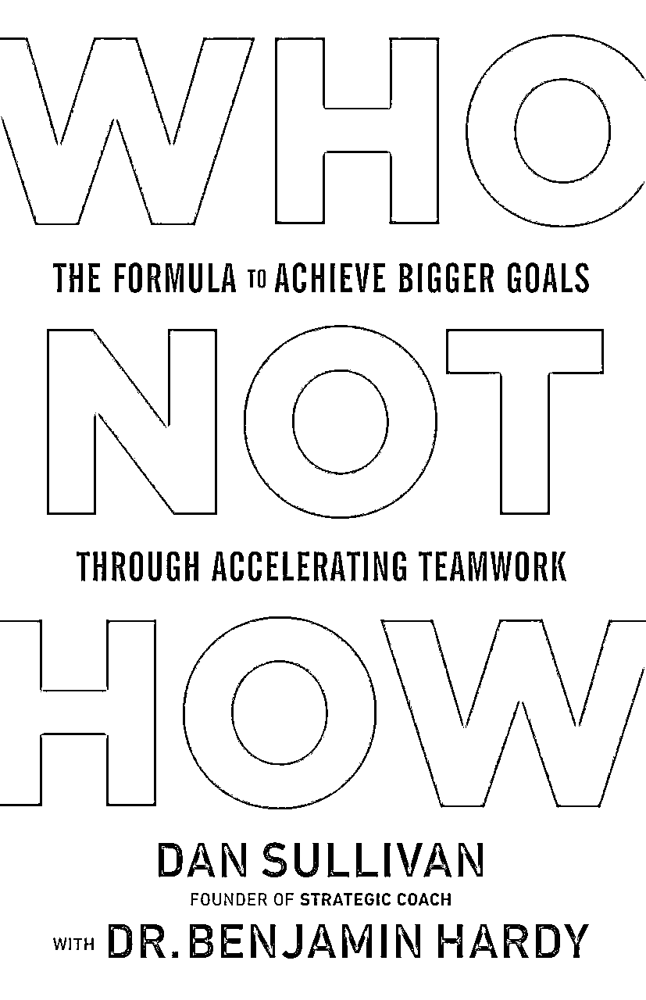

b.You need Whos, not Hows, to go 10x. 在追求 10 倍增长的路上，关键不在于“怎么做”，而在于选择合适的合作伙伴。（P95）

19.承诺

a.Nothing happens until after you commit. 在你承诺之前，什么都不会发生。 （P92）

20.大师、创新者、领导者

a.Every time you go 10x by letting go of a previous 80 percent and going all-in on a new, more expansive 20 percent, you become more of a master, innovator, and leader. Over time, with enough 10x jumps, you increasingly become the leader to other leaders, wherein you’re directly influencing fewer people but the overall impact and ripples of your influence spread exponentially. 每次你舍弃旧的 80%，全情投入到一个更开阔的新 20%领域，追求 10 倍的成长，你就更进一步成为领域内的权威、创新者和引领者。随着时间推移，经历了足够多的 10 倍增长后，你将逐渐成为其他领导者的领导者。这时你直接影响的人虽然变少，但你的影响力和带动作用却在指数级扩大。

## 关键金句

1.P60

a.Hard work leads to low returns. Insight and doing what we want leads to high returns. 辛苦劳作带来的是微薄的回报。而洞察力及追求内心真正渴望的则能带来丰厚的收益。

b.Strive for excellence in few things, rather than good performance in many. 与其在许多事物上达到中等水平，不如在少数几件事上追求卓越。

2.P63

a.Everything else they’re doing is noise. 他们所做的（除了 unless 条件之外的一切）都是噪音。

3.P64

a.Seemingly impossible or massive goals are highly practical because they immediately separate what works from what won’t, illuminating the few paths that have the greatest efficacy. 看似不可能或宏伟的目标其实非常实际，因为它们立即筛选出有效与无效的做法，明确了那些最有效的几条路径。

b.With a 2x goal, there are too many potential pathways to reach the desired destination. This creates paralysis-by-analysis and makes it extremely difficult to know where to focus your best energy and effort. 设定 2 倍增长的目标时，存在太多可能的途径来达成所期望的结果。这种情况会导致分析过度而无法行动，极大地增加了确定应投入最佳能量和努力的方向的难度。

4.P65

a.The goal determines the process. 目标决定过程。

b.The only way to make your present better, is by making your future bigger. 让你现在的生活变得更好的唯一方法，就是让你的未来更加伟大。

5.P66

a.Again, almost nothing will work for 10x, which is why it’s so useful. 再强调一次，几乎没有什么能为 10 倍增长服务，这正是它如此有价值的原因。

b.Shoot for the Moon. Even if you miss, you’ll land among the stars. 瞄准月球。即使你没有命中，你也会落在星星之间。

6.P67

a.10x separates the signal from the noise. 10 倍目标能从噪声中筛选出信号。

7.P69

a.Only by living with a 10x frame of reference do you become highly critical of everything you place your time and energy on. 只有当生活在 10 倍的参考框架下，你才会对投入你的时间和精力的每一件事变得极为挑剔。

b.You know that working more hours does not equate to better results, but on the contrary, working more hours usually means you’re grinding your wheels on not innovating your thinking enough. 你清楚，加班加点并不等同于更好的成果，反而，加班加点通常意味着你在思考上创新不够。

8.P74

a.This framework is the foundation of 10x or 2x thinking: in order to achieve 10x, you cannot rely on your past self’s thinking. 这就是 10 倍或 2 倍思维的基础：为了达到 10 倍增长，你不能依靠你过去的思维方式。

b.What got you here won’t get you there. 让你达到现状的那些东西，并不能帮你走的更远。

9.P76

a.10x people are easier than 2x people. 与 2 倍目标的人相比，10 倍目标的人更容易相处。

10.P78

a.Carson had nothing on his schedule. 卡森的日程表上空无一物。

11.P84

a.Higher quality, less quantity. 追求更高的质量而非数量。

12.P96

a.You need Whos, not Hows, to go 10x. 在追求 10 倍增长的路上，关键不在于“怎么做”，而在于选择合适的合作伙伴。

13.P107

a.Each 10x jump brings you closer to becoming world-class within that 20 percent. Then, leveraging the growth and freedoms you’ve now created, you make another seemingly impossible next jump. 每一次 10 倍的飞跃都让你离世界顶尖水平更近一步。接着，借助你创造的增长和自由的杠杆，你会勇敢实现下一个貌似不可达成的飞跃。

14.P111

a.You will learn to continually strip away your 80 percent and embrace higher and higher levels of personal freedom, wherein you become the most powerful version of yourself—your own Unique version of “The David.” 你将被引导学习不断去除那 80%的部分，并拥抱更高层次的个人自由。在这个过程中，你将变成最强大版本的你——你独一无二的“大卫”。

## 自测题

1.当前阶段，你内心深处渴望的 10X 大的愿望是什么？甚至你都不相信这是可以实现的，那是什么？

2.除非哪些条件满足了，你的 10X 的愿望才能实现啊？

3.你做得哪些极为少数的事、你和哪些极为少数的人一起工作，会让你获得巨大的兴奋？

## 部分难以理解的内容

### P63：unless 工具是如何使用的？

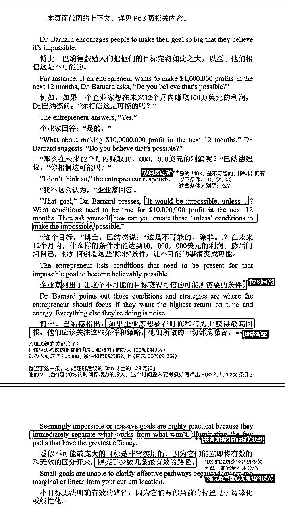

### P77：in or on bussiness

1.本章采用「系统思维」，也就是：「输入-系统-输出」来建构的讨论基调，提出振聋发聩的问题：「你把时间用在在系统内做事」还是「把时间用在调整系统，以支持不对称的输出（20%投入，输出 80%）」？这是一个极佳的算账策略，这个问题会持续激发我们思考，我们的时间、精力投入策略。只有有了这个前提，我们才有可能拥有动力去在后续停下现在的 80%的时间投入、甚至放弃一些金钱的收入，以节省精力去搭建增长系统。（P69-76）

# 2【第二章】告别 2 倍身份，提升做事标准

## 领读音频

视频资料：https://o2r4amaky8.feishu.cn/minutes/obcnyv58x833b931ia1r22dd

第二章是对 10X 思维方式的深入打开，整个 10X 思维的从内到外的关键要素被逐一介绍，并且形成了一套极为自洽的逻辑框架（当然，这个框架不是解释出来的，而是在作者 30 年实践中提炼出来的），这套框架不仅可以用来解释各种 10X 者（例如本章提到的基金经理管培生、Youtube 的 No1、原子习惯的作者的案例），更可以用来解释不同商业思想家的表达。

本章用「三个模块+一个总结」的方式，提供了以下重点内容，我将其整理成了一个框架结构。

1.本章第一节谈到的是浅蓝色、紫色、红色区域的关系，特别强调了承诺和标准的意义。

2.第二节开始聚集到确定「目标（浅蓝色右侧第二个）」，特别强调了指数级思维方式的价值，也给出了做到这种思维方式的方式。

3.第三节作者把整个流程串联在一起，让你获得对整个流程运转的全局认识！

有了本章内容，一个整体的 10X 框架就会呈现在你的面前，你也可以按图索骥地去对照自己哪个部分具备能力、哪个部分可能缺乏思考。我们分模块来看看这里都有什么：

第一个模块，P116-134：Shed Your 2x Identity and Relentlessly Raise Your Standards：摆脱你的 2X 自我形象，无情彻底地提升你的标准

4.本节通过一个名为「Chad」的基金管理人的过程，介绍了：悍守自己的标准、提升自己的标准，并且用自己的标准影响到用户的案例。

5.本节首先谈到了，如何通过在某个标准上获得专注和精通，书中的逻辑我为你整理了一张图片，尤其要理解：标准、承诺、专注之间的关系。

6.其次，书中又展示了「10X」增长所需要的整体逻辑，下图，红色的部分为「10X」增长所必须得东西，请你对照上下图示，可以更好地思考清楚。

7.本节的核心概念就是：更新自我形象（indentity）的必要要素：心理灵活度以及 4C 框架（下图是 4C 框架的应用，上图是 4C 和心理灵活度的应用）我也更新如下：

第二个模块，P135-147 Set Unreachable Goals and 10x the Quality of What You Do：设定难以触及的目标，让你的工作质量提升十倍！

第三个模块，P147-165：10x Often and Become the Best at What You Do：经常在你所做的事情上做到 10X，然后成为最好！

## 自主阅读

### 本章节的整体位置

### 自主阅读日期

### 自主阅读导引：本章节的整体结构

符号的需要更专注、更用心，摘抄笔记、反复理解的部分。

1.P116-134：Shed Your 2x Identity and Relentlessly Raise Your Standards：摆脱你的 2X 自我形象，无情彻底地提升你的标准

2.P135-147 Set Unreachable Goals and 10x the Quality of What You Do：设定难以触及的目标，让你的工作质量提升十倍！

3.P147-165：10x Often and Become the Best at What You Do：经常在你所做的事情上做到 10X，然后成为最好！

4.P166-167 Chapter Takeaways：本章要点总结

## 好问题引领生命方向，这些问题帮助你的阅读更聚焦！

1.P116-134：Shed Your 2x Identity and Relentlessly Raise Your Standards：摆脱你的 2X 自我形象，无情彻底地提升你的标准

a.一个人为什么会有自己的标准，并且坚守自己的标准？

b.有了标准和承诺，为什么会给自己带来精通？

c.在承诺与坚守标准的这个话题上，是如何和「更好的品质」发生关联的？

d.如何达成不可能实现的目标的？

e.什么时候应该坚守自己的标准，什么时候应该提高自己的标准？

f.你有自己所坚守的标准么？

g.什么事情中，你是没有标准的，总被别人带着人云亦云、随波逐流？

h.按照自己的标准去生活，为什么可以形成影响力和吸引力呢？

i.用自己的话说说，为什么「身份 indentity」会对人的行为有那么大的影响，甚至是决定性的影响呢？

j.什么情况下，你会快速接纳你的新身份？什么情况下，你不会？

k.回看你的过去，找到一件事来尝试着解释 4C 框架是有效的？

2.P135-147 Set Unreachable Goals and 10x the Quality of What You Do：在你做的事情上设定无法实现的目标和 10 倍的品质！

a.在设定一个不可能达成的目标的时候，你的内心中，什么最拉扯和干扰你自己？

b.在什么情况下，你会毫无意识地做一个「个人坚强主义者」，一定要把所有的事情都自己去做到，而不是让别人去做？

c.如果现在邀请你反思，某一个你不太喜欢的行为，并且找到这个行为背后的「indentity-自我形象」，你会看到一个怎样的人？你为什么要相信自己是这样的人？

d.在哪件事情上，你只有「表面的目标（例如做 XX 数量）」而没有实现这个目标的「目的」？为什么在这件事情上，你在没有目的的情况下，就随意给自己了一个目标呢？

e.你在哪件事情上，是在数量上持续重复，不断做多？而不是在品质上持续迭代？

f.日常你有思考的习惯么？你会在什么时候进行思考？思考的重点是 10X 的框架，还是应激的思考？

3.P147-165：10x Often and Become the Best at What You Do：经常在你所做的事情上做到 10X，然后成为最好的！

a.阅读 Clear 的成长故事，你会有哪些触动和启发？

b.如何打造真正属于自己的独特竞争优势，去展示自己的与众不同？

c.释放干扰的前提和关键有什么？

d.为什么团队成员愿意跟着一个只做某些特定事情的人一起工作，并愿意被他领导？

e.你在什么情况下，会深度工作，并且对品质不断打磨和迭代？

f.你自己是否有承诺的习惯？什么阻碍着你不相信自己的承诺？

g.你内心最深处的渴望中，是否包含着要成为一个「伟大的人」？如果现在让你就是决心成为「伟大的人」你会有怎样的感受？除非消除了哪些条件，你才会相信自己会成为一个「伟大的人」？

h.对照领读内容提供的十倍的整个过程，再对照本节，理解 10X 的整体框架。

## 关键金句

P116：

P119

P120

P121

P122

P123

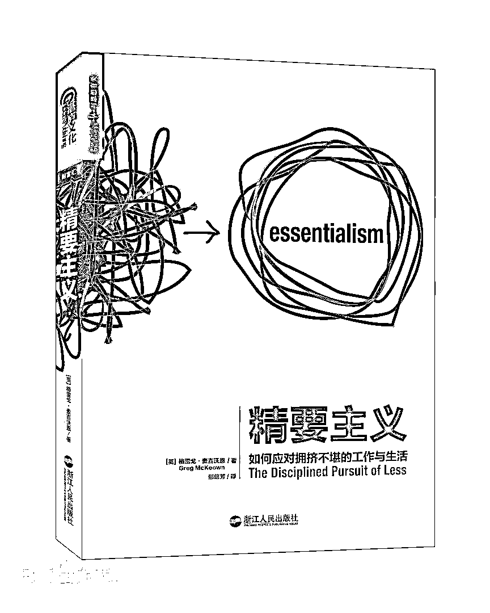

P126

P129

P135

P139

P140

P144

P146

P147

P148

P153

153

157

159

165

## 自测题

1.阅读本章，总结一下，制定标准并承诺做到这份标准的价值是什么？

2.给自己设置一种怎样的品质标准，可以帮助自己放大影响力和吸引力？

3.用自己的话说说看，「身份 indentity」为什么对人的行为起到决定性作用？

4.你内心真正渴望实现的是什么，如果设置一个 10X 不可能达成的目标，你会有什么感受？

5.用自己的话，描述一下 10X 框架从内到外的全过程，主要都包含哪些环节？

6.你内心最深处的渴望中，是否包含着要成为一个「伟大的人」？如果现在让你就是决心成为「伟大的人」你会有怎样的感受？除非消除了哪些条件，你才会相信自己会成为一个「伟大的人」？

## 辅助资料

### Seth Godin 赛斯高汀的书籍

Seth Godin 是一位著名的作者、企业家和演讲家，他的作品主要集中在营销、创新和改变思维方式上。以下是他的一些重要书籍和著名演讲的列表，包含名称、表达的重点和发表年份：

# 3【第三章】匮乏思维与丰富思维

## 领读音频

领读音视频：https://o2r4amaky8.feishu.cn/minutes/obcn2m8hwzov8o8gk7398ref

第三章是对第二章（整体框架）中最关键步骤的整体展开

整个章节都是围绕着 10 倍的源头——「你 You」来展开的！

这个部分对于很多人来说，都是会有一些些体会，但是很难说清楚它究竟是什么，甚至你会感受到这一章怎么说的很玄学、或者像一些大道理、鸡汤文，有什么用么？

对于很多人来说，内在探索是在「而立」之后，也就是：「我拥有了我自己的独立的价值判断」开始的。

而了解自己的内在过程是一场漫长的旅程，一直要到「不惑」，也就是「我对于我是谁、我要什么、我要如何活不在迷惑、困惑和受到诱惑」才是这场内在探索之旅的结束标志。

你看，孔子三十而立、四十不惑，用了十年，他是圣人都要用这么久，我们可能对这个话题不太理解、难以弄清楚也就再正常不过了。

不过，这一章还是给出了一个非常值得参考的路线图，帮助你去更好深入理解「You」是什么，以及它是怎么在 10X 中发挥作用的？

可以说，本书把关于「You」的关键要点都整理清楚了，这也是为什么本书很少提及外部环境中如何用 10X，只是谈内在如何做到 10X，依然被很多商业大佬推荐的原因。就是因为他们经历过这个历程，他们知道这本书把这些内容说清楚了。

本章从引言到要点整理共五个部分。

1.引言谈到了一个转折点：从 Dan 博士 79 年时候的破产离婚经历，他用了四个月的时间恢复，并且开始书写自己的渴望和期盼，引出了渴望/期盼（Want）和需要（Need）的不同。并在这里埋下了一个概念：独特的你（Unique Abiltiy）（我跟喜欢把这个能力称为：把自己的独特性活出来的能力）

2.本章的第一节让你摆脱匮乏的需要（Need），转而去拥抱丰盈的期盼（Want），并充分展开讨论了背后的原因：

a.第一个原因是 want 是关于创造的，创造是无穷无尽的、没有匮乏的，这个部分阅读起来的难度比较大，因为作者用了两层嵌套的方式来解释的。第一层讲解财富和金钱的关系，在这份关系中，又深入到了财富的本质去讲解，因此，很多人感受到了极大的困惑。

b.关于第一个原因，就来到了 10X 的最深层！它把 10X 真正的内涵给说清楚了，详见：179

c.第二个原因是 want 不需要任何解释、合理化、证明，这个部分的内容比较容易理解。

3.本章的第二节用美国最优秀的滑板运动员的故事，讲述了一个非常关键的能力——Unique Ability，并且不断要求你去清晰、定义你自己的独特性和独特能力。

a.独特能力在书中被定义为你最纯净、最诚实的自我表达，反过来说，越是充分自我表达，你越是刻意看到自己的独特能力。

b.在使用独特能力创造独特和专业价值及财富的方面，没有任何人可以跟你竞争，而你的独特能力也就是你独特的愿景和目的，也就是背后的质！

c.独特能力如何不断精通和掌握？就是去寻找独特能力的成功要素，并且在这个要素上不断迭代！

d.本节还谈到了发展你的独特性的四种方式：诚实、扩展视野、定义成功后的行为特征、澄清 20%、放下 80%

e.你需要承诺和勇气去实现改变！

4.本章的第三节谈了一种帮助你体会到这种不需要解释、不需要证明、我只是奔着我想要的东西去追求的方法——BuyerMindset，购买者思维方式。

a.本章是作者给我们提供的可借鉴的方法，借鉴——如何挑剔地坚守自己的标准——的一种相似性感觉

b.无论你在什么时候，你都可以调动出这种感受，就当这是自己在买东西，这是一种丰盈感

c.作者建议你更换你的社交关系，慢慢地把自己的关系都更新成买家联合的关系，这样每个人都没有压力，都诚实、都追求自己的想要、就没有任何内耗的感受了。

## 自主阅读

### 本章节的整体位置

### 自主阅读日期

### 自主阅读导引：本章节的整体结构

符号的需要更专注、更用心，摘抄笔记、反复理解的部分。

1.168-171：Get Exactly What You Want, Experience Radical Freedom, and Realize Your Unique Ability

2.171-193：Escape the Scarcity of Needing and Embrace the Abundance of Wanting

3.193-215：Clarify and Define Your Unique Ability

4.215-222：Create Transformational Relationships Where All Parties Are “The Buyer”

5.223-227： Chapter Takeaways：本章要点总结

## 好问题引领生命方向，这些问题帮助你的阅读更聚焦！

1.168-171：Get Exactly What You Want, Experience Radical Freedom, and Realize Your Unique Ability

a.通常，我们会因为什么原因，而不去拥抱或者完全拥有自己渴望的人生，反而做着「不得已」的事情？

b.Need 和 Want 在哪些层面有所不同？具体不同在哪里？

c.老子说：「为学日益、为道日损」，为道日损就是把「不是大卫雕像的部分给雕刻掉」，也就是书中说的「Unique Ability」表达的是一个「人」的独特性，你的独特性（而不是你的独特的竞争优势）是什么？

2.171-193：Escape the Scarcity of Needing and Embrace the Abundance of Wanting

a.你日常会习惯性地给别人解释你为什么要要一个东西么？并且，你还担心对方不理解、不认同、不支持你吗？

b.为什么人们很难理解「纯粹的渴望、期盼」的这种世界呢？

c.如果别人问你为什么要做这件事，你要如何解释？

d.为什么，人们会假设这个世界是稀缺的呢？

e.你是如何区分财富和金钱的呢？

f.如果让你解释一下：自由、need、want、wealth、value、money 之间的关系，你是如何思考的？

g.10X 究竟是什么？它是怎么把上述的概念串联在一起的？

h.needer 和 wanter 的明显区别是什么？

i.问问你的内心，在你的内心深处，你真正想要的是什么？

3.193-215：Clarify and Define Your Unique Ability

a.从 P-Rod 的故事中，你最有触动的点是什么？

b.你是如何理解独特能力（Unique Ability） 的？它和 10x 的关系是什么？

c.你的独特能力是什么？

a.请回答书中给到的帮助你「发展出独特能力」澄清问题：

a.你的独特能力是什么?

b.你能为他人提供的独特价值是什么，而其他人却无法做到

c.最让你兴奋的 10 倍突破是什么，这需要你全力以赴地发挥你的独特能力?

d.对于你来说，最重要的 20%是什么？

e.对于你来说，不重要的 80%是什么？

d.回顾下你日常的时间安排，你有多少时间投入到你定义的独特能力之上的？你对此满意吗？如果不满意，你准备如何做出改变？

4.215-222：Create Transformational Relationships Where All Parties Are “The Buyer”

a.你如何理解买家思维（buyer）和卖家思维（seller）？二者的区别是什么？

b.很多情况下，我们经常会认为我们不可能做到买家思维，但为什么作者还是说「你要想 10 x，你必须是买家思维 」？

c.日常工作生活中，你经常处于买家思维（buyer）还是卖家思维（seller）？为什么？

d.你认为什么是变革型关系（transformational relationships ）？它跟买家思维（buyer）和卖家思维（seller）的关系是什么？

e.回顾你最常沟通的 5 个人，你跟他们的关系是否是变革型关系？如果不是，你选择做些什么，能让你们的关系向变革型关系更近一步？

## 关键金句

P168

P169

P170

P171

P172

P173

P174

P177

P181

P193

P198

P199

P200

P204

P208

P210

P213

P216

P217

P218

P219

P220

P222

## 自测题

1.你的独特能力是什么？

2.你准备如何做到 buyer（买家思维），去创造 transformative relationship（变革型关系）？

# 4【第四章】回顾你过往的 10 倍成就

## 领读音频

音视频内容：https://o2r4amaky8.feishu.cn/minutes/obcn5e633nn212m3425hz5r8

本书的写作真的是层层递进，前三章完成了关于整体理念的讲述，后续就开始邀请你去实践，接下来的三章实践方式是由内而外的：第四章讲内在的关系、第五章谈时间调整、第六章谈自主工作团队事宜。

那我们来看本章，本章提出了本书实践中最重要的心智模式：Gap&Gain，这个点整体串联起了前面的所有要点，接下来作者从面向过去和面向未来的两个方向提出了他认为非常有效的解决方案。面向过去的方案是：回顾过去的 10X 找到自己的独特性；面向未来的方案是：多个工具的组合使用。

我们一起来看看本章。

本章的第一部分名叫：The Gap & The Gain（疑无路&又一村）

本章的第二部分是帮助你找寻你的独特优势、独特价值的方法。

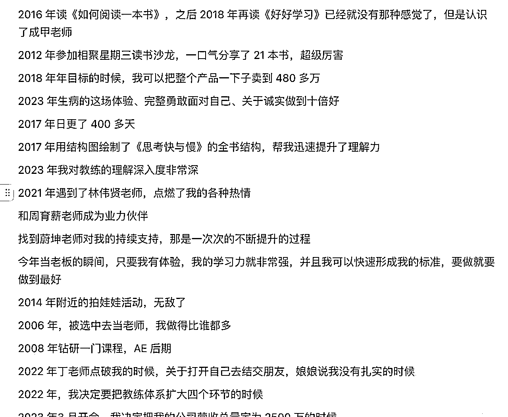

本章节的最后一部分，作者提供了两种全新的工具，并且把这些工具组合在一起发挥作用的方法。

## 自主阅读

### 本章节的整体位置

### 自主阅读日期

### 自主阅读导引：本章节的整体结构

符号的需要更专注、更用心，摘抄笔记、反复理解的部分。

1.P229-235: You’ve Done It Before and You’ll Do It Again：你曾做到过，你将再次做到

2.P235-252: The Gap and The Gain：疑无路和又一村

3.P252-263：You’ve Gone 10x Before: Review Your 10x Jumps and the “20 Percent” of Those Jumps 你曾经实现过 10X：回顾你的 10X 跳跃并且找到这些跳跃中的 20%

4.P263-P276: Define Your “Fitness Function”—You Become What You Focus On：定义你的适应度函数——你关注什么，你就成为什么

5.P276-P284: Define Your “Dream Check”：定义你的“梦想支票”

6.P284-P288: Chapter Takeaways：本章要点总结

## 好问题引领生命方向，这些问题帮助你的阅读更聚焦！

1.P229-235：You’ve Done It Before and You’ll Do It Again：你曾做到过，你将再次做到

a.如果我要持续追求我渴望的自由，我必须要做到的内在转变有什么？

2.P235-252 The Gap and The Gain：疑无路和又一村

a.你会不会出现明明取得了很大的进步，但是却会贬低自己的进步和价值的情况？

b.用自己的话解释一下什么叫 Gap，什么叫 Gain 思维

c.Gap 思维的典型特征是什么？

d.你现在在哪一件事情上，比较典型地出现了 Gap 的思维方式？

e.理想化可以帮助自己设定目标，为什么有目标的人还会掉入 Gap 思维？

f.Gap 思维方式之所以会出现的根本原因是什么？它跟 Needer 之间有什么关系？

g.你见到谁，在合理化自己的 Gap 思维呢？

h.Gap 和 Gain 的思维方式之间的的对比是怎样的呢？

i.不断让自己活在 Gain 上的方式是什么？

j.尝试着在一件自己失败、不满、挫折的事情上思考自己收获了什么，你会有什么体会？

k.Gain 的思维方式是如何助力到 10X 的呢？

l.Gain 和每次放手 80%之间是一种什么样的关系呢？

3.P252-263：You’ve Gone 10x Before: Review Your 10x Jumps and the “20 Percent” of Those Jumps：你曾经实现过 10X，回顾你的 10X 跳跃并且找到这些跳跃中的 20%

a.回顾过往去看到曾经的 10X 转变的时候，为什么当你做出承诺去转变自己，10X 就会发生，承诺和 10X 之间是什么关系？

b.你过往实现的 10x 转变有哪些？

a.书中给出的澄清方法：

a.找出你过去生命中的 5 次 10 倍突破

b.将每次 10x 突破命名，并标注时间

c.澄清你每一次 10 倍突破中重要的 20%，以及你放弃的不重要的 80%

d.思考每次 10x 突破的 20%，是如何帮助你进一 步发展你的独特能力的

4.P263-P276:Define Your “Fitness Function”—You Become What You Focus On：定义你的适应度函数——你关注什么，你就成为什么

a.你是如何理解适应度函数（fitness function）这个概念的？作者提出这个概念的目的是什么？

b.你是如何理解「你将要做的最可怕和最勇敢的事情就是做自己」这句话？

c.你的适应度函数是什么？

a.请参考书中给出的问题

a.What are you optimizing for? 你在优化什么?

b.What do you ultimately want to be and do 你最终想成为什么，想做什么

c.What standards do you want to create and realize 你想设定和达成什么样的标准

d.What minimum standards—such as the level of client you work with or time it takes to run a marathon—will help you adapt and evolve to where you want to be? 什么样的最低标准--比如你选择合作的客户级别或完成马拉松所需的时间——将帮助你适应和发展到你想要的地方?

e.What is your fitness function—the capabilities and results you want to be able to produce and master? 什么是你的适应度函数——你希望拥有哪些技能和成就？

5.P276-P286:Define Your “Dream Check” 定义你的“梦想支票”

a.你认为什么是好的钱（good money）？什么是坏的钱（bad money）？

b.你曾经的收入之中，有哪一笔是额度大，且让你在做事情过程中持续有兴奋感的？是什么让你兴奋？

c.从作者自身出书的故事中，你有什么启发或收获？

d.你的梦想支票是什么？

a.请参考书中给出的问题

a.你的梦想支票数额是多少？

b.What specific value would I need to provide such that my Dream Check would be a no-brainer and extreme bargain for the person who would happily pay me? 我需要提供哪些具体价值，使得我的梦想支票对愿意支付的人来说，显得毫不费力且极其超值？

c.What would need to be true of my Unique Ability to be valuable enough that someone would see it as a no-brainer and extreme bargain to write and pay me my Dream Check? 我的特殊技能需要达到何种水平，才会被认为足够宝贵，使得人们认为支付我这份梦想支票理所当然且极具吸引力？

## 关键金句

P229

P232

P235

P237

P238

P240

P241

P244

P245

P248

P250

P253

P254

P259

P260

P264

P266

P267

P268

P269

P272

P274

P279

P283

1.What specific value would I need to provide such that my Dream Check would be a no-brainer and extreme bargain for the person who would happily pay me? 我需要提供哪些具体价值，使得我的梦想支票对愿意支付的人来说，显得毫不费力且极其超值？

2.What would need to be true of my Unique Ability to be valuable enough that someone would see it as a no-brainer and extreme bargain to write and pay me my Dream Check? 我的特殊技能需要达到何种水平，才会被认为足够宝贵，使得人们认为支付我这份梦想支票理所当然且极具吸引力？

## 自测题

1.通过对你过往 10X 的梳理，你对自己有什么新的认识？

2.对你重要的 20%的事情是什么？

3.你的梦想支票（dream check）是多少？

# 5【第五章】10 倍思维下的时间管理

## 领读音频

领读音视频：https://o2r4amaky8.feishu.cn/minutes/obcn7446pi9265me536bcg82

我们来到了应用部分的第二个环节，也就是本书的第五章——全新的时间运用模式。

回想到我第一次阅读本书的时候，这一章节让我知道我该「如何做」了，并且它一下子帮我放松下来，开始愿意去尝试着：放下一种特殊的 indentiy——疲惫&全力投入，尝试着把自己每周的工作时间里硬生生地砍掉 2 天，尝试着去重新设定我的时间，转变了我 24 年熬夜晚睡的习惯……

这一章，是最容易下手的一章，阅读难度也并不是太高，我简单为你介绍一下本章核心内容。

本章为你介绍了四个核心理念：

1.心智模式：心智模式也是一种内在的自我认同，书中起名叫：indentity，在第二章的时候展开说过，不知道你是否还记得（用 4C 来重建你的 indentity）

a.本节提到了一种我们常见的心智模式——以持续投入到并不热爱的工作中，体会令人窒息的必备感，并以此为骄傲的心智模式

b.要停下所有的疲劳，开启无用之用，让自己生命体验变得丰富，而不是一味地把时间用完（在十几个小时里把事情做完）

2.时间使用模式：时间是我们可以掌控的极为重要的资源，如何利用时间就会产生怎样的结果。我们跳出时间来看，你会发现在「时间使用」上也是有模式的，书中指出不同的时间使用模式：

a.工业时代的时间模式是「每天八小时，把八小时塞满各种任务和努力」的只关注投入量和具体结果的模式，这种模式的特征是：要生产的结果是确定的、投入的时间量是确定的，剩下就是考虑你的机械动作能力啦。这种状态很像流水线工人的工作模式，这是一种绝对的、固定的、线性的、客观存在的时间观，很机械的时间观。书中把这种时间观称为：Chronos（克洛诺斯，你可以把它理解为忙碌的计时器）

b.而书中更加强调的是一种「以人为本」的时间观念，它的标准不再以外部计件、计量为依据，而是来到了一个人的体验上，更加主观、关注时间使用的品质、非线性、灵活而非固定的时间观，在不同场景、不同视角下，时间的体验和框架都会有所变化。之所以有这样的变化，就是因为在这个时代里，人是用来创新、创造、用自己的内在本质来创造结果的。这种以知识工作为典型工作特征的时代下，时间的使用模式必须要改变。 因为要以人为本，因此，更重视时间使用时人的心流体验、愉悦状态以及最终实现的转变——把内心的 Quality 转化成有品质的结果！书中把这种时间观称为：Kairos（凯洛斯）

3.Kairos 的含义主要包括：

a.适当的时机、时机成熟，强调在恰当的时间做出决策或行动的重要性

b.它是关注内在本「质」的，这个概念相信「质」是一种恒久的属性

c.使用这种时间，可以真正体会到「我」，感受到「我」或者的时间，越是体会到「我」，越是体会到更多长长的呼气、共同的笑声、多彩 的日落、勇敢的时刻，而不是一个流淌着的时间来衡量

d.你越是把「我」活出来，你越脱离了头脑认为的线性关系，而是在每个时间都可以把自己的「质」给活出来，你就更拥有整体性、灵活性，每个时刻你都在创造价值，价值生产效率也大幅度提升了！

e.你越是沉浸，越是能够进入到流动状态、获得巅峰体验，感受到敬畏、自我扩张和意义感。

f.每个时刻都能够感受到「我」，这就是 Kairos 所揭示的重要意义！

4.Dan 博士提供了三种时间划分的方式：FreeDay（用来恢复、毫无约束的状态下去体验自我的、以及去享受无用之用的）、BuffDay（用来给自己的卓越表现增加 Buff 的，也是一些持续投入的训练日）、FocusDay（用来产生独特绩效表现的时间）。这三种时间的安排，Dan 博士也提供了借鉴和参考，很值得我们去尝试着做做看。

这些概念表达之后，Dan 博士提供了关于三种时间的使用方式，他用了三节的篇幅讲述了 FreeDay 的意义，只用了一篇来讲 Buff&FocusDay，通过篇幅的安排，你就知道作者主动的重点是什么！

我们重点来看 FreeDay：

5.FreeDay 的首要作用，就是要让「我」的基础机能恢复到非常满电的状态。创业者经常会陷入到「以竭尽全力为荣」的思维惯性中，身体已经开始连续报警（头疼、肩背疼、胃病、心脏疼、腰椎疼）依然不管不顾，甚至出现一些小的问题，要使劲儿给拖到变成慢性病或者难以承受再去处理。和情感账户一样，如果身体都报警了，已经说明它足够亏空了，必须要先恢复它。读完本书之后，我就开启了「睡饱饱」的实践，每天最重要的事情就是睡饱饱，22:30 睡、睡足 7.5 小时、深度睡眠 2 小时以上，不断改进和调整睡眠，甚至为我开辟了全新的业务空间（这就是 Kaios 时间~）

6.FreeDay 对于决策者来说，你的一个思考决策出错，就可能把自己、团队、全公司、价值网全部拖到坑里。你会发现，最重要的杠杆不是努力，而是你的一份重要思考，如果你的思考出了问题，可能要用十倍、几十倍的时间来补这个坑。所以，你必须要用 FreeDay 来让自己有时间休整、有时间和自己在一起去聆听内心的声音、有时间去认真感知各个要素之间的运行关系，你才有可能把自己的本质用更好的创新方式链接到结果产出上！

7.FreeDay 还是一种让自己不在场、让团队发挥作用的一种很有效的时间。2022 年初，我因为确诊新冠肺炎连续发烧 21 天，在这 21 天的时间里，团队激发出了巨大的生产力，比我在场要好太多。有的时候，创始人越干预，越不支持发展出自主工作团队，也就制约了整体发展效能，尤其是无法把你解脱出来搞定 10X 增长的各种转变。

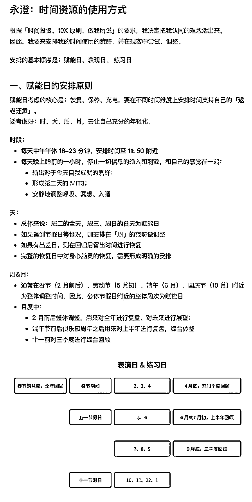

最后来看看 Buff&Focus Day：

本章体现了非常落地的改变方式——时间转变，无论如何，先从睡觉开始做起吧！

## 自主阅读

### 本章节的整体位置

### 自主阅读日期

### 自主阅读导引：本章节的整体结构

符号的需要更专注、更用心，摘抄笔记、反复理解的部分。

1.P290-294：Escape Factory Time and Open Your Schedule for “Kairos” Flow, Fun, and Transformation ，逃离工厂时间模式，为你的时间表安排 Kairos 式的流动、愉悦和转化的时间

2.P295-301：Become a 10x Performer: Free Days, Focus Days, Buffer Days：用三种特殊的时间组合成为一个 10 倍绩效产出者

3.P302-305：Free Days Part 1: Make Recovery Your First Priority：把恢复做为第一要务

4.P306-311：Free Days Part 2: Higher Stakes Means You Need More Space ：越是更高杠杆越需要更大空间

5.P312-314：Free Days Part 3: Your Team Can’t Grow and Evolve Unless They Manage Themselves ：除非你让团队自我管理，否则他们无法成长

6.P314-325：Focus Days and Buffer Days: How to Structure Your Day for 10x Transformation and Results 如何组织你的一天去实现十倍的转变和结果

7.P326-328：Chapter Takeaways：本章要点总结

## 好问题引领生命方向，这些问题帮助你的阅读更聚焦！

1.P290-294：Escape Factory Time and Open Your Schedule for “Kairos” Flow, Fun, and Transformation ，逃离工厂时间模式，为你的时间表安排 Kairos 式的流动、愉悦和转化的时间

a.你如何理解克罗诺斯 （Chronos）和凯诺斯（Kairos）这两种不同的时间？

b.读完这部分，你对时间和时间管理有什么新的认识？

2.P295-301：Become a 10x Performer: Free Days, Focus Days, Buffer Days：用三种特殊的时间组合成为一个 10 倍绩效产出者

a.你如何理解 Free day、Focus Day、Buffer Day？为什么要做这样的区分？

b.这三种不同的时间跟前面的凯诺斯（Kairos）有什么关系？

3.P302-305：Free Days Part 1: Make Recovery Your First Priority：把恢复做为第一要务

a.你之前是如何让自己休息和放松的？

b.为什么作者认为要想 10x，需要把休息和恢复作为第一要务？

c.这会给你带来什么改变？

4.P306-311：Free Days Part 2: Higher Stakes Means You Need More Space ：越是更高杠杆越需要更大空间

a.你平时的时间安排是忙碌的 2x，还是有更多空间的 10x 时间安排？

b.你如何理解作者提到的 Explore（探索）和 Exploit（利用）两个概念？

5.P312-314：Free Days Part 3: Your Team Can’t Grow and Evolve Unless They Manage Themselves ：除非你让团队自我管理，否则他们无法成长

a.你平时是如何管理团队的？

b.你是如何看待「自管理团队」这个理念的？

6.P314-325：Focus Days and Buffer Days: How to Structure Your Day for 10x Transformation and Results 如何组织你的一天去实现十倍的转变和结果

a.你如何理解聚焦日（Focus Day）和缓冲日（Buffe Day）的？

b.你当前都是如何安排你的时间的？

c.在此部分中，关于作者给出的时间安排建议，你觉得最有启发的是什么？

d.你准备如何调整自己的时间安排？

## 关键金句

P290

P292

P293

P299

P301

P304

P305

P307

P308

P309

P311

P312

P313

P315

P319

P321

P324

# 6【第六章】打造自行运转的公司

## 领读音频

https://o2r4amaky8.feishu.cn/minutes/obcn9is83v5u27c95of744v6

我们来到了本书的最后一章，也是应用部分的第三章，我们谈到本书的应用是从内到外的过程，第四章谈内在的转变、第五章谈时间转变、第六章谈不同层级的领导者的特征。

本章从一个名为苏珊的职业经理人加入一家保险公司的故事开始的。这个故事很像一本名为《团队协作的五项障碍》的故事原型，这个故事讲述的核心是，如果想要成为一个变革式领导者的基本逻辑「稳定-优化-成长-转变」。然后书中又提到把这种循环过程应用到四个不同的阶段，以展现变革式领导者的成长路径。

我们也根据书中所罗列的变革式领导者的发展路线图来一起看看本章的主要内容吧！

首先，是从 L1 到 L2，从一个非常努力的「一个人就是一个团队」，转变到一个应用「Who not how」的领导者

其次，是从 L2 到 L3，从简单地使用 Who 的策略转变到领导一个「自我管理」的团队。

最后，书中谈到 L3 到 L4 的转型，也就是让整个团队都是不断自我发展 Unique Ability 的团队，每个人都是独特的 Buyer，一群 Buyer 在一起共同努力前行！

## 自主阅读

## 本章节的整体位置

### 自主阅读日期

### 自主阅读导引：本章节的整体结构

符号的需要更专注、更用心，摘抄笔记、反复理解的部分。

1.P329-340：Evolve from Micromanager to Transformational Leader 从微观管理者到变革型领导者

2.P340-368：Level 1 to Level 2 Entrepreneurship: From Rugged Individual to Leader Applying Who Not How L1 到 L2：从坚强的个体到使用「Who not how」策略的领导者

3.P369-378：Level 2 to Level 3 Entrepreneurship: From Leader Applying Who Not How to Self-Managing Company L2 到 L3：从应用「Who not how」的领导者到发展出自我管理的公司

4.P378-387：Level 3 to Level 4 Entrepreneurship: From Self-Managing Company to Self-Expanding Unique Ability Teamwork L3 到 L4: 从自管理公司到自我拓展的独特能力团队

5.P388-391：Chapter Takeaways

## 好问题引领生命方向，这些问题帮助你的阅读更聚焦！

1.P329-340：Evolve from Micromanager to Transformational Leader 从微观管理者到变革型领导者

a.从苏珊和加内特的故事中，你最大的启发是什么？

b.你判断自己属于处于哪一层级的企业家？为什么？

2.P340-368：Level 1 to Level 2 Entrepreneurship: From Rugged Individual to Leader Applying Who Not How L1 到 L2：从坚强的个体到使用「Who not how」策略的领导者

a.蒂姆的故事给你带来什么启发？对于你当前的业务是否有帮助？

b.你如何理解何谓变革型领导者？

c.要成为变革型领导者，你准备怎么做？

d.关于「Who Not How」，你的理解是什么？如果你应用，你准备如何开始？

3.P369-378：Level 2 to Level 3 Entrepreneurship: From Leader Applying Who Not How to Self-Managing Company L2 到 L3：从应用「Who not how」的领导者到发展出自我管理的公司

a.你认为什么是自管理公司？

b.要打造这样的自管理公司，需要满足哪些条件或要素？

c.你是否准备打造这样的自管理公司？如果是，你准备如何开始？如果不是，你觉得你的挑战或顾虑有哪些？

d.请回答书中的问题：

Are you a rugged individualist or are you a leader applying Who Not How?

你是一个坚强的个人主义者还是一个应用谁而不是如何的领导 者?

Let’s be real: Are you a true leader or are you still a bottleneck manager?

让我们真实的一点:你是一个真正的领导者，还是一个瓶颈管 理者?

Do you trust your Whos or do you only trust yourself? 你相信你的 Who 还是只相信你自己?

Can you imagine what it would be and feel like to have a Self- Managing Company, where you’ve freed yourself up to explore, expand, innovate, learn, and create?

你能想象拥有一个自我管理的公司会是什么样的感觉吗?在那 里，你可以解放自己去探索、扩展、创新、学习和创造?

Are you ready to become a transformational leader 你准备好成为一名变革型领导者了吗?

4.P378-387：Level 3 to Level 4 Entrepreneurship: From Self-Managing Company to Self-Expanding Unique Ability Teamwork L3 到 L4: 从自管理公司到自我拓展的独特能力团队

a.自我拓展的独特能力团队是什么？它与自管理公司有什么不同？

b.如果要打造这样的一直团队，你需要做什么？

c.打造这样的团队，你需要承担的风险是什么？你是否愿意承担？

d.请回答书中的问题

Do you take your Unique Ability seriously enough to free yourself from the 80 percent?

你是否认真对待你的独特能力，让自己从 80%的能力中解脱出 来?

Do you lead by example and create a culture of freedom where those on your team are given permission to take their Unique Ability seriously as well?

你是否以身作则，创造了一种自由的文化，让你的团队成员也 被允许认真对待他们的独特能力?

Does your self-managing team have the confidence to go all-in on their Unique Ability, honing their own roles and bringing on additional Whos to handle their former 80 percent?

你的自我管理团队是否有信心全力发挥他们的独特能力，磨练 他们自己的角色，并带来额外的 Who 来处理他们以前的 80%?

## 关键金句

P333

P334

P335

P337

P338

1.Level 1 to Level 2 Entrepreneurship: Level one entrepreneurship is being a rugged individual who either does everything themselves or micromanages the few Whos they have. Level two entrepreneurship is where you evolve beyond How-focused rugged individualism to Who-focused leadership, applying Who Not How in all areas of your life and business. 从一级到二级的企业家:一级企业家是一个坚韧的个体，要么自己 做所有事情，要么过度管理少数的员工。二级企业家是指你超越了以 “如何”为重点的个体主义，转向以“谁”为重点的领导力，在生活和业 务的各个领域都应用“谁而不是如何”。

P339

P349

P352

P353

P360

P362

P363

P369

P370

P372

P382

P383

P384

