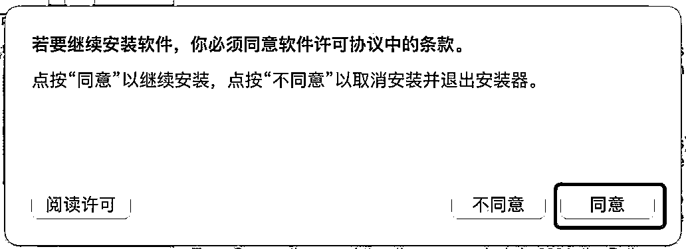
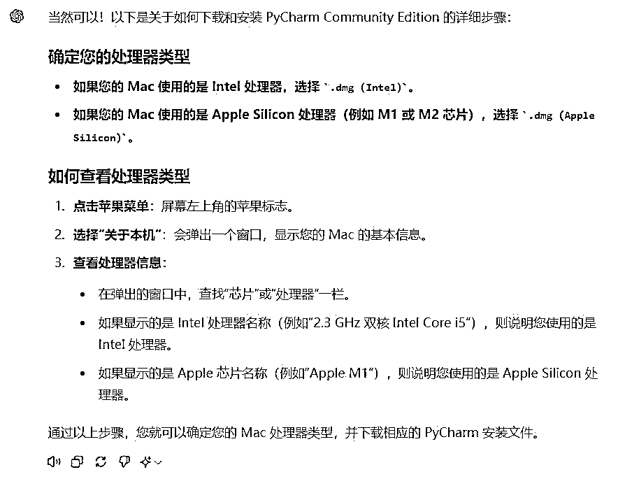
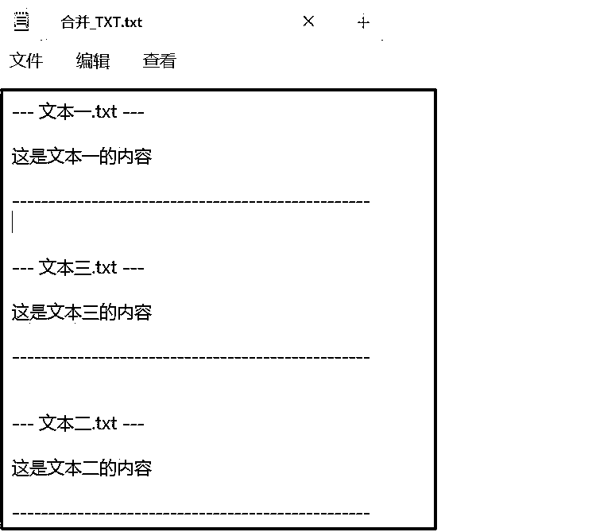
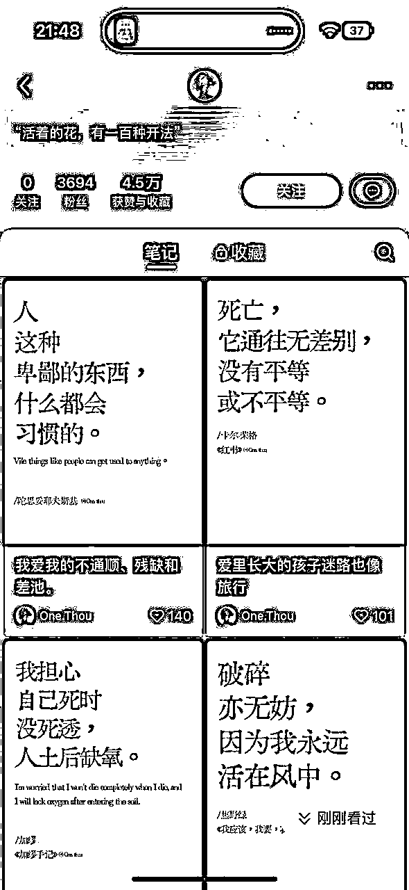
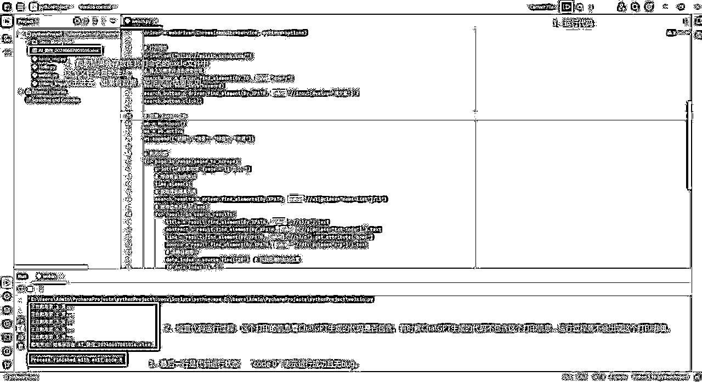
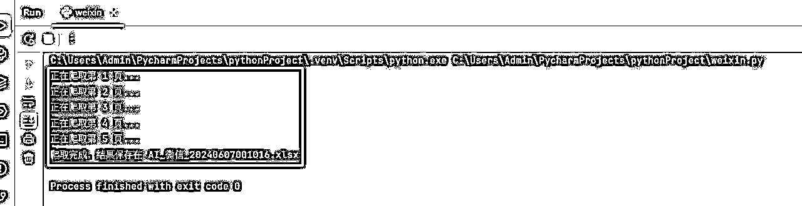

# 9 月航海 | 零基础 AI 编程做产品 | 实战手册

> 来源：[https://ocn93f5d9olj.feishu.cn/docx/KW7ud2dxwo2kAuxORRLcNGfenig](https://ocn93f5d9olj.feishu.cn/docx/KW7ud2dxwo2kAuxORRLcNGfenig)

# 防失联+MM188166M（李李）长期更新

手册出品方：生财有术团队

出品时间：2024 年 9 月 6 日

手册使用说明：本文旨在向你展示一个项目的更多可能性，帮助你更好地理解或实操。

建议：如果需要快速定位到精确内容，可以使用快捷键 Ctrl + F/Command + F 的形式，搜索「关键字/词」，查找你想要的内容。


# 写在前面

# 💡

欢迎大家来到 9 月航海 | 零基础 AI 编程做产品 | 实战手册，相信在接下来的日子里，我们将在这里见面很多次。

在开始学习之前，让我们先来解决几个问题：

1）什么是 AI 编程做产品？普通人为什么要学习编程？

AI 编程，顾名思义，就是借助 AI 学习编程。

在很多人眼里，觉得编程就是程序员的标配，觉得跟自己很遥远。主要自己又不干程序员，干嘛还要去学？

我们整个互联网，都是建立在一行一行的代码基础之上的。未来大量科技的落地应用，也都是建立在一行一行的代码逻辑之上的。

所以，编程，是我们更好认识这个互联网世界的钥匙。

但是编程技能往往门槛高，对很多小白来说很难， AI 的出现，恰好能大大降低我们学习的门槛。普通人借助 AI 可以快速上手写出代码并实现使用。

比如，我的一个 13 岁小学员，跟着我学 AI 编程，花了两三个小时，就在我的协助下配置出了 GPTS 智能体机器人。

2）本期航海的核心内容？

编程的内容非常庞大，即便借助 AI 我们也不可能在 21 天内成为编程高手。所以，首先我们希望能够借助 AI 帮忙大家理解编程语言，进而理解产品工具代码逻辑，掌握借助 AI 学习编程的方法，开启借助 AI 学习编程的第一步。

相对于之前6月份的航海，我们在这一期找到了比较实用的六个应用场景：网站应用、游戏应用、办公提效、数据分析、营销工具、网络爬虫。希望在 21 天内，能够教大家借助 AI 写出这六个应用场景的产品工具代码，并能正常运行代码并使用，真正带大家进入 AI 学习编程的世界。

3）AI 编程（爬虫） 可以赚钱吗？

AI 编程本身不是一个直接用于赚钱的工具，但它可以成为创造新服务和应用的基础，帮你更高效的做项目赚钱，或者帮你提供服务给目标用户从而赚到钱。

最后，希望大家可以在这次航行里收获成果外，结识一群战友。

另外，这个项目存在很多需要复制的提示词，可以点击这个链接进行复制👉9月航海｜AI 编程（爬虫）｜附件

以下内容由生财有术联合圈友制作而成，仅供航海船员以及生财有术星球圈友学习使用。


# 手册使用方式

在开始前，我们来简单了解一下这个手册的正确打开方式，方便你根据自己的情况来灵活使用。

在这里，手册整体的步骤顺序是按照从认识 AI（编程） 到应用 AI（编程） 再到借助 AI 理解编程理论进行的，你可以参考航线图，按顺序开始实操。也可以根据自己的实际需求选择性阅读。

需要注意的是：本次手册相较于过往航海，进行了较大的改版。之前的手册尽可能的展示更多可能的玩法供大家自由选择，本次改版后的手册，分为必修和选修两个大的章节：

必修篇内容：为学习 AI 编程的应用和理解代码基础语法，即航线图对应行动路径。如果你还在前期摸索中，想先跟着步骤熟悉掌握，那么建议从必修篇开始认真阅读和实操，不在玩法选择上做过多的纠结。

选修篇内容：则为借助 AI 学习编程的高级语法、更多编程应用 等相关内容。如果你已经掌握了 AI 编程 的爬虫应用和基础语法，想进一步了解它的更多可能，获得灵感，那么选修篇一定不要错过。

📌如果你还未接触过 AI 编程：

建议在正式实操前，先初步了解下这个产品，并且了解它的最新消息👇

✅【项目概况】了解 AI 编程项目

✅【项目实操1/8】AI 编程应用工具的准备

✅【项目实操2/8】借助 AI 掌握编程基础知识

📌如果你对 AI 编程已有大致的了解：

请开始按照航线图的步骤，完成技能学习，这个阶段你可以从手册的第二章开始阅读👇

✅【项目实操3/8】借助 AI 开发个人博客

✅【项目实操4/8】借助 AI 开发小游戏

✅【项目实操5/8】借助 AI 开发办公提效工具

✅【项目实操6/8】借助 AI 高效的数据分析

✅【项目实操7/8】借助 AI 开发文案转小红书图文笔记工具

✅【项目实操8/8】借助 AI 开发爬虫应用

📌如果你已掌握基本使用方法 ，想看到更多应用的可能性：

可以重点阅读以下章节，扩展更多玩法👇

✅ 借助 AI 理解 Python 高级语法

✅ 如何快速掌握更多编程的应用项目？

本航海项目的航线图如下：


# 必修篇

# 💡

章节概要

在这一章节，我们将从认识 AI 编程开始，一步步带你掌握使用它的方法。你可以根据本章的步骤内容进行实操，完成学习。

如果你是本项目新手，建议在正式实操前，先初步了解下项目全貌：

✅【项目概述】了解 AI 编程项目

如果你对项目整体有了大致了解，就可以按照项目核心步骤，开始学习实操：

✅【项目实操 1/8】AI 编程应用工具的准备

✅【项目实操 2/8】借助 AI 掌握编程基础知识

✅【项目实操 3/8】借助 AI 开发个人博客

✅【项目实操 4/8】借助 AI 开发小游戏

✅【项目实操 5/8】借助 AI 开发办公提效工具

✅【项目实操 6/8】借助 AI 高效的数据分析

✅【项目实操 7/8】借助 AI 开发文案转小红书图文笔记工具

✅【项目实操 8/8】借助 AI 开发爬虫应用

在必修篇，航线图和手册顺序相对应，你可以按照手册的顺序进行学习，即可逐一完成航线图的每一个任务。

在后续的每个关键步骤的章节概要中，我们也将提到相关航线图，提醒你完成相关步骤。

接下来就正式开始吧！

# 一、【项目概况】了解 AI 编程项目 @乔帮主

# 1.1 什么是 AI 编程项目？

AI 编程，顾名思义，就是借助 AI 学习编程。

在互联网数智化时代，掌握编程技能已经不是程序员的专属，而是我们普通人都要学习掌握的核心能力。

但编程技能往往门槛高，对很多小白来说很难，但 AI 的出现，恰好能很好降低我们学习的门槛。

而且，要想更加深入的使用 AI 、让 AI 为我们提效，编程技能又恰好能使我们更好理解互联网数字化世界，可以帮助我们更好地驱动 AI 。

所以，当编程和 AI，可谓是相辅相成，是当前这时代的王炸组合。

但是，编程的内容非常庞大，即便借助 AI 我们也不可能在 21 天内成为编程高手。所以，首先我们希望能够借助 AI 帮忙大家理解编程语言，进而理解产品工具代码逻辑，掌握借助 AI 学习编程的方法，开启借助 AI 学习编程的第一步。

其次我们找到了比较实用的六个应用场景：网站应用、游戏应用、办公提效、数据分析、营销工具、网络爬虫。希望在 21 天内，能够教大家借助 AI 写出这六个应用场景的产品工具代码，并能正常运行代码并使用，真正带大家进入 AI 学习编程的世界。


# 1.2 普通人为什么要学习编程？

在很多人眼里，觉得编程就是程序员的标配，觉得跟自己很遥远。主要自己又不干程序员，干嘛还要去学？

# 1.2.1 编程是掌握未来人工智能的必备语言

2022 年 11 月30日，ChatGPT-3.5一经推出，整个互联网就炸锅了。2 个月就注册了一亿用户，这是个什么夸张的速度。

但真正被誉为开启了人类第四次工业革命的历史时刻，是 2023 年 3 月推出的ChatGPT-4.0，从智能程度、技术创新、应用领域、社会影响力等维度，让我们互联网由信息化时代迈入了 AI 时代。

这时候，我们看到一个有意思的现象，不管你是什么学历、什么性别、什么行业、什么岗位，你都需要借助 AI 为工作生活提效。不用，意味着被淘汰。

这时我问大家一个问题，AI 作为一个互联网时代下的技术工具，如果你不懂技术底层逻辑，如果你对整个互联网世界都不理解，那你又能怎么深度用好 AI？

而我们整个互联网，都是建立在一行一行的代码基础之上的。最终我们科技的落地应用也都是建立在一行一行的代码逻辑之上的。

所以，编程，是我们更好地认识这个互联网世界的钥匙。

乔布斯曾在 1995 年访谈纪录片《乔布斯：遗失的访谈》中这样说过：“编程可以帮助我们完成工作，它没有明确的实用性。重要的是我们把它看作思考的镜子，学习如何思考。所有普通人都有必要学习编程，它可以教你如何思考，就像学法律一样，学法律的人未必都成为律师，但法律教你了一种非常有用的思考方式。”

以前互联网刚出来的时候，你会互联网，你懂互联网，只需要会登录 QQ、会打开网页、能找到电脑的重启键就行了。而现在，你懂互联网，也许只需要会 Word、Excel、PPT 等办公软件就行了。

但随着互联网的普及，随着科技的快速发展，如今 AI 绘画、ChatGPT 等技术如雨后春笋般出来。到未来，不仅仅只是有 ChatGPT 等人工智能技术，更有物联网、量子计算、元宇宙等。为了顺应潮流，为了不被时代所抛弃，你必须会更多。

人工智能和人工智障仅仅只是一线之差，学习编程，核心不仅仅只是掌握一个技能，更多是掌握底层的技术思维逻辑，让你有能力去驱动这些更强大的技术工具为你所用。要不然人工智能等技术在你面前，也许就成了人工智障了。

对很多普通人来说，学习编程不是为了成为一名程序员。随着社会和技术的快速发展，编程已经成为一种基本技能，就像阅读、写作和算术一样。

这也是编程，为什么已被逐步纳入到九年义务教育课程中。以前我们那时候互联网不发达，没系统学过编程，导致这方面能力缺失。

如今的小孩从小就开始学这方面课程了。我有个 13 岁的小学员，上次在线下指导了下他，他自己就把 GPTS智能体（根据自己的需求定制化的ChatGPT）给配置出来了。这动手能力，让我想着我 13 岁在哪里？在干些什么？

而且前段时间刚结束的高考，这次全国新高考Ⅰ卷的作文题目就与AI主题相关。如果你没学过编程，没用过AI，相信你面对AI主题的作文，应该会感觉很陌生，更是无从下笔了。如果学过我们AI编程的航海，高考作文那不得拿高分了。

而且现在越来越多家长开始重视孩子在AI编程方面的学习，这也是我这近一两年在市场上看到的真实情况，我很多学员都是妈妈带着子女来一起学习AI编程。

前两天我在朋友圈也在说，借助高考作文在AI主题的热度，在暑假开个AI编程的亲子班，这种夏令营活动，我相信应该很受市场欢迎。就拿这次航海我们带着1700人来一起用AI学习编程，就已经看到了普通人学习编程的趋势，就已经看到了普通人用AI去学习新知识的趋势。

学习编程主要是为了掌握编程思维，那什么是编程思维呢？

编程思维是一种基于科技和工程技术的思考方式，具有分析、创新、实践、数据和证据等特点，对于问题解决、创新和决策制定等方面有着重要的作用。

学习编程后，能让我们掌握严谨性、批量化、自动化等很多重要编程思维；能让我们更好的理解互联网数字化的世界；能提高我们解决问题、创新和决策制定的能力；能让我们更好的驱动AI工具的使用；更能够让我们更好地应对现代社会中日益增长的互联网需求！

# 1.2.2 学习编程为那些普通人带来了哪些收获

我这边有一个学员46岁，是个中学历史教师。他最初的目标很简单，就是不想跟互联网时代脱轨。在刚开始的时候，他比较担心年纪比较大，学这块比较吃力。

学习的前一两周来说的确挺难熬的，就如同我刚开始学习 C 语言那时候一样，有点像听天书。好在没放弃，一点一点的积累，赶鸭子上架的逼着自己学完了。

后来在一些教学和日常工作，按照我们项目案例的代码编写了一个简单的工具来自动化处理学生成绩，这在他的同事中还引起了不小的反响，都还以为他要从历史老师转行要做程序员了。

特别在他后续的课程授课中，通过一些小程序模拟历史事件，让学生们在互动中更好地理解历史。这种方法让课堂变得更加生动，学生们的反应也非常积极。原本作为文科生只是想学下计算机，没想到编程还能让教学生的方式发生一些有趣的改变。

学习编程不仅仅是年轻人的专利，更不仅仅只是编程人员的专利，任何年龄的人都能通过学习新技能找到属于自己的第二增长曲线。

还有前面那个我提到的那个 13 岁的小学员，她妈妈直接带着他孩子来跟我学 AI、学编程。他花了两三个小时自己研究，然后找我协助配置完成的 GPTS 智能体机器人：

一个是游戏的角色对话（以下 GPTS 链接需解决网络问题，并且要有GPT3.5/4.0的账号才能打开）：

https://chatgpt.com/g/g-UEQs1NvAF-tian-cheng

还有一个投喂五万字的苏军上校鲍里斯（以下 GPTS 链接需解决网络问题，并且要有GPT3.5/4.0账号才能打开）：

https://chatgpt.com/g/g-zPTsBb3B4-bao-li-si/c/077a4d99-6201-4789-8f1c-623a2f5e4e64

值得注意的是，以上的两个真实 GPTS 案例，是一个13岁的孩子配置出来的。然后 AI 编程（爬虫）的案例，我就用的我们航海手册的实战案例，把文档给到他，他照着配置，用 AI 生成代码也成功跑出来并爬取数据。

一个13岁的小朋友，就掌握了AI，掌握了编程。我忍不住在想，我13岁的时候，我是谁，我在哪，我在干啥。而他却已经站在AI时代肩膀之上，站在乔帮主的肩膀之上，看到了更远阔的世界。这对他以后学习生活，对他成长，价值收获都是巨大。

不过听他妈妈说，他拿着我的签名书，拿着他的 AI 编程案例回去后，成为他身边小伙伴最耀眼的那个亮仔，这也许是他最大的收获和最美好的童年。

再比如，我们的圈友@小马宋，一个70后的他，也坚持学着编程。正如他在《我为什么要学英语和编程？》文中所说：“李笑来说，英文是你了解世界的语言，编程是你和计算机世界沟通的语言。所以我决定今年开始学编程，希望一两年后，我能用编程去和计算机世界沟通。也能用编程提升我们做营销和咨询的效率和质量。”

还比如，我们的圈友@向上的塔皮，38岁的宝妈，在《驾驶自己的命运：参加航海让我从一个普通人变成人生领航者》中提到过，为了不被互联网淘汰，努力在学习编程（JavaScript），并在小红书上带着更多人学习编程。

还有曾经有那么一批年轻的程序员：求伯君、雷军、马化腾、张小龙、史玉柱、张一鸣、丁磊、李彦宏、周鸿祎、张朝阳、王志东、陈天桥…从“码农”到“总裁”，他们通过代码，真的做到了改变世界。

马斯克让高管默写代码，不合格的很可能会被辞退。这些互联网大佬到现在都还坚持着写代码，保持思维的灵活性和创造性，这么优秀的人都在写代码。

为了顺应时代发展潮流，你不能掉队太久呢！让我们一起来学编程吧！


# 1.3 普通人如何学习编程？

# 1.3.1 编程为什么要选择学习 Python？

既然学习编程是我们普通人的重要技能，那我们选择学习什么编程语言来让我们掌握这个技能，这显得很重要。

有人说，要学 Java，因为宇宙的尽头是 Java。

有人说，要学 Python，因为人生苦短，我用 Python。

有人说，要学 PHP，因为PHP是世界上最好的语言（笑笑不说话）。

通过世界编程语言排行榜我们来看看：https://www.tiobe.com/tiobe-index/


这二十三年一个时代过去，排行榜上最火热的编程语言技术，依然还是 Java、Python、C、C++等。

想当初在大学考二级 C 语言，考两次挂两次。作为计算机专业的我，还死活考不过二级 C，最后无奈跑去考计算机四级，没想到居然简单的一次考通过。C 语言，真是难倒了一个时代的大学生。没想到这么多年过去，依然排行编程语言前三甲。

C、C++在嵌入式开发、游戏类开发中应用广泛，Java 在Web 网站类开发应用广泛，他们都有一个特点，就是难学，对我们普通人不太友好。

然后 C# 是一个“后台强大”的编程语言，C# 它和C++、Java一样是面向对象的编程语言（面向对象编程是一种将程序设计成由对象组成的方法，每个对象包含数据和操作这些数据的功能，使程序更加模块化和易于维护）。

C# 应用场景也是偏向于 Web 网站开发，之所以能在世界编程语言排行前五，很大一部分原因是 C# 是微软推出的，C# 对Windows依赖性很大。从应用面来说，我感觉也不适合普通人学。

然后就是 JavaScript，虽然在编程语言排行第 6，但它是一个前端语言（在浏览器中运行的），也是应用场景很小，我感觉也不适合普通人学。

然后就是排在第 7 的 VB（Visual Basic），常用于开发 Windows 桌面应用程序、数据库系统和自动化办公任务。应用场景，我觉得也是蛮小，也感觉不适合普通人去学。

然后就是排在第 8 的 Go语言，适合高并发、高性能等应用场景，也是适合专业人士，不太适合普通人入手。

然后就是排在第 9 的 SQL，主要用于数据分析领域，也是适合专业人士，不太适合普通人入手。

然后再就是第 10 的 Fortran，其实说实话，我没见过这个。我还特意去问了下 ChatGPT，ChatGPT 说 Fortran 主要应用于科学计算和工程计算领域，特别适合处理数值计算、复杂数学模型和大规模数据分析。既然我这个专业做过编程的都没见过，那也就不推荐给普通人学了。

还有前面说的 PHP ，作为“世界上最好的编程语言”，它都没有上榜。“世界上最好的编程语言”这是一个梗，不是因为它有多好，而是因为它的缺陷足够烂。

所以，从世界编程语言排行榜上，我从头到尾都淘汰了一遍。那就只剩最后一个编程语言，也就是 2023 年和2024 都荣登排行榜的 No.1 的编程语言：Python。

对我们普通人来说，学习编程语言，Python 是首选，也是唯一选择，舍我其谁。

在 Python 众多名人金句中，我还是最喜欢这句：“人生苦短，我用 Python”，而这句话出自Python之父吉多·范罗苏姆（Guido van Rossum）。这句话同时意味着 Python 作为一种编程语言，因其简洁、高效和丰富的库，可以帮助开发者更快速地完成项目，从而节省时间。

这句话也反映了 Python 社区的一种文化，强调使用 Python 来提高工作和生活的效率。

Python 在应用场景上非常广泛。除了能开发网站外，在数据分析、人工智能的编程语言选择上，Python 也是首选。我们在搞钱过程中，一些自动化工具的开发，Python 编程语言也都是首选。比如视频批量自动合成、图文笔记批量生成，这对 Python 来说都是小意思。

简单易学且功能强大，最后你会忍不住爱上Python！最后你也会发现，写代码就如同写诗、写文案一样，都是在书写着你的绚丽人生！


# 1.3.2 为什么航海从 AI 入手教大家？

先看一个圈友的帖子：《一个人可以不依赖于别人，创造出一些新东西，这是真正快乐的来源》。

没错，这个圈友就是我们的星主亦仁。完全不懂技术，借助 AI 写代码、自学编程，仅需 1 晚完成网站爬虫抓取。这对不懂技术的普通人来说，是里程碑的时刻。

随着互联网发展，普通人需要编程的能力来更好的驱动 AI 工具的使用、更好的驱动这个数字化的世界！但是，编程学习门槛高，让人望而生怯。正好我们可以借助 AI 工具来降低我们学习门槛，帮我们写代码，这也是我们航海项目主题为什么叫 AI 编程的原因。

但 AI 生成的代码，并不能在 AI 上直接运行。所以，我们需要安装并且配置代码所需要的运行环境及工具，这便是航海手册【第二章：应用工具准备】的应用内容——手把手教大家准备好准备好 AI 工具、Python 环境、Python 代码编辑工具，为 AI 编程做好必要的工具和环境准备。

要想借助 AI 为我们来写产品工具的代码，前提是需要掌握编程的基础知识。没有这个基础知识，我们看 AI 写出的代码就跟看天书一样。所以【第三章：借助 AI 掌握编程基础知识】带大家借助AI，掌握如何学习编程、理解 Python 基础语法、理解编程思维、完整理解产品工具代码逻辑，以及借助 AI 如何解决 Bug等。

这些编程基础知识，都是借助 AI 来学习完成，也都是 AI 提示词的核心应用。这些编程基础知识虽然学起来枯燥，但它们都是编程思维最重要的体现，体现着编程的严谨性、自动化、批量化等重要的编程思维，也是后面我们进一步借助 AI编程来写产品代码的重要基础知识、重要的底层能力，要不然我们根本没办法去驱动 AI 为我们写代码、为我们所用。

当掌握了第二章、第三章的核心基础内容后，接下来就进入了我们项目实操，带大家使用 AI编程来做产品工具。这期航海，相比上期航海，除了爬虫应用外，我们在应用场景中，还主要加入了：网站应用、游戏应用、办公提效、数据分析、营销工具的热门场景应用。

这期 AI编程的航海，我们主要有六大应用场景：网站应用、游戏应用、办公提效、数据分析、营销工具、网络爬虫。这分别对应以下章节：

【第四章：借助 AI 开发个人博客】

【第五章：借助 AI 开发小游戏】

【第六章：借助 AI 开发办公提效工具】

【第七章：借助 AI 高效的数据分析 】

【第八章：借助 AI 开发文案转小红书图文笔记工具 】

【第九章：借助 AI 开发爬虫应用】

如果大家想进一步深度学习编程，那肯定是需要进一步去掌握编程的高阶语法，这部分内容我们放在了选修部分的【第十章：借助 AI 理解 Python 高级语法】

另外选修部分的【第十一章 如何快速掌握更多编程的应用项目】，带大家了解下我们互联网最大的开源软件（开放源代码）项目库：Github，里面有各种各样的免费且极具价值的软件项目。

比如大家常用的图片、短视频下载软件，在 Github 里面都能找到免费版本。而且我们用的这些付费版本的软件源码，大多也都是在 Github 上找的免费版本上进行二次开发而来的，这样能有效避免我们从 0 到 1 造轮子。

接下来，就让我们一起开启 AI编程的新世界大门吧！

# 1.4 AI编程学习建议

# 1.4.1、80%的问题是没有认真看手册

大家在航海过程中，一定要认真仔细的看航海手册，航海手册的每一句话、每一个配图、每一个视频讲解，以及每一次高手领航，大家都需要认真反复的学习，基本上就能跑通我们所有的案例就很容易了。

# 1.4.2、所有问题都可以让AI协助你解决

大家不要遇到点问题就想着让别人帮忙解决，我们一定要学会利用ChatGPT解决我们所遇到的所有问题，AI是我们核心竞争力。我们本次航海，也是核心借助AI辅助我们学习编程，辅助我们学习爬虫代码。

# 1.4.3、AI能降低你学习编程的门槛，不等于没门槛

编程是有门槛的，AI能降低我们学习的边门，但不等于没门槛。ChatGPT是一个遇强则强，遇弱则弱的超级人工智能工具，能不能让它辅助我们学习及创造更多价值的核心因素在于我们对知识的理解和掌握程度。

当然大家刚开始接触编程，可能对编程没概念，所以一定要仔细学习航海手册，有了初步了解后，然后再结合AI让我们对编程进一步学习。这样你就越来越强啦，用AI也会越来越顺了。

# 1.4.4、有问题是好事，不要害怕问题

不要遇到一点点问题，就想着放弃，想着技术很难等逃避的理由。在我们成长过程中，需要我们有强大的探索精神和解决问题的能力，而编程就是一个很好的试金石技能。

这个就跟我们赚钱一样，是不是在赚钱道路上遇到一点问题，就要放弃呢？不断的解决问题的过程，这才是我们成长的过程。只有这样，我们才会变得更优秀。而优秀的人，学习能力、解决问题的能力都很高，而这些都是靠后天锻炼出来的。

# 1.4.5、要有利他精神

我们先跑通的圈友，可以多帮助那些非技术专业且学起来费劲的圈友。以及在航海中其实蛮多程序员的圈友，千万不要错过这个展示自己的这个机会！

而你在帮助别人的同时，同时也在成就你自己！因为利他便是利己，这时候说不定你就遇到你的事业合伙人，人生贵人！


# 二、【项目实操1/8】AI 编程应用工具的准备 @乔帮主

# 💡

章节概要

在这一节，我们将完成 AI 编程应用工具的准备，正式打开 AI 编程（爬虫）的大门。

工具一共有三个：

1.

AI 工具

2.

Python 软件

3.

Python 编辑器

由于本次航海技术门槛比较高，需要用到地表最强的AI工具：ChatGPT-4o 或者 Claude 3.5，需要大家自行解决网络和账号问题。无法搞定的，我们提供了一个国内就能访问的1比1的 GPT / Claude 镜像站作为大家的备选（无需邮箱直接注册，需付费，比官方版便宜）：https://vip.nioai.pro/

其余两个工具，本章将手把手教你完成安装。

注意：以上工具都需要Windows或者Mac电脑，手机或者Ipad都不行，因为Python软件和Python编辑器都是只支持电脑安装的。

# 💡

# 本章航线图

完成本章节的学习和实操，即可完成航线图的第一阶段：完成工具准备（约 1～2 天）

1.

准备 AI 工具—— ChatGPT-4o 或者 Claude 3.5（约 30 min）

2.

成功安装 Python 软件，并做好配置（约 30 min）

3.

成功安装编写 Python 代码的工具（约 30 min）

4.

编写人生的第一行代码：“sheng cai you shu”，熟悉代码工具的使用（约 10 min）

那么现在，就请开始学习吧。

# 2.1 需要准备哪些工具？@乔帮主

1.

准备 AI 工具。

我们需要借助 AI 工具来降低我们学习编程门槛，并帮我们写爬虫代码，所以 AI 工具的使用是核心。我们推荐使用ChatGPT-4o 或者 Claude 3.5来跑我们实战案例，国内的大模型AI工具满足不了我们跑实战案例需求。

2.

安装并配置 Python 环境。

安装 Python 是为了在本地运行和测试 AI 生成的代码。

AI 生成的代码并不能在 AI 上直接运行，需要用单独的环境运行AI生成的代码。安装 Python 后，还需进行环境配置，包括设置路径和安装必要的库，以确保 Python 环境能够正常运行。

3.

安装代码编辑器。

是为了编写我们 Python 代码的工具，程序员写代码就是用的这个。使用 AI 生成后的代码，可以放在编辑器中直接使用，也可以修改调整。代码编辑器不仅提供代码高亮和语法提示，还支持插件扩展，增强代码编写和调试的效率。

4.

配置产品工具代码环境。

我们产品工具代码的运行，需要 Python 相关的依赖库或者插件驱动，这个我们会在项目实战章节中跟大家详细讲解。

# 💡

注意：以上工具都需要Windows或者Mac电脑，手机或者Ipad都不行，因为Python软件和Python编辑器都是只支持电脑安装的。


# 2.2 准备好 AI 工具 @乔帮主

我们AI工具主要需要ChatGPT-4o 或者 Claude 3.5（需要解决网络问题，并且这两个版本需付费），它们生成的代码更加精准，出 Bug 的几率更少，以及后面代码排错更加智能。

如果只有ChatGPT-3.5也行，但是这块改Bug等可能会很费劲，不确定最后是否能把实战案例跑通。我们航海手册实战案例，都是基于ChatGPT-4o 或者 Claude 3.5跑通的。

在后面的实战中，有些案例可能用的ChatGPT-4o演示的，有些案例可能用的 Claude 3.5演示的，大家选择其中一款 AI 工具即可。

替代工具：我们提供了一个国内就能访问的1比1的 GPT / Claude 镜像站作为大家的备选（无需邮箱直接注册，需付费，比官方版便宜）：https://vip.nioai.pro/ 。这个1比1的 GPT / Claude镜像站，跟使用 GPT / Claude 官网体验一模一样，比一般的 GPT / Claude 套壳工具要好用，作为大家的备选。

值得注意的是，国内的 Kimi 等 AI 工具满足不了我们需求，他们生成代码的智能程度远不及 GPT / Claude，代码运行爬不到我们要的网站数据。GPT / Claude 是真的会帮忙去分析网站结构，并写出爬虫程序。而国内大模型写的代码，大多都爬不到数据。其实从这个深度的场地也可以看到，GPT / Claude 在复杂的任务场景上，是其他大模型没办法相提并论的。

有圈友说用智谱清言跑通了代码，这块我们航海手册并没有这些国内大模型的细节上做测试，还是建议统一采用GPT / Claude 付费版本确保这块实战效果。


# 2.3 安装 Python @邱比特

我们已经有了 AI ，接下来所有的操作，我们都掌握一个套路：“万事不决先问AI”，得到答案后，按照 AI 的指示进行操作。赶快开始吧！

# 2.3.1 确定要安装的 Python 版本

1.

先问 ChatGPT，获取答案

在安装 Python 前我们需要选择安装版本，我们先来问问ChatGPT看看Python有哪些版本？

提示词：

# 📌

截止到目前 Python 有哪些版本？

2.

ChatGPT的回答：


ChatGpt 告诉我们，截止到2022年，最新的稳定版本是 Python 3.10。而且还提供了Python Release页面。

从 Python Releases 页面看到，目前最新最稳定的版本还是 Python 3.10。

由于 GPT 回复的随机性，不同时间问答案会有差异，有可能你得到的答案和我的不完全一样。但也无需纠结，我们这里安装 3.10 版本就可以。


# 2.3.2 在 Windows 上安装 Python

1.

先问 AI，获取答案

提示词：

# 📌

如何在 Windows 上安装 Python 3.10？

2.

ChatGPT 的回答


Gpt 每次给出的回答可能会有些许不同，但核心步骤都是一样的，可以总结为以下几步：

官网下载安装包

运行安装程序

进行安装

完成安装

验证安装版本

3.

按照 AI 的回复，进行安装操作。

# 第1步，点击 官网Windows下载链接 下载Python3.10版

在下载页面中，你会看到两个不同的安装程序：一个是 64 位版本，另一个是 32 位版本。根据你的操作系统选择合适的版本。目前大部分电脑都是 64 位的，可以根据自己的电脑选择。


安装包我也给大家下载好了，直接使用即可。

64位（适合64位操作系统，基本上现在都是64位的版本）


python-3.10.11-amd64.exe

32位（适合32位操作系统，这是老的一些操作系统才有32位）


python-3.10.11.exe

# 💡

注意：

1、截止到2022年，最新的稳定版本是 Python 3.10。虽然官网有3.11、3.12的版本，但不推荐。

2、如果自己从官网上下载的安装包，不要安装3.10.12/3.10.13/3.10.14版本，没有installer安装包。建议就直接用我们提供的3.10.11的安装包即可。

# 第2步，运行安装程序。

下载完成后，双击下载的安装程序以运行它。在安装程序窗口中，你可以选择是否要添加Python 到系统路径中，通常建议勾选此选项以方便在命令提示符中使用Python（要不然还要手动配置这块很麻烦）。


# 💡

注意：

1、记得勾选截图中的“Add python.exe to PATH”。

2、我们默认选择“Install Now”自动安装即可，“Customize installation”是自定义安装，比如把Python安装到D盘，可以选择自定义安装。

# 第3步，按向导完成安装

安装完成后的界面如下图所示：

# 第4步，验证安装

在windows里打开命令提示符：


然后输入“python”回车，出现以下内容说明安装成功：


# 2.3.3 如何在 macOS 上安装 Python ？

1.

先问 ChatGPT，获取答案

提示词：

# 📌

如何在 macOS 上安装 Python 3.10？

2.

ChatGPT 的回答


同样可以总结以下几个步骤：

官网下载安装包

双击运行安装包

按安装向导完成安装

验证安装版本

3.

按照 AI 的回复，进行安装

# 第1步，点击 官网macos的下载链接 下载 Python3.10 版本

为了跟上面 Windows 的安装保持一致，我们也选择安装3.10.11版本。


安装包我给大家下载好了，直接使用即可。


python-3.10.11-macos11.pkg

# 第2步，运行安装程序


# 第3步，按安装向导完成安装。





# 第4步，验证安装

打开启动台，选择其他，然后进入终端：


在终端命令行输入 python3.10 然后点击回车

看到下面信息就表示安装成功！

备注：由于 mac下有可能自带 Python 环境（操作系统自带，或者安装其他软件把Python给装上）影响导致执行python3.10 看不到以上结果，这时候我们在命令行输入：python 再点击 2 次[tab键]

会出现类似以下多个 python 开头的命令：

python python-config python3 python3-config python3.10.11 python3.10.11-config

这时候把 python、python3.10、python3.10.11 这几个命令都试下，找到我们装的 3.10.11 版本的python即可。

# 2.4 安装代码编辑器 @毅鸣

1.

先问 ChatGPT，获取答案

提示词：

# 📌

下载一款 Python 编辑器？

2.

ChatGPT 的回答


GPT 给出了 4 款编辑器。这里我们建议用 PyCharm，它的适用性更广一些。

# 💡

有圈友问能不能用 VScode ，代码编辑器这块都差不多。如果自己有技术背景能力，选择自己熟悉擅长的都行，遇到相应问题自己有能力解决就好。

如果是初学者，建议统一用我们指定的环境版本，这样遇到相应问题，方便大家协助排错。如果初学者选择了我们航海手册以外的工具，遇到相应问题，这块不一定能有效协助解决。

再进一步问“如何安装 PyCharm 编辑器”：


ChatGPT 给出了详细的步骤，一共有 4 步。第 5 步是付费版才有的，第 6 步暂时不用设置。

3.

按照 ChatGPT 的回复，进行安装操作。

# 第1步，找到 PyCharm 的官网，选择免费版

首先 Google 或者 Baidu 搜索 pycharm ，找到其官网：

点击链接：https://www.jetbrains.com/zh-cn/pycharm/

然后选择截图中右上角的“下载”进入下载页面。


选择windows/MacOs/Linux


下载社区版本 PyCharm Community Edition。因为是免费的。

页面下滑，然后下载社区版 PyCharm Community Edition，不要去下载专业版 PyCharm Professional（不是免费版，要破解，很麻烦）


# 第2步，下载适合自己的电脑的安装包

我们 Windows 有两个安装包版本：


这两个版本，我用哪一个呢？其实我们遇到的问题，都可以找ChatGPT协助解决（我是把以上截图直接扔给ChatGPT，然后GPT很快帮忙解答了）：


我们 Mac 也有两个安装包版本：


同样这两个版本，我用哪一个呢？然后依然截图给ChatGPT（或者用提示词问这两个版本选择哪一个的效果也是一样的）：



# 💡

注意，我们有圈友选择了跟自己电脑处理器型号不一样的安装包，下载的PyCharm运行会不正常。

# 第3步，运行安装程序&安装

下载完成后，直接一路安装即可。


安装选项，建议勾选创建桌面快捷方式，这样方便后面直接使用。


下面是 Mac 电脑的安装步骤截图：

双击下载后的安装包，出现如下截图，将 PyCharm CE 拖进 Application


然后，在【启动台】双击 PyCharm CE


就完成安装啦！

# 第4步，启动Pycharm


# 2.5 人生的第一行代码：“sheng cai you shu” @乔帮主

体验代码编辑器的使用，敲下人生中的第一行代码。

# 操作演示

人生第一行代码.mp4【在线播放】


# 第1步，新建一个项目

New 一个project


Name 表示项目名，默认即可。

Location 表示存储的目录，默认即可。

Python version 表示我们Pycharm编辑器运行代码，用的Python环境。这里会通过环境变量，自动识别我们安装Python在哪里。所以，也默认即可。


# 💡

注意，截图中“ Python version： ”这里会自动识别我们安装的3.10版本的 Python 环境。如果这里没有识别到我们的Python环境，说明【2.3 安装 Python】没有成功安装。

如果这里没有识别我们装的 Python 环境，在 PyCharm 中运行代码会出现提示框让我们选择 Python 环境，并不能成功运行代码。

# 第2步，新建代码文件

在我们新建的“pythonProject”项目右键鼠标-点击“New”-再点“Python File”，新建一个python的代码文件：Hello.py（按照以下截图，输入文件名Hello然后回车就新建出来了）


# 第3步，写人生第一行代码

写一行最简单的代码，打印“sheng cai you shu”，代码如下：

# 📌

print("sheng cai you shu")

双击Hello.py，在右侧输入以上代码。注意：一定要用英文输入，确保标点符号输入正确。


# 第4步，运行代码

在窗口右上角，有个绿色播放按钮，点击可以直接运行代码：


或者，我们在Pycharm窗口右边Hello.py代码文件里右键，选择“Run 'Hello'”也能一样运行代码。

再或者，我们在Pycharm窗口左边右键Hello.py文件，选择“Run 'Hello'”也能一样运行代码。


# 第5步，查看运行结果

在底部窗口第一行：“C:\Users\Admin\PycharmProjects\pythonProject\.venv\Scripts\python.exe C:\Users\Admin\PycharmProjects\pythonProject\Hello.py ” 为我们可以看到代码运行的命令

底部窗口第二行：“sheng cai you shu”为运行的结果。

底部窗口第三行：“Process finished with exit code 0” 为代码运行状态。


我们写代码是一个非常严谨的过程，一点点错误，都可能导致代码运行报错。

比如，我在代码里面，随便加个中文逗号“，”，我们再运行代码，就可以看到以下报错（运行前，我们代码中其实就有红色警告提醒了）：


# 扩展学习：打印生财有术的Logo“术”

在项目里面再新建一个“Hello02.py”的python代码文件，然后【复制】以下代码到Hello02.py中运行（点【附件页面】进入复制以下代码内容）：


运行结果，我们可以看到用“*”组装了一个生财有术的Logo“术”：


# 三、【项目实操2/8】借助 AI 掌握编程基础知识 @乔帮主

# 💡

章节概要

这一章是我们基础核心内容，是驱动AI为我们编程的核心底层能力。

首先，如何借助 AI 学习编程？这些都是 AI 提示词的应用，掌握这些提示词应用，不仅能辅助我们很好的学习编程，当然也可以辅助我们学习其他学科知识。

其次，借助 AI 学习常用的基础语法逻辑，它们都是编程思想、编程逻辑的重要体现。理解了它们，有助于更好地掌握编程方法。

然后，借助 AI 进一步理解编程思维，这些编程思维都是基于基础语法、基于编程的实践而总结的编程思维。这些编程思维，就是我们互联网的重要思维，掌握这些，对以后我们思维认知、对我们能力、商业能力都是非常重要的提升。

再然后，借助 AI 理解 AI 写出的产品工具代码。每个应用场景的产品工具代码，有单独的语法逻辑。我们会在基础语法基础上，带大家学习应用场景中的产品工具代码是如何从0到1被我们写出来的。

最后，借助 AI 如何解决 Bug，我们借助 AI 写出的代码，很可能在本地运行报错。再通过 AI 也能帮我们很开的排错，解决 Bug，从而让程序正确正常的运行。

通过学习，你就能明白程序员是如何写产品工具代码的了，也能更好得理解和应用这些代码了。

# 💡

# 本章航线图

完成本章节的学习和实操，即可完成航线图的第二阶段：借助 AI 掌握编程基础知识（约 4～6 天）

1.

了解如何借助 AI 学习编程 （约 1-2 h）

2.

借助 AI 理解 Python 基础语法 （约 2～3 天）

3.

从 0 到 1 完整理解一个产品工具代码（约 1～2 天）

4.

借助 AI 理解编程思维 （约 1～2 天）

5.

借助 AI 如何解决 Bug （约 1-2 h）

那么现在，就请开始学习吧。


# 3.1 借助 AI 学习编程 @乔帮主

使用 AI 的核心，在于提示词。如果我们对哪块知识不懂，可以通过提示词来驱动 AI 为我们答疑解惑，直到把我们教会、教懂为止。

提示词的质量，决定了AI 能不能有效辅助我们进行学习，所以，我们要求提示词要写的精准。下面给大家一个好用的提示词模版。除了学习 Python 编程知识外，也可以借助以下提示词模板学习其他学科知识（点【附件页面】进入复制以下提示词内容）：

# 📌

背景：说明背景，提供充足信息，它帮助 AI 更好地理解问题背后的意图和情境。

角色：是让 AI 扮演某种特定的角色，如“资深产品经理”“Python老师”等，这有助于让 AI 直到自己的能力边界和职责所在。

目标：你要 AI 做的事情的一个描述，这是为了让 AI 知道实现目标所需的具体、可衡量的内容。

结果：对于 AI 输出的回答，在风格、格式、内容等方面的要求，这样有助于让 AI 输出的内容风格更加符合我们的要求和期待。

比如，按照以上的提示词模版，我们可以通过以下提示词，让我们快速的学习 Python 知识（点【附件页面】进入复制以下提示词内容）：

# 📌

背景：我是一个 0 基础，完全不懂编程的普通人，

角色：请你担任经验丰富的 Python 老师，

目标：我要你教会我学习 Python 基础语法，

结果：请你以通俗易懂的语言跟我描述什么是变量？

注意，为了方便大家理解提示词模板，以上提示词加了注释解释，拷贝给 AI 的时候需要采用以下版本。否则不必要一些额外信息，都可能影响 AI 回答我们内容的准确性（点【附件页面】进入复制以下提示词内容）：

# 📌

我是一个 0 基础，完全不懂编程的普通人，

请你担任经验丰富的 Python 老师，

我要你教会我学习 Python 基础语法，

请你以通俗易懂的语言跟我描述什么是变量？

除了我们可以用 AI 辅助我们学习 Python 编程知识外，我们也可以借助 AI 帮我们写产品工具代码，这是对 AI 的进一步的深度使用。比如，项目实战案例中的爬虫应用提示词（点【附件页面】进入复制以下提示词内容）：

# 📌

1.  写一个爬虫程序，按下面的要求在我的 windows 电脑上帮我抓取微信公众号文章。 使用 python3 和最新版的 selenium 目标网站：https://weixin.sogou.com/ 输入关键字[ AI ]，点击[ 搜文章 ]按钮 爬取内容: 爬取标题、摘要、链接、来源 爬取后的内容保存到Excel文件中，Excel文件命名为AI_微信_时间 爬取前5页，每爬完1页休眠5s 请给我完整可运行的程序，让我看到浏览器中操作的过程，并指导我安装程序依赖的所有库。 你可以先执行步骤 2 和步骤 3 了解网页的结构，然后再生成代码。

生成的代码我们可以自己拷贝到本地来运行，代码报错的话，也只需把报错明细拷贝给AI，它就能帮你改为正确的代码。

但是值得注意的是，AI 是一个遇强则强、遇弱则弱的人工智能工具。如果想用AI对我们某一领域知识深度学习及辅助，这需要我们对这领域的知识要熟悉、甚至需要精通，这样我们才能进一步深度的使用AI替我们做些事情。

要不然你跟 AI 之间的对话，也许只有一轮，因为你没有对应的知识转换成提示词去驱动它。比如，以上的爬虫提示词，这需要你对爬虫整体的专业知识，要有所了解，甚至要很熟悉。要不然你就没办法从0到1写出对应的提示词，就更没办法驱动AI帮忙写爬虫代码。

当然大家也不必担心，很多参加本航海项目的，大多可能都是 0 基础的小白，通过本章的学习，会让大家掌握代码的基础知识使用，也会让大家掌握怎么用 AI 写出产品工具程序！

# 3.2 借助 AI 理解 Python 基础语法

# 3.1.1 Python 语法体系

英文是你了解世界的语言，编程是你和计算机世界沟通的语言。既然都是语言，肯定都对应的语法。编程语言的语法，比英语的语法要难多了。

Python 的语法分基础语法和高级语法，学习门槛还是蛮高的，学习全部语法需要 3-6 个月。在 21 天的航海中，由于时间有限，所以就主要以基础语法为主。

# 3.1.1.1 基础语法大纲

本章要学习的内容：

基础语法介绍

基本语法元素：标识符、关键字、缩进。

语句结构：表达式、控制流语句、赋值语句。

输入/输出：数据交互。

注释

单行注释和多行注释的使用。

如何使用注释提高代码的可读性。

基本运算和变量

- 变量声明和数据类型。

- 四则运算、比较运算和逻辑运算。

控制结构

条件语句和循环结构。

数据类型

数字、字符串、布尔型、列表、字典、元组、集合。

函数

函数的定义和使用，参数和返回值。

库的使用

引入库：如何使用import语句加载标准库或第三方库。

示例：使用几个常用的Python库（如math, os, sys）。

文件操作

文件读写基础：打开文件、读取内容、写入文本、关闭文件。

使用with语句简化文件操作。

处理文件的常见模式和技巧。

# 3.1.1.2 基础语法知识简介

基础语法介绍

这些内容是 Python 编程的基础，它们帮助我们了解如何写出正确的代码，如何使用 Python 语言提供的各种元素来实现我们的逻辑。通过掌握基本语法元素和语句结构，我们可以开始编写简单但有效的程序，逐步解决实际问题。这些知识是后续学习更复杂编程概念和实现更高级功能的基础。

注释

“注释”部分教你如何在代码中添加解释性的文字，让代码更容易理解和维护，注释不会被程序执行，只是给人看的。

基本运算和变量

“基本运算和变量”部分教你如何声明变量并进行各种基本运算，包括加减乘除、比较大小和逻辑运算，它们是编写程序和处理数据的基础。

控制结构

“控制结构”部分教你如何使用条件语句和循环，让程序根据不同的条件执行不同的操作或重复执行某些操作，是让程序更智能和灵活的关键。

数据类型

“数据类型”部分教你如何使用不同类型的数据，如数字、字符串、布尔值、列表、字典、元组和集合，让你能够有效地存储和处理各种信息，这是编写功能丰富的程序的基础。

函数

“函数”部分教你如何定义和使用函数，把重复的代码块封装起来，使代码更简洁、更易维护，并可以通过参数和返回值实现代码的灵活性和复用性。

库的使用

“库的使用”部分教你如何引入和使用 Python 的标准库和第三方库，借助这些库的强大功能，你可以更轻松地完成各种任务，极大地提高编程效率。

文件操作

“文件操作”部分教你如何读取和写入文件，让你能够存储和处理程序运行过程中产生的数据，是管理和保存数据的关键技能。


# 3.1.2 借助 AI 学习Python 基础语法

# 3.1.2.1 基础语法介绍

学习知识点

基本语法元素：标识符、关键字、缩进。

语句结构：表达式、控制流语句、赋值语句。

输入/输出：数据交互。

转义字符

什么是 Python 语法结构？

Python语法结构是Python语言的规则和约定，它定义了如何编写Python代码，使得计算机能够理解和执行这些代码。Python是一种非常简洁且易读的编程语言，这意味着它的语法结构相对简单。

借助 AI 学习基础语法

这里我们采用【3.1 如何借助AI学习编程？】中的提示词模板，让它辅助我们学习本小节“基本语法元素：标识符、关键字、缩进”的知识点。提示词如下（点【附件页面】进入复制以下提示词内容）：

# 📌

我是一个0基础，完全不懂编程的普通人，

请你担任经验丰富的Python老师，

我要你教会我学习Python基础语法，

请你以通俗易懂的语言跟我介绍Python语法结构，内容需要包含以下几点知识点：

1、什么是基本语法元素：标识符、关键字、缩进。

值得注意的是，在跟我介绍的过程中：

1、需要以通俗易懂的语言跟我介绍每个知识点；

2、每个知识点帮忙给出对应的示例代码和项目案例，以便辅助我学习该知识点的内容。示例代码和项目案例的具体要求如下：

2.1、示例代码：需要包含该知识点的语法定义介绍;

2.2、项目案例：用该语法知识点，设计一个简单且实用的项目案例。值得注意的是，本项目案例只用本次需要学习的语法知识点，不要用其他语法知识；

2.3、示例代码和项目案例中的代码，在最后需要用上输出语法。

在 ChatGPT 里面新建一个窗口会话，拷贝以上提示词并给到 ChatGPT，这样 GPT 就能辅助我们学习 Python 语法介绍的基础知识了。

圈重点（在后面 Python 基础语法学习，都按照以下注意事项，后面就不再重复介绍）：

1.

在ChatGPT中学习Python，需要一个知识点，一个会话窗口。或者一个问题，一个会话窗口。不要所有知识点的学习、或者所有提问问题都放在一个会话窗口里，这样会导致AI的回答内容混乱。

怎么新建会话窗口？在ChatGPT主页的左上角：


2.

ChatGPT回答的内容里面包含了示例代码，我们在代码编辑器 Pycharm 里面新建一个 test.py，然后把 ChatGPT生成的示例代码都复制黏贴到 test.py 中运行一遍，看看示例代码的运行效果。

值得注意的是，test.py 中最好只保留一个示例代码，即测试了一个实例代码，就把这个示例代码删掉（或者注释掉），以免影响下一个示例代码，导致混乱。

3.

输入上面提示词给 ChatGPT 后，ChatGPT 会辅助我们某个知识点的学习。值得注意的是，你在学习过程中，对哪一点不懂，或者想对哪一个知识点深度学习，就直接问 ChatGPT 即可。比如：

# 📌

请你进一步跟我解释“关键字”这个知识点。

哪里不懂就问哪里，直到让 AI 把你教会，教懂！

接下来我们在 ChatGPT 里面新建一个会话窗口，学习下个知识点“语句结构：表达式、控制流语句、赋值语句”（点【附件页面】进入复制以下提示词内容）：

# 📌

我是一个0基础，完全不懂编程的普通人，

请你担任经验丰富的Python老师，

我要你教会我学习Python基础语法，

请你以通俗易懂的语言跟我介绍Python语法结构，内容需要包含以下几点知识点：

1、什么是语句结构：表达式、控制流语句、赋值语句。

值得注意的是，在跟我介绍的过程中：

1、需要以通俗易懂的语言跟我介绍每个知识点；

2、每个知识点帮忙给出对应的示例代码和项目案例，以便辅助我学习该知识点的内容。示例代码和项目案例的具体要求如下：

2.1、示例代码：需要包含该知识点的语法定义介绍;

2.2、项目案例：用该语法知识点，设计一个简单且实用的项目案例。值得注意的是，本项目案例只用本次需要学习的语法知识点，不要用其他语法知识；

2.3、示例代码和项目案例中的代码，在最后需要用上输出语法。

以此类推，然后接下来学习本小节另外一个知识点“输入/输出：数据交互”，只需要把上面本小节提示词绿色字体的内容改为接下来要单独学习的知识点内容即可。

这里会有同学问，为什么我们不用一个提示词把本小节的所有知识点一次性都学完？比如以下提示词：

# 📌

我是一个0基础，完全不懂编程的普通人，

请你担任经验丰富的Python老师，

我要你教会我学习Python基础语法，

请你以通俗易懂的语言跟我介绍Python基础语法中的语法结构，内容需要包含以下知识点：

1、基本语法元素：标识符、关键字、缩进。

2、语句结构：表达式、控制流语句、赋值语句。

3、输入/输出：数据交互。

4、转义字符

值得注意的是，在跟我介绍的过程中：

1、需要以通俗易懂的语言跟我介绍每个知识点；

2、每个知识点帮忙给出对应的示例代码和项目案例，以便辅助我学习该知识点的内容。示例代码和项目案例的具体要求如下：

2.1、示例代码：需要包含该知识点的语法定义介绍;

2.2、项目案例：用该语法知识点，设计一个简单且实用的项目案例。值得注意的是，本项目案例只用本次需要学习的语法知识点，不要用其他语法知识；

2.3、示例代码和项目案例中的代码，在最后需要用上输出语法。

这是因为让ChatGPT回答的内容知识点太多，它会默认把每个知识点的内容精简回答，这不利于我们对每个知识点详细的学习。所以我们单独用ChatGPT来学习某个知识点，ChatGPT会针对这个知识点给出更加全面详细的解答。

# 3.1.2.2 注释

学习知识点

什么是注释？

单行注释和多行注释的使用。

如何使用注释提高代码的可读性。

借助AI学习注释

在ChatGPT里面新建一个会话窗口，把以下提示词给到ChatGPT，让它辅助我们学习本小节知识点（点【附件页面】进入复制以下提示词内容）：

# 📌

我是一个0基础，完全不懂编程的普通人，

请你担任经验丰富的Python老师，

我要你教会我学习Python基础语法，

请你以通俗易懂的语言跟我介绍Python基础语法中的注释，内容需要包含以下知识点：

1、什么是注释？

2、单行注释和多行注释的使用。

值得注意的是，在跟我介绍的过程中：

1、需要以通俗易懂的语言跟我介绍每个知识点；

2、每个知识点帮忙给出对应的示例代码和项目案例，以便辅助我学习该知识点的内容。示例代码和项目案例的具体要求如下：

2.1、示例代码：需要包含该知识点的语法定义介绍;

2.2、项目案例：用该语法知识点，设计一个简单且实用的项目案例。值得注意的是，本项目案例只用本次需要学习的语法知识点，不要用其他语法知识；

2.3、示例代码和项目案例中的代码，在最后需要用上输出语法。

示例代码，记得拷贝到Pycharm中运行。另外在学习过程中，对哪一点不懂，或者想对哪一个知识点深度学习，就直接问ChatGPT即可。

以此类推，然后接下来学习本小节另外一个知识点“如何使用注释提高代码的可读性。”，只需要把上面本小节提示词绿色字体颜色的内容改为接下来要单独学习的知识点内容即可。

# 3.1.2.3 基本运算和变量

学习知识点

变量声明和数据类型。

四则运算、比较运算和逻辑运算。

借助AI学习基本运算和变量

在ChatGPT里面新建一个会话窗口，把以下提示词给到ChatGPT，让它辅助我们学习本小节知识点（点【附件页面】进入复制以下提示词内容）：

# 📌

我是一个0基础，完全不懂编程的普通人，

请你担任经验丰富的Python老师，

我要你教会我学习Python基础语法，

请你以通俗易懂的语言跟我介绍Python基础语法中的基本运算和变量，内容需要包含以下知识点：

1、什么是变量声明和数据类型？

值得注意的是，在跟我介绍的过程中：

1、需要以通俗易懂的语言跟我介绍每个知识点；

2、每个知识点帮忙给出对应的示例代码和项目案例，以便辅助我学习该知识点的内容。示例代码和项目案例的具体要求如下：

2.1、示例代码：需要包含该知识点的语法定义介绍;

2.2、项目案例：用该语法知识点，设计一个简单且实用的项目案例。值得注意的是，本项目案例只用本次需要学习的语法知识点，不要用其他语法知识；

2.3、示例代码和项目案例中的代码，在最后需要用上输出语法。

示例代码，记得拷贝到Pycharm中运行。另外在学习过程中，对哪一点不懂，或者想对哪一个知识点深度学习，就直接问ChatGPT即可。

以此类推，然后接下来学习本小节另外一个知识点“四则运算、比较运算和逻辑运算”，只需要把上面本小节提示词绿色字体颜色的内容改为接下来要单独学习的知识点内容即可。

变量在AI中的升阶应用

变量在编程中可以被看作是用来存储信息的容器，你可以把它想象成一个盒子，你可以在里面放入东西（比如数字、文本等），然后在需要的时候再取出来使用。

变量的好处是，你可以在程序的任何地方引用它，这样就不需要重复输入相同的数据，这是一种非常的重要的编程思维。

比如，在我们写提示词向AI提问的时候，就可以用到变量的技巧，这很能够提升我们提示词的水平，这是一种非常实用的技巧。

提示词案例：

提示词01（点【附件页面】进入复制以下提示词内容）：

# 📌

以下是“乔帮主”的介绍，请你记住。如果你记住了，请你回复“已记住”。

【昵称】乔帮主

【区域】杭州-上海

【自我介绍】

1、生财航海家，7篇精华帖，担任过资料整理、ChatGPT提效、AI编程航海教练。

2、三家AI公司负责人，从事AI知识付费+AI培训、AI内容营销、AI工具领域。

3、曾做过黑客、程序员/高级运维、阿里云架构师、阿里云技术总监、畅销书作者、AIGC培训师等多重职业，江湖人称乔帮主。

提示词02：

# 📌

请你告诉我“乔帮主”的内容。

这样我们就可以在后文中调取“乔帮主”这个内容，来让AI结合这个内容为我们生成内容等，这是AI在数据投喂的过程中非常重要的编程思维技巧。

# 3.1.2.4 控制结构

学习知识点

条件语句

循环结构

借助 AI 学习控制结构

在ChatGPT里面新建一个会话窗口，把以下提示词给到ChatGPT，让它辅助我们学习本小节知识点（点【附件页面】进入复制以下提示词内容）：

# 📌

我是一个0基础，完全不懂编程的普通人，

请你担任经验丰富的Python老师，

我要你教会我学习Python基础语法，

请你以通俗易懂的语言跟我介绍Python基础语法中的控制结构，内容需要包含以下知识点：

1、什么是条件语句？

值得注意的是，在跟我介绍的过程中：

1、需要以通俗易懂的语言跟我介绍每个知识点；

2、每个知识点帮忙给出对应的示例代码和项目案例，以便辅助我学习该知识点的内容。示例代码和项目案例的具体要求如下：

2.1、示例代码：需要包含该知识点的语法定义介绍;

2.2、项目案例：用该语法知识点，设计一个简单且实用的项目案例。值得注意的是，本项目案例只用本次需要学习的语法知识点，不要用其他语法知识；

2.3、示例代码和项目案例中的代码，在最后需要用上输出语法。

示例代码，记得拷贝到Pycharm中运行。另外在学习过程中，对哪一点不懂，或者想对哪一个知识点深度学习，就直接问ChatGPT即可。

以此类推，然后接下来学习本小节另外一个知识点“循环结构”，只需要把上面本小节提示词绿色字体颜色的内容改为接下来要单独学习的知识点内容即可。

# 3.1.2.5 数据类型

学习知识点

什么是数据类型？

数字

字符串

布尔型

列表

字典

元组

集合

借助AI学习数据类型

在ChatGPT里面新建一个会话窗口，把以下提示词给到ChatGPT，让它辅助我们学习本小节“什么是数据类型”、“什么是数字”知识点（点【附件页面】进入复制以下提示词内容）：

# 📌

我是一个0基础，完全不懂编程的普通人，

请你担任经验丰富的Python老师，

我要你教会我学习Python基础语法，

请你以通俗易懂的语言跟我介绍Python基础语法中的数据类型，内容需要包含以下知识点：

1、什么是数据类型；

2、什么是数字。

值得注意的是，在跟我介绍的过程中：

1、需要以通俗易懂的语言跟我介绍每个知识点；

2、每个知识点帮忙给出对应的示例代码和项目案例，以便辅助我学习该知识点的内容。示例代码和项目案例的具体要求如下：

2.1、示例代码：需要包含该知识点的语法定义介绍;

2.2、项目案例：用该语法知识点，设计一个简单且实用的项目案例。值得注意的是，本项目案例只用本次需要学习的语法知识点，不要用其他语法知识；

2.3、示例代码和项目案例中的代码，在最后需要用上输出语法。

示例代码，记得拷贝到Pycharm中运行。另外在学习过程中，对哪一点不懂，或者想对哪一个知识点深度学习，就直接问ChatGPT即可。

以此类推，然后接下来学习本小节知识点“字符串”、“布尔型”、“列表”、“字典”、“元组”、“集合”等知识，只需要把上面本小节提示词绿色字体颜色的内容改为接下来要单独学习的知识点内容即可。

# 3.1.2.6 函数

学习知识点

什么是函数？

函数的定义和使用，参数和返回值。

借助AI学习函数

在ChatGPT里面新建一个会话窗口，把以下提示词给到ChatGPT，让它辅助我们学习本小节知识点（点【附件页面】进入复制以下提示词内容）：

# 📌

我是一个0基础，完全不懂编程的普通人，

请你担任经验丰富的Python老师，

我要你教会我学习Python基础语法，

请你以通俗易懂的语言跟我介绍Python基础语法中的函数，内容需要包含以下知识点：

1、什么是函数；

2、函数的定义和使用，参数和返回值。

值得注意的是，在跟我介绍的过程中：

1、需要以通俗易懂的语言跟我介绍每个知识点；

2、每个知识点帮忙给出对应的示例代码和项目案例，以便辅助我学习该知识点的内容。示例代码和项目案例的具体要求如下：

2.1、示例代码：需要包含该知识点的语法定义介绍;

2.2、项目案例：用该语法知识点，设计一个简单且实用的项目案例。值得注意的是，本项目案例只用本次需要学习的语法知识点，不要用其他语法知识；

2.3、示例代码和项目案例中的代码，在最后需要用上输出语法。

示例代码，记得拷贝到Pycharm中运行。另外在学习过程中，对哪一点不懂，或者想对哪一个知识点深度学习，就直接问ChatGPT即可。

# 3.1.2.7 库的使用

知识点

什么是库？什么是第三方库，什么是系统库？

库怎么安装？

引入库：如何使用import、from、as语句加载标准库或第三方库。

示例：使用几个常用的Python库（如math, os, sys）。

借助 AI 学习库的使用

我们前面使用“pip install” 安装的第三方依赖库，这里会教大家具体在代码怎么使用这些依赖库。

在ChatGPT里面新建一个会话窗口，把以下提示词给到ChatGPT，让它辅助我们学习本小节知识点。由于本小节内容比较简单，就用一个提示词解决，如果对某个知识点想深度学习，可以在会话中继续向ChatGPT提问（点【附件页面】进入复制以下提示词内容）：

# 📌

我是一个0基础，完全不懂编程的普通人，

请你担任经验丰富的Python老师，

我要你教会我学习Python基础语法，

请你以通俗易懂的语言跟我介绍Python基础语法中的库，内容需要包含以下知识点：

1、什么是库？什么是第三方库，什么是系统库？

2、库怎么安装？

3、引入库：如何使用import、from、as语句加载标准库或第三方库。

4、示例：使用几个常用的Python库（如math, os, sys）。

值得注意的是，在跟我介绍的过程中：

1、需要以通俗易懂的语言跟我介绍每个知识点；

2、每个知识点帮忙给出对应的示例代码和项目案例，以便辅助我学习该知识点的内容。示例代码和项目案例的具体要求如下：

2.1、示例代码：需要包含该知识点的语法定义介绍;

2.2、项目案例：用该语法知识点，设计一个简单且实用的项目案例。值得注意的是，本项目案例只用本次需要学习的语法知识点，不要用其他语法知识；

2.3、示例代码和项目案例中的代码，在最后需要用上输出语法。

示例代码，记得拷贝到Pycharm中运行。另外在学习过程中，对哪一点不懂，或者想对哪一个知识点深度学习，就直接问ChatGPT即可。

# 3.1.2.8 文件操作

学习知识点

文件读写基础：打开文件、读取内容、写入文本、关闭文件。

使用with语句简化文件操作。

处理文件的常见模式和技巧。

借助AI学习文件的操作

在ChatGPT里面新建一个会话窗口，把以下提示词给到ChatGPT，让它辅助我们学习本小节“文件读写基础：打开文件、读取内容、写入文本、关闭文件”知识点（点【附件页面】进入复制以下提示词内容）：

# 📌

我是一个0基础，完全不懂编程的普通人，

请你担任经验丰富的 Python 老师，

我要你教会我学习 Python 基础语法，

请你以通俗易懂的语言跟我介绍 Python 基础语法中的文件操作，内容需要包含以下知识点：

1、文件读写基础：打开文件、读取内容、写入文本、关闭文件。

值得注意的是，在跟我介绍的过程中：

1、需要以通俗易懂的语言跟我介绍每个知识点；

2、每个知识点帮忙给出对应的示例代码和项目案例，以便辅助我学习该知识点的内容。示例代码和项目案例的具体要求如下：

2.1、示例代码：需要包含该知识点的语法定义介绍;

2.2、项目案例：用该语法知识点，设计一个简单且实用的项目案例。值得注意的是，本项目案例只用本次需要学习的语法知识点，不要用其他语法知识；

2.3、示例代码和项目案例中的代码，在最后需要用上输出语法。

示例代码，记得拷贝到 Pycharm 中运行。另外在学习过程中，对哪一点不懂，或者想对哪一个知识点深度学习，就直接问 ChatGPT 即可。

以此类推，然后接下来学习本小节知识点“使用 with 语句简化文件操作”、“处理文件的常见模式和技巧”等知识，只需要把上面本小节提示词绿色字体颜色的内容改为接下来要单独学习的知识点内容即可。

扩展学习：

文件操作案例，在第三章实战中，用的 Excle 案例，这里大家可以尝试使用 AI 来协助我们写对 Excel 操作的代码。

Python 还有面向对象、网络编程、多线程等高阶语法，在航海手册里面就不进一步演示了。对编程感兴趣的，想进一步深度学习的，可以借助AI辅助我们对Python 进行更高阶的学习。


# 3.3 借助 AI 理解编程思维

学习编程，主要提升了我们：严谨性思维、自动化思维、批量化思维、模块化思维这四大重要思维。这四大思维，让我们更好的看待这个互联网数字化世界，也让我们思考的方式和能力得到巨大提升。

接下来，我们用AI来辅助我们对这些思维的学习和理解，也是进一步加强我们对“在4.1、借助 AI 理解 Python 基础语法”的学习。

# 3.2.1 严谨性思维

严谨性思维是一种注重细节、逻辑性强、追求准确性的思维方式。这种思维方式在编程中尤为重要，对我们在日常生活和工作中也有很多帮助。以下是严谨性思维的具体帮助：

1.  减少错误：编程中的错误往往是由于细节处理不当或逻辑漏洞引起的。严谨性思维要求我们在编写代码时注意每一个细节，确保每一步操作都准确无误，从而减少错误的发生。

1.  提高效率：通过严谨的逻辑分析和周密的计划，可以减少不必要的返工和修正，提高工作效率。严谨性思维促使我们在编写代码前进行充分的思考和设计，从而减少后期的修改和调试时间。

1.  增强代码可读性：严谨性思维鼓励我们编写结构清晰、逻辑严密的代码，这样不仅自己能够轻松理解代码的功能和逻辑，其他人阅读和维护代码时也会更加容易。

1.  提高代码的健壮性：通过严谨的思考和设计，我们可以编写出更加健壮的代码，能够应对各种边界情况和异常情况，从而提高系统的稳定性和可靠性。

1.  提升问题解决能力：严谨性思维培养我们在面对复杂问题时，能够进行系统的分析和分解，从而找到最优的解决方案。这种思维方式不仅在编程中有用，在其他领域如科学研究、项目管理等方面也同样重要。

在编程中，一个标点符号，一个字母，一个配置，都可能会导致程序不能正常运行。严谨性思维帮助我们在编程中注重细节、逻辑性强、追求准确性。

这种思维方式不仅减少了错误，提高了代码的效率和可读性，还增强了代码的健壮性和系统的稳定性。通过培养严谨性思维，我们能够更系统、更有条理地解决复杂问题，在编程和其他领域都能获得更好的成果。

在ChatGPT里面新建一个会话窗口，把以下提示词给到ChatGPT，让它辅助我们对严谨性思维的进一步学习（点【附件页面】进入复制以下提示词内容）：

# 📌

我是一个0基础，完全不懂编程的普通人，

请你担任经验丰富的Python老师，

我现在学习python编程，请你以通俗易懂的语言回答我一下问题：

1、编程能让我们学会不一样的思维和思考方式，请问严谨性思维，对我们有什么帮助？

2、请问严谨性思维，在Python编程哪些地方体现？并帮忙具体举例说明。

# 3.2.2 自动化思维

自动化思维是一种通过技术手段，将原本需要手工完成的任务变成由程序或机器自动完成的过程。这种思维方式对我们在工作和生活中都有很多帮助：

1.  提高效率：自动化思维让我们能够快速、高效地完成重复性任务。例如，使用自动化工具进行数据处理、报表生成等，能够大大减少时间和人力成本。

1.  减少人为错误：手动操作容易出现错误，而自动化程序只要设计得当，可以显著降低出错率。例如，自动化测试可以确保每次测试都准确一致，避免人工测试的疏忽。

1.  节省时间：自动化能够释放人们的时间，让他们能够专注于更具创造性和战略性的工作。比如，自动化处理日常事务，让人们有更多时间思考和创新。

1.  提升工作质量：自动化流程可以确保每次执行的结果都是一致的，这样可以提高工作质量。例如，自动化生成标准化的报告，确保数据的准确性和格式的一致性。

1.  便于管理和监控 ：自动化系统通常包含日志和监控功能，便于管理和追踪。例如，自动化备份系统可以记录每次备份的时间和状态，便于后续检查和管理。

自动化思维不仅在编程中有重要应用，在我们的日常工作和生活中也有广泛的应用。通过掌握和应用自动化思维，我们可以更高效、更准确地完成任务，从而提升我们的工作质量和生活质量。这种思维方式可以让我们更加专注于创造性和战略性的工作，减少重复性、低价值任务的负担。

在ChatGPT里面新建一个会话窗口，把以下提示词给到ChatGPT，让它辅助我们对自动化思维的进一步学习（点【附件页面】进入复制以下提示词内容）：

# 📌

我是一个0基础，完全不懂编程的普通人，

请你担任经验丰富的Python老师，

我现在学习python编程，请你以通俗易懂的语言回答我一下问题：

1、编程能让我们学会不一样的思维和思考方式，请问自动化思维，对我们有什么帮助？

2、请问自动化思维，在Python编程哪些地方体现？体现的地方，帮忙具体举例说明。

# 3.2.3 批量化思维

批量化思维是一种通过发现共性和模式，集中处理多项任务的思维方式。这种思维方式能够极大地提高效率、节省时间、减少错误，并提升整体工作质量。以下是批量化思维对我们的帮助：

1.  提高效率：批量化思维能够让我们在一次操作中处理多个任务或数据。这样可以减少重复操作，极大地提高工作效率。例如，批量处理电子邮件、批量修改文件名等。

1.  节省时间：通过批量化处理，能够在短时间内完成大量任务，从而节省时间。例如，批量生成报告、批量导入数据等。

1.  减少错误：手工处理大量任务容易出错，而批量化处理可以通过自动化工具减少人为错误，提高准确性。例如，批量化数据校验能够确保所有数据符合规范。

1.  标准化操作：批量化处理可以确保所有任务按照统一的标准执行，从而保证结果的一致性和质量。例如，批量化生成的文档格式统一，内容规范。

1.  优化资源利用：批量化处理可以更有效地利用资源，例如，批量处理生产订单可以优化生产计划，提高设备利用率。

批量化思维帮助我们发现和利用任务或数据中的共性，通过一次性处理多个项目来提高效率、节省时间、减少错误，并保证结果的一致性和质量。这种思维方式不仅在编程中非常重要，在我们的日常工作和生活中也有广泛的应用，能够显著提升我们的工作效率和质量。

我们可以把自动化思维理解为解放双手，让代码替代你完成事情（这里是一个人的概念），而批量化思维就是指挥千军万马（一群人的概念）为我们工作。

在ChatGPT里面新建一个会话窗口，把以下提示词给到ChatGPT，让它辅助我们对批量化思维的进一步学习（点【附件页面】进入复制以下提示词内容）：

# 📌

我是一个0基础，完全不懂编程的普通人，

请你担任经验丰富的Python老师，

我现在学习python编程，请你以通俗易懂的语言回答我一下问题：

1、编程能让我们学会不一样的思维和思考方式，请问批量化思维，对我们有什么帮助？

2、请问批量化思维，在Python编程哪些地方体现？并帮忙具体举例说明（举例里面得包含for）。

# 3.2.4 模块化思维

模块化思维是一种将复杂系统或问题分解为独立、可重用的小模块的思维方式。这种思维方式对我们在工作和生活中有很多帮助：

1.

提高代码的可维护性：模块化的代码将不同的功能封装在独立的模块中，便于理解和维护。如果某个功能需要修改，只需调整对应的模块，而无需影响整个系统。

2.

提升代码的可重用性：模块化思维鼓励将常用的功能封装成独立的模块，方便在不同的项目中重复使用，减少重复代码的编写，提高开发效率。

3.

增强系统的可扩展性：模块化的系统更容易扩展和升级。新增功能时，只需添加新的模块或调整现有模块，而无需对整个系统进行大规模改动。

4.

简化问题的复杂性：将复杂的问题分解为多个简单的小问题，每个模块各自解决一个子问题，从而降低了问题的复杂性，便于调试和测试。

5.

便于团队协作：在团队开发中，不同的开发人员可以负责不同的模块，减少相互依赖和干扰，提高协作效率。

模块化思维帮助我们将复杂的系统或问题分解为独立、可重用的小模块。通过这种方式，我们可以提高代码的可维护性和可重用性，增强系统的可扩展性，简化问题的复杂性，便于团队协作。这种思维方式在编程中非常重要，也可以应用于其他领域，如项目管理、产品设计等，帮助我们更高效、更系统地解决问题。

我们地表最强的AI提示词：结构化提示词，核心就是采用我们的函数的方法论，也就是采用我们编程的模块化思维。如果你会编程，用好结构化提示词就很容易。

在ChatGPT里面新建一个会话窗口，把以下提示词给到ChatGPT，让它辅助我们对模块化思维的进一步学习（点【附件页面】进入复制以下提示词内容）：

# 📌

我是一个0基础，完全不懂编程的普通人，

请你担任经验丰富的Python老师，

我现在学习python编程，请你以通俗易懂的语言回答我一下问题：

1、编程能让我们学会不一样的思维和思考方式，请问模块化思维，对我们有什么帮助？

2、请问模块化思维，在Python编程哪些地方体现？并帮忙具体举例说明。


# 3.4 从 0 到 1 完整理解一个产品工具代码

下面，我们就借助 AI 从 0 到 1 完整理解实战案例中的代码。

在 ChatGPT 主页新建一个聊天会话窗口（或者用 Claude 也一样），把以下提示词内容扔给 ChatGPT，ChatGPT 会带着我们把我们实战案例的代码从 0 到 1 仔仔细细帮忙拆解一遍。

以下```分隔符之间的代码可以替换成为大家自己生成的代码，让 AI 提我们详细解答它生成的每一行代码，直到我们学明白、学会为止（点【附件页面】进入复制以下提示词内容）：

# 📌

```
我是一个0基础，完全不懂编程的普通人，
请你担任经验丰富的Python老师，
我现在学习python编程。
以下是一段代码：
import os
import time
import requests
from selenium import webdriver
from selenium.webdriver.common.by import By
from selenium.webdriver.common.keys import Keys
from selenium.webdriver.support.ui import WebDriverWait
from selenium.webdriver.support import expected_conditions as EC
from selenium.webdriver.chrome.service import Service

# 设置 Chrome WebDriver 路径
driver_path = r'c:\chromedriver.exe'  # 替换为您自己的 chromedriver 路径
save_folder = 'AIGC'

# 创建保存图片的文件夹
if not os.path.exists(save_folder):
    os.makedirs(save_folder)

# 启动浏览器
options = webdriver.ChromeOptions()
options.add_argument('--start-maximized')
service = Service(executable_path=driver_path)
driver = webdriver.Chrome(service=service, options=options)

try:
    # 打开百度图片搜索页面

    driver.get('https://image.baidu.com/')
    # 等待搜索框加载
    wait = WebDriverWait(driver, 10)
    search_box = wait.until(EC.presence_of_element_located((By.NAME, 'word')))
    # 输入关键字并搜索
    search_box.send_keys('AIGC')
    search_box.send_keys(Keys.RETURN)
    # 等待页面加载
    time.sleep(3)
    # 爬取图片
    image_count = 0
    while image_count < 100:
        # 找到所有图片元素
        images = driver.find_elements(By.CSS_SELECTOR, 'img.main_img')
        for img in images[image_count:]:
            if image_count >= 100:
                break
            src = img.get_attribute('src')
            if src:
                try:
                    # 下载图片
                    image_data = requests.get(src).content
                    with open(f'{save_folder}/{image_count + 1}.jpg', 'wb') as f:
                        f.write(image_data)
                    image_count += 1
                    print(f'下载第 {image_count} 张图片')
                except Exception as e:
                    print(f'下载图片失败: {e}')
        # 下滑页面以加载更多图片
        driver.execute_script('window.scrollTo(0, document.body.scrollHeight);')
        time.sleep(3)
finally:
    # 关闭浏览器
    driver.quit()

但我对以上代码不懂，请跟我详细拆解每行代码是个啥意思。

请你重点注意：
1、我是刚学习编程，对Python语法还不熟悉，请你尽可能跟我解释每行语法所表示的含义。

2、我很想知道这个爬虫代码如何从0到1被写出来的。你拆解过程，需要解决我这个困惑。
```

对于以上提示词，ChatGPT 回答如下（以下引用的内容为 ChatGPT 回答的内容），这里 GPT 的回答，已经做到了逐字翻译，非常详细，我需要进一步解释的是语法内容，跟大家讲解具体用到了哪些 Python 语法，帮大家更好的理解语法。

但是文字很难解释清楚，所以，我们会以直播的形式给大家讲解。到时群内会有直播预告，大家记得来听。

好的，我会一步一步地解释这段代码，并帮助你理解每一行的作用和背后的逻辑。首先，我们从头开始，逐行解析代码：

导入必要的模块和库

import os

import time

import requests

from selenium import webdriver

from selenium.webdriver.common.by import By

from selenium.webdriver.common.keys import Keys

from selenium.webdriver.support.ui import WebDriverWait

from selenium.webdriver.support import expected_conditions as EC

from selenium.webdriver.chrome.service import Service

1.

import os:

导入Python标准库中的os模块，用于与操作系统进行交互，例如文件和目录操作。

2.

import time:

导入Python标准库中的time模块，用于时间相关的操作，例如延迟执行。

3.

import requests:

导入requests库，用于发送HTTP请求，获取网页内容或下载文件。

4.

from selenium import webdriver:

从selenium库中导入webdriver模块，用于自动控制浏览器。

5.

from selenium.webdriver.common.by import By:

从selenium.webdriver.common.by模块中导入By类，用于定位网页元素。

6.

from selenium.webdriver.common.keys import Keys:

从selenium.webdriver.common.keys模块中导入Keys类，用于模拟键盘按键操作。

7.

from selenium.webdriver.support.ui import WebDriverWait:

从selenium.webdriver.support.ui模块中导入WebDriverWait类，用于显式等待某个条件成立。

8.

from selenium.webdriver.support import expected_conditions as EC:

从selenium.webdriver.support模块中导入expected_conditions，并重命名为EC，用于等待特定条件。

9.

from selenium.webdriver.chrome.service import Service:

从selenium.webdriver.chrome.service模块中导入Service类，用于配置Chrome浏览器的服务。

设置Chrome WebDriver路径和保存图片的文件夹

driver_path = r'c:\chromedriver.exe' # 替换为您自己的 chromedriver 路径

save_folder = 'AIGC'

10.

driver_path = r'c:\chromedriver.exe':

设置Chrome WebDriver可执行文件的路径。注意r表示原始字符串，不会转义字符。

11.

save_folder = 'AIGC':

设置保存图片的文件夹名称。

创建保存图片的文件夹

if not os.path.exists(save_folder):

os.makedirs(save_folder)

12.

if not os.path.exists(save_folder)::

检查是否存在名为save_folder的文件夹。

13.

os.makedirs(save_folder):

如果文件夹不存在，则创建该文件夹。

启动浏览器

options = webdriver.ChromeOptions()

options.add_argument('--start-maximized')

service = Service(executable_path=driver_path)

driver = webdriver.Chrome(service=service, options=options)

14.

options = webdriver.ChromeOptions():

创建Chrome浏览器的选项对象。

15.

options.add_argument('--start-maximized'):

设置浏览器启动时窗口最大化。

16.

service = Service(executable_path=driver_path):

创建Chrome浏览器的服务对象，并指定WebDriver路径。

17.

driver = webdriver.Chrome(service=service, options=options):

启动Chrome浏览器，并使用指定的服务和选项。

打开百度图片搜索页面并搜索关键字

try:

driver.get('https://image.baidu.com/')

wait = WebDriverWait(driver, 10)

search_box = wait.until(EC.presence_of_element_located((By.NAME, 'word')))

search_box.send_keys('AIGC')

search_box.send_keys(Keys.RETURN)

18.

driver.get('https://image.baidu.com/'):

打开百度图片搜索页面。

19.

wait = WebDriverWait(driver, 10):

创建一个显式等待对象，最多等待10秒。

20.

search_box = wait.until(EC.presence_of_element_located((By.NAME, 'word'))):

等待搜索框加载完成，并获取搜索框元素。

21.

search_box.send_keys('AIGC'):

在搜索框中输入关键字"AIGC"。

22.

search_box.send_keys(Keys.RETURN):

模拟按下回车键，执行搜索。

等待页面加载并爬取图片

time.sleep(3)

image_count = 0

while image_count < 100:

images = driver.find_elements(By.CSS_SELECTOR, 'img.main_img')

for img in images[image_count:]:

if image_count >= 100:

break

src = img.get_attribute('src')

if src:

try:

image_data = requests.get(src).content

with open(f'{save_folder}/{image_count + 1}.jpg', 'wb') as f:

f.write(image_data)

image_count += 1

print(f'下载第 {image_count} 张图片')

except Exception as e:

print(f'下载图片失败: {e}')

driver.execute_script('window.scrollTo(0, document.body.scrollHeight);')

time.sleep(3)

23.

time.sleep(3):

等待3秒，确保页面加载完成。

24.

image_count = 0:

初始化图片计数器。

25.

while image_count < 100::

开始循环，直到下载100张图片。

26.

images = driver.find_elements(By.CSS_SELECTOR, 'img.main_img'):

找到所有图片元素。

27.

for img in images[image_count:]::

遍历从当前计数开始的图片元素。

28.

if image_count >= 100::

如果图片计数达到100，跳出循环。

29.

src = img.get_attribute('src'):

获取图片的URL。

30.

if src::

如果URL存在，执行以下操作。

31.

try::

尝试下载图片。

32.

image_data = requests.get(src).content:

发送HTTP请求，获取图片数据。

33.

with open(f'{save_folder}/{image_count + 1}.jpg', 'wb') as f::

以二进制写入模式，打开文件并写入图片数据。

34.

f.write(image_data):

将图片数据写入文件。

35.

image_count += 1:

更新图片计数。

36.

print(f'下载第 {image_count} 张图片'):

打印下载图片的序号。

37.

except Exception as e::

捕获下载图片的异常，并打印错误信息。

38.

driver.execute_script('window.scrollTo(0, document.body.scrollHeight);'):

执行JavaScript语句，下滑页面以加载更多图片。

39.

time.sleep(3):

等待3秒，确保更多图片加载完成。

关闭浏览器

finally:

driver.quit()

40.

finally::

无论程序是否出错，最终都会执行以下代码。

41.

driver.quit():

关闭浏览器并结束WebDriver会话。

总结

这个代码的流程是：

1.

设置环境和必要的配置。

2.

启动浏览器并打开目标网站。

3.

执行搜索操作并等待页面加载。

4.

循环爬取图片，直到达到指定数量。

5.

关闭浏览器。

希望这个详细的解释能帮助你理解每行代码的作用和背后的逻辑。爬虫代码从0到1的编写过程，主要是通过理解爬虫的基本原理和逐步实现每个步骤来完成的。


# 3.5 借助 AI 如何解决 Bug

在接下来的应用场景的实战案例中，通过提示词生成的代码，我们拷贝到代码编辑器 PyCharm 中运行，大家常常会遇到代码报错。

代码报错时，会在 PyCharm 底部代码运行结果窗口显示完整的报错信息（类似以下红框中的红色字体内容）

同时，我们在PyCharm底部代码运行结果窗口最后一行：


可以看到“code 1”的标识，这里表示代码运行有一处错误。只有这里“code 0”，才表示代码没有报错。值得注意的是，右上角黄色框中黄色提醒，这种算是提醒，可忽略，对代码运行没影响。

那接下来，我们教大家怎么用 ChatGPT 改 Bug。如果用的 Claude ，操作流程也一样。

# 第1步，复制报错信息

在 PyCharm 页面，拷贝全部的报错信息（类似以下红框中的蓝色背景中的内容全选复制）。

# 第2步，把错误信息给到ChatGPT

把上面的报错代码明细直接拿去“第2步，把提示词给ChatGPT，让其生成代码”的同个提示词窗口里问ChatGPT（不需要额外的提示词）：


注意：必须是同个提示词窗口，这样ChatGPT才能知道自己的代码在哪里出了问，这时候ChatGPT就会指导我们修改代码，或者做些安装依赖包的操作。

# 第3步，复制 ChatGPT 改好的代码到 PyCharm 中再次配置代码及运行


ChatGPT 会给出错误原因，和修改后的完整代码。

我们把改好的完整代码，从 ChatGPT 窗口复制粘贴到 PyCharm 里对应的代码文件中，完整替换以前代码内容。如果代码中需要配置路径等，记得改下代码中的配置，然后再次运行代码。

# 💡

如果代码还报错，我们重复以上第1步、第2步、第3步的过程，直到代码报错问题解决并成功运行。

如果代码成功运行，但没有抓到数据结果，这时候需要告知GPT，没有抓到数据，这样它帮忙我们再改代码。

如果在GPT一个聊天窗口，GPT反复改Bug都没有拿到正确的代码，有两种办法解决：

a.

新建一个窗口，把提示词再重新问一遍，再来一遍。

b.

直接采用【扩展学习：直接使用手册里的爬虫代码尝试运行】


# 常见问题汇总

1.

报错示例：ModuleNotFoundError

报错明细：

ModuleNotFoundError:No module named 'xxx'

解决方法：安装第三方包

在Pycharm的Terminal 命令行执行命令：pip install xxx

2.

pip安装命令出现报错或者速度比较慢

报错明细：

pip._vendor.urllib3.exceptions.ReadTimeoutError: HTTPsconnectionPool(host='files.pythonhosted.org', port=443): Read timed out

出现这个报错，就可以使用国内pip源进行安装

可以使用国内pip安装包镜像源，命令如下：

# 📌

pip install xxx -i https://pypi.tuna.tsinghua.edu.cn/simple

国内其他pip安装包镜像源：

# 💡

清华大学：https://pypi.tuna.tsinghua.edu.cn/simple

阿里云：http://mirrors.aliyun.com/pypi/simple

豆瓣：http://pypi.douban.com/simple

中国科学技术大学：https://pypi.mirrors.ustc.edu.cn/simple

中国科学院：http://pypi.mirrors.opencas.cn/simple

华中科技大学：http://pypi.hustunique.com/

山东理工大学：http://pypi.sdutlinux.org/

上面只是临时使用一次国内源进行安装，如果想永久使用，使用下面的方法：

修改pip的配置文件，使得所有pip命令默认使用指定的源。对于Windows系统，通常在用户目录下创建pip.ini文件，并设置相应的配置；对于Linux/Mac系统，则在~/.pip/pip.conf文件中设置

# 📌

[global]

index-url = https://pypi.tuna.tsinghua.edu.cn/simple

[install]

trusted-host = https://pypi.tuna.tsinghua.edu.cn

3.

代码放置错误（将代码放在了__init__.py）

报错截图如下：

解决方法：

将__init__.py中的代码删掉


# 扩展学习：直接使用手册里的代码尝试运行

在接下来的六个应用场景：网站应用、游戏应用、办公提效、数据分析、营销工具、网络爬虫，主要是通过提示词，让 AI 生成代码，并成功运行代码。

但运行过程也可能报错，然后再让 AI 改成正确的代码，最后成功运行。如果你一直无法成功，可以尝试我们每个实战案例中，跟大家提供的完整代码。这个代码也是我们用 AI 生成的，只不过没有 Bug了，更加方便大家运行。

如果代码报错。我们在 AI 中新建会话窗口，可以用以下提示词来指导我们改代码：

# 📌

这是我写的代码：

[贴上代码明细]

然后代码报错：

[贴上报错明细]

请根据以上信息，帮忙修改代码，并给出我最新修改后的完整代码。

要 AI 知道我们代码明细，知道代码报错明细，它就能指导我们改成正确的。


# 四、【项目实操3/8】借助 AI 开发个人博客 @朱木木

# 4.1 背景原理

大家平时用电脑或者手机浏览器，看到最多的就是网页内容，比如打开个百度页面，各种搜索结果的页面，我们常用的 App 们也都有自己的网页版，比如微博、小红书、淘宝等。

所以我们第一个实战案例，就带大家一起开发一个网页，让AI仿照微博网页版截图，做一个个人博客页面。

做网页必须要用到的是前端技术。前端技术简单来讲，就是视觉的呈现，也就是大家能直观在页面上看到的东西。比如整个页面的背景图，比如这里有个按钮、那里有个输入框等，凡是你在网页上看到的内容，都用到了前端技术。

前端技术由 HTML + CSS + Javascript 3个部分组成。这 3 样不需要安装任何类库，所有浏览器都可以识别。

给大家简单介绍一下这 3 种语言：

HTML，所有大家页面看到的元素，都是用它来呈现，比如一张图片、一个链接、一个按钮等。

CSS，是管理页面样式的，比如要把一个按钮放在哪个位置、背景图的颜色、设置字的大小和字体等。

Javascript，可以简单把它理解为让网页动起来的语言。如果只有上面2种，这个网页就不能交互：点击按钮没反应、输入的数据不能发送，可以说这个语言是网页能与人互动的灵魂。前面2种语言都很简单，这个语言会复杂些，和 python 类似，是一门高级程序语言。

这 3 种语言一般同时出现，也可以同时被保存在同一个 .html 格式的文件中，所以我们告诉 AI 生成一个 html 源码，就表示这3种技术都会被涵盖进去。

# 4.2 运行结果

下图为我们要求的网页结果截图，就是让 AI 仿写

# 4.3 提示词

GPT 4.o 已通过测试，不需要额外的补充描述（点【附件页面】进入复制以下提示词内容）。

# 📌

你是一个资深web前端开发工程师，精通前端当前的技术栈，精通各种前端设计规范，尤其擅长html5+css+javascript做页面。现在我需要做一个参考下方图片的html页面，请你用html5、css和javascript，参考网页设计规范，帮我生成一段可运行的html源代码。需要添加一些交互功能，例如输入框能够输入，点赞按钮每点击一次，数量加1。


(上图为微博网页版截图)

# 4.4 GPT.4o 生成代码

点【附件页面】进入复制以下代码内容：

# 📌

https://via.placeholder.com/40" alt="User Avatar">

许昕

昨天 20:32

这么多年还真没收藏旗手的签名拍 😳炫耀炫耀 拉一波仇恨 🐱@captain龙

https://via.placeholder.com/600x300" alt="Image">

👍 7037💬 7525🔁 26.6万

https://via.placeholder.com/40" alt="User Avatar">

娱媒媛

8小时前

漫展现场被妈妈投喂了 打败全国百分之99的coser~~~

https://via.placeholder.com/600x300" type="video/mp4">

Your browser does not support the video tag.

👍 2💬 91🔁 2021

# 4.5 操作运行

PS: 最好用 chrome (谷歌) 浏览器打开网页。

# 4.5.1 windows 新建 html 文件

1.

新建一个 .txt 文件，将上方的代码复制进去并保存。

2.

修改 .txt 扩展名为 .html，保存后双击文件，即可打开网页。


# 4.5.2 mac 新建 html 文件

1.

在 Mac 上的 “文本编辑” App

2.

中，选取 “文件” -> “新建”，然后选取 “格式” -> “制作纯文本”。

3.

输入 HTML 代码。

4.

选取 “文件” -> “存储”，键入一个名称，后跟扩展名 “.html”（例如，输入“index.html”），然后点按 “存储”。

5.

当提示要使用的扩展名时，请点按 “使用 .html”。


# 五、【项目实操4/8】借助 AI 开发小游戏 @crossin

# 5.1 小游戏开发工具

# 5.1.1 了解Python开发小游戏

如何用Python开发小游戏？一般用什么库？这个问题我们也可以让 AI 来回答，通过以下提示词（点【附件页面】进入复制以下提示词内容）：

# 📌

我是一个 0 基础，完全不懂编程的普通人，

请你担任经验丰富的 Python 老师，

我要你教会我学习 Python，

请你以通俗易懂的语言跟我描述如何用Python开发小游戏？一般用什么库？

下面是我结合 GTP 的回答，为大家做的解读。

Python 开发小游戏最常用的库是 Pygame。Pygame 是一个专门为编写 2D 游戏设计的库，功能丰富，非常适合新手。

开发小游戏的步骤：

1.

安装 Python 和 开发工具：

首先，需要安装 Python，你可以从 Python 官网 下载并安装最新版本。

安装好 Python 后，可以使用开发工具（IDE）来编写代码。推荐使用 PyCharm（功能强大，适合新手）或者 Visual Studio Code（轻便，易用）。

2.

选择一个合适的游戏开发库： 开发小游戏最常用的库是 Pygame。Pygame 是一个专门为编写 2D 游戏设计的库，功能丰富，非常适合新手。

3.

安装 Pygame：

打开命令行（Windows 系统可以打开“命令提示符”），输入以下命令来安装 Pygame：

pip install pygame

如果安装成功，你就可以使用 Pygame 来开发你的游戏了。

# 5.1.2 项目背景

这个案例我们将开发一款大家都很熟悉的小游戏：贪吃蛇。

# 5.2 游戏效果演示


贪吃蛇演示.mp4【在线播放】


# 5.3 借助 AI 生成游戏代码并运行

# 第1步，整理数据生成需求，写好提示词

贪吃蛇是一个比较经典的游戏，所以我们直接告诉 AI 要写一个贪吃蛇，它就能给出基本的代码。

在本案例的提示词中，我们还进一步明确游戏的一些细节，比如游戏规则、画面颜色等。

具体的提示词如下（点【附件页面】进入复制以下提示词内容）：

# 📌

用Python写一个“贪吃蛇”的游戏。

游戏要求：

1.背景为黑色，蛇是白色，食物是红色。

2.每吃一个食物，蛇身会增加一格，速度会增加一点点

3.当蛇头碰到蛇身时，游戏结束

4.蛇到达屏幕边界时不会结束，而是会从另一侧边界出来

5.蛇不能直接掉头，只能向两侧转向

6.屏幕上方显示得分Score

7.结束后显示“Game Over”，玩家按任意键后游戏重新开始

另外：

1.告诉我用到了什么需要额外安装的第三方库

2.在代码中详细注释每一段代码的作用

详细解读一下这段提示词：

第 1 行： “用Python写一个“贪吃蛇”的游戏。”

向AI描述任务的核心需求。

第 3 行： “1.背景为黑色，蛇是白色，食物是红色。”

向AI描述游戏画面的颜色方案。

第 4~7 行： “2.每吃一个食物，蛇身会增加一格，速度会增加一点点

3.当蛇头碰到蛇身时，游戏结束

4.蛇到达屏幕边界时不会结束，而是会从另一侧边界出来

5.蛇不能直接掉头，只能向两侧转向”

向AI描述我们这个贪吃蛇游戏的具体规则，尤其是对于碰到边界的处理是比较特殊的。

第 8、9 行： “6.屏幕上方显示得分Score

7.结束后显示“Game Over”，玩家按任意键后游戏重新开始”

向AI描述游戏的一些细节，包括分数显示，和游戏结束后的处理。

第 11 行： “1.告诉我用到了什么需要额外安装的第三方库”

要求AI在提供代码之外，说明需要预先安装的第三方模块。

第 12 行： “2.在代码中详细注释每一段代码的作用”

要求AI在代码中增加注释，以便我们理解代码。

# 第2步，把提示词给 ChatGPT，让其生成代码

在 ChatGPT 主页新建一个聊天会话窗口，运行以上提示词。

AI 每次生成的游戏代码可能会不一样，但我们的操作流程是类似的。

# 第3步，运行游戏

结合前面 AI 告诉我们的开发小游戏步骤，将生成的游戏代码运行起来。

# ① 安装 Python 和 开发工具：

1.

下载并安装 Python

2.

安装开发工具（IDE）来编写代码。本案例我们使用 PyCharm。

3.

在 PyCharm 中新建一个项目（如果已经创建好项目，就可以跳过这一步）

# ② 安装所需的库

ChatGPT 提示我们应当先安装 pygame 库。


我们打开PyCharm底部的Terminal命令行窗口，然后根据 ChatGPT 给出的命令完成安装：

# 📌

pip install pygame


安装进度条走完，出现“Successfully installed pygame”的提示则表示安装成功，可以运行我们的游戏代码了。

# ③ 编写游戏代码

我把ChatGPT生成的完整代码单独复制出来，方便大家查看阅读和复制（点【附件页面】进入复制以下代码内容）：

# 📌

import pygame

import random

import sys

# 初始化pygame

pygame.init()

# 屏幕大小

screen_width = 600

screen_height = 400

# 定义颜色

black = pygame.Color(0, 0, 0)

white = pygame.Color(255, 255, 255)

red = pygame.Color(255, 0, 0)

# 设置游戏屏幕

screen = pygame.display.set_mode((screen_width, screen_height))

pygame.display.set_caption('贪吃蛇')

# 设置帧率控制

clock = pygame.time.Clock()

# 蛇的初始化参数

snake_size = 10

snake_speed = 15

# 字体对象用于显示得分和游戏结束信息

font_style = pygame.font.SysFont(None, 35)

def show_score(score):

"""在屏幕上方显示当前得分"""

value = font_style.render(f"Score: {score}", True, white)

screen.blit(value, [0, 0])

def game_over_message():

"""显示游戏结束信息"""

message = font_style.render("Game Over! Press any key to restart", True, red)

screen.blit(message, [screen_width / 6, screen_height / 3])

pygame.display.flip()

def snake_game():

# 初始化蛇的位置和长度

snake_pos = [100, 50]

snake_body = [[100, 50], [90, 50], [80, 50]]

direction = 'RIGHT'

change_to = direction

# 初始化食物的位置

food_pos = [random.randrange(1, (screen_width // snake_size)) * snake_size,

random.randrange(1, (screen_height // snake_size)) * snake_size]

food_spawn = True

# 初始化得分

score = 0

# 游戏主循环

while True:

# 事件循环

for event in pygame.event.get():

if event.type == pygame.QUIT:

pygame.quit()

sys.exit()

elif event.type == pygame.KEYDOWN:

if event.key == pygame.K_UP and direction != 'DOWN':

change_to = 'UP'

elif event.key == pygame.K_DOWN and direction != 'UP':

change_to = 'DOWN'

elif event.key == pygame.K_LEFT and direction != 'RIGHT':

change_to = 'LEFT'

elif event.key == pygame.K_RIGHT and direction != 'LEFT':

change_to = 'RIGHT'

# 根据按键更改方向

direction = change_to

# 根据方向更新蛇的位置

if direction == 'UP':

snake_pos[1] -= snake_size

elif direction == 'DOWN':

snake_pos[1] += snake_size

elif direction == 'LEFT':

snake_pos[0] -= snake_size

elif direction == 'RIGHT':

snake_pos[0] += snake_size

# 增加蛇的身体长度

snake_body.insert(0, list(snake_pos))

# 如果吃到食物

if snake_pos == food_pos:

score += 10

food_spawn = False

else:

snake_body.pop()

# 重新生成食物

if not food_spawn:

food_pos = [random.randrange(1, (screen_width // snake_size)) * snake_size,

random.randrange(1, (screen_height // snake_size)) * snake_size]

food_spawn = True

# 绘制背景

screen.fill(black)

# 绘制蛇

for pos in snake_body:

pygame.draw.rect(screen, white, pygame.Rect(pos[0], pos[1], snake_size, snake_size))

# 绘制食物

pygame.draw.rect(screen, red, pygame.Rect(food_pos[0], food_pos[1], snake_size, snake_size))

# 检查蛇是否撞到边界，如果是则从另一侧出现

if snake_pos[0] < 0:

snake_pos[0] = screen_width

elif snake_pos[0] > screen_width:

snake_pos[0] = 0

elif snake_pos[1] < 0:

snake_pos[1] = screen_height

elif snake_pos[1] >= screen_height:

snake_pos[1] = 0

# 检查蛇是否撞到自己

for block in snake_body[1:]:

if snake_pos == block:

game_over_message()

pygame.display.flip()

pygame.time.wait(1000) # 等待1秒

wait_for_key() # 等待玩家按下任意键

snake_game() # 重新开始游戏

# 显示得分

show_score(score)

# 刷新屏幕

pygame.display.update()

# 控制蛇的速度

clock.tick(snake_speed + score / 10)

def wait_for_key():

"""等待玩家按下任意键"""

while True:

for event in pygame.event.get():

if event.type == pygame.QUIT:

pygame.quit()

sys.exit()

elif event.type == pygame.KEYDOWN:

return

# 启动游戏

snake_game()

# ④ 运行游戏

在 PyCharm 的项目中，右键点击项目文件夹，选择 New -> Python File，新建一个 python 文件。


把上面的代码粘贴进去，点击代码编辑框右上方的▶运行按钮，就可以将游戏跑起来了。


游戏演示效果可以参考前面的演示视频。

# 5.4 常见问题

1.

ChatGPT 生成的游戏代码并不是每次都完美，有时候甚至存在 bug 无法运行。遇到直接无法运行的代码，如果你不想调试，也可以直接让 ChatGPT 重新生成一份。

2.

如果游戏中有部分效果不符合你的预期，例如地图区域太大想改小一点，则可以在生成代码的对话中继续向 AI 说明要修改的地方，让它在现有代码基础上进行调整后重新生成。

# 六、【项目实操5/8】借助 AI 开发办公提效工具 @李默

# 6.1 项目背景

在日常工作中我们经常会遇到对办公室套件的使用，比如下载了对标账号的几百篇文章，每篇文章都是一个单独的word文件，不方便我们查看或者投喂给大模型；再比如我们有垂直行业的知识库需要合并制作自己的gpts等，之前我们可能需要在网络上花精力去找对应的工具实现，但是AI飞速发展后这一切我们都可以通过提示词AI编程快速实现了。

这个案例中我们要针对常见的办公场景使用AI编程进行提效，展示的是如何使用python实现目录下的所有同类型文件合并，比如合并所有word或者txt、excel等为一个文件，使用的类库主要有python-pptx、python-docx等，接下来我们详细介绍。

# 6.2 工具演示


合并后的文件效果如下（支持pdf、excel、word、ppt、txt等）




# 6.3 写提示词

第 1 步当然是整理我们的需求，写好提示词了。

再次回顾下，我们这个案例是要扫描目录下的同类文件并进行合并，比如合并该目录下的所有pdf、excel、ppt、txt文件等到一个新的同类文件中。

核心在于明确我们的需求，也就是在哪个目录下，需要对文件做怎么的处理，指定处理后的文件保存位置和文件名。

基于以上需求，我们可以使用以下提示词来引导 AI 生成相应的代码（点【附件页面】进入复制以下提示词内容）：

# 💡

你是一名擅长Python的专家级开发工程师，请编写一个Python脚本,实现以下功能:

1.

扫描指定目录下的所有文件。

2.

识别并分类常见的文件类型,包括但不限于:

Word文档(.doc, .docx)

文本文件(.txt)

PowerPoint演示文稿(.ppt, .pptx)

PDF文件(.pdf)

Excel表格(.xls, .xlsx)

3.

对于每种文件类型,将相同类型的文件合并成一个文件:

Word文档合并为一个大的Word文档

文本文件合并为一个大的文本文件

PowerPoint演示文稿合并为一个大的PPT文件

PDF文件合并为一个大的PDF文件

Excel表格合并为一个大的Excel文件

4.

合并时需要考虑以下细节:

保留原始文件的文件名作为每个部分的标题或分隔符

对于Word和TXT文件,在每个文件内容之间添加分页符

对于PPT文件,在每个原始PPT之间添加一个标题幻灯片,显示原文件名

对于PDF文件,确保合并后的页码正确

对于Excel文件,将每个原始文件的内容放在不同的工作表中,并以原文件名命名工作表

5.

合并后的文件应保存在原目录下,文件名格式为"合并_文件类型.扩展名",例如"合并_Word.docx"。

6.

提供错误处理,以应对文件损坏、权限问题等可能出现的异常情况。

7.

在控制台输出处理进度和结果摘要,包括处理的文件数量、成功合并的文件类型等。

8.

考虑大文件处理的性能优化,避免一次性将所有内容加载到内存中。

9.

使用适当的第三方库来处理各种文件类型,如python-docx处理Word文件,PyPDF2处理PDF文件,python-pptx处理PPT文件,openpyxl处理Excel文件等。

请确保代码结构清晰,包含必要的注释,并遵循Python的编码规范。

大家可以看到我的提示词写的比较详细，但是其实就是把我们的需求明确了下，同时按照结构化的顺序进行了整理。

# 6.4 根据提示词生成代码

下一步就是要把我们的提示词给Claude 3.5 或者 GPT4.0 生成代码

在ChatGPT或者Claude的主页新建聊天窗口，将上述提示词拷贝发送，等待AI生成代码。

这里我也附上我的代码，上面的提示词是我反复调试过的，在gpt4o和claude 3.5场景下反复尝试，均能一次无bug通过（点【附件页面】进入复制以下代码内容）：

# 📌

# import os import shutil from docx import Document from pptx import Presentation from PyPDF2 import PdfMerger from openpyxl import Workbook, load_workbook import logging 设置日志 logging.basicConfig(level=logging.INFO, format='%(asctime)s - %(levelname)s - %(message)s') def merge_files(directory): # 文件类型和对应的处理函数 file_types = { '.txt': merge_txt, '.docx': merge_docx, '.pptx': merge_pptx, '.pdf': merge_pdf, '.xlsx': merge_xlsx } # 用于存储各类型文件的列表 files_by_type = {ext: [] for ext in file_types.keys()} # 扫描目录 for root, _, files in os.walk(directory): for file in files: _, ext = os.path.splitext(file) if ext in file_types: files_by_type[ext].append(os.path.join(root, file)) # 处理每种文件类型 for ext, files in files_by_type.items(): if files: try: file_types[ext](files, directory) logging.info(f"成功合并 {len(files)} 个{ext}文件") except Exception as e: logging.error(f"合并{ext}文件时出错: {str(e)}") def merge_txt(files, output_dir): output_file = os.path.join(output_dir, "合并_TXT.txt") with open(output_file, 'w', encoding='utf-8') as outfile: for file in files: outfile.write(f"\n\n--- {os.path.basename(file)} ---\n\n") with open(file, 'r', encoding='utf-8') as infile: shutil.copyfileobj(infile, outfile) outfile.write('\n\n' + '-'*50 + '\n\n') # 分页符 def merge_docx(files, output_dir): merged_doc = Document() for file in files: sub_doc = Document(file) for element in sub_doc.element.body: merged_doc.element.body.append(element) merged_doc.add_page_break() merged_doc.save(os.path.join(output_dir, "合并_Word.docx")) def merge_pptx(files, output_dir): merged_ppt = Presentation() for file in files: sub_ppt = Presentation(file) title_slide = merged_ppt.slides.add_slide(merged_ppt.slide_layouts[0]) title_slide.shapes.title.text = os.path.basename(file) for slide in sub_ppt.slides: merged_slide = merged_ppt.slides.add_slide(slide.slide_layout) for shape in slide.shapes: el = shape.element merged_slide.shapes._spTree.insert_element_before(el, 'p:extLst') merged_ppt.save(os.path.join(output_dir, "合并_PowerPoint.pptx")) def merge_pdf(files, output_dir): merger = PdfMerger() for file in files: merger.append(file) merger.write(os.path.join(output_dir, "合并_PDF.pdf")) merger.close() def merge_xlsx(files, output_dir): merged_wb = Workbook() merged_wb.remove(merged_wb.active) # 删除默认的工作表 for file in files: wb = load_workbook(file, read_only=True) for sheet in wb.worksheets: new_sheet = merged_wb.create_sheet(title=f"{os.path.basename(file)}_{sheet.title}") for row in sheet.iter_rows(values_only=True): new_sheet.append(row) merged_wb.save(os.path.join(output_dir, "合并_Excel.xlsx")) if name == " __main__ ": directory = input("请输入要扫描的目录路径: ") merge_files(directory) logging.info("文件合并完成")

我们可以继续提问，要求AI给出具体的操作步骤

# 📌

请根据你生成的代码，指导我安装程序依赖的所有库，给出详细的安装命令和步骤指导

这里我也简单介绍下各个库的作用：​

python-docx: 用于创建和修改Microsoft Word (.docx)文件的库。可以读写文档内容，添加/修改文本、段落、表格，以及设置文档格式。

python-pptx: 处理Microsoft PowerPoint (.pptx)文件的库。支持创建和编辑演示文稿，添加/修改幻灯片，插入图片和形状。

PyPDF2: PDF文件处理库。可以合并/分割PDF，提取页面，以及执行旋转和裁剪等页面操作。

openpyxl: 用于处理Microsoft Excel (.xlsx)文件的库。支持读写Excel工作簿，创建/修改工作表，操作单元格数据和格式。

这几个库的安装命令，我们打开PyCharm底部的Terminal命令行窗口，然后根据 AI 给出的命令完成安装：​

# 📌

pip install python-docx python-pptx PyPDF2 openpyxl

# 6.5 代码运行

上面AI给到了我们完整的代码和安装步骤，接下来我们就详细操作下。

首先我们要复制代码到pycharm中，打开 PyCharm ，New 一个project（如果已经创建好项目，就可以跳过这一步）。


在我们新建的“pythonProject”项目右键鼠标-点击“New”-再点“Python File”，新建一个python的代码文件：merge_file.py


然后，把第 2 步生成的代码复制粘贴进来：


这时候我们发现代码中有一些报错提示，这就是我们还没有安装对应的python库的原因，解决办法也很简单，我们只需要在终端中执行刚刚AI给到的命令安装对应库就可以了。我们在终端中执行：pip install python-docx python-pptx PyPDF2 openpyxl


输入后点击回车，稍等片刻后我们发现库已经安装完成了，这个时候就可以准备执行我们的代码了


我们在终端中运行该python文件

python merge_file.py

执行后发现提示让我们输入目录路径的输入框，这个时候我们只要把想合并目录的地址拷贝过来就OK了，比如我的目录为：K:\pythonproject\shengcai，输入后回车，这时候就开始进行文件合并了。


这时候我们返回到刚刚输入的目录，发现一次成功，所有的同类型文件已经合并了。


# 6.6 可视化界面优化

那继续一步，这样使用起来需要和终端进行交互，仍然十分不方便，那我们能不能有一个GUI的可视化界面，手动选择目录然后进行合并呢？这样也方便分发给更多的人进行使用。

我们继续和AI对话，让它基于上面的可运行代码生成可视化的交互界面（点【附件页面】进入复制以下提示词内容）:

# 📌

接下来请基于已经完成的代码为我设计一个简单的GUI界面，要求如下：

1.

使用PyQt5创建主窗口，窗口标题设置为"文件合并工具"。

2.

在窗口顶部添加一个醒目的标题标签"文件合并工具"，使用大号字体和粗体。

3.

主界面布局：

使用主布局，确保元素垂直排列。

在标题下方添加一个简短的说明文字，解释工具的用途。

4.

目录选择部分：

创建一个水平布局，包含一个只读的编辑线框和一个"浏览"按钮。

当用户点击"浏览"按钮时，打开一个文件选择弹窗让用户选择目录。

选择的目录路径显示在应用中。

5.

添加一个"开始合并"按钮：

按钮应足够大，易于点击。

在合并操作开始前，检查是否已选择有效目录。

6.

在底部添加一个状态栏：

用于显示操作进度、结果或提示信息。

添加一个进度条到状态栏中，用于显示合并进度，注意布局要合理大气。

7.

样式和美化：

使用QSS来美化界面，包括设置字体、颜色、边距等。

为主要元素（如按钮、输入框）添加适当的图标。

确保窗口大小适中，并允许调整大小。

8.

错误处理和用户反馈：

添加错误处理机制，例如当选择的目录无效或合并过程出错时显示错误消息到主界面，确保用户知晓合并情况。

请基于以上要求，提供完整的、可运行的Python代码。


接下来我们把claude 生成的代码拷贝到pycharm中，测试运行一下，毫无疑问，还是bug free，一遍过，不得不说，claude 3.5 实在太强了


下面我把claude生成的代码页贴到下面供大家参考（点【附件页面】进入复制以下代码内容）

（注意：下面代码中的mergefile要和大家刚刚新建的合并代码文件的名称相同，比如刚刚我的代码文件名称为merge_file.py，所以这里就直接写mergefile了）。

# 📌

# import sys import os from PyQt5.QtWidgets import (QApplication, QMainWindow, QWidget, QVBoxLayout, QHBoxLayout, QPushButton, QLabel, QLineEdit, QFileDialog, QStatusBar, QProgressBar) from PyQt5.QtGui import QIcon, QFont from PyQt5.QtCore import Qt, QThread, pyqtSignal 导入之前的合并函数 from merge_fileimport merge_files class MergeThread(QThread): progress = pyqtSignal(int) finished = pyqtSignal(str) error = pyqtSignal(str) def init(self, directory): super().__init__() self.directory = directory def run(self): try: merge_files(self.directory) self.finished.emit("文件合并完成") except Exception as e: self.error.emit(f"合并过程出错: {str(e)}") class MainWindow(QMainWindow): def init(self): super().__init__() self.initUI() def initUI(self): self.setWindowTitle("文件合并工具") self.setGeometry(100, 100, 600, 400) self.setMinimumSize(400, 300) central_widget = QWidget(self) self.setCentralWidget(central_widget) main_layout = QVBoxLayout(central_widget) 标题 title_label = QLabel("文件合并工具", self) title_label.setAlignment(Qt.AlignCenter) title_label.setFont(QFont("Arial", 20, QFont.Bold)) main_layout.addWidget(title_label) 说明文字 desc_label = QLabel("这个工具可以帮助你合并指定目录下的所有相同类型的文件。", self) desc_label.setAlignment(Qt.AlignCenter) main_layout.addWidget(desc_label) 目录选择 dir_layout = QHBoxLayout() self.dir_edit = QLineEdit(self) self.dir_edit.setReadOnly(True) dir_layout.addWidget(self.dir_edit) browse_btn = QPushButton("浏览", self) browse_btn.clicked.connect(self.browse_directory) dir_layout.addWidget(browse_btn) main_layout.addLayout(dir_layout) 开始合并按钮 merge_btn = QPushButton("开始合并", self) merge_btn.setIcon(QIcon("merge_icon.png")) 请确保你有这个图标文件 merge_btn.clicked.connect(self.start_merge) main_layout.addWidget(merge_btn) 状态栏和进度条 self.statusBar = QStatusBar() self.setStatusBar(self.statusBar) self.progress_bar = QProgressBar() self.statusBar.addPermanentWidget(self.progress_bar, 1) 设置样式 self.setStyleSheet(""" QMainWindow { background-color: #f0f0f0; } QLabel { color: #333; margin: 10px; } QPushButton { background-color: #4CAF50; color: white; padding: 10px; font-size: 16px; border: none; border-radius: 5px; } QPushButton:hover { background-color: #45a049; } QLineEdit { padding: 5px; border: 1px solid #ccc; border-radius: 3px; } """) def browse_directory(self): directory = QFileDialog.getExistingDirectory(self, "选择目录") if directory: self.dir_edit.setText(directory) def start_merge(self): directory = self.dir_edit.text() if not directory: self.statusBar.showMessage("请先选择一个目录", 3000) return if not os.path.isdir(directory): self.statusBar.showMessage("无效的目录路径", 3000) return self.merge_thread = MergeThread(directory) self.merge_thread.progress.connect(self.update_progress) self.merge_thread.finished.connect(self.merge_finished) self.merge_thread.error.connect(self.merge_error) self.merge_thread.start() self.statusBar.showMessage("正在合并文件...") self.progress_bar.setRange(0, 0) 设置为忙碌状态 def update_progress(self, value): self.progress_bar.setValue(value) def merge_finished(self, message): self.statusBar.showMessage(message, 5000) self.progress_bar.setRange(0, 100) self.progress_bar.setValue(100) def merge_error(self, error_message): self.statusBar.showMessage(error_message, 5000) self.progress_bar.setRange(0, 100) self.progress_bar.setValue(0) if name == ' __main__ ': app = QApplication(sys.argv) main_window = MainWindow() main_window.show() sys.exit(app.exec_())


# 七、【项目实操6/8】借助 AI 高效的数据分析 @crossin

# 7.1 数据分析原理及常用工具

# 7.1.1 了解数据分析

什么是数据分析？Python数据分析的常用工具有哪些？这个问题我们也可以让 AI 来回答，通过以下提示词（点【附件页面】进入复制以下提示词内容）：

# 📌

我是一个 0 基础，完全不懂编程的普通人，

请你担任经验丰富的 Python 老师，

我要你教会我学习 Python，

请你以通俗易懂的语言跟我描述什么是数据分析？用Python进行数据分析的常用工具有哪些？

下面是我结合 GTP 的回答，为大家做的解读。

什么是数据分析？

数据分析是指通过各种统计和逻辑方法对数据进行检查、清理、转换和建模，以发现有用的信息、得出结论并支持决策。简单来说，数据分析就是对大量的数据进行处理、分析，从中找出规律或者得到一些有用的结论。

在日常生活中，我们无时无刻不在接触数据分析，比如：电商平台根据用户的浏览历史推荐商品、银行评估贷款风险、公司根据销售数据制定策略等。数据分析能帮助我们更好地理解现象、发现问题并做出正确的决策。

用Python进行数据分析的常用工具

1.

Pandas

功能：Pandas 是 Python 中最重要的数据分析库之一，主要用于数据的读取、清洗、处理和分析。它可以轻松操作表格数据（类似 Excel 的数据）。

应用：比如读取 Excel、CSV 文件，清理数据中的空值，合并数据表，做简单的统计分析等。

2.

NumPy

功能：NumPy 是 Python 中进行数值计算的基础库，提供了高效的多维数组操作工具。它是 Pandas 的基础，经常用于进行大规模数据的计算。

应用：比如进行大量的数学计算，快速处理数据矩阵等。

3.

Matplotlib

功能：Matplotlib 是一个绘图库，专门用于生成各种图表。它能够帮助你将数据以图形的方式展示出来，便于直观地理解数据。

应用：比如绘制折线图、柱状图、散点图等，帮助你可视化数据。

4.

Jupyter Notebook

功能：Jupyter Notebook 是一种交互式的开发环境，非常适合进行数据分析。你可以在其中写代码、运行代码、查看结果、绘制图表，非常直观。

应用：它常用于学习、数据分析报告的撰写、数据可视化展示等。

# 7.1.2 项目背景

对于电商运营人员来说，经常会需要对销售数据进行分析，了解不同品类在不同月份的销售情况，以此作为参考来调整选品和库存。

这个案例我们将模拟这样一个场景：先让AI为我们生成两组数据表格，分别是商品信息和订单数据；然后再用AI对这两组数据进行关联及分析，计算并展示各月份各品类销售额变化趋势及占比情况。

# 7.1.3 通过gpt-4o进行数据分析

与其他案例不同的是，gpt-4o在进行数据分析时，可以直接在页面上给出分析结果。这个结果不是语言大模型推理出的回答，而是先生成代码，再通过执行代码得到运行结果。这样大大提高了分析结果的准确性。

这个案例中，我们将选择gpt-4o作为AI数据分析工具，直接在页面上展示分析结果。所以即使本地没有安装任何Python开发环境，仍然可以顺利复现本案例。

# 7.2 分析效果演示


数据分析演示.mp4【在线播放】


# 7.3 借助 AI 生成数据

# 第1步：整理数据生成需求，写好提示词

我们要分析商品的销售情况，需要两组数据表格，分别是商品信息和订单数据。下面看看，我们如何写出让 AI 来生成这样的数据。

核心在于明确数据是什么格式的，有哪些维度，示例数据需要什么样的内容。

具体的提示词如下（点【附件页面】进入复制以下提示词内容）：

# 📌

生成一份xlsx文件，内容是商品信息，维度包括：商品大类、商品小类、商品名称、商品编号、商品售价。填充20条信息，包含4个大类；

再根据商品信息，生成一份xlsx文件，内容是订单数据，维度包括：订单日期、订单编号、商品编号（要与商品信息表中相对应），购买数量。填充100条信息，日期随机分布在同年的12个月当中

我们的提示词包含两部分，分别是对两个Excel数据表文件的描述。

第 1 行： “生成一份xlsx文件，内容是商品信息，维度包括：商品大类、商品小类、商品名称、商品编号、商品售价。填充20条信息，包含4个大类；”

向AI描述“商品信息”这个数据表文件的格式、维度、内容。

第 2 行： “再根据商品信息，生成一份xlsx文件，内容是订单数据，维度包括：订单日期、订单编号、商品编号（要与商品信息表中相对应），购买数量。填充100条信息，日期随机分布在同年的12个月当中”

向AI描述“订单数据”这个数据表文件的格式、维度、内容。这里还额外强调了两点：

1.

商品编号要与前表里的数据相对应，不然两份数据就无法产生关联

2.

日期要随机分布于12个月，这是我们案例模拟的需要

# 第2步：把提示词给 gpt-4o，让其生成代码

在 ChatGPT 主页新建一个聊天会话窗口，在左上角选择模型为 ChatGPT 4o，运行以上提示词。

这时会看到与一般问答不同，页面上会显示“正在分析”，这就是是 gpt-4o 正在通过执行生成的代码来得到程序运行的结果。

等待分析完成后，会得到两个数据表的下载链接。另外还可以点击 [>_] 链接查看执行的具体代码。


我们可以把这两张表下载到本地，这样以后可以直接通过上传附件来进行数据分析，无需再次生成。

也可以继续在此对话中提出分析需求，gpt-4o 会自动读取这两个表中的数据。本次案例我们就选择以此方法进行演示。

# 7.4 借助 AI 分析数据

# 第1步：整理数据分析需求，写好提示词

分析提示词的核心在于明确对数据进行怎样的操作，结果以什么形式进行展示。

这个案例中，我们尝试进行三项分析：

1.

每个月的销售总额变化趋势

2.

每个月各商品大类的销售情况对比

3.

全年各商品小类的销售占比

三项分析将分三次问答进行，具体的提示词如下（点【附件页面】进入复制以下提示词内容）：

# 📌

根据两个表中的数据，汇总计算每个月的销售总额，输出结果，并绘制成折线图展示变化趋势。

# 📌

根据两个表中的数据，汇总计算每个月各商品大类的销售数据，输出结果。然后绘制成柱状图展示。

# 📌

根据两个表中的数据，按全年汇总计算各商品小类销售占比，输出结果，然后绘制成饼状图展示。

三段提示词是类似的：都是要求AI依据之前生成的数据，进行一项具体的数据计算，输出结果，然后按照指定形式的图表进行展示。

# 第2步：把提示词给 gpt-4o，让其生成代码

继续在前面的对话页面中，依次运行以上三段提示词。

每次经过短暂的“正在分析”之后，gpt-4o 都会按要求给出一个表格形式的计算结果，并以提示词中指定的图表形式进行展示。其中图表还可以在静态和动态之间进行切换。

以下是三段分析结果的展示：


因为数据是随机生成的，所以大家运行时得到的具体结果会有所不一样。

# 7.5 常见问题

1.

日常应用中，大家会用到自己的数据，也就不需要第一部分AI生成数据的操作。直接点击对话框旁的📎回形针按钮，选择数据文件上传，然后按照第二部分AI分析数据的操作进行即可。


2.

gpt-4o在生成静态数据图表时，如果图表上的标题、图例有中文，会显示为□。动态数据图表不会有此问题，但偶尔会发生无法显示的问题。这两个都是 gpt-4o 在页面上执行分析时自身的问题，暂时无法解决。期待后续版本可以修正此问题。


# 八、【项目实操7/8】借助 AI 开发文案转小红书图文笔记工具 @Y2024

# 8.1 项目背景

小红书上我们可能经常会刷到一张背景图，然后带上金句的图文笔记，点赞、评论互动数据都还不错，可以做教学，也可以破一千粉之后接商业广告。这种玩法好的地方是，文案可以多平台去搜集整理，然后自己对标个背景图批量去生成。同时也可以发微信公众号小绿书，多平台去分发。




# 8.2 效果演示


# 8.3 提示词

根据背景图片和文案内容排版要求，梳理需求（点【附件页面】进入复制以下提示词内容）。

# 📌

我是一个 0 基础，完全不懂编程的普通人， 请你担任经验丰富的 Python 老师，写一个文案生成小红书图文笔记的程序：

1、背景图片名称为“background.jpg”，像素大小为 1280*1920

2、文案内容分为二部分：金句、人名

3、金句占据整个背景图片中间位置，靠左显示，请根据文案大小自动调整字体大小，避免超过区域

4、人名在垂直方向的最后 1/3 里面，靠右对齐。

5、我电脑使用的是 macOS 系统，字体使用 思源黑体，字体颜色为黑色

以下为 GPT 生成参考：

我们可以通过 Python 和一个叫做 Pillow 的库来实现这个功能。下面是一个简单的 Python 程序，它可以根据你提供的金句和人名生成符合你要求的小红书图文笔记。

# 第1步：安装所需的库

在运行程序之前，你需要先安装 Pillow 和 numpy 库。可以通过以下命令在终端中安装：

# 📌

pip install pillow numpy

# 第2步：编写 Python 程序

下面是完整的代码（点【附件页面】进入复制以下代码内容）：

# 📌

# from PIL import Image, ImageDraw, ImageFont import numpy as np 加载背景图片 background_image_path = "background.jpg" background = Image.open(background_image_path) image_width, image_height = background.size 设置字体和颜色 font_path = "/System/Library/Fonts/Supplemental/SourceHanSans-Medium.otf" # 思源黑体 font_color = (0, 0, 0) # 黑色 文案内容 quote = "告诉我，我会忘记；教我，我可能会记住；让我参与，我才会真正学习。" name = "— Benjamin Franklin" 计算金句的最大显示区域（整个图片的中间部分） quote_max_width = image_width * 0.8 # 金句占据图片的 80% 宽度 quote_max_height = image_height * 0.5 # 金句占据图片的中间 50% 高度 动态调整字体大小以适应金句的显示区域 def get_dynamic_font_size(text, font_path, max_width, max_height): font_size = 1 font = ImageFont.truetype(font_path, font_size) text_width, text_height = font.getsize_multiline(text) while text_width < max_width and text_height < max_height: font_size += 1 font = ImageFont.truetype(font_path, font_size) text_width, text_height = font.getsize_multiline(text) return font_size - 1 quote_font_size = get_dynamic_font_size(quote, font_path, quote_max_width, quote_max_height) quote_font = ImageFont.truetype(font_path, quote_font_size) 计算金句位置（垂直居中） draw = ImageDraw.Draw(background) quote_text_width, quote_text_height = draw.textsize(quote, font=quote_font) quote_position = ((image_width - quote_text_width) // 10, (image_height - quote_text_height) // 2) 在背景图片上绘制金句 draw.text(quote_position, quote, fill=font_color, font=quote_font) 设置人名字体大小（固定大小即可） name_font_size = int(image_height * 0.05) # 人名字体为图片高度的 5% name_font = ImageFont.truetype(font_path, name_font_size) 计算人名位置（垂直方向的最后 1/3 里面，靠右对齐） name_text_width, name_text_height = draw.textsize(name, font=name_font) name_position = (image_width - name_text_width - 50, image_height - name_text_height - 50) 在背景图片上绘制人名 draw.text(name_position, name, fill=font_color, font=name_font) 保存生成的图片 output_image_path = "xiaohongshu_note.jpg" background.save(output_image_path) print("小红书图文笔记已生成！")

# 第3步：运行程序

将上面的代码复制到一个 Python 文件中（比如 generate_note.py），然后在终端中运行：

# 📌

python generate_note.py

程序运行后会在当前目录下生成一个名为 xiaohongshu_note.jpg 的图片文件，你可以在 Finder 中查看这个文件。

# 注意事项

1.

字体路径：程序中使用的字体路径是 macOS 上的默认路径。如果你的字体路径不同，请根据实际情况修改 font_path。

2.

背景图片：请确保你的背景图片文件 background.jpg 放在与 Python 脚本相同的目录下。

这样，你就可以生成符合要求的小红书图文笔记了。如果在实际使用过程中遇到问题或有其他需求，随时可以找我帮忙！


# 九、【项目实操8/8】借助 AI 开发爬虫应用 @乔帮主

# 💡

章节概要

这一章，我们进入 AI（编程）的实战部分，做出爬虫应用。

首先，大家需要先了解爬虫的原理：

【9.1 了解爬虫工具原理】

然后，我们就可以开始实战了：

第一步，先配置好爬虫环境

第二步，再借助 AI 帮我们写出爬虫代码，并安装应用。这里一共会讲两个案例：

✅爬取微信公众号文章

✅爬取百度图片

赶快开始吧！

# 9.1 了解爬虫工具原理 @乔帮主

# 9.1.1 了解爬虫工具

什么是爬虫呢？爬虫工具的原理是什么？这个问题我们也可以借助 AI 替我们很好的回答，通过以下提示词（点【附件页面】进入复制以下提示词内容）：

# 📌

我是一个 0 基础，完全不懂编程的普通人，

请你担任经验丰富的 Python 老师，

我要你教会我学习 Python，

请你以通俗易懂的语言跟我描述什么是爬虫？帮忙解释爬虫工具原理。

下面是我在 GTP 的回答基础上，适当增加了一些解释，让它变得更好理解一些。

什么是爬虫？

网络爬虫（Web Crawling）也被称为网络蜘蛛或网页抓取，是一种自动从互联网上获取数据的技术。

简单来说，它就像是一个自动的浏览器，可以按照我们的指令，访问我们指定的网页，然后从这些网页中抓取我们需要的信息，并且以我们需要的形式保存下来。

爬虫的工作原理是怎样的呢？

1.

发送请求。首先，爬虫会像普通用户一样，向目标网站的服务器发送一个请求（Request），这个过程类似于你在浏览器中输入网址并按下回车。

2.

获取响应。如果服务器允许，它会回应（Response）这个请求，通常是以 HTML 格式的网页内容返回给爬虫。

3.

获取数据并且解析内容。爬虫获取到 HTML 后，会从中解析出我们需要的信息。比如，你想从一个购物网站获取商品的价格信息，爬虫就会找到那些价格所在的 HTML 标签，并抽取出价格数据。

4.

存储数据。抽取出的数据可以被存储到数据库中，或者以文件、图片的形式保存，方便后续的使用或分析。

# 9.1.2 为什么我们讲下面两种爬虫案例？

爬虫技术，在我们编程领域，是非常难且有挑战性的一门技术。哪怕是编程人员，在这方面没个几年代码功底，也很难搞定这块。

尤其是涉及爬取一些复杂网页、需要登录的页面（验证码问题），以及很多网站常常有反爬限制（会识别你在爬取内容，自动封禁），相应的技术极其复杂。

所以，本次的案例选择考虑了两个方面：1）爬虫代码的工作方式。2）爬的网站类型。

利用代码实现爬虫工作有两种方式

一种是：让代码打开浏览器去模拟人工在浏览器上的操作，爬取结果。这种流程方式对普通人来说更加友好，方便理解。所以，本次航海将会讲的两个实战案例就是这种。

还有一种是：通过 API 接口访问，也就是完全通过编程方式与目标网站服务器进行通信，上面一种方式是通过浏览器跟目标网站服务器通信。完全通过代码爬取，不借助浏览器。这种更加专业，需要有编程经验才能好理解，不作为本次航海实战案例。

常见的网站有 2 种

一种是：不需要登录的网站。比如，百度、搜狐、新浪等等，这种相对简单很多。

另一种是：需要登录的网站。比如，小红书、抖音、微博等等，这种需要解决登录的问题，这块儿的代码很复杂，对程序员而言都有一定的难度。

所以，为了降低大家的学习门槛，综合考虑以上两个因素。特意挑选了两个不需要登录网站的实战案例：爬取文本内容及爬取图片内容。

值得注意的是，我们在真实的实践应用场景中，不会真的通过 AI 写爬虫代码去抓取目标数据。虽然 AI 降低了写爬虫代码的门槛，但毕竟还是写代码，操作起来还是有一定门槛。我们一般是直接使用 RPA、八爪鱼这类爬虫工具来直接爬取我们需要的内容。

那你可能要说，我干嘛不直接用 RPA、八爪鱼，因为很多没有代码基础的人，不具备底层的编程能力，不理解工具的使用原理，导致遇到问题不知道如何解决，有很多使用方法也无法灵活运用。

所以，通过这两个实战案例，我们更多是希望大家掌握应用 AI 学习编程的方法，一方面掌握 AI 的应用能力，另外一方面也掌握应用爬虫代码的能力。

只有我们掌握这底层的能力，我们以后用 RPA、八爪鱼这类爬虫工具的时候，就能更加得心应手。


# 9.2 配置爬虫环境 @乔帮主

下面，我们就进入实战环节。

在接下来的两个爬虫实战案例，我们还需要安装 Python 爬虫代码运行所依赖的库和插件驱动，否则爬虫代码会无法正常运行。

# 9.2.1 配置爬虫环境需要用到哪些工具？

爬虫要配置的环境主要有两类：

# 第1类：访问浏览器，需要用到的工具。

所有的爬虫工具都必须要使用谷歌浏览器，同时搭配浏览器驱动，才能确保爬虫代码可以访问浏览器。

访问浏览器后，还需要工具来控制浏览器。就要用到 Selenium 。

# 📌

Selenium 简介

Python 的 Selenium 是一个用于自动化网页浏览的工具。它可以让你通过编程来控制浏览器，模拟人在网页上进行的各种操作，比如点击按钮、填写表单、滚动页面、提交数据等。Selenium常用于自动化测试，也可以用于数据抓取（爬虫）和网页交互任务。

Selenium 库提供了多种语言的接口，其中 Python 是最常用的之一。通过 Python 的 Selenium 库，你可以编写脚本来控制浏览器的行为，并与页面进行交互。它可以与各种主流的浏览器（如Chrome、Firefox、Safari等）结合使用，支持多种操作系统。

Python 的 Selenium 通常需要与浏览器驱动器（如 ChromeDriver、GeckoDriver 等）配合使用，用于实际控制浏览器。你可以通过安装 Selenium 库和相应的浏览器驱动器来开始使用，并根据自己的需要编写相应的 Python 脚本来实现自动化任务。

所以，谷歌浏览器、浏览器驱动& Selenium 这三个工具。是“3.4 实战一：借助 AI 爬取微信公众号文章” 和 “3.5 实战二：借助 AI 爬取百度图片” 同时要用到的。这是我们爬虫实战必备的环境。

# 第2类：处理数据和内容，需要用到的工具

我们爬取内容的形式不同，在爬虫代码中需要配备的 Python 库就不同（可以理解为 Python 代码中的工具），这个具体看 ChatGPT 生成的代码会用到哪些库。比如：

“3.4 实战一：借助 AI 爬取微信公众号文章” 需要把数据存放在Excel中，需要用到Excel相关库。

“3.5 实战二：借助 AI 爬取百度图片” 需要获取的图片内容，需要用到获取图片内容的库。

Excel相关库和获取图片内容的库有很多种，在后面的实战中根据 ChatGPT 的建议配置即可 。


# 9.2.2 安装配置爬虫环境

接下来我们具体来安装爬虫所需要的依赖库和相关程序。

这里我们只安装所有爬虫工具通用的“第一类，访问浏览器，需要用到的工具”；

“第二类：处理数据和内容，需要用到的工具”，由于爬取不同的内容，需要的库不同，所以我们在【9.3实战一】和【9.4实战二】的部分结合具体的实战，再详细讲。

# 第1步，安装谷歌浏览器&浏览器驱动

# 💡

特别值得注意的，谷歌浏览器和对应的浏览器驱动的版本型号要一致，要不然我们Python爬虫代码就没办法正确自动打开谷歌浏览器进行数据爬取，这是我们经常容易出错的地方。

1.

安装谷歌浏览器

谷歌浏览器安装包下载地址（用360安装也一样）：

https://www.google.cn/intl/zh-CN/chrome/

下载本地点击安装，默认都是采用下一步直到安装完毕。

2.

确认谷歌浏览器的版本

选择浏览器右上角三个点，然后选择帮助，再选择关于Google Chrome：

确认谷歌浏览器Chrome的版本号：


我这里版本是： 126.0.6478.62（正式版本） （64 位）

3.

下载浏览器驱动

# 💡

以下驱动的版本和以上安装的谷歌浏览器的版本要对应，这两个一定要对应起来。后面会在代码中配置驱动的路径，如果不对应，运行代码，代码打开不了浏览器，就爬不了数据了。

如果谷歌浏览器更新了，记得更新我们的驱动，否则驱动也是打开不了浏览器。

我们驱动下载地址：

https://registry.npmmirror.com/binary.html?path=chrome-for-testing/

直接在以上链接地址“ Ctrl + F ” 搜索浏览器版本的前3位版本号 “126.0.6478”（这里根据大家实际自己的浏览器版本来确定）：


我浏览器完整的版本是“126.0.6478.62”，其中“.62” 是小版本号，在以上截图版本选择一个最接近我们小版本的是“126.0.6478.61”，点击这个进入：


我的是win64，我就直接选择了win64。如果你们是mac，选择mac-arm64还是mac-x64，这个问题你们可以很好的问下ChatGPT辅助我们选择。


截图中的“chromedriver-win64.zip” 就是我们的驱动，把它下载到本地。

4.

安装浏览器驱动

Windows操作步骤：

1）下载到本地电脑后解压压缩包


2）把chromedriver.exe驱动程序放到c盘（或者其他地方都行，后面会把这个驱动程序的文件路径配置到代码中）：

Mac操作步骤：

1）下载到本地电脑后解压压缩包

2）把chromedriver文件放到/usr/local/bin目录下（或者其他地方都行，后面会把这个驱动程序的文件路径配置到代码中）

点击【前往】

输入/usr/local/bin,然后回车。


拷贝解压后的chromedriver文件放到/usr/local/bin目录下


报错示例：macOS无法验证此App不包含恶意软件

# 第2步，安装 Selenium

打开 PyCharm ，在窗口左下角找到 Terminal 命令行输入以下命令：

# 📌

pip install selenium

在 PyCharm 中按如下步骤安装：


出现以下截图中类似的内容，说明安装成功：


# 9.3 实战一：借助 AI 爬取微信公众号文章 @乔帮主 @邱比特

# 9.3.1 爬取结果演示


实战一.mp4【在线播放】


# 9.3.2 借助 AI 写爬虫代码并运行

# 第1步，整理爬虫需求，写好提示词

我们第一个 AI 爬虫实战案例是去爬取微信公众号文章，那接下来看看，我们如何写出让 AI 写爬虫代码的提示词：

核心在于明确我们的爬虫需求，也就是：在什么地方（网址），爬取什么内容，爬取后存放在哪里。

具体的提示词如下（点【附件页面】进入复制以下提示词内容）：

# 📌

1.  写一个爬虫程序，按下面的要求在我的 windows 电脑上帮我抓取微信公众号文章。 使用 python3 和最新版的 selenium 目标网站：https://weixin.sogou.com/ 输入关键字[ AI ]，点击[ 搜文章 ]按钮 爬取内容: 爬取标题、摘要、链接、来源 爬取后的内容保存到Excel文件中，Excel文件命名为AI_微信_时间 爬取前5页，每爬完1页休眠5s 请给我完整可运行的程序，让我看到浏览器中操作的过程，并指导我安装程序依赖的所有库。 你可以先执行步骤 2 和步骤 3 了解网页的结构，然后再生成代码。

可以看到以上 9 行提示词，其实就是把我们人工的操作明确表述了一下。以让代码去模拟我们人工正常打开浏览器，并去搜索信息的过程，然后程序自动+批量的帮忙爬取数据存储在本地。

接下来，对 9 行提示词详细拆解下，让大家明白我们这个爬虫提示词是如何从 0 到 1 写出来的：

第 1 行： “写一个爬虫程序，按下面的要求在我的 windows 电脑上帮我抓取微信公众号文章。”

这是告诉 AI，我们的背景需求。然后特别告诉了AI，是在我的 windows 电脑上，这是因为 windows 电脑和 mac 电脑，在一些语法代码上有所不同，为了匹配适应我们电脑的代码。

第 2 行：“1\. 使用 python3 和最新版的 selenium ”，中的“使用 python3 ”这一句是具体告诉 AI，我们写代码要用最新 Python3 的语法，因为我们前面安装的 Python 是 3.10 版本。

“和最新版的 selenium”，这是明确爬虫的流程中要通过 Selenium 依赖库来控制浏览器爬取结果。（ Selenium 依赖库，我们前面配置爬虫环境时安装过。）

第 3 行：“2\. 目标网站：https://weixin.sogou.com/ ”，是我们需要爬取的目标网站。

第 4 行：“ 3\. 输入关键字[ AI ]，点击[ 搜文章 ]按钮”，这是明确要搜索的内容是“AI”。

第 5 行：“4\. 爬取内容: 爬取标题、摘要、链接、来源”表示要爬取哪些内容明细。

第 6 行：“5\. 爬取后的内容保存到Excel文件中，Excel文件命名为AI_微信_时间”。表示爬取的内容存储在Excel文件中，并且文件命名为AI_微信_时间。

第 7 行：“6\. 爬取前5页，每爬完1页休眠5s” ，表示爬取前5页，每爬完1页休眠5s（主要为了避免爬的太快，网速跟不上）。同时“爬取前5页”，也意味着程序爬完前5页后结束。

第 8 行：“请给我完整可运行的程序，让我看到浏览器中操作的过程，并指导我安装程序依赖的所有库。”，进一步说明代码编写的要求。

第 9 行：“你可以先执行步骤 2 和步骤 3 了解网页的结构，然后再生成代码。”。这是让 ChatGPT 先帮忙分析网页结构，再生成代码，这样确保能生成更能有效抓取该网页数据的代码。


# 第2步，把提示词给 ChatGPT，让其生成代码

在 ChatGPT 主页新建一个聊天会话窗口，运行以上提示词。值得注意的是，不同时间 ChatGPT 回答的内容可能不完全一样，但核心内容都差不多。就如同让 ChatGPT 跟我们写文案，同样的提示词，每次生成的内容都不一样的道理一样。

总结来看，一共有四步：1\. 安装环境；2\. 安装所需的库；3.编写爬虫代码；4.运行程序。

下面，我们就按照 GPT 的回复进行操作。

# 第3步，按照 GPT 的回答步骤进行操作

# ① 安装环境（开头）


第一句话，明确总结了代码运行的逻辑。

第二句话，强调了爬虫代码运行的环境，即要提前安装：Python 3、Selenium、Chrome 浏览器及其对应的 ChromeDriver。

由于这部分环境安装和配置的内容很重要，我们前面已经单独拿出来指导大家了，也就是手册【2.3 安装 Python 】和【9.2 配置爬虫环境】的内容。如果前面装好了，这里就不必重复了，如果前面没有做，点击对应内容，安装一下。

# ② 安装所需的库


接下来，ChatGPT 指导我们安装所需要的库。

在【9.2 配置爬虫环境】我们已经安装过了 Selenium、Chrome 浏览器和对应的 ChromeDriver。

除了我们前面安装的Selenium外，另外这里 ChatGPT 就额外用到了“openpyxl”这个库（大家的ChatGPT生成的代码可能会用到其他库）。Openpyxl库是一种用于在Python中读写和操作Excel文件（.xlsx格式）的强大工具。

这个库的安装命令，我们打开PyCharm底部的Terminal命令行窗口，然后根据 ChatGPT 给出的命令完成安装：

# 📌

pip install openpyxl

PyCharm中的安装截图如下：


出现以下截图中类似的内容，说明安装成功（后面的依赖包的安装，也是同样方法检查是否成功安装，后文就不再解释这一步）：


# ③ 编写爬虫代码


我把ChatGPT生成的完整代码单独复制出来，方便大家查看阅读（点【附件页面】进入复制以下代码内容）：

# 📌

# import time from selenium import webdriver from selenium.common import TimeoutException from selenium.webdriver.chrome.service import Service from selenium.webdriver.common.by import By from selenium.webdriver.support.ui import WebDriverWait from selenium.webdriver.support import expected_conditions as EC from openpyxl import Workbook from datetime import datetime 设置搜索关键字和爬取页数 keyword = "AI" pages_to_scrape = 5 设置 WebDriver 路径 chrome_driver_path = r'c:\chromedriver.exe' # 替换为您自己的 chromedriver 路径 设置 ChromeDriver 服务 service = Service(chrome_driver_path) 初始化 WebDriver options = webdriver.ChromeOptions() options.add_argument("--headless") # 以无头模式运行，不打开浏览器窗口 driver = webdriver.Chrome(service=service, options=options) 打开网页 driver.get("https://weixin.sogou.com/") 输入关键字并点击搜索按钮 search_box = driver.find_element(By.ID, "query") search_box.send_keys(keyword) search_button = driver.find_element(By.XPATH, '//input[@value="搜文章"]') search_button.click() 创建 Excel 文件 wb = Workbook() ws = wb.active ws.append(["标题", "摘要", "链接", "来源"]) 爬取内容 for page in range(pages_to_scrape): print(f"正在爬取第 {page + 1} 页...") # 等待页面加载完成 time.sleep(5) # 获取搜索结果列表 search_results = driver.find_elements(By.XPATH, '//ul[@class="news-list"]/li') # 提取信息并写入 Excel for result in search_results: title = result.find_element(By.XPATH, './/h3/a').text abstract = result.find_element(By.XPATH, './/p[@class="txt-info"]').text link = result.find_element(By.XPATH, './/h3/a').get_attribute("href") source = result.find_element(By.XPATH, './/div[@class="s-p"]').text # 去除日期部分 date_index = source.find("20") # 找到日期的起始位置 if date_index != -1: source = source[:date_index] # 截取日期之前的内容 ws.append([title, abstract, link, source]) # 滚动到页面底部 driver.execute_script("window.scrollTo(0, document.body.scrollHeight);") # 等待下一页按钮出现 try: WebDriverWait(driver, 5).until(EC.element_to_be_clickable((By.ID, 'sogou_next'))) except TimeoutException: print("已到达最后一页") break # 点击下一页按钮 next_page_button = driver.find_element(By.ID, 'sogou_next') next_page_button.click() 保存 Excel 文件 current_time = datetime.now().strftime("%Y%m%d%H%M%S") file_name = f"{keyword} _微信_ {current_time}.xlsx" wb.save(file_name) print(f"爬取完成，结果保存在 {file_name}") 关闭浏览器 driver.quit()

# ④ 运行程序（结尾）

这一部分，ChatGPT告诉我们运行代码的一些配置和注意事项。接下来，我们就详细指导大家操作一下。

第一步，保存代码文件

1.

将上述代码保存为一个 Python 文件，例如 wechat_spider.py。

其实就是复制代码到 Pycharm 中，并修改代码中的配置。

打开 PyCharm ，New 一个project（如果已经创建好项目，就可以跳过这一步）。


在我们新建的“pythonProject”项目右键鼠标-点击“New”-再点“Python File”，新建一个python的代码文件：wechat_spider.py（按照以下截图，输入文件名wechat_spider按回车键就新建出来了。也可以不用这个文件名，文件名只是为了方便大家找代码文件，对代码运行没影响）


然后，把第 2 步生成的代码复制粘贴进来：


第二步，确保浏览器驱动的路径正确

1.

确保 chrome_driver_path 指向你下载的 ChromeDriver 的路径。

这一步是为了让代码能调取我们安装的浏览器驱动来操作浏览器，修改代码中的对应路径，把以下路径地址改为我们安装浏览器驱动的真实路径即可：

chrome_driver_path =r '替换为您自己的 chromedriver 路径'

改为：

chrome_driver_path = r'c:\chromedriver.exe'


# 💡

在代码中我们“\”表示转义符号，比如“\n”表示换行符，所以我们在配置路径的时候。要注意：

比如我们真实的驱动路径：c:\chromedriver.exe

我们正确在代码中的配置应该是(在代码中“\\”才表示“\”的意思)：

chrome_driver_path = "c:\\chromedriver.exe"

chrome_driver_path = 'c:\\chromedriver.exe'

以上 " 和 ' 包含的内容都表示字符串，值得注意的是，这里一定要用英文字符，中文符号肯定代码报错。

我们还有一种配置方法：

chrome_driver_path = r"c:\chromedriver.exe"

在字符串前面加个字母“r”表示字符串中包含“\”不用作转义字符的意思。

第三步，检查注意事项

注意事项：

1.

确保你的网络连接稳定，因为程序需要从互联网下载图片。

2.

如果Chrome浏览器版本与ChromeDriver版本不匹配，可能需要更新Chrome或使用相应版本的ChromeDriver。

3.

你可能需要禁用无头模式（删除options.add_argument('--headless')），以便在浏览器中看到操作过程。

第一点，很好理解。

第二点，浏览器和浏览器驱动的匹配问题，我们在前面【9.2.2 安装配置爬虫环境】中的安装浏览器中已经强调过，只要按照要求安装，就没有问题。

第三点，如果 ChatGPT 生成的代码中有：options.add_argument('--headless')，这个是无头模式。即代码打开浏览器为隐藏模式，不让你看见。

为了方便我们看到代码打开浏览器自动操作的过程，我们需要把这行代码直接删除，或者在代码前面加个# 号，表示注释这行代码（不运行这行代码）。

只需要在代码中找到“以无头模式运行，不打开浏览器窗口”，如果没有就不用管。如果有，修改一下就可以。


第四步，运行代码，确认抓取结果

1.

在命令行中运行该 Python 文件：

python wechat_spider.py

# 💡

运行代码，我们很容易遇到：

1、第一次让ChatGPT生成代码并配置好驱动路径，很有可能代码运行报错，这时候大家一定要学会用ChatGPT帮忙改Bug，接下来需要大家详细学习：【3.5 如何解决 bug】

2、如果代码成功运行，但没有抓到数据结果，这时候需要告知GPT，没有抓到数据，这样它帮忙我们再改代码。

3、如果在GPT一个聊天窗口，GPT反复改Bug都没有拿到正确的代码，有两种办法解决：

（1）、新建一个窗口，把提示词再重新问一遍，再来一遍。

（2）、直接采用【扩展学习：直接使用手册里的爬虫代码尝试运行】

以下代码的运行演示效果，大家结合视频参考【9.3.1 爬取结果演示】。仔细看演示视频和手册中注意事项，大家都能成功跑通案例。

代码运行的图文演示步骤如下：

我们点击右上角绿色播放按钮运行代码（或者右键'Run wechat_spider'），我们PyCharm会自动调用python命令运行代码：



在当前电脑屏幕窗口我们可以看到（都是代码控制的自动操作，如果看不到这一步，说明代码运行报错）：

1.

自动打开谷歌浏览器

2.

自动打开“2\. 目标网站：https://weixin.sogou.com/ ”

3.

自动输入“AI”关键词，并自动点击“搜文章”

4.

出来的内容会自动下一页

5.

在 PyCharm 窗口底部，代码运行过程会打印输出类似“正在爬取第几页”爬取的明细：



值得注意的是，这个代码是ChatGPT帮忙写的，有时候它写的代码里面没有这个打印信息。所以这块大家在运行代码过程中，不一定会看到这个输出信息。

如果代码报错，这里会看到一些类似红色字体的报错内容（怎么改Bug，接下来需要大家详细学习：【3.5 如何解决 bug】）：


6.

代码运行完，我们可以看到 Pycharm 窗口左上角多出一个类似“AI_微信_20240607001016.xlsx”文件，双击进去可以看到爬取的内容。（如下图）

如果Excle文件中没有数据，说明代码没有抓取到内容（或者有些列没有抓取到数据），这时候跟ChatGPT描述下，说下没有抓到图片到文件夹中。准备跟ChatGPT描述下问题，ChatGPT就会再帮忙改代码。


# 常见问题汇总 @逐梦 @乔帮主

1.

关于爬取触发图片验证码的问题

爬取过程触发到图片验证码安全机制：

解决办法：

（1）、用魔法网络换个IP地址，即可解决。

（2）、如果换IP没办法解决，那在爬取内容的代码前面加一个等待函数（5表示等待的秒数）：time.sleep(5) 。在代码运行的时候，快速把页面上的验证码输入下。如果这一步不知道怎么改，新建一个聊天会话，同样用提示词把你的代码给到GPT，让它在爬取内容加上这么个等待函数。


# 9.3.3 能够根据需求调整提示词

在“第 1 步，整理爬虫需求，写好提示词”中我们已经对以下提示词做了详解，也让大家对我们爬虫提示词是如何从 0 到 1 写出的有了个了解。

原提示词（点【附件页面】进入复制以下提示词内容）：

# 📌

1.  写一个爬虫程序，按下面的要求在我的 windows 电脑上帮我抓取微信公众号文章。 使用 python3 和最新版的 selenium 目标网站：https://weixin.sogou.com/ 输入关键字[ AI ]，点击[ 搜文章 ]按钮 爬取内容: 爬取标题、摘要、链接、来源 爬取后的内容保存到Excel文件中，Excel文件命名为AI_微信_时间 爬取前5页，每爬完1页休眠5s 请给我完整可运行的程序，让我看到浏览器中操作的过程，并指导我安装程序依赖的所有库。 你可以先执行步骤 2 和步骤 3 了解网页的结构，然后再生成代码。

那我们想爬取其他网站，想爬取其他内容，提示词可以改下就能用吗？那当然是可以的，比如，我们去爬取新浪网站的图片。

根据需求调整的新提示词（点【附件页面】进入复制以下提示词内容）：

# 📌

1.  写一个爬虫程序，按下面的要求在我的 windows 电脑上帮我抓取微博热搜榜。 使用 python3 和最新版的 selenium 目标网站：https://tophub.today/n/KqndgxeLl9 爬取内容: 标题、链接、点赞量，其中“标题”是页面中表格第二列中的文字内容、“链接”是页面中表格第二列中的链接内容、“点赞量”是页面中表格的第三列内容 爬取后的内容保存到Excel文件中，Excel文件命名为AI_微信_时间 请给我完整可运行的程序，让我看到浏览器中操作的过程，并指导我安装程序依赖的所有库。 你可以先执行步骤 2 了解网页的结构，然后再生成代码。

第 1 行： “写一个爬虫程序，按下面的要求在我的 windows 电脑上帮我抓取新浪新闻图片。”

“微博热搜榜”，为我们根据新需求改的。

第 2 行：“1\. 使用 python3 和最新版的 selenium ”，这个不能改，是我们爬虫环境和爬虫流程的核心提示词，保持一致。

第3行：“2\. 目标网站：https://tophub.today/n/KqndgxeLl9”，为我们需要爬取的目标网站，这里我们改成微博热搜榜。

但值得注意的：

在前面也提过，由于爬虫场景复杂性，当前提示词只支持一些不需要登录（用户密码或者扫码）的网站。比如微博、小红书，用以上提示词就不行。微博、小红书、抖音等都有很严格的反爬机制，这块一般都是建议大家直接用第三付费工具，这里有个工具包送给大家：《运营必备工具大集合 | 黑科技神器》。

第 4 行：“3\. 爬取内容: 标题、链接、点赞量，其中‘标题’是页面中表格第二列中的文字内容、‘链接’是页面中表格第二列中的链接内容、‘点赞量’是页面中表格的第三列内容” ，相比原提示词，这里面我添加了“其中‘标题’是页面中表格第二列中的文字内容、‘链接’是页面中表格第二列中的链接内容、‘点赞量’是页面中表格的第三列内容”。

经过测试，没有这一段，最终抓取的内容，只有“标题”、“链接”这两个内容，而“点赞量”这一列GPT也识别不了是哪个内容。所以我用了更加精准的描述，让GPT知道这抓取三列对应我们抓取页面中哪些内容。

备注：

原提示词中“ 3\. 输入关键字[ AI ]，点击[ 搜文章 ]按钮 ”，这一步根据实际页面情况来写，比如打开微博热搜榜里面就没这一步，可直接删除这一行提示词。

第 5 行：“4\. 爬取后的内容保存到Excel文件中，Excel文件命名为AI_微信_时间” 这里保持不变。

第 6 行：“请给我完整可运行的程序，让我看到浏览器中操作的过程，并指导我安装程序依赖的所有库。” 这句也保持不变。

备注：

原提示词中“6\. 爬取前5页，每爬完1页休眠5s”，是因为原提示词网页中要分页抓取，而我新需求页面中，没有分页抓取，只需要抓取当前页面即可，所以新提示词中把这一行删了。

第 7 行： “你可以先执行步骤 2 了解网页的结构，然后再生成代码。” 新需求中，只需要打开微博热搜榜主页即可。所以相比原提示词，我们只需要让 ChatGPT 分析“步骤 2” 微博热搜榜主页的网页结构。

然后新提示词给到 ChatGPT，进过运行及让 ChatGPT 改过代码后，正确的代码示例如下。大家可以直接复制以下代码到 PyCharm 中运行，记得改代码中的浏览器驱动的路径地址（点【附件页面】进入复制以下代码内容）：

# 📌

# import time import datetime import openpyxl from selenium import webdriver from selenium.webdriver.chrome.service import Service from selenium.webdriver.common.by import By 设置ChromeDriver路径 chrome_driver_path = r'你的chromedriver.exe路径' # 替换为你的chromedriver.exe实际路径 初始化WebDriver服务 service = Service(chrome_driver_path) 初始化WebDriver options = webdriver.ChromeOptions() options.add_argument('--headless') # 无头模式，如果想看到浏览器操作过程可以注释掉这一行 driver = webdriver.Chrome(service=service, options=options) 目标网址 url = "https://tophub.today/n/KqndgxeLl9" driver.get(url) 等待页面加载 time.sleep(3) 查找数据表 table = driver.find_element(By.TAG_NAME, 'tbody') rows = table.find_elements(By.TAG_NAME, 'tr') 存储数据 data = [] for row in rows: cells = row.find_elements(By.TAG_NAME, 'td') if cells and len(cells) >= 3: title = cells[1].text try: link_element = cells[1].find_element(By.TAG_NAME, 'a') link = link_element.get_attribute('href') except Exception as e: link = 'N/A' print(f"Error finding link: {e}") likes = cells[2].text data.append([title, link, likes]) 关闭浏览器 driver.quit() 获取当前时间 current_time = datetime.datetime.now().strftime('%Y-%m-%d_%H-%M-%S') file_name = f"AI_微信_{current_time}.xlsx" 创建Excel文件 wb = openpyxl.Workbook() ws = wb.active ws.append(["标题", "链接", "点赞量"]) for item in data: ws.append(item) wb.save(file_name) print(f"数据已保存到 {file_name}")

以上代码运行流程结果截图：


# 9.4 实战二：借助 AI 爬取百度图片 @乔帮主

# 9.4.1 爬取结果演示


实战二.mp4【在线播放】


# 9.4.2 借助 AI 写爬虫代码并运行

# 第1步，整理爬虫需求，写好提示词

我们第二个 AI 爬虫实战案例是去爬取百度的图片，那接下来看看，我们如何写出让 AI 写爬虫代码的提示词：

核心在于明确我们的爬虫需求，也就是：在什么地方（网址），爬取什么内容，爬取后存放在哪里。具体的提示词如下（点【附件页面】进入复制以下提示词内容）：

# 📌

1.  写一个爬虫程序，按下面的要求在我的 windows 电脑上帮我抓取百度图片。 使用 python3 和最新版的 selenium 目标网站：https://image.baidu.com/ 输入关键字[ AIGC ]，点击[ 百度一下 ]按钮 爬取内容: 图片 爬取后的内容保存到AIGC文件夹中，图片文件命名为1++ 爬取10张图片，休眠3s，页面下滑滚动，直到爬到100张图片后停止。 请给我完整可运行的程序，让我看到浏览器中操作的过程，并指导我安装程序依赖的所有库。 你可以先执行步骤 2 和步骤 3 了解网页的结构，然后再生成代码。

可以看到以上 9 行提示词，其实就是把我们人工的操作明确表述了一下。以让代码去模拟我们人工正常打开浏览器，并去搜索信息的过程，然后程序自动+批量的帮忙爬取数据存储在本地。

接下来，对 9 行提示词详细拆解下，让大家明白我们这个爬虫提示词是如何从 0 到 1 写出来的：

第 1 行： “写一个爬虫程序，按下面的要求在我的 windows 电脑上帮我抓取百度图片。”

这是告诉 AI，我们的背景需求。然后特别告诉了AI，是在我的 windows 电脑上，这是因为 windows 电脑和 mac 电脑，在一些语法代码上有所不同，为了匹配适应我们电脑的代码。

第 2 行：“1\. 使用 python3 和最新版的 selenium ”，中的“使用 python3 ”这一句是具体告诉 AI，我们写代码要用最新 Python3 的语法，因为我们前面安装的 Python 是 3.10 版本。

“和最新版的 selenium”，这是明确爬虫的流程中要通过 Selenium 依赖库来控制浏览器爬取结果。（ Selenium 依赖库，我们前面配置爬虫环境时安装过。）

第 3 行：“2\. 目标网站：https://image.baidu.com/”，是我们需要爬取的目标网站。

第 4 行：“ 3\. 输入关键字[ AIGC ]，点击[ 百度一下 ]按钮”，这是明确要搜索的内容是“AIGC”。

第 5 行：“4\. 爬取内容: 图片”表示要爬取的内容是“图片”。

第 6 行：“5\. 爬取后的内容保存到AIGC文件夹中，图片文件命名为1++”。表示爬取的内容存储在本地 AIGC 文件夹中，并且图片命名为1++递增（这个是编程中的自增语法）。

第 7 行：“6\. 爬取10张图片，休眠3s，页面下滑滚动，直到爬到100张图片后停止。” ，表示爬取图片的具体要求是“页面下滑滚动”，这是让程序进行滚动爬取。

第 8 行：“请给我完整可运行的程序，让我看到浏览器中操作的过程，并指导我安装程序依赖的所有库。”，进一步说明代码编写的要求。

第 9 行：“你可以先执行步骤 2 和步骤 3 了解网页的结构，然后再生成代码。”。这是让 ChatGPT 先帮忙分析网页结构，再生成代码，这样确保能生成更能有效抓取该网页数据的代码。


# 第2步，把提示词给 ChatGPT，让其生成代码

在 ChatGPT 主页新建一个聊天会话窗口，运行以上提示词。值得注意的是，不同时间 ChatGPT 回答的内容可能不完全一样，但核心内容都差不多。就如同让 ChatGPT 跟我们写文案，同样的提示词，每次生成的内容都不一样的道理一样。

总结来看，一共有四步：1\. 安装环境；2\. 安装所需的库；3.编写爬虫代码；4.运行程序。

下面，我们就按照 GPT 的回复进行操作。

# 第3步，按照 GPT 的回答步骤进行操作

# ① 安装环境（开头）

第一句话，明确总结了代码运行的逻辑。

第二句话，强调了爬虫代码运行的环境，即要提前安装：Python 3、Selenium、Chrome 浏览器及其对应的 ChromeDriver。

由于这部分环境安装和配置的内容很重要，我们前面已经单独拿出来指导大家了，也就是手册【2.3 安装 Python 】和【9.2 配置爬虫环境】的内容。如果前面装好了，这里就不必重复了，如果前面没有做，点击对应内容，安装一下。

# ② 安装所需的库


接下来，ChatGPT 指导我们安装所需要的库。

在【9.2 配置爬虫环境】我们已经安装过了 Selenium、Chrome 浏览器和对应的 ChromeDriver。

除了我们前面安装的Selenium外，另外这里 ChatGPT 就额外用到了“webdriver-manager”和“requests”（大家的ChatGPT生成的代码可能会用到其他库）。

webdriver-manager库

WebDriver 是用于控制浏览器的驱动程序，如 ChromeDriver、GeckoDriver（用于 Firefox）、IEDriver 等。在使用 Selenium 自动化测试时，通常需要下载相应的 WebDriver 并确保其路径正确。

webdriver-manager 库简化了这一过程，不需要手动下载和配置 WebDriver，只需要在代码中引入该库，它会自动下载和管理所需的 WebDriver。

requests 库是一个简单、优雅的 HTTP 库，用于发送 HTTP 请求。它允许你与 Web 服务进行交互，比如访问 API、抓取网页内容等等。

这两个库的安装命令，我们打开PyCharm底部的Terminal命令行窗口，然后根据 ChatGPT 给出的命令完成安装：

# 📌

pip install webdriver-manager

pip install requests

PyCharm中的安装截图如下（我们可以用“pip install webdriver-manager requests”一次命名把这两个依赖库都装好）：


# ③ 编写爬虫代码


我把ChatGPT生成的完整代码单独复制出来，方便大家查看阅读（点【附件页面】进入复制以下代码内容）：

# 📌

# import os import time import requests from selenium import webdriver from selenium.webdriver.common.by import By from selenium.webdriver.common.keys import Keys from selenium.webdriver.support.ui import WebDriverWait from selenium.webdriver.support import expected_conditions as EC from selenium.webdriver.chrome.service import Service 设置 Chrome WebDriver 路径 driver_path = '替换为您自己的 chromedriver 路径' # 替换为您自己的 chromedriver 路径 save_folder = 'AIGC' 创建保存图片的文件夹 if not os.path.exists(save_folder): os.makedirs(save_folder) 启动浏览器 options = webdriver.ChromeOptions() options.add_argument('--start-maximized') service = Service(executable_path=driver_path) driver = webdriver.Chrome(service=service, options=options) try: # 打开百度图片搜索页面 driver.get('https://image.baidu.com/') # 等待搜索框加载 wait = WebDriverWait(driver, 10) search_box = wait.until(EC.presence_of_element_located((By.NAME, 'word'))) # 输入关键字并搜索 search_box.send_keys('AIGC') search_box.send_keys(Keys.RETURN) # 等待页面加载 time.sleep(3) # 爬取图片 image_count = 0 while image_count < 100: # 找到所有图片元素 images = driver.find_elements(By.CSS_SELECTOR, 'img.main_img') for img in images[image_count:]: if image_count >= 100: break src = img.get_attribute('src') if src: try: # 下载图片 image_data = requests.get(src).content with open(f'{save_folder}/{image_count + 1}.jpg', 'wb') as f: f.write(image_data) image_count += 1 print(f'下载第 {image_count} 张图片') except Exception as e: print(f'下载图片失败: {e}') # 下滑页面以加载更多图片 driver.execute_script('window.scrollTo(0, document.body.scrollHeight);') time.sleep(3) finally: # 关闭浏览器 driver.quit()

# ④ 运行程序（结尾）


这一部分，ChatGPT告诉我们运行代码的一些配置和注意事项。接下来，我们就详细指导大家操作一下。

第一步，保存代码文件

1.

将上述代码保存为一个 Python 文件，例如 baidu_image_scraper.py。

其实就是复制代码到 Pycharm 中，并修改代码中的配置。

打开 PyCharm ，New 一个project（如果已经创建好项目，就可以跳过这一步）。


在我们新建的“pythonProject”项目右键鼠标-点击“New”-再点“Python File”，新建一个python的代码文件：baidu_image_scraper.py（按照以下截图，输入文件名按回车键就新建出来了。也可以不用这个文件名，文件名只是为了方便大家找代码文件，对代码运行没影响）


然后，把第 2 步生成的代码复制粘贴进来：


第二步，确保浏览器驱动的路径正确

1.

确保 chrome_driver_path 指向你下载的 ChromeDriver 的路径。

这一步是为了让代码能调取我们安装的浏览器驱动来操作浏览器，修改代码中的对应路径，把以下路径地址改为我们安装浏览器驱动的真实路径即可：

chrome_driver_path = '替换为您自己的 chromedriver 路径'

改为：

chrome_driver_path = r'c:\chromedriver.exe'

# 💡

在代码中我们“\”表示转义符号，比如“\n”表示换行符，所以我们在配置路径的时候。要注意：

比如我们真实的驱动路径：c:\chromedriver.exe

我们正确在代码中的配置应该是(在代码中“\\”才表示“\”的意思)：

chrome_driver_path = "c:\\chromedriver.exe"

chrome_driver_path = 'c:\\chromedriver.exe'

以上 " 和 ' 包含的内容都表示字符串，值得注意的是，这里一定要用英文字符，中文符号肯定代码报错。

我们还有一种配置方法：

chrome_driver_path = r"c:\chromedriver.exe"

在字符串前面加个字母“r”表示字符串中包含“\”不用作转义字符的意思。

第三步，检查注意事项

注意事项：

1.

确保你的网络连接稳定，因为程序需要从互联网下载图片。

2.

如果Chrome浏览器版本与ChromeDriver版本不匹配，可能需要更新Chrome或使用相应版本的ChromeDriver。

3.

你可能需要禁用无头模式（删除options.add_argument('--headless')），以便在浏览器中看到操作过程。

第一点，很好理解。

第二点，浏览器和浏览器驱动的匹配问题，我们在前面【9.2.2 安装配置爬虫环境】中的安装浏览器中已经强调过，只要按照要求安装，就没有问题。

第三点，如果 ChatGPT 生成的代码中有：options.add_argument('--headless')，这个是无头模式。即代码打开浏览器为隐藏模式，不让你看见。

为了方便我们看到代码打开浏览器自动操作的过程，我们需要把这行代码直接删除，或者在代码前面加个# 号，表示注释这行代码（不运行这行代码）。

只需要在代码中找到“以无头模式运行，不打开浏览器窗口”，如果没有就不用管。如果有，修改一下就可以。


第四步，运行代码，确认抓取结果

1.

在命令行中运行该 Python 文件：

python baidu_image_scraper.py

# 💡

运行代码，我们很容易遇到：

1、第一次让ChatGPT生成代码并配置好驱动路径，很有可能代码运行报错，这时候大家一定要学会用ChatGPT帮忙改Bug，接下来需要大家详细学习：【3.5 如何解决 bug】

2、如果代码成功运行，但没有抓到数据结果，这时候需要告知GPT，没有抓到数据，这样它帮忙我们再改代码。

3、如果在GPT一个聊天窗口，GPT反复改Bug都没有拿到正确的代码，有两种办法解决：

（1）、新建一个窗口，把提示词再重新问一遍，再来一遍。

（2）、直接采用【扩展学习：直接使用手册里的爬虫代码尝试运行】

以下代码的运行演示效果，大家结合参考【9.4.1 爬取结果演示】。仔细看演示视频和手册中注意事项，大家都能成功跑通案例。

代码运行的图文演示步骤如下：

我们点击右上角绿色播放按钮运行代码（或者右键'Run baidu_img'），我们PyCharm会自动调用python命令运行代码：


在当前电脑屏幕窗口我们可以看到（都是代码控制的自动操作，如果看不到这一步，说明代码运行报错）：

1.

自动打开谷歌浏览器

2.

自动打开“2\. 目标网站：https://image.baidu.com/”

3.

自动输入“AIGC”关键词，并自动点击“百度一下”

4.

出来的图片会自动向下滑页


5.

在 PyCharm 窗口底部，代码运行过程会打印输出类似“下载第几张图片”爬取的明细：

值得注意的是，这个代码是ChatGPT帮忙写的，有时候它写的代码里面没有这个打印信息。所以这块大家在运行代码过程中，不一定会看到这个输出信息。

如果代码报错，这里会看到一些类似红色字体的报错内容（怎么改Bug，接下来需要大家详细学习：【3.5 如何解决 bug】）：


6.

代码运行完，我们可以看到 Pycharm 窗口左上角多出一个“AIGC”目录，点击进去可以看到爬取的100张图片。（如下图）


如果AIGC文件夹中没有图片，说明代码没有抓取到内容，这时候跟ChatGPT描述下，说下没有抓到图片到文件夹中。准备跟ChatGPT描述下问题，ChatGPT就会再帮忙改代码。


# 9.4.3 能够根据需求调整提示词

在“第 1 步，整理爬虫需求，写好提示词”中我们已经对以下提示词做了详解，也让大家对我们爬虫提示词是如何从 0 到 1 写出的有了个了解。

原提示词（点【附件页面】进入复制以下提示词内容）：

# 📌

1.  写一个爬虫程序，按下面的要求在我的 windows 电脑上帮我抓取百度图片。 使用 python3 和最新版的 selenium 目标网站：https://image.baidu.com/ 输入关键字[ AIGC ]，点击[ 百度一下 ]按钮 爬取内容: 图片 爬取后的内容保存到AIGC文件夹中，图片文件命名为1++ 爬取10张图片，休眠3s，页面下滑滚动，直到爬到100张图片后停止。 请给我完整可运行的程序，让我看到浏览器中操作的过程，并指导我安装程序依赖的所有库。 你可以先执行步骤 2 和步骤 3 了解网页的结构，然后再生成代码。

那我们想爬取其他网站，想爬取其他内容，提示词可以改下就能用吗？那当然是可以的，比如，我们去爬取新浪网站的图片。

根据需求调整的新提示词（点【附件页面】进入复制以下提示词内容）：

# 📌

1.  写一个爬虫程序，按下面的要求在我的 windows 电脑上帮我抓取新浪新闻图片。 使用 python3 和最新版的 selenium 目标网站：https://news.sina.com.cn/ 爬取内容: 图片 爬取后的内容保存到AIGC2文件夹中，图片文件命名为1++，并日志打印输出 每爬取10张图片，休眠1s，页面下滑滚动，直到页面底部爬取所有图片后停止 请给我完整可运行的程序，让我看到浏览器中操作的过程，并指导我安装程序依赖的所有库。 你可以先执行步骤 2 了解网页的结构，然后再生成代码。

第 1 行： “写一个爬虫程序，按下面的要求在我的 windows 电脑上帮我抓取新浪新闻图片。”

“新浪新闻图片”，为我们根据新需求改的。

第 2 行：“1\. 使用 python3 和最新版的 selenium ”，这个不能改，是我们爬虫环境和爬虫流程的核心提示词，保持一致。

第3行：“2\. 目标网站：https://news.sina.com.cn/”，为我们需要爬取的目标网站，这里我们改成新浪新闻网的主页。

但值得注意的：

在前面也提过，由于爬虫场景复杂性，当前提示词只支持一些不需要登录（用户密码或者扫码）的网站。比如微博、小红书，用以上提示词就不行。微博、小红书、抖音等都有很严格的反爬机制，这块一般都是建议大家直接用第三付费工具，这里有个工具包送给大家：《运营必备工具大集合 | 黑科技神器》。

第 4 行：“3\. 爬取内容: 图片” 这一步依然是爬取图片，就保持不变。

备注：

原提示词中“ 3\. 输入关键字[ AIGC ]，点击[ 百度一下 ]按钮”，这一步根据实际页面情况来写，比如打开新浪新闻里面就没这一步，可直接删除这一行提示词。

第 5 行：“4\. 爬取后的内容保存到AIGC2文件夹中，图片文件命名为1++，并日志打印输出” 这里相比原提示词，我加了“并日志打印输出”，然后我们运行代码的时候，可以看到窗口有类似以下打印信息：


第 6 行：“ 每爬取10张图片，休眠1s，页面下滑滚动，直到页面底部爬取所有图片后停止” 这个相比原提示词，我也是做了简单修改，这个也是根据实际网站页面来改成了 “直到页面底部爬取所有图片后停止”

第 7 行：“请给我完整可运行的程序，让我看到浏览器中操作的过程，并指导我安装程序依赖的所有库。” 这句也保持不变。

第 8 行： “你可以先执行步骤 2 了解网页的结构，然后再生成代码。” 新需求中，只需要打开新浪主页，下载主页图片。所以相比原提示词，我们只需要让 ChatGPT 分析“步骤 2” 新浪主页的网页结构。

然后新提示词给到 ChatGPT，进过运行及让 ChatGPT 改过代码后，正确的代码示例如下。大家可以直接复制以下代码到 PyCharm 中运行，记得改代码中的浏览器驱动的路径地址（点【附件页面】进入复制以下代码内容）：

# 📌

# import os import time import requests from selenium import webdriver from selenium.webdriver.common.by import By from selenium.webdriver.chrome.service import Service from selenium.webdriver.common.action_chains import ActionChains from selenium.webdriver.common.keys import Keys from selenium.webdriver.chrome.options import Options 替换为你下载的chromedriver.exe的路径 chromedriver_path = r"C:\chromedriver.exe" # 根据实际路径修改 确保保存图片的文件夹存在 save_dir = 'AIGC2' if not os.path.exists(save_dir): os.makedirs(save_dir) 配置Chrome浏览器选项 chrome_options = Options() chrome_options.add_argument("--start-maximized") 初始化Chrome浏览器驱动 driver = webdriver.Chrome(service=Service(chromedriver_path), options=chrome_options) driver.get("https://news.sina.com.cn/") 获取页面底部高度 last_height = driver.execute_script("return document.body.scrollHeight") image_count = 0 try: while True: # 查找所有图片标签 images = driver.find_elements(By.TAG_NAME, "img") for image in images: src = image.get_attribute('src') if src: try: response = requests.get(src) if response.status_code == 200: image_count += 1 image_path = os.path.join(save_dir, f"{image_count}.jpg") with open(image_path, 'wb') as file: file.write(response.content) print(f"Downloaded image {image_count}: {src}") if image_count % 10 == 0: time.sleep(1) # 每爬取10张图片，休眠1秒 except requests.RequestException as e: print(f"Failed to download image {src}: {e}") # 滚动页面到底部 driver.execute_script("window.scrollTo(0, document.body.scrollHeight);") time.sleep(2) # 等待页面加载 # 计算新的页面高度 new_height = driver.execute_script("return document.body.scrollHeight") # 如果页面高度没有变化，说明已经到底部 if new_height == last_height: break last_height = new_height finally: # 关闭浏览器 driver.quit()

以上代码运行结果截图：

# 💡

注意：

我们要根据新的需求写提示词，这需要经过大量测试来调整我们提示词，才能确保提示词能生成正确的代码。由于爬虫场景复杂性，当前提示词只支持一些不需要登录（用户密码或者扫码）的网站。

一些复杂操作的爬取，比如在爬取的页面中要打开某些页面来进一步爬取，需要用提示词写出代码控制这块复杂操作的爬取。这块我作为专业编程的人来说，写这类提示词都有点费劲，需要大家进一步具备编程能力后才能完成。

另外，本章两个实战案例，通过 AI 生成爬虫代码，并能成功爬取数据。主要是为了帮助大家掌握 AI 提示词在编程中的应用，了解爬虫代码运行的流程和逻辑。

我们实际应用中，比如要爬个什么数据，我们一般建议大家直接采用RPA、八爪鱼这类爬虫工具（这类工具更加简单），不建议通过AI写爬虫代码来去爬取（门槛较高，也费劲）。

通过本章的学习，大家掌握了爬虫代码的底层能力，也能更好的去驱动RPA、八爪鱼这些爬虫工具的使用。


# 选修篇

# 💡

章节概要

通过前面的学习，大家已经用 AI 成功做出了爬虫工具，并且理解了编程的基础语法。但是，这还只是 AI 应用和知识的冰山一角。

下面，可以通过 AI 进一步进阶学习，并且尝试更多的工具应用。

✅借助 AI 理解 Python 高级语法。

✅分享一个开源代码网站，并教大家如何快速查找、使用更多编程的应用项目。

赶快开始吧！

# 十、借助 AI 理解 Python 高级语法 @乔帮主

# 10.1 高级语法大纲

# 💡

一、面向对象编程（OOP）

1、类和对象

类的定义与实例化

属性和方法

2、继承

单继承和多继承

方法重写

3、多态

方法重载和重写

4、封装

访问控制：公有、私有和受保护属性

二、异常处理

1、异常的定义和捕获

try, except, else, finally语句

2、自定义异常

创建和抛出自定义异常类

三、迭代器和生成器

1、迭代器

__iter__和__next__方法

2、生成器

生成器函数和yield关键字

生成器表达式

四、装饰器

1、函数装饰器

定义和使用装饰器函数

2、类装饰器

类的装饰器的定义和使用

五、高阶函数

1、内置高阶函数

map, filter, reduce

2、lambda表达式

定义和应用

六、并发编程

1、线程

threading模块

2、进程

multiprocessing模块

3、协程

asyncio模块

七、模块和包

1、模块

模块的定义和导入：import和from...import语句

2、包

包的定义和使用：init.py文件

八、元编程

1、元类

type和metaclass

2、动态属性

getattr, setattr, delattr

九、上下文管理

1、上下文管理器

with语句

自定义上下文管理器：__enter__和__exit__方法

十、正则表达式

1、re模块

正则表达式的基本语法和使用

十一、网络编程

1、sockets

socket模块

2、HTTP请求

requests模块

十二、数据库操作

1、数据库连接

sqlite3模块

2、ORM

SQLAlchemy模块

十三、网站开发

1、Web框架

1.1、Flask

基本结构：创建应用、路由和视图

模板渲染：Jinja2模板

表单处理和请求处理

数据库集成：SQLAlchemy

1.2、Django

基本结构：项目和应用的创建

URL路由和视图

模板系统

表单和模型

管理后台

认证和授权

2、前端基础

2.1、HTML

基本标签和结构

表单和表格

2.2、CSS

样式选择器

布局：Flexbox和Grid

响应式设计

2.3、JavaScript

基本语法

DOM操作

事件处理

3、前后端交互

3.1、AJAX

异步请求和响应

3.2、Fetch API

使用Fetch进行数据交互

3.3、RESTful API

API设计原则和实现

4、数据库

4.1、数据库设计

表和关系

索引和优化

4.2、ORM

使用SQLAlchemy或Django ORM进行数据库操作

5、部署和运维

5.1、部署工具

使用Git进行版本控制

使用Docker进行容器化部署

5.2、服务器配置

Nginx和Gunicorn

使用Heroku或AWS进行部署

在以上高级语法的十三个章节大纲中，重点推荐的是以下五个章节的学习：

一、面向对象编程（OOP）：

推荐理由：面向对象编程，它通过类和对象的概念来模拟现实世界，使代码更加模块化、易于管理和扩展，这是非常高级且很重要的编程思维。

六、并发编程：

推荐理由：在前面基础语法中讲过for循环，for循环是按照先后顺序去循环，而并发编程能指让程序能够同时执行多个任务的技术。并发编程可以显著提高程序的执行效率和响应速度，尤其是在处理大量数据或执行多任务时，这也是非常高级且很重要的编程思维。

十一、网络编程：

推荐理由：我们前面实战案例，就是基于网络编程。在互联网世界，全世界的信息是通过“网络”连接在一起。我们一般通过浏览器、抖音/微信这些软件来访问互联网世界，而我们如何通过代码去访问这个互联网世界，进一步深入学习网络编程是很重要的。

十二、数据库操作：

推荐理由：我们互联网的信息、数字化的数据存储在哪里呢？那肯定是存储数据库中了。比如我们微信、淘宝、抖音的个人信息，这些数据无不例外都是存储在数据库中。所以学习数据库，是为了让我们了解我们代码运行所需要的数据主要从哪里取，存放在哪里了。

十三、网站开发：

推荐理由：在互联网世界中，最普及、最常见的两种软件形态：一个是网站，另外一个是APP。网站就是我们浏览器打开的，APP就是我们手机中运行的软件（微信小程序属于APP一种形态方式）。

而互联网最主要的应用就是我们网站，说小点叫网站，说大点叫系统，企业级开发等。所以学网站开发，这是我们编程的项目实战，里面涉及技术也很多。综合技术多，技术门槛高，也是最难学的了。如果把网站开发技术也掌握了，那几乎算是真正掌握了编程技能了。

在以上高级语法的十三个章节大纲中，之所以重点推荐的是以上五个章节的学习，是因为这五个章节能进一步体现更高级的编程核心思维，而且这五章的应用场景，也是我们互联网中最热门、最常见的一些应用场景。那其余八章节，大多都是跟Python高级语法相关一些的定义和使用，大家根据自己的兴趣来选择性学习了。

# 10.2 高级语法知识简介

接下来对【5.1 高级语法大纲】中的章节内容做一个概要介绍，也许可能你看不懂这些专业的介绍，这都很正常。学习技术，需要要足够多的耐心。就跟我以前学习编程中架构等更高阶的知识的时候一样，第1次的时候也是看不懂。但当你看第10遍，第100遍的时候，就看懂了，编程的知识网络和结构也就在脑海中形成了。

一、面向对象编程（OOP）

面向对象编程（OOP）是一种强大的编程范式，它通过类和对象的概念来模拟现实世界，使代码更加模块化、易于管理和扩展。在Python中，OOP通过封装数据、继承和多态性来增强代码的复用性和可读性，极大地提高了编程的效率和质量。

面向对象编程对于构建大型应用程序尤为重要，因为它提供了一种清晰的方法来组织代码，以及通过类和对象来模拟真实世界情况的能力。

在Python语法中，面向对象编程提供了一种更高级的数据组织和处理方法，使得开发者能够更好地管理复杂性并提高开发效率。

二、异常处理

异常处理是Python编程中用来应对程序运行过程中可能出现的错误和意外情况的机制。通过使用try, except, else, 和 finally这些语句，程序可以在遇到错误时优雅地处理，而不是直接崩溃。

在 Python 的语法中，异常处理是一个重要的组成部分，它帮助开发者编写更加健壮和可靠的程序，提升用户体验和程序的可维护性。

三、迭代器和生成器

迭代器和生成器是 Python 中处理数据集合的高效工具，它们主要用于在数据集上进行遍历操作。

在 Python 的语法中，迭代器和生成器提供了一种灵活处理数据的方法，使得数据操作既高效又简洁。使用这些工具，可以帮助开发者编写出更加优雅和性能更好的代码，特别是在处理大规模数据时。

四、装饰器

装饰器在Python中是一个非常有用的功能，主要用于在不修改原有函数定义的情况下，给函数增加新的功能。这种技术可以让你在代码运行时动态增加功能，使得代码更加灵活和具有可重用性。

在 Python 的语法中，虽然装饰器不是初学者首先接触的内容，但它是理解 Python 高级功能和实现高效编程不可或缺的工具。装饰器提高了代码的可读性、复用性，是Python中实现高级编程技巧的重要手段。

五、高阶函数

高阶函数是 Python 中一种非常强大的功能，它主要用于操作其他函数。简单来说，高阶函数可以接受函数作为参数，或者返回一个函数作为结果。这种特性使得编程更加灵活和动态。

在 Python 的语法中，高阶函数扩展了函数的应用范围和复用性，使得函数可以像普通数据一样被传递和操作，极大地增强了语言的表达能力和操作的便捷性。

六、并发编程

并发编程在 Python 中是指让程序能够同时执行多个任务的技术。这是通过创建多个线程或进程，或者使用协程来实现的。在现代计算机系统中，利用并发编程可以显著提高程序的执行效率和响应速度，尤其是在处理大量数据或执行多任务时。

在 Python 的语法中，并发编程扮演了重要的角色，尤其是在需要处理 Web 应用、数据处理、实时计算等场景时更是如此。通过并发编程，开发者可以编写出高效、快速响应的程序，更好地利用硬件资源，提高程序的性能。

七、模块和包

在Python中，模块和包是组织和重用代码的基本方式，它们让代码更加模块化和易于管理。

在Python的语法中，模块和包的使用极大地简化了代码的开发和维护过程。通过分割代码到不同的模块和包中，可以使代码更加清晰、易于理解和测试。此外，这也促进了团队合作，因为不同的开发者可以在不同的模块上独立工作，而不会互相干扰。

八、元编程

元编程是一种高级编程技术，其核心思想是“编写代码的代码”。在Python中，元编程允许开发者在运行时动态地创建或修改代码，使得程序可以更加灵活地适应不同的编程需求。

在 Python 的语法中，虽然元编程不是日常编程中经常使用的技术，但它在需要大量动态生成类或调整类属性的高级应用中非常有用。例如，在开发框架或库时，元编程可以帮助创建更加灵活和强大的API。元编程增强了Python的灵活性，允许开发者编写出更加抽象和高效的代码。

九、上下文管理

上下文管理在 Python 中是一个非常实用的特性，主要用于处理程序中的设置和清理代码。这通常涉及到的操作包括文件操作、网络连接等，这些操作需要在结束后正确地关闭或清理资源，以防止内存泄露或其他问题。

在 Python 的语法中，上下文管理是处理资源和异常的一种优雅方式。它简化了代码，增加了代码的可读性和安全性，避免了常见的资源泄漏问题，是高效和安全编程的重要工具。

十、正则表达式

正则表达式是一种用于匹配字符串模式的强大工具。在 Python 中，正则表达式用于查找、替换和操作字符串。它们可以处理复杂的文本搜索和匹配任务，比普通的字符串操作更加灵活和高效。

在Python的语法中，正则表达式提供了一种强大的方式来处理和操作文本数据。虽然它们可能看起来有些复杂，但掌握了正则表达式后，可以大大简化和优化字符串处理的代码，使得处理复杂文本变得高效且灵活。

十一、网络编程

网络编程在 Python 中是指通过编程与其他计算机或服务器进行通信。它主要用于开发各种网络应用，如Web浏览器、聊天程序、文件传输工具等。网络编程使得计算机之间可以互相发送和接收数据，实现分布式计算和资源共享。

网络编程使得 Python 应用可以连接到互联网上的各种资源，极大地扩展了应用的功能和使用场景。

十二、数据库操作

数据库操作在 Python 中是指与数据库交互，进行数据存储、查询、更新和删除等操作。这对于开发任何需要持久化数据的应用程序都是必不可少的。

数据库操作是开发数据驱动应用程序的核心技能，它使得应用能够有效地管理和持久化数据，支持复杂的数据处理需求。

十三、网站开发

网站开发在 Python 中是指使用 Python 编程语言来创建和维护 Web 应用程序。通过网站开发，你可以构建功能丰富的在线平台，如博客、电子商务网站、社交网络等。

网站开发使得你能够创建交互性强、功能丰富的 Web 应用，将 Python 的强大功能应用到互联网领域，为用户提供服务和解决方案。

# 10.3 借助 AI 学习 Python 高级语法

这是我们可以进一步借助AI来辅助我们学习Python 高级语法，高级语法理解起来可能更难些，这样需要我们更进一步跟AI沟通，让它把我们进一步教会、教明白。

这里我们继续采用【3.1 如何借助AI学习编程？】中的提示词模板，比如我们学习让它辅助我们学习【5.1 高级语法大纲】中“一、面向对象编程（OOP）”以下知识点：

1、类和对象

类的定义与实例化

属性和方法

2、继承

单继承和多继承

方法重写

3、多态

方法重载和重写

4、封装

访问控制：公有、私有和受保护属性

提示词如下（点【附件页面】进入复制以下提示词内容）：

# 📌

我是一个0基础，完全不懂编程的普通人，

请你担任经验丰富的Python老师，

我要你教会我学习Python高级语法，

请你以通俗易懂的语言跟我介绍面向对象编程（OOP），内容需要包含以下几点知识点：

1、什么是类和对象？

2、类的定义与实例化

值得注意的是，在跟我介绍的过程中：

1、需要以通俗易懂的语言跟我介绍每个知识点；

2、每个知识点帮忙给出对应的示例代码和项目案例，以便辅助我学习该知识点的内容。示例代码和项目案例的具体要求如下：

2.1、示例代码：需要包含该知识点的语法定义介绍;

2.2、项目案例：用该语法知识点，设计一个简单且实用的项目案例。值得注意的是，本项目案例只用本次需要学习的语法知识点，不要用其他语法知识；

2.3、示例代码和项目案例中的代码，在最后需要用上输出语法。

示例代码，记得拷贝到Pycharm中运行。另外在学习过程中，对哪一点不懂，或者想对哪一个知识点深度学习，就直接问ChatGPT即可。

以此类推，然后接下来学习另外一个知识点“2、继承”，只需要把上面要学习的知识点的绿色字体内容，替换为你想要学习的知识点。如果你学习其他章节，只需要把“面向对象编程（OOP）” 这个内容替换为你想要学习的章节即可。

# 十一、如何快速掌握更多编程的应用项目？@聂明星

# 11.1 互联网科技神器聚集地——Github

在当今数字化的时代，编程和软件开发不再是高深的技术，而是人人都可以参与的活动。而 GitHub，作为全球最大的开源软件开发平台，为零基础用户提供了一个探索编程世界的绝佳入口。

在 GitHub 上，可以找到数以百万计的开源项目，涵盖了各种编程语言、工具和应用程序。这些项目通常都是开箱即用的，意味着您可以立即开始使用它们，并从中学习到优秀的编程实践。还能找到对自己业务有用的开源项目快速实现你的商业化需求。

而且，GitHub 不仅仅是一个代码仓库，它还是一个社交平台和学习资源库。


# 11.2 如何借助 Github 使用更多编程项目

# 11.2.1 使用 Github 搜索项目工具的源代码

下面，让我们一起来熟悉下如何使用 Github 探索更多编程工具。使用方式非常简单，会用百度就会用它，主要还是基于搜索使用更多。

首先，打开 github 网站 https://github.com/。(Github 由于是海外站点，有时候可能会遇到国内打不开的情况，可以尝试用梯子解决)

Github 首页如下，强烈建议没有账号的同学可以注册一个。


# 方法一 ：关键词搜索

在右上角的搜索框，输入需求的关键词。


假设搜索最近增长比较快的一个项目的关键词：微信聊天记录


搜索结果如下，大家可以根据自己需要，进行红色区域的条件筛选


第一个项目，就是最近很热门的微信聊天记录提取项目。

项目介绍：该项目主要用于微信聊天记录提取工具，可以将微信聊天记录导出为 HTML、Word、CSV 等格式的文档，并进行分析生成聊天报告。如果您想要永久保存和分析您的微信聊天记录，基于这个工具完全可以提取出自己有价值的微信聊天记录。

使用场景：通过AI来分析总结，比如：资料整理、群精华总结、聊天记录问答等都可利用这个功能来实现，搭配自动化完全可以包装成微信私域的产品服务。也可以作为大模型的语料库，定制个性化的AI产品。

大家点击进去，可以了解到项目的详细情况。


这个项目是傻瓜式安装的，对微信聊天记录提取有需求的可以直接用起来，点赞数 28.9 K，类似的项目有很多，大家完全可以按照这种方式进行搜索。

# 方法二： 借助 AI 搜索项目工具

如果你不知道如何挑选，可以直接把你的需求告诉 AI ，让它帮忙推荐好用的github项目。

用 gpt 推荐的关键在于描述清楚你的需求，指定搜索结果来源于 Github。可以参考如下提示词，只需要替换工具的名称就行。

提示词（点【附件页面】进入复制以下提示词内容）：

# 📌

我想找一些好用的******工具，请帮我推荐 5 个 Github 上比较好用的开源工具，最好可以开箱即用，请提供项目的名称、描述和项目地址？


# 方法三：多关注 github 的趋势榜单

这个主要是用于挖掘新项目，实时关注榜单热点能够挖掘到有意思的新项目，可以及时的关注到一些新项目，有很多项目能够快速的引入到自己的业务里面，进行技术加持和引流操作。


大家可以一点点去尝试挖掘 github 这个大宝藏。


# 11.2.3 在本地安装项目工具——以 GPT2 为例

# 第1步：安装gpt-2-simple库，在PyCharmIDE项目中运行下面命令（点【附件页面】进入复制以下运行命令）:

# 📌

pip install gpt-2-simple


# 第2步：运行代码下载模型（点【附件页面】进入复制以下代码内容）

# 📌

import gpt_2_simple as gpt2

#下载模型124M、355M、774M 等，这里以124为例，其他都比较大，感兴趣可以尝试下载使用

gpt2.download_gpt2(model_name='124M')


# 第3步：运行代码使用模型，输出结果（点【附件页面】进入复制以下代码内容）

# 📌

# import gpt_2_simple as gpt2 加载 GPT-2 模型 sess = gpt2.start_tf_sess() gpt2.load_gpt2(sess,model_name='124M') 使用 gpt2.generate 方法生成文本 参数说明： sess: TensorFlow 会话对象，用于加载和运行 GPT-2 模型 model_name: 指定要使用的 GPT-2 模型的名称或版本。在这里，使用了 124M，这是 GPT-2 的较小版本，参数量为 124M prefix: 前缀文本，用于指定生成文本的起始内容。在这里，指定了前缀为 "The weather outside is"，模型将从这个前缀开始生成接下来的文本 length: 生成文本的长度，指定为 50。模型将生成包含 50 个 token 的文本。请注意，实际生成的文本长度可能会略有不同，因为模型生成的文本长度是以 token 为单位的，而不是以字符或词语为单位 temperature: 温度参数，用于控制生成文本的多样性。较高的温度会使生成的文本更加多样化，但可能会导致不准确或不连贯的结果。在这里，将温度设置为 0.7 nsamples: 指定要生成的样本数量，这里设置为 5。模型将生成 5 个独立的样本文本 batch_size: 指定生成样本的批次大小，这里也设置为 5 return_as_list: 指定是否将生成的文本作为列表返回。如果设置为 True，则返回一个包含所有样本文本的列表；如果设置为 False，则返回一个字符串，其中包含所有样本文本 在代码中，将 return_as_list 参数设置为 True，因此 text 变量将包含一个包含 5 个样本文本的列表 然后，使用 print(text) 来打印生成的文本列表 text = gpt2.generate(sess,model_name='124M', prefix="The weather outside is",length=50,temperature=0.7,nsamples=5,batch_size=5,return_as_list=True) print(text)


上面的代码就是 GPT2 模型的基本使用，大家感兴趣可以多多研究，GPT2 主要针对英文训练，要想体验中文需要进行 GPT2-Chinese 中文模型的训练才行，这里门槛相对较高，感兴趣的可以自行研究体验。

整个 demo 的目的主要是让大家学会模型的基本安装，不仅仅是局限在 GPT2，其他的模型和工具对于 python 来说也是几行代码大概率就能满足你的基本需求。

python 的各种工具库非常丰富，安装也十分简单，大家可以多多探索使用起来。


# 11.3 Github 更多实用工具介绍

# 11.3.1 生财星球里的应用

生财里面有好多项目使用的工具和开源代码，都是在 github 里面找到的，能够极大的压缩业务的成本。比如：

# ① AI 声音克隆项目

项目介绍：AI声音克隆项目，主要使用在自媒体、公司宣传、偶像声音克隆、歌曲翻唱等场景。

星球贴地址：https://wx.zsxq.com/dweb2/index/topic_detail/411554222588528

# ② Sora 套壳站项目

项目介绍：和 gpt 刚出来的时候售卖套壳站一个逻辑，有一部分用户无法访问外网还想体验墙外的新产品和技术，中间就产生了套壳站的一些需求，套壳有套壳的好处，国内很多套壳站活的很好，在易用性、功能性、个性化方面，套壳站有的比原站还要好。

星球贴地址：https://wx.zsxq.com/dweb2/index/topic_detail/188821845122142

类似的项目生财里面还有不少，大家可以多多关注生财里面的信息，哪怕没有明显的提到用了github上的项目，但是很多情况下，是能够在github上找到平替产品的。

# 11.3.2 更多实用工具介绍

下面给大家推荐一些比较实用的开源项目。

当然不局限于这些，github里面的好项目实在是太多了，强烈建议大家多多探索。不论是自用提效还是商用搞钱总能找到适合你的一款。

1.

chatgpt-on-wechat

推荐指数：🌟🌟🌟🌟🌟

功能介绍：去年 chatgpt 刚火的时候，各种社群的微信机器人，一大部分都是用这个项目搭建的，前期收费都是1000+，其实就是个开源的项目，有点技术基础的很容易能够搭建上，在微信机器人这个方向是非常有用的开源项目，基于大模型搭建的聊天机器人，同时支持 微信公众号、企业微信应用、飞书、钉钉 等接入，可选择GPT3.5/GPT-4o/GPT4.0/ Claude/文心一言/讯飞星火/通义千问/ Gemini/GLM-4/Claude/Kimi/LinkAI，能处理文本、语音和图片，访问操作系统和互联网，支持基于自有知识库进行定制企业智能客服。大家可以随时上手尝试下。

适用的项目场景：

微信公众号智能客服：为微信公众号提供智能客服服务，能够自动回复用户的消息，解答常见问题。

企业微信应用：为企业微信提供定制化的智能助手，帮助员工快速解决问题，提高工作效率。

飞书和钉钉机器人：在飞书和钉钉等团队沟通工具中集成聊天机器人，可以协助团队成员进行日常沟通和任务管理。

个人助手：作为个人助手，帮助用户查询信息、提供娱乐功能等。

定制企业智能客服：基于自有知识库进行定制，为企业提供智能客服解决方案，提升客户服务水平。

教育领域：用于教育领域，例如作为教学助手帮助学生解答问题，提供学习建议等。

娱乐和社交：提供娱乐功能，例如模拟与机器人的聊天对话，增加趣味性。

信息查询：帮助用户查询天气、新闻、股票等信息。

2.

lobe-chat

推荐指数：🌟🌟🌟🌟🌟

功能介绍：Lobechat 是一款现代化设计的开源 ChatGPT/LLMs 聊天应用与开发框架，支持语音合成、多模态、可扩展的（function call）插件系统，LobeChat 提供了 Vercel 的 自托管版本 和 Docker 镜像，这使你可以在几分钟内构建自己的聊天机器人，无需任何基础知识。

适用的项目场景：

企业内部聊天系统：企业可以使用 lobe-chat 搭建一个内部聊天系统，支持员工之间的交流和协作，并且可以集成语音合成功能，方便快速沟通。

客户支持机器人：企业可以使用 lobe-chat 创建一个客户支持机器人，通过多模态功能，支持语音和文字的交流，为客户提供更好的服务体验。

教育和培训：教育机构可以使用 lobe-chat 搭建一个智能教学助手，帮助学生解答问题，提供学习资源，并支持多模态交互，提高教学效果。

医疗咨询：医疗机构可以使用 lobe-chat 创建一个智能医疗咨询助手，提供健康咨询服务，并通过插件系统集成各种医疗信息和资源。

3.

Fay

推荐指数：🌟🌟🌟🌟🌟

功能介绍：Fay 是一个开源的数字人框架，集成了语言模型和数字人。它提供了带货、助手和 agent 版本，适用于各种应用，如虚拟购物向导、广播员、助手、服务员、教师以及基于语音或文本的移动助手。对于数字人感兴趣的同学可以好好研究下这个开源项目，使用场景非常多，完全可以结合到自己的业务当中。

适用的项目场景：

虚拟购物助手：电商平台可以使用 Fay 创建一个虚拟购物助手，帮助用户推荐商品、解答问题，提高购物体验和销售额。

虚拟广播员：媒体公司可以使用 Fay 创建虚拟广播员，进行新闻播报、节目主持，提高内容生产效率。

智能客服：企业可以使用 Fay 创建智能客服，提供7*24小时的客户支持，提高客户满意度。

虚拟教师：教育机构可以使用 Fay 创建虚拟教师，提供在线课程、答疑解惑，提高教学质量和覆盖面。

4.

GPT-SoVITS:

推荐指数：🌟🌟🌟🌟🌟

功能介绍：最近很火的一个语音克隆项目，对数字人有过了解的同学，对于语音这块一定也不陌生，如何定制自己的声音，完全可以用这个项目来尝试下，它使用深度学习技术来合成和生成语音。仅需 1 分钟的训练数据即可微调模型，提升声音相似度和真实感。生财里面有圈友在做的声音克隆项目的，都是用的这类的软件，当然想要玩好，还是要下点功夫的。

适用的项目场景：

语音助手定制：企业可以使用 GPT-SoVITS 创建个性化语音助手，根据用户需求定制声音，提高用户体验。

虚拟主播：媒体和娱乐公司可以使用 GPT-SoVITS 创建虚拟主播，进行视频内容制作，提高生产效率和内容创意。

语音导航：导航应用可以使用 GPT-SoVITS 提供更加真实和自然的语音导航服务，提高用户使用体验。

声音纪念品：为用户提供定制声音纪念品，如电子贺卡、语音留言等，增加产品附加值。

5.

Bringing-Old-Photos-Back-to-Life

推荐指数：🌟🌟🌟🌟🌟

功能介绍：AI老照片修复项目，生财里面能看到不少关于老照片修复的项目，市面上现在这类的工具也不少，大部分都是收费的项目，很多背后都是开源项目支撑，有自研能力的很少，普通人了解一点程序就完全可以利用这个开源的项目自己封一套老照片修复系统。卖服务、卖产品、自用都完全可以满足。

适用的项目场景：

个人和家庭照片修复：用户可以使用该项目修复家庭老照片，保留珍贵记忆。

博物馆和档案馆：博物馆和档案馆可以使用该项目修复历史照片，保存文化遗产。

商业服务：创业者可以使用该项目提供老照片修复服务，面向市场出售修复服务或软件。

媒体和出版：媒体公司可以使用该项目修复老照片，提高出版物的质量和吸引力。

6.

WeChatMsg:

推荐指数：🌟🌟🌟🌟

功能介绍：微信聊天记录提取工具，可以将微信聊天记录导出为 HTML、Word、CSV 等格式的文档，并进行分析生成聊天报告。如果您想要永久保存和分析您的微信聊天记录，基于这个工具完全可以提取出自己有价值的微信聊天记录。通过AI来分析总结，比如：资料整理、群精华总结、聊天记录问答等都可利用这个功能来实现，搭配自动化完全可以包装成微信私域的产品服务。

适用的项目场景：

个人数据备份：用户可以使用 WeChatMsg 导出并备份微信聊天记录，确保重要信息不会丢失。

法律和合规：律师和法律顾问可以使用 WeChatMsg 提取和分析聊天记录，作为法律证据。

市场研究：企业可以使用 WeChatMsg 提取客户聊天记录，进行市场研究和客户需求分析。

内容创作：自媒体创作者可以使用 WeChatMsg 提取聊天记录，生成文章或视频内容等个性化内容类产品。

7.

you-get

推荐指数：🌟🌟🌟🌟

功能介绍：这是一个 Python 命令行工具，可以帮助您从网络上下载媒体内容，如视频、音频和图像。它支持许多平台，包括 YouTube、Twitter、TED 等，是一个方便易用的工具。

适用的项目场景：

内容收集：自媒体从业者可以使用 you-get 批量下载视频和音频，作为素材库。

在线教育：教育机构可以使用 you-get 下载和保存在线视频课程，供学生离线学习。

研究和分析：研究人员可以使用 you-get 下载视频进行内容分析和研究。

个人娱乐：用户可以使用 you-get 下载自己喜欢的在线视频和音频，方便离线观看和听取。

8.

GeneralNewsExtractor

推荐指数：🌟🌟🌟🌟

功能介绍：这是一个网络正文抽取工具，可以帮助您从网页中提取正文内容。

适用的项目场景：

新闻聚合平台：新闻网站可以使用 GeneralNewsExtractor 抓取和聚合不同来源的新闻，提高内容覆盖面。

学术研究：研究人员可以使用 GeneralNewsExtractor 提取大量网页内容，进行文本分析和研究。

信息监控：企业可以使用 GeneralNewsExtractor 监控行业动态，提取重要新闻，提高市场敏感度。

内容创作：自媒体创作者可以使用 GeneralNewsExtractor 抓取新闻内容，生成原创文章或视频。

9.

whisper:

推荐指数：🌟🌟🌟🌟

功能介绍：这是一个语音转文字的工具，可以将音频文件中的语音内容转换为文字。

适用的项目场景：

内容创作：自媒体创作者可以使用whisper 自动转录音频，生成文字内容，提高内容形态。

会议记录：企业可以使用 whisper 自动转录会议音频，提高记录效率。

教育领域：教育机构可以使用 whisper 转录课堂录音，生成文字笔记，方便学生复习。

媒体采访：记者可以使用 whisper 转录采访录音，快速生成采访稿。

法律和合规：律师事务所可以使用 whisper 转录法律听证会和审判录音，生成法律文档。

重点开源免费，如果有大量的语音转文字需求，不妨可以选择这个方案尝试下，来降低业务成本。

10.

PaddleOCR:

推荐指数：🌟🌟🌟🌟

功能介绍：这是一个基于 PaddlePaddle 的 OCR（光学字符识别）工具包，可以帮助您识别图片中的文字内容。它支持多种语言识别，并提供了数据标注和合成工具，非常适合用于文档扫描和识别，例如：表格识别、各种证件识别、合同识别、车牌识别等。

适用的项目场景：

文档数字化：企业可以使用 PaddleOCR 将纸质文档转化为电子文本，方便存档和检索。

表格处理：财务部门可以使用 PaddleOCR 识别和处理发票、收据等财务表格，提高工作效率。

证件识别：安保公司可以使用 PaddleOCR 识别身份证、护照等证件，提高安检效率。

智能停车：交通管理部门可以使用 PaddleOCR 识别车牌，进行智能停车管理和违章监控。