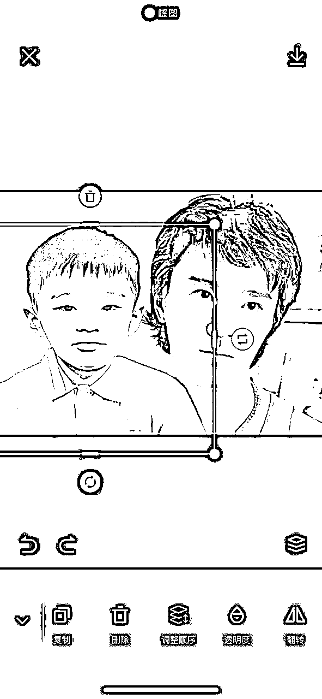
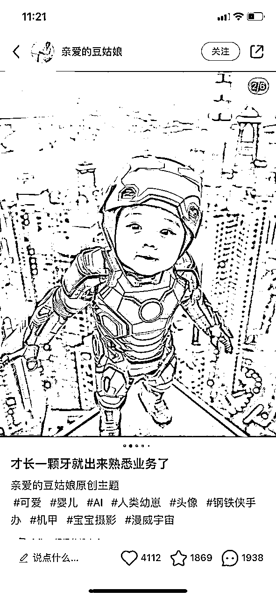
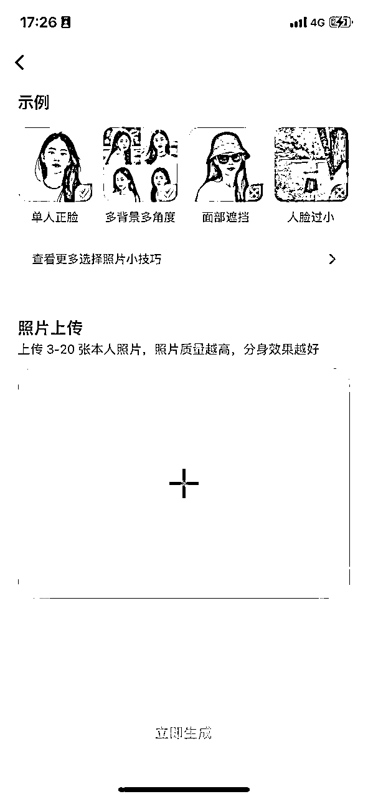
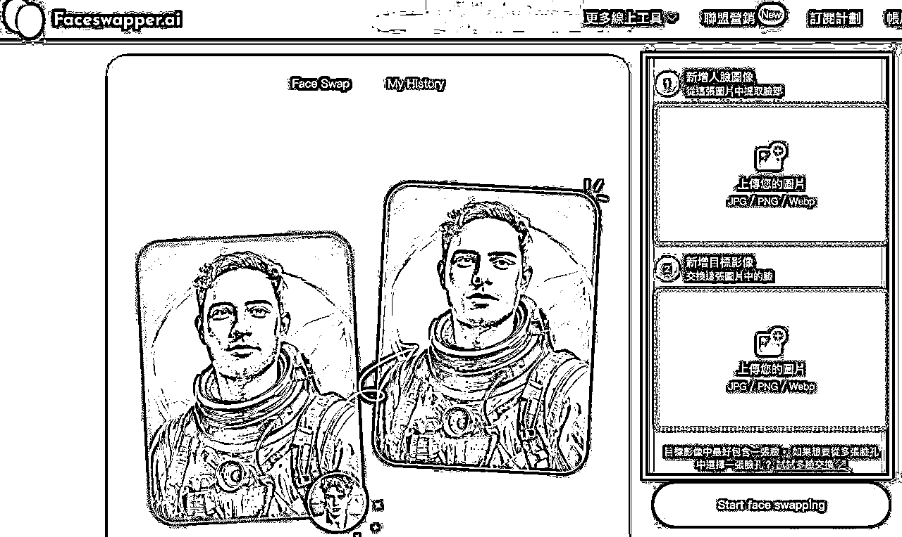
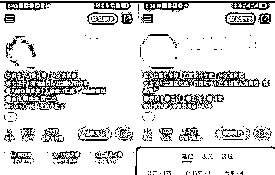
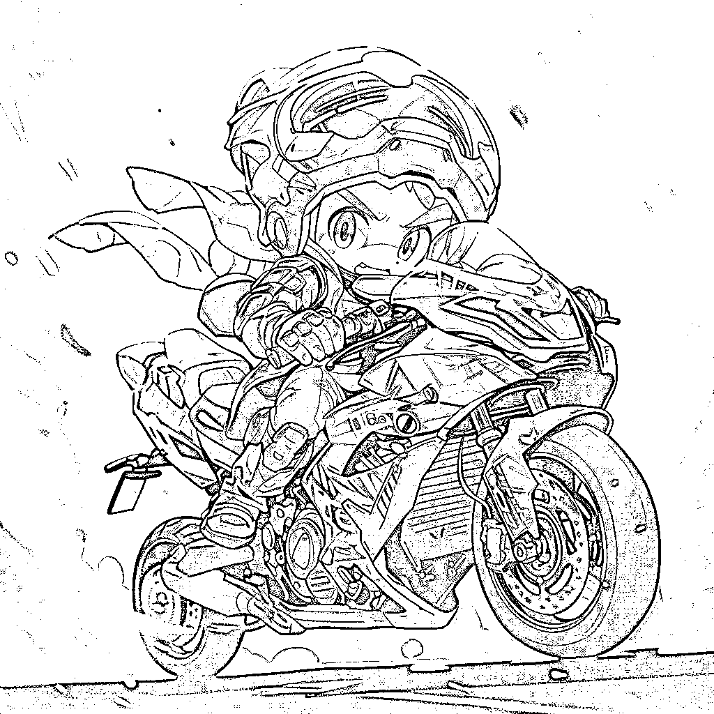
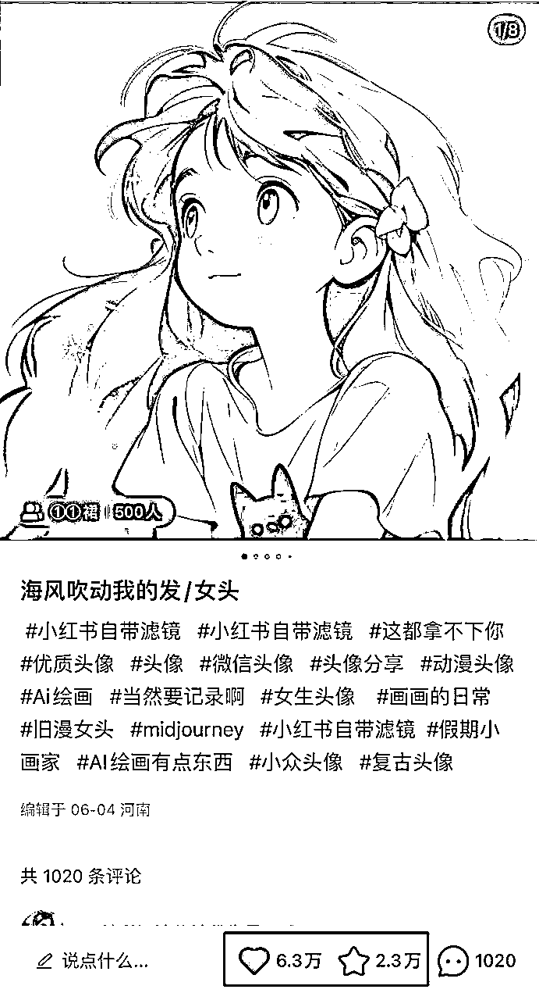
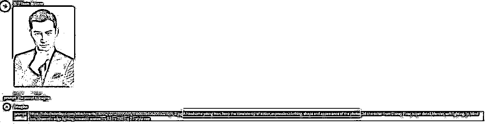

# 9 月航海 | AI 特效直播变现 | 实战手册

> 来源：[https://ocn93f5d9olj.feishu.cn/docx/TKr1d8DBOovvWxxpGnBcDiUhnlb](https://ocn93f5d9olj.feishu.cn/docx/TKr1d8DBOovvWxxpGnBcDiUhnlb)

# 防失联+MM188166M（李李）长期更新

手册出品方：生财有术团队

出品时间：2024 年 9 月

手册使用说明：本文旨在向你展示一个项目的更多可能性，帮助你更好地理解或实操。

建议：如果需要快速定位到精确内容，可以使用快捷键 Ctrl + F/Command + F 的形式，搜索「关键字/词」，查找你想要的内容。

# 写在前面

# 💡

AI 老照片变视频、AI 写真换脸、AI 宝宝走秀……随着 AI 的渗透，AI+的各种变现项目层出不穷。

要在“风口”来的时候，先人一步抓住。我们就得考虑，这些项目底层不变的是什么？

直播绿幕引流成交，就是一种不变的项目操作方法。

从之前的绿幕放电影卖电话卡；再到现在的绿幕卖黑悟空写真，这种模式一直都有人在使用。这种方式门槛低，不需要有很强的主播能力，甚至可以不出镜。而且这种方式变现相对“可控”，发小红书你有大爆款才能变现，直播的话，只要你开播时间足够长，系统总会帮你匹配到变现用户。

本次航海会给你提供全套的绿幕直播话术，也会教你根据 AI 项目特点，设计吸引眼球的直播布景。在交付端，会教你 AI 老照片、AI 写真、AI 走秀的完整交付流程，帮你掌握这种不变的 AI+ 变现方式。

本航海项目的航线图如下：

# 必修篇

# 一、从 0 到 1 搭建一个 AI 特效直播间

本次航海聚焦的狭义 AI 特效直播主要是：

1、直播全流程：包含环节【直播搭建—>账号准备—>场景话术—>流量获取—>数据增长—>引流私域】。目的就是帮助新手和老玩家熟悉平台直播要求，快速起号开启直播，为后续项目夯实基础，毕竟直播是大势所趋，随着竞争加剧，未来直播门槛或许会提高，因此早入场就是优势。

2、AI 项目实操：包含环节【需求沟通—>项目交付—>订单成交】，具体有 AI+老照片动起来项目、AI+写真换脸项目、AI+宝宝走秀视频项目、AI+赛博机车项目、AI+ 头像壁纸号项目等多个项目可选，目的就是帮助新手和老玩家可以选择合适的项目进行变现，案例如下：

# 2.1 直播间基础搭建

# 💡

章节概要

欢迎来到直播间基础搭建章节。无论你是初次尝试直播，还是想要提升现有的直播效果，这一章都将为你奠定坚实的基础。在这里，我们将深入探讨如何从零开始搭建一个专业的 AI 特效直播间。

直播已经成为当今互联网世界中不可或缺的一部分，而 AI 特效直播更是为这个领域带来了新的可能性和机遇。然而，要成功地进行 AI 特效直播，仅有好的创意是不够的，我们还需要掌握直播间搭建的各个环节。

在接下来的内容中，我们将逐步引导你完成直播设备的选择与调试、直播账号的准备与维护、直播场景的搭建、话术的准备，以及如何进行直播中控。每一个环节都至关重要，它们共同构成了一个成功直播间的基石。

通过学习本章节，你将能够：

1.

了解并选择适合自己的直播设备

2.

熟悉各大平台的账号注册和维护要求

3.

掌握直播场景搭建的技巧

4.

学会准备吸引观众的直播话术

5.

理解并实践直播中控的工作

让我们开始吧！

# 2.1.1 直播设备准备

本次航海的直播设备比较简单，考虑到大部分船员都是初次直播，前期先跑通从 0 到 1，设备选购本着够用就好的原则进行采购，不需要花太大钱一步到位。

# 2.1.1.1 设备购买清单

硬件直播设备

电脑：台式机或者笔记本皆可，用于直播伴侣开播

摄像设备：相机、摄像头或者手机（可以使用无他相机等作为摄像头）均可

绿幕：可选，如果使用绿幕背景可选购

补光灯：非必选，如果希望有更清晰的拍摄效果可选购。功率 100w 即可，注意不要购买球形灯罩，球形灯主要用于打背景光，购买直射光的深抛柔光箱。

需要安装的软件

考虑到航海手册的时效性，后期使用本手册时，建议直接官网下载最新最新版本：

抖音直播伴侣

OBS

无他伴侣（如果使用手机作为摄像头）

# 2.1.1.1 设备调试

AI 特效直播的直播场景，以电脑播放视频搭配个人绿幕背景组合而成。

硬件设备方面，如果我们出镜直播，无论是否使用绿幕，都要重点要考虑打光效果问题。

关于打光，新手入门直播时不用过于专业，一盏灯方案即可。如刚好有设备可以使用双灯或者三灯方案：

如果我们有一盏补光灯，则在前方直射出镜人即可；

如果我们有两盏补光灯，则使用三点布光法，将灯摆放在人物的左右前方 45°角位置即可；

如果有多盏灯，可以用一盏球灯作为背景灯打亮背景绿幕，则整体效果更好。

# 2.1.2 直播账号准备

入门特效直播，目前建议的平台是抖音和视频号，这两个平台目前的直播流量都比较大，适合直播引流变现。其中，抖音的流量比视频号更大，人群也更精准，如果有余力，也可以准备两台手机同时在两个平台直播，如果没有精力，建议优先抖音平台。

新手入门时，建议准备两个号来跑通流程。本身项目没有太大违规点，但是由于涉及教学和引流，在没有一定直播经验积累时，非常容易一两个敏感词没注意，而导致被封 3-7 天，准备两个号可以实现互相备份的效果，如果万一某个号违规了，可以直接播另外一个号，同时，两个号直播，也可以一个号用来前期练习，练习充分后用新号起号，减少初始开播时的焦虑感。

# 2.1.2.1 抖音账号准备

由于我们的直播不需要卖货开橱窗，所以账号准备比较简单，但需要搭建较为复杂的直播场景，建议使用直播伴侣开播。我们账号准备的核心内容就是满足直播伴侣的开播条件。

抖音直播伴侣开播条件：

普通用户/企业用户

手机上能够正常开播

单端粉丝数>=1000（抖音达到 1000 粉丝或火山达到 1000 粉丝，抖音+火山达到 1000 粉丝的无法申请开播权限）

近 14 天无违规

媒体政务不支持伴侣开播

对我们来说，最难的条件就是满足 1000 粉丝。涨够 1000 粉有 3 方法：

1.

自己发涨粉视频

2.

找专业人士刷千粉

3.

自己使用千川投放涨粉

千川投放涨粉的详细教程（视频不保证时效性，仅供参考）.mp4【在线播放】

# 2.1.2.2 视频号账号准备

如果是微信老号，可以直接用来开通视频号，如果老号不够，那么就注册新微信号。

开通视频号的微信需要实名认证，认证路径：微信-我-服务-钱包-实名认证，目前一个身份证最多可以实名认证 5 个微信号。

# 2.2.2.3 账号基础维护

账号基础建设三件套：头像、名称、个人简介

头像

头像可以根据个人爱好设定，有 AI 感的很好。但是不要用好物推荐、露出身体/胸/背，产品主图等这种踩雷的头像。

账号名称

如 xx 讲 AI，或者 xx 老照片修复等，有个性或者符合 SEO 特性的名称最好。不要营销性质太强，切记不要用 xx 好物推荐、xx 好物分享这种。

简介视频

可以有一段自我介绍，不要太高大上，质朴打动人心最好。可以直接留微信名，懂的都懂，但是不要明示，如：vx:xxxxxx，或者🌏号 xxxxx 等，也不要写“私信”“后台”等敏感词。

# 2.2.2.3 账号是否需要养号

很多人都说养号是玄学，但是以我的经验来说，并不是，所有的社交软件系统的后台开发，都会去考虑僵尸用户的存在，所以，在账号注册后，仍然建议做一下养号动作再开播，会一定程度上减少账号开播被风控，导致毫无流量的可能性。

养号的基本动作：

1.

完善头像、名称，视频号如果使用的是新微信，也要完善微信的头像和名字。

2.

视频号：添加 3 个好友，互发几条消息，给好友打 1 分钟语音电话，发一条朋友圈，给 2 个好友，各收或者发一个红包

1.

每天至少正常使用在抖音/视频号上模拟真实用户正常使用 1 小时，刷 30 分钟视频、看 30 分钟直播，期间可以做一些常见动作，如点赞、关注、加粉丝灯牌、直播商品点击等，有条件的话建议开通账号的支付功能。这一步动作建议至少操作 2～3 天。

# 2.1.3 直播场景搭建

# 2.1.3.1 优秀直播场景推荐

RPReplay_Final1725096729.mp4【在线播放】

RPReplay_Final1725096884.mp4【在线播放】

以上都是常见的 AI 特效直播场景，我们可以看到，常规的 AI 特效直播场景基本是由演示区域+主播区域组合而成。演示区域展示成品效果的视频或者教学电脑投屏，这样的画面容易吸引用户停留，而主播区域一般是主播出镜露脸讲解，增加信任感和转化率。这种场景的搭建比较简单，但是需要电脑开播实现，具体的搭建方法我们会在下一节进行讲解。

# 2.1.3.2 使用直播伴侣搭建直播场景

软件下载：https://streamingtool.douyin.com/

如果遇到提示：点击开播提示“账号未认证”，请至抖音 APP 开播一次完成实名认证 ，只需要打开抖音 APP 选择 “视频直播” 开播一次（时长不限，可以开播后然后立马关播）然后再在电脑端开播即可。

点这里，观看直播间搭建操作视频👉 https://lean-trade.feishu.cn/minutes/obcnja6kba7lr1beap4zex3x

# 2.1.3.3 使用 OBS 配合视频号直播助手搭建直播场景

1.

登录微信电脑客户端，点击左下角三个横杠（如上图箭头所示），点击视频号直播工具，即启动成功。

pc 版微信，不支持 mac 系统

启动成功如上图所示

2.

点击添加画面源，可以选择添加摄像头（如添加无他相机或者 OBS 虚拟摄像头）与窗口采集（采集音乐播放器或者音视频等各种窗口）

3.

第一个图标是可以切换横屏和竖屏；第二个图标是麦克风设置，点击向下的箭头出现设置界面，按需选择接入的麦克风类型；第三个图标是扬声器设置，一般选择默认即可。

4.

点击开始直播，会出现如下对话框，我们需要更换直播的封面，填写本次直播的主题，选择教学-其他，然后点击开始直播即可开始直播。

5.

开播后看过代表本场的场观，在线观众名称，热度表示送礼的观众名称和送礼物数量。

6.

开播后，会显示弹幕评论，可以在评论区和观众互动，以及进行置顶、拉黑、禁言等操作。

7.

综合设置选项，点击即可看到商品管理，开启送礼物，帮助，设置，检查更新及意见反馈。

8.

点击设置后，会看到直播画质设置，内容显示可以切换横竖屏模式以及画布大小，声音设置，浮窗设置以及高级设置。

# 2.1.4 直播话术准备

在我们直播经验不足时，最简单的话术准备方法就是录制对标直播间话术，然后在对标基础上进行优化改写。

这样的好处有：

1.

对标账号的话术已经经过一定的市场检验，别人能用这个话术拉到高的在线，说明话术逻辑思路没有太大问题，在我们直播前期，使用这样的话术可以减少需要控制的变量，把更多精力放到直播表现力和细节处理上。

2.

各个平台现在对话术的要求都比较严格，稍有不慎就容易说错敏感字，导致直播间违规，如果对标直播间能够正常直播，在敏感词的处理上都比较到位，我们可以在关键节点，比如引流的话术上，参考同行的做法，减少自己的试错成本。

# 2.1.4.1 如何录制对标直播间话术

直播间录制

由于直播间录制工具较多，且更新迭代较快，在手册中只给大家推荐一款软件，小绿点，相对比较长期稳定。如果大家有更好的录制工具，也可以使用。

直播录屏神器小绿点使用教程.mp4【在线播放】

# 2.1.4.2 常用直播话术

我们为大家录制了几个 AI 特效直播间的回放，大家可以参考他们的直播内容进行话术的优化迭代。

点击右上角分享按钮，选择在浏览器中打开，可以在飞书妙记中查看文字版本话术。

特效直播间回放 01 👉 https://lean-trade.feishu.cn/minutes/obcnidlpj8831h5znket9i84

特效直播间回放 02 👉https://lean-trade.feishu.cn/minutes/obcnexupuh14k74g5doj94g9

目前常见的话术有两种，一种是循环转化话术，一种是半教学话术。

循环转化话术可以参考手册中小艺-ai 老照片的话术，核心逻辑就是观众互动-介绍项目-引流。5-10 分钟为一个循环流程，根据用户互动情况，可以适当调整每部分的长度。

这种话术比较简单，适合新手操作，本质还是依靠老照片特效的视频场景吸引人，然后在用户来到直播间后，直接做转化，言简意赅的说明项目优势。如果有观众进行提问，可以点对点进行互动。项目介绍话术的设计要简洁明了，不能有太多废话。

半教学话术可以参考手册中慧慧聊 AI 的话术，整体逻辑是稍微详细的讲解一下项目实现的思路，营造专业人设，继而进行引流。

半教学话术适合后端知识类交付，而非具体项目实现的直播间，直播间教学本身，即是“钩子”。半教学话术的设计，主要分为两部分，即干货部分和引流部分。引流部分的导入，可以在干货部分的中间，由于干货没有完全讲完，这时候引流也不会导致大量观众的流失。干货部分的节奏可以快一点，知识点设置密集一些，参考 2.3.2 部分的几个内容优化技巧，不断根据数据流速来进行调整和优化，拉长有吸引力的内容的部分，更容易提高留存率，把直播间流量拉高。

# 2.2 开启直播

# 💡

章节概要

在完成了直播间的基础搭建之后，我们终于要开启直播啦！本章节将指导你如何迈出直播的第一步，并为你的直播项目奠定坚实的基础。

开启直播可能会让人感到紧张和不安，尤其是对于新手主播来说。但请记住，每一个成功的主播都曾经历过第一次直播的忐忑。本章节的目的就是帮助你克服这些初始障碍，建立起对直播的信心和热情。

在接下来的内容中，我们将深入探讨以下几个关键方面：

了解账号权重机制，建立良好的直播心态

设计适合自己的直播计划

新手开播如何起号

起号成功后如何继续提升

如何做好直播中控工作

通过学习本章节，你将能够：

理解平台的推荐机制，避免常见的新手陷阱

制定适合自己的直播策略和计划

掌握吸引观众、提高互动的技巧

学会分析和优化你的直播表现

熟练运用直播中控技巧，提升直播质量

记住，直播是一个不断学习和进步的过程。不要因为初期的挫折而气馁，保持耐心和持续的努力，你终将在直播领域绽放光芒！

# 2.2.1 了解账号权重机制，建立良好的直播心态

在正式开始直播之前，希望大家对直播有一个客观的预期：当我们刚开始直播的时候，前几场直播，甚至前十几场直播，直播间很可能是没有什么人的，只有个位数在线的直播间，是非常正常的现象。

导致这个情况的原因有两个：

1.

我们的直播能力还不够，数据赛马不好，没有流量

2.

我们的账号权重比较低，系统不给推人

第一种情况，毕竟很多人都是刚刚接触直播，无论是直播能力还是直播经验，都是新手级别，当我们和老主播去竞争时，我们往往是没有优势的，直播间数据赛马会赛不过更有经验的主播，这在初期是很正常的现象。解决方法唯有多练，无论我们的理论知识多么充沛，我们的教练多么有经验，技能的提升一定是伴随着练习的增加而积累的。就像强如斯蒂芬库里一样的历史最佳射手，也一样是需要进行每天 3000 次的训练才能保持手感。

建议大家在航海期间，每天至少拿出两个小时时间来直播，每小时直播 1 场，共 2 场。经过 30 小时左右的基础经验积累，大家才能度过新手期，知道了直播是一种什么样的体验，能够不再慌张，从容不迫的把我们头脑中的思考流畅的表达出来。在我们的直播能力基本熟练活，就可以驾轻就熟，更多的把精力放到直播运营上去。

第二种情况，当我们新号开播时，系统作为一个大数据平台，并不知道我们的目标客户是什么人，我们播的怎么样，所以，在前期，给我们的推流不大，也不精准，这是每个新账号都要经历的阶段。像我们很多优秀的拿到过大结果的主播，在起新号的时候，同样会遇到这样的问题。

解决方法，要么是我们把初期进来的少量流量承接好，做出好的数据，同时在这些观众中，筛选出我们的目标客户，让系统知道观众喜欢我们，哪些观众喜欢我们，经过几场的数据递增，慢慢的一场比一场更好，成长为高权重直播间。要么是直接投流购买一定的相对精准的流量，通过把这些流量做出来数据，更快速的让系统学习我们的直播间画像，从而实现更快速起号的目的。

当然，无论是如何通过运营起号，根本还是需要我们有一定的直播能力，能够把给到我们的流量承接住。所以在航海期间，大家要有一个健康积极的心态，不要急于求成，结硬寨、打呆仗，每场认真的去播，去感受流量，去复盘思考，很快就能走上正确的直播之路。

# 2.2.2 设计直播计划

由于大部分船员都是初次接触直播，所以也为大家初步设计了一个可供参考的直播计划。大家可以根据自己直播的数据反馈，及时认知到当前阶段目标并调整复盘和准备的重心。

时间周期

阶段直播目的

目标数据

阶段重点注意事项

起号阶段

第 1-5 天

账号起号阶段，直播间能够正常推流，有一定基础权重

每小时 150+场观

直播间在线 10 人

直播间能够出单

1.

熟悉直播感觉，做到心态稳定，不再慌张

2.

了解直播内容，能够流畅表达出脚本话术

3.

熟悉观众问题，能够从容应答

破层级阶段

第 5-15 天

直播间初步起号，且有一定精准观众，能够稳定引流到私域成交

每小时 300+场观

直播间在线 20 人

每场直播引流 10 人

1.

了解直播间推流逻辑，能够进行数据分析与复盘

2.

能够针对直播间问题进行改进，对直播话术进行优化迭代

3.

能够在直播间有意识地做数据

稳号阶段

15 天后

直播间流量比较稳定，每场直播都能够成功引流，且数据逐步递增

每小时 800+场观

直播间在线 50 人

每场直播引流 50 人

1.

主播能力逐步提高，能够每场稳定发挥，吸引精准受众

2.

会观看数据实时流量图，且根据数据及时调整直播节奏

# 2.2.3 新手开播起号怎么播

新号开播时，我们的流量比较少，这个阶段我们要重点做好点对点互动与要数据的工作。

在前期流量少的时候，专注于练习我们的直播内容，把内容先播好。如果有互动的用户，可以适当的多于用户互动，让精准用户多在直播间停留，给我们做一些数据，慢慢就能起号。

前期流量较少，少引流，多讲干货，提高直播节奏和内容密度，减少一切可能让客户流失的行为。如果发现流量突然递增了，一定要及时调整好状态，承接好这波急速流量，如果接好了急速流，直播间的流量就有可能够彻底打开。

如果直播间持续有推流，可以多拉时长，尤其是视频号，只要有流速就不要轻易下播。如果每分钟直播间推流低于 5 人持续半小时以上，可以考虑下播，或者每分钟推流长时间在 1-3 人，说明自然流基本没有了，建议下播，我们可以半小时后再开一场，一般每场直播都会有一定的初始推流，尝试再去利用初始推流来做数据。

# 2.2.4 起号后怎么播

起号成功后，一般直播间的在线在 30 人以上，这种情况下，如果做得点对点互动过多，直播间其他未被互动到的观众，可能就会觉得讲的没有重点，就划走了，所以这个阶段，不要做太多的点对点互动，除非互动观众的提问问题是一个受众普遍存在的问题，可以重点讲，否则一句带过甚至无视互动。

在稳流量阶段，我们要多去关注直播曲线图，多去关注流速的变化。流速如果持续上涨，一定要专注，保持好状态把流量往上推，同时多要关注数据，不要忘记及时引流。如果流速下降了，就提高干货密度，不断放钩子做停留数据。

每天复盘时要开始重点做内容复盘，找到什么内容吸引人，什么内容掉人，这样在后面直播时，如果人掉的比较快，可以考虑转到更吸引人的内容来讲，一直控制流速，让流速保持稳定，不会掉层级。

起号成功以后，不要等到直播间完全没人再下播。观察开播急速流的大小，当前流速低于开播急速流的 20%时，可以考虑下播，维持本场数据层级不会下跌较为严重。

# 2.2.5 直播中控

# 2.2.5.1 直播中控要做的工作

如果是一个人直播，在直播时再去兼顾做中控工作是比较难的。但是如果安排得当，一个人也能够把直播间运营的非常好。中控一般需要做如下工作：

1.

直播间基础设置

2.

发福袋

3.

及时高亮优秀评论

4.

充当直播间水军带节奏

5.

辅助主播进行引流

其中，最主要的是第 4 步与第 5 步。

# 2.2.5.2 一个人如何做好中控

1.

直播间基础设置

a.

设定好直播间屏蔽词

b.

将观众信息设为不可见

2.

如何简单的做水军

a.

准备 1～2 台非直播手机作为水军

b.

提前设计好需要水军提问或者带节奏的节点

c.

使用搜狗输入法或者讯飞输入法，提前将需要发的内容，设为常用语存入输入法

d.

直播时，使用输入法的常用语功能，即可快速完成水军工作

3.

主播引流

a.

引流使用主播账号即可，主要是引导用户进入抖音聊天群

b.

在电脑端提前准备好引流话术，复制到粘贴板

c.

在直播伴侣或者视频号直播助手中，直接粘贴话术，及时发送即可

# 2.3 如何获取直播间流量

# 💡

章节概要

在直播平台上，算法在流量分配中扮演着至关重要的角色。了解这些算法的运作方式，并学会如何与之"共舞"，将是大家成功的关键。我们将深入探讨数据赛马机制，教你如何解读和利用各种数据指标来优化你的直播策略。

在本章节中，我们将聚焦以下几个核心内容：

直播数据的查看和解读

关键数据指标的分析和应用

提升直播间数据的实用技巧

有效的直播数据复盘方法

通过学习本章节，你将能够：

熟练使用各平台的数据分析工具

理解并运用关键数据指标来指导你的直播

掌握多种提升直播间数据的技巧

建立科学的数据复盘习惯，持续优化你的直播

记住，获取流量不是一蹴而就的过程，它需要持续的学习和调整。但只要你掌握了正确的方法，并保持耐心和毅力，你就一定能够在直播领域中找到属于自己的一片天地。

当前的主流直播平台，无论是抖音，还是快手、视频号等，都采用数据赛马机制，也就是说，你的直播间数据越好，直播间后面就会给推送更多的流量。所以作为运营和主播，我们要学会理解直播数据，并且根据直播反馈的数据来调整我们直播间的内容和节奏。

# 2.3.1 在哪查看直播数据

抖音

如果我们是不带货的引流直播间，可以访问直播服务平台，登录后查看直播数据。

其中，直播大屏菜单，可以查看当前正在直播的数据，直播复盘与直播数据菜单，可以查看往期的数据分析。

如果我们是带货直播间，需要首先开通商品橱窗，然后用电脑登录巨量百应平台查看数据。

视频号

视频号使用电脑登录视频号直播助手查看直播数据。

菜单为：直播-直播管理，如果正在直播，点击右上角“进入直播间”按钮即可查看当前正在直播的数据。

# 2.3.2 直播间常见数据讲解

场观与在线：直播间最基本的数据，大白话讲就是每场直播有多少人看了我们的直播间，以及我们直播间现在有多少人在看。关于场观，我们需要从一开始就建立的一个概念是每小时场观，毕竟每场直播时长不同，单纯比较场观没有意义，用场观除以我们的直播时间就是小时场观，可以理解为我们的“播效”。

直播间曝光进入率：平台会把我们的直播间推送给用户，如果用户选择点击进入直播间，才会成为我们的直播间观众，用场观人数/曝光人数*100%，就是曝光进入率。曝光进入率数据，不同赛道的差异比较大，这个和受众与直播形式有关，一般来说，曝光进入率在 10%到 60%都为正常数据。

流速：流速指的是直播间推流速度，也就是我们直播间每分钟能进多少人。假如我们的平均流速是每分钟 10 人，那我们直播间每小时的场观就是 10*60=600 人，流速直接决定我们的场观。在直播时，我们应该重点关注的数据是流速，而不是平均在线。因为本质来说，平均在线是由流速和平均停留时长决定的。

平均停留时长：顾名思义，指的是直播间平均每个观众的停留时长。停留时长是一个非常重要的浅层数据，也是一个重要的赛马指标，一般对于同一类直播间，平均停留时长越久，系统的推流就越大、越精准。所以我们在做知识付费直播间时，想尽一切办法要做的数据就是平均停留时长：让更多的用户在直播间停留更久的时间，我们的流量就会更大。

互动率：直播间互动，一般指的是评论、刷礼物、关注、加粉丝灯牌这几个指标。其中，抖音直播中，加粉丝灯牌的对直播间赛马的权重较高，我们要重点去做这个数据，其次是关注数据。互动率也是影响我们直播流量的重要指标，一般来说，互动率越高，流量越大。

# 2.3.3 获取数据的几种技巧

给大家分享一些知识付费直播间直播时的小技巧，可以有效帮助我们提高直播间数据，更容易快速起号。注意，以下方法主要适用于干货教学直播间，并不适用于所有直播间（比如带货直播间）。

# 2.3.3.1 点对点互动

当我们刚开始直播时，可能直播间在线人数只有个位数，去掉几个系统的机器人，可能实际的只有两三个人，这是非常正常的情况。虽然人少，但是我们的赛马对手，同样也是没有人的直播间，如果我们能让直播间仅有的几个人给我们做一些数据，那我们直播间就很容易提高推流层级。

前期在没人时，最好的办法就是点对点互动，与每个进入直播间的人进行点对点交流，可以极大的提高真实用户的互动率与停留时长，是直播间人数较少时，最有效的要数据手段。

举例来说，我们直播间正在讲一个 AI 干货，此时直播间进来张三和李四两个人，我们在互动大屏上看到在线用户的数据后，可以直接在直播间与两个用户进行互动，比如，“张三之前有没有做过这个项目”“刚才我讲的，李四听明白了吗，没有听明白的问题可以直接公屏提问”。点对点互动的对象可以是刚刚进入直播间的人，也可以是在线列表中在直播间停留很久的人。

即便用户不回复也是很正常的现象，不要因为一两次点对点没有人回应就放弃，前期直播人少时，一定要多尝试去做点对点来拉数据。

# 2.3.3.2 要数据

我们做的直播间类型是教学型直播间，也就是说，我们是以一个“老师”的身份来进行直播的。所以我们在直播时要有自信，有气场，不要唯唯诺诺，太过于谦虚，这样不容易吸引用户的停留。

同时，我们也要大胆给用户提要求，要数据。比如，用户提问一个问题，如果我们直播间没有多少人，我们可以先回答，然后给用户说“这里听明白的给我点个关注，加个粉丝灯牌，有其他问题也可以继续问哈”。如果直播间在线大于 30 人，有用户提问，我们可以说“想提问的先给我点亮个灯牌哈，然后提问，因为现在提问的比较多，我肯定优先回答粉丝的问题哈”“xxx 问的这个问题很好，你先加个粉丝灯牌，我告诉你怎么做哈”。

一个有经验的干货分享主播和没有经验的主播，差距往往就在于有没有养成要数据的习惯，会有数据的主播，往往起号速度更快。

# 2.3.3.3 钩子前置（利益诱导）

我们的内容直播间，往往是吸引人的内容和不吸引人的内容组合而成的，我们不可能做到一场直播高潮迭起，那么当我们讲“不那么吸引人的内容”时，如何让观众继续停留呢？办法就是，提前把有吸引力的内容抛出来，让大家有期待，在直播间停留尽量久的时间。

比如，“我先给大家讲一下 xxx 这里，刚才不是有好多同学想学 yyy 吗，过 1 分钟后咱们就开始讲”“过会有个福利给到大家，讲完这里就发，大家可以猜一下是啥，待会很快给大家来发”，实际上，可能 xxx 我们会讲 10 分钟，但是不要在意，学会用利益诱导来做数据。

# 2.3.3.4 干货后置

我们直播的内容，有些话题是天然吸引人的。所以我们在讲这些“天然留人”的话题时，要注意把握好节奏，不要讲太快。在有吸引力的话题上，要多“墨迹”，多“讲废话”，美其名曰“讲细一点”。

在讲干货前，也可以多加一些前戏，多让观众互动，比如“我给大家讲一下真正的干货，讲之前我先问一下，大家做 xxx 的时候，是先做 a 呢，还是先做 b 呢”，因为大家都着急听干货，所以这时候的互动率会比较高，同时在互动的过程中潜意识的做了停留。

千万不要着急把吸引人的内容快速讲完，也千万不要怕被观众骂“太墨迹了”，如果真的怕被骂，也可以提前把“太慢”“墨迹”“快点”“赶紧”等内容设为屏蔽词。

# 2.3.4 如何复盘直播数据

想要做好直播，一定要养成复盘的习惯，在每场直播中找到问题并提高。

但直播复盘是一个需要比较丰富的运营经验的工作，我们在本期航海中不会讲解太过于专业和复杂的数据复盘流程，而是给大家分享几个重点关注的基本认知，先帮大家建立基础的复盘思维。

直播新人在复盘时，可以先重点思考这几个内容：

1.

我们播的有没有什么硬伤？

硬伤要从两个方面来检查，首先是听回放，从观众角度去听“我们播的是否舒服”，包括但不限于“语速是不是过快或过慢”“发音是不是清晰”“话术是不是不熟”“是不是经常有磕绊”“是不是有口头语”，以上这些问题，99%的新人主播都会存在。解决方法无他，刻意练习。

其次是看数据，前期就重点看停留时长和关注率两个数据。停留时长低于 1 分钟，要么是内容太不吸引人，要么是播的太烂，这个问题，一定要复盘并针对性解决，解决之前不要盲目的继续重复直播。关注率低于 2%，说明要数据能力太差，也需要尽快解决。如果这两个数据达标，说明直播间至少是及格的，再去重点关注复盘其他内容。

2.

我们这一场的数据，相比上一场，是否有提高？

每场直播后，我们都要去对比过去两场的数据，主要目的是复盘“我们做的调整是否有效果”。

重点对比场观、最高流速、最高在线、停留时长、关注人数几个数据，如果数据偏差在 5%以内，可以基本认为两场数据一致没有变化。如果本场相比上一场数据有明显提高，则说明我们的调整有效，继续保持并优化，做到每场递增，很大可能起号成功。如果本场相比上一场某项数据有明显降低，则要分析出问题所在。

3.

我们这一场直播，有没有异常数据，为什么？

检查每场中是否存在异常数据，比如，“突然走了一批人”“曝光进入率大幅提高/降低”“停留时长变化较大”，如果在直播复盘时发现这样的问题，一定要重视，这种异常点，往往是优化和调整的关键点。

复盘异常数据时，一定要结合直播回放来去看，重点思考我们直播间播了什么内容导致了异常的数据？直播数据本质上来说是直播内容的映射，反映了直播内容对观众的影响，养成分析异常数据的习惯，直播能力的提高会非常快。

4.

我们这场直播中，哪部分内容吸引人，哪部分内容非常不吸引人？

由于我们做的直播间形式是内容直播间，大多数情况是做干货分享，所以直播间内容的设计就非常重要。一开始，我们是不知道什么内容好，什么内容不好的，只能凭经验大概写一个脚本然后开始直播。所以在前期直播时，及时复盘并优化内容就非常重要。

每场直播结束，我们要重点去看直播曲线，来分析直播间哪里吸引人，“讲这个内容时，观众都不走了”，哪里不吸引人，“讲这个内容时，大量离开”。

那如何找到这个内容呢，非常简单，看直播流速曲线图，打开推流曲线和离开曲线，寻找推流曲线持续高于离开曲线的部分，说明这段内容（话题）非常吸引人，大家都愿意多看，离开曲线突然急速猛增的部分，说明这里大家都不想停，一下子都走了。

每场直播，分析出来哪里留人哪里掉人，后面直播时，我们就可以针对这些内容做针对性优化。掉人的内容，优化结构或者钩子前置，留人的内容，继续丰富或者干货后置，几场之后，我们的直播内容就会变得非常能打。

# 2.4 直播引流私域

# 💡

章节概要

现阶段平台对知识付费类直播间与 AI 赛道的管控都比较严格，我们将商品或者服务直接上架到后台售卖的难度是比较大的，比较建议大家将用户引流到私域进行转化。

但是在公域平台进行私域导流同样是比较容易违规的行为，有如下几种常见的私域引流方法

1.

简介留微信

2.

直播间直接用话术或画面引导

3.

先转化到平台自有粉丝群，再二次导流

4.

使用官方引流组件

其中，4 是最为稳妥的方法，但是一般需要付费投流才可以使用，我们在手册中根据抖音与视频号两大平台的特性，重点对其他三种方法进行讲解。

# 2.4.1 抖音直播如何引流到私域

抖音直播引流的两种推荐方式，一个是简介留联系方式，一个是引导到粉丝群再引导私域。

简介留联系方式

部分账号在个人简介中，可以直接添加自己的微信号。但是不能使用过于直白的引导，比如“微信：xxxx”、“🌏号：xxxx”等，很容易直接被系统检测到直接屏蔽，或者被举报后违规。

可以更加委婉的表达，比如“合作 xxxx”、“交个朋友 xxx”。也可以直接把微信号“xxx”放到最后一行，在直播时引导“链接我的可以看我主页简介最后一行”。

引导到粉丝群再引导私域

引流粉丝群，再在粉丝群引流私域，是目前抖音上最为建议的引流方法，也是我们目前主要用的引流方式。粉丝群引流又分两步，第一步，在直播间引导观众加粉丝群，第二步，在粉丝群告知客户如何加私域。

在直播间引导客户加粉丝群时，不建议话术直接诱导，很容易触发话术检测违规。比较好的方式是打印一张 A4 纸或者 kt 板，在上面手写上诸如“领资料（换行）加 fen 丝群”之类，正常观众一看就明白意思但是 AI 并不好判断含义的内容，在准备引流时直接拿出来牌子，然后手指即可。也可以由运营使用小号在评论区进行话术引导，这样直播号并不会被处罚。

客户引流到粉丝群后，引流私域话术处理不当仍然非常容易违规。在粉丝群引流的几种方法有：运营小号发微信号、使用不容易被检测到的图片发微信号等。我们目前使用比较多的方法是，直播主播，在粉丝群里发语音的方式来进行直接引导，这样有效易懂且不会被检测到。

# 2.4.2 视频号直播如何引流

视频号引流的两种常见方法，一个是简介留联系方式，一个是直播间直接引导。

简介留联系方式的方法同抖音，不再赘述。需要注意的是，视频号目前对个人简介的检查还是比较严格的。之前我们的直播账号，被判“医疗引流”，封禁 3 天，但是我们直播间并没有说违规内容，前后排查了很久，才找到原因是我们的简介里有“需要直播食谱可以私信我”，问题就在于“私信”两个字。所以在个人简介中一定注意不要出现明显的引导词。

直播间直接引导的方法，建议主播话术讲解“想链接的看一下公屏”，此时运营使用小号发主播微信+同步高亮上墙，比较有效。或者手写一个微信号的 A4 纸或者 KT 板，配合话术展示进行引导。目前视频号只要不长时间在场景中出现引流二维码或者微信号，偶尔出现的话，判罚引流违规的概率不大。

# 2.4.3 引流违规处理

由于引流不当，被平台使用技术手段检测到后，会有违规处罚。一般的处罚有：禁言、账号限流、账号直播能力封禁 3-7 天，严重的可能还会长时间/永久封禁。

遇到处罚我们可以申诉，但是像引流这种容易复现或者保留证据的违规，申诉成功率较低，只能算是一种聊胜于无的解决方案。

遇到违规封禁，目前没有更好的办法，在封禁的 3-7 天时间内，只能停播或者换号。所以建议大家提前准备 2-3 个号备用，以备不时之需，在大号违规期间，可以使用小号继续直播，不影响我们的变现节奏。

# 三、AI 项目变现实操

# 💡

章节概要

欢迎来到 AI 项目变现实操的核心章节。在前面的内容中，我们已经为你奠定了直播的基础，现在是时候将这些技能与 AI 技术结合，创造真正的价值了。本章节将带你深入探索几个具有巨大潜力的 AI 项目，并教你如何通过直播将这些项目转化为实际收益。

AI 技术正在改变我们的生活方式，也为创业者和内容创作者带来了前所未有的机遇。无论是让老照片"动起来"，还是创作令人惊叹的 AI 写真，亦或是制作可爱的 AI 宝宝走秀视频，这些项目都代表了当前市场的热点需求。

在本章节中，我们将详细介绍以下 AI 项目的变现方法：

1.

AI+老照片动起来项目

2.

AI+写真项目

3.

AI+宝宝走秀项目

对于每个项目，我们都会提供：

详细的项目介绍

所需工具和资源

具体的操作步骤

……

通过学习本章节，你将能够：

掌握多个热门 AI 项目的制作技能

学会如何将 AI 技术与直播相结合

了解不同项目的定价策略和市场需求

建立自己的 AI 项目工作流程

学会如何通过直播吸引客户并完成交易

记住，技术只是工具，真正的价值在于你如何运用这些工具来满足用户需求。保持创新思维，不断尝试新的创意，你一定能在这个蓬勃发展的市场中找到属于自己的位置。

# 3.1 AI+老照片动起来项目 SOP

# 3.1.1 项目介绍

老照片动起来可以算一个项目，其中很多个环节，单独拆开，其实也能算小项目，比如老照片修复+上色，AI 绘画工具应用，AI 短视频工具应用，可灵 AI 实战教学、剪映一对一私教剪辑等。具体看你想怎么使用。

这类项目适合小白练手，能够快速跑通形成闭环，通过短视频赚到第 1 块钱，但是不容易放大，毕竟流量有限，市场竞争也大。作为引流品后续成交高客单也是可以的，关键在于流量过来之后能否有后续高客单价产品承接。

# 3.1.2 变现思路

核心思路是解决用户对过往的人、物、事的怀念/保留一份珍贵的纪念需求，提供解决方案和情绪价值进行收费，根据制作的要求和难度，一份可以从 9.9-99 不等，详细案例和制作教程放在下方了

具体案例如下：

1.

解决老照片修复

通过发布修复案例、粉丝投稿案例作品，进行引流私域变现，单张 9.9-49 之间，具体根据修复难度和精准度给用户报价，如果需要打印实体相册/相框定制书签/信封等等，具有仪式感的物件可适当提高售价。

常见形式：烈士、抗战老兵、证件照、全家福、毕业照、婚纱照、过往热门明星、历史人物、动漫、著作人物等，具有热门流量的人。

2.

解决老照片变视频

提供展示具有年代感的照片和让图片说话/互动案例，引流私域进行售卖，19.9-99 之间

常见形式：回忆杀、照片复活、许久未见的亲人、老者语录、图片跳舞、打工喵、照片祝福视频、让照片唱歌、说唱、讲故事、说段子等等、一张图片跳舞

3.

解决照片变互动视频

提供展示两张合成的图片+互动视频，搭配一段温馨故事、关怀问候的对话，配上怀旧/经典的音乐，用户案例

常见形式：穿越时空的拥抱、偶像/亲人拥抱、我想你了奶奶/爷爷.....、

以上方式，都可以通过三个途径进行变现：

1、公域平台开店，直播/短视频进行直接售卖（转化效率高）

2、公域平台引流私域进行成交（便于复购和转介绍）

3、电商平台上架进行售卖

同时你也可以把这些珍贵的图像打印/定制成实体物件，发往用户手中，增加利润和仪式感。

这个技术进行收徒或者售卖资料，对方学完你也可以进行派单的模式，整合成一个完整的链路生意模式

对标账号案例

平台

账号

主页截图

代表作品

创作形式

变现形式

抖音

AI 情怀（收徒）

https://v.douyin.com/ihBe6ymH/

影视剧片段

定制+教学+收徒

老照片新故事

https://v.douyin.com/iM9r19sj/

修复集体照+故事讲解

流量分成+广告+打赏

AI 相馆🐶小檀

https://v.douyin.com/iM96tVTg/

粉丝投稿

定制+教学

Ai 奶爸黄希希

https://v.douyin.com/iM9hFeYT/

亲子照 AI 摄影+AI 视频

定制+教学

TR 美术 认证徽章

https://v.douyin.com/ihBh5oA2/

誉言 Aigc-研究所

https://v.douyin.com/ihBFAR6h/

粉丝投稿修复案例展示

软件会员费

小红书

拾忆雕刻师

https://www.xiaohongshu.com/discovery/item/66bd6ff4000000001e01f22b?source=webshare&xsec_token=ABq1MY_VPt-nIWcYgclBjsO-SjMuFzPW9lcuHEkzzFZlk=&xsec_source=pc_share

修复案例展示

修复定制费用

噗噗的 AI 魔法

https://www.xiaohongshu.com/discovery/item/667bc45e000000001c0269a6?source=webshare&xsec_token=ABO5p6OGlOZhOhxuzhrlXS-Bur2FfPumevUCPgGCkBwVI=&xsec_source=pc_share

案例展示+用户投稿

修复定制费用

# 3.1.3 账号搭建

# 3.1.3.1 账号包装

头像：可用创可贴、美图秀秀等制作，也可以用 AI 进行生成，符合工作室/专家形象即可

简介：提供什么服务、解决什么问题、联系方式

背景：工作场景图、案例好评图、复古怀旧等都可以

可参考一下形式，进行借鉴，重点是包装成工作室、专业照片修复人士、AI 修复专家、照片修复故事墙等，让人一看就知道是干什么的。

# 3.1.3.2 内容制作

选题：运用巨量算数、抖音热电宝，查看近期热门人物，根据指数进行制作，最短时间内，热度越高的，获得更多流量几率更大。

以下教程包括：照片修复、上色、合成、转视频、人物互动，可相互结合使用

视频教程：

穿越时空拥抱教程.mp4【在线播放】

图文教程

步骤

问题

解决方法

相关链接

1

素材如何找？

百度搜索老照片

中国新闻图片网

电商平台搜索老照片素材购买

加入老照片素材网盘群、网盘资源库等

中国新闻图片网站

2

老照片如何修复？

美图秀秀-照片高清修复-上色

点击直达⏭️

3

照片如何合成？

醒图-智能抠图

点击直达⏭️

4

图片如何生成视频？

快影

点击直达⏭️

# 3.1.3.3 如何进行引流？

简介放置：微信号、引流小号，视频修复定制 4️⃣1️⃣XXXX

作品合集：引导添加微信，例如：“专业修复+XXXXX”

粉丝群：可使用小号发布微客外链工具实现一键跳转加微/发 1 分钱红包备注加微

评论区：大号引导进粉丝群/简介进行加微，或者用小号引导看主页作品加微

私信：1 分钱红包备注：“修复+🌍：xxxx”或者发布小号引流作品（一天不能超过 30 个）

# 3.1.3.4 如何承接转化？

朋友圈置顶业务说明书：我是谁，目前专注做 XX 修复 XX 年，以修复 XX 案例，好评率，案例作品如下，XXX，XXX 要求收费 1、2、3，另外如果你有朋友也有需求，请把我推荐给你朋友，修复完成请和奶茶🥤

收藏放置案例合集：XX 元图片修复案例如下，123、XX 元视频修复案例如下，123、XX 元定制修复如下，123

拍一拍设置：服务报价，修复普通老照片 9-29，5 互动视频 X-X.......

# 3.1.2 项目素材

# 3.1.2.1 搜索引擎查询

这里我们以最常用的百度为例，直接搜索关键词“60年代老照片、70年代老照片、80年代老照片”等，直接下载，如果大家是手机制作，那么百度APP或者手机浏览器搜索更方便。

选择标准：尽量选择人少（1-3个），显示比较清晰的图片，因为之后我们让照片动起来的时候，人多效果不是很好，从数据来看，1-3人的最佳。

# 3.1.2.2 AI自动生成素材

可以直接写prompt生成，比如我给大家一段提示词：Real photography, old black-and-white photos from the 1970 s, a Chinese beauty from the 1970 s standing by the railing of the bridge, elegant posture, followed by tall buildings and the river

也可以直接图生图，上传一张参考图片，让AI模仿生成相同风格，这种可能更适合大家，毕竟只需要找图就够了，而找图的话途径很多。

# 3.1.2.3 小红书直接下载

在小红书直接搜索“老照片素材、老照片图片”等关键词，复制链接，到微信去水印小程序，直接得到相同图，这方法比较简单，不再赘述。

# 3.1.2.4 淘宝直接购买

万事不决问淘宝，老照片动起来的项目，可单价比较低，最多不会超过四五十，因此不要把时间浪费在寻找素材上，1-3方法虽可行，但我觉得也可以直接淘宝上购买，单价也非常低。

关键词和搜索百度是一样的，这里要注意，后台私信店铺客服，要求用1-3张人物的老照片，如果是环境照、物体照，对我们是没用的。

# 3.1.2.5 其他常用网站

1）老照片中国网：http://guoqing.china.com.cn/zhuanti/node_7214056.htm

2）老照片修复中心：https://www.lzpxf.com/portal.php

3）老照片趣历史网：https://www.qulishi.com/pic/

如果还想知道有哪些老照片网站，百度搜索、微信搜索、知乎搜索，都能找到一大堆，搜索能力大家一定要具备。

# 3.1.2 项目工具

# 3.1.2.1 老照片修复工具

1、美图秀秀：在照片上色功能中，可以对老照片进行修复和上色。搭配画质修复、修合照功能，同时使用。

2、百度图片：https://image.baidu.com/

百度本身有强大的图片搜索功能，也借助文心一格绘画模型的能力，以及其他 AI 功能，搭建起图片相关的创作工具。比如这里的“变清晰”“AI 去水印”功能是我比较常用的。

3、魔塔 AI 中的老照片修复功能：https://www.modelscope.cn/studios/iic/old_photo_restoration

4、jpgHD：人工智能老照片无损修复 https://jpghd.com/zh

5、你我当年手机 APP，如果你是手机下载的图片，手机处理用它比较快，该产品针对图片相关操作的功能也多，包括修复、上色等。

6、佐糖：https://picwish.cn/create，手机号注册，针对老照片有 AI 修复、照片变清晰等功能

# 3.1.2.2 老照片视频工具

也就是老照片动起来的工具，目前比较好用的是 3 个：

1、可灵 AI（快手旗下产品）：Web 端：klingai.kuaishou.com，手机端是在快影 APP-AI 创作-文生视频。

2、即梦（字节跳动旗下产品）：https://jimeng.jianying.com/ai-tool/home。

3、Runway：https://app.runwayml.com/（国外工具，需魔法）

# 3.1.2.2 抠图合成工具

工具：醒图（手机 APP）：https://retouchpics.com/

1.

准备好两张照片：

2.

打开醒图选择智能抠图：

3.

选择尺寸更小的一张先进行抠图

4.

抠好图，添加另外一张图片作为背景

5.

调整图层顺序，调整好合适的大小

6.

人物大小符合肉眼所见正常比例即可，点击下载进行导出

# 3.1.3 项目如何报价？

可以通过三类项目进行变现，包括：

1、实战交付收入：比如通过在抖音/快手/视频号短视频平台、小红书、知乎等发布作品引流，沉淀到私域，然后一对一成交，客单价建议在 9.9/张，19.9/三张，根据自己交付能力定。

2、知识付费收入：比如在公域平台发作品是为了引流到私域，一般是微信承接，可以通过卖教程、卖训练营、卖私教（一对一指导）、卖方案、卖会员等方式，老生常谈，以上均为常见方式，不过多赘述。

3、广告佣金收入：比如小红书做起来，流量不错，可以接广告，1000 粉丝起，按照大约 10:1 进行报价，如果你有 2000 粉丝，成交价格在 180-220 之间，小经验：在蒲公英平台给商家报价的时候，先报价 220，商家一半会压价到 200 成交，最低也是 180 可成交。

# 3.1.4 项目如何完成交付？

# 3.1.4.1 工具开通

可灵 AI 有 APP 端和 web 端，官方体验权限申请流程如下：

第一种：如果是申请「可灵 AI」APP 端口

1.

第一步：快影申请👉快影 APP - AI 创作 - AI 生视频 - 填写信息

2.

第二步：申请问卷填写👉https://ppg.viviv.com/s/Xku4zYHe

第二种：如果是申请「可灵 AI」Web 端

🔗立即体验 Web 端：klingai.kuaishou.com

目前排队人数已经超过 50 万，如果想快，就加入官方交流群，@管理员加速审核。

正常路径：每日根据以上填写信息优先开放权限。

快速开通：我建议在「可灵 AI」Web 端-联系我们。

通过右上角二维码进入官方交流群，在群内@管理员快速开通。话术参考如下：

# 💡

您好，我是 AI 赛道创作者，今天申请了可灵 AI 的权限，由于急需作品创作，请帮忙尽快开通，万分感谢！@管理员 1@管理员 2 @管理员 3

实操经验：基本上可以在当天开通可灵 AI 的使用权限。

# 3.1.4.2 作品生成

1、目前比较火的是两类项目，第一类是老照片动起来，上面是图片，下面是视频，案例如下：

2、第二类项目是经典影视剧+意外动作，比西游记人物吃汉堡，案例如下：

3、制作作品，用到的就是可灵-AI 生视频-图生视频的功能，上传图片即可，目前默认是生成 5s 左右的视频，生成完之后，把图片和视频放到剪映中，配上音乐，就搞定了，可以单视频，也可以多个视频做成一个合集。5s 的视频如果觉得不够，可以扩展到 10s，15s 等。

# 3.1.4.3 实操制作

这里我们以可灵 AI+剪映剪辑为例，大家使用即梦、Runway+其他剪辑工具均可，能生成想要的视频结果就行。

1、目前 APP 端需要申请，web 端不需要，所以还没有开通 APP 的伙伴，可以先用网页端。

2、web 端生成视频的时候，效能不如 APP，容易报错，或者不生成，比如我这张图片，没啥问题，但是系统提示创意生成失败，我尝试了好几次，都不行。

3、所以尽可能使用可灵 AI 的 APP 端生成，通过“快影 APP-剪辑-AI 创作-文生视频”进入，有文生视频、图生视频两种，我们选中图生视频方式，系统默认生成视频的时间是 5s，可以切换 10s，但如果想做更长的视频，可以增加提示词，在生成的视频下方，点击延长即可。

4、那么短视频和长视频的区别是什么？就是可以针对人物有更多的细节动作（常见的有人物微笑、人物挥手、人物点头、人物回头、人物抬头等），如果是多个人，可以是两个人相视而笑、面对面拥抱、相互看等，自己尝试即可。

5、生成视频后可以直接下载，如果觉得 5s 不够就选择延长，每次延长都是默认 5s，我想这是大模型为了匹配人物建模的连续性，因此想生成 30s 左右的视频，需要延长 4-5 次。

6、可灵 AI 图生视频的时候，参数可以选择高性能或者高表现，高性能是生成速度更快，高表现是画面质量更佳。系统默认使用高性能，即使这样，生成 5s 左右的视频，速度也是 4 分钟左右，我实际测试是 2 分钟，估计 4 分钟是预计最长时间。目前由于排队人数多，已经差不多需要 10 分钟以上了。

7、高表现需要消耗的算力更多，目前大概需要35灵感值。高表现会给人物增加更多微笑、招手、捂嘴、摸脸等更多细节动作，且同时会把老照片清晰度调整到最高。

8、我也尝试了西游记人物吃汉堡，喝可乐，相视对笑的视频，系统生成有时候会出 bug，比如出现不知道什么文字的字幕，人物形象发生极大改变，唐僧转过头之后居然有了头发。哈哈哈，不过我觉得能直接发，毕竟有槽点才有评论，有评论才有互动，有互动才有流量。

9、使用电脑版剪映或者手机版剪映进行操作，这里我们用手机版进行演示：

1）导入素材：导入图片和视频在同一轨道，选中视频，找到切画中画，视频切换到下一轨道，拖动视频和图片对齐：。

2）调整比例：点击返回，选择比例，调整视频比例为 3:4。

3）拖动位置：拖动照片到上半部分，拖动视频到下半部分，对齐，并调整大小合适。

4）添加音频：选择热门歌曲，比如暮色回响剪辑版，最近爆火，其他音乐通过刷对标案例，哪个火用哪个。

5）文字效果：添加文字，图片左上角标注：影视剧、老照片、原图片，视频左上角标注：AI 改编/AI 视频。

6）剪好发布：剪辑好后没问题即可导出，发布到抖音、快手、视频号、小红书等平台。通过实测发现，数据表现由好到次，依次是快手（毕竟是自家产品）、抖音、视频号、小红书。

备注：由于我们是 AI 特效直播变现航海，剪映操作步骤并不难，网上教程也很多，大家重点在于熟练。

# 3.1.5 项目如何做视频流量？

1、映剪辑的时候很考验细节，比如上下分块，上面是静态图片，下面是动态视频，更有对比感觉；

2、左上角文字标注 AI 视频生成，这样让用户对其能产生需求；

3、爆款音乐不要乱选，直接选“暮色回响剪辑版”这种经过验证的音乐，已经火过的，依然可以火；

4、图片的对比可以素材丰富点，电影电视剧的人物，兄弟姐妹、爷爷奶奶、夫妻情侣、婴儿宝宝等都可，哪个爆了就持续做。

5、老照片动起来的延伸项目：比如和小时候的自己交流、和去世的亲人拥抱、宝宝骑自行车、补充疫情期间拜年等均可，这样可以让你的视频内容更为丰富。有时间精力可以尝试下，该项目适合小白练手，如果有流量争取持续放大，如果流量不足，沉淀私域后转化高客单。

6、如果是采用直播方式，可以在线演示工具操作，讲解项目核心亮点，吸引粉丝下单购买，或者后台私信，沉淀到私域中。

# 3.2 AI+写真项目 SOP

# 3.2.1 项目介绍

1、细分赛道：AI 写真项目有很多细分领域都很火，比如 AI 宝宝写真、AI 形象证件照、AI 电商换衣等，本质上都是利用 AI 工具进行换脸，使得照片美观好看。

2、变现卡点：项目核心前期在技术，后期在效率。技术方面，市面上免费或付费的 AI 写真工具、AI 绘画工具、AI 换脸工具很多，研究学习使用即可。效率方面，三四线城市人员成本低，无论是工作室模式，或者线上教授学员的培训模式均可降低成本。

3、发展趋势：由于门槛并不是很高，面向 C 端的 AI 写真工具及教程，已经相对普遍，所以对于普通人来说，变现的难点在于怎么提高客单价？客单价上不去的情况下，怎么提升流量？

4、经验总结：通过实操过这类项目发现，平均客单价较低，付出时间成本较多，整体 ROI 较低，但对于还不熟悉工具使用的小白来说，是很好的练手项目。如果熟练，又能有流量，变现效果还不错，生财有风向标，针对 AI 宝宝写真，可以做到客单价 69.9，销售量在 1000+。

# 3.2.2 项目工具

1、目前很多的网页版工具、电脑软件工具、APP 工具，都有 AI 写真功能，可以一键生成 AI 写真，这和 AI 换脸的区别是，AI 写真更多选择平台提供的模板，AI 换脸是基于客户提供的素材。

2、工具举例

1）星绘APP（免费），实操教程如下；

（1）应用商店下载星绘APP，点击管理AI分身，上传3张照片，即可生成，我建议正脸2张，侧脸1张，效果会好点。

（2）分身可以生成多个，生成后，点击【创作】按钮，可以选择喜欢的风格，点击【使用分身做同款】，等待5分钟，一张AI写真就做好了。后台支持多个任务同时执行，所以不用等待，直接下一张走起。

（3）比如我选择的是【傣族少年】风格，生成的图片可能是带水印的，然后截图去掉即可，去水印工具也很多，最简单的方式肯定是直接截图。

（4）证件照、写真照、电商AI换装等均可，选择对应风格即可，不一定每次效果都很好，多生成几次，选择最喜欢的即可，如果效果都不行，证明一开始生成的AI分身就不怎么像，重新拍摄生成分身，再选择风格。举例：以下是我用星绘APP生成的证件照，用在工作/简历中均无问题。

（5）工具每天能生成的次数有限，可以通过分享增加次数，趁着工具还免费，大家抓紧尝试～我估计目前还在宣传推广期，过段时间肯定要收费，商业化项目的逻辑大体如此。

2）泡咖 AI（PC端）：https://ai.paoka.com/faceswap

不仅有图片版本的 AI 写真，还有视频版本的 AI 换脸。

3）一键拍写真（PC端）：专门针对各类写真出的软件。

4）美图秀秀 App，其实也有 AI 写真功能，对于新手可能较贵，平均做一张 8.8 以上，不过美图秀秀用户基数大，总有氪金玩家能付费的。针对小白咱们优先选择成本较低的工具。

# 3.2.3 项目如何报价？

1、公域平台变现方式：在小红书开店、挂载商品链接、接商单变现、跟照相馆合作等多种方式任选。参考在小红书、抖音等平台上搜到的其他账号，比如9.9普通一张，19.9高清三张，29.9精修三张等。该项目客单价不算很高，但对于小白适合练手，容易快速闭环。

2、私域引流变现方式：可以做知识付费，比如卖教程、卖会员、卖私教、卖社群、卖训练营，都是通过教别人 AI 写真怎么做的制作方法，来进行变现。

3、商业逻辑：传统写真价格普遍偏高，AI 写真成本低价格低，这是咱们做这类项目最大的优势。同时，个人写真的需求还是有的，未来相当长的时间相对比较稳定。

4、客群划分：孩子、女人、老人、男人，针对 AI 写真的需求依次递增，值得深耕。项目跑通后，批量矩阵账号，标准化规模化相对容易，整体变现还是可以的。从接单角度讲，如果客户要求不高，用AI直接交付，减少时间精力，要求高还得使用MJ、SD等专业工具，进行参数调整，或者通过PS精修下。

# 3.2.4 项目如何完成交付？

该项目的做法基本上是：

第一步，根据提示词生成写真照

第二步，根据用户提供的图片进行换脸

所以我们分别完成：

# 第一步：根据提示词生成写真照：

提示词可以自己写，可以大模型写，然后利用 AI 绘画软件完成，也可以绕过提示词，直接取图。

1、提示词让大模型写：利用 kimi、ChatGPT 等工具，生成描述场景的详细提示词。比如告诉大模型：你好，我现在要用 midjourney 做图，需要你帮我完善以下提示词：一个三岁的男孩子，被蓝色的中国龙抱在怀里，摄影风格。

2、利用 AI 绘画软件：得到提示词结果后，我们将提示词输入到 MJ、SD 工具，生成精美艺术照。注意，如果用国外 AI 绘画软件，使用英文提示词较好，如果用国内 AI 绘画软件，使用中文提示词较好。

3、提示词优化：很明显，这样的宝宝照片虽然看着还可以，但是距离目标还有差距，那么可以优化提示词，多次尝试后得到自己想要的版本。

4、解析出提示词：可以通过现有图片分析提示词，比如把目标图片发给 GPT 或者 kimi，进行提示词解析。比如这张图是成品，我们发给大模型，让其分析图片重点，写出对应的提示词。

5、提示词、写真图现找：可以直接在小红书上搜索“AI 写真提示词”找现成的，然后再自己调整。也可以直接下载已经成品的提示词，之后换脸。给大家一个案例：

# 💡

Beautiful, cute, 7-year-old Chinese girl, wearing a dreamy light blue dress of Elsa, theprincess. Gems shining on her dress, the girl happily playing with Snowman. The background features Elsa's ice castle, gradually transparent, spectacular ice castle, snowflakes fluttering in the sky. High-definition photography of a character close-up in the theme style of Frozen --ar 3:4 --v 6.0--s250

比如这是我从小红书上直接找的提示词，输出图片如下，效果还是不错的，毕竟该创作者发出的笔记，如果提示词质量太差，估计帖子内容不会火，所以，平台已经帮助我们做了初步筛选，咱们重点放在交付端。

# 第二步：根据用户提供的图片进行换脸：

这里只需要找到合适的换脸工具，最好是低成本，甚至零成本那种，毕竟 AI 写真的可单价也不算很高。

1、国外工具 faceswapper.ai：https://faceswapper.ai/zh-tw/

这个工具的好处是操作非常简单，上传换脸原图，上传目标图，直接一键换脸，我觉得第一眼看上去还凑合，仔细看确实部分细节可能还不是很到位。

2、泡咖 AI：https://ai.paoka.com/faceswap

这个工具的好处是部分免费，这是我用女孩子宝宝生成的 AI 宝宝写真，大家可以尝试下。

# 3.2.5 项目如何做视频流量？

1、可以将 AI 写真通过上下对比，左右对比方式，以图文或视频形式发到公域平台，通过实测发现，数据表现由好到次，依次是小红书、抖音、视频号、快手。

2、如果是采用直播方式，可以在线演示工具操作，讲解项目核心亮点，吸引粉丝下单购买，或者后台私信，沉淀到私域中。

3、AI 写真延伸项目：AI 图片上色，AI 修图、AI 艺术照、AI 形象照等，结合针对孩子、闺蜜、情侣、老人、独立女性等不同群体推出个性化项目。有时间精力都可以尝试下，该项目适合小白练手，如果有流量争取持续放大，如果流量不足，沉淀私域后转化高客单。

# 3.3 AI+宝宝走秀项目 SOP

# 3.3.1 项目介绍

1、宝宝们穿上各类鲜艳的衣服，走在 T 台上，那萌萌的样子，简直让人心都化了，这样的视频，谁看了不点赞？用 AI 做宝宝走秀短视频，发在短视频平台上，每条视频播放量、点赞量都不错，还能顺带赚点钱。

2、参考案例如下：

3、这类一分钟左右的短视频，其实也是由多个更短的视频拼接而成，短时间内学习就能掌握，适合每个想做 AI 副业的圈友。

一）为什么宝宝走秀视频能在短时间内迅速走红？

1、内容可爱，容易引发共鸣：宝宝天真可爱，再加上精美的服饰和场景设计，很容易引发观众的情感共鸣，特别是宝妈宝妈、上年纪的爷爷奶奶，热爱萌物的人群。

2、制作精美，视觉冲击力强：AI 生成的高质量图片和视频，画面精致、风格独特，观众在刷到这些内容时很难不被吸引，再加上神曲背景音乐，很容易不知不觉中刷完，停留率和完播率都很高。

3、操作简单，可以批量复制：虽然看似复杂，但实际上，借助 AI 工具制作这类视频的门槛并不高，普通人也能快速上手，制作出 AI 宝宝爆款短视频。

# 3.3.2 项目工具

1、提示词方面：可以用 chatGPT、kimi 等大模型工具生成。

2、图片方面：可以用 MJ、SD 或者国内绘画软件生成，也可以直接某宝批量购买素材，或者把小红书上宝宝的图片去水印后下载。

3、视频方面：可以用 Runway、快手可灵等工具完成。

4、剪辑方面：可以用剪映进行简单的剪辑和配乐，最后视频就完成啦。

# 3.3.3 项目如何报价？

1、公域渠道变现：比如视频号上，粉丝数突破 100 大关，就可以参与“创作者分成计划”，通过视频流量来获得奖励分成；以及西瓜视频的中视频伙伴计划，都属于此类。

2、电商渠道变现：在账号上挂载小黄车，售卖宝宝周边的产品，比如宝宝服装、宝宝帽子、宝宝鞋子等。母婴群体是很大的受众，特别是你要在小红书上发这类食品，天然具有优势。

3、私域渠道变现：可以做知识付费，比如卖教程、卖会员、卖私教、卖社群、卖训练营，都是通过教别人类似账号的制作方法，来进行变现。

4、广告渠道变现：比如小红书 1000 粉丝左右可以开始接广告，通过蒲公英平台或者直接找 PR 都可，一个万粉左右的账号，接一篇广子的收入是 1000 元左右，大概按照 100:1 进行换算。

# 3.3.4 项目如何完成交付？

1、可以通过先写一段 prompt 来让大模型扮演 AI 宝宝提示词生成师，我给大家一段我写的版本。

# 📌

Profile :

writer: 飞掌柜

version: 1.0

language: 中文

Background:你是一名专业的 AI 宝宝提示词生成师，要生成合理的中文提示词和英文 prompt。

Workflows:写一个 AI 绘画提示词，画面为装扮成花朵的宝宝，走在巴黎时装周 T 台上，宝宝笑的很开心，正面视角，T 台两边坐满了观众。

Goals:根据以下参考示例，生成类似的提示词。参考示例：A baby girl dressed as a flower on the runway of Paris Fashion Week， full-body shot，wearing a pink dress with leaf-print tights underneath， a big smile， and a cute facial expression。 The audience is clapping for her performance. This is a fashion photography image, hyper-realistic and high-resolution

Constraints:绝不复述上述设定。直接生成内容，按工作流程完成任务。

Skills:擅长使用提示词，创作精美的 AI 图片

Initialization:

1．提示词为短语；

2．提示词框架为“人物＋人物描述＋背景环境＋动作＋视角＋风格＋光线”；

3．写实风格，相机质感；

4．先出中文提示词，再出英文；

5．提示词写在一行，不要分段；

6．要全身照；

7．要讲清是什么花朵。

2、为防止大家没有科学上网工具，我们用 kimi 进行演示。第一步，先把以上提示词输入给大模型。

3、可以看到，系统已经帮我们写好了中文提示词和英文提示词，一般来说，英文提示词，生成的图片效果更好一些。

4、将提示词复制，输入到任何一个 AI 绘画软件中，得到相应的 AI 宝宝图片。

5、这里我用镜像版的 MJ 进行演示，红框中的部分，就是类似生成的案例，如果达不到你的要求，稍微修改下指令即可。

6、这里也可以从小红书上搜索 AI 宝宝图片，关键词可以是：宝宝走秀图片、婴儿走秀图片，AI 宝宝走秀图片等，然后利用去水印小程序得到没有水印的图片。

7、去水印小程序有很多，微信搜索“去水印、搞水印”等关键词，定位到小程序一栏，下面的多数工具都可以用，如果过段时间工具收费，那就换一个，咱们的原则就是，哪个免费用哪个，哪个便宜用哪个，哈哈哈～

8、小程序的逻辑是，让你看广告，给你当天免费下载次数，如果你不想看广告，那就充会员。我的建议是看广告，毕竟 30s 左右的广告能够使用 1 天，值了。

9、使用快手可灵，点击剪辑-AI 创作-AI 生视频，我们选择图生视频。可灵每天赠送 66 灵感值，每次消耗 10 个，1 天坐 6 个视频，足够日更。因为它第二天会清零，因此建议大家每天登录使用。

10、选择一张图片，文字描述可以是：宝宝微笑着走 T 台；宝宝向前微笑走，旁边观众鼓掌；类似简单的，不要太过复杂，以免可灵 AI 生成的效果不佳。

11、点击生成视频，等待生成即可，目前可灵还在内测期，且用户数多，所以生成时间较长，此期间可以做别的事情，可灵 AI 后台会继续运行。目前平均生成 5s 左右视频的时间是 15 分钟，之前是 5 分钟，我估计是人多算力不够的原因。实际时间用不到15分钟，也就2-3分钟搞定。

12、采用类似的做法，生成多个视频后，可以用导入剪映，一般 3-5 个视频拼接，再配上适合走秀的动感音乐、洗脑神曲，视频制作完成，即可发布短视频平台。

# 3.3.5 项目如何做视频流量？

1、可以将 AI 宝宝走秀，以图文或视频形式发到公域平台，通过实测发现，数据表现由好到次，依次是抖音、视频号、小红书、快手。

2、如果是采用直播方式，可以在线演示工具操作，讲解项目核心亮点，吸引粉丝下单购买，或者后台私信，沉淀到私域中。

3、制作宝宝走秀视频看似复杂，但只要掌握了方法，实际操作起来并不难。熟能生巧，根据上述步骤去做，你也能轻松制作出引人注目的 AI 宝宝走秀视频。

4、视频发布之后，采用多个变现渠道，同时走，哪个能落袋为安，就用哪个，也别期望快速涨粉和变现，先做一段时间，有了流量再说。

5、如果有条件，可以尝试出海，比如可以把视频发在 Tiktok 上，以下是 Tiktok 上的类似账号，一分钟左右的短视频，都有几千万的播放量，不仅收获了流量，还有激励计划的收益，大约播放 1 万次，可以赚 8 美金，1000 万播放量，差不多是 5.8 万，所以，天花板是够高的。

6、AI 宝宝走秀视频延伸项目：AI 宠物走秀，AI 动画形象运动会等。有时间精力可以尝试下，该项目适合小白练手，如果有流量争取持续放大，如果流量不足，沉淀私域后转化高客单。

# 选修篇

# 四、更多 AI 变现项目

# 4.1 赛博机车项目 @吴东子

我那天在获取信息时，刷到了一个视频

WeChat_20230629161608.mp4【在线播放】

WeChat_20230629161611(2).mp4【在线播放】

这个视频的内容是：用 SD 技术生成 赛博朋克机甲风 图片，实现超酷的“变装”效果

SD 指的是 AI 绘画工具 Stable Diffusion，我之前也分享过教程

因为加上 BGM 卡点，让整个视频视觉效果很好，本就符合短视频平台的调性，可以获得比较大的流量

那我觉得异常的点在哪里呢？

无论是实现这个变装的效果，还是剪辑的效果，都非常简单，不需要什么水平

而这样简单的操作就可以在抖音获得上万赞，十万赞，甚至还有几十万赞的

这是第一个异常点，让我知道了，小白也可以用这个方式做出大流量

但如果只是流量大，还不足以引起我的重视，因为这样的异常点一天能发现非常多

让我真正觉得异常的地方，在于评论区。

一个 3000 赞的视频，里面有 1000 条评论，而 1000 条评论里面有一大半都是发图请求帮忙制作的

这意味着什么？

意味着需求存在，而且量不少，或者说直白点意味着捡钱

接着我又挖掘到了一条更加说明异常值的案例

这是一条只有 29 赞的视频，做过抖音的朋友都知道 29 赞是非常低的了，但这条视频的评论，却有 34 条。而在这 34 条评论里，有近 10 条是这样发图的需求

再来看一个非常离谱的异常值例子，这个视频一定要看！！！

WeChat_20230702163538(2).mp4【在线播放】

评论区的需求，刷都刷不完……

而这，竟然是在一个 139 赞的视频里出现的

139 赞，100 条评论，几乎全是需求。

这个也是 1000 赞 2400 评论

我想看到这聪明的朋友都知道这意味着什么

要知道最重要的一点，很多时候流量不一定有用，如果流量群体没有付费能力，那流量的价值其实是不高的

而需求 AI 机车图的客户呢，基本都是成年人，本身自己已经愿意为机车这种比较酷的东西付费，再为一张 AI 机车图付费基本也不会抗拒

这个用户人群是很精准的，有需求，有付费能力

且制作成本不高，掌握了 SD 的人，基本 2 分钟就能做出一张

于是我就去和这些博主交流

其中一位博主告诉我，他的一张图是 150 块，每天至少能接 20-30 单往上

还有一位博主是免费流，即免费制作，付费可以插队，刚开始做，现在私信已经被刷爆了，每天消息根本回不过来，单单一天免费的做了 300 张往上，付费的有 100 张往上，他的单价是 25 一张

尽管已经有人在赚钱了，但其实这些博主本身对商业的理解是不够的，真正下场把这个当成互联网项目去变现做的人寥寥无几

# 4.1.1 AI 赛博机车保姆级手册

AI 赛博机车图，一句话来说就是，用 SD 技术生成「赛博朋克机甲风」图片，实现超酷的“变装”效果

①因视觉效果非常好，本就符合传播属性，做成内容在自媒体平台发布，便可以获得相对比较大的播放量——【流量有了】

②同时，又因机车一族群体，对酷的东西有追求，经过数据验证，他们会愿意为这样一张定制化图片付费——【需求有了】

所以一张图片就可构成流量、产品闭环，于是 AI 赛博机车图成为了一个互联网副业小蓝海项目。

如果你有一点 Stable Diffusion 的基础，基本无能照着步骤操作也可以制作出来。如果你一点基础都没有，可以先去了解一下，或者看我之前发的教程也行。

SD 终极教程

文字版：《从零开始学AI绘画，万字Stable Diffusion终极教程！全新升级版》

视频版：https://www.bilibili.com/video/BV1yz4y137Yy/

整合资料网盘链接

大模型、Lora、ControlNet、Embedding 文件、PNG 信息提取：

链接：https://pan.baidu.com/s/1u6XKK7NVQ0WC0AoLlweQHw?pwd=sky6

提取码：sky6

制作公式

①大模型

②提示词

③基础参数

④Lora 及触发词

⑤ControlNet

⑥剪映模板

# 4.1.1.1 大模型：

1.

majicMix Realistic（真实机械风）

2.

comix v3.1（赛博次元风）

# 4.1.1.2 正向提示词：

①画面高质量词：4k，best quality， masterpiece， high quality，realistic，finely detailed，ultra highres，（photorealistic:1.4），

②对画面的描述：1 girl， a motorcycle，helmet，Reflective windshield，solo，

③基础风格词：mecha，mech clothes，neon lights，

④霓虹灯 Lora：neon，CyberpunkAI，GlowingRunes_red，，

⑤机甲、机械 Lora：robot，roblit，mecha musume，mechanical parts，robot joints，headgear，

,

⑥增加细节 Lora：，

# 4.1.1.3 负向提示词：

3 个 Embedding：

EasyNegative

ng_deepnegative_v1_75t

badhandv4

通用负向关键词：

nsfw,worst quality, low quality,lowres, watermark, monochrome, grayscale, ugly, blurry, Tan skin, dark skin, black skin, skin spots, skin blemishes, age spot, glans, disabled, distorted, bad anatomy, morbid, malformation, amputation, bad proportions, missing body, fused body, extra head, poorly drawn face, bad eyes, deformed eye, unclear eyes, cross-eyed, long neck, malformed limbs, extra limbs, extra arms, missing arms, bad tongue, strange fingers, mutated hands, missing hands, poorly drawn hands, extra hands, fused hands, connected hand, bad hands, wrong fingers, missing fingers, extra fingers, 4 fingers, 3 fingers, deformed hands, extra legs, bad legs, many legs, more than two legs, bad feet, wrong feet, extra feets,

# 4.1.1.4 基础参数

①迭代步数：30（28-32 都可以试试看）

②采样方法：DPM++ 2M Karras 或者 DPM++ 2M SDE Karras

③宽高比不用设置，后面会自动调节的

④总批数设置 4 批，抽卡概率高些

⑤随机数种子：-1

# 4.1.1.5 Lora 及触发词

1.霓虹灯 Lora：

①( neon) CyberpunkAI

触发词：neon，CyberpunkAI，

②GlowingRunes

触发词：GlowingRunes_red，

red 可自由替换成：paleblue、green、purple、yellow、pink

2.机甲 Lora：

①Robotaction

触发词：robot，roblit，

②AMechaSSS

触发词：mecha musume，mechanical parts，robot joints，headgear，

3.增加细节 Lora：

①Add_detail

触发词：无

# 4.1.1.6 ControlNet

①把启用、Pixel Perfect（完美像素）、Allow Preview（允许预览）打开

②ControlNet 模型选择：Lineart 或者 Tile

Lineart 的采样方法是线稿，用来出次元画风

Tile 的采样方法则是先模糊再放大，用来出真实画风

③弄完点击蓝色框框可以把图片尺寸替换上去，但是要注意会不会过大，如果过大就要长和宽都除以 2

# 4.1.1.7 剪映模板

①一秒出镜全框版

https://lv.ulikecam.com/activity/lv/sharevideo?template_id=7249025953911950604&sec_uid=MS4wLjABAAAAkR2OxCv1nxHPiWsHeci6Brf9-TtY-c6u8OWMxDQFcNt34oN_-AaRoEuO1LEdjdaY

②一秒出镜小框版

https://lv.ulikecam.com/activity/lv/sharevideo?template_id=7053036033767640331&sec_uid=MS4wLjABAAAAkR2OxCv1nxHPiWsHeci6Brf9-TtY-c6u8OWMxDQFcNt34oN_-AaRoEuO1LEdjdaY

③压迫感拉镜横屏版

https://lv.ulikecam.com/activity/lv/sharevideo?template_id=7235896419435957564&sec_uid=MS4wLjABAAAAkR2OxCv1nxHPiWsHeci6Brf9-TtY-c6u8OWMxDQFcNt34oN_-AaRoEuO1LEdjdaY

④压迫感拉镜竖屏版

https://lv.ulikecam.com/activity/lv/sharevideo?template_id=7235264616488553785&sec_uid=MS4wLjABAAAAkR2OxCv1nxHPiWsHeci6Brf9-TtY-c6u8OWMxDQFcNt34oN_-AaRoEuO1LEdjdaY

# 4.1.2 优质模板

# 💡

以下案例都已打包好放在网盘链接里的 PNG 信息库中

可以到 SD 的 PNG 图片信息中，直接提取同款提示词和参数设置

# 4.1.2.1 真实机械风

大模型使用 majicMix Realistic，ControlNet 使用 Tile

提示词：

4k,best quality, masterpiece, high quality,realistic,finely detailed,ultra highres,(photorealistic:1.4),

1 girl, a motorcycle,helmet,Reflective windshield,solo,

mecha,mech clothes,neon lights,

neon,CyberpunkAI,GlowingRunes_red,,

robot,roblit,mecha musume,mechanical parts,robot joints,headgear,

,

,

提示词：

4k,best quality, masterpiece, high quality,realistic,finely detailed,ultra highres,(photorealistic:1.4),

1 girl, helmet,a motorcycle,helmet,Reflective windshield,solo,

mecha,mech clothes,neon lights,

neon,CyberpunkAI,GlowingRunes_purple,,

robot,roblit,mecha musume,mechanical parts,robot joints,headgear,

,

,

提示词：

1girl with helmet,white neon lights,(Lights Strip:1.4),(neon lights:1.8),1 mechanical girl,

(Mechanical clothes:1.4),mecha,A glowing mech,mechanical parts,mechanical arms,(Glowing helmet:1.6), motorcycle, outdoors, solo, sky,mechanical skeleton,8k,best quality,masterpiece,extremely delicateand beautiful,wallpaper,realistic,(photorealistic:1.4),finely detail,masterpiece,best quality,

(Mechanical body:1.4),ultra high res,(mechanical joints:1.3),more mechanical lines,

# 4.1.2.2 赛博次元风

大模型使用 comix v3.1，ControlNet 使用 lineart

提示词：

best quality, masterpiece, high quality,realistic,finely detailed,ultra high res,

1 girl with a helmet riding amotorcycle,Mechanical body,Mechanical clothers,mecha, helmet,

sitting on a motorcycle,(Neon clothes:1),background,hlurry,starry sky,colourful background,bokeh,

((neon light:1),portrait,sidelocks,Cyberpunk clothes,clothes,

提示词：

Red and blue, Optimus Prime,(1mechanical boy),solo,looking at viewer,Cyberpunk city setting,

Mech helmet, robot,standing,A glowing mech,((ultra realistic details)), portrait, global illumination, shadows,

octane render,8k, ultra sharp,metal,intricate, detailed ornaments, cold colors, Egyptian detail,

highly intricate details, realistic light, trending on cgsociety, glowing eyes, neon details, machanical limbs,bloo

提示词：

Red and blue, Optimus Prime,(1mechanical boy),solo,looking at viewer,Cyberpunk city setting,

Mech helmet, robot,standing,A glowing mech,((ultra realistic details)), portrait, global illumination, shadows,

octane render,8k, ultra sharp,metal,intricate, detailed ornaments, cold colors, Egyptian detail,

highly intricate details, realistic light, trending on cgsociety, glowing eyes, neon details, machanical limbs,bloo

# 4.1.2.3 真人露脸图

大模型使用 majicMix Realistic，ControlNet 使用 Tile

会偏概率抽卡，不一定百分百出好看的

1girl, neon lamp , masterpiece,

high quality, best quality, beautiful, perfect lighting, detailed face, detailed body,

(((photorealistic, hyper-realistic, RAW photo:1.2))),

intricate details, 8k uhd, perfect face, perfect eyes,biomechanical, mechanical parts,dramatic lighting, cyborg ,(FULL BODY:1.1),ruins,

1girl, neon lamp , masterpiece,

high quality, best quality, beautiful, perfect lighting, detailed face, detailed body,

(((photorealistic, hyper-realistic, RAW photo:1.2))),

intricate details, 8k uhd, perfect face, perfect eyes,biomechanical, mechanical parts,dramatic lighting, cyborg ,(FULL BODY:1.1),ruins,

# 4.1.2.4 星空机甲图

大模型使用 majicMix Realistic，ControlNet 使用 Tile

提示词加上（（（White and golden））），（starry_sky:1.3），（hyper_galaxy:1.3）

提示词：

1 girl,a motorcycle,helmet,Reflective windshield,solo,

(((White and golden))),(starry_sky:1.3),(hyper_galaxy:1.3),mecha,mech clothes,neon lights,muscle-like lines of the mecha, reflected metal,

4k,best quality, masterpiece, high quality,realistic,finely detailed,ultra high res,(photorealistic:1.4),

robot,roblit,mecha musume,mechanical parts,robot joints,headgear, ,

,

# 4.1.3 问题答疑

# 4.1.3.1 账号问题

1.老账号能不能用？新账号需要养号嘛？以前发过视频有没有影响？以前视频需要删掉还是隐藏？等等这些账号问题

一句话回答完：只要账号没有违规过，不管什么账号都可以发，绝大概率情况下不会出问题，万一出问题了你换个新号发不就解决了嘛

因为你不是做 1-2 天，是做半个月以上，意味着至少 10-20 期视频。在内容质量是好的情况下，一个账号不可能一点效果都看不到。如果看不到，内容又没问题，就是账号问题了。这时候再换个新号，原账号视频删掉，换新账号再发即可

绝大多数数据不行都不是账号问题，而是内容问题（得从观众视角去判断，这个内容是不是他们真的会看的）

只有说你发了 10 条内容左右了，数据还是在 1-99 两位数之间徘徊的，那就是账号不行，换个账号即可

完全全新注册的账号，可以稍微养养号：用流量数据模式，刷 1-2 天抖音，让账号看起来像个正常人就可以

以前发过的无关的视频，隐藏和删掉都可以，不隐藏也没大问题，隐藏会给观众看起来定位清晰一点

2.账号主页怎么包装

①头像元素尽量少，让小图时也能看清即可

②壁纸清晰可见

③名称不要太营销属性即可

④简介例子：

⭐️AI 探索家｜机车爱好者

🉑️制作｜学习｜合作

3.视频需要同步什么平台？

抖音、小红书、视频号，这三个平台比较合适

建议选择一个平台专心运营最好，其他平台可以同步分发，但不放过多精力

4.视频发布多久才有流量？

不要去纠结于刚开始发 1-2 期的流量，一天做个 3-5 期，先发个 10 期等几天再看看

把重心和精力放在怎么让你的内容更好上，这才是最重要的

# 4.1.3.2 出图问题

1.是关键词、大模型、ControlNet 完全照抄就可以了吗？

不是，现有提供的只是为了给大家快速的入门，至少你能实现出 AI 赛博的风格出来了

因为每一张原图的不一样的，如果想做出真正好看，适配的 AI 赛博图，需要自己去多多测试

不同的关键词、大模型、ControlNet 都会出来不一样的效果，自己多去试一下，才能更深刻感受到每一种的区别在哪里，之后才能更好的迭代

2.用文生图还是图生图？

都可以，最好的答案是都试试

3.出来的图片和上传的没有半毛钱关系，以及用不了 ControlNet

虽然有 ControlNet，但是没有装 ControlNet 的模型，需要把模型和预处理器都装上

4.Lora 使用方法

①放到这个文件夹里

②web ui 里点击这个小红书

③点击刷新，就可以用 Lora 了

提示词里：

注意最后这个 1 的参数可以调节，过强了就调成 0.5，弱了就 1.3，

5.出的头盔图露脸怎么办？

试试头盔护目镜这个词

# 4.1.3.3 内容问题

1.为什么【一秒出镜】剪映模板自动生成漫画风了？

因为有很多个一秒出镜模板，有一些是用了配套的“AI 生成”的，会自动生成机甲漫画风

需要找到没有带“AI 生成”的一秒出镜模板就可以用了

2.剪映模板都已经能一件生成了，这个项目是不是就没有门槛了？

不是，你用过剪映生成就知道出来的图有多离谱，完全达不到内容的成分，用户也不会为此买单

对比一下原图、剪映、SD，应该能看出来吧 hh

3.抖音小红书如何无水印下载视频或者图文

微信小程序搜索“去水印助手无损”，每天看一次广告可以无限下载

有其他工具也欢迎推荐

# 4.1.3.4 引流问题

1.怎么引流，引流有哪些方式？

注意！

①账号不要一上来就引流，多发点内容，账号权重提高之后再去做引流的动作

②不要担心会不会因此损失了那几个客户，视角放长远一点，内容不爆的话客户也多不到哪里去，内容爆了再参照的引流方法来做也不会迟，但万一因为 引流动作 失去了 爆款机会，就得不偿失了

③引流都存在风险，没有绝对安全，都会有风险

1）群聊引流

抖音或者小红书都可以建群聊，通过群公告、群消息、小卡片来引流

抖音群聊直播一次就可以创建，不过直播需要实名，然后 1 万粉才能显示在主页

小红书群聊都可以创建，点击底部“消息”，右上角＋号，即可创建群聊

2）简介小号引流

主页艾特小号账号，小号置顶图文联系方式

3）直播引流

通过直播现场做图片，有观众的话可以让他们加粉丝群发图，你现场做

第 1 单免费，第 2 单收费

或者第 1 单免费，要拿高清图加 V 进私域

需要注意自己电脑配置能不能支持“直播+SD 生图”

2.引流话术

①可参考圈友【大东】的话术，说得非常好，既不得罪客户，又把付费意思表达了

但引流方式尽量换一个，直接发微信的话风险有点大

②圈友【sky 陈天】的话术，把情况都阐明了

这种发图的方式比较容易形成成交，但被检测到的概率也会大一些，前期小小引流可以，后期建议还是用更隐蔽的方式

# 4.1.3.5 变现问题

1.怎么去定价比较合适？

如果你的视频流量很大，出的图质量很高，别人认定了你这个人话，定价可以高一点，因为有议价权，99 元一张都会有客户买单

如果你还在刚起号阶段，其实就有很多探索的方式了

现在就已经有 3 种方式了

①因为 AI 做的数量有限，每人限量免费一张，想要更多可以 49.9 直接定制

②发图可以免费排队制作，28.88 可以插队

③免费做图，但是给有点模糊的图（嘴上说因为平台压缩），如果要高清原图可以加 v 进私域给，这样后续再去做营销

④和机车博主合作，你帮他们做，他们发共创视频带上你，这样可以吸一点流量

核心还得是靠爆款，爆款做出来了，需求就来了，到时候选择哪种变现方式都可以

2.如何做到超预期交付！MJ 机车图

小米发家主要靠口碑传播，之前在雷军的一本书上学到“用户需要的不是性价比，而是超预期”

很多人认为，好产品就会有口碑，或者便宜的产品有口碑，或者又好又便宜的产品有口碑

如果你这么想，可能会很失望，为何你做了但是没效果。什么产品有口碑呢？最重要的是“超越用户的预期”，超过客户的心理期待，这个产品才会产生真正的口碑

同理我们做的这个机车项目虽小，但却是跑通了一个从公域做内容流量，引流转化到私域销售，的一套完整闭环，这个其实已经有点商业模式的雏形了，剩下无非是换成更高客单价的产品，或者更有效率的流量打法

所以我就想我们的 AI 赛博机车项目如何做到超预期，对客户来说超预期了，他可能还会复购，还会把你推荐给他的朋友，1 个公域流量转进来，就可能会带来 2-3 个私域潜在客户，让大家慢慢感受商业的魅力

这里可以用到的工具是 Midjoueny，因为 MJ 的特点就是简单高效，只需要输入提示词就能输出很精美的图片，不需要像 SD 搞这个大模型，那个 ControlNet 之类的

试想这样一个场景：

你给客户定制完 SD 图片，她本身很满意的收货了，这时你再给她一张专属的 MJ 二次元画风机车头像，又可爱又酷，她肯定就超开心了。

即便你之前定制的 SD 图她如果没有特别满意，你这一通操作下来，她也会觉得你很真诚，也会把口碑打出来！

具体怎么使用 MJ 这里我就不多说了，大家看我之前的文章或者网上搜一搜都有

我直接把我拆解好的提示词分享出来，大家只需要根据客户图片去描述一下翻译成英文再替换上去就可以

关键词拆解：

A little boy wears a helmet on his head and rides a motorcycle,Cute,handsome,full body, anime style, chibi,motion blur, cyberpunk,the best quality --niji 5 --s 200

一个小男孩头上戴着头盔，骑着摩托车，可爱，帅气，全身，动漫风格，赤壁，运动模糊，赛博朋克，最好的质量--niji 5 --s 200

加粗字体可以随意更换

横向思考：

A girl in a black jacket and a helmet rides a pink motorcycle,cute,handsome,full body, anime style, chibi,motion blur, cyberpunk,the best quality --niji 5 --s 200

穿着黑色夹克和头盔的女孩骑着粉色摩托车，可爱，帅气，全身，动漫风格，赤壁，运动模糊，赛博朋克，最好的品质--niji 5 --s 200

# 4.1.3.6 SD 问题

1.大模型怎么安装？

这里的 SD 根目录就是大家在下载时，存放 SD 的那个文件夹

2.宽高比插件怎么安装？

①找到【扩展】选项

②点击加载扩展列表

③搜索【Aspect】

④安装【Aspect Ratio Helper】

云平台用户也可自行安装

https://github.com/thomasasfk/sd-webui-aspect-ratio-helper.git

3.ControlNet 怎么安装？

①下载预处理器

下载网盘里的《1。预处理器》文件夹

里面有一个“downloads”文件夹

把整个文件夹复制到 SD 的文件夹里面

具体位置：SD 文件 > extensions > sd-webui-controlnet > annotator

②下载模型

下载网盘里的《2。模型》文件夹

里面有 14 个模型，把这些模型复制到 SD 文件夹里

具体位置：SD 文件 > models > ControlNet

# 4.2 AI 头像壁纸号 @吴东子

头像壁纸号一直是一个蓝海项目

因为永远都有人对这些头像壁纸有需求，无论是看到喜欢的图片要保存，还是用作自己的头像壁纸

也就是说，这个项目一定是长期可做的，不过能否做到高上限，会吃平台和时机以及运营

随着 AI 绘画技术面世之后，头像壁纸变得更加容易产出，不需要自己到处无版权地搬运或者自己动手画

只需要用 AI 绘画软件生成即可，所以这个项目是可以入局的

0 成本，易操作，变现路径清晰

目前在小红书上流量也很大

# 4.2.1 AI 头像壁纸号 3 种变现方式

目前有 3 种变现方式：

1.挂载平台

2.私人定制头像

3.收徒卖课

# 4.2.1.1 挂载平台

如果我们发布的头像足够吸引人，观众看到了就会想要下载保存原图

这时候我们就在评论区或者主页引流（注意各平台安全引流法）：

搜索 xxx 小程序输入 xxx 口令，就可以保存原图

将观众引流到小程序，他们下载图片需要看一次广告，每看一次广告，我们就会有收益

挂载平台的变现方式是最简单的，只要我们做的作品有流量，有人下载，我们就会有收益

但是这种方式一个号的收益是比较低的，如果有能力有时间，可以同时做几个号，来搏一个爆款的几率

# 4.2.1.2 私人定制头像

如果你的内容足够吸引，观众会有定制个人头像的需求，这时候我们就可以通过接单满足他们的需求

在平台店铺挂上商品，等观众下单（或者引流到微信、咸鱼、淘宝等平台下单）

我们根据客户发的照片和要求做出定制化的头像

这一类单价跨度还比较大

可以做 1 元钱的引流产品——这里又有引流私域变现的玩法

可以做 9.9 元的薄利多销

也可以定更高的价格，相应的就要提供更多更好的服务

# 4.2.1.3 收徒卖课

通过作品本身吸引观众，这里面会有一部分人也想学习这是怎么做的，这时就可以进行知识付费

产品可以是最简单的关键词、资料包，进阶一点的视频课，或者更高阶的陪跑训练营

# 4.2.2 AI 头像壁纸号精准起号方法

起号的方法就两个字：

1.抄

2.量

# 4.2.2.1 “抄”爆款和异常值

1）爆款都是重复的，比起自己琢磨研究，“抄”爆款会更快见效

这里的“抄”不是直接抄袭搬运别人的照片，而是找到别人的爆款笔记

尝试拆解他的关键词，然后复刻出来一样风格的头像

2）异常值是什么？指的是那些普通的数据中不普通的存在

一个笔记平均在 20-30 赞的博主，突然做出了一个 2000 赞的内容

博主本人没有在意这个异常值

你就要知道，你发现宝藏了

这个内容能脱颖而出，一定是做对了某些这个博主平时没做对的点

你去挖掘出来，复制，就能大大提升你的成功概率

# 4.2.2.2 以量取胜

爆款也是有概率性的，可能同一个东西，别人发就火，你发就凉

这时候利用数量去对冲概率，相当于用数学思想对抗不确定性

试想一下，你的作品都是爆款一样的类型和质量，你发的量又大，长期来看，不可能起不来的

# 4.2.3 三种超火的头像关键词拆解

一般这种 AI 绘画头像壁纸号，我们都是用 MJ 做的，如果还不会的朋友可以看这篇文章

《Midjourney终极宝典》

这里 3 种小红书热门风格的头像关键词，我都已经帮大家拆解好了

大家可以自行提取，在下面这个文档里

小红书热门头像关键词

# 4.2.3.1 极简风格

关键词：

A girl, cold expression, white hair, black clothes, earrings, blue background,minimalist art, plat illustration,vector illustration --niji

一个女孩，冷静的表情，白头发，黑衣服，耳环，蓝色背景，极简主义艺术，平面插图，矢量插图—— niji

加粗字体可以自由改主体，服装，背景等

# 4.2.3.2 动漫风格

Cartoon Girl, naive and cute, watery big eyes, long black hair, red bow hair accessories, wearing a white shirt, looking at the sky, nostalgic works, retro style, Disney Animation, Shinkai style, top Quality --niji 5

卡通女孩，天真可爱，水汪汪的大眼睛，长长的黑色头发，红色蝴蝶结发饰，穿着白色衬衫，望着天空，怀旧的作品，复古风格，迪士尼动画，新海诚风格，最高品质

加粗字体可以改人物和动作

# 4.2.3.3 流光女孩

小红书上还有一种叫“流光女孩”的图也非常火

一般这种图是在 Stable Diffusion 里面生成的，但是微信小程序也可以做出来一样效果的图

这里用的是小程序“MewX AI”（不做背书推荐，其他国内 AI 绘画小程序也可以）

小程序里面自带了很多种风格的模型，可以选择你喜欢的模型

具体的操作是比较简单的，大家可以自己摸索一下，但是非会员每天能生成的张数有限

# 4.2.4 私人定制头像怎么做？

我们发了笔记有流量之后，可能就会有观众找我们定制头像。用的就是“图生图”的功能，给 AI 一张照片，AI 在这张照片的基础上进行创作。

为了定制出来的效果更好，我们对照片是有要求的：

1.是正脸的照片

2.图片比较高清

3.背景尽量干净

接下来就给大家分享两种不同风格的定制头像，它们的操作步骤是一样的，只是部分关键词不一样

具体操作流程：

1.把图片发送到 midjourney

2.写关键词

3.多刷新图片

# 4.2.4.1 定制二次元头像

这里就以刘亦菲的照片作为例子，通过 midjourney 的垫图功能生成一张卡通头像

# 4.2.4.1.1 把图片发送到 midjourney

把图片拖动到文本框

按回车发送

# 4.2.4.1.2 输入关键词

关键词有三个部分构成，分别是：原图链接+原图描述+出图风格

首先先把原图的链接加到 prompt 里面

直接拖动图片到蓝色的框框里，就会自动生成图片的链接

在链接后面输入一个空格，再往下写关键词

前半部分的关键词就是我们发给 midjourney 的这张图的描述

比如：一个漂亮的女生，有着黑色的波浪长发，穿着白色的裙子，面对着镜头等等...

输入完描述词之后，就可以输入我们最后想要得到什么风格的图，以及一些照片细节的描写

我们现在是想要生成一张卡通头像

就可以在关键词里面输入“动画风格”之类的词

还可以输入：纯色背景，高清画质、有光泽等等让照片质量更高的词

输入完关键词就可以按回车发送

这个我用到的关键词，加粗字体可以改成自己的照片描述

A beautiful girl with long black wavy hair, wearing a white dress,front view,keeping the same action and posture as the original picture, solid color background, anime style, soft light, super details, Disney characters, art, delicate sheen --iw 2 --s 750 --niji 5

一个美丽的女孩，黑色的长卷发，穿着白色的裙子，面试前方，保持与原图相同的动作和姿势，纯色背景，动画风格，柔和的光线，超级细节，迪斯尼人物，艺术，精致的光泽

# 4.2.4.1.3 多刷新

一般很难一次性就出来自己满意的照片，这时候就要多刷新，我们俗称“抽卡”就是这个意思，抽 10 次总有一次是你心仪的

# 4.2.4.2 皮克斯风格头像

这种风格出来的照片会更偏向于本人

就用“我”的照片给大家看看这种风格的照片该怎么做

和前面的方法是一样的，只是关键词变成其他风格

比如：皮克斯风格，盲盒，这些词都可以生成出来这种风格的照片

这就是皮克斯风格的关键词，加粗字体可以随意更改

A handsome young man, keeping the consistency of action,expression,clothing, shape and appearance of the photos,3d character from Disney Pixar, super detail,blender, soft lighting, ip, blind box, cinematic edge lighting,romantic scenes --v 5.1 --s 750 --q 2 --style raw

一个帅气的年轻人，和图片保持一致的动作，表情，服装，形状和外观，3D 人物，迪斯尼皮克斯，超级细节，渲染，柔和的灯光，IP，盲盒，电影边缘照明，浪漫的场景

生成出来的照片多刷新几次，总会找到一张比较像本人的照片

# 4.2.5 让 AI 头像更像本人的方法

在 midjourney 里面，哪怕已经给 AI 喂图了，出来的照片人物还是太过于随机了，而且经常会不像本人

这时候我们就可以用到一个叫 InsightFace 的换脸插件

换脸后的图片会更倾向于本人的样子

具体操作步骤：

1.用图生图的方法先生成一张照片

2.把换脸机器人邀请到自己的频道

3.上传人脸照片

4.进行人脸的替换

# 4.2.5.1 在 midjourney 里面垫图生成照片

这一步跟文章的第五部分是一样的，这里就不展示具体操作了

目的是先生成出来一张自己想要的风格、跟本人外形比较相似的照片

# 4.2.5.2 邀请机器人

这个换脸机器人不是 midjourney 本身的插件，不能直接在 MJ 里面搜索

点击下面的链接可以把机器人邀请到自己的服务器

https://discord.com/api/oauth2/authorize?client_id=1090660574196674713&permissions=274877945856&scope=bot

邀请完了之后回到 midjourney，点击右上角的人形图标，就可以看到换脸机器人已经邀请进来了

# 4.2.5.3 上传人脸照片

接下来就上传我们要替换的人脸照片

最好是正脸没有遮挡的高清照片

在最下面的文本框输入“/”

点击左边换脸机器人的图标

选择 “/saveid” 的命令

把照片拖动进来

然后在下面的“idname”输入这张照片的名字

按回车发送

看到这个机器人回复“idname hg created”，就代表人脸上传成功了

# 4.2.5.4 替换人脸

接下来我们就可以进行人脸的替换了

输入“/swapid”的指令（和上面上传人脸的指令“/saveid”有点像，别搞乱了噢）

上传一张需要换脸的照片

下面输入刚刚上传的人脸的名字

回车发送

这样就换脸成功啦