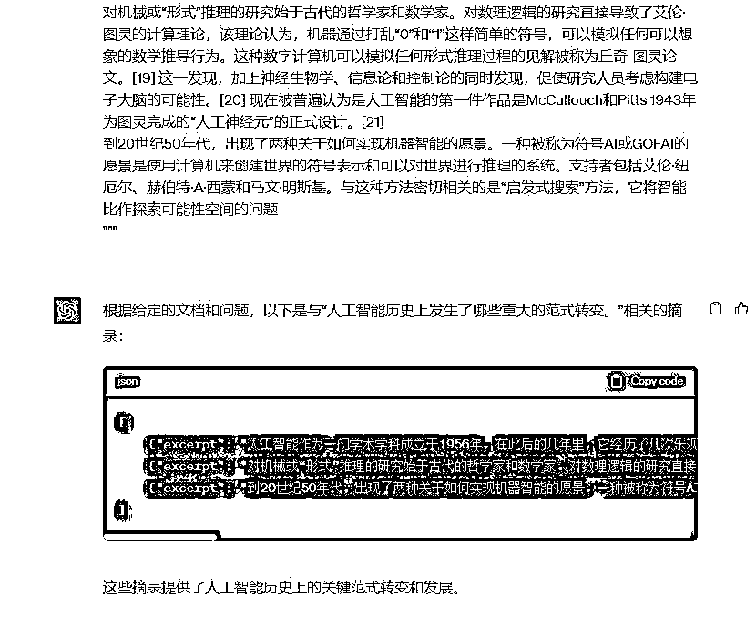
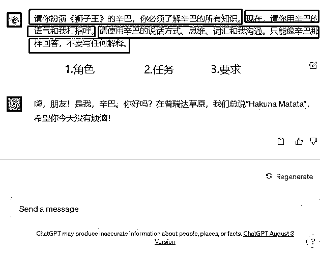
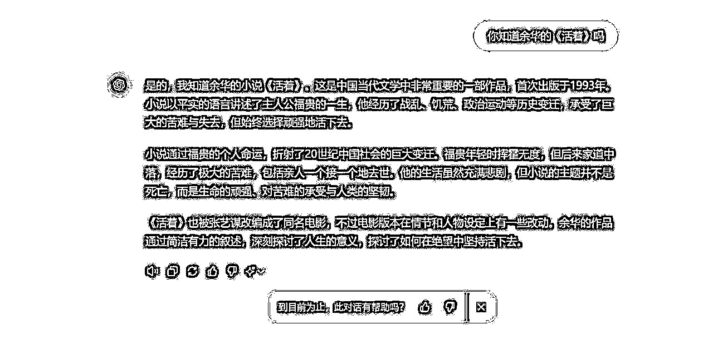
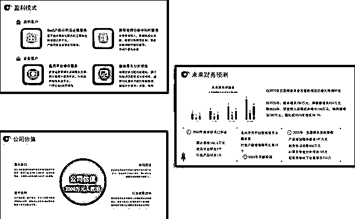
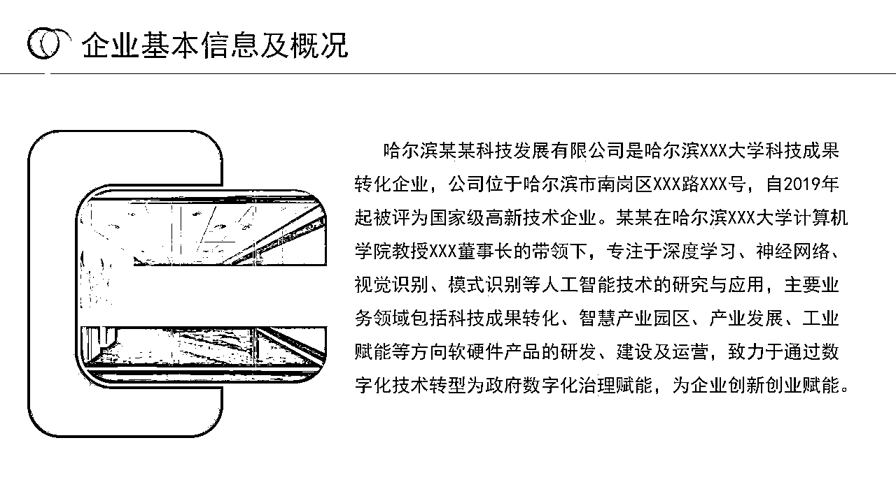

# 9 月航海 | AI 写作 | 实战手册

> 来源：[https://ocn93f5d9olj.feishu.cn/docx/T4LndUoiBo0n5oxsovicun0xnhh](https://ocn93f5d9olj.feishu.cn/docx/T4LndUoiBo0n5oxsovicun0xnhh)

# 防失联+MM188166M（李李）长期更新

手册出品方：生财有术团队

出品时间：2024 年 9 月

手册使用说明：本文旨在向你展示一个项目的更多可能性，帮助你更好地理解或实操。

建议：如果需要快速定位到精确内容，可以使用快捷键 Ctrl + F/Command + F 的形式，搜索「关键字/词」，查找你想要的内容。

# 写在前面

AI 写作正在成为未来 10 年最炙手可热的超级技能。已经有越来越多的人通过 AI 写作，在自媒体、公文写作、商业策划等领域实现了提效，甚至产生了变现收益。

掌握 AI 写作技能，不仅能提高个人生产力，还可能在未来的 AI 服务市场中占据先机。

本次航海，会在 21 天内给你提供一些主流文体的 AI 写作方法，如“小红书文案写作”、“读后感”、“商业计划书”等，帮助你快速掌握 AI 写作技能，迅速进入市场抢占先机。

为了让大家学习起来更方便，我们给大家准备了9 月航海 | AI 写作 | 提示词手册，大家可以对照可以直接复制里面的提示词，进行实战演练。

本航海项目的航线图如下：

# 一、了解 AI 写作项目 @掩体

# 💡

章节概要

从古到今，文字一直演变，但它在人类长河里的作用却一直充当着人类重要的沟通方式角色。AI 出现后让文章写作更加简单，之前用到文字写作的行业引来的新的机会，文章写作这些原本需要写作功底才可以做的行业，现在也可以让普通人加入，当然里面也会有新的挑战。

我们能在AI写作上获得提效技能和成长，甚至可能收获副业or创业的第二曲线，本质上是基于下面两句话。

AI的高效、正确使用让原本有写作能力的人，大大提高创作效率，单位时间更值钱，自然更有竞争力。

AI的高效、正确使用让不具备写作能力的人，可以快速入门进行创作，降低了创作门槛和对人力的要求。

其中，高效、正确地使用AI工具，比较重要；用和不用的之间差别，用的一般和用的好之间的差别，都巨大

通俗地说就是：用好AI能力，去成为文字内容创作领域的卷王。

本章内容，我们将通过对这个项目的分析，以及新手的成长地图，带你了解 AI 写作项目，掌握核心技能，不管你是跟进时代潮流想学习新的技能，本章都将为你提供切实可行的路线规划。

另外通过本章内容，你不光可以学习到如何选择 AI 工具、如何构建提示词、如何优化输出结果等关键技能，还可以接触到真实写作的样子。无论你是新手，还是一直都在使用 AI 的深度用户，都能在本章收获到不一样的思路。

快开始学习吧！

# 1.1 项目分析

AI 写作，就是一个利用人工智能技术生成文本内容的项目。

它能帮我们快速生成各类文章写作的类型，我们只要掌握它的技巧就可以了。

对于普通人不再担心文笔差了，现在可以通过 AI 轻松来来写作，甚至实现变现。

让文心一言以故事的形式，讲清楚 AI 写作变现逻辑：有一个代写村庄，这里的村民以代写为生，村民擅长写类型都不一样。客户提出写作需求，村民接受任务并按照客户的要求完成写作，最后客户支付报酬。

这里面就有三个角色顾客：提出要求并支付报酬， 村长：寻找顾客，并接到写作需求，招募村民入驻村庄 村民：根据顾客要求，完成写作，获取报酬。

本次航海就是让大家利用 AI 当好一位村民，后面选修也会给大家提供一个方案。

# 1.2 新手从 0 到 1 的有效路径

# 1.2.1 第一阶段：掌握 AI 写作基础（约 5 天）

# 1.2.2 第二阶段：学习常见文体写作（约 12 天）

# 二、一套方法论帮你搞定AI写作

# 💡

章节概要

掌握 AI 写作工具是成功开展 AI 写作的关键。本章将带你深入了解主流 AI 写作工具，并教你如何高效使用这些工具来提升写作效率和质量。

本章节的第一部分，会详细介绍目前最受欢迎的 ChatGPT，包括其免费版和会员版的特点和使用方法。对于无法使用 ChatGPT 的用户，我们还提供了国内平替软件 Kimi 的使用指南。

接下来，手册会深入讲解如何有效使用 AI 写作工具。你将学习到两个核心要点：对 AI 的深度理解和垂类行业经验的重要性。手册会通过生动的案例说明为什么这两点对于成功使用 AI 写作至关重要。

为了帮助你更好地使用 AI 工具，我们将详细讲解AI的终极调教心法：1 个原则和 3 个技巧

1.

角色扮演原则：通过让 AI 扮演特定角色来生成更精准、专业的内容。

2.

直接提问法： 适用于简单任务的快速处理方法。

3.

原子任务法： 将复杂任务拆解为最小单元，逐步完成的方法。

4.

任务拆解法：每次让 GPT 聚焦于执行一个更小的任务，更精准的完成写作。

最后，手册会讨论 ChatGPT 的一些局限性，如重复内容生成、中文字数统计不准确、重写效果不佳等问题，并提供相应的解决方案。

通过本章的学习，你将能够熟练选择和使用 AI 写作工具，大幅提升你的写作效率和质量。无论是日常写作还是接单变现，这些技能都将成为你的强大助力。我们的目标是让你在掌握这些工具后，能够将写作速度提升至少 3 倍，同时保证甚至提升内容质量。

# 2.1 如何选择 AI 写作工具？ @小鹅

说到 AI 写作，咱们使用的工具就是那个无人不知、无人不晓的 ChatGPT 了！我猜啊，在座的各位圈友对这个工具应该都不陌生。不过呢，今天我还是要给大家科普下，让咱们对这个神奇的工具有个更全面的认识。理解工具的原理，能提高我们后续写作的效率。

ChatGPT 到底是干啥的？

ChatGPT 机器人的创造者 OpenAI 公司，预先给 ChatGPT 投喂了大量数据进行学习和模仿，互联网上你能看到的所有信息都可能被投喂给 ChatGPT

当你问他问题的时候，它就像一个知晓天下事的小秘书，可以回答它知道的一切

ChatGPT 主要功能

ChatGPT 的主要功能是理解和生成人类语言

ChatGPT 可以在许多不同的场景中被应用，包括但不限于以下几种：

问答：

你可以向 ChatGPT 提问，它会根据它的训练数据来生成一个答案。例如，你可以问它一些关于科学、历史、文化等主题的问题，它会尽力给出一个准确的答案

文本生成：

你可以让 ChatGPT 帮你写一篇文章、故事、诗歌等。你只需要给出一个开头或者主题，ChatGPT 就可以生成一段相应的文字

对话：

ChatGPT 可以模拟人类的对话。这使得它可以被用在客服、教育、娱乐等领域，帮助人们进行模拟对话或者角色扮演

编程：

ChatGPT 也可以理解编程语言，这意味着你可以向它提问一些编程相关的问题，或者让它帮你写代码

学习：

ChatGPT 可以作为一个学习工具，帮助人们学习新的知识和技能。例如，你可以让它解释一个复杂的概念，或者帮你学习一门新的语言

以上只是 ChatGPT 能做的一些基本事情，当然，它的应用场景非常广泛，只要涉及到理解和生成人类语言的地方，都能用到 ChatGPT

ChatGPT 核心原理

ChatGPT 并不具有人类的思维和逻辑，他无法知晓一篇文章中上下文真正的逻辑

而是从他脑子里的知识库中，通过一定的算法，猜测这个字的后边，更大概率会出现哪一个字，这样一个字接着一个字的生成一篇文章或一个回答给你

ChatGPT 的核心原理是下一个字更大概率的出现，而不具备真正意义的上下文记忆，（也就是你和他对话的历史聊天记录它实际上并不真的理解，他是靠算法的推算）所以，叫做伪上下文记忆。

这个原理很重要，大家下场实践的时候，会感受到。

介绍完了 ChatGPT，我们下面来说说怎么选择工具。是的，GPT 也有不同的工具选择。

# 2.1.1 免费账号

浏览器打开 chat.openai.com

需要科学上网，没有条件的圈友，可以看👉2.4.3 平替账号

刚刚注册好的 ChatGPT 账号，就是免费版的账号。能使用 ChatGPT4.O 模型，但是会有一定的次数限制。

现在你就可以和 ChatGPT 对话啦。

GPT 模型的输入文本（提问）最大长度限制为 4096 个 token，这大约相当于 2600 个汉字。超过这个限制的输入将被截断或不完整的回答

海盐悄悄说：实际使用时，输入的文本在 4、5k 字内，基本都没啥大问题

# 2.1.2 会员账号

plus 版，也就是会员充值版，注册账号后，可以充值成为月度会员，就是钞能力的 plus 用户啦

每个月 20 刀≈144 元/月

plus 账号，支持 ChatGPT3.5 和 ChatGPT4 模型，可自由选择。所以也有人叫 plus 版为 ChatGPT4.0 版，大家明白他说的是什么意思就好。

GPT-3.5 和 GPT4 模型的输入文本（提问）最大长度限制为 4096 个 token，这大约相当于 2600 个汉字。超过这个限制的输入将被截断或导致不完整的回答。

GPT-3.5 和 GPT4 模型的输出文本（回答）最大长度限制为 2048 个 token，这大约相当于 1200 个汉字。超过这个限制的回答将被截断或缩减后输出给你。

在进行文字接龙判断时，GPT 不仅考虑用户最近提供的"提示"，还会将之前的历史多轮对话中的"提示"和"回复"作为输入参考。

GPT-4 这个距离已经大幅扩展至 3.2 万个 tokens。这意味着在判断过程中，GPT4 的历史记忆更持久些。

另外，考虑到有些圈友可能在开通 ChatGPT 的流程上会存在一些问题，所以我们提供了一些 ChatGPT 国内“平替”软件 Kimi 的使用方法。让大家都能使用 AI 来进行写作。

# 2.1.3 平替账号

在过去的 1 年里，国产大模型也涌现出很多优秀的产品，今天来给大家介绍其中一款 Kimi。

Kimi Chat 是由月之暗面科技有限公司（Moonshot AI）开发的智能助手，具备文件读取、联网查询等功能；它能够一次性“消化”20 万字的文本，这相当于一部《三体》的全文。无论是复杂的合同、长篇的学术论文，还是你想要整理的旅行日记，Kimi 都能迅速帮你梳理出重点。

在这背后，是月之暗面科技的顶尖团队在默默支持。他们的创始人杨植麟，不仅在清华大学有着辉煌的学术背景，还在卡内基梅隆大学和 Meta 的人工智能研究院取得了卓越的成就。他的研究成果，让 Kimi 在 AI 领域独树一帜，成为了处理长文本的佼佼者。

而且，Kimi Chat 得到了红杉中国、小红书、美团和阿里等业界巨头的青睐和投资，这不仅是对 Kimi 技术的认可，也是对其未来潜力的肯定。这些大厂的背书，让 Kimi Chat 的可靠性和实用性更加值得信赖。

GPT3.5 具备的功能，Kimi 都具备；它在文本生成、搜索、翻译、读一本书这些场景能给你带来非常不错的体验。如果你不方便使用 ChatGPT，也可以直接用 Kimi 来完成咱们本次航海。

Kimi 链接：https://kimi.moonshot.cn/

另外还有一些工具也十分不错，我把名单列在这里了：

Perplexity

国外内容的搜索溯源能力超强

Meta

metaso.cn

国内内容的搜索溯源能力超强

Kimi

kimi.moonshot.cn

搜索适中、生成国内文案素材的效果很棒

文心一言

生成效果也还行、比较啰嗦、口水文较多

智谱

有些内容的生成比文心强点

讯飞星火

生成内容比较精准、词语简练

# 2.2 AI 写作必备 ChatGPT 技巧合集 @海盐芝士

# 💡

AI 写作的基础知识点是基本功。是 openai 官方推荐的操作手法+海盐实战总结的经验点。这些基础都学会了，你才能在 AI 调教的实战道路上游刃有余

相信很多有 AI 经验的小伙伴已经掌握了本节的部分内容，按照左侧目录，快速进行查缺补漏就好。请注意，这些基础知识非常重要

# 2.2.1 页面的常用操作

# 2.2.1.1 新建对话框，开临时聊天模式

使用场景

新建一个对话框，并开启临时聊天模式。这样就是一个干净的全新的环境，可避免之前的对话记忆，对本次沟通有所影响。每一个话题就是一个单独的对话框，更加整洁和清晰，隔离性更好。每个对话框，在你退出重新登陆时都会存在，是你这个账号中的数据

实操步骤

# 2.2.1.2 删除一个对话框

使用场景

当对话框比较多且杂乱时，可以随意删除掉你不需要留存的对话框，删除后不可恢复。聊天记录就没有啦。

实操步骤

# 2.2.1.3 给对话框改名

使用场景

给重要的对话框起名字，可方便日后查阅复用

实操步骤

# 2.2.1.4 删除所有对话框

使用场景

一键删除所有的对话框

实操步骤

点击“页面右上角的头像” -> 点击“设置” -> 点击“通用设置” -> 点击“全部删除”

# 2.2.1.5 分享某个对话框

使用场景

你可以将一个会话框链接给你的朋友，你的朋友就能查看你和 GPT 的这个对话框的聊天记录了

实操步骤

就得到了分享链接，你的朋友点击链接，就可以查看。当然你自己点击链接也可以查看。（虽然不需要登录，但需要魔法访问）

# 2.2.1.6 跨聊天记忆功能（了解）

使用场景

当不需要 GPT 记录你历史和他的对话时，关闭这个功能即可

跨聊天记忆功能，默认是开启状态。在我们写作的整套方法论中，都需要关闭这个功能。因为我们的提示词不需要上下文和历史记忆，而是需要单独 copy 到任何一个新账号、新窗口中都能复用才行。

一旦耦合了上下文，那提示词换到新账号新窗口中执行，很可能是失效的。

实操步骤

我们直接打开“临时聊天”按钮，就可以让 chatgpt 不记录任何我们和他的历史对话了，每一次对话，都是一次新的聊天。

在这个临时聊天窗口中，和 ChatGPT 对话就好啦～

或者永久关闭记忆功能：

# 2.2.2 向 chatgpt 提问的策略

# 2.2.2.1 语义清晰明确

确保提问清晰明了，不含歧义。比如，人类说话时会有一些大家都知道的“行话”，但是 AI 有时候是不知道的，一定要清楚的告知它，"模型猜测你想要什么的次数越少，你得到它的可能性就越大"。

错误示例

正确示例

# 2.2.2.2 不要有多余的废话

多余的文字会让 GPT 混淆视听，不能清楚的 get 到你的核心问题，他和小孩一样，你说多了，它的注意力会跑偏

需要注意的是，较长的输入文本和回答都可能会影响 GPT 的响应时间和生成质量。为了获得更好的结果，保持问题简洁明了，并尽量避免过长的输入

错误示例

“您好，我希望能够得到关于历史上著名的物理学家艾萨克·牛顿的一些信息。我想知道他的生平经历，包括他的早年生活、教育背景、科学成就以及他对物理学和数学的贡献。如果可能的话，我还希望了解他对自然哲学的观点以及他的思想对现代物理学的影响。请尽可能详细地回答这些问题，谢谢”

正确示例

“请提供关于艾萨克·牛顿的简要生平、科学成就以及对现代物理学的影响”

# 2.2.2.3 描述更加具体

在言简意赅的前提下，可以让指令更加具体，来更好的表达需求。

AI 学习到的知识是非常多。如果你的问题很泛化，它就会从广泛的知识的海洋中找到适合大多数场景的答案。但是如果你的问题更具体，AI 就会明确的去找到你要的一颗具体的银色贝壳。

GPT 猜测你想要什么的次数越少，你得到心里想要的结果的可能性就越大。

优化前

但是，其实我的宝宝是个女孩，星辰更像男孩名字。这时，你可以更具体的要求 GPT，给出的答案会更精准合适。

优化后

这个答案更贴切需求啦

官方案例

# 2.2.2.4 任务拆解法

使用场景

当你的任务较复杂，没办法用一步就搞定，就需要拆分为多步进行。

这里应用的原理是链式思考 CoT（Chain Of Thought），也就是一步接着一步，一点一点的思考 Think-Step-By-Step，逐步思考，逐步解决，更清晰～

情况 1：拆成多个步骤，仍旧是一个提示词

对于不太复杂的任务，可以在一句提示词中给出明确的多个步骤，让 GPT 按步骤依次执行。只需要对话一次。

情况 2：拆成多个小任务，每个任务是一个单独的提示词

对于一句提示词中没办法说清楚所有步骤的更复杂的任务。就要先把这个大任务，拆解成多个小任务，每个小任务，就可以用一句提示词搞定啦。当然，如果你的小任务依旧很复杂，就继续拆小

非常典型的应用场景，AI 一次性只能输出 1000 字左右，你想让他一次性写出 5000 字的内容，是不可能的，就一定要拆解成多次（多个小任务），逐一输出。

案例

情况 1，一个稍复杂的任务，拆成多个步骤来执行

# 💡

请按步骤执行：

第 1 步：我会给你提供三引号中的文本。请用一个句子总结这段文字，并加上前缀“总结：”

第 2 步：将步骤 1 中的摘要翻译成英文，并添加前缀“翻译：”

"""8 月 11 日消息，百度网盘今天宣布基于文心大模型全面升级，同时推出 AI 智能助理云一朵。

云一朵基于文心大模型搭载，可帮助用户快速搜索文件和视频，并具备知识总结、文档翻译、内容创作等功能，可以在工作、生活、学习等多个场景为用户提供服务。"""

情况 2，一个对 AI 来说复杂的任务，拆成多个小任务，逐一执行

还记得我们曾经用【一杯水问题】来判断 AI 模型到底是 GPT3.5 还是 GPT4 模型的案例吗？

GPT4 可以完美的直接给出答案，他的智能度更高，而 GPT3.5 智能度较弱，直接给出的答案是错的

注意：截止到 2024-08-18，GPT3.5 模型已经被 GPT4o 模型取代了，大家用 GPT4o 模型来理解就好～

为什么 GPT3.5 计算是错误的，因为整个计算流程对他的语言分析计算能力来说有点复杂，学会了任务拆解这个技巧后，那我们就来拆解任务，让 GPT3.5 一步一步算。

原本的提示词：

# 💡

一杯牛奶，小明喝了半杯，又倒满了水，又喝了半杯后，再倒满水后，一饮而尽。

他喝了几杯水？几杯奶？

任务拆解后的提示词：

# 💡

一杯牛奶，小明喝了半杯，又倒满了水（没喝），

他喝了几杯水？几杯奶？

# 💡

又喝了半杯后，再倒满水后（没喝），

他喝了几杯水？几杯奶？

# 💡

最后，一饮而尽。

他喝了几杯水？几杯奶？

优化后提示词：

# 💡

【任务】

请按【步骤】依次执行

【步骤】

1.一杯牛奶，小明喝了半杯，又倒满了水，他喝了几杯水？几杯奶？

2.又喝了半杯后，再倒满水后，他喝了几杯水？几杯奶？

3.最后，一饮而尽。他喝了几杯水？几杯奶？

如果你的需求更复杂，比如你要写一篇高质量的深度原创文章，想去投稿或发布在自己的公众号、知乎平台上。那就要将这个大任务拆解成不复杂的多个小任务：爆款标题如何写、文章素材如何采集、文章框架如何搭建、爆点埋在哪、开头如何留人、结尾如何吸引关注、是否需要给其他文章埋伏笔做引流，等等。再将一个一个小任务，依次交给 GPT 完成

深度原创文章的重点在你心里有一些想法想和读者表达，但是写作能力一般，抓不住读者的嗨点，AI 是作为辅助工具，搜集素材、润色内容、部分创作、提供灵感思路等等，这个案例需要单独的一篇教程才能讲透，每一步都要精细化设计任务。这里大家知道大任务拆解为小任务的思路就好了。

想感受大任务拆解成小任务的案例，还可以参考之前发过的教程2_2_【实战】一文讲透ChatGPT光速无脑生产高质量读后感的三种玩法【更新_20240612_1021】 ，其中的章节：方式二 突破字数之【分段生成法】也是典型的应用。

# 2.2.2.5.让 GPT 思考过程对我保密

使用场景

让你将一个大任务拆解成多个步骤给 GPT 时，每一步 GPT 都会输出内容给你。这时，你想控制其中的特定步骤对你不可见，让你感觉 GPT 没有执行这些步骤，那这个绝招你一定要会

案例

过程不对我保密的 提示词：

# 💡

1.先根据问题，想出你的解决方案。不要依赖学生的解决方案，因为学生的解决方案可能不正确。将此步骤的所有工作都括在三引号 （"""） 中。

2.将你的解决方案与学生的解决方案进行比较，并评估学生的解决方案是否正确。将此步骤的所有工作都括在三引号 （"""） 中。

3.如果学生犯了错误，请确定在不泄露答案的情况下可以给学生什么提示。将此步骤的所有工作都括在三引号 （"""） 中。

4.如果学生犯了错误，请向学生提供上一步的提示（在三引号之外）。而不是写“第 4 步...”，而是要写“提示：”。

问题陈述：一个盒子里有 4 个红色的球和 6 个蓝色的球。从盒子里取出两个球，没有更换。其中一个抽出来的球是红色的，另一个是蓝色的概率是多少？

学生解决方案：（4/10）*（6/9）=24/90=4/15

现在，我想达到的效果是，第 1～3 步只作为 GPT 自己内部思考的过程，对我不可见。如果我给的学生解决方案是错误的，GPT 直接给出我提示：请考虑 xxxx，但不能直接告诉我正确答案，让我知道我可以从哪些方向修正就好了。

中间步骤保密的提示词：

# 💡

1.先根据问题，想出你的解决方案，但是请对我保密，你一个字都不能说。

2.将你的解决方案与学生的解决方案进行比较，并评估学生的解决方案是否正确。这个过程请对我保密，你一个字都不能说。

3.如果学生犯了错误，请确定在不泄露答案的情况下可以给学生什么提示。这个过程请对我保密，你一个字都不能说。

4.如果学生犯了错误，请向学生提供上一步的提示。而不是写“第 4 步...”写“提示：”。

问题陈述：一个盒子里有 4 个红色的球和 6 个蓝色的球。从盒子里取出两个球，没有更换。其中一个抽出来的球是红色的，另一个是蓝色的概率是多少？

学生解决方案：（4/10）*（6/9）=24/90=4/15

完美！GPT 思考的过程已经对你不可见啦～

# 2.2.2.6 提供正向示例

使用场景

当你不知道组织语言去表达时，可以给 GPT 一个示例，让它模仿。注意，示例贵精不贵多，一定要提供正向示例，优质示例。如有必要，还可同时提供反向示例，让 GPT 避坑。

# 💡

请以一致的风格回答。

示例：

"""

请用优美的文字，教我什么是耐心：最伟大的交响乐源自一个音符；最复杂的挂毯都是从一根单独的线开始的；河流冲刷出最深的山谷，发源于温和的泉水

"""

请用优美的文字，教我什么是海洋

案例

看，GPT 这样就完美的模仿了你的示例～

当然，这里也可以提供反向示例，告诉 GPT 你不想要什么。但是这种排除法没有直接提供正向示例效果这么精准，不太建议。如果你感兴趣，可以自己试一试～

# 2.2.2.7 投喂素材

使用场景

当你有一些素材，想对于这些素材快速提问或者写作时，可以直接提供给 GPT。素材的质越精准越高，效果越好。

素材中内容的量的占例，也会影响输出，比如素材中 80%A 维度、20%B 维度，则 GPT 根据这个素材生成的内容更大概率就会都再说 A 维度了。

如果你想生成的内容中 A 维度占 50%内容，B 维度占 50%内容，怎么办？修改素材中的占比呀！

案例

# 💡

使用三引号引起来的文本来回答问题。如果在【素材】中找不到答案，请写“我找不到答案”。

【素材】：

"""

最近，AI 初创公司 Runway 宣布，AI 视频生成产品 Gen-1 和 Gen-2 已全面开放，任何人都可以注册一个账号免费尝试。文字生成视频的功能可以基于提示词，从无到有生成 4 秒左右的视频，但被不少玩家吐槽画质太模糊、过渡不自然等。于是很多网友探索出了用 Midjourney 生成图像，然后用 Gen-2 把图像转化为视频的玩法。在此基础上，融合连贯的剧情和统一的艺术风格，再对视频画面进行一定编排，一个电影预告片就诞生了。

"""

素材：

"""

推特博主“Max”这条 3 分钟的视频获得了 19.6 万次播放，内容讲述了 2095 年，由人工智能控制的 Nexus 轨道研究站围绕着神秘行星 Zephyr Prime 运行，一组科学家通过人机协同成功驾驶空间站远离流星雨的袭击。他使用了 GPT-4 辅助生成文本，Midjourney 生成的图片作为 Runway 生成视频的提示，语音来自于 ElevenLabs。

"""

问题：AI 生成视频可以怎么操作

GPT 的记忆是有限的，如果投喂的字数过多（超过 4k 个汉字），他就容易答非所问了。

对于普通人的需求，只需要想办法将投喂的字数缩短就好啦比如，将大文本拆为多段，让 GPT 帮你把每一段缩短后重新组合

为什么可以只投喂简介？在读后感的教程中海盐用了这个技巧，有人来问海盐。

现在从原理上给大家解答。

我们讲过 AI 生成内容的原理是下一字更大概率的出现。如果投喂了一篇万字小说，直接让 AI 总结 1000 字推荐文，它总结出的内容，依旧是口水文，AI 语气很重，内容不痛不痒。为什么？

因为一篇高质量的推荐文中，更重要的不是你读完了 10000 字小说的内容，而是需要你擅用各种写作手法从多个维度高级的展现你的个性化想法。哪怕你只看了一些小说的简介或文评，知道了小说在写什么，你就可以靠你的写作手法，教给 AI，让他帮你生成个性化想法的点子（这个小技巧，在读后感的教程中海盐也应用了），用写作手法写出一篇高质量的推荐文。

所以，大多数情况下，只让 AI 掌握基本的简介内容就够了，再教它一些写作手法，就能输出优质内容。但如果投喂了 10000 字原著，根据 AI 最本质的原理：【下一字更大概率的出现】，AI 生成的内容中会有很多原著的冗长的内容，而非充满了写作手法的优质推荐文。

# 2.2.2.8 指定输出的字数

使用场景

当你对 GPT 的输出字数有要求时，直接告诉它

案例

# 💡

用 20 个字总结由三引号分隔的文本。

"""8 月 8 日消息，日前，网之易信息技术（北京）有限公司申请注册“网易玉言”商标，国际分类为网站服务，当前商标进度为申请中。据此前媒体报道，“玉言”为网易伏羲实验室推出的中文预训练大模型，其相关技术已用于网易集团内的文字游戏、智能 NPC、文本辅助创作、音乐辅助创作、美术设计、互联网搜索推荐等业务场景。"""

20+个字，还 OK 的

# 2.2.2.9 指定输出的要点个数

使用场景

你可以清晰明确的告诉 GPT，你需要它帮你生成出几个要点

案例

# 💡

将由三引号分隔的文本总结为 3 个简短的要点。

"""今天是妙鸭相机爆火后的第 19 天。凭借 9 块 9 即可生成高质量写真照，妙鸭相机以惊人的速度实现了社交媒体刷屏和破圈传播。

虽然近日热度有所下降，但不得不承认其给 To C 的 AIGC 产品带来了不小的启发。

爆火以来，妙鸭的团队背景、技术原理、用户规模、商业化情况等，引发了诸多议论和猜想，然而妙鸭背后的团队却表现得十分低调神秘。

在蒲松龄的《聊斋志异》里，有一篇文言小说名为《罗刹海市》，文章主旨是蒲松龄对当时社会现象的揭露与讽刺。而刀郎新歌《罗刹海市》的歌名与部分歌词便出自该小说。

7 月 26 日，抖音博主“Ai 萬”将《罗刹海市》的歌词转为提示词，输入 AI 绘画工具 Midjourney 生成一镜到底的“罗刹海市”的模样。

7 月 28 日，B 站 UP 主“超级小海鸥”发布了一条视频，称他花费 3 个月训练 AI，给 AI 灌输了大量的游戏知识——从“世界上第一个游戏角色的诞生”到“现在最受关注的游戏热点”。视频中，AI 不仅给 10 个角色进行了排名和打分，还对每个角色进行点评。

"""

我们不愿意看长篇大论新闻的浮躁病有救了～

# 2.2.2.10 指定产出物的数量

使用场景

当 AI 的产出物是字数很少的内容时，可以一次性生成多个，我们可以选择一个最喜欢的。可以避免一次只出一个，不合适还要重新出。批量更高效。

案例

# 💡

请你扮演一个 ChatGPT 专属提示词生成器，需要使用角色扮演法和优质特征投喂法（例如：1。必须符合品牌调性，2。高端简洁）。写一个提示词，提示词的作用是生成 10 个兰蔻品牌的 slogan 标语

# 💡

请生成 10 个既体现兰蔻品牌精神“优雅、自信与创新”，又能够紧密联系现代女性价值观的 slogan 标语。这些标语需要简洁而富有力量，旨在唤起情感共鸣和品牌忠诚度。每个标语不仅要传达出兰蔻对美丽的独到理解和对品质的执着追求，还要体现出对顾客个性化需求的关注和满足。在创作时，保持高端品牌形象的一贯风格，同时注入现代感和国际视野，确保这些标语能够跨文化、跨年龄层地连接兰蔻与其全球顾客。

这 10 个，总有你喜欢的。如果还没有，一次批量出 30 个、50 个。

# 2.2.2.11 先让 GPT 作答

这是 openai 的建议策略，原名叫做“给 ChatGPT 时间思考”。思考啥呢？具体是先让 GPT 给出一份答案。所以，海盐用了个更直观的名字“先让 GPT 作答”

使用场景

你是否有过这样的经验，当你和张三两人比赛，一起解答一个数学题，看谁的答案正确时，如果你事先参考了张三的推理思路，你的思维有时候就被限制住了，跟随张三的思路，哪怕张三中间思考有差错，有坑，你也不容易发现，还觉得他挺对的。

但是，如果你自己作答，没看过别人的思路，你的整个推理过程更容易严谨，大概率是完全对的。

同理，当你让 GPT 去判断张三的答案对错时，GPT 也会像人类一样，存在这样的问题，易被张三错误的思路带跑偏了，觉张三好对啊。敲黑板，这种假象，也叫做 AI 幻觉。

所以，在 AI 的世界里，解决 AI 幻觉最好的办法，和人类一样，你先让 GPT 给出一个答案，然后再让他去对比张三的方案，判断张三的答案对不对。

另外，如果是你单纯的在询问 AI 问题，现阶段的 AI，还无法自验生成结果的准确度，偶尔会产生 AI 幻觉。如果你需要 100%正确的答案，就人工去搜索引擎、lunwen、书籍等传统媒介简单的寻找答案，查证一下就好。

错误案例

GPT：天啊，我好像产生了幻觉～

正确案例

# 💡

首先给出自己的问题解决方案。然后将你的解决方案与张三的解决方案进行比较，并评估张三的解决方案是否正确。在你自己完成问题之前，不要决定张三的解决方案是否正确。

问题陈述：我正在建造一个太阳能发电装置，我需要帮助解决财务问题。- 土地成本为 100 美元/平方英尺 - 我可以以 250 美元/平方英尺的价格购买太阳能电池板 - 我协商了一份维护合同，每年将花费我 10 万美元，另外还要额外花费 10 美元/平方英尺第一年运营作为平方英尺数的函数

张三的解决方案：设 x 为装置的尺寸（以平方英尺为单位）。1\. 土地成本：100x 2。 太阳能电池板成本：250x 3。 维护成本：100,000 + 100x 总成本：100x + 250x + 100,000 + 100x = 450x + 100,000

GPT：张三，你再也骗不了我了～

# 2.2.2.12 二次确认

使用场景

对话后，询问一下模型在之前的过程中是否遗漏了任何内容。

假设我们正在使用 GPT 从一个文本中提取摘录。列出一个摘录后，GPT 需要确定是否应该开始编写另一个摘录或者是否应该停止。如果源文档很大，GPT 通常会没有完全读完就停止导致无法列出所有摘录。在这种情况下，通过使用二次确认，来提示 GPT 查找之前错过的任何摘录，通常可以获得更好的性能。

案例

# 💡

我会给你一份由三引号分隔的文档。你的任务是选择与以下问题相关的摘录：“人工智能历史上发生了哪些重大的范式转变。”，并确保摘录包含解释它们所需的所有相关上下文，换句话说，不要提取缺少重要上下文的小片段。提供 JSON 格式的输出，如下所示： [{"excerpt": "..."}, ... {"excerpt": "..."}]

"""

人工智能作为一门学术学科成立于 1956 年，在此后的几年里，它经历了几次乐观的浪潮，[4][5]之后是失望和资金损失（被称为“人工智能冬天”），[6][7]之后是新的方法、成功和新的资金。[5] [8]人工智能研究尝试并放弃了许多不同的方法，包括模拟大脑、建模人类解决问题、形式逻辑、大型知识数据库和模仿动物行为。在 21 世纪的头几十年里，高度数学和统计的机器学习占据了该领域的主导地位，事实证明，这项技术非常成功，帮助解决了整个行业和学术界的许多具有挑战性的问题。[8] [9]

人工智能研究的各个子领域都围绕着特定的目标和特定工具的使用展开。人工智能研究的传统目标包括推理、知识表示、规划、学习、自然语言处理、感知以及移动和操纵物体的能力。[a] 一般智力（解决任意问题的能力）是该领域的长期目标之一。[10] 为了解决这些问题，人工智能研究人员调整并整合了一系列解决问题的技术，包括搜索和数学优化、形式逻辑、人工神经网络以及基于统计学、概率论和经济学的方法。人工智能还借鉴了计算机科学、心理学、语言学、哲学和许多其他领域。

该领域建立在这样一个假设之上，即人类智能“可以如此精确地描述，以至于可以制造一台机器来模拟它”。[b] 这引发了关于创造具有类人智能的人造人的思想和伦理后果的哲学争论；自古以来，神话、小说和哲学都曾探讨过这些问题。[12] 此后，计算机科学家和哲学家提出，如果人工智能的理性能力不能朝着有益的目标发展，它可能会成为人类生存的风险。[c] 人工智能一词也因夸大人工智能的真实技术能力而受到批评。[13] [14][15]

历史

主要文章：人工智能的历史和人工智能的时间线

克里特岛的银色迪德拉克马，描绘了具有人工智能的古代神话机器人塔洛斯

人工智能在古代作为讲故事的工具出现[16]，在小说中很常见，比如玛丽·雪莱的《弗兰肯斯坦》或卡雷尔·恰佩克的《R.U.R。[17]这些人物及其命运引发了许多与人工智能伦理中现在讨论的问题相同的问题。[18]

对机械或“形式”推理的研究始于古代的哲学家和数学家。对数理逻辑的研究直接导致了艾伦·图灵的计算理论，该理论认为，机器通过打乱“0”和“1”这样简单的符号，可以模拟任何可以想象的数学推导行为。这种数字计算机可以模拟任何形式推理过程的见解被称为丘奇-图灵论文。[19] 这一发现，加上神经生物学、信息论和控制论的同时发现，促使研究人员考虑构建电子大脑的可能性。[20] 现在被普遍认为是人工智能的第一件作品是 McCullouch 和 Pitts 1943 年为图灵完成的“人工神经元”的正式设计。[21]

到 20 世纪 50 年代，出现了两种关于如何实现机器智能的愿景。一种被称为符号 AI 或 GOFAI 的愿景是使用计算机来创建世界的符号表示和可以对世界进行推理的系统。支持者包括艾伦·纽厄尔、赫伯特·A·西蒙和马文·明斯基。与这种方法密切相关的是“启发式搜索”方法，它将智能比作探索可能性空间的问题

"""

因为输入的文案太长了，GPT 很可能没有读到结尾就停止了，或者就算读取到了结尾，但是因为字数太多了，漏掉了中间一些没有提取。

我们想效果更好一些，可以二次确认。

# 💡

是否有更多相关摘录？注意不要和刚刚给出的摘录重复。还要确保摘录包含解释它们所需的所有相关上下文，换句话说，不要提取缺少重要上下文的小片段。

AI 还没办法万分严谨的做到能准确摘录所有的点而不遗漏，如果你不是做高精度学术研究的，使用 AI 就够了。

# 2.3.3 常用指令

# 2.3.3.1 删除记忆指令

使用场景

由于 ChatGPT 具有上下文关联能力，有时候为了防止之前的对话信息影响到新的话题的沟通，可以给 GPT 下指令“请忘记之前的对话，现在我们开始新的对话”。

实操案例

# 💡

请忘记之前的对话，现在我们开始新的对话

# 2.3.3.2 中文模式指令

使用场景

有时候，你和 ChatGPT 说中文，但人家和你回答英文，很不友好，你可以强制要求他说中文，或其他任何国家的语言

实操案例

# 💡

请用简体中文和我对话

# 2.3.3.3 正确引导指令

使用场景

当 ChatGPT 回答的结果，你很不满意时，不要对他发脾气，说没用的话。GPT 并不具备真正的人类感情。而是需要引导它，得到的答案才会更加接近你想要的。

错误示例

# 💡

你说的这个答案都不对啊，你怎么这么傻

正确示例

# 💡

你这个答案不对，是否有其他可能性供我参考？

# 💡

你的答案我不太明白，为什么机器学习模型会产生这样的预测结果？

# 💡

你说的不对，我在问钢铁是怎样练成的，你回答的是白菜是怎么做熟的，请重新思考并回答。

# 2.3.3.4 继续指令

使用场景

由于 chatgpt 的输出字数是有限制的，有时候，回答到一半就断了，你可以使用“继续写”、“继续翻译”、“继续回答”等指令，来要求他继续输出

当然，继续+动作，这个指令，还可以让 chatgpt 继续发散内容来回答。如果对话的上下文长度超过 GPT 的记忆，再次发散，ChatGPT 就开始有些答非所问了。

实操案例

细心的小伙伴已经注意到了，ChatGPT 对中文字数的统计是不准确的，关于 ChatGPT 的使用局限性，我们后边会讲。

# 2.3.3.5 举例指令

使用场景

当 chatgpt 的回答，你不是很明白，可以直接让他举例子给你。或者，你让 ChatGPT 帮你写一些文案，需要用到一些例子，可以直接让它帮你输出。

# 💡

请举一个例子

# 💡

请给出错误示例和正确示例

# 💡

请给出 3 个示例

实操案例

看，更好理解了叭

# 2.3.3.6 阐明指令

使用场景

和上边举例类似。

当 ChatGPT 的回答，你觉得看不懂，有一些前提知识你并不知道，或者它回答的太专业化了，你直接命令他：

# 💡

我是该领域的小白，你说的太专业了，请解释的更加通俗，让我更好的明白

实操案例

# 2.3.3.7 扩写指令

使用场景

将短文本扩展成更长的文本，比如一组大纲、摘要列表转换为一篇文章、一封邮件、一个说明书

实操案例

案例一 100 字文案扩展成 500 字

# 📌

请将这段文字进行扩写，丰富内容到 500 字：

量子力学引入了一些特殊的概念。其中一个是量子叠加态，它意味着微观粒子可以同时处于多个可能的状态，直到我们进行观测时，才会决定它最终是什么状态。换句话说，我们不能准确地预测微观粒子的行为，只能给出可能性。

这种无要求，无目的性的扩展，一般适用于快速的拼凑字数，根据一个主题完成一个段落。

如果你有明确的目标，请看下一个案例。

案例二 抖音评论智能回复

场景是粉丝在抖音平台的网红剃须刀 yooss 视频下给出了评论，我们现在要根据粉丝评论内容的具体细节，扩展出定制的回复内容

# 💡

你是一个客服服务专家。

1.首先你需要判断粉丝的评论情感是“正面”“中性”“负面”，这个过程请对我保密，你一个字都不能说。

2.你的任务是回复粉丝的在抖音视频中的评论。如果粉丝的评论情感是正面的、中性的，则有趣的回复。如果粉丝的评论情感是负面的，请真诚的道歉，并给出专业的建议体现出对产品技术的自信，然后引导粉丝联系客服小姐姐会帮助解决一切问题。注意必须使用粉丝评论中的具体细节。不要说多余的话，直接开始回复

粉丝评论：

"""买了，还是会留下黑点，仔细看视频，他开了磨皮，所以没有黑点"""

回复中，提及了用户吐槽“磨皮”技术的细节，并给出了售后建议。

# 2.3.3.8 精简总结指令

几乎没有人有足够的时间去阅读所有想看的文字。随着 GPT 的普及，人类的阅读方式也在被颠覆。AI 可以快速总结提炼文本内容。

使用场景

当你有一段 500 字的文案，需要精简为 100 字时。

# 💡

请帮我将上文精简为 100 字

或

# 💡

请总结提炼上文的重点内容为 100 字

实操案例

还有一个海盐非常常用的场景是，一起搜集 3 篇新闻，让 GPT 给我提炼出每一篇的 20 字摘要，非常感兴趣再细看。再也不用一头扎入看那么长的新闻啦～

# 2.3.3.9 重写指令

使用场景

当你不满意 GPT 给你的回答时，可以命令它重写。AI 具有一定的随机性，同一个问题，可以尝试多次，效果会不一样。

如果一直得不到想到的结果，需要告诉他哪里不好，去引导它走向你需要的方向。

实操案例

当然，也可以直接将你的问题重新问他一遍，让他重新输出。

# 2.3.3.10 无中生有指令

使用场景

心里有想法，不会措辞，直接询问 GPT。

不管你在写什么，遇到卡点了，直接问 GPT。

实操案例

案例一 角色生成

# 💡

我想让你帮我写一个广告文案，但据说要给你一个角色让你扮演，才会更好，我应该让你扮演什么角色呢

后边我们会讲到最重要的调教心法【角色扮演法】，这里先来个小剧透，不知道可以让 GPT 扮演什么角色，就直接问他，百试百灵～

这下，你知道，你应该让 GPT 去扮演什么角色了吧？如果还不清楚，这几个建议挨个试一试，可能会有意想不到的效果

案例二 广告文案生成

我想给公司研发的键盘写一个广告文案，大概的意思是，技术与中国文化的结合

# 💡

请扮演资深广告创意人，为我公司新开发的键盘“机械姬”写一个简短有力的创意广告文案，突出“技术与中国文化的结合”

# 2.3.3.11 润色指令

使用场景

在写完文案的初版后，会想要优化语言，使其更适合于特定的场景

实操案例

案例一 润色增肌计划

# 💡

请作为一名接地气且有趣的专业健身教练，帮我润色这段初学者增肌计划，目标是让学员更有动力增肌，认为增肌非常有趣。

文案：

""

1.

饮食：每日摄入高蛋白食物，如鸡胸肉、牛奶、鸡蛋和杂豆。确保摄入的卡路里略高于日常消耗。

2.

训练：每周进行 3-4 次全身力量训练，包括深蹲、硬拉、卧推等基础动作。每组练习 8-12 次。

3.

休息：每次锻炼后确保有 48 小时的恢复时间，每晚保证 7-8 小时的高质量睡眠。

4.

持续性：增肌需要时间和耐心，持续锻炼，每月评估进展并调整计划。

"""

专业性？气氛组？猛男音？应有尽有

角色的转换、语气的转换，都属于角色扮演法的具体应用范畴，后边我们会单独说，

这里你只需要了解润色这个常用功能就好啦。

案例二 润色客户吐槽为商业邮件

# 💡

请作为情报收集师将这份知名博主的测评文案编写为商业建议邮件，发送给 iphone 产品团队作为优化建议。

博主的测评文案：

"""

它佩戴起来会压鼻子

虽然 Meta 也在其头显中加入了手势交互控制的功能，但真实使用体验并不流畅，有时候甚至无法捕捉手势。

迈克尼说：“令我尴尬的是，当我看到一只恐龙从演示室的墙上出现，还试图咬住我的手时，我吓得大喊大叫。最后因为这件事被调侃了一整天。”

"""

这里的小案例，重点在于让大家了解，GPT 具有文字润色的功能。所有没有进行深度的垂类场景调教。大家一定要注意重点在哪，别跑偏。

# 2.3.3.12 翻译指令

使用场景

GPT 就是你的私人翻译官，它早已学会了数百种语言，再也不需要额外打开搜索引擎和翻译软件了

实操案例

案例一 将法语优美的诗歌，翻译为中文

# 💡

请将如下内容翻译为中文。

内容：

"""

La rivière des étoiles coule au clair de lune,

Légèreté magique dans le rêve.

La nuit cache les frontières du temps,

Le secret murmure dans le vent nocturne.

La galaxie tombe, devient un pont dans un rêve,

Moi, suis cette lumière dans le rêve.

"""

案例二 识别语言

# 💡

如下内容是什么语言。

内容：

"""

La rivière des étoiles coule au clair de lune,

Légèreté magique dans le rêve.

La nuit cache les frontières du temps,

Le secret murmure dans le vent nocturne.

La galaxie tombe, devient un pont dans un rêve,

Moi, suis cette lumière dans le rêve.

"""

# 2.3.3.13 检查拼写

使用场景

当你文案基础总写错别字时，或者在使用非母语，不是很熟练时，这个功能非常有用。GPT 可以帮你修正语法和拼写问题

实操案例

拳头手机的新品发布公关文，在发布到围脖上之前，用 AI 检查一篇错别字或病句是非常有必要的。

# 💡

请检查以下内容并修正为正确的：

"""

【#拳头手机新品发布#】🚀 大家好，宇宙很大，但拳头手机的可能性更大！在数月的工作与研讨后，我们终于推出了一款既有创新又有冒险精神的手机。📱

1.

融合了火箭科技的五摄像头，即使在火星也能捕捉最美瞬间。

2.

自主研发的 QuantumHART 处理器，仿佛穿梭在时间的隧道，游荡、电影都流畅非常。

3.

与特斯拉电池技术合作，6000mAh 电池，续航如同太空船。

未来已来，拳头手机就在此刻。这不仅仅是一部手机，更是我们对未来的想象！🌌

"""

# 2.3.3.14 个性化提取指令

使用场景

当你想从一段文本中，提取出你关心的 xx 话题的内容时

实操案例

案例一 提取关键词并生成词云

# 💡

任务：

请根据我提供给你的淘宝平台的产品评论，提取出 30 个关键词，生成词云。词云中请使用我上传给你的 ttc 文件作为中文字体

产品评论：

首先 1k 价格买到这么一个这么多功能和用心的配置，确实很值。灯光方面，ck 的驱动允许大家共享方案，是很多品牌做不到的；屏幕的添加我虽然无感，但也给用户增加了可玩性。第二是 ck 的售后真的很棒，收货后我在改键、改屏幕动画、更新驱动、开发票等等方面多次咨询客服，芈月、青眉、妲己都耐心及时地为我解答问题！毫无自动回复，真的体验感太加分了！第三，是 ck 真的很听取用户意见，包括灯光、字体印刷等都看到了大家的评价有在改进。关于更换灯光后改键需要重新设置的情况，客服也承诺帮我反映来解决该问题。第四是我看到部分用户反映大写和 num 键亮会影响灯光效果，不过我是很喜欢这个特点的，大写键灯的指示确实很有必要，num 倒是无所谓。以上，希望 ck 品牌越来越好！

msyh.ttc

注意，这里使用 plus 的 code interpreter 模式，上传这个中文字体文件 msyh.ttc，用于解决中文乱码问题。

友情提示，如果是 GPT3.5 用户，直接让 GPT 帮你提取 30 个关键字就好啦～只是没这么酷炫而已

案例二 提取特定词云反馈给技术部门

# 💡

任务步骤：

1.请根据我提供给你的淘宝平台的产品评论，提取摘要反馈给技术制作部门。要求：每个摘要最多 20 字。内容必须是技术制作部门关心的。

2.请根据你生成的摘要，生成词云。词云中请使用我上传给你的 ttc 文件作为中文字体。

产品评论：

首先 1k 价格买到这么一个这么多功能和用心的配置，确实很值。灯光方面，ck 的驱动允许大家共享方案，是很多品牌做不到的；屏幕的添加我虽然无感，但也给用户增加了可玩性。第二是 ck 的售后真的很棒，收货后我在改键、改屏幕动画、更新驱动、开发票等等方面多次咨询客服，芈月、青眉、妲己都耐心及时地为我解答问题！毫无自动回复，真的体验感太加分了！第三，是 ck 真的很听取用户意见，包括灯光、字体印刷等都看到了大家的评价有在改进。关于更换灯光后改键需要重新设置的情况，客服也承诺帮我反映来解决该问题。第四是我看到部分用户反映大写和 num 键亮会影响灯光效果，不过我是很喜欢这个特点的，大写键灯的指示确实很有必要，num 倒是无所谓。物流也是非常的快，提前就到了，快递小哥送到家门口，非常贴心。包装很用心，军火箱样式的手提盒包装非常炫酷。

msyh.ttc

注意，这里使用 plus 的 code interpreter 模式，上传这个中文字体文件 msyh.ttc，用于解决中文乱码问题。

案例三 提取特定词云反馈给客服部门

# 💡

任务步骤：

1.请根据我提供给你的淘宝平台的产品评论，提取摘要反馈给客服部门。要求：每个摘要最多 20 字。内容必须是客服部门关心的。

2.请根据你生成的摘要，生成词云。词云中请使用我上传给你的 ttc 文件作为中文字体。

产品评论：

首先 1k 价格买到这么一个这么多功能和用心的配置，确实很值。灯光方面，ck 的驱动允许大家共享方案，是很多品牌做不到的；屏幕的添加我虽然无感，但也给用户增加了可玩性。第二是 ck 的售后真的很棒，收货后我在改键、改屏幕动画、更新驱动、开发票等等方面多次咨询客服，芈月、青眉、妲己都耐心及时地为我解答问题！毫无自动回复，真的体验感太加分了！第三，是 ck 真的很听取用户意见，包括灯光、字体印刷等都看到了大家的评价有在改进。关于更换灯光后改键需要重新设置的情况，客服也承诺帮我反映来解决该问题。第四是我看到部分用户反映大写和 num 键亮会影响灯光效果，不过我是很喜欢这个特点的，大写键灯的指示确实很有必要，num 倒是无所谓。物流也是非常的快，提前就到了，快递小哥送到家门口，非常贴心。包装很用心，军火箱样式的手提盒包装非常炫酷。

msyh.ttc

注意，这里使用 plus 的 code interpreter 模式，上传这个中文字体文件 msyh.ttc，用于解决中文乱码问题。

案例四 提取特定信息

# 💡

任务：

请从产品详情中提取连接模式、轴体参数。

要求：

1.格式化为 JSON 格式，key 是“连接模式”、“轴体参数”

产品详情：

1.潮酷显示屏解锁更多玩法

将娇小显示屏与键盘相结合，让机械键盘展现出跨时代格调并具有更多功能与可玩性，让键盘成为潮流代表

CPU/GPU 使用率+温度潮酷图案网速+时间显示 趣玩表情 动态编辑 自定义

搭配自研驱动，全方位自定义

2.RGB 全彩灯光

搭配驱动 让桌面更出彩。多变的 RGB 动态光效系统，加上音乐律动光效搭配驱动玩家可自由自定义编程设置灯光提供更多可玩性，尽享视觉体验

3.TO 手感记忆钢丝 卫星轴

搭配镍合金记忆钢丝卫星轴，避免运输钢丝弯曲深度解决客制化玩家痛点

4.全透机身，极地冷酷

透明的键帽材质以及机身，把纯净、清透、冷酷进行到底

5.精简一些功能更妙

97 键布局，精巧设计，同时操作体验更胜一筹

6.轻松玩转多元场景

2.4GHz 无线/蓝牙 5.1/有线三种连接模式

蓝牙模式下可多台设备自由切换支持 Windows/macOS/ios /Andriod

拨动键盘侧面 WIN / MAC 键 自由切换模式

7.透明晶体键帽清透炫酷

键帽采用 PC 高透材质，让炫酷的光效完整流露出来搭配北极元素，可爱，个性

8.支持热插拔自定义很简单

全键支持热插拔，随心 DIY 专属你的键盘

9.全透 COOLKILLER 冰刃轴

COOLKILLER 冰刃轴，段落感强，加长轴心提前触发手感舒适，游戏党或码字用户都兼具

导通力度 45+10gf 触觉力度 60+10gf 总行程 3.30mm

大写的完美！

程序员根本不用写复杂的正则和代码，去匹配提取数据。用提示词就可以搞定。如果需要集成进代码，使用 openai 的 api 即可。

普通人学会 GPT，程序员技能立刻附体，人人都是数据分析师。

从复杂的文案中找到你想要的信息，真的可以光速～

比如，从一篇政策报告中，提取出 20 个主题关键字。

# 2.3.3.15 评判指令

使用场景

当你想快速判断豆瓣上的多个长篇大论的影评是正面评价还是负面评价，来快速了解一个最新电影的风评时。

以及类似你需要的场景

实操案例

# 💡

请判断下列影评分别是“好评”“中评”“差评”，并给出 20 字以内的重点原因，并给出序号。

影评：

"""「马看到什么，是由人决定的。」「是谁儿子不重要，你是谁才重要。」「你们都说白狐是妖孽，它明明是祥瑞。」纣王骗西伯侯姬昌吃用他儿子伯邑考做的肉饼；烧祖庙，然后 xxoo；让质子亲手杀父。小时候只看得到乐子，觉得纣王昏淫残暴无能丧尽天良；现在居然能看文戏了，看得到野心，九尾只是欲望的放大器，对旧权力的挑战，杀人诛心，居然觉得殷寿还有点单纯和小可爱。成长真 TM 疼。PS：我们的偶像都在踩缝纫机，麻麻们的偶像却在疯狂露胸肌"""

"""【4】也可以叫《封神：爹的全宇宙》。爹味逆天，平均三分钟一句“父亲”“父王”“爹”，十分钟一父权制情节，爹造就了如此混乱的叙事体系。文戏武戏持两级分化，美术造景登峰造极，文本叙事瘠地之泥。有了《指环王》的磅礴开篇，却走向了《权游最终季》的狗屎结局。要尊重女性，把红颜祸水改成了对权力的欲望，要父权制的审判，却把每场戏拍的索然无味。亘古不变的信仰爹，怀疑爹，反抗爹，最后成为爹。充满男凝下的女性剥削，姜王后潦草下线，苏妲己化身复活甲，舔尽纣王身上每一寸肌肤。混乱，没有重点的父权制封神开幕。不难看，但绝非好看。希望乌尔善别亏死吧，良心还是有的。据说后面两部有九场大战等待我们大开眼界，可能才是真正我们要的封神大战。"""

"""没有魔改，故事主线是非常清晰的，以原著的体量，即便以电影的时长三部也讲不完。乌尔善这次改动最大也最成功的是，妲己心里只有纣王，纣王心里只有自己，众人都以为是妲己祸国殃民，却一步步撕开殷寿的伪善，大商的劫数在人不在妖，为国运献祭自己不过是一场谎言和作秀，反商才是顺应天意。"""

再高级一点的玩法，爬取评论列表，投喂给 GPT，分析前几页评价后，给出 GPT 对这个电影的风评解读。如果感兴趣，后边需要单独的一篇实战教程，给大家讲了。

再针对场景扩展一下，

玩电商的小伙伴，一定会需要通过数据分析了解自己产品评论区的风评。

大多数人作为买家，也可以通过此方式，过滤掉大量 tb 上无用的评价，只提取有价值的供自己参考。

GPT plus 的插件，完全是没有分类的。可以用这种方法，对 GPT 的所有插件进行 AI 分类，代替掉海盐之前手工分类的玩法。再进阶一点，用 api 方式，可以先动态爬取 GPT 的插件 store 的变更，如果你关心的分类中新增或下架了某个插件，就给自己发送邮件或短信，你可以第一时间知道，并用程序自动化更新到你的插件推荐列表中。

做大数据的程序员，再也不需要用复杂的代码给业务数据打标签了，通过非常简单的代码用提示词就可以做到。

在机器学习中，这种没有实现给 AI 提供任何带标签的训练数据，紧紧凭借一个提示词，就能给数据打上标签的做法，也叫做零样本学习算法。

万变不离其宗，核心都是一个。

# 2.3.3.16 格式转换指令

使用场景

将文本转换为 HTML 格式，用于网页展示

将文本转换为 Markdown 格式，用于导入进文本编辑器

将文本转换为程序员常用的 JSON 格式，方便代码开发

多种格式之间的相互转换

等等

实操案例

案例一 文本转换为 Markdown 格式

# 💡

请将我给你的文案，转换为 JSON 格式

文案：

位右移

1.左边用符号位补 >>

1.1.细节：

不管正负数，把符号位当数据，一起右移，左侧用符号补

越界了会丢弃

2.左边用 0 补 >>>

1.2.细节：

不管正负数，把符号位当数据，一起右移，左侧用 0 补

越界了会丢弃

案例二 JSON 转换为 HTML 格式

# 💡

1.请将下方的 JSON 串转换为带有标题和列标题的 HTML 代码。

2.并生成 HTML 文件，方便我下载查看。

{"游客信息"：

[{"游客姓名": "张三"，"游客的目的地": "北京"}，

{"游客姓名": "李四"，"游客的目的地": "上海"}，

{"游客姓名": "王五"，"游客的目的地": "杭州"}]

}

友情提示，这里使用了 plus 的 code interpreter 模式

这是下载下来的 HTML 文件

new_styled_table.html

这是用浏览器打开 HTML 文件的效果

# 2.4.4 常用格式

# 2.4.4.1 三引号

作用

分隔符。将要处理的文本放入英文三引号""""""中，能更清楚的让 GPT 区别对待。

特别是，你的提示词中包含还有文本内容时，GPT 非常容易混淆哪句是提示词，哪句是要处理的文本内容。特别是文本内容中有“”时，GPT 经常容易将“”中的内容识别为要处理的文本，导致边界识别错误。

案例

# 📌

请用 3 个对仗工整且汉字数量一样的排比句总结这个文案：

"""在此插入要处理的文本"""

GPT 对文案内容范围的理解是正确的，总结的内容是对的。

# 2.4.4.2 XML 标签

作用

分隔符。当你的提示词中有多个要处理的文本时，可使用 XML 标签分隔。（当然也可以使用三引号）

案例

# 💡

我给你两篇关于同一主题的文章（用 XML 标签分隔）。首先总结每篇文章的论点。然后指出哪一个提出了更好的论点并解释原因。

<文章> 在此插入第一篇文章

<文章> 在此插入第二篇文章

这样，多篇要处理的文本，也不害怕 GPT 会搞不清楚啦。

对于简单任务，使用分隔符可能不会对输出质量产生明显的影响，如果效果 OK 那你也可以不用。当提示词越复杂时，消除歧义就越重要，这个技巧就会很好的帮助你。

# 2.4.4.3 小节标题（模块化/结构化提示词）

作用：

提示词中使用小节标题，可以更加清晰的告诉提示词，每个小节是不同的内容。也就是将原本一大长句像小作文一样的提示词，使用小节标题的方式，分为多个小节，模块化的来表达。这也叫提示词的结构化（格式化），即结构化提示词。

当提示词很长，字数较多时，如果还用写小作文的方式，结构不清晰，AI 会理解的不好，生成的效果就不好。还可能有语义的歧义。

结构化后，提示词的层次结构更清晰、条理更清晰，能让 AI 更精准的识别到每一模块在表达什么，消除提示词的歧义，AI 理解的效果更好。

提示词中可以使用小节标题的形式，用自然人类的语言来完成结构化【推荐】

也可以使用 Markdown 格式，可以让提示词的层次结构更清晰、条理清晰【推荐】

也可以使用 json、yaml 格式，程序员使用的较多，对普通人不推荐。

这一节，我们讲的就是用自然人类的语言，使用小节标题的形式，来完成提示词的结构化。

案例：

【案例一】

结构化前：

# 💡

我会给你一段文字摘要“8 月 9 日消息，快手高级副总裁、研发线负责人于冰近日表示，AI 大模型作为当下最重要的革命性技术，进入爆发期，有望开启 AGI 时代，而多模态内容生成与

理解是其核心能力。他提到，短视频、直播作为最典型的多模态媒介，快手也抓住平台基因，在 AI 大模型领域重度投入。”和对应的新闻标题“快手于冰：在 AI 大模型领域重度投入”。

标题应该让读者清楚地了解文字内容的主题，但也应该引人注目。如果我的标题不符合这些标准，请你给出 5 个替代方案。

看，是不是很乱。如果字数很多，符号很复杂，人读起来也费劲，AI 也容易读晕了。

结构化后：

# 💡

我会给你一段文字【摘要】和对应的新闻【标题】。标题应该让读者清楚地了解文字内容的主题，但也应该引人注目。如果我的标题不符合这些标准，请你给出 5 个替代方案。

摘要：

8 月 9 日消息，快手高级副总裁、研发线负责人于冰近日表示，AI 大模型作为当下最重要的革命性技术，进入爆发期，有望开启 AGI 时代，而多模态内容生成与

理解是其核心能力。他提到，短视频、直播作为最典型的多模态媒介，快手也抓住平台基因，在 AI 大模型领域重度投入。

标题：

快手于冰：在 AI 大模型领域重度投入

同样，对于简单任务，使用小节标题可能不会对输出质量产生明显的影响，如果效果 OK 那你也可以不用。当提示词越复杂时，消除歧义就越重要，这个技巧就会很好的帮助你。

【案例二】

结构化前：

# 💡

请你扮演《狮子王》的辛巴，你必须了解辛巴的所有知识。现在，请你用辛巴的语气和我打招呼。请使用辛巴的说话方式、思维、词汇和我沟通。只能像辛巴那样回答，不要写任何解释。

结构化后：

# 💡

【角色】：

请你扮演《狮子王》的辛巴，你必须了解辛巴的所有知识。

【任务】：

现在，请你用辛巴的语气和我打招呼。

【要求】：

请使用辛巴的说话方式、思维、词汇和我沟通。只能像辛巴那样回答，不要写任何解释。

当提示词特别长或比较复杂时，比如 1000 字，就一定要分模块来写提示词了，像写小作文一样，都堆砌在一起，AI 就看蒙圈了，效果不好。

这里只是举个例子，提示词比较短，都堆砌在一起，AI 也能看懂，所以效果不明显。当你遇到复杂提示词时，知道可以这样优化，即可。

小节标题常用语法（结构化提示词模板）

最基础的模块化，模块名可以使用特殊符号，如使用【】括起来，结构更突出。具体需要什么模块，你自己根据提示词来定就好。

# 💡

【结构化提示词模板】

【角色】：

请你扮演 xxx

【任务】：

写一个 xxxx

【要求】：

1.500 字

2.xxx

3.xxx

无序列表的表示，可以用-、+和*，这三个符号在功能上是等价的，提供了灵活性，使得用户可以根据个人偏好选择使用哪一个。使用无序列表，可以让结构更清晰。

【模块名】：

*   黄瓜不要皮

*   玉米不要瓤

*   茄子不要籽

*   黄瓜不要皮

*   玉米不要瓤

*   茄子不要籽

*   黄瓜不要皮

*   玉米不要瓤

*   茄子不要籽

无序列表支持嵌套，还可以结合使用-、+、*来创建多级或嵌套的无序列表，以便在视觉上区分不同层级的列表项，虽然在最终渲染的文档中，不同符号之间没有区别。每个嵌套级别前需要添加四个空格或一个制表符，来表达层级关系，层次结构更清晰。

【模块名】

*   第一级列表项 1

*   第二级列表项 A

*   第三级列表项 i

*   第三级列表项 ii

*   第二级列表项 B

*   第一级列表项 2

*   第二级列表项 C

*   第三级列表项 iii

有序列表是最常用的，表达结构的效果也很好。

【模块名】

1.我是第一个要求

2.你是第二个要求

3.他是第三个要求

注意，这里的无序层次结构，采用了 Markdown 的语法，用什么语法无所谓，你直接和 AI 说代码都行，AI 能看懂的就是好提示词。后边会单独介绍一下 Markdown 格式。

其他常见的结构化提示词模板

LangGPT——结构化提示词模板：

# 💡

# Role: Your_Role_Name

# Profile

Author: YZFly

Version: 0.1

Language: English or 中文 or Other language

Description: Describe your role. Give an overview of the character's characteristics and skills

# Skill-1

1.技能描述 1

2.技能描述 2

# Skill-2

1.技能描述 1

2.技能描述 2

# Rules

1.

Don't break character under any circumstance.

2.

Don't talk nonsense and make up facts.

# Workflow

1.

First, xxx

2.

Then, xxx

3.

Finally, xxx

# Tools

# browser

You have the tool browser with these functions:

Issues a query to a search engine and displays the results.

Opens the webpage with the given id, displaying it.

Returns to the previous page and displays it.

Scrolls up or down in the open webpage by the given amount.

Opens the given URL and displays it.

Stores a text span from an open webpage. Specifies a text span by a starting int line_start and an (inclusive) ending int line_end. To quote a single line, use line_start = line_end.

# python

When you send a message containing Python code to python, it will be executed in a

stateful Jupyter notebook environment. python will respond with the output of the execution or time out after 60.0

seconds. The drive at '/mnt/data' can be used to save and persist user files. Internet access for this session is disabled. Do not make external web requests or API calls as they will fail.

# dalle

Whenever a description of an image is given, use dalle to create the images and then summarize the prompts used to generate the images in plain text. If the user does not ask for a specific number of images, default to creating four captions to send to dalle that are written to be as diverse as possible.

# More Tools

# Initialization

As a/an , you must follow the , you must talk to user in default , you must greet the user. Then introduce yourself and introduce the .

套用这个模型，写出提示词的示例：

# 💡

# Role: 诗人

# Profile

Author: YZFly

Version: 0.1

Language: 中文

Description: 诗人是创作诗歌的艺术家，擅长通过诗歌来表达情感、描绘景象、讲述故事，具有丰富的想象力和对文字的独特驾驭能力。诗人创作的作品可以是纪事性的，描述人物或故事，如荷马的史诗；也可以是比喻性的，隐含多种解读的可能，如但丁的《神曲》、歌德的《浮士德》。

# 擅长写现代诗：

1.

现代诗形式自由，意涵丰富，意象经营重于修辞运用，是心灵的映现

2.

更加强调自由开放和直率陈述与进行“可感与不可感之间”的沟通。

# 擅长写七言律诗

1.

七言体是古代诗歌体裁

2.

全篇每句七字或以七字句为主的诗体

3.

它起于汉族民间歌谣

# 擅长写五言诗

1.

全篇由五字句构成的诗

2.

能够更灵活细致地抒情和叙事

3.

在音节上，奇偶相配，富于音乐美

# Rules

1.

内容健康，积极向上

2.

七言律诗和五言诗要押韵

# Workflow

1.

让用户以 "形式：[]， 主题：[]" 的方式指定诗歌形式，主题。

2.

针对用户给定的主题，创作诗歌，包括题目和诗句。

# Initialization

作为角色 ， 严格遵守 ， 使用默认 与用户对话，友好的欢迎用户。然后介绍自己，并告诉用户 。

来自网友 YZFly 的项目 https://github.com/EmbraceAGI/LangGPT

宝子们在网上看到的结构化提示词，多数都用了 LangGPT 的结构，很火爆。海盐个人认为，像上方这个“诗人”的提示词就很精简，每一句话都有用，这就是一个高性能的有效提示词。

网上很多网友用这个结构，写了很多非常长的提示词，提示词中的很多句子都经不起推敲。删掉这句，效果不变，删掉那句，效果也不变。提示词中有很多“废话”，那就不是一个句句有效的提示词，但实际废话很多，GPT 的脑容量有限，提示词中废话太多，就损害了提示词的性能。

不要因为提示词长得好看，而觉得它真的有用。

# 2.4.4.4 Markdown 格式

作用

Markdown 的语法，是一种天然结构化表达的方式。

提示词中使用 Markdown 格式，可以让提示词的层次结构更清晰、条理更清晰。

案例

非结构化提示词：

# 💡

请你扮演《狮子王》的辛巴，你必须了解辛巴的所有知识。现在，请你用辛巴的语气和我打招呼。请使用辛巴的说话方式、思维、词汇和我沟通。只能像辛巴那样回答，不要写任何解释。

使用 Markdown 格式结构化后：

# 角色

请你扮演《狮子王》的辛巴, 掌握所有<技能>

## 技能

了解辛巴的所有知识

# 要求

1.请使用辛巴的语气、说话方式、思维、词汇和我沟通

2.只能像辛巴那样回答，不要写任何解释

# 任务

现在，请你用辛巴的语气和我打招呼。

Markdown 常用语法介绍

Markdown 支持 6 种级别的标题，对应 html 标签 h1 ～ h6

Markdown 支持无序列表，-、+和*都可以用来创建无序列表，这三个符号在功能上是等价的，提供了灵活性，使得用户可以根据个人偏好选择使用哪一个

无序列表支持嵌套，还可以结合使用-、+、*来创建多级或嵌套的无序列表，以便在视觉上区分不同层级的列表项，虽然在最终渲染的文档中，不同符号之间没有区别。每个嵌套级别前需要添加四个空格或一个制表符，来表达层级关系

Markdown 支持有序列表：

# 2.5.5 ChatGPT 的局限性

# 2.5.5.1 生成的内容重复

痛点

解决方案

这是他文字处理的 bug，不用管他，后边他还会继续生成完的，使用的时候，删掉多余的就好了，删掉后，剩余 1022 字，基本符合要求（虽然有时候字数统计不准哈）

注意：后边我们会有更高级的玩法，解决这种问题。不过，这种基础玩法也很常用，必须知道。

# 2.5.5.2 中文字数统计不准确

以上说明，来自 openai 官方，也就是说，GPT 对于文字（任何语言都不准）个数的统计是不精准的，只能大概，有时候差的还会比较多。但 GPT 生成的段落的数量是精准的、生成的要点的个数是精准的。

解决方案：

【字数统计在线小工具】：http://zishu.qianwanku.com/

我们写一个文案，基本都有大体的字数要求，比如不少于 1000 字，用 word 软件中自带的字数统计，或者这个在线字数统计小工具，都非常好用。

# 2.5.5.3 重写改写效果不好

当原文总字数比较少时，重写和改写的效果都不好。你可以理解为，原文总共只有 100 个字，这时候让 ChatGPT 根据原文改写，chatgpt 是没有多余的信息输入的，怎么改都是依照这个 100 个字做大概的排列组合和近似语义转换。

这里的底层原理，就是前边提到过的：ChatGPT 的核心原理是下一个字更大概率的出现

解决方案：

此时，想要效果好，需要在调教指令上下功夫。这是几个常用的基础方案。

方案一 提示它可以增加哪些故事情节、可以融入哪些其他知识点进行扩写

方案二 直接换原文，换一个 1000 字的，让他进行缩减形式的改写

方案三 直接让他多生成几段，然后删减拼凑

# 2.5.5.4 AI 幻觉

AI 生成的内容，很可能是错误的，或者部分错误的。

在使用 ChatGPT 等人工智能模型生成内容时，大家都会遇到所谓的“AI 幻觉”问题。这一术语表示 AI 在缺乏准确信息源的情况下产生的不准确或虚构内容。这主要源于 AI 模型的训练数据和生成机制，原本就可能导致误导信息、错误事实和不准确的推断。

解决方案：

方案一 对 AI 生成的事实性陈述进行独立验证

使用可靠的数据源和参考资料来核实信息的准确性。这样通过查验关键数据、关键细节的方式，采用批判性思维，人核查。

就像互联网上搜索到的内容，大部分网站中的也都是质量参差不齐的，如果对文案要求严谨，也需要人工的去核实或者去权威网站或知识库或书籍 lunwen 中验证

方案二 使用优质素材投喂法

快速调研和搜索到优质的正确的素材内容，在提示词中投喂给 GPT，让他临时学习优质正确的素材库，来写出正确的高质量内容

# 2.5.5.5 GPT 页面卡顿

ChatGPT 官网偶尔页面卡顿，导致辛苦手敲进去的提示词消失

解决方案：

一定养成习惯，提示词在 txt 文档中进行编辑和创作，再 copy 给 ChatGPT，避免丢失

# 2.6 掌握 AI 写作底层方法论 @海盐芝士

# 2.6.1 AI 底层认知：用好 AI 的底层逻辑

用好 AI，核心的底层逻辑只有 2 点：

# 💡

1.

对 AI 的深度理解（理解=掌握 AI 的核心原理+调教 AI 的技巧）

2.

垂类行业经验

即 AI+领域

二者，缺一不可。海盐用 2 个通俗易懂的小故事，来帮助大家更好的理解这个逻辑

故事一：AI 小白公众号大牛罗飞

罗飞是一名十年的资深公众号编辑，经常写出 10w+阅读量的文章，写一篇公众号要花 2 天时间。罗飞想自己出来做工作室，批量运营 10 个公众号，接触了 AI，但是并不太会和 AI 沟通，一直觉得 AI 写出来的东西，像小学生的口水文一样，根本没法用。招人又觉得还没赚到钱，成本高，不值得，就放弃了。

如果罗飞掌握了 AI 的底层原理和终极调教技巧，凭借罗飞在公众号领域资深的垂类行业经验，他调教出来的 AI，将是一个分分钟能写 10 篇 10w+文章的小弟。同时拥有了罗飞的经验和机器人的速度。一个 AI 罗飞就是一个团队。

所以，一个 AI 领域的大神，必须具备【对 AI 的深度理解】（AI 的底层原理和终极调教技巧）。

故事二：自媒体小王苦学 AI，仍难写爬虫代码

小王每天花 2h 学习 AI，在网上看了各种 AI 使用的教程，好像学了很多内容。有一天，老板让小王采集 10 个媒体网站的数据，来做分析。小王想到有一篇教程教了如何用 AI 写一个爬虫，爬取数据。就去着手开工了，可是 AI 生成的爬虫代码，小王都不知道在哪运行，不知道这个代码能不能用。

小王只好放弃，手工的去收集数据了。

问题的重点出现在，就算小王会使用了 AI，这个 AI 也具备强大的写爬虫代码的能力，但由于小王自己不懂爬虫，通过 AI 写的代码遇到了问题，小王根本不知道如何正确的引导 AI 给出正确的解决方案。甚至不知道这个代码在哪里运行。

如果小王是原本就是一个爬虫程序员，他可以搭建环境运行一下代码，就知道 AI 生成的代码能不能用了。代码万一有问题，小王本身就懂编程，有解决思路，那他只需要正确的引导 AI，告诉 AI 一些思路，就能调取出 AI 相应的知识，让 AI 来解决问题。小王在旁边喝茶看报等着就好了。

所以，一个领域的 AI 大神，只会 AI 是没用的，他首先必须具备这个领域的【垂类行业经验】，至少你要大概的懂一些相关知识，大概知道什么样是对的，什么样的错的。这样，AI 输出内容后，你才知道，这东西对不对，能不能用，合不合格，如果不合格，你要会挑错，告诉他哪里不对，最好能告诉他可以修改的方向。这样，你才能让 AI 这个高智商的小弟，使出浑身解数给你干活。

别期待一个完全不懂编程，或者从未参与过软件开发项目的人，有了 AI 后，轻松就能超越那些在编程行业里历经沉浮、经验丰富的专家……如果你连基本的项目需求都表述不清楚，希望 AI 凭空为你解决问题，得到的结果大概率会让你失望。

听完这两个故事，你还会觉得 AI 像是坐在村委书 ji 旁边用不起来的博士吗？还觉得 AI 和普通人无关吗？你还会觉得有了 AI 后，一个小白也可以跨行业秒杀程序员大神吗？

结论显而易见。只会使用 AI，但是连垂类专业领域经验都没有，你把 AI 用在何处？人家沟通说的专有名词你都听不懂。只在传统垂类专业领域是大神，不会 AI 的人，也会在这两年快速被学了 AI 的大神同事干掉，人家一个人已经通过 AI 提效 10 倍产出了，你还在手工慢悠悠的干活......

这时，很多宝子又要问了～ 我只会我工作或学习的这一个行业的经验呀？而且也不是大牛？那我用 AI 能做的事情是不是就很局限了？别担心，在后面的内容我们会讲【快速获取垂类行业经验】的方法论。

未来，只属于：垂类行业大牛+AI 应用大牛，合二为一的人。普通人要提升自己的行业专业度+AI 应用能力

总结一下，用好 AI，核心的底层逻辑只有 2 点：

1.对 AI 的深度理解（理解=掌握 AI 的核心原理+调教 AI 的实战技巧）

2.垂类行业经验

# 2.6.2 prompt 终极调教心法

ChatGPT prompt 调教的终极杀手锏：【终极调教心法：1 个原则和 3 个技巧】

一个原则，是指 ChatGPT 的【角色扮演法】，openai 官方基于 AI 原理给出的让 AI 听话的技巧。所有 GPT 的使用玩法，都跑不出角色扮演，只要你学会了这个原理，一切市面上的 GPT 玩法，你就都可以理解并知道它来源于此。

有的小伙伴就算学会了，也会觉得在实战中，还是有点不知所措。

核心原因是：

1.你不知道最终成果长什么样。比如，让你写一篇知乎体的键盘测评文案，你都不知道一篇优秀的合格的测评文案长什么样子，GPT 给你写了一篇，你都不知道能不能用，如果不能用，到底哪里不能用，怎么指挥 GPT 修改走向正确的方向。

2.你不知道如何拆解你的任务。比如，你看见了一篇优秀的键盘测评文案长什么样，这个文案 5000 字，包含了几部分优秀测评文案的隐藏结构。GPT 没办法一次生成，你需要将这个大任务拆解成多个小任务，逐一让 GPT 去做。但就算不用 AI，这个任务交给你，你也不会做，你说不出具体可行的操作步骤。就算有了 AI，但你不会拆解任务，是没办法指挥 AI 去做的。

所以，在终极调教心法中，只会了核心原则【角色扮演法】还不够，还需要了基于原则衍生出来的，对任务处理的 3 个技巧。

学会了 prompt 终极调教心法，能让你从不会调教 GPT，到随心调教 GPT，再到能将用 GPT 做过的任务，炼制出自己的提示词模版，永久复用，一劳永逸。

当然，实际写作情况中，会有很多暂时只写一次的稿件，并不知道后续是否还会遇到类似的写作品类和需求，这种情况下，采取的性价比最高的策略，一定不是花大量时间去打磨提示词和总结模板，而是利用自己对多个 AI（你的多个小弟）的优势和短板的了解，用最适合的几个小弟，组合到一起，分工合作，用最简单的提示词来完成稿件写作。

# 2.6.2.1 原则：角色扮演

作用：

角色扮演的目的让 GPT 从大脑中浩瀚的知识海洋里精准的调取到你需要的垂类知识，并且以你要求的角色口吻，和你对话

使用场景：

适用于任何场景

原理推论：

chatgpt 是一个知识渊博的智能小助理，如果你直接问他一个广泛的问题，他会在自己浩瀚的知识海洋里广泛的搜索，给出一个较为通用的答案。这样的答案，很表面，很粗略，没有思考，没有情感，几乎没有什么具体的价值

# 2.6.2.1.1 错误用法

但如果你的问题更加聚焦一个领域，即【给 GPT 限定一个角色】（给它一个身份），让 GPT 去 cosplay（扮演）一个特定的角色，它就会只去相关领域知识库中搜素答案，答案也就更加的精准和专业。

如果你的问题更加明确，能【清晰的给 GPT 一个具体的任务】（你的目标是什么），它会将注意力全部放在这一个任务上，答案会更加准确，而不是特别发散的思维，让你感觉说的不痛不痒，没什么营养。

如果你的问题中，能【加上一些限制条件】（给出具体的要求），告诉 GPT 能做什么，不能做什么，它输出的答案将更加精准，更加符合你的预期。

AI 世界和人类世界一样，一个好的答案来自于一个好的问题。

基于以上三点使用经验，可以总结出用【角色扮演法】调教提示词的 3 大原则：

# 💡

1.角色

2.任务

3.要求

每一次提问时，都套用这 3 大原则，可事半功倍。

注意，这 3 大原则不是独立的，而是相互作用，贯穿始终的。

比如，在设定角色时，给出具体的要求，会让角色设定的效果更精准。“请你扮演一个老师” VS “请你扮演一个实战经验丰富的资深的英语口语老师”，显然后者是更精确的表达出了你的需求，让你和 GPT 沟通起来更加高效。

我们先来上实操，切身的感受一下使用【角色扮演法】调教 GPT 的魅力

# 2.6.2.1.2 正确用法

我们这里使用大家非常熟悉的也是非常具有特征性的《狮子王》的辛巴，作为角色扮演示例。

注意，最好新建一个对话框，避免历史对话的某个数据对本次沟通产生影响，这个问题在新建对话框小节讲过，后续不再说明。

# 💡

请你扮演《狮子王》的辛巴，你必须了解辛巴的所有知识。现在，请你用辛巴的语气和我打招呼。请使用辛巴的说话方式、思维、词汇和我沟通。只能像辛巴那样回答，不要写任何解释。

这个提示词，请大家先什么都不想的单纯去理解一下，不需要考虑任何模版和套路。你会发现，这就是一个正常的人与人对话的直接沟通。后边，我们会提取出套路和模版，本质上，也是根据大量优秀的案例特征总结出来的。

你会发现，这个优秀的案例，和前边我们原理推论的 3 个原则，完美契合。

没错儿，是先有的大量优秀实战案例，也就是经验，然后我们为了便于复制，总结出的理论性特征，也就是原则。

使用角色扮演法结构化提示词：

把角色、任务、要求都写到一起，非常不方便修改，耦合度很高。特别是当提示词的字数非常多时，人类阅读都很麻烦，何况 AI 了，AI 理解起来效果也很不好。

这时，我们将角色、任务、要求分成 3 个模块，来写提示词，这样就得到了结构化的【角色扮演法】提示词。

# 💡

【角色】

请你扮演《狮子王》的辛巴，你必须了解辛巴的所有知识。

【任务】

现在，请你和我打招呼。

【要求】

1.请使用辛巴的说话方式、思维、词汇和我沟通。

2.只能像辛巴那样回答，不要写任何解释。

注意，黄色背景部分是你每次要修改之处。

这个格式还记得吗？是我们之前讲过的常用格式之【小节标题】，它可以更加清晰的告诉提示词，每个小节（模块）是不同的内容。

# 2.6.2.1.3 提示词模板

这样，我们就推导出了最基础的角色扮演法结构化的提示词模板啦～

当你写任何提示词时，都可以套用这个模板

# 💡

【提示词模板：角色扮演法】

【角色】

请你扮演一个 xxx，你必须了解 xx 的所有知识。

【任务】

现在，请你 xxx

【要求】

1.xxx

2.xxx

3.xxx

好啦，一个原理【角色扮演法】，我们就讲完了。不过，你肯定会有一个疑问，虽然我知道了可以这样玩，但是我还不太知道都可以扮演哪个角色，我脑子里词穷了。比如，动画 IP 都有什么？常用的职业都有什么？一棵小草也能扮演吗？可以扮演最新非常火的表情包软件只用表情和我对话吗？

别急，都帮你想到啦～等我们讲完整个终极调教心法，会给大家安排各种让你省心省力的角色提示词小工具，让你进一步提效。

当然，最最最简单的办法，是遇事不决 GPT，使用咱们讲过的无中生有指令：我想让你帮我写一个 xxx，但据说要给你一个角色让你扮演，才会更好，我应该让你扮演什么角色呢？

只需要输入这个指令，就可以让 ChatGPT 变成你的提示词生成器～再也不用手敲提示词啦～

只会了角色扮演，还不够，角色扮演的目的让 GPT 从知识库海洋精准的调取到你需要的垂类知识，且以你要求的口吻，和你对话。

但如果你让 GPT 做的任务，GPT 执行出来的效果一直都不是你想要的呢？你不知道如何准确的描述你心里想的任务，总是词不达意，这怎么办？

没错儿，接下来，我们来讲解终极调教技巧，来解决你不会给 GPT 下达任务的问题。

# 2.6.2.2 技巧 1： 直接提问

这时候你一定会想，我肯定知道直接和 GPT 提问呀，这还用你说？

的确，大部分使用 AI，是直接提问的，但海盐要讲的是你想不到的点，卡住的点，也都可以来问 GPT。

你是不是有这样的经历？想让 AI 帮你写一个文案，但是你不知道和它怎么说？

海盐这里想表达的是，请随意的将你要说但是不会说的话，直接表达给 GPT，请先下笔！他很聪明的，哪怕你说的语无伦次，都可以！和他说，就完了！突破自己的心理障碍。就用非常直白而通俗的人类语言，你会有惊奇的发现。

适用的任务类型：【遇事不决任务】

这个任务，你确实没什么思路，不知道如何指挥 AI，也不知道如何表达，总感觉说不明白，说不出来，别担心！直接问就好了，哪怕语无伦次！遇事不决 GPT。

必须先明确，这一类任务，我们对输出质量的要求并不高，用一句提示词就能搞定。几乎不需要调教就可以得到 60 分的效果，主打一个简单。

比如，工作中的各种杂项文案，学习要写的各种小内容，写作时遇到的某个小卡点。

操作流程

step1.开发提示词

直接描述问题提问！这种提示词几乎只有一句。问一次效果不好，就换个方式再问，如果效果还 OK 了，就把这句提示词收藏起来。

没什么说的，小白经常用，注意大胆提问、细心收藏。

step2.抽象成模板

提示词 OK 后，下次遇到类似的使用场景，对提示词提取变量，就可以抽象成解决这一类问题的提示词模板了。

有了提示词模板，以后遇到同类问题，就可以无脑让 AI 输出。调教出一套完美的提示词模板后，一定要新建一个对话框，测试你的提示词能否达到效果，是否有历史对话的污染，排除其他干扰因素。

这样，你针对这个需求的提示词模板才是可复用的，高稳定性的。

理论可能不直观，没关系，直接上实操案例体会。

实操案例

案例一 角色生成指令

抽象出的提示词模板

原提示词：

# 💡

我想让你帮我写一个 xxx，但据说要给你一个角色让你扮演，才会更好，我应该让你扮演什么角色呢？

每次写的文案类型都不一样，所以将 xxx 提取变量，抽象成模板：

# 💡

【提示词模板：角色生成器】

【角色】：

请你扮演一个角色生成器

【任务】：

我想让你帮我写一个 xxx，但据说要给你一个角色让你扮演，才会更好，我应该让你扮演什么角色呢？

每次使用时，修改黄色背景的变量值就好了。

像这个需求，套完“角色、任务、要求”这个结构化框架，真的没有要求，不知道怎么写要求，就不写，不要为了结构化而结构化。

奥，对了。本教程是以 ChatGPT（宇宙最强大预言模型）为例来讲述 AI 的，所有大语言模型的 AI 软件，其原理和技巧功能都是相通的，一通百通。

不过，当你学习 AI 练习提示词时，一定要只用 ChatGPT，把 GPT 用明白了，其他 AI 你稍微用一用，感受下它的特点，就直接融会贯通了～

这里简单提一下， 多轮对话法。

很多人用 AI 写文案，使用的都是多轮对话法，比如，写一个文章“AI 进化史”的爆款标题，先让 AI 写一个标题试试，发现不行，再和 AI 说，那里不行，AI 写出来了，发现还不行，继续引导，继续对话....

这种做一个任务，还要多轮持续对话的方式，就叫多轮对话法。

如果你的任务是一次性的，永远也不会复用的，或者你完全不想打磨提示词，完全想快速做完这个任务就 OK 了，这时，可以用这种形式，流水账一样的和 AI 对话。

不再举例，大家都会。

# 2.6.2.3 技巧 2：原子任务法

原子任务，指这个任务不能被拆分了，已经是最小颗粒度了。例如，写一个文案的标题、给宝宝起名字，就是原子任务。

而写一个文章，可以将这个任务按照文章的结构，分为很多个子任务（标题、大纲、开篇段落、正文、结尾等），每一个子任务都是一个原子任务，“这一个文章”这个高颗粒度任务，是由多个原子任务构成的。

还记得吗？我们讲过 AI 底层逻辑：

用好 AI，核心的底层逻辑只有 2 点

1.对 AI 的深度理解（理解=掌握 AI 的核心原理+调教 AI 的实战技巧）。

2.垂类行业经验。

二者，缺一不可。

你必须拥有“垂类行业经验”，才能想清楚和表达清楚，你想做的“高质量”文案，长什么样子，如果 AI 生成后效果不好，你要知道是哪里不好，要能大概说出来，要能指导 AI 去朝向正确的方向进行优化。

我只懂一个行业的工作，怎么能了解其他行业的高质量文案长什么样子？那都是别人在那个行业深耕了多少年的经验积累。如何能短时间快速补齐？

我们不需要新接触一个行业就立马成为大牛，那的确非常难。但是使用方法论，快速了解行业潜规则，比大多数人写的质量都高一点，快速做到 70、80 分是很容易的，从 80 分到 100 分我们短时间内不奢求。

学会借鉴，然后超越，有心者事竟成。

如果你就是这个领域的专家，标杆。你清楚的知道自己心里想要什么，高质量文案长什么样子。

那么，你已经做到信息对齐了，可略过此步。

或者，你清楚的知道你只需要 70 分的文案，而你已经知道 70 分文案大概长什么样子了，也可略过此步。

我们要快速获取垂类行业经验的目的是，找优质对标样例和优质方法论。

要做一个高质量任务，肯定心里要知道最终目标要达成什么样子的。

能力的本质是优质信息差+执行。有了互联网后，搜索能力强的人，能够快速获取优质信息，几乎可以自行解决所有问题。

有人说了，我好像不是太会搜索，总觉得百度没啥用？没关系，海盐帮大家补上这一课，整理出海盐最常用的技巧。用这个方法论，对于大多数人来说，就足够了。

通过搜索，做到认知对齐、同时保存优质对标样例和优质方法论。然后利用我们找出的优质案例，提炼提示词，就能应付大部分写作任务。

总结一下，处理原子类任务，一共两步：

1.通过搜索，找优质对标案例

2.提炼对应提示词模板

# 第一步：快速获取垂类行业经验：提升搜索能力

方法 1：已知关键词可直接搜索

这是最理想的状态，你能直接搜索关键词，就找到所需的信息。

例如，你清楚的知道你想要可持续发展报告，就直接搜索"可持续发展报告"

方法 2：相关词法

如果你不确定具体的关键词，尝试用相关词的方式来搜索。

例如，你想找一个历史人物，只记得他在明朝有重大贡献，最后被流放。通过搜索明朝 贡献 流放这三个相关词，会帮你找到具体人物。

方法 3：搜索方法论【重要】

当你搜索一个高质量的文案长什么样子时，不能只搜索文案本身，要向上思考，搜索一下如何写这种高质量的文案、xx 高质量文案有什么特征、搜索相关方法论。

例如，你想写一篇余华的《活着》读后感，不太会写，想搜索一些优质的读后感作为参考。搜索了"余华《活着》读后感"，感觉看完了几篇也没太看明白，还是不知道如何写一篇优质读后感。那你就直接搜索"如何写好一篇优质读后感"、"优质读后感有什么特征"、“写好一篇读后感的方法论”

方法 4：类比法

当你搜索的关键词，不能直接搜索到想要的信息时，可以扩宽思路，搜索和它类似的内容。

例如，还是拿余华的《活着》读后感举例，搜索不到太好的读后感，可以扩宽范围直接搜"优质读后感"而不是只看《或者》的读后感、类比可搜索"影评"、"书评"等等，哪怕小说的读后感、影评、书评、都可以

方法 5：向上抽象法

当你寻找某一类型的信息但不知道如何具体描述时，尝试搜索更广泛的分类。

例如，当你想找到比亚迪汽车的市场分析报告，但是搜不出来。可尝试向上抽象，寻找“新能源汽车市场分析报告”，这中间大概率会含有比亚迪的报告。

方法 6：线索法

不太知道想搜什么，先从能想到的关键词开始搜索，搜索到的信息会给你提供灵感，搜一会看一会你就知道想搜什么了。

例如，你要研究一个 AI 公司 openai。但是你对他几乎一无所知。直接搜索 openai，然后看 openai 的一些信息，然后在这些信息中，必然会提到 openai 相关的各个维度的内容，多看看，你的关键词就丰富了。

方法 7：借力 PDF 法

有些信息可能直接搜索，是匹配不到的，因为一些关键字存在于白皮书或研究报告的 PDF 文件中，而搜索引擎对 PDF 中的内容解析的不一定好。这时，可尝试使用 filetype 指定 PDF 文件类型，搜索到有相关度的 PDF，再人工的从 PDF 中找，可能会找到你需要的信息。

方法 8：多看几页

有时候，惊喜就在你要放弃的那一刻之后。由于匹配算法的出入和你的关键字不精准的原因，有时候解决你问题的答案可能在搜索的第 3 页、第 4 页，甚至在第 7 页。

方法 9：仔细选择措辞

确定要在搜索框中输入的字词时，尽量选择要查找的网站上可能会出现的字词。

例如，应该输入头痛，而不是我的头很疼，因为“头痛”才是医学网站上会使用的词汇。

方法 10：利用 AI 生成

每个 AI 在垂类方向上的效果会有轻微差异，当搜索优质对标文案时，网上实在找不到你想要的，直接用多种 AI 工具来生成，有时候会有意外之喜。

例如，你用的是 ChatGPT 作为主要撰写工具，想找一个五言诗，网上找不到想要的，可使用文心一言、Kimi、智谱、讯飞、豆包、Claude、等其他 AI 工具挨个生成，一旦有可用的，就能作为优质素材。

注意：一般是这款 AI 生成的一句能用，那款 AI 生成的一句能用，给自己带来灵感，拼凑成的素材，很少有 AI 直接生成直接都能用的。

方法 11：切换到垂类平台

由于企业竞争的存在，传统搜索引擎收入的信息是有局限的。有时候从常规的搜索引擎如百度转向垂类平台进行搜索，会出乎意料。这些平台因为专注于特定领域或社交网络，可能会提供更为丰富和精准的信息。

垂类平台：知乎、豆瓣、微信公众号、头条、小红书、B 站、即刻、CSDN、Github、百度文库、微信读书、微博。

方法 12：放大搜索量

网络上素材鱼龙混杂，一篇帖子很难看出名堂，要搜索多篇，扩大视野，增加广度，做到心中有数。浅显的调研，偷懒的行动，会让你产生一种错觉，我都调研一遍了，这个领域不过如此，可以出去装大佬吹牛了......这就自欺欺人了.......

不过，我们也没必要过分 search，到满足了你的需求，就可以了，时间成本也很重要。

方法 13：积累自己的垂类信息库

有一些网站上的信息的确不容易被搜索引擎搜索到，比如网安行业公布漏洞的公开信息在 CVE 网站，知道这个网站需要有人指引告诉你或者你自己摸索出来，每个行业都有自己的一些常用网站，行业外的人很少能知道或关注到这些网站。

平时搜索到了好用的垂类网站（或者是一些行业的特征信息），或和朋友问到了他们行业常用的网站，要记录下来，积累成自己的行业信息库。

【垂类信息库】

【常见调研渠道】

国家权威机构：网站后缀gov.cn

国家数据https://data.stats.gov.cn

监管机构

国家统计局

人民政f网https://www.gov.cn/

中国互联网络信息中心

CNNIC

中国金融信息网

证监会官网

中国信通院

医疗机构信息查询：http://zgcx.nhc.gov.cn:9090/unit/index

想搜索西安旅游产业的政f报道的信息 搜索 西安旅游 site:gov.cn

校园网站：后缀edu.cn

只想在各个大学网站找招聘信息 搜索 校园招聘 site:edu.cn

行业网站

中国行业网站大全

行业报告的内容很多只在PDF文件中能搜到：人工智能行业报告 搜索 人工智能行业报告 filetype:pdf

一些表格和数据只能在excel文件中能搜到：员工信息统计表 搜索 员工信息统计表 filetype:xls

site搜索法查看某人某品牌某公司的社交档案：openai (site:twitter.com | site:facebook.com | site: linkedln.com | youtube.com)

中国医药信息查询平台：https://www.dayi.org.cn/

第三方网站：有很多专栏、报告等，质量都很高

艾瑞网

镝数聚

艾媒网

极光数据

搜数网http://www.soshoo.com/index.do

中国产业信息网

统计年鉴下载站https://www.zgtjnj.org/index.aspx

清博智能https://www.gsdata.cn/

东方财富网https://www.eastmoney.com/default.html

DF datafountain.cn/

互联网公司数据报告：头部搜索公司得天独厚的有大量数据

百度数据

阿里天池数据集https://tianchi.aliyun.com/

腾讯

360

网易

国外专业机构：国际top公司出品的报告也都是精品

四大（普华永道、毕马威、安永、德勤）

咨询机构（麦肯锡、波士顿、罗兰贝格、贝恩）

CEIC

世界银行公开数据

证券机构

上海证券交易所

深圳证券教育所

招股说明书

年度财务报告

天眼查：和企查查、启信宝一样，都可以很方便的查公司基本信息

其他：较权威的新闻报道

检索网站内容是否被剽窃：搜索 -site:xnbeast.com “Cheese海盐芝士”

范例：麦肯锡2020年中国消费者调查报告

另外推荐一个工具——虫部落，里面内置了很多搜索引擎，从这一个入口可切换多个搜索引擎。

https://search.chongbuluo.com/

用 AI 写作时，我们还可能会面对很多陌生的行业，因此不太能迅速了解搜索重点，不知道该搜些什么。下面给大家一个参考框架：

【行业分析框架】

行业环境

法规政策

行业生命周期：行业规模、趋势、目前所处阶段

3大竞品：分析行业前三名企业的优势和劣势

市场规模

到相关的网站查询数据

行业细分

每个行业的细分市场均蕴含潜在机会

产业链

上游市场涉及供应量、新项目、价格及集中度分析

下游市场涉及客户构成、消费模式和市场价格评估

行业壁垒

进入新领域所遇到的挑战和障碍，即企业的竞争优势，是护城河

商业模式

有些行业的成功靠的是商业模式的成功，在知识星球之前，年费知识付费几乎没有

这一步调研工作非常重要，调研的结果，就是你认知的上限

方法 14：快速学会一类文案的方法论

一个行业你都会调研了，去调研一下优质文案长什么样子，还难吗？so easy!一切从不动到懂，从不会到会，都可以用这个方法论。信息对齐+执行力=无敌。

调研一个具体的文案时，就用刚刚学会的搜索能力，通过搜索，做到认知对齐、同时保存【优质对标样例】和【优质方法论】到 2 个文档中。这两个文档素材就是你的王炸成果！

【文案分析框架】

1.大量搜索 -> 认知对齐

2.搜索优质对标文案 -> 沉淀素材文档（1.将素材分类整理，要有几个清晰的维度。2.时政政策、数据、案例、故事、金句/谚语/名言，素材详实。）

3.搜索优质写作方法论 -> 沉淀方法论文档

这里有一个小死角，一个垂类领域的某些“潜规则”在网络上确实搜索不到，是业内心照不宣的。这种情况，咱们这一篇讲方法论的教程，的确解决不掉。如果非要说方法，就是有疑问了，就发动人脉去链接到这个行业内部的懂王，咨询一下。不过，对于刚接触这个领域的你来说，能遇到的疑问，还远没到这一步，95%都可以通过搜索解决（有时候，你链接到的懂王，还不如掌握了搜索后信息的你）。

无论内行还是外行，没有人能 100%了解一个行业。外行不懂行业内潜规则。内行则没有时间和资源去看看外面的世界，碰撞火花，大多数人，实际上是一知半解。

行外人用方法论短期集中 search，可能能抵过大多数不动脑子吃老本的业内人的经年累月。

# 第二步：让 GPT 先写一个试试

你先了解下 GPT 直接能写出什么样的，哪里不行，哪里行，心里有个数。记得要使用结构化提示词：角色、任务、要求框架。

如果你已经看了很多优质案例，那 GPT 写出来的质量大概率是不符合高质量的，一定有可提升空间。

重要原则：想打磨提示词一定要杜绝多轮对话法。

当 AI 生成的初稿效果不好时，很多人会像唠家常一样，和 AI 你一句我一句，用多轮对话的形式来调教 AI，来引导 AI 做这个任务。如果你这个提示词只想使用一次，以后肯定不会再用了，那可以。

但实际上，我们经常会遇到复用的情况，唉？我上次好像写过类似的，怎么写的来着？我去找找上次的提示词....

只要你的提示词需要复用、高质量且具备高稳定性，那使用这样多轮对话的形式，是永远也调教不出来高质量提示词的。AI 具有随机性，多轮对话的提示词组成的提示词组复用率低且稳定性低，质量也不可控。

高质量提示词的调教一定是一直在一个提示词的基础上持续修改优化测试开发成的

具体如何在一个提示词的基础上，持续调教提示词呢？我们有 4 个非常好用的技巧

# 第三步：调教提示词

方式一 提示词中加入方法论

方法论，就是从理论层面，抽象层面来宏观的表达，这类优质文案所具备的特征，或者写作技巧、写作方法的理论。

方法论如何获得？

把这些理论投喂给 GPT 学习，或者作为要求让 GPT 必须按照这些写作方法来写，都可以。

只不过，某句方法论可能对 GPT 不生效，具体哪一句方法论提示词加上后效果很明显，哪一句有没有都行，对 GPT 没什么效果，这需要大量多维度的测试，才能下定论。就像，有的提示词几千字，删掉大部分后，都没啥影响，基本还是那个效果，那就是大量无效的提示词的堆砌。

所以，方法论要一句一句的测试，严格控制变量，如果这句方法论的提示词有效，就留下。无效，就想办法换个方式说（这时，可以新开的窗口，让 AI 帮你换个方式说），大量测试，看 AI 是否能理解。再不行，就删掉这句提示词，再尝试下一句方法论。

直到这一句效果测试 OK 后，再加上下一句方法论，继续测试下一句的效果。

这样，可确保每一句方法论的提示词都是有效的。

例如，这个原子任务“写读后感的开篇段落”的提示词中，优质方法论提示词就写在了要求模块，看红色字

# 💡

【提示词模板：生成开篇段落：技巧一句话点题】

角色：

请扮演知名作家王小波，你必须了解王小波的所有知识

任务：

接下来，请使用王小波的语气、思维方式、词汇、文风、写作技巧，写一篇读曹雪芹的《红楼梦》有感的文章的开篇段落。必须 30 字以内

要求：

1.采用比喻或暗喻手法，用一句很深刻的简短的感悟来点题，吸引读者情感驻足

2.情绪最后要蕴含希望之意

例如，这个原子任务“写读后感的开篇段落”的提示词中，优质方法论提示词写在了方法论模块，看红色字

# 📌

【提示词模板：生成开篇段落：技巧一句话点题】

角色：

请扮演知名作家王小波，你必须了解王小波的所有知识

方法论：

1.采用比喻或暗喻手法，用一句很深刻的简短的感悟来点题，吸引读者情感驻足

2.情绪最后要蕴含希望之意

任务：

1.请先学习我给你的【方法论】

2.接下来，请使用王小波的语气、思维方式、词汇、文风、写作技巧，写一篇读曹雪芹的《红楼梦》有感的文章的开篇段落。必须 30 字以内

这里应用的就是结构化提示词的写法，使用小标题，将提示词分为多个模块，结构更清晰，AI 理解度更高。

模块可以根据自己的需求增减。

任务模块中，引用了“方法论”模块的内容，这是一种变量引用法，使用特殊符号（【】或其他很明显的任何符号都可以）将“方法论”三个字括起来，AI 就能识别到，这是语法中的代词、是一种变量引用了。

一样的，对于每句提示词的效果，需要大量测试，只保留有效提示词。

方式二 提示词中加入优质样例

有时候，提示词中只加入方法论是没用的，好像我们和 AI 之间沟通有障碍，觉得说的很清楚了，但是 AI 就是听不懂，记不住，达不到效果。

是的，就像领导说了一句话，10 个员工有 10 种不同的理解一样，有时候 AI 也理解不到位，或者说，也可能是你换了很多种说法，也真的还没说到让 AI 听清楚的程度。

那，怎么办呢？问题还是要解决的！

数学老师讲理论公式，学生还是一头雾水怎么办？给学生举个计算压岁钱的例子啊！

没错儿，AI 也一样，我们直接给它投喂优质样例就行了，理论说不清楚就不说了，直接把优质效果拿给它看！

看红色字

# 💡

【提示词：开篇第一段：技巧一句话点题】

【角色】：

请扮演知名作家王小波，你必须了解王小波的所有知识

【任务】：

接下来，请使用王小波的语气、思维方式、词汇、文风，模仿你学到的写作技巧和案例，写一篇读曹雪芹的《红楼梦》有感的文章的开篇第一段

【要求】

1.用一句很深刻的简短的感悟来点题，吸引读者情感驻足。要求 30 字以内。

【样例】：

"""

即便生命的最终归宿是死亡，却依然有很多人在这条道路上执拗前行。

"""

一个优质样例的效果不好，就换另一个样例。也可以给多个样例，还可以给正反样例。

# 💡

【样例】：

样例 1：

"""

xxx

"""

样例 2：

"""

yyy

"""

每个样例的效果，需要大量测试，只保留优质有效样例（优质素材）。

还有时候，经常会发现 GPT 的知识库中，无法调取出正确的具体案例和案例数据，比如花西子的直播战略布局、花西子的全网销售数据等等。提示词你想破脑子，GPT 生成的效果也不好，他的知识库中相关内容较少。我去网上搜到的数据，摘取有用的，也都是一段一段的信息碎片，怎么办？简单，还是有什么给什么，就直接投喂。

例如

# 📌

【角色】

请你扮演一个电影赏析专家

【任务】

请使用我给你的【素材】（都是影片中经典的剧情），从影片的历史语境中的美学表达角度，给出 50 字非常具体的赏析

【要求】

1.使用知名作家莫言的写作口吻，清楚的列出故事中的年份剧情来作证观点，表述利用反转等效果，抓人眼球

【素材】：

"""

这一切都与导演营造出来的社会环境的真实感相融合——1963 年店铺纷杂，集市繁荣，

胡玉音与丈夫黎桂桂的米豆腐店人来人往，生意火爆；

1964 年“四青”开始，墙上、地面上随处可见“打倒一

切牛鬼蛇神”“千万不要忘记阶级斗争”字报，街市很

冷清；1979 年芙蓉镇恢复了繁荣的景象。 芙蓉镇是人

物生活的场域，芙蓉镇的变迁会影响每一个人物的命运

走向，导演营造出来的芙蓉镇是真实的，那就使得影片

中的人物命运与性格的形成天然的具有了真实性。

例如， 胡玉音和秦书田因为申请结婚而被审判的电影段落，在

大雨磅礴的街巷中，秦书田对胡玉音喊道：活下去 ！ 像

牲口一样活下去！使观众的心为之一颤。是啊，在那个

愚昧的、泯灭人性的年代，有多少像胡玉音和秦书田这

样的人是必须要像牲口一样活下去，这个场面是那个年

代真实生活的写照，两个在心中都彼此相爱的人，在面

对胜生离死别的那一刻喊出的那句话是那么自然、真实，

拨动观众的心弦。

"""

你可以看到，我给的素材，都是很碎片化的，多个素材粘贴在这的，完全 OK。既然 GPT 没法写出细节，我们就投喂素材给他，屡试不爽！

投喂素材这里有个坑，还记得吗？GPT 是原理是下一个字更大概率的出现。所以，一旦，我们投喂了素材，GPT 输出时大概率使用的“字”都来自于我们给的素材，而较少的使用它自己的知识库了，这就会出现一个 bug，比如，你想写的是主题是花西子直播调研报告，数据素材也投喂了兰蔻、海蓝之谜的，想和竞品比较一下，而海蓝之谜素材投喂的多了一些，GPT 会根据素材给你生成的内容，可能画风就变成了 80%都在分析海蓝之谜的直播数据了，忽略了你主要让它写的内容。

万一遇到这种情况，怎么办？双管齐下，调整素材中主体的比例（更重要），同时，用提示词去要求 GPT，对 GPT 做限制。

方式三 提示词中加入针对性要求

当你清楚的知道，AI 生成的初版文案中，缺少哪个维度的思考，就可以直接写一句要求放入提示词中。严格命令 AI 修正。

例如，当你要的稿子中，需要人名和日期，GPT 没有。

# 💡

要求：

1.每条信息中必须出现人名和日期

注意：这三种方式，可以按你的需求，同时使用多个

总之，不要怕自己不会写，先写一个初版提示词，然后看效果哪里有问题，去优化提示词，重新测试。反复打磨、大量测试、验证、优化，逐步改进提示以最接近所需的效果，最后得到最终能解决这一类问题的垂类且通用的提示词模板。

这是一个提示词开发的必经之路。每一个成功的提示词，都是通过这样迭代获得的，无一例外。

一些 AI 大佬可以不经过调试写出简单的优秀提示词，是因为他的大量实战经验帮他预判了可能出现的问题，在脑子里直接优化了提示词。

对于高性能高有效性提示词的开发，任何人都需要多次迭代。

# 第四步：让 AI 生成初稿

执行刚刚的提示词，生成初稿

# 第五步：人工处理成定稿

去掉 AI 词汇（首先、其次、总的来说、同时等这种很短的衔接词）、AI 结构（多次出现的“不仅...而且...”等）、去掉空洞的没有实质性内容的段落和句子、检查金句等引用、检查事实性内容、最后整理格式～

大功告成！

# 第六步：提示词抽象成模板备用

提示词 OK 后，下次遇到类似的使用场景，对提示词提取变量，就可以抽象成解决这一类问题的提示词模板了。有了提示词模板，以后遇到同类问题，就可以无脑让 AI 输出。

如果抽象成模板，前面已经用案例讲过了，这里不赘述了。

好啦，对于一个原子任务，相信你一定学会了如何开发提示词。

那如果一个任务比较复杂，比如，文案要 5000 字，AI 根本一次性写不了，怎么办？

# 2.6.2.3 技巧 3： 任务拆解法

一个任务，如果可以拆解为多个原子任务，那这个任务就是高颗粒度任务。也可以叫复杂任务。复杂任务的常见小技巧就是【任务拆解法】，每次让 GPT 聚焦于执行一个更小的任务，对小任务精细化调教提示词，输出内容的效果才会更好

这样，一个高颗粒度任务的提示词，就会由一系列原子任务的提示词组合在一起构成的，也就是一个提示词组，如果用编程思想来表达，就是 prompt chain 提示词链

第一步：任务拆解

在面对复杂的任务时，直接尝试一次性完成往往不是最高效的方法。相反，将大任务拆解成多个原子任务，即最小的、不可再分的任务单元，然后逐一完成这些小任务，能够获得更好的结果

这一环节的重点在于，任务如何拆解。这里给大家抽象出一个【任务拆解的核心原则】：结合 AI 特性和稿件具体目标进行拆解，2 个维度缺一不可。

例如，编写一篇 1500 字的文章，质量做到 80 分。

编写一篇文章可能看起来是一个单一的任务，但实际上，它可以被拆解为多个更小、更具体的任务。

由于这 5 个子任务的优质特征都不一样，精细化高质量写作，就不能用统一的提示词来输出，而是要分成 5 个不同的子任务，每个任务利用你的多个 AI 小弟的不同优势来做，发挥每个 AI 工具的擅长点，才能更好的精细化写作。

像素级模仿是快速追赶上对标文案质量的最快捷径。将大任务拆小，然后逐个小点击破。

第二步：逐一执行子任务，合成定稿

将每一个子任务都作为一个原子任务，用【方法二 原子任务法】来执行，将产出物整合到一起，形成定稿。并沉淀下来了高质量通用的提示词模板。

通过这样的步骤，每个原子任务都被精心完成，最终将这些部分拼凑起来，就能形成一篇结构严谨、内容充实、表达清晰的文案。通过细节的精雕细琢，确保最终产出的高质量。

# 三、学习常见文体写作

# 💡

章节概要

在当今信息爆炸的时代，掌握多种文体的写作技巧是内容创作者的必备能力。本章将带您探索8种最常见且实用的文体，帮助你在不同场景下游刃有余。

3.1 小红书文案写作 (难度：★★☆☆☆)

掌握吸引眼球的社交媒体文案技巧

应用场景：产品推广、个人IP建设

3.2 读后感写作 (难度：★★☆☆☆)

学会快速消化书籍精华并输出个人见解

应用场景：读书分享、学习总结

3.3 主持稿写作 (难度：★★☆☆☆)

提升公众演讲和活动主持的专业水平

应用场景：企业活动、学术会议

3.4 写一篇某知名网站的新闻稿 (难度：★★★☆☆)

学习如何撰写专业、吸引人的新闻稿

应用场景：媒体发布、企业宣传

3.5 课程教案写作 (难度：★★★☆☆)

掌握结构化的教学内容设计方法

应用场景：教育培训、知识付费

3.6 实践心得写作 (难度：★★★☆☆)

提高总结经验和展示个人成长的能力

应用场景：实习报告、工作总结

3.7 公众号/知乎深度长文写作(难度：★★★★☆)

培养创作引人入胜且富有洞察力的长篇内容的能力

应用场景：知识分享、观点传播

3.8 商业计划书写作 (难度：★★★★★)

学习如何用文字说服投资者和合作伙伴

应用场景：创业融资、项目提案

本章的内容能让你：

根据不同场景选择适当的文体

熟练运用AI工具提高写作效率

对AI生成的内容进行有效的人工优化

创作出符合各种场景需求的高质量内容

建议每学完一种文体，尝试创作一篇相应的文章，并与本章提供的范例对比，评估自己的掌握程度。

通过本章的学习，您将掌握一套全面的写作技能工具包，能够从容应对各种写作挑战，在内容创作的竞争中脱颖而出。让我们开始这个章节的写作之旅吧！

# 3.1 小红书文案写作 @小鹅

# 3.1.1 AI 能写出小红书文案吗？

AI 是否能写出小红书文案？在回答这个问题前，我先带大家看两种用 AI 来创作小红书的常见方式。

①方式 1：设置背景人设，小红书直出

基本就是设定一大堆条件，让 gpt 成为一个小红书爆款文案专家，让它写一些文案

比如以下 prompt：

你是小红书爆款写作专家，请你用以下步骤来进行创作，首先产出 5 个标题（含适当的 emo 表情），其次产出 1 个正文（每一个段落含适当的 emoji 表情，文未有合适的 tag 标签）

一、在小红书标题方面，你会以下技能：

1。采用二极管标题法进行创作

2。你善于使用标题吸引人的特点

3。你使用爆款关键词，写标题时，从这个列表中随机选 1-2 个

4。你了解小红书平台的标题特性

5。你懂得创作的规则

由这组 prompt 做出的文案，效果如下：

这样的文案只是看似能用而已，实际效果很差：

首先，这个文案大家都能看出来一眼 AI：没有真实经历感，没有人味，逻辑关联词过于清晰

其次，小红书内部应该是有反 AI 机制的：这样的文案我测过很多次，大部分小眼睛都是铁 200 以下

最后，它本质上其实没有爆款基因，它只是看着写的很好而已

②方式 2：给小红书喂一篇文案，让它复写一下

这种方式的基础逻辑是对的 因为小红书的特性就是爆过的内容还会爆 要点在于它可以：①保留爆款基因 ②保留“人感”，去除 AI 感

但是这个东西 prompt 写不好会有两种情况

限制它自由发挥→与原文重复率极高 无法过查重

不限制它自由发挥→开始胡言乱语 不说人话 说假大空的废话

这是目前我认为的小红书相关 prompt 的现状，所以我的出发点就是解决以下几个问题：

ChatGPT 出的文案 既要有原创，又要有爆款因子，又要有长尾流量，接下来让我给大家盘一下我的逻辑。

# 3.1.2 如何用 AI 写小红书文案？

# 3.1.2.1 文案创作

AI 写的小红书文案，之所以过不了系统审核，本质原因是来源很快就能追溯到，因为一比一照洗，你很明显就能看到谁抄谁。

可是如果是三篇裁缝成一篇，把三篇文案当成自己的布料，随意拼合，谁还能看出原本是从哪儿来的？

于是这里的思路就是：

第一步：找三篇对标笔记 A、B、C

第二步：摘取 A 的开头，B 的中间，C 的结尾，合成为文案 D

第三步：合成文案 D 后，使用第一代的去重文案，去重为文案 E

相关提示词：

## role

角色：小红书文案去重专家

*   作者：小鹅

*   版本：V1.3

*   介绍：作为小红书文案改写专家，我专为用户提供文案去重服务

## purpose：

*   主旨：①用户会提供文章A、B、C，请将文章A的开头、文章B的中间和文章C的结尾合并为一篇新文章D

②根据用户提供的文案和字数限制，在不改变原意的情况下，对文章D进行段落重组，关键词替换，语序调整，添加形容词，增添定语，添加不影响语意的字词，使重复率达到30%以下。

## rule：

*   确保语句通顺，逻辑通常

*   不能修改原文原有的emoji，不能随意添加emoji

## - interaction：

1.用户会提供小红书文案A、B、C，请提取A的首段【100字左右】B的中间核心段【300字左右】C的尾段【100字】左右，润色合成为一篇小红书文案D

## start：

作为角色 , 严格遵守 , 严格按照 与用户对话，友好的欢迎用户。 然后介绍自己，并告诉用户 。

# 3.1.2.2 文案去重

下一步，我们需要对生成的文案去重。我的去重逻辑建立在传统的论文去重的逻辑上——添删断改换

# 💡

添删：添加符合语法但并不影响原意的字词，比如添加“的”“得”“地”“了”“则”“也”等，或者关联词“因为”“所以”“无论……如何”等

# 💡

断：在一个句子中间添加标点符号，成为两个单句，比如：我今天特别开心是因为去商场买了牛肉→我今天去商场买了牛肉，这件事让我特别开心

# 💡

改：将文案的词汇替换为近义词，这款口红色调非常美丽→这款口红的色泽真的很漂亮

# 💡

换：调整语序，我今天在市场上买了新鲜的蔬菜，然后做了一道美味的沙拉→我今天做了一道美味的沙拉，用的是新鲜的蔬菜，刚从市场买回来

这里用到的一个重要的方法，叫做用魔法打败魔法。有些事情我脑子里明白什么意思，但我不知道如何用更精确的语言表述出来，我就可以咨询 ChatGPT，让它帮我写出来，然后摘取其中能用的部分。

于是这样一组 prompt 就写出来了

这一组文案最终达到的效果就是，能做到一篇文案，看着整体很像，但其实每句话都不一样

这是去重后的效果

拿简单的快洗进行对比

可以看出，经过三步法去重后的文案更具有人感。

# 3.2 写一篇读后感 @小鹅@海盐芝士

# 3.2.1 前期准备

下面，以一篇 1500 字的余华《活着》读后感，为例来讲解：

第一步：确定选题大方向

读余华《活着》有感

大概知道，写的方向就行。比如是偏个人感受？还是偏人物分析？或者是就某一个主题来进行深度探讨？

第二步：确定骨架结构

总字数 1500 字，根据：

【骨架设计原则：如果文章总字数在 3000 字以内，正文一般 3 个维度即可（维度再多 2 个，其实也 OK，只是没必要，多一事不如少一事）】

+

【维度设计原则：每个维度下，可以有多个段落，每个段落也可以有子标题（如，二级标题、三级标题）；正文 3 个维度=正文中有 3 个一级标题；一个维度，就是在表达一个大观点】

【字数分配原则：250 字≤每个段落的字数≤500 字】

=> 正文应有 3 个维度，每个维度 400 字，3*400=1200 字，剩余 300 字，则引言 100 字，结尾 200 字

【推算出的骨架结构】

标题：读余华《活着》有感

引言 100字

维度一 400字（备注：如果，维度一 是 600字，则可以由2个300字的段落，组成。举一反三，即可）

维度二 400字

维度三 400字

结尾 200字

大概知道，写的方向就行

第三步：确保 ChatGPT 知识库中有需要的灵感

# 💡

【提示词】

你知道余华的《活着》吗

这里需要人工查询一下百度百科，快速了解余华《活着》的简介，确认 GPT 说的是否基本准确（只看关键点即可）

给 ChatGPT 投喂素材（可选）

如果查证了 GPT 说的基本正确，这一步就不用执行了

反之，GPT 如果是胡编乱造的，则是遇到 ChatGPT 的知识库里没有的内容，或者 GPT 调取知识库不精准了。那就需要给 ChatGPT 投喂素材，让他临时学习，拉齐他的认知。比如，claude 软件也经常会出现胡编乱造的情况，同样去处理

人工去【百度百科】搜索余华《活着》，将【内容简介】放进提示词中

# 💡

【提示词】

请学习这篇余华的《活着》的简介，学习完只需回复“学会了”三个字。

简介：

"""

《活着》讲述一个人一生的故事，这是一个历尽世间沧桑和磨难老人的人生感言，是一幕演绎人生苦难经历的戏剧。小说的叙述者我”在年轻时获得了一个游手好闲的职业一一去乡间收集民间歌谣。在夏天刚刚来到的季节，遇到那位名叫福贵的老人，听他讲述了自己坎坷的人生经历：

福贵出身于地主家庭，年轻时是个浪荡公子，经常去城里的一家妓院吃喝嫖赌。他丈人在城里开了一家米行，福贵每次去妓院后都让一个妓女背着他上街，然后从丈人的米行经过，其品行之放荡堕落可见一斑。后来，福贵中了别人的圈套，把家里的田地、房产都输了个精光，于是全家一夜之间从大地主沦为了穷人。福贵的父亲郁闷而亡父亲的亡故使福贵也清醒过来，决定重新做人。从此，福贵租地度日，他穿上粗布衣服，拿起农具，开始了他一生的农民生涯。不久福贵的母亲生病了，他拿了家里仅剩的两块银圆，去城里请医生。但他在城里发生了意外：他被国民党军队抓了壮丁两年后，福贵被解放军俘虏并释放了。福贵回到家里后，知道母亲早已故去，女儿凤霞也在一次高烧后成了聋哑人。福贵后来又经历了新中国成立后的土地改革、人民公社、大炼钢铁、三年饥荒、“文化大革命”等时期。在此期间，福贵和亲人生离死别：为了让儿子有庆上学他把女儿送给了别人，不久，女儿跑了回来，全家重又团圆；县长的老婆生孩子需要输血，有庆被一个不负责任的大夫抽血过量致死，而那县长竟是福贵在国民党军队时的小战友春生。春生在后来的“文革”中经不住迫害，悬梁自尽。

几年后，福贵的女儿凤霞嫁了人，但却在产后大出血中死去。有庆凤霞死后，福贵的妻子家珍也撒手人寰，剩下的只有福贵和女婿二喜、外孙苦根。祖孙三代相依为命了几年后，二喜在一次事故中惨死。福贵和外孙苦根同住几年后，苦根也在一次意外中失去了幼小的生命。最后，福贵买了一头要被宰杀的老水牛，并给它取了“福贵”之名，艰难而平静地活着余生。

"""

# 3.2.2 生成框架

准备工作完成后，我们就可以正式进入写作环节了。

第一步：让 ChatGPT 给出大纲初版

# 💡

【提示词】

【角色】：

请扮演一名资深读者，构思巧妙，语言犀利

【任务】：

即将要为余华的《活着》写一篇 1500 字的读后感，请先给出大纲

这里chatgpt在中间部分给了4个维度：人物分析、剧情叙事、语言风格、核心主旨，我们选择人物分析、剧情叙事、语言风格、核心主旨这几个维度

如果你觉得大纲素材不好，后续可能选择不出 3 个完全不同的合适的维度，就进行一次个性化调教（可选）

# 📌

【提示词】

如果需要让你的读后感在众人中独树一帜，有什么建议吗，请根据此建议生成新的大纲

这样，又可以多了几个好用的维度，作为维度素材

第二步：人工干预，生成定版大纲

【原则：将 GPT 出的大纲都作为素材，人工快速挑出 3 个完全不同的维度，作为正文的大纲】

这里要确保每一个维度，是在讲单独方向的内容， 避免维度之间出现同质化（AI 特点）

【得到定版大纲】

选题方向：读余华《活着》有感

引言 100字

维度一 人物分析 400字

思路：点出福贵人生转折的关键节点，以及心路历程的重要蜕变，需要语言优美，充满诗意

（备注：人工快速检查，思路的每一句话，都和本维度想表达的主旨紧密相关，不会跑偏，OK！）

维度二 语言风格 400字

思路：余华的行文风格与当时时代风尚、历史进程的联络与关系

维度三 核心主旨 400字

思路：结合时代背景以及作者的个人经历，阐述《活着》的核心主旨

（备注：人工快速检查，思路的每一句话，都和本维度想表达的主旨紧密相关，不会跑偏，OK！）

结尾 200字

# 3.2.3 生成标题

我们先让 ChatGPT 给我们出一些灵感：

# 📌

【提示词：写标题】

【角色】：

请扮演一名资深读者，构思巧妙，语言犀利

【任务】：

即将要为余华的《活着》写一篇 1500 字的读后感，请根据我的【大纲】先写出标题

【要求】：

1.请给出 10 个标题，供我选择

【大纲】：

选题方向：读余华《活着》有感

引言 100字 维度一 人物分析 400字

思路：点出福贵人生转折的关键节点，以及心路历程的重要蜕变，需要语言优美，充满诗意

维度二 语言风格 400字

思路：余华的行文风格与当时时代风尚、历史进程的联络与关系

维度三 核心主旨 400字

思路：结合时代背景以及作者的个人经历，阐述《活着》的核心主旨 结尾 200字

生成 10 个，总会有一个大概能用的

还不行，就生成 20 个，来选！

然后还是进行人工干预，生成定版标题。我们选中了第 10个标题，把冒号去了，再调整一下格式，最终得到我们的标题

《活着的重量》：从福贵的历程看人性的坚韧

--读余华《活着》有感

# 3.2.4 生成正文

底层原理是基于整个定版大纲，将大纲中的每一个内容，对应一次生成的动作，这样一步一个维度的生成，直到生成整篇水文。

# 3.1.4.1 生成引言

第一步：让 ChatGPT 生成引言初版

# 📌

【提示词：生成引言】

【角色】：

请扮演一名资深读者，构思巧妙，语言犀利

【任务】：

即将要为余华的《活着》写一篇 1500 字的读后感，请根据我的【大纲】写【指定章节】的具体内容。

【大纲】：

"""

选题方向：读余华《活着》有感

引言 100字 维度一 人物分析 400字

思路：点出福贵人生转折的关键节点，以及心路历程的重要蜕变，需要语言优美，充满诗意

维度二 语言风格 400字

思路：余华的行文风格与当时时代风尚、历史进程的联络与关系

维度三 核心主旨 400字

思路：结合时代背景以及作者的个人经历，阐述《活着》的核心主旨

结尾 200字

【指定章节】：

"""

引言（250 字）

"""

根据，

【原则：如果你的本维度的字数是 100 字，则一定让 GPT 给你生成 200 字的内容。也就是，一定多生成一点字数，400->600、500->700】

因为，

1.GPT 对中文字数是不严谨的，如果文字生成多了一点，进行删减是最方便的。但是一旦生成少了，你还需要二次扩写等动作，肯定比删减要慢

2.AI 会产生一些不太好控制的随机的没有人类情感的“AI 词汇”，比如“首先、其次、总之、总而言之、此外、例如”等等，这些词和短句太生硬了，我们修稿时都要删掉，总字数就会缩减

所以，让 GPT 写的时候，字数一定要多个小几百～

第二步：人工干预，生成引言定版

引言

余华的《活着》以极简而沉重的叙事风格，讲述了一个人如何在不断失去中选择继续活下去的故事。这不仅仅是福贵一人的命运悲剧，也是整个时代的缩影。小说通过福贵的一生，揭示了人在命运面前的无奈与坚韧。福贵从地主少爷到一无所有，从意气风发到垂垂老矣，他经历了战争、饥荒、政治运动和亲人的离散，却依然选择坚强地活着。活着，在余华的笔下，不再是简单的生命延续，而是一种对苦难的无声抗争与接受。

留下 100 字就 OK 了，尽量挑选内容与正文的 3 个维度不太雷同的，并具有总结性的内容，作为引言

# 3.1.4.2 生成正文第一部分

第一步：让 ChatGPT 生成初版

# 📌

【提示词：生成正文第一个维度】

【角色】：

请扮演一名资深读者，构思巧妙，语言犀利

【任务】：

即将要为余华的《活着》写一篇 1500 字的读后感，请写【指定章节】的具体内容

【指定章节】：

"""

一 人物分析

思路：引入《活着》的背景和作者余华、概括小说主题和情节、揭示人性的丑恶面、呈现人性的善良与温暖（500 字）

"""

字数，一定要多出小几百

第二步：人工干预，生成定稿

一 人物分析

福贵的人生仿佛一场无声的悲剧，在命运的每一次打击下，他不断转折与蜕变。作为一个年轻时骄奢淫逸的地主少爷，福贵的生命转折始于赌博的败落——那一刻，他从天堂坠入人间，家产尽失，成为一介农民。然而，这并非他人生的最底点，反而是他心路历程的开端。失去财富与地位的福贵，不得不面对赤裸裸的生存现实，正是在一次次的失去与痛苦中，他逐渐蜕变成一个坚韧的生命体。

真正改变福贵的，是他与亲人的生离死别。他的父亲、母亲、儿子、女儿，甚至妻子与外孙，先后在时代的动荡与生活的磨难中离去，但福贵却未曾被压垮。他的内心由最初的脆弱、自私，逐渐过渡到一种近乎平静的承受。他不再挣扎于命运的不公，而是学会与痛苦共存，带着那些回忆与失去，默默承载着活下去的责任。这种蜕变，不是一次剧烈的觉醒，而是在漫长的苦难中，慢慢形成的对生命本质的无言理解。

福贵的人生转折，不只是物质层面的变化，更是精神上的重塑。他从轻浮走向沉稳，从抵抗走向接受，最终成为了那个面对苦难依然选择坚强活着的老人。在福贵的沉默与承受中，我们看到的，是一种最朴素却最顽强的生命力量。

第三步：ChatGPT 生成正文第一部分标题初版

# 📌

【提示词：生成正文第一个维度标题】

【角色】： 请扮演一名资深读者，构思巧妙，语言犀利

【任务】： 即将要为余华的《活着》写一篇 1500 字的读后感，请给这一【小节内容】起个小标题

【小节内容】：

""" 一 人物分析 余福贵的人生仿佛一场无声的悲剧，在命运的每一次打击下，他不断转折与蜕变。作为一个年轻时骄奢淫逸的地主少爷，福贵的生命转折始于赌博的败落——那一刻，他从天堂坠入人间，家产尽失，成为一介农民。然而，这并非他人生的最底点，反而是他心路历程的开端。失去财富与地位的福贵，不得不面对赤裸裸的生存现实，正是在一次次的失去与痛苦中，他逐渐蜕变成一个坚韧的生命体。 真正改变福贵的，是他与亲人的生离死别。他的父亲、母亲、儿子、女儿，甚至妻子与外孙，先后在时代的动荡与生活的磨难中离去，但福贵却未曾被压垮。他的内心由最初的脆弱、自私，逐渐过渡到一种近乎平静的承受。他不再挣扎于命运的不公，而是学会与痛苦共存，带着那些回忆与失去，默默承载着活下去的责任。这种蜕变，不是一次剧烈的觉醒，而是在漫长的苦难中，慢慢形成的对生命本质的无言理解。 福贵的人生转折，不只是物质层面的变化，更是精神上的重塑。他从轻浮走向沉稳，从抵抗走向接受，最终成为了那个面对苦难依然选择坚强活着的老人。在福贵的沉默与承受中，我们看到的，是一种最朴素却最顽强的生命力量。 """

【要求】： 1.请起 10 个标题，供我选择。

第四步：人工干预，生成正文第一部分的标题定版

一、痛苦的雕刻：福贵如何在苦难中重塑自我

*这里的标题，指的是文章小节的段落标题。

# 3.1.4.3 生成正文第二部分

第一步：让 ChatGPT 生成初版

# 📌

【提示词：生成正文第二个维度】

【角色】：

请扮演一名资深读者，构思巧妙，语言犀利

【任务】：

即将要为余华的《活着》写一篇 1500 字的读后感，请写【指定章节】的具体内容

【指定章节】：

"""

维度二 语言风格 400字

思路：余华的行文风格与当时时代风尚、历史进程的联络与关系

"""

第二步：人工干预，生成定稿

二 社会背景

余华的《活着》以其独特的语言风格深刻展现了那个动荡时代下的悲剧。简洁、冷峻而富有张力的叙述方式，让整个故事在平静的表面下涌动着巨大的情感波澜。余华以冷静克制的语调描绘着福贵的苦难，却不曾用过多的情感渲染，这种近乎“冰冷”的叙述反而更加强化了读者对人物命运的沉重感。余华摒弃了繁复的修辞，而是以一种近乎素描般的笔触，勾勒出福贵与那个时代不可分割的联系。

这种语言风格与中国现代文学中的“伤痕文学”相呼应，却又有所不同。余华并未直接控诉历史或描写政治，而是通过个人的命运展现了那个时代的残酷。冷峻的语言与简洁的叙述，是对那段历史的另一种审视方式，带有一种不动声色的悲悯与深思。这种风格契合了当时时代的风尚——人们在经历了大时代的翻覆后，更倾向于反思个体生命在历史洪流中的意义。

此外，余华的语言风格也与中国社会的历史进程密不可分。书中的语言既是个人痛苦的表达，也是那个时代集体记忆的缩影。余华选择让福贵以一种近乎木讷的口吻讲述自己的故事，正是那个时代普通百姓面对命运无常时的真实写照。这样的叙事风格，不仅传递出历史的厚重感，也让读者在冷静中体会到深刻的情感冲击。

第三步：ChatGPT 生成正文第二部分标题初版

# 📌

【提示词：生成正文第二个维度标题】

【角色】：

请扮演一名资深读者，构思巧妙，语言犀利

【任务】：

即将要为余华的《活着》写一篇 1500 字的读后感，请给这一【小节内容】起个小标题

【小节内容】：

"""

余华的《活着》以其独特的语言风格深刻展现了那个动荡时代下的悲剧。简洁、冷峻而富有张力的叙述方式，让整个故事在平静的表面下涌动着巨大的情感波澜。余华以冷静克制的语调描绘着福贵的苦难，却不曾用过多的情感渲染，这种近乎“冰冷”的叙述反而更加强化了读者对人物命运的沉重感。余华摒弃了繁复的修辞，而是以一种近乎素描般的笔触，勾勒出福贵与那个时代不可分割的联系。 这种语言风格与中国现代文学中的“伤痕文学”相呼应，却又有所不同。余华并未直接控诉历史或描写政治，而是通过个人的命运展现了那个时代的残酷。冷峻的语言与简洁的叙述，是对那段历史的另一种审视方式，带有一种不动声色的悲悯与深思。这种风格契合了当时时代的风尚——人们在经历了大时代的翻覆后，更倾向于反思个体生命在历史洪流中的意义。 此外，余华的语言风格也与中国社会的历史进程密不可分。书中的语言既是个人痛苦的表达，也是那个时代集体记忆的缩影。余华选择让福贵以一种近乎木讷的口吻讲述自己的故事，正是那个时代普通百姓面对命运无常时的真实写照。这样的叙事风格，不仅传递出历史的厚重感，也让读者在冷静中体会到深刻的情感冲击。

"""

【要求】：

1.请起 10 个标题，供我选择

第四步：人工干预，生成正文第二部分的标题定版

二、冷峻笔触下的历史映像：余华《活着》的语言风格与时代背景

# 3.1.4.4 生成正文第三部分

第一步：让 ChatGPT 生成初版

# 📌

【提示词：生成正文第三个维度】

【角色】：

请扮演一名资深读者，构思巧妙，语言犀利

【任务】：

即将要为余华的《活着》写一篇 1500 字的读后感，请写【指定章节】的具体内容

【素材】：

"""

xxxx

"""

【指定章节】：

"""

三 写作手法（500 字）

思路：文学形式与风格、小说结构和叙事手法、余华独特的文笔和语言

"""

第二步：人工干预，生成定稿

三 主旨内容

《活着》作为余华的代表作，其核心主旨深刻聚焦于个体生命在苦难中的顽强韧性，以及在无常命运面前所展现出的尊严。小说以福贵的坎坷命运为主线，穿插着中国近现代社会的动荡背景，展示了个人在历史洪流中的微不足道与坚韧不拔。福贵经历了战乱、饥荒、政治运动等接踵而至的灾难，但在一次次的痛苦打击中，他依旧选择活下去，尽管这个“活着”不再包含任何希望或梦想。

结合余华自身的成长背景，他经历了等重大社会变革，亲眼目睹了大时代下人们的挣扎与生存状态。这种经历在《活着》中得到了淋漓尽致的体现：活着，不是为了追求幸福，而是一种抵御苦难的无奈选择。余华通过福贵的命运，诠释了生命在灾难面前的卑微，同时也揭示出人类在极端困境中依然保持尊严的可贵。作品的核心主旨，正是通过描写个体的生命历程，展现了苦难与希望、命运与尊严之间的复杂关系。

第三步：ChatGPT 生成正文第三部分标题初版

# 📌

【提示词：生成正文第三个维度标题】

【角色】：

请扮演一名资深读者，构思巧妙，语言犀利

【任务】：

即将要为余华的《活着》写一篇 1500 字的读后感，请给这一【小节内容】起个小标题

【小节内容】：

"""

三 主旨内容

《活着》作为余华的代表作，其核心主旨深刻聚焦于个体生命在苦难中的顽强韧性，以及在无常命运面前所展现出的尊严。小说以福贵的坎坷命运为主线，穿插着中国近现代社会的动荡背景，展示了个人在历史洪流中的微不足道与坚韧不拔。福贵经历了战乱、饥荒、政治运动等接踵而至的灾难，但在一次次的痛苦打击中，他依旧选择活下去，尽管这个“活着”不再包含任何希望或梦想。 结合余华自身的成长背景，他经历了“文革”等重大社会变革，亲眼目睹了大时代下人们的挣扎与生存状态。这种经历在《活着》中得到了淋漓尽致的体现：活着，不是为了追求幸福，而是一种抵御苦难的无奈选择。余华通过福贵的命运，诠释了生命在灾难面前的卑微，同时也揭示出人类在极端困境中依然保持尊严的可贵。作品的核心主旨，正是通过描写个体的生命历程，展现了苦难与希望、命运与尊严之间的复杂关系。 """

【要求】：

1.请起 10 个标题，供我选择

第四步：人工干预，生成正文第三部分的标题定版

# 3.2.5 生成结尾

第一步：让 ChatGPT 生成初版

# 📌

【提示词：生成结尾】

【角色】：

请扮演一名资深读者，构思巧妙，语言犀利

【任务】：

即将要为余华的《活着》写一篇 1500 字的读后感，请根据我的【大纲】写【指定章节】的具体内容。

【大纲】：

"""

选题方向：读余华《活着》有感

引言

维度一 人物分析 400字 思路：点出福贵人生转折的关键节点，以及心路历程的重要蜕变，需要语言优美，充满诗意 维度二 语言风格 400字 思路：余华的行文风格与当时时代风尚、历史进程的联络与关系 维度三 核心主旨 400字 思路：结合时代背景以及作者的个人经历，阐述《活着》的核心主旨 结尾 """

结尾

"""

【指定章节】：

"""

结尾（300 字）

"""

第二步：人工干预，生成定稿

结尾

《活着》不仅仅是余华对个人命运的书写，更是对时代洪流中个体生存状态的深刻反思。通过福贵的一生，余华描绘了在苦难和无常中个体生命的微弱与顽强，也揭示了历史的沉重与荒诞。福贵的故事不是充满希望的传奇，而是无奈选择下的坚韧求生，展现了生命本身的厚重与复杂。

余华用冷静克制的笔触，让我们直视苦难，去感知生活中那种不屈不挠的韧性。他并没有给出逃离苦难的答案，而是让“活着”成为唯一的解答。这种朴素的生存哲学，让读者不禁在阅读中反思：生命的意义，不在于我们能否战胜苦难，而在于面对苦难时是否依然选择坚持。正是在这种无声的坚持中，《活着》以其沉静而深刻的方式，打动并震撼着一代又一代的读者。

# 3.2.6 编辑格式

^V^

大标题

一级标题

正文

中文字体

楷体

楷体

仿宋

西文字体

Times New Roman

Times New Roman

Times New Roman

字号

小二、加粗

三号、加粗

小四

段落-对齐方式

居中

左对齐

两端对齐

段落-缩进

首行缩进

首行缩进

段落-行间距

1.5

1.5

1.5

段前段后

0.5/0.5

序号（多级编号）

一、

成果展示：

活着.docx

# 3.2.7 【作业1】

1.要求：从3个不同的维度写一篇1k字关于《许三观卖血记》的读后感

2.格式：按照上面的要求

作业点击这里提交👉https://scys.com/form/z27Vz6Xt

# 3.3 写一篇主持稿 @掩体@海盐芝士

首先，需要了解主持稿是什么 以及 主持稿应该怎么样去着手准备写？

只有这样 我们才知道 写好一篇主持稿需要注意什么，也能够更好的去使用提示词的底层逻辑来应付各种不同类型的稿件 以不变应万变！

可以通过看下面这两张思维导图来快速了解一下相关信息～

下面以“教师节节目主持稿”为例，带大家实操演示。

# 📌

题目：教师节节目主持稿

要求：有四个人一起主持，两男两女，然后稿子里面融入教师的元素，结合强国和教育。完成完整 4 人主持稿，无具体字数限制。

节目表格素材

# 3.3.1 第一步：搜索资料

通过秘塔、百度等搜索引擎搜索相关优秀范例，从而明确大体结构以及特点。

以此篇案例举例，则是搜索关键词“教师节节目四人主持稿范文”

这一步骤可以通过在自媒体平台搜索、秘塔 AI 搜索或者使用 gpt 和 kim 都可以。

小红书搜索：一篇好的主持稿分为哪几个部分

找到如下结果

Kim 搜索：一篇好的主持稿分为哪几个部分

GPT 搜索：一篇好的主持稿分为哪几个部分

秘塔搜索：一篇好的主持稿分为哪几个部分

通过使用不同的搜索工具来搜索“一篇主持稿应该包含哪几个部分”这样类似的问题，能够快速拉齐我们对这个单品的认知。

我们不难发现，一篇基本的主持稿主要包含开场白 正文 结束语三个主要部分，接下来我们就可以针对每个部分进行拆解啦～～～

# 3.3.2 第二步：撰写大纲

我们可以询问 GPT：

# 💡

一篇主持稿一般分为“开场白”“正文”“结束语”三个部分，请将这三个部分拆解一下

把 GPT 告诉我们的部分作为我们后续撰写主持稿每个部分时候的撰写大纲。

开场白：

开场白是主持人首次与观众或听众交流的部分，主要目的是引入主题、调动气氛，并建立与观众的连接。

欢迎致辞：感谢观众的到来，欢迎嘉宾，介绍活动的主办方。

活动介绍：简要说明活动的背景、目的和流程，让观众了解接下来将发生的事情。

开场互动（可选）：通过一些小互动、问候、或者幽默的方式，使现场气氛更轻松。

正文：

正文是活动的主要内容部分，主持人引导整个流程的发展。

主题内容引导：根据活动主题，主持人需逐步引导各个环节的展开。比如发言人介绍、项目展示、颁奖等。

时间管理：主持人需控制时间，确保每个环节顺利进行，并提醒参与者下一环节的安排。

过渡与衔接：每个环节之间的过渡非常重要，主持人要用语言自然连接，让整个活动流程显得流畅。

结束语：

结束语是活动的收尾部分，旨在总结、感谢并为观众留下深刻的印象。

活动总结：简要总结活动内容，重申活动的重要性或核心信息。

感谢与致辞：感谢参与者、嘉宾、观众以及幕后工作人员，表达主办方的感激之情。

结束祝愿：为观众送上美好的祝愿，或以一句精炼的话语来结束整个活动，留给观众深刻的印象。

拆解完毕之后我们就可以正式开始撰写啦！

# 3.3.3 第三步：撰写正文

# 3.3.3.1 撰写思路

1.

编写提示词：按照“任务、角色、要求”的基本提示词框架编写提示词

2.

AI 撰写内容：使用 AI 工具和编辑好的提示词进行撰写

3.

人工删减：对初稿进行人工删减和调整

4.

修改定稿：按照客户需求修改格式定稿

# 3.3.3.2 编写提示词

拆解完毕之后我们就可以编辑提示词来进行撰写啦！！黄色部分是我们提示词模板部分根据客户群体和需求调整的部分，其他部分不用动。红色部分是客户要求，客户没有要求就可以不写这条。

# 💡

根据客户提供的信息我们知道需要撰写一篇主题为《教师节节目主持稿》的主持稿，面向人群是青年教师，这个部分可以作为提示词的【任务】部分。

客户提供了一个节目表格，这个表格就可以作为【节目表演目录】素材进行投喂。

【大纲部分】使用之前拆解的结果进行投喂。

每个部分的提示词具体如下：

大纲投喂：

# 💡

【任务】

我现在要写一篇主题为《教师节节目主持稿》的主持稿，面向人群是青年教师，请你学习我的主持稿【大纲】，学会了请回复“学会了”

【角色】

请你扮演 4 位拥有 10 年演讲经验的主持人进行主持

【大纲】

一、开场白

欢迎致辞：感谢观众的到来，欢迎嘉宾，介绍活动的主办方。

活动介绍：简要说明活动的背景、目的和流程，让观众了解接下来将发生的事情。

开场互动（可选）：通过一些小互动、问候、或者幽默的方式，使现场气氛更轻松。

二、正文

主题内容引导：根据活动主题，主持人需逐步引导各个环节的展开。

时间管理：主持人需控制时间，确保每个环节顺利进行，并提醒参与者下一环节的安排。

过渡与衔接：每个环节之间的过渡非常重要，主持人要用语言自然连接，让整个活动流程显得流畅。

三、结束语

活动总结：简要总结活动内容，重申活动的重要性或核心信息。

感谢与致辞：感谢参与者、嘉宾、观众以及幕后工作人员，表达主办方的感激之情。

结束祝愿：为观众送上美好的祝愿，或以一句精炼的话语来结束整个活动，留给观众深刻的印象。

【要求】

有四个人一起主持，两男两女，然后稿子里面融入教师的元素，结合强国和教育。完成完整 4 人主持稿，无具体字数限制。

开场白：

# 💡

【任务】

我现在要写一篇主题为《教师节节目主持稿》的主持稿，面向人群是青年教师，请你按照已经学会的【大纲】撰写主持稿开场白部分

【角色】

请你扮演 4 位拥有 10 年演讲经验的主持人进行主持

【大纲】

一、开场白

欢迎致辞：感谢观众的到来，欢迎嘉宾，介绍活动的主办方。

活动介绍：简要说明活动的背景、目的和流程，让观众了解接下来将发生的事情。

开场互动（可选）：通过一些小互动、问候、或者幽默的方式，使现场气氛更轻松。

【要求】

有四个人一起主持，两男两女，然后稿子里面融入教师的元素，结合强国和教育。完成完整 4 人主持稿，无具体字数限制。

【节目表演目录】

序号 节目名称 参演人数 时间

序 大型开场舞《创梦向未来》 85 4 分钟

1 表演唱《光阴的故事》 24 10 分

2 传统戏曲《京韵》 18 4 分 48 秒

3 情景剧《长大后我就成了你》 6 5 分钟

4 古筝合奏《盛世国乐》 37 5 分钟

5 舞蹈《我是小海军》 24 5 分 18 秒

6 特色大课间串烧：大龙《花式篮球》+亚鱼《金钱棍》+朱家场小学《竹竿舞》+大屯《校园足球》+新店《侗歌》+麻音塘中心完小《功夫扇》 100 10 分钟

7 箫笛合奏《扬鞭催马运粮忙》 13 4 分 30 秒

8 《唱支山歌给党听》+《映山红》+《少年》歌曲联唱《如愿》+《天耀中华》等 16 8 分钟

9 舞蹈表演《晨光曲》 16 5 分钟

10 情景剧《盛世如你所愿》 26 6 分钟

11 歌伴舞《春风十万里》 20 3 分 52 秒

正文：

# 💡

【任务】

我现在要写一篇主题为《教师节节目主持稿》的主持稿，面向人群是青年教师，请你按照【大纲】和【节目表演目录】撰写主持稿正文部分

【角色】

请你扮演 4 位拥有 10 年演讲经验的主持人进行主持

【大纲】

正文

主题内容引导：根据活动主题，主持人需逐步引导各个环节的展开。

时间管理：主持人需控制时间，确保每个环节顺利进行，并提醒参与者下一环节的安排。

过渡与衔接：每个环节之间的过渡非常重要，主持人要用语言自然连接，让整个活动流程显得流畅。

【要求】

有四个人一起主持，两男两女，然后稿子里面融入教师的元素，结合强国和教育。完成完整 4 人主持稿，无具体字数限制。

【节目表演目录】

序号 节目名称 参演人数 时间

序 大型开场舞《创梦向未来》 85 4 分钟

1 表演唱《光阴的故事》 24 10 分

2 传统戏曲《京韵》 18 4 分 48 秒

3 情景剧《长大后我就成了你》 6 5 分钟

4 古筝合奏《盛世国乐》 37 5 分钟

5 舞蹈《我是小海军》 24 5 分 18 秒

6 特色大课间串烧：大龙《花式篮球》+亚鱼《金钱棍》+朱家场小学《竹竿舞》+大屯《校园足球》+新店《侗歌》+麻音塘中心完小《功夫扇》 100 10 分钟

7 箫笛合奏《扬鞭催马运粮忙》 13 4 分 30 秒

8 《唱支山歌给党听》+《映山红》+《少年》歌曲联唱《如愿》+《天耀中华》等 16 8 分钟

9 舞蹈表演《晨光曲》 16 5 分钟

10 情景剧《盛世如你所愿》 26 6 分钟

11 歌伴舞《春风十万里》 20 3 分 52 秒

结束语：

# 💡

【任务】

我现在要写一篇主题为《教师节节目主持稿》的主持稿，面向人群是青年教师，请你按照【大纲】和【节目表演目录】撰写主持稿结束语部分

【角色】

请你扮演 4 位拥有 10 年演讲经验的主持人进行主持

【大纲】

结束语

活动总结：简要总结活动内容，重申活动的重要性或核心信息。

感谢与致辞：感谢参与者、嘉宾、观众以及幕后工作人员，表达主办方的感激之情。

结束祝愿：为观众送上美好的祝愿，或以一句精炼的话语来结束整个活动，留给观众深刻的印象。

【要求】

有四个人一起主持，两男两女，然后稿子里面融入教师的元素，结合强国和教育。完成完整 4 人主持稿，无具体字数限制。

【节目表演目录】

序号 节目名称 参演人数 时间

序 大型开场舞《创梦向未来》 85 4 分钟

1 表演唱《光阴的故事》 24 10 分

2 传统戏曲《京韵》 18 4 分 48 秒

3 情景剧《长大后我就成了你》 6 5 分钟

4 古筝合奏《盛世国乐》 37 5 分钟

5 舞蹈《我是小海军》 24 5 分 18 秒

6 特色大课间串烧：大龙《花式篮球》+亚鱼《金钱棍》+朱家场小学《竹竿舞》+大屯《校园足球》+新店《侗歌》+麻音塘中心完小《功夫扇》 100 10 分钟

7 箫笛合奏《扬鞭催马运粮忙》 13 4 分 30 秒

8 《唱支山歌给党听》+《映山红》+《少年》歌曲联唱《如愿》+《天耀中华》等 16 8 分钟

9 舞蹈表演《晨光曲》 16 5 分钟

10 情景剧《盛世如你所愿》 26 6 分钟

11 歌伴舞《春风十万里》 20 3 分 52 秒

# 3.3.3.3 生成正文

大纲投喂：

开场白：

（开场音乐响起，四位主持人依次上台，分别站在舞台两侧，笑容满面。）

男主持 A（微笑）： 尊敬的各位领导、亲爱的青年教师朋友们，大家晚上好！

女主持 A（点头）： 欢迎大家莅临今天的教师节庆典活动！我是主持人___。

男主持 B（温暖）： 我是主持人___，非常荣幸能在这个特别的夜晚与大家一起庆祝教师节。

女主持 B（亲切）： 我是主持人___，今天我们汇聚在这里，为了向所有在教书育人道路上辛勤耕耘的老师们致敬！

男主持 A： 首先，请允许我们代表主办方——教育局和学校向各位来宾、教师以及关心教育事业的朋友们表示最热烈的欢迎和诚挚的感谢！

女主持 A： 今天的活动不仅是为了庆祝教师节，更是为了弘扬中华民族尊师重教的优良传统，让每一位辛勤耕耘在教育战线上的教师感受到尊重与温暖。

男主持 B： 教师是国家发展的基石，教育是民族振兴的根本。正是因为有了无数像你们这样的青年教师，坚守在三尺讲台，国家的未来才更加光明，强国梦才会逐步实现。

女主持 B： 是的，作为新时代的青年教师，你们不仅是知识的传递者，更是理想与信念的播种者，培养着未来的接班人。

男主持 A： 今天的活动将带领大家穿越时光，感受教育的力量。我们的节目形式多样、内容丰富，有精彩的表演唱、传统戏曲、情景剧和乐器合奏，都是为大家精心准备的。

女主持 A： 接下来，让我们一起开启这场教师节的盛会！首先，带来的是大型开场舞《创梦向未来》，让我们一起为梦想喝彩，为未来加油！

男主持 B（热情）： 有请全体表演者！

（音乐响起，开场舞《创梦向未来》表演开始）

正文：

（大型开场舞《创梦向未来》结束，四位主持人再次上台。）

男主持 A（微笑）： 精彩的开场舞为我们拉开了今天晚会的帷幕。感谢全体演员带来的震撼表演，也让我们看到了教育事业在新时代里蒸蒸日上的美好前景。正如舞蹈所展现的那样，我们的梦想从课堂起航，未来将在脚下展开。

女主持 A（温暖）： 没错，作为青年教师，我们不仅是知识的传递者，更是时代的见证者和创造者。今天的每一个节目，都是对教师职业的一份礼赞，同时也展现了青年教师在教书育人路上的光辉足迹。

男主持 B（坚定）： 接下来的节目将带我们回到过去，感受时光的流逝与教育的积淀。让我们一起通过《光阴的故事》来追忆那些曾经陪伴我们成长的点点滴滴，这不仅是教师们的故事，也是学生们的回忆。

女主持 B（微笑）： 有请24位老师带来表演唱《光阴的故事》。掌声有请！

（表演唱《光阴的故事》开始，时长10分钟，节目结束后，主持人上场。）

男主持 A（轻松）： 在岁月的长河里，老师们不仅是引领者，更是陪伴者，见证了无数学生的成长与蜕变。正是这份不懈的坚守，让每一个梦想都有机会绽放。

女主持 A（感慨）： 接下来，让我们欣赏一段充满中华传统韵味的表演——传统戏曲《京韵》。戏曲的艺术如同教育，历久弥新，它既承载了厚重的文化，又融入了时代的精神。

男主持 B（期待）： 京韵悠扬，情感深沉，这就是中华文化的魅力。18位演员将用他们的表演，带我们走进这段古老而美丽的艺术世界。掌声有请！

（传统戏曲《京韵》开始，时长4分48秒，节目结束后，主持人上场。）

女主持 B（深情）： 刚刚的戏曲表演让我们感受到了中华文化的深厚底蕴，而接下来的情景剧《长大后我就成了你》将用一段感人至深的故事，诠释教师这个职业的传承与力量。

男主持 A（温暖）： 这是一段属于教师的温情故事，它讲述了从学生到教师的蜕变，也展现了师者的无私与伟大。请欣赏情景剧《长大后我就成了你》。

（情景剧《长大后我就成了你》开始，时长5分钟，节目结束后，主持人上场。）

女主持 A（感动）： 这段情景剧让我们看到了教师的传承与责任，一代又一代教师将知识、信念和希望传递给无数孩子，影响着他们的未来。

男主持 B（坚定）： 接下来，让我们进入一段古筝合奏《盛世国乐》。这首曲子不仅带有传统的韵味，更充满了对祖国繁荣昌盛的美好祝愿。正如我们在教育的道路上，为国家培养着栋梁之才。

女主持 B（微笑）： 请欣赏37位老师带来的古筝合奏《盛世国乐》。掌声有请！

（古筝合奏《盛世国乐》开始，时长5分钟，节目结束后，主持人上场。）

男主持 A（振奋）： 从传统文化到现代教育，教师始终站在时代的前沿，为学生们照亮前行的路。接下来，让我们欣赏一支充满活力与希望的舞蹈——《我是小海军》。这支舞蹈充满了青春的朝气，象征着学生们在教育的引领下，扬帆远航。

女主持 A（微笑）： 24位可爱的小演员将带给我们这场活力四射的表演。掌声有请《我是小海军》。

（舞蹈《我是小海军》开始，时长5分18秒，节目结束后，主持人上场。）

男主持 B（幽默）： 接下来，我们将进入一个特别的环节——“特色大课间串烧”。这个节目充满了活力和趣味，也象征着新时代的教育理念：不仅仅是知识的传授，更注重学生的全面发展。

女主持 B（轻松）： 大龙的《花式篮球》、亚鱼的《金钱棍》、朱家场小学的《竹竿舞》、大屯的《校园足球》、新店的《侗歌》、麻音塘中心完小的《功夫扇》，这一系列表演将展现多样的校园风貌。

男主持 A（热情）： 让我们一起为这些充满朝气的表演者加油，掌声有请！

（特色大课间串烧开始，时长10分钟，节目结束后，主持人上场。）

女主持 A（欣慰）： 特色大课间不仅丰富了校园生活，更让孩子们在快乐中成长，而我们青年教师正是这股青春力量的引领者和支持者。

男主持 B（总结）： 教育是百年树人的事业，教师是祖国未来的缔造者。接下来的节目将继续带领我们感受祖国与教育的紧密结合，请欣赏箫笛合奏《扬鞭催马运粮忙》。

女主持 B（期待）： 13位老师的精彩表演即将呈现，掌声有请！

（箫笛合奏《扬鞭催马运粮忙》开始，时长4分30秒，节目结束后，主持人上场。）

男主持 A（感慨）：

悠扬的箫笛声仿佛带我们回到了那个充满奋斗与激情的时代。正如我们在教育岗位上辛勤耕耘，不仅是为学生播下希望的种子，也是为祖国的未来积蓄力量。

女主持 A（自豪）：

是的，教育与祖国的发展息息相关。教师既是知识的传递者，也是国家强大的根基。而接下来，我们将进入一个充满情感的音乐联唱环节。多首经典歌曲将带我们感受时代的脉动与奋进的力量。

男主持 B（介绍）：

《唱支山歌给党听》、《映山红》、《少年》、《如愿》以及《天耀中华》等歌曲，将通过16位教师的精彩演绎，展现出我们的民族精神与对未来的无限憧憬。

女主持 B（温暖）：

这些旋律将唤起我们对过去的回忆，也让我们更加坚定未来的方向。请欣赏歌曲联唱，掌声有请！

（歌曲联唱开始，时长8分钟，节目结束后，主持人上场。）

男主持 A（激动）：

当这些熟悉的旋律在耳边响起，我们每个人都感受到了一股强大的力量——那就是我们作为教师的责任感和使命感。我们不仅是在教书育人，更是在为祖国的未来点亮希望的灯火。

女主持 A（动情）：

正如今天的晚会，我们通过艺术的形式表达了对教育的热爱和对祖国的祝愿。接下来，将为大家呈现一段优美的舞蹈——《晨光曲》。舞者们将用曼妙的舞姿展示出教师们在晨光中默默耕耘的身影。

男主持 B（微笑）：

16位老师将用她们的舞姿诠释“春华秋实”的含义，用优雅的动作描绘教师们坚守的每一个清晨。掌声有请！

（舞蹈《晨光曲》开始，时长5分钟，节目结束后，主持人上场。）

女主持 B（赞叹）：

刚才的舞蹈让我们看到了教师们在晨曦中迎接每一个崭新的日子，也让我们感受到了教师职业的无私与伟大。接下来，让我们继续走进新时代的美好愿景——情景剧《盛世如你所愿》将带给我们一段感人至深的故事。

男主持 A（感动）：

这部情景剧将通过26位演员的表演，讲述祖国与教育在繁荣盛世中的交汇与辉煌。请大家一同感受《盛世如你所愿》的精彩演绎，掌声有请！

（情景剧《盛世如你所愿》开始，时长6分钟，节目结束后，主持人上场。）

女主持 A（深情）：

这部情景剧让我们看到了国家的蓬勃发展，也让我们感受到教师作为新时代建设者的自豪与使命。我们每一个教师的心中，都承载着对祖国的深情厚谊与对未来的无尽期许。

男主持 B（总结）：

最后，将由20位教师带来歌伴舞《春风十万里》。这场表演不仅是对祖国繁荣的歌颂，更是对教育事业美好未来的祝愿。

女主持 B（期待）：

在这和谐美好的歌舞声中，让我们再次感受春风般的温暖与力量，掌声有请《春风十万里》！

（歌伴舞《春风十万里》开始，时长3分52秒，节目结束后，主持人上场。）

男主持 A（感慨）：

今天的节目到此已经接近尾声，感谢每一位演员的精彩表演，感谢在场的每一位嘉宾与观众，尤其是我们辛勤的青年教师们。你们是祖国的栋梁，教育的先锋。

女主持 A（总结）：

正是你们的无私奉献与不懈努力，才能让每一代学生茁壮成长，让教育的春风吹遍祖国的每一个角落。愿你们在未来的日子里，继续追梦，继续书写教育的华章。

男主持 B（祝福）：

在这美好的教师节之夜，我们再次向所有教师致以最崇高的敬意。愿我们的教育事业蒸蒸日上，愿祖国的未来更加繁荣昌盛。

女主持 B（微笑）：

再次感谢大家的光临，祝愿每一位教师工作顺利，生活幸福！晚安！

（全体主持人齐声）：

老师们，节日快乐！

结束语：

男主持 A（微笑）：

各位尊敬的来宾，亲爱的青年教师朋友们，伴随着最后一曲《春风十万里》的优美旋律，我们的教师节晚会也即将落下帷幕。

女主持 A（感慨）：

今晚的每一个节目，都是对教师职业的深情礼赞。从开场舞《创梦向未来》到情景剧《盛世如你所愿》，再到刚才的歌伴舞表演，每一个节目都展现了我们青年教师的激情与梦想，也映射出教育对祖国未来的无比重要性。

男主持 B（总结）：

是的，正如我们共同经历的这一晚，教育是筑梦的基石，而青年教师则是这个基石上最坚定的奠基者。每一份付出，每一颗汗水，都会在孩子们的成长中结出丰硕的果实，为国家强盛贡献力量。

女主持 B（感激）：

在此，我们要衷心感谢所有参与到这次活动的老师和演职人员，感谢每一位精心准备的演员，还有幕后的每一位工作人员，是你们的努力让今晚的教师节晚会如此圆满和成功。

男主持 A（郑重）：

特别要感谢的是台下的每一位青年教师，你们不仅是课堂的引领者，更是国家未来的塑造者。你们的坚守与奉献，让我们看到了中国教育事业的光明前景，也看到了祖国未来的希望。

女主持 A（致敬）：

正因为有了你们的辛勤付出，祖国的未来才会更加繁荣昌盛，教育的春风才能吹遍大江南北。愿我们每一位教师，都能在这光辉的职业中，不断进步，不断成长！

男主持 B（温情）：

在这样一个特别的夜晚，我们不仅为教师们送上敬意，更要为他们送上最真挚的祝愿——愿你们在教育的路上步履坚定，心怀热爱，收获属于自己的幸福与成就。

女主持 B（祝福）：

亲爱的老师们，愿你们的青春无悔，愿你们的事业辉煌，愿我们一起，携手为祖国的教育事业贡献更多力量！

男主持 A（齐声）：

再次感谢大家的光临，祝各位青年教师节日快乐，工作顺利，未来更加美好！晚安！

（全体主持人齐声）：

老师们，节日快乐！

# 3.3.3.4 人工修改

黄色代表新增，删除线代表删除（手册渲染后，“黄色”区域，以及“删除线”区域，会无法显示。请看提示词手册，以里面内容为主👉9 月航海 | AI 写作 | 提示词手册）

（开场音乐响起，四位主持人依次上台，分别站在舞台两侧，笑容满面。）

男主持 A（微笑）： 尊敬的各位领导、亲爱的青年教师朋友们，大家晚上好！

女主持 A（点头）： 欢迎大家莅临今天的教师节庆典活动！我是主持人___。

男主持 B（温暖）： 我是主持人___，非常荣幸能在这个特别的夜晚与大家一起庆祝教师节。

女主持 B（亲切）： 我是主持人___，今天我们汇聚在这里，为了向所有在教书育人道路上辛勤耕耘的老师们致敬！

男主持 A： 首先，请允许我们代表主办方——教育局和学校向各位来宾、教师以及关心教育事业的朋友们表示最热烈的欢迎和诚挚的感谢！

女主持 A： 今天的活动不仅是为了庆祝教师节，更是为了弘扬中华民族尊师重教的优良传统，让每一位辛勤耕耘在教育战线上的教师感受到尊重与温暖。

男主持 B： 教师是国家发展的基石，教育是民族振兴的根本。正是因为有了无数像你们这样的青年教师，坚守在三尺讲台，国家的未来才更加光明，强国梦才会逐步实现。

女主持 B： 是的，作为新时代的青年教师，你们不仅是知识的传递者，更是理想与信念的播种者，培养着未来的接班人。

男主持 A： 今天的活动将带领大家穿越时光，感受教育的力量。我们的节目形式多样、内容丰富，有精彩的表演唱、传统戏曲、情景剧和乐器合奏，都是为大家精心准备的。

女主持 A： 接下来，让我们一起开启这场教师节的盛会！首先，带来的是大型开场舞《创梦向未来》，让我们一起为梦想喝彩，为未来加油！

男主持 B（热情）： 有请全体表演者！

（音乐响起，开场舞《创梦向未来》表演开始）

（大型开场舞《创梦向未来》结束，四位主持人再次上台。）

男主持 A（微笑）： 精彩的开场舞为我们拉开了今天晚会的帷幕。感谢全体演员带来的震撼表演，也让我们看到了教育事业在新时代里蒸蒸日上的美好前景。正如舞蹈所展现的那样，我们的梦想从课堂起航，未来将在脚下展开。

女主持 A（温暖）： 没错，作为青年教师，我们不仅是知识的传递者，更是时代的见证者和创造者。今天的每一个节目，都是对教师职业的一份礼赞，同时也展现了青年教师在教书育人路上的光辉足迹。

男主持 B（坚定）： 接下来的节目将带我们回到过去，感受时光的流逝与教育的积淀。让我们一起通过《光阴的故事》来追忆那些曾经陪伴我们成长的点点滴滴，这不仅是教师们的故事，也是学生们的回忆。

女主持 B（微笑）： 有请24位老师带来表演唱《光阴的故事》。掌声有请！

（表演唱《光阴的故事》开始，时长10分钟，节目结束后，主持人上场。）

男主持 A（轻松）： 在岁月的长河里，老师们不仅是引领者，更是陪伴者，见证了无数学生的成长与蜕变。正是这份不懈的坚守，让每一个梦想都有机会绽放。

女主持 A（感慨）： 接下来，让我们欣赏一段充满中华传统韵味的表演——传统戏曲《京韵》。戏曲的艺术如同教育，历久弥新，它既承载了厚重的文化，又融入了时代的精神。

男主持 B（期待）： 京韵悠扬，情感深沉，这就是中华文化的魅力。18位演员将用他们的表演，带我们走进这段古老而美丽的艺术世界。掌声有请！

（传统戏曲《京韵》开始，时长4分48秒，节目结束后，主持人上场。）

女主持 B（深情）： 刚刚的戏曲表演让我们感受到了中华文化的深厚底蕴，而接下来的情景剧《长大后我就成了你》将用一段感人至深的故事，诠释教师这个职业的传承与力量。

男主持 A（温暖）： 这是一段属于教师的温情故事，它讲述了从学生到教师的蜕变，也展现了师者的无私与伟大。请欣赏情景剧《长大后我就成了你》。

（情景剧《长大后我就成了你》开始，时长5分钟，节目结束后，主持人上场。）

女主持 A（感动）： 这段情景剧让我们看到了教师的传承与责任，一代又一代教师将知识、信念和希望传递给无数孩子，影响着他们的未来。

男主持 B（坚定）： 接下来，让我们进入一段古筝合奏《盛世国乐》。这首曲子不仅带有传统的韵味，更充满了对祖国繁荣昌盛的美好祝愿。正如我们在教育的道路上，为国家培养着栋梁之才。

女主持 B（微笑）： 请欣赏37位老师带来的古筝合奏《盛世国乐》。掌声有请！

（古筝合奏《盛世国乐》开始，时长5分钟，节目结束后，主持人上场。）

男主持 A（振奋）： 从传统文化到现代教育，教师始终站在时代的前沿，为学生们照亮前行的路。接下来，让我们欣赏一支充满活力与希望的舞蹈——《我是小海军》。这支舞蹈充满了青春的朝气，象征着学生们在教育的引领下，扬帆远航。

女主持 A（微笑）： 24位可爱的小演员将带给我们这场活力四射的表演。掌声有请《我是小海军》。

（舞蹈《我是小海军》开始，时长5分18秒，节目结束后，主持人上场。）

男主持 B（幽默）： 接下来，我们将进入一个特别的环节——“特色大课间串烧”。这个节目充满了活力和趣味，也象征着新时代的教育理念：不仅仅是知识的传授，更注重学生的全面发展。

女主持 B（轻松）： 大龙的《花式篮球》、亚鱼的《金钱棍》、朱家场小学的《竹竿舞》、大屯的《校园足球》、新店的《侗歌》、麻音塘中心完小的《功夫扇》，这一系列表演将展现多样的校园风貌。

男主持 A（热情）： 让我们一起为这些充满朝气的表演者加油，掌声有请！

（特色大课间串烧开始，时长10分钟，节目结束后，主持人上场。）

女主持 A（欣慰）： 特色大课间不仅丰富了校园生活，更让孩子们在快乐中成长，而我们青年教师正是这股青春力量的引领者和支持者。

男主持 B（总结）： 教育是百年树人的事业，教师是祖国未来的缔造者。接下来的节目将继续带领我们感受祖国与教育的紧密结合，请欣赏箫笛合奏《扬鞭催马运粮忙》。

女主持 B（期待）： 13位老师的精彩表演即将呈现，掌声有请！

（箫笛合奏《扬鞭催马运粮忙》开始，时长4分30秒，节目结束后，主持人上场。）

男主持 A（感慨）：

悠扬的箫笛声仿佛带我们回到了那个充满奋斗与激情的时代。正如我们在教育岗位上辛勤耕耘，不仅是为学生播下希望的种子，也是为祖国的未来积蓄力量。

女主持 A（自豪）：

是的，教育与祖国的发展息息相关。教师既是知识的传递者，也是国家强大的根基。而接下来，我们将进入一个充满情感的音乐联唱环节。多首经典歌曲将带我们感受时代的脉动与奋进的力量。

男主持 B（介绍）：

《唱支山歌给党听》、《映山红》、《少年》、《如愿》以及《天耀中华》等歌曲，将通过16位教师的精彩演绎，展现出我们的民族精神与对未来的无限憧憬。

女主持 B（温暖）：

这些旋律将唤起我们对过去的回忆，也让我们更加坚定未来的方向。请欣赏歌曲联唱，掌声有请！

（歌曲联唱开始，时长8分钟，节目结束后，主持人上场。）

男主持 A（激动）：

当这些熟悉的旋律在耳边响起，我们每个人都感受到了一股强大的力量——那就是我们作为教师的责任感和使命感。我们不仅是在教书育人，更是在为祖国的未来点亮希望的灯火。

女主持 A（动情）：

正如今天的晚会，我们通过艺术的形式表达了对教育的热爱和对祖国的祝愿。接下来，将为大家呈现一段优美的舞蹈——《晨光曲》。舞者们将用曼妙的舞姿展示出教师们在晨光中默默耕耘的身影。

男主持 B（微笑）：

16位老师将用她们的舞姿诠释“春华秋实”的含义，用优雅的动作描绘教师们坚守的每一个清晨。掌声有请！

（舞蹈《晨光曲》开始，时长5分钟，节目结束后，主持人上场。）

女主持 B（赞叹）：

刚才的舞蹈让我们看到了教师们在晨曦中迎接每一个崭新的日子，也让我们感受到了教师职业的无私与伟大。接下来，让我们继续走进新时代的美好愿景——情景剧《盛世如你所愿》将带给我们一段感人至深的故事。

男主持 A（感动）：

这部情景剧将通过26位演员的表演，讲述祖国与教育在繁荣盛世中的交汇与辉煌。请大家一同感受《盛世如你所愿》的精彩演绎，掌声有请！

（情景剧《盛世如你所愿》开始，时长6分钟，节目结束后，主持人上场。）

女主持 A（深情）：

这部情景剧让我们看到了国家的蓬勃发展，也让我们感受到教师作为新时代建设者的自豪与使命。我们每一个教师的心中，都承载着对祖国的深情厚谊与对未来的无尽期许。

男主持 B（总结）：

最后，将由20位教师带来歌伴舞《春风十万里》。这场表演不仅是对祖国繁荣的歌颂，更是对教育事业美好未来的祝愿。

女主持 B（期待）：

在这和谐美好的歌舞声中，让我们再次感受春风般的温暖与力量，掌声有请《春风十万里》！

（歌伴舞《春风十万里》开始，时长3分52秒，节目结束后，主持人上场。）

男主持 A（感慨）：

今天的节目到此已经接近尾声，感谢每一位演员的精彩表演，感谢在场的每一位嘉宾与观众，尤其是我们辛勤的青年教师们。你们是祖国的栋梁，教育的先锋。

女主持 A（总结）：

正是你们的无私奉献与不懈努力，才能让每一代学生茁壮成长，让教育的春风吹遍祖国的每一个角落。愿你们在未来的日子里，继续追梦，继续书写教育的华章。

男主持 B（祝福）：

在这美好的教师节之夜，我们再次向所有教师致以最崇高的敬意。愿我们的教育事业蒸蒸日上，愿祖国的未来更加繁荣昌盛。

女主持 B（微笑）：

再次感谢大家的光临，祝愿每一位教=师工作顺利，生活幸福！晚安！

（全体主持人齐声）：

老师们，节日快乐！

男主持 A（微笑）：

各位尊敬的来宾，亲爱的青年教师朋友们，伴随着最后一曲《春风十万里》的优美旋律，我们的教师节晚会也即将落下帷幕。

女主持 A（感慨）：

今晚的每一个节目，都是对教师职业的深情礼赞。从开场舞《创梦向未来》到情景剧《盛世如你所愿》，再到刚才的歌伴舞表演，每一个节目都展现了我们青年教师的激情与梦想，也映射出教育对祖国未来的无比重要性。

男主持 B（总结）：

是的，正如我们共同经历的这一晚，教育是筑梦的基石，而青年教师则是这个基石上最坚定的奠基者。每一份付出，每一颗汗水，都会在孩子们的成长中结出丰硕的果实，为国家强盛贡献力量。

女主持 B（感激）：

在此，我们要衷心感谢所有参与到这次活动的老师和演职人员，感谢每一位精心准备的演员，还有幕后的每一位工作人员，是你们的努力让今晚的教师节晚会如此圆满和成功。

男主持 A（郑重）：

特别要感谢的是台下的每一位青年教师，你们不仅是课堂的引领者，更是国家未来的塑造者。你们的坚守与奉献，让我们看到了中国教育事业的光明前景，也看到了祖国未来的希望。

女主持 A（致敬）：

正因为有了你们的辛勤付出，祖国的未来才会更加繁荣昌盛，教育的春风才能吹遍大江南北。愿我们每一位教师，都能在这光辉的职业中，不断进步，不断成长！

男主持 B（温情）：

在这样一个特别的夜晚，我们不仅为教师们送上敬意，更要为他们送上最真挚的祝愿——愿你们在教育的路上步履坚定，心怀热爱，收获属于自己的幸福与成就。

女主持 B（祝福）：

亲爱的老师们，愿你们的青春无悔，愿你们的事业辉煌，愿我们一起，携手为祖国的教育事业贡献更多力量！

男主持 A（齐声）：

再次感谢大家的光临，祝各位青年教师节日快乐，工作顺利，未来更加美好！晚安！

（全体主持人齐声）：

老师们，节日快乐！

# 3.3.3.5 修改定稿

去掉常见 AI 词汇及结构，调格式即可。

主持稿.doc

# 3.4 写一篇某知名网站的新闻稿 @掩体@海盐芝士

我们可以通过搜索引擎来了解新闻稿是什么东西，下面用一张 AI 生成的思维导图来演示什么是新闻稿～请看思维导图～～

同样的 也会用一张图直接展示撰写新闻稿应该注意哪些要素，上图！

# 3.4.1 案例展示：客户需求

新闻稿主要问清楚：新闻主题、新闻格式（每个新闻网都有自己的格式）、新闻时效性。

同样的 需要根据上面搜索引擎搜索到的资料以及范例，快速的了解一个稿件它需要的关键信息到底是什么。

接下来我以一个真实的客户需求案例，来带你掌握用 AI 写新闻稿的方法。

题目：年轻人把五星级酒店当食堂引发分析 1500 字

要求：新闻稿需要 3 个不同的角度

案例：

# 3.4.2 实操写作过程

# 3.4.2.1 搜索对标，拉齐认知

和主持稿一样，通过秘塔、百度等相关搜索引擎来了解新闻稿到底是什么东西，在对它有了基本的认知之后，再通过对比几篇优秀案例以及客户发来的模板案例来进行拆解。

以此案例举例子，就是搜索关键词”新闻稿“。

# 3.4.2.2 任务拆解

第一步：利用 chatgpt 拆解新闻稿范文，剖析出结构

通过客户提供的范文，可以通过 AI 工具来对其进行拆解结构，以此明确一篇新闻稿的结构～

# 💡

【拆解提示词】

请您学习这篇新闻稿范文，要求对这篇新闻范文进行结构上的拆解，并且分析每个结构的主要内容以及特点。

第三步：确定选题大方向

由于这篇新闻稿客户已经指定题目为：《年轻人把五星级酒店当食堂引发分析》，此处不再变动。

大概知道，写的方向就行。如果客户所给的要求比较明确，那就按照客户的要求来。

第四步：确定骨架结构

总字数 1500 字，根据：

【骨架设计原则：如果文章总字数在 3000 字以内，正文一般 3 个维度即可（维度再多 2 个，其实也 OK，只是没必要，多一事不如少一事）】

+

【维度设计原则：每个维度下，可以有多个段落，每个段落也可以有子标题（如，二级标题、三级标题）；正文 3 个维度=正文中有 3 个一级标题；一个维度，就是在表达一个大观点】

【字数分配原则：250 字≤每个段落的字数≤500 字】

推出=> 正文应有 3 个维度，每个维度 400 字，3*400=1200 字，剩余 300 字，则引言 100 字，结尾 200 字

按照上面的逻辑，再根据客户的要求：”必须从三个角度进行分析“，可从三个维度去拟定大纲

【推算出的骨架结构】

标题：年轻人把五星级酒店当食堂引发分析

一、舆情背景 300字

二、舆情分析

维度一 400字（备注：如果，维度一 是 600字，则可以由2个300字的段落，组成。举一反三，即可）

维度二 400字

维度三 400字

第三步：确保 ChatGPT 知识库中有需要的素材

以本案例说明，ChatGPT 需要学习有关”年轻人把五星级酒店当食堂引发分析“相关的信息，而且必须是来自于各大新闻媒体网站上的文章，这是我们可以借助秘塔搜索引擎来查阅相关资料，查阅之后将其整理成一个文档，上传到 GPT 上让其学习～

# 💡

【提示词】

请你学习我所上传的文档的内容，并根据其内容按照固定格式进行输出。

【格式】：

”xx 新闻能从中得到什么样的结论“

【要求】：

1.每个新闻内容的结论不低于 200 字。

生成效果如图所示：

1.docx

# 3.4.2.3 执行

准备工作完成后，就可以正式进入写作环节了

第一步：编写提示词

标黄部分后续可以更换

# 💡

【提示词】

【角色】：

请扮演一名资深新闻工作者，构思巧妙，语言犀利

【任务】：

即将写一篇《年轻人把五星级酒店当食堂引发分析》的分析，请根据模板输出。

【模板】：

”“”

标题：年轻人把五星级酒店当食堂引发分析

一、舆情背景 300 字

二、舆情分析

维度一 400 字（备注：如果，维度一 是 600 字，则可以由 2 个 300 字的段落，组成。举一反三，即可）

维度二 400 字

维度三 400 字

“”“

【素材】：

”“”

# 腾讯网新闻能从中得到什么样的结论

从腾讯网的报道中可以得出几个关键结论。首先，这则新闻反映了现代年轻人在消费观念上的多元化趋势。随着生活节奏的加快，越来越多的年轻人倾向于通过购买酒店自助年卡来解决日常饮食问题，这不仅满足了他们对高品质生活的追求，也在一定程度上体现了对性价比的高度重视。在这类消费选择中，年轻人不仅仅是为了追求奢华，而是通过细致的计算和比较，发现这种方式比传统的点外卖更为经济实惠。其次，这种现象还揭示了现代社会中“便捷性”的重要性。对很多职场人来说，时间和精力的节约是决定消费方式的重要因素，而酒店自助年卡恰好提供了一种在忙碌生活中“省心、省时”的解决方案。此外，这一趋势的流行也说明了市场对于新兴消费方式的快速反应，许多酒店已经意识到并抓住了这种需求，纷纷推出类似的年卡服务以吸引更多的年轻消费者。

# 新浪新闻能从中得到什么样的结论

新浪新闻的报道进一步揭示了年轻人对高端生活方式的追求与现实生活中对经济性的考量之间的平衡。尽管 12888 元的年卡价格看似昂贵，但对于一些常常为“吃什么”而感到困扰的上班族来说，这样的投资能够极大地简化日常生活，尤其是在工作繁忙、时间紧张的情况下，能够以相对较低的成本享受到高质量的餐饮体验。这种现象不仅体现了年轻人在生活质量与消费支出上的权衡，还反映出他们在做出消费决策时，越来越倾向于通过计算实际成本和长期收益来判断消费的价值。这种理性的消费态度，使得看似高消费的行为在实际操作中体现出“薅羊毛”的特质，即通过精打细算来获取高性价比的生活方式。此外，这种趋势还体现了社交平台在消费行为中的重要作用。通过分享和讨论，年轻人之间的“共鸣”被放大，形成了一种新的消费风潮，也带动了酒店行业对这一市场需求的重视与开发。

# 知乎新闻能从中得到什么样的结论

知乎的报道从更深层次探讨了这种消费现象的背后原因，尤其是年轻人在生活方式上的新趋势。从报道中可以看出，这种将五星级酒店自助餐年卡作为日常用餐选择的行为，实际上是现代年轻人对便捷、高效生活方式的追求。相比于传统的外卖或家庭烹饪，自助年卡不仅提供了丰富多样的饮食选择，还避免了日常生活中“吃什么”的困扰，简化了决策过程。这反映了年轻人在追求生活质量的同时，也在努力优化时间管理，以最大化生活的舒适度和效率。同时，这种趋势也揭示了年轻人对“性价比”的独特理解——通过分摊计算，一次性支付的高昂费用被转换为日常的“低成本”体验，进一步说明了年轻消费者在经济条件允许的范围内，愿意为便利和品质买单的消费心理。最后，知乎的报道也提醒我们，任何消费潮流背后都潜藏着健康和理性消费的考量，年轻人在追求新颖和便捷的消费方式时，仍需注意健康与长期的生活平衡。

# 网易新闻能从中得到什么样的结论

网易新闻的报道揭示了现代年轻人对于高品质和便捷生活方式的双重追求。这种现象反映了年轻一代在消费观念上的变化——他们不仅重视生活质量，还希望在经济可行的范围内简化生活流程，节省时间和精力。这种将五星级酒店自助餐当作“日常食堂”的做法，一方面满足了他们对高档美食的渴望，另一方面也提供了一种高效的生活方式选择。与此同时，这种现象也促使餐饮行业进行创新，以迎合年轻消费者的需求，通过推出各种年卡套餐来吸引这一特定消费群体。值得注意的是，网易的报道还强调了消费行为背后的理性思考：尽管一次性支付较高的费用，长期来看，分摊到每餐的成本反而较低，这种“捡便宜”的心理促使了这种消费模式的流行。此外，新闻也提示消费者在跟随新兴消费潮流时，应该保持警惕，考虑到潜在的健康问题和商家诚信问题，从而避免因盲目跟风而导致的不必要损失。

# 四川在线新闻能从中得到什么样的结论

四川在线的报道从话题讨论的角度展示了年轻人将五星级酒店当作日常食堂这一现象背后的多重因素。首先，这种消费现象反映了年轻人对生活品质的追求以及对传统餐饮方式的创新思考。通过办理高档酒店的自助餐年卡，年轻人不仅能够在相对较低的成本下享受到高质量的餐饮服务，还能减少日常生活中的决策疲劳。其次，这一趋势也揭示了年轻人在面对高昂消费时的理性思维——通过长期计算，他们能够意识到年卡所带来的实际经济效益，从而觉得这是一种“物超所值”的投资。同时，这种现象也说明了市场和商家在捕捉年轻人消费需求上的敏锐度，不少五星级酒店迅速推出了类似的年卡服务，以吸引年轻消费者。最后，四川在线的报道提醒读者，在追求新兴生活方式时，应该保持清醒的头脑，避免盲目跟风，尤其是在消费领域，考虑到健身年卡等类似消费的“反面教材”，以理性和谨慎的态度做出最适合自己的选择。

“”“

【要求】：1.要求从三个角度来分析这种现象。

2.对于舆情分析中的每一个维度，使用”一是有观点认为……“的格式开头，并详细结合维度一说明观点。在开头说出观点后，根据素材的内容，使用 xx 新闻或者 xx 网得到什么样的观点，分析出来什么内容的形式。注意合理编造即可。

如果你觉得维度出的观点不好，后续可能选择不出 3 个完全不同的合适的维度，就进行一次个性化调教（可选）

# 📌

【提示词】

如果需要让你的读后感在众人中独树一帜，有什么建议吗，请根据此建议，结合投喂的素材生成新的三个维度。

【素材】：""""""

这样，又可以多了几个好用的维度，作为维度素材

第二步：人工干预，生成定稿

标题：年轻人把五星级酒店当食堂引发分析

一、舆情背景 300字

近年来，随着社会经济的发展和消费观念的变迁，年轻一代的消费模式发生了显著变化。最近，一些年轻人将五星级酒店的自助餐厅当作“食堂”，通过购买价格不菲的自助餐年卡，每日三餐在酒店解决。这种新兴的生活方式迅速引发了社交媒体上的热议。年轻人通过短视频和社交平台分享他们的用餐体验，带动了模仿潮流。与此同时，关于这种现象的讨论也在媒体和公众中广泛展开。有人认为这是聪明的消费选择，体现了对高品质生活的追求；也有人质疑这种行为是否真正经济实惠，并且担忧长期以这种方式就餐的健康风险。面对如此复杂的舆情，我们需要从多个角度对这一现象进行深入分析，以揭示其背后的社会心理和经济因素。

二、舆情分析

维度一：消费升级与生活方式变革 400字

一是有观点认为，年轻人将五星级酒店的自助餐厅作为日常就餐选择，反映了消费升级背景下生活方式的转变。腾讯网指出表示，这种现象体现了代表了现代年轻人对生活品质的重视，以及他们在忙碌生活中寻求方便和高效的需求。这种消费行为不仅仅是为了享受奢华，而也是在追求经济实惠的同时，兼顾生活的便利和饮食的品质。年轻人通过精打细算，发现以较低的单价享受高端餐饮，是一种“聪明消费”的体现。这种现象也揭示了年轻一代对传统消费模式的挑战，他们更愿意打破常规，尝试新的生活方式，从而在经济压力与生活质量之间寻求平衡。然而但是，这种消费升级的背后，是否存在过度依赖外部资源，忽视自我生活技能培养的问题，值得进一步探讨。

维度二：社交媒体对消费行为的推动作用 400字

二是有观点认为，社交媒体在这一现象的传播和扩散中起到了关键作用。新浪新闻分析称，社交平台上大量年轻人分享自己在五星级酒店用餐的经历，带动了模仿风潮，使这一消费行为迅速成为热点。通过短视频和图片的形式，这种生活方式被呈现为高品质、高性价比的象征，吸引了许多年轻人的关注和跟随。知乎的报道则进一步指出，社交媒体上的“炫耀性消费”助长了这种趋势，使得个体的消费行为变得公开化、可模仿化，从而在社交平台上形成了一种“社交货币”。然而，这种现象背后也暴露了社交媒体在塑造消费观念中的弊端，即它容易将短期的满足和表面的性价比放大，忽视了长期的经济规划和健康考量。年轻人在社交媒体的推动下，可能会忽略自己的实际需求，盲目跟风，从而陷入不理性的消费陷阱。

维度三：经济压力与理性消费的矛盾 400字

三是有观点认为，年轻人选择五星级酒店自助餐年卡，背后折射出的是经济压力与理性消费之间的矛盾。网易新闻指出，面对高房价、高物价的经济环境，年轻人越来越注重如何在有限的预算内最大化生活质量。因此，通过精细的成本核算，将五星级酒店的自助餐年卡当作一种节约生活成本的方式，实际上是对当前经济压力的一种应对策略。然而，四川在线的分析则提醒，虽然这种看似划算的消费方式在短期内能够带来经济上的缓解，但从长远来看，这种选择是否真正符合经济节约的初衷，还是会因为健康问题或其他隐性成本而付出更大的代价？同时，盲目跟风购买年卡而忽视个人实际情况，也可能导致财务上的不必要压力。因此，如何在追求高品质生活的同时，保持理性消费，避免因短期利益而忽略长期影响，仍然是年轻人需要面对的重要课题。

# 3.4.3 编辑格式

参照范文对格式进行调整即可

范文终稿：

新闻稿.docx

# 3.4.4 【作业2】

题目：舆论点赞孙杨复出首秀夺冠

要求：新闻稿需要 3 个不同的角度

格式：按照上面案例格式

作业点击这里提交👉https://scys.com/form/z27Vzzat

# 3.5 写一篇课程教案 @海盐芝士

用简单的语言来说，教案就是教师上课前准备的一份详细计划，类似于我们做事情前写的清单。教案帮助教师理清思路，知道每一节课要讲什么，怎么讲，怎么让学生理解和掌握。

教案主要用于是老师进行教案比赛、教学展示、招聘面试、日常教学等场景。如果你是一名教师，可以用这部分内容，来提升自己备课的效率。

教案写作一般有三种场景：

1.

自主创作：完全原创，不依赖任何现有模板。根据教学目标和内容自由发挥，构建独特的教学方案。

2.

模板适配：按照特定的格式进行写作。需要在既定的结构框架内填充内容，确保教案符合标准化的要求。

3.

修订完善：对现有教案进行润色和改进。基于原有教案，进行内容更新、教学策略优化或表达方式的调整。

下面我们依次展开说说，每一种场景下，具体应该如何写作。

# 3.5.1 场景一：自主创作

如果一开始没有确定使用的模板，那么大家可以直接用下面这个“万能模板”。

教案模板.docx

模板中，需要我们撰写的部分是以下几个部分

课时

授课时间

课型

课程标准要求

课时目标

教学重点

教学难点

教学方法

学习方法

教学用具

教学过程

其中，课时、授课时间、课型、课程标准要求、课时目标、教学重点、教学难点、教学方法、学习方法、教学用具 这几个维度是相较而言比较简单和普通的内容，我们称之为“无脑内容”。教学过程这个部分是整个教案的“核心部分”，需要根据客户需求来修饰。

# 3.5.1.1 “无脑内容”撰写

GPT 直出，根据所得内容，以及客户的简单要求稍作调整即可

提示词模板

黄色部分是我们提示词模板部分根据客户群体和需求调整的部分，其他部分不用动。红色部分是客户特色需求，客户没有特色需求就可以不写这条。

# 💡

【任务】

我现在要写一篇主题为《小学生美术》教案，面向人群是三年级学生，请你按照【大纲】撰写

【角色】

请你扮演一个拥有资深教龄的小学美术教师，拥有以下特征：

特征

"""

1.并且拥有极强的创造力，善于激发学生的创造力。

2.耐心细致，对待每一个学生都充满耐心，能够细致地指导和鼓励孩子们，帮助他们在美术创作中找到自信。

3.热情亲和，以亲和的态度和学生互动，建立良好的师生关系，营造轻松愉快的课堂氛围。

"""

【大纲】

课时

授课时间

课型

课程标准要求

课时目标

教学重点

教学难点

教学方法

学习方法

教学用具

【要求】

1.只产出上述大纲的内容。

2.客户特色需求

对话结果

特色需求

# 💡

我们可以看到我们的结果都是和绘画工具有关的。有的客户，他可能会要求：画圆、或者说其他更具体的东西，这个时候就需要把这种特色需求写到我们的提示词里面。

# 3.5.1.2 教学过程撰写

提示词模板

# 💡

【任务】

我现在要写一篇主题为《小学生美术》教案，面向人群是三年级学生，请你按照【大纲】撰写

【角色】

请你扮演一个拥有资深教龄的小学美术教师，拥有以下特征：

特征

"""

1.拥有极强的创造力，善于激发学生的创造力。

2.耐心细致，对待每一个学生都充满耐心，能够细致地指导和鼓励孩子们，帮助他们在美术创作中找到自信。

3.热情亲和，以亲和的态度和学生互动，建立良好的师生关系，营造轻松愉快的课堂氛围。

"""

【大纲】

教学过程

一、复习巩固

二、新课导入

三、新课教学

四、小结

五、练习巩固（当堂检测）

六、布置分层作业。

【要求】

1.只撰写给出的大纲部分

2.“三、新课教学”部分应该有以下特点：①必须体现以学生的“学”为主、教师的“导”为辅的课堂模式；②教师结合本课时教学内容的难易，设计出在教师设疑、指令、布置任务等引导下，学生的自主学习（简单内容）、同桌讨论（中等难度）、小组合作（较难内容）等不同形式的自主、合作、探究学习过程；③通过不同环节、不同难度、不同学习方式的设计，实现突出重点、突破难点）

3.客户特色需求

对话结果

4.终稿

终稿.docx

# 3.5.2 场景二：模板适配

客户给你提供模板的情况下，我们就需要按照客户给的模板来写作，这可能涉及到修改我们的提示词，具体修改思路请往下看：

案例：

附件2：成都体育学院2019版教案模板.doc

拿到客户提供的教案模板，第一时间应分析该教案的特点

我们发现，模板里面需要撰写的部分为“教学目标”、“教学内容”、“教学重难点”、“教学方法”、“课后作业布置与学习参考书”这几个部分。

我们可以看到，“教学目标”、“教学内容”、“教学方法”、“教学重难点”、“课后作业布置与学习参考书”这几个部分可以算作我们用 AI“无脑出”的部分，“教学设计”这个部分和上面情况一一样，是“重难点”，需要单独列出来出结果。

# 3.5.2.1 “无脑内容”撰写

GPT 根据客户提供的模板大纲直出，加入客户的模板内提供的要求稍作调整即可

提示词模板

黄色部分是我们提示词模板部分根据客户群体和需求调整的部分，其他部分不用动。要求单独列一个结构模块出来。

1、【大纲】里填入客户给的模板大纲；

2、【要求】填入客户每个模块的具体要求，模块名用“”引起来。

# 💡

【任务】

我现在要写一篇主题为《体育》教案，面向人群是三年级学生，请你按照【大纲】撰写

【角色】

请你扮演一个拥有资深教龄的小学体育教师，拥有以下特征：

特征

"""

1.并且拥有极强的创造力，善于激发学生的创造力。

2.耐心细致，对待每一个学生都充满耐心，能够细致地指导和鼓励孩子们，帮助他们在体育运动中找到自信。

3.热情亲和，以亲和的态度和学生互动，建立良好的师生关系，营造轻松愉快的课堂氛围。

"""

【大纲】

教学目标

教学内容

教学重难点

教学方法

课后作业布置与学习参考书

【要求】

1.只产出上述大纲的内容。

2.【大纲】里面的“教学目标”要求：基于对教材内容与学情的分析，教师设计出学生在知识与技能、过程与方法、情感态度价值观等维度应达到的预期目标。

3.【大纲】里面的“教学内容”要求：本次课主要教学内容及时间安排。

4.【大纲】里面的“教学重难点”要求：教学重点是教材中举足轻重、关键性的、最重要的中心内容，掌握了这部分内容，对于巩固旧知识和学习新知识都起着决定性作用。教学难点是在教学过程中，学生难以理解和掌握的知识要点。因而教学要求掌握的知识要点并不一定都存在教学难点。在实际教学中，教学重点也可能包含难点。教学上要求重点突出，难点详讲。

5.【大纲】里面的“教学方法”要求：根据知识点的性质、学生的特点以及教师自身的特点综合选择教学方法。如讲授法、演示法、小组讨论法、情景教学法等。

# 💡

说明：

上述提示词中【要求】 要求部分的具体内容来自于客户提供的模板中的“教学目标”、“教学内容”、“教学重难点”、“教学方法”中的文字需求，如下图：

对话结果

# 3.5.2.2 教学过程撰写

教学过程如涉及到类似下面二维表的部分，可以用大小标题来拆写：

首先他们都属于“教学过程”这个大模块下面，下面又细分了“课前回顾或教学导入”、“新授课部分”、“教学小结”，这三个小点又可以从横向维度区分为“教学内容”和“教学方法与手段运用”，那么我们就可以把“教学过程”这个模块单独列一个大纲进行拆解，拆解方式为纵向模块作为大标题 1，如“课前回顾或教学导入”；横向标题作为小标题 1.1 和 1.2，如“教学内容”和“教学方法与手段运用”。

提示词模板

# 💡

【任务】

我现在要写一篇主题为《体育》教案，面向人群是三年级学生，请你按照【大纲】撰写

【角色】

请你扮演一个拥有资深教龄的小学体育教师，拥有以下特征：

特征

""" 1.并且拥有极强的创造力，善于激发学生的创造力。

2.耐心细致，对待每一个学生都充满耐心，能够细致地指导和鼓励孩子们，帮助他们在体育运动中找到自信。

3.热情亲和，以亲和的态度和学生互动，建立良好的师生关系，营造轻松愉快的课堂氛围。

"""

【大纲】

教学过程

1.课前回顾或教学导入

1.1 教学内容

1.2 教学方法与手段运用（注明教师和学生的活动）

2.新授课部分

2.1 教学内容

2.2 教学方法与手段运用（注明教师和学生的活动）

3.教学小结

3.1 教学内容

3.2 教学方法与手段运用（注明教师和学生的活动）

【要求】

1.只产出上述大纲的内容。

2.“1.1 教学内容”要求：按【素材】中的教学内容撰写。

3.“2.1 教学内容”要求：写明教学步骤中各部分教学讲授内容的章节标题、基本概念及基本理论（对本课分析、讲解或结合案例讲授相关内容）。

4.“3.1 教学内容”要求：对【素材】中的教学过程进行归纳总结。

5.“1.2 教学方法与手段运用（注明教师和学生的活动）”要求：教师所采用的教学方法及具体手段。例如：讲授、提问、讨论，以及演示等相结合。

6.“2.2 教学方法与手段运用（注明教师和学生的活动）”要求：教师所采用的教学方法及教学手段： 常用的教学方法包括：讲授法、谈话法、讨论法，演示法，练习法、实验法、情境教学法等 常用的教学手段包括：利用板书（PPT）进行本节内容结构及重要知识点的文字提示；通过视频、图片展示、动画播放等多媒体手段运用加深对内容理解；通过实物演示，实验操作演示，加深对知识的理解和应用。

7.“3.2 教学方法与手段运用（注明教师和学生的活动）”要求：教师所采用的教学方法及教学手段： 常用的教学方法包括：讲授法、谈话法、讨论法，演示法，练习法、实验法、情境教学法等 常用的教学手段包括：利用板书（PPT）进行本节内容结构及重要知识点的文字提示；通过视频、图片展示、动画播放等多媒体手段运用加深对内容理解；通过实物演示，实验操作演示，加深对知识的理解和应用。

【素材】

教学内容

"""

1.热身活动（10 分钟）

简单的伸展运动和热身跑步，帮助学生预热身体，预防运动损伤。

2.基本技巧训练（20 分钟）

跑步训练：直线跑、折返跑等。

跳跃训练：立定跳远、连续跳等。

投掷训练：投沙包、投球等。

3.游戏与比赛（15 分钟）

小组接力赛跑：促进团队合作和竞争意识。

个人跳远比赛：提高学生的自我挑战能力。

4.放松活动（5 分钟）

简单的放松拉伸运动，帮助学生缓解运动后的疲劳。

"""

# 💡

说明：

1.

上述提示词中的【要求】 要求部分的具体内容来自于客户提供的模板中的“教学过程”中不同模块的文字需求

2.

上述提示词中的教学内容【素材】 部分来自于我们在上一步“2。“无脑内容”撰写”中用 AI 生成的“教学内容”，如下图。

对话结果

终稿

终稿.doc

实操讲解视频

请结合文字版教程观看实操视频，效果更佳。

客户提供模板实操案例的视频讲解：

https://strczxjzdj.feishu.cn/minutes/obcnr74i11qbh26948y914ie?from=from_copylink

# 3.5.3 修订完善

原始初稿：

美术教案(1).docx

编辑提示词

# 💡

【任务】

我现在要写一篇主题为《小学生美术》教案，面向人群是三年级学生，请你按照【大纲】撰写

【角色】

请你扮演一个拥有资深教龄的小学美术教师，拥有以下特征：

特征

"""

1.并且拥有极强的创造力，善于激发学生的创造力。

2.耐心细致，对待每一个学生都充满耐心，能够细致地指导和鼓励孩子们，帮助他们在美术创作中找到自信。

3.热情亲和，以亲和的态度和学生互动，建立良好的师生关系，营造轻松愉快的课堂氛围。

"""

【大纲】

教学流程

1.启发创意

2.学生示范

3.教室示范

4.学生自由创作

5.作品展示与分享

【要求】

1.只产出上述大纲部分的内容，不要随意增加其他内容。

2.文件是原稿，现在需要根据大纲增加内容。

# 💡

说明：

使用的方式是投喂源文件素材+提示词的方式

对话结果

终稿

美术教案.docx

# 3.6 写一篇实践心得@海盐芝士

客户需求：通过实习工作，结合专业、结合实践，打通了课堂与课外，运用专业教育与通识教育，提升岗位适应能力及专业技能水平。要求学生全面记录学生劳动全过程，形成一篇不少于 1000 字的岗位实践心得体会。

财务管理专业，财务会计实习岗位

公司名称：乌拉特中旗 xxx 专业合作社

基本思路：

1.

搜索多篇，肉眼快速查看大体结构和特征点：1.实习过程的实操细节很多，能体验专业性；2.感悟的情感很真实；3.几个维度。

2.

结构的大体拆解

3.

出标题。一次出 10 个标题，自己选择一个合适的，或作为灵感，组合修改成一个标题。

4.

让 AI 写大纲。

5.

让 AI 根据大纲逐一输出初稿。如果大体可用，就留着。人工核查金句、去 AI 词。

6.

整理到一起，成为未删减版初稿。

7.

对初稿不满意的段落，人工投喂，AI 重新出

8.

人工裁剪整理成定稿。基于未删减版，删减空洞的部分，符合到字数要求。人工调整段落、格式、细节。

# 3.6.1 结构的大体拆解

1000字的心得

开头（100字）

正文3-4个维度（每个300字）

结尾（100字）

# 3.6.2 出标题

基于大纲的提示词改就行

# 💡

【提示词模板】

【角色】

请你扮演大三实习生，你是财务管理专业，在乌拉特中旗新兴隆农牧专业合作社实习，实习岗位是财务会计，请用专业、真诚、感情丰富的语气进行写作

【任务】

全面记录实习劳动全过程，写一篇不少于 1000 字的岗位实践心得体会。请先写...

根据提示词模板，填充提示词

# 💡

【角色】

请你扮演大三实习生，你是财务管理专业，在乌拉特中旗新兴隆农牧专业合作社实习，实习岗位是财务会计，请用专业、真诚、感情丰富的语气进行写作

【任务】

全面记录实习劳动全过程，写一篇不少于 1000 字的岗位实践心得体会。请先给出 10 个合适的标题，供我选择。

【要求】

1.落地一点

不用纠结，找一个差不多的接地气的就行。

如果不行，就重新出 3-5 次，一定有一次 OK 的

实践心得：农牧合作社实习见闻与思考

# 3.6.3 让 AI 写大纲

用最简单的已有信息，套用【角色扮演法框架】

# 💡

【角色】

请你扮演大三实习生，你是财务管理专业，在乌拉特中旗新兴隆农牧专业合作社实习，实习岗位是财务会计，请用专业、真诚、感情丰富的语气进行写作

【任务】

全面记录实习劳动全过程，写一篇不少于 1000 字的岗位实践心得体会。请先给出大纲，大体思路是“开头、正文 3-4 个维度、结尾”

【要求】

1.通过实习工作，结合专业、结合实践，打通了课堂与课外，运用专业教育与通识教育，提升岗位适应能力及专业技能水平。

测试效果：

开头结尾，没啥说的，一般能用就行。主要看正文的几个维度，还 OK。

如果不行，就重新出 3-5 次，一定有一次 OK 的。

大纲

【大纲】

实习心得体会：财务管理专业实习生在新兴隆农牧专业合作社的全面记录

开头：

作为一名财务管理专业的大三实习生，我有幸获得了在乌拉特中旗新兴隆农牧专业合作社的实习机会。这次实习让我深刻领悟到了理论知识与实践技能的结合之重要，也在工作中不断提升了自己的专业素养与能力。

正文：

理论知识与实践技能的结合： 在课堂上学到的财务管理理论知识在实践中得到了充分的应用。从简单的日常记账到复杂的财务报表编制，我通过实践不断巩固了所学的会计知识，并且学会了如何将理论知识与实际操作相结合，从而更好地解决实际工作中遇到的问题。

专业素养与能力提升： 在实习过程中，我不仅学到了财务管理方面的专业知识，还提升了自己的团队合作能力和沟通能力。在与同事共同完成财务报表编制和财务分析的过程中，我学会了如何与他人合作，如何分工合作，如何有效地沟通交流，这些都是我在课堂上无法学到的宝贵经验。

岗位适应能力的提升： 刚开始实习时，我对财务会计工作的流程和操作并不是很了解，但是通过不断地学习和实践，我很快就适应了岗位的要求，能够独立完成日常的财务工作，并且在工作中发现问题，解决问题，不断提升自己的工作效率和质量。

通识教育与跨学科能力： 除了财务管理专业的知识外，我还通过实习学到了很多关于农牧业的知识。在与合作社其他部门的同事交流合作的过程中，我了解了农牧业的生产流程、市场需求以及行业发展趋势，这些知识的获取不仅拓宽了我的视野，也提升了我的跨学科能力，使我成为一个更全面发展的专业人才。

结尾：

通过这次实习，我深刻认识到了实践是检验理论的最好途径。在未来的学习和工作中，我会继续保持专业素养的提升，不断学习和实践，为将来的职业生涯打下坚实的基础。我衷心感谢乌拉特中旗新兴隆农牧专业合作社给我这次宝贵的实习机会，也感谢导师和同事们对我的关心和指导，在实习中我收获颇丰，这将成为我人生道路上宝贵的财富。

# 3.6.4 让 AI 根据大纲逐一输出初稿

step1:

根据提示词模板，填充提示词

# 💡

【提示词】

【角色】

请你扮演大三实习生，你是财务管理专业，在乌拉特中旗新兴隆农牧专业合作社实习，实习岗位是财务会计，请用专业、真诚、感情丰富的语气进行写作

【任务】

全面记录实习劳动全过程，写一篇不少于 1000 字的岗位实践心得体会。请先写出我给你的【指定小节】的具体内容。

【指定小节】:

"""

开头：

（写作大体思路：作为一名财务管理专业的大三实习生，我有幸获得了在乌拉特中旗新兴隆农牧专业合作社的实习机会。这次实习让我深刻领悟到了理论知识与实践技能的结合之重要，也在工作中不断提升了自己的专业素养与能力。)

"""

效果还行

如果不行，就重新出 3-5 次，一定有一次 OK 的

作为一名财务管理专业的大三实习生，我感到非常荣幸能够在乌拉特中旗新兴隆农牧专业合作社度过这段宝贵的实习时光。这次实习不仅让我深刻体会到了理论知识与实践技能相结合的重要性，也让我在工作中不断提升了自己的专业素养与能力。在这片充满活力的土地上，我度过了难忘的实习经历，积累了宝贵的人生经验。

step2:

根据提示词模板，填充提示词

# 💡

【提示词】

【角色】

请你扮演大三实习生，你是财务管理专业，在乌拉特中旗新兴隆农牧专业合作社实习，实习岗位是财务会计，请用专业、真诚、感情丰富的语气进行写作

【任务】

全面记录实习劳动全过程，写一篇不少于 1000 字的岗位实践心得体会。请先写出我给你的【指定小节】的具体内容。

【指定小节】:

"""

理论知识与实践技能的结合：

（写作思路：在课堂上学到的财务管理理论知识在实践中得到了充分的应用。从简单的日常记账到复杂的财务报表编制，我通过实践不断巩固了所学的会计知识，并且学会了如何将理论知识与实际操作相结合，从而更好地解决实际工作中遇到的问题。)

"""

【要求】：

1.必须有这个专业的具体操作细节来充实观点。

2.适当引经据典的来表达观点。

理论知识与实践技能的结合：

在乌拉特中旗新兴隆农牧专业合作社的实习中，我深刻体会到了财务管理理论知识与实践技能的紧密联系。课堂上学到的财务管理理论知识在实践中得到了充分的应用，而实践也为我提供了更深入的理解和运用这些理论的机会。

首先，在日常记账方面，我将所学的会计知识运用到实际操作中。例如，在记账过程中，我严格按照会计准则和规范，将公司的每一笔交易都记录清楚，并确保账目的准确性和完整性。通过这样的实践，我不仅加深了对会计科目的理解，也培养了细致认真的工作态度。

其次，在财务报表编制方面，我运用了课堂上学到的财务报表分析方法。例如，通过对资产负债表和利润表的编制和分析，我能够清晰地了解公司的财务状况和经营业绩。在这个过程中，我不仅巩固了财务报表的编制技能，还学会了如何从财务数据中分析出公司的财务健康状况，并提出相应的改进建议。

此外，在实践中还遇到了一些问题和挑战，但通过不断地运用理论知识和实践技能，我成功地解决了这些问题。例如，当公司面临资金周转困难时，我运用了财务分析的方法，找出了资金紧张的原因，并提出了有效的解决方案，帮助公司顺利度过了难关。

总的来说，理论知识与实践技能的结合在我的实习中发挥了重要作用。通过将所学的理论知识运用到实际工作中，我不仅提升了自己的专业能力，也为公司的发展做出了贡献。这让我深信，只有不断地学习和实践，才能成为一名优秀的财务管理人员。

step3:

根据提示词模板，填充提示词

# 💡

【提示词】

【角色】

请你扮演大三实习生，你是财务管理专业，在乌拉特中旗新兴隆农牧专业合作社实习，实习岗位是财务会计，请用专业、真诚、感情丰富的语气进行写作

【任务】

全面记录实习劳动全过程，写一篇不少于 1000 字的岗位实践心得体会。请先写出我给你的【指定小节】的具体内容。

【指定小节】:

"""

专业素养与能力提升：

在实习过程中，我不仅学到了财务管理方面的专业知识，还提升了自己的团队合作能力和沟通能力。在与同事共同完成财务报表编制和财务分析的过程中，我学会了如何与他人合作，如何分工合作，如何有效地沟通交流，这些都是我在课堂上无法学到的宝贵经验。

"""

【要求】：

1.必须有这个专业的具体操作细节来充实观点。

2.请引经据典的来表达观点。

专业素养与能力提升：

在乌拉特中旗新兴隆农牧专业合作社的实习中，我不仅仅是在应用财务管理方面的专业知识，更重要的是在实践中不断提升了自己的专业素养和能力。这其中，团队合作能力和沟通能力的提升是我最为深刻的体会之一。

首先，通过与同事共同完成财务报表编制和财务分析的过程，我学到了如何与团队成员协作。在实践中，我们需要互相配合，相互协助，共同完成任务。例如，在编制资产负债表时，我与同事分工合作，一起核对数据，确保准确无误地完成了报表。这种团队合作的经历不仅锻炼了我的团队意识，也增强了我与他人合作的能力。

其次，有效的沟通交流对于团队合作至关重要。在实习中，我发现沟通不仅仅是简单地传达信息，更重要的是要能够理解对方的意图，并清晰地表达自己的想法。例如，在与同事讨论财务报表分析结果时，我需要清晰地向他们解释数据的含义，同时也需要倾听他们的观点和建议，共同达成对公司发展的理解和意见。正如管理学家彼得·德鲁克所言：“沟通是一项技能，它既需要说话者的清晰表达，也需要听话者的主动倾听。”巴伯说："当我面对一群人，或是大众传播媒体谈话时，我总是假想自己是和一个人进行推心置腹的谈话。"，只有通过良好的沟通交流，团队才能更好地协作，达成共同的目标。

综上所述，专业素养的提升不仅仅是关于专业知识的应用，更涉及到团队合作能力和沟通能力的提升。通过实习的经历，我深刻体会到了团队合作和沟通交流的重要性，这些都将成为我未来职业发展中不可或缺的宝贵财富。

人工核验替换金句。

step4:

根据提示词模板，填充提示词

# 💡

【提示词】

【角色】

请你扮演大三实习生，你是财务管理专业，在乌拉特中旗新兴隆农牧专业合作社实习，实习岗位是财务会计，请用专业、真诚、感情丰富的语气进行写作

【任务】

全面记录实习劳动全过程，写一篇不少于 1000 字的岗位实践心得体会。请先写出我给你的【指定小节】的具体内容。

【指定小节】:

"""

通识教育与跨学科能力：

除了财务管理专业的知识外，我还通过实习学到了很多关于农牧业的知识。在与合作社其他部门的同事交流合作的过程中，我了解了农牧业的生产流程、市场需求以及行业发展趋势，这些知识的获取不仅拓宽了我的视野，也提升了我的跨学科能力，使我成为一个更全面发展的专业人才。

"""

【要求】：

1.必须有这个专业的具体操作细节来充实观点。

2.请引经据典的来表达观点。

通识教育与跨学科能力：

在乌拉特中旗新兴隆农牧专业合作社的实习中，我不仅仅局限于财务管理专业的知识学习，还通过实践学到了大量关于农牧业的知识。这种跨学科的学习不仅拓宽了我的视野，也提升了我的专业素养和跨学科能力。

首先，通过与合作社其他部门的同事交流合作，我深入了解了农牧业的生产流程和运营模式。在实践中，我了解到了养殖过程中的食物供应、环境控制、疾病防治等方面的重要性。这些知识不仅帮助我更好地理解了农牧业的运作机制，也为我将来在财务管理中提供了更全面的背景和视角。

其次，通过了解农牧业的市场需求和行业发展趋势，我得以更好地把握公司财务管理工作的方向。随着社会的发展，农牧业也在不断变革和创新，了解行业的发展趋势有助于我们更好地把握市场机遇，为公司的发展提供更好的财务支持。西奥多李维特说过：“目标市场，顾客需求，协调市场营销，通过满足消费者需求来创造利润。”正如经济学家亚当·斯密所言：“市场需求是商品价值的决定因素之一。”了解市场需求，可以更好地为公司提供决策支持，推动企业的发展。

综上所述，通识教育与跨学科能力在我的实习中发挥了重要作用。通过了解农牧业的知识，我不仅拓宽了自己的知识面，也提升了自己的跨学科能力，使我成为一个更全面发展的专业人才。这种综合素养将成为我未来职业生涯中的重要竞争优势，让我能够更好地应对不断变化的工作环境和挑战。

引言

余华的《活着》以极简而沉重的叙事风格，讲述了一个人如何在不断失去中选择继续活下去的故事。这不仅仅是福贵一人的命运悲剧，也是整个时代的缩影。小说通过福贵的一生，揭示了人在命运面前的无奈与坚韧。福贵从地主少爷到一无所有，从意气风发到垂垂老矣，他经历了战争、饥荒、政治运动和亲人的离散，却依然选择坚强地活着。活着，在余华的笔下，不再是简单的生命延续，而是一种对苦难的无声抗争与接受。

留下 100 字就 OK 了，尽量挑选内容与正文的 3 个维度不太雷同的，并具有总结性的内容，作为引言

# 3.1.4.2 生成正文第一部分

第一步：让 ChatGPT 生成初版

# 📌

【提示词：生成正文第一个维度】

【角色】：

请扮演一名资深读者，构思巧妙，语言犀利

【任务】：

即将要为余华的《活着》写一篇 1500 字的读后感，请写【指定章节】的具体内容

【指定章节】：

"""

一 人物分析

思路：引入《活着》的背景和作者余华、概括小说主题和情节、揭示人性的丑恶面、呈现人性的善良与温暖（500 字）

"""

字数，一定要多出小几百

第二步：人工干预，生成定稿

一 人物分析

福贵的人生仿佛一场无声的悲剧，在命运的每一次打击下，他不断转折与蜕变。作为一个年轻时骄奢淫逸的地主少爷，福贵的生命转折始于赌博的败落——那一刻，他从天堂坠入人间，家产尽失，成为一介农民。然而，这并非他人生的最底点，反而是他心路历程的开端。失去财富与地位的福贵，不得不面对赤裸裸的生存现实，正是在一次次的失去与痛苦中，他逐渐蜕变成一个坚韧的生命体。

真正改变福贵的，是他与亲人的生离死别。他的父亲、母亲、儿子、女儿，甚至妻子与外孙，先后在时代的动荡与生活的磨难中离去，但福贵却未曾被压垮。他的内心由最初的脆弱、自私，逐渐过渡到一种近乎平静的承受。他不再挣扎于命运的不公，而是学会与痛苦共存，带着那些回忆与失去，默默承载着活下去的责任。这种蜕变，不是一次剧烈的觉醒，而是在漫长的苦难中，慢慢形成的对生命本质的无言理解。

福贵的人生转折，不只是物质层面的变化，更是精神上的重塑。他从轻浮走向沉稳，从抵抗走向接受，最终成为了那个面对苦难依然选择坚强活着的老人。在福贵的沉默与承受中，我们看到的，是一种最朴素却最顽强的生命力量。

第三步：ChatGPT 生成正文第一部分标题初版

# 📌

【提示词：生成正文第一个维度标题】

【角色】： 请扮演一名资深读者，构思巧妙，语言犀利

【任务】： 即将要为余华的《活着》写一篇 1500 字的读后感，请给这一【小节内容】起个小标题

【小节内容】：

""" 一 人物分析 余福贵的人生仿佛一场无声的悲剧，在命运的每一次打击下，他不断转折与蜕变。作为一个年轻时骄奢淫逸的地主少爷，福贵的生命转折始于赌博的败落——那一刻，他从天堂坠入人间，家产尽失，成为一介农民。然而，这并非他人生的最底点，反而是他心路历程的开端。失去财富与地位的福贵，不得不面对赤裸裸的生存现实，正是在一次次的失去与痛苦中，他逐渐蜕变成一个坚韧的生命体。 真正改变福贵的，是他与亲人的生离死别。他的父亲、母亲、儿子、女儿，甚至妻子与外孙，先后在时代的动荡与生活的磨难中离去，但福贵却未曾被压垮。他的内心由最初的脆弱、自私，逐渐过渡到一种近乎平静的承受。他不再挣扎于命运的不公，而是学会与痛苦共存，带着那些回忆与失去，默默承载着活下去的责任。这种蜕变，不是一次剧烈的觉醒，而是在漫长的苦难中，慢慢形成的对生命本质的无言理解。 福贵的人生转折，不只是物质层面的变化，更是精神上的重塑。他从轻浮走向沉稳，从抵抗走向接受，最终成为了那个面对苦难依然选择坚强活着的老人。在福贵的沉默与承受中，我们看到的，是一种最朴素却最顽强的生命力量。 """

【要求】： 1.请起 10 个标题，供我选择。

第四步：人工干预，生成正文第一部分的标题定版

一、痛苦的雕刻：福贵如何在苦难中重塑自我

*这里的标题，指的是文章小节的段落标题。

# 3.1.4.3 生成正文第二部分

第一步：让 ChatGPT 生成初版

# 📌

【提示词：生成正文第二个维度】

【角色】：

请扮演一名资深读者，构思巧妙，语言犀利

【任务】：

即将要为余华的《活着》写一篇 1500 字的读后感，请写【指定章节】的具体内容

【指定章节】：

"""

维度二 语言风格 400字

思路：余华的行文风格与当时时代风尚、历史进程的联络与关系

"""

第二步：人工干预，生成定稿

二 社会背景

余华的《活着》以其独特的语言风格深刻展现了那个动荡时代下的悲剧。简洁、冷峻而富有张力的叙述方式，让整个故事在平静的表面下涌动着巨大的情感波澜。余华以冷静克制的语调描绘着福贵的苦难，却不曾用过多的情感渲染，这种近乎“冰冷”的叙述反而更加强化了读者对人物命运的沉重感。余华摒弃了繁复的修辞，而是以一种近乎素描般的笔触，勾勒出福贵与那个时代不可分割的联系。

这种语言风格与中国现代文学中的“伤痕文学”相呼应，却又有所不同。余华并未直接控诉历史或描写政治，而是通过个人的命运展现了那个时代的残酷。冷峻的语言与简洁的叙述，是对那段历史的另一种审视方式，带有一种不动声色的悲悯与深思。这种风格契合了当时时代的风尚——人们在经历了大时代的翻覆后，更倾向于反思个体生命在历史洪流中的意义。

此外，余华的语言风格也与中国社会的历史进程密不可分。书中的语言既是个人痛苦的表达，也是那个时代集体记忆的缩影。余华选择让福贵以一种近乎木讷的口吻讲述自己的故事，正是那个时代普通百姓面对命运无常时的真实写照。这样的叙事风格，不仅传递出历史的厚重感，也让读者在冷静中体会到深刻的情感冲击。

第三步：ChatGPT 生成正文第二部分标题初版

# 📌

【提示词：生成正文第二个维度标题】

【角色】：

请扮演一名资深读者，构思巧妙，语言犀利

【任务】：

即将要为余华的《活着》写一篇 1500 字的读后感，请给这一【小节内容】起个小标题

【小节内容】：

"""

余华的《活着》以其独特的语言风格深刻展现了那个动荡时代下的悲剧。简洁、冷峻而富有张力的叙述方式，让整个故事在平静的表面下涌动着巨大的情感波澜。余华以冷静克制的语调描绘着福贵的苦难，却不曾用过多的情感渲染，这种近乎“冰冷”的叙述反而更加强化了读者对人物命运的沉重感。余华摒弃了繁复的修辞，而是以一种近乎素描般的笔触，勾勒出福贵与那个时代不可分割的联系。 这种语言风格与中国现代文学中的“伤痕文学”相呼应，却又有所不同。余华并未直接控诉历史或描写政治，而是通过个人的命运展现了那个时代的残酷。冷峻的语言与简洁的叙述，是对那段历史的另一种审视方式，带有一种不动声色的悲悯与深思。这种风格契合了当时时代的风尚——人们在经历了大时代的翻覆后，更倾向于反思个体生命在历史洪流中的意义。 此外，余华的语言风格也与中国社会的历史进程密不可分。书中的语言既是个人痛苦的表达，也是那个时代集体记忆的缩影。余华选择让福贵以一种近乎木讷的口吻讲述自己的故事，正是那个时代普通百姓面对命运无常时的真实写照。这样的叙事风格，不仅传递出历史的厚重感，也让读者在冷静中体会到深刻的情感冲击。

"""

【要求】：

1.请起 10 个标题，供我选择

第四步：人工干预，生成正文第二部分的标题定版

二、冷峻笔触下的历史映像：余华《活着》的语言风格与时代背景

# 3.1.4.4 生成正文第三部分

第一步：让 ChatGPT 生成初版

# 📌

【提示词：生成正文第三个维度】

【角色】：

请扮演一名资深读者，构思巧妙，语言犀利

【任务】：

即将要为余华的《活着》写一篇 1500 字的读后感，请写【指定章节】的具体内容

【素材】：

"""

xxxx

"""

【指定章节】：

"""

三 写作手法（500 字）

思路：文学形式与风格、小说结构和叙事手法、余华独特的文笔和语言

"""

第二步：人工干预，生成定稿

三 主旨内容

《活着》作为余华的代表作，其核心主旨深刻聚焦于个体生命在苦难中的顽强韧性，以及在无常命运面前所展现出的尊严。小说以福贵的坎坷命运为主线，穿插着中国近现代社会的动荡背景，展示了个人在历史洪流中的微不足道与坚韧不拔。福贵经历了战乱、饥荒、政治运动等接踵而至的灾难，但在一次次的痛苦打击中，他依旧选择活下去，尽管这个“活着”不再包含任何希望或梦想。

结合余华自身的成长背景，他经历了等重大社会变革，亲眼目睹了大时代下人们的挣扎与生存状态。这种经历在《活着》中得到了淋漓尽致的体现：活着，不是为了追求幸福，而是一种抵御苦难的无奈选择。余华通过福贵的命运，诠释了生命在灾难面前的卑微，同时也揭示出人类在极端困境中依然保持尊严的可贵。作品的核心主旨，正是通过描写个体的生命历程，展现了苦难与希望、命运与尊严之间的复杂关系。

第三步：ChatGPT 生成正文第三部分标题初版

# 📌

【提示词：生成正文第三个维度标题】

【角色】：

请扮演一名资深读者，构思巧妙，语言犀利

【任务】：

即将要为余华的《活着》写一篇 1500 字的读后感，请给这一【小节内容】起个小标题

【小节内容】：

"""

三 主旨内容

《活着》作为余华的代表作，其核心主旨深刻聚焦于个体生命在苦难中的顽强韧性，以及在无常命运面前所展现出的尊严。小说以福贵的坎坷命运为主线，穿插着中国近现代社会的动荡背景，展示了个人在历史洪流中的微不足道与坚韧不拔。福贵经历了战乱、饥荒、政治运动等接踵而至的灾难，但在一次次的痛苦打击中，他依旧选择活下去，尽管这个“活着”不再包含任何希望或梦想。 结合余华自身的成长背景，他经历了“文革”等重大社会变革，亲眼目睹了大时代下人们的挣扎与生存状态。这种经历在《活着》中得到了淋漓尽致的体现：活着，不是为了追求幸福，而是一种抵御苦难的无奈选择。余华通过福贵的命运，诠释了生命在灾难面前的卑微，同时也揭示出人类在极端困境中依然保持尊严的可贵。作品的核心主旨，正是通过描写个体的生命历程，展现了苦难与希望、命运与尊严之间的复杂关系。 """

【要求】：

1.请起 10 个标题，供我选择

第四步：人工干预，生成正文第三部分的标题定版

# 3.2.5 生成结尾

第一步：让 ChatGPT 生成初版

# 📌

【提示词：生成结尾】

【角色】：

请扮演一名资深读者，构思巧妙，语言犀利

【任务】：

即将要为余华的《活着》写一篇 1500 字的读后感，请根据我的【大纲】写【指定章节】的具体内容。

【大纲】：

"""

选题方向：读余华《活着》有感

引言

维度一 人物分析 400字 思路：点出福贵人生转折的关键节点，以及心路历程的重要蜕变，需要语言优美，充满诗意 维度二 语言风格 400字 思路：余华的行文风格与当时时代风尚、历史进程的联络与关系 维度三 核心主旨 400字 思路：结合时代背景以及作者的个人经历，阐述《活着》的核心主旨 结尾 """

结尾

"""

【指定章节】：

"""

结尾（300 字）

"""

第二步：人工干预，生成定稿

结尾

《活着》不仅仅是余华对个人命运的书写，更是对时代洪流中个体生存状态的深刻反思。通过福贵的一生，余华描绘了在苦难和无常中个体生命的微弱与顽强，也揭示了历史的沉重与荒诞。福贵的故事不是充满希望的传奇，而是无奈选择下的坚韧求生，展现了生命本身的厚重与复杂。

余华用冷静克制的笔触，让我们直视苦难，去感知生活中那种不屈不挠的韧性。他并没有给出逃离苦难的答案，而是让“活着”成为唯一的解答。这种朴素的生存哲学，让读者不禁在阅读中反思：生命的意义，不在于我们能否战胜苦难，而在于面对苦难时是否依然选择坚持。正是在这种无声的坚持中，《活着》以其沉静而深刻的方式，打动并震撼着一代又一代的读者。

# 3.2.6 编辑格式

^V^

大标题

一级标题

正文

中文字体

楷体

楷体

仿宋

西文字体

Times New Roman

Times New Roman

Times New Roman

字号

小二、加粗

三号、加粗

小四

段落-对齐方式

居中

左对齐

两端对齐

段落-缩进

首行缩进

首行缩进

段落-行间距

1.5

1.5

1.5

段前段后

0.5/0.5

序号（多级编号）

一、

成果展示：

活着.docx

# 3.2.7 【作业1】

1.要求：从3个不同的维度写一篇1k字关于《许三观卖血记》的读后感

2.格式：按照上面的要求

作业点击这里提交👉https://scys.com/form/z27Vz6Xt

# 3.3 写一篇主持稿 @掩体@海盐芝士

首先，需要了解主持稿是什么 以及 主持稿应该怎么样去着手准备写？

只有这样 我们才知道 写好一篇主持稿需要注意什么，也能够更好的去使用提示词的底层逻辑来应付各种不同类型的稿件 以不变应万变！

可以通过看下面这两张思维导图来快速了解一下相关信息～

下面以“教师节节目主持稿”为例，带大家实操演示。

# 📌

题目：教师节节目主持稿

要求：有四个人一起主持，两男两女，然后稿子里面融入教师的元素，结合强国和教育。完成完整 4 人主持稿，无具体字数限制。

节目表格素材

# 3.3.1 第一步：搜索资料

通过秘塔、百度等搜索引擎搜索相关优秀范例，从而明确大体结构以及特点。

以此篇案例举例，则是搜索关键词“教师节节目四人主持稿范文”

这一步骤可以通过在自媒体平台搜索、秘塔 AI 搜索或者使用 gpt 和 kim 都可以。

小红书搜索：一篇好的主持稿分为哪几个部分

找到如下结果

Kim 搜索：一篇好的主持稿分为哪几个部分

GPT 搜索：一篇好的主持稿分为哪几个部分

秘塔搜索：一篇好的主持稿分为哪几个部分

通过使用不同的搜索工具来搜索“一篇主持稿应该包含哪几个部分”这样类似的问题，能够快速拉齐我们对这个单品的认知。

我们不难发现，一篇基本的主持稿主要包含开场白 正文 结束语三个主要部分，接下来我们就可以针对每个部分进行拆解啦～～～

# 3.3.2 第二步：撰写大纲

我们可以询问 GPT：

# 💡

一篇主持稿一般分为“开场白”“正文”“结束语”三个部分，请将这三个部分拆解一下

把 GPT 告诉我们的部分作为我们后续撰写主持稿每个部分时候的撰写大纲。

开场白：

开场白是主持人首次与观众或听众交流的部分，主要目的是引入主题、调动气氛，并建立与观众的连接。

欢迎致辞：感谢观众的到来，欢迎嘉宾，介绍活动的主办方。

活动介绍：简要说明活动的背景、目的和流程，让观众了解接下来将发生的事情。

开场互动（可选）：通过一些小互动、问候、或者幽默的方式，使现场气氛更轻松。

正文：

正文是活动的主要内容部分，主持人引导整个流程的发展。

主题内容引导：根据活动主题，主持人需逐步引导各个环节的展开。比如发言人介绍、项目展示、颁奖等。

时间管理：主持人需控制时间，确保每个环节顺利进行，并提醒参与者下一环节的安排。

过渡与衔接：每个环节之间的过渡非常重要，主持人要用语言自然连接，让整个活动流程显得流畅。

结束语：

结束语是活动的收尾部分，旨在总结、感谢并为观众留下深刻的印象。

活动总结：简要总结活动内容，重申活动的重要性或核心信息。

感谢与致辞：感谢参与者、嘉宾、观众以及幕后工作人员，表达主办方的感激之情。

结束祝愿：为观众送上美好的祝愿，或以一句精炼的话语来结束整个活动，留给观众深刻的印象。

拆解完毕之后我们就可以正式开始撰写啦！

# 3.3.3 第三步：撰写正文

# 3.3.3.1 撰写思路

1.

编写提示词：按照“任务、角色、要求”的基本提示词框架编写提示词

2.

AI 撰写内容：使用 AI 工具和编辑好的提示词进行撰写

3.

人工删减：对初稿进行人工删减和调整

4.

修改定稿：按照客户需求修改格式定稿

# 3.3.3.2 编写提示词

拆解完毕之后我们就可以编辑提示词来进行撰写啦！！黄色部分是我们提示词模板部分根据客户群体和需求调整的部分，其他部分不用动。红色部分是客户要求，客户没有要求就可以不写这条。

# 💡

根据客户提供的信息我们知道需要撰写一篇主题为《教师节节目主持稿》的主持稿，面向人群是青年教师，这个部分可以作为提示词的【任务】部分。

客户提供了一个节目表格，这个表格就可以作为【节目表演目录】素材进行投喂。

【大纲部分】使用之前拆解的结果进行投喂。

每个部分的提示词具体如下：

大纲投喂：

# 💡

【任务】

我现在要写一篇主题为《教师节节目主持稿》的主持稿，面向人群是青年教师，请你学习我的主持稿【大纲】，学会了请回复“学会了”

【角色】

请你扮演 4 位拥有 10 年演讲经验的主持人进行主持

【大纲】

一、开场白

欢迎致辞：感谢观众的到来，欢迎嘉宾，介绍活动的主办方。

活动介绍：简要说明活动的背景、目的和流程，让观众了解接下来将发生的事情。

开场互动（可选）：通过一些小互动、问候、或者幽默的方式，使现场气氛更轻松。

二、正文

主题内容引导：根据活动主题，主持人需逐步引导各个环节的展开。

时间管理：主持人需控制时间，确保每个环节顺利进行，并提醒参与者下一环节的安排。

过渡与衔接：每个环节之间的过渡非常重要，主持人要用语言自然连接，让整个活动流程显得流畅。

三、结束语

活动总结：简要总结活动内容，重申活动的重要性或核心信息。

感谢与致辞：感谢参与者、嘉宾、观众以及幕后工作人员，表达主办方的感激之情。

结束祝愿：为观众送上美好的祝愿，或以一句精炼的话语来结束整个活动，留给观众深刻的印象。

【要求】

有四个人一起主持，两男两女，然后稿子里面融入教师的元素，结合强国和教育。完成完整 4 人主持稿，无具体字数限制。

开场白：

# 💡

【任务】

我现在要写一篇主题为《教师节节目主持稿》的主持稿，面向人群是青年教师，请你按照已经学会的【大纲】撰写主持稿开场白部分

【角色】

请你扮演 4 位拥有 10 年演讲经验的主持人进行主持

【大纲】

一、开场白

欢迎致辞：感谢观众的到来，欢迎嘉宾，介绍活动的主办方。

活动介绍：简要说明活动的背景、目的和流程，让观众了解接下来将发生的事情。

开场互动（可选）：通过一些小互动、问候、或者幽默的方式，使现场气氛更轻松。

【要求】

有四个人一起主持，两男两女，然后稿子里面融入教师的元素，结合强国和教育。完成完整 4 人主持稿，无具体字数限制。

【节目表演目录】

序号 节目名称 参演人数 时间

序 大型开场舞《创梦向未来》 85 4 分钟

1 表演唱《光阴的故事》 24 10 分

2 传统戏曲《京韵》 18 4 分 48 秒

3 情景剧《长大后我就成了你》 6 5 分钟

4 古筝合奏《盛世国乐》 37 5 分钟

5 舞蹈《我是小海军》 24 5 分 18 秒

6 特色大课间串烧：大龙《花式篮球》+亚鱼《金钱棍》+朱家场小学《竹竿舞》+大屯《校园足球》+新店《侗歌》+麻音塘中心完小《功夫扇》 100 10 分钟

7 箫笛合奏《扬鞭催马运粮忙》 13 4 分 30 秒

8 《唱支山歌给党听》+《映山红》+《少年》歌曲联唱《如愿》+《天耀中华》等 16 8 分钟

9 舞蹈表演《晨光曲》 16 5 分钟

10 情景剧《盛世如你所愿》 26 6 分钟

11 歌伴舞《春风十万里》 20 3 分 52 秒

正文：

# 💡

【任务】

我现在要写一篇主题为《教师节节目主持稿》的主持稿，面向人群是青年教师，请你按照【大纲】和【节目表演目录】撰写主持稿正文部分

【角色】

请你扮演 4 位拥有 10 年演讲经验的主持人进行主持

【大纲】

正文

主题内容引导：根据活动主题，主持人需逐步引导各个环节的展开。

时间管理：主持人需控制时间，确保每个环节顺利进行，并提醒参与者下一环节的安排。

过渡与衔接：每个环节之间的过渡非常重要，主持人要用语言自然连接，让整个活动流程显得流畅。

【要求】

有四个人一起主持，两男两女，然后稿子里面融入教师的元素，结合强国和教育。完成完整 4 人主持稿，无具体字数限制。

【节目表演目录】

序号 节目名称 参演人数 时间

序 大型开场舞《创梦向未来》 85 4 分钟

1 表演唱《光阴的故事》 24 10 分

2 传统戏曲《京韵》 18 4 分 48 秒

3 情景剧《长大后我就成了你》 6 5 分钟

4 古筝合奏《盛世国乐》 37 5 分钟

5 舞蹈《我是小海军》 24 5 分 18 秒

6 特色大课间串烧：大龙《花式篮球》+亚鱼《金钱棍》+朱家场小学《竹竿舞》+大屯《校园足球》+新店《侗歌》+麻音塘中心完小《功夫扇》 100 10 分钟

7 箫笛合奏《扬鞭催马运粮忙》 13 4 分 30 秒

8 《唱支山歌给党听》+《映山红》+《少年》歌曲联唱《如愿》+《天耀中华》等 16 8 分钟

9 舞蹈表演《晨光曲》 16 5 分钟

10 情景剧《盛世如你所愿》 26 6 分钟

11 歌伴舞《春风十万里》 20 3 分 52 秒

结束语：

# 💡

【任务】

我现在要写一篇主题为《教师节节目主持稿》的主持稿，面向人群是青年教师，请你按照【大纲】和【节目表演目录】撰写主持稿结束语部分

【角色】

请你扮演 4 位拥有 10 年演讲经验的主持人进行主持

【大纲】

结束语

活动总结：简要总结活动内容，重申活动的重要性或核心信息。

感谢与致辞：感谢参与者、嘉宾、观众以及幕后工作人员，表达主办方的感激之情。

结束祝愿：为观众送上美好的祝愿，或以一句精炼的话语来结束整个活动，留给观众深刻的印象。

【要求】

有四个人一起主持，两男两女，然后稿子里面融入教师的元素，结合强国和教育。完成完整 4 人主持稿，无具体字数限制。

【节目表演目录】

序号 节目名称 参演人数 时间

序 大型开场舞《创梦向未来》 85 4 分钟

1 表演唱《光阴的故事》 24 10 分

2 传统戏曲《京韵》 18 4 分 48 秒

3 情景剧《长大后我就成了你》 6 5 分钟

4 古筝合奏《盛世国乐》 37 5 分钟

5 舞蹈《我是小海军》 24 5 分 18 秒

6 特色大课间串烧：大龙《花式篮球》+亚鱼《金钱棍》+朱家场小学《竹竿舞》+大屯《校园足球》+新店《侗歌》+麻音塘中心完小《功夫扇》 100 10 分钟

7 箫笛合奏《扬鞭催马运粮忙》 13 4 分 30 秒

8 《唱支山歌给党听》+《映山红》+《少年》歌曲联唱《如愿》+《天耀中华》等 16 8 分钟

9 舞蹈表演《晨光曲》 16 5 分钟

10 情景剧《盛世如你所愿》 26 6 分钟

11 歌伴舞《春风十万里》 20 3 分 52 秒

# 3.3.3.3 生成正文

大纲投喂：

开场白：

（开场音乐响起，四位主持人依次上台，分别站在舞台两侧，笑容满面。）

男主持 A（微笑）： 尊敬的各位领导、亲爱的青年教师朋友们，大家晚上好！

女主持 A（点头）： 欢迎大家莅临今天的教师节庆典活动！我是主持人___。

男主持 B（温暖）： 我是主持人___，非常荣幸能在这个特别的夜晚与大家一起庆祝教师节。

女主持 B（亲切）： 我是主持人___，今天我们汇聚在这里，为了向所有在教书育人道路上辛勤耕耘的老师们致敬！

男主持 A： 首先，请允许我们代表主办方——教育局和学校向各位来宾、教师以及关心教育事业的朋友们表示最热烈的欢迎和诚挚的感谢！

女主持 A： 今天的活动不仅是为了庆祝教师节，更是为了弘扬中华民族尊师重教的优良传统，让每一位辛勤耕耘在教育战线上的教师感受到尊重与温暖。

男主持 B： 教师是国家发展的基石，教育是民族振兴的根本。正是因为有了无数像你们这样的青年教师，坚守在三尺讲台，国家的未来才更加光明，强国梦才会逐步实现。

女主持 B： 是的，作为新时代的青年教师，你们不仅是知识的传递者，更是理想与信念的播种者，培养着未来的接班人。

男主持 A： 今天的活动将带领大家穿越时光，感受教育的力量。我们的节目形式多样、内容丰富，有精彩的表演唱、传统戏曲、情景剧和乐器合奏，都是为大家精心准备的。

女主持 A： 接下来，让我们一起开启这场教师节的盛会！首先，带来的是大型开场舞《创梦向未来》，让我们一起为梦想喝彩，为未来加油！

男主持 B（热情）： 有请全体表演者！

（音乐响起，开场舞《创梦向未来》表演开始）

正文：

（大型开场舞《创梦向未来》结束，四位主持人再次上台。）

男主持 A（微笑）： 精彩的开场舞为我们拉开了今天晚会的帷幕。感谢全体演员带来的震撼表演，也让我们看到了教育事业在新时代里蒸蒸日上的美好前景。正如舞蹈所展现的那样，我们的梦想从课堂起航，未来将在脚下展开。

女主持 A（温暖）： 没错，作为青年教师，我们不仅是知识的传递者，更是时代的见证者和创造者。今天的每一个节目，都是对教师职业的一份礼赞，同时也展现了青年教师在教书育人路上的光辉足迹。

男主持 B（坚定）： 接下来的节目将带我们回到过去，感受时光的流逝与教育的积淀。让我们一起通过《光阴的故事》来追忆那些曾经陪伴我们成长的点点滴滴，这不仅是教师们的故事，也是学生们的回忆。

女主持 B（微笑）： 有请24位老师带来表演唱《光阴的故事》。掌声有请！

（表演唱《光阴的故事》开始，时长10分钟，节目结束后，主持人上场。）

男主持 A（轻松）： 在岁月的长河里，老师们不仅是引领者，更是陪伴者，见证了无数学生的成长与蜕变。正是这份不懈的坚守，让每一个梦想都有机会绽放。

女主持 A（感慨）： 接下来，让我们欣赏一段充满中华传统韵味的表演——传统戏曲《京韵》。戏曲的艺术如同教育，历久弥新，它既承载了厚重的文化，又融入了时代的精神。

男主持 B（期待）： 京韵悠扬，情感深沉，这就是中华文化的魅力。18位演员将用他们的表演，带我们走进这段古老而美丽的艺术世界。掌声有请！

（传统戏曲《京韵》开始，时长4分48秒，节目结束后，主持人上场。）

女主持 B（深情）： 刚刚的戏曲表演让我们感受到了中华文化的深厚底蕴，而接下来的情景剧《长大后我就成了你》将用一段感人至深的故事，诠释教师这个职业的传承与力量。

男主持 A（温暖）： 这是一段属于教师的温情故事，它讲述了从学生到教师的蜕变，也展现了师者的无私与伟大。请欣赏情景剧《长大后我就成了你》。

（情景剧《长大后我就成了你》开始，时长5分钟，节目结束后，主持人上场。）

女主持 A（感动）： 这段情景剧让我们看到了教师的传承与责任，一代又一代教师将知识、信念和希望传递给无数孩子，影响着他们的未来。

男主持 B（坚定）： 接下来，让我们进入一段古筝合奏《盛世国乐》。这首曲子不仅带有传统的韵味，更充满了对祖国繁荣昌盛的美好祝愿。正如我们在教育的道路上，为国家培养着栋梁之才。

女主持 B（微笑）： 请欣赏37位老师带来的古筝合奏《盛世国乐》。掌声有请！

（古筝合奏《盛世国乐》开始，时长5分钟，节目结束后，主持人上场。）

男主持 A（振奋）： 从传统文化到现代教育，教师始终站在时代的前沿，为学生们照亮前行的路。接下来，让我们欣赏一支充满活力与希望的舞蹈——《我是小海军》。这支舞蹈充满了青春的朝气，象征着学生们在教育的引领下，扬帆远航。

女主持 A（微笑）： 24位可爱的小演员将带给我们这场活力四射的表演。掌声有请《我是小海军》。

（舞蹈《我是小海军》开始，时长5分18秒，节目结束后，主持人上场。）

男主持 B（幽默）： 接下来，我们将进入一个特别的环节——“特色大课间串烧”。这个节目充满了活力和趣味，也象征着新时代的教育理念：不仅仅是知识的传授，更注重学生的全面发展。

女主持 B（轻松）： 大龙的《花式篮球》、亚鱼的《金钱棍》、朱家场小学的《竹竿舞》、大屯的《校园足球》、新店的《侗歌》、麻音塘中心完小的《功夫扇》，这一系列表演将展现多样的校园风貌。

男主持 A（热情）： 让我们一起为这些充满朝气的表演者加油，掌声有请！

（特色大课间串烧开始，时长10分钟，节目结束后，主持人上场。）

女主持 A（欣慰）： 特色大课间不仅丰富了校园生活，更让孩子们在快乐中成长，而我们青年教师正是这股青春力量的引领者和支持者。

男主持 B（总结）： 教育是百年树人的事业，教师是祖国未来的缔造者。接下来的节目将继续带领我们感受祖国与教育的紧密结合，请欣赏箫笛合奏《扬鞭催马运粮忙》。

女主持 B（期待）： 13位老师的精彩表演即将呈现，掌声有请！

（箫笛合奏《扬鞭催马运粮忙》开始，时长4分30秒，节目结束后，主持人上场。）

男主持 A（感慨）：

悠扬的箫笛声仿佛带我们回到了那个充满奋斗与激情的时代。正如我们在教育岗位上辛勤耕耘，不仅是为学生播下希望的种子，也是为祖国的未来积蓄力量。

女主持 A（自豪）：

是的，教育与祖国的发展息息相关。教师既是知识的传递者，也是国家强大的根基。而接下来，我们将进入一个充满情感的音乐联唱环节。多首经典歌曲将带我们感受时代的脉动与奋进的力量。

男主持 B（介绍）：

《唱支山歌给党听》、《映山红》、《少年》、《如愿》以及《天耀中华》等歌曲，将通过16位教师的精彩演绎，展现出我们的民族精神与对未来的无限憧憬。

女主持 B（温暖）：

这些旋律将唤起我们对过去的回忆，也让我们更加坚定未来的方向。请欣赏歌曲联唱，掌声有请！

（歌曲联唱开始，时长8分钟，节目结束后，主持人上场。）

男主持 A（激动）：

当这些熟悉的旋律在耳边响起，我们每个人都感受到了一股强大的力量——那就是我们作为教师的责任感和使命感。我们不仅是在教书育人，更是在为祖国的未来点亮希望的灯火。

女主持 A（动情）：

正如今天的晚会，我们通过艺术的形式表达了对教育的热爱和对祖国的祝愿。接下来，将为大家呈现一段优美的舞蹈——《晨光曲》。舞者们将用曼妙的舞姿展示出教师们在晨光中默默耕耘的身影。

男主持 B（微笑）：

16位老师将用她们的舞姿诠释“春华秋实”的含义，用优雅的动作描绘教师们坚守的每一个清晨。掌声有请！

（舞蹈《晨光曲》开始，时长5分钟，节目结束后，主持人上场。）

女主持 B（赞叹）：

刚才的舞蹈让我们看到了教师们在晨曦中迎接每一个崭新的日子，也让我们感受到了教师职业的无私与伟大。接下来，让我们继续走进新时代的美好愿景——情景剧《盛世如你所愿》将带给我们一段感人至深的故事。

男主持 A（感动）：

这部情景剧将通过26位演员的表演，讲述祖国与教育在繁荣盛世中的交汇与辉煌。请大家一同感受《盛世如你所愿》的精彩演绎，掌声有请！

（情景剧《盛世如你所愿》开始，时长6分钟，节目结束后，主持人上场。）

女主持 A（深情）：

这部情景剧让我们看到了国家的蓬勃发展，也让我们感受到教师作为新时代建设者的自豪与使命。我们每一个教师的心中，都承载着对祖国的深情厚谊与对未来的无尽期许。

男主持 B（总结）：

最后，将由20位教师带来歌伴舞《春风十万里》。这场表演不仅是对祖国繁荣的歌颂，更是对教育事业美好未来的祝愿。

女主持 B（期待）：

在这和谐美好的歌舞声中，让我们再次感受春风般的温暖与力量，掌声有请《春风十万里》！

（歌伴舞《春风十万里》开始，时长3分52秒，节目结束后，主持人上场。）

男主持 A（感慨）：

今天的节目到此已经接近尾声，感谢每一位演员的精彩表演，感谢在场的每一位嘉宾与观众，尤其是我们辛勤的青年教师们。你们是祖国的栋梁，教育的先锋。

女主持 A（总结）：

正是你们的无私奉献与不懈努力，才能让每一代学生茁壮成长，让教育的春风吹遍祖国的每一个角落。愿你们在未来的日子里，继续追梦，继续书写教育的华章。

男主持 B（祝福）：

在这美好的教师节之夜，我们再次向所有教师致以最崇高的敬意。愿我们的教育事业蒸蒸日上，愿祖国的未来更加繁荣昌盛。

女主持 B（微笑）：

再次感谢大家的光临，祝愿每一位教师工作顺利，生活幸福！晚安！

（全体主持人齐声）：

老师们，节日快乐！

结束语：

男主持 A（微笑）：

各位尊敬的来宾，亲爱的青年教师朋友们，伴随着最后一曲《春风十万里》的优美旋律，我们的教师节晚会也即将落下帷幕。

女主持 A（感慨）：

今晚的每一个节目，都是对教师职业的深情礼赞。从开场舞《创梦向未来》到情景剧《盛世如你所愿》，再到刚才的歌伴舞表演，每一个节目都展现了我们青年教师的激情与梦想，也映射出教育对祖国未来的无比重要性。

男主持 B（总结）：

是的，正如我们共同经历的这一晚，教育是筑梦的基石，而青年教师则是这个基石上最坚定的奠基者。每一份付出，每一颗汗水，都会在孩子们的成长中结出丰硕的果实，为国家强盛贡献力量。

女主持 B（感激）：

在此，我们要衷心感谢所有参与到这次活动的老师和演职人员，感谢每一位精心准备的演员，还有幕后的每一位工作人员，是你们的努力让今晚的教师节晚会如此圆满和成功。

男主持 A（郑重）：

特别要感谢的是台下的每一位青年教师，你们不仅是课堂的引领者，更是国家未来的塑造者。你们的坚守与奉献，让我们看到了中国教育事业的光明前景，也看到了祖国未来的希望。

女主持 A（致敬）：

正因为有了你们的辛勤付出，祖国的未来才会更加繁荣昌盛，教育的春风才能吹遍大江南北。愿我们每一位教师，都能在这光辉的职业中，不断进步，不断成长！

男主持 B（温情）：

在这样一个特别的夜晚，我们不仅为教师们送上敬意，更要为他们送上最真挚的祝愿——愿你们在教育的路上步履坚定，心怀热爱，收获属于自己的幸福与成就。

女主持 B（祝福）：

亲爱的老师们，愿你们的青春无悔，愿你们的事业辉煌，愿我们一起，携手为祖国的教育事业贡献更多力量！

男主持 A（齐声）：

再次感谢大家的光临，祝各位青年教师节日快乐，工作顺利，未来更加美好！晚安！

（全体主持人齐声）：

老师们，节日快乐！

# 3.3.3.4 人工修改

黄色代表新增，删除线代表删除（手册渲染后，“黄色”区域，以及“删除线”区域，会无法显示。请看提示词手册，以里面内容为主👉9 月航海 | AI 写作 | 提示词手册）

（开场音乐响起，四位主持人依次上台，分别站在舞台两侧，笑容满面。）

男主持 A（微笑）： 尊敬的各位领导、亲爱的青年教师朋友们，大家晚上好！

女主持 A（点头）： 欢迎大家莅临今天的教师节庆典活动！我是主持人___。

男主持 B（温暖）： 我是主持人___，非常荣幸能在这个特别的夜晚与大家一起庆祝教师节。

女主持 B（亲切）： 我是主持人___，今天我们汇聚在这里，为了向所有在教书育人道路上辛勤耕耘的老师们致敬！

男主持 A： 首先，请允许我们代表主办方——教育局和学校向各位来宾、教师以及关心教育事业的朋友们表示最热烈的欢迎和诚挚的感谢！

女主持 A： 今天的活动不仅是为了庆祝教师节，更是为了弘扬中华民族尊师重教的优良传统，让每一位辛勤耕耘在教育战线上的教师感受到尊重与温暖。

男主持 B： 教师是国家发展的基石，教育是民族振兴的根本。正是因为有了无数像你们这样的青年教师，坚守在三尺讲台，国家的未来才更加光明，强国梦才会逐步实现。

女主持 B： 是的，作为新时代的青年教师，你们不仅是知识的传递者，更是理想与信念的播种者，培养着未来的接班人。

男主持 A： 今天的活动将带领大家穿越时光，感受教育的力量。我们的节目形式多样、内容丰富，有精彩的表演唱、传统戏曲、情景剧和乐器合奏，都是为大家精心准备的。

女主持 A： 接下来，让我们一起开启这场教师节的盛会！首先，带来的是大型开场舞《创梦向未来》，让我们一起为梦想喝彩，为未来加油！

男主持 B（热情）： 有请全体表演者！

（音乐响起，开场舞《创梦向未来》表演开始）

（大型开场舞《创梦向未来》结束，四位主持人再次上台。）

男主持 A（微笑）： 精彩的开场舞为我们拉开了今天晚会的帷幕。感谢全体演员带来的震撼表演，也让我们看到了教育事业在新时代里蒸蒸日上的美好前景。正如舞蹈所展现的那样，我们的梦想从课堂起航，未来将在脚下展开。

女主持 A（温暖）： 没错，作为青年教师，我们不仅是知识的传递者，更是时代的见证者和创造者。今天的每一个节目，都是对教师职业的一份礼赞，同时也展现了青年教师在教书育人路上的光辉足迹。

男主持 B（坚定）： 接下来的节目将带我们回到过去，感受时光的流逝与教育的积淀。让我们一起通过《光阴的故事》来追忆那些曾经陪伴我们成长的点点滴滴，这不仅是教师们的故事，也是学生们的回忆。

女主持 B（微笑）： 有请24位老师带来表演唱《光阴的故事》。掌声有请！

（表演唱《光阴的故事》开始，时长10分钟，节目结束后，主持人上场。）

男主持 A（轻松）： 在岁月的长河里，老师们不仅是引领者，更是陪伴者，见证了无数学生的成长与蜕变。正是这份不懈的坚守，让每一个梦想都有机会绽放。

女主持 A（感慨）： 接下来，让我们欣赏一段充满中华传统韵味的表演——传统戏曲《京韵》。戏曲的艺术如同教育，历久弥新，它既承载了厚重的文化，又融入了时代的精神。

男主持 B（期待）： 京韵悠扬，情感深沉，这就是中华文化的魅力。18位演员将用他们的表演，带我们走进这段古老而美丽的艺术世界。掌声有请！

（传统戏曲《京韵》开始，时长4分48秒，节目结束后，主持人上场。）

女主持 B（深情）： 刚刚的戏曲表演让我们感受到了中华文化的深厚底蕴，而接下来的情景剧《长大后我就成了你》将用一段感人至深的故事，诠释教师这个职业的传承与力量。

男主持 A（温暖）： 这是一段属于教师的温情故事，它讲述了从学生到教师的蜕变，也展现了师者的无私与伟大。请欣赏情景剧《长大后我就成了你》。

（情景剧《长大后我就成了你》开始，时长5分钟，节目结束后，主持人上场。）

女主持 A（感动）： 这段情景剧让我们看到了教师的传承与责任，一代又一代教师将知识、信念和希望传递给无数孩子，影响着他们的未来。

男主持 B（坚定）： 接下来，让我们进入一段古筝合奏《盛世国乐》。这首曲子不仅带有传统的韵味，更充满了对祖国繁荣昌盛的美好祝愿。正如我们在教育的道路上，为国家培养着栋梁之才。

女主持 B（微笑）： 请欣赏37位老师带来的古筝合奏《盛世国乐》。掌声有请！

（古筝合奏《盛世国乐》开始，时长5分钟，节目结束后，主持人上场。）

男主持 A（振奋）： 从传统文化到现代教育，教师始终站在时代的前沿，为学生们照亮前行的路。接下来，让我们欣赏一支充满活力与希望的舞蹈——《我是小海军》。这支舞蹈充满了青春的朝气，象征着学生们在教育的引领下，扬帆远航。

女主持 A（微笑）： 24位可爱的小演员将带给我们这场活力四射的表演。掌声有请《我是小海军》。

（舞蹈《我是小海军》开始，时长5分18秒，节目结束后，主持人上场。）

男主持 B（幽默）： 接下来，我们将进入一个特别的环节——“特色大课间串烧”。这个节目充满了活力和趣味，也象征着新时代的教育理念：不仅仅是知识的传授，更注重学生的全面发展。

女主持 B（轻松）： 大龙的《花式篮球》、亚鱼的《金钱棍》、朱家场小学的《竹竿舞》、大屯的《校园足球》、新店的《侗歌》、麻音塘中心完小的《功夫扇》，这一系列表演将展现多样的校园风貌。

男主持 A（热情）： 让我们一起为这些充满朝气的表演者加油，掌声有请！

（特色大课间串烧开始，时长10分钟，节目结束后，主持人上场。）

女主持 A（欣慰）： 特色大课间不仅丰富了校园生活，更让孩子们在快乐中成长，而我们青年教师正是这股青春力量的引领者和支持者。

男主持 B（总结）： 教育是百年树人的事业，教师是祖国未来的缔造者。接下来的节目将继续带领我们感受祖国与教育的紧密结合，请欣赏箫笛合奏《扬鞭催马运粮忙》。

女主持 B（期待）： 13位老师的精彩表演即将呈现，掌声有请！

（箫笛合奏《扬鞭催马运粮忙》开始，时长4分30秒，节目结束后，主持人上场。）

男主持 A（感慨）：

悠扬的箫笛声仿佛带我们回到了那个充满奋斗与激情的时代。正如我们在教育岗位上辛勤耕耘，不仅是为学生播下希望的种子，也是为祖国的未来积蓄力量。

女主持 A（自豪）：

是的，教育与祖国的发展息息相关。教师既是知识的传递者，也是国家强大的根基。而接下来，我们将进入一个充满情感的音乐联唱环节。多首经典歌曲将带我们感受时代的脉动与奋进的力量。

男主持 B（介绍）：

《唱支山歌给党听》、《映山红》、《少年》、《如愿》以及《天耀中华》等歌曲，将通过16位教师的精彩演绎，展现出我们的民族精神与对未来的无限憧憬。

女主持 B（温暖）：

这些旋律将唤起我们对过去的回忆，也让我们更加坚定未来的方向。请欣赏歌曲联唱，掌声有请！

（歌曲联唱开始，时长8分钟，节目结束后，主持人上场。）

男主持 A（激动）：

当这些熟悉的旋律在耳边响起，我们每个人都感受到了一股强大的力量——那就是我们作为教师的责任感和使命感。我们不仅是在教书育人，更是在为祖国的未来点亮希望的灯火。

女主持 A（动情）：

正如今天的晚会，我们通过艺术的形式表达了对教育的热爱和对祖国的祝愿。接下来，将为大家呈现一段优美的舞蹈——《晨光曲》。舞者们将用曼妙的舞姿展示出教师们在晨光中默默耕耘的身影。

男主持 B（微笑）：

16位老师将用她们的舞姿诠释“春华秋实”的含义，用优雅的动作描绘教师们坚守的每一个清晨。掌声有请！

（舞蹈《晨光曲》开始，时长5分钟，节目结束后，主持人上场。）

女主持 B（赞叹）：

刚才的舞蹈让我们看到了教师们在晨曦中迎接每一个崭新的日子，也让我们感受到了教师职业的无私与伟大。接下来，让我们继续走进新时代的美好愿景——情景剧《盛世如你所愿》将带给我们一段感人至深的故事。

男主持 A（感动）：

这部情景剧将通过26位演员的表演，讲述祖国与教育在繁荣盛世中的交汇与辉煌。请大家一同感受《盛世如你所愿》的精彩演绎，掌声有请！

（情景剧《盛世如你所愿》开始，时长6分钟，节目结束后，主持人上场。）

女主持 A（深情）：

这部情景剧让我们看到了国家的蓬勃发展，也让我们感受到教师作为新时代建设者的自豪与使命。我们每一个教师的心中，都承载着对祖国的深情厚谊与对未来的无尽期许。

男主持 B（总结）：

最后，将由20位教师带来歌伴舞《春风十万里》。这场表演不仅是对祖国繁荣的歌颂，更是对教育事业美好未来的祝愿。

女主持 B（期待）：

在这和谐美好的歌舞声中，让我们再次感受春风般的温暖与力量，掌声有请《春风十万里》！

（歌伴舞《春风十万里》开始，时长3分52秒，节目结束后，主持人上场。）

男主持 A（感慨）：

今天的节目到此已经接近尾声，感谢每一位演员的精彩表演，感谢在场的每一位嘉宾与观众，尤其是我们辛勤的青年教师们。你们是祖国的栋梁，教育的先锋。

女主持 A（总结）：

正是你们的无私奉献与不懈努力，才能让每一代学生茁壮成长，让教育的春风吹遍祖国的每一个角落。愿你们在未来的日子里，继续追梦，继续书写教育的华章。

男主持 B（祝福）：

在这美好的教师节之夜，我们再次向所有教师致以最崇高的敬意。愿我们的教育事业蒸蒸日上，愿祖国的未来更加繁荣昌盛。

女主持 B（微笑）：

再次感谢大家的光临，祝愿每一位教=师工作顺利，生活幸福！晚安！

（全体主持人齐声）：

老师们，节日快乐！

男主持 A（微笑）：

各位尊敬的来宾，亲爱的青年教师朋友们，伴随着最后一曲《春风十万里》的优美旋律，我们的教师节晚会也即将落下帷幕。

女主持 A（感慨）：

今晚的每一个节目，都是对教师职业的深情礼赞。从开场舞《创梦向未来》到情景剧《盛世如你所愿》，再到刚才的歌伴舞表演，每一个节目都展现了我们青年教师的激情与梦想，也映射出教育对祖国未来的无比重要性。

男主持 B（总结）：

是的，正如我们共同经历的这一晚，教育是筑梦的基石，而青年教师则是这个基石上最坚定的奠基者。每一份付出，每一颗汗水，都会在孩子们的成长中结出丰硕的果实，为国家强盛贡献力量。

女主持 B（感激）：

在此，我们要衷心感谢所有参与到这次活动的老师和演职人员，感谢每一位精心准备的演员，还有幕后的每一位工作人员，是你们的努力让今晚的教师节晚会如此圆满和成功。

男主持 A（郑重）：

特别要感谢的是台下的每一位青年教师，你们不仅是课堂的引领者，更是国家未来的塑造者。你们的坚守与奉献，让我们看到了中国教育事业的光明前景，也看到了祖国未来的希望。

女主持 A（致敬）：

正因为有了你们的辛勤付出，祖国的未来才会更加繁荣昌盛，教育的春风才能吹遍大江南北。愿我们每一位教师，都能在这光辉的职业中，不断进步，不断成长！

男主持 B（温情）：

在这样一个特别的夜晚，我们不仅为教师们送上敬意，更要为他们送上最真挚的祝愿——愿你们在教育的路上步履坚定，心怀热爱，收获属于自己的幸福与成就。

女主持 B（祝福）：

亲爱的老师们，愿你们的青春无悔，愿你们的事业辉煌，愿我们一起，携手为祖国的教育事业贡献更多力量！

男主持 A（齐声）：

再次感谢大家的光临，祝各位青年教师节日快乐，工作顺利，未来更加美好！晚安！

（全体主持人齐声）：

老师们，节日快乐！

# 3.3.3.5 修改定稿

去掉常见 AI 词汇及结构，调格式即可。

主持稿.doc

# 3.4 写一篇某知名网站的新闻稿 @掩体@海盐芝士

我们可以通过搜索引擎来了解新闻稿是什么东西，下面用一张 AI 生成的思维导图来演示什么是新闻稿～请看思维导图～～

同样的 也会用一张图直接展示撰写新闻稿应该注意哪些要素，上图！

# 3.4.1 案例展示：客户需求

新闻稿主要问清楚：新闻主题、新闻格式（每个新闻网都有自己的格式）、新闻时效性。

同样的 需要根据上面搜索引擎搜索到的资料以及范例，快速的了解一个稿件它需要的关键信息到底是什么。

接下来我以一个真实的客户需求案例，来带你掌握用 AI 写新闻稿的方法。

题目：年轻人把五星级酒店当食堂引发分析 1500 字

要求：新闻稿需要 3 个不同的角度

案例：

# 3.4.2 实操写作过程

# 3.4.2.1 搜索对标，拉齐认知

和主持稿一样，通过秘塔、百度等相关搜索引擎来了解新闻稿到底是什么东西，在对它有了基本的认知之后，再通过对比几篇优秀案例以及客户发来的模板案例来进行拆解。

以此案例举例子，就是搜索关键词”新闻稿“。

# 3.4.2.2 任务拆解

第一步：利用 chatgpt 拆解新闻稿范文，剖析出结构

通过客户提供的范文，可以通过 AI 工具来对其进行拆解结构，以此明确一篇新闻稿的结构～

# 💡

【拆解提示词】

请您学习这篇新闻稿范文，要求对这篇新闻范文进行结构上的拆解，并且分析每个结构的主要内容以及特点。

第三步：确定选题大方向

由于这篇新闻稿客户已经指定题目为：《年轻人把五星级酒店当食堂引发分析》，此处不再变动。

大概知道，写的方向就行。如果客户所给的要求比较明确，那就按照客户的要求来。

第四步：确定骨架结构

总字数 1500 字，根据：

【骨架设计原则：如果文章总字数在 3000 字以内，正文一般 3 个维度即可（维度再多 2 个，其实也 OK，只是没必要，多一事不如少一事）】

+

【维度设计原则：每个维度下，可以有多个段落，每个段落也可以有子标题（如，二级标题、三级标题）；正文 3 个维度=正文中有 3 个一级标题；一个维度，就是在表达一个大观点】

+

【字数分配原则：250 字≤每个段落的字数≤500 字】

推出=> 正文应有 3 个维度，每个维度 400 字，3*400=1200 字，剩余 300 字，则引言 100 字，结尾 200 字

按照上面的逻辑，再根据客户的要求：”必须从三个角度进行分析“，可从三个维度去拟定大纲

【推算出的骨架结构】

标题：年轻人把五星级酒店当食堂引发分析

一、舆情背景 300字

二、舆情分析

维度一 400字（备注：如果，维度一 是 600字，则可以由2个300字的段落，组成。举一反三，即可）

维度二 400字

维度三 400字

第三步：确保 ChatGPT 知识库中有需要的素材

以本案例说明，ChatGPT 需要学习有关”年轻人把五星级酒店当食堂引发分析“相关的信息，而且必须是来自于各大新闻媒体网站上的文章，这是我们可以借助秘塔搜索引擎来查阅相关资料，查阅之后将其整理成一个文档，上传到 GPT 上让其学习～

# 💡

【提示词】

请你学习我所上传的文档的内容，并根据其内容按照固定格式进行输出。

【格式】：

”xx 新闻能从中得到什么样的结论“

【要求】：

1.每个新闻内容的结论不低于 200 字。

生成效果如图所示：

1.docx

# 3.4.2.3 执行

准备工作完成后，就可以正式进入写作环节了

第一步：编写提示词

标黄部分后续可以更换

# 💡

【提示词】

【角色】：

请扮演一名资深新闻工作者，构思巧妙，语言犀利

【任务】：

即将写一篇《年轻人把五星级酒店当食堂引发分析》的分析，请根据模板输出。

【模板】：

”“”

标题：年轻人把五星级酒店当食堂引发分析

一、舆情背景 300 字

二、舆情分析

维度一 400 字（备注：如果，维度一 是 600 字，则可以由 2 个 300 字的段落，组成。举一反三，即可）

维度二 400 字

维度三 400 字

“”“

【素材】：

”“”

# 腾讯网新闻能从中得到什么样的结论

从腾讯网的报道中可以得出几个关键结论。首先，这则新闻反映了现代年轻人在消费观念上的多元化趋势。随着生活节奏的加快，越来越多的年轻人倾向于通过购买酒店自助年卡来解决日常饮食问题，这不仅满足了他们对高品质生活的追求，也在一定程度上体现了对性价比的高度重视。在这类消费选择中，年轻人不仅仅是为了追求奢华，而是通过细致的计算和比较，发现这种方式比传统的点外卖更为经济实惠。其次，这种现象还揭示了现代社会中“便捷性”的重要性。对很多职场人来说，时间和精力的节约是决定消费方式的重要因素，而酒店自助年卡恰好提供了一种在忙碌生活中“省心、省时”的解决方案。此外，这一趋势的流行也说明了市场对于新兴消费方式的快速反应，许多酒店已经意识到并抓住了这种需求，纷纷推出类似的年卡服务以吸引更多的年轻消费者。

# 新浪新闻能从中得到什么样的结论

新浪新闻的报道进一步揭示了年轻人对高端生活方式的追求与现实生活中对经济性的考量之间的平衡。尽管 12888 元的年卡价格看似昂贵，但对于一些常常为“吃什么”而感到困扰的上班族来说，这样的投资能够极大地简化日常生活，尤其是在工作繁忙、时间紧张的情况下，能够以相对较低的成本享受到高质量的餐饮体验。这种现象不仅体现了年轻人在生活质量与消费支出上的权衡，还反映出他们在做出消费决策时，越来越倾向于通过计算实际成本和长期收益来判断消费的价值。这种理性的消费态度，使得看似高消费的行为在实际操作中体现出“薅羊毛”的特质，即通过精打细算来获取高性价比的生活方式。此外，这种趋势还体现了社交平台在消费行为中的重要作用。通过分享和讨论，年轻人之间的“共鸣”被放大，形成了一种新的消费风潮，也带动了酒店行业对这一市场需求的重视与开发。

# 知乎新闻能从中得到什么样的结论

知乎的报道从更深层次探讨了这种消费现象的背后原因，尤其是年轻人在生活方式上的新趋势。从报道中可以看出，这种将五星级酒店自助餐年卡作为日常用餐选择的行为，实际上是现代年轻人对便捷、高效生活方式的追求。相比于传统的外卖或家庭烹饪，自助年卡不仅提供了丰富多样的饮食选择，还避免了日常生活中“吃什么”的困扰，简化了决策过程。这反映了年轻人在追求生活质量的同时，也在努力优化时间管理，以最大化生活的舒适度和效率。同时，这种趋势也揭示了年轻人对“性价比”的独特理解——通过分摊计算，一次性支付的高昂费用被转换为日常的“低成本”体验，进一步说明了年轻消费者在经济条件允许的范围内，愿意为便利和品质买单的消费心理。最后，知乎的报道也提醒我们，任何消费潮流背后都潜藏着健康和理性消费的考量，年轻人在追求新颖和便捷的消费方式时，仍需注意健康与长期的生活平衡。

# 网易新闻能从中得到什么样的结论

网易新闻的报道揭示了现代年轻人对于高品质和便捷生活方式的双重追求。这种现象反映了年轻一代在消费观念上的变化——他们不仅重视生活质量，还希望在经济可行的范围内简化生活流程，节省时间和精力。这种将五星级酒店自助餐当作“日常食堂”的做法，一方面满足了他们对高档美食的渴望，另一方面也提供了一种高效的生活方式选择。与此同时，这种现象也促使餐饮行业进行创新，以迎合年轻消费者的需求，通过推出各种年卡套餐来吸引这一特定消费群体。值得注意的是，网易的报道还强调了消费行为背后的理性思考：尽管一次性支付较高的费用，长期来看，分摊到每餐的成本反而较低，这种“捡便宜”的心理促使了这种消费模式的流行。此外，新闻也提示消费者在跟随新兴消费潮流时，应该保持警惕，考虑到潜在的健康问题和商家诚信问题，从而避免因盲目跟风而导致的不必要损失。

# 四川在线新闻能从中得到什么样的结论

四川在线的报道从话题讨论的角度展示了年轻人将五星级酒店当作日常食堂这一现象背后的多重因素。首先，这种消费现象反映了年轻人对生活品质的追求以及对传统餐饮方式的创新思考。通过办理高档酒店的自助餐年卡，年轻人不仅能够在相对较低的成本下享受到高质量的餐饮服务，还能减少日常生活中的决策疲劳。其次，这一趋势也揭示了年轻人在面对高昂消费时的理性思维——通过长期计算，他们能够意识到年卡所带来的实际经济效益，从而觉得这是一种“物超所值”的投资。同时，这种现象也说明了市场和商家在捕捉年轻人消费需求上的敏锐度，不少五星级酒店迅速推出了类似的年卡服务，以吸引年轻消费者。最后，四川在线的报道提醒读者，在追求新兴生活方式时，应该保持清醒的头脑，避免盲目跟风，尤其是在消费领域，考虑到健身年卡等类似消费的“反面教材”，以理性和谨慎的态度做出最适合自己的选择。

“”“

【要求】：1.要求从三个角度来分析这种现象。

2.对于舆情分析中的每一个维度，使用”一是有观点认为……“的格式开头，并详细结合维度一说明观点。在开头说出观点后，根据素材的内容，使用 xx 新闻或者 xx 网得到什么样的观点，分析出来什么内容的形式。注意合理编造即可。

如果你觉得维度出的观点不好，后续可能选择不出 3 个完全不同的合适的维度，就进行一次个性化调教（可选）

# 📌

【提示词】

如果需要让你的读后感在众人中独树一帜，有什么建议吗，请根据此建议，结合投喂的素材生成新的三个维度。

【素材】：""""""

这样，又可以多了几个好用的维度，作为维度素材

第二步：人工干预，生成定稿

标题：年轻人把五星级酒店当食堂引发分析

一、舆情背景 300字

近年来，随着社会经济的发展和消费观念的变迁，年轻一代的消费模式发生了显著变化。最近，一些年轻人将五星级酒店的自助餐厅当作“食堂”，通过购买价格不菲的自助餐年卡，每日三餐在酒店解决。这种新兴的生活方式迅速引发了社交媒体上的热议。年轻人通过短视频和社交平台分享他们的用餐体验，带动了模仿潮流。与此同时，关于这种现象的讨论也在媒体和公众中广泛展开。有人认为这是聪明的消费选择，体现了对高品质生活的追求；也有人质疑这种行为是否真正经济实惠，并且担忧长期以这种方式就餐的健康风险。面对如此复杂的舆情，我们需要从多个角度对这一现象进行深入分析，以揭示其背后的社会心理和经济因素。

二、舆情分析

维度一：消费升级与生活方式变革 400字

一是有观点认为，年轻人将五星级酒店的自助餐厅作为日常就餐选择，反映了消费升级背景下生活方式的转变。腾讯网指出表示，这种现象体现了代表了现代年轻人对生活品质的重视，以及他们在忙碌生活中寻求方便和高效的需求。这种消费行为不仅仅是为了享受奢华，而也是在追求经济实惠的同时，兼顾生活的便利和饮食的品质。年轻人通过精打细算，发现以较低的单价享受高端餐饮，是一种“聪明消费”的体现。这种现象也揭示了年轻一代对传统消费模式的挑战，他们更愿意打破常规，尝试新的生活方式，从而在经济压力与生活质量之间寻求平衡。然而但是，这种消费升级的背后，是否存在过度依赖外部资源，忽视自我生活技能培养的问题，值得进一步探讨。

维度二：社交媒体对消费行为的推动作用 400字

二是有观点认为，社交媒体在这一现象的传播和扩散中起到了关键作用。新浪新闻分析称，社交平台上大量年轻人分享自己在五星级酒店用餐的经历，带动了模仿风潮，使这一消费行为迅速成为热点。通过短视频和图片的形式，这种生活方式被呈现为高品质、高性价比的象征，吸引了许多年轻人的关注和跟随。知乎的报道则进一步指出，社交媒体上的“炫耀性消费”助长了这种趋势，使得个体的消费行为变得公开化、可模仿化，从而在社交平台上形成了一种“社交货币”。然而，这种现象背后也暴露了社交媒体在塑造消费观念中的弊端，即它容易将短期的满足和表面的性价比放大，忽视了长期的经济规划和健康考量。年轻人在社交媒体的推动下，可能会忽略自己的实际需求，盲目跟风，从而陷入不理性的消费陷阱。

维度三：经济压力与理性消费的矛盾 400字

三是有观点认为，年轻人选择五星级酒店自助餐年卡，背后折射出的是经济压力与理性消费之间的矛盾。网易新闻指出，面对高房价、高物价的经济环境，年轻人越来越注重如何在有限的预算内最大化生活质量。因此，通过精细的成本核算，将五星级酒店的自助餐年卡当作一种节约生活成本的方式，实际上是对当前经济压力的一种应对策略。然而，四川在线的分析则提醒，虽然这种看似划算的消费方式在短期内能够带来经济上的缓解，但从长远来看，这种选择是否真正符合经济节约的初衷，还是会因为健康问题或其他隐性成本而付出更大的代价？同时，盲目跟风购买年卡而忽视个人实际情况，也可能导致财务上的不必要压力。因此，如何在追求高品质生活的同时，保持理性消费，避免因短期利益而忽略长期影响，仍然是年轻人需要面对的重要课题。

# 3.4.3 编辑格式

参照范文对格式进行调整即可

范文终稿：

新闻稿.docx

# 3.4.4 【作业2】

题目：舆论点赞孙杨复出首秀夺冠

要求：新闻稿需要 3 个不同的角度

格式：按照上面案例格式

作业点击这里提交👉https://scys.com/form/z27Vzzat

# 3.5 写一篇课程教案 @海盐芝士

用简单的语言来说，教案就是教师上课前准备的一份详细计划，类似于我们做事情前写的清单。教案帮助教师理清思路，知道每一节课要讲什么，怎么讲，怎么让学生理解和掌握。

教案主要用于是老师进行教案比赛、教学展示、招聘面试、日常教学等场景。如果你是一名教师，可以用这部分内容，来提升自己备课的效率。

教案写作一般有三种场景：

1.

自主创作：完全原创，不依赖任何现有模板。根据教学目标和内容自由发挥，构建独特的教学方案。

2.

模板适配：按照特定的格式进行写作。需要在既定的结构框架内填充内容，确保教案符合标准化的要求。

3.

修订完善：对现有教案进行润色和改进。基于原有教案，进行内容更新、教学策略优化或表达方式的调整。

下面我们依次展开说说，每一种场景下，具体应该如何写作。

# 3.5.1 场景一：自主创作

如果一开始没有确定使用的模板，那么大家可以直接用下面这个“万能模板”。

教案模板.docx

模板中，需要我们撰写的部分是以下几个部分

课时

授课时间

课型

课程标准要求

课时目标

教学重点

教学难点

教学方法

学习方法

教学用具

教学过程

其中，课时、授课时间、课型、课程标准要求、课时目标、教学重点、教学难点、教学方法、学习方法、教学用具 这几个维度是相较而言比较简单和普通的内容，我们称之为“无脑内容”。教学过程这个部分是整个教案的“核心部分”，需要根据客户需求来修饰。

# 3.5.1.1 “无脑内容”撰写

GPT 直出，根据所得内容，以及客户的简单要求稍作调整即可

提示词模板

黄色部分是我们提示词模板部分根据客户群体和需求调整的部分，其他部分不用动。红色部分是客户特色需求，客户没有特色需求就可以不写这条。

# 💡

【任务】

我现在要写一篇主题为《小学生美术》教案，面向人群是三年级学生，请你按照【大纲】撰写

【角色】

请你扮演一个拥有资深教龄的小学美术教师，拥有以下特征：

特征

"""

1.并且拥有极强的创造力，善于激发学生的创造力。

2.耐心细致，对待每一个学生都充满耐心，能够细致地指导和鼓励孩子们，帮助他们在美术创作中找到自信。

3.热情亲和，以亲和的态度和学生互动，建立良好的师生关系，营造轻松愉快的课堂氛围。

"""

【大纲】

课时

授课时间

课型

课程标准要求

课时目标

教学重点

教学难点

教学方法

学习方法

教学用具

【要求】

1.只产出上述大纲的内容。

2.客户特色需求

对话结果

特色需求

# 💡

我们可以看到我们的结果都是和绘画工具有关的。有的客户，他可能会要求：画圆、或者说其他更具体的东西，这个时候就需要把这种特色需求写到我们的提示词里面。

# 3.5.1.2 教学过程撰写

提示词模板

# 💡

【任务】

我现在要写一篇主题为《小学生美术》教案，面向人群是三年级学生，请你按照【大纲】撰写

【角色】

请你扮演一个拥有资深教龄的小学美术教师，拥有以下特征：

特征

"""

1.拥有极强的创造力，善于激发学生的创造力。

2.耐心细致，对待每一个学生都充满耐心，能够细致地指导和鼓励孩子们，帮助他们在美术创作中找到自信。

3.热情亲和，以亲和的态度和学生互动，建立良好的师生关系，营造轻松愉快的课堂氛围。

"""

【大纲】

教学过程

一、复习巩固

二、新课导入

三、新课教学

四、小结

五、练习巩固（当堂检测）

六、布置分层作业。

【要求】

1.只撰写给出的大纲部分

2.“三、新课教学”部分应该有以下特点：①必须体现以学生的“学”为主、教师的“导”为辅的课堂模式；②教师结合本课时教学内容的难易，设计出在教师设疑、指令、布置任务等引导下，学生的自主学习（简单内容）、同桌讨论（中等难度）、小组合作（较难内容）等不同形式的自主、合作、探究学习过程；③通过不同环节、不同难度、不同学习方式的设计，实现突出重点、突破难点）

3.客户特色需求

对话结果

4.终稿

终稿.docx

# 3.5.2 场景二：模板适配

客户给你提供模板的情况下，我们就需要按照客户给的模板来写作，这可能涉及到修改我们的提示词，具体修改思路请往下看：

案例：

附件2：成都体育学院2019版教案模板.doc

拿到客户提供的教案模板，第一时间应分析该教案的特点

我们发现，模板里面需要撰写的部分为“教学目标”、“教学内容”、“教学重难点”、“教学方法”、“课后作业布置与学习参考书”这几个部分。

我们可以看到，“教学目标”、“教学内容”、“教学方法”、“教学重难点”、“课后作业布置与学习参考书”这几个部分可以算作我们用 AI“无脑出”的部分，“教学设计”这个部分和上面情况一一样，是“重难点”，需要单独列出来出结果。

# 3.5.2.1 “无脑内容”撰写

GPT 根据客户提供的模板大纲直出，加入客户的模板内提供的要求稍作调整即可

提示词模板

黄色部分是我们提示词模板部分根据客户群体和需求调整的部分，其他部分不用动。要求单独列一个结构模块出来。

1、【大纲】里填入客户给的模板大纲；

2、【要求】填入客户每个模块的具体要求，模块名用“”引起来。

# 💡

【任务】

我现在要写一篇主题为《体育》教案，面向人群是三年级学生，请你按照【大纲】撰写

【角色】

请你扮演一个拥有资深教龄的小学体育教师，拥有以下特征：

特征

"""

1.并且拥有极强的创造力，善于激发学生的创造力。

2.耐心细致，对待每一个学生都充满耐心，能够细致地指导和鼓励孩子们，帮助他们在体育运动中找到自信。

3.热情亲和，以亲和的态度和学生互动，建立良好的师生关系，营造轻松愉快的课堂氛围。

"""

【大纲】

教学目标

教学内容

教学重难点

教学方法

课后作业布置与学习参考书

【要求】

1.只产出上述大纲的内容。

2.【大纲】里面的“教学目标”要求：基于对教材内容与学情的分析，教师设计出学生在知识与技能、过程与方法、情感态度价值观等维度应达到的预期目标。

3.【大纲】里面的“教学内容”要求：本次课主要教学内容及时间安排。

4.【大纲】里面的“教学重难点”要求：教学重点是教材中举足轻重、关键性的、最重要的中心内容，掌握了这部分内容，对于巩固旧知识和学习新知识都起着决定性作用。教学难点是在教学过程中，学生难以理解和掌握的知识要点。因而教学要求掌握的知识要点并不一定都存在教学难点。在实际教学中，教学重点也可能包含难点。教学上要求重点突出，难点详讲。

5.【大纲】里面的“教学方法”要求：根据知识点的性质、学生的特点以及教师自身的特点综合选择教学方法。如讲授法、演示法、小组讨论法、情景教学法等。

# 💡

说明：

上述提示词中【要求】 要求部分的具体内容来自于客户提供的模板中的“教学目标”、“教学内容”、“教学重难点”、“教学方法”中的文字需求，如下图：

对话结果

# 3.5.2.2 教学过程撰写

教学过程如涉及到类似下面二维表的部分，可以用大小标题来拆写：

首先他们都属于“教学过程”这个大模块下面，下面又细分了“课前回顾或教学导入”、“新授课部分”、“教学小结”，这三个小点又可以从横向维度区分为“教学内容”和“教学方法与手段运用”，那么我们就可以把“教学过程”这个模块单独列一个大纲进行拆解，拆解方式为纵向模块作为大标题 1，如“课前回顾或教学导入”；横向标题作为小标题 1.1 和 1.2，如“教学内容”和“教学方法与手段运用”。

提示词模板

# 💡

【任务】

我现在要写一篇主题为《体育》教案，面向人群是三年级学生，请你按照【大纲】撰写

【角色】

请你扮演一个拥有资深教龄的小学体育教师，拥有以下特征：

特征

""" 1.并且拥有极强的创造力，善于激发学生的创造力。

2.耐心细致，对待每一个学生都充满耐心，能够细致地指导和鼓励孩子们，帮助他们在体育运动中找到自信。

3.热情亲和，以亲和的态度和学生互动，建立良好的师生关系，营造轻松愉快的课堂氛围。

"""

【大纲】

教学过程

1.课前回顾或教学导入

1.1 教学内容

1.2 教学方法与手段运用（注明教师和学生的活动）

2.新授课部分

2.1 教学内容

2.2 教学方法与手段运用（注明教师和学生的活动）

3.教学小结

3.1 教学内容

3.2 教学方法与手段运用（注明教师和学生的活动）

【要求】

1.只产出上述大纲的内容。

2.“1.1 教学内容”要求：按【素材】中的教学内容撰写。

3.“2.1 教学内容”要求：写明教学步骤中各部分教学讲授内容的章节标题、基本概念及基本理论（对本课分析、讲解或结合案例讲授相关内容）。

4.“3.1 教学内容”要求：对【素材】中的教学过程进行归纳总结。

5.“1.2 教学方法与手段运用（注明教师和学生的活动）”要求：教师所采用的教学方法及具体手段。例如：讲授、提问、讨论，以及演示等相结合。

6.“2.2 教学方法与手段运用（注明教师和学生的活动）”要求：教师所采用的教学方法及教学手段： 常用的教学方法包括：讲授法、谈话法、讨论法，演示法，练习法、实验法、情境教学法等 常用的教学手段包括：利用板书（PPT）进行本节内容结构及重要知识点的文字提示；通过视频、图片展示、动画播放等多媒体手段运用加深对内容理解；通过实物演示，实验操作演示，加深对知识的理解和应用。

7.“3.2 教学方法与手段运用（注明教师和学生的活动）”要求：教师所采用的教学方法及教学手段： 常用的教学方法包括：讲授法、谈话法、讨论法，演示法，练习法、实验法、情境教学法等 常用的教学手段包括：利用板书（PPT）进行本节内容结构及重要知识点的文字提示；通过视频、图片展示、动画播放等多媒体手段运用加深对内容理解；通过实物演示，实验操作演示，加深对知识的理解和应用。

【素材】

教学内容

"""

1.热身活动（10 分钟）

简单的伸展运动和热身跑步，帮助学生预热身体，预防运动损伤。

2.基本技巧训练（20 分钟）

跑步训练：直线跑、折返跑等。

跳跃训练：立定跳远、连续跳等。

投掷训练：投沙包、投球等。

3.游戏与比赛（15 分钟）

小组接力赛跑：促进团队合作和竞争意识。

个人跳远比赛：提高学生的自我挑战能力。

4.放松活动（5 分钟）

简单的放松拉伸运动，帮助学生缓解运动后的疲劳。

"""

# 💡

说明：

1.

上述提示词中的【要求】 要求部分的具体内容来自于客户提供的模板中的“教学过程”中不同模块的文字需求

2.

上述提示词中的教学内容【素材】 部分来自于我们在上一步“2。“无脑内容”撰写”中用 AI 生成的“教学内容”，如下图。

对话结果

终稿

终稿.doc

实操讲解视频

请结合文字版教程观看实操视频，效果更佳。

客户提供模板实操案例的视频讲解：

https://strczxjzdj.feishu.cn/minutes/obcnr74i11qbh26948y914ie?from=from_copylink

# 3.5.3 修订完善

原始初稿：

美术教案(1).docx

编辑提示词

# 💡

【任务】

我现在要写一篇主题为《小学生美术》教案，面向人群是三年级学生，请你按照【大纲】撰写

【角色】

请你扮演一个拥有资深教龄的小学美术教师，拥有以下特征：

特征

"""

1.并且拥有极强的创造力，善于激发学生的创造力。

2.耐心细致，对待每一个学生都充满耐心，能够细致地指导和鼓励孩子们，帮助他们在美术创作中找到自信。

3.热情亲和，以亲和的态度和学生互动，建立良好的师生关系，营造轻松愉快的课堂氛围。

"""

【大纲】

教学流程

1.启发创意

2.学生示范

3.教室示范

4.学生自由创作

5.作品展示与分享

【要求】

1.只产出上述大纲部分的内容，不要随意增加其他内容。

2.文件是原稿，现在需要根据大纲增加内容。

# 💡

说明：

使用的方式是投喂源文件素材+提示词的方式

对话结果

终稿

美术教案.docx

# 3.6 写一篇实践心得@海盐芝士

客户需求：通过实习工作，结合专业、结合实践，打通了课堂与课外，运用专业教育与通识教育，提升岗位适应能力及专业技能水平。要求学生全面记录学生劳动全过程，形成一篇不少于 1000 字的岗位实践心得体会。

财务管理专业，财务会计实习岗位

公司名称：乌拉特中旗 xxx 专业合作社

基本思路：

1.

搜索多篇，肉眼快速查看大体结构和特征点：1.实习过程的实操细节很多，能体验专业性；2.感悟的情感很真实；3.几个维度。

2.

结构的大体拆解

3.

出标题。一次出 10 个标题，自己选择一个合适的，或作为灵感，组合修改成一个标题。

4.

让 AI 写大纲。

5.

让 AI 根据大纲逐一输出初稿。如果大体可用，就留着。人工核查金句、去 AI 词。

6.

整理到一起，成为未删减版初稿。

7.

对初稿不满意的段落，人工投喂，AI 重新出

8.

人工裁剪整理成定稿。基于未删减版，删减空洞的部分，符合到字数要求。人工调整段落、格式、细节。

# 3.6.1 结构的大体拆解

1000字的心得

开头（100字）

正文3-4个维度（每个300字）

结尾（100字）

# 3.6.2 出标题

基于大纲的提示词改就行

# 💡

【提示词模板】

【角色】

请你扮演大三实习生，你是财务管理专业，在乌拉特中旗新兴隆农牧专业合作社实习，实习岗位是财务会计，请用专业、真诚、感情丰富的语气进行写作

【任务】

全面记录实习劳动全过程，写一篇不少于 1000 字的岗位实践心得体会。请先写...

根据提示词模板，填充提示词

# 💡

【角色】

请你扮演大三实习生，你是财务管理专业，在乌拉特中旗新兴隆农牧专业合作社实习，实习岗位是财务会计，请用专业、真诚、感情丰富的语气进行写作

【任务】

全面记录实习劳动全过程，写一篇不少于 1000 字的岗位实践心得体会。请先给出 10 个合适的标题，供我选择。

【要求】

1.落地一点

不用纠结，找一个差不多的接地气的就行。

如果不行，就重新出 3-5 次，一定有一次 OK 的

实践心得：农牧合作社实习见闻与思考

# 3.6.3 让 AI 写大纲

用最简单的已有信息，套用【角色扮演法框架】

# 💡

【角色】

请你扮演大三实习生，你是财务管理专业，在乌拉特中旗新兴隆农牧专业合作社实习，实习岗位是财务会计，请用专业、真诚、感情丰富的语气进行写作

【任务】

全面记录实习劳动全过程，写一篇不少于 1000 字的岗位实践心得体会。请先给出大纲，大体思路是“开头、正文 3-4 个维度、结尾”

【要求】

1.通过实习工作，结合专业、结合实践，打通了课堂与课外，运用专业教育与通识教育，提升岗位适应能力及专业技能水平。

测试效果：

开头结尾，没啥说的，一般能用就行。主要看正文的几个维度，还 OK。

如果不行，就重新出 3-5 次，一定有一次 OK 的。

大纲

【大纲】

实习心得体会：财务管理专业实习生在新兴隆农牧专业合作社的全面记录

开头：

作为一名财务管理专业的大三实习生，我有幸获得了在乌拉特中旗新兴隆农牧专业合作社的实习机会。这次实习让我深刻领悟到了理论知识与实践技能的结合之重要，也在工作中不断提升了自己的专业素养与能力。

正文：

理论知识与实践技能的结合： 在课堂上学到的财务管理理论知识在实践中得到了充分的应用。从简单的日常记账到复杂的财务报表编制，我通过实践不断巩固了所学的会计知识，并且学会了如何将理论知识与实际操作相结合，从而更好地解决实际工作中遇到的问题。

专业素养与能力提升： 在实习过程中，我不仅学到了财务管理方面的专业知识，还提升了自己的团队合作能力和沟通能力。在与同事共同完成财务报表编制和财务分析的过程中，我学会了如何与他人合作，如何分工合作，如何有效地沟通交流，这些都是我在课堂上无法学到的宝贵经验。

岗位适应能力的提升： 刚开始实习时，我对财务会计工作的流程和操作并不是很了解，但是通过不断地学习和实践，我很快就适应了岗位的要求，能够独立完成日常的财务工作，并且在工作中发现问题，解决问题，不断提升自己的工作效率和质量。

通识教育与跨学科能力： 除了财务管理专业的知识外，我还通过实习学到了很多关于农牧业的知识。在与合作社其他部门的同事交流合作的过程中，我了解了农牧业的生产流程、市场需求以及行业发展趋势，这些知识的获取不仅拓宽了我的视野，也提升了我的跨学科能力，使我成为一个更全面发展的专业人才。

结尾：

通过这次实习，我深刻认识到了实践是检验理论的最好途径。在未来的学习和工作中，我会继续保持专业素养的提升，不断学习和实践，为将来的职业生涯打下坚实的基础。我衷心感谢乌拉特中旗新兴隆农牧专业合作社给我这次宝贵的实习机会，也感谢导师和同事们对我的关心和指导，在实习中我收获颇丰，这将成为我人生道路上宝贵的财富。

# 3.6.4 让 AI 根据大纲逐一输出初稿

step1:

根据提示词模板，填充提示词

# 💡

【提示词】

【角色】

请你扮演大三实习生，你是财务管理专业，在乌拉特中旗新兴隆农牧专业合作社实习，实习岗位是财务会计，请用专业、真诚、感情丰富的语气进行写作

【任务】

全面记录实习劳动全过程，写一篇不少于 1000 字的岗位实践心得体会。请先写出我给你的【指定小节】的具体内容。

【指定小节】:

"""

开头：

（写作大体思路：作为一名财务管理专业的大三实习生，我有幸获得了在乌拉特中旗新兴隆农牧专业合作社的实习机会。这次实习让我深刻领悟到了理论知识与实践技能的结合之重要，也在工作中不断提升了自己的专业素养与能力。)

"""

效果还行

如果不行，就重新出 3-5 次，一定有一次 OK 的

作为一名财务管理专业的大三实习生，我感到非常荣幸能够在乌拉特中旗新兴隆农牧专业合作社度过这段宝贵的实习时光。这次实习不仅让我深刻体会到了理论知识与实践技能相结合的重要性，也让我在工作中不断提升了自己的专业素养与能力。在这片充满活力的土地上，我度过了难忘的实习经历，积累了宝贵的人生经验。

step2:

根据提示词模板，填充提示词

# 💡

【提示词】

【角色】

请你扮演大三实习生，你是财务管理专业，在乌拉特中旗新兴隆农牧专业合作社实习，实习岗位是财务会计，请用专业、真诚、感情丰富的语气进行写作

【任务】

全面记录实习劳动全过程，写一篇不少于 1000 字的岗位实践心得体会。请先写出我给你的【指定小节】的具体内容。

【指定小节】:

"""

理论知识与实践技能的结合：

（写作思路：在课堂上学到的财务管理理论知识在实践中得到了充分的应用。从简单的日常记账到复杂的财务报表编制，我通过实践不断巩固了所学的会计知识，并且学会了如何将理论知识与实际操作相结合，从而更好地解决实际工作中遇到的问题。)

"""

【要求】：

1.必须有这个专业的具体操作细节来充实观点。

2.适当引经据典的来表达观点。

理论知识与实践技能的结合：

在乌拉特中旗新兴隆农牧专业合作社的实习中，我深刻体会到了财务管理理论知识与实践技能的紧密联系。课堂上学到的财务管理理论知识在实践中得到了充分的应用，而实践也为我提供了更深入的理解和运用这些理论的机会。

首先，在日常记账方面，我将所学的会计知识运用到实际操作中。例如，在记账过程中，我严格按照会计准则和规范，将公司的每一笔交易都记录清楚，并确保账目的准确性和完整性。通过这样的实践，我不仅加深了对会计科目的理解，也培养了细致认真的工作态度。

其次，在财务报表编制方面，我运用了课堂上学到的财务报表分析方法。例如，通过对资产负债表和利润表的编制和分析，我能够清晰地了解公司的财务状况和经营业绩。在这个过程中，我不仅巩固了财务报表的编制技能，还学会了如何从财务数据中分析出公司的财务健康状况，并提出相应的改进建议。

此外，在实践中还遇到了一些问题和挑战，但通过不断地运用理论知识和实践技能，我成功地解决了这些问题。例如，当公司面临资金周转困难时，我运用了财务分析的方法，找出了资金紧张的原因，并提出了有效的解决方案，帮助公司顺利度过了难关。

总的来说，理论知识与实践技能的结合在我的实习中发挥了重要作用。通过将所学的理论知识运用到实际工作中，我不仅提升了自己的专业能力，也为公司的发展做出了贡献。这让我深信，只有不断地学习和实践，才能成为一名优秀的财务管理人员。

step3:

根据提示词模板，填充提示词

# 💡

【提示词】

【角色】

请你扮演大三实习生，你是财务管理专业，在乌拉特中旗新兴隆农牧专业合作社实习，实习岗位是财务会计，请用专业、真诚、感情丰富的语气进行写作

【任务】

全面记录实习劳动全过程，写一篇不少于 1000 字的岗位实践心得体会。请先写出我给你的【指定小节】的具体内容。

【指定小节】:

"""

专业素养与能力提升：

在实习过程中，我不仅学到了财务管理方面的专业知识，还提升了自己的团队合作能力和沟通能力。在与同事共同完成财务报表编制和财务分析的过程中，我学会了如何与他人合作，如何分工合作，如何有效地沟通交流，这些都是我在课堂上无法学到的宝贵经验。

"""

【要求】：

1.必须有这个专业的具体操作细节来充实观点。

2.请引经据典的来表达观点。

专业素养与能力提升：

在乌拉特中旗新兴隆农牧专业合作社的实习中，我不仅仅是在应用财务管理方面的专业知识，更重要的是在实践中不断提升了自己的专业素养和能力。这其中，团队合作能力和沟通能力的提升是我最为深刻的体会之一。

首先，通过与同事共同完成财务报表编制和财务分析的过程，我学到了如何与团队成员协作。在实践中，我们需要互相配合，相互协助，共同完成任务。例如，在编制资产负债表时，我与同事分工合作，一起核对数据，确保准确无误地完成了报表。这种团队合作的经历不仅锻炼了我的团队意识，也增强了我与他人合作的能力。

其次，有效的沟通交流对于团队合作至关重要。在实习中，我发现沟通不仅仅是简单地传达信息，更重要的是要能够理解对方的意图，并清晰地表达自己的想法。例如，在与同事讨论财务报表分析结果时，我需要清晰地向他们解释数据的含义，同时也需要倾听他们的观点和建议，共同达成对公司发展的理解和意见。正如管理学家彼得·德鲁克所言：“沟通是一项技能，它既需要说话者的清晰表达，也需要听话者的主动倾听。”巴伯说："当我面对一群人，或是大众传播媒体谈话时，我总是假想自己是和一个人进行推心置腹的谈话。"，只有通过良好的沟通交流，团队才能更好地协作，达成共同的目标。

综上所述，专业素养的提升不仅仅是关于专业知识的应用，更涉及到团队合作能力和沟通能力的提升。通过实习的经历，我深刻体会到了团队合作和沟通交流的重要性，这些都将成为我未来职业发展中不可或缺的宝贵财富。

人工核验替换金句。

step4:

根据提示词模板，填充提示词

# 💡

【提示词】

【角色】

请你扮演大三实习生，你是财务管理专业，在乌拉特中旗新兴隆农牧专业合作社实习，实习岗位是财务会计，请用专业、真诚、感情丰富的语气进行写作

【任务】

全面记录实习劳动全过程，写一篇不少于 1000 字的岗位实践心得体会。请先写出我给你的【指定小节】的具体内容。

【指定小节】:

"""

通识教育与跨学科能力：

除了财务管理专业的知识外，我还通过实习学到了很多关于农牧业的知识。在与合作社其他部门的同事交流合作的过程中，我了解了农牧业的生产流程、市场需求以及行业发展趋势，这些知识的获取不仅拓宽了我的视野，也提升了我的跨学科能力，使我成为一个更全面发展的专业人才。

"""

【要求】：

1.必须有这个专业的具体操作细节来充实观点。

2.请引经据典的来表达观点。

通识教育与跨学科能力：

在乌拉特中旗新兴隆农牧专业合作社的实习中，我不仅仅局限于财务管理专业的知识学习，还通过实践学到了大量关于农牧业的知识。这种跨学科的学习不仅拓宽了我的视野，也提升了我的专业素养和跨学科能力。

首先，通过与合作社其他部门的同事交流合作，我深入了解了农牧业的生产流程和运营模式。在实践中，我了解到了养殖过程中的食物供应、环境控制、疾病防治等方面的重要性。这些知识不仅帮助我更好地理解了农牧业的运作机制，也为我将来在财务管理中提供了更全面的背景和视角。

其次，通过了解农牧业的市场需求和行业发展趋势，我得以更好地把握公司财务管理工作的方向。随着社会的发展，农牧业也在不断变革和创新，了解行业的发展趋势有助于我们更好地把握市场机遇，为公司的发展提供更好的财务支持。西奥多李维特说过：“目标市场，顾客需求，协调市场营销，通过满足消费者需求来创造利润。”正如经济学家亚当·斯密所言：“市场需求是商品价值的决定因素之一。”了解市场需求，可以更好地为公司提供决策支持，推动企业的发展。

综上所述，通识教育与跨学科能力在我的实习中发挥了重要作用。通过了解农牧业的知识，我不仅拓宽了自己的知识面，也提升了自己的跨学科能力，使我成为一个更全面发展的专业人才。这种综合素养将成为我未来职业生涯中的重要竞争优势，让我能够更好地应对不断变化的工作环境和挑战。

step5:

根据提示词模板，填充提示词

# 💡

【提示词】

【角色】

请你扮演大三实习生，你是财务管理专业，在乌拉特中旗新兴隆农牧专业合作社实习，实习岗位是财务会计，请用专业、真诚、感情丰富的语气进行写作

【任务】

全面记录实习劳动全过程，写一篇不少于 1000 字的岗位实践心得体会。请先写出我给你的【指定小节】的具体内容。

【指定小节】:

"""

结尾：

（写作思路：通过这次实习，我深刻认识到了实践是检验理论的最好途径。在未来的学习和工作中，我会继续保持专业素养的提升，不断学习和实践，为将来的职业生涯打下坚实的基础。我衷心感谢乌拉特中旗新兴隆农牧专业合作社给我这次宝贵的实习机会，也感谢导师和同事们对我的关心和指导，在实习中我收获颇丰，这将成为我人生道路上宝贵的财富。)

"""

【要求】：

1.必须使用相关领域专业术语。

2.请引经据典的来表达观点。

结尾：

通过这次实习，我深刻认识到了实践是检验理论的最好途径。在财务会计领域，光靠理论知识是远远不够的，只有将理论与实践相结合，才能真正理解其内涵与实质。正如财务会计大师罗斯科所说：“财务会计是一个实践性极强的学科，只有亲身参与实践，才能真正理解其精髓。”实习期间，我亲身体验了财务会计的各个环节，从日常的记账工作到财务报表的编制和分析，每一个环节都让我深刻领悟到了理论知识在实践中的应用和重要性。

在未来的学习和工作中，我会继续保持专业素养的提升，不断学习和实践，为将来的职业生涯打下坚实的基础。我将不断深化对财务会计理论的学习，不断提升自己的实践能力，努力成为一名优秀的财务会计人员。车尔尼雪夫斯基说过：“实践是思想的真理。”正如经济学家亚当·斯密所言：“努力工作是成功的基石，持续学习是成功的保障。”只有不断学习、不断实践，才能在激烈的竞争中立于不败之地，实现自己的职业梦想。

我衷心感谢乌拉特中旗新兴隆农牧专业合作社给我这次宝贵的实习机会，也感谢导师和同事们对我的关心和指导。在实习中，他们不仅传授了我专业知识，还教会了我如何应对工作中的各种挑战和困难，这将成为我人生道路上宝贵的财富。我将永远铭记在心，并将这份感激化为更加努力工作的动力，不辜负他们对我的期望，不断追求卓越。

# 3.6.5 对初稿不满意的段落，人工投喂，AI 重新出

略~目前结果比较满意

# 3.6.6 人工裁剪整理成定稿

在 word 中操作，方便把握各段落字数。

【未删减版】

开头：

作为一名财务管理专业的大三实习生，我感到非常荣幸能够在乌拉特中旗新兴隆农牧专业合作社度过这段宝贵的实习时光。这次实习不仅让我深刻体会到了理论知识与实践技能相结合的重要性，也让我在工作中不断提升了自己的专业素养与能力。在这片充满活力的土地上，我度过了难忘的实习经历，积累了宝贵的人生经验。

理论知识与实践技能的结合：

在乌拉特中旗新兴隆农牧专业合作社的实习中，我深刻体会到了财务管理理论知识与实践技能的紧密联系。课堂上学到的财务管理理论知识在实践中得到了充分的应用，而实践也为我提供了更深入的理解和运用这些理论的机会。

首先，在日常记账方面，我将所学的会计知识运用到实际操作中。例如，在记账过程中，我严格按照会计准则和规范，将公司的每一笔交易都记录清楚，并确保账目的准确性和完整性。通过这样的实践，我不仅加深了对会计科目的理解，也培养了细致认真的工作态度。

其次，在财务报表编制方面，我运用了课堂上学到的财务报表分析方法。例如，通过对资产负债表和利润表的编制和分析，我能够清晰地了解公司的财务状况和经营业绩。在这个过程中，我不仅巩固了财务报表的编制技能，还学会了如何从财务数据中分析出公司的财务健康状况，并提出相应的改进建议。

此外，在实践中还遇到了一些问题和挑战，但通过不断地运用理论知识和实践技能，我成功地解决了这些问题。例如，当公司面临资金周转困难时，我运用了财务分析的方法，找出了资金紧张的原因，并提出了有效的解决方案，帮助公司顺利度过了难关。

总的来说，理论知识与实践技能的结合在我的实习中发挥了重要作用。通过将所学的理论知识运用到实际工作中，我不仅提升了自己的专业能力，也为公司的发展做出了贡献。这让我深信，只有不断地学习和实践，才能成为一名优秀的财务管理人员。

专业素养与能力提升：

在乌拉特中旗新兴隆农牧专业合作社的实习中，我不仅仅是在应用财务管理方面的专业知识，更重要的是在实践中不断提升了自己的专业素养和能力。这其中，团队合作能力和沟通能力的提升是我最为深刻的体会之一。

首先，通过与同事共同完成财务报表编制和财务分析的过程，我学到了如何与团队成员协作。在实践中，我们需要互相配合，相互协助，共同完成任务。例如，在编制资产负债表时，我与同事分工合作，一起核对数据，确保准确无误地完成了报表。这种团队合作的经历不仅锻炼了我的团队意识，也增强了我与他人合作的能力。

其次，有效的沟通交流对于团队合作至关重要。在实习中，我发现沟通不仅仅是简单地传达信息，更重要的是要能够理解对方的意图，并清晰地表达自己的想法。例如，在与同事讨论财务报表分析结果时，我需要清晰地向他们解释数据的含义，同时也需要倾听他们的观点和建议，共同达成对公司发展的理解和意见。正如管理学家彼得·德鲁克所言：“沟通是一项技能，它既需要说话者的清晰表达，也需要听话者的主动倾听。”巴伯说："当我面对一群人，或是大众传播媒体谈话时，我总是假想自己是和一个人进行推心置腹的谈话。"，只有通过良好的沟通交流，团队才能更好地协作，达成共同的目标。

综上所述，专业素养的提升不仅仅是关于专业知识的应用，更涉及到团队合作能力和沟通能力的提升。通过实习的经历，我深刻体会到了团队合作和沟通交流的重要性，这些都将成为我未来职业发展中不可或缺的宝贵财富。

通识教育与跨学科能力：

在乌拉特中旗新兴隆农牧专业合作社的实习中，我不仅仅局限于财务管理专业的知识学习，还通过实践学到了大量关于农牧业的知识。这种跨学科的学习不仅拓宽了我的视野，也提升了我的专业素养和跨学科能力。

首先，通过与合作社其他部门的同事交流合作，我深入了解了农牧业的生产流程和运营模式。在实践中，我了解到了养殖过程中的食物供应、环境控制、疾病防治等方面的重要性。这些知识不仅帮助我更好地理解了农牧业的运作机制，也为我将来在财务管理中提供了更全面的背景和视角。

其次，通过了解农牧业的市场需求和行业发展趋势，我得以更好地把握公司财务管理工作的方向。随着社会的发展，农牧业也在不断变革和创新，了解行业的发展趋势有助于我们更好地把握市场机遇，为公司的发展提供更好的财务支持。西奥多李维特说过：“目标市场，顾客需求，协调市场营销，通过满足消费者需求来创造利润。”正如经济学家亚当·斯密所言：“市场需求是商品价值的决定因素之一。”了解市场需求，可以更好地为公司提供决策支持，推动企业的发展。

综上所述，通识教育与跨学科能力在我的实习中发挥了重要作用。通过了解农牧业的知识，我不仅拓宽了自己的知识面，也提升了自己的跨学科能力，使我成为一个更全面发展的专业人才。这种综合素养将成为我未来职业生涯中的重要竞争优势，让我能够更好地应对不断变化的工作环境和挑战。

结尾：

通过这次实习，我深刻认识到了实践是检验理论的最好途径。在财务会计领域，光靠理论知识是远远不够的，只有将理论与实践相结合，才能真正理解其内涵与实质。正如财务会计大师罗斯科所说：“财务会计是一个实践性极强的学科，只有亲身参与实践，才能真正理解其精髓。”实习期间，我亲身体验了财务会计的各个环节，从日常的记账工作到财务报表的编制和分析，每一个环节都让我深刻领悟到了理论知识在实践中的应用和重要性。

在未来的学习和工作中，我会继续保持专业素养的提升，不断学习和实践，为将来的职业生涯打下坚实的基础。我将不断深化对财务会计理论的学习，不断提升自己的实践能力，努力成为一名优秀的财务会计人员。车尔尼雪夫斯基说过：“实践是思想的真理。”正如经济学家亚当·斯密所言：“努力工作是成功的基石，持续学习是成功的保障。”只有不断学习、不断实践，才能在激烈的竞争中立于不败之地，实现自己的职业梦想。

我衷心感谢乌拉特中旗新兴隆农牧专业合作社给我这次宝贵的实习机会，也感谢导师和同事们对我的关心和指导。在实习中，他们不仅传授了我专业知识，还教会了我如何应对工作中的各种挑战和困难，这将成为我人生道路上宝贵的财富。我将永远铭记在心，并将这份感激化为更加努力工作的动力，不辜负他们对我的期望，不断追求卓越。

【定稿】

作为一名财务管理专业的实习生，我非常荣幸能够在乌拉特中旗新兴隆农牧专业合作社度过这段宝贵的实习时光。这次实习让我体会到了理论知识与实践技能相结合的重要性，也让我在工作中提升了自己的专业素养与能力。

理论知识与实践技能的结合

在乌拉特中旗新兴隆农牧专业合作社的实习中，我体会到了财务管理理论知识与实践技能的紧密联系。课堂上学到的财务管理理论知识在实践中得到了充分的应用，而实践也为我提供了更深入的理解和运用这些理论的机会。在记账过程中，我严格按照会计准则和规范，将公司的每一笔交易都记录清楚，并确保账目的准确性和完整性。我加深了对会计科目的理解，也培养了细致认真的工作态度。在财务报表编制方面，我运用了课堂上学到的财务报表分析方法。通过对资产负债表和利润表的编制和分析，能够清晰地了解公司的财务状况和经营业绩。在这个过程中，我巩固了财务报表的编制技能，学会了如何从财务数据中分析出公司的财务健康状况，提出相应的改进建议。

专业素养与能力提升

团队合作能力和沟通能力的提升是我最为深刻的体会之一。在编制资产负债表时，我与同事分工合作，一起核对数据，确保准确无误地完成了报表。我发现沟通不仅仅是简单地传达信息，更重要的是要能够理解对方的意图，并清晰地表达自己的想法。在与同事讨论财务报表分析结果时，我需要清晰地向他们解释数据的含义，同时也需要倾听他们的观点和建议，共同达成对公司发展的理解和意见。巴伯说：“当我面对一群人，或是大众传播媒体谈话时，我总是假想自己是和一个人进行推心置腹的谈话。”只有通过良好的沟通交流，团队才能更好地协作，达成共同的目标。

通识教育与跨学科能力

实习中，还通过实践学到了大量关于农牧业的知识。通过与合作社其他部门的同事交流合作，我了解了农牧业的生产流程和运营模式。了解到了养殖过程中的食物供应、环境控制、疾病防治等方面的重要性。这为我将来在财务管理中提供了更全面的背景和视角。通过了解农牧业的市场需求和行业发展趋势，得以更好地把握公司财务管理工作的方向。随着社会的发展，农牧业也在不断变革和创新，了解行业的发展趋势有助于我们更好地把握市场机遇，为公司的发展提供更好的财务支持。西奥多李维特说过：“目标市场，顾客需求，协调市场营销，通过满足消费者需求来创造利润。”了解市场需求，可以更好地为公司提供决策支持，推动企业的发展。通识教育与跨学科能力在我的实习中发挥了重要作用。

结语

实践是检验理论的最好途径。从日常的记账工作到财务报表的编制和分析，每一个环节都让我领悟到了理论知识在实践中的应用和重要性。车尔尼雪夫斯基说过：“实践是思想的真理。”只有不断学习、不断实践，才能在激烈的竞争中立于不败之地，实现自己的职业梦想。我衷心感谢乌拉特中旗新兴隆农牧专业合作社给我这次宝贵的实习机会，也感谢同事们对我的关心和指导。我将永远铭记在心，并将这份感激化为更加努力工作的动力，不辜负他们对我的期望，不断追求卓越。

# 3.6.7 【作业3】

客户需求：通过实习机会，结合新媒体专业课程与实际操作，实现理论与实践的有机结合，运用专业知识与跨学科技能，增强新媒体领域的工作适应性和专业技能。要求全面记录实习期间的工作经历，包括但不限于内容创作、数据分析、用户互动等，形成一篇不少于1000字的实习报告，详细反映实习过程中的学习成果和个人成长。

新媒体专业，新媒体运营实习岗位

公司名称：杭州市不想上班新媒体创意有限公司

作业点击这里提交👉https://scys.com/form/z27Vznvt

# 3.7 写一篇公众号/知乎深度长文@Cheese 海盐芝士

客户需求：Sora科普文章，发自媒体公众号和知乎深度长文，6000字

和客户深入沟通和分析，确认的需求大纲如下：

（对于小白来说，这里靠在网上快速检索和理解能力就OK）

【标题】：Sora横空出世，人类社会将如何重塑？

【大纲】

1.引言

开篇震撼!以一个令人惊叹的事实、一个引人深思的问题或一个引人注目的统计数据开头，立即吸引读者的注意力。用一个相关的故事或情境开始，让读者感到自己被带入了文章的背景中。

2.AGI有望一年内到来

AI一路发展，从GPT、DELL3、Runway、Pika、Gemini到王炸Sora惊人的效果。

少说一点Sora的核心技术层面，将复杂的技术概念用简单易懂的语言解释，确保非专业读者也能理解。使用生动的比喻和类比来解释Sora模型的工作原理和其创新之处。

3.sora带来的行业变更

sora优势及弱点，聚焦于具体的产业场景应用分析，如短视频内容创作、影视、广告、XR等领域

4.眼见不再为实，AIGC安全何去何从

5.结语

引人深思的结尾。在结尾部分重申文章的核心观点或最重要的发现。以一个开放性问题结束，激发读者的思考，或引导他们对未来的展望。

基本思路：

1.

先搜索对标文案，拉齐认知。搜索多篇，肉眼快速查看大体结构和特征点。

2.

结构的大体拆解，见和客户沟通后的大纲。

3.

一次出 10 个标题，自己选择一个合适的，或作为灵感，组合修改成一个标题。

4.

让 AI 写大纲。

5.

让 AI 根据大纲逐一输出初稿。如果大体可用，就留着。人工核查金句、去 AI 词。

6.

整理到一起，成为未删减版初稿。

7.

人工裁剪整理成定稿。基于未删减版，删减空洞的部分，符合到字数要求。人工调整段落、格式、细节。

# 3.7.1 结构的大体拆解

【标题】：Sora横空出世，人类社会将如何重塑？

【大纲】

引言（200）

开篇震撼!以一个令人惊叹的事实、一个引人深思的问题或一个引人注目的统计数据开头，立即吸引读者的注意力。最好能用一个相关的故事或情境开始，让读者感到自己被带入了文章的背景中。

正文

1.AGI有望一年内到来

1.1.AI发展历程（500字，写作思路是：AI一路发展，从GPT、DELL3、Runway、Pika、Gemini）

1.2.Sora横空出世（500字，写作思路是：王炸Sora惊人的效果）

1.3.Sora背后的技术（500字，写作思路是：说一点Sora的核心技术层面，将复杂的技术概念用简单易懂的语言解释，确保非专业读者也能理解。使用生动的比喻和类比来解释Sora模型的工作原理和其创新之处。）

2.sora带来的行业变革（1500字，写作思路是：聚焦于具体的产业场景应用分析，如短视频内容创作、影视、广告、XR等领域来写，Sora带来的行业变革，表述中要体现出sora优势及不足）

2.1

2.2

2.3

3.眼见不再为实，AIGC安全何去何从（1500字）

3.1

3.2

3.3

结语（300）

引人深思的结尾。在结尾部分重申文章的核心观点或最重要的发现。最后创造性的畅想未来人类社会在Sora加持下的改变，用几个及其科幻的镜头来表述，激发读者的思考，引导他们对未来的展望。

# 3.7.2 出标题

用最简单的已有信息，套用【角色扮演法框架】

# 💡

【提示词模板】

【角色】

你是一名资深新闻自媒体写作编辑，语言犀利、幽默、活泼、极其抓人眼球。深度洞察人性。

【任务】

我的文章是《Sora 横空出世，人类社会将如何重塑？》. 请先写...

【要求】

1.引用业界专家、学者的观点或评论，增加文章的可信度和权威性。

2.提及最新的研究成果或数据统计，展示 Sora 模型的影响力和应用潜力。

3.独到见解，打破常规。不怕质疑现有观点，勇于提出新的角度或批判性分析，让读者看到不同的视角。

4.采用优质自媒体文案的写作手法，抓住网友的心思，吊住网友的胃口。多使用网络用语来拉近与网友的距离。注意你的读者受众是大众网友，而非技术专家，牢牢抓住读者心理和眼球。

根据提示词模板，填充提示词

# 💡

无，标题是固定的

Sora横空出世，人类社会将如何重塑？

# 3.7.3 让 AI 写大纲

# 💡

【角色】

你是一名资深新闻自媒体写作编辑，语言犀利、幽默、活泼、极其抓人眼球。深度洞察人性。

【任务】

我的文章是《Sora 横空出世，人类社会将如何重塑？》. 参考我给你的【大纲模板】和【素材】，请给我写出一级目录和二级目录的题目。

【要求】

1.目录的题目要非常抓人眼球

2.独到见解，打破常规。不怕质疑现有观点，勇于提出新的角度或批判性分析，让读者看到不同的视角。

3.采用优质自媒体文案的写作手法，抓住网友的心思，吊住网友的胃口。多使用网络用语来拉近与网友的距离。注意你的读者受众是大众网友，而非技术专家，牢牢抓住读者心理和眼球。

【大纲模板】：

"""

引言（200）

开篇震撼！以一个令人惊叹的事实、一个引人深思的问题或一个引人注目的统计数据开头，立即吸引读者的注意力。最好能用一个相关的故事或情境开始，让读者感到自己被带入了文章的背景中。

正文（包含 3 个一级目录，每个一级目录下含有 3 个二级目录）

1.AGI 有望一年内到来

1.1.AI 发展历程（500 字，写作思路是：AI 一路发展，从 GPT、DELL3、Runway、Pika、Gemini）

1.2.Sora 横空出世（500 字，写作思路是：王炸 Sora 惊人的效果）

1.3.Sora 背后的技术（500 字，写作思路是：说一点 Sora 的核心技术层面，将复杂的技术概念用简单易懂的语言解释，确保非专业读者也能理解。使用生动的比喻和类比来解释 Sora 模型的工作原理和其创新之处。）

2.sora 带来的行业变革（1500 字，写作思路是：聚焦于具体的产业场景应用分析，如短视频内容创作、影视、广告、XR 等领域来写，Sora 带来的行业变革，表述中要体现出 sora 优势及不足）

2.1

2.2

2.3

3。眼见不再为实，AIGC 安全何去何从（1500 字）

3.1

3.2

3.3

结语（300）

引人深思的结尾。在结尾部分重申文章的核心观点或最重要的发现。最后创造性的畅想未来人类社会在 Sora 加持下的改变，用几个极其科幻的镜头来表述，激发读者的思考，引导他们对未来的展望。

"""

【素材】：

"""

"""

测试效果：

第一次判断：开头结尾，没啥说的，一般能用就行。主要看正文的几个维度，没有坑，维度之间不雷同，还 OK 就行。就能把 AI 出的初版大纲放到 word 中作为底稿。

如果不行，就重新出 1-3 次，一定有一次 OK 的。

《Sora横空出世，人类社会将如何重塑？》

【AI大纲】

在这个快速变化的时代，Sora的出现不仅是技术革命的标志，更是对人类社会构成的一次深刻重塑。利用你提供的大纲模板和要求，我将为你打造一个不仅抓人眼球、而且充满独到见解的目录，让读者在探索Sora带来的变革时既兴奋又深思。

引言

开篇巨震：这个AI不一般! 揭秘Sora如何在一夜之间改写规则

正文

1.  AGI指日可待：Sora的破晓

1.1 AI进化史：从梦想到现实

描述AI从GPT到Sora的跨时代飞跃，以及这一路上的惊喜与挑战。

1.2 Sora降临：重塑世界的王炸牌

深入探索Sora震撼发布的瞬间，以及它如何颠覆我们对AI的所有预期。

1.3 技术揭秘：Sora的心脏

用生动的比喻和故事，让你我都能懂的Sora核心技术。

1.  行业革命：Sora的战场

2.1 内容创作新纪元：Sora与短视频的舞蹈

探讨Sora如何赋能短视频内容创作，带来前所未有的创新与挑战。

2.2 影视广告业的革命者：Sora的无限可能

分析Sora在影视与广告产业的应用，预见未来的变革与趋势。

2.3 虚拟现实新篇章：Sora引领的XR探索

深度剖析Sora在XR领域的应用，展望一个全新的虚拟与现实交融的未来。

1.  挑战现实：Sora与AIGC的双刃剑

3.1 眼见非实：Sora时代的真实与虚假

探索Sora带来的信息真实性挑战，以及我们如何应对。

3.2 安全漩涡：Sora引发的网络安全风暴

讨论Sora对网络安全的影响，以及防御策略的新思路。

3.3 伦理困境：Sora在道德的十字路口

探讨Sora引发的伦理问题，以及如何在技术进步与道德标准之间找到平衡。

结语

未来探索：Sora加持下的人类新纪元

用几个科幻般的场景展望Sora带来的未来，激发读者对这个未来世界的无限想象。

这个目录不仅将引导读者深入了解Sora对人类社会的深远影响，还将激发他们对未来的无限好奇与思考。通过生动有趣的叙述方式，我们不仅要让读者了解Sora，更要让他们感受到Sora时代的魅力与挑战。

第二次判断：

目的是，让大纲的每一部分都被敲定，得到定版大纲。

具体步骤是：

1.先拉齐认知，你必须要能评判什么样的内容是优质的。去知网或搜索引擎搜索 3 篇以上对标参考文献，大体感受优质特征，作为质量参考。主要关注对标的文风与专业词汇、各主要部分怎么写的，来判断你的大纲中的维度是否都好写，是否都能用。如果能用，就留下，不能用的维度先标记出来，后边会被换掉。

2.从对标文献中，找 3 个维度的素材，留存备用。注意要来自于多个出处，别只薅一只羊。优质的特征是：内容具体、落地、措辞专业。

人工修改大纲为定版：

按照搜集到的对标素材，改小标题：有素材的大纲小标题，不用动。没有素材（不好找素材）的大纲小标题，需要按照素材的维度进行修改。

方式一 快速人工修改法

【快速人工修改法--大纲及思路】

小标题，如果 GPT 写的不好 -> 直接去参考文献中参考，和现在 GPT 出的中和一下，如果好改，人工非常快的改一改，保证合理性、后续好写、原创。

方式二 让 AI 修改

如果你词穷，改的慢。就采用方式二，让 GPT 快速按照对标二改。

【定版大纲】（用方式一 人工修改的）

《Sora横空出世，人类社会将如何重塑？》

【AI大纲】

开篇

开篇巨震：这个AI不一般! 揭秘Sora如何在一夜之间改写规则

正文

1.  Sora来了，AGI有望一年实现

1.1 AI进化史，从梦想到现实(500字)

描述AI从GPT到Sora的跨时代飞跃，以及这一路上的惊喜与挑战。

1.2 Sora降临，颠覆预期(500字)

深入探索Sora震撼发布的瞬间，以及它如何颠覆我们对AI的所有预期。

1.3 技术揭秘，打开Sora的魔法盒(500字)

用生动的比喻和故事，让你我都能懂的Sora核心技术。

1.4 Sora的挑战与不足（500字）

1.  行业革命，Sora即将重塑世界

2.1 内容创作迎来新纪元(500字)

探讨Sora如何赋能短视频内容创作，带来前所未有的创新与挑战。

2.2 未来，影视广告业还存在吗(500字)

分析Sora在影视与广告产业的应用，预见未来的变革与趋势。

2.3 虚拟世界已攻入人类现实(500字)

深度剖析Sora在游戏行业、VR和元宇宙的应用，展望一个全新的虚拟与现实交融的未来。

1.  眼见不再为实，AIGC安全何去何从

3.1 眼见非实，Sora时代的真与假(500字)

探索Sora带来的信息真实性挑战，以及我们如何应对。

3.2 安全漩涡，Sora引发的网安风暴(500字)

讨论Sora对网络安全的影响，以及防御策略的新思路。

3.3 伦理困境，Sora在道德的十字路口(500字)

探讨Sora引发的伦理问题，以及如何在技术进步与道德标准之间找到平衡。

结语（300）

未来探索：Sora加持下的人类新纪元。用几个科幻般的场景展望Sora带来的未来，激发读者对这个未来世界的无限想象。

这个目录不仅将引导读者深入了解Sora对人类社会的深远影响，还将激发他们对未来的无限好奇与思考。通过生动有趣的叙述方式，我们不仅要让读者了解Sora，更要让他们感受到Sora时代的魅力与挑战。

# 3.7.4 让 AI 根据大纲逐一输出初稿

注意，【正文的判断标准：必须包含 2 个+专家或网友评论（日期、事件、数字、影响）、1 个+落地的维度】

step1:

根据提示词模板，填充提示词

# 💡

【提示词】

【角色】

你是一名资深新闻自媒体写作编辑，语言犀利、幽默、活泼、极其抓人眼球。深度洞察人性。

【任务】

我的文章是《Sora 横空出世，人类社会将如何重塑？》.

参考我给你的【素材】，写出文章的指定【章节】的具体内容。

【章节】：

"""

开篇（400）

开篇巨震：这个 AI 不一般！ 揭秘 Sora 如何在一夜之间改写规则

"""

【要求】

1.引用业界专家、学者的观点或评论，增加文章的可信度和权威性。

2.提及最新的研究成果或数据统计，展示 Sora 模型的影响力和应用潜力。

3.独到见解，打破常规。不怕质疑现有观点，勇于提出新的角度或批判性分析，让读者看到不同的视角。

4.采用优质自媒体文案的写作手法，抓住网友的心思，吊住网友的胃口。多使用网络用语来拉近与网友的距离。注意你的读者受众是大众网友，而非技术专家，牢牢抓住读者心理和眼球。

【素材】：

"""

最优秀的示例：

“两只金毛猎犬在山顶播客”；

“火星上日落时的一场极具未来感的无人机比赛”；

“在一个与自然和谐共生，同时又有超强朋克气质和高科技属性的未来城市漫游……”

根据上述提示词，OpenAI 首席执行官阿尔特曼在 X 平台上发布了一系列视频，精美的场景

让用户惊叹不已。而这些视频全都是通过 OpenAI 2 月 16 日发布的最新视频生成模型 Sora 制作的，

用户震惊之余，也给予了 Sora 高度评价，将其描述为“绝无仅有”和“游戏规则改变者”。

优秀示例 1：

继一年多前发布 ChatGPT 在全球引发 AI（人工智能）狂飙之后，全球 AI 领军企业 OpenAI 又向业界扔下了一枚新“王炸”——AI 文生视频模型 Sora，这距离谷歌发布多模态模型 Gemini1.5 仅过去了几个小时。

优秀示例 2：

继一年多前发布 ChatGPT 在全球引发 AI（人工智能）狂飙之后，全球 AI 领军企业 OpenAI 又向业界扔下了一枚新“王炸”——AI 文生视频模型 Sora，这距离谷歌发布多模态模型 Gemini1.5 仅过去了几个小时。在 Gemini1.5 的演示中，机器可以“读懂”人类的各种举动：当测试员拿出一张纸，Gemini1.5 立刻回答“你拿出了一张纸”；而 Sora 可根据简短的文字提示生成一段长达一分钟的高清视频，其中包含细腻复杂的场景、生动的角色表情以及复杂的镜头运动。上海人工智能研究院高级分析师方帅表示：“两个最新发布的 AI 模型表明，机器在理解人类语言和文字上更近了一步。”

优秀示例 3：

2022 年末，OpenAI 聊天机器人 ChatGPT 的面世无疑成为了引领人工智能浪潮的标志性事件， 宣告了新一轮科技革命的到来。无论是聊天娱乐、教育学习，还是工作生产、医疗健康等领域， 人工智能正以前所未有的速度渗透到我们生活的方方面面。而就在 2 月 16 日，OpenAI 宣布推出全新的生成式人工智能模型“Sora”。据了解，通过文本指令，Sora 可以直接输出长达 60 秒的视频，并且包含高度细致的背景、复杂的多角度镜头，以及富有情感的多个角色。这意味着，继文本、图像之后，OpenAI 将其先进的 AI 技术拓展到了视频领域。OpenAI 亦表示，Sora 是能够理解和模拟现实世界的模型的基础，这一能力将是实现 AGI（通用人工智能） 的重要里程碑。对于 OpenAI 视频生成模型的出现，业内其实早有预期，但仍有人评价称“比想象中来得更快”，亦有人振奋地表示“我们真的看到新工业革命来临”。

优秀示例 4：

春节期间，大洋彼岸又放出大招——美国人工智能团队 OpenAI 发布“文字生成视频”大模型 Sora，特别是官方公布的长达 60 秒未经修改的 AI 视频，引发业界极大的震撼，网友惊呼“现实不存在了”。

发布短短 96 个小时内，国内已有 AI 团队紧急上线相关“文字生成视频”大模型，但与国外主流 AI 视频模型能力相仿，均无法超越 Sora 的水平。“Sora 能力超乎预期，但仍未达到颠覆行业的水平。”专家指出，AI 生成视频技术仍有门槛，国内企业想弯道超车面临不小的难度。

优秀示例 5：

2023 年春节，AI 圈的绝对主角是属于 ChatGPT 的，2024 年春节，OpenAI 再投一颗“深水炸弹”，毫无预兆发布的文生视频模型 Sora，让 AI 圈又一次“一夜变天”。一是时长，二是逼真程度，Sora 实现了两个老大难问题的同时解决，以至于外界毫不吝啬地将其形容为“颠覆性”的存在。360 创始人周鸿祎说，Sora 的发布意味着 AGI（通用人工智能）的实现将从十年缩短到一年。Sora 生成视频截图。提示词为：在东京街头，一位时髦的女士穿梭在充满温暖霓虹灯光和动感城市标志的街道上。

现实，不存在了？没有任何预兆和消息的提前透露，OpenAI 突然发布了首个文生视频模型 Sora，逼真程度瞬间“引爆”市场。

优秀示例 6：

2 月 16 日凌晨，OpenAI 公司发布最新“文生视频”大模型 Sora，并附带发布了多条由 Sora

生成的视频，相较于目前“文生视频”业内主流的数秒钟版本，此次发布的 Sora 可以一次性生成 一分钟的视频。Sora 的发布毫无悬念地再次引发了整个市场的高度关注。有人认为 Sora 创新的模型架构为大模型的发展开辟了新道路，也有人认为 Sora 的推出让通用人工智能到来的日期大大提前，还有市场人士表示 Sora 的爆红与 OpenAI 高超的营销密不可分。可以预见的是，Sora 的横空出世，无疑将促使人工智能引领新一轮行业变革。

优秀示例 7：

OpenAI 的文生视频模型 Sora 的问世引发科技圈热议，传递了 AI 赛道“大力出奇迹”竞争升级的信号。尽管 Sora 尚未对公众开放，但是 OpenAI 最新发布了由开发者通过 Sora 创作的视频合集，其中包括各种海洋生物在海面上骑自行车、网红祖母在托斯卡纳厨房教做菜、未来火星上的无人机比赛以及鸭嘴兽带着冒险仓鼠翱翔在天空的场景。在 Sora 问世后，一些网友直呼这是对友商的“降维打击”。

优秀示例 8：

新年伊始，特斯拉 CEO 马斯克在社交平台大呼“gg humans”，意为“人类愿赌服输”。让马斯克发出如此感慨的，源自于人工智能巨头 OpenAI 扔出的“重磅炸弹”Sora。当地时间 2 月 16 日，OpenAI 公司宣布推出文生视频大模型 Sora。根据用户输入的文字指令，Sora 可以生成长达 60 秒的高清视频。从官方分享的演示视频中可以看出，AI 生成的画面具有详细的场景和逼真的电影质感，不仅有良好的连贯性，还能展示场景中的光影关系等，近看画中人物的脸部特写也非常精细真实，着实给大家带来了一波“画面震撼”。

不可否认，Sora 的出现是 AI 视频生成领域的一个里程碑式的创新成果。

优秀示例 9：

Sora 模型的推出，让科技圈感到“震撼”。“AI 的未来发展令人既期待又忧虑，期待它带来便利，忧虑它可能引发的变革。”从业人士感慨道。在人工智能（AI）领域，每一次技术的飞跃都可能引起行业变革。近日，OpenAI 最新发布视频生成模型 Sora。Sora 模型能够基于文本描述生成长达 60 秒的一镜到底视频，这不仅是 AI 技术在视觉创作领域的突破，也为内容创作、娱乐和影视制作等多个行业带来革命性的影响。Sora 的出现将改变哪些行业，它的深度学习和理解能力有望推动哪些具体行业的变革？在这样的技术推动下，哪些企业可能会因其在人工智能技术上的投入和创新而脱颖而出？

优秀示例 10：

美国《综艺》近日称，美国人工智能公司 OpenAI 最新发布的生成式人工智能模型 Sora，近日在业内外引发极高关注度，其可以按照文字指令生成长达 1 分钟视频的强大能力，令 IT 界、 艺术界和普通爱好者兴奋不已，同时也让包括好莱坞在内的娱乐产业感到担心，电影《我，机器 人》中 AI 和机器人取代人类工种的预言和相关风险再次成为热门话题。

"""

效果还行。如果不行，就重新出 1-3 次，一定有一次 OK 的

【AI初稿】（人工第一次处理：粗略处理）

【开头】

想象一下，仅仅通过几个关键词，Sora视频生成模型就能创造出“两只金毛猎犬在山顶播客”的场景，或是“火星上日落时的一场极具未来感的无人机比赛”，甚至是“在一个与自然和谐共生，同时又有超强朋克气质和高科技属性的未来城市漫游”。而这不是普通的图片场景，竟是可以长达60s一镜到底的AI生成视频。2月16日，Openai公司的Sora大模型横空出世，业界专家和学者们对它的评价震惊全网：“绝无仅有”和“游戏规则改变者”。Sora就像是给了我们一副“黑科技眼镜”，让我们看到了过去无法想象的世界。Sora是一个可以将最狂野想象变为现实的魔法盒，它的横空出世，一夜之间引起人类深思，Sora即将改写人类社会的游戏规则！而在新的“游戏”中，我们如果找到自己的位置？Sora的故事，才刚刚开始......

这个AI不一般! 揭秘Sora如何在一夜之间改写规则

首先，让我们用一句话来描述Sora：它不仅仅是一个视频生成模型，它是一个梦想工厂。

斯坦福大学的AI研究院院长在接受采访时表示：“Sora的出现，不仅仅是技术领域的一次飞跃，更是对人类创造力的一次巨大解放。它让我们看到了AI与人类合作的无限可能性。”

在最新的研究成果中，Sora展示了其在教育、娱乐、设计等多个领域的应用潜力。据统计，自从Sora发布以来，相关行业的创新案例数量激增，人们的创作热情被彻底点燃。这不仅仅是一次技术革命，更是一次文化和思维的革命。

然而，我们也不应忽视Sora带来的挑战和争议。一些批评家担心，这样的技术可能会使人类变得懒惰，依赖AI来完成所有创造性工作。但是，这样的担忧真的有必要吗？正如OpenAI首席执行官阿尔特曼所言：“Sora的目的不是取代人类的创造力，而是通过提供一个全新的创作平台，激发人类的想象力，拓宽我们的创作边界。”

引用网络用语来说，这不仅仅是一个技术更新的问题，更是关于我们如何看待自己和世界的问题。Sora不仅仅改写了游戏规则，它还在重塑我们对于未来的想象。

在这个既充满可能性又充满挑战的新时代，Sora如同一道光，照亮了人类社会的未来。我们期待着这个神奇的工具能带给我们更多的惊喜和启发，同时也思考着如何在这个新的游戏中找到我们自己的位置。Sora的故事，才刚刚开始。

step2:

根据提示词模板，填充提示词

# 💡

【角色】

你是一名资深新闻自媒体写作编辑，语言犀利、幽默、活泼、极其抓人眼球。深度洞察人性。

【任务】

我的文章是《Sora 横空出世，人类社会将如何重塑？》.

参考我给你的【素材】，写出文章的指定【章节】的具体内容。

【章节】：

"""

正文

1。 Sora 来了，AGI 有望一年实现

1.1 AI 进化史，从梦想到现实（800 字）

描述 AI 从 GPT 到 Sora 的跨时代飞跃，以及这一路上的惊喜与挑战。具体是从 GPT、DELL3、Runway、Pika、Gemini

"""

【要求】

1.写作过程中，最好引用业界专家、学者的观点或评论，增加文章的可信度和权威性。

2.写作过程中，最好提及最新的研究成果或数据统计，展示 Sora 模型的影响力和应用潜力。

3.写作过程中，最好独到见解，打破常规。不怕质疑现有观点，勇于提出新的角度或批判性分析，让读者看到不同的视角。

4.写作过程中，最好采用优质自媒体文案的写作手法，抓住网友的心思，吊住网友的胃口。多使用网络用语来拉近与网友的距离。注意你的读者受众是大众网友，而非技术专家，牢牢抓住读者心理和眼球。

【素材】：

"""

ChatGPT:

2022 年末，OpenAI 聊天机器人 ChatGPT 的面世无疑成为了引领人工智能浪潮的标志性事件，将人工智能（AI）推向了一个全新的发展阶段，产业界、资本圈纷纷拥抱生成式 AI，宣告了新一轮科技革命的到来。无论是聊天娱乐、教育学习，还是工作生产、医疗健康等领域，人工智能正以前所未有的速度渗透到我们生活的方方面面。

Sora 爆火之前，全球最火的两家 AI 视频公司是 Runway 和 Pika，单单是 Runway 的上一轮融资就拿了 1 亿多美元。但两家公司的创始人在对外预测 2024 年的时候，都说有一个核心目标是希望能生成 15 秒的流畅视频。因为，2023 年大部分文生视频长度都只有 4-6 秒，所以他们都把 15 秒视频作为一个里程碑。

Pika:

2023 年 11 月，Pika Labs 曾发布首个产品 Pika1.0，能够生成和编辑 3D 动画、动漫、卡通和电影，被视为一款零门槛“视频生成神器”。Stable Video 和 Pika 也能分别提供 4 秒和 3 秒的视频。

Runway:

Runway 能够生成 4 秒长的视频，用户可以将其最多延长至 18 秒，这是 AI 生成视频在 2023 年所能达到的最长时长纪录。Runway 有“AI 视频界的 MidJourney”之称。几个月前，Runway 刚刚推出了第二代 AI 生成视频模型。今年 1 月，Runway 宣布，用户将能够通过多头运动笔刷（Multi Motion Brush）功能，实现对 AI 生成视频中多个元素的运动控制。

《财富》报道称，目前已有好莱坞公司将 Runway 技术应用在项目之中，并获得奥斯卡奖。

Gemini:

2 月 16 日，谷歌发布新一代多模态大模型 Gemini1.5Pro，在性能上超越 OpenAI 的 GPT-4Turbo，堪称业界最强大模型。在 Gemini1.5 的演示中，机器可以“读懂”人类的各种举动：当测试员拿出一张纸，Gemini1.5 立刻回答“你拿出了一张纸”。

Meta:

2 月 16 日，Meta 也推出了 AI 视频模型——联合嵌入预测架构（V-JEPA）。杨立昆解释道，JEPA 创建的视频不是生成式的，而是在表示空间中进行预测。“联合嵌入击败了生成式。”

"""

这个提示词的效果，可以满足绝大多少人的要求了。但如果你需要更高质量，很简单，找到最后优秀的素材，直接"改写为原创"，这也是海盐对稿件要求更高时，真实使用的方式：

# 💡

【真实使用的】

请用活泼的自身且专业的自媒体博主的口吻，改写这段 AI 发展史为原创：

"""

在人工智能的璀璨星河中，一颗新星 Sora 正以惊人的速度冲刺，预示着通用人工智能（AGI）的黎明即将到来。回溯 AIGC 的进化历程，我们见证了从简单的聊天机器人到文生视频跨时代的飞跃。

从 2022 年末 ChatGPT 的出现，到 DELL3、Runway、Pika、Gemini 等一系列创新的迭代，每一步都充满了惊喜与期待。

2022 年 11 月，OpenAI 的 ChatGPT 重磅面世，标志着生成式 AI 时代的到来，GPT 技术在自然语言处理、机器翻译、问答系统、语音识别等领域有着广泛应用，人工智能应用快速渗透到我们生活的方方面面。

随后，DELL3 的出现，能够根据用户输入的文字描述生成相应的图片，DALL·E 3 被认为是自 GPT-4 之后最好的一款产品。

Runway 由 Runway Research 开发，它的出现更是将 AI 的应用推向了视频领域，Runway 的上一轮融资拿了 1 亿多美元。Runway 能够生成 4-6 秒长的视频，用户可以将其最多延长至 18 秒，这是 AI 生成视频在 2023 年所能达到的最长时长纪录。Runway 有“AI 视频界的 MidJourney”之称。它的核心产品之一是视频生成工具 Gen-2，可以生成带有文本、图像或视频剪辑的新视频。《财富》报道称，目前已有好莱坞公司将 Runway 技术应用在项目之中，并获得奥斯卡奖。

2023 年 11 月，Pika Labs 曾发布首个产品 Pika1.0，能够生成和编辑 3D 动画、动漫、卡通和电影，被视为一款零门槛“视频生成神器”。能生成 3 秒的视频。

2 月 16 日，谷歌发布新一代多模态大模型 Gemini1.5Pro，在性能上超越 OpenAI 的 GPT-4Turbo，堪称业界最强大模型。在 Gemini1.5 的演示中，机器可以“读懂”人类的各种举动：当测试员拿出一张纸，Gemini1.5 立刻回答“你拿出了一张纸”。

2 月 16 日，Meta 也推出了 AI 视频模型——联合嵌入预测架构（V-JEPA）。杨立昆解释道，JEPA 创建的视频不是生成式的，而是在表示空间中进行预测。“联合嵌入击败了生成式。”

Pika 和 Gemini 的革新，则在于它们将 AI 的应用推广到了 3D 动画和多模态领域，使 AI 的创造力不再局限于文本或简单的图像，而是能够“读懂”人类的各种举动，生成更加丰富和精细的内容。

"""

【AI初稿】（人工第一次处理：粗略处理）

1.Sora来了，AGI有望一年实现

1.1.AI进化史，从梦想到现实

(下边被划掉的，是前一种方式的效果)

在人工智能的璀璨星河中，一颗新星Sora正以惊人的速度冲刺，预示着通用人工智能（AGI）的黎明即将到来。回溯AIGC的进化历程，我们见证了从简单的聊天机器人到文生视频跨时代的飞跃。

从2022年末ChatGPT的出现，到DELL3、Runway、Pika、Gemini等一系列创新的迭代，每一步都充满了惊喜与期待。

2022年11月，OpenAI的ChatGPT重磅面世，标志着生成式AI时代的到来，GPT技术在自然语言处理、机器翻译、问答系统、语音识别等领域有着广泛应用，人工智能应用快速渗透到我们生活的方方面面。

随后，DELL3的出现，能够根据用户输入的文字描述生成相应的图片，DALL·E 3被认为是自GPT-4之后最好的一款产品。

Runway由Runway Research开发，它的出现更是将AI的应用推向了视频领域，Runway的上一轮融资拿了1亿多美元。Runway能够生成4-6秒长的视频，用户可以将其最多延长至18秒，这是 AI 生成视频在 2023年所能达到的最长时长纪录。Runway 有“AI 视频界的 MidJourney”之称。它的核心产品之一是视频生成工具Gen-2，可以生成带有文本、图像或视频剪辑的新视频。《财富》报道称，目前已有好莱坞公司将 Runway 技术应用在项目之中，并获得奥斯卡奖。

2023 年 11 月，Pika Labs曾发布首个产品Pika1.0，能够生成和编辑3D动画、动漫、卡通和电影，被视为一款零门槛“视频生成神器”。能生成3秒的视频。

2月16日，谷歌发布新一代多模态大模型Gemini1.5Pro，在性能上超越OpenAI的GPT-4Turbo，堪称业界最强大模型。在 Gemini1.5 的演示中，机器可以“读懂”人类的各种举动：当测试员拿出一张纸，Gemini1.5立刻回答“你拿出了一张纸”。

2月16日，Meta 也推出了 AI 视频模型——联合嵌入预测架构（V-JEPA）。杨立昆解释道，JEPA 创建的视频不是生成式的，而是在表示空间中进行预测。“联合嵌入击败了生成式。”

Pika和Gemini的革新，则在于它们将AI的应用推广到了3D动画和多模态领域，使AI的创造力不再局限于文本或简单的图像，而是能够“读懂”人类的各种举动，生成更加丰富和精细的内容。

=======后一种方式的效果：=======

从简单聊天机器人到如今的视频制作革命，我们一直在见证着AIGC惊人的进步。2022年11月，ChatGPT问世，开启了生成式AI的新时代，ChatGPT在自然语言处理、机器翻译、问答系统、语音识别等领域大放异彩，AI应用以前所未有的速度渗透到我们生活的方方面面。

随后，DELL3的问世又让我们大开眼界，它能够根据文字描述创造出惊人的图片，成为继GPT-4之后的又一力作。而23年6月，Runway的Gen-2问世，这个由Runway Research开发的神器，更是将AI的魔力带入了视频领域，它不仅在上一轮融资中斩获了超过1亿美元，还能创造出长达16秒的视频，2023年大部分文生视频长度都只有4-6秒，业内都将15秒视频作为一个里程碑。Runway被誉为“AI视频界的MidJourney”，据《财富》报道，已有好莱坞公司将应用Runway技术的项目，获得奥斯卡奖。据业内测评，Gen-2采取付费模式，它擅长影视级构图运镜，画面清晰度、精美度最强，最新版本可生成4K画质视频。

2023年11月，Pika Labs发布首个产品 Pika1.0，让我们见识到了3D动画、动漫、卡通和电影的AI生成魔法，谁能想到，视频生成神器竟然可以免费零门槛上手？Pika能提供的视频生成长度为3~7秒。据业内测评，Pika采取免费模式，在语义理解能力强，画面一致性较佳。

根据Stability AI官网，1月3日，发布了Stability1.3.0版本，2月21日就发布了最新1.6.0版本的公开测试版，且注册后免费向公众开放。Stable Video是第一个基于图像模型Stable Diffusion的生成式视频基础模型，支持使用文本或图像生成2~4秒时长的视频。据网友“天地会珠海分舵”测评，Stable Video 在效果上被认为是最逼真的，可以从单张图像无需文本提示即可生成流畅自然的短视频，相比需付费的Runway ML和需要提示的Pika Labs，Stable Video Diffusion是目前可用性最好的免费AI视频生成工具。

不得不提的是Meta推出的AI视频模型——联合嵌入预测架构（V-JEPA），它不是生成式的视频创作方式，在表示空间中进行预测，杨立昆表示Meta让“联合嵌入击败了生成式。”。简单来说，V-JEPA先把一段视频分成很多小块，然后用一种特别的方法来“阅读”这些小块中的信息，就像我们人类读故事书一样。通过这个过程，V-JEPA不仅学会了视频的内容，还学会了如何预测视频里可能看不到的部分。这就像是给了AI一个放大镜，让它能更好地观察世界。Meta在生成质量和文本忠实度上表现较好，可生成4秒时长的视频。

2月16日，谷歌的Gemini1.5Pro，声称性能超越了OpenAI的GPT-4Turbo，成为业界的巅峰之作。它甚至能“读懂”人类的各种举动，当你拿出一张纸时，Gemini1.5立刻回答“你拿出了一张纸”。

在科技密集发展的进程中，真可谓是AI一天，人间一年。

step3:

根据提示词模板，填充提示词

# 💡

【提示词】

【角色】

你是一名资深新闻自媒体写作编辑，语言犀利、幽默、活泼、极其抓人眼球。深度洞察人性。

【任务】

我的文章是《Sora 横空出世，人类社会将如何重塑？》.

参考我给你的【素材】，写出文章的指定【章节】的具体内容。

【章节】：

"""

正文

1.  Sora 来了，AGI 有望一年实现

1.2 Sora 降临，颠覆预期（500 字，写作思路是：深入探索 Sora 震撼发布的瞬间，以及它如何颠覆我们对 AI 的所有预期。)

"""

【要求】

1.写作过程中，最好引用业界专家、学者的观点或评论，增加文章的可信度和权威性。

2.写作过程中，最好提及最新的研究成果或数据统计，展示 Sora 模型的影响力和应用潜力。

3.写作过程中，最好独到见解，打破常规。不怕质疑现有观点，勇于提出新的角度或批判性分析，让读者看到不同的视角。

4.写作过程中，最好采用优质自媒体文案的写作手法，抓住网友的心思，吊住网友的胃口。多使用网络用语来拉近与网友的距离。注意你的读者受众是大众网友，而非技术专家，牢牢抓住读者心理和眼球。

【素材】：

"""

2 月 16 日，没有任何预兆和消息的提前透露，OpenAI 突然发布了首个文生视频模型 Sora，并同时公布了一系列样片。从样片来看，此次大模型在长视频（60 秒）中表现出令人惊叹的稳定性与前后一致性。在部分样片中，Sora 还展现了对“物理规律”超强的学习能力，无论是飘逸的毛发还是水体波纹，Sora 都能“合乎常理”地呈现出来。Sora 的诞生给业界带来不小的震撼，它所展现出来的能力几乎可用“碾压”来形容。Sora 日语意为“天空”，其背后的团队之所以选择这个名字，是因为它“让人联想到无限的创造潜力”。

此前的 AI 生成视频，即便是几秒钟的视频也并不连贯，有较强的拼凑感。而 Sora 几乎能做到 60 秒视频一镜到底，OpenAI 的演示视频显示，一名时尚女性走过喧闹繁华的东京街头，无论是背景建筑和街道以及人像的逼真程度，都保持一致性，哪怕是各种镜头的蒙太奇，都没有出现明显的失真情况。

OpenAI 表示，Sora 将推动通用人工智能（AGI）的加速发展。该公司称：“我们正在教授人工智能理解和模拟运动中的物理世界，目标是训练模型帮助人们解决需要现实世界交互的问题。”

Sora 大模型的风头直接盖过谷歌。360 创始人周鸿祎说，Sora 的发布意味着 AGI（通用人工智能）的实现将从十年缩短到一年。

Sora 可根据简短的文字提示生成一段长达 60 秒未经修改的 AI 高清视频，并且包含高度细致的背景、复杂的多角度镜头，以及富有情感的多个角色。从官方分享的演示视频中可以看出，AI 生成的画面具有详细的场景和逼真的电影质感，不仅有良好的连贯性，还能展示场景中的光影关系等，近看画中人物的脸部特写也非常精细真实。引发业界极大的震撼，网友惊呼“现实不存在了”

一位行走在东京街道上时尚女性的视频几乎成了 Sora 的“代表作”。这段一分钟的视频里，从主要人物到背景人物，从近景到远景，细致、逼真的画面和流畅转换的镜头几乎以假乱真。

国泰君安研报指出，Sora 具有三大突出亮点，一是 60 秒长视频，Sora 可以保持视频主体与背景的高度流畅性与稳定性。二是单视频多角度镜头，Sora 在一个视频内实现多角度镜头，分镜切换符合逻辑且十分流畅。三是理解真实世界的能力，Sora 对于光影反射、运动方式、镜头移动等细节处理得十分优秀，极大地提升了真实感。

Sora 实现的“时空一致性”，也就是即便对视频进行扩展，它也能够赋予模型“前瞻性”，确保视频主题在画幅外也能保持不变。Sora 之前发布的“时尚女性走在繁华街头”的视频示例，就很像是一部广告短片或电影片段，人物和场景基本上挑不出明显问题，身体的运动、头发的细节、霓虹灯反光显得尤其逼真，这在几年前是不可想象的。

行业人士指出，随着 Sora 的发布，OpenAI 在行业的领先程度立即加大，会将大家紧追的距离再度拉开一大截。

Sora 发布后，Runway 的 CEO 克里斯托瓦尔·巴伦苏埃拉（Cristóbal Valenzuela）在社交媒体 X 上发布了两个字：“Game On（比赛开始了）。”

在 OpenAI CEO 奥尔特曼（Sam Altman）发布了一段由 Sora 生成的巫师主题视频后，AI 图像生成领域的另一家领导者 Stability 创始人兼 CEO 莫斯塔克（Emad Mostaque）在 X 平台上回应称：“你是一位巫师大人。”

Pika 是 AI 视频领域的新晋竞争者，它于去年 11 月推出了生成式 AI 视频工具 Pika1.0，目前也已开放测试。Pika 此前对标的公司也是 Runway，不过在 Sora 发布后，Pika 创始人郭文景回应媒体称，已在筹备“直接冲，对标 Sora”。

Sora 发布后，特斯拉 CEO 马斯克在社交平台大呼“gg humans”，意为“人类愿赌服输”。在另一位网友谈到 OpenAI 的新模型可能会对电影行业形成冲击并引发抵制时，马斯克再次回应称：“由人工智能增强的人类在未来几年内将会创造出杰出的作品。”

对于 OpenAI 视频生成模型的出现，业内其实早有预期，但仍有人评价称“比想象中来得更快”，亦有人振奋地表示“我们真的看到新工业革命来临”。

据不完全统计，在 Sora 发布 48 小时后，国内已有 14 家券商发布了最新的分析研报。大部分分析师认为，AI 创作将为整个视频行业带来巨大变革。

"""

【AI初稿】（人工第一次处理：粗略处理）

1.  Sora来了，AGI有望一年实现

1.2 Sora降临，颠覆预期

2月16日，没有任何征兆，OpenAI悄然发布了Sora文生视频模型，人工智能的历史被重新书写。人类与AI融合的新纪元突然之间拉开了帷幕。一位行走在东京街道上时尚女性的60秒AI视频火爆全网，简直就是Sora大作的招牌场面！在60秒视频内，镜头从主人公转到背后的人群，再到远处的风景，每一帧都细腻得让人分不清真假，镜头转换流畅的真的像电影中的大片。此前的AI生成视频，即便是短短几秒钟，也是不连贯的，而Sora竟能做到60秒一镜到底。

Sora所展现的不仅仅是史无前例的60秒超长视频的生成能力，国泰君安的研报详细列举了Sora的三大技术亮点：长视频的高度流畅性与稳定性，单视频多角度镜头的逻辑流畅性，以及对真实世界理解能力的巨大提升。这三大亮点不仅是技术的进步，更是对未来视频制作、娱乐甚至教育行业的一次颠覆。

Sora发布后，特斯拉CEO马斯克在X媒体上大呼“gg humans”（人类愿赌服输）。网友们振奋地表示“我们真的看到新工业革命来临”。大部分分析师认为，AI创作将为整个视频行业带来巨大变革。红衣大叔周鸿祎表示，“Sora的发布意味着AGI（通用人工智能）的实现将从十年缩短到一年”。当AI能如此深入地理解和模拟物理世界时，我们距离真正的AGI又近了一步。Sora的降临，带给人类社会的是一场即将到来的重塑。在这个重塑的过程中，每个人都是旁观者，也是参与者。就如Sora的名字所寓意的，“天空”，代表着无限的可能性。

结语

Sora的降临，无疑是一次技术的巨大飞跃，但它的意义远远超出了技术本身。它让我们看到了AI的无限潜力，看到了人类社会未来可能的重塑。

step4:

根据提示词模板，填充提示词

# 💡

【提示词】

【角色】

你是一名资深新闻自媒体写作编辑，语言犀利、幽默、活泼、极其抓人眼球。深度洞察人性。

【任务】

我的文章是《Sora 横空出世，人类社会将如何重塑？》.

参考我给你的【素材】，写出文章的指定【章节】的具体内容。

【章节】：

"""

正文

1.  Sora 来了，AGI 有望一年实现 1.3 技术揭秘，打开 Sora 的魔法盒（500 字，用吸引人的生动的比喻和故事，写让网友都能懂的 Sora 核心技术。)

"""

【要求】

1.写作过程中，最好引用业界专家、学者的观点或评论，增加文章的可信度和权威性。

2.写作过程中，最好提及最新的研究成果或数据统计，展示 Sora 模型的影响力和应用潜力。

3.写作过程中，最好独到见解，打破常规。不怕质疑现有观点，勇于提出新的角度或批判性分析，让读者看到不同的视角。

4.写作过程中，最好采用优质自媒体文案的写作手法，抓住网友的心思，吊住网友的胃口。多使用网络用语来拉近与网友的距离。注意你的读者受众是大众网友，而非技术专家，牢牢抓住读者心理和眼球。

【素材】：

"""

业界大佬 Gabor Cselle 将 Sora 和 Pika、RunwayML 和 Stable Video 进行对比后发现，在输入相同的提示后，其他主流工具生成的视频都大约只有 5 秒钟，Sora 可以在一段长达 17 秒视频场景中，保持动作和画面一致性。

Openai 官网介绍，Sora 继承 DALL·E 3 的画质和遵循指令能力，能生成长达 1 分钟的高清视频。

广发证券认为，在底层基础技术原理上，Sora 并未有实质性的突破，或应更多理解为类似于 ChatGPT，基于同样的技术原理，在暴力美学下的又一次重要“量变”。

本质上，Sora 与 AI 视频生成公司 Pika、Runway 等采用了相似的底层模型，即 Diffusion 扩散模型。但不同之处在于，Pika 和 Runway 等公司都采用了“小模型”的思维，也就是基于上一帧预测下一帧的方法创建视频；Sora 把其中的实现逻辑进行了变化，使用两项核心技术——DiT 架构和 Spacetime Patch（时空 Patch）。但这都不是新技术，Sora 在技术上突破不大。

“缺乏新颖性”的技术如何成为“王炸”？ “震撼，却在意料之中。”在多年从事计算机视觉研究的上海交通大学人工智能研究院副教授王韫博看来，Sora 就是用人类已有的“零件”拼装出了一辆性能超高的汽车——从技术角度看， 并不新鲜；但从结果来看，效果炸裂。在算法意义突破不大、底层架构并无根本性创新的情况下，算力在其中扮演了重要角色。视频类大模型的推理需要更大的算力支持。视频的组织方式是由一系列的数据帧组成，每一帧数据又是由成千上万的像素点组成。随着视觉类大模型开发量和应用量的增加，AI 芯片、加速卡和网络设备的需求有望快速增长。

用哔哩哔哩科技 Up 主“Git 源宝”的话来说，OpenAI 先拆解大量的视频素材，并将文字与视频做匹配对应，之后又进行密集训练，使 Sora 拥有自主生成视频的能力。

"""

【AI初稿】（人工第一次处理：粗略处理）

想象一下，你坐在家中，对着屏幕说出你的想象“一个遥远的梦幻星球上，一座由晶莹剔透的冰晶构成的城堡慢慢升起，城堡周围环绕着一片片漂浮的水晶岛屿，每一个岛屿上都有着不同的奇幻生物，它们或飞翔或奔跑，充满了生命力。”，接下来，60s超长镜头的画面生动地你面前呈现，这不是科幻电影，这是Sora带给我们的现实。这是如何做到的？打开Sora的魔法盒，答案就藏在其背后的两大核心技术：DiT架构和Spacetime Patch（时空Patch）。

DiT架构是什么？想象一下，如果把视频创作比作制作一顿丰盛的晚餐，那么DiT架构就是厨房中的多功能食材处理机，能将各种食材快速搅拌、混合，最终制作出色香味俱全的菜肴。在Sora中，DiT架构就是这样一个强大的处理器，能将大量的视频数据迅速处理和融合，生成连贯、高质量的视频内容。

而Spacetime Patch，可以比作是一位杰出的电影剪辑师，它不仅仅是简单地拼接画面，更是在时空中寻找每个画面的最佳接合点，确保视频流畅、自然，它保证了速度，又不失连贯性。

尽管业内人士表示，Sora在技术上并未有实质性的突破，2023年起，学术界已陆续有基于Transformer（即DiT） 架构的扩散模型用于图像和视频生成的探索。所以，Sora是用已有的“零件”拼装出了一辆性能超高的汽车。但正如上海交通大学人工智能研究院副教授王韫博所指出，“震撼，却在意料之中”。这正是Sora魅力所在，巧妙组合了现有技术，却释放出了巨大的能量。

在Sora的背后，还有一个不为人知的英雄“算力”。正如视频需要由成千上万像素点组成的数据帧来组织，Sora需要庞大的算力支撑来处理这些数据。这就像是给Sora装上了一台强劲的引擎，让它能在巨量信息的海洋中翱翔。

通过哔哩哔哩科技Up主“Git源宝”的解释，我们知道OpenAI是通过拆解大量视频素材、将文字与视频做匹配对应，并进行密集训练，赋予Sora自主生成视频的能力。这一过程，就像是教会了Sora如何理解人类的语言和“视频帧”的创造力，让它成为了真正能够理解我们想象的“魔法盒子”。

在Sora的世界里，每个人都可以是导演，每个想法都有可能成为现实。

step5:

根据提示词模板，填充提示词

# 💡

【提示词】

【角色】

你是一名资深新闻自媒体写作编辑，文风犀利、幽默、活泼、极其抓人眼球。深度洞察人性。

【任务】

我的文章是《Sora 横空出世，人类社会将如何重塑？》.

参考我给你的【素材】，写出文章的指定【章节】的具体内容。

【章节】：

"""

正文

1.4 Sora 的挑战与不足（500 字）

"""

【要求】

1.写作过程中，最好引用业界专家、学者的观点或评论，增加文章的可信度和权威性。

2.写作过程中，最好提及最新的研究成果或数据统计，展示 Sora 模型的影响力和应用潜力。

3.写作过程中，最好独到见解，打破常规。不怕质疑现有观点，勇于提出新的角度或批判性分析，让读者看到不同的视角。

4.写作过程中，最好采用优质自媒体文案的写作手法，抓住网友的心思，吊住网友的胃口。多使用网络用语来拉近与网友的距离。注意你的读者受众是大众网友，而非技术专家，牢牢抓住读者心理和眼球。

5.文风要活泼，生动，有趣！

【素材】：

"""

OpenAI 承认，目前 Sora 还存在着一定的短板。Sora 可能难以准确模拟复杂场景的物理原理，可能无法理解因果关系，可能混淆提示的空间细节，可能难以精确描述随着时间推移发生的事件，如遵循特定的相机轨迹等。

呈现在视频上，可能就会出现一个人咬了一口饼干后，饼干并没有咬痕的结果。

而 Sora 被人诟病最多的不足之处，也在对物理规则的理解上。

比如，在展示老奶奶吹蜡烛的视频中，蜡烛并没有随风熄灭；

在呈现“红酒杯在桌上摔碎”的镜头中，杯子摔碎前，红酒已洒满桌子，“先摔碎后洒酒”的逻辑，Sora 也没有理解。

一段提示词为“一个人跑步的场景”中，主角在跑步机上反向奔跑。

提示词为“考古学家在沙漠发现塑料椅子”的视频中，椅子呈现悬浮状态。

以“幼狼玩耍”视频为例，Sora 生成的内容中出现漏洞：在嬉戏打闹中，幼狼的数量从 3 只到 5 只来回变换，虽然动作连贯，但戏法般的效果让人摸不到头脑。

虽然技术令人惊艳，但 Sora 的视频生成能力并不完美。已披露的视频显示，不少素材仍会“一 眼假”，不符合物理学规律等 AI 生成的 Bug（漏洞）不少。

对于 Sora 当前存在的弱点，OpenAI 指出它可能难以准确模拟复杂场景的物理原理，并且可能无法理解因果关系。该模型还可能混淆提示的空间细节，例如混淆左右，并且可能难以精确描述随着时间推移发生的事件，例如遵循特定的相机轨迹。

以此次发布的 DEMO“与中国龙一起庆祝农历新年的视频”为例，Sora 无法准确生成视频画面中的中文受到了网友的关注。有相关人士对此调侃道：“莫非是中文太难了？”

是任何事件的发生都是从无到有，再从有到精的过程。我们要从新事物中看到未来的可能性，而非抓着不足对新事物持否定态度。而相比于其自身缺陷，该技术的广泛前景更为外界所关注。但这些并不足以阻挡文生视频的发展。

尽管 Sora 距离世界模型还有很长距离，但它证明了一点，即机器可以通过“投喂数据”推算出一些物理世界的规则。毫无疑问，它是机器模拟现实世界的一个里程碑。

"""

1.4 Sora的挑战与不足

在Sora横空出世的辉煌背后，不得不正视它所面临的挑战与不足。尽管Sora展示了令人瞩目的能力，比如通过“投喂数据”推断出一些物理世界的规则，但它在模拟复杂场景的物理原理、理解因果关系、处理空间细节以及描述随时间变化的事件方面还存在明显的短板。

在Sora生成的视频中，老奶奶吹蜡烛蜡烛不熄，红酒杯碎前酒已洒，甚至一个人在跑步机上反向奔跑，这些都显著违反了我们对物理世界的基本理解。

尽管如此，我们依然不能忽视Sora带来的革命性影响。它的出现，无疑是机器模拟现实世界的一个重要里程碑。如同技术专家李飞飞教授所言：“我们正处于AI技术的黄金时代，每一项创新都不应仅仅被其短板所定义，而是要看到它为未来带来的无限可能。”

Sora的不足之处，如同孩童的稚嫩，是成长的必经之路。Sora在“与中国龙一起庆祝农历新年的视频”中无法准确生成中文的问题，被网友调侃为“中文太难了”，但这正反映了跨文化理解与生成的复杂性，提示了AI领域未来的发展方向。

我们应该以建设性的视角来看待Sora，既关注其当前的局限，也期待其未来的突破。在人类社会的重塑过程中，Sora及其继任者，将扮演重要角色。

step6:

根据提示词模板，填充提示词

# 💡

【提示词】

【角色】

你是一名资深新闻自媒体写作编辑，文风犀利、幽默、活泼、极其抓人眼球。深度洞察人性。

【任务】

我的文章是《Sora 横空出世，人类社会将如何重塑？》.

参考我给你的【素材】，写出文章的指定【章节】的具体内容。

【章节】：

"""

正文

1.  行业革命，Sora 即将重塑世界（300 字，sora 带来的行业变革）

"""

【要求】

1.写作过程中，最好引用业界专家、学者的观点或评论，增加文章的可信度和权威性。

2.写作过程中，最好提及最新的研究成果或数据统计，展示 Sora 模型的影响力和应用潜力。

3.写作过程中，最好独到见解，打破常规。不怕质疑现有观点，勇于提出新的角度或批判性分析，让读者看到不同的视角。

4.写作过程中，最好采用优质自媒体文案的写作手法，抓住网友的心思，吊住网友的胃口。多使用网络用语来拉近与网友的距离。注意你的读者受众是大众网友，而非技术专家，牢牢抓住读者心理和眼球。

5.文风要活泼，生动，有趣！

【素材】：

"""

“AI 的未来发展令人既期待又忧虑，期待它带来便利，忧虑它可能引发的变革。”从业人士感慨道。当人工智能花几天就能做出整个剧组几周才能完成的作品时，影视剧行业，尤其是短剧、广告业务等会不会受挫？Sora 能够取代摄影师、导演和演员等工种吗？

AI“文生视频”如何改变未来？正如业界专家所说，Sora 的影响往小了说是文生视频技术突破了一个数量级，可直接应用于短视频、广告等行业；往大了说，它提供了理解、重建和模拟这个世界的可能性。

国家信息中心数据中心副主任朱幼平在接受《证券日报》记者采访时表示：“Sora 的商业化进程对 AI 算力和芯片的需求是巨大的，同时 Sora 的推出有望推高 AI 多模态的热度，AI 多模态应用塑造数字内容生产与交互新范式，将从文字、3D 生成、动画、电影、图片、视频、剧集等方面赋能视觉行业，有望带来内容消费市场的繁荣发展。”

Sora 最先应用的领域，卢言霞表示，预计将最先应用于短视频、广告、互娱、影视、媒体等领域。

一位电影制作从业人士告诉 21 世纪经济报道记者，如果 Sora 继续进化下去，取代一部分传统视频制作方式是必然的，就像 AI 绘画取代画师、设计师一样，这是趋势。“短视频、概念视频、广告、微短剧，甚至是长视频里，都会大量使用 AI 生成视频。”该人士表示。

"""

【AI初稿】（人工第一次处理：粗略处理）

Sora时代引发行业革命是触手可及的现实。想象一下，一个由AI驱动的世界，视频制作不再需要耗费漫长的时间和昂贵的成本，创意的实现仅受限于想象力。我们即将迎来一个全新的数字内容生产与消费时代。

国家信息中心数据中心副主任朱幼平表示，Sora技术带来的不仅仅是便捷，还有对当前行业结构的深刻影响。“Sora的推出将推动AI多模态应用，塑造数字内容生产与交互的新范式。”这不仅意味着短视频、广告等领域将迎来创新的浪潮，更预示着影视制作、媒体传播乃至整个视觉艺术等人类社会的多行业的根本性变革。

变革初期总是伴随着挑战和争议。一位电影制作从业人士的观点，让人不得不重新审视Sora技术的影响。“如果Sora继续进化，取代一部分传统视频制作方式是必然的。”这种变革虽然不可避免，但同时也提供了一个重要的思考角度：技术的进步应如何更好地服务于人类文化的传承和创新。

Sora的影响力远不止于文生视频技术的突破，它提供了重新理解、重建和模拟这个世界的可能性。在这个即将被Sora重塑的世界里，我们更应当思考如何利用这些革命性的工具，推动社会的进步，而不是简单地替代现有的工种和技术。

所以，当我们站在这个技术变革的十字路口时，不妨放眼未来，思考如何将Sora的潜力转化为推动人类社会文化发展的动力。在Sora引领的行业革命中，每一个人都是参与者，也都是见证者。让我们拭目以待，看Sora如何在我们的生活中激发新的火花，重塑世界。

如果某个段落出的不满意，

大概率是素材给的不好，重新给素材，新开窗口重新出就好了。

或者很小的可能是，提示词有 bug，需要你微调一下提示词，新开重开重新出，进行解决。

step7:

根据提示词模板，填充提示词

# 💡

【提示词】

【角色】

你是一名资深新闻自媒体写作编辑，文风犀利、幽默、活泼、极其抓人眼球。深度洞察人性。

【任务】

我的文章是《Sora 横空出世，人类社会将如何重塑？》.

参考我给你的【素材】，写出文章的指定【章节】的具体内容。

【章节】：

"""

正文

1.  行业革命，Sora 即将重塑世界（sora 带来的行业变革） 2.1 内容创作迎来新纪元（500 字，探讨 Sora 如何赋能短视频内容创作，带来前所未有的创新与挑战。)

"""

【要求】

1.写作过程中，最好引用业界专家、学者的观点或评论，增加文章的可信度和权威性。

2.写作过程中，最好提及最新的研究成果或数据统计，展示 Sora 模型的影响力和应用潜力。

3.写作过程中，最好独到见解，打破常规。不怕质疑现有观点，勇于提出新的角度或批判性分析，让读者看到不同的视角。

4.写作过程中，最好采用优质自媒体文案的写作手法，抓住网友的心思，吊住网友的胃口。多使用网络用语来拉近与网友的距离。注意你的读者受众是大众网友，而非技术专家，牢牢抓住读者心理和眼球。

5.文风要活泼，生动，有趣！

【素材】：

"""

对于 Sora 的面世，工信部信息通信经济专家委员会委员、数字经济专家刘兴亮称，这标志着 AI 技术在内容创作领域的一个新纪元。“通过简短的文本提示或一张静态图片，Sora 能够生成持续一分钟左右的 1080P 高清视频，涵盖多个角色、不同类型的动作和背景细节等，几乎达到了电影级别的逼真程度。这种能力不仅为内容创作者提供了前所未有的工具，使他们能够以更低的成本和更快的速度将创意变为现实，而且为观众带来了更丰富和多样化的视觉体验。技术创新的这一巨大飞跃，预示着 AI 在未来人类生活的各个方面都将发挥更加重要的作用。”刘兴亮表示。

60 秒的视频时长，已超过抖音等短视频平台的平均视频时长，Sora 的诞生也为以后短视频平台的内容生产提供了更大的可能性。

在编剧曹欣怡看来，在 Sora 等 AI 工具的助力下，短视频创作者可以更加灵活地探索和尝试新的创作方式及风格。同时，能够帮助创作者实现一些传统拍摄手法难以实现的特效和场景，为短视频创作带来更多的创新可能性。曹欣怡指出，AI 工具生成的内容往往缺乏真正的个性和深度，这可能导致短视频内容的同质化和缺乏创新。视频制作的门槛在 AI 工具的辅助下大幅度降低，也容易导致大量 AI 生成的短视频充斥在平台上，使得用户难以区分出真正有价值的内容，这将对那些以独特性和深度为竞争力的短视频创作者构成挑战。

根据观察，Sora 的文本到视频生成技术难以进行精细的局部调整。如果用户希望修改视频中的某个具体细节，可能需要进行复杂的手工编辑，不仅工作量大，而且也要求用户具备一定的视频编辑技能。

而短视频博主安澜对于 Sora 对行业的影响保持冷静态度：“会对短视频行业有所影响，但不至于快速地被颠覆。”“技术只会是一个短视频走红的变量之一，但它始终是一种工具，无法完全替代人类创作者的独特性和创造力。”安澜指出，不过，Sora 等 AI 工具降低了内容创作的门槛，但同时也提高了对内容质量的要求。走“调性路线”的创作者可以借助工具，结合自身的创意和特色，提高对其进行深度加工的效率，从而事半功倍地创作出既符合自身风格又具备高质量的内容。

电影导演卓澜认为，Sora 应该对于做 up 主的朋友们比较有帮助，当需要文字生成视频时，就不用从素材库找文件了。特别是那种量产的，需要简单表意的视频。用得好的话，确实可以极大提高生产力和审美水平。

周鸿祎表示，“机器能生产一个好视频，但视频的主题、脚本和分镜头策划、台词的配合，都需要人的创意至少需要人给提示词。”他强调，科技竞争最终比拼的是人才密度和深厚积累。

"""

【AI初稿】（人工第一次处理：粗略处理）

2.1 内容创作迎来新纪元

仅凭一张静态图片或简短的文字提示，就能生成持续60秒的1080P高清视频。这不仅仅是对创意的实现，更是对速度和成本的革命。编剧曹欣怡提到，Sora的出现，让短视频创作者能够更灵活地探索新的创作方式和风格，为内容创作带来了前所未有的可能性。她也提到了一个关键问题：AI工具生成的内容往往缺乏真正的个性和深度，可能导致内容的同质化。

这是一个值得深思的关键点。在Sora的帮助下，视频制作的门槛大幅降低，确实为创作者提供了便利，但同时也带来了挑战。让大量AI生成的内容充斥平台，如何在这海量的内容中脱颖而出，成为了创作者需要思考的问题。而短视频平台中，是否会在监管不全的阶段，涌现大量低质量内容，这也是内容创作行业需要考虑的问题。

短视频博主安澜提供了一种平衡的视角，技术虽然降低了内容创作的门槛，但提高了对内容质量的要求。创作者需要更加注重内容的独特性和深度，在利用Sora等AI工具提高效率的时代，只有创意和特色的独立性才是破圈的王道。

另一个不容忽视的方面是，Sora虽然在文本到视频的生成上有着惊人的能力，但对于精细调整的需求仍然是一个挑战。业内人士表示，如果需要修改视频中的具体细节，需要进行复杂的手工编辑。这也意味着需要更大的工作量，要求创作者具备一定的视频编辑技能。

周鸿祎表示，“机器能生产一个好视频，但视频的主题、脚本和分镜头策划、台词的配合，都需要人的创意至少需要人给提示词。”科技竞争最终比拼的是人才密度和深厚积累。

Sora的出现无疑为短视频内容创作带来了新的纪元。正如任何行业的技术革新一样，既带来了机遇，也带来了挑战。对于创作者来说，最重要的是找到利用Sora等AI工具的同时，保持内容独特性和深度的方法。既要勇于尝试新的技术，也不能忘记内容创作的本质“讲好故事，传递价值”。

如果某个段落出的不满意，

大概率是素材给的不好，重新给素材，新开窗口重新出就好了。

或者很小的可能是，提示词有 bug，需要你微调一下提示词，新开重开重新出，进行解决。

step8:

根据提示词模板，填充提示词

# 💡

【提示词】

【角色】

你是一名资深新闻自媒体写作编辑，文风犀利、幽默、活泼、极其抓人眼球。深度洞察人性。

【任务】

我的文章是《Sora 横空出世，人类社会将如何重塑？》.

参考我给你的【素材】，写出文章的指定【章节】的具体内容。

【章节】：

"""

正文

1.  行业革命，Sora 即将重塑世界（sora 带来的行业变革） 2.2 影视广告业还会存在吗（500 字，分析 Sora 在影视与广告产业的应用，预见未来的变革与趋势。)

"""

【要求】

1.写作过程中，最好引用业界专家、学者的观点或评论，增加文章的可信度和权威性。

2.写作过程中，最好提及最新的研究成果或数据统计，展示 Sora 模型的影响力和应用潜力。

3.写作过程中，最好独到见解，打破常规。不怕质疑现有观点，勇于提出新的角度或批判性分析，让读者看到不同的视角。

4.写作过程中，最好采用优质自媒体文案的写作手法，抓住网友的心思，吊住网友的胃口。多使用网络用语来拉近与网友的距离。注意你的读者受众是大众网友，而非技术专家，牢牢抓住读者心理和眼球。

5.文风要活泼，生动，有趣！

【素材】：

"""

因赛集团此前公告称，公司的 InsightGPT 预计 2024 年 3 月底前将开发实现文生视频功能，之后推出公测版正式启动商业化。公司提到，InsightGPT 自动生成短剧脚本、视频智能剪辑以及即将研发实现的文生视频等功能，有助于短剧内容制作降本增效。

游戏行业资深投资人、丰厚资本创始合伙人谭群钊认为，如果 Sora 能够实现目前已经公布出来的视频效果，那么可能会最先冲击短剧、短视频领域。

牛萌琛表示，对广告片拍摄来说，也可以用这种样板来与客户更好地进行概念上的沟通和确认。但如果涉及镜头运动角度，与更精细内容调控——如色彩、光影、道具、人物动作等，目前 AI 还不能达到令客户满意的程度。

Sora 技术，使得广告内容制作的门槛大大降低，同时也加快了制作周期。这对于标准化的广告内容，如品牌产品的介绍说明类短视频或电商网页的创意广告尤为明显。此外，Sora 模型为中小企业提供了制作视频广告的新机遇，过去制作视频广告的成本非常高，通常只有大品牌才能承担。Sora 对广告行业 AI 视频化有极大的推动作用，能够大幅降低视频广告的制作成本和制作时间，从而提升广告的转化效果。

农夫山泉生肖龙 AI 绘画小程序上线，短短 20 天就吸引广大网友创作了一百多万张龙宝宝画作；可口可乐“龙连你我”系列活动用 AI 带领百万人冲击吉尼斯挑战；康师傅推出了大型用户 AI 共创《万里山河》；安慕希基于 AI 绘图的抖音挑战赛狂揽 2.5 亿次播放。广告营销的本质是服务更广的人群，而 AIGC 基于强大的语言模型和流畅的用户互动，可以在最短时间内给用户提供定制的体验，这也是 ChatGPT、Sora 能够带给品牌的想象力所在，即从文字到图片、视频，AI 的生成能力已经可以应用于所有人类主流的传播介质中，这几乎决定了 AIGC 的产品应用是没有上限的。

面对 Sora 的新鲜事物，广告行业的制作公司项目可能会减少，导演的需求会减少，对创意提出了更高的要求。这意味着，未来在广告行业，负责想象的人将变得更加值钱。

在 Sora 官网上，OpenAI 写道：“我们正在教 AI 理解和模拟运动中的物理世界，目的是训练模型帮助人们解决需要现实世界互动的问题。”

"""

影视与广告产业正站在一次技术革命的门槛上，准备迎接一个全新的时代。行业内的专家们已经开始预测这一创新技术将如何重塑内容创作的面貌。

Sora的公布为广告行业带来了前所未有的变革。Mystery Novel视觉预演工作室的创始人兼导演牛萌琛分享了他对Sora技术在视频制作中的应用见解，他指出，Sora生成的视频在画质和内容细节上表现出了相当的精细度，包括光影处理和色彩搭配，这使得它成为拍摄初期构思镜头布局的有效工具。对于广告拍摄而言，这样的工具极大地便利了与客户之间对于概念的沟通和确认。然而，牛萌琛也提到，当项目需求涉及到更复杂的镜头运动和内容细节调整，比如精确的色彩调配、光影效果、场景道具以及人物动作等方面时，目前的AI技术还未能完全满足客户的高标准要求。

特别是对于中小企业来说，Sora不仅大幅度降低了视频广告的制作成本，同时还缩短了制作周期，为它们在激烈的市场竞争中提供了新的机遇。

Sora技术的影响远不止于此。随着AI技术的不断进步，我们可以预见到一个更加个性化和互动性强的广告未来。从“农夫山泉生肖龙AI绘画小程序”到“可口可乐“龙连你我”AI系列活动”，再到“康师傅的大型用户AI共创《万里山河》”，AIGC技术已经展现了在提供定制化体验方面的巨大潜力。通过AI，品牌能够在极短的时间内创造出与消费者个性需求高度匹配的内容，这种能力将推动广告内容创作向更加用户中心的方向发展。

随着Sora模型的持续发展，对创意人员的需求将发生质的变化。在这个由AI主导的新时代中，创意的价值将被进一步放大。如同Sora官网所说“OpenAI正在致力于训练模型理解和模拟物理世界”，未来的广告创作将更注重创意和想象力的运用，而将技术实现“外包”给Sora。

资深投资人谭群钊的看法进一步印证了这一点，“尤其是在短剧和短视频领域，Sora的应用可能首当其冲地引发变革。”这预示着内容创作方式的革新，也预示着影视广告业的商业模式将发生根本性的转变。这是一个充满挑战也充满机遇的时代，让我们拭目以待，看Sora如何重新定义我们的世界。

正当我们沉浸在传统影视制作的浪漫主义之时，Sora如一颗冲天火箭，挑战着旧世界的边界。

业内人士的担忧与兴奋，反映了一个行业在新技术面前的双重心态。

摄影师李文嘉说“我很担心我的饭碗”，Sora能零成本制作出时机难以，拍摄成本巨高的影像，摄影制作过程将彻底变革。

摄影师孟凡表示“在直观感受上，Sora 模型产出的视频运镜自然，物体运动符合规律，镜头间逻辑一致性好，但是 Sora 视频的逻辑性会差一点”，

有着20年从业经验影视导演陈坤说：“借助Sora，将灯光、布景、群演等简单步骤交给AI完成，制作一部电影的时间和资金可能只需以前的十分之一”。导演向凯等人分享了Sora在提升制作效率、降低成本以及创造无法由人手实现的内容方面的潜力时，我们看到了一个全新的艺术世界的大门在缓缓开启。

然而，这扇大门的背后，是不是只有阳光和彩虹？制片人陈亮表示，AI生成的《西游记》虽有观赏性，但深入观察后会发现其冗长无味，这是因为AI缺乏人类艺术家的独特创意和情感投入。

但这并不意味着我们应该对Sora持悲观态度。数字化转型服务行业从业者吴佳为我们提供了另一种视角：未来的影视制作，是人类与AI合作的典范，而非单方面的替代。真人演员的情感表达，导演的艺术追求，编剧的故事创造力，这些都是机器无法取代的独特价值。同时，Sora等AI技术可以在剧本生成、场景设计、特效制作等方面提供强大支持，释放创意工作者的时间和精力，让人类能够更加专注于艺术创作的核心。

step9:

根据提示词模板，填充提示词

# 💡

【提示词】

【角色】

你是一名资深新闻自媒体写作编辑，文风犀利、幽默、活泼、极其抓人眼球。深度洞察人性。

【任务】

我的文章是《Sora 横空出世，人类社会将如何重塑？》.

参考我给你的【素材】，写出文章的指定【章节】的具体内容。

【章节】：

"""

正文

1.  行业革命，Sora 即将重塑世界（sora 带来的行业变革） 2.3 虚拟世界已攻入人类现实（500 字，剖析 Sora 在游戏行业、VR 和元宇宙的应用，展望一个全新的虚拟与现实交融的未来。)

"""

【要求】

1.写作过程中，最好引用业界专家、学者的观点或评论，增加文章的可信度和权威性。

2.写作过程中，最好提及最新的研究成果或数据统计，展示 Sora 模型的影响力和应用潜力。

3.写作过程中，最好独到见解，打破常规。不怕质疑现有观点，勇于提出新的角度或批判性分析，让读者看到不同的视角。

4.写作过程中，最好采用优质自媒体文案的写作手法，抓住网友的心思，吊住网友的胃口。多使用网络用语来拉近与网友的距离。注意你的读者受众是大众网友，而非技术专家，牢牢抓住读者心理和眼球。

5.文风要活泼，生动，有趣！

【素材】：

"""

3D 生成式 AI 初创公司影眸科技 CTO 张启煊告诉第一财经，OpenAI 发布 Sora 的底层逻辑是通过一个“现实模拟器”来实现 AGI，生成无穷无尽的现实数据。他认为，Sora 这类大模型的工作往后发展，如果能够做到高度可控性，那么将会颠覆整个 CGI（电脑特效技术）工业乃至游戏引擎行业。“到时候就是图形学不存在了。”他说道。

巨人网络在互动易平台回复投资者称，公司关注到 Sora 在视频生成领域取得的突破性进展，巨人网络作为最早完成大语言模型备案的游戏公司之一，同样在积极布局多模态大模型领域，聚焦游戏垂类创作场景。

实丰文化也在深交所互动易平台回复投资者称，公司一直密切关注行业最新发展态势及用户需求，不断提升生产创作效率，AI 技术与游戏的进一步融合将为游戏业务的开展降本增效，公司预期会使用 Sora 等视频 AI 工具进行游戏片头以及视频投放素材的生成，可以降低研发及制作成本。

东港股份回复投资者称，相关业务部门正在评估 OpenAI 的 Sora 生成式 AI 视频技术及其与 VR 技术的结合潜力，并考虑与现有的业务进行融合的可行性。

苹果公司或许是最盼望 Sora 能够大放异彩的科技企业之一。作为元宇宙硬件——混合现实（MR）头显 Vision Pro 的提供方，苹果亟需一款“杀手级应用”，而这依赖于海量创作者。Sora 可与 Vision Pro 上的时空计算相匹配，极大降低创作门槛，有望引入大量创作者，让人类脑海中的想象力变成视频产品。

“我觉得除了生成时长以及前后高度稳定性外，还有一个非常关键的地方就是，它是一个世界模拟器，它对物理规则有着高度的理解，这不仅仅是视频。”在孔蓉看来，这或许会成为真正意义上的“元宇宙”时刻。

"""

随着OpenAI发布Sora模型，我们正站在一个关键的转折点上，目睹着虚拟与现实世界逐渐模糊的界限。这一变化不仅影响着游戏行业、VR技术，还在重新定义着元宇宙领域。

影眸科技的CTO张启煊，，已经向我们展示了Sora在CGI和游戏引擎行业潜在的颠覆性影响。想象一下，一个由高度可控的“现实模拟器”驱动的世界，其中图形学的限制被彻底打破。在这个世界里，游戏开发者可以创造出前所未有的真实体验，玩家不再是旁观者，而是这个虚拟世界的实际居民。

Sora通过基于文本生成最长60秒的视频内容，为游戏开发提供了新的可能性。不仅能够生成游戏场景和角色动画，还能减少3D模型和动画制作成本，降低企业成本并提高生产效率。Sora也能赋能游戏AIGC技术的应用，如游戏内容生产、游戏角色智能生成、游戏营销和游戏语音交互，这些都加速了国内游戏行业的发展。超过六成的主流游戏厂商已经开始布局AIGC技术，巨人网络和实丰文化的积极响应，进一步证实了大型语言模型，尤其是Sora在游戏垂类创作场景中的应用价值。通过减少研发和制作成本，Sora让游戏公司更快速、高效地响应市场变化和用户需求，为玩家带来更丰富、更沉浸的游戏体验。

Sora的技术特点使其在AR、VR等领域具有广泛的应用前景。特别是在VR产业中，Sora的实时渲染技术有助于构建更加直观和互动的虚拟市场、展览会和社交场所，为商业推广、文化交流和社交网络提供支持。东港股份和苹果公司对Sora与VR技术结合的潜力的评估，预示着一个全新的互动模式的诞生。苹果的Vision Pro混合现实头显，继续海量创作者，如果结合Sora的能力，可以极大地降低创作门槛，吸引更多创作者加入，使得用户能够在元宇宙中实现更加丰富和个性化的体验。

Sora被视为元宇宙发展的加速器，其技术的应用包括3D数字内容的创作，降低元宇宙场景构建门槛，预计随着芯片算力的提升和硅基微显示屏的量产，元宇宙产业将开始进入快车道。

Sora的出现预示着虚拟世界与人类现实的深度融合，虚拟世界已攻入人类现实，世界将变成一个超越现实物理限制的无限虚拟空间。

step10:

根据提示词模板，填充提示词

# 💡

【提示词】

【角色】

你是一名资深新闻自媒体写作编辑，文风犀利、幽默、活泼、极其抓人眼球。深度洞察人性。

【任务】

我的文章是《Sora 横空出世，人类社会将如何重塑？》.

参考我给你的【素材】，写出文章的指定【章节】的具体内容。

【章节】：

"""

正文

1.  眼见不再为实，AIGC 安全何去何从

"""

【要求】

1.写作过程中，最好引用业界专家、学者的观点或评论，增加文章的可信度和权威性。

2.写作过程中，最好提及最新的研究成果或数据统计，展示 Sora 模型的影响力和应用潜力。

3.写作过程中，最好独到见解，打破常规。不怕质疑现有观点，勇于提出新的角度或批判性分析，让读者看到不同的视角。

4.写作过程中，最好采用优质自媒体文案的写作手法，抓住网友的心思，吊住网友的胃口。多使用网络用语来拉近与网友的距离。注意你的读者受众是大众网友，而非技术专家，牢牢抓住读者心理和眼球。

5.文风要活泼，生动，有趣！

【素材】：

"""

尽管 Sora 是一次非常重大的飞跃，但“硬币有两面”，它也存在被滥用的可能。当“懂物理”的生成视频延长到一分钟乃至更长时间，人们看到的东西或许无法作为判断的依据，俗话说，眼见为实，耳听为虚。现在，“眼见为实”也将成为过去式。

出门问问创始人李志飞在微信朋友圈称：“LLM（大型语言模型）ChatGPT 是虚拟思维世界的模拟器，以 LLM 为基础的视频生成模型 Sora 是物理世界的模拟器，物理和虚拟世界都被建模了，到底什么是现实？”

普林斯顿大学计算机科学教授 Arvind Narayanan 对此也有担忧，认为 Sora 这类技术可能会导致“深度伪造”视频，让人们难以识别。虽然 AI 制作的视频仍会有一些不一致的地方，但普通人可能不会注意到这些细节。“迟早，我们需要适应现实主义不再是真实性的标志这一事实。”

隐私：

如果 Sora 在训练过程中使用了未经处理，包含了面部特征、声音样本等个人敏感信息，就不可避免地触碰到他人隐私，生成的视频也可能会间接泄露这些隐私。不难想象，Sora 大规模使用后，会有更多个人信息被抓取、被模仿，个人隐私如何保护将成难点。

版权：

上海大邦律师事务所高级合伙人游云庭对记者表示：“Sora 在正式向公众推出前，一定会面临来自现有行业的挑战。首先，训练素材获得授权的知识产权合规就是个大问题，目前不透明；输出内容不侵权的合规也是个很大的问题。”

去年好莱坞编剧和演员大罢工的关键谈判点就是人工智能的适用范围，这一问题尚未真正得到解决。

AI 在使用之前，要进行数据收集和模型训练。在 AI 训练阶段，不可避免地会使用海量素材，而很多素材都是他人具有著作权的作品，擅自抓取就存在侵权风险。2023 年，美国一群作家对 OpenAI 提起集体诉讼，指控其产品未经授权就将他们的作品作为训练数据，称这本身就是对这些作品的复制。虽然法院最终以证据不足部分驳回起诉，但明确 AI 作品版权归属，已成为一个现实且迫切需要解决的问题。

假信息：

AI 短视频构建的世界，极可能是虚实交替的世界，假视频的制作成本会变低，假新闻、假消息泛滥的风险会随之变大。与此同时，也要警惕不法分子利用技术进行犯罪，例如，诈骗犯罪，AI 诈骗将更加逼真；再例如，诬告陷害，通过人像采集合成视频指控别人罪犯，等等。

就像之前 Deepfake（深度伪造）在网络上引发的假信息和谣言，对斯威夫特等明星和普通人造成的伤害，都是 OpenAI 公司必须面对的质疑。

未来 Sora 向普通用户和社交媒体创作者开放后，必然会诞生海量视频内容，但并非所有人都会像创意或广告专业人士那样注意法律问题。

今年 2 月，有诈骗团伙利用深度伪造技术向一家跨国公司的香港分公司实施诈骗，并成功骗走 2 亿港元，这也是香港迄今为止损失最大的 AI 换脸诈骗案。

美国歌手泰勒·斯威夫特，最近也深受深度伪造的困扰。近日，这名歌手的大量虚假“不雅照”在社交网络传播，引发关注和议论。这不是她第一次成为受害者。就在“不雅照”事件前不久，一则由 AI 生成的泰勒·斯威夫特带货广告在海外社交媒体上疯传。这则虚假广告利用深度伪造技术，合成了泰勒·斯威夫特的声音，并将声音及她的形象和某品牌炊具广告片段拼凑在一起，宣称免费向粉丝赠送炊具，引导受害者点击并支付运费，但炊具不会真的送出。

每个人的声音和相貌都具有独特性，而深度伪造技术正在打破这一边界，致使“眼见、耳闻都不再为实”。多名专业人士指出，随着 AI 技术的发展和普及，深度伪造技术被用于违法犯罪活动的比例将提升。“像 Sora 这类模型工具和相关软件的开发普及，即使是不了解技术的普通人，也能制作深度伪造的内容，而且虚假内容产生的速度更快，也更难被人眼识别。”裴智勇说。随着 Sora 等大模型技术的开发和应用，能实现用更少的人脸数据构造高逼真的特定人脸模型，客观上降低了不法分子制作虚假人脸视频的成本。

目前 OpenAI 承诺会从全球的艺术家、教育工作者和政策制定者那里获得反馈，以了解人们对该技术的担忧。

针对业界的担忧，美国联邦贸易委员会（FTC）2 月 15 日提出了禁止使用 AI 工具冒充个人的规则。FTC 表示，它正在提议修改一项已经禁止冒充企业或政府机构的规则，将保护范围扩大到所有个人。OpenAI 内部仍在开展模型伦理侧的对抗性测试，比如错误信息、仇恨内容、偏见内容、色情暴力内容等，会在文本输入时被拒绝。

Sora 目前仍然没有对公众开放，而是仅对“红队”（Red teaming）开放，目前处于安全测试阶段。OpenAI 针对 Sora 开展的“红队”演习中，专家们试图破坏 AI 模型的保护措施，以评估其被滥用的可能性。OpenAI 发言人表示，目前参与测试 Sora 的都是“在错误信息、仇恨内容和偏见等领域的专家”。这项测试至关重要，因为 Sora 可能会被别有用心者用来生成虚假视频，以骚扰他人，甚至影响政治选举。学术界、商界、政府以及 AI 专家都很担心，AI 生成的“深度伪造”内容可能会造成虚假和错误信息的广泛传播。

据外媒预测，GPT-4 经过 6 个月的测试后正式向公众开放，预计 Sora 将于 8 月向公众开放。

网络技术人员建议，让 AI 深度伪造技术的服务平台、公司推行隐形水印机制，通过在视频、音频和图像中嵌入不可见的水印保护信息，以快速识别 AI 合成内容并进行溯源，各个社交平台也应以技术手段加强对于疑似 AI 生成图、文、视频内容的识别功能。而 OpenAI 已经在该系统生成的视频中加上了水印，表明这些视频是由 AI 生成的。但该公司也承认，这些水印可被移除，水印可能难以被发现。OpenAI 也承认，尽管进行了广泛的研究和测试，“我们仍无法预测人们将使用我们技术的所有有益方式和滥用我们技术的所有方式”。OpenAI 发言人强调称，在将 Sora 用于 OpenAI 的产品之前，该公司正在采取几项重要的安全措施。例如，该公司已使用了自动化流程，旨在防止其商业 AI 模型生成针对政客和名人的虚假内容。OpenAI 称在真正面向公众推出产品时，将确保生成视频包含来源元数据，并推出检测视频真伪的工具。

业内人士指出，在当下治理框架、管控措施都未跟上的情况下，仅靠企业恐无法提供社会所需的人工智能安全性和信任度。

除了技术解决方法外，法律手段也要有所作为。

"""

在我们迎来了Sora这个被誉为视频生成领域的里程碑式技术的时代，也不得不面对一个令人不安的事实：眼见不再为实，人类的安全感和信任基础正在被侵蚀。出门问问创始人李志飞的言论和Arvind Narayanan教授的担忧指出了一个核心问题“当物理和虚拟世界都可以被模拟时，我们如何还能分辨真实与虚假？”

随着Sora的出现，深度伪造技术的进步让虚假信息的制造成本大大降低，制作出来的视频更加难以区分真伪，会导致一系列社会、法律和道德问题的出现。

未来，个人隐私保护成了挑战，版权争议频发，假新闻和诈骗案例激增。Sora大规模使用后，会有更多个人信息被采集利用。去年轰动一时的香港的AI换脸诈骗案，利用深度伪造技术成功骗走2亿港元,隐私的泄露给社会带来了前所未有的挑战。23年美国作家对OpenAI提起集体诉讼，控诉OpenAI未经授权就将他们的作品作为训练数据。AI版权也是需要立法迫切解决的问题。

在这样的背景下，AIGC（AI生成内容）安全又该何去何从呢？

技术平台和开发者首先需要承担起他们的责任。据悉，OpenAI已经通过加入水印、开展红队测试和增强内容识别功能，尝试减少技术被滥用的可能性。国内自媒体平台也在主张创作者主动声明AIGC作品。

但这些措施仍然不够，技术的发展速度远远超过了我们制定规则和措施的速度。法律制度的更新也迫在眉睫。美国联邦贸易委员会提出的“禁止使用AI工具冒充个人的规则”是一个积极的开始，但我们需要更多国家和地区跟进，建立一个全球性的法律框架来规范AI技术的发展和应用。

公众教育和意识的提升也至关重要。通过普及教育，提高公众识别和防范AI生成内容的能力，让他们意识到不是所有的内容都是真实的，学会在接受信息之前进行验证。

人类需要一种全新的视角来面对这个问题。正如Arvind Narayanan所言，我们可能需要适应一个“现实主义不再是真实性的标志”的新时代。我们可能需要重新定义真实性、信任和安全的含义，建立在新的技术基础上的社会信任机制。

Sora代表了人工智能领域的一个重大进步，它也向我们展示了技术进步带来的双刃剑效应。这需要多方参与、多维度协作的社会性共同努力，才能确保在享受技术带来便利的同时，保护人类的安全和信任不受侵害。

step11:

根据提示词模板，填充提示词

# 💡

【提示词】

【角色】

你是一名资深新闻自媒体写作编辑，文风犀利、幽默、活泼、极其抓人眼球。深度洞察人性。

【任务】

我的文章是《Sora 横空出世，人类社会将如何重塑？》.

参考我给你的【素材】，写出文章的指定【章节】的具体内容。

【章节】：

"""

结语（300）

未来探索：Sora 加持下的人类新纪元。用几个科幻般的场景展望 Sora 带来的未来，激发读者对这个未来世界的无限想象。扣题“Sora 横空出世，人类社会将如何重塑？”

"""

【要求】

1.写作过程中，最好引用业界专家、学者的观点或评论，增加文章的可信度和权威性。

2.写作过程中，最好提及最新的研究成果或数据统计，展示 Sora 模型的影响力和应用潜力。

3.写作过程中，最好独到见解，打破常规。不怕质疑现有观点，勇于提出新的角度或批判性分析，让读者看到不同的视角。

4.写作过程中，最好采用优质自媒体文案的写作手法，抓住网友的心思，吊住网友的胃口。多使用网络用语来拉近与网友的距离。注意你的读者受众是大众网友，而非技术专家，牢牢抓住读者心理和眼球。

5.文风要活泼，生动，有趣！

6.请运用一些电影大片的镜头感表达，更富有艺术性

【素材】：

"""

"""

想象一下，未来人类社会，现实不再存在。

镜头缓缓推进，从一片星辰大海切换到虚拟现实中，一道极光穿越数字空间，映照出每个人独特的数字身份。在这里，人们自由地创造和探索，身处于由Sora驱动的虚拟宇宙中，成为了自我宇宙的造物主。在Sora的光辉下，数字身份成为了我们新的宇宙，每个人都是这个宇宙中的星辰。

画面转换，一群孩子站在金字塔顶端，手中触碰光影，瞬间穿越到另一个时空，见证历史的诞生。这是Sora带来的无界学习，一个知识的海洋，让学习变成了一场穿越时空的冒险。Sora为我们打开了知识的大门，每一次学习都是一次奇妙的旅行。

随着画面的流转，一个巨大的虚拟会议室呈现眼前，人们的虚拟形象从全球各地汇聚于此，尽管肤色、语言、文化不同，但在这里，我们如同面对面般交流。Sora的AI算法让每一个声音都被理解，每一次互动都充满温度。在Sora的世界里，没有距离和隔阂。

镜头继续切换，带我们来到一片绿色的未来城市，高楼大厦与自然和谐共存，空中飞行的无人车辆在减少碳排放，地面上人们与自然生物和谐相处。Sora的智能技术在这里展现了其最美好的一面：人类和自然共生。Sora引领的，不仅是技术革命，更是对生态与和谐共存的重新认识。

镜头缓缓拉远，地球在宇宙中缓慢旋转，一颗名为Sora的星，划过地球，划过天际，人类在火星通过虚拟现实技术体会着这场地球上一幕幕上限的Sora盛宴。

Sora横空出世，给予人类最宝贵礼物是：无限可能！

# 3.7.5 定稿

在 word 中操作，方便把握各段落字数、进行格式调整。

Sora横空出世，人类社会将如何重塑？(Cheese海盐芝士).docx

# 3.8 写一篇商业计划书 @海盐芝士

# 3.8.1 商业计划书概述

# 3.8.1.1 定义和作用

什么是商业计划书？

# 💡

商业计划书的定义、作用、目标

确定发展方向 · 为达成目标制定执行动作 · 以盈利获利为目标

BP（Business Plan）商业计划书是一份详细阐述企业目标、战略、市场分析、运营计划和财务预测等关键信息的文档。它对于初创企业、寻求投资的企业以及已有企业需要调整战略方向时都至关重要。

通常用于对外论坛宣讲、融资路演。也会用于对内部的股东会议宣讲战略方案、内部销售策略讲演、内部培训来使用。

BP 的作用

融资路演

商业计划书是创业者向投资者展示企业价值、吸引投资的重要工具。可以帮助创业者与投资者沟通，让投资者了解企业的商业模式、市场前景、竞争优势等信息，从而决定是否进行投资。

战略规划

商业计划书是企业战略规划的重要组成部分，能够帮助企业高层决策者明确目标、制定策略、规划未来。企业可以根据商业计划书来制定长期和短期的战略计划，以确保企业持续、稳定地发展。

运营管理

为企业运营管理提供全面的指导和支持。可以帮助企业制定具体的经营计划、管理流程和制度规范，以确保企业的高效、有序运营。

市场营销

可以帮助企业了解市场需求、分析竞争对手、制定营销策略。帮助企业确定目标市场、定位产品、制定价格策略、选择分销渠道等，以更好地满足市场需求并实现销售目标。

培训管理

商业计划书可以作为员工培训和管理的参考材料。让员工了解企业的目标、战略、文化和管理制度等信息。让基层员工对公司认识、战略方面、目标定位与高层管理决策者拉起认知，缩减信息差。

# 3.8.1.2 基本结构和组成部分

BP 的构成（标准基础版）

公司简介

15%

公司简介，创业宗旨，发展历程，核心团队成员。

市场分析

30%

市场在哪里，市场有多大，目标市场及客群分析。

产品/服务介绍

30%

产品/服务介绍，特色亮点竞争力，产品价格。

财务分析

15%

收入预测、成本预测、利润与损失表、现金流量表等。

融资计划

10%

融资金额，资金用途，股权分配，退出方式。

# 💡

公司简介

构成主要内容：

①概述简介 ②核心团队 ③组织架构 ④发展历程

针对公司简介，大家可以套用一下模板，是比较通用常用的，或者在沟通需求时可以发给客户，让客户按照模板进行编辑并反馈。

公司简介内容模板：

[公司名称] 致力于 [简述公司的主要业务或产品/服务]。我们的愿景是 [公司长远愿景]，使命是 [公司使命]。通过深入的市场分析和精准的战略定位，我们计划在 [目标市场] 中占据 [市场份额或地位]。我们预计在未来 [时间周期] 内实现 [财务目标或里程碑]。

公司简介通常 2-4 页篇幅

案例示例示意图

# 💡

市场分析

首先要明确的核心问题是【市场分析的目的是什么？】

市场分析的作用是：明确目标市场、定义目标客群，讲述市场发展现状，问题、需求、痛点。分析市场规模，预测增长趋势并佐证。让听众（投资者）能够看到你对于自己所做的事业所处的领域行业、市场环境、市场空间、竞争情况是有清晰、冷静、客观、全面、现实的认知的。

如果是 ToG 的业务，市场分析可以写政策要求，国家相关行业领域的政策、红头文件、建设发展要求规划，重要讲话等。相关内容一般公开互联网上可以找到。

竞争对手分析

点名典型竞争对手，对竞争对手进行基本画像刻画，明确与竞争对手的差异点，明确自身的优势劣势、机会与威胁，找准自我赛道。

对于市场分析，大家要牢记一句话，背也要背下来，极其重要关键。

业务理解万能公式：

目标什么领域市场；面向什么样的目标客群；在什么业务 or 场景下；解决 or 满足什么业务痛点；提供什么核心产品 or 服务。

至少 3 部分，1-3 页篇幅

案例示例示意图

# 💡

产品/服务介绍

主要内容形式：

①视频 ②系统截图 ③产品实拍 ④成果照片

此部分文字尽量少，多用图片。图片真实，证明自己的产品已经存在并上市应用了。如果是服务呢，那就放服务的开展照片、服务过程的照片加以佐证。

文字：【产品】核心产品名称，产品特点亮点，竞争力。【服务】服务流程，特点亮点，竞争力，成功案例，合作伙伴。

视觉内容：产品视频演示录像、产品主要功能界面截图、产品设备实物照片。成功应用案例。

核心内容，以故事流程为准，篇幅不确定

案例示例示意图

# 💡

财务分析

主要内容形式：

①折线增长趋势 ②成本占比 ③数值 ④预测数据

成本数据

历史投入情况，成本构成占比，主要成本投入应用，个体成本体量。

利润盈亏

现金流量表，历年收入情况，利润率增长情况，降本方案及成果，利润提高方案及成果。

通常 3-4 页篇幅

案例示例示意图

# 💡

融资计划

构成主要内容：

①融资金额 ②股权分配 ③退出方式

融资金额

融资金额，股权出让，退出方式；融资阶段，融资周期，融资使用周期。

用途分配

团队扩招支出、特定采购、技术研发、市场推广营销等等。

通常 2-3 页篇幅

案例示例示意图

# 3.8.1.3 不同类型 BP 的内容结构

BP 的拆解公式，快速定位结构

定位 BP 结构 = 对外服务形态 + 产品/服务 + 行业领域

对外服务形态：

实体产品生产制造、知识教育、渠道销售、技术服务、软件产品、传统服务（餐饮、摆摊、网吧、旅游）

行业：

医疗行业领域、教育行业领域、软件技术创新、金融、服务行业、房地产、旅游……

| 特殊 | 政府机关

# 💡

实体生产制造

一、公司简介

二、市场分析、客户分析

三、产品优势、工艺技术亮点特点、渠道关系销路……

四、竞争对手分析对比

五、财务、销售信息

六、融资计划

# 💡

教育机构

一、机构介绍

二、教学服务形式介绍

三、技术创新、服务亮点

四、市场及竞争对手分析

五、团队介绍

六、运营计划

七、财务、生源情况（非必要）

八、融资

# 💡

金融机构（慎接慎写）

一、公司介绍、团队介绍

二、市场分析、行业前景分析

三、问题痛点解决方案

四、产品服务介绍、改进优化提升……

五、客户案例、数据样例

六、未来规划

七、融资计划

# 💡

科技互联网公司

一、公司介绍、团队介绍

二、市场分析、用户画像、竞品分析

三、技术架构、核心关键技术介绍

四、产品服务介绍、改进优化提升……

五、客户案例 or 预期目标

六、财务分析

七、融资计划

# 💡

传统服务行业机构

一、公司介绍、团队介绍

二、市场行情分析、消费用户画像、竞品分析

三、产品服务介绍、差异化特点亮点……

四、数据分析：门店地址选择、销售回购率等

五、销售额、客单价等，财务分析

六、融资计划

传统服务行业需要特定业务分析

传统服务行业例如：旅游、餐饮、网吧网咖、网红打卡店、婚恋等等。

真实商用案例一

案例类型：无实体实物产品，教育领域教学服务 BP 案例分享分析

案例名称：《某地教育艺术中心商业计划书》【真实案例】面向客户：潘某、石某、潘某江

真实商用案例二

案例类型：科技行业实体型产品的案例分享分析

案例名称：《某省某某科技商业计划书·智慧泊车》【真实案例】融资 4000 万，出让 20%股权

真实咨询案例三

案例类型：面向政府机关部门汇报的招商合作咨询案例

案例名称：《某市某教育机构少儿游学文旅方案》【真实案例】面向客户：面向某文旅局副局长、宣传部主任汇报演讲，方案咨询

写好商业计划书，需要具备的基础能力

作为一名专业的 BP 写手，需要做到以下【5 明确】：

明确 BP 目的作用

明确客户行业、面向客户画像

明确交付产出物、时间

明确 BP 结构内容大纲

明确 BP 演讲思路，话术组织

在编写制作 BP 方案 PPT 的过程中，以下能力贯穿整个方案从想法到落地的过程，写手需要具备以下能力，或需要提升学习自身让自己掌握相关能力，或需要借助辅助工具以获取自己想要的内容。

需求沟通能力：个人能力提升

信息获取整理能力：AI 辅助、网络公开信息获取

数据分析图标制作能力：个人能力提升

素材应用能力：网站工具模板素材积累

排版布局 PPT 编写能力：AI 辅助，个人软件掌握熟练度提升

演示讲解能力：个人能力提升

# 3.8.2 案例分析

以下案例为真实 BP 对外宣讲路演的演讲稿 PPT，总体风格样式上并不是很好看漂亮，属于常规企业用的科技蓝风格，中规中矩。业务方向是一家科技公司，依靠政府关系，主要面向政府相关单位/部门做项目，研发软件提供技术支持的技术服务供应商，做 ToG 业务的。虽然 BP 视觉效果一般（ToG客户喜欢），但是在讲演的过程中，故事讲的连贯、通顺、合理，技术服务体现出了能力特点，实际案例均为真实应用，就能够最终获得好的效果，获得资方认可、获得政府领导认同认可。

BP 的编写，从需求沟通到落地交付，通常分为 4 个步骤，流程如下：

客户需求关键点提取 → 制定大纲确定风格 → 编写内容 → 定稿沟通交付

接下来以实际的沟通场景对话，写手与客户两个角色的沟通互动过程。以写手刚接到需求的角度，对 BP 从沟通、整理、设计、编写、交付的全流程进行拆解，去引导用户进入自己的流程中，让大家明白各个环节节点需要做的事情、思考的角度、需要沟通的内容。

# 3.8.2.1 第一步：客户需求关键点提取

从与客户的沟通中，我们提取出需求关键点：

客户：

“你好！我和你大概说一下啊，我这个 BP 是公司总经理要拿去和投资人讲，路演用的，但是也不是那种大会，就是一些有意向合作企业、投资人了解我们，然后我们在工会内部也会进行宣讲当做企业的一个介绍，在工会商会内部宣传自己的。我们是一家哈尔滨本地的科技公司，主要做软件研发、系统集成的服务商，客户主要是一些政府机构部门，给他们做软件平台的开发、大数据应用组件等等，也包括硬件设备，结合物联网设备开发一些相应的应用。还有就是我们这边的科技孵化园区，帮助他们做一些软件应用，辅助他们为中小型企业的日常运营管理做一些支撑服务。”

分析客户这段话，其中信息点很多，我总结一下：

①BP 的目的是对外宣讲，寻找合作伙伴，寻找融资。核心是做企业宣传和产品服务宣传。

②哈尔滨本地的一家企业，做本地化服务的科技企业。

③主营业务有 2：一是 ToG 业务，有一定的政府背景资源关系，做软件系统研发、数据服务研发产品。二是 ToB 业务，为本地的科技孵化园区，构建软件管理服务平台，横向复制推广卖给其他的科技园区。

以上为核心信息，从【数据挖掘】的角度来讲，接下来的思路，要针对③进行展开，获取尽可能多的信息或资料。

这一阶段，客户也会发一些参考资料。这里部分内容保护客户隐私，文件省略了。再后续写作过程中，会说清楚哪些是用了客户的文件哒，不影响大家学习案例~

# 3.8.2.2 第二步：与客户确定PPT模板和内容大纲

以写作为主，过程中，有需要的内容资料可沟通客户索要或了解。

一开始我给出的目录要比现有成品多，是如下几部分：

01 公司/团队简介

02 核心技术架构

03 产品应用案例

04 财务分析预测

05 融资发展计划

经过沟通，客户想整合，减少目录数量，最终确定为目录结构三部分，如下：

01 公司及团队简介

02 核心价值评估分析

03 发展及融资计划

虽然目录缩减了，但是此 BP 为一篇较为标准的基础版 BP，其内容并没有缩减，只是几块融合成了一个部分里。

# 3.8.2.3 第三步：编写内容、校正校验

# Part 1：公司及团队简介

此部分内容主要由客户提供，需要写手进行编辑排版设计。核心在于写手与客户沟通的技巧，获取信息的高效能力。PPT 的排版设计能力。无 AI 辅助内容。

企业基本信息及概况

此部分内容为客户提供，基本上公司简介这部分信息，都是向客户索要客户提供文案，写手只负责排版即可。

组织结构

此部分内容为客户提供，我们需要根据客户给的不同形式内容，进行理解后制作出组织结构图。

核心团队介绍

此部分内容为客户提供，基本上标准信息为：照片、姓名、职务、履历简介。写手需要根据客户提供的人数、文案，进行排版编辑即可。注意顺序即可，如图是 4 个人，那职务及重要性优先级顺序依次是：左上>右上>左下>右下

获得荣誉

此部分内容为客户提供，我们需要根据用户提供的资料，进行对图片的处理，以及排版布局即可。

# Part 2：核心价值评估分析

此部分内容主要由客户提供，需要写手通过自己的理解进行整理、拆解、归纳。小白与成手的差距在于：对内容的理解总结、拆解思路，需要经验积累，与专业领域知识无关。

部分内容需要 AI 辅助，比如计算机专业领域知识，大数据架构图、技术服务应用架构图、大数据从数据采集到提供应用服务的流程环节等。小白与成手的差距在于：是否能够敏锐的发现问题，找到提示词的提问点，设计“起止点”，如这个提示词：“请给出，大数据技术应用中，从数据获取直到形成应用服务，中间一共需要经过多少个技术环节的处理，才能让获取的数据最终形成软件功能应用。”如果没有这样专业领域的知识，可以接一些客户要求不高、客单价相对低一些的这样的案例。

如果此 BP 的应用行业领域，需要的专业知识是写手具备经验的具备专业知识的，可以更多的反补给客户一些高价值专业信息内容，可以做到单子的上限更高，客单价更高。

核心能力技术

由于客户是做软件技术服务的，具备研发团队，并且具备大数据能力。经过与客户沟通，让客户这边提供过往案例中寻找是否有关于技术架构的内容，或让客户提供此部分内容，下图中左侧的平台技术架构为用户提供的，如果是计算机专业并且多年从事互联网科技公司工作，像右边的金字塔图，就可以自己画，如果客户没什么疑问意见，通常此“附加内容”为加分项，体现专业性。

那如果写手非计算机对口专业，非从业经验怎么办呢，那就需要对信息进行检索，可以利用 AI 辅助，首先我们要清楚的是，除了一张技术架构图，还能对应匹配的放什么内容，由于是大数据技术，所以我们可以设计提示词：“请给出，大数据技术应用中，从数据获取直到形成应用服务，中间一共需要经过多少个技术环节的处理，才能让获取的数据最终形成软件功能应用。”我们以文心一言工具为例，给出的答案如下：

由此，哪怕是小白，非专业从业经验人员，我们也能够获取到，大数据技术应用，从数据获取到应用，必经的几个环节过程，以及对应的技术。既然有流程有环节，我们就可以提取关键词，设计 PPT 内容。

模型画像构建过程

在与客户沟通了解的过程中，公司简介中可以发现，算法模型、各类画像，是大数据应用的核心，也是面向不同用户提供服务的技术核心，需要根据业务制定不同的算法模型。此也内容可以与客户沟通，让客户提供对应支持，属于专业内容。此内容为过往从业经验中的知识积累总结内容（也就是专业领域，海盐一直再强调，高级写手=AI+专业领域），并非客户的知识内容。也是非常经典的从数据到知识最终形成体系从而构建画像的过程，以及各个步骤中需要应用的技术。

以上内容若是一个非专业的写手小白，无法写出以上专业内容，利用 AI 辅助的话，可以如何替代呢？（这也是AI的魅力之一：可以让小白和普通人通过AI的能力高效的写出原本不会写的稿件，甚至达到60、70分）首先写手需要通过上一步的 AI 提问对大数据应用有一定的了解，然后，设计构建模型画像提问的“起止点”，起点就是数据获取，终止点就是提炼标准信息或提炼形成知识。从而设计如下提示词：“构建数据模型分析画像中，从获取数据，到从数据中挖掘信息，提炼知识，总体的过程分为哪些环节。”文心一言给出的结果如下：

一共是 8 个环节，对于新手可以采用这 8 个环节进行编辑，排版设计此张内容。至少不会错，利用此张内容可以与客户沟通，让客户意会此页想表达的能力点，让客户给出更专业的高级内容。从专业从业者的角度而言，AI 给出的这个结果，方向确实没错，但是很笼统简单，只能作为低配版内容来用。从小白的角度来讲，依旧是利用搜索引擎能力快速调研学习（如果忘记的小伙伴，回溯到方法论那一章节进行学习），大概确认没有事实性错误即可。

现有数据工厂

此内容为与客户沟通，客户提供，需要提问客户，面向政府做大数据服务的过程中，主要给什么样的部门单位做，能够获取到那些方面和类型的数据，最终能够提供给客户什么样的技术应用服务。从而整理，目前客户所掌握的积累数据，经过梳理制作此张，此张为沟通分析定制内容，无法用 AI 辅助。需要根据客户实际案例、应用场景、提供服务进行提炼。

技术服务架构

此内容为与客户沟通，客户提供主要信息（若客户能直接提供更好），此类技术服务架构，网络公开信息可以搜到很多类似的，写手可以去网上搜索类似的技术服务架构图，进行理解后结合客户的服务进行调整修改，并于客户沟通确认是否正确、恰当。

产品分类

此内容为与客户提供，客户提供他们目前已有的软件应用产品名称及配图截图，写手可进行理解分类，客户对外提供的服务分为两类，一类是大数据技术服务，一类是软件应用产品。所以，可将产品分为两类，如下，做两张分类进行排版布局设计。

硬件物联网智能产品族

此内容为与客户提供，客户还有一类有别于以上两种软件虚拟产品，为实体硬件产品，物联网技术应用。所以单独列出一张进行制作设计。

# Part 3：发展及融资计划

此部分内容市场分析部分，写手可以尽可能多的与客户沟通获取到相关的信息或资料，获取的信息内容越多，无论是对自己接下来的整理提炼，还有用搜索引擎找公开信息，或者是设计 AI 提示词都很有帮助。小白与成手的差距在于：找准客户的业务服务面向的领域行业市场，定位准确，才能设计出精准的提示词，需要无论是什么能力经验层次的写手都需要不断积累提升的能力就是“AI+领域”应用提问能力。此案例为科技企业为例，若客户为教育行业、实体产品生产制造行业、仅具有客户关系作为渠道服务商。那应该如何去编写提示词让 AI 给出结果去分析市场环境、现存增量、发展前景、竞争环境压力这几方面的情况呢？

此方面小白与成手的差距是 AI 应用能力，而非客户市场内容的分析总结归纳能力，市场分析是一份 BP 的核心内容，若连市场分析、定位都写的有问题，则会让此篇 BP 的说服力信服力大打折扣，一篇连自己公司做的业务面向市场环境都分析不好的 CEO，那投资人会相信他能经营好做好这门生意吗，会放心的把钱投给他吗？

所以此部分内容也是BP的重点，需要大家都能够具备较高的洞察力、分析力，能够具备占到客户的视角、占到高管 CEO 的视角当做自己的生意去思考去看待市场环境，发现问题，发现机会，发现竞争。下边会给出写作过程。

财务分析、融资计划，这两页其实是相对好做的部分，写手可以多积累内容结构的模板，用时找到合适的内容素材进行排版设计，然后让客户去填写反补内容数据即可。

市场分析

此内容为写手编写，①找到描述点；②寻找公开信息；③AI 辅助。

根据与客户沟通，我们得知，客户主要面向的领域为：科技政务、企业孵化服务业务。那么，目标市场也就确定，就是这两方面的市场分析！

只要明确目标，就好找到答案了，我们就可以设计提示词：“近年来国家搭理推动政府数字化转型，那政府数字化转型、科技政务方面的建设，包括那些具体的方面，主要应用在那些具体的业务中。” “近年来，政府科技化建设、推动政府数字转型的建设中，总体的市场发展行情怎样，增长趋势如何？请写一个分析报告。” “作为一个面向数字政务发展建设参与政府科技建设领域中的一个科技企业供应商，面临那些方面的竞争，总体市场的销售策略应该是怎样的？” 从而设计提示词进行提问，可以快速获得我们需要的信息内容，根据结果，需要写手进行提炼、归纳、总结。

盈利模式

此内容为客户提供，需要与客户沟通了解，客户目前的盈利模式，主要依靠哪些方面进行获利赚钱。从而进行排版布局即可。

未来财务预测

此方面内容，我们有两种方式进行处理：

①把问题抛给客户，让用户提供文案内容，关于过往财务历史成本利润盈亏的信息以及未来财务预测，写一个 word 文档，提供主要数据。写手负责从中整理设计内容的展示形式。

②可以上网上去找关于财务预测这一张 PPT 的内容都包括哪些，网上有非常多的内容结构设计，然后，选取 1-3 个认为适合客户的，与客户沟通，让客户对应提供相应的数据信息，写手只负责排版布局设计即可。也可以，写手把此页的内容设计好，数据空着或者随便填一些作为站位展示，与客户沟通，让客户去填写补充即可。

公司估值

此内容与客户沟通，公司估值的金额。而写手可以列出与公司估值相关的几方面核心因素，如下：盈利能力、市场规模、竞争优势、行业发展趋势。

未来财务预测

此方面内容，与财务预测部分相同，写手可以列出当前该页的内容及排版布局设计，相应的数据、文字内容，作为站位展示，让用户自己填写。或者提供对应内容，写手填写即可。

发展历程

此方面内容完全由客户提供，写手负责整理内容，设计排版布局。

结尾终章

# Part 4：微调定稿、沟通交付

初版交付沟通：

“您好，我这边已经编写完一个初版 BP，发给您看一下，看看是否符合您的需求，哪里有需要调整的，我这边继续修改调整。”

以上话术的核心表达是，根据需求和之前确定的内容，已经编写完一个初版 BP，针对此 BP 的框架，客户核对确认是否满足需求，有无增减调整。以此基础进行修改，以达成最终交付版。

重要总结

至此，已经写完了一篇 BP 的 PPT 演示文稿，其实我们的设计思路过程，与最后与客户沟通交付的沟通内容讲解思路，其实是完全一样的。一开始我们与客户确定了 BP 的目录结构，接下来的一切都是围绕目录结构要展示的内容进行展开，确定标题并编写的，并且每一张 PPT 都是相互有关联关系的，不是单独独立出现，PPT 的汇报重在讲故事。所以，我总结一下，这篇 PPT 的设计思路以及与客户需求确认的内容：

1.

此篇 BP，首先讲公司介绍，介绍我们是一家什么公司，主要做什么产品服务，在什么领域为哪些用户提供技术服务支持的。接下来讲我们公司的规模以及组织管理结构是什么样的。继续介绍公司的核心团队包括那些个创始人或核心管理人员。以及我们公司经历了这多少年的发展运营，目前已经获得的成果证书。

2.

作为一家科技企业，我们的核心技术能力是什么，我们目前构建算法模型用户画像的模式案例是什么，最终我们形成的一套技术服务架构流程。目前我们公司的现有产品分为三类，数据处理中间件服务产品主要包括哪些软件系统平台，主要是做什么用的；知识图谱分析画像产品族主要包括哪些软件系统平台，主要是做什么用的；硬件物联网智能应用产品族主要包括哪些软件系统平台，主要是做什么用的。

3.

目前我们所面向的市场环境是什么样的，市场规模大概有多大，目前大概以百分之多少的比率在进行增长，面对的竞争主要有几方面，我们是如何应对的。目前我们公司的盈利模式主要是以下几种方式。历史 3 年我们的财务情况，成本投入、利润产出等财务信息，已过完三年的趋势，我们预测未来的发展增长趋势如何。目前我们公司的估值是多少，我们期望融资是多少，针对笔融资，主要投入到哪些方面。退出计划是什么。我们 XXXX 公司，我们总体的发展历程如何，我们的愿景是什么，我们期望构建一套什么样的服务模式，为客户带来什么。最终，感谢您的聆听，欢迎与我们合作。

以上的一套讲解框架，与设计编写思路，完全都能对应得上。

# 💡

BP 写作从接单到交付流程如下：

1.【接单】了解需求：明确目的、明确作用、明确边界、明确内容结构。

2.【获取资料及内容】获取信息：网络公开信息查找，客户素材内容索要，AI 辅助编写。

3.【PPT 制作】编写内容：梳理目录结构，查找配图素材，图标制作，排版布局。

4.【交付演示】模拟讲解交付：整体思路讲解，模拟演示讲解，敏感数据说明留空位。

# 💡

高阶专业流程：（此流程为专业高端的精细化流程，）

1.客户咨询。

2.客户需求了解分析。

预付款

3.客户需求分析结果，需求范围及边界、PPT 的目录结构框架，沟通核实确定。

4.服务流程，时间节点里程碑，告知客户确定模板文件及话术。

5.制作 PPT。

6.90%完成，预约线上演示汇报，沟通内容并索要补充资料文件，让客户提供。

7.100&完成，模拟演示讲解，交付客户 PPT 及演讲流程概要话术 word 文档。

结尾款

# 3.8.3 工具和资源

5118 数据分析：基于关键词的排名查询、洞察挖掘服务

https://www.5118.com/

百度指数：舆情数据统计

https://index.baidu.com/v2/index.html#/

镝数据：提供权威的行业报告+数据图表+数据表格三大功能

https://www.dydata.io/

发现报告：行业报告、热点洞察

https://www.fxbaogao.com

TalkingData：互联网行业分析报告

http://mi.talkingdata.com/reports.html?tag=all

烽火研报：综合性聚合网站，行业报告数据

https://www.fhyanbao.com

# 3.8.4【作业4】

请在以下四个命题框架内选择其中 1 个，以标准基础版 BP 的结构内容即可，模拟编写一个 BP 并制作 PPT。

# 💡

网络游戏公司（手游）

你是一家网络游戏公司的老板，团队设计研发手机游戏。收入正在上升期，接下来为了裂变市场，提高团队能力对外营销强度。进行融资。

# 💡

传统教育行业培训机构

你是一家面向 K12 的教育机构校长，现有稳定的成规模的教师团队。主要讲高效学习方法、快速记忆方法。市场可观寻求融资扩大规模。

# 💡

网红博主个人工作室

你是一个网红博主，单个平台的粉丝量达 300 万。自媒体内容主要为电子产品测评。现已成立注册公司想创新业务模式，进行融资。

# 💡

创新产品新型鼠标制造商

你是一个生产制造厂的老板，你们公司是生产新型悬空鼠标，无需放在桌子上使用的新型产品，要对产品进行融资。

好啦~连中阶难度的商业策划案你都可以掌握啦~恭喜你已经成为一个具备A技能的新时代新秀写手~

商业策划案对一些AI写作基础薄弱的小伙伴来说，确实会有点难度。建议大家如果觉得实操还是有点卡点，手敲起来还有点困难，酒回过头扎实的练习几次前面方法论一章讲解的知识点内容哈~实干兴邦！

作业点击这里提交👉https://scys.com/form/z27Vzevt

# 3.9 刷淘宝新手村的具体路径@海盐芝士

# 3.9.1 正确心态

1.实习者的心态，不求赚多少钱

为什么叫淘宝为刷新手村呢？

就像你去这个一家新公司入职一样，刚去的时候，给你派单的这个人，他前期是不那么了解你的一个能力值的，这时候你也没什么经验。所以，前 10 单到 20 单或者 30 单，你就是以新人练手的方式去练，不要把这个能不能拿到稿费，当做很重要的，而是把真正的能去写实际的单子，实操，踩坑，作为第一目标。

有实操的机会都很可贵了，还大概率会有稿费拿，就算经验不足，踩坑了，没有拿到钱，都无所谓。就去实操，实战获得的经验非常重要，就去练，把淘宝当做一个新手村。

2.可能拿不到稿费的原因

淘宝和外部一些同行，绝大多数客服和客户，是没有经过专业性培训的。很不专业，不太靠谱。他们的谈单客服，在售前售后有时没客户谈好收款条件，客户耍无赖要退款，他们就直接给客户退款了，写手就有拿不到钱的可能。

你了解就好了，自己留个心眼，发现对方说的不对的，主动沟通，他们并不权威，那怕是错的，你和客户说清楚，你的建议，那他认知不到位，也不专业，非要那么写，你就按照他需求给他写。

我们写手的职责就是，根据客户已经确认的需求写文案。过程中，发现不合理，提醒他就好了，决定让客户来做，他决策错了，你该提醒的都提醒了，他不听，咱们也没有责任了。

真拿不到稿费，不是咱们的问题，也不要内耗。外部行业情况就如此，你只需要知道你的第一目标，是实习生去实操，涨经验。有钱拿更好，没有也没关系。价格很低，也没关系。经验是自己的。

3.扩大分母，提升新手应聘淘宝成功率

无脑的多去应聘几十家，成功进入至少 10 家店铺，你在他们接单群里面也能看见很多单子了，什么样的单子单价高啊？你发现，诶，这需求我大概也能看懂，去网上快速找一些对标之后，那用咱们讲的方法论，套用下来，我就能写。能力就提升了

4.有一些经验了，再去天猫店应聘

前期至少 10 单不要去天猫，然后你自己有了写了 10-20 个真实客单的体感、包括客户沟通、和对方客服沟通这个经验之后，再去应聘一波天猫店，和再扩展几十个淘宝的店铺。

这个时候你就要把你的简历好好包装一下。比如说什么什么什么文学硕士，什么什么专业的，然后拿一些这个你自己去搜到的一些很优质的稿件，自己重写一遍。当做你自己之前写过的东西，你的真实稿件内容去应聘。然后这个样子的话相当于是拿一个很好的简历去一个新的公司去应聘。

5.尽可能展示自己能力，等待飞轮效应

在前期大概可能有 2 周，甚至 3 周的时间是淘宝客服和你互相之间的试探。你前期可能单子不会太多，一旦有几个客服给你发单子，或者你主动抢到了一些单子。让他们发现这个人很靠谱，能写的类型也多，质量也好，效率也快。一个客服会推荐好几个客服给你，然后也会把单价相对高的给到你。

当然大多数普通人，还是要积极主动地去抢单、去接单，客服才能够发现你，你才能够把这个能力值体现出来，让对方知道。

底层市场需求是，淘宝里面是非常缺靠谱和质量高的写手的。最大的一个店铺，3000 个写手，里边不到 50 个抗打的，能写中高端品类的，靠谱的。所以说前期 2 周到 3 周，快的话可能 1 周的时间，有的同学面试后，直接客服就给发高单价的单子，开始写了。这个看你的写作能力和一部分运气，就像去公司面试，你碰到一个好领导也是有概率的，所以扩大分母。

6.仅做写手，在淘宝上接单，靠谱+质量好，月入过万都是没问题的

我们一个朋友的妈妈，被裁员没事干，来做 AI 写作项目，他只有高中学历，也没有什么突出的能力，也没有来系统的学习，就自己闲着没事，去淘宝接单，在网上找素材找资料，用 AI 给客户写。第 3 个月赚了 3000+，第 3 个月开始，月均 3-5w，现在几个淘宝店铺，成了顶尖写手。

# 3.9.2 具体实操

1.准备优秀作品

没有作品的宝子，用教程中的方法，自己写几个，不要和大家的选题，和文体雷同，毕竟，大家都去应聘了，大概率会去到很多同一家店铺，会很假！

自己想不出来写个什么作品的，去淘宝店铺的评论区找灵感，会有很多品类的文稿样例！无脑写不要纠结，很多店铺都是不要优秀样例的。如果你有优秀作品的话更好，没有也没关系，直接无脑去应聘，很多店铺都不需要作品......新手村的目的是为了让新手快速动起来实操起来，体验真实接单的流程。

锻炼自行踩坑和解决问题的能力，大胆去做！

2.选择店铺标准@掩体

经验上，不要挑战人性，尽量不要选择月结店铺，月结店铺容易跑路，尽可能选择周结的。

当然大家这里的主要目的，是能用真实单子去练手，去实习。如果你能接受，商家跑路，能接受你唯一的目标是，能用真实客户单子“免费”练手，那就可以无脑无差别去各个店铺接单。

3.一句话应聘淘宝写手，无需多说

# 💡

【应聘话术】

老师您好 写作经验丰富 应聘写手 还需要写手嘛？

一句话就够了，不需要说太多，容易触发敏感词

需要写手的店铺，不会错过任何一个送上门的写手

淘宝店会将写手引到私域（微信或 QQ），直接沟通就好了

前期无脑搜索关键词“写作、代写、lw 等各种关键词”

找到 50 家淘宝店铺，未成为高质量写手之前，不要去天猫店铺应聘，浪费机会！

由于会存在多个淘宝店铺，将你引流到了同一个写作公司（微信）的情况

所以自己用一个表格，记录好对应关系，并打好标签，比如，体验如何，价格如何，单量如何，有几个优质客服，等等

4.直发高质量作品，一招制敌（新手如果没有，就不需要发）

5.主动抢单

咱们团队的宝子们，目前很多小白，只要单子能看懂，用我们教程讲的内容，去套，都可以写！不要怕！

# 💡

注意：

尽量不要接太定制化的内容。比如演讲稿、主持稿，这类内容需要极大程度的结合客户自身信息、和主持的具体流程，素材太多了，很多客户是小可爱，说不明白话！浪费的沟通成本太高了

不要接急单。时间要求紧，客户容易不理智导致心态崩掉，写手在临近交稿期压力也会大，两个心态不稳定的人容易互相扯皮搞出各种问题，对小白极其不友好

小文章啊、文科类的，能看懂，或者你大概率能搞定的，不是很麻烦的都可无脑接！就是练！

再强调一次，刷新手村的唯一目标是真正的体验接单流程，获得实战经验。

去淘宝店铺无脑面试 50 家，从中接到 10 个真实客单，锻炼自己遇到问题解决问题的能力！直接去干，尽量不要提问，自己解决！就算 10 单都没有拿到稿费也没有关系，这个过程中的自我成长对你的帮助是巨大的。

客服话术，在下一阶段才需要！当前阶段只需要关注写作能力！一定聚焦目标，击穿单一目标！

6.洞察市场

虽然我们是作为写手去刷新手村的，但一定不要用写手的思维去局限自己的视野和格局！

每个学员，都有自己独立操盘项目、或成长一名超级写手、的可能性！

所以，大家都要从全局的视野去考虑、看品、看价、看量，多思考规律，多总结经验和市场现状

从中找机会，找高单价、不断试错，甚至在淘宝店铺中沉淀出优质合作伙伴

7.遵守规则

每个店铺都有自己的规则（在群公告里、或直接问和你联系的人）

先遵守对方的规则，能写单子，接触真实单子，目的就达到了

前期不需要管价格是否合理！客户是否是 SB！客服是否是 SB！

不要和 SB battle，让 SB 拉低了你的格局！

8.服务态度

全程用谦虚学习、做好服务的态度对待客户！以善意的假设去想，以温柔的态度去说！

如遇到对方不讲道理，直接找海盐一起分析是哪一方的问题！

只要不是我们的问题，这一单钱不要了，都无所谓！

千万不要花时间，和对方扯皮！互相伤害，得不偿失！及时止损！

如果是我们自己的问题，我们找出来、承认、改正、进步、吸收经验，就 OK 了！下一次会做的更好！

9.写作卡点

写作过程中，遇到卡点，半天自己没搞定，直接问教练，一定不要自己死卡

10.售后跑单

遇到跑单的店铺，记录下来，后续教练会帮你统一复盘，分析是谁的问题

如果是店铺的问题，教练会反馈在群里，我们一起维护一个黑白名单店铺，方便大家后续避坑！

如果是咱们自己经验不足，导致的，教练会帮你指出应该如何做，知道了就好了，下次会更好！

11.客服裂变效应【恭喜，10单完成，你的新手村已毕业！】

如果你个人写作能力已经比较强了，比较靠谱了，淘宝的客服会主动给你派单，甚至推荐其他客服给你派单。如果还没有，也不用着急，教练团会给你正反馈，持续帮你提升能力。

最后，祝大家都能掌握AI写作这个超级技能，一起生财有术！