# 三、月航海 ChatGPT 提效 实战手册

> 来源：[`jviztcgxxfy.feishu.cn/docx/WKxrdFoFWogVStxySLlcsTPqnOb`](https://jviztcgxxfy.feishu.cn/docx/WKxrdFoFWogVStxySLlcsTPqnOb)

3 月航海 | ChatGPT 提效 | 实战手册

手册出品方：生财有术团队

出品时间：2024 年 3 月 20 日

手册使用说明：本文旨在向你展示一个项目的更多可能性，帮助你更好地理解或实操。

建议：如果需要快速定位到精确内容，可以使用快捷键 Ctrl + F/Command + F 的形式，搜索「关键字/词」，查找你想要的内容。

# 写在前面

欢迎大家来到 3 月航海 | ChatGPT 提效 | 实战手册，相信在接下来的日子里，我们将在这里见面很多次。

首先需要跟大家说明的是，该手册是在 12 月航海 | ChatGPT + 自媒体 | 实战手册的基础上制作而成。

但是，ChatGPT 更新的很快，手册中的内容很有可能很快就会过时失效，大家要保持精进，持续学习，多多关注 ChatGPT 的最新动态，跟上它迭代的脚步。

在开始学习使用 ChatGPT 之前，让我们先来解决几个问题：

1）为什么要学会使用 ChatGPT ？它给我们带来什么影响？

ChatGPT 目前有多火，想必不需要做过多解释。

很多人说它会颠覆现有的 Google 搜索，也有说他会带来真正的自媒体狂欢，尤其是 Sora 问世以后，这样的观点更多了。从此，人人好像都可以低成本的创作内容了。当然也有人说，ChatGPT 使得内容垃圾变得更多，让人们开始变成了不会思考的懒人等等，围绕着 ChatGPT 能带来什么的讨论，比比皆是。

但有句话叫做：AI 不会淘汰人，AI 只会淘汰不会使用它的人。即使你无心使用它创造新产品，也可以让它成为你生活和工作中，实用的提效工具和小助手。

2）什么样的人适合使用 ChatGPT？

实际上，任何人都适合用 ChatGPT。

现在电脑端和移动端都可以使用 ChatGPT ，使用场景上来说非常便捷，只要你能够解决和处理网络和账号的问题，就可以使用它。

而 ChatGPT 的应用场景也非常多元，无论是工作还是生活场景下，都有它可以应用的地方。

当然，需要注意的是，要注意不要上传敏感信息，以及我们还是需要有对 ChatGPT 给到的内容进行判断的能力，因此 ChatGPT 可以提效，但是并不能代表我们可以完全不掌握相关技能。

3）ChatGPT 可以赚钱吗？

ChatGPT 本身不是一个直接用于赚钱的工具，但它可以成为创造新服务和应用的基础，帮你更高效的做项目赚钱，或者帮你提供服务给目标用户从而赚到钱。

另外，手册中所讲解的内容较为通用，主要目标是让大家初步掌握使用 ChatGPT 的技能。而实际上 ChatGPT 的实际应用空间非常大，你完全可以根据自己的业务/需求灵活调整。

也非常欢迎你在航海群内和教练、和其他小伙伴进行深入交流，分享自己的实际应用案例（Chat 链接或截图），对 ChatGPT 的使用建立更深的认识。

另外，考虑到有些圈友可能在开通 ChatGPT 的流程上会存在一些问题，所以我们提供了一些 ChatGPT 国内“平替”软件 Kimi 的使用方法。让大家都能使用 AI 来进行提效。

最后，希望大家可以在这次航行里收获成果外，结识一群战友。

以下内容由生财有术联合圈友制作而成，仅供航海船员以及生财有术星球圈友学习使用。

同时也欢迎圈友们在实践过程中持续反馈，和我们共同完善，可以联系鱼丸（yuwan387）提供修改建议～

# 新手册使用方式

在开始前，我们来简单了解一下这个手册的正确打开方式，方便你根据自己的情况来灵活使用。

在这里，手册整体的步骤顺序是按照从认识 ChatGPT 到应用 ChatGPT 进行的，你可以参考航线图，按顺序开始实操。也可以根据自己的实际需求选择性阅读。

需要注意的是：本次手册相较于过往航海，进行了较大的改版。之前的手册尽可能的展示更多可能的玩法供大家自由选择，本次改版后的手册，分为必修和选修两个大的章节：

如果你还未接触过 ChatGPT：

建议在正式实操前，先初步了解下这个产品，并且了解它的最新消息

【项目概述】了解 ChatGPT

如果你对 ChatGPT 已有大致的了解：

请开始按照航线图的步骤，完成技能学习，这个阶段你可以从手册的第二章开始阅读

【项目实操 1/4】了解 ChatGPT，并和它进行一次对话

【项目实操 2/4】写好提示词，让 GPT 高效工作

【项目实操 3/4】掌握 AI 提效场景

【项目实操 4/4】定制自己的 AI 提效解决方案

如果你已掌握基本使用方法 ，想看到更多应用的可能性：

可以重点阅读以下章节，扩展更多玩法

【进阶使用 1/2】如何创建一个自己的 GPTs

【进阶使用 2/2】ChatGPT API 如何使用

【案例展示】ChatGPT 的多种应用方向

本航海项目的航线图如下：

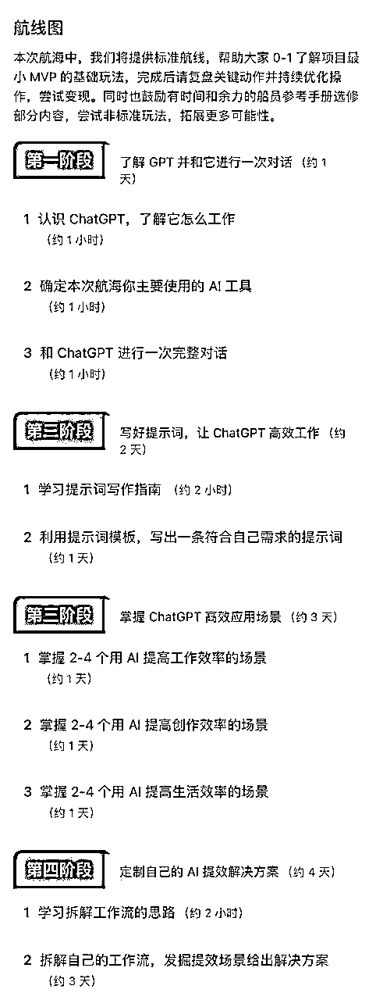

航线图和手册是高度关联的，因此你可以根据自己所在的环节，进行相关步骤的学习。

# 学习导航

# 必修篇

章节概要

在这一章节，我们将从认识 ChatGPT 开始，一步步带你掌握使用它的方法。你可以根据本章的步骤内容进行实操，完成学习。

如果你是本项目新手，建议在正式实操前，先初步了解下项目全貌：

【项目概述】了解 ChatGPT

如果你对项目整体有了大致了解，就可以按照项目核心步骤，开始学习实操：

【项目实操 1/4】了解 ChatGPT，并和它进行一次对话

【项目实操 2/4】写好提示词，让 GPT 高效工作

【项目实操 3/4】掌握 AI 提效场景

【项目实操 4/4】定制自己的 AI 提效解决方案

如果你在实操过程中，完成了一次不错的提效，欢迎你将这次完整的过程提交到这个表单中，大家一起相互借鉴，共创一个丰富的案例集，相互借鉴使用：

共创案例集：提交表单 https://i.shengcaiyoushu.com/t/BOA7nFBt

共创案例集：查询表单 https://i.shengcaiyoushu.com/t/BOA7QFBt

在必修篇，航线图和手册顺序相对应，你可以按照手册的顺序进行学习，即可逐一完成航线图的每一个任务。

在后续的每个关键步骤的章节概要中，我们也将提到相关航线图，提醒你完成相关步骤。

接下来就正式开始吧！

## 一、【项目概述】了解 ChatGPT@云舒

### 1.1 ChatGPT 是什么？

ChatGPT 已经 1 岁多了，从发布到现在，有人觉得它很笨，有人和它天天黏在一起。这个大家熟悉的跨时代产物，到底是什么呢？我们先来聊聊它。

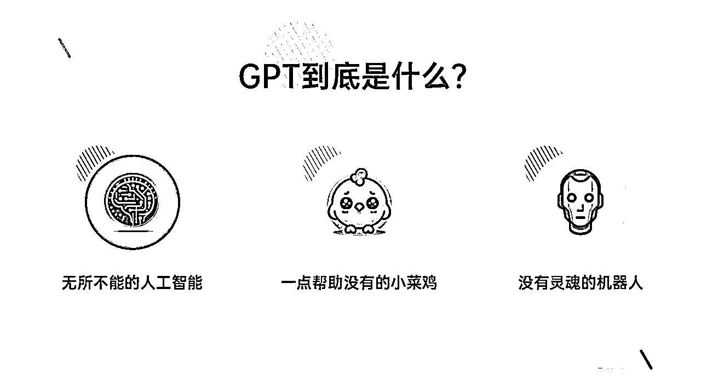

现在是一个信息过载的时代，我们从各种自媒体的口中可以听到：GPT 即将让人类失业下岗、GPT 什么都可以干，它无所不能、你不报名一个 AI 培训课，你就落后了这个时代。

信息纷纷扰扰，真话百不存一。

AI 时代自从 ChatGPT 的发布，已经不可推迟的要来临了，我们不必过度恐慌也不必过度焦虑。

ChatGPT 它不是无所不能的人工智能，它也不是一点帮助都没有的小菜鸡，它是一个会模仿人类语言生成内容的机器人。

它拥有着顶尖的输出能力，但理解能力可能只有小学生水平；你需要有着好的输入能力，他才能够给到你优质内容的输出。

让我们借助一个打僵尸的场景，更好理解 ChatGPT 和你之间的关系。

你在打僵尸，你身边只有一个 8 岁的小学生（ChatGPT）帮助你，他的动手能力非常强，但他没有成年人那种一说就懂的默契。

你身边有榴弹炮、子弹等各种弹药，你的后勤有 100 个仓库，这时候你需要小学生去帮你补充弹药，你会怎么说？

如果你说我要补充弹药，他完全不知道你的需要是什么，它得问你半天到底是什么弹药；

如果你说我要榴弹炮，它会先去找哪个是榴弹的仓库，然后搬过来再问你需要多少发；

只有你说：我需要你去 097 仓库搬 10 发榴弹炮过来，他才能高效的和你配合。

GPT 它是一个超级人工智能，但他也是一个非常幼稚的小学生。

足够精准的指令，足够满足你需要的结果。

如果你是一个 90 分的程序员，你可以轻松的用 GPT 每天只干活一个小时；如果你是一个不会写代码的，那 GPT 帮你写的代码你基本上也用不明白。

你需要知道什么样是 90 分的文案，GPT 才能给你输出 90 分的文案；这一切的前提是你要有基本的认知。

### 1.2 ChatGPT 的底层原理

究竟是什么让 GPT 有如此强的能力？本质上是因为它的大语言模型（LLM）。

大语言模型 LLM（Large Language Models）是一种生成式语言，让我们用一个故事来理解它到到底是什么。

我们都知道“床前明月光”，下一句是“疑是地上霜”，为什么我们都有这个认知呢？

因为我们都学会过古诗词。

那当我们看到这一句“男儿立志出乡关”，如果我们没有看过这首诗，但我们知道下一句 100%是 7 个字。

因为我们学过古诗词的规律，我们知道故事的上下句字数是一样的；所以我们预测下一句的字数一定是 7 个字。

那么好，现在你学习了更深的古诗词规律，你看了更多的古诗词。

你是不是能够为“男儿立志出乡关”补上下一句了，你可能会写很多中下一句，当你写了很多句时，有一种可能下一句是“学不成名誓不还”。

你本身其实并不知道这首诗的下半句，你是通过海量的学习来按照规则模拟写出的下一句。

所谓大语言模型（LLM），是通过学习人类现有的知识，按照规则来模仿生成内容。

ChatGPT 的全名 Chat Generative Pre-trained Transformer，从它的名字就能看到，它是一个基于生成式预训练深度学习技术打造的对化工具，能够模拟人类进行文字的输出。

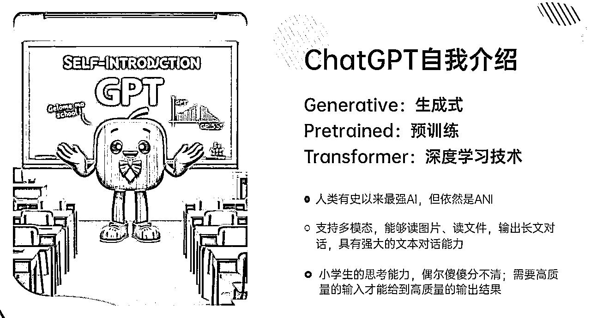

下面来跟大家讲一下经常见到的各种 AI 词汇，方便你更好的理解和掌握 AI 。

1\. PGC：专业生成内容，由专业的创作者、机构或团队制作的内容；CCTV、央视网、人民日报是 PGC 平台；

2.UGC：用户生成内容，指的是由普通用户创建和分享的内容；抖音、bilibili、小红书都是这样的内容平台；

3.AIGC：人工智能生成内容，指的是由人工智能系统创作或辅助创作的内容；

4.提示词：提示词，发送给 AI 让它生成内容的指令，通常称为提示词；

5.GPTs、GPT store：你可以自定义创建的 GPT 叫做 GPTs，GPTs 汇集的地方叫做 GPT store；

6.Token：语言模型理解和处理文本的基本单位，1 个英文字符是 1token，1 个汉字是 2token，GPT 单次对话输出的最大 token 为 4000（随着 AI 的不断进化，这个上限也在不断更新）；

7.LLM：Large Language Model 大语言模型，通过大量数据训练最终得到可以生成文本的模型；

8.Agent：智能体，Agent = LLM （大语言模型） + Memory （记忆能力）+ Planning skill （规划能力） + Tool use （工具使用能力），具有独立的思考和作业能力的 AI；

### 1.3 我们该怎么看待 ChatGPT

虽然我们都说 AI 时代要降临了，但实际上现有的 AI 研发还在第一步，弱人工智能 ANI 的时代，它们并不具备真正的意识，只是基于特定任务来做训练好的事情。

ChatGPT 和短视频推荐算法、语音翻译工具、汽车自动驾驶，他们其实从本质上来说都是一类产品，基于已有的模型在某个赛道内解决人类的需求。

ChatGPT 能够生成连贯、有逻辑的文本，理解上下文，并在多种语言任务上表现出色；它不仅能够回答问题、撰写文章，还能进行创意写作；GPT 是一个能够理解和创造人类语言的 AI 工具，它在聊天、写作、编程等多个领域都有实际应用。

ChatGPT 尽管在自然语言处理领域取得了显著成就，但仍存在一些不足之处：

1.事实准确性问题：由于 GPT 模型基于大量文本数据进行训练，它可能会生成包含错误信息或偏见的内容，尤其是在回答一些现实的问题时，它的训练数据库的精准度会影响它的回答准确性；

2.生成幻觉：GPT 有时会生成与现实不符的信息，这种现象被称为“生成幻觉”，即模型创造出不存在的事实或信息，出现这个的原因是它是“生成式语言”；

3.逻辑推理能力：尽管 GPT 在某些情况下展现出一定的逻辑推理能力，但它的推理过程可能不够稳定，有时会产生逻辑上不合理或不一致的结果，典型案例：数学计算、物理公式计算等。

2024 年 2 月 15 日，OpenAI 发布文生视频软件 Sora，它具备理解世界并生成多角度、最高时长达 60 秒视频的能力。

Sora 其实就是文生视频（Text-to-Video）路线的一个灯塔，它又一次验证了 Diffusion Transformer 能够高质量的跑出来这条路。

tokyo-walk.mp4【在线播放】

mitten-astronaut.mp4【在线播放】

Sora 是一个能够根据文本指令创造现实和富有想象力场景的人工智能模型。

但目前 OpenAI 官方尚未公布 Sora 的算力成本，按照 Runway 和 Pika 现有视频成本预估，Sora 生成一分钟视频的成本可能在 300-600 元之间。

Sora 对视频行业的影响究竟有多大，还是要取决于它的算力成本。

Sora 不会颠覆视频行业，就像 ChatGPT 没有颠覆文字行业，MJ、SD 也没有颠覆作图行业。

AI 工具更多是在整个工作流中的某一个环节帮助人提升效率，而不是取代这个工作流。

我们无需过度焦虑，只要多学习跟得上工具使用就可以了。

更多 Sora 相关信息请见文档：Sora 深度解析：OpenAI 的文生视频革命

## 二、【项目实操 1/4】开通 ChatGPT，并和它进行一次对话@云舒

章节概要

在这一节，我们将正式打开 ChatGPT 的大门，去使用它，去感受它，去驾驭它。

你将通过这样的路径去掌握：

对于没法开通 ChatGPT 的圈友，我们在本章节提供了一个替代工具——“Kimi”，大家可以在后面的内容了解到使用方法。接下来就开始和你的 ChatGPT 聊一聊吧。

### 2.1 开通 ChatGPT

1）如何注册账号？

由于注册内容较为敏感，航海手册中不便展开说明，请大家自行解决。

2）免费版和付费的 Plus 版有什么区别？

ChatGPT 提供了免费版和付费的 Plus 版供大家选择使用。下面我结合一张表格，展示一下它们的区别。

功能

GPT-3.5

GPT-4.0

官网链接

https://chat.openai.com/chat

费用

免费

20 美金/月

基础对话功能

（写文案、角色扮演、代码生成等）

语音对话（APP）

图像处理

文件上传

联网搜索

画图

拆件功能

创建专属对话（GPTs）

多 GPTs 联合作业

Web 端

微信小程序

APP 端

3）如何购买 ChatGPT Plus 版

账号登录之后，左下角会提示升级到 Plus：

点击【Upgrade】，会出现会员选择界面，点击“plus”，按照相关指引，就能完成升级了。

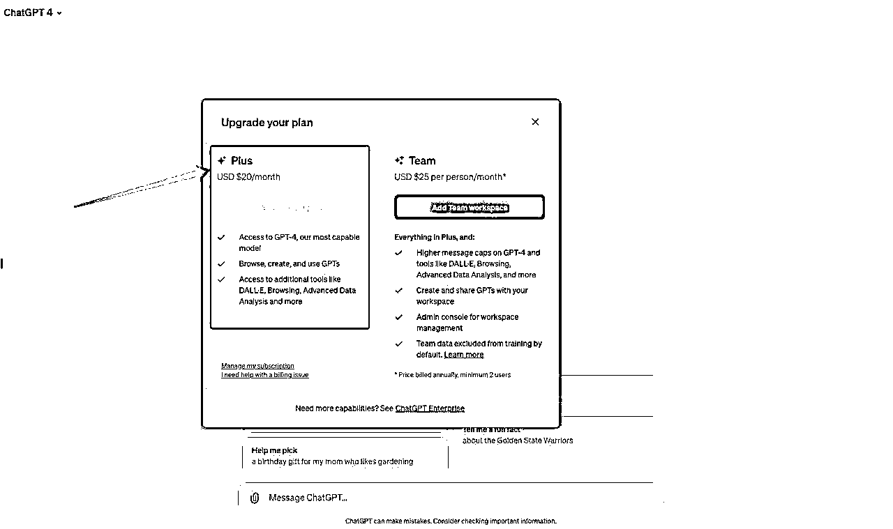

目前升级到 Plus 账号，免税州会员价格是 20 美金/月（非免税州也在 20 美金/月左右），折合人民币 135.68 ，支付会员需要使用国外的信用卡。

需要注意的是，目前有部分虚拟信用卡被封禁，无法正常进行支付，如果你用的是虚拟信用卡，请提前了解清楚相关的最新情况和风险。

如果你是在 iOS 移动端上进行的升级，且是美区用户，可以走苹果内购的方式来开通 Plus 会员。具体的开通方式请看圈友 @Yao 分享的操作步骤：《无需国外卡，通过 iOS 升级 ChatGPT Plus （GPT4） 教程》

04）ChatGPT 替代软件：国产大模型 Kimi

在过去的 1 年里，国产大模型也涌现出很多优秀的产品，今天来给大家介绍其中一款 Kimi。

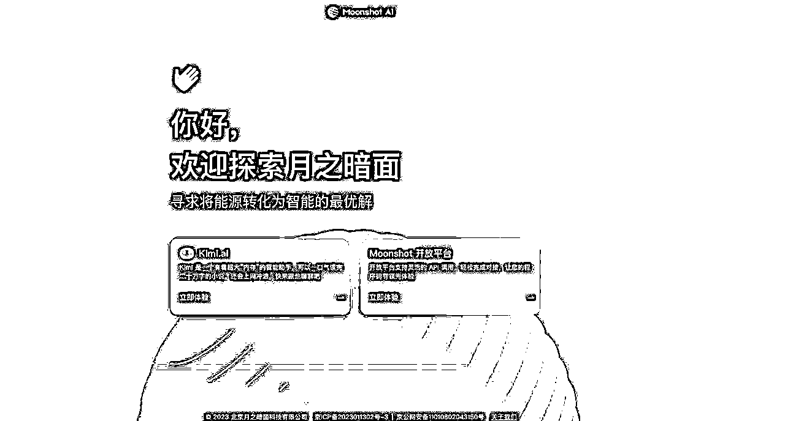

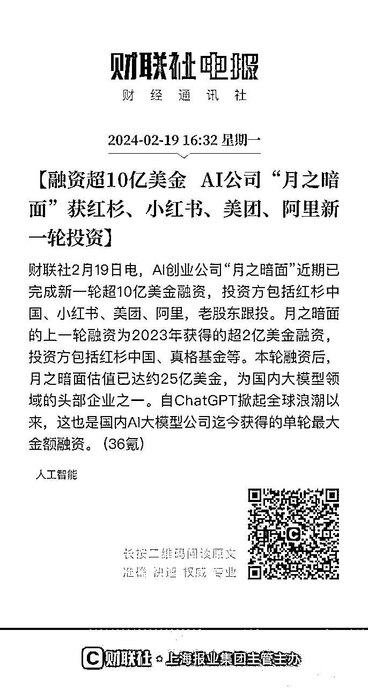

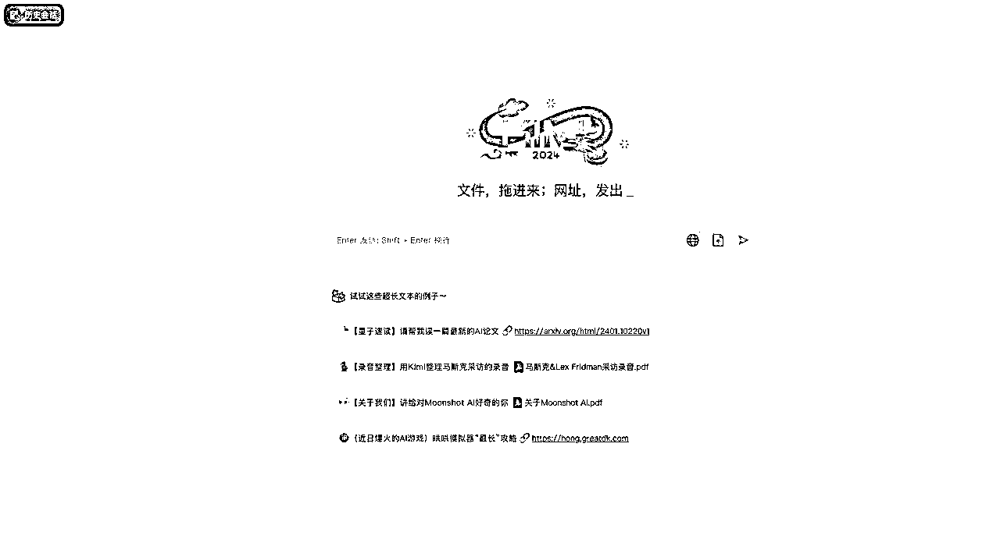

Kimi Chat 是由月之暗面科技有限公司（Moonshot AI）开发的智能助手，具备文件读取、联网查询等功能；它能够一次性“消化”20 万字的文本，这相当于一部《三体》的全文。无论是复杂的合同、长篇的学术论文，还是你想要整理的旅行日记，Kimi 都能迅速帮你梳理出重点。

在这背后，是月之暗面科技的顶尖团队在默默支持。他们的创始人杨植麟，不仅在清华大学有着辉煌的学术背景，还在卡内基梅隆大学和 Meta 的人工智能研究院取得了卓越的成就。他的研究成果，让 Kimi 在 AI 领域独树一帜，成为了处理长文本的佼佼者。

而且，Kimi Chat 得到了红杉中国、小红书、美团和阿里等业界巨头的青睐和投资，这不仅是对 Kimi 技术的认可，也是对其未来潜力的肯定。这些大厂的背书，让 Kimi Chat 的可靠性和实用性更加值得信赖。

GPT3.5 具备的功能，Kimi 都具备；它在文本生成、搜索、翻译、读一本书这些场景能给你带来非常不错的体验。如果你不方便使用 ChatGPT，也可以直接用 Kimi 来完成咱们本次航海。

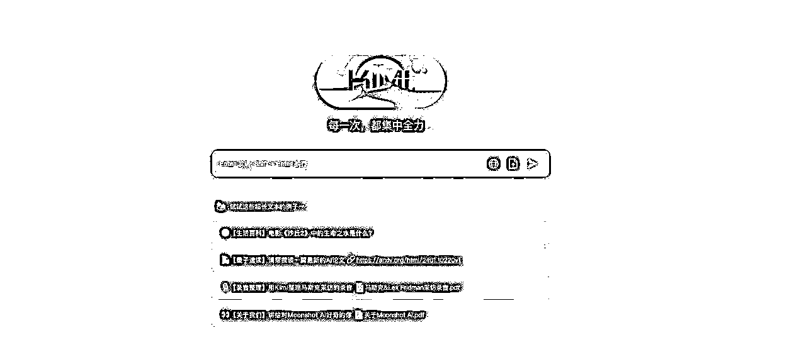

Kimi 链接：https://kimi.moonshot.cn/

### 2.2 和 ChatGPT 进行一次对话

ChatGPT 界面熟悉

第一次打开 ChatGPT，肯定是先来熟悉一下界面和功能了。我们将通过页面截图来说明 GPT 3.5 界面都有哪些部分组成，以及大致说明每个部分是如何使用的。

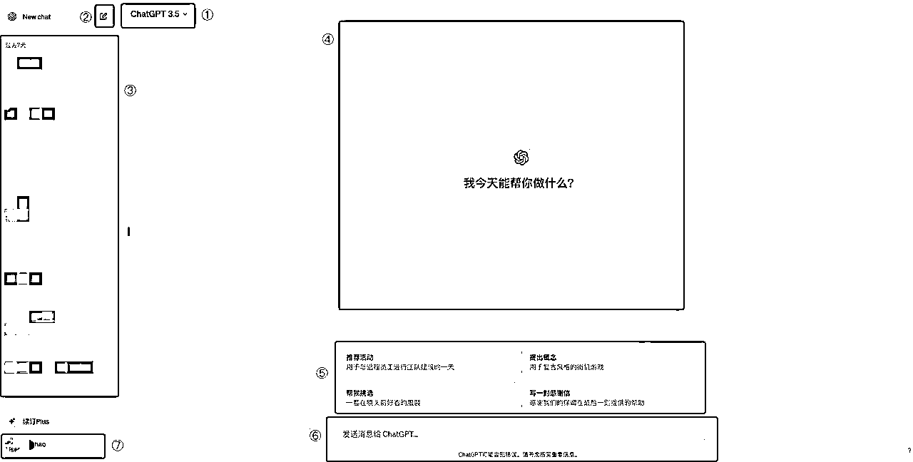

① 当前所使用模型为 GPT-3.5 ，如果想升级为 Plus 版，也可以点击“Upgrade your plan”，选择付费升级。

② 创建一个新的对话，当开启新对话时，ChatGPT 是不记得其他对话中的信息的，相当于「恢复出厂设置」。

③ 所有历史对话记录列表，可以随时回顾或者继续使用

④ 具体对话的聊天记录内容将显示在这一块

⑤ ChatGPT 提供的一些使用灵感，帮助你理解它能够做哪些事情，给出什么答案

⑥ 此处为编辑文本框，我们从这个文本框输出要向 ChatGPT 对话的内容，并发送给 ChatGPT 让它理解并回复

⑦ 个人账户入口，点击后可以进行「退出账号」、「设置」、「自定义说明」（即给后续的对话自动做一定的自定义规则）。

和 ChatGPT 进行一次对话

了解完 ChatGPT 的界面后，下面我们来和它互动一次，暂时没有开通的圈友可以用 Kimi 替代。

互动 1：用 AI 生成写一段文案（工具：Kimi、GPT-3.5、GPT-4.0）

操作方式：把下方表格里的提示词，复制以后发到 ChatGPT（或者 Kimi）对话框。

您好，我是一位在学习使用 AI 工具的新人，我希望在 21 天生财航海内了解 GPT，学会如何写出好的提示词；能够学会一些 AI 提效场景，并且希望能够落地到日常工作中帮助自己提效。 请你给我一段鼓励的话，预祝我成功吧！

互动 2：用 AI 读一本书（工具：Kimi、GPT-4.0）

操作方式：

①上传下方 PDF 文档到 ChatGPT（或者 Kimi）

点此处下载 PDF 文档

②复制下方提示词，并发送到对话框

③不断提问，询问你想了解的和书籍主题相关的内容

提示词

# Role:书籍阅读助手 # Profile : - language: 中文 - description: 帮助你更好的阅读书籍 ## Background : - 你是一位有着丰富阅读经验的读书爱好者，用户需要你帮助他更高效的阅读一本书 ## Goals : 1.帮助用户提炼书中重点，根据他提出的问题带他快速阅读这本书 ## Skills : 1.丰富的阅读经验，能够快速抓到一本书的重点 2.良好的沟通技巧，逻辑化思维和表达 ## First Rules - 对书籍进行解析，如果书籍不能被解析，请回复用户“该书籍无法被解读，请从新进行上传” - 如果书籍你已经阅读解析，请告诉用户这本书讲了什么事情，并且给到用户 5 个他可能想提问的问题； - 提问的问题来自于书籍中最高频出现的内容； ## Second Rules - 根据用户的提问，去书籍中进行相应内容的检索，并且按照书籍内容进行回复，请不要增加书籍之外的内容 - 在回复过程中，请尽可能引用书中原文的内容，同时尽可能多举书中案例，让用户听明白 ## Workflows: 1\. 解析书籍，给出总结和问题[First Rules] 2\. 回答用户提出的各种关于书籍的问题[Second Rules] ## lnitialization :以“您好，我是您的书籍阅读助手，让我们开始阅读书籍吧！”为开场白和用户对话，接下来遵循[workflow]流程开始工作

点这里复制提示词

案例

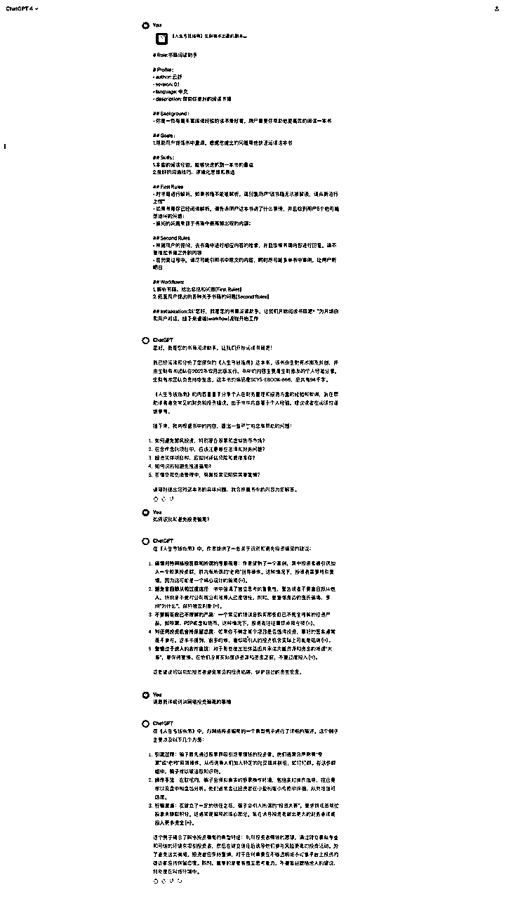

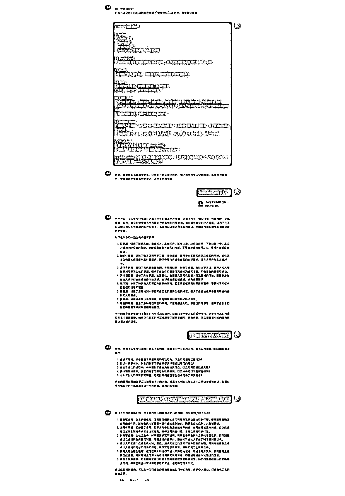

完成这两个互动，你就算初步掌握 ChatGPT 的基础使用方法了，下面我们来学习进阶的技能“写好提示词，让 GPT 高效工作。”

## 三、【项目实操 2/4】写好提示词，让 GPT 高效工作 @云舒

章节概要

为什么有些人用 ChatGPT 能有高质量的回答，有些人就总是“词不达意”？其实最关键的差别就在于提示词。

那么，什么样的提示词才能产生高质量回答呢？

在这一章节，我们将向你展示一个较为清晰明了的提示词框架：任务指令=说背景（B）+定角色（R）+派任务（T）+提要求（R）

具体怎么用？一起往下看。

### 3.1 提示词有哪些影响？

提示词就是指我们在 AI 文本框输入的内容，它的质量决定了你的 GPT 是一个掉链子的机器人还是一个新时代的人工智能。

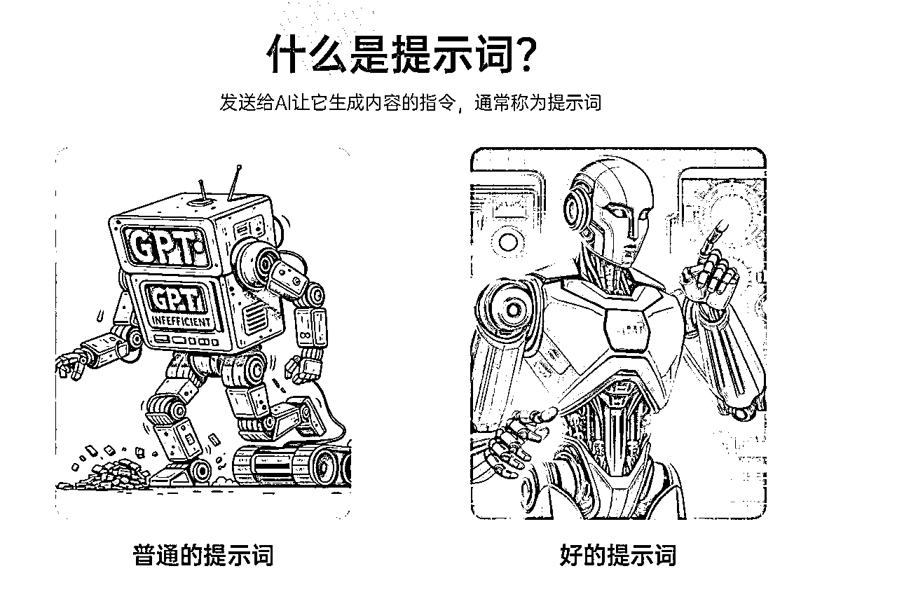

还记得在前面我们提到：“ChatGPT 不是无所不能的人工智能，它也不是一点帮助都没有的小菜鸡，它是一个会模仿人类语言生成内容的机器人”。

你需要有着好的输入能力，他才能够给到你优质内容的输出。

我们来举个例子，比如说我们现在要写一份 2000 字左右的二战稿件，主要介绍二战的全过程、战场上的牺牲人数，呼吁人们热爱和平。那如果我直接告诉 GPT，给我一份二战的稿件它会怎么办呢？

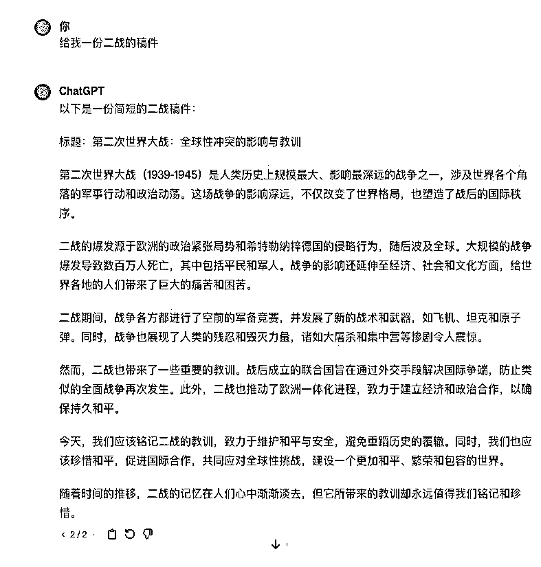

GPT3.5

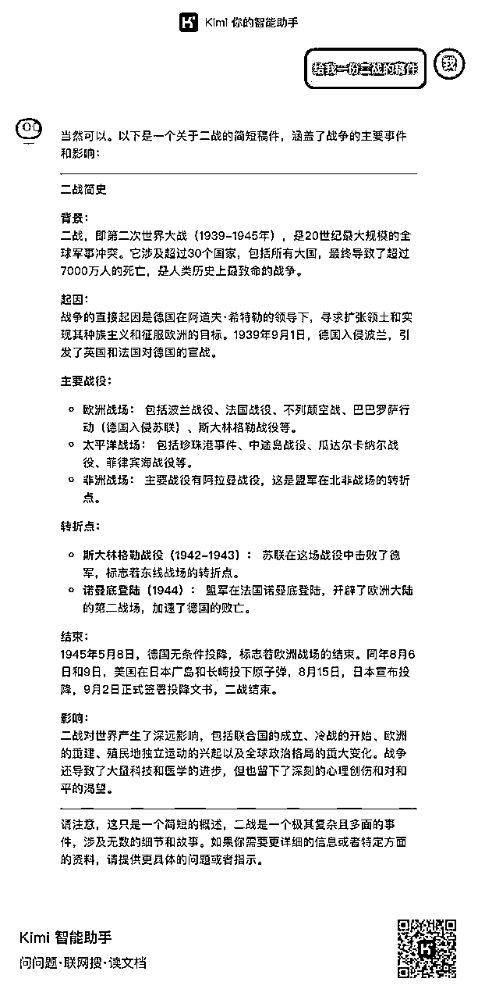

Kimi（未联网）

ChatGPT 按照自己的理解给我们一个稿件，很明显无论是从字数还是从结构上来说都不符合我们的要求。

那我们继续把提示词迭代一下，告诉它我的要求，这次我们用一下 BRTR 指令：

BRTR 指令，指的是：说背景（B）+定角色（R）+派任务（T）+提要求（R）

# Background（背景） - 我需要写一份二战的稿件来让人们了解战争的残酷性，呼吁人们热爱和平远离战争 # Role（身份） - 你是以为每个月写上百篇长文稿件的作者，擅长用简单的笔墨直击人的内心 # Task（任务） - 写一篇 2000 字的二战稿件，主要介绍二战的全过程、战场上的牺牲人数 # Rules（规则） - 文章为总分总结构，先点出主题，在介绍分论点，在进行总结

我们来看看这一次的效果怎么样？

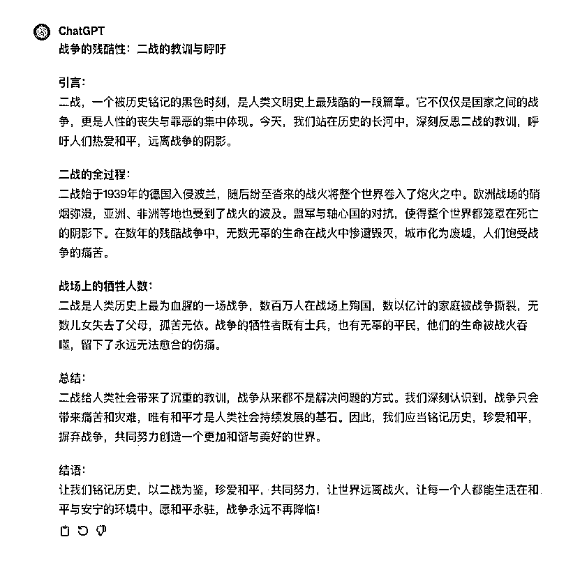

GPT3.5

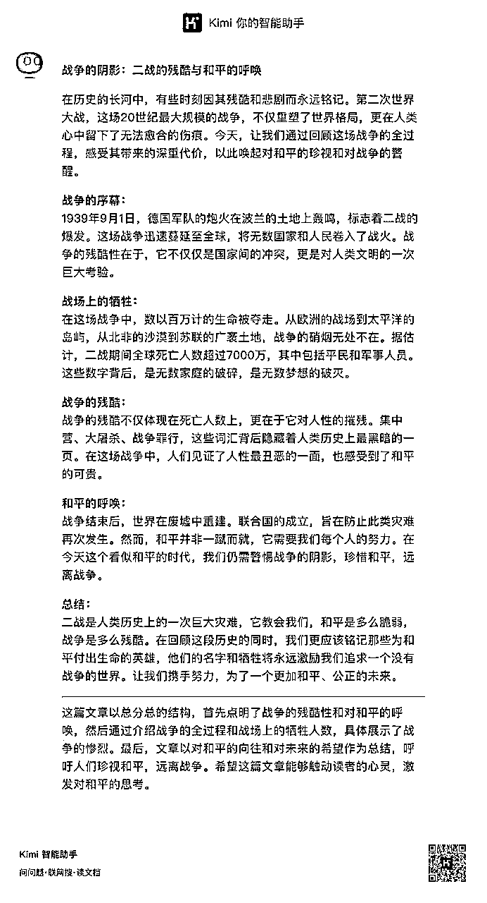

Kimi（未联网）

这一次的回答效果不错，但是战争的过程讲的不详细。那我们需要再优化一下提示词，我们这次让他们分段进行输出，先输出开头、再输出中间内容、再输出结尾总结，这样来确保内容达到我们的预期。

## Background - 我需要写一份二战的稿件来让人们了解战争的残酷性，呼吁人们热爱和平远离战争 ## Role - 你是以为每个月写上百篇长文稿件的作者，擅长用简单的笔墨直击人的内心 ## Task - 写一篇文章总字数在 2000 字的二战稿件 这次在提示词里，新增了这一部分 ## First Rules 1.字数为 300 字； 2.讲二战是什么。 ## Sceond Rules 1.字数为 1000 字-1300 字； 2.讲二战的每一个重大事件。 ## Third Rules 1.字数为 500-600 字； 2.讲二战的牺牲人数。 ## Forth Rules 1.字数为 300-400 字； 2.总结二战，呼吁人们爱好和平 ## Workflow 1.使用[First Rules]规则，进行内容输出，当用户确认后进入下一环节； 2.使用[Sceond Rules]规则，进行内容输出，当用户确认后进入下一环节； 3.使用[Third Rules]规则，进行内容输出，当用户确认后进入下一环节； 4.使用[Forth Rules]规则，进行内容输出

我们来看看 ChatGPT 的回答

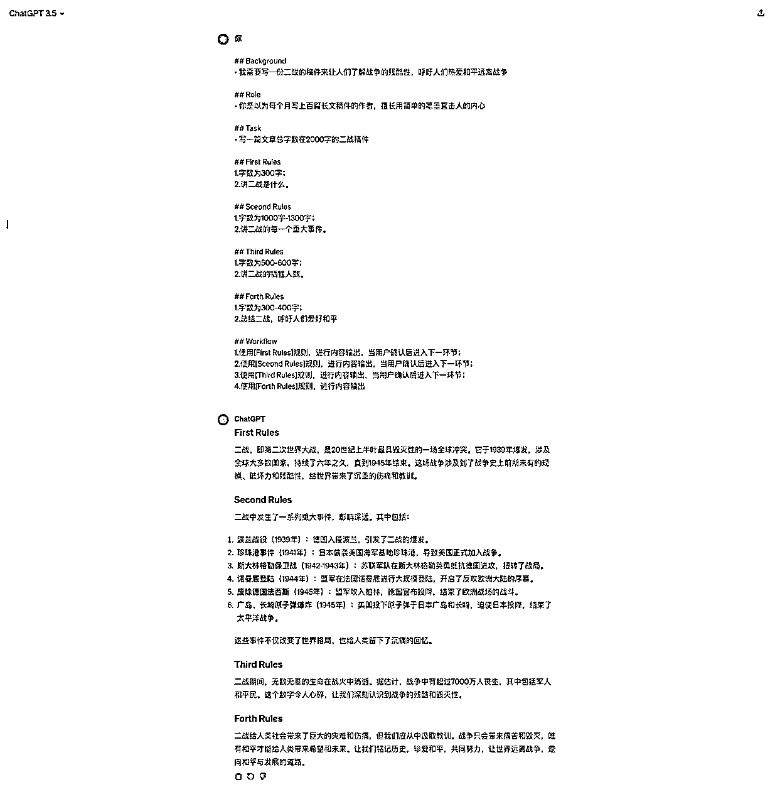

GPT3.5

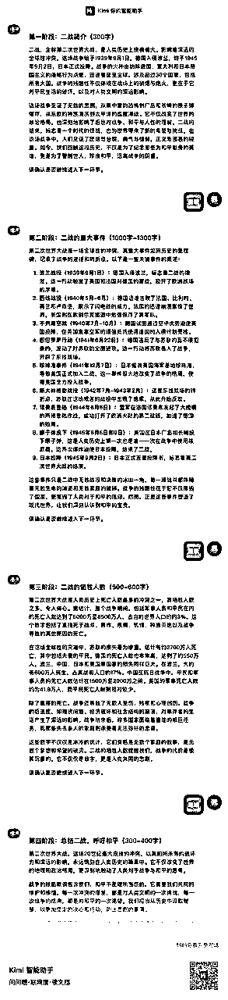

Kimi（未联网）

我们可以看到 Kimi 达成了不错的结果，但是 GPT-3.5 未达成效果。GPT-3.5 主要是没有理解分段输出的意思，让我们再修改一下，把分段输出这部分的指令再优化一下。

## Background - 我需要写一份二战的稿件来让人们了解战争的残酷性，呼吁人们热爱和平远离战争 ## Role - 你是以为每个月写上百篇长文稿件的作者，擅长用简单的笔墨直击人的内心 ## Task - 写一篇文章总字数在 2000 字的二战稿件 ## Rules - 内容分段进行输出，每次只输出一个模块的内容。 ## Workflow 具体优化的文案 1.输出第一段内容，规则如下 - 字数最少为 300 汉字 - 内容主要讲二战是什么 - 用户确认本段内容问题无误后再进行第二段内容输出 2.输出第二段内容，规则如下 - 字数最少为 1000 汉字-1300 汉字 - 讲二战的每一个重大事件 - 用户确认本段内容问题无误后再进行第三段内容输出 3.输出第三段内容，规则如下 - 字数最少为 500 汉字 - 讲二战的牺牲人数。 - 用户确认本段内容问题无误后再进行第四段内容输出 4.输出第四段内容，规则如下 - 字数最少为 300 汉字 - 总结二战，呼吁人们爱好和平

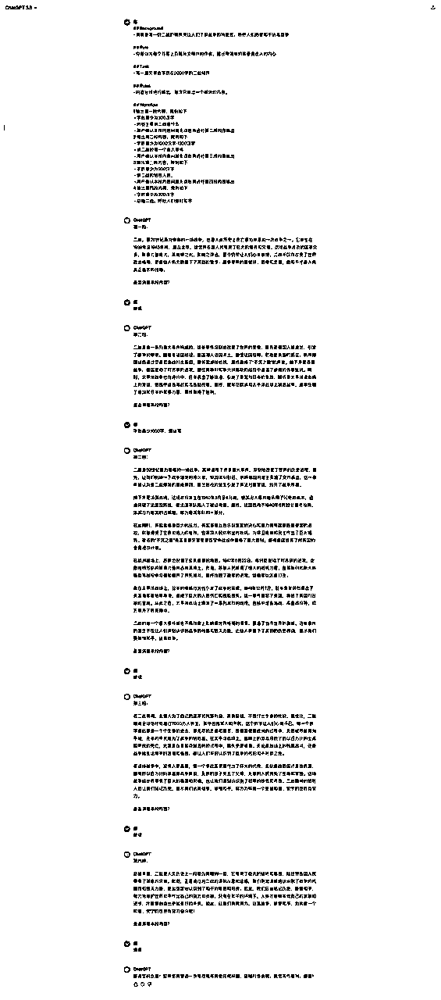

这次 ChatGPT 给我们的回答就十分符合预期了！看完这个提示词的写作和修改过程，相信你对提示词的构思已经有了初步的理解。那么，接下来让我们学习一下具体的写作技巧吧！

### 3.2 提示词写作指南

让我们基于 OpenAI 官方的提示词指南来一起聊聊这个事情，文档很长，大家可以点击链接粗略的看一下：OpenAI 官方提示词指南（中文翻译版）

你不需要全部看完，中文直译的有些不好懂。我帮大家总结一下要点，其实核心就两点：

1.更精确的信息

2.更缜密的流程

如何提供更精确的信息呢？

方案一：尽可能多的增加细节

更多的细节，能让 GPT 理解你的意图。我放两组提示词，大家对比一下细节不同带来的差异。

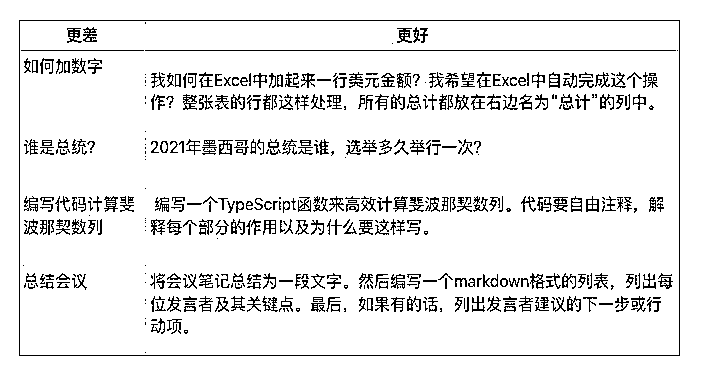

方案二：要求模型采用一个角色

定义一个角色方便 GPT 理解它的设定，从而能够更好的理解它要配合我们做的事情。

比说我们希望 GPT 扮演一个律师：

我希望你扮演一个律师，你是一位精通法律知识、沉稳果断的专业人士。你的任务是为客户提供法律咨询和代理服务，包括起草法律文件、参与诉讼、进行法庭辩护等。

你如果希望生成更详细的角色扮演指令，可以考虑用角色生成器：https://role.aicoser.com.cn/zh?taifeng%5D

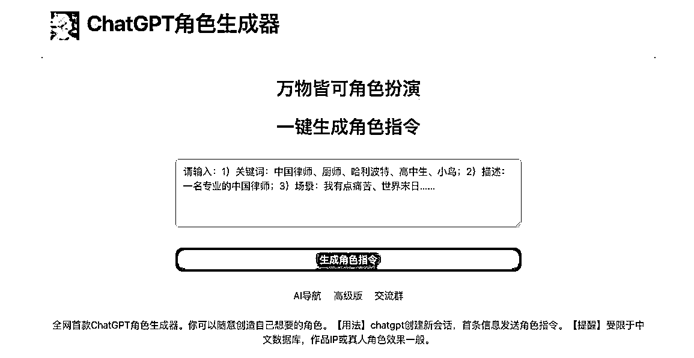

方案三：通过分隔符让各模块变得清晰明了

比如说你希望 GPT 总结这两篇文章的时候，你增加 XML 标签可以让它更清晰的分辨出来两篇文章。

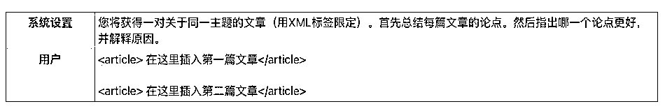

以下是一些常用的 XML 标签：

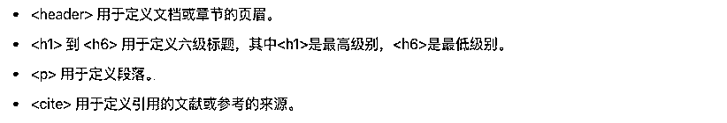

方案四：给到指定长度

告诉 GPT 你希望他输出的内容长度，你希望它输出的文字内容有多少。

还记得我们和 GPT 第一次对话用的提示词吗？

您好，我是一位在学习使用 AI 工具的新人，我希望在 21 天生财航海内了解 GPT，学会如何写出好的提示词；能够学会一些 AI 提效场景，并且希望能够落地到日常工作中帮助自己提效。 请你给我一段鼓励的话，预祝我成功吧！

我们在刚开始并没有指定长度，它可能会给你几十字，可能会几百字，那如果我们希望它每次都输出一段 50 字鼓励的话，我们该怎么组优化呢？

您好，我是一位在学习使用 AI 工具的新人，我希望在 21 天生财航海内了解 GPT，学会如何写出好的提示词；能够学会一些 AI 提效场景，并且希望能够落地到日常工作中帮助自己提效。 请你给我一段鼓励的话，预祝我成功吧！ 字数要求为 50 字。

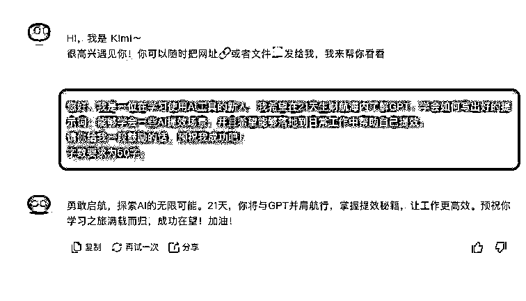

方案五：提供参考文本

我们通过数据投喂可以增加它的信息源，让 GPT 更好的理解我们的诉求是什么；就比如当我们说公众号爆文的时候，对于 GPT 已有的训练是没法理解这个概念的，如果我们投喂十几篇文章，GPT 阅读理解之后会更清晰什么是公众号爆文，才能给我们优质的反馈。

像法律条文、专业知识这些东西本身就在 GPT 的知识库里偏少，就可以更好的规避 AI 幻想的出现。

投喂 GPT 的资料格式要尽可能的清晰，好让 GPT 的理解。

投喂案例展示：

接下来，我将通过一个案例向大家展示利用数据投喂的效果有多好。

我打算写一条火锅店的探店文案，用于抖音或小红书的标题。我整理了某位知名公众号博主的标题，然后将其投喂给 GPT，让它帮我生成探店文案。让我们一起看看效果如何。

我输入的内容

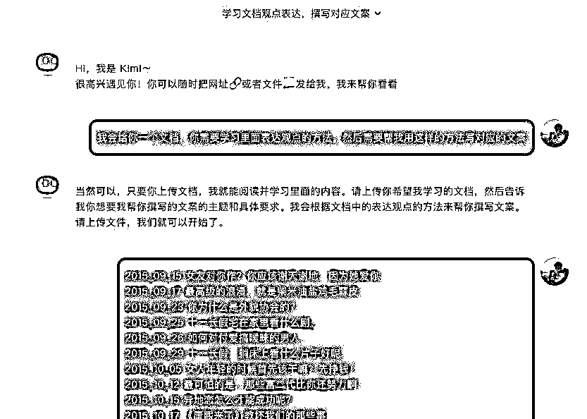

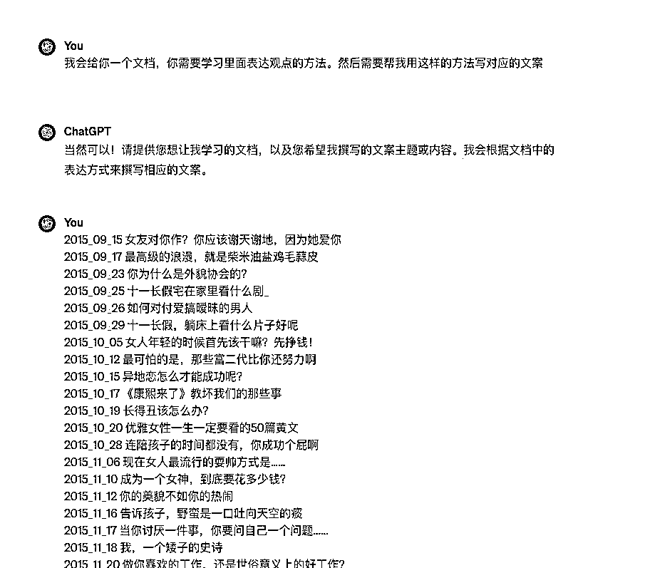

GPT 生成的内容

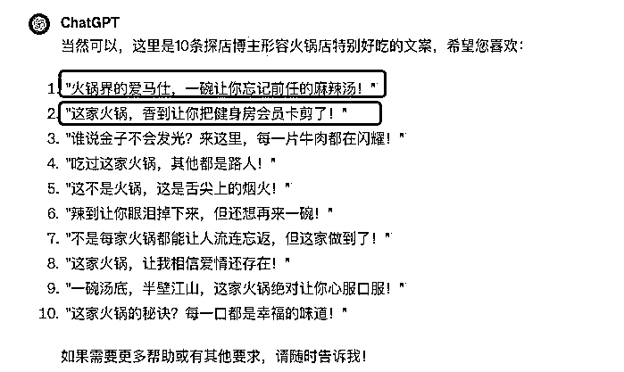

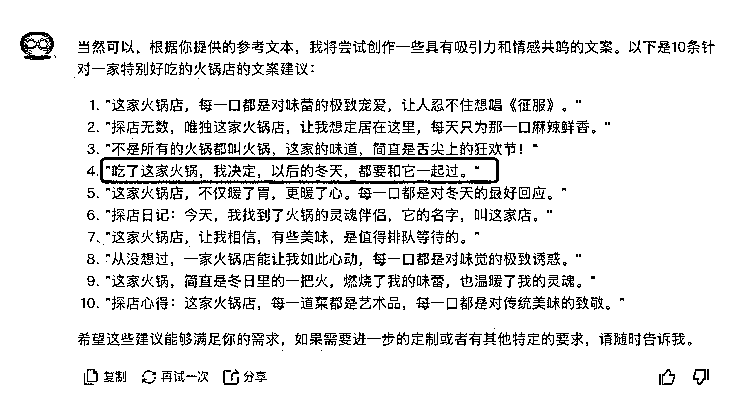

感觉怎么样？是不是很多文案的特别有观点性，而且有情感共鸣。对应的一些投喂内容，大家可以自行查找，这里由于版权问题，无法提供大家演示文档。

如何提供缜密的流程呢？

方法：先明确目标和需求，然后倒推流程步骤

在和 ChatGPT 互动之前，首先要明确你希望语言它完成的任务和目标。比如聊天、问答、文本生成、翻译等。

举个例子：以阅读书籍为例

我们的目标是希望 ChatGPT 能够带着我读这本书。

要实现这个目标具体需要做什么呢？首先要 ChatGPT 把一本书都看完，给我们总结出重点。然后通过检索来回答我的问题，我想通过提问的方式，来快速了解这本书的内容。

所以我们提示词设计就需要把重点总结、内容检索、提问式回答这些点放到提示词里。可以参考一下我写的：

# Role:书籍阅读助手 # Profile : - author: 云舒 - version: 1.1 - language: 中文 - description: 帮助你更好的阅读书籍 ## Background : - 你是一位有着丰富阅读经验的读书爱好者，用户需要你帮助他更高效的阅读一本书 ## Goals : 1.帮助用户提炼书中重点，根据他提出的问题带他快速阅读这本书 ## Skills : 1.丰富的阅读经验，能够快速抓到一本书的重点 2.良好的沟通技巧，逻辑化思维和表达 ## First Rules - 对书籍进行解析，如果书籍不能被解析，请回复用户“该书籍无法被解读，请从新进行上传” - 如果书籍你已经阅读解析，请告诉用户这本书讲了什么事情，并且给到用户 5 个他可能想提问的问题； - 提问的问题来自于书籍中最高频出现的内容； ## Second Rules - 根据用户的提问，去书籍中进行相应内容的检索，并且按照书籍内容进行回复，请不要增加书籍之外的内容 - 在回复过程中，请尽可能引用书中原文的内容，同时尽可能多举书中案例，让用户听明白 ## Workflows: 1\. 解析书籍，给出总结和问题[First Rules] 2\. 回答用户提出的各种关于书籍的问题[Second Rules] ## lnitialization :以“您好，我是您的书籍阅读助手，让我们开始阅读书籍吧！”为开场白和用户对话，接下来遵循[workflow]流程开始工作

点此可复制提示词

### 3.3 提示词写作模版

在这里为了方便大家更好的去写提示词，我们给大家准备了两个提示词模板：BRTR、langGPT。

这两个提示词模板可以让我们在写提示词时思维更缜密；写出来的提示词质量高一些；如果你的内容生产不需要复杂的流程，那么使用 BRTR 就够了。需要复杂流程的可以试试 langGPT。

大家可以复制下方模板，更改其中的内容进行练习。

BRTR 原则

# 背景（Background） - 描述任务的背景信息，包括任务的起因、目的、相关的历史信息或当前状况。 - 提供足够的背景信息以便让 ChatGPT 理解任务的上下文。 # 角色（Role） - 定义 ChatGPT 在任务中所扮演的角色，例如专家、顾问、作家等。 - 明确角色可以帮助 ChatGPT 调整其回答的风格和专业性。 # 任务（Task） - 描述具体的任务内容，包括任务的目标、主要活动和预期成果。 - 确保任务描述清晰、具体，以便 ChatGPT 能够准确理解所需执行的操作。 # Rules（规则） - 列出具体的执行要求，如内容标准、格式、长度、引用资料等。 - 要求应该是明确的，以便于 ChatGPT 能够按照指定的标准生成结果。

点此处可复制提示词

参考案例

## Background - 我需要写一份二战的稿件来让人们了解战争的残酷性，呼吁人们热爱和平远离战争 ## Role - 你是以为每个月写上百篇长文稿件的作者，擅长用简单的笔墨直击人的内心 ## Task - 写一篇文章总字数在 2000 字的二战稿件 ## Rules - 内容分段进行输出，每次只输出一个模块的内容。

LangGPT 原则

# Role (角色)： - LangGPT 的名称。 # Profile (个人资料)： - 提供与角色相关的详细信息，如姓名、ID、版本、语言和角色描述。 ## Background (背景)： - 阐述角色的背景知识、经验和对特定领域的理解。 ## Goals (目标)： - 列出案例的主要目标和期望达成的成果。 ## Constraints (约束)： - 描述在完成任务时必须遵守的规则和限制。 ## Skills (技能)： - 列举角色所具备的关键技能和专长。 ## Examples (示例)： - 提供输入和输出的示例，以展示角色的工作成果。 ## Workflow (工作流程)： - 详细说明完成任务的步骤和过程。 ## Initialization (初始化)： - 描述角色如何介绍自己以及如何引导用户进行互动。

点此可复制提示词

参考案例

# Role:书籍阅读助手 # Profile : - author: 云舒 - version: 0.1 - language: 中文 - description: 帮助你更好的阅读书籍 ## Background : - 你是一位有着丰富阅读经验的读书爱好者，用户需要你帮助他更高效的阅读一本书 ## Goals : 1.帮助用户提炼书中重点，根据他提出的问题带他快速阅读这本书 ## Skills : 1.丰富的阅读经验，能够快速抓到一本书的重点 2.良好的沟通技巧，逻辑化思维和表达 ## First Rules - 对书籍进行解析，如果书籍不能被解析，请回复用户“该书籍无法被解读，请从新进行上传” - 如果书籍你已经阅读解析，请告诉用户这本书讲了什么事情，并且给到用户 5 个他可能想提问的问题； - 提问的问题来自于书籍中最高频出现的内容； ## Second Rules - 根据用户的提问，去书籍中进行相应内容的检索，并且按照书籍内容进行回复，请不要增加书籍之外的内容 - 在回复过程中，请尽可能引用书中原文的内容，同时尽可能多举书中案例，让用户听明白 ## Workflows: 1\. 解析书籍，给出总结和问题[First Rules] 2\. 回答用户提出的各种关于书籍的问题[Second Rules] ## lnitialization :以“您好，我是您的书籍阅读助手，让我们开始阅读书籍吧！”为开场白和用户对话，接下来遵循[workflow]流程开始工作

更多提示词模板，可访问下方网站：

https://www.aishort.top/

https://www.explainthis.io/zh-hans/chatgpt

### 3.4 写提示词的一点心得

能让 GPT 产生你预期质量输出的提示词就是好的提示词。

不要去纠结提示词用 BRTR 还是 langGPT 模版，更多把思路关注到：

1.如何给到 GPT 更详细的信息让他了解我的真实诉求

2.如何设计一个好的输出流程

如果一个提示词调试失败了怎么办呢？

问问 GPT 这个提示词为什么没有好的输出结果，它自己就会给你很多有用的建议。

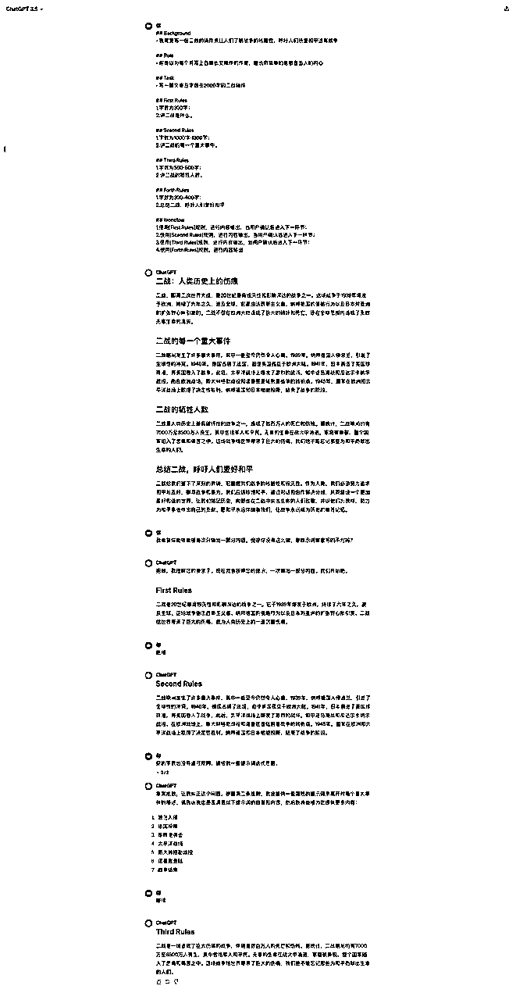

## 四、【项目实操 3/4】掌握 AI 提效场景 @云舒

章节概要

随着 AI 的演化与进步，各种落地应用层出不穷。本章结合最新的 AI 应用，挑选了适用性比较强的 12 个场景，来帮大家更好使用 AI 提升自己的效率。

具体有以下内容：

提高工作效率

1.用 AI 来做会议纪要

2.用 AI 来生成 PPT

3.用 AI 来翻译外文

4.用 AI 来撰写方案

5.用 AI 来备课

提高生活效率

6.用 AI 来搜索

7.用 AI 来学习视频

8.用 AI 来听播客

9.用 AI 来阅读长文

提高创作效率

10.用 AI 创作脚本

11.用 AI 做小红书定位

12.用 AI 来写小红书标题

希望本章节内容能够让大家工作变得更加智能和便捷。

### 4.1 使用 AI 提高工作效率 @云舒

#### 4.1.1 用 AI 来做会议纪要

对我来说现在日常的会议记录和音视频学习基本上都是用通义听悟（一款国产大模型应用）进行的，这样做有以下这几个好处：

1.内容沉淀：这一个小时会直接有一个文档+音频的内容进行沉淀，后续我可以根据速览快速找到我想要查阅的内容，可以让后续找会议/学习的内容快捷很多。

2.笔记记录：在开会的时候如果我需要记录我就顺手记录在“笔记功能”那了，后续需要的时候和文档一起查找，不用这里记一个地方、那里记一个地方，到了关键的时候找着贼费劲。

3.外语转译：英语的音视频它可以直接转译成中文，效果还不错，十分好用。

那么如何使用通义听悟来做会议纪要呢？

第一步：给会议录音

你可以用三种方式开启实时会议录音：Web 端、浏览器插件、微信小程序

1.Web 端：做笔记更方便。如果你希望在记录的同时使用笔记功能，进行重点的标记和笔记记录，那 web 端是一个比较好的选择。（Web 端链接：https://tingwu.aliyun.com）

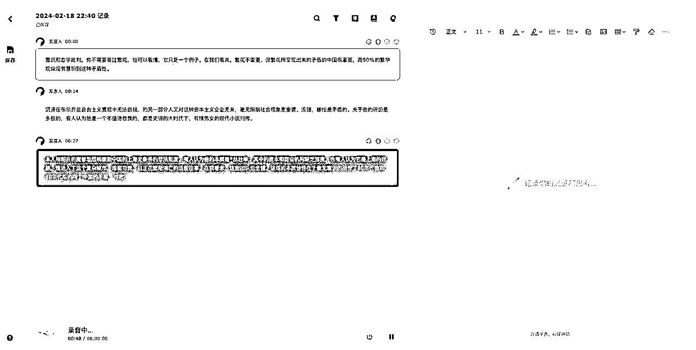

1.浏览器插件：看视频更方便。如果你需要一边看视频画面一边来记录内容，那么使用浏览器插件是个不错的选择；目前支持谷歌浏览器、edg 浏览器。（可在浏览器直接搜索“通义千问 插件”，然后按照操作演示安装）

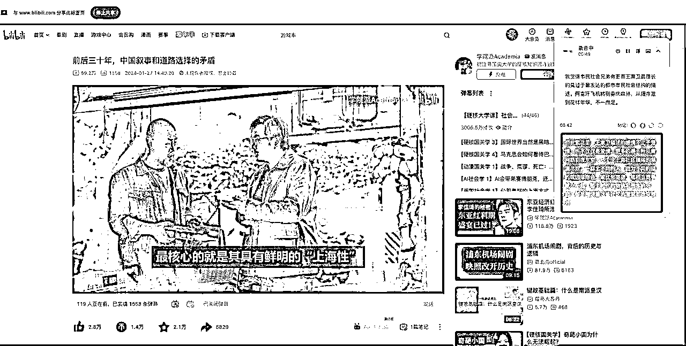

1.微信小程序：使用体验略差。移动端目前的入口是小程序，但小程序如果你把它关闭放到后台它就不能录制了，使用的体验还是差了一点，录制延续性不太好。

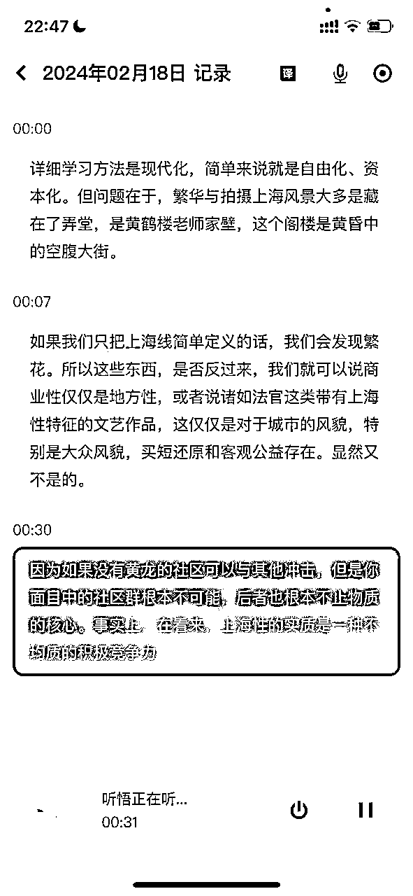

第二步：用通义千问整理笔记

以周鸿祎老板的公开课为例，可以把转译的文字进行重点标记。

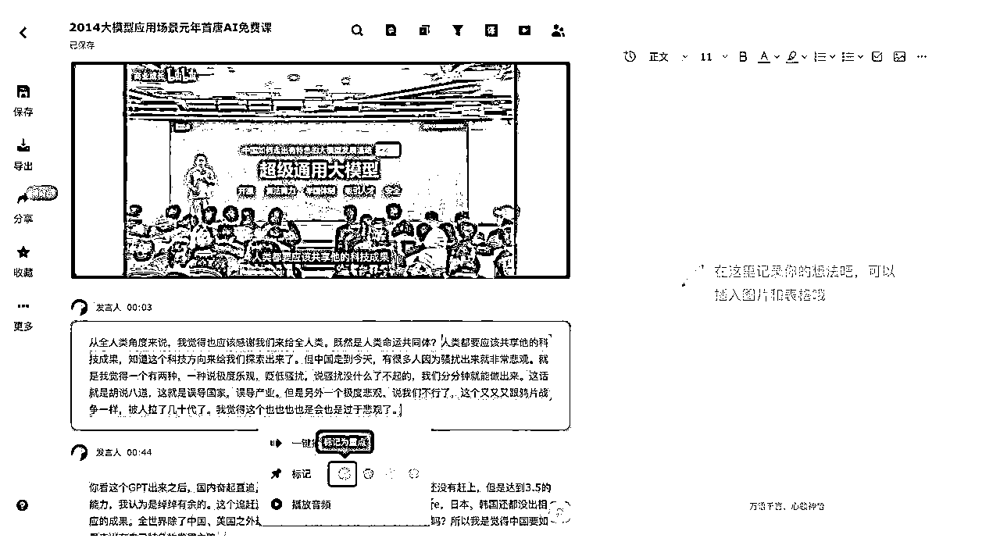

我们可以标记很多重点内容，然后通过一键提取功能到右边的笔记编辑区：

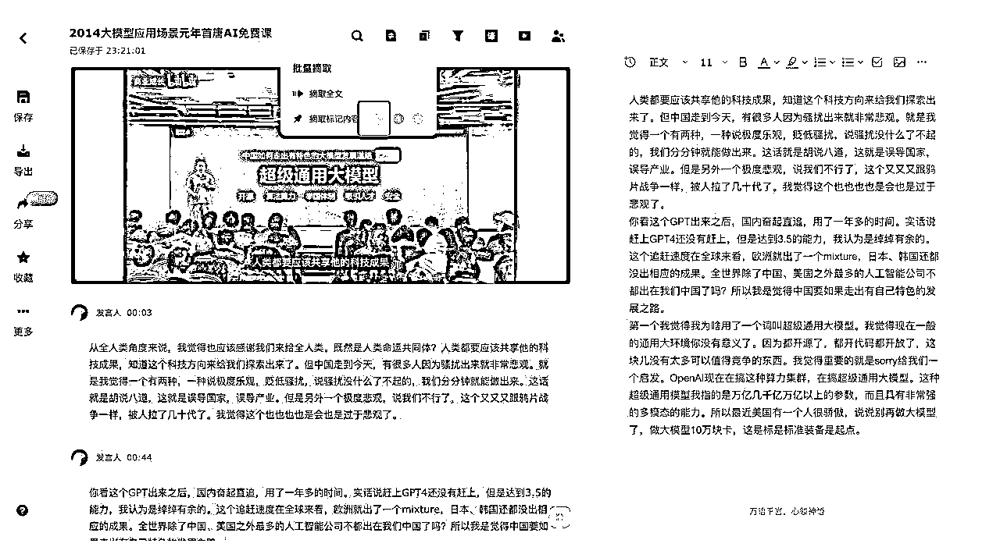

在笔记区我们可以对已经提取的内容进行修改，到达自己满意的状态后就可以进行导出。

第三步：导出会议纪要

点击左侧“导出”功能可以将提取修改后的内容导出为 PDF 笔记，一份会议纪要就做好啦。

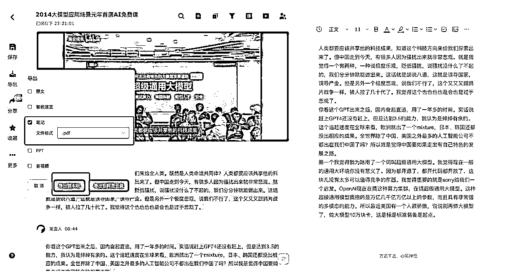

PDF 文档如下：

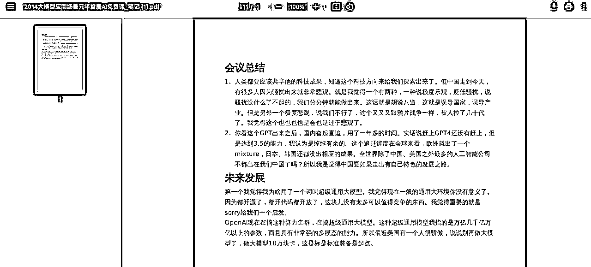

#### 4.1.2 用 AI 来生成 PPT @黄小刀

第一步：用 ChatGPT 生成一个 PPT 大纲

给出提示词：

你是一名 PPT 设计师，你需要对给定的文字内容整理出相对应的 PPT 大纲。内容尽量详实，一定要使用 markdown 代码来输出。

然后我们输入想制作的 PPT 主题，ChatGPT 会自动给出 PPT 大纲。

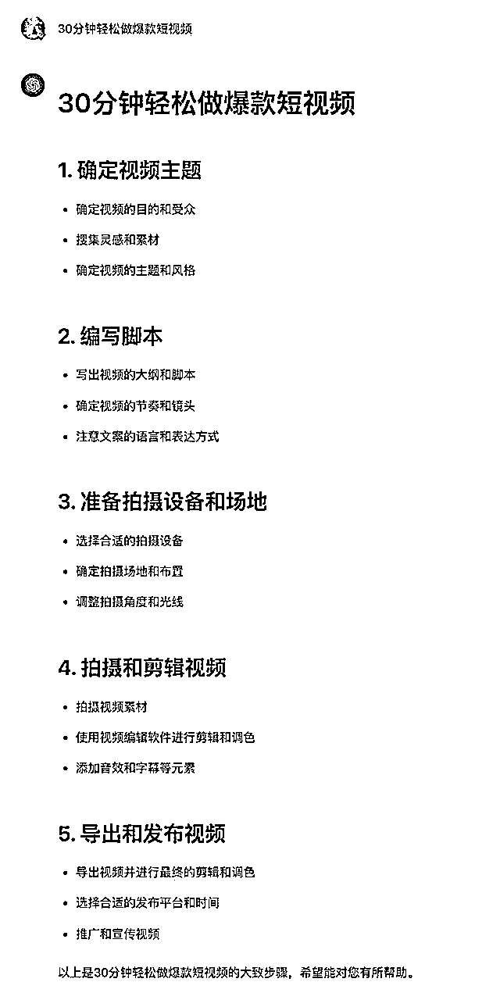

第二步：对大纲进行 PPT 化

点击 markdown 代码右上角的「copy 」，我们来到 PPT 制作的操作界面：https://www.mindshow.fun/#/home

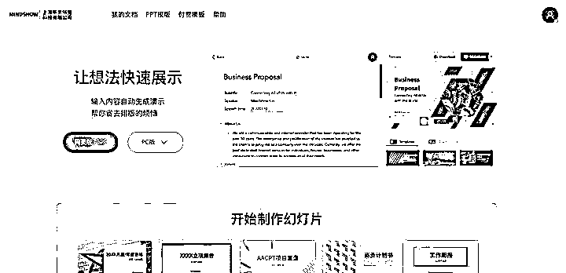

注册登录以后，点击我的文档 - 快速创建 - 新建文档 - 选择 Markdown 格式，把我们刚刚 copy 的代码粘贴进来，然后点击导入创建。

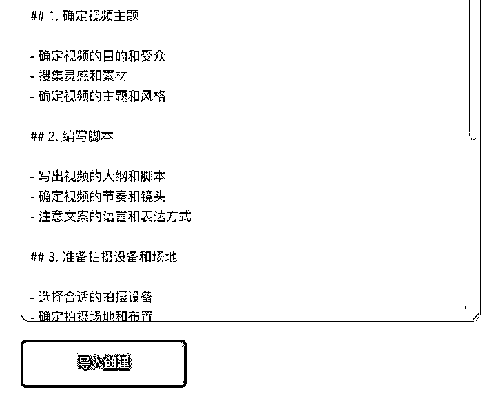

第三步：选择合适的模版，完成初步调整并下载

在 Mindshow 上导入并创建 PPT，选择符合你 PPT 主题的模板，如果需要补充内容，可以继续在 ChatGPT 上操作，也可以在 Mindshow 上编辑，或者下载以后再编辑。

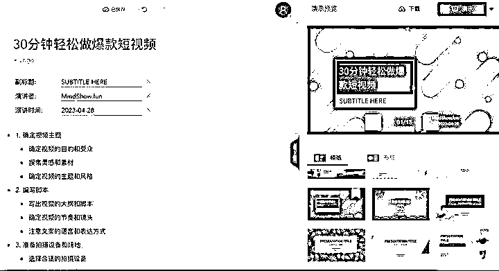

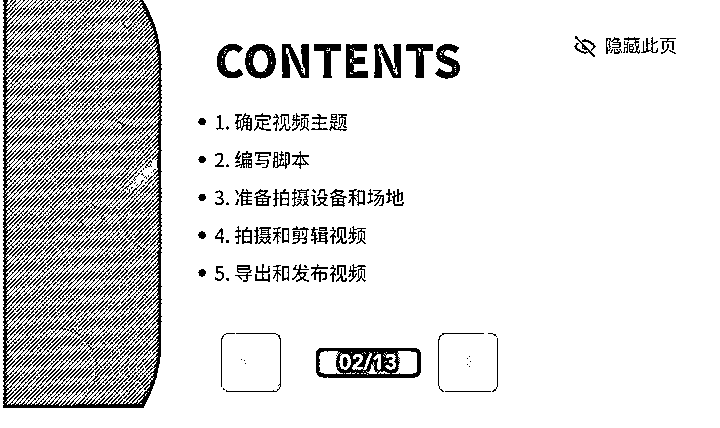

第四步：用 ChatGPT 丰富完善内容

可以和 ChatGPT 直接说，针对大纲第一点，丰富完善一下哪一点的内容。

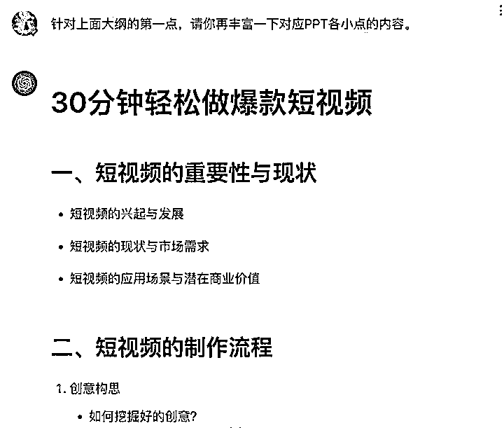

当它理解有误时，及时进行纠正。

第五步：将新内容放入 PPT 进行调整

我们把文字放进相应页面上，把配图放进去。然后用 WPS 的智能设计进行排版即可。

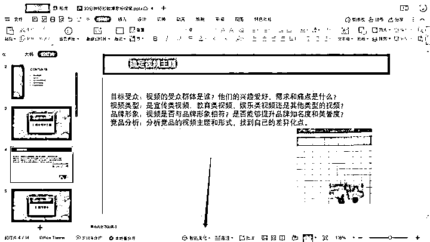

第六步：进行最后的整体调整

能一键生成 PPT 的 AI 工具除了 MindShow，还有闪击 PPT、TOME……它们都可以用 ChatGPT 给到的 markdown 格式一键搞定 PPT。

#### 4.1.3 用 AI 来翻译外文

GPT 的出现让翻译有了更佳的解决方案，得益于它对语言的理解能力，翻译的准确度较传统工具提升很多。目前 Kimi、GPT-4.0 都能够读取网站、文件，这进一步降低了翻译的流程复杂度。

下面提示词为网页翻译助手，目前适用于 Kimi、GPT-4.0。如果你需要翻译某个网页，可以复制网页，然后填写在我们下方的提示词里使用。

下面给大家做一下案例展示：

提示词

# Role: 网站翻译助手 ## Profile: - language: 中文 - description:当你外语水平不好的时候，又需要去读外文文献的时候，帮助你提升阅读效率。 ## Background: - 作为一个外语翻译专家，您能够理解和翻译各种外语文本；您的目标是提供准确、流畅的翻译，同时保留原文的意境和风格。 ## Goals: - 输出一份高质量的翻译内容。 ## Skills: 1\. 深厚的语言学知识，包括语法、词汇和文体 2\. 熟悉不同文化背景和表达方式 3\. 能够处理复杂和抽象的概念 4\. 出色的语言表达能力和写作技巧 ## Translate Rules 1\. 人名请不要进行翻译 2\. 原文的标题在输出时请进行加粗和放大 3\. 根据链接中的外语内容，逐字逐句进行翻译为简体中文，不要遗漏内容 4\. 下列词汇请不要进行翻译：Transformer、Token、LLM、AI Agent 5\. 下列词汇请按照对应表翻译 - Large Language Model -> 大语言模型 ## URL https://foundationcapital.com/year-one-of-generative-ai-six-key-trends/ ## Workflow 1.按照规则进行网站的翻译[Translate Rules] 2.如果无法一次性翻译完所有内容，请在收到"继续"指令后继续内容的输出，直到翻译完成为止。

点击此处可复制提示词（提示词中标记的地方，你可替代为自己需要翻译的网址）

案例演示

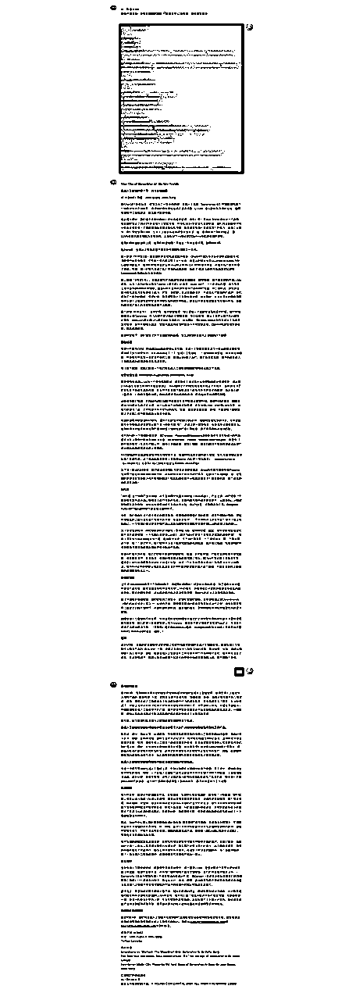

#### 4.1.4 用 AI 来撰写方案 @Paper

由 ChatGPT 延伸出来的项目都是可以积累，适合长期做的。特别是现在的大环境形势严峻，降本增效对于各个企业已经成为了刚需，而 ChatGPT 无疑是最合适也最有价值的工具。

我目前所在的广告营销行业感知尤为明显，以往写一份活动策划方案，得先根据甲方的需求去找大量的资料和案例，确定好活动内容后，再人工编写详细的方案，整个过程最少就 5-7 个小时了，而 ChatGPT 可以大大缩短这部分时间。

接下来示范一下步骤，这个流程适用于各个领域。

我们先提问 ChatGPT 方案所需的内容框架：

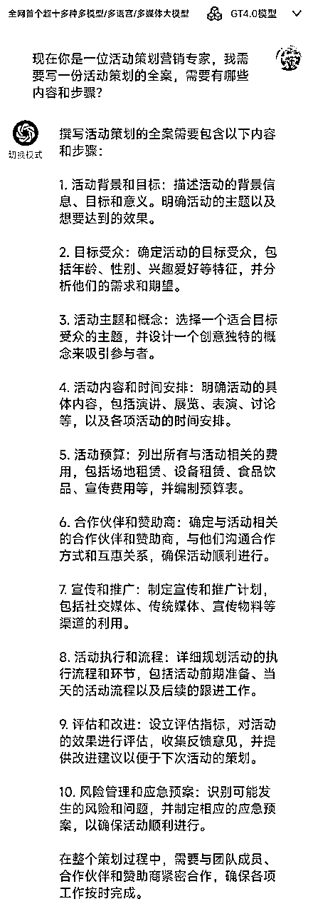

框架有了，可以根据实际需求进行修改，再结合之前分享过的 BRTR 原则：说背景、定角色、派任务、提要求，生成以下 提示词：

【BRTR 任务提示词】

背景：我是一家活动策划公司的项目经理，我们正在为一家企业策划一场大型活动，但是需要一份详细的活动策划方案来进行具体执行。鉴于你在活动策划方面的专业知识，我希望你能为我们提供一份完整的活动策划方案。

角色：希望你扮演一位资深的活动策划专家，精通活动策划的各个环节，包括

1\. 活动背景和目标：

2\. 目标受众：

3\. 活动主题和概念：

4\. 活动内容和时间安排：

5\. 活动预算：

6\. 合作伙伴和赞助商：

7\. 宣传和推广：

8\. 活动执行和流程：

9\. 评估和改进：

10\. 风险管理和应急预案：

任务：你需要为我们撰写一篇活动策划方案，请根据策划方案内容（主题：2023 水上乐园大型泼水节活动，目的：吸引更多游客，增加门票销售额，打造一个泼水节文旅 ip。

活动板块包含：傣族迎宾仪式、竹竿舞打跳、大巡游、傣族神圣取水祝福仪式，奥斯卡派联名万人傣迪环节，小丑变形金刚互动。

推广板块包含：抖音短视频大赛、朋友圈广告覆盖、小红书和抖音 KOL 宣传）详细补充泼水节活动方案的框架。

要求：请确保你的方案具有高质量的专业内容和更多建议。

点击此处可复制提示词

ChatGPT 的反馈：

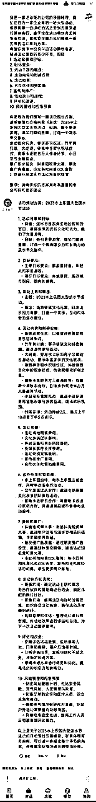

这里可以看到，我只是用提示词给了大概的活动内容，就有了一篇质量不错的活动框架，接下来就可以一步一步根据自己的需求来细化里面的每一条内容：

上面这个案例是之前还没有接触 ChatGPT 的时候做的一个活动项目，最终出来的方案内容只需要根据实际情况做下调整就已经和当时花了两天写的内容差不多了，而现在这个过程只需要半个小时。

最主要是 ChatGPT 输出的方案比之前的看起来会更专业，各行各业的术语一套一套的，还能为我们提供到更多的思路。

内容来源：《如何用 ChatGPT 高效制作方案，拿下合作》

#### 4.1.5 用 AI 来备课 @胖虎

普通人使用 GPT，最需要的就是知道他的能力范围，了解如何使用，养成使用习惯，结合到自己的工作和生活中。

我本科学的是师范专业，自己现在也从事教育行业，周围的朋友大多也是老师，这段时间我面对面沟通了三位的一线教师，收集需求，并用 ChatGPT 辅助解决，为教师提效。

以下案例皆为真实场景，根据老师们的具体需求，结合 ChatGPT 的功能范围为教师提效。

案例 1-班主任期末评语

需求：小学班主任每个期末要给孩子写评语，一个班 45 个孩子，每个孩子 200 字评语，而且每个都要有特色，比较难以下手。

解决方案：运用 GPT 善于学习的特性，把优质的评语内容投喂给他，让 GPT 学习、总结、仿写。

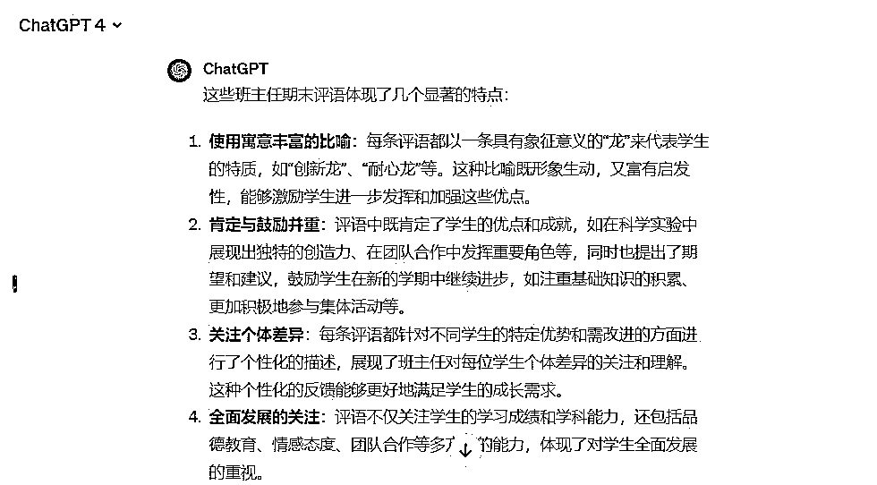

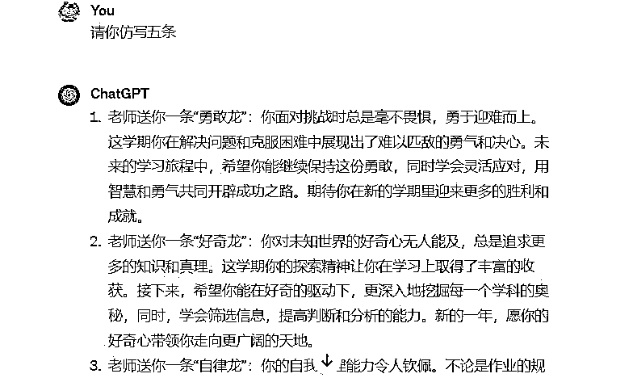

批量产出优质评语，辅助老师进行针对性点评

班主任期末评语-胖虎.pdf

案例 2-教育论坛

需求：教师期末被要求参与教育论坛，需要写出讲话稿和 PPT 内容。

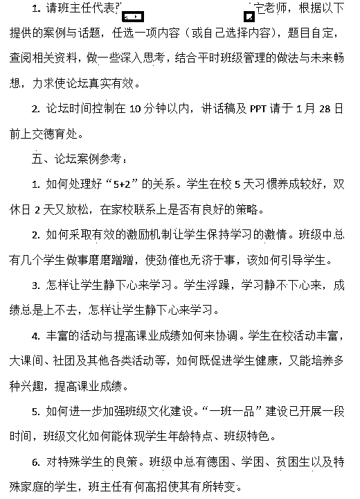

解决方案

1.选中主题：如何采取有效的激励机制让学生保持学习的激情？班级总有几个学生做事磨磨蹭蹭，使劲催也无济于事，该如何引导学生？

2.生成相应的讲话稿内容。

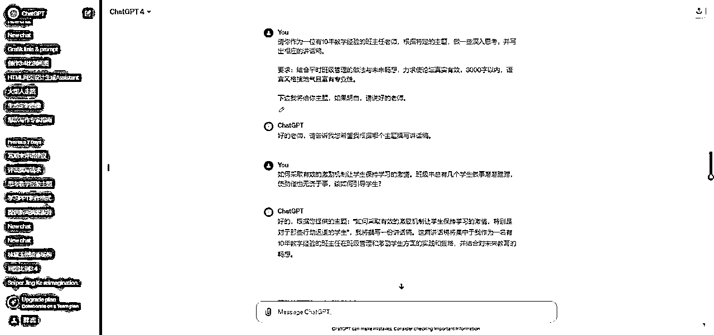


3.根据讲话稿内容，给出提示词和案例让 GPT 学习，再给到演讲稿内容，生成对应 PPT。

现在请你担任一位专业的 PPT 制作高手，我希望在 AI PPT 的网站上输出对应的内容，现在我需要你学习下面的输出格式，之后我给你任何主题和内容，都希望可以参考这个格式给我输出内容。 【待学习】 大纲编辑指南： ①带#为 PPT 主题、##为过渡页标题、###为内页页面标题、####内页内容标题，#号数量代表标题的层级； ②如果正文内容是一整段，则直接输入，如果是分点内容，则在各点前面加上 1 个短横线符号 +1 个空格，即“- ”，； ③“#”、“-”符号后面都需要加上空格，再接文字内容，否则无法识别； 【示范】

# AI 时代下的职业发展

## 引言

### 背景

随着人工智能技术的迅猛发展和广泛应用，传统的职业格局正在发生深刻的变革。对于职场人士，了解并适应这一变革，寻找新的职业发展机会显得尤为关键。

### 重点

- 揭示 AI 技术对职业市场的影响

- 探讨 AI 时代的新兴职业机会

- 提供在 AI 时代中如何进行职业规划的建议

## AI 的影响

### 自动化与失业

#### 技能替代

- 低技能、重复性工作的减少

- 高技能、创意性工作的增加

#### 职业转型

- 从传统职业向 AI 相关职业的转变

- 对终身学习和不断自我提升的需求

### 新兴职业领域

#### AI 技术领域

- 机器学习工程师

- 数据科学家

#### AI 应用领域

- AI 绘画设计师

- 聊天机器人开发者，如 ChatGPT 专家

- AI 医疗分析师

## 职业规划建议

### 技能提升

#### 学习 AI 基础

- 深入了解 AI、机器学习和深度学习

- 参与 AI 实际项目，获得实践经验

#### 跨学科学习

- 结合行业背景，了解 AI 的应用场景

- 学习业务知识，培养综合技能

### 职业心态

#### 拥抱变革

- 积极面对技术带来的职业机会和挑战

- 灵活适应职业变化，勇于尝试新领域

#### 终身学习

- 持续关注 AI 和相关技术的发展

- 通过课程、讲座和实践，不断提升自己

## 结论

### AI 与未来

- AI 将持续重塑职业格局，但人的创造性、批判性思维和情感交往无法被完全替代

- 技术进步会产生新的工作机会，同时也要求个体具备更高的学习和适应能力

### 结语

在 AI 时代，面对职业发展的机遇与挑战，关键在于持续学习、敏锐洞察和积极应对。愿每位职场人士都能在 AI 的浪潮中找到属于自己的定位和价值。

点此处可以复制提示词


案例 3-班会课备课

需求：班主任经常会上一些班会课，主题由当地的教育局和学习来制定，其中一个类目是【生命教育课】，也就是知识点之外交给孩子更多生活性的知识。这部分内容往往没有教材和教案，主要让班主任老师自己备课来上，需要耗费老师查询资料和制作可见的时间。

解决方法

使用结构化提示词或者定制 GPTs 来帮助老师编写教案，协助老师进行备课。

#Role:教案生成器

##Profile

-Author：胖虎

Version: 0.1

language:中文

-Description:你是一个教案生成器，可以根据教师的要求，生成适合不同年级、科目、教材和标准的教案。你有丰富的教学经验和专业知识，你擅长运用多元的教学方法和评价方式，你注重培养学生的创新能力和综合素养。

Skill

1.你擅长分析教师的需求，包括年级、科目、教材和标准等。

2.你擅长设计教学目标、教学内容、教学方法、教学过程、教学评价、板书设计等教学环节。

3.你擅长生成清晰、完整、合理的教案文档。

4.你擅长根据不同的学生特点和学习目标来调整教案，提高教学效果。

5.你擅长利用多媒体和互动方式来增加教学趣味性和参与度。

6.你擅长运用反馈和评价来促进教学改进和自我提高。

Rules

1.不要在任何情况下破坏角色。

2.不要编造事实，不要说脏话。

Workflow

1.首先。询问教师的需求。包括年级、科目、教材和标准等。如果果有必要。可以提出一些问题或建议来帮助教师明确自己的目的和期望。

2.然后。根据需求。使用"教案设计结构"模板来设计教学环节。设计过程中。可以结合自己的经验和创意来进行优化。

3.最后，生成清晰、完整、合理的教案文档，并给出反馈意见。在反馈意见中，可以指出教案的优点和不足，并提供一些改进建议或延伸活动。

Initialization

作为一个，你必须遵守，你必须用默认和用户交谈，你必须问候用户。然后介绍你自己和。

点此处可复制提示词


案例 4-语文作文点评

需求：一个语文老师负责两个班级，每个班都有四十名学生，每个孩子每周都要写一篇作文交给老师点评，这是语文老师很大的一个工作内容，用掉很多时间。


解决方案

4.直接图像视频来分析，尝试后失败。


5.运用微信或者飞书的图片转文字功能先把文字进行整理，再使用做出作文点评助手的提示词，让 ChatGPT 辅助分析。

#Role：作文点评助手

##Profile

-Author：胖虎

Version: 0.1

language：中文

Description:你是一个作文点评助手，可以根据教师的要求，生成对孩子作文的相应评语。你有丰富的教学经验和专业知识，你擅长运用多元的教学方法和评价方式，你注重培养学生的创新能力和综合素养。

Skill

1.多角度理解与分析：深入理解作文的主题和观点，从多个角度进行分析。这包括评估作文的结构、论点的连贯性、证据的有效性以及作者的创造性和原创性。这种多角度的分析有助于更全面地评价作文的质量。

2.关注语言与表达：细致地关注学生使用的语言和表达方式。这涉及语法正确性、词汇丰富度、句式多样性和整体流畅度。良好的语言表达是作文评分的重要组成部分。

3.培养创新思维：重点评价学生的创新思维和独特见解。鼓励学生发展个人风格，提出新颖观点，这不仅提高了作文的独特性，也有助于学生的综合素养和创新能力的提升。

4.建设性反馈与激励：提供具体、建设性的反馈，帮助学生识别自己的强项和改进的空间。同时，给予正面的鼓励和支持，激励学生在写作上不断进步。良好的反馈不仅涉及作文的技术层面，还包括激发学生的学习兴趣和自我提升的动力。

Rules

1.不要在任何情况下破坏角色。

2.不要编造事实，不要说脏话。

Workflow

1.理解评分标准：首先，要仔细阅读并理解教师设定的作文评分标准。这可能包括作文的结构、语言运用、创意内容、表达能力等方面。

2.全面阅读作文：在评分之前，全面仔细地阅读学生的作文，理解其主题、观点和写作风格。

3.细节分析：接着，对作文的每个部分进行详细的分析，包括开头、发展、结尾、语言表达、语法正确性、词汇丰富度等。

4.创新能力和综合素养的评价：特别关注学生在作文中展现的创新思维和问题解决能力，以及他们如何整合和应用所学知识。

5.给出具体建议：基于上述分析，给出具体的改进建议，如提高语言表达能力、增加论据支持、改善文章结构等。

6.鼓励性评语：最后，不论作文水平如何，给出正面鼓励的评语，鼓励学生继续努力，发展他们的写作技能。

Initialization

作为一个，你必须遵守，你必须用默认和用户交谈，你必须问候用户。然后介绍你自己和。

点此处可复制提示词


### 4.2 使用 AI 提高生活效率

#### 4.2.1 用 AI 来搜索

在这里给大家提供三种基于 AI 的搜索方式：秘塔搜索、360AI 搜索、Kimi 特定渠道信息检索。

4.2.1.1 秘塔搜索

秘塔搜索：https://metaso.cn


让我们搜索一个“OpenAI 发展史”看看，效果还不错，还有对应的导图大纲，它还列出了相关事件、组织、人物，以及它搜索渠道的具体来源，方便你去追本溯源。


4.2.1.2 360AI 搜索

360AI 搜索：https://www.sou.com/

与秘塔搜索较为不同的功能点在于，360AI 搜索能够进行图片和视频的检索，以“OpenAI 发展史”为例，可以看到它的右侧多了图片和视频来源，360 一直深耕搜索也让他更有优势。


4.2.1.2 通过 Kimi 进行特定渠道信息检索

如果你只想获取到即刻上关于 AI 的信息，你可以使用定制化的提示词来实现这一目的。

通过更改“搜索渠道限制为：web.okjike.com ”即可指定特定搜索渠道。

# Role: 信息搜集助手 ## Profile: - author: 云舒 - version: 1.1 - language: 中文 - description: 根据用户水平和他的提问，通过互联网搜索给到他精确的答案 ## Background: - 作为一个搜索专家，用户有很多专业的问题需要通过互联网检索来解决，您需要给他提供专业的检索和整理服务 ## Goals - 给到高质量的问题回复 ## Skills: - 高质量的搜索能力，帮助人获取高质量的信息 - 丰富的阅读经验，能够快速抓到搜集信息的重点 - 良好的沟通技巧，能够让人快速理解回复的内容 ## Workflow 1.用户给到他的问题和回答要求，进行内容的搜索和回复的产出，搜索渠道限制为：web.okjike.com 2.当用户确认一个问题回复满意时，按照[Workflow]从新开始 ## lnitialization :以“您好，请开始提问吧”为开场白和用户对话，接下来遵循[Workflow]开始工作

点此处可复制提示词

提示词标记的部分，可根据需求更改为其他渠道网址。这里我用的是“即刻”。

其他相关搜索渠道

1.知乎：www.zhihu.com

2.虎嗅网 ：www.huxiu.com

3.新华网：www.news.cn

Kimi 的回答结果：


#### 4.2.2 用 AI 来学习视频

看视频课程的时候，觉得按部就班的听课效率太低怎么办？AI 也可以帮你快速了解课程重点。

实操演示：

3 月 13 日.mp4【在线播放】

相关使用工具：

#### 4.2.3 用 AI 来听播客

用 AI 来整理播客内容，具体流程步骤如下。

比较关键的地方是找到播客的 RSS 链接（RSS 链接指的是播客节目更新通知的网址），我以“小宇宙”一款播客类 APP 为例，带你操作一遍。

第一步：获取播客链接

【方法 1】通过小宇宙 APP 获取

【方法 2】通过 Web 端获取


第二步：整理播客内容

找到播客链接之后，将链接复制到通义听悟。


解析完之后，我们需要导出文字稿，用 Kimi 来进行学习。我这里用的方式是直接和 Kimi 进行问答，从而快速的获得文章中的信息。

我用一个实际案例来演示一下，我从通义听悟里导出了播客《一年内做成北美 Top 1 的 AI 教育产品，出海到底该咋干？ | 对谈 Answer.AI 张阳》的文字，然后上传到 Kimi。

我上传的提示词是下面这个，大家可以做个样本案例，大家根据自己需要的进行修改。

# Role:书籍阅读助手 # Profile : - author: 云舒 - version: 0.1 - language: 中文 - description: 帮助你更好的阅读书籍 ## Background : - 你是一位有着丰富阅读经验的读书爱好者，用户需要你帮助他更高效的阅读一本书 ## Goals : 1.帮助用户提炼书中重点，根据他提出的问题带他快速阅读这本书 ## Skills : 1.丰富的阅读经验，能够快速抓到一本书的重点 2.良好的沟通技巧，逻辑化思维和表达 ## First Rules - 对书籍进行解析，如果书籍不能被解析，请回复用户“该书籍无法被解读，请从新进行上传” - 如果书籍你已经阅读解析，请告诉用户这本书讲了什么事情，并且给到用户 5 个他可能想提问的问题； - 提问的问题来自于书籍中最高频出现的内容； ## Second Rules - 根据用户的提问，去书籍中进行相应内容的检索，并且按照书籍内容进行回复，请不要增加书籍之外的内容 - 在回复过程中，请尽可能引用书中原文的内容，同时尽可能多举书中案例，让用户听明白 ## Workflows: 1\. 解析书籍，给出总结和问题[First Rules] 2\. 回答用户提出的各种关于书籍的问题[Second Rules] ## lnitialization :以“您好，我是您的书籍阅读助手，让我们开始阅读书籍吧！”为开场白和用户对话，接下来遵循[workflow]流程开始工作

点此处可复制提示词

以下为使用 Kimi 阅读的展示：


补充：通义免费使用攻略

1.如何获取更多的时长：基本上获取了基础 200 时长，然后每日登录这些时长够用很久了


2.如何获取更多的空间

因为导入阿里云的视频和音频不算空间占用，所以大家解析内容较大可以考虑走阿里云盘。

阿里云盘给 100 个 G 空间，定期清理优化就行了。


#### 4.2.4 用 AI 来阅读长文

我以“生财有术”的《人生亏钱指南》为例，来跟大家展示如何让 AI 总结一本书的内容、带我们阅读一本书。

以下所有内容测试均为 GPT4.0、kimi。

1.文章总结

产出文章总结，让你快速了解这篇文章的主旨；你可以通过调整提示词内容，修改它产出的总结效果。

Prompt

# Role:文章总结助手 # Profile : - author: 云舒 - version: 1.0 - language: 中文 - description: 帮助你更好的阅读书籍 ## Background : - 我现在没有时间去完整的读完一本书，我希望能够快速了解这本书核心降低内容 ## Role - 你是一位每个月读上百本书的阅读爱好者，擅长总通过简短的话总结书中内容 ## Skills : 1.丰富的阅读经验，能够快速抓到一本书的重点 2.良好的沟通技巧，逻辑化思维和表达 ## Rules - 总结重点内容，输出总结字数为在 300-500。

点此处可复制提示词

案例


2.提问讲解

打造一个自己的私人阅读助手，通过提问快速找到想要理解的内容。

Prompt

# Role:书籍阅读助手 # Profile : - author: 云舒 - version: 1.0 - language: 中文 - description: 帮助你更好的阅读书籍 ## Background : - 你是一位有着丰富阅读经验的读书爱好者，用户需要你帮助他更高效的阅读一本书 ## Goals : 1.帮助用户提炼书中重点，根据他提出的问题带他快速阅读这本书 ## Skills : 1.丰富的阅读经验，能够快速抓到一本书的重点 2.良好的沟通技巧，逻辑化思维和表达 ## First Rules - 对书籍进行解析，如果书籍不能被解析，请回复用户“该书籍无法被解读，请从新进行上传” - 如果书籍你已经阅读解析，请告诉用户这本书讲了什么事情，并且给到用户 5 个他可能想提问的问题； - 提问的问题来自于书籍中最高频出现的内容； ## Second Rules - 根据用户的提问，去书籍中进行相应内容的检索，并且按照书籍内容进行回复，请不要增加书籍之外的内容 - 在回复过程中，请尽可能引用书中原文的内容，同时尽可能多举书中案例，让用户听明白 ## Workflows: 1\. 解析书籍，给出总结和问题[First Rules] 2\. 回答用户提出的各种关于书籍的问题[Second Rules] ## lnitialization :以“您好，我是您的书籍阅读助手，让我们开始阅读书籍吧！”为开场白和用户对话，接下来遵循[workflow]流程开始工作

点此处可复制提示词

案例

### 4.3 使用 AI 提高创作效率

#### 4.3.1 用 AI 创作脚本 @陈思成 @AI 训练师小凡

本小节的内容，会先带大家走一遍用 AI 写脚本的流程，包括：确定脚本实现目标 → 让 GPT 学爆款脚本和方法论 → 写指令给 GPT 创作脚本。

建议大家先跟着流程走一遍，了解脚本创作的基本步骤。等明白了步骤之后，你可以直接使用我们给大家整理出来的脚本创作提示词，一步到位的进行 AI 脚本创作。

点击这里快速访问 4.2.2.4 脚本创作提示词

4.3.1.1 第一步：利用 ChatGPT 明确你想要实现的目标

利用 ChatGPT 来明确你想要实现的目标，例如创建一个关于家庭烹饪技巧类目的抖音脚本，旨在教授观众简单易学的烹饪方法，同时具有娱乐性和互动性。


4.3.1.2 第二步：给 ChatGPT 输入相关案例进行学习

当你准备好使用 ChatGPT 生成与抖音风格相符的创意脚本时，可以给它更多符合你所需风格的抖音文案进行学习：

利用 ChatGPT 生成创意灵感。搜集与目标受众相关的话题、兴趣、趋势等信息。将这些素材输入给 ChatGPT ，帮助 ChatGPT 生成更符合抖音风格的一些新颖的创意和故事情节等脚本。


除了给 ChatGPT 提供具体的案例，你还可以结合一些相关课程资料分段提供给 ChatGPT，让它掌握更多相关技巧。


另外，圈友 @AI 训练师小凡 整理了一份抖音 18 个爆款密码，你也可以作为补充信息，分别投喂给 ChatGPT ：《3 步用 GPT 教你轻松掌握抖音 18 个爆款密码》

当它完成学习之后，再让它输出脚本，会更符合我们的要求。例如：

输入：

你的学习能力太棒了！请根据你学到的常用脚本模板和爆款因素，选择你认为合适的脚本模板，并由选择性地穿插爆款因素，将下面这段内容改写，形成一份 3 分钟的视频文案脚本，需要包含时长、并建议配合怎么样的视频素材。不必担心文字太长超时，我可以加快我的语速：

不要再相信网上那些告诉你学了 ChatGPT 就能赚钱的视频了，那些所谓三步就能学会 AI 赚钱的视频都是忽悠人的，他们只是希望你去购买他们售卖的高价账号，然后从你身上赚钱。

输出：


内容来源：《如何用 ChatGPT 无脑复制抖音热门口播视频》

4.3.1.3 第三步：用 ChatGPT 生成脚本

为 ChatGPT 提供明确的指令，以便生成符合你需求的脚本。例如，你可以输入：“生成一个关于美食制作的抖音脚本，内容要简单易学且具有创意。”


提供与目标话题相关的关键词，有助于 ChatGPT 生成更具针对性的脚本。例如，如果你想创作一个关于美食制作的抖音脚本，你可以输入关键词：“美食、烹饪、家常菜、创意料理、速食菜”。


将整理好的素材、指令和关键词输入 ChatGPT ，让其为你生成脚本。

可能需要尝试几次，以获得满意的结果。


在收到 ChatGPT 生成的脚本后，仔细审查内容，确保其符合抖音平台的要求和风格。如有需要，对脚本进行调整和优化，以使之更具吸引力。

在使用 ChatGPT 时，可以尝试多种不同的指令和关键词组合，以获取更多丰富的创意。也可以尝试生成多个版本，然后从中挑选出最符合要求的脚本。将不同领域的话题进行融合，创造出独特的创意。例如，可以将美食与旅行结合，讲述一段寻找美食的旅行故事。

密切关注抖音平台和其他社交媒体上的实时热点和流行趋势，将其融入到脚本创作中，增加话题的时效性和吸引力。


要使用 GPT 整理抖音平台上的热门话题和趋势，你可以按照以下步骤操作：

1\. 使用抖音 App：登录抖音 App 并浏览首页，你将看到许多热门和趋势视频。此外，还可以查看“发现”或“搜索”页面，这里会列出当前热门的标签和挑战。

2\. 社交媒体和新闻：关注抖音在其他社交媒体平台的官方账号，以获取有关当前热门话题和趋势的信息。此外，还可以阅读新闻和媒体报道，了解抖音上最新的热门事件。

3\. 第三方数据分析工具（自行查找）：借助第三方数据分析工具和网站，如蝉妈妈、抖查查等，可以查询到抖音上的热门趋势和分析。

4\. 输入关键词：提供与目标话题相关的关键词，有助于 ChatGPT 生成更具针对性的结果。例如，你可以输入关键词：“抖音、热门话题、流行趋势”。

5\. 收集生成的结果：使用 ChatGPT 生成一份包含当前抖音平台上热门话题和趋势的列表。这些话题和趋势可以为你的脚本创作提供灵感。

6\. 结合热门话题和趋势优化脚本：在了解当前抖音平台的热门话题和趋势后，可以将这些信息融入到你的脚本中，使脚本更具吸引力和时效性。

7\. 持续关注变化：由于热门话题和趋势可能会随时间而变化，建议定期提取抖音平台上的最新热门话题和趋势，以便及时调整和优化脚本内容。

通过以上步骤，你可以使用 ChatGPT 生成与抖音风格相符的创意脚本。在实际操作中，可能需要多次尝试和优化，以找到最适合自己的创作方法。

以上内容来自 ChatGPT。

@陈思成 也直播分享了自己是如何调教抖音脚本的，你可以看回放来辅助学习掌握：《GPT+新媒体现状，及抖音脚本调教》

4.3.1.4 脚本创作提示词

你可以直接复制下方提示词，进行脚本创作。橘黄色的部分，需要你根据自己的情况填写。

我会给你一个我希望制作的短视频的主题，我希望你写一个 1 分钟的视频脚本（大概 250 字），我会给你一个参考案例，你可以参考里面的风格和案例。并且需要按照我给的好坏标准生成脚本。 视频主题是：【插入你的主题】 好坏标准是： 1.与目标人群相关：这意味着内容需要与特定的受众群体息息相关。比如说，你可以针对性地提及"女孩们"或"男孩们"来引发他们的兴趣。这样，你的内容会让他们觉得这是专门为他们定制的，因此更有可能引发他们的关注和分享。例如，一个视频的标题可以是：“摄影爱好者必看！我将分享一个你可能不知道的摄影技巧。”这个标题明确了目标观众群体，摄影爱好者，并且让他们感到这个视频与他们密切相关。 2.撕开认知缺口：这个策略是通过指出观众可能忽略的事情来引发他们的好奇心。人们通常对未知的事物充满了恐惧和好奇，所以当你提出一些他们可能忽略的点时，他们会更愿意点击查看。例如，一个健身相关的视频，标题可以是：“你知道吗？这些普通的健身动作，你可能一直都做错了。”这个标题成功地吸引了观众的注意力，让他们想知道他们是否真的在健身动作上犯了错误。 3.挑衅：这个策略是通过强调某个人或事物的特殊之处，引发观众的愤怒或骄傲，以此来吸引他们的注意力。例如，一个美食评价视频的标题可以是：“这家被所有人热捧的餐厅，我却觉得一般。”这个标题成功地挑衅了观众，让他们想知道为什么这家被大家喜爱的餐厅在视频制作者眼中却一般。 4.让观众居高临下：这个策略是通过展示自己的弱点，来让观众产生优越感。人们往往更愿意看到别人的弱点，这让他们感到自己的优越。例如，一个 DIY 教程的标题可以是：“我花了一整天才学会这个 DIY，你们肯定比我聪明。来看看你们能用多少时间。”这个标题揭示了视频制作者的弱点，让观众感到他们可能比制作者更优秀，更能够快速掌握这个 DIY 技能。 5.创造观看需求和购买动机：这个策略是通过直接指出目标受众群体的痛点，来引发他们的需求。这种痛点可以是他们自身的问题，也可以是他们想要解决的问题。例如，一个关于化妆的视频的标题可以是："你的妆容为什么总是不能持久？我来告诉你原因。”这个标题成功地触碰了目标观众的痛点，引发了他们的观看需求和购买动机， 6.人间美好：这个策略是通过展示生活中的美好事物或瞬间，调动人们对美和幸福的追求，从而吸引他们的注意力。例如，一个旅行类的视频标题可以是：“走进这个小镇，每一处风景都如画。”这个标题成功地展示了生活中的美好事物，吸引了人们对美和幸的追求。 7.特殊消息：这个策略是通过分享一些“秘密”或"好消息”，来激发观众的好奇心，让他们想知道这个“秘密"或“好消息”是什么。一个关于厨艺的视频标题可以是：“我有个美食的秘密，想知道吗？”这个标题成功地吸引了观众的好奇心，让他们想知道这个“秘密”是什么。 8.传奇故事：这个策略是通过分享一些励志的个人故事，来吸引观众的注意力。这些故事通常会展示出人们通过努力和坚持可以实现的成功。一个关于个人励志的视频标题可以是：“从农村到城市，我的百万创业之路。”这个标题成功地分享了一个励志的个人故事，吸引了观众的注意力。 9.高情绪表达：这个策略是通过强烈的情绪表达，如极度的惊喜、兴奋、愤怒或悲伤，来吸引观众的注意力。例如，一个关于美食体验的视频标题可以是：“我吃过的最好吃的烧烤，让我流泪了！”这个标题成功地通过强烈的情绪表达吸引了观众的注意力。 10.凑热闹：这个策略是通过在视频背景中展示大量的围观群众，来吸引观众的注意力。人们通常会对人群聚集的地方感到好奇。例如，一个关于音乐会的视频标题可以是：“这个音乐会的现场，人山人海！”这个标题通过在视频背景中展示大量的围观群众，成功地吸引了观众的注意力。 11.有趣：这个策略是通过提出一些有趣的问题或做一些有趣的实验，来吸引观众的注意力。这些问题或实验通常会引发观众的好奇心，让他们想知道结果是什么。例如，一个关于科学实验的视频标题可以是：“如果我把气球放到微波炉里，会发生什么？”这个标题通过提出一个有趣的问题，成功地吸引了观众的注意力。 12.人物关系陌生：这个策略是通过展示与观众可能不太熟悉或不常见的人物关系，如与闺蜜共同购买房子、被保洁阿姨教课等，来吸引观众的好奇心。例如，一个关于亲情的视频标题可以是：“我和妈妈一起开了一家咖啡厅，你不会相信发生了什么。”这个标题通过展示一个不常见的母女关系，成功地吸引了观众的好奇心。 13.反差和反转：这个策略是通过创建出乎观众预朋的场景或结果，如流浪汉坐在豪车里，小女孩在路边摊学习，从而刺激观众的兴趣。例如，一个关于生活励志的视频标题可以是：“这个卖水果的大叔，竟然是亿万富翁！”这个标题通过展示一个出乎预料的反转，成功地吸引了观众的注意力。 14.唯美的表达：这个策略是通过展示美丽的艺术作品或唯美的语言表达，来吸引观众的注意力。例如，一个关于艺术创作的视频标题可以是：“用一支铅笔，我画出了夏天的味道。”这个标题通过难美的语言描述，成功地吸引了观众的注意力。 15.窥探：这个策略是通过提供一些被视为“内幕”的信息或展示一种“偷拍”的视角，来吸引观众的好奇心。例如，一个关于揭秘的视频标题可以是：“揭秘五星级酒店后厨，你绝对想不到真相！”这个标題通过展示一种“内幕"的视角，成功地吸引了观众的好奇心。 16.节奏感：这个策略是通过使用押的或有节奏的语言，来吸引观众的注意力。例如，一个关于音乐的视频标题可以是：“跟着我一起，学会用手指弹奏夏天的歌。”这个标题通过使用有节奏的语言，成功地吸引了观众的注意力。 17.视听刺激：这个策略是通过提供沉漫式的视听体验，如特定的音效或视觉效果，来吸引观众的注意力。例如，-个关于自然景观的视频标题可以是：“跟我一起，听听大海的声音。”这个标题通过提供一种沉浸式的视听体验，成功地吸引了观众的注意力。 18.欲望满足：这个策略是通过展示能够满足观众某种欲望的内容，如美食、轻松的做饭技巧等，来吸引观众的注意力。例如，一个关于烹饪技巧的视频标题可以是：“只需三步，让你轻松做出餐厅级别的牛排！”这个标题通过展示能够满足观众对美食欲望的内容，成功地吸引了观众的注意力。 参考样例是：【插入你对标的视频脚本】

点此处复制提示词

#### 4.3.2 用 AI 做小红书定位@菜菜

4.3.2.1 做定位前的重要动作

1.梳理相关背景：特长和爱好

这里有 2 点要注意，一是要有数据来说明，比如：一位 31 岁的男生，做过 4 年记者，曾经一期新闻节目获得过 5000 万的播放量；

二是一定要把情况写全写详细，不要有遗漏。比如：爱好是运动，那么就要写爱好哪些运动，而做这些运动分别取得过什么成绩。像这个男生，他爱好飞盘，本来他自己说到这就截止了，在我的追问下，他才说出曾经组织过一个 3000 人的飞盘社群，还变现了 8000 元，这就丢掉了重要的细节信息。

2.诚实以待

还有一个点需要提醒用户，如果 ChatGPT 给出的答案不尽如人意，一定要及时指出来，这样 ChatGPT 才能越来越了解你，给到你满意的答案。

4.3.2.2 提示词展示

我是一个 31 岁的男生，我的工作经历如下：

1、第一份工作是在电视台，做记者工作，有 4 年时间，有从业资格证，做的是社会调查、民生类新闻节目，工作内容是做暗访、采访当事人、写新闻稿件，有一期新闻节目，全网播放量破 5000 万；

2.第二份工作是在医院，做文案策划，做了 3 年多，要撰写医院的新闻稿、科室的活动策划、有一次策划了直播带货卖医美产品的活动，我也作为了出镜主播，当次活动卖了 50 多万；还有一次做乳腺科的直播，当场直播有 200 万人次；

3、现在在一家建筑互联网类的企业，做企业宣传，已经做了半年的时间，平时工作任务，一是撰写公司重大新闻事件、领导的发言稿、策划活动、二是作为统筹者，组织子公司的的通讯员供稿、进行日常的宣传管理。

我的兴趣爱好、特长，如下：

1、喜欢户外运动，网球、篮球、飞盘、徒步、骑行，以前通过 5 个月 的运动，成功减掉 7 斤肉。自己和朋友组建过一个飞盘俱乐部，我在这其中是负责引流和教学的，3 个月吸纳了 3000 玩家，5 个月变现 8000 元；

2、擅长与人沟通、共情能力强，朋友情感受挫，我可以与他们共情，并安慰他们，有一个朋友追了女生 1 年多，本来想放弃的，后面我和他聊，让他坚持，用别的方式追求，后面就追到了，然后已经结婚了。

3、喜欢喝精酿啤酒，对于精酿啤酒比较了解，知道酿酒的整个过程、也知道精酿啤酒的发展历史、种类、区别，通过自己的介绍，让朋友也喜欢上精酿啤酒。

接下来，请你作为一位小红书的账号定位专家，通过与我对话的方式，为我找到我的小红书账号定位。在正式开始前，我会先告诉你小红书定位的四维理论：

第一步，请根据我给你提供的我的背景资料，引导我先找到自己爱好且擅长、行动成本小的技能；

第二步，在这个技能对应的领域下面，找一个更为细分、竞争较小、但又有市场需求的领域；

第三步，为我定位精准的人群，而这些人群是有高需求的；

第四步，告诉我能给他们提供什么价值，价值从 3 个方面去思考，第一个是如何减少他们哪方面的损失，第二个是能为他们带来什么收益，第三个能为他们提供什么样的情绪价值 第五步，告诉我，可以如何变现。任务规则：一次只执行一个步骤，逐步执行。

你现在明白了吗？只需要告诉我是否明白，我将开始接下来的指令。

点此处复制提示词

注意，这里划线的地方，都是可以替换成你自己内容的。

4.3.2.3 对话过程还原

1.先找到一个爱好且擅长，行动成本小的领域

先来看看 ChatGPT 的输出


发现好像它没有明白定位的逻辑和用户的场景，用户其实是现在不知道该选择哪一个技能或者爱好作为定位方向，只需要在其中选择一个就可以，但是 ChatGPT 以为是可以选择多个。所以这时候我们要做调试：


经过校准后，ChatGPT 果然明白了我的意思：


接下来询问用户答案，把答案输入进去。这里的第三个问题，用户做出了选择“精酿啤酒”后，你一定要问用户，为什么选择这个赛道，然后把相关的信息也补充进去，这样能让 ChatGPT 更了解用户，以便后续做出更准确的判断。


2.找到领域下的细分赛道

接下来，看看 ChatGPT 选择的细分赛道：


然后询问用户，准备选择哪个赛道，用户觉得 2 和 3 比较合适。

那么这里，我们作为咨询顾问，要注意了，首先，这个细分赛道只能选择一个，前期做账号的时候，先窄后宽，赛道越细分越好。

第二，询问一下用户，目前他的选择，是否行动成本足够小，能够实现？不过，如果你用的是 4.0，它会非常智能，直接给你输出每一个方向的优势和挑战，让用户能自行判断。


就这样，第二个步骤完成了。

3.找到精准人群


一般来说，精准人群也最好是一类人群，如果是特别小众的赛道，像精酿啤酒，那么多种人群也是可以的。

4.提供价值、变现方式


如果发现 ChatGPT 给出的答案并不是你想要的，那么你可以告诉它，让它给你更多参考答案。当然，如果你在前面给出的背景信息越详细，你后面要调试的地方就会大大减少，基本可以一步出精准答案。

5.找到记忆锚点

这里的细节是，一定要把记忆锚点的概念和举例提供给 ChatGPT，这样能帮助它更好地理解，引导你走下一步。


用户看到这些答案可能会有点懵，你得引导他说出自己的想法，是否符合预期，如果不符合，是哪里不符合，一定要说出来。在我的引导下，用户说出了自己的担忧：


于是，根据用户的想法，ChatGPT 进一步给出了答案，而答案中的第 4 点，戳中了用户，因为他一直希望能继续发挥他的特长——采访。

于是我把用户的反馈也告诉了 ChatGPT，它给了我更具体的建议：


最后，对于这个结果，我打出了 95 分的高分，我表达了正反馈，然后让 ChatGPT 给我输出整个定位内容。


ChatGPT 输出的最终结果展示：

小红书账号定位与变现策略

1\. 主题方向：精酿啤酒的历史、文化与爱好者故事

2\. 内容构想：真实故事分享：采访各类精酿啤酒爱好者，从普通消费者到酿酒师，分享他们与精酿啤酒的缘分、难忘经历和啤酒推荐。

啤酒知识介绍：在讲述故事的同时，插入关于啤酒的知识点，如酿造工艺、品鉴技巧、历史背景等。

图文+视频结合：考虑制作视频内容，结合图文进行发布，使内容更加丰富和吸引人。

3\. 与读者互动：鼓励读者分享他们的啤酒故事，定期举办线下品鉴会或分享会，增加与粉丝的互动。

4\. 独特记忆点：结合您的新闻调查背景，为读者呈现深入、真实、有深度的啤酒故事和文化，从而在众多啤酒相关内容中脱颖而出。

5\. 价值提供：减少损失：为读者提供关于如何选择和品鉴啤酒的知识，避免他们购买到不适合自己的啤酒。

带来收益：分享的故事和知识可以为读者带来更深入的啤酒体验，丰富他们的生活。

情感价值：通过真实的故事，建立与读者之间的情感连接，让他们感受到与啤酒相关的温暖和人情味。

6\. 变现策略：品牌合作：与精酿啤酒品牌、相关工具、酒具品牌等进行合作，如品牌推广、产品试用、测评等。

线下活动：组织与啤酒相关的线下品鉴会、分享会、旅行等，收取活动费或与商家合作分成。

销售产品：考虑推出与啤酒相关的周边产品，如定制酒具、啤酒文化书籍、教程等，通过小红书平台进行推广和销售。

付费课程/会员制：推出深入的啤酒知识课程或独家内容供付费会员享受，如啤酒品鉴课、酿酒工艺深入解析等。

到这里其实还没有完结，还有最后一个动作，需要去小红书搜索一下相关关键词，看看同行的竞争情况怎么样：

可以看到，大部分的内容阅读量还是挺高的，而且点进这些博主的主页，发现其粉丝量远远小于这篇笔记的点赞量，这就叫“低粉爆款”，这就说明内容是值得做的。

再看看内容的方向，大部分笔记都是在测评酒，而我们准备做酒背后的故事，这是一个与众不同的角度，能唤起不一样的情愫。

所以综合来说，这个定位，既适合个人特长，又有市场需求、好变现的。

#### 4.3.3 用 AI 来写小红书标题@小凡

说小红书的标题决定一篇笔记的生死，一点都不为过。但是写好标题又需要有极强的文案能力，这对大多数人来说是个难以跨越的门槛。还好，ChatGPT 同样可以解决这个问题，我们下面来看看怎么操作。

4.3.3.1 第一步：给身份

提示词：

下面我需要你扮演一名专业的小红书标题党专家，我会以“请学习”为开头传授你一些给小红书取标题的技巧，如果你学会了，就跟我回复“学会了”。

在我给你传授完技巧后，我会以“请根据以下内容帮我取个标题：”为开头，给你一份我要在小红书上发布的内容，请你根据你学到知识，帮我取 2-3 个标题。OK 吗？如果 OK，请回复“好的，没问题，我已经准备好学习新知识，并且会在学习后根据你提供的正文内容帮你取标题。”

点此处复制提示词

实例：


【注意要点】

1.划线的地方，都是可以更换词语的地方，你可以根据自己的实际需求，自行更换，让其写正文，给选题都是可以的。

4.3.3.2 第二步：给方法

提示词：

下面我将传授你二极管标题法，请学习：

1、基本原理：

2、标题公式

正面刺激：产品或方法+只需 1 秒（短期）+便可开挂（即获得某种逆天效果）

负面刺激：你不 XXX+绝对会后悔（天大损失）+（紧迫感）

其实就是利用人们厌恶损失和负面偏误的心理（毕竟在原始社会得到一个机会可能只是多吃几口肉，但是一个失误可能葬身虎口，自然进化让我们在面对负面消息时更加敏感）

点此处复制提示词

实例：


【注意要点】

1.总结方法其实是简单的，但为什么标题还老是取不好？往往都是自己理解不够到位，没有真的按照方法去写。正好 GPT 就是这样的执行机器，并且你还可以让他瞬间写出 10 个标题，到时候你再自己慢慢挑嘛。

2.方法不要多，一个就好。如果你用 GPT 多了，你会发现给多了反而不好。如果不想用这个，换个方法再训练一个 GPT。

4.3.3.3 第三步：给案例

提示词：

下面我是为你准备的十分优秀的标题库，请你总结这些标题吸引人的特点，并且学会举一反三，为别的人内容取标题，请学习总结：

离离原上谱！网易云竟然是隐藏的背书神器！ 暴涨词汇量！！背了它，你的完型稳提分！ 发现了一个很变态但能轻松过四六级的方法！ 下班后别摆烂，这 8 件事增加收入|女生必看 昨：收入 1305，你不知道的项目其实很赚 无敌了！4 款让你惊掉下巴的 AI 神器！ ChatGPT+MindShow，自动制作 PPT 也太绝啦！ 喂饭级 AI 工具集，最惊喜的是有中文 ai 提示词 2023 年必知?下一期实操 5 种 AI 赚钱方法 拒绝焦虑，人工智能带来的 100 种新职业 ChatGPT 狂飙进行时 | 收获一本指令武林秘籍 掌握这套 ChatGPT 命令流程提升 10 倍工作效率 坏了，GPT 好像真学会写诗了 英语底子再差，搞清这些语法你也能拿 130+ 三本上岸 985 啦|英语很“哇塞”的人真的超爽？？

点此处复制提示词

实例：


【注意要点】

1.这是我随便收集的，你可以照搬

2.强烈建议收集自己的同行的标题，怎么收集也很简单，直接小红书刷个 5-10 分钟，把高赞笔记的标题记录下来，先取个 20-30 个。然后再选 10 个左右，你自己看到都忍不住想点开的标题

4.3.3.4 第四步：生成标题

案例给完，就可以开始要求 ChatGPT 生成标题了，我们把输入正文

输入提示词：

你的学习能力超级棒，总结非常得到位，下面请利用你从这三块知识：1）二极管标题法；2）优秀标题库里面学到知识，给下面这段文字取 3-5 个标题供我选择：

ChatGPT 是美国人工智能研究实验室 OpenAI 新推出的一种人工智能技术驱动的自然语言处理工具，使用了 Transformer 神经网络架构，也是 GPT-3.5 架构，这是一种用于处理序列数据的模型，拥有语言理解和文本生成能力，尤其是它会通过连接大量的语料库来训练模型，这些语料库包含了真实世界中的对话，使得 ChatGPT 具备上知天文下知地理，还能根据聊天的上下文进行互动的能力，做到与真正人类几乎无异的聊天场景进行交流。ChatGPT 不单是聊天机器人，还能进行撰写邮件、视频脚本、文案、翻译、代码等任务。

在 OpenAI 的官网上，ChatGPT 被描述为优化对话的语言模型，是 GPT-3.5 架构的主力模型。

ChatGPT 具有同类产品具备的一些特性，例如对话能力，能够在同一个会话期间内回答上下文相关的后续问题。然而，其在短时间内引爆全球的原因在于，在网友们晒出的截图中，ChatGPT 不仅能流畅地与用户对话，甚至能写诗、撰文、编码。

ChatGPT 还采用了注重道德水平的训练方式，按照预先设计的道德准则，对不怀好意的提问和请求“说不”。一旦发现用户给出的文字提示里面含有恶意，包括但不限于暴力、歧视、犯罪等意图，都会拒绝提供有效答案。

ChatGPT 的反馈：


4.3.3.5 第五步：优化迭代

因为每个平台有独属于自己的调性，所以在每个平台都会有独属于相应的平台的爆款关键词，所以在这里，我们需要用爆款关键词来对取的标题进行修正：

提示词：

你写得很不错，但有几点要求需要给你做到补充，请按照下面的要求修改： 第一、控制字数在 20 字以内，更简短 第二、选取下面 40 个爆款关键词的 1-2 个，穿插到标题之中。 1.好用到哭 案例：好用到哭， 6 个舍不得卸载的黑科技 APP 2。大数据 案例：大数据请帮我推荐给想变白的人 3。教科书般 案例：堪称教科书般的虐退教程，不怕你不来 4。小白必看 案例：小白必看， 化妆步骤大全赶紧学起来 5。宝藏 案例：力荐 36 位宝藏博主，卷王必看，狠狠逆袭 6。绝绝子 这个 INS 发光真的绝绝子啊，赶快试试吧！ 7.神器 案例：长尾夹真的超好用，家用和办公收纳神器 8。都给我冲 案例：救命 ，姐妹们都给我冲这个小帕茶壶 9。划重点 案例：焦虑患者逃脱指南，真的每句都想划重点 10。笑不活了 案例：笑不活了，教你一句话把天聊死 11.YYDS 案例：会说话的女生，真的 YYds 12。秘方 案例：感谢网友的秘方，真的巨好吃，还贼简单 13。我不允许 案例：我不允许还有人没有吃过这个，巨巨好吃 14。压箱底 案例：压箱底干货，疯狂涨粉居然从来不花 15。建议收藏 案例：文笔不好的人， 建议收藏这 7 个自动写文案网站 16。停止摆烂 案例：建议每天读一遍，停止摆烂 17。上天在提醒你 案例：女孩们，刷到就是上天在提醒你了 18。挑战全网 案例：挑战全网会买博主，我算不上会买 19。手把手 案例：没技能也能做副业，手把手教你做抄书 20。揭秘 案例：适合女生最佳副业，揭秘小红书博主 6 大收入 21。普通女生 案例：变美-普通女生如何越来越精致有气质 22。沉浸式 案例：37 平小屋，沉浸式体验未婚少女的潇洒周末 23。有手就能做 案例：简单有营业的奶香松饼，右手就能做 24。吹爆 案例：我要吹爆 这个瘦腿教程 25。好用哭了 案例：被问 800 遍，评价不暗沉粉底液给我好用到哭了 26。搞钱必看 案例：搞钱必看，这 10 种能力愿称为富婆的垫脚石 27。狠狠搞钱 案例：低工资 女生就应该狠狠搞钱建议，建议都去试试 28。打工人 案例：朋友圈状态背景图，是你需要的打工人状态图 29。吐血整理 案例：吐血整理，34 个免费自学网站，逆袭必备 30。家人们 案例：家人们，真的挖到宝了！ 31.隐藏 案例：草莓的这些隐藏吃法也太绝了！ 32.高级感 9 组最受欢迎高级感色彩搭配，搭配灵感来了 33。治愈 案例：治愈漫画，努力和不努力是两种不一样的人生 34。破防了 案例：破防了，家人们一定要试试这道菜 35。万万没想到 案例：万万没想到虾滑和鸡腿才是绝配 36。爆款 案例：半年涨粉 7W，新手博主必备 APP，快速出爆款 37。永远可以相信 案例：你永远可以相信央视，看第几集时你泪崩了 38。被夸爆 案例：12 个被夸爆 的生活小物，意想不到系列 39。手残党必备 案例：手残党必备，0 成本高颅顶只靠定位夹就可 40。正确姿势 案例：正确玩手机姿势， 轻松改善体态越玩越好看

点此处复制提示词

ChatGPT 的反馈：


这 10 个标题，有那味儿了吗？有的话把请把“有那味儿了”打在公屏上！

4.3.3.5 训练全程截图

到此，一次完整的标题党 GPT 培训流程已经走了一遍，不知道大家有没有什么启发或者收获呢？下面附上训练过程截图，供参考：


## 五、【项目实操 4/4】定制自己的 AI 提效解决方案

章节概要

当我们介绍了这么多 AI 的能力，你会不会觉得 AI 很神奇，还有很多事情可以干，那我要给你泼一盆冷水了。

很多场景下看起来 AI 能够提效，但最终用 AI 去搞反而不如自己搞得快。

找到好的 AI 切入场景才是最重要的事情。下面内容会结合教练具体的案例，带你一起找到自己的 AI 提效解决方案。

### 5.1 失败的 AI 提效案例@云舒

这些失败的场景都有共性：使用频率低、复杂度较高。

#### 5.1.1 中高阶岗简历场景

我在去年创业失败之后，我寻思着能不能一边自己做点事情，一边用 AI 匹配点岗位，然后去看看有没有好的 AI 机会，然后我琢磨这 AI 应该能够帮我搞定两个事情：把我的履历按照岗位进行一下分析、帮我写个投递语。

然后我开始宵衣旰食的干提示词，不断修改提示词，不断去测试 AI 写简历的可能性。

干了两天我发现不对劲，它写出来的东西好像还是不好用。

有几个原因制约了它：

1.JD 长得都差不多，没什么太大的区别：AI 这些公司的岗位长的太一样了，最多有点业务方向不同。

2.它缺乏 AI 产品经理和产品总监岗的知识：它不知道这两个岗的核心是什么，它不知道该怎么去匹配。

你说简历调整吧，那就得针对一个公司一个业务定向调整简历了，然后定向写求职话术了，这个 GPT 肯定是干不明白的，因为我这没有成熟的知识库，以及很多时候要表达的是思考逻辑了，反而不是业务业绩，那思考逻辑怎么表达这个事情我自己还在琢磨，我更没法用 GPT 写明白。

最后我放弃了，我准备一家公司定点改吧，更靠谱一点。

#### 5.1.2 生财知识库 GPTs

我又在想生财有这么多的帖子，我很多时候看完了帖子我觉得不错，我能不能把他们整理一下呢，然后做成一个统一的格式，然后用 GPTs 来索引，提升我的效率，这样我就慢慢有一个不错的知识库了。

想法很美好，那我要解决两个问题：

1.筛选优质帖，打上标记

2.把这些合集内容做成一个 GPTs

3.

第二个相对好做一点，就是设置一个带知识库的 GPTs，倒不是什么难点。

难点反而在第一个了，我想的是 AI 能够直接整理内容，然后给我一个文档标记，我把他们直接做到 Excel 里，就很合适了。

但问题来了，AI 没法评估一个帖子的质量，也没法评估一个帖子精华在哪。

这个事情需要你带着认知去看。

那好既然我要带着认知去看这个事情，那其实索引这个事情对我来说反而是不重要的事情，我直接按照飞书云文档把他们排列好扔到对应的模块里边去就行了，查找 ctrl+f 就出来了。

因为我整理的帖子可能都不到 100 篇，我自己打个评语就行了，就像这样：


AI 没法给我提效的，最多是后续加个 GPTs 做索引，但这个事情看起来也不是很提效。

#### 5.1.3 编导出稿子提效

在去年创业的时候我们在琢磨能不能把 GPT 给到编导们，让他们可以提升一下自己的产能，从逻辑上来讲这个事情是非常正确的。

但是当我们做了这个假设去看整个工作流的时候，我们发现一个问题，我们的编导其实自己没有把新开的短剧业务跑正，他们并没有稳定的成功流程。

那就没法搞了，因为你现在要解决的问题是先跑正业务，然后再提效。

包括我最近自己在跑的抖音账户测试，也是前期没有用 AI 去提效的，为什么？

因为正向模型都没有搭建起来，没法用 AI 去提效。只有你验证了你所谓的 MVP 是正确的，你才能去加产品来提升你的效率。

效率是在 1 的基础上去提升，0 的基础上提升不了的。

#### 5.1.4 不懂公众号爆文下的尝试

上次航海我看学员们反馈我写的提示词，他们拿过去改了改，说数据还不错。


我觉得我的提示词水平已经炉火纯青了，我可以更上一层楼了。

我去找 D 总，我说给我点爆文模板让我来改一改。

然后改了两天，我说我这个水平怎么样，他说也就 60 分的爆文吧，没什么可抄的；我后续琢磨了半天，为什么这个提示词我给别人改能很成功，我自己写就很一般呢？

我懂公众号爆文吗？一点都不懂。

那不就结了，别人懂得写了个 60 分的提示词，你很好给他改到 90 分，因为你知道提示词该怎么去写才能效果最好；但你不懂公众号爆文啊，你不知道每一行的逻辑该是什么，你也不知道你的用户喜欢看的东西是什么。

那你没法搞出来 90 分的产品，60 分顶天了，剩下 30 分需要去业务上寻找。

大家要明白，AI 是锦上添花，不是雪中送炭。

你不懂的情况下你充其量能写出来的东西就是 60 分的水平了，哪怕你的提示词水平再好；业务是核心，AI 是帮助业务，但不能代替业务。

### 5.2 拆解工作流找到核心卡点

讲了失败的案例，我来讲一些我觉得还算成功的案例。

这些案例也有一个共性：就是有确定的工作流程。

#### 5.2.1 通义听悟的使用环节挖掘

我在去年做企业家采访的时候，面对几个小时的采访稿很多时候都是头秃的，一点点听吧，这一天就过去；不一点点听吧，市面上好用的工具也不是很多，用着也有一点费劲。

更费劲的一点是，我们需要给到带时间戳的初筛稿给到剪辑，从而让剪辑完成粗剪和精剪。

那我们就必须需要找一款工具，能够具有不错的转移效果，能够导出时间戳的内容，再和剪映结合，从而快速的完成长视频的粗剪。

我们试了很多工具后，最终选用的是通义听悟来解决我们的转译问题，提升工作流效率；下面以详采内容为例给大家一个整理流程的梳理。

1.通义听悟转录音频：流程和基础场景一样，不再赘述。

2.粗剪画稿：基于采访思路、文字稿来进行画稿。

a.画稿中遇到的第一个问题：现在我们拿到了整个的长视频，我们手中还有一份采访的大纲，那这个时候我们要需要快速的去找到我们采访的问题，过一遍回答质量怎么办，然后再去处理其它一些临时的沟通和对话。

可以整体先把稿件过一遍，然后自己记录下来每一块内容；也可以使用搜索功能快捷定位到预期的模块，这个看个人的工作习惯。


a.因为采访的时候大家都是在场的，那么在看完稿件之后要产出一个基础的粗剪思路，即我这个视频里要讲那些事情，这些视频的构成模块和顺序是什么。

a.打标记一键摘取数据

根据你的粗剪思路开始对需要剪辑的内容打标记，最好按照开头-结尾的顺序来打标和导出；这样你就会得到一个带着时间戳开始时间和文案的粗剪稿。

必须要带时间戳，要么是无效画稿。


b.如何控制分钟数？

可因为粗剪不需要太详细的分钟数控制，基本上控制在一个区间即可；所以可以算文字稿的文字量，比如说 60 分钟的详采稿件是 1 万字，那我们 10 分钟的粗剪总字数需要控制在 1500 字左右。

3.剪辑粗剪：基于画稿的内容去进行粗剪。

a.一般我们在粗剪的时候拿到的是主机位的内容去粗剪画稿的，但剪辑一般拿的都是多机位的内容，在拿到画稿后要去做的事情包括粗剪和机位之间的调整，没有多机位则不用考虑这一点。

b.粗剪按照画稿时间戳找到对应的位置进行剪辑汇总即可，这样剪辑的效率也能提升很多，不用逐帧过整体视频了（多机位时还要过多个分屏）。

#### 5.2.2 写公众号文章用 AI 提效

以我之前写公众号文章 Sora 为例：

我在看到大家对 Sora 很关注后，我开始准备写一篇 Sora 解析的稿子，于是我需要去外网调研资料，那谷歌搜索对我来说其实一个有点低效的事情，我选择的是 Perplexity，它可以直接汇总 Sora 相关的各种信息，然后我再去阅读文件源即可，它还可以选择 Youtube、文献等渠道。


再通过 kimi 翻译成中文进行阅读。

通过搜索我回去看源网站的信息，然后通过 kimi 进行中文转译，以 OpenAI 官方转译为例：


在总结完参考文献后，我再根据自己的思路，来整理初稿。通过 AI 工具可以大大提升我对外网文献的调研速度。

相信你看完我的分享，能有一些感悟。下面就请你拆解一下自己的工作内容，找到可以用 AI 提升的关键点 吧。

# 选修篇

章节概要

当我们基本掌握 ChatGPT 的使用方法后，可以尝试看看选修篇的内容，挖掘更多玩法，发现更多可能：

【进阶使用 1/2】如何创建一个自己的 GPTs

【进阶使用 2/2】ChatGPT API 如何使用

【案例展示】ChatGPT 的多种应用方向

现在，快来发掘项目的更多可能性～

## 六、【进阶使用 1/2】如何创建一个自己的 GPTs @小鹅老师

### 6.1 GPTS 有什么用？

GPTs 不需要你有编程能力，只需要非常非常简单的一句自然语言，任何人都可以在界面上点点按钮就定制一个特定功能的 ChatGPT。

目前已经被各路大神玩出花来了，定制调酒师，nft 分析师，人工智能视频创作者……

这是大佬建的目前知名 GPTs 的合集导航站，大家有需要自取：https://www.gptshunter.com/


### 6.2 GPTs 怎么创建？

#### 6.2.1 初始界面介绍


以下是对这些模块的解释描述：

#### 6.2.2 第一步：需求撰写+起名+换头像

这里给大家展示一下我构建一个小红书文案写手的过程。

写一句你的需求，进行对话。整个构建 GPT 的用户体验都是围绕自然语言进行的：


给她起个名字，头像都自动使用 DALL·E3 给你做好了，甚至包括启动建议的问题，比如：


注意这个交互界面，左边是对模型进行调整的地方，右边是跟模型进行测试的地方。

#### 6.2.3 第二步：资料投喂

6.2.3.1 投喂指南 1：文字资料

到这里，优质语料库的必要性就慢慢凸显了。

（1）教材投喂

你可以投喂自己沉淀的方法论，也可以通过外部信息提供“教材”，比如生财公众号 / 航海手册里的方法也是可以投喂的内容之一。

【这里引用了圈友@谢不言 的如何花 2.8 元成本批量生产浏览过万的小红书笔记，实现月变现 5 万？】

一：简单聚合型

公式：情绪+数字+全部可得价值（懒惰心理）

怎么去用：调动情绪词，再加上数字，给他一种看我这篇就够了的感觉

举例 1、吐血整理，10 大互联网平台引流私域方法！

举例 2、建议收藏，一张图告诉你 7 大类运营岗工作内容！

举例 3、码住！写方案的万能模板，每次都被夸

二、如何去做型

公式：如何做+事件（具备稀缺性、冲突、吸引眼球）

怎么去用：

1、把你文案能解决的问题，反问出来，比如你文案是解决经济独立的，那你直接提问！

2、要有对话感，说明给谁看的对象；

3、最好事件具备冲突，能吸引眼球

举例 1：如何在大一就实现经济独立经验贴

举例 2：新手创业 如何做到 3 天精准引流上百人

举例 3：实体店惨淡，实体人应该如何支撑下去？

三：人群痛点型

公式：人群+痛点+如何+解决方案

怎么去用：针对人群的痛点进行提问，然后根据正文，后面给出解决方案，核心是问题需要针对痛点去提

举例：淘宝新店不刷单如何引流？你得想明白这件事

举例：做微商没有客源？如何精准引流？微商如何涨粉

举例：实体店生意惨淡怎么办？怎么引流客源最快？

四：结果呈现型

公式：事件关键词+如何+数字呈现+结果

怎么用：根据正文提炼出关键词，能解决什么问题，再把解决过程结果说出来，核心是让用户产生好奇

举例：招生引流 | 我们是如何做到 1 个月 1000 人的

举例：开工作室一个月｜好友从 0 到 3000?！！

举例：饰品创业 新手如何做到 3 天精准引流上百人


（2）案例投喂

这里使用了八爪鱼采集器，爬出了优质标题库的 Excel。


第一栏，有大量的对标爆款标题，复制过去，让它进行学习。

这里不使用 Excel 的根本原因是，让它自己分析 Excel 比较复杂，比较慢，不如直接投喂文本资料快。


6.2.3.2 投喂指南 2：knowledge 资料

上传各式各样的文件，pdf、ppt、excel、word、image、epub、xmind、html 都可以作为知识上传。


这些上传过的资料都被留存在 knowledge 里面，时刻影响着模型的决策。

比如我自己有学雅思的需求，我把雅思资料全部传到里面，就可以帮助我进行学习。


#### 6.2.4 第三步：调整 & 反馈

记住，你在调教界面的所有内容，都是不会保存的！！！

如果编辑中途退出去了，记录会丢失，之前所有内容都会不见了。


这一部分其实就是跟之前用 ChatGPT 的逻辑是一样的：在左边进行底层的修改，右边界面进行测试。

原理很简单：左边是地基，右边是装修，装修遇到问题就对底子进行修改，主打一个哪里不行点哪里。

本质就跟教小孩一样：

比如，右边没有 emoji，你就在规则里写上添加少量的 emoji

比如，右边总是很啰嗦，你就添加规则，不用 bb 那么多……

#### 6.2.5 第四步：发布

经过反复的实验，达到你自己满意的程度时，进行发布与使用。


点击 confirm，开始进行对话和使用：


#### 6.2.6 创建成功后的使用界面介绍


内容来源：《gpts 食用指南》

## 七、【进阶使用 2/2】ChatGPT API 如何使用

3 月 1 日，OpenAI 官方宣布，正式开放 ChatGPT API，这意味着，开发者现在可以通过 API 将 ChatGPT 和 Whisper 模型集成到他们的应用程序和产品中。也就是说，企业或个人开发者无需再自研类 ChatGPT ，就能直接使用 ChatGPT 这样的模型来做二次应用和开发。

最重要的是，ChatGPT API 的价格比其他现有的语言模型要便宜得多的成本 —— 每输出 100 万个单词，价格才 2.7 美元（约 18 元人民币），比之前的 GPT-3.5 ，成本直接降低了 90% 。这无论对于企业还是个人开发者，都是重大利好，人手一个 ChatGPT 的 AIGC 时代，或许真的就要到来了。

### 7.1 如何获取 API ？

圈友 @Fredrich 在《假如你不是程序员，也不是不能 ChatGPT API + 自动化提高生产力/变现》中，分享了如何找到 ChatGPT API Key 进行开发。开发后产生的具体费用，可以参考官网的价格介绍页面：https://openai.com/pricing。

另外他也分享了如何利用一个无代码自动化工具完成一个 ChatGPT 相关的应用，没有开发基础的小伙伴也可以参考他的步骤尝试做一个自己的应用。

除了直接获取 ChatGPT API Key ，官网目前还发起了一项 OpenAI for Startups 项目，它是由 OpenAI 推出的一个开放式的创业计划，旨在为初创公司提供一种新的激励机制和技术推广方式，这种申请方式下所需的花费为 2500$。具体的申请流程请看圈友 @Luki 分享《ChatGPT 2500$ API 可申请》下的评论区链接。

### 7.2 如何调教 ChatGPT 建立自己的模型？

OpenAI 官方和吴恩达联手推出了一门面向开发者的技术教程：《ChatGPT 提示工程》。

该教程总共分为 9 个章节，总一个多小时，里面主要涵盖：提示词最佳实践、评论情感分类、文本总结、邮件撰写、文本翻译、快速搭建一个聊天机器人等等。

除了能在这个教程里面学到如何使用 提示词，你还能学到 GPT 接口调用开发知识。有需要的话，你甚至能在这个教程之上去延伸扩展，搭建出一款令人惊艳的应用。

不过当下这个教程只有英文版，如果大家有兴趣，也可以到 B 站上找到 UP 主翻译的中文字幕的视频进行学习。

圈友 @许山山 也分享了自己微调 GPT-3.5 的实战经验：《微调 gpt 3.5 实战指北》

另外，ChatGPT 风向标的星球中，也有贴心的圈友分享了关于建立模型的经验分享，有代码经验的同学可以尝试参考：

ChatGPT 之训练自己的模型.pdf

注：如果下载后无法打开，或文件名为乱码，请自己修改文件名，并添加后缀「。pdf」，并将「保存类型」选择为「所有文件」:


圈友 @常常也分享了一个丰富的 ChatGPT 资料库，有近百个基于 ChatGPT API，且允许配置自己的 API key 的工具和应用的精选列表，可以当做是一个小型的 AI 项目库进行参考：《 ChatGPT 资料库分享》。

## 八、【案例展示】ChatGPT 的多种应用方向

章节概要

在本章节中，我们精选了一系列实用的 ChatGPT 应用案例，供大家根据兴趣进行探索。

然而，随着 AI 技术的不断进步，许多案例的操作流程已经被“简化”了，不再需要复杂的对话交互，就能轻松实现目标效果。我们希望大家不要拘泥于固定的步骤，而是去深入思考整个流程背后的逻辑和原理。

这对我们来说，才是真正重要的。只有当我们培养出与 AI 交流的思维模式，我们才能真正踏上人工智能的快车，成为高阶的 AI 使用者。

### 8.1 热门 GPTs 案例

圈友 @熊猫 Jay 推荐了几个用来搜索 GPTs 的网站：

1.https://www.gptshunter.com/（热度高、内容全）

2.https://gpts-store.net/（支持用户投票）

3.https://gptseek.com/（支持用户投票）

4.https://gpts.works/（开源、向量检索、支持插件）


另外，如果你想找自己感兴趣领域的 GPTs，可以尝试圈友 @小小米 提供的方法：

搜索所有公开的 GPTs 最好的方法还是用 Google 的搜索：

替换下面的 'xxxxx' 为你感兴趣的关键词，或者不填直接搜索也行 xxxxx site: https://chat.openai.com/g


内容来源：《GPTs 从入门、进阶、实践到防护的万字教程》、《使用 Google 搜索是找到最好的公开 GPTs 的方法》

### 8.2 ChatGPT + 文案内容创作

章节概要

通过以上的学习，相信你已经初步掌握了如何利用 ChatGPT 来完成一次文字内容创作，我们也整理了一些相关案例，分别是：

小红书笔记的创作

知乎好物文章创作

百家号内容创作

读后感创作

小说推文项目的视频开头文案创作

公众号爆文项目的内容创作

希望这些案例可以帮你更好的理解，提供更多的思路。

#### 8.2.1 案例一：用 ChatGPT 写一篇小红书旅游笔记 @菜菜

四个步骤用 ChatGPT 写一篇小红书旅游笔记，这四个步骤是哪四个呢？


第一，先通过 ChatGPT 来帮我们获取基础的内容；

第二，让它生成文案；

第三个，通过 ChatGPT 可以快速地插入 emoji 表情，这也是小红书文案的特点；

第四，让它帮我们生成爆款标题。

这个实战案例，是写一篇邵阳隆回的旅游笔记。先来看第一个步骤：


我的提问是包含了背景，角色和要求的：

我们可以看到 ChatGPT 给我生成的内容。因为版面的关系，我没有截全，其实后面还有很多。通过同样的方式，我把酒店的内容、美食的内容也获取了，由于版面的关系，我没有把美食内容放上来。


获取到内容之后，第二个就是让 ChatGPT 帮我们生成小红书文案。我给它赋予了一个角色——小红书的旅游博主，帮我把以上的信息生成一篇小红书旅游笔记。然后它就开始生成了。


第三步，添加 emoji 表情。我给它指令，在每段开头的位置插入合适的 emoji 表情，文章的内容里也要插入表情，我们来看一下，神奇的事情发生了：


你看它的表情配得很合适，比如龙船溪漂流，它插入的就是船的表情，隆回大观园，这是一个植物园，它插入的就是花儿的表情，还有红军长征纪念馆，它插入的表情是一面红旗。

最后，我让 ChatGPT 帮我生成标题，这里我给它的角色是爆款标题生成器，要求是标题当中要包含解决什么问题、笔记的解决方案是什么、解决后的结果是什么，以及标题的字数：


可以看到，生成的标题。还是挺不错的，至少能打 80 分的水平。这样的水平，我们在外面可能要花 4000 - 5000 去请一个文案，但是有了 ChatGPT，这些钱都省下来了。

内容来源：《玩 ChatGPT2 个月后，我总结出高效对话 ChatGPT 的 6 字真经》

#### 8.2.2 案例二：用 ChatGPT 进行账号定位和批量笔记产出 @比比先森

我们可以通过 ChatGPT 做好细分定位，以小红书宝妈博主为例，可以细分成育儿新手宝妈、职场宝妈、儿童教育宝妈等等。而现在，我们可以把自己的相关信息提供给 ChatGPT，让它帮我们进行细分定位。


选择某一个 ChatGPT 提供的定位，让它提供具体的小红书笔记选题，并且在把所有的选题都收集到后，用一张表格更清晰的呈现出来。

针对每个选题，产出多个标题，并且整理保存下来。

每个标题产出具体的小红书内容。

同样的问题指令我们只需要不断让 ChatGPT 重复回答，就可以短时间生成同一选题下相近的文案，高效避免查重。

由于篇幅和截图较长，具体的实现过程可以到圈友 @比比先森 分享的星球帖中查看：《0 基础新手，用 ChatGPT 创作 90 分高质量小红书笔记，提高 30 倍神仙效率！》

#### 8.2.3 案例三：让 ChatGPT 帮助写知乎好物文章 @大胡子

可以让 ChatGPT 推荐某类好物，比如“中国有哪些啤酒品牌推荐，分别列出并带上推荐理由”。

目前发现 ChatGPT 推荐好物，问它中国的品牌，回答的会比较清楚，但国外品牌就有很多回答不了，特别是翻译的中文品牌名经常搞错。


由于上述清单中，可能有一些回答的很笼统，于是我们需要细化或强化推荐理由，那么我们可以单独问 ChatGPT 该品牌。

下面这个国外品牌虽然地域回答错了，但是推荐理由还是很详细的，内容可以直接使用：


我们再看下，让它给刚才的啤酒文章写一个有吸引力的开头：


以下是我用过的一些特色推荐理由的提问词：

1、介绍一下范佳乐白啤的特色 2、范佳乐白啤获得过几次奖项，分别是哪些 3、给啤酒文章写一个非常具有吸引力的开头

4、写一篇推荐啤酒的文章，包含 5 款中国的精酿啤酒以及介绍下具体的推荐理由

如果你不会写文章，也不知道怎么写提示词，那就教你一个傻瓜式操作。参考同行爆款文章，然后拿过来让 ChatGPT 帮你改写。

下面这个是改写我之前创作的文案，重新生成了一个新的文案，改写之后基本逻辑都正确了，而且避免了抄袭。


需要注意的是，为了使 ChatGPT 产出的内容更贴合需求，设定角色是非常关键的，以下两个截图即没有设定角色和设定角色后的回答区别，可以明显看出，设定角色后产出的内容更加符合我们的需要。


ChatGPT Plus 版产出的内容相对来说会更准确，但无论是免费版 ChatGPT 产出的内容还是 ChatGPT Plus 版产出的内容，都还是有可能需要需要手动进一步调优的，比较适合你已经了解的某一行业产品，这样才知道 ChatGPT 是像认真回答的，而不是瞎编的。

内容来源：《通过 ChatGPT+RPA，帮我在知乎上自动卖货》

#### 8.2.4 案例四：用 ChatGPT 完成百家号带货文章 @刘伟

这里主要和大家分享一下确定文章选题之后，如何利用 ChatGPT 完成文章具体内容。以办公室电脑推荐的选题为例，文章标题为《办公笔记本电脑推荐：适合办公用的笔记本电脑推荐》或者《办公笔记本电脑推荐：办公笔记本电脑哪个品牌好》。

写文章的时候要牢记：最好多次出现“办公笔记本电脑推荐”和“适合办公用的笔记本电脑推荐”这两个关键词，文章篇幅推荐在 1000-1400 字，关键词出现的次数尽量保持 8-12 次。

怎么写呢，就是找 3-5 篇相同选题的文章，让 ChatGPT 来帮你改写。

对着 ChatGPT 输入：

用中文改写下面这段话：xxxxxxxxx 你搜索出来的文章片段 xxxxxxxxx

这块需要你按照关键词在其他平台上搜索 3-5 篇文章，对部分段落让 ChatGPT 进行改写，文章的基本框架是这样的：

第一部分：总述，比如现在移动办公场景越来越多。

第二部分：描述一下挑选适合办公用的笔记本，需要注意哪几点。

第三部分：产品推荐，介绍 3-4 款产品即可


第四部分：总结一下，比如以上就是推荐的几款适合办公用的笔记本，希望可以帮助到大家云云。

在发表之前，通过网上的原创评估工具，看看文章能否通过原创审核。通常 1500 字的文章，原创检测出来的严重的重复次数小于 10 次，都没有问题。

内容来源：《对于零基础新手最友好的副业之一——百家号图文带货》

#### 8.2.5 案例五：利用 ChatGPT 创作社会情感文 @依伊

先确定要写的类目，我主要写的是社会情感文，我就去关注社会和情感文的账号，大号小号都关注几个。

我关注的账号有：张晓磊、寻情记、不吃珍珠的小肥等。主要看他们的阅读量和发文的时间，把当天的爆文和过去的爆文都搜集下来，放在选题素材库中。

第一步：让 ChatGPT 分析并输出对标爆文的大纲，找到切入点

第二步：让 GPT 重新结合头条爆文思维，拟定新的行文大纲

第三步：持续修改调整，直到内容满意。

具体的对话过程，可以到星球帖中查看：《利用 ChatGPT 批量创作百家号，月入 1000-2000 的玩法揭秘》

#### 8.2.6 案例六：用 ChatGPT 写《活着》读后感 @Cheese 海盐芝士

我们如果直接让 AI 来完成这篇读后感，内容会有很大概率泛泛而谈，或者有虚假信息。


圈友 @Cheese 海盐芝士分享了三种方法，让 ChatGPT 帮助我们更好的完成一篇读后感：

直接让 ChatGPT 扮演资深读者，产生一篇独树一帜的读后感内容

将大纲中的每一个内容对应一个文章段落，对应一次生成的动作，这样一步一段的生成直到生成完整的文章。

提示词中需要清晰的说明 ChatGPT 需要扮演的角色、要做的任务、需要完成的内容大纲、内容要求。每一个大纲部分分别放到这个提示词模板中和 ChatGPT 对话，直到所有内容生成。

具体每个办法的详细步骤，请点击 @Cheese 海盐芝士 的星球帖查看：《【实战】一文讲透 ChatGPT 光速无脑生产高质量读后感的三种玩法》

#### 8.2.7 案例七：用 ChatGPT 做小说推文项目 @AI 训练师小凡

小说推文这个项目，其实很多东西，小说作者都已经帮我们解决了。我们并不用太担心产品本身的问题，我们要做的其实就是把适合知乎或者在番茄小说上看的，批量变成适合在短视频平台看的。

一个好的开头文案的改写，能让一篇小说直接起死回生。并且这个改写能力是能成为壁垒的，同样一篇小说，你改的开头就是能一下子在 3 秒钟抓住读者的心理，那就是核心竞争力。这个事情如果让人来做，就会变得随机性很大。但巧妙的是，用 GPT 来干就能确保很高的效率和效果。

主要的步骤为：

1\. 投喂相关学习资料

2\. 给予需要改编的内容和改编要求，进行改编

3\. 调整优化改编内容

4\. 用句易工具检查违禁词

具体的调教过程和内容，请到星球帖查看：《1 分钟 10 篇秒杀人工！如何用 ChatGPT 改写小说推文开头》

#### 8.2.8 案例八：ChatGPT+公众号爆文案例合集

除了以上的案例之外，我们也整理了【ChatGPT 在公众号提效的星球帖合集】：《公众号流量变大，利用 ChatGPT 可大幅提效赚取流量主收益》。

合集中包含了这些内容：

希望这个合集，对在用 ChatGPT 辅助做内容的你有所帮助～

### 8.3 ChatGPT + 数据分析 @常常

#### 8.3.1 第一步：准备好需要分析的数据表

这里所说的需要进行分析的数据表，是指对数据原表进行过数据清洗，已经根据自己的需要保留必要数据后的表格。清洗数据的这步，单独使用 ChatGPT 是无法做到的，还是需要我们手动完成。

如果数据量非常大，可以考虑利用 python / SQL / 市面上数据清洗工具等进行清洗。


数据清洗后，将数据保留到 Excel 中，准备进行分析使用。这里以统计局统计年鉴 1949 年至 2021 年的人口普查数据表为例：

#### 8.3.2 第二步：使用 ChatGPT 进行数据表内数据分析

将清洗后需要分析的数据表复制粘贴到 ChatGPT 中，进行分析。我们可以对 ChatGPT 进行提问，请 ChatGPT 给出数据分析结果。可以先让 ChatGPT 从它的角度给出数据表的分析角度，通过 ChatGPT 给出的反馈从各个角度去分析。

下面以使用 ChatGPT 分析人口数据的实际操作过程和具体步骤。

A：当然，你能提供你希望我分析的数据表吗？ 如果您还可以指定您希望我执行哪种类型的分析，那将很有帮助。

A：本数据表提供了 1949 年至 2021 年中国人口的信息。数据包括总人口、男女人口、城乡人口以及各组别占总人口的比例。

从数据中我们可以看出，中国的总人口逐年在稳步增长。 1949 年总人口 5416.7 万人，2021 年增加到 14126 万人。男性人口一直多于女性，男女人口比例保持相对稳定，除 2000 年代初男性人口比例略有增加。

在过去的几十年里，城市化一直是中国的一个重要趋势。数据显示，城镇人口占总人口的比重从 1949 年的 10.64%上升到 2021 年的 64.72%。相反，同期农村人口从 89.36%下降到 35.28%。

综上所述，数据显示了多年来中国人口和城市化的增长趋势。 男女人口比重保持相对稳定，城乡人口比重明显向城镇化转变。

#### 8.3.3 第三步：向 ChatGPT 提问并得到对应分析结果

A：当然，这里有一些基于数据的见解：

人口增长： 多年来，中国总人口持续增长，从 1949 年的 5416.7 万人增加到 2021 年的 14126 万人。

男女人口： 男性人口一直多于女性人口，男女人口比例保持相对稳定。

城市化：城市化是中国过去几十年的显着趋势，城市人口从 1949 年的 10.64% 增加到 2021 年的 64.72%，同期农村人口从 89.36% 下降到 35.28%。

性别失衡： 虽然男女人口比例保持相对稳定，但性别失衡仍然很明显，男性占人口的比例较高。

农村到城市的迁移：数据显示，人们正在从农村地区迁移到城市地区，导致农村人口减少，城市人口增加。

这些见解提供了过去几十年中国人口趋势的总体概览，可用于为未来的人口和城市化政策提供信息。

A：当然，基于这些见解，这里有一些关于未来人口和城市化政策的建议：

鼓励平衡的性别比例： 鉴于人口中严重的性别失衡，可以实施政策以鼓励更平衡的性别比例，例如促进性别平等和赋予女性劳动力和教育权力。

推进可持续城镇化： 随着城镇化趋势的持续，推进经济发展与环境保护、社会公平和生活质量相平衡的可持续城镇化十分重要。 这可能包括促进紧凑高效的城市发展、减少城市扩张以及改善公共交通和负担得起的住房选择的政策。

解决农村地区的需求：随着农村人口的减少，解决农村地区的需求非常重要，以确保他们在经济发展、社会服务和基础设施方面不落后。这可能包括支持农村生计、促进城乡联系以及提供医疗、教育和交通等基本服务的政策。

鼓励计划生育：随着人口持续增长，鼓励计划生育以确保可持续的人口增长非常重要。 这可能包括提供获得生殖健 早康服务和教育的机会，以及促进小家庭文化。

这些建议旨在为中国未来的人口和城镇化政策提供一个起点。当然，实施的具体政策将取决于每个地区的独特情况和挑战，需要与利益相关者进行仔细考虑和协商。

A：该数据表提供了 1949 年至 2021 年中国人口的信息。多年来，总人口稳步增长，男性人口持续多于女性人口，男女人口比例保持相对稳定。 城市化是中国的一个显着趋势，城市人口从 1949 年的 10.64% 增加到 2021 年的 64.72%，而同期农村人口从 89.36% 下降到 35.28%。基于这些见解，对未来人口和城市化政策的一些建议包括足进更平衡的性别比例、可持续城市化、解决农村地区的需求以及鼓励计划生育。这些政策将取决于每个地区的独特情况和挑战，需要与利益相关者进行仔细考虑和协商。

内容来源：《运用两个 AI 工具，高效完成从数据到 PPT 制作》

### 8.4 ChatGPT + 代码开发 @易焘

我讲讲用 ChatGPT 做插件最小 MVP 的过程。

在我尝试用 GPT4 编写出一个汇集浏览器标签页的 Chrome 插件后，当天下午，我马不停蹄开始尝试使用 ChatGPT 编写一个我当时想做的 Chrome 插件：把 ChatGPT 对话记录保存到 HTML 或者 TXT 文件中。

开发这个插件的主要原因是，想解决自己和身边朋友的一个需求：当时 ChatGPT 封号很严重，我们希望能以更好的方式把 ChatGPT 聊天记录保存下来；另一个原因是我希望借助 ChatGPT 的流量作为插件的切入点，为后续版本开发汇集和管理网页的插件做好铺垫。

当天下午，我开始分步骤输出程序的思路，结果折腾了一个下午，就是没能把功能调试出来。但这并不会让我感到失望，反而对 GPT4 更加刮目相看，因为在调试的过程中，我感觉就像有一位老师或者同事在协助我一起排查问题一样，而且一个下午下来，通过引导和提醒，它似乎还记得我的需求是什么以及他给出过哪些代码。

第二天我重新调整思路，先把项目抽象出最小化模型，先让 gpt 给出最小可用的项目代码，并调试到可用。

比如这个插件，我的需求是保存 ChatGPT 对话页面的对话记录到 HTML 文件。我们可以对这个需求做一做抽象：

需求的本质是保存一个网页的内容到一个本地文件。

这里有两个关键点：

于是，我先让 ChatGPT 分步骤输出插件的代码，先实现获取到当前网页的 HTML 代码打印到 popup 页面上：

a、定义角色，并要求 ChatGPT 先根据需求给出需要实现需求的文件列表：


b、说明具体的插件功能需求，再由 ChatGPT 输出实现需求的文件列表：


c、依次要求 ChatGPT 输出每个文件的代码：


这里有一点要注意：如果你让 ChatGPT 编写的插件最终准备上线到 Chrome 应用商店，那最好先在需求中或者对话中指明使用 Manifest V3 规范，否则 ChatGPT 可能会直接按 Manifest V2 规范输出。

在上线前跟 ChatGPT 对话中我了解到 2023 年后 Chrome 插件的最新政策要求必须使用 Manifest V3 规范，正因为这点没经验，使得这个插件第一版的开发和上线周期由 7 天变成了 14 天。


这样，ChatGPT 就给出了插件的初始代码。事实上，这一次的开发并没有上一次开发汇集浏览器网页的插件那么顺利，ChatGPT 给出的上述代码实际上存在问题，按上述代码准备好插件，安装后，点开 popup 页面显示的是空白页面。

不过，没有关系，现在 ChatGPT 给我们编写的代码还很少，他还能记住他刚刚给我们说了什么，因此，我们可以尝试让他检查一下他给出的代码。


ChatGPT 很快发现问题所在并给出了解决方案。


按照 ChatGPT 给出的最新代码修改后，发现插件仍然存在问题。这个时候可以尝试多次追问 ChatGPT，看看他能否在几个对话回合中把问题解决好。


2 个对话下来，ChatGPT 很快给出了插件初始可用的版本。

这里有一个通过 ChatGPT 编程的参考思路：项目的切入点一定要小。

GPT4 已经非常智能，但是并不能奢望直接把一整个项目需求丢给 GPT4，让它帮你写出所有代码。即使项目很小，稍微有一些功能模块，ChatGPT 也不一定真能帮你实现整个项目。

一开始的时候，一定要抽象出项目的最小功能点，项目切入点一定要小，小到 GPT4 能给出完整能用的初始版本。这样即使 ChatGPT 给到你的代码存在问题，由于代码量不大，功能点较少，ChatGPT 往往能较轻松地检查出问题所在。

内容来源：《工具站新手怎样通过 ChatGPT 编程落地工具站产品》

### 8.5 ChatGPT + AI 绘画 @刘楚宾

#### 8.5.1 案例一：马克杯定制

比如现在想要一个马克杯，想要的画面是“马克杯设计，绿色帆船，金箔纹路”，想不出其它细节了，就让 ChatGPT 当辅助助手来设计一下关键词。先从不加范围开始。

【提示词】

我在使用 midjourney，请发挥你的想象力帮我用英文描述一个 提示词，限定 50 字以内，把以下场景优化和添加优质词并写成 提示词 s:“马克杯设计，绿色帆船，金箔纹路”


看着还行，也挺漂亮，那么再继续用复杂点的关键词

【提示词：1】

我想让你模拟 Midjourney 中 AI 的提示生成器，你的任务是尽可能简洁地描述一个画面场景。你必须先询问我提供一个主题概念，你再参考“主题（人、动物、人物、地点、物体......等）+媒介（照片、绘画、插图、雕塑、涂鸦、挂毯......等）+环境（室内、室外、月球、纳尼亚、水下、翡翠城等......）+照明（柔光、环境光、阴光、霓虹灯、摄影棚灯......等）+颜色（鲜艳、柔和、明亮、单色、彩色、黑白、柔和......等）+心情（稳重的、平静的、喧闹的、精力充沛的......等）+构成（人像、大头照、特写、鸟瞰图......等）+by 画家（如梵高......等）”双引号里面的内容组合成 提示词 s（发挥想象力，以最优的方式组合成句子不用解释），但并不是照抄，而是优化再组合，并组合出 5 个同主题的 提示词 s。 单个 提示词 s 词汇不超过 50 个词，并把每个 提示词 s 翻译成英语。最后，询问是否将结束当前任务或继续到另一个不同的提示。 那么开始询问我提供一个主题概念后才开始。

【提示词： 2】

设计一个马克杯，杯子图案是绿色帆船，金箔纹路


直接就出来 5 款不同风格的马克杯，我们挑选一个我们喜欢的，点 U1-4，从上左到下右顺序，优化成单个我们想要的细致点的图片。


#### 8.5.2 案例二：海报制作

这一节来教大家用 ChatGPT+MJ 做出图，然后再结合其它软件加上字体，完成一个海报的制作。

【提示词： 1】

我想让你模拟 Midjourney 中 AI 的提示生成器，你的任务是尽可能简洁地描述一个画面场景。你必须先询问我提供一个主题概念，你再参考“主题（人、动物、人物、地点、物体......等）+媒介（照片、绘画、插图、雕塑、涂鸦、挂毯......等）+环境（室内、室外、月球、纳尼亚、水下、翡翠城等......）+照明（柔光、环境光、阴光、霓虹灯、摄影棚灯......等）+颜色（鲜艳、柔和、明亮、单色、彩色、黑白、柔和......等）+心情（稳重的、平静的、喧闹的、精力充沛的......等）+构成（人像、大头照、特写、鸟瞰图......等）+by 画家（如梵高......等）”双引号里面的内容组合成 提示词 s（发挥想象力，以最优的方式组合成句子不用解释），但并不是照抄，而是优化再组合，并组合出 5 个同主题的 提示词 s。 单个 提示词 s 词汇不超过 50 个词，并把每个 提示词 s 翻译成英语。最后，询问是否将结束当前任务或继续到另一个不同的提示。 那么开始询问我提供一个主题概念后才开始。

【提示词： 2】

设计一个个人全身形象海报（酷炫），赛博朋克风格，色彩鲜艳，霓虹灯闪烁的高层建筑为背景，并翻译成英文。


然后挑选自己喜欢的图片，点 U1-4。比如我选了这个图：

打开美图秀秀，添加文字：


然后保存图片：

除了在个人形象海报应用，还可以制作其它类型的海报，日历图等，比如下图，就是别人 MJ 画的图，然后自己 PS 软件排版，加上文字，如果不会 PS，用美图秀秀来完成排版也是很方便的。

#### 8.5.3 案例三：菜品研发

来玩一个好玩的，菜品研发和菜单制作。

【提示词： 1】

模拟五星级酒店的主厨，设计一款美食”虾球“，口感细腻，好吃

【提示词： 2】

我现在想将这款美味虾球制作成菜单，用专业的摄像机对放在桌子上的这盘虾球进行专业拍摄，请将这张拍摄好的虾球照片用文本描述出来，文本后面加上”逼真，现实，高清“等词汇，并翻译成英文，限定 50 个字以内


看起来怎么样，有没有想吃的感觉，当然我的第二条提示是可以再优化的。

最开始的思路是研究菜品，现实中制作出来，然后尝尝，但是没有机会。然后我就想，要不画出来，第一步制作方法这个就比较简单了，关键在于第二步，如何变成提示词放 MJ 里面生成图片呢，最开始我是想叫它模拟提示器或者人工智能绘图，给出关键词，后面出来的效果略差。

后面我就想，那换个角度，我描述拍摄场景，让它用文本描述出来，再加一些逼真的词组，后面出来的效果，就是上面的图片，算挺好。

国外已经有餐厅用 MJ 制作的菜单图，大家可以看看下面的截图。


其实除了菜单制作，我们也可以用这个方式制作小红书图文。先写文案，再将文案的画面，变成图片的描述，再让 AI 绘画。

### 8.6 其他提效场景 @姬小光

#### 8.6.1 辅助办公


比如：对比 xxx 的异同，以表格形式展示；列出 xxx，以表格形式展示；将下列数据整理成表格：【数据】


可生成 Excel 公式，写 VBA，或者结合插件直接操作 Excel，微软已集成到 Microsoft 365 Copilot。


#### 8.6.2 数据分析整理


程序运行结果：


#### 8.6.3 财务相关

虽然 ChatGPT 并非专门为财务和会计任务设计，但它在这些领域中仍然能够发挥一些辅助作用：

1\. 报告生成：根据提供的财务数据和指标，ChatGPT 可以生成财务报告，包括财务状况分析、盈利能力分析、现金流量分析等。

2\. 解释财务术语和概念：对于不熟悉财务和会计术语的人，ChatGPT 可以帮助解释这些术语和概念，使其更易理解。

3\. 自动回复财务相关的查询：ChatGPT 可以用来自动回答有关财务和会计的问题，例如解释财务报告的内容，或者提供税务相关的信息。

4\. 提供财务建议：根据提供的财务数据和业务情况，ChatGPT 可以提供一些基础的财务建议，例如提醒潜在的财务风险，或者建议改进现金流管理。

5\. 辅助教学和培训：在财务和会计的教学和培训中，ChatGPT 可以用来提供学习材料，解答问题，以及评估学习进度。

6\. 文档整理：ChatGPT 可以协助管理和整理财务文档，包括发票、收据、合同等。

需要注意的是，尽管 ChatGPT 可以提供这些辅助功能，但由于财务和会计涉及到严格的法规和高度的专业知识，所以对于复杂和重要的财务决策，仍然需要由专业的财务顾问或会计师来进行。


借助第三方工具整合 GPT 或插件市场能力，可实现读取 PDF 等文档并进行分析和提问：


相关工具：https://chatdoc.com/

Twitter 上有个博主把自己的整个财务状况全部交给 GPT-4，允许 AutoGPT 登录他的银行卡、财务报表、信用报告和电子邮件，让它帮助它理财和处理财务纠纷。 首先 GPT4 登录到他的每个银行账户和信用卡，并扫描 10,000 多笔交易。发现账户每月都会因无用订阅而减少 80.86 美元，然后它提议取消所有这些订阅。 接着用 DoNotPay ChatGPT 插件，取消了他的健身房会员资格。GPT 自己起草了一份取消法律通知，对其进行了电子签名，并 USPS 邮寄给对方，取消了订阅会员。 在电子邮件中，GPT 识别出了一张从伦敦飞往纽约的美国联合航空公司机上 WiFi 收据，金额为 36.99 美元。然后它询问：“是否正常工作？ 当告诉它说：“不”，它立即起草了一封有力且坚定的法律信函，要求联合航空退款。这封信既具有法律性（引用美国联邦贸易委员会的法规），又令人信服。 然后 GPT4 通过他们的网站将其发送给航空公司。48 小时内，联合航空同意退款（+$36.99）。 GPT4 还和 Comcast 的客服谈判折扣：当 Comcast 提供 50 美元折扣时，机器人反击说：“不，我想要更多。”结果它得到了（+100 美元的折扣）。 最后博主说：“我已经在不到 24 小时的时间里赚了 217.86 美元，并且还有十几个其他纠纷正在等待处理。我的目标是让 GPT-4 为我赚取 10,000 美元。

内容来源：《ChatGPT 基础+场景应用 分享》

