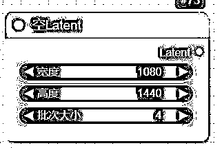
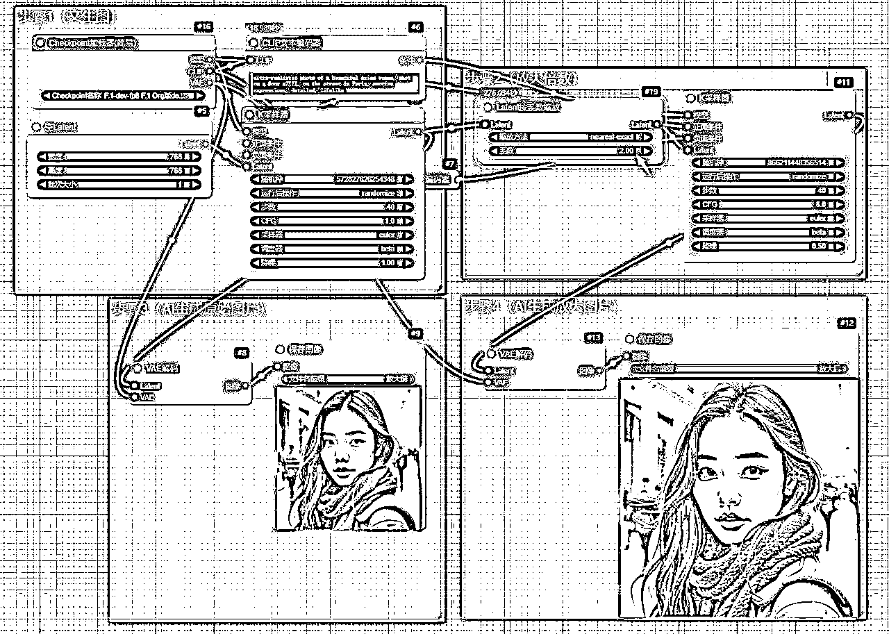
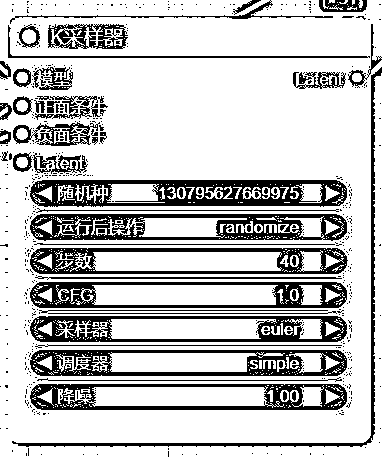
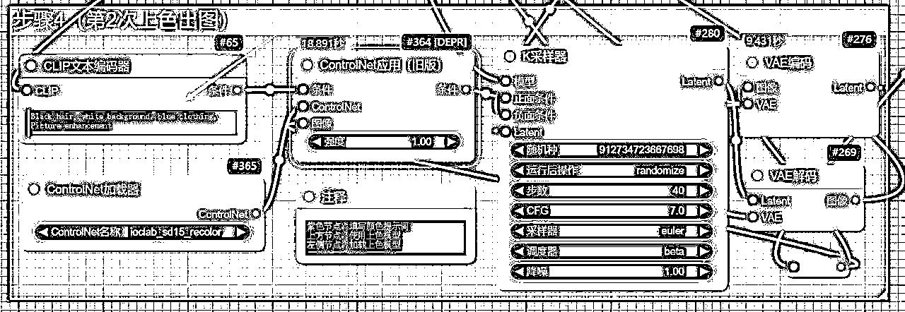
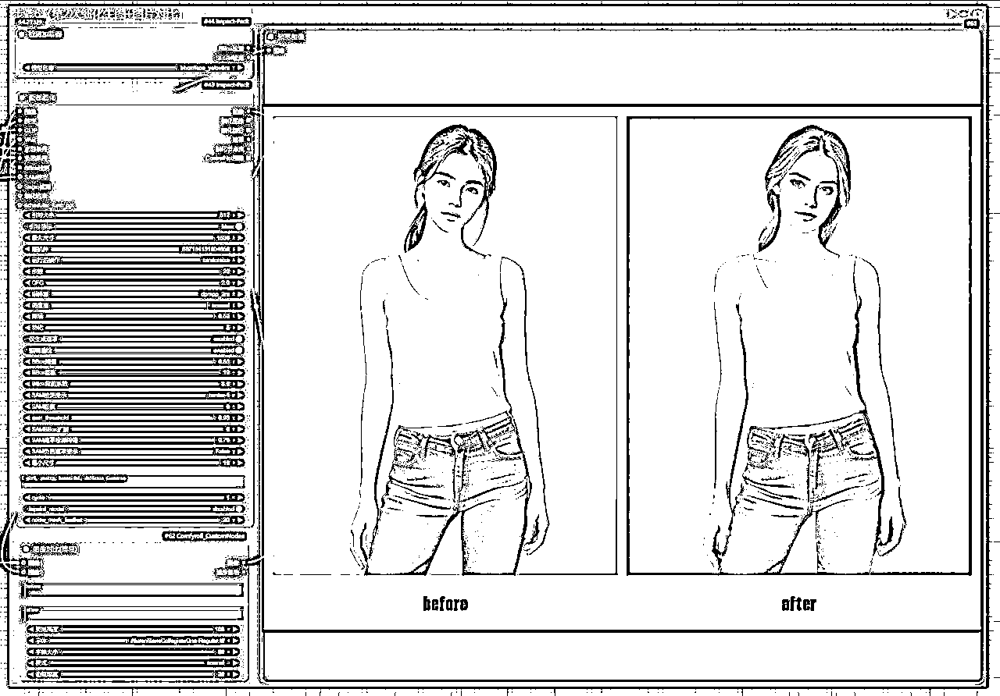
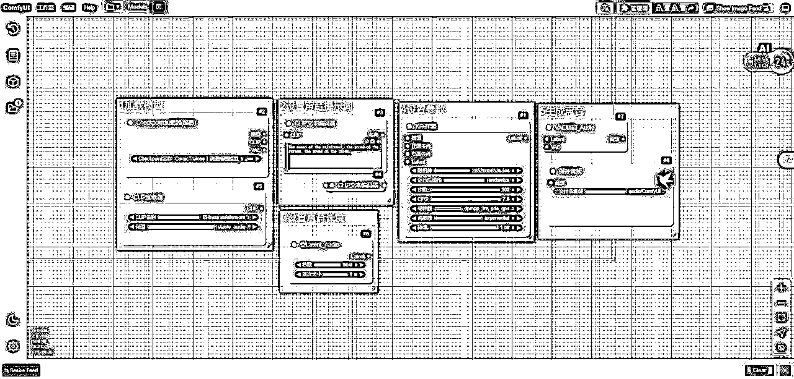
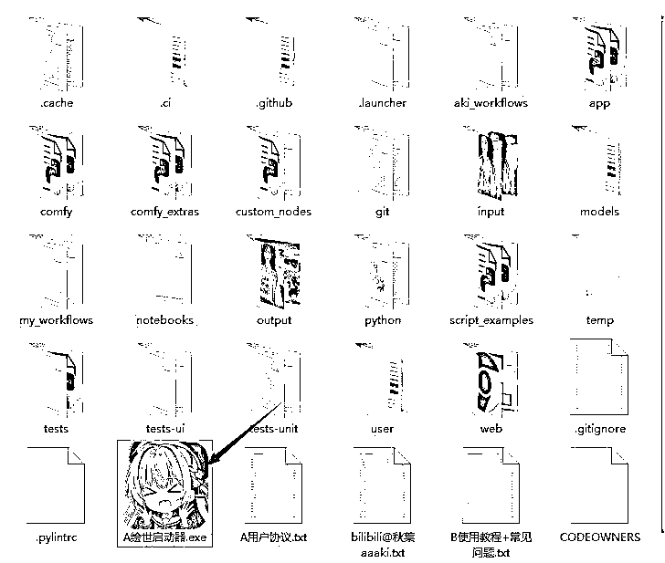

# 12 月航海 | ComfyUI 工作流 | 实战手册

> 来源：[https://ocn93f5d9olj.feishu.cn/docx/SCuMdKtDBosm8sxdOYlcRRWonkb](https://ocn93f5d9olj.feishu.cn/docx/SCuMdKtDBosm8sxdOYlcRRWonkb)

# 防失联+MM188166M（李李）长期更新频繁+备用V:MG10127

手册出品方：生财有术团队

出品时间：2024 年 12 月 3 日

手册使用说明：本文旨在向你展示一个项目的更多可能性，帮助你更好地理解或实操。

建议：如果需要快速定位到精确内容，可以使用快捷键 Ctrl + F/Command + F 的形式，搜索「关键字/词」，查找你想要的内容。

# 写在前面

# 💡

很多人都想学习AI绘画，但由于学习成本太高，就放弃了。

Comfui这个绘画工具的出现，就能大大降低学习成本，让大家无痛用上AI绘画。

它不需要本地配置，就算你的电脑配置一般，也能在网址上流畅运行。

它也不需要一步一步的给电脑搭建流程，我们会分享一些好用的工作流，比如给模特换装，用提示词生成真实细腻的人物写真，批量的生成AI视频……

这些内容你都不需要搭建步骤，用航海提供的工作流就好，一键就可以运行。

如果你想学习更专业的知识，我们也会教你搭建Comfui工作流的方法，让你通过航海能掌握专业的AI绘画技能。准备好的话，就开始本期航海的学习吧！

# 必修篇

# 一、ComfyUI 项目介绍 @来来

# 1.1 ComfyUI 是什么？

提到ComfyUI就要提到他之前的兄弟软件Stable diffusion，生财有术之前开设过AI绘画的航海，航海手册的选修篇有详细介绍Stable diffusion，完整名称叫Stable diffusion Webui，简称为WEBUI或者SD，选项卡式界面的AI绘画软件，是AUTOMATIC1111这位开发者为了大家方便使用Stable diffusion制作的。

下载链接：https://github.com/AUTOMATIC1111/stable-diffusion-webui

安装教程：第五章节-ComfyUI 安装与使用

而我们这次学习的ComfyUI是节点+工作流式的AI工具，ComfyUI在之前可以简单理解为换了节点+工作流界面的Stable diffusion，但是现在来说ComfyUI要比图形界面的WebUI强大的多，不仅仅可以用在AI绘画，还可以用在AI视频，AI音频，AI3D，AI文本等等很多AI领域。是Comfyanonymous等其他开发者为了大家方便使用AI制作的。ComfyUI通过将操作步骤拆分成工作流，实现了更加精准的定制工作流和完善的可复现性。

下载链接：https://github.com/comfyanonymous/ComfyUI

ComfyU现在不仅可以使用stability研发的各种模型，stability是研发Stable diffusion模型的公司，还能使用其他公司研发的AI开源模型，比如腾讯混元，快手可图，Mochi，质谱CogVideoX等很多优秀的AI模型。

ComfyUI的工作界面：

WebUI的工作界面：

# 📌

# 从两张图的对比可以看出

1.

底层操作逻辑接近：都拥有模型选择区域，输入提示词区域，参数设置区域，图片生成区域

2.

ComfyUI界面简洁：空白画布，需自己通过节点搭建工作流，当然也可以下载别人现成的工作流使用，整体学习门槛比较高。

3.

WebUI可视化界面：图形化选择操作，对新手相对友好。

# 1.2 ComfyUI 可以做什么？

# 💡

ComfyUI是一个多功能的AI工具箱，它不仅限于绘画，还能生成视频、音频和3D模型等多种类型的AI任务，为用户提供了一个强大的AI创意平台。

1.

AI绘画：ComfyUI可以生成与提示词提示相匹配的图像，用户只需要输入描述性的文本，ComfyUI就能根据这些文本生成相应的图像。ComfyUI也可以根据现有图片生成不同风格的图片。

红色箭头是生成图片提示词，绿色箭头代表AI生成的图片。

2.

AI视频：ComfyUI能够根据图片生成视频，使用的模型是SVD（Stable Video Diffusion），可以以静止图像作为条件帧，并从中生成视频。此外，ComfyUI还支持其他很多AI视频模型，以及视频转视频的功能，这意味着你可以将一个视频转换成另一个风格或内容的视频。

红色箭头是生成视频的参考图片，绿色箭头代表AI生成的视频。

3.

AI音频：ComfyUI使用Stable Audio Open模型，可以根据文本提示生成立体声音频。这个模型能够生成音效和音乐，可以尝试各种不同的音乐风格和文化。

红色箭头是生成声音提示词，绿色箭头代表生成的声音。

4.

AI3D：ComfyUI支持将2D图片转换成3D模型，这在一些工作流中被称为“二渲三”，即从2D图像生成3D模型。

红色箭头是生成3D文件的参考图片，绿色箭头代表AI生成的3D文件。

# 1.3 ComfyUI 与 WebUI 的优劣势对比

ComfyUI和WebUI优劣势对比

优势

低显存要求

Comfyui相对WEBUI来说需要的显存占用要小，启动使用使用更少的显存，方便硬件配置较差的用户也能上手操作AI。

更高自由度

ComfyUI允许用户自定义工作流程，调整节点连接以获得你想要的更灵活的功能和效果。

流程完整性

ComfyUI可以同时文生图并同步图片生成视频。是一个完整的工作流程。WebUI需要在不同的操作界面跳转，先完成文生图后，再图片生成视频。

模型可共享

与WebUI共享环境和模型： 用户可同时使用ComfyUI和WebUI，并且可以共享模型和环境。

工作流可复现

用户构建自己的ComfyUI工作流，保存工作流文件后可很方便的与他人分享，他人使用你的工作流可以复现工作流想实现的功能。

图像可还原工作流

ComfyUI生成的图片可还原整个工作流，模型选择也会被保存。

插件丰富性

ComfyUI的节点等同于webUI的插件，但是ComfyUI的节点开发相对容易，所以ComfyUI的生态非常丰富，可以实现各种特殊的功能。

劣势

操作门槛较高

如果只是使用别人创建好的工作流，操作门槛就不高。如果学习自己从头开始搭建工作，需要具备清晰的逻辑理解和操作能力，有一定的学习门槛。

用户体验一般

ComfyUI的空白画布的用户界面对于普通用户有一定的使用门槛，WEBUI的可视化操作界面对用户友好，可以很快找到需要的插件，使用方便。

出错概率高

ComfyUI使用的过程中伴随着节点缺失，模型缺失，运行出错等情况，需要有很强的耐心和解决问题的能力。

# 1.4 ComfyUI 的应用领域与变现方式

# 1.4.1 应用领域

# 💡

1.

批量图片创作：

ComfyUI支持批量生成不同内容的图片。用户可以通过Batch Prompt Schedule节点，一次性输入多个不同的内容描述，ComfyUI将根据这些描述批量生成图像。

2.

批量视频创作：

ComfyUI结合SVD（Stable Video Diffusion）等其他AI视频模型，能够根据图片生成视频。SVD模型以静止图像作为条件帧，并从中生成视频，支持多种分辨率和视频时长的生成。

3.

批量音频创作：

ComfyUI结合SAO（Stable Audio open）AI音频模型，能够根据文字提示词生成音频。

4.

电商企业用图：

ComfyUI广泛应用于电商海报生成、产品背景图生成等，提升产品展示效果，帮助电商企业制作高质量的产品图片。

5.

艺术创作领域

ComfyUI为艺术家提供源源不断的灵感，帮助他们打破传统的束缚，突破思维边界，创作出独具匠心、震撼人心作品。

6.

设计领域：

ComfyUI在平面设计、产品设计、室内设计等细分领域发挥重要作用，成为设计师们不可或缺的得力助手。

7.

教育领域：

ComfyUI可以为学生生成个性化的学习资料，帮助教师设计生动有趣的教学课件。

8.

娱乐领域：

ComfyUI参与游戏的开发和影视的制作，创造出更加精彩和独特的娱乐体验。

9.

建筑领域：

ComfyUI帮助建筑师快速生成建筑设计方案，模拟不同的建筑效果，提高设计效率和质量。

# 1.4.2 变现方式

# 📌

1.

出售定制工作流：ComfyUI的工作流可以根据用户要求实现特定功能，用户可以购买这些工作流以提升工作效率。

2.

付费解答群：通过建立付费解答群，为用户提供专业的ComfyUI使用指导和技术支持。

3.

陪伴督学群：创建陪伴督学群，为用户提供学习ComfyUI的陪伴和监督，帮助他们更好地掌握ComfyUI的使用。

4.

收徒：通过收徒的方式，传授ComfyUI的使用技巧和创作经验，实现知识变现。

5.

分销课程/产品：通过分销ComfyUI相关的课程和产品，帮助用户学习并使用ComfyUI，同时获得分销收益。

# 二、ComfyUI 基础工作流 @来来

# 💡

# 温馨提醒

1.

我们这次的ComfyUI航海，在方便大家前提下，尽量让大家使用在线版ComfyUI使用工作流，无需额外购买高配置电脑。

2.

但是在线ComfyUI平台要使用云端显卡资源，需要付费会员36元一月。

# 2.1 掌握文生图：批量创作小红书超逼真美女图(直播）

# 2.1.1 预览结果

# 💡

我们的目标是用工作流批量创作逼真的美女图，发布在各大社交平台。

# 2.1.2 必要操作

1.

打开在线工作流，https://www.liblib.art/modelinfo/883f870ed05a4b178f39c89b5ee4947b，左侧选择第1个选项卡1文生图，右侧点击在线运行工作流即可，需要本地使用工作流请点击下载（前提是你本地已经安装ComfyUI)。

2.

红色箭头标注位置填写提示词，左侧有两个示范提示词可复制。如果不会写提示词，可以参考生财有术AI绘画航海手册提示词章节的内容。其他参数保持默认无需修改。

3.

点击右侧的开始生图，即可生成图片。

# 2.1.3 实操步骤

# 💡

如果不需要了解工作流中每步操作的逻辑，以及每个节点的使用，可以忽略实操步骤环节。

1.

该节点用来选择大模型，我们选用的是FLUX的大模型。

2.

该节点用来选择LORA模型，这里要配套选择FLUX的LORA模型。

3.

该节点用来写提示词。

一个戴着口罩和浅蓝色背心的女人，站在有警告标志的电梯前，一个戴口罩和淡蓝色背心的妇女，一个肩上扛着粉红色绗缝腰包、穿着白色裙子和浅蓝色上衣的女人，一个穿着浅蓝色衬衫和白色百褶裙的人的特写。

a woman wearing a face mask and a light blue tank top, standing in front of an elevator with a warning sign,a woman wearing a face mask and a light blue tank top,a woman holding a pink quilted fanny pack over her shoulder while wearing a white skirt and a light blue top,a close-up view of a person wearing a light blue shirt and a white pleated skirt

# 💡

# 提示词示例

1.

picture of one lady,IMG_2222.HEIC,beautiful,reversal film photography,xhs,LTFGR,

2.

picture of one lady,IMG_2222.HEIC,reversal film photography,xhs,LTFGR,LLL,1girl black hair bottle box chair computer desk indoors leaning forward long hair mirror realistic shirt short shorts shorts signature sitting socks solo white shirt window

3.

XS, masterpiece:1.2),best quality,high resolution,unity 8k wallpaper,(illustration:1),perfect lighting,extremely detailed CG,finely detail,large breasts,sexy,extremely detailed,soft lighting and shadow,soft yet striking lighting,film grain:1.2,(skin pores:1.2),(detailed skin texture:1),((solo:1.5)),Detailed face,(see-through:1.1),misty,Low Key:1.1,depth of field,(big breast:1.3), A young woman with dark hair and a Sexy top,sitting on what appears to be an armchair or sofa in her home.

4.

XS, masterpiece:1.2),best quality,high resolution,unity 8k wallpaper,(illustration:1),perfect lighting,extremely detailed CG,finely detail,extremely detailed,soft lighting and shadow,soft yet striking lighting,film grain:1.2,(skin pores:1.2),(detailed skin texture:1),((solo:1.5)),Detailed face,(see-through:1.1),misty,Low Key:1.1,depth of field, A woman posing on a bed with her back to us,showcasing an off-the shoulder top and denim shorts.,

4.

该节点节点用来设置图片大小和生成图片数量，1080*1440是小红书封面尺寸。图片数量建议一次最多8个。

5.

该节点节点用来设置参数，设置步数steps，采样器sampler，调度器schedler即可。其他无需修改。

6.

该节点节点用来把图片解码，让AI生成清晰图片。

7.

该节点节点用来保存图片。可以右键下载图片。

# 2.2 掌握图像放大：批量放大小红书写实美女图

# 2.2.1 预览结果

# 💡

我们的目标是把通过工作流批量创作的逼真美女图片，放大变成可印刷尺寸，同时细化面部细节。

左侧是放大前的图片，右侧是放大后的图片

# 2.2.2 必要操作

1.

打开在线工作流，https://www.liblib.art/modelinfo/883f870ed05a4b178f39c89b5ee4947b，左侧选择第2个选项卡2放大图片，右侧点击在线运行工作流即可，需要本地使用工作流请点击下载（前提本地已经安装ComfyUI)。

2.

红色箭头标注位置填写你需要的提示词即可，绿色箭头修改放大倍数。其他参数保持默认无需修改。

3.

点击右侧的开始生图，即可生成放大前后的图片。

# 2.2.3 实操步骤

# 💡

如果不需要了解工作流中每步操作的逻辑，以及每个节点的使用，可以忽略实操步骤环节。

1.

该节点用来选择大模型，我们选用的是FLUX的大模型。

2.

该节点用来写提示词。

一位美丽的亚洲女性在巴黎街头用索尼a7III拍摄的超现实照片，情感表达细腻逼真

ultra-realistic photo of a beautiful Asian woman, shot on a Sony a7III, on the street in Paris, emotive expressions, detailed, lifelike

3.

该节点节点用来设置图片大小和生成图片数量。

4.

该节点节点用来设置参数，建议设置步数steps40，采样器euler，调度器beta即可。

右侧的是上节课设置参数的采样器节点，作用是一样的。

5.

原始图片的LATENT潜空间信息经过VAE解码，就可以保存原始图片。

6.

原始的图片信息传输到LATENT潜空间，左侧节点节点用来从潜空间放大图片，系数就是放大系数，建议最高设置6~8倍（8G显存用户建议2~4倍），潜空间放大后需要K采样器2次处理放大后的图片信息。

# 💡

简单来说，潜空间就像是数据的“压缩包”，其中包含了数据的核心特征，但以更低的维度存在。

想象一下，你有一堆各种各样的图片，每张图片都是由成千上万个像素点组成的。这些像素点包含了大量的信息，但并不是所有的信息都是必要的。潜空间的作用就是将这些高维的数据（比如图片）压缩到一个低维的空间中，只保留最重要的特征。这样，相似的图片在潜空间中的位置会更接近，而不同的图片则相对较远。

在实际应用中，潜空间可以帮助我们进行数据的压缩和表示，同时也能用于生成新的数据样本，进行异常检测，或者在数据缺失的情况下进行预测和补全。例如，在图像处理领域，潜空间可以用于压缩图像，节省存储空间和计算资源。此外，通过在潜空间中进行插值技术，还可以生成具有过渡性质的样本，这在深度生成模型中尤为重要。

7.

放大后的图片的LATENT潜空间信息经过VAE解码，就可以保存放大后的图片，

8.

仔细观察，原始图片和放大图片有细微差别。因为随机种数值不同导致的，我们可以把种子设置为一样的，种子设置为fixed固定。其他参数也设置一模一样，注意放大后的K采样器降噪设置为0.5或者更低，这样放大前后的图片会保证绝对一致。

# 2.3 掌握面部细化：批量细化美女面部细节

# 2.3.1 预览结果

左侧是优化前图片，右侧优化面部细节，皮肤变得更加白皙。

# 2.3.2 必要操作

1.

打开在线工作流，https://www.liblib.art/modelinfo/883f870ed05a4b178f39c89b5ee4947b，左侧选择第3个选项卡3放细化面部，右侧点击在线运行工作流即可，需要本地使用工作流请点击下载（前提本地已经安装ComfyUI)。

2.

红色箭头标注位置上传图片，绿色箭头标注位置填写提示词即可。其他参数保持默认无需修改。

3.

点击右侧的开始生图，即可生成图片。

# 2.3.3 实操步骤

# 💡

如果不需要了解工作流中每步操作的逻辑，以及每个节点的使用，可以忽略实操步骤环节。

1.

该节点用于上传需要面部细化的图片。

2.

该节点用来选择大模型，我们选用的是FLUX的大模型。

3.

该节点用来选择SAM检测模型。设备格式建议选择auto即可。检测模型越在上面检测精度越高。

4.

该节点用来选择BBOX检测模型，检测模型建议选择第1个检测面部，第2个是检测手，第3个是检测全身。

5.

该节点用来写提示词。

ASIA young woman, fair skin

亚洲女孩，白皙皮肤

这里有一些关于肤色的提示词建议。

6.

该节点用来面部细化参数设置，该节点比较复杂，我们分三部分介绍，输入选项，输出选项，参数。

输入选项

左侧是该节点的输入选项，一共有11个输入选项，空心的4个为非必须选项。

7.

图像：您要增强的输入图像。此参数接受单张图像，是面部细节处理的主要来源。确保图像质量良好，以获得最佳效果。

8.

模型：用于面部增强的模型。此参数决定了将应用来增强面部细节的具体算法或神经网络。不同的模型可能提供不同程度的细节和风格。

9.

CLIP：用于对图像进行额外处理和细化的模型。此参数有助于提高增强面部的整体质量和连贯性。

10.

vae：增强过程中使用的变分自动编码器 (VAE) 模型。该模型有助于对图像数据进行编码和解码，从而提高最终输出的质量。

11.

正面条件：提示词

12.

负面条件：负面提示词

13.

BBOX检测：用来加载检测模型，建议使用FACE_YOLOV8M模型，专门用来检测面部。

14.

Seam检测：用来加载检测模型，建议使用sam_vit_h_4h8939模型，检测结果比较精准。

输出选项

图像为必须输出选项，连接一个保存图像节点即可。

节点参数

# 💡

一共有27个参数，初次使用保持默认即可，如果效果不佳可以微调参数。

引导大小：用于面部增强的引导线的大小。此参数控制处理面部的规模，影响细节和精度的水平。

引导目标：使用BBOX检测的结果作为优化目标

最大尺寸：要处理的图像的最大尺寸。此参数可确保适当调整图像大小以适应处理限制，从而保持质量而不会使系统过载。

随机种：随机数生成的种子值。此参数通过控制增强过程中的随机性来确保结果的可重复性。

运行后操作：随机种子的改变方式，随机，固定，减少，增加。

步数：增强过程的步骤数。此参数决定模型将执行多少次迭代来细化面部细节，步骤越多通常可获得更好的结果。

CFG：和提示词相似指数，FLUX默认设置为1。

采样器：增强过程中使用的采样器的名称。此参数指定在面部细节处理过程中应用的采样技术，影响输出的质量和风格。

调度器：用于管理增强过程的调度程序。此参数有助于组织和优化面部细节处理过程中使用的步骤和资源。

降噪：应用于图像的降噪级别。此参数控制降噪量，影响最终输出的清晰度和平滑度。

羽化：应用于增强区域边缘的羽化。此参数有助于将增强的面部与图像的其余部分平滑地融合。

仅生产遮罩：建议选是

强制重绘：建议选是

bbox阈值：检测边界框的阈值。此参数控制人脸检测的灵敏度，影响隔离增强区域的准确性。

bbox膨胀：应用于检测边界框的扩张。此参数有助于扩大检测到的面部区域，以确保在增强过程中完全覆盖。

bbox裁剪系数：检测边界框的裁剪系数。此参数控制增强过程中包含的周围区域的数量，从而影响上下文和混合。

SAM检测提示：SAM（Segment Anything Model）检测的提示。此参数提供附加信息以提高人脸检测的准确性。

sam膨胀：在 SAM 检测过程中应用的扩张。此参数有助于扩大检测区域，从而实现更好的覆盖范围和准确性。

sam阈值：SAM检测的阈值。该参数控制SAM模型的敏感度，影响人脸检测的准确率。

sam_bbox扩展：SAM 边界框的扩展因子。此参数有助于在检测到的脸部周围包含更多背景信息，以实现更好的增强。

sam遮罩检测阈值：SAM 掩码提示的阈值。此参数控制掩码提示的敏感度，影响增强的准确性和质量。

sam负面遮罩提示：在 SAM 掩码中使用负提示的标志。此参数有助于避免增强面部中出现不需要的特征或伪影。

最小尺寸：增强过程中应用的墨滴大小。此参数控制某些操作的规模，影响细节和精度的水平。

通配符框：通配符处理选项。此参数包括在增强过程中处理通配符输入的各种设置和配置。

循环：增强过程的循环次数。此参数决定增强过程重复的次数，循环次数越多通常效果越好。

修复模型：在增强过程中使用修复的标志。此参数可确保准确填充面部缺失或损坏的区域。

噪声蒙版羽化：应用于噪声蒙版的羽化。此参数有助于将降噪效果与图像的其余部分平滑地融合。

15.

该节点节点用来对比细化前后的区别，用鼠标滑动即可看到

16.

该节点节点用来保存最终细化面部后的图片

# 2.4 掌握图生图：批量真人照片转换为动漫风格

# 2.4.1 预览结果

左侧是真人图片，右侧是变为动漫风格照片。

# 💡

图生图可能会修改原图内容，配合Controlnet才可以控制画面内容不发生改变，仅风格发生变化。但操作较为繁琐，这节课不涉及Controlnet内容。

# 2.4.2 必要操作

1.

打开在线工作流，https://www.liblib.art/modelinfo/883f870ed05a4b178f39c89b5ee4947b，左侧选择第4个选项卡4图生图，右侧点击在线运行工作流即可，需要本地使用工作流请点击下载（前提本地已经安装ComfyUI)。

2.

红色箭头标注位置上传图片，绿色箭头标注位置填写提示词即可。其他参数保持默认无需修改。

3.

点击右侧的开始生图，即可生成图片。

# 2.4.3 实操步骤

# 💡

如果不需要了解工作流中每步操作的逻辑，以及每个节点的使用，可以忽略实操步骤环节。

1.

该节点用来上传图片

2.

该节点用来选择大模型，我们选用的是FLUX的大模型。

3.

该节点用来选择LORA模型，这里要配套选择FLUX的LORA模型。我选择的是这个PIXAR风格模型。https://www.liblib.art/modelinfo/1d307e042b004ad5b969eed5c5f6517b

4.

该节点用来写提示词。

3D皮克斯风格，一位美丽的亚洲女性，在巴黎街头的索尼a7III上拍摄，情感表达细腻逼真

3D Pixar Style,a beautiful Asian woman, shot on a Sony a7III, on the street in Paris, emotive expressions, detailed, lifelike

5.

该节点节点用来设置生成图片数量

6.

该节点节点用来设置参数。

7.

该节点节点用来把图片解码，让AI生成清晰图片。

8.

该节点节点用来保存图片。可以右键下载图片。

9.

如果你希望控制画面结构不变仅改变风格，就必须使用Controlnet，以下是用Controlnet保持画面，并改变风格的工作流，可自行搭建。

# 2.5 掌握图像修复：批量修复老照片

# 💡

# 图像修复分两种

1.

图像整体修复：比如老照片修复，我们这节课只涉及这部分。

2.

图像局部修复：比如修脸，修手，修脚，还有重绘局部（蓝眼睛变黑眼睛，没带帽子换带上帽子，没带领带换带上领带，没带手表换带上手表，背景是纯色白底换火星环境等等）

# 2.5.1 预览结果

左侧第1张是老照片图片，右侧2张是修复上色后的老照片。

# 2.5.2 必要操作

1.

打开在线工作流，https://www.liblib.art/modelinfo/883f870ed05a4b178f39c89b5ee4947b，左侧选择第5个选项卡5修复老照片，右侧点击在线运行工作流即可，需要本地使用工作流请点击下载（前提本地已经安装ComfyUI)。

2.

红色箭头标注位置上传老照片，绿色箭头标注位置填写颜色提示词即可（比如黑色头发，蓝色衣服）。其他参数保持默认无需修改。

3.

点击右侧的开始生图，即可生成图片。

# 2.5.3 实操步骤

# 💡

如果不需要了解工作流中每步操作的逻辑，以及每个节点的使用，可以忽略实操步骤环节。

1.

步骤1：左侧节点用来上传老照片，右侧节点查看修复后照片

2.

步骤2：作用是控制画面+面部修复

核心是使用Controlnet控制画面+Codeformer面部修复，核心节点用途请看图片上的详细注释。这个步骤的所有参数都可以保持默认即可。

3.

步骤3：完成第1次出图。

a.

首先点击大模型名字可打开大模型选择窗口，大模型默认我已经选择好，保持默认即可。

# 💡

# 大模型知识普及

1.

来来之前4个工作流使用的都是Flux模型（下图中的基础算法 F.1），来来这次使用的是SD1.5版本的模型（下图中的基础算法 1.5），丰富下大家的模型库使用。

2.

右侧的算法其实就是不同的大模型厂家，前6个基础算法就是Stability公司开源用于AI绘画的stable diffusion模型，基础算法后面的数字3.5L，3.5M，1.5，2.1，XL，V3，代表的是模型版本，按照发布时间排序依次为3.5---3---XL--2.1---1.5。

b.

其次填写提示词，提示词默认我已经填写好，保持默认即可。

提示词：(best quality,8K,masterpiece,),(photorealistic:1.2),highly detailed,detailed skin texture,good teeth

负面提示词：lowres,worst quality,low quality,monochrome,old photo,lackluster,oversaturated,grayscale,blurry,color

cast,faded,drawing,paiting,crayon,disfigured,sketch,impressionist,text,signature,watermark,username,deformed,ugly,nsfw

c.

最后三个节点，以前已经多次介绍，保持默认即可。

4.

步骤4：完成第2次上色出图。

核心是使用提示词+controlnet重上色模型控制老照片上色效果，大家可以修改提示词（提示词：Black hair, white background，blue clothing，Picture enhancement，黑色头发，白色背景，蓝色衣服，图像增强。）核心节点用途请看图片上的详细注释，其他参数保持默认即可。

# 2.6 掌握图像外扩：批量外扩图像

# 2.6.1 预览结果

左侧是扩图前图片，右侧是扩图后图片（图片上部分和下部分执行了扩图）。

# 2.6.2 必要操作

1.

打开在线工作流，https://www.liblib.art/modelinfo/883f870ed05a4b178f39c89b5ee4947b，左侧选择第6个选项卡6扩图，右侧点击在线运行工作流即可，需要本地使用工作流请点击下载（前提本地已经安装ComfyUI)。

2.

红色箭头标注位置上传图片，绿色箭头标注位置填写图片原始提示词即可。其他参数保持默认无需修改。

3.

点击右侧的开始生图，即可生成图片。

# 2.6.3 实操步骤

# 💡

如果不需要了解工作流中每步操作的逻辑，以及每个节点的使用，可以忽略实操步骤环节。

1.

步骤1：加载图片+设置外扩尺寸

红色框：加载图片；绿色框：设置外扩尺寸，可以四个方向同时外扩。

2.

步骤2：扩图

红色框：加载Flux大模型；绿色框：填写提示词（ultra-realistic photo of a beautiful Asian woman, shot on a Sony a7III, on the street in Paris, emotive expressions, detailed, lifelike ）；黄色框：设置步数，CFG切记设置1，采样器和调度器按喜好设置。

# 2.7 掌握图像风格迁移：批量创作梵高风格的图像

# 2.7.1 预览结果

左侧是梵高著名的《星空》作为参考图，右侧是学习梵高风格后生成的图片。

# 2.7.2 必要操作

1.

打开在线工作流，https://www.liblib.art/modelinfo/883f870ed05a4b178f39c89b5ee4947b，左侧选择第7个选项卡7风格迁移，右侧点击在线运行工作流即可，需要本地使用工作流请点击下载（前提本地已经安装ComfyUI)。

2.

红色箭头标注位置上传图片，绿色箭头标注位置填写图片原始提示词即可。其他参数保持默认无需修改。

3.

点击右侧的开始生图，即可生成图片。

# 2.7.3 实操步骤

# 💡

如果不需要了解工作流中每步操作的逻辑，以及每个节点的使用，可以忽略实操步骤环节。

1.

步骤1：加载参考图+加载风格迁移模型

红色框：加载参考风格图片；绿色框：加载IP-Adapter风格迁移模型。

2.

步骤2：根据参考图风格+提示词内容生成图片

红色框：加载Flux大模型；绿色框：填写提示词（A blue tree in the foreground, a person walking on a grassy hill with trees in the background ）；紫色框：添加增加细节的FLUX lora模型。

# 三、ComfyUI 电商实战工作流 @来来

# 3.1 一键换装（直播）

# 3.1.1 预览结果

左侧是模特原图，右侧3张是换装后图片。

# 3.1.2 必要操作

1.

打开在线工作流，https://www.liblib.art/modelinfo/12653535ec184723841183e6546e1d3e，左侧选择第1个选项卡一键换装，右侧点击在线运行工作流即可，需要本地使用工作流请点击下载（前提本地已经安装ComfyUI)。

2.

红色箭头标注位置上传模特图，绿色箭头标注位置上传服装图。其他参数保持默认无需修改。

3.

点击右侧的开始生图，即可生成换装后图片。

# 3.1.3 实操步骤

# 💡

如果不需要了解工作流中每步操作的逻辑，以及每个节点的使用，可以忽略实操步骤环节。

1.

步骤1（上传模特图+服装图）

红色框：上传模特图；绿色框：上传服装图。

2.

步骤2（一键换装）

红色框：选择半身/全身；绿色框：category设置上装/下装/连衣裙，其他参数保持默认。

# 💡

切记模特和服装类型要匹配，半身模特是没法换下装的。

# 3.2 一键换背景

# 3.2.1 预览结果

左侧是产品原图，右侧是一次性替换不同30个背景后的图片。

# 3.2.2 必要操作

1.

打开在线工作流：https://www.liblib.art/modelinfo/c916e597148c41ea808a6440d9d4c4f4，左侧选择第1个选项卡一键换背景，右侧点击在线运行工作流即可，需要本地使用工作流请点击下载（前提本地已经安装ComfyUI)。

2.

红色箭头标注位置上传图片，绿色箭头位置等待图片生成即可。其他参数保持默认无需修改。

3.

点击右侧的开始生图，即可生成图片。

# 3.2.3 实操步骤

# 💡

如果不需要了解工作流中每步操作的逻辑，以及每个节点的使用，可以忽略实操步骤环节。

1.

步骤1：上传图片+自动抠图

绿色框：上传产品白底图或透明PNG图，会自动抠图

2.

步骤2：修改提示词或保持默认提示词均可

红色框：上传提示词文件或者保留默认提示词。

3.

步骤3：无需修改参数，等待右侧图片生成即可。

# 3.3 一键换模特

# 3.3.1 预览结果

左侧是原始模特，右侧是模特换了年龄的结果。

左侧是中国模特，右侧是模特换了国籍+年龄的结果。

左侧是中国模特，右侧是模特仅换了国籍的结果。

# 3.3.2 必要操作

1.

打开在线工作流：https://www.liblib.art/modelinfo/20126fa0c72c4e9d9ce12d4b5989f729，左侧选择第1个选项卡一键换模特，右侧点击在线运行工作流即可，需要本地使用工作流请点击下载（前提本地已经安装ComfyUI)。

2.

红色箭头标注位置上传模特图片（默认已经上传了一个中国模特），绿色箭头位置等待图片生成即可。其他参数保持默认无需修改。

3.

点击右侧的开始生图，即可生成图片。

# 3.3.3 实操步骤

# 💡

如果不需要了解工作流中每步操作的逻辑，以及每个节点的使用，可以忽略实操步骤环节。

1.

步骤1（上传模特图）

红色框：上传模特图

2.

步骤2（修改提示词）

红色框：肖像大师修改国籍，年龄等参数即可改变模特。绿色框：设置SDXL模型或FLUX模型。

3.

步骤3（生成遮罩）

无需调整，AI生成遮罩

4.

步骤4（conrolnet控制）

红色框：确保是选择图示的CONTROLNET模型。如果你大模型选择FLUX，所有CONTROLNET模型都要改变成FLUX类型才能正常出图。

5.

步骤5（第1次生图）

无需调整，AI第1次出图。如果效果不佳可以调整K采样器参数即可。

6.

步骤6（第2次细化生图+图片对比）

无需调整,AI第2次细化面部出图

# 四、ComfyUI 文字特效工作流 @来来

# 4.1 一键特效文字（直播）

# 4.1.1 预览结果

左侧是原始文字，右侧是AI生成的特效文字，也叫做AI艺术字。

# 4.1.2 必要操作

1.

打开在线工作流：https://www.liblib.art/modelinfo/919a758162b04bcaac3c85ffe479eb55，左侧选择第1个选项卡一键特效文字，右侧点击查看工作流即可，需要本地使用工作流请点击下载（前提本地已经安装ComfyUI)。

2.

红色箭头标注位置上传白底黑字图片（默认已经上传），绿色箭头是提示词控制生成效果可以修改。其他参数保持默认无需修改。

3.

点击右侧的开始生图，即可生成图片。

# 4.1.3 实操步骤

# 💡

如果不需要了解工作流中每步操作的逻辑，以及每个节点的使用，可以忽略实操步骤环节。

1.

步骤1（上传白底黑字艺术字）

需要上传白底黑字艺术字，可以使用下面介绍的美图秀秀制作

1.

打开网址https://www.designkit.com/editor，点击新建画布，选择竖版主图，背景选白色。

2.

选择文字，时间节点。制作相关文字即可。

1.

步骤2（加载模型）

无需调整，加载各种模型

2.

步骤3（提示词+controlnet控制边缘）

红色框：如果想修改效果修改红色框提示词即可，否则保持默认提示词；

绿色框：确保选择图示的CONTROLNET模型，如果你大模型选择FLUX，CONTROLNET模型改变成FLUX类型才能正常出图。

3.

步骤4（设置参数+第一次生图）

无需调整,AI第1次出图

4.

步骤5（第2次高清放大生图）

无需调整，AI第2次细化出图。

5.

举一反三

这个工作流除了适用各种中文字也适用LOGO符号，不过记得文字粗点效果比较明显。

# 4.2 一键超级符号

# 4.2.1 预览结果

左侧是原始LOGO，右侧是AI生成的超级符号。

换一个黑底的LOGO，效果基本一致。

# 4.2.2 必要操作

1.

打开在线工作流：https://www.liblib.art/modelinfo/919a758162b04bcaac3c85ffe479eb55，左侧选择第2个选项卡一键超级符号，右侧点击查看工作流即可，需要本地使用工作流请点击下载（前提本地已经安装ComfyUI)。

2.

红色箭头标注位置上传LOGO图片（默认已经上传），绿色箭头是提示词控制生成效果可以修改。其他参数保持默认无需修改。

3.

点击右侧的开始生图，即可生成图片。

# 4.2.3 实操步骤

# 💡

如果不需要了解工作流中每步操作的逻辑，以及每个节点的使用，可以忽略实操步骤环节。

1.

步骤1（上传logo图片）

需要上传LOGO图片，白底或者黑底都可以

2.

步骤2（加载模型）

无需调整加载各种模型。如果只需其中1个LORA模型生效，选择Lora加载器CTRL+B忽略该节点，并调整生效的Lora模型的强度值。

3.

步骤3（提示词）

绿色框：如果想修改效果修改红色框提示词即可，否则保持默认提示词；

4.

步骤4（controlnet控制边缘+深度）

这次的工作流前3个步骤和特效文字一模一样，步骤4来来多加入了一个controlnet控制深度，深度代表物体的前后关系，位置靠前白色位置靠后黑色。绿色框：确保选择图示的CONTROLNET模型，如果你大模型选择FLUX，CONTROLNET模型改变成FLUX类型才能正常出图。

5.

步骤5（输出放大图片）

无需调整

6.

举一反三

这个工作流除了适用各种LOGO符号也适用中文字，不过记得文字粗点效果比较明显。

# 选修篇

# 五、ComfyUI 安装与使用 @来来

# 5.1 云端使用（适合无需本地安装的用户）

# 📌

云端使用优点：普通办公电脑即可使用无需额外购买高端显卡，无需安装ComfyUI，内置较多模型无需额外下载，内置较多节点无需额外安装

云端使用缺点：无法自主安装缺失节点，无法自主安装缺失模型，无法识别本地文件夹。

# 5.1.1 LibLib

打开网址：https://www.liblib.art/comfy，仅需1步即可直接使用，会默认加载文生图工作流。

# 5.1.2 吐司Tusiart

1.

打开网址：https://tusiart.com/workflow

2.

点击新建工作流会出现一些工作流模版，第1个是文生图，第2个是图生图，点击使用即可打开ComfyUI

# 5.2 Win系统本地安装（适合有本地使用需求的用户）

# 💡

云端使用优点：可自主安装缺失节点，可随意使用模型，可识别本地文件夹。

云端使用缺点：需购买高端显卡，需安装ComfyUI，需下载模型，需安装节点。

ComfyUI的安装包有4种，4选1安装即可，一类是官方版，一个是整合版。

如果追求便捷，建议使用官方桌面版（105M)，会自动下载模型和第三方节点。

如果硬盘很小，建议使用官方纯净版（1.46G)，不包含任何模型和第三方节点。

如果硬盘中等，建议使用Liblib整合版（2.84G)，整合部分模型和第三方节点。

如果硬盘足够大，建议下载秋叶整合版（3.7G），整合很多模型和第三方节点以及工作流。

# 5.2.1 准备硬件

系统：推荐使用Windows10或Windows11系统；MAC系统不推荐本地安装ComfyUI。

内存：最低6G，建议8G或16G。

显卡：显存4G以上，最低10系列Nvidia独立显卡，推荐使用30/40系列Nvidia独立显卡；

显卡品牌排序：N卡>A卡>I卡，N卡英伟达 (Nvidia)显卡效果是最好的，A卡超威（AMD)显卡次之，I卡英特尔 (Intel)显卡支持较差

硬盘：最低需要100G空间，越大越好

电源：最低400~600瓦左右

CPU和主板：无要求。

# 5.2.2【推荐】安装官方桌面版ComfyUI

1.

打开下载地址（需魔法网络）https://github.com/Comfy-Org/desktop，滑动到页面最底端，WINDOWS系统下载红色箭头所指EXE安装包，MAC系统下载绿色箭头所指DMG安装包。

2.

双击下载后的安装文件，出现安装提示，点击get started

3.

设置安装路径

4.

如果之前没有安装过COMFYUI直接下一步即可，如果之前安装过COMFYUI，设置已安装的COMFYUI目录，会自动迁移工作流和模型到新的COMFYUI目录

5.

开启自动升级和错误报告，点击安装，

6.

会自动开始安装（需开启魔法网络），约等30分钟安装完毕。会自动打开一个ComfyUI窗口。

# 5.2.3 安装官方纯净版ComfyUI

1.

打开下载地址（需魔法网络）https://github.com/comfyanonymous/ComfyUI，点击进入Releases

2.

从链接上找到最新的软件包下载。

https://github.com/comfyanonymous/ComfyUI/releases

3.

解压安装包到非中文不含空格的目录，打开文件夹我们可以看到“run_nvidia_gpu”文件，双击就能启动 ComfyUI 。

run_cpu.bat 点击启动程序是CPU模式，无显卡或者A卡，I卡均可使用，绘画速度慢，一些插件无法使用。

run_nvidia_gpu_bat 此文件启动程序则是GPU模式，根据显卡的配置，显卡越好绘画的速度越快。

4.

ComfyUI完成安装，浏览器会自动打开打开访问地址，加载默认的文生图工作流。

ComfyUI执行过程中这个命令窗口千万不要关闭。

# 5.2.4 安装Liblib整合版ComfyUI

1.

打开https://www.liblib.art/，右上角选择下载Liblib客户端，只能WIN10或者以上系统可用，MAC系统不可用。可同时本地使用WebUI和ComfyUI，可下载模型，可下载工作流，可安装WebUI插件和ComfyUI节点。本次示范讲解ComfyUI安装，WebUI安装类似。

2.

下载完毕后，需要登录账号，会出现如图的界面。点击ComfyUI生图 一键启动，会自动下载ComfyUI安装包

3.

Liblib本地版ComfyUI弥补了在线版无法自行安装节点，无法自行安装特殊模型，无法处理本地文件夹的缺陷。随时关注更新ComfyUI即可。点击上方的箭头也可以一键运行ComfyUI。高级设置建议选择显卡，其他部分保持默认即可。

4.

打开后界面如图所示，本安装包有两个好吃，1来可以同时免费使用ComfyUI和WebUI，2来可以方便快捷下载Liblib优质模型和工作流。3来集中管理模型和工作流。4来无需设置ComfyUI和WebUI自动共用模型。

# 5.2.5【推荐】安装秋叶整合版ComfyUI

1.

打开下载地址：https://pan.quark.cn/s/64b808baa960

2.

下载comfyui-aki-v1.5.7z这个压缩包，解压到非中文无空格目录，点击A绘世启动器

3.

点击一键启动，稍等片刻会在浏览器中打开ComfyUI

# 5.3 Mac系统本地安装（适合有本地使用需求的MAC系统用户）

# 5.3.1 准备硬件

# 5.3.2 简易安装方法

# 💡

方法链接：https://comfyui-wiki.com/zh-CN/install/install-comfyui/install-comfyui-on-mac

原作者：comfyui-wiki.com

1.

使用 DiffusionBee

DiffusionBee 是专为 Mac 用户设计的 AI 绘图应用程序，它提供了一种简单的方式来运行 Stable Diffusion 模型，无需复杂的安装和配置过程。从官方网站下载 DiffusionBee：https://diffusionbee.com/

# 💡

DiffusionBee 的主要特点：

1.

安装简便：简单的下载和运行过程。

2.

用户友好界面：直观的图形界面，适合技术背景较少的用户。

3.

支持多种 Stable Diffusion 模型。

4.

本地处理：确保隐私并减少网络延迟。

5.

性能优化：特别针对 Apple Silicon 芯片（M1、M2）优化。

6.

定期更新：新功能和性能改进。

7.

免费使用：适合想尝试 AI 绘图但不想投入资金的用户。

2.

使用 ComfyUI-Mac-Installer

ComfyUI-Mac-Installer 是一个自动安装 ComfyUI 及其所有依赖项的脚本。

安装步骤：

1.

下载 ComfyUI-Mac-installer apps.zip，其中包含 InstallComfyUI.app 和 ComfyUI Starter.app。解压并将两个应用程序放在同一目录中。

2.

在 Finder 中找到 InstallComfyUI.app。右键点击并选择"打开"，以绕过 macOS 的安全限制（首次运行时需要）。

3.

该应用程序将打开终端，安装必要的依赖项，设置 ComfyUI 环境，启动 ComfyUI 服务器，并打开您的默认浏览器（可能需要刷新浏览器）。

1.

使用 Comflowyspace

从以下链接下载整合包：https://github.com/6174/comflowyspace/releases

# 5.3.3 手动安装方法

# 💡

方法链接：https://zhuanlan.zhihu.com/p/666047912

原作者：MarKA

MAC系统手动安装详细步骤，特别针对 Apple Silicon Mac（M1/M2/M3），本教程步骤已最简化无需安装conda。

1.

按Shift + Cmd + U 进入实用工具目录，启动“终端”

2.

环境准备(homebrew及相关依赖包)

cd ~

#安装homebrew

/bin/bash -c "$(curl -fsSL https://raw.githubusercontent.com/Homebrew/install/HEAD/install.sh)"

#安装相关依赖

brew install cmake protobuf rust python@3.10 git wget

1.

生成安装脚本(复制代码块里的内容，进入终端粘贴，回车即可)

cat<cfinstall.sh></cfinstall.sh>

{

#!/bin/bash

#创建虚拟环境

cd ~

python3 -m venv cf

#激活虚拟环境

source cf/bin/activate

#升级pip

pip install --upgrade pip

#安装依赖

pip install torch torchvision torchaudio

#克隆ComfyUI代码并安装依赖

git clone https://github.com/comfyanonymous/ComfyUI

cd ComfyUI

pip install -r requirements.txt

pip uninstall numpy

pip install numpy==1.26.4

#安装插件管理器及汉化插件

cd ~/ComfyUI/custom_nodes

git clone https://github.com/ltdrdata/ComfyUI-Manager.git

cd ComfyUI-Manager && pip install -r requirements.txt

pip install setuptools

cd ..

git clone https://github.com/AIGODLIKE/AIGODLIKE-COMFYUI-TRANSLATION.git

echo "ComfyUI部署完成!"

}

EOF

2.

输入以下命令，运行刚刚的脚本进行安装：

bash cfinstall.sh

3.

下载模型 (考虑国内网络环境，此处使用镜像站)

wget -P ~/ComfyUI/models/checkpoints https://hf-mirror.com/LarryAIDraw/v1-5-pruned-emaonly/resolve/main/v1-5-pruned-emaonly.ckpt

[注] 如果你安装过SD-WebUI无需下载模型，使用以下命令调用SD-WebUI的模型库即可：

(前提是你的stable-diffusion-webui安装在home目录)

mv ~/ComfyUI/extra_model_paths.yaml.example extra_model_paths.yaml

sed -i '' 's#path/to/stable-diffusion-webui#~/stable-diffusion-webui#g' ~/ComfyUI/extra_model_paths.yaml

1.

ComfyUI的启动 (此命令包含自动启动浏览器、输出目录更改为桌面)：

cd ~

source cf/bin/activate && cd ComfyUI && python main.py --auto-launch --listen --dont-upcast-attention --output-directory ~/Desktop

2.

退出ComfyUI的方法，回到终端界面，按Ctrl+C即可

3.

界面汉化设置

# 5.4 Linux系统本地安装（适合有本地使用需求的Linux系统用户）

# 💡

Linux系统比较适合AMD GPU，Intel GPU，Mac M1芯片或M2用户

# 💡

方法链接：https://comfyui-wiki.com/zh-CN/install/install-comfyui/install-comfyui-on-linux

原作者：comfyui-wiki.com

1.

克隆仓库

首先，你需要通过Git克隆ComfyUI的仓库到本地。打开终端并运行以下命令：

git clone https://github.com/comfyanonymous/ComfyUI.git

2.

放置模型文件

将你的Stable Diffusion模型（ckpt/safetensors文件）放置在 models/checkpoints 目录中。

3.

安装PyTorch

根据你的GPU类型安装PyTorch。

对于AMD GPU，可以使用以下命令安装PyTorch的稳定版 或 pytorch nightly：

pip install torch torchvision torchaudio --index-url https://download.pytorch.org/whl/rocm6.0

pip install --pre torch torchvision torchaudio --index-url https://download.pytorch.org/whl/nightly/rocm6.1

对于NVIDIA GPU，使用以下命令安装PyTorch的稳定版 或 pytorch nightly

pip install torch torchvision torchaudio --extra-index-url https://download.pytorch.org/whl/cu121

pip install --pre torch torchvision torchaudio --index-url https://download.pytorch.org/whl/nightly/cu124

4.

安装依赖

在ComfyUI目录中打开终端，然后运行以下命令来安装所有必需的依赖：

pip install -r requirements.txt

5.

运行ComfyUI

安装完成后，通过运行以下Python命令启动ComfyUI：

python main.py

6.

AMD GPU用户

如果你使用的是AMD GPU并且不是ROCm官方支持的型号，你可能需要设置环境变量来覆盖GPU版本：

HSA_OVERRIDE_GFX_VERSION=10.3.0 python main.py

对于RDNA3架构的卡，如7600,执行下面命令

HSA_OVERRIDE_GFX_VERSION=11.0.0 python main.py

7.

Intel GPU用户

如果你使用的是Intel GPU，你需要根据Intel的Extension for Pytorch (IPEX)的安装页面安装相应的驱动、Basekit和IPEX包，然后按照Linux的手动安装说明运行ComfyUI。

8.

Mac M1芯片或M2用户

如果你使用的是Apple的M1或M2芯片，你需要安装最新的PyTorch nightly版本，并按照Linux手动安装说明操作。

# 六、ComfyUI 设置与优化 @来来

# 📌

# 如果ComfyUI使用过程中出错，先问自己四个问题

第1个问题：ComfyUI软件是否更新到最新？

第2个问题：相关模型版本是否匹配？模型是否下载并安装在对应文件夹？

第3个问题：相关节点是否更新到最新？

第4个问题：相关工作流是否有节点缺失？节点之间连线是否有错误？

# 6.1 ComfyUI 软件更新

# 📌

因为安装包是分4种，所以更新方式稍微有所区别。

# 6.1.1 官方桌面版更新ComfyUI

自动更新无需人为干预。如果ComfyUI没有自动更新，打开设置，选中左侧comfyui-desktop，勾选右侧的自动更新即可。

# 6.1.2 官方纯净版更新ComfyUI

在"ComfyUI_windows_portable\update"文件夹中找到"update_comfyui"文件。使用"update_comfyui"来更新ComfyUI，等待出现"按任意键继续"表示更新成功。

# 📌

好处：简单方便

缺点：

1》只能升级不能降级，一旦更新后出现兼容性问题，只能重新下载再次安装旧版本。

2》无法直观获得本次升级的相关信息。

# 6.1.3 Liblib整合版更新ComfyUI

# 📌

好处：

1》简单方便

2》可以升级可以降级

缺点：

1》无法直观获得本次升级的相关信息。

1.

打开ComfyUI控制台，会自动更新新版本

2.

点击版本信息，可以快速切换版本，升级降级均可。

# 6.1.4 秋叶整合包更新ComfyUI

打开A绘世启动器，选择版本管理，点击内核，可以选择最新的版本更新。

# 📌

好处：

1》直观便捷升级。

2》可以升级也可以降级，一旦更新后出现兼容性问题，可以快速的选择旧版本降级。

3》直接获得每次升级的相关信息。

4》稳定版是每个大的较稳定版本更新，建议初学者使用。如果你需要更新到最新版本使用最新功能，点击开发版，可更新到最新版

# 6.2 ComfyUI 模型管理

# 📌

虽然安装包是分4种，但是模型的下载和安装位置是统一的。

# 6.2.1 下载模型

# 📌

# 模型下载网站1：Civitai

打开网址https://civitai.com/models，注册登录后，点击网站右上角的漏斗图标，选择你感兴趣的模型种类下载即可。

# 模型下载网站2：Huggingface

打开网址https://huggingface.co/stabilityai，这里有许多不同版本的Stable Diffusion官方模型，是下载官方模型的首选之地。

# 模型下载网站3：LIBLIB

打开网站首页https://www.liblib.art/，右侧点击筛选，可以选择不同的模型种类。

# 6.2.2 安装模型

# 📌

不同种类模型放置在ComfyUI对应目录

1.

大模型放入"ComfyUI\models\checkpoints"

2.

controlnet模型放入"ComfyUI\models\controlnet"

3.

嵌入模型放入"ComfyUI\models\embeddings"

4.

超网络模型放入"ComfyUI\models\hypernetworks"

5.

Lora模型放入"ComfyUI\models\loras"

6.

视频模型放入"ComfyUI\models\svd"

7.

放大模型放入"ComfyUI\models\upscale_models"

8.

VAE模型放入"ComfyUI\models\vae"

# 6.2.3 模型管理

# 💡

模型有两种分类方式

1.

按照模型用途

2.

按照模型版本

1.

按照模型用途

以LORA模型为例，LORA文件夹下可细分很多中文文件夹，可以有效管理不同种类的LORA模型，其他模型同理。

2.

按照模型版本

可以按照模型不同的版本或者模型研发公司分，由于不同版本的大模型，所使用的辅助模型(LoRA、CotrlolNet、Embedding等)版本需要严格对应，所以我非常建议你在安装时多新建一个文件夹用来区分模型版本，比如像下面这样的结构。

📁ComfyUI_windows_portable_nvidia

├── 📁ComfyUI

│ ├──📁 models

│ | └── 📁 checkpoints

│ │ ├── 📁 SD1.5

│ │ ├── 📁 SD2.0

│ │ ├── 📁 SDXL

│ │ ├── 📁 FLUX

│ │ ├── 📁 可图

│ │ ├── 📁 混元

# 6.2.4 共用模型

# 📌

1.

如果你电脑中有安装过WebUI，那么你的模型文件通常是放在webui目录下的models文件夹，复制同样的模型到ComfyUI会极大浪费硬盘空间。所以ComfyUI的作者提供方法使得 ComfyUI 和 WebUI 共用模型，以避免重复拷贝大量模型文件。

1.

如果你的电脑上没有安装过WebUI，直接忽略这步操作。

1.

在ComfyUI目录中找到这个叫做 extra_model_paths.yaml.example的文件，并将后缀名example去掉。

2.

用记事本打开extra_model_paths.yaml文件，替换你本地webUI的文件夹：

把里面 base_path的路径改成你的 webui 的文件夹。比如我的是“F:/AIGC/TOOL/SD/”

下面可以自行把VAE模型，LORA模型，嵌入模型等，webui中的途径都填上，注意是/斜线

3.

启动ComfyUI就可以在模型栏读取到本地模型了：

# 6.3 ComfyUI 节点管理

# 📌

因为安装包是分4种，节点安装和更新方式稍微有所区别。

# 6.3.1 安装新节点

# 📌

ComfyUI的节点就类似于webUI的插件，每个节点都有数个子节点实现特定功能。工作流就是把一个子节点连起来形成的。

# 💡

一共有5种安装ComfyUI节点方式

官方纯净版安装新节点

手动安装新节点

ComfyUI管理器安装新节点（推荐）

秋叶启动器安装新节点（推荐）

Liblib整合包安装新节点（推荐）

# 6.3.1.1 官方纯净版安装新节点

# 💡

# 温馨提醒

官方桌面版，秋叶整合版，LIBLIB整合版已内置有ComfyUI管理器。无需执行此步骤操作。

1.

官方纯净版只有内置的核心节点，如果需要安装其他第三方节点，需要安装第1个节点ComfyUI管理器。

2.

首先访问ComfyUI管理器节点的GITHUB：https://github.com/ltdrdata/ComfyUI-Manager

通常页面有提供对应的安装说明，你可以参照安装说明进行安装

3.

打开网址下载Git，https://git-scm.com/downloads/win

4.

下载完成后，点击安装，只有一个安装选项需要修改，其他默认即可。

5.

下载下方的批处理文件，放在COMFYUI安装根目录下

install-manager-for-portable-version.bat

6.

双击文件，点击运行

7.

右侧出现Manager，代表ComfyUI管理器节点安装成功。

# 6.3.1.2 手动安装新节点

1.

有一些ComfyUI节点比较新，ComfyUI管理器可能没有收录，无法使用ComfyUI管理器安装，可以使用手动安装节点。

2.

还有一种情况，有部分节点通过ComfyUI管理器安装无法成功，可以尝试使用压缩包手动安装节点。但请注意不是所有的节点手动安装一定生效。

3.

我们以常用的ComfyUI汉化节点为例，打开网址： https://github.com/AIGODLIKE/AIGODLIKE-ComfyUI-Translation

4.

点击页面中 绿色的 <>code 按钮，点击弹窗的 Download ZIP 按钮

5.

下载完成后解压压缩包，将解压后的文件夹复制到 comfyui/custom_nodes 的插件目录下，

6.

记得删除-main后缀，节点压缩包也可以删除，

7.

重启 ComfyUI ，如果右侧队列处显示中文，代表节点安装完成。

# 6.3.1.3 ComfyUI管理器安装新节点（推荐）

1.

首先，确保你已安装好了 ComfyUI Manager节点，旧的 ComfyUI 的界面，点击Manager进入管理器

2.

新的ComfyUI 的界面，点击右上角，进入管理器

3.

在弹出的窗口中，你可以看到有节点管理和安装缺失节点两个选项，如果是安装新节点，选择第一项即可

4.

搜索或者浏览找到你需要的节点，然后点击 Install 就可以了

5.

搜索不到的节点也可以通过 ComfyUI 菜单中的通过GIT URL安装节点。

# 6.3.1.4 秋叶启动器安装新节点（推荐）

1.

打开A绘世启动器，选择版本管理----点击安装新扩展，输入关键词，可选择性安装需要的节点。

2.

如果没有找对你需要的节点，你可以可以通过界面最下面的扩展URL将对应的 插件安装地址粘贴到此处，就可以使用 git 来安装了

# 6.3.1.5 LIBLIB整合包安装新节点（推荐）

点击COMFYUI生图，点击扩展管理，点击安装新扩展，右侧搜索节点名称，点击安装即可。

# 6.3.2 安装缺失节点

1.

当你打开一个别人制作的工作流，很大可能性会出现下面缺失节点的情况，缺失的节点会直接标红，而且这个工作流是无法运行的，必须要安装这个缺失的节点，界面上会有提示缺失的节点名称。

2.

右侧选择管理器，点击进入

3.

在管理器中，选择安装缺失节点。

4.

点击后会自动搜索缺失节点，出现缺失节点界面，点击安装。

安装中

安装好节点，点击重启ComfyUI，节点才能生效

# 6.3.3 更新节点版本

# 6.3.3.1 官方纯净版/桌面版更新节点

1.

打开官方纯净版/桌面版ComfyUI，点开右上角管理器，打开管理器

2.

管理器滤镜选中更新，点击UPDATE即可更新节点，可以全部节点都更新统一完毕重启ComfyUI

# 6.3.3.2 秋叶整合版更新节点

打开A绘世启动器，选择版本管理，点击扩展，点击一键更新，可以一键把所有节点更新到最新版本。

# 📌

好处：

1》直观便捷升级。

2》可以升级也可以降级，一旦节点更新后出现兼容性问题，可以快速的选择节点旧版本降级。

3》直接获得节点的更新信息。

# 6.3.3.3 Liblib整合版更新节点

点击COMFYUI生图，点击扩展管理，点击已安装，点击更新或者切换不同的旧版本。

建议LIBLIB增加一键更新的按钮。

# 📌

好处：

1》直观便捷升级。

2》可以升级也可以降级，一旦节点更新后出现兼容性问题，可以快速的选择节点旧版本降级。

3》直接获得节点的更新信息。

# 6.3.4 节点学习手册

# 💡

如果想详细学习ComfyUI内置的所有节点，推荐学习资料：https://comfyui-wiki.com/zh-CN/comfyui-nodes

# 6.4 ComfyUI 工作流管理

# 📌

虽然安装包是分4种，但是工作流的下载和放置位置是统一的。

# 6.4.1 下载工作流

# 📌

# 以下7个网站可以下载ComfyUI的工作流文件，工作流文件是JSON的文件格式。

Openart

https://openart.ai/workflows/

ComfyUI workflows

https://comfyworkflows.com/

Esheep

https://www.esheep.com/app

LibLib

https://www.liblib.art/workflows

Tensor

https://tensor.art/

吐司

https://tusiart.com/

ComfyUI 示例工作流

https://comfyanonymous.github.io/ComfyUI_examples/

C站

https://civitai.com/models，选择workflows

# 6.4.2 加载工作流

点击“加载默认”，可以加载默认文生图工作流。

点击“加载”，可以把你下载的工作流用起来

# 6.4.3 管理工作流

通过左上角如图文件夹可打开Workspace节点，专门用来分类整理工作流文件夹。

如果没有该节点，安装网址：https://github.com/11cafe/comfyui-workspace-manager

分类工作流文件

# 6.5 ComfyUI 快捷键

1.

点击左下角设置按钮，点击快捷键绑定可自定义快捷键，强烈建议您熟悉默认的快捷键后再自定义快捷键。

2.

下方表格为comfyUI快捷键及对应功能说明，对于macOS用户，Ctrl 替换为 Command使用。

# 七、拓展资料：Comfyui免费批量生成AI视频 @叉叉敌

# 7.1 Genmo：Mochi

# 7.1.1 模型介绍

在初步评估中，Mochi 1 预览版是一种开放式的先进视频生成模型，具有高保真运动和很强的及时性。该模型大大缩小了封闭式和开放式视频生成系统之间的差距。以 Apache 2.0 许可发布该模型。可以在下面这个地址，免费试用该模型。

https://www.genmo.ai/play

还可以下载和这个模型，hugginface 的地址：

https://huggingface.co/genmo/mochi-1-preview

# 7.1.2 使用实操

上面没有，可以在这个网站，可能需要科学上网。

1.

打开这个链接：https://www.runninghub.ai/#/post/1853801369940398081

2.

打开之后，按下图，点击 open

3.

点击下图的位置，输入自己的提示词 ，比如我这里写的是《a cat cook mean with mom》

经验之谈：提示词，主要用英文效果更佳，描述尽量用描述画面的内容，不是描述动作。

比如，描述一个车左转右转之类的描述，估计就 AI 识别不是特别好，会很惊悚。

4.

点击右上角的RUN，过一段时间就可以看到产品了；

正在生成的状态running，

# 7.2 质谱：CogVideoX

# 7.2.1 模型介绍

CogVideoX是智谱开放平台中最新上线的视频模型，现已支持文生视频、图生视频多个能力，让用户可以在开放平台使用和调用视频模型能力，轻松高效地完成艺术视频创作。体验中心支持多种生成方式，包括文本生成视频、图片生成视频，可应用于广告制作、电影剪辑、短视频制作等领域。

CogVideoX-5B 是中质量较高视频生成模型，提升了视频生成的质量与视觉效果，适合对生成效果有更高要求的用户。相较于入门级的 CogVideoX-2B，该模型具有更大的规模，支持更高精度的推理和优化，能够在保持高生成质量的同时减少资源消耗。

针对内容连贯性问题，智谱AI研发了一套高效的三维变分自编码器结构（3D VAE）。该结构能够将原始视频数据压缩至原始大小的2%，显著降低了视频扩散生成模型的训练成本和难度。结合3D RoPE位置编码模块，该技术有效提升了在时间维度上对帧间关系的捕捉能力，从而建立了视频中的长期依赖关系。

在可控性方面，智谱AI打造了一款端到端的视频理解模型，该模型能够为大量视频数据生成精确且内容相关的描述。这一创新增强了模型对文本的理解和对指令的遵循能力，确保生成的视频更加符合用户的输入需求，并能够处理超长且复杂的prompt指令。

我们的模型采纳了一种将文本、时间、空间三维一体融合的transformer架构。该架构摒弃了传统的cross attention模块，创新性地设计了Expert Block以实现文本与视频两种不同模态空间的对齐，并通过Full Attention机制优化模态间的交互效果。

# 7.2.2 使用实操

1.

下载这个工作流

工作流下载地址

2.

打开这个网站： https://www.liblib.art/comfy

3.

点击下面箭头指向的地方，然后导入刚刚下载的这个json文件

4.

输入自己的提示词：我这里是《black dog dirves moto in expressway》（太小，看不到，可以滚动鼠标滚轮放大，缩小即可）

注意如果有报错， 左边换这个 CLIP 加载器，点击一下，选择对应的名称和类型即可。

5.

开始制图，点击开始生图

到这里，我们本期航海的手册就结束啦！给航行到终点的你点赞。

最后，真心的祝愿，你可以掌握Comfyui这个工具，创造更多的价值。

一起生财有术！

