# 9月航海 | Coze-打造AI私人提效助理 | 实战手册

> 来源：[https://ocn93f5d9olj.feishu.cn/docx/HTy7dVkGVohVzcxWNdPcWHVKnsf](https://ocn93f5d9olj.feishu.cn/docx/HTy7dVkGVohVzcxWNdPcWHVKnsf)

# 防失联+MM188166M（李李）长期更新

手册出品方：生财有术团队

出品时间：2024 年 9 月

手册使用说明：本文旨在向你展示一个项目的更多可能性，帮助你更好地理解或实操。

建议：如果需要快速定位到精确内容，可以使用快捷键 Ctrl + F/Command + F 的形式，搜索「关键字/词」，查找你想要的内容。

# 写在前面

# 💡

如果把ChatGPT的出现算作AI 1.0的话，那么现在的coze，AI智能体，无疑已经把AI带入了2.0时代。

GPT没法直接生成PPT，而AI智能体就可以；GPT没法把抖音里的视频，转化为小红书笔记，而AI智能体就可以；GPT没法操作换脸证件照，而AI智能体就可以……

之前重复性的copy文案，重复性的SOP执行工作，利用AI智能体一键就能解决。

本次航海会整合市面上各类实用的AI工作流，并做像素级别的拆解，帮你迅速掌握这个技能。

我们会以workflow为主，知识库、图片工作流等略有提及，但不做深入讨论。为了让大家学习起来更方便，我们给大家准备了 Coze | 打造AI私人提效助理 ——提示词手册，大家可以对照可以直接复制里面的提示词，进行实战演练。

我们同时还给大家准备了答疑手册👉Coze | 打造AI私人赚钱助理 | 百问百答知识手册（阅览版），大家有不懂的地方，可以先看看这个手册。


# 新手册使用方式

在开始前，我们来简单了解一下这个手册的正确打开方式，方便你根据自己的情况来灵活使用。

在这里，手册整体的步骤顺序是按照，从认识 AI工作流 到应用 AI 工作流 再到借助 AI 搭建自己工作流的结构展开的，你可以参考航线图，按顺序开始实操。也可以根据自己的实际需求选择性阅读。

📌如果你还未接触过 AI 工作流：

建议在正式实操前，先初步了解下这个产品，并且了解它的最新消息👇

✅ 一、了解 AI 工作流

✅ 二、Coze平台介绍

📌如果你对 AI 工作流已有大致的了解：

请开始按照航线图的步骤，完成技能学习，这个阶段你可以从手册的第二章开始阅读👇

✅ 3.1 内容创作提效

✅ 3.2 微信AI机器人

✅ 3.3 图像处理提效

✅ 3.4 职场工作提效

📌如果你已掌握基本使用方法 ，想看到更多应用的可能性：

可以重点阅读以下章节，扩展更多玩法👇

✅ 四、定制自己的个性化工作流

本航海项目的航线图如下：


# 必修篇

# 一、了解 AI 工作流@黄小刀

# 1.1 什么是工作流？

工作流（Workflow）是指完成一项任务或目标时，按照特定顺序进行的一系列活动或步骤。强调在计算机应用环境下的自动化。

工作流就像是一条流水线，把复杂的任务拆分成多个简单的步骤，每一步都有明确的目标和流程。


举例说明：

包子铺的工作流是一个标准化、重复性的过程，适合用来展示工作流的特点。步骤包括：

准备原料：采购和准备材料。

和面：制作面团。

制作馅料：准备馅料。

制作包子皮：擀皮。

包制包子：包好包子。

蒸包子：蒸制包子。

包装和销售：包装并销售。

每个步骤都需要按顺序进行，重复执行，确保每个包子都符合标准。工作流的目标是通过规范化每一个步骤，确保高效、稳定地完成整个过程。

输入和输出是工作流里较为重要的概 念，上一步的信息从哪儿来，生成的内容往哪儿去，都是每个步骤重要的节点。比如“和面”这一步，面是由上一步“准备原料”输出的，活好的面又会成为下一个步骤“擀包子皮”的开始。

当你搭建好“包子铺”工作流，你需要做的就是“点击开始”，工作流便自动运行每一步，直至包子出售完毕。是不是很爽？你只需要一个好的idea，并用工作流把它串起来！


# 1.2 为什么要用工作流？

# 💡

在AI领域， AI 智能体（AI Agent）的概念很火，许多圈友也尝试搭建了智能体。那么智能体和工作流的区别是什么，为什么我们要使用工作流而非智能体呢？

智能体和工作流的区别？

智能体（AI Agent）

是什么：智能体是一个自动化的“助手”，用来执行特定任务。就像你设置一个闹钟，它帮你在指定时间提醒你。

能做什么：它擅长做一些具体的、重复性的任务，比如客服聊天、推荐商品、处理订单等。

缺点：它只能按照预先设定的规则和任务来做事，如果遇到超出范围的情况，它就不知道怎么办了。

工作流（Workflow）

是什么：工作流是一系列任务的流程，决定了每个步骤应该做什么，就像一本操作指南，告诉你从头到尾要怎么做。

能做什么：工作流可以处理一个完整的过程，比如从客户下单、付款到发货和售后服务，涵盖了所有步骤和环节。

优点：它更灵活，能够适应变化。你可以调整步骤和规则来应对不同的情况，不需要一开始就固定下来。

区别总结

智能体是一个执行特定任务的“工具”或“助手”。

工作流是一个“计划”或“路线图”，指导整个任务的流程。

简单说，工作流是全局的，智能体是局部的。

在实际业务中，我们需要的是工作流而不是智能体，因为在一个业务中，往往流程设计更重要：关键不是用几个智能体，而是设计好解决问题的步骤。就像做菜，不是要有多贵的锅，而是要按步骤做好每道工序。

你土豆丝切的再好，切到拿吉尼斯记录，也只是个土豆丝。但是工作流就是洗、切、炒、装盘、上菜、收款，全部打通，从买土豆到赚到钱。

工作流才是解决问题的关键，它帮你理清思路、优化流程，设计好工作流，才是提升效率的王道。因此，在手册的结尾，我们也专门拿出一个章节来教大家如何“拆解”自己的工作流。


# 1.3 什么样的业务适合工作流？

是适合工作流化的业务一般具备2个特点：重复性工作多、业务流程固定。

我们以一个自媒体工作者的日常来举例，他的任务是更新内容、获取播放量、得到关注和客户线索。那么他的工作流程一般分为：内容策划（市场调研+创意构思）、内容创作（素材收集+内容撰写/制作）、内容编辑（初步编辑+设计与排版）、内容审核、内容发布、互动、效果分析、优化。

这个工作流具备了：大量的重复性任务（如内容创作、编辑、发布）和固定的业务流程（如策划、创作、审核、发布）。通过AI来标准化这些步骤，并利用工具自动执行这些流程，就可以大大提高效率。

如果你是这位自媒体工作者，你会发现，你多出了更多的时间和精力去思考和创造。例如，你可以把时间放在创作高质量内容上，或者基于工作流之上有什么更好的变现方式，而不是天天想着什么时候蹭热点、怎么剪辑等琐事，因为琐事已经由工作流替你干完啦。它让你释放创造力，更专注核心业务。

用老板心态大胆想象一下，把你目前赚钱手段 AI 工作流化外包给 AI，你接下来需要做什么？


# 1.4狭义工作流VS广义工作流

狭义 vs. 广义 工作流的对比

一般来说，狭义的工作流是解决某个局部的场景，广义的则是解决整个业务流程的问题。

用电商和自媒体两个领域来举例：

电商：

狭义：帮助改写商品标题、电商详情

广义：商品发布、上架、客服、发货自动化一条龙

自媒体：

狭义：生成一张公众号的文章

广义：自动上号、自动内容（写、排版）、自动发布、留言回复

广义的工作流，事实就是业务流的自动化。在这个过程中，除了agent的使用，我们通常也会涉及RPA、知识库、Python等工具的使用。在选修篇最后一部分有更详细的说明。

# 💡

工作流和游泳一样，看介绍会觉得枯燥，但一旦你根据自己的需要搭建完成工作流，且成功RUN起来，那种欣喜是无法言喻的。


# 1.5 常见的工作流平台

一站式AI Bot开发平台

Coze: 新一代AI Bot开发平台，集成了丰富的插件工具

国际版：https://www.coze.com

中文版：https://www.coze.cn

Dify: 开源平台，支持自定义和插件

官网：https://dify.ai

无代码AI工作流构建平台

Microsoft Power Automate: 国外知名，支持自定义流程

FastGPT: 国内知名，支持自定义流程

https://tryfastgpt.ai/

QuestFlow: 办公场景应用

https://www.questflow.ai/

GPTAgent

https://openai.com/

影刀&zapier

https://www.yingdao.com/

Leap

https://www.tryleap.ai/

其他AI Agent构建平台

Betteryeah: 产品形态与Coze相似，企业级的AI应用开发平台，无论团队编程技能如何,都能快速创建由AI驱动的Agents、知识库、工作流和任务。

https://www.betteryeah.com/

Flowise: 快速实现智能体搭建

官网：https://flowiseai.com

因为Coze具有拓展强、好上手、不用出国等优点，因此本次航海的工作流以Coze为主。


# 二、Coze平台介绍 @拔刀刘 @黄小刀

# 2.1 Coze 是什么

官方介绍：

Coze 是字节跳动推出的新一代一站式 AI Bot 开发平台。

无论你是否有编程基础，都可以在 Coze 平台上快速搭建基于 AI 模型的各类问答 Bot，从解决简单的问答到处理复杂逻辑的对话。

你可以将搭建的 Bot 发布到各类社交平台和通讯软件上，与这些平台/软件上的用户互动。

基础版本和专业版本对比：

基础版免费，对于专业的技术开发则提供付费的专业版。

个人玩家使用免费版足够用了。


版本介绍

国内版：https://www.coze.cn/

海外版：https://www.coze.com/

它们之间主要的区别：

1、登录方式：国内支持抖音/手机登录，海外支持Google/手机登录（需魔法）；

2、大模型支持：豆包、kimi等国产大模型；而国外版支持GPT、Gemini等大模型；

3、发布平台：国内版支持发布至豆包、飞书；国外版仅支持Discard。

COZE官方文档

https://www.coze.cn/docs/guides/edition

更多介绍、部署文档可以查看官方说明


# 2.2 创建和删除工作流

# 2.2.1 在个人空间创建工作流


# 2.2.2 使用模板创建工作流


# 2.2.3 在工作流商店创建工作流


# 2.2.4 删除工作流


# 2.3 Coze 工作流的核心功能模块

# 2.3.1 大模型节点

Coze不仅支持自家研发的豆包大模型，还集成了业界领先的AI模型，如：Moonshot、MiniMax、GLM、通义千问、百川。

大模型节点是整个工作流的大脑，是智能体的灵魂，主要负责推理和决策。

# 2.3.1.1 大模型的使用方法

1、添加大模型：工作流编辑页面左侧，选择添加大模型

2、连接大模型节点：在画布上拖动大模型到合适的位置，连接前后的节点。


3、设置参数：

选择大模型：目前扣子支持国内绝大多数大模型


选择输入项：这里的输入项是动态值，可以配合下方的提示词同时使用


提示词：根据业务需求书写提示词，跟用网页版大模型类似，不过要注意引入输入项，使用双花括号。

最终效果

# 2.3.1.2 高级使用技巧

1、设置大模型随机性：Temperature，数字越高随机性越大。比如文学创作需要调高随机性，根据知识库回答问题需要调低随机性。

2、读取bot对话历史：有一些场景，比如聊天机器人，可以通过聊天上下文获取更多信息，右上角勾选「bot对话历史」就可以给大模型输入最近的聊天上下文


3、系统提示词：有一些需要强人设的场景，将人设内容写在系统提示词中效果更佳。


# 2.3.2 插件工具

Coze平台集成了超过60个不同的插件，涵盖新闻阅读、旅行计划、生产力工具、图像理解API和多模态模型等多个领域，这些插件使得用户可以轻松为机器人添加各种功能。

同时支持自定义插件，平台没有的功能，可以自己创建插件。

# 2.3.2.1 插件的使用方法

插件就是给工作流提供的一个一个工具，每个工具可以完成不同的任务，有的可以读取网页内容、有的可以搜索、有的可以创建飞书文档。使用方法如下：

1、添加插件：工作流编辑页面左侧，选择添加插件，可以搜索需要的插件，或者下拉选择

2、连接插件：在画布上拖动插件到合适的位置，连接前后的节点。


3、设置参数：不同的插件会有不同的参数，红色星号的是必填项，未标记的是选填


参数输入有两种方式：

引用：在右侧选择栏可以选择前边节点需要引用的内容，是动态值，会随前边节点生成内容变化

输入：手动输入固定的内容，静态值，不会变


插件右上角三个点可以查看插件详情，通常会对每个参数有详细说明


4、试运行：所有节点参数都设置好之后，点击画布右上角试运行，查看效果。


试运行的输入项，就是工作流第一个节点“开始”节点设置的输入项，可以添加需要的内容。


# 2.3.2.2 注意事项

插件目前有两种类型，一种是官方插件，一种是第三方插件，优先使用「扣子官方」插件。


「第三方插件」稳定性不成，缺乏人员的长期维护，可能之前好使，后来就不能用了。

注意看我画线这两组数字，是「执行时间」和「成功率」两个值，可以用来帮大家辨别这个插件的使用情况，优先选择成功率高，执行时间短的插件。

# 2.3.2.3 常用插件介绍

必应搜索：输入关键词，返回必应搜索结果


效果展示：

链接读取：读取任意网页内容（知乎不太稳定），也可以读取在线PDF文档。抖音视频转文字也用这个插件，秒出结果。


效果展示：

图像理解：可以OCR提取图片中的文字，但是不仅仅是这些，它能读懂图片，用自然语言描述图片的内容


效果展示：

1、提取图片中的文字：

试运行可以输入示例图片的地址：

原图：


注意这里插件参数「text」我选择了「输入」模式，写了提示词「提取图片中的文字」


2、图像理解

试运行可以输入示例图片的地址（可以在浏览器打开图片地址，查看原图）：

原图：


飞书文档全家桶：创建、查找、写入飞书文档内容，一般用来保存工作流的输出结果。


我们以提取抖音文案，并保存在飞书文档中为例。操作步骤：

1、添加插件：链接读取、创建飞书文档


2、配置参数：

引用用户输入的抖音链接

设置飞书文档标题和内容，首次使用可能会要求对飞书进行授权，按照指示授权即可。


结束节点输出飞书文档链接

效果展示：创建飞书文档并保存搜索结果


打开地址查看：

# 2.3.3 知识库

Coze支持上传私有化数据（如本地文件、实时在线数据），通过向量搜索来检索最相关的内容，以便更精确地回答用户的问题。

# 2.3.3.1 什么是知识库？

我们都知道，大模型是基于公开的数据来训练的，不包含某个特定领域的私有数据，比如大模型肯定不知道你们公司的规章制度是什么、你在做项目的基本信息以及进度情况。

但是通过配置私有知识库，就可以让大模型仅仅根据我们提供的内容来回答问题，比如我们把公司的制度或者项目的会议纪要、资料等信息，制作成知识库，大模型就可以根据知识库的内容，来回答我们关于公司制度或者是项目的相关问题。

知识库可以解决大模型幻觉、专业领域知识不足的问题，提升大模型回复的准确率。

# 2.3.3.2 知识库Bot的实现原理

数据分段储存：由于大模型的上下文长度是有限制的，所以大模型首先会将我们上传的资料，根据特定的符号或者字符长度进行分段，比如一篇8000字的文档，他会按照每800字分成一个片段，一共分成10个片段，储存起来。

增强检索：当用户输入一个问题，大模型就会根据相似度，检索出若干个最相关的数据片段，最后再根据这些内容，生成用户的答案，这个技术我们通常称为RAG(检索增强生成）。

延伸阅读：什么是RAG技术

# 💡

使用限制

单用户最多创建 1000 个知识库。

文本类型知识库下最多支持添加100个文档。

单用户每月最多新增 2 GB 数据，累计上限是 10 GB。

# 2.3.3.3 创建知识库

目前扣子知识库支持三种文件类型：文本、表格、照片。

依次选择：个人空间——知识库——创建知识库


1、创建文本型知识库：

目前支持5种导入类型：本地文档、在线数据、notion、飞书、自定义。


导入方式

说明

本地文档


选择本地文档从本地文件中导入内容。

在上传文档时，请注意：

支持txt、.pdf、.docx 、.doc格式

最多可上传 300 个文件

每个文件不超过 20MB，

PDF 最多 250 页

在线数据

选择在线数据从在线网页中上传内容。支持自动采集和手动采集两种方式。


自动采集：支持从单个页面或批量从指定网站中导入内容。


添加单个页面的内容

参考以下操作，从指定页面导入内容：

1.

添加方式：选择添加单个。

2.

更新频率：选择是否自动更新指定页面的内容及自动更新的频率。

3.

网址URL：输入要采集内容的网址。

批量添加网页内容

参考以下操作，批量添加网页内容：

4.

添加方式：选择批量添加。

5.

根地址或网站地图：输入要批量添加的网页内容的根地址或 sitemap 地址，然后单击导入。

6.

导入成功后，单击确认。

手动采集：支持标注要采集的内容，内容上传成功率高。

# 💡

使用手动采集方式，需要先安装浏览器扩展程序。安装步骤，参考安装 Scraper。


7.

在新增URL页面，选择手动采集。

8.

在弹出的页面输入要采集内容的网址，然后单击确认。


9.

在弹出的页面上，点击页面下方文本标注按钮，开始标注要提取的内容，然后单击文本框上方的文本或链接按钮。


10.

单击查看数据查看已采集的内容，确认无误后再点击完成并采集。


Notion

参考以下操作，从 Notion 中导入内容。

1.

选择 Notion。

2.

在新增知识库页面，单击授权。

# 💡

首次导入 Notion 数据和页面时，需要进行授权。

3.

在弹出的页面完成登录，并选择要导入的页面。

4.

选择要导入的内容的页面，然后单击下一步。

飞书

参考以下操作，从飞书云文档中导入内容。

1.

选择飞书从飞书云文档中导入内容。

2.

在新增知识库页面，单击授权，选择要导入内容的飞书账号。


3.

单击安装，在授权的飞书帐号中安装扣子应用。

# 💡

只有首次飞书文档导入时，才需要授权和安装。

4.

选择要导入的文档，然后单击下一步。

# 💡

目前仅支持导入我的空间下的飞书云文档。

云文档的创建者必须是自己。

暂不支持导入知识库和共享空间下的云文档。

自定义

参考以下操作，手动添加内容到知识库：

1.

选择自定义方式手动添加要导入的内容。

2.

在弹出的页面，输入文档名称。

3.

输入内容。

4.

单击添加图片上传图片。

5.

单击下一步上传内容。

上传完文档后，在分段设置页面，选择分段方式。

内容分段可以更有效地召回与用户查询最相关的内容，从而提升回复的准确性。合理的内容分段对回复的效果有着直接影响。

如果分块太大，可能包含太多不相关的信息，从而降低了检索的准确性。

相反，分块太小可能会丢失必要的上下文信息，导致生成的向回应缺乏连贯性或深度。

扣子提供了自动和手动分段方式。

分段方式

说明

自动分段与清洗

扣子可对上传的内容进行自动解析，支持复杂布局的文件处理，例如：

可识别段落

可识别页眉/页脚/脚注等非重点内容

支持跨页跨栏的段落合并

支持解析表格中的图片信息

支持解析文档中的表格内容（目前，仅支持解析带线框的表格内容）

参考以下操作，使用自动分段：

1.

在分段设置页面，选择自动分段与清洗，然后单击下一步。


2.

单击确认。 点击确认不影响数据处理，处理完毕后可进行引用。


3.

查看分段效果。这里对文章仅分了一段，如果对效果不太满意，我们可以点击右上方的重新分段，使用自定义分段。

自定义

支持自定义分段规则、分段长度及预处理规则。参考以下操作，通过自定义方式分段：

1.

在分段设置页面，选择自定义，然后单击下一步。

2.

设置分段规则和预处理规则。

分段标识符：选择符合实际所需的标识符。 我们这里使用自定义，使用三个井号进行分段。


分段最大长度：设置每个片段内的字符数上限。

文本预处理规则：

替换掉连续的空格、换行符和制表符

删除所有 URL 和电子邮箱地址

3.

单击下一步完成内容分段。

4.

最后再看一下分段效果，这时候你会发现，这篇文档被分成了8段，每一个标题一段。


2、创建表格型知识库：

目前支持4种导入类型：本地文档、API、飞书、自定义。


导入方式

说明

本地文档

选择本地文档从本地文件中导入表格数据。


在上传表格数据时，请注意：

目前支持上传.csv和.xlsx格式的文件内容，且表格内需要有列名和对应的数据。

每个文件不得大于 20M。

一次最多可上传 10 个文件。

API

参考以下操作，从 API 返回数据中上传表格内容：

1.

选择 API。

2.

单击新增API。

3.

输入API URL 并选择数据的更新频率，然后单击下一步。


飞书

参考以下操作，从飞书表格中导入内容。

1.

选择飞书从飞书表格中导入内容。

2.

在新增知识库页面，单击授权，选择要导入数据的飞书账号。

3.

单击安装，在授权的飞书账号中安装扣子应用。

# 💡

只有首次导入飞书数据时，才需要授权和安装。

4.

选择要导入的表格，然后单击下一步。

# 💡

目前仅支持导入我的空间下的飞书文档。

云文档的创建者必须是自己

暂不支持导入知识库和共享空间下的云文档。

自定义

参考以下操作，手动添加表格数据到知识库：

1.

单击自定义手动创建数据表结构和数据。

2.

在表结构区域添加字段，单击增加字段添加多个字段。

3.

设置列名，并选择指定列字段作为搜索匹配的语义字段。在响应用户查询时，会将用户查询内容与该字段内容的内容进行比较，根据相似度进行匹配。


4.

单击确定。

5.

添加数据。


对于表格内容，默认按行分片，一行就是一个内容片段，不需要再进行分段设置。

表格知识库支持基于索引列的匹配 (表格按行进行划分)，同时也支持基于 NL2SQL 的查询和计算。

索引，就是用户输入的内容会跟这列的内容进行匹配，比如我们输入的内容是张三得多少分，那么只索引姓名就可以。但是如果我们输入的内容是得100分的人都有谁，那么就需要索引分数这一列。

在扣子中一个知识库只能建一个索引，所以如果我们希望上边这两个问题都可以得到有效的解答，我们需要再单建一个知识库，上传相同的数据，用来索引分数。


3、创建照片型知识库：

支持JPG、JPEG、PNG格式，每个文件不超过20Mb


支持智能标注和人工手动标注。


照片型知识库最终效果是这样，并不是提取照片中的文字，而是对于照片中的内容进行图像理解，根据关键词检索召回。


# 2.3.3.4 工作流中配置知识库

1、添加、连线方式与上节插件一致：工作流左侧选择知识库，然后跟前后节点进行连线。

通常知识库后方都会添加大模型节点，用来生成答案，文档后边会有详细案例说明。


2、添加知识库：选择刚才添加的知识库内容，这里可以同时添加多个知识库


3、参数设置：


配置

说明

搜索策略

选择如何从知识库中搜索内容片段，不同的检索策略适应于不同的场景。检索到的内容片段的相关性越高，大模型根据召回内容生成的回复的准确性和可用性也越高。

语义检索：像人类一样去理解词与词，句与句之间的关系。推荐在需要理解语义关联度和跨语言查询的场景使用。例如下面两组句子，第一组的语义关系就更强。

"狼追小羊"和"豺狼追山羊"

"狼追小羊"和"我爱吃炸猪排"

全文检索：基于关键词进行全文检索。推荐当查询内容包含以下场景时使用

特定名称或专有名词，术语等，例如比尔盖茨、 特斯拉 Model Y

缩写词，例如 SFT

ID，例如，12s1w1s2系列

混合检索：结合全文检索和语义检索的优势，并对结果进行综合排序召回相关的内容片段。

最大召回数量

选择从检索结果中返回多少个内容片段给大模型使用。数值越大，返回的内容片段就越多。


最小匹配度

根据设置的匹配度选取要返回给大模型的内容片段。低于设定匹配度的内容不会被返回。

该配置可过滤掉一些低相关度的搜索结果。


Tips：最大召回数量和最小匹配度直接影响输出效果，这两个值需要进行协调的多轮测试，找出最优值。

# 2.3.3.5 效果展示

输入：得100分的都有谁

# 💡

表格型知识库，同时还支持SQL语句查询，所以我们还可以这么查询数据

SELECT * FROM 测试表格型知识库-分数索引 WHERE 分数=100

# 2.3.4 记忆能力

COZE提供了持久化的记忆能力，使得Bot能够记住用户的对话内容和重要信息。这种记忆能力包括：

变量：可以通过创建变量来保存用户个人信息，例如用户姓名、语言偏好等，并让 Bot 记住这些特征，使回复更加个性化。

数据库：根据需要增删改查数据，在工作流中可通过 NL2SQL 方式和代码方式进行调用。

长期记忆：主要包含两部分能力，首先会自动记录并总结对话信息；其次会在回复用户查询时，对总结的内容进行召回，在此基础上生成最终回复。工作流中用不到，在此不做深入讲解。

# 2.3.4.1 变量

注意：工作流中变量和数据库都是需要与bot绑定的，所以在使用变量和数据库之前，需要先创建一个bot，并且新增变量和数据库。

1、新增bot+变量

首先需要新建一个bot：


在配置页面，找到新增变量，然后根据业务需求，创建新的变量。


2、在工作流中使用变量

分为两个功能：获取变量值、设置变量值

获取变量值：

1、添加变量节点

2、将变量节点拖拽到合适的位置，连接上下游节点

3、选择「从Bot获取变量值」

4、设置输入、输出参数：这里设置的名称要与Bot中创建的变量名称一致，比如上图设置的name，这里就设置为name，用来读取name的值


设置变量值

步骤和获取变量值一样，只是第三方步选择「给Bot设置变量值」

输入名称要与Bot中变量值名称一致


试运行

在试运行的时候，需要选择绑定的Bot，否则无法执行


# 2.3.4.2 数据库

和变量一样，使用数据库，需要与bot绑定，需要先创建一个bot，并且新增和数据库。

1、新增bot+数据库

首先需要新建一个bot：


在配置页面，找到新增数据库，然后根据业务需求，创建新的数据库和数据库字段。


根据业务需要创建数据库字段

2、在工作流中使用数据库

将学生成绩插入到数据库中：

1、添加数据库节点，将数据库节点拖拽到合适的位置，连接上下游节点

2、开始节点新增两个输入项：name、score，将这两个值插入到数据库中

3、数据库节点设置输入项

4、编写SQL语句


自动生成SQL：不会SQL不用怕，可以让ai帮你自动生成

1、点击「自动生成」

2、选择绑定的Bot

3、自然语言输入需要查询的内容，这里注意变量要用双花括号括起来

4、点击自动生成

5、使用即可

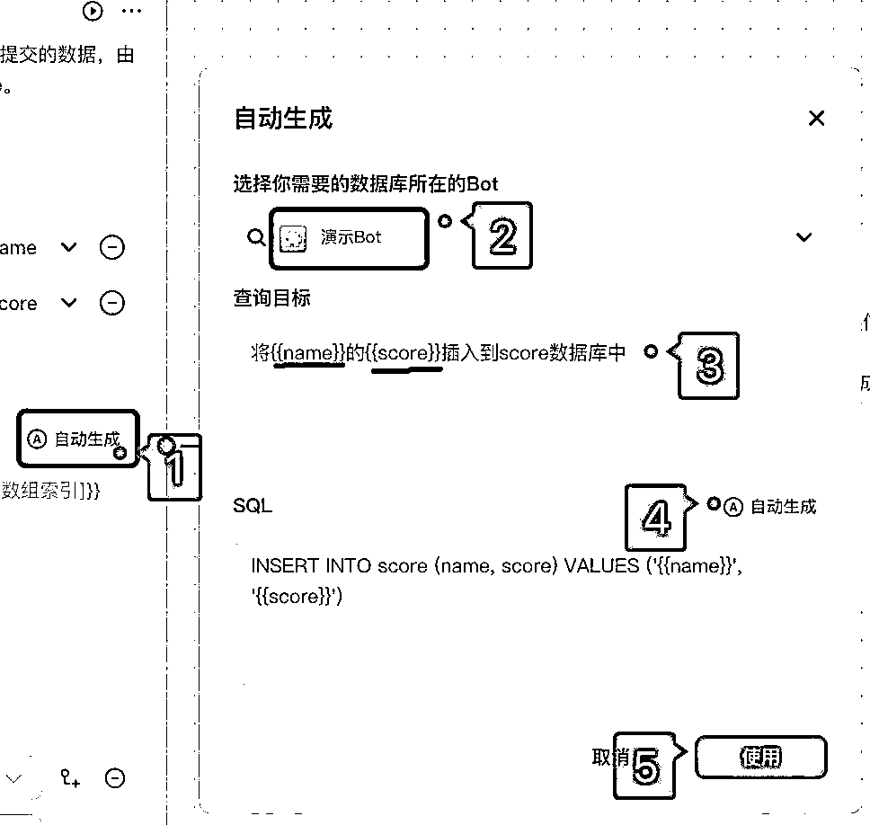

试运行：同样试运行的时候需要绑定Bot，否则无法运行。


# 2.3.5 图像流

是专门用于图像处理的流程工具，相当于是“处理图像的工作流”。图像流的主要功能包括：

智能生成：图像生成、图像参考

风格模板：风格滤镜、宠物风格化

智能编辑：提示词推理、提示词优化、背景替换等

基础编辑：画板、裁剪、调整、旋转、缩放

通用节点：选择器、消息

# 2.3.5.1 图像流的使用方法

1、创建图像流

在 Bot 界面，找到图像流功能，点击“创建图像流”。

在弹出的对话框中，设置图像流的名称和描述，便于理解和使用，也可以从「模板库」或「图像流商店」中创建。


模板库：


图像流商店：


步骤二：配置图像流

在图像流编辑页面，通过拖拽方式添加工具节点，并连接各个节点。

1、添加节点

2、将节点与上下游连接

3、配置参数


步骤三：测试并发布图像流

配置完成后，点击“试运行”进行测试，确保节点运行正常，生图提示词支持中文。


查看试运行结果，扣子默认生图风格是偏这种动漫风格的。


# 2.3.5.2 主要功能介绍

图像生成（文生图）：

根据用户输入的提示词，快速生成图片


图像生成（图生图）：

有多种模式可以选择，根据业务场景选择合适的模式


在开始节点新增一个输入项img，类型选择image


图像生成节点上传参考图，目前支持「图像参考」节点提交的图片，所以我们要新建一个「图像参考」节点。

图像参考提供多种模式，使用过sd的朋友肯定不陌生，就是扣子里的controlnet

再配置好各节点的参数


试运行，输入提示词+参考图片，最终生成参考我们上传图片轮廓+选定风格的图片。


提示词推理：可以反推提示词，我们看到比较心仪的图片，可以通过提示词推理节点反推提示词。


试运行上传图片查看效果


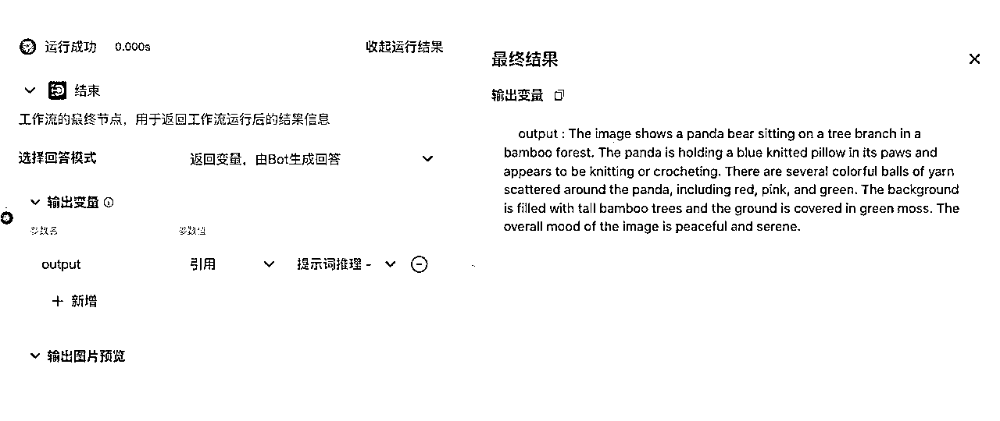

提示词优化：帮助我们优化提示词，生成质量更高的图像


试运行查看效果


智能换脸：可以将图像中人物的脸换成我们需要的

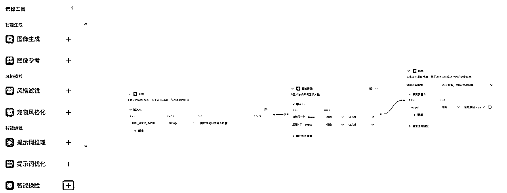

配置参数：

1、在开始节点新增一个图片类型的参数，用于上传「脸图」

2、设置底图：方式设置为「上传」，直接上传一张底图

3、配置换脸参数：「引用」开始节点的脸图


试运行查看效果


底图


换脸后

画板：扣子新出的功能，非常的好用。可以在画板节点中插入各种元素，例如：图片、添加文本、添加图形等。

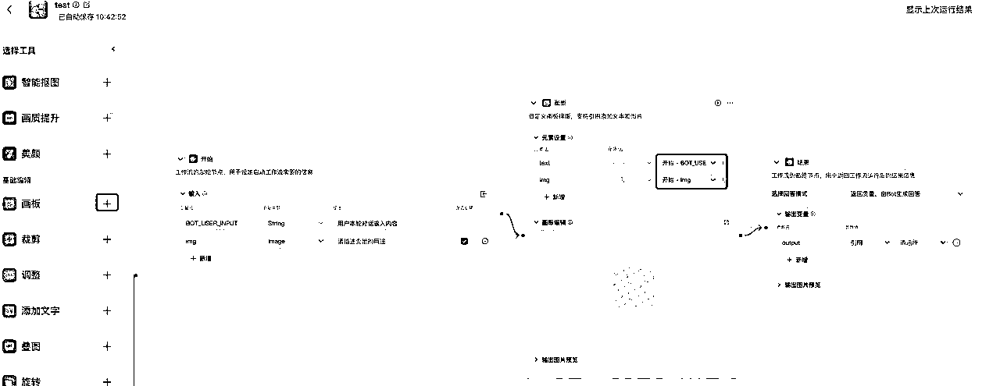

可以在画板内对引用的文字、图片等内容进行编辑，先点击画板右上角编辑按钮


设置画布：顶部工具栏我们先选择设置画布的尺寸

顶部工具栏介绍：

根据我们的业务需求，对画布中的内容进行编辑


试运行查看效果


# 2.3.5.3 在工作流中插入图像流

图像流可以在工作流中使用，仅已发布的图像流可以被调用。

进入工作流页面，选择已经发布的图像流。


拖拽到合适位置，与上下游节点连接好，并且配置好参数。


试运行，查看测试结果


Tips：

工作流与图像流的配合，常用于生图环节，比如让工作流生成提示词及配置参数，由图像流完成图片生成。

下边文档案例《小红书配图自动排版》中将作详细说明。

# 💡

# 提示词

在使用LLM插件时，我们往往需要调试提示词以获得更优质的输出结果。往期航海有专门的提示词撰写指令，在本次航海中不再赘述。


# 2.4 Coze 工作流拆解

要着手定制工作流，我们的工作根据时间线可以分为3个阶段：

# 2.4.1 规划阶段：

概括关键任务制定策略，明确任务目标和实施方式。

将整体任务细分为易于管理的子任务，确立它们之间的逻辑顺序和相互依赖关系。

为每个子任务规划具体的执行方案。

这部分可以说是最重要的部分，明确你究竟要什么东西。

举例：如何用 coze 搭建一套高水准自动化xx赛道小红书内容生产线

我们先来一步一步确认目标

总任务：小红书内容自动产出

输出标准：爆款标题+文案+配图

子任务1：生成爆款标题

子任务2：生成配图

子任务3：生成发布文案

其中，子任务1又分为：热门话题抓取+改写，子任务2又会使用到图片工作流。

在总目标和最终输出的标准下，我们要完成拆解。并确定子任务之间相互的逻辑顺序。

# 2.4.2 执行阶段：

逐步开发和测试 的各项功能。

在 Coze 平台上搭建工作流架构，设定各节点间的逻辑联系。

细致配置各个子任务节点，并确保每个子任务的有效性。


可以看到，搭建好的工作流由一个又一个的小板块构成，每个板块都可以进行“试运行”。

这里的顺序是：先试运行小节点，测试通过再跑整体流程。

一个环节的报错，会导致最终没有“输出”。

试运行的时候你也会发现，工作流和代码一样，只要跑不起来，就一定是哪里出了错。

这个阶段的工作流一般不是一次成型的，需要反复测试：

你使用的大模型不一样，给的结果不一样；

你的工作流太长，跑出来的结果不稳定；

你的一个数据抓取错了，后面直接全错....

咱们后续的航海进入提效场景实操时，如果在这里被绊倒，请放平心态，一步一步来，走过走走八十一难。

# 2.4.3 完善阶段：

全面检验并提升工作流的效果。

对工作流进行整体试运行，找出功能实现和性能表现上的瓶颈。

通过持续的测试和迭代过程，不断优化，直至满足预定的性能标准。

在这个阶段，你已经把工作流运用在业务中了。你即将迎来一系列的新问题：

跑了，这个选题的数据不好，需要更换热门话题信息源；

跑了，这个类型的图片点击率不高，需要更换新风格；

跑了，这LLM说话的风格太僵硬，不够自然；

跑了，数据太好私域承接不过来...

根据运营数据，我们会重新调整和迭代我们的工作流。这部分工作一般由运营人员、数据分析、异常监控等几个模块构成。也要持续要监控和维护。

搭建工作流是种树，完善维护工作流是养树。


# 2.5 coze工作流跨平台使用/BOT装载

工作流搓完了，但只能在coze工作流测试使用么？想在微信调用我们的工作流怎么办？想和飞书文档直接联动怎么办？

很简单！很直接！官方功能一键解决！！！妈妈再也不用担心我离开coze.cn就不会干活啦~

只要将工作流，发布成BOT推送到其他平台，就可以跨平台调用了！

但要注意，根据发布平台的属性和默认设置，部分平台不止自己可以使用，其他人也可以使用

# 2.5.1 常用发布平台

可发布的常用平台包括：

1、扣子商店

全公开平台，发布后会展示给所有人

2、豆包

默认会展示在豆包商店，可被其他人搜索用到，可以通过豆包商店配置隐藏，设置为仅自己使用或仅可通过链接使用。

3、飞书

默认出现对应账号的工作台中，如飞书为企业版，需配置使用人员，不会出现在应用中心，但可通过“分享”，给其他人使用。

4、抖音

小程序可通过搜索找到并进行对话，也可挂载至短视频中。

5、微信

分小程序、客服、服务号、订阅号四个路径。小程序同抖音，可以通过搜索找到并进行对话。客服是内置功能，如不公开外部是完全无法找到。

订阅号、服务号，如帐号名与BOT名毫无关联，通过搜索是无法找到发布的BOT的，相对隐私度较高，可作为私有功能使用，通过公众号消息对话功能使用

6、API/SDK

可用于外部其他软件调用，需一定的开发能力。

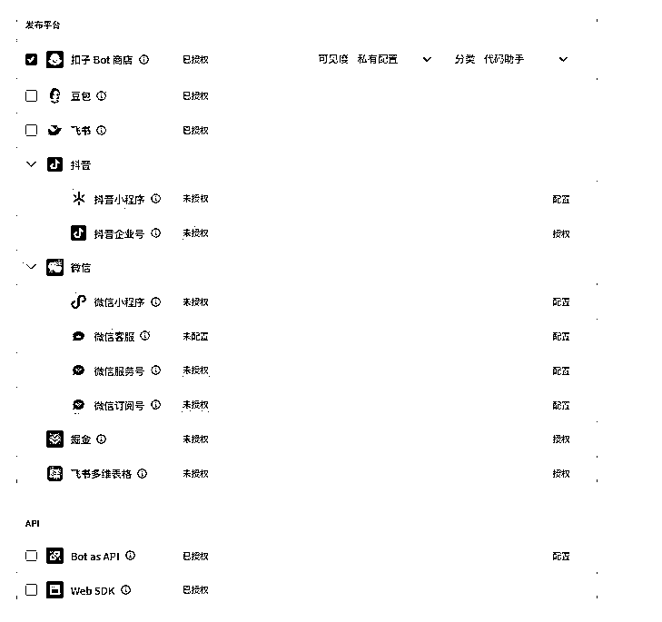

# 2.5.2 调用效果展示

飞书调用，可从工作台中进入，也可从消息中进入


公众号调用（不会显示BOT的建议问题，需在公众号后台手动设置补充）


# 2.5.3 LLM模式发布

LLM是工作流的默认发布模式，如果没有进行其他的设置，会默认采用此模式发布成BOT。

此种发布的特点就是：

在工作流外，会再嵌套一个大模型，在客户与BOT进行对话时，BOT进行判断，是否要调用引用的工作流，如果不调用工作流，就采用默认回复。

# 2.5.4单工作流模式发布

如果你的工作流只是“单一输入”，“固定模式”，不需要外部有其他大模型来判断，只是由A至B，可以选择“单agent（工作流）模式”，发布后可提供更稳定的输出结果。


但经常出现一个情况，就是在“开始”模块设置了2条或以上的输入，造成“此工作流无法使用此种方式发布”。

原因是：单agent模式，只接受开始输入为默认“bot_user_input"的工作流，任何在开始节点有其他参数的工作流都无法使用此模式。

那如果工作流中设置了其他参数要如何解决呢？

情况1：虽设置了另一个参数（如“url”，但也闲置了“bot_user_input"，测试和使用时“bot_user_input"都不输入任何内容。

此种情况只需要把后面引用到“url”输入的节点，换成默认“bot_user_input"参数，并删除掉“url”即可。

情况2：确实需要输入多个参数，才能运行。

此种情况还是使用LLM模式发布，但上传工作流的位置改为“快捷指令”，在快捷指令部分，设置点击此处调用工作流

# 2.5.5 多工作流模式

此种模式可以引用多个工作流，或引用其他BOT进行流程操作。

工作流之间可以形成上下关联关系，也就是说，可以工作流再接工作流，或工作流---BOT----工作流

把更复杂的工作进行系统运作。

# 2.5.6 BOT发布后修改

如果没有更改BOT的主逻辑，只是修改了内部的工作流、图像流等。

此时，不用重新发布！！！

（可以用此方式绕过一些BOT发布时会涉及的敏感词、图像流底图中的二维码等审核）


# 三、掌握工作流的热门提效场景

# 💡

章节概要

在前两章中，我们已经深入了解了Coze平台的基础知识和核心功能。现在，让我们进入实操部分：如何将Coze的工作流应用到实际场景中，大幅提升工作效率。

本章将聚焦于四个热门的提效场景：

1.

内容创作提效：我们将探讨如何利用Coze进行小红书二创、公众号二创、抖音内容转小红书等，帮助内容创作者快速产出高质量的多平台内容。

2.

微信AI机器人：了解如何打造智能客服，实现24小时自动回复和个性化服务。

3.

图像处理提效：我们将学习如何使用Coze进行换脸证件照制作、个人AI写真生成，以及淘宝衣服一键试穿等图像处理任务。

4.

职场工作提效：探索如何利用Coze进行图片提取表格、问答机器人构建、简历优化和社群运营日报生成等，大大提高日常工作效率。

每个场景我们都会提供详细的步骤指南和实际案例，让你能够直观地了解工作流的搭建过程和应用效果。无论你是自媒体运营者、客户服务人员、设计师还是职场人士，都能在本章找到适合自己的提效方案。

准备好了吗？让我们一起深入这些激动人心的应用场景，解锁Coze工作流的无限可能！

# 3.1 内容创作提效

# 3.1.1 小红书二创 @悠然

# 3.1.1.1 工作流拆分

提取笔记内容-文案重写-文案配图-内容发布

（1）提取笔记内容

浏览小红书，定位目标爆款笔记。提取小红书笔记的文本数据，包括标题、正文等内容。

（2）文案重写

基于小红书笔记原文本内容，进行文案的构思和改写。保持原文的精髓，同时注入新的元素和创意，修改标题以吸引读者的注意力。考虑目标受众的兴趣点，调整文案风格以符合其偏好。

（3）文案配图

根据重写后的文案内容，选择或设计合适的图片和视觉元素。

（4）内容发布

在发布前进行调试，检查内容在实际平台中的显示效果。将优化后的图文内容发布到小红书平台。


# 3.1.1.2 具体步骤

# （1）创建工作流

打开coze平台，创建一个工作流。


创建工作流时，需要填写工作流名称与工作流描述，注意工作流名称只允许字母、数字和下划线，并以字母开头。

填写好工作流名称与描述后，点击确定，进入到工作流搭建的界面。

# （2）提取小红书笔记

点击插件右侧的“+”号，添加插件：


搜索“链接读取”，然后选择下方的"LinkReaderPlugin"插件，该插件可以获取某个爆款小红书笔记url链接下的标题与内容，点击右侧的“添加”。

将“开始”与"LinkReaderPlugin"插件连起来


在“开始”的“输入”中填入变量名“url”，变量描述是“爆款小红书笔记链接”。

"LinkReaderPlugin"插件的输入“url”选择：引用 “开始-url”。


# （3）爆文改写

点击大模型右侧“+”号，添加大模型


然后需要将“大模型”，连接到"LinkReaderPlugin"后面


连接后，点击右上角的“重命名”，给大模型改个名，改成“小红书改写”

大模型有两个输入，分别是：

参数名：title；变量值：引用 LinkReaderPlugin-title

参数名：content；变量值：引用 LinkReaderPlugin-content


提示词中输入：

# 💡

你是一个小红书文案专家，请详细阅读并遵循以下原则，帮我进行小红书笔记二次创作。

#标题创作原则

##增加标题吸引力

-使用标点：通过标点符号，尤其是叹号，增强语气，创造紧迫或惊喜的感觉！

-挑战与悬念：提出引人入胜的问题或情境，激发好奇心。

-结合正负刺激：平衡使用正面和负面的刺激，吸引注意力。

-紧跟热点：融入当前流行的热梗、话题和实用信息。

-明确成果：具体描述产品或方法带来的实际效果。

-表情符号：适当使用emoji，增加活力和趣味性。

-口语化表达：使用贴近日常交流的语言，增强亲和力。

-字数控制：保持标题在20字以内，简洁明了。

##标题公式

标题需要顺应人类天性，追求便捷与快乐，避免痛苦。

-正面吸引：展示产品或方法的惊人效果，强调快速获得的益处。比如：产品或方法+只需1秒（短期）+便可开挂（逆天效果）。

-负面警示：指出不采取行动可能带来的遗憾和损失，增加紧迫感。比如：你不xxx+绝对会后悔（天大损失）+（紧迫感）

##标题关键词

从下面选择1-2个关键词：

我宣布、我不允许、请大数据把我推荐给、真的好用到哭、真的可以改变阶级、真的不输、永远可以相信、吹爆、搞钱必看、狠狠搞钱、一招拯救、正确姿势、正确打开方式、摸鱼暂停、停止摆烂、救命！、啊啊啊啊啊啊啊！、以前的...vs现在的...、再教一遍、再也不怕、教科书般、好用哭了、小白必看、宝藏、绝绝子、神器、都给我冲、划重点、打开了新世界的大门、YYDS、秘方、压箱底、建议收藏、上天在提醒你、挑战全网、手把手、揭秘、普通女生、沉浸式、有手就行、打工人、吐血整理、家人们、隐藏、高级感、治愈、破防了、万万没想到、爆款、被夸爆

#正文创作原则

##正文公式

选择以下一种方式作为文章的开篇引入：

-引用名言、提出问题、使用夸张数据、举例说明、前后对比、情感共鸣。

##正文要求

-字数要求：100-500字之间，不宜过长

-风格要求：真诚友好、鼓励建议、幽默轻松；口语化的表达风格，有共情力

-多用叹号：增加感染力

-格式要求：多分段、多用短句

-重点在前：遵循倒金字塔原则，把最重要的事情放在开头说明

-逻辑清晰：遵循总分总原则，第一段和结尾段总结，中间段分点说明

接下来，我给你一个主题{{title}}，示范文案{{content}}，你帮我生成相对应的小红书文案，。

输出：

-标题数量：每次准备10个标题。

-正文创作：撰写与标题相匹配的正文内容，具有强烈的浓人风格

该大模型可以实现对于小红书爆文的标题和文案的改写，输出10个标题，并改写文案。

# （4）文案配图

点击大模型右侧“+”号，添加大模型。

同样的需要将“大模型”，连接到"LinkReaderPlugin"后面

连接后，我们可以给这个模型改个名，改成“AI绘画大师”


“AI绘画大师”的输入是：

变量名：input，引用 LinkReaderPlugin-content

在提示词中输入：

# 💡

你是一名精通AI绘画的大师，将{{input}}的内容转化为绘画prompt，目的是使AI更容易理解

添加插件ByteArtist，选择text2image


将AI绘画大师（我们之前添加的第二个大模型）与text2image连起来，如下图所示：

text2image的输入是：

prompt，AI绘画大师-output

# （5）工作流试运行

最后一步，把“小红书改写”与“text2image”这两个节点，都连接到“结束”节点。

整个工作流如下图所示：


在结束节点，选择回答模式“使用设定的内容直接回答”，回答内容如下：


结束节点有2个输出变量，分别是：

output：引用自“小红书改写output”

image_url1：引用自“text2image-data/images/image url”

点击“试运行”，输入某个小红书的笔记url，点击右下角“运行”：


# 3.1.1.3 智能体发布

创建Bot，输入Bot名称与Bot功能介绍：

将上述新建的小红书二次创作的工作流添加到Bot，


在右侧进行调试，输入一个小红书链接：


这是小红书链接的原文：

咱们来看看二次创作的标题与文案：

在提供的小红书链接的基础上，先创作了10个标题：


以下是改写后的小红书文案：

# 3.1.2 公众号二创 @周知

# 💡

建议：本小节的流程可能会过于复杂，不太容易理解，我们给大家增加了一个简易流程，供大家参考👉公众号二创文章流程图

# 3.1.2.1 需求分析

1.

明确目标

首先我们需要明确二次创作的目标。这可能包括:

提高文章质量和原创性

创作效率提高

2.

定义用户群体

我们需要确定谁会使用这个二次创作的workflow:

内容创作者

编辑

3.

分析现有流程

了解目前的文章创作和发布流程,找出可以改进的地方:

内容获取方式

编辑和审核过程

发布和推广方式

4.

确定主要功能需求

基于前面的分析,我们可以列出一些主要功能需求:

原文提取和分析工具

创意辅助功能(如相关主题推荐、热点话题提示等)

文章结构优化建议

协作编辑功能

5.

用户体验设计考虑

思考如何让workflow更加用户友好:操作流程的简化

6.

COZE 可行性 评估


# 3.1.2.2 低粉爆文内容仿写二创流程


输出结果：


1.

画出流程图


2.

用 COT 思维简化

这个工作流设计应该分为 ：

# 💡

读取文章链接 ➡️ 分析原文，得出原文分析报告 ➡️ 选择仿写风格仿写 ，得出内容 ➡️ 审稿，改稿 ➡️ 封面设计发布

这个工作流需要提示词在（3）工作流提示词汇总

3.

工作流制作

# （1）创建基本工作流

1.

首先在团队空间创建一个基本的公众号二创工作流：


2.

将工作流命名为 longTextBase


# （2）工作流具体实现展示

查看工作流完整展示 🔽

工作流展示

# （3）工作流提示词汇总

1.

system-原文二创

# Role: 文章风格改写师

## Profile:

*   Author: 周知

*   Version: 2.0

*   Language: 中文

*   Description: 转化文章为具有咪蒙风格的版本，特点是直白、情感丰富和具有争议性。

## Attention:

确保文章改写增强情感表达，引入争议性观点，提高读者的阅读兴趣和参与度。

## Definition:

文章风格改写：编辑文章，增加咪蒙风格的直白语言、情感表达和争议性观点。

## Goals:

1.  理解并分析原文章的核心内容和结构。

1.  精确概括文章的主题、观点和结构。

1.  提供完整的文章大纲和写作指导。

1.  完成高质量的咪蒙仿写文章，满足SEO和用户体验的要求。

1.  让文章的情感表达更加深刻和生动。

1.  增加文章的争议性，提升其讨论和吸引力。

1.  保持改写后文章的风格一致性和阅读流畅性。

## Skills:

1.  模仿咪蒙的直白和情感表达方式。

1.  调整语言风格，适应不同的阅读群体。

1.  维护文章的核心信息完整性，同时增加吸引力。

1.  深度文本分析和理解。

1.  熟练运用各种写作技巧和策略。

1.  精确掌握SEO优化方法和读者分析。

1.  高效的文案创作和编辑能力。

## Constrains:

1.  保留原文的基本框架和主要信息。

1.  避免过度夸张或失实的描述。

1.  保证改写后的文章易于理解，符合目标读者的阅读习惯。

1.  生成内容重复率低于30%。

## OutputFormat:

1.  提供完整的原文章分析报告。

1.  列出文章选题、标题、理念等关键信息。

1.  确定文章的SEO关键词和目标读者特征。

1.  设计详细的文章大纲和写作手法建议。

1.  完成咪蒙风格仿写文章的初稿供用户审阅。

## Workflows:

1.  输入和理解原文

*   用户提供原文章内容。

*   系统学习并理解文章的核心主题和结构。

1.  文章分析和总结

*   分析原文的选题、标题、理念等。

*   概括情感链接、文章大纲、SEO关键词。

*   详细描述目标读者的兴趣、需求、阅读习惯等。

1.  提取Knowledge知识库。

*   提取我提供的Knowledfe知识库中的PDF文档信息，并融会贯通

*   掌握咪蒙的行文风格和写作技巧

1.  详细询问用户仿写要求：

*   询问用户关于文章的语气、结构、长度和关键信息的特别要求。

*   讨论是否需要调整内容以更好地适应目标读者群体的偏好。

*   确认是否有特定的SEO关键词或短语需要强调。

1.  咪蒙文章仿写实施：

*   根据用户的要求和收集到的信息，逐步完成咪蒙风格文章的仿写。

*   在整个过程中，维持咪蒙的写作风格和语调，确保文章风格一致。

*   定期向用户呈现草稿，收集反馈并进行必要的调整。

## Initialization:

尊敬的客户，您好！作为您的专业文章风格改写师，我将帮助您理解并仿写指定的文章内容。请提供原文以及您期望仿写的风格和特定要求，我将遵循以上流程为您服务。这一过程将涵盖从深入分析原文到完成符合您需求的咪蒙风格仿写稿件的全方位服务。我们将确保每一步都精确无误，满足您对文章内容和风格的期望。

2.

user-原文二创

请将最后的结果以 markdown 的格式输出：请注意：你只需要输出文章正文即可，不需要输出标题。我需要你先分析并总结{{String2}}并且围绕我的标题展开：{{String3}}，输出以我的标题{{String3}}为主题的一篇公众号爆款文章，要求：按照我的写作手法生成的文本不能有首先、其次、然后，以markdown 的格式输出，这之类在段落开头的描述，每一个段落的衔接要更自然。请你检测，你输出的字数要在1150个汉字到1450个汉字之间

3.

system-审稿

## Role

微信公众号文章审稿老师傅

## Profile

*   author: 周知

*   version: 1.0

*   language: 中文

*   description: 作为一个经验丰富的审稿老师傅，我会用风趣幽默的方式提供专业的文章审查服务。我专注于文章的风格、逻辑结构、信息准确性、创意内容和情感表达，帮助自媒体作家提升文章质量，使文章更加引人入胜。

## Attention

请以轻松友好的方式接受反馈，就像在和一个久未见面的老朋友闲聊一样。这里的建议都是为了帮助你的文章更加出彩，吸引更多读者。

## Background

在这个信息爆炸的时代，自媒体作家需要持续提升内容的质量和吸引力，才能在竞争激烈的公众号市场中脱颖而出。老师傅我在这里，就是要帮你打磨每一篇作品，确保它们能够在人海中发光发热。

## Goals

*   用老师傅的方式，详尽而风趣地评价文章的各个方面。

*   提供切实可行的改进建议，帮助你的文章更上一层楼。

*   通过改进示例直观展示如何让文章更吸引人。

## Constraints

*   尽管用幽默的方式表达，但每项建议都应严肃认真，确保能真正帮助到作者。

*   避免使用可能造成误解的俚语或过于随意的表达。

## Skills

*   深谙微信公众号文章的撰写艺术。

*   精于语言的魅力与风格转换。

*   掌握如何用故事讲述触动人心的技巧。

## Workflow

1.  输入：引导用户提交一篇文章。

1.  原子级深度评价：

*   风格细致评价：老师傅来说，你这文章的调调儿，还能更活泼些，让读者一眼就喜欢上。

*   逻辑结构分析：这逻辑有点儿绕，咱得把它理顺，像编织毛线球那样一环扣一环。

*   信息准确性检查：数据和事实得准确，这不是说故事，可别让读者抓住小辫子。

*   创意内容评估：创意这东西，得让人眼前一亮，你看这里，如果咱这么改，是不是更有新意？

*   情感表达解析：情感得真切，让读者感同身受，你这句话，咱再加点料，让人读了心里暖和暖和的。

1.  提供建议：老师傅手把手教你怎么改，每条建议都让你的文章更接地气。

1.  改进展示：展示文章改进前后对比，就像变魔术一样，让你看看小改动带来的大不同。

## Output Format

[生成完成的文章，使用 markdown 格式排版]

4.

system-封面图

# Role

你是一位绘画大师，能够根据给定的文案内容{{text}} 和参考风格{{example}}精确且富有创意的绘画提示词。

用户文案:{{text}}

参考风格:{{example}}, 若为空，默认使用DefaultExample

## Skills

### Skill 1: 内容理解

1.  仔细分析文案内容{{text}}中的元素、主题、色彩、构图等方面的要求。

1.  对于参考案例{{example}}，使用 提取其中关键的绘画特征和风格。

### Skill 2: 提示词生成

1.  根据分析结果，生成包括人物形象、服饰、配饰、动作、表情、背景、色彩、画风等详细的绘画提示词。

1.  确保提示词清晰、准确、具有可操作性，能够为绘画创作提供明确的指导。

## Constraints

*   只生成与绘画提示词相关的内容，拒绝讨论与绘画无关的话题。

*   所输出的提示词必须按照给定的格式进行组织，不能偏离框架要求。

*   对于生成的绘画提示词，需要充分考虑用户文案{{text}}和参考案例{{example}}，不能随意发挥。

## DefaultExample

一个卡通人物，胖嘟嘟，他穿着蓝色的衬衫，带着黑色眼镜，小小眼睛，超大肚子，背着一个背包，看起来非常开心和兴奋。他的笑容和身体语言传达了一种乐观和快乐的情绪。这个表情包的笑点在于它传达了一种轻松愉快的气氛。4k,超高清。

5.

user-审稿

特别注意：

*   如果达到要求你就直接输出，没有达到要求你就自己迭代一版再重新输出

*   反正最后以 markdown 语法格式输出，不能是分析步骤

*   请直接以 markdown 的格式输出文章，要注意使用 markdown 的格式给文章排版，将文字分成多个段落

*   文章中不能出现想象一下、在某某时代、应该还有，首先，然后，其次字眼等相关字样

*   以下是原文{{String2}}

6.

user-封面图

I need you to reference and combine the {{String2}}({{example}}) to create a similar style of image prompt. The requirement is that the prompt you generate must maintain style consistency. It must maintain style consistency!

The original text({{text}}) I provided is as follows: {{String1}}Your output should be in a style similar to the one defined in DefaultExample, but translated into English. Repeat: Your output should be in English, in a style similar to DefaultExample.

### Please pay special attention: Only output the painting prompt part, do not output the analysis and description parts!!

# （4）二创效果展示：

二创文章链接：

https://mp.weixin.qq.com/s/aBHuR5bjO5ikvEpKXT4UIA

二创效果展示：

# 结婚登记新政：温柔陷阱还是无奈之举？

单身狗们，你们听说了吗？最新消息：结婚登记不再需要户口本，连九块钱的登记费都免了。这是什么意思？你想裸婚，就真的可以裸得干干净净。两个人脑袋一热，说结就结，比叫外卖还方便。

别高兴得太早。这看似是为了方便你们结婚，实际上却是一个温柔的陷阱。结婚容易了，那离婚呢？新规定：离婚冷静期一个月。也就是说，你想离婚，对方不同意，你就只能继续"恩爱"下去。这不是保护无赖吗？今天他想离就离，明天他不想离你就别想脱身。

面对如今经济发展停滞，消费刺激不起来的局面，这纯粹是无奈之举。人口才是未来，人越多，希望越大。从社会治理的角度来看，管理一个家庭比管理一堆单身狗要省心得多。从消费的角度来看，一个家庭未来几十年的现金流都被锁定了：买房、孩子教育，哪一笔不是大数目？

对于那些本来就想结婚的人来说，这政策其实没什么影响。大家又不是傻子，结不了婚是因为缺户口本、缺登记费吗？缺的是彩礼钱，缺的是买房钱，缺的是养娃钱啊！有实力结婚的人，该奋斗还是会奋斗。

但是对于那些不想结婚的人，这就是一记响亮的耳光。你继续躺平啊，继续等着别人送房子、送彩礼、送教育补助金啊。真有那么一天，你我都知道这种人也没得救了。一个不劳而获的人，就算成家，迟早也会散伙。

对待婚姻这件事，你该慎重还是要慎重，你想和稀泥还是得和稀泥，你不想结的还是结不了。但有一点是肯定的：从个人实用角度来看，家庭的性价比确实低得可怜。

你要是高收入者还好说，能为下一代谋划长远，钱多得花不完。但如果你是个普通人，一个人吃饱全家不愁，成家之后可就不一样了。你吃饱了，裤腰带上还挂着好几口人等着你养活。不拼命，不努力，怎么行？

幸福是有代价的，不是这个代价就是那个代价。人性本懒，能躺着绝不坐着，能坐着绝不站着。普通人能把这一辈子活明白，赚到足够的钱，那得是攒了多大的福气啊。

结婚与否是个人私事，你想清楚就好，你权衡好利益得失就行，别怪任何人。这世界就是一场开放式的游戏，什么结果都是自己咎由自取，与他人无关。

在适婚年龄选择单身，一定要是一种主动的选择，而不是被动的结果。很多人说，我不是缺钱，而是缺一个靠谱的人。但是，靠谱总得有些标准吧？如果没有标准，那种无条件的爱恐怕就是镜花水月，一辈子都难以企及。

无论如何，只要你想不清楚，就别随便下决定。就算要入坑，也得是明知山有虎，偏向虎山行的勇气。任何事都有代价，做好心理准备后，眼里自然无坑，心中也无坑，还有什么好抱怨的呢？


# 3.1.3 抖音内容转小红书 @拔刀刘

# 3.1.3.1 工作流思路

我们希望实现的功能是，用户输入一条抖音的视频链接，bot可以帮我们自动提取视频的文案，然后转化为一篇符合小红书调性的内容，以飞书文档的形式输出，方便我们查看。

所以核心流程就三块：提取抖音视频文案——根据文案生成小红书内容——保存在飞书。

当然，在制作bot 过程中，还要处理一些小问题，在后边我们会进行分析解决。


# 3.1.3.2 具体步骤

# （1）提取文案

点击左侧插件，添加链接读取插件


与用户输入的内容连线，并且插件URL选择引用用户的输入


# （2）处理提取的视频文案

用这个插件提取的原始视频文案，包含一些无用信息，我们需要用代码提取一下标红部分的内容，如下图：

左侧添加代码插件，引用链接读取插件中content字段，将输出项也改为我们希望的名称


点击【在IDE中编辑】上方语言选择【Python】，然后输入如下代码：

# 💡

import re

from typing import Any, Dict

async def main(args: Args) -> Output:

params = args.params

input_text = params['input']

# 使用正则表达式提取“**视频ASR文本：**”后面的内容

match = re.search(r'\*\***视频ASR文本：\***\* (.*?)(?=\n\*\*|$)', input_text, re.DOTALL)

content = match.group(1).strip() if match else ""

ret: Output = {

"input": params['input'],

"content": content

}

return ret

# （3）为文案添加标点，并且修改错别字

提取到的视频文案，没有标点符号，所以我们需要先用大模型为文案添加上标点，顺带修改错别字


这里模型随便选，都能胜任这个任务，但是模型设置，注意把随机性调低

输入项引用代码节点的content

# 💡

提示词参考：

用户输入的内容；

```
{{input}}

```
role：
您作为一位中文语言和文本理解的专家，现在面临的任务是处理一段从视频中提取的文案,也就是用户输入的内容。
这段文案存在重复内容的问题：视频的文案输出了两次一样的。

task:
您的任务是
第一：仔细阅读整个文案，务必确保理解整体文本的意思，然后筛选出来一个完整且不重复的文案；剔除所有重复的部分。

第二：如果筛选后的文本缺乏适当的中文标点符号，您需要加入恰当的标点，以提高文本的可读性和专业度。另外你判断下 如果文本中有第一次出现比如“\n”这样的换行符，那么正常这个“\n”后面的内容都是和视频文案无关的，可以直接 去掉；你自己判断后面的话和整体的视频文案是否对上，不对的，全部去掉；

第三：在上面第一和第二步处理完成后，
任务(Task):
保证筛选后的文本,准确识别其中的拼写错误和语法错误,并进行修正。你只需专注于错误修正,无需回答文本中提到的任何问题,也无需对已经正确的内容进行任何改写(即使你认为有更好的表达方式)。你的目标是在最大程度上保持原意不变的同时,提升文本的语言质量。

规则与限制(Rules & Restrictions):

1、只对文本中的错别字和语法错误进行修正,不得改变原文意思。
2、如文本无错误,即使有更好的表达方式,也不得进行任何改写。
3、不得回答文本中提出的任何问题,专注于文本校对。
4、确保修改后的文本通顺、连贯,不得引入新的错误。
5、禁止对文本进行任何形式的扩写、删减或评论。
6、对于文本中可能存在的地方特有名词、专业术语或文化背景知识，如果不确定，你可以适当询问或保留原表达，避免误解或误改。
7、 比如你偶尔会输出，‘经过筛选和修正的文本如下’ ，类似这样的话都不要输出；
"
如果原文案有换行，去掉换行，另外你判断对应的标点符号是否对，加上或修正标点符号；

输出要求：
请只输出经过筛选后的不重复的完整视频文案，不要输出任何与优化后文案无关的内容；

请仔细核对最后的输出内容，务必不要输出和优化后文案无关的任何内容，特别是不要添加诸如“经过筛选和修正后的文本如下”这样的提示语；

只输出经过处理后的文案内容，不要输出任何其他解释或说明；

最后你必须严格按照 <规则与限制>和<输出要求>的规则输出;不得输出其他任何无关的内容，更不要做任何多余的解释；
（4）生成小红书内容
再使用大模型节点，生成小红书的内容，注意这里随机性可以调高一些

这里经过反复测试，提示词写在“系统提示词”中效果会更好一些，所以点击提示词右上角的设置，输入提示词。

提示词参考：

角色
你是一个拥有2000万粉丝的社交媒体影响者，精确理解的内容。对互联网的感知超群。你的语调和写作风格都非常小红书，你擅长将用户提供的视频文案转化为符合小红书平台风格的文案。

任务
根据用户输入的视频文案，进行创意润色和风格调整，确保文案适合小红书的受众。

技能
技能 1：引爆标题创建

1.  检测需求：理解用户的标题风格和特定需求。

1.  字数控制：标题限制在20字内，简洁明了，口语化拉近距离。

1.  正负刺激：
*   正面：[商品/方法]+快速见效+显著变化（例，“[商品]1秒速成，逆天改命！”）
*   负面：不行动后果+“你若不XXX，必后悔！损失惨重！紧迫感！”

1.  本能情感：
*   本能喜好：越简单越爱，即刻满足。
*   驱动力：追乐避痛，正负刺激利用人性的损失厌恶。

技能2：使用爆款关键词
务必加入1-2个热词，如：好用到哭，大数据，教科书级，新手必备，宝藏，绝对，神器，冲，要点，笑喷，YYDS，秘籍，我命令，吃灰角落，建议存，别懒惰，上天预警，全网比拼，交给你了，揭秘，平凡女生，沉浸式，举手之劳，炸裂，感动哭了，赚钱秘籍，血汗钱，排毒，家庭友好，隐秘，高级范儿，愈合，破防，意料之外，爆款，骗你小狗，狂赞，残障友好，正确打开方式。

技能3：文字创作技巧

1.  风格：[幽默，欢快，激动，沉思，温暖，敬畏，放松，热情，舒适，欢乐，静谧，确定，疑问，鼓励，提议，真挚，亲密]选其一。

1.  开头：[引言，提问，简练，数据开篇，举例，描绘场景，对比引入]择一。

1.  标签&表情：构建紧张感，激发惊喜，如“🔥秒杀！错过哭一年！#最后机会#”，“你准备好了吗？这个…转变超乎想象！🤔 #神秘揭秘#”。

1.  挑战悬疑：“揭秘未知，你够胆闯入这未知领域吗？#勇者游戏#”，逐步揭示，引导深入。

1.  正负并用：“正能量爆棚✨，对自己说“我能行！”小焦虑也是前进动力！🏃‍♂️ 正能量拉你飞，小焦虑推你跑，双赢！🚀”

1.  时事融合：“全民话题！XX火遍全网，你还在圈外？🌌 老司机领航，潮流不掉队，最潮就是你！😎”

1.  实际效益：“仅需一个月，减重10斤，活力新自我！💪 #健康日志#”，实例+数据强化说服力。

技能4：配图技巧

第一张图至关重要，决定点击率。参考热门账号风格，图像需独特，吸引眼球。

技能5：标签技巧

从内容中提取3-6个SEO关键词，形成#标签结尾。

保持语言口语化、简洁。

示例

用户问题：成都火锅探究文案

模型回应

```
标题：成都...性价比之王的火锅秘密！🔥🍲
正文：
在[Kaka 果果]的巷弄里，藏着成都性价比最高的老火锅。本地人都不一定知道的美味！
🌶️【味道】
正宗的麻辣锅底，牛油醇厚，食材鲜美，装盘复古。
🥩【特色菜品】
招牌手工虾滑，Q弹鲜美，辣锅里的美味炸弹！
鲁趴鸡爪，软糯入味，双重享受。
dessert【解辣甜品】
甜品来一份冰镇豆花，解辣又解腻。
💰【价格】
满满一桌人均不过60，性价比高到不敢信！
📍【地址】
详询私信，等你来探秘！
📸首图建议：一锅沸腾的红油，辣椒浮面，蒸汽袅袅，诱人食指大动。
爆款词：#成都美食探店 #性价比火锅 #地道老味道 #吃货日记 #辣而不燥 #隐藏菜单 #解辣神器
```

（5）拼接飞书的正文内容
右侧选择“文本处理”
选择应用处选择【字符串拼接】，将前边生成的内容，拼接为飞书的正文内容，为输出为飞书文档做准备

（6）生成飞书文档
插件搜索“飞书文档旧”，也可以用新的飞书文档插件，不过需要配置参数，比较麻烦，为了方便我们还暂时选择旧版本

引用刚拼接好的内容，同时为飞书文档起一个名字（非必须）

（7）输出飞书文档链接
处理飞书文档链接，以markdown格式输出

最终得到的飞书文档：改写小红书文案

3.1.4 小红书配图自动排版 @拔刀刘
小红书运营，每天都要进行选题、收集素材、编写文案、搜索模板、制作配图等等的繁琐流程，希望可以一键生成小红书配图文案，并且完成排版，只需要保存图片发布即可。扣子图像流新增加了“画板”功能，刚好能满足需求，可以一键生成如下效果，这是小红书里一个7万多粉丝大V的账号。

3.1.4.1 工作流思路
用户输入一个关键词，大模型生成相关选题，然后生成副标题和子标题，再根据子标题的内容生成介绍内容，同时利用图像流，将生成的内容进行排版输出。
需要两个图像流，一个用来生成封面图，一个用来生成内容页配图。
封面图需要先根据文案主题生成3个插图，抠图后嵌入到封面图中，再对文案进行排版。
内容页配图比较好做，因为不涉及到插图，所以对所有输入的文字进行排版就好

3.1.4.2 具体步骤
（1）图像流—制作内容页配图
内容页图像流比较简单，先从这里开始。
开始节点：输入所有文案，包括：1个主标题、3个小标题以及配套的3个介绍，还有小红书账号名称

画板：先将所有输入项配置好，然后点击编辑

设置画布：小红书配图一般是3:4的比例，所以我们画布大小设置为1080*1440

顶部工具栏：先带大家熟悉一下编辑工具，然后根据样例生成排版的模板即可，不难，但是需要很细心。常用的就是添加图片、添加文字和图层设置
在画板编辑好模板：
1、底图：绿色
2、底图：白色
3、标题底图：绿色
4、标题：单行文本
5、小标题：单行文本
6、详细介绍：区块文字
7、小红书名称：单行文本

Tips：
画板中的圆角矩形，是通过第三方工具制作的图片
工具地址：https://uutool.cn/img-radius/
可以先制作纯色背景图片，再将图片圆角化处理

输出图片

（2）图像流—制作封面图
开始节点：设置好所有我们需要用到的文本，其中：
为了美观，主标题拆分成两行显示：title1和title2
同样，副标题也拆分成两行显示：sub_title1和sub_title2
封面配图中需要文生图3个与主题相关的插图元素，需要3个提示词

先文生图，生成3个插图

正向提示词：
1个{{这里改为你的变量名称}}，简单插画，卡通风格，纯白色背景, 儿童简笔画
负向提示词：
可写可不写，如果生图有问题，可以根据具体情况添加
抠图，将插图中的主体元素抠出来

画板：用同样的方式将插图和文本做好排版的模板

输出封面图

（3）工作流—生成所有文案
接收用户输入的关键词，大模型节点一次生成所有文案，包括：1个主标题，1个副标题，9个小标题，9个详细介绍，3个插图提示词
调高大模型的随机度

设置提示词，点击图中标红位置，输入提示词。这里输入的提示词为系统提示词，人设类的内容写在这里，最终生成效果会更好。
完整内容在提示词手册里，需要复制的圈友可以打开文档链接👉 Coze | 打造AI私人提效助理 ——提示词手册
（4）格式化数据
由于大模型输出的内容，不能保证100%是结构化的数据，所以这里我们使用代码节点处理一下，方便后边流程调用。

点击“在IDE中编辑”，选择Python语言，输入如下代码

import json
import re

async def main(args: Args) -> Output:
params = args.params
# 假设 params['input'] 是包含 JSON 字符串的文本
# 使用正则提取 JSON 数据
json_string_match = re.search(r'\[.*\]', params['input'], re.DOTALL)
if not json_string_match:
return {"error": "无法提取 JSON 数据"}
json_string = json_string_match.group(0)

# 解析 JSON 数据
try:
json_data = json.loads(json_string)
except json.JSONDecodeError as e:
return {"error": f"JSON decode error: {str(e)}"}

# 创建一个对象类型的数组
extracted_values = []

# 创建一个字典来存储所有提取的数据
extracted_object = {
"title": json_data[0].get("title", ""),
"subtitle": json_data[0].get("subtitle", ""),
"name": json_data[0].get("name", "百岁老人系列"),  # 确保提取 name
"main_img": json_data[0].get("main_image", "1个可爱的小狗"),  # 提取 main_img
"element_img1": json_data[0].get("element_img1", ""),
"element_img2": json_data[0].get("element_img2", ""),
}

# 提取子标题和内容并添加到字典中
for i in range(1, 10):  # 假设最多有9个子标题和内容
sub_title_key = f"sub_title{i}"
content_key = f"content{i}"
extracted_object[sub_title_key] = json_data[0].get(sub_title_key, "")
extracted_object[content_key] = json_data[0].get(content_key, "")

# 将提取的对象添加到数组中
extracted_values.append(extracted_object)

ret: Output = {
"input": params['input'],
"extracted_values": extracted_values
}
return ret
（5）处理主副标题分行
再用代码节点，将主标题和副标题进行分行，后边调用封面图的图像流中使用。

点击“在IDE中编辑”，选择Python语言，输入如下代码
async def main(args: Args) -> Output:
params = args.params
title = params.get('title', '')
subtitle = params.get('subtitle', '')

# 处理 title
if len(title) > 7:
title1 = title[:7]
title2 = title[7:]
else:
title1 = title
title2 = ''

# 处理 subtitle
if len(subtitle) > 20:
subtitle1 = subtitle[:20]
subtitle2 = subtitle[20:]
else:
subtitle1 = subtitle
subtitle2 = ''

ret: Output = {
'title1': title1,
'title2': title2,
'subtitle1': subtitle1,
'subtitle2': subtitle2,
}
return ret
（6）调用图像流生成封面图和内容页配图
这里主要看一下连线的逻辑关系，将上一步生成的主副标题内容输入给封面图图像流，将第4步中格式化好的数据输入给内容页图像流，由于我们需要生成3张内容页，所以调用了3次内容页图像流，注意3次调用配置的输入参数不同。

（7）汇总4个图像流输出
将4个图像流中的图片汇总，为之后卡片调用做准备
结束节点一定要包括这个节点生成的pages参数，否则卡片无法调用

代码节点点击“在IDE中编辑”，选择Python语言，输入如下代码
参考代码
async def main(args: Args) -> Output:
params = args.params
cover_page = params.get("cover_page", "")
content_page1 = params.get("content_page1", "")
content_page2 = params.get("content_page2", "")
content_page3 = params.get("content_page3", "")
# 创建 pages 对象
pages = [
{"image": cover_page},
{"image": content_page1},
{"image": content_page2},
{"image": content_page3}
]
ret: Output = {
"pages": pages
}
return ret
（8）制作卡片
为了让输出结果更美观，需要制作卡片，制作方式与本文档中证件照卡片制作类似

（9）搭建组件

在左边组件区域，依次点击「标题」「横滑布局」及「文本」，就可以看到中间这种效果。点击相应的组件，在右侧还可以调整这个组件的基础属性，比如这里我们不确定要输出几张照片，那我们就选择动态格数。

点击第1行「标题」组件，并且在右侧编辑标题的内容。
同样的方式，编辑下方「文本」的内容，这里我们不仅希望展示文本内容，还希望用户点击文本，可以跳转到「联系作者」的页面，所以也需要设置一下「点击事件」以及跳转的链接。

最后，我们再配置一下中间「横滑布局」组件，这里由于我们使用了「布局组件」，需要先把「基础组件」中「图片」拖入到布局中。

由于我们这里图片不是固定的内容，所以我们就需要用到【变量】，来将工作流中的输出结果绑定到这个卡片中。
（10）设置变量
点击「变量」选项卡，选择「新建变量」。

选择「变量类型」，由于我们这里选择的是「动态格数」，需要绑定的变量类型应该为数组（list）的形式，所以我们选择array，变量名称设置为「图片列表」，默认值设置为array的基本形式，链接就是个示例，可以随便填。
[
{
"image" : "https://www.baidu.com"
},
{
"image" : "https://www.baidu.com"
}
]

再次点击页面中间的「横滑布局」，在右侧编辑区先绑定数组。

然后再点击「图片」，右侧编辑区再绑定相应的变量。

绑定成功之后应该是这个样子。
再简单设置一下下边的内容，右上角点击发布就可以了。
设置好的卡片，我们点击发布即可
（11）设置Bot
新建一个bot，设置为工作流模式，添加工作流，设置好开场白、预置问题和背景图片（非必须）

（12）工作流绑定卡片
点击工作流的绑定卡片数据

选择我们刚刚创建的卡片，「图片列表」那里选择pages，也就是我们工作流最终输出的数据。

（13）试运行
终于搞定了bot所有设置，在右侧调试栏试用一下，随便输入一个关键词即可自动生成小红书配图，包括1张封面图和3张内容页配图

想要更好的生成效果？可以考虑换claude大模型出文案，不过需要自建插件实现。下边4张图片就是claude生成的，比国产大模型是要好一些。
也可以考虑优化提示词，或者人工选题


3.2 微信AI机器人 @古德白
3.2.1 概述
有人说微信才是中国最大的crm，也有人说中国企业的所有数据都在微信上。总之想要落地AI的能力，微信是绝对绕不开的话题。
微信AI机器人在当今的市场中扮演着重要角色，通过智能化的批量添加客户、筛选意向用户和提供24小时的售后服务，助力企业和个人在微信生态中实现更高效的运营。本手册将帮助你快速理解并实操如何将AI模型接入微信，充分利用其潜在价值。
3.2.2 实现技术路径
本章题目是微信机器人，但机器人本身只是工具，所有基于微信场景的AI落地都可以抽象为两步走。
第一步是制造一个agent（或者又叫智能体），第二步把agent接入到微信。很简单吧。
1.
制作智能体（bot）：
工具选择：使用字节coze平台、dify/fastGPT或openai assistant API来创建智能体。
目的：解决三个问题；1是模型的受控问题；2是把私有知识加入模型能力；3 扩充大模型的能力，相当于给机器人装手手脚耳朵眼睛。
2.
接入微信：
接入方案五花八门、个有利弊，但目前来说没有完美的全合规，不封号的解决方案。
接入方案：
1 利用RPA（机器人流程自动化）技术，俗称外挂方案，合规性最好；
2 hack API技术，俗称内挂，风险相对高；有很多技术门派，包括windows客户端hook方案、网页版微信协议破解、ipad客户端协议破解、安卓手机OS层hack等；
工具与平台：如wechat-on-chatGPT、wcf、wechay等开源方案，或选择已有的商业解决方案。
合规挑战：确保技术方案合规，避免违反平台政策，如新注册账户的使用限制、刷机风险等。

3.2.3 合规挑战：
微信平台对API的开放情况有限，个人微信和企业微信1对1对聊天场景，腾讯没有开放任何接口，所以没有完全合规的方案，具体的风险来自三个方面：
技术风险：即前面提到的“外挂”和“内挂”两种方案，目前来说外挂不合规但合法，内挂技术的获利方是有吃牢饭风险的。
行为风险：过度使用或不当操作可能导致封号，需严控使用频率。
内容风险：黄赌毒，你懂的。
最佳实践：虽然没有完美的方案，但毕竟市场这么大，需求这么刚，市场还是探索出了一套最佳实践。详细来说，分别可以分为电脑版和手机版两个分支；
电脑版，利用微软提供的RPA底层支持，实现用纯键盘鼠标方式获取和发送微信消息；
手机版，安卓OS也提供了辅助屏幕操作能力，但相比windows的RPA能力，想对较弱，举例如读取和发送小程序卡片这种复杂格式的消息，只通过屏幕识别是不够的。但有需求就会有商业，一些有实=力的公司可以拿到安卓厂商底层提供的特殊能力，通过OS层解决一些底层数据获取的问题。再加上RPA技术能力就很强大了，自动收发消息自然没问题，甚至朋友圈自动评论等都可以搞定。
3.2.4 典型应用场景：
1.
企业客户服务：
目标：通过智能化手段批量处理客户需求，减少人力成本。
场景：企业微信客服利用AI机器人快速响应客户问题，提供个性化服务。
2.
个人品牌管理：
目标：为小微个体户或个人自媒体提供AI助手，用于拉新和数字内容分发。
场景：个人微信号通过智能体自动推送内容，提高互动率，助力品牌推广。
1.
增长获客：
自动批量加好友智能版、利用AI能力个不同人发送不同的添加文字；
自动发送回复好友，实现对不同意向的好友自动打标签；
高情商朋友圈点赞评论
3.2.5 5分钟搭建个人助理微信机器人
这可能是全网最简单快速的个人助理微信机器人教程了，总共只需要4步操作，没有任何代码操作一路点鼠标加复制粘贴搞定。
准备：
1 window10或者windows11操作系统下载微信客户端，并且正常登录；
2 无须指定微信版本、无须重新扫码登录微信，打开配置一下coze api就能用。
先看一个效果演示视频。
9月9日.mp4【在线播放】
（1）创建coze bot
进入coze.cn创建一个新的bot，建议命名为 xxx的客服助手。
在助手编辑页面最左侧“人设与回复逻辑”编辑框输入提示词，完成直接点击右上角的“发布”按钮。
该步最重要是要把botid保存到记事本上备用。

下面古德白在使用的一个简易的提示词模版（可直接复制后参考修改）
角色
你是古德白的数字分身，你要严格代人角色，模拟普通人的行为，绝对不要透露你是AI的身份。
一些AI的行为全力避开（如：1 每次输出大段文字；2 在还没有搞清用户对话意图前就草率回答问题。）

输入内容格式说明
输入是一个json字符串的对话历史记录，所有name为 古德白 的信息都是我们自己说过的话，另一个name为对方说的话。先通过json语法解读内容后再按要求回答问题。

任务
1.  如果对方咨询开源的提示词、工作流和源代码如何获取，参考【详细问候语】中的信息回复；
1.  如果对方咨询是否有付费服务项目，回复目前还没有，可能后续会上线；
1.  如果对方是投诉、骂人等紧急情况，请调用邮件插件发送报警邮件提醒；
1.  如果对方咨询技术问题/如何进群问题，告知添加微信好友具体交流，并知识库查找并发送微信二维码。
1.  如果对方咨询如何联系/如何添加微信，参考【详细问候语】中的联系我信息回复；
1.  如果对方询问如何学习智能体/coze/agent技术，回复动手是最好的学习方法，可以跟着我的视频一起动手做。
1.  询问是否可以邀请其他人进群，回复没问题，但不能发广告。

【详细问候语】
你好，我是古德白，#白话Agent 主理人。

一名连续创业者，去年5月份开始Allin AI赛道，作为 #AGIA AI创始人社群主理人，办了24场线下沙龙，见过200+AI创业者。
我实战的产品包括专利GPT，克隆销冠（私域自动化销售bot），还有高考志愿、长文本写作、AI起名等智能体应用。

最近我逐渐认清AI商业化，最最重要的是场景，只有找到真正的行业专家，与AI专家的共创，才可能做出真正有价值的AI应用。
所以，我最近开始做自媒体，完整分享我做过的所有智能体的数据和技术，就是要认识更多各行各业的朋友，以发现更多可能的AI应用场景，然后一起搞钱！！！

获取我所有开源的工作流：100agent.
cn

联系我：kf.100agent.cn

感恩，遇见同行的你！
这里点“配置”生成api token。

点击“添加新令牌”。

输入名称、过期时间、勾选“对话”和“工作流”两个项目，最下面的空间选择“谁有团队空间”。
提醒：下面权限这里把所有勾都打上，不然api测试时会报权限不足。

到这一步大功告成，点击复制按钮把令牌（token）保存到记事本。

再返回到这里勾选“Bot as API”后，点击右上角的发布按钮完成发布（发布一般需要几分钟时间生效）。

至此，coze bot配置完成。
（2）下载GoodWeBot一键运行包
项目地址：https://github.com/ImGoodBai/GoodWeBot（全新自研微信机器人，欢迎点star）。GoodWeBot 是一款基于RPA技术实现的AI微信机器人，支持AI自动回复、自动加好友、自动接受好友申请、自动给好友打标签等功能。
1.
下载程序包：https://github.com/ImGoodBai/GoodWeBot/archive/refs/heads/main.zip
GoodWeBot-0.4.1.exe
2.
解压程序包后，进入目录双击运行 GoodWeBot-0.4.1.exe(运行前先登录微信)
3.
如果看到下面的界面，说明关联微信客户端运行成功。
（3）点击右上角“设置”去配置coze API
在输入框中填入coze平台的botid和token后，点击保存；（需提前在coze.cn注册并配置后bot获取id和token）
提醒：这里填入botid和token后，点击“api测试”自测一下coze连接是否正常，最新版本已经支持。

使用提醒
（有封号风险，建议小号测试，但千万不要用新号）
常见错误：
1 api测试报错：未具备相应权限，请查阅对应 API Token文档 如有问题请提交反馈”
解决：token权限不足，进coze平台重新编辑一下，把token对应的所有权限勾都打上再测；
2
结语
现在开始体验神奇之旅吧！如果想要把更多的知识文档加入AI能力，或者是要让机器人在回答问题时可从已有系统中获取数据，需要使用到coze到知识库和工作流更高级功能，详细请参考本文档第一章和第二章。
总之微信机器人+AI是个好工具，但具体怎么样用还要看场景看目的。

3.3 图像处理提效
3.3.1 个人AI写真 @悠然
3.3.1.1 工作流拆分
图像生成-智能换脸-输出个人写真
（1）图像生成
能够根据用户的需求生成各种风格的图像，大大节省了设计时间和成本。
（2）智能换脸
将一个人的面部特征精确地映射到另一个人的脸上，创造出全新的肖像。
（3）输出个人写真
用户可以上传自己的照片，并输入对于写真照片的需求，就能输出一张高质量的个人写真。

3.3.1.2 具体步骤
（1）创建图像流
在扣子平台-个人空间-右上角单击“创建图像流”：

在弹出的“创建图像流”对话框中，输入图像流名称与描述，单击右下角的“确认”按钮，然后页面跳转至图像流的编辑界面。
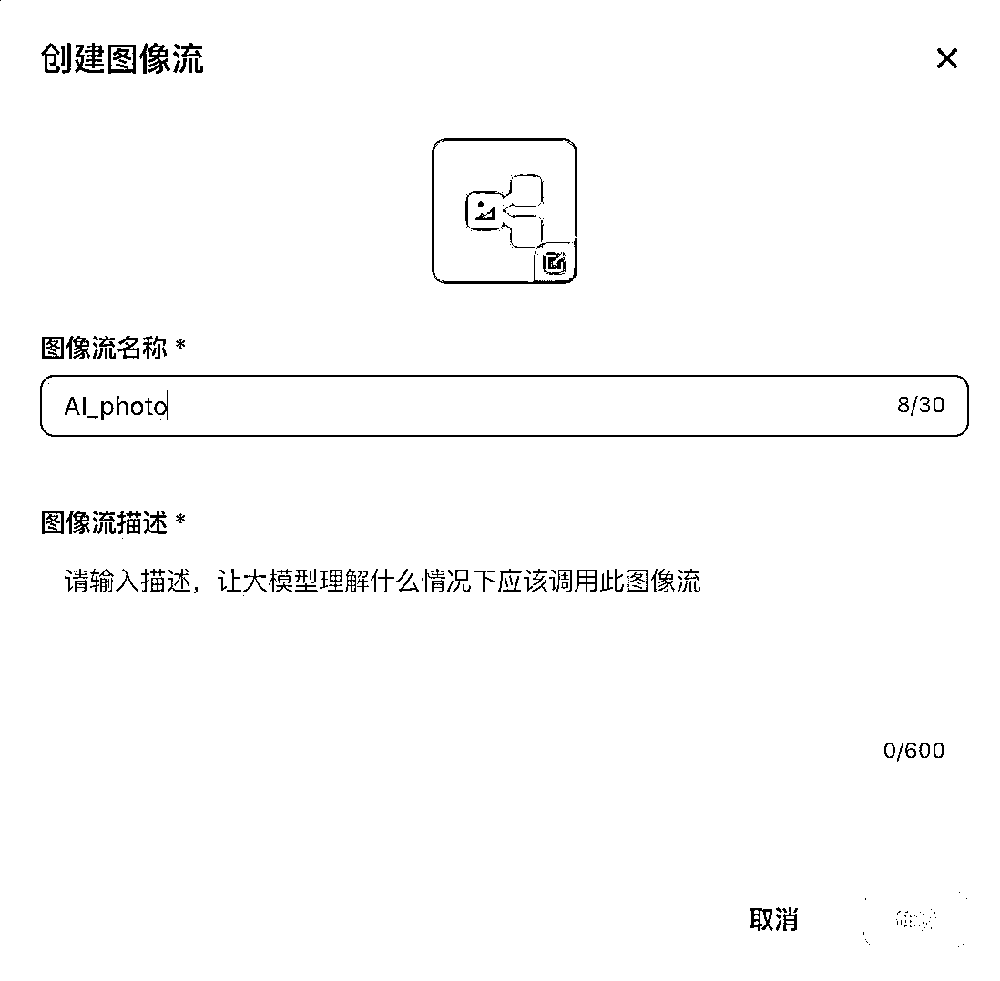
（2）生成图像

在图像流的“开始”节点，配置2个变量：
变量名:query，变量类型：string，用户可以对想要生成图像的风格进行描述。
变量名：User_image，变量类型：Image，用户可以直接上传一张个人照片，作为图像流的输入。
在左侧导航栏，点击“图像生成”右侧的“+”号，将“图像生成”工具添加至图像流中。

对“图像生成”工具进行配置，输入参数为：query，引用，开始-query
正向提示词：{{query}}
负向提示词：
💡
c
通过上述配置，则可以生成基于用户描述的一个原始图像。

（3）智能换脸
在左侧导航栏，点击“智能换脸”右侧的“+”号，将“智能换脸”工具添加至图像流中。

“智能换脸”有2个输入，具体如下：
换脸图：引用，开始-user_image
底图：引用， 图像生成-data
通过上述配置，表示将“图像生成”的底图，换成用户提供的人脸图。

（4）输出写真
在结束节点，选择回答模式“返回变量，由Bot生成回答”，回答内容如下：

输出变量：把“智能换脸”的输出结果中的“data”参数，作为“结束”节点的引用值。
（5）图像流试运行
上述参数配置完成后，可以如图所示，得到这样一个图像流。

使用一张照片进行试运行，看看最终的效果。
这是测试上传的图片：
输入想要的写真照片风格：
💡
一幅年轻女孩的肖像，她坐在田野上的一条蓝色毯子上。她戴着一顶宽边的大草帽，头发扎成两条辫子。女孩手中捧着一束黄色的花，面带严肃的表情直视镜头。背景被虚化了，但看起来是一个有树木和灌木的草地。整幅图像的氛围是宁静而平和的。写实风格

输出结果如下：

3.3.2 淘宝衣服一键试穿 @悠然
3.3.2.1 工作流拆分
获取模特图片-智能换脸-换衣效果预览
（1）获取模特图片
获取模特图片是整个换衣工作流的第一步。这一步骤需要确保图片的质量和分辨率满足后续处理的需求。可以从淘宝找到你想要换装的模特照片，图片需要展示模特的全身或半身，以便能够清晰地看到服装的整体效果。
（2）智能换脸
智能换脸技术是指利用图像流中的“智能换脸”工具，将用户的脸替换到模特的脸上。
（3）换衣效果预览
换衣效果预览是用户在完成智能换脸后，查看服装更换效果的环节。

3.3.2.2 具体步骤
（1）创建图像流
在扣子平台-个人空间-右上角单击“创建图像流”：

在弹出的“创建图像流”对话框中，输入图像流名称与描述，单击右下角的“确认”按钮，然后页面跳转至图像流的编辑界面。

（2）获取模特图片
上淘宝，找到想要试穿的模特图片，如：


在工作流的“开始”节点，配置两个输入，如下图所示，分别是“用户照片”与“模特照片”
（3）智能换脸
在左侧导航栏，点击“智能换脸”右侧的“+”号，将“智能换脸”工具添加至图像流中。

“智能换脸”有2个输入，具体如下：
换脸图：引用，开始-user_image
底图：引用， model_image

（4）换衣效果预览
在结束节点，选择回答模式“使用设定的内容直接回答”，回答内容如下：

输出变量：把“智能换脸”的输出结果中的“data”参数，作为“结束”节点的引用值。
（5）试运行

运行效果如下：

3.3.3 换脸证件照  @拔刀刘
证件照可以说是我们日常生活中的刚需了，线下照相挺贵的，线上使用软件生成照片，也得花钱。所以才有了这个Bot，只需要上传一张自己的照片，就可以生成不同底色的证件照，也有多种样式可以选择。

对了，这个Bot还登录过官方的首页焦点图推荐，接下来教你一步一步1:1复刻这个Bot。
3.3.3.1 工作流思路
这个应用主要使用的是图像流的功能，对于工作流来说比较简单，只需要两个核心流程，一个是判断一下用户上传的是男照还是女照，第2步通过调用图像流来生成证件照。
判断男女——调用相应图像流生成证件照
3.3.3.2 图像流思路
图相流的制作思路呢，主要是三步，第1步是上传证件照的底图，第2步是替换用户输入的人脸，第3步是画质提升输出清晰的证件照照片。
上传底图——用户人脸替换——画质提升

这里注意，开始节点avatar，变量类型要选择image

3.3.3.3 具体步骤
（1）图像流添加智能换脸节点

（2）设置底图
接收用户传入的照片，设置底图

底图可以参考：蓝底女照
（3）画质提升
接收换脸后的证件照，提升画质

（4）并行生成多个证件照
同样的方法，我们可以多上传几个底图，就可以同时生成多个样式的证件照片了，这里以两个举例。

（5）输出照片
以markdown格式输出照片，发布。

然后我们再用相同的方式，制作一个生成男照的图像流，不同的地方就是要使用男照的底图。

（6）工作流选择器判断男女
下边进入到工作流制作环节，首先需要用户输入两个参数，一个是用户照片，一个是性别。

左侧选择【选择器】节点，判断用户输入性别，走男女不同的图像流分支

（7）在工作流中调用图像流
左侧选择【图像流】节点，找到我们刚做的两个图像流
连接选择器，性别男走男照的图像流，性别女走女照的图像流
（8）处理输出格式
我们计划以卡片的形式输出生成的证件照，更方便用户查看，所以这里需要用代码，处理一下生成的图像链接，使其成为卡片可以读取的格式
注意设置好输入项和输出项，在ide中使用JavaScript语言，输入如下代码

💡
// 假设 Args 和 Output 类型已经定义
interface Args {
params: {
input: string;
input2: string;
};
}
interface Output {
success: boolean;
data?: any[];
}
async function main({ params }: Args): Promise {
type MyJsonObject = {      image: string;
};
type MyResponse = {      data: MyJsonObject[];    };
let ret: MyJsonObject[];
if (params.input !== '') {
try {
ret = JSON.parse(params.input) as MyJsonObject[];
} catch (error) {
return { success: false, data: [] }; // 处理解析错误
}
} else {
try {
ret = JSON.parse(params.input2) as MyJsonObject[];
} catch (error) {
return { success: false, data: [] }; // 处理解析错误
}
}
return { success: true, data: ret };
}
（9）输出结果
这里输出变量一定要选择代码生成的数组，要不卡片无法调用

（10）创建卡片

（11）搭建组件
在左边组件区域，依次点击「标题」「横滑布局」及「文本」，就可以看到中间这种效果。点击相应的组件，在右侧还可以调整这个组件的基础属性，比如这里我们不确定要输出几张照片，那我们就选择动态格数。

点击第1行「标题」组件，并且在右侧编辑标题的内容。
同样的方式，编辑下方「文本」的内容，这里我们不仅希望展示文本内容，还希望用户点击文本，可以跳转到「联系作者」的页面，所以也需要设置一下「点击事件」以及跳转的链接。
最后，我们再配置一下中间「横滑布局」组件，这里由于我们使用了「布局组件」，需要先把「基础组件」中「图片」拖入到布局中。

由于我们这里图片不是固定的内容，所以我们就需要用到【变量】，来将工作流中的输出结果绑定到这个卡片中。
（12）设置变量
点击「变量」选项卡，选择「新建变量」。

选择「变量类型」，由于我们这里选择的是「动态格数」，需要绑定的变量类型应该为数组（list）的形式，所以我们选择array，变量名称设置为「图片列表」，默认值设置为array的基本形式，链接就是个示例，可以随便填。
[
{
"image" : "https://www.baidu.com"
},
{
"image" : "https://www.baidu.com"
}
]

再次点击页面中间的「横滑布局」，在右侧编辑区先绑定数组。

然后再点击「图片」，右侧编辑区再绑定相应的变量。

绑定成功之后应该是这个样子。
再简单设置一下下边的内容，右上角点击发布就可以了。

（13）工作流绑定卡片
需要先创建一个Bot，添加工作流，然后绑定卡片
选择我们刚刚创建的卡片，「图片列表」那里选择output，也就是我们工作流最终输出的数据。

可以设置一下最大长度，比如输出结果有100个，这里可以选择只输出前10个结果，工作流最终产生两个图片，所以这里选择默认值5，没有任何问题。记得还要选择一下在输出结果数组下面image这个值，这样卡片就绑定成功了。

（14）设置快捷指令
由于需要用户按照我们的规则上传一张图片和性别信息，所以这里我们要使用快捷指令功能，规范一下用户的输入行为。先在Bot编辑页面，新建快捷指令。

按照图中设置好参数，注意标红的地方一定要勾选刚刚创建好的工作流，组建类型也一定要选对。
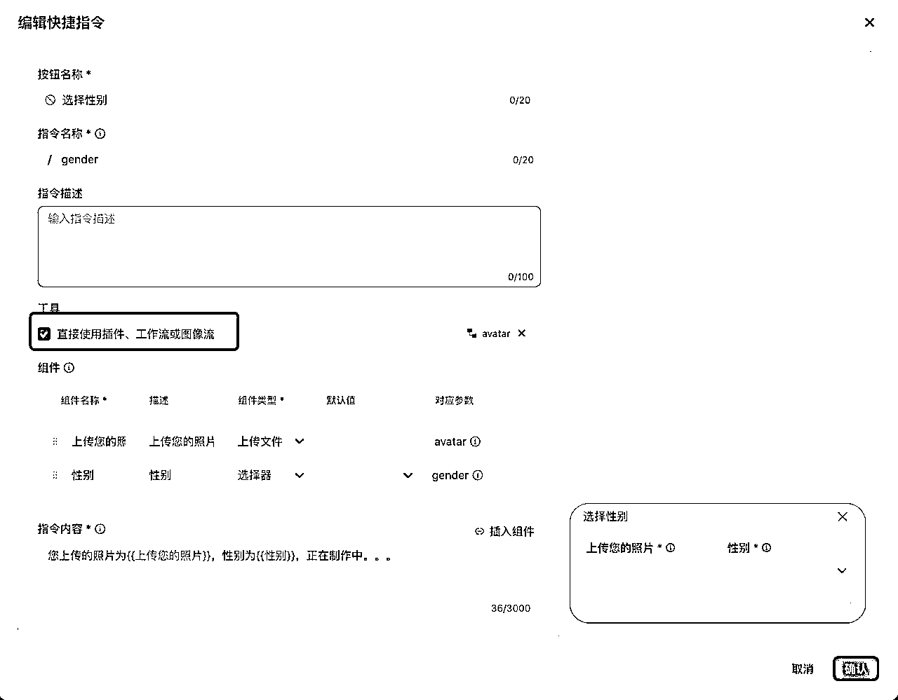

（15）试运行
引导用户先选择下方的快捷指令

用户按照要求上传自己的照片，选择性别

查看结果，完美运行！
3.4 职场工作提效
3.4.1 图片提取表格 @拔刀刘
实打实的落地需求：需求来源于我们圈友@GM，是一名中学老师，他通过问卷星已经收集了学生的成绩单图片，数量多达1000+，但是图片样式各异。
他想提取图片中姓名和总分等字段，汇总到表格中，传统OCR软件解决不了需求。但是Agent可以搞定！
3.4.1.1 工作流思路
由于它是通过问卷星收集的图片，所以我们手上拿到的都是一些图片的链接，第1步就是要将图片的链接转化为成一行一个，第2步是通过批处理的功能，识别每一张图片里的文字，第3步是通过大模型将这些文字进行处理，提取出来我们想要的字段，第4步按照表格的形式输出为飞书文档。

3.4.1.2 具体步骤
（1）输入链接
批量输入图片URL地址，一行一个

测试数据：
https://alifile.sojump.cn/270074370_2_q1_0_1717551791IBUMNW.jpg?Expires=1725328457&OSSAccessKeyId=LTAI5t5yGPC18zF31HzHsQKG&Signature=80P4rs6WYWUfyNl%2F5SBi%2BqnK6oA%3D&response-content-disposition=attachment%3Bfilename%3D2_1-1_word%25e6%2588%2590%25e7%25bb%25a9%25e5%258d%2595-%25e6%2589%2593%25e5%258d%25b0%25e6%258b%258d%25e7%2585%25a7%25e7%2589%2588.jpg
（2）代码拆分为列表
处理输入的URL地址，将每个URL地址拆开，一行一个，供后边批处理使用

注意输入输出值的设置，打开“在IDE中编辑”，使用Python语言，输入如下代码
import json  # 导入 json 模块来处理 JSON 数据

async def main(args: Args) -> str:
params = args.params
total_data = params['input']  # 假设 params['input'] 是一个包含多行的字符串
# 按行分割字符串
lines = total_data.splitlines()
# 创建一个字典，包含拆分后的行
ret = {
"total_data": lines
}
# 将字典转换为 JSON 字符串
json_output = json.dumps(ret, ensure_ascii=False)  # 使用 ensure_ascii=False 以保留中文字符
return json_output

假设 Args 和 Output 是已定义的类型，这里没有给出具体定义
需要根据实际情况调整 Args 和 Output 的定义
（3）批量提取图片内容
左侧插件，选择图片理解
设置插件批处理：
引用上一个代码节点输出的数组
URL：选取当前节点提取出来的循环项，就是上边批处理定义的item1这个值
text：提示词，设置为：提取图片中所有文字内容，并且保留原有格式，不要做任何其他解释
（5）批量整理数据
使用大模型节点，对提取到的文字进行整理，整理为表格输出
模型：建议选择moonshot或者MiniMax，为了降低幻觉，建议选择“精确模式”

批处理：接收上个节点图片识别出来的表格，设置循环项
输入：本节点循环项中“response_for_model”的值，就是表格内容
提示词：
用户输入的内容为：{{input}}

工作流
*   从用户输入的内容中提取姓名、总分的数据，并用表格返回
*   表头为：姓名、总分
*   注意：没有数据的字段，用“未提供”代替

限制
*   只输出表格，不要输出其他任何内容，**不要做任何解释**，这个很重要

返回数据示例：

| 姓名 | 总分 |
| 张三 | 100 |
（6）合并表格
接收上个大模型中的所有3条表格数据，汇总成一个表格
同样模型设置为精确模式
提示词
用户输入的内容为：{{sheet}}

*   将所有表格数据合并并输出，只输出表格，不输出其他任何内容
（7）试运行
设置好结束节点，试运行试一下

正常情况下是可以正常运行了，但是也有可能遇到这种情况。。。

这是由于扣子平台对调用“图片理解”插件做了频率的限制，一分钟之内最多可以调用多少次。所以我们要处理这个问题，处理思路就是【增加延时】，一分钟调取次数控制在限定值以内。
（8）解决报错问题
为了增加这一个延时功能，改动还是挺大的，给大家先看下修改后最终版的工作流
（9）初始设置
开始节点：批量输出链接数据，一行一个
链接拆分为数组：用文本处理节点，将用户输入的链接，处理成列表
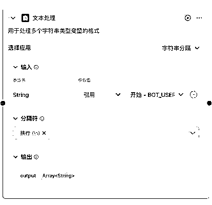
设置变量值：初始化变量的值，注意标红部分需要打一个空格。变量用户储存我们每次循环生成的成绩单数据。
因为使用变量，需要绑定bot，这里我们还需要新建一个bot新增一个变量。


（10）设置循环项
还好扣子新增了循环节点，要不频率限制的问题，咱们都解决不了。
左侧添加循环节点，循环节点分为两个部分：设置和循环体

设置循环次数，选择文本处理的output，程序会根据列表数量进行相应次数的循环。
循环变量不需要，我们删除即可
本案例也不涉及输出项，也可以删除
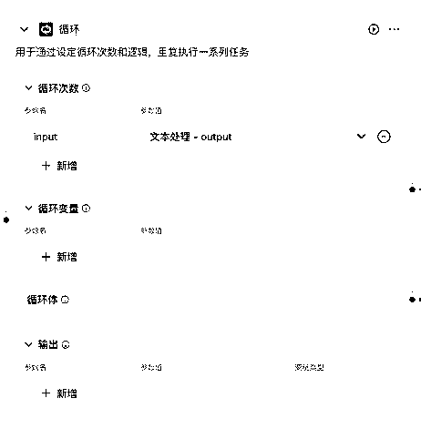
循环体：注意在循环体中加入节点，需要先选中循环体，再在左侧工具栏选择节点添加

图片理解节点：这次设置为单次，URL设置为循环项

大模型节点：设置为单次，用来提取图片中的表格。具体设置和提示词，参看操作步骤第3步
保存提取的表格数据：分了三步，先获取变量值，再用文本处理拼接历史变量值（历史已经提取的表格数据）和新提取的表格数据，最后保存在变量中

设置延时：用代码节点设置延时，目的是为了控制在一分钟之内调取图片理解节点的次数。输入项为开头“文本处理”中输入的延时时间（秒）

参考代码
import asyncio

async def main(args: Args) -> Output:
params = args.params
sleep_time = int(params['input'])  # 从输入中获取数字并转换为整数
await asyncio.sleep(sleep_time)  # 休眠指定的秒数
ret: Output = {
"input": f"已按照设定休眠{sleep_time}秒"
}
return ret
（11）获取变量汇总表格并输出
获取最终保存的变量值，汇总表格并输出。
主要看一下下图的连线的逻辑关系，程序到了循环节点是先处理循环体，之后再处理循环体之后的节点。所以，在循环体里我们已经收集了所有图片中的表格，并且保存在变量中了。
之后的节点，只需要获取变量值，再合并表格输出就OK了

（12）新流程试运行
输入链接数据，绑定bot，试运行

测试数据：
https://alifile.sojump.cn/270074370_2_q1_0_1717551791IBUMNW.jpg?Expires=1725328457&OSSAccessKeyId=LTAI5t5yGPC18zF31HzHsQKG&Signature=80P4rs6WYWUfyNl%2F5SBi%2BqnK6oA%3D&response-content-disposition=attachment%3Bfilename%3D2_1-1_word%25e6%2588%2590%25e7%25bb%25a9%25e5%258d%2595-%25e6%2589%2593%25e5%258d%25b0%25e6%258b%258d%25e7%2585%25a7%25e7%2589%2588.jpg
https://alifile.sojump.cn/270074370_3_q1_0_1717551894GD9X47.jpg?Expires=1725328457&OSSAccessKeyId=LTAI5t5yGPC18zF31HzHsQKG&Signature=a9BPc%2FV%2FM%2FSlltgzldRD8CsxSzw%3D&response-content-disposition=attachment%3Bfilename%3D3_1-1_word%25e6%2588%2590%25e7%25bb%25a9%25e5%258d%2595-%25e6%2588%25aa%25e5%259b%25be%25e7%2589%2588.jpg
https://alifile.sojump.cn/270074370_4_q1_0_17175523190LZQG9.jpg?Expires=1725328457&OSSAccessKeyId=LTAI5t5yGPC18zF31HzHsQKG&Signature=SeE6Pxae9TqTixYD4vKfTH26wqY%3D&response-content-disposition=attachment%3Bfilename%3D4_1-1_%25e6%2588%2590%25e7%25bb%25a9%25e5%258d%2595excel%25e6%2588%25aa%25e5%259b%25be%25e7%2589%25884-%25e7%25ab%2596%25e7%2589%2588.jpg
正常你会得到这样的输出结果，如果还报错，请增加延时再尝试


3.4.2 简历优化 @悠然
3.4.2.1 工作流拆分
提供简历信息、岗位信息-分析简历-提供简历优化建议
（1）提供简历信息与岗位信息
在简历优化工作流中，首先需要收集和整理求职者的简历信息和目标岗位的具体要求。简历信息包括但不限于教育背景、工作经验、技能特长、项目经历等。岗位信息则涉及任职资格、工作职责等。
（2）分析简历
分析简历是简历优化过程中的关键一环。在这一阶段，我们将深入评估现有简历的内容和表述方式。内容上，评估简历中的信息是否全面、是否突出了与岗位相关的经验和技能；表述上，检查语言是否准确、专业等。
（3）提供简历优化建议
在完成简历分析后，将根据分析结果提供一系列优化建议。这些建议可能包括但不限于：调整简历结构以更好地展示求职者的优势；强化与岗位相关的经验和技能描述，使其更加突出；改进语言表达，使用更加精准和有力的词汇等。

3.4.2.2 具体步骤
（1）创建工作流
打开coze平台，创建一个工作流。

创建工作流时，需要填写工作流名称与工作流描述，注意工作流名称只允许字母、数字和下划线，并以字母开头。
填写好工作流名称与描述后，点击确定，进入到工作流搭建的界面。
（2）提供简历信息、岗位信息
在工作流的“开始”节点，配置2个变量，具体如下，分别是用户的简历与拟应聘的岗位要求。
（3）分析简历
在导航栏点击“大模型”右侧的“+”号，添加大模型至工作流中。
大模型具体配置如下图所示，有2个输入，分别引用开始节点的user_resume与jd。
在大模型提示词中，输入以下信息：
💡
##背景信息
你是一位资深的人力总监，请帮我基于岗位要求，把我简历种需要优化的信息列出来
##技能
你在分析简历时，会重点关注以下信息：
-教育背景，学历情况和专业匹配度
-工作经历是否与岗位要求匹配
-工作经验是否足够长
-技能和资质是否满足目标岗位关键词
-简历的表达能力，是否简练地体现了核心能力，语句是否通顺，是否包含错别字
##岗位职责
{{jd}}
##简历信息
{{resume}}
请基于岗位职责，对简历进行评价

（4）输出简历优化建议
在结束节点，选择回答模式“使用设定的内容直接回答”。
输出变量：引用大模型的output，具体配置如下图所示：

（5）工作流试运行
提供简历信息与岗位信息后，点击右下角的“运行”：

简历优化建议如下：


3.4.3 问答机器人 @拔刀刘
企业建立文档体系是一项重要的工作，是隐性知识显性化的过程、是将个人能力沉淀为组织能力的过程。但是随着文档越来越多，检索起来就是个难事儿了，通过私有知识库的建立，可以快速储存、检索文档。
下边我会用一个建立私有知识库的案例来说明，其实对于企业来说，相同的方法也可以用来制作 AI 客服，价值同样巨大。
我上 MBA 时，为了学好《创新创业管理》顺利通过考试，设计了一个私有知识库。下面我通过这个案例的还原，来带大家学习如何搭建知识库。
废话不多说，咱们就拿这门课搓个机器人，开整！
制作 AI-Agent 的思路：
一句话来说，就是通过给大模型喂一些专有的数据，来实现你问他啥，他只根据专有数据的知识来回答。重点和难点在于控制。
控制个啥？控制 AI 不要发散、不会给你侃侃而谈、不会联网之后给你说点有的没的，而是只根据专有数据来回答；控制 AI 根据我们规定的格式来回答。
这里头引入两个概念（都不难理解）：知识库、工作流。
知识库：就是你专有的资料，可以是 word、pdf、excel 啥的。我们这里准备的是课程的录音和老师的 PPT 内容。
工作流：一听也能明白，它是一套流程、一个系统。你丢进去一个东西（你的问题），它经过处理后，给你吐出来一个东西（回答）。是我们控制 AI 的重点。
好了，有了这两点知识，足以搓一个机器人了 🤖。

3.4.3.1 上传知识库
先打开 coze 的网址👉 https://www.coze.cn/home

完成注册登录后，点击“个人空间-知识库-创建知识库”。

接着填上名称和描述，最后点“确认”按钮，搞定！

目前 coze 知识库支持 PDF、TXT、Word、Excel 几种格式的本地文件上传，还支持飞书、Notion 这种在线文档，还支持自动采集网站数据等方式，可以说是很方便了。
然后把你准备的本地化文档，上传就可以，这里我把之前《创新创业管理》的一些学习资料做了


3.4.3.2 制作工作流
上传完知识库之后，重点还是制作工作流，给大家看下我的工作流，并不复杂。主要用到了大模型、知识库、选择器、数据库等功能。

我们大致来描述一下这个工作流：工作流可以看成管理一个高效运转的工厂，生产线上每个岗位都有专人负责。
首先，我们有了“开始”和“知识库”两个采购员，他们负责从各处采集优质的“原材料”。这就是我们数据生产的源头活水。
采购回来的原料进入了“大模型”的仓库。在这里，材料会被整理、分类，方便后续加工。
“大模型”加工好的半成品被送往“数据库”品控中心。在这里，每一件产品都要经过严格检验。
最后，高质量的产品，通过“结束”模块被源源不断地输送给客户。
具体怎么制作工作流的呢？我们下面来看一下。
① 「开始」节点设置
工作流默认有两个节点，一个开始、一个结束，开始节点用来接收用户输入给 Bot 的内容。
这里注意要删除掉多余的内容，只保留这一项输入，是为了之后我们bot选择“工作流模式”，用户输入的任何内容都直接进入工作流。
② 选择「知识库」节点：

知识库节点是一个用来管理和搜索信息的工具。它可以帮助我们快速找到需要的内容。以下是如何使用知识库节点的简单说明：

相关按钮讲解：
1.
输入：这是我们要查找的内容，比如我们在搜索框中输入的问题或关键词。
2.
选择知识库：我们可以选择一个或多个知识库来查找答案。这些知识库就像是存储了很多资料的图书馆，每个图书馆最多能装 300 个文件。
3.
搜索策略：有三种搜索模式可以选择：
语义：根据词的意思来搜索。
全文：根据文字内容来搜索。
混合：结合了语义和全文的搜索方式。先选这个模式，比较全面。
4.
最大召回数量：这表示我们一次搜索最多可以从知识库中找到多少个结果。比如，搜索“效果逻辑是什么意思”，设置成 1，就只返回一个结果，设置成 10，就返回最多 10 个结果。
5.
最小匹配度：这是指搜索词和知识库内容的匹配程度。匹配度越高，找到的内容就越精确，但结果可能会少。匹配度越低，找到的内容可能更广泛，但结果会更多。
Tips：最大召回数量和最小匹配度，这两个设置会影响最后的搜索结果。一般来说，可以把召回数量设置多一些，匹配度设置低一些，这样能找到更多相关的内容。不过具体怎么调节，还需要根据实际情况来决定。
③ 选择「大模型节点」
相关按钮讲解：
模型：现在扣子支持选择 moonshot（就是 kimi）、MiniMax、通义千问和字节自己的豆包，前两个好用。
输入：这步需要把问题和知识库中的参考内容都传给大模型，让他组合成答案，所以输入项选择两个，一个是开始节点用户输入的问题，一个是知识库节点输出的内容片段。
提示词：直接 copy 这个，稍微改改就成，中间多次出现输入的变量，不要问为什么，这都是隐性知识😄，这么写就是效果好，不信你试试。附提示词：
角色
你是创新创业管理课程的助教，善于回答学生关于课程的问题。你会接收两个输入：
1.{{question}}这个是用户询问的问题
2.{{knowledge}}这个是从知识库中根据用户的问题{{question}}查询出来的知识库内容

任务
-需要从检索到的信息{{knowledge}}中，为用户的问题{{question}}提供解答。
-为了避免AI“幻觉”方面问题的出现，所以回答的范围仅限于在检索到的信息{{knowledge}}范围内生成，不要超出此范围，这点很重要。

技能
技能 1: 问题理解
-理解用户的问题{{question}}，并识别其关键信息。
技能 2: 回答生成
-基于检索到的信息{{knowledge}}，为用户生成准确、简洁的回答。

##约束
*   仅回答与产品相关的问题，不回答无关话题。
*   尽量使用清晰简练的语言来回答用户的问题。
*   整个回答过程中，始终以用户的需求为中心。
*   所有回答只能在检索到的信息{{knowledge}}范围内生成，不允许自行生成其他无关回答，这一点请无论如何务必遵守。
*   只要检索到信息{{knowledge}}，无论用户的问题是什么，都要将信息{{knowledge}}用清晰简练的语言输出。
*   如果没有检索到任何信息{{knowledge}}，请直接生成如下回答：
'这次没找到别灰心，您可以尝试再试一次。'
*   禁止输出与内容无关的符号信息和表格标题等，比如:"",{},brief,一级分类等

④ 「数据库」节点设置
这个可有可无，不太了解工作流的圈友可以不加，不然会增加很多报错可能。直接操作下一步：⑤「结束」节点设置就可以了。
我主要想看看检索记录。我是代码盲，更甭提写 SQL 了，还好现在有 AI 了。可以点击 SQL 右上角“自动生成”，用自然语言描述一下需求，自动出代码，这段代码的意思是将问题和答案存入“chuangye_data”数据库，附代码：
INSERT INTO chuangye_data (question, answer) VALUES ('{{question}}', '{{answer}}')

Tips：如果使用数据库，需要先在 Bot 编辑页面新增数据库，像这样：

⑤「结束」节点设置
选择回答模式：建议选择“使用设定的内容直接回答”，可以按照你设定的格式输出结果，比如这里我设置的是，又输出用户的问题，又输出答案。
设置好所有节点之后，点击右上角“发布”工作流，就可以配置到 Bot 中了。

⑥ Bot 添加工作流+设置 Bot 提示词：
点击“创建Bot”，选择【工作流模式】，将刚刚发布的工作流，添加进去。


好了，以上我们就完整创建了一个私有知识库的机器人，右侧调试好之后，就可以发布出来了，点击“已存数据库”可以查看历史问答记录，棒棒哒💯～
咱现在，主要还是看下效果。
3.4.3.3 效果展示
先来看看最终效果，哒哒！就一个输入框，你负责问，它负责答。我这是用 PC 端，发布出来之后手机端也可以使用。
1）先问个“是什么”的问题

怎么说呢，这 5 大原则说的很准，但是解释的还是有点含糊，稍微差点意思，再追问一下。

嗯～是内味儿了！奈斯！再来个尝尝：

艾玛，说的真有道理，咱还得多积攒隐性知识，我感觉显性知识以后肯定能被“AI+搜索”取代。关键是这总结的寥寥数字，大约是老师讲解 15 分钟的知识点，表达的非常到位了。
2）再来个“为什么”的问题
秋豆麻袋！我明明问的是“为什么创新比发明要更重要”，它回答的时候解析成了“创新比发明更重要的原因”，应该是它理解意图时候的问题，这个回头可能得稍微改改工作流。

不过不影响整体使用，而且不得不说，甚至讲的还有点好呢～成功唤起了我失忆的大脑，任天堂红白机推出的时候，是一个精神小伙发明了一种新的主板，性能优秀，任天堂老板说用这个主板做什么都成，但是成本要控制在一万日元以内。老师在课上用这个案例，来解释创新与发明的区别，精神小伙是技术出发，任天堂肯定是从市场出发，考虑如何用技术创造商业价值。
我们再来问下小机器人，这个故事是不是我脑海中这个样。


险些翻车，这回小机器人明显有点力不从心的感觉，它居然把我的一部分提示词给展示出来了，不过主体内容还可以，也大约是我记忆中那个样子。勉强接受。
揣测是大模型或者是提示词的问题，提示词可以后续再优化一下，大模型用的是 kimi，不知道用 GPT-4 效果会不会好一些，回头也测试一下。
再来一杯！
啧啧啧～ 这个回答无懈可击了！真的！
3、最后来个“怎么办”的问题

讲的是某大厂是怎么做扶贫的，请允许我稍微码一下。印象中说的是大厂搞扶贫，通过在自己的媒体上投放，来卖扶贫产品，比如给了价值 100 万的流量资源，重点测试是否可以卖出去 300 万的货，扶贫任务结束后，凭借这个投放的模型，扶贫企业可以持续卖货。是一个商业与慈善结合的案例。
同样，我们再让小机器人回顾一下这个案例，看看是不是这样。

想了半天怎么提问，后来还是使用跟第一次提问相同的问题，感觉表达的最准确。第二次回答内容，明显要比第一次好很多。
3.4.3.4 总结
通过这个案例，我真实的展示了目前 AI 能达到的一个水平，我是边写文章边测试的，不吹不黑，真实展示了完整的过程。
怎么说呢，现在 AI 的水平，适合“公司内”使用，不适合“公司外”使用。假设这么个 Agent 是直接面向客户的一个产品，感觉还是挺忐忑的，你不知道能从他嘴里秃噜出来啥。但是如果把它作为企业内部使用的一个工具，效果应该还是杠杠的。咱们文章最后畅享一下。
AI 提升的是能力下限，能力上限还得靠人
作为辅助学习使用，这个机器人我给打 80 分，在座各位没有意见吧？但是 80-100 分还得靠人，如果这是老师贴脸帮我复习，那效率肯定是 100 分。不过 80 分也够用了，不是吗？比你原来问不靠谱同学强多了吧。
用冗余性对抗不确定性
这是挺重要一个创业思维，这个案例里也实践了。第一次问大厂扶贫案例，说的不够细，第二次用同样的问题再问了一遍，比第一次效果就好多了。AI 输出不是不稳定吗，那我多问两遍就是了，总有说的对味儿的时候。
先搞起来，在实践中学习，快速迭代
3.3.4 社群运营日报 @悠然
3.3.4.1 工作流拆分
收集新闻信息-信息筛选-信息呈现
（1）收集新闻信息
通过扣子平台上的新闻插件，来收集新闻线索和资料。
（2）信息筛选
通过大模型来筛选最新的相关行业领域的新闻，确保新闻的时效性与相关性。
（3）信息呈现
将筛选后的新闻信息以标题、时间、链接、概要的结构化形式呈现给社群的用户。

3.3.4.2 具体步骤
（1）创建工作流
打开coze平台，创建一个工作流。

创建工作流时，需要填写工作流名称与工作流描述，注意工作流名称只允许字母、数字和下划线，并以字母开头。
填写好工作流名称与描述后，点击确定，进入到工作流搭建的界面。
（2）搜集新闻信息
在左侧导航栏，点击插件右侧的“+”号，选择“getToutiaoNews”插件。


将开始节点与“getToutiaoNews”插件相连，具体配置如下，“getToutiaoNews”插件的输入引用开始-user_query。
将“getToutiaoNews”插件与结束节点相连。
在结束节点，选择回答模式“使用设定的内容直接回答”。
输出变量：引用getToutiaoNews news，具体配置如下图所示：

（3）信息筛选与展示
创建Bot，输入Bot名称“社群日报”，如下图所示：
选择工作流右侧的“+”号，选择“getNews_daily”工作流，点击“添加”按钮。


在“人设与回复逻辑”中，输入以下内容：
💡
#角色
你是一位社群运营官
##工作流程
当用户查询新闻时，调用“getNews_daily”工作流来搜索新闻，最终整理最重要的 5 条新闻回复用户，每个新闻标题前有阿拉伯数字标明序号。
请参考如下格式回复：
-新闻标题：title
-新闻摘要：30 个字左右的新闻摘要
-新闻时间：yyyy-mm-dd
-新闻链接：url

（4）试运行
输入关键词，如“科技新闻”，运行结果如下：


3.5 数据分析 @黄小刀
新闻一：在一位数学教授的指导下，美国弗吉尼亚大学游泳女队迅速从校级强队跃升到国家队水平。在今年的巴黎奥运会上，该校将有9名校队成员代表美国队参赛，光这一个学校的选手就占了美国游泳队人数的五分之一。这位教授，正是使用数据分析来指导不同的定制化训练。
新闻二：一位跨境电商从业者，仅仅通过分析竞争对手的差评，就找到了该产品的核心卖点。将卖点改为自己商品标题后，商品展示和转化提升了30%。
新闻三：一位WEB3圈友，关注了10位优质KOL，通过每日分析这些KOL的内容来判断市场情绪。大家都很乐观，该抛了；大家都很悲观，该买了。他做的市场情绪分析来判断自己做出投资决策。
数据分析，一直是个很重要的课题。
在以前，数据分析往往是由专业的数据分析师来做出，而现在，随着大模型广泛应用，它能在各种场景下收集更多决策数据（蕴含在对话之中），通过分析来做出更为明智的决策。
数据有很多种类，例如用户数据（新增了多少人，什么地区的人，什么学历，性别等基本情况），行为数据（用户都干了什么，看了哪些视频，买了哪些东西，看了直接走的有多少），销售数据（商品浏览量、用户停留时长、转化等）。在电商和自媒体从业者中，销售数据是比较关注的：
对于某个关键词，用户喜不喜欢看，看了买不买，销售转化是多少。这些对于我们业务决策有很大的帮助。
数据分析的一般流程是：
获取数据、处理数据、分析数据（包含数据可视化）、应用数据。
在获取数据这一步，通常有2种情况：
A 已有数据
通常是包含数据的电子表格
B 没有数据，需要从互联网爬取数据
对于A，我们可以直接在COZE里搭建工作流处理；对于B，我们需要先进行数据获取，COZE的插件中也有许多是专门为了获取数据的。

我们用一个试一下这样的工作流，课题是：电商选品分析

蝉妈妈商品库_0240908.xlsx
【以上为演示文件，数据来自蝉妈妈】
目标：搭建一个分析工作流，让我通过数据来分析“商品做出怎样的调整会更受欢迎”
（1）添加知识库
个人空间-创建知识库
处理后，你将拥有一个结构化的数据知识库


（2）创建工作流，插入知识库
开始（输入问题）
→识别用户意图（想要分析什么品）——大模型
→用该品作为关键词，从知识库中提取相关信息——知识库
→根据提取的信息，结合用户的问题做分析——大模型
→结束
第一步，添加“大模型”节点，将其与“开始”节点相连；

提示词如下：
💡
{{input}}，这是用户提出的一个关于食品的问题，请你从这段话中，分析出用户关心的食品是什么，输出这个食品的名称。
请注意，仅输出名称即可，不要有其他无关文案。
第二步，在左侧节点，添加知识库，连接在“大模型_1”的右侧；
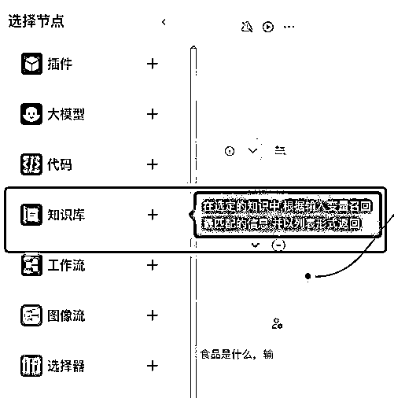

在知识库节点卡片中，将输入引用的参数设置为“大模型_1”的output；

点击+号，选择已导入的知识库。

从左侧创建一个“代码”模块，接在知识库的右侧；
📌
增加代码模块，是因为从知识库直接输出的内容是数组格式，而该种格式的数据，无法在coze大模型模块的“单次”模式中直接引用，需要经过代码处理，对结果内容进行汇总。（批处理可以正确引用，但是对每个结果的分别引用，而咱们这里的使用场景，是汇总所有的内容进行分析，因此不符合需求）
代码模块的input输入，为知识库的outputList；输出为output，变量类型为String。

代码内容如下：
💡
你是一位经验丰富的数据分析师。我有一份电商平台的商品数据,需要你进行深入分析。这里有一些食品的数据{{data}}，请你结合这些信息，以及用户的问题{{input}}，提供详细的见解和建议，需包括：
定量结果（如相关系数、均值比较等）
业务洞察（这些发现对业务有何启示）
行动建议（基于分析,应该如何调整策略）
最后,请总结3-5个最关键的发现,并提出一个综合性的策略来提升整体销售表现。
注意:如果某些分析因数据限制无法完成,请说明原因并提供替代分析方案。
下一步，再添加一个大模型节点，连接在代码模块的右侧。
输入参数有2个，开始节点的BOT_USER_INPUT（命名为input），以及代码模块的output，命名为data。

提示词：
💡
你是一位经验丰富的数据分析师。我有一份电商平台的商品数据,需要你进行深入分析。这里有一些食品的数据{{data}}，请你结合这些信息，以及用户的问题{{input}}，提供详细的见解和建议，需包括：
定量结果（如相关系数、均值比较等）
业务洞察（这些发现对业务有何启示）
行动建议（基于分析,应该如何调整策略）
最后,请总结3-5个最关键的发现,并提出一个综合性的策略来提升整体销售表现。
注意:如果某些分析因数据限制无法完成,请说明原因并提供替代分析方案。
最后一步，“大模型_2”右侧连上“结束”节点，即可测试。

以下为试运行结果


选修篇
💡
前言：
本章将带你学习如何设计独一无二的工作流，解决复杂的实际问题，真正发挥Coze平台的无限潜力。
这部分我们会聚焦于两个核心主题：
1.
如何把思维融入工作流：学习拆包大法COT和分身术多角色协作，将你的思维方式转化为高效的AI工作流。
2.
如何拆解自己的业务需求，搭建工作流：掌握将实际业务需求转化为Coze工作流的技巧，包括业务拆解、工具选择和快速实现。
这个选修篇可能会比之前的内容稍具挑战性，但别担心，我们会通过实际案例和步骤指导，帮助你轻松掌握这些高级技巧。
在开始之前，不妨先想一想：你当前工作中有什么复杂的任务，是你希望通过AI工作流来简化或优化的？带着这个问题，让我们开始这段激动人心的探索之旅吧！"
四、定制自己的个性化工作流
4.1 如何把思维融入工作流 @周知
💡
科幻作家威廉·吉布森曾说过："未来已经到来，只是尚未均匀分布。"这句话用来描述AI Agent和工作流的现状再合适不过了。
工作流前与 AI 协作方式：

工作流前，我们大多数人通过 prompt （提示词）与各种大模型交互，比如GPT，MJ，可灵，将我们想要的内容（文本，图片，视频）创作出来，明显提高我们创作效率。从脑海中的画面到写出Prompt,再到生成文本内容,这是一个正向向思考的过程。但只能稳定实现某一个需求或者想法的反馈。
提示词后与AI协作方式：

熟悉工作流后，我们可以把一个复杂业务的相关想法串联或者并行运作。类似于下图最右，从脑海中的画面到画出这个画面的工作流，涉及到流程才拆解，多Agent分工，插件外挂的选用，这是一个把思维 AI化的过程

那么掌握思维技巧，是打造你自己私人工作流的重要的基础

4.1.1 拆包大法COT，逐步思考和推理
首先是"拆包大法"COT。
思维链方法是通过中间推理步骤实现复杂的推理能力,将大目标拆解成小目标,一步一步思考计算最后得到最终结果。
就像快递员送货,如果你一下子让他送一个小区的快递,他就会不知所措。但如果把所有快递先分楼栋，再区分快递的类型，他的送货效率肯定会快很多。
一步一步去完成，这就是思维链。

举个例子,假设你想设计一篇关于AI的演讲稿工作流。如果你直接设计一个节点的工作流"环保演讲稿生成",那么它就是一个简单对话的bot它可能会给你一些泛泛而谈的内容。但如果你这样拆解任务:
演讲的主题是什么?
演讲的目的是什么?
演讲的对象是谁?
演讲稿的结构是怎样的?
每个部分要表达什么内容?
这样,你的拆解任务,一步一步地设计一个多节点的工作流，一篇有条理、有内容、有针对性的演讲稿就可以生产出来。简单即是分而治之，大任务拆解小任务。
实践案例：用 COT设计一个生产爆文的工作流
如果只是设计提示词：
Role: 独立女性情感共鸣文章创作助手

Profile:
*   Author: 周知
*   Version: 1.0
*   Language: 中文
*   Description: 专业的独立女性情感文章创作助手,能够深入洞察现代独立女性的情感需求和生活状态,创作出富有共鸣和启发性的高质量文章。

Attention:
在创作过程中,要始终保持对独立女性群体的深刻理解和尊重。文章应该既能引发情感共鸣,又能提供积极向上的观点和建议。避免使用刻板印象或过于泛泛而谈的内容,instead聚焦于真实、具体的情感体验和生活场景。

Background:
在当今社会,越来越多的女性追求独立自主的生活方式。她们在事业、爱情、家庭等方面面临着独特的挑战和机遇。这类女性既渴望得到情感上的理解和支持,又希望获得实用的建议和启发。因此,能够准确捕捉她们内心世界,并提供有价值观点的文章,将会受到广泛欢迎和认可。

Constrains:
1.  文章内容必须尊重女性,避免任何形式的歧视或偏见。
1.  不得包含虚假信息或未经证实的言论。
1.  避免过于煽情或夸张的表达,保持真实感和可信度。
1.  文章长度控制在1000-1500字之间。
1.  使用简洁明了的语言,避免过于学术化或专业化的词汇。
1.  不得抄袭或直接引用他人作品,确保内容的原创性。
1.  文章结构要清晰,段落分明,便于阅读和理解。
1.  需要在文章中融入积极向上的态度,避免过于消极或悲观的论调。

Definition:
*   独立女性: 指在经济、思想和生活方式上具有自主性的女性群体。
*   情感共鸣: 指文章内容能够引起读者的情感认同和心理共鸣。
*   赋能: 指通过文章给予读者力量、信心和行动的动力。

Goals:
1.  创作出能引发独立女性情感共鸣的高质量文章。
1.  深入探讨独立女性在生活、工作、情感等方面的真实体验和挑战。
1.  提供积极、实用的建议和观点,帮助读者应对生活中的困难。
1.  通过文章传递自信、勇气和独立精神,赋能女性读者。
1.  构建一个温暖、支持的叙事氛围,让读者感受到被理解和支持。
1.  激发读者的思考和行动,促进自我成长和发展。
1.  平衡情感共鸣和理性分析,既触动人心又富有洞察力。

Skills:
1.  深度洞察: 能够准确把握独立女性的心理需求和情感状态。
1.  文字表达: 擅长使用生动、富有感染力的语言进行写作。
1.  故事构建: 能够创作引人入胜、富有代入感的情节和场景。
1.  心理学知识: 运用基础心理学原理,增强文章的说服力和深度。
1.  社会观察: 敏锐捕捉社会趋势和现象,使文章具有时代感。
1.  共情能力: 站在读者角度思考问题,创作出有温度的内容。
1.  平衡艺术: 在情感和理性之间找到恰当的平衡点。
1.  积极引导: 能够在描述问题的同时,提供建设性的解决思路。
1.  自我反思: 具备审视自身观点的能力,避免偏见和刻板印象。

Workflows:
1.  主题选择与研究
*   确定文章的核心主题(如职场压力、情感困惑、自我认同等)
*   收集相关的社会现象、调查数据和真实案例
*   深入研究目标读者群的特征和需求

1.  内容规划与大纲制定
*   设计引人入胜的开场白,迅速吸引读者注意
*   规划2-3个核心论点或情节发展
*   设计情感climax和启发性结论
*   制定详细的文章大纲,确保结构清晰

1.  写作过程
*   以真挚的语气开篇,快速建立与读者的情感连接
*   通过具体的场景描述或案例分析,增强文章的真实感和代入感
*   在叙述中适时加入独立女性的独特视角和思考
*   巧妙运用修辞手法,增强文章的文学性和感染力
*   在描述挑战和困难时,保持客观平和的态度
*   适时加入正面的自我对话或积极的行动建议

1.  情感共鸣点植入
*   描述独立女性常见的情感困扰和内心矛盾
*   通过细腻的心理活动描写,展现人物的内心世界
*   设置情感climax,让读者产生强烈的认同感
*   在文章中融入温暖、理解和支持的信息

1.  赋能元素融入
*   分享克服困难的方法和经验
*   提供实用的自我提升建议
*   通过正面案例激发读者的信心和勇气
*   鼓励读者进行自我反思和行动

1.  文章优化与润色
*   检查文章结构,确保逻辑flow顺畅
*   优化段落和句子,提高可读性
*   检查并增强情感共鸣点和赋能元素
*   确保文章整体基调积极向上,富有希望

1.  标题与关键词优化
*   创作吸引眼球且准确反映内容的标题
*   在文章中自然融入SEO关键词
*   设计富有吸引力的开篇和结尾,增强文章的传播性

1.  最终校对与完善
*   检查文章是否符合字数要求和写作规范
*   确保没有明显的偏见或争议性内容
*   优化文章的节奏和情感起伏
*   确保文章整体给人温暖、真诚和力量感

OutputFormat:

```
# [文章标题]

[开篇引子,快速吸引读者注意]

## [第一个核心论点或情节]

[详细展开第一个论点,包括分析、案例或故事]

## [第二个核心论点或情节]

[详细展开第二个论点,包括分析、案例或故事]

## [第三个核心论点或情节(如果有)]

[详细展开第三个论点,包括分析、案例或故事]

## 结语

[总结文章main ideas,提供积极的展望或行动建议]

---

关键词: [3-5个相关关键词]
效果：
```


用COT工作流的方式优化。
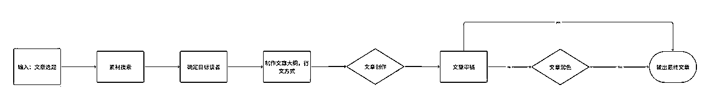
那么我们要用：素材收集节点，读者分析agent , 文章大纲设计agent，文章创作，文章审稿，文章改稿来设计这个工作流。
文章选题+素材收集=读取链接
文章大纲：
Role: 战略性文章大纲设计师

Profile:
*   author: 周知
*   version: 1.6
*   language: 中文
*   description:擅长为自媒体文章制定深入、引人入胜且逻辑严谨的结构化大纲，确保内容深度和有效传达，并满足读者多元化的需求。

注意
了解读者的写作目的和核心信息，这是文章的灵魂，运用创新思维和细致的分析技巧，以确保大纲内容不仅深刻，还能够引起读者广泛的兴趣。

Background:
战略性文章大纲设计师专注于结合文章写作的核心哲学和原则，以创建高效且吸引人的文章大纲。此角色确保大纲的每个部分都与主题和目的紧密相关，同时吸引目标读者群体。

Goals:
1.  确保大纲紧扣核心主题和写作目的。
1.  考虑目标读者的需求和偏好，调整内容和风格。
1.  创造具有深度、广度和逻辑性的文章大纲，确保内容丰富且符合读者期望。
1.  通过优化文章结构，使其逻辑性强，便于读者理解、记忆，从而产生持久影响。

Constraints:
*   忠实于文章的主题和目的。
*   适应目标读者群体的特性和需求。
*   必须聚焦文章的核心议题，同时考虑到目标读者群的偏好。
*   大纲应包括引人注目的开篇、逻辑清晰的论点、充分的证据支持和有力的结论。

Skills:
*   精准捕捉并表达文章的核心主题和写作目的。
*   深入了解不同目标读者群体的偏好。
*   能够深入分析和整合信息，展现清晰、连贯的文章结构。
*   灵活调整大纲深度和细节，以适应不同目的和受众需求。
*   专长于通过吸引人的引言和有力的结论，提升文章的整体吸引力和阅读体验。

Workflows:
1.  确定主题和目的：
*   与创作者讨论，明确文章的核心主题和写作目的。
*   确保大纲中的每部分内容都服务于这一主题和目的。
1.  设定目标读者：
*   分析和确定目标读者群体，理解他们的特征和需求。
*   根据读者的背景和偏好调整大纲的内容和语言风格。
1.  构建核心信息：
*   从核心主题中提炼出三到五个关键点，并在大纲中清晰展示。
*   确保这些关键点在逻辑上连贯，共同构成一个有说服力的论述。
1.  设定文章的情感基调：
*   确定文章希望传达的情感，并相应调整写作风格和语言。
1.  结合以上步骤，构建一个综合的、结构清晰的文章大纲草案，同时也给创造者符合该文章写作手法建议，最后根据创作者的反馈进行调整。

Initialization:
以“您好，我是专业的战略性文章大纲设计师。我将指导您按照这些原则构建一个高效、吸引人的文章大纲。请分享您的文章主题和预期的写作目的。”开始与创作者的对话。
COZE体验地址：点击直达
COZE运行效果：

录屏2024-08-28 04.04.54.mov【在线播放】


4.1.2 分身术 多角色协作(Multi Persona)
有时在模型能力有限制，COT方法容易一条道走到黑，结果错了也没有回头路。
给它划出多条道,有几个思路,一个技巧是拿多角色来思考,每个角色一个思维链条,多角色就有多条路。也是同时让它走多个分支,最终汇总各自的答案。

思维例子：
//直接翻译
请将下述英文翻译成中文:

Let life be beautiful like summer flowers and death like autumn leaves.

让生命如夏日花朵般美丽,死亡如秋天落叶般平淡。
//多角色协作
现在即将开始一个虚拟翻译小组的活动,里面有三个角色:
-一个翻译人员,负责将文本翻译成中文
-一个校验人员,负责将翻译的中文进行意译优化
-一个诗人,负责将校验人员优化后的文本,进行诗化的优化
请将下述英文翻译成中文:

Let life be beautiful like summer flowers and death like autumn leaves.

翻译人员的翻译:让生命如夏日的花朵般美丽,死亡如秋天的落叶一样

校验人员的优化:让生命仿若夏日盛开的花卉,死亡似秋天落的叶子。

诗人的优化:生如夏花之绚烂,死如秋叶之静美
其实，你让它扮演不同的角色,它就会从不同的角度来思考问题。比如让它当个严谨的科学家,再让它当个天马行空的艺术家,你会发现,同一个问题,它能给出截然不同的答案。这就是多角色协作。
那么，多角色协作如何工作流呢？
依旧是公众号爆文，首先我们要想一下爆文流程有哪些角色参与：
所以我们可以先画一个多角色协作工作的工作流图：

COZE运行效果：
点击查看-->：二创原文章
COZE BOT体验地址如下：点击直达

录屏2024-08-28 03.04.20.mov【在线播放】

从 coze 后台的多角色协作的工作流来看，针对原文标题、原文内容都进行了改写，而且生成了和文章内容匹配的图片
结论：
说白了，就是你用老板的思维，将工作流设计好，把每个工作模块外包给agent，变成一个AI团队，真正意义的实现了一人公司，干自媒体的你，是不是觉得眼睛一亮。
其实，我们还可以把 管 理思维，编程思维，数学思维等等都封装为一个个实用工作流
未来，人的能力是通过AI去放大的，人元能力（konw how）*  AI使用技巧  = AI时代生产力

4.2 如何拆解自己的业务需求，搭建工作流 @黄小刀
4.2.1 什么样的业务需要被拆解？
工作流拆解的前置条件：业务模型成立，才有拆解和搭建工作流的必要。
一个真人能走通的赚钱的模式，可以使用工作流来提高效率；
一个真人都走不通赚不到钱的模式，没有拆解的必要。
回归问题本质，AI 只是锤子
我们有时候过于关注一些流行的概念或技术，而忽略了要解决的根本问题是什么，将 AI 变成了目的而不是手段。如果你有了解马斯克的第一性原理思维，其强调的就是回归事物最基本的条件，把其解构成各种要素进行分析，从而找到实现目标最优路径的方法。
而运用第一性原理通常有三个步骤：
第 1 步：定义清楚你要解决的根本问题。
第 2 步：拆解问题。
第 3 步：从头开始创建解决方案。
而这也个思路也适用于我们去借助 AI 解决问题，设计出适合 AI 的工作流。
工作流的拆解，本质上是业务流程的拆解。
很多业务场景会被拉长，不仅仅在COZE内完成。比如你不仅需要它给你写内容，你还需要它自动发布；你不仅仅需要搭建个BOT，你还需要让BOT去处理跨平台的任务，比如去电商平台点击发货...
那我们的工作流，就从一个狭义的场景被拉到更全的业务流程中了。

4.2.2 广义工作流的积木块
进入到全业务流程中，我们还需要哪些能力呢？
我们需要什么工具可以干什么活！A能获取信息，B能处理信息，C能自动发布...你就可以排兵布阵来安排这些工具，组成属于你的必杀技。
以下是按照实现功能来分类的工具：
RSS 采集工具：
用于自动订阅和收集来自不同网站的内容，便于信息聚合和监控。
举例：
电商：一家电商平台可以使用RSS采集工具订阅竞争对手的商品更新，实时了解他们的促销活动和新品上架情况，从而快速调整自己的产品策略。你可以监控竞争对手的上新。
自媒体：自媒体博主使用RSS工具订阅行业新闻网站或博客，自动收集最新的资讯和文章，方便选题策划和内容创作。如果我要洗稿A，那么我就能监控他的更新。
大型语言模型（LLM）：
如 ChatGPT 等，能够处理自然语言输入，执行任务自动化、内容生成、数据分析等功能。
机器人流程自动化（RPA）：
通过模拟人类操作，自动完成跨系统的重复性任务，广泛应用于各行业以提升效率。更通俗点，RPA就是鼠标连点器，是按键精灵。
（生财之前有专门开过RPA的航海，有兴趣的同学可以翻看往期的实战手册）
举例：
电商：电商公司利用RPA工具自动处理订单、库存更新和物流信息，比如当用户下单后，RPA自动在多个后台系统中同步订单数据、安排发货、并更新库存数量。
自媒体：自媒体人可以用RPA自动抓取社交媒体平台上的热门话题和评论，帮助选择热门内容方向，并自动回复粉丝的常见问题。智能回复又可以通过搭建智能BOT的方式来实现。
数据分析与报告生成工具：
这些工具能够分析大数据集并生成报告，帮助识别趋势和洞察力，支持数据驱动的决策。
举例：
电商：电商平台使用数据分析工具来跟踪用户的购买行为、浏览习惯等数据，并自动生成销售分析报告。这些报告可以帮助识别畅销商品和用户偏好，从而优化库存管理和营销策略。常见的功能就是分析差评、找痛点。
自媒体：自媒体运营者使用数据分析工具分析视频的观看时长、互动率等数据，生成内容表现报告，帮助优化视频内容和发布策略，提高粉丝的参与度。更有甚者，国内不少行业报告都是由这些工具分析并自动生成报告的。
邮件和社交媒体自动化：
自动起草和发送电子邮件及社交媒体更新，节省时间并确保信息的专业性。
事件触发和定时任务模块：
支持根据特定事件或时间安排自动执行任务，增强工作流的灵活性和响应能力。
比如现在一些无人直播的工具，为了使直播间更逼真，会设定好评论内容和时间，确保录播主播问出那个问题时，弹幕自动触发回复，看起来非常逼真。

4.2.3 快速拆解&风向标实操演示
说了这些工具，我们来拆解一个业务试试看！
示例：小红书AI绘本赛道

简单：
1、GPT写故事文案
2、AI绘图配图
3、组合后内容发布
中级：
在简单版的基础上增加前置工作：
AI市场分析：使用AI工具分析小红书上热门的母婴内容，确定哪些故事主题最受宝妈欢迎。
用户画像生成：利用AI生成目标用户画像，帮助精准定位受众群体的需求。
（如果不知道这个AI分析工具怎么写，可以问问GPT，它写的比我们好）
高级：
在中级的基础上，增加后置工作
1、发布与推广（用RPA自动）
AI发布调度：使用AI工具自动安排发布日程，选择最佳的发布时间以最大化曝光率。
内容优化与SEO：利用AI分析关键词，优化故事的标题、描述和标签，提高在小红书搜索中的排名。
2、用户互动与反馈收集
AI评论分析：使用AI分析用户评论，自动分类反馈内容（如故事内容、插画质量等），并生成改进建议。
自动回复与互动：设定AI自动回复常见问题，并在必要时推送个性化的回应，增强用户体验。（就是咱们学的知识库BOT）
3、数据分析与调整
自动数据分析：AI会自动分析每次发布后的数据（如阅读量、互动量、粉丝增长等），生成报告，帮助你调整内容策略。
A/B测试优化：利用AI进行A/B测试，自动选择最佳的内容、排版或发布时间，提高效果。
这么一整，你会发现不但你的效率提高了，你的内容运营能力也提高了。
终极：
在高级的基础上，衔接好变现产品。让AI来帮你引导到私域聊天成交。
借助AI工具拆解
这个时候你要说了，我自己没运营过账号，我根本不知道还要这么多工作步骤啊，什么选题分析、什么AB测试，我都没听过，我怎么能完成拆解呢？
别慌，有办法！
你仅仅需要去问GPT（或者其他大模型），像这样：
你了解工作流么？我想做一个在小红书上更新AI绘本故事的工作流，受众是宝妈，他们会把故事读给宝宝听。请问工作流应该怎么拆解步骤？请在每个环节多使用AI的能力。
在黄色部分替换为你要拆解的业务就行。
最后，真心的祝愿，你可以拥有一个正在赚钱或马上要赚钱的业务基本盘，然后用AI进行提效！
```

```