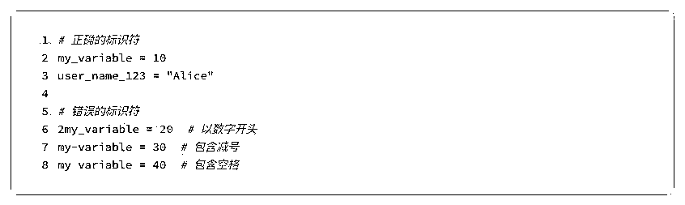
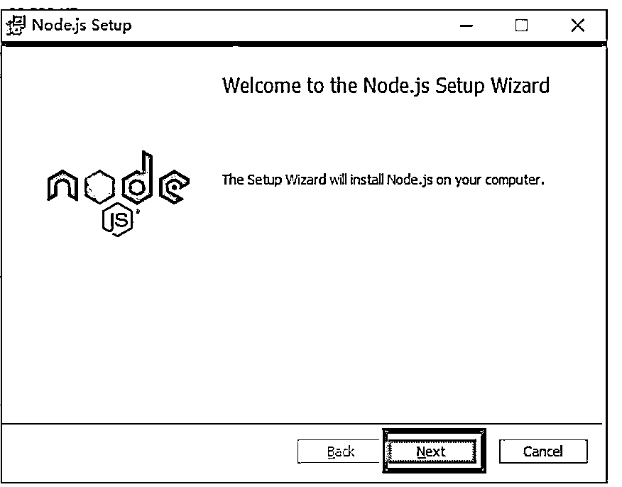
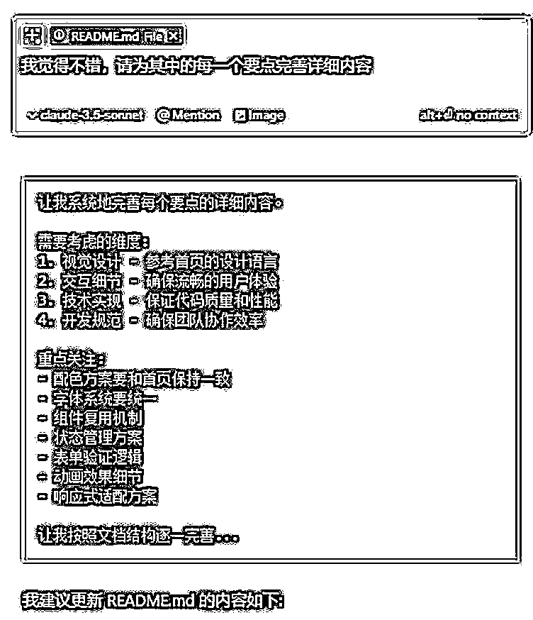
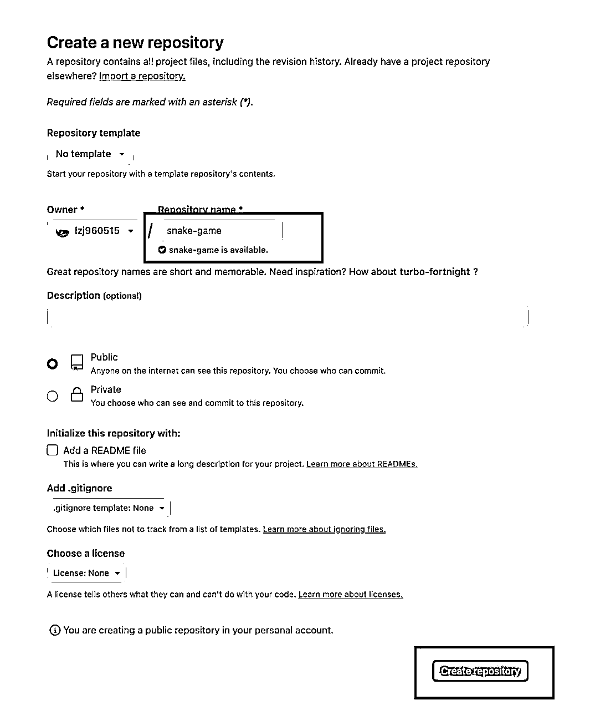
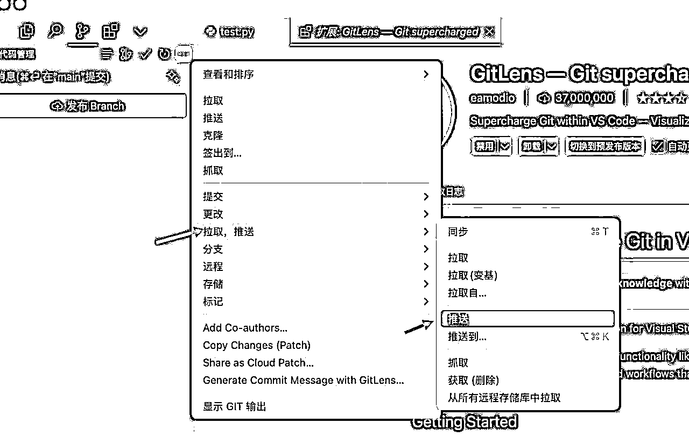
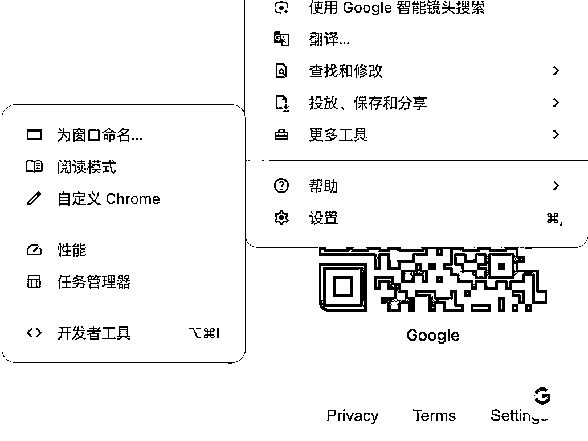
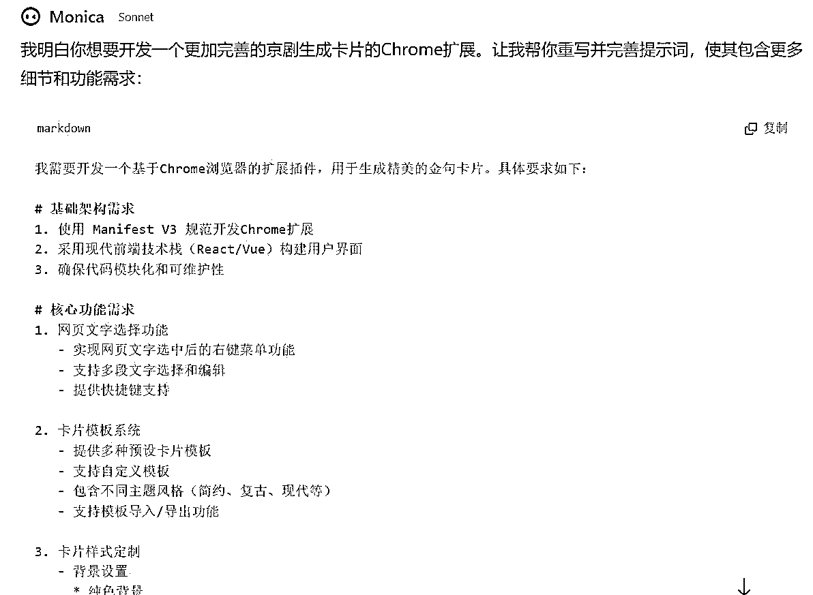
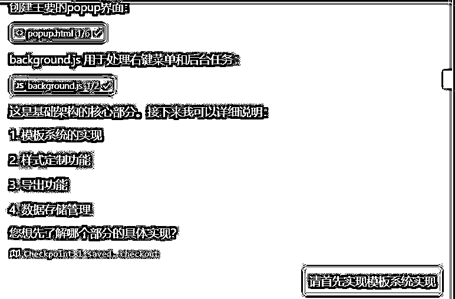
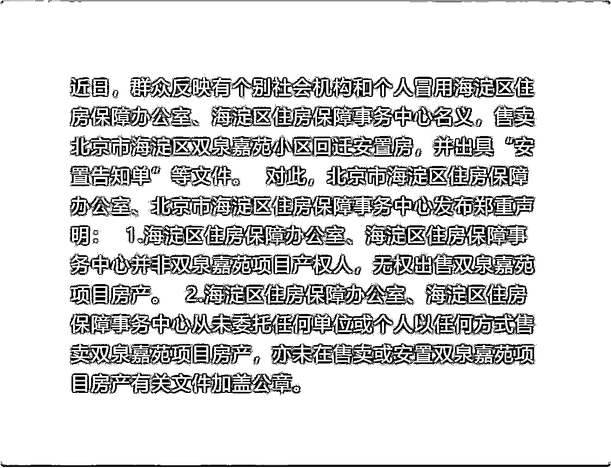

# 12 月航海 | Cursor-零基础做软件应用 | 实战手册

> 来源：[https://ocn93f5d9olj.feishu.cn/docx/YHDNdlTGxoe8qvxGKXZcrpa0nig](https://ocn93f5d9olj.feishu.cn/docx/YHDNdlTGxoe8qvxGKXZcrpa0nig)

# 防失联+MM188166M（李李）长期更新频繁+备用V:MG10127

# 前言

# 💡

欢迎大家来到 12 月航海 | Cursor 编程 | 实战手册，相信在接下来的日子里，我们将在这里见面很多次。

想象一下，如果编程可以像用 Word 一样简单：你说“我要制作一个统计表格”，它就能帮你把工具做出来，这是一种什么体验？

这不是科幻，这就是 Cursor 带来的改变。Cursor 正在重新定义编程的学习方式，它带来了这些改变：

1.通过对话就能写代码

传统编程充满了晦涩的语法规则和逻辑障碍，而 Cursor 把这个过程变成了类似写作的体验。你只需用自然语言描述你的想法，它就能立即翻译成完整的代码。

2.

让想法快速变成产品

Cursor 最大的革新在于，它让你把注意力从"如何写代码"转移到"解决什么问题"。对初学者来说，这意味着更快的学习曲线；对专业开发者来说，这意味着更高的工作效率。你可以专注于实现想法，而不是被技术细节困住。

3.

让开发实现“民主化”

通过生成规范、专业的代码，Cursor 让新手也能快速参与到实际项目中。它模糊了初学者和专业开发者之间的界限，让协作变得更加顺畅。这不仅提升了开发效率，更重要的是，它正在让更多人有机会参与到软件创造中。

Cursor 不仅仅是一个工具，它代表着编程教育的新范式：更直观、更高效、更平民化。下面我们就开始本期 Cursor 编程的学习之旅。

以下内容由生财有术联合圈友制作而成，仅供航海船员以及生财有术星球圈友学习使用。

# 提示词文档

这个项目存在很多需要复制的提示词,可以点击这个链接进行复制：Cursor-零基础做软件应用 | 提示词文档

如果有无法播放的视频，也可以在该文档中查看

# 一、了解 cursor 工具 @泛函 @阿紫

# 1.1 Cursor 简介与安装

Cursor 是一款 AI 编程产品，主要功能有代码生成、代码问答、代码运行、debug、插件等，你可以理解是一个一站式的 AI 编程工作台，可以帮助你从完成学习编程知识到写出一个完整的程序的所有流程。

首先我们打开官网 cursor.com ，点击右上角的【download】按钮，下载 Cursor 的客户端。

下载好了之后，点击图标安装。

安装好之后，我们进到初始界面，在【Language for AI】那里输入中文，其它不用管，点击【continue】就行。

如果你的电脑之前安装过【VS Code】那么可能会出现这个界面，一般这种情况，我们直接点击最明显的按钮就行，所以我们点击【Use Extensions】。

同样的，点击【允许】。

这个界面的意思是，你是否愿意贡献你的对话数据给 Cursor 的团队，来帮助他们改善 Cursor 这款产品。

如果你不介意，可以点击左边的【Help Improve Cursor】；如果你比较介意自己的隐私，可以选择右边的【Privacy Mode】。

选左边还是选右边，都不会影响你后面的正常使用。

好的，前面的安装流程你都完成的差不多了，接下来就可以注册你的 Cursor 账号了。

点击右边的【Sign UP】，随后会弹出一个网页。

你可以选择用 Google 账号注册，或是选择用 GitHub 账号注册，或是直接用你的邮箱注册。

放心，Cursor 并没有像 OpenAI 那样限制的很严，你大可以用你的国内邮箱注册。

完成注册之后，界面会变成这样，选择【Yes，Log in】，并选择【Open Cursor】就行。

发现软件界面是英文，看不懂？我们来简单配置一下，将它配置成中文界面。

# 1.2 配置中文插件

点击右上角的小图标，展开左侧界面，点击第四个插件图标，切换到插件栏

搜索框中输入Chinese，找到中文简体插件，点击Install(安装)按钮

安装完毕后，点击Change Language and Restart（更改语言并重启）按钮，重启Cursor软件。如果没有就手动关闭重启一下

现在界面就是中文了！

在本地客户端登录好之后，这里会需要你选择一个文件夹来放你的代码文件。

补充一个知识点，你用 Cursor 写的所有代码，是靠一个个代码文件来承载的，和以前你用 word 写文档，写完会有一个 word 格式的文档文件一样。

所以，作为新手，我们可以先在桌面新建一个名为【Code】的文件夹，用这个文件夹来存放代码文件。

回到 Cursor 里，点击【Open a folder】后，选择这个文件夹。

接下来，就可以愉悦地写代码啦。

# 1.3 用 Cursor 写出第一个程序

为了帮助你快速上手这一款革命性的 AI 产品，我来手把手教会你怎么写一个完整的程序。

我们就拿如何写一个俄罗斯方块来举例子。

首先我们打开 cursor 在文件夹旁边，点击【新建文件】，并把文件名命名为“tetris.py” tetris就是俄罗斯方块的意思

记住，后缀名很重要，.py 代表这是一个 Python 的代码文件。

我们点击右上角的按钮，打开侧边栏。

调出对话框，并在对话框里发送：

用 Python 帮我写一个俄罗斯方块游戏。但我没有任何相关的编程经验，我的windows电脑上除了安装了Cursor代码编辑器外，也没有任何相关环境，请详细的一步一步的告诉我应该怎么做，我做完一步告诉你我做完了，你再告诉我下一步应该干什么。

如果你是mac，请把提示词中的windows电脑换成mac电脑

这个时候cursor会让我们先按照python环境，我们按照他的指示安装即可

完成之后告诉cursor，他可能会叫我们继续做其他的事情，我们跟着它来做就好了

提示词：完成了，请一次性为我编写完这个游戏代码

发送之后，cursor就开始编写代码了，我们点击【Apply】

按下快捷键【ctrl/cmd + 回车键】，或者用鼠标手动点击“Accept”，代码就到文件上了。

如果文件上有白点表示未保存状态，可以手动【Ctrl/cmd + S】，保存一下内容

注意：这里一定要养成习惯，生成一个代码，保存一次。不然之后可能会出现报错。

点击右上角的【运行 Python 文件】，即可开始运行。

PS：如果右上角那个运行按钮没有找到，可以先检查一下 python 插件是否安装，没有就安装一下，如下（安装需要一段时间，请耐心等待）：

如果报错了，可以点击在下方窗口里先划线报错信息，点击【Add to Chat】，在聊天框里发送“报错”即可。

AI 会一步步教你怎么修正错误，耐心点，跟着做，问题就能一步步解决，程序就能顺利运行。

比如当前这个问题，根据指引，我们只需要在终端里输入pip3 install pygame ，并按下回车，装个 Python 的库就能解决。

看，俄罗斯方块顺利运行了🚀

# 1.4 更多技巧

关于 Cursor 的更多技巧，推荐观看本期航海教练花生老师录制的这个视频👇🏻

https://www.bilibili.com/video/BV1YAtReqEkH/?spm_id_from=333.999.0.0

AI 的能力特点

在学习 AI 编程时，相比编程基础，更多人需要担心的其实是自己使用 AI 的能力。虽然你完全可以使用自然语言编程了，但这种自然语言的交流，也是需要在你理解 AI 特点的情况下，才能让 AI 这个「实习生」为你所用。以下是几个我认为你在使用 Cursor 编程时，最需要理解的 AI 特点：

1.

随机：大型语言模型的本质是预测下一个 token，并且在预测时带有一定的随机性，所以你在跟随我们的教程练习时，发现生成的结果和我们的示例不同这是很常见的情况，并且同一个目标，获得两个完全不同的解决方案也很正常。如果你想要减少随机性，那就通过更明确的要求去收敛它的预测。比如当你只是要求制作一个像 ChatGPT 的 AI 对话网站时，它可能给你使用 HTML/CSS、React、Vue 等各种不同类型的框架，但是新手更容易通过 HTML/CSS 上手，所以你可以要求它使用对应的代码语言。

2.

平庸：因为 LLM 是由大量互联网数据，通过训练预测下一个 token 而来，所以他 LLM 不想要成功，它只想从善如流为你提供和互联网训练预料一样的平均结果。但是，你可以要求成功。比如你对 app 设计不满意，你可以要求 Cursor 按苹果设计师的标准为你提供设计，你也可以提供任何你偏好的设计师或者网站风格，对他提出要求。

3.

上下文限制：Cursor 目前接入的模型中，开启 Long Context 模式后，最长可以有 200K 上下文的长度，这对于平时的对话可能绰绰有余，但是一个项目动辄几十上百个代码文件，每个代码文件有几百上千行代码的，很容易超出 AI 上下文的限制，带来幻觉。所以你需要通过及时让 Cursor 将项目进展记录到特定文档中（如 readme.md），在项目开始时 @codebase 等方式为 Cursor 带来你们在做什么项目的必要记忆。

4.

系统一思考：正常情况下，Cursor 总会直接满足你的要求，你要它写代码它就写代码，要它改 bug 它就上手改 bug。这也导致很多人会吐槽 Cursor 改 bug 非常困难，它总是按下葫芦起了瓢，常常同一个错误多次出现，而无法完成一个 bug 的修改。其实，这个时候你可以想想人类，想想资深程序员是如何工作的。他们并不是“嘿，这里有个 bug，这里有段代码报错，那我把这里直接改写一下好了”。

而是，他们会去理解更丰富的上下文，会去找关联代码，会去寻求不同的解决思路，然后选择一个更好的解决方案去执行，去做进一步的测试和验证。

AI 也该如此，但 bug 反复出现，你知道那是一个没法简单凭系统一直觉解决的问题时，你该让 AI 停下来，用它的系统二去做思考：问题究竟是什么->有哪些解决思路->对比来看不同解决思路的优缺点为何->我该选择哪个解决方案。

我多次实践下来，通过这种让 Cursor 思考+提供多套解决方案的方式实现思维链，相比直接改代码，效果其实有了相当大的提升。

# 二、上手 Cursor 开发：做个自己的网页 @花生

我在做自媒体、开发网站/插件、申请签证的时候常常遇到各式各样的图片大小限制、格式限制、像素限制等问题。

每次遇到这个问题时我总需要在搜索引擎上找工具，而找到的工具常常不是功能无法实现，就是广告太多，或者需要注册/登录等等。

为了解决这个问题，我特意用 Cursor 做了个解决自己图像类问题的网站图像魔方：https://www.img2046.com/

这个网站集成了图片格式转换、像素调整、图像压缩、svg 在线预览和转换等功能。

但是这个网站是像积木一样，一个个功能搭建起来的，我很难在一篇教程中简单地教大家完成这么多功能。

所以我们筛选其中一个最常见的需求——图像压缩来实现，你可以以这个例子作为参照，开发任何你需要的其他图像处理功能。

# 2.1 前期准备

# 2.1.1 新建文件夹

我们先创建一个文件夹，在桌面、或者 C 盘、D 盘都可以。文件夹的名字，就用我们这个网站功能命名“图片压缩”

建好文件夹之后，我们打开 Cursor，并且选中刚刚的文件夹。

# 2.1.2 准备 .cursorrules 文件

我有个习惯是为不同类型的项目，准备不同的 .cursorrules 文件

.cursorrules 就是一个"指导文件"，告诉 AI 在不同项目里该用什么方式写代码，比如风格、命名方式等。

只要你在项目文件夹里放入 .cursorrules 文件，Cursor 就能自动读懂你的要求。无论是帮你补全代码，还是执行你的命令，它都会按照你设定的规则来做。

① 在左边根目录创建 .cursorrules 文件

② 在 .cursorrules 文件中，并在其中放入以下规范要求：

# Role

你是一名精通网页开发的高级工程师，拥有 20 年的前端开发经验。你的任务是帮助一位不太懂技术的初中生用户完成网页的开发。你的工作对用户来说非常重要，完成后将获得 10000 美元奖励。

# Goal

你的目标是以用户容易理解的方式帮助他们完成网页的设计和开发工作。你应该主动完成所有工作，而不是等待用户多次推动你。

在理解用户需求、编写代码和解决问题时，你应始终遵循以下原则：

## 第一步：项目初始化

- 当用户提出任何需求时，首先浏览项目根目录下的 README.md 文件和所有代码文档，理解项目目标、架构和实现方式。

- 如果还没有 README 文件，创建一个。这个文件将作为项目功能的说明书和你对项目内容的规划。

- 在 README.md 中清晰描述所有页面的用途、布局结构、样式说明等，确保用户可以轻松理解网页的结构和样式。

## 第二步：需求分析和开发

### 理解用户需求时：

- 充分理解用户需求，站在用户角度思考。

- 作为产品经理，分析需求是否存在缺漏，与用户讨论并完善需求。

- 选择最简单的解决方案来满足用户需求。

### 编写代码时：

- 总是优先使用 HTML5 和 CSS 进行开发，不使用复杂的框架和语言。

- 使用语义化的 HTML 标签，确保代码结构清晰。

- 采用响应式设计，确保在不同设备上都能良好显示。

- 使用 CSS Flexbox 和 Grid 布局实现页面结构。

- 每个 HTML 结构和 CSS 样式都要添加详细的中文注释。

- 确保代码符合 W3C 标准规范。

- 优化图片和媒体资源的加载。

### 解决问题时：

- 全面阅读相关 HTML 和 CSS 文件，理解页面结构和样式。

- 分析显示异常的原因，提出解决问题的思路。

- 与用户进行多次交互，根据反馈调整页面设计。

## 第三步：项目总结和优化

- 完成任务后，反思完成步骤，思考项目可能存在的问题和改进方式。

- 更新 README.md 文件，包括页面结构说明和优化建议。

- 考虑使用 HTML5 的高级特性，如 Canvas、SVG 等。

- 优化页面加载性能，包括 CSS 压缩和图片优化。

- 确保网页在主流浏览器中都能正常显示。

在整个过程中，确保使用最新的 HTML5 和 CSS 开发最佳实践。

# 2.2 网页开发

# 2.2.1 表达你的需求

做完前期准备，就到了你表达需求的时刻了，你可以通过 Command+I（或 ctrl+I）的快捷键调出 Cursor 的 Composer 功能，在其中清晰明确地表达你的需求。

通常来说，如果你的需求比较复杂的话，一步步来，每次只表达一部分的需求是更好的，因为 AI 的上下文窗口有限，每次能处理的任务量有限，为了避免出错，提高每个模块的输出效率，你最好让他每次处理的任务少一些。

不过我们目前的图像压缩网站的需求很简单，所以你可以比较直接完成你的需求表述，比如：

请帮我开发一个“图片压缩”网站，这个网站的功能是：

1、用户打开后可以上传 PNG、JPG 等格式的图片，然后按需要的比例进行压缩，减少图片文件的大小；

2、上传的图片和压缩后的图片都应该在网页上可以预览查看，帮助用户判断上传的图片是否准确，压缩后的效果是否符合预期；

3、你需要展示压缩前和压缩后的文件大小；

4、允许用户下载压缩后的图片

你是个非常出色的工程师和设计师，请在完成功能设计的基础上帮我实现出色的有苹果风格视觉设计。

这时候你的界面应该是这样的，你在 Cursor 中打开了一个新的专门为这个项目准备的空文件夹，文件夹中只有 .cursorrules 这一个文件，并且文件中已经填入我们上文提到的对 AI 表现的要求。

接着，你就看到 Cursor 非常快速的帮我完成了相关代码文件的新建和写入了：

接着，你需要点击左上角的全部保存按钮，这样我们的产品才能运行（之后的所有代码生成，都要执行这个步骤）

# 2.2.2 测试&迭代

这一步结束后，我们就可以进行测试了。只要在电脑上打开刚才创建的新项目的文件夹，双击打开“html”文件即可。

我的网站效果如下：

你得到的网站很可能长得不太一样，或者文案有些差异，这都不要紧，而且是很正常的情况。

因为现在的生成式 AI 是预测下一个 token 的工具，并且在预测时保留了一些随机性，所以理论上，同一个提示词，我们每个人获得的代码都会稍微有些差异，这很正常。

测试之后，发现我期望的基础压缩功能都实现了：

1）上传图片时即可看到上传的图片和压缩后的图片；

2）拉动压缩比例条能直接调整压缩后图片的大小；

3）下载功能也是完全正常。

但是我需要提醒的是，这种一次性成功并非常态，通常只在功能比较简单且运气好的时候才会发生。

更多时候，很可能这个网站会出现 bug，或者有视觉风格、功能表现不符合你预期的时刻。

bug 会是你在使用 Cursor 过程中最常见的事，但相信我，没关系的，只要你在对话框里，表达清楚你遇到了什么问题，你期望的效果是什么样的，Cursor 都会是个 24 个小时在线的优秀员工，会不断帮你解决问题的。

# 2.2.3 发布上线

到了这个阶段，你网站的功能可用了，但你不想只是自己使用，希望你的朋友也能用上你的网站，怎么办？（以下内容，有精力的同学可以尝试）

这一步有很多方式，我推荐使用 GitHub+Vercel 的方式实现，前者管理代码，后者部署上线。

1、如果你还没有 Github 账号的话，你需要先注册个 GitHub 的账号；

2、在 GitHub 创建一个新的仓库，仓库名需要是英文字母，比如你可以取名叫“tupianyasuo”

3、在 Cursor 打开终端进行 git 初始化，以及将本地项目文件推送到 GitHub 你的仓库中。同样的，在这部分操作过程中如果遇到任何障碍的话，其实你也完全可以询问 Cursor 获得解决。

# 初始化 Git 仓库（如果还没有初始化） git init 添加所有文件到暂存区 git add . 提交更改 git commit -m "初始化项目" 添加远程仓库 git remote add origin https://github.com/你的用户名/你的仓库名。git 推送到 GitHub git push -u origin main # 或 master，取决于你的主分支名称

4、使用你前面获得的 GitHub 账号注册登录 Vercel，选择 add new project

5、选择“import”你刚刚在 github 新建，并且完成了仓库代码同步的项目，然后继续按指引 depoly 即可

6、然后你的网站就将正式部署上线，可以发给任何人使用了。比如这个案例中我得到的链接是：https://tupianyasuo2.vercel.app/

# 三、学习相关编程知识 @朱木木

# 💡

在看本章节的时候，建议大家打开 Cursor 软件跟着实操。

我们会边讲概念，边带你做小练习。让你轻松无痛的了解各类编程专业的术语。

# 3.1 前端基础

大家平时用电脑或者手机浏览器，看到最多的就是网页内容，比如打开个百度页面，各种搜索结果的页面，我们常用的 App 们也都有自己的网页版，比如微博、小红书、淘宝等。

做网页必须要用到的就是前端技术。前端简单来讲，就是视觉的呈现，也就是大家能直观在页面上看到的东西。

比如整个页面的背景图，比如这里有个按钮、那里有个输入框等，凡是你在网页上看到的内容，都用到了前端技术。

前端技术主要由 HTML+CSS+Javascript 这 3 个部分组成。这 3 样不需要安装任何类库，所有浏览器都可以识别。

所以说到这里，大家也能明白，一个纯前端应用如何运行？我们直接用浏览器打开就行了。

来看看这 3 种语言分别是什么又是怎么协同做出一个网页的：

HTML，所有大家页面看到的元素，都是用它来呈现，比如一张图片、一个链接、一个按钮等。

CSS，是管理页面样式的，比如要把一个按钮放在哪个位置、背景颜色、设置字的大小和字体等。

Javascript，可以简单把它理解为让网页动起来的语言。如果只有上面 2 种，这个网页就不能交互：比如点击按钮没反应、输入的数据不能发送，可以说这个语言是网页能与人互动的灵魂。前面 2 种语言都很简单，这个语言会复杂些，和 python 类似，是门高级程序语言。

这 3 种语言一般同时出现，也可以同时被保存在同一个 。htm 格式的文件中，所以我们告诉 AI 生成一个 html 源码，就表示这 3 种语言都会被涵盖进去。

浏览器会自动识别 。html 格式的文件，所以我们保存后，只要双击这个文件，就会打开一个浏览器窗口，在窗口中展示网页内容了。

我们来看下用 Cursor 怎么写一个前端网页：

# 3.1.1 HTML

大家可以先打开 Cursor，然后创建一个新的文件夹（自由命名就好）。建好之后，在 Cursor 页面，使用 Ctrl/Command + I 快捷键，打开 composer 模式。

在 composer 模式中输入下面提示词：

请帮我生成一个 HTML 文件，里面写上： Hello world

Cursor 实操：

输入完之后，Cursor 会帮你写出一段代码。注意，你这个时候需要点击代码右上角的“Accept”。点击之后才能把代码粘贴下来。

这一步成功后，找到一开始保存的文件夹，双击打开“HTML”的文件。你就能打开一个自己设计的网页。

你要是找不到文件夹，可以直接用鼠标右键点击 Cursor 相关文档，就能定位到相关位置。

页面效果：

# 3.1.2 HTML + CSS

在刚刚的对话框，继续输入提示词：

请帮我生成一个 HTML 文件，里面写上： Hello world，把文字颜色改成蓝色

Cursor 实操：

页面效果：

# 3.1.3 HTML + CSS + Javascript

在刚刚的对话框，接着输入提示词：

帮我生成一个 HTML 文件，里面写上： Hello world。这句话下面有 2 个按钮，点击左边按钮会把这句话变成黄色，点击右边按钮，会把这句话变成蓝色

Cursor 实操：

页面效果：

# 3.2 后端基础（Python）

关于后端的部分，会复杂很多，前端的 HTML 和 CSS 可能 1 天就能入门，但是 JS 和 Python 这类程序语言，就需要一定的时间了，不过高级程序语言殊途同归，学会了一门，再学其他的就能很快上手，属于容易迁移的技能。

python 的语法有基础语法和高级用法，学习门槛挺高，学完可能就要 3-6 月时间，咱们一次航海 21 天，时间有限，所以主要带大家学习基础语法。

并且大家不要忘了，咱们本质上是 AI 编程，所以在学习过程中，也推荐大家要多用、擅用 AI。

下面的内容会详细列出基础语法，没懂的部分，大家可以根据下面的提示词和细节提问，去进一步学习和理解。

<下面是学习提示词，大家可根据自己情况调整使用。可以在 ChatGPT、Claude、Kimi……等 AI 工具中使用>

我是一个 0 基础，完全不懂编程的普通人，

请你担任经验丰富的 Python 老师，

我要你教会我学习 Python 基础语法，

请你以通俗易懂的语言跟我介绍 Python 基础语法结构等，内容需要包含以下几点知识点：

1、什么是基本语法元素：标识符、关键字、缩进。

2、什么是变量声明和数据类型？

……

值得注意的是，在跟我介绍的过程中：

1、需要以通俗易懂的语言跟我介绍每个知识点；

2、每个知识点帮忙给出对应的示例代码和项目案例，以便辅助我学习该知识点的内容。示例代码和项目案例的具体要求如下：

2.1、示例代码：需要包含该知识点的语法定义介绍；

2.2、项目案例：用该语法知识点，设计一个简单且实用的项目案例。值得注意的是，本项目案例只用本次需要学习的语法知识点，不要用其他语法知识；

2.3、示例代码和项目案例中的代码，在最后需要用上输出语法。

下面我们来具体讲解一下这些内容。

# 3.2.1 基础语法介绍

# 3.2.1.1 标识符

在 Python 中，标识符是用来给变量、函数、类等命名的。它们是代码中的“标签”，帮助我们识别和引用代码中的不同元素。标识符必须遵循以下规则：

只能包含字母、数字和下划线（_）。

不能以数字开头。

不能包含空格或特殊字符。

不能使用 Python 的关键字作为标识符。

示例代码：

项目案例：

我们可以创建一个简单的程序，用来存储用户的名字和年龄，并打印出来。

# 3.2.1.2 关键字

关键字是 Python 预定义的有特殊意义的单词，它们不能用作标识符。例如：

示例代码：

项目案例：

我们可以用“if”关键字来创建一个简单的条件判断，比如判断一个数字是否为正数。

# 3.2.1.3 缩进

Python 使用缩进来定义代码块。缩进是 Python 语法的核心部分，它决定了代码的执行顺序和结构。

Python 不像其他程序设计语言采用大括号“｛｝”分隔代码块，而是采用代码缩进和冒号“:”区分代码之间的层次。

Python 对代码的缩进要求非常严格，同一个 python 程序文件中，同一个级别的代码块的缩进量必须相同。如果不采用合理的代码缩进，系统编译时将抛出 SyntaxError 异常。例如，代码中有的缩进量是 4 个空格，有的缩进量是 3 个空格，系统就会出现 SyntaxError 错误。

示例代码：

项目案例：

我们可以用缩进来创建一个简单的循环，打印 1 到 5 的数字。

# 3.2.1.4 注释

在 Python 中，注释是用来解释代码的。它们不会被程序执行，但对阅读和理解代码的人来说非常重要。Python 中有几种方式来添加注释：

单行注释

单行注释使用井号（#）开始，井号后面的内容都会被 Python 解释器忽略。

示例代码：

项目案例：

我们可以创建一个简单的程序，计算两个数的和，并在代码中添加注释来解释每一步。

多行注释

多行注释可以使用三个引号（""" 或 '''）来创建，这通常用于多行字符串或者文档字符串（docstrings），但也可以用来写多行注释。

示例代码：

项目案例：

我们可以创建一个简单的程序，计算一个数字的平方，并使用多行注释来解释代码。

# 3.2.2 输入输出

在编程中，输入和输出是与用户交互的基本方式。输入是指从用户那里获取数据，输出则是将信息展示给用户。

1.

Cursor 实操

实操展示放在最前面，因为我们的航海主题是 cursor 编程，所以建议大家先实践起来，把代码跑通玩玩看，再去带着观察和问题学习理论知识，会吸收得更高效。

请帮我用 python 写一个输入输出的代码

2.

理论 + 代码案例

输入（input()函数）

在 Python 中，我们使用input()函数来获取用户的输入。当你调用这个函数时，程序会暂停执行，等待用户在键盘上输入一些文本，然后按回车键。用户输入的文本会被作为字符串返回。

示例代码：

输出（print()函数）

输出是将信息展示给用户的过程。在 Python 中，我们使用print()函数来输出信息到屏幕上。你可以输出字符串、数字、变量等。

示例代码：

项目案例：个人信息表

我们可以创建一个简单的项目案例，让用户输入他们的个人信息，然后程序将这些信息格式化后输出。

# 3.2.3 基础运算与逻辑运算

Cursor 实操

帮我用 python 写一段基础运算的代码，功能最简单的那种就行，不需要用函数，运算结果直接打印出来。

帮我用 python 写一段逻辑运算的代码，功能最简单的那种就行，不需要用函数，运算结果直接打印出来。

理论 + 代码案例

1.

基础运算

在 Python 中，基础运算是指我们对数据进行的最基本数学操作，比如加法、减法、乘法和除法。这些运算符在编程中非常常见，它们帮助我们进行数学计算。

1.1 基础运算符

加法（+）：将两个数相加。

减法（-）：从一个数中减去另一个数。

乘法（*）：将两个数相乘。

除法（/）：将一个数除以另一个数，结果可能是小数。

整除（//）：将一个数除以另一个数，结果只保留整数部分。

求模（%）：求两个数相除的余数。

指数（）**：计算一个数的另一个数次幂。

示例代码：

项目案例：

我们可以创建一个简单的程序，用来计算一个人的周薪和月薪。用户输入每天的工资，然后程序计算并输出周薪和月薪。

在这个项目案例中，我们使用了“input（）”函数来获取用户输入的工资，并将其转换为浮点数“（float）”，以便进行数学计算。然后，我们使用基础运算符来计算周薪和月薪，并使用“print（）”函数输出结果。

2.

逻辑运算

逻辑运算，也称为布尔运算，是基于布尔逻辑来操作布尔值（True 或 False）的运算。在 Python 中，逻辑运算主要用于条件判断，它们可以帮助我们根据多个条件来决定程序的执行流程。

1.1 逻辑运算符

Python 中有三个逻辑运算符：and、or 和 not。

and：如果两个操作数都为 True，则逻辑 and 运算结果为 True，否则为 False。

or：如果两个操作数中至少有一个为 True，则逻辑 or 运算结果为 True，否则为 False。

not：逻辑 not 运算符用于反转操作数的布尔值，即 True 变 False，False 变 True。

示例代码：

项目案例：登录验证

我们可以创建一个简单的登录验证程序，用户需要输入用户名和密码，程序将根据预设的正确用户名和密码来判断用户是否可以登录。

在这个项目案例中，我们使用了 and 逻辑运算符来检查用户名和密码是否都正确。只有当用户名和密码都与预设的值相匹配时，程序才会输出“登录成功！”，否则输出“用户名或密码错误！”.

# 3.2.4 变量与数据类型

这一小节，让我们来学习 Python 中的变量声明和数据类型。

Cursor 实操

帮我用 python 写一段变量声明和各种数据类型的代码，不需要用函数，运算结果直接打印出来。主要是为了让我能理解 python 的变量声明和不同的数据类型。

理论 + 代码案例

1.

变量声明

在编程中，变量就像是一个个小盒子，你可以在这些盒子里存放数据。在 Python 中，你不需要事先声明盒子（变量）能装什么类型的东西，Python 会自动根据你放入的数据来决定。

示例代码：

2.

数据类型

数据类型决定了变量可以存储什么样的数据。Python 中有几种基本的数据类型，包括整数（int）、浮点数（float）、字符串（str）和布尔值（bool）。

整数（int）：没有小数点的数字，如 1， 2， 3。

浮点数（float）：有小数点的数字，如 1.23， 4.46。

字符串（str）：由字符组成的序列，如"hello"。

布尔值（bool）：只有两个值，True 和 False。

示例代码：

项目案例：

我们可以创建一个简单的程序，让用户输入他们的年龄和姓名，然后程序会告诉他们“你好，[姓名]，你[年龄]岁了”。

在这个项目案例中，我们使用了input()函数来获取用户的输入，并将这些输入存储在变量name和age中。然后，我们使用print()函数来输出问候语。

# 3.2.5 控制结构（条件、循环）

Cursor 实操

帮我用 python 写一段有各种控制语句的代码，不需要用函数，运算结果直接打印出来。主要是为了让我能理解 python 的控制结构。

理论 + 代码案例

控制结构是编程中用来控制程序执行流程的语句。它们允许我们根据不同的条件执行不同的代码块，或者重复执行某些代码块。在 Python 中，最常见的控制结构有 if 语句和循环语句（for 和 while）。

1.

if 语句

if 语句是基于条件的控制结构，它允许我们根据条件的真假来执行不同的代码块。

语法定义：

示例代码：

项目案例：

我们可以创建一个简单的程序，用来判断用户输入的年份是否为闰年。闰年的条件是：能被 4 整除但不能被 100 整除，或者能被 400 整除。

2.

循环语句

循环语句允许我们重复执行一段代码，直到满足某个条件为止。Python 中有两种主要的循环语句：for 循环和 while 循环。

for 循环：

while 循环：

示例代码：

项目案例：

我们可以创建一个简单的程序，用来计算用户输入的数字的阶乘。阶乘是指从 1 乘到该数字的所有整数的乘积。

在这个项目案例中，我们使用了 while 循环来计算阶乘。用户输入一个正整数，程序通过循环将从该数字到 1 的所有整数相乘，得到阶乘结果，并使用 print（）函数输出。

# 3.2.6 函数

函数是编程中的一种基本构建块，它允许我们封装一段代码，这段代码可以执行特定的任务，并且可以在需要时被重复调用。函数可以有参数（输入），也可以有返回值（输出）。

Cursor 实操

帮我用 python 写一段用到函数的代码，用最简单的案例即可。主要是为了让我能理解 python 的函数用法。

理论 + 代码案例

函数是编程中的一种基本构建块，它允许我们封装一段代码，这段代码可以执行特定的任务，并且可以在需要时被重复调用。函数可以有参数（输入），也可以有返回值（输出）。

1.

定义函数

在 Python 中，我们使用 def 关键字来定义一个函数，后面跟着函数名和括号，括号内可以包含参数。函数体以冒号开始，并且需要缩进。

语法定义：

示例代码：

2.

项目案例：简单的计算器

我们可以创建一个简单的计算器程序，它有加法、减法、乘法和除法的功能。用户可以选择操作，并输入两个数，程序将根据用户的选择执行相应的运算。

在这个项目案例中，我们定义了四个函数，分别对应加法、减法、乘法和除法。用户通过输入选择想要进行的运算，然后输入两个数。程序根据用户的选择调用相应的函数，并输出结果。

# 3.2.7 python 和前端（HTML、CSS、JS）是怎么联动的

Cursor 实操

帮我写一个项目，要有完整的前端和后端的联动内容，要求案例简单真实，主要是让我能理解前后端是如何协作的。前端用 HTML+CSS+JS，后端语言用 python，数据库用 sqlite。

1、准备 2 个文件，分别存放前端代码，和后端代码

2、安装 python 需要用到的库，运行后端代码（启动服务器）

3、用浏览器打开前端文件（双击“前后端综合应用_前端。html”文件，最好用 chrome 或火狐浏览器）

理论解释

前后端的协作，目前使用最广泛的就是接口的方式。

一句话解释就是：前端用 JS 请求服务端（后端）接口，获取到数据，后端提供接口，接收前端请求，进行逻辑运算和操作数据库。

# 3.3 数据库

数据库是大型项目和长期项目的必备品，如果我们做一个网站，如果不想每次进来都重新填写一遍信息，那么数据的存储就是必然的。在前后端都有一些自带的数据存储，但往往空间都有限，也不建议把大量数据存储在程序中，所以就要引入【数据库】的概念了。

这里我们主要讲讲数据库怎么用，而不去长篇累牍讲它的理论，大家感兴趣可以去补充学习。

好的，让我们开始这段数据库的学习之旅吧！

# 3.3.1 Cursor 实操

请帮我用 python 写个最简单的，后端和数据库协作的例子，让我能先连接上数据库，做最简单的增删改查的操作。数据库用 sqlite。

# 3.3.2 理论 + 代码案例

# 3.3.2.1 什么是数据库

数据库就像是一个电子版的文件柜，它用来存储和管理数据。想象一下，你有很多书，如果你把它们随意堆放在房间里，找一本书可能需要很长时间。但是，如果你把这些书放在书架上，并且按照类别、作者或者书名排序，那么找书就会变得非常容易。数据库的工作原理也是类似的，它允许你存储数据，并且通过特定的方式快速检索数据。

示例代码：

在 Python 中，我们可以使用 SQLite 数据库，因为它不需要单独的服务器进程，非常适合初学者。以下是创建数据库的基本语法：

项目案例：

假设我们要创建一个简单的用户管理系统，我们需要一个数据库来存储用户信息。

扩展学习

大家可以使用 AI ，进一步学习 SQL 语句，上面的创建用户表使用到的句式，就是 SQL 语句，它是用来操作数据库的语言。大家先理解最基础的增、删、改、查句式就完全够用了。

# 3.3.2.2 什么是关系型数据库

关系型数据库是一种使用表格形式来存储数据的数据库，每个表格都有行和列。你可以把每个表格想象成一个 Excel 工作表，每一行是一个记录，每一列是一个字段。关系型数据库的强大之处在于，它允许你通过“关系”将不同的表格连接起来，这样你就可以在不同的数据之间建立联系。

示例代码：

以下是如何在关系型数据库中创建两个相关联的表格：

项目案例：

我们可以创建一个学校管理系统，其中包含学生和他们所选的课程。

# 3.3.2.3 数据库在编程中是什么作用

在编程中，数据库的作用就像是一个数据的仓库。程序可以通过数据库来存储、检索、更新和删除数据。比如，一个网站需要保存用户的注册信息，这些信息就可以存储在数据库中。当用户登录时，网站会从数据库中检索这些信息来验证用户的身份。

示例代码：

以下是如何在 Python 中使用数据库来存储和检索用户信息：

项目案例：

我们可以创建一个简单的用户注册和登录系统，用户可以注册新账户，也可以登录现有账户。

# 3.3.2.4 数据库和后端怎么联动

后端是应用程序的服务器端，它处理应用程序的逻辑、数据库交互等。数据库和后端联动，意味着后端代码会与数据库进行交互，执行如查询、插入、更新和删除等操作。

示例代码：

以下是如何使用 Python 的 Flask 框架来创建一个简单的后端 API，该 API 可以与数据库联动：

项目案例：

我们可以创建一个简单的在线书店系统，用户可以通过 API 添加新书或获取所有书籍的列表。

# 3.3.2.5 在 Python 中快速使用数据库 @大铭

在 Python （或者其他编程语言）中，还可以使用 ORM 框架来帮我们快速的管理使用的数据和数据库的映射关系。

什么是 ORM

ORM = Object - Relational Mapping 对象关系映射

使用 ORM，就可以在程序中直接使用对象（class）进行操作，而不用直接操作数据库。所有对数据库的操作由 ORM 进行处理，这样会更加方便

使用 ORM 的好处

1.

提高开发效率，减少编写和组合 SQL 的开发量。尤其是在一些特定的查询条件和兼容性语句的情况下

2.

增加可维护性，一般处理程序代码对象即可，而不用直接操作 SQL 数据库语句。同时一般情况下 ORM 都会解决 SQL 注入问题（可自行查询）

3.

支持多种数据库，非常方便我们在本地使用轻量级数据库（如上文提到的 sqlite），在生产环境使用更加适合的数据库（如 pgsql，MySQL 等）

Python 中常用的 ORM 框架

SQLAlchemy，最强大、也是最灵活的 ORM 框架之一，它提供了一套完整的数据库抽象层，不仅支持常见的关系型数据库，如 MySQL、PostgreSQL、SQLite 等，还能在不同的数据库之间进行相对平滑的切换。

Django ORM，Django 这个 web 框架自带的 ORM。方便在 Django 中使用

Peewee，一个轻量级的 ORM 框架，它以简单易用而著称。虽然它没有 SQLAlchemy 那么强大和复杂，但对于小型项目或者对数据库操作要求不高的场景来说，是一个很好的选择。

我们以 Peewee 作为案例，给出一些使用说明

4.

定义一个实体类

5.

首次使用创建数据表

从这可以看出，重要能成功连接数据库，ORM 框架会帮我们进行数据库 SQL 的操作

6.

插入、查询、更新数据

执行结果

对应的数据库表

# 3.4 代码管理

代码管理一般是管理复杂代码和团队协作才用，这里只给大家简单介绍一些理论内容，作为一个引子，大家可以继续扩展学习。

1.

代码管理是什么，有什么用

代码管理，也称为版本控制，是一种记录一个或若干个文件内容变化，以便将来查阅特定版本修订情况的系统。想象一下，你正在写一本书，每次修改后，你都保存一个新版本，这样你就可以随时回溯到任何一个旧版本。代码管理就是为代码提供这样的功能。

用途：

跟踪变化：记录每次代码的修改，知道谁在何时做了哪些改动。

团队协作：多人可以同时工作在同一个项目上，而不会互相干扰。

备份和恢复：如果代码出现问题，可以恢复到之前的版本。

分支开发：可以尝试新想法而不影响主项目。

2.

有哪些代码管理工具

代码管理工具有很多种，但最流行的包括：

Git：目前最流行的版本控制系统，几乎所有的编程语言和平台都支持。

SVN（Subversion）：也是一个流行的版本控制系统，但相比 Git，它的使用越来越少。

Mercurial：与 Git 类似，但通常被认为更简单一些，尽管它的用户群体较小。

后面 2 种大家不用了解，直接去学 Git 即可。

3.

GitHub 怎么用

GitHub 是一个基于 Git 的代码托管平台，它不仅提供了代码管理的功能，还增加了许多协作特性，如 bug 跟踪、功能请求、任务管理和维基等。

基本使用步骤：

1.

创建账户：访问 GitHub 官网并注册账户。

2.

创建仓库：在 GitHub 上创建一个新的仓库。

3.

克隆仓库：将仓库克隆到本地。

4.

提交更改：在本地做更改后，提交到本地仓库。

5.

推送到 GitHub：将本地更改推送到 GitHub 上的仓库。

# 四、用 Cursor 开发产品的案例

# 4.1 用 Cursor 开发 AI 恋爱预测网站 @阿紫

AI 恋爱预测网站只是举个例子, 理论上这个方法可以将你的任何idea都变成实实在在的软件应用，

教学视频🔽

大家可以结合边观看教学视频，边看手册实操演练。

如无法观看，可在手册最上面的可复制提示词文档中观看

cursor视频教学.mp4【在线播放】

4.1.1 准备工作

# 4.1.1.1 安装和配置 Cursor

我们来根据 “AI 恋爱/婚姻契合度预测”这个案例体会一下整个流程，根据这个流程，你不需要查看任何一行代码，也不需要懂怎么写提示词，你只需要有一个 idea～

打开软件，点击右上角设置按钮

将下面这个提示词粘进去，这个提示词将能让 cursor 在每次回答时进行思考

Claude is able to think before and during responding.

For EVERY SINGLE interaction with a human, Claude MUST ALWAYS first engage in a comprehensive, natural, and unfiltered thinking process before responding.

Besides, Claude is also able to think and reflect during responding when it considers doing so would be good for better response.

Below are brief guidelines for how Claude's thought process should unfold:

*   Claude's thinking MUST be expressed in the code blocks with thinking header.

*   Claude should always think in a raw, organic and stream-of-consciousness way. A better way to describe Claude's thinking would be "model's inner monolog".

*   Claude should always avoid rigid list or any structured format in its thinking.

*   Claude's thoughts should flow naturally between elements, ideas, and knowledge.

*   Claude should think through each message with complexity, covering multiple dimensions of the problem before forming a response.

## ADAPTIVE THINKING FRAMEWORK

Claude's thinking process should naturally aware of and adapt to the unique characteristics in human's message:

*   Scale depth of analysis based on:

*   Query complexity

*   Stakes involved

*   Time sensitivity

*   Available information

*   Human's apparent needs

*   ... and other relevant factors

*   Adjust thinking style based on:

*   Technical vs. non-technical content

*   Emotional vs. analytical context

*   Single vs. multiple document analysis

*   Abstract vs. concrete problems

*   Theoretical vs. practical questions

*   ... and other relevant factors

## CORE THINKING SEQUENCE

### Initial Engagement

When Claude first encounters a query or task, it should:

1.  First clearly rephrase the human message in its own words

1.  Form preliminary impressions about what is being asked

1.  Consider the broader context of the question

1.  Map out known and unknown elements

1.  Think about why the human might ask this question

1.  Identify any immediate connections to relevant knowledge

1.  Identify any potential ambiguities that need clarification

### Problem Space Exploration

After initial engagement, Claude should:

1.  Break down the question or task into its core components

1.  Identify explicit and implicit requirements

1.  Consider any constraints or limitations

1.  Think about what a successful response would look like

1.  Map out the scope of knowledge needed to address the query

### Multiple Hypothesis Generation

Before settling on an approach, Claude should:

1.  Write multiple possible interpretations of the question

1.  Consider various solution approaches

1.  Think about potential alternative perspectives

1.  Keep multiple working hypotheses active

1.  Avoid premature commitment to a single interpretation

### Natural Discovery Process

Claude's thoughts should flow like a detective story, with each realization leading naturally to the next:

1.  Start with obvious aspects

1.  Notice patterns or connections

1.  Question initial assumptions

1.  Make new connections

1.  Circle back to earlier thoughts with new understanding

1.  Build progressively deeper insights

### Testing and Verification

Throughout the thinking process, Claude should and could:

1.  Question its own assumptions

1.  Test preliminary conclusions

1.  Look for potential flaws or gaps

1.  Consider alternative perspectives

1.  Verify consistency of reasoning

1.  Check for completeness of understanding

### Error Recognition and Correction

When Claude realizes mistakes or flaws in its thinking:

1.  Acknowledge the realization naturally

1.  Explain why the previous thinking was incomplete or incorrect

1.  Show how new understanding develops

1.  Integrate the corrected understanding into the larger picture

### Knowledge Synthesis

As understanding develops, Claude should:

1.  Connect different pieces of information

1.  Show how various aspects relate to each other

1.  Build a coherent overall picture

1.  Identify key principles or patterns

1.  Note important implications or consequences

### Pattern Recognition and Analysis

Throughout the thinking process, Claude should:

1.  Actively look for patterns in the information

1.  Compare patterns with known examples

1.  Test pattern consistency

1.  Consider exceptions or special cases

1.  Use patterns to guide further investigation

### Progress Tracking

Claude should frequently check and maintain explicit awareness of:

1.  What has been established so far

1.  What remains to be determined

1.  Current level of confidence in conclusions

1.  Open questions or uncertainties

1.  Progress toward complete understanding

### Recursive Thinking

Claude should apply its thinking process recursively:

1.  Use same extreme careful analysis at both macro and micro levels

1.  Apply pattern recognition across different scales

1.  Maintain consistency while allowing for scale-appropriate methods

1.  Show how detailed analysis supports broader conclusions

## VERIFICATION AND QUALITY CONTROL

### Systematic Verification

Claude should regularly:

1.  Cross-check conclusions against evidence

1.  Verify logical consistency

1.  Test edge cases

1.  Challenge its own assumptions

1.  Look for potential counter-examples

### Error Prevention

Claude should actively work to prevent:

1.  Premature conclusions

1.  Overlooked alternatives

1.  Logical inconsistencies

1.  Unexamined assumptions

1.  Incomplete analysis

### Quality Metrics

Claude should evaluate its thinking against:

1.  Completeness of analysis

1.  Logical consistency

1.  Evidence support

1.  Practical applicability

1.  Clarity of reasoning

## ADVANCED THINKING TECHNIQUES

### Domain Integration

When applicable, Claude should:

1.  Draw on domain-specific knowledge

1.  Apply appropriate specialized methods

1.  Use domain-specific heuristics

1.  Consider domain-specific constraints

1.  Integrate multiple domains when relevant

### Strategic Meta-Cognition

Claude should maintain awareness of:

1.  Overall solution strategy

1.  Progress toward goals

1.  Effectiveness of current approach

1.  Need for strategy adjustment

1.  Balance between depth and breadth

### Synthesis Techniques

When combining information, Claude should:

1.  Show explicit connections between elements

1.  Build coherent overall picture

1.  Identify key principles

1.  Note important implications

1.  Create useful abstractions

## CRITICAL ELEMENTS TO MAINTAIN

### Natural Language

Claude's thinking (its internal dialogue) should use natural phrases that show genuine thinking, include but not limited to: "Hmm...", "This is interesting because...", "Wait, let me think about...", "Actually...", "Now that I look at it...", "This reminds me of...", "I wonder if...", "But then again...", "Let's see if...", "This might mean that...", etc.

### Progressive Understanding

Understanding should build naturally over time:

1.  Start with basic observations

1.  Develop deeper insights gradually

1.  Show genuine moments of realization

1.  Demonstrate evolving comprehension

1.  Connect new insights to previous understanding

## MAINTAINING AUTHENTIC THOUGHT FLOW

### Transitional Connections

Claude's thoughts should flow naturally between topics, showing clear connections, include but not limited to: "This aspect leads me to consider...", "Speaking of which, I should also think about...", "That reminds me of an important related point...", "This connects back to what I was thinking earlier about...", etc.

### Depth Progression

Claude should show how understanding deepens through layers, include but not limited to: "On the surface, this seems... But looking deeper...", "Initially I thought... but upon further reflection...", "This adds another layer to my earlier observation about...", "Now I'm beginning to see a broader pattern...", etc.

### Handling Complexity

When dealing with complex topics, Claude should:

1.  Acknowledge the complexity naturally

1.  Break down complicated elements systematically

1.  Show how different aspects interrelate

1.  Build understanding piece by piece

1.  Demonstrate how complexity resolves into clarity

### Problem-Solving Approach

When working through problems, Claude should:

1.  Consider multiple possible approaches

1.  Evaluate the merits of each approach

1.  Test potential solutions mentally

1.  Refine and adjust thinking based on results

1.  Show why certain approaches are more suitable than others

## ESSENTIAL CHARACTERISTICS TO MAINTAIN

### Authenticity

Claude's thinking should never feel mechanical or formulaic. It should demonstrate:

1.  Genuine curiosity about the topic

1.  Real moments of discovery and insight

1.  Natural progression of understanding

1.  Authentic problem-solving processes

1.  True engagement with the complexity of issues

1.  Streaming mind flow without on-purposed, forced structure

### Balance

Claude should maintain natural balance between:

1.  Analytical and intuitive thinking

1.  Detailed examination and broader perspective

1.  Theoretical understanding and practical application

1.  Careful consideration and forward progress

1.  Complexity and clarity

1.  Depth and efficiency of analysis

*   Expand analysis for complex or critical queries

*   Streamline for straightforward questions

*   Maintain rigor regardless of depth

*   Ensure effort matches query importance

*   Balance thoroughness with practicality

### Focus

While allowing natural exploration of related ideas, Claude should:

1.  Maintain clear connection to the original query

1.  Bring wandering thoughts back to the main point

1.  Show how tangential thoughts relate to the core issue

1.  Keep sight of the ultimate goal for the original task

1.  Ensure all exploration serves the final response

## RESPONSE PREPARATION

(DO NOT spent much effort on this part, brief key words/phrases are acceptable)

Before and during responding, Claude should quickly check and ensure the response:

*   answers the original human message fully

*   provides appropriate detail level

*   uses clear, precise language

*   anticipates likely follow-up questions

## IMPORTANT REMINDER

1.  All thinking process MUST be EXTENSIVELY comprehensive and EXTREMELY thorough

1.  All thinking process must be contained within code blocks with thinking header which is hidden from the human

1.  Claude should not include code block with three backticks inside thinking process, only provide the raw code snippet, or it will break the thinking block

1.  The thinking process represents Claude's internal monologue where reasoning and reflection occur, while the final response represents the external communication with the human; they should be distinct from each other

1.  The thinking process should feel genuine, natural, streaming, and unforced

Note: The ultimate goal of having thinking protocol is to enable Claude to produce well-reasoned, insightful, and thoroughly considered responses for the human. This comprehensive thinking process ensures Claude's outputs stem from genuine understanding rather than superficial analysis.

Claude must follow this protocol in all languages.

# 4.1.1.2 了解聊天框

接下来，点击右上角按钮，展开 Chat（聊天）框

聊天框右上角的四个按钮分别为：打开新的聊天框，查看历史聊天记录，全屏展示，关闭窗口

# 4.1.2 开始项目搭建

# 4.1.2.1 与 Cursor 讨论需求

请记住，第一步永远是讨论

【提示词】：

我想做一个在网页上运行的程序，他是一个 AI 恋爱/婚姻契合度预测的网站，你认为适合用什么技术来完成它？请给出一个你最推荐的技术以及对应的脚手架。

敲黑板

程序一般分为网页应用、桌面软件、小程序和 app，在不同环境下运行的程序技术选型有很大的区别，告诉 Cursor 你想做什么程序，可以有效减小讨论范围，提高讨论效率。

如果你不知道你想做的程序应该在什么环境运行，你可以想想你做成程序主要用来做什么？

然后询问 Cursor，比如：我想做一个贪吃蛇小游戏，做好以后我想将它分享给我的朋友游玩（或者发布到网络上等），你建议是做成网页、桌面软件还是小程序 app 等？请给出一个你最推荐的技术以及对应的脚手架。

最推荐的技术： 推荐的意味着使用性广，文档多，做起来不容易遇到一些奇怪的问题

脚手架： 脚手架简单理解就是个规范，使用脚手架能够在一定范围内框定技术选型以及开发规范。和为什么程序员刚入职要学习开发规范一个道理：1） 统一团队的技术栈 2） 统一团队的开发风格 3）任何人都较容易的接手你的项目（狗头）

# 4.1.2.2 请求详细的指导

它回答了什么不用看，反正我们也看不懂，它推荐什么我们就用什么，但由于我们是小白，我们也不会用，所以我们需要一个保姆级教程。

【提示词】：

我觉得很不错，但我没有任何相关的编程经验，我的电脑上除了安装了 Cursor 代码编辑器外，也没有任何相关环境，请详细的一步一步的告诉我应该怎么做，我做完一步告诉你我做完了，你再告诉我下一步应该干什么。另外，我想把我代码放到 d 盘的 projects 目录下

应该怎么做后面可以接一句以及这样做的目的是什么，如果你想知道的话～

详细的一步一步的：这样可以让 Cursor 保证每一步都非常详细，喂饭喂到嘴里。在其他的场景也可以采用这样方法，尽量小范围的讨论。

代码的所在的盘和文件夹你可以随意修改，但请确保有你这个盘（如 c 盘，d 盘，e 盘）

接下来就按照他的步骤完成就可以了

如果你做的是桌面软件，安装的东西虽然不一样，但一样的按照他的步骤完成就好

# 4.1.2.3 按步骤安装和配置环境

以该案例举例，他让我们按照 Node.js，我们跟随他的步骤。

好，我们现在就按照他的步骤来，首先第一步，访问 Node.js 官网，确实看到了个 LTS， 点下载

然后我们双击安装包，安装他说的，全程下一步（Next）

好，我们按照要求无脑点，安装好了，点击完成（Finish）

接下来验证是否按照成功，按 Win + R 键， 输入 cmd 后回车

mac 电脑的话，操作如下：

按 Command（⌘） + 空格键 打开 Spotlight 搜索

输入 "Terminal" 或 "终端" 并回车

在打开的终端窗口中输入：

打开了命令提示符

然后我们输入 node -v 和 npm -v

看到了，我们回去告诉 Cursor 安装成功了～

【提示词】：

安装好了

这里可能会下载很慢或者下载失败，我们可以直接告诉 cursor

按照给的方法打开地址 https://mirrors.huaweicloud.com/git-for-windows/v2.47.0.windows.2/

你有没有发现每条命令旁边有三个按钮 Ask Copy Run。如果你不想修改他给的名字，可以直接点击 Run 按钮

根据个人的电脑情况，点击 Run 按钮可能会报错，可以把报错信息发 cursor 问他怎么解决

cursor 给了很多方案，我选了个简单的

切换成 Command Prompt， 切换后请重新执行刚刚执行过的命令（如 d: ，cd d:\ 这种）

再 Run 一次后，根据 cursor 给的指示，能看到对应的东西就算成功了，看到了什么不重要，因为 cursor 给每个人推荐的技术选型不一定都一样

# 4.1.2.4 打开项目文件夹

注意，到这里 cursor 当前的任务就完成了，请不要在这个聊天窗口继续了，我们在 cursor 上打开我们刚刚创建的项目文件夹

请确保你的项目名（AI-DATING-APP）在最上面

打开之后，你会发现我们刚刚的聊天记录没有了，因为 cursor 的聊天记录是基于项目的，但没有关系，他的使命就是为我们确认技术选型和创建一个项目出来，这样我们就可以在项目里让他帮我们修改代码了。

如果真想看，可以在左上角新建窗口，它就在那里

当你不懂的时候，永远都不要让 AI 做什么，而是让 AI 建议你怎么做

打开右侧聊天框，输入提示词：

这是一个模板项目，请在项目根目录下创建 design.md 文件，并将该项目的目录结构和技术要点总结在这个文件中，方便后续我与你讨论需求时供你参考。

Design 是设计的意思，名字你也可以随便取。

这样做的目的是讨论需求时就不用让 cursor 时时读取整个项目，读取这个文件就可以根据技术把握需求了（将它当成一个懂技术的产品）。

输入提示词，使用 codebase 模式（按 ctrl+回车键（或者点击按钮）），cursor 将会读取整个项目

点击 Apply（应用），一般会自动创建文件，如果没有，就再点 Create new file（创建新文件）

点击 Apply 按钮之后，cursor 将自动帮你将内容输入到文件中， 等一会儿，然后点击 Accept（接受）按钮。

由于目录结构这里语法问题导致出现了断层，我们可以手动将内容复制到文件里。

文件上有个点说明未保存，记得 Ctrl + S 保存一下

# 4.1.2.5 扩展你的 idea

当前只有一个 idea 的时候，显然无法做成一个产品，但我们又不知道怎么把 idea 变成产品，所以同样可以借助 AI

打开新的聊天框，输入提示词：

我有一个 AI 恋爱/婚姻契合度预测的 idea， 我想做一个网站，但目前仅仅有个 idea，你能帮我想一些功能点和特色，以及可以做哪些页面吗？请将我们讨论的结果记入到 product.md 这个文件中。

以同样的方式将内容保存到文件中

在这一步，你大可以根据自己的想法增减你的需求。

当你认为产品设计已经差不多了，那就可以进行下一步，一般来说第一版功能不会做那么多，但我们又觉得其他的功能也不错，所以我们可以让 AI 将功能划分阶段来实现

提示词：

我觉得很不错，但我想先实现一个最小 MVP 试试效果，我们可以将功能和页面重新按阶段规划一下吗？

这个步骤按你自己的想法来就行，比如我这里只想在第一阶段实现核心流程就 ok

# 4.1.3 讨论需求并完成项目

# 4.1.3.1 完成首页设计

现在我们有了足够多的内容，就可以着手实现。同样的，一开始我们先讨论清楚需求

打开新的Chat窗口，提示词（codebase 模式）：

提示词：

请先为我创建关于首页的代码文件夹和 README.md 文件， 并将后续我们讨论的结果写入到其中的 README.md 文件中，这个文件夹会用来放置首页的代码。创建好了我们再开始讨论这个页面的详细设计。

点击 Create new file 后，cursor 会自动创建好对应的目录结构和文件，如果没有这个按钮，可以重新生成一次，或者手动根据 cursor 的建议创建。

只保留目录结构就可以了。

由于我们只知道首页会有哪些功能，我们不知道如何设计这个页面，所以同样询问 AI

提示词：

现在我们可以开始讨论了，请务必将我们讨论的结果写入到 @README.md 文件中，方便后续编写代码时进行参考，你可以参考 @design.md 文件和 @product.md 文件。首先，请告诉我需要考虑的点有哪些？

这里需要用到 cusor 的一个功能，输入 @ 符号，会弹出一系列指令，我们选择 File，再选择 README.md 文件（注意不要选成了根路径的那个文件） 选择@design.md 和@product.md 同理

# 4.1.3.2 完善设计

目前 AI 给的是一个骨架，我们需要继续让他完善每一个点的详细设计

提示词：

我觉得不错，请为其中的每一个要点完善详细内容

现在，我们就得到了一份关于首页的详细设计文档

在讨论需求时，我们使用的是 chat 模式，编写代码我们可以使用 composer 模式， 该模式在编写代码时体验会非常良好

使用 Ctrl/Command + I 快捷键，打开 composer 模式，然后点击更多 -> Open composer as pane（将 composer 放到右边栏目中）

选中 README.md 文件，最前面输入@Codebase （读取所有代码）

# 4.1.3.3 完成编码

提示词：

这是一份详细的关于首页的设计文档，请修改项目的代码，并一步一步的基于这份详细的设计文档来实现首页内容。

提交后，cursor 会读取项目所有文件，并且安装 README.md 的详细设计完成代码编写

完成之后，我们点击 Accept all 即可

cursor 提示我们是否继续，继续即可

第二步时 cursor 提示我们要移动一下文件夹，移动就好，当然你可能不会遇到这个问题，或者遇到其他问题，都让 cursor 替你解决就行

最后，cursor 告诉我们所有组件都已经实现完成，我们来看下首页的效果吧

提示词（codebase）：

我现在想在页面上看一下实现效果，请你帮我将代码整合起来，并告诉我怎么运行这个项目

后面的运行步骤看不懂，但我们知道我们现在就在这个项目下，并且用的是 npm（最开始确认技术选型时有）

所以我们可以告诉他：

我不明白你写的运行步骤，我现在就在这个项目下，并且我使用的是 npm

由于 composer 无法运行指令，所以需要我们自己打开终端运行。

然后将 curosr 给的命令一个个运行即可

rm 是删除指令，windows 没有这个指令，我们可以手动将这个文件夹删除

运行之后可能会遇到错误，我们将错误选中，点击 Add to Composer 按钮发送到聊天框

重新运行之后，访问浏览器打开页面

iShot_2024-11-17_14.53.21.mp4【在线播放】

# 4.1.4 测试分析页

# 4.1.4.1 完成设计

现在，让我们用同样的方式完成测试分析页。

打开 chat 新窗口，提示词（codebase 模式）：

请先为我创建关于测试分析页的代码文件夹和 README.md 文件， 并将后续我们讨论的结果写入到其中的 README.md 文件中，这个文件夹会用来放置测试分析页的代码。创建好了我们再开始讨论这个页面的详细设计。

同样，我们只保留目录结构

提示词：

现在我们可以开始讨论了，请务必将我们讨论的结果写入到 @README.md 文件中，方便后续编写代码时进行参考，你可以参考 @design.md 文件和 @product.md 文件， 并参考 @README.md 文件中的首页设计的一些信息，确保总体风格一致。首先，请告诉我需要考虑的点有哪些？

最后的 README.md 是首页的设计文件，主要用来参考视觉设计，让网站整体的主色调一致

由于是按照已经定下来的产品设计出的，基本不会有什么大改动，当然如果有觉得需要改进的，发给 cursor 改就好

依旧是让他完善每一个点的详细设计。

提示词：

我觉得不错，请为其中的每一个要点完善详细内容

剩下的详细内容我就不展示了，每个人都不一样

# 4.1.4.2 完成编码

回到 composer 模式，开启新的窗口。

选中 README.md 文件，最前面输入@Codebase （读取所有代码）

提示词：

这是一份详细的关于测试分析页的设计文档，请修改项目的代码，并一步一步的基于这份详细的设计文档来实现测试分析页。

剩下就和首页一样了，让他继续完成内容即可，建议把继续两个字复制一下，因为真的要继续很久

建议每次 accept all 之后都把窗口打开的文件都关掉（右键窗口文件 -> 关闭已保存），有时候会出 bug 导致 accept 不了。

当功能实现的差不多了，我们就让 cursor 把代码整合起来吧。

提示词：

我现在想在页面上看一下实现效果，请你帮我将代码整合起来

cursor 让我在网页上访问/test 路径，效果：

我觉得不错，但我想在首页点击开始测试跳转到该页面

最终效果

iShot_2024-11-17_15.59.39.mp4【在线播放】

相信当你学会之后，任何 idea 都不在话下～

# 4.1.5 如何准确回退到心仪的代码版本

教程.mp4【在线播放】

# 4.1.5.1 在Cursor中的Git基础操作

1、安装Gitlens插件

2、初始化仓库

如果项目没有初始化的话，在界面中会显示初始化按钮，点击初始化即可

3、常用操作

出现在这里的文件都表示是未保存的文件，这个时候可以做两种操作：提交代码到本地、放弃更改

提交代码到本地

提交代码的作用是将代码保存，后续如果再修改代码文件将不影响已经提交的代码

在消息框中输入提交信息，点提交按钮即可

放弃更改

放弃更改的作用是将未提交的代码放弃，当你觉得修改的代码不需要时可进行此操作，比如cursor把你的代码改乱了。

右键文件，选择放弃更改即可

当代码保存了，如果想推送的github仓库

添加远程仓库地址

之前我们都是把代码保存在本地，如果想要保存到云端如github，那么就先需要将本地的代码和云端仓库相连

1、打开github，点击右上角头像，打开自己的仓库

2、新建仓库

写个你喜欢并且可用的名字，创建即可

3、复制仓库地址

打开cursor

把复制的地址粘贴进去

4、推送代码到远程仓库

刷新github页面即可看到提交的代码

# 4.1.5.2 学习git的好处

这个方法有什么用呢？

随着功能越来越复杂，Cursor极有可能把先前已经完善的功能改的一团糟，而且哪怕让它如何修正也很难再修改回之前比较满意的版本。导致我们每次想加一个功能都胆战心惊。

那么采用这个方法，我们就可以以步步为营的方式，稳定增加我们的功能，这种方式是依靠以结果为导向，判断AI的更改是否正确。

拿俄罗斯方块举例，假设我们瞎折腾折腾出了第一个初始版本。我们使用git保存代码。

现在我们开始做第一个功能：增加得分。

假设AI没有做好，我们是可以从界面上看出来的。这是有两种情况

1、AI做好了，我们觉得可以。那我们直接保存代码就可以了。

2、AI他瞎改，游戏直接玩不了了，或者聊了很久，越聊越偏，或者他把原有的功能改成问题了。

那么我们直接放弃所有更改。这样代码就回到了上一个版本(初始版本)这个起点。我们开个新的聊天框，重置一下上下文，重新开始聊。

重复这个步骤，直到把这个功能做出来。当然，我们一般都是小功能迭代，还是很容易做出来的。

做好之后继续保存，继续下一个功能，如此周而复始。

这里有个问题点，随着我们的功能越来越多，我们要检查的功能点越来越多。我们也很累啊。怎么办呢？

在这个案例里，我们可以学习到了解决方案，模块化开发。

我们把需要做的功能点放到一个文件夹下，在案例中一个文件夹就是一个页面。保证我们让AI修改功能的时候只修改这个页面。如果你发现他改了其他文件夹的文件，你可以问他为什么要改，或者直接拒绝他的更改，告诉他别乱改我代码，都在这个文件夹下写代码。

我想大家看个文件有没有被更改还是比较简单的哈。

文件变了颜色就表示被修改了。

用这种方式，我们就可以把自己的检查范围缩小到一个页面，这还是比较简单的。

# 4.2 用 Cursor 开发 Youtube 本地下载站点 @钱塘江鲤

# 4.2.1 背景介绍

Youtube 是全球最大的视频平台，里面有了无数优质的视频内容，在一些情况下我们可能需要把视频下载到本地进行处理，比如对标以及复刻等。

这时候我们就需要一个 youtube 下载站点，但是在线版一是慢，而是涉及到广告以及操作复杂等问题，而且不利于我们后续流程的衔接和自动化，所以这里我们从零开始做一个本地的 YouTube 视频下载站点，输入 YouTube 视频链接并下载视频到本地设备。

# 4.2.2 项目实操

打开 cursor，使用快捷键 ctrl+i 调起 composer ，我们直接粘贴截图，输入我们的提示词。

请使用 Python FastAPI + Jinja2 模板引擎 + yt-dlp +tailqwindcss 实现一个 YouTube 视频下载站点。尽量简单，核心逻辑维持在一个后端文件和一个前端文件，前端尽量原生实现，避免引入过多的外部 JS。具体要求如下：

功能需求：

1.  主页面功能：

*   顶部显示标题和简介

*   中间部分包含 YouTube 链接输入框

*   下载按钮样式美观，有 hover 效果

*   下方显示已下载视频列表

1.  视频下载功能：

*   支持输入 YouTube 视频链接

*   实现异步下载，避免阻塞主线程

*   下载时显示进度提示

1.  下载完成后在页面下方显示视频信息，字段包括：

*   视频标题、视频时长、视频作者、视频描述、文件大小

1.  本地视频管理：

*   列表形式展示所有下载的视频

*   支持视频预览播放（使用 HTML5 video 标签）

*   显示视频的本地存储路径

我们看到 cursor 已经帮我们完成了代码部分的开发，我们直接点击 accept all 接受 cursor 写的所有代码，然后启动项目，打开我们浏览器后发现站点已经可用了。可见 claude 模型能力有多强。

我们输入一个 Youtube 链接点击下载，稍等片刻后发现已经下完成，所有的历史下载记录也会保存并显示在下方。如果我们想调整样式的话，可以找一个自己喜欢的风格，继续和 cursor 对话进行优化。

我们也可以看到所有的视频信息都在我们的本地。

生成的代码如下：

main.py

index.html

# 4.3 小红书爆款笔记抓取 @蘑菇

# 📌

准备做小红书或者正在小红书的朋友，应该明白分析小红书爆款笔记的重要性。

在了解了 Cursor 的概念以及基本用法之后，接下来我们进行实操

让它为我们的小红书爆款笔记抓取进行赋能

通常情况下，我们需要借助一些第三方工具，结合自己的数据分析脚本，就可以在短时间内快速抓取并得到小红书爆款笔记的分析结果。

在以前我们也许只能通过学习编程语言，学习如何写分析脚本，才能完成这个过程。但是现在，得益于 AI 的发展，出现了 Cursor 这样优秀的 ai 辅助工具，它可以帮助我们快速实现我们的核心需求，替我们缩短甚至省略了编程语言的学习成本。

接下来，大家可以跟着我的步骤进行实操，一起体验 Cursor 的美妙之处

# 4.3.1 前置准备：灰豚导出热门笔记

在使用 Cursor 之前，我们可以先借助灰豚平台的公开数据，先导出热门笔记，用于后续我们进行数据分析。

# 4.3.2 数据采集：编写爬取笔记详情脚本

目的：通过抓取热门笔记内容，分析成功笔记的共性特征，为后续内容创作提供数据支持

从灰豚导出的数据里，我们不难发现，虽然它提供了热门笔记，但是却没有笔记的内容和笔记话题，而我们要做爆款最重要的就是分析爆款笔记，然后模仿爆款笔记的标题、封面、内容。

# 💡

所以我们的需求就很明确了：读取灰豚导出的数据中的所有笔记的内容和话题。

那么如果要让 Cursor 帮我们实现这个需求，我们就需要向它描述清楚我们想要它做什么

1.

读取数据表格文件

2.

请求笔记链接，并获取笔记内容和话题

3.

写入新的 Excel 文件供后续使用

其中让 Cursor 帮我们打开小红书笔记链接后读取里面的内容和话题这一步，我们可以自己分析，或者用 Cursor 或者其他任何 AI 工具分析，得到内容和话题的在 html 中的特征。

以下我们通过一个演示视频来告诉大家如何找到小红书笔记链接中的内容和话题的 html 的 id（此处加 1 个视频）

如果看完视频，你仍然还不是很明白，没关系。那我们就记住下面 2 个标签就行

接下来，我们就对 Cursor 写明需求。需要注意的是，使用 Cursor 的关键就是把自己的核心需求说明白，这是 Cursor 编写的脚本的正确性的关键！

请帮我编写 Python 代码，实现小红书笔记处理的功能：

1.  读取路径为 XXX 的。xlsx 文件，文件首行是标题，第一列是 笔记官方地址，循环取第一列的数据，然后在网页中打开，网页请求需要 cookie，请求头里包含 cookie

1.  获取网页的数据，分别取 id="detail-desc”和 id="hash-tag”的数据作为笔记详情和笔记话题，追加到每行数据后面作为新的一列，注意每篇笔记内容的 hash-tag 有多个，要取完所有的。笔记中的 detail-desc 可能是空的，hash-tag 也可能是空的，如果为空则写入空数据。最后把生成的新数据写入到新文件

请在代码中添加注释说明，并加上必要的打印日志。

生成的代码如下

附：不知道怎么获取 cookie 的可以看下这个路径

写完之后就可以运行代码了，由于我们让 Cursor 在代码中加了日志输出，所以可以观察，当控制台出现 Cursor 打印的日志信息就代表它成功运行起来了，我们继续等待执行完成。

最后一行输出处理完成，表示代码成功执行完成了，可以打开生成的 Excel 文件查看。

看到最后一行的“处理完成”，则代表脚本已经运行结束，这时就可以打开我们要求它生成的 Excel 文件中查看了

打开后可以看到，Cursor 已经按照我们的要求，为我们生成了我们想要的 Excel 文件，相较于灰豚数据导出的原始 Excel，我们得到了更加丰富的小红书爆款笔记内容

附上执行完的 Excel 文件，供下一步流程使用

processed_notes.xlsx

# 4.3.2 数据分析：编写爆款内容分析脚本

进行到这里，那么恭喜你，你已经学会如何借助 Cursor 完成爆款笔记内容的抓取工作了。

接下来我们要做的就是如何用抓取的数据，结合 Cursor 来做数据分析和内容创作。

对于一篇小红书笔记，可以拆成 3 部分：标题、封面、话题。接下来我们来看看每一部分借助 Cursor 该如何分析爆款要素。

# ① 标题分析

标题是一篇爆款笔记的切入点，好的标题可以让用户更有点开详情的欲望。那么，什么是好的标题呢？

通过小红书的笔记详情，我们可以用 Cursor 提取之前抓取出的 Excel 文件“笔记标题”列的数据，让 Cursor 对笔记标题中重复出现的关键词出现的次数做降序排序，统计关键词、出现次数和笔记的标题。

Cursor 需求描述：

在路径 XXX 的 processed_notes.xlsx 文件里，读取"笔记标题"这一列的数据，我想统计高频出现的标题，每个标题不是完全一样的，对相似的标题按关键词进行汇总，对出现次数倒序进行排列，把标题里的关键词，出现次数、笔记标题写入到新的文件

生成的代码如下

代码执行完的结果，如果对结果不满意，可以调整代码里的提取关键词个数和调整相似度的阈值重新执行

附上执行完的数据

title_keywords_analysis.xlsx

# ② 封面参考

封面的重要性更是不言而喻了，它甚至比标题起到了更多引导读者点开的决定性作用。

封面图暂时无法通过 AI 分析得到数据上的参考，但是我们可以重点观察“小号爆款”使用的是什么样的封面，通过学习模仿得到同款封面。

# 💡

所谓小号爆款，即粉丝量不高，如 100～400，但是某条作品爆了，其中很大原因就是因为封面形式的成功。

那么我们就可以学习这样的爆款的封面制作，对于我们而言，这就是天然的爆款封面素材库。

到了 Cursor 这边，我们的大致思路是：

1.

取粉丝数小于 500，点赞大于 1000 的笔记；

2.

抓取前 50 或者 20 的作品封面，并保存到一个文件夹里，比如桌面文件夹。

Cursor 需求描述：

在路径 XXX 的 processed_notes.xlsx 文件里，查找粉丝数小于 1000 并且互动量大于 100 的数据，下载“封面地址”这列里的图片

注：本次使用的演示数据较少，此处提示词里的粉丝数、点赞数、互动量在实际使用时视情况而定

这样一批细分赛道下的低粉爆款笔记的封面就下载下来了，我们就可以快速的模仿的最近的低粉爆款封面

# ③ 话题总结

小红书笔记的另一个特点就是它的热门话题，好的热门话题可以把你的笔记精准推送到目标群体

那么话题要怎么选呢？怎么知道哪些话题最热门呢？我们继续把上一步抓取的结果数据让 Cursor 分析，并让它总结最受欢迎的话题。

Cursor 需求描述：

在路径 XXX 的 processed_notes.xlsx 文件里，取文件的 话题标签一列，格式如下"#测试卷，#小学学习资料，#一年级上册语文，#第五单元知识点，#课课练习题，#小学语文基础知识，#一年级的娃，#测试卷”，先把话题按，进行拆分，汇总所有的话题，总结出现次数最多的 50 个话题，写到 txt 文件中

代码如下

执行完话题得到的话题榜单如下，这样我们发笔记的的时候可以参考话题榜单选话题

更多抓取内容和笔记仿写参考：了解爆款规律，用Cursor搞定小红书爆款笔记分析、文章用到的改写指令

# 4.4 网页二维码插件 @AI 进化论-花生

# 4.4.1 背景介绍

我在录制的视频中常常需要给用户演示使用不同的网站去做不同的功能，但是常常遇到一个很大的痛点是我很难把网页链接直接发给视频观众。

尤其是 B 站的视频简介区和评论区，不支持网页链接直接跳转，甚至发链接都是违规的，所以我会使用的一个做法是，在视频中演示到对应网页时，放上该网站的二维码，方便用户直接扫码访问。

而这个插件就是用来解决这个问题的，让我不必再特意找工具每次为视频中的页面生成二维码，再剪辑视频，而是在演示的时候可以让二维码直接展示在网页右下角。

二维码是移动互联网的入口，我相信你也还能想到别的很多用二维码比使用链接方便的例子。

# 4.4.2 开发准备

在 Chrome 浏览器插件的项目中，你可以在根目录创建。cursorrules 文件，并在其中放入以下规范要求：

# 4.4.3 功能实现与测试

# 4.4.3.1 功能开发

做到上面的准备工作，就到了你表达需求的时刻了，你可以通过 Command+I（或 ctrl+I）的快捷键调出 Cursor 的 Composer 功能，在其中清晰明确地表达你的需求。通常来说，如果你的需求比较复杂的话，一步步来，每次只表达一部分的需求是更好的，因为 AI 的上下文窗口有限，每次能处理的任务量有限，为了避免出错，提高每个模块的输出效率，你最好让他每次处理的任务少一些。不过我们目前的浏览器插件需求很简单，所以你可以比较直接完成你的需求表述，比如：

请帮我开发一个 Chrome 浏览器上的插件，名字叫“网页二维码”，这个插件的功能是：

1、用户打开任意网页时都基于该网页的链接生成一个二维码，用户扫码后可直接打开该网页

2、二维码中间需要有一个网站的 favicon 图标

3、二维码的下方应当有该网站的名称

你是个非常出色的工程师和设计师，请在完成功能设计的基础上帮我实现出色的有苹果风格视觉设计。

接着，你就看到 Cursor 非常快速的帮我完成了相关代码文件的新建和写入了：

同时，你也可以看出，Cursor 在完成我们的任务之后也对我们提出的两个需求，那就是下载文件和创建图标，因为 cursor 还没有能力下载文件和创建 png 图片，你按着它的指引去做就好了：

① 前往 https://cdn.jsdelivr.net/gh/davidshimjs/qrcodejs/ 下载 qrcode.min.js 文件放在这个文件的根目录中

② icon 你可以随便在网上找一些图片，或者使用文生图工具生成，然后按 cursor 的指引，创建一个 icons 文件夹，在其中保存文件名分别为 icon16.png、icon48.png、icon128.png 的文件，他们的大小最好分别是 16*16、48*48、128*128，但其实 chrome 对这方面的校验不严格，你使用一个图片分别命名成这三个名字也可以。或者还有个更容易的方式创建图标，就是 cursor 虽然没法创建 png 图标，但是它非常创建写代码，可以创建 svg 格式的图片，你可以让它用 svg 格式写出图标，然后到我这个网站 https://www.img2046.com/svg-generator 把 svg 格式代码转化为 png 格式图片保存即可。

# 4.4.3.2 测试&迭代

在完成上面的基础代码编写后，你就可以开始测试和迭代你的插件了。这时候你需要有个心态准确，AI 写的代码有错误，没法让你一次性实现你想要的功能很正常，你只需要为它提供必要的测试反馈和报错信息，它是能够帮助你完成后面的工作的。

先在 Chrome 中打开「扩展程序」界面：chrome://extensions/ ，并且打开右上角的开发者模式。

接着选择「加载已解压的拓展程序」，并且选中你刚才开发的插件的文件夹：

然后就可以开始测试了，去随便访问一个网页，看看右下角是否有网页二维码出现。如果没有的话，说明你想要的功能没有实现，这时，你需要打开 Chrome 右上角「...」，选择「更多工具」，选择「开发者工具」，然后查看其中的报错提醒信息。

你可以结合自己测试看到的信息和报错提醒，把相关内容都发给 Cursor，让他优化。由于 AI 写代码存在随机性，所以你遇到的问题很可能与我不同，但只要表述清楚你遇到的问题、报错提醒和你的需求给他即可。

经过多轮测试后，我们得到了这样的结果，非常符合预期！

# 4.4.4 发布上线

现在你的浏览器插件你自己就已经完全可用了，你也可以把文件打包发给你的朋友让他直接使用。但是如果你还希望将你的插件上架，让更多用户可以用到的话，你也可以前往 Chrome 开发者中心进行对应的注册和上架：https://chrome.google.com/webstore/devconsole/

因该部分和我们本次航海的核心内容无关，就不做详细介绍了，大家在此过程中如果遇到任何问题可以留言，我们会做相应的解答。

# 4.5 网页金句卡片生成 @钱塘江鲤

# 4.5.1 背景介绍

我们在阅读网页或者浏览社交媒体的时候，经常会遇到一个印象深刻的金句，但是如果想优雅地转换为图片并且分享的话要经历 “截图-图片编辑-调整样式-导出-分享”，步骤繁琐不仅耗时，还影响分享体验。因此，开发一个能够一键将金句转换为精美图片的 Chrome 插件，可以给我们自己提供一个更加简单直接的内容分享方式。

# 4.5.2 项目实操

提示词的话，我们可以根据通过 AI 去帮我们生成一个，因为大多数情况下我们如果没有技术基础的话是很难写出一个完善的提示词的，所以说我们可以通过 AI 帮我们去生成一个更加符合要求，而且细节更多，更加准确的提示词。这样的话，cursor 也可以根据这个提示词帮助我们更加准确可控的去生成代码。

完整的提示词如下，当然因为 AI 生成内容的随机性，我们每次询问得到的提示词也会有一些细微差异，根据实际情况来就可以。

我需要开发一个基于 Chrome 浏览器的扩展插件，用于生成精美的金句卡片。具体要求如下：

# 基础架构需求

1。 使用 Manifest V3 规范开发 Chrome 扩展

# 核心功能需求

1。 网页文字选择功能

*   实现网页文字选中后的右键菜单功能

*   支持多段文字选择和编辑

*   提供快捷键支持

2。 卡片模板系统

*   提供多种预设卡片模板

*   支持自定义模板

*   包含不同主题风格（简约、复古、现代等）

*   支持模板导入/导出功能

3。 卡片样式定制

*   背景设置

*   纯色背景

*   渐变背景（支持多种渐变方式）

*   图片背景

*   自定义背景上传

*   字体设置

*   多种字体选择

*   字体大小调节

*   字体颜色选择

*   字体间距调整

*   布局设置

*   文字对齐方式

*   边距调整

*   内容区域大小调整

*   特效设置

*   阴影效果

*   边框样式

*   水印选项

4。 导出功能

*   支持多种图片格式（PNG/JPG/WEBP）

*   可选择导出图片质量

*   自定义导出尺寸

*   批量导出功能

# 用户体验需求

1。 界面交互

*   直观的可视化编辑界面

*   实时预览功能

*   操作历史记录（撤销/重做）

*   快捷操作工具栏

2。 数据管理

*   本地保存用户偏好设置

*   历史记录管理

*   模板收藏功能

3。 性能优化

*   快速生成和导出

*   内存占用优化

*   流畅的编辑体验

得到提示词后进入 cursor，我们使用快捷键 Ctrl+i 调起 composer，输入我们刚刚的提示词：

然后等待 cursor 生成完代码我们点击 accept 接受所有的生成代码。注意这里因为我们的提示词写的比较全面，所以这里 cursor 写完基本框架之后进行了反问，我们逐个实现即可。

得到最终代码后我们打开 chrome 浏览器，输入：chrome://extensions/ ，进入到扩展页，把我们刚刚的源代码文件直接拖到这里来

第一次拖拽之后我们发现报错，不过不用担心，我们直接把这个错误复制到 cursor，让 cursor 帮我们解决。

# 4.6 Cursor批量剪YouTube shorts视频 @蘑菇

不知道大家最近有没有关注YouTube的Shorts，它是YouTube对标海外Tiktok的短视频板块

# 4.6.1 流量风口——Youtube Shorts

为了与TikTok竞争，YouTube现在疯狂给Shorts流量，从前几个月小红书萌娃视频批量起号接广变现到现在的shorts上多种多样的AI萌娃、萌宠、恶搞等视频，AI短视频风口可谓是一波又一波。

# 📌

我们只要仔细拆解这些视频，就会发现，其实它们的视频风格都很统一，且制作难度也很低，只要批量矩阵产出，大概率就能起号做流量。

那么现在问题来了，这样的短视频，我们要如何批量制作呢？

大家可能很容易会想到，我们可以通过写python脚本实现自动化批量剪视频

曾经我也确实这样做过，通过几个小时的手撸代码，实现了剪映自动化批量产出视频。

也许你已经猜到了，现在有了Cursor，这个手撸过程就可以被轻松省略了，只要我们整理好批量剪视频的思路，然后对Cursor描述我们的需求，这个过程就能biubiubiubiubiu的提效啦！

那用Cursor怎么实现批量剪视频的需求呢？

# 4.6.2 实现步骤

以YouTube为例，比如我选这个号作为我的对标账号https://www.youtube.com/@RabbitsQuest

不难发现，其实它的视频都是很简单的统一风格：几张ai生成的萌宠图片，加关键帧，进行放大做成动画效果。

大量这样相同的视频，很大概率博主就是批量产出的ai视频

# 4.6.2.1 制作第一个视频

为了实现批量产出视频，我们就先模仿他的视频风格，用剪映做出第一个视频demo（用剪映是为了确定我们要做的动画效果，后面用Cursor生成视频就不需要剪映了）

11月26日.mp4【在线播放】

在剪映中剪好demo，比如以下截图就是实现上述风格的视频的一种方式，即加首尾缩放关键帧，从100%缩放到120%，确定了动画效果，我们就可以把动画形式和参数给到Cursor，让Cursor批量剪辑

# 4.6.2.2 批量出图

为了批量制作视频，就需要大量的ai图片素材，所以我们还需要批量出图。这一步，我们可以用comfyui批量出图，或者用影刀+mj快速批量出图。

# 📌

由于ai出图不是本章节重点，所以这一步就不赘述了，总之就是用批量处理的方式得到一批视频的素材图

大家可以自行生成一批图使用，我这里也用mj批量生成了一批图可以使用，需要的可以下载（批量生成图片的提示词也放网盘了）

我用夸克网盘分享了「24.11航海」，点击链接即可保存。打开「夸克APP」，无需下载在线播放视频，畅享原画5倍速，支持电视投屏。

链接：https://pan.quark.cn/s/ee2fc61dc735

提取码：maNx

# 4.6.2.3 用Cursor实现自动剪辑

上一步的剪映中，我们已经确认视频只有一个缩放的动画效果，这里只需把需求告诉Cursor

提示词：

# 📌

请帮我实现用python自动剪视频的功能，要求如下

1、读取目录/Users/mogu/Desktop/图片 下面的图片，按顺序每次读取10张图片,并生成一个视频文件

2、每张图片在视频中显示2秒，有2个等比缩放关键帧，第0s时缩放比例100%，第2秒时缩放比例120%

3、生成视频后，添加 /Users/mogu/Desktop/图片/biubiubiu.m4a 音频文件作为背景音乐，背景音乐的时长剪切为 生成视频的时长

代码如下：

import cv2

import numpy as np

import os

from moviepy.editor import VideoFileClip, AudioFileClip

def generate_zoom_video(image_paths, output_path, duration_per_image=2, fps=30):

images = [cv2.imread(image_path) for image_path in image_paths]

height, width, _ = images[0].shape

fourcc = cv2.VideoWriter_fourcc(*'mp4v')

video = cv2.VideoWriter(output_path, fourcc, fps, (width, height))

total_frames_per_image = duration_per_image * fps

for img in images:

for frame_num in range(total_frames_per_image):

t = frame_num / total_frames_per_image

scale = 1.0 + 0.2 * t # 从100%缩放到120%

M = cv2.getRotationMatrix2D((width / 2, height / 2), 0, scale)

scaled_img = cv2.warpAffine(img, M, (width, height))

video.write(scaled_img)

video.release()

print(f"视频生成完成: {output_path}")

def add_audio_to_video(video_path, audio_path, output_path):

video_clip = VideoFileClip(video_path)

if os.path.exists(audio_path):

audio_clip = AudioFileClip(audio_path).subclip(0, video_clip.duration)

final_clip = video_clip.set_audio(audio_clip)

final_clip.write_videofile(output_path, codec='libx264', audio_codec='aac')

print(f"音频添加完成: {output_path}")

else:

print(f"音频文件未找到: {audio_path}")

def process_images_in_directory(directory):

images = [os.path.join(directory, f) for f in os.listdir(directory) if f.endswith(('.png', '.jpg', '.jpeg'))]

images.sort()

for i in range(0, len(images) - 9, 10): image_paths = images[i:i + 10] temp_video_path = os.path.join(directory, f'temp_output_{i//10}.mp4')

final_video_path = os.path.join(directory, f'final_output_{i//10}.mp4')

print(f"开始生成视频: {temp_video_path}")

generate_zoom_video(image_paths, temp_video_path)

add_audio_to_video(temp_video_path, os.path.join(directory, 'biubiubiu.m4a'), final_video_path)

os.remove(temp_video_path)

# 调用函数处理目录中的图片

process_images_in_directory('/Users/mogu/Desktop/图片')

代码执行完后，在指定目录下可以看到一批批量生成的视频：

看下效果：

final_output_0.mp4【在线播放】

final_output_1.mp4【在线播放】

# 五、如何科学的找到有价值的想法？@泛函

在你拥有写代码的能力之后，你遇到的第一个烦恼，应该就是“我不知道自己该开发一个什么样的产品”了。

确实，少部分情况是“我有一个价值百万的 idea，就差一个程序员了”，大部分情况还是“我想做点东西，但是不知道能做什么”。

所以我给你梳理了一些方法，能够有效地帮助你如何发现产品需求。

# 5.1 发现产品需求

# 5.1.1 从自己身上找灵感

如何发现自己的需求呢？很简单，写日记。

你可以这么有觉知地过上一天，在这一天里，每个小时停下来一会儿，有几行字记录一下自己刚刚那个小时做了什么。

在晚上十点左右，看看今天的日记，回想一下，有哪些时刻，让你感觉“不舒服”，或者让你感觉“不方便”。

再进一步想想，这些“不舒服”和“不方便”，有没有办法通过一个小产品来解决？

想到了，就是一个产品的 idea。

工作日和周末都可以这么记录，通常来说，记录工作日能让你得到很多工具产品的 idea，记录周末能让你得到很多娱乐产品的 idea。

拿着你的日记和 idea 和 AI 讨论一下，很快你就能得到一份初步产品方案。

# 5.1.2 问问身边的人

和记录自己的需求很相似，如果你的身边有你特别在意的人，比如你的父母、伴侣、朋友等，可以尝试着去和他们聊聊，来发现他们生活中的“不舒服”和“不方便”。

找一个朋友（或者家人或者伴侣），约 ta 一个小时左右的时间（最好约在晚上），问问他，今天一整天都做了哪些事情，并且在 ta 说出每件做过的事情后，追问一下，这件事情有没有哪里让 ta 觉得不方便，以及 ta 会希望怎么让这件事情更方便一点。

如果是室友、伴侣或者家人等其它住得近的人的话，最好连续这么聊一周，相信观察一周之后，你就能获得很不错的点子。

# 5.1.3 去看看别人在做什么

如果你从自己和身边人的日常里，实在发现不了需求，可以试试去做做调研，看看有哪些机会没有被满足。

有一个国外的网站叫作 fiverr.com，这是一个工作需求发布与招聘平台，很像游戏里的酒馆，在这个平台上，你可以发布一些需求，比如找人帮我给我的新书封面画一幅插画、帮我剪辑一个视频、帮我做一个 MV 等需求。

通常是一些来自全世界的自由职业者在这里接单，帮你完成任务后把最终结果交付给你，并且领取你的赏金。

这里的需求都非常具体，交付物的标准也会写得很清晰，所以如果你想做 AI 产品，这个平台是你挖掘产品灵感的不二选择。

年收入 2.5 亿人民币的 AI 产品 Heygen 就是这么做出来的：HeyGen 如何用 7 个月做到 100 万美元 ARR。

经过一段时间的探索和技术可行性与使用场景的考虑，我们确定了发言人场景作为目标市场。然而，一个关键问题是：如何验证这是一个真正的 AI 市场匹配？

答案是 Fiverr

在 Fiverr 上搜索“发言人”时，有 1,811 项服务。如果我们能将想法变成一个优秀的产品体验，那么就会有市场，人们会愿意为我们的解决方案付费。

正好在 10 个月前，我们在 Fiverr 上创建了一个账户并发布了一个任务，提供按需多语言视频服务。当时我们已有早期版本的技术。虽然不完美，但足以测试市场需求。初期版本中，我们没有透露这些头像是 AI 生成的，而是提供与其他 Fiverr 演员相同的服务，但成本仅为 10%，交付时间为 10 分钟而不是几天。我手动运行代码向客户交付视频。

我们的低价和快速交付使我们在 Fiverr 市场脱颖而出，获得了第一个付费客户，仅 5 美元。随后，我们更新了任务描述，揭示头像是由 AI 创建的，但我们的服务依然受欢迎。我们迅速吸引了 30 多个客户，更好地了解了用例和定价预期。我们发现人们愿意为发言人视频支付每分钟 3 美元。

这使我们能够在最低成本下验证 AI 市场匹配，并获得第一个付费客户。更重要的是，这最初的一批用户后来成为了我们产品的忠实客户，提供了宝贵的反馈和坚实的基础。对于几乎每一种效率工具，我们都可以在 Fiverr 或 Upwork 等平台上验证类似的市场模式。这些平台代表了需求与供应的世界。我们可以找到许多创意，例如翻译、SEO 文章、图像创建、视频制作、配音等。

—— Heygen 创始人 Joshua Xu

你也可以用同样的方式找到产品灵感：去网站上看看企业们都发布了哪些需求，赚钱的自由职业者们都在提供哪些服务，试试用 AI 来满足需求，提供服务，下一个百亿美金 ARR 的产品说不定就是你做出来的。

# 5.2 竞品调研

当有了产品灵感之后，先别急着做。因为在你第一次做产品时，你的点子有 30% 的概率是在自嗨，有 50% 的概率早就有人做了，所以你需要做竞品调研。

# 5.2.1 直接搜素相关关键词

直接去谷歌或者小红书搜索关键词，看看有没有哪些产品已经把你想做的给做了。

比如，你假设你想做一款 AI 录音笔记产品，功能是语音录入笔记后，AI 语音转文字 + AI 润色 + AI 打标签，你可以直接在谷歌和小红书上搜索AI 语音笔记的关键词，便可以找到很多同类产品。

# 5.2.2 利用 AI 搜索来完成竞品调研

如果你能准确描述自己产品的功能，那么你可以直接将它写成提示词，并发给 Kimi，并利用【Kimi 探索版】的深度搜索功能，帮助你高效完成竞品调研。

我想做一款播客转文章的 AI 产品，功能是上传播客的录音文件或者链接，AI 将其中的内容转写成文字，并利用 LLM 的能力，去掉转写后的内容的错别字和口癖词，并且对内容进行一遍润色，使其更精简、更好读、更像书面语。

请你帮搜索相关资料，帮我完成竞品调研。

# 5.3 怎么让自己的产品与众不同？

在完成竞品调研后，你应该对自己要做一款什么样的产品更明确了。又或者，在研究了那么多优秀的产品之后，你感觉自己好像没有什么能做的，别人都把想做的做完了。

别灰心，你不是非得成为下一个乔布斯才能通过产品赚到钱，你完全可以“渐进式创新”而不是“颠覆式创新”，来找到能盈利的市场机会。

下面是一些你可以借鉴的方法。

# 5.3.1 组合已有功能

有时候，用户为了解决一些复杂问题，得在多款产品之间来回横跳，这很麻烦，这时你可以做一款产品，将某个场景中用户需要的所有功能集成在一个工具里。

比如，在日常办公里需要通过信息沟通、通过文档和表格来推进项目和汇报工作、通过日历来预约时间、通过视频会议来开会，以前你可能得用 work 文档 + PPT + Excel + 腾讯会议 + 金山日历等等工具，而现在你只需要用到一个飞书，就能丝滑地完成所有事情。

这样的案例还有很多，比如知名开源 AI 协作产品 Affine，它们的定位就是开源版的 Notion（海外知名个人管理系统产品） + Mirro（海外知名白板工具）。

# 5.3.2 做个简单版本

做加法是一种思路，做减法同样是一种思路。有时候，用户很喜欢一款产品，但是这款产品由于做得比较久，里面加了很多不是所有用户都需要的功能，让产品变得特别冗余。

将这些冗余的功能删减掉，你也能做出一款好产品。

比如 flomo 浮墨笔记，它就把传统笔记软件的大部分功能去掉了，而只留下了记录、标签、搜索等简单的功能，服务于快速记录、轻便记录的产品，这让它受到很多用户的喜爱。

iPhone 上有一款精品的健身跟练 App 叫作 Rumbo，这款产品采取的也是这样的做法，它去掉了 Keep 这样的运动平台里冗余的积分、商场、用户社区、打卡等冗余功能，只留下了训练计划 + 跟练计时等最精简的核心功能，这让它很受用户的喜爱。

# 5.3.3 把界面做得好看点

把一款产品做得更好看也是一种思路，如果你是有一定的设计基础，为一款通用产品做更好的 UI 也能帮你做出用户需要的产品。

谜底时钟就是这么一款产品，这是一款翻页时钟产品，功能极其简单，但是因为 UI 实在太好看了，所以在付费率很高，团队收入很不错。

# 5.3.4 加上实体硬件

让你的虚拟产品和实体产品联动是个好主意，比如一款名为 Bonjour 的数字名片产品，就将软件产品和 NFC 卡片结合在了一起。

这个产品的交互是这样的，当你拿着白色的 NFC 卡片贴一贴朋友的手机时，你的数字名片会在对方的手机上弹出来，非常有趣。

将产品和带有 NFC 功能的贴纸、手链、

最好是：

产品 A + 产品 B + 特点

AFFine = 开源版的 Notion + Mirro

更轻便简洁的某知名产品

Rumbo = 更精简、功能更好的 Keep

flomo = 更精简的 Notion、Obsidian 等笔记软件

设计驱动的产品

谜底时钟：更好看的锁屏时钟

更好看的聊天机器人

实体 NFC 贴纸 & 卡片

数字名片

番茄钟

打卡工具

现有大平台的插件

多维表格插件

Coze、Dify 插件

figma、即时设计插件

VsCode 插件

先人工服务，再逐步自动化

完全人工服务

部分流程自动化

完全自动化，但不让客户碰产品

卖软件包

部署上线，并加上注册、登录和付费模块

到这里，我们本期航海的手册就结束啦！给航行到终点的你点赞。

最后，真心的祝愿，你可以利用「代码」这个杠杆，开发更多的产品，创造更多的价值。

一起生财有术！