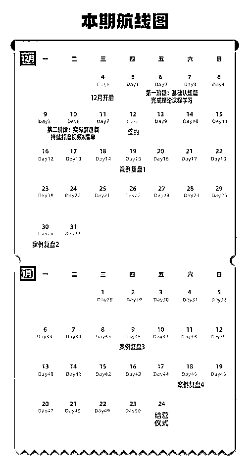
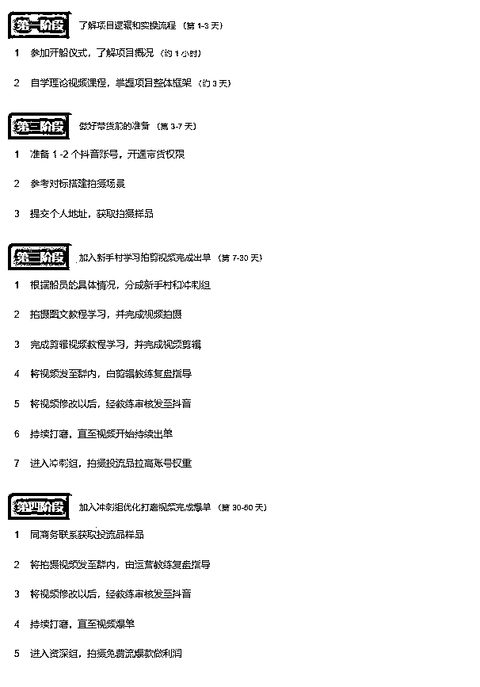

# 12月航海 | 抖音达人带货 | 航海手册

> 来源：[https://ocn93f5d9olj.feishu.cn/docx/C3qHdsmG2obZh0xKzZ2cwuB6nhh](https://ocn93f5d9olj.feishu.cn/docx/C3qHdsmG2obZh0xKzZ2cwuB6nhh)

# 防失联+MM188166M（李李）长期更新频繁+备用V:MG10127

# Hi，航海冒险家

# 💡

欢迎你参与为期 50天的【抖音达人带货】孵化航海，在接下来的日子，我们将并肩作战，一起升级打怪。

开船 7 天内，建议积极参与进来，感受下自己是否适合这个项目，这期间你可以随时申请无理由退船；7 天后，你将会和机构签订达人孵化合约。

同时，为了更好的鼓励你的行动，需要圈友你在航海 50天 内，持续更新发布 60 条挂车带货视频，才能退还保证金哦。

航海结束后，不认真更新的达人，依然有可能会被解约并解绑达人账号；符合条件的达人，将会继续享受 3 年的孵化服务。

本期航海，为了让大家更好的专注项目本身，将【航海手册】内容做了简化调整，手册更像是你的航海工具，汇集了所有实操相关资料；更多操作上的问题，欢迎在群内提问，这期我们增加了更多教练负责各个板块的答疑，希望助你早日爆单~

最后，希望大家可以在这次航行里收获成果外，也能结识一群战友。

那么，准备好开启本次航海了吗？

# 一、了解项目

抖音达人带货（也叫“抖音短视频带货”）项目，是达人拍摄制作原创图片或短视频内容，再通过作品挂载小黄车带货，赚取佣金收入的模式。

项目的盈利模式是通过抖音官方分销平台精选联盟，上架商家的产品完成销售，最终赚取一定比例的佣金。该项目无需囤货、无需开店、无需直播、无需付费投流，只需要专心完成内容创作，进而带货即可。

# 二、开始实操

# 2.1 航海日历

本期航海的 50天 安排为：

先学习理论课，然后再跟进实操流程提交作业，航海群内讨论学习。

过程中有任何不懂的，可以在航海群向教练举手提问解决。

# 2.2 实操流程（航线图）

具体实操步骤安排，可以参考本期航线图：

# 三、学习资料

【实操攻略】