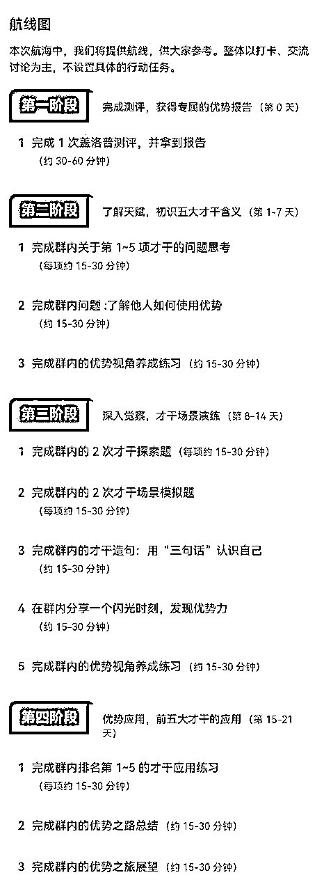

# 个人优势挖掘 实战手册 202403

> 来源：[`jviztcgxxfy.feishu.cn/docx/Jkj6dHFyboIJR5x2cdbc8Mzindd`](https://jviztcgxxfy.feishu.cn/docx/Jkj6dHFyboIJR5x2cdbc8Mzindd)

手册出品方：生财有术团队

出品时间：2024 年 3 月 21 日

手册使用说明：本文旨在向你展示个人优势的更多可能性，帮助你更好地理解和实操。

建议：如果需要快速定位到精确内容，可以使用快捷键 Ctrl + F/command + F 的形式，搜索「关键字/词」，查找你想要的内容。

## 写在前面

### Hi,

欢迎大家来到 12 月航海 | 个人优势挖掘 | 实战手册，相信在接下来的日子里，我们将在这里见面很多次。

在手册开始前，我们需要回答一个问题：为什么要找到个人优势？

过往的很多教育，都在告诉我们要补齐短板、全面发展。但事实上，与其死磕自己的短板，不如精进自己的优势之处。在那些你不擅长的领域里奋起直追，或许只能够到 60 分。而在那些你天生擅长的领域里，只要稍微花一些功夫，就能拿到 95 分。

这里有一个共识，你的核心竞争力，才是立足社会的根本。如何找到个人优势，精进个人优势，形成你的核心竞争力，对于每个人而言，不是选修课而是必修课。

因此，如何找到个人优势，是本期航海最重要的命题。

日常生活中，我们可以从成就事件中寻找优势，也可以从重复行为中寻找优势，但如果辅以优势识别器，那将会大幅加速进程。因此，我们选择了市面上颗粒度相对较细、科学性相对较高的优势识别器——盖洛普，来帮助大家发掘个人优势。

通过这个手册，希望大家可以了解盖洛普、初步看懂盖洛普，并结合案例适当了解自身优势，应用盖洛普解决一些困境与麻烦。

当然，鉴于盖洛普是一个较为庞大的认知工具，单说 34 种优势才干的组合就有上千种，所以这个手册可能没有办法让你一下子完全读懂盖洛普报告，或者说发现自身的全部优势。

本期手册希望传递一个概念：我们要用擅长的才干，击溃弱点，相信一个问题有千种解法。就像交朋友不只有一种方式，夯实专业能力，也能吸引来大量的朋友。

一直以来，我们都在无意识状态下使用自己的才干，不管是擅长与否，都可能因为错误使用才干，而暴露出弱点。但当我们足够了解自身才干时，它们就会变成你最好的武器，有意识地使用那些擅长的才干，一切问题都会迎刃而解。

航行结束后，这份手册依然可以继续成为你的实操教材。航行期间，我们也会邀请教练做多角度分享，解决大家可能产生的各类问题，也欢迎大家一起交流自己的个人优势挖掘心得。

除了上述内容外，还有个核心就是多提问，多交流，在这里没办法满足你的地方，多问问，我们会一起找到关于难题更多的解法。

希望大家可以在这次航行里收获成果外，结识一群战友。

以下内容由生财有术联合圈友 @醒醒同学 @叶叶在觉 制作而成，仅供航海船员以及生财有术星球圈友学习使用。

同时也欢迎圈友们在实践过程中持续反馈，和我们共同完善，可以联系鱼丸（yuwan387）提供修改建议～

# 【更新提示】新手册使用方式

在开始前，我们来简单了解一下这个手册的正确打开方式，方便你根据自己的情况来灵活使用。

在这里，手册整体的步骤顺序是按照从 0 - 1 掌握个人优势挖掘进行的，你可以参考航线图，按顺序开始实操。也可以根据自己的实际需求选择性阅读。

需要注意的是：本次手册相较于过往航海，进行了较大的改版。之前的手册尽可能的展示更多可能的玩法供大家自由选择，本次改版后的手册，分为必修和选修两个大的章节：

如果你还未接触过个人优势挖掘项目：

建议在正式实操前，先初步了解下项目全貌

【项目概述】了解个人优势挖掘

如果你对项目整体已有大致的了解：

请开始完成航线图第一阶段的步骤，这个阶段你可以从手册的第二章开始阅读

【测评】完成 1 次盖洛普测评

完成前期的准备后，即可开始完成航线图第二阶段，看懂自己的盖洛普报告

【分析】如何看懂盖洛普报告

经过上一个环节，你已经熟悉了这个项目的流程，那么接下来即可完成航线图第三阶段，应用盖洛普

【应用】怎么将盖洛普应用到生活

如果你已完成必修篇内容 ，想继续深入提升：

可以重点阅读以下章节，扩展盖洛普的更多应用

盖洛普更多应用案例

常见问题答疑

优势&成长书单推荐

本航海项目的航线图如下：

航线图和手册是高度关联的，因此你可以根据自己所在的环节，进行相关步骤的学习。

# 必修篇：跑通最小 MVP

章节概要

在这一章节，我们将从认识个人优势挖掘开始，一步步带你完成盖洛普个人优势的探索和应用。

如果你是本项目新手，建议在正式实操前，先初步了解下项目全貌：

【项目概述】了解个人优势挖掘

如果你对项目整体有了大致了解，就可以按照项目核心步骤，开始学习实操：

【测评】完成 1 次盖洛普测评

【分析】如何看懂盖洛普报告

【应用】怎么将盖洛普应用到生活？

在必修篇，航线图和手册顺序相对应，你可以按照手册的顺序进行学习，即可逐一完成航线图的每一个任务。

在后续的每个关键步骤的章节概要中，我们也将提到相关航线图，提醒你完成相关步骤。

接下来就正式开始吧！

## 一、【项目概况】了解个人优势挖掘

#### 章节概要

本章节中，我们将一起逐渐认识个人优势挖掘。包括：

什么是个人优势？如何挖掘个人优势？

了解盖洛普测评是什么？和个人优势挖掘的关系？

对整体的项目概况了解是必不可少的，一起来了解一下吧。

### 1.1 为什么要发现个人优势 @醒醒同学

“总是拖延，想的多做的少，觉得自己笨，没人情味很冷漠，太过软弱，过于强势”等标签，总会阻碍人的职业和人际关系。但拖延可能是因为做了不擅长的事效率低，冷漠可能是因为理性，软弱可能是因为善良，强势可能是果断。

每个负反馈的背后，往往也有正向的一面，一旦能做到“总是关注更好的一面，而不是不好的一面”，改变就自然而然发生了。

在我有限的职业生涯里，越是觉得自己不如别人越想要去比，拿短板死磕别人的长板时，往往越做越差。越是相信自己的直觉去做擅长的事，结果反而超乎预期。

过去的我有很多毛病想要改，总觉得所有的成就都来自于运气，越想改越是被惯性打回原形。

不管别人如何认可我，我都觉得自己不够好。直到接触盖洛普，它像显微镜一样，照出我的天赋和不足，结合过往经历。

我开始明白为什么互联网比国企更适合我。我的关系建立、战略思维非常突出，成就第九，总有很多想法，不喜欢太闲，喜欢灵活变动的环境。而纪律才干倒数第一，在规规矩矩的环境里，会非常不适应。如果在国企每天朝九晚五，我会非常受不了，越有想法越努力越压抑。

结合盖洛普复盘过去，也明白了为什么之前能拿到连续销冠，很多同事来找我帮忙处理危机。

我体谅+个别才干突出，对情绪敏感，和用户聊几句就能感受到对方的需求；理念突出，点子多办法多；战略突出，总能想到解决方案获得信任。适应才干突出，越是在突发性情况中，越兴奋越能发挥出色。信任到位了，成交是自然而然发生的。

做优势教练 2 年左右，我发现凡是在职场、生活中认识到自己的天赋和优势的人，往往都越活越好。盖洛普的科学研究也表明，成功者往往有个共同点就是扬长避短。

如果天赋是我们升级打怪过程中的独门武器，那盖洛普就是独门武器的使用秘籍。一身独门武器却不会用，这是非常可惜的。

希望能有越来越多的朋友，加入“唤醒天赋的旅程”。认识和接纳自己的好，是终生幸福的开始。

#### 1.1.1 什么是个人优势？

所谓优势，就是你天生做什么事比别人做的更好更轻松，一个人的优势由天赋才干、技能和知识组成，但核心还是天赋才干。

天赋才干可以理解为，老天爷给你的与生俱来的特质，早期一旦形成后期很难改变。盖洛普呈现的就是一个人擅长的天赋才干，你的优势也从这些天赋才干中发展而来。

天赋才干就像人的特质，而优势则在将这种特质发挥到极致状态下的结果。

用盖洛普官方的定义理解才干和优势的关系：才干 X 投资 = 优势，想要了解自己有什么优势，首先要能识别出自己有什么天赋才干。

想做成一件事，除了考虑天赋才干上的优势，还需要考虑所在领域是否有经验积累的优势、还有知识+技能的优势，如果你所在的领域、习得的经验、知识恰好和天赋才干匹配，优势会更容易体现出来。

#### 1.1.2 如何挖掘个人优势？

挖掘个人优势的重点，在于能否找到让我们能持续去做的事，即找到优势动力。这里说的“优势动力”不是名词而是动词，指做一件事比较容易得到正反馈，越能获得正反馈，越有动力持续的做出成果。人只有做擅长的事，才能持续不断获得正反馈。

本节提供的观察两种方法，我们日常中都可以使用，但如果辅以专业测评工具，就能更快帮大家找到优势，加速成长。

目前市面上有很多个人优势探索的测评工具，大多是帮我们探索“真实的自己”，比如“九型人格”、“MBTI”、“DISC”、“盖洛普”、“VIA”。每个测评工具都有自己的解读体系，相对来说，盖洛普的颗粒度是更细的，测评结果更为准确。

所以本期航海使用盖洛普辅助我们探索优势，接下来的手册内容也将围绕盖洛普展开，下文涉及的具体才干分析与解读，请点击查阅「3.5 了解 34 项基础才干」。

1.1.2.1 从成就事件中寻找优势动力

上文说到，优势往往是我们做一些事比其他人更容易。天赋的正向发挥，会让我们产生成就感。记录那些成就感事件，找出产生成就感的共同特点，这些共同特点反应的可能就是底层的天赋才干。

从成就事件中找优势是最容易入手的，请思考，我们做成过哪些事，在这些事件中有哪些特质呢？

举个例子，我的朋友 L 是做投资的。

她天生对数字、原理非常敏感，从小数学成绩就很不错（成就一）

大学期间，她爸爸一次性给了她四年学费，她把这些钱拿来投资，过的很是滋润，仿佛赚钱就是一场数字游戏（成就二）

工作以后，她开始专注炒股，总是能看到盘面后发现买卖点，收益总体很不错。（成就三）

每次我们聊投资，她看几眼后总能立刻说出不同数字背后代表了什么，并推导出合适的买卖时机。她从不害怕别人的质疑，甚至享受逻辑验证的过程，靠专业度吸引了不少客户。（成就四）

从小到大，她一直对数据、逻辑、原理非常敏锐，分析能力很强，也一直靠着这种方式达成各种成就。

而她的这种特质，放到盖洛普的语境里，就是“分析”才干：对数字非常敏感，喜欢探究事物的来龙去脉，无法忍受未经证实的结论，相信科学而非直觉，总能看透事物的本质。

像这样列出自己的 3-5 个成就事件，找出其中的共同点。你会发现，在这些和获得成就有关的人和事里，我们总是用某种方式来获取阶段性成果，这个“时常出现的方式”往往就是我们的优势。

1.1.2.2 从重复行为中寻找优势动力

一个人愿意花很多时间去做同样的事，大概率是这件事有吸引他的地方，而在这件事里就可能潜藏了他的优势动力。

举个例子，我的朋友 A 喜欢出门、喜欢参加活动、喜欢结交新朋友。所以她会不断地去参加活动，哪怕半夜 11 点，也会准时到场。同时她会不断地出去认识新朋友，如果一段时间不社交，她就会变得很无聊。一旦在生活上遇到难事，她的第一反应也是出门见人，听听朋友的经历与建议。

A 的“取悦+行动+积极”才干非常突出，认识新朋友尝试新的人生体验，对她来说是一种充电行为，在与她人的互动中，有她在的场子不会冷场，且大家都很开心（取悦+积极），听到好的建议立刻做起来获得反馈，会让她持续迭代。

当然，重复行为不一定永远都能获得正反馈。

比如，我是一个忍不住到处看各种消息，商业报道和发朋友圈的人，这样的我也很容易溜号。我另一个朋友是忍不住学各种课程，搜集各种小东西放在房间里的人，她也可能被人说是不务正业。还有朋友总是不怎么说话，一开口就是指出问题给解决方法，被人认为喜欢挑刺。

我们都在人生的不同时刻怀疑自己走的不是正路，但没意识到这些忍不住去做的事，背后体现的是思维、理念、搜集、学习、取悦等才干。就像我几乎不缺朋友圈素材，搜集才干搜集了大量素材，理念才干灵感不断，思维才干加工写出来，依靠持续不断的写变现了七位数，但我从没系统学过写作。

所以，如果你有忍不住想去做的事，无论周围的人支持或否定你，这个事情大概率藏着你底层才干的需求，关键是找到这个才干适合应用的场景，不断放大优势。

内容来源：《接触盖洛普后，我唤醒了自己的天赋，也希望能帮到你》 《3 个挖掘底层天赋的小妙招，一般人竟都不知道》

### 1.2 了解盖洛普测评 @叶叶在觉 @醒醒同学

工欲善其事，必先利其器，为了更好地挖掘个人优势，我们需要认识本次航海将会使用的优势评测工具——盖洛普。本小节我们将会解答以下几个问题：

#### 1.2.1 盖洛普测评是什么？

盖洛普测评是美国盖洛普咨询公司研发的产品，测的是一个人本能的心智模式（思维模式+行为模式），也就是行为处事方式，也是一个人的使用说明书。

就像狗喜欢在地上跑，鱼喜欢在水里游泳，如果非要比速度，让狗去水里，鱼到陆地，别说谁比谁快了，生存都成问题。而盖洛普测的就是，我们应该去水里、还是陆地，是游还是跑。

盖洛普不单纯是一个测评，而是一种语言，专门描述人的行为规律，以及这些规律对应哪些天性优势的语言。

在盖洛普优势体系里，一共有 34 种行为规律，即 34 种天赋优势，通常我们叫做才干（talent），是一个人自然而然的情感模式、行为模式、思维模式。

比如你总是忙忙碌碌，闲不下来，渴望完成更多的任务，每天就像打怪升级一样，这种模式“成就”，你喜欢有形的成果，渴望成就感；

比如你非常享受学习的过程，总是控制不住地去报班、买课，这种模式叫“学习”，你可能潜意识里觉得“没有什么是学不会的”；

比如你遇到冲突，习惯妥协、回避，总是能寻求共识，注重一致性，这种模式叫“和谐”，可能潜意识里觉得冲突是不好的，达成一致更有利于团队合作；

比如你思维发散跳跃，总是冒出一些别人想不到的点子，这种模式叫“理念”，可能潜意识里觉得“只有不断创新才有生机，才有趣，讨厌一成不变”；

比如你做事之前总是看到风险，做足充分准备后再行动，这叫“审慎”；可能潜意识里追求“确定性”和“不出错”，讨厌冒进和莽撞。

比如你经常思考事物的本质，探索底层规律，脑子时不时就转动起来，这种模式叫“思维”；可能潜意识喜欢深度思考，讨厌很浅层的信息，加入很多社群都无法容易闲聊。

比如你不害怕陌生场合，甚至会兴奋，喜欢结交新朋友，自然而然就能找到跟别人聊天的话题，这种模式叫“取悦”；可能潜意识里享受被更多人认识，青睐的感觉，能从社交中汲取能量。

比如你更喜欢跟熟人在一起玩，在熟人面前更放得开，不喜欢人多的饭局，这种模式叫“交往”；可能潜意识里喜欢深度的关系，慢热，讨厌泛泛之交的关系。

比如对于看到的资料、文章、结论，你不会轻易相信，你总是会思考结论是怎么得出来的。总是对数字很敏感，习惯用数字来客观描述和量化一件事，这种模式叫“分析；

……

这些模式是不需要你刻意提醒自己、咬牙硬着头皮就能做到的，是你下意识的行为习惯，也是你的内在需求，所以如果你有意识地去训练这些本能的模式，你就能事半功倍，更容易感受到正反馈。

每个人的 34 才干组合和排序都是不一样的，这个测评可以充分体现出每个人的唯一性。这就相当于钢琴上的 88 个琴键，琴键是有限的，但不同的琴键可以奏出无穷的音乐旋律。

#### 1.2.2 盖洛普测评的准确性

判断一个优势测评准确与否，我们可以从信度、效度，以及测谎机制等维度去看。

1）信度

所谓信度，是指测验结果的一致性、稳定性及可靠性，即采取同样的方法对同一对象重复进行测量时，所得结果相一致的程度。信度越高，代表这个测试结果越准确、越稳定。

人是复杂的，存在社会化自我，会在测评时会不自觉戴上“面具”，美化自己，因此目前市面上还没有能做到 100%精准的优势测评。而盖洛普测评的重测信度能达到 73%（两次测评前后的一致性），已经比绝大多数测评准了，具备一定参考性。

2）效度

所谓效度，即有效性，它是指所测量到的结果反映所想要考察内容的程度，也就是我们常规意义上的，“测评准不准”。效度越高，测评结果和个人优势就越接近，测试结果就越准确。

盖洛普测评是由美国优势心理学之父、盖洛普前董事长唐纳德·克里夫顿主导设计的，他们团队花了至少 30 年，对 200 多万名不同国家、行业的杰出人士进行采访，了解他们是如何成为行业的佼佼者。

基于海量访谈的大数据，盖洛普团队找到这些成功人士身上所具备的思维方式，最终提炼出 34 项天赋才干主题（talent theme）来给这些思维方式命名。

目前官网已经有 3000 多万样本数据，来证明盖洛普的有效性。

关于盖洛普测评更多详细历史，请点击链接阅读：

https://www.gallup.com/cliftonstrengths/zh/253745/%E5%85%8B%E5%88%A9%E5%A4%AB%E9%A1%BF%E4%BC%98%E5%8A%BF%E5%8E%86%E5%8F%B2.aspx

3）测谎机制

最后，我们来聊聊盖洛普的测谎机制。

人是复杂的生物，哪怕面对自己，也会不够坦诚。一旦经过深思熟虑，或者“政治正确”引导，测评就非常容易作假。

市面上有很多测评会让你给自己打分，或者有明显政治正确的“标准答案”，比如“你认为自己是一个责任心很强的人吗？”

像这样的测评，非常容易作假。因此，不少专业的付费测评都会增加测谎机制。

但盖洛普不同，它研究的是你下意识的行为模式，是不经过你理性思考的行为。当你理解了盖洛普的测评题目设计，可能就不会有上述的担心了。

为了避免人为主观的误差，盖洛普在题目设计上做了精心的设计。

盖洛普的测评题目一共 177 道题，题目之间会相互交叉验证，每个才干主题都会被拆分到不同的题目中去，并且避免让你看出来是在测同一个特质，比如「积极」这个才干，它可以是你的生活充满欢乐，可以是你经常赞美别人，可以是你经常看到事物好的一面，可以是你很爱笑……

这些描述是你比较能确认符不符合自己的，越符合，这个特质越突出，一般符合，就会在中间位置，越不符合，就会排在倒数的位置。

（当你对盖洛普体系比较了解之后，就不建议反复测了，因为你已经知道它每道题在测什么，准确率就会下降）

#### 1.2.3 盖洛普的应用场景

盖洛普从职场环境和学术研究中发展而来，是基于积极心理学的一种综合评估方法，被广泛应用于了解个体和团队，适用于员工、高管团队、学生、家庭和个人发展。其主要应用场景如下：

个人成长：人若想不断改变获得成长，得知道怎么改变，知道从哪里开始改变。就要先了解自己的需求，深度认识自己。盖洛普测评反映的是一个人的行为惯性，之所以我们总会用相似的行为惯性做事，背后代表了我们才干的需求，了解自己的需求、接纳自己、欣赏自己、提高自信。

职业发展：盖洛普测评能帮助个人发现自己的优势和潜在发展领域，如果将优势才干与岗位职责结合，能提高工作胜任度，提高工作效率，增加工作效能，如同在职业发展中加了杠杆。

团队建设：盖洛普测评可用于帮助管理者识人用人，评估团队成员的优势和潜在发展领域，为团队建设提供有力支持，提高团队绩效和效率。团队成员通过相互了解才干特性，了解彼此之间的不同，有助于团队兼容并蓄、多元发展的文化。

人际关系：由于每个人天然擅长的不同，在日常生活和工作中容易用自己的视角来评估别人。例如，有的人不喜欢随性，而有的人喜欢按规划行事，互相看对方不顺眼。如果能用盖洛普来加深对彼此的理解，有助于减少误会，消除恶意，增进理解。尤其是在伴侣、子女的亲密关系中。

更加细致的才干应用，我们将会在四、【应用】怎么将盖洛普应用到生活？中，通过具体案例，展开阐述。

内容来源：《盖洛普是什么？一个生财有术全团队都在用的工具》 《276 。 我觉得自己一无是处，还能找到天赋吗？》

## 二、【测评】完成 1 次盖洛普测评 @醒醒同学

### 章节概要

盖洛普发展至今，已经衍生出 7 类测评，其中「34 项才干测评」，是盖洛普中的必测项目，这个测评能帮你发现自己可能存在的天赋。其他测评项目的区别，可以移步官网查阅 「查找最适合你的克利夫顿优势评估」。

如果你已经确定要进行一场盖洛普测试，请按照以下步骤操作：

第一步：获取测评码

第二步：注册新账户

第三步：参加克利夫顿优势评估

第四步：开始测评

第五步：下载报告

目前，盖洛普测评码共有两种购买渠道：

盖洛普测评发展到现在，已有成熟的流程来鉴定优势教练，本次航海的教练均已通过盖洛普官方的认证考核。为了便于教练们开展工作，官方也会给教练一些测评码优惠。只有盖洛普官方认证教练有折扣码，限额 350 个/年。

当然，大家也可以自己选择其他渠道购买，只要能获得正确的测评报告，即可了解自己的盖洛普测评结果。不建议大家直接在各浏览器搜索「盖洛普测评」，大概率会跳入非官方的广告。

在测评开始之前，请务必浏览一遍注意事项，并严格按照注意事项进行测评。否则，可能会出现不必要的错误与麻烦。「2.2 盖洛普测评注意事项」

#### 本章航线图

完成本章节的学习和实操，即可完成航线图的第一阶段：完成测评，获得专属的优势报告（第 0 天）

1.完成 1 次盖洛普测评，并拿到报告（约 30-60 分钟）

那么现在，就请开始吧。

盖洛普优势测评，也叫克利夫顿优势测评（正版官方网址：https://login.gallup.com/），网上搜盖洛普测评会出现非常多推荐，但大多不是正版，测评结果偏差也很大。

截止到 2023 年 4 月，官方有 7 类测评，其中「克利夫顿优势 34 个才干主题测评」为必测项目，以下简称“34 项才干测评”，这个测评能帮你发现自己可能存在的天赋。

（官方参考报告）

下图中“经理人”、“领导者”、“销售人员”方面的优势无需测评，测完“34 项才干测评”后，付费即可解锁对应的优势报告。

如果对其他测评也感兴趣，可联系航海中的教练购买，同样有一定优惠。

（图片来自盖洛普官网）

本期航海主要使用「克利夫顿优势 34 个才干主题测评（CliftonStrengths 34）」

作用：展现个人的优势和弱点，帮助个人更好地理解自己的强项、弱点并发挥出色的表现，实现自我提升和职业发展。

价格：445 元（教练价 410 元）

报告内容：包含 34 个才干主题的排名和详细解释，以及针对个人的优势和弱点的定制建议。

其他测评项目的区别，可以移步官网查阅 「查找最适合你的克利夫顿优势评估」。

### 2.1 盖洛普测评码购买流程

购买前说明：

盖洛普测评发展到现在，已有成熟的流程来鉴定优势教练，本次航海的教练均已通过盖洛普官方的认证考核。

为了便于教练们开展工作，官方也会给教练一些测评码优惠。只有盖洛普官方认证教练有折扣码，限额 350 个/年，但不是所有教练都会给用户提供优惠，本次生财官方合作教练都有优惠。

盖洛普测评码原价 445 元/个，教练优惠 410 元/个。如果你选择找教练们购买测评码，本期航海会安排圈友统一找教练采购，具体对接流程关注航海大群信息。

1）打开盖洛普官网（官方网址：https://login.gallup.com/），注册一个盖洛普账号；

2）在商店购买“克利夫顿优势 34 项才干主题评估”，支付 445 元；

3）购买完成后，测评链接将在一天内发送至你的邮箱。

### 2.2 盖洛普测评注意事项

测试之前，请务必过一遍注意事项：

1.本次测评共 177 道题，注册账号+完成测试，大概需 40-60 分钟，请找安静的地方进行测评；

1.不要大量选择中立选项，会影响结果。以“本能”、"不自觉“就“会这样想/做”为优先选择，尽量避免选择后天训练或压抑或别人教你或想成为的样子的选项，想要更了解自己，就选最真实的自己的想法；

1.每道题有 20 秒时间限制，超时将自动进入下一题，不能返回重答，不答也是一种结果，会被记到系统里；

2.手机电脑都能测，推荐使用谷歌浏览器（电脑版），盖洛普官网访问速度不是很快；

3.中途有事退出了怎么办？重新进入，会按照原来的进度继续测评；

4.测试者本人的状态可能对结果有一定影响，尽量选一个心情平静的状态测试，忌大悲大喜；

5.盖洛普的很多题并不是对立的，不必担心盖洛普定义了你，我看了上千份报告，目前还没看到两个一模一样的报告，盖洛普是定制化的；

6.盖洛普支持多种语言，网页右上角可选国家/语言，英语好的朋友建议英文测评；

7.测评码有效期：目前官方没设置过期，但建议尽早测（半年内）。

### 2.3 盖洛普测评流程

以找教练买测评码为例，说明具体测评流程。自己在官网买也基本同理，只需要把第二步注册新账号改为登录账号。

第一步：获取测评码

联系教练购买优惠的测评码，你将会收到一个“测评码”。

第二步：登陆盖洛普官网，注册账号

（1）打开网址：https://my.gallup.com/

（2）点击“创建账户”

第三步：填写账号注册信息

注意：如果之前测试过，请使用一个新邮箱重新注册账号，再兑换测评码。

第四步：登陆账号，点击「菜单-兑换访问代码」，输入从教练那里获取的“测评码”

第五步：出现下方这个“参加克利夫顿评估”后，即可开始测试，记得在网页右上角选“简体中文”。

第六步：开始测评，完成 177 道题目，每道题 20 秒（务必回顾一下文章开头的测评注意事项）

注意：每个题都有 5 个选项，左右两边代表不同的倾向，分别为“非常符合我”、“较为符合我”、“两边差不多（中立）”。

如果你是用手机测试，很可能会看到下图那样，选项挤在一起。但在电脑端则是很清晰分明的（我做了一个对比图）。

示范：如果你觉得“有钱就是幸福”非常符合你的认知，那么就选左 1；如果你觉得有点符合，选左 2；如果你觉得两边都挺符合，没有偏好，则选“中立”。

第七步：测试完成后，如何下载自己的“34 项才干优势报告”。

（1）测评完成后，点击“菜单”-“克利夫顿优势”，点击后鼠标向下滑动。

（2）看到报告后，点击下方任意一个红框，如“克里夫顿优势 34 项才干主体报告”

以“醒醒”为例，左边彩色的图是醒醒的 34 项才干分布图，点击右边红框内的“查看我的报告”，可查看完整版的优势报告。

（3）你将看到自己的报告，点击右上角“下载按钮”，完成下载。

4）下载完成后，你将会得到一个 24 页的优势报告，这个报告约等于一个入门解读。图为报告第 1、2 页的展示。

## 三、【分析】如何看懂盖洛普报告 @醒醒同学

### 章节概要

拿到盖洛普报告后，

首先，是了解盖洛普的四大维度，确定自己的优势维度。

盖洛普体系把人的优势分为四个大类：执行力、影响力、关系建立和战略思维。我们从这四大维度入手，更加容易了解自己。如果你没有其中某些维度，也请不要气馁，因为你依旧拥有这方面的能力。

接下来，是了解自己的天赋才干排序。

1.初学者优先关注前 5 才干，从中发现自己的优势。

通过报告中的“才干特质”、“报告详解”、“盲点”等内容，了解这些才干在什么情况下能用的很好，什么情况下用的不好，找到能用好它的环境，生活和事业都会感到更有价值感和意义感。

考虑到阅读体验，关于 34 项才干的具体解读，放在了本章节末尾「3.5 附 2：了解 34 项基础才干」，大家可自行查阅。

靠后的才干，很可能是我们的“弱点”。

2.了解靠后的才干，正确面对弱点。

在盖洛普的概念里，弱点分为两种，一种是错误发挥靠前的才干，带来了负面反馈。另一种是使用了靠后的才干，而带来了负面反馈。盖洛普提倡以优势补劣势，通过目标拆解、优势互补等方式，困难也会迎刃而解。

在「3.4 附 1：34 项才干的需求清单」，我们也提供了一份才干需求清单，如果你不知道自己的某个才干需要哪些动作才能满足，可以关注一下该内容。

最后，才干的组合应用也是盖洛普的魅力之一。

单一的才干可以反映你身上的某一特质，而当 34 项才干组合在一起时，则形成了独一无二的你。

关于才干的 N 种组合表现形式，我们会在「3.3 第三步 了解组合才干的应用」进行解读。

对于初学者来说，一上来就死磕组合才干，会很容易绕晕。建议从单个的才干入手，了解清楚后再进行两两才干组合的练习，慢慢就更熟练了。

当然，正如前言所说，本手册更像是一本盖洛普工具书，助你初步了解盖洛普、了解自己，本章节亦然。如果想要获得更专业的建议，建议联系教练做更深层的解读。

相信有很多的同学在拿到自己的报告后，想用它来解决实际面临的困难的时候遇到了阻力，本次航海我们新增了一个模块来帮助大家更好地使用盖洛普在解决实际应用当中的问题。

#### 本章航线图

完成本章节的学习和实操，即可完成航线图的第二阶段和第三阶段。

第二阶段：了解天赋，初识五大才干含义（第 1-7 天）

1.完成群内关于第 1～5 项才干的问题思考（每项约 15-30 分钟）

2.完成群内问题 :了解他人如何使用优势（约 15-30 分钟）

3.完成群内的优势视角养成练习（约 15-30 分钟）

第三阶段：深入觉察，才干场景演练（第 8-14 天）

完成群内的 2 次才干探索题（每项约 15-30 分钟）

完成群内的 2 次才干场景模拟题（每项约 15-30 分钟）

完成群内的才干造句：用“三句话”认识自己（约 15-30 分钟）

在群内分享一个闪光时刻，发现优势力（约 15-30 分钟）

完成群内的优势视角养成练习（约 15-30 分钟）

那么现在，就请开始吧。

### 3.1 第一步：查看你的优势维度

盖洛普体系把人的优势分为四个大类：执行力、影响力、关系建立和战略思维。四大类下面囊括 34 个才干，每个人的才干排序和组合不同，呈现的优势会有区别。

这一节，主要分享四大维度的优势区别。

打开盖洛普 34 项才干报告的 21 页，会看到四大维度的排序、长短都不同，越是靠前、长度越长的越有可能是更为突出的优势维度，越是排名靠前的才干越有可能是擅长用的天赋才干。

请注意，不要让这四大维度束缚了你的思维。每个人都能完成任务、影响他人、建立关系和处理信息。在不同领域中运用自己比较突出的才干主题，也可以得到同样的成果。

你可能更关注“如何做成一件事”，在完成任务、实现目标、组织、计划、执行和追踪进度等方面有天赋。具体的执行力方面的天赋是什么？和你执行力维度排名前十的才干有关。

你可能更关注“如何推动他人做事”，在与他人沟通、协商、说服、引导、激励、掌控局势等方面有天赋。具体的影响力方面的天赋是什么？和你影响力维度排名前十的才干有关。

你可能更关注“如何建立信任关系”，在与他人建立深度信任关系、维护并打造支持性团队等方面有天赋。具体的关系建立方面的天赋是什么？和你关系建立维度排名前十的才干有关。

你可能更关注“如何做决策”，在获取、分析、处理信息、制定相应策略、判断趋势等方面有天赋。具体的战略思维方面的天赋是什么？和你战略思维维度排名前十的才干有关。

大家可以查看自己 21 页的报告，尝试开始列举大方向上，自己更擅长什么？并回忆过去有成就感或令自己满意时，是否在自己较为擅长的领域？

以 @醒醒为例，四个维度中关系建立>战略思维>执行力>影响力。

我更喜欢先找对的人，组建好团队，然后再开始干，对我来说人对了，事才能做对。

我排名 Top 10 甚至 Top 15 的才干，在四个维度中都有较为突出的，这又能进一步看出个人潜在的优势。

例如：

如果让我每天带兵打仗、做科研、不与人接触，我会很痛苦，关系建立几乎用不到实处上，我理解不了那些数字意味着什么，那些规则都在限制我的想象力和创造力，命令别人做事也会让我觉得在伤害关系，让我本能的讨厌“权威式”的领导模式。

在我过去的职业生涯中，做社群运营、群发售、咨询、教练、写作都能获得不错的结果，这些工作都与人打交道，都需要支持他人的发展，不断输出新想法，给别人带来启发，进而获得价值感，也帮我结交了不少贵人。

但凡是需要定时打卡，推导逻辑，处理数据，必须按照规定步骤做事的业务场景，我时常会觉得备受束缚，不够灵活，不断怀疑：“规矩是死的，人是活的，为什么要这样啊？”

越是找到我们优势能发挥的地方，越容易出结果。这都是可以从报告中看出来的。不过，这四个维度的优势在使用时，也可能出现盲区：

在了解并应用自己的优势维度时，多关注在什么领域更能展现出自己的优势。对盲点也需要有意识的觉察和调整。

例如：一个执行力+战略思维非常靠前，关系建立+影响力靠后的人选工作，如果要做销售，去研究营销工具来提升转化率，会比直接和人面对面打交道更符合他的天性。

### 3.2 第二步：查看你的才干排序

在了解自身优势维度后，你已经对自己的优势有了一个大概的认知。接下来，我们需要查看自己的才干排序，这是非常关键的一步。

盖洛普把人的行为、思维、情绪模式分成 34 种才干，这些才干是我们与生俱来的天赋能力，在一定的知识、技能的训练下，它们就会发展成我们的优势。

接下来，请翻到盖洛普报告的第 1 页，查看你的才干排序。

报告的第 2-11 页，是你的前 10 才干具体分析，其中前 5 才干有个性化分析解读，需要重点查看。

由于每个人才干排序不同，大家形成的价值观、性格、优势不同。

一般来说，我们更需要关注排名靠前的才干，这是我们可能会发挥优势的天赋区。而越是靠在后面的才干，越代表了是我们不经常使用的天赋，也可以理解为不那么擅长的。

以醒醒为例，我经常用的 Top 3 的才干分别是“体谅”、“个别”、“理念”，不怎么用的倒数 3 个才干分别是“公平”、“分析”、“纪律”。（关于才干的具体解读，我们将在「3.4 了解 34 项基础才干」中详细说明。)

我总是能敏锐的感受到他人的情感需求（体谅）、发现每个人的独特之处（个别）、非常多新奇的点子（理念）。但对于规则（公平）、数据、逻辑（分析）、计划（纪律）之类的事非常不擅长，也不怎么关注。

那么，我可能存在的优势是“共情力”，“组优势团队+人才发展”，“创新力”；不擅长制定规则、推理和做计划。

在盖洛普报告中，每种才干都有其对应的价值，越是靠前的才干越是我们无意识中不费力就会使用的，这可能是我们的天赋所在。举个例子：

有人从小到大语文很好，但物理数学很差，对文字的理解天然强于对数字和逻辑的理解，他可能有文字方面的天赋；有人从小到大就喜欢和朋友一起玩不喜欢呆在家里，他可能在社交上有天赋；有人从小到大总是喜欢观察人，研究人，他可能有识人辨人的天赋等等。

这些从小就有的特质，在盖洛普里大概率会被测出来排的很靠前。通常来说：

初学盖洛普，更需要关注的是排名靠前的才干是怎样一种天赋，在什么情况下能用的很好，什么情况下用的不好，找到能用好它的环境，生活和事业都会感到更有价值感和意义感。靠后的才干虽然不擅长，也许会影响我们，但不一定是我们的弱点。

由于翻译问题，有些原版的才干解释，在中文的语义下，可能在理解上有偏差，具体的最好看官方的报告。或者前往「3.4 了解 34 项基础才干」，自行查阅。

值得注意的是，即便我们和别人的测评结果里有相同的才干，但擅长做的事却是不同的。也就是说盖洛普会根据每个人的才干组合特质的不同，给出符合个人的天赋说明，它让我们看到了自己的独特性。

（沟通 1-这位是医生）

（沟通 1-这位是 Leader）

大家读的时候，应该能感觉到这两个拥有「沟通」才干的人的描述是不一样的。因为才干描述和报告的整体排序有关。

#### 3.2.1 阅读 Top 5 才干，标出有共鸣的地方

想了解自己有什么天赋，这个天赋是什么？首先，最好从自己最擅长的 Top 5 的才干入手，在盖洛普报告第 2 页中，给出了“了解自己的天赋的方法”：

以“醒醒”排在第一的体谅才干为例，要着重看以下几点：

你可以尝试：

举个例子：一个人行动才干突出，想到什么总是能立刻开始做，行动力强是他的优势。同时，他也可能是个急性子，没有想清楚就开始行动，要花不少时间试错。

如果将他放在需要持续开拓新项目敢于尝试的环境里，他有干劲这个特质，能开疆拓土，可能经常会收到“敢于进取”的评价。但如果放在需要谋划很久再行动，一旦做错要付出巨大代价的环境里，他可能经常会收到“莽撞”的评价。

通过上面的案例能看出，任何才干都是中性的，并无好坏。当我们在无意识状态下使用才干，不管是擅长与否，都可能因为使用不当而暴露出弱点。目标合理的情况下，当我们能根据目标，有意识地使用擅长的才干时，弱点出现概率会大大减少。

这里解释一下，什么是“有意识管理”和“无意识发挥”。

总之，标注出有共鸣的地方后，在不断的回想高光时刻中，自然而然的能够看见擅长的才干应用的影子。对靠前的才干有了感知后，在生活中不断的观察自己和他人的区别，关注自己的感受、下意识的反应、自然而然就能有意识的用它，看见它的优势了。

#### 3.2.2 了解 Top21-34 的靠后才干，正确面对弱点

所谓靠后才干，也就是报告中排在第 21-34 的才干。

当我们经常使用靠后才干，很可能会因为不擅长做不好而出现负面反馈，成为我们的“弱点”。在盖洛普里，“弱点”指的是在发挥优势的过程中，由于才干的管理不当，或技巧、知识的不足和使用不当，给自己和他人带来了困扰。

当我们使用靠后的才干，带来了负面反馈怎么办？

例如，当你很想扩大社交圈，认识更多新朋友，取悦才干靠后，目前圈子狭小怎么办呢？未必是直接参加各种活动认识新人，关键是找到自己擅长的切入口：

取悦才干天然能做到和陌生人交朋友，但你并不擅长使用取悦才干怎么办？

「学习才干突出」→如果你特别喜欢学习，可以多参加感兴趣的线上课程，通过和同学交流来认识新朋友；

「交往才干突出」→如果你有特别要好的朋友，平时经常参加活动，让她陪你去，慢慢融入环境，或是让他们帮你推荐新朋友。

「排难才干突出」→如果你特别善于解决问题，多帮别人解决问题。一段时间后，自然会有更多朋友认识你。

......在此不一一列举，面对弱点，我们可以做的事有：

1）梳理自己想要达成的目标并进行目标拆分，根据目标来盘点擅长的才干能否达成目标。

具体的拆解方式，可以参考：澄清目标-理出优势-制定策略-跑通路径-重复成功。

例如：

我的目标：完成生财拉新 500 人。

我的优势：我的战略思维+关系建立维度有 7 个才干突出，擅长定策略、把合适的人放在合适的位置、将策略落地。我影响力靠后，不擅长招募新人、快速成交。

我的策略：

我的路径：我选择用内容来找同频客户，自动化成交。利用关系建立的优势，找有影响力的朋友一起合作，我来写策略+内容。

我的成果：通过为期 30 天的运营，今年最终拉新了 847 人。

2）找优势互补的人来合作。

还是以拉新为例，我的好朋友梁靠谱是“影响力+执行力”特别靠前的人，对应的才干就是“统率+专注+取悦+积极”，所以她的成交欲望高（统率+专注）、擅长和陌生人打交道，吸引大家加她微信，引流效果很好（取悦）。

我俩一起拉新特别愉快。提前半年就商量好，她负责招募和直播。我负责策略+调动人+后端的精细化运营。最终成效不错，拉新 847 人。

总之，找到合适、让自己舒服的方式来弥补「我认为的劣势」。最好的补短板的方式，是了解自己擅长的才干，用最擅长的那一部分去打通不擅长的部分。

补充：靠后的才干如果也能稍微学习一下使用方法，很多时候能帮我们提升整体的竞争力。举个例子，醒醒分析才干靠后，会刻意找一些擅长的朋友多交流，学习他们思考的方式，现在有明显提升。

无论你信不信天赋存在的意义，但你有意无意中都在用这种方式保护和捍卫自己，如果没有出现好的结果，也许只是你正处于一个无法发挥天赋的环境。

最后，提醒大家，天赋所及，所向披靡。弱势所及，痛苦不已。即便是补短板，也不要硬补。

### 3.3 第三步 了解组合才干的应用

前面，我们了解了关注排名靠前和靠后的单个才干。才干是组合发挥作用的，接下来就来了解组合才干的应用。

盖洛普测评的颗粒度很细，大多数测评工具像一个模糊的大镜子，照出人大概的类型，而盖洛普是 8k 超高清相机，通过才干的组合，能照出一个人的高矮胖瘦和五官，帮你更清晰地看到自己的“天赋才干”。

以人际关系为例，表现形式可以是 N 种，举个例子：

假如 A、B 两个人的前五才干中，都有取悦才干，意味着他们都喜欢社交，认识新朋友，不断与新人朋友建立联系获得青睐，他们会感到很满足。

其中 A 排第一的才干是沟通，B 排第一的才干成就。

如果在“两两组合之上，再加一个才干进行组合”，例如：

每增加一个才干，才干组合的复杂度和难度更高，但也变得更精准了。也就说，才干的 N 种表现形式，体现在测评报告中 34 个才干的排列组合的数量、排序不同，这意味着：

第一、测试结果就像基因一样，几乎具有唯一性，展现的是测试者本人的与生俱来的独特性。

第二、34 种才干有无穷的排列组合，尽管人和人之间有相似的优势，但才干组合不一样，反映的是差异化优势。

对于初学者来说，不需要一上来就死磕组合才干，很容易绕晕。如果想要更精确地了解自己的天赋才干组合，依然要从单个的才干入手，了解清楚后再进行两两才干组合的练习，慢慢的就更熟练了。

以下一些才干组合，可能比较容易同时出现在前五，作为了解即可（常见组合数据来自盖洛普官方）。

成就+学习：当我在完成某个任务时，渴望能够顺利完成，如果接触的是新事物，会忍不住想弄明白，开启学习模式。

专注+成就：以目标为导向，并按照重要性排序将任务排出来，不达目标不罢休。

统筹+责任：当我在配合别人工作时，只要和我有关的事，无论是过程还是结果，都希望能对其负责。

信仰+责任：坚守自己觉得重要的原则和目标，对需要我帮忙的人，做出承诺尽心尽力。

审慎+责任：尽责且谨言慎行，恪守自己许下的承诺。

排难+责任：为了帮受伤/受损的人、事、物，愿意牺牲自己，服务他人。

纪律+责任：喜欢用日历、日程表等工具，管理并确保自己完成了计划，履行了对别人的承诺。

公平+和谐：为了推动事情能顺利进行，尽可能管理情绪发生的过程，减少情绪冲突和争议，保持冷静。

行动+战略：我会找出最优的方案，并督促大家尽快开始行动。

追求+成就：既有强大的自驱力，也渴望站上更大的舞台，如果有人欣赏我，我会更卖力工作。

完美+战略：在考虑未来的可行性方案时，优先排除不够好的方案，再从特别好的方案里选出最好的。

自信+战略：对自己的能力和判断胸有成竹，知道最好的方案是什么也了解自己的目标和如何实现目标，不轻易被改变。

统率+战略：喜欢提前考虑所有可行的方案并选出最优的，这样就能在统领大局时避免做无用功

竞争+成就：不但能努力完成工作，还会在和他人的比较中变得更有动力去超越自己和他人。

沟通+取悦：在社交中，总是能依赖清晰的表达获得他人的关注，建立广泛的社交关系。

适应+体谅：生活在当下，对当下发生的情况和情绪比较敏感，并做出相应变化。

伯乐+体谅：人的情感和潜力虽然是不可见的，但我能帮别人表达出他们的感受并发挥出他们的潜力。

包容+积极：我喜欢邀请大家欢聚在一起，希望邀请的人能全部到场，如果有人缺席，我会感觉不够开心。

个别+交往：很容易看透他人的本质，也希望有人能了解真正的我。

和谐+责任：能建立有助于合作和促进实际生产力的环境，总能用这个获得信赖。

交往+责任：为客户、亲人、同事、朋友提供帮助的时间越久，越懂得欣赏他们，同时获得他们的认可。

关联+体谅：非常关心他人，对他人独特的情绪敏感，也对人类的共性有认同感。

积极+取悦：对情绪和如何获得新朋友的青睐非常敏锐，能很轻松的结识新朋友、鼓励沮丧的人，并享受这个过程。

分析+学习：我喜欢学习，学习的主要目的是学会客观的评价事物。

回顾+搜集：不断的搜集资源和翻看历史记录时，总能给别人提供他们想要的东西。

理念+战略：在达成目标的过程中，会考虑所有的可能性，如果都无法令人满意，就创造新方法。

前瞻+战略：总能判断出未来的走向，并找到实现未来的最佳方案。

搜集+思维：喜欢思考并搜集深刻的洞见、哲理，也觉得这些是有意义的。

### 3.4 附 1：34 项才干的需求清单 @叶叶在觉

一个人工作没动力，往往可以从他的盖洛普报告中分析出原因。因为缺乏动力是内心某种需求没被满足的表现。

34 个才干每个才干背后都对应一种需求，例如：

「追求」才干需要得到别人崇拜和认可，才会激发他达到最佳状态；

「竞争」才干需要一个相互比较、相互激励的同伴，才能激发他不断努力、赢过对方；

「适应」才干需要一个富有变化的环境，才会持续激发他灵活应变的潜能，让他遇强则强。

当你满足了才干背后的需求，你每天就会像打了鸡血一样，对工作充满热情，在职场上勇往直前。

比如，当你知道了自己的「交往」（熟人社交的能力和深度关系的维护能力）很突出，那么你就需要经常跟几个固定的好朋友保持联系，经常见面、保持深度沟通，跟他们在一起你就会感到放松。

同时你更擅长去做一对一或小圈子的服务，做深度的一对一关系，而不是靠走量的模式，那么相应地你更适合做高单价产品，通过提高转介绍率来获得流量。

大家可以按照下方这张表格，了解自己的动力来源。

34 项才干的需求清单@上淇&醒醒：

### 3.5 附 2：了解 34 项基础才干

这是 34 项才干一览表，涵盖每个才干的定义、动机、内核、特征，大家可以对照来看。

表格由@柳大 教练整理：

为了让大家更好理解单个才干，我们将每个才干都分成以下三方面进行解读：

提示：点击左侧目录，即可定位你需要的才干内容。

#### 3.5.1 执行力

01 成就才干

02 统筹才干

出色的指挥家，善于在繁琐、复杂的事务中化繁为简、游刃有余、进退有度，实现效益的最大化。 多线程管理和善于调配资源的人。

03 信仰才干

04 公平才干

05 审慎才干

06 纪律才干

07 专注才干

08 责任才干

09 排难才干

#### 3.5.2 影响力

10 行动才干

11 统率才干

12 沟通才干

13 竞争才干

14 完美才干

15 自信才干

做出决定后较为顽固，通常听不进他人劝告。

16 追求才干

17 取悦才干

#### 3.5.3 关系建立

18 适应才干

19 关联才干

20 伯乐才干

21 体谅才干

22 和谐才干

23 包容才干

24 个别才干

希望每个人都能发挥自己的特长，而不是都做同样的事成为同样的人。

25 积极才干

26 交往才干

乐于投入时间付出，以保持和密友的关系。在关系里往往显得非常坦诚、甘愿付出，会主动关心在意之人的情感、经历、目标，并希望对方也同等对待自己。

对于亲密之人非常信任，乐于付出，有时可能会过度考虑关系而受到伤害。

#### 3.5.4 战略思维

27 分析才干

相信真理是客观的，并且一定是可衡量的，凭理智进行决策。

过于理性，只关注事实和道理，忽视了情感、情绪等因素。

28 回顾才干

可能喜欢记录和回顾过去，比如记日记、看史书、读人物传记等。

因自己对过去发生的事情有浓厚兴趣，忽略其他人对旧事重提的兴趣并没有那么大。

29 前瞻才干

在很多场景里，可能会格外关注和美好未来有关的信息、预测、会让你未来变得更好的人等等，这些美好未来到底在哪，和个人的兴趣、优势有关。

过于沉醉于对未来的美好憧憬中，总在寻找最正确的未来，忽略了实现未来必须有一定的行动，对未来的畅想是在行动中验证的。

30 理念才干

只要有新的想法、灵感产生，就感到兴奋，似乎天然就擅长跳出思维定势，从多个角度看问题，提出更多新颖、有创造力的想法。

表达上比较抽象，让一些不善于抽象思维的交流者感到无法理解。

31 搜集才干

每当存储的资源被用上，无论是用在自己身上还是帮到其他人，都会感到满足。不存在没用的资源，只存在还没用得上的资源。

因为信息充足，如果未经筛选，可能会给别人过量的参考信息，让帮助有了反效果。

32 思维才干

33 学习才干

34 战略才干

### 3.6 盖洛普在自我分析模型中的具体应用

#### 3.6.1 SIGN 模型：优势信号探索模型 @《现在发现你的职业优势》

S（success）自我效能（我能行） ——对某些事很有信心，觉得自己肯定能做成。

I （Instinct）本能热爱（我热爱） —— 迫不及待想尝试去做的事。

G （grow）成长很快（我擅长）——发现自己学得很快，一接触就能有明显进步。

N（need）满足感强（我快乐）—— 做某些事就算很累甚至没钱，做起来也觉得很满足，有价值感。

当一个人 Top10 的才干需求被满足时，更容易找到“我能行、我热爱、我快乐、我擅长”的感觉。

用问题清单帮自己梳理：

a.我能教别人什么?别人常向我请教什么?

b.做什么事总觉得自己肯定是对的？

c.做什么事时，你总是很有把握？

a.你做什么事很少拖延?

b.哪些事，任务，环境，你一听或一接触就感兴趣，忍不住想做做看？

c.有没有哪些事让你有心流状态？

a.你学哪些事总是很快学会？

b.和周围的人相比，哪些事你总是做的比别人出色？

c.你周围的人有没有给你反馈过，你总是有个“优点是...”

a.做什么事时，你总能忘记时间还很有满足感？

b.什么事你在做的过程中觉得很有价值？

c.你做过的最快乐的事是哪件事？

可以根据以上四个类别，结合盖洛普的才干，填写一张属于自己的“sign 模型优势梳理文档”，例如：

#### 案例参考：

以醒醒为例：

我总是在做线下沙龙，设计流程、物料、招募这个环节，感觉我能做成。在后续跟进和加好友交流上，想到要找话题就很无力。可能和我的“体谅”、“理念”、“思维”、“个别”才干有关。

我总是喜欢用户给我抛一些有难度的话题，喜欢不断的给我的产品做创新，维持原样会让我感到难受。这可能满足了我的“排难”、“理念”才干。

我总是在和洞察“用户”，发现别人的天性有关的事上学得很快，总能看到情绪背后的需求，还能记住很多优势案例，似乎不需要特意去背，见一面就能记住很多。

如果能帮人解决问题，写作，独处，不去社交，我会感到很满足。

基于以上信息，我在做优势教练上，能更清晰的找到适合我当下阶段的产品和获客方式，以及想要尝试的方向，喜欢给客户惊喜。

同时，我找到了很擅长和人快速建立关系，擅长统筹的同行牙牙教练和我一起做线下活动，我来负责流程设计、物料，她负责整体的统筹、活动后的跟进。

#### 3.6.2 职业/副业/转型卡点梳理模型

想找到自己做起来最顺的副业，或是职业，需要满足以下四个条件：

有兴趣、有能力、能赚钱、有价值感。

遇到卡点，往往是以上四个关键因素至少有一个不满足，可以用这个模型来判断自己需要提升的板块，以职场为例：

例如：做着一份清闲舒适的工作，公司没有太多上升空间，但孩子上学后需要更多钱，需提高主业或副业收入，提升抗风险能力。

例如：某设计师，总被领导要求多抄其他公司的产品，无法施展自己的想法，缺乏价值感。找到更能体现自己价值的事情做，不一定非要转行、辞职、或干副业，可以先尝试一下。

例如：某程序员，和老板一路创业很受重视，从技术升职为管理，但对管理不感兴趣，觉得工作没意思，寻找一些感兴趣的事做，不一定还做本职，也可以做别的试试。

例如：做自由职业的一些小伙伴，没有人兜底，收入不稳定，需不断提高能力应对挑战。暂时回职场或学一些相关的知识课程、找人请教，不断升级打怪，拥抱不确定性。

梳理清楚卡点，提升需要提升的部分。

#### 案例参考：

小王在一家公司做项目管理做了 5 年，最近人事变动很大，她的工作也陷入瓶颈期，总觉得夹在不同部门之间很疲倦，这样下去也会影响她的绩效，想离职但因为有房贷也不敢轻易离职。

换一家公司的话，现在的公司已经是行业里待遇相对来说最好的了，面对这个现状，她可以做什么呢？

对照上图来看，小王目前在兴趣、价值两个方向的得分都比较低，工作消耗了她很多心力，各种扯皮的沟通让她的价值感也大打折扣，但在能力、赚钱层面，目前还算满意。

①兴趣：她对做短视频、开一家自己的店很感兴趣，但还不太了解怎么做。

②价值：职场的正反馈少了，价值感也就少了，她平时在孩子的教育、自我探索上花了不少时间，也觉得这些事很有价值。

结合以上几点来看，开店目前不太合适，前期要投入钱和大量时间，短期内无法离开职场。如果做短视频的话，她需要以下几个问题：

1.能力：（做好副业要具备的能力）可能要学习什么技能、知识——剪辑、短视频内容创作课程、商业化方面的知识等

2.赚钱：（从变现的角度考虑业务）该如何用短视频来赚钱？——所有的变现方式里，她更倾向哪个？

3.价值：（能够提供给用户的价值）短视频平台可以输出什么内容：职场/亲子教育/个人成长

仅从副业的角度考虑，这或许是小王可以做的事之一。

#### 3.6.3 问题定位模型

问题=目标-现状

发现问题的第一步，是定位“什么是真正的问题”，需要澄清“目标、期待、理想”结果，梳理“现状”，找到这中间的“落差（问题）”，从中找到能实施的行动让落差越来越小。

通常，我们经常是先想到“有什么问题阻碍了我们”，有时可能是目标太高或目标是模糊的，需要更多的教练对话或尝试来渐渐澄清。

用盖洛普，能帮我们解释出现“某个问题”的原因是什么，通常来自“Top10 的才干”进入了盲点区，或是资源不足。看到才干的盲区，寻找机会发展才干，问题会更好解决。

#### 案例参考：

小王主业是设计师，想在今年赚 100 万，目前主业收入 40 多万，副业主要是接私活，平均下来收入是 10 万/年。

目标：年收入 100 万

现状：主业收入 40 多万，副业收入 10 万/年，每周周末有时间做，平时时间比较少。

问题：缺口的 60 万从哪里来？

想提高收入，他的能力是够的，目前还是靠单位时间的产出来赚钱，主要的局限在时间上，不离职的情况下，不一定非要今年达到 100 万：

可以稍微盘点一下有哪些可行的方向，再挑最适合当下的选项做起来，不断的累计资源。

#### 3.6.4 时间管理

用时间管理四象限来做时间管理，四个维度（仅做参考）：

第一象限：重要 x 紧急 = 急事，立刻去做，别犹豫，越少越好，时间占比 20%-25%。

第二象限：重要 x 不紧急 = 要事，先计划再行动，最应该投入的时间，时间占比 75%-80%。

第三象限：不重要 x 不紧急 = 烦事，有空再做，尽量不做，时间占比<1%。

第四象限：不重要 x 紧急 = 琐事，尽快做或外包不要亲力亲为，时间占比 1%-5%。

我们更多需要把时间花在第一象限&第二象限上，减少第三第四象限的时间投入。且尽可能处理好“第二象限”的事，这样能有效避免自己陷入“第一象限”一直忙，但产出低的情况。

用盖洛普，可以帮我们找到时间管理上做得好/不好的线索，还可以一定程度上帮我们理清“可能在哪一方面更愿意花更多时间”。

#### 使用参考：

可考虑使用滴答清单，每天/每周/每月将自己要做的事，

1.首先先不管是不是紧急/不紧急、重要/不重要，先穷举；

2.列完以后，再依次填进对应的四象限里；

3.每隔一天/一周/一月来检验自己是否做到了，将更多的时间投入到了第一和第二象限，复盘总结。这时候会发现很多“紧急不重要”、“不紧急不重要”的事，会在做的过程中，自动淘汰掉。渐渐的也就知道什么是对自己“更紧急更重要的了”。

#### 3.6.5 如何提高执行力：福格行为模型

B=MAT：当“（M）动机”、“（A）能力”、“（T）提示”同时出现的时候，行为（B）就会发生，改变也会发生。

动机：做出某个行为的出发点、欲望——你有多想做一件事。

（动机越强，行为越有可能做到）

能力：做某个行为的执行能力——能力越强，越容易做成一件事。

（行为越容易，越有可能养成习惯，具备某种能力）

提示：提醒我们做出某个行为的信号——形成习惯的有效机制。

（没有提示，任何行为都不会发生）

当我们想要做出某个改变时，这三个因素，不能缺任何一个因素，且动机和能力也需要相互配合。提示往往需要我们进行有效的设计，而“动机”和“能力”是动态平衡的，需要我们有意识的调整。

有动机 x 能力适配=更能做成。

有动机 x 能力不足=力不从心。

动机不足 x 有能力=拖延遗忘。

动机不足 x 能力不足=做不成。

用盖洛普，往往能解释我们为什么“动机强/弱”，找到驱动我们的动力，以及如何设置一个更好的“提示信号”，无法解决“能力不足”这一点的因素。盖洛普报告 x 福格行为模型，能更容易找到改变的路径。

#### 案例参考：

小王和朋友小张最近约好一起练习键盘盲打，提高输出效率。小王练的不错，但小张打了一天就放弃了，觉得这个太难。小王给小张制定了一些计划：

1.小张每天上午读完书后，摸两下键盘，找找书名的缩写，不用打字，完成任务就给小王说一下，小王会给他分享一本今天看的书。

2.习惯这个动作后，每天读完书在键盘上打一句书里最喜欢的话，发给小王，小王也给他分享一句最喜欢的话。

3.不断的重复以上动作，直到熟练，逐步的加到打一段话，一章节文章。小王也会和他交流每天的读书见闻。能完整的打完 1000 字时，小王和他互送一个礼物。

这个故事是根据醒醒一个朋友的真实案例改编的，当我听到第一件事只是“摸摸键盘”的时候，觉得很惊讶。原来最小的微动作可以这么简单又可执行，后来那个朋友确实学会了盲打。

#### 3.6.6 情绪内耗原因梳理：6W2H 模型（问题仅是参考）

情绪宜疏不宜堵，情绪是一个信号，反应了我们内心的某种需求，情绪疏通了，人才更有心力做事。

这个模型分别用 8 个问题来帮我们梳理“情绪从何处来，往何处去”

以上是部分参考问题，在实际梳理情绪的过程中，不一定要用上所有的问题，哪个对你疏通情绪最有效就用哪个，往往让我们产生情绪是多方面的因素共同作用的结果，不断“分析产生情绪背后的原因”，多问几个“为什么”，找到关键的原因，和自己能改变的部分，改变就会发生。

#### 案例参考：

小王最近有点不开心，一方面公司今年压力很大，总加班，老公和自己也总吵架，每次回家教孩子写作业也很生气，生活里有很多杂事让她忙的不得了。

有时候是因为同事而不开心，有时候是因为家庭关系不开心。今天又因为项目上的事，小王和隔壁部门同事吵架了，回家以后看到老公又在那玩游戏非常不爽，责骂了老公，两个人吵了架。这导致小王不想做饭，堵着气，孩子又吵着闹着要吃麦当劳，她更加生气了，觉得没一个省心的。

用 6W2H 梳理一下，发现惹小王生气的有好几件事，不断的追问原因下，发现有几个可以改进的点：

1.和同事因为项目吵架：主要是因为两个部门的领导没把任务分配好，导致双方都觉得是对方部门的事，不愿意担这个责任。改进的方法：以后要主动明确自己部门要做的事，进度同步给领导，需要支援也要主动提出，而不是一直憋着不说，最后出了问题容易被秋后算账。

2.和老公因为游戏吵架：主要是因为小王把工作里的情绪也带回了家里，同时最近裁员双方都心情不大好，游戏成为了导火索。改进的方法：工作和家庭的事尽量课题分离，一码归一码，正视现在家庭里的矛盾，和丈夫多沟通，以及提前为“可能失业”做一些准备，比如尝试一些其他项目或升职、跳槽等。

核心有几点：

3.改善了事业上的困境，考虑能否跳槽、转型、副业等，减少了经济压力，就有更从容的心态来对待自己和周围的人，如果经济情况不能解决，现实也会不停的摆在面前，让人没有安全感。

4.对老公和孩子有所期待但目前无法事事如意，需要好好沟通，也需要适当的调整一些期待。

5.对自己好一点，不要什么事都亲力亲为，每周给自己放一天假，做一些喜欢的事，补充能量。

## 四、【应用】怎么将盖洛普应用到生活？@醒醒同学

### 章节概要

每个做完盖洛普测评的人，可能都有这样一个疑惑：盖洛普应该怎么用？

为了解决这个问题，我们在 5 月航海群中展开一次调研，收集 128 份问卷，从中挑选出 7 个维度的 13 个高频问题，希望尽可能击中大家共有的痛点。

包含：执行力、社交关系、亲密关系、时间管理、自信问题、情绪管理、职场问题。

除此之外，还给出了大家非常关心的一个问题的应用：

#### 本章航线图

完成本章节的学习和实操，即可完成航线图的第四阶段：优势应用，前五大才干的应用（第 15-21 天）

1.完成群内排名第 1～5 的才干应用练习（每项约 15-30 分钟）

2.完成群内的优势之路总结（约 15-30 分钟）

3.完成群内的优势之旅展望（约 15-30 分钟）

那么现在，就请开始吧。

### 4.1 七个典型的高频场景应用

### 小节概要

本章包含执行力、社交关系、亲密关系、时间管理、自信问题、情绪管理、职场问题等 7 个小节，每小节下设 1-2 个问题，除个别问题外，每个问题将从以下几方面解答：

使用才干时，要结合场景、目标、身份、行为来看如何使用才干。一句话概括：我要做什么事，达成什么目标，链接什么人，需要哪些资源来帮我达成目标，我有哪些才干能帮助我达成？

比如，做直播带货这件事，沟通+追求才干靠前的小伙伴 A 更容易适应镜头，生动形象的讲解产品，表现力强，但如果他没经过练习，学习如何找供应链，如何展现产品价值，如何成交，效果也不见得好。但如果他好好练习，做成的概率很大。

但如果一个小伙伴 B 成就+学习+搜集靠前，研究了 50 个优质主播的方法（学习+搜集），并持续的练习每天 5 小时（成就），可能做的 比 A 好。

同样一种结果，可能是由不同的才干组合的共同影响，我们可以更多的关注自己擅长用什么方式来达成，以及如何达成目标。

下文中的案例无法穷尽所有可能性，多是从才干角度举例，仅供参考，具体情况还是要具体分析。（案例均获本人同意公开）

#### 4.1.1 执行力

所谓执行力，就是制定目标，付诸行动，拿到结果。

许多人被执行力问题所困扰，比如总是想得多做得少；什么都爱尝试，但是什么都做不好；一直在干活，但一直没有进展；不到最后一刻，不会干活……

由于篇幅问题，我们从中挑出了两个高频问题，「拖延症：总想考虑好了再开始，顾虑很多」、「难以坚持：三分钟热度，总是半途而废」，尝试通过盖洛普的角度，帮大家找到解决方法。

4.1.1.1 拖延症：总想考虑好了再开始，顾虑很多

拖延症是一种常见的心理现象，很多人都深陷其中。

拖延往往源于对任务结果的过度担忧，担心自己没有足够的时间、能力或知识来完成任务，或者担心可能面临的困难，导致我们无法及时着手完成任务或实现目标。

① 总遇到这个问题的人，可能什么才干突出？

完美、审慎、排难、分析、战略

② 出现问题的原因（才干分析）

③ 可能的解决方案（仅供参考）

4.1.1.2 三分钟热度，做事情总是半途而废

所谓三分钟热度，指一开始对某件事情拥有高度热情，但出于某种原因，很快失去了兴趣和动力，随后放弃或转向其他事物。

① 总遇到这个问题的人，可能什么才干突出？

行动、适应、理念、战略、学习等

② 出现问题的原因（才干分析）

③ 可能的解决方案（仅供参考）

#### 4.1.2 社交关系

社交是日常生活中难免碰到的一个问题。

无论是在学校、工作场所还是社交聚会上，我们都会面临各种社交挑战。这里我们主要解决如何与陌生人或不熟的朋友社交的难题。

4.1.2.1 过分在意他人看法，担心说错话，不敢社交

这种心理状态通常源于对他人评价的过度关注和对自己能力的怀疑。许多人在面对陌生人或社交场合时，都会感到紧张和压力，因此选择了沉默和避免社交。

① 总遇到这个问题的人，可能什么才干突出？

和谐、审慎、体谅

② 出现问题的原因（才干分析）

③ 可能的解决方案（仅供参考）

4.1.2.2 总是一个人琢磨，不好意思问别人

总是一个人琢磨，可能是本身享受研究的过程，也可能是担心暴露自己“不懂”、“问的问题很小白”，会遭到别人的批评或否定，又或者不想麻烦别人，被“想象中”的恐惧吓住了。

① 总遇到这个问题的人，可能什么才干突出？

排难、分析、思维、体谅、责任

② 出现问题的原因（才干分析）

③ 可能的解决方案（仅供参考）

#### 4.1.3 亲密关系

亲密关系里，牢记“谁先做出改变，谁就是关系中的引领者”、“好的亲密关系，不要总是讲道理”。两个人的才干报告差别特别大，既有互补的可能性也有水火不容的可能性；两个人的报告很相似，既有特别懂彼此也有纠缠不休的可能性；关键看两个人如何调整，是否能共同面对问题，解决问题。

想要关系越来越好，最好都从“先了解彼此”开始，“正所谓万人宠不如一人懂”，只靠一个人，是解决不了两个人的问题的。

建议和对方一起学盖洛普，把盖洛普当做一种对话的语言，可以减少主观的评判，增大看到彼此的需求和差异，找到突破口的概率。

4.1.3.1 找不到合适的相处模式，难以磨合

由于每个人的性格不同，相处模式也各不相同，这里以盖洛普报告差异较大的案例做展示。

经常出现的情况是，女生想尝试的东西，男生会和她分析一通，虽然不是打击女生，但经过男生的分析，女生会发现很多项目的产出可能并不高，总有被浇凉水的感觉。平时逛街男生也不是很感兴趣，她只能找闺蜜。

女生希望男生能多对她有一些理解，支持她做一些项目的尝试，而不完全是理性的分析。

① 通过才干报告看懂对方的需求

男：战略 成就 追求 专注 统筹 分析 行动 责任 取悦 个别

女：体谅 理念 积极 伯乐 个别 搜集 战略 交往 学习 思维

男生是一个在事业上非常清醒，勤奋努力，有野心，非常理性，不会花时间在无意义的尝试上的人。

女生是一个在关系里更主动，喜欢尝试新奇的东西，报名各种课程，非常能体会他人感受的人，更感性一些。

两个人本能的习惯不同，会产生差异。以旅行为例，男生大概率希望明确要去哪，按计划来就行；女生哪怕是做了规划，到了目的地发现别的更好玩会更换的。

男生可能会疑惑：怎么又去别的地方了？不是说去 A 地吗？

女生则觉得，如果提前把计划讲清楚，一切都在自己预料内，就会少一些“惊喜”了。

② 其中一方换位思考，主动发生改变

关系中的磨合，必须有一个人先改变，能开始换位思维，对方也感受到关系有变化后，再来聊需求讲道理都好很多，如果没人先开始改变，就不会有新的关系模式产生。

关注 34 项才干卡片里，每个才干中“我需要”这一栏，如“追求才干”，越是被人欣赏越有能量，特别需要一个能欣赏自己的伴侣。

那么多创造能展示他的场景，并经常赞美他，他会感觉非常开心，越来越有能量。如果他不能经常被关注到，可能会觉得失落。

用盖洛普工具来理解对方的需求，相互的付出或许能更适合对方，增加甜蜜度。

4.1.3.2 对方总是 get 不到自己的需求

在亲密关系的相处中，可能会存在不理解对方，或不被对方理解的情况。这种沟通不畅，可能会让双方处于不健康相处状态中。

① 总遇到这个问题的人，才干是如何分布的？

可能关系建立+战略思维+执行力靠前，沟通才干靠后

② 出现问题的原因（才干分析）

③ 可能的解决方案（仅供参考）

#### 4.1.4 时间管理

时间管理，是每个人都会面对的课题。同样是一天 24 小时，有些人可以很好的兼顾工作生活，保证充足睡眠；而有些人则只能熬夜加班，也拿不出很好的成果。

这一小节，我们主要举两个问题：

4.1.4.1 立下的 flag 总是完成不了，觉得自己很不自律，浪费很多时间

① 总遇到这个问题的人，可能什么才干突出？

适应、理念、行动

② 出现问题的原因（才干分析）

③ 可能的解决方案（仅供参考）

4.1.4.2 觉得时间不够用，想做很多事，但都做不好

① 总遇到这个问题的人，可能什么才干突出？

成就、统筹、适应

② 出现问题的原因（才干分析）

③ 可能的解决方案（仅供参考）

#### 4.1.5 自信问题

4.1.5.1 习惯性和别人对比，别人一说会怀疑自己

不一定和才干绝对相关，但自信才干很可能不在靠前的位置。习惯性对比可能是成长过程中，收到的正反馈太少，总被家长拿来对比又或被人打击，只有变得更强才能获得正反馈，只和更厉害的人比，而没有看到自己比别人做的好的一面，养成了遇到反驳先怀疑自己的习惯。

① 总遇到这个问题的人，可能什么才干突出？

竞争、思维、排难

② 出现问题的原因（才干分析）

③ 可能的解决方案（仅供参考）

例如，遇到过一个来访者，总和朋友们比谁赚的钱更多，但内心又不喜欢天天加班。交流时发现是因为他脑子里有个声音：只有成为朋友里赚钱最多的，生活才是越来越好的。

当想到一个月没陪过伴侣和孩子又会懊恼，对自己做的事产生了怀疑，忽然发现之前的对比没意义，不但没让家庭更幸福，反而引发了矛盾，也总让朋友觉得和他相处很不舒服。

当他理清了内心的需求，减少了无意义的对比，更多和以前的自己对比，焦点移到自己身上，攻击性少了，生活也顺心了不少。关系里，总是没有真正的输赢的。

#### 4.1.6 情绪管理

4.1.6.1 讨好型人格，时常压抑自己的情绪，最后大爆发

① 总遇到这个问题的人，可能什么才干突出？

和谐、体谅、审慎（关系建立突出）

② 出现问题的原因（才干分析）

③ 可能的解决方案（仅供参考）

推荐看《被讨厌的勇气》或是加入氛围轻松、相处融洽的团队，多和“积极+沟通+取悦+交往+体谅”的朋友相处，她们总能看到你的好，很可能更喜欢你“有话说出来”，而不是“憋着”。

4.1.6.2 容易过度解读别人的意思，陷入自我内耗

过度解读往往来自我们和他人相处时，别人的行为恰恰是我们不喜欢的，产生了一种“受伤的感觉”，但又因为各种原因没去或没办法确认对方的意思，只能根据过往经验来判断对方的意图，委屈、愤怒、难过等无法表达出来。

这类人可能关系建立靠前，沟通才干靠后，很多时候更考虑别人而不是通过沟通来解开误会，久而久之形成了内耗。

① 总遇到这个问题的人，可能什么才干突出？

思维、和谐、个别、体谅

② 出现问题的原因（才干分析）

③ 可能的解决方案（仅供参考）

举个例子：同事问你能不能帮他做件事，你不想接，但又怕拒绝他会影响关系，还是应承了下来。这里可能存在过度解读，对方可能只是顺嘴问问，你帮不帮都没关系。

#### 4.1.7 职场问题

不管是初入职场还是工作多年的打工人，或多或少都会面临一些职场问题。

最常见莫过于不喜欢自己的工作，觉得自己的工作没意义，可能刚上班就发现这份工作不适合自己，也可能做了三五年渐渐进入职业倦怠期，很少有打工人能避免这个问题。

与此同时，在职场上不懂得表现自己，失去升职加薪的机会，也是困扰很多人的一个问题。酒香也怕巷子深，如何把自己的工作成果完整地展示给上级，或许「4.7.2 不擅长邀功，埋头干了很多活，但升职加薪没自己」能给你答案。

4.1.7.1 不喜欢自己的工作，觉得没有意义

不喜欢自己的工作是很常见的现象，什么才干都有可能。

如果想知道为什么会产生“没意义”的看法，可以拿出你排在前十的才干，对照着醒醒制作的才干卡，专门看“我需要”这一栏（航海群内领取，小程序无法发在航海手册里）

当“我需要”的这一栏满足时，才干用的往往不错，例如：取悦才干需要不断认识新朋友，从社交中获得能量，做那些需要和新朋友打交道的事，会比较得心应手。如果一个人总是被憋在家里，不能认识新朋友，不能被关注，自然就会觉得工作没劲，没意义。

4.1.7.2 不擅长邀功，埋头干了很多活，但升职加薪没自己

很多人在职场中，往往喜欢埋头苦干，不懂得或不愿意将自己的工作成果展示给上级，最终无缘升职加薪的名单，没有功劳，只有苦劳。

① 总遇到这个问题的人，才干是如何分布的？

关系建立、执行力维度靠前、影响力维度靠后

② 出现问题的原因（才干分析）

③ 可能的解决方案（仅供参考）

积极主动交好运，不要认为“表现自己就一定是邀功”，从领导角度思考，他们不是执行端的人，很可能不知道你都做了什么事，主动的同步信息让领导知道你的“苦劳”，是能提升沟通效率的。可以学一些汇报技巧，让自己的汇报更有重点，更能为自己争取福利。

### 4.2 如何分析自己的性格优劣势，找到适合自己的工作/副业？@叶叶在觉

### 小节概要

不管你是处于求职的迷茫期，还是处于职业倦怠期，不喜欢自己做的工作，还是进入职业平稳期，期待给自己找一个副业，你都可以给自己做一个职业规划，找到自己擅长的领域。

职业规划，往简单了说就 3 步：

第一步：向内看，了解自己

第二步：向外看，了解职业

第三步：做匹配，筛选出合适和不合适的领域

当然，如果你已经拿到盖洛普报告，那么可以跳过第一步，直接看第二步，通过叶叶教练的「职业匹配罗盘」，匹配相对合适的职业类型。

请注意，这里的方法并非 100%适用，因为找到适合自己的工作/副业是一个过程，需要你持续去探索和验证。其实你不是只适合干一件事，可能有很多件事，千万不要用任何工具给自己设限。

祝你能在自己擅长的领域做自己擅长的事，向世界交付你的价值。

#### 4.2.1 第一步：向内看，了解自己的兴趣、动力、优势、需求

我们要回忆过往的每份工作内容和副业，有哪些是自己喜欢的、做得好的、有成就感的，然后把它们填到「我的优势探索表」的具体内容那一栏中，这里的表格是以我自己为例的，比如我喜欢的工作内容就分为 2 部分，一部分是文字，一部分是跟人有关。

填好了之后，接下来我们再对照工具 1《盖洛普 34 项才干解读卡片》，找到自己可能有的优势才干，一共有 34 张。34 张卡片会分别讲述 34 个才干的特点、优势和动力是什么。

比如「取悦」的优势是社交达人，喜欢结识新的人，这很符合我，因为我就是特别喜欢交朋友的人，每次参加生财的线下活动，想到能认识很多新朋友，我就很兴奋。

所以我在业余兴趣爱好那里可能具备的优势才干那一栏里，写上了「取悦」。

（「取悦」可不要理解成是讨好的意思，这是从英文翻译过来的专有名词，每个都有特定的含义，如果用字面意思理解，就会带来很多误解，「取悦」更偏向于我们经常提到的自来熟、社牛的意思）

那其它的也是按照这个逻辑，把你认为符合的才干填写在右边的可能有的优势才干一栏里。

写好之后，我们接下来就来填写第 2 张表，《我的优势动力表》，总结每个才干的优势和动力。

比如说「取悦」，我细想了下，我的确挺善于与陌生人破冰，很多人见我第一面，就愿意跟我敞开心扉，我的微信好友也有七千多人，那我的动力是喜欢接触新朋友，不断扩大自己的社交圈，那如果你没有我这个优势，你做这样的事情就会觉得很累，或者也没有动力去接触很多新朋友。

那剩下的几个才干我就不一一解释了，最后我总结了一个优劣势 360°画像总结，列出来我认为特别突出的优势和动力，以及我不擅长也不喜欢的工作内容。

到这里，我们对自我的认知就差不多探索完成了，但如果想要更精确，我还是建议大家做一下盖洛普测试，因为测试会测出你最突出的 5 大优势排序，也会有比较详细的描述。

比如，我的「学习」才干提到每天获得知识和技能会给生活增加热情，像我每天总要花点时间看点书或者听点音频课程，我才觉得很舒服，这就是我很自然而然的模式。

所以这个测试报告能帮你看到你平时习以为常的行为习惯，背后蕴藏了哪些优势，这样你才会开始有意识根据你的优势去选择跟你匹配的职业。

#### 4.2.2 第二步：向外看，了解不同的职业特点

这里再分享大家一个我原创的工具，「职业匹配罗盘」

为什么很多时候我们觉得有太多方向，而无从选择？

除了不了解自己的优势，另外一个重要的原因就是我们对这些职业方向，缺少一个清晰的分类标准，我们只看到了各行各业优秀的人做得风生水起，但不知道不同行业对人优势的要求是什么，就会变成这个也想学，那个也想试，最终不知道选什么好。

而当你开始学会职业匹配罗盘这个工具，对职业方向进行分类，你就会清晰判断出自己适不适合。

职业匹配罗盘把职业/副业大概分类成 6 大类，分别是技术专家类、流程管理类、创意策划类、服务助人类、思维分析类、影响表现类。

详细讲解一下这 6 个类别：

技术专家类：

这里的技术专家并非指的是编程技术，这里的技术包含工艺类、动作操作类，总之是看得着摸得见的具体技术，就比如摄影剪辑、收纳师、化妆师、建筑设计师、做手术的外科医生这样的职业，都属于走技术专家路线。

适合走技术专家类的人，一般是能静得下心钻研具体事务的，对事物观察能力很强，而不需要有太多跟人交流的，对应的盖洛普优势一般是盖洛普中的执行力主导。

流程管理类：

也是偏向于跟事情打交道类型的，但跟技术专家类不同，他们不喜欢盯着一个东西反复研究钻研，而是协调统筹各种资源、项目呀，安排不同的人做不同的事情，或者说喜欢按照某种流程和规则去把事情做好。

这样的工作就比如项目管理、商业操盘手、电商运营、产品运营等等。这样的工作对人的综合要求比较高，既需要懂得跟人沟通，也需要有一定的事物管理能力。所以他们的盖洛普优势往往是分布在 3～4 个象限，也就是战略思维、执行力、关系建立、影响力，每个维度下，可能都会有一些才干。

创意策划类：

对创意要求比较高的，比如一些广告创意、婚礼策划、活动策划等，所以如果你是那种平时爱天马行空，各种想象的，有很多奇思妙想的，追求各种好玩有趣的体验，那就可以考虑这个方向。

对应的盖洛普优势一般是战略思维，尤其是理念这个才干的排序一定要很靠前。如果有一些关系建立才干，比如个别，那就比较适合做一些私人定制化的产品和服务。

服务助人类：

天生就很有服务精神，喜欢倾听、支持、关心他人，愿意乐于帮助他人成长解决困惑，对应的盖洛普优势一般是关系建立才干主导。

思维分析类：

这里面和技术专家类会有些类似，都可以成为垂直领域的专家，不同的地方在于技术专家是具体的事物，而思维分析类更偏向于擅长跟抽象的事物打交道，喜欢研究理论、概念、数据、信息，所以比如数据分析、咨询顾问、产品经理、律师、程序员…都属于这一类，对应的盖洛普优势往往是战略思维主导。

要说下思维分析类又可以细分成 2 个类别，一种是偏向于人文社科类的思维研究，一种是偏向于数学物理方面的分析，所以如果你的数据分析能力不行，就不建议去做跟大量数据打交道的工作，比如金融分析师，否则会做得很吃力。

影响表现类：

指的是喜欢也善于获得他人的目光和关注，有分享欲、表现欲，调动他人对某事的关注度和参与的积极性，比如一些主持人、模特、配音演员、主播、博主、自媒体……对应的盖洛普优势往往是影响力主导。

要注意不同人有不同的表现方式，不是一定在舞台上、聚光灯下才算，比如有些人是用文字，有些人是口头表达能力，有些人是穿搭，有些人是美食，这个就取决于你其它的优势是什么。

这么一分类，是不是就感觉找到了一个清晰的规律去判断某个职业适不适合自己呢？

当然我也猜到可能还是有小伙伴会有疑问，我好像感兴趣的或者适合的不止一个类别，那怎么选呢？

比如，我对服务助人类和思维分析类都感兴趣，这没关系，有些职业会同时具备两三种甚至更多的类别特点，比如课程讲师就是一个思维分析类、服务助人类、影响表现类的综合体，所以以上类别可以随意组合叠加，不是一定要拘泥于一个类别。

可能有些人问为什么没有销售类别呢？

因为我认为除了一些基本的底层特质，不同行业对销售的要求是不一样的，不是说性格外向就一定能做好销售，像一些对技术背景要求比较高的行业，就需要你具备技术专家或思维分析类的优势，所以如果做销售，一定要考虑自己的优势是否跟行业的要求是否匹配。

#### 4.2.3 第三步：做匹配，筛选出合适和不合适的领域

根据前面的我的优劣势 360 度画像总结和职业匹配罗盘，整理出我适合的和不适合的的领域。

当我们筛选出一些范围之后，如果需要再更加明确到某一个职业，那就需要结合自己的专业、技能、经验等其它信息综合去做选择，也可以去招聘网站上搜索相关职业信息，看岗位的工作内容是否是自己喜欢的，对工作的技能要求有哪些。

确定自己要提升的能力 ，然后再通过报班或看书学习相关的知识技能 ，尝试做一些这个领域的作品 ，同时加入相关行业的圈子，积累行业人脉资源，说不定就会被人赏识得到一份工作机会。

很多零经验成功转行的人，往往都是有贵人带你入行，所以学习技能的同时也别忘了加入圈子的重要性！生财有术就是一个很好的圈子，航海又是一个个细分的小圈子，找自己感兴趣的去参加～

这里也提醒下在做职业匹配的时候，要注意 3 个核心原则：

1、核心匹配：你的优势最好能匹配岗位所要求

2、避免对立：避免做和自己优势完全对立的职业

3、创业多元：创业需要多元优势

接下来分享一个案例，这是我曾经的一个学员，他原来是头部教育公司运营，去年转型 OKR 课程产品经理。

他原来因为工作几年来，没有做出什么让自己满意的成绩和事情，一直都是非常的自责，长期的自责让他越来越只会否定自己，否定自己所做的一切。

尽管身边的朋友同事都会说很多方面做的非常不错，在团队中 是比较受欢迎的一个人，但还是始终以完全负面的态度来评价自己。

比如，之前他会把自己能很敏感的感受他人的情绪当作一种病态，也觉得自己整天在琢磨一些概念，想一些似乎不着边际的东西当作是对现实的逃避，会认为自己做事情一点都不踏实，只知道空想而没有很好的执行力、行动力。

经过了测评以后，仔细的研究了自己的优势以后，他才明白，原来这些他所嫌弃的特点，是他所具有的“天赋”啊。他的主导优势是：战略思维+关系建立。

他对人的敏感来源于「体谅」这个天赋，他也理解为什么他会成为团队比较受欢迎的人，就是因为他总是很会关心照顾同事的感受，经常开导同事。

而他认为他总是想很多是来自于战略思维的天赋，他也想起来他会在团队中经常提出一些好的想法，所以他开始逐渐的正面看待自己的一些特质，比如好奇心特别强，喜欢搜集各种信息。

他认为他在工作中比较享受的是讲课的过程，去和家长、孩子沟通的时候，最让他感到开心。

他讨厌的地方是需要很强势的推销，他不认可课程内容，不喜欢要找各种方式去自圆其说。

所以他的劣势是去做一些包装、宣传、营销之类的工作，这个跟他 影响力靠后也有关系。

基于 360 度画像和职业匹配罗盘，他适合的是思维分析类+助人类，但是他在离职后也还是没想好要转什么行业，持续消沉了大半年的时间，他终于找到了一份他喜欢的工作，这家公司他调查了下是大公司孵化出来的，所以就去投递了销售岗位的简历。

但让人惊喜的是，在面试过程中，面试官认为有更适合他的岗位，认为他很适合做课程开发，而他也很感兴趣，所以就成功转型做了课程产品经理。

尽管他之前从来没有 OKR 在企业管理中应用的经验，但入职没多久，他就觉得这份工作充分发挥了他的优势，大量地搜集、学习、思考、输出，跟他的盖洛普优势吻合度很高，领导看了他的盖洛普优势报告，也认为很符合他日常对这个同学的观察。

有时候我们自以为的缺点，很有可能恰好是自己没有用好的优势。但只要不放弃自己，对优势有清晰的认知，就一定会遇到适合自己的机会。

内容来源：《如何分析自己的性格优劣势，找到适合自己的工作/副业？》

# 选修篇

## 五、盖洛普更多应用案例 @叶叶在觉 @醒醒同学

### 章节概要

除了前面讲到的应用，盖洛普还可以解决什么问题？

盖洛普可以帮你清晰自己很多的行为规律，从自己习以为常的思维模式、行为模式出发，意识到其中不曾发觉的优势，以及限制自己的思维盲点。

这么说，可能还是很抽象，但当我们把盖洛普放到更具体的场景里，更能体会到它的精准性与实用性。通过一遍遍地练习解读、场景复现，慢慢地我们就能熟练掌握这些才干，把它们运用到合适的地方。

为了展示盖洛普到底有什么用，本章收集了 12 个盖洛普应用案例，把盖洛普的应用场景大致分为个人成长、人际关系、职场生涯、团队管理、创业/副业等维度。在每个应用场景里，又细分为具体的「应用方向」和「实际案例解读」。

「应用方向」重在告诉大家盖洛普可以怎么用，我们结合具体场景给了大家一些参考方向，在实际生活中，你或许还能发现更多应用场景；

「实际案例解读」则在真实案例的基础上，结合盖洛普报告，手把手教大家如何分析才干，再次强化对盖洛普的认知。

「实际案例解读」具体使用方法如下：

案例背景

四大维度

前十才干

盖洛普才干图谱

盖洛普分析（重点看）

这里举 @叶叶在觉 和 @醒醒同学 两位教练服务过的案例来说明（均获本人同意公开）。以下只是盖洛普的部分应用效果，更多效果，等待大家一起探索。

### 5.1 盖洛普在个人成长中的应用

#### 5.1.1 【应用方向】定位自己的内耗、行动力不足的原因是什么 @叶叶在觉

案例一：一个学了一年抖音自媒体，也没有发布一条视频的自由职业者

小强（化名）想做抖音自媒体，他投入了整整一年的精力，却一条视频也没有发，你说他没有努力吗？也不是，他也学了很多相关课程、买了摄影器材、写了文案、拍了视频、剪辑也弄了，但就是觉得不够好，所以一直没发。

他的盖洛普测评结果「学习」第一，「完美」第 2，那他就理解了他的执行力为什么很差，因为他花了太多时间在学习如何做抖音自媒体，如何拍出一条好视频，又过于追求完美，所以导致迟迟没有发布一条视频。

当他知道问题出在哪里之后，他就不再那么追求完美，而是想着先完成再完美。

案例二：一个对内容敏感度不高的内容运营

阿杰（化名）说他自己对内容敏感度不高，他想到的爆点总是得不到领导的满意，别人说多看一些热搜，积累多了自然就有感觉了，他就去努力地去看很多热搜，但还是很难判断什么是更受欢迎的爆点。

这是为什么呢？因为他看热搜的角度和别人看热搜的角度不同，所以看再多的热搜，他的敏感度还是提升不上来。

结合他的盖洛普来分析，他有「专注」、「学习」，所以他喜欢看个人成长类、跟自己目标相关的内容，对跟自己工作生活无关的人和事毫不感兴趣，而爆点是需要对大众情绪很敏感的，他如果想提升这部分的敏感度，可以用他擅长的方式去实现。

他很擅长建立共性，分析底层规律，所以我就建议他去找到规律，建立数据库来提升敏感度，他也觉得这是一个非常好的建议，不再怀疑是不是自己不行，是不是要换一份工作，而是又相信自己可以胜任眼前的这份工作了。

#### 5.1.2 【实际案例解读】深度了解自己，提升自信 @醒醒同学

案例背景：从小不自信，习惯自我否定的人，如何提升自信力？

四大维度：执行力>关系建立>战略思维>影响力

前十才干：审慎、和谐、回顾、伯乐、统筹、排难、体谅、成就、适应、交往

盖洛普分析（部分才干）：

审慎、和谐、排难、体谅、适应同时出现在前十的人，且积极、自信、统率才干靠后的人，有可能在生活中经常会因为考虑他人忽略自己的需求而出现内耗，多做一些能提升能量的事，给自己增加信心，这个才干组合在与他人互动的过程中会收获到很多正反馈。

总结：这是一个无论做到什么成绩，都很难相信自己很不错的才干组合，非常需要正反馈。但在关系里，和人际不复杂，需要稳定性的团队里，她应该会得到不少认可，尤其是做用户运营相关的，服务好评度不错，跟一个护犊子但对外强势的领导。不要选择太过狼性的工作氛围。

除了留意环境对自己的影响，想提高自信，首先意识并接受自己总是会否定自己，其次多和「积极+沟通+伯乐才干」靠前的人相处，能感受到非常多“正反馈”，最后是否定自己时也要看看自己好的一面。

### 5.2 盖洛普在人际关系中的应用

#### 5.2.1 【应用方向】定位亲密关系相处的障碍 @叶叶在觉

案例三：从小青梅竹马，知道彼此相爱，却总是吵架的情侣

这是一对青梅竹马，认识二十年了，但是女生 linda 总不理解为什么她的男朋友经常打击她的想法。

比如她想去做小红书，觉得可以让自己的简历更有竞争力，但他男朋友却并不为她这个想法而感到高兴，反而还打击她可能会遭受网暴。

那通过盖洛普报告发现，她男朋友「排难」第一，而她是「积极」第 5，所以她总是看到的都是积极的一面，而她男朋友的排难看到的都是负面问题和风险。

在解读的过程中，我说“你男朋友并非要真的打击你，而是提醒你要考虑这种情况，提前做好准备 ”，她男朋友非常认同我说的话，他说他知道女朋友是一个对负面评价非常敏感的人，所以他担心如果 linda 去做了小红书，可能收到一些不好听的评论，这会很影响她的情绪，所以他就用网暴这样比较夸张的方式去吓唬她，让她考虑清楚。

当听到男朋友这样的心里话，linda 表示她非常感动，也理解了男朋友的思维方式，而不是觉得两个人不合适。

两个相爱的人，千万不要因为彼此的沟通不在一个频道上觉得相处很累，就冲动分手，借助盖洛普，你就能理解对方的思维方式，而产生很多不必要的冲突和误会。

#### 5.2.2 【实际案例解读一】判断伴侣双方是否适合同行 @醒醒同学

案例背景：这对情侣找我时正在感情低谷期，既是事业合伙人也是伴侣，因为一些矛盾一方提出了分手，他们希望能把话说开，为这段感情再努力一次。距离解读结束 9 个月后，他们在这个 5 月结婚了，彼此更能理解彼此，也找到了适合这段感情的相处方式。

男生四大维度：影响力>战略思维>执行力>关系建立

女士四大维度：执行力>关系建立>战略思维>影响力

男生前十才干：战略、交往、行动、理念、统率、信仰、完美、取悦、个别、自信

女士前十才干：排难、责任、交往、学习、纪律、分析、和谐、思维、伯乐、审慎

盖洛普分析（部分才干）：

从互补的角度看：相对来说，男生在关系里更站“主导”角色（影响力+战略思维），果断、聪明、有想法、对未来有规划，在决策和对外的社交、资源合作上，做的很好；女生偏“配合”角色（执行力+关系建立），温柔不作，善解人意又有点理性，有韧性，在选品、将业务落地上做的很好。女生能看到男生的潜力（伯乐，相信他），男生能看到女生对他的欣赏，让他感觉很舒服（体谅+和谐+适应）。

从相似的角度看：双方的交往才干都非常突出，非常在意至亲好友的感受，愿意为了在乎的人付出，外加责任才干靠前，对家庭的看重程度比较高，竞争才干都靠后，在经济和成长上，配合>要强/争强弱。

从差异的角度看：事业上，男生的决策有时很快，想法会发生变化且希望能快速开始（战略+理念，行动靠前）是个急性子。女生则更关注如何落地，且不太发散，如果有不懂的地方就动不起来（排难+审慎，行动靠后），习惯性按刹车，男生本能会觉得对方慢，是不是不相信自己，怎么老是反问他为什么这样做（分析）。女生本能会觉得思维发散听不懂，无法落地，跟不上会难受（责任）。

男生是能比较快的开始融入一段关系（取悦+沟通+交往+个别：天然擅长和人打交道），而女生比较慢热（交往+审慎：要相处一段时间，确认相处起来人靠谱，同频才能认可）。当他们想要融入彼此家庭时，男生可能很快能把自己当成家中一分子，也比较会来事。女生可能会比较有边界感，没到结婚觉得自己还是外人，就算有什么话也不会讲出来。双方容易在琐碎的事情上，消耗感情。

有这么多差异，有哪些点是在这段关系里值得关注的？

#### 5.2.3 【实际案例解读二】帮助情侣更好理解彼此，找到合适的相处方式 @醒醒同学

案例背景：这对情侣是热恋期解读的，没有太大卡点，但肯定有些还未对彼此说出的话，甚至可能他们俩都不知道对方是这样想的，借由才干报告提前了解，减少摩擦出现，找到好的互动模式。

理白四大维度：影响力>关系建立>战略思维>执行力

比比四大维度：关系建立>执行力>影响力>战略思维

理白前十才干：成就、理念、个别、关联、沟通、交往、追求、完美、战略、专注

比比前十才干：和谐、搜集、个别、取悦、沟通、排难、 伯乐、统筹、适应、思维

盖洛普分析（部分才干）：

从互补的角度看：确定恋爱关系前+热恋早期，理白影响力突出，关系次之；比比关系突出，执行次之。相对来说理白是更为主动的一方（结合才干来看）。理白会觉得比比如沐春风、善解人意（个别+和谐+取悦+沟通）。比比会被理白的“想法和事业心吸引”（战略+理念+成就+专注）。比比越是赞美理白，理白越觉得这段关系里有被充分的看到（追求）。事业型+生活型的配对，都很接地气。

从相似的角度看：关系建立都靠前，比较重视关系。（个别才干）都靠前，天然能看到对方的不同之处，很容易产生“我很懂你”的感觉。（沟通+取悦）都靠前，沟通频率高+嘴甜，增加甜蜜度，误会不会过好几夜。

从差异的角度看：理白（成就 1+专注 10+完美 8），比比（成就 20+专注 27+完美 31），理白在事业上会投入不少精力，且要求高，比比不一定觉得工作是人生最重要的事，步调是否能保持一致或相互尊重不干涉很重要。

比比（排难+和谐+审慎+适应）略靠前，（自信+积极+交往）靠后，他更被动。理白（交往+专注+成就+追求）靠前，一旦理白认定比比是值得的人，会积极主动推进关系，但比比可能会本能思考“理白对他好的动机，可能会怀疑为什么会得到别人的关注和爱（排难思考问题）”。

理白（追求+成就+交往）靠前，越是亲近越愿意付出，但也本能渴望被认可（追求），对完成一件事非常在意，完成不了就会难受（成就），没得到及时回应会受到挫败，会怀疑对方是否同样在乎自己。一个还没想好要不要开始，另一个已经感觉受伤，容易产生误会。

相对来说，理白可能更高调一点，也享受这种向全世界宣告的感觉，比比可能会觉得不好意思或有点不适应，也是需要留意的。

有这么多差异，有哪些点是在这段关系里值得关注的？

### 5.3 盖洛普在职场生涯中的应用

#### 5.3.1 【应用方向】排除不适合自己的工作，减少试错成本和不必要的内耗 @叶叶在觉

案例四：一个喜欢工作充满创造性的应届生，跟风进了银行半年后跑路

一个校招进了银行的大学生，他觉得银行的工作干得很压抑，后来测了盖洛普发现他的「理念」第一，理念的意思是指思维天马行空，有很多脑洞，不喜欢按部就班，所以银行和他第一的优势就很冲突，自然干得不快乐，他后来就辞职，去做文案策划的岗位，他觉得工作更开心。

他说如果大学的时候做了盖洛普，他坚决不会跟风进银行。

案例五：一个社恐性人格做渠道关系维护做得很难受的商务

一个做商务的人，他「取悦」排序倒数第二（取悦不是讨好，是陌生人社交能力），每天需要对接很多渠道商，打电话、攒局，逢年过节要维护关系，那这样的工作就不太适合他。

他更适合不需要维系很多关系的，偏幕后执行操盘类的工作内容，比如像广告策划、产品经理等。

也许可能有人说我也是社恐，然后锻炼自己跟人打交道，也能成功应对社交场合，对此我想回应 2 点：

第一，每个人社恐的程度不一样，所以克服社恐的痛苦程度不一样；

第二，靠后天练习成功应对，和天生就喜欢跟人打交道，在工作效率上和能量上是有本质差异的，后者做这样的事情就是充电，不会觉得累，而靠克服本能做到成功对接很多人是放电的过程，做完后需要休息，所以让一个人克服自己最短的短板去做工作，这种精神很励志，但是不利于自己职场竞争力的积累。

市场竞争力，是你以最小的成本还能做出最好的结果。死磕短板，等同于在别人的优势领域被别人吊打。

#### 5.3.2 【实际案例解读】调整职业环境，选择更开心地赚钱方式 @醒醒同学

案例背景：保险销冠叶子，从不主动销售，总是有很多陌生人找她买保险。因为觉得自己卖的产品性价比不够高，一整年都不愿意出单，即使客户找上门了，也主动拒绝；后来，她去到了一家保险经纪公司，可以给客户挑选到性价比最高的产品，一下子动力满满，直接杀回销冠。

四大维度：关系建立>影响力>执行力>战略思维

前十才干：责任、和谐、体谅、适应、积极、竞争、包容、完美、沟通、信仰

盖洛普分析（部分才干）：

总结：虽然每个人一定程度上都希望赚钱，但爱钱的方式不一样。有的人可能更在乎能否开心的赚钱，有人在乎能否赚良心钱，有人理想主义>赚钱。

当我们在看才干图时，越是排在前面的越代表了我们内心某种需求和价值观，例如：叶子就无法违背她心里对客户负责的想法，让她为了赚钱做一件自己觉得不靠谱的事，肯定是非常痛苦的。但如果能找到让她非常认可的产品，她的销售优势立刻就发挥出来了。

### 5.4 盖洛普在团队管理中的应用

#### 5.4.1 【应用方向一】定位团队管理上的内耗卡点 @叶叶在觉

案例六：不忍辞退绩效倒数第一的主管

一位团队主管犹豫要不要辞退某个不胜任的员工，这位员工经常犯错，提醒了几次也还是没改，导致了整个团队的绩效都不好，也影响了团队的士气。

但是她还是不忍心直接发起流程辞退这个员工，她总想着给对方更多的机会，也担心辞退会打击到对方，让她找不到工作。

她的盖洛普报告中有「和谐」、「审慎」，就可以理解她很不喜欢在人际关系里做恶人，会考虑比较多不好的后果。

在定位到这个原因后，我帮助她克服了这个辞退员工是做恶人的想法，因为一个人早一点离开自己不喜欢的工作，他就有机会更早地去做自己喜欢的工作。

案例七：吐槽团队带不动的微商团长

这是一位微商团长， 她的「学习」+「成就」突出，她自身每天精力充沛，她无法理解为什么有些人卷不动，误以为是下属太懒，但实际上可能是下属他的精力就没有她这么充沛，或者没她那么看重工作。

所以之前她经常抽小皮鞭让他们更努力，团队痛苦，她自己也痛苦。

这种情况下，2 条建议，一个是筛选跟自己都是一样卷王类型的人，另外接纳不是所有人都像她那样特别渴望赚钱，理解团队成员的动力是在哪里，用别的动力去激发他们。

意识到这些后，她后面基本就很少因为带不动团队而感到内耗了，就带能带动的人，团队也发展得很好。

亦仁也曾分享过他的才干对他管理团队的影响，请点击：https://t.zsxq.com/0cHEoq5DE

#### 5.4.2 【应用方向二】定位团队中的成员优势，如何激励下属 @叶叶在觉

案例八：生财团队部分成员盖洛普的分析

生财团队曾整体做过盖洛普测评与分析，这是当时部分成员的情况：

比如有的成员会非常重视目标是否达成，有的成员更喜欢与人交流，也有的成员更偏务实……了解团队内成员们的风格、优势、短板，更利于团队协作与自我成长。

#### 5.4.3 【实际案例解读】定位管理风格，找到适合自己的管理方式 @醒醒同学

案例背景：

程序员出身的管理者，做程序员时总是不知不觉做了“管理者”角色，牵头带着同事做没试过的项目，超预期完成，总能做到全公司的人几乎都认识她，赋能型管理者，鼓励并给下属机会尝试，团队氛围很好。

四大维度：战略思维>关系建立>影响力>执行力（四个维度差不多长）

既能搞定人也能搞定事，没有明显短板。相对来说是一个对事很在意对人比较温和的领导。

前十才干：积极、搜集、成就、学习、取悦、沟通、行动、统筹、体谅、专注

盖洛普分析（部分才干）：

总结：不同性格的人，拥有不同的领导风格。像这位领导的风格就是：性格温和、结果导向、善于激励下属给下属反馈、注重团队氛围、有容错率、对外低调。能把活干好，她往往管的不多，但如果干活需要利索，拖延，她可能会坚定的换人。

与之截然相反的领导风格则是：对下属要求高，只想招优秀的人，容错率低，有野心，能持续带团队拿到结果。比起团队关系的融洽度，更在意解决问题和结果，说话可能比较直接，如果你跟着这样的领导，不能太玻璃心。

### 5.5 盖洛普在创业/副业时的应用

#### 5.5.1 【应用方向】找到适合自己建立影响力和获得流量的方式 @叶叶在觉

如果你擅长人际关系，你更适合通过社群引流；如果不擅长社交或者不太喜欢跟用户走得太近，那么更适合去各大公域平台输出内容，通过内容来吸引流量。

而且不同性格优势的人，输出内容的风格也不一样。

曾经有客户跟我说她写不出深度内容，所以不好意思写文章，但我跟她沟通发现她对于搜集如何提高生活品质的好物非常感兴趣，那么对她来说，她就不需要走深度路线，而是走接地气路线。

所以我给她一个建议就是发现生活中有哪些痛点，然后去做能解决这类痛点的产品测评，这样也是给别人提供价值。

那还有的人是属于跟人聊天能有话聊，所以我就建议她找一个朋友，每期选一个话题去聊，用对话体的形式去输出，像有些播客就是两人或三人的圆桌。

#### 5.5.2 【实际案例解读】想要做副业社群但不确定合不合适 @醒醒同学

案例背景：年龄 25+，动画设计相关行业，换了好几份工作，总能跑通副业项目 0-1，想做一个副业社群，但不知道行不行。目标营收一年 50 万。

四大维度：战略思维>关系建立>影响力>执行力

前十才干：前瞻、理念、个别、体谅、战略、适应、交往、伯乐、竞争、完美

盖洛普分析（部分才干）：

总结：在和他盘点过去的经验后，却如梳理中而言都对上了。目前更倾向于不做副业社群，做内容做流量，和有知识产品的人合作分销。充分发挥他的战略+关系建立的天赋才干。

内容来源：《盖洛普是什么？一个生财有术全团队都在用的工具》

## 六、常见问题答疑 @醒醒同学

盖洛普作为一个工具，大家在使用过程中一定还会产生一些疑问，本章节为大家整理一些常见问题的答疑，或许能解决你的部分困扰。

答：我也测过两次，前后才干的排序的确有变化，有的人变化不大，有的人天翻地覆的变化，就我个人经验而言，三方面看法：

第一种情况：前十才干的大部分才干仍在前十，只是排序略有变化，如何看待？

1、才干排序并不代表「哪个才干最厉害」，才干靠前代表你经常使用，展现出它的特质，可能你两次测试人生经历变了，前后常用的才干频率有变化，很正常。

就像你特别会做番茄炒蛋和辣椒炒肉，有一阵总做番茄炒蛋，有一阵总做辣椒炒肉，都是你擅长的菜。

第二种情况：才干排序变化很大，靠后和靠前的才干换了位，如何看待？

1、人生可能经历了重大的变故，人的价值观、环境对人的要求也有巨大的变化，不得不使用一些不擅长的才干，又或者曾经被打压到靠后的才干，得到了滋养，跑到了前面去。

2、适应才干靠前，且还没形成自己稳定价值观的小伙伴，会在不同的环境里用不同的才干来应对当下的局面，这种也非常容易有大变化。把前后几份报告拿到一起对比，可能能看出经历了什么，突破口在哪里。

3、多次测评并不是都凭本能的样子选的，而是以“我喜欢/我应该的样子做的选择”，这种情况也容易因为觉得不准而多次测试和校正，结果就不同了。

想校正的话，建议寻求专业教练进行梳理。

第三种情况：对工具熟悉后无法测试出真实反应，测评结果可能会不准

学过盖洛普后，可能能使用更多才干了，再测评几乎很难达到“靠直觉和本能做选择”，也忍不住猜测每道题是问啥的，结果自然会和以前的有差异。

答：盖洛普可以帮个人了解自己的天赋，识别优势，识别卡点，根据才干来找更适合个人天赋发挥的场景，事半功倍；也能帮老板或管理者识别员工的优势，放到合适的位置。

但不能仅仅用盖洛普这一个工具来进行招聘，可能会产生误判。盖洛普展现的是个人惯性，无法展示一个人在经验、知识、技能上的情况，才干图并不能代表优势和能力。

答：可能会影响，测试没作假的前提下，越是靠前的越可能是天生的天赋才干，不排除有部分才干受到后天的影响，但在自然状态本能意识下的反应，往往还是反应的是一个人的天赋。

优势由天赋才干、技能和知识组成，但核心优势还是来自天赋才干。正常状态下，你习惯的模式往往最能反应你真实的天赋。

答：以自己的直觉为准，可以在了解才干的意思后，用直觉判断是否准确，或联系专业教练进行深度解读来校准。关键在能否正确的理解才干的意思。才干意思请查看「3.4 了解 34 项基础才干」。

答：也不是完全没办法提升，这约等于逆天改命，要看值不值非要补天生不擅长的。

就我个人经验而谈，的确能提升一部分但很难做到和天生擅长的人一样厉害。可以多和擅长的人交流，观察他们的用法，向他们请教。我更倾向于找到能发挥天赋才干的场景，尽可能发挥优势。

答：只用盖洛普肯定不够精准，但还是可以有一些参考，参考叶叶教练的文章：《如何分析自己的性格优劣势，找到适合自己的工作/副业？》.

内容来源：《学了盖洛普，劣势也可以是优势！》

## 七、优势&成长书单推荐 @醒醒同学

发现个人优势是一门很深的学问，因此准备了一些书单，供大家阅读。在航行过程中，大家如果能读完其中 1-2 本，都会对个人优势有更进一步的理解。

