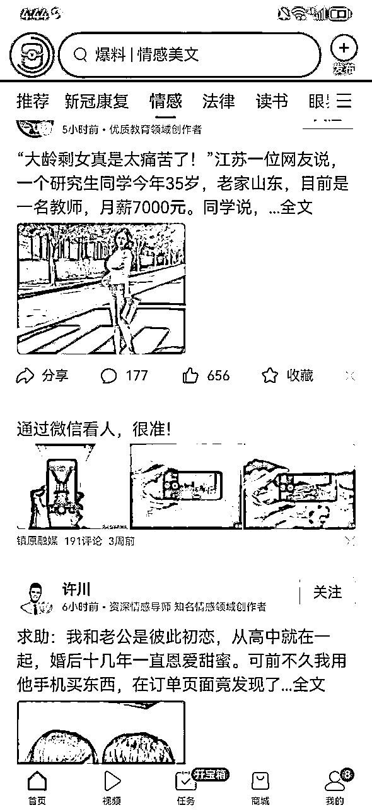
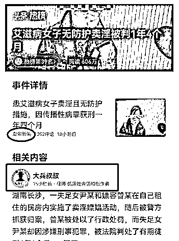
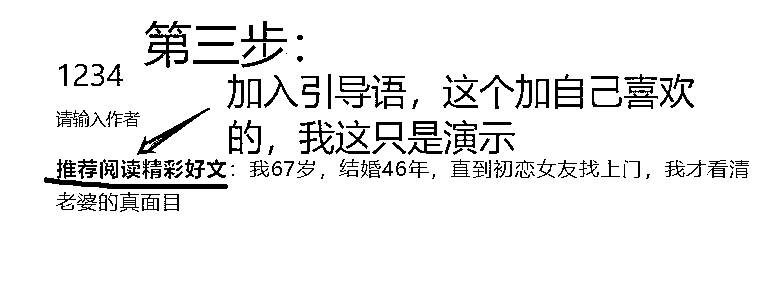
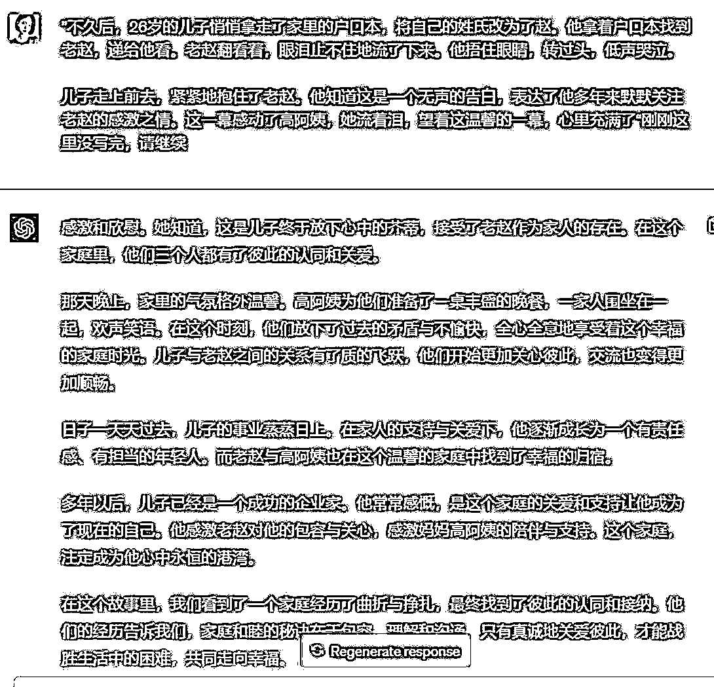
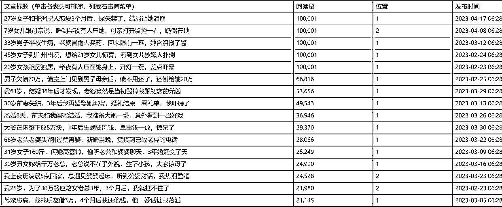
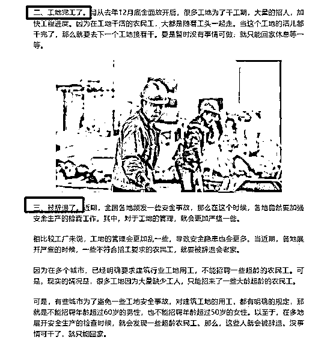

# 公众号爆文写作（原创）｜实战手册 202403

> 来源：[`jviztcgxxfy.feishu.cn/docx/ONRfdTa38oE3ITxcHuhcHY3Cnog`](https://jviztcgxxfy.feishu.cn/docx/ONRfdTa38oE3ITxcHuhcHY3Cnog)

3 月航海｜公众号爆文写作（原创）｜实战手册

出品时间：2024 年 3 月 21 日

手册使用说明：内容出品人排名不分先后。本文旨在向你展示一个项目的更多可能性，帮助你更好地理解和实操。

建议：如果需要快速定位到精确内容，可以使用快捷键 Ctrl + F/command + F 的形式，搜索「关键字/词」，查找你想要的内容

# 写在前面

欢迎大家来到 3 月航海 | 公众号爆文（原创）| 实战手册，相信在接下来的日子里，我们将在这里见面很多次。

在开始做公众号爆文项目之前，让我们先来解决几个问题：

公众号爆文写作是什么？现在做还有机会吗？

相信很多圈友都有一个疑问：现在都什么年代了，还有人看公众号吗？大部分人平时都是刷抖音、看直播，哪有人还能看完一篇文章呀。那我做这个事儿，还能拿到结果吗？

答案是可以的！我们已经有很多圈友通过这个项目，拿到了不错的结果。其实原因也不难分析。以前的公众号，依靠的是社交传播，你得有逆天的内容能力，有大量的粉丝或私域流量基础，才有可能实现爆款传播。而现在不一样了，随着公众号“拥抱算法”，现在的文章，变成了“社交+算法”的传播逻辑，就算你公众号没有基础的粉丝，也能通过一定的技巧，进入到算法的流量池，获得推荐。说句夸张的话，就算我们 0 粉丝，现在也可能写出 10w+爆款。

公众号爆文写作项目，适合什么样的人？

如果你想找一个长期可发展的副业项目，那么公众号爆文写作，是非常值得尝试的。或者你以前注册过公众号，但是没怎么用，放着也是放着，那么更加可以通过这个项目获得一些收入。

本次航海主打原创手写文章，旨在帮助大家提升爆文能力，把基础打扎实后，再利用 ChatGPT 等 AI 工具辅助提效。因此手册重点补充了以下内容：

1.3 推荐机制

3.1.4 选题技巧

5.2.3 双倍流量主收益

5.2.4 提高推荐的几种方式

另外，教练 @安七 收集了航海群内新手的常见问题&踩坑点，统一做了解答，实操过程中遇到问题也可以来这里查询：《公众号小白变现从 0 到 1，最常见的 20 个问题》

希望大家可以在这次航行里收获成果外，结识一群战友。

以下内容由生财有术联合圈友制作而成，仅供航海船员以及生财有术星球圈友学习使用。

同时也欢迎圈友们在实践过程中持续反馈，和我们共同完善，可以联系鱼丸（yuwan387）提供修改建议～

话不多说，我们启航吧。

## 初阶篇（必修）：跑通最小 MVP

### 章节概要

在必修篇，我们将从认识公众号爆文写作开始，一步步带你完成整个项目流程的学习。你可以根据本章的步骤内容进行实操，跑通公众号爆文写作变现最小 MVP。

如果你以前没有接触过公众号，建议在正式实操前，先初步了解下项目全貌：

【项目概述】了解公众号爆文写作

如果你对项目已经有了大致了解，可以按照项目核心步骤，开始学习实操:

【项目实操 1/3】确定写作方向，开通账号流量主

【项目实操 2/3】爆文写作与发布

【项目实操 3/3】公众号变现

【复盘优化】通过优化与提效，提高爆文数量

在必修篇，航线图和手册顺序相对应，你可以按照手册的顺序进行学习，即可逐一完成航线图的每一个任务。

在后续的每个关键步骤的章节概要中，我们也将提到相关航线图，提醒你完成相关步骤。

接下来就正式开始吧！

## 一、【项目概述】了解公众号爆文写作

### 章节概要

本章节中，我们将一起认识公众号爆文写作项目。为了让大家获得更多项目信息，我们会从以下四个角度进行分析:

1.1.1 项目现状与前景

2.1.2 项目核心玩法

3.1.3 推荐机制

4.1.4 运营规范

每一期航海手册我们都会持续迭代，如果你是本项目上次航海的老船员，那么以下有新增/有修改的内容可能更值得关注：

5.1.3 推荐机制

6.1.4 运营规范

了解完上述内容后，大家能够对公众号爆文写作建立起基本的认知，也能在一定程度上找到自己的发力点。

### 1.1 项目现状与前景

圈友 @渭水徐公 认为微信公众号还有前途，就像它 2016 年和 2013 年一样有前途。

以下是他的观点：

回顾我们之前的成绩，单篇最高收入 7 万多，月入过万的 120 位同学，200 多位同学收益在 3000 以上，300 多位同学收益在 500 以上。

很多同学都是新手第一次写，从零开始到有收益，特别快，第一期有同学 3 天就开始有收益，而且是 300 多块。从结果上来说，成绩是不错的。

大家都知道在最近头条，百家等平台，流量收益跌了很多，有些同学单价跌了快十几倍。

但是公众号就不一样，它花费的时间短，一般公众号一篇文章 1500 字左右，用嘴炮大法也就半个小时，打字也就一个小时。

从字数上来说，字数少，流量单价特别高，长尾流量特别长。

所以不管是从收益来讲，写作难度上来讲，还写作时间上来讲，公众号写作是近段时间自媒体最容易上手和赚钱的。

这里附上一些变现截图，供大家参考：

注：以上均为坚持日更的作者收益

目前公众号的 eCPM（每一千次展示可以获得的广告收入）虽然持续降低，但是它依然比其它平台收益单价高，一些蓝海赛道玩法，做的人很少。

对于新手来说，目前最适合入局了，返璞归真的做法，也就是提升爆文能力而非依赖 AI 智能，更容易收到效果，正反馈也比较快。

### 1.2 项目核心玩法

#### 1.2.1 最小 MVP 路径 & 关键步骤

公众号爆文的玩法简单来说就是：

当你的账号粉丝满 500 后，可以开通流量主变现功能。随后每发布一篇文章，就可以在里面插入广告，从而获取收益，微信会把收益直接打到你绑定的银行卡。

因此，公众号爆文 0-1 的最小 MVP 可以总结为：

确定赛道 - 搭建账号 - 开流量主 - 找对标（关键） - 写文章（关键） - 插广告获取收益。

其中，找到合适的对标账号和文章，并写出优质文章，是项目的关键步骤。

当然，完成最小 MVP 后，核心是提高写作质量和效率，所以搭建素材库对于拿到结果也非常重要。

#### 1.2.2 变现方式概要

公众号变现方式主要有两种，广告变现 和 打赏变现。

广告变现，是公众号变现的主要方式，也是本期航海的重点。

广告变现还可以分为以下几种（但是公众号爆文项目不涉及）：

打赏变现，通常出现在 IP 属性较强的公众号里，因此不是本期航海重点。

### 1.3 推荐机制

#### 1.3.1 排序模型 @肖旭东

在一个推荐系统中，系统计算用户最近一段时间的累计值，这个累计值有两个关键要素，一个是统计时间周期，又称为时间窗口，一个是用户标签。

时间周期支持随着时间变化，那这个时间窗口就是动态变化的，根据动态变化的情况会有许多细分的窗口类型，用以解决不同场景的问题，推荐系统模型来计算读者和公众号+文章的匹配度，专业术语叫排序模型。这个算法适用于最近一段时间，比如最近 x 时/天/周/月/年。

最近一段时间的实时阅读量、点击率、点赞率等等

最近一段时间的实时新增用户数、点击率、在看率、完读率等等

对推荐机制感兴趣的圈友，可以看一下圈友@肖旭东 的这篇文章《公众号，与其推文自嗨，不如用术生财》

#### 1.3.2 赛马机制@枫宇翔

1.3.2.1 什么是赛马机制

赛马机制是属于推荐系统比较通用的机制，不仅适用公众号，也适用于抖音、快手、视频号等等，建议大家看看。

1、 为什么会出现赛马机制这种东西？

大家知道，公众号、抖音、快手、视频号等平台，都是过亿的平台，每天估计有几千万的创作者都在上传作品，而这些作品有些优质，有的很差劲。

而作为一个平台，对于优质的作品肯定是非常渴望的。

因为优质的作品可以吸引更多人将自己的时间投入到这个平台，增加这个平台的活跃度，促进平台的正向发展。

平台想要在每天上亿的作品里面筛选出优质作品，必然需要各种各样高效的机制来进行筛选，而赛马机制就是其中之一，也是被自媒体作者广泛认可的。

2、 赛马机制底层原理

以公众号平台为例，当我们发布一篇或者多篇文章到平台，会进行去重检测、机审，原创检测，在其中任何一个环节出现问题，文章都将被打入低流量池，最终导致你的文章可能就几十个阅读量就不动了。甚至检测出来太严重，直接就发不出去了。

而当上面的环节都通过以后，你发布的文章将进行分发，而此时别人的文章也在进行分发，你们的赛道相近，目标人群相似，比如说，大家都是发情感类文章，系统肯定是想要把优质的文章推到用户面前，这样才能吸引用户的注意力。

那么，大家发的都是类似文章，系统怎么去确定哪个文章更加好呢？

系统会将不同文章发送到目标人群，最开始曝光人群最多就几百人，系统就相当于让这几百人给这篇文章进行打分。

而这个打分就体现在，你的文章数据，比如说，完读率、点赞数、转发、评论区讨论等等。

你的完读率更高，说明用户看得更加仔细认真。

你的点赞数高，说明有很多人是喜欢你的文章。

你评论区讨论得很激烈，说明你的文章具有争议，有话题。

那么，你的文章必然将胜出，同时，胜出的文章将进入下一个更大的流量池，而这篇文章将与下一个流量池的文章重复上面的数据对比，如果失败了，则停留在当前流量池，如果胜出了，继续进入下一个流量池，使得你的文章被重复推荐，从而让阅读量不断达到 5 万、10 万、100 万、1000 万。

这个过程就好像多匹马在进行赛跑一样，因此，这种机制也被我们形象地称呼为赛马机制。

1.3.3.1 如何利用赛马机制

好了，我们现在已经清楚地认识到赛马机制，那对我们有什么作用呢？ 主要是四个角度的思考。

第一、少跟随主流，积极寻找蓝海领域。

即使小众也无所谓。因为这些领域就意味着发文章的人少啊，那么，只要你把文章写出来以后，和你竞争的文章会更加少，那么你的文章将一次次胜出，不断进行下一个大的流量池。

中国有 14 亿人口，再小众的领域，都拥有极为庞大的目标群体，只要你爆起来，十万加，那是没问题的。

第二、选择好发布时间，有可能会带来帮助。

正如大家看见的，你发出的文章需要和其他人的文章进行赛马，那么，错开别人的发布时间，有没有可能提高爆的概率呢？

所以，大家找到对标后，和对标的时间稍微错开一下就行了，比如说，对标是晚上 8 点发，你就晚上 7 点发。

当然，你也可以尝试在其他时间发布测试一下，然后，到微信公众号网页后台，进入内容分析模块，多分析数据多复盘，看看自己账号哪个时间发布比较好。

第三、加强文章的完读率等数据，因此，赛马的时候就会看这些数据来对文章是否优质进行判断。

那么，在标题吸引用户点击进来以后，大家就着力提升这些数据。

比如说，960 多字起步，文章的文中就可以有两条广告了，那么，大家就没必要写太多字了，让用户更快看完全文，那么，你的完读率必然相比较长文来说，会更高。

文章开幕雷击也要运用好，并且在文章的中间、结尾等地方留下钩子，吸引用户不停往下看，从而提升完读率。

同时，在文章里面也稍微引导用户去点赞、收藏、转发，这就和短视频一样，许多博主都会在结尾处让用户去点赞收藏，都是同一个道理。

第四、学会与对标爆款文章进行差异化

既然是赛马，那么，你写文章的时候就要仔细分析一下对标账号的文章，要做到人无我有，人有我优。

具体点就是，对标如果是笼统写，你就写详细点，对标如果是给出的素材很模糊，你就搞清晰点。

对标爆款文章在论证一个观点的时候，只给出三个角度分析，你就是五个角度，而且每个角度写得比他还生动。

对标的标题写得不怎么样，也爆了。 那么，你就把那几个标题的起名方式利用起来，那么你爆的几率也会更大。

如果你搞过视频，你就会发现，这种方式也是能适用的，因为赛马机制就是最通用的机制。

### 1.4 运营规范

公众号爆文是一个需要时间积累的项目，粉丝量越多，阅读量越高；反之阅读量高了，文章进了池，粉丝自然也会增加。公众号爆文只有合规了才能长期健康的发展，因为很多船员在运营的过程中违规了疏忽了平台的规则，就前功尽弃了。所以在这里给到大家官方的平台规范，供大家进行阅读。

#### 1.4.1 微信公众号平台运营规范 （官方）

https://mp.weixin.qq.com/mp/opshowpage?action=newoplaw&token=464216875&lang=zh_CN

#### 1.4.2 微信公众号推荐运营规范 （官方）

写文章的时候滑到最底部，有一个 "不允许被平台推荐" 旁边有一个 ? 号，点击即可看见 "推荐规则" 四个蓝字，点击即可跳转到，微信公众号推荐运营规范 （官方）

最后总结。

大家在写公众号的时候，也要保持住自己的底线，不要涉党涉政、不要造谣诽谤他人。不然，轻则违规封号，重则被请去喝茶。

通常来说，你选择一个领域，按照对标的选题、文章风格去写，除非你自己飘了，基本上都不会出现严重的违规，毕竟，他们文章选题发出去，文章没有被删除，说明还是可以发的。

对于新手来说，目前违规最多的应该就是，滥用原创。出现这个问题，大多都是洗稿导致的，尤其是 AI 洗稿。

这边还是建议大家能够具备一种能力，就是说，在理解到原文意思的基础上，用自己的话写出来，并且尽可能写详细点，通常不会碰到这个问题。

通常来说，保持住上面几点，大家违规的概率会少许多。

## 二、【项目实操 1/3】确定写作方向，开通账号流量主

### 章节概要

从这一章开始，我们就正式进入公众号爆文写作的项目了。我猜你应该会有这样一些问题：

我以前没有接触过公众号，适合我这种新手的有哪些方向呀？

我想找到一些不太卷，还有高收益的方向，能不能找到呢？

听说开通流量主，需要 500 粉丝，我是新号，难道要先涨粉才行？

别着急，这些问题，你学完本章节，都能得到解决。这一节我们会围绕这些内容进行分析：

准备的好的话，我们就开始吧！

### 本章航线图

完成本章节的学习和实操，即可完成航线图的 第一阶段：确定赛道，准备 2 个账号（约 1 天）

1.确定 1 个写作赛道，2 个细节方向（约 1 小时）

2.完成 2 个公众号的搭建（约 0.5 小时）

3.每个账号积累 500 粉丝，开通流量主（约 0.5 小时）

那么现在，就请开始完成这几个步骤的筹备吧。

### 2.1 确定赛道和写作方向

#### 2.1.1 怎么选赛道？

我这里介绍一个，我自己一直用的选题方法，就是你【感兴趣和擅长的，你的技能和工作经历、市场所需要的（饱和还是不饱和），输出习惯】，四点融合，达到最大价值，就是你选择的领域：

1、你感兴趣和擅长的，你就能有意愿日更，不管有没有收益，你都愿意下去。

2、你的技能和工作经历，你就喜欢琢磨复盘，越复盘越精进。

3、市场所需要的，是目前供大于求，还是供过于求，卷的程度，自己感知或者去新榜瞧瞧。

4、最后一个，你是否有意愿改变你的输出习惯，之前没有是否愿意改变。

以上 4 个选项，每个选项 25 分，给自己打分。

比如我选择的赛道是：娱乐领域里面的剧评，我开始给自己打分：

1、我感兴趣，15 分，因为还不够狂热，当然也没有太多时间追剧，因为要带娃，写作。

2、技能与经验，15 分，这个就要从知道、了解、熟练、精通四个阶段去评估，从一开始的 10 分过渡到 15 分，或者叫提升。我知道娱乐领域可以做，但是了解还需要深入了解，整个文章流程熟练了，也就完全精通了。

3、市场需要的，电视剧和电影的剧评，这个目前还是刚需，是非饱和状态，一定是 20 分以上。

4、输出习惯，这个习惯很重要，没有的话，要去培养，就跟写作能力一样，我给自己 20 分。

这一加起来，算出来 80 分，可以做。

0 到 100 分，40 分以下就要考虑换一下，40 到 60 分，看看四个方面那一方面要克服，60 分以上可以入手。

分数越高，主观能动性越强。

#### 2.1.2 爆文赛道推荐

目前已知的，在公众号上取得不错成绩的赛道有 6 个：

这 6 条热门赛道，适合新手入门。至于卷不卷，我认为可以通过【章节 2.1.1】的选赛道方法，去筛选适合自己的细分赛道，并根据目标人群，去布局文章，就不会卷，值得大家长期做下去。

当然，如果你学习能力快，接受新事物能力很强，也可以尝试一些比较新的热门赛道，具体可查看【章节七、当前爆文蓝海赛道推荐】。

建议新手选择 1 个赛道，2 个细分方向坚持创作，更容易出成绩。

本次航海会以这 6 个热门赛道为例，教大家如何写出爆款公众号文章。

由于这五类文章都是由：素材+选题+正文+标题等构成，所以本次航海手册内容，会在同一章节下，穿插不同类型的文章写作技巧。比如「3.1.2 五个推荐赛道的选题方法」这一章节，就会分别告诉大家情感类、热点类文章等该怎么找选题。

### 2.2 注册公众号

第一步：准备身份证＋配套银行卡

对于新手来说，建议准备 2 个公众号。

准备 2 个号，一方面是用于规避账号违规风险；另一方面主要是为了对抗不确定性，当你 1 个账号迟迟没有流量时，你不会因为只有 1 个账号而陷入深深的自我怀疑。

注意：1 个身份证及其配套银行卡，只能注册 1 个公众号。

也就是说，个人只能注册 1 个号（除非你是个体工商户/企业/其他组织 可注册 2 个账号，政府和媒体可以注册 50 个）。

注册 2 个号的话，可以借用下家人的身份证就行。

第二步：完成注册

进入微信公众平台 https://mp.weixin.qq.com/-->点击右上角的“立即注册”选项，会跳转进入注册网页，选择“订阅号“并点击它，进入后，按提示填好相关资料即可。

### 2.3 账号包装

公众号的账号包装，并不复杂，主要涉及：账号名称、简介。

对于大部分新手来说，选取一个好记、并且和自己做的领域相关的名称和简介即可。

对于深耕本赛道的圈友来说，账号包装也可以涉及公众号 SEO，但由于本次航海主要是教大家写出爆款文章，所以这里就不展开说了。

有余力的圈友，可以看下圈友 @郭耀天 的这篇公众号 SEO：《最新公众号 SEO 核心玩法，自动引流躺着赚钱》

### 2.4 开通流量主

注册完了公众号之后，需要 500 粉丝开流量主，买粉直接开的效率是最高的，且不会耽误后期的流量。买粉的渠道，某宝上一抓一大把，此处不再赘述。

这里注意：刷粉可能会被平台封号。如果买粉，就要做好封号的准备，大不了封号注销重来，平台的管控是阶段性的，建议多在航海群内交流，及时获取最新信息。

开了流量主之后，记得先挂着原创群发三篇文章，之后就可以获得打赏权限。账号名字头像和打赏的名字头像，要尽量让它一致，这样看起来人设更真实。

到这里，前期的准备基本就完成了。

这些地方完全无需纠结，把内容做好才是重中之重，此外全都是细枝末节，大家千万不要舍本逐末。

## 三、【项目实操 2/3】爆文写作与发布

### 章节概要

这是我们这个项目，最重要的一个章节，也是大家用时最多的部分。

一篇公众号文章，是由选题、正文、标题组成的。

选题，就像是文章的骨架，它能决定文章最终的样子。正文呢，就是文章的血肉，填充骨架丰富细节。标题则是一篇文章的外衣，它能决定你的内容，是否能让用户在人群中，一眼就发现你。

我们这个章节，会围绕这三个元素，来依次展开。

第一节：找到适合自己的选题

第二节：写出让人看完的正文

第三节：取出打开率高的标题

每一期航海手册我们都会持续迭代，如果你是本项目上次航海的老船员，那么以下有新增/有修改的内容可能更值得关注：

希望大家能持续练习，不断提升自己的爆款能力。

加油，这个阶段结束以后，我们就有机会收到爆文广告的第一笔收入了。

### 本章航线图

完成本章节的学习和实操，即可完成航线图的 第二阶段：爆文写作与发布（约 5-7 天，每天 3-5 小时）

1.“搜一搜”找低粉爆文，找到至少 3-5 个对标账号（约 1 小时）

2.模仿对标选题，完成 1 篇正文制作（约 3 小时）

3.学习开幕雷击等技巧，写文章开头和标题（约 1 小时）

4.保持单账号日更至少 1 篇，争取账号入池（每天 3-5 小时）

那么现在，就请开始完成这几个步骤吧。

### 3.1 找到合适的选题

### 小节概要

公众号领域，一直流传着一句话“选题定生死”，这就像卖货一样，选什么品，能够决定你的消费人群有多大。

我们这节的内容，会来给大家梳理些快速的找选题方法。

第一部分，航海手册会教你，怎么只通过一个关键词，不断的发散，来找到一周、甚至更多的选题。这个方法，适合所有内容方向。

第二部分，我们会围绕公众号热门的六个赛道：职场、热点、剧评、法律、历史、情感。来分别展开说一下，它们的选题小妙招。

最后一部分，我们会聊一聊选题的“坑”。我们一开始说了“选题定生死”，这话并不是危言耸听。如果你选到特别危险的选题，是可能带来毁灭性的打击的。好一点的情况下，文章被封禁，坏一点的情况，你的整个账号就没了。那要如何规避这些风险呢？这一部分会给你讲明白。

好的，如果你准备好了，那就开始进入学习吧。

#### 3.1.1 通用选题方法——“微信搜一搜”找爆款对标 @枫宇翔

对于新手来说，最高效且最快能出成绩的选题方法就是找对标爆款文章，那对标怎么找呢？

最常用的就是去微信搜一搜里，根据领域关键词，寻找你要模仿的爆款文章；一旦你用了搜一搜，微信的算法会一直给你推荐相关文章，这样的文章会越来越多，所以这个方法是眼下最快的。

3.1.1.1 怎么确定搜索关键词？

看到了这里的，应该已经看了 2.1 确定赛道和写作方向。

第一、确定你的第一个关键词。

而选择好赛道以后，比如说，三农、军事、情感、法律等等。那么，这个时候，你必须得根据自己的经验以及常识去想到赛道的第一个关键词。

如果是写情感领域，我首先想到的关键词，就是婆婆、婆媳等等，你去搜绝对能搜索到爆款。

而我之前也推荐过一个领域，叫做大厂裁员系列，那么关键词必然就是，裁员、毕业、失业、降薪、减薪等等。

如果实在想不到其他关键词，就把三农、情感等当做关键词，直接去微信的搜一搜，也能找到第一篇爆款，就是费点时间，毕竟，你根据自己的赛道，想的关键词越精准，那么，搜索速度越快。

例如，就在写这个问题回答的时候，我就简单从微信搜一搜，打上 "裁员" 两个字 。

大家看见没有，马上就能检索到 10 万+ 的爆款文章，只要你找到第一个爆款文章，就可以获取第一个对标账号了。

大家在这一步不要偷懒，这个是从 0 到 1 的过程，是必须要经历的。

而通过这个方式，找到爆款对标账号以后，就可以进行下一步，获取更多关键词。

第二、套娃式获取更多关键词。

公众号爆文能爆的很大一部分原因在于标题起得好，里面就包含了这个赛道有流量的关键词。

而这个时候你首先要拿着对标账号，找到这个账号里面几万阅读量甚至 十万+ 阅读量的文章，把他们的标题给我扒下来。

在上面，我以 "裁员" 两个字进行检索，出现了 "职场辣评" 以及 "猫姐杂谈" 两个号，那个，我进入职场辣评这个号里面，稍微看一下。

从这个图里面，标题里面，国企央企、欠薪、降薪、亏损等等都是关键词，甚至你可以直接拿这些标题直接到 "搜一搜" 去搜索文章，你马上又可以获取一堆爆款文章，进而得到一堆对标账号，你继续重复上面的动作，你就可以源源不断获取关键词，套娃式获取爆款文章以及对标账号。

可能还有一些第三方平台吧，但是，我没用过，太麻烦了。

我的风格讲究的就是简单粗暴，见效快

额外说一下，像其他平台，比如说，头条，上面都是有频道分类的，你如果是写军事，你点一下军事频道，会有大量的文章出来，那些标题其实就是关键词，一个个拿出来。

有人说，文章里面也有关键词。嗯，的确也有，但是，我懒得看，直接标题搞起，毕竟大家第一眼都是被标题上的关键词吸引的。

3.1.1.2 怎么选择对标爆款文章？

想要判断哪篇文章是自己的对标爆款，就根据几个指标就行了，简单点。

第一、通过搜一搜，搜索到文章以后，首选 10 万+ 爆款文章，其次才是那些 七八万 阅读量的文章。

第二、文章发布的时间是最近三个月的，越早越好。为什么？遵循一个很朴素的理念，爆过的内容依旧还是会爆，这篇文章最近发布爆了，说明有流量，你去写的话，有大概率还是会爆。

第三、有前两点以后，你还得看看这个文章的发布账号的最近注册时间，最好也是最近三个月注册。为什么？有的账号注册时间久、粉丝数量高、原创文章比较多，这么高的阅读量也有可能是粉丝带起的。而我们需要的是低粉爆款的文章，因为这些账号本质上和我们是一个层次的，他爆，你也有很有可能会爆。

3.1.1.3 怎么拆解爆款文章模版？

其实是很简单的，你找到爆款以后，直接把文章通读一遍，确定一下文章的核心意思，按照文章的开头、中间、结尾以自己的话写出来就行了。

就比如说，还是以上面那个职场辣评的号来说，我找的这个号二篇文章来说。

《地产已死，国企央企也逃不过房企大面积裁员，欠薪》

《某大厂裁员还在继续，大晚上突然被毕业！》

大家把这两篇文章通读一下，核心观点，就是突然之间被裁员。

然后，文章的模版就是：

① 开头就是对于这些企业做一个简单介绍。

② 深度分析一下为什么这些被认为不可能裁员的企业，也会进行裁员呢？

③ 结尾进行总结，并且给出自己建议

反正，你通读读文章的时候，就得注意文章转折点，比如说，有 "但是"、"为何、为什么"、“不过”、"然而"，这些通常都表明作者要开始进行转折，下面要说的内容和上面说的内容开始有区别了，然后，你把上面和下面的内容浓缩一下，就是一个爆款文章的模版。

除了这个领域，其他领域应该也是有这样的词语，来表示内容的递进、深化。

其实，这就是我们中国人说话或者写文章的习惯啊，我们想要表达另外一段内容，肯定是需要一个词语进行转折一下，不然，就会显得很突兀，文章读起来很难受，别人听你讲话也很难受。

可能某一个特定领域会有具体的模版出来，但是，手册是面向所有人的，每个人写的领域都不太一样，对应的模版也不太一样，大家掌握这种思考方式，根据自己领域，手动分析拆解一下自己领域的爆款文章。

对标账号以及爆款文章都已提供了，做一个案例进行分析了。

如果你还不太理解，就直接先给我抄起来，写着写着，你自己就会开悟了。

#### 3.1.2 六个推荐赛道的选题方法

3.1.2.1 职场类：如何选题 @枫宇翔

对于职场类的赛道，我是想更加细化一下，给大家说说大厂裁员&薪资泄露系列是如何进行选择。

这个赛道在去年直播以及各个场合，我都是极力推荐的，因为在目前大环境下，企业进行降本增效会不停优化人，导致许多人都关注裁员、优化这些事情。

而这些人通常最喜欢的就是在职场类应用进行吐槽以及分享自己的故事，而这里就是我们选题的来源，其实以脉脉这个应用，最为突出。

大家直接到下载脉脉，注册并登录，自己刷到关于一些大厂的信息，或者直接在脉脉搜索对应的大厂，可以直接获取一大堆所谓的员工爆料。

基本上只要关于大厂的一些消息，网友都比较关注，本身这些公司都自带热点，你只要搜索出来后，将主题截图以及评论区截图放在文章里面，同时，根据自己的观点对这些现象进行解读就行了。

而在这些大厂消息中，裁员消息、薪资泄露等都是被验证过，是有人写出来并且产生爆款的，在手册 7.7 职场裁员&薪资泄露系列里面，我也很明确给出了对标账号的给大家去参考参考，这个账号就是 2023 年 12 月 19 日正式开始更新职场信息，其中包括了裁员、薪资泄露等等，截止到目前为止，数据都挺不错的。

脉脉这个 app 里面互联网企业居多，大家也可以迁移到其他行业，比如说，公务员、设计师、房地产等等都应有这些信息，你可以到头条、百家号、抖音、快手等等去进行搜索。

如果说你正好是这些行业里的人就更好，应该就一些专业网站或者 app 里面有这些消息存在，因为我本身是程序员，所以对于互联网企业的消息是比较关注的。

在这里注意几点：

① 裁员、薪资泄露等等，都是众多消息的一种，大家通过脉脉也可以挖掘出更多方向。

② 大厂的这些裁员、薪资泄露信息，虽然受到关注，但是，也容易被大厂的公关注意到。因此，大家在写的时候要注意一点，仅针对网友发出的评论进行讨论，别自我想象，尤其别乱造谣或者引导攻击这些公司，保持客观的态度，通过这些信息表达自己的职场态度。

大家观摩观摩那个对标账号，看看人家是怎么写。

③ 除了脉脉，知乎、豆瓣、BOSS 直聘等等都可以获取职场信息，尤其是关于裁员的社会新闻或者公司老板公开对于裁员的看法，大家也可以拿到文章里面写，大家可以看那个对标账号就知道了，核心是职场+裁员，但是，形式是慢慢发生改变。

3.1.2.2 热点类：如何选题

热点类的选题，当然是优先从各类热榜上选题。我常用的是微博热榜和知乎热榜，但在具体的热点亚种中，选题的方向也是略有差别的。

“指点江山类”，就是专门抨击当下社会不公事件的内容，主要的阅读者是中老年男性粉丝。

在给这类内容做选题时，知乎热榜明显优于微博热榜。因为知乎对社会的负面新闻曝光的力度会更大一些，微博热榜则粉饰痕迹较强，力度也会远远逊于前者。

我们必须关注到一个问题，有很多的知乎爆款的回答，明明它有流量，但却和热榜没什么缘分。这些内容，往往比热榜上的内容更尖锐，写出来也更容易爆。因为这些内容，都是大伙一个赞一个赞票选出来的，证明它已经成功撩拨起了读者的情绪。我们选题，要选的就是这样刀刀见血的好内容。

所以“指点江山类”的选题思路那就是：知乎自然爆款 > 知乎热榜 > 微博热榜。

“娱乐热点类”，就是专门追当下的娱乐热点，主要的阅读者是中青年女性。

这类的选题不用多说，对大多数的作者来说，微博热榜的作用是高于一切的。我们需要一天多刷几次微博，看到微博的热榜字样。有“热”字的可供挑选，有“沸”字的要优先选，有“爆”字的不仅要优先选，甚至要当天尽快出文章。否则流量就会减弱很多。

所以“娱乐热点类”的选题思路，就是：饭圈小道消息 > 微博热榜 > 知乎热榜

“养生热点类”，就是专门做科普知识类的内容，主要的阅读者是不分性别的中老年人。

特别提示，这个“养生”和我们认知里的“养生”不太一样。它一般都来源于一些古话，什么“立春三不吃两不喝”之类的。老年人的死亡焦虑和疾病焦虑很重，他们看到这类的内容，会为我们贡献很多阅读量。

我们需要做的，就是结合农历的节气，以及在热榜中，挑选出和“健康”相关的内容写文，但写的时候只能往古代习俗上靠，不要给任何医学建议，否则会严重违规。

所以“养生热点类”的选题思路，就是：节气≥微博等平台的健康类选题

其余的热点类亚种，我接触得比较少，就留待未来探索了。

3.1.2.3 剧评类：如何选题

剧评类的选题思路，一共有两个。

第一个是“热点+剧评”向。比如最近，电影《满江红》就非常火，人们对它也是褒贬不一。如果在这个阶段，写出五六七八篇角度新奇的影评，就能够吃到《满江红》的流量。

第二个是“经典老剧”向。比如《知否》《甄嬛传》《大明王朝 1566》等等。这些老剧本身的流量就非常大，而且信息量也很大，随便一个细节就能挖出很多内容来，写来写去都不会太缺选题。不夸张的说，给一部剧写出几百篇都问题不大。

两个方向，都可以作为你的选题方向。

3.1.2.4 法律类：如何选题

建议大家在写新闻的时候尽量选择官媒报道过的，这样就很少会出现被投诉的情况。

我们一定要记住，新闻不要涉政涉军，最好全都是蹬鞋踩袜子，家常里短之类的民生新闻，一定要与老百姓的生活密切相关。那些能爆的新闻类内容，几乎全都是此类的内容。

所以，我这次没有建议大家去微博知乎找，原因就在于此。除了这些地方，各地的新闻节目也可充当素材。你看到哪条新闻时感觉血压上来了，就选哪条新闻，看着没感觉的就不选。

如果理智一点的话，就对照着开幕雷击七要素选，占 2 条要素以上的新闻要优先录用，只占 1 条的不建议使用，1 条不占的绝对不能用。

后面的法律条文，直接百度检索就可以，检索的关键词，就是新闻故事的本质。比如说，一个人把另一个人的头打破了，你就可以检索“把人打成轻伤怎么判刑和赔偿”，然后能得到大量的资料，然后汇编到这个模块就可以了。

3.1.2.5 历史类：如何选题

历史类选题其实也可以追热点，也可以中规中矩，按自己想法写。

1、所谓的追热点，就是要时刻关注热点动向。

例如”胡歌生女，众人震惊“，我们也可以寻找一些重要人物的出生或者他生了孩子，也引起巨大反响。当然，这个热点，需要非常大的契合度，在经验不足时不建议写作。

类似的还可以找到“县长贪污”的新闻，可以借助这个事件写古代官员如果贪污，会被如何处罚？“明星和粉丝”，写一下古代的追星族的狂热 ，比如《大宅门》里白玉婷嫁给尚筱菊照片的事就是有历史原型的。

注意：追热点历史，需要找到契合度非常高的，而且从今观古，需要作者相对比较高的写作功底，各位可以在以后的写作中慢慢为自己加分。

2、中规中矩写作，就是按照我们自己的想法，写出自己喜欢的历史人物和事件。

写作最重要的就是要写的高兴，可以选择敬佩的人物，讨厌的人物，觉得惋惜的人物，让人落泪的人物，都可以。

找到人物之后，确定好写作的基调，包括他的人物事迹，就可以大致给这个人物一个基本概括了。是敬佩，是同情，是值得肯定还是毁誉参半，全文按照一个基本的思想去写作，就没有什么太大的问题了。

比如写隋炀帝，基本上绕不开劳民伤财，暴政，急躁等缺点，写唐太宗，就可以用虚心纳谏，宽厚爱民等等角度来为他打光。

对于一些记载很少，但是非常喜欢的人物，可以从他的前人后人，身边人等等角度来写作，也可以适当编撰一些，但是不要太过虚假，始终保证假故事也要为真性格服务即可。

再推荐一个圈友@一来 试过的近代史领域的选题，如果你在写历史类的领域，近代史也可以涉及一下

近代史这个领域起号相对比较难，常常需要一个月，甚至还有不确定的地方，但是如果账号进入了流量池，这个领域的阅读量还是比较稳定的。

大家可以参考一个账号叫“飞扬说史”，基本上每天都有大小爆款。不好的地方，文中经常也会没有广告。

内容来源：6 月 8 日《公众号流量主的经验分享》@一来

3.1.2.6 情感类：如何选题

对于情感类的爆文来说，就要选择有爆款潜质的素材。大家可以到各大平台找符合潜力的素材给自己找灵感、

比如：能引起共鸣、感人至深、有争议的、事出异常的素材。其中包括：

1）有曲折性；

2）有情绪；

3）有信息增量；

4）有关民生问题；

5）明星名人；

6）性；

7）暴力；

8）金钱。

一个故事里，要包含上面 8 个要素中，至少 3 个以上。

#### 3.1.3 选题避坑经验 @半糖梦呓

公众号同样都是公域流量，措辞上一定要非常注意，有时候题材踩了坑，写得再好也很难爆。甚至有时候用了某个违禁词，也会被平台打压。

那么具体有哪些坑需要避免呢？主要包含以下三种：

3.1.3.1 政治红线不能踩

内容平台每个月都要封禁几千上万个账号。这些账号当中绝大部分都是些很黄很暴力的号，还有相当一部分是因为踩了政治红线而被封禁。

什么是政治红线呢？

我们只需要记住两个词：党史、军史。（准备写文史类内容的作者尤其要注意）

我们的党和军队都是正面的形象，我们在写作的时候，也只能选择正面的内容来写。除此之外，其他的都不要写了。如果想要确保足够的安全，1840 年以后和中国有关的任何事情，最好都别写了。

而民国的人物和历史，半糖的建议是慎写，新手最好不要触碰。

文史领域本身就比较敏感。我们作为自媒体人，更要牢记使命，不忘初心。不该说的话，一个字也别多说；敏感的历史事件、人物一根头发丝都不要提。

那么有的小伙伴说，我就喜欢历史怎么办呢？

建议新手可以从古代史入手，而且是最好是中国古代史。一来比较安全，二来受众广话题多，容易出爆款。

3.1.3.2 追热点不吃人血馒头

追热点是自媒体人的天职，但是有一类热点在公域平台写作，绝对不建议碰的，那就是吃人血馒头。

什么叫吃人血馒头？

第一个例子叫做二更食堂。

这个号曾经是一个百万粉丝的大号，现如今已经被封号了。原因是滴滴空姐被害事件后，二更食堂利用大众对这件事的关注度，编造了许多无中生有的情节，用词情色、猥琐，对死者是一种侮辱。

这种行为就叫吃人血馒头。

吃人血馒头的后果就是百万粉丝大号说封就封，一点余地没有。

第二个例子叫做今夜 90 后。

一个孩子和母亲吵架后跳桥了。今夜 90 后虚构了许多不存在的细节，事后证明这些细节压根就是杜撰的，只是这个博主为了博人眼球罢了。

这个账号同样被封禁了。

利用逝者大做文章，甚至编造出一些不存在的细节，用夸张的、性暗示的语言来描述该事件，这种吃相实在是难看。网络不是法外之地，更不是道德禁区。中国人向来认为死者为大，如果谁想拿逝者来做文章，是会激起众怒的。

有的小伙伴就问了：碰到这样的热点，我不吃人血馒头，也不脑补造谣，我就是站在小老百姓的角度，评判一下社会不行吗？

不行。

因为这样一不小心就会挑起社会对立、煽动仇恨情绪。那么多正面事件你看不见，专盯着社会负面写，不封你封谁？

3.1.3.3 财经、健康需要资质才能写

最近有小伙伴问半糖：“我昨天发了个微头条，竟然被官方删除了？”

问清楚后，发现他没有财经资质，却写了财经方面的内容。

财经、健康领域都属于需要完成职业认证才能写的领域。没有认证的作者写作这两个领域，要么被限流，要么被删文。总之，想做大，是万万不能了。

头条官方对于财经和健康领域的作者门槛有很明确的规定，需要进行职业认证，具体如下：

财经领域——要满足以下 22 种职业中任意一种情况并提交证明资料，才可以进行职业认证：

经济学者、财经评论员、财经媒体人、市场研究员、特许财富管理师、金融风险管理师、财经/投资分析师、特许金融分析师、投资经理、基金经理、交易员、银行行长、精算师、注册会计师、注册税务师、私募投资人、证券投资顾问、保险经纪人、保险代理人、理财规划师、黄金投资分析师、证券经纪人。

健康领域——以下十种情况中任意一种并提交证明资料进行职业认证：

医生、护士、药剂师、康复治疗师、放射/检验技师、医院院长、营养师、医药研究员、医药工程师、心理咨询师。

更具体的内容可以去头条职业认证的认证标准处查看，此处不赘述。

如果以上情况都不满足，财经和健康这两个领域就别碰了，这是属于非专业人士的禁区。

以上三个禁区属于摆在明面上不能写的内容，在任何公域流量平台都是共通的。

当你避免了以上违禁内容时，还有一些细节于需要注意。

首先是查询违禁词。

关于违禁词，大家可以使用句易网微信公众号，把自己写的内容粘贴进去查询，系统会自动过滤出违禁词。

查了之后，你可能会感到意外：这不是天天挂嘴上说的词吗？怎么也成了违禁词？（具体的大家自己试试就知道了，违禁词半糖就不给大家举例了。）

如果没有违禁词但是依然被限流，那就要找找是否有标题党嫌疑了。

怎么找呢？给大家举一个例子：

上周，一个小伙伴问我：半糖老师，这篇微头条被警告了，该怎么修改呢？她的原开头是这样的：

闺蜜和前夫打来电话，要我退还 1000000 给他，我把他爆骂一顿之后拒绝了。他又发来一张照片和一条信息：晚上 8 点来我家。我呆呆的看着照片，眼泪夺眶而出，恨不得打死我自己。

系统的警告的理由是“刻意隐瞒关键信息”。

那么这个“隐瞒关键信息”到底是啥意思？通俗来讲，就是标题党。

曾经被全网戏谑的 UC 震惊体，就是标题党中的“翘楚”，套路是故弄玄虚，小事夸大，隐藏主语，读者被标题吸引进去后一看，后面的内容简直就是智商被按在地上摩擦，有一种被强奸的感觉。

读者纷纷取关、拉黑，连带着平台也被骂。平台也不傻，有 UC 的扑街史在前，现在谁还做一锤子买卖？于是加大了对标题党的打压力度。

学员的这个开头中的那句“一条信息和一张照片”，就是典型的故弄玄虚，也是被限流警告的原因。

半糖建议她改成“他发来一条信息说：你看看这张照片，看你还敢不还钱？”这样改了之后，意思是一样的，但是没有刻意隐瞒关键信息，该表达的都表达了。

4 个小时后，这篇微头条爆了 63 万+。

很多时候，扑街文改成爆款，就一句话的事。

但是大部分小伙伴都是稀里糊涂，写的文章静悄悄的就扑了，想破脑袋也不知道问题出在哪，其实就是某句话甚至某个词踩坑了。

给大家总结下几类避坑题材：

1.有关政治的不能写：包括党史军史军、时政热点、国家领导，除非你有互联网新闻信息服务许可证；

2.追热点不吃人血馒头：就算不造谣，站在小老百姓的角度，评判一下社会也不行；

3.财经、健康需要资质才能写。

其他的避坑题材还有：

4.公务员、体制内题材的也不要写，非常容易违规；

5.黄赌毒一定不要碰；

6.一些媚外的内容，也尽量不要碰；

7.娱乐领域一些负能量的事件和艺人尽量也不要碰，除非官方发话了。

内容来源：《今日头条七大变现方式，我只用一种，半年赚 80000》

#### 3.1.4 选题技巧 @张波

选题

选题的时候自己一定要有差异化，大家的内容差异化太低，内容都是千篇一律的话，自己很难脱颖而出，拿到比较多的流量，很多写情感方向的，现在还是在写那些事，殊不知很多看这类文章的人，看到以前所谓的爆款现在已经没有新鲜感了，除了自嗨外看的人越来越少。

选题一定要进行分析，下面的两个例子可能不太准确，希望能够给到大家启发，千篇一律的东西看的越来越少。一个人顿顿大鱼大肉也会吃腻，要学会找出差异化。

观点+情绪

分析领域内账号的写作角度，例如以观点+情绪为导向，很多账号都是写正观点+正情绪，而且特别拥挤的情况下，你可以写不同的观点+正情绪；也可以写正观点+不同的情绪。

举例：2024 年养老金调整

正观点+正情绪： 《2024 年退休金调整新规：工龄超 30 年上涨 10%，年金最高可达到 8 万元？真相来了！》

反观点+正情绪： 《可能 85%的人都还不知道！养老金今年按工龄进行调整了：满 30 年工龄，每年多涨 240 元。这三种人有福了！》

《坏消息传来？中央定调：2024 年 3 类人将被取消养老金，社保缴满 15 年也没用！赶紧看看！》 正观点+反情绪：

《2024 年养老金“20 连涨”？3651 元以下，按 10%上调；6400 元以上，停涨！这样行吗？》

热点+领域

分析领域内账号的写作角度，例如以热点+领域为导向，很多账号都是写热点+领域，而且特别拥挤的情况下，你可以写不太热+领域；也可以写热点+其他领域。

举例：

热点+娱乐： 《众人惋惜娃哈哈创始人宗庆后逝世,只有王力宏说得一针见血！》

《嫌王力宏老，买百万名表，她是 42 岁的娃哈哈新掌门》 热点+情感： 《又上热搜了，娃哈哈宗馥莉谈恋爱啦，知道对方是谁后，我想哭了……》 热点+业务：

《来了！不给娃哈哈设计大厦，我都对不起宗庆后和全国人民的热情！》

引用：《公众号文章内容质量提升教程》

https://k170ac9yh31.feishu.cn/docx/KbupdqExXo8z9pxL5RqcUzJOnfb

### 3.2 制作文章正文

### 小节概要

通常来说，文章正文都是有套路可循，或者说有现成的模版可以模仿，我们要做的就只是按照模版，来搜集素材并进行一定的润色填充即可。

对于本次航海的五大类型来说，他们的爆款模版分别是：

下面就将教会大家对于不同类型的爆文，都有哪些模版是可以用的。

#### 3.2.1 职场类：爆文模版@枫宇翔

写职场类故事文的公式：标题+故事主干+网友争议点+总结建议

根据我的观点，职场爆文的 70% 以上的功夫完全是花在标题上，标题写得好，进入流量池，你的内容怎么写，都会较高的阅读量。

如果一定要固定某一个爆文模版，那么我告诉大家一个简单的。

第一、确定好选题，将主题进行截图并发布到文章的顶部，并且对其进行讨论并分析其中的原因。

第二、将评论区网友不同观点放入文章里面，最好就是那种争论比较凶的，对其进行对比解析，并给出自己的观点。

在这里给大家一个对标账号，可以看看他的手法，已经叫程序员圈儿，现在叫职场故事荟。他就是故事编得比较好，就是一张图，偷懒就是搞几张网友评论区的图进行讨论。

另外，大家在进行分析原因并讨论的时候，最好要学会讲故事，相比较枯燥的分析，故事将更加有吸引力，多看看这个账号研究一下，你就有感觉了。

#### 3.2.2 热点类：爆文模版

热点类文章的公式可以总结为：标题+基本故事+态度/观点+结尾

3.2.2.1 案例一：龙骨龙鳞公式

一篇完整的文章是一条龙。文章的梗概，也就是事情本身，是龙骨，其余散落的金句观点细节态度，是龙鳞。

龙骨要求你把事情讲明白就行，要求就这么简单。如果事件太过复杂，需要很长的篇幅讲清楚，那么只花笔墨，把一个侧面讲清楚就好，千万别太过追求全面描述了。如果事情说复杂了，整个文章的篇幅就会被拖长，这样也会严重影响文章的完读率。

而龙鳞，则要点清楚你的态度和观点。之前我们在写故事的时候，所有的龙鳞都用来表达故事的细节，就是为了让故事更加真实可信。但写热点文的时候，素材都是真实发生的热点事件，所以无需再通过细节来证明它的真实性了。如果加了，反而可能会引发一些不好的效果（比如二更食堂的那次负面事件）。

龙鳞在热点文的作用，只用来站队，表达态度，写清观点就好。其余的作用一概不要有。

以上便是热点文的写法，其实就是这么简单。在陈述事件的时候，一旦你的情绪上来了，就用词句把它写出来，用它来争取和你共鸣的读者。记住这么一句话就足够了。

3.2.2.2 案例二：不同难度的爆文公式@妞妞

拆解公式

1）标题（记得要有开幕雷击 50 字以内）

比如：突发！“中石油牵手门”男女主再曝大料，这背后可不简单

2）文章开头（100 字左右）

可以是自己对这件事的领悟，或者直接开始写这件事。

比如：

① 生活经常给我们惊喜。

就像成都一个摄影师小哥玩个街拍，居然拍出了一个国企大领导“牵手门”丑闻。

② xx 月 xx 日，一个话题冲上了热搜。“宝妈因孩子吃了同学生日蛋糕发飙”，这个事件，很快就引发了网友的热议。是怎么回事呢？

③ 万万没想到，珠穆朗玛峰也会发生这样的事。近日，#珠峰攀登者放弃登顶救起濒死女子#，话题冲上了热搜第一。

④ 大家还记得十天前，武汉教师碾压学生致死事件吗？没想到，学生竟然在学校被自己的老师碾死。

然而事情刚刚过去几天，悲痛的消息再次传来：被撞孩子的母亲，在孩子去世十天后，也从 24 楼一跃而下。

等等……按自己习惯和擅长的来就好。

3）事件陈述（500 字左右）

即把整件事发生的时间、人物、地点、发生了什么事等，讲一遍（500 字左右，配上事件相关的图片）

4）对比认证（300 字左右）

这步可有可无，如果热点事件正火爆，而且热度很高，就可以省略这步，反之，则加上比较好。

做法是，去网上搜索一两个相似类型的事件，和这个事件作比对，并加几句点评。

5）给出论点并激发读者的情绪（300 字左右）

这里写出对这个事件的看法和论点，要有情绪一点，愤青一点。

例文：

大家可以看先看看以下 2 篇例文：

例文 1：胡继勇带女员工在太古里牵手逛街！女方的素颜照很一般，但胜在腿长肤白无对比论证简单粗暴法

例文 2：“我儿子被投毒了！”家长群聊天记录流出后，我看得好窒息……有对比论证有深度的写法

我们对照前面说的「拆解公式」，来看看例文的具体内容构成：这里选用的例文 2：

① 标题（要有开幕雷击 50 字以内）

我儿子被投毒了！”家长群聊天记录流出后，我看得好窒息……

② 文章开头（100 字左右）

6 月 6 日，一个话题冲上了热搜。

“宝妈因孩子吃了同学生日蛋糕发飙”，这个事件，很快就引发了网友的热议。是怎么回事呢？

③ 事件陈述（600 字左右）

从"有网友发帖分享了一段家长群中的对话，从聊天截图我们得知：

六一儿童节，有位家长带了蛋糕，给孩子们集体分享。到”再毒的奶油蛋糕，其危害性也比心灵的终极污染小得多。"

具体的大家去看原文：“我儿子被投毒了！”家长群聊天记录流出后，我看得好窒息……

④ 对比论证（300 字左右）

论证 1、知乎作者“一只小仙女”说过自己的经历。

论证 2、有个网友说：妈妈的一个同事，因为孩子吃了辣条，逼孩子吃了成人两倍剂量的泻药。

论证 3、主持人倪萍分享的一个故事，让我十分感触

具体的大家去看原文：“我儿子被投毒了！”家长群聊天记录流出后，我看得好窒息……

⑤ 给出论点并激发读者的情绪（300 字左右）

”只有自己的内心得到过满足，才不会匮乏“。到”没有人一生都在吃标准的食物，也没有人一生都在走正确的道路。 对孩子和家长来说，适当保持一点松弛感和容错率，或许我们都能活得更轻松“。

内容来源：7 月 13 日《用 GPT 写热点文&公众号快速入池的方法》@妞妞

#### 3.2.3 剧评类：爆文模版

写剧评的公式：标题+剧情+观点/剧情解析+结尾=剧评

1）观点文样式的剧评，无论剧情还是细节都要有一个落脚点，这个落脚点就是你的观点。

比如：明兰不知，原来顾廷烨与贺弘文求娶她目的相同（读者会好奇到底是哪个目的）

剧情为：顾廷烨算计求娶明兰，他明知明兰与贺弘文即将订婚，故意将贺弘文那青梅竹马的曹表妹送到京城，果不其然曹表妹请求给贺弘文做妾，贺弘文心动了，他故意等着明兰妥协，在双方僵持的时候，顾廷烨求娶明兰。

观点：适合！对于贺弘文来说，无论明兰的手段还是家世都比较适合他，对于顾廷烨来说，依旧是合适，不过不是家世，而是品行以及手段，毕竟顾廷烨心中谨记父亲的话：“娶妻娶贤。”明兰各方面都合适，有主意有手段，还能与继婆婆抗衡。

结尾：婚姻的本质不是爱情，而是适合，毕竟互相扶持的婚姻比单纯的爱情要强得多。

就像明兰所言：“婚姻里未必一定需要爱情，作为女人也不应该把眼光放在儿女情长上，要实现经济和精神的独立，去看看更广阔的世界。”

这篇文章阅读量 3.8W，收益 200+。

盛家四个女儿，墨兰才是嫁的最好的（读者会好奇，为什么墨兰做了如此苟且的事情还是嫁的最好的呢？)

剧情：墨兰身为盛家的女儿，为嫁入高门，不顾盛家名声，与永昌伯爵府的公子苟且，逼着盛家上下成全她，帮她嫁入梁家。

为什么说她家的最好，虽然她以不光彩的手段嫁入梁家，但是丈夫宠爱，婆婆和善，这一切都符合她高嫁的期待！

观点：嫁得好，不代表过得好。

细节说明，她明明是正房，却把全部的心思放在与妾室争宠上，还给丈夫主动纳妾，以至于家中每天都是鸡飞狗跳。

结尾：墨兰原本在四姐妹中嫁的最好，可她却把日子过得一地鸡毛，反观其他三个姐妹，无论是用手段还是计谋都把不如意的婚姻过成了想要的生活。

这篇文章的阅读量 4W+，收益 280 多。

这两篇文章都是标题+细节+观点+总结=完整的剧评

2）还可以是单纯的解析剧情，剧情引申出来暗线以及人物主角的命运等。

比如：《知否》：曹锦绣胸口半敞求欢，才懂贺家为什么不要明兰

这部分的剧情是曹锦绣如愿成了表哥贺弘文的妾室，可生活没有想象中的快乐，只能说吃喝不愁，其他的什么都没有，而且贺家祖母还总是拿捏她，贺弘文对她更是没有多少怜惜，她借口生病诓骗表哥，有了主动求欢的场景！

解析：曹锦绣不懂她成为贺家的妾室，才更容易被贺家拿捏，一来妾室地位低，说白了比丫鬟地位高不了多少；二来，当家主母打罚妾室名正言顺，不用顾忌任何情面。

结尾：曹锦绣的得寸进尺，让贺弘文心中那点情谊愧疚早就磨灭了！

果然人在选择的时候会去衡量，但是付出感情被欺骗时，就会心灰意冷！

这篇文章采用剧情的描述+解析+结尾。

这篇文章的阅读量 10W+，收益 800+。

但是有一点需要注意：不要为了博人眼球，自己编剧情。很伤账号！

#### 3.2.4 法律类：爆文模版

新闻爆款模板，口诀为“说地名+列冲突+讲新闻+网友看+说法律+怎么做+引互动”。全文字数在 1200-2000 字左右（不得超过 2000 字）。

然后，我们正式进入这个七部模板里。

说地名一定要列出省市，以及具体到地级市，这是第一个断句需要做到的事，字数简明扼要讲明地名即可。一般这个位置写出来都是“近日 X 省 X 市”。

列冲突等同于开幕雷击，位置也在开幕雷击位，也就是第一自然段的前 50-100 字，位置紧随“说地名”之后。你这个新闻的核心冲突是什么，如果换位思考，你如何用短短的几十个字，让你的读者和你一样血压上升？这就是“列冲突”阶段所要完成的任务。

下面给大家分享一个展现千万的爆款例子：

“近日山东菏泽，一女子去加油加满后一看傻了眼，油表显示 59 升，而女子的油箱最多加 41 升，并且原来还有 7-10 升，面对质疑，加油站的人竟说没有问题，女子一气之下去 4S 店做了疯狂的举动。”

开头除了常规的“近日 X 省 X 市”发生了什么事情外，还可以直接以情绪化的词语吸引读者的观看兴趣。比如：“令人发指！太残忍了！严惩不贷！太坑人了！太猖狂了！”

这样的开头会如果使用“残忍”等类的词语可能会有一定的风险性。

下面就是“讲新闻”，要用 400-800 字的篇幅，把新闻的来龙去脉讲清楚，这里可以放慢一些节奏。语言要朴实生动，就像日常和熟人侃大山一样，千万别用官方书面语。

另外注意，这里不允许用插叙、倒叙等手法，否则读者看不懂，到时候直接就跳出了。后面的篇幅就全都浪费了。

新闻叙述的过程中尽量增加一些波折吸引眼球的词语，可以让读者愿意跟着你的节奏往下走。

比如文章中的“酝酿着一个疯狂的想法、目不转睛等”，以及女子联系记者、联系相关计量部门、还有咨询汽车专家等各个角度来分析这件事情，让读者跟着你的思路走。

下面是网友看，篇幅为 200-300 字。这里可以从网上新闻账号的评论区里，寻找高赞的网友评论，然后放几条进去即可。这个很简单，没什么可说的。

关于网友的看法，一方面大家可以去寻找爆款中评论多的观点摘来引用。

另一方面如果你写的数量足够多，其实心中已经有了很多种观点，也可以自己编写，反正都是网友说的，对错都无从查证，只是代表了网友的个人观点。可以从正面、反面、或者中立面的角度去分析。

最后可以再加上自己的观点简述一小段，这样网友看法这一步骤就比较全面了，既有别人的观点也有自己简短的看法。

然后就是“说法律”。这里我特别强调一句，就算你没有法律的资质，只要你援引的法律条文没出现问题，就照样是可以出爆款的。

这个需要我们平时了解一些法律知识，多刷刷知乎上的热点问题（他们会代替你列出法律条文，就省的自己找了），以及自己存一些电子版的法律资料（到时候根据关键词检索，找对应的律条）。这一步看似很难，但是在信息时代，你掌握了最基础的关键词检索技巧，就一点问题都没有。这段篇幅也是 400-800 字。

我们简述完了法律条文，后面要再跟上具体到本案本事件的分析看法，以及根据相关的法律条文如何处罚。

然后是怎么做，也就是告诉读者遇到近似的窘境时应该做些什么。这个位置放在倒数第二自然段即可，有几句话就行。

如果觉的前面叙述的不够，或者字数不够，这里还可以增加自己的亲身经历，给大家分享下自己遇到类似事情时是怎样处理的，如果没有发生，可以自行编撰，目的就是引发读者的共鸣。

最后是引互动，留几个问题诱发评论区互动。这个位置放在倒数第一自然段即可，有两三个问题就行。

#### 3.2.5 历史类：爆文模版

历史公众号文章的写作方式和头条的微头条/问答/文章一样，也是要提出问题，解答问题。

唯一一点不同的可能就是题目。头条的文章题目要求有深度，高度概括，给人以启发。公众号的题目要求吸睛，猎奇，用非常夸张，欲罢不能的题目来给读者以新鲜感，使他不得不点开，看你的文章。

1）历史文，可以以人物的结局令人遗憾或者想象不到来写。

这样的写作，按照人物的经历和生活脉络梳理，从他出生，到青年，中年，晚年结局等等顺序来写。每个时间段穿插一两段事迹，尤其是晚年经历，一定要写作的相对尖锐 ，因为这一部分属于点题。

2）历史文，可以以人物的性格，事迹令人震惊来写。

这样的写作，主体风格不变，还是讲述人物生平，可以以一两件故事来讲，重点讲述他的性格反面。例如善人的恶行，好皇帝的糊涂事。主体可以讲人们认知里的故事，用一小半的篇幅讲述这个人为人所不知的一面。

3）历史文，可以以总结事件原委，让人敬服角度来写。

这个也大致类似追热点，从种种角度来诠释清代保密措施。其他内容可以写各个朝代的传位/皇帝没有继承人，每个朝代怎么选/立长还是立贤，孩子多到底是好事还是坏事，种种方向来讲解一个问题。

4）历史文，可以用盘点人物的类型来写作。

这种方式也很简单，就是来盘点人们固有认知，但是需要打破认知的人物。也可以是盘点有功劳的皇帝，战神级别的武将，幸福的女人，悲惨的女人等等。盘点类文章没有什么太深邃的讲义，基本一个人物，一个小故事，言之有理即可。

#### 3.2.6 情感类：爆文模版

写情感类故事文的公式：标题+主人公+故事的主干+结尾=一个故事。

展开说就是：一个故事=标题+主人公+故事的主干（包含梦想或目标，挫折、阻碍或意外，和惊喜或反转）+结局。

拆开来说就是：一个故事=谁～想做什么事～为什么做或怎么做～做的过程遇到了什么～结果怎么样。

接下来，我们先想好，写一个什么主题的故事，再把标题写好，然后围绕着主题，把故事顺着写下去。

主人公：我是谁，多少岁，来自哪里，做什么的……就是简单介绍一下主人公的的基本情况；

再介绍一下，与主人公相关的其他人或物，和主人公是什么关系，怎么认识的，做什么的……也是简介单绍一下他、他们或它的基本情况。

故事主干：想做什么，发生了什么事情，遇到了什么问题。其中包括目标或梦想、挫折或阻碍或意外。

结局：这件事对主人公的影响，主人公是怎么做的、或应该怎么做，结果是什么。

这样，一个故事就完成了。

注意：爆款优质故事的基本条件：

有好的标题，原创，有信息增量，不重复新闻，不传播负能量，满足了这 5 点，才有可能大爆。

一般写故事，都用第一人称来写，方便读者理解。当然，这不是一定的，根据个人喜好来就好。

故事的主干内容、情节要详细得当，与主题无关的，略写；能体现人物性格、对故事起推动作用的，要详写。

结尾尽量反其道而行，让读者产生意料之外、情理之中的情感体验。

比如：某女结婚，要彩礼太多，婆家要退婚（读者想到的结果是分手），但我们把结果写成结婚了。

至于为什么还结婚了，这个就要靠我们自己来写，这其中反转的故事情节了。

故事可以是虚构的，也可以是自己、或朋友身边发生的真实事情，但一定要正向引导，不能违背伦常纲化、伦理道德，负能量。

例文：

《除夕夜公公给我们 100 万，本是高兴的事，可被老公闹得家里鸡飞狗跳》

《我 69 岁，发现 40 岁保姆偷我钱，我要求她“肉偿”，她的反应吓傻我》

《我 33 岁 阳了，老公连夜带着孩子逃了，半夜有人压在我身上，睁开眼我吓傻了》

《公公病危，儿媳献身，公公舒服，婆婆支持，老公发飙，结局意外》

《我 51 岁，二婚老婆夜班，继女爬上我的床，说难受让我帮帮她，我让她愉悦，老婆夸我真棒》

### 3.3 完成文章标题

### 小节概要

对于写作来说，标题决定了文章的打开率，也就是你的文章阅读量。

而阅读量的多少决定了我们收益的大小，标题的重要性不言而喻。

而幸运的是，标题的写作是有套路可循的，那就是「开幕雷击」。

通过让用户第一眼看到的内容，就有令他感到震惊的言论或画面，仿佛遭受到了雷击，来使得用户有着点开文章，继续阅读下去的欲望。

下面，我们将通过大量的案例，来教会大家如何使用这个技巧。

#### 3.3.1 开幕雷击

每一篇文章，如果想要阅读量高，收益高，都需要一个高打开率的标题，来抓住用户的眼球，引发读者的注意力，让他有点开文章来看的欲望。

抓住读者注意力的核心秘诀：就是把读者在意的内容，写在标题里，引发读者的欲望与好奇心。

一个标题的好坏，决定了读者会不会点开文章来看，如果他完全没有“点开文章的冲动”，没有兴趣点开文章一探究竟。

那你文章里的内容，就算是再精彩，也不会有人看到、知道；那你的文章，就等于白写了。因为没人点开来看，就没有收益。

而写好文章标题的核心就是利用好「开幕雷击」。

开幕雷击的写作技巧，最早由圈友 @半塘梦呓 在星球分享，当时他以微头条的写作方式作为切入点分享了如何写出开篇即能吸引人点击的文章。

如果感兴趣的话，可以查看原文。《半塘梦呓：如何用好开幕雷击》

开幕雷击：顾名思义，就是你第一眼看到的内容，有令你感到震惊的言论或画面，仿佛遭受了雷击。

经过我的反复测试后，我把爆款标题“开幕雷击”的要素，归纳为以下 7 个：

1）金钱、数字；

2）性暗示；

3）暴力；

4）死亡；

5）捷径；

6）异常、悬念；

7）民族主义。

这 7 个要素中，异常是屡试不爽的套路。

这 7 个要素，不仅能用在公号里，在各平台短视频，百家，头条的图文、问答、微头条，等等自媒体里，都能用得上。

在不违反平台规则的前提下，要把这 7 要素尽可能多地糅合在标题里。

大部分同学，文章写得都不错，就是开幕布雷击没有把握好，还有的同学，把雷击误解成了狗血、暴力、血腥，其实不是的哈。

这样只会引起读者的不适，而这样的内容，会被限流，还有可能会被读者投诉、举报，被平台干掉，直接被删除或封号。

实际上的雷击，只是要有出现令人震惊的言论或画面、能引起人们的好奇心的就行，就是让人感觉很异常，和正常的思维相反的意思。

这个令人震惊的言论或画面，不是说直接就写“很震惊”、“惊呆了”之类的，更不是直接就写“某某一刀砍下去，血溅满身”“倒在血泊中”之类的，而是用一些委婉的字眼，让读者自己联想出来。

比如：某某的家人病逝了，本应该很伤心才对，他却很高兴开心。这就叫异常，会令人忍不住想点进去一探究竟，他为什么会反而开心？

再比如：某小店的矿泉水 3 元 1 瓶，10 元 3 瓶，大家说店家是傻子，都分开一瓶一瓶的买，3 瓶只要 9 元，没想到，店家却乐了。

这个标题，结合了金钱和异常。金钱很直观，异常就是，店家为什么乐了？如果是你，你是不是会点进去看看，店家明明是亏的，为什么反而乐了？

谨记：不要直接去写暴力、血腥、涉黄的场面，或者写小黄文。要隔着一层纱，最起码字面意思不要带出来，要让读者自己联想出来。不要为了流量，去挑战平台规则，这样只会得不偿失。

标题里只要含有，开幕雷击 7 个要素中的 2 个要素，基本你的文章打开率就有了保证，当然是包含的要素越多越好。

#### 3.3.2 实战案例

1、金钱、悬念、异常组合的标题：

1）《我 65 岁，再婚老伴每月退休金 9000，直到外孙生日，才发现老伴骗了我》

对应金钱、悬念，爆了 40 万+阅读，收益 3000 多块。分发到头条上，也爆了 35 万。

2）《我 63 岁，后老伴每月给我 5000 块零花，3 个月后，我一天都不想和他过了》

对应金钱、异常，公号爆了 20 多万阅读，收益 2000 多块，分发到头条也爆了 80 万。

3）《从负债 3000 万到百亿富豪，他用同一个套路，骗了我们 5 次》

对应金钱、捷径，137 万次阅读。

4）《表妹是做电商的，又借助了直播的风口，亲戚们都说她年入 1000000，今天我去找她想学学怎么做电商，表妹却对我连连叫苦》

对应金钱、异常。

5）《年薪 80 万，坐标北京，金融气质女，29 岁，主动表白。竟然被年薪 30 万的二本男给拒绝了》

对应金钱、异常。

2、异常、悬念+悬念标题：

1）《知否：梁晗娶墨兰为妻，不是盛祖母面子大，而是因把柄太大》

对应悬念，文章阅读量 3.6W，收益 180+

2）《知否：明兰不知，顾廷烨与贺弘文求娶她目的相同》

对应悬念，阅读量为 3.8W，收益 200+

3）《知否：嫁到齐家做当家主母的盛小六，她才是真正的狠角色》

对应异常+悬念，阅读量 3.7W+ 收益 190+

3、性暗示+悬念：

1）《知否：看到曹锦绣胸口半敞求欢，才懂贺家为什么不要明兰》

对应性暗示+悬念，阅读量 17W+，收益 800+

2）《我 33 岁 阳了，老公连夜带着孩子逃了，半夜有人压在我身上，睁开眼我吓傻了》

阅读量 150W+ ，收益 11000+

3）《52 岁保姆伺候 32 岁小伙三个月后，突然怀孕，小伙说不是他的，我大骂：不要脸，结果出乎意料》

阅读量 1000W+ ，收益 63000+

4）《24 岁保姆伺候 59 岁老头半年，老头每天摸她脸，得知真相后，保姆说甘愿照顾他一辈子 》

阅读量 800W+ ，收益 32000+

5）《老公不在家，公公半夜让我满足要求，掏出 3 万块，结局意外》

阅读量 45W+ ，收益 6400+

好的标题能吸引更多的读者阅读，因此抓住标题，就相当于抓住流量，转而获得更高的收益。

## 四、【项目实操 3/3】公众号变现

### 章节概要

公众号的收益按照阅读量计算，本质上是一门流量生意。并且公众号的流量长尾很长，哪怕很久以后，也能收获源源不断的流量。建议文章写到 1200 字以上，可以插入两条广告，增加收益。

值得注意的是，公众号不用自己提现，它每个月的收益会自动打到你开通流量主时，所绑定的银行卡里，次月的 1 号和 15 号分别入账。就算收益只有一分钱，也会准时到账。

目前，公众号爆文主要有两种变现方式：广告变现，以及打赏变现。前者是主要变现方式，后者更多的是偶尔加鸡腿的效果。本章将会详细阐述以上两种变现方式，供大家参考。

另外，本章节主要介绍公众号的变现方式，故不设置航线图任务。

### 4.1 公众号变现原理

公众号的收益是按阅读量来算的，也就是平时大家说的流量，流量越高，收入越高，而且公众号的流量长尾是很长的。

但是，流量的单价，是由很多因素决定的，比如：文中和文末的广告的展示量，以及点击量，还有完读率，等因素。

需要注意的是文章最好写 1200 字以上，这样文中可以插入 2 条广告，有助于增加收益，因为 800 字左右，只能插入 1 条广告。

### 4.2 公众号变现方式

公众号变现方式主要有 2 种：

1.广告变现（主要）

2.打赏变现（次要）

#### 4.2.1 广告变现（主要）

广告变现，指的就是在文章中插入广告，例如小程序、游戏、电商等卡片，点击本身或者点击后产生消费，都会收到一笔收益，或者文章本身就是一篇广告文。

目前有四种方式。

方式一：自主接广告

要先关注公众号“新榜有赚“，里面有很多种赚钱方式，有分销，有文案类，比如《刘小念》号里每天发那种，按阅读计费，一个阅读 4 毛钱左右，时间要求不同，有的 24 小时可以删除，有的可以放长期，新榜里面有教程，大家可以自己去研究一下。

按系统的步骤，如上面一系列的图所示，一步步的来就行，抢到单之后，在商家限定的时间内将广告的文案，发到自己公众号里，就可以坐等收益了。

收益到账后，可以马上提现到微信，到账很快，可以说是秒到。

我只发过两篇，都是 24 小时可删的那种，每篇收入 800 多块，后面我看有点伤粉，就没发了，等以后粉丝再多点后，再发试试。

“新榜有赚“里面有很多种赚钱方式，大家有时间可以好好研究一下，我试过的，就这种发文案按阅读赚收益的，其它的，我没试过，有待大家自己去研究哈。

方式二：商家找我们发广告

商家会在后台留言“商务合作”，然后加微信谈价钱，一般要我们自己出价，对方出文案，我们复制粘贴就行，费用分头条，二条，和三条，头条价格最高，一般 2000 以上一篇。

这种广告要慎接，要看他们提供的文案，是有关哪方面内容，如果涉黄、涉赌、封建迷信类的，不要接，有可能会造成封号。

价格一般如下表：

具体要求，实际价格之类的，以自己跟商家谈的为准。

方式三：自己在文章中带货 @徐胖子

公众号带货在十年前是非常火爆的项目，但是这几年视频带货的兴起，导致文字带货的效率越来愈低，同时我们也要看到，公众号带货依旧还有前景。

为什么说公众号带货仍然可以做呢？主要有以下四点优势。

第一，公众号流量大。圈友@渭水徐公 的公众号训练营开到第七期，十万加以上爆款累计 1000 篇以上，更不用说阅读量过万的小爆款有多少了。一个账号每天发布 8 篇文章。每篇文章最多可以植入 10 款产品，8 篇文章的话，就可以植入 80 款产品。只要你的推文中有一款产品爆，你的收益都会很可观。

第二，公众号创作灵活，图文和货物相关性要求低。比如你是写情感领域，学习类、励志类、文学类、情感类书籍都可以带。而且像吃的用的，都可以通过公众号来带货。

第三，公众号佣金高。我们带的商品都可以自己找商家，谈佣金。书籍佣金可以高达 50%，水果和蜂蜜佣金也不低于 20%。

第四，结算安全。官方结算链路，流量主收入有保障，佣金结算效率高，这个可以完全不用担心。用户下单，用户确认收货，结算带货佣金，创作者后台查看佣金，官方打款，这些我们都可以在后台看的到。

具体操作流程如下：

先申请公众号，进驻平台。接下来满足粉丝数 500 以上，确认财务结算资料，申请开通流量主。申请流量主开通审核时间为 3-5 个工作日内完成，正常提交资料后当天都会通过。

开通流量主后，接下来就是开通返佣商品广告，进入推广商品，在文章内植入返佣商品广告发布文章，分享文章赚取收益。

公众号带货功能和头条带货一样，文章有商品的关键词，就在文章里插入相关的商品就行。

单篇推文可支持最多插入 10 款商品，用户在阅读推文时点击商品卡片直达小程序一键下单购买，带来实际成交后，流量主可获得因商品成交带来的销售分成。

此外，我们不管什么时候带货，不管是带书，还是带日用品，带水果，都可以用到以下这个模板：

第一部分用故事切入，第二部分故事到话题转换，第三部分就是商品内容的介绍，第四部分就是引导下单。具体带货文案如何写作，可以查看这篇高手分享 3 月 6 日《如何在公众号带货》@徐胖子。

方式四：文末贴片广告带货

识别这个二维码，注册成为有赞的分销商，然后选择自己想要卖的产品，做成超链接，再把超链接贴在文末即可。

不会做超链接的，可以找客服帮你做，但需要你告诉他，你有赞账户的密码。我是让客服做的超链接。

客服微信：可扫码添加

注意：

公众号账号没起来前，发表文章时，要尽可能地简约点，别弄得太花俏。账号起来后，粉丝多了，再看粉丝的年龄段，如果年龄偏小的，可以装修得炫一点，年龄大的，保持简约就好。也就是文章头部一张图，甚至不用图，文中加点分隔符就好。

文中的分隔符，不要放得太多，大约 200 到 300 字放一个就好，不要少于 200 字，也不要多于 300 字。

#### 4.2.2 打赏变现（次要）

开了流量主之后，记得先挂着原创群发 3 篇文章，之后就可以获得打赏权限。账号名字头像和打赏的名字头像，要尽量让它一致，这样看起来人设更真实。

打赏变现往往集中在一些 IP 属性比较强，人设非常过硬的账号里会，这种文章下面可能出现高额打赏，所以对于我们来说，只是一个变现渠道，并不是主流变现方式，不过开通后，偶尔也是可以加个鸡腿的。

### 4.3 公众号提现

公众号不用自己提现，它每个月的收益会自动打到你开通流量主时，所绑定的银行卡里，每个月打两次，分别是 1 号和 15 号，这个月打上个月的。

就算收益只有一分钱，也会准时到账。每个月的 1 号和 15 号，可进手机银行查看，有时会有延迟，但不会不到账，到账的金额是税后金额，扣了 20%的个税。

## 五、【复盘优化】通过优化与提效，提高爆文数量

### 章节概要

前面的章节，我们学了怎样写出一篇爆款文章。接下来，我们将学习，怎样「持续的」写出「一篇又一篇」爆款文章。

公众号爆文这个项目，拼的不仅仅是文案能力，还有我们的体力。只有不断的产出有爆款潜质的内容，才有可能有稳定的收入。

那要怎么保证持续产出呢？很简单，就是降本增效。降低我们的创作成本，提升我们的创作效率。

我们本章的内容，就是围绕这两个目的来设计的。

降低创作成本：

第一节，搭建素材库。通过日常记录素材的方式，提高你写作的速度，保证源源不断的选题。

增加创作效率：

第二节，自检与复盘。通过不断的优化迭代，有助于提升你的爆款能力。

第三节，快速入池技巧。通过一些被验证的技巧，加大文章被算法推荐到流量池的可能，提升爆款概率。

第四节，写作避坑指南。提前了解一些公众号的规则，让你的爆款不至于夭折，减少爆款的“浪费”。

每一期航海手册我们都会持续迭代，如果你是本项目上次航海的老船员，那么以下有新增/有修改的内容可能更值得关注：

好的，下面就进入这个章节的学习。

### 本章航线图

完成本章节的学习和实操，即可完成航线图的 第三阶段：复盘 & 优化（约 1 小时）

1.对已发布的文章进行复盘与优化（约 1 小时）

### 5.1 如何搭建素材库，提升写作效率

做自媒体的都知道，想日更最大的一个问题是：天天写，哪里来的那么多素材写呢？

对于没有素材库的伙伴来说，写一篇故事已经绞尽脑汁想半天了，要是连续更新一个月，没有素材库那哪行？

素材库不仅可以提供灵感来源，更是大大提升了我们的写作效率。

接下来我们就来学习下，素材库的来源和搭建？

#### 5.1.1 素材来源：职场类@枫宇翔

对于职场的素材来源，是有很多地方可以找到的。在这里最推荐给大家的一个渠道，就是脉脉。

脉脉是面向职场的 APP，里面有大量的职场人进行吐槽分享，非常容易引起大家的共鸣，多刷刷。

比如说，下面这个，入职 SHEIN 后，终于知道为啥大家都劝退，这个一下子就吸引住我了。

而且除了一些职场人来吐槽，还有一些搞氛围的也在里面发一些争议话题，那讨论的是相当激烈。

除了脉脉，像 BOSS 直聘等各大招聘 APP 的评论区，豆瓣、知乎、微头条等等都有关于职场的，全部是大家的素材库。

在抖音、快手等短视频平台，关于职场的高赞视频，那里的评论区也是一大堆素材的。另外，公众号平台本身也有大量的这些素材信息，直接搜 "职场" 关键词就可以去找到了。

而到底要不要用这个素材，你就看其点赞数、评论数等数据就行了，数据好就发，即使你自己可能对这个素材没感觉，也要去发，你要相信数据，这些都是经过市场验证的。

#### 5.1.2 素材来源：热点类

热点类的素材无外乎就来源于那几个热榜，什么微博热榜，今日头条热榜，知乎热榜等等。这些地方，往往有很多可供选择的热点选题。

但是另一方面，这些地方的热榜往往是经过粉饰的，所以我们也要留一个心眼，好好考虑一下大众到底关心什么。有很多知乎的爆款的回答，明明它有流量，但却和热榜没什么缘分。这些内容，往往比热榜上的内容更值得关注，写出来也更容易爆。

因为这些内容，都是大伙一个赞一个赞票选出来的。就算是没被热榜加持，都有这么多人关注，证明那就是大家想看到的内容。我们要的素材，要选的就是这样刀刀见血的好内容。

#### 5.1.3 素材来源：剧评类

剧评的优点在于，完全不用担心素材的来源！你只需要做三个准备就可以：

1）看剧时，把感兴趣的地方或者是打动你的话语在手机截图，添加到素材库！

2）分析电视剧的高光时刻。

3）将电视剧与原著进行对比，很多时候电视剧与原著不同，将两者之间的差距，以及狗血的地方写出来。

我们就用《知否》或《甄嬛传》来做例子。

这两部剧都是口碑以及热度不错的剧，无论是盛祖母对明兰的敦敦教导还是明兰对生活的有感而发，都可以给我们带来很多的写点。

就拿《知否》中淑兰和离的高光时刻，可以写的文章就能达到三篇以及三篇以上！

我先给没看过剧的朋友们介绍一下背景：淑兰是出生于经商的盛家大房，带着丰厚的嫁妆嫁给了穷秀才孙志高，婚后婆婆一家花着她的嫁妆，还各种磋磨她，最终在孙秀才要带风尘女子回家做妾时，盛家大房大怒，这才有了和离的一幕！

那么，这三个方向能从哪里展开呢？各位请继续往下看：

①淑兰能顺利和离的真相----毕竟在古代男权社会，孙秀才没有什么太过的行为，淑兰和离完全不占优势，我们可以身边深挖一下淑兰和离的关键。

可以是淑兰的娘家对她的维护，不在乎名声的受损，只要淑兰能够脱离苦海，也可以从淑兰引申为女人自己立不起来的后果，毕竟淑兰有丰厚的嫁妆，养着孙家一家，还被磋磨成老妪般，只能说她自己太过于懦弱。

②孙秀才为什么敢与盛家叫板，最根本的原因是什么？

可以从经商的盛家不如读书人孙家的地位高，另外孙家什么都没有，真要闹翻了，孙家光脚的可不怕盛家穿鞋的，还有就是两家闹翻不仅仅是两个家庭，而是两个家族的交恶，毕竟家族为上的社会，盛家就算与孙家和离，也要顾及一下孙家家族。

③明兰帮助淑兰和离后，祖母的一番话暗示她与小公爷的结局。

这个可以写的点就更多了，齐衡与盛明兰私下相爱，只是他们注定无法在一起。

首先家世的差距，齐家是国公爷，齐衡又是独子，他承载着母亲平宁郡主的希望，而盛家只是一个小小的五品，盛明兰又只是一个小小的庶女。其次齐衡虽然喜欢盛明兰，但是他没有魄力为这段感情努力去争取，他不敢忤逆母亲平宁郡主。最后便是平宁郡主看不上盛明兰，她想要对付盛明兰，手段有的是。

你看电视剧的一个高光时刻就能写出三篇甚至更多的文章，这对于爱看电视剧的同胞们来说，素材是不是信手拈来！

#### 5.1.4 素材来源：法律类

1、新闻素材的来源，包括北青网、1818 黄金眼之类的官媒，这些信息来源，一般来说都是可靠的，也都是适合我们写作的。

2、新闻素材的来源之二，头条新闻热榜及地方热榜。

点开头条热榜的详细内容，就会出现官方媒体的报道，比如这个热点艾滋病女子卖淫无防护被判刑，就是澎湃新闻报道的，大家可以关注澎湃新闻，如果有其他热点也可以点击进去，关注下相关的媒体。

这样就会慢慢积累很多的相关媒体，方便以后查找资料。热榜下面就是很多法律人关于此事件的文章，大家可以参考。

还有很多律师账号都写着抄袭必究，比如大兵叔叔，可以参考下他的写法，不能照抄照搬，否则头条会被判定为相似作品仅推荐给粉丝，还可能会受到作者的投诉，得不偿失。

素材来源之三，裁判文书网。

里面有很多已经宣判的案件，大家可以拿来当做资料来写。注意一定要把详细的涉案人姓名模糊处理，不能直接写其真名。一方面是保护当事人，另一方面是防止当事人投诉。

#### 5.1.5 素材来源：历史类

历史的素材来源也很容易，大家从小就学习这门课程，肯定能够找到很多新奇有趣的故事。从帝王将相到平民百姓，从将军出征到女子出嫁，可以写的地方实在是太多了。况且，人们喜欢听故事，用一个惊险/紧张/圆满/愤怒/搞笑的故事来吸引大家看，这是很好的方向。

素材的来源也是多方面，比如我们看过的电影电视剧，听历史节目的百家讲坛，一些历史大 V 的人物讲解。甚至我们看到一些历史上的人物素材，我们可以深挖他以后的命运，这也是一种方向（人们只看到了他在历史中的一瞬间，我们需要的就是把他的整个人生经历呈现出来）。

包括各位在刷头条/百家等平台时，也可以看到很多历史小故事，这些都是我们的素材库。

包括 B 站有几位讲历史非常不错的老师，我也分享一下：文大郎（三国历史无出其右者），正直讲史（清朝历史的一把好手），直男文史课（漫画讲历史，搞笑又有趣），御史房（综合分享历史，思想分析很周到）

在这里隆重推荐喜马拉雅，因为这个平台对于百家讲坛的内容几乎是全部收纳，写故事最重要的也是要理解故事，在无聊时，上班途中，点开一集节目。老师会用通俗易懂的方式向我们讲解一段故事，这就是我们一段故事的很好来源。加上他们思想深度，史料来源靠谱，所以这个故事写起来肯定是非常顺滑的。

我常听百家讲坛，分享几个我经常听得节目吧。

#### 5.1.6 素材来源：情感类

素材来源有很多途径：比如生活中自己身边发生的：亲朋好友、邻居身上发生的，还有网络上的：知乎、抖音、百度、头条等平台。

当你在生活中遇到或听到一些，能触动自己的事情或话语；

在网上到处浪时，看到一些有意思的事情，把它随手记下来。

到累积了一定的读者后，可设置自动留言，留下微信号，让读者来倾诉，从读者身上获取素材。

还有平日看书读报时，遇到的好词好句，新奇的故事，以及影视剧、小说里的情节等。总之，哪里都有宝藏，难的是怎么发现。

下面主要展开讲解如何从亲朋好友以及短视频平台获取素材来源@Ray

1）亲朋好友讲述

都说故事来源于生活，前段时间和亲戚吃饭，我发现我二姨很八卦，对村子里面的事情了解的很清楚。尤其是她说村子里面一位已婚妇女有两个孩子，为了生活去大城市打工，结果和别人好上了，还给人家生了个孩子，逢年过节都不回家。最后和原配离婚，两个孩子扔在家里让老人带着，孩子的爸妈都不管，很可怜。

如果不是亲戚说的，我听到这种故事基本不会信。一直以为这种狗血的情节电视剧或者小说里面才会有，或者出现在新闻，没想到离自己这么近。

于是我突然想到每次看抖音的时候，一些情感纠纷的新闻下面，就会有网友评论，讲的是他们自己亲身经历或者身边的故事，我就想着说能不能将这些故事拿来用呢？这就是我们的第二个来源。

2）短视频平台的情感故事和评论区故事

这种方法的核心在于，通过关键词检索各平台的情感故事的同时，可以进一步关注故事的后续发展、评论区的引申故事等，从而丰富自己素材库。

讲一下大概的步骤：

首先根据想要的关键词进行搜索，例如婆婆；

然后对搜到的视频内容进行筛选，尽量找新闻媒体发布的视频，因为媒体号自带流量；

如果新闻里面的纠纷没有结局，那么可以搜索一下“XXX 后续”；

情感纠纷的视频下面会有很多人分享自己的经历，这部分故事也能作为参考；

不只是情感新闻，一些专门做情感节目的也可以，比如说《爱情保卫战》，后面会提到的《老娘舅》，如果还是不知道有哪些节目，可以直接搜索“情感纠纷节目”。

下面说一下我具体是怎么做的。

我在抖音里面搜索关键词，我感觉情感故事中婆媳关系的最多，那么搜索“婆婆”然后再加上一个情绪词或者动词，就会有很多相关视频。

搜索之后还不能直接拿来使用，需要经过筛选。

个人用户发的视频，很多都是照着剧本演的，这种视频有个优点就是受众明显，而且已经验证过了，但是素材可能老旧，或者是其他平台的爆文然后改编的，如果直接用这种素材，阅读量不会很高。

另一种就是媒体发的新闻视频，现在媒体号经常会转发别人的视频，然后加个标题，和营销号的性质差不多，但是媒体号自带流量，评论区十分精彩。

看这个大象新闻的视频，18 万的赞评论区有 32395 条内容，说明视频引起了共鸣，有些网友会把自己的亲身经历讲出来。

比如我图片里面圈出来的这个，虽然内容比较简单，但是我觉得这已经可以拿来当做一个素材使用。

于是我继续搜索，发现了前段时间的新闻。

在搜索下拉框中，有一个 XXXX 事件后续，说明这个事情大家都很关心，都想知道最后怎么了。我也好奇搜了一下，但是没有后续。那么还是老规矩，打开评论区，还会有相关的评论。

这位网友的评论时间是最新的，我觉得这个素材也可以用。在搜索的时候，我发现很多人都提到了“曹心柔”，搜索之后内容很精彩。

这是一个情感调节的视频，内容主要讲了恶婆婆打断儿媳手臂，和两个女儿一起赶走儿媳，结果儿子娶的第二个儿媳十分厉害，把两个小姑子赶出家门。后面的就不说了，可以自己看一下。

视频下方的评论区虽然佩服的人很多，但是也有分享自己身边经历的。

这个评论还是我搜索的时候前 20 分钟刚发的，不过依然是需要自己改编。

我在 B 站搜索关于曹心柔相关内容的时候，也看到了这个调解视频的来源，有很多故事素材，把这些新闻放到抖音里面搜索，然后看看这些视频下面是否有网友评论

素材找到之后，就可以进行故事创作。

内容来源：5 月 25 日《抖音平台挖掘情感素材，网友评论也能出爆文》@Ray

#### 5.1.7 搭建素材库

当你有了很多的素材来源后，就有了源源不断的素材，这个时候就可以将这些素材分门别类的整理成一份素材库，后期在写作的时候，只需要在素材库里挑选合适的素材进行整合写作即可。

下面以情感类的素材库举例：

先给大家几个对标号：写故事的刘小念、陈若鱼、猪小浅，她们都是写故事的，写法略有不同，大家也可以像她们那样写，我们还可以从她们的号中，获取很多故事素材、爆款标题。

在「3.2.6 情感类：爆文模板」 里，我们会讲情感类的正文模版：一个故事=标题+主人公+故事的主干+结局。

展开来说就是：一个故事=标题+主人公+故事的主干（包含梦想或目标，挫折、阻碍或意外，和惊喜或反转）+结局

拆开来说就是：一个故事=谁～想做什么事～为什么做或怎么做～做的过程遇到了什么～结果怎么样。

接下来，我们先想好，写一个什么主题的故事，再把标题写好，然后围绕着主题，把故事顺着写下去。

主人公：我是谁，多少岁，来自哪里，做什么的……就是简单介绍一下主人公的的基本情况；

再介绍一下，与主人公相关的其他人或物，和主人公是什么关系，怎么认识的，做什么的……也是简介单绍一下他、他们或它的基本情况。

故事主干：想做什么，发生了什么事情，遇到了什么问题。其中包括目标或梦想、挫折或阻碍或意外。

结局：这件事对主人公的影响，主人公是怎么做的、或应该怎么做，结果是什么。

这样，一个故事就完成了。

那我们就按这个公式，来整理并建立素材库。

我们在生活中，文学作品中，小说中，影视剧中，热点新闻中，各网站平台中找到的素材，如何让它们反复发挥作用呢？

首先，我们分别建 6 个素材库，把这 6 个素材库建好后，以后可以交叉使用，就能快速创作出一个故事。

1、标题库

平时看到什么好标题，就是那种你看了，就想点进去一探究竟的标题，然后随手把它存在标题库里。

例如：

1）我 66 岁，退休金 8000，儿孙满堂，但我却不想活了；

2）听完我妈死前说的那番话，我这辈子都不能结婚了；

3）我和堂哥的地下恋，坚持了 20 年，结局让人意想不到；

4）我 68 岁，生过大病才知道，有些东西必须握紧，比亲生孩子还可靠

……等等，有异常，能吸引你想点进去看的标题。

2、主人公库

这个素材的来源，就是你平时看到的新闻，各种报道，听到的八卦，小说中的，影视中的，或者身边真实发生的事件，将这些事件中的主人公放到你的主人公库里备用。

例如：

1）18 岁未婚就当妈的小佳；

2）患有不孕症的小爱；

2）40 岁不结婚，还有很多女人倒贴的老光棍；

3）55 岁大妈生三胎；

4）50 多岁大妈再婚，还要 100 万彩礼；

……等等有异常、有争议的人物。

故事主干库：包含了梦想或目标库，挫折、阻碍或意外库，惊喜或反转库，3 个库。

这 3 个素材库的来源，和上面的一样，我们将这些事件中，人物的梦想或目标，挫折、阻碍或意外，以及惊喜记下来。

3、梦想或目标库

例如：

1）不孕的夫妻想生娃

2）结婚想买婚房

3）老大爷想找老伴

4）重男轻女的家庭二胎想生男孩

5）想开一家美容院

……等等。

4、挫折、阻碍或意外库

例如：

1）结婚多年的恩爱夫妻，却始终没有怀孕，医院也查不出毛病；

2）房租突然涨价了；

3）谈了几年的男/女友，因为彩礼/房子……等原因，遭到父母反对

4）好好的在跳舞，突然中风了；

5）和男/女友感情很好，一方突然卷钱失踪了；

6）和老公/老婆相亲相爱多年，老公/老婆突然要离婚；

……等等。

5、惊喜或反转库

比如：

1）老家拆迁，得了很多钱和房子；

2）本来女友父母要 50 万彩礼，突然只要 8 万；

3）失散多年的儿子，突然开着宝马回来了；

4）结婚多年，看过很多医生都没有怀孕的女人，3 年后突然怀孕了；

5）房东突然减免房租；

……等等。

6、结局库

这个素材库的来源，和上面的一样，我们将这些事件中的人物，最后的结局，记下来，结局可以是好的，也可以是坏的。

比如：

1）复婚了

2）离婚了

3）一家人幸福快乐的生活在一起

4）儿子把她接到家里养老

5）找到合适的老伴，一起安享晚年

6）去了养老院

7）夫妻更恩爱了

这 6 个素材库建好了之后，我们几分钟以就能讲出一个故事来。

例如：我们用上面除了开头外，其余素材库的 1、5、2、4、5、3 来写一个故事，如下 ：

小佳才 18 岁，还没有结婚，就当了妈妈（主人公库 1），她想要开一家美容院（梦想或目标库 5），但是她只有 8 万块钱，她看中了一间月租金 7 万的店面，想租下来，房东突然说要 9 万（挫折或意外库 2），正当她想放弃时，突然传来消息，房东中风了（挫折或意外库 4），而且房东的儿女不舍得出钱，给他治病，就想把店面尽快租出去，愿意降价到 6 万租给她（惊喜或反转库 5），8 年后，她的美容院开成了连锁店，她孩子的父亲，也回来找到了她，从此，他们一家人，幸福快乐的生活在一起（结局库 3）。

这样子，一篇一波三折的初稿就有了。而且很具真实性，让人看了会有共鸣。

（不想写故事，想要写观点鸡汤文的朋友，就用这样的小故事，再加上一些观点、名言、金句就可以了，一般观点鸡汤文，就是 3 个小故事，每个故事后面加点观点、名言、金句。那就在这 6 个素材库的基础上，再建一个观点、名言、金句库，就 OK 啦）

回到正题，有了这样一个故事后，我们再往里面添加一些细节、对话、动作、心理活动等，就成了一篇有血有肉的故事文了。

一个故事要引人入胜，情节要足够曲折，不能太平淡，还要有非常好的起承转合。

有了这个素材库，一天写 10 个故事都不在话下。

一个素材库，写出 N 个故事的方法：把素材库中的主人公、梦想或目标、挫折或意外、惊喜和结局这些要素，打乱，然后进行不同的组合，组成新的故事。

比如刚刚上面例子：小佳那个，用的是素材库 152453，也可以用 12345 来编一个，或用 22335 也行，以此类推，只需作一点点调整即可。

我再举个简单的例子：

主人公：2 小爱 26 岁，财务；其他人物是小王 29 岁，业务员，他们是夫妻

故事主干：他们想生个孩子（梦想或目标 1），可是结婚 3 年也没怀上（挫折或意外 1）他们看了许多医生，吃了很多药，也没用，他们认命了，不再治了，却在 1 年后，怀上了孩子（惊喜或反转 4）

结局：7 夫妻更恩爱了。

以上结合起来就是一个小故事雏形，如下：

我叫小爱，今年 26 岁，做财务工作；我老公叫小王，29 岁，是个业务员。

我们结婚 3 年多了，一直想要个孩子，可是没有避孕，也一直没怀上。

我们去看了许多医生，吃了很多药，也没用。

我们认命了，不再治了，却在 1 年后，意外怀上了孩子。

这样，一个小故事的雏形就出来了，但这样字数太少，也不够吸引人，需要往里面填充一些细节、情节，填充的越曲折越好。

把故事填充写完之后，就是加观点，和信息量的时候，也就是结尾了。

故事写完后， @自己一下，然后加上一些，自己的总结观点或感悟。

最后，再抛给读者一个问题，这个问题可以是问读者：认不认同你的观点，也可以是问读者：对这个故事里发生的事、有什么看法或观点，反正自己想问什么就问什么。这样，一篇完整的故事文就完成了。

比如：上面小爱那个例子，我们可以给出这样的观点：怀不上孩子的夫妻，不要放弃，只要肯积极就医，放松心情，还是会出现奇迹的。

可以抛出一个这样的问题给读者讨论：你身边有不孕不育的夫妻吗？他们后来生孩子了吗？

其实，这个总结的观点、感悟和问题，可以随便按你的意思来，但不能不写。

这个观点或感悟，如果可以引用一些心灵鸡汤，或名人名言，电影、电视、什么书的金句，那就更好了。

大家以后看电影、看新闻、看书、刷剧、刷视频时，记得把有意思的标题或开头，主人公，梦想或目标，挫折或阻碍或意外，惊喜和结局，这 6 个要素提取出来，分类放在自己建立的素材库里，要用时就拿出来用，就不怕没素材写了。

说白了，收集素材，就好比我们到超市买菜，喜欢什么菜、被什么菜吸引，就把它放进购物车。

整理素材并建立素材库存，就好比我们把菜买回来后，要分门别类地放进冰箱，要煮来吃时，就可以随手拿出来煮。

而写故事，就好比我们炒菜或煲汤，可以胡萝卜+玉米+马蹄+骨头一起煮或煲汤，也可以放别的菜一起炒或煲汤。

至于人们喜欢吃什么菜？喝什么汤？正所谓众口难调，得多次试验后，才知道。

注意：故事的主干内容、情节要详细得当，与主题无关的，略写；能体现人物性格、对故事起推动作用的，要详写。

结尾尽量反其道而行，让读者产生意料之外、情理之中的情感体验。故事的主干，尽可能多用动词来描写，用大白话来写。

少用形容词，多用动词，用连贯的动作来描写，让人有身临其境的感觉，让读者有代入感，有画面感，引起他们感同身受的感觉，从而引起他们的共鸣。

总之，整个故事，要少用或不要描述，语言要简练（比如：月工资 100 元、一个月挣 100 块钱），带入场景，多用动词+名词，让语言更加生动，多用转折词、连接词。

还有就是，不要抄袭、不要抄袭、不要抄袭，重要的事说三遍，包括标题，一定要自己动动脑瓜子改一改，可以模仿，但不能抄袭。

尽量写贴近生活的，温情一些的，正能量的，不要太狗血，太暴力，特别是有违公序良俗、乱伦、色情的，千万别碰。

建立素材库我用的 Excel，然后导入印象笔记里，因为我觉得表格比较直观，大家习惯用什么，自己选择哈。

上面这个图，就是我的素材库，这里面的素材，互相交叉、搭配，可以写出很多不同的故事，60 个素材，一年都写不完，当然收集得越多越好。

### 5.2 爆文写作自检与复盘

#### 5.2.1 自检方向

1）文章尽量要快短平，也就是进入主题要快，句子要短，最好平叙。

2）读者看文章时，一般是想在休闲中学习点东西，不想动脑筋，所以，他们比较喜欢看浅显的文字，太过于文绉绉的，反而不喜欢。我们一般用大白话来写就好。

3）确保单个断句尽量不要超过 15 个字，单个段落里尽量不要有太多的话，两三句即可。

4）检查是否有病句，句子是否主谓宾齐全，段落的末尾是否和下一段的开头存在内容承接。做到这一点，阅读体验就能很顺滑了。

5）要有避坑的概念，知道什么能写，什么不能写，否则写了违禁的内容，时间也花了，收益也没有，还有可能被封号，忙活半天，是竹篮打水一场空。

一是有关政治的不能写：我们需要记住两个词：党史、军史。

二是黄赌毒的不能写。

6）最后检查开幕雷击，是否有足够大的冲击力？画面感够不够强？如果不够，就要适当优化。优化到 OK 为止。

只要你打开了公号爆款之路的大门，你就会收获源源不断的粉丝和收益，如果你能够举一反三，触类旁通，相信在其他平台里，也会有令人惊喜的意外收获，实现一鱼多吃。

#### 5.2.2 复盘流程 @枫宇翔

对于文章的复盘，我主要看的指标就是，完读率、渠道构成、用户画像这几个数据，这个也是公众号平台给到我们的数据。

写说一下，在哪里看文章数据。

电脑打开微信公众号后台，点击 数据 => 内容分析，就可以看到你发布的文章啦，点击详情就可以看到文章的各个数据。

第一、完读率。

对于一篇文章而言，完读率是很重要的。我记得我有一篇文章阅读量达到了 20 万，我的收益是 600 多块钱，而另外有一个人是我同样的阅读量，收益是 300 多块钱。

为什么出现这样的差异呢？ 就是在于完读率。

大家要知道，将文章读完可以获取文中两个广告收益以及底部一个广告收益，这也就意味着，读完你这篇文章的人越多，完读率就越高，你的收益就越高。

比如说，我这篇文章，浏览位置到达 100%，跳出比例是 52%，那么完读率就是 52%，意味着大概有一半的人没有看完文章就跳出去。

那么，这也就意味着，这篇文章的内容还是不够吸引人。

接下来，我就会将精彩的内容会放在后面，在前面我会做一个引导，比如说，我一份什么详细数据放在文章底部，感兴趣的可到文章底部查看等等话术。或许是因为文章字太多了，我会有意识缩短文章字数，以提高完读率。

我这个还算好的，如果你的阅读量很高，但是，用户在文章浏览位置 30% ~ 40% 跳出比例达到了 50% 左右，说明一半的人就看了一个广告就走了，很少人把你三个广告看完，那么，再高的阅读量没用，你的收益也会很少，你要重视起来了，下一篇文章要及时调整一下内容。

第二、渠道构成。

这个其实就是看一下，你文章的用户来源是来自哪个比较多。

就比如说，我这篇文章，基本上流量都是来自于推荐，说明文章是进入了流量池，嗯，不错。

如果你数据都来自搜一搜，说明你的文章并没有进入到推荐池，可能是碰到某个节点了，热度过了以后，你的文章就有可能出现断崖式下跌。因此，碰到这个数据，戒骄戒躁继续日更就完事了。

至于朋友圈、公众号消息等等，通常比例都不大，我不是很关注。

第三、用户画像。

用户画像包括了，性别分布、年龄分布、地域分布。

性别分布代表了你的文章是男粉多，还是女粉多。

年龄分布代表了哪个年龄段的用户多。

就比如说，上面的我这个数据，就是 36 岁以上男粉居多，那么，我的文章内容将更加偏向这个用户群体，像游戏、时尚之类的，不会出现在我的文章。

同时，我也会有意识会根据自己当前赛道以及对于这个用户群体的了解，选择一些相关赛道测试一下，看看会不会提高自己文章的阅读量。

地域分布可以让你明白哪些地方喜欢看你的文章，很明显，广东这边居多，我也会尽量写广东这边的内容，可增加爆款的概率。

第四、数据趋势。

这个也是稍微关注的一个指标。

在选择推荐的时候，我看一下这篇文章的趋势是不是上升，如果是在上升并且曲线还很陡峭，说明文章还有流量，一直都在推流。

那么，这个时候，你别睡觉了，再根据这篇文章写一篇类似的文章，很有可能会再次爆。

除了上面三个指标，还有送达转化、分享转化等指标。

关于这个我关注的不多，因为占比也很少。

所以在文章复盘的时候，主要还是看上面的几个指标，尤其是完读率，很重要，大家要重点关注一下。

以上就是我在看文章数据时的一些复盘思考，大家可以根据自己情况参考参考。

#### 5.2.3 双倍流量主收益 @枫宇翔

以往我们在写公众号文章的时候，就只是简单的写一篇文章发出去。

然后，通过文章里面的广告获取收益。

但实际上还有一种方式，有很多人不知道，只要你开通后发布一篇文章出去就能获得双份流量主收益。

那就是腾讯内容创作平台。

https://om.qq.com/

注册账号，开通分成权益。

然后，在侧边栏中选中，我的主页 => 内容同步，按照提示将自己的公众号进行绑定即可。

这样你只管发布文章即可，既能得到微信公众号的流量收益，还能得到企鹅号的收益。

#### 5.2.4 提高推荐的几种方式 @枫宇翔

① 合集推荐

如果看了我的那篇爆款文章，就会知道。

在文章里面，我提到过要将合集的连续阅读功能关闭。

而有些同学以为是不将文章放入合集，不是的哈。

我是建议大家将文章放入合集的，因为合集也是可以被推荐以及订阅的。

但是，注意哈，记得到合集里面，将那个连续阅读功能关闭，避免底部占据太多空间。

登录公众号后台看侧边栏 => 合集标签 => 编辑其中一个合集 => 关闭连续阅读 ，那么合集将不会占据底部一大块。

② 小绿书

如果你写文章一直都找不到感觉，那么可以考虑一下小绿书的创作形式。

类似于小红书那种形式，大家可以直接发图就行了，有些流量的确挺高的，大家可以试试。

② 划线推荐

在之前，我和大家说了增加推荐几率的功能。比如说，合集功能。这次要告诉大家的就是公众号的划线功能。

大家可以对你们文章里面的一些金句进行划线，这些句子有可能会在订阅号信息流再次推荐，从而给你的文章带来曝光。

如果你是情感文，那么就将一些精彩的情感段落，比如婆媳争吵之类的，使用划线功能直接划出来，那么，当这段文字被推荐到订阅号信息流，是有可能会吸引到用户的。

因此，要善用这个划线功能。

对了，划线功能是文章发布以后，你自己去自己的公众号，找到刚发布的那篇文章，在文章随便一个地方长按一下，那个划线功能才会出来的哦。

③ 小绿书

如果你写文章一直都找不到感觉，那么可以考虑一下小绿书的创作形式。

类似于小红书那种形式，大家可以直接发图就行了，有些流量的确挺高的，大家可以试试。

### 5.3 快速入池技巧

### 小节概要

首先，进入流量池的时间并不是确认的。有的账号一天就能够进入流量池，有的账号半年都进入不了。

所以这也是公众号的玄学所在。

但是大部分情况下，7 到 21 天，坚持书写，基本上也都能够进入流量池。

换句话来说，只要你坚持更新，标题戏精，内容垂直，其实都能够进入流量池的，只不过时间早晚的问题。

如果你的账号是一个老号，注册时间在一年以上，那么这种账号相对而言有一定的权重，进入流量池的时间会更快一些，我们也做过了很多的测试，老号的确有一定的优势。

所以如果自己没有老号，可以发条朋友圈，问问身边的人有没有这样注册比较久的公众号，拿过来实操，能够更快一些。

如果是一个新账号，才注册没多久，那么，首先选择一个领域，确定好了以后，找到对标账号，根据对标账号的爆款选题和内容，进行二次创作，每天更新 2 至 3 篇，不断更，也是能够很快进入流量池。

只要进入了流量池，也就意味着赚钱的开始。

如果自己的账号一直没有进入流量池，那么就要思考一下，自己在这件事情上到底花了多少时间，投入了多少精力，有没有做一些标题方面的研究。

一般来说，付出和回报都是对等的。一天只写一篇和一天更新两篇的，只做一个账号和做两个账号的，测试的效果自然也是不一样的。

#### 5.3.1 如何判断账号是否进入流量池 @一来

微信公众号也是在变化的，之前只要是单篇文章进入了流量池，比如说阅读从个位数变成了三位数，四位数，有了看一看的流量，那么基本上意味着账号也就进入了流量池，第二天再发的时候，文章往往阅读量就上来了。

但是这一段时间，似乎做了相应的调整。比如说单篇文章进入了看一看流量池，但是第二天再发的时候，流量依然很少，甚至有些文章只有个位数阅读，那么就继续更新，直到账号进入流量池。

进入流量池，一个最直接的变化，就是文章的阅读量突破了 1000 甚至上万。

但是如果文章的阅读量从个位数变成两位数，或者是三位数，那么是不一定的，因为有些流量来源可能是搜一搜。

所以，观察和持续更新是非常重要的。

内容来源：6 月 8 日《公众号流量主的经验分享》@一来

#### 5.3.2 入池技巧一：用文章提炼视频文案，在视频号发视频 @亦小亮

选完题，文章内容也写好了，也在公众号发出去了，这样就能拿到结果吗？当然不是啦！

接下来的操作，大家一定要去试试，看看如何快速让你的文章达到 1 万阅读量。

我们要用写好的文章内容延伸出两到 3 篇视频文案，甚至 5 篇。

对了，就是视频号文案。至于视频号文案，可以从文章的开头截取一部分作为视频文案，也可以用文章的小标题累积出来。可以用倒叙的方式来做文章内容，就是先写视频文案，或者大纲，最后补充具体内容，这样操作就比较丝滑。

视频的展示形式可以以图片为主、图片视频结合、纯视频为主。

如果剪辑基础薄弱或者新手直接上手纯图片或者纯视频，不用混搭，节约时间，当然过原创后的推荐肯定没有混搭效果好，不过可以慢慢来。

用纯图片多用渲染和展示效果，娱乐领域的话，就是明星的图片，做出来一个视频，用剪映的图文成片功能，就能搞定。

纯视频素材可以用一些治愈系视频或者解压类视频作为视频素材，比如下面这段洗车解压视频，就可以配一些生活情感类的文案。

c136b7f2b804ed57fd8ed7ca6967958d.mp4【在线播放】

这部分要求不高，用剪映都能完成。可以多刷刷视频号和抖音，这里视频非常多！

最后做好视频，在视频下面把你的微信公众号文章内容链接贴上。

注意：发表后 7 天里满 10000 阅读的公众号文章，才能被放链接。

我粗略算过，每阅读视频 1000 次，点击文章打开率在 10%以上，而且具备长尾效应。比如我上次写了王宝强的八角笼中，目前一天也会有几百的阅读量。

当然，你会说热点结束了，也就没有流量了别急，下面重点就来了。

最近微信上线了问一问，大家可以用视频回答问题，如果没有你想要的问题，可以一个号提问，一个号回答。

当然有一点必须知道，回答问题只能以视频号的身份回答，所以，你可以把视频号的名字改成公众号的名字，这样完全可以说是一鱼三吃。

这样就回归到选题了，因为选题选得好，公众号、视频号、问一问，可以把这三个穿起来，相互倒流，使三者都可以变现，不仅仅停留在流量主收益上。

比如还是说到副业这个领域，可以说是完美结合，当然旅游领域也是相得益彰。

目前问一问窗口在搜一搜栏目，打开后就能看到。

做创业和副业类方向，都吃到了「微信问一问」的红利，这还只是刚开始，「微信问一问」还有很多领域都是空白，大家都可以深耕起来。

内容来源：7 月 4 日《如何迅速把一篇文章的阅读量提高到 1 万+》@亦小亮

#### 5.3.3 入池技巧二：利用已经入池的公众号，给未入池的公众号引流 @妞妞

① 在已经入池公众号文章头部或文末插入未入池的公众号名片，如图：

② 在已经入池公众号文章头部或文末，插入未入池的公众号的文章超链接，如图：

上面 ① 和 ② 可任选一种，也可以两种一起来，如图：

这两种方法都在公众号后台编辑文章的时候操作。

（1）插入公众号名片的方法步骤

（2）插入文章超链接的方法步骤

再加一个引导语就 OK 了：

就是这么简单。

可能有同学会问，我没有已经入池的号怎么办？可以找朋友或同学合作，合作方式自己商洽。

比如你让朋友帮你放文章链接，可以把这篇文章的收益分给朋友，诸如此类的，怎么适合怎么来，互助互利、大家开心就好。

内容来源：7 月 13 日《用 GPT 写热点文&公众号快速入池的方法》@妞妞

#### 5.3.4 入池技巧三：找朋友关注

1、找 5-10 个不同地区的朋友，在微信搜索关注你的公众号。

2、让这 5-10 个朋友就在订阅号的推送内看你的文章（自己别分享给你的朋友），看文章的时候按照正常阅读节奏来，别快速滑动。可以的话，点个在看或者赞。如果当天朋友没有刷到订阅号的推送就不用刻意找，等推送了再看就行。

下面是我自己后台的数据，我大概是每天找 10 多个朋友进行阅读，大概进行了一周，我就发现账号入池了。

这是第一篇入池的数据，其实文章有没有入池还是挺明显的，阅读量基本会有几十倍的增加。

#### 5.3.5 入池技巧四：自我阅读+内容对标

初期没有入池的账号，我会点进去我的文章，先自己阅读一遍，记录我自己的阅读体验，比如排版不舒服，字体有点小，前面介绍太罗嗦，后期情节没什么意思。

把我自己阅读后发现的问题记录下来，接着我会把我的文章分为 3 段去和 10 万＋的爆文作比较，进行 1 比 1 分析。

1 比 1 分析哪几个方面：

什么时候主人公介绍

什么时候第一个挫折

什么时候第二个挫折

标题上的悬念在第几段揭秘

……

我会 1 比 1 地摘抄核对，找出自己欠缺的部分，优化内容。

举例：

首先这篇 10 万＋的文章，开头有悬念，逻辑清晰，转折并不生硬，很自然的让你带入去猜测老婆怎么拆散的？八卦的心顿时燃起来了

再看我写的文章，红色线转折很生硬，逻辑混乱，并且一下子能猜测出“老婆拆散了我和初恋”，后期完全没有阅读下去的欲望！

所以接下来我的优化方向，故事要流畅，逻辑清晰，开头 5 句话交代清楚人物，职业，关系，和引出悬念，紧接着讲述故事细节。

如果用 gpt 去优化故事，我的指令如下：

“需要扩写的内容”请扩充这部分内容，要有故事发生的具体细节，有对话，有动作和神态描写，有情绪，写一下（你的具体需求可以给它）

#### 5.3.6 入池技巧五：提升“数量”

经常看到有小伙伴问，为什么账号更新了 1 个月还没入池？更新了 2 个月还没入池？

我认为最好的办法就是多个账号，多发高质量文章。我认为矩阵就是对抗不确定性的最好办法。

为什么需要多个账号？

账号具有随机性：

举个例子家里三个孩子，同父同母同吃同住，为什么只有一个小孩经常生病？很多人会想这个孩子可能是体质不太好，身为父母能够决定孩子的先天体质吗？其实不太可能。

账号也一样，同样的作者，同样的写作手法，有的账号 2 天入池，有的账号 15 天入池，有的账号一直不入池，所以我认为能够对抗这个问题，就是多个账号。

所以本期航海都是建议大家 2 个账号起步，掌握基本发文能力的，有余力可以再多开几个账号。

如果你发现自己 2 个账号都不入池，可以考虑是不是文章质量有问题，再回归到质量上做提升就可以了！

为什么多发文章？

这里的多是多练习，熟能生巧，写得越多提升越快，可以快速熟悉了解一个领域，就是多写多看，多踩坑成长快！

内容来源：5 月 30 日《情感类公号如何从 0-1 起号，拿到第一个 100 元》@Adrian、6 月 29 日《公众号文章如何快速入池》@Beverly、6 月 8 日《公众号流量主的经验分享》@一来

### 5.4 写作避坑指南 @半塘梦呓

以下内容摘自微头条的老师，@半塘梦呓。

虽然内容是针对今日头条的，但是逻辑上都属于内容平台创作需要避免的坑。

这里摘录一些常见的踩坑点，更多内容，大家可以去原贴查看：《微头条踩坑经验》

#### 5.4.1 措辞踩坑

很多小伙伴在创作的时候，发布前就已经养成查违禁词的习惯，已经查过没有违禁词了，但是还是有一些地方需要注意的。

5.4.1.1 改违禁词导致行文质量低

前面讲过，很多违禁词是我们始料未及的，查出来之后，你心里会感觉莫名其妙哦：这也是违禁词！?

但是没有办法，平台有平台的规则，大平台为了保证安全，限制是非常严格的。有的同学为了规避违禁词，用空格把违禁词隔开，或者用拼音/错别字代替，少量使用是没有问题的，但是建议这种做法不要在开头使用，而且全文不要使用很多次。

5.4.1.2 带竞品平台的关键字

不要带竞品平台的关键字。

小伙伴在写作的时候，不自觉的写，还花呗，看微博等等，如果措辞一不小心很营销，也会被限流。

5.4.1.3 带企业名称

大家可能一不注意就在故事中写了去中国移动上班，去电信营业厅办事，去中石化加油，这些企业都不要带，如果一定要带，请用某通讯公司，某银行等隐去企业名称。

引用名言的时候也不要说某企业的 CEO 说。

还有编主角名字的时候要注意，有一个同学死活找不到限流原因，我一看，他的主角名字叫大华，不好意思，大华也是知名企业，而且上了美国的制裁名单。

当然你的主角名字也不要叫小米啥的，都很危险。

甚至不要写门铃叮咚一声响了，因为，叮咚买菜～

5.4.1.4 主人公的名字不要瞎起

上面说到主人公的名字跟企业名字冲突，那我注意一下不就行喽～找一个像人名的不就好了～

那就叫 王强 吧，总像个人名了吧～不好意思，王强在句易网里面算是敏感词，这种很大众很普遍的名字，一不留神就踩中了国家官员或者是穷凶极恶的罪犯。

所以大家在起名字的时候，不要这么指名道姓，可以叫小王，小强，阿强，强强都行，太指名道姓也容易踩雷。

但是主角叫小王就安全了吗？来看，小王刚刚吃好饭。有没有问题？不好意思，王刚也是敏感词。小李刚刚洗好澡。李刚也是敏感词。

所以，这方面大家一定要多多注意，发文前过句易网一定要根植于心啊～

5.4.1.5 标点符号的运用

标点符号的运用，全部都是逗号，一逗到底，也不要全篇动不动就用感叹号！这样会被认定是马景涛体！文章会看起来很低质！读者不喜欢！审核也不喜欢！（感受到了吗）

5.4.1.6 专业领域词汇

不要用专业领域的词，比如如果你没有医学资质认证，你的文中，描写主人公急的乳腺增生，不好意思，增生，结节这类词属于医学用语，没有医生资质你写这些词可能会被认定误导读者。

5.4.1.7 其他查不出的词汇

其他可能句易网查不出来的违禁词。

一些暴力血腥的词汇，比如割腕，脑浆

一些有封建特色的词汇，比如占卜，卜卦，风水，当铺

一些带有性暗示的词汇，比如，小姨子（句易网中姐夫是敏感词）黑丝（蕾丝是敏感词）情趣，袭胸这些词汇，在句易网中都是查不出来的，所以要自己平时积累踩坑。

建议收藏的一些句易网查不出的隐形雷区：

1、 渣男，渣女，高富帅，白富美，富二代，官二代，男神，情侣套房，打情骂俏，试管婴儿，代孕

2、首付，房住不炒，宣扬房价上涨的都会被打压

3、支付宝、信用卡、保险、银行卡

4、投资，炒房，炒股，赌博，

5、人格侮辱，干了见不得人的事，好吃懒做，三观不合

6、辞职 离职 资料 空降 投资

7、奥运，抗洪，三胎的话题都受限

8、热点别瞎蹭，很多可能是坑。无论写得多正能量，舆论不可测，就会被限。所以咱们没有金 v 护身，就写些稳妥的，这样才能长久。

9、叮咚买菜，是品牌名，“叮咚”最好不要用了。

10、只要是涉及其他软件的，商品品牌名称的，基本都不要提最保险。

这个没什么规律，就靠大家的敏感度和日常积累了。

#### 5.4.2 图片踩坑

查违禁词大家可能已经很 6 了，但是一些限流的原因往往是我们容易忽略的图片问题，我们来说一下图片的问题，在微头条配图方面，我们也要相对谨慎一些，常犯的几个错误如下：

5.4.2.1 图片暴露个人信息

如果是生活场景中的图片，尽量不要有人露脸，如果露脸了要打上马赛克，尤其是小孩。

手机号车牌号等一些信息也需要打码。

明星图慎用，尤其是有负面新闻的明星。

5.4.2.2 图片上有营销信息

可能大家在选图的时候，稍微一不注意，就出现了一个品牌 logo，或者公司名字，这方面都比较敏感，大家要注意。

还有有品牌名称和标识，大家容易忽略的是品牌标识和品牌文化，如苹果电脑标识，美团外卖虽然把袋鼠马赛克，但是黄色头盔和工作服，一看就知道是哪家的。

比如，育儿领域无意中拍到了奶粉罐，但是奶粉罐上的 logo 就会出问题

图片中的支付宝微信的二维码也要打码。

5.4.2.3 图片比较负面或敏感的

比如，抽烟酗酒娱乐场所的配图属于比较负面的；

还有大面积裸露肉体属于比较敏感的，比如光膀子袒胸露乳的大爷，给宝宝洗澡的图，小孩子裸露大面积肉体，都属于敏感类型的。

5.4.2.4 图片会引起他人不适的

比如一些恐怖的图片，车祸现场，某人被打的鼻青脸肿之类的。

甚至之前一位学员写了一篇关于蛇的文章，放上蛇的真实图片都不行，最后换成了卡通的蛇的图片。

这几条规则也是我们接下来找图的时候要注意的地方。

5.4.2.5 图片与内容不符的

文中说的是中国人，配图外国人

文中说的是婆婆，配图婆婆去超市和做饭，却是两个人

文中说的是车头相撞，配图车尾被撞的照片

文中说的是别人的事，用明星的照片（除非写某个电视剧、某个电影，可以剧照；或是追娱乐热点，用明星照片）

#### 5.4.3 运营踩坑 @Nicole·纯

5.4.3.1 排版不要花里胡哨

发表一般都是用秀米，很简单的排版，因为我写的情感文，受众主要是中老年人，所以排版不要花里胡哨的，越简单越好。内容才是主要的。

5.4.3.2 尽量不要重复发表

这里要提醒一下大家，尽量不要重复发表，重复发表只能发表一两个月以前的文章，并且不能经常用。

目前出现过三种情况：

1、有人因为经常发以前的文章被限流，比刚开始做的还惨，每天收入个位数。

2、有人因为发了以前文章被摘掉原创 1-3 天。

3、也有人每天都能发旧文。具体情况为，一天发了七八篇，有一篇是前期的，总数上来说没什么问题。

每个账号情况都不一样，上面的案例仅供参考。

5.4.3.3 记得开原创，转载一定不要开

文章原创一定要开，不然会影响单价和推荐。开通赞赏需要发表 3 篇原创文章。快捷转载切记不能开，开了别人就可以随便转载你的文章，流量就被分走了。

所以发表之前检查以上的部分，再看看有没有显示广告的插入，如果出现下面的字样就没问题了。

文章发表之后可以用自己微信看一遍，检查下有没有错别字，（公众号文章修改只能修改 20 个字符，且只能修改一次，标题不能修改。）可以给自己点赞和在看。但是不要点广告，更不要转发朋友圈和群，也别让别人给自己点广告。如果一直都是相同的用户给你点赞、点广告，那账号很容易死的，就是根本进不了流量池。

内容来源：3 月 13 日《避开这些坑，你也能写出爆款文章》@Nicole·纯

# 选修篇：更多玩法和赛道推荐

章节概要

当我们完成项目最小 MVP，基本掌握项目的操作流程后，可以尝试看看选修篇的内容。

无论你是想要进一步放大项目，还是挖掘更多玩法，都可以重点阅读本章节：

【项目放大】利用 ChatGPT 提升写作效率

【项目拓展】当前爆文蓝海赛道推荐

现在，快来发掘项目的更多可能性~

## 六、【项目放大】利用 ChatGPT 提升写作效率

### 章节概要

ChatGPT 的出现，很大程度上解决了内容行业原创度低、效率不高的问题。使用 ChatGPT 后，一篇文章从构思到发布，可能只需要半个小时。我们可以结合前文的具体写作方法，利用工具提效，来协助我们创作出更多爆文。

这里我们根据不同的侧重点，给出两种工具的使用方式。

工具一：利用 ChatGPT 提升写作效率

使用该方法后，一篇文章人工占 40%，ChatGPT 占 60%。人工包括：选题、设定情节、调整润色 ChatGPT 生成的文章，写标题，上传发布。具体到文字部分，ChatGPT 可以完成 80% 以上，人工主要是删除多余的内容和润色。

工具二：利用 RPA 实现批量自动化

该方法主要在 ChatGPT 基础上，增加 RPA 工具，将重复性动作进行自动化，包括自动化生成文章、自动化发布文章到公众号，我们只需要提前设置好流程即可。但批量生成的文章质量普遍较差，这里也会给到相关的优化措施。

另外，只有 ChatGPT 4.0 可以直接读取链接，ChatGPT 3.5 只能读取文本内容，在使用时，需要进行区分。

关于 ChatGPT 的账号问题，需要自行解决，本文只提供使用方法。想学习更细节的 ChatGPT 使用方法，可以阅读对应手册「12 月航海 | ChatGPT | 实战手册」。

### 6.1 如何用 ChatGPT 写文章 @木白 @袁永兵 @妞妞 @小浩哥

#### 6.1.1 利用 ChatGPT 生产正文

6.1.1.1 调教写作风格

从手册中找出 「3.2 制作文章正文」 中的爆文模板，以及「3.3.2 实战案例」 提供的爆文案例，一股脑地给 ChatGPT 喂进去。

还可以在公众号上找几篇文章作为范文喂进去，让 ChatGPT 学习。

prompt:

请学习这篇文章的写作风格，总结这种写作风格，命名为“风格 A” text: """ 这里放文章内容 """

建议使用「text: """ """」包裹住文章内容，这是 OpenAI 官方推荐的方法。作用是区分开给 ChatGPT 的命令，和需要 ChatGPT 处理的数据。

需要注意的是，文章内容不宜过长，否则 ChatGPT 可能会报错。一般公众号爆文字数在 1200 字左右，基本不会有问题。

提炼出写作风格后，请 ChatGPT 学习该风格，完成调教。

prompt:

继续学习以上内容，将它与“风格 A”结合，用于后续的写作，现在不用写

6.1.1.2 找选题

找一篇爆过的文章，提取情节喂给 ChatGPT。以此作为选题案例，让 ChatGPT 生成多个选项。觉得不满意就提出具体修改要求，然后继续生成，直到出现相对满意的选题。再经人工对选题进行修改，最终确定选题。

用了这个方法，以后基本不用自己编故事了，题材取之不尽。

1）选题案例

选题的选择，可以参考前文 3.1 找到合适的选题 提供的爆文库、榜单，和 3.2 制作文章正文 的例文。在这里不过多赘述。

2）情节提取

提取的情节，则可以参考以下方法：

① 直接从原文中找

有些文章会在开头用几句话描述文章的主要情节，有些则是标题就直接描述了文章的主要情节，直接拿来用就可以了。

② 用 ChatGPT 提取

如果没有直给的主要情节，我们依旧可以使用 ChatGPT 提取。

prompt:

请扮演一位情感文作家，用不超过 50 字缩写下面这篇文章，重点突出文章中的冲突、悬念和转折，结尾用一句话带过即可。 text: """ 文章内容 """

3）确定选题

根据上一步提取的主要情节，我们可以用 ChatGPT 生成多个选项，以此确定最终的选题。

prompt:

“主要情节”

模仿一下上面这段话，写出 5 段，让人觉得就是真实发生的事情，要让人非常感兴趣的，有强烈读下去欲望的句，情节要曲折，要达到“开屏雷击”效果，要贴近生活，都是和普通人生活相关的事情，家长里短、婆媳之间、家庭伦理的，这些最好

6.1.1.3 写大纲

让 ChatGPT 根据选题写大纲。同样，不满意就让它改，改到满意为止。

prompt:

"选题内容"

根据上面的内容，写一个 1500 字的短篇故事，要求如：

1\. 采用线性叙述的方式，以时间顺序为主线。

2.带有一定的现实主义倾向，语言平实、生动，易于引起读者的共鸣。

3.让人觉得就是真实发生的事情，要让人非常感兴趣的，有强烈读下去欲望，情节要曲折，要达到”开屏雷击”效果，要贴近生活，都是和普通人生活相关的事情，家长里短、婆媳之间、家庭伦理的，这些最好。

先给出故事大纲

这里有一个小技巧，可以通过 ChatGPT 提高效概率。

建议大家通过不同指令，建立多种大纲，即模型，这样能够方便你想要创作某类文章时直接找到对应模型。

比如我的创作模型主要有以下这些：

最开始，大家可以使用不同的模型写，之后看哪个模型写的内容更好，大家就可以选择这个模型持续去创作。在创作中，大家还可以在指令模板的基础上，加入自己想要的剧情或内容。

比如指令一：

作为一位敏感且熟练的作家，你的新任务是"在根据提供的内容创作一篇富有情感深度和人性探索的故事。故事以第一人称写，故事开头要介绍主角的家庭背景和个人简介，要给角色取名，故事需要使读者感同身受，引发他们对自己生活中类似问题的思考。字数控制在 1300 字以内，以保持故事的紧凑性和引人入胜的节奏"

引入：开始创作一个故事，主角是一个 28 岁的男子，名叫杰克，他的父亲是出租车司机，母亲是医务工作者。杰克在一家小公司做市场专员。另一个主角是他的房东，49 岁的女性，名叫艾米，她离异多年，儿子在外地工作，她在一个公司当会计。

发展：描述杰克和艾米如何从房东和房客的关系发展到互生情愫，以及杰克向艾米表白的过程。描绘他们的日常互动，以及杰克如何逐渐发现他对艾米的感情。

冲突：描绘艾米对杰克表白的拒绝，以及两人之间因此产生的尴尬和矛盾。描述他们的心理变化，以及他们如何处理这个尴尬的情况。

解决：在一次电视机故障的事件中，两人感受到了彼此的关心和陪伴，艾米在酒意的驱使下接受了杰克的爱情。描述这个事件的过程，以及它如何改变了他们的关系。

结局：最后，艾米提出要嫁给杰克，尽管双方家人都反对，但他们还是决定领证结婚。描述他们如何面对家人的反对，以及他们如何坚持自己的决定。

请在创作过程中展现爱情的力量和年龄在爱情面前的无关紧要。

再比如指令二：

作为一位才华横溢的作家，你的新创作任务是根据主题 "爱情迷阵：丈夫异地工作，我却无法抵挡公司领导的温柔陷阱"，写出一篇充满情感纠葛、道德冲突的故事。

首先，你需要描绘出女主角的个人和职业背景，她与丈夫的关系，以及丈夫为何会被调到异地工作。此外，你也需要对她与公司领导之间的关系进行初步的勾勒。

接下来，你应描述她在丈夫离开后的生活变化，特别是她与公司领导之间逐渐发展出的不正当关系。你需要准确地描绘出她心理的挣扎和困惑，同时展现她对于这种情况的内疚和恐惧。

然后，你需要设计一场危机，比如她的丈夫突然回家，或者公司的同事发现了她与领导的秘密。这个危机应该足以让她开始反思自己的行为，并寻找解决问题的方法。

最后，你应该创建一个反转，可能是她最终选择忏悔并坦白，也可能是她选择接受自己的行为并面对其后果。这个反转应该让读者对她的人性有深度的理解，并对她的未来充满期待。

总的来说，你的故事需要真实地描绘女主角的内心世界，展示她在爱情与道德之间的挣扎，以及她如何面对自己的行为和决定。

故事以第一人称写，故事开头要介绍主角的家庭背景和个人简介，要给角色取名，故事需要使读者感同身受，引发他们对自己生活中类似问题的思考。字数控制在 1300 字以内，以保持故事的紧凑性和引人入胜的节奏"

6.1.1.4 正文撰写

大家都知道，ChatGPT 出来的文章都有相当程度的范式，不是【 1，2，3】，就是【首先，其次，然后】，很机械化，也很程序化的。不要想文章全部由 ChatGPT 自动写，或批量生成，那样质量不会太高。

因此，与其产出一整篇，不如详写各个部分，提出需要重点描写的内容、字数限制和其它要求。完成后，将内容合并起来，此时内容原创度大概能有 60%。

prompt:

事件开端（30%篇幅）：

“主要情节”

写出这部分故事，限 400 字以内，要求：

1.在风格 A 的基础上，采用第一人称口述的风格，语言平实。

2.语言平实、生动，易于引起读者的共鸣。

3.内容要多描写行为、动作、语言，不要有过多描写内心想法。

4.不要扩展其它内容。

6.1.1.5 人工润色

ChatGPT 出来的都是标准答案，冷冰冰的。这样的文章，经过测试数据很一般，缺少了人情味，缺少了情绪价值。

因此，人工修改润色必不可少，经过调整、优化，加引文、段与段之间的起承转合、文章结尾的升华等方面的情绪价值。一篇千字原创文章，就出来了，这时候再测原创度，已经高达 70%以上，主流平台都能轻松过关。

1）修改各部分的衔接处

ChatGPT 按照大纲生成的各个部分文章，但在各部分的衔接处经常会出现重复、多余的内容，需要人工删除、或略作修改。

比如下面这 2 个部分，是 ChatGPT 在同一篇文章中的不同部分生成的，但是内容基本上是重复的，我们选择其一即可。

2）精简结尾

ChatGPT 生成的文章结尾通常会比较啰唆，并且基本上都是一些空话，比如下图中的结尾部分：

因此需要人工修改。过程也简单，一般只要选取其中的 2、3 段即可。如果段落间承接比较生硬，再稍微改一下，几分钟就可以完成。

上面的内容精简后如下，虽然结尾没有标题和开头那么重要，但也不要太啰唆。

经过这次风波，我和老板更加珍惜彼此的友谊。在我和老板的共同努力下，那些不实的传言终于被澄清了。这让我们都松了一口气，但我们也意识到，真正的友谊需要经得起考验。

如今，每当我们回顾那个令人难忘的晚上，都会感慨万分。正是那次误会，让我们找到了彼此，也让我们明白了珍惜现在的重要。那些曲折的经历，成为了我们生命中最宝贵的财富。

不要担心字数不够，即使删除了多余的内容，一般也不会少于 1200 字。

#### 6.1.2 利用 ChatGPT 写标题

取标题需要人工操作，一个好的标题，直接决定了文章能否被打开。用 ChatGPT 生成的标题，目前无法直接使用，可以让 ChatGPT 起几个提供灵感。

6.1.2.1 如何使用 ChatGPT 产出爆款标题

下面是一个让 ChatGPT 写标题的例子。先让 ChatGPT 学习几个爆文的标题，然后再为我们自己的文章生成一些标题。

prompt:

爆文标题 1

爆文标题 2

爆文标题 3

爆文标题 4

爆文标题 5 参考上面的 5 个标题，为我提供的内容生成 5 个吸引人的标题。 text: """ 文章内容 """

如果觉得都不好，可以添加一些要求，让 ChatGPT 再给出一些。

prompt:

6.1.2.2 简易指令模板与使用方法

为方便大家更快完成「批量取标题」的动作，这里提供一个只需你给主题就可以套用的标题写作指令：

作为一个有深度理解和探究社会生活微妙情况的作家，我们希望你能根据特定的主题创建一系列精彩的标题。你的创作需要在我们的公众号上引发广泛关注和深度讨论。

我们期待您在创作中考虑如下几点要素：

1、标题简洁、直接且引人入胜：我们需要的标题要能够直击要点，同时能引起读者的强烈兴趣。试着让标题留有悬念，以激发读者的好奇心，驱使他们点击查看更多内容。

2、使用具有强烈感性和视觉效果的词汇：诸如“崩溃”、“反击”和“震惊”等词汇能引发读者的情绪反应，从而吸引他们点击阅读。请尽可能在标题中使用这类词汇。

3、包含人物角色、情感冲突、生活挑战和设计悬念的元素：请设定具有特色的人物角色，并设定他们之间的情感冲突和生活挑战。同时，在标题中设计一些悬念，让读者想要了解更多。

我们期待你能利用这些指导，创作出精彩的标题，让我们的公众号读者为之振奋。

第一种用法，直接给关键词，如工作、恋爱、婚姻、人际关系老板、男友、男同事、老公等角色的主题：

不满意的话可以让他继续写：

第二种用法，直接给他爆款标题让他写同类型的：

生成完后，我们可以从这类标题选一个自己比较满意的，稍作一些优化就可以直接用。

#### 6.1.3 利用 ChatGPT 快速出稿

如果对出稿速度有要求，或者对稿件数量需求大，可以参考 @妞妞 老师的方法。

在有了选题「6.1.1.2 找选题」和大纲「6.1.1.3 写大纲」的情况下，结合我们平时积累的素材库「5.1 如何搭建素材库」，就可以将选题、大纲和自己的要求，直接甩给 ChatGPT 了。

prompt:

描写细节：

气氛：

叙事人称：

背景：

角色：

情节：

结局：

你是个讲故事的大师，请根据以上内容，写一篇 1200 字的故事。

ChatGPT 一次回答字数有限，如果没写完，可以请它续写。

prompt:

“前文结尾内容”

刚刚这里没写完，请继续。

这篇的标题，是在 ChatGPT 的基础上，结合前文说的「3.3 如何写好文章标题」，自己手工润色改写了一个：《56 岁大妈嫁 63 岁老头，儿子拒认继父，18 年后，儿子抱住继父哭喊爸爸》。

正文润色可以参照「5.2 爆文写作自检方向」，调整一下段落，修改不够口语的句子，几乎不需要有太大的改动，就可以发表了。

就这样，一个故事就完成了。最终成文，如下图所示：

一篇文章很快完成，前提是自己素材库要有情节大纲，一小时产出十几篇不是问题。

当然，可能每个人的情况会不一样，不能一概而论。因为大家调教它的时间各不相同，对文章的要求也不同。

如果大家平时有时间，还是得多跟 ChatGPT 玩耍，调教它。

#### 6.1.4 ChatGPT 写作心得

心得一：一篇文章从构思到发布，耗时约 1～2 小时。主要是因为 GPT-4 速度太慢，所以最好不要晚上写，速度比白天慢很多，还经常出现网络问题。

心得二：按照这个方法调教好 ChatGPT，大约生成 5 篇文章之后，建议再重新调教一遍。

因为根据 GPT-4 API 的输入限制，猜测 GPT-4 的对话可以记住 25000 个 token 的上下文。每个 token 等于多少字没有明确的说法，通常认为 1000 个 token 约等于 750 个英文单词，或者 400～500 个汉字。5 篇文章，加上调教的内容，一般会在 10000 字左右。再继续写，可能 ChatGPT 就会忘记了最初调教的内容。

因此建议一定要用 GPT-4，GPT-3.5 可以记住的上下文是 4096 个 token，差不多写一篇文章就要调教一次。

心得三：用 GPT3.5 的话，一定要多调教，因为它不太能记住上下文，也没有逻辑性，很容易出现上文不接下文，有时会胡说八道乱说一通。所以有条件的话，一定要用 GPT-4，相比 3.5，它能记住上下文，也更有逻辑性和人情味，相当于又帮我们多走了一步。

内容来源：

《ChatGPT + 公众号爆文写作，从 0 开始，7 天达成阅读 10W+，方法全分享，毫无保留》

《大杀器 ChatGPT 问世 135 天，一篇公众号爆文 10 分钟搞定，千元收益唾手可得！》

6 月 1 日《公众号 AI 写作分享》@小浩

### 6.2 如何用 ChatGPT＋RPA 实现自动化 @春柏

#### 6.2.1 自动化生产文章的流程

第一步：熟悉工具的使用

使用 ChatGPT 自动写文章涉及到的技术和工具有：ChatGPT、影刀 RPA、Python

以自动化生成一篇情感文为例。先人工调教好 ChatGPT，然后准备好故事大纲。

然后打开 RPA，设置流程：

1.选择 ChatGPT 输入框，输入 prompt。

2.点击“发送”按钮，发送 prompt 给 GPT。

3.等待返回。

4.获取返回的文字，存入文件。

循环以上流程直到文章写完。

prompt 示例

根据下面由“”“包含的故事大纲，使用“风格 A”，以第一人称写一篇故事。要求：

1.故事必须分成 9 个段落；

2.每个段落不少于 130 字。

先写出 1、2、3 段。

text: """

故事大纲..."""

如果一次让 ChatGPT 输出太长的文字，ChatGPT 会出现幻觉，导致内容质量下降。因此一篇 1200 左右的文章，我会分 3 次让 ChatGPT 来写，每次大约输出 400 字左右。ChatGPT 不擅长统计字数，所以我每次让他输出 3 段，这样对于字数的控制效果也会好一些。

写故事建议用 GPT-4，效果比 3.5 要好很多。

prompt 中的「风格 A」是事前调教好的 ChatGPT 写作风格，调教和写大纲的具体方法详见《ChatGPT + 公众号爆文写作，从 0 开始，7 天达成阅读 10W+》。

下图是用 RPA 控制 ChatGPT 自动写故事的过程。

第二步：自动发布文章到公众号

上一步用 ChatGPT 生成的文章会保存在文件中。再使用 RPA 操作公众号完成文章自动化发布，流程如下：

1.登录公众号后台。使用 RPA 打开网址，通过账号密码实现自动登录。

2.新建图文，粘贴文章内容。可以把文章放在指定的目录，通过 RPA 读取文章，然后自动粘贴到新建的图文消息中。

3.设置格式。提前设置好一套固定的格式，比如字体大小 17px，行间距 1.75 等。因为按钮都是在固定的位置，所以用 RPA 很容易实现。

4.扫码发布。最后一步需要用管理员手机扫码，所以只能人工操作。好像可以在公众号「安全中心」中关闭扫码，这样就可以实现全自动发布了。

图例（实际流程会根据大家的电脑设置产生变化，这里仅作为举例展示）：

这样只要把生成的文章放在指定的目录下，设置好固定的格式，就可以基本实现文章自动发布。

下图是 RPA 操作公众号自动发布的过程。

第三步：批量自动化操作

将上面两个步骤串联起来，就实现了自动写文章和自动发布到公众号的流程。其中人工仅需要操作最后的扫码发布。

使用 RPA 循环执行以上两个流程，先批量生成文章，再批量发布，这样就实现了批量操作。

举个例子：

1.把故事大纲分成 4 个部分，每个故事大纲单独保存在一个文件。

2.再把这些文件统一放在一个目录下。

3.在 RPA 中设置一个循环，读取文件中的大纲内容，交给 ChatGPT 来写故事。

按照上面的步骤，就可以批量生成文章了。

生成的文章统一放在一个目录下，再用 RPA 循环读取文件，发布到公众号，就可以实现批量发布。

#### 6.2.2 批量化的问题和风险

这个批量操作的过程中存在 2 个重要的问题：

1.故事大纲哪里来。假如操作 100 个公众号，每个号每天发一篇，就需要 100 个故事大纲，如果人工写大纲，1 个人几乎不太可能。

2.文章质量差。ChatGPT 直接生成的文章质量还不太行，会有一些重复啰唆的内容，需要人工修改。

以上两个问题有没有解决办法？有。

#### 6.2.3 批量化的问题解决方案

6.2.3.1 批量生成故事大纲

故事大纲还是用 ChatGPT 来批量生成，但不是让 ChatGPT 自己写，因为这样写出来的质量不行。我的方法是让 ChatGPT 模仿已有的爆文写大纲。步骤如下：

1.批量提取对标公众号的文章。

2.把提取的公众号文章交给 ChatGPT，总结出故事大纲。

3.参考总结后的故事大纲，生成类似的大纲。

6.2.3.2 批量提取公众号文章

我用 Python 实现了批量提取公众号文章。后来想了一下，使用 RPA 应该也可以实现，不过在提取文章内容时可能要麻烦一些。

要批量提取公众号文章，先要自己有一个公众号，具体流程如下：

1.登录公众号后台，点击创建「图文消息」。

2.点击最上面一排按钮中的「超链接」。

3.在弹出页面中点击「选择其他公众号」。

4.输入要提取文章的公众号名称。

5.点击搜索，列出公众号下的所有文章。

6.这样就可以获取到这个公众号下所有文章的链接，有了链接也就可以提取公众号的全部文章了。

以上提取公众号文章的流程用 Python Selenium 可以做到完全自动。

6.2.3.3 ChatGPT 批量提取文章大纲

从公众号提取文章后，保存到本地的一个文件夹。然后再使用 RPA + ChatGPT 总结出文章大纲。

总结大纲用 GPT-3.5 即可，虽然用 GPT-4 效果更好，但对于这个步骤提升没有那么大，并且 如果不用 GPT-4 的 API 还会有 3 小时 25 次的限制。用 3.5 就可以达到不错的效果，速度更快，还可以节省成本。

prompt 示例

故事大纲格式：

1.引子：人物背景与人物关系；

2.冲突：故事开端和冲突；

3.转折：发生什么样的转折；

4.解决：最后如何解决冲突。

根据下面"""内包含的内容写一个故事的大纲，要求：

5.修改故事中的人物名称、年龄；

6.适当修改故事情节，使故事更加吸引人。

7.以第一人称书写。

8.大纲文字简洁明了，不超过 200 字。

9.按照上面故事大纲格式输出。

text: """

故事内容

"""

使用这个方法，就可以批量生成故事大纲了，而且质量还不错。还可以让 ChatGPT 根据已经生成的故事大纲进一步改写，生成更多大纲。这样故事大纲的问题就解决了。

内容来源：6 月 27 日《ChatGPT 自动化生产公众号文章》@春柏

## 七、【项目拓展】当前爆文蓝海赛道推荐

### 章节概要

如果你已经掌握了爆文的写作技巧，想尝试一些更新、相对小众的蓝海赛道，那么接下来的蓝海赛道推荐，希望可以给你一些启发。

我们经常会在生财的星球里，发现一些爆文的细分蓝海赛道。像“生僻字”拆解啊，茅台酒的报价呀，大厂的“工资泄密”等等一些小众选题，也能收获意想不到的流量。

我们把这些好用的套路和话题方向，用表格的形式给你整理出来了，希望你能从中找到一些灵感。同时，这个表格也会保持更新，力求让大家不错过有用的信息。

除了表格，我们还把前面几期航海实战中，学员验证过的热门领域给大家做了一下归纳整理。

这些领域分别是：

对于某领域的关键点和避坑点，手册也做了一些提及。欢迎你打开本小节的学习，希望你探索到更多对你有用的内容。

由于蓝海赛道变化较快，时常有新赛道冒出来，因此我们收集了公众号爆文近 2 个月的风向标，供大家参考（周更）：

另外，也有几个相对来说经久不衰的热门赛道，我们请教练整理了多个领域的具体玩法，供大家参考：

### 7.1 情感领域 @一来 @Adrian

其特点是起号比较快，对于很多女性来说，是比较喜欢也很擅长的，通过 AI 写作的原创度也比较高。

但是由于写的人太多，竞争压力比较大，导致必须从标题上大幅度吸睛，才能够获得相应的阅读量，如果把握不好一定的尺度，容易出现封号情况。

关于情感领域的爆文写作逻辑，我们手册里也有详细说到如何找素材、如何选题、爆文模版是怎么样的。大家可以点击链接直接跳转

另外，情感领域现在普遍单价不是特别高，所以即使有了高阅读量，也因为单价的问题，导致总收益不高。

内容来源：6 月 8 日《公众号流量主的经验分享》@一来

### 7.2 三农民生领域 @一来 @林戏生 @亦小亮

这个领域一直非常的火爆，很多账号频繁的出爆款，而且内容相对而言也比较好写。

为公众号的受众年龄比较大，对于一些三农民生领域也很关心，因此这个领域的增流量相对而言是很大的，单价也是一般化，一般万字在 50 到 120 之间。

新手入局，最简单的方式，就是根据内容，写读后感。素材来源主要是：微博、知乎、百度新闻。

三农民生领域范围比较广，文章多半是总分总的形式，也比较好写。

比如说社会现象，甚至是天气预报等方面：

素材来源和选题这一块，推荐使用微信看一看搜索选题，输入三农领域关键词，然后弹出来一系列文章，找到其中 10 万＋的文章，点进去关注作者。这样你会得到 10 几个账号，拆解其中阅读量高的内容。

其它自媒体平台也可以使用这样的方式，找阅读量/播放量/点赞量高的内容进行拆解对标。

我们以这篇文章为例子：“返乡潮”又开始了？大量农民工陆续返乡，究竟是怎么回事？

把原文这一段复制到百度进行搜索：

找到了一篇时间相近的文章，接着，我们打开对比一下：

我们可以看到，几乎结构上，和内容的方式上，是一模一样的，唯一不一样的是，表达方式不一样，而且多了一些自己的思考，其他几乎可以说是一样的。

点开文章的作者，可以看到是百度百家号，1585 篇更新：

通过搜索我们可以看到他写了不止一篇，以农民返乡为主题的文章，而且阅读量都还可以，说明这个选题就非常不错，不然他也不会重复写。

对于写这个领域的人来说，不要总是盯着养老金这块，其实还可以继续细分下去，得到更多广泛的方向。

比如事故灾害、社区新闻、民生政策、公益、奇闻趣事、法律法规、正能量、校园新闻、海外民生。

内容来源：7 月 6 日《公众号流量主核心逻辑分享》@林戏生、6 月 8 日《公众号流量主的经验分享》@一来

### 7.3 军事领域

军事领域存在的风险点，先和大家说一下。军事方面的选题，不要选择过于敏感的，比如说去诋毁一个国家，或者讽刺一个国家，这样的题目不要去写。

目前该领域是六七月比较火爆的领域，爆款频出。军事领域容易出现大爆款，点赞和在看比较多，但是不好的点容易两极分化，有的文章能够跑到上万阅读，有的文章在个位数阅读，所以容易让人担惊受怕，觉得账号是不是不在流量池了？这时候我们不要焦虑数据，这是正常情况，继续坚持更就好。

军事领域的素材来源有三个方面，分别是微信对标账号、今日头条和百家号

其中对标微信账号是指：打开微信，下面的四个菜单当中有个“发现”，点击后找到“看一看”，“热点”，然后刷文章，看到军事类的文章，点击进去，如果阅读量超过一万，那么我们就看下这个账号，这个账号流量一直不错，或者最近出了不少爆款，我们就关注，并且星标这个账号，未来作为我们素材的来源。

今日头条和百家号找素材的方式是一样的

我们可以将军事的一些爆款文章题目，复制到今日头条里，看看哪些账号在些这方面的内容，我们看下这个账号，如果一直在输出军事的题材内容，那么我们关注该账号，未来也是我们素材的来源之一。在写文没有灵感的时候，可以看看账号，也能够找出衍生的一系列对标账号。

当我们在公众号，头条，百家号平台，关注 10 个左右的账号时，素材的问题也就解决了。

解决了素材问题后，我们应该如何找选题呢？

首先，我们要明白一个点，在自己并不是很熟练或者是老手的情况下，我们尽可能地直接复制别人的爆款选题。

写之前，可以打开自己关注的对标的公众号，找出近半个月以内的阅读量超过 5 万的爆款文章，将对方的题目直接复制过来，标题一个字不改，作为我们的选题。

如果是从头条或者百家号选题，那么要找评论和点赞特别多的文章（其中一个指标达到 500 以上，比如说点赞或者评论超过 500 的题目），作为我们的选题。

通常从公众号对标账号找选题，要更快速和简单些。不好的点在于写的人也多，所以公众号和头条百家号选题交叉着来。

选题主要集中在俄乌战争、普京、泽连斯基一些关键性的人物身上。

我们以这篇文章为例子：基辛格：美国宁可投降，也不敢制裁的国家，只有这 3 个

这篇文章，是仿写的。收益在 4000 多元，是爆款当中的一篇。

这个文章的思路很简单，就是我看到了对标账号写了这样的题目，有 10w+的阅读，于是我就将其标题原封不动的地复制过来。

随后，看了下对方的组织结构，开头 +3 个国家罗列+结尾分析。我的结构和对方一样，于是采取这种方式，里面的内容的话，我看了几遍对方的内容后，知道了大致的意思，边开始用自己的话，叙述出来。

实际上，说的简单点，就是高级地过原创的改写。当然了，并不是每一篇文章都能够成为爆款，需要自己感受，尝试，多写。

总结一下：使用对方的爆款标题，内容看个 3 遍后，知道了什么意思，罗列出框架，用自己的话表述出来，1000 字左右，找 3 张相关的图片，配图，发布就可以了。

这是一种公众号写爆款文章的方法，就是模仿。当然了，如果能够根据爆款标题，自己写作能力不错的，那么自己构思自己来输出独立观点是最好的。写作比较差的话，那么就可以进行仿写。

军事领域的单价一般在万次 100 元，但很多时候容易出现文章当中没有广告，尤其是关于台湾问题的，文中没有广告的频率是最高的。

所以在起号阶段，可以写关于台湾的文章，起号成功以后，就尽量不写台湾方面的，否则即使有了阅读量，也没有高收益。

目前，军事题目最多的问题就是文中广告的问题，所以多看看。

另外，我们创作内容的本质是不要给社会添乱，所以一篇文章负面信息太多，那么就不要去写，这也是账号能够长期发展的重要性。

### 7.4 明星领域 @一来 @亦小亮

明星领域，比较热门的玩法是明星穿搭，这个领域适合长期发展，小众化。

在三月份的时候非常火爆，有人单个账号，一个月 20 万流量主收益，当时做了很多。

因为主要是些明星的一些穿搭，很多明星自带流量，所以账号无论是起号还是内容更新，相对而言都比较简单一些。

整体的素材来源其实也是集中在 3 个方面：公众号的对标账号；今日头条的一些明星穿搭账号；以及网易上的一些明星穿搭账号。

其实在这个平台找素材，找对标账号的方法很简单：当你发现了一篇爆款文章的时候，就将这篇爆款文章在百度上，头条上，网易上，公众号上都复制下，就能够发现很多人都在写同样的文章。

然后找出那些是这个垂直领域，一直在更新的，阅读量还不错的账号，关注记住它们，没有素材的时候，翻翻就可以了。

爆过的题目大概率还会爆一遍。所以选题其实就两个标准：

选题是关键，如果没有好的选题，或者凭借着自己的理解，来自己创造选题，大概率的情况都会翻车，所以多花时间研究爆款标题是有需要的。一个爆款不爆，隔几天写几次，或者换个账号。

有些账号对于某一类题目或者类型的文章很喜欢，所以多试，一定会有自己的感受。

明星穿搭类的行文结构：开头+穿搭图片+图片分析+总结。

例文：张天爱“下车照”被疯传，生图下真实腿围太夸张，360 度无死角！

一般开头写这个明星的代表作，被大家所熟识的。接着就可以开始放置穿搭图片，并分析图片穿搭上的“重点”了。

当然了，明星穿搭类的文章，一定要记住不要写明星的负面新闻，容易被投诉。这也是这个领域麻烦的地方。

穿搭文章的要点在于：找知名的女星，标题诱人一些，里面的配图要精致，根据配图写穿搭特点（难一点）。但是穿搭文的单价一直不错。

当然啦，明星领域也不限于穿搭，包括花边（吃瓜）、演技、影响力事件等等都可以上手，主要素材来源是微信。

穿搭对于一些人来说，找持续性素材可能比较有难度。

### 7.5 近代史领域 @一来

这个领域曾经尝试过，起号相对比较难，常常需要一个月，甚至还有不确定的地方。

但是如果账号进入了流量池，这个领域的阅读量还是比较稳定的。

近代史比较敏感，其他平台的素材都很少，很多是审核不通过。所以近代史的素材来源主要是找对标账号，要找出批量的账号，作为关注点。

目前我观察到的账号：“飞扬说史”，这个账号出了很多的爆款，以及比较持久，一直都在流量池里面。

那么要想找到更多的历史账号，就将他文章里的爆款题目在公众号里复制一下，搜索看看还有哪些账号也在写，点击进去关注星标。

找选题的方法，也是一样的，要找到爆款文章，使用同样的题目，进行二次创作，或者新写。爆文模板可以参考上面历史类的写法：「3.2.5 历史类：爆文模版」

### 7.6 名人金句解读 @妞妞 @亦小亮

这个领域容易写又易爆，风险低，收益高。七八月份到现在都很火，我自己实践后，在 7 月份拿到了两万多的收益，也有人在 8 月份截止 8 月 4 日，收益就上万了。

名人金句解读的素材来源和情感故事文一样。除了对标正在做这个领域的公众号，在公众号里搜索一下 “ 某某说 ” 就会出来：比如莫言说、杨绛说之类的。多看几篇，后续系统也会给你推荐这类文章，你对这个领域的认知更深，素材积累得越多。

也可以在各平台搜索一些名家名言、警句、心灵鸡汤，又或者看一些为人处世的书，然后挑选那些文笔优美、能给人带来思考、洞察、启示，鼓励人们正面看待生活，富有哲理，能够引起人们的共鸣，带来心灵的慰藉和鼓励的段落来写。

一般来说，一篇名人金句解读=标题（有开幕雷击最好，也可以直接某某说......）+名言+解读（理解）+体会（收获）+建议。

例文：杨绛：真正强大的女人，需要失去这四样东西

标题有开幕雷击，吸引大家点进去的兴趣。或者标题使用某某说的形式，如下图：

大家可以按照这个公式去套写几篇，现在正是热门的时候，推荐大家都去试试。不过要避开明星类的，最好不写或者少写。

另外，想提醒下大家，很多人反馈流量不好，其实是因为大家都对着几个名人怼，最后大家流量都不好，大家对“名人”的理解太狭窄了，都找莫言等等，应该去关注更多领域的名人，不限作家。素材来源渠道主要包括：百度、微博名人账号。

### 7.7 职场裁员&薪资泄露系列 @枫宇翔

裁员这个赛道在去年我进行生财直播的时候就推荐给大家做的，原因就在于裁员是如今社会正在发生的事情，而且随着 ai 技术带来的降本增效以及大环境的影响，目测这个赛道还是会受到许多人的关注。

薪资泄露，由于涉及金钱，对于用户来说很敏感，他们对于一些高薪人员的薪资待遇是非常好奇的，因此，在去年也是属于比较热门的赛道。

对了，素材来源大多数来自脉脉、boss 直聘讨论区等一些职场应用中，当然，在头条、百家号等平台也能搜索到相应的内容，除了那些发布的主题外，也多看看评论区，找找灵感，毕竟，自古以来，评论区里面出人才。

当然，现在做的难度相比较早期肯定是难了点，但是，并不代表没有机会。在这里我给大家推荐两个号，大家直接去这些号研究就行了。

比如说，这个号，2023 年 12 月份才注册，到现在才几个月，写了裁员和薪资泄露依旧出现了是 10w+ 爆款，整体流量都不错。

以及下面这个号，同样也是 2023 年 12 月左右开始注册，依旧获取到不错的流量，大家可以尝试一下。

### 7.8 职场人情世故 @枫宇翔

是的，依旧还是职场领域。这个赛道说的是职场里面的人情世故，这个其实也挺符合公众号人群的。而且在我国人情世故是个很重要的东西，但是，有些人因为环境等因素，对于这方面不太懂，没人教，所以，他们还是挺想看这方面内容的。

而在这里，还是一样的，我直接给大家找了对标账号，大家直接去搜索看看，这个号出现爆款的文章巨多。

虽然账号是 2020 年注册的，但实际上也是在 2023 年 12 月份才开始更新职场相关内容，流量是相当不错。

当然，素材的来源，你可以直接通过文章的关键词在微信里面进行搜索以及微头条等各个平台搜索即可，甚至可以去抖音、快手、视频号等短视频平台，那些产生爆款的视频，文案以及用户评论区都拥有大量的素材。

