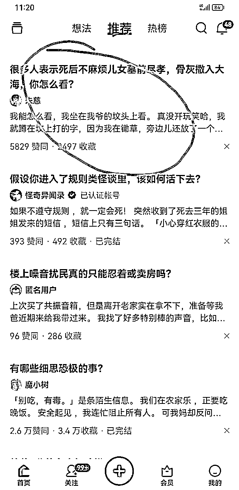
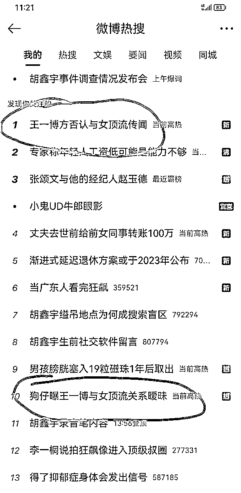
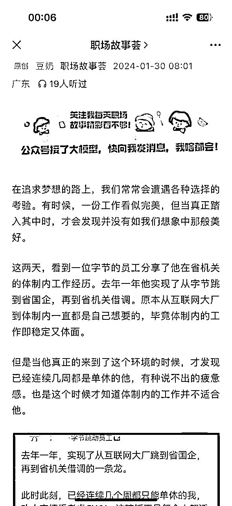
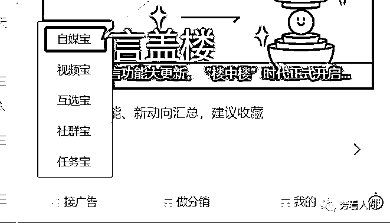
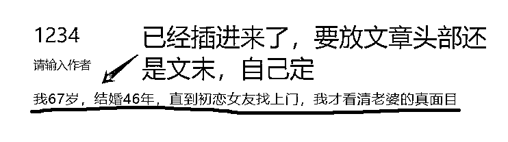
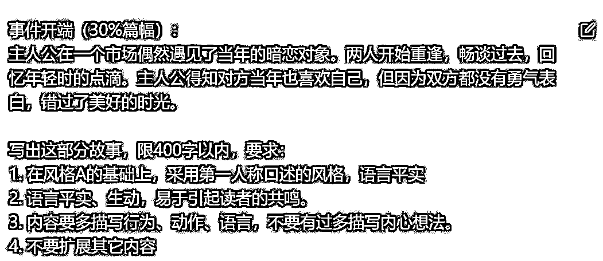
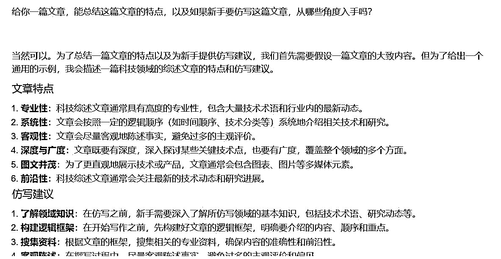
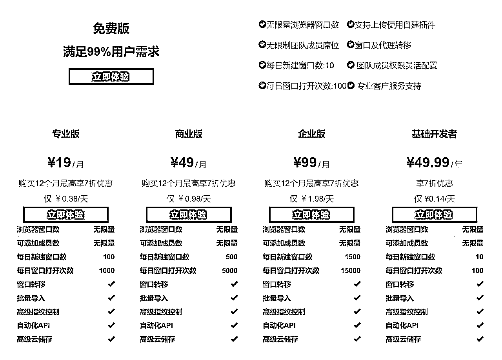
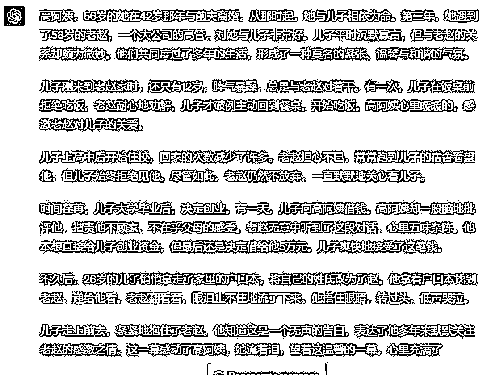
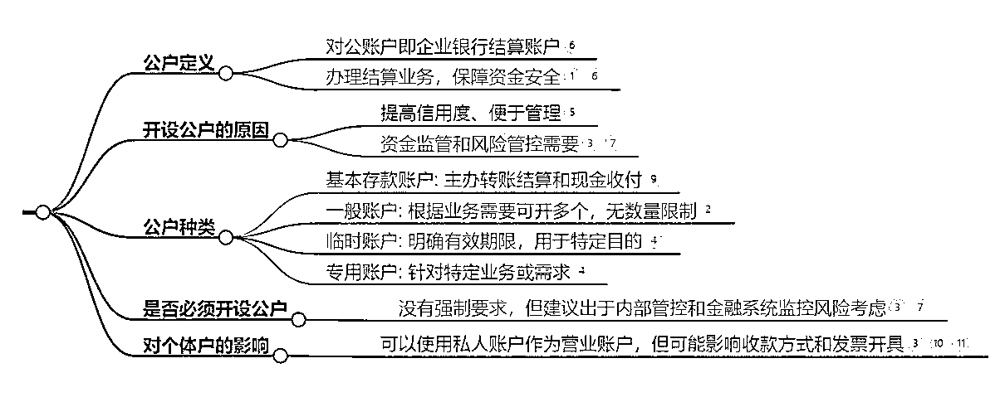

# 12 月航海｜公众号爆文（IP）｜实战手册

> 来源：[https://ocn93f5d9olj.feishu.cn/docx/DGKXdPyHGoxp9bxE3nmcAM7Inkb](https://ocn93f5d9olj.feishu.cn/docx/DGKXdPyHGoxp9bxE3nmcAM7Inkb)

# 防失联+MM188166M（李李）长期更新频繁+备用V:MG10127

出品时间：2024 年 11 月 29 日

# 写在前面

# 💡

欢迎大家来到 12 月航海 | 公众号爆文（IP）| 实战手册，相信在接下来的日子里，我们将在这里见面很多次。

在开始做公众号爆文项目之前，让我们先来解决几个问题：

公众号爆文写作是什么？现在做还有机会吗？

相信很多圈友都有一个疑问：现在都什么年代了，还有人看公众号吗？大部分人平时都是刷抖音、看直播，哪有人还能看完一篇文章呀。那我做这个事儿，还能拿到结果吗？

答案是可以的！我们已经有很多圈友通过这个项目，拿到了不错的结果。其实原因也不难分析。以前的公众号，依靠的是社交传播，你得有逆天的内容能力，有大量的粉丝或私域流量基础，才有可能实现爆款传播。而现在不一样了，随着公众号“拥抱算法”，现在的文章，变成了“社交+算法”的传播逻辑，就算你公众号没有基础的粉丝，也能通过一定的技巧，进入到算法的流量池，获得推荐。说句夸张的话，就算我们 0 粉丝，现在也可能写出 10w+爆款。

公众号爆文写作项目，适合什么样的人？

如果你想找一个长期可发展的副业项目，那么公众号爆文写作，是非常值得尝试的。或者你以前注册过公众号，但是没怎么用，放着也是放着，那么更加可以通过这个项目获得一些收入。

本次航海依然主打原创手写文章，同时会增加 IP 方向的内容，旨在帮助大家提升公众号收益。另外，选修篇会介绍利用 ChatGPT 等 AI 工具辅助提效。手册重点补充了以下内容：

✅ 第六章：如何打造微信公众号 IP

✅ 第七章：微信公众号爆款 IP 文实操教

# 初阶篇（必修）：跑通最小 MVP

# 💡

# 章节概要

在必修篇，我们将从认识公众号爆文写作开始，一步步带你完成整个项目流程的学习。你可以根据本章的步骤内容进行实操，跑通公众号爆文写作变现最小 MVP。

如果你以前没有接触过公众号，建议在正式实操前，先初步了解下项目全貌：

✅【项目概述】了解公众号爆文写作

如果你对项目已经有了大致了解，可以按照【项目概述】1.2.3 三种玩法 选择合适的内容学习实操：

1、如果刚刚入门，你没有准备太多账号，而且没有 IP 追求的人，时间相对充足，可以着重学习实操：

✅【项目实操 1/3】确定写作方向，开通账号流量主

✅【项目实操 2/3】爆文写作与发布

✅【项目实操 3/3】公众号变现

✅【复盘优化】通过优化与提效，提高爆文数量

2、如果你公众号项目比较稳定，想要打造个人 IP，可以学习：

✅ 第六章：如何打造微信公众号 IP

✅ 第七章：微信公众号爆款 IP 文实操教程

建议大家都学会必修篇的项目核心步骤，航线图和手册顺序相对应，你可以按照手册的顺序进行学习，即可逐一完成航线图的每一个任务。

在后续的每个关键步骤的章节概要中，我们也将提到相关航线图，提醒你完成相关步骤。

接下来就正式开始吧！

# 一、【项目概述】了解公众号爆文写作

# 💡

# 章节概要

本章节中，我们将一起认识公众号爆文写作项目。为了让大家获得更多项目信息，我们会从以下四个角度进行分析：

1、1.1 项目现状与前景

2、1.2 项目核心玩法

3、1.3 推荐机制

4、1.4 运营规范

❗️每一期航海手册我们都会持续迭代，如果你是本项目上次航海的老船员，那么以下有新增/有修改的内容可能更值得关注：

1、1.2.3 三种主流玩法

了解完上述内容后，大家能够对公众号爆文写作建立起基本的认知，也能在一定程度上找到自己的发力点。

# 1.1 项目现状与前景

总有人问：公众号还有机会吗？还值得做吗？

从 23 年开始生财有术共进行了 9 期公众号爆文写作的航海，随着规则和工具的更新，一直在迭代新的玩法和实操，比如从纯手搓到 AI 提效再到自动化放大，可以说，公众号依然是有机会的。

就像圈友@安七所说的：“平台对号的内容依然是有需求和渴望的，它希望整个生态是良性循环的，做好内容，公众号爆文依然未来可期。”

以下是之前一些船员的成绩：

船员@大 何 从 12 月的公众号爆文航海，坚持到现在，经历过公众号算法的调整，账号从入池到断流，到再次入池出池，前后累计变现了 1.5w+；

船员@开卷🌀 在 6 月公众号航海期间运营两个账号，其中主账号文章 100%入池，最高单篇阅读 110w+，单篇文章最高收益 6000+，单账号航海号期间变现 5 位数；

船员@刘志军 参与公众号爆文航海，21 天阅读量 350 万+，收益 1.7W+， 涨粉 2000+，私域好友新增 1600+；

船员@一 ge 不小心 公众号爆文航海 2 周收获 320 万阅读量，变现 1.3 万，连续产出多篇 10 万+；

船员@苓枫 航海期间总收益 5000+，爆文单篇阅读量最高 20w，航海结束后依然保持着每天复盘的习惯，不断的研究，不断的测新号，做到千万爆文创作者，月入 3w。

这里附上一些变现截图，供大家参考：

注：以上均为坚持日更的作者收益

目前公众号的 eCPM（每一千次展示可以获得的广告收入）虽然持续降低，但是它依然比其它平台收益单价高，一些蓝海赛道玩法，做的人很少。

对于新手来说，目前最适合入局了，返璞归真的做法，也就是提升爆文能力而非依赖 AI 智能，更容易收到效果，正反馈也比较快。

# 1.2 项目核心玩法

# 1.2.1 最小 MVP 路径 & 关键步骤

公众号爆文的玩法简单来说就是：

当你的账号粉丝满 500 后，可以开通流量主变现功能。随后每发布一篇文章，就可以在里面插入广告，从而获取收益，微信会把收益直接打到你绑定的银行卡。

因此，公众号爆文 0-1 的最小 MVP 可以总结为：

确定赛道 - 搭建账号 - 开流量主 - 找对标（关键） - 写文章（关键） - 插广告获取收益。

其中，找到合适的对标账号和文章，并写出优质文章，是项目的关键步骤。

当然，完成最小 MVP 后，核心是提高写作质量和效率，所以搭建素材库对于拿到结果也非常重要。

# 1.2.2 变现方式概要

公众号变现方式主要有两种，广告变现 和 打赏变现。

广告变现，是公众号变现的主要方式，也是本期航海的重点。

广告变现还可以分为以下几种（但是公众号爆文项目不涉及）：

自主接广告

商家找我们接广告

文内带货

文末贴片广告

私域转高客单变现，微信公众号 IP 最大的价值，就是私域转高客单，本期航海第六章、第七章会着重讲解。

打赏变现，通常出现在 IP 属性较强的公众号里（尤其是情感陪伴类），需要深耕至少 3 个月以上，有更大概率出现高粘性打赏读者。一般单个读者就打赏几十元不等，一篇收益稳定后打赏预估几百元这样，只有大爆款+高粘性的作品，才有那可能一篇赞赏收益上千。

# 1.2.3 三种主流玩法

目前对于公众号，不同的人有不同的玩法，甚至每一个教练的方法都不一样，因此本次加了这部分内容。

# 1.2.3.1 玩法一：基础法

1、基础法主要是 AI 和人共创，以人工为主，AI 为辅，比较适合找不到太多账号的，而且没有 IP 追求的人，时间相对来说比较充足一些的。

2.基础法处在中间的位置，只要能够学会的话：结合 RPA 就是速通法的玩法；增加一下人力的话，就是进阶法的玩法了，一种进可攻退可守的方法。

3、这种方法的也是比较消耗时间的，各种步骤自己还是需要知道的，基本需要学完全部的手册必修内容，比较适合有耐心的人进行学习。

4、速通法出现了问题的话，也是需要这个方法做基础一步步的做分析，没有基础的话自己也分析不出来问题。

# 1.2.3.2 玩法二：进阶法 -IP 方向

1、进阶法是致力于打造个人 IP 的，AI 使用程度低于 20%，人员的介入为 80%以上，很多人都希望能够把自己的公众号打造成一个 IP 账号，引流到私域进行变现。

2、一旦账号养成了，基本就能够摆脱流量主的生命周期了。

3、需要个人能够长时间输出自己的观点，很多人欣赏一个 IP 或者认可一个 IP，一定是被这个内容的某一方面吸引住了。

4、文章的质量需要消耗大量的人力，而且变现周期较长，普通人大概在 3 年左右，还有人在 5 年左右，比较适合那种能够坚持的人。

推荐学习内容：初阶篇（必修）整个章节

# 1.2.3.3 玩法三：速通法-自动化（选修）

1、速通法是目前比较热门的方法，AI 使用程度在 80%以上，人员的介入低于 20%。就是很多人说的那种“AI 工具+RPA”进行批量化操作。

2、因为内容的质量取决于 AI 工具，对于这类玩法，需要有大量的账号，多账号多文章的发布，拼的就是概率。但是好处是人工介入的很少很少。

3、该种方法人工介入的很少，适合账号比较多的人，以及不希望投入大量时间的人。

4、这种玩法的风险：现在平台对纯 AI 产出的内容是打压的态度，也就是说这个玩法是用数量来搏爆款，10 个账号里面能有 1-2 个已经算很不错的了，随着人数的增加这个比例还会降低。

推荐学习内容：选修篇 整个章节

# 1.3 推荐机制

# 1.3.1 排序模型

在一个推荐系统中，系统计算用户最近一段时间的累计值，这个累计值有两个关键要素，一个是统计时间周期，又称为时间窗口，一个是用户标签。

时间周期支持随着时间变化，那这个时间窗口就是动态变化的，根据动态变化的情况会有许多细分的窗口类型，用以解决不同场景的问题，推荐系统模型来计算读者和公众号+文章的匹配度，专业术语叫排序模型。这个算法适用于最近一段时间，比如最近 x 时/天/周/月/年。

最近一段时间的实时阅读量、点击率、点赞率等等

最近一段时间的实时新增用户数、点击率、在看率、完读率等等

# 1.3.2 赛马机制

# 1.3.2.1 什么是赛马机制

赛马机制是属于推荐系统比较通用的机制，不仅适用公众号，也适用于抖音、快手、视频号等等，建议大家看看。

1、 为什么会出现赛马机制这种东西？

大家知道，公众号、抖音、快手、视频号等平台，都是过亿的平台，每天估计有几千万的创作者都在上传作品，而这些作品有些优质，有的很差劲。

而作为一个平台，对于优质的作品肯定是非常渴望的。

因为优质的作品可以吸引更多人将自己的时间投入到这个平台，增加这个平台的活跃度，促进平台的正向发展。

平台想要在每天上亿的作品里面筛选出优质作品，必然需要各种各样高效的机制来进行筛选，而赛马机制就是其中之一，也是被自媒体作者广泛认可的。

2、 赛马机制底层原理

以公众号平台为例，当我们发布一篇或者多篇文章到平台，会进行去重检测、机审，原创检测，在其中任何一个环节出现问题，文章都将被打入低流量池，最终导致你的文章可能就几十个阅读量就不动了。甚至检测出来太严重，直接就发不出去了。

而当上面的环节都通过以后，你发布的文章将进行分发，而此时别人的文章也在进行分发，你们的赛道相近，目标人群相似，比如说，大家都是发情感类文章，系统肯定是想要把优质的文章推到用户面前，这样才能吸引用户的注意力。

那么，大家发的都是类似文章，系统怎么去确定哪个文章更加好呢？

系统会将不同文章发送到目标人群，最开始曝光人群最多就几百人，系统就相当于让这几百人给这篇文章进行打分。

而这个打分就体现在，你的文章数据，比如说，完读率、点赞数、转发、评论区讨论等等。

你的完读率更高，说明用户看得更加仔细认真。

你的点赞数高，说明有很多人是喜欢你的文章。

你评论区讨论得很激烈，说明你的文章具有争议，有话题。

那么，你的文章必然将胜出，同时，胜出的文章将进入下一个更大的流量池，而这篇文章将与下一个流量池的文章重复上面的数据对比，如果失败了，则停留在当前流量池，如果胜出了，继续进入下一个流量池，使得你的文章被重复推荐，从而让阅读量不断达到 5 万、10 万、100 万、1000 万。

这个过程就好像多匹马在进行赛跑一样，因此，这种机制也被我们形象地称呼为赛马机制。

# 1.3.3.1 如何利用赛马机制

好了，我们现在已经清楚地认识到赛马机制，那对我们有什么作用呢？ 主要是四个角度的思考。

第一、少跟随主流，积极寻找蓝海领域。

即使小众也无所谓。因为这些领域就意味着发文章的人少啊，那么，只要你把文章写出来以后，和你竞争的文章会更加少，那么你的文章将一次次胜出，不断进行下一个大的流量池。

中国有 14 亿人口，再小众的领域，都拥有极为庞大的目标群体，只要你爆起来，十万加，那是没问题的。

第二、选择好发布时间，有可能会带来帮助。

正如大家看见的，你发出的文章需要和其他人的文章进行赛马，那么，错开别人的发布时间，有没有可能提高爆的概率呢？

所以，大家找到对标后，和对标的时间稍微错开一下就行了，比如说，对标是晚上 8 点发，你就晚上 7 点发。

当然，你也可以尝试在其他时间发布测试一下，然后，到微信公众号网页后台，进入内容分析模块，多分析数据多复盘，看看自己账号哪个时间发布比较好。

第三、加强文章的完读率等数据，因此，赛马的时候就会看这些数据来对文章是否优质进行判断。

那么，在标题吸引用户点击进来以后，大家就着力提升这些数据。

比如说，960 多字起步，文章的文中就可以有两条广告了，那么，大家就没必要写太多字了，让用户更快看完全文，那么，你的完读率必然相比较长文来说，会更高。

文章开幕雷击也要运用好，并且在文章的中间、结尾等地方留下钩子，吸引用户不停往下看，从而提升完读率。

同时，在文章里面也稍微引导用户去点赞、收藏、转发，这就和短视频一样，许多博主都会在结尾处让用户去点赞收藏，都是同一个道理。

第四、学会与对标爆款文章进行差异化

既然是赛马，那么，你写文章的时候就要仔细分析一下对标账号的文章，要做到人无我有，人有我优。

具体点就是，对标如果是笼统写，你就写详细点，对标如果是给出的素材很模糊，你就搞清晰点。

对标爆款文章在论证一个观点的时候，只给出三个角度分析，你就是五个角度，而且每个角度写得比他还生动。

对标的标题写得不怎么样，也爆了。 那么，你就把那几个标题的起名方式利用起来，那么你爆的几率也会更大。

如果你搞过视频，你就会发现，这种方式也是能适用的，因为赛马机制就是最通用的机制。

# 1.4 运营规范

公众号爆文是一个需要时间积累的项目，粉丝量越多，阅读量越高；反之阅读量高了，文章进了池，粉丝自然也会增加。公众号爆文只有合规了才能长期健康的发展，因为很多船员在运营的过程中违规了疏忽了平台的规则，就前功尽弃了。所以在这里给到大家官方的平台规范，供大家进行阅读。

# 1.4.1 微信公众号平台运营规范 （官方）

点击链接查看：微信公众平台运营规范

# 1.4.2 微信公众号推荐运营规范 （官方）

写文章的时候滑到最底部，有一个 "不允许被平台推荐" 旁边有一个 ？ 号，点击即可看见 "推荐规则" 四个蓝字，点击即可跳转到，微信公众号推荐运营规范 （官方）

最后总结

大家在写公众号的时候，也要保持住自己的底线，不要涉党涉政、不要造谣诽谤他人。不然，轻则违规封号，重则被请去喝茶。

通常来说，你选择一个领域，按照对标的选题、文章风格去写，除非你自己飘了，基本上都不会出现严重的违规，毕竟，他们文章选题发出去，文章没有被删除，说明还是可以发的。

对于新手来说，目前违规最多的应该就是，滥用原创。出现这个问题，大多都是洗稿导致的，尤其是 AI 洗稿。

这边还是建议大家能够具备一种能力，就是说，在理解到原文意思的基础上，用自己的话写出来，并且尽可能写详细点，通常不会碰到这个问题。

通常来说，保持住上面几点，大家违规的概率会少许多。

# 二、【项目实操 1/3】确定写作方向，开通账号流量主

# 💡

# 章节概要

从这一章开始，我们就正式进入公众号爆文写作的项目了。我猜你应该会有这样一些问题：

我以前没有接触过公众号，适合我这种新手的有哪些方向呀？

我想找到一些不太卷，还有高收益的方向，能不能找到呢？

听说开通流量主，需要 500 粉丝，我是新号，难道要先涨粉才行？

别着急，这些问题，你学完本章节，都能得到解决。这一节我们会围绕这些内容进行分析：

确定赛道和写作方向

注册公众号

账号包装

开通流量主

准备的好的话，我们就开始吧！

# 💡

# 本章航线图

完成本章节的学习和实操，即可完成航线图的 第一阶段：确定赛道，准备 2 个账号（约 1 天）

1.

确定 1 个写作赛道，2 个细节方向（约 1 小时）

2.

完成 2 个公众号的搭建（约 0.5 小时）

3.

每个账号积累 500 粉丝，开通流量主（约 0.5 小时）

那么现在，就请开始完成这几个步骤的筹备吧。

# 2.1 确定赛道和写作方向

# 2.1.1 爆文赛道推荐

目前已知的，在公众号上取得不错成绩的赛道有 6 个：

热点类——eg。 吃瓜、民生、影视剧 （经久不衰的方向）

历史类——eg。 朝代、正史与野史、人物 （长期深耕的方向）

剧评类——eg。 悬疑、职场、武侠 （相对比较稳定，素材多的领域）

养老金民生类——eg。 养老金、社会现象、房产 （挣大钱，有难度的领域）

美食类——eg。 做菜，地方特色美食 （素材多、稳定、涨粉快的方向）

小众专业类——eg。 职业（护士、辅警）；抑郁焦虑、减肥减脂 （小众、稳定的方向）

这 6 条赛道，适合新手进行入门。具体选择哪一条，可以通过【章节 2.1.2】的选赛道方法，去筛选适合自己的赛道，根据【章节 2.1.3】的方法，来判断赛道卷不卷。

当然，如果你学习能力快，接受新事物能力很强，也可以尝试一些比较新的热门赛道，具体可查看【2.1.4 项目拓展：公众号爆文赛道风向标】。

建议新手选择 1 个赛道，2 个细分方向坚持创作，更容易出成绩。

本次航海会以这其中 3 个热门赛道和往期 3 个赛道为例，教大家掌握如何写出爆款公众号文章的思路方法，灵活运用到自己所做的赛道中。

由于这几类文章都是由：素材+选题+正文+标题等构成，所以本次航海手册内容，会在同一章节下，穿插不同类型的文章写作技巧。比如「3.1.2 六个推荐赛道的选题方法」这一章节，就会分别告诉大家剧评类、热点类文章等该怎么找选题。

# 2.1.2 怎么选赛道？

你若是一个新手的话，我建议就考虑：感兴趣和擅长的，两个方向进行选择，如果是两点能够结合更好了：

1、你感兴趣的，你就能有意愿日更，不管有没有收益，你都愿意下去。

2、你擅长的技能和工作经历，你就喜欢琢磨复盘，越复盘越精进。

3、市场所需要的，是目前供大于求，还是供过于求，卷的程度，自己感知或者去多刷一刷对标去看一看。

4、最后一个，你是否有意愿改变你的输出习惯，之前没有是否愿意改变。

以上 4 个选项，每个选项 25 分，给自己打分。

比如我选择的赛道是：娱乐领域里面的剧评，我开始给自己打分：

1、我感兴趣，15 分，因为还不够狂热，当然也没有太多时间追剧，因为要带娃，写作。

2、技能与经验，15 分，这个就要从知道、了解、熟练、精通四个阶段去评估，从一开始的 10 分过渡到 15 分，或者叫提升。我知道娱乐领域可以做，但是了解还需要深入了解，整个文章流程熟练了，也就完全精通了。

3、市场需要的，电视剧和电影的剧评，这个目前还是刚需，是非饱和状态，一定是 20 分以上。

4、输出习惯，这个习惯很重要，没有的话，要去培养，就跟写作能力一样，我给自己 20 分。

这一加起来，算出来 80 分，可以做。

0 到 100 分，40 分以下就要考虑换一下，40 到 60 分，看看四个方面那一方面要克服，60 分以上可以入手。

分数越高，主观能动性越强。

# 2.1.3 建立对标库

1、建立对标账号库

• 构建一个专门的对标账号库，用来存储对标账号的信息，根据对标账号的注册时间、发文数量、更新频次、点赞分享次数，进行级别的划分。例如：A、B、C、D 类。

• 对标库可以包括各种平台，如微博、微信公众号、知乎、头条号、百家号等，确保信息获取的广泛性。

2、寻找对标账号

• 使用特定关键词或话题来搜索社交媒体平台，以找到与您的领域相关的热门文章和账号；通过其他途径找到更多的对标账号。

• 有助于积累更多的素材来源，确保自己能够不断获得新的灵感和信息。

• 时刻保持账号库的更新，以确保其中包含最具价值的账号。

3、对标账号要丰富

• 寻找那些在一个领域内，拥有大量粉丝和高互动率的账号；（A 类）

寻找那种短期内，出现 10w+爆文的账号；（B 类）

寻找那种很稳定的账号，例如 2w 左右的阅读数据的账号；（C 类）

寻找那种一直起不来的账号。（D 类）

• 前三种账号（A 类、B 类、C 类）通常会发布受欢迎的文章和内容，可以作为灵感来源，帮助您了解受众的需求和趋势；最一种做不起来的账号（D 类），是要躲避的，自己不要重蹈覆辙。

• 关注对标账号，可以及时获取他们的最新发布的文章，发布时间，封面图展现，以及描述如何写。

4、刷对标

•对标账号建立后，还需要尽可能多的进行阅读，有助于了解当前的趋势和内容的受众性，让你创造更具吸引力的内容。

•刷对标一定要定期执行，确保自己对领域内动态的持续了解。

内容来源：《公众号爆文进阶教程》

# 2.1.4 项目拓展：公众号爆文赛道风向标

# 💡

如果你已经掌握了爆文的写作技巧，想尝试一些更新、相对小众的蓝海赛道，那么接下来的蓝海赛道推荐，希望可以给你一些启发。

我们经常会在生财的星球里，发现一些爆文的细分蓝海赛道。像“生僻字”拆解啊，茅台酒的报价呀，大厂的“工资泄密”等等一些小众选题，也能收获意想不到的流量。

我们把这些好用的套路和话题方向，用表格的形式给你整理出来了，希望你能从中找到一些灵感。同时，这个表格也会保持更新，力求让大家不错过有用的信息。

由于蓝海赛道变化较快，时常有新赛道冒出来，因此我们收集了部分公众号爆文的风向标，供大家参考：

公众号爆文推荐赛道

风向标链接

发布时间

新奇特赛道

https://t.zsxq.com/qOE1V

2024/8/19

图片分享号

https://t.zsxq.com/Rsw98

2024/8/12

热点赛道

https://t.zsxq.com/IVtgt

2024/8/8

企稳趣事

https://t.zsxq.com/rl3Hj

2024/8/1

图片分享号

https://t.zsxq.com/Rsw98

2024/8/5

MBTI

https://t.zsxq.com/TwcIH

2024/8/2

旅游攻略

https://t.zsxq.com/hEvaK

2024/7/30

职场赛道

https://t.zsxq.com/aV0AX

2024/7/24

中老年赛道

https://t.zsxq.com/i00yL

2024/7/23

汽车领域

https://t.zsxq.com/Py1Tj

2024/7/22

公文素材

https://t.zsxq.com/e813x

2024/7/15

教育赛道

https://t.zsxq.com/87Hv9

2024/7/3

教育赛道

https://t.zsxq.com/LPums

2024/7/3

教育赛道

https://t.zsxq.com/3TyJ0

2024/6/28

二次元

https://t.zsxq.com/66cx8

2024/6/28

离职赛道

https://t.zsxq.com/tF1q8

2024/6/24

AI 图片生成赛道

https://t.zsxq.com/A9PLZ

2024/6/21

AI 图片生成赛道

https://t.zsxq.com/AoowB

2024/6/20

书籍拆解

https://t.zsxq.com/iprV5

2024/6/19

社会故事+普法类

https://t.zsxq.com/EGxhh

2024/6/18

教育赛道

https://t.zsxq.com/BfFCn

2024/6/17

职场赛道

https://t.zsxq.com/blCzA

2024/6/14

世界杯

https://t.zsxq.com/62WMp

2024/6/12

中年赛道

https://t.zsxq.com/EHx45

2024/6/11

国学赛道

https://t.zsxq.com/TLCAQ

2024/6/4

付费软件序列号分享

https://t.zsxq.com/uq7F6

2024/5/31

国学赛道

https://t.zsxq.com/vtZrl

2024/5/31

游戏赛道

https://t.zsxq.com/HmOYC

2024/5/30

游戏赛道

https://t.zsxq.com/X9sYc

2024/5/30

情感赛道

https://t.zsxq.com/K4U8u

2024/5/30

AI 图片生成赛道

https://t.zsxq.com/MGzyA

2024/5/28

# 2.2 注册公众号

第一步：准备身份证＋配套银行卡

对于新手来说，建议准备 2 个公众号。

准备 2 个号，一方面是用于规避账号违规风险；另一方面主要是为了对抗不确定性，当你 1 个账号迟迟没有流量时，你不会因为只有 1 个账号而陷入深深的自我怀疑。

注意：1 个身份证及其配套银行卡，只能注册 1 个公众号。

也就是说，个人只能注册 1 个号（除非你是个体工商户/企业/其他组织 可注册 2 个账号，政府和媒体可以注册 50 个）。

注册 2 个号的话，可以借用下家人的身份证就行。

第二步：完成注册

进入微信公众平台 https://mp.weixin.qq.com/-->点击右上角的“立即注册”选项，会跳转进入注册网页，选择“订阅号“并点击它，进入后，按提示填好相关资料即可。

# 2.3 账号包装

公众号的账号包装，并不复杂，主要涉及：账号名称、简介。

对于大部分新手来说，选取一个好记、并且和自己做的领域相关的名称和简介即可。

对于深耕本赛道的圈友来说，账号包装也可以涉及公众号 SEO，但由于本次航海主要是教大家写出爆款文章，所以这里就不展开说了。

有余力的圈友，可以看下圈友 @郭耀天 的这篇公众号 SEO：《最新公众号 SEO 核心玩法，自动引流躺着赚钱》

# 2.4 开通流量主

注册完了公众号之后，需要 500 粉丝开流量主，买粉直接开的效率是最高的，且不会耽误后期的流量。买粉的渠道，某宝上一抓一大把，此处不再赘述。

这里注意：刷粉可能会被平台封号。如果买粉，就要做好封号的准备，大不了封号注销重来，平台的管控是阶段性的，建议多在航海群内交流，及时获取最新信息。

开了流量主之后，记得先挂着原创群发三篇文章，之后就可以获得打赏权限。账号名字头像和打赏的名字头像，要尽量让它一致，这样看起来人设更真实。

到这里，前期的准备基本就完成了。

这些地方完全无需纠结，把内容做好才是重中之重，此外全都是细枝末节，大家千万不要舍本逐末。

# 三、【项目实操 2/3】爆文写作与发布

# 💡

# 章节概要

这是我们这个项目，最重要的一个章节，也是大家用时最多的部分。

一篇公众号文章，是由选题、正文、标题组成的。

选题，就像是文章的骨架，它能决定文章最终的样子。正文呢，就是文章的血肉，填充骨架丰富细节。标题则是一篇文章的外衣，它能决定你的内容，是否能让用户在人群中，一眼就发现你。

我们这个章节，会围绕这三个元素，来依次展开。

第一节：找到适合自己的选题

第二节：写出让人看完的正文

第三节：取出打开率高的标题

❗️每一期航海手册我们都会持续迭代，如果你是本项目上次航海的老船员，那么以下有新增/有修改的内容可能更值得关注：

3.1.5 好选题的三大特点

3.3.4 点击率＞70%的标题秘诀

希望大家能持续练习，不断提升自己的爆款能力。

加油，这个阶段结束以后，我们就有机会收到爆文广告的第一笔收入了。

# 💡

# 本章航线图

完成本章节的学习和实操，即可完成航线图的 第二阶段：爆文写作与发布（约 5-7 天，每天 3-5 小时）

1.

“搜一搜”找低粉爆文，找到至少 3-5 个对标账号（约 1 小时）

2.

模仿对标选题，完成 1 篇正文制作（约 3 小时）

3.

学习开幕雷击等技巧，写文章开头和标题（约 1 小时）

4.

保持单账号日更至少 1 篇，争取账号入池（每天 3-5 小时）

那么现在，就请开始完成这几个步骤吧。

# 3.1 找到合适的选题

# 💡

# 小节概要

公众号领域，一直流传着一句话“选题定生死”，这就像卖货一样，选什么品，能够决定你的消费人群有多大。

我们这节的内容，会来给大家梳理些快速的找选题方法。

第一部分，航海手册会教你，怎么只通过一个关键词，不断的发散，来找到一周、甚至更多的选题。这个方法，适合所有内容方向。

第二部分，我们会围绕公众号的六个赛道：职场、热点、剧评、法律、历史、情感。来分别展开说一下，它们的选题小妙招。

最后一部分，我们会聊一聊选题的“坑”。我们一开始说了“选题定生死”，这话并不是危言耸听。如果你选到特别危险的选题，是可能带来毁灭性的打击的。好一点的情况下，文章被封禁，坏一点的情况，你的整个账号就没了。那要如何规避这些风险呢？这一部分会给你讲明白。

好的，如果你准备好了，那就开始进入学习吧。

# 3.1.1 通用选题方法——“微信搜一搜”找爆款对标 @枫宇翔

对于新手来说，最高效且最快能出成绩的选题方法就是找对标爆款文章，那对标怎么找呢？

最常用的就是去微信搜一搜里，根据领域关键词，寻找你要模仿的爆款文章；一旦你用了搜一搜，微信的算法会一直给你推荐相关文章，这样的文章会越来越多，所以这个方法是眼下最快的。

# 3.1.1.1 怎么确定搜索关键词？

看到了这里的，应该已经看了 2.1 确定赛道和写作方向。

第一、确定你的第一个关键词。

而选择好赛道以后，比如说，三农、军事、情感、法律等等。那么，这个时候，你必须得根据自己的经验以及常识去想到赛道的第一个关键词。

如果是写情感领域，我首先想到的关键词，就是婆婆、婆媳等等，你去搜绝对能搜索到爆款。

而我之前也推荐过一个领域，叫做大厂裁员系列，那么关键词必然就是，裁员、毕业、失业、降薪、减薪等等。

如果实在想不到其他关键词，就把三农、情感等当做关键词，直接去微信的搜一搜，也能找到第一篇爆款，就是费点时间，毕竟，你根据自己的赛道，想的关键词越精准，那么，搜索速度越快。

例如，就在写这个问题回答的时候，我就简单从微信搜一搜，打上 "裁员" 两个字 。

大家看见没有，马上就能检索到 10 万+ 的爆款文章，只要你找到第一个爆款文章，就可以获取第一个对标账号了。

大家在这一步不要偷懒，这个是从 0 到 1 的过程，是必须要经历的。

而通过这个方式，找到爆款对标账号以后，就可以进行下一步，获取更多关键词。

第二、套娃式获取更多关键词。

公众号爆文能爆的很大一部分原因在于标题起得好，里面就包含了这个赛道有流量的关键词。

而这个时候你首先要拿着对标账号，找到这个账号里面几万阅读量甚至 十万+ 阅读量的文章，把他们的标题给我扒下来。

在上面，我以 "裁员" 两个字进行检索，出现了 "职场辣评" 以及 "猫姐杂谈" 两个号，那个，我进入职场辣评这个号里面，稍微看一下。

从这个图里面，标题里面，国企央企、欠薪、降薪、亏损等等都是关键词，甚至你可以直接拿这些标题直接到 "搜一搜" 去搜索文章，你马上又可以获取一堆爆款文章，进而得到一堆对标账号，你继续重复上面的动作，你就可以源源不断获取关键词，套娃式获取爆款文章以及对标账号。

可能还有一些第三方平台吧，但是，我没用过，太麻烦了。

我的风格讲究的就是简单粗暴，见效快

额外说一下，像其他平台，比如说，头条，上面都是有频道分类的，你如果是写军事，你点一下军事频道，会有大量的文章出来，那些标题其实就是关键词，一个个拿出来。

有人说，文章里面也有关键词。嗯，的确也有，但是，我懒得看，直接标题搞起，毕竟大家第一眼都是被标题上的关键词吸引的。

# 3.1.1.2 怎么选择对标爆款文章？

想要判断哪篇文章是自己的对标爆款，就根据几个指标就行了，简单点。

第一、通过搜一搜，搜索到文章以后，首选 10 万+ 爆款文章，其次才是那些 七八万 阅读量的文章。

第二、文章发布的时间是最近三个月的，越早越好。为什么？遵循一个很朴素的理念，爆过的内容依旧还是会爆，这篇文章最近发布爆了，说明有流量，你去写的话，有大概率还是会爆。

第三、有前两点以后，你还得看看这个文章的发布账号的最近注册时间，最好也是最近三个月注册。为什么？有的账号注册时间久、粉丝数量高、原创文章比较多，这么高的阅读量也有可能是粉丝带起的。而我们需要的是低粉爆款的文章，因为这些账号本质上和我们是一个层次的，他爆，你也有很有可能会爆。

# 3.1.1.3 怎么拆解爆款文章模版？

其实是很简单的，你找到爆款以后，直接把文章通读一遍，确定一下文章的核心意思，按照文章的开头、中间、结尾以自己的话写出来就行了。

就比如说，还是以上面那个职场辣评的号来说，我找的这个号二篇文章来说。

《地产已死，国企央企也逃不过房企大面积裁员，欠薪》

《某大厂裁员还在继续，大晚上突然被毕业！》

大家把这两篇文章通读一下，核心观点，就是突然之间被裁员。

然后，文章的模版就是：

① 开头就是对于这些企业做一个简单介绍。

② 深度分析一下为什么这些被认为不可能裁员的企业，也会进行裁员呢？

③ 结尾进行总结，并且给出自己建议

反正，你通读读文章的时候，就得注意文章转折点，比如说，有 "但是"、"为何、为什么"、“不过”、"然而"，这些通常都表明作者要开始进行转折，下面要说的内容和上面说的内容开始有区别了，然后，你把上面和下面的内容浓缩一下，就是一个爆款文章的模版。

除了这个领域，其他领域应该也是有这样的词语，来表示内容的递进、深化。

其实，这就是我们中国人说话或者写文章的习惯啊，我们想要表达另外一段内容，肯定是需要一个词语进行转折一下，不然，就会显得很突兀，文章读起来很难受，别人听你讲话也很难受。

可能某一个特定领域会有具体的模版出来，但是，手册是面向所有人的，每个人写的领域都不太一样，对应的模版也不太一样，大家掌握这种思考方式，根据自己领域，手动分析拆解一下自己领域的爆款文章。

对标账号以及爆款文章都已提供了，做一个案例进行分析了。

如果你还不太理解，就直接先给我抄起来，写着写着，你自己就会开悟了。

# 3.1.2 六个推荐赛道的选题方法

# 💡

注：市场和规则在不断变化，以下赛道可能会随着时间变化慢慢没落，故此章节主要提供方法给大家，重点学习底层逻辑，学以致用到其他赛道。

# 3.1.2.1 职场类：如何选题 @枫宇翔

对于职场类的赛道，我是想更加细化一下，给大家说说大厂裁员&薪资泄露系列是如何进行选择。

这个赛道在去年直播以及各个场合，我都是极力推荐的，因为在目前大环境下，企业进行降本增效会不停优化人，导致许多人都关注裁员、优化这些事情。

而这些人通常最喜欢的就是在职场类应用进行吐槽以及分享自己的故事，而这里就是我们选题的来源，其实以脉脉这个应用，最为突出。

大家直接到下载脉脉，注册并登录，自己刷到关于一些大厂的信息，或者直接在脉脉搜索对应的大厂，可以直接获取一大堆所谓的员工爆料。

基本上只要关于大厂的一些消息，网友都比较关注，本身这些公司都自带热点，你只要搜索出来后，将主题截图以及评论区截图放在文章里面，同时，根据自己的观点对这些现象进行解读就行了。

而在这些大厂消息中，裁员消息、薪资泄露等都是被验证过，是有人写出来并且产生爆款的，在手册 7.7 职场裁员&薪资泄露系列里面，我也很明确给出了对标账号的给大家去参考参考，这个账号就是 2023 年 12 月 19 日正式开始更新职场信息，其中包括了裁员、薪资泄露等等，截止到目前为止，数据都挺不错的。

脉脉这个 app 里面互联网企业居多，大家也可以迁移到其他行业，比如说，公务员、设计师、房地产等等都应有这些信息，你可以到头条、百家号、抖音、快手等等去进行搜索。

如果说你正好是这些行业里的人就更好，应该就一些专业网站或者 app 里面有这些消息存在，因为我本身是程序员，所以对于互联网企业的消息是比较关注的。

在这里注意几点：

① 裁员、薪资泄露等等，都是众多消息的一种，大家通过脉脉也可以挖掘出更多方向。

② 大厂的这些裁员、薪资泄露信息，虽然受到关注，但是，也容易被大厂的公关注意到。因此，大家在写的时候要注意一点，仅针对网友发出的评论进行讨论，别自我想象，尤其别乱造谣或者引导攻击这些公司，保持客观的态度，通过这些信息表达自己的职场态度。

大家观摩观摩那个对标账号，看看人家是怎么写。

③ 除了脉脉，知乎、豆瓣、BOSS 直聘等等都可以获取职场信息，尤其是关于裁员的社会新闻或者公司老板公开对于裁员的看法，大家也可以拿到文章里面写，大家可以看那个对标账号就知道了，核心是职场+裁员，但是，形式是慢慢发生改变。

# 3.1.2.2 热点类：如何选题

热点类的选题，当然是优先从各类热榜上选题。我常用的是微博热榜和知乎热榜，但在具体的热点亚种中，选题的方向也是略有差别的。

“指点江山类”，就是专门抨击当下社会不公事件的内容，主要的阅读者是中老年男性粉丝。

在给这类内容做选题时，知乎热榜明显优于微博热榜。因为知乎对社会的负面新闻曝光的力度会更大一些，微博热榜则粉饰痕迹较强，力度也会远远逊于前者。

我们必须关注到一个问题，有很多的知乎爆款的回答，明明它有流量，但却和热榜没什么缘分。这些内容，往往比热榜上的内容更尖锐，写出来也更容易爆。因为这些内容，都是大伙一个赞一个赞票选出来的，证明它已经成功撩拨起了读者的情绪。我们选题，要选的就是这样刀刀见血的好内容。

所以“指点江山类”的选题思路那就是：知乎自然爆款 > 知乎热榜 > 微博热榜。

“娱乐热点类”，就是专门追当下的娱乐热点，主要的阅读者是中青年女性。

这类的选题不用多说，对大多数的作者来说，微博热榜的作用是高于一切的。我们需要一天多刷几次微博，看到微博的热榜字样。有“热”字的可供挑选，有“沸”字的要优先选，有“爆”字的不仅要优先选，甚至要当天尽快出文章。否则流量就会减弱很多。

所以“娱乐热点类”的选题思路，就是：饭圈小道消息 > 微博热榜 > 知乎热榜

“养生热点类”，就是专门做科普知识类的内容，主要的阅读者是不分性别的中老年人。

特别提示，这个“养生”和我们认知里的“养生”不太一样。它一般都来源于一些古话，什么“立春三不吃两不喝”之类的。老年人的死亡焦虑和疾病焦虑很重，他们看到这类的内容，会为我们贡献很多阅读量。

我们需要做的，就是结合农历的节气，以及在热榜中，挑选出和“健康”相关的内容写文，但写的时候只能往古代习俗上靠，不要给任何医学建议，否则会严重违规。

所以“养生热点类”的选题思路，就是：节气≥微博等平台的健康类选题

其余的热点类亚种，我接触得比较少，就留待未来探索了。

# 3.1.2.3 剧评类：如何选题

剧评类的选题思路，一共有两个。

第一个是“热点+剧评”向。比如最近，电影《满江红》就非常火，人们对它也是褒贬不一。如果在这个阶段，写出五六七八篇角度新奇的影评，就能够吃到《满江红》的流量。

第二个是“经典老剧”向。比如《知否》《甄嬛传》《大明王朝 1566》等等。这些老剧本身的流量就非常大，而且信息量也很大，随便一个细节就能挖出很多内容来，写来写去都不会太缺选题。不夸张的说，给一部剧写出几百篇都问题不大。

两个方向，都可以作为你的选题方向。

# 3.1.2.4 法律类：如何选题

建议大家在写新闻的时候尽量选择官媒报道过的，这样就很少会出现被投诉的情况。

我们一定要记住，新闻不要涉政涉军，最好全都是蹬鞋踩袜子，家常里短之类的民生新闻，一定要与老百姓的生活密切相关。那些能爆的新闻类内容，几乎全都是此类的内容。

所以，我这次没有建议大家去微博知乎找，原因就在于此。除了这些地方，各地的新闻节目也可充当素材。你看到哪条新闻时感觉血压上来了，就选哪条新闻，看着没感觉的就不选。

如果理智一点的话，就对照着开幕雷击七要素选，占 2 条要素以上的新闻要优先录用，只占 1 条的不建议使用，1 条不占的绝对不能用。

后面的法律条文，直接百度检索就可以，检索的关键词，就是新闻故事的本质。比如说，一个人把另一个人的头打破了，你就可以检索“把人打成轻伤怎么判刑和赔偿”，然后能得到大量的资料，然后汇编到这个模块就可以了。

# 3.1.2.5 历史类：如何选题

历史类选题其实也可以追热点，也可以中规中矩，按自己想法写。

1、所谓的追热点，就是要时刻关注热点动向。

例如”胡歌生女，众人震惊“，我们也可以寻找一些重要人物的出生或者他生了孩子，也引起巨大反响。当然，这个热点，需要非常大的契合度，在经验不足时不建议写作。

类似的还可以找到“县长贪污”的新闻，可以借助这个事件写古代官员如果贪污，会被如何处罚？“明星和粉丝”，写一下古代的追星族的狂热 ，比如《大宅门》里白玉婷嫁给尚筱菊照片的事就是有历史原型的。

注意：追热点历史，需要找到契合度非常高的，而且从今观古，需要作者相对比较高的写作功底，各位可以在以后的写作中慢慢为自己加分。

2、中规中矩写作，就是按照我们自己的想法，写出自己喜欢的历史人物和事件。

写作最重要的就是要写的高兴，可以选择敬佩的人物，讨厌的人物，觉得惋惜的人物，让人落泪的人物，都可以。

找到人物之后，确定好写作的基调，包括他的人物事迹，就可以大致给这个人物一个基本概括了。是敬佩，是同情，是值得肯定还是毁誉参半，全文按照一个基本的思想去写作，就没有什么太大的问题了。

比如写隋炀帝，基本上绕不开劳民伤财，暴政，急躁等缺点，写唐太宗，就可以用虚心纳谏，宽厚爱民等等角度来为他打光。

对于一些记载很少，但是非常喜欢的人物，可以从他的前人后人，身边人等等角度来写作，也可以适当编撰一些，但是不要太过虚假，始终保证假故事也要为真性格服务即可。

再推荐一个圈友@一来 试过的近代史领域的选题，如果你在写历史类的领域，近代史也可以涉及一下

近代史这个领域起号相对比较难，常常需要一个月，甚至还有不确定的地方，但是如果账号进入了流量池，这个领域的阅读量还是比较稳定的。

大家可以参考一个账号叫“飞扬说史”，基本上每天都有大小爆款。不好的地方，文中经常也会没有广告。

内容来源：6 月 8 日《公众号流量主的经验分享》@一来

# 3.1.2.6 情感类：如何选题

对于情感类的爆文来说，就要选择有爆款潜质的素材。大家可以到各大平台找符合潜力的素材给自己找灵感、

比如：能引起共鸣、感人至深、有争议的、事出异常的素材。其中包括：

1）有曲折性；

2）有情绪；

3）有信息增量；

4）有关民生问题；

5）明星名人；

6）性；

7）暴力；

8）金钱。

一个故事里，要包含上面 8 个要素中，至少 3 个以上。

# 3.1.3 选题避坑经验 @半糖梦呓

公众号同样都是公域流量，措辞上一定要非常注意，有时候题材踩了坑，写得再好也很难爆。甚至有时候用了某个违禁词，也会被平台打压。

那么具体有哪些坑需要避免呢？主要包含以下三种：

# 3.1.3.1 政治红线不能踩

内容平台每个月都要封禁几千上万个账号。这些账号当中绝大部分都是些很黄很暴力的号，还有相当一部分是因为踩了政治红线而被封禁。

什么是政治红线呢？

我们只需要记住两个词：党史、军史。（准备写文史类内容的作者尤其要注意）

我们的党和军队都是正面的形象，我们在写作的时候，也只能选择正面的内容来写。除此之外，其他的都不要写了。如果想要确保足够的安全，1840 年以后和中国有关的任何事情，最好都别写了。

而民国的人物和历史，半糖的建议是慎写，新手最好不要触碰。

文史领域本身就比较敏感。我们作为自媒体人，更要牢记使命，不忘初心。不该说的话，一个字也别多说；敏感的历史事件、人物一根头发丝都不要提。

那么有的小伙伴说，我就喜欢历史怎么办呢？

建议新手可以从古代史入手，而且是最好是中国古代史。一来比较安全，二来受众广话题多，容易出爆款。

# 3.1.3.2 追热点不吃人血馒头

追热点是自媒体人的天职，但是有一类热点在公域平台写作，绝对不建议碰的，那就是吃人血馒头。

什么叫吃人血馒头？

第一个例子叫做二更食堂。

这个号曾经是一个百万粉丝的大号，现如今已经被封号了。原因是滴滴空姐被害事件后，二更食堂利用大众对这件事的关注度，编造了许多无中生有的情节，用词情色、猥琐，对死者是一种侮辱。

这种行为就叫吃人血馒头。

吃人血馒头的后果就是百万粉丝大号说封就封，一点余地没有。

第二个例子叫做今夜 90 后。

一个孩子和母亲吵架后跳桥了。今夜 90 后虚构了许多不存在的细节，事后证明这些细节压根就是杜撰的，只是这个博主为了博人眼球罢了。

这个账号同样被封禁了。

利用逝者大做文章，甚至编造出一些不存在的细节，用夸张的、性暗示的语言来描述该事件，这种吃相实在是难看。网络不是法外之地，更不是道德禁区。中国人向来认为死者为大，如果谁想拿逝者来做文章，是会激起众怒的。

有的小伙伴就问了：碰到这样的热点，我不吃人血馒头，也不脑补造谣，我就是站在小老百姓的角度，评判一下社会不行吗？

不行。

因为这样一不小心就会挑起社会对立、煽动仇恨情绪。那么多正面事件你看不见，专盯着社会负面写，不封你封谁？

# 3.1.3.3 财经、健康需要资质才能写

最近有小伙伴问半糖：“我昨天发了个微头条，竟然被官方删除了？”

问清楚后，发现他没有财经资质，却写了财经方面的内容。

财经、健康领域都属于需要完成职业认证才能写的领域。没有认证的作者写作这两个领域，要么被限流，要么被删文。总之，想做大，是万万不能了。

头条官方对于财经和健康领域的作者门槛有很明确的规定，需要进行职业认证，具体如下：

财经领域——要满足以下 22 种职业中任意一种情况并提交证明资料，才可以进行职业认证：

经济学者、财经评论员、财经媒体人、市场研究员、特许财富管理师、金融风险管理师、财经/投资分析师、特许金融分析师、投资经理、基金经理、交易员、银行行长、精算师、注册会计师、注册税务师、私募投资人、证券投资顾问、保险经纪人、保险代理人、理财规划师、黄金投资分析师、证券经纪人。

健康领域——以下十种情况中任意一种并提交证明资料进行职业认证：

医生、护士、药剂师、康复治疗师、放射/检验技师、医院院长、营养师、医药研究员、医药工程师、心理咨询师。

更具体的内容可以去头条职业认证的认证标准处查看，此处不赘述。

如果以上情况都不满足，财经和健康这两个领域就别碰了，这是属于非专业人士的禁区。

以上三个禁区属于摆在明面上不能写的内容，在任何公域流量平台都是共通的。

当你避免了以上违禁内容时，还有一些细节于需要注意。

首先是查询违禁词。

关于违禁词，大家可以使用句易网微信公众号，把自己写的内容粘贴进去查询，系统会自动过滤出违禁词。

查了之后，你可能会感到意外：这不是天天挂嘴上说的词吗？怎么也成了违禁词？（具体的大家自己试试就知道了，违禁词半糖就不给大家举例了。)

如果没有违禁词但是依然被限流，那就要找找是否有标题党嫌疑了。

怎么找呢？给大家举一个例子：

上周，一个小伙伴问我：半糖老师，这篇微头条被警告了，该怎么修改呢？她的原开头是这样的：

闺蜜和前夫打来电话，要我退还 1000000 给他，我把他爆骂一顿之后拒绝了。他又发来一张照片和一条信息：晚上 8 点来我家。我呆呆的看着照片，眼泪夺眶而出，恨不得打死我自己。

系统的警告的理由是“刻意隐瞒关键信息”。

那么这个“隐瞒关键信息”到底是啥意思？通俗来讲，就是标题党。

曾经被全网戏谑的 UC 震惊体，就是标题党中的“翘楚”，套路是故弄玄虚，小事夸大，隐藏主语，读者被标题吸引进去后一看，后面的内容简直就是智商被按在地上摩擦，有一种被强奸的感觉。

读者纷纷取关、拉黑，连带着平台也被骂。平台也不傻，有 UC 的扑街史在前，现在谁还做一锤子买卖？于是加大了对标题党的打压力度。

学员的这个开头中的那句“一条信息和一张照片”，就是典型的故弄玄虚，也是被限流警告的原因。

半糖建议她改成“他发来一条信息说：你看看这张照片，看你还敢不还钱？”这样改了之后，意思是一样的，但是没有刻意隐瞒关键信息，该表达的都表达了。

4 个小时后，这篇微头条爆了 63 万+。

很多时候，扑街文改成爆款，就一句话的事。

但是大部分小伙伴都是稀里糊涂，写的文章静悄悄的就扑了，想破脑袋也不知道问题出在哪，其实就是某句话甚至某个词踩坑了。

给大家总结下几类避坑题材：

1.

有关政治的不能写：包括党史军史军、时政热点、国家领导，除非你有互联网新闻信息服务许可证；

2.

追热点不吃人血馒头：就算不造谣，站在小老百姓的角度，评判一下社会也不行；

3.

财经、健康需要资质才能写。

其他的避坑题材还有：

4.

公务员、体制内题材的也不要写，非常容易违规；

5.

黄赌毒一定不要碰；

6.

一些媚外的内容，也尽量不要碰；

7.

娱乐领域一些负能量的事件和艺人尽量也不要碰，除非官方发话了。

内容来源：《今日头条七大变现方式，我只用一种，半年赚 80000》

# 3.1.4 选题技巧 @张波

选题

选题的时候自己一定要有差异化，大家的内容差异化太低，内容都是千篇一律的话，自己很难脱颖而出，拿到比较多的流量，很多写情感方向的，现在还是在写那些事，殊不知很多看这类文章的人，看到以前所谓的爆款现在已经没有新鲜感了，除了自嗨外看的人越来越少。

选题一定要进行分析，下面的两个例子可能不太准确，希望能够给到大家启发，千篇一律的东西看的越来越少。一个人顿顿大鱼大肉也会吃腻，要学会找出差异化。

观点+情绪

分析领域内账号的写作角度，例如以观点+情绪为导向，很多账号都是写正观点+正情绪，而且特别拥挤的情况下，你可以写不同的观点+正情绪；也可以写正观点+不同的情绪。

举例：2024 年养老金调整

正观点+正情绪：

《2024 年退休金调整新规：工龄超 30 年上涨 10%，年金最高可达到 8 万元？真相来了！》

反观点+正情绪：

《可能 85%的人都还不知道！养老金今年按工龄进行调整了：满 30 年工龄，每年多涨 240 元。这三种人有福了！》

《坏消息传来？中央定调：2024 年 3 类人将被取消养老金，社保缴满 15 年也没用！赶紧看看！》

正观点+反情绪：

《2024 年养老金“20 连涨”？3651 元以下，按 10%上调；6400 元以上，停涨！这样行吗？》

热点+领域

分析领域内账号的写作角度，例如以热点+领域为导向，很多账号都是写热点+领域，而且特别拥挤的情况下，你可以写不太热+领域；也可以写热点+其他领域。

举例：

热点+娱乐：

《众人惋惜娃哈哈创始人宗庆后逝世，只有王力宏说得一针见血！》

《嫌王力宏老，买百万名表，她是 42 岁的娃哈哈新掌门》

热点+情感：

《又上热搜了，娃哈哈宗馥莉谈恋爱啦，知道对方是谁后，我想哭了……》

热点+业务：

《来了！不给娃哈哈设计大厦，我都对不起宗庆后和全国人民的热情！》

引用：《公众号文章内容质量提升教程》

https://k170ac9yh31.feishu.cn/docx/KbupdqExXo8z9pxL5RqcUzJOnfb

# 3.1.5 好选题的三大特点@开卷🌀

常见的找选题方法，都在航海手册里。这里补充一下，我能做到入池率 100%，在选题上另外注意的细节点。

刚开始，我找过多个公众号的多种选题，时间精力有限时，需要明确哪些更值得做，更有机会做出爆款，这个问题

困扰了我好几天。

综合下来，我发现，能大概率保证入池和阅读量较高的选题，有三大特点：

# 3.1.5.1 选题之中，一定要有异常

“狗咬人不是新闻，人咬狗才是新闻。”

有异常属性的选题，本身具有新闻属性，自带流量密码，写好了，阅读就会很可观。

比如，“做博主月入五万，我却想回去上班了”

可能你会说，这和开幕雷击里的金钱元素有关，但是我也观察过，有金钱元素的不一定会爆，但是我写的方向，凡有异常元素，内容有看点，正文还不错的，都爆了，这就是异常的魅力。

后来，我发现，我的百万爆款，也有人仿写，但是数据都不怎么样，为什么呢？就是这些作者，把其中最重要的异

常改掉了，文章就“顺拐”了，有看点的文章，变成了廉价的鸡汤。

看看这几个标题，你觉得哪个选题会爆：

1、寒心！男人被狗连咬三次，竟无一人敢帮！

2、震惊！男人被狗连咬三次，居然在大街上做出这种事........

3、怒了！男人被狗连咬三次，竟被狗主人要求赔偿五千块......

就不说答案了，大家看选题看多了，可以自己琢磨琢磨。

# 3.1.5.2 差不多的选题中，有 3 篇以上的 10W+，爆的概率更大

我突破百万的爆款，就是看到多个账号都出了 10W+，后面的 50W+、20W+和 10W+文章的选题，也都是至少有 3 篇爆款文章。

我有一个选题，当时只能找到两篇 10W+文章，但是因为我非常感兴趣，还是写了，最后这篇文章阅读量就在 5W 左右，有点遗憾。

为什么要以 10W+爆文为目标？

同样的时间，我们写 1 篇 10W+相当于两篇 5W+，单位时间产出效率更高，这也是手搓的朋友注重文章质量也能实现弯道超车的方式。

# 3.1.5.3 选题不一定要高大上，更重要的是要让读者有话可说

这种规律，是抖音、小红书、公众号的共性。

头部玩家的百万爆款可能源自博主独到的观点，普通人的百万爆款可能就是他关注到了一个让大家都能各抒己见的

话题。

比如：

刚过一本线十几分，是选择普通一本学校还是好一点的二本学校？

只有三百万，买市中心的老破小，还是郊区的大平层？

这些见仁见智且大众关心的话题，讨论热度比较高的时候，很容易出爆款。

我的公众号航海项目跑得比较顺畅，很大一部分原因是我在项目初期期把 80%的时间花在选题上。

说到找选题，就有一种常见问题：数据网站的会员是不是必需品？

对我而言，至少在新手期，它不是。

因为不管是抖音、小红书、公众号还是其他平台，新人入场做内容，第一步就是要熟悉平台的内容生态。

如果我不去亲自刷一下这些文章，没有办法知道哪些好，哪些不够好，哪些很糟糕。

数据网站的便捷在于你可以快速找到数据好的内容，但是它的缺点也在此，因为好坏是相对的，新人如果只看"数

据好"的内容，是无法辨认它的相对优势在哪里的，更无法确认它是偶发的爆款，是账号的权重高，还是真正有价

值的内容。

所以，公众号打基础的阶段，我的内容全部是手搓的，选题也全部是手刷的（最后的小技巧，会放我日常刷选题的

方式）。

因为这是新人到任何平台，眼光稍微长远一点点，都必须要做的事情。我也相信，这是准备深耕内容的人，必须具备的基础能力。

未来我会不会用数据平台呢？可能会。因为一旦我现在明显感觉到，如果纯手刷选题，手写文章，即使全职做，一

个人运营 5 个账号，脑力值和精力值就已经到了极限。如果想更轻松地运营更多账号，在对平台内容有了真切的理

解之后，确实需要外部助力辅助扩大规模、提升效率。

内容来源：《公众号新手实现百万爆文，单篇收益 6000+，单账号变现 5 位数》

# 3.2 制作文章正文

# 💡

# 小节概要

通常来说，文章正文都是有套路可循，或者说有现成的模版可以模仿，我们要做的就只是按照模版，来搜集素材并进行一定的润色填充即可。

对于本次航海的五大类型来说，他们的爆款模版分别是：

职场类：标题+故事主干+网友争议点+总结建议

热点类：标题+基本故事+态度/观点+结尾

剧评类：标题+剧情+观点/剧情解析+结尾

法律类：说地名+列冲突+讲新闻+网友看+说法律+怎么做+引互动

历史类：提出问题+解答问题

情感类：标题+主人公+故事的主干+结尾

下面就将教会大家对于不同类型的爆文，都有哪些模版是可以用的。

# 3.2.1 职场类：爆文模版@枫宇翔

写职场类故事文的公式：标题+故事主干+网友争议点+总结建议

根据我的观点，职场爆文的 70% 以上的功夫完全是花在标题上，标题写得好，进入流量池，你的内容怎么写，都会较高的阅读量。

如果一定要固定某一个爆文模版，那么我告诉大家一个简单的。

第一、确定好选题，将主题进行截图并发布到文章的顶部，并且对其进行讨论并分析其中的原因。

第二、将评论区网友不同观点放入文章里面，最好就是那种争论比较凶的，对其进行对比解析，并给出自己的观点。

在这里给大家一个对标账号，可以看看他的手法，已经叫程序员圈儿，现在叫职场故事荟。他就是故事编得比较好，就是一张图，偷懒就是搞几张网友评论区的图进行讨论。

另外，大家在进行分析原因并讨论的时候，最好要学会讲故事，相比较枯燥的分析，故事将更加有吸引力，多看看这个账号研究一下，你就有感觉了。

# 3.2.2 热点类：爆文模版

热点类文章的公式可以总结为：标题+基本故事+态度/观点+结尾

3.2.2.1 案例一：龙骨龙鳞公式

一篇完整的文章是一条龙。文章的梗概，也就是事情本身，是龙骨，其余散落的金句观点细节态度，是龙鳞。

龙骨要求你把事情讲明白就行，要求就这么简单。如果事件太过复杂，需要很长的篇幅讲清楚，那么只花笔墨，把一个侧面讲清楚就好，千万别太过追求全面描述了。如果事情说复杂了，整个文章的篇幅就会被拖长，这样也会严重影响文章的完读率。

而龙鳞，则要点清楚你的态度和观点。之前我们在写故事的时候，所有的龙鳞都用来表达故事的细节，就是为了让故事更加真实可信。但写热点文的时候，素材都是真实发生的热点事件，所以无需再通过细节来证明它的真实性了。如果加了，反而可能会引发一些不好的效果（比如二更食堂的那次负面事件）。

龙鳞在热点文的作用，只用来站队，表达态度，写清观点就好。其余的作用一概不要有。

以上便是热点文的写法，其实就是这么简单。在陈述事件的时候，一旦你的情绪上来了，就用词句把它写出来，用它来争取和你共鸣的读者。记住这么一句话就足够了。

3.2.2.2 案例二：不同难度的爆文公式@妞妞💋

一篇简单的热点文=标题+开头+事件陈述+结论（对标：泡哥看世界）

一篇有深度的热点文=标题+开头+事件陈述+对比论证（可省略）+结论（对标：桌子的生活观）

拆解公式

1）标题（记得要有开幕雷击 50 字以内）

比如：突发！“中石油牵手门”男女主再曝大料，这背后可不简单

2）文章开头（100 字左右）

可以是自己对这件事的领悟，或者直接开始写这件事。

比如：

① 生活经常给我们惊喜。

就像成都一个摄影师小哥玩个街拍，居然拍出了一个国企大领导“牵手门”丑闻。

② xx 月 xx 日，一个话题冲上了热搜。“宝妈因孩子吃了同学生日蛋糕发飙”，这个事件，很快就引发了网友的热议。是怎么回事呢？

③ 万万没想到，珠穆朗玛峰也会发生这样的事。近日，#珠峰攀登者放弃登顶救起濒死女子#，话题冲上了热搜第一。

④ 大家还记得十天前，武汉教师碾压学生致死事件吗？没想到，学生竟然在学校被自己的老师碾死。

然而事情刚刚过去几天，悲痛的消息再次传来：被撞孩子的母亲，在孩子去世十天后，也从 24 楼一跃而下。

等等……按自己习惯和擅长的来就好。

3）事件陈述（500 字左右）

即把整件事发生的时间、人物、地点、发生了什么事等，讲一遍（500 字左右，配上事件相关的图片）

4）对比认证（300 字左右）

这步可有可无，如果热点事件正火爆，而且热度很高，就可以省略这步，反之，则加上比较好。

做法是，去网上搜索一两个相似类型的事件，和这个事件作比对，并加几句点评。

5）给出论点并激发读者的情绪（300 字左右）

这里写出对这个事件的看法和论点，要有情绪一点，愤青一点。

例文：

大家可以看先看看以下 2 篇例文：

例文 1：胡继勇带女员工在太古里牵手逛街！女方的素颜照很一般，但胜在腿长肤白无对比论证简单粗暴法

例文 2：“我儿子被投毒了！”家长群聊天记录流出后，我看得好窒息……有对比论证有深度的写法

我们对照前面说的「拆解公式」，来看看例文的具体内容构成：这里选用的例文 2：

① 标题（要有开幕雷击 50 字以内）

我儿子被投毒了！”家长群聊天记录流出后，我看得好窒息……

② 文章开头（100 字左右）

6 月 6 日，一个话题冲上了热搜。

“宝妈因孩子吃了同学生日蛋糕发飙”，这个事件，很快就引发了网友的热议。是怎么回事呢？

③ 事件陈述（600 字左右）

从"有网友发帖分享了一段家长群中的对话，从聊天截图我们得知：

六一儿童节，有位家长带了蛋糕，给孩子们集体分享。到”再毒的奶油蛋糕，其危害性也比心灵的终极污染小得多。"

具体的大家去看原文：“我儿子被投毒了！”家长群聊天记录流出后，我看得好窒息……

④ 对比论证（300 字左右）

论证 1、知乎作者“一只小仙女”说过自己的经历。

论证 2、有个网友说：妈妈的一个同事，因为孩子吃了辣条，逼孩子吃了成人两倍剂量的泻药。

论证 3、主持人倪萍分享的一个故事，让我十分感触

具体的大家去看原文：“我儿子被投毒了！”家长群聊天记录流出后，我看得好窒息……

⑤ 给出论点并激发读者的情绪（300 字左右）

”只有自己的内心得到过满足，才不会匮乏“。到”没有人一生都在吃标准的食物，也没有人一生都在走正确的道路。

对孩子和家长来说，适当保持一点松弛感和容错率，或许我们都能活得更轻松“。

内容来源：7 月 13 日《用 GPT 写热点文&公众号快速入池的方法》@妞妞💋

# 3.2.3 剧评类：爆文模版

写剧评的公式：标题+剧情+观点/剧情解析+结尾=剧评

1）观点文样式的剧评，无论剧情还是细节都要有一个落脚点，这个落脚点就是你的观点。

比如：明兰不知，原来顾廷烨与贺弘文求娶她目的相同（读者会好奇到底是哪个目的）

剧情为：顾廷烨算计求娶明兰，他明知明兰与贺弘文即将订婚，故意将贺弘文那青梅竹马的曹表妹送到京城，果不其然曹表妹请求给贺弘文做妾，贺弘文心动了，他故意等着明兰妥协，在双方僵持的时候，顾廷烨求娶明兰。

观点：适合！对于贺弘文来说，无论明兰的手段还是家世都比较适合他，对于顾廷烨来说，依旧是合适，不过不是家世，而是品行以及手段，毕竟顾廷烨心中谨记父亲的话：“娶妻娶贤。”明兰各方面都合适，有主意有手段，还能与继婆婆抗衡。

结尾：婚姻的本质不是爱情，而是适合，毕竟互相扶持的婚姻比单纯的爱情要强得多。

就像明兰所言：“婚姻里未必一定需要爱情，作为女人也不应该把眼光放在儿女情长上，要实现经济和精神的独立，去看看更广阔的世界。”

这篇文章阅读量 3.8W，收益 200+。

盛家四个女儿，墨兰才是嫁的最好的（读者会好奇，为什么墨兰做了如此苟且的事情还是嫁的最好的呢？)

剧情：墨兰身为盛家的女儿，为嫁入高门，不顾盛家名声，与永昌伯爵府的公子苟且，逼着盛家上下成全她，帮她嫁入梁家。

为什么说她家的最好，虽然她以不光彩的手段嫁入梁家，但是丈夫宠爱，婆婆和善，这一切都符合她高嫁的期待！

观点：嫁得好，不代表过得好。

细节说明，她明明是正房，却把全部的心思放在与妾室争宠上，还给丈夫主动纳妾，以至于家中每天都是鸡飞狗跳。

结尾：墨兰原本在四姐妹中嫁的最好，可她却把日子过得一地鸡毛，反观其他三个姐妹，无论是用手段还是计谋都把不如意的婚姻过成了想要的生活。

这篇文章的阅读量 4W+，收益 280 多。

这两篇文章都是标题+细节+观点+总结=完整的剧评

2）还可以是单纯的解析剧情，剧情引申出来暗线以及人物主角的命运等。

比如：《知否》：曹锦绣胸口半敞求欢，才懂贺家为什么不要明兰

这部分的剧情是曹锦绣如愿成了表哥贺弘文的妾室，可生活没有想象中的快乐，只能说吃喝不愁，其他的什么都没有，而且贺家祖母还总是拿捏她，贺弘文对她更是没有多少怜惜，她借口生病诓骗表哥，有了主动求欢的场景！

解析：曹锦绣不懂她成为贺家的妾室，才更容易被贺家拿捏，一来妾室地位低，说白了比丫鬟地位高不了多少；二来，当家主母打罚妾室名正言顺，不用顾忌任何情面。

结尾：曹锦绣的得寸进尺，让贺弘文心中那点情谊愧疚早就磨灭了！

果然人在选择的时候会去衡量，但是付出感情被欺骗时，就会心灰意冷！

这篇文章采用剧情的描述+解析+结尾。

这篇文章的阅读量 10W+，收益 800+。

但是有一点需要注意：不要为了博人眼球，自己编剧情。很伤账号！

# 3.2.4 法律类：爆文模版

新闻爆款模板，口诀为“说地名+列冲突+讲新闻+网友看+说法律+怎么做+引互动”。全文字数在 1200-2000 字左右（不得超过 2000 字）。

然后，我们正式进入这个七部模板里。

说地名一定要列出省市，以及具体到地级市，这是第一个断句需要做到的事，字数简明扼要讲明地名即可。一般这个位置写出来都是“近日 X 省 X 市”。

列冲突等同于开幕雷击，位置也在开幕雷击位，也就是第一自然段的前 50-100 字，位置紧随“说地名”之后。你这个新闻的核心冲突是什么，如果换位思考，你如何用短短的几十个字，让你的读者和你一样血压上升？这就是“列冲突”阶段所要完成的任务。

下面给大家分享一个展现千万的爆款例子：

“近日山东菏泽，一女子去加油加满后一看傻了眼，油表显示 59 升，而女子的油箱最多加 41 升，并且原来还有 7-10 升，面对质疑，加油站的人竟说没有问题，女子一气之下去 4S 店做了疯狂的举动。”

开头除了常规的“近日 X 省 X 市”发生了什么事情外，还可以直接以情绪化的词语吸引读者的观看兴趣。比如：“令人发指！太残忍了！严惩不贷！太坑人了！太猖狂了！”

这样的开头会如果使用“残忍”等类的词语可能会有一定的风险性。

下面就是“讲新闻”，要用 400-800 字的篇幅，把新闻的来龙去脉讲清楚，这里可以放慢一些节奏。语言要朴实生动，就像日常和熟人侃大山一样，千万别用官方书面语。

另外注意，这里不允许用插叙、倒叙等手法，否则读者看不懂，到时候直接就跳出了。后面的篇幅就全都浪费了。

新闻叙述的过程中尽量增加一些波折吸引眼球的词语，可以让读者愿意跟着你的节奏往下走。

比如文章中的“酝酿着一个疯狂的想法、目不转睛等”，以及女子联系记者、联系相关计量部门、还有咨询汽车专家等各个角度来分析这件事情，让读者跟着你的思路走。

下面是网友看，篇幅为 200-300 字。这里可以从网上新闻账号的评论区里，寻找高赞的网友评论，然后放几条进去即可。这个很简单，没什么可说的。

关于网友的看法，一方面大家可以去寻找爆款中评论多的观点摘来引用。

另一方面如果你写的数量足够多，其实心中已经有了很多种观点，也可以自己编写，反正都是网友说的，对错都无从查证，只是代表了网友的个人观点。可以从正面、反面、或者中立面的角度去分析。

最后可以再加上自己的观点简述一小段，这样网友看法这一步骤就比较全面了，既有别人的观点也有自己简短的看法。

然后就是“说法律”。这里我特别强调一句，就算你没有法律的资质，只要你援引的法律条文没出现问题，就照样是可以出爆款的。

这个需要我们平时了解一些法律知识，多刷刷知乎上的热点问题（他们会代替你列出法律条文，就省的自己找了），以及自己存一些电子版的法律资料（到时候根据关键词检索，找对应的律条）。这一步看似很难，但是在信息时代，你掌握了最基础的关键词检索技巧，就一点问题都没有。这段篇幅也是 400-800 字。

我们简述完了法律条文，后面要再跟上具体到本案本事件的分析看法，以及根据相关的法律条文如何处罚。

然后是怎么做，也就是告诉读者遇到近似的窘境时应该做些什么。这个位置放在倒数第二自然段即可，有几句话就行。

如果觉的前面叙述的不够，或者字数不够，这里还可以增加自己的亲身经历，给大家分享下自己遇到类似事情时是怎样处理的，如果没有发生，可以自行编撰，目的就是引发读者的共鸣。

最后是引互动，留几个问题诱发评论区互动。这个位置放在倒数第一自然段即可，有两三个问题就行。

# 3.2.5 历史类：爆文模版

历史公众号文章的写作方式和头条的微头条/问答/文章一样，也是要提出问题，解答问题。

唯一一点不同的可能就是题目。头条的文章题目要求有深度，高度概括，给人以启发。公众号的题目要求吸睛，猎奇，用非常夸张，欲罢不能的题目来给读者以新鲜感，使他不得不点开，看你的文章。

1）历史文，可以以人物的结局令人遗憾或者想象不到来写。

这样的写作，按照人物的经历和生活脉络梳理，从他出生，到青年，中年，晚年结局等等顺序来写。每个时间段穿插一两段事迹，尤其是晚年经历，一定要写作的相对尖锐 ，因为这一部分属于点题。

2）历史文，可以以人物的性格，事迹令人震惊来写。

这样的写作，主体风格不变，还是讲述人物生平，可以以一两件故事来讲，重点讲述他的性格反面。例如善人的恶行，好皇帝的糊涂事。主体可以讲人们认知里的故事，用一小半的篇幅讲述这个人为人所不知的一面。

3）历史文，可以以总结事件原委，让人敬服角度来写。

这个也大致类似追热点，从种种角度来诠释清代保密措施。其他内容可以写各个朝代的传位/皇帝没有继承人，每个朝代怎么选/立长还是立贤，孩子多到底是好事还是坏事，种种方向来讲解一个问题。

4）历史文，可以用盘点人物的类型来写作。

这种方式也很简单，就是来盘点人们固有认知，但是需要打破认知的人物。也可以是盘点有功劳的皇帝，战神级别的武将，幸福的女人，悲惨的女人等等。盘点类文章没有什么太深邃的讲义，基本一个人物，一个小故事，言之有理即可。

# 3.2.6 情感类：爆文模版

写情感类故事文的公式：标题+主人公+故事的主干+结尾=一个故事。

展开说就是：一个故事=标题+主人公+故事的主干（包含梦想或目标，挫折、阻碍或意外，和惊喜或反转）+结局。

拆开来说就是：一个故事=谁～想做什么事～为什么做或怎么做～做的过程遇到了什么～结果怎么样。

接下来，我们先想好，写一个什么主题的故事，再把标题写好，然后围绕着主题，把故事顺着写下去。

主人公：我是谁，多少岁，来自哪里，做什么的……就是简单介绍一下主人公的的基本情况；

再介绍一下，与主人公相关的其他人或物，和主人公是什么关系，怎么认识的，做什么的……也是简介单绍一下他、他们或它的基本情况。

故事主干：想做什么，发生了什么事情，遇到了什么问题。其中包括目标或梦想、挫折或阻碍或意外。

结局：这件事对主人公的影响，主人公是怎么做的、或应该怎么做，结果是什么。

这样，一个故事就完成了。

注意：爆款优质故事的基本条件：

有好的标题，原创，有信息增量，不重复新闻，不传播负能量，满足了这 5 点，才有可能大爆。

一般写故事，都用第一人称来写，方便读者理解。当然，这不是一定的，根据个人喜好来就好。

故事的主干内容、情节要详细得当，与主题无关的，略写；能体现人物性格、对故事起推动作用的，要详写。

结尾尽量反其道而行，让读者产生意料之外、情理之中的情感体验。

比如：某女结婚，要彩礼太多，婆家要退婚（读者想到的结果是分手），但我们把结果写成结婚了。

至于为什么还结婚了，这个就要靠我们自己来写，这其中反转的故事情节了。

故事可以是虚构的，也可以是自己、或朋友身边发生的真实事情，但一定要正向引导，不能违背伦常纲化、伦理道德，负能量。

例文：

《除夕夜公公给我们 100 万，本是高兴的事，可被老公闹得家里鸡飞狗跳》

《我 69 岁，发现 40 岁保姆偷我钱，我要求她“肉偿”，她的反应吓傻我》

《我 33 岁 阳了，老公连夜带着孩子逃了，半夜有人压在我身上，睁开眼我吓傻了》

《公公病危，儿媳献身，公公舒服，婆婆支持，老公发飙，结局意外》

《我 51 岁，二婚老婆夜班，继女爬上我的床，说难受让我帮帮她，我让她愉悦，老婆夸我真棒》

# 3.3 完成文章标题

# 💡

# 小节概要

对于写作来说，标题决定了文章的打开率，也就是你的文章阅读量。

而阅读量的多少决定了我们收益的大小，标题的重要性不言而喻。

而幸运的是，标题的写作是有套路可循的，那就是「开幕雷击」。

通过让用户第一眼看到的内容，就有令他感到震惊的言论或画面，仿佛遭受到了雷击，来使得用户有着点开文章，继续阅读下去的欲望。

下面，我们将通过大量的案例，来教会大家如何使用这个技巧。

# 3.3.1 开幕雷击

每一篇文章，如果想要阅读量高，收益高，都需要一个高打开率的标题，来抓住用户的眼球，引发读者的注意力，让他有点开文章来看的欲望。

抓住读者注意力的核心秘诀：就是把读者在意的内容，写在标题里，引发读者的欲望与好奇心。

一个标题的好坏，决定了读者会不会点开文章来看，如果他完全没有“点开文章的冲动”，没有兴趣点开文章一探究竟。

那你文章里的内容，就算是再精彩，也不会有人看到、知道；那你的文章，就等于白写了。因为没人点开来看，就没有收益。

而写好文章标题的核心就是利用好「开幕雷击」。

开幕雷击的写作技巧，最早由圈友 @半塘梦呓 在星球分享，当时他以微头条的写作方式作为切入点分享了如何写出开篇即能吸引人点击的文章。

如果感兴趣的话，可以查看原文。《半塘梦呓：如何用好开幕雷击》

开幕雷击：顾名思义，就是你第一眼看到的内容，有令你感到震惊的言论或画面，仿佛遭受了雷击。

经过我的反复测试后，我把爆款标题“开幕雷击”的要素，归纳为以下 7 个：

1）金钱、数字；

2）性暗示；

3）暴力；

4）死亡；

5）捷径；

6）异常、悬念；

7）民族主义。

这 7 个要素中，异常是屡试不爽的套路。

这 7 个要素，不仅能用在公号里，在各平台短视频，百家，头条的图文、问答、微头条，等等自媒体里，都能用得上。

在不违反平台规则的前提下，要把这 7 要素尽可能多地糅合在标题里。

大部分同学，文章写得都不错，就是开幕布雷击没有把握好，还有的同学，把雷击误解成了狗血、暴力、血腥，其实不是的哈。

这样只会引起读者的不适，而这样的内容，会被限流，还有可能会被读者投诉、举报，被平台干掉，直接被删除或封号。

实际上的雷击，只是要有出现令人震惊的言论或画面、能引起人们的好奇心的就行，就是让人感觉很异常，和正常的思维相反的意思。

这个令人震惊的言论或画面，不是说直接就写“很震惊”、“惊呆了”之类的，更不是直接就写“某某一刀砍下去，血溅满身”“倒在血泊中”之类的，而是用一些委婉的字眼，让读者自己联想出来。

比如：某某的家人病逝了，本应该很伤心才对，他却很高兴开心。这就叫异常，会令人忍不住想点进去一探究竟，他为什么会反而开心？

再比如：某小店的矿泉水 3 元 1 瓶，10 元 3 瓶，大家说店家是傻子，都分开一瓶一瓶的买，3 瓶只要 9 元，没想到，店家却乐了。

这个标题，结合了金钱和异常。金钱很直观，异常就是，店家为什么乐了？如果是你，你是不是会点进去看看，店家明明是亏的，为什么反而乐了？

谨记：不要直接去写暴力、血腥、涉黄的场面，或者写小黄文。要隔着一层纱，最起码字面意思不要带出来，要让读者自己联想出来。不要为了流量，去挑战平台规则，这样只会得不偿失。

标题里只要含有，开幕雷击 7 个要素中的 2 个要素，基本你的文章打开率就有了保证，当然是包含的要素越多越好。

# 3.3.2 标题技巧 @张波

a. 爆款标题要素：

1.调动情绪：让读者产生喜悦、悲伤、愤怒、好奇等情感。

2.使用数字和数据：具体、真实，给人以明确的感知。

3.使用极端或夸张的词汇：增加标题的冲击力。

4.保持简洁清晰：让读者一眼看到重点，快速吸引他们点击。

b. 爆款标题公式：

突出主题+矛盾冲突+引发悬念。例如：

•47 岁的我，搬进了丈夫的工地宿舍，被一群硬汉包围，晚上燃烧起了期待的火焰。

•35 岁新郎的言论让 26 岁新娘哭泣：你这二手货有什么好疼的？

c. 标题润色技巧：

1.植入流量热词，如“疲惫不堪”、“心满意足 ，笑容满面”等。

2.用具体、生动的语言来描述，创造情境、展现角色，反转情节或制造悬念，使标题更具吸引力。

例如：

原标题： 50 岁单身汉，被 46 岁寡妇骗进家，干完体力活后偷偷跑回了家

改之后： 50 岁单身汉，被 46 岁寡妇骗进家，干完体力活后寡妇却笑容满面。

新娘缺席婚宴，丈夫报复性分居十几年，妻子的态度坚定，一直未变

新娘缺席婚宴，丈夫报复性分居十几年，妻子晚上却笑容满面等着隔壁老汉的反击

怀孕的妻子被婆婆安排去旅游，丈夫一招架醒她，却引发了一场结局

怀孕了，婆婆安排去旅游，丈夫一巴掌把我扇醒，结局却让我如愿以偿

45 岁美女房东求助 28 岁小伙修水管，修好后却有了意外收获

45 岁美女房东晚上求助 28 岁小伙修水管，修好后虽疲惫不堪却体验了不寻常的快乐

内容来源：《GPT 辅助公众号矩阵爆文写作，3 个月实现收益 10 万+的复盘》

# 3.3.3 标题示例 @张波

几种常见的标题公式：

1.提出疑问： 人物+为什么+具体事件；人物+经历+凭什么

《千聊，荔枝有那么多的育儿课，凭什么李老师的课卖的最爆？》

《14 岁辍学，29 岁身价过亿，这个 90 后女孩凭什么》

2.引发用户的好奇，制造悬念（说到一半）：如何/为什么+事实+反转

《如何用 10 秒钟，把堵塞的鼻子变通畅？用它喷一喷，舒服一整天！》

《为什么孩子越大越不愿意和你交流？99%的家长都不知道》

3.利用数字与数据：数字+事实+奖励

《我这里有 200 页重磅 PPT，20 个压箱底文案小技巧等你来领取》

4.利用热点：热点话题引入标题中

《杭州亚运会开幕，但你还记得 33 年前在北京唱亚洲雄风的刘欢如今苍老成这样？》

5.作比较：形成反差和对比

《真正聪明的人，往往很少交朋友》

《35 岁月薪 3500，你拿什么安身立命》

《为什么方便面就有大品牌，挂面却没有》

《总是踩点进入办公司的人，一年后和提前 5 分钟进入办公司的人差在哪》

6.权威稀缺：提供独家的信息

《人民日报》：人之所以要努力，是为了当自己遇到喜欢的人和事的时候，除了一片真心，还有拿得出手的东西

《张小龙首次公开演讲，官方无删减版。》

《离职前，我把运营黄埔军校阿狸的干货都供了出来。》

总之一个吸引人点击标题一定是看上去特别 low，特别口语化的，在撰写标题时候不需要你有文采，只需让自己改变一下

7.金钱、悬念、异常组合的标题：

1）《我 65 岁，再婚老伴每月退休金 9000，直到外孙生日，才发现老伴骗了我》

对应金钱、悬念，爆了 40 万+阅读，收益 3000 多块。分发到头条上，也爆了 35 万。

2）《我 63 岁，后老伴每月给我 5000 块零花，3 个月后，我一天都不想和他过了》

对应金钱、异常，公号爆了 20 多万阅读，收益 2000 多块，分发到头条也爆了 80 万。

3）《从负债 3000 万到百亿富豪，他用同一个套路，骗了我们 5 次》

对应金钱、捷径，137 万次阅读。

4）《表妹是做电商的，又借助了直播的风口，亲戚们都说她年入 1000000，今天我去找她想学学怎么做电商，表妹却对我连连叫苦》

对应金钱、异常。

5）《年薪 80 万，坐标北京，金融气质女，29 岁，主动表白。竟然被年薪 30 万的二本男给拒绝了》

对应金钱、异常。

8.异常、悬念+悬念标题：

1）《知否：梁晗娶墨兰为妻，不是盛祖母面子大，而是因把柄太大》

对应悬念，文章阅读量 3.6W，收益 180+

2）《知否：明兰不知，顾廷烨与贺弘文求娶她目的相同》

对应悬念，阅读量为 3.8W，收益 200+

3）《知否：嫁到齐家做当家主母的盛小六，她才是真正的狠角色》

对应异常+悬念，阅读量 3.7W+ 收益 190+

9.性暗示+悬念：

1）《知否：看到曹锦绣胸口半敞求欢，才懂贺家为什么不要明兰》

对应性暗示+悬念，阅读量 17W+，收益 800+

2）《我 33 岁 阳了，老公连夜带着孩子逃了，半夜有人压在我身上，睁开眼我吓傻了》

阅读量 150W+ ，收益 11000+

3）《52 岁保姆伺候 32 岁小伙三个月后，突然怀孕，小伙说不是他的，我大骂：不要脸，结果出乎意料》

阅读量 1000W+ ，收益 63000+

4）《24 岁保姆伺候 59 岁老头半年，老头每天摸她脸，得知真相后，保姆说甘愿照顾他一辈子 》

阅读量 800W+ ，收益 32000+

5）《老公不在家，公公半夜让我满足要求，掏出 3 万块，结局意外》

阅读量 45W+ ，收益 6400+

好的标题能吸引更多的读者阅读，因此抓住标题，就相当于抓住流量，转而获得更高的收益。

# 3.3.4 点击率>70% 的标题秘诀@开卷🌀

如果说做自媒体就是选题定生死，那么标题在很大程度上决定定了打开率。

我的主账号，爆款点击率在 70%以上，而配图大部分是通用的免费图片，所以点击率 70%的核心点，全在标题。

我对爆款标题有两种处理方式：直接沿用或者根据经验改写。

# 3.3.4.1 直接沿用

很多人对直接用别人的标题有精神洁癖，如果你也这样，可以想想：

咱们小时候是不是都写过命题作文？你选到好的选题，如果对方的标题还不错，你就把它当做是你要写的命题作文，同样的爆款话题，发表自己的观点就行。

小红书有些经典爆款选题，比如：

一个普通女孩的十年

99 年自媒体一年，一个人赚了 30W

我发现，不上班的出路比你想象的多

各个平台，甚至各个领域都很经典的爆款选题。我们去写这些选题，并不是谁抄谁，就像没有人规定鲁迅写了《纪念刘和珍君》，别人就不能再写《纪念刘和珍君》，只要我们不去抄袭或者洗稿鲁迅的文章，每个人都可以写《记念刘和珍君》。

# 3.3.4.2 根据经验改写

前面说的是，“如果你觉得对方的标题还不错"，可能新手最难判断的是：什么样的标题还不错？我之前做小红书，发现有朋友把好好的爆款标题改得平平无奇，因为她觉得"这这是我原创的，和别人不一样"。

没错，标题可以原创，但是原创一定要加入自己的思考。

比如，我会想：标题里面有没有“开幕雷击七要素”里的至少两个要素素。

如果我发现一个选题还不错，但是标题还有优化的空间，我会按照【开幕雷击的元素+爆款标题的套路】去改写标题。

当然，这里的经验，来自多刷对标，不光是公众号的对标，抖音和小红书这个方向的爆款也都可以多刷。

这里也有一个常见问题：既然选题定生死，那标题无所谓，只要内容容好就行了，真的是这样吗？

你面前站着两个女生，一个从头发丝精致到脚后跟，一个头发毛躁邋里邋遢，你会先去和谁搭讪？一样的道理，是不是？

标题和封面是我们的门面，就像一个人的外表，而选题，是一个人的灵魂。相信有一句话你也很熟悉：没有人有义务透过你平庸的外表，看到你精致的灵魂。

好的标题和配图的威力，大家如果刷过小红书，一定见识过，精致和高级，本就是一种魅力。

内容来源：《公众号新手实现百万爆文，单篇收益 6000+，单账号变现 5 位数》

# 四、【项目实操 3/3】公众号变现

# 💡

# 章节概要

公众号的收益按照阅读量计算，本质上是一门流量生意。并且公众号的流量长尾很长，哪怕很久以后，也能收获源源不断的流量。建议文章写到 1200 字以上，可以插入两条广告，增加收益。

值得注意的是，公众号不用自己提现，它每个月的收益会自动打到你开通流量主时，所绑定的银行卡里，次月的 1 号和 15 号分别入账。就算收益只有一分钱，也会准时到账。

目前，公众号爆文主要有两种变现方式：广告变现，以及打赏变现。前者是主要变现方式，后者更多的是偶尔加鸡腿的效果。本章将会详细阐述以上两种变现方式，供大家参考。

另外，本章节主要介绍公众号的变现方式，故不设置航线图任务。

# 4.1 公众号变现原理

公众号的收益是按阅读量来算的，也就是平时大家说的流量，流量越高，收入越高，而且公众号的流量长尾是很长的。

但是，流量的单价，是由很多因素决定的，比如：文中和文末的广告的展示量，以及点击量，还有完读率，等因素。

需要注意的是文章最好写 1200 字以上，这样文中可以插入 2 条广告，有助于增加收益，因为 800 字左右，只能插入 1 条广告。

# 4.2 公众号变现方式

公众号变现方式主要有 2 种：

1.

广告变现（主要）

2.

打赏变现（次要）

# 4.2.1 广告变现（主要）

广告变现，指的就是在文章中插入广告，例如小程序、游戏、电商等卡片，点击本身或者点击后产生消费，都会收到一笔收益，或者文章本身就是一篇广告文。

目前有四种方式。

# 方式一：自主接广告

要先关注公众号“新榜有赚“，里面有很多种赚钱方式，有分销，有文案类，比如《刘小念》号里每天发那种，按阅读计费，一个阅读 4 毛钱左右，时间要求不同，有的 24 小时可以删除，有的可以放长期，新榜里面有教程，大家可以自己去研究一下。

按系统的步骤，如上面一系列的图所示，一步步的来就行，抢到单之后，在商家限定的时间内将广告的文案，发到自己公众号里，就可以坐等收益了。

收益到账后，可以马上提现到微信，到账很快，可以说是秒到。

我只发过两篇，都是 24 小时可删的那种，每篇收入 800 多块，后面我看有点伤粉，就没发了，等以后粉丝再多点后，再发试试。

“新榜有赚“里面有很多种赚钱方式，大家有时间可以好好研究一下，我试过的，就这种发文案按阅读赚收益的，其它的，我没试过，有待大家自己去研究哈。

# 方式二：商家找我们发广告

商家会在后台留言“商务合作”，然后加微信谈价钱，一般要我们自己出价，对方出文案，我们复制粘贴就行，费用分头条，二条，和三条，头条价格最高，一般 2000 以上一篇。

这种广告要慎接，要看他们提供的文案，是有关哪方面内容，如果涉黄、涉赌、封建迷信类的，不要接，有可能会造成封号。

价格一般如下表：

具体要求，实际价格之类的，以自己跟商家谈的为准。

# 方式三：自己在文章中带货 @徐胖子

公众号带货在十年前是非常火爆的项目，但是这几年视频带货的兴起，导致文字带货的效率越来愈低，同时我们也要看到，公众号带货依旧还有前景。

为什么说公众号带货仍然可以做呢？主要有以下四点优势。

第一，公众号流量大。圈友@渭水徐公 的公众号训练营开到第七期，十万加以上爆款累计 1000 篇以上，更不用说阅读量过万的小爆款有多少了。一个账号每天发布 8 篇文章。每篇文章最多可以植入 10 款产品，8 篇文章的话，就可以植入 80 款产品。只要你的推文中有一款产品爆，你的收益都会很可观。

第二，公众号创作灵活，图文和货物相关性要求低。比如你是写情感领域，学习类、励志类、文学类、情感类书籍都可以带。而且像吃的用的，都可以通过公众号来带货。

第三，公众号佣金高。我们带的商品都可以自己找商家，谈佣金。书籍佣金可以高达 50%，水果和蜂蜜佣金也不低于 20%。

第四，结算安全。官方结算链路，流量主收入有保障，佣金结算效率高，这个可以完全不用担心。用户下单，用户确认收货，结算带货佣金，创作者后台查看佣金，官方打款，这些我们都可以在后台看的到。

具体操作流程如下：

先申请公众号，进驻平台。接下来满足粉丝数 500 以上，确认财务结算资料，申请开通流量主。申请流量主开通审核时间为 3-5 个工作日内完成，正常提交资料后当天都会通过。

开通流量主后，接下来就是开通返佣商品广告，进入推广商品，在文章内植入返佣商品广告发布文章，分享文章赚取收益。

公众号带货功能和头条带货一样，文章有商品的关键词，就在文章里插入相关的商品就行。

单篇推文可支持最多插入 10 款商品，用户在阅读推文时点击商品卡片直达小程序一键下单购买，带来实际成交后，流量主可获得因商品成交带来的销售分成。

此外，我们不管什么时候带货，不管是带书，还是带日用品，带水果，都可以用到以下这个模板：

第一部分用故事切入，第二部分故事到话题转换，第三部分就是商品内容的介绍，第四部分就是引导下单。具体带货文案如何写作，可以查看这篇高手分享 3 月 6 日《如何在公众号带货》@徐胖子。

# 方式四：文末贴片广告带货

识别这个二维码，注册成为有赞的分销商，然后选择自己想要卖的产品，做成超链接，再把超链接贴在文末即可。

不会做超链接的，可以找客服帮你做，但需要你告诉他，你有赞账户的密码。我是让客服做的超链接。

客服微信：可扫码添加

注意：

公众号账号没起来前，发表文章时，要尽可能地简约点，别弄得太花俏。账号起来后，粉丝多了，再看粉丝的年龄段，如果年龄偏小的，可以装修得炫一点，年龄大的，保持简约就好。也就是文章头部一张图，甚至不用图，文中加点分隔符就好。

文中的分隔符，不要放得太多，大约 200 到 300 字放一个就好，不要少于 200 字，也不要多于 300 字。

# 4.2.2 打赏变现（次要）

开了流量主之后，记得先挂着原创群发 3 篇文章，之后就可以获得打赏权限。账号名字头像和打赏的名字头像，要尽量让它一致，这样看起来人设更真实。

打赏变现往往集中在一些 IP 属性比较强，人设非常过硬的账号里会，这种文章下面可能出现高额打赏，所以对于我们来说，只是一个变现渠道，并不是主流变现方式，不过开通后，偶尔也是可以加个鸡腿的。

# 4.3 公众号提现

公众号不用自己提现，它每个月的收益会自动打到你开通流量主时，所绑定的银行卡里，每个月打两次，分别是 1 号和 15 号，这个月打上个月的。

就算收益只有一分钱，也会准时到账。每个月的 1 号和 15 号，可进手机银行查看，有时会有延迟，但不会不到账，到账的金额是税后金额，扣了 20%的个税。

# 五、【复盘优化】通过优化与提效，提高爆文数量

# 💡

# 章节概要

前面的章节，我们学了怎样写出一篇爆款文章。接下来，我们将学习，怎样「持续的」写出「一篇又一篇」爆款文章。

公众号爆文这个项目，拼的不仅仅是文案能力，还有我们的体力。只有不断的产出有爆款潜质的内容，才有可能有稳定的收入。

那要怎么保证持续产出呢？很简单，就是降本增效。降低我们的创作成本，提升我们的创作效率。

我们本章的内容，就是围绕这两个目的来设计的。

降低创作成本：

第一节，搭建素材库。通过日常记录素材的方式，提高你写作的速度，保证源源不断的选题。

增加创作效率：

第二节，自检与复盘。通过不断的优化迭代，有助于提升你的爆款能力。

第三节，快速入池技巧。通过一些被验证的技巧，加大文章被算法推荐到流量池的可能，提升爆款概率。

第四节，写作避坑指南。提前了解一些公众号的规则，让你的爆款不至于夭折，减少爆款的“浪费”。

好的，下面就进入这个章节的学习。

# 💡

# 本章航线图

完成本章节的学习和实操，即可完成航线图的 第三阶段：复盘 & 优化（约 1 小时）

1.

对已发布的文章进行复盘与优化（约 1 小时）

# 5.1 如何搭建素材库，提升写作效率

做自媒体的都知道，想日更最大的一个问题是：天天写，哪里来的那么多素材写呢？

对于没有素材库的伙伴来说，写一篇故事已经绞尽脑汁想半天了，要是连续更新一个月，没有素材库那哪行？

素材库不仅可以提供灵感来源，更是大大提升了我们的写作效率。

接下来我们就来学习下，素材库的来源和搭建？

# 5.1.1 素材来源：职场类@枫宇翔

对于职场的素材来源，是有很多地方可以找到的。在这里最推荐给大家的一个渠道，就是脉脉。

脉脉是面向职场的 APP，里面有大量的职场人进行吐槽分享，非常容易引起大家的共鸣，多刷刷。

比如说，下面这个，入职 SHEIN 后，终于知道为啥大家都劝退，这个一下子就吸引住我了。

而且除了一些职场人来吐槽，还有一些搞氛围的也在里面发一些争议话题，那讨论的是相当激烈。

除了脉脉，像 BOSS 直聘等各大招聘 APP 的评论区，豆瓣、知乎、微头条等等都有关于职场的，全部是大家的素材库。

在抖音、快手等短视频平台，关于职场的高赞视频，那里的评论区也是一大堆素材的。另外，公众号平台本身也有大量的这些素材信息，直接搜 "职场" 关键词就可以去找到了。

而到底要不要用这个素材，你就看其点赞数、评论数等数据就行了，数据好就发，即使你自己可能对这个素材没感觉，也要去发，你要相信数据，这些都是经过市场验证的。

# 5.1.2 素材来源：热点类

热点类的素材无外乎就来源于那几个热榜，什么微博热榜，今日头条热榜，知乎热榜等等。这些地方，往往有很多可供选择的热点选题。

但是另一方面，这些地方的热榜往往是经过粉饰的，所以我们也要留一个心眼，好好考虑一下大众到底关心什么。有很多知乎的爆款的回答，明明它有流量，但却和热榜没什么缘分。这些内容，往往比热榜上的内容更值得关注，写出来也更容易爆。

因为这些内容，都是大伙一个赞一个赞票选出来的。就算是没被热榜加持，都有这么多人关注，证明那就是大家想看到的内容。我们要的素材，要选的就是这样刀刀见血的好内容。

# 5.1.3 素材来源：剧评类

剧评的优点在于，完全不用担心素材的来源！你只需要做三个准备就可以：

1）看剧时，把感兴趣的地方或者是打动你的话语在手机截图，添加到素材库！

2）分析电视剧的高光时刻。

3）将电视剧与原著进行对比，很多时候电视剧与原著不同，将两者之间的差距，以及狗血的地方写出来。

我们就用《知否》或《甄嬛传》来做例子。

这两部剧都是口碑以及热度不错的剧，无论是盛祖母对明兰的敦敦教导还是明兰对生活的有感而发，都可以给我们带来很多的写点。

就拿《知否》中淑兰和离的高光时刻，可以写的文章就能达到三篇以及三篇以上！

我先给没看过剧的朋友们介绍一下背景：淑兰是出生于经商的盛家大房，带着丰厚的嫁妆嫁给了穷秀才孙志高，婚后婆婆一家花着她的嫁妆，还各种磋磨她，最终在孙秀才要带风尘女子回家做妾时，盛家大房大怒，这才有了和离的一幕！

那么，这三个方向能从哪里展开呢？各位请继续往下看：

①淑兰能顺利和离的真相----毕竟在古代男权社会，孙秀才没有什么太过的行为，淑兰和离完全不占优势，我们可以身边深挖一下淑兰和离的关键。

可以是淑兰的娘家对她的维护，不在乎名声的受损，只要淑兰能够脱离苦海，也可以从淑兰引申为女人自己立不起来的后果，毕竟淑兰有丰厚的嫁妆，养着孙家一家，还被磋磨成老妪般，只能说她自己太过于懦弱。

②孙秀才为什么敢与盛家叫板，最根本的原因是什么？

可以从经商的盛家不如读书人孙家的地位高，另外孙家什么都没有，真要闹翻了，孙家光脚的可不怕盛家穿鞋的，还有就是两家闹翻不仅仅是两个家庭，而是两个家族的交恶，毕竟家族为上的社会，盛家就算与孙家和离，也要顾及一下孙家家族。

③明兰帮助淑兰和离后，祖母的一番话暗示她与小公爷的结局。

这个可以写的点就更多了，齐衡与盛明兰私下相爱，只是他们注定无法在一起。

首先家世的差距，齐家是国公爷，齐衡又是独子，他承载着母亲平宁郡主的希望，而盛家只是一个小小的五品，盛明兰又只是一个小小的庶女。其次齐衡虽然喜欢盛明兰，但是他没有魄力为这段感情努力去争取，他不敢忤逆母亲平宁郡主。最后便是平宁郡主看不上盛明兰，她想要对付盛明兰，手段有的是。

你看电视剧的一个高光时刻就能写出三篇甚至更多的文章，这对于爱看电视剧的同胞们来说，素材是不是信手拈来！

# 5.1.4 素材来源：法律类

1、新闻素材的来源，包括北青网、1818 黄金眼之类的官媒，这些信息来源，一般来说都是可靠的，也都是适合我们写作的。

2、新闻素材的来源之二，头条新闻热榜及地方热榜。

点开头条热榜的详细内容，就会出现官方媒体的报道，比如这个热点艾滋病女子卖淫无防护被判刑，就是澎湃新闻报道的，大家可以关注澎湃新闻，如果有其他热点也可以点击进去，关注下相关的媒体。

这样就会慢慢积累很多的相关媒体，方便以后查找资料。热榜下面就是很多法律人关于此事件的文章，大家可以参考。

还有很多律师账号都写着抄袭必究，比如大兵叔叔，可以参考下他的写法，不能照抄照搬，否则头条会被判定为相似作品仅推荐给粉丝，还可能会受到作者的投诉，得不偿失。

素材来源之三，裁判文书网。

里面有很多已经宣判的案件，大家可以拿来当做资料来写。注意一定要把详细的涉案人姓名模糊处理，不能直接写其真名。一方面是保护当事人，另一方面是防止当事人投诉。

# 5.1.5 素材来源：历史类

历史的素材来源也很容易，大家从小就学习这门课程，肯定能够找到很多新奇有趣的故事。从帝王将相到平民百姓，从将军出征到女子出嫁，可以写的地方实在是太多了。况且，人们喜欢听故事，用一个惊险/紧张/圆满/愤怒/搞笑的故事来吸引大家看，这是很好的方向。

素材的来源也是多方面，比如我们看过的电影电视剧，听历史节目的百家讲坛，一些历史大 V 的人物讲解。甚至我们看到一些历史上的人物素材，我们可以深挖他以后的命运，这也是一种方向（人们只看到了他在历史中的一瞬间，我们需要的就是把他的整个人生经历呈现出来）。

包括各位在刷头条/百家等平台时，也可以看到很多历史小故事，这些都是我们的素材库。

包括 B 站有几位讲历史非常不错的老师，我也分享一下：文大郎（三国历史无出其右者），正直讲史（清朝历史的一把好手），直男文史课（漫画讲历史，搞笑又有趣），御史房（综合分享历史，思想分析很周到）

在这里隆重推荐喜马拉雅，因为这个平台对于百家讲坛的内容几乎是全部收纳，写故事最重要的也是要理解故事，在无聊时，上班途中，点开一集节目。老师会用通俗易懂的方式向我们讲解一段故事，这就是我们一段故事的很好来源。加上他们思想深度，史料来源靠谱，所以这个故事写起来肯定是非常顺滑的。

我常听百家讲坛，分享几个我经常听得节目吧。

# 5.1.6 素材来源：情感类

素材来源有很多途径：比如生活中自己身边发生的：亲朋好友、邻居身上发生的，还有网络上的：知乎、抖音、百度、头条等平台。

当你在生活中遇到或听到一些，能触动自己的事情或话语；

在网上到处浪时，看到一些有意思的事情，把它随手记下来。

到累积了一定的读者后，可设置自动留言，留下微信号，让读者来倾诉，从读者身上获取素材。

还有平日看书读报时，遇到的好词好句，新奇的故事，以及影视剧、小说里的情节等。总之，哪里都有宝藏，难的是怎么发现。

下面主要展开讲解如何从亲朋好友以及短视频平台获取素材来源@Ray

1）亲朋好友讲述

都说故事来源于生活，前段时间和亲戚吃饭，我发现我二姨很八卦，对村子里面的事情了解的很清楚。尤其是她说村子里面一位已婚妇女有两个孩子，为了生活去大城市打工，结果和别人好上了，还给人家生了个孩子，逢年过节都不回家。最后和原配离婚，两个孩子扔在家里让老人带着，孩子的爸妈都不管，很可怜。

如果不是亲戚说的，我听到这种故事基本不会信。一直以为这种狗血的情节电视剧或者小说里面才会有，或者出现在新闻，没想到离自己这么近。

于是我突然想到每次看抖音的时候，一些情感纠纷的新闻下面，就会有网友评论，讲的是他们自己亲身经历或者身边的故事，我就想着说能不能将这些故事拿来用呢？这就是我们的第二个来源。

2）短视频平台的情感故事和评论区故事

这种方法的核心在于，通过关键词检索各平台的情感故事的同时，可以进一步关注故事的后续发展、评论区的引申故事等，从而丰富自己素材库。

讲一下大概的步骤：

首先根据想要的关键词进行搜索，例如婆婆；

然后对搜到的视频内容进行筛选，尽量找新闻媒体发布的视频，因为媒体号自带流量；

如果新闻里面的纠纷没有结局，那么可以搜索一下“XXX 后续”；

情感纠纷的视频下面会有很多人分享自己的经历，这部分故事也能作为参考；

不只是情感新闻，一些专门做情感节目的也可以，比如说《爱情保卫战》，后面会提到的《老娘舅》，如果还是不知道有哪些节目，可以直接搜索“情感纠纷节目”。

下面说一下我具体是怎么做的。

我在抖音里面搜索关键词，我感觉情感故事中婆媳关系的最多，那么搜索“婆婆”然后再加上一个情绪词或者动词，就会有很多相关视频。

搜索之后还不能直接拿来使用，需要经过筛选。

个人用户发的视频，很多都是照着剧本演的，这种视频有个优点就是受众明显，而且已经验证过了，但是素材可能老旧，或者是其他平台的爆文然后改编的，如果直接用这种素材，阅读量不会很高。

另一种就是媒体发的新闻视频，现在媒体号经常会转发别人的视频，然后加个标题，和营销号的性质差不多，但是媒体号自带流量，评论区十分精彩。

看这个大象新闻的视频，18 万的赞评论区有 32395 条内容，说明视频引起了共鸣，有些网友会把自己的亲身经历讲出来。

比如我图片里面圈出来的这个，虽然内容比较简单，但是我觉得这已经可以拿来当做一个素材使用。

于是我继续搜索，发现了前段时间的新闻。

在搜索下拉框中，有一个 XXXX 事件后续，说明这个事情大家都很关心，都想知道最后怎么了。我也好奇搜了一下，但是没有后续。那么还是老规矩，打开评论区，还会有相关的评论。

这位网友的评论时间是最新的，我觉得这个素材也可以用。在搜索的时候，我发现很多人都提到了“曹心柔”，搜索之后内容很精彩。

这是一个情感调节的视频，内容主要讲了恶婆婆打断儿媳手臂，和两个女儿一起赶走儿媳，结果儿子娶的第二个儿媳十分厉害，把两个小姑子赶出家门。后面的就不说了，可以自己看一下。

视频下方的评论区虽然佩服的人很多，但是也有分享自己身边经历的。

这个评论还是我搜索的时候前 20 分钟刚发的，不过依然是需要自己改编。

我在 B 站搜索关于曹心柔相关内容的时候，也看到了这个调解视频的来源，有很多故事素材，把这些新闻放到抖音里面搜索，然后看看这些视频下面是否有网友评论

素材找到之后，就可以进行故事创作。

内容来源：5 月 25 日《抖音平台挖掘情感素材，网友评论也能出爆文》@Ray

# 5.1.7 搭建素材库

当你有了很多的素材来源后，就有了源源不断的素材，这个时候就可以将这些素材分门别类的整理成一份素材库，后期在写作的时候，只需要在素材库里挑选合适的素材进行整合写作即可。

下面以情感类的素材库举例：

先给大家几个对标号：写故事的刘小念、陈若鱼、猪小浅，她们都是写故事的，写法略有不同，大家也可以像她们那样写，我们还可以从她们的号中，获取很多故事素材、爆款标题。

在「3.2.6 情感类：爆文模板」 里，我们会讲情感类的正文模版：一个故事=标题+主人公+故事的主干+结局。

展开来说就是：一个故事=标题+主人公+故事的主干（包含梦想或目标，挫折、阻碍或意外，和惊喜或反转）+结局

拆开来说就是：一个故事=谁～想做什么事～为什么做或怎么做～做的过程遇到了什么～结果怎么样。

接下来，我们先想好，写一个什么主题的故事，再把标题写好，然后围绕着主题，把故事顺着写下去。

主人公：我是谁，多少岁，来自哪里，做什么的……就是简单介绍一下主人公的的基本情况；

再介绍一下，与主人公相关的其他人或物，和主人公是什么关系，怎么认识的，做什么的……也是简介单绍一下他、他们或它的基本情况。

故事主干：想做什么，发生了什么事情，遇到了什么问题。其中包括目标或梦想、挫折或阻碍或意外。

结局：这件事对主人公的影响，主人公是怎么做的、或应该怎么做，结果是什么。

这样，一个故事就完成了。

那我们就按这个公式，来整理并建立素材库。

我们在生活中，文学作品中，小说中，影视剧中，热点新闻中，各网站平台中找到的素材，如何让它们反复发挥作用呢？

首先，我们分别建 6 个素材库，把这 6 个素材库建好后，以后可以交叉使用，就能快速创作出一个故事。

1、标题库

平时看到什么好标题，就是那种你看了，就想点进去一探究竟的标题，然后随手把它存在标题库里。

例如：

1）我 66 岁，退休金 8000，儿孙满堂，但我却不想活了；

2）听完我妈死前说的那番话，我这辈子都不能结婚了；

3）我和堂哥的地下恋，坚持了 20 年，结局让人意想不到；

4）我 68 岁，生过大病才知道，有些东西必须握紧，比亲生孩子还可靠

……等等，有异常，能吸引你想点进去看的标题。

2、主人公库

这个素材的来源，就是你平时看到的新闻，各种报道，听到的八卦，小说中的，影视中的，或者身边真实发生的事件，将这些事件中的主人公放到你的主人公库里备用。

例如：

1）18 岁未婚就当妈的小佳；

2）患有不孕症的小爱；

2）40 岁不结婚，还有很多女人倒贴的老光棍；

3）55 岁大妈生三胎；

4）50 多岁大妈再婚，还要 100 万彩礼；

……等等有异常、有争议的人物。

故事主干库：包含了梦想或目标库，挫折、阻碍或意外库，惊喜或反转库，3 个库。

这 3 个素材库的来源，和上面的一样，我们将这些事件中，人物的梦想或目标，挫折、阻碍或意外，以及惊喜记下来。

3、梦想或目标库

例如：

1）不孕的夫妻想生娃

2）结婚想买婚房

3）老大爷想找老伴

4）重男轻女的家庭二胎想生男孩

5）想开一家美容院

……等等。

4、挫折、阻碍或意外库

例如：

1）结婚多年的恩爱夫妻，却始终没有怀孕，医院也查不出毛病；

2）房租突然涨价了；

3）谈了几年的男/女友，因为彩礼/房子……等原因，遭到父母反对

4）好好的在跳舞，突然中风了；

5）和男/女友感情很好，一方突然卷钱失踪了；

6）和老公/老婆相亲相爱多年，老公/老婆突然要离婚；

……等等。

5、惊喜或反转库

比如：

1）老家拆迁，得了很多钱和房子；

2）本来女友父母要 50 万彩礼，突然只要 8 万；

3）失散多年的儿子，突然开着宝马回来了；

4）结婚多年，看过很多医生都没有怀孕的女人，3 年后突然怀孕了；

5）房东突然减免房租；

……等等。

6、结局库

这个素材库的来源，和上面的一样，我们将这些事件中的人物，最后的结局，记下来，结局可以是好的，也可以是坏的。

比如：

1）复婚了

2）离婚了

3）一家人幸福快乐的生活在一起

4）儿子把她接到家里养老

5）找到合适的老伴，一起安享晚年

6）去了养老院

7）夫妻更恩爱了

这 6 个素材库建好了之后，我们几分钟以就能讲出一个故事来。

例如：我们用上面除了开头外，其余素材库的 1、5、2、4、5、3 来写一个故事，如下 ：

小佳才 18 岁，还没有结婚，就当了妈妈（主人公库 1），她想要开一家美容院（梦想或目标库 5），但是她只有 8 万块钱，她看中了一间月租金 7 万的店面，想租下来，房东突然说要 9 万（挫折或意外库 2），正当她想放弃时，突然传来消息，房东中风了（挫折或意外库 4），而且房东的儿女不舍得出钱，给他治病，就想把店面尽快租出去，愿意降价到 6 万租给她（惊喜或反转库 5），8 年后，她的美容院开成了连锁店，她孩子的父亲，也回来找到了她，从此，他们一家人，幸福快乐的生活在一起（结局库 3）。

这样子，一篇一波三折的初稿就有了。而且很具真实性，让人看了会有共鸣。

（不想写故事，想要写观点鸡汤文的朋友，就用这样的小故事，再加上一些观点、名言、金句就可以了，一般观点鸡汤文，就是 3 个小故事，每个故事后面加点观点、名言、金句。那就在这 6 个素材库的基础上，再建一个观点、名言、金句库，就 OK 啦）

回到正题，有了这样一个故事后，我们再往里面添加一些细节、对话、动作、心理活动等，就成了一篇有血有肉的故事文了。

一个故事要引人入胜，情节要足够曲折，不能太平淡，还要有非常好的起承转合。

有了这个素材库，一天写 10 个故事都不在话下。

一个素材库，写出 N 个故事的方法：把素材库中的主人公、梦想或目标、挫折或意外、惊喜和结局这些要素，打乱，然后进行不同的组合，组成新的故事。

比如刚刚上面例子：小佳那个，用的是素材库 152453，也可以用 12345 来编一个，或用 22335 也行，以此类推，只需作一点点调整即可。

我再举个简单的例子：

主人公：2 小爱 26 岁，财务；其他人物是小王 29 岁，业务员，他们是夫妻

故事主干：他们想生个孩子（梦想或目标 1），可是结婚 3 年也没怀上（挫折或意外 1）他们看了许多医生，吃了很多药，也没用，他们认命了，不再治了，却在 1 年后，怀上了孩子（惊喜或反转 4）

结局：7 夫妻更恩爱了。

以上结合起来就是一个小故事雏形，如下：

我叫小爱，今年 26 岁，做财务工作；我老公叫小王，29 岁，是个业务员。

我们结婚 3 年多了，一直想要个孩子，可是没有避孕，也一直没怀上。

我们去看了许多医生，吃了很多药，也没用。

我们认命了，不再治了，却在 1 年后，意外怀上了孩子。

这样，一个小故事的雏形就出来了，但这样字数太少，也不够吸引人，需要往里面填充一些细节、情节，填充的越曲折越好。

把故事填充写完之后，就是加观点，和信息量的时候，也就是结尾了。

故事写完后， @自己一下，然后加上一些，自己的总结观点或感悟。

最后，再抛给读者一个问题，这个问题可以是问读者：认不认同你的观点，也可以是问读者：对这个故事里发生的事、有什么看法或观点，反正自己想问什么就问什么。这样，一篇完整的故事文就完成了。

比如：上面小爱那个例子，我们可以给出这样的观点：怀不上孩子的夫妻，不要放弃，只要肯积极就医，放松心情，还是会出现奇迹的。

可以抛出一个这样的问题给读者讨论：你身边有不孕不育的夫妻吗？他们后来生孩子了吗？

其实，这个总结的观点、感悟和问题，可以随便按你的意思来，但不能不写。

这个观点或感悟，如果可以引用一些心灵鸡汤，或名人名言，电影、电视、什么书的金句，那就更好了。

大家以后看电影、看新闻、看书、刷剧、刷视频时，记得把有意思的标题或开头，主人公，梦想或目标，挫折或阻碍或意外，惊喜和结局，这 6 个要素提取出来，分类放在自己建立的素材库里，要用时就拿出来用，就不怕没素材写了。

说白了，收集素材，就好比我们到超市买菜，喜欢什么菜、被什么菜吸引，就把它放进购物车。

整理素材并建立素材库存，就好比我们把菜买回来后，要分门别类地放进冰箱，要煮来吃时，就可以随手拿出来煮。

而写故事，就好比我们炒菜或煲汤，可以胡萝卜+玉米+马蹄+骨头一起煮或煲汤，也可以放别的菜一起炒或煲汤。

至于人们喜欢吃什么菜？喝什么汤？正所谓众口难调，得多次试验后，才知道。

注意：故事的主干内容、情节要详细得当，与主题无关的，略写；能体现人物性格、对故事起推动作用的，要详写。

结尾尽量反其道而行，让读者产生意料之外、情理之中的情感体验。故事的主干，尽可能多用动词来描写，用大白话来写。

少用形容词，多用动词，用连贯的动作来描写，让人有身临其境的感觉，让读者有代入感，有画面感，引起他们感同身受的感觉，从而引起他们的共鸣。

总之，整个故事，要少用或不要描述，语言要简练（比如：月工资 100 元、一个月挣 100 块钱），带入场景，多用动词+名词，让语言更加生动，多用转折词、连接词。

还有就是，不要抄袭、不要抄袭、不要抄袭，重要的事说三遍，包括标题，一定要自己动动脑瓜子改一改，可以模仿，但不能抄袭。

尽量写贴近生活的，温情一些的，正能量的，不要太狗血，太暴力，特别是有违公序良俗、乱伦、色情的，千万别碰。

建立素材库我用的 Excel，然后导入印象笔记里，因为我觉得表格比较直观，大家习惯用什么，自己选择哈。

上面这个图，就是我的素材库，这里面的素材，互相交叉、搭配，可以写出很多不同的故事，60 个素材，一年都写不完，当然收集得越多越好。

# 5.2 爆文写作自检与复盘

# 5.2.1 自检方向

1）文章尽量要快短平，也就是进入主题要快，句子要短，最好平叙。

2）读者看文章时，一般是想在休闲中学习点东西，不想动脑筋，所以，他们比较喜欢看浅显的文字，太过于文绉绉的，反而不喜欢。我们一般用大白话来写就好。

3）确保单个断句尽量不要超过 15 个字，单个段落里尽量不要有太多的话，两三句即可。

4）检查是否有病句，句子是否主谓宾齐全，段落的末尾是否和下一段的开头存在内容承接。做到这一点，阅读体验就能很顺滑了。

5）要有避坑的概念，知道什么能写，什么不能写，否则写了违禁的内容，时间也花了，收益也没有，还有可能被封号，忙活半天，是竹篮打水一场空。

一是有关政治的不能写：我们需要记住两个词：党史、军史。

二是黄赌毒的不能写。

6）最后检查开幕雷击，是否有足够大的冲击力？画面感够不够强？如果不够，就要适当优化。优化到 OK 为止。

只要你打开了公号爆款之路的大门，你就会收获源源不断的粉丝和收益，如果你能够举一反三，触类旁通，相信在其他平台里，也会有令人惊喜的意外收获，实现一鱼多吃。

# 5.2.2 复盘流程 @枫宇翔

对于文章的复盘，我主要看的指标就是，完读率、渠道构成、用户画像这几个数据，这个也是公众号平台给到我们的数据。

写说一下，在哪里看文章数据。

电脑打开微信公众号后台，点击 数据 => 内容分析，就可以看到你发布的文章啦，点击详情就可以看到文章的各个数据。

第一、完读率。

对于一篇文章而言，完读率是很重要的。我记得我有一篇文章阅读量达到了 20 万，我的收益是 600 多块钱，而另外有一个人是我同样的阅读量，收益是 300 多块钱。

为什么出现这样的差异呢？ 就是在于完读率。

大家要知道，将文章读完可以获取文中两个广告收益以及底部一个广告收益，这也就意味着，读完你这篇文章的人越多，完读率就越高，你的收益就越高。

比如说，我这篇文章，浏览位置到达 100%，跳出比例是 52%，那么完读率就是 52%，意味着大概有一半的人没有看完文章就跳出去。

那么，这也就意味着，这篇文章的内容还是不够吸引人。

接下来，我就会将精彩的内容会放在后面，在前面我会做一个引导，比如说，我一份什么详细数据放在文章底部，感兴趣的可到文章底部查看等等话术。或许是因为文章字太多了，我会有意识缩短文章字数，以提高完读率。

我这个还算好的，如果你的阅读量很高，但是，用户在文章浏览位置 30% ～ 40% 跳出比例达到了 50% 左右，说明一半的人就看了一个广告就走了，很少人把你三个广告看完，那么，再高的阅读量没用，你的收益也会很少，你要重视起来了，下一篇文章要及时调整一下内容。

第二、渠道构成。

这个其实就是看一下，你文章的用户来源是来自哪个比较多。

就比如说，我这篇文章，基本上流量都是来自于推荐，说明文章是进入了流量池，嗯，不错。

如果你数据都来自搜一搜，说明你的文章并没有进入到推荐池，可能是碰到某个节点了，热度过了以后，你的文章就有可能出现断崖式下跌。因此，碰到这个数据，戒骄戒躁继续日更就完事了。

至于朋友圈、公众号消息等等，通常比例都不大，我不是很关注。

第三、用户画像。

用户画像包括了，性别分布、年龄分布、地域分布。

性别分布代表了你的文章是男粉多，还是女粉多。

年龄分布代表了哪个年龄段的用户多。

就比如说，上面的我这个数据，就是 36 岁以上男粉居多，那么，我的文章内容将更加偏向这个用户群体，像游戏、时尚之类的，不会出现在我的文章。

同时，我也会有意识会根据自己当前赛道以及对于这个用户群体的了解，选择一些相关赛道测试一下，看看会不会提高自己文章的阅读量。

地域分布可以让你明白哪些地方喜欢看你的文章，很明显，广东这边居多，我也会尽量写广东这边的内容，可增加爆款的概率。

第四、数据趋势。

这个也是稍微关注的一个指标。

在选择推荐的时候，我看一下这篇文章的趋势是不是上升，如果是在上升并且曲线还很陡峭，说明文章还有流量，一直都在推流。

那么，这个时候，你别睡觉了，再根据这篇文章写一篇类似的文章，很有可能会再次爆。

除了上面三个指标，还有送达转化、分享转化等指标。

关于这个我关注的不多，因为占比也很少。

所以在文章复盘的时候，主要还是看上面的几个指标，尤其是完读率，很重要，大家要重点关注一下。

以上就是我在看文章数据时的一些复盘思考，大家可以根据自己情况参考参考。

# 5.2.3 双倍流量主收益 @枫宇翔

以往我们在写公众号文章的时候，就只是简单的写一篇文章发出去。

然后，通过文章里面的广告获取收益。

但实际上还有一种方式，有很多人不知道，只要你开通后发布一篇文章出去就能获得双份流量主收益。

那就是腾讯内容创作平台。

https://om.qq.com/

注册账号，开通分成权益。

然后，在侧边栏中选中，我的主页 => 内容同步，按照提示将自己的公众号进行绑定即可。

这样你只管发布文章即可，既能得到微信公众号的流量收益，还能得到企鹅号的收益。

# 5.2.4 提高推荐的几种方式 @枫宇翔

① 合集推荐

如果看了我的那篇爆款文章，就会知道。

在文章里面，我提到过要将合集的连续阅读功能关闭。

而有些同学以为是不将文章放入合集，不是的哈。

我是建议大家将文章放入合集的，因为合集也是可以被推荐以及订阅的。

但是，注意哈，记得到合集里面，将那个连续阅读功能关闭，避免底部占据太多空间。

登录公众号后台看侧边栏 => 合集标签 => 编辑其中一个合集 => 关闭连续阅读 ，那么合集将不会占据底部一大块。

② 小绿书

如果你写文章一直都找不到感觉，那么可以考虑一下小绿书的创作形式。

类似于小红书那种形式，大家可以直接发图就行了，有些流量的确挺高的，大家可以试试。

② 划线推荐

在之前，我和大家说了增加推荐几率的功能。比如说，合集功能。这次要告诉大家的就是公众号的划线功能。

大家可以对你们文章里面的一些金句进行划线，这些句子有可能会在订阅号信息流再次推荐，从而给你的文章带来曝光。

如果你是情感文，那么就将一些精彩的情感段落，比如婆媳争吵之类的，使用划线功能直接划出来，那么，当这段文字被推荐到订阅号信息流，是有可能会吸引到用户的。

因此，要善用这个划线功能。

对了，划线功能是文章发布以后，你自己去自己的公众号，找到刚发布的那篇文章，在文章随便一个地方长按一下，那个划线功能才会出来的哦。

③ 小绿书

如果你写文章一直都找不到感觉，那么可以考虑一下小绿书的创作形式。

类似于小红书那种形式，大家可以直接发图就行了，有些流量的确挺高的，大家可以试试。

# 5.3 快速入池技巧

# 💡

# 小节概要

首先，进入流量池的时间并不是确认的。有的账号一天就能够进入流量池，有的账号半年都进入不了。

所以这也是公众号的玄学所在。

但是大部分情况下，7 到 21 天，坚持书写，基本上也都能够进入流量池。

换句话来说，只要你坚持更新，标题戏精，内容垂直，其实都能够进入流量池的，只不过时间早晚的问题。

如果你的账号是一个老号，注册时间在一年以上，那么这种账号相对而言有一定的权重，进入流量池的时间会更快一些，我们也做过了很多的测试，老号的确有一定的优势。

所以如果自己没有老号，可以发条朋友圈，问问身边的人有没有这样注册比较久的公众号，拿过来实操，能够更快一些。

如果是一个新账号，才注册没多久，那么，首先选择一个领域，确定好了以后，找到对标账号，根据对标账号的爆款选题和内容，进行二次创作，每天更新 2 至 3 篇，不断更，也是能够很快进入流量池。

只要进入了流量池，也就意味着赚钱的开始。

如果自己的账号一直没有进入流量池，那么就要思考一下，自己在这件事情上到底花了多少时间，投入了多少精力，有没有做一些标题方面的研究。

一般来说，付出和回报都是对等的。一天只写一篇和一天更新两篇的，只做一个账号和做两个账号的，测试的效果自然也是不一样的。

# 5.3.1 如何判断账号是否进入流量池 @一来

微信公众号也是在变化的，之前只要是单篇文章进入了流量池，比如说阅读从个位数变成了三位数，四位数，有了看一看的流量，那么基本上意味着账号也就进入了流量池，第二天再发的时候，文章往往阅读量就上来了。

但是这一段时间，似乎做了相应的调整。比如说单篇文章进入了看一看流量池，但是第二天再发的时候，流量依然很少，甚至有些文章只有个位数阅读，那么就继续更新，直到账号进入流量池。

进入流量池，一个最直接的变化，就是文章的阅读量突破了 1000 甚至上万。

但是如果文章的阅读量从个位数变成两位数，或者是三位数，那么是不一定的，因为有些流量来源可能是搜一搜。

所以，观察和持续更新是非常重要的。

内容来源：6 月 8 日《公众号流量主的经验分享》@一来

# 5.3.2 入池技巧一：用文章提炼视频文案，在视频号发视频 @亦小亮

选完题，文章内容也写好了，也在公众号发出去了，这样就能拿到结果吗？当然不是啦！

接下来的操作，大家一定要去试试，看看如何快速让你的文章达到 1 万阅读量。

我们要用写好的文章内容延伸出两到 3 篇视频文案，甚至 5 篇。

对了，就是视频号文案。至于视频号文案，可以从文章的开头截取一部分作为视频文案，也可以用文章的小标题累积出来。可以用倒叙的方式来做文章内容，就是先写视频文案，或者大纲，最后补充具体内容，这样操作就比较丝滑。

视频的展示形式可以以图片为主、图片视频结合、纯视频为主。

如果剪辑基础薄弱或者新手直接上手纯图片或者纯视频，不用混搭，节约时间，当然过原创后的推荐肯定没有混搭效果好，不过可以慢慢来。

用纯图片多用渲染和展示效果，娱乐领域的话，就是明星的图片，做出来一个视频，用剪映的图文成片功能，就能搞定。

纯视频素材可以用一些治愈系视频或者解压类视频作为视频素材，比如下面这段洗车解压视频，就可以配一些生活情感类的文案。

这部分要求不高，用剪映都能完成。可以多刷刷视频号和抖音，这里视频非常多！

最后做好视频，在视频下面把你的微信公众号文章内容链接贴上。

注意：发表后 7 天里满 10000 阅读的公众号文章，才能被放链接。

我粗略算过，每阅读视频 1000 次，点击文章打开率在 10%以上，而且具备长尾效应。比如我上次写了王宝强的八角笼中，目前一天也会有几百的阅读量。

当然，你会说热点结束了，也就没有流量了别急，下面重点就来了。

最近微信上线了问一问，大家可以用视频回答问题，如果没有你想要的问题，可以一个号提问，一个号回答。

当然有一点必须知道，回答问题只能以视频号的身份回答，所以，你可以把视频号的名字改成公众号的名字，这样完全可以说是一鱼三吃。

这样就回归到选题了，因为选题选得好，公众号、视频号、问一问，可以把这三个穿起来，相互倒流，使三者都可以变现，不仅仅停留在流量主收益上。

比如还是说到副业这个领域，可以说是完美结合，当然旅游领域也是相得益彰。

目前问一问窗口在搜一搜栏目，打开后就能看到。

做创业和副业类方向，都吃到了「微信问一问」的红利，这还只是刚开始，「微信问一问」还有很多领域都是空白，大家都可以深耕起来。

内容来源：7 月 4 日《如何迅速把一篇文章的阅读量提高到 1 万+》@亦小亮

# 5.3.3 入池技巧二：利用已经入池的公众号，给未入池的公众号引流 @妞妞💋

① 在已经入池公众号文章头部或文末插入未入池的公众号名片，如图：

② 在已经入池公众号文章头部或文末，插入未入池的公众号的文章超链接，如图：

上面 ① 和 ② 可任选一种，也可以两种一起来，如图：

这两种方法都在公众号后台编辑文章的时候操作。

（1）插入公众号名片的方法步骤

（2）插入文章超链接的方法步骤

再加一个引导语就 OK 了：

就是这么简单。

可能有同学会问，我没有已经入池的号怎么办？可以找朋友或同学合作，合作方式自己商洽。

比如你让朋友帮你放文章链接，可以把这篇文章的收益分给朋友，诸如此类的，怎么适合怎么来，互助互利、大家开心就好。

内容来源：7 月 13 日《用 GPT 写热点文&公众号快速入池的方法》@妞妞💋

# 5.3.4 入池技巧三：找朋友关注

1、找 5-10 个不同地区的朋友，在微信搜索关注你的公众号。

2、让这 5-10 个朋友就在订阅号的推送内看你的文章（自己别分享给你的朋友），看文章的时候按照正常阅读节奏来，别快速滑动。可以的话，点个在看或者赞。如果当天朋友没有刷到订阅号的推送就不用刻意找，等推送了再看就行。

下面是我自己后台的数据，我大概是每天找 10 多个朋友进行阅读，大概进行了一周，我就发现账号入池了。

这是第一篇入池的数据，其实文章有没有入池还是挺明显的，阅读量基本会有几十倍的增加。

# 5.3.5 入池技巧四：自我阅读+内容对标

初期没有入池的账号，我会点进去我的文章，先自己阅读一遍，记录我自己的阅读体验，比如排版不舒服，字体有点小，前面介绍太罗嗦，后期情节没什么意思。

把我自己阅读后发现的问题记录下来，接着我会把我的文章分为 3 段去和 10 万＋的爆文作比较，进行 1 比 1 分析。

1 比 1 分析哪几个方面：

什么时候主人公介绍

什么时候第一个挫折

什么时候第二个挫折

标题上的悬念在第几段揭秘

……

我会 1 比 1 地摘抄核对，找出自己欠缺的部分，优化内容。

举例：

首先这篇 10 万＋的文章，开头有悬念，逻辑清晰，转折并不生硬，很自然的让你带入去猜测老婆怎么拆散的？八卦的心顿时燃起来了

再看我写的文章，红色线转折很生硬，逻辑混乱，并且一下子能猜测出“老婆拆散了我和初恋”，后期完全没有阅读下去的欲望！

所以接下来我的优化方向，故事要流畅，逻辑清晰，开头 5 句话交代清楚人物，职业，关系，和引出悬念，紧接着讲述故事细节。

如果用 gpt 去优化故事，我的指令如下：

“需要扩写的内容”请扩充这部分内容，要有故事发生的具体细节，有对话，有动作和神态描写，有情绪，写一下（你的具体需求可以给它）

# 5.3.6 入池技巧五：提升“数量”

经常看到有小伙伴问，为什么账号更新了 1 个月还没入池？更新了 2 个月还没入池？

我认为最好的办法就是多个账号，多发高质量文章。我认为矩阵就是对抗不确定性的最好办法。

为什么需要多个账号？

账号具有随机性：

举个例子家里三个孩子，同父同母同吃同住，为什么只有一个小孩经常生病？很多人会想这个孩子可能是体质不太好，身为父母能够决定孩子的先天体质吗？其实不太可能。

账号也一样，同样的作者，同样的写作手法，有的账号 2 天入池，有的账号 15 天入池，有的账号一直不入池，所以我认为能够对抗这个问题，就是多个账号。

所以本期航海都是建议大家 2 个账号起步，掌握基本发文能力的，有余力可以再多开几个账号。

如果你发现自己 2 个账号都不入池，可以考虑是不是文章质量有问题，再回归到质量上做提升就可以了！

为什么多发文章？

这里的多是多练习，熟能生巧，写得越多提升越快，可以快速熟悉了解一个领域，就是多写多看，多踩坑成长快！

内容来源：5 月 30 日《情感类公号如何从 0-1 起号，拿到第一个 100 元》@Adrian、6 月 29 日《公众号文章如何快速入池》@Beverly、6 月 8 日《公众号流量主的经验分享》@一来

# 5.4 写作避坑指南 @半塘梦呓

以下内容摘自微头条的老师，@半塘梦呓。

虽然内容是针对今日头条的，但是逻辑上都属于内容平台创作需要避免的坑。

这里摘录一些常见的踩坑点，更多内容，大家可以去原贴查看：《微头条踩坑经验》

# 5.4.1 措辞踩坑

很多小伙伴在创作的时候，发布前就已经养成查违禁词的习惯，已经查过没有违禁词了，但是还是有一些地方需要注意的。

# 5.4.1.1 改违禁词导致行文质量低

前面讲过，很多违禁词是我们始料未及的，查出来之后，你心里会感觉莫名其妙哦：这也是违禁词！?

但是没有办法，平台有平台的规则，大平台为了保证安全，限制是非常严格的。有的同学为了规避违禁词，用空格把违禁词隔开，或者用拼音/错别字代替，少量使用是没有问题的，但是建议这种做法不要在开头使用，而且全文不要使用很多次。

# 5.4.1.2 带竞品平台的关键字

不要带竞品平台的关键字。

小伙伴在写作的时候，不自觉的写，还花呗，看微博等等，如果措辞一不小心很营销，也会被限流。

# 5.4.1.3 带企业名称

大家可能一不注意就在故事中写了去中国移动上班，去电信营业厅办事，去中石化加油，这些企业都不要带，如果一定要带，请用某通讯公司，某银行等隐去企业名称。

引用名言的时候也不要说某企业的 CEO 说。

还有编主角名字的时候要注意，有一个同学死活找不到限流原因，我一看，他的主角名字叫大华，不好意思，大华也是知名企业，而且上了美国的制裁名单。

当然你的主角名字也不要叫小米啥的，都很危险。

甚至不要写门铃叮咚一声响了，因为，叮咚买菜～

# 5.4.1.4 主人公的名字不要瞎起

上面说到主人公的名字跟企业名字冲突，那我注意一下不就行喽～找一个像人名的不就好了～

那就叫 王强 吧，总像个人名了吧～不好意思，王强在句易网里面算是敏感词，这种很大众很普遍的名字，一不留神就踩中了国家官员或者是穷凶极恶的罪犯。

所以大家在起名字的时候，不要这么指名道姓，可以叫小王，小强，阿强，强强都行，太指名道姓也容易踩雷。

但是主角叫小王就安全了吗？来看，小王刚刚吃好饭。有没有问题？不好意思，王刚也是敏感词。小李刚刚洗好澡。李刚也是敏感词。

所以，这方面大家一定要多多注意，发文前过句易网一定要根植于心啊～

# 5.4.1.5 标点符号的运用

标点符号的运用，全部都是逗号，一逗到底，也不要全篇动不动就用感叹号！这样会被认定是马景涛体！文章会看起来很低质！读者不喜欢！审核也不喜欢！（感受到了吗）

# 5.4.1.6 专业领域词汇

不要用专业领域的词，比如如果你没有医学资质认证，你的文中，描写主人公急的乳腺增生，不好意思，增生，结节这类词属于医学用语，没有医生资质你写这些词可能会被认定误导读者。

# 5.4.1.7 其他查不出的词汇

其他可能句易网查不出来的违禁词。

一些暴力血腥的词汇，比如割腕，脑浆

一些有封建特色的词汇，比如占卜，卜卦，风水，当铺

一些带有性暗示的词汇，比如，小姨子（句易网中姐夫是敏感词）黑丝（蕾丝是敏感词）情趣，袭胸这些词汇，在句易网中都是查不出来的，所以要自己平时积累踩坑。

建议收藏的一些句易网查不出的隐形雷区：

1、 渣男，渣女，高富帅，白富美，富二代，官二代，男神，情侣套房，打情骂俏，试管婴儿，代孕

2、首付，房住不炒，宣扬房价上涨的都会被打压

3、支付宝、信用卡、保险、银行卡

4、投资，炒房，炒股，赌博，

5、人格侮辱，干了见不得人的事，好吃懒做，三观不合

6、辞职 离职 资料 空降 投资

7、奥运，抗洪，三胎的话题都受限

8、热点别瞎蹭，很多可能是坑。无论写得多正能量，舆论不可测，就会被限。所以咱们没有金 v 护身，就写些稳妥的，这样才能长久。

9、叮咚买菜，是品牌名，“叮咚”最好不要用了。

10、只要是涉及其他软件的，商品品牌名称的，基本都不要提最保险。

这个没什么规律，就靠大家的敏感度和日常积累了。

# 5.4.2 图片踩坑

查违禁词大家可能已经很 6 了，但是一些限流的原因往往是我们容易忽略的图片问题，我们来说一下图片的问题，在微头条配图方面，我们也要相对谨慎一些，常犯的几个错误如下：

# 5.4.2.1 图片暴露个人信息

如果是生活场景中的图片，尽量不要有人露脸，如果露脸了要打上马赛克，尤其是小孩。

手机号车牌号等一些信息也需要打码。

明星图慎用，尤其是有负面新闻的明星。

# 5.4.2.2 图片上有营销信息

可能大家在选图的时候，稍微一不注意，就出现了一个品牌 logo，或者公司名字，这方面都比较敏感，大家要注意。

还有有品牌名称和标识，大家容易忽略的是品牌标识和品牌文化，如苹果电脑标识，美团外卖虽然把袋鼠马赛克，但是黄色头盔和工作服，一看就知道是哪家的。

比如，育儿领域无意中拍到了奶粉罐，但是奶粉罐上的 logo 就会出问题

图片中的支付宝微信的二维码也要打码。

# 5.4.2.3 图片比较负面或敏感的

比如，抽烟酗酒娱乐场所的配图属于比较负面的；

还有大面积裸露肉体属于比较敏感的，比如光膀子袒胸露乳的大爷，给宝宝洗澡的图，小孩子裸露大面积肉体，都属于敏感类型的。

# 5.4.2.4 图片会引起他人不适的

比如一些恐怖的图片，车祸现场，某人被打的鼻青脸肿之类的。

甚至之前一位学员写了一篇关于蛇的文章，放上蛇的真实图片都不行，最后换成了卡通的蛇的图片。

这几条规则也是我们接下来找图的时候要注意的地方。

# 5.4.2.5 图片与内容不符的

文中说的是中国人，配图外国人

文中说的是婆婆，配图婆婆去超市和做饭，却是两个人

文中说的是车头相撞，配图车尾被撞的照片

文中说的是别人的事，用明星的照片（除非写某个电视剧、某个电影，可以剧照；或是追娱乐热点，用明星照片）

# 5.4.3 运营踩坑 @Nicole·纯

# 5.4.3.1 排版不要花里胡哨

发表一般都是用秀米，很简单的排版，因为我写的情感文，受众主要是中老年人，所以排版不要花里胡哨的，越简单越好。内容才是主要的。

# 5.4.3.2 尽量不要重复发表

这里要提醒一下大家，尽量不要重复发表，重复发表只能发表一两个月以前的文章，并且不能经常用。

目前出现过三种情况：

1、有人因为经常发以前的文章被限流，比刚开始做的还惨，每天收入个位数。

2、有人因为发了以前文章被摘掉原创 1-3 天。

3、也有人每天都能发旧文。具体情况为，一天发了七八篇，有一篇是前期的，总数上来说没什么问题。

每个账号情况都不一样，上面的案例仅供参考。

# 5.4.3.3 记得开原创，转载一定不要开

文章原创一定要开，不然会影响单价和推荐。开通赞赏需要发表 3 篇原创文章。快捷转载切记不能开，开了别人就可以随便转载你的文章，流量就被分走了。

所以发表之前检查以上的部分，再看看有没有显示广告的插入，如果出现下面的字样就没问题了。

文章发表之后可以用自己微信看一遍，检查下有没有错别字，（公众号文章修改只能修改 20 个字符，且只能修改一次，标题不能修改。）可以给自己点赞和在看。但是不要点广告，更不要转发朋友圈和群，也别让别人给自己点广告。如果一直都是相同的用户给你点赞、点广告，那账号很容易死的，就是根本进不了流量池。

内容来源：3 月 13 日《避开这些坑，你也能写出爆款文章》@Nicole·纯

# 六、如何打造微信公众号 IP@贝拉

# 💡

章节概要

现在，大家都希望塑造个人 IP，在私域将客户进行转化成交，但在小红书、B 站等平台，会发现个人引流日益困难。而微信公众号目前不需要任何金钱投流或者玩法学习，就可以让用户丝滑转到私域。

尤其是对于那些有私域积累的朋友，不管你做得是哪个行业，其实都是可以做好公众号，将自己的利润放大。

如果你自己有项目，不打算靠流量主收益，但是想通过公众号 IP 来放大自己的项目、引流私域，提高自己的写作技巧的同时，解决信任和成交的问题。

你可以通过本章节，对打造公众号 IP 有更深层次的了解。

# 6.1 公众号 IP 写作与传统爆款文章的差异

爆款文章的基础思路

回顾一下，传统的爆款文章通常依赖于大量的流量和浏览量，它的目标是让尽可能多的用户点击和阅读，并通过广告收入来赚钱。这类文章往往追求用户的点击率，力求短时间内吸引大量读者关注，因此内容会选择一些广泛受众的热点话题内容来吸引用户点击。

在这种模式下，写作的思路是要抓住用户的兴趣点，让他们点击进入文章，滑动到底部，最终利用广告或其他手段产生收入。

IP 写作的思维方式

与传统的爆款文章不同，微信公众号 IP 写作的思维模式是围绕个人品牌和业务进行的，通常讲述个人经历、专业见解和产品内容可以更好地吸引用户的兴趣和信任，也就是说，IP 写作更加注重内容的长期积累和稳定性，而不是依赖一次性的大流量。

传统写作核心：单纯根据用户爱看的内容，产出对应文章

IP 写作核心：你的 IP 形象和行业专业度的塑造，要能吸引用户

差异：从流量追求到稳定转化的转变

公众号的运营逐渐从单纯的流量追求转变为稳定的转化过程，虽然流量依然重要，但更多的是如何通过优质内容，逐步积累稳定的粉丝和读者。

稳定的阅读量才是长期成功的关键，我们不需要大量的 10 万+爆款，对于高价值产品的用户来说，日常阅读量稳定达到几千或几万即可，这些用户的付费转化才是重点。

# 6.2 新人下场的挑战 & IP 博主转型的挑战

# 6.2.1 纯新人选手下场的挑战

挑战一：内容与网感的不足

新人往往缺乏对目标受众需求的敏感度和洞察力，可能会根据个人喜好来选择文章内容。因为，你个人喜欢的，不代表用户喜欢，爱看。

挑战二：明确个人市场定位

很多新人对自己的定位不明确，可能只是泛泛地介绍自己，如“我是一个有经验的英语老师”，这种自我介绍方式无法有效吸引目标受众，因为它没有突出博主的独特性，所以建议新人应明确自己在目标群体中的特色定位。

比如以下图片内是考研市场的头部老师，简介秀肌肉，展示自己的专业能力；账号内部置顶的两篇爆款文章，用“爱情”赋能自己的 IP 特色

挑战三：盈利体系模糊

很多新人没有意识到内容创作最终需要与盈利挂钩，创作内容可能缺乏引导性，导致目标不明确。

在没有自己产品的情况下，许多新人会选择依赖分佣来赚钱，但频繁更换产品和不清晰的内容定位容易导致 IP 形象混乱。

这里建议新人应当把自己锚定的细分市场，与产品或服务结合起来，确保内容创作具有明确的盈利导向，可以看下面案例，即便是分佣产品的推广，也要通过精准的内容来吸引用户，而不是简单地插入链接或二维码。

看下面的案例，她的转化产品是职场沟通课，那么文章的标题，正文内容和文末的往期回顾，都要传达“我深耕这个领域很多年，各种情况都能完美处理”，引流资料同样回扣。

# 6.2.2 IP 博主做公众号的挑战

挑战一：从视频变文字输出的挑战

短视频创作内容简短，依赖强烈的视觉和情感元素，如配乐、面部表情和肢体语言；而微信公众号的文字内容，需要具备足够的深度和结构，博主必须写出有层次、吸引人的文章，而不是简单的情绪煽动类语言。

读者的期待通常是有目的、有思考的快速扫读，因此，文章必须有足够的长度和深度才能维持读者的兴趣。看下图案例中的内容，从框架上来说，每一个小标题之间有逻辑递进或者并列；从细分段落来看，每一个小标题下的正文内容，内部逻辑也需要紧密。

“原本我以为...”——"但我现在..."——为下文说原因做铺垫 个人专业知识与个人情感故事交替进行

博主需要通过不断的写作训练，或表达训练（喜欢靠“说”来进行创作），提升使用长句和深度内容的能力，增强文章的层次感和吸引力。

# 6.3 微信公众号 IP 与爆款文章的结合

虽然微信公众号 IP 写作与爆款文章看似是两种不同的写作方式，但实际上它们是可以相辅相成的，在你成功塑造了自己的 IP 之后，爆款文章仍然可以作为一种有效的工具，帮助你扩大影响力。

在某个行业的热点话题或事件出现时，你可以通过快速响应，利用热点吸引流量，同时借此机会展示你的个人品牌和产品。

比如，某个娱乐新闻或社会现象突然爆发，你可以通过自己的观点文章与产品文相结合，借助爆款娱乐新闻打造爆款，观点输出增强 IP“专业度”。

假设你是一个贩卖调节夫妻关系产品的博主，以娱乐新闻为例，如近期热议的《再见爱人》节目中的麦玲熏鸡事件，你可以分析这种现象级的新闻，来吸引目标客户的注意。

在这篇文章中，你不仅要分析一个娱乐事件，更要展现自己的专业能力，如果你的产品是婚姻调解服务，你就可以在文章里面巧妙地植入“如何正确理解家庭主妇的内心，拥有更和谐的婚姻关系”，最后文末丝滑转产品。

这种结合策略能够帮助你精准地吸引到潜在的客户，比如说在家庭经济中处于支配地位、能够支付高客单价的女性群体，这类群体有一定的经济能力，能够为你提供的婚姻调解服务或情感指导付费，从而实现转化。

# 6.4 微信公众号 IP 盈利的主要模式

核心：微信公众号 IP 方向见效慢，盈利主要依靠后端对接产品

优势：一旦微信公众号 IP 起号成功，收益持久且可观，受平台规则影响不太大

1.

后端产品

前期自己没有产品，建议稳定接某一类型的产品分销（例如：写作课程、情感课程和生财有术社群等类型。)

如果希望打造自己的产品，可以从一对一咨询、小报童等最简单的产品开始。

2.

打赏变现

此类仅在账号阅读量稳定，忠实用户稳定后，才会产生固定的收益，一般不会过万。

# 七、微信公众号爆款 IP 文实操教程@贝拉

# 7.1 微信公众号 IP 文底层逻辑

# 7.1.1 具备产品思维，打造个人 IP 进行文章写作

# 7.1.1.1 类比产品思维

在进行微信公众号写作时，必须具备“产品思维”。这是指你要将自己和自己的文章视为一个产品来打磨和运营。比如说，假设你是一名托福写作老师，你的产品的功效是什么呢？就好比说，你的功效就是“七天能让学生提十分”。那么这个产品的特点又是什么呢？

第一个特点：你个人的 IP。也就是说，为什么学生会选择你？比如说，你可能曾经是一个学渣，但是通过自己的努力，逆袭成功，托福考上了 110 分，其中写作单项得到了满分。这个背景就是你个人 IP 的卖点。

第二个特点：你的产品服务内容。假设你是托福写作老师，你的产品服务不仅仅是教学，你可能有自己独创的秘籍，而且还利用 AI 全自动化批改系统来辅助学生，此外，你还提供售后保障，比如如果学生的成绩不达标，你可以为他们提供退款或者是免费重修服务。

# 7.1.1.2 打造独特的人设&文章特点

每一篇文章都必须具有它独特的特点。就像产品一样，文章的独特性能够吸引读者，让他们愿意持续关注你。

假设你的人设是一个风趣幽默的程序员，那你的账号人设和文章（标题、内容等），都要展示：本人既能讲述硬技术，还能情绪满格。如下图，自我介绍处，完美展示个人特点+专业技能。

# 7.1.2 个人优势的分析

核心：优势就是你自己本身的特点和市场上的特点。

# 7.1.2.1 IP 个人经历

个人经历是展示你个人品牌的关键一部分。你需要回顾自己有哪些经历，在分享时总能让别人感到惊讶或敬佩。

回顾参考模版：什么时间、什么地点、说了什么话题，被哪些人如何夸赞。

每当你分享这些经历时，听众都会说：“没想到你还经历过这样的事情！”这类经历就是你个人品牌的重要组成部分。

举个例子，如果你曾经是一个到处得罪人的年轻人，但通过自己的努力成功，成为一个非常会处理人际关系的人，并通过社交等属性挣到了人生的第一桶金，这就是一个很好的个人招牌，有类似说话处处得罪人的用户，可能就会为你付费，

# 7.1.2.2 个人观点

除了个人经历，个人观点也是非常重要的。在写作中，你需要发掘自己独特的思维方式，提出一些独到的见解。

最简单的吸引力打造，就是的观点和主流观点完全相反。例如：杨子 PUA 黄圣依，黄圣依应该离婚的观点铺天盖地，你来一篇“黄圣依比任何人都爱杨子”，就能引起大众好奇。

比如说你是一个专门做商业 IP 起号的博主，针对之前曲曲大女人全完被封号的事件，你就可以写“从情感上我厌恶她，从事业上我膜拜她”

注意，不要为了吸引关注度，写任何“不符合社会主义核心价值观”的言论，会直接封号。

# 7.1.3 市场定位与受众分析

# 7.1.3.1 用户至上，内容需求为先

在创作微信公众号文章时，必须要紧跟市场和受众的需求。你可能会有自己特别感兴趣的话题，但如果这些话题不符合你的受众需求，那么即使你写得再好，文章也难以获得成功。

到底写什么话题，以各个话题的热度指数为衡量标准。

举个例子，假设你刚从阿里巴巴离职，开始创业，但创业初期亏损了 80 万，这对你来说是一次痛苦的经历。你可以分享这个故事，但需要注意讲述方式。

你不能让自己显得过于愚蠢，不能让读者觉得你亏损的原因只是因为运气不好或者是自己无能。相反，你可以讲述当时市场不景气，线下生意受到疫情影响，这样的讲述能够帮助你塑造“聪明但遇到不利时机”的人设，使你的失败显得有合理性，引起读者的共鸣。

# 7.1.3.2 确立人设与品牌形象

在写作的时候，你不仅要传递知识和经验，还要建立一个清晰的人设和品牌形象。例子一，你的人设是“天生脑子聪明的军师人物”，那么就可以围绕如何一次次抓住风口，不怎么辛苦也能挣钱来打造人设。

例子二，你的人设是“从蠢变聪明的逆袭人设”，可以讲述自己曾经因为固执己见，违背市场规则创业失败，亏损几百万。接着分享如何从失败中汲取教训，人为训练拥有更高的认知后，抓住商机创业成功。

# 7.2.1 元素拆解法让灵感源源不断

核心：解决不知道“如何构思一篇文章”和“如何写文章具体段落的问题”

7.2.1.1 元素核心两框架

写文时的所有灵感和构思，都可以归入两个基本框架，这两个基本框架分别是“个人感悟经历”和“细分行业专业知识”。

7.2.1.2 如何进行元素提取

将自己的人生经历像小说一样叙述出来，边说边动笔记录。

第一步，按照时间线叙述自己的人生，几几年上大学，上大学混沌度日还是开始搞钱，什么时候开始觉醒（例如大学被男朋友劈腿），觉醒后如何奋起直追，进入某某大厂，被职场霸凌，离职创业等等。

第二步，全部写下来，提取出可用元素。元素提取“我曾在新东方当英语老师” “我因为录制线上课获得升职机会” “我离职创业开餐饮店”、“我盲目扩张线下门店亏损100万“ ”抓住跨境电商的机遇，我赚了300万” “男朋友劈腿后，我从体制内离职了” 以上都是一个个独立元素，元素提取完后归类即可。

第三步，将元素放入对应框架，为后期写文做准备：个人经历类：“我曾在新东方当英语老师”“我因为录制线上课获得升职机会”“男朋友劈腿后，我从体制内离职了”；细分行业专业知识：“我离职创业开餐饮店”、“我盲目扩张线下门店亏损100万“”抓住跨境电商的机遇，我赚了300万”

7.2.1.3 元素提取量少？可能是你的方法出错了

为什么要使用正确的元素提取法？

解决灵感枯竭的问题，让素材源源不断。

你的经历：曾经在新东方当一名高中英语老师

错误提取元素：曾在新东方当老师；这样只能写一个章节

正确提取元素：“曾经在新东方这样的大公司，当一个螺丝钉老师”（暗示薪资晋升空间等天花板低），“曾经在线下机构，当一个时间不自由的教培老师（暗示脱离打工环境，才能有自由时间创业）”；这样你可以写两个章节，赋能自己的不同风格

写作举例：“曾经在新东方这样的大公司，当一个螺丝钉老师”——大公司流程化管理，没有办法发挥自己的才能，一辈子死工资，没法财富自由，想要有更好的人生，因此辞职创业；

“曾经在线下机构，当一个时间不自由的教培老师”——线下机构上课，一份时间只能挣有限人的钱，于是我选择抓住风口，开始互联网创业，收入指数暴增，社会财富分配的局面下，必须要抓住新风口，才能脱颖而出。

# 7.2 微信公众号 IP 实操带练

# 7.2.1 文章字数控制

7.2.1.1 字数范围：适中是关键

字数建议：一篇优质的爆款文章应控制在 2500～3500 字之间。

原因：

过短的文章：如果文章过短（500～1500 字），个人经历的精彩程度和行业干货的深度将大打折扣。短小的文章传播效果会更好，但吸引来的用户，往往没有中长文的高粘性和高质量。

过长的文章：如果字数过长，读者的阅读疲劳感会逐渐增加，文章的传播效率将大幅降低，过多的信息堆砌也可能导致内容缺乏重点，最终削弱文章的影响力。

字数灵活性

如果主营业务是超高客单，例如“军工咨询”“移民”等等，文章字数可以更长（8000～10000 字），因为用户年龄更大，需要为产品付的钱更多，那么文章一定要保证逻辑的完整性，切忌不能散乱短小！！！

如果主营业务是面对年龄较小的客户，文章可以更简短（1500～2000 字）和俏皮，多用短句，尽量不要让客户产生“看不懂”的体感。

# 7.2.2 如何用元素写文章

元素数量

一篇文章中最好包含 3～4 个主要元素，避免过多冗杂的内容。常见的元素包括“个人经历”与“行业专业知识”。

原因

每个读者的注意力和阅读能力有限。如果文章包含过多的元素，容易造成信息过载，让读者感到困惑或无所适从。这样会影响文章的整体效果，甚至降低用户的阅读体验。

元素配比：

个人经历与行业知识的平衡

建议这两者的配比保持 1:1，或者 6:4、7:3。

个人经历

在文章中适当展示自己的独特经历，例如：最年轻的销售主管，曾被男朋友劈腿 6 次等，都能迅速引发读者的兴趣和共鸣，进而加强对文章的参与度。

行业专业知识

提供实用的行业干货，提升文章的价值，使读者能够在获得情感满足的同时，也能够学到实际的知识。

# 7.2.3 分章节布局：5 小章节构建文章框架

# 7.2.3.1 开头（小章节 1）

核心：用最少的语言，最快引起读者“对你”的兴趣。

展示个人经历和成就：运用简短、精准的个人故事或成就展示，快速吸引读者的注意力，让他们对作者本人的经历产生兴趣。简短、精准指的是，假设你要让人佩服你创业厉害，就写一句话“人生沉浮 30 载，我终于赚到了人生第一个一千万，败也电商，成也电商”。而不是冗长地写“创业成功的路上有多心酸啊，我内心是怎么想的，某某大哥的某某话深深启发了我，我要感谢我的家人朋友，我对未来电商市场的预判.......”. 其实以上内容的每一个短句，都是一个元素，每一个元素，其实是可以单独拎出来做一个章节的。

建立认同感：认同感不是让用户百分百认同你的观点，例如：你文章的中心是“女人当了家庭主妇，没了经济大权，男人一定会出轨”，读者读完不会认为“她说得对，这个观点是正确的”，而是“这个观点论证很严密，或许可能是有正确性的”

下图案例旨在营销 IP“擅于帮助人找到合适自己的赛道，不因为低认知错失发展机遇”。

第一个小章节可以看做两部分，第一部分（前三段）：抛出大家都存在的思维误区；

第二部分（后四段）：说自己的真实经历，证实这个误区真实存在，而且 IP 本人因此错过了时代红利，并为后文讲述自己如何打破思维误区，实现人生逆袭，以及能给用户提供“思维成长类”展品做铺垫

# 7.2.3 .2 中部（小章节 2～4）

中部内容核心：充分展现专业能力，讲干货，辅以少量情感观点元素，让文章不太枯燥。

章节内容排布举例：

小章节 2：这部分可以简单介绍一下行业基本知识+个人经历感悟，一上来不要写太专业的分析，直接由故事转入严肃分析类文字，容易让人大脑疲劳。

小章节 3：详细实拆一个案例，展现自己的专业能力，此时可以完全使用专业知识元素，不写任何情感经验。

小章节 4：此时读者看完小章节 3，已略感疲惫，先不要添加一个“个人情感认知”类的元素，缓解疲惫感，增加趣味性。

以下案例都是文章中部的具体内容，供大家参考。有详细理论类分析，有列点归类，有专业知识举例+少量个人经验，有精辟类简短分析。

# 7.2.2.3 结尾（小章节 5）

核心：给读者提供情绪价值，写他们想看的话，即使读者知道自己的观点不对，依然需要你表达少量赞同。

比如：你文章的主旨是“女人不能当家庭主妇，必须要有自己的事业”，结尾依旧可以是“每一个家庭主妇都值得敬佩......”

简洁有力：结尾一定要简短，最好有一些金句，且能引起目标客户情绪的语句。例如“婚姻是爱情的坟墓，亲情是爱情的结局。” “当能力大于欲望，你才会拥有松弛。” “身教不是最好的教育，是唯一的教育” “如果老天爷让我现在看见一个需要做的事儿，TA 就是让我现在开始动手做。——这就是使命。”

情绪价值：尽量调动用户的非理性思考部分，例如用指令式句子“动起来，向前迈，你就已经战胜了昨天的自己。”感觉看完文章就有收获。（仿佛完成知识付费的付款项目，就已经学会了知识。)

看看下图案例，你会有收获

# 选修篇：项目放大的更多玩法

# 💡

# 章节概要

当我们完成项目最小 MVP，或者基本掌握项目的操作流程后，可以尝试看看选修篇的内容。

无论你是想要进一步深耕项目、放大项目，还是挖掘更多玩法，增加收益，都可以重点阅读本章节：

【第八章】利用 AI 提升写作效率的玩法

【第九章】利用自动化快速跑通项目

【第十章】如何用 ChatGPT＋RPA 实现自动化

【第十一章】公众号流量主委托个体户公户收款流程

另外，我们也收集近期圈友做公众号爆文项目的经验复盘贴，有余力的圈友可以看看【第十二章】部分收益案例，希望能够帮助大家避坑。

好了，话不多说，正式开始吧！

# 八、利用 AI 提升写作效率的玩法

# 💡

AI 的出现，很大程度上解决了内容行业原创度低、效率不高的问题。使用 AI 后，一篇文章从构思到发布，可能只需要几分钟。我们可以结合前文的具体写作方法，利用工具提效，来协助我们创作出更多爆文。

对于 AI 的使用，每个人都有自己的看法，但是整体的发展趋势是不会变的，那就是社会一直是往前发展的，就像汽车终会取代马车一样，即便当汽车出现的时候人们觉得这是多么的不可思议，即便当时的车夫是多么的抗拒，

这里我们根据不同的侧重点，给出两种 AI 工具的使用方式，主要包含 ChatGPT 和 Claude

✅工具一：如何利用 ChatGPT 提升写作效率

使用该方法后，一篇文章人工占 40%，ChatGPT 占 60%。人工包括：选题、设定情节、调整润色 ChatGPT 生成的文章，写标题，上传发布。具体到文字部分，ChatGPT 可以完成 80% 以上，人工主要是删除多余的内容和润色。

✅工具二：如何利用 ChatGPT + RPA 实现批量自动化

该方法主要在 ChatGPT 基础上，增加 RPA 工具，将重复性动作进行自动化，包括自动化生成文章、自动化发布文章到公众号，我们只需要提前设置好流程即可。但批量生成的文章质量普遍较差，这里也会给到相关的优化措施。

✅工具三：如何利用 Claude 创作原创文章

使用该方法后，无需复杂高级的提示词，只用寻找一些质量不错的范文提供给 AI 学习，可以快速实现文章的创作，无需复杂的调教，可以仅通过 1 个提示词来完成文章的创作。

该方法配合最新的 Claude3-Opus 模型，出文效果非常好，几乎不需要人工修改。

ChatGPT 4.0 和 Claude 可以直接读取链接，ChatGPT 3.5 只能读取文本内容，在使用时，需要进行区分。

关于 ChatGPT 的账号问题，需要自行解决，本文只提供使用方法。想学习更细节的 ChatGPT 使用方法，可以阅读对应手册「12 月航海 | ChatGPT | 实战手册」。

关于 Claude 的账号问题，需要自行解决，本文只提供使用方法。获取 Claude 的几种方案，参考

【获取 Claude3 的几种途径】。

❗️每一期航海手册我们都会持续迭代，如果你是本项目上次航海的老船员，那么以下有新增/有修改的内容可能更值得关注：

✅ 7.4 Python+公众号爆文全自动化

✅ 7.5 多账户运营：AI 辅助手搓

了解完上述玩法之后，大家能够对 AI+公众号有更深的了解，也能在一定程度上找到合适自己的 AI 工具。

# 8.1 如何利用 Claude 创作原创文章@猫哥

# 8.1.1 认识 Claude

在使用 Claude 之前，如果你没有使用过其他的 AI 工具，我希望你能认识理解下 AI 的工作原理。

这里说一下我对 AI 的理解，一定不要把 AI 错误的认为只是一个机器人一样，他是真的有“大脑”的，AI 的原理，本身就是模仿大脑的神经结构来创造的，通过构造参数，模拟大脑的神经结构，所以他是真的有一定的思考能力学习能力理解能力的，你更应该把他当成你的移动助理一样，随时随地帮你解决问题。

为了放你更好的理解提示词的作用，这里设定一个场景，假如你现在想让 AI 帮你写一篇情感文，下面的那种表达更能达到你的要求？

A:帮我写一篇情感文章。

B:帮我写一篇情感故事文，语言要幽默，生动，字数 2000 字以上，主题是：XXXX。

C:帮我写一篇情感故事文，这是几篇样例文章，按照这个风格来写，语言要幽默，生动，情节要跌宕起伏，刻画人物入木三分，字数 2000 字以上，主题是：XXXX。

你觉得那个 ABC 那个表达，写出来的效果更能接近你的真实需求？

A，只说了写情感文章，主题也没有，大概率是没办法命中你内心的想法的。

B，虽然说了一些要求和主题，但是 AI 很难把握尺度，到底是怎么样的幽默？怎么样的生动？写出来往往不能令人满意。

C，直接给出参考样文，明确了确实是按照这个风格来创作，同时对情节等加了一些要求，这样写出来的文章，大概率可以满足你的需求，至少写作风格不会跑偏太多。

# 8.1.2 如何获取 Claude

工欲善其事必先利其器，从 AI 发布后，我体验对比过很多模型，包括：Chatgpt，New Bing，Claude，Gemini 以及国内的文心一言，讯飞星火，Kimi 等。

最后得出的结论，在创作中文文章这方面，Claude 的表现最好，从去年 7 月份 Claude2 发布后，我就一直在用 Claude2 了，之前用的 Chatgpt4，今年 Claude 又发布了 Claude3，其中包含 3 个模型，Caude3-oups，Claude3-sonnet，Claude3-Haiku，其中 Claude3-opus 的表现最好，前阵子，Claude 再次发布新的模型 Claude-3.5-sonnet，目前这个模型即便宜而且出文效果也很好，相应速度也比 claude3-opu 要快的多。

你有没有发现，市场上有很多关于 Chatgpt 的内容，但是关于 Claude 的却很少。Claude 有比 Chatgpt 更为严格的环节检测，一不小心就会封号。在去年 9 月，10 月，Cluade 经过了一系列的大封杀，想要去使用已经很难了，下面分享几个还可以体验 Claude 的渠道。

官方 Claude：https://claude.ai 封号严重，可以在淘宝买账号进行体验。售价 19.9 美刀一个月，优点是封号就退全款。

Poe 平台：https://poe.com 一个集成 AI 的平台，不仅包含 Claude，还有 Chatgpt，售价 19.9 美刀一个月，积分制，一个月赠送 100w 积分，不同模型积分价格不一样，Claude-3-opus，2000 积分/次，Claude-3.5-sonnet，295 积分/次。

You 平台：https://you.com/ 同 Poe 一样，集成 AI 的平台，这个平台是新出的，价格便宜，且无限制对话次数，唯一的感觉就是模型效果似乎有点假。

这些平台均需要特殊网络环境，请自行解决。

# 8.1.3 仅需一句提示词，创作 1 篇原创文章。

通过之前对 Claude 的认识，我们了解到，Claude 具有很强的学习模仿能力，对于新手来说，与其费尽心机绞尽脑汁去研究提示词，不如找一些写的比较好的范文来模仿来的更加实际点。

首先，你要找到一些内容质量比较好的范文，这些文章最好是同一个作者的，一般同一个作者他的写作风格比较固定，比如语气，常用词，文章结构等等。

由于，我们的主要目的是为了让 AI 来学习文章的风格，所以范文的质量就很重要了。你不能随便找几篇，比如一眼就看出来是 AI 写的，你还把他作为范文，这种情况写出来的效果就不是很理想。

所以，第一步，我们应该找一些比较好的文章，数量在 3-5 篇，尽量风格统一，把他复制粘贴到 word 中，也可以是 pdf，txt。

比如下面是我整理的一些公众号的文章，情感赛道的，这些文章文笔细腻，刻画人物深刻，文章质量比较高，那就可以作为参考。

有了范文，就相当于我们已经有了风格了，接下来就可以直接来创作了。这里的创作分为 2 种情况。

第一种情况：通过故事的大纲来让 AI 创作

第二种情况：直接通过标题来创作

第一种情况，适合一些，你看到一些故事，这些故事特别感人，故事是个好故事，很吸引人，可以用任意一个 AI 先提取出故事大纲，然后根据大纲来创作。

第二种情况，对于情感这个赛道是非常适合的，AI 通过标题来创作文章，基本可以避免标题党的嫌疑，另外这个又属于全靠 AI 发挥，对于读者来说，也是一个新的故事。读者感兴趣的是这个标题，点击进入后，只要故事能自圆其说，至于故事 是张三还是李四的故事，根本不重要，重要的是，能让读者看完。

特别注意：由于 Claude 的道德水平比较高，一些标题违反公序良俗的是不会创作的，特别是包含暴力、性暗示等。这个时候可以用大纲的方式来写。

接下来就是创作了，下面是一些提示词，提示词的作用是减少 AI 跑偏的概率，提高出文的成功率。

提示词一：

这是我的几篇文章，请你学习我的创作风格特点，根据下面的要求来创作文章。

故事跌宕起伏，有一波三折的剧情，有反转有悬念，使故事具有趣味性和吸引力，人物刻画饱满，人物性格鲜明，有明确的性格特征；故事细节丰富，神情语态动作，心理描写，环境描写等等方式，传递积极正能量。

请立即创作，不需要任何解释性的语言；字数 1500 字以上，请根据下面内容，模仿我的风格来创作 1 篇文章。

标题：

大纲：

提示词非常简单，并没有要求写作风格等，只是基本的情感文要求。

这里注意下，标题和大纲可以同时写，也可以二选一。

比如，我直接用上面案例的标题来创作。

标题：奶奶去世，大伯让我出 12 万丧葬费，我：你还活着，凭什么让我这个孙女出？

下面是详细的响应过程，可以看到只用了 1 个提示词，就完成了一篇原创文章，而且几乎没有 AI 味。

Claude 对于文章字数不是很敏感，一般会写和范文字数差不多的文章，比如这次范文的基本字数都在 3000 左右，写出来也会差不多是这个字数。

# 💡

出文效果总结：

高度模仿范文风格，包括语言风格和结构风格，范文中有大量的 1、2、3 这样的小标题，出文也模仿了这个效果，包括出文的字数大小。

这个提示词，几乎不会记录，直接找到好的范文就可以快速生成。很适合新人。

提示词二：

上面的仅仅是一个很简单的提示词，并没有对文章风格等做做多的限制，但是依然创作出不错的文章。下面是比较复杂的提示词，出文的效果会更好，主要是做了一些要求，这样子可以帮助 AI 理解我们想要的文章究竟是什么样子的。

我希望你扮演一位善于捕捉内心情感的小说家。你笔下的故事往往充满了悲欢离合、爱恨情仇，能带领读者走进人物的内心世界。

在写作之前，先思考确定主要人物和情感主线。然后围绕主线展开情节，适时穿插一些戏剧性的冲突和转折，推动情感的变化和升华。

在塑造人物时，要深入他们的内心，细致描写他们的喜怒哀乐、心理活动。不同的遭遇会在人物心中激起怎样的涟漪？他们会如何自我怀疑、挣扎、成长？这些都是需要着重刻画的。要让读者能切身体会到人物的情感变化，产生共鸣。

为了增强故事的真实感，可以适当加入一些细节描写，比如人物的小动作、表情变化，或是周遭环境的烘托渲染。这些细节能让场景更加立体生动。但也要注意避免过度堆砌细节而影响情节的流畅度。

在语言风格方面，要做到细腻委婉，能准确传达人物的情感。可以适当运用一些比喻、拟人等修辞手法，让感情更形象生动。但也不要过于华丽，以免喧宾夺主。

你要努力营造一种“身临其境“的阅读体验，让读者仿佛置身于故事中，与人物一起悲伤、一起欢喜。故事的情感应当是真挚动人的，能引发读者的共情和思考。

模拟真人写作中的随意与粗糙。适度引用流行语、典故、梗等，合适地引用一些时下流行语、文化典故、网络梗等，能增强文本的时代感和真实感

要开幕雷击，在开头能立马吸引读者，勾起读者的阅读欲望。

按照上面要求创作 1 篇文章，字数 2000 字以上，主题：

# 💡

提示词解析：

这套提示词首先明确了创作背景，即是一名情感小说家，同时在文风和内容上做了很多的限制，比如要求先构思后再去创作，要对人物进行深度刻画，同时加入一些细节描写。还有就是语言风格上，使用一些修辞手法来让文章显得生动有趣等等。

很显然，这些特点，都是一篇优秀的情感故事文必备的特点，打动人心了除了故事，更多是细节描写，加强细节描写后，会更加真实，身临其境。

下面针对同一个主题，换不一样的提示词来看看效果。

效果一：投喂范文创作

效果二：纯提示词创作

# 💡

效果对比

投喂同样的范文，更精细化的提示词，出文的效果会更好，可以清楚的看到，效果一中的文章，开篇直奔主题，一个电话直接把读者代入现场，给人身临其境的感觉，整故事情节跌宕起伏，文章对人物的描写非常的细腻，包括一些动作，语言描写，是一篇能打动人心的佳作。

对比同样的提示词，但是没有投喂范文，写出来的效果也很不错，没有原来的范文作为示例帮助 AI 学习，这个时候可能会出现跑偏的现在，不过一个优秀的提示词的作用也非常大。

# 8.1.4 不同赛道的写法

针对不同的赛道，有不同的写法，不过从创作逻辑上来讲，可以简单分为 2 个大类，一个是时事类，一个是非时事类。

什么是时事类？主要就是一些近期发生的事情，Ai 库并没有收集的，比如一款汽车的参数，爆发的战争，明星八卦事件等等，这些赛道如果直接用上面模仿原文的创作方式来创作，虽然可以写出来文章，但是内容大多都是不符合实际情况的，一旦发出来，可能涉及造谣、捏造事实，所以针对这些赛道，我们不能通过模仿范文来创作。

非时事类，就比较好理解了，也就是 AI 库里面已经存在的内容，或者不借助任何新鲜内容即可创作的赛道，比如情感故事，心灵疗愈，职场心得，生肖星座等。这些赛道，完全可以通过模仿范文的方式来进行创作，他们的特点就是内容都是虚构的，或者是文化精华的总结，不包含一些时事类信息。

那么，针对时事类的赛道，我们该如何创作文章？

其实也很简单，既然 AI 不知道，那么我们告诉 AI 不就行了？这里就涉及素材的整理，比如你要写一篇文章：《全红婵夺冠》，这个事件 AI 是不知道的，我们就需要先去搜索相关的内容，比如搜索这个标题，去找几篇内容比较齐全，而且每篇文章都有差异点，有信息增量。

然后我们把这些文章整理下，整理到一个文档里面，直接上传给 AI，这个时候 AI 就学习到了这个事情，这里注意下，如果你创作的是一些比较有争议的内容，一定要把事情的来龙去脉全部整理，也可以整理一些评论区的内容，尽可能让 AI 了解事情的全貌，进行客观的表达。

接下来，我们就可以直接用提示词来创作文章了，这里不一样赛道需要的创作风格也不一样，可以根据自己的喜爱去创作文章。我们的提示词重点研究 2 个方向。

一个是写作风格，也就是语言的表达风格，比如风趣幽默，通俗易懂，生动有趣，言辞犀利，口语化表达等等，

一个是文章结构，比如开头写什么，正文写什么，结尾写什么，分别指定。

这样子的约束，就可以创作一篇不错的文章，而且是符合你的喜好。

# 📌

总结：

利用 AI 的学习模仿能力，可以通过寻找一些优质的文章，作为投喂范本，快速创作出优质的文章。

如果再辅上好的提示词，可以使文章的质量更上一层楼。

这种方法，不需要事先进行复杂的调教，新建聊天后，直接对话即可创作，大大节省了生产文章的时间。

对于一些复杂的赛道，比如一些社会热点娱乐八卦等，除了一个好的提示词，也需要把相关的事件投喂给 AI 让 AI 先进行学习，再来创作出优质的文章。

# 8.2 如何用 ChatGPT 写文章 @木白 @袁永兵 @妞妞💋 @小浩哥

# 8.2.1 利用 ChatGPT 创作正文

# 8.2.1.1 调教写作风格

从手册中找出 「3.2 制作文章正文」 中的爆文模板，以及「3.3.2 实战案例」 提供的爆文案例，一股脑地给 ChatGPT 喂进去。

还可以在公众号上找几篇文章作为范文喂进去，让 ChatGPT 学习。

prompt:

请学习这篇文章的写作风格，总结这种写作风格，命名为“风格 A”

text: """

这里放文章内容

"""

建议使用「text: """ """」包裹住文章内容，这是 OpenAI 官方推荐的方法。作用是区分开给 ChatGPT 的命令，和需要 ChatGPT 处理的数据。

需要注意的是，文章内容不宜过长，否则 ChatGPT 可能会报错。一般公众号爆文字数在 1200 字左右，基本不会有问题。

提炼出写作风格后，请 ChatGPT 学习该风格，完成调教。

prompt:

继续学习以上内容，将它与“风格 A”结合，用于后续的写作，现在不用写

# 8.2.1.2 找选题

找一篇爆过的文章，提取情节喂给 ChatGPT。以此作为选题案例，让 ChatGPT 生成多个选项。觉得不满意就提出具体修改要求，然后继续生成，直到出现相对满意的选题。再经人工对选题进行修改，最终确定选题。

用了这个方法，以后基本不用自己编故事了，题材取之不尽。

1）选题案例

选题的选择，可以参考前文 ⌈3.1 找到合适的选题⌋ 提供的爆文库、榜单，和 ⌈3.2 制作文章正文⌋ 的例文。在这里不过多赘述。

2）情节提取

提取的情节，则可以参考以下方法：

① 直接从原文中找

有些文章会在开头用几句话描述文章的主要情节，有些则是标题就直接描述了文章的主要情节，直接拿来用就可以了。

② 用 ChatGPT 提取

如果没有直给的主要情节，我们依旧可以使用 ChatGPT 提取。

prompt:

请扮演一位情感文作家，用不超过 50 字缩写下面这篇文章，重点突出文章中的冲突、悬念和转折，结尾用一句话带过即可。

text: """

文章内容

"""

3）确定选题

根据上一步提取的主要情节，我们可以用 ChatGPT 生成多个选项，以此确定最终的选题。

prompt:

“主要情节”

模仿一下上面这段话，写出 5 段，让人觉得就是真实发生的事情，要让人非常感兴趣的，有强烈读下去欲望的句，情节要曲折，要达到“开屏雷击”效果，要贴近生活，都是和普通人生活相关的事情，家长里短、婆媳之间、家庭伦理的，这些最好

# 8.2.1.3 写大纲

让 ChatGPT 根据选题写大纲。同样，不满意就让它改，改到满意为止。

prompt:

"选题内容"

根据上面的内容，写一个 1500 字的短篇故事，要求如：

1.  采用线性叙述的方式，以时间顺序为主线。

2.带有一定的现实主义倾向，语言平实、生动，易于引起读者的共鸣。

3.让人觉得就是真实发生的事情，要让人非常感兴趣的，有强烈读下去欲望，情节要曲折，要达到”开屏雷击”效果，要贴近生活，都是和普通人生活相关的事情，家长里短、婆媳之间、家庭伦理的，这些最好。

先给出故事大纲

这里有一个小技巧，可以通过 ChatGPT 提高效概率。

建议大家通过不同指令，建立多种大纲，即模型，这样能够方便你想要创作某类文章时直接找到对应模型。

比如我的创作模型主要有以下这些：

最开始，大家可以使用不同的模型写，之后看哪个模型写的内容更好，大家就可以选择这个模型持续去创作。在创作中，大家还可以在指令模板的基础上，加入自己想要的剧情或内容。

比如指令一：

作为一位敏感且熟练的作家，你的新任务是"在根据提供的内容创作一篇富有情感深度和人性探索的故事。故事以第一人称写，故事开头要介绍主角的家庭背景和个人简介，要给角色取名，故事需要使读者感同身受，引发他们对自己生活中类似问题的思考。字数控制在 1300 字以内，以保持故事的紧凑性和引人入胜的节奏"

引入：开始创作一个故事，主角是一个 28 岁的男子，名叫杰克，他的父亲是出租车司机，母亲是医务工作者。杰克在一家小公司做市场专员。另一个主角是他的房东，49 岁的女性，名叫艾米，她离异多年，儿子在外地工作，她在一个公司当会计。

发展：描述杰克和艾米如何从房东和房客的关系发展到互生情愫，以及杰克向艾米表白的过程。描绘他们的日常互动，以及杰克如何逐渐发现他对艾米的感情。

冲突：描绘艾米对杰克表白的拒绝，以及两人之间因此产生的尴尬和矛盾。描述他们的心理变化，以及他们如何处理这个尴尬的情况。

解决：在一次电视机故障的事件中，两人感受到了彼此的关心和陪伴，艾米在酒意的驱使下接受了杰克的爱情。描述这个事件的过程，以及它如何改变了他们的关系。

结局：最后，艾米提出要嫁给杰克，尽管双方家人都反对，但他们还是决定领证结婚。描述他们如何面对家人的反对，以及他们如何坚持自己的决定。

请在创作过程中展现爱情的力量和年龄在爱情面前的无关紧要。

再比如指令二：

作为一位才华横溢的作家，你的新创作任务是根据主题 "爱情迷阵：丈夫异地工作，我却无法抵挡公司领导的温柔陷阱"，写出一篇充满情感纠葛、道德冲突的故事。

首先，你需要描绘出女主角的个人和职业背景，她与丈夫的关系，以及丈夫为何会被调到异地工作。此外，你也需要对她与公司领导之间的关系进行初步的勾勒。

接下来，你应描述她在丈夫离开后的生活变化，特别是她与公司领导之间逐渐发展出的不正当关系。你需要准确地描绘出她心理的挣扎和困惑，同时展现她对于这种情况的内疚和恐惧。

然后，你需要设计一场危机，比如她的丈夫突然回家，或者公司的同事发现了她与领导的秘密。这个危机应该足以让她开始反思自己的行为，并寻找解决问题的方法。

最后，你应该创建一个反转，可能是她最终选择忏悔并坦白，也可能是她选择接受自己的行为并面对其后果。这个反转应该让读者对她的人性有深度的理解，并对她的未来充满期待。

总的来说，你的故事需要真实地描绘女主角的内心世界，展示她在爱情与道德之间的挣扎，以及她如何面对自己的行为和决定。

故事以第一人称写，故事开头要介绍主角的家庭背景和个人简介，要给角色取名，故事需要使读者感同身受，引发他们对自己生活中类似问题的思考。字数控制在 1300 字以内，以保持故事的紧凑性和引人入胜的节奏"

# 8.2.1.4 正文撰写

大家都知道，ChatGPT 出来的文章都有相当程度的范式，不是【 1，2，3】，就是【首先，其次，然后】，很机械化，也很程序化的。不要想文章全部由 ChatGPT 自动写，或批量生成，那样质量不会太高。

因此，与其产出一整篇，不如详写各个部分，提出需要重点描写的内容、字数限制和其它要求。完成后，将内容合并起来，此时内容原创度大概能有 60%。

prompt:

事件开端（30%篇幅）：

“主要情节”

写出这部分故事，限 400 字以内，要求：

1.在风格 A 的基础上，采用第一人称口述的风格，语言平实。

2.语言平实、生动，易于引起读者的共鸣。

3.内容要多描写行为、动作、语言，不要有过多描写内心想法。

4.不要扩展其它内容。

# 8.2.1.5 人工润色

ChatGPT 出来的都是标准答案，冷冰冰的。这样的文章，经过测试数据很一般，缺少了人情味，缺少了情绪价值。

因此，人工修改润色必不可少，经过调整、优化，加引文、段与段之间的起承转合、文章结尾的升华等方面的情绪价值。一篇千字原创文章，就出来了，这时候再测原创度，已经高达 70%以上，主流平台都能轻松过关。

1）修改各部分的衔接处

ChatGPT 按照大纲生成的各个部分文章，但在各部分的衔接处经常会出现重复、多余的内容，需要人工删除、或略作修改。

比如下面这 2 个部分，是 ChatGPT 在同一篇文章中的不同部分生成的，但是内容基本上是重复的，我们选择其一即可。

2）精简结尾

ChatGPT 生成的文章结尾通常会比较啰唆，并且基本上都是一些空话，比如下图中的结尾部分：

因此需要人工修改。过程也简单，一般只要选取其中的 2、3 段即可。如果段落间承接比较生硬，再稍微改一下，几分钟就可以完成。

上面的内容精简后如下，虽然结尾没有标题和开头那么重要，但也不要太啰唆。

经过这次风波，我和老板更加珍惜彼此的友谊。在我和老板的共同努力下，那些不实的传言终于被澄清了。这让我们都松了一口气，但我们也意识到，真正的友谊需要经得起考验。

如今，每当我们回顾那个令人难忘的晚上，都会感慨万分。正是那次误会，让我们找到了彼此，也让我们明白了珍惜现在的重要。那些曲折的经历，成为了我们生命中最宝贵的财富。

不要担心字数不够，即使删除了多余的内容，一般也不会少于 1200 字。

# 8.2.2 利用 ChatGPT 写标题

取标题需要人工操作，一个好的标题，直接决定了文章能否被打开。用 ChatGPT 生成的标题，目前无法直接使用，可以让 ChatGPT 起几个提供灵感。

# 8.2.2.1 如何使用 ChatGPT 产出爆款标题

下面是一个让 ChatGPT 写标题的例子。先让 ChatGPT 学习几个爆文的标题，然后再为我们自己的文章生成一些标题。

prompt:

爆文标题 1

爆文标题 2

爆文标题 3

爆文标题 4

爆文标题 5

参考上面的 5 个标题，为我提供的内容生成 5 个吸引人的标题。

text: """

文章内容

"""

如果觉得都不好，可以添加一些要求，让 ChatGPT 再给出一些。

prompt:

不够戏剧性，再给出 5 个更加吸引人的标题，可以标题党，更加狗血一些

不够吸引人，可以再优化一下吗？加入异常、反转、数字、冲突等元素

# 8.2.2.2 简易指令模板与使用方法

为方便大家更快完成「批量取标题」的动作，这里提供一个只需你给主题就可以套用的标题写作指令：

作为一个有深度理解和探究社会生活微妙情况的作家，我们希望你能根据特定的主题创建一系列精彩的标题。你的创作需要在我们的公众号上引发广泛关注和深度讨论。

我们期待您在创作中考虑如下几点要素：

1、标题简洁、直接且引人入胜：我们需要的标题要能够直击要点，同时能引起读者的强烈兴趣。试着让标题留有悬念，以激发读者的好奇心，驱使他们点击查看更多内容。

2、使用具有强烈感性和视觉效果的词汇：诸如“崩溃”、“反击”和“震惊”等词汇能引发读者的情绪反应，从而吸引他们点击阅读。请尽可能在标题中使用这类词汇。

3、包含人物角色、情感冲突、生活挑战和设计悬念的元素：请设定具有特色的人物角色，并设定他们之间的情感冲突和生活挑战。同时，在标题中设计一些悬念，让读者想要了解更多。

我们期待你能利用这些指导，创作出精彩的标题，让我们的公众号读者为之振奋。

第一种用法，直接给关键词，如工作、恋爱、婚姻、人际关系老板、男友、男同事、老公等角色的主题：

不满意的话可以让他继续写：

第二种用法，直接给他爆款标题让他写同类型的：

生成完后，我们可以从这类标题选一个自己比较满意的，稍作一些优化就可以直接用。

# 8.2.3 利用 ChatGPT 快速出稿

如果对出稿速度有要求，或者对稿件数量需求大，可以参考 @妞妞💋 老师的方法。

在有了选题「8.1.1.2 找选题」和大纲「8.1.1.3 写大纲」的情况下，结合我们平时积累的素材库「5.1 如何搭建素材库」，就可以将选题、大纲和自己的要求，直接甩给 ChatGPT 了。

prompt:

描写细节：

气氛：

叙事人称：

背景：

角色：

情节：

结局：

你是个讲故事的大师，请根据以上内容，写一篇 1200 字的故事。

# 8.2.4 ChatGPT 写作心得

心得一：一篇文章从构思到发布，耗时约 1～2 小时。主要是因为 GPT-4 速度太慢，所以最好不要晚上写，速度比白天慢很多，还经常出现网络问题。

心得二：按照这个方法调教好 ChatGPT，大约生成 5 篇文章之后，建议再重新调教一遍。

因为根据 GPT-4 API 的输入限制，猜测 GPT-4 的对话可以记住 25000 个 token 的上下文。每个 token 等于多少字没有明确的说法，通常认为 1000 个 token 约等于 750 个英文单词，或者 400～500 个汉字。5 篇文章，加上调教的内容，一般会在 10000 字左右。再继续写，可能 ChatGPT 就会忘记了最初调教的内容。

因此建议一定要用 GPT-4，GPT-3.5 可以记住的上下文是 4096 个 token，差不多写一篇文章就要调教一次。

心得三：用 GPT3.5 的话，一定要多调教，因为它不太能记住上下文，也没有逻辑性，很容易出现上文不接下文，有时会胡说八道乱说一通。所以有条件的话，一定要用 GPT-4，相比 3.5，它能记住上下文，也更有逻辑性和人情味，相当于又帮我们多走了一步。

内容来源：

《ChatGPT + 公众号爆文写作，从 0 开始，7 天达成阅读 10W+，方法全分享，毫无保留》

《大杀器 ChatGPT 问世 135 天，一篇公众号爆文 10 分钟搞定，千元收益唾手可得！》

6 月 1 日《公众号 AI 写作分享》@小浩

# 8.5 多账号运营：AI 辅助手搓@开卷🌀

到目前为止，我没怎么用国外 AI 工具，所以不聊需要国外工具的版本，只是结合写文案的实际使用场景，说说如果把国内 AI 工具当做写作小助理，我们的写作流程可以怎么优化。

因为任何项目做得越久，你会越感觉到人的脑力值真的非常珍贵，让人脑用在关键点上，用 AI 去帮我们完成 60 分就 OK 的部分，你能出成绩，也能好好休息，然后用你珍贵的脑力赚到更多收益，能极大提升幸福感。

具体来说，就是用这种方式，1200 字的公众号文章，我可能只需要写 300 字左右，就像手机内存占用从 100%变成了 25%，不会卡机不会发烫，咱们的脑子也一样。

来，先以观点文为例直观感受一下，我的爆文写作 SOP-1.0 和 SOP-2.0 的区别：

纯手搓（开卷的爆文写作 SOP-1.0）

AI 辅助手搓（开卷的爆文写作 SOP-1.0）

找选题

10 分钟

10 分钟

拆结构

3 分钟

3 分钟

正文

写开头 -3 分钟

AI 写初稿 -3 分钟

写 3 个分论点 -15 分钟

手动改稿 -5-10 分钟

写结尾 -3 分钟

/

找金句润色 -6 分钟

/

整体体验

半小时疯狂纯手搓（不含找选题且脑子被掏空）

半小时搞定 AI 辅助手搓（含选题且还能完善细节）

# 8.5.1 国内 AI 工具实测，选择适合你的写作助理

工欲善其事，必先利其器。

AI 辅助手搓之前，选到合适的 AI 工具很重要，因为没有批量做号，所以不需要特别的方法，这里结合我的日常使用习惯给圈友推荐 3 个目前比较常用的平替：

提前说明：不是拉踩，是个人使用习惯及写作状态的实际体验，如果有问题，你说的都对。

# 8.5.1.1 文心一言

这是国内第一个我觉得比较能接受并且真正常用的工具，今年上半年用到目前还比较满意。

个人感觉文心一言的特点是：适合对语言比较讲究的文本，遣词造句比较专业但又不是机械堆砌辞藻。

在比较文艺、精致的语言表达上，它相较于其他网站的优势非常明显。

刚开始我是让它辅助我写文学评论和书评，一开始只指望它给我思路参考，实际用的时候发现它的语言也很不错，就一直在用，现在涉及稍微深度/专业一点的内容，我会首选文心一言。

举个例子：

用简单的提示词让 AI 写《乌合之众》拆书稿，在没有投喂什么资料的情况下，我测试了几个工具，只有文心一言写得比较像话。（下图是 24 年 3 月左右测试的文心一言）

个人感觉，文心一言用于写书评类文章，或者你的读者/客户是“文化人”，或者你的文章偏向于比较专业的术语而非大白话的时候，非常好用。

# 8.5.1.2 Kimi

5 月左右发现很多人在推荐用 Kimi 写公众号/头条号，我也测试了一段时间，说实话，有用，但并不像很多推荐者说的那样非常惊艳。

即使用了很多人分享的提示词，但是没有 get 到 Kimi 的优势点在哪里，我现在用 Kimi 主要是两种情况：

①外出时处理简单问题，Kimi 的 APP 界面比较友好

②其他 AI 感觉绕进去了，用 Kimi 临时过渡一下，因为它的文本处理速度比较快，如果能忍受 AI 味比较重，套话和废话比较多的话，它也还是可以用

感受一下 24 年 6 月的 Kimi 和 3 月的文心一言对《乌合之众》拆书稿这个需求的区别：

可以看出 Kimi 的废话和套话真的比较多，而且处理信息确实有点机械，所以它可以用，但对我而言不是非用不可。

# 8.5.1.3 橙篇

这是我在公众号航海末期才发现的工具，和文心一言比语言，可能没有优势，但是相较于 Kimi，它的表达真的“成熟”很多。

这篇复盘文下面所有的 AI 工具演示，用的都是橙篇，目前用下来，个人感觉它的优势在于：

1、可以基本按要求产出长文本

2、长文本内部兜着圈子说废话的情况比较少

3、对常见的 AI 辅助写文的各种需求响应度比较高

附上搜索广告页面，这个可能是橙篇官方挖掘的它的优势↓

虽然没有试过克劳德，但是感觉橙篇对于目前半自动写大白话类的文章，已经够了。这里就不展开举例，下面说的 AI 辅助，用的都是橙篇。

# 8.5.2 从鸡肋到效率加倍，新手如何用 AI？

目前的国内 AI，不要指望一次搞定，或者做甩手掌柜，因为我之前就是这种心态，觉得 AI 没一个能用的。

但是 AI 是不是彻底没用呢？并不是。

我现在用 AI，主要有三种方式：找金句、拆结构、打草稿。（以下都以橙篇为例展示）

# 8.5.2.1 找金句

前面说的填充金句，除了找句子网站，还可以直接用 AI 完成。

比如：想找一些关于“勇敢”的名人名言，直接让 AI 给你找，它会直接分好类给你，分门别类，可以帮助节省筛选金句的时间（做文案类的账号，体验感非常好）

还有一种情况，记得某个名人说过某个主题相关的名言，但是记不清了，可以让 AI 直接给你找：

比如，我想找张爱玲说过的关于“爱情”的名言，鲁迅说过的关于“人性”的名言，交给 AI。（做名人名言类的账号，体验感也非常好）

# 8.5.2.2 拆结构

如果你是纯新手，不知道怎么拆结构，或者在拆文，也想扩充思路，可以直接让 AI 给你一些方向建议。

如果你想拆一篇具体的文章，可以接着提问：

要求 AI 按照它给你的建议，给提仿写文章提供思路，并提供范文

下图左边是提问，下图右边是 AI 针对这篇文章给出的具体仿写建议

写文章没有思路或者没有框架意识，可以让 AI 帮你搭框架。

当然，也要注意识别 AI 的思路是否合理（有时候问多了，AI 的答案越来越离谱了，别被带偏了）。

# 8.5.2.3 打草稿

有了框架，就可以让 AI 帮你写初稿。

至于具体怎么写，在下一部分的【爆款框架+AI 辅助+手动优化=爆款制造机】展开，这样圈友可以看清楚全流程。

# 8.5.3 爆款框架+AI 辅助+手动优化=爆款制造机

举个例子，如果我要以“赚钱”为关键词写爆文，接下来的动作就是四步：

# 8.5.3.1 找选题（10 分钟）

比如，通过赚钱这个关键词，我找到这个选题：赚钱就是每天持续不断练习这 3 种本事

# 8.5.3.2 拆框架（3 分钟）

提炼核心框架和观点，如果对标文章是总-分-总结构，就明确自己要写的三个分论点是什么，这就是你对这个选题本质的理解。

这里如果实在不会拆，也可以按照前面的操作，让 AI 帮你完成拆框架的步骤。

# 8.5.3.3 AI 写初稿（3 分钟）

有了对文章的整体认知，上网找一些提示词模板，对 AI 发出你的指令，比如：

假如你是一名资深公众号运营者，现在需要写一篇“赚钱就是每天持续不断练习这 3 种本事”的公众号推文，请围绕职场群体想要提升赚钱能力的需求，结合商业思维和创业心法，以“提升赚钱认知、找到优质项目、持续试错复盘”为核心点，写一篇适合在公众号推送的文章，要求符合公众号读者的阅读习惯，削弱 AI 味，符合人类的阅读和表达逻辑，适当引用网络热梗和名言金句，使文章触动人心，引发思考

来试试上面的要求发给橙篇，会出现什么：

↑这样，大概十几秒，一篇文章的雏形就有了，接下来就是按照你的需求和习惯微调。

微调的这一步，你可以让 AI 再试试。提示词就不展示了，因为每个人对文章调整的需求不同，可以找找常见的提示词，按照你对文章的要求改一下具体要求，扔给 AI 就 OK 了。

改到你觉得 AI 改的有点离谱的时候，选择你觉得最好的那个版本，就可以当做文章初稿。

# 8.5.3.4 手动调整细节（5-10 分钟）

初稿完成，剩下的就是花 5-10 分钟改稿。

手动改稿的“必杀技”是读文章。

没错，刚开始的时候，默读或者出声读都行。因为如果只是看文字，因为你从小到大看惯了很多书面语，看 AI 写的文章，很可能看不出什么问题，但是读出来就完全不一样，一旦你读到卡住或者读得别扭，这就是需要修改的地方。（习惯这个流程后，你就不需要真的读了，一眼扫过去觉得别扭的地方，直接改。)

怎么改呢？如果你有自己的风格，用自己的写作习惯来改（没有固定风格的不要硬拗，不如写大白话），如果没有写作风格，平时怎么和朋友说话，就怎么改。

举个例子：

AI 写的第一句都像演讲稿的开场白，我一般都会直接删除。

至于开头怎么切入，你可以参考对标形成自己的习惯，用小故事或者金句或者带入场景都行，这里就不具体修改。

一旦涉及正式内容，我就开始改 AI 的表述方式：把比较官方的表达，改得口语化/接地气一些。

其他可能要改的地方，就是案例和金句，可以手动改，也可以用前面提到的 AI 辅助。

等你熟悉这个流程，基本上两遍就改完了，千字左右的文章，熟练的时候，三五分钟改完一遍是很轻松的。

总结：

再来复习一下，以观点文为例，纯手搓和 AI 辅助手搓，有什么区别：

纯手搓

AI 辅助手搓

找选题

10 分钟

10 分钟

拆结构

3 分钟

3 分钟

正文

写开头 -3 分钟

AI 写初稿 -3 分钟

写 3 个分论点 -15 分钟

手动改稿 -5-10 分钟

写结尾 -3 分钟

找金句润色 -6 分钟

整体体验

半小时完成纯手搓（不含找选题且脑子被掏空）

半小时搞定 AI 辅助手搓（含选题且还能完善细节）

这样，我们就可以把脑子飞速运转的半小时，变成轻松愉快的半小时。以前我写一篇文章，要关门关音乐关微信聊天框，现在写一篇文章，我甚至还能边写边听播客。

只要你对想写的文章有概念，并且搞定一套能让自己满意的提示词，能简单修改过于官方的表达，这篇文章就写完了。

摸透这个过程，会把我们从哭唧唧的搬砖人，变成画龙点睛、点石成金的人。

之前纠结要不要用 AI，主要是担心 AI 写出来的没有人味，会减少推荐，但是按照这个流程实操下来，AI 辅助手搓，和我纯手搓的数据差异没有明显区别。

内容来源：《公众号新手实现百万爆文，单篇收益 6000+，单账号变现 5 位数》

# 九、利用自动化快速跑通项目@猫哥@飞天拖鞋板@倚栏听风

# 💡

# 章节概要

公众号爆文这个项目，做的越久你就会越明白，这本质上是一个概率事件。

我们尽可能通过前面手册的教学，来提高拿到结果的概率，但是即便是运营经验很丰富的人，也很难保证每个号都能起。

因此，我们可以通过多运营一些账号来提高拿到结果的概率，一旦是矩阵运营，那么自动化就必不可少了。

当然，如果在手册前期你选择了速通篇玩法，也可以根据这个章节解锁新的技能，快速完成一个自动化程序。

本章主要学习内容：

1.了解自动化的基本知识、认识自动化工具-影刀

2.如何快速批量获取写作素材

3.编写自动写文 RPA 程序

4.自动化文章发布

另外，6.3.2 为大家提供批量创作文章自动化的成品程序，大家可以按照教程完成文章写作，同时本章不设置航线图任务。

下面，一起来学习吧。

# 9.1 了解自动化

# 9.1.1 什么是自动化

简单的讲，就是把一些重复枯燥的操作，用软件帮我们完成，解放自己的双手，自动化是一个固定的脚本程序，但是往往要比我们效率更高。

自动化可以做的事情有很多，对于这个项目可以实现，自动生成文章，自动打开浏览器，自动输入提示词，自动保存文章，还有就是存稿发布的功能等等。

# 9.1.2 认识影刀

影刀是一款自动化工具，他使用起来特别简单，即便是没有编程基础，也可以轻松上手，搭建程序就像是堆积木一样，把合适的指令放在合适的位置即可。

网址：https://www.winrobot360.com

下面是一些编写代码界面，是不是看起来一点也不复杂。想要深度学习可以在 B 站搜索影刀，官方已经出了非常详细的教学。

# 9.2 批量获取写作素材

要想实现批量写作，起码得有足够的素材，要么是故事大纲，要么是标题。

比如情感这个赛道，故事的重要性，远远没有标题的重要性高，因此，优先应该是选择一个爆款的标题。

最简单、最直接的思路，就是通过找到大量的对标账号，找出他们文章中的异常值，然后整理出来这些标题。

由于这是一项非常简单而且重复性非常高的工作，因此，我们可以直接用 RPA 来解决。

# 9.2.1 选择数据平台

数据平台可以帮助我们筛选一些爆款赛道热门话题。

次幂数据：https://www.cimidata.com/dashboard 针对公众号的平台，所有的数据都是来自公众号，但是收录不是很全，收费较贵，99 一个月。

易撰平台：https://zmt.yizhuan5.com/ 收录了除了公众号外的大部分图文平台，数据比较全，支持直接下载标题，收费 299/2 年，咸鱼 99/年。

# 9.2.2 筛选赛道

每个周期，都会有相对比较好做赛道，比如去年 7 月出现的文案鸡汤文，8 月出现的城市往事文，10 月出现的职场体质文，12 月出现的职场薪资类文，今年 2 月份的情感故事等等。

还有就是一些小概率事件，对某个赛道的影响，比如去年河北恶劣天气，影响很大，长时间一直都是洪水，大家都非常关系。这个时候天气预报这个赛道，就突然起来了，也有圈友每天发文都是 10w+，其中有一个号硬是吃了 3 个月的红利。比如去年十一黄金周，有人发高速视频的文章，也吸引了大量的阅读，篇篇 10 万+。这些事件都会对赛道的流量造成影响，如果敏锐一点，及早发现，及早布局，一定会取得不错的结果。

大部分时候，我们都困在了信息茧房中，你所看到的热门赛道，你所认为的热门赛道，往往只是你认为而已。

那么如何来判断一个赛道究竟好不好起呢？除了和同行沟通互相分享数据外，还有另外一种方法，虽然不是很准，但是也可以大概来判断这个赛道的趋势。

这就是利用次幂数据的公众号排行功能。（次幂收录的数据不是很全面，但是可以作为大方向来参考）

打开次幂数据，找到公众号榜单，然后在领域里面可以切换不同的赛道。

重点看 2 个数据：

1、总阅读数据，找到某一个赛道后，切换不同的时间周期，来纵向对比当前赛道的大概趋势，通过同一个时间周期内，切换不同赛道，来横向对比每个赛道当前的流量大小。

2、当前赛道的新号数量，找到某一个赛道后，选择不一样的时间周期，粗 略看下排名是否经常发生变化，如果排版万年不变，大概率这个赛道小号的机会很小，如果排名经常发生变化，而且你在排名中发小近 3 个月的小号比较多，甚至这些小号能名列前茅，那么说明这个赛道目前是存在着一些机会的。

需要注意一下，次幂数据中对阅读数据计算并不是很准，当 1 篇文章的阅读超过 10w 后，不管实际多少流量都会按照 10w 阅读来计算的。

由于腾讯并没有开放公众号的接口，次幂收录的不是很齐全，另外，还有存在类目放错的问题，比如经常把一些赛道放到文摘里面。不过依然可以通过这个工具来判断某个赛道的机会，可以在大的赛道确定后，再次细分，找到蓝海赛道。

# 9.2.3 快速获取对标账号

下面是一款 RPA 程序，同样是采用了影刀开发：公众号数据采集使用说明

通过这个程序，可以快速获取一些对标账号的文章数据，然后进行筛选整理。这是自动保存的 excel 文档，可以进行筛选。

# 9.3 编写自动写文 RPA 程序

# 9.3.1 RPA 详细代码讲解

这类程序编写之前，一定要搞清楚步骤，按照步骤来进行一步一步编写即可，整体思路拆解如下，接下来我们按照步骤来编写对应的代码即可。

使用 ChatGPT 和 Claude 写文章、写提示词产出范本的方法请看《第七章 利用 AI 提升写作效率的玩法》

根据上面的拆解，我们写出来对应的程序，全部代码如下：

这个程序可以实现的效果：首先打开 Excel 文件，读取第一列的数据，然后打开 Poe 网址，上传我们准本好的范文，然后输入指定的提示词 + 读取到的数据，点击发送按钮，等待文章生成后，保存到系统的下载文件夹。

至此，可以实现批量创作文章。

# 9.3.2 成品程序

上面，已经讲述了如何去编写一个自动化写文程序，那么这里将会展示一个成品，开箱即用。

本程序利用影刀开发，模拟手动操作 Poe 来创作文章，支持自定义 AI 模型，支持投喂范文，支持自定义提示词等。

实操创作一篇文章大约 2 分钟。

由于打开 Poe 需要特殊网络环境，请自行解决。

# 9.3.2.1 准备环境

1.影刀

2.wps 或 office

3.谷歌浏览器

程序下载地址：https://www.123pan.com/s/KtY7Vv-Kyezv

Ps：请注意，谷歌浏览器请务必安装正版，搜索出来会有很多的山寨版。

本程序只支持 Windows10 及以上系统。

# 9.3.2.2 获取程序

首先打开这个链接：https://api.winrobot360.com/redirect/robot/share?inviteKey=2fd1ac2b3cc29612

点击立即获取，登录你的影刀账号，进行获取，获取完成后，打开影刀客户端，点击我获取的应用，即可看到。

# 9.3.2.3 配置浏览器插件

打开影刀，鼠标放在右上角自己的头像上面，选择工具，选择自动化插件，然后点击谷歌浏览器，点击安装。

然后打开谷歌浏览器，地址栏直接输入：chrome://extensions/

然后找到影刀的插件，确定是开启状态。

# 9.3.2.4 运行程序，开始写文

# 💡

首先，请在谷歌浏览器中，打开 poe.com，登录你的 poe 账号。

下面是每个配置选择的详细解释。

1.选择 AI 模型，目前可以选择的有 Claude-3-Opus、Claude-3.5-sonnet、Claude-3.5-sonnet-200k

2.选择标题文件

这个存放的是保存标题的 excel，程序仅靠一个标题即可创作 1 篇文章，纯原创。

3.投喂范文，即需要模仿参考的案例文章

4.创作文章数量，即创作多少篇后停止任务

5.保存位置，即生成的文章保存的位置

6.提示词，即输入你的提示词，提示词无需加标题，程序会自动补全标题。

注：该玩法为速通法，具体玩法规则和风险可以查看玩法二：速通法

# 9.4 文章发布

RPA 自动化从某种程度上讲，其实就是模拟我们在网页上的操作。

文章发布这个步骤，可以说是公众号工作流里面最简单的任务之一，只需将准备好的内容放到公众号后台并发布即可。这种思路简单但是一上量就无比繁琐的任务，正是自动化工具最擅长解决的。

我们先来看一下公众号后台页面，评估一下在发布过程中我们需要操作哪些元素。

经过简单的梳理，我们会发现大部分操作其实都比较简单，哪里有用点哪里。

# 9.4.1 封面图和插图的处理

稍微麻烦点的是发图操作。

通常来说有两种做法。

第一种是通过 URL 超链接直接插入，比如圈友们熟知的 Json 大佬的做法。这样比较快捷方便，但缺点是图片上的水印无法去除，需要保证图源本身是干净的。

第二种方法，也是我正在使用的方法，是本地事先准备一个文件夹的图片，发布时让 RPA 读取地址然后插入。

对于怼量玩法来说，其实只需要一张插图兼任封面图就足够了。所以，第二种方法相对比较推荐。

# 9.4.2 文章库的设计

每个人生成文章的习惯和提示词不一样，所以发布工具对应文章库的格式和内容排列方式，都不尽相同。

比如我自己，习惯是把自动化工具调用 GPT 分段生成的文章，统一存放在一个 Excel 表格中，然后在发布工具里读取并发布。

有些朋友可能会直接将内容保存为 Markdown 格式，这样更简单，直接粘贴即可。总之只要符合自己的使用习惯，能衔接文章生成工具的输出就行。

在整体流程和重点梳理清楚之后，发布工具本身的逻辑就变得非常明确了对不对。

简单来说，就是将 Excel 表格中的内容导入到公众号后台，并按照预设的格式要求，点击对应按钮完成文章类型选定、插入图片、保存等操作，如此反复。

# 9.4.3 使用 RPA 工具发布的源代码

整体操作界面如上所示，具体的功能流程大家可以参考我放在下面的截图。

# 9.4.3.1 基础起手式

1、使用 Excel 存储待发布文章，里面的格式可以看上面 2.3 的图。

2、9-12 行指令除了读取图片地址以外，顺便做了下判断，如果没图就跳过不发这篇了，免得后面卡在选择封面那里发不出去。

# 9.4.3.2 发布内容

# 9.4.3.3 简单调格式&其它开关

对于堆量玩法来说，排版并不是很优先的需求，所以这里也就简单操作了一下公众号后台自带的字号和间距，更多美化操作比如模版导入，所需的插件估计不是所有圈友都有，此处就不展示功能了。

文章摘要直接处理成留空。

开启原创之后的选择文章分类比较麻烦，需要多试一下，好在那个选择框并不需要把你的文章分类拉到可见范围就可以点击。另外注意一下“其他”分类是没有二级分类的，要单独处理。

最后记得保存草稿，记得保存草稿，记得保存草稿！

内容来源：《只需 5 分钟，影刀 RPA 搞定公众号自动发布工具》

# 9.5 其他常用工具

# 9.5.1 公众号文章下载工具

本程序有一点 bug，不管导出那个格式，都必须勾选导出 HTML 文件，否则无法保存文章。

开源工具：https://github.com/qiye45/wechatDownloa

# 9.5.2 保存标题程序

一款 RPA 程序，同样是采用了影刀开发：公众号数据采集使用说明

这款程序使用的时候请输入暗号：生财有术

# 9.5.3 30 分钟搭建 10 条静态 IP 攻略

做公众号爆文项目，如果你有 3 个以上的账号，为了规避账号之间的互相影响，我们需要搭建多 IP 来隔离账号。

整体的思路就是用天翼云搭建多条 IP，然后搭配指纹浏览器来使用，保证你的每个公众号使用专属的 IP 来发文章。

我们需要搭建 10 条 IP，以下是详细教程：

1、注册天翼云账号并实名认证

天翼云官网：https://www.ctyun.cn/h5/auth/login

注册完账号之后：

点击基本信息，根据提示进行实名认证

2、绑定代理商折扣链接

可以打 5.5 折

如果你没有绑定代理商，上图中的红框位置会有一个绑定代理商的入口，代理商链接可以联系我，绑定代理商之后购买云主机可以打 55 折。

如果不在乎折扣，可以直接跳过

3、购买云主机

点击左上方的“控制中心”

必须选择直营地区，最好选一个离你比较近的。

怎么判断这个地区是不是直营？通过 UI 界面来判断，直营和非直营的 UI 界面是不一样的。

比如上图，四川地区有 3 个线路：成都 3，成都 4，成都 5。

看上面这 2 张图，界面不一样，成都 3 就是直营，成都 5 不是直营。

其他省份可以用同样的方式验证，我们用四川地区来举例。

接下来我们选择成都 3，购买弹性云主机

点击右上角“创建弹性云主机”

按照下图选择即可。

规格你可以选择大一点的，但价格也会更贵，我们这里选择最低配的 1vCPUs+1G

镜像选择 Windows，版本可以随便选，我们选择 2008 Enterprise R2 64 位 中文版，系统盘选择：高 IO

可以看到最终的价格是 31.35，如果不绑定代理商的折扣，需要 57

然后点击右下角的：下一步网络配置

参数全部默认，安全组我们稍后配置，弹性 IP 暂不购买

然后点击下一步高级配置

自己设置一个密码，相当于你云电脑的开机密码，记住用户名是：Administrator，密码就是你自己设置的，后面我们登录云电脑的时候会用到。

然后点右下角下一步确认配置，去付款，到这一步我们的弹性云主机就购买好了。

4、购买弹性 IP

购买弹性 IP 需要账户至少有 100 余额，所以先去充值。

点击左上角的控制中心，找到网络下的弹性公网 IP，点右上角的购买弹性 IP

根据下图，选择对应的参数：

带宽选择 1～300 之间都可以，200M 对于我们来说够用了，如果你的流量需求特别大，就选包年/包月，否则会很费钱。

购买量自己选，如果你有 10 个公众号你就选 10 条，也可以选 5 条，2 个号用一个 IP 就行。我们这里选择 10 条

最下面的弹性 IP 保有费不用管，绑定主机之后是免费的。

支付完成后，稍等一分钟，刷新一下页面，就能看到你买的 10 条弹性 IP 了

然后打开网址：ip360.cn

把你申请下来的 10 条弹性 IP 分别复制进 ip360.cn 里面查一下，如果显示“xxxxxx 数据中心”，那就把这个 IP 从你的列表里删除，我们不要这样的 IP，删掉 1 条就重新申请 1 条，最终我们需要 10 条非数据中心的弹性 IP。

5、申请虚拟 IP

点弹性云主机名称

红框中的数字从 1 开始最好连续填写，我们有 10 个弹性 IP，其中 1 个要用来绑定云主机，那我们就需要申请 9 个虚拟 IP，举例：192.168.0.1～192.168.0.9。

注意：这 9 个虚拟 IP 不是批量创建的，你需要点 9 次申请虚拟 IP 地址，一个一个的创建。

6、虚拟 IP 和弹性 IP、云主机绑定

给每一个虚拟 IP 绑定我们购买的弹性 IP，绑哪个弹性 IP 无所谓，绑一个少一个，然后分别绑定主机，网卡选择默认即可

7、配置安全组规则

同样是点云主机的名称，然后找到安全组

分别配置入方向和出方向，如下图所示（注意是新增规则，不要去改默认的）

8、云主机绑定弹性 IP

我们申请了 10 个弹性 IP，其中 9 个和虚拟 IP 绑定了，就还剩 1 个，这个 IP 用来绑定弹性云主机

直接点击云主机的名字进去就能看到了

9、配置远程云主机

按 Win+R，输入：mstsc，回车

输入与云主机绑定的弹性 IP（下面中有），然后输入密码，密码是之前买云主机的时候你自己设置的

然后你就能看到一台新电脑了，这就是云电脑。

10、配置云主机网络

在云主机里面，按 Win+R，输入 cmd，然后在跳出来的黑框里输入 ipconfig，回车

记住红框里的信息，每个人的可能不一样，按实际显示的为准。

左下角点开网络信息，找到以太网，右键选择属性

双击 IPv4

然后点高级，把我们申请的 9 个虚拟 IP 地址都填进去，子网掩码需要和我们前面那个黑框里查到的子网掩码一致，最后点确定，会断网 1 分钟，系统重新配置网络之后就恢复了

11、安装和配置 ccproxy 软件

软件我传到网盘了，可自行下载：

链接：https://pan.baidu.com/s/1RrVjoLIuZcU9T2qq-qDmKw?pwd=pjq2

提取码：pjq2

--来自百度网盘超级会员 V7 的分享

把 ccproxy 软件复制到云主机桌面（注意：是云主机桌面，不是你自己电脑的桌面），双击安装，一直下一步即可，安装完成后双击打开，点击“设置”

这个 1080 端口新手不建议改

然后点高级，按照下图设置，完成后点确定。（这一步很关键，很多网上的教程都不说，就是为了让你付费远程帮你解决）

回到软件开始界面，点击账号

点击新建：

只用填写用户名和密码即可，其他的都默认，举例：用户名：ss001，密码 123123

记住这个用户名和密码，后面要用

到这里基本就配置完成了。配置完成后不要关闭 ccproxy 这个软件！不要关闭 ccproxy 这个软件！不要关闭 ccproxy 这个软件！

关闭 ccproxy 后，代理会失败。

云电脑是不会关机的，这个软件需要一直挂着。

还记得我们前面申请的 10 个弹性 IP 吗？新建个记事本把它们列出来，按照下面的格式排列（不要把“/”省略了）：

弹性 IP/端口/用户名/密码

举例：

182.151.1.10/1080/ss001/123123

182.151.1.14/1080/ss002/456456

是不是很熟悉，这 4 个参数有 3 个（端口、用户名、密码）都是在刚才的 ccproxy 软件中设置的。

接下来是测试，用老鱼代理工具，安装在你的本地电脑，不是云电脑，安装包在上面的网盘链接里

（注意：我们用老鱼代理工具的目的是测试你申请的这些 IP 的连通性，后面我们不用老鱼代理，如果你之前的步骤

没问题的话，可以直接到下一步，用指纹浏览器也能验证 IP 的连通性）

安装完成后，更新一下，然后打开：

选择线路设置，右下角有个“添加线路”，点开，选择批量添加，然后把我们刚才整理的弹性 IP/端口/用户名/密码，按照格式复制进去，一行一个，如果你是 10 条弹性 IP，这里就应该是 10 行

看到这个√说明测试通过，需要注意的是，此时你的云主机里的 ccproxy 软件是打开的，并且你设置了用户名和密码，否则会测试失败的。

因为 ccproxy 软件里的端口，用户名、密码这些都是你自己设置的，除了你没人知道，因此 IP 是独享的。

12、和指纹浏览器结合使用

现在我们有了 10 个 IP，相当于有了 10 台电脑，我们在这 10 台电脑上登录 10 个公众号账号，就可以规避账号之间互相影响的问题了。

可是又有了新的问题：每切换一个公众号账号就要换一个代理，太麻烦了。

指纹浏览器就是解决这个问题的，我用的是 Hubstudio 浏览器，不用开会员，每天 20 次免费打开机会已经够用了，官网链接如下，自己注册：

http://suo.im/afqdl

注册好后，我们开始设置，点新建环境

回想一下我们刚才设置 ccproxy 软件的时候在记事本上记录的信息：

举例：

182.151.1.10/1080/ss001/123123

点击“检查代理”，显示连接测试成功就 OK 了

然后点“打开指定网址”，把你公众号的登录网址添加进去就 OK 了

每次你需要发文章的时候，点右侧的“打开”就 OK，每天 20 次打开机会。

至此，搭建教程结束。

内容来源：《公众号爆文多账号必备：30 分钟搭建 10 条静态 IP 超详细攻略》

# 9.5.4 指纹浏览器

指纹浏览器主要用户分离环境，配合静态 IP 使用，可以确保每个环境都是独立的，互不相关的。

目前市面上已经有比较多的指纹浏览器，且都可以满足公众号这个项目的使用。

ixBrowser: https://www.ixbrowser.com/pricing

比特浏览器：https://www.bitbrowser.cn/price/

Hubstudio 浏览器：https://www.hubstudio.cn/pricing/

3 个指纹浏览器都是可以的，使用方法也大同小异。

所以，我们在让 AI 创作的时候，尽可能提出详尽的要求，同时也要给出一些样本供 AI 来学习模仿，可以千万不要小看了他的学习模仿能力，一定会让你叹为观止的。

Claude 目前已经更新了几个大的版本，从最开始在的 slack 上面，作为一个小插件供用户使用，不过直到去年的 7 月份，Claude2 正式发布，启用了独立的网站，Claude 才开始真正走入大众的视野。

相比 ChatGPT，Claude 对于文章的创作，更加符合国人的习惯，不管是中文的习惯表达，还是一些细节处理上，Claude 都更胜一筹。不过对于一些具体的事情，比如写一段代码，出具一份合同，判断事故责任等等，在这些具体的事务上，ChatGPT 的表现则更好。

Claude 更像是一个语文老师，在创作文章，文案，剧情等上面，有独特的优势，更符合国人的表达方式。

目前 Claude 主要分为几个版本，分别为 Claude2、Claude-3-sonnet、Claude-3-Haiku、Claude-3-Opus、Claude-3.5-sonnet。

其中比较强大的是 Claude-3-Opus 和 Claude-3.5-sonnet。这 2 个模型目前即便是非常简单的提示词，也可以创作出来非常优质的内容，而且没有机械感，甚至比大部分作者创作的都要好。

ChatGPT 一次回答字数有限，如果没写完，可以请它续写。

prompt:

“前文结尾内容”

刚刚这里没写完，请继续。

这篇的标题，是在 ChatGPT 的基础上，结合前文说的「3.3 如何写好文章标题」，自己手工润色改写了一个：《56 岁大妈嫁 63 岁老头，儿子拒认继父，18 年后，儿子抱住继父哭喊爸爸》。

正文润色可以参照「5.2 爆文写作自检方向」，调整一下段落，修改不够口语的句子，几乎不需要有太大的改动，就可以发表了。

就这样，一个故事就完成了。最终成文，如下图所示：

一篇文章很快完成，前提是自己素材库要有情节大纲，一小时产出十几篇不是问题。

当然，可能每个人的情况会不一样，不能一概而论。因为大家调教它的时间各不相同，对文章的要求也不同。

如果大家平时有时间，还是得多跟 ChatGPT 玩耍，调教它。

# 十、如何用 ChatGPT＋RPA 实现自动化 @春柏

# 10.1 自动化生产文章的流程

# 第一步：熟悉工具的使用

使用 ChatGPT 自动写文章涉及到的技术和工具有：ChatGPT、影刀 RPA、Python

ChatGPT 的教程可以直接看手册第五章节

影刀 RPA 的教程可以关注影刀 B 站官方账号，视频讲解很详细：https://space.bilibili.com/393215006?spm_id_from=333.337.0.0

Python 教程，B 站上有很多视频，对编程感兴趣的圈友也可以学习一下，可以让很多重复性劳动实现自动化。

以自动化生成一篇情感文为例。先人工调教好 ChatGPT，然后准备好故事大纲。

然后打开 RPA，设置流程：

1.

选择 ChatGPT 输入框，输入 prompt。

2.

点击“发送”按钮，发送 prompt 给 GPT。

3.

等待返回。

4.

获取返回的文字，存入文件。

循环以上流程直到文章写完。

prompt 示例

根据下面由“”“包含的故事大纲，使用“风格 A”，以第一人称写一篇故事。要求：

1.

故事必须分成 9 个段落；

2.

每个段落不少于 130 字。

先写出 1、2、3 段。

text: """

故事大纲...

"""

如果一次让 ChatGPT 输出太长的文字，ChatGPT 会出现幻觉，导致内容质量下降。因此一篇 1200 左右的文章，我会分 3 次让 ChatGPT 来写，每次大约输出 400 字左右。ChatGPT 不擅长统计字数，所以我每次让他输出 3 段，这样对于字数的控制效果也会好一些。

写故事建议用 GPT-4，效果比 3.5 要好很多。

prompt 中的「风格 A」是事前调教好的 ChatGPT 写作风格，调教和写大纲的具体方法详见《ChatGPT + 公众号爆文写作，从 0 开始，7 天达成阅读 10W+》。

下图是用 RPA 控制 ChatGPT 自动写故事的过程。

# 第二步：自动发布文章到公众号

上一步用 ChatGPT 生成的文章会保存在文件中。再使用 RPA 操作公众号完成文章自动化发布，流程如下：

1.

登录公众号后台。使用 RPA 打开网址，通过账号密码实现自动登录。

2.

新建图文，粘贴文章内容。可以把文章放在指定的目录，通过 RPA 读取文章，然后自动粘贴到新建的图文消息中。

3.

设置格式。提前设置好一套固定的格式，比如字体大小 17px，行间距 1.75 等。因为按钮都是在固定的位置，所以用 RPA 很容易实现。

4.

扫码发布。最后一步需要用管理员手机扫码，所以只能人工操作。好像可以在公众号「安全中心」中关闭扫码，这样就可以实现全自动发布了。

图例（实际流程会根据大家的电脑设置产生变化，这里仅作为举例展示）：

这样只要把生成的文章放在指定的目录下，设置好固定的格式，就可以基本实现文章自动发布。

下图是 RPA 操作公众号自动发布的过程。

# 第三步：批量自动化操作

将上面两个步骤串联起来，就实现了自动写文章和自动发布到公众号的流程。其中人工仅需要操作最后的扫码发布。

使用 RPA 循环执行以上两个流程，先批量生成文章，再批量发布，这样就实现了批量操作。

举个例子：

1.

把故事大纲分成 4 个部分，每个故事大纲单独保存在一个文件。

2.

再把这些文件统一放在一个目录下。

3.

在 RPA 中设置一个循环，读取文件中的大纲内容，交给 ChatGPT 来写故事。

按照上面的步骤，就可以批量生成文章了。

生成的文章统一放在一个目录下，再用 RPA 循环读取文件，发布到公众号，就可以实现批量发布。

# 10.2 批量化的问题和风险

这个批量操作的过程中存在 2 个重要的问题：

1.

故事大纲哪里来。假如操作 100 个公众号，每个号每天发一篇，就需要 100 个故事大纲，如果人工写大纲，1 个人几乎不太可能。

2.

文章质量差。ChatGPT 直接生成的文章质量还不太行，会有一些重复啰唆的内容，需要人工修改。

以上两个问题有没有解决办法？有。

# 10.3 批量化的问题解决方案

# 10.3.1 批量生成故事大纲

故事大纲还是用 ChatGPT 来批量生成，但不是让 ChatGPT 自己写，因为这样写出来的质量不行。我的方法是让 ChatGPT 模仿已有的爆文写大纲。步骤如下：

1.

批量提取对标公众号的文章。

2.

把提取的公众号文章交给 ChatGPT，总结出故事大纲。

3.

参考总结后的故事大纲，生成类似的大纲。

# 10.3.2 批量提取公众号文章

我用 Python 实现了批量提取公众号文章。后来想了一下，使用 RPA 应该也可以实现，不过在提取文章内容时可能要麻烦一些。

要批量提取公众号文章，先要自己有一个公众号，具体流程如下：

1.

登录公众号后台，点击创建「图文消息」。

2.

点击最上面一排按钮中的「超链接」。

3.

在弹出页面中点击「选择其他公众号」。

4.

输入要提取文章的公众号名称。

5.

点击搜索，列出公众号下的所有文章。

6.

这样就可以获取到这个公众号下所有文章的链接，有了链接也就可以提取公众号的全部文章了。

以上提取公众号文章的流程用 Python Selenium 可以做到完全自动。

# 10.3.3 ChatGPT 批量提取文章大纲

从公众号提取文章后，保存到本地的一个文件夹。然后再使用 RPA + ChatGPT 总结出文章大纲。

总结大纲用 GPT-3.5 即可，虽然用 GPT-4 效果更好，但对于这个步骤提升没有那么大，并且 如果不用 GPT-4 的 API 还会有 3 小时 25 次的限制。用 3.5 就可以达到不错的效果，速度更快，还可以节省成本。

prompt 示例

故事大纲格式：

1.

引子：人物背景与人物关系；

2.

冲突：故事开端和冲突；

3.

转折：发生什么样的转折；

4.

解决：最后如何解决冲突。

根据下面"""内包含的内容写一个故事的大纲，要求：

5.

修改故事中的人物名称、年龄；

6.

适当修改故事情节，使故事更加吸引人。

7.

以第一人称书写。

8.

大纲文字简洁明了，不超过 200 字。

9.

按照上面故事大纲格式输出。

text: """

故事内容

"""

使用这个方法，就可以批量生成故事大纲了，而且质量还不错。还可以让 ChatGPT 根据已经生成的故事大纲进一步改写，生成更多大纲。这样故事大纲的问题就解决了。

内容来源：6 月 27 日《ChatGPT 自动化生产公众号文章》@春柏

# 10.4 Python+公众号爆文全自动化@毛韩

# 📌

注意

✅因为代码量比较多且繁杂（屎山）所以脚本配置起来比较费时间。

对于有编程经验的圈友来说，整套配置下来需要 2h

对于无编程经验的圈友来说，可能 5h 以上

✅整套脚本配置分为三个部分：

1.

Python 代码部分：爬取对标账号文章并使用 GPTAPI 生成文章、存入本地文件夹

2.

飞书部分：整套脚本的控制中心，包括各项参数调整、收益计算等

3.

影刀部分：控制悦互联浏览器，负责从本地文件夹将文章发布到公众号平台

# 10.4.1 配置环境

1、下载 Python 自动生成脚本

2、下载影刀脚本

公众号自动获取收益.rar

3、下载悦互联浏览器 https://kj.chinafic.com

4、配置环境

（1）下载 Python（自行百度）

（2）安装 Python 包（如何安装自行百度）

pip install openai

pip install requests

pip install selenium

pip install beautifulsoup4

pip install python-docx

pip install pillow

（3）复制飞书文档模板

点击打开公众号素材库 副本

右上角点击创建副本

（4）创建飞书应用并配置到表格中（自行百度）

参考教程：https://open.feishu.cn/community/articles/7298446935350231044

（5）创建本地文件夹

在本地创建文件夹，并和 Python->main.py->#16 行对应（尽量和我一样使用 D:\BaiduSyncdisk\文章存档，减少出错率）

每个领域文件夹中要再新建三个文件夹，分别是：爆文文章、待发布、历史文章

# 10.4.2 修改参数

1.

在 Python 文件中，搜索 Todo，将所有带有 Todo 标识的参数全都改成你自己的（Todo 后面有写要填写的内容）

2.

同样的，在影刀 RPA 脚本中，一样需要搜索 Todo、按照提示将参数填写进去

3.

在飞书表格->账号配置中，修改配置

a.

账号名称：公众号名称

b.

平台：默认公众号

c.

领域：要和本地文件夹中的领域以及「素材配置」文档页的领域相对应，否则会出错；

d.

天数：（公式）无需更改但不可删除

e.

主体：无需在意，不可删除

f.

启动日期：该账号的发布第一篇的日期，无需在意但不可删除

g.

更新日期：默认为昨天。如果是今天，则脚本会认为今天已经发过文章了，不再重复发送。如果非今天，则会启动发布

h.

发布数量：每次发布的发布数量，最高数为 8，也就是公众号一次最多发 8 篇文章

i.

发布次数：每天发布几次文章，没有上限。但该账号当天总发布文章数为（发布次数 x 发布数量）

j.

爆文重发：默认为 1，如果该账号过去 x 天内有爆文，且符合素材配置文档中的领域规则，且爆文重发=1 时，会优先使用此前的爆文重复发布，如果爆文数量数量不够再补充新文章。如果爆文重发为 0 则代表当天已经发过爆文。

k.

公益广告。用于和「自动关闭公益广告 RPA 配合」关闭后可提升 CPM。如果为 1 则代表已关闭、为 0 代表未关闭。

l.

总收益、月度收益、每天收益，用于统计每个账号及总收益情况。可使用「自动查询收益」RPA 获取收益

4.

在飞书表格->素材配置中，修改配置

a.

领域名称：和账号配置中的领域相对应

b.

排序/阅读量/时间/是否原创/易撰领域，等参数均为易撰上的参数，不使用易撰素材可不用填写

c.

RPAing，填写「教育 ing」的表格 ID

d.

Prompt，填写「教育 APIpro」的表格 ID

e.

原创发布分类，填写公众号发布时，选择的领域第一分类（现已弃用但不可删除）

f.

原创发布子分类，同上

g.

素材来源：可选头条/飞书/易撰

如选择头条，默认从「对标账号库」中寻找该领域的对标账号进行爬取；

飞书，默认从「教育 ing」中爬取已导入的素材（一般不用）

易撰，默认从易撰中采集当前领域的素材（目前易撰操作需要一直识别验证码，容易卡顿，尽量不要用）

h.

发布数量：该领域默认的发布数量，如果账号配置中已经填写，则使用账号配置中的发布数量，如果账号配置中未填写，则使用该参数

i.

最早发布时间：单位为小时。有的领域晚上 18 点后发比较好、就填 18

j.

是否启用：1 为启用，0 为不启用；如果为 0，脚本不会生成和发布该领域的文章

k.

是否原标题：1 为原标题，0 则使用最后一行指令让 AI 重新生成的标题

l.

分钟内阅读量：筛选头条文章时使用，意思是 60 分钟内满足 x 阅读量

m.

小时、小时阅读量：筛选头条文章时使用，意思是 x 小时内满足 x 阅读量

n.

大时、大时阅读量：筛选头条文章时使用，意思是 x 小时内满足 x 阅读量

o.

创造来源：弃用

p.

发布次数：同发布数量意思

q.

昨天阅读量、前天阅读量、10 天量均为筛选头条文章时使用

r.

天数差、天数差阅读量：筛选头条文章时使用，意思是在 x 天内的文章，阅读量满足 x

s.

历史爆文周期：单位数字。意思是每天用 RPA 爬取收益时会自动将该领域 x 天内的爆文统计出来，并放入「爆文记录」文档，并在发布时使用。如热点类的爆文周期一般设置为 1，意思是 1 天内产生的爆文可再发，超出 1 天就不发。非实时类领域可设置的多一些，如情感故事类可设置为 30，意思是 30 天内的爆文都可以再发。

5.

在飞书文档->key 配置中，将 GPT4.0 直连 Key 填入

6.

在飞书文档->教育 APIPro 中，将指令按行填入

7.

其他飞书文档无需配置

8.

悦互联配置

a.

将公众号账号添加到悦互联

b.

打开对应账号网页，将公众号登陆上

9.

微信配置：运行脚本前需要先登陆一个微信到电脑上，并打开与文件传输助手或其他好友的聊天框。

脚本运行期间，遇到未登陆或掉登陆的账号，会自动将账号名称发送到微信当前聊天框

将以上注意点全部配置完毕后，就可以尝试运行

# 10.4.3 Q&A

问：代码中为何有许多重复的代码，不可以精简吗？

答：可以但比较耗精力，在汽车能跑的时候，即使轮胎上有屎也尽量不要碰，但如果你有兴趣有时间可以自行探索。

问：为什么我的脚本运行不成功？

答：90%的可能是你参数不正确，5%可能是飞书配置有问题。如果是就找飞书客服或自行百度如何使用 Python 链接飞书文档

# 十一、公众号流量主委托个体户公户收款流程@大何

# 💡

# 章节概要

如果你前面已经跑通公众号爆文项目，拿到收益，多多少少会面临流量主扣税的问题。

那有什么办法呢？如果你有能力的话，可以办理一个个体户公户来收款，是最方便省钱的，同时也有可能得到一笔额外的收益。

下面是圈友@大何 提供的公众号流量主个体户公户收款的流程，有需求的可自行学习本章节。

# 11.1 什么情况适合公户收款

公户收款主要是为了减少税务支出，由于公众号个人收款扣税相对来说是非常重的，月超过 500 就开始扣税，月收益在 1w 扣税大约 1600（后面有详细的计算案例），而且是收益越高扣的越多，最高可扣税高达 40%。

虽然这部分税，等到每年清算个人所得税的时候，可能会返还部分，但是相比使用公户收款，这笔税仍然是一大笔钱。

但是如果你用公户来收款，只要你的年流水不要超过 120 万，用核定征收的方式，基本上只用交很少的税就可以了（1%），因为国家对于小规模纳税人有很多税收优惠政策。

个体户可以是小规模纳税人也可以是一般纳税人，如果个体户符合小规模纳税人标准，根据规定：

小规模纳税人发生增值税应税销售行为，合计月销售额未超过 10 万元（以 1 个季度为 1 个纳税期的，季度销售额未超过 30 万元，下同）的，即一年 120 万内，免征增值税。

根据《财政部税务总局关于对增值税小规模纳税人免征增值税的公告》规定，该政策适用主体为增值税小规模纳税人。因此，不区分企业或个体工商户。2023 年开始增值税小规模纳税人月度 10 万以下或季度 30 万以下免征增值税，假使超出也只按 1%征收率计税。（注：2023 年的小规模免税政策调整为月度未超 10 万元或季度不超 30 万，3%征收率减按 1%征收率）

2023 年 1 月 1 日至 2027 年 12 月 31 日，对个体工商户年应纳税所得额不超过 200 万元的部分，减半征收个人所得税。个体工商户在享受现行其他个人所得税优惠政策的基础上，可叠加享受本条优惠政策。

使用公户收款的时候，腾讯需要一张增值税专用发票，对于小微企业，一般税点在 1%-3%，我开的信息服务费，税点是 1%。

要开公户，必须有执照，可以是公司的，也可以是个体户的，另外就是公户每年都有年费，具体每个银行的年费都不一样，我用找的当地银行的，年费是 400，问过在地税局的同学，一般四大行的门槛会高一点，管理费也会贵一点，其他的都是一样的。具体可以咨询当地银行。

另外开通公户后，在开发票的时候，需要税务知识，公司的公户话，税务比较复杂，这里一般都是代理记账来搞定的。

我用的是个体户公户收款，就简单一些，自己摸索了一下也搞定开票了，后续也是可以在电子税务局上办理纳税申报，所以这部分的钱也省下了。

粗略估计了一下开支，个体户执照自己注册的，没花钱，可以用自己家的居住地址来办理，我就是用的这种，嫌麻烦可以网上找个当地的代办，大概 200-300 左右，主要是后面办理公户银行要上门拍照核实，开公户需要刻章，公章，法人章，发票章，一个章 80,240 块，银行公户的管理费大概是 400，电子 Ukey16 元，每月短信通知 2 元，大概是 1000 元以内就能搞定了。

也就是说你的收益起码一年能有个 1 万以上，开公户收款才有必要去做这个事情。

不过昨天看到曹大的分享，又想到一个点，就是合规性的重要性。

很多时候，你赚到的钱，并不是你的，只是暂时存在你这里，现在金税 4 期，特别是做业务比较多的，年收入比较高的，一定要合理规划，该用公户收款就用公户收款，做社群的话，也可以用知识星球，找到一些低成本合规的方案。

# 11.1.1 先说说流量主结算规则

温馨提示：

媒体、政府、企业、其他等非个人类型账号不支持委托个人收款。

个体工商户和已注销的企业可委托个人账户收款，个体工商户可由经营者代收，已注销企业可由指定权利义务继受人代收。

若不同开户主体的账号委托同一个收款账户，最多支持关联 50 个账号开户主体。

# 11.1.2 账户变更

若流量主收款账户或邮箱发生变更，可在公众平台自助提交修改申请，提交完成后，后台审核通过即完成修改，结算信息页面也会展示修改完成后的部分信息。

修改流程如下： 登陆微信公众平台，进入流量主模块，在“财务管理”-“收入结算”页面的“结算信息”板块，点击“修改”按钮进入结算信息变更页面。

变更规则：

个人账户收款：支持只变更银行账号、变更其他个人账户收款、变更其他企业账户收款

企业账户收款：支持只变更银行账号、变更其他企业账户收款、变更个人账户收款（仅支持个体工商户和已注销企业-个体工商户可由经营者代收；已注销企业可由指定权利义务继受人代收）

温馨提示：

个人主体的账号委托企业账户收款后，不支持改为主体或其他个人账户收款。

使用同一结算主体的流量主账号，修改其中一个账号的结算信息后，名下所有账号的结算信息会同步更新，系统会以最新修改完成的信息为准。

若委托第三方收款，第三方结算主体已提交过结算信息，新委托的账号需提交与已提交过的结算信息一致的信息。

若是委托收款的，当银行账户信息发生变更时，需提交新的委托收款协议。

结算信息要求：

使用同一个结算主体的流量主账号，须提交同一个的银行账户（如：账户名、开户行、开户支行、开户省市、银行账号）、营业执照及结算邮箱。

# 11.2 怎么扣税

# 11.2.1 个人缴税

1、个税说明

个人账号无需邮寄发票，个人账户的收入属个人劳动报酬，根据《中华人民共和国税收征收管理法》及其实施细则等税收有关规定，腾讯公司从 2019 年 11 月 1 日起接受税务机关委托，为个人流量主代征增值税和附加税。

2、增值税及附加税费计算方法

每次劳务收入超过 500 元（包含本数），腾讯代征 3% 的增值税，并按照增值税应纳税额代征附加税费，适用综合税率为 6%（即，按照一般综合税率 12%，实行减半征收）。如因税法或税局征管要求调整，需要更改上述规则的，腾讯公司会另行通知。

增值税应纳税额 = 劳务报酬（大于等于 500 元）/（1+3%） × 3%

附加税费应纳税额 = 增值税应纳税额 × 6%

3、个人所得税计算方法

1）应纳税所得额的计算

劳务报酬所得以个人当月取得的同一项目下的多次收入合并为每次收入所得，定额或定率减除规定费用后的余额为应纳税所得额。

每次收入不超过 4000 元的，定额减除费用 800 元；每次收入在 4000 元以上的，定率减除 20% 的费用。

应纳税所得额 = 劳务报酬（少于 4000 元）- 800 元

应纳税所得额 = 劳务报酬（超过 4000 元）×（1 - 20%）

2）应纳税额的计算

应纳税额 = 应纳所得税额 × 适用税率 - 速算扣除数

劳务报酬所得适用超额累进税率，累进税率分别为 20%、30% 和 40%，即：纳税人每次劳务报酬所得的应纳税所得额不超过 20000 元的部分，适用 20% 的税率；超过 20000 元至 50000 元的部分，适用 30% 的税率；超过 50000 元的部分，适用 40% 的税率。

具体可以参考以下税率表：

案例一：A 流量主当月收入为 400 元，则

该流量主收入少于 500 元，腾讯公司不代征增值税和附加税费。

且该收入扣减 800 后，个税的应纳税所得额为 0，则腾讯公司不代扣代缴个税

案例二：A 流量主当月收入为 800 元，则

增值税应纳税额 = 800 / （1+3%） × 3% = 23.3 元

附加税费应纳税额 = 23.3 × 6% = 1.4 元

流量主在扣除增值税、附加税费以及 800 后，个税的应纳税所得额为 0，则腾讯公司不代扣代缴个税

因此腾讯公司代征增值税 23.3 元，代征附加税费 1.4 元，不代扣代缴个税

案例三：B 流量主当月收入为 3090 元，则

增值税应纳税额 = 3090 / （1+3%） × 3% = 90 元

附加税费应纳税额 = 90 × 6% = 5.4 元

个税应纳税所得额=3090 - 90 - 5.4 -800 =2194.6 元

个税应纳税额 = 2194.6 × 20%=438.92 元

因此腾讯公司代征增值税 90 元，代征附加税费 5.4 元，代扣代缴个税 438.92 元

案例四：C 流量主当月收入为 10300 元，则

增值税应纳税额 = 10300 / （1+3%） × 3% = 300 元

附加税费应纳税额 = 300 × 6% = 18 元

个税应纳税所得额=（10300-300-18）×（1-20%）= 7985.6 元

个税应纳税额 = 7985.6 × 20%=1597.12 元

因此腾讯公司代征增值税 300 元，代征附加税费 18 元，代扣代缴个税 1597.12 元

案例五：D 流量主当月收入为 82400 元，则

增值税应纳税额 = 82400 / （1+3%） × 3% = 2400 元

附加税费应纳税额 = 2400 × 6% = 144 元

个税应纳税所得额 =（82400-2400-144）×（1-20%）= 63884.8 元

个税应纳税额 = 63884.8 × 40% - 7000 =18553.92 元

因此腾讯公司代征增值税 2400 元，代征附加税费 144 元，代扣代缴个税 18553.92 元

这种情况下，因为腾讯是代扣的，你需自行履行年底个人所得税综合申报义务，以及自行承担个税税款的多退少补。

# 11.2.2 企业代收

个体户只要是有对公账号，且后续能开增值税专用发票的话，都可以做代收企业。

根据国家税务政策调整，小规模纳税人增值税纳税义务发生时间在 2023 年 1 月 1 日至 2027 年 12 月 31 日期间的，原适用 3%征收率的应税销售收入，可免征增值税或适用 1%征收率。如纳税人选择放弃免税，应适用 3% 征收率。

因此，于 2023 年 1 月至 2027 年 12 月开具的发票，腾讯接受 1%或 3% 税率的增值税专用发票，或免税的增值税普通发票。请流量主收到结算单后及时开票给我司结算。

【温馨提示】

微信广告已支持电子发票上传，无需打印及邮寄，收款更加便捷，详情请见下方内容第 2 点开票信息。

1.结算单

附件为腾讯微信广告流量主结算单，如有疑问，请关注公众号“微信广告助手（微信 id：ad_helper）”，在会话窗口留言，在线客服会及时为你解答（咨询时间：工作日 09：00-18：00）。

2.开票信息

①对私：无需开票，等待腾讯公司打款即可

②对公：请按结算单总额开具增值税专用发票，用 A4 纸打印结算单盖章，连同发票（发票联和抵扣联，加盖发票专用章）邮寄给腾讯公司指定地址，邮寄信息和开票信息请见结算单条码内容页

（这种需要去当地税局代开纸制发票，然后要同步打印结算单，盖企业公章，再邮寄，比较麻烦）

③电子专票

现在微信广告对公合作伙伴可通过电子发票进行系统上传，无需打印结算单和邮寄发票，链接如下：https://mp.weixin.qq.com/s/vPiZtxGVIPkknYzQGiAD1A

3.打款时间

①对私：收到结算单后的 15 个工作日内，自动将税后金额汇入你的结算银行卡。

②对公：腾讯公司会在收到正确的发票及结算单后的 30 个工作日内，将广告收入汇入你预留的对公账户；

# 11.3 如何才能使用无纸化结算功能？

流量主使用电子专票进行无纸化结算流程及条件如下：

1.结算主体为对公账户；

2.在当地税局申请开具电子发票（非纸质发票的电子版）；

3.开通流量主服务助手；（开通方法见：开通流量主财务助手 ）

4.使用收款企业法人的注册微信号扫码进入微信公众平台即可看到上传入口；

5.电子发票上传步骤：进入电子发票上传页→正确上传电子发票→查询电子发票处理状态→付款审核【无需上传结算单】

6.提现流程：电子发票经审核通过后，请登录微信小程序“流量主服务助手”自助操作提现。

操作申请后，平台将在 10 个工作日内完成支付；

# 条件一：结算主体为对公账户

首先你要得是一个对公账户，对公账户可以是企业，也可以是个体户，如果你的收款额不是很大的话，建议用个体户来收，企业收款类型的税务比较麻烦。

1、如何注册一个个体户？

最简单的方法是去找一个本地代办的，大概 200-300 元搞定，为什么是要本地代办？因为开公户，银行的工作人员会上面拍照，核实经营场所，如果你是网上随便办的虚拟地址，开公户这一步可能会卡住。

如果能解决经营地址的问题的话，可以试着自己注册一个个体户，可以问 kimi 找到网上注册的入口，按照提示注册就行，需要注意的一点就是你营业执照的上面的经营范围的第一个类目是你的主类目，之后工商登记也只显示这一个。

可以参考一下我之前自己注册踩坑的经验：聊聊注册个体户过程中踩过的坑

注册个体户也有一个好处就是可以继续开两个订阅号，注册成公司的话，选择媒体的公司，可以注册最多 50 个公众号。

2、个体户开公户（基本户）

注册好营业执照之后，下一步是开公户了， 一般就是开一个基本户就行了。

个体户基本户开户需提供的资料：

1.营业执照原件

2.法人身份证原件，

3.经办人身份证原件（若有）

4.公章，财务章，法人私章

在注册个体户的时候可以留意一下能不能同步刻章邮寄，不同的地方可能政策都不太一样。

我最初注册个体户只是为了多开两个公众号账号，就没留意刻章的事情，之后还是问 kimi 找到了线上刻章的入口，然后发现没办法在线申请，就找了一个距离比较近，价格便宜的线下网点去刻章了。

可以参考一下我之前自己刻章的经验：刻公章的经验

有了公众号之后下一步就是找银行的人咨询了，一般来说开个基本户都很好开，四大行的可能审核会严格一点，可以多问几个银行，最好是离家近点的，后续可能还要去银行办业务。

这一步可以参考一下我前两天开公户的经验，以及资费方面相关的：个体工商户办理银行对公账户经验分享

PS：我的经营执照最开始是想做小红书店铺的，所以第一个主经营类目选的是互联网销售，然后把和互联网相关的都选了，这个之后登记核定的时候，系统上只会显示你的主经营范围。贴出来我的，仅供参考

# 条件二：在当地税局申请开具电子发票

办好公户之后，下来还有一步是要去税务登记，这一步我起初是在网上找入口，找到入口但是没办法用企业身份登录，后来问了才知道新注册的个体户没有进行信息确认的话，是没办法直接登录的，然后问了一个在税务局的同学咨询了一下，说是最好去窗口办理，然后我就去窗口办理了。

大概你给他说清楚你的诉求，他会带你去操作，我去了现场，问了工作人员，他说其实也可以自己在线上操作，但是要先用个人身份登录，然后绑定企业，再同步一下信息，再切换成企业登录。（入口是比较难找，找不到的话去窗口问问也很快，基本没啥人）

第一项和第三项业务大概半个小时就办理成功了，定期定额征收核定定额的那个业务，工作人员说是 15 天内，实际审核通过也差不多花了 2 个星期。

重要补充：

之前咱也是摸着石头过河，这两天收到税务的电话，让我报税改报表（之前去税务大厅开户申请的时候，其实工作人员也提醒我了，但是我当时没有完全理解），然后我说了我主要用途是用来开增值税专票的，工作人员告知我其实完全没必要开双定户，而且只要开了专票，双定户一般也会取消，因为系统无法自动申报，你还得改报表。

双定户的话，就是税务局那边给你估一个预计的未到起征点的销售额，你只要设定好了，之后就不用再去改报表了，你可以开那种免税的普票，只要不超限额就行了，比如我的就是给我审核了每月 4 万（不知道依据是什么，我自己申请的时候报的是 1 万），这样的话，系统就会自动给你申报，也不用交税的。

当时就是纠结是不是双定户才有那个 30 万的免税的政策，但是其实只要是个体户都是有那个政策的，我们用这个作为公众号收款的话，主要是用来开电子专票，就不适用这种的，因为电子专票的不是 0 税率，最低也是有 1%的，你到时候要根据你实际产生的销售额补交这部分税的。系统没办法自动扣，所以就不适用。

所以，如果你只是拿来公众号收款用的话，你就不要去申请双定户了，直接是查账征收了，之后你开了多少专票就报多少。

修改报表的路径这里也贴一下，不太好找，打电话问税务小姐姐一步一步改的。

第一步，登入电子税务局，搜索财务报表更正

点进去之后，我因为是改过了这两个表，所以直接有了，如果第一次没改过，你要去税款所属期去搜索要改的申报表（）我是三月底申请的双定户，然后税局审定我的每个月的

修改第 11 行“未达起征点销售额”，改成对应的保存就行了，税局的人让我改成 12 万。

1、电子发票怎么开？

1.首先以企业的身份登录电子税务局，然后点击蓝字发票开具，前提是你的账号已经通过了定期定额的核准申请，实际测得核准时间大概是两周左右。

2.点开进入之后，就看到这个页面，点立即开票，常用的可以设置一个草稿，信息都填好后，

3.填好开票信息，确认好之后开票就行

发票长这样。

2、个体户后续税务申报

核定征收的个体户不需要考虑成本票的问题，因为税费早已被核定月度交多少税，会自动在银行扣除

实行定期定额征收方式征收生产经营个人所得税的，可通过国家税务总局 XX 省电子税务局（以下简称电子税务局）自行申报。

核对申报信息无误后点击“申报”。

3、清缴税款

点击【我要办税】-【税费申报及缴纳】-【清缴税款】-【立即缴款】。

# 条件三：开通流量主财务助手

第一步是先绑定收款账号，以下流程来自圈友 feng 精华贴的分享，我就不重复造轮子了。

原贴我也是看了好几遍，这里贴个他的帖子：公众号爆文变现 6 位数复盘与思考

PS：这里补充一个点，就是如果是个体户的话，开户名称那里（个体户）的括号要用英文字符的。

审核通过之后呢，接着再去开通一个财务助手。

开通流程：先在流量主—财务管理——财务助手中，注册一个流量主财务助手，大概审核通过几天后，收入结算那里就会出现“上传发票”的按钮了。

步骤一：进入电子发票上传页

流量主可登陆微信公众平台，进入财务管理 - 收入结算页面，点击“上传电子发票”，跳转至电子发票上传页。

步骤二：正确上传电子发票

选择对应结算单后，点击“上传发票”，并在弹出上传电子发票页面后核对结算单详情，完成核对后即可点击“上传”按钮，上传 PDF 或 JPG 格式的电子发票文件。

步骤三：查询电子发票处理状态

上传完成后，可返回电子发票上传页，选择“上传记录”，查询电子发票的处理状态。

步骤四：付款审核

电子发票经审核通过后，系统将提交平台进行付款审核。如审核材料无误，平台将在 10-15 个工作日内完成支付；如审核材料有误，平台将发送修改提示，建议流量主关注审核状态。

内容来源：《公众号流量主委托个体户公户收款流程分享》

# 十二、部分收益案例

# 💡

章节概要

如果你已经掌握了爆文的整体写作逻辑和拓展玩法，并且拿到不少的成绩，或者是好奇圈友是怎么做的，想尝试一些更新、相对小众的玩法和赛道，那么接下来的案例，希望可以给你一些启发。

我们经常会在生财的星球里，发现一些爆文的经验帖分享。像“新手玩家做公众号一个月赚到 10W+”、“公众号坚持半年两周变现 7W 的踩坑之路”等等一些圈友的心得，也有不少的参考价值。

我们把上次 6 月航海结束至今整体比较好的经验帖，用表格的形式给你整理出来了，希望你能从中找到一些经验，帮助你在做爆文的过程中避避坑。同时，这个表格也会保持更新，力求让大家不错过有用的信息。

标题

帖子链接

作者

新手玩家公众号如何 1 个月赚到 10w+

https://t.zsxq.com/EFqA7

IIXX。。

毕业 1 年，通过公众号爆文项目赚到 7 位数，公众号爆文还值得做吗

https://t.zsxq.com/q1XVf

安七

细分赛道加关键词，公众号爆文航海 2 周收获 320 万阅读量，变现 1.3 万

https://t.zsxq.com/KSGko

一 ge 不小心

公众号爆文航海，21 天阅读量 350 万+，收益 1.7W+，我做 对了什么？

https://t.zsxq.com/R2zKa

刘志军

公众号坚持半年，5 月底两周变现 7k，拿下 212w 阅读，单篇 89w，分享我的成长和踩坑之路

https://t.zsxq.com/Tf2Pv

大 何

公众号爆文项目，50 篇文章 11 篇 10 万+，一个月收入 2.2 万

https://t.zsxq.com/CU4X5

斌斌

新手单打独斗通过公众号爆文赚了 18w，我的经历及复盘

https://t.zsxq.com/pUeJi

ph

新人做公众号 5 天斩获 64.2w 阅读，我做对了哪些事？

https://t.zsxq.com/v5j3D

一 ge 不小心

公众号爆文全自动化，7 个月收益 37 万复盘

https://t.zsxq.com/mPcBu

毛韩

从项目爆雷到赚到生财百倍门票，我是如何通过公众号爆文矩阵化翻身的？

https://t.zsxq.com/CcXBs

阿泽 kk

公众号新手实现百万爆文，单篇收益 6000+，单账号变现 5 位数

https://t.zsxq.com/jX1Im

开卷🌀

# 十三、百问百答

# 💡

章节概要

在手册的最后，给大家整理了一些公众号爆文常见的问题和解答，由于问题较多以及公众号规则变化较快，每个阶段大家遇到的问题都不一样。

以下内容，仅供参考，并不代表着绝对正确的。但可以保证的是，均为实战所得的感受。希望你能从中找到一些灵感。

同时，这部分也会随着航海航行不断更新，力求让大家可以在手册中就能找到对自己有用的信息。

1.  文章多久能够进入流量池呀？

正常情况下，我们以 20 天到 30 天为一个周期，也有人坚持了 70 天进入流量池。如果说在更新 30 篇文章之后还是没有流量，那么可以考虑转领域，如果又写了 15 天，还是没流量，那么在切换第 3 个领域两三天，没流量就注销或者搁置。

1.  文章掉出流量池怎么办？

账号如果掉出流量池了，没有推荐了，那么刚开始这个领域继续更新个 3-5 天，流量没变化，还是不行，那么建议直接转热点领域测试。测试个 3-5 天，还是不行的话，就注销重来。

如果说你的账号粉丝已经超过 1 万了，而且写起来不累，那么建议原领域继续更新。

1.  我用易撰检测文章，原创不足，怎么办？

易撰检测不准，只要是自己写的，可以直接发，不需要检测。

1.  文章一天能发几篇呀；什么时候来发呀？

文章每天可以群发一次，一次最多 8 篇。发表没有限制。一天发多少篇，这个根据自己的时间。前期起号的时候，号只有 1 个的话，那么就可以 1-2 篇；号多可以增加到 2-4 篇。等权重高了（一发出去就有流量了），那么可以继续增加。

1.  后台有人私信我接广告，我接不接呀？

如果粉丝不足 3000，基本上没啥意义。体彩，理财，app 类广告不能接。小红书写作，小说写作之类的可以接。自媒体二维码推广，钱不多的话，不接。

1.  后台留言要不要放出来？

精选一些好的留言放出来。负面的留言不要放出来。

1.  公众号什么时候需要注销 ？

流量主永久封禁；或者是转领域好几次了，都没有阅读，那么注销；或者是曾经出过爆款，后来没流量的，写了很多篇依然没有效果的。

一般 1000 粉丝以下的账号，注销确认之后，7 天后可以继续注册；1000 粉丝以上的，注销时间差不多需要 15 天。

1.  钱每个月怎么打；别人的号我能收钱吗？

绑定好银行卡，审核通过之后，一般会每个月自动打款一次。扣的税钱，在第二年 3 月份时候可以退税。如果收益比较大额，建议换收款人或者企业对公收款。

别人的号，可以在后台进行代收，下载协议模板，打印签字，上传就可以了。

没有及时绑卡，导致的未结算金额，继续等待就可以了。打款时间会很慢，不用催。

1.  对标账号怎么找呀？

可以复制其中一个爆款账号的标题，到微信搜一搜里来找，点击文章，选择最热，看看哪些账号在稳定更新，并且流量不错，而且不是大号（文章数量 300 篇以内）。

1.  公众号单价太低，怎么办；哪些领域单价高？

一般来说，怎么判断一个账号的单价高不高。我们可以看看爆款文章的点赞和在看数量，这两个数量高的，单价一般都不错。

比如说军事，养老金，民生，美食类都还不错。职场，诗词之类的都不高。

如果自己的单价很低，那么后台可以挑选一些广告。比如地产，服饰类广告，测试下。

公众号的单价问题，最主要的就是领域影响。

1.  后台收到侵权通知怎么办？

个人类账号不用担心，一般不会有责任。直接删除文章就可以了。不会带来麻烦。然后等待系统判罚，不需要承认侵权。

1.  文章被限制原创 1 天，影响流量吗？

不影响的。这个经过多数据的测试，不影响，继续更新。

1.  个体工商户，企业号，个人号有什么区别吗？

目前大部分都是个人类账号，比较容易进入流量池，风险也很小；

企业号的话，能进流量池，但是容易侵权，赔钱，一般图片侵权。

个体工商户账号不建议，很少看到在流量池子里的。

1.  怎么样看每天的收益？

小程序搜索“流量主助手”，差不多每天早上 7 点左右，收益会出来，有时候会晚点。

1.  怎么看阅读量和数据？

小程序搜索：公众号平台。点击“群发数据”，就可以查看昨日阅读量；点击底部的其中一篇文章，下滑能够看到流量组成，判断单篇文章是否有数据推荐。

1.  需要做 ip 隔离吗？

对于这一点，我用了指纹浏览器进行隔离，发现该掉池子的还是掉池子。

有学员一个美食账号，一个个人 IP 的，两个号能够同时在流量池。

也有一个学员是一个小众领域的号，一个 IP 号，能够同时在流量池里，他是用手机 APP 流量发布。

个人建议，如果账号在 3 个以上的，可以做个隔离。

怎么隔离：百度搜索：指纹浏览器，然后摸索下。

1.  为什么我发的时候显示 2 条广告，但是后来自己看看，文中就只有 1 条广告或者没有广告呀？

发的时候显示有广告，但是发布之后，没有了，可能是系统掉广告了，正常的，不用管；

如果连续几天发布之后，都没有广告了，那么最好是选择手动插入广告；

如果只是看到了文中一条广告，可以用另外一个手机微信来看下，是否正常。

有些使用 AI 模板批量化操作的，发布的时候有广告，发布之后没有了，那么可能是程序出现问题，从程序端检查。

1.  我写的文章，要自己点赞和转发朋友圈吗？

不需要的，你写的文章发布之后，就不用管了，我们主要是靠系统推荐。发布朋友圈，自己点赞没有任何好处。所以不要去做这样的事情。

1.  发布之后，我能自己点广告吗？或者是让家里人点广告？

千万不要自己频繁点广告，以及让其他人点广告，这样导致会限制一个月流量主或者是永久封禁。

20.文章掉出流量池之后，还能够再次进入流量池吗？

目前来说，是能够再次进入流量池的，但是时间是不确定。有 3 个月的，也有更久一直更新的。

如果粉丝量大，领域自己熟悉，每天更新一篇不耗时间，可以继续做着。

1.  我有好几个账号，能够写同一个领域的文章吗？

最好不要写同一个领域的文章，的确矩阵是有着打击的。可以做不同领域的。

1.  怎么样能够增加收益呀？同步到头条号

可以将写好的文章先发在头条首发，然后 72 小时后同步到公众号上来，将两者绑定下。

上次有人将养老金的文章发到了头条，单篇文章 1000 字这样，还收益 100 元。所以时间多的，真可以同步。

1.  如果你有很多账号，但是账号都不在流量池，怎么办？

很多人，同时运营很多个账号，希望东方不亮西方亮。但如果每天更新几十篇文章，但是都没有流量，也不能变现，那么最好的方式，就是只运营 2-3 个号，先系统地跑通。

在慢慢地去增加，这样更好点。

1.  如果我时间很少，一天只能写一篇文章，那我写什么？

如果有一定的社会阅历，那么那可以做厚黑学（人性鸡汤类的）领域。毕竟粉丝质量高，后期接广，引流都是很好的，潜在价值比纯收益要好。