# 剪辑特训｜实战手册 202403

> 来源：[`jviztcgxxfy.feishu.cn/docx/YJ0UdReZCoLKybxQfmNcptugn4g`](https://jviztcgxxfy.feishu.cn/docx/YJ0UdReZCoLKybxQfmNcptugn4g)

剪辑特训

3 月航海｜剪辑特训｜实战手册

手册出品方：生财有术团队

出品时间：2024 年 3 月 15 日

手册使用说明：内容出品人排名不分先后。本文旨在向你展示一个项目的更多可能性，帮助你更好地理解和实操。

建议：如果需要快速定位到精确内容，可以使用快捷键 Ctrl + F/command + F 的形式，搜索「关键字/词」，查找你想要的内容。

# 写在前面

### Hi,

欢迎大家来到 3 月航海｜剪辑特训｜实战手册，相信在接下来的日子里，我们将在这里见面很多次。

剪辑是视频制作中的一项重要工艺，它能将原始素材按照特定的结构和节奏重新组织和编辑。不论你是做视频带货、图文带货、个人 IP、短剧 CPS 还是其他项目，只要需要输出视频，就需要用到剪辑。

但剪辑有一定技术门槛，我们需要用到剪辑工具并进行一定学习和练习，许多朋友正是被「剪辑」这只拦路虎挡住脚步，难以开展项目或难以取得项目突破。

所以这次航海，我们围绕「剪辑」本身开展特训，核心剪辑工具是最容易上手的「剪映专业版」。教程以视频的形式呈现，我们特邀 @奇杰老师 录制了 36 个教学视频，方便大家理解学习。

需要注意的是：

除了上述内容外，还有个核心就是多提问，多交流，在这里没办法满足你的地方，多问问，我们会一起找到关于难题更多的解法。

希望大家可以在这次航行里收获成果外，结识一群战友。

以下内容由生财有术联合圈友制作而成，仅供航海船员以及生财有术星球圈友学习使用。

同时也欢迎圈友们在实践过程中持续反馈，和我们共同完善，可以联系鱼丸（yuwan387）提供修改建议～

# 【更新提示】手册使用方式

在开始前，我们来简单了解一下这个手册的正确打开方式，方便你根据自己的情况来灵活使用。

在这里，手册整体的步骤顺序是按照从 0 - 1 学习剪辑特训进行的，你可以参考航线图，按顺序开始实操练习。也可以根据自己的实际需求选择性阅读。

需要注意的是：本次手册相较于过往航海，进行了较大的改版。之前的手册尽可能的展示更多可能的玩法供大家自由选择，本次改版后的手册，分为必修和选修两个大的章节：

如果你还未接触过剪辑

建议在正式实操前，先初步做好练习准备

第一步：剪辑前的了解与准备

如果你已做好基础准备

可以从以下章节开始学习，在练习中不断巩固技能

第二步：软件和画面的认识与处理

第三步：剪辑的初阶操作与练习

第四步：剪辑的进阶操作与练习

如果完成必修篇内容

可以尝试学习以下章节，扩展更多玩法

选修篇：剪辑的深度应用与工具推荐

本航海项目的航线图如下：

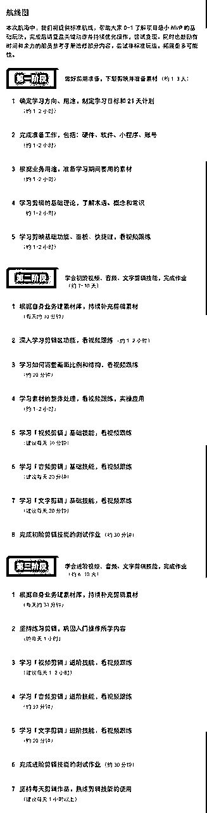

航线图和手册是高度关联的，因此你可以根据自己所在的环节，进行相关步骤的学习：

1.每天根据自己当前的项目进度，确认自己在航海图的哪一步，接下来要做的是哪一步；

2.点击对应要实操的步骤，跳转到航海手册的对应模块，即可了解相关实操步骤，并开始行动；

3.完成当日行动后，完成日志打卡，进行相关行动的复盘，并计划下一步行动；

4.航线图和项目关键路径强相关，如果你完成了航线图的所有动作，说明完成了最小 MVP ，接下来不要停止脚步，请继续重复第一阶段到第三阶段的动作。

如果你完成了上述航线图的所有动作，说明学完了剪辑必修篇内容。接下来请不要停止脚步，不断找素材、剪视频、发视频，反复打磨自己的剪辑技能并应用与实际项目中。

# 必修篇：学会基础剪辑技巧

#### 章节概要

必修篇中，我们将从认识剪辑开始，一步步带你完成视频号分成计划整个项目流程的学习。你可以根据本篇的内容与步骤进行实操，跑通视频号分成计划的最小 MVP。

为理清剪辑的学习路径，建议大家参考以下章节的内容顺序，进行学习：

如果你还未接触过剪辑，建议先初步做好练习准备【第一步：剪辑前的了解与准备】

如果想建立对剪映的基础认知，建议从了解软件面板开始【第二步：软件和画面的认识与处理】

如果对剪映有基础了解，但基础剪辑技能不太熟练，建议学习【第三步：剪辑的初阶操作与练习】

如果想进一步学习剪映进阶技能，如关键帧、蒙版等，建议学习【第四步：剪辑的进阶操作与练习】

如果想要检验自己的学习成果，我们也在本手册中为大家准备了两个小测验：

初阶剪辑技能检测【3.4 初阶剪辑技能检测】

进阶剪辑技能检测【4.4 进阶剪辑技能检测】

必修篇中的内容与航线图内容与顺序相对应，只要按照手册的顺序进行学习，即可逐一完成航线图的每一个任务。

在后续的每个关键步骤的章节概要中，我们也将提到相关航线图，提醒你完成相关步骤。

接下来就正式开始吧！

## 第一步：剪辑前的了解与准备

在学习剪辑之前，我们主要做一定的准备工作与了解，帮助大家在正式学习中更快进入状态。

磨刀不误砍柴工，从本章节开始迈出你的实操第一步吧~

#### 本章航线图

完成本章节的学习和实操，即可完成航线图第一阶段。

第一阶段：做好前期准备，下载剪映并准备素材（约 1-3 天）

1.确定学习方向、用途，制定学习目标和 21 天计划（约 1-2 小时）

2.完成准备工作，包括：硬件、软件、小程序、账号（约 1-2 小时）

3.根据业务用途，准备学习期间要用的素材（约 1-2 小时）

4.学习剪辑的基础理论，了解术语、概念和常识（约 1-2 小时）

5.学习剪映基础功能、面板、快捷键，看视频跟练（约 1-2 小时）

那么现在，就请开始踏上第一阶段的学习与练习吧。

### 1.1 如何在 21 天内学习剪辑

#### 1.1.1 学习目标

剪辑是视频制作中的一项重要工艺，它涉及将原始素材，包括影像、音频和其他元素，按照特定的结构和节奏重新组织和编辑。剪辑过程不仅仅是简单地剪切和拼接画面，它还涉及到音频处理、特效添加、色彩校正等多个方面。

随着社交媒体和短视频的兴起，剪辑的重要性变得更为突出。在各大视频平台上，大家逐渐发掘出成百上千种细分创业项目。

如果想要赶上这波热潮，剪辑在其中就扮演了关键角色，不论你是做视频带货、图文带货、个人 IP、短剧 cps 还是其他项目，只要需要输出视频，就需要用到剪辑。

@奇杰老师 对这次「剪辑特训」的学习目标是这样说的：

1-1.短视频剪辑学习目标.mp4【在线播放】

概括来说：

#### 1.1.2 制定 21 天学习计划

这部分是本次「剪辑特训」航海的一个重点动作：制定自己的 21 天学习计划。

往期「剪辑特训」航海中，我们发现，大家对于学习剪辑会抱有「完成任务」就好的心态，比如打开手册直奔两个剪辑测试题。

但实际上，大家花费时间来学习，是为了真正的学到技能，提升能力，不是为了完成打卡和测试。这些东西是为了“督促大家学习、检验学习成果”而设计的规则，不是为了大家搞形式化。

所以请大家：

需要说明的是：

当然，虽说「制定 21 天学习计划」是本次剪辑特训航海的重点动作之一，但是否做，还是看大家各自的意愿与需求。如果你想要在 21 天内获得更清晰的成长，这个计划还是建议大家做一做。

毕竟未来长久的进步，是需要大家在项目实践中不断总结精进的。

### 1.2 准备工作

目前常用的视频剪辑软件有多种，例如 Adobe Premiere Pro、Final Cut Pro，以及大家常常听到的剪映。

本手册将围绕「剪映专业版」这一剪辑工具展开讨论与教学，作为目前国内常用的剪辑软件之一，「剪映」有着相对较低的门槛，更适合大家入门剪辑时学习。

为了更好更全面地学习剪映功能，建议大家下载剪映专业版（即桌面端），本手册的教学展示均为桌面端的操作。

#### 1.2.1 准备工作总览

以下是奇杰老师对于「剪辑准备工作」的建议，主要有硬件准备、软件准备、素材准备三方面建议。

时间戳：

1-3.学习剪辑的准备工作.mp4【在线播放】

#### 1.2.2 下载剪映

剪映官网：https://www.capcut.cn/

点击上述网站，选择「专业版」，点击「立即下载」即可：

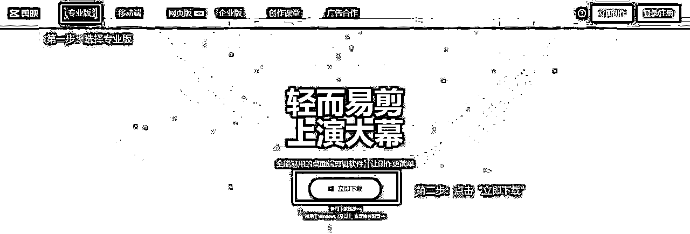

为了让软件有更好的运行环境，「剪映」对电脑配置也有一定要求。当然，这个要求并不高，最低配置一般电脑都能符合，如果能达到推荐配置当然也最好～

Windows 配置要求：

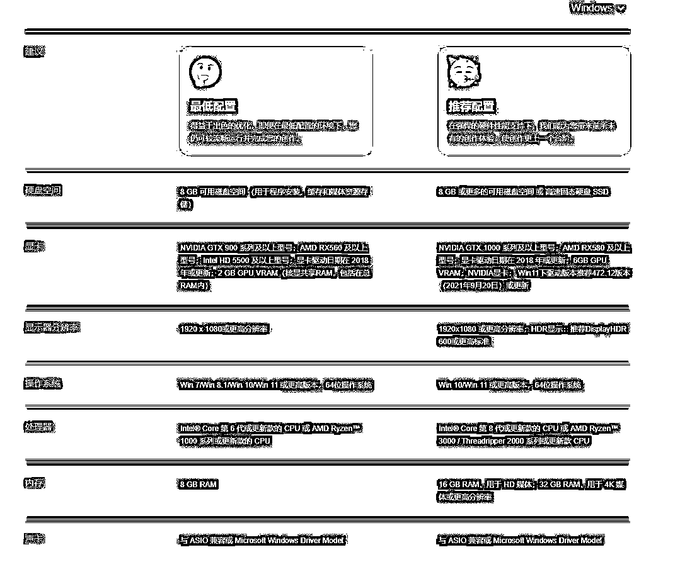

MacOS 配置要求：

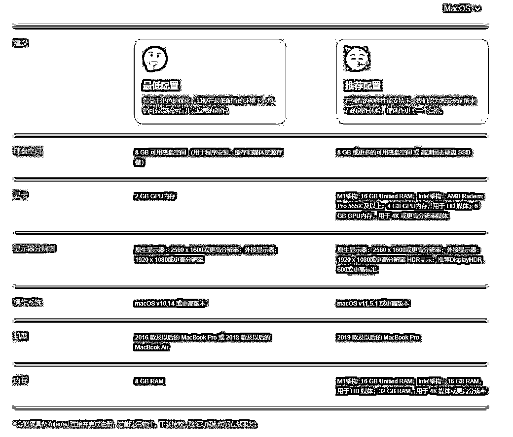

电脑配置上，大家不必花过多精力与金钱，能用即可。

#### 1.2.3 其他软件准备

为了方便后续的剪辑操作，除「剪映」外，大家可以在前期做好这些工具准备。

工具一： https://snapdrop.net/#

优点：无需下载第三方软件，同一 WiFi 下，网站在线传输

缺点：网站偶尔性打不开

工具二：www.localsend.org

优点：跨平台无线无损互传

缺点：需要下载第三方软件

### 1.3 如何获取素材

其实获取素材也是准备工作的一栏，但因为它很重要，且很多人在学习剪辑时容易忽略素材的重要性，所以咱们单拎一个小节来说。

获取素材的核心是：

所以如果你有自己的业务需要，建议直接用业务中的素材试手。无论我们学习多少技能，最终的落脚点一定是在实际业务或工作当中。

往期的「剪辑特训」航海中我们了解到，有很多同学容易忽略素材的重要性，不准备素材，直接拿测试题里提供的素材，照着老师做的成品进行生硬的模仿。但实际上，这样大概率是学不到真技能的。

所以建议大家准备一些自己的素材，并且在航行期可以不断从各平台积累素材，再围绕本手册教学的各类技能持续练习，才能不断熟练、精进。

当然，为了方便大家更快进入剪辑状态，减少寻找素材的时间，我们也会在本章节中提供一些常见的素材渠道。

常见的素材渠道：

时间戳：

1-2.剪辑素材的来源.mp4【在线播放】

找到视频后如何下载呢？可以借助工具，例如亨亨猫（链接 https://h.zzrjcp.com/）等。市面上这样的工具有很多，大家找到适合自己的并使用即可。

### 1.4 术语解释

为了防止大家在手册后文中看到某些词语时觉得陌生，我们先来了解一些剪辑中的基础概念。

常见的视频名词术语（为重点关注）：

以上是视频剪辑中常见的一些术语，熟悉它们有助于更好地理解视频制作过程。

知识拓展-常见的视频格式：

这些主流且常见的视频格式在不同的场景下都有各自的优势和局限性，大家在使用时根据自己需求选择就好。

大部分短视频平台场景中，我们还是用 MP4 格式较多。

### 1.5 剪映快捷键

为提高剪辑效率，一些常用的快捷键大家可以记一下。

在剪映剪辑页面的右上角，找到小键盘并点开，我们就能看到官方整理好的常用快捷键：

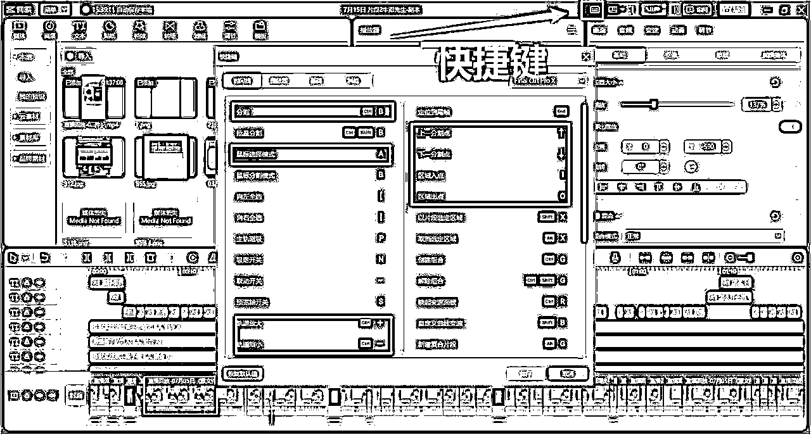

这其中，最常用的快捷键有：

现在看不懂没关系，在下文的具体技能学习中，大家会逐渐遇到它们。

## 第二步：软件和画面的认识与处理

本手册将围绕「剪映专业版」这一剪辑工具展开讨论与教学，作为目前国内常用的剪辑软件之一，「剪映」有着相对较低的门槛，更适合大家入门剪辑时学习。

所以本章节，我们先来了解「剪映专业版」的基础功能、剪辑面板和剪辑区，并使用这些基础技巧完成素材的整理处理。了解完这些，大家在后续正式学习时，能更快上手。

#### 本章航线图

第二阶段：学会初阶视频、音频、文字剪辑技能，完成作业（约 7-10 天）

完成本章节的学习和实操，即可完成航线图第二阶段的前半部分：

1.根据自身业务建素材库，持续补充剪辑素材（每天约 30 分钟）

2.深入学习剪辑区功能，看视频跟练（约 1-2 小时）

3.学习如何调整画面比例和结构，看视频跟练（约 20 分钟）

4.学习素材的整体处理，看视频跟练，实操应用（约 1-2 小时）

那么现在，就请开始踏上第一阶段的学习与练习吧。

### 2.1 软件基础功能与界面

#### 2.1.1 认识剪映基础功能

接下来，我们主要认识一下剪映的基础功能有哪些？

视频教程主要涉及以下功能：

2-1.剪映专业版基础功能.mp4【在线播放】

#### 2.1.2 了解剪映面板

下载剪映后打开，大家能直接看到剪映的主界面。我们先简单了解一下主界面的一些功能分区，方便后续使用。

本视频中，主要为大家介绍了剪映的素材区、预览区、参数区和剪辑区：

2-2.剪映专业版软件界面.mp4【在线播放】

简单做个总结。

素材区：

在这个面板中，你可以上传个人素材，将视频、音频和图片等素材从本地文件夹中导入到剪映项目中。也可以使用丰富的在线素材，减少寻找素材的时间。

实际操作中，你可以直接从这里将素材拖拽到时间轴上，方便快捷地准备好需要编辑的素材。

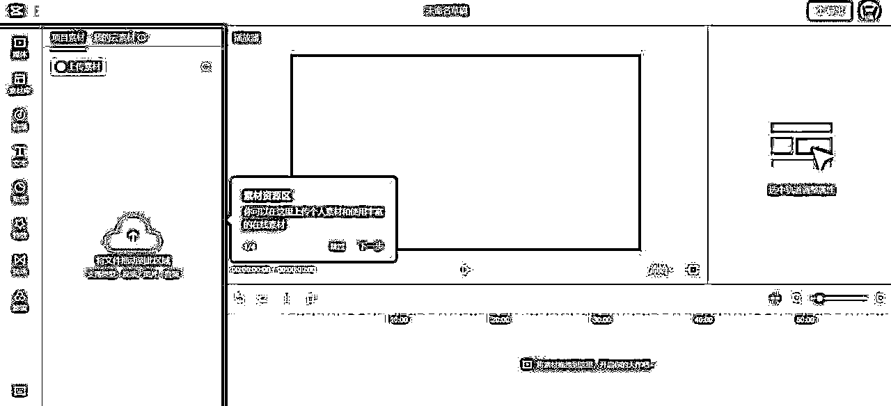

预览区：

你可以在这里实时预览自己在时间轴上编辑后的素材和剪辑效果。

点击播放按钮，就可以观看视频在预览面板中的表现，以便及时调整和优化剪辑效果。

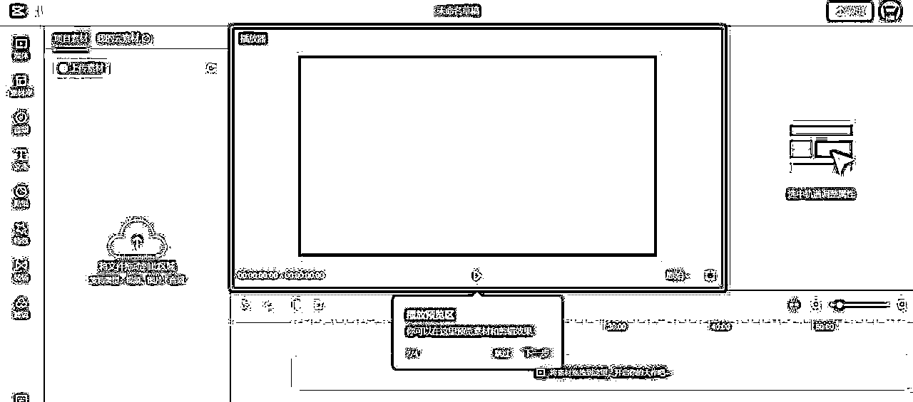

参数区：

你可以在这里调整素材的效果属性，例如画面位置大小、透明度、画面色彩、音量、变声、动画效果等。

选中你想要调整属性的轨道后，再在该区域进行属性调整，即可实现对应效果。

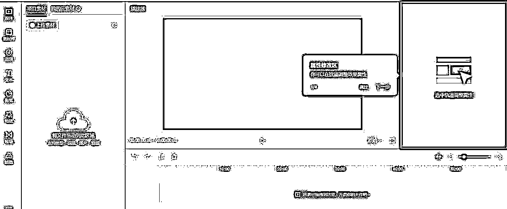

剪辑区：

剪辑区是整个剪辑过程的核心，你可以在这里对导入的素材进行排列、剪辑和其他调整，对轨道进行增删改等编辑操作，实现流畅的视频剪辑效果。 可编辑的轨道有视频画面轨道、音频轨道、字幕轨道、特效轨道等。

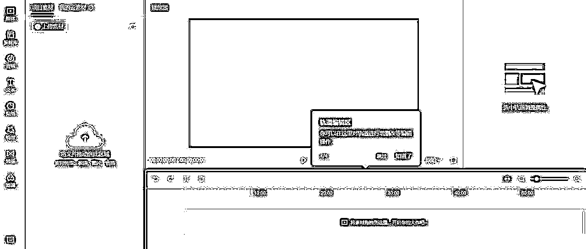

具体功能和操作如何实现？我们将在【章节 3.1-章节 4.3】中以视频的形式讲解。大家也可以从目录中找到自己想要了解的具体功能，定向学习。

### 2.2 剪辑区功能介绍

虽然前文讲到过剪映的面板分区，但是在最重要的剪辑区，我们到底能做到哪些动作呢？为了让大家在操作的时候思路更清晰，我们将「剪辑区功能」单独拎出来做个专题小节。

本小节的部分教程，与后文的视频、音频、字幕处理等教程有重叠，但教学角度不同，大家可以把后文的教学当作巩固学习。

以下视频教程包含，素材选择、素材分割、素材全选、操作撤回、操作恢复、定格、倒放等。

素材选择：00:25-00:47，点击「剪辑区」左上角的小箭头，选择「小剪头」，此时点击素材就能选中素材

素材分割：00:48-01:10，02:10-02:42，点击「分割」，鼠标会变成刀片形状，即可进行素材分割裁切

素材全选：01:12-01:49，介绍左全选与右全选的操作方式

操作撤回：01:50-01:57，点击撤回，我们可以撤回上一步的操作

操作恢复：01:58-02:09，点击恢复，我们可以恢复上一步被撤回的操作

向左裁切、向右裁切：02:44-03:35，点击对应按钮，可以裁切掉所选素材左侧或右侧的素材

定格：03:36-04:22，点击素材选择定格，会把对应帧的对应画面定格下来，定格时长可以通过拖动来改变

倒放：04:23-05:40，即倒放对应画面素材，如果想保留音频，需要做音频素材的分离

镜像：05:41-06:00，即对画面做左右翻转

旋转：06:01-06:18，即对画面做旋转，每次会旋转 90 度

裁剪：06:01-06:57，选中画面后点击裁剪，即可对画面大小长宽等进行裁剪

智能口播：06:58-06:结尾，该功能能够对口播素材进行智能分析，从而便于我们删除停顿与重复词等

2-4.剪辑区功能介绍（上）.mp4【在线播放】

以下视频教程包含，录音、主轨磁吸、自动吸附、联动功能、预览轴、音频踩点、锁定轨道、隐藏轨道等。

录音：开始-01:06，该功能可以让我们对素材进行后期配音

主轨磁吸：01:07-02:21，该功能一般默认开启，如果我们想对素材进行随意调换，可以关闭主轨磁吸

自动吸附：02:23-03:41，该功能可以方便我们对齐素材

联动功能：03:43-05:13，打开联动功能后，在移动某段主轨素材时，它的联动素材也会跟着一起移动

预览轴：05:14-06:38，即剪辑区显示的黄轴，打开预览轴后移动鼠标，我们可以在预览区快速看到画面变化

放大和缩小：06:39-07:15，可以缩放剪辑区素材的轨道，方便我们剪辑时快速找到自己的目标素材

自动踩点、手动踩点：07:16-09:23，点击后会在音频素材上用「黄点」标注卡点，方便做卡点视频

清空踩点：09:24-09:41，即清空设置踩点时，用于标记卡点的「黄点」

锁定轨道：09:43-10:13，锁定某个轨道后，我们处理其他轨道素材时，就不会误操作到已锁定的轨道

隐藏轨道：10:14-10:43，可以隐藏某个轨道的素材，方便我们查看有/无该素材时，画面的展现情况

轨道静音：10:44-结尾，可以对某个轨道素材做静音处理

2-4.剪辑区功能介绍（下）.mp4【在线播放】

### 2.3 认识画面结构

画面比例是指画面的长宽比，画面结构指的是主画面在整体画面长宽比里，所占的大小。

本视频主要为大家介绍两种画面比例下，常见的画面结构有哪些：

2-3.画面比例和结构.mp4【在线播放】

### 2.4 素材整体处理

在对视频素材进行剪辑前，我们需要对素材做整体处理，否则切割完素材后再做调整，剪辑效率会大大降低。

本视频教程包含画面部分与声音部分的素材整理方法

3-1.素材整体处理.mp4【在线播放】

## 第三步：剪辑的初阶操作与练习

本章主要带大家学习初阶剪辑技能，掌握本章节内容，你将掌握“简单制作短视频”的能力。

在【3.4 初阶剪辑技能检测】中，我们还给大家留了一道测试，完成它就代表你在本阶段的学习圆满结束～剩下的就是不断巩固与练习。

需要注意的是，测试前，希望大家对本章节内容已有一定程度学习，否则在测试中觉得举步难行是很正常的事。

测试本身是为了“督促大家学习、检验学习成果”而设计的规则，不是为了搞形式化，如果单靠生硬的提问勉强完成测试，并无意义。

#### 本章航线图

第二阶段：学会初阶视频、音频、文字剪辑技能，完成作业（约 7-10 天）

完成本章节的学习和实操，即可完成航线图第二阶段的后半部分：

1.学习「视频剪辑」基础技能，看视频跟练（建议每天 30 分钟）

2.学习「音频剪辑」基础技能，看视频跟练（建议每天 20 分钟）

3.学习「文字剪辑」基础技能，看视频跟练（建议每天 20 分钟）

4.完成初阶剪辑技能的测试作业（约 30 分钟）

那么现在，就请开始踏上第二阶段的学习与练习吧。

### 3.1 初阶操作：视频部分

本小节，我们主要学习短视频剪辑时，画面部分的处理如何操作（初阶）。

时间戳：

3-2.入门操作-视频部分（上）.mp4【在线播放】

时间戳：

3-3.入门操作-视频部分（下）.mp4【在线播放】

### 3.2 初阶操作：音频部分

本小节，我们主要学习短视频剪辑时，音频部分的处理如何操作（初阶）。

电子配音：

如果不想自己真人配音，可以用电子配音的形式为视频配音，大家经常听到的 AI 配音就是案例。选中素材后，添加文本，再点击「朗读」，就能看到常见的电子配音类型，常用的有四郎、动漫海绵、东北老铁等。

3-4.入门操作-音频部分（上）.mp4【在线播放】

时间戳：

3-5.入门操作-音频部分（下）.mp4【在线播放】

### 3.3 初阶操作：文字部分

本小节，我们主要学习短视频剪辑时，文字的添加和设置（初阶）。

时间戳：

3-6.入门操作-文字部分.mp4【在线播放】

### 3.4 初阶剪辑技能检测

学习完本章节「初阶剪辑技能」，我们应当具备剪辑一条成品视频的能力。

为了让大家能对自己的学习成果有所了解，我们在本小节提供一些素材，和这些素材用基础技能剪辑后的视频，大家可以测试一下，自己能否将原素材剪辑成「示范效果」的样子。

下载链接：https://pan.quark.cn/s/6844348eae4b

1.初阶检测-成品示范.mp4【在线播放】

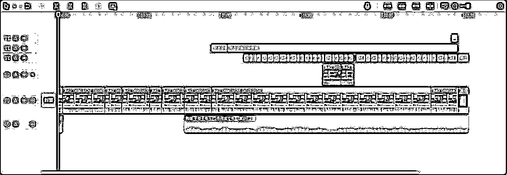

## 第四步：剪辑的进阶操作与练习

本章主要带大家学习进阶剪辑技能，掌握本章节内容，你将掌握“制作精致短视频”的能力。

在【4.4 进阶剪辑技能检测】中，我们还给大家留了一道测试，完成它就代表你在本阶段的学习圆满结束～剩下的就是不断巩固与练习。

需要注意的是，测试前，希望大家对本章节内容已有一定程度学习，否则在测试中觉得举步难行是很正常的事。

测试本身是为了“督促大家学习、检验学习成果”而设计的规则，不是为了搞形式化，如果单靠生硬的提问勉强完成测试，并无意义。

#### 本章航线图

完成本章节的学习和实操，即可完成航线图第三阶段。

第三阶段：学会进阶视频、音频、文字剪辑技能，完成作业（约 6-10 天）

1.根据自身业务建素材库，持续补充剪辑素材（每天约 30 分钟）

2.坚持练习剪辑，巩固入门操作所学内容（约每天 1 小时）

3.学习「视频剪辑」进阶技能，看视频跟练（建议每天 1-2 小时）

4.学习「音频剪辑」进阶技能，看视频跟练（约 30 分钟）

5.学习「文字剪辑」进阶技能，看视频跟练（约 20 分钟）

6.完成进阶剪辑技能的测试作业（约 30 分钟）

7.坚持每天剪辑作品，熟练剪辑技能的使用（建议每天 1 小时以上）

那么现在，就请开始踏上第三阶段的学习与练习吧。

### 4.1 进阶操作：视频部分

本小节，我们主要学习进阶的视频画面剪辑技能，主要包括抠像功能、蒙版效果、贴纸、滤镜、特效、关键帧、背景设置等技能。

学会这 7 大技能，能够解决大部分短视频项目的剪辑需求。

#### 4.1.1 抠像功能

抠像功能，就是把某一个区域的人像抠出来，其他地方变成透明。剪映可以做到智能抠像和自定义抠像。

选中素材后，在参数区点击「画面」-「抠像」，即可进行智能抠像或自定义抠像操作。

4-1.进阶操作-视频抠像.mp4【在线播放】

#### 4.1.2 蒙版效果

比如我们添加完画中画后，不想让画面太突兀，就可以对该画中画的画面进行添加蒙版的操作，改变其形状与样式。剪映的画面蒙版有线性、镜面、圆形、矩形、爱心和星形。

选中素材后，在参数区点击「画面」-「蒙版」，即可进行蒙版操作。

4-2.进阶操作-蒙版应用.mp4【在线播放】

#### 4.1.3 贴纸

即在素材画面中贴个贴纸，使画面更生动有趣。我们可以选中某个轨道画面后，点击素材区-贴纸，在这儿就能看到许多热门贴纸。

为了更快找到更适合的贴纸，我们可以输入关键词搜索，比如输入“箭头”，找到自己喜欢的素材，添加进画面。

4-3.进阶操作-贴纸功能.mp4【在线播放】

#### 4.1.4 滤镜

如果你不满意原片的效果，可以为其添加滤镜，增加画面整体氛围感。

选中想要处理的画面后，点击素材区-滤镜，我们就能看到非常多滤镜风格，大家选择自己喜欢的即可。

4-9.进阶操作-滤镜功能.mp4【在线播放】

#### 4.1.5 特效

特效分为画面特效和人物特效，添加特效能为画面增加不少氛围感或趣味性。

画面特效：00:18-01:30，点击素材区-特效-画面特效，就能看到许多特效，点击对应特效可以预览效果

人物特效：00:18-01:30，点击素材区-特效-人物特效，人物特效能对画面中的人物增添效果，如脸红、怪脸等

4-4.进阶操作-特效功能.mp4【在线播放】

#### 4.1.6 关键帧

视频剪辑中，关键帧特指在时间轴上选择的特定帧，它们代表了视频中的重要瞬间或转折点，一般用来标记视频中重要的变化或状态转换。

与其他帧相比，关键帧通常包含了一些关键性信息，例如位置、大小、旋转角度、透明度等。这些关键帧定义了物体或角色在不同时间点上的状态，利用好这些关键帧，能够使画面过渡更流畅，产生丰富的画面效果。

依靠关键帧，我们能实现画面从小到大、声音由弱变强、移动水印等操作。

4-5.进阶操作-关键帧.mp4【在线播放】

#### 4.1.7 背景设置

需要注意的是，背景设置只能选择主轨素材来设置，选中素材时，请确认素材在“主轨”位置。

比如我们现在的画面结构是 4:3，上下都是默认的黑色，那么就可以通过背景设置，填充主轨素材中其他「非主画面」的部分。例如在上方添加标题，在下方添加字幕等等。

除此之外，我们也可以直接对背景做填充。选择参数区-画面下拉到最后，就能看到「背景填充」。常见的背景填充方式有模糊、颜色与样式。

4-10.进阶操作-背景设置.mp4【在线播放】

### 4.2 进阶操作：音频部分

本小节，我们主要学习音频剪辑技能（进阶），主要包括淡入淡出、音频变速功能。

#### 4.2.1 淡入淡出

顾名思义，即实现音频淡入或淡出的效果。有时候有些音乐的进入和退出太突兀，就可以用这种方法做个过渡。

选择音频素材-点击参数区-基础，就能看到「淡入时长」与「淡出时长」，一般来说，这个时长设定为 3 秒就有不错的效果。具体时长大家可以根据自己的需求设置。

4-6.进阶操作-淡入淡出.mp4【在线播放】

#### 4.2.2 视频变速（即音频变速）

正如字面意思，即视频变速功能，如果该视频有音频，在一同变速时，音频也会变速。

选择需要变速的素材，点击参数区-选择变速，就可以选择具体的变速倍数。

变速分常规变速和曲线变速，还可以选择声音变调和智能补帧，大家按需选择即可。

4-7.进阶操作-视频变速.mp4【在线播放】

### 4.3 进阶操作：文字模板

本小节，我们主要学习文字处理中的「文字模板」功能。

该功能主要是帮助我们更快创建出所需的艺术字。点击素材区的「文本」，能看到「文字模板」模块，这其中就能看到非常多的艺术字类型，大家选择自己需要的即可。

4-8.进阶操作-文字模板.mp4【在线播放】

### 4.4 进阶剪辑技能检测

学习完本章节「第四步：进阶剪辑技能」，我们应当具备，使用进阶技能优化视频的能力。

为了让大家能对自己的学习成果有所了解，我们在本小节提供一些素材，和这些素材用进阶技能剪辑后的视频，大家可以测试一下，自己能否将原素材剪辑成「示范效果」的样子

下载链接：https://pan.quark.cn/s/7ee255d9f012

1.进阶检测-成品示范.mp4【在线播放】

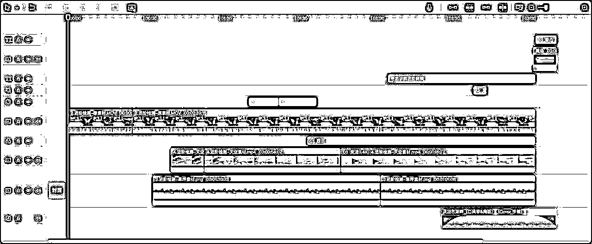

# 选修篇：剪辑的深度应用与工具推荐

#### 章节概要

完成前文必修篇的内容，基本掌握剪辑基础与进阶操作后，大家可以尝试看看选修篇的内容。

无论是想要进一步熟练技能，还是挖掘更多玩法，都可以重点阅读本章节：

【拓展玩法】批量剪辑的学习与应用

【实战工具】加餐与分享

如果学有余力，欢迎大家尝试选修篇的更多玩法，如果尚未学完前文，建议大家优先在必修篇练好基本功。

以下的内容将助力你进一步成长，来吧，开始你的冒险。

## 五、【拓展玩法】批量混剪的学习与应用

### 5.1 什么是混剪和批量混剪

学会了剪辑的初阶和进阶技能以后，你已经掌握了短视频制作的基本方法。如果你做的是多账号矩阵，需要大量的产出作品，就需要用到「批量混剪」的技巧。

「批量混剪」是在「混剪」的基础上进行批量化操作的一种剪辑方法，学习批量混剪之前，需要先了解混剪的逻辑，以及在批量混剪时的去重设计。学习这部分内容，建议大家阅读@奇杰老师 在 5 月航海时的高手分享

《剪辑基础决定上层建筑，了解混剪逻辑和去重设计》

混剪与批量混剪具体指什么呢？

5-1.混剪和批量混剪的概念.mp4【在线播放】

### 5.2 教程：单人日产 200 条系列，批量混剪实战教学

@奇杰老师 目前独立供应着 30 多个抖音账号的视频内容，满负荷一天可以混剪 200 条以上，生产力比刚开始翻了几十倍。

当然，这里说的满负荷是 7-8 个小时的工作时间，而不是通宵达旦。

关于「批量混剪」的实战应用，@奇杰老师 曾在星球发布过一篇攻略，介绍了短视频混剪带货的要素，以及批量混剪的步骤，大家可以点击链接，查看原帖

【短视频混剪进阶】单人日产 200 条实战攻略

攻略发布以后，受到了众多圈友的热烈追捧。然后生财有术便邀请 @奇杰老师 将他的实战攻略录制成视频教程，供圈友学习。该教程融合了批量混剪比较全面的操作方法，大家可以通过以下视频教程，来学习「批量混剪」在剪辑时的具体操作方法。教程如下：

【短视频混剪】单人日产 200 条视频教程-奇杰.mp4【在线播放】

### 5.3 辅助工具：素材与切片工具

批量混剪去重，需要用到切片素材，这里给大家提供一部分教学素材，供大家练习使用。

奇杰【批量混剪】切片素材-教学用

下载链接：https://pan.quark.cn/s/c0a2379f4551

批量混剪需要对素材进行切片和混合，给大家分享两个切片混合工具。

Windows 系统 素材切片混合工具+素材命名打乱工具

下载链接：https://pan.quark.cn/s/dbd5dd5ef182

Mac 系统（苹果电脑） 素材切片混合工具

下载链接：https://pan.quark.cn/s/45c9b00aca41

### 5.4 实操应用：利用批量混剪制作不同类型的视频

为方便大家将「批量混剪」应用于更具体的项目实操中，我们为常见的 9 大短视频类型，分别制作了对应的实操课程，大家可以对照学习。

#### 5.4.1 人物扣像类

5-2.「人物抠像」单人日产 200 条系列 _batch.mp4【在线播放】

#### 5.4.2 现场拍摄类

5-3.「现场拍摄」单人日产 200 条系列 _batch.mp4【在线播放】

#### 5.4.3 汤包熬煮类

5-4.「汤包熬煮」单人日产 200 条系列 _batch.mp4【在线播放】

#### 5.4.4 好物分享类

5-5.「好物分享」单人日产 200 条系列 _batch.mp4【在线播放】

#### 5.4.5 绿植盆栽类

5-6.「绿植盆栽」单人日产 200 条系列 _batch.mp4【在线播放】

#### 5.4.6 养生冲泡类

5-7.「养生冲泡」单人日产 200 条系列 _batch.mp4【在线播放】

#### 5.4.7 励志语录类

5-8.「励志语录」单人日产 200 条系列 _batch.mp4【在线播放】

#### 5.4.8 音乐唱歌类

5-9.「音乐唱歌」单人日产 200 条系列 _batch.mp4【在线播放】

#### 5.4.9 好书推荐类

5-10.「好书推荐」单人日产 200 条系列 _batch.mp4【在线播放】

### 5.5 批量混剪学习成果自测

学习完「批量混剪」这部分内容，请对自己的学习成果进行自测。

合格标准：不看教程，不提问，可以独立顺畅完成批量混剪，且每 10 条视频制作用时不超过 1 小时。

## 六、【实战工具】加餐与分享汇总

以下工具可能在前文出现过，此处仅做汇总，方便大家查找使用。

### 6.1 教学素材

批量混剪去重，需要用到切片素材，这里给大家提供一部分，练习使用。

奇杰【批量混剪】切片素材-教学用

下载链接：https://pan.quark.cn/s/c0a2379f4551

### 6.2 切片工具

批量混剪需要对素材进行切片和混合，给大家分享两个切片混合工具。

Windows 系统 素材切片混合工具+素材命名打乱工具

下载链接：https://pan.quark.cn/s/dbd5dd5ef182

Mac 系统（苹果电脑） 素材切片混合工具

下载链接：https://pan.quark.cn/s/45c9b00aca41

### 6.3 文件传输工具

工具一： https://snapdrop.net/#

优点：无需下载第三方软件，同一 WiFi 下，网站在线传输

缺点：网站偶尔性打不开

工具二：www.localsend.org

优点：跨平台无线无损互传

缺点：需要下载第三方软件

### 6.4 21 天学习计划模板

在奇杰老师的帮助下，我们梳理了一版「21 天学习计划模板」，大家可以参考这份学习计划，按照自己的能力、时间安排，规划 21 天「剪辑特训 21 天学习计划模板」

### 6.5 分类桌面

很多朋友喜欢视频教程中的分类桌面，分享给大家，喜欢的自取。

批量混剪分类桌面（教程里出现的）

下载链接：https://pan.quark.cn/s/3be589a77a85

### 6.5 拓展阅读《剪辑基础决定上层建筑》

如果对「批量混剪逻辑」「混剪方案构思」和「混剪去重设计」不了解，或者没有思路，请仔细阅读学习

《剪辑基础决定上层建筑，了解混剪逻辑和去重设计》

