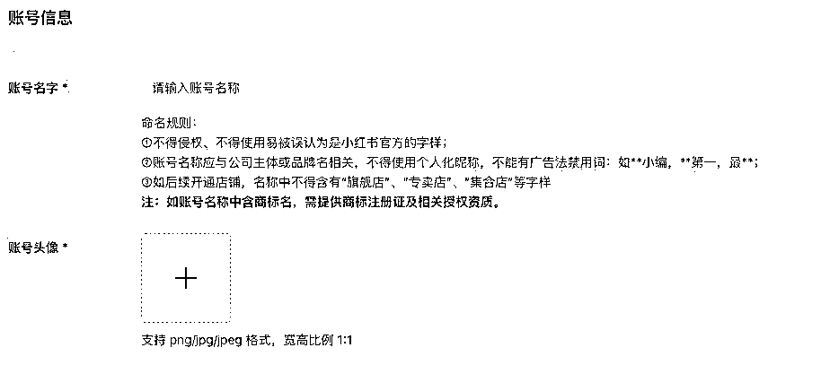
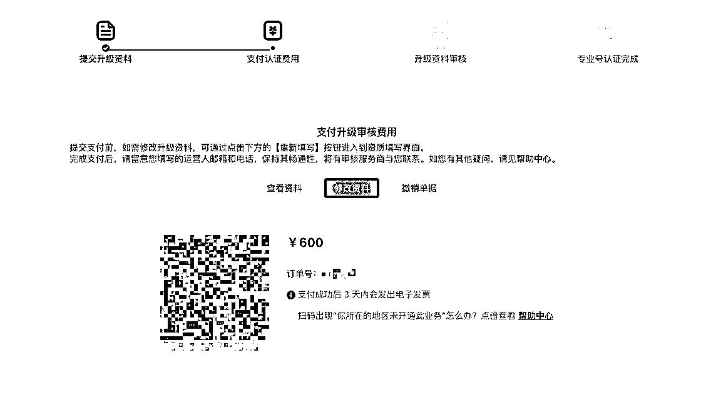
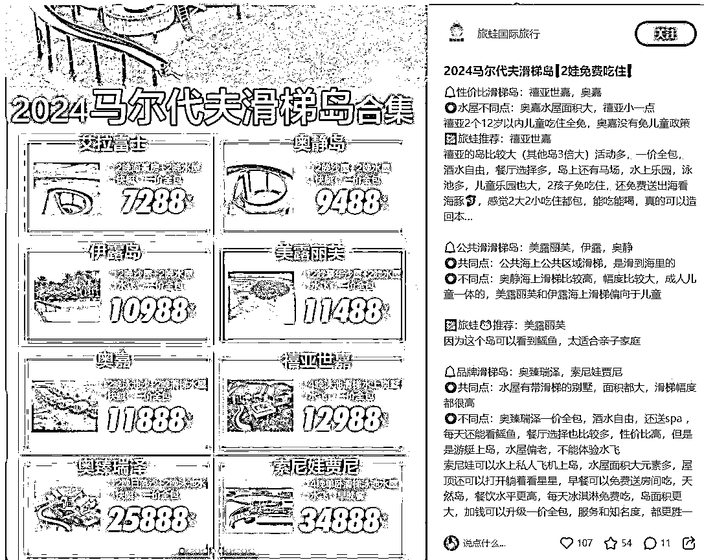
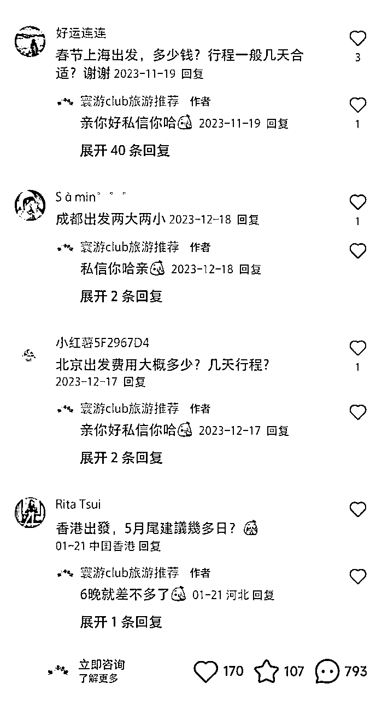
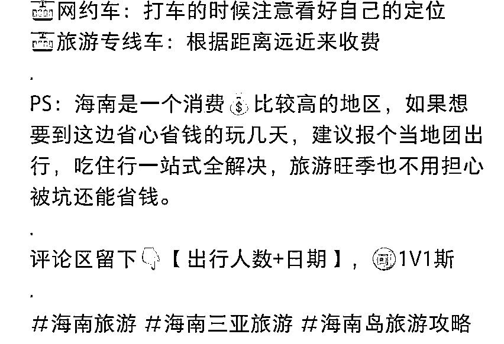
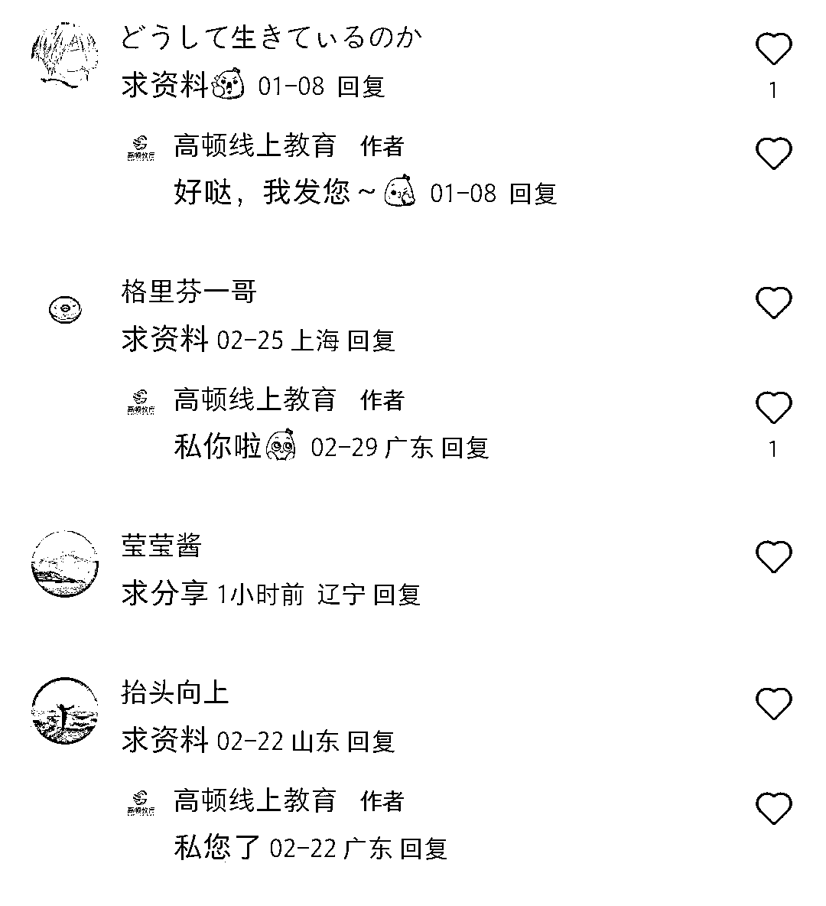
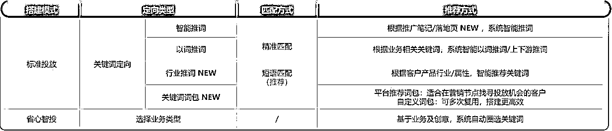
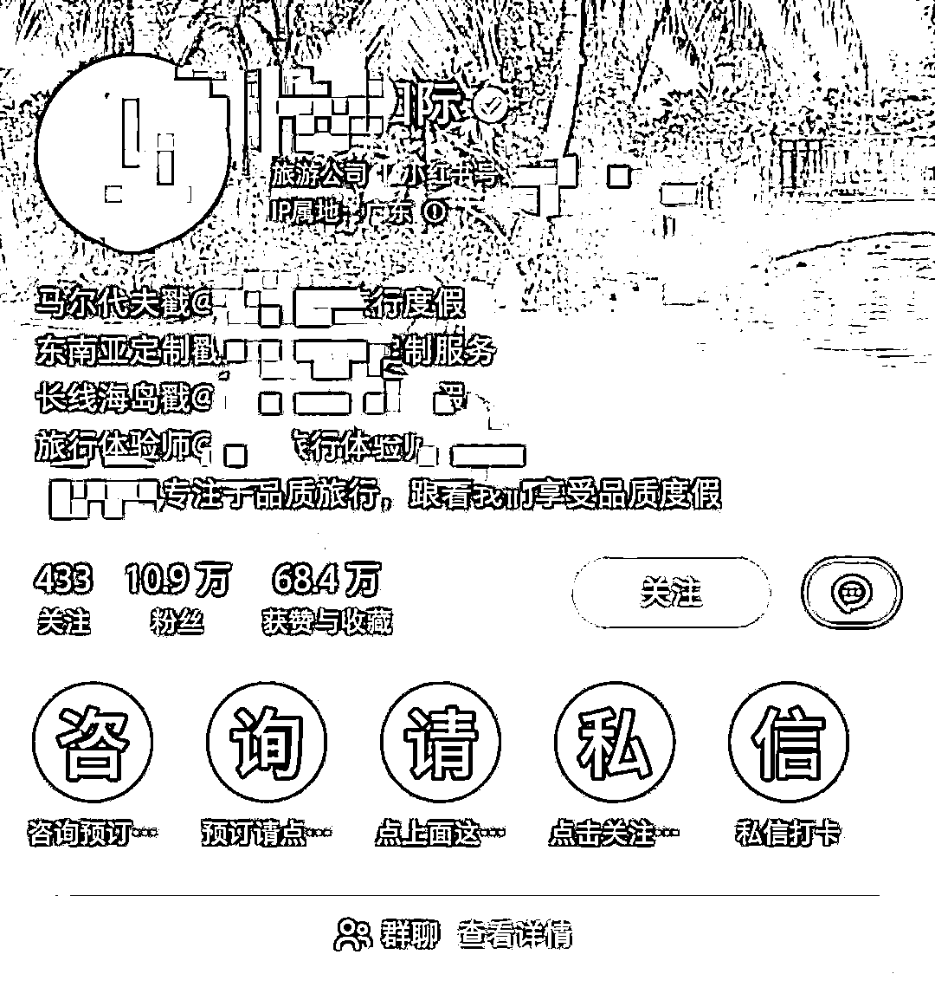
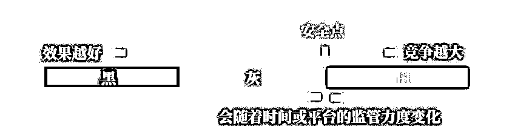
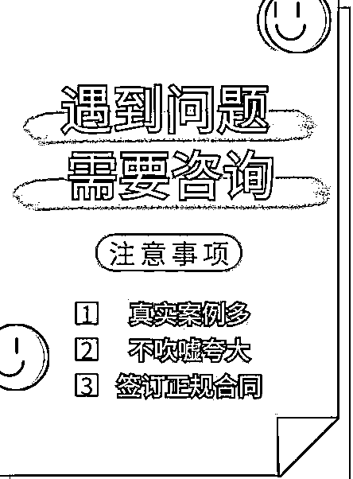

# 三、月航海｜聚光投放｜实战手册

> 来源：[`jviztcgxxfy.feishu.cn/docx/ONpWdE88eoKKhExBFW3cz2Q7n9c`](https://jviztcgxxfy.feishu.cn/docx/ONpWdE88eoKKhExBFW3cz2Q7n9c)

3 月航海｜聚光投放｜实战手册

手册出品方：生财有术团队

出品时间：2024 年 3 月 20 日

手册使用说明：内容出品人排名不分先后。本文旨在向你展示一个项目的更多可能性，帮助你更好地理解和实操。

建议：如果需要快速定位到精确内容，可以使用快捷键 Ctrl + F/command + F 的形式，搜索「关键字/词」，查找你想要的内容

# 写在前面

从 23 年，小红书要求私信引流必须投聚光才能不封号，从这时起，越来越多商家开始重视聚光投放。

不仅是需要引流的商家在投，连电商、品牌商家也在投聚光。因为投放博主种草的周期太长了，没有办法马上看到效果，而且投放博主的水更深，很难把控转化率。跟博主种草相比，投放聚光广告带来的转化更直接、效果也更好。

我们本次航海，就会围绕大家最关心的“如何用聚光投放解决小红书引流问题”来开展教学。

希望大家可以在这次航行里收获成果外，结识一群战友。

以下内容由生财有术联合圈友制作而成，仅供航海船员以及生财有术星球圈友学习使用。

同时也欢迎圈友们在实践过程中持续反馈，和我们共同完善，可以联系鱼丸（yuwan387）提供修改建议～

# 【更新提示】新手册使用方式

在开始前，我们来简单了解一下这个手册的正确打开方式，方便你根据自己的情况来灵活使用。

在这里，手册整体的步骤顺序是按照从 0 - 1 跑通一个视频号带货项目进行的，你可以参考航线图，按顺序开始实操。也可以根据自己的实际需求选择性阅读。

需要注意的是：本次手册相较于过往航海，进行了较大的改版。之前的手册尽可能的展示更多可能的玩法供大家自由选择，本次改版后的手册，分为【必修】和【选修】两个大的章节：

如果你还未接触过聚光投放：

建议在正式实操前，先初步了解下项目全貌

【项目概述】了解聚光平台

如果你对聚光投放已有大致的了解：

请从航线图第一阶段的步骤开始实操，这个阶段你可以从手册的第二章开始阅读，逐步完成整个项目

【项目实操 1/4】开通聚光平台

【项目实操 2/4】准备 6 篇合格的投放笔记

【项目实操 3/4】实现一次成功的投放

【项目实操 4/4】提升投放转化率

如果你已跑通 MVP ，想放大项目：

可以重点阅读以下章节，扩展更多玩法

学习聚光投放的更多玩法

提升聚光投放的投放网感

本航海项目的【航线图】如下：

航线图和手册是高度关联的，因此你可以根据自己所在的环节，进行相关步骤的学习。

以上阶段中，所有的航线图步骤建议大家在航海前两周完成，完成后，建议以复盘&再次投放为主，多次重复整个投放流程，提升自己的投放效果。

# 必修篇：跑通聚光投放最小 MVP

### 章节概要

在必修篇，我们将从聚光投放的【项目概述】和【投放实操步骤】开始，让你对项目有一个全面了解，并按步骤完成项目的 0-1，跑通最小 MVP。

如果你是本项目新手，建议在正式实操前，先初步了解下项目全貌：

【项目概述】了解聚光平台

如果你对项目整体有了大致了解，就可以按照项目核心步骤，开始学习实操：

【项目实操 1/4】开通聚光平台

【项目实操 2/4】准备 6 篇合格的投放笔记

【项目实操 3/4】实现一次成功的投放

【项目实操 4/4】提升投放转化率

在必修篇，航线图和手册顺序相对应，你可以按照手册的顺序进行学习，即可逐一完成航线图的每一个任务。

接下来就正式开始吧！

## 一、【项目概述】了解聚光平台 @天堂地狱

### 1.1 聚光平台是什么？

聚光平台是小红书在 2022 年推出的一站式广告投放平台。可以帮助想在小红书上做广告的商家，通过信息流广告或者搜索广告等，推广自己的产品和服务。

聚光作为小红书的广告平台，功能上对标的是抖音的千川，快手的磁力，它是一个集成了多种广告投放模式的资源平台。

同比简单的薯条投放，它集成了搜索广告，信息流广告等多种投放模式。

### 1.2 聚光平台为什么现在值得布局？

#### 1.2.1 聚光平台的优点

优点一：能“安全合规”的引流

当下小红书是最热门的流量平台，但凡阿猫阿狗都能来做一点，因为流量真的相比于其他平台，太好入门，太好做了。

但是目前由于太多的人卷入这股浪潮，免费流量这个赛道已经卷得白热化了，并且官方也逐渐收紧了这个端口，但凡有丁点引流动作，动不动就是禁言限流封号。

大家讨论的最热门的话题可能就是如何安全引流了。

能看到许许多多的答案：小号置顶，背景图，小红书号，签名，评论谐音藏头诗引流等，这些大家应该都测试过，但没有一个是稳定的，出现黑天鹅事件的概率相当大。

就目前跑出来的结果，最有效且相对安全的引流方式便是： 顺应平台方向，帮平台商业部小伙伴完成 kpi，开通聚光！

优点二：投放效果不错

很多赛道通过聚光投放，都取得了很不错的留咨效果。

五元开口，10 元加微。懂的都懂。

一个被低估的平台和一个被低估的股票一样有价值。带领大家去找寻这些价值，就是我们这次航海的目标。

优点三：相比其他投放工具门槛低

无论是官方直客/代理商的服务，首冲的数量，账户消耗的频率，聚光都应该算是最亲民的平台了。

门槛极低，平台上有着大量日消耗 100-500 的账户，且持续拿到价值。在其他老牌平台基本不会让你这么舒服的。

适合很多非专业投手，本身可能是自然流，然后用广告来数倍放大自己的价值，尤其是引流。

#### 1.2.2 聚光平台的缺点

讲完了优点，讲两个要注意的缺点

1.聚光平台整体体量，同比抖，百还是较小。

流量小就更容易形成竞争。一个赛道，一旦大头部进入，往往就没有太多余地了，就会面临着高度竞争或者换玩法，换赛道的选择。

2.现阶段规则还不是特别完善

有着不少的小漏洞。比如无法设置同一账号，固定周期内不能刷到同一系列的广告。这意味着某个用户可能会连续几天刷到我们的广告，这样就会造成了用户的重复点击，浪费广告费。有些同行还会利用这个漏洞恶意点刷，抬高我们的广告费。

## 二、【项目实操 1/4】开通聚光平台

### 小节概要

开通聚光平台的流程大致如下：开通专业号 - 开通聚光平台 - 充值广告费用。本章节会围绕这些流程详细讲解。

具体有这么几部分内容：

2.1.1 第一步：准备小红书账号，并完成主页装修

2.1.2 第二步：完成专业号认证

2.1.3 第三步：完成聚光平台注册

2.1.4 第四步：充值聚光广告费用

另外手册也会简单给大家介绍一下聚光的广告类型，以及相关行业规则。提前了解这些，有助于我们的广告不被官方驳回。

这部分具体有以下内容：

2.2.1 聚光主流的四种广告

2.2.2.1 聚光平台禁投类目

2.2.2.2 聚光平台风险词汇

以上就是我们本章节的“路线图”。大家准备好就开始吧！

### 2.1 申请聚光账号

#### 2.1.1 第一步：准备小红书账号，并完成主页装修

如果你原来就有小红书账号，可以直接使用老号，没有的话需要注册一个新的。

注册完账号，我们紧接着需要进行主页装修了。

主页装修有多重要呢？我们假设一个场景，假如你在小红书刷到一条“云南大理旅游私人订制”的广告，想咨询一下，这个时候你点了下商家的头像，发现主页里什么都没有，你看完后还会信任这个商家吗？

账号的包装如果做的不好，有再多的“泼天富贵”，你也没办法接住。

那该如何装修一个能让人产生“信任感”的账号呢？一共有 4 个内容：

1.头像：建议用品牌 logo

2.昵称：同样建议用品牌官方名称

3.简介：精炼说明行业/主营类目/品牌特色等信息（告诉用户“我是谁”、“我能提供什么价值/内容/产品” ）

4.背景图：企业实景/品牌风格展示，具有一定美观度。 不建议采用多文字的背景图

大家可以结合下方案例来操作

给大家推荐几个制作头像、背景图的工具：

注意事项：注意避免使用容易侵权的商标类图片。

#### 2.1.2 第二步：完成企业专业号认证

在开通聚光平台之前，是需要先完成企业专业号认证的。

接下来我们就来看看，如何开通企业专业号。

2.1.2.1 认证须知

大家先看下认证规定，避免浪费认证费用（认证审核费用为 600 元/次。失败后，官方是不会退费的）

1.查看《禁止认证行业范围》（企业专业号认证规则第四章），确认从事行业为非禁止认证行业，否则即使缴纳审核费，也无法通过；

2.查看《准入行业分类及资质标准（企业专业号认证规则第五章），提前准备认证行业所需资质文件和品牌相关文件，及对应的简体中文翻译件；

3.务必使用需开通店铺的账号登录后台。申请专业号认证时，登录的账号即为认证账号，提交申请后无法更换账号。

4.如果是已经认证的个人号需要升级企业专业号，需要在小红书手机 APP 操作，操作路径”小红书 APP-我-左三栏-专业号中心-做互动-立即升级“进入企业号认证页面。

2.1.2.2 提交认证资料

提交链接 https://pro.xiaohongshu.com/enterprise/home

（建议使用 PC 端操作）

在左侧「账号管理」>「专业号认证/年审」>「专业号+广告账户同步开通」，进入到提交认证资料的页面。

1.账号信息

2.主体信息

需要提供最新工商营业执照扫描件

3.身份验证

需要法人人脸识别或提交申请公函

4.资质身份

在选择身份类目时，不同类目有不同的入驻标准，建议先查看《专业号身份类目》，准备好该类目相关的“行业资质”文件和“商标”文件，如果文件不齐全，建议调整专业号身份类目。

5.运营人信息

填写小红书运营人员的个人信息，需与《小红书专业号申请函》中的指定人信息保持一致。

2.1.2.3 支付认证费用

一定要确保身份类目选择正确，资料完善后再支付认证费用（这部分拿不准的，可以在群里问问教练）；后续更改主体信息和身份类目，均需要重新认证并缴纳费用。

相关注意事项：

1.审核的机会仅有 3 次，3 次审核未通过，做审核失败处理，认证费不予退还；

2.单次审核订单有效期为 30 天，逾期未完成认证或不符合平台相关认证规范要求，将做认证失败处理，认证费不予退还；

3.审核费用为 ￥600 元/次，订单支付成功后将由审核服务商开启审核。专业号身份有效期为 1 年，每年需要完成一次年审。

#### 2.1.3 第三步：完成聚光平台注册

企业专业号审核通过后，就可以进行聚光平台的注册了。聚光注册有两个渠道：官方和代理。

① 官方渠道

目前官方也在疯狂追聚光投放的 kpi，通常来说只要你注册了企业号，就会电话联系你，让你开通聚光，如果被客保，则走不了代理渠道了！

开户条件：因为他们也是有 kpi 的，也会灵活调整，但一般是起冲 5k、 1w 开户。

官方渠道优点：

指导投放

和官方人员对接，可以得到一些政策方向的讯息

官方渠道缺点：

投放经验过于官方，浅显。

没有返点

起冲开户成本高

② 代理渠道

由于各个代理的返点可能会根据时间变化而调整，手册中就不进行具体说明了。如有需要，欢迎在群内与教练进行交流，建议综合比较后再选择。

代理渠道优点：

免费开通白名单

起冲 2000 即可开户

可以拿到返点，降低获客成本

代理渠道缺点：

只适合想拿返点且跑过投放流程的小伙伴。

下面我们以官方注册流程为主，给大家讲解如何开通聚光投放。

注册入口：登录聚光平台，进入【广告】页面，点击【账号管理】--【推广资质认证】，即可进入并填写资质认证环节。

聚光平台登录网址：https://ad.xiaohongshu.com/

Step 1：填写账号信息

注意事项

Step 2：填写主体信息

Step 3： 填写行业资质

Step 4： 填写其他资质（非必须）

#### 2.1.4 第四步：充值聚光广告费用

自己充值的首充金额最低 2000，找官方销售对接最低首充金额是 5000，后续充值没有金额要求。

一般情况下首充都是 5000，如果后续没消耗完，又不想继续运营了，可以退费。

下面说下资质被驳回的常见问题，以及解决方案。

1）资质驳回

2）物料驳回

友情提示：素材审核前请参考要点自查，避免涉及广告法及平台规则明确限制的内容导致被驳回；常见违规包括但不限于以下内容：

### 2.2 聚光的广告类型及规则

充值完以后，理论上就可以开始投放了。但是在这之前，我们得先了解一下聚光的几种主流广告形式，以及相关审核规则。

#### 2.2.1 聚光投放的四种广告

聚光平台常用的有 4 种广告类型，我们依次来介绍一下。

1.搜索广告

以一个例子来说明：当你在小红书中搜索关键词【婚礼摄影】时，结果页就会出现与之匹配的笔记，如下图所示排序第 2 ，右下角带有“赞助”字样的笔记就是投放了搜索广告。

一句话简单理解搜索广告：把你准备投放的笔记强制出现在用户搜索关键词的结果页面。

这种广告的好处是能精准地锁定目标人群，你可以针对性地出价，一次性买上 1000 个关键词都行。但要注意，如果选错了关键词，可能会导致你的钱花得不划算，或者根本没效果。这种广告比较适合那些有运营或投放经验的人。

2.信息流广告

信息流广告是指在用户浏览小红书时，出现在内容列表中的广告。虽然它的精准度不如搜索广告，但通过筛选特定标签的人群，也能有效提高转化率。

3.视频流广告

类似于抖音中的广告。你如果点进去一个小红书视频封面，你会发现手指下滑也能像抖音一样刷到看下个视频里，在这种场景下推送的广告，就是视频流广告。

4.全站智投广告

这是一种综合性的广告投放方式，将广告同时投放到信息流、搜索流和视频流中。它适用于多种行业，如美妆个护、服饰、食品饮料等。

设置全站智投计划时，只需选择基础人群画像和出价，平台会根据行业和笔记情况进行推荐，操作简单且效果良好。

#### 2.2.2 聚光平台的行业规则

2.2.2.1 聚光平台禁投类目

聚光平台的禁投类目主要包括但不限于以下几种：

1.违法违规内容：包括涉及赌博、毒品、色情、暴力、诈骗、侵权等违法违规内容的产品或服务。

2.政治敏感内容：涉及国家政治、敏感事件、国家领导人等政治敏感内容。

3.虚假误导内容：包括虚假宣传、夸大其词、误导消费者等内容。

4.医疗健康类产品：部分医疗健康类产品，特别是未经批准的药品、医疗器械、健康食品等，可能会受到限制。

5.金融投资类产品：一些未经相关监管部门批准的金融投资产品，如高风险理财产品、未经批准的保险产品等。

6.危险品：如烟花爆竹、易燃易爆物品、管制刀具等。

7.其他：根据平台规则和法律法规的变化，可能还会有其他禁投类目。

具体可查看官方说明文档 https://ad.xiaohongshu.com/help/docs?id=2767

2.2.2.2 聚光平台风险词汇

下面这些词，都是官方禁止出现在广告内容里的，大家需要提前看一下，留个心眼。

1\. 绝对化禁用语

1.1 绝对化禁用语“最”

比如：最，最高，最高级，最高端，最高技术，最大，最奢侈，最佳，最具，最爱，最优，最优秀，最好，最科学，最先进，最先进科学，最新，最新科学……

1.2 绝对化禁用语“XX 级”

比如：国家级，国际级，世界级，全球级，千万级，百万级，冠级，宇宙级，绝对化禁用语“顶/鼎” 顶尖，顶级，顶级工艺，TOP 级……

1.3 绝对化禁用语“领”

比如：遥遥领先，领袖品牌，创领品牌，世界领先，领先上市，领袖，领导品牌，引领，创领，领军者，领先，领先者，领头羊……

1.4 绝对化禁用语“极”

比如：极品，极佳，终极……

1.5 绝对化禁用语“绝”

比如：绝版，绝佳，绝对超值，绝后，空前绝后，绝不再有……

1.6 绝对化用语“第一/1”

比如：第一/1，NO.1，TOP/TOP.1，全国第一，中国第一，全网第一，销量第一，排名第一，第一品牌……

1.7 绝对化用语“首”

比如：首个，首选，首款，首家，全国首家，全国首发，全球首发，全网首发，首席，首府，首次，首屈一指，首创……

1.8 其他绝对化用语

比如：销冠，销量冠军，开创，空前，100%有效，万能，性价比之王，永久，独家，免检，王牌，无敌，独家配方，XX 之王，祖传，特供，专供，冠军，老字号，独创……

案例讲解：

驳回示例 1： 素材【top 1 】涉及绝对化用语，请修改或删除。

驳回示例 2：素材【最好、最亲民】涉及绝对化用语，请修改或删除。

驳回示例 3：素材【最大，最高，最快】涉及绝对化用语，请修改或删除。

驳回示例 4：素材【贵替之王】涉及绝对化用语，请修改或删除。

驳回示例 5：素材【天花板】涉及绝对化用语，请修改或删除。

驳回示例 6：素材【最舒适】涉及绝对化用语。

2\. 夸张禁用语

比如：非此莫属，无人能及，不可复制，绝无仅有，前所未有，不可再生，无与伦比，稀世珍宝，千金难求，世所罕见/稀世罕见，屈指可数，前无古人后无来者……

2.1 国家形象相关用语（禁用）

比如：国家免检，中国驰名，驰名商标，国家 XXX 领导人推荐，国家 XX 机关推荐，国家 XX 机关专供，质量免检，无需国家质量检测……

2.2 承诺保证用语（禁用）

比如：无效退款、不满意退款（在符合真实性的情况下可以使用），零风险/0 风险，特效，全效，强效，奇效，速效，神效，脱帽率……

2.3 金融投资用语（禁用）

比如：收益率，包回报，投资回报，保底收益，返本销售，承诺保底……

2.4 医疗保健禁用语（适用于普通商品，不含药品、特殊用途化妆品、保健食品、医疗器械、医疗服务）

比如：药方，药用，药物，中药，医疗，医治，治疗，消炎，抗炎，活血，解毒……

2.5 封建迷信用语（禁用）

比如：带来好运气，增强第六感，化解小人，增加事业运，招财进宝，……

2.6 化妆品（禁用）

比如：黄褐斑/肝斑/蝴蝶斑/妊娠斑（医疗疾病），有效【针对利用特化批件为产品效果做背书时】（承诺效果），去斑（承诺效果），激素脸（医疗功效）……

2.7 医疗器械（禁用）

比如：面膜（医用敷料禁用），美容（医用敷料禁用）中医，西医，中西医结合，内科，外科，妇科，五官科……

2.8 酒类（禁用）

消除紧张，消除焦虑，增强体力，保障健康，精力旺盛……

2.9 婴幼儿奶粉、婴幼儿配方奶粉（禁用）

比如：替代哺乳，接近母乳/人乳，替代母乳/人乳，母乳化，妈妈般亲和……

2.10 教育培训（禁用）

比如：优先入学，全程无忧，保证提高学习成绩，保证就业，保证通过考试，原题，押题，预测，命中率，出题人，命题人，包过，保过，一次通过……

2.11 消毒产品（禁用）

杀毒，杀菌，消炎

2.12 房地产（禁用）

比如：风水，占卜，融资（禁投），宝地，府邸，龙脉，城市核心地段（禁投），你在城心（禁投），城市中央（禁投），承诺移民，价值洼地（禁投）……

2.13 医疗服务（口腔医疗、医疗美容等）（禁用）

比如：韩式双眼皮（非规范用语），欧式芭比眼（非规范用语），达拉斯鼻（非规范用语），干细胞美容（非规范用语）……

案例讲解

驳回示例 1： 保健食品广告素材【天然、安全无副作用】涉及承诺保证用语，请删除或修改。

驳回示例 2： 素材【1 支见效】涉及承诺保证用语，请删除或修改。

驳回示例 3：素材涉及禁止投放的服务【非法网络兼职】，属于国家法律法规禁止的情形，不支持推广。请严格针对此类素材自查，如持续存在此类违规，将风险升级处理。

驳回示例 4：素材涉及禁止投放的服务【面向十八岁以下人群培训】，属于国家法律法规禁止的情形，请在广告素材中标注或体现“课程面向 18 岁以上人群”。

## 三、【项目实操 2/4】准备 6 篇合格的投放笔记 @叁斤@吴大脸

### 章节概要

聚光平台开通成功后，我们就可以开始投放了。这小节我们的目标是：发布 6 篇客资收集广告笔记。

很多圈友看到这里，会有两个疑问。什么是客资收集？为啥是 6 篇笔记？

我们先讲客资收集。

聚光投放平台拥有丰富的功能，能够全面满足广告主在多个营销领域的需求，包括但不限于产品种草、商品销量、客资收集、直播推广、抢占赛道等五大核心营销目标。

在本次航海中，我们特别选择了“客资搜集”这一功能作为核心功能来进行教学。

首先，这一功能几乎适用于所有商家，因为私信引流是商家普遍的需求，而客资收集功能正好能“合规安全”的解决这个问题。

其次，对于一些高投入的功能，如“抢占赛道”和“产品种草”，它们更适合资金实力较强的品牌使用，所以我们这里没选择展开。

那为什么需要准备 6 篇笔记呢？

考虑到很多圈友用的是小红书新号，所以我们要准备至少 2 篇干货笔记用于铺设账号主页，再加上 4 篇专为广告而设计的笔记用于投放。一共就是 6 篇。

我们下面就开始吧！

### 3.1 什么是客资收集？

小红书聚光投放的客资收集，指的其实就是通过笔记投放，拿到一些客户的线索（微信或者电话）。

这么说大家可能不太容易理解，我结合客资收集主要的两个链路（私信咨询和表单收集），来帮大家梳理。

链路 1 - 私信咨询

用户通过搜索、信息流点击笔记，在笔记页面点击私信转化组件“立即咨询”，就能进入私信页面。

适合人群：几乎所有需要从小红书引流的行业商家

链路 2 - 表单收集

用户通过搜索、信息流点击笔记，进入笔记页面后，再点击互动组件进入表单页面。或者，用户通过搜索、信息流看到广告，点击广告页面直接进入表单。

适合人群：只有少数行业会用上表单收集，如品牌声量大，用户量大但接待人员不足等，这些行业才会用上表单收集。

两种链路的对比，可以参考下图

这里建议大家优先使用“私信咨询”这条链路，对小商家比较友好。

下面我们就来看看，如何来在聚光平台上实现客资收集。一共有 3 个步骤，我们逐一来讲解一下。

### 3.2 客资收集的内容制作

### 小节概要

小红书客资收集的投放笔记很重要。如果制作不好，投放是花不出钱的，而且由于点击率很低，成本会非常高。

那么，制作优质笔记的关键是什么呢？选题、封面和标题是决定点击率的三大要素。

接下来我们详细说说这些方面。

#### 3.2.1 笔记选题策划

一般情况下，主页笔记可以由 80%营销笔记和 20%干货、日常笔记搭配。日常笔记、干货笔记可以发布跟产品、服务核心相关。

很多圈友这个时候还没有发过小红书笔记，这里我建议大家结合自己的产品和服务，策划 6 个选题。2 篇干货选题用于铺设账号主页，再加上 4 篇专为广告而设计的选题用于投放。

我们会先来说说怎么找选题，找完之后，我们需要进行一波筛选，最后留下合适的。

3.2.1.1 找选题

要做投放客资收集，目的都是引流，所以笔记选题都往引流、投放方向找。

方法 1：搜关键词，找“赞助”笔记

用这个方式搜索，能大概判断同行什么类型的笔记在什么关键词上花了钱，在位置靠前的笔记，大概率转化都不错，我们可以模仿。

如何找到合适的关键词呢？

分享一个方法：利用小红书聚光平台“关键词规划工具”来找。

我们打开关键词规划工具，点击“行业推词”，再逐级选择自己的行业。

在小红书推荐的关键词中，选择“同行买词”、“高点击”、“月均搜索指数”，以及跟自己产品、服务最符合的关键词，直接用于搜索就好。

或者在找到这些关键词后，点击“以词推词”，让系统再给你推荐新的关键词。

这里建议大家至少准备 20 个关键词，这样才能搜索出同行业比较热门的笔记。

方法 2：通过自然流，找“赞助”笔记

除了通过搜索关键词，我们还可以通过训练小红书的笔记算法，让我们的页面自动展示推送的同行笔记，这种方法就是自然流找笔记法。

通过自然流找同行投流笔记的逻辑，关键词泛搜（了解阶段）→阅读相关内容→触发信息流推送相关内容→关键词精搜（有意愿购买）。

核心要点是模拟正常用户完成整个流程，快速告诉系统我对相关内容感兴趣。

下面举个例子：

第一步：搜索行业关键词，深度阅读

我们以陈皮这个品类为例，关键词泛搜就是了解下陈皮，直接搜“陈皮”，或者“陈皮泡水功效”，可以在下拉关键词里选一些搜索，开始阅读相关内容。

这里有个重点，要让系统认为你对这块内容非常感兴趣，需要你有深度行为。

【名词解释】什么叫深度行为？包括深度阅读和深度互动，在阅读相关内容的时候刻意保持深度阅读（图文：10s 阅读或完全读完；视频：30s 播放或完全播放完），还有深度互动（收藏、截图、保存图片、发布求购评论）。

按照上面方式进行阅读，保持所有浏览内容进行深度阅读和部分进行深度互动。至于阅读内容的数量，越多肯定系统认为你越感兴趣，参考基准可以每个关键词下先阅读 20 篇左右。

第二步：刷新“发现”页，持续增加兴趣信号

阅读完成之后，我们回到首页“发现”页。下拉刷新一下，这时候系统就会推送一些有关陈皮的内容。

我们继续按照上面的方式，把有关陈皮的内容再深度阅读一遍。同时把一些无关的内容，长按后点击“不喜欢该笔记”给关闭了。

期间如果刷到同行的投流笔记就分享到微信，方便后期整理。

第三步：搜索购买关键词，深度阅读

这时候我们再回到搜索场域，开始模拟精搜，精搜就是有购买意愿了，想深度了解。

看搜索下拉词，挑选几个点进去，继续搜索下。

继续按照上面方式阅读相关内容。然后再次回到首页“发现”页刷新，刷信息流找同行投流笔记。找到就分享到微信，至此，系统会给你推送越来越多同行的投流笔记。

方法 3：基于公司产品、服务做选题

引流笔记，就是要直接告诉用户你有什么产品/服务，能做出什么效果，跟别人比有什么优势……，直接宣传的笔记转化率也不错。

比如出境游产品，直接把目的地设计成海报，标上价格，这种笔记的转化效果也很棒。

方法 4：基于公司实力做选题

如果做的业务、服务有门槛的，可以把自己相关资质都晒出来，证明自己有这个实力。

如果自己比其他同行有更明显优势的，也可以做成选题（如自有工厂、大展厅、资质齐全、公司大、服务人员多……）

方法 5：大合集选题

你也可以把自己的产品/服务，或者相关的报价、价格表、服务表，做成个大合集，这样的内容，可用于长期投放。

总结：我们在这里的目标是策划 6 个选题，2 篇干货笔记 + 4 篇投放笔记。建议大家用上面的 5 个方法，至少准备够 10 个选题。

3.2.1.2 选题筛选

在通过搜索、信息流等方式找到同行选题后，先不要直接模仿，需要验证下选题是否有转化。我们主要看发布时间和评论区。

1.看发布时间，如果太早期的笔记，参考价值不大。有些笔记会持续投放 1 年甚至更久，所有数据都是投出来的，我们刚开始投放去参考这些，很难竞争。建议找近 1 个月的发布的笔记进行参考。

2.不要只看点赞，多看评论，评论多、且都是咨询业务、产品的，更适合模仿。

按照这两个标准筛选后，我们差不多就有 6 个合适的选题了。如果不够的话，重复上面的操作，继续找一波选题。

#### 3.2.2 笔记标题、正文、结尾话术、钩子设计

选题是骨架，内容是血肉。选题确定好之后，我们就要填充对应的内容，来丰富我们的笔记。内容主要有标题、正文、结尾、钩子，这 4 个部分。

3.2.2.1 标题

小红书的标题特别重要，小红书是信息流平台，用户一眼望去就能看到一大堆笔记。只有一个抓眼球的标题才能让用户停下来，点进你的笔记。

虽然小红书笔记投放时，有“标题优选”（系统会帮你优化标题），但我们也需要具备合格的标题撰写技能，这样才能有备无患。

下面我分享一个写标题非常好用的方法：3 步标题法

第一步：筛选标题

在取标题前，搜索同选题的爆款笔记，并找 5～10 个爆款标题放到 excel 表

举个例子

想分享连帽卫衣，我先搜索卫衣相关爆款笔记，并收集了一波爆款标题。

1.快看！！这可是今年很的白灰色卫衣！

2.这件卫衣我简直爱了！上身太绝了～

3.好喜欢美式复古 bm 穿搭！复古又可爱～

4.秋冬的衣柜一定要有的连帽卫衣！

5.54 冲下这件燕麦色刺绣连帽卫衣平替

收集到这些标题后，我会逐个拆解关键词，这就要说到第二步了。

第二步：拆解标题

1、快看！！这可是今年很的白灰色卫衣！

可拆解为“快看”、“今年很”这两个关键词，关键词可以迁移到其他标题使用，你可以说卫衣也可以说裤子。

2、这件卫衣我简直爱了！上身太绝了～

可拆解为“我简直爱了”“上身太绝了”，这两个关键词可迁移，如果使用后一个关键词，需要搭配上身图片。

3、好喜欢美式复古 bm 穿搭！复古又可爱～

关键词可拆解“好喜欢”“美式复古”“bm 穿搭”，这几个都是可以迁移的大关键词，标题比较平，可以选择性模仿。

4、秋冬的衣柜一定要有的连帽卫衣！

关键词可拆解“秋冬的衣柜”“一定要有”“连帽卫衣”，这个标题的关键词不好迁移，都是连成句子的，可以选择性使用。

5、54 冲下这件燕麦色刺绣连帽卫衣平替

可通用的关键词“xx（金额）”“冲下 xx”“平替”，标题主打低价、平替，所以如果低价款产品可以复用标题，把产品词换成自己的。

第三步：重写标题

标题拆解完后，我会根据拆解出来的关键词，重写几个标题，选择其中我觉得好的来用。

1.快看！xx 冲下今年很的 xx 卫衣

2.今年很的 bm 穿搭！上身太绝了！

3.美式复古卫衣我简直爱了！

4.好喜欢 xx 卫衣！秋冬衣柜一定要有！

5.秋冬衣柜一定要有的 xx 卫衣！

三个步骤下来，我们就有好几个标题了。如果数据不好，随时换就行。

3.2.2.2 笔记正文

不同赛道的笔记正文，有所差异，大家可以先去搜对应的“对标笔记”，看完后结合自己的产品服务来撰写正文。

如果你一时半会儿找不到合适的参考，别担心，这里有两个写文章的思路可以帮到你：

1.代入法

实在不会写文案的话，可以将用户代入成朋友、客户，像朋友一样介绍内容。

比如，你去了某个地方旅游，想写个笔记，不知道怎么写。就把对象代入成朋友，你肯定会跟朋友分享旅游见闻，你会怎么跟朋友分享、炫耀，就怎么写笔记。

或者当做客户，有客户咨询你，肯定知道怎么跟客户聊，把内容写下来就是文案了。写完后再把无关紧要的词、句删掉，只留下跟选题相关的内容就行。

2.产品卖点提炼

笔记中如果介绍了某个产品，还可以用以下关键点提炼出产品的卖点进行介绍，下面这些关键点可以参考：

功能：产品有什么功能？提炼成文案

差异点：使用的产品跟其他人的有什么不同？

反馈：其她博主、用户对这个产品的反馈是什么样？

视觉：产品外观、细节的特点

嗅觉：闻起来，有什么不一样？

触觉：摸起来，触感的特点是什么？

味觉：吃起来味道怎么样？适合食品类

听觉：听起来怎么样？如电器类几乎没声音，就是卖点

写完笔记后，别忘了自己先检查一遍，避免自嗨。我这儿有个小清单帮你自查，只要你的笔记能做到这些，那就妥妥的是篇好笔记啦。

笔记内容自检清单：

1.内容简单

涉及专业知识、专业词汇时，用大白话代替，降低阅读门槛，让人更容易看懂，读起来不费力。

2.口语化

小红书文案不需要写的专业，也不需要句式很优美，只要跟朋友聊天一样就可以，把累赘词去掉，语句简短不啰嗦。

3.排版舒适

文案排版简单舒适，每段话不超过 20 个字，多用分段，空行用 emoji 表情填充。文案内也多用 emoji

4.内容有价值

口语化但不能是流水账，内容对看的人来说，一定要有价值。比如，同样是推荐电影，如果你只发一个电影名，就没价值，你把电影的优点说出来，激发我看的欲望，就有价值。

5.围绕选题

文案内容一定要围绕你的选题，不能写着写着跑题了，如果文案跟选题不一致的话，会导致流量分配跑偏。如果你想做美妆，但却分享很多其他话题，那吸引的人可能都不是看美妆的。

3.2.2.3 结尾话术

用户点击笔记、并能阅读到底，说明对你的内容是比较认可的，但不一定能达到让他点赞和私信。

所以这时我们要在结尾给用户一点点提醒，提醒他互动，提醒他可以联系我们。

常用结尾话术有 3 种，让客户留下信息、账号引导和咨询引导。

1.让客户留下信息

这种方式主要是针对咨询类笔记。比如，旅游笔记，可以让用户留下人数、出行日期。

用户留下评论后，要第一时间去回复，私信时可以引导用户留下联系方式，常见话术如下：

您好，这里是临时窗口，方便留个联系方式吗？

2.账号引导

如果你有做矩阵账号，可以在结尾@其他账号，让客户根据自己需求去选择。

3.咨询引导

投客资收集，都可以设置「立即咨询」入口，也就是一个跳转私信的超链接。

当用户点击“立即咨询”后，会进入私信界面，后台会提示你，用户是通过哪个笔记进入的，我们可以顺着去打招呼。

3.2.2.4 钩子设计

除了结尾话术，我们还需要设计一些“钩子”。我总结了一个公式：用户私信行为 = 私信动力 * 私信能力 * 私信提示 。

我们在投放客资收集时，就已经把「私信能力」的阻碍降到了最低，用户毫不费力可以联系我们。

前面讲的「结尾话术」，又能起到「私信提示」的作用。

让用户产生「私信行为」就缺一个「私信动力」了，用户为什么要私信你？钩子，就是起到这个作用。

常见的钩子有几种：

1.免费领取资料

给用户发电子版资料，如，英语类的，跟用户说可以免费领取语法表，减肥的，跟用户说领取一周减肥餐食谱。

总之，自己的用户需要什么资料，就给他送一个免费版的基础资料。

2.免费诊断问题

免费帮用户诊断自己的问题，比如，帮减肥用户看适合什么类型的减肥方式，或者帮护肤用户看皮肤适合什么产品。

诊断问题有个很大的好处，可以顺势指出用户的问题，再给出自己的付费解决方案。

3.加入 xx 交流群

比如，加入读书打卡群，加入减肥打卡群等等，通过这种群聊的方式把用户吸引到自己私域。

钩子设计好之后，我们最后还得准备一下评论区。用户都有从众心理，就像去淘宝买东西，一般都会选销量好的，评论数量越多，笔记效果也越好。

3.2.2.5 评论区设计

我们通过 3 个例子，解释 3 个不同作用的评论区运营方向：

例 1：正文引导 + 评论区“水军”

这篇笔记首先在正文结尾处，做了一次评论引导。

接着用小号或朋友账号写了几条类似用户的评论，带一下节奏。

这里还放了几条求资料的留言

例 2：在评论区解决用户疑虑

这是一篇洗面奶的产品硬广笔记。

不讨论这 2 条评论是不是用户真实评价，我们自己可以通过小号去设计这样的评论。

思考下用户购买你产品或者选择你服务的时候会担心的一些点，通过评论区把这些点用小号第三方视角去解答用户疑虑。

例 3：引导关注、收藏、咨询

如果你留心观察，会看到很多博主会自说自话。置顶类似“这个博主太有趣啦，关注你啦”的评论，我以前理解不了，博主自己的账号去评论都有很明显的“作者”2 个字标识，难道用户看你自卖自夸。

事实证明是有用的，很多用户根本不会在意这些，这么一个评论引导，用户就可能点关注。

或者我们再改进一下，用自己的小号或者让朋友账号去写这样的评论引导。截图是引导关注，如果你的笔记价值让用户关注意愿没那么强，那可以引导收藏。

置顶文案比较简短，代入用户视角，把自己的核心优势植入进去即可。

到这一步，6 个选题都有了骨肉，我们基本就完成小红书投放的内容准备了。最后，我们还得设计一下这 6 个选题的封面。封面是很重要的，在小红的信息流中，说封面决定生死，一点都不为过。

#### 3.2.3 笔记封面图制作

笔记的封面制作，我们还是从借鉴模仿开始，然后再一步步原创。借鉴阶段，我们要做的就是收集+拆解。

3.2.3.1 封面收集

我们先去小红书找一些爆款封面，收集起来，这样有助于提升自己网感。

分享个收集封面的好工具：花瓣网（建议用网页版），我们先去花瓣网建立“画板”。

网址：https://huaban.com/follow

接着在电脑上安装花瓣网的插件（具体流程可以搜索浏览器）。

安装完以后，你在电脑上打开小红书网站，图片的左上角会自动出现“采集”按钮，点击一下就可以直接采集封面。

如果你是用正常的手机刷小红书，就下载个“花瓣 app”手机版，手动把封面保存下来，上传去画板。

我在做旅游账号时，就采集了一份旅游相关的封面。这些封面，在我制作新笔记时，都可以参考。

3.2.3.2 封面拆解

把封面收集完之后，我们就要进行拆解了，可以从以下维度来操作：

举个例子

我拆解这个封面：

3.2.3.3 封面制作

在学习封面制作前，我们先聊一下，究竟什么才是小红书优秀的封面。

优质封面的共性如下：

内容来源：《航海实战｜小红书-合集带货｜实战手册》

3.2.3.4 模板举例：

知道了优秀封面的特点后，咱们就可以开动啦！我建议呢，直接用参考现场的模板来搞，这样速度快，效果还好。

模板一：「图标 + 关键词 + 金句」 @杨星城

有一种封面风格是利用「图标 + 关键词 + 金句」的形式展现。这种不需要怎么排版技巧，非常简单。

比如这几个账号，大家感受一下：

模板二：封面=图标+图标题+金句+作者

图片就只有一张封面，内容都写在正文里。

很多朋友在排版美观上也会花几个小时去做，而这个能极大节省排版时间。只要固定好这个格式，小红书对于我们来说就是文案的功夫。

针对上图，我们一个个来拆解：

「图标」：这个很简单，直接网上去搜“图标网”可以找出一大堆：

https://www.aigei.com/s?type=design_icon

但很多图标网每天只能免费下载一个，或者大小格式不一，又要注册又要啥的找来找去很麻烦。因此，也可以直接在淘宝买一个全网多个图标网站的会员，几十块就解决这个问题了。

「图中标题」：虽然是图片，但图片里的标题也会被系统收录的。值得注意，标题尽量选热门笔记的关键词，不要选一些小众题，也就是小众关键词。

「金句」：可以理解成副标题，也可以理解成全文的一个核心关键句。这点需要花时间多多琢磨，里面的字也是会被系统收录的。

「作者」：就是自己小红书的名字，基本不用变

「总结」：制作简单，排版清晰，特别适合做图能力和审美能力差的同学。固定要这样的格式，排版 3 分钟就搞定了。

内容来源：《零投放从 0 开始，小红书 2 个月 8 万粉丝的实操经验分享》

模板三：“梨云绿”封面 @梨云

模板构成的要素无非就几个，每一个都进行迭代即可。

①配色：选择了森系绿，搭配阳光的暖黄和纯白色，给人一种温馨而岁月静好的感觉。

②封面：选择简单粗暴的大字报排版，以两行字的形式突出标题重点，目的是为了更加聚焦关键词，让用户一目了然这篇笔记要讲什么，从而快速做出点击选择。

内容来源：《小红书三个月涨粉 17w，变现 10w+，我做对什么？》

模板四：真人出镜、实拍封面 @赵承纬

实拍、真人出镜的封面图相较于前两种的真实感更强，对人设的传达也更直接，根据笔记进行灵活调整的空间更大。

内容来源：《小红书内容底层逻辑：从底层情绪、4 大内容构成、关键词出发，打造爆款内容》

3.2.3.5 工具推荐：

如果上面的模板没有合适你的，那我们就自己开始动手做吧！

方式一：PPT 制作 @Enda 九七

PPT 制作封面图，是一个简单高效的制作方法。小红书用户的审美还是比较高的，所以首图要比其他屏重要的。

但如果每次使用不一样的封面，P 图又太费时间了，所以我们可以借助一些工具来制作，例如 PPT、稿定设计等。我写种草笔记的时候就会使用的稿定设计，做出一个模板保存，后续只要套模板就好了。

这种封面做起来真的简单，我是先用 PPT 存好一个模板，然后每次改一下标题或者图标就好了，效率杠杠的。

内容来源：《不懂流量的新手：怎么从零开始到接 3 个小红书商单》

方式二：使用第三方工具

另外，封面尺寸可以设置成 1:1、3:4 等多种尺寸的但是比较建议不管图片还是视频，都设置成 3:4 占据的视觉空间是最大的

#### 3.2.4 笔记收集工具推荐

通过上面的方法，大家应该收集了很多同行的投流笔记。笔记多了，整理起来就会很麻烦。下面就给大家介绍一个收集工具：后羿采集器（下载网址：https://www.houyicaiji.com/）。

第一步：创建模式

选择【创建流程图模式】，把收集的投流笔记链接粘贴进内容预览，点击【立即创建】，进入下一步。

第二步：登录账号

进行预登录，如果不登录的话，点赞、收藏、评论数据不是具体的。

登录自己的账号就可以，然后点击【登录完成】。

第三步：添加字段

拖动【提取数据】到【打开网页后面】，然后点击【添加字段】，再点击上面自己想采集数据所在的位置，依次类推，每采集一个数据，都需要新增一个字段，重复操作。

第四步：采集笔记

点击【开始采集】，点击【启动】，采集就开始了。

第五步：导出表格

很快数据就采集完成了，然后导出数据成 Excel 表格。

导出成 Excel 表格，需要调整一下排版，阅读起来更舒服，还可以把封面放进去。最后效果是这样：

这时候就可以开始分析数据了，找到每个部分同行投流笔记可以借鉴的地方，最后集大成形成自己的投流笔记。

#### 3.2.5 发布笔记

接下来就是发布笔记了，打开小红书 APP，点击最下方的红色?。然后在相册里选择咱们之前做好的封面图（如果没有的话，记得保存一下相册）。

接着填写我们之前写好的标题、正文、添加和选题相关的话题就能发布了

大家可以把 6 篇笔记同时发了，后面我们会拿这些笔记来投放聚光广告。

## 四、【项目实操 3/4】实现一次成功的投放@叁斤@吴大脸

### 章节概要

笔记发布完，如果没有违规（即：有正常的小眼睛数据。小眼睛指代的是笔记被官方算法推荐给粉丝了多少次）。

那么我们就可以进入到聚光后台，开始投放了。在这个章节，我们会先来整体看一下聚光投放的完整流程，方便大家建立认知。

看完之后呢，我们会从头到尾，还原一个客资收集计划的搭建，让你可以跟着一步步操作模仿。

准备好就开始吧！

### 4.1 投放操作的整体介绍

#### 4.1.1 「计划」是什么？

这里的计划，其实就是我们的投放目标。比如你是想获得更多用户微信，还是想让产品在小红书上更容易被搜到，这些目标都需要在这一步里设定好。

除了投放目标，在计划里还需要设置广告的投放方式。一共有“全站智投”、“搜索推广”、“信息流推广”、“视频流推广”四种，我们在前面的章节讲过，这里不赘述了（相关链接：2.2.1 聚光投放的四种广告）

#### 4.1.2 「单元」是什么？

搞定投放目的之后，我们就要选对应的笔记来投放了，这里的单元，就是添加笔记的地方。

除了添加笔记，在单元里，我们还得考虑要投给哪些人，出价策略是啥。

投放人群，可以根据自己产品的受众去确认，比如，全屋定制的产品，用户人群普遍在 28 岁以上，少部分会在 28 岁以下，所以我们勾选 28-32 和 32 岁以上的人群即可。

目标出价，可以跟小红书官方人员要一个参考价格。如果没有官方人员联系方式，可以自己测试。

测试方法如下：先设置 5 元/次提交，如果审核通过后 5 小时都花不出钱，0 曝光量，就逐步增加到 7 元、10 元、15 元，直到测试出一个正常价格。

#### 4.1.3 「创意」是什么？

创意，就是指我们投放的笔记的“外观”设计了。比如封面、标题的优化，还有笔记里面附带的一些营销元素，比如说在左下角加个「立即咨询」或者「立即参与」之类的按钮。

对了，一个计划可以绑定多个创意，每个创意呢，也可以设置不同的转化组件，这样大家可以有操作空间自己去测试。

不过客资收集我们一般都用“立即咨询”这个组件。

下面我就结合一个具体的投放案例，来带大家理解聚光广告的具体投放流程，你可以打开你的聚光后台，跟着实操。

### 4.2 制定投放计划

第一步：登录小红书聚光平台，点击“新建广告”

第二步：设置基本信息

计划名称：这里没有什么讲究，根据自己需求命名，方便区分就行。

广告类型这里，选择一个适合自己的笔记，新手如果没有投放模型，可以选择“全站智投”。

第三步：设置目标出价

这里有很多专业名词，我先来解释一下。

1.表单提交量：可以简单理解为把一个问卷表单，“绑定”在笔记上，即用户点击后，可以进入表单填写信息。

适合商家：

2.私信咨询量：指用户主动打开与商家私信对话页面（可能不发消息）

适合商家：

名词解释：搜索人群追投，指的是广告主可以向搜索过某一商品的人，再次投放。

3.私信开口量：指用户主动向商家发私信（包括发送笔记卡片、表情、图片、文字等）

适合商家：

4.私信留咨量：用户从「立即咨询」入口进来后，留下了联系方式，记录为一次私信留资

适合商家：

从官方给的案例来看，推广目标【私信开口量】比【私信咨询量】效果要好很多，所以大家首选【私信开口量】

第四步：设置预算

预算可以设置 100～300 左右的预算，根据笔记量上下调整。如果一次性推广多篇笔记，可以追加预算。

节假日预算上浮，根据需求可以开启/关闭，消耗速率选择“匀速消耗”。

### 4.3 设置投放单元

第一步：添加推广笔记

在设置单元时，前半部分是一样的，命名和添加笔记

添加你之前发布过的，高互动、高转化的笔记进行推广。

用户都会有从众心理，看到有多人点赞，会更愿意点击。一般点赞数据为 100 以上的笔记，就能考虑投放。

另一个需要考虑的就是高转化。笔记只有高互动的话，投出去效果可能不会好，所以还要筛选有高转化的笔记去投放。怎么看转化高不高？教大家一个简单的方法，看评论区。

一篇笔记发出去以后，我们可以重点看笔记评论区，有多少评论跟产品、服务的需求相关？如：怎么购买？xxx 地区有吗？多少钱？求报价……如果这样的咨询比较多，那么这就是一篇高转化的笔记。

我举个例子，这是我之前投放效果比较好的笔记。

为什么选择这篇笔记投放？当时这篇笔记发出去后，马上就有人评论，而且还是一些跟产品相关的问题，所以我就选去投放了。

虽然这个数据看着不高，但通过笔记来的咨询量非常多。最后的获客成本也很低，平均 14 块钱一个私信开口。

有些圈友在这个阶段，可能还没有高互动、高转化的笔记，那怎么办呢？不用着急，我们可以先跑通流程。后面随着我们内容水平上来，一定会有高互动笔记出现的。

最后还要补充一点。这里是可以同时添加多个笔记。我建议大家添加 2 条以上笔记，如果笔记数量多，预算就往上提，平均 2 条笔记 100 块钱（太低的话跑不动）。

第二步：设置推广方式

建议新手先选择全站智投。选完之后，可以根据自己产品、服务进行大致筛选人群画像。如家装类品牌方，普遍不需要 18～22 岁之间的人群，那么这部分人就不用勾选。

第三步：设置出价方式

目标成本可以问小红书商务人员，大概在多少钱一个，如果不知道，可以从 5～10 元开始设置，没有消耗再慢慢追加。

以上，就是咱们广告投放在单元这个层级上的设置。考虑到有些圈友可能不会选择“全站智投”，而想选“搜索推广”、“信息流推广”、“视频推广”。

我下面把选择它们后，和全站智投不同的地方拎出来说说，有需要的同学可以对号入座的来看。

补充 1：搜索推广单元设置

搜索推广需要在建立计划时，选择「标准投放」，之后才能设置关键词

选择搜索推广后，会有一个关键词定向（关键词定向的意思是，让自己的笔记，能匹配到搜这些关键词的用户）。在这里面有智能推词、行业推词、以词推词、关键词包、智能拓词 5 种，下面我展开说说。

1.智能推词

根据笔记内容，平台会智能推荐一些关键词，根据匹配度，可以自行添加

2.行业推词

选择自己行业，平台自动匹配到关键词给你选择，行业分的比较细

3.以词推词

根据你给出的关键词，匹配一系列关键词供你选择，最常用的功能，还能看到关键词搜索指数，即时不做搜索推广，这个功能也很常用。

4.关键词包

可以将一系列常用的关键词放到 excel 表格，统一添加到关键词包，之后在选择关键词时，可以直接用关键词包，平台也会推荐一些词包选择。

5.智能拓词

智能拓词打开，地域一般不限（如果产品、服务有地区限制，要选上）

一共可以选择 1000 个关键词，但不建议选择太多，一般我会选择 300～500 左右。即使选到 1000 个，真正在出数据的也没那么多

补充 2：信息流推广单元设置

信息流定向主要有 3 个设置，通投、智能和高级定向。在信息流中，可以选择更加精准人群画像去投放。

1.通投：面向小红书全部用户投放，大部分产品不适合

2.智能定向：小红书根据行业、产品的属性智能推荐，新手可以用

3.高级定向：可以选择用户标签、兴趣、和关键词喜好，针对性推送

补充 3：视频推广单元设置

视频流推广与信息流设置类似，此处不重复说明。

### 4.4 设置创意

下一个环节，我们就来到创意设置了。

创意名称这里，我们可以自定义编辑，方便区分。

投放资质，选择自己行业资质，同步上去就行。

智能创意，在不确定标题、封面是否点击率高不高时，可以开启「创意优选」。

转化组件，互动栏胶囊必选，选择以后，笔记左下角会出现「立即咨询」或者「立即参与」等。

也可以添加「置顶评论」，用户在笔记中就能看到置顶评论，点击评论也能进入私信。

## 五、【项目实操 4/4】提升投放转化率

### 章节概要

想要让客户信息收集的效果更好，我们通常需要做两部分。

首先，是要增加来咨询的人数；

其次，就是要让这些咨询的人更愿意加你的微信。

下面，我们来详细聊聊怎么一步步提高这两个方面。

### 5.1 增加来咨询的人数

推广目标不管选择私信开口还是咨询，本质都是给笔记带来曝光，至于有多少咨询转化，都取决于内容，跟目标无关。所以这一步的关键，就是优化笔记。

小红书数据，点击率大于等于 11%才算优质内容，如果笔记低于 11%，且没有带来明显的咨询量，就需要我们重点关注。

优化思路 1：检查「封面优选」是否需要关闭

点击率一直提不上来，可能是图片做的不好，如果开启「封面优选」，可能会随机把除封面外的其他图片做成首图，这时点击率会受到影响。在设计好封面的情况下，关闭封面优选。如果内图做的好看，可以开启。

优化思路 2：给用户一个消费的理由

这里的消费理由，可以围绕产品&服务卖点来设计。

举个例子，下面这篇笔记的消费理由是：“他能把 35 平的小户型打造的很好看”，它的封面图，就很好的解释了这句话。

优化思路 3：获取消费者信任

获取信任常见的方式，就是晒背书、秀肌肉，让用户知道自己很厉害。

如果修改后的点击率还是很低的，建议更换新的笔记投放。

### 5.2 让人更愿意加你的微信

目前投放客资收集，投放前 3 天不能保证一定可以向客户发联系方式。建议大家「连续 3 天消耗 100 以上」再尝试留微信，这样会比较安全。

说完了注意事项之后，我们来说说怎么让用户更愿意加我们的微信。

我在实操过程中发现，其实很多时候并不是我们的回复话术有问题，而是遗漏了用户发过来的消息，导致很多可以成交的用户流失了。怎么解决这个问题呢？有两个方法。

方法一：开自动回复

当账号消耗满 1000 元时，我们可以开通自动回复，大概效果如下：

用户点广告进入私信界面，系统自动发一条消息，右下角带有「咨询价格」等快捷键，用户点击后，系统自动回复一条信息。

方法二：开私信通

当账号消耗够 3000 元时，我们可以开「私信通」。

「私信通」可以帮我们分配客服子账号，可以保证最大效率跟进客户咨询。

我介绍一下它的主要功能：

1.熟客分配：进线用户 48 小时内重复进入同一个客服组，优先分配给 48 小时内接待过并且在线的客服；

2.接待量少客服优先：优先分配给接待量最少的客服；

3.低已分配客服优先：优先分配给近 1 小时内接待量最少的客服；

4.随机分配：随机分配给客服。

5.若多选，优先级为：熟客分配 > 接待量少客服优先 > 低已分配优先 > 随机分配。

不仅如此，客服通过私信通，还可以直接对评论区留言的客户私信，保证每一个潜在客户都不落下。

但是私信通只能私信评论的用户，不能直接回复评论，所以运营还需要在账号后台回复评论。

小贴士：pc 端专业号后台回复跟私信通互斥，开了私信通，pc 专业号后台就不再显示消息了，建议不多咨询时直接用手机回复

### 5.3 实战经验分享

下面，我还想跟大家分享两个提升留咨转化的实战经验。

经验 1：根据自己的产品/服务，精准选择用户人群，必要时可以舍弃一些咨询。

比如，做高客单用户人群，就少发低价引流笔记。我们测试过，通过低价确实可以吸引来大量客户，但转化率非常低，售前要磨掉销售大量耐心，还可能会导致很多售后。

当销售接待太多抵制量用户后，有高质量用户进来也没耐心接待，服务态度也会变差，有些得不偿失。

发现问题后，调整策略，只投放高价值用户，产品单价也提升，一个月下来不仅转化率提高了，销售额也高了不少，并不会因为客户少了而降低收入。

经验 2：考虑客服的“对接成本”。

当咨询量大的时候，一定要匹配销售类的客服，如果客服少，咨询量大，根本接不过来，导致回复速度慢、服务态度不好等问题。

我投的几个品牌，都是高客单的，每个销售每天接待大概 10～20 个（微信）左右，再多就会跟不过来了。前期可以自己测试，看一天大概接多少比较饱和。

### 5.4 常见投放问题及解决方法

#### 5.4.1 内容相关

Q1：内容合作笔记的审核流程是什么？

A：内容合作笔记不同于日常笔记，是先审后发的逻辑。审核通路为「安全审核」→「内容审核」→「客户审核」，客户审核成功后，笔记内容才会正常发布到小红书 APP 当中。如果叠加广告投放，则还需要进行广告审核。

Q2：审核中被驳回的原因可能是？

A：内容审核阶段有一定的驳回情况；品牌方在和博主沟通传播需求的时候，也要符合「小红书社区公约」

Q3：原跑量较好的笔记素材现在突然跑不动了怎么办？

可以通过以下 6 种方式提升跑量。

放开定向：针对转化率和点击率较稳定的计划逐渐放开人群，开启智能放量最大可能增加曝光；

提高出价：适当提高出价，获取更多曝光，注意观察成本浮动和 ECPM 变化，一天不超过 2 次修改出价，尽量满足赔付规则机制；

赔付条件：要满足赔付条件，需要同时满足以下几点：

提高预算：保证账户余额充足的前提下，提高预算给系统正向反馈；

新建计划：补充新计划保证账户内跑量计划的可持续性，新计划的重点在于优化创意质量；

新开账户：新开一一个小红书聚光账户，复制原账户种的优质计划和素材去探索新人群；

测试新素材：任何素材都有衰退期，拆解原来跑量素材中起爆的元素，优化丰富新脚本及时补测新创意素材。

#### 5.4.2 计划相关问题

Q1：计划不起量、超成本，或者爆量怎么办？

Q2：新计划首日如何诊断？

投放首日很多计划会出现无消耗、低消耗的现象，面对此情况，不用去分析过多数据做过多调整，核心关注消耗与投产，并对计划做判断性关停即可。

首日保证直播时长 6 小时以上，给到系统足够探索的时间与空间，对于已经出量的计划，根据投产来决定是是否培养。

对于投产稍低的计划，不干预争取跑过学习期；

对于投产差距过大的计划，直接关停；

对于不出量或低消耗的计划第二天再调整优化，同时在没有跑出主力计划之前，需要每天保持上新创意和新计划。

Q3：新计划如何调整出价？

新计划刚投放出去后可能不起量，可能消耗较快，这些不只是跟素材、定向有关，跟出价也有关，因此可以通过调整出价，来提升计划的竞争力。

计划上线两天后依旧消耗不动，先排除是否是出价的问题，可以在做 3 次阶梯提价，每次提价幅度 5%-10%，看通过调价是否可以拉升计划消耗。

计划跑量较快，但是 ROl 没拉平，可以先降低预算并阶梯性降价，观察每一小段时间的消耗速度和 ROI 变化，如果还不行就继续阶梯降价；

计划跑量较慢，但是 ROI 不错，则阶梯性提价并观察消耗是否被拉升，调整出价后 ROI 稳定，但是还是出量较慢，可以再操作一次提价。

Q4：什么样的计划应该暂停？

双低计划： roi（自己算，目前小红书没有）、 点击率、转化率三者中有任意两项同时低于正常跑量。

计划的均值就可以暂停计划（冷启动期的计划除外）。

计划跑出去放量到数据回传完毕是需要时间的。

如果正在跑量的计划的点击率或转化率较低可能会影响投产效果，针对这类计划建议暂时关闭，关闭后可以观察延时的数据，如果 ROI 回正则可以再开启投放。

# 选修篇 ：更多玩法推荐

### 章节概要

在进阶篇，我们会给大家介绍更多聚光平台的玩法。比如：搜索流、BKSF 流、超级素材流等等。

这些玩法，可以帮你“成倍”的增加聚光投放的收益。如果你已经跑通了投放的流程，那么这部分一定不要错过。

具体而言，有这么几大玩法：

玩法一：搜索广告流

玩法二：BKSF 流

玩法三：超级素材流

玩法四：泛粉转化流

玩法五：灰度素材流

除了玩法，还有一个方面也能提升我们聚光的投入产出比，那就是内容的质量。所以我们还给大家增加了网感提升的相关内容。

主要有两部分：

提升内容网感

提升数据网感

接下来就开始进阶之旅吧！

## 六、学习聚光投放的更多玩法

### 6.1 玩法一：搜索广告流 @吴大脸

#### 6.1.1 什么是搜索广告

搜索广告就是广告主根据自己产品的特点，买些相关的关键词。这样当有人在小红书上搜索时，广告主的广告就会出现在搜索结果里。

我们必修篇展开介绍过，这里不做赘述了。点这里查看对应内容 4.1.1 「计划」是什么？

搜索广告的价值：

价值一：影响消费者决策

小红书搜索用户调研发现，超 80%的搜索用户对产品或服务进行初步了解时，会首选小红书进行信息搜索。用户更是将小红书搜索结果作为消费决策的重要依据。近 9 成用户认为，在小红书的搜索结果对其消费决策有影响。

比如我现在想买新会陈皮，我搜索【新会陈皮】出来的结果页，位置排序第 2、10 的笔记都是账号半夏茶坊的，那么我大概率会认为这个商家靠谱，进而有被转化的可能。

价值二：建立企业品牌护城河

虽然投放搜索广告会让你的笔记出现在用户搜索结果页，但出现的位置可能不是第 2、3，对于一些核心关键词，如品牌词、特殊时间营销节点的产品、品类词等，是有需要抢占广告位置前三的。这时候可以用到营销诉求“抢占赛道”来实现。

这里以搜索品牌词”核桃编程“为例，广告位置第 2 的就是核桃编程的账号，如果作为品牌方不投这个品牌词，就有可能被竞争对手抢去截流了。

价值三：多次触达，重复种草

对于高决策成本产品，用户不可能刚了解就被种草下单，在用户决策链路中形成“关键词搜索——阅读相关内容——触发相关内容信息流推送——触发搜索行为”闭环，进行多次反复触达，加深用户品牌意向深度，影响用户决策。

把用户整个决策链路产生的搜索行为会搜索的关键词进行内容布局，在用户每次搜索行为的搜索结果页有内容打动用户，如产品测评、权威背书、用户真实反馈等，那就会提升用户转化率。

#### 6.1.2 怎么搭建搜索广告？

6.1.2.1 设置计划层级

第一步：新建广告

在【推广】界面点击【新建广告】，进入计划设置环节。

第二步：填写营销诉求、计划基本信息

在此步骤中选择营销诉求、设置计划名称、广告类型、搭建方式、推广标的类型、投放日期、投放时段（高级设置中），投放时段设置支持预览和模板保存 。

注意：【广告类型】需选择【搜索推广】，才能投放搜索广告。

第三步：设置推广目标、出价方式、成本控制方式、计划预算

6.1.2.2 设置单元层级

第一步：设置单元基本信息和推广标的

第二步：设置关键词定向

第三步：设置出价

6.1.2.3 设置创意层级

我把设置的注意要点标注在图上了，大家可以按照下图设置

一个搜索广告的计划搭建就完成了。

#### 6.1.3 提升推广效率

6.1.3.1 做好关键词布局

做好搜索广告的核心是选好关键词，所以投放之前要全面对关键词进行分析，选出合适的关键词来布局内容，再通过投放来放大。

我们可以把消费者分为四个层级：核心消费者、查询型消费者、对比型消费者、潜在消费者。

针对这个四个层级消费者，回归流量底层逻辑 （内容关键词），站在用户角度思考：

用户会有怎样的搜索行为？行为背后有哪些关键词和内容需求？

以旅游行业为例，按照词性进行分类确定每个词性下的词根，再通过关键词规划工具、小红书 app 下拉词、第三方数据平台来挖掘具体关键词。

方法 1：关键词规划工具挖掘关键词

1.智能推词

根据推广笔记/落地页/商品，系统智能推荐一些关键词

2.行业推词

根据产品行业类目和属性，智能推荐关键词，下图是选类目：出境游—泰国游，属性全勾选，系统推荐的一些关键词。关键词非常多，一下很难看完，可以点击下载，生成表格慢慢看慢慢筛选。

3.以词推词

根据你输入的业务关键词，系统智能推荐出更多相关关键词。下图是输入泰国旅游，系统智能推荐的相关关键词。

4.关键词词包

平台针对部分类目开发的一些关键词词包，会因为营销节点而有变动。下图是选择了类目：婚恋摄影 下的所有词包，总共有 37 个词包，有合适的就可以下载下来慢慢查看筛选。

方法 2：小红书搜索下拉词挖掘关键词

通过关键词规划工具，你可能筛选出了一些适合投放的关键词，这些关键词可以一一拿去小红书搜索框输入，看看下拉出现的相关关键词，其中可能又有合适的关键词。

同样，通过第一次下拉挖掘出来的关键词，再次输入到输入框，又会出现相关下拉词，可以循环这样做下去。

方法 3：第三方工具

这部分操作也可以借助第三方工具来实现，5118 就有小红书下拉词挖掘，最多支持 5 层挖掘。

6.1.3.2 用好智能拓词

智能拓词是在搜索推广标准投放下提供的智能推词能力，开启智能推词后，系统将在手选关键词的基础上，智能拓展相似且优质的关键词，帮助计划跑量。

基于投放标的与已选词，为客户拓展更多相关关键词，解决买词难的问题，根据计划投放表现，日维度更新拓词内容及时基于投放效果调整拿量方向。

如何更好的使用智能拓词？

1、选对搭配工具，短语匹配+智能拓词

在提量方面，智能拓词可在短语匹配的基础上扩大选词范围； 在提质方面，智能拓词也可以帮助拓展出更多点击或转化效果好的优质关键词，大幅提升计划整体的拿量能力。

2、合理安排手动选词数量

手动买词 80-100 个，再开启智能拓词

在搜索场域下，推广目标为客资收集，手动买词 80-100 个 + 智能拓词搭配使用，计划整体消耗增速最快。

3、产品组合，私信留资深转 + 智能拓词

私信深转可有效挖掘潜在高价值流量，而在此基础上，智能拓词进一步助力扩大流量开口，有效提升客资获取效率，优化计划拿量效果。

6.1.3.3 用好否词

否定关键词，是一款支持广告主在聚光平台自行配置否词的工具。因其设置入口较深，很少有人会注意到。

使用场景：排除与推广产品或服务不相关搜索词的工具，添加否词后，在该搜索结果页面中不再展现广告主的广告。

使用入口

一层一层点击进入到单元层级，会出现【创意】、【关键词】、【否定关键词】tab，点击【否定关键词】tab 就可以使用否定关键词工具了。

使用规则

否定类型：精确否定和短语否定的区别

精确否定

意思是搜索词与精确否定关键词完全一致时，不展现广告。

特别注意：英文大小写不一致，系统认为是同一个词；有和没有空格，系统认为是两个不同的词。

短语否定

意思是搜索词中完全包含短语否定关键词时，不展现广告。

特别注意：短语否定关键词必须是完整的、有意义的词组。完全包含指包含短语否定本身，文字的顺序必须完全一致，也不能断开。

6.1.3.4 用好搜索人群追投

搜索人群追投是小红书聚光平台上的一种打通搜索和信息流两大营销场景的投放能力。

核心价值

1.提升优质用户触达机率

一些重点词下搜索广告竞争较为激烈，目标人群无法充分触达。搜索人群追投，可以将搜索广告在发现页投放给近期内搜索过指定关键词的用户，有效提升这些优质用户的触达几率。

2.提升整体营销效果

搜索过指定关键词的用户，被发现页的广告触达时，表现出了很高的营销价值：对比未发生过搜索行为的用户、或者同一批用户在搜索广告下的表现，其互动率、转化成本等都有明显优势。

因此搜索人群追投可以帮助搜索广告的整体成本下降，营销效果提升。

适用场景

1、投放关键词竞争激烈，搜索广告无法充分覆盖目标用户

2、想对搜索过指定词的用户在短时间内做再次触达时

3、对信息流广告的价值还不了解，想做一些前期测试

使用建议

1、品牌词/品牌产品词的计划，可开启搜索人群追投。因为这类用户是最为精确表达了对品牌兴趣的用户。

2、竞争激烈的品类、功效、场景红海词计划，了开启搜索人群追投，这类词的竞争格外激烈，有很多用户仅在搜索场景覆盖不到，可以开启追投，在追投场景触达。

使用入口

当前仅在部分营销诉求下，使用指定的出价目标和能力创建搜索广告时可以使用。

【产品种草】营销诉求下，以下广告支持搜索追投：

● 【转化-客资收集】营销诉求下，以下广告支持搜索追投：

○ 推广目标是表单提交量、出价方式是自动出价、成本控制方式是表单提交成本时

○ 推广目标是私信咨询量、出价方式是自动出价、成本控制方式是私信咨询成本时

6.1.3.5 制定好投放节奏

1.电商类商家

分阶段

小红书把一个产品生命周期分为产品引入期、产品成长期、产品成熟期、产品焕新期。

引入期策略：品类词>竞品词>功效词、场景词，笔记类型新品推荐类，用户体验类（介绍新品功效）

成长期买词建议：品类词/产品词>功效词、场景词>品牌词，笔记类型产品对比测评，体验分享，攻略教程（全方位介绍产品功效和使用场景）

成熟期/焕新期买词建议：品类词，功效词持续投放，维稳品牌市场占有率。品牌词加大投入，增强用户粘性。笔记类型推荐干货分享，攻略类型

定场景

常规投放：持久战，作为长期的广告投放，持续获得稳定曝光及有效关注，维持品牌的存在感

投放策略：

优先级：品牌词>品类词>竞品词>场景词

a）品牌词：精确/短语匹配，提高出价，守住品牌心智最强的流量

b）品类词：短语匹配，合理出价，维持品类下的曝光量

c）竞品词：合理出价，低价竞得

d）场景词：短语匹配，低价竞得，获得潜在流量

侧重点：

1、重点关注全盘平均数 CPC 及 CTR，用长尾词的低成本去拉低通用大词的高成本

2、关注品类的 SOV，SOC，是否首位不重要，重要的是量大质优，品类下 SOV 占比高，CTR 高

活动投放：突击战，配合品牌广告短期内共同造势，迅速占领高相关度的流量高地，，短时间内获得强势曝光，如双 11，新产品上线

投放策略：

优先级：品类词>品牌词>竞品词>场景词

a）品类词：精确/短语匹配，尽可能高价竞得

b）品牌词：精确/短语匹配，看预算情况添加，可适当提高出价，守住品牌心智最强的流量

c）竞品词：推广期可全力竞得，截断同类竞品流量

d）场景词：根据预算情况调整

侧重点：

1、重点关注不同词性的 CTR 及 CPC，及时关停低数据表现的计划

2、关注在投关键词 SOV，SOC，特别是重点词首位数据情况，集中火力攻下高相关性词

2.线索类商家

我之前写过的一篇复盘文章里提到团建业务为什么靠搜索广告能跑出来，而我测其他产品的时候就没有跑出来，复盘后有 2 个原因：

1、产品相关关键词搜索量不大，或者关键词搜索量大但搜索这个关键词的人群太泛了。

2、后端产品利润不够高

关键词搜索量不大有可能竞争很激烈，大家都在抢这个关键词，导致出价高。搜索的人群不精准，意味着大海捞针，你的获客成本肯定会高，这个时候如果后端利润撑不起来，投放就跑不正。

线索类商家大部分刚开始用户品牌心智占领较弱，缺乏内容运营经验，可以避开投放出价高竞争大的词，通过前面关键词小节内容挖掘一些符合目标人群的蓝海词长尾词进行试水投放。

同时投放信息流和搜索广告，一段时间后看信息流和搜索消耗情况，如果搜索消耗大且用户精准，可以加大搜索广告的消耗预算比例。

搜索广告投放有一定内容经验后，找准一些竞争较大的核心词，可以以高出价方式抢占核心词，有效触达目标用户，获取高潜线索。

搜索广告搭建建议

通过前面步骤，根据自己的业务把关键词做分类，按照词性来搭建不同计划，确保一条搜索计划里的笔记素材和投放关键词对应。

搭建误区

1.切忌不同词性关键词杂糅在一个计划中，造成无效词的高消费，笔记与搜索词不匹配。

2.不要在不同的计划下针对相同创意买相同的关键词，避免互相抢量

3.不要创建智能投放计划的前 24 小时内调整计划

4.不要生造词，选词要根据品牌/产品/功效/人群等方向进行选择

6.1.3.6 数据优化

投后非常重要的一步查看投放数据进行优化，这里我们通过营销漏斗每个环节的核心数据指标，来做出优化步骤。我给大家列了一些标准，以及优化方向，大家可以对照着自己的广告计划来看。

第一层：展现

核心数据指标：曝光量

优化：

a）放开定向，增加预算提高出价（从 1.2 小节 eCPM 计算公式可知）

b）尝试信息流

c）搜索词拓展

第二层：点击

核心数据指标：点击量，CTR，CPC

优化：

a）检查搜索词是否跟素材风格/主题一致

b）优化素材（首图，标题），多测素材

第三层：互动

核心数据指标：互动量（点赞、收藏、评论、关注、分享），CPE

优化：

a）正文内容

b）评论区做好维护和引导

第四层：开口

核心数据指标：私信开口量，私信开口成本

优化：

a）正文区内容引导咨询

b）私信聊天话术

第五层：留资

核心数据指标：加 V 量

优化：私信话术优化

小红书搜索域衡量指标 SOV/SOC

反映品牌在搜索场域下的可见度

SOV （Share of voice） : 广告曝光占有率，该广告主在对应时间周期内上传的关键词词包的流量/对应日期对应品类下所有广告主的流量总和

SOC （Share of click） : 广告点击占有率，该广告主在对应时间周期内上传的关键词词包的点击/对应日期对应品类下所有广告主的点击总和

学会查看以下数据和分析数据：

首位曝光排名/首位曝光情况占比/前三位曝光情况排名/前三位曝光情况占比

释义

例子

首位曝光排名： 指的是在所选时间段内，广告主在该关键词下首个广告位的累计曝光量对比其他广告主的排名情况

假如大盘只有两个账户投水到推荐、这个账户水乳推荐在首位曝光量有 1 万、另一个账户首位曝光量 5000，那么这个账户首位曝光排名是第一

首位曝光情况占比： 在所选时间段内广告主在该关键词下首个广告位的曝光占该关键词下首个广告位的所有广告曝光的比例

假如大盘只有两个账户投水乳推荐，这个账户水到推荐在首位曝光量有 1 万，另一个曝账户首位曝光量 5000，那么这个账户首位曝光占比为 66.7%

前三位曝光情况排名：指的是在所选时间段内，广告主在该关键词下前三个广告位的累计曝光量对比其他广告主的排名情况

假设大盘中只有 3 个账户投水乳推荐，账户 A 在前三位的广告曝光量为 10000，账户 B 的前三位的广告曝光量为 5000，账户 C 的前三位广告曝光量为 3000，那么账户 A 的前三位曝光排名为第一，账户 B 为第二，账户 C 为第三

前三位曝光情况占比： 在所选时间段内，广告主在该关键词下前三个广告位的曝光占该关键词下前三个广告位的所有广告曝光的比例

假设大盘中只有 3 个账户投水乳推荐，账户 A 在前三位的广告曝光量为 10000，账户 B 的前三位的广告曝光量为 5000，账户 C 的前三位广告曝光量为 3000，那么账户 A 的前三位曝光占比为 55.6%、账户 B 的占比为 27.8%、账户 C 的占比为 16.7%

这里我拿了一些关键词的投放数据，从这些数据就可以看出在投放的各个关键词下自己的优势如何。

可以看到曝光排名有些数据是空的，意思是排名在 10 之后了，那投放这样的关键词优势就很弱了，考虑暂停投放或者你认为该关键词流量很大，那可以专门针对该关键词制作新的笔记去投放。

回复效率指标

1、45s 首响率

定义：账户下 45s 内首次的咨询次数/总咨询次数

优化：客服应提高新进线用户消息的响应速度，回复的越快，开口率也会提升

2、3 分钟回复率

定义：账户下 3 分钟内回复的咨询次数/总咨询次数，

优化：若数值低于 60%，重点优化客服回复速度，考虑使用 RPA 自动工具或使用官方工具私信通

3、平均响应时长

定义：账户下单次咨询响应时长总和/总咨询次数

优化：提前制定好话术，让客服对客户发出的每一条消息都可以快速回复

链路数据指标

1、私信开口率

定义：私信开口数/私信咨询数

优化：若低于 50%，考虑调整投放策略

2、私信组件（图片底部）点击率

定义：私信组件（图片底部）点击/私信组件（图片底部）展现

优化：若数值较低，笔记内容增加引导用户点击组件的话术

3、私信组件（置顶评论点击率）

定义：私信组件（置顶评论）点击/私信组件（置顶评论）展现

优化：若数值较低，注意优化调整评论区组件的文案内容

### 6.2 玩法二：BKSF 流 @叁斤

哈喽，我是叁斤，深耕小红书赛道 4 年，负责多家中小型企业的小红书投放， 在别人都在小红书薅免费流量的时候，为了不跟平台博弈，我开始接触聚光投放。

现在出境游赛道很火，我有一个操盘的账号做出境游，每个月都有 2500+的私信开口，到微信有 1700+左右，营收 770W 左右（出境游客单价比较高）

下面就以境外游为例，分 3 个部分，给大家详细讲解下 BKSF 模型思路，实现 0 封号高效引流获客，客资收集行业都通用。

#### 6.2.1 BKSF 运营思路

什么是 BKSF ？

B：品牌/官号矩阵

K：kos 主理人

S：搜索投放

F：信息流投放

BKSF 模型可以简单理解为矩阵化投放。基本的运营思路，是小红书矩阵账号 + 投流，矩阵账号补充自然流量，投流保证引流顺畅和精准获客。

#### 6.2.2 矩阵搭建

6.2.2.1 品牌矩阵

同一品牌可以搭建多个矩阵账号，按产品、地域和功能做区分，每个账号精准的定位不同人群

举个例子：

每个账号专注发自己领域的内容，20%发干货获取自然流量，80%发产品和营销内容用于投流

如果不打算全部账号投流的话，可以将矩阵账号的用户都往投流的账号上导，实现最低成本 0 风险引流

举个例子：

A 账号做品牌主账号，正常投放聚光

B、C、D…账号做不同目的地产品，不投流，有任何咨询都让用户到 A 账号去私信

注册企业号小贴士：

正常情况下，一个营业执照只能认证 2 个企业号。但只要满足条件，就可以突破限制。

因企业运营需要，想特殊申请认证一个新账号，需要企业类型符合以下任一门槛要求：

1）拥有多个分支机构的连锁企业；

2）注册资本超过 1000 万人民币的大型企业，含多个子品牌及业务线。

6.2.2.2 内容矩阵

如果没办法认证多个账号，又想做矩阵的，有几种内容矩阵的方法可以做。

1.素人代发：

把产品的体验、种草和“真实”分享的内容，写好文案配好图，找兼职代发，市场价格在 5～10 元左右一篇。

代发时需要留意自己的业务范围，如果只在某一地区引流的，就只收城市范围内的代发兼职。内容写软广，发布后，记得与主账号进行关联，可以在评论区@主账号。

2.客户分享：

素人代发是假的体验，如果要真实体验，就说服客户发布笔记。客户的分享会更真实，但客户没有运营经验，数据大概率不会好。

这时需要我们给出图片、标题参考，为了让客户提高配合度，可以设置一些优惠，发一条小红书优惠打折，或者直接返现部分费用。给优惠时，要注意人群……如果客单价几万几十万的，发一条客片就别给 5 块 10 块的……

我们的客片分享，是需要销售提前跟客户沟通分享小红书，客户同意后，再给参考图片，让客户拍类似的图片，标题文案可以帮他写，这样下来，爆文率比客户自己发，高了不少。

3.伪素人（员工）矩阵

与素人代发类似，发布的内容都是素人种草分享，但账号是固定的，可以用员工账号

在简介上@主账号，正常分享笔记

但因为账号是未认证的，发布笔记时，注意不要违规。如旅游行业，不能直接推荐产品

6.2.2.3 主理人矩阵

最后一个矩阵模式是效果最好，也是小红书最推崇的，很难，但是转化、用户信任都非常强，值得长期深耕

简单说，就是打造 IP ，突出行业专业身份和业务范围，并关联主理人（一个企业号可以关联 3 个主理人）。

内容以真人出镜为主，突出产品的细节、服务，以专业身份种草，拉近与用户的关系。

举个例子：

旅游行业的主理人，可以打造导游、旅行体验师的形象，推荐地域信息、旅行路线、服务特色和酒店试睡等等，内容以实地拍摄 + 真人出镜为主。一次拍摄大量素材，可以出很多篇内容。

我运营过多个行业，也投放过很多账号，总结出来主理人+企业号矩阵效果最好。主理人账号的自然流、点击率，都比企业号的好，但只有主理人账号也不行，不结合聚光，人群会跑偏，而且不能大量引流。

1.主理人设参考：

员工人设：以员工的角度，切入你的产品，如：在 XXX 公司上班是什么样的体验

品牌虚拟 IP：以品牌的形象出镜，虚构一个品牌 IP，如旺仔、雪王

创始人设：把自己当作品牌创始人，分享自己品牌创建经历、品牌故事和品牌愿景、产品等内容获得曝光，让用户既支持自己又支持产品

小编人设：最常见的人设，以小编的方式写营销文案，如盼盼、扫描全能王

其他：岗位性质人设，如旅行体验师、摄影师、设计师、客服等等

2.主理人形象打造：

头像：突出主理人专业身份或者产品、服务即可，真人头像更具说服力

昵称：主要突出主理人的称谓、身份和作用，如：海岛旅行体验师 xxx

简介：@官号联动，并描述账号价值，账号更新的内容方向等

定位：根据人设，不同人设，定位不一样，可以是老板、员工等

内容：更新专业知识、产品测评、品牌故事和实力证明……

6.2.2.4 矩阵关联

矩阵搭建好，下一个流程就是要把账号互相关联，有几种方式：

1.简介互相@账号

做不同业务，不同方向，就@不同账号

2.绑定主理人

一个企业号可以绑定 3 个个人主理人和 3 个企业主理人

3.笔记内容、评论区@账号

直接在笔记内容中把账号@出来指路，如果是素人号，就在评论区@一个主账号

4.员工账号

企业号可以绑定「企业员工号」和「员工个人号」，绑定后可以在主页显示，而且可以赋予账号一些营销工具，如私信营销

#### 6.2.3 投流布局

矩阵账号的基本投放布局：搜索 + 信息流，我运营的几个品牌，内容主力都在图文，所以没投放视频流。如果产品需要用视频才能体现优势的，可以增加视频流投放，视频流也是信息流的一种

6.2.3.1 搜索投放

小红书日均用户搜索占比 60%，在国民生活方面已经取代百度，搜索流量比信息流也更加精准，所以这部分是我们投放的重点。

投放搜索时，关键词可以选择 1000 个，不能太少，也不能太多，关键词太少会导致投不出去，关键词太多会导致人群跑偏，成本变高。

一般情况下只选择：主关键词 + 相关词

主关键词包括：

1.品牌词，如：上海迪士尼、迪士尼

2.品类词，如：上海旅游、上海旅游攻略

3.竞品词，如：环球影城、香港迪士尼

跟产品、服务和品牌直接相关的词，这些词的搜索概率非常大，但是竞争也很大，可以增加一些相关词

相关词包括：

4.需求词：春节去哪里旅游？

5.长尾词：上海迪士尼门票

6.间接相关：旅行需要带什么？

7.……

在旺季时，如果预算充足，且想要扩大品牌声量，可以追加投放「抢占赛道」

抢占赛道可以把笔记推送至关键词搜索广告的第 1 位或者前 3 位，费用非常高，所以如果投放这个，关键词一定要精准，而且不能太多

6.2.3.2 信息流投放

信息流也是我们投放的重点，但一般信息流都会选择精准人群画像去投放。

投放人群包括：主人群 + 相关人 + 人群包

主投放人群：

主攻与产品直接相关的人群，出境旅游直接相关人群，如：奢美人群、精致妈妈、精致中产等。

关键词兴趣也都跟旅游相关，只要近期对产品相关的关键词有过搜索、互动和阅读行为的用户，都选上。

相关人群：

跟产品、服务相关的人群，或者潜在用户，也可以选上。如出境游，我会选上母婴行业意向、大孩宝妈、备婚人群、都市白领等人群。

关键词兴趣也把相关词汇添加进来，但一共只能添加 150 个，所以记得控制数量，越精准越好。

人群包：

如果有开通定向人群（DMP）的话，还可以添加一些人群包，可以根据自己产品筛选，也可以找直客协助，直客会协助添加一些海外人群包。

#### 6.2.4 筛选笔记

我的聚光投放策略，是笔记赛跑。简单解释：筛选优质笔记建立智投赛跑，再次细筛更高转化低成本的笔记加大投放力度。

在选择投放笔记时，选择高互动、高转化的笔记去投放，不限时间，往期笔记也可以。

1.高互动

用户都会有从众心理，低点赞的笔记，就是不愿意点击，低评论的笔记也不愿意去评论。投放时我会优先选择高点赞、高评论的笔记，用户在看到有多人点赞，会更愿意点击。

聚光投放的笔记没有时间限制，我最高转化、最低成本的笔记，是发布自 1 年前高赞爆文。

2.高转化

笔记只有高互动的话，投出去效果可能不会好，所以还要筛选有高转化的笔记去投放。

产品转化：对比自己的产品/服务，看近期哪个产品转化销售最高，可以筛选笔记追加投放。我在投马代时，会看哪个岛屿最近转化最高，就会筛选一些带这个岛屿的笔记去投放。

评论需求：看笔记评论区，有多少评论跟产品、服务的需求相关？如：怎么购买？xxx 地区有吗？多少钱？求报价……

#### 6.2.5 笔记投放

笔记筛选出来后，将笔记分类，合集、单推、干货、产品宣传页等分开，前期没那么多笔记时，只要人群、兴趣相差不大的，都可以放到一个计划中测试。

6.2.5.1 计划建立

1.新建一个「客资收集」、「全站智投」计划，按自己的分类命名方便区分。

2.设置计划预算，大约 200～500 左右就够了，如果笔记量超过 10 篇，预算可以再提一提，不然跑不出效果。200 预算我测试 3 篇笔记。消耗速度选择匀速消耗。

3.定向根据自己受众人群选择，出境定制游一般不会有 18～22 岁的用户主动咨询，所以我会把这个去掉。

4.私信开口设置比平均价格低一些就行，可以问问直客自己赛道的平均价格在多少。

5.最后记得把封面优选和标题优选打开，会根据点击优化封面。如果有固定封面的话，可以关闭。

6.私信组件一定要打开「立即咨询」，还可以编辑一段置顶评论，这样别人可以在评论中直接进去私信。

6.2.5.2 笔记细筛

全站智投需要一定时间才能跑通精准需求，所以前面 1～3 天低消耗、低咨询是正常的，大约跑 5～10 天，有基本数据后，再根据数据筛选笔记，将不达标的笔记关掉计划

筛选指标：

消耗：投放周期内，没有消耗钱，或者消耗量极低的，关闭计划。

开口数：一个开口数都没有的，关闭计划。开口数特别优秀的，继续投放。

开口成本：开口成本自己无法承受，或者明显高于平均值的，关闭。

只留下有消耗，开口咨询还不错，成本也够低的笔记继续投放，或者进入下一阶段放量投放。

6.2.5.3 放量投放

筛选出优质笔记后，留在全站智投里继续加钱投放，加多少钱，完全看品牌方预算。也可以单独给笔记建立「信息流+搜索」的计划，方法跟前面讲的一样。

在所有计划都建立后，还需要每天看计划成本有没有变高？小红书用户的喜好不是一直不变，有时产品热点过了，成本会变高，热点一来，成本又低了。

比如最近新加坡开放免签，新加坡相关的咨询成本就变得非常低，而且一天咨询量非常可观。

BKSF 注意事项：

1.通过品牌账号矩阵输出产品营销、专业内容。

2.搭建 kos 账号获客，增强用户信任。

3.增加一步：搭建内容矩阵，造势。

4.主攻搜索投放，60%预算投放到搜索广告中，多细分关键词触达不同人群。

5.40%预算布局信息流，如果有视频的话，可以分 20%投放到视频流笔记中。

### 6.3 玩法三：超级素材流 @天堂地狱

#### 6.3.1 什么是超级素材流？

超级素流说白了就是复刻自然流最好的素材，拿聚光去跑，是的，就是这么简单。这种玩法适合后端转化和产品有优势的赛道。

现阶段有些代运营公司，靠这一招就可以接代运营订单了。我举个例子：

之前有一个圈友在钻石这赛道一篇笔记，拿了 1000 多万的 GMV，本质上其实就是拿了赛道内最好的的素材，去做了投放，这种素材往往具备超级的点击率，和转化率。

下面这三张图，分别是钻石的高自然流素材、优化后的素材、以及聚光投放的素材。

同比自然流，人群更精准，起量更快更稳定，不需要大量的做素材，我只做最好的去投放就可以了，甚至有些账号有效素材就只有广告的那几篇。

#### 6.3.1 超级素材流怎么操作？

第一步：刷素材，找网感

如果是刚刚接触一个赛道，我们需要大量的刷素材，了解赛道的优质素材怎么引流的。我的习惯是先随意找这个赛道内的大词，搜索以后大量的刷素材调研，遇到觉得不错的素材就关注，收藏，然后转发的我自己的素材群。

这样一边储存优质素材和思路，一边给这个账号打标签，以方便后面可刷到更多优质素材。一般我刷一个下午就差不多了，大家尽量在自己的赛道刷够三天，边做边刷，这样可以多找找网感，汲取别人的经验。

第二步：确定核心价值点

手里有大量素材，或者找到合适的对标账号以后，需要做大量的优点对比，以及核心价值提炼。

毕竟我们会拿到很多优势素材，但是我们不可能每一篇都去投流，这样成本太高，我们做完对比筛选，只选同比最好的，降低测试成本。

就像钻石赛道，不同的素材价值也不一样，钻石分级＜钻石预算＜钻石报价。

另外，你也可以把提炼的价值，统一整合起来做成笔记。

以上里圈起来的地方就是我结合多素材，提炼出的价值点，这个是我写这篇文章时间临时做的，多刷刷赛道内容找对标，多找找素材网感，这些很容易。

最后我们的素材把这些价值都体现了，就是“超级素材”的草稿。

第三步：优化钩子

这里的优化，主要是为了过审，具体来说：

自然流：非专业号有很多资质方面的门槛，素材是不能讲出售，销售等等的词的，只能用种草，所以对标自然流的素材，要额外加一些促进成交，定位消费人群的词，尽可能的发挥专业号的价值，加好钩子。

聚光投放：而聚光的广告审核，会比自然流的内容审核严格很多，所以很多自然流有价值的点，可能在广审里是违规的，比如小红书爆款，比如资质，比如权威性语言等，我们只需要通过后台提示慢慢修改删减就好。

小技巧 1：提示哪里违规，我们在哪里打个小马赛克或贴图就好，关于广审的细节我们放在对抗篇详细讲。

小技巧 2：一般情况下我们提炼出来的价值点会很多，甚至有些有冲突，无法放在同一篇笔记里，这时不要纠结，做成 2 篇甚至是多篇笔记，同时测试就好，成本也不高，用数据说话。

第四步：多计划测试

一般来说，执行超级素材流运营的都是新投手，所以建议用多个投放计划来测试素材，这样可以用数据而不是用经验说话，还方便标准化。

新投手，我建议用低开高走去起量，所以广告计划方面，我建议分为，执行计划和起量计划两套。

执行计划：每个素材，关键词计划，信息流智能，信息流关键词定位各一个计划，出价同比市场低一些，30%左右（价格可以问直客，不知道的，直接一个超低价后面慢慢涨价）后面哪个计划跑的好留哪个就是。

起量计划：每个素材，可以开一个种草计划，投互动，这个计划现在的目的在于测试点击率和布局基础互动，前期大多数赛道如果点击数据好，互动成本低于 5 毛都可以先跑个一百两百的，给笔记带点数据方便起量，毕竟你刷互动的成本也要 1 元左右。后期主要靠执行计划拿量，起量计划暂停就好。

这样筛选到最后，最有价值的那几个素材，就是你赛道的“超级素材”了。

玩法很简单，就是先抄后超，只要你对赛道足够了解，就能用聚光把流量“吸”走。

但是成也萧何，败也萧何。

正是因为简单，门槛低，所以很多赛道的超级素材赚了第一波红利后，红利就会衰退，就要提前思考进一步的玩法。

矩阵流就是在超级素材最小化盈利模型的基础上，用矩阵投放去放大数据的玩法。

### 6.4 玩法四：泛粉转化流 @天堂地狱

前面我们讲的都是相对简单玩法，对新手友好，但是本质的问题是，只要是有价值赛道都会面临拥挤，这是趋势，不可抵挡。

所以在我们踩着红利获利的同时，就可以提前思考，如何在合适的阶段建立壁垒？如何在竞争周期仍然可以持续创造利润？除了优化素材本身，这些基本优化操作以外，我们还可以从哪些方向突破？泛粉转化流就是一个建立壁垒的方式。

平时我们是先有产品，再思考如何转化，然后定位需求用户，最后做流量。

泛粉转化，需要我们先定位低成本的相关流量，然后根据流量定制私域转化流程，最后产品上尽可能做配合。

这个玩法需要对赛道有较深的了解，我们用实际案例来讲解，后面大家套用到自己赛道就好，有空的话可以把拆解别人赛道当做学习和试验。

案例：作业帮的高客单课程 直播转化

直接卖课程，客单过万，流量成本必然巨高，但是平台上确实有很多潜在用户，那就可以直接投免费领学习资料，或以低价卖资料的形式引流，流量成本非常低。

他们的做法就是定期给你开直播课，免费，因为是在线的，成本很低，10 个人也是播，1000 个人也是播。送你的资料大概率没办法满足你的需求的，但是他们的课程可以。

加到私域以后送直播课，从领资料，慢慢引导为听课，让用户感受到价值，同时引导加导师企微。

权威老师+直播转化，直播转化本身就是为泛粉量身定制的，成交过程的所有问题，从信任到价值，直播里都会帮你解决，从而解决泛粉的转化率问题。

很多赛道都可以搭建自己的直播转化路径，尤其是知识付费类的赛道，设计好一堂高效的转化课程，哪怕是低成本的流量，也会有相当不错的转化率。

找到成本极低的流量，然后用优质的成交链路，来达成合理的转化率，投产比。所以，设计好一个优质的成交链路是泛粉转化的关键。

作为客户，其实最开始你只是喜欢，但是一步步了解产品价值，你确定购买了。用这个链条，大家可以搭建自己赛道的转化方案。

### 6.6 玩法五：灰度素材流 @天堂地狱

#### 6.6.1 什么是灰度素材？

聚光的广告素材审核，分为社区审核和广告审核，其中广告审核会给你提示，哪里有问题你改哪里就好。但是社区审核不会，只会给你一个模糊的标准，审核不通过，需要我们自己找原因。

越接近黑，广告效果越好，因为别人都审核不通过。越是接近白，广告竞争越大，因为你能做别人就能抄。

找到素材的安全点，是运营必备的技能。并且这个安全点，是会变的，可能上个月能过的优质素材，这个月就不行了。如何把黑素材做成灰，白素材，也是我们做出低于同行成本的必修课。

#### 6.6.2 怎么制作灰度素材？

第一步：使用模糊素材

素材图片，尽量用模糊且棱模两可的内容。

模糊到什么程度呢？几个关键词都可以，一般来说，就是让目标用户可以看懂，但是审核人员未必看的懂。

同时没有违规信息。

大多数情况下多看看同行已经过审的素材，伪原创就可以。

比如债务行业的模糊广告素材：

减肥模糊广告素材：

我会根据赛道选择不同的素材文案：

1.大部分赛道：使用与图片素材相同的文案重复一遍，这样可以避免文案违规的风险，并且便于后续修改素材时避免审核问题。

2.审核较宽松的赛道：可以将文案做成引流软文，关键是要做好吸引读者的钩子。

3.审核严格的赛道：直接不提供文案，只出一个标题。

第二步：通过评论区增强笔记吸引力

大家可能觉得，这样的素材能有效果吗？用户能看懂吗？

一篇笔记的核心就是内容，这种没有内容的笔记，就算过了审，价值在哪里？在评论区里。

大家都知道，一篇笔记的评论，是整体笔记所展示内容的一部分，就像淘宝的好评一样，而且小红书笔记的评论还有定位用户标签的效果。

而广告审核是在新素材的时候，就是没有评论的时候，审核通过以后，我们自己布局 5-20 个评论，这篇笔记就完整了。

我们测试过好多评论，其中效果最好的，就是“把答案问在问题里”。把目标用的需求，一些可能违规的词，用客户的角度问出来，我们只要回复谐音就好。

以上才是一个完整的素材，用户的浏览链条是：

刷到主图的曝光 → 感兴趣点击来看内容 → 看到评论区内容引起需求的同频 → 私信咨询

一个好素材的标准：相关的用户，看了以后可以引起同频和需求，可以知道你是做什么的，并且审核不违规。

如何找到相关用户呢？

第三步：投放广告

这样的广告素材，投搜索推广是最有效的。

聚光的关键词功能还是非常好用的，尤其是以词推词功能，有点耐心，基本可以找到绝大多数行业关键词。然后收集这些关键词，做成自己的词包，长期使用。这个词包就是你这篇笔记定向投放的流量群体。

确保你的素材能引起他们的共鸣就好，哪怕模糊一点。

同时，信息流广告也可以尝试。

虽然小红书是一个很重搜索的平台，但是搜索广告的流量还是有一定的局限，而且某个热门关键词抢量的话，价格会台的比较高。有些赛道也是可以尝试用模糊广告投信息流的。

逻辑上很简单，系统推流，看的是你的标签，而不是你的素材，如果你的标签打的好，就掌握了与系统对话的能力，告诉了系统你需要什么样标签的用户，理论上一张白纸都可以定向投放给你想要的用户。

所以说信息流也是可以投的，哪怕可能有些偏，但是如果结果是流量大，成本低，这样也是可以接受的。

怎么开信息流的方法：

选择信息流→高级定向→关键词定向

可以通过之前整理的关键词定向信息流人群。

关键词定位的人群较少，所以这里尽量多的定位，150 个词尽量填满。

以 30 天对关键词内容有过互动的人群，和感兴趣的人为基础人群，然后扩散做信息流投放。

投放一段时间，起量后，如果人群比较精准，就可以调整为智能定向（可以复制一条计划，改定向，这样原计划还可以保留）让计划自己去圈人群放量。

放量以后如果比较偏，就改回关键词定位，如果没有偏，就持续用智能拿量。

第四步：撞审

新素材做出来以后，很难把控安全点，所以就要用一次次的撞审去测试，很多时候，撞着撞着就过审了。

撞审的逻辑：

广告审核是由系统初审，真人复审的，如果是秒拒，说明笔记有硬伤，自行修改下。但是多数情况下，是等几分钟甚至是几小时才会驳回，这就说明了审核人员判定你的笔记是违规的，但是人的判定标准是不一样的，所以就可以通过不同的时间，不停的修改，不同的表达，来撞审，就有概率过审。

送审的时间一般放在审核人员刚上班，或者快下班时，比较容易松懈的时间节点，素材本身又都是棱模两可的，这样过审的概率就会大很多。

很多情况下，你看同样的素材，别人能过，你就是过不了，就是这样原因。

具体流程：

1.养号

发上几篇不相关的笔记，比如完全不会违规的科普之类的，千万不要发那种正常笔记可以过，但是广审不能过的内容，不然，相当于告诉审核专员你这个号准备干嘛。

所以，这里的养号不是给系统看的，而是给审核专员看的。

2.账号装修

账号头像和介绍，在这个时间都不要去整理，尤其是引流内容，改回白板，同样是给审核专员看的，让专员不好判定你是做什么的。

3.送审

送审就是笔记建立广告计划，自动会有一个审核机制。审核通过则正常投放，审核不通过，就会驳回。

驳回以后需要注意，是广告审不通过，还是社区审核不通过。

如果是聚光后台提示，广告审不通过，计划创意里，点击查看详情，哪里违规会告诉你，根据提示重新编辑笔记就好，编辑完会自动触发重新审核。

如果是社区审核不通过，就没有准确提示，只有那种统一提示。

这个时间就需要根据经验判断模糊的笔记那些词，那个字引起的审核专员判断的违规，这也是有些笔记我们做的尽量简单的原因，越简单，越方便判断哪里有问题。

一篇笔记，根据经验修改 2-3 次，改无可改后直接申述。

重复这个动作，一次次的撞审，每天去撞，找不同的时间节点去撞，就会有一定的概率审核通过。

## 七、提升聚光投放的投放网感 @天堂地狱

### 小节概要

这部分我们专门讲讲“网感”。之所以把网感单独拿出来讲，是因为优质的网感，是互联网运营类操盘手的必备素质。

一个具备优质网感的人，和不具备的人，可以决定你是否可以在这个工作上进一步发展，成为高手。

所以说在航海手册的后面，我们来讲讲网感。就像是吃过主食后的水果配餐，富含很多维生素，更健康。

### 7.1 聚光投放需要哪些网感？

我们经常会遇到一些大牛的判断：

亦或者是：

有人的选品就是能爆，有人做的素材就是好，你问为什么，他说不知道，我就是觉得这样好。这些都是网感下的体现，这个体系通常不必大量的数据验证，极致的提高了工作效率。

无论是做电商，或者自然流，SEO，投流，短视频，直播，甚至打游戏，都有网感方面的价值体现。在细分行业，单项行为上有足够多的积累，慢慢就可以获得网感。

而整个聚光的工作网感我分成两种，一种是内容网感，一种是数据网感。

### 7.2 提升内容网感

这里借鉴徐宿老板的内容：

把内容看成产品，那么读者就是你内容的用户，你必须理解你的用户在想什么。

俞军在《俞军产品方法论》一书中对于理解用户有这样一段话：

“

我们说的理解用户，是要从具体的个人去积累一个一个案例，因为每一个用户都不一样。

当案例积累足够多，就可根据一些数据，逐步形成用户分布模型，然后基于这个模型去设计产品，比如调整策略、改变沟通方式，在这个改变迭代的过程中验证自己的假设，不断地修正用户模型。

”

网感的训练首先是训练理解读者的能力，这其中首先要「逐一积累」，然后形成你的「读者模型」，你只有知道你的读者们的认知层次、嗨点在哪里，才能创作出他们愿意看的内容。

具体的训练方法很简单，只需要 3 步，分别是：感受价值、制定标准、实战迭代。

逻辑是通的，是底层的。

我们讲讲，感受价值、定制标准、实战迭代。

7.2.1 感受价值

你只有知道什么是最好的，才能选择最好的。但是因为新手很难一步到位，感受到整体价值，所以要先会感受价值点，慢慢提炼，形成优质内容库，在每个点上我们知道什么是好的，是匹配当下目的的，最终综合起来，我们做的素材自然不会差。

大量的分析竞品，感受/分析价值点，一篇笔记通常由很多价值要素，比如，IP 价值点，钩子价值点，爆款内容价值点，共鸣价值点，内容价值点等等。

比如这一篇，标注律师职业证号，很好的提高了信任，可以作为价值点。

它也有缺点，0 评论。

而关于评论，我们可以从其他内容提炼优质的价值点。

小红书最基本的列队，增加评论率，同时通过回评增加私信开口，等等。

这些综合起来，就可能形成一篇优质广告笔记，而刷的内容多了，你就有了对比的能力，就形成了你的内容网感，所以并不难，你只需要有发现价值的能力，这类价值点还有很多，多到需要用等等来代替。

还记得们讲超级素材流时的案例把？，大量的素材，我们提炼出价值点以后很快就可以复刻出我们自己的笔记。

以上的案例里，你们感受到多少价值点？多刷同行的素材，锻炼感受价值的能力。

7.2.3 定制标准

我定制标准的方法很简单，我的标准就是现阶段能找到的最好的素材优点的集合。

如果我刚刚专注于做某一个赛道，我平时会用碎片时间用来刷数据，上厕所啊，吃饭啊，这些时间都可以，刷一刷，刷到有价值点的内容直接备注下，丢到素材群里，后面再一起分析。

然后在需要做投流笔记的时间，几十篇，在电脑端全部打开/铺开。根据备注，做价值点对比，提炼出几套价值点综合的笔记来。

以此往复，同类赛道里，你做出多篇素材以后，自然网感就来了。

所谓拳打千遍，身法自现。很多笔记你一入眼，你就知道那里好，那里不好。

7.2.4 实战迭代

先花点成本跑出数据来，尤其是投放的笔记，什么感都不准确，数据说话最准确。

网感的预判，是用来追求效率的，而不是准确性的，根据数据持续修正，才能打出真正的爆款笔记。

这也是为什么任何投放，都有测款一说。因为我们是投放，我们不缺这点流量，我们追求的是拿时间换空间，这是我们优势。

人的大脑对正反馈是很敏感的，这些正反馈累积起来，形成更优质的内容网感。

再借徐宿老板的一段内容。

网感考验的是理解力和经历，如果自己没有能力去经历这种流程，根本不可能对这个流程有理解，老师再怎么教，也没用。

学习不是见闻，学习是输出。

大脑中的思维是在你表达信息的时候梳理清楚的，而不是只看别的什么课程就能变成高手。你在做内容的过程中，测试数据的过程中，就是在学习的过程。

很多事情，很多道理，年纪到了都能会、都能懂，但社会比的是谁先懂，早懂和晚懂是不一样的命运。

### 7.3 提升数据网感

数据网感，在投放岗位上，也可以叫做盯盘网感。

投放时，投手是要不停的盯着投放大盘的，根据数据的反馈，来确定下一步的操作，是调整价格，还是调整预算，还是另起计划等。

亦或者是根据数据的反馈去判断素材内容的价值，从而调整素材，或者给下一次素材的制作，累积经验标准。

既：这个数据下，这个素材是好，还是坏。

（这里的不停盯盘，根据投放的需求和赛道会有较大的差异。有些可能每小时，甚至每 10 分钟都要盯盘数据，有些可能几小时看一次）

总结就是，根据这个时间周期的数据反馈，去预判下个周期的数据表现，从而提前做出调整的操作。

说起来挺玄乎，其实拆解出来也不算难，几乎是人人可以学会的能力。

需要掌握三个能力：对号入座的判断力，定义模型的能力，修正模型的能力。

本质上这和内容网感的三个步骤是一个底层逻辑的。

既，感受价值、制定标准、实战迭代。

7.3.1 对号入座的能力

首先，一个合格的投手，对会发生的大多数数据变化，都会有一个应对模型。数据较好的情况下，如何操作。数据不好情况下，如何操作。

为了保证准确性，这样的对应模型一般都是一对多形式的，也就是一个数据变化，会对应多个应对方案。

而数据网感能力强，就代表了你有精准对号入座的能力，可以快速判定最有可能的对应方案，达成精准的预判。

上图的红框里，就是你做出精准判断的部分依据，这些依据的来源，就是的数据网感。

PS：上图只是例子，正式投放的情况，会比这个丰富，复杂一些。

7.3.2 定义模型的能力

你只有经历才有经验。不同的赛道，不同的需求，模型的细节差异可能会很大。

但是我们可以通过分类，来整理遇到的问题，以及对应的方案，这样我们定义模型就更方便了。

之前我有一节其他平台广告投放课是这样分类的，我认为一样适用于聚光，问题方面我分为：

等等，分类以后，根据类型，就可以帮助你做出快速，准确的判断。

而带着目的开广告，这也是一种分类思维，是逆向的。

开了广告不代表你一定有量，想清楚你这次操作的目的，你就很容易找到某个细分问题，从而解决。

如何在问题下准确找到更深的问题？

问题像树状图一样，会分主要的宽泛问题，和重要细节问题，就像 1.2.3 级类目一样，我们持续去细分就好。

核心目的同样是投放拿量，不同的情况下，建阶段的目标也不同，操作当然也不同。

而如果你想进一步的丰富你的模型，加强你定义模型的能力，则需要大量的实操。所以，我们需要开始干，躬身入局，在实操的过程中，遇到大量的问题，来提高我们定义模型的能力。

关于问题和问题答案的收集，我的习惯是，在实操的过程中，把所有遇到的问题记录下来，形成问题库，平时学习，询问，思考的过程中，找到了答案，累积起来，就是我的搭建模型的基础材料。

做的多了，自然就累积了大量的“数据网感”，最终形成我自己定义的应对模型，并长期迭代。

包括我写这个内容时，也是时不时去盯下数据，在操作的过程中找灵感，人的大脑很奇怪，在操作的环境中总是能蹦出来奇思妙想，走出这个环境，哪怕是同一个人，能力瞬间打骨折。

7.3.3 修正模型的能力

一个模型我们不单要建立，要用，还要不断地修改迭代。

因为市场不可能一成不变，比如，新的素材，新的对手数量，新的出价，新的规则，新的目标。都会需要你去不断的迭代。

甚至你最初的模型有些是因为运气的偏差的结果，慢慢的不适用了。

因为数据分析本身就具备一定的玄学属性，概率学属性，所以不少的模型我需要通过长期的执行定义模型这件事情来慢慢修正。

不过这些都是属于偏后期的需求，这次的航海大家用到的不多。

在实操的过程中，有基础的定义模型和对号入座的能力，就完全可以胜任大部分的投放工作了，毕竟现在聚光还在初期，没那么卷，简简单单的投放框架，就可以拿到不错的结果。

最后，我们给数据网感做一些通俗的解释。

以上这些都是一些实操的解释，没有接触的朋友可能一时不会看的太懂，这不重要，等到你们入场实操了，干起来了，再来回头看看，相信收益会更多。

所有的数据网感，都是先了解各个数据的意义，就像先理解 1-100 数字。

再了解数据组合后的意义，了解他们通过加减乘除的组合都代表了什么。

然后针对问题，归纳分析出最优解。

在广告里，这并不会比小学低年级数学难多少，难的是训练，形成肌肉记忆。

数据分析本质是一种归纳现象，推理预测未来的能力，而归纳和推理的基础，必须基于自身有相关的亲身经历体感，这和费曼讲的「以教为学」本质是一个逻辑，你可以叫他「以做为学」，所以说优秀的投手去面试，都是讲，我投过千万级的广告费，如何如何，你接触过那么多数据，大概率不会差。

我们一直说，数据分析的尽头是玄学，因为本身就是一种通过直觉（大量信息处理后的感觉）来做的预判，因为数据本身不完整，你能做的就是 100+50+3+X+Y=？因为通过数据分析，我们判断，X 和 Y，大概率是个位数，那么我们就以 165 来作为答案，即可。

我们能做的就是大概率是某某结果就好，这里就像打德州一样，我只要做多了大概率赢的应对策略，长期结果就是赢的。

