# 三、月航海 | RPA 提效 | 实战手册

> 来源：[`jviztcgxxfy.feishu.cn/docx/HDJWdReE0oxw0ixe03CcmOY2nlf`](https://jviztcgxxfy.feishu.cn/docx/HDJWdReE0oxw0ixe03CcmOY2nlf)

内容出品人：阿愚呱呱 RPA 一泽 Leeka 伟豪良辰美德新渣渣浩光头子木（二哥）若甯 ning 品控共创：马小威良辰美

手册出品方：生财有术团队

出品时间：2024 年 2 月 27 日

手册使用说明：内容出品人排名不分先后。本文旨在向你展示一个项目的更多可能性，帮助你更好地理解和实操。

建议：如果需要快速定位到精确内容，可以使用快捷键 Ctrl + F/command + F 的形式，搜索「关键字/词」，查找你想要的内容

# 写在前面

欢迎大家来到 3 月航海 | RPA 提效 | 实战手册，相信在接下来的日子里，我们将在这里见面很多次。

1）为什么要学 RPA？

相信大家都有下面这些类似的经历：

做小红书店铺、抖音图文电商、视频号带货等项目，要搜索各大平台，收集各种信息、素材，导出表格分析、筛选。

每天要批量剪辑大量视频、批量生产大量文案、上传不同的平台。

每天要把项目在不同平台的业务数据，复制粘贴到一张表格上，进行分析。

等等。

这些工作很简单，但很繁复，需要一直重复同样的动作，上千上万遍，非常耗费时间、人力，但又必须要做。

而这些事，都可以交给 RPA 机器人，让我们解放双手，以便能节约大量的时间去做更加有价值的事情。

使用 RPA，相当于是给自己找了 n 个机器人助理，来处理所有周期性重复的、有逻辑性的、能通过电脑或手机来完成的工作。

简单的说，RPA 就是就是通过程序，把【重复的】动作，让机器人来执行。

无论是做项目，还是经营企业，还是工作，只要日常事务中有些重复性的事情具有明确业务规则、结构化输入和输出的操作流程。例如：读取邮件、对账汇总、检查文件、生成文件和报告等枯燥、重复、标准化的工作，都可以让 RPA 机器人代为完成。

只要是标准化的、重复的、有逻辑性的操作，都可以用 RPA 提效。

2）RPA 难不难学？

入门容易，只要掌握了正确的方法，0 基础新手也可以较快上手。

市面上的大部分主流 RPA 软件经过多次迭代，越来越易学、易用，就是为了让不会代码的新手而设计的。

对于 0 基础的新手，根据我的观察，只要愿意投入精力学习，经过 1~2 周时间，就可以把 RPA 直接用在自己的业务线中。对于有基础的程序来说，就更容易了，在主流 RPA 中挑选一个，研究个两三天，马上就可以上手实战了。

RPA 的功能很多，但我们只需要利用好他们的基础功能，就能完成 90%的业务需求。

3）本次航海我能收获什么？

实操是最好的学习，此次航海我们特邀 @阿愚呱呱 老师，设计了 6 个常用的机器人，并且按照从易到难排序，通过手把手教大家制作这 6 个机器人，在做机器人的过程中讲解知识，帮助大家一步步掌握机器人的设计方法，从模仿老师的机器人到逐渐可以自己设计出符合自己需要的机器人。

最后，希望大家可以在这次航行里收获成果外，结识一群战友。

以下内容由生财有术联合圈友制作而成，仅供航海船员以及生财有术星球圈友学习使用。

同时也欢迎圈友们在实践过程中持续反馈，和我们共同完善，可以联系鱼丸（yuwan387）提供修改建议～

# 【更新提示】新手册使用方式

在开始前，我们来简单了解一下这个手册的正确打开方式，方便你根据自己的情况来灵活使用。

在这里，手册的整体顺序是带着大家从 0 - 1 掌握 RPA 工具的使用，设计出自己工作、项目中需要的机器人，你可以参考航线图，按顺序开始学习并练习。也可以根据自己的实际需求选择性阅读。

需要注意的是：本次手册相较于过往航海，进行了较大的改版。改版后的手册，分为必修和选修两个大的章节：

• 必修篇内容：从工具准备，到掌握工具使用方式，最后可以自己设计出机器人，即航线图对应行动路径。如果你从未接触过 RPA 工具，建议从必修篇开始认真阅读和实操，认真跟着老师的操作步骤完成每个机器人。

• 选修篇内容：提供了更多常用的机器人、RPA 工具的应用等相关内容。如果你想要探索 RPA 工具的更多可能性，那么选修篇一定不要错过。

• 新增内容：每一期航海手册我们都会持续迭代，如果你是本项目上次航海的老船员，那么以下有新增的内容可能更值得关注：

• 由于上期很多船员反馈，希望有视频操作，新增视频操作。同时有些学员是 Mac 电脑，无法使用 UiBot，新增影刀工具。

对应在手册里，每个机器人的配置部分都增加了视频操作演示，常见问题的视频操作答疑；以及影刀版本的视频操作演示。具体有：

• 2.2 快速配置第一个超简单机器人的视频演示

• 3.2.2 配置【基于图像批量点赞】机器人的视频演示

• 3.3.2 配置【基于元素批量点赞】机器人的视频演示

• 3.4.2 配置【批量回复固定内容】机器人的视频演示

• 3.5.2 配置【批量回复随机内容】机器人的视频演示

• 3.6.2 配置【批量精准回复内容】机器人的视频演示

• 5.3.3 配置【小红书账号笔记抓取机器人】机器人的视频演示

• 另外，为了方便大家快速解决配置中的常见问题，更快完成机器人配置，总结了上期船员的常见问题，做了一套批注常见问题的源代码，可以在实操时，对照使用：

• 3.7 五个入门机器人的源代码和常见问题备注

• 在选修部分，还增加了一种进阶问题解决方法，能帮助你以后自助解决所有机器人问题：

• 7.5 如何自己解决机器人 BUG——通过调试定位错误

如果你从未接触过 RPA 工具：

在正式实操前，先初步了解下项目全貌

【项目概述】RPA-项目效率提升神器

如果你对项目整体已有大致的了解：

请开始完成航线图第一阶段的步骤，这个阶段你可以从手册的第二章开始阅读

【项目实操 1/4】RPA 学前准备

完成前期的准备后，即可开始完成航线图第二阶段，学习工具的使用

【项目实操 2/4】学做 5 个入门机器人，掌握工具使用方法

经过上一个环节，你已经熟悉了这个项目的流程，那么接下来即可完成航线图第三阶段，学习如何做出更好的成绩

【项目实操 3/4】掌握设计机器人底层思维

【项目实操 4/4】学做 1 个航海项目常用机器人，提升项目效率

如果你已跑通 MVP ，想放大项目：

可以重点阅读以下章节，扩展更多玩法

【工具拓展】获取更多 RPA 机器人安装包，直接用

【技能提升】学习更多 RPA 机器人的配置方法

本航海项目的航线图如下：

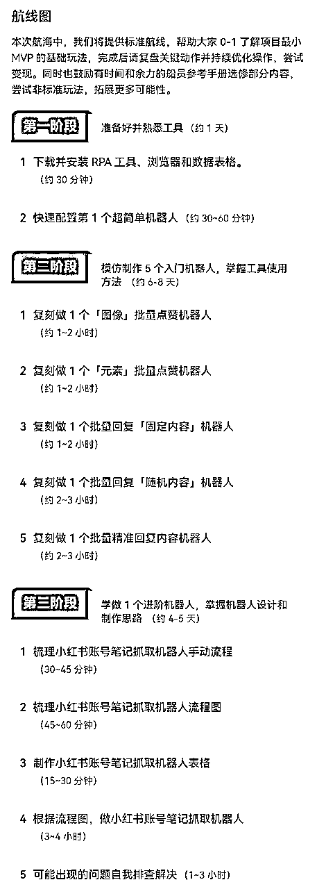

# 必修篇：会用 RPA 设计机器人

章节概要

在必修部分，我们选择真实使用场景的案例，由易到难，手把手带大家制作 6 个高频使用机器人。

希望通过实战练习，带大家掌握 RPA 工具使用的核心思路，可以举一反三根据自己的项目需要制作出机器人，提升项目效率或者放大项目的收益。

一共包含四步。

第一步：了解 RPA 的提效能力

第二步：准备 RPA 工具三件套

第三步：学会做 5 个入门机器人，掌握工具使用方法

第四步：掌握设计机器人的底层思维

第五步：学做 1 个进阶机器人，掌握机器人设计和制作思路

希望大家可以按照手册的练习任务进行实操，21 天实现以下目标：

每天至少投入 1-2 小时，学会制作 6 个高频使用机器人，掌握机器人设计的方法论，提升自己的工作或者项目效率。

如果学有余力，利用课程中的知识举一反三，自己多做练习，达成进阶目标：

能够根据自己的工作、项目场景，灵活配置自己所需要的机器人，提升工作效率或放大项目收益。

## 一、【项目概述】RPA-项目效率提升神器

章节概要

本章我们会快速了解：

RPA 是什么？

RPA 如何为项目提效？

0 基础新手能否快速学会？

### 1.1 RPA 是什么？前景如何？@浅墨 @君途

#### 1.1.1 RPA 是什么？

Robotic Process Automation（简称 RPA ）机器人流程自动化，是一种技术，是以软件机器人 + AI / OCR（文字识别） 等科技能力结合，在软件上的某些业务操作场景中，达到机器替人，实现重复的工作自动化。

RPA 通过模拟人在电脑、平板和手机上的操作方式，包括 网页自动化、桌面软件自动化、手机 APP 自动化、鼠标键盘自动化等等，实现不需要人工，替人将操作流程自动化。

简单的说，就是就是通过程序，把【重复的】动作，让机器人来执行。

在未来，那些你不想做的枯燥工作，也许真的可以不做。重复化、标准化的工作都可以让 RPA 机器人帮你完成。

无论是做项目，还是经营企业，还是工作，只要日常事务中有些重复性的事情具有明确业务规则、结构化输入和输出的操作流程。例如：读取邮件、对账汇总、检查文件、生成文件和报告等枯燥、重复、标准化的工作，都可以让 RPA 机器人代为完成。

只要是标准化的、可以描述清楚的、重复性的操作，都可以用 RPA 提效。

每个 RPA 机器人都可以成为你的一个小助手，帮你节省一部分时间精力，大大提升你的工作效率，减轻你的工作压力。

#### 1.1.2 RPA 发展前景如何？

眼下，RPA 已被广泛应用于金融、保险、零售、电商、政府、能源、制造、物流、地产、医疗、教育、电信等行业，在财务管理、人力资源、客服、法务、采购等职能场景也发挥着重要作用。

以下这张图就是近几年 RPA 的趋势：

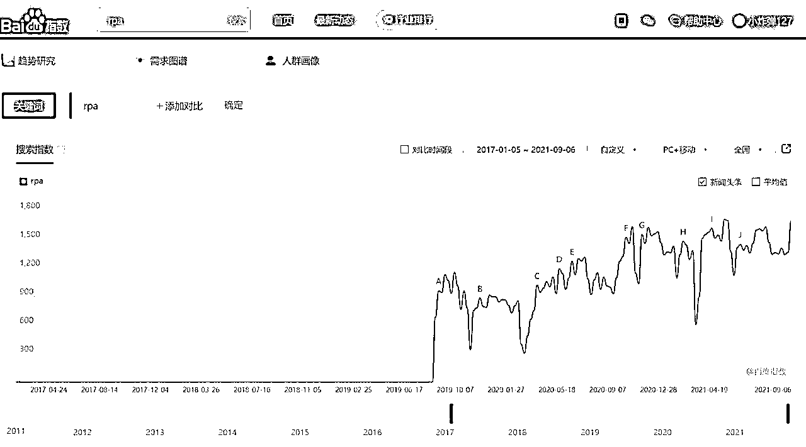

1\. 提升工作技能，提高工作/项目效率

无论职场工作还是经营项目，都竞争激烈，随时都可能会被淘汰。

无论你对鼠标与键盘的操控有多熟练，在不断增加的工作量面前都将是杯水车薪。如果 5 分钟能完成 5 小时的工作量，10 分钟能获取别人 3 天的信息量，这就好比你坐飞机，别人还在翻山越岭慢慢地走。

RPA 就是你的私人航班，通过模拟人工对键鼠的操作，实现对数据的读取与搬运，节省企业和员工的时间，让员工去做更有意义的事。

2\. 市场招聘需求大

目前，国内 RPA 市场正处于一个高度活跃期，大量企业急需部署 RPA 以优化流程，降本增效，提高生产力。

在一段时间内，企业对 RPA 相关人员的需求量将会猛增，而和 RPA 相关的工作岗位（包括 RPA 开发工程师、实施工程师、测试工程师、RPA 技术顾问、咨询顾问、销售等）也将随之增加，就业前景广阔。

给大家看看就业招聘薪资，动心不？

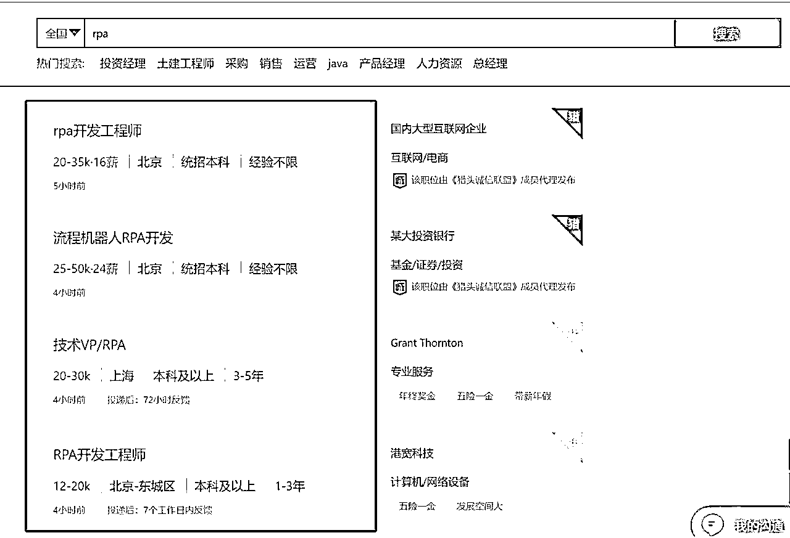

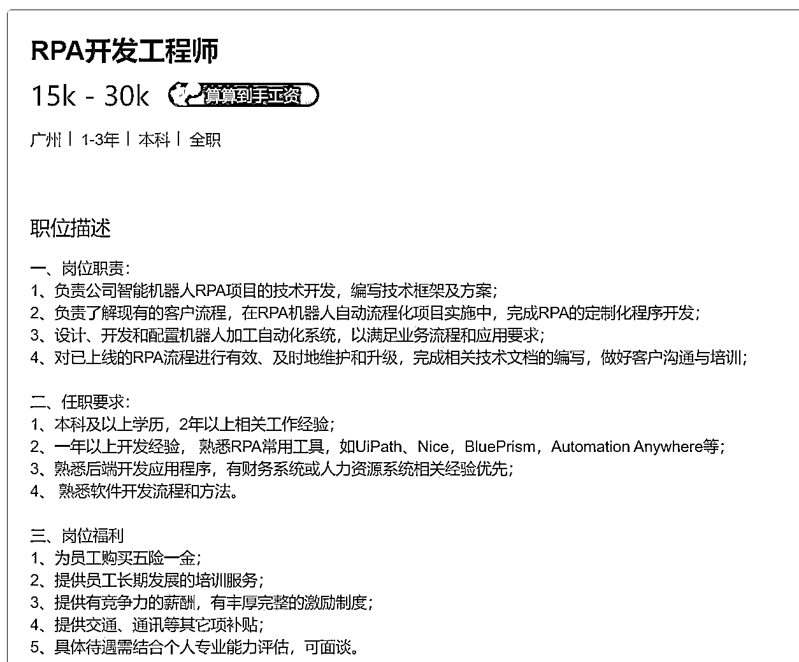

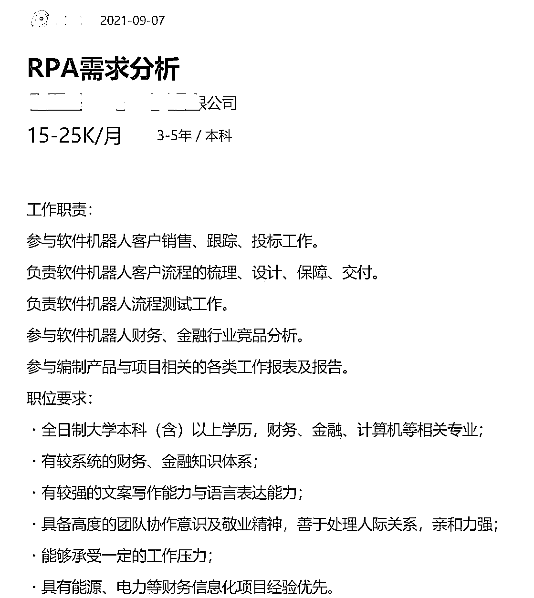

3\. 各大高校也在开展 RPA 课程

这意味着学好 RPA 不仅能提升自己工作效率，哪怕做个线上老师赚些培训费，而且这大把的学员资源也是杠杠滴。

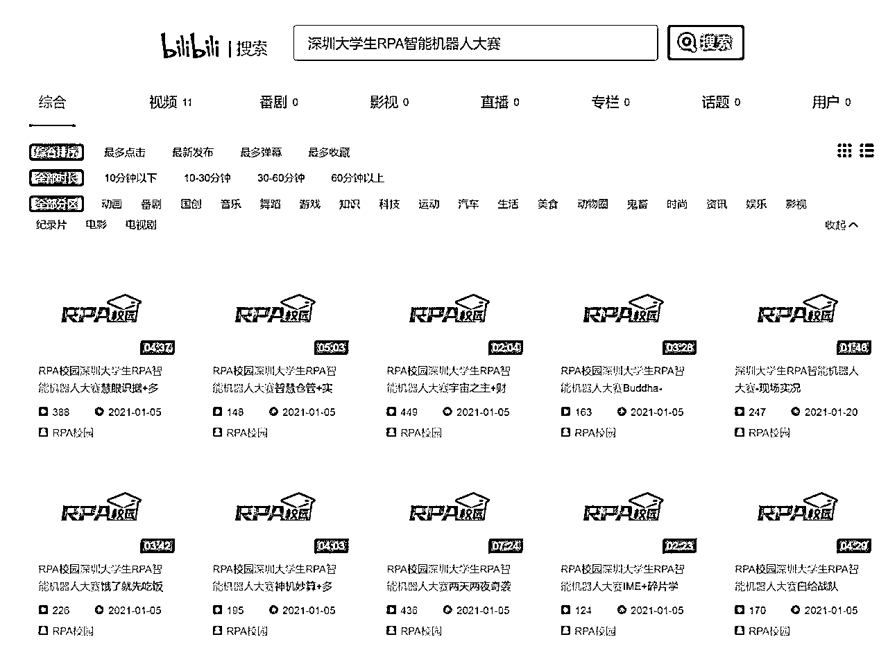

内容来源：《我只学了 1 个小案例，便解锁了 RPA 对我运营工作的巨大价值》《深入小 B 业务场景一年，我意识到了 RPA 背后的万亿市场》

### 1.2 RPA 如何为项目提效？@君途 @子木（二哥）

无论是打工人，还是中小商家、中小型创业者，日常都有许多高度重复的工作内容，它们做起来不难、价值也不高但不可或缺，以至于很多人需要自己搭建一套业务 SOP ，再请 n 个助理来负责每天完成这些工作。

这种事情有多少呢？看几个案例就知道了：

案例一：小红书店铺、抖音图文电商、视频号带货等等，所有的带货项目都离不开非常关键的一环——选品。需要持续搜索各大平台，各种数据，导出表格筛选分析。

案例二：公众号爆文、小红书运营等等，几乎所有的项目也都离不开选题、文案、图片素材，收集素材也是一项持续的、重复的、耗费人力的工作。

案例三：国内某电商平台的卖家小老板，每天需要分析产品数据。

需要把某款产品的关键词列表里面所有关键词搜索一遍，记录下该词的第一名以及自己所在的名词，整理成表格；他有 10 余款产品，最后的解决方式是：请了 3 个助理来负责这件事。

案例四：某实体店的老板，需要通过小红书、抖音等公域平台引流到私域。

为了检测公域投放效果，他每天要把各平台【网红的视频数据】、【自播视频数据】、【投放金额】、ROI 等等数据，整理成一个表格，做成每日报表丢到群里；最后该老板采用的解决方案，还是请了个兼职助理；

案例五：某家我朋友所在的独角兽公司，有个岗位叫【数据运营】，这个岗位在不同的项目组里面共有 10 来个人。其工作是每天把项目在不同平台的业务数据，复制粘贴到一张表格上，整理好发到群里；

案例六：某代运营公司的商务拓展专员，每天需要不断刷新美团上最新更新的商家，并在咨询中私聊对方是否需要代运营服务，或者收集电话作为自己的商家资源库；

诸如此类的重复工作，占用了员工或老板大量时间。

而 RPA 可以解决以上所有问题，使用 RPA，相当于是给自己找了 n 个机器人助理，来处理所有周期性重复的、无需主观判断的、能通过电脑或手机来完成的工作。

• 店群运营的，需要 RPA 批量商品上下架机器人

• 图文内容运营的，需要 RPA 图文群发机器人，一键群发到各个图文平台：今日头条、知乎等

• 短视频内容运营的，需要 RPA 短视频群发机器人，一键群发到各个短视频平台：抖音、视频号、快手等

• 私域运营的，需要 RPA 微信群发&主动加人机器人

• 人事的，需要 Boss 直聘机器人：自动发送面试要求，自动发送问候语，自动交换微信

• 等等

内容来源：《如何利用 RPA 实现自动化获客，让项目提效躺赚？》《深入小 B 业务场景一年，我意识到了 RPA 背后的万亿市场》

### 1.3 RPA 适合哪些人？难不难学？@君途 @浅墨

1\. 只要你的项目中、日常工作中有任何重复性工作，都可以学习 RPA，来提效。

2\. 入门容易，掌握正确的方法，0 基础新手也可以较快上手。

市面上的大部分主流 RPA 软件经过多次迭代，越来越易学、易用，就是为了让不会代码的新手而设计的。

对于 0 基础的新手，根据我的观察，只要愿意投入精力学习，经过 1~2 周时间，就可以把 RPA 直接用在自己的业务线中。

对于有基础的程序来说，就更容易了，在主流 RPA 中挑选一个，研究个两三天，马上就可以上手实战了。

RPA 的功能很多，但我们只需要利用好他们的基础功能，就能完成 90% 的业务需求。

RPA 的目标：让人在机械的工作时间中解放出来，把时间留给做更有意义的事情。

RPA 不是万能的。

首先，是效率，由于 RPA 是从页面上识别元素、操作页面，它必须等待页面加载成功，否则流程会中断。

其次，RPA 会占用电脑的部分操作权限，比如小说保存到 Word，它会真的打开 Word 软件，这样你就不能自己用了。而 python 只是在程序中进行 Word 处理，不影响其他工作。当然，我们可以使用锁屏（UiBot）、分身运行（UiBot）、虚拟屏（影刀）、虚拟机（所有 RPA 软件）等方式来运行。这里有些术语，是 RPA 软件厂商自己定义的

再次，在编程灵活性上，RPA 不如 python，因为它更多考虑简单易用，牺牲灵活性也是情有可原。

内容来源：《深入小 B 业务场景一年，我意识到了 RPA 背后的万亿市场》《我只学了 1 个小案例，便解锁了 RPA 对我运营工作的巨大价值》

## 二、【项目实操 1/4】RPA 学前准备 @阿愚呱呱

章节概要

我们要正式开始 RPA 的学习啦！本章将带大家：

选择适合新手的 RPA 工具，并完成相关软件的安装。

手把手带你配置第一个简单的 RPA 机器人，帮助你快速了解 RPA 的界面和简单操作。

分享学习中遇到问题时，常见的解决方案。

#### 本章航线图

完成本章节的学习和实操，即可完成航线图的第一阶段：准备好并熟悉工具（约 1 天）

1\. 下载并安装 RPA 工具、浏览器和数据表格。（约 30 分钟）

2\. 快速配置第 1 个超简单机器人（约 30～60 分钟）

那么现在，就请开始完成这几个步骤的筹备吧。

### 2.1 RPA 相关工具准备

#### 2.1.1 RPA 工具

2.1.1.1 常见的 RPA 工具有哪些？新手怎么选？

市面上的 RPA 工具有很多种：

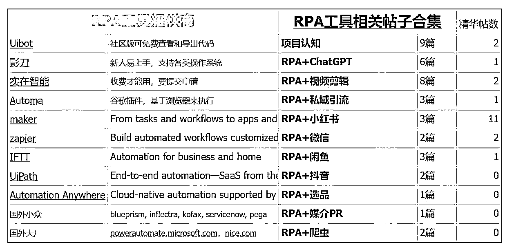

其中星球圈友使用较多、反馈较好的、且免费的主要有 2 款：Uibot 和 影刀。

两款工具有各自的优势和短板。不建议新人纠结到底选择哪款工具，几乎任意一款 RPA 工具的切换成本是非常低的。

在掌握其中任意一款工具的前提下，去使用另外一款 RPA，比如实在智能、八爪鱼 RPA 等等，主要就是熟悉下界面按钮分布就能上手了。

本次航海手册以 UiBot 为主，主要基于两个方面的考量

• UiBot 可以合规分享机器人源文件，方便学员直接对现成的机器人进行分析学习。其他的几款主流 RPA 软件不提供该功能。这是最主要的原因。

从学习者角度而言，如果不能拿到源文件，就好比学习 PS 拿不到源文件。你几乎很难从高手现成的机器人中体会到其中精妙之处，甚至连最简单的机器人未必能很好的还原，只能对着视频画面去看，而不能直接分析机器人。

• 模块更加简洁且完备，需要学习到的模块是比较少的，极大降低了学习量。

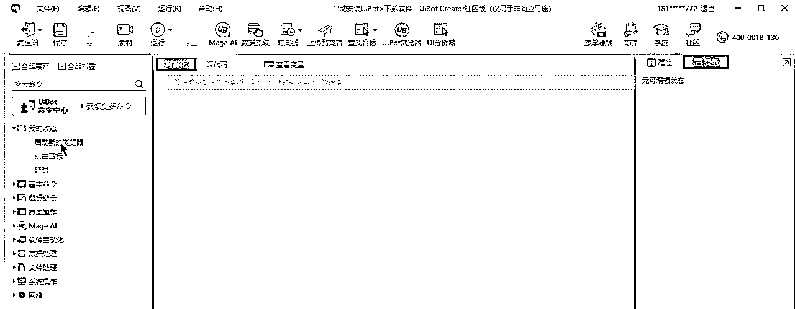

其他几款主流 RPA 软件做了很多「改进」，增加了很多集成多个模块功能的模块。对初学者而言，这种模块几乎无需上手就能用。使得这些软件看似比 UiBot 学习成本更低。

但最大的问题也在这，我看过很多人，稍微复杂一点的情况，用集成模块搞不定，就会问一些对 UiBot 学习者而言再简单不过的问题。

这就是因为一开始习惯了用集成模块，而忽略单一功能模块的学习，实际上压根就没有入门 RPA。

• UiBot 的用户基数是最多的，整个生态也是相对最完善的。有大量的平民开发者/业务人员、专业开发者/工作室。相对而言，UiBot 社群或者相关社群，那里的高手交流更有含金量。

• 还有，UiBot 在做复杂或超级复杂机器人，是有比较明显优势的。个人认为 UiBot 的架构更好。

不过，UiBot 确实也有它的短板：

• UiBot 一直不推出集成模块功能，对新人上手不够友好

• UiBot 的颜值，完全就是一个 office 软件的风格，不如其他软件好看。

• 需要 win 系统，没有手机版。

所以，这次航海我们补充了影刀的实操演示，会增加两场影刀的实操直播和演示视频。

影刀的优点是：

• 有集成模块功能，新人上手相对友好

• 有手机版

实在没有 win 系统的，可以用影刀。

但世上没有完美的工具，为了确保大家打好基础，我建议大家从 UiBot 入门 RPA。学会了以后，再去使用影刀等其他工具，原理是完全一样的，切换成本非常低，只需要熟悉下界面按钮分布就能上手了。

2.1.1.2 uibot 的下载和安装

安装 UiBot，需要准备一台 WIN 系统电脑，建议 Win 7 及以上版本 。

注册 UiBot 账号

注册地址：https://account.uibot.com.cn/view/register/

UiBot 注册账号登陆失败的问题，常见原因和应对方式如下

• 原因：点击「离线」后，导致不能进入正常的登陆流程。应对：不要点击「离线」。如果已经点击「离线」，那么需要从网页端登陆。如果没有成功注册，则点击该链接注册（https://account.uibot.com.cn/view/register/），然后启动 UiBot Creator

• 原因：开启了全局网络代理。应对：切换代理模式，比如智能代理。如果切换仍然不能正常登陆，退出代理

• 原因：部分手机不知道什么原因，就是登陆不上（可以注册）。应对：换个手机号试下

• 原因：有的电脑不知道什么原因，就是登陆不上。应对：换台电脑试下

• 原因：不知道是什么原因。应对：问下官方客服

下载 UiBot 软件

下载地址：https://down.uibot.com.cn/OFFICIAL/UiBot/6.0.1/UiBot_Community_Official_X64_V6.0.1_2022.06.29.1740.exe

安装 UiBot 软件

• 双击下载的 UiBot 安装程序

• 可以直接全部点击下一步完成默认安装

#### 2.1.2 Chorme（浏览器）

课程中统一用 Chrome 浏览器。为了更好地跟着学习操作，建议你也安装 Chrome 浏览器以及 UiBot 浏览器插件。

2.1.2.1 下载 Chrome 浏览器

下载地址：https://www.google.cn/intl/zh-CN/chrome/

2.1.2.2 安装 Chrome 浏览器

• 全部点击下一步完成默认安装

2.1.2.3 安装 Chrome 浏览器插件

第 1 步：启动 UiBot 并登陆

双击打开流程创造者（UiBot Creator） 下见图 完成账号登陆

第 2 步：进入 Chrome 扩展安装界面

注意：安装扩展前，需要关闭 Chrome 浏览器

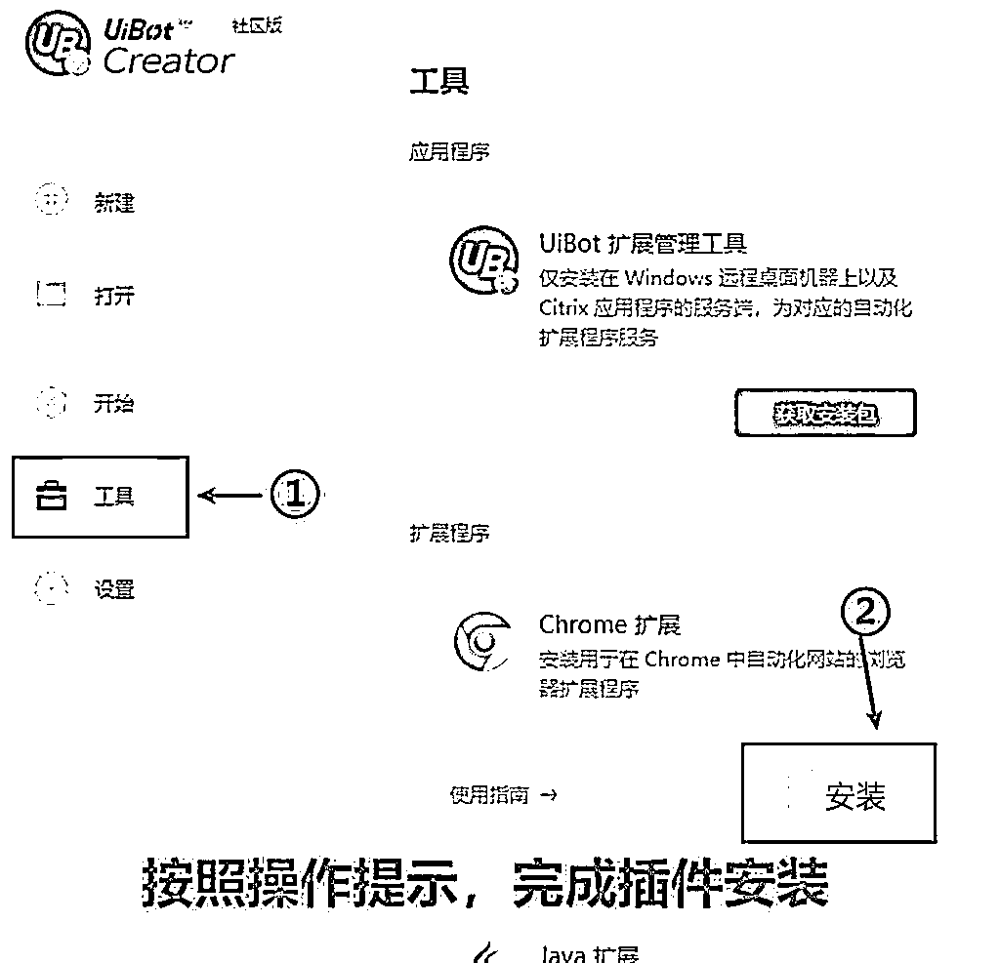

第三步：安装过程中可能遇到的问题。

如果你已经关闭 Chrome 浏览器，也关闭 Edge 浏览器，但仍然出现如下提示：

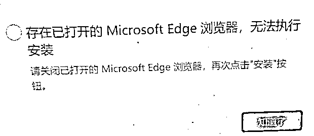

请按照该步骤结束 Edge 进程：

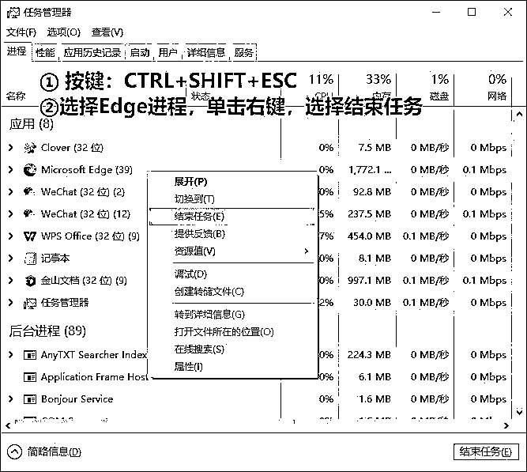

或者用下面这个方法也能结束 Edge 浏览器进程

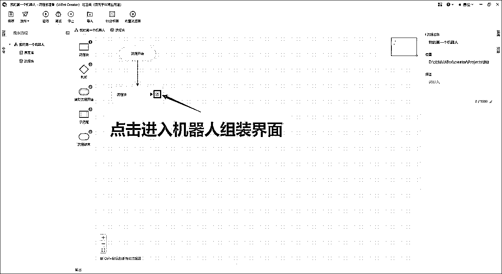

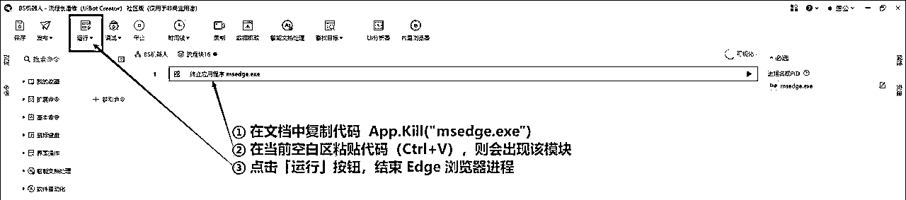

第四步：启动扩展程序。

第一种方式：打开 Chrome 浏览器--点击启用扩展程序（打开浏览器后，可能需要等待几分钟才会出现「启动扩展程序」按钮）

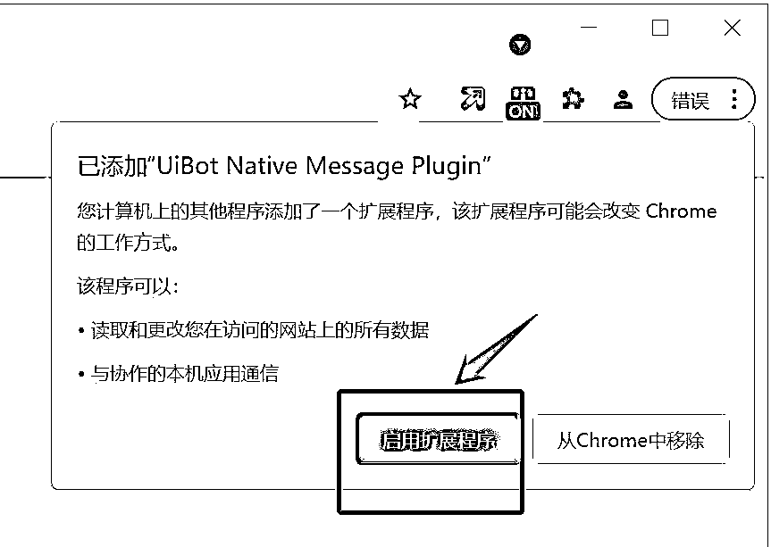

第二种方式：打开 Chrome 浏览器，点击右上角对应符号——点击更多工具—— 点击扩展程序

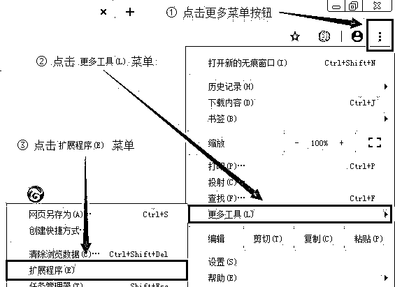

然后在扩展程序管理界面找到 UiBot 插件。点击 UB 插件右下角进行激活，蓝色为激活成功。

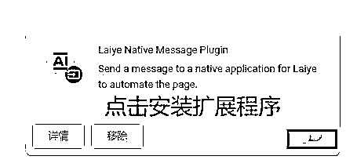

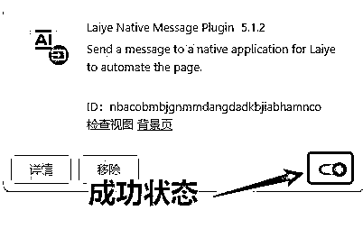

如果你的 UiBot 在使用时，浏览器启用失败，也可以看看这个视频看如何操作哦！

《Uibot 实操常见问题 1：为什么我的浏览器启用失败？》

#### 2.1.3 WPS/Excel（数据表格）

考虑部分人安装微软办公软件有一定的困难，所以统一建议用 WPS，如果有 Excel，也是可以的。

注意：不要去做各种设置，全部用 WPS 的默认选项。也就是说，全部点击下一步，直到完成安装。

下载地址：https://platform.wps.cn

### 2.2 快速配置第一个超简单机器人

赶快打开电脑，跟着实操起来！你将快速认识操作界面和基础操作流程。

#### 2.2.1 打开 UB

双击快捷图标（流程创造者），打开 UiBot Creator

#### 2.2.2 创建一个新流程

点击「新建」，创建一个流程

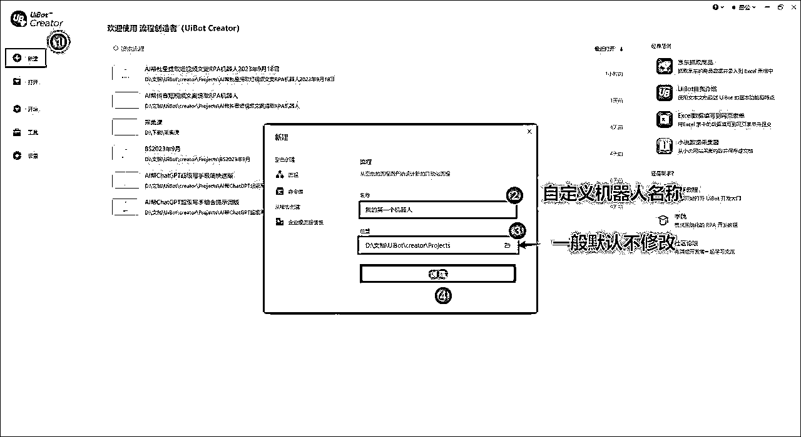

#### 2.2.3 进入机器人组装界面

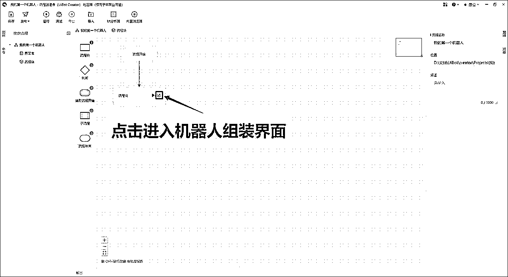

#### 2.2.4 快速了解组装界面

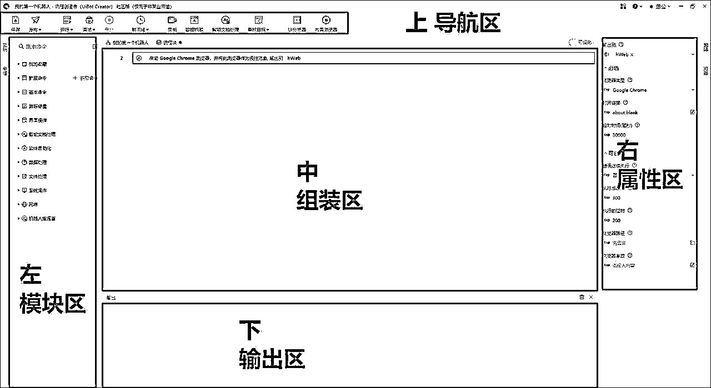

【上导航区】似于 Excel 顶部的导航菜单，摆放着常用的、重要功能按钮。

剩余的三个区域【左模块区】、【中组装区】、【右属性区】就和配置机器人密切相关了。

大家简单理解：

就是从【左模块区】选机器零件，到【中组装区】进行组装，同时在【右属性区】设置零件的参数，就完成了机器人的配置。

在【下输出区】可以排查错误。错误的提示为「红色文字」。注意：我们经常会看到「黄色文字」，这并不是报错

有这个整体的概念，我们就可以开始配置机器人的实践了，通过配置机器人，我们将会逐渐掌握各个按钮的功能和使用方法，设计出自己需要的机器人。

#### 2.2.5 配置操作

RPA 机器人配置非常的简单，你记住一句话：一选择 二摆放 三设置，照着做不走样。

1\. 第一步 模块选择

2\. 第二步 模块摆放

3\. 第三步 模块设置

这里，我们做一个最简单的，且能够立马看到神奇效果的机器人——自动启动 Chrome 浏览器并访问百度（www.baidu.com）

来快速体验一下上面三个步骤。

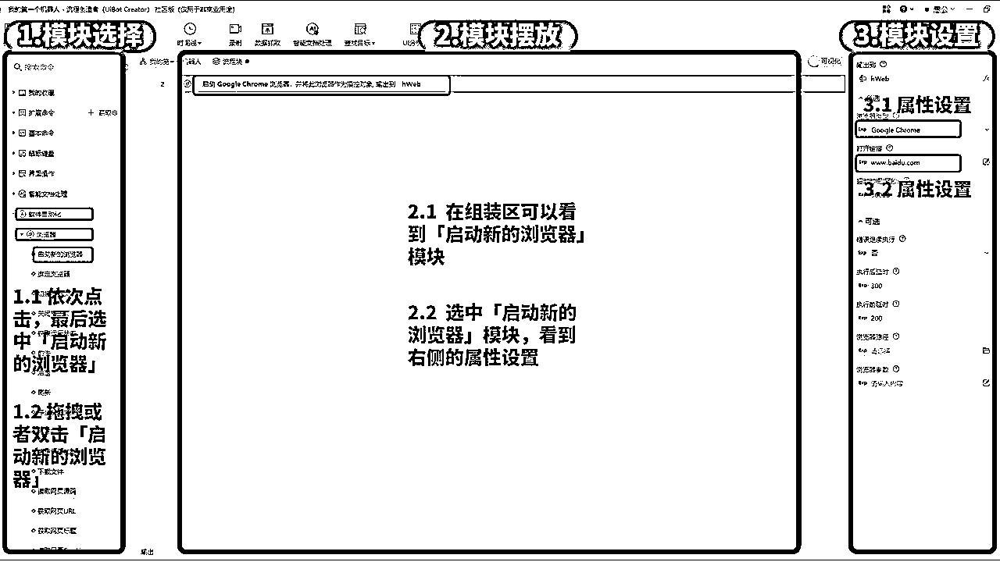

第一步 模块选择

依次点击【软件自动化】-【浏览器】-选中【启动新的浏览器】

第二步 模块摆放

拖拽或者双击【启动新的浏览器】，到组装区。

选中【启动新的浏览器】模块，看到右侧的属性设置。

第三步 模块设置

【浏览器类型】选 Google Chrome

【打开链接】填 www.baidu.com

按照上图中所述步骤完成操作，恭喜你，你已经配置成功了第一个机器人！

视频演示：

机器人配置过程的演示视频-第 5 版.mp4【在线播放】

#### 2.2.6 运行与停止机器人

接下来，我们要运行机器人，看看是否正确启动了 Chrome 浏览器并访问了百度网站。

在机器人组装界面，这里有两种方式运行机器人。

• 点击「导航区」的「运行」按钮（快捷键 F5 ）

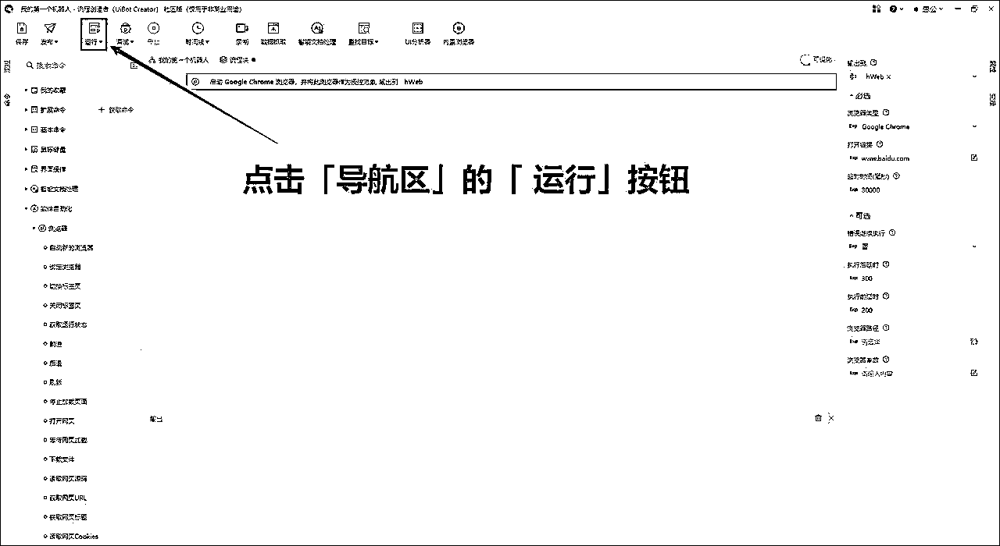

• 选中要运行的机器人模块，点击「运行」按钮

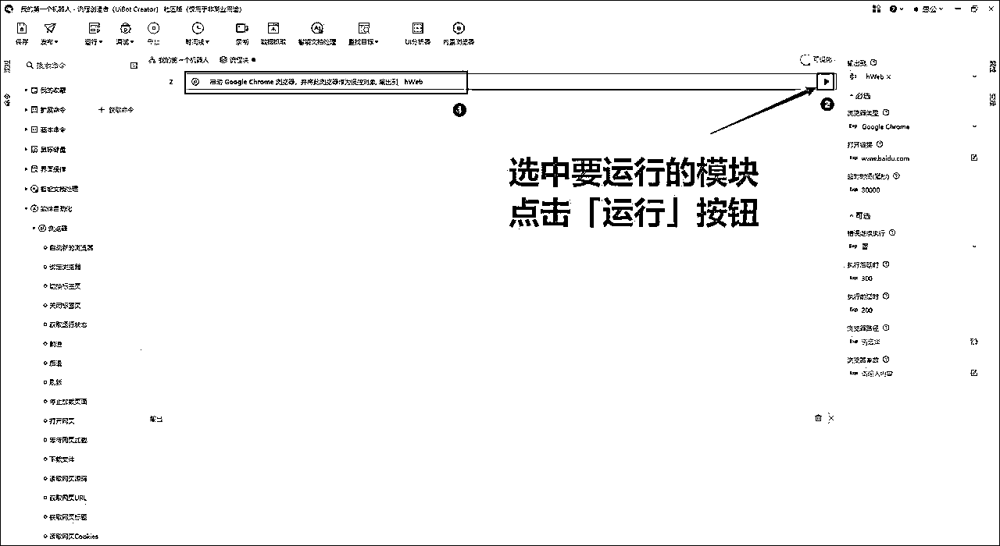

运行机器人后，就可以看到它自动打开了 Chrome 浏览器并访问了百度网站。运行完毕后，机器人会自动停止。

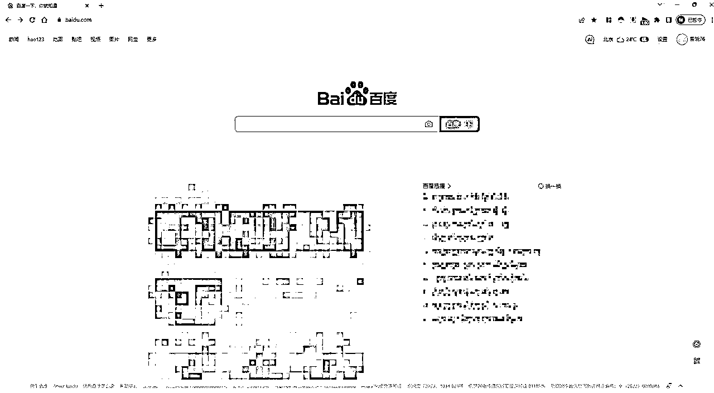

• 提前让机器人停止运行

在没有自动停止之前，你若需要提前停止机器人运行，可以同时按下「CTRL+F12」这个组合键 5 秒，就会让机器人停止运行。

到这里，你已经做好了工具配置、认知了操作界面、了解了基础操作，接下来，我们将进入真正的机器人设计学习。

### 2.3 遇到问题如何解决？

在 RPA 学习中，遇到问题该怎么办呢，可以尝试三个方式。

1\. 按照三要素进行自我排查

2\. 按照格式发帖提问

3\. 进一步补充运行视频

#### 2.3.1 自我排查三要素

1\. 模块选择是否正确（左）

2\. 模块摆放是否正确（中）

3\. 模块设置是否正确（右）

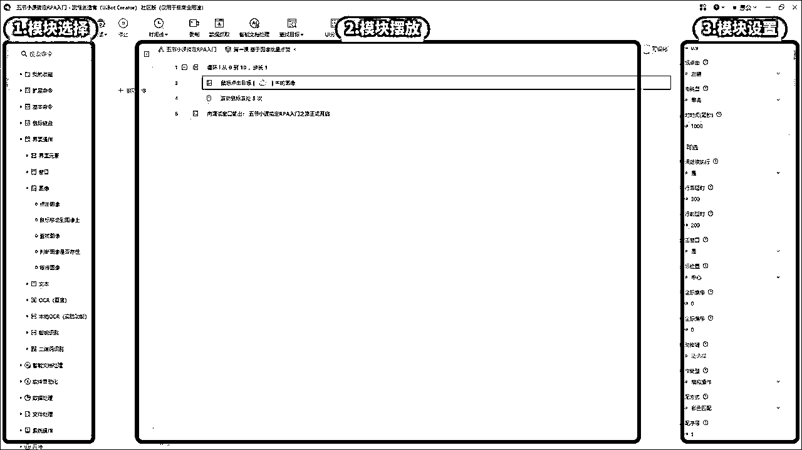

一定要学会在出现问题后，自行先检查以上三要素是否正确！！！

常见模块选择错误

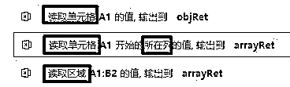

三种读取表格数据

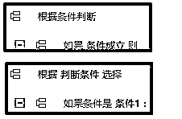

两种条件分支

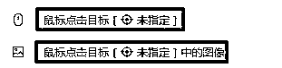

两种点击

常见摆放位置错误

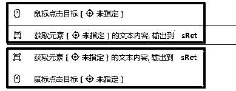

前后位置

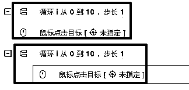

内外位置

常见属性设置错误

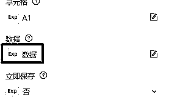

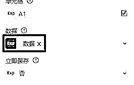

灰色 Exp 与蓝色 Exp

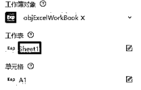

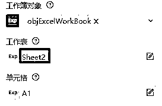

纯粹的粗心出错

#### 2.3.2 按照格式发帖提问

如果你自行排查之后，仍然不能解决问题，按照格式的有效提问可以让问题得到更好的解决。

格式如下

#问题求助#

问题描述：

源代码：

配图：

如何复制源代码

点击右上角可视化即可切换成源代码页面

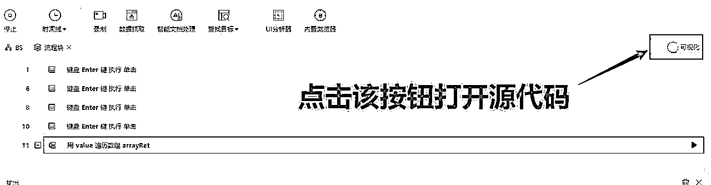

如何配图

配图信息一定要完整，不可只截图「报错提示」。应当严格遵循下图操作：

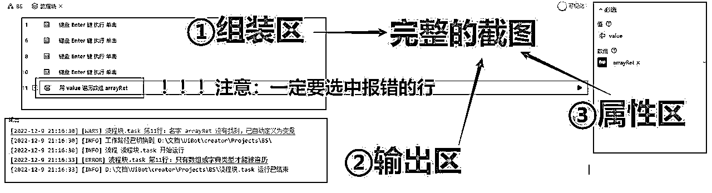

补充运行视频

有时候，RPA 机器人的配置并没有出错，但可能是你的运行方式、运营环境有问题。

这时候，就需要提供运行视频。视频直接发送到微信群即可。老师会随机挑选部分船员的运行视频做解答。

视频录制工具下载链接：

https://www.bandicam.cn/

## 三、【项目实操 2/4】 学做 5 个入门机器人，掌握工具使用方法 @阿愚呱呱

章节概要

在本章，我们将会带着大家从零开始，从简单到复杂，教大家做出常用的 5 个入门机器人，快速熟悉和掌握 RPA 机器人的设计方法以及工具的使用方法。

在学习过程中，先跟着操作，尽可能做到一比一还原。先不要纠结「为什么」，跟着文档操作，完成机器人配置，快速找到你的成就感。

当然你可以大胆去尝试去验证你自己的想法，并及时分享交流你总结出来心得和遇到的问题。

在配置完机器人后，我会梳理出一些知识点，帮助大家加深理解和应用。

#### 本章航线图

完成本章节的学习和实操，即可完成航线图的第一阶段：模仿制作 5 个入门机器人，掌握工具使用方法 （约 6-8 天）

1\. 复刻做 1 个「图像」批量点赞机器人（约 1～2 小时）

2\. 复刻做 1 个「元素」批量点赞机器人（约 1～2 小时）

3\. 复刻做 1 个批量回复「固定内容」机器人（约 1～2 小时）

4\. 复刻做 1 个批量回复「随机内容」机器人（约 2～3 小时）

5\. 复刻做 1 个批量精准回复内容机器人（约 2～3 小时）

那么现在，就请开始学习吧。

### 3.1 RPA 的设计逻辑

RPA 是为了替代人工手动操作而生的，本质就是模拟人的鼠标按键操作。

手动操作，一般是基于我们的视觉去选择某个「执行目标」，然后「执行某个动作」，比如，点击鼠标/键盘，打开/启动等等。然后不断重复执行。

简单说就是：对选定的目标做重复的动作。

理解了这个路径，就可以轻松理解完备性的机器人包含 2 大要点：

• 执行操作：包含对「执行目标」「执行某个动作」。

• 执行逻辑：是指按照怎样的规则执行动作。

几乎每个机器人都由这三大部分组成，只不过每个部分的内容有差异。

选取的目标越简单，执行动作越少，执行逻辑越简单，机器人就越好做。

相反，选取的目标越复杂，执行动作越多，执行逻辑越复杂，机器人做起来就越困难。

接下来，我们就会从易到难选择 5 个机器人，它们会逐步包含所有常见类型的执行目标、执行动作、执行逻辑，通过学习这 5 个机器人，大家将会一步步掌握机器人的设计方法。

每个机器人，我们都会分为 3 个部分进行讲解：

1\. 机器人流程梳理：提取工作关键步骤，梳理机器人的设计流程，并完成流程图设计。

2\. 配置机器人：手把手带你根据流程图，配置出机器人。

3\. 设计思路和知识点详细讲解。

前两部分，是设计一个完备机器人的必备步骤。

第三部分，帮助大家掌握设计知识和方法，这样才能做到举一反三，自己去设计更多机器人。

实操和方法论，缺一不可。

先讲实操，是为了帮大家跳过略枯燥的专业术语，希望大家可以先操作起来，快速找到成就感。

所以，在操作中，你大概率会有很多疑问，工具上的很多术语不明白。这时，先不要纠结「为什么」，带着自己的种种疑问，跟着文档操作，完成机器人配置。

完成之后，赶快带着你的疑问，去看知识点讲解，快速吸收知识，再试着不看手册，自己重新思考配置一遍机器人。

通过这种方式，相信你会学得更快、更好。

下面，跟着我设计的步骤来开启你的 RPA 之旅吧！

### 3.2 基于图像批量点赞

我们将开始设计一个机器人，替代我们 “ 对知识星球的帖子进行批量点赞 ”。

#### 3.2.1 机器人流程梳理

梳理机器人的执行流程，是配置任何一个机器人的必备功课。

很多时候，熟练应用 RPA 的老鸟往往会跳过这一步，直接想到哪做到哪。遇到复杂的流程，极容易出现流程没有梳理清楚，导致机器人配置工作量剧增。

所以，建议新手在学习时，最好养成梳理流程的习惯，这样才能避免这类问题。

首先，根据人工动作抽象出机器步骤

这里的关键是把人工的关键动作具体描述出来。

“ 对知识星球的帖子进行批量点赞 ”，我们的操作是这样的：

点击「点赞」按钮。

点完赞，或者当前界面不存在未点赞的按钮，怎么办呢？向下滚动几次鼠标，看到一个新的未点赞按钮，点击「点赞」按钮。

然后不断重复以上步骤。

再继续提炼一下，按照更准确的机器语言描述，就是：

1\. 点击「点赞」按钮，如果当前界面不存在未点赞按钮，等待 1 秒（1000 毫秒）后，就执行鼠标滚轮操作。

2\. 鼠标滚轮向下 5 次（这里滚 1 次、2 次其实都可以）

3\. 重复 1-2 步骤

4\. 输出「五节小课搞定 RPA 入门正式开启」（这一步是教练增加的小小仪式感，标准流程前 3 步就够啦~）

然后，画出流程示意图。

大多数的机器人流程图都比较简单，使用思维导图类软件就可以，手绘也行。

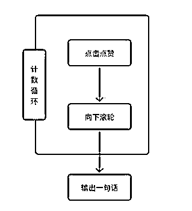

#### 3.2.2 如何配置机器人

机器人模块组装图

这里先给大家看下，我已经配置好的模块组装图，就像图中这样，只有 4 步非常简单。你也赶快跟着操作起来吧~

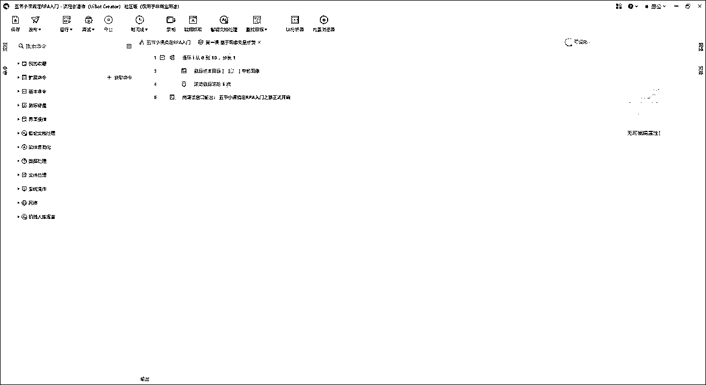

配置前准备

在正式配置之前，你需要做好以下两点准备

已经知晓如何打开 UiBot 机器人配置界面，并知道如何拖拽模块。若还没有准备好，请直接点击 2.2 快速配置第一个超简单机器人进入该章节学习。

• 在 Chrome 浏览器中打开知识星球“生财 RPA 实战【航海作业专用】”首页。机器人直接对当前的知识星球执行点赞操作。

注意！！！一定一定要打开知识星球“生财 RPA 实战【航海作业专用】”，不然会导致刷屏其他星球！

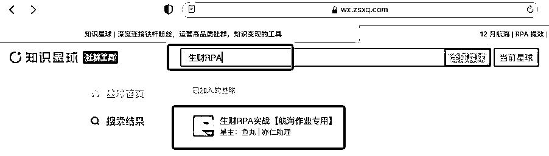

具体配置步骤

这里，就要对照着我们前面梳理出的流程来啦！

1\. 点击「点赞」按钮，如果当前界面不存在未点赞按钮，等待 1 秒（1000 毫秒）后，就执行鼠标滚轮操作

2\. 鼠标滚轮向下 5 次（这里为了让下一个点赞按钮出现。因为机器人看不到新的点赞按钮，就不会执行点击点赞操作）

3\. 重复 1-2 步骤

4\. 输出「五节小课搞定 RPA 入门正式开启」（这一步是教练增加的小小仪式感，标准流程前 3 步就够啦~）

完全按照流程逐步配置。

再强调一下，开始第一步之前，一定一定要确认在 Chrome 浏览器中打开知识星球“生财 RPA 实战【航海作业专用】”，不然会导致刷屏其他星球！

第一步，点击【点赞】图像

对应流程的第 1 步：点击「点赞」按钮，如果当前界面不存在未点赞按钮，等待 1 秒（1000 毫秒）后，就执行鼠标滚轮操作

每个步骤的配置都遵循我们前面个讲过的口诀：一选择 二位置 三设置，照着做不走样。

5\. 第一步 模块选择

6\. 第二步 模块摆放

7\. 第三步 模块设置

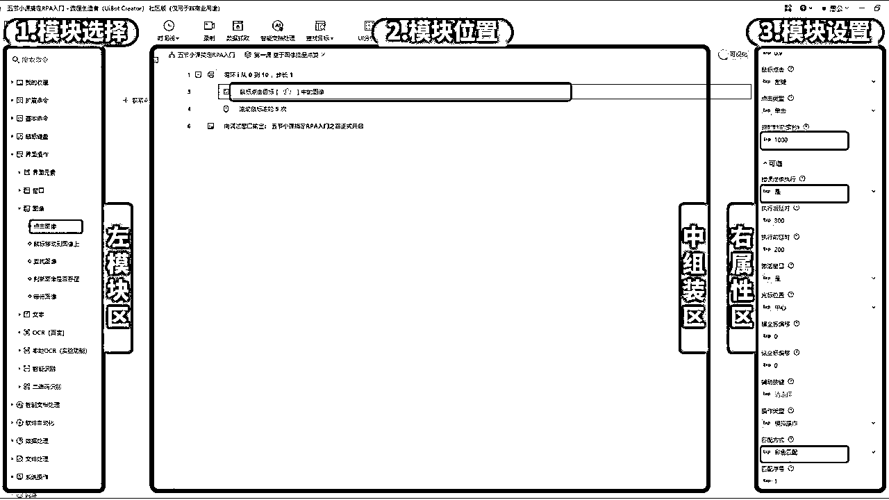

①选择-模块选择：界面操作 → 图像 → 【点击图像】

②摆放-模块摆放：双击/拖拽【点击图像】到中间的组装区域

③设置-模块设置：这里有 4 项属性需要设置。

• 确定鼠标要点击的目标，也就是按钮：操作如下图。

注意：不要框选一个过大的区域，刚好包含图像目标就可以，像图中蓝色小框那样。本质是模拟 QQ 或者微信截图，把这个点赞按钮给截图出来，所以就叫做图像模拟。

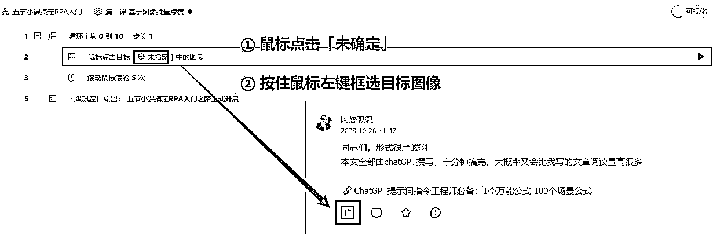

• 超时时间：1000。这里代表：如果当前界面不存在未点赞按钮，等待 1 秒（1000 毫秒）后，就执行鼠标滚轮操作。

• 错误是否执行：是

• 匹配方式：彩色匹配

第二步，模拟鼠标滚轮 5 次

对应流程的第 2 步：鼠标滚轮向下 5 次，加载出新的点赞按钮图像。

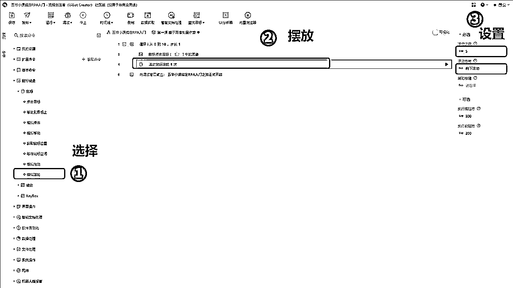

①选择-模块选择：界面操作 → 鼠标键盘 → 【模拟滚轮】

②摆放-模块摆放：双击/拖拽【模拟滚轮】到中间的组装区域

③设置-模块设置：这里有 2 项属性需要设置。

• 滚动次数：5 次。为什么是 5 次呢？只滑动 1 次也可以，但我觉着判断频繁，所以就让鼠标滑动 5 次再做判断。

• 滚动方向：向下

第三步，计数循环

对应流程的第 3 步：重复 1-2 步骤。

①选择-模块选择：基本命令 → 词法语法 → 【从初始值开始按步长计数】

②摆放-模块摆放：双击/拖拽【从初始值开始按步长计数】到中间的组装区域

这里的设置和前面有所不同，它需要把「点击图像」、「模拟滚轮」包括在其内。也就是说「点击图像」和「模拟滚轮」两个模块在「计数循环」模块的右下方。

代表让点赞和滑动鼠标操作不断循环。具体如何操作呢？

8\. 拖拽「计数循环」

9\. 选中「点击图像」「模拟滚轮」

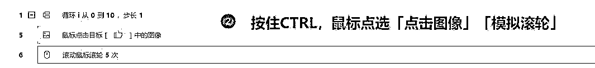

10\. 按下 Ctrl+X，剪切「点击图像」「模拟滚轮」

11\. 粘贴到「计数循环」中

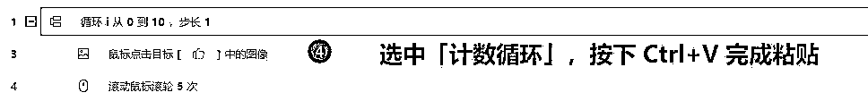

③设置-模块设置：这里有 4 项属性需要设置。

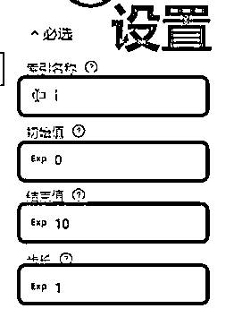

到这里，我们就完成了点赞、滑动鼠标，不断循环这两个操作，这三步啦~

最后，第四步，输出调试

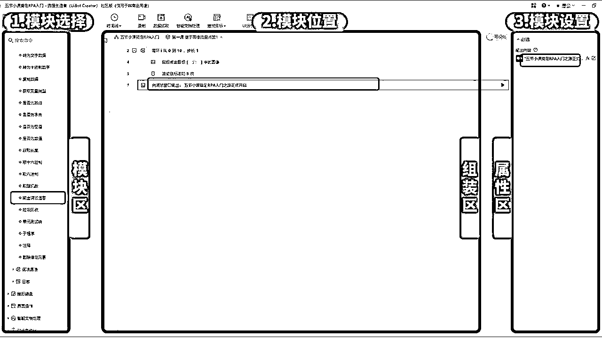

①选择-模块选择：基本命令 → 基本命令 → 【输出调试信息】

②摆放-模块摆放：双击/拖拽【输出调试信息】到中间的组装区域，当然是放在最后一步，也就是前面操作的下面。

③设置-模块设置：

输出内容，点击编辑按钮，输入“五节小课搞定 RPA 入门之路正式开始”，开头和结尾一定要有 " 号（注意是英文标点符号）。然后点击【确定】。

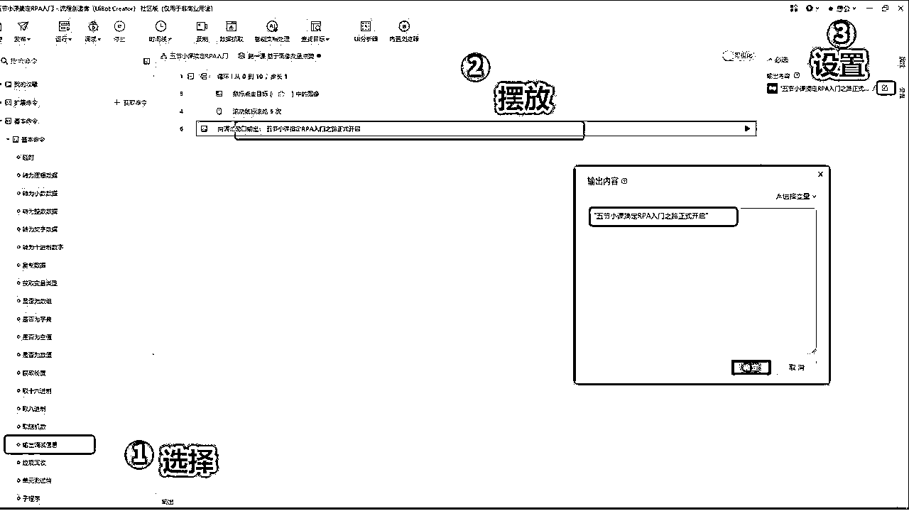

到此，恭喜你！完成机器人配置！

完成后，在当前配置界面，按键 F5 或者直接点击「运行」按钮，就可以执行运行。

如果需要提前停止，请长按快捷键为 Ctrl+F12 。

视频演示

这次的课程考虑到 UiBot 的一些短板：

• UiBot 一直不推出集成模块功能，对新人上手不够友好

• 需要 win 系统，没有手机版。

所以，我们补充了影刀软件的实操演示视频和 2 场影刀工具的直播。

实在没有 win 系统的，可以用影刀。

但世上没有完美的工具，为了确保大家打好基础，我建议大家从 UiBot 入门 RPA。学会了以后，再去使用影刀等其他工具，原理是完全一样的，切换成本非常低，只需要熟悉下界面按钮分布就能上手了。

• Uibot 版本

• 带讲解版本 @一泽

01_ 图像批量点赞.mp4【在线播放】

• 纯净配置版本 @阿愚呱呱

第 1 课：基于图像批量点赞-第 3 版.mp4【在线播放】

• 常见问题讲解视频@Leeka

《Uibot 实操常见问题 2：为什么我的图像点赞机器人总是失败？》

• 影刀版操作 @一泽

01_ 影刀图像批量点赞.mp4【在线播放】

#### 3.2.3 学习知识点，掌握机器人配置方法

下面，对照着自己完成的机器人配置页面，我们一起来看看，无形中我们已经掌握了哪些知识点，理解了它们，我们就能举一反三设计更多同类型机器人。

还记得我们前面讲过，完备性的机器人包含 2 大要点：

• 「执行操作」：包含对「执行目标」「执行某个动作」。

执行目标：常见的有 2 种，图像目标和元素目标。

执行动作：常见的有 4 种，鼠标/键盘、启动/打开、输入/写入、读取/获取

它们总是一起出现，比如，打开某个图像，输入某段内容，读取某个元素等等。

• 「执行逻辑」：是指按照怎样的规则重复动作，常见的逻辑有 3 种：循环/判断/依次

用思维导图表示就像这样：

每个具体的「执行操作」和「执行逻辑」都是通过一模块、二摆放、三设置来实现的。

首先，第 1 个机器人用到了 3 种「执行操作」，即「执行目标」+「执行动作」，使用到的 3 个模块以及配套设置。

「点击图像」模块

机器人配置的第一步，点击“点赞”按钮，我们用到了「点击图像」模块。

• 含义和使用场景：

「点击图像」，顾名思义，代表 「点击某个图像」这个行为。只要工作流程中涉及点击图像这个动作，都可以使用这个模块。

• 「点击图像」模块的属性设置

大多数情况下，无需修改点击图像模块的属性。前面的点赞机器人对属性做了 3 处修改。

第 1 处：超时时间

该处默认设置为「10000」。

它代表着：在当前页面找不到未点赞按钮时，需要等待 10 秒（10000 毫秒）。

前面我们修改为「1000」，意味着只需要等待 1 秒，就可执行下一步操作。

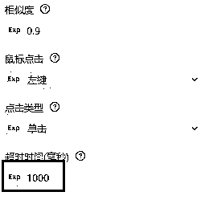

第 2 处：错误继续执行

该处默认设置为「否」。

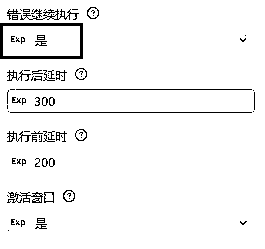

它代表着：在当前页面找不到未点赞按钮时，直接报错，从而中断机器人运行。

前面修改为「是」，代表着：当前页面找不到未点赞按钮时，用最简单粗暴的方式跳过，直接进入下一个模块的运行。

也就是说，当页面中找不到未点赞按钮时，虽然不会报错中止运行，但也不会产生一次「真正的点击」，直接继续往下滑动。

• 第 3 处：匹配方式

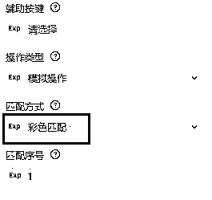

该处默认设置为「灰色匹配」，即不通过颜色来匹配图像，也就是根据图像形状来匹配。

点赞按钮需要通过颜色来识别是否为「未点赞按钮」，所以，需要修改为「彩色匹配」。

机器人配置的第二步，模拟鼠标滚轮 5 次，我们用到了「模拟滚轮」模块。

「模拟滚轮」模块

• 含义和常用场景：

顾名思义，就是模拟鼠标的滚轮滚动。

• 「模拟滚轮」模块的属性设置

一定要设置的属性有两个，一是滚动次数，二是滚动方向。


这里滚动次数 5，滚动方向是向下滚动，意味着每次鼠标要向下滚动 5 次。

这个点赞机器人使用的是图像方式选择目标，非常依赖当前屏幕界面的展示。也就是说，不在当前屏幕中，都将选择不到，如果为了确保每个点赞按钮不被错过，这里的滚动次数设置小一点，甚至设置为 1 都是可以的。

机器人配置的第三步，重复 1-2 步骤，我们用到了「计数循环」模块。

「计数循环」模块

• 含义和常用场景：这个模块，用来控制动作循环的次数。

• 「计数循环」模块的属性设置：

这个模块的属性里有 3 个可以改变的配置，【初始值】代表开始的数字，【结束值】代表结束的数字，【步长】代表每次重复间隔多少。


举个例子，大家就明白啦~

循环 i 从 0【初始值】 到 10【结束值】，【步长】 1。


就代表，从 0 到 10 一共 11 个数字，每个数字之间间隔 1 。

也就是：0、1、2、3、4、5、6、7、8、9、10。一共就是循环 11 次。

自我考察一下：

从 0（初始值） 数到 10（结束值），每次间隔 3（步长），需要数（循环）多少次呢？

答案是：4 （每次取值：0，3，6，9）

• 「计数循环」模块的位置摆放

如果需要某个模块重复运行，则需要将该模块放置在循环模块中。

比如，前面讲到的，鼠标点击目标和滚动鼠标滚轮就要放在循环模块下面。

对于新人来说，建议先配置循环模块的内部模块，再配置循环模块。循环内部模块能够正常运行后，再添加一个循环模块把它们包裹起来。

学完了 3 个「执行操作」类模块，我们来看最后一个「执行逻辑」

机器人的执行逻辑

机器人执行逻辑遵循三个原则

• 从上到下

• 从里到外

• 条件判断

本节课配置的机器人涉及到了「从上到下」「从里到外」这两个原则

从上到下：指机器人先运行上面的模块，再运行下面的模块（见上图 ① 标注）

从里到外：指机器人先运行完里面的模块，然后才会运行外面的模块（见上图 ② 标注）

如上图，「点击图像」「模拟滚轮」在「计数循环」里面，那么会受到「计数循环」的控制，需要重复运行 11 次之后才会执行外面的「输出调试」

这里的「输出调试」模块并不会对该机器人运行产生任何影响，只是为了方便大家了解机器人的流程执行顺序。在循环执行结束后，最后输出 1 次「五节小课搞定 RPA 入门之路正式开启」。

你可以尝试把「输出调试」模块放到「计数循环」模块内，看看会发生什么？

答案是：会输出 11 次「五节小课搞定 RPA 入门之路正式开启」

对应航线图任务 -复刻做 1 个「图像」批量点赞机器人

完全按照上面的机器人配置步骤，1：1 复刻制作一个图像自动化机器人。

### 3.3 基于元素批量点赞

这节课，我们将开始设计第 2 个机器人，替代我们 “ 对知识星球的帖子进行批量点赞 ”。

哎？这不是和第一个一样么？

别着急，这里会教大家掌握一个新的方法，更精确实现这个功能。

基于图像的自动化，最符合人的手动操作，是学习性价比最高的自动化，配置起来往往非常简单粗暴。

但由于图像的准确性差，还要结合其他动作才能实现目标。这个表述不准确，需要滚轮，是因为机器人跟人一样去看一个界面，界面中没有点赞按钮，那么就需要滚轮去加载新的点赞按钮。

比如，为了实现批量点赞，我们找到点赞图像，还要通过「模拟滚轮」来加载内容，需要控制鼠标滚轮次数，避免漏掉点击。如果滚动次数太多，页面翻多了，可能跳过某一两个；如果滚动次数太少，页面翻少了，可能没有新的按钮，浪费了机器人的执行。

而使用元素目标实现自动化，就完全不用担心错过点击，甚至可以不用「模拟滚轮」加载内容。

也就是说，基于元素目标的自动化，更稳健、更高效。所以，我们追求更可靠的自动化必须要掌握基于元素目标的自动化。

赶快开始吧~同样，先梳理流程。

#### 3.3.1 机器人流程梳理

首先，根据人工动作抽象出机器步骤

“ 对知识星球的帖子进行批量点赞 ”。如果能够找到知识星球所有的「点赞」按钮，逐个全部点赞。

再继续提炼一下，按照更准确的机器语言描述，就是：

1\. 点击「点赞」按钮（要使用精确定义，找到所有「点赞」按钮）

2\. 重复 1 步骤

然后，画出流程示意图。

#### 3.3.2 如何配置机器人

机器人模块组装图

这里先给大家看下，我已经配置好的模块组装图，就像图中这样，看起来是不是很简单，赶快操作起来~


配置前准备

在正式配置之前，你需要做好以下两点准备（同第一节课的准备）

在正式配置之前，你需要做好以下两点准备

• 已经知晓如何打开 UiBot 机器人配置界面，并知道如何拖拽模块。若还没有准备好，请直接点击 2.2 快速配置第一个超简单机器人进入该章节学习。

• 在 Chrome 浏览器中打开知识星球“生财 RPA 实战【航海作业专用】”首页。机器人直接对当前的知识星球执行点赞操作。

注意！！！一定一定要打开知识星球“生财 RPA 实战【航海作业专用】”，不然会导致刷屏其他星球！

具体配置步骤

再强调一下，开始前，一定一定要确认在 Chrome 浏览器中打开知识星球“生财 RPA 实战【航海作业专用】”，不然会导致刷屏其他星球！


按照流程逐步配置：

1\. 点击「点赞」按钮（要使用精确定义，找到所有「点赞」按钮）

2\. 重复 1 步骤

第一步 选择「点击目标」模块，并精确定义「点赞」

对应流程：点击「点赞」按钮（要使用精确定义，找到所有「点赞」按钮）


①选择-模块选择：鼠标键盘 → 鼠标 → 【点击目标】

②摆放-模块摆放：双击/拖拽【点击目标】到中间的组装区域

③设置-模块设置：这是最关键的点，要对元素目标进行准确定义。

1\. 选择目标


2\. 编辑目标（特别的重点及难点）

• 目标编辑页面

• ① 鼠标移动到绿色文字上，自动弹出菜单，点击「编辑」

• ② 弹出目标编辑窗口，点击「从 UI 分析器中打开」，为了获取更多的目标特征


• UI 分析器页面

• ① 点击「从界面上选取」

• ② 重新选择一次点赞按钮（需要二次选择才能获得更多的目标特征，需要特别注意：两次选择的目标必须是一致，可以根据大小以及提示内容来判断是否一致。比如一个提示为 DIV，一个提示为 Span，则不是同一个目标）


• 获取更多目标特征

• ① 将窗口最大化（方便看到更多的内容）

• ② 将特征筛选器下拉到最底部

• ③ 点击最后面的一个层级

• ④ 勾选属性名 class（为什么要这样操作，在后面的知识点讲解中会做详细讲解）

• ⑤ 点击「保存」


• 目标编辑页面

• ① 修改目标名称为“点赞”（提高可读性，有了修改后的名称，可以让你看模块组装图就像看小说一样丝滑）

• ② 点击「确定」


第二步 计数循环

对应流程步骤：重复 1 步骤

这里和第一个机器人一样，具体就不详细展开了。

完成配置后，在当前配置界面，按键 F5 或者直接点击「运行」按钮，就可以执行运行

如果需要提前停止，请长按快捷键为 Ctrl+F12

视频演示

• Uibot 版本

• 带讲解版本 @一泽

02_ 元素批量点赞.mp4【在线播放】

• 纯净配置版本 @阿愚呱呱

第 2 课：基于元素批量点赞.mp4【在线播放】

• 常见问题讲解视频

元素批量点赞常见问题.mp4【在线播放】

• 影刀版操作 @一泽

02_ 影刀元素批量点赞.mp4【在线播放】

#### 3.3.3 学习知识点，掌握机器人配置方法

下面，对照着自己完成的机器人配置页面，我们一起来看看，无形中我们已经掌握了哪些知识点，理解了它们，我们就能举一反三设计更多同类型机器人。

同样，先看我们的知识地图，上一节，我们已经掌握了基于「图像目标」的自动化，掌握了「点击图像」、「模拟滚轮」、「计数循环」三个模块，还理解了两种执行逻辑：从上到下，从内到外。


这节课，我们的重点是，学习基于「元素目标」的自动化，实现它使用到的模块是「点击目标」。

「点击目标」模块

• 含义和使用场景：

「点击目标」全称是「点击元素目标」。

究竟使用「元素目标」还是「图像目标」？

元素目标：是通过对目标的层级结构和内容来选择目标。只需要将鼠标移动到目标上，就能自动提取背后的层级结构和内容


图像目标：本质是基于视觉（简单理解就是人的视觉）来选择的目标，完全不依赖背后的层级结构和内容

「元素目标」比前面学到的基于图像目标的「点击图像」模块适用范围更广，且更加稳健。但「点击图像」更简单粗暴。所以：

• 原则上，能元素目标就应该用元素目标方式，让机器人更加稳健

• 有些界面不能识别元素目标，这时候可以使用更通用的图像目标

• 新人难以搞定某些元素目标的编辑，可用图像方式简单粗暴完成

• 「点击目标」模块的属性设置

这就是基于元素目标的关键和难点了，那什么时候需要编辑目标属性呢？

初学者常会发现有时候需要编辑元素目标，有时候又不需要。导致一些新人不管三七二十一都去编辑一次目标，这是非常不可取的。

只有在获取一次目标后，第一次能操作，第二次（第 N 次）却不能操作的情况下，才需要编辑目标实现重复操作。简单记忆：一次编辑目标，多次操作相似目标

最常见的需要编辑目标的情况：一个页面出现多个相似的元素目标，但我们只希望配置一次目标，就能实现对所有的相似目标进行点击。

比如批量点赞、批量勾选、批量点击下载、批量获取多个商品价格等等情况。

具体如何编辑「点击目标」的属性呢？

记住这个 221 基本套路：

• 获取 2 次目标

• 观察 2 处地方

• 找到 1 个共通特征

编辑目标的本质是找「共通特征」。这样通过一个具有「共通特征」的目标，实现多次重复操作，即一次配置可多次使用。

在不做目标编辑的情况下，机器人对第一个点赞按钮完成点击后，接下来并不会点击下一个未点赞按钮，实际上仍然是在点击第一个点赞按钮，导致点赞、取消点赞、点赞、取消点赞不断重复。（是不是感觉有点傻，哈哈~）

所以，我们要找到共通特征。

接下来，我们用 221 基本套路来搞定目标编辑

• 第 1 步：获取 2 次目标的属性特征。

第 1 次获取如下图，获取第一条未点过赞的点赞按钮。


获取目标后，然后编辑目标，通过 UI 分析器获取到的更多特征如下图，用 snipaste 截图后贴图在电脑屏幕上，以备后续观察找共通特征。

Snipaste 下载地址：Snipaste - 截图 + 贴图


第 2 次获取如下图：

完全一样的位置，但要先把第一次获取的那个点赞按钮完成点赞，获取下面的那个未点过赞的按钮。


获取目标后，然后编辑目标，同样通过 UI 分析器获取到的更多特征，如下图，用 snipaste 截图后贴图在电脑屏幕上，以备后续观察找共通特征。


• 第 2 步：观察 2 处地方，找到共同特征

接下来把两次获取的目标的属性进行比照，主要看「相同地方」和「不同地方」。然后让两次获取的目标特征保持一致。

• 对「相同地方」进行勾选

• 对「不相同地方」取消勾选

• 对「不相同地方」的属性值进行通配

比如：第一个目标的 Title 为「阿愚|首页」，第二个目标的 Title 为「呱呱|首页」，这时候可以对属性值进行通配。不同的内容可以用 * 代替。具体写法：「*|首页」

以前面获取的 2 个目标的属性为例，我们可以做如下处理：


• class：相同，可以勾选

• parentclass：相同，可以勾选

• title：相同，可以勾选

• idx：不同，取消勾选


我在实际操作中并没有勾选 parentclass、title。这是因为很多时候，并不需要勾选所有的相同点。小技巧：勾选 class 基本上能应对 90% 的情况。

很多人会担心自己看不懂这些属性名，甚至认为还需要学习网页结构等知识。其实完全没有必要的。你只需要看「相同地方」「不同地方」即可，根本就不需要去管它的属性名是什么。

• 第 3 步：找到 1 个共通特征

最后，你需要验证自己是否找到了「共通特征」。点击「高亮显示元素」。验证成功，就会在正确的目标上闪烁


根据大量的学员实战反馈，在 RPA 技能上，遇到的最大的难点就是如何精准地选择目标。精准选择目标最大的难点就是「目标编辑」。

如果你已经掌握了「 221 目标编辑」套路，恭喜你，你已经攻克了一个巨大的难点。

如果你当前还不能很好地灵活应用「目标编辑」的技能，不用担心，后面还会有更多的实战演练！

对应航线图任务 -复刻做 1 个「元素」批量点赞机器人

完全按照上面的机器人配置步骤，1：1 复刻制作一个元素批量点赞机器人。

### 3.4 批量回复固定内容

前面两节课，我们已经掌握了「图像目标」和「元素目标」两种「执行目标」，以及「点击」这种「执行动作」。

这节课将会开启「输入」这个新的「执行动作」，从原来的单一「执行动作」，到多个「执行动作」的流程自动化。

掌握「输入」动作后，可以对目标作出更多的人机交互操作，比如本节课将学习的新机器人——对知识星球的贴子进行点赞并回复内容。

在控制多个目标过程中，将进一步体会到什么时候需要编辑「元素目标」，以及编辑目标的基本套路。

#### 3.4.1 机器人流程梳理

首先，根据人工动作抽象出机器步骤

这里的关键是把人工的关键动作具体描述出来。

“ 对知识星球的贴子进行点赞以及回复内容 ”，我们的操作是这样的：

1\. 点击「展开回复」按钮

2\. 在「回复框」输入内容

3\. 点击「发送回复」按钮

4\. 重复 1-4 步骤

然后，画出流程示意图。


#### 3.4.2 如何配置机器人

机器人模块组装图

这里先给大家看下，我已经配置好的模块组装图，就像图中这样，赶快跟着操作起来！


配置前准备

在正式配置之前，你需要做好以下两点准备

• 已经知晓如何打开 UiBot 机器人配置界面，并知道如何拖拽模块。若还没有准备好，请直接点击《如何配置第一个机器人》进入该章节学习

• 在 Chrome 浏览器中打开知识星球“生财 RPA 实战【航海作业专用】”首页。机器人直接对该知识星球执行评论操作。

注意！！！一定一定要打开知识星球“生财 RPA 实战【航海作业专用】”，不然会导致刷屏其他星球！

具体配置步骤

这是我们梳理出的流程：

1\. 点击「展开回复」按钮

2\. 在「回复框」输入内容

3\. 点击「发送回复」按钮

4\. 重复 1-4 步骤

之前，我们是完全按照流程顺序，先组装 1-4 模块，再用最后的循环模块把它们包裹起来。

这次，我们先配置最后的第 5 步-计数循环模块，再配置 1-4，放在循环模块里面。

两种方式都可以，掌握以后我们就可以灵活使用。

再强调一下，开始第一步之前，一定一定要确认在 Chrome 浏览器中打开知识星球“生财 RPA 实战【航海作业专用】”，不然会导致刷屏其他星球！

第一步 计数循环

对应流程的第 4 步：重复 1-4 步骤

每个步骤的配置都遵循：一模块选择 二模块摆放 三模块设置，照着做不走样

第二步 「点击目标」-展开回复

对应流程的第 1 步：点击「展开回复」按钮


在完成目标选择后，接下来需要对目标进行编辑，这里符合我们上个机器人讲过的一次编辑目标多次操作相似目标的情况。

使用 221 目标编辑法


按照下图完成特征筛选与修改


第三步 在「目标中输入」

对应流程的第 2 步：在「回复框」输入内容。


在右侧属性部分“写入文本”：五节小课搞定 RPA 入门


第四步 「点击目标」-发送回复

对应流程的第 3 步：点击「发送回复」按钮。

到此，恭喜你，完成第 3 个机器人配置！

在当前配置界面，按键 F5 或者直接点击「运行」按钮，就可以执行运行。如果需要提前停止，请长按快捷键为 Ctrl+F12 。

视频演示

• Uibot 版本

• 带讲解版本 @一泽

03_ 批量回复固定内容.mp4【在线播放】

• 纯净配置版本 @阿愚呱呱

第 3 课：批量回复固定内容皮.mp4【在线播放】

• 常见问题讲解视频@Leeka

《Uibot 实操常见问题 3：为什么我的评论回复机器人会反复在同一帖子下评论》

• 影刀版操作 @一泽

03_ 影刀批量回复固定内容.mp4【在线播放】

#### 3.4.3 学习知识点，掌握机器人配置方法

下面，对照着自己完成的机器人配置页面，我们一起来看看，我们又学到了哪些新知识。

通过前面 2 个机器人，我们已经学习了基于图像目标自动化和基于元素目标的自动化，掌握了 4 个模块的使用：点击图像、模拟滚轮、计数循环，点击目标。

理解了 2 种执行逻辑：从上到下，从里到外。

本节课的机器人用到了 1 个新的「执行操作」：「在目标中输入」

涉及到了 1 个新的模块：「在目标中输入」

「在目标中输入」模块

• 含义和使用场景：

它代表 「在指定目标位置输入内容」这个行为。只要工作流程中涉及要输入文字，都使用这个模块。

• 「在目标中输入」模块的属性设置

写入文本，有两种格式：灰色 Exp 和蓝色 Exp

点击上图灰色 Exp ，会变成蓝色 Exp。

灰色 Exp 与蓝色 Exp 的区别：

灰色 Exp：又叫普通模式。该模式下填写的内容就是看到的内容，也就是文本内容。填写的是五节小课搞定 RPA 入门，则在回复框输出的内容就是五节小课搞定 RPA 入门。

在灰色 Exp 下输入内容五节小课搞定 RPA 入门 等同于在蓝色 Exp 下输入内容"五节小课搞定 RPA 入门"

所以如果是输入文本内容，可以任意选择灰色 Exp 或者 蓝色 Exp 模式输入内容。

蓝色 Exp：又叫专业模式。如果需要填写变量，必须在专业模式下填写。

关于变量

可以简单地把变量理解为喊名字。名字背后的内容是可以不断变化的。

如果我们需要把从 Excel 单元格中读取的内容发送到评论框，那么需要取一个变量名。这样只需要执行输入一个固定的变量名就可以了

我们可以取一个变量名为「输入内容」，每次机器人向输入框输入的内容是固定的变量「输入内容」，但实际内容是表格中变化的内容。

变量名不可以用英文双引号/单引号包裹起来。如下图：


而文本内容需要用英文双引号/单引号包括起来。如下图


再次练习编辑目标的基本套路

本节课机器人的 4 个执行操作，「点击目标」-点赞，「点击目标」-展开回复，「在目标中输入」，「点击目标」-发送回复，都是基于元素目标的操作。

其中，只有点击「点赞」和「展开回复」需要做再次编辑目标，而另外 2 个获取目标后，就能直接通用于下一次的重复操作。

我知道元素目标的属性编辑是难点，我们就来再练习一次编辑目标的基本套路：

• 获取 2 次目标

• 查看 2 处地方

• 找到 1 个共同特征

• 2 次获取「展开回复」目标

进入目标编辑窗口获取更多的特征（如果还不清楚如何获取更多的特征，请返回查看第二课），最终呈现如下图：


• 查看 2 处地方

执行勾选/取消勾选属性名后，得到下图

Class 相同，勾选

Idx 不同，取消勾选


这时候，我们点击「高亮显示元素」，发现第二次获取的目标「高亮显示元素」没有成功高亮在第二个目标上，仍然是高亮第一个目标。

显然，并没有实现一次编辑目标多次操作相似目标的目的。

我们勾选上 idx。属性值修改为 0，高亮到第一个目标。属性值修改为 1，高亮到第二个目标。大家有兴趣可以继续尝试属性值的修改，比如 3、4、5、6、7。就会发现能依次高亮下一个目标。


这里的属性值是一个有规律变化的数值，可以填入一个反映这种变化的变量 i（在填写变量的情况，不能直接去点击「高亮显示元素」，因为变量本身不是一个特定的数值，需要从前面的变量传内容过来）

变量 i 的值是从循环中传递过来的。i 只是一个变量名，背后的内容是不断变化的。

循环 i 从 0 到 10 的意思就是从 0 到 10 这一列数据中取值，这个值的名字为 i。

具体变化见下图：


最终的得到 1 个共同特征如下图

我们不需要理解属性名 idx 到底是什么意思，其他的属性名我们也并不需要去理解。我们只需知道，绝大多数情况下，idx 不勾选时等同于属性值为 0 时的勾选。属性值为 0 往往会高亮到第 1 个目标，属性值为 1 往往会高亮到第 2 个目标。

极个别时候，高亮第一个目标，idx 的属性值不是 0。也许是 1、3、10 等任意正整数，但你只需要确定第一个目标的属性值，就能确定第二个的属性值（一般是等于第一个属性值+1），以此类推。

设计 RPA 机器人的本质是对手动操作做模拟

RPA 就是对人手动的鼠标/按键操作做模拟。在梳理清楚流程的前提下，就是对每一步用 RPA 的模块模拟出来。

虽然本节课的机器人有 4 个动作，实际上跟上节课 1 个动作的机器人，并没有本质的区别，也没有造成难度上的明显增加。你只需要把增加的动作按照流程用 RPA 模拟出来即可。

对应航线图任务 -复刻做 1 个批量回复「固定内容」机器人

完全按照上面的机器人配置步骤，1：1 复刻制作一个批量回复固定内容机器人。

### 3.5 批量回复随机评论内容

本节课机器人是对上节课机器人的升级，机器人正在变得越来越强，我们也正在变得越来越强。

不同于前面回复固定内容，这次我们挑战回复不同的内容，也就是随机内容。

要想实现内容的随机，有很多方法，但我们采取简单粗暴的方式，就是把随机内容放入到表格中。

本节课机器人基本上保留上节课机器人所有的配置。增加了「打开 Excel 工作簿」「读取单元格」模块，帮助大家进一步掌握数据的传递交互。

#### 3.5.1 机器人流程梳理

首先，根据人工动作抽象出机器步骤

这里的关键是，把人工的关键动作具体描述出来。

“ 对知识星球的帖子回复随机内容 ”，我们的操作是这样的：

1\. 在 Excel 中存储了多条不同的评论内容

2\. 点击贴子下方的「展开回复」按钮

3\. 从 Excel 中复制一条评论内容输入到「回复框」

4\. 点击「发送回复」按钮

5\. 重复 2-4 步骤

再继续提炼一下，按照更准确的机器语言描述，就是：

6\. 打开 Excel

7\. 读取 Excel 单元格

8\. 点击「展开回复」按钮

9\. 在「回复框」输入内容

10\. 点击「发送回复」按钮

11\. 重复 2-6 步骤

然后，画出流程示意图。


#### 3.5.2 机器人配置步骤

机器人模块组装图

这里先给大家看下，我已经配置好的模块组装图，就像图中这样，赶快跟着操作起来~


配置前准备

在正式配置之前，你需要做好以下两点准备

• 已经知晓如何打开 UiBot 机器人配置界面，并知道如何拖拽模块。若还没有准备好，请直接点击《如何配置第一个机器人》进入该章节学习

• 在 Chrome 浏览器中打开知识星球“生财 RPA 实战【航海作业专用】”首页。机器人直接对该知识星球执行评论操作。

注意！！！一定一定要打开知识星球“生财 RPA 实战【航海作业专用】”，不然会导致刷屏其他星球！

• 准备好 Excel 文件，在 A 列放置要回复的随机内容（图省事，可以直接下载下方文件）

五节小课搞定 RPA 入门第四课.xlsx

五节小课搞定 RPA 入门第四课.zip

具体配置步骤

这是我们梳理出的流程：

1\. 打开 Excel

2\. 读取 Excel 单元格

3\. 点击「点赞」按钮

4\. 点击「展开回复」按钮

5\. 在「回复框」输入内容

6\. 点击「发送回复」按钮

7\. 重复 2-6 步骤

再强调一下，开始第一步之前，一定一定要确认在 Chrome 浏览器中打开知识星球“生财 RPA 实战【航海作业专用】”，不然会导致刷屏其他星球！

第一步 拷贝已组装模块

本节课机器人是上节课机器人的升级，我们可以直接把之前的机器人已经组装好的模块拷贝过来，得到下图。

掌握了拷贝方法，我们以后做机器人遇到相同的东西，都可以直接复用。

拷贝操作步骤

• 选中要拷贝的模块

• 按键 Ctrl+C

• 在新的流程块中按键 Ctrl+V

对第 4 行的输入文本做修改，填写变量回复内容（从 Excel 中读取的内容，取名为回复内容）


这样，就已经完成了流程中的第 3-7 步，只剩 1 和 2 步。

第二步 打开 Excel 工作簿

对应流程的第 1 步：打开 Excel

为什么建议把文件放到默认打开文件夹中？更方便拷贝分享和后续管理。

第三步 读取单元格

对应流程的第 2 步：读取 Excel 单元格


注意：是在蓝色 Exp（即专业模式） 下输入内容"A"&i+1

这样，就完成配置啦！

完成后，在当前配置界面，按键 F5 或者直接点击「运行」按钮，就可以执行运行。

如果需要提前停止，请长按快捷键为 Ctrl+F12 。

视频演示

• Uibot 版本

• 带讲解版本 @一泽

04_ 批量回复随机内容.mp4【在线播放】

• 纯净配置版本 @阿愚呱呱

第 4 课：批量回复随机内容皮.mp4【在线播放】

• 常见问题讲解视频@Leeka

《Uibot 实操常见问题 4：为什么我的点赞评论机器人老是报错？》

• 影刀版操作 @一泽

04_ 影刀批量回复随机内容.mp4【在线播放】

#### 3.5.3 学习知识点，掌握机器人配置方法

下面，对照着自己完成的机器人配置页面，我们一起来看看，我们又学到了哪些新知识。

通过前面 4 个机器人，我们已经学习了基于图像目标自动化和基于元素目标的自动化，掌握了 5 个模块的使用：「点击图像」、「模拟滚轮」、「计数循环」，「点击目标」、「在目标中输入」。

理解了 2 种执行逻辑：从上到下，从里到外。

本节课的机器人用到了 2 个新的模块：「打开 Excel 工作簿」和「读取单元格」。

「打开 Excel 工作簿」模块

• 含义和使用场景：

这个很好理解，完全是字面意思。

• 「打开 Excel 工作簿」模块的属性设置

基本上不会改变属性设置。

「读取单元格」模块

• 含义和使用场景：

就是读取单元格的内容。

读取 Excel 内容有多种方式，这里用到的是「读取单元格」。这是最基本的读取方式，也是对初学者最容易掌握并灵活应用的读取方式。

• 「打开 Excel 工作簿」模块的属性设置

通过属性设置明确读取哪个表格中的哪些单元格的内容。

• 读取哪张工作表

一个 Excel 中可以有多张工作表，所以需要定位具体是哪张表。

在工作表属性中（见上图紫色标注），填写你要读取的那张工作表，比如，图中的就是 Sheet1。


• 读取哪个单元格

通过「行」与「列」来定位单元格的，如下图红色标注。

这里的回复内容、"A"&i+1 涉及到了变量拼接知识。

变量拼接规则

"A"&i+1 的构成拆解

• 字符串"A"

• 连接符&

• 变量名 i

• 加号+

• 数字 1

基本规则：

• 带有英文引号的字符串（"A"）与没有引号的变量名（ i ）相连接时，使用连接符&

• 数字变量名（ i ）与数字 1 相加时，使用加号+

• 注意：如果不是数字相加，其他的任何相连，使用连接符&

对应航线图任务 -复刻做 1 个批量回复「随机内容」机器人

完全按照上面的机器人配置步骤，1：1 复刻制作一个批量回复随机内容机器人。

### 3.6 批量精准回复内容

在第一节课，就提到了机器人「执行逻辑」的三个原则

• 从上到下

• 从里到外

• 条件判断

在前四节课中，我们已经反复练习了「从上到下」「从里到外」。这节课，将重点学习「条件判断」执行逻辑，通过「判断文本是否存在」「如果条件成立」模块实现。

之前，我们对贴子做回复，是对所有的贴子做回复。通过「条件判断」，可以实现对特定贴子做回复。

#### 3.6.1 机器人流程梳理

首先，根据人工动作抽象出机器步骤

这里的关键是把人工的关键动作具体描述出来。

“ 对知识星球的特定帖子进行精准回复内容 ”，我们的操作是这样的：

1\. 浏览一个贴子，查看是否包含某内容

2\. 如果存在关键词，则点击「展开回复」按钮，在「回复框」输入内容并点击「发送回复」按钮

3\. 如果不存在某内容，则浏览下一个贴子

4\. 重复 1- 3 的操作

再继续提炼一下，按照更准确的机器语言描述，就是：

5\. 判断目标中是否存在某内容

6\. 如果存在某内容

7\. 则点击「展开回复」按钮

8\. 则在「回复框」输入内容

9\. 则点击「发送回复」按钮

10\. 如果不存在某内容（无任何操作，进入下一个目标判断）

11\. 重复 1-7 步骤

然后，画出流程示意图。


#### 3.6.2 机器人配置步骤

机器人模块组装图

这里先给大家看下，我已经配置好的模块组装图，就像图中这样，赶快跟着操作起来~


配置前准备

在正式配置之前，你需要做好以下两点准备

• 已经知晓如何打开 UiBot 机器人配置界面，并知道如何拖拽模块。若还没有准备好，请直接点击《如何配置第一个机器人》进入该章节学习

• 在 Chrome 浏览器中打开知识星球“生财 RPA 实战【航海作业专用】”首页。机器人直接对该知识星球执行回复操作。

注意！！！一定一定要打开知识星球“生财 RPA 实战【航海作业专用】”，不然会导致刷屏其他星球！

具体配置步骤

这是前面梳理出的流程：

1\. 判断目标中是否存在某内容

2\. 如果存在某内容

3\. 则点击「展开回复」按钮

4\. 则在「回复框」输入内容

5\. 则点击「发送回复」按钮

6\. 如果不存在某内容（无任何操作，进入下一个目标判断）

7\. 重复 1-7 步骤

再强调一下，开始第一步之前，一定一定要确认在 Chrome 浏览器中打开知识星球“生财 RPA 实战【航海作业专用】”，不然会导致刷屏其他星球！

第一步 拷贝已组装模块

我们依然可以直接把第 3 个机器人已经组装好的模块拷贝过来，得到下图，就已经完成了流程中的第 3-7 步。


拷贝操作步骤

• 选中要拷贝的模块

• 按键 Ctrl+C

• 在新的流程块中按键 Ctrl+V

第二步 判断文本是否存在

对应流程的第 1 步：判断目标中是否存在某内容


①选择-模块选择：在命令搜索框搜索「判断」，找到「判断文本是否存在」

②摆放-模块摆放：双击/拖拽「判断文本是否存在」到中间的组装区域

注意：是在上一个循环模块的右下角，即被循环模块包裹的意思

③设置-模块设置：这里符合一次编辑目标，多次操作相似目标的情况，需要对目标进行编辑。

所以我们需要按照下面的几张图片进行操作

① 鼠标移动绿色文字上，在弹出框中点击「编辑」

② 在接下来的弹出框中，点击「从 UI 分析器中打开」


① 在接下来的弹出框中，点击「从界面上选取」

② 再次选择目标，获得更多的筛选特征


按照下图完成特征筛选与修改


第二步 用「如果条件成立」判断文本是否存在

对应流程的第 2 步：如果存在内容

到此，恭喜你！完成机器人配置！

完成后，在当前配置界面，按键 F5 或者直接点击「运行」按钮，就可以执行运行

如果需要提前停止，请长按快捷键为 Ctrl+F12

视频演示

• Uibot 版本

• 带讲解版本 @一泽

05_ 批量精准回复内容.mp4【在线播放】

• 纯净配置版本 @阿愚呱呱

第 5 课：批量精准回复内容皮.mp4【在线播放】

• 常见问题讲解视频@Leeka

《 Uibot 实操常见问题 5：为什么我的条件判断机器人不工作了？》

• 影刀版操作 @一泽

05_ 影刀批量精准回复内容.mp4【在线播放】

#### 3.6.3 学习知识点，掌握机器人配置方法

下面，对照着自己完成的机器人配置页面，我们一起来看看，我们又学到了哪些新知识。

通过前面 4 个机器人，我们已经学习了基于图像目标自动化和基于元素目标的自动化。

掌握了 7 个模块的使用：「点击图像」、「模拟滚轮」、「计数循环」，「点击目标」、「在目标中输入」、「打开 Excel 工作簿」和「读取单元格」。

理解了 2 种执行逻辑：从上到下，从里到外。

这节课新增了「条件判断」执行逻辑，使用了「判断文本是否存在」「如果条件成立」2 个新模块。

「判断文本是否存在」模块

• 含义和使用场景：

「判断文本是否存在」用于判断目标中是否存在某文本

比如，在抖音上寻找目标意向客户。可以在视频下方评论中查找是否存在「价格」「多少钱」「如何联系」等关键词。如果存在，就是我们要抓取的信心。

• 「判断文本是否存在」模块的属性设置

这里用到的是元素目标的属性设置方法：221 编辑法。就不再重复啦！

「如果条件成立」模块

• 含义和使用场景：

「如果条件成立」就是让机器人根据出现的情况是否满足某个条件，然后执行对应的模块。

比如，我们设计一个加好友机器人，对搜索微信号出来的结果进行判断。

紧接着，我们需要根据条件来执行不同的操作。如果出来的用户是男性，机器人就添加，如果出来的是女性，机器人就跳过，立即进入下一个微信号的搜索查询。

• 「如果条件成立」模块的属性设置

本节课使用的是一个精简版本的条件判断，即下图第一处红框。


本节课使用精简版，是因为只需要对一个条件进行对应的特定执行，即如果「存在 RPA 」为 true，则执行回复操作。

何时使用完整版设置呢？

如果要判断存在多少个 RPA，且根据不同数量的 RPA 进行特定的回复。就需要使用完整版的条件判断

• 存在 1 个「RPA」，执行回复「good」

• 存在 2 个及以上数量「RPA」，执行回复「 very good」

• 如果不存在「RPA」，则执行回复「sorry」

也就是说，完整版的条件判断是：

• 如果「存在 RPA」为 true，则执行回复操作

• 否则如果「条件成立」，则执行××（实际配置需要写具体条件）

• 否则，则执行××

• 「如果条件成立」模块小练习：

请根据刚刚学到的知识点，对第一节课的机器人进行改造，将「错误继续执行：是」替换为使用「如果条件成立」模块，确保基于图像批量点赞机器人稳健运行。

判断后的输出值，只有两种情况，要么是 true，要么是 false

如下图，分别判断两个贴子是否存在「 RPA 」，并且把判断的结果命名为「到底是什么」，然后，输出调试「到底是什么」。可以看到，第一次的判断结果为 false，第二次判断结果 true。


通过搜索找到模块

大家会发现做前面 4 个机器人时，选择模块时，都是在左边的模块区域，一层层找。其实有更快的方式，那就是搜索。

命名比较规范的 RPA 软件，可以通过搜索的方式快速找到大部分想要的模块。

主流的 RPA 软件，一般有超过 200 个基本的模块。（别被数字吓到，常用的模块不过十几个）

RPA 软件给所有的模块做了分类，你可以通过分类不断展开找到想要的模块。但如果你花几分钟时间掌握搜索的技巧，很多时候比通过分类定位模块来得更流畅。

我们可以把所有的模块分为两大类：

• 「动作」以及「动作+目标」类

比如：点击图像、点击目标、打开 Excel 工作簿、模拟滚轮等

• 「语法」以及「语法+目标」类

计数循环、如果条件成立、变量赋值、判断元素是否存在

通过上述归类，我们会发现大部分模块可以通过搜索「动作」「语法」的关键词快速找到对应模块

这时候，我们只需要记住 4 组动作关键词和 2 组语法关键词就可以游刃有余了

• 4 组动作关键词：

• 启动/打开

• 读取/获取

• 输入/写入

• 鼠标/键盘

这四组动作，尤其是后三组，是你在配置各种需求机器人常用的动作

• 2 组语法关键词：

• 循环/计数

• 条件/判断/是否

这两组关键词刚好对应两个控制流程的语法。「循环/计数」对应「从内到外」，「条件/判断/是否」对应「条件判断」

如果你觉得上述几组关键词很难记，或者找不到你想要的模块，你还可以尝试用「目标」关键词。

其实很简单，就是你想到什么词就搜索什么词。

比如，下面这些：


• 界面：元素、图像、文本

• 软件：浏览器、Excel、Word 等

• 数据：字符串、数组、时间

对应航线图任务-复刻做 1 个批量精准回复内容机器人

完全按照上面的机器人配置步骤，1：1 复刻制作一个批量精准回复内容机器人。

### 3.7 五个入门机器人的源代码和常见问题备注 @一泽

到这里，大家已经学完了 5 个入门机器人。有些伙伴在实操过程中可能会遇到一些问题，为了方便大家定位问题，除了前面的视频解答。

圈友 @一泽 专门制作的“标注常见问题的机器人源代码 ”。

下面是 5 个机器人的源代码，大家可以直接下载，使用 UiBot 打开。

五节小课搞定 RPA 入门 _UIBOT_ 注释版.rar

里面在容易出错的地方都进行了批注，蓝色字体就是，大家在学习过程中，如果出现问题无法解决，可以直接对照检查哦！


## 四、【项目实操 3/4】掌握设计机器人的底层思维，做到举一反三 @阿愚呱呱

章节概要

通过前面的学习，相信通过练习，大家已经掌握了 RPA 工具的基础操作。

这一节，帮大家整体梳理一下从 0 到 1 设计、制作 1 个完备机器人的整体方法思路。

1\. 梳理所有机器人的构成逻辑，所有机器人本质都长一个样。

2\. 设计机器人的关键是：设计流程。

3\. 制作机器人的关键一：选择正确的模块，精准定义机器人的动作。

4\. 制作机器人的关键二：可以精准定义、选择执行操作的目标。

### 4.1 全局统筹篇：天下所有的机器人都长一个样

#### 4.1.1 机器人构成框架图

机器人是对人的手动操作模拟还原，它们的基本构成遵循着同一个框架。

下图就是大多数机器人都遵循的基本构成。掌握这张图，有助于跳出各种细节，纲举目张地建立 RPA 知识体系。

需求目的，是梳理我们制作这个机器人需要实现什么目标。

「执行操作」和「执行目逻辑」就是制作机器人的关键组成了。

RPA 机器人是为了替代人工手动操作而生的，本质就是模拟人的鼠标按键操作。

手动操作，一般是基于我们的视觉去选择某个「执行目标」，然后「执行某个动作」，比如，点击鼠标/键盘，打开/启动等等。然后不断重复执行。

简单说就是：对选定的目标做重复的动作。

理解了这个路径，就可以轻松理解完备性的机器人包含 2 大要点：

• 执行操作：包含对「执行目标」「执行某个动作」。

执行目标：常见的有 2 种，图像目标和元素目标。

执行动作：常见的有 4 种，鼠标/键盘、启动/打开、输入/写入、读取/获取

它们总是一起出现，比如，打开某个图像，输入某段内容，读取某个元素等等。

• 执行逻辑：是指按照怎样的规则重复动作，常见的逻辑有 3 种：循环/判断/依次

几乎每个机器人都由这三大部分组成，只不过每个部分的内容有差异。

#### 4.1.2 示例：知乎用户数据抓取机器人


上图的流程图中，箭头、菱形和包裹其他步骤的方形都是执行逻辑。其他的则为执行操作。

比如

• 菱形中：「是否有结果」

• 包裹其他步骤的方形：数组循环、计数循环

#### 4.1.3 示例：微信群内添加好友机器人


上图的流程图中，箭头、菱形和包裹其他步骤的方形都是执行逻辑。其他的则为执行操作。

比如

• 菱形中：「是否有添加通讯录」「是否有添加朋友」「是否有确定」

• 包裹其他步骤的方形：计数循环

### 4.2 流程设计篇：流程的梳理比技术重要 100 倍

在和程序员打交道过程中，我们可能会听到这么一句话：「只要你把需求梳理清楚，我就开发得出来」。虽然有点夸大，但这句话也体现了流程梳理的重要性。

RPA 使用者，很大比例的人群跟我一样，只是一个业务人员，并不懂得编程。这时候，我们更应该发挥出业务人员梳理流程的优势。因为最懂业务的，就是你自己。

而且流程梳理没有我们想象的那么困难。我们要做的只是要自己人工操作的动作，变成机器人操作任务。

首先，尽可能把自己完成某件任务的手动操作详细表述出来。

讲一个简单好用的方法，就是截图，每一步操作都截图一张，看着截图描述操作。

举个例子：批量剪辑口播视频。

1\. 打开剪映


2\. 点击「开始创作」


3\. 点击「导入视频」


4\. 选择目标视频导入


5\. 把视频添加到编辑轨道


6\. 点击「智能剪辑口」


7\. 点击「确认删除」（如果没有确认删除，点击取消）


8\. 点击菜单栏的「文本」


9\. 点击「智能字幕」


10\. 点击「开始识别」


11\. 判断是否存在字幕轨道（如果存在，则表示字幕识别完成）


12\. 如果存不在字幕，则继续等待/判断


13\. 如果存在字幕，则点击「导出」


14\. 设置保存文件夹


15\. 设置保存文件名


16\. 执行导出操作


17\. 判断是否导出完成（根据是否存在发布/关闭按钮）


18\. 没有完成，则继续等待/判断


19\. 已经完成，则点击导出提示关闭按钮


20\. 点击剪映创作窗口的关闭按钮


21\. 把记录写入到表格


22\. 重复 2-17 步骤


如何知道自己的步骤是否清晰、完整呢？

可以把这个步骤发给一个朋友看，让他按照步骤操作一遍。

看他是否可以按照该步骤顺利完成操作，有疑问的地方，可能就是步骤不够清晰。

其次，转化成 RPA 机器语言。

这里是尝试把手动操作的任务，找到对应的【执行目标】【执行动作】【执行逻辑】模块，并且正确组合来完成手动任务。

这一步要难一些，需要大家对常见的模块和设置有较好的理解。才能灵活、正确使用。

但也不要太有压力，跟着老师的教程对照着操作，就会慢慢掌握大多数常用的模块，知道他们可实现的功能。而且随着操作练习，你会越来越熟悉他们。应用起来也会越来越熟练。

那老师课程中没讲到的模块该如何学习使用呢？

下面就会讲详细使用方法啦！

### 4.3 模块清单篇：掌握 10% 的模块搞定 99% 的问题

从前面的机器人设计中，我们已经明显感受到，梳理好流程后，配置机器人的流程是：选择合适的模块，放对模块位置，配置好模块属性。

模块是实现机器人的关键。

RPA 有多少个功能模块 ？以 UiBot 为例，9 个大类。每个大类下 N 个小类。每个小类下有 N 个模块。目前仅官方模块超过 200 个，且还在不断增加中。 在实际学习应用中，是不需要去学习这么多的模块的，甚至你都没有必要去了解。很多模块你可能从来用不到，很多模块你并不需要学习就能直接用。

我们只需要建立 10% 的模块清单，就能帮我们很好地应对 99% 的问题。

#### 4.3.1 如何找到 10% 的模块清单

如何找到 10% 的模块清单？主要看以下两个维度

• 语法模块：比如，变量、延时、调试、循环、判断等高频模块

• 动作模块：指鼠标/按键、打开/启动、读取/获取、输入/写入等搜索词调用出来的模块

#### 4.3.2 两种方式快速调出 10% 的模块

很多时候，你也没有必要通过通过一个个分类去找到对应的模块。这里给出我的两种非常好用的操作方式：

• 【收藏】方式：在收藏中添加常用的语法模块


• 【搜索】方式：记住常用的搜索关键词

• 4 组动作关键词：

• 启动/打开

• 读取/获取

• 输入/写入

• 鼠标/键盘

这四组动作，尤其是后三组，是你在配置各种需求机器人常用的动作

• 2 组语法关键词：

• 循环/计数

• 条件/判断/是否

有时候，光靠 10% 的模块清单，仍然不足以解决所有的问题。可能会出现两方面的问题

• 找不到想要的模块

• 不熟悉模块的使用

当找不到想要模块时，只需要找到动作中的关键词。

比如，你想创建一个文件夹，就可以搜索关键词「文件夹」，快速找到对应的模块。


于是，我们找到了「创建文件夹」这个模块。

当不熟悉模块使用时，只需要遵循一选择二摆放三属性。

「创建文件夹」这个模块，我们很不熟悉，甚至从来没有用过。


只需要选中它，按照流程图放在对应位置，最后设置属性。

最后，我们再看看 10% 的模块在一个机器人中的应用体现：

蓝色 4 个是动作模块，橙色的是 7 个语法模块。看起来几十个步骤，但用到的也就是这 11 个模块


### 4.3 选择控制篇：指哪打哪的目标精准选择的艺术

#### 4.3.1 精准选择目标的 3 种方式

新人在配置 RPA 机器人时，最大的技术难点是——精准选择目标。因为我们的所有操作都是基于目标的，能够「选择目标」，这是所有的自动化的前提。

如果你不能精准选择一个目标，那么，你无法对它做稳健的操作。只要你能精准选择到目标，至于用什么动作，都是极其简单的事情。


前面的机器人基本构成图。从目标维度列出了「图像」「元素」「位置」三种选择方式。我们就是通过「图像」「元素」「位置」实现对目标的精准选择。

接下来，我们针对「图像」「元素」「位置」展开讲解。

#### 4.3.2 图像选择法

我们的第一个图像自动化机器人。通过图像来选择目标，相对于编辑元素目标，要简单很多。

大多数时候，使用「点击图像」模块的默认属性设置即可。有时候会遇到一些问题，我们往往对以下三个地方做修改即可

• 相似度

• 匹配方式

• 匹配序号


如何对「相似度」做调整

一般情况下，不需要修改相似度的默认值（0.9）

• 对于可能会点击到多个的情况，则需要把相似度调高

对于可能点击不到目标图像，可以把相似度调低一点试一下

如何对「匹配方式」做调整

形状一样、颜色不一样图像。选择「灰度匹配」，可能会点击到所有的图像

• 如果你不需区分颜色实现全部点击，则选择「灰度匹配」

如果需要区分颜色，避免全部点击，则选择「彩色匹配」

如何对「匹配序号」做调整

在一个屏幕上，存在多个相同的图像

• 匹配序号默认为 1，即默认是点击第一个

要想指定点击任意一个，可以修改匹配序号

#### 4.3.3 元素选择法

我们的第 2 个元素自动化机器人，详细讲了元素选择法，它的难点和重点是掌握编辑目标。

详细请参考【3.3.3 知识点讲解 1\. 「点击目标」模块】、【3.3.3 知识点讲解 1\. 「点击目标」模块】

#### 4.3.4 位置选择法

什么叫位置？换一种说法就是坐标。下图是一个（1920,1080）桌面的坐标示意图。这个方法比较难，但用的也少，大家先了解就可以。


通过位置（坐标）的方式来选择目标，有两种常见的用法:

• 独立位置选择

• 复合位置选择

• 图像+位置

• 元素+位置

独立位置选择：就是面对整个屏幕来做定位坐标，从而实现对目标的操作。这种方式非常少用，稳健性很差，适用于目标总是出现在屏幕的特定位置。

复合位置选择：是基于图像或者元素选择目标后，然后做偏移。

做偏移，本质是无法通过「图像」或者」元素」直接选择到该目标。但可以先通过「图像」或者「元素」定位到一个跟最终目标有距离规律的目标。这时候，只需要通过「图像」或者「元素」定位到一个固定目标，然后做偏移调整即可。


在属性设置中，可对横坐标与纵坐标做偏移设置。偏移可以设置正数和负数。

• 最终目标在当前定位目标的右边，则横坐标偏移值为正数，反之为负数

• 最终目标在当前定位目标的下边，则纵坐标偏移值为正数，反之为负数

如何衡量出具体数值，最简单粗暴的方式就是用截图工具去量一下，比如微信截图工具。下图用微信截图后，直接显示出了偏移值（163,111）


模块和目标选择控制看起来信息很多，但我们不需要死记硬背，在做机器人的过程中不断尝试使用，不用担心用错，错了换掉就好。多做几个机器人，自然会越来越熟练。

## 五、【项目实操 4/4】学做 1 个进阶机器人，掌握机器人设计和制作思路 @阿愚呱呱

章节概要

本章我们选择了 1 个各个项目中都常用的机器人，爆款选题抓取。

基于热门平台小红书，是一款通过自动搜索关键词的方式批量采集小红书笔记数据的工具。

通过学习这个机器人，大家可以联系设计和制作一个功能完备机器人核心方法。

可以说，掌握这个机器人，你就可以举一反三做大多数常用的机器人了。

接下来，我们会通过 4 个步骤来学习：

第一步：了解这个机器人的功能

第二步：直接使用老师做好的机器人，亲身感受下效果。

第三步：跟着老师的操作手把手配置这个机器人，并在这个过程中学习相关知识

第四步：自己制作 1 个基于小红书平台的爆款选题抓取机器人。

注意，制作进阶机器人，对新手而言确实有些难度。我们可以把配置整个机器人的任务拆分到 3-5 天，一天完成一部分，给自己一点耐心，只要掌握这一个机器人，其他机器人都是类似的道理。

再去设计其他机器人就容易很多了，加油行动起来吧！

老师也会在高手领航的直播中逐步演示。如果看手册觉着有难度，或者有任何疑问，都可以去看老师的直播哦！

#### 本章航线图

完成本章的学习和实操，即可完成航线图的第三阶段：学做 1 个进阶机器人，掌握机器人设计和制作思路 （约 4-5 天）

1\. 梳理小红书账号笔记抓取机器人手动流程（30～45 分钟）

2\. 梳理小红书账号笔记抓取机器人流程图（45～60 分钟）

3\. 制作小红书账号笔记抓取机器人表格（15～30 分钟）

4\. 根据流程图，做小红书账号笔记抓取机器人（3～4 小时）

5\. 可能出现的问题自我排查解决（1～3 小时）

任务提示：

设计一个小红书笔记数据抓取 RPA 机器人（账号主页版），实现自动打开小红书账号主页并抓取笔记数据。

账号主页版与搜索词版最大的区别就是获取小红书笔记路径不同

• 账号主页版：通过不断打开小红书账号主页访问小红书笔记

• 搜索词版：通过不断输入搜索词拿到搜索结果访问小红书笔记

在熟悉搜索词版的基础上，直接将搜索关键词动作替换成打开账号主页动作，基本上就完成了账号主页版的机器人配置了。

### 5.1 了解机器人

#### 5.1.1 基本介绍

小红书爆款选题抓取 RPA 机器人（搜索关键词版），是一款通过自动搜索关键词的方式批量采集小红书笔记数据的工具。

机器人采集的结果示见下图

数据包括小红书笔记的标题链接。账号，点赞数据等等。

#### 5.1.2 演示使用效果

小红书爆款笔记抓取（搜索版）.mp4【在线播放】

#### 5.1.3 解决问题

• 通过机器人执行解放双手，提高获取数据的效率

• 避免长期的手动重复枯燥操作容易导致的错误

#### 5.1.4 机器人的主要功能

综述：读取「输入表」中的搜索词，按照「参数表」设置的执行逻辑，向小红书平台自动输入搜索词搜索并整理输出结果到「输出表」

机器人的具体功能有：

1\. 将「输入表」中的关键词自动输入到小红书平台

在「输入表」中填写要输入的搜索词，机器人自动向小红书平台输入搜索词请求笔记结果

2\. 设置「参数表」的执行逻辑

a.

自定义查询搜索词范围 通过「参数表」设置查询搜索词范围，控制从「输出表」搜索词列的哪一行开始到哪一行结束

b.

自定义抓取图片或视频 通过搜索关键词查询笔记，有图片和视频两类笔记。可以在「参数表」中控制指定抓取图片或视频笔记

c.

自定义每个搜索词抓取量 在「参数表」自定义翻页数量，达到控制抓取数量的限制，避免某个搜索词出来的结果太多，占据太多的抓取时间，以及数量太多产生浪费

d.

自定义抓取频率 在「参数表」设置延时时长，控制抓取频率，避免因为抓取频繁导致小红书平台限制你的查询

3.自动抓取并整理输出结果到「输出表」 自动记录各个搜索词请求到的笔记数据到「输出表」，并与搜索词一一对应。同时还记录对应的时间

### 5.2 使用现成机器人

老师已经做好的机器人，大家可以直接安装使用，先尝试用一下，能够直观感受到机器人的效果，帮助我们更快熟悉机器人。

#### 5.2.1 下载安装

点击下载下方文件，完成机器人的安装

下载地址：小红书爆款选题抓取 RPA 机器人

1\. 下载压缩包然后解压成文件夹


2\. 打开 uibot，进入 uibot 主界面点击打开


3\. 选择刚刚解压缩的文件夹


4\. 在 uibot 主页面双击打开自己想使用的机器人


#### 5.2.2 表格文件使用

完成机器人安装后，该机器人自带的模板表格也部署到了你的电脑。

如何让机器人打开、运行模板表格呢？

如何让机器人运行 Excel 表格

注意：下图为通用的示意图。也就是说若无特别说明，本次训练营中所有的机器人中的模板表格都可以通过这种方式找到并打开。


当然，目前的表格是我设置好的搜索内容和搜索条件，如果你想修改搜索内容和搜索条件，查找自己想找的内容，怎么办呢？

就需要修改表格里的内容。

灵活使用四张表

打开 EXCLE 表格（见上面一个步骤），在表格的底部，可以看到四张表。分别为「输入表」、「输出表」、「参数表」、「说明表」

• 输入表：机器人从这张表读取原始数据

• 输出表：机器人在这张表存储结果数据

• 参数表：机器人从这张表读取控制数据

• 说明表：在这张表填写机器人使用说明

几乎所有的机器人都可以直接使用这四张表的设计思路。因为绝大多数机器人都会有数据读取与数据输出的环节。规范并灵活使用这四张表，将会极大降低机器人的配置难度，并极大提升机器人的易用性。

无论是对个人自用还是给团队/客户使用，通过这四张表来管控机器人就非常简单粗暴好用

需要特别注意：不建议去修改「输入表」、「输出表」、「参数表」这三张表的名字。机器人是根据指定的表名去读取/写入数据。若机器人找不到对应名称的表格，将会导致机器人运行失败

• 输入表、输出表、参数表管理

注意：在对表格编辑之前，建议创建一个副本。若操作不当破坏了表格结构，可以通过副本快速还原。

完成修改后，记得按键「CTRL+S」，确保修改生效。

第一张，输入表：机器人从这张表读取原始数据

• A 列：记录时间 → 机器人自动记录搜索该词的时间【不要动】

• 方便使用者查看哪些内容已经处理以及处理时间

• B 列：搜索词 → 手动填写你要输入的搜索词


第二张，输出表：机器人在这张表存储结果数据

• A 列：记录时间 → 机器人自动记录搜索该词的时间

• 方便使用者查看内容处理时间

• B+ 列：搜索词 → 机器人自动填写搜索词以及其他记录数据

• B 列数据本质是从「输入表」读取过来的数据

• 数据有多少列，取决于你记录了多少个字段的数据


原则上，「输出表」你无需管理维护。

但有时候，你可能想删掉一些历史输出记录内容。这时候，你应当用如下方式来删除内容。

选中要删除的内容一整行，然后单击鼠标右键，选择「删除」完成内容的删除（实际上把选中行全部删掉了）。


如果你使用了「清除内容」，只是把内容清空，但并没有删除内容原本所在行。

在获取「已使用行」总数的时候，这些清空内容的行仍然会算作已使用的行，就会导致前面出现大量的空白内容行。所以一定要用正确的方式删除行。

第三张，参数表：机器人从这张表读取控制数据

• 第 1 行：起始行 → 控制从输入表哪一行开始读取数据

• 第 2 行：结束行 → 控制从输入表哪一行结束读取数据

• 第 3 行：延时 → 控制间隔时间。

• 主要用于规避速度过快触发平台限制

• 单位默认为毫秒，1000 毫秒等于 1 秒

• 第 4 行：下拉次数上限 → 控制最多下拉多少次

• 间接控制每个搜索词加载数量和抓取数量

• 第 5 行：采集图片 → 填写 1，则采集图片，反之，不采集图片

• 第 6 行：采集视频 → 填写 1，则采集视频，反之，不采集视频


第四张，说明表：在这张表填写机器人使用说明

「说明表」存在与否，并不影响机器人的运行。但为了方便使用者了解机器人如何使用，建议在「说明表」撰写使用说明，或者放置说明文档链接。

设置好表格后，就可以运行机器人啦！

#### 5.2.3 机器人的启动和停止操作


要想让机器人提前停止，同时长按 CTRL+F12

### 5.3 配置机器人

#### 5.3.1 流程梳理

手动操作流程

文字快速描述版

1\. 打开 Chrome 浏览器

2\. 在地址栏输入小红书主页网址打开小红书主页（需要登录小红书账号，才能正常展示搜索结果）

3\. 在搜索框输入关键词

4\. 点击搜索查找笔记

5\. 如果是采集图片笔记，则点击图片筛选；如果是采集视频笔记，则点击视频筛选

6\. 获取当前页笔记数据

7\. 往下滚动一页加载新的笔记数据

8\. 把获取的数据保存到 Excel

9\. 重复 6-8 步骤

10\. 重复 3-9 步骤

文字+示意图版

1\. 打开 Chrome 浏览器


2\. 在地址栏输入小红书主页网址打开小红书主页（需要登录小红书账号，才能正常展示搜索结果）


3\. 在搜索框输入关键词

4\. 点击搜索查找笔记

5\. 如果是采集图片笔记，则点击图片筛选；如果是采集视频笔记，则点击视频筛选

6\. 获取当前页笔记数据

7\. 按 End 键往下滚动一页加载新的笔记数据

8\. 把获取的数据保存到 Excel


9\. 重复 6-8 步骤

10\. 重复翻页次数完毕后，重复 3-9 步骤


流程示意图


#### 5.3.2 模块组装

组装整体图


配置前准备

• 手动完成小红书账号的登录

具体配置步骤

第 1 步：环境初始化

为了让机器人更加稳健的运行，可以执行一些操作，让运行环境初始化

比如关闭机器人执行过程需要启动的应用，避免多次打开应用影响机器人正常运行

该机器人会自行打开 Excel.exe（微软的表格应用）、et.exe（WPS 的表格应用）、Chrome.exe（Chrome 浏览器）。我们一开始就配置了三个关闭对应应用的模块

1\. 关闭应用


配置操作：一选择、二摆放、三设置

① 模块选择：

两种选择方式

分类展开：系统操作 → 应用 → 关闭应用

搜索关键词：动作关键词：关闭；目标关键词：应用

② 模块摆放：

操作方式：双击/拖拽选中的模块到摆放区域

③ 模块设置：填入要关闭的进程名称


如何获取要应用的进程名？

可以在任务管理器查看应用进程

第一步：同时按下按 Ctrl + Shift + Esc 组合键，打开任务管理器

第二步：按照下图操作，找到所需的进程名。如下图，找到的 Excel 的进程名为 Excel.exe


1\. 关闭 wps Excel


配置操作：一选择、二摆放、三设置

① 模块选择：

两种选择方式

分类展开：系统操作 → 应用 → 关闭应用

搜索关键词：动作关键词：关闭；目标关键词：应用

② 模块摆放：

操作方式：双击/拖拽选中的模块到摆放区域

③ 模块设置：具体设置如下


2\. 关闭 chrome 浏览器

配置操作：一选择、二摆放、三设置

① 模块选择：

两种选择方式

分类展开：系统操作 → 应用 → 关闭应用

搜索关键词：动作关键词：关闭；目标关键词：应用

② 模块摆放：

操作方式：双击/拖拽选中的模块到摆放区域

③ 模块设置：具体设置如下

第 2 步：打开 Excel 文件

1\. 打开 Excel 文件

配置操作：一选择、二摆放、三设置

① 模块选择：

两种选择方式

分类展开：软件自动化 → Excel → 打开 Excel

搜索关键词：动作关键词：打开；目标关键词：Excel


② 模块摆放：

操作方式：双击/拖拽选中的模块到摆放区域

③ 模块设置：具体设置如下


如何指定文件？

参考下图操作，完成文件的指定


PS：建议把文件放到默认文件夹下，以后分享机器人文件包的时候，该文件会包含在里面（默认文件夹就是你点击「文件夹」之后，自动打开的文件夹）

为什么要基于 Excel 表格文件来读取和写入数据？

• Excel 天然是一个非常适合管理数据的文件，绝大多数情况下，比其他文件更适合普通人使用

• 主流的 RPA 软件对 Excel 的功能支持非常的完善，封装了大量的功能模块。见下图


第 3 步：打开 Chrome 浏览器并打开小红书主页

1\. 启动 Chrome 浏览器

配置操作：一选择、二摆放、三设置

① 模块选择：

两种选择方式

分类展开：软件自动化 → 浏览器 → 启动新的浏览器

搜索关键词：动作关键词：启动；目标关键词：浏览器


② 模块摆放：

操作方式：双击/拖拽选中的模块到摆放区域

③ 模块设置：具体设置如下


打开链接设置内容：https://www.xiaohongshu.com/explore

浏览器为什么要选择 Google Chrome

Chrome 浏览器市场份额最大，各个 RPA 软件适配性最好。为了教学的一致性，建议大家选择 Chrome。

第 4 步：读取数据并预处理

1\. 读取单元格的值


配置操作：一选择、二摆放、三设置

① 模块选择：

两种选择方式

分类展开：软件自动化 → Excel → 读取单元格

搜索关键词：动作关键词：读取；目标关键词：Excel


② 模块摆放：

操作方式：双击/拖拽选中的模块到摆放区域

③ 模块设置：具体设置如下


从 Excel 表格文件中读取某个单元格的数据，应该使用哪个模块？

RPA 软件支持多种方式来读取 Excel 表格文件中的数据。其中「读取单元格」是最简单也是最广泛使用的一种方式。

当前步骤使用「读取单元格」从「参数表」中读取「B1」的值，并赋值为「起始行」。

这里的「起始行」只是一个代号，你可以取任何一个可以成功命名的代号。后面用到「起始行」的时候，本质是从「参数表」中读取「B1」的值。

读取表格数据的属性设置的 3 个关键点

• 关键点 ①：设置从哪个工作表读取数据。这里的设置为「参数表」

• 关键点 ②：设置读取工作表中的哪个单元格。这里的设置为「B1」

• 关键点 ③：给读取的数据设置一个变量名，及输出到××。这里的设置为「起始行」

2\. 转为整数数据

配置操作：一选择、二摆放、三设置

① 模块选择：

两种选择方式

分类展开：基本命令 → 基本命令 → 转为整数数据

搜索关键词：语法关键词：整数


② 模块摆放：

操作方式：双击/拖拽选中的模块到摆放区域

③ 模块设置：具体设置如下

为什么需要将读取的数据再次转为整数数据？

默认情况下，从 Excel 中读取的数据是「文本数据」。「文本数据」不具备表达数值的功能。所以需要将其转为「整数数据」，从而实现控制机器人从哪一行开始读取数据。

为什么是将「起始行」转为「起始行」？

转换对象中的「起始行」，是一个「文本数据」

输出到中的「起始行」，是一个转换后「整数数据」

注意：输出到中的「起始行」可以设置为任意一个可以成功命名的代号。但为了更加简洁好记（个人习惯），我这里仍然命名为「起始行」

3\. 读取单元格 B2 的值


配置操作：一选择、二摆放、三设置

① 模块选择：

两种选择方式

分类展开：软件自动化 → Excel → 读取单元格

搜索关键词：动作关键词：读取；目标关键词：Excel


② 模块摆放：

操作方式：双击/拖拽选中的模块到摆放区域

③ 模块设置：具体设置如下

4\. 转为整数数据

配置操作：一选择、二摆放、三设置

① 模块选择：

两种选择方式

分类展开：基本命令 → 基本命令 → 转为整数数据

搜索关键词：语法关键词：整数


② 模块摆放：

操作方式：双击/拖拽选中的模块到摆放区域

③ 模块设置：具体设置如下

5\. 读取单元格


配置操作：一选择、二摆放、三设置

① 模块选择：

两种选择方式

分类展开：软件自动化 → Excel → 读取单元格

搜索关键词：动作关键词：读取；目标关键词：Excel


② 模块摆放：

操作方式：双击/拖拽选中的模块到摆放区域

③ 模块设置：具体设置如下

6\. 转为整数数据

配置操作：一选择、二摆放、三设置

① 模块选择：

两种选择方式

分类展开：基本命令 → 基本命令 → 转为整数数据

搜索关键词：语法关键词：整数


② 模块摆放：

操作方式：双击/拖拽选中的模块到摆放区域

③ 模块设置：具体设置如下

7\. 读取单元格

配置操作：一选择、二摆放、三设置

① 模块选择：

两种选择方式

分类展开：软件自动化 → Excel → 读取单元格

搜索关键词：动作关键词：读取；目标关键词：Excel


② 模块摆放：

操作方式：双击/拖拽选中的模块到摆放区域

③ 模块设置：具体设置如下

8\. 转为整数数据

配置操作：一选择、二摆放、三设置

① 模块选择：

两种选择方式

分类展开：基本命令 → 基本命令 → 转为整数数据

搜索关键词：语法关键词：整数


② 模块摆放：

操作方式：双击/拖拽选中的模块到摆放区域

③ 模块设置：具体设置如下

9\. 读取单元格


配置操作：一选择、二摆放、三设置

① 模块选择：

两种选择方式

分类展开：软件自动化 → Excel → 读取单元格

搜索关键词：动作关键词：读取；目标关键词：Excel

② 模块摆放：

操作方式：双击/拖拽选中的模块到摆放区域

③ 模块设置：具体设置如下

10\. 转为整数数据

配置操作：一选择、二摆放、三设置

① 模块选择：

两种选择方式

分类展开：基本命令 → 基本命令 → 转为整数数据

搜索关键词：语法关键词：整数


② 模块摆放：

操作方式：双击/拖拽选中的模块到摆放区域

③ 模块设置：具体设置如下

11\. 读取单元格


配置操作：一选择、二摆放、三设置

① 模块选择：

两种选择方式

分类展开：软件自动化 → Excel → 读取单元格

搜索关键词：动作关键词：读取；目标关键词：Excel


② 模块摆放：

操作方式：双击/拖拽选中的模块到摆放区域

③ 模块设置：具体设置如下

12\. 转为整数数据

配置操作：一选择、二摆放、三设置

① 模块选择：

两种选择方式

分类展开：基本命令 → 基本命令 → 转为整数数据

搜索关键词：语法关键词：整数

② 模块摆放：

操作方式：双击/拖拽选中的模块到摆放区域

③ 模块设置：具体设置如下

13\. 循环


配置操作：一选择、二摆放、三设置

① 模块选择：

两种选择方式

分类展开：基本命令 → 词法语法 → 从初始值开始按步长计数

搜索关键词：语法关键词：计数


② 模块摆放：

操作方式：双击/拖拽选中的模块到摆放区域

③ 模块设置：具体设置如下

14\. 获取本机时间

配置操作：一选择、二摆放、三设置

① 模块选择：

两种选择方式

分类展开：数据处理 → 时间 → 获取时间

搜索关键词：动作关键词：获取；目标关键词：时间


③ 模块设置：具体设置如下

为什么添加获取时间的步骤？

获取时间以及后面的把获取的时间写入到表格中，是对搜索词的查询和数据抓取情况有一个时间上的记录

从而方便使用者了解搜索和抓取频率，以及对抓取频率是否需要做调整有个依据判断

② 模块摆放：

操作方式：双击/拖拽选中的模块到摆放区域

如何确保模块被循环包裹？

当一个模块在一个循环模块的右下角的时候，意味着被循环包裹


15\. 格式化时间

配置操作：一选择、二摆放、三设置

① 模块选择：

两种选择方式

分类展开：数据处理 → 时间 → 格式化时间

搜索关键词：动作关键词：格式化；目标关键词：时间


② 模块摆放：

操作方式：双击/拖拽选中的模块到摆放区域

③ 模块设置：具体设置如下

为什么需要在获取本机时间之后，还需要执行时间格式化操作？

Uibot 提供了 4 种获取获取时间的模块，见下图


但这四种方式获取的时间是一个「原生态」的形式，并不是我们常见的年月日时分秒的形式。

我们如果需要获取日期和时分秒，需要使用「获取时间」模块。

执行「获取时间」之后，得到的「原生态」内容是怎样的？请看下图。


很显然，这种「原生态」的时间内容是非常不直观的。我们需要格式化时间。执行格式化后，我们得到年月日时分秒的时间内容。见下图：


16\. 写入单元格


配置操作：一选择、二摆放、三设置

① 模块选择：

两种选择方式

分类展开：软件自动化 → Excel → 写入单元格

搜索关键词：动作关键词：写入；目标关键词：Excel


② 模块摆放：

操作方式：双击/拖拽选中的模块到摆放区域

③ 模块设置：具体设置如下


写入数据到表格的属性设置的 3 个关键点

• 关键点 ①：设置把数据写入到哪个工作表读取数据。这里的设置为「输入表」

• PS：这里是为了方便查看「输入表」搜索词查询情况，所以直接把时间记录写入到「输入表」

• 关键点 ②：设置写入到工作表中的哪个单元格。这里的设置为「"A"&当前行」

• 这里的设置内容是字符串和变量的拼接。字符串需要用英文""包裹起来。字符串与变量之间用&连接。关于拼接的更详细说明，请参考【3.5.3 读取单元格 模块中关于变量的知识】

• "A"&当前行 中当前行的值从「循环当前行从起始行到结束行，步长 1」获得。关于循环知识点的详细说明，请参考【3.2.3【计数循环】模块的知识】


• 关键点 ③：给写入的数据指定一个来源。这里的设置为「记录时间」

在遇到跟表格相关的报错，比如下图，首先要做的就是检查上述三个关键点是否填写正确


还有，有时候发现读取的数据不是自己想要的，或者把数据写入的地方不是自己希望的，这都是以上三个关键点的内容填写错了

17\. 读取单元格


配置操作：一选择、二摆放、三设置

① 模块选择：

两种选择方式

分类展开：软件自动化 → Excel → 读取单元格

搜索关键词：动作关键词：读取；目标关键词：Excel

② 模块摆放：

操作方式：双击/拖拽选中的模块到摆放区域

③ 模块设置：具体设置如下

是如何通过变量「当前行」来控制读取内容？

• 「当前行」的值是从循环「起始行」到「结束行」依次取得

• 假设「起始行」值为 2，「结束行」值为 10。第一次循环，「当前行」值为 2，则「"B"&当前行」等同于「"B2"」

第 5 步：在搜索框输入关键词

1\. 在目标中输入文本

配置操作：一选择、二摆放、三设置

① 模块选择：

两种选择方式

分类展开：鼠标键盘 → 键盘 → 在目标中输入

搜索关键词：动作关键词：输入；目标关键词：目标（PS：UiBot 模块中的目标二字默认指的是元素目标）


② 模块摆放：

操作方式：双击/拖拽选中的模块到摆放区域

③ 模块设置：具体设置如下

为什么要把目标属性内容修改为「搜索输入框」

选择目标后，会自动生成一个默认的目标名称。为了更具有阅读性，可按照下面操作流程修改目标名称。更详细说明请参考《5 节小课搞定 RPA 入门》中的第 2 讲关于点击目标的配置


第 6 步：点击搜索查找笔记

1\. 鼠标点击

配置操作：一选择、二摆放、三设置

① 模块选择：

两种选择方式

分类展开：鼠标键盘 → 鼠标 → 点击目标

搜索关键词：动作关键词：点击；目标关键词：目标（PS：UiBot 模块中的目标二字默认指的是元素目标）

② 模块摆放：

操作方式：双击/拖拽选中的模块到摆放区域

③ 模块设置：具体设置如下

第 7 步：如果是采集图片笔记，则点击图片筛选

1\. 根据条件判断

配置操作：一选择、二摆放、三设置

① 模块选择：

两种选择方式

分类展开：基本命令 → 词法语法 → 如果条件成立

搜索关键词：语法关键词：条件

② 模块摆放：

操作方式：双击/拖拽选中的模块到摆放区域

③ 模块设置：具体设置如下

「如果条件成立」和「根据判断条件」

需要特别注意：不少新人容易搞混淆「如果条件成立」和「根据判断条件」。我们用好「如果条件成立」就可以了

关于「如果条件成立」的详细教学，请参考《5 节小课搞定 RPA 入门》第 5 课的知识点讲解

如何理解「采集图片 = 1」？

「采集图片」是从「参数表」中「B5」读取的内容，本质就是判断内容是否是「1」


注意：这里的「1」是整数数据。如果=前后的数据类型不一致，那么将永远都不成立。所以需要将「采集图片」转为整数数据，然后判断是否等于整数 1


如果不转为整数，则「采集图片」的值为「"1"」。判断表达式如果用的是「采集图片 = "1"」，则不需转为整数数据（"1" 是文本数据）

2\. 鼠标点击目标


配置操作：一选择、二摆放、三设置

① 模块选择：

两种选择方式

分类展开：鼠标键盘 → 鼠标 → 点击目标

搜索关键词：动作关键词：点击；目标关键词：目标（PS：UiBot 模块中的目标二字默认指的是元素目标）


② 模块摆放：

操作方式：双击/拖拽选中的模块到摆放区域

③ 模块设置：具体设置如下

3\. 延时

配置操作：一选择、二摆放、三设置

① 模块选择：

两种选择方式

分类展开：基本命令→ 基本命令 → 延时

搜索关键词：语法关键词：延时

② 模块摆放：

操作方式：双击/拖拽选中的模块到摆放区域

③ 模块设置：具体设置如下

为什么要使用「延时」？

「延时」往往是为了让机器人运行更稳健。有很多种方式可以让机器人运行更加稳健其中。其中「延时」相对来说是最简单粗暴的，但大多数情况非常好用的提升机器人稳定性的模块。

这里点击「图文」后，加载出小红书笔记需要一定的时间，可以通过增加「延时」让新的数据充分加载出来，避免数据没有出来导致抓取数据不正确

毫秒与秒之间的换算关系

1000 毫秒 = 1 秒

这里延时了 5000 毫秒（5 秒），可以根据自己的实际需求设置数值

4\. 循环

配置操作：一选择、二摆放、三设置

① 模块选择：

两种选择方式

分类展开：基本命令 → 词法语法 → 从初始值开始按步长计数

搜索关键词：语法关键词：计数

② 模块摆放：

操作方式：双击/拖拽选中的模块到摆放区域

③ 模块设置：具体设置如下

控制下拉次数的作用是什么？

通过控制下拉次数，间接达到控制抓取数量的目的

第 8 步: 获取当前页笔记数据

1\. 抓取数据

配置操作：一选择、二摆放、三设置

① 模块选择：

两种选择方式

分类展开：抓取数据

搜索关键词：动作关键词：抓取；目标关键词：数据

② 模块摆放：

操作方式：双击/拖拽选中的模块到摆放区域

③ 模块设置：具体设置如下

「数据抓取」位于顶端的菜单栏区

「数据抓取」是抓取结构化数据最常用的一个功能模块。主流的 RPA 软件包括 UiBot 一般将其放置在顶端菜单栏区

为什么将「数据抓取」摆放在下拉计数循环内？


如果将「数据抓取」放置在计数循环外，则意味着在循环结束后，执行数据抓取，可一次性把所有的加载的数据全部抓取到。大多数情况下，应该使用该方式

但是，小红书平台的数据加载有一定的特殊性，多次加载数据之后，执行数据抓取，只能抓取到最后一次加载的数据

所以，需要循环一次，就抓取一次。当循环 N 次后，也同步完成了 N 次的抓取，确保了数据没有遗漏

第 9 步: 按 End 键下拉加载新的数据

1\. 模拟按键

配置操作：一选择、二摆放、三设置

① 模块选择：

两种选择方式

分类展开：鼠标键盘 → 键盘 → 模拟按键

搜索关键词：动作关键词：模拟；目标关键词：按键

② 模块摆放：

操作方式：双击/拖拽选中的模块到摆放区域

③ 模块设置：具体设置如下

为什么此处使用「End」键

RPA 机器人本质就是模拟人的鼠标按键操作。这里我手动用的是「End」键来完成页面下翻，那么可以让机器人也来模拟 End 键的按键操作

第 10 步: 把获取的数据保存到 Excel

1\. 遍历数组

配置操作：一选择、二摆放、三设置

① 模块选择：

两种选择方式

分类展开：基本命令 → 词法语法 → 依次读取数组中每个元素

搜索关键词：语法关键词：数组


② 模块摆放：

操作方式：双击/拖拽选中的模块到摆放区域

③ 模块设置：具体设置如下

2\. 获取行数

配置操作：一选择、二摆放、三设置

① 模块选择：

两种选择方式

分类展开：软件自动化 → Excel → 获取行数

搜索关键词：动作关键词：获取；目标关键词：行数


② 模块摆放：

操作方式：双击/拖拽选中的模块到摆放区域

③ 模块设置：具体设置如下

3\. 将记录时间写入单元格


配置操作：一选择、二摆放、三设置

① 模块选择：

两种选择方式

分类展开：软件自动化 → Excel → 写入单元格

搜索关键词：动作关键词：写入；目标关键词：Excel

② 模块摆放：

操作方式：双击/拖拽选中的模块到摆放区域

③ 模块设置：具体设置如下

黄金搭配：「获取行数」+「写入单元格」

在了解「获取行数」之前，新人把数据数据写入到表格中是比较困难的一件事情。因为新的数据容易覆盖旧的数据

解决这个问题的原理很简单，就是写入新数据不要跟旧数据在同一个单元格。在获取行数后，可以在对应的旧数据下一行写入数据就实现了准确写入数据。

4\. 将输入内容写入单元格

配置操作：一选择、二摆放、三设置

① 模块选择：

两种选择方式

分类展开：软件自动化 → Excel → 写入单元格

搜索关键词：动作关键词：写入；目标关键词：Excel


② 模块摆放：

操作方式：双击/拖拽选中的模块到摆放区域

③ 模块设置：具体设置如下

5\. 将图片写入单元格

配置操作：一选择、二摆放、三设置

① 模块选择：

两种选择方式

分类展开：软件自动化 → Excel → 写入单元格

搜索关键词：动作关键词：写入；目标关键词：Excel


② 模块摆放：

操作方式：双击/拖拽选中的模块到摆放区域

③ 模块设置：具体设置如下


6\. 将每行数据写入单元格


配置操作：一选择、二摆放、三设置

① 模块选择：

两种选择方式

分类展开：软件自动化 → Excel → 写入单元格

搜索关键词：动作关键词：写入；目标关键词：Excel


② 模块摆放：

操作方式：双击/拖拽选中的模块到摆放区域

③ 模块设置：具体设置如下

第 11 步：如果是采集视频笔记，则点击视频筛选

1\. 根据条件判断

配置操作：一选择、二摆放、三设置

① 模块选择：

两种选择方式

分类展开：基本命令 → 词法语法 → 如果条件成立

搜索关键词：语法关键词：条件


② 模块摆放：

操作方式：双击/拖拽选中的模块到摆放区域

③ 模块设置：具体设置如下


模块的最简单的复用就是复制一遍

到了这一步的配置，我们会发现抓取图文笔记和视频笔记，执行的操作几乎一模一样


这里需要特别提醒一下新人，或者一些想追求更高阶技巧的伙伴，对于绝大多数 RPA 应用场景，直接复制一份已经组装好的模块，然后针对性修改其中的少部分模块，这是最适合大多人的用法

当然，如果你本身是有编程基础，或者有志于成为技术型的 RPA 开发者，可以学习高阶的玩法，比如使用子程序功能。如果你看到子程序，不明白意思，那就不用去学习

2\. 鼠标点击

配置操作：一选择、二摆放、三设置

① 模块选择：

两种选择方式

分类展开：鼠标键盘 → 鼠标 → 点击目标

搜索关键词：动作关键词：点击；目标关键词：目标（PS：UiBot 模块中的目标二字默认指的是元素目标）


② 模块摆放：

操作方式：双击/拖拽选中的模块到摆放区域

③ 模块设置：具体设置如下


3\. 延时

配置操作：一选择、二摆放、三设置

① 模块选择：

两种选择方式

分类展开：基本命令→ 基本命令 → 延时

搜索关键词：语法关键词：延时

② 模块摆放：

操作方式：双击/拖拽选中的模块到摆放区域

③ 模块设置：具体设置如下

此处的「延时」作用是什么

这里的延时时长是通过「参数表」来设置的。用于控制输入搜索词之间的间隔时长，通过一个比较合理的抓取数据频率，从而避免平台限制访问。

4\. 循环

配置操作：一选择、二摆放、三设置

① 模块选择：

两种选择方式

分类展开：基本命令 → 词法语法 → 从初始值开始按步长计数

搜索关键词：语法关键词：计数

② 模块摆放：

操作方式：双击/拖拽选中的模块到摆放区域

③ 模块设置：具体设置如下

第 12 步：获取当前页笔记数据

1\. 抓取数据


配置操作：一选择、二摆放、三设置

① 模块选择：

两种选择方式

分类展开：抓取数据

搜索关键词：动作关键词：抓取；目标关键词：数据

② 模块摆放：

操作方式：双击/拖拽选中的模块到摆放区域

③ 模块设置：具体设置如下

第 13 步，按 End 键下拉加载新的数据

1\. End 键

配置操作：一选择、二摆放、三设置

① 模块选择：

两种选择方式

分类展开：鼠标键盘 → 键盘 → 模拟按键

搜索关键词：动作关键词：模拟；目标关键词：按键

② 模块摆放：

操作方式：双击/拖拽选中的模块到摆放区域

③ 模块设置：具体设置如下

第 14 步：把获取的数据保存到 Excel

1\. 遍历数组

配置操作：一选择、二摆放、三设置

① 模块选择：

两种选择方式

分类展开：基本命令 → 词法语法 → 依次读取数组中每个元素

搜索关键词：语法关键词：数组


② 模块摆放：

操作方式：双击/拖拽选中的模块到摆放区域

③ 模块设置：具体设置如下

2\. 获取行数

配置操作：一选择、二摆放、三设置

① 模块选择：

两种选择方式

分类展开：软件自动化 → Excel → 获取行数

搜索关键词：动作关键词：获取；目标关键词：行数

② 模块摆放：

操作方式：双击/拖拽选中的模块到摆放区域

③ 模块设置：具体设置如下

3\. 写入单元格


配置操作：一选择、二摆放、三设置

① 模块选择：

两种选择方式

分类展开：软件自动化 → Excel → 写入单元格

搜索关键词：动作关键词：写入；目标关键词：Excel

② 模块摆放：

操作方式：双击/拖拽选中的模块到摆放区域

③ 模块设置：具体设置如下


4\. 写入单元格


配置操作：一选择、二摆放、三设置

① 模块选择：

两种选择方式

分类展开：软件自动化 → Excel → 写入单元格

搜索关键词：动作关键词：写入；目标关键词：Excel

② 模块摆放：

操作方式：双击/拖拽选中的模块到摆放区域。

③ 模块设置：具体设置如下


1\. 写入单元格


配置操作：一选择、二摆放、三设置

① 模块选择：

两种选择方式

分类展开：软件自动化 → Excel → 写入单元格

搜索关键词：动作关键词：写入；目标关键词：Excel

② 模块摆放：

操作方式：双击/拖拽选中的模块到摆放区域

③ 模块设置：具体设置如下


1\. 写入单元格

配置操作：一选择、二摆放、三设置

① 模块选择：

两种选择方式

分类展开：软件自动化 → Excel → 写入单元格

搜索关键词：动作关键词：写入；目标关键词：Excel


② 模块摆放：

操作方式：双击/拖拽选中的模块到摆放区域

③ 模块设置：具体设置如下

2\. 延时

配置操作：一选择、二摆放、三设置

① 模块选择：

两种选择方式

分类展开：基本命令 → 基本命令 → 延时

搜索关键词：语法关键词：延时

② 模块摆放：

操作方式：双击/拖拽选中的模块到摆放区域

③ 模块设置：具体设置如下

#### 5.3.3 视频演示

• Uibot 版本

• 带讲解版本 @一泽

大作业 _ 小红书抓笔记 01.mp4【在线播放】

大作业 _ 小红书抓笔记 02.mp4【在线播放】

大作业 _ 小红书抓笔记 03.mp4【在线播放】

• 纯净配置版本 @阿愚呱呱

小红书数据抓取机器人皮(1).mp4【在线播放】

• 影刀版操作 @伟豪

影刀采集小红书讲解版@伟豪

影刀小红书采集实操.mp4【在线播放】

对应航线图任务-制作小红书账号笔记抓取机器人

设计一个小红书笔记数据抓取 RPA 机器人（账号主页版），实现自动打开小红书账号主页并抓取笔记数据。

# 选修：更多 RPA 机器人

章节概要

恭喜你，已经完成了 RPA 机器人设计的学习。

接下来，将会为你带来更多项目场景中会用到的各类机器人案例，帮助大家提效。

一共有 5 款机器人。

批量创作文案机器人

批量剪辑口播视频机器人

批量混剪视频机器人

批量上传内容机器人

如果你想直接使用这些机器人，第六章我们会介绍这些机器人的功能和实现效果，并提供安装包，供大家直接下载使用。

如果在使用后，你自己想尝试制作，或者想参考做类似的机器人。

那可以看第七章，老师给出了每个机器人的详细制作步骤，你只需要对照着逐步操作即可掌握，还可以简单替换其中的个别步骤，变成你需要的机器人。

比如，我们给出的批量上传内容机器人是小红书平台的，你可以稍作修改变成抖音平台的，等等。

赶快开始吧！

## 六、获取更多 RPA 机器人安装包，直接用 @阿愚呱呱 @良辰美 @德新

我把必修篇 5 个入门机器人+ 1 个进阶机器人+选修篇的 4 个机器人，下载安装包都放在下面文档中了，大家可以点击下载需要的机器人直接只用。

生财有术 RPA 航海资源索引

除了这些机器人，还可以看圈友@梁镇 老师的这篇帖子，有更多可以直接使用的机器人供大家参考。

RPA 机器人系列汇总-Uibot

说明：这个文档是圈友之前的内容，只作为延伸参考，有些机器人安装包由于时间久了可能缺失，或者会出现不适配当前的情况。大家重点参考思路。

下面，详细介绍一下 4 个选修机器人的情况和直接使用指南。

### 6.1 ChatGPT 超级写手 RPA 机器人 @阿愚呱呱

#### 6.1.1 机器人的功能

1\. 基本介绍

ChatGPT 超级写手是一款用 RPA 驱动 ChatGpt 自动化生成内容的机器人

你只需要设计好提示词，ChatGPT 超级写手会自动输入提示词并自动抓取存储结果。全程无需人工干涉。机器人能自动识别内容是否生成完成，是否存在续写等需要判断的情况。

存储内容见下图


2\. 演示使用效果

6924dbc23f794986d9817e3480b8b7f7.mp4【在线播放】

3\. 解决问题

• 提升 N 倍速度：超级写手输入内容到 ChatGPT 输入框以及到最后抓取数据存储到 Excel，全程都是自动化。如果是手动操作，多个动作的操作、界面的来回切换，远不如机器人流畅和准确

• 充分利用额度：无论是付费版还是免费版， ChatGPT 每天分配了一定的使用额度。充分利用好这个额度，机器人比人工更适合。机器人可以根据总量和频率来充分利用额度，而人工操作很难做到这一点

#### 6.1.2 直接使用机器人

下载安装

点击下载下方文件完成机器人的安装。

下载地址：ChatGPT 超级写手 RPA 机器人

关于如何下载安装，请参考【5.2 直接使用机器人】

表格文件使用

完成机器人安装后，该机器人自带的模板表格也部署到了你的电脑

如何让机器人打开、运行模板表格呢？

• 表格文件的查看与选择

注意：下图为通用的示意图。也就是说若无特别说明，本次训练营中所有的机器人中的模板表格都可以通过这种方式找到并打开。


• 灵活使用四张表

打开表格后，在表格的底部，可以看到四张表。分别为「输入表」、「输出表」、「参数表」、「说明表」


• 输入表：机器人从这张表读取原始数据

• 输出表：机器人在这张表存储结果数据

• 参数表：机器人从这张表读取控制数据

• 说明表：在这张表填写机器人使用说明

需要特别注意：不建议去修改「输入表」、「输出表」、「参数表」这三张表的名字。机器人是根据指定的表名去读取/写入数据。若机器人找不到对应名称的表格，将会导致机器人运行失败

• 输入表、输出表、参数表管理

注意：在对表格编辑之前，建议创建一个副本。若操作不当破坏了表格结构，可以通过副本快速还原

完成修改后，记得按键「CTRL+S」，确保修改生效

第一张，输入表：机器人从这张表读取原始数据


第二张，输出表：机器人在这张表存储结果数据

原则上，「输出表」你无需管理维护。

但有时候，你可能想删掉一些历史输出记录内容。这时候，你应当用如下方式来删除内容

选中要删除的内容一整行，然后单击鼠标右键，选择「删除」完成内容的删除（实际上把选中行全部删掉了）


第三张，参数表：机器人从这张表读取控制数据


第四张，说明表：在这张表填写机器人使用说明

「说明表」存在与否，并不影响机器人的运行。

### 6.2 批量创作视频：口播视频剪辑机器人 @阿愚呱呱

剪映自动化剪辑 RPA 机器人：一键启动，按照你提前设定的流程和规则来驱动剪映自动化批量剪辑。

自动操作剪映工具来完成有规则的重复操作，不断导入素材，不断处理素材，不断导出视频。解放你的双手，不仅更高效，而且让你有时间去做更有价值的事情。

剪映自动化机器人不是指某个特定机器人，而是你的使用剪映的任意操作流程用 RPA 来执行的所有机器人。

为了将剪映自动化场景阐述的更透彻一点，本节大课将会讲解两个机器人，口播视频剪辑机器人和素材混合视频机器人。

#### 6.2.1 机器人的功能

1\. 基本介绍

口播视频剪辑机器人：通过自动智能剪辑，完成对口播视频的标准化批量操作。

主要对以下动作进行自动化操作：

• 导入视频

• 智能剪口播

• 添加字幕

• 导出视频

2\. 演示效果

49f96d7d696f78aac92cac537d059fed.mp4【在线播放】

3\. 解决问题

• 通过机器人执行解放双手，提高剪辑视频效率

• 避免长期的手动重复枯燥操作容易导致的错误

#### 6.2.2 直接使用机器人

下载安装

点击下载下方文件完成机器人的安装

下载地址：剪映自动化剪辑 RPA 机器人（口播视频剪辑版）

关于如何下载安装，请参考【5.2 直接使用机器人】

表格文件使用

• 表格文件的查看与选择

完成机器人安装后，该机器人自带的模板表格也部署到了你的电脑

如何打开、找到模板表格，以及如何指定新的表格文件，请参考下图操作演示

注意：下图为通用的示意图。也就是说若无特别说明，本次训练营中所有的机器人中的模板表格都可以通过这种方式找到并打开。


• 理解四张表的设计

打开表格后，在表格的底部，可以看到四张表。分别为「输入表」、「输出表」、「参数表」、「说明表」


输入表：机器人从这张表读取原始数据

输出表：机器人在这张表存储结果数据

参数表：机器人从这张表读取控制数据

说明表：在这张表填写机器人使用说明

需要特别注意：不建议去修改「输入表」、「输出表」、「参数表」这三张表的名字。机器人是根据指定的表名去读取/写入数据。若机器人找不到对应名称的表格，将会导致机器人运行失败

• 输入表、输出表、参数表管理

注意：在对表格编辑之前，建议创建一个副本。若操作不当破坏了表格结构，可以通过副本快速还原

完成修改后，记得按键「CTRL+S」，确保修改生效

输入表：机器人从这张表读取原始数据

输出表：机器人在这张表存储结果数据

原则上，「输出表」你无需管理维护。但有时候，你可能想删掉一些历史输出记录内容。这时候，你应当用如下方式来删除内容

选中要删除的内容一整行，然后单击鼠标右键，选择「删除」完成内容的删除（实际上把选中行全部删掉了）

参数表：机器人从这张表读取控制数据

• 第 1 行：起始行 → 控制从输入表哪一行开始读取数据

• 第 2 行：结束行 → 控制从输入表哪一行结束读取数据

• 第 3 行：延时 → 控制间隔时间。

• 主要用于规避速度过快触发平台限制

• 单位默认为毫秒，1000 毫秒等于 1 秒

• 第 4 行：下拉次数上限 → 控制最多下拉多少次

• 间接控制每个搜索词加载数量和抓取数量

• 第 5 行：采集图片 → 填写 1，则采集图片，反之，不采集图片

• 第 6 行：采集视频 → 填写 1，则采集视频，反之，不采集视频

说明表：在这张表填写机器人使用说明

「说明表」存在与否，并不影响机器人的运行。但为了方便使用者了解机器人如何使用，建议在「说明表」撰写使用说明，或者放置说明文档链接

### 6.3 批量创作视频：视频混剪机器人 @阿愚呱呱

#### 6.3.1 了解机器人

1\. 基本介绍

素材混合视频：通过素材混合出大量的视频，达到 10 倍甚至 100 倍的产出.

主要对以下动作进行自动化操作：

• 导入视频

• 导出视频

当然，你可以根据自己实际应用流程，对机器人做改造。

2\. 演示效果

b97128319eb18d2c3a00831ed599475a.mp4【在线播放】

3\. 解决问题

• 通过机器人执行解放双手，提高剪辑视频效率

• 避免长期的手动重复枯燥操作容易导致的错误

#### 6.3.2 直接使用机器人

下载安装

点击下方下载文件，完成机器人的安装。

下载地址：剪映自动化剪辑 RPA 机器人（素材混合视频版）

关于如何下载安装，请参考【5.2 直接使用机器人】

表格文件使用

• 表格文件的查看与选择

完成机器人安装后，该机器人自带的模板表格也部署到了你的电脑

如何打开、找到模板表格，以及如何指定新的表格文件，请参考下图操作演示

注意：下图为通用的示意图。也就是说若无特别说明，本次训练营中所有的机器人中的模板表格都可以通过这种方式找到并打开


• 理解四张表的设计

打开表格后，在表格的底部，可以看到四张表。分别为「输入表」、「输出表」、「参数表」、「说明表」

输入表：机器人从这张表读取原始数据

输出表：机器人在这张表存储结果数据

参数表：机器人从这张表读取控制数据

说明表：在这张表填写机器人使用说明

需要特别注意：不建议去修改「输入表」、「输出表」、「参数表」这三张表的名字。机器人是根据指定的表名去读取/写入数据。若机器人找不到对应名称的表格，将会导致机器人运行失败

• 输入表、输出表、参数表管理

注意：在对表格编辑之前，建议创建一个副本。若操作不当破坏了表格结构，可以通过副本快速还原

完成修改后，记得按键「CTRL+S」，确保修改生效

第 1 张，输入表：机器人从这张表读取原始数据

• A 列：记录时间 → 机器人自动记录搜索该词的时间

• 方便使用者查看哪些内容已经处理以及处理时间

• B 列：合并视频名 → 使用者自行填写合成后每个视频的名称

• C+列：视频片段→使用者自行填写需要合成的视频片段

• 同一行，为一个视频合成素材，如单元格 C2,D2,E2,F2,G2 共 5 片段，合成第一个视频 A001

• 如果一个视频需要添加更多片段，可以在后面列自行添加片段 6，片段 7 等


第 2 张，输出表：机器人在这张表存储结果数据


• A 列：记录时间 → 机器人自动记录合成视频的时间

• 方便使用者查看内容处理时间

• B 列：新视频路径→ 机器人自动填写新生成视频路径地址超链接

• 在剪映生成视频前，确保剪映已经关闭了【音频导出】和【字幕导出】，否则剪映生成出来的是文件夹，则 B 列保存视频地址不准确


• C +列：原视频片段→机器人自动书写原视频片段路径

• C 列数据本质是从「输入表」读取过来的数据

• 数据有多少行，取决于你应用了多少组视频数据

原则上，「输出表」你无需管理维护。但有时候，你可能想删掉一些历史输出记录内容。这时候，你应当用如下方式来删除内容

选中要删除的内容一整行，然后单击鼠标右键，选择「删除」完成内容的删除（实际上把选中行全部删掉了）

第 3 张，参数表：机器人从这张表读取控制数据

• 第 1 行：起始行 → 控制从输入表哪一行开始读取数据

• 第 2 行：结束行 → 控制从输入表哪一行结束读取数据


第 4 张，说明表：在这张表填写机器人使用说明

「说明表」存在与否，并不影响机器人的运行。但为了方便使用者了解机器人如何使用，建议在「说明表」撰写使用说明，或者放置说明文档链接。


请对刚刚学习到的技能做迁移

• 设计一个剪映自动化剪辑 RPA 机器人，实现自动化添加片头片尾

• 设计一个剪映自动化剪辑 RPA 机器人，实现自动化添加添加一张图片，并把透明度调整为 95%，从而实现最简单粗暴的视频伪原创目的。

### 6.4 批量上传内容：小红书平台 @阿愚呱呱

#### 6.4.1 机器人的功能

1\. 主要功能

小红书视频批量上传 RPA 机器人，可以根据表格内容和设置，自动完成视频上传，并自动设置标题、描述、标签、地点、时间。

上传视频后，会自动将视频移入到「已发布」文件夹。还能对上传记录保存到表格，方便查看管理。

记录内容见下图。


2\. 演示效果

fe60473b8bcec2d1cdb2856f3c8e5377.mp4【在线播放】

3\. 解决问题

• 通过机器人执行解放双手，提高视频上传效率

• 避免长期的手动重复枯燥操作容易导致的错误

#### 6.4.2 使用机器人

下载安装

点击下载下方文件完成机器人的安装

下载地址：小红书视频批量上传 RPA 机器人

关于如何下载安装，请参考【5.2 直接使用机器人】

表格文件使用

• 表格文件的查看与选择

完成机器人安装后，该机器人自带的模板表格也部署到了你的电脑。

如何打开、找到模板表格，以及如何指定新的表格文件，请参考下图操作演示。

注意：下图为通用的示意图。也就是说若无特别说明，本次训练营中所有的机器人中的模板表格都可以通过这种方式找到并打开


• 理解四张表的设计

打开表格后，在表格的底部，可以看到四张表。分别为「输入表」、「输出表」、「参数表」、「说明表」

输入表：机器人从这张表读取原始数据

输出表：机器人在这张表存储结果数据

参数表：机器人从这张表读取控制数据

说明表：在这张表填写机器人使用说明

需要特别注意：不建议去修改「输入表」、「输出表」、「参数表」这三张表的名字。机器人是根据指定的表名去读取/写入数据。若机器人找不到对应名称的表格，将会导致机器人运行失败

• 输入表、输出表、参数表管理

注意：在对表格编辑之前，建议创建一个副本。若操作不当破坏了表格结构，可以通过副本快速还原

完成修改后，记得按键「CTRL+S」，确保修改生效

第 1 张，输入表：机器人从这张表读取原始数据

• A 列：记录时间 → 机器人自动记录应用该提示词的时间

• 方便使用者查看哪些内容已经处理以及处理时间

• B - G 列：自填内容→ 使用者按照表格每列首行提示，自行记录需上传视频的对应内容

• 其中，B 列是必填区域

• 为适应小红书平台规则，C 列作品标题不能超过 20 字

• 为适应小红书平台规则，G 列小红书发布时间不能超过 7 天


第 2 张，输出表：机器人在这张表存储结果数据

• A 列：记录时间 → 机器人自动记录操作【上传该视频步骤】的时间

• 方便使用者查看视频处理时间

• B-G 列：输入内容 → 机器人自动填写视频对应的路径，标题，描述等内容，

• B-G 列数据本质是从「输入表」读取过来的视频内容

• 数据有多少列，取决于你成功上传了多少个视频


原则上，「输出表」你无需管理维护。但有时候，你可能想删掉一些历史输出记录内容。这时候，你应当用如下方式来删除内容

选中要删除的内容一整行，然后单击鼠标右键，选择「删除」完成内容的删除（实际上把选中行全部删掉了）

第 3 张，参数表：机器人从这张表读取控制数据

• 第 1 行：起始行 → 控制从输入表哪一行开始读取数据

• 第 2 行：结束行 → 控制从输入表哪一行结束读取数据

• 第 3 行：延时 → 控制间隔时间。

• 主要用于规避速度过快触发平台限制

• 单位默认为毫秒，1000 毫秒等于 1 秒


第 4 张，说明表：在这张表填写机器人使用说明

「说明表」存在与否，并不影响机器人的运行。但为了方便使用者了解机器人如何使用，建议在「说明表」撰写使用说明，或者放置说明文档链接

## 七、学习更多 RPA 机器人的配置方法 @阿愚呱呱

### 7.1 ChatGPT 超级写手 RPA 机器人

#### 7.1.1 流程梳理

手动操作流程

文字快速描述版

1\. 打开 Chrome 浏览器

2\. 打开 ChatGPT 网页（需要登录 ChatGPT 账号）

3\. 在输入框输入提示词

4\. 点击发送

5\. 判断是否已经生成内容（是否存在复制按钮）

6\. 如果没有生成内容（不存在复制按钮），则继续判断

7\. 如果已经生成内容（存在复制按钮），则跳出循环

8\. 重复 5-7 步骤，如果执行 7 步骤，则跳出循环进入 9 步骤

9\. 判断内容生成是否完整（是否存在继续生成按钮）

10\. 如果内容生成不完整（存在继续生成按钮），则点击继续生成按钮

11\. 如果内容生成完整（不存在继续生成按钮），则点击复制按钮

12\. 重复 5-11 步骤

13\. 把生成的内容保存到 Excel

14\. 重复 3-13 步骤

文字+示意图版

1\. 打开 Chrome 浏览器


2\. 打开 ChatGPT 网页（需要登录 ChatGPT 账号）


3\. 在输入框输入提示词


4\. 点击发送


5\. 判断是否已经生成内容（是否存在复制按钮）


6\. 如果没有生成内容（不存在复制按钮），则继续判断


7\. 如果已经生成内容（存在复制按钮），则跳出循环


8\. 重复 5-7 步骤，如果执行 7 步骤，则跳出循环进入 9 步骤


9\. 判断内容生成是否完整（是否存在继续生成按钮）


10\. 如果内容生成不完整（存在继续生成按钮），则点击继续生成按钮


11\. 如果内容生成完整（不存在继续生成按钮），则点击复制按钮


12\. 重复 5-11 步骤


13\. 把生成的内容保存到 Excel


14\. 重复 3-13 步骤

流程示意图

#### 7.1.2 模块组装

组装整体图


配置前准备

• 手动完成 ChatGPT 账号的登录

具体配置步骤

第 1 步：环境初始化

1\. 终止应用程序


配置操作：一选择、二摆放、三设置

① 模块选择：

两种选择方式

分类展开：系统操作 → 应用 → 关闭应用

搜索关键词：动作关键词：关闭 → 关闭应用；目标关键词：应用 → 关闭应用

② 模块摆放：

操作方式：双击/拖拽选中的模块到摆放区域

③ 模块设置：具体设置如下

2\. 终止应用程序

配置操作：一选择、二摆放、三设置

① 模块选择：

两种选择方式

分类展开：系统操作 → 应用 → 关闭应用

搜索关键词：动作关键词：关闭 → 关闭应用；目标关键词：应用 → 关闭应用

② 模块摆放：

操作方式：双击/拖拽选中的模块到摆放区域

③ 模块设置：具体设置如下

3\. 终止应用程序


配置操作：一选择、二摆放、三设置

① 模块选择：

两种选择方式

分类展开：系统操作 → 应用 → 关闭应用

搜索关键词：动作关键词：关闭 → 关闭应用；目标关键词：应用 → 关闭应用

② 模块摆放：

操作方式：双击/拖拽选中的模块到摆放区域

③ 模块设置：具体设置如下

第 2 步：启动 Excel

1\. 打开 Excel 工作簿

配置操作：一选择、二摆放、三设置

① 模块选择：

两种选择方式

分类展开：软件自动化 → Excel → 打开 Excel

搜索关键词：动作关键词：打开 → 打开 Excel；目标关键词：Excel → 打开 Excel

② 模块摆放：

操作方式：双击/拖拽选中的模块到摆放区域

③ 模块设置：具体设置如下


第 3 步：打开 Chrome 浏览器

1\. 启动新的浏览器


配置操作：一选择、二摆放、三设置

① 模块选择：

两种选择方式

分类展开：软件自动化 → 浏览器 → 启动新的浏览器

搜索关键词：动作关键词：启动；目标关键词：浏览器

② 模块摆放：

操作方式：双击/拖拽选中的模块到摆放区域

③ 模块设置：具体设置如下


打开链接设置内容：https://chat.openai.com

第 4 步：读取数据并预处理

1\. 读取单元格


配置操作：一选择、二摆放、三设置

① 模块选择：

两种选择方式

分类展开：软件自动化 → Excel → 读取单元格

搜索关键词：动作关键词：读取 → 读取单元格；目标关键词：Excel → 读取单元格

② 模块摆放：

操作方式：双击/拖拽选中的模块到摆放区域

③ 模块设置：具体设置如下

2\. 转为整数数据

配置操作：一选择、二摆放、三设置

① 模块选择：

两种选择方式

分类展开：基本命令 → 基本命令 → 转为整数数据

搜索关键词：语法关键词：整数→ 转为整数数据

② 模块摆放：

操作方式：双击/拖拽选中的模块到摆放区域

③ 模块设置：具体设置如下

3\. 读取单元格

配置操作：一选择、二摆放、三设置

① 模块选择：

两种选择方式

分类展开：软件自动化 → Excel → 读取单元格

搜索关键词：动作关键词：读取→ 读取单元格；目标关键词：单元格→ 读取单元格

② 模块摆放：

操作方式：双击/拖拽选中的模块到摆放区域

③ 模块设置：具体设置如下

4\. 转为整数数据

配置操作：一选择、二摆放、三设置

① 模块选择：

两种选择方式

分类展开：基本命令 → 基本命令 → 转为整数数据

搜索关键词：语法关键词：整数 → 转为整数数据

② 模块摆放：

操作方式：双击/拖拽选中的模块到摆放区域

③ 模块设置：具体设置如下

5\. 读取单元格


配置操作：一选择、二摆放、三设置

① 模块选择：

两种选择方式

分类展开：软件自动化 → Excel → 读取单元格

搜索关键词：动作关键词：读取→ 读取单元格；目标关键词：单元格→ 读取单元格

② 模块摆放：

操作方式：双击/拖拽选中的模块到摆放区域

③ 模块设置：具体设置如下

6\. 转为整数数据

配置操作：一选择、二摆放、三设置

① 模块选择：

两种选择方式

分类展开：基本命令 → 基本命令 → 转为整数数据

搜索关键词：语法关键词：整数 → 转为整数数据

② 模块摆放：

操作方式：双击/拖拽选中的模块到摆放区域

③ 模块设置：具体设置如下

第 5 步：根据【参数表】的设置，执行循环逻辑

1\. 从初始值开始按步长计数


配置操作：一选择、二摆放、三设置

① 模块选择：

两种选择方式

分类展开：基本命令 → 词法语法 → 从初始值开始按步长计数

搜索关键词：语法关键词：计数→ 从初始值开始按步长计数

② 模块摆放：

操作方式：双击/拖拽选中的模块到摆放区域

③ 模块设置：具体设置如下

第 6 步：打开 ChatGPT 网页

1\. 打开网页

配置操作：一选择、二摆放、三设置

① 模块选择：

两种选择方式

分类展开：软件自动化→ 浏览器 → 打开网页

搜索关键词：语法关键词：网页→ 打开网页

② 模块摆放：

操作方式：双击/拖拽选中的模块到摆放区域

③ 模块设置：具体设置如下

第 7 步：在输入框中输入提示词

1\. 读取单元格

配置操作：一选择、二摆放、三设置

① 模块选择：

两种选择方式

分类展开：软件自动化 → Excel → 读取单元格

搜索关键词：动作关键词：读取→ 读取单元格；目标关键词：Excel→ 读取单元格

② 模块摆放：

操作方式：双击/拖拽选中的模块到摆放区域

③ 模块设置：具体设置如下

2\. 输出调试信息

配置操作：一选择、二摆放、三设置

① 模块选择：

两种选择方式

分类展开：基本命令 → 基本命令 → 输出调试信息

搜索关键词：语法关键词：整数 → 输出调试信息

② 模块摆放：

操作方式：双击/拖拽选中的模块到摆放区域

③ 模块设置：具体设置如下

3\. 点击目标

配置操作：一选择、二摆放、三设置

① 模块选择：

两种选择方式

分类展开：鼠标键盘 → 鼠标 → 点击目标

搜索关键词：点击 → 点击目标：读取；目标关键词：目标 → 点击目标

② 模块摆放：

操作方式：双击/拖拽选中的模块到摆放区域

③ 模块设置：具体设置如下

4\. 设置剪贴板文本

配置操作：一选择、二摆放、三设置

① 模块选择：

两种选择方式

分类展开：系统操作→ 剪贴板 → 设置剪贴板块文本

搜索关键词：设置 → 设置剪贴板块文本；目标关键词：剪贴板 → 设置剪贴板块文

② 模块摆放：

操作方式：双击/拖拽选中的模块到摆放区域

③ 模块设置：具体设置如下

为什么需要设置剪贴板？

把内容输入到文本框，最常用的是模块是「在目标中输入」

但如果需要输入大段的内容，这时候我们应该使用「设置剪贴板」，这样就可以直接粘贴内容到输入框

5\. 模拟按键

配置操作：一选择、二摆放、三设置

① 模块选择：

两种选择方式

分类展开：鼠标键盘 → 键盘 → 模拟键盘

搜索关键词：模拟 → 模拟键盘：读取；目标关键词：键盘→ 模拟键盘

② 模块摆放：

操作方式：双击/拖拽选中的模块到摆放区域

③ 模块设置：具体设置如下

6\. 模拟按键

配置操作：一选择、二摆放、三设置

① 模块选择：

两种选择方式

分类展开：鼠标键盘 → 键盘 → 模拟键盘

搜索关键词：模拟 → 模拟键盘：读取；目标关键词：键盘→ 模拟键盘

③ 模块设置：具体设置如下

第 8 步：点击发送

1\. 点击目标

配置操作：一选择、二摆放、三设置

① 模块选择：

两种选择方式

分类展开：鼠标键盘 → 鼠标 → 点击目标

搜索关键词：点击 → 点击目标：读取；目标关键词：目标 → 点击目标

② 模块摆放：

操作方式：双击/拖拽选中的模块到摆放区域

③ 模块设置：具体设置如下

第 9 步：判断内容是否生成以及判断内容是否生成完整

1\. 无限循环执行操作


配置操作：一选择、二摆放、三设置

① 模块选择：

两种选择方式

分类展开：基本命令 → 词法语法 → 无限循环执行操作

搜索关键词：语法关键词：循环→ 无限循环执行操作

② 模块摆放：

操作方式：双击/拖拽选中的模块到摆放区域

③ 模块设置：具体设置如下

「无限循环」的使用讲解

「无限循环」在没有特定的次数或者列表限制情况下使用，是一种特殊的循环

我们这里需要判断某个状态（比如内容是否生成完成、内容是否生成是否完整）是否存在，这些状态的的判断，往往是不受特定的次数限制，所以需要使用「无限循环」

另外，我们需要避免「无限循环」成为一个死循环，也就是说会一直循环下去，导致不能进入下一个模块的执行。所以，我们需要在某个条件下跳出循环。在后面的模块摆放，就涉及到「条件判断+跳出循环」

第 10 步：判断是否内容是否生成

1\. 无限循环执行操作


配置操作：一选择、二摆放、三设置

① 模块选择：

两种选择方式

分类展开：基本命令 → 词法语法 → 无限循环执行操作

搜索关键词：语法关键词：循环→ 无限循环执行操作

② 模块摆放：

操作方式：双击/拖拽选中的模块到摆放区域

③ 模块设置：具体设置如下

2\. 判断元素是否存在

配置操作：一选择、二摆放、三设置

① 模块选择：

两种选择方式

分类展开：界面操作 →界面元素 → 判断元素是否存在

搜索关键词：语法关键词：判断→ 判断元素是否存在

② 模块摆放：

操作方式：双击/拖拽选中的模块到摆放区域

③ 模块设置：具体设置如下

为什么通过判断是否存在复制按钮，来判断内容是否已经生成？

新人容易困惑怎么判断一个状态是否存在？只需要记住一点，人工是怎么判断

这里的内容完成生成的时候，可能出现某种提示、某个图标、某个弹窗等等。那么，只有在内容完成生成时候才出现的内容就可以作为判断的依据

第 11 步：如果已经生成内容则跳出循环，没有则继续判断

1\. 如果条件成立


配置操作：一选择、二摆放、三设置

① 模块选择：

两种选择方式

分类展开：基本命令 → 词法语法 → 如果条件成立

搜索关键词：语法关键词：条件→ 如果条件成立

② 模块摆放：

操作方式：双击/拖拽选中的模块到摆放区域

③ 模块设置：具体设置如下

2\. 跳出循环


配置操作：一选择、二摆放、三设置

① 模块选择：

两种选择方式

分类展开：基本命令 → 词法语法 → 跳出循环

搜索关键词：语法关键词：跳出→ 跳出循环

② 模块摆放：

操作方式：双击/拖拽选中的模块到摆放区域

③ 模块设置：具体设置如下

黄金组合「条件+跳出」

需要在满足某个条件的时候，执行「跳出循环」的操作

「跳出循环」的作用就是跳出当前的循环，也就是不再进行循环，然后执行后面的模块

第 12 步：判断内容生成是否完整，如果内容生成不完整则继续点击生成按钮

1\. 判断元素是否成立


配置操作：一选择、二摆放、三设置

① 模块选择：

两种选择方式

分类展开：界面操作 →界面元素 → 判断元素是否存在

搜索关键词：语法关键词：判断→ 判断元素是否存在

② 模块摆放：

操作方式：双击/拖拽选中的模块到摆放区域

③ 模块设置：具体设置如下

意外情况的处理：存在继续生成按钮（Continu generating ）

在大多数情况下，ChatGPT 并不会出现 Continu generating 的按钮

如果需要机器人运行更加稳健，更加兼顾多种情况，我们需要把 Continu generating 的按钮触发出来，然后加入机器人智能处理中

2\. 点击目标


配置操作：一选择、二摆放、三设置

① 模块选择：

两种选择方式

分类展开：鼠标键盘 → 鼠标 → 点击目标

搜索关键词：点击 → 点击目标：读取；目标关键词：目标 → 点击目标

② 模块摆放：

操作方式：双击/拖拽选中的模块到摆放区域

③ 模块设置：具体设置如下

第 13 步：如果内容完整则点击复制按钮

1\. 否则执行后续操作


配置操作：一选择、二摆放、三设置

① 模块选择：

两种选择方式

分类展开：基本命令 → 词法语法 → 否则执行后操作

搜索关键词：语法关键词：循环→否则执行后操作

② 模块摆放：

操作方式：双击/拖拽选中的模块到摆放区域

③ 模块设置：具体设置如下

2\. 点击目标


配置操作：一选择、二摆放、三设置

① 模块选择：

两种选择方式

分类展开：鼠标键盘 → 鼠标 → 点击目标

搜索关键词：点击 → 点击目标：读取；目标关键词：目标 → 点击目标

② 模块摆放：

操作方式：双击/拖拽选中的模块到摆放区域

③ 模块设置：具体设置如下

3\. 点击目标


配置操作：一选择、二摆放、三设置

① 模块选择：

两种选择方式

分类展开：鼠标键盘 → 鼠标 → 点击目标

搜索关键词：点击 → 点击目标：读取；目标关键词：目标 → 点击目标

② 模块摆放：

操作方式：双击/拖拽选中的模块到摆放区域

③ 模块设置：具体设置如下

4\. 跳出循环


配置操作：一选择、二摆放、三设置

① 模块选择：

两种选择方式

分类展开：基本命令 → 词法语法 → 跳出循环

搜索关键词：语法关键词：跳出→ 跳出循环

② 模块摆放：

操作方式：双击/拖拽选中的模块到摆放区域

③ 模块设置：具体设置如下

第 14 步：把生成的内容保存到 excel

1\. 读取剪贴板文本


配置操作：一选择、二摆放、三设置

① 模块选择：

两种选择方式

分类展开：系统操作 → 剪贴板 → 读取剪贴板文本

搜索关键词：动作关键词：读取 → 读取剪贴板文本；目标关键词：剪贴板 → 读取剪贴板文本

② 模块摆放：

操作方式：双击/拖拽选中的模块到摆放区域

③ 模块设置：具体设置如下

2\. 获取行数


配置操作：一选择、二摆放、三设置

① 模块选择：

两种选择方式

分类展开：软件自动化 → Excel → 获取行数

搜索关键词：动作关键词：获取→ 获取行数；目标关键词：Excel→ 获取行数

② 模块摆放：

操作方式：双击/拖拽选中的模块到摆放区域

③ 模块设置：具体设置如下

3\. 获取时间


配置操作：一选择、二摆放、三设置

① 模块选择：

两种选择方式

分类展开：数据处理 → 时间→ 获取时间

搜索关键词：动作关键词：获取→ 获取时间；目标关键词：时间→ 获取时间

② 模块摆放：

操作方式：双击/拖拽选中的模块到摆放区域

③ 模块设置：具体设置如下

4\. 格式化时间


配置操作：一选择、二摆放、三设置

① 模块选择：

两种选择方式

分类展开：数据处理 → 时间→ 格式化时间

搜索关键词：动作关键词：获取→ 格式化时间；目标关键词：时间→ 格式化时间

② 模块摆放：

操作方式：双击/拖拽选中的模块到摆放区域

③ 模块设置：具体设置如下

5\. 写入单元格


配置操作：一选择、二摆放、三设置

① 模块选择：

两种选择方式

分类展开：软件自动化 →Excel→ 写入单元格

搜索关键词：语法关键词：写入→ 写入单元格

② 模块摆放：

操作方式：双击/拖拽选中的模块到摆放区域

③ 模块设置：具体设置如下


模块的最简单的复用就是复制一遍

到了这一步的配置，我们会发现抓取图文笔记和视频笔记，执行的操作几乎一模一样

这里需要特别提醒一下新人，或者一些想追求更高阶技巧的伙伴，对于绝大多数 RPA 应用场景，直接复制一份已经组装好的模块，然后针对性修改其中的少部分模块，这是最适合大多人的用法

当然，如果你本身是有编程基础，或者有志于成为技术型的 RPA 开发者，可以学习高阶的玩法，比如使用子程序功能。如果你看到子程序，不明白意思，那就不用去学习

6\. 写入单元格

配置操作：一选择、二摆放、三设置

① 模块选择：

两种选择方式

分类展开：软件自动化 →Excel→ 写入单元格

搜索关键词：语法关键词：写入→ 写入单元格

② 模块摆放：

操作方式：双击/拖拽选中的模块到摆放区域

③ 模块设置：具体设置如下


7\. 写入单元格

配置操作：一选择、二摆放、三设置

① 模块选择：

两种选择方式

② 模块摆放：双击/拖拽选中的模块到摆放区域

③ 模块设置：具体设置如下


8\. 写入单元格


配置操作：一选择、二摆放、三设置

① 模块选择：

两种选择方式

分类展开：软件自动化 →Excel→ 写入单元格

搜索关键词：语法关键词：写入→ 写入单元格

② 模块摆放：双击/拖拽选中的模块到摆放区域

③ 模块设置：具体设置如下


章节概要

在星球中，已经有很多伙伴结合自己的项目使用场景做出了很多 RPA 机器人，提升各类业务效率。

我们将这些案例进行整理，分为了四大类：

都是各类项目中高频使用的机器人。

每个机器人都给出了设计思路、具体代码、应用场景。

大家可以直接下载使用，也可以拓展思维，结合自己的项目探索更多使用方式。

### 7.2 批量创作视频：口播视频剪辑机器人

#### 7.2.1 流程梳理

文字快速描述版

1\. 打开剪映

2\. 点击「开始创作」

3\. 点击「导入视频」

4\. 选择目标视频导入

5\. 把视频添加到编辑轨道

6\. 点击「智能剪口播」

7\. 点击「确认删除」（如果没有确认删除，点击取消）

8\. 点击菜单栏的「文本」

9\. 点击「智能字幕」

10\. 点击「开始识别」

11\. 判断是否存在字幕轨道（如果存在，则表示字幕识别完成）

12\. 如果存不在字幕，则继续等待/判断

13\. 如果存在字幕，则点击「导出」

14\. 设置保存文件夹

15\. 设置保存文件名

16\. 执行导出操作

17\. 判断是否导出完成（根据是否存在发布/关闭按钮）

18\. 没有完成，则继续等待/判断

19\. 已经完成，则点击导出提示关闭按钮

20\. 点击剪映创作窗口的关闭按钮

21\. 把记录写入到表格

22\. 重复 2-17 步骤

文字+示意图版

1\. 打开剪映

2\. 点击「开始创作」

3\. 点击「导入视频」

4\. 选择目标视频导入

5\. 把视频添加到编辑轨道

6\. 点击「智能剪辑口」

7\. 点击「确认删除」（如果没有确认删除，点击取消）

8\. 点击菜单栏的「文本」

9\. 点击「智能字幕」

10\. 点击「开始识别」

11\. 判断是否存在字幕轨道（如果存在，则表示字幕识别完成）

12\. 如果存不在字幕，则继续等待/判断

13\. 如果存在字幕，则点击「导出」

14\. 设置保存文件夹

15\. 设置保存文件名

16\. 执行导出操作

17\. 判断是否导出完成（根据是否存在发布/关闭按钮）

18\. 没有完成，则继续等待/判断

19\. 已经完成，则点击导出提示关闭按钮

20\. 点击剪映创作窗口的关闭按钮


21\. 把记录写入到表格

22\. 重复 2-17 步骤

流程示意图

#### 7.2.2 模块组装

组装整体图


配置前准备

• 手动完成剪映软件的打开

具体配置步骤

第 1 步：准备工作注释说明

1\. 注释


配置操作：一选择、二摆放、三设置

① 模块选择：

两种选择方式

分类展开：基本命令 → 基本命令 → 注释

搜索关键词：语法关键词：注释 → 注释

② 模块摆放：

操作方式：双击/拖拽选中的模块到摆放区域

③ 模块设置：具体设置如下

「注释」模块的作用？

• 是一段描述文本。可以用于提醒、解释

• 本身不对机器人的运行起任何作用

第 2 步：环境初始化（关闭 Excel ）

1\. 关闭应用


配置操作：一选择、二摆放、三设置

① 模块选择：

两种选择方式

分类展开：系统操作 → 应用 → 关闭应用

搜索关键词：动作关键词：关闭 → 关闭应用；目标关键词：应用 → 关闭应用

② 模块摆放：

操作方式：双击/拖拽选中的模块到摆放区域

③ 模块设置：具体设置如下


1\. 关闭应用（关闭 wps excel）


配置操作：一选择、二摆放、三设置

① 模块选择：

两种选择方式

分类展开：系统操作 → 应用 → 关闭应用

搜索关键词：动作关键词：关闭 → 关闭应用；目标关键词：应用 → 关闭应用

② 模块摆放：

操作方式：双击/拖拽选中的模块到摆放区域

③ 模块设置：具体设置如下


第 3 步：打开 Excel 文件

1\. 打开 Excel 工作簿

配置操作：一选择、二摆放、三设置

① 模块选择：

两种选择方式

分类展开：软件自动化 → Excel → 打开 Excel 工作簿

搜索关键词：动作关键词：打开 → 打开 Excel 工作簿；目标关键词：Excel → 打开 Excel 工作簿

② 模块摆放：

操作方式：双击/拖拽选中的模块到摆放区域

③ 模块设置：具体设置如下


第 4 步：读取数据并预处理

1\. 读取单元格


配置操作：一选择、二摆放、三设置

① 模块选择：

两种选择方式

分类展开：软件自动化 → Excel → 读取单元格

搜索关键词：动作关键词：读取 → 读取单元格；目标关键词：Excel → 读取单元格

② 模块摆放：

操作方式：双击/拖拽选中的模块到摆放区域

③ 模块设置：具体设置如下

2\. 转为整数数据

配置操作：一选择、二摆放、三设置

① 模块选择：

两种选择方式

分类展开：基本命令 → 基本命令 → 转为整数数据

搜索关键词：语法关键词：整数 → 转为整数数据

② 模块摆放：

操作方式：双击/拖拽选中的模块到摆放区域

③ 模块设置：具体设置如下

3\. 读取单元格

配置操作：一选择、二摆放、三设置

① 模块选择：

两种选择方式

分类展开：软件自动化 → Excel → 读取单元格

搜索关键词：动作关键词：读取 → 读取单元格；目标关键词：Excel → 读取单元格

② 模块摆放：

操作方式：双击/拖拽选中的模块到摆放区域

③ 模块设置：具体设置如下

4\. 转换为整数类型

配置操作：一选择、二摆放、三设置

① 模块选择：

两种选择方式

分类展开：基本命令 → 基本命令 → 转为整数数据

搜索关键词：语法关键词：整数 → 转为整数数据

② 模块摆放：

操作方式：双击/拖拽选中的模块到摆放区域

③ 模块设置：具体设置如下

5\. 从初始值按步长计数

配置操作：一选择、二摆放、三设置

① 模块选择：

两种选择方式

分类展开：基本命令 → 词法语法 → 从初始值开始按步长计数

搜索关键词：语法关键词：计数→ 从初始值开始按步长计数

② 模块摆放：

操作方式：双击/拖拽选中的模块到摆放区域

③ 模块设置：具体设置如下

6\. 读取单元格

配置操作：一选择、二摆放、三设置

① 模块选择：

两种选择方式

分类展开：软件自动化 → Excel → 读取单元格

搜索关键词：动作关键词：读取 → 读取单元格；目标关键词：Excel→ 读取单元格

② 模块摆放：

操作方式：双击/拖拽选中的模块到摆放区域

③ 模块设置：具体设置如下

7\. 获取名称

配置操作：一选择、二摆放、三设置

① 模块选择：

两种选择方式

分类展开：文件处理 → 通用文件 → 获取名称

搜索关键词：动作关键词：获取 → 获取名称；目标关键词：名称 → 获取名称

② 模块摆放：

操作方式：双击/拖拽选中的模块到摆放区域

③ 模块设置：具体设置如下

为什么需要获取文件（原视频）名称？

机器人完成对原视频处理后，将会把新视频放到「剪辑后文件夹」，并且会记录这个新视频的路径。完整的路径需要包含文件名。为了方便对应，新视频名称直接采用获取的原视频名称

8\. 获取父级路径

配置操作：一选择、二摆放、三设置

① 模块选择：

两种选择方式

分类展开：文件处理 → 通用文件 → 获取父级路径

搜索关键词：动作关键词：获取 → 获取父级路径；目标关键词：路径 → 获取父级路径

② 模块摆放：

操作方式：双击/拖拽选中的模块到摆放区域

③ 模块设置：具体设置如下

为什么要「获取父级路径」

接下来剪辑后文件夹 的赋值就是父级文件夹&"\\剪辑后文件夹"。这个模块的作用让剪辑后文件夹跟原视频是在同一个总的文件夹下。

原视频处理后，将会把产生的新视频放到「剪辑后文件夹」下。方便查看管理。如何知道是在同一个总的文件夹下，就是根据「获取父级路径」得到的。

9\. 变量赋值

配置操作：一选择、二摆放、三设置

① 模块选择：

两种选择方式

分类展开：基本命令 → 词法语法 → 变量赋值

搜索关键词：语法关键词：变量 → 变量赋值

② 模块摆放：

操作方式：双击/拖拽选中的模块到摆放区域

③ 模块设置：具体设置如下


如何理解文件路径的变量值的拼接？

在前面的教学中，我们多次使用过变量值的拼接。变量的拼接主要是字符串、变量、数字之间的拼接。比如常用的单元格的变量值拼接"A"&行数+1

文件路径（地址）的拼接仍然遵循变量拼接的规范。不过有一些特殊性

• 首先需要了解文件路径的构成

F:\剪辑\教学\AI 帮封面图.png 这是一个标准的文件路径，由以下两部分构成


• 文件夹：F:\剪辑\教学或者 F:\剪辑\教学\

• 文件名：AI 帮封面图.png（注意：包括后缀.png 才是完整的文件名）

小练习：在自己电脑上找到一个文件（最好是图片/视频）的路径，输入到浏览器中直接打开，能够帮助你更直观感受到文件的背后就是一个路径。

• 其次需要了解文件路径的表达

• 两种常见的错误表达：

• F:\剪辑\教学\AI 帮封面图.png。这个错误比较容易理解，这很明显不是一个文本（字符串）的表达

• "F:\剪辑\教学\AI 帮封面图.png"。这个错误具有迷惑性，路径被英文双引号包裹起来，这是一个一个文本（字符串）的表达


• 两种正确的表达

• '''F:\剪辑\教学\AI 帮封面图.png'''。路径前后分别是三个英文单引号'

• "F:\\剪辑\\教学\\AI 帮封面图.png"。路径前后分别是一个英文双引号"（也可以都是单引号）。特别注意点，原来的一个\变成了两个\，即\\。也就是说，英文双引号的包裹下，两个\表达的意思是一个\。因为\是一个特殊字符，需要用在前面放置一个转义符。而转义符恰巧也是\。所以就出现了两个\表达的意思是一个\的情况


为什么是「父级文件夹&"\\剪辑后文件夹"」


我们对文件路径 F:\剪辑\教学\AI 帮封面图.png 执行「获取父级路径」操作，得到了 F:\剪辑\教学。我们需在 F:\剪辑\教学这个文件夹下新建一个文件夹。


很显然，需要在 F:\剪辑\教学再增加一个\剪辑后文件夹。\剪辑后文件夹的文本表达是"\\剪辑后文件夹"。所以用变量父级文件夹去拼接文本"\\剪辑后文件夹"，最终得到的表达为父级文件夹&"\\剪辑后文件夹"。

10\. 判断文件夹是否存在

配置操作：一选择、二摆放、三设置

① 模块选择：

两种选择方式

分类展开：文件处理 → 通用文件 → 判断文件夹是否存在

搜索关键词：动作关键词：判断→ 判断文件夹是否存在；目标关键词：文件夹 → 判断文件夹是否存在

② 模块摆放：

操作方式：双击/拖拽选中的模块到摆放区域

③ 模块设置：具体设置如

为什么需要判断「剪辑后文件夹」？

判断「剪辑后文件夹」是否存在，存在则不再创建「剪辑后文件夹」，否则创建「剪辑后文件夹」，避免剪辑后的视频找不到新的存储文件夹。

11\. 如果条件成立


配置操作：一选择、二摆放、三设置

① 模块选择：

两种选择方式

分类展开：基本命令 → 词法语法 → 如果条件成立

搜索关键词：语法关键词：条件 → 如果条件成立

② 模块摆放：

操作方式：双击/拖拽选中的模块到摆放区域

③ 模块设置：具体设置如下

12\. 创建文件夹

配置操作：一选择、二摆放、三设置

① 模块选择：

两种选择方式

分类展开：文件处理 → 通用文件 → 创建文件夹

搜索关键词：动作关键词：创建 → 创建文件夹；目标关键词：文件夹 → 创建文件夹

② 模块摆放：

操作方式：双击/拖拽选中的模块到摆放区域

③ 模块设置：具体设置如下

第 5 步：点击「开始创作」

1\. 尝试执行操作且可以重试 N 次

配置操作：一选择、二摆放、三设置

① 模块选择：

两种选择方式（在添加尝试执行模块已经自带该模块）

分类展开：基本命令→ 词法语法 → 尝试执行操作且可以重试 N 次

搜索关键词：语法关键词：尝试 → 尝试执行操作且可以重试 N 次

② 模块摆放：

操作方式：（在添加尝试执行模块已经自带该模块）

③ 模块设置：具体设置如下

2\. 点击目标


配置操作：一选择、二摆放、三设置

① 模块选择：

两种选择方式

分类展开：鼠标键盘 → 鼠标 → 点击目标

搜索关键词：动作关键词：点击 → 点击目标；目标关键词：目标 → 点击目标

② 模块摆放：

操作方式：双击/拖拽选中的模块到摆放区域

③ 模块设置：【目标设置】是指定目标后自动生成


3\. 尝试执行操作且可以重试 N 次


配置操作：一选择、二摆放、三设置

① 模块选择：

两种选择方式（在添加尝试执行模块已经自带该模块）

分类展开：基本命令→ 词法语法 → 尝试执行操作且可以重试 N 次

搜索关键词：语法关键词：尝试 → 尝试执行操作且可以重试 N 次

② 模块摆放：

操作方式：（在添加尝试执行模块已经自带该模块）

③ 模块设置：具体设置如下

4\. 抛出异常

配置操作：一选择、二摆放、三设置

① 模块选择：

两种选择方式

分类展开：基本命令 → 词法语法 → 抛出异常

搜索关键词：语法关键词：异常 → 抛出异常

② 模块摆放：

操作方式：双击/拖拽选中的模块到摆放区域

③ 模块设置：具体设置如下

「抛出异常」的作用


把错误的信息抛出来，方便直观查看

5\. 尝试执行操作且可以重试 N 次

配置操作：一选择、二摆放、三设置

① 模块选择：

两种选择方式（在添加尝试执行模块已经自带该模块）

分类展开：基本命令→ 词法语法 → 尝试执行操作且可以重试 N 次

搜索关键词：语法关键词：尝试 → 尝试执行操作且可以重试 N 次

② 模块摆放：

操作方式：（在添加尝试执行模块已经自带该模块）

③ 模块设置：具体设置如下

第 6 步：点击「导入视频」

1\. 点击图像

配置操作：一选择、二摆放、三设置

① 模块选择：

两种选择方式

分类展开：界面操作 → 图像 → 点击图像

搜索关键词：动作关键词：点击 → 点击图像；目标关键词：图像 → 点击图像

② 模块摆放：

操作方式：双击/拖拽选中的模块到摆放区域

③ 模块设置：【目标设置】是获取图像后自动生成

2\. 尝试执行操作且可以重试 N 次


配置操作：一选择、二摆放、三设置

① 模块选择：

两种选择方式（在添加尝试执行模块已经自带该模块）

分类展开：基本命令→ 词法语法 → 尝试执行操作且可以重试 N 次

搜索关键词：语法关键词：尝试 → 尝试执行操作且可以重试 N 次

② 模块摆放：

操作方式：（在添加尝试执行模块已经自带该模块）

③ 模块设置：具体设置如下

3\. 抛出异常

配置操作：一选择、二摆放、三设置

① 模块选择：

两种选择方式

分类展开：基本命令 → 词法语法 → 抛出异常

搜索关键词：语法关键词：异常 → 抛出异常

② 模块摆放：

操作方式：双击/拖拽选中的模块到摆放区域

③ 模块设置：具体设置如下

第 7 步：选择目标视频导入到剪映

1\. 延时

配置操作：一选择、二摆放、三设置

① 模块选择：

两种选择方式

分类展开：基本命令 →基本命令 → 延时

搜索关键词：语法关键词：延时 → 延时

② 模块摆放：

操作方式：双击/拖拽选中的模块到摆放区域

③ 模块设置：具体设置如下

2\. 设置剪贴板文本

配置操作：一选择、二摆放、三设置

① 模块选择：

两种选择方式

分类展开：系统操作→ 剪贴板 → 设置剪贴板文本

搜索关键词：动作关键词：设置 → 设置剪贴板文本；目标关键词：剪贴板 → 设置剪贴板文本

② 模块摆放：

操作方式：双击/拖拽选中的模块到摆放区域

③ 模块设置：具体设置如下

3\. 模拟按键

配置操作：一选择、二摆放、三设置

① 模块选择：

两种选择方式

分类展开：鼠标键盘→ 键盘 → 模拟按键

搜索关键词：动作关键词：模拟 → 模拟按键；目标关键词：按键→ 模拟按键

② 模块摆放：

操作方式：双击/拖拽选中的模块到摆放区域

③ 模块设置：具体设置如下

4\. 模拟按键


配置操作：一选择、二摆放、三设置

① 模块选择：

两种选择方式

分类展开：鼠标键盘→ 键盘 → 模拟按键

搜索关键词：动作关键词：模拟 → 模拟按键；目标关键词：按键→ 模拟按键

② 模块摆放：

操作方式：双击/拖拽选中的模块到摆放区域

③ 模块设置：具体设置如下

5\. 模拟按键

①配置操作：一选择、二摆放、三设置

② 模块选择：

两种选择方式

分类展开：鼠标键盘→ 键盘 → 模拟按键

搜索关键词：动作关键词：模拟 → 模拟按键；目标关键词：按键→ 模拟按键

③ 模块摆放：

操作方式：【模拟按键】Enter 键是系统自动生成

第 8 步：把视频添加到编辑轨道

1\. 移动到目标上

配置操作：一选择、二摆放、三设置

① 模块选择：

两种选择方式

分类展开：鼠标键盘 → 鼠标 → 移动到目标上

搜索关键词：动作关键词：移动 → 移动到目标上；目标关键词：目标 → 移动到目标上

② 模块摆放：

操作方式：双击/拖拽选中的模块到摆放区域

③ 模块设置：【目标设置】是指定目标后自动生成

2\. 点击目标

配置操作：一选择、二摆放、三设置

① 模块选择：

两种选择方式

分类展开：鼠标键盘 → 鼠标 → 点击目标

搜索关键词：动作关键词：点击 → 点击目标；目标关键词：目标 → 点击目标

② 模块摆放：

操作方式：双击/拖拽选中的模块到摆放区域

③ 模块设置：【目标设置】是指定目标后自动生成

第 9 步：点击「智能剪口播」

1\. 点击图像

配置操作：一选择、二摆放、三设置

① 模块选择：

两种选择方式

分类展开：界面操作 → 图像 → 点击图像

搜索关键词：动作关键词：点击 → 点击图像；目标关键词：图像 → 点击图像

② 模块摆放：

操作方式：双击/拖拽选中的模块到摆放区域

③ 模块设置：【目标设置】是指定目标后获取图像自动生成

第 10 步：点击「确认删除」

1\. 尝试执行操作且可以重试 N 次

配置操作：一选择、二摆放、三设置

① 模块选择：

两种选择方式（在添加尝试执行模块已经自带该模块）

分类展开：基本命令→ 词法语法 → 尝试执行操作且可以重试 N 次

搜索关键词：语法关键词：尝试 → 尝试执行操作且可以重试 N 次

② 模块摆放：

操作方式：（在添加尝试执行模块已经自带该模块）

③ 模块设置：具体设置如下

2\. 点击图像

配置操作：一选择、二摆放、三设置

① 模块选择：

两种选择方式

分类展开：界面操作 → 图像 → 点击图像

搜索关键词：动作关键词：点击 → 点击图像；目标关键词：图像 → 点击图像

② 模块摆放：

操作方式：双击/拖拽选中的模块到摆放区域

③ 模块设置：【目标设置】是指定目标后获取图像自动生成

3\. 尝试执行操作且可以重复 N 次

配置操作：一选择、二摆放、三设置

① 模块选择：

两种选择方式（在添加尝试执行模块已经自带该模块）

分类展开：基本命令→ 词法语法 → 尝试执行操作且可以重试 N 次

搜索关键词：语法关键词：尝试 → 尝试执行操作且可以重试 N 次

② 模块摆放：

操作方式：（在添加尝试执行模块已经自带该模块）

③ 模块设置：具体设置如下

4\. 点击图像

配置操作：一选择、二摆放、三设置

① 模块选择：

两种选择方式

分类展开：界面操作 → 图像 → 点击图像

搜索关键词：动作关键词：点击 → 点击图像；目标关键词：图像 → 点击图像

② 模块摆放：

操作方式：双击/拖拽选中的模块到摆放区域

③ 模块设置：【目标设置】和【查找图片设置】是获取图像后自动生成

第 11 步：点击菜单栏的「文本」按钮

1\. 点击图像

配置操作：一选择、二摆放、三设置

① 模块选择：

两种选择方式

分类展开：界面操作 → 图像 → 点击图像

搜索关键词：动作关键词：点击 → 点击图像；目标关键词：图像 → 点击图像

② 模块摆放：

操作方式：双击/拖拽选中的模块到摆放区域

③ 模块设置：【目标设置】和【查找图片设置】是获取图像后自动生成

第 12 步：点击「智能字幕」按钮

1\. 点击目标


配置操作：一选择、二摆放、三设置

① 模块选择：

两种选择方式

分类展开：鼠标键盘 → 鼠标 → 点击目标

搜索关键词：动作关键词：点击 → 点击目标；目标关键词：目标 → 点击目标

② 模块摆放：

操作方式：双击/拖拽选中的模块到摆放区域

③ 模块设置：【目标设置】是指定目标后获取图像自动生成

第 13 步：点击「开始识别」按钮

1\. 点击图像


配置操作：一选择、二摆放、三设置

① 模块选择：

两种选择方式

分类展开：界面操作 → 图像 → 点击图像

搜索关键词：动作关键词：点击 → 点击图像；目标关键词：图像 → 点击图像

② 模块摆放：

操作方式：双击/拖拽选中的模块到摆放区域

③ 模块设置：【目标设置】和【查找图片设置】是获取图像后自动生成


第 14 步：判断/等待字幕识别

1\. 尝试执行操作且可以重试 N 次

配置操作：一选择、二摆放、三设置

① 模块选择：

两种选择方式（在添加尝试执行模块已经自带该模块）

分类展开：基本命令→ 词法语法 → 尝试执行操作且可以重试 N 次

搜索关键词：语法关键词：尝试 → 尝试执行操作且可以重试 N 次

② 模块摆放：

操作方式：（在添加尝试执行模块已经自带该模块）

③ 模块设置：具体设置如下

2\. 点击目标

配置操作：一选择、二摆放、三设置

① 模块选择：

两种选择方式

分类展开：鼠标键盘 → 鼠标 → 点击目标

搜索关键词：动作关键词：点击 → 点击目标；目标关键词：目标 → 点击目标

② 模块摆放：

操作方式：双击/拖拽选中的模块到摆放区域

③ 模块设置：【目标设置】是指定目标后获取图像自动生成


3\. 尝试执行操作且可以重试 N 次

配置操作：一选择、二摆放、三设置

① 模块选择：

两种选择方式（在添加尝试执行模块已经自带该模块）

分类展开：基本命令→ 词法语法 → 尝试执行操作且可以重试 N 次

搜索关键词：语法关键词：尝试 → 尝试执行操作且可以重试 N 次

② 模块摆放：

操作方式：（在添加尝试执行模块已经自带该模块）

③ 模块设置：具体设置如下

第 15 步：点击「导出」按钮

1\. 点击目标


配置操作：一选择、二摆放、三设置

① 模块选择：

两种选择方式

分类展开：鼠标键盘 → 鼠标 → 点击目标

搜索关键词：动作关键词：点击 → 点击目标；目标关键词：目标 → 点击目标

② 模块摆放：

操作方式：双击/拖拽选中的模块到摆放区域

③ 模块设置：【目标设置】是指定目标后获取图像自动生成

第 16 步：设置保存文件夹

1\. 延时

配置操作：一选择、二摆放、三设置

① 模块选择：

两种选择方式

分类展开：基本命令 →基本命令 → 延时

搜索关键词：语法关键词：延时 → 延时

② 模块摆放：

操作方式：双击/拖拽选中的模块到摆放区域

③ 模块设置：系统自带 1000 毫秒（1 秒），可根据需求更改时长

2\. 设置剪贴板文本

配置操作：一选择、二摆放、三设置

① 模块选择：

两种选择方式

分类展开：系统操作→ 剪贴板 → 设置剪贴板文本

搜索关键词：动作关键词：设置 → 设置剪贴板文本；目标关键词：剪贴板 → 设置剪贴板文本

② 模块摆放：

操作方式：双击/拖拽选中的模块到摆放区域

③ 模块设置：具体设置如下

3\. 点击目标


配置操作：一选择、二摆放、三设置

① 模块选择：

两种选择方式

分类展开：鼠标键盘 → 鼠标 → 点击目标

搜索关键词：动作关键词：点击 → 点击目标；目标关键词：目标 → 点击目标

② 模块摆放：

操作方式：双击/拖拽选中的模块到摆放区域

③ 模块设置：【目标设置】是指定目标后获取图像自动生成

4\. 延时


配置操作：一选择、二摆放、三设置

① 模块选择：

两种选择方式

分类展开：基本命令 →基本命令 → 延时

搜索关键词：语法关键词：延时 → 延时

② 模块摆放：

操作方式：双击/拖拽选中的模块到摆放区域

③ 模块设置：系统自带 1000 毫秒（1 秒），可根据需求更改时长

5\. 模拟按键

配置操作：一选择、二摆放、三设置

① 模块选择：

两种选择方式

分类展开：鼠标键盘→ 键盘 → 模拟按键

搜索关键词：动作关键词：模拟→ 模拟按键；目标关键词：按键 → 模拟按键

② 模块摆放：

操作方式：双击/拖拽选中的模块到摆放区域

③ 模块设置：具体设置如下

6\. 模拟按键

配置操作：一选择、二摆放、三设置

① 模块选择：

两种选择方式

分类展开：鼠标键盘→ 键盘 → 模拟按键

搜索关键词：动作关键词：模拟→ 模拟按键；目标关键词：按键 → 模拟按键

② 模块摆放：

操作方式：双击/拖拽选中的模块到摆放区域

③ 模块设置：具体设置如下

7\. 点击目标

配置操作：一选择、二摆放、三设置

① 模块选择：

两种选择方式

分类展开：鼠标键盘 → 鼠标 → 点击目标

搜索关键词：动作关键词：点击 → 点击目标；目标关键词：目标 → 点击目标

② 模块摆放：

操作方式：双击/拖拽选中的模块到摆放区域

③ 模块设置：【目标设置】是指定目标后获取图像自动生成

8\. 点击目标

配置操作：一选择、二摆放、三设置

① 模块选择：

两种选择方式

分类展开：鼠标键盘 → 鼠标 → 点击目标

搜索关键词：动作关键词：点击 → 点击目标；目标关键词：目标 → 点击目标

② 模块摆放：

操作方式：双击/拖拽选中的模块到摆放区域

③ 模块设置：【目标设置】是指定目标后获取图像自动生成

第 17 步：设置保存文件名

1\. 设置剪贴板文本

配置操作：一选择、二摆放、三设置

① 模块选择：

两种选择方式

分类展开：系统操作→ 剪贴板 → 设置剪贴板文本

搜索关键词：动作关键词：设置 → 设置剪贴板文本；目标关键词：剪贴板 → 设置剪贴板文本

② 模块摆放：

操作方式：双击/拖拽选中的模块到摆放区域

③ 模块设置：具体设置如下

2\. 点击目标


配置操作：一选择、二摆放、三设置

① 模块选择：

两种选择方式

分类展开：鼠标键盘 → 鼠标 → 点击目标

搜索关键词：动作关键词：点击 → 点击目标；目标关键词：目标 → 点击目标

② 模块摆放：

操作方式：双击/拖拽选中的模块到摆放区域

③ 模块设置：【目标设置】是指定目标后获取图像自动生成

3\. 模拟按键

配置操作：一选择、二摆放、三设置

① 模块选择：

两种选择方式

分类展开：鼠标键盘→ 键盘 → 模拟按键

搜索关键词：动作关键词：模拟→ 模拟按键；目标关键词：按键 → 模拟按键

② 模块摆放：

操作方式：双击/拖拽选中的模块到摆放区域

③ 模块设置：具体设置如下

4\. 模拟按键


配置操作：一选择、二摆放、三设置

① 模块选择：

两种选择方式

分类展开：鼠标键盘→ 键盘 → 模拟按键

搜索关键词：动作关键词：模拟→ 模拟按键；目标关键词：按键 → 模拟按键

② 模块摆放：

操作方式：双击/拖拽选中的模块到摆放区域

③ 模块设置：具体设置如下

5\. 模拟按键

配置操作：一选择、二摆放、三设置

① 模块选择：

两种选择方式

分类展开：鼠标键盘→ 键盘 → 模拟按键

搜索关键词：动作关键词：模拟→ 模拟按键；目标关键词：按键 → 模拟按键

② 模块摆放：

操作方式：双击/拖拽选中的模块到摆放区域

③ 模块设置：【模拟按键】Enter 键是系统自动生成

第 18 步：执行导出操作

1\. 模拟按键

配置操作：一选择、二摆放、三设置

① 模块选择：

两种选择方式

分类展开：鼠标键盘→ 键盘 → 模拟按键

搜索关键词：动作关键词：模拟→ 模拟按键；目标关键词：按键 → 模拟按键

② 模块摆放：

操作方式：双击/拖拽选中的模块到摆放区域

③ 模块设置：【模拟按键】Enter 键是系统自动生成

第 19 步：判断导出是否完成

1\. 判断元素是否存在

配置操作：一选择、二摆放、三设置

① 模块选择：

两种选择方式

分类展开：界面操作 → 界面元素 → 判断元素是否存在

搜索关键词：动作关键词：判断 → 判断元素是否存在；目标关键词：元素 → 判断元素是否存在

② 模块摆放：

操作方式：双击/拖拽选中的模块到摆放区域

③ 模块设置：具体设置如下

第 20 步：导出未完成，继续判断/等待

1\. 当前置条件不成立时


配置操作：一选择、二摆放、三设置

① 模块选择：

两种选择方式

分类展开：基本命令 → 词法语法 → 当前置条件成立时

搜索关键词：语法关键词：前置条件 → 当前置条件成立时

② 模块摆放：

操作方式：双击/拖拽选中的模块到摆放区域

③ 模块设置：具体设置如下

2\. 判断元素是否存在

配置操作：一选择、二摆放、三设置

① 模块选择：

两种选择方式

分类展开：界面操作 → 界面元素 → 判断元素是否存在

搜索关键词：动作关键词：判断 → 判断元素是否存在，目标关键词：元素 → 判断元素是否存在

② 模块摆放：

操作方式：双击/拖拽选中的模块到摆放区域

③ 模块设置：具体设置如下

第 21 步：导出完成，点击导出提示关闭按钮

1\. 点击目标

配置操作：一选择、二摆放、三设置

① 模块选择：

两种选择方式

分类展开：鼠标键盘 → 鼠标 → 点击目标

搜索关键词：动作关键词：点击 → 点击目标；目标关键词：目标 → 点击目标

② 模块摆放：

操作方式：双击/拖拽选中的模块到摆放区域

③ 模块设置：【目标设置】是指定目标后获取图像自动生成

第 22 步：点击剪映创作窗口的关闭按钮

1\. 点击目标


配置操作：一选择、二摆放、三设置

① 模块选择：

两种选择方式

分类展开：鼠标键盘 → 鼠标 → 点击目标

搜索关键词：动作关键词：点击 → 点击目标；目标关键词：目标 → 点击目标

② 模块摆放：

操作方式：双击/拖拽选中的模块到摆放区域

③ 模块设置：【目标设置】是指定目标后获取图像自动生成

第 23 步：把记录写入到表格

1\. 获取时间

配置操作：一选择、二摆放、三设置

① 模块选择：

两种选择方式

分类展开：数据处理 → 时间 → 获取时间

搜索关键词：动作关键词：获取 → 获取时间；目标关键词：时间 → 获取时间

② 模块摆放：

操作方式：双击/拖拽选中的模块到摆放区域

③ 模块设置：具体设置如下

2\. 格式化时间


配置操作：一选择、二摆放、三设置

① 模块选择：

两种选择方式

分类展开：数据处理 → 时间 → 格式化时间

搜索关键词：语法关键词：目标 → 格式化时间

② 模块摆放：

操作方式：双击/拖拽选中的模块到摆放区域

③ 模块设置：具体设置如下

3\. 写入单元格


配置操作：一选择、二摆放、三设置

① 模块选择：

两种选择方式

分类展开：软件自动化 → Excel → 写入单元格

搜索关键词：动作关键词：写入 → 写入单元格；目标关键词：Excel → 写入单元格

② 模块摆放：

操作方式：双击/拖拽选中的模块到摆放区域

③ 模块设置：具体设置如下

4\. 获取行数

配置操作：一选择、二摆放、三设置

① 模块选择：

两种选择方式

分类展开：软件自动化 → Excel → 获取行数

搜索关键词：动作关键词：获取 → 获取行数；目标关键词：行数 → 获取行数

② 模块摆放：

操作方式：双击/拖拽选中的模块到摆放区域

③ 模块设置：具体设置如下

5\. 写入单元格

配置操作：一选择、二摆放、三设置

① 模块选择：

两种选择方式

分类展开：软件自动化 → Excel → 写入单元格

搜索关键词：动作关键词：写入 → 写入单元格；目标关键词：Excel → 写入单元格

② 模块摆放：

操作方式：双击/拖拽选中的模块到摆放区域

③ 模块设置：具体设置如下

6\. 变量赋值

配置操作：一选择、二摆放、三设置

① 模块选择：

两种选择方式

分类展开：基本命令 → 词法语法 → 变量赋值

搜索关键词：语法关键词：变量 → 变量赋值

② 模块摆放：

操作方式：双击/拖拽选中的模块到摆放区域

③ 模块设置：具体设置如下


变量值的设置内容："=HYPERLINK(\""&视频路径&"\")"

再次温习变量的拼接。本次的拼接实战对非编程人员而言，这是一个较为复杂的拼接，为高阶知识点

为了方便使用者查看视频文件，所以让机器人直接把视频地址的超链写入到表格中。这样就可以直接点击对应的内容直接打开视频

在 Excel 中的超链的表达是这样的：=HYPERLINK("F:\剪辑\教学\AI 帮封面图.png")


其中的 F:\剪辑\教学\AI 帮封面图.png 对应的是变量视频路径

所以可以将=HYPERLINK("F:\剪辑\教学\AI 帮封面图.png")拆分成三部分拼接=HYPERLINK("（文本）、视频路径（变量）、")（文本）

• =HYPERLINK("（文本）

第一步：=HYPERLINK(" 的文本表达为"=HYPERLINK(\""

注意尾部是\""，第一个英文双引号前有个转义符\"，这样只是表示双引号本身，这样避免此处的双引号与最前面的双引号配对。最后一个双引号与最开始双引号配对，配对中包裹的内容就是要表达的文本内容

• 视频路径（变量）

第二步：接下来完成变量与前面文本拼接。变量与文本拼接之间用&。所以得到"=HYPERLINK(\""&视频路径

• ")（文本）

第三步：完成最后一部分的拼接。")的文本表达为"\")"。最终得到的表达式为"=HYPERLINK(\""&视频路径&"\")"

7\. 写入单元格


配置操作：一选择、二摆放、三设置

① 模块选择：

两种选择方式

分类展开：软件自动化 → Excel → 写入单元格

搜索关键词：动作关键词：写入 → 写入单元格；目标关键词：Excel → 写入单元格

② 模块摆放：

操作方式：双击/拖拽选中的模块到摆放区域

③ 模块设置：具体设置如下

8\. 变量赋值

配置操作：一选择、二摆放、三设置

① 模块选择：

两种选择方式

分类展开：基本命令 → 词法语法 → 变量赋值

搜索关键词：语法关键词：变量 → 变量赋值

② 模块摆放：

操作方式：双击/拖拽选中的模块到摆放区域

③ 模块设置：具体设置如下

变量值：剪辑后文件夹&"\\"&文件名&".mp4"

9\. 变量赋值

配置操作：一选择、二摆放、三设置

① 模块选择：

两种选择方式

分类展开：基本命令 → 词法语法 → 变量赋值

搜索关键词：语法关键词：变量 → 变量赋值

② 模块摆放：

操作方式：双击/拖拽选中的模块到摆放区域

③ 模块设置：具体设置如下

变量值："=HYPERLINK(\""&剪辑后视频路径&"\")"

10\. 写入单元格

配置操作：一选择、二摆放、三设置

① 模块选择：

两种选择方式

分类展开：软件自动化 → Excel → 写入单元格

搜索关键词：动作关键词：写入 → 写入单元格；目标关键词：Excel → 写入单元格

② 模块摆放：

操作方式：双击/拖拽选中的模块到摆放区域

③ 模块设置：具体设置如下

### 7.3 批量创作视频：视频混剪机器人

#### 7.3.1 流程梳理

手动操作流程

文字快速描述版

1\. 打开剪映

2\. 点击「开始创作」

3\. 点击「导入视频」（第一次导入与第二次及之后导入方式有区别）

4\. 选择目标视频导入

5\. 重复 3-4 步骤

6\. 把视频添加到编辑轨道

7\. 重复 6 步骤（从左到右添加导入的视频）

8\. 点击「导出」

9\. 设置保存文件名

10\. 执行导出操作

11\. 判断是否导出完成（根据是否存在发布/关闭按钮）

12\. 没有完成，则继续等待/判断

13\. 已经完成，则点击导出提示关闭按钮

14\. 点击剪映创作窗口的关闭按钮

15\. 把记录写入到表格

16\. 重复 2-13 步骤

文字+示意图版

1\. 打开剪映


2\. 点击[开始制作]


3\. 点击[导入视频]（第一次导入和第二次之后导入方式有区别


4\. 选择目标视频导入


5\. 重复 3-4 步骤


6\. 把视频添加到编辑轨道


7\. 重复 6 步骤

8\. 点击[导出]


9\. 设置保存文件名


10\. 执行导出操作

11\. 判断是否导出完成（根据是否存在发布/关闭按钮）

12\. 没有完成，则继续等待/判断


13\. 已经完成，则点击导出提示关闭按钮

14\. 点击剪映创作窗口的关闭按钮


15\. 把记录写入表格


16\. 重复 2-13 步骤


流程示意图

#### 7.3.2 模块组装

组装整体图


配置前准备

• 手动完成剪映软件的打开

具体配置步骤

第 1 步：准备工作注释说明

1\. 注释


配置操作：一选择、二摆放、三设置

① 模块选择：

两种选择方式

分类展开：基本命令 → 基本命令 → 注释

搜索关键词：语法关键词：注释 → 注释

② 模块摆放：

操作方式：双击/拖拽选中的模块到摆放区域

③ 模块设置：具体设置如下

第 2 步：环境初始化（关闭 Excel ）

1\. 关闭应用


配置操作：一选择、二摆放、三设置

① 模块选择：

两种选择方式

分类展开：界面操作 → 应用 → 关闭应用

搜索关键词：动作关键词：关闭→ 关闭应用；目标关键词：应用 → 关闭应用

② 模块摆放：

操作方式：双击/拖拽选中的模块到摆放区域

③ 模块设置：具体设置如下

2\. 关闭应用

配置操作：一选择、二摆放、三设置

① 模块选择：

两种选择方式

分类展开：系统操作 → 应用 → 关闭应用

搜索关键词：动作关键词：关闭 → 关闭应用；目标关键词：应用 → 关闭应用

② 模块摆放：

操作方式：双击/拖拽选中的模块到摆放区域

③ 模块设置：具体设置如下

第 3 步：打开 Excel 文件

1\. 打开 Excel 工作簿

配置操作：一选择、二摆放、三设置

① 模块选择：

两种选择方式

分类展开：软件自动化 → Excel → 打开 Excel 工作簿

搜索关键词：动作关键词：打开 → 打开 Excel 工作簿；目标关键词：Excel → 打开 Excel 工作簿

② 模块摆放：

操作方式：双击/拖拽选中的模块到摆放区域

③ 模块设置：具体设置如下


第 4 步：读取数据并预处理

1\. 读取单元格

配置操作：一选择、二摆放、三设置

① 模块选择：

两种选择方式

分类展开：软件自动化 → Excel → 读取单元格

搜索关键词：动作关键词：读取 → 读取单元格；目标关键词：Excel → 读取单元格

② 模块摆放：

操作方式：双击/拖拽选中的模块到摆放区域

③ 模块设置：具体设置如下

2\. 转为整数数据


配置操作：一选择、二摆放、三设置

① 模块选择：

两种选择方式

分类展开：基本命令 → 基本命令 → 转为整数数据

搜索关键词：语法关键词：整数 → 转为整数数据

② 模块摆放：

操作方式：双击/拖拽选中的模块到摆放区域

③ 模块设置：具体设置如下


3\. 读取单元格

配置操作：一选择、二摆放、三设置

① 模块选择：

两种选择方式

分类展开：软件自动化 → Excel → 读取单元格

搜索关键词：动作关键词：读取 → 读取单元格；目标关键词：Excel → 读取单元格

② 模块摆放：

操作方式：双击/拖拽选中的模块到摆放区域

③ 模块设置：具体设置如

4\. 转为整数数据


配置操作：一选择、二摆放、三设置

① 模块选择：

两种选择方式

分类展开：基本命令 → 基本命令 → 转为整数数据

搜索关键词：语法关键词：整数 → 转为整数数据

② 模块摆放：

操作方式：双击/拖拽选中的模块到摆放区域

③ 模块设置：具体设置如下


5\. 从初始值开始按步长计数


配置操作：一选择、二摆放、三设置

① 模块选择：

两种选择方式

分类展开：基本命令 → 词法语法 → 从初始值开始按步长计数

搜索关键词：语法关键词：初始值 → 从初始值开始按步长计数

② 模块摆放：

操作方式：双击/拖拽选中的模块到摆放区域

③ 模块设置：具体设置如下


第 5 步：点击「开始创作」

1\. 尝试执行操作且可以重试 N 次

配置操作：一选择、二摆放、三设置

① 模块选择：

两种选择方式（在添加尝试执行模块已经自带该模块）

分类展开：基本命令→ 词法语法 → 尝试执行操作且可以重试 N 次

搜索关键词：语法关键词：尝试 → 尝试执行操作且可以重试 N 次

② 模块摆放：

操作方式：（在添加尝试执行模块已经自带该模块）

③ 模块设置：具体设置如下

2\. 点击目标


配置操作：一选择、二摆放、三设置

① 模块选择：

两种选择方式

分类展开：鼠标键盘 → 鼠标 → 点击目标

搜索关键词：动作关键词：点击 → 点击目标；目标关键词：目标 → 点击目标

② 模块摆放：

操作方式：双击/拖拽选中的模块到摆放区域

③ 模块设置：【目标设置】是指定目标后自动生成

3\. 尝试执行操作且可以重试 N 次

配置操作：一选择、二摆放、三设置

① 模块选择：

两种选择方式（在添加尝试执行模块已经自带该模块）

分类展开：基本命令→ 词法语法 → 尝试执行操作且可以重试 N 次

搜索关键词：语法关键词：尝试 → 尝试执行操作且可以重试 N 次

② 模块摆放：

操作方式：（在添加尝试执行模块已经自带该模块）

③ 模块设置：具体设置如下

第 6 步：读取「输入表」中内容，获取合并视频名

1\. 读取单元格

配置操作：一选择、二摆放、三设置

① 模块选择：

两种选择方式

分类展开：软件自动化 → Excel → 读取单元格

搜索关键词：动作关键词：读取 → 读取单元格；目标关键词：Excel → 读取单元格

② 模块摆放：

操作方式：双击/拖拽选中的模块到摆放区域

③ 模块设置：具体设置如下


第 7 步：读取「输入表」中内容，获取要合并的视频片段列表数据

1\. 读取单元格

配置操作：一选择、二摆放、三设置

① 模块选择：

两种选择方式

分类展开：软件自动化 → Excel → 读取单元格

搜索关键词：动作关键词：读取 → 读取单元格；目标关键词：Excel → 读取单元格

② 模块摆放：

操作方式：双击/拖拽选中的模块到摆放区域

③ 模块设置：具体设置如下


第 8 步：依次循环读取要导入的视频片段

1\. 变量赋值

配置操作：一选择、二摆放、三设置

① 模块选择：

两种选择方式

分类展开：基本命令 → 词法语法 → 变量赋值

搜索关键词：语法关键词：变量 → 变量赋值

② 模块摆放：

操作方式：双击/拖拽选中的模块到摆放区域

③ 模块设置：具体设置如下


2\. 依次读取数组中每个元素


配置操作：一选择、二摆放、三设置

① 模块选择：

两种选择方式

分类展开：基本命令 → 词法语法 → 依次读取数组中每个元素

搜索关键词：元素关键词：依次 → 依次读取数组中每个元素

② 模块摆放：

操作方式：双击/拖拽选中的模块到摆放区域

③ 模块设置：具体设置如下


3\. 获取长度

配置操作：一选择、二摆放、三设置

① 模块选择：

两种选择方式

分类展开：基本命令 → 基本命令 → 获取长度

搜索关键词：动作关键词：获取 → 获取长度；目标关键词：长度 → 获取长度

② 模块摆放：

操作方式：双击/拖拽选中的模块到摆放区域

③ 模块设置：具体设置如下


4\. 如果条件成立

配置操作：一选择、二摆放、三设置

① 模块选择：

两种选择方式

分类展开：基本命令 → 词法语法 → 如果条件成立

搜索关键词：语法关键词：条件 → 如果条件成立

② 模块摆放：

操作方式：双击/拖拽选中的模块到摆放区域

③ 模块设置：具体设置如下

5\. 跳出循环

配置操作：一选择、二摆放、三设置

① 模块选择：

两种选择方式

分类展开：基本命令 → 词法语法 → 跳出循环

搜索关键词：语法关键词：循环 → 跳出循环

② 模块摆放：

操作方式：双击/拖拽选中的模块到摆放区域

6\. 延时

配置操作：一选择、二摆放、三设置

① 模块选择：

两种选择方式

分类展开：基本命令 →基本命令 → 延时

搜索关键词：语法关键词：延时 → 延时

③ 模块设置：系统自带 1000 毫秒（1 秒），可根据需求更改时长

第 9 步：点击「导入视频」，分第一次导入和非第一次导入两种情况

1\. 如果条件成立

配置操作：一选择、二摆放、三设置

① 模块选择：

两种选择方式

分类展开：基本命令 → 词法语法 → 如果条件成立

搜索关键词：语法关键词：条件 → 如果条件成立

② 模块摆放：

操作方式：双击/拖拽选中的模块到摆放区域

③ 模块设置：具体设置如下

为什么需要在此处设置条件分支？

剪映第一次导入素材和后面导入素材的操作是不一样的。所以需要做条件判断。如果是第一次导入，则执行 A 操作。如果不是第一次导入，则执行 B 操作

2\. 尝试执行操作且可以重试 N 次

配置操作：一选择、二摆放、三设置

① 模块选择：

两种选择方式（在添加尝试执行模块已经自带该模块）

分类展开：基本命令→ 词法语法 → 尝试执行操作且可以重试 N 次

搜索关键词：语法关键词：尝试 → 尝试执行操作且可以重试 N 次

② 模块摆放：

操作方式：（在添加尝试执行模块已经自带该模块）

③ 模块设置：具体设置如下


3\. 点击目标

配置操作：一选择、二摆放、三设置

① 模块选择：

两种选择方式

分类展开：鼠标键盘 → 鼠标 → 点击目标

搜索关键词：动作关键词：点击 → 点击目标；目标关键词：目标 → 点击目标

② 模块摆放：

操作方式：双击/拖拽选中的模块到摆放区域

③ 模块设置：【目标设置】是指定目标后自动生成

4\. 尝试执行操作且可以重试 N 次

配置操作：一选择、二摆放、三设置

① 模块选择：

两种选择方式（在添加尝试执行模块已经自带该模块）

分类展开：基本命令→ 词法语法 → 尝试执行操作且可以重试 N 次

搜索关键词：语法关键词：尝试 → 尝试执行操作且可以重试 N 次

② 模块摆放：

操作方式：（在添加尝试执行模块已经自带该模块）

③ 模块设置：具体设置如下

5\. 否则执行后续操作

配置操作：一选择、二摆放、三设置

① 模块选择：

两种选择方式

分类展开：基本命令 → 词法语法 → 否则执行后续操作

搜索关键词：语法关键词：否则 → 否则执行后续操作；

② 模块摆放：

操作方式：双击/拖拽选中的模块到摆放区域

6\. 点击目标

配置操作：一选择、二摆放、三设置

① 模块选择：

两种选择方式

分类展开：鼠标键盘 → 鼠标 → 点击目标

搜索关键词：动作关键词：点击 → 点击目标；目标关键词：目标 → 点击目标

② 模块摆放：

操作方式：双击/拖拽选中的模块到摆放区域

③ 模块设置：【目标设置】是指定目标后自动生成

第 10 步：选择视频导入

1\. 延时

配置操作：一选择、二摆放、三设置

① 模块选择：

两种选择方式

分类展开：基本命令 →基本命令 → 延时

搜索关键词：语法关键词：延时 → 延时

② 模块摆放：

操作方式：双击/拖拽选中的模块到摆放区域

③ 模块设置：具体设置如下

2\. 设置剪贴板文本

配置操作：一选择、二摆放、三设置

① 模块选择：

两种选择方式

分类展开：系统操作→ 剪贴板 → 设置剪贴板文本

搜索关键词：动作关键词：设置→ 设置剪贴板文本；目标关键词：剪贴板文本 → 设置剪贴板文本

② 模块摆放：

操作方式：双击/拖拽选中的模块到摆放区域

③ 模块设置：具体设置如下

3\. 模拟按键

配置操作：一选择、二摆放、三设置

① 模块选择：

两种选择方式

分类展开：鼠标键盘 → 键盘 → 模拟按键

搜索关键词：动作关键词：模拟→模拟按键 ；目标关键词：按键 → 模拟按键

② 模块摆放：

操作方式：双击/拖拽选中的模块到摆放区域

③ 模块设置：具体设置如下


4\. 模拟按键

配置操作：一选择、二摆放、三设置

① 模块选择：

两种选择方式

分类展开：鼠标键盘 → 键盘 → 模拟按键

搜索关键词：动作关键词：模拟→模拟按键 ；目标关键词：按键 → 模拟按键

② 模块摆放：

操作方式：双击/拖拽选中的模块到摆放区域

③ 模块设置：具体设置如下


5\. 模拟按键

配置操作：一选择、二摆放、三设置

① 模块选择：

两种选择方式

分类展开：鼠标键盘 → 键盘 → 模拟按键

搜索关键词：动作关键词：模拟→模拟按键 ；目标关键词：按键 → 模拟按键

② 模块摆放：

操作方式：双击/拖拽选中的模块到摆放区域

③ 模块设置：【模拟按键】Enter 键系统自动生成

6\. 变量赋值

配置操作：一选择、二摆放、三设置

① 模块选择：

两种选择方式

分类展开：基本命令 → 词法语法 → 变量赋值

搜索关键词：语法关键词：变量 → 变量赋值

② 模块摆放：

操作方式：双击/拖拽选中的模块到摆放区域

③ 模块设置：具体设置如下


第 11 步：把视频依次添加到编辑轨道

1\. 从初始值开始按步长计数

配置操作：一选择、二摆放、三设置

① 模块选择：

两种选择方式

分类展开：基本命令 → 词法语法 → 从初始值开始按步长计数

搜索关键词：语法关键词：初始值 → 从初始值开始按步长计数

② 模块摆放：

操作方式：双击/拖拽选中的模块到摆放区域

③ 模块设置：具体设置如


2\. 输出调试信息

配置操作：一选择、二摆放、三设置

① 模块选择：

两种选择方式

分类展开：基本命令 → 基本命令 → 输出调试信息

搜索关键词：动作关键词：输出 → 输出调试信息；目标关键词：信息 → 输出调试信息

② 模块摆放：

操作方式：双击/拖拽选中的模块到摆放区域

③ 模块设置：具体设置如下

3\. 移动到目标上

配置操作：一选择、二摆放、三设置

① 模块选择：

两种选择方式

分类展开：鼠标键盘 → 鼠标 → 移动到目标上

搜索关键词：动作关键词：移动 → 移动到目标上；目标关键词：目标 → 移动到目标上

② 模块摆放：

操作方式：双击/拖拽选中的模块到摆放区域

③ 模块设置：【目标设置】是指定目标后自动生成

4\. 点击目标

配置操作：一选择、二摆放、三设置

① 模块选择：

两种选择方式

分类展开：鼠标键盘 → 鼠标 → 点击目标

搜索关键词：动作关键词：点击 → 点击目标；目标关键词：目标 → 点击目标

② 模块摆放：

操作方式：双击/拖拽选中的模块到摆放区域

③ 模块设置：【目标设置】是指定目标后自动生成

第 12 步：点击「导出」按钮

1\. 点击目标

配置操作：一选择、二摆放、三设置

① 模块选择：

两种选择方式

分类展开：鼠标键盘 → 鼠标 → 点击目标

搜索关键词：动作关键词：点击 → 点击目标；目标关键词：目标 → 点击目标

② 模块摆放：

操作方式：双击/拖拽选中的模块到摆放区域

③ 模块设置：【目标设置】是指定目标后自动生成

第 13 步：设置保存文件名

1\. 延时


配置操作：一选择、二摆放、三设置

① 模块选择：

两种选择方式

分类展开：基本命令 →基本命令 → 延时

搜索关键词：语法关键词：延时 → 延时

② 模块摆放：

操作方式：双击/拖拽选中的模块到摆放区域

③ 模块设置：具体设置如下

2\. 设置剪贴板文本

配置操作：一选择、二摆放、三设置

① 模块选择：

两种选择方式

分类展开：系统操作→ 剪贴板 → 设置剪贴板文本

搜索关键词：动作关键词：设置 → 设置剪贴板文本；目标关键词：剪贴板/文本 → 设置剪贴板文本

② 模块摆放：

操作方式：双击/拖拽选中的模块到摆放区域

③ 模块设置：具体设置如下

3\. 点击目标

配置操作：一选择、二摆放、三设置

① 模块选择：

两种选择方式

分类展开：鼠标键盘 → 鼠标 → 点击目标

搜索关键词：动作关键词：点击 → 点击目标；目标关键词：目标 → 点击目标

② 模块摆放：

操作方式：双击/拖拽选中的模块到摆放区域

③ 模块设置：【目标设置】是指定目标后自动生成

4\. 模拟按键

配置操作：一选择、二摆放、三设置

① 模块选择：

两种选择方式

分类展开：鼠标键盘 → 键盘 → 模拟按键

搜索关键词：动作关键词：模拟 → 模拟按键；目标关键词：按键 → 模拟按键

② 模块摆放：

操作方式：双击/拖拽选中的模块到摆放区域

③ 模块设置：具体设置如下


5\. 模拟按键

配置操作：一选择、二摆放、三设置

① 模块选择：

两种选择方式

分类展开：鼠标键盘 → 键盘 → 模拟按键

搜索关键词：动作关键词：模拟 → 模拟按键；目标关键词：按键 → 模拟按键

② 模块摆放：

操作方式：双击/拖拽选中的模块到摆放区域

③ 模块设置：具体设置如下


6\. 获取元素文本

配置操作：一选择、二摆放、三设置

① 模块选择：

两种选择方式

分类展开：界面操作 → 界面元素 → 获取元素文本

搜索关键词：动作关键词：获取 → 获取元素文本；目标关键词：文本 → 获取元素文本

② 模块摆放：

操作方式：双击/拖拽选中的模块到摆放区域

③ 模块设置：具体设置如下


第 14 步：执行导出操作

1\. 模拟按键

配置操作：一选择、二摆放、三设置

① 模块选择：

两种选择方式

分类展开：鼠标键盘 → 键盘 → 模拟按键

搜索关键词：目标关键词：数据 → 模拟按键

② 模块摆放：

操作方式：双击/拖拽选中的模块到摆放区域

③ 模块设置：


2\. 模拟按键

配置操作：一选择、二摆放、三设置

① 模块选择：

两种选择方式

分类展开：鼠标键盘 → 键盘 → 模拟按键

搜索关键词：目标关键词：数据 → 模拟按键

② 模块摆放：

操作方式：双击/拖拽选中的模块到摆放区域

③ 模块设置：


第 15 步：判断导出是否完成

1\. 判断元素是否存在

配置操作：一选择、二摆放、三设置

① 模块选择：

两种选择方式

分类展开：界面操作 → 界面元素 → 判断元素是否存在

搜索关键词：动作关键词：判断 → 判断元素是否存在；目标关键词：元素 → 判断元素是否存在

② 模块摆放：

操作方式：双击/拖拽选中的模块到摆放区域

③ 模块设置：具体设置如


第 16 步：导出未完成，继续判断/等待

1\. 当前置条件不成立时


配置操作：一选择、二摆放、三设置

① 模块选择：

两种选择方式

分类展开：基本命令 → 词法语法 → 当前置条件成立时

搜索关键词：语法关键词：条件 → 当前置条件成立时；

② 模块摆放：

操作方式：双击/拖拽选中的模块到摆放区域

③ 模块设置：具体设置如下

2\. 判断元素是否存在

配置操作：一选择、二摆放、三设置

① 模块选择：

两种选择方式

分类展开：界面操作 → 界面元素 → 判断元素是否存在

搜索关键词：动作关键词：判断 → 判断元素是否存在；目标关键词：元素 → 判断元素是否存在

② 模块摆放：

操作方式：双击/拖拽选中的模块到摆放区域

③ 模块设置：具体设置如


第 17 步：导出完成，点击导出提示关闭按钮

1\. 点击目标

配置操作：一选择、二摆放、三设置

① 模块选择：

两种选择方式

分类展开：鼠标键盘 → 鼠标 → 点击目标

搜索关键词：动作关键词：点击 → 点击目标；目标关键词：目标 → 点击目标

② 模块摆放：

操作方式：双击/拖拽选中的模块到摆放区域

③ 模块设置：【目标设置】是指定目标后自动生成

第 18 步：点击剪映创作窗口的关闭按钮

1\. 点击目标

配置操作：一选择、二摆放、三设置

① 模块选择：

两种选择方式

分类展开：鼠标键盘 → 鼠标 → 点击目标

搜索关键词：动作关键词：点击 → 点击目标；目标关键词：目标 → 点击目标

② 模块摆放：

操作方式：双击/拖拽选中的模块到摆放区域

③ 模块设置：【目标设置】是指定目标后自动生成

第 19 步：把记录写入到表格

1\. 获取时间

① 模块选择：

两种选择方式

分类展开：数据处理 → 时间 → 获取时间

搜索关键词：动作关键词：获取 → 获取时间；目标关键词：时间 → 获取时间

② 模块摆放：

操作方式：双击/拖拽选中的模块到摆放区域

③ 模块设置：具体设置如下

2\. 格式化时间

① 模块选择：

两种选择方式

分类展开：数据处理 → 时间 → 格式化时间

搜索关键词：动作关键词：格式化 → 格式化时间；目标关键词：时间 → 格式化时间

② 模块摆放：

操作方式：双击/拖拽选中的模块到摆放区域

③ 模块设置：具体设置如下


3\. 写入单元格

① 模块选择：

两种选择方式

分类展开：软件自动化 → Excel → 写入单元格

搜索关键词：动作关键词：写入 → 写入单元格；目标关键词：Excel → 写入单元格

② 模块摆放：

操作方式：双击/拖拽选中的模块到摆放区域

③ 模块设置：具体设置如下


4\. 获取行数

① 模块选择：

两种选择方式

分类展开：软件自动化 → Excel → 获取行数

搜索关键词：动作关键词：获取 → 获取行数；目标关键词：行数 → 获取行数

② 模块摆放：

操作方式：双击/拖拽选中的模块到摆放区域

③ 模块设置：具体设置如下

5\. 写入单元格

① 模块选择：

两种选择方式

分类展开：软件自动化 → Excel → 写入单元格

搜索关键词：动作关键词：写入 → 写入单元格；目标关键词：Excel → 写入单元格

② 模块摆放：

操作方式：双击/拖拽选中的模块到摆放区域

③ 模块设置：具体设置如下


6\. 变量赋值

① 模块选择：

两种选择方式

分类展开：基本命令 → 词法语法 → 变量赋值

搜索关键词：语法关键词：变量 → 变量赋值

② 模块摆放：

操作方式：双击/拖拽选中的模块到摆放区域

③ 模块设置：具体设置如下


变量值："=HYPERLINK(\""&合并视频路径&"\")"

7\. 写入单元格

① 模块选择：

两种选择方式

分类展开：软件自动化 → Excel → 写入单元格

搜索关键词：动作关键词：写入 → 写入单元格；目标关键词：Excel → 写入单元格

② 模块摆放：

操作方式：双击/拖拽选中的模块到摆放区域

③ 模块设置：具体设置如下


8\. 写入单元格

① 模块选择：

两种选择方式

分类展开：软件自动化 → Excel → 写入单元格

搜索关键词：动作关键词：写入 → 写入单元格；目标关键词：Excel → 写入单元格

② 模块摆放：

操作方式：双击/拖拽选中的模块到摆放区域

③ 模块设置：具体设置如下


### 7.4 批量上传内容：小红书平台

#### 7.4.1 流程梳理

手动操作流程

文字快速描述版

1\. 打开 Chrome 浏览器

2\. 打开小红书上传视频页面

3\. 点击上传区域

4\. 选择目标视频

5\. 设置作品标题

6\. 设置作品描述

7\. 设置话题

8\. 设置添加地点（没有则默认）

9\. 设置发布时间（没有则默认）

10\. 判断视频是否上传成功（是否存在重新上传按钮）

11\. 如果还在上传中，则继续等待

12\. 如果已上传成功，则点击发布按钮

13\. 把记录写到 Excel

14\. 重复 2-13 步骤

文字+示意图版

1\. 打开 Chrome 浏览器

2\. 打开小红书上传视频页面


3\. 点击上传区域


4\. 选择目标视频


5\. 设置作品标题


6\. 设置作品描述


7\. 设置话题


8\. 设置添加地点（没有则默认）


9\. 设置发布时间（没有则默认）


10\. 设置视频是否上传成功（是否存在重新上传按钮）


11\. 如果还在上传中，则继续等待


12\. 如果已上传成功，则点击发布按钮


13\. 把记录写到 Excel


14\. 重复 2-13 步骤


流程示意图

#### 7.4.2 模块组装

组装整体图


配置前准备

• 完成《五节小课搞定 RPA 入门》的学习

• 完成前面的实战机器人学习

• 手动完成小红书账号的登录

具体配置步骤

第 1 步：环境初始化

1\. 关闭应用

配置操作：一选择、二摆放、三设置

① 模块选择：

两种选择方式

分类展开：系统操作 → 应用 → 关闭应用

搜索关键词：动作关键词：关闭 → 关闭应用；目标关键词：应用 → 关闭应用

② 模块摆放：

操作方式：双击/拖拽选中的模块到摆放区域

③ 模块设置：具体设置如下

2\. 关闭应用

配置操作：一选择、二摆放、三设置

① 模块选择：

两种选择方式

分类展开：系统操作 → 应用 → 关闭应用

搜索关键词：动作关键词：关闭 → 关闭应用；目标关键词：应用 → 关闭应用

② 模块摆放：

操作方式：双击/拖拽选中的模块到摆放区域

③ 模块设置：具体设置如下

3\. 关闭应用

配置操作：一选择、二摆放、三设置

① 模块选择：

两种选择方式

分类展开：系统操作 → 应用 → 关闭应用

搜索关键词：动作关键词：关闭 → 关闭应用；目标关键词：应用 → 关闭应用

② 模块摆放：

操作方式：双击/拖拽选中的模块到摆放区域

③ 模块设置：具体设置如下

第 2 步：打开 Excel

1\. 打开 Excel 工作簿


配置操作：一选择、二摆放、三设置

① 模块选择：

两种选择方式

分类展开：软件自动化 → Excel → 打开 Excel

搜索关键词：动作关键词：打开 → 打开 Excel；目标关键词：Excel → 打开 Excel

② 模块摆放：

操作方式：双击/拖拽选中的模块到摆放区域

③ 模块设置：具体设置如下


第 3 步：打开浏览器

1\. 启动新的浏览器

配置操作：一选择、二摆放、三设置

① 模块选择：

两种选择方式

分类展开：软件自动化 → 浏览器 → 启动新的浏览器

搜索关键词：动作关键词 ：启动→启动新的浏览器；目标关键词：浏览器→启动新的浏览器

② 模块摆放：

操作方式：双击/拖拽选中的模块到摆放区域

③ 模块设置：具体设置如下

第 4 步：读取数据并预处理

1\. 读取单元格

配置操作：一选择、二摆放、三设置

① 模块选择：

两种选择方式

分类展开：软件自动化 → Excel → 读取单元格

搜索关键词：动作关键词：读取 → 读取单元格；目标关键词：Excel → 读取单元格

② 模块摆放：

操作方式：双击/拖拽选中的模块到摆放区域

③ 模块设置：具体设置如下

2\. 转为整数数据

配置操作：一选择、二摆放、三设置

① 模块选择：

两种选择方式

分类展开：基本命令 → 基本命令 → 转为整数数据

搜索关键词：语法关键词：整数→ 转为整数数据

② 模块摆放：

操作方式：双击/拖拽选中的模块到摆放区域

③ 模块设置：具体设置如下

3\. 读取单元格

配置操作：一选择、二摆放、三设置

① 模块选择：

两种选择方式

分类展开：软件自动化 → Excel → 读取单元格

搜索关键词：动作关键词：读取→ 读取单元格；目标关键词：Excel→ 读取单元格

② 模块摆放：

操作方式：双击/拖拽选中的模块到摆放区域

③ 模块设置：具体设置如下

4\. 转为整数数据

配置操作：一选择、二摆放、三设置

① 模块选择：

两种选择方式

分类展开：基本命令 → 基本命令 → 转为整数数据

搜索关键词：语法关键词：整数 → 转为整数数据

② 模块摆放：

操作方式：双击/拖拽选中的模块到摆放区域

③ 模块设置：具体设置如下

5\. 读取单元格

配置操作：一选择、二摆放、三设置

① 模块选择：

两种选择方式

分类展开：软件自动化 → Excel → 读取单元格

搜索关键词：动作关键词：读取→ 读取单元格；目标关键词：Excel→ 读取单元格

② 模块摆放：

操作方式：双击/拖拽选中的模块到摆放区域

③ 模块设置：具体设置如下

6\. 转为整数数据

配置操作：一选择、二摆放、三设置

① 模块选择：

两种选择方式

分类展开：基本命令 → 基本命令 → 转为整数数据

搜索关键词：语法关键词：整数 → 转为整数数据

② 模块摆放：

操作方式：双击/拖拽选中的模块到摆放区域

③ 模块设置：具体设置如下

7\. 从初始值开始按步长计数

配置操作：一选择、二摆放、三设置

① 模块选择：

两种选择方式

分类展开：基本命令 → 词法语法 → 从初始值开始按步长计数

搜索关键词：语法关键词：计数→ 从初始值开始按步长计数

② 模块摆放：

操作方式：双击/拖拽选中的模块到摆放区域

③ 模块设置：具体设置如下

8\. 延时

配置操作：一选择、二摆放、三设置

① 模块选择：

两种选择方式

分类展开：基本命令→ 基本命令 → 延时

搜索关键词：语法关键词：延时→ 延时

② 模块摆放：

操作方式：双击/拖拽选中的模块到摆放区域

③ 模块设置：具体设置如下

第 5 步：打开小红书上传视频页面

1\. 打开网页

配置操作：一选择、二摆放、三设置

① 模块选择：

两种选择方式

分类展开：软件自动化 → 浏览器→打开网页

搜索关键词：动作关键词：打开→ 打开网页；目标关键词：网页→ 打开网页

② 模块摆放：

操作方式：双击/拖拽选中的模块到摆放区域

③ 模块设置：具体设置如下

第 6 步：读取上传视频地址

1\. 读取单元格

配置操作：一选择、二摆放、三设置

① 模块选择：

两种选择方式

分类展开：软件自动化 → Excel → 读取单元格

搜索关键词：动作关键词：读取→ 读取单元格；目标关键词：Excel→ 读取单元格

② 模块摆放：

操作方式：双击/拖拽选中的模块到摆放区域

③ 模块设置：具体设置如下

第 7 步：获取视频父级路径

1\. 获取父级路径

配置操作：一选择、二摆放、三设置

① 模块选择：

两种选择方式

分类展开：文件处理→ 通用文件 → 获取父级路径

搜索关键词：动作关键词：获取 → 获取父级路径；目标关键词：父级路径 → 获取父级路径

② 模块摆放：

操作方式：双击/拖拽选中的模块到摆放区域

③ 模块设置：具体设置如下

2\. 尝试执行操作且可以重试 N 次

配置操作：一选择、二摆放、三设置

① 模块选择：

两种选择方式（在添加尝试执行模块已经自带该模块）

分类展开：基本命令→ 词法语法 → 尝试执行操作且可以重试 N 次

搜索关键词：语法关键词：尝试 → 尝试执行操作且可以重试 N 次

② 模块摆放：

操作方式：（在添加尝试执行模块已经自带该模块）

③ 模块设置：具体设置如下

3\. 继续循环

配置操作：一选择、二摆放、三设置

① 模块选择：

两种选择方式

分类展开：基本命令 → 词法语法 → 继续循环

搜索关键词：语法关键词：循环→ 继续循环

② 模块摆放：

操作方式：双击/拖拽选中的模块到摆放区域

第 8 步：创建「已经发布文件夹」

1\. 判断文件是否存在

配置操作：一选择、二摆放、三设置

① 模块选择：

两种选择方式

分类展开：文件处理 → 通用文件→判断文件是否存在

搜索关键词：动作关键词:判断→ 判断文件是否存在；目标关键词：文件→ 判断文件是否存在

③ 模块设置：具体设置如下


2\. 如果条件成立

配置操作：一选择、二摆放、三设置

① 模块选择：

两种选择方式

分类展开：基本命令→ 词法语法 → 如果条件成立

搜索关键词：语法关键词：条件→ 如果条件成立

操作方式：双击/拖拽选中的模块到摆放区域

③ 模块设置：具体设置如下


3\. 创建文件夹

配置操作：一选择、二摆放、三设置

① 模块选择：

两种选择方式

分类展开：文件处理 → 通用文件 → 创建文件夹

搜索关键词：动作关键词：创建→ 创建文件夹；目标关键词：文件夹→ 创建文件夹

② 模块摆放：

操作方式：双击/拖拽选中的模块到摆放区域

③ 模块设置：具体设置如下

第 9 步：读取作品标题、作品描述等数据

1\. 读取单元格

配置操作：一选择、二摆放、三设置

① 模块选择：

两种选择方式

分类展开：软件自动化 → Excel → 读取单元格

搜索关键词：动作关键词：读取→ 读取单元格；目标关键词：Excel→ 读取单元格

② 模块摆放：

操作方式：双击/拖拽选中的模块到摆放区域

③ 模块设置：具体设置如下


2\. 读取单元格

配置操作：一选择、二摆放、三设置

① 模块选择：

两种选择方式

分类展开：软件自动化 → Excel → 读取单元格

搜索关键词：动作关键词：读取→ 读取单元格；目标关键词：Excel→ 读取单元格

② 模块摆放：

操作方式：双击/拖拽选中的模块到摆放区域

③ 模块设置：具体设置如下

3\. 读取单元格

配置操作：一选择、二摆放、三设置

① 模块选择：

两种选择方式

分类展开：软件自动化 → Excel → 读取单元格

搜索关键词：动作关键词：读取→ 读取单元格；目标关键词：Excel→ 读取单元格

② 模块摆放：

操作方式：双击/拖拽选中的模块到摆放区域

③ 模块设置：具体设置如下

4\. 读取单元格

配置操作：一选择、二摆放、三设置

① 模块选择：

两种选择方式

分类展开：软件自动化 → Excel → 读取单元格

搜索关键词：动作关键词：读取→ 读取单元格；目标关键词：Excel→ 读取单元格

② 模块摆放：

操作方式：双击/拖拽选中的模块到摆放区域

③ 模块设置：具体设置如下

5\. 读取单元格

配置操作：一选择、二摆放、三设置

① 模块选择：

两种选择方式

分类展开：软件自动化 → Excel → 读取单元格

搜索关键词：动作关键词：读取→ 读取单元格；目标关键词：Excel→ 读取单元格

② 模块摆放：

操作方式：双击/拖拽选中的模块到摆放区域

③ 模块设置：具体设置如下

第 10 步：点击「上传区域」

1\. 点击目标

配置操作：一选择、二摆放、三设置

① 模块选择：

两种选择方式

分类展开：鼠标键盘 → 鼠标 → 点击目标

搜索关键词：动作关键词：点击 → 点击目标；目标关键词：目标 → 点击目标

② 模块摆放：

操作方式：双击/拖拽选中的模块到摆放区域

③ 模块设置：【目标设置】是点击目标后自动生成的

第 11 步：选择目标视频

1\. 设置剪贴板文本

配置操作：一选择、二摆放、三设置

① 模块选择：

两种选择方式

分类展开：系统操作 → 剪贴板→ 设置剪贴板文本

搜索关键词：动作关键词：设置 →设置剪贴板文本；目标关键词：剪贴板 → 设置剪贴板文本

② 模块摆放：

操作方式：双击/拖拽选中的模块到摆放区域

③ 模块设置：具体设置如下

2\. 延时

配置操作：一选择、二摆放、三设置

① 模块选择：

两种选择方式

分类展开：基本命令→ 基本命令 → 延时

搜索关键词：语法关键词：延时→ 延时

② 模块摆放：

操作方式：双击/拖拽选中的模块到摆放区域

③ 模块设置：具体设置如下

3\. 模拟按键

配置操作：一选择、二摆放、三设置

① 模块选择：

两种选择方式

分类展开：鼠标键盘 → 键盘 → 模拟按键

搜索关键词：动作关键词：模拟 →模拟按键；目标关键词：按键 → 模拟按键

② 模块摆放：

操作方式：双击/拖拽选中的模块到摆放区域

③ 模块设置：具体设置如下

4\. 模拟按键

配置操作：一选择、二摆放、三设置

① 模块选择：

两种选择方式

分类展开：鼠标键盘 → 键盘 → 模拟按键

搜索关键词：动作关键词：模拟 →模拟按键；目标关键词：按键 → 模拟按键

② 模块摆放：

操作方式：双击/拖拽选中的模块到摆放区域

③ 模块设置：具体设置如下

5\. 模拟按键

配置操作：一选择、二摆放、三设置

① 模块选择：

两种选择方式

分类展开：鼠标键盘 → 键盘 → 模拟按键

搜索关键词：动作关键词：模拟 →模拟按键；目标关键词：按键 → 模拟按键

② 模块摆放：

操作方式：双击/拖拽选中的模块到摆放区域

③ 模块设置：模拟按键 enter 键自动生成

6\. 延时

配置操作：一选择、二摆放、三设置

① 模块选择：

两种选择方式

分类展开：基本命令→ 基本命令 → 延时

搜索关键词：语法关键词：延时→ 延时

② 模块摆放：

操作方式：双击/拖拽选中的模块到摆放区域

③ 模块设置：系统自带 1000 毫秒（1 秒），可根据需求更改时长

第 12 步：设置作品标题

1\. 点击目标

配置操作：一选择、二摆放、三设置

① 模块选择：

两种选择方式

分类展开：鼠标键盘 → 鼠标 → 点击目标

搜索关键词：动作关键词：点击 → 点击目标；目标关键词：目标 → 点击目标

② 模块摆放：

操作方式：双击/拖拽选中的模块到摆放区域

③ 模块设置：【目标设置】是点击目标后自动生成的

2\. 设置剪贴板文本

配置操作：一选择、二摆放、三设置

① 模块选择：

两种选择方式

分类展开：系统操作 → 剪贴板→ 设置剪贴板文本

搜索关键词：动作关键词：设置 →设置剪贴板文本；目标关键词：剪贴板 → 设置剪贴板文本

② 模块摆放：

操作方式：双击/拖拽选中的模块到摆放区域

③ 模块设置：具体设置如下

3\. 模拟按键

配置操作：一选择、二摆放、三设置

① 模块选择：

两种选择方式

分类展开：鼠标键盘 → 键盘 → 模拟按键

搜索关键词：动作关键词：模拟 →模拟按键；目标关键词：按键 → 模拟按键

② 模块摆放：

操作方式：双击/拖拽选中的模块到摆放区域

③ 模块设置：具体设置如下

第 13 步：设置作品描述

1\. 点击目标

配置操作：一选择、二摆放、三设置

① 模块选择：

两种选择方式

分类展开：鼠标键盘 → 鼠标 → 点击目标

搜索关键词：动作关键词：点击 → 点击目标；目标关键词：目标 → 点击目标

② 模块摆放：

操作方式：双击/拖拽选中的模块到摆放区域

③ 模块设置：【目标设置】是点击目标后自动生成的

2\. 设置剪贴板文本

配置操作：一选择、二摆放、三设置

① 模块选择：

两种选择方式

分类展开：系统操作 → 剪贴板→ 设置剪贴板文本

搜索关键词：动作关键词：设置 → 设置剪贴板文本；目标关键词：剪贴板 → 设置剪贴板文本

② 模块摆放：

操作方式：双击/拖拽选中的模块到摆放区域

③ 模块设置：具体设置如下

3\. 模拟按键


配置操作：一选择、二摆放、三设置

① 模块选择：

两种选择方式

分类展开：鼠标键盘 → 键盘 → 模拟按键

搜索关键词：动作关键词：模拟 →模拟按键；目标关键词：按键 → 模拟按键

② 模块摆放：

操作方式：双击/拖拽选中的模块到摆放区域

③ 模块设置：具体设置如下


第 14 步：设置作品话题

1\. 点击目标

配置操作：一选择、二摆放、三设置

① 模块选择：

两种选择方式

分类展开：鼠标键盘 → 鼠标 → 点击目标

搜索关键词：动作关键词：点击 → 点击目标；目标关键词：目标 → 点击目标

② 模块摆放：

操作方式：双击/拖拽选中的模块到摆放区域

③ 模块设置：【目标设置】是点击目标后自动生成的

2\. 模拟按键

配置操作：一选择、二摆放、三设置

① 模块选择：

两种选择方式

分类展开：鼠标键盘 → 键盘 → 模拟按键

搜索关键词：动作关键词：模拟 →模拟按键；目标关键词：按键 → 模拟按键

② 模块摆放：

操作方式：双击/拖拽选中的模块到摆放区域

③ 模块设置：具体设置如下

3\. 分割字符串

配置操作：一选择、二摆放、三设置

① 模块选择：

两种选择方式

分类展开：数据处理 → 字符串 → 分割字符串

搜索关键词：动作关键词：分割 →分割字符串；目标关键词：字符串 →分割字符串

② 模块摆放：

操作方式：双击/拖拽选中的模块到摆放区域

③ 模块设置：具体设置如下

4\. 依次读取数组中每个元素

配置操作：一选择、二摆放、三设置

① 模块选择：

两种选择方式

分类展开：基本命令 → 词法语法→ 依次读取数组中每个元素

搜索关键词：语法关键词：元素→ 依次读取数组中每个元素

② 模块摆放：

操作方式：双击/拖拽选中的模块到摆放区域

③ 模块设置：具体设置如下

5\. 设置剪贴板文本

配置操作：一选择、二摆放、三设置

① 模块选择：

两种选择方式

分类展开：系统操作 → 剪贴板→ 设置剪贴板文本

搜索关键词：动作关键词：设置 →设置剪贴板文本；目标关键词：剪贴板 → 设置剪贴板文本

② 模块摆放：

操作方式：双击/拖拽选中的模块到摆放区域

③ 模块设置：具体设置如下

6\. 模拟按键

配置操作：一选择、二摆放、三设置

① 模块选择：

两种选择方式

分类展开：鼠标键盘 → 键盘 → 模拟按键

搜索关键词：动作关键词：模拟 →模拟按键；目标关键词：按键 → 模拟按键

② 模块摆放：

操作方式：双击/拖拽选中的模块到摆放区域

③ 模块设置：具体设置如下

7\. 延时

配置操作：一选择、二摆放、三设置

① 模块选择：

两种选择方式

分类展开：基本命令→ 基本命令 → 延时

搜索关键词：语法关键词：延时→ 延时

② 模块摆放：

操作方式：双击/拖拽选中的模块到摆放区域

③ 模块设置：系统自带 1000 毫秒（1 秒），可根据需求更改时长

8\. 模拟按键

配置操作：一选择、二摆放、三设置

① 模块选择：

两种选择方式

分类展开：鼠标键盘 → 键盘 → 模拟按键

搜索关键词：动作关键词：模拟 →模拟按键；目标关键词：按键 → 模拟按键

② 模块摆放：

操作方式：双击/拖拽选中的模块到摆放区域

③ 模块设置：模拟按键 Enter 键自动生成

第 15 步：设置添加地点

1\. 如果条件成立

配置操作：一选择、二摆放、三设置

① 模块选择：

两种选择方式

分类展开：基本命令→ 词法语法 → 如果条件成立

搜索关键词：语法关键词：条件→ 如果条件成立

操作方式：双击/拖拽选中的模块到摆放区域

③ 模块设置：具体设置如下

2\. 点击目标


配置操作：一选择、二摆放、三设置

① 模块选择：

两种选择方式

分类展开：鼠标键盘 → 鼠标 → 点击目标

搜索关键词：动作关键词：点击 → 点击目标；目标关键词：目标 → 点击目标

② 模块摆放：

操作方式：双击/拖拽选中的模块到摆放区域

③ 模块设置：【目标设置】是点击目标后自动生成的

3\. 设置剪贴板文本


配置操作：一选择、二摆放、三设置

① 模块选择：

两种选择方式

分类展开：系统操作 → 剪贴板→ 设置剪贴板文本

搜索关键词：动作关键词：设置 →设置剪贴板文本；目标关键词：剪贴板 → 设置剪贴板文本

② 模块摆放：

操作方式：双击/拖拽选中的模块到摆放区域

③ 模块设置：具体设置如下

4\. 模拟按键


配置操作：一选择、二摆放、三设置

① 模块选择：

两种选择方式

分类展开：鼠标键盘 → 键盘 → 模拟按键

搜索关键词：动作关键词：模拟 →模拟按键；目标关键词：按键 → 模拟按键

② 模块摆放：

操作方式：双击/拖拽选中的模块到摆放区域

③ 模块设置：具体设置如下

5\. 点击目标

配置操作：一选择、二摆放、三设置

① 模块选择：

两种选择方式

分类展开：鼠标键盘 → 鼠标 → 点击目标

搜索关键词：动作关键词：点击 → 点击目标；目标关键词：目标 → 点击目标

② 模块摆放：

操作方式：双击/拖拽选中的模块到摆放区域

③ 模块设置：【目标设置】是点击目标后自动生成的

第 16 步：设置发布时间

1\. 如果条件成立

配置操作：一选择、二摆放、三设置

① 模块选择：

两种选择方式

分类展开：基本命令→ 词法语法 → 如果条件成立

搜索关键词：语法关键词：条件→ 如果条件成立

操作方式：双击/拖拽选中的模块到摆放区域

③ 模块设置：具体设置如下

2\. 点击目标

配置操作：一选择、二摆放、三设置

① 模块选择：

两种选择方式

分类展开：鼠标键盘 → 鼠标 → 点击目标

搜索关键词：动作关键词：点击 → 点击目标；目标关键词：目标 → 点击目标

② 模块摆放：

操作方式：双击/拖拽选中的模块到摆放区域

③ 模块设置：【目标设置】是点击目标后自动生成的

3\. 点击目标

配置操作：一选择、二摆放、三设置

① 模块选择：

两种选择方式

分类展开：鼠标键盘 → 鼠标 → 点击目标

搜索关键词：动作关键词：点击 → 点击目标；目标关键词：目标 → 点击目标

② 模块摆放：

操作方式：双击/拖拽选中的模块到摆放区域

③ 模块设置：【目标设置】是点击目标后自动生成的

4\. 设置剪贴板文本

配置操作：一选择、二摆放、三设置

① 模块选择：

两种选择方式

分类展开：系统操作 → 剪贴板→ 设置剪贴板文本

搜索关键词：动作关键词：设置 → 设置剪贴板文本；目标关键词：剪贴板 → 设置剪贴板文本

② 模块摆放：

操作方式：双击/拖拽选中的模块到摆放区域

③ 模块设置：具体设置如下

5\. 模拟按键

配置操作：一选择、二摆放、三设置

① 模块选择：

两种选择方式

分类展开：鼠标键盘 → 键盘 → 模拟按键

搜索关键词：动作关键词：模拟 →模拟按键；目标关键词：按键 → 模拟按键

② 模块摆放：

操作方式：双击/拖拽选中的模块到摆放区域

③ 模块设置：具体设置如下

6\. 模拟按键

配置操作：一选择、二摆放、三设置

① 模块选择：

两种选择方式

分类展开：鼠标键盘 → 键盘 → 模拟按键

搜索关键词：动作关键词：模拟 →模拟按键；目标关键词：按键 → 模拟按键

② 模块摆放：

操作方式：双击/拖拽选中的模块到摆放区域

③ 模块设置：具体设置如下

7\. 模拟按键

配置操作：一选择、二摆放、三设置

① 模块选择：

两种选择方式

分类展开：鼠标键盘 → 键盘 → 模拟按键

搜索关键词：动作关键词：模拟 →模拟按键；目标关键词：按键 → 模拟按键

② 模块摆放：

操作方式：双击/拖拽选中的模块到摆放区域

③ 模块设置：系统自带 Enter，可根据需求更改按键

第 17 步：判断视频是否上传成功

1\. 尝试执行操作且可以重复 N 次

配置操作：一选择、二摆放、三设置

① 模块选择：

两种选择方式

分类展开：基本指令→ 语法词法 → 尝试执行操作且重试 N 次

搜索关键词：语法关键词：尝试→尝试执行操作且重试 N 次

② 模块摆放：

操作方式：双击/拖拽选中的模块到摆放区域

③ 模块设置：具体设置如下

2\. 移动到目标上


配置操作：一选择、二摆放、三设置

① 模块选择：

两种选择方式

分类展开：鼠标键盘 → 鼠标 → 移动到目标上

搜索关键词：动作关键词：移动 → 移动到目标上；目标关键词：目标 → 移动到目标上

② 模块摆放：

操作方式：双击/拖拽选中的模块到摆放区域

③ 模块设置：【目标设置】是点击目标后自动生成的

3\. 尝试执行操作且可以重试 N 次

配置操作：一选择、二摆放、三设置

① 模块选择：

两种选择方式

分类展开：基本指令→ 语法词法 → 尝试执行操作且重试 N 次

搜索关键词：语法关键词：尝试 →尝试执行操作且重试 N 次

② 模块摆放：

操作方式：双击/拖拽选中的模块到摆放区域

③ 模块设置：具体设置如下

第 18 步：上传成功，点击发布按钮

1\. 点击目标

配置操作：一选择、二摆放、三设置

① 模块选择：

两种选择方式

分类展开：鼠标键盘 → 鼠标 → 点击目标

搜索关键词：动作关键词：点击 → 点击目标；目标关键词：目标 → 点击目标

② 模块摆放：

操作方式：双击/拖拽选中的模块到摆放区域

③ 模块设置：【目标设置】是点击目标后自动生成的

第 19 步：把记录写入到表格

1\. 获取时间

配置操作：一选择、二摆放、三设置

① 模块选择：

两种选择方式

分类展开：数据处理 → 时间→ 获取时间

搜索关键词：动作关键词：获取 → 获取时间；目标关键词：时间 → 获取时间

② 模块摆放：

操作方式：双击/拖拽选中的模块到摆放区域

③ 模块设置：具体设置如下

2\. 格式化时间

配置操作：一选择、二摆放、三设置

① 模块选择：

两种选择方式

分类展开：数据处理 → 时间→ 格式化时间

搜索关键词：动作关键词：格式化 → 格式化时间；目标关键词：时间 → 格式化时间

② 模块摆放：

操作方式：双击/拖拽选中的模块到摆放区域

③ 模块设置：具体设置如下

3\. 写入单元格

配置操作：一选择、二摆放、三设置

① 模块选择：

两种选择方式

分类展开：软件自动化 → Excel →写入单元格

搜索关键词：动作关键词：写入→ 写入单元格；目标关键词：Excel→ 写入单元格

② 模块摆放：

操作方式：双击/拖拽选中的模块到摆放区域

③ 模块设置：具体设置如下【工作簿对象一般系统默认】

4\. 读取单元格


配置操作：一选择、二摆放、三设置

① 模块选择：

两种选择方式

分类展开：软件自动化 → Excel →读取单元格

搜索关键词：动作关键词：写入→ 读取单元格；目标关键词：Excel→ 读取单元格

② 模块摆放：

操作方式：双击/拖拽选中的模块到摆放区域

③ 模块设置：具体设置如下

5\. 获取行数

配置操作：一选择、二摆放、三设置

① 模块选择：

两种选择方式

分类展开：软件自动化 → Excel →获取行数

搜索关键词：动作关键词：写入→ 获取行数；目标关键词：Excel→ 获取行数

② 模块摆放：

操作方式：双击/拖拽选中的模块到摆放区域

③ 模块设置：具体设置如下

6\. 写入单元格

配置操作：一选择、二摆放、三设置

① 模块选择：

两种选择方式

分类展开：软件自动化 → Excel →写入单元格

搜索关键词：动作关键词：写入→ 写入单元格；目标关键词：Excel→ 写入单元格

② 模块摆放：

操作方式：双击/拖拽选中的模块到摆放区域

③ 模块设置：具体设置如下【工作簿对象一般系统默认】

7\. 写入单元格


配置操作：一选择、二摆放、三设置

① 模块选择：

两种选择方式

分类展开：软件自动化 → Excel →写入单元格

搜索关键词：动作关键词：写入→ 写入单元格；目标关键词：Excel→ 写入单元格

② 模块摆放：

操作方式：双击/拖拽选中的模块到摆放区域

③ 模块设置：具体设置如下【工作簿对象一般系统默认】

8\. 移动文件

配置操作：一选择、二摆放、三设置

① 模块选择：

两种选择方式

分类展开：文件处理 → 通用文件 →移动文件

搜索关键词：动作关键词：移动→ 移动文件；目标关键词：文件→ 移动文件

② 模块摆放：

操作方式：双击/拖拽选中的模块到摆放区域

③ 模块设置：具体设置如下

### 7.5 如何自己解决机器人 BUG——通过调试定位错误

#### 7.5.1 常见调试方式

通常我们写完一个流程后，希望检验一下是否符合预期，会采用【输出调试信息】指令，输出调试信息，查看参数、返回值是否正确。

例如：采用【获取元素】指令捕获了网页上一个元素的文本，检验结果是否正确。


添加【输出调试信息】指令，打印 “上一条命令的结果”，检验符合预期结果。


输出内容也可以选择指定的变量。


#### 7.5.2 什么是调试

当我们用 UiBot 写完一个流程并运行后，总是期待得到成功的结果，但常常事与愿违。尤其是对于新手而言，要么运行的时候 UiBot 报错，要么 UiBot 不报错，但流程运行却没有得到预想的结果。这个时候就需要对流程进行调试了。

所谓调试，是将编制的程序投入实际运行前，用手工或自动等方式进行测试，修正语法错误和逻辑错误的过程，是保证计算机软件程序正确性的必不可少的步骤。

我们在前面已经使用了一种最原始、最朴素、但也是最常用、最实用的一种程序调试方法：“输出调试信息”命令。在关键代码的上一行或下一行添加输出调试信息，查看参数、返回值是否正确。

严格意义上来说，这并不能算是一种程序调试的方法，但确实可以用以测试和排除程序错误，同时也是某些不支持调试的情况下一个重要的补充方法。

“真正意义上” 的程序调试方法，可以根据提示的错误信息、监测的运行时变量，准确定位错误原因及错误位置。

#### 7.5.3 UiBot 调试方法

在 UiBot 中，可以设置断点，在调试的过程中，遇到断点会自动停下来。考虑到 UiBot 的主要业务逻辑在流程块中，所以只需要在流程块中设置断点，即可满足调试要求。

我们知道，流程块包含了“可视化”和“源代码”两种视图，无论哪一种，都可以用以下的方式来添加和删除断点：

1\. 点击任意一行命令左边的空白位置，都可以添加断点。再次点击这个位置，可以删除这个断点。

1\. 选中一行命令，在菜单中选择“运行”->“设置/取消断点”，原先没有断点的，会加上断点；原先有断点的，会删掉这个断点。

2\. 选中一行命令，直接按热键 F4，效果同上。

设置断点后，这一行命令的左边空白处会出现一个红色的圆形，同时这一行命令本身的背景也会变红。如下图：


调试运行

在编写流程块的过程中，我们可以发现：在菜单栏的“运行”一栏下面，分别有四个菜单项：运行、运行全流程、调试运行、调试运行全流程。点击工具栏的“运行”图标右边的下拉按钮，也有类似的四个选项。它们的含义分别是：

3\. 运行：只运行当前流程块，并且忽略其中所有的断点。

4\. 运行全流程：运行整个流程图，并且忽略其中所有的断点。

5\. 调试运行：只运行当前流程块，遇到断点会停下来。

6\. 调试运行全流程：运行整个流程图，遇到断点会停下来。

7.


#### 7.5.3 调试案例演示

假设需要实现一个需求：预设多个文件名称，并在指定的路径下根据文件名列表创建文件。

根据需求编写一个初稿，原理是：list 变量为文件名称列表，循环三次，依次在指定文件路径下通过【写入内容】指令创建新文件。

机器人流程说明

第一步：以列表的形式指定需要新建文件夹的名称


第二步：采用 for 循环，依次创建文件。


第三步：采用拼接等方式，组合新建文件的详细路径。


第四步：采用【写入内容】指令，新建文件。

运行结果：


运行后发现报错，由于第九行处于循环中，如果不理解报错信息中“数组索引越界”是什么意思，则无法立即定位出错在哪里。

这个时候可以采用调试功能，帮助我们快速定位程序错误的原因。

调试步骤

第一步：添加断点

点击指令的左方空白地方，添加断点。程序运行到断点的位置自动停下来。

断点允许开发人员在自动化流程执行过程中停止程序的执行，以便检查变量的值、验证逻辑或进行其他调试操作。


第二步：点击调试当前流程块


第三步：查看调试窗口数值


第一次循环开始，i = 1，temp = null

第四步：点击调试按钮，观察数值变化

按 F8 或点击【步入】按钮


发现：

i = 1, temp = E:\UiBot\test\文件二.txt

按照逻辑，第一个文件名应该是“文件一”

继续点击【步入】按钮，直到运行至下一次循环。软件会以高亮的形式显示当前执行的流程。


发现：

i = 2, temp = E:\UiBot\test\文件三.txt

继续点击【步入】按钮或【继续运行】按钮，直到运行至下一次循环，系统弹窗错误提示。i = 3 的时候，list[3]没有内容，提示数组索引越界


至此，根据上述调试结果，能定位到 list[i] 导致错误。

拓展一个小知识，当我们通过索引的方式获取列表（数组）中的单个内容，索引值是从 0 开始，并不是从 1 开始，也就是说，希望拿到 list 中的 “文件一”，正确的写法是 list[0]

根据以上调试结果，把 for 循环中的 i 从 1 开始改为从 0 开始，结束值 3 改为 2 。

如图：


