# 12月航海|Shein带货—全托管|实战手册

> 来源：[https://ocn93f5d9olj.feishu.cn/docx/IUcQdwK4Hox5FfxZPaJcVIBlnbN](https://ocn93f5d9olj.feishu.cn/docx/IUcQdwK4Hox5FfxZPaJcVIBlnbN)

# 防失联+MM188166M（李李）长期更新频繁+备用V:MG10127

手册出品方：生财有术团队

出品时间：2024 年 12 月 2 日

手册使用说明：内容出品人排名不分先后。本文旨在向你展示一个项目的更多可能性，帮助你更好地理解和实操。

建议：如果需要快速定位到精确内容，可以使用快捷键 Ctrl + F/command + F 的形式，搜索「关键字/词」，查找你想要的内容

# 写在前面

# 💡

欢迎大家来到 12 月航海 | Shein带货—全托管| 实战手册，相信在接下来的日子里，我们将在这里见面很多次。

在开始做Shein带货—全托管项目之前，让我们先来解决几个问题：

1）Shein带货—全托管是什么项目？现在做，有多大机会？

Shein 在全球快时尚零售行业处于领先地位，拥有 8880 万活跃用户，女性用户占比高。因服饰起家，其他品类空白较多。供小于求的状态。

Shein 全托管项目，简单得来说就是，你和 Shein 是一个体系，你负责在中国供货给它，它帮你运货到全世界，Shein 帮你做客服，帮你在海外发货，你只用选品和供货在中国，关于销售的一切事情都不用做。

市场在海外，利用中国便宜高质量的供应链，向全世界出售中国质优价廉的商品。

2）什么样的人适合做这个项目？

能克服语言阻碍（有翻译），每天都能抽出至少 3 个小时的人，是基础要求。

1.可能适合以前在国内干过电商的运营，淘宝，天猫，京东，拼多多，淘宝店群，抖音店群，闲鱼电商，更大概率适合，因为需要的数据分析能力是通用的

2.可能曾经做过软件产品经理，消费品产品经理，硬件产品经理，因为需要的通用能力是对用户需求分析的能力

3.可能曾经做过海外电商亚马逊，虾皮，海外拼多多，独立站的圈友，因为对海外用户了解更多，对语言的恐惧更小，且有一定的数据分析能力。

最后，希望大家可以在这次航行里收获成果外，结识一群战友。

以下内容由生财有术联合圈友制作而成，仅供航海船员以及生财有术星球圈友学习使用。

本航海项目的航线图如下：

航线图和手册是高度关联的，因此你可以根据自己所在的环节，进行相关步骤的学习。

以上阶段中，第一二阶段的航线图步骤需要在航海第一周完成，后续是进行每日选品，上架的优化实操。

# 一、【项目概述】了解Shein电商项目

# 💡

章节概要

Shein电商是一个有潜力的海外电商平台，发展速度较快。

本章节，我们会从平台前景、全托管模式，带着大家来了解Shein电商-全托管的玩法。

# 1.1 项目现状和前景

# 1.1.1 Shein电商当前现状

Shein是2008年成立的，2023年Shein的销售额450亿，覆盖150个国家和地区，Shein一开始是做服饰独立站起家，在法国超过H&M,普力马克，成为第二大服饰品牌。全球快时尚零售市场预计到2027年将达到1850亿美元，而Shein正处于领先地位。

截至2023年，Shein拥有8880万活跃用户，40-50%美国，剩下的加拿大4.25%，欧洲市场：意大利10%，法国10% ，西班牙5%。女性用户为主至少70%以上的占比，男性用户低于30%。

主要特征：20岁-35岁，主要职业为职场白领，收入一般，注重生活休闲，会进行短途旅行、聚会、节庆派对等。所以推品的时候可以注意下价格区间以及品类。

机会：Shein目前像一架高速发展的列车，但是因为服饰起家，其他品类空白较多。供小于求的状态。

优势：入驻门槛低，供应链管理好，库存未售出率仅为2%，远低于行业平均的30%。相较于其他平台，Shein会先帮我们审核这个品是否可以卖，降低库存风险。

# 1.1.2 Shein的全托管模式介绍

全托管模式是适合只想专注产品供货或没有太多运营经验的卖家，卖家只需供货至国内Shein仓库。对新手最友好，团队最省心，操作最简单的模式。

注意：在这个模式下，我们的身份是供货商，给Shein供货。Shein才是卖家。我们上传的价格是供货价，非前端售价。

优势：降低运营成本，不需要思考如何推广，怎么发货到海外，清关等。我们只需要提供商品信息和销售计划。

风险点：产品质检，急采等问题产生的罚款

做Shein，客单价会比较低，几十块钱，需要不断上品，增加爆品量，提高销售量，才能有好的收益。选品-爆品需要1-2个月的周期，前期收益不会很多，不过这个看个人的经验情况而定。

# 1.2 项目的核心玩法

1、如何寻找Shein想要的产品，Shein会对每个上传的产品进行审核，小善团队探索到一些规律，增加推品成功率。

2、十倍效率选出爆且供应稳定的产品。Shein对每个产品都有一个测试期，一般为14天，过了14天如果这个品卖不起来，就会下架。

# 二、【实操1/3】准备店铺，入驻平台

# 💡

章节概要

了解完Shein电商的基础情况后，我们就要正式开始启动了。了解一下店铺入驻的资料准备，账号登录，开始第一步。

# 2.1平台入驻

# 2.1.1 入驻网址、进度查询

入驻网址：https://seller.Sheincorp.cn/

入驻进度查询： http://sso.geiwohuo.com

# 2.1.2 入驻需要的资料

① 准备营业执照复印件，并在复印件上加盖公章或手印，个体户、工商户类型营业执照均可。上传文件大小需＜10M。

② 拍摄实际经营照片，包括公司入口、办公室、车间、尾查、仓库等环节。图片需为实拍、无剪裁的现状图片。（目前不需要了）

③ 准备产品图片及报价，提前准备5张以上新款、热销款的图片，并根据产品实际情况提交产品供货报价 （非产品销售定价）。10个图片+报价

④ 如有电商平台经验，可提前准备好平台名称及相应的店铺链接。不需要佐证跟你相关。

# 2.1.3 不同经营资质和模式的区别

模式

代运营模式

自主运营模式

半托管模式

适合商家

适合只想专注产品供货或没有太多运营经验的卖家，卖家只需供货至国内Shein仓库。

适合具备一定的运营经验并且有海外备货能力的卖家。平台模式下，卖家可独立经营店铺，负责产品供货、营销、销售等一系列环节，Shein平台负责协助运营。

适合有运营经营且有能力在海外本地备货和履约的卖家；平台模式下卖家自主运营店铺，Shein协助运营。

特点以及要求

卖家自主拍摄商品，现货推款，备货国内Shein仓库；Shein负责产品营销、履约

产品重量货品400g以上，自有开发设计、自有供应链、自主运营能力、明确品牌调性等

自主备货、自主拍摄、现货快发等

产品重量货品400g以上，有跨境电商运营经验，有海外本地仓库能履约配送至消费者

无需广告投放费用，享平台专属流量扶持

资质要求

支持个体户入驻，支持个人账户收款。

不支持个体工商户和个人入驻，不支持个人账户收款。

不支持个体工商户和个人入驻。不支持个人账户收款。

费用

0入驻费，0月租金，0佣金，0广告费用，保证金根据销售额收取，最高1万人民币（可退回）

0入驻费，0营销费，0月租，首月免佣金

0入驻费，0月租金，0佣金，0广告费用，保证金根据销售额收取

正常情况下审核周期为7-14个工作日（不含周末与节假日）

# 2.2 账号登录

# 1.2.1 个人商家账号登录

登录网址：https://sso.geiwohuo.com/#/login

# 1.2.2 多人账号登录

登录路径：下载紫鸟浏览器——打开紫鸟浏览器——点击账号——根据注册完成的结果通知的账号信息输入登录信息——启动店铺

紫鸟浏览器：https://www.ziniao.com/，适合多人登录店铺账号使用

紫鸟浏览器只用来登录店铺，以及在店铺操作，选品等其他

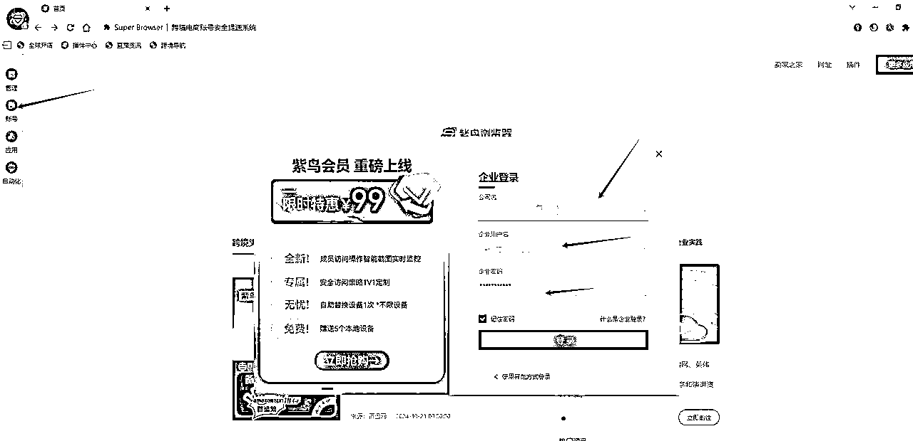

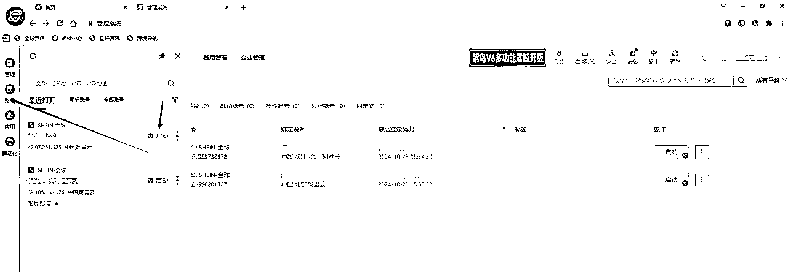

# 三、【实操2/3】选品以及找货源

# 💡

章节概要

做Shein电商-全托管项目，选品和找货源，是很重要的技能，需要重点关注。

本章节主要学习：

✅ 选品的核心方法论

✅ 新手不能选的10种产品

✅爆品的选品逻辑

✅选择合适的货源

# 3.1 选品的核心思路

找到平台需要的空白商品：Shein平台有招商需求=机会商品-趋势商品出现的，在其他平台卖的好的，在Shein上很少有人卖的产品。

选品品类：家用纺织品、家居生活、工具家装、宠物用品，玩具

对于新手最友好的

# 3.1.2 选品方法

# 3.1.2.1 准备工具

Shein助手，卖家精灵插件，直接在浏览器，扩展程序中添加（以谷歌浏览器为例，谷歌浏览器需要特殊网络环境才可以添加，此插件不用于紫鸟浏览器）

卖家精灵插件地址：https://www.sellersprite.com/v3/knowledge/feature/sellersprite-chrome-extension-download

Shein 选品助手插件地址：https://www.yuque.com/geekbi-com/shein/mbuh4r0n2yynwcf7

①Shein选品助手安装方式：点击浏览器右上角三个点——点击扩展程序——点击访问chrome商店——搜索Shein选品助手——根据提示安装。

②卖家精灵安装方式：点击浏览器右上角三个点——点击扩展程序——点击访问chrome商店——搜索卖家精灵——根据提示安装。

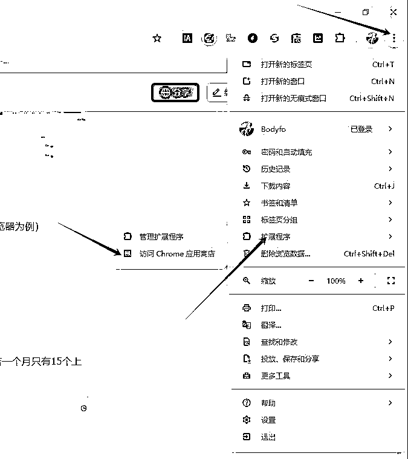

# 3.1.2.2 开始选品

选品品类：

家用纺织品、家居生活、工具家装、宠物用品，玩具

百货类供应链方便管理，与Shein空白市场的品类贴合，与Shein目前推广的品类契合，且这些类目是对小白最友好的。

方法1：打开Shein店铺后台——选择商品管理——商品发布——机会商品——选择想要发布的类目以及机会类型——找到平台发布的类目需求——用类目关键词（可以百度翻译成英文）在亚马逊或者teum上搜索

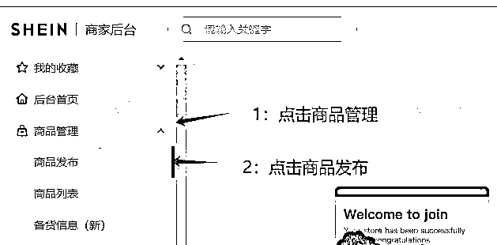

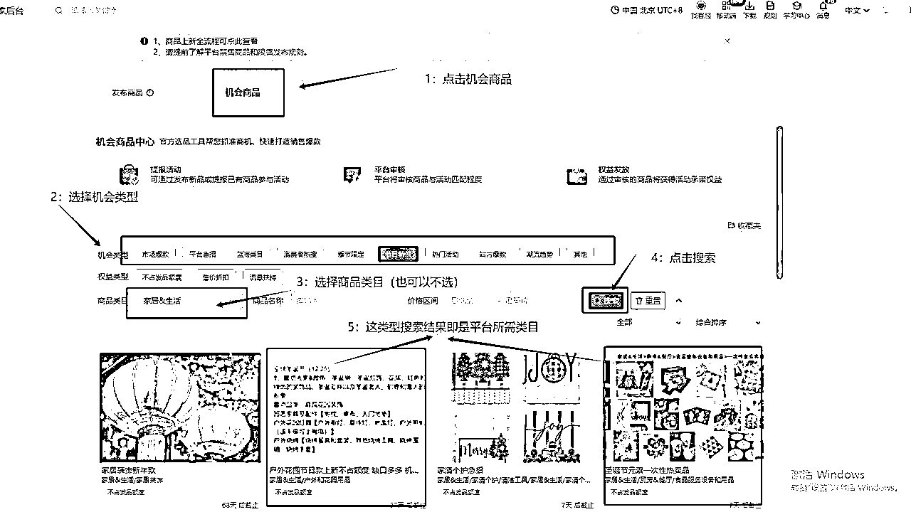

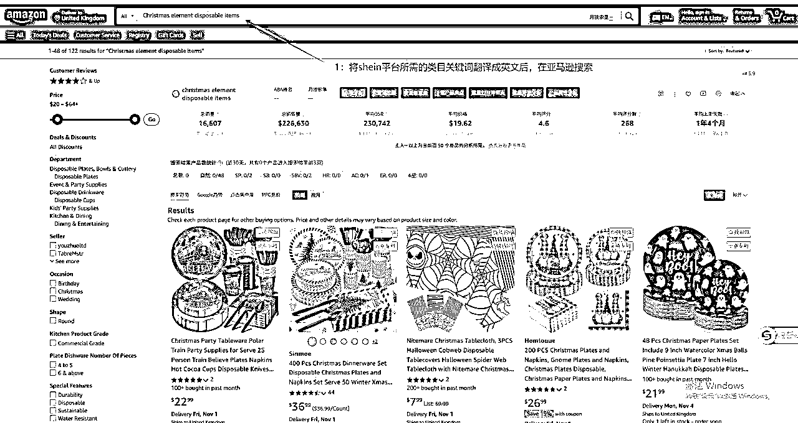

亚马逊，temu设置地址为美国

设置方法如下：

②在结果页面筛选：上架时间半年以内，月销量400-1000以内的产品——将产品关键词拿去手机端希音搜索——如果希音上无此类型产品即可以考虑上架。如果比较多就放弃。

方法2：打开Shein店铺后台——点击营销管理——点击机会商品——选择机会类型——找到平台发布的产品需求——点击查看大图——将图片保存到本地

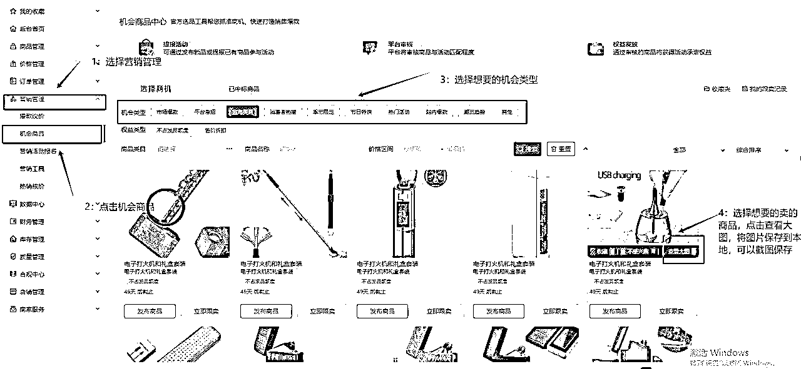

（特殊网络环境后）打开网址：https://www.sheinshuju.com/plugin/search-image?url

——将下载的图片上传——选择Shein，查看是否有同款，如果同款过多就不能选，——如果Shein没有多少同款就去亚马逊 或者temu查看这个品是否在其他跨境平台能卖起来。

如果Shein同图搜款没有找到相似产品，再使用关键词去Shein前台搜索测试下。可能是没识别到，一定要用关键词搜索一次，你可以看到更多的信息。

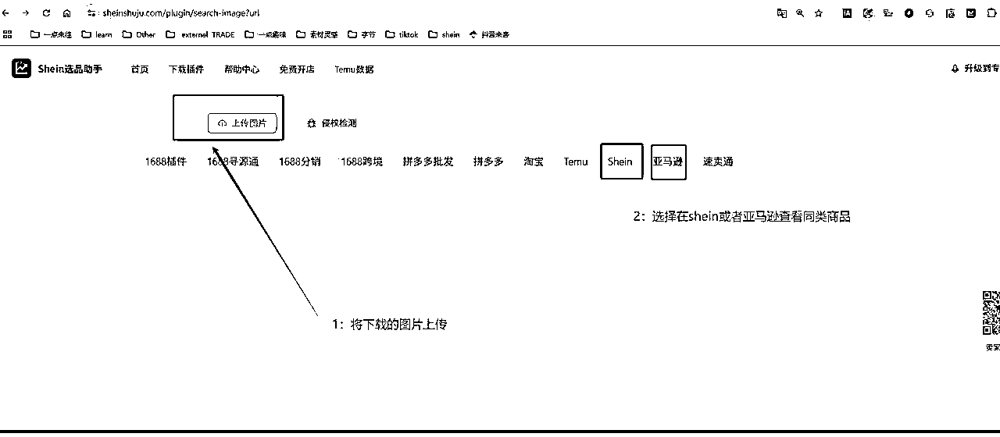

# 3.1.3 新手不能选的10种产品

1.天坑品类——市场饱和度极高

希音有些品类已经完全饱和，新买家很难介入，要么不过审核，即使审核通过卖起来的概率低到只有1%。例如，化妆品收纳盒，鸡蛋收纳盒。

新品：1688第二档，第三档价格核价，机器核价

老款：1688最低价*0.8

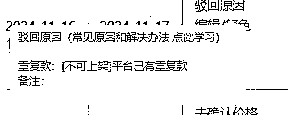

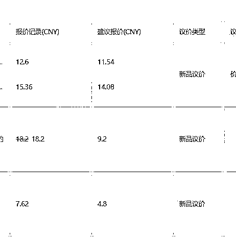

怎么判断是否是天坑类目：热卖商品的评价都是500到1000➕，上架时间大都大于1年，基本很少看到有近期（3个月内）上架卖起来的同款商品

如搜索：Transparent Vanity Storage Box

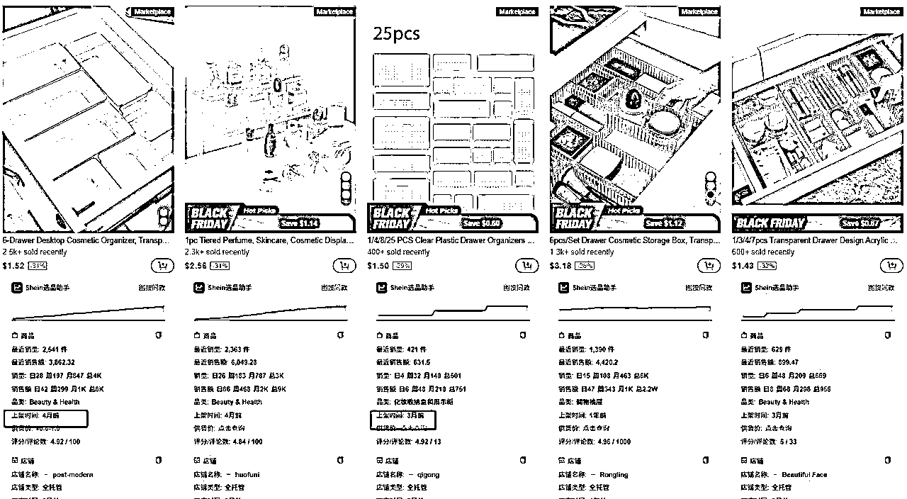

2.有门槛的品类（新手不建议）——敏感货

部分产品是需要上传证书，这些类目新手前期不要碰，成本很高！！！

①例如餐具类的，刀叉勺，碗碟擦餐盘托盘等，凡是有食品接触的。都需要上传欧洲食品接触类检测报告，否则欧洲站点就会被下架，严重影响销量。

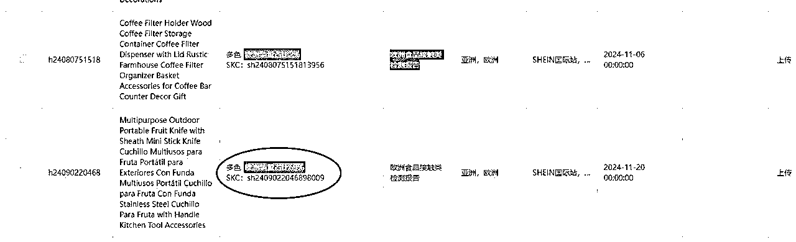

②凡是涉及到电池的，或者电子产品需要上传很多证书例如：

MSDS，UN38.3，电子电器产品标签实拍图certificate_type_id308，说明书（五国语言）certificate_type_id310，CE符合声明DoC

③蜡烛，香水，液体、膏体的所有品类都是需要上传证书的

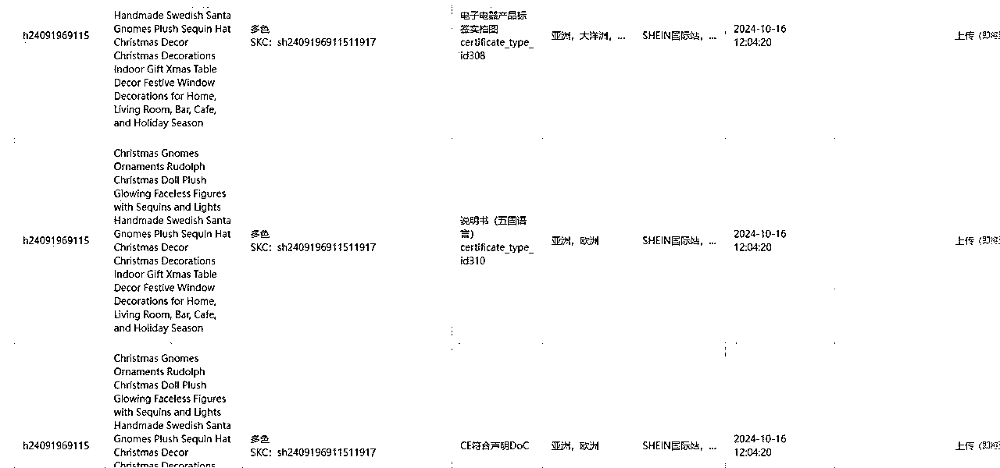

3.跟卖老爆款

同款产品的上架时间超过1年及以上的热卖单品，这种热卖的老品，新商家哪怕价格很低，抢到单量的概率也很低。希音的店铺权重，产品的链接权重，是远高于国内的淘宝，京东，抖音的。

产品》上架时间》价格

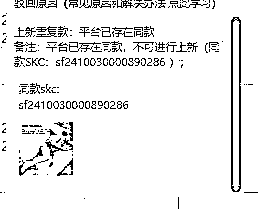

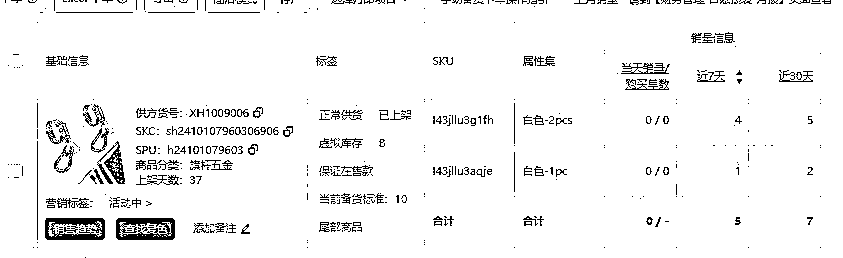

4.跟卖季节性产品，注意上架时间

季节性产品对上架的时间节点要求非常高，别人已经卖起来的季节性产品再去跟卖，很难起量。

例如返校季饭盒在9月份已经大卖，卖起来的链接基本都是在7月份上架的，9月份平台发布了需求，即使跟卖，卖起来的概率也很低。所谓大势已去。即使平台发布了需求，季节品上架的时间已过，上架无用（已测试过返校季，万圣节30个品）

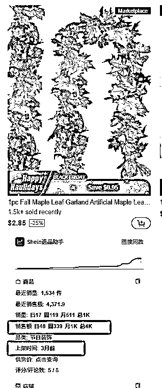

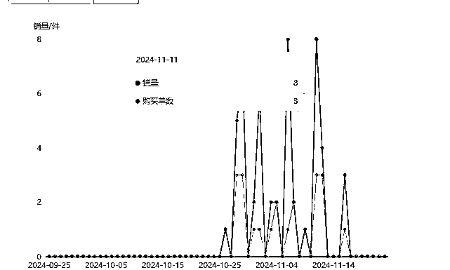

后上架的，还有断货风险。因为先上架的，可以拿到量，他跟工厂提前下单，到你抢到订单了，也是小订单，工厂不会优先给你发货。会有长期发不出货的风险。

急采不发货 罚款是售价的5倍*订单数

5.跨境平台没有需求的品

不要根据自己的想法异想天开，觉得这个好卖就去选品，要使用特殊网络环境，先去看国外的需求。国内外的文化差异很大，产品需求差异也是非常大的。不要我觉得，要平台觉得（已测试20个淘宝爆品，30抖音爆品全军覆没）

去亚马逊或者temu搜索一下，看同款最近销量。

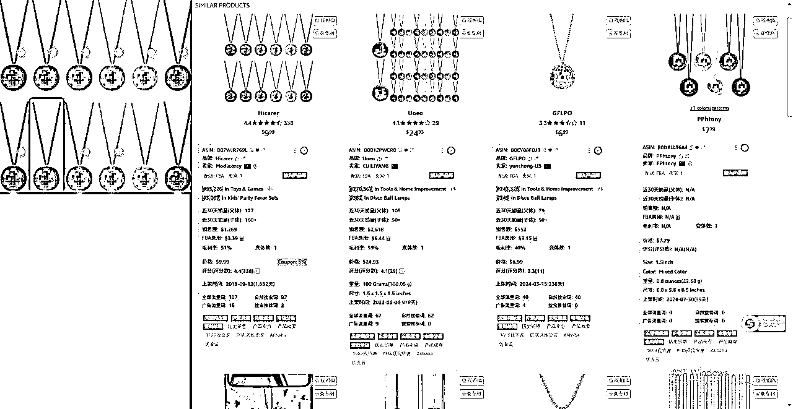

如果是季节性产品，同款页面最近销量都不高，再找一个相对销量最高的连接，去看往期销量，可能只是还没到卖起来的时间。

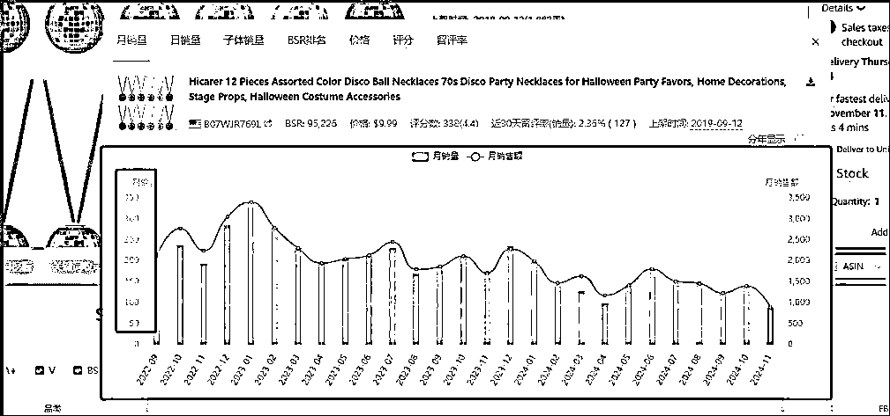

6.侵权产品

上架终审也会驳回，没有驳回的如果被抓到了也要罚款，所以，明显的侵权产品一律不上。例如迪士尼周边，美国电影周边相关的。专利侵权-罚款，图片侵权-下架，一次申诉机会

所以侵权产品不要去上，上了也是浪费时间。

7.毛利低于10%，组合采购价低于3块钱的产品

① 亏损或者毛利低于10%的产品不开发。至少需要留10%的成本发货，贴标，运费等。如果最终核价利润不足10%，甚至亏损，就不要做。钱拿来自己花，不要给平台做贡献！

② 总的采购价低于3块，哪怕后期可以优化，优化空间也很低，采购价太低的低利润产品不开发

我们的成本计算方式：采购价+运费（1688显示的运费/3）+贴标算5毛

贴标不一定是每一家都能贴的，要提前问好

8.易坏易破损的产品/平台评价差的产品

① 易损坏破损的产品，很容易产生质量问题。希音是一个会把控价格，质量的平台。每个产品都会有质量评级，如果质量等级差会被限流下架。所以如果已经知道会有质量风险，那这一类产品就不要去开发，卖起来也会被下架。

② 跟卖时如果跟卖的同款评价评分低于4.0（平均数大于50，只有一两个评论的话没有参考意义）就不要去跟卖，这种后期也会被平台下架

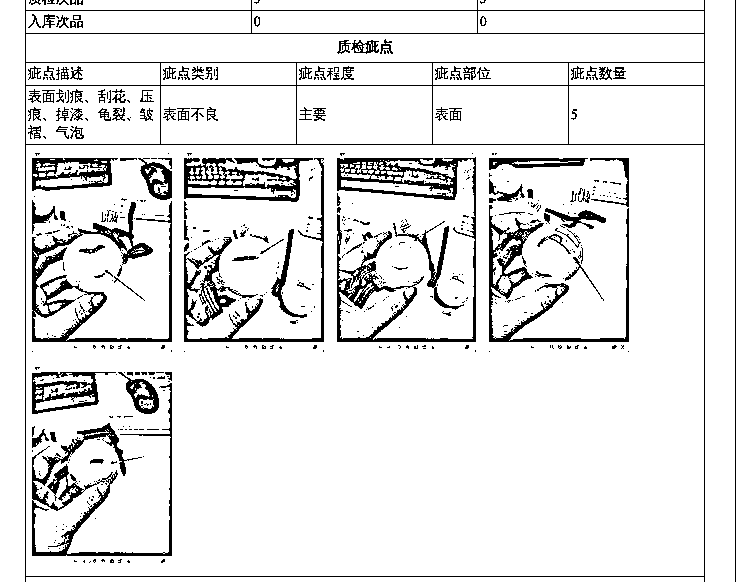

这个产品核价有6元的利润空间，一天几十单。于是我第二批发货的时候，加了纸盒，凹陷的货损没那么严重了，但是还是有污渍。准备明年上黑色的，今年已经时间来不及了。

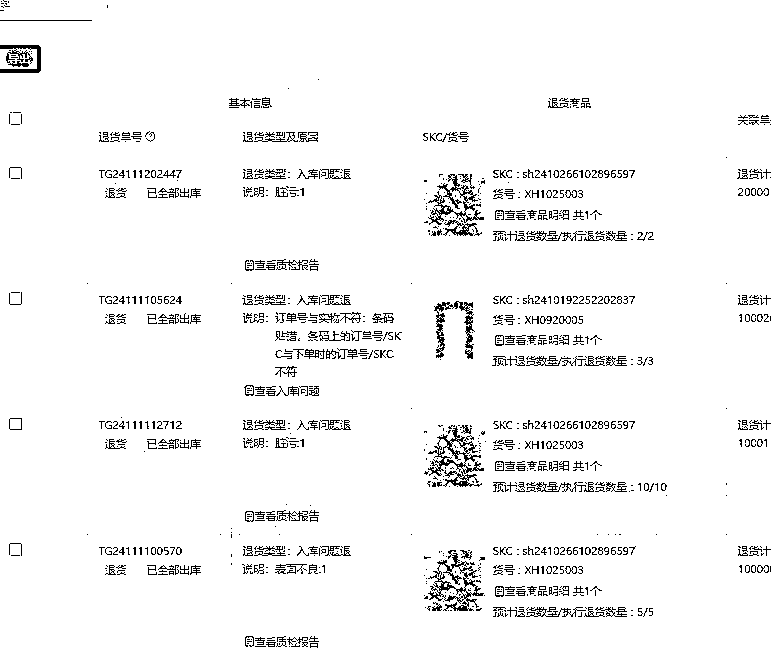

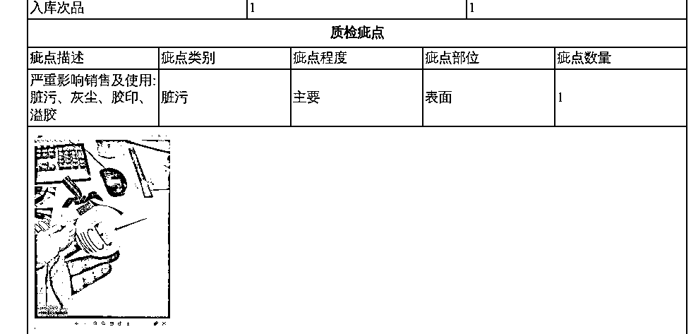

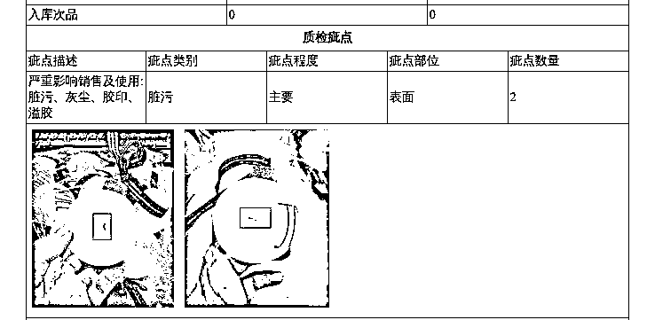

塑料软壳，玻璃，如果确实想要开发这类款，一定要做好包装，让厂家提供单个球的opp袋子+纸盒。

注：直接问1688的供应商加盒子包装多少钱，如果是纸盒包装的，一定要在表格标记清楚，方便小善团队负责采购人员正确采购，因为大部分产品都是opp袋子。

9.高价产品谨慎开发

希音上卖的好的基本都是低价，一般售价高于30美金的产品，或者采购价高于30rmb的产品，开发时务必谨慎，这种风险高卖出去的概率低。

Shein前端定价由：供货价、长宽高、重量、其他平台售价决定*其他未知

注意：重量超过1000g，采购价超过30rmb的品，谨慎开发

产品上架后，可以去Shein前台搜索一下自己的产品，我之前就有一些这类型品，一个普通香炉，Shein前端售价140美金，这种肯定没有人买，就立即检查重量是否填错。或者看看要不要找个低价sku引流。

10.平台禁售产品

例如，食品，种子，药类，盗版侵权，带安拉天主等图片和文字，宗教信息

# 3.1.4 爆品的选品逻辑

# 3.1.4.1跟买平台新品（小爆品潜力）

同款产品都是最近1-6个月内上架的，且都有评价。这种产品就属于最近的一些新品，只要上架就有机会卖起来。

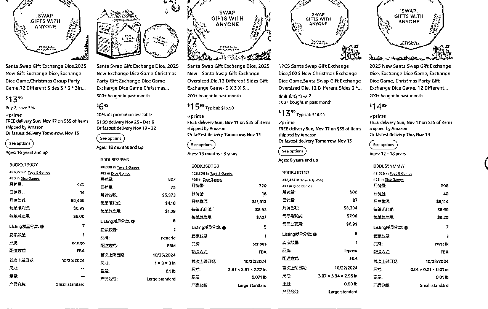

可以去亚马逊新品榜单搜索

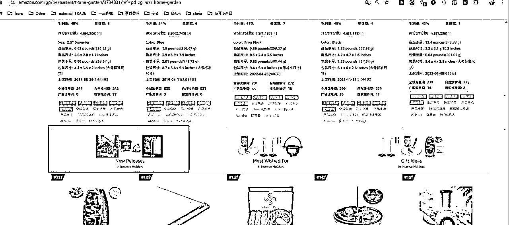

# 3.1.4.2 其他平台热卖品（大爆品潜力）

谁上谁都行，多个平台都行

跨境其他平台例如亚马逊，temu都比较热卖，希音还没卖起来的品

选品有2个路径，一是之前分享的从机会商品里面去验证是否能卖，还有就是反向寻找，先找到热卖款，再回到机会商品看是否存在。

① 搜索关键词：如发流量Shein前台发现最近杯垫卖的好，发现平台最近热推这类产品，可以去亚马逊，temu搜索

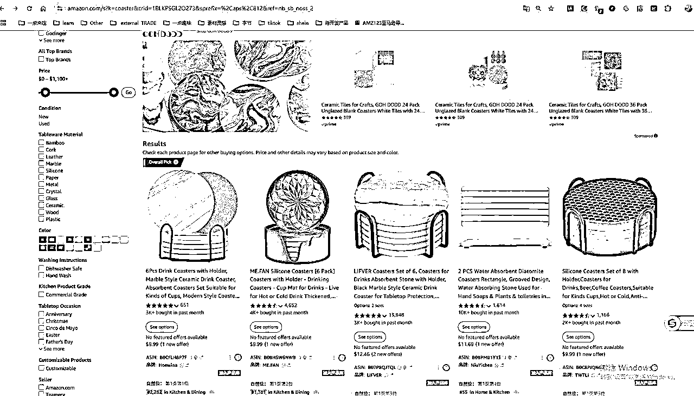

② 根据榜单

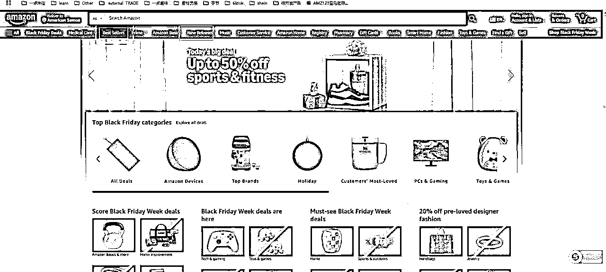

热销榜单，新品榜

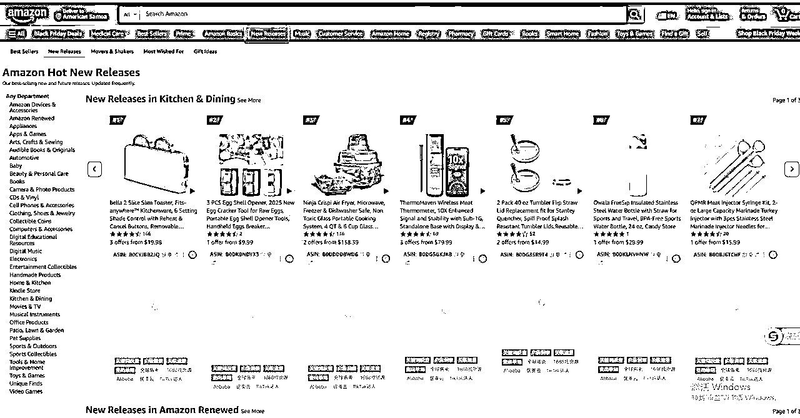

注意判断订单量是否真实：

1：评论突增

2：别的类似产品，热卖很久，这个并无价格，或者无其他优势，上榜的产品

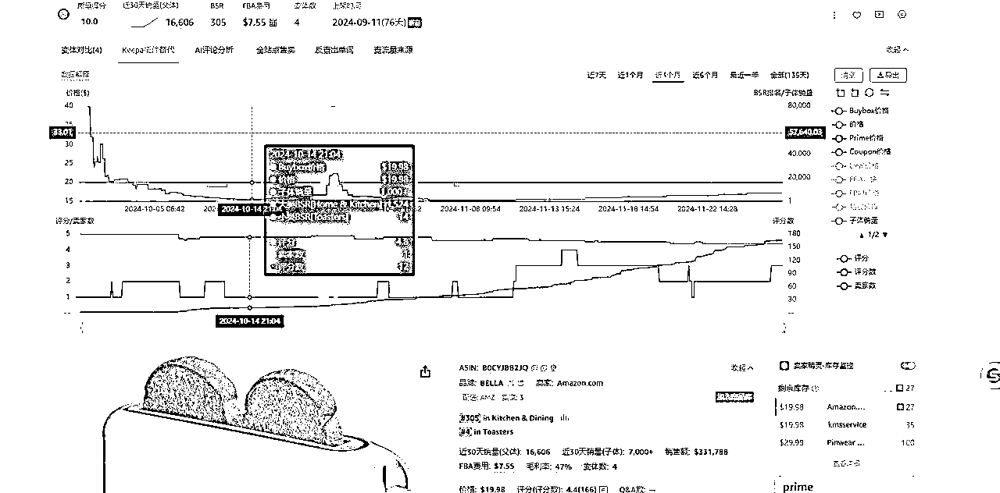

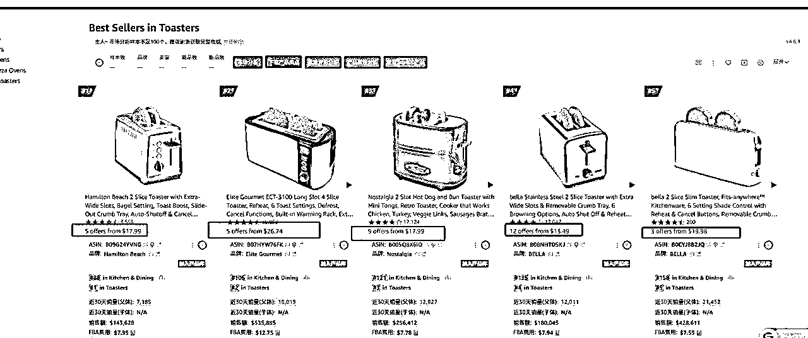

同类产品已经热卖好几年，此价格相对于其他产品并无明显优势

但是此产品是亚马逊官方售卖，排除销量作假的情况，如果是非亚马逊售卖，大概率这个是作假

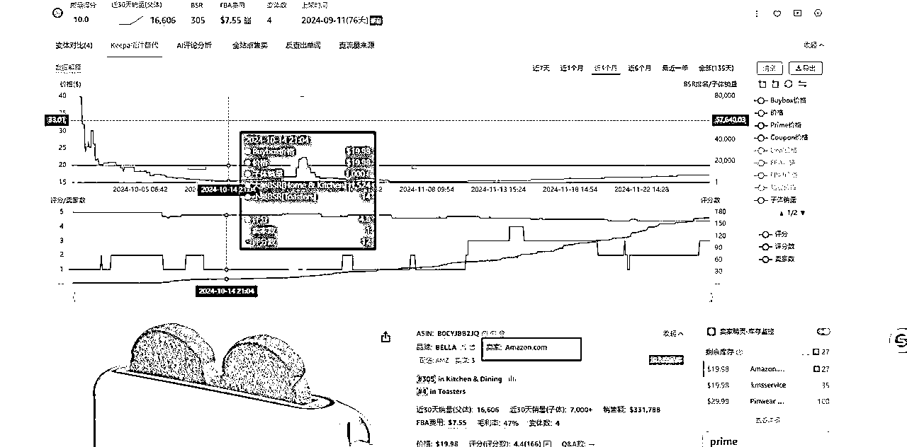

# 3.1.4.3 平台急推的品类（辨别伪需求）

买手每周都会发布平台的需求品类，需要自己去前台验证下，是否是真的需求。如果是真的需求，速度上品，爆量指日可待。如果不是那这个需求，很可能是个伪需求或者属于平台的测试需求。(已测试20个属于平台发布的测试需求，发布之后平台并无反应)

如何验证是否是真的需求？

验证方法：找到该产品的关键词，去shein前台查看 ① 是否有很多新品（最近一两个月上架） ② 新品上架后热卖。

如果发现有很多热卖的，那就是真需求，很容易爆量，别犹豫，抓紧时间冲，这个时候谁跟的速度快，谁就是爆单王。

例如：平台发布了圣诞节毛巾的需求，关键词：Christmas towel

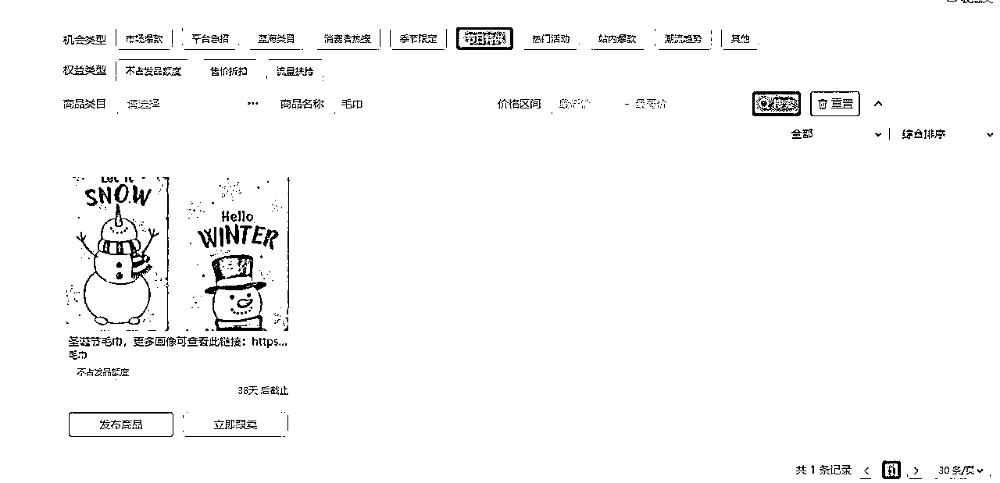

平台验证需求：

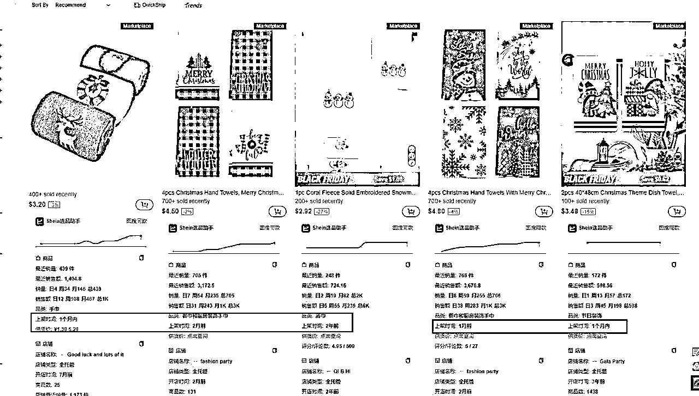

发现很多都是最近上架，且销量不错的品，那这个需求就是真需求，抓紧时间上品！！！

注意：

如果单个产品同款上架数量已经有6个及以上，那这个单品就不要去跟了，已经有很多同款了，跟卖的晚的也不容易爆量。

这时候我们需要去上架差异化的毛巾，只要是符合圣诞元素的都可以快速的上。

提取爆款元素：毛巾，圣诞（驯鹿，雪花，圣诞树，圣诞老人）

去平台搜索看需求。

# 3.1.4.4 节日选品，季节性产品

跨境的节日非常多，尤其是下半年节日多也是跨境的旺季。符合节日风格的单品都可以快速开发。

例如返校季：饭盒，饭袋，文具，书包，派对用品都是热卖品。

例如万圣节🎃：万圣节最重要的就cosplay，节日风格趋势偏黑色，黄色。往年热销的：黑色蝙蝠，黑色蜘蛛，黑色巫师帽，黑纱，枫叶藤条，黄色仿真花等等

例如圣诞节🎄：节日风格趋势圣诞树，圣诞老人，麋鹿，红色装饰（一品红等），绿色装饰（各种藤条）等等都可以作为选品的方向

注意：季节性产品一定要去看这个产品的往年同期销量，近期的好与坏不能代表这个产品的好与坏。卡好时间节点。

# 3.1.4.5 热卖单品的相似产品或者热卖单品的升级产品（爆品潜质）

某个热卖产品出现了可替代它的功能，采购价跟体积更小的产品，这种上架基本都是热卖品(同样的需求，更小的体积意味着更低的价格，跨境的运费很贵，产品的成本上，产品本身降价跟体积减少都可以减少成本）

例如徕芬代替了戴森，成本只要十分之一，体积更小

# 3.1.4.6 符合热卖元素的单品（爆品潜质）开品逻辑，新手不行❌

提炼出来热卖单品中涉及到的元素，再将这些元素复制平移到其他单品上去。

比如刚刚提到的圣诞毛巾。

# 3.2 如何找到一个合适的产品供应商

# 3.2.1 如何快速精准找到货源供应链

在亚马逊页面是可以利用卖家精灵插件直接点击1688货源去寻找货源，

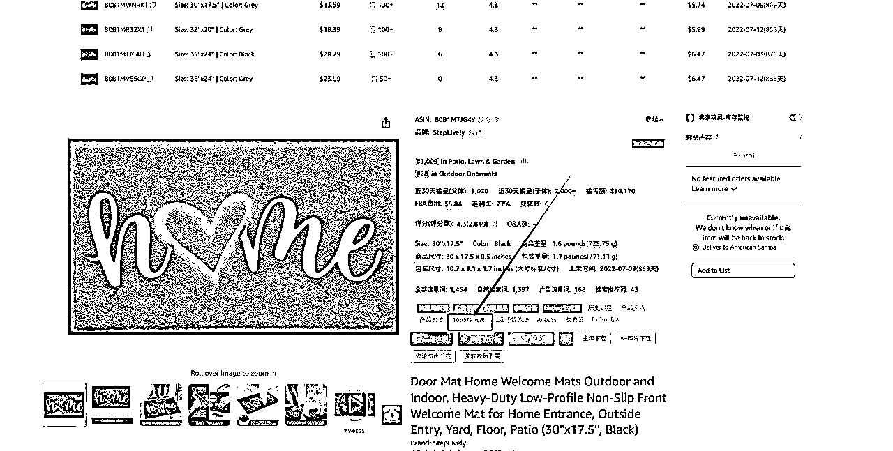

或者将鼠标放在图片上，点击图搜同款——选择1688寻源

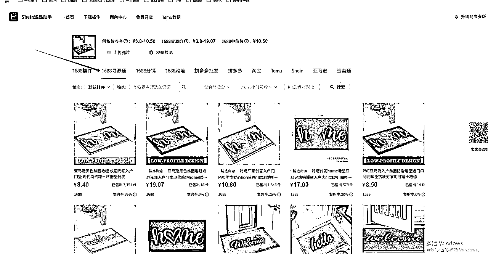

# 3.2.2 如何筛选工厂

在搜索结果页面，用价格价格由低到高排序，这个时候会出现很多无关产品，往下翻就好了，别翻太快，看到类似的产品连接先按住crrl+点击，一次性对比5-6家

# 3.2.3 工厂筛选重要信息

1、看起批量小于5个的，一般起批量多的都是没现货的

2、价格要找最低的

3、同样价格找，江浙沪的，起批量小的，售出件数多的，复购率高的

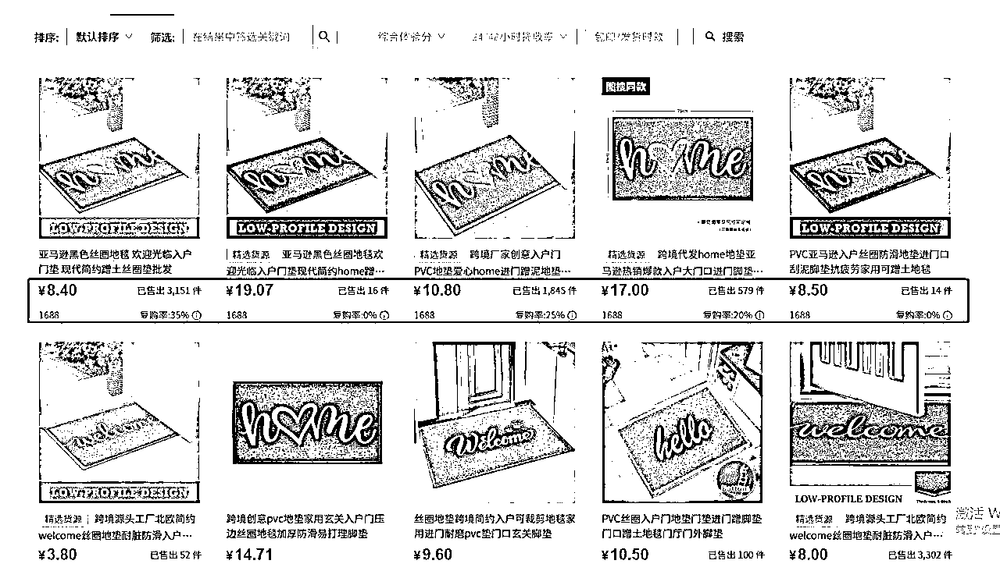

4、无论页面起批量写的多少，一定要去问多少起批，有无现货。

5、除非详情页有标注，一定要去询问产品包装的尺寸和重量，这样才是最准确的

（即使详情页规格处规格处填写的有，也需要询问。很多是随意填的。）

# 四、【实操3/3】完成商品上架和日常运营

# 💡

章节概要

在前3章学习了Shein店铺的选品、找货源的内容后，确定好品，就要准备上架到店铺进行售卖、采买、发货到Shein的仓库。

本章节的内容包含：

✅ 商品上新方式

✅ 定价

✅ 店铺运营

✅ 常见的审核问题

# 4.1 商品上新路径选择

产品上传的方式有2种，一种在后台直接上传产品，这种方式上传产品的数量有限制，一般新店一个月只有15个上新额度。

可以在商品列表页面查看可发品数

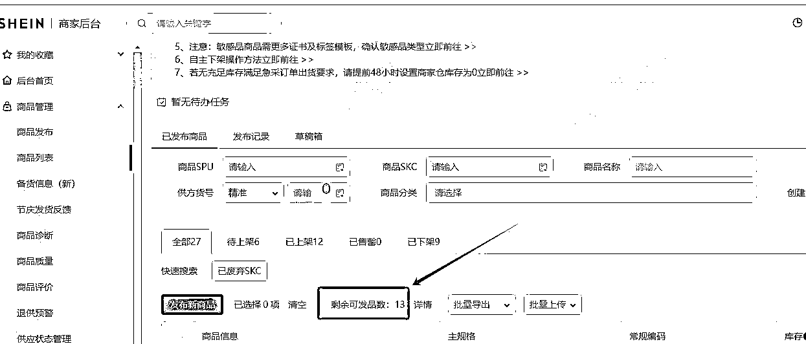

上新方式一：直接上传产品

直接上传路径：商品管理——商品发布——选择合适的分类——发布商品

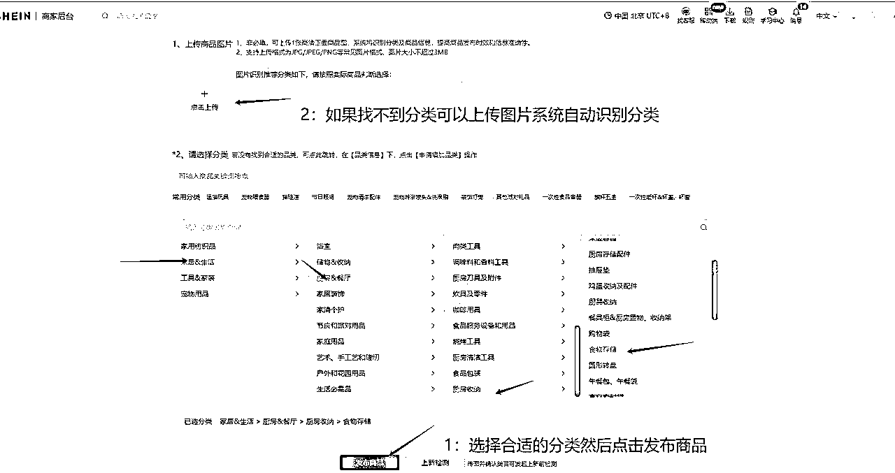

上新方式二：通过机会商品上新，不占发品额

路径：商品管理——发布商品——机会商品——选择机会类型，输入要上新产品的关键词，点击搜索

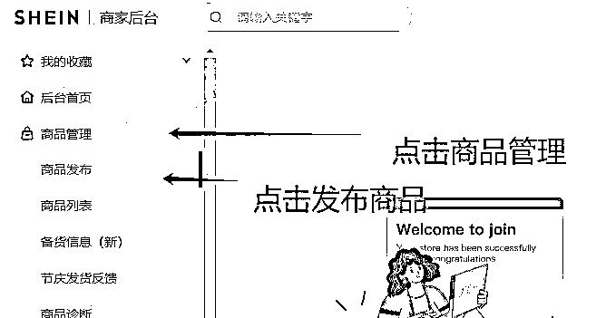

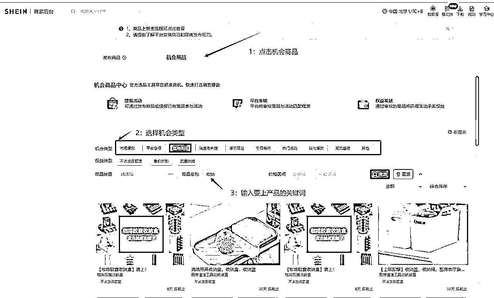

注：1、搜索出来的结果都是上品通道，在搜索结果下发布上品不占用发品额

2、如果没有找到合适的上品通道，可以尝试更换机会类型，和产品关键词以及多往后翻几页。

3、通道分2种，一种是单品通道，如图：在该通道下发品一定是跟所示图片一模一样的同款。

4、如图示圈起来的都是单品上新通道，但是只能上新跟图片一模一样的。

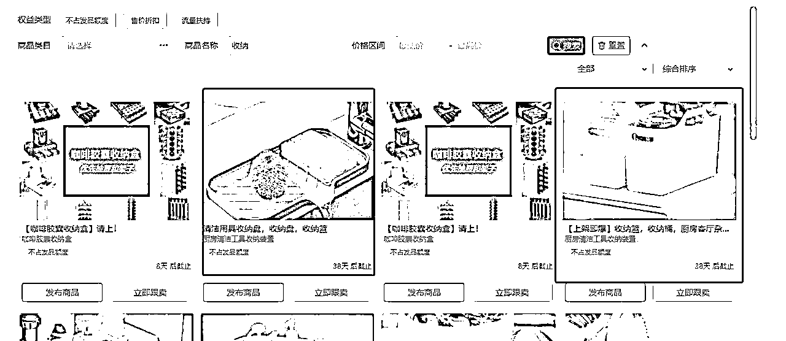

# 💡

还有一种是类目上新通道，如图：只要是“咖啡胶囊收纳”即可。新手90%选择此方式，可以提供无限上品机会，让我们有足够的试错机会

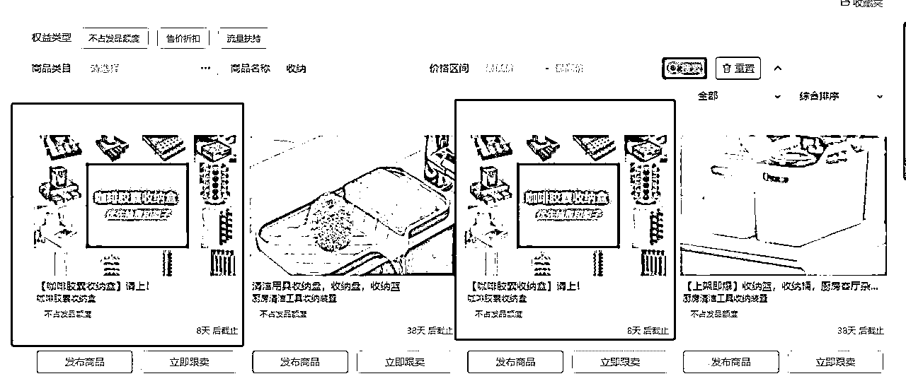

# 4.2 商品基础信息填写

常规商品需要信息：标题，敏感类别，材质，关税种类，数量，规格，图片，供应信息

# 4.2.1 标题

标题可以参考亚马逊或者其他平台标题，注意标题内标注的产品规格，品牌信息是否需要修改。

亚马逊标题：Lansinoh Breastmilk Storage Bags 3pcs 500ml。需要删掉品牌名：Lansinoh。以及确认供应商或者我们上传的产品是否是：3pc 500ml（3件 500毫升）

参考标题要参考销量比较高的链接。

一定要有核心关键词，场景词，功能。核心关键词是用来描述这是个什么，场景词用来描述使用的地方。

如：宠物垃圾袋，宠物用草莓便便袋，防漏

如果规格特别有优势可以写上，多个规格的时候写最大规格的。

每个关键词用英文隔开，介词小写。

大词放后面，如宠物垃圾袋，和便便袋，宠物垃圾袋就放后面

在不考虑销量好评等因素情况，用户在搜索关键词的结果页，平台会根据标题中关键词的前后顺序去排序。

如：

标题1：加厚大码风衣防风防水风衣

标题2：防水风衣加厚大码风衣防风

用户在搜索防水风衣这个关键词的时候，平台优先展示标题2这条链接

标题的敏感词如下图：

# 4.2.2 商品属性

带*号的为必填

（1）标题填写的数量以及其他产品规格，需要与商品属性填写的内容以及图片展示一致

（2）所有属性要真实，尤其是包装规格

（3）商品属性是敏感商品需要填写清楚

电池类：MSDS说明书和UN38.3（UNDOT）测试认证等；电池货物对于包装和操作流程都有严格要求。选品时候注意供应商是否可以提供相关资质。

食物：CIQ，或者熏蒸证明书

药品类：此类型货物运输时需要国家音像出版社证明，由生产方或出口方写保函。

粉装、胶体等不稳定物品：比如化妆品、护肤品、精油、牙膏、口红、防晒霜、饮料、香水等等，MSDS（化学品安全数据说明书）和出发口岸的商检报告方能报关。

尖锐类：商品运输填写真实，包装保护好

仿牌：有品牌或者是仿牌的商品，不管是正品还是仿牌，多涉及侵权等法律纠纷风险，都需要走敏感货渠道。

# 4.2.3 商品规格

主规格这一栏永远只有一个子属性，如果需要添加多个颜色，在下面尺寸属性里加，备注清楚属性名称。

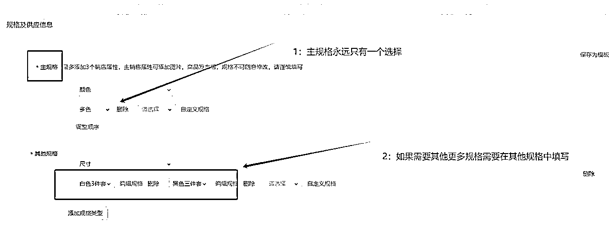

# 4.2.4 商品图片

（1）图片最小边长900px，所有图片的尺寸需要保持一致，例如：上传了一张900*1210px的图片，其他的也都是900*1210px。

（2）详情图至少6张起

（3）图片不能出现中文字。

（4）尽量不要上传白底图，多选择场景图和细节图且不少于5张。

（5）背景简单美观，色系统一协调，构图突出产品。如果图片没有聚焦产品本身、模型太假，背景色太暗跟产品混在一起，拼图抠图，模糊，尺寸图放首页的一概不过。

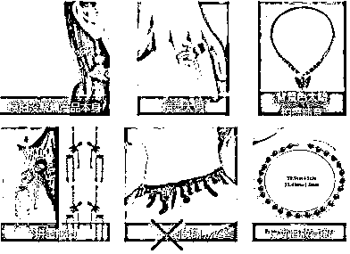

图片的收集与简单处理

使用工具：浏览器插件图片助手、美图秀秀

图片助手安装方式（以谷歌为例），点击浏览器右上角三个点——扩展程序——访问应用商店——搜索图片助手并安装

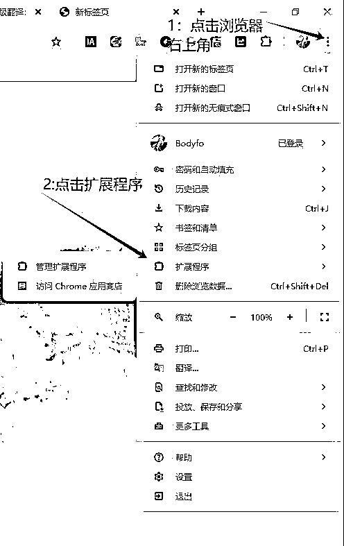

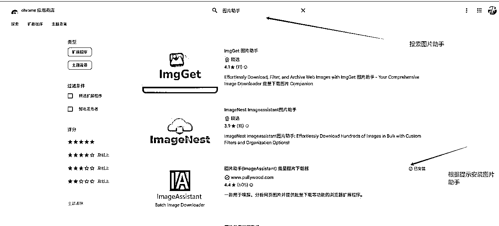

（1）图片获取：打开需要获取图片的网页——点击右上角图片助手插件——选择提取本页图片

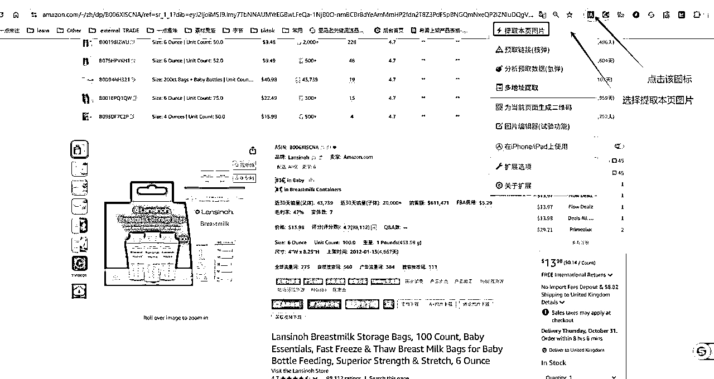

使用浏览器插件图片助手进行图片下载

图片下载1：选择像素不小于400*400或者500*500的图片——打开选择按钮——点击想下载的图片——点击下载图片即可下载。

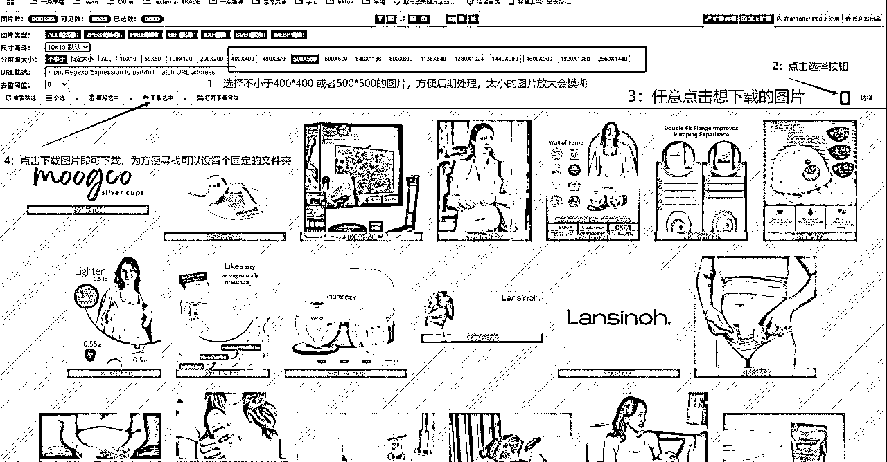

在下载界面可以选择继续下载，或者先点击下载配置更改下载位置。创建一个独立的文件夹用来保存下载好的文件。

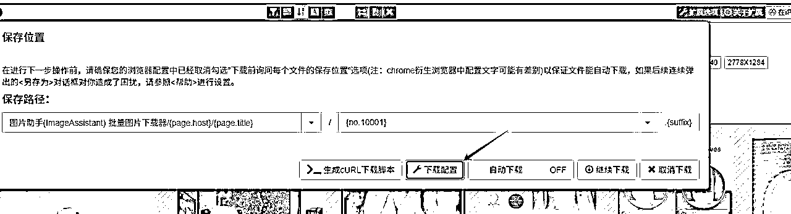

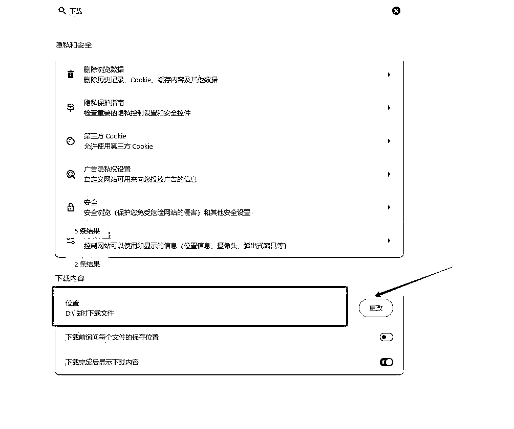

图片下载2：卖家精灵插件可以直接下载——如下图点击下载按钮

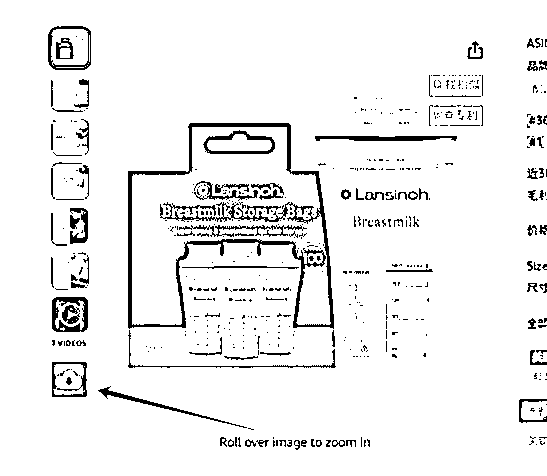

（2）处理下载好的图片

路径：图片编辑——新建画布——输入画布尺寸（图片最小边长900px）——将图片拖拽到画布里——调整到画布大小——保存调整好的照片

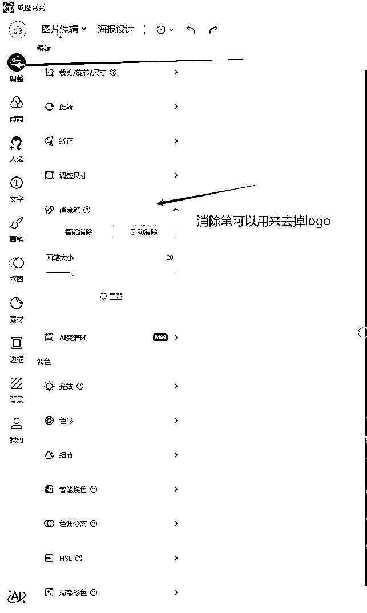

另外，图片上传的时候，站点要选择所有

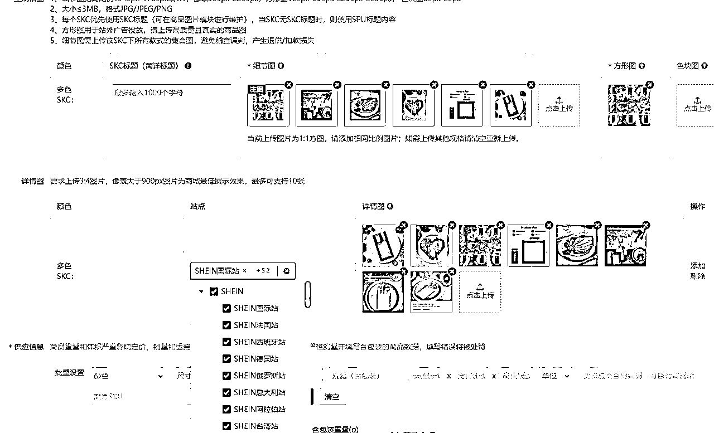

# 4.2.5 供应信息：

价格根据1688采购价格加20-30%的利润。

含包装尺寸重量，需要在选品时与供应商确定。必须要与发货信息一致。

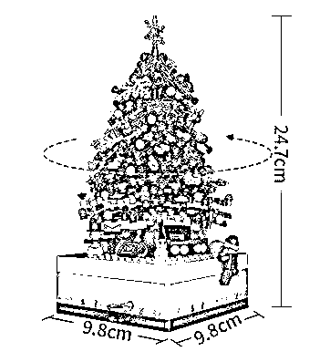

产品尺寸

含包装尺寸

# 4.2.6 货号编写方式

上品人缩写+日期+第几个品，如：XX1022001表示xx10月22开发的第一个品

商家sku：是表示产品具体某一个规格，如：XX1022001S1，XX1022001green，分别表示：xx10月22好开发的第一个款式为S1的品，xx10月22好开发的第一个款式为绿色的品

填写完即可发布，发布后等待审核流程

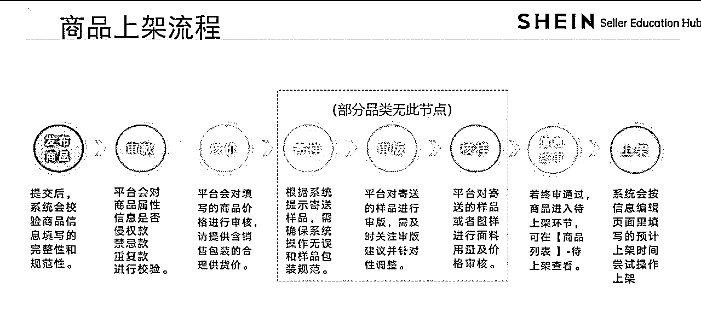

# 4.2.7 确定审核是否通过

审核一般3-7天，审核通过后一般2-3天会上架

# 4.3 如何定价

一般是采购价的1.2-1.3倍

如果产品采购价格很低，乘以1.2倍后价格还是很低，如：1*1.2=1.2，可以加2-3元去核价，但是一般建议可以2pcs，3pcs或者和其他规格组合去卖，不然核价可能会不过审。

不要一开始就写很高的价格，尤其是低价产品，如果一开始定价很高，核价的时候，买手直接核最低价格。买手会去参考1688价格。

8 9-10 15

新品：第二档第三档的最低价

老品：最低档价格的*0.8

比如：产品1688价格6.5，买手可以接受的价格是7.2——9.6，你直接报价10块钱，他可能会跟你议价，给你报价7.2。但是你可以报价8.3，可能买手直接就通过了。

# 4.4 店铺运营、上新

1、日常关注产品是否有议价需要处理

2、关注产品是否过审，第一时间采购备货

航海船员在航海期间的采购备货流程参考：在店铺界面点击：商品管理——备货信息——excel下单——按照模板填写要下单的产品信息和数量——上传——通知采购同学

一般采购量：新品首次采购3个，后面一般按照7天销量量来下单

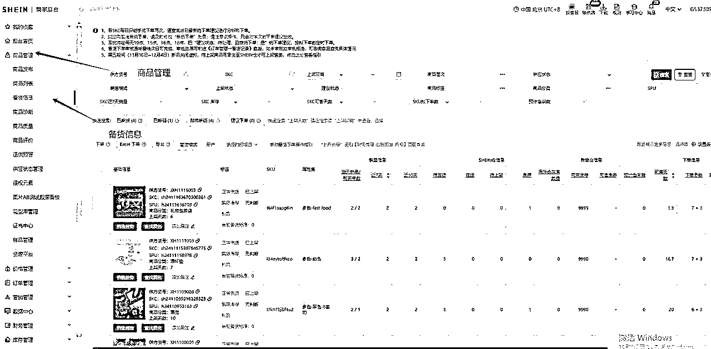

普通圈友采购备货流程参考：

采购流程：

一般是先从1688下单，货物放自己这边，要先自己质检一下，看下商品质量如何（1688商家发货会有很多问题，最好不要让1688直接发货到Shein仓库）。一般1688预采2-3个，后面一般按照7天销量量来下单

出单以后，再发Shein仓库，注意：Shein检查严格，质量 、货不对板、 唛头、贴的标都不能出错。

发货流程：

第一步：查看待发货订单，可以在店铺首页，或者订单管理查看

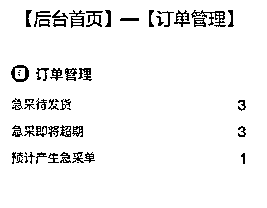

第二步：勾选需要发货的订单，点击一件发货

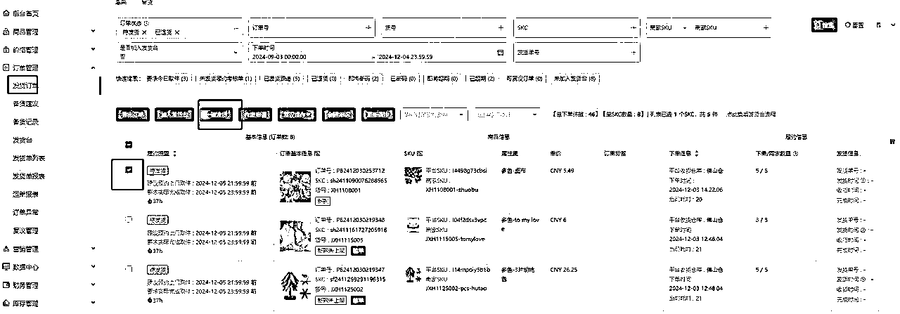

第三步 ：填写发货信息

第四步：1-打印商品条码以及包裹信息（条码，面单）

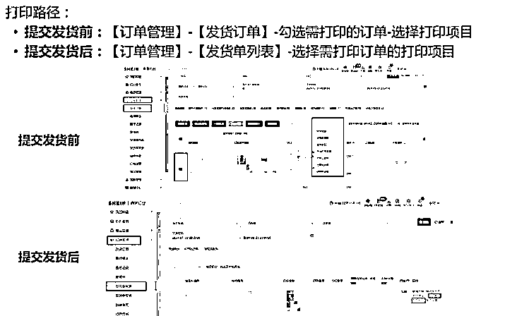

2-打印商品包裹信息

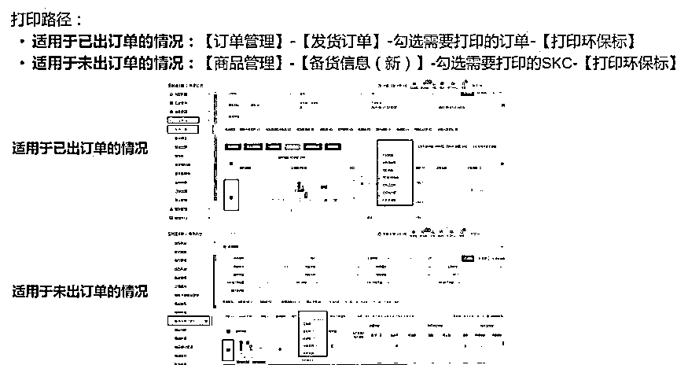

第五步：发货前检查信息

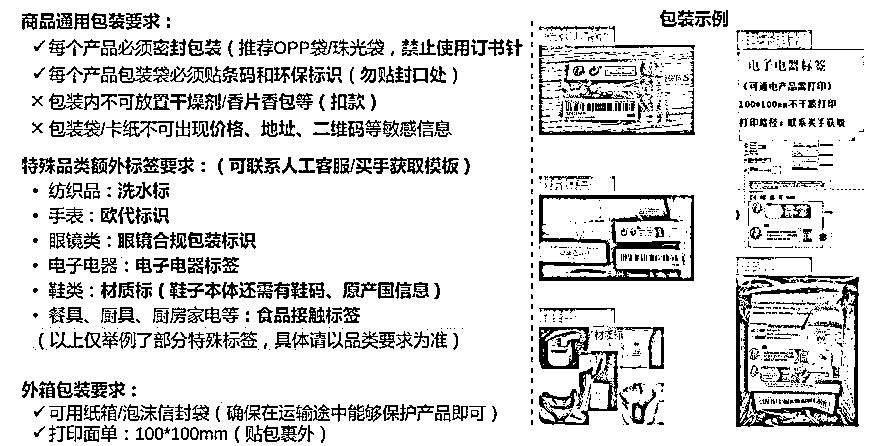

# 4.5常见的审核问题和修改方式

活动已结束

价格不够有优势 所以一直审核未通过，跟卖没有中标

季节性活动已经结束了

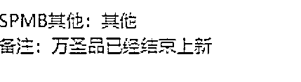

侵权、禁忌、禁售、证书驳回。 禁忌：含政府，宗教，歧视等等，

宗教，政治，专利，民族歧视，文化等等，国内经常说大码服饰，国外直接标清楚适合多少斤穿即可

图片模糊不清，有中文

错放类目——可找客服咨询类目，或者上传图片识别类目

重复款---Shein站内有大量同款，

要求聚合上新——主规格始终只能有一个规格，可以在其他规格自定义编辑，来区别不同规格

非同款——与选择的机会商品非同款

上品成功率较低的话，平台会延迟审核，延迟推款

价格太高——如果是有相似款的低价供应商，可以申诉，上传对比图片，区别出不同的地方

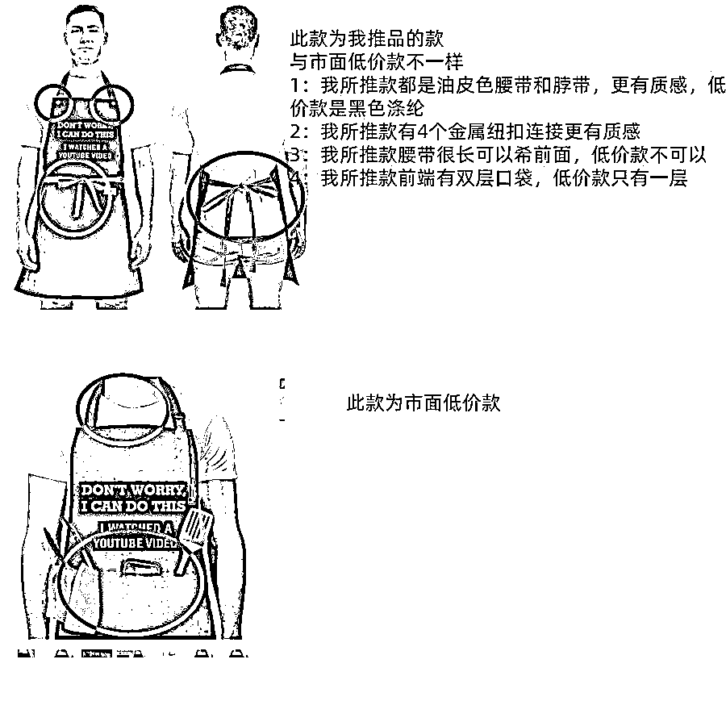

最后，祝大家都能学习Shein这个项目的玩法，做好选品，早日出单，一起生财有术！