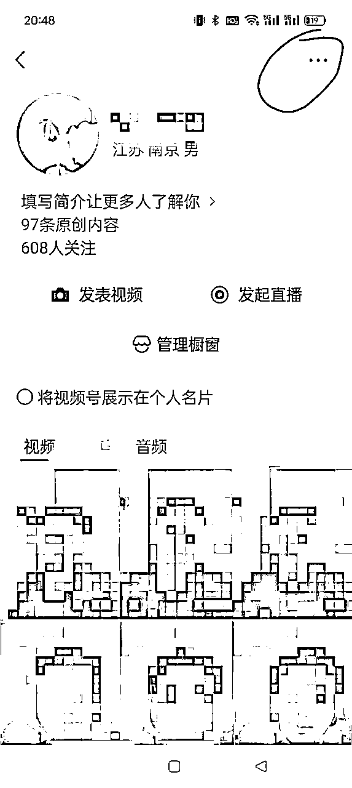
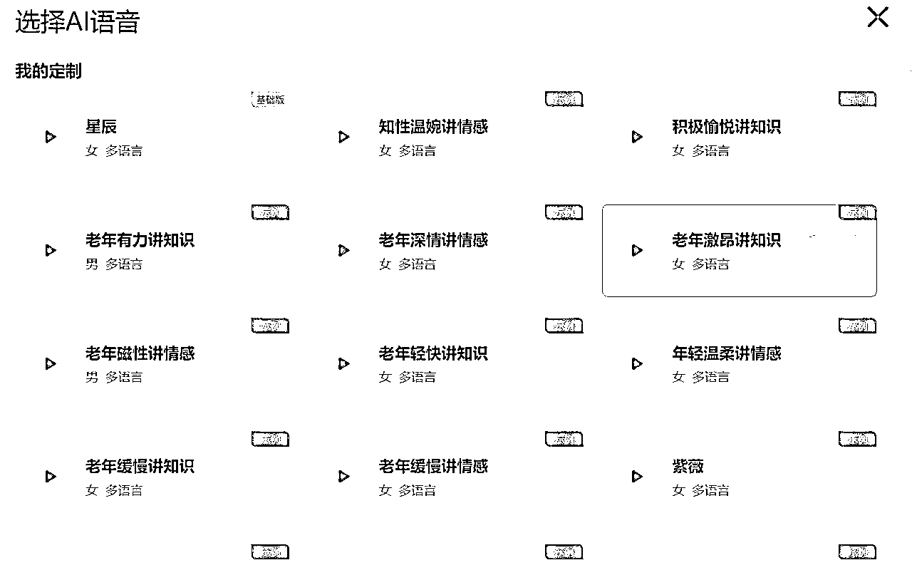

# 12 月航海 | 视频号带货-AI数字人 | 实战手册

> 来源：[https://ocn93f5d9olj.feishu.cn/docx/Q201dLxRCoWpZixbGYZcWZBznMf](https://ocn93f5d9olj.feishu.cn/docx/Q201dLxRCoWpZixbGYZcWZBznMf)

# 防失联+MM188166M（李李）长期更新频繁+备用V:MG10127

# 写在前面

# 💡

现在的视频号带货已经过了混剪搬运的“草莽时期”，能够持续出单的，大部分都是真人出镜的内容，可是很多人面对镜头都会说话不自然、表情僵硬。

随着AI技术的不断进步，这个问题可以通过数字人被很好的解决。现在AI数字人已经能够在镜头表现、情感传递、语言表达等方面达到很高的水平了。

我们本期航海，会带你手把手搭建能带货的数字人，提升变现效率。

本条船的核心玩法：

# 一、【项目概述】了解数字人视频号带货

什么是数字人视频号带货？

用数字人生成带货视频，通过挂车，橱窗，或者直播的方式带货变现。

本次主要采用橱窗自然出单，以及短视频爆了以后直播收单的方式。下方短视频示例即为引导商品橱窗下单：

直播收单示例：

数字人带货，主要解决两个问题：

1.

解决主播表现力的问题，大部分人的表现力其实是稀缺的，但是提高起来并不容易。没有表现力也可以口播带货。

2.

提升内容创作效率，你可以使用公模数字人或者录制你自己的数字人，丝滑的量产带货视频，大力出奇迹，不需要再反复拍摄口播带货视频，费时费力。

只需要基础剪辑能力即可上手这个项目。

数字人带货存在的挑战：

视频号的平台特性，即使是中低危文案，还是比较容易违规，需要多准备一些账号（最少4个账号），以及做好可能被限流的准备。

数字人带货操作流程总览：

核心环节是大量制作混剪数字人带货视频，为方便大家有个整体的感知，可以看总体视频流程（注意：部分软件和版本不同，本视频仅做流程熟悉使用，手册后面会有详细拆解和操作教程）：

11月16日.mp4【在线播放】

# 二、【项目实操 1/3 】准备 4 个账号

# 2.1 准备 4 个电话卡&手机

1.

营业厅办副卡，10元每月（追求速度，去营业厅可以秒办2张），共享主卡流量和话费套餐。

2.

京东下单电信无忧卡，月租5元，下单时支付30元充值成话费，今天买明天到（每月可办1张）

3.

点击下方领取团队福利低月租卡，免费领取，快递包邮到家激活即可。

推荐办里面的19元卡，跟平常去营业厅办的一样，这只是个优惠入口：低价三大运营商月租卡

4.

淘宝买第三方运营商的卡，直接搜索“手机卡”下单前咨询客服，就说要注册微信的，几块钱卡费，收到手根据里面提示充值几块钱话费，总成本十来块钱搞定包年的，不用交月租，保存图片去淘宝扫码就行，每人可办70张。尽量用3大运营商的卡去注册微信，第三方卡备选

5.

手机卡准备好之后，还需要准备对应的手机，最好是一个手机对应一个电话卡，部分手机官方系统支持双卡和微信双开也是可以的。手机可以在“转转”购买，闲鱼上工作室用废拉黑的设备比较多。

# 2.3 注册 4 个微信

1.

微信号可以是自己使用的老号，如果微信老号的数量不够，则需要新注册微信号，一个身份证可以开5个微信号；老号则不需要养号，直接跳到下一步注册视频号。

2.

新注册的微信号不要立马注册视频号，需要用2天时间养一养微信号，养号操作流程：

完善头像、名称

微信-我-服务-钱包-实名认证

添加 3 个好友，互发几条消息，给好友打1分钟电话，各收/发一次转账

关注2个公众号：生财有术，生财有术服务号；

每天在视频号上刷5分钟视频、看10分钟直播（挂着就行）

发一条朋友圈

3.

微信实名认证

线上结算的带货佣金需要提现到微信零钱。提现需要微信做实名认证，一个实名可以给5个微信号认证。

认证方式如下：

我-服务-右上角【···】-实名认证

# 2.4 注册 4 个视频号

# 2.4.1 注册视频号

打开微信-发现-视频号-右上角小人-发表视频，按照步骤填写信息，名称用老年人喜欢的名称：例如花开富贵、上善若水等等（仅举例），其他随意。

# 2.4.2 设置名字、头像、个人简介

点击创建视频号后，我们会进入这样一个界面，点击右上角【···】进入【设置】界面：

在【设置】界面点击【资料设置】：

在【资料设置】界面点击【头像】、【名字】、【简介】分别完成设置：

# 2.4.2.1 名字

先来看官方给出的【账号名称】注意事项：

根据自己要做的账号类型确定名称，一个好的名字是可以自带搜索流量的。

最常用的办法，就是采用相关关键词的组合搭配方式，比如国学、书籍、认知等等。选择使用关键词组合是因为，这样在别人搜索关键词的时候容易被搜索到。

如xx女性思维、xx智慧说，这样一看就像是像正常用户而非专业营销号的名字，切记不要用好物推荐、好物分享、**百货这种。

不过，有些朗朗上口的名字已经都被抢注了，所以注册名字的时候需要多准备几个，尝试下哪个可以注册。

一年最多能更改 5 次账号名，没有想法的时候可以参考各平台同类型账号的取名方式，也可以取通用的名称，例如【xx - 同款在橱窗】等。

# 2.4.2.2 头像

一个好的视频号头像可以让我们更容易被他人记住。

头像可以花朵，风景，或者是像妈妈们用的头像一样的，比如莲花、荷花等或者是贴近于生活的头像，没有特定的要求，但是不要用好物推荐、露出身体/胸/背，产品主图等这种踩雷的头像。

头像类似如下：

视频号的头像可以是纯文字（名字缩写），也可以是图文形式，如果你不知道什么样的头像比较好，可以去搜索看下，你定位内容的视频号大 V 他们一般是怎么设置头像的。

制作方式：可以使用图怪兽等网站来进行头像的制作，又或者找些无版权的图片。

图怪兽：https://818ps.com/

可画：https://canva.com/

创客贴：https://www.chuangkit.com/

注意事项：注意避免使用容易侵权的商标类图片，也建议不使用个人头像，容易和账号定位不符。

# 2.4.2.3 简介

简介是随时可以修改的，要结合账号的定位去进行修改，这个完全可以参照已有的大号的方式去进行编辑。

注意，不要写点击，购买，私信我，这样词语；

PS：账号前期不要做太多营销动作，视频爆了，才开始换头像做评论。

# 2.4.3 实名认证

注册好视频号以后，打开微信-我-视频号-发起直播，会提示实名认证，按照步骤认证好。

一张身份证只能实名 2 个视频号

方式一：自己的微信，让别人帮自己来实名视频号，直接让家里人来扫脸，因为其他人沟通信任成本很高，并且发起第一次直播和随便添加一个商品进橱窗

方式二：别人的微信让他注册并实名好视频号，并且发起第一次直播和随便添加一个商品进橱窗，后续在PC端视频号助手后台绑定你为运营者，你就可以直接电脑登录发布视频和直播了，他可以用手机观察数据流速，或者你直接用电脑PC端观察。

入口：视频号助手官网-设置-人员设置-绑定运营者。

现在管控越来越严格，微信实名和视频号实名最好是同一个人，实在不方便处理也没关系。

开通橱窗带货 @旋子

开通橱窗是为了可以带货。不开通橱窗没法带货。点击创作者中心-带货中心-按提示开通商品橱窗。

开通时需要进行橱窗实名，同时需要缴纳100元橱窗保证金。

添加商品 @旋子

点击创作者中心-带货中心-选品中心-在搜索栏搜索商品，点击加橱窗。

优先选择佣金率高、月销高、店铺评分高的商品。

商品界面可以查看商家联系方式，添加商家微信，沟通获得更高佣金、索要样品。

视频号带货权限问题 @旋子

橱窗带货0粉就可以开通，这也是视频带货、直播带货的必要前置条件。

直播带货就是直播的时候可以挂小黄车，开通直播带货有三个条件，满足其一即可：

1、账号粉丝达到100。

2、账号带货身份是商家（开小店）。

3、商家授权号（供应链授权）（这个不建议，非必要情况能不用就不用）。

推荐方法一，100粉丝很容易达到。如果是直播起号的，推荐方法二。

视频带货需要满足两个条件：

1、账号有效关注数1000人以上或带货中心账号身份为商家。

2、符合内容规范。

账号一千粉一般需要几个爆款视频涨粉。想更快的开通视频带货，也可以开通小店实现。内容规范方面，只要不是发布违规视频，一般都会就会自动开通。

# 2.4.3 隐私设置

有些小伙伴微信里很多熟人，不想在微信主页展示视频号入口，或者不方便将自己的视频号相关内容推送给微信好友，关闭两个开关即可。

入口：微信-我-视频号-右上角三个点-隐私设置

谁可以看我的视频号内容：公开，但不推荐给我的朋友

在个人名片上展示视频号：灰色按钮表示关闭展示

# 2.5 项目工具准备

# 2.5.1 拍摄设备&软件

建议使用：手机。

现在的手机像素都很强大了，拍摄短视频完全够用。拍摄时，直接使用后置摄像头，性能更好。有些伙伴担心看不到自己怎么办，在拍摄部分，我们会教大家通过镜拍的方法解决这个问题。

如果你有单反相机，使用相机会有更好的拍摄效果。

但考虑到大多数人的情况，我们后面重点还是会讲如何使用手机拍摄。

拍摄软件：不要使用美颜软件！！不要使用美颜软件！！不要使用美颜软件！！直接用手机原相机就好。

1.

提词设备&软件

可以使用手机，也就是准备 2 部手机：1 部拍摄，1 部提词。

也可以使用手机拍摄 + 电脑提词的搭配。

提词软件

手机端：提词拍摄或者快题词。都可以在拍摄时直接看提词字幕。手机剪映也自带提词器可以使用。

下载地址：iOS App Store 和安卓应用商店可以直接下载。

电脑网页端：https://cn.teleprompter-online.com/

2.

收音话筒

声音效果非常重要，直接用手机收音会有很多杂音，所以一定要准备收音设备。我们推荐两个方案：

选择一：蓝牙无线耳机。

如果你不想额外准备一个收音话筒。考虑到我们几乎所有拍摄都会略微侧对镜头，观众看不清耳朵，所以可以直接在用户看不到一侧，配戴一个蓝牙无线耳机，使用耳机的麦克风收音。

选择二：收音话筒。

淘宝、拼多多两三百那种就可以，收音效果都是不错的；早期不需要大手笔投入买 RODE 或者大疆这种很贵的收音话筒。

3.

拍摄支架：

建议直接买两个普通支架，一个架拍摄手机、一个架提词的手机。这样既能保证手机稳定，调整起来又比较自由。如果提词使用电脑，家里找个东西把电脑架起来就好。

也可以买能够自由调整相对位置的双机位支架，但是万向软管很多不稳，所以并不是很推荐。

注意：一定避免这种固定并排放置的机位，放的太近不一定能拍到半身，放远了又看不清提词器。

4.

补光灯

推荐使用球形补光灯，从左/右侧上方直接打光；补光灯要选择支持三种色温的，这样可以配合视频内容搭配光照效果。

另一侧可以放一个小灯管，或者挂一块反光布。具体如何布置，可以参考下面这个视频教程：

https://v.douyin.com/i8jJuV6X/

注意：不推荐环绕手机的补光灯，戴眼镜的同学眼镜会有反光

# 2.5.2 剪辑软件

剪辑的话，手机端就快影和剪映，快手抖音的两个软件，基本需求就够了，剪映能直接导出 60 帧。

软件介绍：剪映

手机版下载：iOS App Store 和安卓应用商店可以直接下载

电脑版下载：https://www.capcut.cn/

如果有电脑的话建议使用电脑版，操作起来更方便。

其实一个小道具，从看到，到去购买实行，会花费你很多时间精力，比如当时我为了找在黑板上写的舒畅又好看的笔，花了大半天时间。所以不建议一上来就追求完美，一上来发就完事。

好的相机、手机，摄影灯，服装，麦克风，精心布置的场景，道具，这些都是锦上添花的，后期可以加。开始时候与其花时间整这些，不如多花时间拍几个作品发出去，时间花在创作和运营上。

# 2.5.3 数字人制作工具

即创数字人平台（限免，需要投一点抖+开通权限，具体见下方教程）

点击进入

即创开通数字人成片教程：

4a5dc2010836cc2fa8966061044563e6.mp4【在线播放

蝉镜数字人平台

点击进入

蝉镜用新手机号点上方链接进行注册，然后填写群内登记表，航海船员将赠送一个月会员（注意：航海船员必须从上方链接进入，用没注册过的手机号注册，然后填写登记表，才能统计到，登记表在航海群公布）

A2E数字人平台

点击进入

哼哼猫（全平台批量去水印）

点击进入

豆包大模型声音复刻（试用）

点击进入

视频去字幕去水印（每天10次免费次数）

点击进入

# 2.6 开通原创功能 @斌斌 @旋子

养号开通“原创功能”：注册好以后，每天在视频号上刷几分钟短视频，同时用手机发些流量视频，一般有两三条视频过千播放，就开通原创了，在点击发布视频的时候会出现“原创”选项，这样才能一拖五。（注意：存在一点玄学，有些账号一条视频就开通了，少量账号三五条还没开通，多发几个一般都会自动开通）

1.

用老微信去开视频号权重会比较高一点，抗违规能力强。新账号一般有流量扶持期，权重低，各有优劣。总之账号越多越好。

2.

新注册的视频号，刷10分钟视频，看10分钟直播，隔几个小时后，就可以开始发流量视频了。一般2-3条视频播放过千就会自动开通原创功能。

流量视频制作方法：

# 2.6.1 发布变老特效视频

最好能自己口播拍摄一些鸡汤、情感、有哲理、有趣的话之类的，十秒二十秒就可以，更容易跑流量。下面展示一下具体流程，大家照着操作即可。我们也会准备一个流量素材文案库，大家可以直接用。

①找对标账号原素材

例如视频号常见的中老年情感、育儿、女性情感、思维认知赛道，通过搜索对应的关键词可以找到不同赛道的优质账号。

如：

中老年情感赛道：#情感 #亲戚 #婚姻 #兄弟姐妹 #家庭 #人际关系 #情感共鸣

育儿赛道：#育儿 #家庭教育 #智慧父母 #思维认知 #孩子教育

女性情感赛道：#情感 #婚姻 #生活 #夫妻关系 #致男人

思维认知赛道：#认知 #人生感悟 #思维 #智慧人生 #财富 #商业思维

养生赛道：#养生 #中医养生 #汤膳 #食疗

宠物赛道：#萌宠 #猫 #狗 #喵喵 #汪星人 #宠物专家

②拆解文案转文字+内容场景

搜索小程序“语音转文字”

③仿拍配合提词器口播

④剪映剪辑配合变老特效+修改音色

⑤识别字幕导出发布

扩展阅读：https://wx.zsxq.com/dweb2/index/topic_detail/588424284282414

如果自己的表现力实在不适合，也可以用流量短文案生成数字人口播视频获取流量。数字人制作方法见手册下方制作数字人视频部分。

# 2.6.2 发布生活小妙招

小红书搜索：生活小妙招、手指操之类的短视频，或者刷到什么火就发什么（感觉老年人爱看就行），去重以后发布，去重方法可以看下方视频部分。

去重操作：

去重教程.mp4【在线播放】

补充一些剪映好用的快捷键（选中素材后使用）:

ctrl+鼠标滚轮:放大缩小视频时间轴

alt+鼠标滚轮:快速前后拖动视频

ctrl+B:分割视频

Q:向前裁剪

B:向后裁剪

右边中间的预览轴按钮:快速预览某个时刻画面

3、剪辑素材群里或者抖音上一些爆款视频的开头去发布，爆款素材的开头一般都是爆款中的爆款，不过要注意去重步骤要多做几次，因为用的人比较多。

# 2.6.3 录制爆款文案库视频

我们给大家整理了一份爆款短文案脚本，大家可以用数字人工具录制，或者自己真人出镜进行录制。

如果是第一次接触数字人工具，可以看下方章节的教程，先学习这个工具的使用：3.3 第三步：制作数字人视频 @斌斌 @旋子

口播流量短文案链接：https://docs.qq.com/sheet/DV3hTaXRxSUFvbWhr

# 三、【项目实操2/3】制作第一条数字人带货视频

# 3.1 第一步：找素材

来源1：素材群

本次航海会在素材群随时发送最新的正在大爆的爆款素材，节约大家的找爆款时间。

最理想的情况是群内爆款素材一发，立刻剪辑发送，因为都是广场正在爆的素材，时效性很强，执行力第一，发的越早越容易爆，因为跟的人一多了爆率就下降。

部分爆款素材是短视频直接挂商品，用户可以直接在观看的短视频页面下单，所以他们不需要引导客户去橱窗下单，自然也就没有引导点击头像橱窗购买的文案部分，我们没有1000粉丝不能直接短视频挂车，所以需要引导客户橱窗下单，要自己加上去对应的下单路径引导话术。

文案话术示例：

如果你不知道去哪买，可以点击左下角我的头像，有个商品橱窗，点击进去就可以看到了。

如果你嫌制作麻烦，我这有制作好的，点击左下角我的头像，有个商品橱窗，已经给你准备好了。

一个素材可以找两个数字人拍，换背景，换声音，做好去重等等，去重做的越厉害越好

文案一般分为两部分，流量部分+卖货部分，很多流量部分是通用的，可以自己灵活拆分组合

来源2：视频号直播广场

入口：微信-发现-直播

刷直播广场，很多带货类直播，点进主播主页，一般短视频爆了才会开播，看主播最近的爆款短视频，素材拿过来为自己所用（需要去重操作，直接搬运的话，容易限流）

990144276efa00304efced9e0b19d2f7.mp4【在线播放】

来源3：刷视频

入口：微信-发现-视频号

对一些爆款同类商品带货视频进行点赞和完播，后续就容易刷到同类视频，有些好的视频素材就可以拿过来用。（需要去重操作，直接搬运的话，容易限流）

视频号的视频并不方便下载？如何获取视频号的文案素材？可以用“飞书妙记”或者其他录音软件进行录音，快速转换语音为文字。

来源4：视频号搜索

入口：微信-发现-搜索，筛选“视频”类型和时间范围

来源5：其他平台

抖音、小红书、快手的爆款视频都可以考虑选择使用。

搜索内容可以是：产品名称、以及素材群相关关键字，如：健康养生、八珍粉等。

小绿书最近的流量可观，有很多适合老年人赛道的文案素材可使用。在哪里可以看到小绿书？

1.

微信-发现-看一看，在看一看页面顶部，切换到“图文”功能，部分人有入口，部分人没有。

2.

推荐功能：浏览他人给你推的任意小绿书内容，可以通过下滑推荐文章看到其他内容。

77f0ad939cb0481b249a6995842f4516.mp4【在线播放】

# 3.2 第二步：文案去重优化

找到对标爆款视频后，要把视频素材下载下来，提取文案来使用

# 3.2.1 下载视频

（付费推荐）多平台批量下载软件，哼哼猫 每天有免费额度，批量下载效果强，支持的平台最多

（付费）批量多平台采集工具：采集指定作者视频

（免费）单个抖音采集工具：抖音图文无水印下载

（需要安装与代码）视频号采集工具及教程：《视频号视频下载》

视频号嗅探下载器：

百度网盘下载地址 提取码： mx4v

蓝奏云下载地址 密码：4v6t

（免费）抖音直播录制工具：批量采集抖音工具 密码：2nkd

录屏工具：万彩办公大师、FastStoneCapturecn

去水印小程序（搜索“绿豆工具盒”、“3D 去字幕”）

注：【批量采集抖音工具 密码：2nkd】【蓝奏云下载地址 密码：4v6t】这些链接点开后有风险提示，复制页面内的链接直接用浏览器打开，再输入密码就能提取工具。

# 3.2.2 提取文案

视频下载后，可以上传讯飞听见/飞书妙记，提取视频文案内容

讯飞听见https://www.iflyrec.com/zhuanwenzi.html

飞书妙记：https://zqqtm0kx8fq.feishu.cn/minutes/home

# 3.2.3 简单去重

素材文案需要微调去重，不能一模一样，例如东边改成西边，爷爷改成外公之类的，至少改十几个字。注意有些文案里面包括人的年龄，要和数字人形象匹配，有时候文案中说是黑夜，别数字人视频是白天。

文案优化完了要自己简单看一遍读一遍，比较通畅没有明显bug才可以。

也可以用 AI 来调，工具可以用豆包等等，提示词很重要，自己可以总结优化，示例提示词：

改写一下这篇文案，尽量口语化一些，不改变原文案中心思想。

你是一位经验丰富的短视频文案编导员，擅长改写和润色文案，帮我改写一下这篇文案，要求符合爆款文案特征，用更接地气，更口语化的描述，不要有空洞或者过于官方的废话。

你是一位短视频文案编写高手，帮我改写下这篇文案，你生成的文案应该遵循以下原则：用更接地气的话语描述，不要夸大含义，不要误导客户，为文案加一个能吸引人看下去的开头，并促使他们继续阅读。

当然，你也可以自己手搓优化。

文案是短视频素材最核心的部分，如果能把原素材文案优化的更有吸引力，胜算更大。这里有几个方法：

1.

用老年人听得懂的语言，如果有一些文绉绉、晦涩的语言可以删除替换成老年人常用常说的大白话，和老年人沟通就多用老年人世界的语言。

2.

如果有些废话、重复的话也可以考虑删除，提高完播率。注意：部分爆款素材开头是一直在下钩子提高好奇心和吸引力来提高完播率的，所以看起来废话多迟迟不进入重点，其实是另有作用。

3.

爆款流量素材拼接卖货素材，有些好的爆款流量素材，拆分出来拼接转化高的卖货素材。

4.

优化好了以后可以发给几个老年人看看，觉得有没有什么卡顿、不舒服的地方，顾客就是最好的老师，一切营销问题的答案都在潜在顾客大脑里，这个在一线交互的过程中也会让自己一步步更了解老年人的市场。

# 3.3 第三步：制作数字人视频 @斌斌 @旋子

# 3.3.1 选择一个合适的数字人

大家可以从前面的章节，挑选一个合适的数字人工具 👉 2.6.3 数字人制作工具 。

建议大家选择“蝉镜”或者“即创”，数字人生成的效果较稳定，我们本次航海也帮大家聊好了工具使用的权限，赠送每位船员一个月蝉镜会员。

工具有了，下面我来说一下如何选择数字人的模型：

这个赛道很多人在玩，数字人的选择很重要，例如老年人数字人很少，那用的人可能就很多，平台放在前面的数字人可能用的人也比较多，就容易过不了原创，如果使用的话就需要多做一些去重步骤（过了原创才能一拖五发布，一鱼多吃）

数字人的气质感觉要和带货的品相配，例如养生的品用一个 18 岁帅哥来带就不合适，当然，也可以尝试反差，实践数据说话。

一个数字人视频火了以后，继续用这个数字人形象拍，即创平台搜姓氏就可以，同一张脸很重要，例如在即创平台刘思远和刘天豪是同一个人。就像平时在短视频平台你对一个人感兴趣的时候，不管账号是大号、小号、还是切片号，啥号都会给你推这个人的信息，认的就是脸。

直接用素材群原素材的人脸爆率更高，但是容易过不了原创，需要去重的步骤多做几次，风险和收益成正比。

# 3.3.2 数字人视频制作

数字人制作有三种形式：

形式一：自己的人物形象+自己的语音：

适合表现力好，但是没有时间的同学，数字人可以提效

形式二：数字人的形象+语音（简单快速）：

如果自己不方便出镜，或者自己的表现力真的很差，可以用表现力好的平台数字人形象。

形式三：自己的人物形象+爆款语音：

服化道、镜头表现力都较容易练习出来，但是语音这一点需要大量的练习才能完成。而且，打造个人IP更适合用自己的形象。

优点：可以随时替换语音。

下面说说这三种形式该如何制作。

# 3.3.2.1 形式一：自己的人物形象+自己的语音

① 文案准备

新同学：

直接使用群里的爆款文案，或者把自己刷到的爆款素材文案提取出来即可。

有一定经验，想长期做IP的同学：

需要把找到的爆款文案，按符合自己IP，人设的情况简单修改下。

文案熟悉：

拍摄前一定要熟悉文案，一般看几遍，自己快速默读一遍。

一定要把会引起停顿的错别字、绕口的地方改掉。

例如：里面记载着人体的脉象和八卦阴阳五行河图洛书之间的关系

改为：里面记载着脉象和阴阳五行之间的关系

一定要熟悉，不熟悉文案拍摄出来读稿子的感觉很明显。

②提词器准备

使用提词器，可以不用背诵文案。推荐：剪映、度加剪辑

③灯光准备

除非特殊的场景需要（例如有些文案需要营造悬疑恐怖感），口播灯光需要明亮一些。

特别是脸部，整体画面色调可以调整，但是人物脸部一定要明亮。

光线好的房间，白天拍摄，这样最自然。

光线不好的房间及阴雨天、晚上。建议用一个灯去补光。

拍摄背景：

衣服与拍摄背景需要有颜色区分，方便后续抠像

例如：厨师服（白色）不要在白墙前录制，后续抠像边缘不和谐。

原则：深色衣服浅色背景，浅色衣服深色背景。

④拍摄准备

正面机位：

人物占画面2/3左右位置。可以用9宫格辅助线帮助定位。

人物出现2/3~1/2上半身合适。距离太远人脸太小看不清，效果不好，距离太近人脸太大，会放大不自然的动作（看稿子）

摄像头平拍。仰拍会给人一种盛气凌人的感受，特别是口播时身体出现前倾，则比较有压迫感，一般文案谨慎使用；俯视画面很奇怪。

人物左右居中，正对镜头，像面对面交流，比较容易传达情感。

侧身机位：人物侧身，侧身角度10~30之间较为合适，类似接受访谈的角度，适合情感、知识、干货类讲解，也是目前数字人制作常用的录制机位。（如下图所示）

侧身机位优势：对人物的变现力要求低一些，一直看稿子，看电脑的动作不会特别明显。适合新入门的同学。

缺点：缺少与观众的眼神交流、对话感会有缺失 。

表现力提升小技巧

1.

保持微笑

微笑是最好的语言 在拍摄的时候，保持微笑，会让你看起来更加具备亲和力。

2.

头部动作/眼神

一定不要表现的像读稿！！！

一旦表现的像读稿，身份认同感一下子就没了。

几个特别明显的读稿痕迹：头一动不动、眼睛长时间盯着一个地方看，眼睛左右转（明显看提词器动作）

提升小技巧：

头部可以微微晃动，可以有效淡化眼神一直看提词器的僵硬感，而且自然

眼神偶尔可以看提词器后面及旁边（一定要熟悉稿子，偶尔一两句脱稿不成问题）

可以在提词器后面放一个物体，想象这个物体是你的观众。

3.

手部动作

手部一直保持一个固定的动作，会传达出明显的僵硬感。

提升小技巧：

手上拿一个道具

准备2~3组自己最舒服的手部动作（双手摊开、摇晃等），每几秒做一个，刻意练习一下

朗读提升小技巧

1.

比日常说话感情提升一个等级

日常对话的语气在镜头中看起来很低沉。让自己感情充分一点再去读文案。

注意：不要像朗读课文、诗歌那样

2.

一句话有轻有重

有些同学感觉自己说话很平淡，不知道如何做。有一个简单的办法：说每一句话，刻意区分出轻读、重读。

例如：

我才敢说出五星级大厨永远都不会告诉你的 6 大秘密

第一不能放生抽，放了生抽以后会让韭菜变色，影响食欲

3.

一句话有合理停顿

有些同学口播时一句话没有任何停顿，这样也很难传达感情。

例如：

我才敢说出 五星级大厨永远都不会告诉你的 6 大秘密

第一 不能放生抽，放了生抽以后 会让韭菜变色，影响食欲

4.

分段录制

录制时如果说错词了，不用太担心，停顿一下，将这一句话完整重复的再说一遍就好了。后面可以剪掉说错的话。

但是为了避免剪辑时间太长。建议将较长的文案分段录制。

⑤开始录制

由于AI数字人需要用到真人口播片段作为驱动源素材，所以为了保证数字人驱动的效果更真实自然，需要按照真人出镜口播的要求进行录制片段。

录制要点：

画面比例，根据对标账号人物的角度，进行一比一的复刻最佳。

拍摄1-3条左右，作为单个账号的不同场景使用。

拍摄时长，控制在30秒-1分钟左右。

拍摄文案，可自我发挥、自我介绍或者背几段古诗，保证表达清晰、自然、有感情即可。

特别提醒：由于目前视频号发布数字人视频，有一定概率会触发真人出镜或AI数字人验证。为避免账号无法通过验证导致废号的情况发生，强烈建议各位使用真人口播素材制作数字人视频。

上传蝉镜数字人平台

PC端网址：https://www.chanjing.cc/?invite_code=tWb6n

第一步：进入主页，选择数字人像-创建我的数字人，上传真人口播视频，并根据脚本上传真人授权视频，完成数字人创建。

注意，蝉镜数字人免费账号目前只支持定制1个数字人形象，如果定制形象不满意可删除重新定制。如果想定制多个形象可注册多账号分别克隆，或者开通会员账号实现。

第二步：点击创建好的数字人，选择文本/上传音频驱动模式，如果选择文本驱动模式，可以选择公用AI语音，再输入文案，生成语音试听，合适后再点击生成数字人视频即可。然后回到主页，在“我的视频”一栏点击生成好的数字人视频下载。

# 3.3.2.2 形式二：数字人的形象+语音（新手建议）

制作视频教学：

蝉镜平台：

11月15日.mp4【在线播放】

即创平台

11.14数字人生成.mp4【在线播放】

# 3.3.2.3 形式三：自己的人物形象+爆款语音：

第一步：参考上面的章节内容克隆自己的人物形象，建议使用蝉镜

第二步：直接使用现成语音库，生成爆款语音

这种工具很多，PC端可以用剪映自带音色

蝉镜也有很多AI语音：

还可以使用小程序：配音神器

网页端还有腾讯智影：

第三步：制作数字人

在制作数字人时，选择上传音频，即可上传音频，生成的数字人口型会自动匹配上传的音频。

克隆视频号上的爆款语音

视频号上长期大爆的一些口播大佬，其声音是很出色的。而且他们的视频已经大爆了，得到了视频号用户群体的认可。可以直接克隆其声音使用。

第一步：参考上面的章节内容克隆自己的人物形象，建议使用蝉镜（前期费用低）

第二步：原始语音处理

下载爆款声音后，用剪映对语音进行降噪及美化处理

然后导出备用

第三步：语音克隆

方法一：使用飞影（可以单独克隆声音）

缺点：需要收费

先克隆声音，上传找到的爆款语音

克隆完成，去创作音频

制作视频

2:下一行缩减到上一行，不要留空格，否则会有咯噔的噪音

方法二：使用免费语音工具，推荐fish audio

https://fish.audio/zh-CN/text-to-speech/

优点：还原度较高，免费

缺点：一次只能生成170字左右，约30秒，长文案需要多次生成

有很多已经配好的真人语音可以使用

使用前先注册账户，国内邮箱就可以了

点击左上角构建声音，命名，上传音频，点击创建。

点击语音合成，导入文本，使用自己的语音生成，生成完下载即可。

第四步：制作数字人

在制作数字人时，选择上传音频，即可上传音频，生成的数字人口型会自动匹配上传的音频。

# 3.4 第四步：混剪去重

# 3.4.1 基础混剪操作

基本逻辑：把数字人口播视频和商品素材进行混剪，提高出货转化率

11月14日商品混剪.mp4【在线播放】

常见问题：字幕处理，如果数字人视频的字幕和原素材的字幕不匹配叠加在一起怎么办？用剪映的字幕背景功能把字体调大和加背景，把原素材的字幕差不多盖住（一般圆角也调整下好看点），或者不处理，其实老年人观众根本没关注那么多细节。

剪映好用的快捷键（选中素材后使用）:

ctrl+鼠标滚轮:放大缩小视频时间轴

alt+鼠标滚轮:快速前后拖动视频

ctrl+B:分割视频

Q:向前裁剪

B:向后裁剪

右边中间的预览轴按钮:快速预览某个时刻画面

# 3.4.2 去重操作

尽量减少MD5值和原素材一样的画面

11.14去重操作.mp4【在线播放】

# 3.4.3 抠像操作

对于一些验证过的超级爆款视频，我们可以直接抠像去重发布，把素材流量榨干。用绿幕或者纯色背景的素材会比较方便抠像，否则容易抠不干净，自己二次拍摄的时候也注意用纯色背景。

抠像功能入口：

抠像完成后可以添加背景，把抠完像的视频素材上移，把背景图片放在封面主轨道即可。背景图片可以寻找和视频情境相符合的场景，例如煮菜调料就用厨房，绿植种子就用花园之类的。

视频教程：

11月16日 (2).mp4【在线播放】

抠像数值：

# 3.4.4 素材整理

1.

爆款开头

最近几天的爆款开头可以剪辑下来反复使用，嫁接多种带货商品素材，爆款开头极其重要，观众看了开头才有可能看到后面的内容，也是平台计算推流的关键指标。

爆款开头参考：

养生类：

哪有什么XX，今天我告诉你关于XX的真相（或者本相）

谁说XX一辈子甩不掉跟谁急（根据产品），主要参考句式，开头谁说很重要

根本没有什么XX，XX都是骗人的

为什么XXX

如果XXX

2.

商品素材

2024年6月视频号带货航海手册：5.5目录章节

https://scys.com/view/docx/NLfHd5K54oXv28xibv9cXOOZnsU#F58AdxOgIoQpLOxJxSGcfFjbnYg

3：背景素材

可以用AI提示词生成背景图

提示词：办公室，背景墙书架，有纵深感

# 3.5 第五步：发布作品

# 3.5.1 账号一拖五授权

先把自己的账号相互授权原创，这样发布同一个作品就不会违规。

授权入口：微信-我-视频号-右上角三个点-创作者中心-创作者服务（更多）-账号管理（原创保护记录）-授权账号

如果没有原创保护记录，发布视频看有没有“原创”按钮进行勾选，没有就说明还没开通。

最好六个号互相两两授权，不容易原创违规，一个素材过原创后一拖五发布，素材价值最大化。注意：组队的伙伴授权后发截图给对方看下，防止账号错误。

一定要等主号过原创再去发其他号，多账号之间最好两两相互授权。

还没开通原创时，可以流量视频和带货视频交替发，如果有违规，可以发几条口播视频稍微养养号。

不要老在同一个号发布勾选原创视频，换号发布，因为多次过不了原创会被限制原创功能天数。

# 3.5.2 挂商品链接

如果采用的是教练提供的素材，“线下结算链接”文档里就是商品链接，复制在微信视频号选品中心就可以直接搜索到添加。

示例：weixinstorehs/12742917423924

PC 版和手机版都可以，发布带货视频之前需要先把商品添加到商品橱窗。

注意：佣金为 0 或 1，走线下结算的，别选错了。另外每个链接佣金不同，注意挂高佣链接。

也可以自己在选品中心进行选品挂商品链接。

# 3.5.3 视频发布

先找一个号勾选原创发布视频，等原创审核通过以后，再发布在其他的号。

PC 端展示：已声明原创

APP 端展示：一般跑了一两百播放以后就是过原创了，或者点击该视频评论区查看

如果发布视频忘了勾选原创了，可以后续按照以下路径调整勾选，过万播放的视频查看具体播放数也可以在这边查看:

原创保护记录查看路径：微信-我-视频号-右上角三个点-创作者中心-创作者服务（更多）-账号管理（原创保护记录）-授权账号：

没开原创也能带货，流量视频和带货视频交替发，没开原创只是别人没法跟发，同一个作品没法放大而已，但是自己可以跟发别人的。

一组六个号互相两两授权，不容易原创违规，一个素材过原创后一拖五发布，素材价值最大化。

过原创的视频，其他号一定要第一时间跟发，因为有些视频几个小时后发布官方就会开始隐形限流，但是如果跑起来了就会继续跑，因为触发了官方更严格的审核。

发布数量：连续 24 小时不超过 10 条都可以，超过 10 条不推流，每条发布间隔时间影响不大。例如现在是晚上8点，倒推到昨晚8点是否视频数量超过10条，超过则不推流。

推荐发布时间：早上5点-6点，晚上8点左右。属于老年人比较高度活跃的时间段。不过不是核心影响因素，核心要素还是素材本身。

# 四、【项目实操3/3】持续创作与优化

# 4.1 数据观察分析

# 4.1.1 手机端：微信-发现-小红点

每小时都要点开”微信-发现”看一看，如果发现视频号未读消息明显比平时多，就要重点观察数据，如果三五千左右播放，每分钟有 2 个点赞或者三五十左右观看（不是硬性标准，主要是看每分钟短视频的播放量流速，接近也可以），就要立刻开播。

# 4.1.2 视频号助手PC端

网址：channels.weixin.qq.com

首页每隔1-2分钟刷新，观看视频流速达到三五十左右

观察某个视频数据是否明显比平时其他视频跑的快，重点关注

看完播率，入口：数据中心-视频数据-单篇视频。看了完播率这条视频能不能爆大概心里就有数了，一般20%完播率至少能跑到大几千播放了。

账号比较多可以用软件管理，如蚁小二、小火花等，网址：蚁小二官网 - 帮您管理所有的新媒体账号

# 4.2 开播收单

# 4.2.1 开播原因

带货短视频商品挂车考核严格，流量跑不起来，所以短视频爆了以后，把流量引到直播间进行挂车转化，直播本质是转化短视频的流量。

80%的收入其实都是靠直播，因为短视频客户找商品橱窗下单路径很长，非常不方便。

注意：不能一个人同时播2个号或者多个号，但是同一个人实名的2个号可以不同的人同时开播

# 4.2.2 开播准备

直播入口：

手机端：微信-我的-视频号-发起直播

PC端：视频号助手官网：直播-直播管理-去开播

自己要先尝试直播一次把所有环节都熟悉一下。

直播封面可以用默认的山水头像，不需要额外添加封面之类的，容易遮挡面部违规，直播主题也不要用营销推广之类的字眼，直接选日常聊天类型/购物类型，都可以。

如果选择的购物类型，最好要有实物演示，没有一模一样的找个差不多的也行，防止直播违规，差不多的也没有可以叫外卖快速买一个。

直播商品挂车：点击底部商品按钮，选择要挂车的商品，点击“讲解”，这样就会展示在直播窗口，直播人本人也能看到。

手机端入口：

PC端入口：

相关小贴士：

粉丝不满 100 直播不能商品挂车，粉丝满 200 可以电脑直播，可以群友互相关注或者chao能力处理。

直播 2 小时以后可以暂停直播，放在那里方便别人进直播间下单，根据实际测试，最好直播 2 小时，因为推流也是一阵一阵的，直播间没人可以一分钟说两三句话节约精力。

可以买个小铃铛直播中途时不时敲一下，容易引起人的注意力。

因为可能涉及直播间推流，这部分人没看过短视频塑品片段，不容易转化，可以引导查看短视频再来直播间，直播穿插加一句话术：欢迎新进直播间的家人，没看短视频的可以点击我的头像，看看我最近的视频再来直播间。

# 4.2.3 直播稿参考

这是通用稿，商品片段可以用短视频文案素材穿插放进本稿子中

欢迎，新到直播间的哥哥姐姐们，视频中同款直接点下方购物车，直接去购买就可以了

这里穿插两句产品的介绍。

今天是我们厂家直销，所以非常的便宜，如果是中间商来插一脚的话，绝对就不是这个价了，这个价格现在是厂家活动，活动价库存拍完就恢复原价 XXX，我看活动价还有最后 6 单

今天也是刚刚开播没多久，给大家送的福利。大家都是看了短视频进来的吗？如果还没有看，可以点击我的头像，去看下短视频对产品的介绍再进直播间哈

现在下单推荐大家都去拍 x 盒的 x 盒，比较划算，抓紧时间拼手速拼网速哈。

点击下方购物车抓紧去抢，原价都是卖到 xx 块钱一盒，今天在我们新店直播间只要 xx 通通给你包邮送到家，你拿回去直接打开去用，如果说你用了，感觉达不到你想要的那个感觉，直接给我退回来就完了，你没有任何损失

下面结合一个案例（急救毯），给大家做展示：

下单的朋友一定要多囤一点，因为发生紧急情况了不可能翻箱倒柜去找，要随手就能拿到，所以要到处放，阳台上，客厅里，厨房里，车里。（备注：这一段是每次有人下单时我就会重复强调一遍，用于拉高客单的作用）

所有来到直播间的哥姐们，咱们抓紧时间点开下方购物车，直接去拍就可以了，平时咱们都是卖到59.9块钱一个的价格，今天呢， 12.9 就能给大家包邮送到家。需要的哥哥们们啊，咱们不要错过机会了啊，今天在我直播间呢，我们给你们安排了一波福利价。因为我们今天刚刚开播，我们就是给大家炸一波福利啊。赶紧点开下方链接，你趁着现在还是十二块九，抓紧时间拼手速，秒拍秒付款了。

急救毯是被国际救援中心啊认定为什么通用的一个救援物资啊，双层的一个动力材质。你把它裹在身上可以当雨衣。可以当睡袋，也可以几张拼起来就是一个什么帐篷，即使是在玉龙雪山上露营，也不感觉冷。

家人们啊，关键时候它真的能够保命，发生风险紧急情况的时候最害怕的是什么，就是我们被困住了没吃没喝，体温逐渐下降，能量不停的丧失，等待救援队伍，平时可能只能撑住三五个小时，如果有了急救毯，锁住体温，维持个三五十个小时，获救的几率就大大增大了，所以说不管你在不管你身处多么冷的一个环境中啊，维持体温的恒定很重要。

大家都是看了短视频进来的把，如果还没看，可以点击我的头像，去看一下短视频的急救毯介绍，然后再进直播间。已经下单的朋友可以把已下单打在公屏上，优先发货。尤其是一些地势低洼，容易发洪水发台风的地方，更要抓紧下单和快速发货。

有人会误认为它是不是什么塑料布，或者说反光膜啊，其实这是对我们急救毯最大的一个误解啊。因为急救毯早期呢是应用于咱们的一个什么航天技术啊，你想想月球温度多低啊，太空中的飞行速度有多快呀，所以质量是非常有保证的，任凭你怎么扯啊，拽啊，它都会安然无恙。

还有一点很重要，它有反光属性，救援人员平时最大的困难是什么，找不到被困者在哪里，如果有反光精准定位，获救概率就大大提高。

它只有巴掌大小，非常易于携带。孩子的书包里，老人的菜篮里，自己的背包里，都可以放一份。

你放心买，放心冲啊。主播今天啊我们是给你安排了一个七天无理由的退款，如果感觉不适合自己，不要有任何担心。你给我退回来啊，原价59.9的急救毯，12.9就给你包邮送到家，下方链接库存还有最后5单，活动价卖完就恢复59.9了，抓紧时间拼手速，秒拍秒付款了，错过今天就没有这么优惠的价格了。

# 4.2.4 开播观察

直播的时候用一个小号进直播间观察，直播人视角和观看人会有些不一样，谨防一些特殊情况发生，例如没点“讲解”或者商品没库存了之类的。

直播时可以打开PC端数据大屏进行观察实时直播数据：

# 4.2.5 代播

粉丝满 200 可以电脑直播（代播是用电脑），直接绑定直播人为运营者就可以。

注意：只有在PC端且只有视频号管理员可以绑定他人为运营者。

入口：视频号助手官网-设置-人员设置-绑定运营者。

运营者可在PC端进行直播和发布视频。

代播直播时观察商品是否挂车，是否有库存，置灰就是没库存了。注意观察数据大屏实时数据。可以自己找代播，也可以联系生财有术官方运营帮忙对接。

# 4.3 反复放大

# 4.3.1 放大原理

爆过的内容还会再爆。因为冰冷的机器代码算法以及市场短时间不会产生大的变化，验证过的内容就会再一次推流。

如果一个素材爆了，需要进行放大，把这条素材的流量榨干。

最理想的情况当然是原来的作品不停的重复发，但是这过不了同质化审核，所以要控制核心变量进行去重。

# 4.3.2 放大策略

1.

视频去重与养号策略

执行细节：通过扣像换背景的方式实现素材去重，将原素材重新发布2条，这种操作可能会对账号产生负面影响，因此需要注意适当养号，避免触发平台惩罚机制。

核心目标：最大化利用素材资源，同时维护账号健康。

2.

爆款内容再利用策略

执行细节：针对表现明显优于其他内容的作品，微调文案继续发布相似素材，避免同质化的同时保留吸引点。数字人素材的脸部保持一致，通过平台检索优化再创作。

核心目标：深挖优质内容的潜力，实现单一素材的多次增效。

3.

直播与短视频联动策略

执行细节：在直播过程中不断补充相关短视频，并通过视频引流至直播间。即便单条视频播放量较低，通过批量发布（如10条）的方式累计更大总播放量，从而高效引导流量到直播间。

核心目标：通过视频矩阵为直播引流，优化直播效果。

4.

爆款文案拼接与新素材创作策略

执行细节：将高转化率的商品文案与其他爆款流量文案相结合，拼接创作出新的带货文案素材，再次发布。

核心目标：利用现有的爆款资源为其他品类赋能，增加素材创作的效率与效果。

# 4.4 爆款变量分析

一条视频要爆，可以从账号、短视频内容、以及发布时机三个方面入手，寻找影响视频爆火的关键因素。

# 4.4.1 账号

新号：有流量扶持期，作品容易跑出来，不过违规抗风险能力低，一般养三四天号再开干，真人口播是平台极其鼓励，可以快速提权重的方式。

老号：权重高就不容易违规；与粉丝数、是否垂直赛道都有关系，抗风险违规能力强。

多准备一些账号，账号是消耗品，一组 6 个号随时补位，不让素材丝毫浪费。

用账号数量对抗概率，有的号天生残疾，有的号是天选之号。有些小伙伴做三四个号好几天死活不出单，又搞了 2 个号突然就行了。

# 4.4.2 短视频内容

# 4.4.2.1 开头黄金三秒：

非常非常重要。爆款开头可以反复利用，是用户停留推流的重要数据指标。

抖音、小红书、视频号所有视频相关的地方都可以去收集积累，形成爆款开头素材库。

例如下面这个开头比较有吸引力，就可以反复使用：

11月21日.mp4【在线播放】

# 4.4.2.2 数字人/真人

人物是否符合文案的气质，是否有可信度和说服力、吸引力；

中老年男人形象普遍流量好一点；短视频认脸，脸+素材火了就可以不停衍生更多短视频；

真人口播可以不停的产出素材，永远是原创，一模一样的文案重录一遍也是新素材，并且长期主义；

人物服装很重要，厨师服、劳保服，不用你介绍身份对方自动得出身份结论，你嘴里说的别人不一定信，但是别人自己得出的结论却是深信不疑。

例如，下面这个形象像养生专家，国学大师，让他来卖厨房用品、调味料之类的是不合适的。

# 4.4.2.3 流量文案部分

素材结构基本都是：流量部分+塑品卖货部分

流量文案不爆就没有后面带货部分的事了

流量文案部分拉时长拉完播率很重要

像是有些文案看起来前面废话很多一直不进入正题，其实就是在拉时长拉完播，用户想知道后面到底是什么

流量文案和带货部分也可以灵活拼接组合，例如今天爆的素材把流量文案部分拆出来，拼接转化率高的商品卖货素材去卖。

例如看下面的文案，第一段即为流量文案，第二段即为卖货文案。流量文案主要就是讲些干货，大家感兴趣的部分，然后卖货文案部分就是和要带货的商品相关，例如这个流量文案可以拼接卖八宝茶、七白饮，等一系列养生相关的产品。

# 💡

小雪 4 不吃，一年病不沾，你知道是哪 4 不吃吗？以往的小雪你可以不在意，但今年的小雪真的不一般，你要是滑走了，肯定会后悔没有听完。能够认真看完视频的， 2024 年基本上都会越来越顺利，大家可以点一个爱心，点一个关注，听我慢慢跟您说。今年小雪时间是在11月22日3点五十六分四十六秒，老祖宗说，上午小雪冷飕飕，下午小雪暖烘烘。按照民间总结的经验，今年为上午小雪，也就是说今年的冬天可能会比较冷，所以小雪之后冬藏的黄金时间也就来了。但是有4种食物咱们可一定不要再吃了，每一个都是大忌。小雪四不吃，远离寒和湿。如今的人冬天越发怕冷，就是因为有太多的老习俗都渐渐失传了。家里有老人孩子的务必得留意，尤其白天睡不醒，晚上睡不着，上寒下冷不暖不热的，这一入冬就很容易留下一些根源性的问题。再加上恰逢甲辰青龙无春年，小雪以后可能预示着今年的冬天寒和湿会格外的重。对于年纪大的人不太友好，希望你认真地了解一下老祖宗留下来的传统习俗，一定要认真对待。接下来咱们说一说是哪四不吃。首先不吃鸭肉、兔肉以及海鲜等。进入冬季以后，天气转凉，很多人都会炖点肉来吃，觉得这样可以补一补，但是这几种肉类比较性寒，过多食用容易导致体内的寒气加重，影响小脾小胃的功能。吃多了对身体的伤害是平时的两倍，实在想吃，尝尝鲜就可以了。第二，不吃冬瓜，冬瓜是秋冬最常见的蔬菜之一，它富含人体所需的各种营养，很受大家的欢迎。但是冬瓜属于性寒的蔬菜，所以不适合在冬季经常吃，尤其是冬天本来就比较怕冷的人。第三，不吃太甜的食物和水果。秋冬季大量的水果也成熟了，而且经过了霜降之后，很多水果的糖分形成沉淀，吃起来也更甜了。但是甜的食物容易导致体内湿什么气的聚集，从而影响身体的运化能力。第四，少吃辣椒。很多人都认为吃辣椒可以驱什么寒的，而且很多人也很喜欢吃辣椒，可以说只要吃饭，餐桌上必有辣椒，但是辣椒属于辛辣食物。尤其是小雪前后，秋燥就要达到顶点了，容易出现皮肤干燥、口干舌燥、心情烦躁等等不适的情况。辣椒会助长秋燥，火上浇油，建议一定要少吃，这个季节我们最重要的就是要润，要多吃一些滋阴润燥的食物。而且今年是青龙无春年，冬季会比往年更加寒冷和干燥，这一冷一燥对于上了岁数的人是一个重大的考验，如果身上不润的话，是无法抵挡那些外来的考验的，整个身体不好的话，就像那缺了油的汽车，只能干烧，你烧到那里空了，冬天就非常容易中招。随着小雪越来越近，阳气潜藏，阴气渐生，应该以养阴为主，正如中医四时养生所说，春夏养阳，秋冬养阴。因此，饮食上要适当多吃一些滋阴润燥的食物，这冬天就没那么遭罪了。

如果说您家里不差钱，在小雪过后就要开始多吃这8种食物了，为自己下半年的健康打好基础。特别是女性朋友，利用好了这段时间你会朝着越来越好的方向去发展，如果错过肯定会后悔。第一个就是淮山药，俗话说立冬多吃山药白，一年安稳祸不来。本草纲目中将其称之为神仙之食。那为什么经常感觉很累的人更要多吃这个淮山药呢？因为它的含钙量是牛奶的6倍，含铁量是红枣的20倍，但能吃到真正淮山药的人，连1%都没有，多数人都买成了菜市场那种很值很光滑的菜山药。那吃了是没有什么用的，只有产自古代怀庆府，也就是如今河南焦作卢土产的铁棍山药才能叫做怀山药，自古就是四大怀药之首的历朝供品。第二个就是茯苓，老话讲，少吃鸡鸭，少吃糖，多吃茯苓和粗粮，古代有条件的大户人家，包括乾隆和慈禧立冬过后就会用茯苓加上淮山药、莲子、猴头菇、薏米、芡实、陈皮和白扁豆这八种食材一起研磨成粉，老祖宗把它称之为八珍粉，在古代更是有宁要八珍三克，不要黄金万两的美誉。所以小雪前后，有条件的家庭一定要点赞收藏做起来了，能解决每家每户的大麻烦，每天早上开水冲上3勺，也可以倒在汤里一起喝，香味浓郁，营养丰富，打成粉后更容易吸收，非常适合老人小孩喝。一口下去，暖意从内而外散发，整个身体都仿佛被阳光包围。帮咱们去去这凉，压一压这湿，抬一抬这，进而大家可以自己制作，嫌麻烦的可以点击左下角我的头像主页橱窗，就有我自己和家人一直在喝的这个八珍粉。配料干净入口香浓顺滑，从今天开始就用它来好好的爱自己，爱家人。

# 4.4.2.4 带货文案部分

直接影响转化，看塑品片段有没有吸引力，包括文案和画面。

短视频可以各种混剪特效增加吸引力和提高转化，直播只能口播，塑品空间非常有限。所以如果是你直播推流的用户可以引导看短视频再来直播间下单。

价格低，引导进入橱窗商品详情页，有些商品 SKU 自带升单属性，如 5 块钱 1 个，10 块钱 3 个。

限量促销等营销手段，如果打开链接看不到了，就说明活动已经结束了，趁着还有库存，抓紧带回去试试。

核心是通过文案和视频去塑造产品的价值促进转化。

例如4.4.2.3的例子，卖货文案部分，首先说明天气寒冷大家需要多吃这8种食物，塑造了每种食物的价值，例如含钙量是牛奶的6倍，含铁量是红枣的20倍等等，人性就是怕麻烦，又不想一种一种食物分别去买，那图省事便宜，就直接买我这的八珍糕就好了，顺理成章，很自然的卖货。

# 4.4.2.5 场景

厨房卖调味料、园林花园卖种子，演播厅讲新闻（容易资质违规，仅举例），画面中的每一个像素每一个细节其实都会对观众产生捕风捉影式的影响。

锅底清洁剂-好.mp4【在线播放】

这个爆款素材应该很多同学都看到过：厨师服、厨师帽、手拿勺子、抠像背景为厨房（很和谐，不仔细看看不出是扣的）这样的服化道及背景很好的打造了一个厨师的形象。

还有下面这个视频，身穿西装，打造了一个沉稳、专业的专家的形象，左下角直接点出身份。

# 4.4.3 时机

每个号每个时期的初始流量人群不同，很容易推流不精准死在乱军当中，在初始流量池就直接嘎了。

多铺号，数量对抗概率，一拖五一定要全部发出去，基础流量越多，推流稍微精准点的号就容易跑出来，一将功成万骨枯，这是千军万马过独木桥。

爆款素材出来后第一时间去跟，人群很快就会被各大团队清洗一遍，跟的慢就没流量和转化了。

为方便查阅，以上变量做成导图了：

# 4.5 失败的 9 种可能性

在本次航海之前，已在100人左右的小范围市场测试，大概30%+的变现率。总结下来没变现的伙伴大致有以下共性，大家可以自查，增加成功率:

1、没有快速的正反馈

坚持下来的人，大部分都是短期快速拿到正反馈的。最好的方式当然是大家都短期拿到正反馈，但是这又怎么可能呢？

首先对正反馈进行拆分、切割、细化，不是只有赚大钱是正反馈，原创功能开通了、流量视频数据好了一点，剪辑速度快了一点，变现了几块钱...都是正反馈，一个又一个小反馈的叠加就是大反馈的自然结果。

加速正反馈的小tips：带货视频数据不行就先把其中的流量素材部分拆分出来进行发布；口播流量文案可以考虑对应年龄性别气质的数字人；哪怕只是开通了原创功能也是一个里程碑...

2、问题思维

有些人是问题思维，提出问题和困难然后心安理得的放弃，且理由充分。还有些人是方案思维，只会想着如何解决问题，解决问题了不断前进才有可能完成一个项目的最小闭环进行变现。

例如 A：我两个账号都停止推荐了，没办法做了。B：那就去弄更多账号呀，我以前做抖音也是找亲戚朋友弄了很多账号。A：你以为别人会帮你呀，现在的人可自私了...

满脑子问题，一个问题衍生出另一个问题，却从不想办法解决问题，这就是很多人的现状，就拿上方举例，别人怎么可能无缘无故帮你呢？但是用爸妈兄弟姐妹的实名行不行？朋友的账号进行分润买些东西给他行不行？关键是是否有解决问题的思考模式？

还有些人喜欢预设困难，如果违规了怎么办？如果没有结果怎么办？如果侵权惹官司了怎么办？...

问题思维，害人不浅，不要老想着问题，而是聚焦在如何解决问题。

3、预期不符实际

老话讲三年入行，十年称王。开实体店不会指望一个月回本，打工入职都要 3-6 个月试用期才开始创造正价值，为什么到了做副业做项目上却指望几天呢？其实就是对项目的预期有点不符实际。

大部分人的持久力其实保持不了一个月，不是钟点工不是打工，怎么可能一做就有结果呢？如果你只有三分钟热度，就需要三分钟结束战斗，否则等待的就是心力受损、执行力不足，然后放弃。

调整好对项目的合理预期很重要，能很大程度保护心力受损，否则就会陷入反复内耗和自我怀疑之中。给自己定一个期限：每天投入多少时间，坚持多少天，然后再问结果，这很重要。

还有些人连续好几天出单甚至爆单，遇到两天不出单就开始焦虑，也是不合理预期。毕竟在短视频领域：不爆是常态，爆单是变态。

也许直播一场赚三五千元，不要局限在这场直播来看，把时间线拉长到一周甚至一个月来看，是有了前面量的积累才有这一个爆的视频，不能说因为吃了第3个馒头饱了，所以前面2个馒头白吃了。

4、没有基础执行量

有的小伙伴在不停的寻找捷径，却没有脚踏实地的基础执行量，看见广场上一个视频爆了就问这个是怎么做到的？或者想入非非我从抖音直接搬运会不会好点？群里的素材用的人太多了我要自己原创...不按目前验证有效的方法执行，也不去验证测试自己的想法，就空想。投机者日复一日的在寻找捷径，有结果的人都在日拱一卒。

以前我觉得坚持、持久是成功者的谎言和借口，他们不想告诉我们秘诀和捷径，就编织了这么个借口来托辞和敷衍，奇怪的是几乎所有的成功者都喜欢用这个借口，自己做项目带项目了才发现这是朴素真实的道理。

先做 100 条视频再说，很简单朴素的道理：做了才可能有结果，任何项目，需要有基础的执行量，否则成了也是运气，不具备可持续性的结果反而容易蒙蔽双眼。

基础执行量的 0-1 路上太需要互相鼓励了，因为我们是迷茫的看不清前方的，黑黝黝的一片，恐惧、害怕、无助、无力。李超鹏老师的寄语希望也能给你力量：“我带出来的几乎所有的口播 IP，不乏现在月销几百万的大佬，成功之前都深深的怀疑自己不适合这条路，无一例外。”

一起抱团前行，互相鼓励。

5、没有复盘优化

有些人有基础执行量了，还是没结果，就是因为没有复盘优化。

每做十几二十条视频没出单可以深度复盘优化下，说明可能问题比较大。

太多人，每天做着同样的行动，却期待不一样的结果。

6、没大量测试

赚钱和市场是不确定的，需要大量测试，铺号铺素材。

有的人就自己两个号发发，也不一拖五分发，一天也做不了 2 条，有正反馈才是一件奇怪的事。

大量铺号，每天大量做素材拉满分发，一天不超过 10 条都会推流，大量测号测素材，没有魔法攻击，都是物理攻击。

7、不信充满质疑

有的小伙伴充满质疑，我说用 A 方法有效，她问 B 方法行不行，过了 2 天又问 C 方法行不行，然后又问 DEF 方法行不行。先抄再超，抄作业还没做好，又谈什么创新创造呢？

还有的小伙伴充满质疑，总希望别人能随时跟 TA 证明承诺些什么？给 TA 解决所有的问题，例如到底啥时能变现变现多少钱？我没电脑进行剪辑怎么办？即创卡了怎么办，这平台到底行不行？我去哪搞那么多账号？...

狠狠相信有结果的人，因为结果不会骗人。就像有些时候感觉一个项目混混沌沌的，一会觉得能赚钱，一会又觉得不行，反反复复、纠结、忐忑、迷茫。这个时候就找一个有结果值得信任的人，狠狠信他，听话照做大量执行就够了。

8、忙、没时间

有些人上班 996，确实没有时间和心力做别的，没办法，不能什么都想要，老天是公平的，尤其是给每个人的时间。

忙，是因为觉得有更重要的事，更重要的项目。换句话说，忙，是因为觉得这件事不重要。为什么2000块保证金的航海几乎 100%上岸率，因为不打卡 2000 块就没了，能变现最好，不然拿回 2000 保证金也是很重要的事。

9、真的不适合

没电脑，岁数大了不会用电脑，剪辑很费劲根本无法进行...

网感极差，商品不挂橱窗哼哧哼哧带货的；带货视频不引导橱窗下单的；做出来的视频有噪音前言不搭后语的...

没办法，没有一个项目适合所有人，也没有一个人适合所有的项目。

# 4.6 常见违规处理

# 4.6.1 违规类型及处理原则

如果是短视频违规删除视频就行了，如果是账号违规（暂停推荐）需要进行申诉，各种违规场景处理办法可以查看违规手册

解决的方法有成功的概率，做好我们能做的申诉动作，万一搞不定就换号，不要纠结

# 4.6.2 账号状态的自查与诊断

播放量不正常可以在手机端：微信-我的-视频号-右上角三个点-创作者中心-账号诊断，进行查看

掉加热检查链接 https://channels.weixin.qq.com/pandora/pages/appeal/index#account-detail 需要申诉就是掉加热了，不然正常

0 播/隐形限流/不能加热，需要自证，一共有三次机会。

1.消息通知里面通知你不能自证的时候，可以申诉。

2.第 2 个链接申诉 https://channels.weixin.qq.com/pandora/pages/appeal/index#account-detail

3.第 3 个链接申诉https://channels.weixin.qq.com/pandora/pages/appeal/index#account-detail?appeal_entrance=1

申诉本质就是：新手卖惨+承诺不会再犯+学习平台规范的截图之类的，一般首次比较容易通过。

申诉未通过/申诉超时养号解除限流：一次性可以拍 15 条，每天发 2 条口播古诗老人言视频，持续发 5-7 天，等待系统自动评估解除限流。若第七天检测还没恢复，在腾讯客服入口申诉：https://6url.cn/xmTNxD

# 4.6.3 具体申诉步骤与方法

案例：编造新闻/采访，煽动情绪，违规导致账号被减少推荐

触发原因：

短视频内容涉及编造事件，煽动情绪，新闻严重超过时效

后果：

历史作品停止推流，新发作品0播放

解决办法：

所有的带货视频隐藏掉，拍12个口播视频，拍的时候不要太敷衍了，去百s度搜索古诗，或者心灵鸡汤，或者老人言，如果账号一直在发某领域垂直带货内容，则可以发这个领域的相关知识科普视频更好，拍40s以上，最好一分钟左右，把视频字幕和背景音乐配上，发布有原创就选原创，30分钟发一条，不建议连怼，发完以后，然后去申诉，申诉时候，确保截屏的内容不含高危内容，头像不要是那种点击下单的带货头像，视频号主页简介，不能是引导购买的。

申诉话术参考：

尊敬的审核官，我对于账号被认定为［以编造新闻/采访、煽动情绪、编造事件等形式来吸引用户购买商品，容易误导用户］感到抱歉并提出申诉。我已经认真阅读了微信视频号运营规范并意识到之前的作品未能符合规范要求，为了改进，我重新发布了十条作品，确保它们符合规范要求，以提升用户体验。我深知平台对内容质量和用户体验的重视，我会努力提升作品的质量，确保符合规范要求。感谢您的审慎考虑，期待能有重新评估的机会。

申诉截图内容：

视频号账号诊断页面，需包含视频号名字

违规具体内容页面，需包含视频号名字

视频号主页10条原创内容页面，检查确保截屏页面没有带货的高危视频，全部都是自拍口播

在上传几张自己学习的图片，通过几率极大提高！

# 4.6.4 应对 0 播放/限流

现在大部分账号24个小时内只给10个视频推流，（24小时是自然滚动的，从现在往前数24个小时）看看是不是发超过10个视频了，24小时内已经发了10个视频了，并且在直播，就把现有视频的流量榨干，然后在下播

如果24小时内没超过10个视频，按下面的方法检查。

1.

检查下账号私信，看看视频号团队有没有给你下发违规通知，如果违规了，则按照违规手册去申诉

2.

检查账号有没有掉加热，如果掉加热了，则按照违规手册去申诉点作品的转发按钮，有一个上热门按钮，如果显示“暂时无法加热视频”，就说明账号掉加热了，需要去申诉

3.

把下面这个链接复制下来，发给账号出现问题的微信，看看账号有没有被减少推荐

https://channels.weixin.qq.com/pandora/pages/appeal/index#account-detail

4.

部分视频存在文案违规会隐形限流，发布下一条作品流量数据自动正常，把隐形限流视频删除就可以

注意：如果像下图这样显示，说明账号是正常的，只是发布的内容少，千万不要去申诉！

如果1、2、3步都检查了，没有问题，就发一个自拍视频10s以上，看看能不能跑到100-200播放，如果能跑到，则说明账号没有问题，是发布的视频有问题，检查视频里有没有可疑违规词，重新处理下再发，或者换视频发。

# 4.7 本人口播带货

这个时代是表达者的红利，真人出镜口播也一直是平台鼓励的方向。这个方向持久，且能给自己的脸在平台的积累带来复利。

难点是对表现力要求较高，口播视频拍摄比较花费时间。正反馈获取的时间相对较长。

表现力的锻炼需要刻意练习，最好是找一些表现力好的同学或者教练进行分析自己的口播视频，不同的观察角度更容易发现问题以及可以提高的方面。或者把自己当一个局外人陌生人来看自己口播的短视频。

新手常见的四个表现力问题，可以对照着看进行优化：

1、目光呆滞

因为现在一般是看提词器录制短视频，很多小伙伴看提词器的时候就会目光呆滞，盯着提词器看一动不动，就容易给观众一种目光呆滞的感觉。一般可以看看提词器，然后看看别的地方，自然一点，像平时交流沟通一样。

2、面无表情

很多稿子在读的时候往往就没注意力去做表情管理，会导致面无表情，全是技巧，毫无感情。不是自己想说，不是自己真实的想法，自然口播的时候也没有什么感情，甚至是面无表情，这是非常没有感染力影响视频流量的。需要熟读稿子，最好转化成自己平时会说的口语，在拍口播短视频的时候进行演绎出来，想象自己是一个演员。

3、四肢僵硬

有些伙伴拍摄视频的时候板板正正，手也不知道往哪放，脚也很僵硬，简称四肢僵硬很不自然。可以营造一些场景，例如假装在切菜或者手里拿点东西很习惯的做一些平时会做的动作，在一些非常重要的片段时甚至加上自己的手势进行强调。

4、有气无力

在稿子不够熟不是自己想说的话时，时有发生。拍摄口播视频时需要抑扬顿挫，重点突出强调。熟读稿件，进行演绎时铿锵有力，富有感情。

更多内容见口播带货航海手册。

# 4.8 本人定制数字人

本人定制数字人只需要录制初始的几个视频模板，就能够快速量产带货视频。

视频号有时会跳人脸验证，需验证取得了出镜人的授权，本人定制数字人则可以轻松过此验证。

为追求简单快速，很多伙伴主要是用公模数字人带货，本人定制数字人制作方法详见航海手册3.3.2章节，不断打磨表现力，形成适合自己气质赛道的几套模板，量产带货视频，提高带货效率。

# 4.9 垂直赛道

垂直赛道能积累粉丝、积累复利，积累一段时间后推流也会越精准，因为你的粉丝对这垂直内容感兴趣，完播率也会比较高容易推流。

缺点是正反馈相对较慢，需要坚持。

目前比较推荐的垂直赛道有:

1、美食

美食类不容易违规，利润率也比较可观，适合穿上厨师服换上酒店厨房的背景进行视频制作，角色定位为大厨或者开餐馆有祖传配料秘方。

2、绿植

绿植类一般角色定位为园艺师，也不容易违规，喜欢绿植的会经常买，存在复购，是个不错的赛道。

3、养生

养生类赛商品利润率很高，老年人对于养生保健也是刚需，非常感兴趣，缺点是比较容易违规，因为很容易涉及夸大宣传效果之类的。风险收益并存。

到这里，我们本期航海的手册就结束啦！给航行到终点的你点赞。

最后，真心的祝愿，你可以利用「视频号」打造自己的卖货军团，实现更多出单变现。

一起生财有术！

