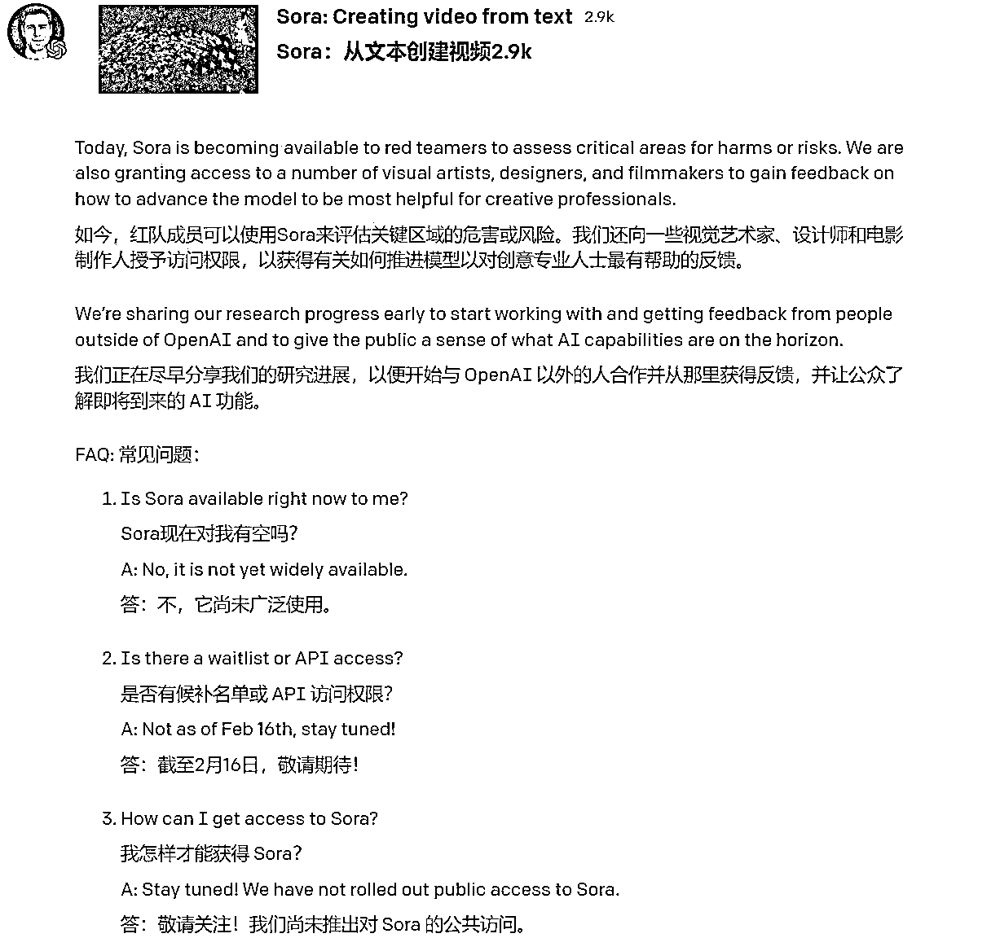
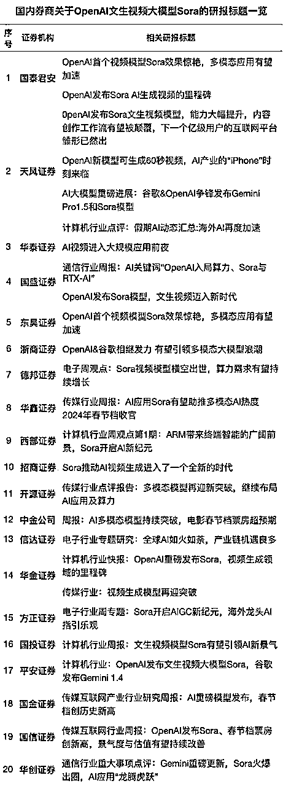
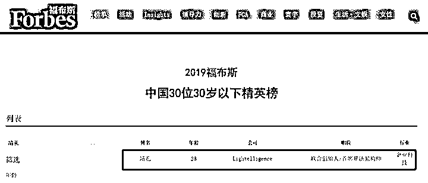
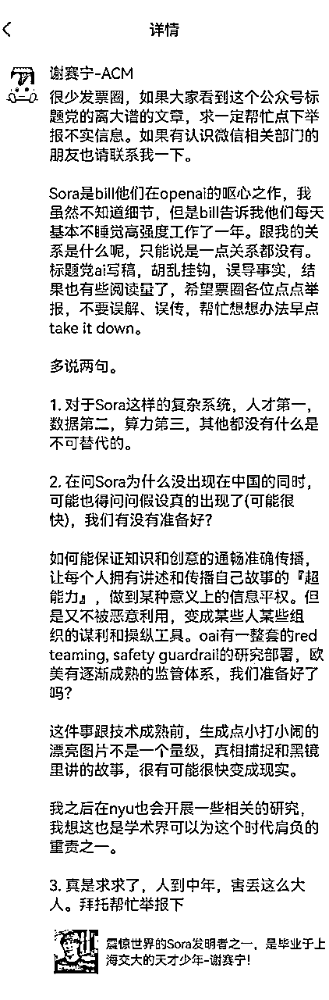

# 三、月航海 Sora 交流 资讯合集

> 来源：[`jviztcgxxfy.feishu.cn/docx/Ah95dcemYoSTKZxYqMOcBMXAnPf`](https://jviztcgxxfy.feishu.cn/docx/Ah95dcemYoSTKZxYqMOcBMXAnPf)

合集出品方：生财有术团队

出品时间：2024 年 3 月 20 日

合集使用说明：内容出品人排名不分先后。本文旨在向你展示一个项目的更多可能性，帮助你更好地理解和实操。

建议：如果需要快速定位到精确内容，可以使用快捷键 Ctrl + F/command + F 的形式，搜索「关键字/词」，查找你想要的内容。

# 写在前面

Hi，欢迎你来到 3 月航海 | Sora 交流 | 资讯合集，相信在接下来的日子里，我们将在这里见面很多次。

2 月 16 日，Open AI 宣布推出全新的生成式人工智能模型“Sora”，引起广泛关注。也许是因为 Sora 表现出来的效果令人惊艳，也许是因为我们生活在一个处处是视频的世界，我们会感觉到 AI 时代越来越与每个人都息息相关。

无论是否在 AI 领域的人，都非常关注 Sora 能做什么事情，做出来的视频效果如何，什么时候上线等等问题。

目前 Sora 还在内测，其他 AI 视频产品正在发力，而我们要做的，就是尽可能早一些掌握相关信息，拥抱变化，做好迎接未来的准备。

这个合集怎么使用？

本合集由圈友 @大国 支持整理汇总，提供了大部分资讯，其中很多有价值，多元化的信息。

一千个读者眼中就会有一千个哈姆雷特，每条信息于每个人来说价值是不同的，因此你可以这样使用该合集：

1.大致浏览一遍文档，了解有那些信息模块；

2.根据文档步骤或自己的喜好进行详细阅读，在航海日志记录自己对于相关信息差的思考；

3.想了解某个部分更多信息，可以针对性阅读，并尝试自己搜索更多相关信息；

4.积极参与航海群内的讨论，交流可以迸发出更多思考碰撞，你可能会获得另一个视角的解读。

目前 Sora 还在内测中，信息更新的很快，这里的一些内容很有可能很快过时失效，大家要保持精进，持续学习，多多关注 Sora 相关更新、国内外其他相关产品等动态变化，获取最新信息，跟上它迭代的脚步。

注意：目前 Sora 还在内测中，并未给出太多的信息，也没有入口可以实操，上线时间也并未确定，我们当下只能做到了解相关信息，对于市面上 Sora 相关课程，请大家谨慎对待，以防被骗。

最后，希望大家可以在这次航行里收获成果外，也能结识一群战友。

以下内容由生财有术联合圈友 @大国 制作而成，仅供航海船员以及生财有术星球圈友学习使用。

同时也欢迎圈友们在实践过程中持续反馈，和我们共同完善，可以联系鱼丸（yuwan387）提供修改建议～

## 一、Sora 是什么？

### 1.1 基本介绍

在 2024 年 2 月 16 日，Open AI 宣布推出全新的生成式人工智能模型 “Sora”。据了解，通过文本指令，Sora 可以直接输出长达 60 秒的视频，并且包含高度细致的背景、复杂的多角度镜头，以及富有情感的多个角色。

这意味着，继文本、图像之后，OpenAI 将其先进的 AI 技术拓展到了视频领域。OpenAI 亦表示，Sora 是能够理解和模拟现实世界的模型的基础，这一能力将是实现 AGI（通用人工智能）的重要里程碑。

对于 OpenAI 视频生成模型的出现，业内其实早有预期，但仍有人评价称“比想象中来得更快”，亦有人振奋地表示“我们真的看到新工业革命来临”。

Sora 的 60 秒视频基本上展示了它解决了以下 3 个 AI 视频技术难题：

（1）真实物理世界的逼真模拟

（2）角色的一致性

（3）长镜头的稳定性

官方地址：

目前 OpenAI 官网上已经更新了 48 个 Sora 生成的视频 demo，色彩艳丽，效果逼真。

2024 年的真正红利点：文生视频。

友情提示：目前 sora 没有对外开放，也没有内测申请，请不要相信任何账号买卖，课程培训！

### 1.2 模型效果对比

05f698ff0d851448e2749474649b3b.mp4【在线播放】

### 1.3 Sora 的 6 大优势

《每日经济新闻》记者经过对官方技术报告的梳理，总结出了 Sora 的 6 大优势：

（1）准确性和多样性

Sora 的显著特征之一是能够准确解释长达 135 个单词的长提示。它可以准确地解释用户提供的文本输入，并生成具有各种场景和人物的高质量视频剪辑。

这一新工具可将简短的文本描述转化成长达 1 分钟的高清视频。它涵盖了广泛的主题，从人物和动物到郁郁葱葱的风景、城市场景、花园，甚至是水下的纽约市，可根据用户的要求提供多样化的内容。

（2）强大的语言理解

OpenAI 利用 Dall-E 模型的 re-captioning（重述要点）技术，生成视觉训练数据的描述性字幕，不仅能提高文本的准确性，还能提升视频的整体质量。

此外，与 DALL·E 3 类似，OpenAI 还利用 GPT 技术将简短的用户提示转换为更长的详细转译，并将其发送到视频模型。这使 Sora 能够精确地按照用户提示生成高质量的视频。

（3）以图/视频生成视频

Sora 除了可以将文本转化为视频，还能接受其他类型的输入提示，如已经存在的图像或视频。这使 Sora 能够执行广泛的图像和视频编辑任务，如创建完美的循环视频、将静态图像转化为动画、向前或向后扩展视频等。

OpenAI 在报告中展示了基于 DALL·E 2 和 DALL·E 3 的图像生成的 demo 视频。这不仅证明了 Sora 的强大功能，还展示了它在图像和视频编辑领域的无限潜力。

（4）视频扩展功能

由于可接受多样化的输入提示，用户可以根据图像创建视频或补充现有视频。作为基于 Transformer 的扩散模型，Sora 还能沿时间线向前或向后扩展视频。

从 OpenAI 提供的 4 个 demo 视频看，都从同一个视频片段开始，向时间线的过去进行延伸。因此，尽管开头不同，但视频结局都是相同的。

（5）优异的设备适配性

Sora 具备出色的采样能力，从宽屏的 1920x1080p 到竖屏的 1080x1920，两者之间的任何视频尺寸都能轻松应对。这意味着 Sora 能够为各种设备生成与其原始纵横比完美匹配的内容。

而在生成高分辨率内容之前，Sora 还能以小尺寸迅速创建内容原型。

（6）场景和物体的一致性和连续性

Sora 可以生成带有动态视角变化的视频，人物和场景元素在三维空间中的移动会显得更加自然。Sora 能够很好地处理遮挡问题。

现有模型的一个问题是，当物体离开视野时，它们可能无法对其进行追踪。而通过一次性提供多帧预测，Sora 可确保画面主体即使暂时离开视野也能保持不变。

### 1.4 Sora 可能带来的影响

如果 Sora 能够真正意义上实现文生视频，可能会带来哪些影响呢？

1、没有演员的影视作品出现，对演员来说是个小挑战，将出现真正的“虚拟偶像”，此前的二次元人物并没有真正达到“偶像”的级别。

2、利好编剧行业，剧本、文本创作力成为核心竞争力。

3、Sora 可能才是真正的文生视频，此前的文生视频大多只有 2 秒，仅仅是对象的小幅度移动。

4、OpenAI 继续拉大领先程度，对众多还在进行大模型测试打分 pk 的厂商，构成压力。

5、直接的影响是影视行业，特别是特效行业。使用 AI 来制作一些特效和高风险的镜头，可以大幅降低拍摄成本，也可以避免很多危险。

6、摄影师行业也会受到影响，用文本来生成一些视频，可以省去很多拍摄工作。

7、短视频流行开以后，视频剪辑师也随之成为一个热门职业。如果视频剪辑的工作可以用 AI 来代替，可能会有很多视频剪辑师失业。

8、对于很多短视频创作者来说，用 AI 来替代繁琐的剪辑工作，可以大幅提高工作效率。

9、很多歌手拍摄 MV 都是大成本制作，如果可以用 AI 来生成所需要的 MV 画面，也可以省去很大一部分制作成本。

10、另外，如果真正意义上的文生视频得以实现，可能会有不法份子利用这项技术实施新手段的违法犯罪。

不过，从 Sora 官网目前展示的视频画面效果来看，效果还没那么逼近真实，短期内不会产生让行业失业，但会有辅助作用，做个动画片应该问题不大。

在 Sora 官网，OpenAI 表示，Sora 是能够理解和模拟现实世界的模型的基础，OpenAI 相信这一能力将是实现 AGI 的重要里程碑。

至于 Sora 文生视频到底能带来多大影响，会不会翻车，还需要“让子弹飞一会儿”。

关联阅读：

笔记侠：Sora 降世，5 大行业一夜变天！

中央政法委长安剑：Sora 来了，哪些行业将受冲击？

任泽平：Sora 横空出世，会颠覆哪些行业？

中国电影报：大模型 Sora 对影视创作的影响

### 1.5 正式发布时间预测

曾有人根据 OpenAI 之前的发布节奏推测了 Sora 的发布时间，但 Sora 团队负责人表示：Sora 还不是一个产品，短期不会向公众开放。

目前来看 Sora 的发布可能没有那么快。

【Sora 团队负责人：Sora 还不是一个产品 短期不会向公众开放】

3 月 13 日，Sora 核心团队三位负责人露面接受了专访。他们在采访中透露，Sora 目前还处于反馈获取阶段，还不是一个产品，短期内不会向公众开放。

除了这个发布时间之外，Mira 还披露了 Sora 的其他几个关键信息：

### 1.6 内测申请通道及目前情况

需要强调给大家的一点是，截止至 2024 年 2 月 18 日，Sora 目前没有公开测试，也没有内测申请渠道，国内是没有渠道可以去尝试的，下面这个信息源不一定真实，大家仅供参考。

https://forum.openai.com

OpenAl 的官方论坛，据消息透露加入论坛有机会获得内测资格

之前 Red Team 有过公开招募，要求比较高，目前已停止招募。Sam 之前说过，如果进入到红队，可以有 Sora 的内测机会：https://openai.com/form/red-teaming-network

## 二、Sora 有什么能力？

这部分在官方的文档中有所说明，另外可以看看圈友 @云舒 的星球帖，其中的第三章 Sora 能力解析，云舒在 OpenAI 官方公布的文章的基础上来给大家解析 Sora 的能力。

官方文档：Video generation models as world simulators

云舒的星球帖：《Sora 深度解析：OpenAI 的文生视频革命》

## 三、演示案例

### 3.1 官方示例

① 提示：几只巨大的毛茸茸的猛犸象踩着白雪皑皑的草地走近，它们长长的毛茸茸的毛毛在风中轻轻吹拂，远处白雪皑皑的树木和壮观的白雪皑皑的山脉，午后的光线与薄薄的云层和远处高高的太阳营造出温暖的光芒，低相机视角令人惊叹，用美丽的摄影捕捉了大型毛茸茸的哺乳动物，景深。

2ad70fa0af3f48790b735ad1f1aeaf76.mp4【在线播放】

② 提示：一段精美的自制视频，展示 2056 年尼日利亚拉各斯的人们。用手机摄像头拍摄。

OpenAI 的 Sora 模型确实牛 P 它的确能模拟真实世界，包括学习了摄影师和导演的表达手法： 提示：一段精美的自制视频，展示 2056 年尼日利亚拉各斯的人们。用手机….mp4【在线播放】

③ 提示：一位时尚的女人走在东京的街道上，街道上到处都是温暖的发光霓虹灯和动画城市标志。她身穿黑色皮夹克，红色长裙，黑色靴子，背着一个黑色钱包。她戴着墨镜，涂着红色口红。她自信而随意地走路。街道潮湿而反光，营造出五颜六色的灯光的镜面效果。许多行人四处走动。

演示.mp4【在线播放】

④ 提示词：一只蚂蚁在蚁巢内部移动的视角镜头

WeChat_20240218175600.mp4【在线播放】

⑤ 提示词：一座巨大的教堂里全是猫。到处都是猫一个男人走进大教堂，向坐在宝座上的巨型猫王鞠躬

案例 1.mp4【在线播放】

⑥ 提示词：一段逼真的蝴蝶视频，它可以在水下游过美丽的珊瑚礁

WeChat_20240218211204.mp4【在线播放】

⑦ 提示词：一片叶子的宏观照片，显示微小的火车在其静脉中移动

WeChat_20240218211217.mp4【在线播放】

### 3.2 Open AI 官方 TikTok

#### 2 月 24 日合集

WeChat_20240225122522.mp4【在线播放】

提示词：“一只乌龟的身体是由玻璃制成的，裂纹已用 kintsugi 修复，正在日落时的黑沙滩上行走”

WeChat_20240224100229.mp4【在线播放】

#### 2 月 21 日合集

最新 Sora 视频，由 OpenAI Tiktok 号发布 。

WeChat_20240225122347.mp4【在线播放】

提示词：一只穿着黑色连帽运动衫的电脑黑客拉布拉多猎犬坐在电脑前，当他快速打字时，屏幕的眩光照射在狗的脸上。

7a654892637bcfcc306afd5a995984ed.mp4【在线播放】

提示词：低质量、视觉效果令人失望的超级碗广告

453c235c4b0275a5701af00e55205671.mp4【在线播放】

提示词：披萨做的匹萨斜塔

e8d90be3a652d264c05dfef87472b5cf.mp4【在线播放】

#### 2 月 20 日合集

提示：“低至地面的摄像机密切跟踪丛林中的蚂蚁，深入地下进入它们的世界”

f697a4812a0db9e28911b4962f16ff43.mp4【在线播放】

Sora 可以根据文本创建逼真且富有想象力的视频，但 Sora 也可以带来静态图像，例如这些创作，走向生活。

提示 1：“小土豆国王戴着雄伟的王冠，坐在王座上，监督着他们广阔的土豆王国，里面充满了土豆臣民和土豆城堡。”

提示 2：“咖啡馆的小地图立体模型，装饰着室内植物。木梁在上方纵横交错，冷萃咖啡站里摆满了小瓶子和玻璃杯。”

提示 3：“一张写有“SORA”的写实云朵图像。”

335068c586656c8231c5f3ea1edcbd12.mp4【在线播放】

### 3.3 视频案例合集

传送门：http://mianfei.chat/sora

传送门：https://www.aisora.org/

传送门：https://sorahub.video/

每天自动抓取网络上的 Sora 视频，支持下载视频，涵盖视频提示词！

传送门：https://soraai.fun/zh/

集合并展示当前 Sora 制作的视频，以及 Youtube 上相关讲解视频。

磨铁文化归纳：

Sora Demo 视频

### 3.4 提示词三方研究人员

Sora 研究人员 Bill Peebles 发布视频展示：Sora 能够同时生成多个视频，这些视频并排显示，提供了不同的视角。

在他分享的示例中，一个单独的视频里就包含了五个不同的视角，这显示了 Sora 的先进技术能力，它能够在不需要人工编辑的情况下，自主决定展示多个视角。

Sora 研究人员 Bill Peebles 发布视频展示：Sora 能够同时生成多个视频，这些视频并排显示，提供了不同的视角。 在他分享的示例中，一个单独的视频里就包含了五个….mp4【在线播放】

### 3.5 Sora 与 AI 合成音效

@ elevenlabsio 的合成音效服务给 Sora 生成的视频自动配了音，原始通过提示词＋ Video Pixel 识别！我们离 AI 为我们生成的沉浸式世界的未来越来越近。

WeChat_20240225122359.mp4【在线播放】

### 3.6 Sora 震撼视频合集剪辑合成

WeChat_20240225123243.mp4【在线播放】

## 四、技术原理剖析

### 4.1 官方技术报告文（中英文对照）

Sora 模型基于 Transformer 架构，建立在 DALL·E 3 和 GPT 模型之上，使用文本到视频的合成技术，按文本提示生成视频。这种技术将自然语言转换为视觉表示形式——图像或视频。

OpenAI 在官网展示 Sora 的生成逻辑

深度神经网络依然是 Sora 的基础，它是一个带有 Transformer 骨架的扩散（Diffusion）模型，AI 从数据中学习并执行复杂的任务。Sora 就是从“学习”的大型视频数据集里学会了各种风格、主题和流派。

Transformer 模型本质是一个编码器-解码器，输入原始语言，生成目标语言。扩散模型的原理是先给数据添加高斯噪声，再反向去除，从中恢复数据本貌。

简单粗暴地理解 Sora 的原理，就是翻译器+搜索引擎+概率制作（内容）。

首先，拿到提示词后，Sora 先分析文本，提取关键字，比如主题、动作、地点、时间和情绪，再从它的数据集里搜索与关键字匹配的、最合适的视频。

其次，Sora 将数据集里合适的视频混合在一起，重新创建一个符合要求的视频。在“创造”的过程中，它要“知道”场景中有哪些对象和角色，它们的外形，它们如何运动，对象如何交互，以及受到环境影响后如何表现。

根据用户的喜好，Sora 会修改视频的风格。假如用户想要一个 35 毫米胶片样式的视频，Sora 会调整效果，更改图像的亮度、色彩和摄像机角度。这一点和 Midjourney 等“文生图”应用类似。

Sora 可以生成分辨率 1920x1080 的视频，也可以基于静止图片创建视频，使用新素材扩展现有素材。比如用户给它一张森林图片，它可以帮你加上鸟、兽、人。给它一张汽车行驶图，它能加上道路、交通灯、沿途建筑物和风景。

Sora 将两段视频结合后产生的奇幻景象/OpenAI

### 4.2 SORA 的超详细解读文

最强文生视频模型 SORA 超详细解读

### 4.3 腾讯科技拆解文

OpenAI 王炸模型引爆科技圈，我们第一时间深读了官方技术报告

### 4.4 阿里巴巴分析文

1.复刻 Sora 有多难？一张图带你读懂 Sora 的技术路径

2.一文看 Sora 技术推演

### 4.5 其他笔记

1.Sora 是怎么训练出来的 | 笔记

2.万字长文 | Sora 技术解析报告

### 4.6 思维导图版技术解读

### 4.7 Sora 技术参考论文

里面为论文列表，点击自己想看的论文即可跳转到具体内容：Sora 参考论文。

## 五、应用展望

### 5.1 搞流量

流量=钱，AI 领域新产品的出现总会伴随着所有人的关注，Sora 在视频生成领域的出现不亚于大语言模型的 GPT-4.0，此时的流量生意总是能最先拿到结果的生意，现在大把的 Sora 公众号爆文，爆款短视频，用来获取流量非常可观，咱们先不管是捧还是骂，话题度在。

### 5.2 卖账号

目前的 Sora 模型还没有对普通用户开放，不过大家都已经迫不及待了。就像当年的 ChatGPT 一样，OpenAI 的账号销售一定能继续大卖。只是国内的大语言模型和国外的相比，许多普通人并不能进行完整地分辨，等到文生图的时候，差距逐渐显现，等到真正 Sora 对普通用户开放的时候，国内外的差距就比较明显了。这个时候，会有更多的人想用上 Sora。

### 5.3 卖课程

课程永远是 AI 行业不缺的赚钱渠道，目前 AI 行业做课程赚的最多的当属李一舟，据说年入 5000 多万，而 Sora 还没开放账号，已经有课程上线了，这就是“搞钱”的原动力！AI 工具使用的课程会长期成为 AI 行业的赚钱赛道，也算是先行者的付费布道，课程要在有产品以后发布。

友情提示：仅示例，请勿购买

### 5.4 套壳

众所周知的原因，国内乃至全国的套壳网站和应用众多，只要你有一定的流量或者推广渠道，套壳网站会为你持续带来收益。目前 Sora 的推出，已经有人开始通过套壳网站赚到第一笔年费了。

目前的套路是注册含有关键词 sora 的域名，同时应用商店提交 Sora 相关的 app，同时接入 Runway 等产品的 API，先把流量跑出来，等到 Openai 发布 Sora API 的时候，再进行切换，从而丝滑过渡。

### 5.5 投资

如果你是二级市场投资客，那么关注 AI 行业一定能让你赚到（中国股市可能除外），Sora 的推出，利空哪家公司呢？

Adobe!

受 Sora 发布的影响，Adobe2 月 16 日当日跌幅达到 7.41%。如果此前做空 Adobe，那是要赚上一笔了。

### 5.6 提示词交易

去年的 AI 绘画提示词交易很火，今年 AI 文生视频的提示词一定也会有市场，从提示词打包交易到提示词交易平台。

日光之下并不新事。

### 5.7 剧本创作

文生视频提示词的升级是视频的剧本创作，无论是长视频还是短视频，更依赖剧本的创作，这更依赖于创作者。

从这个角度来看，Sora 的发布是非常利好内容创作者。如果把未来的视频创作比如电影创作的话，那么编剧的权重在进一步强化，或者是编剧、导演和制片在进一步融合。大团队面临挑战，而小团队的机会在进一步上升。

### 5.8 视频制作

视频生成这个业务勿庸多言，Sora 就是干这个的，大家只要充分地学习和试错，做出更好的视频（质量和数量），赚钱的机会一定有。在 AI 绘画时代已经切入的团队和个体会更有机会，毕竟前期的铺垫已经足够了，学习成本很低。

### 5.9 原业务优化

AI 工具对生产力的提升是毋庸置疑的，如何直接用 AI 工具进行商业变现，不如考虑在原有的业务上进行 AI 化。

商业的竞争说到底还是生产率的竞争，成本打下来了，自然就有价格调整的空间了，也就有更大的获客和竞争优势了。只要是涉及视频类的公司（我说的是“涉及”，这与 08 部分并不一致），都应该重视 Sora 的使用，考虑如何将其融入进原业务。

### 5.10 企业服务

部分做传统行业的公司并没有自我 AI 化的能力，那么就可以有相关的 AI 团队来进行咨询服务，从做事的本质上来讲有点像以前的咨询公司，只是这样的咨询公司对 AI 理解和使用更深入，同时这样的咨询公司一定是高度关注和践行 RPA（机器人流程自动化）。

除此以外，企业服务的另一种商业化形式就是商业化的软件工具，在行业领域内融合专业知识和生产流程，再利用像 Sora 这样的 API 实现相应的生产功能，最终商业变现。

### 5.11 Sora+电商

用 Sora 生成各类电商产品宣传视频投流，或者制作各类短视频，嵌入产品进行推广，参考 AI 模特变装、虚拟试衣等。

### 5.12 开发与 Sora 相关的网站或工具

针对具备技术背景的人士，开发与 Sora 相关的网站或工具，如导航网站或 AI 写真工具，以此获取收益，当然也可以储备 Sora 相关的域名。

### 5.13 其他圈友分享的机会

## 六、名人观点&相关报道

### 6.1 360 董事长周鸿祎

### 6.2 中央电视台台长慎海雄

### 6.3 媒体人胡锡进

### 6.4 特斯拉 CEO 马斯克

### 6.5 Runway 联合创始人兼 CEO Cristóbal Valenzuela

感慨后浪拍前浪，以前需要花费一年的进展，变成了几个月就能实现，又变成了几天、几小时。

### 6.6 出门问问 CEO 李志飞

### 6.7 前阿里副总裁贾扬清

评价简单粗暴：“真的非常牛。”他认为“对标 OpenAI 的公司有一波被其他大厂 fomo（害怕错过）收购的机会”，“开源还需要一段时间才能 catch up”，算法小厂“要不就算法上媲美 OpenAI，要不就垂直领域深耕应用，要不就开源”，并预言“infra 的需求继续会猛增”。

### 6.8 相关报道

#### 6.8.1 商业博主刘润

刘润：OpenAI 全新发布的 Sora，到底意味着什么？

#### 6.8.2 AI 博主卡兹克

OpenAI 全新发布文生视频模型 Sora - 现实，不存在了

#### 6.8.3 量子位

效果炸裂！OpenAI 首个视频生成模型发布，1 分钟流畅高清，网友：整个行业 RIP

#### 6.8.4 钛媒体

许四清：Sora 进一步拉大了中美 AI 差距

#### 6.8.5 新智元

OpenAI 首个 AI 视频模型炸裂登场，彻底端掉行业饭碗！60 秒一镜到底惊人，世界模型真来了？

#### 6.8.6 清华大学

OpenAI 发布文生视频模型 Sora，AIGC 视频时代正加速到来

#### 6.8.7 央视网

OpenAI 首个文生视频模型亮相，你觉得咋样？

#### 6.8.8 新华社

Sora 来了，会砸掉谁的饭碗？

#### 6.8.9 CSDN

OpenAI 大杀四方，Sora 彻底革了视频的命

#### 6.8.10 中泰证券

文生 3D——人工智能的下一站

中泰证券表示，以大模型、生成式为代表的新一代人工智能技术与产业变革如火如荼，从 Chat GPT 代表的文生文，到 DALL·E 代表的文生图，再到 Sora 代表的文生视频，“暴力美学”在持续突破技术的天花板，多模态也成为了共识的发展趋势，继文本、代码、图片、视频之后，中泰证券认为下一个有可能实现突破的模态大概率是 3D。

目前海外在 AI+3D 技术上主要分为工业场景探索与非工业场景探索。非工业场景应用探索主要以谷歌的 DreamFusion 和英伟达的 Magic3D 为代表，主要面向游戏、元宇宙中的 3D 资产设计；工业场景应用则主要以衍生式设计软件为主，如 PTC 的 Creo 以及 Autodesk 的 Fushion 360 均提供衍生式设计能力。投资建议：产业视角建议持续跟踪关注文生 3D 建模领域的进展。

## 七、研究报告

### 7.1 券商报告

### 7.2 投资纪要

### 7.3 行业报告

## 八、 国内大厂文生视频布局动态

大厂在视频领域的动作不断，基本上在推进语言模型业务的同时也布局了视频业务：

## 九、对投资市场的机会

### 9.1 Sora 将为 AI 赛道带来的投资机会

止于至善投资总经理何理：Sora 的发布有望再度掀起 AI 上涨热潮。尽管 Sora 的视频时间仅有一分钟，但按照 OpenAI 的迭代速度，生产出几十分钟的 AI 视频也不远了。未来数年内，将对整个影视制作和短视频行业带来颠覆性冲击。目前 AI 热潮已进入第二阶段，重点在于产品层面的 AI 创新以及数据层面的业绩检验。未来行情的爆发属于应用端与基建端并举，应用端重点关注与 AI 融合较好的 TOB 端应用，基建端主要关注 GPU、光模块、液冷、数据要素等。

中信建投证券：AI 仍然是当前科技投资的主线，海外 AI 大模型和应用保持较快迭代速度，随着 Sora、Gemini 1.5 Pro 等大模型的发布，多模态能力显著增强，应用场景进一步拓宽，这将带动算力基础设施的投资，建议关注光模块、ICT 基础设施等板块。

申万宏源：对于短视频 UGC 平台，借助 AI 升级剪辑工具拉动创作者经济的进一步发展，但也需关注是否会有竞争的变化。对于深度内容受益，IP 价值提升，对浅显低门槛内容竞争加剧。对创意工具，应对竞争的要素是 B 端客户粘性和版权库积累。AI 造假或影响新闻生产和传播，识别 AI 视频将是内容审核关键环节。可关注光通信产业链、算力设备产业链、多模态算法布局、有丰富 IP 储备的深度内容创作、商业化 AI 应用场景的美图等方向。

招商基金：AI 赛道大概率仍是未来一段时间的主线之一，后续仍可重点关注 AI 产业链内算力与应用的配置机会。 博时基金：受海外 AI 应用取得突破性进展的催化，AI 板块走势强劲。当前 AI 板块的产业逻辑较为顺畅，后续的增长持续性或有望提升，业绩也有可能超预期，相对看好其未来表现。

### 9.2 上市公司反应

据财联社不完全统计，截至发稿，包括岭南股份、名臣健康、因赛集团、首都在线、中科信息、萤石网络、凌云光、芒果超媒、华是科技、东港股份、实丰文化、世纪天鸿、天创时尚、创源股份、巨人网络、会畅通讯、千方科技、北信源、智微智能和掌阅科技在内的 20 家上市公司近两日在互动平台回复 Sora 相关情况。

其中，北信源表示，公司与 Open AI 已对接完成文生图的技术研究工作，Sora（文生视频）是 Open AI 最新发布的技术，目前公司正在做技术相关方面对接和研究。

此外，因赛集团、云从科技、当虹科技、易点天下、汉王科技、博汇科技、海康威视等上市公司还通过其他方式回复 Sora 相关情况。

其中，据媒体报道，因赛集团工作人员表示，按计划，公司 AIGC 项目团队将在三月进行文生视频功能的开发，等待时机成熟后投入公测。

另据科创板日报报道，当虹科技相关负责人表示，文生视频技术已取得一定进展，在生成视频时长和效果方面，还在逐渐突破。

【蓝色光标：预计 2024 年由 AI 驱动的收入有望实现 10 倍以上增】

财联社 2 月 22 日，近期，文生视频模型 Sora 引发市场极大关注，蓝色光标 CEO 潘飞在接受财联社记者采访时表示，蓝色光标在去年已经在大量实践用 AI 的方式生成视频，团队已能熟练运用包括 Runway、Pika、Wonder Studio 在内的多种模型，根据内容需要生产 AI 视频。

Sora 全面应用后，一定会让视频创作得到新的智能涌现，视频案例也将呈现井喷式发展。公司已有过千个案例（含出海业务）是通过生成式 AI 赋能创造出来的，其中深度驱动并带来规模化收入的案例约在 1/3 以上，AI 驱动的收入在 1 个亿以上。预计 2024 年由 AI 驱动的收入有望实现 10 倍以上的增长。（财联社记者 崔铭）

【中文在线：公司海量 IP 未来或可运用 Sora 或类似应用生成短剧/短视频】

财联社 2 月 21 日，中文在线接受调研时表示，Sora 是 OpenAI 发布的人工智能文生视频大模型。公司拥有海量的文字 IP，以及 IP 衍生开发的成熟商业化链条。

从目前公开信息来看，Sora 在相当程度上会进一步提高生产效率、降低制作成本，公司拥有海量的 IP 未来或可运用 sora 或类似应用生成短剧/短视频，通过公司现有成熟短剧或短视频营销等商业路径进行规模化、商业化的变现。

【华策影视：目前技术储备已可实现 4 秒时长的文生视频】

财联社 2 月 21 日，华策影视在互动平台表示，公司高度重视各类 AI 技术的研发和应用，对以 Sora 为代表的新兴 AI 文生视频技术平台保持密切关注。

公司去年组建了 AIGC 应用研究院，自研的编剧助手、剧本评估、视频检索、AI 剧照等功能已在内部应用或内测。

通过对开源技术的学习吸收和消化，目前技术储备已可实现 4 秒时长的文生视频。公司将积极探索文生视频等新兴 AI 技术在传媒领域的落地应用与业态创新。公司在 AI 领域的技术储备短期内不会直接贡献业绩。

【国投智能：公司 AI-3300“慧眼”视频图像鉴真工作站可鉴别 Sora 文生视频】

财联社 2 月 20 日，有投资者提问国投智能：“公司的 AI-3300 慧眼视屏鉴真工作站能否鉴别 Sora 文生视频，并出鉴定报告？”对此，国投智能在互动平台表示，公司的 AI-3300“慧眼”视频图像鉴真工作站，可以鉴别该类视频，并支持出具鉴定报告文书。国投智能还表示，该产品已经向客户销售。

目前 AI 视频有两个较大的门槛，一是算力的掣肘，视频领域对算力需求更高；另一方面是竞争环境的激烈，当前头部科技巨头基本都已入局，只是产品尚未全面公测。值得注意的是，从 W.A.L.T 模型的例子来看，不能忽视算法的演进对 AI 视频领域的影响，曹旭特建议重点关注：视觉算法领先的虹软科技、当虹科技、格灵深瞳。同时可关注应用侧的金山办公、万兴科技、福昕软件等。

据不完全统计，涉及 AI 视频视觉算法相关业务的上市公司有当虹科技、虹软科技、深科达、格灵深瞳、天准科技、博杰股份等，具体情况如下：

### 9.3 国内人工智能 AI 大模型发展

2024 年 2 月 19 日，国内 AI 创业公司北京月之暗面完成新一轮超 10 亿美金融资的信息传出，业界震惊。

这是自 ChatGPT 掀起全球浪潮以来，国内 AI 大模型公司迄今获得的单轮最大金额融资。

投资方包括红杉中国、小红书、美团、阿里，月之暗面也因此离跻身全球最顶流 AI 公司更进一步。

## 十、延伸学习

### 10.1 央视报道

555903b68f3a424f83a20c2d80ece3.mp4【在线播放】

### 10.2 中国首部 AI 动画片《千秋诗颂》

2 月 23 日晚上举行的中国首部 AI 动画片《千秋诗颂》启播暨中央广播电视总台人工智能工作室揭牌仪式上，上海人工智能实验室研发的文生视频大模型“书生·筑梦”亮相。这个 AI 模型已经开源，授权用户单位免费商用。它的参数量超过 30 亿，可根据输入的提示词生成有故事性、含多镜头的分钟级视频，具有转场流畅、故事连贯、画质高清等特点。

029d2c64-70b3-43d8-a3ee-844b196af83f.mp4【在线播放】

由于数据、算力等资源限制，'筑梦’在视频生成能力、时长、质量上与 Sora 还存在差距。”上海人工智能实验室领军科学家林达华博士说，“但另一方面，随着同总台的深度合作，实验室研发的型在对中华文化的理解表现，以及与媒体编创实际生产流程的融合上，逐渐显露出特色优势。这类产研结合的新技术发展模式，将使我国 AI 技术发展走出差异化道路，并形成我们的文化特色。

### 10.3 AI 视频玩家盘点

据不完全统计，过去一年来全球 AI 生成视频类赛道的融资已经超过数 10 亿美元，其中大部分的公司都以种子轮、A 轮为主。就在今年 1 月底，A16Z 还专门针对 AI 视频生成领域做了一个全面的回顾和展望，并盘点了市场上超过 20 个明星产品。

2023 年 AI 视频生成行业的参与者盘点

### 10.4 Sora 团队信息资料

Sora 模型背后的开发团队备受瞩目，团队成立不到 1 年，核心团队 15 人，包括来自伯克利的研发负责人 Tim Brooks 和 Bill Peebles，团队亦不乏华人身影。

#### 10.4.1 团队成员

公开资料显示，两位研发负责人 Tim Brooks 和 Bill Peebles 均博士毕业于伯克利人工智能研究所，导师同为 Alyosha Efros。

Tim Brooks 在伯克利期间发明了 InstructPix2Pix，曾在谷歌从事为 Pixel 手机摄像头提供支持的人工智能工作，并在英伟达从事视频生成模型的工作。同时，他也是 OpenAI 文生图模型 DALL·E 的主要研究员。

除了技术，Tim Brooks 的摄影作品曾获得国家地理、自然的最佳摄影和国家野生动物联合会的奖项。此外还在纽约百老汇的灯塔剧院演出过，还曾获得 Beatbox 的国际奖项。

他表示：“我对人工智能充满热情，幸运的是，它与我对摄影、电影和音乐的热爱融为一体。”

William （Bill） Peebles（Bill 系 William 昵称）本科毕业于麻省理工学院，师从 Antonio Torralba，曾在 Adobe 和英伟达有过实习经历。

而在开发团队里面，不仅仅是 00 后不少，还有包括北大校友在内的几位华人研究员，以及 20 岁就加入 OpenAI 的天才工程师。

其中 Li Jing 是 DALL-E 3 的共同一作，2014 年本科毕业于北京大学物理系，2019 年获得 MIT 物理学博士学位。在 Meta 做了 2 年多博士后之后，Li Jing 于 2022 年加入 OpenAI。

2010 年，靖礼代表中国队参加第四十一届国际奥林匹克物理竞赛斩获金牌，并与其他三位金牌选手（俞颐超，吴俊东，张涌良）一起保送至北京大学（除吴俊东入读信息学院外，其余均被物理学院录取）。2014 年本科毕业后，赴麻省理工学院攻读物理学博士学位。

据悉，靖礼曾在 Meta 工作两年，并于 2022 年 10 月加入 Open AI 从事研究工作，研究领域包括多模态学习和生成模型，曾参与 DALL·E 3 的开发。2019 年，靖礼以 Lightelligence 联合创始人的身份，入选 2019 福布斯中国 30 位 30 岁以下精英榜。

华人作者中还有 Ricky Wang，今年一月刚刚从 Meta/Instagram 跳槽到 OpenAI。

延展阅读：解密 Sora 13 人团队：北大校友在内 3 名华人，应届博士带着 21 岁天才少年

#### 10.4.2 谢赛宁辟谣

而之前有部分自媒体传的“Sora 作者之一”的上交大校友谢赛宁，也发文紧急辟谣。

虽然谢赛宁并非 Sora 的研发团队成员，不过 Sora 技术报告中引用的一项研究成果 Dit 模型，正是谢赛宁与 Bill Peebles 合著。

从这个辟谣的细节也可以看出 Sora 开放领队 Bill Peebles 的团队工作状态，基本不睡觉高强度工作了近一年，这也从侧面否定了之前传闻猜测“Sora 早就开发完成”，Sora 是 OpenAI 实打实的最新研究成果。

只不过 Sam Altman 特地挑 Gemini 1.5 Pro 发布后 2 小时，公布 Sora，这绝对是进行策划的。

要知道本次 Gemini 1.5 Pro 的文本长度几乎无限（最多可达 1 千万 tokens，付费用户可以使用 100K 的 Tokens），这绝对是非常强大的功能。

本以为有如此王炸级别的更新，Google 志得意满想要收获热搜，没想到才过几小时，Sora 不可思议的视频进步，占据了整个社交媒体的热搜。

这种情况，很难认为这是碰巧。

事实上，Sam 精于此道，据说 ChatGPT 的火爆，正是他得知竞争对手 Anthropic 准备推出 Chatbot，他敏锐意识到这一类人工智能聊天工具的趋势，于是让所有的员工都停下手头工作，整合之前的研究成果，在 2 周内迅速调整并赶出了 ChatGPT 3 并进行发布，迅速占领了舆论并促成了 ChatGPT 的火爆。

#### 10.4.3 Open AI 的工作状态

而这一群优秀的科学家和工程师，他们的工作状态也是十分拼的，优秀的人会按照自己的意愿行事，下面是推特上一位 OpenAI 技术人员自述一天的状态：

我们先来看下 Jason Wei 的作息时间：

[9:00am] 起床；

[9:30am] 搭乘 Waymo 前往 Mission SF，途中在 Tartine 买个牛油果吐司；

[9:45am] 背诵 OpenAI 章程，向优化之神祈祷，学习《The Bitter Lession》；

[10:00am] 在 Google Meet 上开会，讨论如何在更多数据上训练更大的模型；

[11:00am] 敲代码，在更多数据上训练更大的模型；

[12:00pm] 去食堂吃午饭（素食，无麸质）；

[1:00pm] 真正开始在大量数据上训练大模型；

[2:00pm] 调试基础设施问题；

[3:00pm] 监控模型训练进度，顺便玩一下 Sora；

[4:00pm] 对前面提到的训练的模型进行提示工程；

[4:30pm] 短暂休息，坐在牛油果椅子上，思考 Gemini Ultra 的性能到底有多强；

[5:00pm] 头脑风暴，思考改进模型的潜在算法；

[5:05pm] 得出结论：修改算法风险太高，只扩展计算和数据更安全；

[6:00pm] 吃完饭；

[7:00pm] 通勤回家；

[8:00pm] 喝一杯酒，继续写代码，鲍尔默峰即将到来；

[9:00pm] 分析实验结果；

[10:00pm] 启动实验，让其运行一晚上，第二天查看结果；

[1:00am] 实验真正开始运行；

[1:15am] 上床睡觉；在纳德拉和黄仁勋的守护下入梦。压缩才是关键。晚安

单从时间来看，Jason Wei 从起床到睡觉，横跨了 16 个小时多，除了吃饭、通勤、睡觉，都在说工作，称其“卷”并不过分。

### 10.5 其他博主解读资料

## 附：资料整理出品人-大国的个人思考

大国玩 AI 一年多，几个心得体会分享给大家：

1，AI 不是风口，是未来深入到生活，工作，乃至思考的必备工具。

2，AI 的技术迭代日新月异，你可以怀疑当前的缺陷，但你不能怀疑 AI 不断智能的趋势。

3，AI 进化速度太快，其实会有人为干预，你无法想象 AI 来的太快，社会还没反应过来，政府要面临怎样的压力。

4，普通人多研究 AI 应用，把 AI 当做自己的思考一部分，这样才能保持不被淘汰。

5，不要过度恐慌 AI 带来的变革，但是容易被替代的岗位也不要太乐观。

6，普通人完全可以参与 AI 带来的机遇，也许你不懂技术，但是你可以认真研究应用场景，甚至探索新的应用场景，给更多的人做示范案例。

7，多看看国外的 AI 技术变革，国内一直在追国外的技术，其实差距还不止一点点，每次革命性的 AI 节点都是国外技术推动的。

8，在 AI 赛道创业，明显的是出海的创业项目增多了，这是很好的一个选择，海外市场比国内大得多，这是少有的国内国外一致进行的技术革命。

9，国内的各大内容平台，在迎合 AI 生产内容，甚至是不得不接受 AI 生产内容，因为这是趋势。

10，谁掌握了先进的生产工具，谁就是金字塔顶尖的那批人，这就是 AI 带来的机遇。