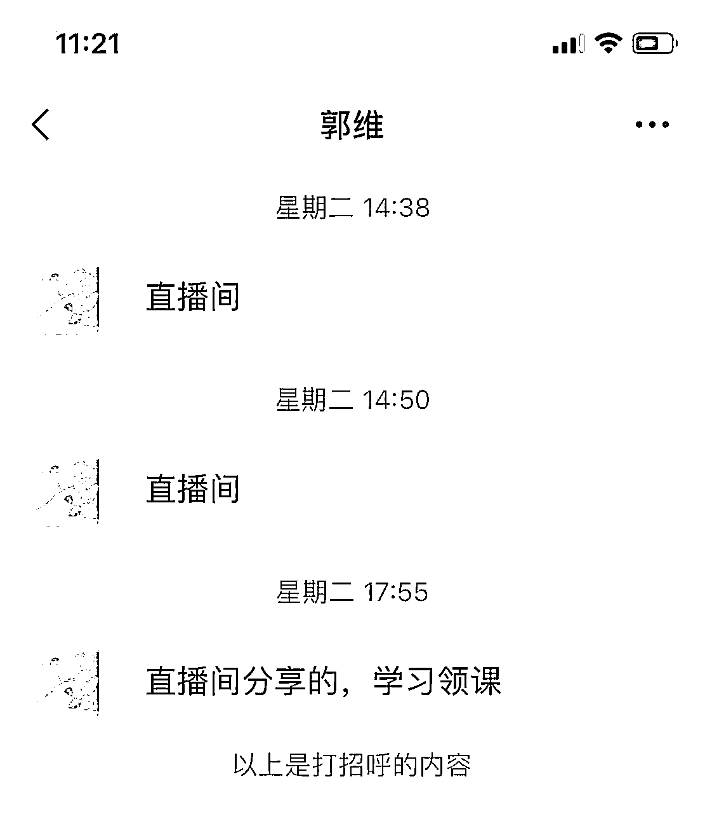
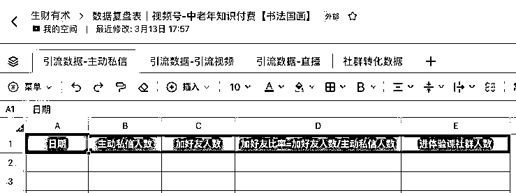
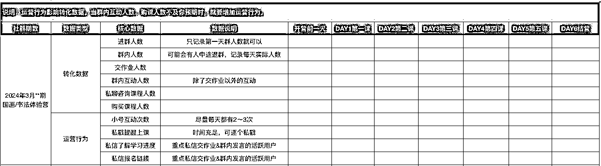
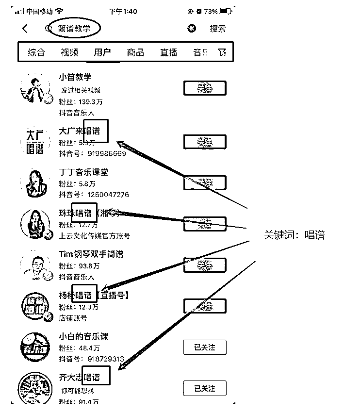

# 三、月航海 视频号-中老年知识付费（书法国画） 实战手册

> 来源：[`jviztcgxxfy.feishu.cn/docx/FptZdirn0oJ9lwxXvFIc7Rv2nnf`](https://jviztcgxxfy.feishu.cn/docx/FptZdirn0oJ9lwxXvFIc7Rv2nnf)

3 月航海 | 视频号-中老年知识付费（书法国画） | 实战手册

手册出品方：生财有术团队

出品时间：2024 年 2 月 27 日

手册使用说明：内容出品人排名不分先后。本文旨在向你展示一个项目的更多可能性，帮助你更好地理解和实操。

建议：如果需要快速定位到精确内容，可以使用快捷键 Ctrl + F/command + F 的形式，搜索「关键字/词」，查找你想要的内容

# 写在前面

欢迎大家来到 3 月航海 | 视频号-中老年知识付费（书法国画） | 实战手册，相信在接下来的日子里，我们将在这里见面很多次。

在开始做中老年书画知识付费项目之前，让我们先来解决几个问题：

1）视频号-中老年知识付费（书法国画）是什么项目？

视频号-中老年知识付费（书法国画），做的是通过视频号引流对书法国画感兴趣的用户，私域转化知识付费产品变现。

2）现状如何？新人还能入局吗？

一方面，市场大环境好。

中老年已经逐渐适应线上支付，他们有钱、有时间、爱分享，有较强的消费能力。

并且中老年知识付费尚处于早期阶段，他们还没有接受海量的信息冲击，对知识付费还没有产生抗拒情绪，类似于前几年的成年人知识付费的市场环境。

另一方面，视频号很适合做中老年流量。

视频号的中老年流量占比非常之高，书法国画是其中比较大的一个垂类，目前视频号极度缺少这个方向的垂类内容，基本上发其他平台混剪的视频，都会产生很大的流量。

分享个数据，国家统计局公布 2022 年末 60 岁及以上人口接近 3 亿人，占全国人口的 19.8%，那么如果是 45 岁以上的人群有多少，可想而知！

想赚钱，找到相对有红利的方向很重要，中老年书画类目目前就称得上是红利赛道。

不过，任何好的赛道，也需要持续的行动和努力，才能取得成功。

最后，希望大家可以在这次航行里收获成果外，结识一群战友。

以下内容由生财有术联合圈友制作而成，仅供航海船员以及生财有术星球圈友学习使用。

同时也欢迎圈友们在实践过程中持续反馈，和我们共同完善，可以联系鱼丸（yuwan387）提供修改建议～

# 【更新提示】新手册使用方式

在开始前，我们来简单了解一下这个手册的正确打开方式，方便你根据自己的情况来灵活使用。

在这里，手册整体的步骤顺序是按照从 0 - 1 跑通一个视频号-中老年知识付费【书法国画】项目进行的，你可以参考航线图，按顺序开始实操。也可以根据自己的实际需求选择性阅读。

需要注意的是：本次手册相较于过往航海，进行了较大的改版。之前的手册尽可能的展示更多可能的玩法供大家自由选择，本次改版后的手册，分为必修和选修两个大的章节：

如果你还未接触过了解视频号-中老年知识付费（书法国画）：

在正式实操前，先初步了解下项目全貌

【项目概述】了解视频号-中老年知识付费（书法国画）

如果你对项目整体已有大致的了解：

请从航线图第一阶段的步骤开始实操，这个阶段你可以从手册的第二章开始阅读，逐步完成整个项目

【项目实操 1/4】搭建视频号账号，确定销售品类

【项目实操 2/4】制作并发布视频

【项目实操 3/4】引流&成交

【项目实操 4/4】持续复盘优化

如果你已跑通 MVP ，想放大项目：

可以重点阅读以下章节，扩展更多玩法

【项目放大】六、矩阵号运营

【案例拓展】七、更多中老年知识付费案例

本航海项目的航线图如下：

航线图和手册是高度关联的，因此你可以根据自己所在的环节，进行相关步骤的学习。

以上阶段中，所有的航线图步骤建议大家在航海前两周完成，完成后，建议以复盘&优化&提效为主，持续发布视频、直播，提高引流人数，持续优化社群转化，扩大自己的出单量。

# 必修篇：跑通最小 MVP

### 必修篇概要

必修篇主要介绍视频号-中老年知识付费（书法国画）的【项目基本情况】和【项目基础玩法步骤】，让你对项目有一个全面了解，并按步骤完成项目的 0-1，跑通最小 MVP 。

如果你是本项目新手，建议在正式实操前，先初步了解下项目全貌：

【项目概述】了解视频号-中老年知识付费（书法国画）

如果你对项目整体有了大致了解，就可以按照项目核心步骤，开始学习实操：

【项目实操 1/4】搭建视频账号，确定销售品类

【项目实操 2/4】制作并发布视频

【项目实操 3/4】引流&成交

【项目实操 4/4】持续复盘优化

在必修篇，航线图和手册顺序相对应，你可以按照手册的顺序进行学习，即可逐一完成航线图的每一个任务。

在后续的每个关键步骤的章节概要中，我们也将提到相关航线图，提醒你完成相关步骤。

接下来就正式开始吧！

## 一、【项目概述】了解视频号-中老年知识付费（书法国画） @渔火

#### 章节概要

本章节中，我们将一起认识视频号-中老年知识付费（书法国画）。

中老年知识付费行业现状如何？

普通人的机会有多大？

为何选择中老年书画赛道？

新手如何做好中老年知识付费？

项目的玩法和关键点是什么？……

这些，都是我们在本章节中会解决的问题。

本次航海的重点，就是告诉大家如何从 0-1 跑通视频号-中老年知识付费（书法国画）项目。

那么对整体的项目概况了解是必不可少的，一起来了解一下吧。

### 1.1 中老年知识付费行业现状

#### 1.1.1 中老年知识付费的几个发展阶段

2008-2015 混萌芽期，这个阶段很多人都不知道怎么做银发赛道，这几年大部分是做流量的平台，后期变现也表现不好，糖豆广场舞等垂直 APP 在那几年获取了大量的流量。

2015-2019 野蛮生长期，这个阶段，出现了一些垂直的平台。比如，美篇等社交平台，墨客、墨池、快乐 50 等垂直领域的机构，养老家政、健康睡眠等项目兴起，线下的老年大学（报名名额抢都抢不到），音乐相册、天气软件等工具类产品，得到了快速的发展，吃到了一波红利。

我自己深有体会，中老年知识付费，2015 年到 2018 年，绝对是野蛮生长的几年。

2020-2023 飞速增长期，这个阶段，大厂开始入场。先是红松短期内拿到了两笔由蓝驰、经纬等机构数千万美元的投资，知乎合伙人出来做的老年项目、尚德教育、大鹏教育、高途等等都开始做银发赛道的知识付费。

这几年走最简单的公众号投放，完全不需要任何投放技巧和文章的转化技巧，书法课、国画课的 ROI 可以做到 20，而且复购率超高，什么概念，一个月投放花 5 万，能卖 100 万，而且客单价可以轻松拉到 2000。

主要是用户巨便宜，当时我平均一个进群用户的成本在 5 元左右，还是垂直的兴趣粉，不是泛流量。对比同期的幼儿教育赛道和 K12 赛道，一个优质母婴流量就要几十块到一两百。

而且，我当时这个项目所有启动资金，仅有小鹅通的平台费 + 找老师录制的体验课费用（最开始卖期货，有体验课和长期课大纲就开始卖）+ 第一个月的投放费用，整体成本不超过 5 万，就滚到了第一年营收两百多万。

#### 1.1.2 中老年人群的消费能力

我曾花几个月蹲了各平台银发赛道评论区的热词。

发现经常会有，“老年人没有网购习惯”“银发人群手机都玩不明白”“我开过养老院赔了”等等，看完我深刻意识到很多人完全不理解这波人群的行为和消费习惯。

小镇银发确实不好做，但是都市银发可是妥妥的有钱有闲的人呀。都市银发，可是抖音八大人群之一。我自己的项目，获课范围就是一二三线城市的 40-75 岁人群，效果可是非常不错。

觉得中老年人玩不明白手机？移动互联网都发展多少年了，我们山沟沟现在都有 wifi 了。我给你们看看我的母亲，1968 年生人，我帮她做了个视频号，一个月都已经一万六的粉丝了。

（我妈每天催我给她脚本）

（我妈做了一个月的视频号）

每天直播加橱窗能卖个八百一千的货。一个前两年手机都玩不溜的人，现在都能线上卖货。所以，大家千万不要小看都市银发们的学习能力。

还有，很多人以为中老年买东西都买便宜的？

事实可并非如此。都市银发们的消费能力很强。

给大家分享个我自己的数据。

我中老年书画项目，一门课 500-2000 不等。我的用户平均复购 3 门课以上。

（某班级群作业圈，虽然是大字手机，但是也超爱分享）

如果是艾灸方向涉及健康的，客单价更高，很多中老年退休后，有的跟着孩子在国外生活，有的在大城市照顾孙子，有的回到了老家，但是这并不妨碍他们追求自己的兴趣和生活。

一句话总结就是：现在的都市银发，手机可以玩得溜，有钱，有时间、爱分享，对服务更关注、对线上付费逐渐适应并习惯。

#### 1.1.3 普通人的机会有多大？

最近两年，随着大厂进场来普及用户认知，更多中老年垂直方向的知识付费都迎来了更大的机会。

随便举几个最近比较火的例子：老年 Keep、老红书、老年家政、老年睡眠、老年文娱、营业健康管理，正确带孙子的课程等等等等，太多了，说不完！

根据我这几年浸泡中老年知识付费赛道的经验，个人觉有几点原因：

（1）流量侧：更多元的触达用户的形式，视频号等中老年居多的短视频平台，还有类似美篇这种垂直平台的兴起，带来了更多的机会。

（2) 用户侧：大公司进场，用户认知和习惯逐渐培养起来，还有就是中老年对于服务的感知和认可，超过品牌加持。

哪怕你是大公司的课程，我服务做的好，我课程更贴近用户需求，一样可以卖的很好，在中老年眼里，这些大公司和你没区别，并且现在的都市银发，已经能很熟练的下载 APP、转发评论、打开小程序，各种支付玩的很溜。

（3）产品侧：现在中老年赛道的产品很匮乏，你在其他赛道做到 120 分才能有机会，但在这个赛道做到 60 分就有点机会了，我是见证过曾经的音乐相册软件和天气软件几个月可以获取几百万的流量。

对于我们普通人，个体来说，无论是搞流量还是做课程，都是机会超级大。

### 1.2 为什么选中老年书画赛道？

银发赛道，可以说兴趣是刚需，尤其是子女很少在父母身边，银发族退休后，有了更多的时间去享受生命。

近几年最火的就是各地的老年大学，甚至一票难求，如果你深度和中老年聊过，或者看过大量的这帮人的朋友圈，你会发现老年大学很多人都抢不上。

而且做兴趣爱好类有天然的优势：

一方面，因为是用户自己的主动性需求，后面转化起来更容易，不需要去反复洗理念。

另一方面，相对于看品牌，中老年人更在意老师和服务。这样，即使是个人新手也完全有机会 PK 一些大团队。只要把课程和服务打磨的体验足够好，他们就会倾向选择于你。

刚开始试过手机和剪辑，那会儿短视频还没有那么火，而且没那么刚需，从课程规划角度来讲，做不了系统的大课，一般一个课程客户就学会了，不会想再深入进阶学习。

还试过音乐，音乐其实可以做高客单，比如，电子琴、钢琴，但是需要水平相当高的老师。所以，也放弃了。

后来，通过调研，发现书画在中老年大学中更热门，加上书画又是传统文化发扬过来的，包括我们每年都会贴的春联，一直以来书法国画都是靠前的类目，人群广。

而且，进一步调研了线下书画机构，发现中老年占比已经很高了，而中老年转移到线上是必然的，或者说随着线上的增长，用户增长到线上是必然的。

而且最近各大平台的数据显示，入驻的类目里，书画这两个月都排到前面了，之前完全看不到书画类目。

尝试跑了 MVP 并复制放大后再总结，发现书画赛道有以下优点：

1.书画赛道的课程 SKU 更丰富

大多数知识付费赛道，能做的课程数量有限。

比如，剪辑，中老年人顶多学会一个简单的剪辑软件，掌握一些基础技巧，就足够用了。一般一个课程足够，大家也没有太多进阶的需求。

但是，书画由于书体和国画的类型丰富，书法有篆隶行楷草五种书体，国画有写意、工笔、泼墨、没骨等等各种画法。

而且一般人一旦入坑一种，就会对其他也产生兴趣，都想涉猎。

即便只对一种书体感兴趣，每种书体也有很多名家名帖、各有各的风格。比如，楷书就有柳公权的柳体，欧阳询的欧体，赵孟頫的赵体，颜真卿的颜体。

国画的每种画法也可以有多种题材，比如，山水、花鸟等等。

小到每种书体的每个帖子，每种画法的每个题材，都可以单独成课。大到多种书体、多个帖子集合，可做各种系统大课。

可以做的 SKU 可谓非常丰富，可以给大家看下我们现有的课程，书法+国画一共接近百门课程。

课程品类丰富，用户就可以多次购买，我们就能从同一用户身上获得更高收益。而且，事实上做下来，用户复购率确实不错。

下面是我的用户成交截图，一门课 500-2000 不等，用户平均复购 3 门课以上。多的高达十几次甚至 30 几次。

2.书画赛道的变现品类丰富，不仅能做课程变现，还能同时做实物变现，收入天花板高。

学习书画，除了课程，还需要长期消费笔墨纸砚等消耗品。每个用户每年能消费 2000 左右在笔墨纸砚和印章上。

而且只要用户在你这里上了课，产生信任了，就会持续购买，复购次数无上限。

（我的私域用户买书画用品）

我从 2020 年 8 月开始做书画赛道，一年就累计收获 4000+付费用户，（这些用户又产生了很多复购），累计体验课用户 40000 人次（这些人都积累到了私域及流量池），变现 200 万+。

（4 月份某天的小鹅通后台截图）

3.中老年书画赛道目前依然还在红利期

我们新起的账号，3 天爆了 2 个千赞的视频，涨粉就达到了 1 万，转粉率算很高了。

内容来源：《普通人如何通过细分市场找到机会，并实现年入百万》《高利润的中老年知识付费赛道，普通人入局都能做什么？》

### 1.3 如何做好中老年知识付费——书画项目

#### 1.3.1 选对流量平台——为什么选择视频号？

1.引流转化更方便。

我测过很多主流的流量渠道，有用户之后，测试过很多种形态的打法。

比如，早期公众号投放、百度投放、头条、抖音、快手。

测试下来，做中老年知识付费，微信体系内和视频号是路径最顺的，抖音和线下也还可以。

他们毕竟手机用的不是很明白，微信里无论是公众号扫码还是视频号引流，无需跨平台引流，引流和转化都非常顺畅。

相反，其他平台做直接购买还好一点，引流到私域流程就比较复杂。

比如头条，其实很多时候流量也还不错，但是引流的效率远不及公众号和视频号，毕竟要切换软件。

2.从平台数据和用户画像来看：

从大盘的统计数据看，视频号 40+ 用户占比超过 30%，一二三线城市用户占比 62%。

和书画项目的用户画像完全匹配。

进一步看用户在平台的行为。

视频号虽然也有年轻用户，但他们只是从朋友圈和社群进入视频号随意看一两个视频。这类用户，实际上并没有对 IP、甚至视频号平台形成粘性和习惯。

反观中老年用户，黏性就要强很多。

从我们过去做过的视频号变现赛道实践中，观察到的数据来看。大多数账号的粉丝画像是：女性，占比 56%；50 岁以上占大多数，一般在 70% 以上。

具体见下面这两张图：

3.新账号起号相对容易

为了给大家看新号现在做是怎样的效果，我们春节新起了一个账号，这是第 3 天的数据，一共发了 10 条视频，爆了 2 条，就涨粉 1 万了。

可见，当前视频号书画赛道起号还是相对容易的。说明目前还不算卷，适合入场。

#### 1.3.2 最小 MVP 路径和关键步骤

看到这里相信很多伙伴心动了，但是估计有伙伴会觉得自己又不懂书画、更不会书画，连课程都做不了，能做么？

大家完全不必担心，做这个项目包括：

1.流量。做书法、国画类视频吸引流量，这个简单的二创就可以。

2.引流到个人微信&社群。视频号的引流路径十分简单、手段也非常丰富，后面都会详细教给大家。

3.销售课程。

a.制作课程。我自己最开始就完全不懂书法国画。我仅仅是懂用户和流量。

课程我就找相关专业的大学生来合作录制，根据用户需求找老师出完大纲，我结合用户需求修改审核。极低的成本就能做出多专业的课程。

大家一开始不会制作课程也没关系，教练已经有体系化的课程，可以提供给大家直接销售。

b.销售课程。

我自己试下来，社群体验课的转化效果最好，也比较简单。

只需要在群里发布上课和作业提醒，学员学习录播课(伪直播)，老师点评作业。体验结束，用户认可课程和老师的教学，就会购买大课，当然，引流来的免费用户，转化不了太高客单的，转化 100-500 是没问题的。

这些我们都有完整的社群转化 SOP，可以提供给大家。

所以，新手做这个项目，主要要做的就是发布视频，引流到私域，做社群转化。

具体来看，视频号中老年书法知识付费从 0-1 的最小 MVP 可以总结为：

注册 2 个视频号>确定要引流的书画类目，完成账号包装 > 确定要转化的产品课程 > 搭素材库&找爆款素材（关键） > 每天每个账号至少发布 1 条视频（关键） > 引流到私域（关键） > 建转化群按 SOP 完成转化（关键） > 持续复盘优化

其中，要强调的是：

1.开通账号环节

对于新手来说，建议开通至少 2 个账号（有条件的可以开 3-5 个），因为平台管控容易出现限流情况，动辄 1 个星期。

2.确定定位&销售课程环节

书画课程品类丰富，多达数十种。为了降低新手一开始的上手难度。我们将其分为两大类：书法和国画。

分别融合了我们历史销售好的课程各自做了一门系统课。也就是说，这次航海一共提供 2 门销售课，书法系统课和国画系统课。

建议新手一开始从书法、国画中，选择一种，这样，你的引流转化路径就会非常清晰。

书法账号-发布书法类视频-7 天书法体验课社群-转化 1 门书法系统课

国画账号-发布国画类视频-7 天国画体验课社群-转化 1 门国画系统课

发布视频、找素材也可以更加专注，先从 0 到 1 跑通流程，就可以考虑增加丰富课程品类，可以书法、国画账号同时做。

3.收集对标笔记素材，制作短视频。

找到爆款素材，然后二创制作视频，是本项目的关键动作。其实很简单，熟练了一条视频十几分就搞定了，建议新手每个号每天至少发 1-3 条视频。

4.不怕重复不怕枯燥，引流路径和话术要持续优化。

引流需要重复、批量发信息，比较枯燥，但很重要，一定不能偷懒，每多一个到私域的用户你就多一个准客户。

手册【4.1 如何高效引流】会教大家几种老师尝试下来比较好用的引流方式。一开始严格按照方法执行，然后再计算引流比率，持续优化路径和话术，提高引流率。

5.使用资料/体验课引流到私域。

视频号目前比较好用的引流有几种,或者大家熟练的引流方式都可以用,不过建议用学习群的方式来引流,对后面转化会有帮助

6.通过体验课社群，完成转化

在这个环节，我们会提供统一的录播课、作业点评老师和社群运营 SOP。

大家要做的就是，按照 SOP 运营社群，提醒用户上课、完成作业，有好的体验用户才会被转化。

他们报名课程最看重的是体验课的内容、老师的水平是否让他们认可、服务是否让他们满意，以及未来长期课是否能下载、永久回看等等。

我见过那些做项目赚钱的人，他们就是把每件事都做到了 80 分以上，比如选择对标视频、发布视频数量，尝试各种引流方式，并且不断优化引流方法。

如果想要离变现更进一步，需要做的是，重复去做项目的核心步骤，熟练操作并且有自己的心得。

一个人只有把做项目赚钱当成自己的事情，成功的概率才能大大增加。

#### 1.3.3 了解视频号内容推荐机制

任何项目的关键环节，都是吸引流量，所以，我们需要理解视频号的流量机制：

在视频的页面上，也可以看到：推荐、心心、关注，是视频号最顶部的三个推荐入口。

所以，视频号本质上是一个完全依靠推荐的流量分发机制，很适合新手起号。

内容来源：《12 月航海 | 视频号 IP 带货 | 实战手册》

## 二、【项目实操 1/4】搭建视频号账号，确定销售品类 @渔火

章节概要

了解了视频号-中老年知识付费（书法国画）的整体情况后，我们就要正式开始启动了。

要做视频号-中老年知识付费（书法国画），需要先完成账号搭建，并且确定自己的销售品类，是国画还是书法。

在这一章节，我们整理了项目开始前需要筹备的事项，包括：

准备工具

准备账号，完成定位&包装

确定销售课程

#### 本章航线图

完成本章节的学习和实操，即可完成航线图的第一阶段：搭建视频号账号，确定销售品类（约 1-2 天）

1.完成至少 2 个视频号的注册&定位&包装（约 2-3 小时）

2.确定要销售的课程并熟悉卖点（约 1-2 小时）

那么现在，就请开始完成这几个步骤的筹备吧。

### 2.1 准备工具

#### 2.1.1 手机号&手机

为了能够尝试更多的、不同的内容形式、更快跑出数据，新手建议准备至少 2 个账号，因此你需要准备：

1.至少 1 个手机（需要是安卓手机，带微信多开功能，可以同时登陆 2 个微信账号；如果是苹果手机，没有多开功能，就需要 2 部。）

2.至少 2 个电话卡（1 个视频号需要 1 个实名微信号，对应 1 个电话卡）

电话卡推荐：

当然，有条件的话，也可以准备 3-5 个账号同步来跑，投入也会相应增加。

#### 2.1.2 剪辑软件

剪辑的话，手机端就快影和剪映，快手抖音的两个软件，基本需求就够了。剪映能直接导出 60 帧。

其实一个小道具，从看到，到去购买执行，会花费你很多时间精力，比如当时我为了找在黑板上写的舒畅又好看的笔，花了大半天时间。所以不建议一上来就追求完美，一上来发就完事。 好的相机、手机，摄影灯，服装，麦克风，精心布置的场景，道具，这些都是锦上添花的，后期可以加。开始时候与其花时间整这些，不如多花时间拍几个作品发出去，时间花在创作和运营上。

内容来源：《12 月航海｜视频号带货｜实战手册》

### 2.2 准备账号，完成定位&包装

#### 2.2.1 账号注册 & 登录 & 维护

如图所示，走完以下 6 步，就能完成视频号的创建：

1\. 在微信「发现」页面点击「视频号」；

2\. 在「视频号」页面点击右上角「人像」图标，进入视频号主页；

3\. 在视频号主页点击「发表视频」，进入创建页面；

4\. 在创建页面填写账号信息（头像、性别等），并勾选“我已阅读并同意《微信视频号运营规范》和《隐私声明》”；（这里可以先任填一个，下面我们会讲定位，介绍如何选头像和起名字。）

5\. 如果不想让账号好友看到你发布的内容，关闭「在个人名片上展示视频号」；

视频号就创建成功了！

现在几乎所有平台都要求实名认证。那么视频号实名认证如何做呢？

第一步：打开微信，点击屏幕底部【我】

第二步：点击【视频号】并进入，紧跟着在视频号页面右上角有···，点击···进入账号管理，点击【账号管理】并进入

第三步：点击【视频号身份验证】，并按提示操作，输入身份证号码+姓名，最后进行刷脸；

到这里，视频号的实名认证就全部完成。

账号登录：

用双开的形式，1 个手机登 2 个微信。

或者每个手机登陆 1 个微信。

也可以把多个视频号的运营者，都绑定自己的大号微信，之后就能用网页版登录这些视频号进行操作。

需要注意：

如果多个视频号绑定了同一个微信号为运营者，该微信号一次只能同时登录一个视频号。

比如，微信号 A 绑定了视频号①、视频号②，如果扫码登陆了视频号①，再登录视频号②的时候，视频号①就会被退出，再登录需要重新扫码。

多个微信号的维护：

批量注册的微信号容易被封（注册了 2 个号也可以留意下），而微信养号的核心玩法，就是模拟真人操作。

具体参考以下 5 个办法：

如何提高视频号权重

一定要保护好我们的视频号，只要视频号没有重大违规，没有被封，我们就会有希望做活，每天定时更新作品，最好是原创。也可以经常去别人直播间学习，别人是怎么做的，先学习后模仿，最后变成自己的风格。

具体注意可以参考以下几点：

1.完善你的账户资料，越详细越好，且不要打广告

2.作品必须原创，如果是搬运的视频去水印，做伪原创

3.保证时长，低于 7s 很难被推荐

4.多多参与平台活动

5.危险信息不要碰，包括抽烟、酒、烫头、辱骂、裸、危险器械(仿真枪炮也不行)、赌毒、抄袭、攻击羞辱诋毁、营销广告(请走官方通道)、冒充官方(乱起名也不行)。持续更新，保持活跃度。

内容来源：《12 月航海｜视频号带货｜实战手册》

#### 2.2.2 明确账号细分定位

既然是做书法国画知识付费，那账号的定位必然是书法国画老师。

为了降低大家一开始做账号和转化的难度，我们进一步把账号细分为书法类账号和国画类账号。

书法账号-发布书法类视频-7 天书法体验课社群-转化 1 门书法系统课

国画账号-发布国画类视频-7 天国画体验课社群-转化 1 门国画系统课

新手建议只选择一种，先跑通 0-1，上手了之后，再考虑同时开多个账号，可以书法、国画同时做。

下面直接给大家一些账号参考。

1.书法账号

一些可参考账号：

2.国画账号

一些可参考账号：

大家可以都搜索看看，选择一个定位。接下来，我们参考上面的对标账号，完成账号包装。

#### 2.2.2 完成账号包装

2.2.2.1 设置流程

点击创建视频号后，我们会进入这样一个界面，点击右上角【···】进入【设置】界面：

在【设置】界面点击【资料设置】：

在【资料设置】界面点击【头像】、【名字】、【简介】分别完成设置：

2.2.3.2 怎么包装自己的账号

女生类：

账号名称可以用名字+爱书法/国画。比如，以观爱国画，林一舟国画，喵喵书法，昕瑶爱书法；等等

头像可以用真人古风小姐姐照片，书法 or 国画图片。

百度、小红书等搜“书法/国画+女生/男生”，或者搜“书法/国画”特别多。

考虑到侵权问题，尽量使用不露正脸的照片，有这种意境就够了，或者直接放一副作品。

官方类：

名字：书法学习网站 ，书法学习平台，xx 书法，xx 国画；或者体现教学的名字，零基础学小楷，零基础学国画等。

头像：logo 或者官方名字，或者书法、国画作品都可以。

1.体现爱好、零基础、陪伴。

比如：国画/书法深度爱好者；0 基础学国画/书法；书法/国画零基础入门陪练师

2.表现出教学时间长，有大量用户在你这里学习

16 年书法/国画教学经验

陪伴 500+用户学书法/国画

xx 万书法/国画爱好者的学习平台

有 xxx 的央美国美专业老师在平台长期学习交流

有 xxxx 中书协书法人在平台长期学习交流

昵称一年只能更改 5 次。所以我们建议先设置一个通用的昵称，比如：xx-同款商品在橱窗

简介在视频号创建完成后可修改。修改路径为：视频号主页头像 → 右上角 … → 头像 → 简介

#### 2.2.3 视频号常用功能

### 2.3 确定销售课程

#### 2.3.1 书法课程介绍

书法分为 5 种主流书体：篆隶行楷草。

每种书体都会有几个非常著名的碑帖，比如，篆书《峄山刻石》《石鼓文》《白氏草堂记》；隶书《曹全碑》《张迁碑》等等。

书法课程主要是围绕对应的碑帖开发。每个书体的每个碑帖都可以独立成课，集合临摹+章法+技法+临创转换+创作，学完后才可以写出对应字体、碑帖风格的书法 。

各个书体、各个碑帖有各自的特点和学习价值，全部学习才能真正融会贯通。学员可以学习单个书体、单个碑帖，也可以学习多个书体，达到融汇贯通。

所以，书法的课程体系可以非常丰富。比如，我们有一个会员内容,针对书法会员提供的一个体系化的学习就包含 9 大版块：

1.书法入门：了解书法的基础知识。

2.篆书：几大著名碑帖课程

3.隶书：几大著名碑帖课程

4.楷书：几大著名碑帖课程

5.行书：几大著名碑帖课程

6.草书：几大著名碑帖课程

7.小楷：几大著名碑帖课程

8.篆刻：入门课，学了书法的可能对篆刻也感兴趣。

9.多种书体融会贯通课

一开始销售那么多类型的课程，该卖哪个都不好决定。为了降低大家的转化难度，我们专门定制了 1 门篆隶楷行草集合的综合性课程，融合了一些很火的贴和热门的课程。

课程形式：录播课&作业点评，会做成伪直播的形式。

课程大纲：

配套的《 5 天篆楷行训练营》

#### 2.3.2 国画课程介绍

画法上，国画技法主要包括三大类：

1.写意：注重笔墨的变化和意境的表达，通过简练的笔触和墨色的浓淡干湿来表现画家的情感和主观意象。强调概括、抽象和留白，通过少数几笔的运用，传达出主题的形象和气质。包含：小写意、大写意、兼工写意、没骨画等等。

2.工笔：注重细节和精确度，使用细腻的线条和丰富的色彩来描绘物体的真实形态，强调写实和逼真的效果。工笔画常常用来描绘人物形象或花鸟虫鱼等细致生活事物，通过精细的线条和层层递进的颜色，展现出细腻入微的效果。

3.泼墨：强调通过泼墨的随机性和自然性来表达主题的情感和意境。泼墨画的特点是墨色随机飞溅，形成虚实相间的效果，给人以意境的瞬间感受。

国画还常常按照题材划分，主要包含花鸟、山水、人物三大类。

国画课程也主要围绕三种画法和三种题材来组合设置。下图是我们目前的课程体系。

同样，为了降低大家的转化难度，我们专门定制了 1 门《写意国画系统课》，融合了一些很火的贴和热门的课程。

课程形式：录播课&作业点评，会做成伪直播的形式。

课程大纲：

配套的 7 天转化训练营

#### 2.3.3 分润权益说明

后面【4.2 社群转化-正式开课前的准备 4.注册分销链接】会给出专属的分销链接。

注册后就可以销售以上课程，并享受以下分润权益：

课程

支付金额

提成比例

每单收入

篆楷行系统课

198

50%

108.9 元

写意画系统课

198

50%

108.9 元

提成发放日期：小鹅通分销实时到账，对于支付宝或者企业付款每月 10 号发放

后面二次转化，用户购买平台其他课程，也可以有分成，会自动绑定，提成比例 50%

## 三、【项目实操 2/4】制作并发布视频 @渔火

#### 章节概要

准备好工具后，接下来进入最关键的环节：制作并发布视频。

这个环节的制作视频比较简单，视频号当前比较缺书法国画类视频，只需要从其他平台搜集素材，稍微加工后发布，就可以获得不错的流量。

并且这个航海中，老师还为大家提供了基础素材库。大家要做的就是坚持发布，保持发布数量和频率。

建议大家按如下步骤操作：

第一步：收集爆款视频，搭建素材库

第二步：利用基础剪辑，二创生产爆款视频

第三步：发布视频

来吧，开始你的视频制作之旅。

#### 本章航线图

完成本章节的学习和实操，即可完成航线图的第二阶段：搭建素材库，持续发布视频（约 3-4 天）

1.每天寻找至少 5 篇对标视频（约 1 小时/天）

2.持续补充素材库（约 1 小时/天）

3.利用素材库，单账号每天至少发布 1 条视频（约 1 小时/天）

那么现在，就请开始完成这几个步骤吧。

### 3.1 收集爆款视频，搭建素材库

#### 3.1.1 怎么找对标账号？

对标账号的标准：

对于视频号书画类目来说，对标账号更多要符合这几类要求：

找对标账号的方法：在各平台中查找对标账号。

因为我们做的视频号，为了确保原创，就可以去其他平台找书画类达人。包括但不限于：抖音、快手、小红书、头条视频、百度视频、B 站。

只要达人没有在视频号建立过账号，或者发布过视频，那我们就都可以发。这类素材非常多。

直接给大家演示一下。

做书法这个品类，就可以在以上平台搜索【行书】【楷书】【小楷】【书法行书】【兰亭序】等关键词，寻找对标账号。

做国画这个品类，就可以在以上平台搜索【国画花鸟】【国画教学】【国画】【写意画】等关键词，寻找对标账号。

找到对标账号后记得关注，我们后续再刷视频的时候，就会被推送更多相似的对标账号。

找到账号后，选择视频时要注意以下几点：

#### 3.1.2 下载对标爆款视频

找到对标爆款视频后，当然要把视频素材下载下来，用作视频剪辑。

批量下载视频的工具：

注：【批量采集抖音工具 密码：2nkd】【蓝奏云下载地址 密码：4v6t】这些链接点开后有风险提示，复制页面内的链接直接用浏览器打开，再输入密码就能提取工具。

内容来源：《8 月初阶视频号航海实战手册》

#### 3.1.3 搭建素材库

教练提供的素材库：

链接: https://pan.baidu.com/s/1U9ySC281JN2r3F-Y5KnVYA?pwd=d2rn 提取码: d2rn

--来自百度网盘超级会员 v6 的分享

按照账号来源整理，每个文件夹是一个账号。

因为一般一个账号的内容风格是比较统一的，这样划分也便于对比不同风格的数据效果。

链接: https://pan.baidu.com/s/1qdQLPQ5sOHy6fRP4OjWFdw?pwd=xyb5 提取码: xyb5

--来自百度网盘超级会员 v6 的分享

按照账号来源整理，每个文件夹是一个账号。

每天持续搜集素材，填充素材库

按照前面的方法，每天至少找到并下载 5 条视频，书法的放入书法文件夹，国画的就放入国画文件夹。

同样按照账号来源整理，每个文件夹是一个账号的素材。

### 3.3 基础剪辑&二创视频，制作爆款视频

书画类视频混剪极其容易，简单加个滤镜、或者改个声音、加个自己的配音都可以。

注意不要用真人露脸视频，一般只要不露脸是不会导致下架或封号。

下面，我们就看看如何使用基础剪辑技巧，制作书法/国画的二创视频：

技巧一：去水印

有些视频，可能带有水印，这时，就需要去掉水印。这里分享几个去水印的方法：

1.一种是下载视频时，带上的平台水印。

这种可以用小程序【妙手去水印】下载，就没有水印了。

2.如果是原视频自己添加的水印，可以尝试去水印工具。

视频去水印（电脑软件）—迅捷视频转换器：https://www.xunjieshipin.com/video-converter

3.这里再分享一些剪映软件去水印的方法。

65 瀚森（剪辑教学）发布了一篇小红书笔记，快来看吧！ KGP0NCOgRldRNgg http://xhslink.com/SM95oD，复制本条信息，打开【小红书】App 查看精彩内容！

技巧二：只加基础滤镜&简单贴纸&画中画

超简单版混剪.mp4【在线播放】

下面两个视频左边是原视频，右边是处理过的视频。看起来是不是差别不大，但已经起到了去重的目的。

copy_80F6D6FB-895F-4372-9125-B756BA7572F6.MOV【在线播放】

8b397bec39c57a0d798d531a19b96c2b.MP4【在线播放】

技巧三：更换 BGM

可以将原视频的 BGM 静音，另外添加自己喜欢的 BGM。具体操作如下：

中老年书画-更换 BGM.mov【在线播放】

下面左边是原视频，右边是替换 BGM 以后的视频

换 bgm.mp4【在线播放】

换 BGM 之后.mov【在线播放】

技巧四：更换配音

有些原视频有配音讲解，就需要把原视频的声音替换一下。

你可以自己直接读原视频的文案，也可以使用机器人声音。推荐使用你自己的声音，更有辨识度。

这样操作，一方面有助于视频过审。另一方面，视频保持统一的声音，在后端转化的时候，用户也会认为你就是老师，有助于转化。

具体操作看下面视频：

中老年书画-更换配音.mov【在线播放】

下面左边是原视频，右边是更换配音后的视频。

换配音.mp4【在线播放】

修改后.mov【在线播放】

这四个技巧，只用 1 种，或者选择任意几种灵活搭配使用，都可以，做出的视频效果都会不错。

### 3.4 发布视频

视频号发布有两个入口

#### 3.4.1 手机端发布流程

发布的流程很简单：在个人的视频号首页点击“发表视频”，然后从左下角“从相册选择”，找到我们剪辑好的视频，直接点“完成”。

注意这里中间可能会弹出一个让你填写视频标题的输入框，我们直接关掉就行。

接下来，填写视频详细信息：

可以去抖音输入“书法/国画”找一些热门话题。这里，直接给大家提供一些常用的话题。

书法话题：书法；王羲之；兰亭；行书；楷书；篆书；隶书；书法练习；书法技法；就是书法+XX。

国画话题：花鸟画；写意画；国画；水墨画；没骨画，山水画；国画技巧；国画技法等等。

但是视频号不会像抖音、小红书那样，向创作者直接展示哪些关键词的关注度更高。

#### 3.4.2 电脑端发布流程

入口：（https://channels.weixin.qq.com/）

除了使用手机端 App 发布视频，也可以使用网页端视频号助手发布。用网页和 App 发视频效果一样，不会影响流量。用网页的优势有以下几点：

1\. 网页端可定时发布视频

2\. 网页端可绑定视频号运营者

3\. 更方便的管理视频评论

发布步骤：选择【内容管理】，上传视频，和上面手机操作一样，填好描述、话题、位置、链接即可。

合集：早期内容比较少的阶段，不需要考虑做合集。短标题作用也不大，可以跳过。

定时发表：这是电脑端最重要的功能。在这里设置时间后点击底部的“发表”，视频到时就会自动发布。这样可以提前把视频安排好，而不用担心临时有事无法按计划发布。

#### 3.4.3 发布时间&数量

发布时间

前面讲到视频号的机制，基本上 95% 都是推荐流量。根据我们的观察，视频号内容要想成为爆款，就必须牢牢把握住推荐分发的流量。

而根据我们的观察和总结，算法是否给你的视频流量，很大程度取决于发布后的一两个小时内拿到的数据结果。一般来说，如果一个视频在发布的两小时内能够快速突破万赞，它很大概率是能做到十万赞的。

我们发布视频要在目标用户相对比较空闲、能够刷视频的时间。因此推荐的发布时间是：

当你在这几个时间点上，无法保证空出时间发布视频时，就可以使用电脑端的定时发布功能。

视频发布的数量

作为初学者，在 21 天航海期内，根据自己的时间安排，最少做到每天发布 1 条。

但在粉丝量达到 1000，开始带货以后，想获得稳定持续的收益，每天至少要发 3 条起步，晚间可以加更 1~2 条。 我们也建议航海期间能够投入足够时间的同学，尽可能按这个标准发布。

找到视频内容，最好是找多个账号的内容 比如找到 3-5 个类型的内容， 然后发视频号，看哪个内容跑的好

如果视频内容一旦测试出来有流量，流量不错， 那就这类型的内容， 大量找 然后定时发， 每个小时发一条 定时发， 然后盯着用户 及时点击谢谢 及时私信用户

#### 3.4.4 多账号&评论管理

如何发布多账号

如果你有 5 个视频号需要发布视频，即便你有 2 个手机是不是也要很麻烦的来回切换？

那你可以使用「绑定运营者」这个功能，BCDEF 5 个账号全部绑定 A 账号为运营者，A 账号登录视频号助手，就能操作这 5 个账号视频发布、评论管理等功能了

评论管理

1\. 评论、私信、打招呼消息回复 @麦洛

可以部分回复、点赞用户留言，回复的内容要围绕他们的问题，不要自说自话。在引流部分会详细讲。

不要因为一两条的「不好评论」不开心，跟别人吵起来，大可不必：吵架不会让你赚钱，持续的进步和做事才可以。

遇到这种评论，你可以完全不理会，或者删除，或者可以在视频号助手里面进行「精选评论」操作，不让「不好评论」露出。

2.如何管理多账号评论 @麦洛

如果你几个账号切换麻烦，那你可以通过「绑定视频号运营者」，然后统一管理几个账号的评论

如果评论里面有大量的「不好的声音」，也可以打开「精选评论」，放出想要其他浏览者看到的内容：

这一步相对简单很多，视频号助手的其他功能大家可以自己摸索。

内容来源：《视频号带货建议指南》

## 四、【项目实操 3/4】引流&转化 @渔火 @LLL

章节概要

学会了视频制作及发布，只要视频有数据，就要及时进行引流和转化！

首先，我们要利用 5 天免费体验课，将用户引到自己的微信账号，并且邀请用户加入体验课学习。

用户加入体验课之后，需要我们自己运营 5 天的训练营，使用手册提供的社群转化 SOP 完成转化。

引流部分，我们会介绍 3 种引流方式：

1.私信引流，逐个私信关注、点赞、留言的用户，引导感兴趣的客户添加你的微信。

2.引流视频，给前面的普通视频加上引流的文案配音，引导用户咨询课程。

3.极简直播引流，不用露脸，重复 3-5 句话就可以，没做过直播的新手也可以做。

新手可以先使用私信引流和引流视频，出现爆款视频，及时增加直播引流，提高转化，强化效果。

转化部分，需要大家自己运营 5 天训练营，完成转化。

因为只有这样，用户才能对你产生信任，沉淀为你的私域用户，你在中老年知识付费才可以慢慢开始有积累。如果想要真正拥有自己的中老年知识付费项目，这是必须掌握的技能。

当然，在这次航海中，我们会提供充分的内容支持，也就是详细的社群转化 SOP ，来帮助你迈出第一步。

你只需要按照 SOP 1:1 复制执行，然后再不断复盘总结，沉淀出自己的能力。

那就赶快开始吧！

#### 本章航线图

完成本章节的学习和实操，即可完成航线图的第三阶段：完成引流和转化（约 3-4 天）

1.使用手册中的引流方法，引流客户到微信（约 1 小时/天）

2.使用手册的社群转化 SOP ，完成社群转化（约 30 分钟/天）

那么现在，就请开始完成这几个步骤吧。

### 4.1 如何高效引流

#### 4.1.1 引流的勾子

引流就是要用一些勾子，把目标用户吸引到私域，也就是你的微信号，以便进行转化。

中老年书画知识付费，常用的引流勾子有：书法/国画学习资料包和免费的书法/国画社群体验课。

这两种我们都试过，发现通过资料包引流来的用户，羊毛党更多一些；通过免费的书法/国画社群体验课引流来的用户，学习的意向更强，更贴近我们的目标用户，也更容易转化。

所以，下面教大家的就以体验课引流为主。

#### 4.1.2 方法一：私信引流。

就是私信那些关注、点赞、评论你的用户，给他们发书法/国画体验课的消息，引导他们加你微信，邀请他们加入 7 天体验课。

优点：操作简单、适合新手，无论有几个用户都可以操作，且引流效果比较好。

缺点：就是需要重复私聊多个用户，需要耐心；每天有 200 条私信数量限制。

具体如何操作？

一个视频号一天可以主动发起私信 200 条。

打开自己的视频号，点【视频号消息】，就可以看到所有的点赞、评论、关注。

点赞和关注，可以点击【谢谢】，评论点击【】。

针对个别认真的评论，想回复的，也可以适当回复。回复的内容要围绕他们的问题，不要自说自话。

当你点了谢谢，用户那里会收到提醒，显示的页面如下：发现页会有提示消息-点进去也有消息显示-然后用户会看到你点的谢谢。

依然在点赞/评论/关注页面-点击任意用户的头像-点击【私信】-发送私信话术，私信完成。

私信话术参考：

你好呀，很多朋友都喜欢我的书法/国画内容，很想学习。

我特意组织了个免费的书法交流学习群，来帮助大家书法/国画学习，来邀请你参加～

我微信欢迎来一起学习

1**********（放你的微信号。注意：一定要是你微信绑定的手机号，方便用户搜索。）

我们测试下来，一个视频号基本上一天可以主动发起私信 200 条，加好友率大概在 7%-10%，也就是 14-20 个人；主动加过来的人，都是意向相对强一些的，对书画学习感兴趣的。

#### 4.1.3 方法二：引流视频+评论区置顶留言

给视频搭配一段引流的文案，同时在视频的评论区置顶一段固定的引流话术。就像下面这个视频。

RPReplay_Final1709774228.MP4【在线播放】

优点：操作简单、适合新手。

缺点：被动等待用户上门，引流效果一般。

建议和私信引流结合使用，发 5-6 篇普通视频，发 1 篇引流视频。

具体如何操作？

从视频素材库选择任意一段素材，使用【3.3 的技巧三：更换配音】。

录制下面这段话作为配音。（自己也可以适当修改）

国画/书法最难的不是任何技法或技巧，而是自学。

为了方便零基础的朋友学国画/书法，我准备开一期国画/书法团练课程，想学习的评论区留下“想学”，只需要你感兴趣，有时间能完成作业让老师指导，就能参加，也不收费，完全兴趣爱好，没有年龄地区限制。

参考话术【任选一段，自己也可以适当修改】

1.你好，可以点我头像给我发一下禾厶信，我拉你进群学习

2.我特意组织了个国画万能技法训练营，私信我领取，5 天教你画 5 幅作品来邀请你参加～

#### 4.1.4 方法三：极简直播引流。

桌子上放一些介绍免费体验课的物料、简单的 3-5 句话重复说，引导用户参加免费体验课。

这个主要是吃短视频的流量，很多进到直播间的人，其实是看过你的短视频，并且有过互动行为的，本身就已经很感兴趣了，增加直播介绍就更容易转化。

RPReplay_Final1709711174.MOV【在线播放】

RPReplay_Final1709622453.MP4【在线播放】

优点：操作相对简单、比私信略难一些，引流效果较好；用户加你，没有数量限制。

缺点：需要了解简单的直播操作。

当视频流量好的时候，可以开播，及时转化流量，毕竟主动私信每天有数量限制，直播没有；如果自己时间充裕，也可以每天定时播。

具体如何操作？

素材一：在另一部演示的手机或者电脑里，提前保存几个书法/国画作品的视频，能体现专业水平的那种。用于吸引用户。

素材二：体验课的海报，打印一张，用来介绍体验课内容。

素材三：一些专业学习资料，打印几页用来展示就够用了。用于体现课程内容的丰富度。

书法专业资料：

雁塔圣教序临摹.pdf

智永千字文临摹.pdf

九成宫碑临摹.pdf

国画专业素材：

花鸟画学谱：兰花.pdf

山水画写生与创作教程 _11898530.pdf

山水画笔墨技法详解.pdf

山水画技法要点答问.pdf

山水画笔墨技法教程.pdf

1 部手机用来直播，1 部手机用于素材演示，提前存好自己的二维码图片、需要展示专业性的视频。

直播三脚架，用下图这种能俯拍的就可以。

直播操作，官方指南：https://docs.qq.com/doc/DZkRzb3l4VHBob2lw

一开始用手机直播就好，对粉丝量没有要求。

直播间话术：不断重复就好。

书法话术示例：重点是第二部分介绍课程亮点，具体表达自己可以灵活调整。

【第一部分：展示作品，让用户知道这个直播间干嘛的，吸引用户】

哈喽大家好，欢迎进入直播间，我们是书法直播间，有书法方面的问题，欢迎评论区交流，先给大家看一下老师的作品，喜欢的朋友可以留下，老师刚入住视频号平台，给大家都准备了见面礼。

（播放素材库里的书法短视频，拉人流，对着电脑或者手机播放都行）

【第二部分：介绍 5 天体验课】

咱们直播间有没有初学书法不知道书法基础概念的朋友？有没有跟着一些直播间自学的朋友？有的在评论区打有，让老师看到。

其实书法是一门学科，需要系统性的学习，在直播间东学学、西看看是不会有头绪的，如果想系统学书法，评论区请打 1，我给大家准备了见面礼——5 天的体验营课程。

（拿出素材二：体验课海报，介绍体验课内容；也可以增加素材三：一些专业内容的展示。）

我是山崖书画院的老师，我们书院有书法零基础入门训练营的公益班，什么书法的基础知识，用笔技巧、如何联系线条质感等等，都会给大家讲，包含两个很多人喜欢的帖子，被称为“最美唐楷”的《雁塔圣教序》，和非常适合练习基本功的《铁线篆》，每天都有 1 对 1 的作业辅导点评。

这个训练营正常是收费的，书院 8 年时间，已经带出过 2 万多学员，今天，因为老师说了刚入驻平台，要给大家见面礼。

所以，今天在直播间我申请了 10 个免费的学习名额，也就是说不用付费，免费学习，不用花米，想学的打想学，就 10 个名额，送完就下播了，每天开播只送 10 个名额， 连送 7 天，

【第三部分：引导加微信】

好的 ，打了想学的朋友，我来告诉你怎么联系我们助教老师，怎么报名学习。

好的，“好运连连， 梅花，时光静好......”(点用户名字) 你们请点击右上角我的头像，进入我的主页，私信说国画训练营已报名，会有小助理给你安排学习。

（用另一部手机演示）

也可以直接扫这里，加助教老师。

（另一部手机展示微信二维码，提前存好二维码图片，记得名字下加上手机号，方便用户搜索；短暂展示几秒，时间太久容易违规）

国画话术示例：重点是介绍课程亮点、引导加微信，具体表达自己可以灵活调整。

【第一部分：展示作品，让用户知道这个直播间干嘛的，吸引用户】

哈喽大家好，欢迎进入直播间，我们是国画直播间，有国画方面的问题，欢迎评论区交流，先给大家看一下老师的作品，喜欢的朋友可以留下，老师刚入住视频号平台，给大家都准备了见面礼。

（播放素材库里的国画短视频，拉人流，对着电脑或者手机播放都行）

【第二部分：介绍 5 天体验课】

咱们直播间有没有初学国画不知道国画基础概念的朋友，有没有每天在跟着直播间老师画画的朋友？有的在评论区打有，让老师看到。

其实国画是一门学科，需要系统性的学习，在直播间东学学、西看看是不会有头绪的，如果想系统学国画，评论区请打 1，我给大家准备了见面礼——5 天的体验营课程。

（拿出素材二：体验课海报，介绍体验课内容；也可以增加素材三：一些专业内容的展示。）

我是山崖书画院的老师，我们书院有国画零基础入门训练营的公益班，什么国画的基础知识，用笔用墨构图调色等等，都会给大家讲，还会带着大家完成四幅国画作品。

这个训练营正常是收费的，书院 8 年时间，已经带出过 2 万多学员，今天，因为老师说了刚入驻平台，要给大家见面礼。

所以，今天在直播间我申请了 10 个免费的学习名额，也就是说不用付费，免费学习，不用花米，想学的打想学，就 10 个名额，送完就下播了，每天开播只送 10 个名额， 连送 7 天，

【第三部分：引导加微信】

好的 ，打了想学的朋友，我来告诉你怎么联系我们助教老师，怎么报名学习。

好的，好运连连， 梅花，时光静好，。。。 你们请点击右上角我的头像，进入我的主页，私信说国画训练营已报名，会有小助理给你安排学习。

（用另一部手机演示）

也可以直接扫这里，加助教老师。

（另一部手机展示微信二维码，提前存好二维码图片，记得名字下加上手机号，方便用户搜索；短暂展示几秒，时间太久容易违规）

和发视频时间一样

总结：

以上三种引流方式，建议结合使用。

1.每天发布 3～10 条普通视频。

2.每 5～6 条普通视频可以发布一条引流视频。

3.出现爆款视频（点赞量超过 100）的，可以增加直播引流。

以上方法坚持结合使用，我们最近尝试了十几个新号，效果都不错。

### 4.2 社群转化

下面，我们就要开始运营社群，转化用户了。在这个环节，需要大家自己运营 5 天训练营，完成转化。

这里有两个关键点：

1.一定要你自己运营转化用户。

因为只有自己和用户接触，完成转化，用户才能对你产生信任，沉淀为你自己的私域用户，你在中老年知识付费才可以慢慢开始有积累。

所以，如果想要真正拥有自己的中老年知识付费项目，这是必须掌握的技能。

2.建议使用社群方式

有些伙伴可能有疑问，那我为什么一定要用社群，让他自己上完课程，直接在平台提交作业、老师反馈，不可以么？

不是不可以，只是效果不如社群。

中老年人学兴趣爱好，一方面是找个事情打发时间，另一方面是有人交流沟通，增加社交。中老年经过岁月的洗礼，会喜欢跟同好一起或者愿意听别人的意见。

所以，社群是更好的方式，不只满足他们的兴趣爱好需求，更满足了他们的社交需求。

社群其他人的学习和讨论，也有助于推动他们行动起来。

而且对于知识付费而言，学习的内容、作业都一样，问题有很多共性，通过社群统一提醒上课、交作业、答疑，共性问题可以统一解决，效率更高，比 1 对 1 私聊更容易。

当然，你不用担心自己没有做过社群转化。

在这次航海中，我们会提供充分的内容支持，也就是详细的社群转化 SOP ，来帮助你迈出第一步。

你只需要按照 SOP 1:1 复制执行，然后再不断复盘总结，就可以沉淀出自己的能力。

#### 4.2.1 正式开课前的准备

何时开课？

多少人其实都可以开课，当然人数越多社群氛围越好效果越好。

但进人是需要流量、需要时间的。我们也不能让用户等待太久，等太久了可能就凉了。

一般让最早加入的用户等待时间不要超过一周。比如，第一个用户 3 月 10 日加入，那开课时间最晚建议不要超过 3 月 18 日。也就是说，在一周内拉到尽可能多的人，然后开课。

为了确保社群氛围，也尽量确保社群有至少 50 人。一般只要爆一个视频，一周之内就可以达到这个数量。

如果人数不够怎么办？

如果 4、5 天后，人数只有十几个，有 2 个解决方案：

正式开课前，加来的用户如何接待？

用户添加好友后，了解下用户的情况，并通知要提前做的准备。此时先不用拉用户进群，避免要提前做社群维护工作。

具体话术如下：

话术参考：

画友/书友你好吖，我是国画**老师，很高兴认识你～

我们的写意国画课程预计在一周内开课，届时会及时通知大家

为了方便后期高效指导您学习，让老师也了解下你吧：

A 我是完全新手，还没有国画/书法工具，刚要准备

B 我有国画/书法工具，但是零基础

C 自学过一段时间，可以临摹一些简单作品

D 系统学过一段时间，可以临摹一些作品

E 我是资深画友/书友，可以进行国画创作

书法-话术参考：

老师已经记下你的情况了，我们的课程是体系化的，有专业老师手把手批改作业辅导，新手或者有一定基础的都可以有收获

如果你还没有相关工具，可以提前准备好以下工具：

毛笔（兼毫即可），纸（建议用毛边纸或者半生熟的宣纸），墨水（可以用一得阁、红星）

期待和大家一起开始书法学习之旅～

国画-话术参考：

老师已经记下你的情况了，我们的课程是体系化的，有专业老师手把手批改作业辅导，新手或者有一定基础的都可以有收获

如果你还没有相关工具，可以提前准备好以下工具：

3 支毛笔（大中小各一支，兼毫即可），如果实在只有一支，也是可以的

国画颜料（推荐马利牌就行），最好是带藤黄和花青的

宣纸用半生熟或者生宣都可以

期待和大家一起开始国画学习之旅～

话术参考：

画友/书友你好吖，我们的《***》周三即将开始，提前一天会拉大家入群，请耐心等待哈～

话术参考-书法

书友下午好，我来拉你进群啦，明天开始的《***》（课程名称）学习群

请注意本次开课时间为 xx 月 xx 日开始，连续 5 天都是晚 19 点上课

本次课程需要的工具：【兼毫毛笔 3 支（大、中、小），没有的话，用 1 支也行、生宣纸（初学也可以半生熟）、墨汁

点击下方群聊链接，加入学习群，一起开始书法学习之旅！

话术参考-国画

画友下午好，我来拉你进群啦，明天开始的《***》（课程名称）学习群

请注意本次开课时间为 xx 月 xx 日开始，连续 5 天都是晚 19 点上课

本次课程需要的绘画工具：【兼毫毛笔 3 支（大、中、小），没有的话，用 1 支也行、生宣纸（初学也可以半生熟）、国画颜料（马利牌 12 色）、墨汁

点击下方群聊链接，加入学习群，一起开始国画/书法学习之旅！

话术参考：

这是我们的 5 天学习课表，零基础也能学会，一定要来上课呀！

注册分销员资格

首次分润：注册成为分销员，销售书法/国画任一课，都可以获得 50%的分润。

终生分润权：用户通过你的链接购买以上任意一门课程，就会成为你介绍的用户，之后该用户复购系统中的任何课程，你都可以享受 50%分润。

课程

支付金额

提成比例

每单收入

篆楷行系统课

198

50%

108.9 元

写意画系统课

198

50%

108.9 元

提成发放日期：小鹅通分销实时到账，对于支付宝或者企业付款每月 10 号发放

后面二次转化，用户购买平台其他课程，也可以有分成，会自动绑定，提成比例 50%

https://appIN59X8Xb4049.h5.xiaoeknow.com/p/t/v1/distributor/c_promoter/distributor/distribute_recruit

点击【申请成为推广员】就可以啦！点击【推广商品】就可以看到 2 门课程啦！

点击【预计得】就可以获得分销的海报和课程链接，可以选择喜欢的海报版式。

获得点评作业老师，邀请点评老师入群

当你拉好 5 天转化营，转化训练营开课的前 2 天，填写下方表单。

【填写表单】视频号-中老年书画项目-申请点评作业老师

填写表格后，次日回复。

航海运营审核通过后，会将合作老师的助教微信推送给你，由助教为你分配点评作业的老师。

#### 4.2.2 如何进行社群转化？

明确社群中的几个角色：

按照课程转化 SOP 按时按点发布信息，进行转化：

详细话术见转化 SOP ：

#### 4.2.3 转化期间问题

学习过程中

Q：我的课程怎么看不了，上哪里去找呢？

A：你好，不用着急，我这边给您发送过去，您也可以参考下面的视频把课程收藏起来，这样以后就不会找不见了。

（很多中老年人手机玩的不是很溜，很多售后问题都是关于如何找课程，课程链接找不见的情况。可以提前录制好操作视频，直接发给客户，很多时候文字的讲解不如视频来的直接）

关于书法/国画的专业问题

学员主要的关注点在作业点评，一般不太会有比较专业的问题。当问到一些专业问题，自己不懂时，可以在航海社群中提问，会有专业老师解答。

报名常见问题？

书法/国画通用问题：

Q：课程能看多久？

A：报名后课程是永久有效的，随时都可以点开学习，没有时间限制。

Q：报名后还是这个老师吗？会不会换老师？

A：这个请放心，体验课是什么老师，报名后就还是这个老师讲，不会换老师。

Q：担心坚持不下来。

A：有时候我们自己一个人，就是很难坚持，但是我们有社群，报名后有专门的学习群，大家一起学习，一起坚持，不知不觉就学完了，我们很多学员都觉得没够。

Q：担心自己学不会

A：这个担心就是多虑了，只要跟着老师学，我们就几十万名学员，没有学不会的，只要跟着老师步骤系统学，都能学会，还有就是还有助教老师点评，大家完成作业，助教老师会一遍一遍指出我们的问题，并帮我们改正，想学不会都难。

Q：能介绍一下老师吗？

A：课程是央美名师主讲，可以去对比对比几千元的体系课，就知道我们老师水平多高了，之所以定价低是我们省了广告费，靠书友们的口碑相传。

Q：什么时候开课？

A：时间咱们是统一的，群里通知的时间就是，报名之后，会安排您进班级群，班主任会带着大家开班学习。

Q：我爱人也想学习是不是也要报名啊

A：您家人也学习就太合适了，只需要报名一个人，两个人都可以学习。可以一起学习。

Q：这个课我家孩子能学吗？

A：可以的，当然这个课程主要还是针对成人的，建议孩子太小的话，可以大人带着一起学习会更好。

Q：录播课程太贵了吧

A：不贵的，其实已经是全网最低价格了，我们的老师是央美的老师，央美相当于艺术领域的清华的水平，每年央美只招生 10 个书法生，可以说不光是实力强老师也是极具书法天赋的选手。

这种优质的课程其实很难得的，而且有班级群，有老师陪伴学习指导，1 对 1 的帮助我们，这种相当于 1 对 1 老师了，这样的课程可以去别的书院看看，至少都要上千上万了。

为什么我们这么优惠，也是因为老师想把价格做低，想让更多人可以 0 基础入门，也是为了弘扬我们的文化，因为市面上有太多的江湖老师在教学，其实都把大家带偏了，老师就是想让大家能用最低的价格学习到真正好的课程。只有好的老师才能带我们走的更远。

Q：老师我看到别的书院是直播课，可是我又想学习咱们老师的课程，很纠结。

A：您好，其实不用纠结，学习最重要的是选对老师，要看您想要跟着哪个老师学习。

至于为什么我们不是直播课，是因为，我们老师要留出大量的时间来备课，还有就是老师需要定期出去写生，提升自己。

还有就是直播课程，老师直播的时候，看到评论区的问题，就会去回答，然后就会打乱自己的讲课思路，有时候，也会被学员把思路带走，可能直播了看似 2 个多小时，但是干货真正讲知识的时间，只有 40 分钟。那我们没听直播，听回放的同学， 学习起来就很费劲，效率也会很低。

录播课程，能保证，一节课一小时，都是慢慢的干货，都是知识点，我们学起来也能更加全神贯注。而且如果要是直播课的话，肯定就不是现在这个价格了，其实还是这样更合适。

想和老师交流，我们也会定期有老师的直播交流时间，可以来，还有，大家交作业，老师都能看到，也会给我们点评。

Q：助教老师什么水平啊。

A：八大美院的研究生水平，不用质疑助教老师，助教老师和我们主讲老师都是在一起的，大家的作业助教老师完全可以辅导。

Q：我最近没时间，我想下周报名/下半年报名，退休后再报名

可以的，等您有空了再来学习没问题的。不过对于我们普通人来说，学习书画知识兴趣爱好，也是一个技能，当然是早学会早运用啦，咱们这一批其实报名的书友挺多的，等到时候，看到大家都学会了，都能自己完成作品了，到时候不要后悔羡慕哦。

其实生活中，总是有很多的事情，咱们的课程也很方便随时点开都能学习，也可以先报名，先听课，先听懂了，学会学习方法，等到时候有时间了再动笔练习起来，不过您自己决定哈。

书法特定问题：

Q：这个课程讲的是什么呀

A：可以看一下老师的课程大纲。（发大纲图）

这个课程主讲的是篆书铁线篆，褚遂良雁塔圣教序和二王行书。

但是这个课程主要是学习楷书，然后带着大家完成由楷书到行书的转型，最后轻松上手行书。

我们这个课程安排也是先学习褚遂良楷书，然后直接学完学习行书的话，大家是跟不上的，这也是很多的书友都存在楷书转行书不会的问题。

我们的课程安排专门考虑了这个问题，老师会带着我们学习铁线篆，夯实基础，然后再写行书，就更加能够轻松上手了。

国画特定问题：

Q：这个课程讲的是什么呀

A：可以看一下老师的课程大纲。（发大纲图）

其实内容老师准备的很全，老师也准备了很久，瓜果，虫草，花卉，动物，松石，翠鸟老师都会带着大家画。

这个课程最关键的是老师讲的是学习方法，大家要注意，这个课程是写生课程，春天其实大家出游比较多，那遇到好的风景动物等，想画下来，应该怎么画呢，怎么构图，怎么用色，怎么把我们看到的风景呈现在纸上。

那当我们报名老师的课程后，大家生活中看到的风景，随手就能画下来，这就是老师要教会大家的写生能力。

还有一个很重要的关键点，请大家报名国画课程，无论是在我们书院还是在别的地方，最重要的是，一定要选好老师，因为国画是艺术，老师的艺术审美很重要，老师的造诣高，才能带着学生走的更远。

报名后常见问题

Q：你好，我怎么添加老师的微信啊？我不会扫码，去哪里添加呢？（添加报名课程助教老师的微信）

A：你好，请参考下面的视频，您先看看。（提前录制好视频）

417_1710322708.mp4【在线播放】

## 五、【项目实操 4/4】持续复盘优化

章节概要

完成引流转化的完整路径后，重要的是定期复盘，持续优化各个环节，不断提高引流数量和转化率！

具体包含以下内容：

持续复盘视频数据，优化视频。

视频优化部分，主要是解决视频零播放问题。

引流&转化环节复盘

引流&转化的复盘是关键，这里复盘的一个重要步骤是数据分析。记录好各个环节的数据，根据数据进行复盘优化。

下面会给出具体的分析和优化方法，赶快开始吧！

#### 本章航线图

完成本章节的学习和实操，即可完成航线图的第四阶段：持续复盘优化（约 3-4 天）

1.持续复盘视频数据，优化视频（约 30 分钟/天）

2.复盘不同渠道的引流情况，优化引流路径（约 2-3 小时）

3.复盘转化数据，优化手册提供的转化 SOP （约 30 分钟/天）

那么现在，就请开始完成这几个步骤吧。

### 5.1 视频复盘优化

#### 5.1.1 如何查看视频数据

微信 → 发现 → 视频号 → 右上角人像 → 我的视频号 → 创作者中心

#### 5.1.2 视频零播放诊断和解决方案

如果视频没有流量（0 播放），可能的原因很多，比如：

零播放问题的诊断

可以一步一步的排除问题在哪里：

Q：是否可以用实拍风景来测试账号问题？

A：除非是高质量视频，否则不行。低质量视频，哪怕是实拍，也会出现零播放的问题。你的账号发实拍也是零播放，有可能是实拍的视频质量太差。

Q：收到了系统判定我视频搬运的违规通知，是不是账号就废掉了？

A：大多数出现零播问题的账号，都没有收到通知。收到通知，某种程度上证明你的账号还有被发通知的价值。这样的账号，一般把违规的视频删掉，继续发新的视频就可以。

有的圈友突然手头的所有账号都遇到零播放问题了，有的圈友则是个别账号出现零播放问题。

这边猜测的是：

1.单个账号被高频检测出发布低质量/搬运视频，就会出现零播放的问题。

2.同一个设备、同一个网络、同一个 1P，出现大规模的视频上传操作，并且这些账号集中出现发布低质量/搬运视频的问题，很容易被批量零播。

这些操作是否会导致违规 or 零播放？

Q：用批量上传工具是否会违规？

A：被判违规有两个前提，一个是账号集中出现发布低质量/搬运视频的问题，另外一个是批量。如果批量上传的视频，属于视频号的高质量/非搬运视频，问题应该也是不大的。

所以，这边并不完全否定批量上传工具。

但，如果大家账号不多，用批量上传工具可以节省的时间也不多。可以选择不去冒险，不给自己爆单增加不确定性。

Q：被大规模零播的 IP、设备，是否还可以用？

A：根据我们自己的信息，以及圈友提供的反馈，暂时还没有遇到过被封设备、封 IP 的问题。

也就是说，哪怕你遇到了零播放问题，暂时还不需要去考虑换 1P，或者是换手机设备。

注册新号，继续搞就完事儿。

零播放后怎么解决

如果是账号的问题，建议直接注销账号，立刻启用手头储备的新账号继续发视频。

如果是选视频的问题，可以考虑提升选视频的技巧。

Q：账号注销完之后，它就是一个全新的账号吗？可以马上发了吗？

A：申请账号注销之后，第一次要等 7 天才能完成注销、注册新号，第二次是 10 天。注册好的新号就是一个全新的账号，马上就可以发。建议多准备一些账号，旧账号申请注销后，马上启用新账号，避开 7 天的等待时间。

Q：怎么准备这么多账号？

A：每个人可以注册 5 个微信号、5 个视频号，三大运营商可以各申请 5 个手机号（此外还可以申请注朋卡），用自己/亲友的手机号申请新的微信号和视频号，请亲友帮忙做认证，很容易就可以达到 15-20 个账号。

Q：账号要注销，佣金来不及提现怎么办？

A：可以把多个账号的带货佣金统一结算至同一个微信号，具体操作参考这篇星球贴：《微信小商店带货佣金集中的操作》（感谢圈友@未来的分享）。

怎么避免出现零播放的问题

手机尽量一机一号，用流量来登微信。避免因为同一个 IP 下，批量操作而被批量零播处罚的问题——避免出现多账号零播处罚。

内容来源《高频问题解答 1 视频号 口播诊断及解決方案》

### 5.2 引流&转化复盘

这个环节的关键是，记录好各个环节的数据，根据数据进行复盘优化。

下面是数据记录模板，复制一份使用。

数据复盘表｜视频号-中老年知识付费【书法国画】

一共有 4 张表格，包含 3 种引流方式的数据复盘，以及社群转化的数据复盘，我们逐个来看。

#### 5.2.1 引流路径复盘优化

主动私信引流方式的数据复盘

引流方法见【4.1.1 方法一：私信引流】

根据老师历史经验，书画类一般加好友人数/主动私信人数可以做到大概 10% 左右。

如何优化，增加加好友人数？

引流视频数据复盘

引流方法见【4.1.2 方法二：引流视频】

一般加好友人数/留言人数可以做到大概 90%。

如何优化，增加加好友数量？

极简直播引流数据复盘

引流方法见【4.1.3 方法三：极简直播引流】

新号容易获得一些平台的奖励流量，一般新号一场直播的观看人数可以轻松做到 500-2000，单场用资料+训练营引流，可以加到 5-20 个人。

如何优化，增加加好友数量？

#### 5.2.2 转化流程复盘优化

从拉群开始，记录运营期间的数据，并及时优化运营行为。

数据复盘表｜视频号-中老年知识付费【书法国画】

主要分为两大类：转化数据和自己的运营动作数据。

转化数据，包含：

交作业人数和群内互动人数是我们需要重点关注的数据，真正听课、交作业的用户足够多，转化的用户才会多。

当活跃人数较少时，就要尽量增加运营行为。

再看运营行为数据，包含：

# 选修：项目放大玩法

### 选修篇概要

通过必修篇的内容我，你已经掌握了视频号-中老年知识付费（书法国画）的【项目基本情况】和【项目基础玩法步骤】，并按步骤完成了项目的 0-1，跑通了最小 MVP 。

接下来，如何进一步操作，放大利润呢？

核心点就是开通多个账号，不断增加私域流量，才能增加转化人数和利润，【六、矩阵号运营】就从 3 个方面来讲怎样做矩阵号运营。

另外，本次航海中的这套方法，其实中老年知识付费各个赛道都适用，人群是一样的，引流&转化的思路和方法有很多相似之处，只不过是转化的产品不同罢了。

所以，大家掌握这套方法后，完全可以用来尝试其他产品的转化，比如，音乐课、手机使用课、剪辑课、国学课等等。

【七、更多中老年知识付费案例】将给大家一些案例，包括 2 个圈友真实实操过的案例，以及 2 个中老年知识付费的案例拆解，帮助大家拓展思路。

接下来就正式开始吧！

## 【项目放大】六、矩阵号运营

### 6.1 注册多个账号

#### 6.1.1 设备准备

这一步主要涉及手机号、手机的准备。

搭建矩阵账号的第一步，就是注册多个微信账号，开通多个视频号，我们可以用自己或家人的手机号注册，电信宽带可以一拖三，四个手机号的套餐共用，如果账号不够，也可以直接在网上办电信 29 一个月的卡，每月有 100 多 G 的流量。

手机可以在咸鱼、拼多多或者淘宝上买二手手机，不用买很贵的，三四百够用就行。或者买红米的手机，可以双开微信，一部手机就能注册两个账号。

#### 6.1.2 注册账号

这时，书法和国画就可以一起做。因为核心流程基本一致，同时做，可以覆盖的用户范围更广一些。

1.账号数量

根据自己个人的情况，结合运营 1 个账号的时间精力评估，开通 n 个书法号+ n 个国画号。

如果你是 1 个人，且有本职工作，建议最多 4 个账号，太多顾不过来。

如果你是 1 个人，没有本职工作，那就可以根据自己能接受的工作量，慢慢增加账号数量。

如果你有团队，或者可以招募到兼职人员，那数量就无上限。下面会讲哪些工作适合招募人员来做。

2.账号包装

根据前面讲过的【2.2.2 完成账号包装】账号包装方法，不同的账号用不同的名字、账号简介、头像就可以，不要一模一样。

### 6.2 使用批量制作工具，制作并发布视频

#### 6.2.1 批量下载爆款视频

批量下载视频的工具：

使用 Tips:

数量不多建议用【小程序轻抖】or【哼哼猫免费额度】即可；

下载量大尤其是多个账号下载推荐【哼哼猫】，目前相对最稳定。

其他软件和小程序很多同类型软件，可以多测试看看哪个用着顺手。

#### 6.2.2 批量去水印

#### 6.2.3 批量上传视频 @郭晓文

链接：https://pan.baidu.com/s/1pNScX8bRCNKiBGk7uAKrIg?pwd=0809

提取码：0809

--来自百度网盘超级会员 V6 的分享

启动的浏览器被其他软件遮挡都没事，我自己测试最小化也没问题，但是有人反映最小化偶尔会失效，所以用的时候注意下如果最小化失效，就不要最小化。

1.在自动上传的时候总是提示“当前浏览器不支持此视频格式”而中断?，或者上传的视频一直卡在转圈。

CR 下载作者视频的时候，文件夹里会有一个隐藏文件，不是 MP4，你要把他找出来删掉，百度搜“电脑显示隐藏文件”有显示的方法。

2.发布视频不成功

检查软件设置是否勾选【测试】去掉【测试】即可

3.同一个视频发送了多次

可能是同名视频文件，在视频文件夹和视频备份文件夹都存在，视频文件无法移动导致。

4.上传视频时，提示网络错误或浏览器页面崩溃。

本软件全程模拟人工操作谷歌浏览器。浏览器出现这样的问题是因为网络波动或者浏览器问题。软件无法解决，只能尽可能纠正。

5.文件夹有视频，但是软件检测不到？

测试了一下，大概 100 字左右。如果有一个视频文件名，名字太长超过 255 个字符（约等于 120 个汉字），会导致软件读取不到该文件夹所有文件，把这个文件名手动修改下即可。

6.“当前账号已经上传完成，自动停止”

这个提示有三个原因：设置了单账号循环，设置了总发布上限，软件检测不到文件夹内的视频（可能因为视频文件名超过 100 个字导致检测不到，或是因为有无法识别的符号）

这个软件可以实现提前设置标题、发布间隔，批量上传、定时发布你的短视频。

实测这样操作可以节省很多时间，并且不会影响流量。

内容来源：《视频号带货入局全流程分享》《（免费/付费）生财施仁视频批量全自动上传工具》

#### 6.3.4 批量管理多账号 @麦洛

如果你的手机正在直播，或者你 2 个账号切换麻烦，但是又想要通过评论回复引导大家去橱窗购物；

那你可以通过「绑定视频号运营者」，然后统一管理几个账号的评论。

如果评论里面有大量的「不好的声音」，也可以打开「精选评论」，放出想要其他浏览者看到的内容：

这一步相对简单很多，视频号助手的其他功能大家可以自己摸索。

发视频注意间隔时长拉长一点，就没有问题。

如果视频没有流量（0 播放），可能的原因很多，比如：

可以一步一步的排除问题在哪里：

从现在的反馈和实际操作来看，官方对搬运视频的打击越来越严格，我们在前面的「5.1 视频零播诊断和解决方案」也有讲到。

内容来源：《视频号带货建议指南》

### 6.3 引流和转化思路

1.使用一个微信号承接流量。

矩阵号引流，建议使用一个微信号，用来承接流量。也就是所有的用户都添加同一个微信号。

这样，几个账号同时引流，会大大加快成群的速度。一般一个人 3-4 个账号，确保每天发笔记的数量，一周可以开 1-2 期课程。

统一进行转化。

2.一个用户可以多次转化多个课程。

注册成为分销员之后，系统内的课程都可以分销。航海期间是为了确保大家不混乱，只放了 2 个商品，让大家先集中精力完成至少一次转化。航海结束后，会开启所有商品的分销权限。

这样，在必修部分书法和国画转化课的基础上，增加其他课程。做二次甚至多次转化。

比如，开隶属体验营，转化隶书课程；开莫骨画训练营，转化莫骨画课程。

首次没有购买的用户，也可以二次邀请他参加其他体验营尝试其他转化。

首次购买的用户，在学期结束后，也可以二次邀请他参加其他体验营尝试其他转化。

3.可以尝试自己做课程，打造自己的课程体系。

做课程也没有大家想的那么困难，不需要你有专业知识。你只需要找到书法和国画专业的大学生，合作做课就可以。

你需要做的就是了解参考市面上热门的书法、国画课，调研用户需求，确定课程形式、要讲哪些内容，专业的部分就可以交给老师制作。

可以先从简单的单门课做起，比如，楷书课、隶书课、写意画课程。做成一个课，就可以提高一部分利润。逐渐完善课程体系。

如果缺老师资源，可以联系前面说过的分配点评老师的助理微信【4.2.1 正式开课前准备-5.获得点评老师】，他可以给大家推荐一些老师资源。

当然，使用这个方式，如果你有课程研发相关经验，做起来会更容易一些。

不过，流量做稳定了，完全可以考虑找有相关能力的人一起合作。

## 【案例拓展】七、更多中老年知识付费案例

本次航海中的这套方法，其实中老年知识付费各个赛道都适用，人群是一样的，引流&转化的思路和方法有很多相似之处，只不过是转化的产品不同罢了。

所以，大家掌握这套方法后，完全可以用来尝试其他产品的转化，比如，音乐课、手机使用课、剪辑课、国学课等等。

这里给大家一些案例，包括 2 个圈友真实实操过的案例，以及 2 个中老年知识付费的案例拆解，帮助大家拓展思路。

### 7.1 实操案例一：视频号-中老年知识付费（音乐技能）@LLL

#### 7.1.1 项目介绍

主要通过用特定的软件教普通人学习简谱，在直播间带唱简谱的方式，进行知识付费的变现，产品有虚拟课程，更多的是简谱书。

主要客群为中老年人，特别是退休干部，客单价基本在 100 元左右。有圈友在这个赛道中单枪匹马坚持了近一年的时间，变现了 30W+。

音乐技能那么多，为什么要选择识谱教学，因为乐谱是记录音乐的文字，所有音乐技能的基础，不管是学习什么乐器，或者对自身的音乐素质有一定的要求，必须要会看谱。

所以，对于想在音乐素质上有所提升的人群，识谱是个绕不开的话题，基本上都要经历，算是在这个赛道上的刚需。

而目前国内主流的记谱法主要是五线谱和简谱，对大多数人来说，五线谱入门相对来讲会难一些。

而简谱就相对容易理解，所谓简谱简谱，简单的记谱法，所以简谱识谱就成了很多人学习目标，也是相对容易接受的一个基础理论课。

#### 7.1.2 操作重点

这个项目和书法国画略有不同，因为它转化的产品单价比较低，在 100 左右，无需使用社群转化，可以直接在直播间授课进行转化。也可以通过教学视频挂车带货。这位圈友主要以直播转化为主。

1.寻找对标，确定直接通过直播间引流+转化。

在抖音搜索框上输入【简谱教学】，依次点击上方的分组，然后看下有没有异常值。发现很多使用【唱谱】的账号。

接下来用【唱谱】来搜索，搜索框上输入【唱谱】，然后选择用户，会发现好多这样的唱谱账号。

这些都是简谱教学的对标账号，接下来一个个点进主页看看，看下他们发哪些视频，视频的点赞量如何，评论区中有哪些需求，在直播的进直播间看看，观察下整个行业的基本情况。

然后，通过蝉妈妈等第三方平台去分析同行的各项数据。蝉妈妈官网：https://www.chanmama.com/

注册登录后选择左上角的【抖音分析平台】

选择【找达人】

在上方搜索框输入关键词【唱谱】，再点击右下方的场均销售额（详细数据需开通会员），可以看到唱谱赛道中，头部的变现成绩，选择其中一个账号作为对标账号，进行像素级的模仿，同样的方式搬运到视频号。

2.直播转化操作

参考对标账号，确定不需要真人出镜，只用简谱软件+ PPT 的直播形式，基本上一台电脑就可以完成，不需要很复杂的设备，如下图：

电脑一台

麦克风、耳机（耳机用来监听乐曲的声音）

obs 软件(直播软件，官网地址：http://www.obsproject.com.cn/ ）

教学 PPT（讲解基础知识用）

简谱软件

如何找到对标账号一样的软件？最快的方式是以学员的身份直接在直播间询问主播，有些主播会告诉你软件的名字。

利用好各种搜索引擎。如果问了多个主播都没有回复，可以试试在百度、淘宝、微信、知乎等平台进行搜索，并进行逐一对比。

通过大量的搜索及对比，终于找到了这个软件：JP-WORD (官网地址：http://www.happyeo.com/ ）

这是一款专业的简谱打谱软件，可以实现播放乐谱，同时还有唱谱时对应进度条，完整的功能需要购买，价格如下图。

（如果有购买的需要，建议选择 498 的加密狗版，可以在多台电脑上用）

直播流程确定为：自我介绍 + 基础知识讲解 + 节奏型讲解 + 节奏型练习 + 卖课，如下图：

直播流程主要是从零基础的角度出发，一步一步讲解简谱中的基本知识，加上大量的唱谱练习，直播模式基本上以带唱为主，就像运动博主带操一样，需要自己亲自做示范，目的就是让用户真正听懂并掌握相关知识。

所有工作准备好之后，就可以直播啦。

第一步：下载安装 OBS 软件，点击右下角【设置】，选择【视频】，设置【分辨率】，竖版设置【1080*1920】，横版设置【1920*1080】

第二步：在【来源】中增加各种窗口，方便直播时随时切换

第三步：点击【启动虚拟摄像机】

第四步：电脑登录微信，点击左下角的三条杠，点击【视频号直播工具】

第五步：点击【添加画面源】，然后点击【摄像头】，选择【obsVitual Camera】。这时，obs 上的图像就以虚拟摄像头的方式呈现在视频号直播工具上了，

接下来，就可以开始直播了，直播过程中，只需要在 obs 上操作即可，注意视频号直播工具上的麦克风要打开，不然没有声音。

直播开始后，我将原来注册的企业微信绑定在视频号上，直播过程中还增加了引导加企业微信的环节，为将来在私域上变现做准备。

接着马上就着手开发课程，课程也是通过 OBS 来录制，再上传到【小鹅通】，用户买了课程后，直接通过邀请码发给用户。

课程的主要内容是录制好的简谱唱谱的视频，因为如果要真正掌握唱谱这个技能，是需要大量的练习，所谓孰能生巧，

初学者即使在直播间学会了如何看简谱，但是没有进行大量练习，依然掌握不了唱谱技能，这也是这个赛道的特点，也是在直播间里敢完全教课程里面内容的原因。

#### 7.1.3 案例来源：

更多详细的方法可以看原文：《定位中老年客群，视频号音乐技能直播变现 30W+ 的经验分享》

### 7.2 实操案例二：中老年知识付费（国学类）@闫君

#### 7.2.1 项目介绍

国学费道大有可为，知识付费大有可为。赚钱机会非常大。

简明扼要介绍一下，国学分大国学和小国学，大国学以知识付费（卖课）为主不会有法律风险。小国学以算卜化解为主有法律风险会定性为诈马扁。我们做的是大国学。国学，是做有钱人的生意，是做高复购高利润的生意，只要客户信任你，你就能赚客户一辈子的钱。

#### 7.2.2 操作重点

这个项目的路径和书法国画非常类似，都是通过内容引流到私域，然后上体验课进行转化。

1.引流方法

2.转化方式

和书法国画类似，吸引用户参加免费的体验课，然后在体验课中进行转化。

基本符合这个公式：听课人数＋服务＋客户痛点和需求=躺单逐一分解做好这几步就可以了。下面的内容对做社群转化有很多启发，有助于大家进一步完善自己的社群转化 SOP。

#### 7.2.3 案例来源

更多详细的方法论可以看原文：《深度复盘：如何打造一个盈利的中老年知识付费公司（国学类）》

### 7.3 拆解案例合集

#### 7.3.1 中老年钢琴课 @Leeka

1.对标账号：李老师成人钢琴

2.账号基本情况

3.转化方式和利润

a.抖音小单卖自制课程

b.粉丝群引流私域

c.利润预估：抖音小店收益 240w+，详见下表

#### 7.3.2 社保养老 @陈龙

1.对标账号：社保养老小百科（收徒一起打假）

2.账号基本情况：

a.粉丝 18W，作品 114

b.视频类型：口播+PPT 解读

3.转化方式和利润：

a.账号挂服务产品

b.付费服务销售情况：299*18+199*254=55928 元

内容来源：《抖音中老年知识付费拆解》5 组 《抖音中老年知识付费拆解》8 组