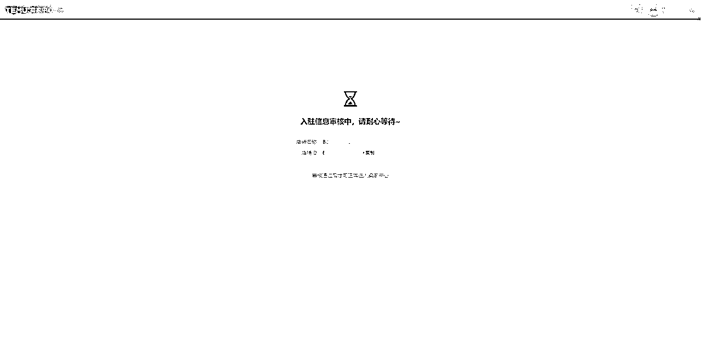
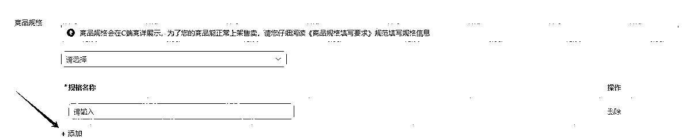
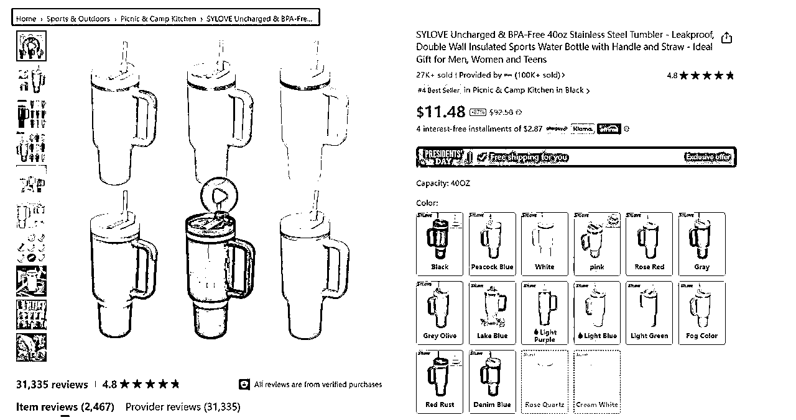
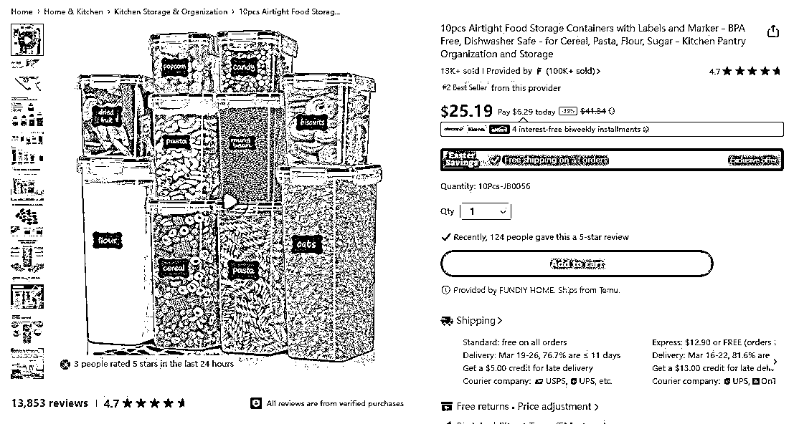
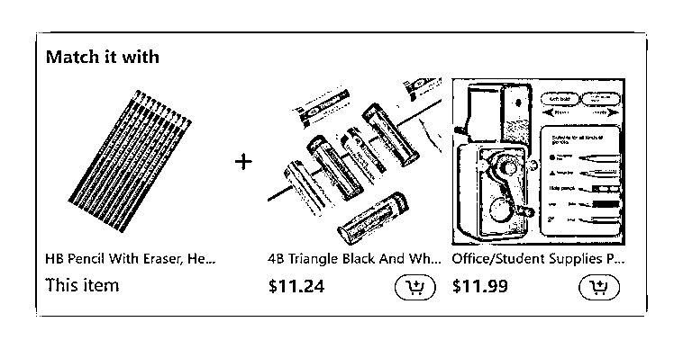
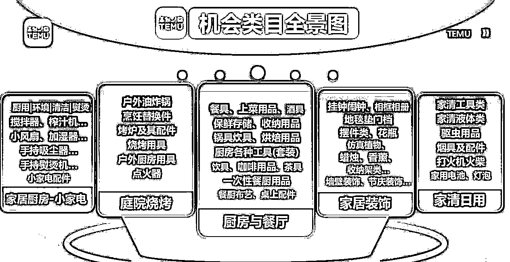
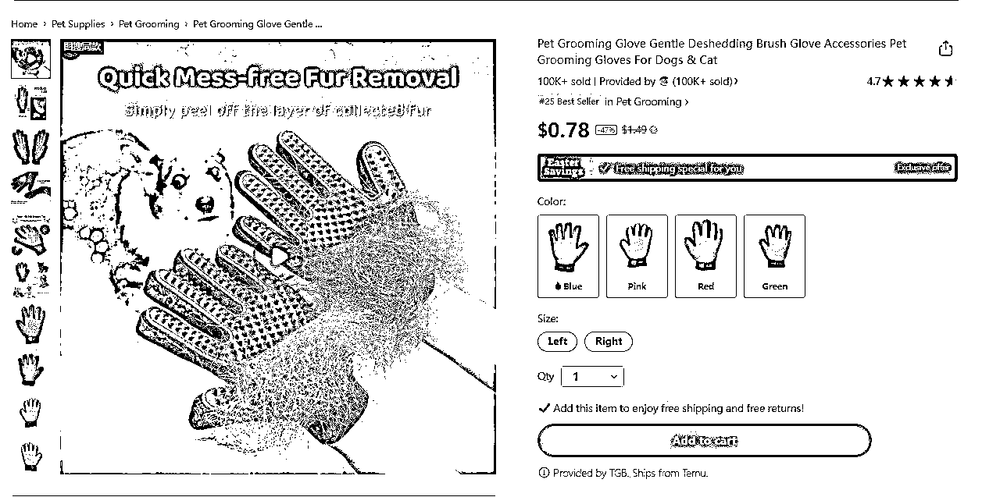

# TEMU 跨境电商 实战手册 202403

> 来源：[`jviztcgxxfy.feishu.cn/docx/VhXddZvKYoAHMLx9Caacd1rOnGf`](https://jviztcgxxfy.feishu.cn/docx/VhXddZvKYoAHMLx9Caacd1rOnGf)

TEMU 跨境电商

3 月航海 | TEMU 跨境电商 | 实战手册

手册出品方：生财有术团队

出品时间：2024 年 3 月 10 日

手册使用说明：内容出品人排名不分先后。本文旨在向你展示一个项目的更多可能性，帮助你更好地理解和实操。

建议：如果需要快速定位到精确内容，可以使用快捷键 Ctrl + F/command + F 的形式，搜索「关键字/词」，查找你想要的内容

# 写在前面

欢迎大家来到 3 月航海｜TEMU 跨境电商 | 实战手册，相信在接下来的日子里，我们将在这里见面很多次。

在开始做 TEMU 跨境电商项目之前，让我们先来解决几个问题：

1）TEMU 跨境电商是什么项目？现在做，有多大机会？

TEMU 是拼多多旗下的跨境电商平台，也称为跨境版“拼多多”，主打低价、高性价比，总部位于广州。全托管模式下，卖家只需要负责选品上架＋发货给平台仓库即可，运营售后等都由平台负责。

从宏观市场看：

TEMU 面向全球 40 多个国家做销售，市场空间非常大。虽然平台红利没有 2023 年那么强了，但 TEMU 相对其他成熟的电商平台来说，没有那么卷，目前依依然有很多扶持，有很多品类在招商。这么看来，TEMU 的红利还能持续 1-2 年，现在入局也不晚。

从个人收益来看：

参考本期教练 @Alex（企鹅）的 2 家店铺，月利润可以达到 10w＋，目前依然在上升期；对于新手来说，前期可以先定一个月利润 1w＋的目标，后续想要放大利润，主要通过增加店铺、提高商品客单价等动作。前期可以作为一个不错的副业入局，后期也可以放大作为主业。

2）什么样的人适合做 TEMU 跨境电商项目？

如果你满足以下条件，将有更大几率跑通项目：

有一定选品能力、或电商经验

有优质的厂家资源

能每天投入 2-4 小时

如果你是纯电商新手，那么希望你：

更仔细地阅读航海手册

积极在航海群举手提问

花更多时间和精力去研究选品、上架、发货等操作细节

由于手册篇幅有限，如果遇到个别电商专业知识不理解的，请自行查询相关资料，也可以多在航海群里交流~

注意：

本期航海主要带大家做【全托管模式】，由于该模式入门门槛低，信息差拉齐速度非常快，标品很难出爆款，需要打造产品差异化（可重点查看【1.3.2 打造产品差异化】里的经验技巧）。

另外，TEMU 近期推出【半托管模式】，平台整体的资源和流量会对半托管模式的商家有一定倾斜。但半托管门槛较高，需要卖家有自己的海外仓，有条件的圈友可以关注下（详见选修篇的【7.1 半托管模式】）。

最后，希望大家可以在这次航行里收获成果外，结识一群战友。

以下内容由生财有术联合圈友制作而成，仅供航海船员以及生财有术星球圈友学习使用。

由于平台规则变化较快，欢迎圈友们在实践过程中持续反馈，和我们共同完善，可以联系鱼丸（yuwan387）提供修改建议～

# 【更新提示】新手册使用方式

在开始前，我们来简单了解一下这个手册的正确打开方式，方便你根据自己的情况来灵活使用。

在这里，手册整体的步骤顺序是按照从 0 - 1 跑通一个 TEMU 跨境电商项目进行的，你可以参考航线图，按顺序开始实操。也可以根据自己的实际需求选择性阅读。

需要注意的是：本次手册相较于过往航海，进行了较大的改版。之前的手册尽可能的展示更多可能的玩法供大家自由选择，本次改版后的手册，分为必修和选修两个大的章节：

如果你还未接触过 TEMU 跨境电商项目：

建议在正式实操前，先初步了解下项目全貌

【项目概述】了解 TEMU 跨境电商项目

如果你对项目整体已有大致的了解：

请开始完成航线图第一阶段的步骤，这个阶段你可以从手册的第二章开始阅读

【实操 1/4】完成开店准备工作

完成前期的准备后，即可开始完成航线图第二阶段，正式上架商品

【实操 2/4】完成选品&上架&备货

当你的店铺产品逐渐增多时，可以开始学习航线图第三阶段——店铺运营也非常重要，这是 TEMU 卖家的每日工作

【实操 3/4】店铺日常运营与售后

最后，为了提高爆款的概率，我们可以再重点学习下航线图第四阶段

【实操 4/4】提高爆品能力，精准打爆商品

如果你已跑通 MVP ，想放大项目：

可以重点阅读以下章节，扩展更多玩法

【项目放大】选品进阶&店铺矩阵

【项目拓展】平台推出的其他玩法

【案例拆解】TEMU 热门赛道

本航海项目的航线图如下：

航线图和手册是高度关联的，因此你可以根据自己所在的环节，进行相关步骤的学习。

以上阶段中，所有的航线图步骤建议大家在航海前两周完成，完成航线图的所有动作后，建议以实践为主，更多的选品和上架运营，扩大自己出单的概率。

# 必修篇：跑通最小 MVP

#### 章节概要

在这一章节，我们将从认识 TEMU 平台开始，一步步带你完成 TEMU 跨境电商整个项目流程的学习。你可以根据本章的步骤内容进行实操，跑通 TEMU 的最小 MVP。

如果你是本项目新手，建议在正式实操前，先初步了解下项目全貌：

【项目概述】了解 TEMU 跨境电商项目

如果你对项目整体有了大致了解，就可以按照项目核心步骤，开始学习实操：

【实操 1/4】完成开店准备工作

【实操 2/4】完成选品&上架&备货

【实操 3/4】店铺日常运营与售后

【实操 4/4】提高爆品能力，精准打爆商品

在必修篇，航线图和手册顺序相对应，你可以按照手册的顺序进行学习，即可逐一完成航线图的每一个任务。

在后续的每个关键步骤的章节概要中，我们也将提到相关航线图，提醒你完成相关步骤。

接下来就正式开始吧！

## 一、【项目概述】了解 TEMU 跨境电商项目

#### 章节概要

本章节中，我们将一起逐渐认识 TEMU 跨境电商项目。

TEMU 平台目前发展如何？该平台有什么特点？新手怎么在 TEMU 卖货？……这些，都是我们在本章节中会解决的问题。

本次航海的重点，就是告诉大家如何从 0-1 跑通 TEMU 跨境电商项目。

那么对整体的项目概况了解是必不可少的，一起来了解一下吧。

### 1.1 认识 TEMU 平台

TEMU（拼多多海外版）是拼多多旗下的跨境电商平台，也称为跨境版“拼多多”，主打低价、高性价比，总部位于广州。2022 年 9 月 1 日上线，23 年 2 月亮相超级碗广告之后流量爆发，2023 年一直在应用商店下载排行榜前列，整体来看目前还处于流量红利期。

TEMU 目前已经开通将近 50 个国家的站点，卖家发布的商品可以同步售卖到这些国家的买家手里。

TEMU 在广东已经有将近 90 个仓库，23 年 5、6 月份的时候才只有 20 多个仓库，可见最近几个月平台的发展速度。

仓库在扩容，商家数也在急速增长，截止 23 年 10 月，TEMU 招募了 9 万名卖家， SKU 数已经从 23 年初的 20 多万涨到近 100 万，还在持续增加。

TEMU 从一开始的“上链接就爆单，利润还超高”，到现在开始逐步走向“资质合规，质量严格把控”。对于自有工厂或本身在做拼多多的商家来说更有优势；对于一些无货源商家来说 2024 可能是最后的红利期，可以作为跨境新手的入门项目去做。

### 1.2 为什么在 TEMU 做跨境电商？

#### 1.2.1 平台优势与特点

TEMU 平台偏向中低端市场，主打团购-价格更低的模式，用户群体更倾向于追求性价比和时尚潮流的年轻女性，目前平台主流玩法是全托管制，对跨境电商新手更友好，具体表现如下：

1.门槛低

有身份证就可以进行个人入驻，而且缴纳的 1000 元店铺押金，是在产品卖出后的回款中默认抵扣的。

2.操作简单

TEMU 平台推出的“全托管模式”下，商家只需要负责选品和发货，把产品寄到平台的国内仓库即可，相当于供应商的角色，不涉及海外营销和国际物流的发货等等。对于电商新手来说，门槛还是比较低的。

另外，对于寄送到平台仓库的运费比较低，在平台优惠政策的基础上，平台会再跟商家分担一半运费。从徐州寄送到广东仓库的运费，算下来差不多只要 1.5 元/kg。

#### 1.2.2 平台机会点 @Moose

Temu 处于快速发展阶段，新开站点多，体量大的类目产品需求大，新拓展类目也在大力招商，对新人来说是个很好的机会。

平台重点类目参考：

平台新拓展类目参考：

另外，24 年 3 月开始，平台大力推广【半托管模式】，正在全面招商扶持中，对于有海外仓的商家来说，是个非常不错的机会。（具体可参考【7.1 半托管模式】）

### 1.3 TEMU 平台爆单的底层逻辑

#### 1.3.1 符合平台核心用户需求

目前 TEMU 平台用户体量最大的站点为：美国，德国，英国，法国。均属于欧美地区。

那么我们的产品需要符合欧美地区用户的需求，而这部分用户的常用电商平台是亚马逊。既然人群互通，那么我们就可以通过参考亚马逊的爆款，找到用户喜欢的产品，搬到 TEMU 上来。

#### 1.3.2 打造产品差异化 @Moose

对标亚马逊的产品，快速上架到 TEMU 上，这个方法已经被大家熟知，那么会不会出现同类商品竞争过大，导致价格没有优势，无法爆单呢？会。

这里给到一个解决方案：“打造产品差异化”，它可以弱化同类商品的竞争，也是爆单的关键：

如何打造产品差异化？也就是对标爆品，进行改款，生成新的 skc（单款单色），举个例子：

比如【服装-贴身】类目，你对标的爆款是【瑜伽裤】，那么可以在原款的结构、面料、颜色不变的基础上，改成七分瑜伽裤或者九分瑜伽，这样比较节约成本。（具体我们会在【4.2.2 报价被压怎么处理】展开讲）

改款前：

改款后：

当然，如果你有很强的供应链，或有绝对的价格优势，就不需要花很多心思在产品差异化上面了。

## 二、【实操 1/4】完成开店准备工作

章节概要

了解完 TEMU 跨境电商项目的整体情况后，我们就要正式开始启动了。在 TEMU 上卖货的前提，是完成前期的开店准备。

在 TEMU 开店，一般建议新手开通个人店铺，一张身份证可注册一个店铺，基本不需要额外的资质要求（除特殊品类）。

当然如果你有条件的话，也可以开通：个体工商户店铺、大陆企业店铺、香港企业店铺。

这几类店铺的区别，也在本章节做了说明，请根据自身情况进行选择。

#### 本章航线图

完成本章节的学习和实操，即可完成航线图的第一阶段：完成开店准备工作（约 1-3 天）

1.准备开店所需材料（约 20 分钟）

2.完成 1 个 TEMU 店铺的开通（约 1-3 天）

3.完成已开通店铺的基础设置（约 20 分钟）

那么现在，就去开通完善你的店铺吧。

### 2.1 TEMU 个人店和企业店的区别

#### 2.1.1 资质要求

#### 2.1.2 账号限制

#### 2.1.3 审核要求

#### 2.1.4 资金管理

#### 2.1.5 优劣势

对于大部分新手来说，如果你在资金、人力、物力等方面相对有限，想要轻资产入局，那么建议开个人店即可；

如果你有丰富的供应商资源和专业团队，想要更快速打开市场，建议可以开企业店。

### 2.2 准备开店所需材料

1.个人开店所需材料

a.计划销售的产品类目（参考【3.1.1 选择商品类目】）

b.店铺名字&logo

c.个人身份证、银行卡

d.办公地址（没有公司地址，也可以是住宅地址）

2.企业开店所需材料

a.计划销售的产品类目（参考【3.1.1 选择商品类目】）

b.店铺名字&logo

c.营业执照

d.法人身份证、法人银行卡或对公账户

e.公司经营地址照片（可到 1688-找一家工厂-下载工厂图片）

f.欧洲环保认证（CE 认证），这个是制造商开放并进入欧洲市场的“护照”，可以找第三方机构办理。

### 2.3 完成 TEMU 店铺的入驻 @军

#### 2.3.1 注册入口

点此链接注册：https://kuajing.pinduoduo.com/login/register

#### 2.3.2 账号注册

1.填写手机号码

2.设置登录密码

3.正确填入注册手机收到的验证码

4.点击注册按钮

#### 2.3.3 填写主体信息

先选择主体类型，目前支持：

1\. 大陆个人店：适合没有注册公司的个人卖家，建议新手开个人店即可。

2\. 大陆个体工商户：适合有商业实体的个人卖家，财税方面跟企业店类似。

3\. 大陆企业/香港企业：适合有大陆、香港公司的卖家，往往店铺规模更大。

关于个人店和企业店的区别，大家可以参考【2.1 TEMU 个人店和企业店的区别】，按照自身条件和需求进行选择。

1\. 大陆个人店

如果选择【大陆个人店】，需要填写：

2\. 大陆个体工商户

如果选择【大陆个体工商户】，需要填写：

经营人身份证有效期

3\. 大陆企业

如果选择【大陆企业】，需要填写：

4\. 香港企业

如果选择香港企业，需要填写：

正确填写以上信息后，开店人/经营人/法人/董事进行实名认证，即可完成账号注册。

### 2.4 完成店铺基础设置

#### 2.4.1 填写店铺信息

需要填写的店铺信息包括：

填写完成后，点击提交即可。

#### 2.4.2 店铺审核

1.入驻审核目前在 1-3 个工作日完成

2.审核通过后，你的注册手机号将收到短信通知

#### 2.4.3 绑定银行卡

卖家在入驻后需要尽快进行银行卡绑定，一个店铺只允许绑定 1 张银行卡。

路径：【银行卡管理】页面进行添加银行卡绑定。

关于 TEMU 申请入驻驳回和审核问题：

1.入驻信息如果被驳回，驳回后提交过的店铺名称就不能再使用，这是因为平台在审核过程中，不可修改信息，因此，在提交审核过程中，没有修改流程，请确认好信息无误。

2.入驻审核驳回后，暂不支持再次发起申请。也有卖家表示，主体被驳回后，可尝试换个手机号重新申请。

内容来源：https://wx.zsxq.com/dweb2/index/topic_detail/588452554452444

## 三、【实操 2/4】完成选品&上架&备货 @企鹅

店铺入驻审核一般在 1-3 个工作日，审核期间，大家可以先学习以下内容，尝试开始选品。

### 3.1 如何选品

#### 章节概要

店铺准备完成后，我们就要开始上架商品啦。怎么选择好卖的商品呢？

对新手来说，最高效的选品方法就是：

第一步：找对标平台亚马逊的爆品，作为选品参考来源

第二步：回到 TEMU 搜索这个品的销售情况，判断是否上架

你也可以用 TEMU 选品助手，作为选品的补充方式。

我们在选品时，需要注意不卖侵权款式，避免店铺违规。

#### 本章航线图

完成章节 3.1 的学习和实操，即可完成航线图的第二阶段：完成选品&上架&备货（每天 2 小时）

1.每天选品 10 个，共完成至少 200 个选品（每天 1-3 小时）

接下来就开始选出你想上架的高客单商品吧。

#### 3.1.1 选择商品类目

有货源的卖家：

建议优先卖自有货源或者有供应链的货物，有价格优势，也可以节约成本。

无货源的卖家：

我建议新手从【百货】开始做起，因为百货一般是白牌，不会涉及到产品侵权，而且通货比较多，比较好拿到货源。订单比较多之后，可以再去尝试其他类目，但最好还是从自身有资源的货源入手，不容易踩坑。

比较常见的起店模式是，前期做【杂货铺】，主营各种日常小商品，跑出爆款后，再从爆款拓展，逐渐转为【垂直店铺】。

避坑提醒：

#### 3.1.2 选品思路

如何选品，简而言之，就是找到产品上到 TEMU 平台上能出单，核心讲的就是“供求关系”。

那么你需要了解：

1.TEMU 这个平台是一个什么样的平台，了解人群，喜好，家庭构成；

2.同时，你也需要知道类似平台上什么产品的卖的好，所以你需要看其他平台的数据。

这里告诉大家一个新手最容易上手出成绩的选品思路：

我们知道，TEMU 平台上，欧美地区用户最多，那我们就直接去他们常用的 Amazon（亚马逊）找对标爆款，因为你要销售产品的对象其实是同一拨人。

同理你还可以去这几个平台找爆款：Aliexpress、Ozon、Shopee、Shein。

这样做的好处是：

3.有成熟的产品用户群体，用户更易转化；

4.可以参考亚马逊的特点来优化产品标题文案等内容，更符合欧美用户阅读展示和搜索转化；

5.亚马逊平台性的爆款，上到 TEMU 更容易获取活动资源和广告投放，享受更大的曝光量。

当然我们还是要因平台制宜，结合 TEMU 平台的特点去做调整。

这里附上 TEMU 平台买手提供的几个重点选品方向：

1.重量尺寸：优先 1kg 以内商品最好，尤其是 500g 以内，1kg 以上商品，除非价格非常有优势可以报，其余的可以尝试，能不带电池最好不带电池。

2.人群：全年龄阶段商品优先，覆盖人群广，转化高。

3.质量：杜绝低廉，杜绝低品质商品。评分高，权重高，持续能卖，风险低。

4.价格区间：申报价格要低于主流批发平台。

5.迎合节日：超级腕，复活节，生日会，派对，圣诞等等。

6.新款＋含视频优先：技术升级、功能迭代、新奇特创新，并上传对应的视频。

更进阶的选品思路，就是去社交媒体（eg. TikTok、YouTube、Instagram）挖掘爆品，提高自己的爆品嗅觉，这块我们会在选修篇的【章节 6.2 进阶选品】中讲到。

#### 3.1.3 最高效的选品方法——找亚马逊对标爆款

第一步：打开亚马逊网站

亚马逊网站地址：amz123.com。打开后找到美国站点。

第二步：打开亚马逊榜单

这里可以看亚马逊的热销以及新款：

第三步：找到亚马逊对标爆品

最近 1-3 个月内上架、每天出单 100 单左右的品，这种品就不错，可以对标。而且一般情况下，这个品在 TEMU 上出单只会比亚马逊上更多。

这里我们需要用到一个插件 Sortime Save（会员连续包月 19.9 人民币/月），建议大家都去安装下，这个是我们在亚马逊选品的常用工具，可以快速查询亚马逊商品的上架时间、月销量等数据，且后面在【3.3 第二步：完善商品的基本信息】中起商品标题名称时，也可以用到。

插件的安装和使用教程如下：

【安装教程】

1.在 goolge 浏览器，搜索 google 应用商店

2.点击 Sortime Save

3.点击添加即可

【使用教程】

在搜索框输入商品关键词，找到并打开对标商品的 ASIN（亚马逊标准识别号）, 可以看到这个产品的日销量，以及这个款式过去一年的销量数据。

第四步：去 TEMU 搜索该商品

找到亚马逊爆款后，我们回到 TEMU 搜索该商品标题的关键词。

可以看到，TEMU 上没有这款杯子，但是看到很多杯子配件，能确定的是，杯子配件有需求，可以上；而且这种产品属于花型款式，就是如果有新款出来，客户接受程度比较高，比较好出单。

第五步：决定选品要不要上架

当我们在亚马逊找到一个爆款，回 TEMU 搜索的时候，可能会出现以下 3 种情况，如何决定要不要上品，我一一做下解释：

情况一：TEMU 上面有同款，销量不错

这时候计算下商品的核价，利润≥30%的可以上。

比如，这个品在 TEMU 卖 100，我们通过图片搜索找到 1688 上这个品，假设它的价格是 65，算下利润在 35%，那么就可以做这个款。

情况二：TEMU 上面有同款，但销量不行

这时候可以看下商品的上架时间，如果上架超过 1 个月，每天销量少于 10 个的话，那么这个款就没有做的意义了。

情况二：TEMU 上面没有同款

没有同款就抓紧上新，快速上架测款，等测出来再去备货。

#### 3.1.4 补充选品方法——TEMU 选品助手

TEMU 选品助手（网址：https://www.temushuju.com/），是一款免费的工具，主要帮助我们快速筛选出 TEMU 上的爆款。

但一般在 TEMU 上已经很爆的产品，机会可能就不大了，除非你非常擅长打差异化，所以这个方法我们作为补充就好。

操作如下：打开 Temu 选品助手，输入想找的产品名，找到最近 1 个月销量在 100～1000 的产品，就可以尝试跟款。

注意：选品过程中，不要选做侵权款式。不清楚什么是侵权款式的话，可以查看【章节 4.4 如何避免违规】

### 3.2 商品上架完整流程概览

#### 章节概要

编辑上架的核心就是：尽可能让欧美市场需要这个产品的用户，都到咱们店铺浏览，并最终完成下单付款。

那么如何让我们的商品，被更多人看到并成交呢？除了选品外，上架商品也是非常重要，会影响商品曝光和转化的一步。

我们可以把整个流程分为 3 大阶段：

1.发布商品：为了提高爆款数量，建议每天发布至少 10 个品。

2.找供应备货：找到价格合适的货源，及时完成备货，有助于提高店铺权重。

3.回款结算：这是每个电商人必备的技能，关系到现金流的管理。

上架过程中，我们需要重点关注【核价】问题，如何通过买手核价，也是上架成功的关键步骤。

本章节除了给到具体的操作步骤，还批注了一些编辑小技巧＋注意事项，帮你更顺利的完成商品上架。

#### 本章航线图

完成本章节的学习和实操，即可完成航线图的第二阶段：完成选品&上架&备货（每天 2 小时）

1.每天上架 10 个品，上满至少 200 个品（每天 1 小时）

2.商品核价通过后，找到合适供应商进货（约 2-3 天）

3.商品打包，发货到平台仓库，完成备货（约 2-3 天）

接下来就开始把你选出的商品进行编辑上架吧。

确定选品后，我们就可以上架商品了，商品正式上架到销售需要经过几个流程，先带大家整体过一遍：

我们可以把整个流程分为 3 大阶段：

1.发布商品

2.找供应备货

3.回款结算

后面我们会根据这 3 个阶段，来分别学习操作流程。

### 3.3 发布商品

操作入口如下：卖家后台 - 商品管理 - 商品列表

注意：为了提高爆款数量，一般每天发布商品，建议每天发至少 10 个品。

#### 第一步：选择商品分类

TEMU 是没有限制你的商品类目的，平台上的所有类目你都可以上。

卖家可以通过在【商品分类】中输入商品的子类目名称，快速索引找到合适的商品分类。

#### 第二步：完善商品的基本信息

1.选择素材语言

因为我们面向的是欧美市场为主，这里选择英语就可以。

2.上传轮播图、主图视频

注意：

3.完善商品名称、规格属性

注意：认真填写“属性” “规格”，这会影响到产品的核价/比价结果、搜索展示排名、客户转化率等。

请在【商品名称】中填写商品的中文名称，包含但不仅限于商品的数量、功能、特征等信息，有条件的卖家也可以根据【商品名称】在【英文名称】中完善符合商品描述的英文名称。

填写商品名称的时候建议直接参考亚马逊上的产品，该商品类目的主要英文引流词一定要都加进去，然后用翻译软件把取好的英文标题翻译成中文，中英文标题都填上。

不然如果没有英文标题，TEMU 买手（类目小二）在上架产品时，可能会随便取，导致商品核心词缺失，流量很少，Temu 现在个性化推荐很弱的，大部分流量靠系统推荐的热销商品和搜关键词。

这里我们可以借助前面找亚马逊爆品时，用到的插件 Sortime Save：

点击反查关键词，可以查看哪个关键词是流量最大的。

把流量大的关键词，起到你的商品标题里面去： storage(245),bins(94),with(58),for(42),lids(38),organizer(35),closet(32),box(29),and(26),boxes(23),toy(22),organization(18),cube(18),basket(16),lid(16),bin(15),organizers(14),clothes(13),large(13),organizing(12),plastic(12),fabric(12),cubes(11),baskets(10),containers(10),decorative(8),foldable(8),container(7),kids(7),linen(7),under(6),blanket(6),shelves(6),bed(5),room(5),totes(5),home(5),de(5),cloth(5),house(5),qt(5),stackable(4),laundry(4),photo(4),small(4),bedroom(4),sterilite(3),wicker(3),sheet(3),drawers(3)

括号里的数字是关键词出现的次数，我们把高频词，按照顺序排列： storage bins with lids， organizer closet box and toy，organization cube basket lid bin organizers clothes large organizing plastic

通过 google 翻译，查看标题语序是否通顺，不通顺的短语进行微调，微调得到：storage bins with lids，organizer closet box and toy，plastic organization cube basket lid bin clothes large organizers bins（带盖储物箱，整理衣柜盒和玩具，塑料整理立方篮盖箱衣服大型整理箱）

这样的短语组合成句子，可以用英文的“,” 隔开，这样就形成了一个句子，这样就把标题起好了。

选择符合商品描述的商品属性。

不同类目需要填的商品属性会有一定差异。可以直接去 1688 你的货源商品介绍页查看商品属性，如实填写即可。实在不清楚的，也可以直接问商家或客服。

选择符合商品的规格（比如颜色、尺寸），并填写相应的规格名称（比如红色、M）。

卖家需在首单发货前确认【商品规格】无误，错误商品规格的商品入仓可能会有退仓风险。

#### 第三步：完善商品包装信息

1.在【商品包装信息】中上传商品的外包装图片，并选择外包装的类型及形状；

2.完善商品的体积与重量信息。

注意：在确认发布前需认真核对【商品包装信息】无误，商品包装后的体积与重量，严重影响定价与销售，请严格测量且如实填写，填写错误将进行违规处理。

#### 第四步：选择商品的敏感属性

注意：商品如果带有纯电、内电、磁性、液体、粉末、育体、刀具敏感属性，请严格且如实填写，否则无法跨境运输。

#### 第五步：完善 SKU 信息

1.上传 SKU 预览图

SKU 预览图的宽高比例为 1:1 且>800px，小于 2M。

2.填写 SKU 的申报价格 （以人民币为单位）

这里给大家讲下商品定价方法：

TEMU 核价员，一般会根据 1688 中位价格来看，比如说这个产品，在 1688 上有人卖 10 元，有人卖 8 元，核价员一般会根据（10+8）/2=9 元，来取一个平均的价格，也就是卖家报价需要低于 9 元。

对于卖家来说，利润率需要在 20%-30%左右才会去做，也就是说：

拿货价 10 块钱的产品，需要赚 2-3 元；

拿货价 20 元的产品，需要赚 4-6 元；

拿货价 50 元的产品，需要赚 10-15 元。

我自己的报价习惯，一般是按照拿货价×2.3~2.5 去报价（仅供参考），解释一下我的这个报价逻辑：

首先，我会尽量跟供应商砍价，争取到较低的拿货价；其次，因为你报价之后，买手在核价环节一般都会砍价的，所以报价的时候，我会加上自己的利润后，再往上加一些，这样方便买手砍价。

注意：这一步一定要认真核算并填写，影响到核价是否通过，核价如果不通过，就无法正式上架销售。

3.选填【商品编码】 、自定义【SKU 货号】和【SKC 货号】

#### 第六步：上传详情视频

详情视频（非必填），有精力的话还是建议上传下视频，有助于提高商品下单转化率，或者等出单后再去优化上传也可以；

一般视频内容主要是产品展示、或操作说明，货物采购回来后自己拍下就行，比较简单。

#### 第七步：上传商品说明书

上传路径：卖家中心-【商品管理】-【商品列表】- 【编辑】 - 【添加商品说明书】

商品说明书（非必选），主要描述商品的性能、特点、用途及使用方法等，降低客户疑虑、减少客户进线咨询、提升客户下单转化率。前台展示如下：

商品说明书需要自己制作，可以参考你采购的 1688 货源的产品说明书，在这里编辑（记得用谷歌翻译将文本转化为英文）：

#### 第八步：完善详情图文

比较差的详情页，主要就是图片丑，或者文字堆积太多。

像这种详情页做得就不错，大家可以参考看看：

注意：详情页带文字的话，必须是英文。

可以用店小秘工具直接进行图文的翻译。店小秘安装插件教程见【4.1.2 批量操作与编辑】

店小秘图文翻译操作流程： 第一步：

第二步：

图片翻译需要购买才能使用，若还有剩余张数，即可正常使用； 若没有剩余张数不足，会提示先充值，选择购买张数、支付后使用（5 元/100 张）。

第三步：

【点击勾选全部 - 一键翻译 - 确认，产品页面即展示翻译后的图片】

第四步：

如需调整翻译内容，可点击手动调整，调整内容后，完成编辑，产品页面即展示手动调整后的内容。

#### 第九步：商品审核&核价

点击发布成功后，商品会进入核价中，等待系统审核，急的话可以直接把 SKC（即商品 ID) 发给买手催审。商品 ID 在 [ 商品管理-商品列表-商品信息]查看。

核价：

买手主要会参考同款商品以及亚马逊的价格，看在商家的供货价的基础上加上运费，能否比亚马逊热销款的价格低，如果买手觉得价格高了，会议价的，到时系统后台会收到议价消息。如果商家不同意平台的议价，可能会被清退。（后面我会在【章节 4.2.2 报价被压怎么处理？】重点讲下核价相关技巧）

图片审核：

TEMU 目前是最少 5 张、最多 10 张主图+详情+可上传主图视频的形式，主图和 sku 图要求尽量不要有牛皮癣，我们主图基本放的都是干净的场景图。

把商品介绍尽量放到详情里，然后图片里不能出现亚裔面孔，文字要求是英文的，计量单位要求必须有美制，可同时展示国际计量单位，如长度需用 inch feet yard mile，重量需用 pound oz，体积用 gallon，温度用 F 等。

商品审核通过后，就可以申请备货啦。 注意：部分类目买手可能会选品，看下实物商品款式，需要先寄样给买手，具体会收到平台通知的。

### 3.4 找供应商备货发货

卖家在平台发布商品并成功上架之后（核价通过），就可以进行第一次备货和发货的操作，这个动作叫做“下首单”；完成首单备货后，后续只需要根据销售数据和库存情况来预测未来的销售需求，然后进行相应的补货。

具体操作步骤如下：

#### 第一步：申请备货

1.下首单（第一次备货）在“销售管理”进行申请，需要由卖家申请；

2.【数量问题】一般首批备货每个 SPU（标准化产品单元）申请 20-50 件就行了，等商品卖起来后，如果销量好，后面申请备货的时候再多申请一点。

3.申请备货后@对接买手进行审核，审核完可以在“我的订单”查看。

商品完成首单备货后，需要实时查看销量和库存：

申请备货审核通过之后，卖家需要将商品发货到平台仓库，大概流程如下：

当然，如果你不是厂家，手上没有货源的话，我们需要先找到合作货源，进行货源的采购，再来后台操作发货的流程。

#### 第二步：找合作货源

如果你有货源，可以直接进入下一步。如果你像我一样没有货源，一般可以去 1688 通过以图搜产品的方式，找到价格合适的目标供应商。

找到的产品，核算下毛利润率，如果在 30% 左右，那么这个单子就可以做。

举个例子：

你在 1688 找到的杯子货源价格为 16，你在 TEMU 平台看到的同款产品价格普遍在 25，如果你计划定价为 24，那么毛利润率 ≈（24-16）/24 ≈ 33%，可以做。（因为寄送到平台仓库的运费比较低，在平台优惠政策的基础上，平台会再跟商家分担一半运费，从徐州寄送到广东仓库的运费，算下来差不多只要 1.5 元/kg，所以这里的毛利率计算就不计入运费了）

但是现在光做标品比较难在 1688 上找到利润率高的产品了，建议大家用组合品的方式，生成新的 skc，提高利润率。（详见【4.2.2 方式三：组品，快速生成新的 skc】）

当然，你也可以尝试跟供应商沟通再砍砍价，首批下单 20 个，后面卖的好的话继续在他这里进货，谈长期合作。

关于贴标：

之前很多做 TEMU 的卖家，因为贴标太繁琐，放弃了这个项目，挺可惜的。我们其实可以把这块任务给到供应商去操作。

找供应商的时候，直接问能不能贴，有些是可以直接帮忙贴，有些要加钱 0.1-0.3 元/件不等。

#### 第三步：将订单加入发货台

完成备货申请（下首单）后，买手会进行跟单审核（着急的话你也可以找买手催审），审核完成后，可以在【我的订单】将订单加入发货台。

路径：订单管理 - 我的订单 - 加入发货台（也选择可批量加入发货台）

#### 第四步：创建发货单

这里的发货单，指的是你将包裹发往 TEMU 仓库的发货单。

前面我们将订单加入发货台之后，需要尽快【创建发货单】，否则超时会被自动移出，被移出发货台的订单，可能会因为没有仓库容量无法发货。

操作路径：卖家中心 - 订单管理 - 发货台 - 创建发货单。

常见问题：

填写包裹的预估重量即可。

存在超时快递/物流拒收的情况，建议设置【预约取货时间】预留充足的打包时间，若物流拒绝提货可取消发货单，重新在发货台发货。

【拆单发货规则】（拆单的意思是，比如平台建议补货 40 件，但我手里只有 20 件，那我就分批发货，先在第一次发货单里填发货数量为 20）

① 最多可拆单 3 次；

② 若订单剩余未发货数量不足 20 件，不支持拆单；

③ 首单不可拆单，且首单发货数量满足率必须大于 80%，否则不能发货。举个例子，如果店铺的第一个订单中包含 10 件商品，那么店铺实际发货的商品数量必须至少为 8 件（即 10 件的 80%）。这一规定的目的在于确保店铺在运营初期能够具备一定的供货能力和物流效率，以满足买家的需求，并维护平台的交易秩序和买家利益。

【移除规则】

加入发货台的订单，次日 05:00 前未发货将被自动移出发货台，如需重新发货请在“我的订单”中重新加入发货台。

#### 第五步：开始发货

创建完发货单，就可以按照你的发货单，进行发货啦。

发货阶段，卖家需要先在卖家中心确认发货信息，打印商品标签＋在包裹上贴标签，将商品交给物流公司进行发货，需要特别注意打包、贴标规范。

具体步骤如下：

1.确认发货信息（检查/调整包裹数量）：

操作路径：卖家中心 - 订单管理 - 发货单列表 - 查看包裹信息

常见问题：

打印【商品打包标签】后不能再调整包裹数量，请务必检查好包裹打包情况，再打印【商品打包标签】。

首先打印商品条码，给每件商品张贴条码，然后按照包裹维度打包，打包后务必检查包裹款量，再打印商品打包标签。打印商品打包标签后，不允许再调整包裹数量。

2.打印商品标签并完成贴标

卖家需要打印商品条码、商品打包标签（需要连打印机打印），并贴在要发货的包裹上：

常见问题：

没有张贴商品条码的商品均无法收货，直接拒收退回，请务必给每件商品张贴平台统一的商品条码。

发货单内的每个包裹上都要张贴【商品打包标签】，将包裹统一放置入发货箱后，打包好在外箱张贴物流运单即可；

发货单被取消时，对应的商品打包标签立刻失效，需要重新创建发货单，并重新打印商品打包标签。

需要你在店铺后台，把标签条码打印出来，再寄给供应商帮忙贴标，供应商没法直接打印。

3.商品贴标注意事项：

因为我们的产品是往海外销售，包装需要使用销售目的地国家语言，大家在发货时请勿将商品标签贴到产品的外包装袋上，否则可能会影响你的商品入仓。

可以参考下图放两张白纸贴到白纸上或者再用一个快递袋装着贴到快递袋上，以免造成不必要的损失。

4.商品打包要求

① 每个单品都需要贴商品标签【在商品条码里可以下载商品对应的商品标签】。

② 以 sku 维度打包，作为一个包裹，贴商品打包标签【在发货单列表里可以下载每批货的打包标签】。

③ 商品打包标签，要和包裹内的商品一一对应，否则仓库无法收货。

④ 多个贴好打包标签的 sku 包裹，可以让顺丰合箱发货，外箱只贴物流面单。

⑤ 用袋子打包的商品，如袋子大小超过婴儿头部，需要有警示语，袋子本身没有警示语的，可以用热敏标签纸打印以下标语：

WARNING: This bag is not a toy.To avoid danger of suffocation,keep this bag away from child under three.Don't use in cribs,carriages or playpens.大件商品袋子（大于 15cm）必须包含警示语并保留两个透气孔。

⑥ 一定不能带干燥剂。

⑦ 没寄样的商品，如果有吊牌/标签，一定要纯英文/中英文对照。

⑧ 不能带有任何导流性质的卡片或者标签等，如网址、二维码、社交平台等，TEMU 对引流管的是非常严的，千万不要触碰这一条。

注意：很多做这个项目的人，都卡在了“打包-发货到平台仓库”这一步，觉得打包发货是一件非常麻烦的事，于是就放弃了。对于新手来说，执行力和坚持非常重要，按照步骤每天坚持选品上品，基本都能出成绩的。

内容来源：https://wx.zsxq.com/dweb2/index/topic_detail/585428888811244

#### 第六步：查看产品标签要求

不同品类的质检注意事项不同，具体可在 卖家中心 - 合规中心 - 合规看板 进行查看。

当然最重要的还是：

1.看产品贴的标签是否准确

2.看产品是否有质量问题（比如破洞、损坏）

下面列举几个常见的【入库质检注意事项】：

### 3.5 回款结算

前面我们完成了商品上架-发首单的过程，后续的运营动作都由平台直接负责，我们只要持续上架，等着出单回款即可。

3.5.1 回款流程

一般产品售出后，在买家确认收货后的第二天，回款会被打入账户（直接打到卖家绑定的银行卡上），目前 TEMU 走的是空运，一般 5-10 天就能配送到买家手里。

#### 3.5.2 回款对账

电商行业因为商品周转、大量订单处理、供应商物流公司合作等因素，对现金流有比较高的要求，所以对账（现金流管理）也是我们项目日常操作的一部分。

目前后台有 2 个模块可以支持我们去操作对账：

3.5.1.1 收支明细

如何查看收支明细？

路径：结算管理 -> 资金中心 -> 收支明细

点击【收支明细】按钮后，进入【对账中心查询】页面，可以在这个页面查看和导出货款账户的每笔入账明细，包括充值、提现、结算等信息。同时也可以筛选日期、账务类型、资金流向、金额等条件，获取对应的数据。

如何导出收支明细？

点击【导出】按钮，跳转到【导出历史】页面，点击【下载订单报表】，即可导出对应的收支明细。

3.5.1.2 结算数据

结算是指，平台按一定规则和方式，把资金打款到你的货款账户的动作。

我们需要了解不同状态的结算数据，包括待处理的、结算中的和已到账的，来方便自己或财务对账。

如何查看不同状态的结算数据？

进入【结算管理-结算数据】，可查看“待处理款项”、“结算中款项”、“已到账款项”分别是多少，以及对应的构成类型。

如何了解订单/商品对应的结算状态？

点击“待处理款项”、“结算中款项”、“已到账款项”旁边的【导出数据】按钮，跳转到【导出历史】页面，点击【下载订单报表】，即可查看对应款项来源于哪些订单号、SKU ID、商品名称等，从而可以了解订单/商品对应的结算状态。

结算常见问题：

1.结算中款项多久会到账？

款项到你的账户需要至少 3～5 个工作日，周末节假日顺延（节假日包含中国节假日和美国节假日）。

如果遇到店铺信息异常（比如店铺信息缺失、信息错误、外汇管理局等机构要求的资金跨境条件不满足等），赶紧联系客服确认具体原因，异常解决后，货款才能开始恢复；如果店铺操作了店铺主体变更、店铺资金账户类型变更，资金会暂停结算，等变更完成后，资金才能恢复结算。

2.为什么【结算数据】页面的汇总收入不等于销售额？

只有已销售并且已发货的数据，才会显示在【结算数据】页面。而且这个页面的数据也不是实时更新的。

3.为什么会产生【消费者售后预留金额】？这部分金额什么时候会释放？

【消费者售后预留金额】是订单产生售后（包括待判责售后等情况)，平台暂时预留的金额。

如果后续判定为不是你的责任，金额会释放到你的货款账户（显示在“消费者售后释放金额”中）；

如果判定为你的责任问题或者商品已重新回仓，产品依然是可销售状态，对应售后的预留金额就不会被释放，平台会把对应金额退给消费者。

同时当预留金额小于退款金额时，平台会在【消费者售后预留金额】中进行补充预留。

3.5.3 回款提现

提现没有具体的时间限制，一天限提 1 次。没有手续费。

路径：结算管理 - 资金中心 - 点击提现

## 四、【实操 3/4】店铺日常运营与售后 @企鹅

#### 章节概要

作为一个 TEMU 卖家，每天最重要的任务有 3 个：

商品管理与补货：检查商品 listing（详情页）是否有优惠空间，及时查看库存并完成补货；

商品上架与编辑：如何利用店小秘工具，完成批量化操作提高上架效率；

运营已出单商品：商品出单后，检查并优化商品 listing；商品爆了之后，赶紧再创建 3-5 个同款产品链接。

在上架过程中，我们会遇到一个关键问题：产品审核/核价没有通过。本章节页给到了具体的解决方案，供大家参考。

当然，电商总免不了售后货品的处理，本章节也给到了具体的处理流程和方案建议。

最后，请大家注意在运营店铺的过程中，避免上架侵权产品导致违规。

#### 本章航线图

完成本章节的学习和实操，即可完成航线图的第三阶段：店铺日常运营与售后处理（每天 1-2 小时）

1.每天检查商品 listing 与库存，及时补货（每天 0.5-2 小时）

2.产品核价相关问题，及时优化处理（约 30 分钟）

3.及时处理滞销 or 退回等产品售后问题（约 1 小时）

如果你已经成功上架了几个品，那么开始做店铺的日常运营管理吧~

### 4.1 店铺日常运营

#### 4.1.1 商品管理与补货

商品管理与补货，是卖家运营店铺每天需要做的事，具体包括：

4.1.1.1 检查商品 listing

商品 listing 是商品的详细展示页面，包括标题、图片、描述、价格、库存等重要信息，这些关系到你的商品转化率。

具体需要检查这些内容：

1.商品主图是否有视频，主要是讲解产品类，重点提高转化。

2.商品标题的核心关键词是否放置在最前面，标题是有优化过的。

3.所有的商品属性，能填的全部填满。

4.主图放满 10 张图片。

5.详情页是否图文并茂，是否有详情视频（产品使用/操作/安装视频，比如组合柜子）、添加商品说明书。

4.1.1.2 关注商品库存，及时补货

卖家需要每天在【卖家后台管理界面】查看商品的当前库存量、销售速度、以及库存预警，然后进行补货。基本上项目后期，你的大部分时间都会花在补货上。

具体操作如下：

卖家中心 - 销售管理 - 查看【建议生产数】- 点击【申请备货】，按照建议生产数进行备货即可。

特别是当你的产品销售不错时，一定一定要及时完成备货！

#### 4.1.2 批量上架与编辑（店小秘）

由于我们的店铺每天都需要选品和上架商品（建议每天上架至少 10 个品），为了节省上架的时间，这里用到一个工具，叫【店小秘】采集助手（地址：https://www.dianxiaomi.com/index.htm），它是一个多平台数据采集软件，支持将其他卖家的产品快速采集发布到自己的店铺（采集支持包括速卖通、淘宝、天猫、1688、京东、eBay 和亚马逊等平台），是 TEMU 平台比较推荐的一个工具。

卖家只需复制产品链接，粘贴到店小秘的数据采集编辑框，点击“开始采集”按钮，店小秘就会自动抓取产品信息。大大提升了卖家商家上架的效率、简化了上架流程。

使用店小秘做采集，你需要安装这个插件，安装插件的教程如下：https://help.dianxiaomi.com/pre/getContent.htm?id=170

将产品采集，并上架到跨境电商平台的这个过程，我们叫做“刊登产品”。

4.1.2.1 刊登（采集发布）产品的具体步骤

在正式使用店小秘前，我们需要绑定店小秘这个软件到 TEMU，通过这个链接来绑定：https://help.dianxiaomi.com/pre/getContent.htm?id=2347

直接在店小秘创建 TEMU 产品，这是最常用的刊登产品的方式。

店小秘根据上传方式的不同，把 TEMU 产品分为三大类：服装类、鞋类、其他。不同类目的产品属性、变种主题、变种数量、图片要求均不相同，其中服装和鞋类的上传会相对更复杂些。

这里提到的“变种”就是针对同一商品的不同属性，比如尺寸、颜色，创建不同的产品变体（即不同的 sku）。举个例子：某款衣服有红蓝黄绿 4 种颜色，变种后这款衣服有红黄蓝 3 种颜色，变种前尺码有 S 和 M，变种后尺码有 S、M、L。

下面以刊登服装类目产品为例：

首先，找到产品 -> 创建产品，点击创建产品。

第一步：填写产品基本信息

店铺账号：选择要发布产品的店铺。

产品分类：点击【选择分类】选择要发布的产品所属的分类。当产品发布后，系统会记住该分类，后续创建产品可直接在产品分类下拉选择。

产品属性：带*为必填属性，可点击展开，会显示更多属性，为非必填项。

第二步：一键翻译与估算售价

第三步：输入货源 URL（即 1688 商品链接）

第四步：完善产品信息

第五步：上传产品图片

第六步：导出带水印的图片

第七步：选择变种信息（颜色尺码）

第八步：创建尺码表

第九步：预览变种信息

第十步：上传包装信息

第十一步：编辑产品描述

第十二步：发布产品

【附官方视频教程】https://help.dianxiaomi.com/pre/getContent.htm?id=2778

4.1.2.3 店小秘注意事项

1.发布 TEMU 产品，产品标题、属性等，建议填写英文发布（小秘页面可填写中文，再使用一键翻译功能，将中文翻译为英文后再发布）

2.TEMU 商品无法设置售价、库存，只能设置供货价、尺寸等信息。

3.由于 TEMU 跨境接口限制，因此：

4.服装类产品，只能上传颜色图，无法上传轮播图、预览图，素材图会自动取第一个变种的第一张图片。

4.1.2.4 店小秘常见问题

Q1：模特信息在 Temu 后台如何创建？

A1：卖家中心 - 商品管理 - 模特信息模板创建

Q2：在小秘完成 Temu 的产品发布后，产品在小秘显示为在线状态，在 TEMU 后台显示为未发布状态，是什么情况？

A2：小秘发布产品后，产品会进入到 TEMU 平台草稿箱状态，产品需要等 TEMU 平台买手审核，审核通过才会进入到在售的状态。

Q3：店小秘不支持视频上传，想上传商品视频怎么办？

A3：在店小秘完成发布后，需在 TEMU 后台重新编辑（也可以等出单后再编辑添加视频）

操作路径：TEMU 卖家中心 - 商品列表 - 产品编辑 - 点击视频上传就可以

#### 4.1.3 出单/爆单产品如何运营

当你某个产品出单后，赶紧再去看看商品 listing 还有没有可以优化的，及时补充库存，很可能就会变成爆款。

如果产品爆了，可以再创建 3-5 个产品链接（标题和主图做下修改，正常上架走核价流程即可），继续做这个品，持续跟进这个品的流量。

原因如下：

1.用户会产生更多同类产品需求。

2.更多款式上线有利于对应类目的生意爆发。

3.有利于更多用户形成产品心智，主动搜索下单。

4.最直接的原因是，你这个品爆了，别人看到就会来抄，但如果你快速上架新的链接，别人看到这个品链接多了，也就不跟了，那么这个品的流量就不容易被分走。

这是我某天的销售情况：

可以看到第一个商品爆了之后，我立马上架了 3 个类似款，销量也都不错。当然，销售过程中，注意保证产品质量，否则容易起到负面效果。

### 4.2 店铺运营关键

TEMU 店铺运营最关键的环节，就是在产品编辑发布后，买手审核环节，包括产品审核、价格审核，很多卖家会遇到这 2 个卡点：产品没有被买手选中、产品报价被压。下面会结合我的经验，给大家分享一些技巧。

4.2.1 产品没有被买手选中怎么办？

如果你的产品没有被平台买手选中，大概率是这两种原因：

1\. 同款太多

那继续选产品，重新上架新的商品。

2\. 定价没有优势

这种情况，一般是平台有更低价格的同款商品，建议自己去做下核实。

如果确实有更低价，那么可以参考【4.2.2 报价被压怎么处理】重新上架；

如果没有更低价，可能是机器人核价出错，这个时候可以去 Knock 或微信直接找买手重新核价。

#### 4.2.2 报价被压怎么处理？

当我们收到核价结果通知，平台买手的【建议价格】比提报价格低时，即报价被压。

这时候我们可以通过一些小技巧，去打“产品差异化”，从而弱化产品竞争，提高产品核价，从而提高利润：

方式一：换类目重新上新

以这个杯子为例，你之前是上在“运营与户外用品”这个类目（见下图左上角），那么重新去上架商品的时候，上在比如“家居、厨房用品”等类目，可以弱化竞争，提高报价。

方式二：AI 换商品图背景

对于新手，前期只需要会换主题背景就可以。操作非常简单，用美图秀秀 AI 换背景功能，随便找张图一键替换背景即可。TEMU 对图片的质量要求不高，大家可以参考下面的商品主题，这几个销量都是不错的。

方式三：组品，快速生成新的 SKC

比较常见的是做商品组合，A+B 组合卖，对于平台来说组合品就是一个新的 SKC，这样竞争会低一些，核价会高一些。这是提高销量和利润的一个很重要的技巧。

举个例子：

A = 大规格储物盒：

B = 中小规格储物盒：

A＋B = 新 skc，即通过增加不同规格的商品，生成新的 skc。

再举个例子：

当你在亚马逊发现某个【杯子】卖的不错，你可以【杯子+配件】组合到一起卖，比如：杯子+吸管配件，这就相当于是一个新的 SKC。

给大家算一下利润，假设：

看到没，加上配件的组品，毛利率一下子高了 8 个点。

方式四：改款，生产新的商品

这种方式需要自己去找工厂做生产，开模具，以塑料收纳盒为例，一套模具的成本在 3-5w 不等，新手玩家不建议参考。

这个比较适合进阶玩法，要求销量够大，比如一台注塑机从早生产到晚能产 150 套产品，那么你的店铺日销量最少要到 150 套。

### 4.3 售后问题处理

#### 4.3.1 配置退货地址

在 TEMU 的在售产品，如果产生退货，平台会按照卖家设置的指定退货方式进行处理。卖家可自行选择：

1.自提

2.快递-原路退回相应发货单发货地址

3.快递-退回指定地址

一般卖家都会选择第 2 种方式，快递-原路退回相应发货单发货地址。当然如果你自己的地址变更了，记得选择第 3 种方式-退回指定地址。

具体操作如下：

1\. 找到配置的入口

入口一：TEMU 卖家中心-备货单管理-司机/地址管理-退货方式管理（退货方式管理 （kuajingmaihuo.com））

入口二：TEMU 卖家中心-库存管理-退货包裹管理-退货方式管理

2\. 编辑退货方式

点击【修改设置】进入【设置退货方式】弹窗，即可修改编辑退货方式。

#### 4.3.2 产品质量分太低，被退供怎么处理？

这种情况，我们一般先和厂家沟通是否可以调整产品，如果不能，就跟厂家沟通退回产品，一般质量问题都是可以退的。

但免不了有些厂家不认可平台的质量评估，不接受退货，这种情况你可以考虑后续是否继续和这个厂家合作。

#### 4.3.3 产品滞销怎么处理？

产品上线开始销售后，出现滞销的情况，一般有这几种处理方式：

1.能退就退回给 1688 商家

2.开个国内拼多多、淘宝清库存

3.挂闲鱼 售卖

如果以上方法都不行，最多就是损失【首单】的钱，首单一般 20 单，假设客单价 10 元，加上运费就是损失 200 出头。

### 4.4 如何避免违规

一般在 TEMU 平台产生违规，除了大家熟知的广告法，更多的是关于产品侵权，比如上架的产品信息中，包含品牌 LOGO/商标、IP、明星肖像等侵犯他人知识产权的内容。

大家可以借助下面这些地址，对产品信息做检查：

1.侵权关键词检测工具：https://www.amz123.com/tools-qinquan

2.外观侵权专利查询：https://www3.wipo.int/designdb/en/index.jsp

1.全球专利侵权检索工具：https://eu-cross-border.jpvat.com/

1.商标和专利信息查询（由于 TEMU 的产品面向国际市场，建议下面的网站大家都去了解下）

美国商标/专利查询：https://www.uspto.gov/trademark 美国授权专利授权数据库: https://ppubs.uspto.gov/pubwebapp/static/pages/landing.html

这里需要重点关注“专利”的查询。【附】专利检测教程：https://www.amz123.com/t/FWwITW00

## 五、【实操 4/4】提高爆品能力，精准打爆商品 @企鹅

#### 章节概要

做电商，最重要的就是爆款的打造，所以这章节，我们重点来讲讲，如何通过一系列动作，精准打爆商品，具体包括：

打造爆品的关键 list：可以对照着检查下自己有没有做到位。

卖家进阶运营技巧：通过细分类目场景、标题属性优化、商品图片优化、商品组合关联的方式，提升爆款概率。

时刻关注官方消息：给到了 3 种与官方保持紧密联系的方式。

关注同行 TOP 店铺的每日上新：测出爆款后，可以看看这个款的同行在卖什么，逐渐模仿成为垂类店铺，获取更多精准流量。

对照着这些方法去操作，相信你很快就能出爆款！

#### 本章航线图

完成本章节的学习和实操，即可完成航线图的第四阶段：提高爆品能力，精准打爆商品（每天 1-2 小时）

1.关注官方消息，掌握买手近期在招商品（每天 30 分钟）

2.找到同行 TOP 店铺，关注它的每日上新（每天 30 分钟）

3.找到同行热销产品，进行改款上架（约 30 分钟）

4.当日销 ≥ 50 单时，申请广告位（约 10 分钟）

如果你还没有出单，别着急，坚持选品上架，集中学习攻破爆品的打造技巧~

### 5.1 TEMU 打造爆品的关键

首先，我们来重新定义下，什么是爆品？

每个人对 TEMU 这个项目的收益期待可能不太一样，我把它暂且分为 3 个等级：月赚 1w、月赚 3w、月赚 10w。

如果你想月利润 1w，你的爆品标准可能是：

单品单月毛利润＞3000 元，大概率就是客单价 10 元，单月 1000 单（单日 33 单）。

如果你想月利润 3w，你的爆品标准可能是：

单品单月毛利润＞1w 元，大概就是客单价 50 元，单月 667 单（单日 22 单）。

如果你想月利润 10w，你的爆品标准可能是：

单品单月毛利润＞6w 元，大概就是客单价 200 元，单月 1000 单（单日 33 单）。

对于新手来说，我们先以第一等级为目标，争取早日达到低客单商品的单日 30＋ 单。

打造爆品，需要注意什么？

1.产品受众以欧美为主

由于平台主流人群为欧美地区用户，我们在选品时需要注意受众，可以对标亚马逊的产品。

2.持续上新

保持高上新率，并定期推出新品，增加产品权重；同时，上新率高的店铺权重也更高，平台会给到更多流量倾斜。

3.保证库存充足

在产品比较好卖的情况下，库存足的商家会获得卖家的重点扶持（经验所得，非绝对）。如果不能保证库存充足，起码我们需要保证不断货，供应链不稳定非常影响产品流量。

4.做好商品评分、商品详情

包装加固防止挤压、尺寸在主图中体现可尽量防止差评；商品属性完善精准匹配搜索流量，标题卖点明确并且关键词丰富可获得更多曝光，图片精美可提高点击率及转化率。（商品详情的优化，详见【4.1.1.1 检查商品 listing】）

5.价格有竞争力

对于有供应链资源的商家，保证价格低于主流批发网站（1688）的价格，出厂价基本可以爆单，价格越低爆单的概率越大；

对于无货源商家，就需要通过“产品差异化”打造新的 skc，弱化价格竞争，详见【4.2.2 报价被压怎么处理？】

6.店铺在售商品数量

单店在售商品数量 ＞50 个，可以对接平台买手，便于买手批量选品，核价效率更高些；单店在售商品数量 ＞100 个/300 个/500 个，分别有对应的买手做重点对接。

对于新手来说，前期保证店铺在售商品数量 ＞50 个即可，流量承接转化能力会更强；后期有条件的圈友，也可以尝试风格店铺、手工店铺、专业垂直品类店铺，转化率和复购率更高。

7.大品牌北美授权（可选）

如果你能获得大牌北美授权，品牌商品的流量转化会更高，搜索量也更大，平台也会重点扶持。新手暂时可以不考虑。

新手想在 TEMU 打造爆品，最关键的一点是什么？

很多新手卖家入局 TEMU 项目，都卡在了“核价”上，因为没有价格优势，导致核价不通过。

如果你能找到有价格优势的货源，那是最直接的；如果没有，一定要多研究“如何打造产品差异化，提高核价”，这里给到了具体方法【4.2.2 报价被压怎么处理？】

最后，已经爆了的品，赶紧上架类似款，承接流量溢出，持续打爆。（详见【4.1.3 出单/爆单产品如何运营】）

### 5.2 卖家进阶运营技巧

#### 5.2.1 细分类目场景

很多人喜欢紧盯爆款上品，但是没有考虑到对应的蓝海市场，提前布局：

比借鉴爆品更牛掰的是创造爆品。

例如：TEMU 早期靠小件引流，很多人会认为大件卖不动

但是用户是需要购物尝试的，他会慢慢的从小件往大件购物尝试。

黑五过去后的圣诞季、春节、来年春季上新、开学季等，都是新的购物场景。

#### 5.2.2 标题属性优化

不管是站内流量还是广告搜索流量，都是跟大家的标题属性强相关的：

1.平台买手会反馈行业热词，大家的标题就要去蹭热词，如：饰品-热搜词 diamond（注意：因为用户侧展示的是英文标题，如果大家已知某些词汇流量大，请用英文标题）

2.前端用户搜索侧要主动检索，如果搜索不出来肯定是大家的标题和属性未填写相关内容，可以通过前端搜索产品，发现行业优势搜索词，从而获取更多搜索流量。大家可以主动去看谷歌的产品热搜词，很多广告搜索投放都会结合谷歌热搜词做推广。

3.商品属性类目要填写准确无误，商品发布选择的类目和填写的属性词，都是系统后续展示给用户的搜索和推广用词。

#### 5.2.3 商品图片优化

电商就是卖图卖视频，图片和视频就是产品展示的消费诉求和消费场景。

1.图片围绕场景和用户需求做优化，例如：帽子、手套、围巾等服饰配饰类产品，需要突出产品细节、材质和作用（如下图）；发夹、胸针等装饰性产品，需要突出产品的美观和新奇。

2.注意利用平台展示场景，例如：预览图由于是点击后展示，所以对应的预览图要与文字内容一致，方便用户选择点击明确产品信息；详情图为了更好的促进转化，所以需要更加详细的展示产品的丰富度、功能和使用场景。

注意：图片要与实物一致，避免仓库拒收造成货不对板或者质量问题。

可以使用卖家中心【素材编辑工具】优化图片，使用场景图，提升产品图片精美度。

使用路径：卖家中心-【商品管理】-【素材编辑工具】

#### 5.2.4 商品组合关联

可以联系平台买手，申请对商品做组合关联，在商品详情页展示关联商品，最多可关联 10 个商品。——可以获取更多流量。

商品关联优势：

1\. 老款带新款，提升新品及配件的曝光机会 ；

2\. 提升客单件，促进客户一次性购买多个商品 ；

3\. 提升客户满意度，提升复购率 ；

4\. 搭配配套周边，

客户不用为找不到配件/替换装而咨询客服 。

商品组合关联推荐用法：

1\. 主机+配件

如打印机+耗材、钢笔+墨囊、铅笔+铅芯

2\. 习惯性搭配购买的

如 铅笔+橡皮、 马克笔+板擦

3\. 可能购买多件不同的：

如不同花色的贴纸、不同风格的装饰画等

### 5.3 关注 TEMU 官方消息

#### 5.3.1 关注官方 Knock 群

TEMU 的 Knock 群是官方自己研发的聊天软件，卖家需要下载 Knock 软件，登录后，一般买手会把商家的账号拉入相关的商家群。

多关注 Knock 群，及时掌握买手近期在招的商品，快速响应市场变化，速度很重要。

#### 5.3.2 与买手保持联系

多和买手联系，有问题可以找他们咨询。但一般一个买手手上有非常多的商家，不一定管得过来，如果买手不回消息，也可以去 Knock 群问问。

另外，当你的店铺在售商品 ≥ 50 个，单产品日销量不错时（比如超过 50 单），可以找买手尝试申请广告位。

#### 5.3.3 参加官方营销活动

5.3.3.1 单品推广

1.站内活动：站内秒杀，专场活动。

2.市场部站外推广：在 Facebook，Google 等主流媒体外推

提报流程：

每天下午 5 点之前，将爆款链接发给运营，素材高清视频和图片最好。 让买手去帮你提报活动。 首先你的产品需要是热销款，销量不错的情况下，可以让买手去帮你提报站外资源。

5.3.3.2 其他营销活动

1.店铺正常出单之后，可以看后台营销活动，是否有活动可以参加，如果可以参加，及时参加活动

2.产品滞销的情况下，可以参加清仓大促，减少退供风险。

### 5.4 关注同行 TOP 店铺的每日上新

当你有选品测出来了，比如店铺里有一款【冬季手套】爆了，那就去看看卖【服饰配件】的同行店铺（在售商品＞50 个，有爆款），看看同行在卖什么，可以作为选品的一个参考，找到好的选品就快速跟品。

你的店铺也有机会尝试从【杂货铺】转型为【垂类店铺】，会有更多流量扶持。

# 选修篇：更多玩法和赛道推荐

章节概要

当我们完成项目最小 MVP，基本掌握项目的操作流程后，可以尝试看看选修篇的内容，

无论是想要进一步放大项目，还是挖掘更多玩法，都可以重点阅读本章节：

【项目放大】选品进阶&店铺矩阵

【项目拓展】平台推出的其他玩法

【案例拆解】TEMU 热门赛道

现在，快来发掘项目的更多可能性~

## 六、【项目放大】选品进阶&店铺矩阵 @Moose

### 6.1 进阶选品

章节概要

必修篇我们给到了亚马逊选品法，这里给到一个进阶的选品方法：社交媒体选品法。让大家能更先一步获取爆款趋势品。大概步骤如下：

1.在社交媒体搜索类目关键词，看看讨论热度高的帖子下，相关的产品。

2.回到电商平台查询该商品，看看这个品的销售情况。

如果你已经跑通了项目 0-1 ，就来试试这个新的选品方法吧。如果发现更多选品的方法，欢迎在航海群内分享讨论。

必修篇，我们学习了快速选品方法——找亚马逊对标爆款。那么这里我们来拓展学习下，如何通过【社交媒体＋电商平台选品】？

这个方法的核心思路是：通过在社交媒体发现流行趋势品，然后去电商平台看这个产品卖的怎么样，再决定要不要上架。

这有助于我们更早地发现一些潜在爆品。

社交媒体可以去 TikTok、YouTube、Instagram、pinterest（后两者女性用户较多）进行参考，TEMU 在这几个平台也有投放广告。

这里以 Pinterest（类似国内的小红书）举例：

1.登录 Pinterest 官网（ https://www.pinterest.com/）搜索你正在做的类目关键词，以“瑜伽”举例：

2.浏览图片，找到热门商品/灵感图片。比如，我发现这个类型的品出现的次数很多：

3.点击这个商品链接直接跳转，我们可以看看产品详情：看具体的款式，以及评论反馈如何。

4.我们可以再去亚马逊和 TEMU 搜这款商品关键词，看看这个品卖的怎么样，来决定要不要上这个品。（具体选品方详见必修篇的【3.1 如何选品】）

TEMU：

亚马逊：

5.最好可以结合自己当下的供应链来，看看目前有没有同类型的货源，节约成本。

### 6.2 店铺矩阵

#### 章节概要

如果你的一个店铺已经稳定变现，那么是时候考虑通过运营店铺矩阵，放大项目，增加收益了。本章节会给大家分享关于店铺矩阵的以下内容：

接下来就一起了解下具体怎么做吧。

#### 6.2.1 运营多个店铺的好处

多个店铺运营，可以对抗流量的不确定性：

同一款商品，多个店铺去运营，跑出爆款的概率相对就会提高。

比如说 X 款是你选的亚马逊爆品，可以把它上到 A、B、C 店铺的同一类目下（注意标题和主图做下调整），用户搜索这款产品关键词，搜索页面就会出现 3 次 X 款，大大提高了这款商品的曝光量。

#### 6.2.2 如何注册多个店铺

在 TEMU 注册多个店铺，一般需要具备以下条件：

1.营业执照（1 个营业执照可以开 20 家店）

2.单人运作的话，确保能够全职去运营店铺

3.团队协作的话，团队需要至少 3 个角色（运营、设计、仓库）

#### 6.2.3 单人如何高效运营多个店铺

1.多店做产品组合，素材重复利用

比如 A 店主要卖内衣，B 店主要卖内裤，C 店可以内衣+内裤套装。这样产品素材可以重复利用，且库存成本的压力也会小很多。

A 店-卖内衣

B 店-卖内裤

C 店-卖内衣＋内裤套装

2.高效选品，多店上传

你只需要选一次品，可以多店铺去上传，只需要标题和图片稍加区别即可。

3.使用店小秘批量操作

多店铺运营的话，每天上传的商品数量也会翻倍，一般我们会借助工具来提升上架效率。

店小秘工具，1 个店铺的话可以免费使用，2-10 个店铺是 168 元/月，30 个店铺起是 6000 元/年。

#### 6.2.4 团队如何分工协作多个店铺

一般来说，如果开 5-6 家店铺的话，团队配置包括：

每人管 2-3 家店铺，主要做店铺的基础运营、选品上传核价、跟买手沟通。

这是团队的核心人员，一般会给到基础薪资＋销售提成作为激励，需要找有经验的跨境电商运营来操作，核心技能在于选品能力。

负责产品拍摄和修图。

长期来看，商品图片精美度对转化率的影响还是很重要的，所以想要放大项目，设计也不可或缺，对与设计的要求就是：基础修图技能＋一定拍摄能力＋最好会 AI 绘图。

负责贴标、打包、发货。只需要会用电脑、能细心贴标即可。

## 七、【项目拓展】平台推出的其他玩法 @Moose

#### 章节概要

如果你想在 TEMU 平台发展更多玩法模式，可以了解下平台新推出的【半托管模式】：

希望本章节，能够给到你一些信息和启发，具体可以通过下方海报进行报名。

### 7.1 半托管模式

半托管模式，是 TEMU 今年 3 月正式推出的一种运营模式，官方也喜欢叫本对本自发货模式。

它跟全托管模式最大的区别，简单来讲就是：要求商家有海外仓，自己导入消费者订单，自行发货履约。

这种玩法大大提高了本土发货配送速度，平台也会给到更多扶持；但对商家来说，入局门槛也比较高，不仅需要自有海外仓，保证金也高达 1w 人民币。

这是目前官方主要招募的类目，供大家参考：

具体可以看下面官方的介绍：

（符合条件的圈友，可以自行扫码登记，会有对应的平台买手来联系你）

附：半托管店铺商品发布及库存维护 sop-商家版 0222.pdf

## 八、【案例拆解】TEMU 热门赛道

#### 章节概要

在最后这一章节，我们请几位教练提供了一些目前常见的，相对比较优质的赛道，分别是：

服饰-运动

低客单 3C

家居

宠物用品

美妆工具

分别给到了每个赛道的门槛、案例、收益空间、热门商品、货源等信息，希望这五个案例可以带给你一些参考。

### 案例一：服饰-运动类 @Moose

1）资质门槛

不需要资质认证，门槛较低。

2）案例信息

开店时间：目前店铺开了 12 个月多，店铺销量超过 100k，预估每月销量 10k+

根据店铺价格可预估，加绒瑜伽裤成本预估 20-30 块钱左右，按照 25 元来计算，单品每次补货 1000 件，单品成本

核价预计：31.25 元

单件利润：6.25 元

综上：

单件利润：6.25*10000=62500

预测月利润：6.25 万

贴身类目利润空间相对可观，需求量大，容易跑出爆款，款式相对固定，季节需求不一样。

以上均为预测，具体根据类目和买手的不同，核价会有差异。

3）常见热门产品

4）供应商来源

1688 直接找工厂；或者小红书找到爆款后，拿图去 1688 搜工厂。

### 案例二：低客单 3C @Moose

1）资质门槛

3C 类目很大，具体看你产品。

像数据线、手机支架、手机壳等小配件这些不需要资质。

2）案例信息

开店时间：目前店铺开了 10 个月，店铺销量超过 100k，预估每月销量 10k

根据店铺价格可预估，数据线成本在 2-3 块钱左右，按照 2 元来计算，单品补货 500 根，单品成本在 1000 元

核价预计：2.5 元

单个利润：0.5 元

综上：

单款数据线利润：0.5*10000=5000

预测月利润：5k+

3C 类目薄利多销，产品款式多，跑出爆款的机率越大，销量就越多越稳定。

以上均为预测，具体根据类目和买手的不同，核价会有差异。

3）常见热门产品

国内热门产品同样适用于国外，需求是一致的。可以看看 TikTok 或者亚马逊的热门产品。

4）供应商来源

1688 直接找工厂或搜华强北。

### 案例三：家居 @丝丝

1）资质门槛

除非自己有货源有资质，否则尽量不做带电和含有粉末、液体产品，这些都是需要和需要各种认证的，比如电器需要 FCC、UL 认证，粉末和液体化妆品需要 FDA、GMP 认证等。接触食品类的产品也需要 FDA 认证。具体可向 Chat-GPT 提问。

新手做不需要认证的产品，虽然门槛低，但出单的整个流程会比较丝滑，正向反馈快速到来才能有做下去的决心。

家居用品因为产品种类很多，使用的材料也很广泛。材质方面大致有玻璃、木材、亚克力、陶瓷、金属、塑料、纸制品、纺织品这些。其中实木产品需要熏蒸证明，这个不难。其他易碎物品初期也不建议做，比如玻璃和陶瓷。如果包装设计有问题而造成不良率过高，除了损失货值和运费，还会被 TEMU 罚款，真正钱货两空。

如果我们直接拿 1688 的现货，很快就会被卷入价格战。下面这个案例，为图案创新+小成本定制的实现提供了参考的方向。

2）案例信息

店铺总销量：10 万个 （预测地垫和杯子的销量比为 8：2） ，上架链接 189 个。

开店时间：约为 2023 年 8 月（截止 2024 年 3 月，时长 7 个月左右）

每个杯子成本：小批量 50～100 个的话，定制价格为 15 元上下，大批量定制价格打到 12 元以下有希望。如果是现货款，价格会更低。

核价预计：20 元

单个利润：8 元

每张地垫成本：40*60cm 尺寸的为主，拿货价 11 元左右，大批量定制可以谈到 10 元以下

核价预计：17 元

单个利润：5 元以上

综上：

地垫总利润：80000 个×5 元=400000 元

杯子总利润：20000 个×8 元=160000 元

预测月利润：8 万元

以上均为预测，具体根据类目和买手的不同，核价会有差异。

3）常见热门产品

这个店铺的主要产品是汽车杯和玄关地垫。其产品的主要特色是款式多样，结合了节日进行应季的图案设计。比如这款万圣节特色的玄关垫，是店铺最热销的产品。

店铺内最热销的汽车杯，是下面这款“护士配料表”汽车杯，销售了 5000 多个。这款杯子很有趣，精准击中了护士这个人群的内心。

当然，并不建议大家直接去跟卖这些爆款。我们可以结合 AI 绘画，做一些自主设计，即有效避免了侵权，又因为做了图案上的差异化，可以说服买手核到一个不错的价格。平台永远是希望有新款出现的。

我们在设计的时候，可以去参考本类目以及其他类目的热销元素、图案。比如下面这几个款式的设计也是颇受买家的欢迎。

1）星座元素汽车杯

2）今年是龙年，中国龙元素也卖得不错。

3）美国很多家庭都会养狗，关于狗狗的地垫设计一直不过时。

4）供应商来源

在 1688 上搜索“汽车杯”“地垫”“门垫”，厂家基本都支持图案定制。前期拿样，上架，出单先跑通整个流程。初期拿货价可能会比较高，导致利润很低或者不赚钱。后期量大之后，拿着订单再去产业带的多家供应商处谈合作，把价格压下来并不会很难。

触类旁通，多种家居产品都可以尝试小批量定制的方法去测款，形成风格鲜明而个性的店铺。

以上，多研究各种家居优秀店铺的产品，一定能找到适合自己切入的类目。

### 案例四：宠物用品 @跨境小泽

1）资质门槛

不选资质品就没什么门槛

2）案例信息

宠物用品，宠物玩具，宠物经济在海外红火 很多单品都跑出 100K 的链接

宠物去毛，撸毛手套，宠物清洁

有低客单也有高客单，低客单起量快，高客单猫窝狗窝等利润高

3）常见热门产品

宠物清洁品，宠物低客单小玩具。起量跑利润率

4）供应商来源

1688

### 案例五：美妆工具 @跨境小泽

1）资质门槛

不选资质品就没什么门槛

2）案例信息

女人用品,美妆工具，高复购高消耗，上新就出单，起量非常猛。

3）常见热门产品

4）供应商来源

1688

