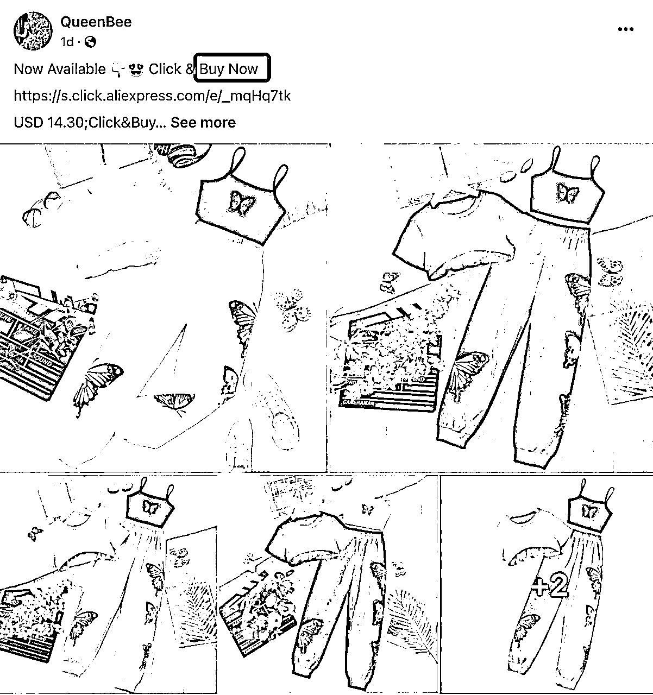
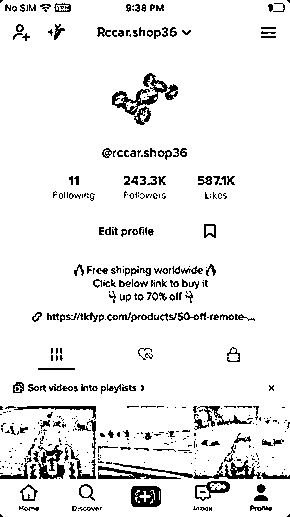
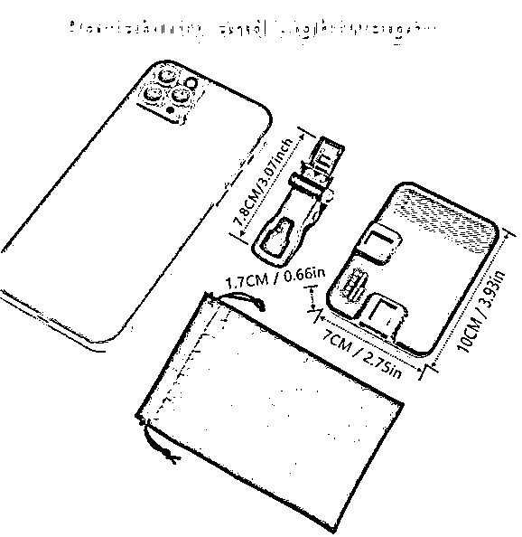
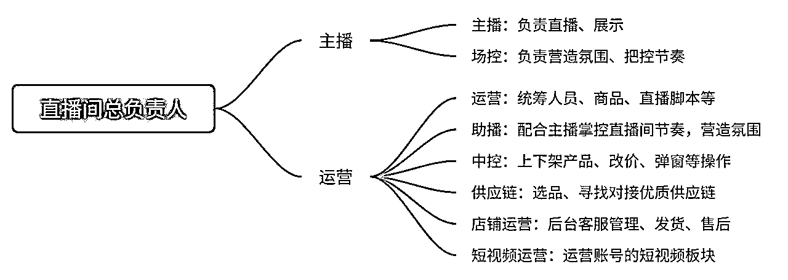

# TikTok 美区小店入门 实战手册 202403

> 来源：[`jviztcgxxfy.feishu.cn/docx/AYv8do5nboNqqjxEtotcruhSnqf`](https://jviztcgxxfy.feishu.cn/docx/AYv8do5nboNqqjxEtotcruhSnqf)

手册出品方：生财有术团队

出品时间：2024 年 3 月 15 日

手册使用说明：内容出品人排名不分先后。本文旨在向你展示一个项目的更多可能性，帮助你更好地理解和实操。

建议：如果需要快速定位到精确内容，可以使用快捷键 Ctrl + F/command + F 的形式，搜索「关键字/词」，查找你想要的内容。

# 写在前面

欢迎大家来到 3 月航海 | TikTok 美区小店入门 | 实战手册，相信在接下来的日子里，我们将在这里见面很多次。

首先需要说明的是：

虽然 TikTok 美区小店目前处于风口，但他依旧具备大部分跨境电商项目所需要投入的精力。

因此 21 天时间我们可能无法跑完整个项目的 0-1，但可以带大家了解美区小店的整体流程。因此需要大家建立好预期，带着打持久仗的想法加入进来，这次航海主要是带大家入门。

且 TikTok 美区小店的入驻有一定门槛，建议满足开店门槛的小伙伴了解清楚入驻门槛和投入后，尝试开店实操。

达到开店门槛的小伙伴也不用着急，你可以先了解美区小店的整体流程为主，感受目前跨境电商领域里最火热的赛道，看看别人都是怎么赚钱的，借此判断自己是否适合入场。

在开始学习之前，让我们先来解决几个问题：

1）TikTok 美区小店是什么项目？前景如何？

TikTok 电商至今已经发展了近 3 年的时间，相比于 2-3 年前的拓新时期，目前已经有一定的基建设施（如物流、支付通道等），无论是市场环境和应用场景都更加成熟。

在相对成熟的基础上，在美国这个 TikTok 重点发力的市场中，TikTok 电商的增长速度非常快。在美国地区，经过 2023 年一整年的发展，TikTok 电商做到了从 0 到接近 20 亿美金 GMV 的成绩。

而在 2024 年，预计 TikTok 美区电商市场还会有 10 倍的增长空间。

我们都知道，只要赛道在迅猛增长，赛道的容积就会越来越大。无论对于已经入局的玩家还是新晋玩家，都有巨大的市场机会。

2）TikTok 美区小店有几种模式？

TikTok 美区小店目前是两种电商模式：自运营模式和全托管模式。

但长期看，自运营商家仍将作为驱动平台发展的主力，这个模式的盈利天花板也更高。

3）什么样的人适合做 TikTok 美区小店项目？

和所有的电商项目一样，TikTok 美区小店有一定的门槛（比如：需要符合开店条件；有电商经验；有供应链；或者可找到合作伙伴），可以尝试做这个项目；如果自己找不到靠谱的货源或合作方，又急需通过做生意赚到第一桶金，需要谨慎下场。

但值得关注的是，在 TikTok 美区电商生态中还有其他的角色，即使不满足开店要求，如有以下能力也可以通过做服务商入场：

注意事项：本航海手册主要描述本项目当下情况，真正入局跨境电商项目后，我们需要密切关注国际贸易政策、各国法规、汇率波动、市场竞争等动态变化，及时调整项目策略和运营方案，以应对市场挑战，确保项目顺利进行。

最后，希望大家可以在这次航行里收获成果外，也能结识一群战友。

以下内容由生财有术联合圈友制作而成，仅供航海船员以及生财有术星球圈友学习使用。

同时也欢迎圈友们在实践过程中持续反馈，和我们共同完善，可以联系鱼丸（yuwan387）提供修改建议～

# 【更新提示】新手册使用方式

在开始前，我们来简单了解一下这个手册的正确打开方式，方便你根据自己的情况来灵活使用。

在这里，手册整体的步骤顺序是按照从 0 - 1 跑通一个 TikTok 美区小店项目进行的，你可以参考航线图，按顺序开始实操。也可以根据自己的实际需求选择性阅读。

需要注意的是：本次手册相较于过往航海，进行了较大的改版。之前的手册尽可能的展示更多可能的玩法供大家自由选择，本次改版后的手册，分为必修和选修两个大的章节：

如果你还未接触过 TikTok 美区小店项目：

建议在正式实操前，先初步了解下这个平台，并且了解它的最新消息

【项目概述】TikTok 美区电商机会

如果你对项目已有大致的了解：

请从航线图第一阶段的步骤开始实操，这个阶段你可以从手册的第二章开始阅读，逐步完成整个项目

【实操 1/4】申请开通店铺

【实操 2/4】选品及找货源

【实操 3/4】美区小店带货运营

【实操 4/4】美区小店店铺管理

如果你已跑通项目最小 MVP ，想放大项目：

可以重点阅读以下章节，扩展更多玩法

【项目放大】美区小店进阶运营——直播带货

本航海项目的航线图如下：

航线图和手册是高度关联的，因此你可以根据自己所在的环节，进行相关步骤的学习。

# 必修篇：跑通最小 MVP

章节概要

在这一章节，我们将从认识 TikTok 美区小店开始，一步步带你完成整个项目流程的学习。

如果满足开店条件，你可以根据本章的步骤内容进行实操，跑通最小 MVP，开通第一个店铺并运营；

如果暂未满足条件，可先对项目全流程进行了解，判断是否下场。

如果你是本项目新手，建议在正式实操前，先初步了解下项目全貌：

【项目概述】TikTok 美区电商机会

如果你对项目整体有了大致了解，就可以按照项目核心步骤，开始学习实操：

【实操 1/4】申请开通店铺

【实操 2/4】选品及找货源

【实操 3/4】美区小店店铺管理

【实操 4/4】美区小店带货运营

在必修篇，航线图和手册顺序相对应，你可以按照手册的顺序进行学习，即可逐一完成航线图的每一个任务。

在后续的每个关键步骤的章节概要中，我们也将提到相关航线图，提醒你完成相关步骤。

接下来就正式开始吧！

## 一、【项目概述】TikTok 美区电商机会

章节概要

目前在大家广泛讨论的出海赛道中，跨境电商是不可忽视的一部分，而 TikTok 是目前众多跨境电商平台与外海社交媒体平台中，无论从增长速度还是从平台潜力来看，都是名列前茅的。

此次航海，我们将会带领大家充分了解 TikTok 平台以及要做好 TikTok 美区电商需要做好哪些准备。

本版块中，我们从以下 4 个方面介绍，希望能帮助大家更好地了解这个项目：

TikTok 平台的发展现状和机会

为什么入局 TikTok 美区小店？

不同的人 / 团队该如何抓住机会？

目前 TikTok 美区小店的电商模式

提示：有 TikTok 美区电商基础知识的朋友，可以跳过直接进入下一章。

### 1.1 TikTok 平台电商的发展现状和机会

据 Market Splash，截至 2023 年底 TikTok 拥有 16.77 亿 用户，月活跃用户（MAU）总数达 11 亿。全世界的文化、思想都在此进行交流碰撞，这也凸显了 TikTok 的多样性和包容性。

对于社交媒体而言，TikTok 平台的用户增长速度非常之快，越来越多的年轻人成为 TikTok 的深度用户。我们知道，流量的聚集地往往都蕴藏着商机，而新兴的流量聚集地往往意味着新的机遇。

《2023 年度 TikTok 电商行业趋势白皮书》下载量

《2023 年度 TikTok 电商行业趋势白皮书》用户画像分析

因此，越来越多的商家将目光聚焦在 TikTok 上，将 TikTok 作为一个新的渠道开展电商业务。而随着 TikTok 平台的不断发展，身处其中的商家也会不断享受着平台增长带来的红利。

在当下“出海”的各条赛道上，TikTok 作为新兴的内容平台和电商平台，无论是在时间维度上还是在商家经营模式上，都拥有着巨大的机会与优势。我们主要从以下两个角度来理解：

经过了三年多的发展，TikTok 电商目前主要的模式有全托管模式与平台模式（POP），开放的地区主要有东南亚、欧洲、中东、北美。

在过去几年，TikTok 电商的主要发力市场在东南亚地区，目前东南亚地区的整体规模也是最大的。

自今年 9 月 12 日，TikTok 在美正式推出电商业务，整个美国市场信心十足，小店数量狂增近百倍。

《2023 年度 TikTok 电商行业趋势自皮书》美区小店数量统计

目前美国市场一日 GMV 平均在 2.6～3 千万美金之间，与此前断层领先的印尼市场“实力相当”，2023 年底的黑五电商节当天 GMV 达到单日 3400 万美金，可见其增速之快，总之当流量闸门打开，趁早入局就可能抢占第一波红利。

从平台及商家运营模式进行划分，TlkTok 电商可分为自运营（POP）模式和全托管模式。

全托管模式中，商家主要承担 TikTok 平台供货商的角色，以供货价将产品卖给平台，而产品具体的销售价，则由平台决定。

在这个模式下，商家需要先将商品寄到平台仓库，平台以销定结，如果产生滞销产品，则会在满足条件下进行退供，将产品寄回给商家。目前全托管模式比较适合有较强供应链的工厂或贸易型商家。

在自运营模式中，商家拥有更强的自主性，包括内容电商（短视频、直播、达人合作）和货架电商（商城）两类经营方式、根据运营策略灵活定价以及参与营销活动等。

但这个模式的难点在于，商家既需要有供应链能力，又需要有流量能力，因此门槛相对较高，更适合有电商尤其内容电商运营经验的商家。

其实在商家角色之外，TikTok 电商也拥有丰富的服务商生态，包含 TSP、TAP、MCN（CAP）等等，如果无法到达商家角色的门槛，或对商家角色的生意模型不太感兴趣的同学，可以考虑从服务商角色切入。

### 1.2 为什么要做 TikTok 美区小店？

从用户和市场等角度分析，我们会发现 TikTok 美区小店有很大的空间：

1.美国市场整体天花板较高

美国地区相比于海外的其他地区，美国是一个比较大且完整的经济体，不像欧洲市场相对割裂，这意味着美国市场的整体天花板较高。

另外在 2023 年第三季度，美国市场的用户月活提升显著，高达 9.87%。或许未来的走势我们还不得而知，但在所剩下的 ”近亿市场” 中，美国无疑成为增量关键。

2.美国用户的消费力强

美国地区的人均收入较高，有较强的消费力，这意味着在美国市场做电商有着较高的毛利率。

3.美区小店仍在放量增长环节，预计 2024 年继续增长

当下 TikTok 电商在美区市场仍处于早期阶段，在 2023 年，美区小店数量狂增近百倍。增量只是一个数字，但可以肯定的是赚钱路子已全部打开。

在 2024 年，TikTok 美区电商市场预期会有十倍的增长空间，这就意味着有充足的增量市场空间让我们去探索，商家需要看到背后的价值在于细分品类的挖掘，探索高销量低商品数的蓝海。

《2023 年度 TikTok 电商行业趋势自皮书》美区市场数据

### 1.3 如何抓住美区电商的机会？

许多团队的能力模型都是不同的，因此不同团队需要根据自身相应的能力模型来选择切入点。

在美区电商生态中，主要可分为服务商与商家，其中服务商有货盘服务商、代运营服务商、达人服务商等等。

因此对于大多数能力模型比较单一的团队，更适合从服务商角度切入，切入成本与风险都会相对较低。

例如：

对于同时具备供应链与流量能力的团队，则可以从商家角度切入。

在 2024 年，达人营销、直播、商业化流量是关键词，可以尽快搭建达人营销、本土化直播团队。

### 1.4 TikTok 美区小店的电商模式

前面我们简单提到，TikTok 电商目前从经营模式上主要分为两个模式：“自运营模式”与“全托管模式”。

#### 1.4.1 自运营模式

自运营模式是指平台仅提供一些平台内的共享资源，具体的销售、履约、售后等运营环节由商家自己负责，平台在这个过程中主要的职责是制定平台规则。

1）盈利模式

自运营商家的销售模式可划分为商家自播（短视频/直播带货）、达人带货、商城三种。其中达人带货是 TikTok 电商较为主流的带货模式。

2）物流履约模式

自运营卖家可以选择自履约、海外仓、平台官方 FBT 仓履约等物流模式。

对于美国市场，卖家可选发货方式包括：

1.平台履约，商家可以选择 TikTok 官方自营的 FBT 仓，为卖家提供仓储、分拣打包、配送等服务；

2.海外仓发货（自建仓库/合作第三方美国海外仓，包括亚马逊 FBA），尾程配送时效较快，买家下单后通常 1-3 天即可送达；

3.部分店铺也会采用虚拟仓发货（即实际从中国发货，美国小包自履约，但物流轨迹显示在美国），要求 3 天内发出订单、7 天内送达。但现在不建议虚拟仓发货！目前非常容易封店，血本无归的那种，因此不建议使用该方式。

时效方面，本土卖家要求本地发货，履约时效比跨境卖家要求更高，通常 3-5 天内可送达；跨境卖家在跨境直发物流模式下时效相对较长，通常需 7-10 天，海外仓模式下时效可缩短至 3-5 天。

费用方面，平台为用户提供一定配送优惠，TikTok 美区新用户购买 5 美元及以上订单的买家可享受免费送货服务，老客户购买 20 美元的订单提供免费送货服务。

#### 1.4.2 全托管模式

全托管模式指的是商家与供货商负责开发、提报商品，而平台负责帮助商家进行销售、履约、售后等环节，平台与商家则按照按供货价结算。

商家只需要将商品提报给平台，通过平台选款后，商家便可以直接将商品寄送到平台仓库，后续的营销推广、履约售后都由平台来做，不需要商家操心。平台将商品卖出去之后，就会按照供货价与商家进行结算。

简而言之，商家仅需要供货和备货，然后就可以当甩手掌柜了，其他绝大多数环节都由平台来帮忙做。

2023 年是各个平台全托管业务全面开卷的一年。在 TikTok 全托管的业务模式下，平台烧钱做补贴，腰尾部商家囤货陪跑，赚到钱的是谁呢？

问题是，头部商家占比不大，大部分头部以下商家很难赚到钱。同时全托管商品还会与本土商品在价格上存在一定的竞争关系，干扰本土商家的定价体系。所以很多人在思考全托管这个业务对于整个市场的意义是什么。

其实全托管有一个非常重要的价值：做市场开拓和用户增长。只要有新市场开放，或市场中的电商用户还在快速增长，那全托管就有存在的意义。

2024 年就有这样的机会。如果不出意外（PS：TT 新开国经常出意外），在今年年中，全托管业务会开放法、德、意、西、墨、阿联酋等国家。

因此，如果我们在供应链上有优势，仍然可以考虑全托管的方向，在今年年中发力新开国家。

但长期看，基于平台的内容化基因，以及性价比心智相对并不强烈的调性，擅长内容产出、在商品特色和履约方面更具备本土优势的自运营商家仍将作为驱动平台发展的主力。

内容来源：《TikTok Shop 推出新模式，商家应该怎么做？》、《作为 TikTok 商家，2024 年我的经营方向与思路》

## 二、【实操 1/4】申请开通店铺

章节概要

了解完 TikTok 美区小店项目的整体情况后，我们就要正式开始启动了。在 TikTok 美区做电商的前提，是完成前期的店铺准备。

所以在这一章节，我们整理了项目初期需要筹备的事项，包括：

安全的注册 TikTok 账号

了解入驻门槛并选择适合自己的店铺

开通店铺

其中，注册账号这部分需要大家自行完成，本手册中不展开讲解，可以参考章节 2.1 中的链接。

TikTok 美区小店里，不同店铺的入驻门槛是不同的，大家可以结合自身情况，了解清楚后，进入入驻流程。

没有达到入驻门槛的小伙伴也不要着急。我们本次航海的主要目标为入门了解，你可以先熟悉项目流程，了解如何选品、如何找供应商、如何拍摄视频、如何建联达人等方法，判断是否入场。如果判断适合自己，到时候再想办法达到入驻要求也不迟～

本章航线图

完成第二章的学习和实操，即可完成航线图的第一阶段：安全注册 TikTok 账号，开通美区小店（约 2 周）

1.成功安全注册 TikTok 账号（约 1 天）

2.了解美区小店的类型以及开店准备资料（约 1 天）

3.了解开店流程，若有资质尝试开通店铺（约 2 周下店）

接下来请正式开始，跟着步骤完成第二章内容学习，记得在航海日志中打卡记录进度哦～

### 2.1 如何更安全的注册 TikTok 账号？

为了能更顺利的开始我们的 TikTok 美区小店之路，需要准备一个美区的 TikTok 账号，一方面是开店需要，另一方面也方便我们后续选品和找对标，以及发带货短视频做转化。

如何能够顺利的完成注册，请参考这篇文档内的步骤操作：《3 月航海｜TikTok 美区小店｜前期准备》。

### 2.2 美区小店不同店铺类型和入驻条件

小节概要

美区小店有不同的店铺类型，分为这几种：

我们来看一下每种店铺类型都有哪些门槛，以及入驻过程中各有什么注意事项。

#### 2.2.1 美区本土小店

2.2.1.1 个人店

美区本土小店个人店，顾名思义就是没有公司主体，以个人的名义开的店。

入驻资料

1.美国手机号（接码平台即可，如 https://pingme.tel/）

2.邮箱（outlook、Google）注意：不要使用国内邮箱，比如 163、QQ 等

3.美国公民的个人护照或者驾照（百度或淘宝上有；付钱找一个）

4.社会保险号（SSN）或个人纳税识别号（ITIN）

有人会问如果没有 3、4 项，能不能直接购买一家个人店？

我的看法是：不建议。

因为直接购买店铺有个很大的坑需要注意：不知道这个购买来的店是用什么样的资料去注册的，甚至有些人会用一个美国人的护照或驾照开很多个店卖给不同的人，7 天质保过后，店铺被封是不售后的，风险极大。

美国个人本土店税率：

美国的每个州税收政策都不一样，所以要看这个店铺的资质开在哪个州，根据每个州对应的税法收税，例如加州是 9.5%。其中有一些免消费税的州，如阿拉斯加、特拉华、蒙大拿和新罕布什尔。另外，New Jersey（新泽西）部分免税。

2.2.1.2 企业店

美区本土小店企业店和个人店相差不大，最大的差别就是需要一个美国本土企业营业执照。

入驻资料

1.美国手机号（接码平台即可）

2.邮箱（Outlook、Google）

1.美国本土企业营业执照（最终受益人必须为美籍，且控股 75% 或 75% 以上）

1.法人社会保险号（SSN）或个人纳税识别号（ITIN）

注册美国本土店建议大家使用干净的美国 IP 注册美国本土店。

2.2.1.3 ACCU 店（目前入口基本关闭）

ACCU 店（American Company Chinese UBO）可以理解为合资公司，即一个中国人作为法人的美国公司，拥有的是美国营业执照，本质上属于本土店。

入驻资料

1.美国手机号（接码平台即可）

2.邮箱（outlook、Google）

1.美国本土企业营业执照（中国法人持股超过 25%，该营业执照的最终受益人需要与亚马逊营业执照的法人一致）

2.亚马逊单个美区店铺一年内 200W 美元营业额

第 3 点需要注意的是，如果我们要找服务商开一个美国本土的企业营业执照，开之前需要提前知道每个州的税收和年审政策，再去选择开在哪个城市 / 州，合理的降低我们的成本。

因为每个州的税收是不同的，影响是比较大的， 比如加州的税收是年利润的 9.5%；蒙大拿州（State of Montana）税收是年利润的 2.6%。另外每个州的年审价格也是不同的。

第 4 点也很重要，ACCU 店现在必须要满足「亚马逊一年内 200W 美元营业额」/「亚马逊总排名前 10 万名的商家资质」这个要求，主要包括：

如果需要找服务商办理主体和亚马逊流水，一般价格在 5000-10000 元（仅供参考），其中根据你满足的条件和需要的服务项，有不同的价格划分。

ACCU 店的优点：

回款速度快，和本土店一样，一般在订单完成后 24 小时内就能到账。

而且，ACCU 店有一个很大的优势，就是有中国的 AM（Account Manager）进行负责。这意味着，后续遇到平台的相关问题，卖家可以直接和 AM 沟通解决，不用担心语言和文化的障碍。

ACCU 店的缺点：

门槛相对较高，不是所有卖家都能满足注册条件。而且，ACCU 店也要遵守本土店的各种规则和限制，例如发货时效。

需要注意的是：目前 ACCU 的入口基本关停了。

我们当前可以考虑申请美区跨境小店美国本土发货商家的店铺类型。

#### 2.2.2 美区跨境小店 —— POP 模式

美区跨境小店在 2023 年 10 月份上线的，一共有三种类型：

2.2.2.1 美国本土发货商家

美国本土发货商家刚好对应了大部分本身就做海外货架电商的一些商家，比如：亚马逊（Amazon）、美客多（MercadoLibre）、虾皮（shopee）、独立站等等都可以，不过对这些商家的能力有一些要求。

1.商家能力

说白了就是我们的货要在海外，能够实现海外实时发货。目前支持美国海外仓或 FBA 多渠道配送发货，暂不接受跨境发货、虚拟海外仓，详细履约方案可咨询客户经理。

一定不要用虚拟海外仓！非常容易被封店，而且是血本无归的那种。

这一条的商家能力要求其实定的没有那么死，主要还是看负责对应类目的招商经理是否相信你的团队。入驻后只要能播出来，能拍出来，前期没有这个能力也不一定不能入驻。

2.开放类目

目前只开放了以下 6 个类目：

美妆个护

汽车&摩托车、电脑与办公设备、手机与电子产品

母婴、时尚配饰、珠宝配饰及衍生产品、儿童时尚、行李箱与包袋、男装与内衣、民族服饰、鞋类、运动与户外、女装与内衣

汽车&摩托车、母婴用品、美容与个人护理、家具、健康&个护、家用器具、家用电器、厨房用具、宠物用品、运动与户外用品、纺织品与软家具、工具与五金、玩具

水晶珠宝算是一个特殊的类目，后续会单独讲到。

3.入驻门槛及要求

4.入驻大致流程

如果超过 15 日还没有任何信息，证明审核不通过。

2.2.2.2 品牌出海商家

这个类型门槛比较高，适合小部分商家，但如果商家可以成功入驻，会有个优先通道，由专门的团队提供一些资源或扶持的服务。

2.2.2.3 珠宝水晶商家（近期关闭了入驻通道，后续开放时间待定）

这个类型的商家是不需要在美国本土有货，可以在国内进行发货的。

划一下重点：

#### 2.2.3 店铺类型入驻信息汇总导图

以上各店铺的入驻相关信息，汇总成了一张导图，方便大家更直观的查看。

### 2.3 美区小店开通步骤及避坑点

#### 2.3.1 入驻开通的流程

了解了各类型店铺的入驻门槛之后，相信你已经大致明确了自己要开什么类型的店铺，接下来，只要按照步骤完成开通即可。

这里可以直接参考官方发出的商家入驻指南：《TikTok shop 美国商家入驻与运营 Q&A（基础版）》

再次提醒大家：

美国本土小店个人店和企业店是没有官方人员对接，仅自主入驻；

美区跨境小店是有招商经理可以对接的，碰到问题可以联系招商经理辅助你入驻。

#### 2.3.2 开通过程中避坑点

有两个关键的避坑点希望你在开始做 TikTok 美区小店之前知晓：

1.建议店铺通过后，马上绑定收款方式

万一被封有 90 天冻结，会有个环节是二审申诉，提交材料，过程非常长。但是已发货的订单，款会正常到账户上，没发货的订单会自动取消。

2.店群模式风险太大

大量（100 个、200 个）的本土店（个人店），看亚马逊淘宝天猫上哪个货卖的好，就用 ERP 上上去虚拟仓发货，当你店铺的销量和评价更好时，平台会排序在前。虚拟仓现在很容易被封，在这模式里店铺是个消耗品，不停的封店和开新店，现在店铺刚下来一两天就会被封，无法跑通。

## 三、【实操 2/4】选品及找货源

章节概要

前期准备工作已经告一段落，在等待店铺注册通过期间，我们可以先开始确定类目及选品，并尝试找到合适的货源供应商，为后续运营及上架销售提前做好准备。

其中，选品是本章节需要我们重点掌握的技能。

我们将通过以下流程完成选品技能的初步掌握：

第一步：确定电商类目

由于小店开启后，后端可选上架的产品类目相对较宽松，这里主要讲的，其实是我们自己的 TikTok 账号在短视频带货运营时的类目选择，需要注意两个关键词，分别是“垂直领域”与“商品属性”。

第二步：了解选品思路

选品往往选的是用户人群、是市场需求，因此我们在这一步，通过从金额、市场规模、年轻化程度、市场普及度、价格敏感度这 5 个角度来讲讲 TikTok 电商如何选品。

第三步：利用渠道和工具进行选品

带着上一步的思路，我们通常可以在跨境电商平台渠道、社交平台渠道、冷门渠道、数据平台这四个渠道，找到适合的带货产品。

当然，除此之外还会有更多的选品渠道和工具，欢迎你在航海期间和大家积极分享、讨论。

找到适合的产品后，我们需要搞定货源才能进行后续的备货和运营等工作。所以找到一个靠谱的供应商，是接下来很重要的一步。

如果产品没有确定，后面的流程都将无法很好的进行下去，所以在这一步，我们花多一些时间，认认真真选品，是非常有必要的。

做生意不能只埋头赶路，要多看看市场环境，这样才能提高成功概率！

本章航线图

完成第三章的学习和实操，即可完成航线图的第二阶段：确定类目完成选品，学习短视频和达人建联两种带货方式（约 8 天）

1.确定合适自己的电商类目（约 1 天）

2.了解选品思路，尝试在四个渠道中完成选品（约 3 天）

现在就开始确定类目、开始选品吧！记得提交到航海日志中打卡哦～

### 3.1 如何在 TikTok 中选择电商类目

在运营 TikTok 电商之前，需要先选择一个类目。小店在开通后对所上架的产品所属类目相对较宽松，但 TikTok 账号发视频会更注重类目的垂直性。因此在选择类目时，需要注意两个关键词，分别是「垂直领域」与「商品属性」。

如果我们带货的类目够垂直，那也意味着带货短视频吸引来的流量越精准，画像更清晰，有更多的相似属性，那么我们就可以针对这批粉丝进行反复营销，满足她们这个类目下的各种需求。

反过来说。如果我们的 TikTok 带货账号内容很杂，比如美妆、3C、家居的带货视频内容都在一个账号上，势必会导致流量不精准，很难对客户做二次营销。

和上一个关键词所影响的相似，带货短视频是否具备「商品属性」也是影响流量是否精准的重要因素之一。

有些小伙伴会为了能够更加快速的涨粉，而选择前期做那些容易涨粉的内容，比如搞笑视频、泛娱乐视频等等。但后期开始带货后就会发现，靠这种方式涨的粉不精准，不容易转化。

因此为了后续更顺利的营销，我们在账号刚开始发内容时，就要选择有好物推荐的带货属性视频。

类目参考：

据《2023 年度 TikTok 电商行业趋势白皮书》，TikTok 美区小店在 “黑五” 期间，手机数码、运动户外、保健、居家日用类目整体销售额均在 10～11 月期间呈现环比增长的趋势，是增量机会较大的类目。

每个类目更多分析可以查看以下 PDF 了解：

《2023 年度 TikTok 电商行业趋势白皮书》.pdf

需要注意的是：TikTok 美区电商变化很快，热门产品会随着时间和平台上的热门内容趋势变化，因此这里的内容仅供参考，实际选品过程中需要多多关注当下的平台趋势。

如果你有几个可以做的类目，但是不知道应该投入哪个，那么可以在自己的精力范围内，考虑多起几个账号关联到自己的小店，然后发视频测试不同的类目情况，选择出更适合自己的类目进行深耕。

### 3.2 TikTok 美区选品思路

做跨境电商，"选品"和"运营"都必不可少。甚至在很多时候，“选品” 在整个生意闭环中起到了决定性作用。

选品往往选的是用户人群、是市场需求，而针对不同的人群与需求，商家需要具备的能力项也是不同的，平台的匹配程度也是不一样的，从而商家对应的运营策略也是不同的。我们时常讲“方向比努力重要”，而这里的选品就是选择一个方向。

如果在选品的时候，缺乏对 TikTok 平台、目标市场、产品与类目属性的认知，选择了错误的方向，则会大幅增加我们的测试成本，导致整个商业模型无法跑正。但如果有较强的选品能力，则可以大幅提高测品效率，增加打出爆款的概率。

我们从金额、市场规模、年轻化程度、市场普及度、价格敏感度这 5 个角度来看有哪些产品适合 TikTok。

#### 3.2.1 商品金额

因为 TikTok 的整体商业环境并不成熟，目前平台还没有培养好用户在 TikTok 上购买商品的习惯。同时其主流消费者比较年轻，消费力较弱，因此从商品金额的维度来看，可以参考以下这个范围标准。

在 TikTok 短视频带货中一般会选择 10-100 美金之间的商品；

TikTok 直播带货中，则商品的价格上限可以提高到 150 美金。

选 10 美金以上是因为 10 美金以下的商品利润空间比较低，往往物流成本（轻小件产品也需要 5-7 美金）就会占去很大一部分；而选 100 美金以下的商品是因为高客单价的商品在 TikTok 上转化率表现较差。

#### 3.2.2 市场规模

如果是 TikTok 跨境电商的新手，建议在初期选品的时候选择市场规模较大的类目与产品（如 3C、美妆、家居百货等）。

这里不是说蓝海 / 利基市场的品不能选，只是建议先通过市场规模较大的产品了解 TikTok 这个平台用户的特点，等选品经验较为丰富之后，再寻找利基市场产品。

同时在当下阶段（ 2024 年），TikTok 美区市场的产品广度远远没有达到饱和状态，大类目之下仍然具有许多产品上的空白，这之间就蕴含着巨大的机会。

曾经有位新手学员和我说想卖毛笔。他有一个伟大的理想，要教会全世界的老外写中国的毛笔字，首先做一个写毛笔字的账号，教老外学会毛笔字，然后就可以卖毛笔给他们，他们就能学会毛笔字了。

想法确实不错，但作为新手在不了解当地市场与受众人群的精准画像的前提下这样做，会遇到非常大的阻力，很有可能因为无法找到精准的受众人群而迟迟无法跑通闭环。

#### 3.2.3 年轻化

在海外社交媒体中，很多人会将 TikTok 与 Facebook 做对比，包括在选品时也会通过 Facebook 寻找灵感。

但其实 Facebook 的用户群体与 TikTok 的用户群体有较大不同。

在 Facebook 中，年龄分布比较平均，相对于 TikTok 来说，Facebook 的中老年用户更多，65 岁以上的美国人有接近 50% 都在使用 Facebook。

而 TikTok 的用户中，60% 的客户年龄在 30 岁以下，换言之，过半的 TikTok 用户都是年轻人。

因此无论在选品还是在视频内容设计的时候，都要将目标指向年轻人群。同时年轻人往往还带着另一个标签——消费力相对较弱，这也是为什么不建议在 TikTok 上卖高客单产品的原因之一。

#### 3.2.4 市场上是否容易买到

TikTok 短视频社交平台带货的产品往往具有新奇特属性，这是因为新奇特的商品市面上比较少见，容易激发大家的兴趣，不仅可以吸引更多的观众，同时也有利于转化。

设想一个场景，假如你在刷抖音，发现抖音上有一个蛮不错的商品，转念一想，这个商品楼下便利店就有，价格还差不多，那一般都不会选择在抖音上买。

所以我们要选择一些市面上不那么好买到的，具有新奇特属性的产品。

另外，TikTok 上仍然有许多消费者仍然习惯在亚马逊等传统货架电商平台购物，当他们在 TikTok 上看到了一款中意的产品后，会去亚马逊寻找是否有同款，如果有同款，我们很有可能会失去这个客户。因此我们应该尽量挑选在亚马逊中不那么容易搜索到的产品。

#### 3.2.5 顾客价格敏感度

TikTok 的用户在刷 TikTok 视频的时候，其实他并不想买东西，可能只是想消遣一下时间。如果他想买东西，很可能会比较有针对性的去某某购物平台上购买商品（俗称人找货），但短视频带货，则是在他没有购买目的的时候将商品卖给他（俗称货找人）。

因此在 TikTok 这一类社交平台带货，往往都需要借助顾客的冲动消费心理，因此低价格敏感度的商品更适合于在 TikTok 上带货。

如果顾客对商品价格过于敏感，那么会极大的削弱消费的冲动，举个例子：

我想大部分人会出门左拐去隔壁便利店，因为对于农夫山泉矿泉水这件商品，顾客的价格敏感度是很高的，价格稍有波动，客户便会不买账。

我想大部分人会觉得还行，不会像 4 块钱的农夫山泉一样那么难以接受。

这就是要选择低价格敏感度商品的意义。

那么什么样的商品具有低价格敏感度的特点呢？有下面几个方向可以关注：

1、商品价格认知区间较大。如：美妆用品、3C 配件

2、商品的独特程度高。如：猫爪杯、新奇特小夜灯

### 3.3 TikTok 电商四大选品渠道与工具

TikTok 电商有两重属性，一个是短视频电商，一个是跨境电商。所以我们在具体的选品渠道上也要综合考虑，下面主要介绍四大类选品渠道，分别是：跨境电商平台渠道、社交平台渠道、冷门渠道、数据平台选品。

#### 3.3.1 跨境电商平台渠道

比较主流的跨境电商平台有：亚马逊、eBay、速卖通、Wish、Shopee 等等，我们这里选择最具代表性的亚马逊举例。

亚马逊平台中有一个这样的页面：https://www.amazon.com/Best-Sellers/zgbs

上面有 Best Sellers（最畅销）、New Releases（新发布）、Movers & Shakers（趋势波动）、Most Wished For（愿望清单）、Gift Ideas（礼品清单）五个榜单。

在上述五个榜单中，每一个榜单对我们的选品都有很大的参考价值。

但需要注意的是，我们在这些榜单中选了商品之后，一定要思考能否与 TikTok 的视频属性相结合。

首先看 Best Sellers，在这个榜单中给大家的建议是看各个类目详情中的中部和底部的类目和商品。因为头部商品往往是已经买爆的品，其上升潜力已经比较小，而中部和底部的则有较大的上升空间。

Movers & Shakers 榜单的借鉴意义是比较大的，因为这里显示的是 24 小时的趋势波动，可以让我们很好的判断即将成为热点的是什么商品。

在 Most Wished For 榜单中选品时，我们需要的是分析消费者心理。

既然顾客已经把商品加入了愿望清单，说明他很喜欢很想要，那他为什么还不买？他为什么还不买？他为什么还不买？

问自己三遍这个问题，然后思考一下，会不会是在等降价？如果是在等降价，我们可以不可以在 TikTok 上压缩一下价格卖给他们？

如果不是等降价，还能再等什么呢？有没有可能是时间还没到？可能是为某个节日在做准备，计划某个节日到来之前再买？如果是这样的话，我们能不能把这个商品记录下来，等到那个节日前，对这个商品进行一波节日营销？

Gift Ideas 榜单和 Most Wished For 类似，都需要去分析消费者的心理，为什么加入了榜单却没有买。这一类的产品往往都可以直接跟卖。

以上就是如何在跨境电商平台进行选品，还是要强调一下，跨境电商平台毕竟是单纯的跨境电商，里面缺少短视频的基因，同时这里也是人找货的模式，与货找人完全不同。

所以在这些平台选品，一定要思考两个点：

1.这个商品能否通过短视频进行很好的展示；

2.能否在货找人的模式下激发观众冲动消费。

#### 3.3.2 社交平台渠道

社交平台电商主要分两个部分来讲，分别是抖音部分和 Facebook 部分。选择这两个平台主要是因为他们与 TikTok 具有很大的相似性。

TikTok 就是海外版的抖音，同时其算法推送逻辑也是类似的，唯一不同的就是抖音是做国内电商，TikTok 是做跨境电商。

Facebook 和 TikTok 的相似之处就在于同是用户体量庞大的海外社交平台，不同的是 Facebook 上广告展示形式和推荐逻辑与 TikTok 差异较大，同时用户群体略有差异。

3.3.2.1 抖音

在抖音上选品，往往不需要考虑商品能否通过视频展示出来，因为能在抖音上卖的不错的，都是可以通过视觉或听觉传达给观众的。

抖音最根本的逻辑就是用户喜欢什么，就给用户推送什么，那么我们其实可以利用抖音的算法来帮我们找品。

新建一个抖音账号，看到好物、跨境商品就点赞、评论、转发、关注，看到无关视频就长按点击不感兴趣或快速划走。操作一段时间之后，你会发现这个抖音号上刷出来的都是好物类的商品。

这时候你只需要判断的是：这个商品从客单价、市场规模、海外群体用户习惯方面考虑，能否把它作为跨境商品出售，如果可以，就在马上 TikTok 中进入测品阶段。

同时在抖音生态中还有一个比较好用的工具，就是数据分析平台，如：飞瓜数据、抖查查等等。

在这一类平台中选品的时候，尤其要思考商品的物流、政策与受众。比如当你打开飞瓜数据看月度榜单的时候，会发现，排名前十的商品中，一大半都是食品，很显然我们做跨境电商售卖食品是比较困难的。所以我们要学会通过几个维度来判断商品是否适合做跨境。

我们来看一下这张新鲜出炉的榜单，排在榜首的是一个“瑜伽环”，瑜伽健身用品。我们来判断一下，这个品能不能去测一下呢？

我们从物流角度来考虑，商品体积不大，重量适中，没有违反物流正常，物流方面没有问题；从用户习惯角度看，外国人同样有瑜伽健身的习惯，需求是契合的，也没问题。所以答案是：可以。

那么我们看榜二，是“山药脆皮”，是食品，直接 Pass。

接着看榜三和榜四，是“明星同款 T 恤”，能不能卖呢？

物流方面，无论从重量、体积、政策角度来看，都没问题。但是这时候需要思考这几个问题：中国人的体型和外国人的体型是否一样呢？衣服的版型是否相同的？标题上写的是明星同款，外国人对中国的明星是否感兴趣呢？

通过这几点仔细思考下来，我们一般认为这可能不是一个很好的商品。

综合来看，抖音选品中的两条路径都可以尝试，一条是直接在抖音上利用抖音的算法进行选品，另一个是在数据分析平台进行选品。

3.3.2.2 Facebook

在 Facebook 平台上，我们往往可以利用搜索关键词来快速找品。

因为在 Facebook 的广告文案中，且往往都会加上一些吸引观众购买的关键词，那么通过这些关键词找到大量广告，再通过广告去选品。常用的关键词主要有以下几个，大家可以参考借鉴：

Buy now、30%、40%、50%、60%、order here、claim yours now、free shipping、free worldwide shipping、get it now、get it here、get yours now、get yours、shop here、click here、buy it here、order link、tag a friend、tag a friend who would love this、tag someone who need this、tag someone that would love this.

在 Facebook 上选品需要注意两个点：

1.TikTok 的用户是否有同样的需求；

2.TikTok 的视频节奏更快更紧凑，该商品能否在 TikTok 上很好的展示这个商品的卖点。

#### 3.3.3 冷门渠道

冷门选品渠道在 TikTok 的选品过程中用的比较少，但也有一定的参考借鉴意义，这里就只给大家简单介绍一下。

众筹网站：

1.www.kickstarter.com

2.www.indiegogo.com

在这一类网站上进行选品时，要注意选择众筹完成度较高的商品，完成度越高说明商品需求量越大。

一般我们的标准是超过众筹进度 500% 的品才值得进行着重分析。

新奇特网站：

3.www.shutupandtakemymoney.com

4.www.thisiswhyimbroke.com

这些新奇特网站上有很多意想不到的品，没有灵感的时候可以来参考参考，可以让人脑洞大开。

#### 3.3.4 数据平台

目前市面有许多家第三方数据平台，比较知名且好用的有 Kalodata、Fastmoss、Echotik、特看。

上述的每一个平台都具备常用的商品、店铺、达人等功能，因此对于大部分初级从业者来说，选用哪个平台差别并不大，这里以 Kalodata 平台为例。

选择商品后，便可以看到最近热销的产品排名、产品名称、预估销售金额（不一定准确）、产品销售趋势等信息。

下面给大家举个例子，了解如何通过数据平台进行选品。

进入 Kalodata 点击选品后，可以看到左边有一些筛选条件。

由于 TikTok 电商的多数爆品有一定的生命周期，因此我们在“成交趋势”中会选择“增长”。

同时由于 TikTok 美区市场有全托管店铺和 POP 店铺两种，全托管店铺的产品往往价格非常低，我们作为商家的参考价值不大，因此在“平均售价（$）”中，往往选择 20-100。

选好之后，在右边就可以看到许多在趋势和客单价都比较符合标准的商品。

接下来我们需要根据自身供应链资源情况进行选品。对于供应链资源较弱的团队，往往优先排除服饰类目、食品饮料类目，除此之外有一些专利授权、IP 授权的商品也会进行排除，如宝可梦卡牌等等。

排除一些不太适合的类目和产品之后，接下来就可以找一些符合条件的产品进行测试。如以下的热门产品：

### 3.4 如何找到一个合适的产品供应商

做 TikTok 美区小店和做亚马逊的产品来源是一致的，即在 1688 上找货源。因此产品供应商的寻找方式是相通的。

亚马逊平台较为成熟，和供应商沟通更多的是定制产品的需求，要沟通的信息会相对更复杂。而 TikTok 美区小店处于增长阶段，可选择市面已有的产品直接下单进货，沟通难度相应也也会小很多。

不过如果你是新手，也非常建议你先和海外有货的人合作，降低自己备货到海外的难度。

#### 3.4.1 如何快速精准找到货源供应商 @郑小焦

1.以图搜图

很多时候这个做法很有用。但是，有时候你会搜不出来，可能图片的边缘太模糊，或者产品是由常规 A + B 完全结合在一起了，1688 识别不出来，如果你只是要单独 A / B，不妨想办法把他们拆解出来

2.输入关键词

产品名称、特性、功能、工艺等等

3.到对手的链接——页面介绍、评论里找更多信息

商品页面会有尺寸，重量，包装等信息，评论里有更多真实、细节、放大的图片，或者有告诉你这个产品除了对手所说的功能外，聪明的买家又用来做什么了

4.问 1688 的一些厂家

之前找过一款产品，由于我实在不知道那是什么工艺，找了十几家都说做不了、不能定制之后，我找了一家回复我比较多字的商家问：“那您知道我这个该找什么厂家吗？”他给了我几个关键字，然后我就找到了一堆对标的厂家

5.找类似工艺的产品图，再试试以图搜图

比如找到一款市面上很难再出现的瓶子，原因是现在基本都卖不动了，厂家说大家都买来放榨菜了，而我需要它来装礼品。把装着礼品的罐子去上边搜图，一个也没有。把瓶子内的东西清空，放一张空瓶子的图片，出来的一片都是这个瓶子

内容来源：《自由职业 5 个月回顾之我的亚马逊进修之路》

#### 3.4.2 如何筛选工厂 @Bryce @Jennifer

直接找源头工厂的方式不太适合初期，更适合后续业务较为稳定，需要找源头厂家订货时参考。

下面以大家最为常用的 1688 网站，以产品「皂液器」进行举例。

1.工厂类型

代理商：没有自有工厂，店铺产品通常横跨十数个小类，价格参差不齐。

组装工厂：主要负责整体的产品结构设计，但是芯片方案和外观模具通常是采购其他厂商的，和代工厂的定义类似。

产研一体的工厂：即 ODM ，有部分或全部的方案专利，在技术层面相较与其他工厂有一定自主研发的优势。

2.如何找到合适的工厂

很多时候我们在平台获知的产品名称是直译过来的，与工厂对产品标定的关键词可能会有出入，因此用已有的关键词搜索，找到其他常用品名，能让我们避免漏掉其他关键产品。

以皂液器搜索为例，结果中「皂液器」和「洗手机」被搜索系统判定为等价词汇并标红，因此我们也应该尝试洗手机的搜索，来扩大产品的搜索面。

1）以品定厂

在首页上直接搜索，我们进入的是货源模式，即看到全是产品，我们根据需求，细化搜索条件，来挑选产品并下单。

选定「泡沫洗手机」为关键词。

在深度认证一栏选择深度验厂，选择合并供应商（过滤大部分小代理商）。

还可以按需筛选价格区间和所在地区。

2）定厂找品

在首页上我们选择找工厂，输入关键词，此时我们进入工厂模式。

点击品类的排行榜可查看热门工厂（注意有充钱刷榜的工厂）。

点击厂名进入详情页，可查看工厂档案与产品目录。

3）样品采购

比对产品，选择符合要求的 3 - 5 款产品。之后选择下单（通常必选 2 个），用阿里旺旺联系卖家拿样改价。

4）工厂造访

有了样品的比对之后，我们可以有针对性的选择厂家进行造访了解。

产品的工期、质检规格、海外认证与专利。

了解大货起订量与首批价格。

返单之后的降价区间与账期的可行方案。

3.工厂筛选标准

筛选标准：

筛选出来后，询盘。询盘内容： 产品图片，材质、尺寸、做货要求、做货数量、包装要求。

内容来源：《以亚马逊电商为例，聊聊从公模到私模的整个过程》、《从 0 到 1 的亚马逊创业之路》

## 四、【实操 3/4】美区小店带货运营

章节概要

我们做 TikTok 美区小店，最终是为了通过这个电商项目赚到钱，那么选品这一关通过后，我们之后怎么把产品卖出去？这是另一个非常关键的环节。

因此在店铺注册期间，我们先了解如何做好带货运营，为开店后做好准备，快速上手。而产品上架流程以及店铺其他的管理事项，我们在下一个章节进行展开说明。

在这一章节，我们将会讲到两个主要的带货运营方式：

方式一：自己短视频带货

TikTok 电商本质是兴趣电商，我们同样需要通过短视频内容来展示产品，卖出产品。那么理解平台的推荐机制、找合适的对标素材、学会制作带货短视频内容是本次的重点。

方式二：达人建联带货

我们自己的账号带货所覆盖的人群往往是不够的，这时我们就需要找平台上一些和我们所带产品比较匹配的达人合作，利用他们的视频制作能力和粉丝基础来扩大营销。

当然，TikTok 上也可以做直播带货，但相对于上面两个门槛较高，因此我们将在选修篇的七、【项目放大】美区小店进阶运营做介绍，你可以在学有余力的情况下跳转了解。

本章航线图

完成第四章的学习和实操，即可完成航线图的第二阶段：确定类目完成选品，学习短视频和达人建联两种带货方式（约 8 天）

1.学习样品实拍视频带货，持续选品带货（约 2 天）

2.学习与达人合作带货的方式，尝试建联达人（约 2 天）

记得提交学习进度到航海日志中打卡哦～

### 4.1 方式一：自己短视频带货

#### 4.1.1 TikTok 短视频推荐算法逻辑

有时候我们会发现，TikTok 等一系列国内外的短视频平台比我们自己还要了解我们，它非常清楚我们想要看什么内容，也能够非常精准地将对应的内容推荐给我们。

为什么 TikTok 可以精准识别我们的喜好呢？又是为什么 TikTok 会让我们上瘾呢？这就不得不讲到 TikTok 的推荐机制了。

先思考一个问题：你喜欢看哪方面的内容？

其实大家在面对这个问题时，很难在短时间内精准地回答上来，而且很多时候，观众自己形容出来的想法并不一定是真实的想法，只有“用脚投票”才能真实反应其内心的想法。

举个例子：

曾经有一家公司需要发布一款新产品，在发布之前召开了一个调研会。会上负责人给所有参会人员提了一个问题：对于这款产品，您认为黄色更好还是黑色更好？大多数人的反馈是黄色更好。

在会议结束时，主办方为了感谢所有参会人员，大家在离开的时候可以领取一个产品作为答谢礼，比较戏剧性的一幕是，大多数人在领取产品的时候，选择了黑色。

所以，很多时候观众根本不知道自己想要什么，只有“用脚投票”，才能给出最诚实的答案。

TikTok 的算法也是这样认为的，所以它不需要你说出你喜欢什么内容，它会直接给你推荐一些内容，在这个过程中，用你最诚实的形式得到你的答案。

如下图所示，TikTok 给你推荐了一些内容后，发现你在 “红色的圆形” 和 “红色的三角形” 这两个内容上的停留时间最长，互动行为最多，它就会认为或许你对这两个内容比较感兴趣，所以在系统中就会给你的账号打上几个标签 “红色” “圆形” “三角形”。

接着算法会对这些标签进行进一步的验证，再给你推荐一些其他的内容，例如 “红色的六边形” “绿色的圆形” 等等，结果发现你对 “红色的六边形” 比较感兴趣，但是对 “绿色的圆形” 并不感兴趣，此时会进一步加强“红色”标签，而会对“圆形”进行削弱。

所以不断通过 “推荐视频 → 得到反馈 → 推荐视频 → 得到反馈” 循环往复，系统给账号设定的标签便会越来越精准，平台对客户的兴趣、喜好也摸排得明明白白，这就是 TikTok 会让用户上瘾的原因。

和抖音一样，TikTok 平台对视频流量的推荐往往是一级一级推荐的。

在一级流量池中，往往视频的流量在 200-500 播放，如果观众喜欢，内容优质，将会推到二级流量池；

在二级流量池中，很可能会达到 2000 左右播放，如果依旧深受观众喜爱，便会被推入三级流量池；

在三级流量池，可能播放量会达到 5000 甚至上万；

循环往复，视频会被逐渐推向更高的流量池，直到这条视频在最新的流量池中表现欠佳，便会停止推荐。

需要提到的是，在第一级流量池中，系统往往是将视频推荐给当地国家的观众，例如我们账号的 IP 以及数据户口（指 TikTok 账号所属国家 / 地区）是美国，那么第一级流量池大概率会推荐给美国的观众。但是第二级、第三级以及以后的流量便不一定与国家一致了，视频很有可能会获得全球流量，这时候内容是影响着后续流量的重要依据。

当然，要玩好流量，一定要谨记一点：流量是具有随机性的。任何流量都是如此，都具备一定的随机性，而我们需要做的，就是不断压缩流量的随机性，把不确定的随机游戏变成确定的概率游戏。

#### 4.1.2 带货账号包装

账号包装的关键就是：我们要在最短的时间内，让观众、客户了解我们的身份，帮助观众降低对我们的认知成本，让他们只需要看一眼就知道我们是做什么的，卖的是什么商品。

好的账号包装，会辅助我们建立观众的信任感。

包装前：

包装后：

在这个环节，我们主要包装这 5 个地方：

1\. 账号名称（Name）

在 Name 中是可以加入表情、空格等特殊符号的，因此这里可以给观众传达一些个性化的表达，例如我们是卖遥控车的商家，可以在 Name 中加入“商店”“汽车”等表情，温馨、地道的一些表达可以拉近与观众的距离。

2\. 头像（Photo）

头像是账号主页除视频以外，唯一可以用图片或短视频展示的部分，所以在头像部分尽可能将一些难以用文字描述的内容，用图片的形式展示出来。同时还要向观众传递两个信息：

举个例子，如果我们想要打造个人 IP 或者需要向观众传递权威专家的感觉，可以使用真人头像，例如，与牙齿健康领域的相关账号，头像里人物可以穿上白大褂，打造一个牙医的形象；如果想要塑造品牌形象，可以将头像设置为品牌 logo；如果想要简单直接的承接流量，打造单个爆品，可以直接将产品图设为头像。

3\. 用户 ID（Username）

ID 最直接的作用就是表明身份，在起名的时候，尽量易于理解、易于记忆，常见的格式有“产品+商店名”、“职业+英文名”或者“专业领域+英文名”。需要额外注意的是，在 Username 这个位置，除英文“句号”与“下划线”以外，是不能加入空格等特殊符号的。

4\. 个人简介（Bio）

在个人简介中，要对身份进行一定的描述，同时也要对观众做引导和进行营销。我们往往会在个人简介中提到一些优惠政策，表明我们的商家身份，引导观众点击购买链接。个人简介是在 TikTok 文案营销中非常重要的一点，这个位置总共只能写 80 个字符，一定要充分利用。

另外要注意的是，在编辑简介时，80 个字符不要写在同一行，否则观众在阅读时会增加阅读难度，建议写 3-4 行，可以在每一行前后插入表情作为分隔。这样观众在阅读时会非常舒服，也非常高效，可以一目三行。

5\. 主页链接（Website）

目前 TikTok 账号在达到 1000 粉丝之后可以在主页输入链接，除了违规网站，大多数网站都可以挂在账号主页。观众点击链接后可以直接跳转至外部的落地页，这对于我们的商业闭环有着非常大的意义。主页链接可以用落地页的原始链接，也可以用短链。

总的来说，装修账号是每一个运营人的基本功，在装修账号时，一定要深刻理解我们的客户，站在客户的角度思考，不断优化我们的账号，让客户看起来更舒服、更高效、也对我们更加信任。

#### 4.1.3 TikTok 如何快速找到优质素材（对标）

本次我们主要讲拿样品实拍的短视频是如何制作的。

无论是新手还是成熟的短视频运营，在拍摄一个新的产品时，最高效的起手式就是寻找优秀的对标账号域对标视频。核心要点就是学习与模仿。尤其是作为一名原创内容的初学者，最好的老师就是 TikTok 中同类目的优秀视频。

一般在这个阶段，建议找出 10-20 个优质的对标账号。

可以在国内外的多个平台上（比如抖音、小红书、相关数据平台等），通过产品关键词搜索，找到相关的优质账号。

这类账号需要有一定粉丝基础，比如说：20 万+粉丝 / 100 万+播放。（数值供参考）

另外我们在找对标账号时，也需要看一看他的视频内容自己是否可以产出，要找那种自己能拍出来的素材。

找到账号后需要对这些账号中的爆款视频进行学习并理解，我们怎么来定义账号中的爆款视频呢？

你会发现一个账号不会每一条视频都是爆款。

假如一个有 10 万粉丝的账号，可能大多数视频的平均播放量在 1 万左右，但是肯定会有那么几条视频的播放量远超 1 万，可能达到十几万、几十万，甚至上百万，那么这些远超账号平均播放量的视频，就是我们讲的爆款视频。

将这些视频收藏起来，进行逐一分析，研究它们的视频脚本或者拍摄逻辑是怎样的，整条视频分为了几个镜头，每一个镜头展示的是什么内容，如何运镜，选取的什么背景音乐，应该如何把握节奏感，等等。

#### 4.1.4 TikTok 美区短视频的设计思路

具有强大内容力的视频内容有很多，是不是每一个都适合带货呢？不一定，有些视频内容适合传播知识，有些视频内容适合休闲娱乐，也有一些视频内容适合电商带货。

那么什么样的内容才适合带货呢？这里有一个核心要点：带货内容一定是从产品中生长出来的。

许多电商短视频的新手会有一个误区，认为视频一定要有复杂的剧情或具有创意的情节才会吸引顾客，但其实这种做法往往会喧宾夺主，让观众只顾着看剧情而忽视了电商的核心——产品。

我们需要记得的是，当观众看完一条优质的电商视频之后，会夸赞视频中的产品是一个好产品，而不合格的电商视频则会让观众看完之后，夸赞这是一条好的视频（例如市场为人乐道的“泰国神广告”，其实 ROI 并不高）。

因此在创作电商内容时，一定要记得将产品突出，让内容围绕产品展开。

带货的内容具体应该如何设计呢？有没有什么逻辑和模板呢？

接下来向大家介绍 4 种设计 TikTok 电商短视频的逻辑。这些逻辑的组成部分又分为 4 个镜头与展示场景。具体如下：

（1）展示生活中遇到的痛点。

（2）展示商品外观与样式。

（3）展示使用方法与使用场景。

（4）展示产品使用效果。

通过对上述 4 个镜头与展示场景进行不同方式的组合，可以得到以下 4 种组合逻辑。

4.1.4.1 顺序逻辑

顺序逻辑的场景排序为： 1 痛点 → 2 外观 → 3 使用 → 4 效果。示例如下：

video_7274387125343161643.mp4【在线播放】

飞书 20240317-000545.mp4【在线播放】

顺序逻辑，这是非常好理解的。视频开篇首先向观众展示生活中遇到的痛点，之后就要向观众提出解决痛点的办法，然后顺其自然地开始对我们的产品进行展示，接着展示产品在实际应用中的使用方法和使用场景，最后展示产品使用效果的画面。

这个顺序逻辑是 4 种场景中应用最广泛的场景，大多数的实用型产品都可以采用这种逻辑进行内容创作。

4.1.4.2 倒叙逻辑

倒叙逻辑的场景排序为： 4 效果 → 2 外观 → 3 使用

可以参考以下视频：

鱼鳞抹布.mp4【在线播放】

飞书 20240317-000253.mp4【在线播放】

倒叙逻辑适合使用效果非常明显、使用前后有强烈对比的产品。

我们以曾经的爆款产品——鱼鳞抹布为例。这款产品在厨房清洁的过程中，确实清洁能力非常强，那么我们如何展示呢？首先在厨房的操作台上倒上污渍，鱼鳞抹布在擦拭的时候，擦一半留一半，擦掉那一半非常的干净，留下的那一半和擦干净的那一半中间便会有一条非常明显的分界线，形成了鲜明的对比，从而很好地突出鱼鳞抹布强劲的清洁能力。

这一套逻辑的视频，创作者通过视频，在开篇就给观众展示产品的使用效果，通过强烈的前后对比博取观众的眼球，吸引他们的注意力，接着再对产品娓娓道来，展示产品的外观与样式，以及产品具体的使用方法与使用场景。

4.1.4.3 带入场景逻辑

带入场景逻辑的场景排序为： 3 使用 → 3 使用 → 3 使用 → 4 效果

带入场景的逻辑适合哪些产品呢？

普遍适合观众第一眼很难感受到产品价值，觉得这个产品的价值比较“鸡肋”，因此我们需要通过场景带入能够让观众体会到其价值的产品。

那么在这套逻辑中，有一个核心的要点就是场景一定要多，每增加一个场景便可拓宽一定的受众范围，无论是人群范围还是场景范围，都可以得到拓展。

具体可以参考上面的鱼鳞抹布视频，也是多个场景进行使用。

4.1.4.4 教学逻辑

教学逻辑的场景排序为：2 外观 → 3 使用 → 4 效果

video_7343412355512012075.mp4【在线播放】

飞书 20240317-000537.mp4【在线播放】

教学逻辑与顺序逻辑在场景排序上非常类似，仅仅比顺序逻辑少了“展示痛点”的场景，但二者展示的核心内容有很大差别。

教学逻辑拍摄的核心点在于，展示产品最终的使用效果，以及产品在日常生活中能够给我们带来哪些好处，而顺序逻辑的出发点和落脚点都在于解决问题、解决痛点。

所以教学逻辑适用的产品更类似于可以给生活“锦上添花”的产品，而顺序逻辑适用的产品更类似于给生活“雪中送炭”的产品。

其实，带货视频的逻辑和脚本非常多，创意是无穷无尽的，这里给大家介绍的仅仅是大多数小伙伴比较容易上手且能做出非常好效果的方法，期待在未来的学习和实操中，大家可以探索出更多更高阶的方法和技巧。

创作时需要额外注意的是：TikTok 对于音乐版权的管控是比较严格的。

有的音乐是无法商用的，有些音乐是在某些地区无法使用的。如果在创作视频的过程中，音乐被侵权，我们会面临什么样的结果呢？

有可能视频中的音频被系统静音处理，也有可能系统会强制将视频设置为隐私状态，还有可能视频会被直接删除，因此我们在创作的过程中一定要注意音乐侵权问题。

那么如何在 TikTok 中找到拥有授权的音乐呢？

如果是创作者（Creator Account）账号，在选择视频音乐时，上方会出现“For sponsored videos， tap Sounds to use commercial sounds。（对于赞助视频，点击声音以使用商业声音。）”的提示，根据提示，点击最上方的“Sounds”下拉菜单，选择 Commercial Sounds，便可看到商业音乐表，在这里选择的音乐便不会产生侵权问题。

如果是商业（Business Account）账号，在选择音乐时，会自动切换到“Commercial Sounds”且不允许更改，该列表下均为商业音乐，因此选择音乐时不会发生侵权问题。

关于音乐侵权大家也不用过于担心，因为在创作电商视频的过程中，会发现常用的好用的音乐并不需要太多，对于每一个不同的产品，找出 5-10 首可商用不侵权的音乐便足够了。

#### 4.1.5 TikTok 短视频素材剪辑工具与方法

关于拍摄设备，许多小伙伴会觉得，要拍摄视频，一定要有专业的相机、摄影机，要有摄影棚、摄影器材，等等。其实不然，很多情况下一部手机就能满足我们 90%的拍摄需求，安卓推荐华为 P40 版本以上，苹果推荐 iPhone12 版本以上，其次就是根据拍摄场景、内容，增添一些灯光、手机支架等基础设备。

关于剪辑工具，选择有很多，例如 PC 端常用的有 Pr、达芬奇、剪映，等等，手机端最常用的就是剪映。Pr 和达芬奇这一类剪辑工具，功能非常强大，但是你会发现在电商短视频的剪辑过程中，一大半的功能都用不上，而剪映作为一款轻量级、易上手的剪辑软件，能够解决你在创作短视频时的大部分需求。因此在初期，无论是 PC 端还是手机端，都推荐大家使用剪映。

其实，许多新手在刚刚拍摄、创作原创 TikTok 短视频的时候，会有畏难情绪，但其实拍摄的门槛和成本并不高，走出第一步最重要。

关于剪映的常用功能，接下来给大家做一个简单介绍。

1.打开剪映之后，点击“开始创作”

（2）在相册中选择一个想要剪辑的视频

（3）导入视频之后会进入剪辑页面，在这个页面，可以在下方看到剪映的各个主要功能，分别有：剪辑、音频、文字、贴纸、画中画、特效、滤镜、比例、背景、调节，等等。 接下来我们对各个主要功能进行逐一介绍。

（4）点击“剪辑”，进入剪辑的二级目录

在这里可以对视频进行各项剪辑操作：

（5）返回一级目录，点击“音频”，进入音频的二级目录

在这里，可以给视频配上对应的音乐：

（6）返回一级目录，点击“文字”，进入文字的二级目录

在这里可以给视频添加各式各样的文字：

（7）返回一级目录，点击“画中画”，进入画中画的二级目录

如果我们希望两条及以上的视频、图片内容重叠在同一个时间点上，展示在同一个画面中，便需要使用“画中画”功能。点击“新增画中画”，在相册中选中想要插入的视频或图片，便可将两条视频重叠在一起。画中画功能的应用场景非常多，大家要灵活运用。

（8）返回一级目录，点击“特效”，进入特效的二级目录

剪映中的功能非常多，还有一些非常简单的功能就不一一介绍了。学习使用剪辑工具，看说明书固然重要，但更重要的还是上手实操，在实践的过程中，很多问题会迎刃而解，也会让我们涌现出非常多的创作灵感。

更多的剪辑技能，还可以到《3 月航海 | 剪辑特训 | 航海手册》中了解。

所以大家看到这里就不要犹豫了，赶快在手机或电脑上下载一个剪映 APP，随手拍一条视频，尝试剪辑一下吧。

### 4.2 方式二：达人建联带货

达人营销是社媒电商中非常重要的一个板块，通过 TikTok 做达人营销，可以弥补跨境商家在本土化内容生产上的短板，并极大地提高商家的知名度，扩大影响力，吸引潜在客户，并促进销售转化。尤其对于生产内容能力较弱的商家，通过与达人进行合作，便可产出优质的本土化短视频或直播内容。

在本章，首先会向大家介绍如何寻找达人、筛选达人以及建联达人，接着会对达人合作的几种模式进行梳理，并给大家提出一些避坑小建议。

#### 4.2.1 寻找匹配的 TikTok 达人

达人营销的第一步便是寻找达人，在这一阶段我们需要根据目标类目、受众、营销目的等特性对 TikTok 达人进行初步筛选。这里主要为大家介绍以下 3 种方式。

4.2.1.1 通过 TikTok App 寻找

直接通过 TikTok APP 来寻找达人是最常规、最原始的方法，但也是非常有效的方法之一。

在 TikTok 上，搜索与产品相关的关键词，可以查找到许多相关内容，我们需要筛选出表现较好（如播放量显著高于同类目其他视频）的内容，再进入创作者的账号主页进行建联，通过这种方法便能收集到非常多的已经在 TikTok 上有一定粉丝量的相关领域达人。

有些达人会直接在主页留下商务洽谈邮箱地址，我们可以直接通过邮箱去联系。

也有许多达人没有留下明显的联系方式，但他们往往都会在主页挂落地页链接，在落地页链接的“About us”或者“Contact us”中往往都能找到联系方式。

当然也可以在短视频的评论区批量给达人们留言，等待达人们来主动联系。

4.2.1.2 TikTok Shop 达人广场主动建联

通过达人广场主动建联的方式，相比于直接在 TikTok 上寻找达人，这个方法是更加直接也更加精准的，但已入驻达人广场的达人相对较少。

第一步：进入联盟带货界面，点击“达人广场”

第二步：可以看到许多已经收录的达人，界面上方可以对“商品品类”“粉丝数目”“粉丝年龄”“粉丝性别”进行筛选；

第三步：找到心仪的达人后，点击“联系”可以与达人直接建联。

4.2.1.3 TikTok Shop 达人广场被动建联

有时主动建联并不是最高效的方法，发出去的邀请也有很大概率会石沉大海。因此，我们可以在达人广场留下信息，等待达人主动与我们建联，而我们只需要被动接收即可。

此时，可以将我们的 Whats APP（一款即时通讯 APP）或者邮箱添加到联系方式当中。

Whats APP 与邮箱至少要添加一种，当达人看到信息主动与我们建联后，我们便可直接在 Whats APP 或邮箱中与他们沟通。

4.2.1.4 通过数据平台寻找

目前市面上比较好用的平台有 Kalodata、Ehcotik、Fastmoss、Tabcut（特看）等，以 Kalodata 举例，在“达人”界面中，可以看到达人的许多基本信息，包括粉丝数、产品、成交金额、成交趋势等等。

#### 4.2.2 分析 TikTok 达人质量

在达人营销中，虽然达人的数量是多多益善，但我们也一定要考虑其投入产出比。因此，在建联达人之前，应该首先分析达人和其账号的质量。关于达人质量的分析，我们往往从以下几个关键指标入手。

4.2.2.1 达人粉丝量

达人的粉丝量是与合作形式、合作费用直接挂钩的，所以第一步就要对达人的粉丝量进行分析。

在分析时，首先要记住，对于不同的类目，粉丝量级是不一样的，因此我们不能纯粹地只看粉丝量，而需要将类目与粉丝量级进行结合，才能对达人账号的价值进行精准定位。

例如，同样是 30 万粉丝的账号，宠物娱乐类目的账号与宠物电商类目的账号价值就完全不一样。许多垂直细分领域的账号可能粉丝量很少，但是不代表这些账号的变现能力弱，因此在分析粉丝量时，需要先去了解这个领域，多数优秀的达人粉丝量在什么量级，再对我们分析的达人进行价值定位。

同一个类目下，粉丝量越多的达人往往价格越贵。在前期试错成本有限的情况下，我们可以先分析这个类目里的中小级别达人的情况，因为许多中小级别的达人是愿意“免费合作”的。很多时候，我们只需给达人寄一个样品，他们就愿意帮我们做视频宣传。而通常，我们需要简单计算的就是样品的成本能不能达到预期收益即可。

4.2.2.2 近期视频更新频率

这是一个非常实用的小技巧，我们在分析一个达人的账号时，往往会分析账号的视频更新频率。更新频率高，代表达人的内容生产能力较强且收益较好，反之则效果较差。

同时我们需要将以往更新频率与近期更新频率做对比。如果我们的目标达人账号早期更新频率较高，而近期视频更新频率较低，往往可以从侧面反映出该账号最近的收益不是特别好。

4.2.2.3 近 7 天平均播放量

我们都知道粉丝量是与合作形式、合作费用等因素最密切相关的，但其实对于广告主来说，曝光量、播放量、转化量才是最关键的指标。

无论是 10 万粉丝的达人，还是 100 万粉丝的达人，这些粉丝都不属于他，为什么这么说呢？

我们会发现，很多 100 万粉丝的账号，单条视频播放量往往都没有 100 万次，这就说明并不是该账号的每一个粉丝都能看到这个账号的视频。

那么是谁决定粉丝们能不能看到这位博主的视频呢？是平台的分发算法。

所以达人的粉丝并不属于达人，而是属于平台的推荐算法，因此我们需要着重关注账号的近期播放量，关注平台给这个账号分发的流量。

在分析的时候，首先我们可以将近期的视频播放数据和以往的视频播放数据进行对比，考查最近是否被限流，如果账号被限流，合作的价值则大幅降低。

其次，我们需要对比达人的常规内容与广告内容，有些达人的常规内容偏向娱乐化，账号标签、粉丝群体也更偏向娱乐化，但广告内容无法和常规的娱乐内容做很好的契合，导致广告流量较差，这一类达人也要慎重选择。

4.2.2.4 粉丝结构

在判定达人质量的过程中，粉丝结构也是非常重要的一环。在粉丝结构方面，我们往往考查 3 个纬度：

TikTok 中有购买能力的用户主要是成年人，因此在年龄方面，我们建议至少在达人的所有粉丝中，有 50% 的比例大于 18 岁，也就是成年人。如果一个达人的多数粉丝是未成年人，建议不要考虑与这样的达人合作。

同时大家会注意到，TikTok 账号的分析后台是没有“年龄”标签的，那么我们如何了解一个账号粉丝的年龄群体呢？

有一个简单又实用的方法——抽样调查法。

我们可以在达人爆款视频的评论区中，随机抽取 50 - 100 位活跃用户，依次进入粉丝账号主页，通过他们主页上的信息往往可以了解用户是否成年。

从性别的角度讲，如果产品是具有性别指向的，那么主要性别占比应大于 70%。

例如，想要推广美甲产品，其主要受众是女性，那么达人的女性粉丝占比应大于 70%；假如想推广的产品是汽车零配件，其主要受众是男性，那么达人的男性粉丝占比则应大于 70%。如果性别占比过小，则说明该达人的粉丝结构与我们的产品并不太匹配。

从地区分布角度讲，建议账号的粉丝地区分布至少占目标地区的 20%，例如我们想要开拓英国市场，就要要求达人的粉丝中至少有 20%来自英国的用户。如果目标地区粉丝占比小于 20%，说明该达人的粉丝对我们来说是不精准的。

4.2.2.5 账号类目标签

关于考查账号的类目标签，我们首先要注意达人的账号是否为洗粉账号。

什么是洗粉类账号呢？

例如，账号最初为了涨粉，主要发布的内容是泛娱乐类、美女类等容易涨粉的视频，在涨到一定粉丝量之后，账号将所有内容进行隐藏，并将头像、ID、简介完全更换，包装成电商类账号，这就是非常典型的洗粉类账号。

这一类账号如何分辨呢？

可以从两个方面来看：

再有一点就是，需要考量达人的视频特点。有些达人的视频内容更偏向娱乐方向，有更多的娱乐属性，这样的账号往往在电商领域的表现都不会太好。所以我们找达人的时候，建议寻找视频内容具备电商属性的达人。

#### 4.2.3 建联 TikTok 达人话术

找到了目标达人之后，在沟通和建联上有许多细节需要注意，包括建联邮箱的选择、邮件的主题与内容等。其中的核心思想就是要让达人对我们产生充分的信任，并愿意与我们沟通合作。

4.2.3.1 建联邮箱

对于建联邮箱的选择，一般建议使用品牌域名邮箱，例如品牌名为 xxxx，那么就用 “@xxxx.com” 这样后缀的邮箱给达人发送建联邮件，以便增强达人对我们的信任感。域名邮箱可以向网易企业邮箱、腾讯企业邮箱等企业邮箱服务商获取。

如果没有品牌域名邮箱，也暂时不希望注册域名邮箱，则推荐用 Gmail 邮箱。

但在给邮箱命名的时候一定要注意，不要用一些晦涩难懂、无意义的字符或数字作为邮箱名字的组合，建议用以自己的名字或品牌名来命名，例如品牌名为 xxxx，邮箱名称可以是 xxxx@gmail.com。如此一来，达人对我们的信任感则会更强。

4.2.3.2 邮件主题与内容

选择了合适的建联邮箱后，我们需要注意的便是具体的邮件内容了，这也是整个建联过程中非常关键的部分，关乎着我们的建联成功率。

本节为大家分享两个建联模板与其中的细节。

首先需要注意的便是邮件主题，建联邮件的主题一般要包含 “品牌名” 与关键词 “Collaboration（合作）”，让达人第一眼就清楚这是一封关于 XX 品牌有意向寻求合作的邮件。

接下来便是正文部分。我们第一次与达人沟通时，不要求事无巨细地把所有内容与诉求都讲清楚，只需要写出基础必要的信息，表达清楚来意并且对达人表现出足够的尊重和专业即可。

下面给大家一个简单的模板：

Hello, ( Influencer Name) .（你好，达人的名字。)

（说明：先与达人打个招呼，并带上对方的名字。)

My name is [Your Name] and I am part of the [Company Name] team. We are a company focused on the cross-border e-commerce industry and are very interested in your influence on TikTok.（我的名字是[你的名字]，我是[公司名称]团队一员。我们是一家专注于做跨境电商行业的公司，对您在 TikTok 上的影响力非常感兴趣。)

（说明：第一句话先做简单的自我介绍，告诉达人我们是谁，来自于哪家公司，并初步表达合作意愿）

Your video is very creative and we really like it! We are looking for a TikTok influencer with a wide reach to help promote our brand and products. We believe that your influence and expertise will help us achieve this goal better.（您的视频很有创意，我们非常喜欢！ 我们正在寻找具有广泛影响力的 TikTok 影响者来帮助推广我们的品牌和产品。 我们相信您的影响力和专业知识将帮助我们更好地实现这一目标。)

（说明：接着可以对达人的视频内容进行赞美和肯定。)

I have a product that I think your audience would like. I would like to work with you to recommend the product to your audience. Would you be willing to test and review (product)?（我有一款我认为您的观众会喜欢的产品。我想与您合作，向您的受众推荐该产品。 您愿意测试和审查（产品）吗？)

（说明：接着表达出我们的合作意愿，并附上产品信息。)

Product Name （产品名称）

Product Image （产品图片）

Product Features （产品特点）

If you are interested, we would love to set up a call to discuss the details and answer any questions you may have. We believe that this partnership has the potential to be a win-win situation for both parties.

（如果您有兴趣，我们很乐意拨打电话讨论细节并回答您的任何问题。 我们相信，这种伙伴关系有可能成为双方的双赢局面。)

Please let us know if this is something you would be interested in and we will schedule a call at your earliest convenience.（如果您对此感兴趣，请告诉我们，我们将在您方便时尽早安排电话联系。)

（说明：表达出期待后续沟通的意愿，将主动权交给对方。)

Thank you for your time and we look forward to hearing from you soon.（感谢您的时间，我们期待着您的回复。)

Best regards，（此致）

[Your Name]（你的名字）

[Company Name]（公司名称）

[Contact information]（联系方式）

（说明：最后签名的位置需要写上我们的信息，包括：名字、联系方式、公司名称，还可以写上公司的简介以提升达人的信任感。)

至此，与达人建联的邮件内容基本就完成了。

如果我们的产品在合作中，针对达人有特别的要求，可以在邮件中添加关于产品的详细介绍以及产品的卖点，凸显产品与其他普通产品的优势，这里就需要具备一定的英语写作技巧。期待大家可以针对上述范文的要点内容举一反三，创作出更好的建联邮件。

同时需要注意的是，如果邮件中需要插入附件，那么附件大小一定不要太大，如果有图片的话，大小建议在 20K 以内。

#### 4.2.4 与 TikTok 达人合作的几种模式

与达人合作，主要有三种常见的模式，分别是：免费寄样、付坑位费和佣金提成。

4.2.4.1 免费寄样

对于这种模式，成本相对较低，我们只需要给达人寄送一个样品，很多达人便愿意免费帮我们拍摄宣传视频和带货视频，或者在直播间展示产品。这种免费寄样的模式往往更适合 20 万粉丝以下的中小级别达人。

具体的合作流程通常有以下几个步骤。

① 确认合作推广目标

在确定合作之前，首先应该与达人确定好此次推广的目标，是需要进行产品曝光，还是品牌宣传，抑或是追求转化。

只有确定了推广目标，在后续的合作中双方才会更容易达成一致，也更有利于后期的复盘与下一次优化。

② 确认视频形式

根据不同的推广目标和不同的达人状况，会有不同的视频展现形式。

例如，以品宣、产品曝光为目标的推广，可以用 Vlogs 的形式或者测评的形式进行产品展示，而以转化为目标的推广，则更适合直接展示产品的视频、代入应用场景的视频、开箱视频、教程视频等展示形式。

③ 确定文案内容

确定好视频形式之后，我们可以结合达人的具体风格与达人共同设计视频文案，这里包括视频内部文案、视频标题问题、视频评论区问题。

对于视频内部文案，建议精简，如果达人展现力较强，也可以直接省略视频内部文案。

对于视频标题文案，一般建议我们提前在 TikTok 上创立 Hashtag（标签），在达人推广时，可以在文案上打上这个品牌标签。

如果达人愿意的话，也可以让达人在文案区“@我们的官方账号”，进行引流。对于评论区文案，则需要提前将顾客可能遇到的问题告诉达人，如果有顾客问到时，可以及时解答。如果达人允许的话，我们也可以用品牌官方账号在评论区与顾客进行互动。

④ 确定上线时间

确定好内容形式与文案之后，便可以约定拍摄进度与视频上线时间。一般是收到样品 7 天内上线，也可以根据不同的产品、不同的国家和地区、不同的达人进行灵活调整。

⑤ 确定主页链接追踪

如果是 TikTok Shop 合作的达人，需要确定达人在发布视频时已经挂上了指定的商品链接。

如果需要导流站外，如独立站、Amazon 等，则需要确认达人对导流路径是清楚的，以及在主页 Website 中可以方便找到我们的网站，同时也可以约定外链的展示时间。

⑥ 复盘打分

对达人营销的效果进行复盘是非常重要的一环，在复盘的时候我们往往可以从互动数据和交易数据两个方面给此次推广进行打分。

例如：

通过不断的复盘、优化，筛选出合适的达人以及合适的合作模式。

4.2.4.2 付坑位费

在这种模式中，达人往往不在意是否有佣金收入，也不想对曝光量、转化量有任何承诺，只要求有保底的坑位费。当我们的产品知名度较低、达人相对缺乏信心时，常使用这种合作模式。

对于这一类合作模式，我们的收益与达人的收益无法强关联，有一定的合作风险，因此需要提前对合作视频的情况进行预估。

主要的评估方式是根据展示量的市场价来估算我们的投入产出比是否在预期之内，因此需要对达人往期视频的播放量进行分析。目前在 TikTok 上，质量较好的达人 CPM（千次展示成本）大概在 10～20 美元之间，我们可以根据这个范围来报价。

另外值得一提的是，TikTok 相比于 Youtube 等平台，其达人推广的坑位费是比较优惠的，Youtube 达人推广的 CPM 往往要达到 60 美元。

4.2.4.3 佣金提成

在这种模式下，达人带货出单之后，商家需要付给达人一定比例的佣金。对于商家来说，前期投入较少，风险较低。

在这种合作模式中，我们需要将产品利润率计算得比较清楚，并在利润中拿出一部分作为佣金，以往有部分卖家并未计算清楚自己的商品利润率，从而导致卖得越多，亏得越多。

如果不太清楚自己的产品应该给达人多少佣金的话，可以参考联盟广场上友商给出的价格，目前佣金往往在 5% - 20%不等。

## 五、【实操 4/4】美区小店店铺管理

章节概要

在这一章节，我们将统一说明店铺管理相关的环节。包括：

卖家后台的物流管理

商品的上架流程

成本计算与定价

发货与售后

支付与回款

一起来看看每个环节都有哪些步骤与细节。

本章航线图

完成第五章的学习和实操，即可完成航线图的第三阶段：了解商品的上架、定价、物流管理、售后处理、跨境支付等方法（约 2 天）

1.了解商品的上架流程（约 1 天）

2.学习 TikTok 美区电商成本结构与产品定价（约 2 小时）

3.了解 TikTok 美区电商的物流管理操作流程（约 2 小时）

4.了解 TikTok 美区电商售后与处理方案（约 2 小时）

5.学习 TikTok 美区电商支付与回款方式（约 2 小时）

记得提交学习进度到航海日志中打卡哦～

### 5.1 TikTok 美区电商物流管理

在上架产品的步骤中，我们会碰到发货仓的设置这一步，因此在上架之前，我们需要先完成仓库设置。

#### 5.1.1 第一步：仓库基础设置

操作步骤：点击右上角店铺信息图标 - 「My Account」 - 「Account Settings」 - 「Warehouse Setting」 - 「Add Warehouse」

Step 1:

Step 2:

Step 3:

因为美国的范围很大，因此我们通常会把一个产品进行多仓库设置，这样可以一定程度上节省物流成本。

操作方法就是重复 Step 3 进行多仓设置：

其中的地址、电话等信息，都需要填写你的海外仓的真实信息。

#### 5.1.2 第二步：选择自发货或者官方发货

以美区跨境小店美国本土店家的模式为例：

自发货就是自己负责全程物流，从自己的海外仓库发出寄到买家手中。

官方发货就是我们先把货发到官方的仓库，买家下单后，TikTok 平台从这个官方仓库中发出寄到买家手中。

其实两者物流成本并没有太大区别，时效上可能因为发货距离会有一些区别，可以根据自己的需求选择发货方式。

选择操作步骤：「Orders」-「Shipping Options」-「Seller shipping」

#### 5.1.3 第三步：设置运费模板

操作步骤：「Orders」-「Shipping Templates」-「Create」

Step1:

Step2:

Step3:

这里注意：一个运费模板可对应一个或多个仓库

Step4：选择运输方式

客户下单时，会有以下这几个快递的选择，就像顺丰和中通、圆通的区别：

我们在这一步需要做的，就是设置好对应的快递费用。这里可以根据运费标准自己进行预估设置（常用的快递公司有 USPS、UPS、Fedex）。

附：USPS 物流价格计算工具

需要注意的是，快递费可能会上下浮动变化，到时候需要及时调整设置的数值。

### 5.2 商品上架流程

#### 5.2.1 第一步：在后台点击 「Add new product」

#### 5.2.2 第二步：设置产品信息

5.2.2.1 标题

建议标题的构成为：上升词+长尾词+产品词+品牌

如：Valentine’s Day lovers Large capacity color gradient water bottle The same style as Tiktok

5.2.2.2 类目

这一步比较简单，直接选择你的产品对应类目即可。

5.2.2.3 品牌

这里我们一般选择无品牌。如果选择有品牌，上架时需要上传对应品牌资质，我们选择无品牌主要是为了避免品牌纠纷。

如果你入驻的是品牌商家，那么可以正常上传自己品牌的产品并且上传品牌资质。

5.2.2.4 属性

属性这里需要根据产品的情况选择。

如化妆品会有保质期、是否含有液体 / 酒精、是否带电带磁、是否是粉末状的敏感货等特 / 敏属性需要填选，如实填选即可。

5.2.2.5 产品图片

这里需要上传 9 张图片，这里也已经清晰的告诉我们 9 张图片分别要展示什么内容。

建议选择正方形尺寸的图片，如果图片是矩形，系统会要求你裁剪成正方形，而裁剪后会导致图片像素有一定的缺失。因此，建议直接选择正方形图片作为主图。

我们将选择第一张图片为主图，主图可以根据实际情况还有以下要点：

示例主图如下：

5.2.2.6 详情页

详情页内容是在下图红框中进行编辑的，建议至少 500 字的图文内容（文字中穿插图片的方式介绍产品）。

一般来说，一个商品的详情页包含以下信息：

参考如下：

#### 5.2.3 第三步：商品销售信息填写

5.2.3.1 填写产品属性信息

填完下图中信息，这些就会同步到销售属性列表：

5.2.3.2 多仓库设置

选择「Add to multiple warehouses」，填写该商品对应仓库和库存。

注意：一定要点击编辑，因为不同产品对应不同仓库，必须把该产品对应好其所在的仓库。

5.2.3.3 包裹信息

这是设置的最后一步，需要给到包裹的具体重量，以及包裹的整体尺寸，官方会给到一定的物流费用建议。

这两项一定要如实填写数据，因为数据会直接影响预估物流费用，从而影响我们的产品定价。

同时还要注意的是，重量和尺寸两项要填的是打包好的包裹重量与尺寸的，因为物流服务商是根据包裹的重量和体积进行计费的。

5.2.4 第四步：点击提交，创建成功

完成以上所有的设置提交后，恭喜你，你即可完成一个商品的上架了。

#### 5.2.5 第五步：确认审核是否通过

在「Manage Products」中查看我们提交上架申请的产品的审核进度。

常见的上架失败原因：

这时候我们根据情况修改，或者这个商品确实缺少资质/侵权了，直接换掉产品。

### 5.3 TikTok 美区电商成本结构与产品定价

#### 5.3.1 TikTok 美区电商成本构成

一些优秀的内容创作者，通过创作优质的电商内容，在 TikTok 上卖出了很多件商品，促成了很多订单，但是在最终结算的时候，他们发现虽然卖出了那么多件商品，但是并没有盈利，反而亏损了很多。原因就是他们没有把成本结构计算清楚，导致卖一单亏一单。

因此我们在做生意之前，首先要把成本结构梳理清楚，这样才不会竹篮打水一场空。那么我们需要注意哪些成本呢？主要有以下五点。

5.3.1.1 包裹成本

这里包含商品成本和包材成本（如包装箱、胶带等等）。

5.3.1.2 物流成本

物流成本，包含跨境物流段运费与本土物流段运费。

如果商家不设置包邮，仅需支付跨境物流段的物流成本，本土物流段运费由买家承担，如果商家设置包邮，则需要商家承担全部运费。

需要特别说明的是，对于部分可跨境发货的商家，TikTok Shop 官方对国内部分地区的跨境商家提供了免费上门揽件服务，如果你公司仓库所在地区在官方上门揽收服务地区内，则可以享受免费上门揽收服务。

但如果你公司仓库没有被划进上门揽收地区，则需要你将打包好的商品自行寄到国内官方集货仓，这里就会多一笔从仓库到国内集货仓的运费。

在物流费用计算上还需要注意的是，物流计费有两种计费方式，分别为“实际重量”与“体积重量”。

每一件商品都有“实际重量”与“体积重量”，在最终计费时，取两者较大者计费。如寄一箱装满泡沫塑料的包裹，重量很轻，但体积很大，这时候往往是取“体积重量”计费。

5.3.1.3 平台佣金与手续费

目前平台对美区店铺收取的佣金与手续费都是一致的，是成交价的 2%+0.3/每笔（美金）。

5.3.1.4 提现手续费

这一步是将派安盈（收款账户）里面的钱提现到国内银行卡的手续费，是提现金额的 1%。

5.3.1.5 场地成本和人工成本

每个地区的场地成本与人工成本都会有所不同，我们往往也很难精准计算出场地成本与人工成本分摊到每一件商品所占的成本比例，所以我们往往会用倒推的方法进行估算，即 「场地成本与人工成本占总成本的百分之多少比较合适？」.

根据以往的经验，我们往往是将这个比例设置在 20%左右。如果在实操过程中，发现场地成本与人力成本高于成交额的 20%，那么就需要想办法将其优化。

#### 5.3.2 如何进行定价？

综上节成本所述，商品售价可以按以下公式进行计算：

美区小店的商品售价 = 产品成本 + 包材成本 + 平台佣金与手续费 + 提现手续费 + 跨境物流段运费 + 产品利润

这里需要注意的是：产品利润指的是毛利，并未包含人工成本与场地成本，因此我们建议大家将利润的 30% 留给场地、人工、退货等尚未计算在内的隐形成本，低于 30% 则很容易亏本。

另外如果需要用达人营销的形式进行带货，则达人佣金的成本也要计算在内。

但有一个问题是不能忽视的：我们上架多个产品时，一个个计算成本也是要花一定的时间精力的，汇率也在不断变化。因此我们可以借助一些工具，比如使用定价计算器：https://echotik.live/tool/calculator

这个计算器可以更清晰的计算实际成本和毛利等数据，也可以批量完成计算，帮我们更高效的完成定价这个步骤。

### 5.4 TikTok 美区电商订单管理与售后处理

#### 5.4.1 订单管理

首先，打开后台，点击“订单” → “订单管理”，在订单管理中可以查看订单状态

这里的订单状态往往分为以下几类：

订单状态

含义

未支付

订单已创建但未支付

待处理

订单已支付但未处理

准备发货/待揽收

订单已准备发出

已发货

订单已交接给物流商并在运输途中

已妥投

买家已确认收到包裹

已取消

买家订单已被取消

已退款

卖家已退款给买家

已退回

包裹已退回卖家

当买家完成付款后，我们主要关注的是“待处理”状态的订单。在待发货界面，找到“待处理发货”的订单，点击“安排发货”。

点击“确定”，将订单状态设置为“待揽收”。

接下来我们就可以在“待发货”的选项中，找到状态为“待揽收”的订单，进行物流面单的打印。

点击右边的“...”，点击“全部打印”。

进入打印面单的界面。将信息确认无误后，点击“打印”图标 。

这里要注意，关于订单打印机，由于系统采用的是 100*150mm 尺寸的面单，因此大家记得要用能够打印 100*150mm 面单的打印机，如“汉印 N51”型号打印机。

接下来将打印出来的面单工整地贴在包裹上，等待揽收人员上门揽件（如果不在官方揽收范围内，则需要自行寄送到集货仓），到此发货操作就完成了。

#### 5.4.2 包裹拦截

我们还需考虑一个问题，如果我们的包裹已经发出了，客户突然不要了，想退款，这时候就需要拦截包裹，具体应该怎么做呢？

在拦截包裹之前，首先需要检查物流状态，因为只有两种状态下的包裹是可以拦截：

1.物流信息状态显示：你的订单已提交。

2.物流信息状态显示：你的订单已处理完成，准备运送你的包裹。

包裹一旦进入分拣中心，那就没办法拦截了。那么应该如何拦截呢？

第一种状态：你的订单已提交。

此时，包裹还没有发货，我们只是把物流面单打印好了，包裹处于待揽收的状态，作为卖家，你可以直接拦截，通知仓库无需发货就好了。

第二种状态：你的订单已处理完成，准备运送你的包裹。

这种状态下，往往是物流服务商已经揽收了商品，包裹正在去分拣中心的路上，此时只需要商家手动点击取消订单即可拦截。

因为在这个阶段，包裹并没有被扫码进入分拣中心，当订单取消之后，分拣中心是无法扫码的，会自动将该包裹与正常包裹分离出来，等下次揽收员来公司揽收的时候，一并包裹退回来。

如果对于没有上门揽收服务的地区，仓库会将包裹寄回来，物流费是到付。

在物流发货过程中，这里有一个“小坑”，大家记得要避开。我们在打包的过程中，不要将包裹打包成类似下图的“异形件”，它们非常容易被物流服务商退回，因此尽量将包裹打包成常规形状。

#### 5.4.3 售后处理

本节向大家介绍售后处理的一些注意事项，其中主要介绍售后退款。当我们的订单需要售后退款的时候，应该如何处理呢？

首先，进入“退货退关管理”页面，即依次点击“订单”“退货退款管理”。

我们在这个页面上做相应的处理操作，如“同意请求”、“拒绝请求”或者“查看退货/退款单”。作为跨境卖家，如果我们在本土没有设置本土仓，那么买家很难将产品退回到我们手上，而退回国内的成本非常高，也不太现实，所以在处理时，往往都是选择“仅退款”的情况。

这个时候我们可以先查看订单退货/退款单的情况，如果发现商品已经妥投或已经签收，但买家反馈是没有收到，则买家存在非常明显的“薅羊毛”行为，我们可以拒绝其请求，在以下页面选择拒绝的理由即可。

如果确实因为我们的产品、服务等出现问题，建议大家直接同意买家的请求，妥善处理。当然我们还可以在后台与买家进行协商，例如一个包裹中，可能只有一件产品有问题，其他产品是完好的，或者本来拍了 4 件我们只发了 3 件，漏发了一件。这些情况下我们可以协商“部分退款”，以减少我们的损失。

有的时候，物流还会出现派送失败、退回仓库的情况。这时我们有两种处理方式，第一种方式是让客户联系当地的邮局，自行去邮局取件。

第二种方式则是提交工单申请二次派送，二次派送的运费承担方有 3 种情况，具体如下：

1.明确责任在客户，那么可以有一次免费二次派送的机会，如果超出了一次免费二次派送，则需要客户承担。

2.明确责任在物流服务商，则由物流服务商承担。

3.无法明确责任归属，则由 TikTok shop 平台方兜底。

如果在售后过程中，买家、卖家存在一定的分歧而无法解决，也可以让客户在 TikTok App 后台申请平台客服介入来解决。

### 5.5 TikTok 美区电商支付与回款方式

我们在做跨境电商的过程中，资金流转是非常重要的一环。

这些都是我们非常关注的问题。

目前 TikTok shop 支持的收款服务商包括万里汇、派安盈、空中云汇、连连等等，因此如果需要运营 TikTok shop，我们要提前做好收款的账户的关联。

这里以一个派安盈的账户为例说明收款环节。

派安盈的注册步骤很简单，大家进入其官网后，按照步骤完成注册即可。

需要注意的是：派安盈有个人账户和企业账户之分，建议大家采用企业账户。

注册好派安盈账户之后，在 TikTok 小店后台依次点击“我的账号” →“ 商家资料”→ “支付信息”，在“支付信息”中，我们将派安盈账户绑定到小店即可。

接下来需要关注的就是结算周期。

客户确认付款之后，平台在多长时间内会把资金汇入我们的派安盈账户上呢？这里额外提到一点，派安盈账户中的资金汇入国内银行卡是很快的，因此我们主要需要关注的是，平台在什么时候将资金汇入派安盈账户。

在结算周期内，每天在当地时间 0：00，平台会对“可结款项”进行结算，通常来说，1 - 5 个工作日可以将资金结算到我们的派安盈账户中。

注意：这里有一个关键词是“可结款项”，其定义是：完成履约、已过售后期且无在途售后的订单款项。

商品已经妥投、客户已经签收，这便是完成履约，已经过了售后期且无在途售后，就是妥投之后又过了平台规定的售后期（14 天），且没有尚未处理完的售后。那么这笔订单的款项就会变成可结款项。

说到售后期，有一点需要额外注意，如果买家提出了退货/退款，我们需要在 48 小时之内确认，超过 48 小时，平台则会自动同意退货/退款。

通过上图可以比较清晰地看出整体的结算周期，上图中包裹送达的时间“D”，大约是 10～15 天，因此从客户下单到我们收到订单资金，时间周期是 1 个月左右。

平台打款后，资金便会在 1 - 5 个工作日进入我们的派安盈账户，我们再将派安盈账户中的资金提现至国内的银行卡，即完成了整个回款流程。

## 六、常见问题避坑

1.如果开了店不要用虚拟仓发货，很容易被永久封店。

2.不建议买店，容易被封。如果找服务商开店一定要确认是否靠谱，否则很容易店钱全无。

3.当前小店不适合做定制（变化较快来不及），如果你是做独立站的是比较适合的。

4.维护好每一个合作过的达人，不然流失了再重新 BD 的话很浪费时间。

5.达人会白嫖，原因大概率是达人不会拍，但是我们可以尝试降低他的白嫖率：我们可以提供一些案例，帮助他完成拍摄，降低违约率。

6.运营账号的时候网络要干净要稳定，不然容易被限流。

7.如果碰到了限流零播放的情况，可以参考圈友 @Sky 老思的内容：《TikTok 为什么会 0 播放？怎么解决？》

# 选修篇：更多玩法推荐

章节概要

当我们完成项目最小 MVP，基本掌握项目的操作流程后，可以尝试看看选修篇的内容，

无论是想要了解更多玩法，还是了解更多信息，都可以重点阅读本章节：

【项目放大】TikTok 直播带货

附：额外资料阅读

现在，快来发掘项目的更多可能性～

## 七、【项目放大】TikTok 直播带货

### 7.1 TikTok 直播权限开通

在 TikTok 平台做直播电商，需要具备两个权限，分别是：电商权限与直播权限。一般可以通过以下几种方法开通权限。

第一种是将 TikTok 账号绑定在 TikTok Shop 商店，所有绑定的账号会自动获得电商权限与直播权限，无粉丝量要求。如果拥有 TikTok Shop 商店，这个方法则是最简单便捷的。

但这里需要注意的是，每一个 TikTok Shop 店铺都划分了所属国家，因此在将 TikTok 账号绑定到 TikTok Shop 店铺时，也要注意 TikTok 账号的归属地，只有归属地一致才能顺利绑定。如果遇到了归属地不一致而无法绑定的情况，可以着重检查手机硬件环境与网络环境，并重新注册账号尝试绑定。

第二种则是与 MCN 机构合作。当我们没有 TikTok Shop 店铺或 TikTok Shop 店铺无法绑定账号时，可以通过与 MCN 机构合作，开通电商达人权限，即可拥有电商权限与直播权限，这种方式同样无粉丝量要求。

但需要注意的是，在这个模式下，带货佣金是先打到 MCN 机构的账户上，再由 MCN 机构打到我们的账户上。同时在与 MCN 机构合作过程中，他们往往会收取一定的手续费，因此在达成合作之前，一定要将条款与注意事项协商清楚，包括佣金、结算周期、账号归属权等一系列问题。

第三种方式是将账号粉丝运营到 1000 个，平台则会自动给账号开通直播权限，但是不会自动开通电商权限。如果想要通过视频或直播小黄车带货的话，需要拥有国外本土身份证明与银行卡来接收带货佣金，这种方式更适合有较强海外当地资源的团队。如果海外当地资源比较少的话，整体回款链路就会比较长，存在一定的资金风险，这种情况下，建议还是用第一种或第二种方法获取电商权限。

### 7.2 TikTok 直播间场景搭建

直播间的场景在直播过程中起着非常重要的作用，这决定了观众刷到直播间并进入直播间的时候，它给观众留下的第一印象，也决定了直播间的调性。在搭建直播间场景时，我们需要的不是把场景做的有多么好，而是想清楚客户要什么，我们就给他们。

另外在直播设备方面，如果是刚刚开始直播的新手，建议用最低的门槛搭建一个“比较好”的直播场景就可以了，参考下表中的设备：

设备

数量

直播设备：iPhone 11 及以上

1 部

运营手机：iPhone7 及以上

1 部

主灯

1 个

补光灯

2 个

通用落地支架

1 个

万向夹子支架

1 个

直播大屏

1 面

蓝牙音箱

1 个

### 7.3 直播团队人员配置及分工

并不是每家公司或团队都要有自己的直播团队，有些公司更适合将直播业务外包给专业的直播服务商，或者与专业团队进行深度合作，例如没有直播经验的传统外贸工厂企业。

那么什么样的公司更适合搭建自己的直播团队呢？

1.有一定海外业务运营经验的团队。例如曾经在 Facebook、Instagram 等海外社交媒体上做过相关运营，对海外客户与社交媒体有一定的理解和经验。

2.新晋品牌。品牌处于初始成长阶段，期望在新的渠道上快速建立品牌认知。

3.创业团队。没有什么是创业团队不能干的。

在 TikTok 电商直播间团队人员搭建上，对于大多数入门团队，我们更建议遵循人力最小化原则，等做出一定成绩之后，再循序渐进。

接下来我们来看在直播的过程当中有哪些职责需要被承担、哪些事情需要做：

由此可见，多数直播间在运营的过程中，2 - 8 个人就足够了，但也有极端情况，有的直播间，一个人就可以完成。

### 7.4 TikTok 直播过程梳理

#### 7.4.1 黄金直播时间

TikTok 直播时间段的选择需要遵循的原则就是，在当地的黄金时间段开播，而多数地区的黄金时间都是当地时间 16:00～次日 01:00。

#### 7.4.2 直播话术准备

对于 TikTok 直播，直播过程中主播与助播的话术是非常重要的一环，主播的语速、逻辑表达、语音语调、口音等都会给直播间氛围带来很大的影响，同时主播话术能在很大程度上拉近他与观众的距离，对于直播间观众的观看、留存、下单，以及持续关注直播起着非常重要的作用。

一场完整的 TikTok 直播一般需要走通 “开场/欢迎话术” “互动/宣传话术” “带货话术” “活动话术” “逼单话术” 和 “感谢 / 结束话术” 这样的闭环。

是不是很熟悉？是的，我们会发现和成熟的抖音直播间的话术模块很相似。那么怎么准备这几个模块呢？

建议你多刷几个优秀的直播间，把这些直播间的内容都录下来并把话术梳理出来，按照上面的几个模块进行划分。

这样我们就可以参考着把话术修改为适合自己的直播间，适合自己产品的直播话术了。

#### 7.4.3 直播节奏把控

每个直播间都要有一定的节奏感才能让直播有条不紊的进行，直播间人多或人少时，有不同的节奏重心。

1.人数较少时（同时在线 20 人以下）

当直播间处于冷启动阶段，多数情况下，同时在线人数是比较少的，那么此时互动也会比较少。因此在这种情况下，把握节奏的核心思想就是刺激观众互动，顺应观众节奏。

因为同时在线人数少于 20 人的直播间，并不是直播间不进人，而是留不住人，所以在人少的时候应该让观众更有参与感，与观众积极互动，让他们愿意留下来。比较常用的方式便是让观众以“点菜单”的形式在评论区说出感兴趣的商品，主播有针对性地进行商品展示。

2.人数较多时

这个场景下把控节奏的核心思想就是让观众跟着主播的节奏，主播不要被观众打乱节奏。

观众人数较多时，评论区的留言也会很多，此时如果主播没有自己的节奏，则会手忙脚乱，被观众的节奏带偏，从而导致直播的引流、产品展示、销售等链条被打乱。

因此，对于人数较多的直播间，则不再适用“点菜单”形式的直播，而应该提前将产品的介绍顺序与营销活动罗列清楚，在关键节点上，运营人员与助播及时与主播进行配合，从而掌控直播间节奏。

### 7.5 TikTok 直播技巧

在直播的同时，我们也需要规避一些新手常见的问题，以防对直播间造成损失。接下来将会针对常用技巧与需要规避的问题两个方面给大家进行分享。

#### 7.5.1 直播主播小技巧

主播在直播过程中，为了达到提高互动率、拉升 GMV、获取更多利润的目的，有许多可以使用的小技巧，这里给大家抛出几个常用小技巧以供参考。

1.可以适当在直播间“不小心”地做出一些显而易见的“错误”。

例如，有些直播间会直接在直播过程中给客户打包，那么在给客户打包的时候，可以不小心在包裹中多放一个“小礼物”。在这种情况下，时常会有直播间的观众好心提醒主播：“放多了。”此时主播可以选择“大方”一点，把多放的送给观众，也可以选择说声抱歉，下次注意。无论怎么做，这些举动都可以拉近与观众的距离。

2.展现同理心

主播是直播间的销售，也是离观众最近的人，因此要时刻让观众感知到你是为他着想，你始终与他保持在同一战线上。例如，我们在直播的过程中，可以打造一个小气老板和大方主播的人设。当老板在主播身边的时候，主播正常卖货，当老板不在身边的时候，主播趁机给观众多送出一些周边小礼品，这样也可以拉近主播与观众的距离。

3.打造鲜活立体的人设

在直播过程中，主播可以讲述一些个人生活化的内容，分享以往的一些个人经历、成长经历，打造一个立体的、有血有肉的直播间人设，让观众对主播和对直播间有更深入的了解，进而拉近主播与观众的距离。

直播小技巧其实非常多，大家可以在直播过程中多多探索自己的风格和属于自己的技巧。

#### 7.5.2 直播需规避的问题

许多新手并不太了解 TikTok 直播间的规则，从而无意中触碰了红线，触发了违规，导致直播间流量推荐降低，严重的直播间甚至直接被封禁，因此在这里为大家分享一些常见的需要规避的问题，这里主要给大家罗列 4 点。

1.在直播中，主要地区和面向人群是英语地区的消费者，那么尽量避免在直播间中出现中文的声音，包括幕后人员相互沟通时的低声交流。

2.坚决不要售卖侵权、假货、山寨产品。

3.在 TikTok 直播中，没有经过授权的站外引流是不合规的，也会面临一定的惩罚措施，因此大家尽量规避引流观众去独立站或亚马逊店铺完成销售闭环。

4.主播在直播的过程中，不要长时间沉默，不说话，就算直播间同时在线人数为 0 时，也要时刻保持正常的直播节奏。建议在直播过程中，没有任何语音的沉默状态时间不超过 3 秒。

## 八、附：额外资料阅读

### 8.1 全托管官方文档

1.TikTok 全托管入驻流程：

https://bytedance.feishu.cn/docx/QCI4d6QOqoGuBJxOIsWcTAu3noc

2.TikTok 全托管百问百答：

https://bytedance.feishu.cn/docx/MlJidAQ61ohvdCxkJ78c69QKnac

3.规则中心：《TikTok Shop 跨境卖家注册规则》

### 8.2 TikTok 电商市场调研文档

以下调研文档均为第三方数据分析工具给出，而非官方发布，其中的数据和判断仅供大家参考。

1.TikTok 电商专题报告：

Tiktok 电商专题报告：流量为王，引领内容电商出海大时代 _ 罗戈网.pdf

2.2023 年度 TikTok 电商行业趋势白皮书：

《2023 年度 TikTok 电商行业趋势白皮书》.pdf

### 8.3 圈友 TikTok 美区小店实战经验分享

1.Sky 老思直播回放：《TikTok 的机会和风口》

2.阳光杉木的精华帖：《TikTok 美国小店日均 GMV 达 600 万+美元，对我们来说有哪些机会？》

3.Max 的的精华帖：《3 人小团队做海外定制礼物，通过 TikTok 投放日成交千单》

4.Sun 的精华帖：《在 TikTok 上卖珠宝两年多，日均 GMV 从 3000 美金到 500 刀，这门生意还能做吗？》

