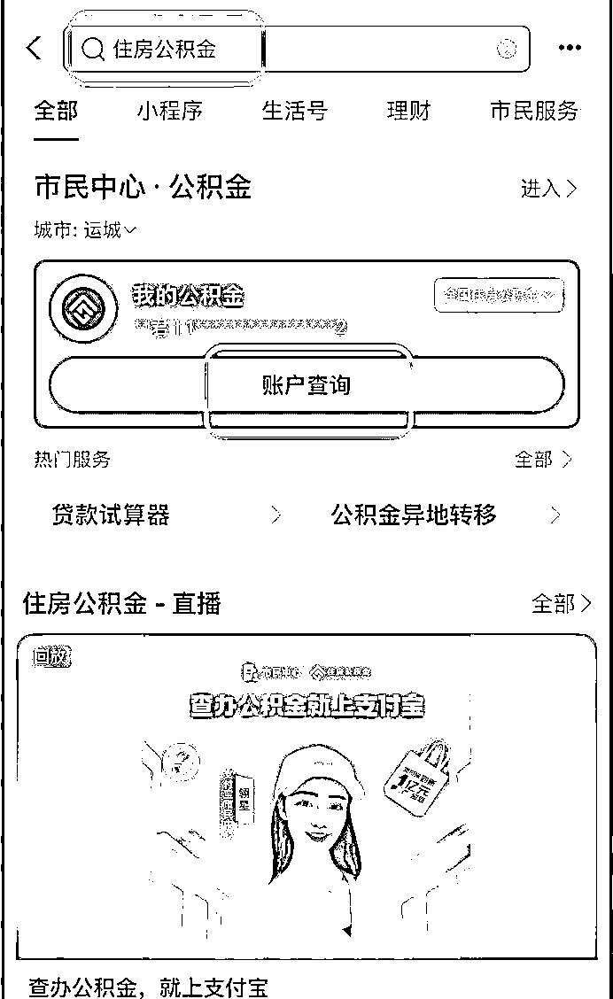
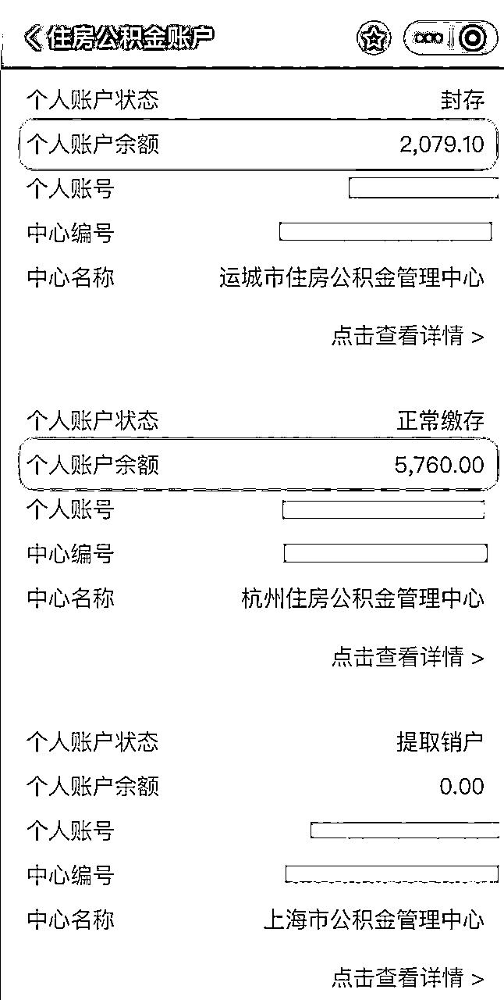
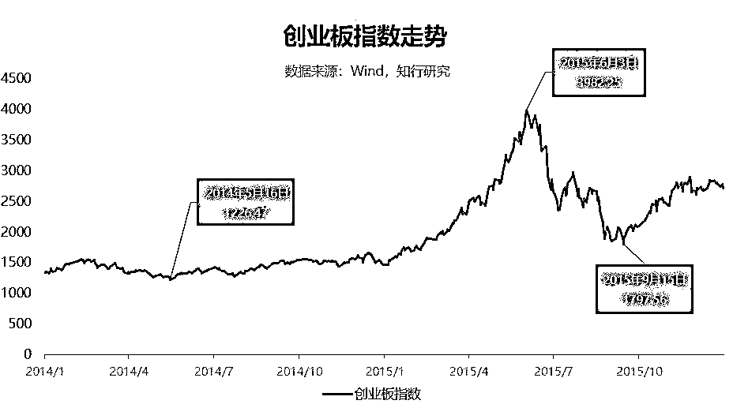
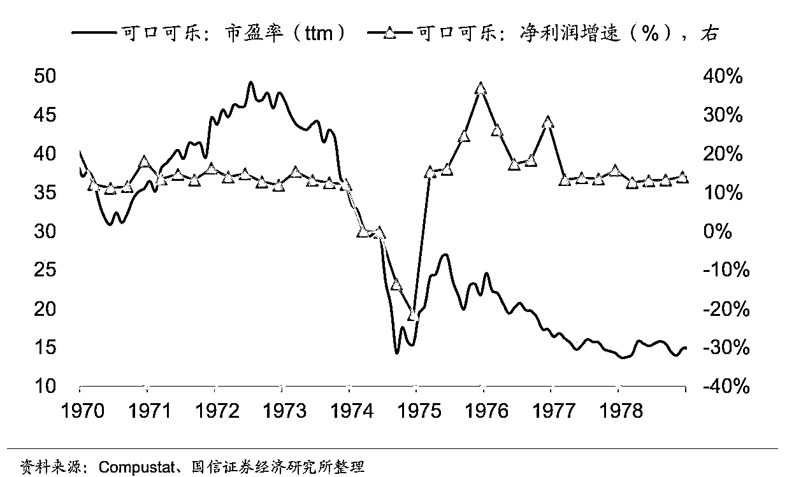
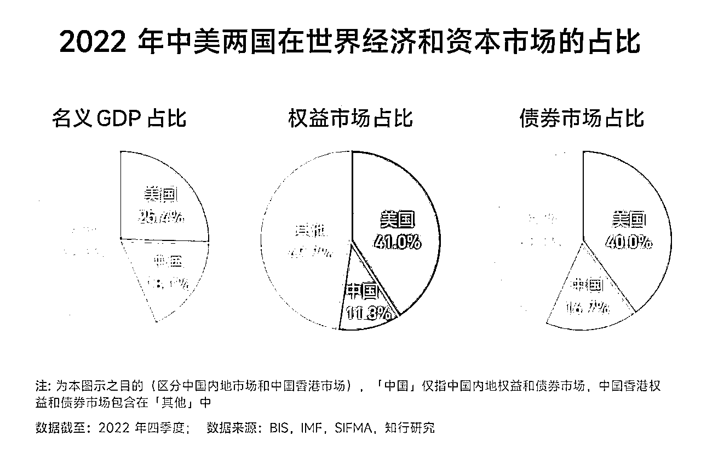
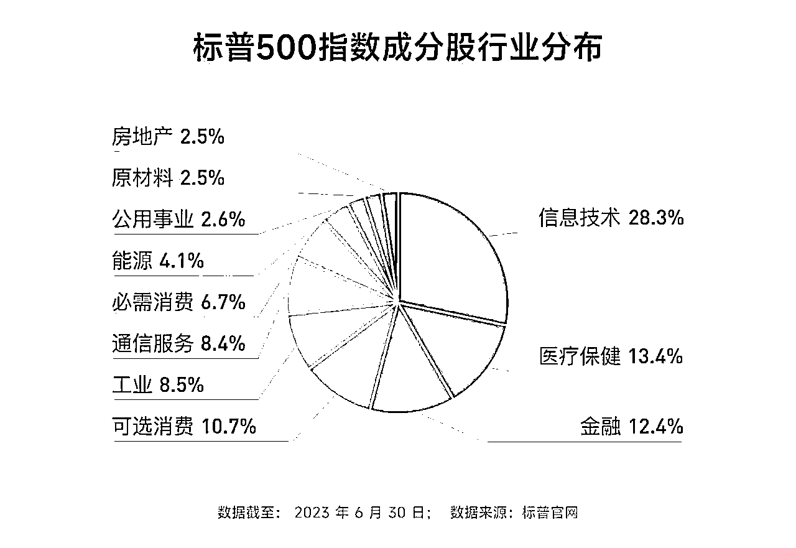
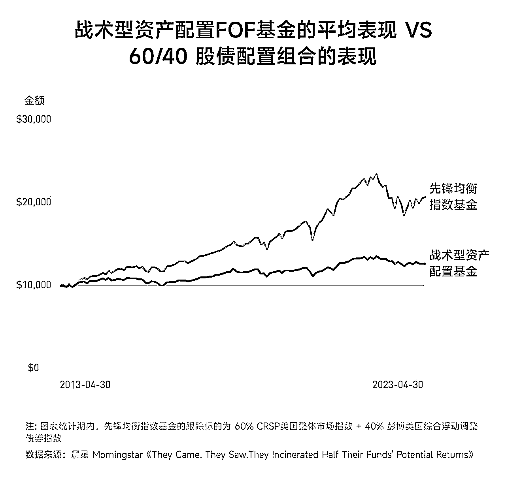

# 有知有行投资第一课 实战手册 202403

> 来源：[`jviztcgxxfy.feishu.cn/docx/Y06Bdiq9yoyGx6xbsP6cvAw6nCb`](https://jviztcgxxfy.feishu.cn/docx/Y06Bdiq9yoyGx6xbsP6cvAw6nCb)

有知有行投资第一课

3 月航海 | 有知有行投资第一课 | 实战手册

手册出品方：有知有行团队，生财有术团队

出品时间：2024 年 2 月 10 日

手册使用说明：内容出品人排名不分先后。本文旨在向你展示一个项目的更多可能性，帮助你更好地理解和实操。

建议：如果需要快速定位到精确内容，可以使用快捷键 Ctrl + F/command + F 的形式，搜索「关键字/词」，查找你想要的内容

# 写在前面

欢迎大家来到 3 月航海 | 有知有行投资课 | 实战手册，相信在接下来的日子里，我们将在这里见面很多次。

1）为什么要学投资？

一说到投资，大家想到的可能是：买基金、买股票、买黄金，买各种投资品。

但这些其实只是「投资系统」中的很小一部分。马克·泰尔（Mark Tier）的著名畅销书《巴菲特和索罗斯的投资习惯》中，描述过一个典型的投资系统，应该包含以下三大部分：

当我们平时讨论某个买卖操作的时候，比如「买哪只？」、「什么时候买？」、「买多少？」、「什么时候卖？」等等，更多是在说第三部分——投资策略。但其实，另两部分，尤其是第一部分投资哲学，更为重要。

这门课里面将会提到的巴菲特、索罗斯、迈克尔·伯利、达利欧，他们拥有不同的生长环境、个人兴趣、成长路径，这些决定了他们对世界的认知，也最终形成了他们的投资哲学。他们的每一条投资理念、每一次投资决策，都是从各自的投资哲学发展而来。

所以，这个航海不会教你如何选股票、选基金这些术层面的问题，而是试图和大家分享我们所认同的投资哲学，以及如何基于这套投资哲学构建自己的投资体系。

2）为何邀请有知有行合作开发这次航海？

投资理财并不是生财有术擅长的领域。

为了给大家带来更好的学习体验，确保大家能够学到专业的、体系化的知识。我们邀请了有知有行团队，来共同合作这个航海。

航海手册的内容，主要来源于有知有行团队研发的《投资第一课》《海外投资白皮书》等内容。

有知有行团队创始人孟岩从 2006 年开始投资领域的创业。

第一次做的产品是基金理财社区——「财帮子」，帮助基民管理自己的基金账户，做到当时排名第二的基金理财平台。

2015 年，创办了「且慢」，这次坚定而大胆地走了一条新路，结合投资者教育来做基金销售。

不做「基金净值估算」，没有「目标投」，也没有「排行榜」，而是首创了「基金跟投」的方式，帮助大家降低选择难度，陪伴用户长期持有，在这个过程中，潜移默化地将长期投资和价值投资的大道传递给用户。

在这里，他见证了，投资者教育并非不可能之事。

2019 年底，便带着伙伴们离开且慢，创办了有知有行，开始追寻自己的梦想。在投资者教育领域持续耕耘，和用户一起学习投资，共同成长，收获沉甸甸的收益。

他们团队打造的《投资第一课》文字版和视频版超过了百万用户的喜爱和认可。

我们认同他们的专业实力，更重要的是认同他们“长期陪伴用户，学习投资、共同成长”的产品理念。

所以，选择和有知有行合作，为大家普及投资这第一课。

3）我能收获什么？

这个航海希望和你分享我们认同的投资哲学，并且领你迈上建立「投资体系」这条道路。具体有：

第一阶段，了解资产配置原理，构建完整的理财系统。梳理个人或家庭资产，能根据资产配置原理，规划自己的四笔钱。

第二阶段，了解长期投资的原理。包括：投资市场的本质、投资市场的特点、为什么那么多人投资都亏钱？

进而学习构建长期投资方案的思路。知道如何在自己的能力范围内，构建一套适合自己的长期投资方案。

第三阶段，了解适合普通人的稳健投资方法和配置思路。

第四阶段，了解海外市场的投资方法和配置思路。

最后，希望大家可以在这次航行里收获成果外，结识一群战友。

以下内容由生财有术联合圈友制作而成，仅供航海船员以及生财有术星球圈友学习使用。

同时也欢迎圈友们在实践过程中持续反馈，和我们共同完善，可以联系鱼丸（yuwan387）提供修改建议～

# 【更新提示】新手册使用方式

在开始前，我们来简单了解一下这个手册的正确打开方式，方便你根据自己的情况来灵活使用。

如果你从未接触过投资理财：

在正式实操前，先了解如何构建完整的投资系统

【项目概述】为什么学理财投资，建立投资系统？

然后，学习梳理自己的资产，构建整体的资产配置

【项目实操 1/4】如何梳理资产，做好资产配置？

如果你有一定的理财投资基础，可以直接进入实操部分的学习：

学习 2 种不同类型的投资思路&策略

第一种：长期资产的配置方法。

适合风险承受能力较高的人。

【项目实操 2/4】长期投资怎么投？

第二种：中短期资产的配置方法。适合风险承受能力较低的人。

【项目实操 3/4】稳健理财怎么投？

如果你是投资老手，还想进一步完善自己的资产配置，可以学习：

第三种：尝试配置海外资产。

【项目实操 4/4】海外市场怎么投？

本航海项目的航线图如下：

## 一、【项目概况】为什么学理财投资，建立投资系统？

章节概要

看到这个航海，可能很多人都在想，身边很多搞投资的人都在亏，生财为何要开投资航海，能帮我们赚到钱么？

要回答这个问题，我们首先要定义究竟什么是理财投资？

一说到投资，大家想到的可能是：买基金、买股票、买黄金，买各种投资品。

说到学习投资，大家的问题通常是：

「某某股票怎么分析？某某基金怎么看？」

「怎么选一只好基金」

「怎么选一只好股票」

「怎么投资才能不亏钱」

......如果你认为这些就是投资，那真的大错特错，这些只是「投资系统」中的很小一部分。

如果对投资的认知只停留在这个层面，会导致怎样的结果呢？我们来看三个小故事。

#### 本章航线图

完成本章节的学习和实操，即可完成航线图的第一阶段第 1 条

1.理解为何说“投资理财，哲学先行”（约 1-2 小时）

那么现在，就请开始学习吧。

### 1.1 三个小故事

下面三个小故事来自有知有行的创始人孟岩老师。

接下来，就以孟岩老师的口吻来讲述这三个故事：

2015 年大牛市，市场火爆，很多人都在短期赚了大钱。我的一位从不炒股买基金的朋友，看到周围的人都赚钱了，也按捺不住冲了进来。

他按照理财经理的建议，买了 10 万元某创业板基金，很快涨了 20%，赚了 2 万。他觉得自己「做对了」，可能在投资上比较有天分，于是进一步投入了 20 万、50 万，赚了不少钱。最后，他把本来打算用作买房首付的钱也投了进来，他的原话是：「把装修的钱赚出来我就卖出。」

幸福的时光没有多久，市场很快转熊，他的这些在市场估值很高时买入的基金也被深深套牢了。后来的故事我想你也能猜到，别说装修的钱，他连首付款都赔了进去。

就像我的这位朋友一样，我们投资时收到的都是基于短期盈亏的反馈。这种反馈是基于结果的反馈，虽然重要但是不够全面。

学习投资之难，一个很重要的原因就在于缺乏有效且真实的反馈：在熊市底部加仓，大概率短期会亏钱，在牛市顶峰时买入，也很有可能赚到丰厚的「账面财富」。

有趣之处就在于，正确的投资操作，从短期看，结果是随机的，而且很可能是失败的，甚至由于运气的原因，很长一段时间的结果都可能不太理想。

这就像做练习题，同样的题目，答案每次都不一样，我们如果用这样的结果来给自己反馈并加以改进的话，就会陷入混乱。

第二个故事来自我自己。

2008 年底，在金融危机的影响下，A 股最低跌到了 1664 点，从估值的角度来看，也创下了历史最低水平。我当时管理了一个新账户，打算趁这个机会布局一些优秀并且低估的股票。

那时我已经系统性地学习了投资，知道投资组合和分散的重要性，于是选了 10 只我比较熟悉的股票，比如中国平安、格力电器、恒生电子、天士力、伊利股份等等，把资金平均分配到这些股票上，并且规定每只股票的仓位不能高于 20% 的上限。

后来，其它几只股票都开始大幅上涨，只有中国平安始终在低位徘徊。

我当时觉得「市场失灵了」，赚钱的机会到了，于是违反了自己的投资系统，不断卖出其它涨得更好的股票，并且不断加仓中国平安，最终甚至一度加到了 60% 的仓位。20% 的上限？对不起，早被我抛之脑后了。

虽然这个账户最终还是赚了钱，但这个结果有很大的运气成分。

我曾经做过一个复盘，假如放弃那些主观操作，按照账户最初设计的原则和约束来运行，结果其实会更好。而且还能大幅降低我在整个投资过程中的焦虑。

第三个故事是一位基金经理的故事。

2017 年，基金经理曹名长发行了中欧恒利三年定开混合基金（以下简称「中欧恒利」）。

当时，曹名长的业绩是公认的出色。以他任职最久的基金新华优选分红混合为例，在他任职的 8.91 年间，该基金净值增长率为 508.10% ，年化回报率高达 22.44%。

中欧恒利发行后一日售罄，吸引了 74.4 亿元资金的热情认购，是名副其实的爆款基金。

可在 2017～2020 年这三年封闭期里，由于他「深度价值」的投资风格和这两年市场「成长」的风格不匹配，曹名长最终交出的「成绩单」是 11.72%，年化收益为 3.77%。

在 2020 年 11 月 2 日打开申购后，规模从 74.4 亿元很快就降到了 4 亿多元。

我有一位朋友，2017 年也在银行理财经理的强烈推荐下购买了中欧恒利。在 11 月 2 日那天，他发了一条朋友圈庆祝，说「等这一天足足等了两年」。他还总结了自己收获的经验教训，说以后不能轻信银行经理的推荐，要慎重选择主动管理型基金。

这是主动型基金的问题吗？是基金经理的问题吗？是基金销售渠道的问题吗？是市场风格的问题吗？我觉得都不是。

我觉得根本的原因，是「钱」背后的认知，和基金经理的「投资系统」不匹配的问题。

很多优秀的基金经理都有自己的投资系统，并且在长期的市场考验中获得了超越市场的收益。但我们知道，每种投资理念都有和市场风格不匹配的时期，如果投资者对基金经理的投资系统不理解、不认同，就很难坚持下去，最终也就无法获得收益。

这三个故事表面看起来没有太大的关联，但背后其实都在说「投资系统」对于投资的重要性。

我的那位朋友完全没有系统，按照自己的主观交易，亏得一塌糊涂；

我曾经建立过投资系统，但在市场的诱惑下突破了它，侥幸获利，但结果无法稳定重复；

曹名长具有自己的投资系统，也「知行合一」地践行自己的投资理念，但是很多持有他的基金的投资人却并不理解这些。最终，无论是基金经理还是基民，都很痛苦。

内容来源：《投资第一课》16｜为什么我们需要一套投资系统？

### 1.2 投资系统的全貌

马克·泰尔（Mark Tier）在他著名的畅销书《巴菲特和索罗斯的投资习惯》中，曾经描述过一个典型的投资系统的样子，它应该包含以下几个部分：

一个典型的投资系统，需要包含以下三大部分：

当我们平时讨论某个买卖操作的时候，比如「买哪只？」、「什么时候买？」、「买多少？」、「什么时候卖？」等等，这更多的是在说这里面的第三部分——投资策略。但其实，另两部分，尤其是第一部分投资哲学，更为重要。

#### 1.2.1 投资系统之投资哲学

在投资世界里，无论是买还是卖，或者持币不动，一个投资者所做的每一项决策都来自于他对市场运行机制的看法，或者说，来自于他的投资哲学。

著名的投资哲学家凡·撒普（Van Tharp） 曾经说过：「你所交易的不是市场，而是有关市场的理念。」

我们看到的那些投资大师，无论是格雷厄姆、巴菲特、索罗斯、费雪、达利欧，都有自己的投资哲学。他们的每一条投资理念、每一次投资决策，都是从自己的投资哲学发展而来。

这么说也许太抽象了，我们来举几个例子。

在巴菲特的投资哲学里，他所有的着眼点都是企业的价值 —— 这里的价值指的是企业未来的价值。

当他看到一家企业时，凭借数十年商业分析师的经验，他的脑海中可以快速浮现这家企业 10～20 年之后的图景。简单比较一下这幅图景以及企业现在的样子，巴菲特就可以决定是否要「扣下扳机」。

而在巴菲特的老师——格雷厄姆的投资哲学里，他的着眼点是一家企业现在的价值。

格雷厄姆会努力寻找市场价格比企业的账面价值低得多的企业，买下他们，然后寻找价值回归的机会 —— 无论是市场价格的均值回归，还是主动地采用清算、收购等方式。

再来看索罗斯，索罗斯一生的兴趣都在哲学。他认为市场是由人组成的，而市场的价格是由人的认识（包括正确和错误的认识）决定的。

如果他发现了正控制着市场的反身性过程，并且判断这种趋势会延续一段时间，而预期价格将变得比大多数人所预测的价格要高得多，他就会果断出手。这就是他的投资哲学。

不同的投资哲学，决定了他们完全不同的操作。

拿买入一只股票来举例。

当巴菲特买入一只股票的时候，是因为他能够看清这家企业未来 10 年的发展，一共能赚多少钱 —— 这也就是这家企业的估值。如果市场的价格比这个价值低很多，他就会买入。

而当索罗斯买入一只股票的时候，是因为这只股票价格背后的人的认识形成了反身性过程，决定了价格可能会涨的很高。

接下来，如果这只股票涨了，巴菲特可能会停止买入。因为在他的投资哲学里面，这个价格可能超过了他能承受的安全边际。而索罗斯可能会大幅加仓，因为「市场先生」给予了他正确的回应，证实了他的假设。

如果这只股票跌了，巴菲特可能会大幅买入，因为安全边际更足了。但索罗斯可能会全线撤退，因为「市场先生」在告诉他，你可能错了。

「买什么」、「什么时候买」、「什么时候卖」…… 对于这些投资系统里的具体操作，巴菲特和索罗斯可谓大相径庭，但如果你从投资哲学的角度来看，这和他们各自的投资哲学是完美匹配的。

所以说，投资哲学是投资体系的基石，离开投资哲学，空谈具体操作，没有任何意义。

#### 1.2.2 投资系统之能力圈和投资标准

每个人的投资哲学，决定了他懂什么样的投资，也划定了他的能力范围。只要不超出这个范围，他就拥有了一种能让他的表现超过市场平均的竞争优势。

也就是说，当一个人进行能力圈内的投资，平均来说，他的盈利能力就会超过市场总体表现。而在能力圈之外的投资，他判断一笔投资是否能赚钱的能力，就和普通投资者没什么两样。

我们还是举巴菲特和索罗斯的例子。

巴菲特的投资哲学是寻找那些优秀的企业和企业家，持有这些企业很长的时间，靠企业的增长来赚钱。这个投资哲学决定了巴菲特需要寻找到值得托付的企业家，具有竞争优势的企业，同时这些企业还能保持这个竞争优势很久。

因此，他主动收缩了自己的能力圈，只选择简单的、看得懂的公司来研究。

巴菲特之所以不投资科技股，就是因为「看不懂」。科技行业的变化太快，他很难看清一个科技公司 10 年后的图景。

而近几年巴菲特投资苹果，是因为对他来说，苹果不再是一家科技公司，他能看清苹果 10 年后的样子了。

巴菲特优秀的商业分析能力，结合独一无二的「识人」能力，让他在自己的能力圈内不断做出超过其他人的投资决策。

索罗斯的投资哲学是寻找市场反身性的机会，利用群体性的错误来赚钱。

这个投资哲学决定了索罗斯把自己的能力范围集中在很多「反身性」容易出现的市场。无论是外汇、国债还是股票，他都有涉及。

不仅是能力圈，不同的投资哲学，也决定了每个投资者心目中「好投资」的标准。

对于格雷厄姆来说，这个标准是 「当前股价低于企业目前内在价值（净资产或者清算价值）的企业」；

对于巴菲特来说，这个标准是「当前股价低于未来现金流折现（未来 10～20 年企业一共赚的钱）的优秀企业」；

对于索罗斯来说，这个标准是 「能在市场先生的反身性变换大大改变投资者对价值的认识之前买到（或卖出）的投资」；

汝之蜜糖，彼之砒霜。这些「好投资的标准」，看起来甚至会有些矛盾，但他们其实和投资者的个性以及投资哲学是完美匹配的。

#### 1.2.3 投资系统之投资策略

我们再来看看投资系统的最后一部分——投资策略。

在《巴菲特和索罗斯的投资习惯》这本书中，马克·泰尔把一个有效的投资策略分为以下 12 个组成部分：

到这里，我们就完整理解了投资系统的三部分：

那具体如何掌握三部分内容，构建完整的投资系统呢？后面会详细展开，这也是我们这个航海的核心内容。

#### 1.2.4 投资理财，哲学先行

现在，让我们回到那张投资系统全貌图的最顶端。

在「投资哲学」之上，还有一层是「个性」，包括目标、知识、经验、能力、技巧、兴趣，我把这些统一为一个词：个人认知。

投资哲学，是在「个人认知」之上发展而来的。

你是什么样的人，你看到的世界是什么样的，决定了你会具有什么样的投资哲学。

每一位优秀的投资者，都会根据自己的投资哲学，最终进化出自己的系统，并根据自己的系统去交易。

当系统失灵或者出错的时候，他们会停下来，反思系统的问题，去改进和进化它。与此同时，不管出现什么样的市场情况，他们绝不会违反自己的系统而去做主观交易。无论市场是喧闹还是冷清，恐惧、贪婪、嫉妒、怀疑这些情绪都不会对他们自己的投资系统造成侵蚀。

系统错了，可以改进。而一次违反系统的主观交易，即使短期对了，长期来看，却可能带来更大的损失。

你别误会，我并不是说你也要自己建立一套完备的投资系统。原因很简单，以我的经验来看，建立一套自己的投资系统，需要对投资有巨大的热情、投入足够的精力，还需要经历必不可少的牛熊洗礼，而这意味着漫长的时间。

我想说的是：投资理财，哲学先行。

换句话说，在决定买哪只基金、策略之前，我们必须先找到自己的投资哲学。举个例子，虽然都是投资大师，但巴菲特也绝对不会把自己的钱委托给索罗斯来管理。我们也是一样。

投资失败的很大原因是拿不住。如果你根本不了解一个产品或者策略的价值观和投资逻辑，你就很有可能拿不住，大概率会在市场风格和这个产品逻辑不匹配的时候纠结、怀疑并且最终卖出。

无论是我们把钱委托给一个 VC（风险投资）、或是一个私募或公募的基金经理，还是一个组合的主理人，我们都必须知道我们自己的投资哲学和我们喜欢的投资风格。

只有这样，我们才能知道什么是适合自己的，也才能找到优秀、而且适合的人来帮助我们管理资产；只有这样，当产品的表现暂时落后的时候，我们才不会沮丧，并且坚定地相信他；只有这样，我们才能等到产品逻辑兑现的时刻，获得沉甸甸的收获；也只有这样，我们才能最终收获投资收益的同时，也收获一段美妙的人际关系以及内心的平静。

格雷厄姆在《聪明的投资者》中写下了这样一句话：投资不是关于在别人的游戏中打败他们。它是关于在自己的游戏中控制自己。

了解自己，根据自己的投资哲学，建立或者寻找一套有效的投资系统，并且用它去指导自己的投资，就是有效的控制自己的方式。

投资这个游戏，最终比拼的并非是智力，而是对自我、世界的认知以及对情绪的控制。

航线图任务 1 ：理解为何说“投资理财，哲学先行”，在群里和大家分享你的感悟。

内容来源：《投资第一课》16｜为什么我们需要一套投资系统？

### 1.3 这门课可以收获什么？

通过前面的讲解，相信大家已经更新了认知。投资，尤其是股票、基金等具体的投资品投资，只是投资体系的很小一部分。

所以，这个航海不会教你如何选股票、选基金这些术层面的问题，而是试图和大家分享我们所认同的投资哲学，以及如何基于这套投资哲学构建自己的投资体系。

构建了完整的投资体系，具体的买什么、买多少，你自然会有答案。如果基于你的投资体系，结合你自己的实际情况，基金、股票完全不买也是一种方案。只要你的体系逻辑完整，就是好的方案。

所以，我们绝不劝你入场，我们只希望和你分享我们认同的投资哲学，并且领你迈上建立「投资体系」这条道路。具体包括：

1.了解资产配置原理，构建完整的理财系统，梳理个人或家庭资产，能根据资产配置原理，规划自己的四笔钱。

2.了解长期投资的原理。包括：投资市场的本质、投资市场的特点、为什么那么多人投资都亏钱？

3.了解构建长期投资方案的思路。知道如何在自己的能力范围内，构建一套适合自己的长期投资方案。

4.了解适合普通人的稳健投资方法和配置思路。

5.了解海外市场的投资方法和配置思路。

### 1.4 为什么和有知有行共同开设这个航海？

当然，投资理财并不是生财有术擅长的领域。

我们每一次开新航海：都会问自己“生财开这个航海和市场上其他公司比，有什么优势，有什么差异化？”我们能做好的项目，才会去做，因为我们希望给生财圈友带来更好的体验。

投资课航海的答案是：我们确实没有优势。

所以，为了给大家带来更好的学习体验，确保大家能够学到专业的、体系化的知识。我们邀请了有知有行团队，来共同合作这个航海。

航海手册的内容，主要来源于有知有行团队研发的《投资第一课》《海外投资白皮书》等内容。下面，我就来介绍一下有知有行团队，以及他们背后的故事。

#### 1.4.1 有知有行创始人孟岩

我叫孟岩，从 2005 年开始学习投资，2009 年正式开始记录自己的投资业绩，长期投资业绩在年化 20% 左右。

我不是科班出身。

1997 年，我考入北京航空航天大学计算机科学与工程系，开始了 7 年的学习。这段经历对我很重要，现在回想，它给我留下最大的烙印是我意识到我可以用代码和产品来创造一些这个世界上本来并没有的东西，给别人提供价值，直到现在，这依然是最让我兴奋的事情。

毕业后，我加入了 Sun Microsystems。Sun 是个人计算机硬件历史上最著名的公司之一，程序员们现在依然在用的 Java 就来自这个公司。

2000 年纳斯达克网络股泡沫中，Sun 的市值一度飙升至 2000 亿美元，股价高达 250 美元，可随着互联网泡沫破灭，到了 2001 年底，仅仅一年时间，它的股价就跌到了 49 美元。

等到 2008 年，它的股价只有 3 美元了。我当时不懂投资，内心很好奇，为什么一个公司的股价可以在短短几年里迅速攀升至 250 美元，又迅速跌落回去？

Sun 历史股价 | 来源 Lee Devlin's Website

离开 Sun 后，我加入了微软。2006 年去西雅图出差，我认识了一个名叫 Remy 的法国同事。聊得多了，我才知道他是一个传奇人物。

他曾是著名网络公司 Infospace 的 CTO，2000 年纳斯达克泡沫顶峰的时候，身价暴涨，一度成为美国 40 岁以下最有钱的人之一。

当时，虽然他的股份由于锁定期没法套现，但有钱后的欲望可以提前支付，他通过抵押贷款等方式提前消费，购置了湖边豪宅、游艇、豪车……

最终，网络股泡沫结束，Infospace 股价暴跌，Remy 也欠了银行一屁股债，他没有选择破产，而是变卖资产，并到微软工作继续还账。

从 Remy 身上，我看到了投资以及资产配置对于一个人的重要性。我意识到投资真的可能帮助一个人财务自由，但处理不好也会让人陷入财务窘境。

#### 1.4.2 孟岩的创业之路

2006 年，我注意到一件有趣的事。我的父母并不会用电脑，却自学了 Excel，每天记录更新基金净值，计算资产变化。和他们聊过后我才知道，2005 年大熊市时，由于银行的基金卖不出去，他们被「摊派」买了很多基金，随着股市慢慢回升，他们赚钱了，还赚了很多。

我从父母的行为中看到了需求，与两位同事 Robin 和 Louie 一起辞职，创办了一个基金理财社区——「财帮子」，帮助基民管理自己的基金账户，并可以在论坛进行交流。

当时正是一波 Web 2.0 的创业大潮，阿北的「豆瓣」、王兴的「校内网」，都利用「用户创造内容」来提供一种新的交流方式。我把这种方式借鉴到了投资理财产品上。

很快，我们的用户增长到 100 万左右，每日活跃的用户在 10 多万左右，是当时排名第二的基金理财平台。

我隐约觉得有些地方不对，用户每天来网站的原因是看自己赚了多少钱，但股市会一直涨吗？熊市来了怎么办？

后来的事情验证了我的判断，2007 年 10 月，在「迎接奥运」和「黄金十年」口号最响亮的时候，牛市走到了尾声，开始从最高点 6124 下跌，最低跌到 2008 年金融危机时的 1664 点，跌幅高达 72.8%。

现在回看，当时我们并不懂投资，也不知道基民真正需要的是什么，而是把互联网领域很多「顺人性」的玩法搬到有些「逆人性」的投资上。我们发现自己追求的极致体验顺应的是用户的赌性，产品变成了帮助用户亏得更快、更多的工具。

失之东隅，收之桑榆。我对投资产生了浓厚的兴趣，开始系统性的学习。我阅读了几乎能找到的所有投资书籍，也是雪球最早期的用户。

我看过 K 线，数过浪，系统性地学习过「缠论」；我曾经整天看盘，因为使用杠杆爆过仓，也会整天手机不离手生怕错过重要公告和信息……

直到有一天，当我意识到真正影响股价的是背后的经济和商业世界，每日上下波动的价格不过是幻觉时，我逐渐建立了自己的投资系统，开始稳定地赚钱。

2015 年，我创办了「且慢」。这是继「财帮子」之后我的第二次尝试，与「迎合用户需求」不同，我更坚定而大胆地走了一条新路，结合投资者教育来做基金销售。

我们不做「基金净值估算」，没有「目标投」，也没有「排行榜」，而是首创了「基金跟投」的方式，帮助大家降低选择难度，陪伴用户长期持有，在这个过程中，潜移默化地将长期投资和价值投资的大道传递给用户。

我依然在意用户需求，但更坚定地去寻找表面之下的真实需求。

2017 年 9 月的一个午后，为了更好地吃自己的狗粮（使用自己的产品），我开始写「孟岩投资实证」，通过每周一篇文章的方式来记录自己使用且慢投资的实盘业绩，并写下有关投资、创业的所思所想。

我和我的伙伴通过且慢、投资实证以及其它服务陪伴十多万用户学习投资，在熊市一起播种，静待企业价值的增长。

我们证明了，投资者教育并非不可能之事，我们可以和用户一起学习投资，共同成长，收获沉甸甸的收益。

2019 年底，我和我的伙伴们离开了我们一手打造的且慢，创办了有知有行，开始追寻自己的梦想。

十多年的实践，让我明白，我们挑选主理人、选择基金、做每一笔买卖，都是内在认知根据外界信息做出的选择和反应。我们获得的投资收益，只是这个选择的结果。

投资是认知的变现。投资成功，最终是因为我们变成了更好的自己。

财帮子、且慢、有知有行，从「工具、数据、论坛」，到「跟投、陪伴」，再到「知行合一、做更好的自己」……

以上这些，就是我一路走来的故事。

#### 1.4.3 有知有行对投资的理解

大部分投资者无意成为投资领域的专业人士，大家想做的，是把自己辛苦攒下来的积蓄安心地放在市场中，踏实赚点收益。

但现实是，书也看了，课程也报了，几年下来，似乎学到了一些，一下场却都不管用了。 大量的投资信息让这件事变得混乱。大部分投资者像局外人一样，看不清事情真相，仅凭感觉作出判断。

我们认为投资不应该是这样的，我们希望把投资大道传递给更多的同路人，帮助他们放下焦虑、管好每一笔钱，更好的专注当下、安心工作、享受生活。

投资是一场长期修行。借助投资，更多人可以实现财富增值，也能在这个过程中，成长为更从容的人。

投资教我们用长期视角看事情，体会延迟满足的幸福感；投资教我们在危机中看到希望，把困难当作成长的机会；投资教我们关注和提升内在价值，外在的一切会随之而来。

投资是认知的变现。我们做的每一个交易决策，背后都是我们对投资的认知。

如果我们愿意花时间提高自己对世界、对商业的认知，去学习投资的大道。与此同时，下场实操，把这些知和行结合起来。那么，我们不断提升的内在认知最终会通过外在的投资业绩体现出来。

这是我们对投资的理解，也是有知有行这个名字背后的含义：不断提升认知，知行合一。

内容来源：《投资第 1 课》导读｜这一回，从门外汉到 80 分投资者

## 二、【实操篇 1/4】如何梳理资产？

章节概要

和很多初学投资的朋友聊天，会发现他们容易把投资想得过于复杂，认为投资需要了解大量的金融知识、阅读 N 本投资经典，了解清楚各类投资品种，才能开始。

用我朋友的话说：对「投资」这两个字，我以前的理解太重了。

以前觉得投资应该是几百万，几千万去投资一个企业、公司。现在才明白小到一次家庭财务梳理、几百块钱买只基金，都是投资。

其实，开启投资的成本很低，不用想得太复杂。投资的过程就是，把自己赚到的钱放在它们适合的位置上，让每一笔钱都发挥它该发挥的作用。

比如，退休以后才用到的养老钱不应该只放在银行活期里；也不能因为自己年轻力盛，就省掉买保险的钱去买股票。

对每笔钱的规划和配置，就是实实在在的投资。

我们这部分就来学习如何做好家庭/个人的资产配置。包括：

1.使用家庭资产记账本，盘清家庭/个人资产

2.资产配置决定大部分收益

3.资产配置的原理&方法——四笔钱

#### 本章航线图

完成本章节的学习和实操，即可完成航线图的第一阶段：了解资产配置原理，做好家庭/个人资产配置（约 1-2 天）

1.用家庭资产记账本，录入家庭/个人资产（约 3-4 小时）

2.根据资产配置原理，规划自己的四笔钱（约 1-2 小时）

那么现在，就请开始学习吧。

### 2.1 使用家庭资产记账本，盘清家庭/个人资产

我们在和一些朋友聊天时，发现很多人在个人或家庭财务方面都有这样或那样的困惑：

家里有多少资产不清楚，负债情况只能说个大概；

因为头绪太多，不知从何入手，迟迟不敢统计；

看似每月投资了不少钱，但实际情况是还有高利率欠款未还。

而盘清资产是投资前非常重要的一步。

于是，我们推出了「家庭资产记账」这个小工具，希望能够鼓励你迈出第一步，花一点点时间记录自己的资产情况。数字不会骗人，一旦开始了记录，很多问题就会浮现出来。当焦虑变得具体，能做的事情也多了起来。

#### 2.1.1 完成家庭资产记录

说到记录家庭资产，很多人的第一反应是：好复杂呀！想到要开始做这个事情，都要提前做一些心理建设。

相信我，其实远没有你想象的复杂，「家庭资产记账」工具已经尽量把这些环节的体验做得丝滑无障碍啦，不需要有太多负担，你需要做的只是一个开始。

下载有知有行 App

打开微信，扫描以下二维码，即可下载有知有行 App。苹果手机用户，需要系统版本为 iOS 15 及以上。

进入到家庭资产记账功能

打开有知有行 App，从底部找到「有行」，进入后就可以看到「家庭资产记账」功能了。

分步骤录入资产和负债

在目前的框架下，我们把大大小小的资产分成了五大类——

1）流动资金：可随用随取、即时变现的钱。

比如专门预留的家庭备用金，一直是放在货币基金里面，那么就可以把这笔钱记录在「流动资金」这个类别下。

2）固定资产：用于投资或自用的、流动性低的实物类资产。

常见的固定资产包括房产、汽车、车位等等。还有不少朋友有收藏品、金银珠宝，都可以记录在这个大类下。如果这些分类不能满足你的需求，还可以自行创建。

3）投资理财：投资于金融产品，追求保值增值的钱。

比如买的基金，买的股票，还有一些银行理财产品等，记录在这个类别下。

4）应收款：家庭资产中应收未收的款项，如借给他人的钱，为他人垫付的资金。

5）负债：自己未来一段时间或很长时间需要还的钱。

常见的负债类别有：房贷、车贷、网贷等。不少朋友开通了京东白条或者其它的消费分期，也可以记录在这里。

记录完之后，你会得到非常有冲击力的「家庭财务全景图」。不同的颜色代表不同的资产类别，能够一眼看出自己的资产负债情况，不同的分类下还有详细的数据展示。

持续记录更新后，你还可以得到一张「资产趋势变化图」。你可以对照不同时间的资产变化，从而了解自己家庭这段时间攒了多少钱（资产增长了多少），负债还掉了多少。

#### 2.1.2 家庭资产记录常见问题

房贷该如何记录呢？是记录本金还是记录本息总和呢？

可以这样来记录：打开贷款银行 App，然后把显示的「贷款余额」记录在负债中。以招商银行为例，这里的「贷款余额」，指的是剩余待还本金，不包括利息。

可以一个月记录一次，看着这个数字在缓慢减少，心理也会安心许多。

公积金算哪一类资产？我应该记录在哪里？

公积金如何记录，取决于其状态，以及你自己是如何来看待这笔钱的。

1）用于贷款偿还：如果公积金直接用于偿还贷款，那么它实际上并没有成为你的资产，无需单独记录。

2）租房时提取的公积金：在租房时提取的公积金并不属于资产，而是作为一种收入来源。仅当提取的公积金被存入活期账户或用于投资理财时，这些资金才转化为资产。

因此，提取的公积金本身无需单独记录，关注并记录活期账户中的资金，以及投资理财账户中的资金变动即可。

3）公积金账户余额：账户中的公积金余额属于资产，具有流动性较低、可生息、可变现的特性。这部分资金的记录方法因人而异，以下是一些常见的分类方法，供参考:

金额记录公积金账户中的总额就行。

1 在支付宝中搜索【住房公积金】，点击【账户查询】-2 点击【账户信息】-2 就可以看到历史所有缴纳账户的余额情况。

不同的记录方式反映了对公积金功能的不同理解，每种方式都有其合理性，选择你最认可的记录方式即可。

我买的保险怎么记录？

首先需要确认一下，你希望记录的保险，是消费型的，还是理财型的。

常见的消费型保险包括意外险、医疗险、定寿、不带返还的重疾险等，这类保险通常起的是保障作用，如果没有出险，投保的资金就相当于「消费」掉了，是不需要记录进资产的。

常见的理财型保险包括年金险、增额寿险、带返还的重疾险等，对于这类保险，可以记录保单的「现金价值」。

现金价值可以简单理解为这张保单当前值多少钱，在保险合同中会有「现金价值表」（如下图示例）。确定一下当前的投保年度，把表中对应的现金价值填入家庭资产记账中就可以了。

在「投资理财」- 「更多投资理财」中专门提供了投资类保险的记录条目。

在投保之初，保单的现金价值通常较低，随着投保年份的增长，现金价值会不断提升。

工具能不能给出分析和建议？

资产负债表是千人千面的，通过工具给到具体的、个性化的分析建议是一件几乎不可能的事儿。但依然有一些大的原则可以通过可视化的方式传递出来，这是我们正在努力的一个方向。

这里跟大家聊聊最常被问到的「我的负债率是 xx，这个值合理吗？」

单说负债率 20% 合理或者 50% 不合理，其实是不准确的。负债真正需考虑的因素包括利率、久期等等。

举一个生活中的例子：

有的朋友是贷款买房，如果每月的还款金额不会给自己带来很大的压力，现金流也稳定、健康，那这笔贷款就是相对合理的。

而有的朋友开通了消费贷，贷款利率可能高达 10% 甚至 15% 以上。这种情况下，如果手上有一笔钱，可以先把贷款还掉，再考虑投资理财。

我们很难定一个数字或者区间，告诉大家，你的负债、你的家庭财务是健康还是不健康。人生阶段、资产负债的类型、风险承受能力、家庭责任、现金流不同，财务健康度的衡量标准也不同。

应该多长时间更新一次？

家庭资产记账是一个工具，对更新频率没有特定的要求，可以根据你个人的需求来进行更新。

如果想要追踪的更精细，可以更新频率高一些，这样呈现的资产趋势变化图会更平滑。如果没有特别的需求，按月来更新就可以啦，因为通常工资收入、房贷还款、信用卡还款等都是月频变化的。

#### 2.1.3 案例故事

航线任务 2：使用有知有行「家庭资产记账」，录入家庭资产，说说看到这桑基图后的感受。

内容来源：有知有行社群分享

### 2.2 资产配置决定绝大部分的收益

我有一个好朋友，前段时间问了我投资上的问题。他 2020 年 3 月开始投资，当时买了消费和医药基金，赚了不少钱，之后觉得有些高估就卖出了。结果，在他卖出之后，两只基金又猛涨了一段时间。可想而知，他很是后悔，觉得自己卖错了。不过后来市场开始下跌了，于是他赶紧问我：现在是不是可以买回来了？

我坐下来，和他详细分析了一下他的情况，大概是这样的：

他一共有两套住房，按照市价来看大概值 1000 万人民币。除此之外，他还有 400 万放在银行买理财。而他用来买基金的，让自己每天焦虑不已、时而后悔时而庆幸的资金是多少呢？是 50 万。

即使多赚个 20%，他的整体资产只增长不到 1%：

50 / 1450 × 20% = 0.7%

可是如果他所在城市的房产哪怕只下跌 10%，他的总家庭资产其实会受到更大的影响。

看完我这位朋友的案例，你也可以想想自己的资产配置情况。股票市场的波动，放大了我们的情绪，但很可能我们折腾了半天，对家庭整体资产的影响根本微不足道。

在《金钱心理学》中，摩根·侯塞尔（Morgan Housel）用一张图来说明他心目中各种因素对投资结果的影响。

一个投资者的长期投资业绩，受多方面的因素影响，比如投资者行为、资产配置、交易成本、选择股票或者基金等等。在这张图中，越靠下的部分影响越大，对我们最终的投资业绩起到更具决定性的作用。

有知有行的投资原则中有这样一项：「资产配置决定了绝大部分的收益」。其实也是在告诉我们，资产配置，是我们在做投资时最先要考虑的问题。

内容来源：《投资第一课》12｜怎样做好资产配置？

### 2.3 如何做好个人/家庭资产配置？

#### 2.3.1 你的房产配置合理吗？

对我们大多数人来说，最先需要配置的，是你的房产和金融资产。

过去 20 年，中国的房地产价格一路走高，大部分买房的人，由于把自己相当多的资产配置到房产上，享受到了巨大的收益。与此同时，上证指数看似 10 年没有动，永远停在 3000 点，也让很多人认为股市永远不会涨。

在「房住不炒」的大背景下，且不说二三线城市，就是北上深的房子，还有多大可能性在接下来的十年继续这种表现呢？与此同时，权益类资产，在过去 20 年内的表现并不输于房产，在未来也可能有更好的表现。

中国房地产、股票和债券资产价格指数 | 来源：中金公司研究部

如果你的大部分资产都配置在房产中，只有小部分资产在金融资产，这样的资产配置方式就未必合理。

那对你来说，比起应该选择哪只基金或者股票，更重要的，可能是调整房产和可配置金融资产的比例。

有知有行倡导做好大类资产的配置，该买房的时候，就要买房来改善生活。但是如果你有多套住房，我们建议，你也许可以考虑分散一些到股票、基金等权益类资产上来。让自己的资产配置更加合理，也有更大的概率可以享受到未来资产的上涨。

#### 2.3.2 怎样做好金融资产配置？

我们再来到下一层——可配置的金融资产。

传统上，无论是在银行还是其它金融机构，当他们帮助我们配置资产的时候，通常是通过调查问卷的方式。这类问卷通常包含很多问题，比如「你的年收入是多少？」、「如果一类资产下跌了 30% 你是否能承受？」，然后根据这个调查问卷的结果确定我们的风险偏好，进而确定我们应该配置多少比例的现金，多少比例的债券，以及多少比例的股票。

风险测评本身的含义，是想知道我们承受风险的底线是多少。因为这个底线在我们的心里留了一些下跌的空间。在这个空间内，我们可以容忍下跌带来的痛苦，这样就可以坚持得足够长。

股票的收益符合二八法则， 20% 的时间赚取 80% 甚至 90% 的收益，但我们永远不知道那 20% 在什么时候发生。因此，我们坚持的时间越长，也就越有可能等到这个上涨，从而获得收益。

然而，这个做法很难说得上科学。在牛市的时候填写调查问卷，大家都觉得下跌 30% 完全能够承受，但真的到了熊市，即使只跌了 15%，可能你已经非常恐慌了。

另外，在风险测评问卷上填写下跌 30% 很简单，但你很容易低估真的下跌 30% 会对你的心理造成什么样的影响。我们可以在脑海中做压力测试，但无法测试当我们投资失败回到家，看到家人失望表情时的心情。

既然风险偏好是很难测准的，那如果我们按照它来制定资产配置方案，就一定会产生问题。牛市的时候风险偏好升高，多配置股票，熊市的时候风险配置降低，降低仓位，不用我说，你也知道这是有问题的。

怎么解决呢？我们来看另一种资产配置的方法——「四笔钱」。

#### 2.3.3 资产配置方法——「四笔钱」

回想一下，我们每个月赚的钱基本有这么几个去处：

为家庭准备养老金 ……

如果我们一股脑地都投到股市里，风险太高，很危险；如果我们一股脑的放在活期里，暴殄天物，没意义。

根据每个去处的特点合并同类项后，我们发现所有的钱基本上可以分为这四类，分别是保险保障、活钱管理、稳健理财和长期投资。

第一笔钱，是保险保障的钱

借用投资的术语，保险是用来降低个人生活质量的波动率，给我们的人生「托底」。用一份小额的、确定的代价，给不确定的未来买一份安心。

如果说投资理财是进攻，那么保险就是防守。她让我们在未来可能遇到的风险面前，少一份狼狈、多一份从容。同时，只有做好保障，才能在风险发生的时候有钱花，避免「被动卖出」，不至于在风险发生的时候动用本金，这样才能收获长期投资的成功。

第二笔钱，是随时要用的活钱

随时会用到的钱，主要用于打理零花钱、应对日常开支。比如，每个月的房租房贷、生活支出、孩子的零花钱、父母的赡养费等。

第三笔钱，稳健理财

适合中短期（3 年以内）就要用到的钱，或者本身因为年龄、风险承受能力等偏好稳健产品的人。比如，一两年后要买车、买房或者结婚生小孩儿的钱，半年以后要旅游的钱等。这部分资金的目标是力求安稳，追求稳健增值。

第四笔钱：长期投资

5 年以上不用的闲钱。这笔钱可以通过长期投资，博取高收益。简单来说，这笔钱是没有固定用途，又可以投很长时间，即使都损失了，对我们的日常生活没有太多影响。

也许你会问，如果市场的估值很低，即使是短期用的钱，我能放到股市里面搏一把吗？这其实没有标准答案。3 年也好，5 年也罢，没有那么泾渭分明。

但你可以先问自己一个问题：假如两年后我需要用钱，但这笔投资被套牢了，我能不能接受亏损卖出？如果答案是肯定的，那你也可以考虑这样操作。

#### 2.3.4 怎样分配「四笔钱」的比例？

讲完四笔钱，接下来的问题一定是，我应该怎样来分配比例呢？

四笔钱的分配比例，没有统一的标准答案。

拿我来说，我没有配置稳健的钱，而是留足了日常要用的活钱，然后把其它钱都投到了长期投资的策略和产品中。但这么做的前提是，我对市场波动的承受能力要超过很多人，这是我性格里的一部分。同时，即使临时需要卖出一部分，由于我的投资时间非常长，我会把这笔卖出想像成很久之前成本更低的一笔买入，不会对自己造成心态上的影响。

我举这个例子，绝对不是想让你参照我的想法。对大多数人来说，更好的做法，是先按照上面推荐的方式做好保险保障，留好日常要用的活钱。然后，再以 5 年期限为划分标准，把钱分别放到稳健理财和长期投资里。

另外，更重要的是，就像上节课所说，投资比例重要的不是精确的数字，更多是心态上的把握。而心态以及行为，真正影响我们长期的收益。

用户案例

接下来看三个用户的四笔钱规划案例，以及和其他伙伴的交流，相信对你会有一些启发。

制图：有知有行

拷问一

仝仝：两年内买房的钱放稳健里，当然没错了，只是我还想问一句，这么大一笔钱放稳健，你不会觉得资金利用效率低吗？内心难道没有动摇过吗？

港港：没有动摇啊。我是准备两年之内买房，攒钱的目标就是那个城市的平均首付，为了防止超支，还额外留了一些方便调用的钱。我不指望这笔钱能赚多少，够用更重要，放在长期投资里面……说不定要用的时候还亏着呢。

栋大：说不定稳健赚的钱比长期投资还多。

拷问二

仝仝：港港你好厉害，在存房子首付的同时，居然还有闲钱投资！

港港：哈哈，首先，我准备买房的那个城市房价没那么高，所以这笔钱可能没有你想象的那么大；其次，做计划的时候我就算好了嘛，从积蓄里拿出多少钱，每个月再存多少钱，尽量不影响我现在的生活品质；第三，我老公每个月会给我一笔钱，这也算是我的收入……吧。

制图：有知有行

拷问一

金栋：为什么你没有配置「稳健理财」？

仝仝：主要原因是两三年内没有明确目标，以及在有知有行工作，非常相信长期投资，所以大量资金放在了长期投资里。

拷问二

港港：你现在的花销应该蛮大的，为什么活钱留得不多？

仝仝：理性来说，是我的日常花销不算多以及保险配得比较全。但更多的，是我的个性使然。我不是很能接受一笔钱放在那里不怎么赚钱，我会下意识地认为资金利用率低。我现在的活钱金额是我觉得比较舒服的状态。

制图：有知有行

拷问一

仝仝：为什么你也没有「稳健理财」？

金栋：首先也是因为最近两三年没有明确要大笔支出的钱，所以没有稳健理财；其次，我的长期投资里也有一定的债券仓位，需要的时候也可以作为稳健理财使用。

拷问二

港港：你说永远会留出 6 个月的应急资金，那要是用了怎么办？

金栋：如果临时支出比较多，活钱不够 6 个月了，我就会把支出的水龙头关小，暂停向长钱中充值，先让这个蓄水池存满再说。

总结

最后我们想说的是，四笔钱可以通过分账户的方式，把我们的钱根据不同的用处、目标和风险偏好分开管理，从而搭建一个健全合理的财务系统。

四笔钱的分配比例没有标准模板，只是一个可参考的方案。

每个人都处在不同的人生阶段，收入不同，风险承受能力不一样，自然配置比例也不同。

重要的是，我们要理解每笔钱存在的意义，把自己的钱按照需求分好、管好，根据自己的情况来运用。

#### 2.3.5 每笔钱该投在哪里？

理清楚了四笔钱，我们再来聊聊，每一笔该买点什么？

这就要说到投资的三要素：安全性、收益性和流动性。

安全性指的是产品的投资风险有多高，像债券或者银行储蓄的风险都很低，股票的风险就很高。

收益往往是投资者最关心的问题，但想获得更高的收益就要承受可能的亏损，追求收益最大化，就要承受资产的安全性低。

流动性很容易被忽视。之前看到过一个例子，很多人之所以没有坚持下来长期投资，不是因为他们坚持不住，而是因为各种意外情况导致的被迫退出。所以在投资时，我们也要结合家庭的长短期目标。

这三者是相互制约的关系，所有的理财产品都不可能全部关注到，例如，你要求这个产品安全性高、流动性好、收益还很高，哪里有这么十全十美的事情。

那四笔钱分别适合什么样的投资产品呢？我们来对号入座：

保险保障

保险保障是为了给生活托底，防止投资中断。有知有行建议大家选择消费险，配备人生的四大基础险种：医疗险、定期寿险、重疾险、意外险。

活钱管理

因为是日常支出类的资金，所以我们要选择的产品特点是安全性高、流动性强，收益上要求不高，一般比活期存款好一些就行。有知有行建议大家选择货币基金。

稳健理财

追求的是稳健收益，时间大概在半年到 3 年，投资时间比活钱管理长一些，那么意味着我们可以在承受较低风险的基础上获得更高一点的收益。

我们建议大家选择稳健类的投资产品，如稳健组合类产品。这类产品主要投资低风险的债券类资产，同时配置少量的高风险资产，既分散了风险，还能获得比活钱管理更高的收益。

长期投资

长期投资的投资时间更长，我们就可以用风险换收益，选择股票类产品。有知有行建议大家选择指数基金和好的主动基金。

可以说，「四笔钱」给我们的投资提供了一个安全长期的结构。

我们都知道，长期来看股票市场的收益最高，但有太多的因素让我们无法做到长期持有。认知和情绪当然是重要的两个方面，还有一个因素是「钱」的属性。

如果一笔钱能投资的时间很短，却放到股票市场中，其实是把它自己交给了随机性和运气。一旦家庭因为疾病或意外需要用钱，也可能会导致投资被迫中断。

四笔钱，其实是通过一种简单的方式，帮助我们把漏洞堵上，并且把各笔不同时间、不同用途的钱分开，构建一个长期稳定的结构，更好地帮助我们长期持有。

内容来源：有知有行《坦白局(一):四笔钱的分配比例有标准答案吗》《分清四笔钱，找到每笔钱的合适位置》《投资第一课》12｜怎样做好资产配置？

航线任务 3：根据资产配置原理，规划自己的四笔钱，并尝试解释原因。

## 三、【实操 2/4】长期投资怎么投？

章节概要

前面，我们知道了可以按照四笔钱进行资产配置。其中活钱管理和保险保障都比较简单，接下来我们重点讲长期投资和稳健投资部分的投资思路。

具体包括：

1.选择长期收益率最高的资产——股权类资产

2.为什么股市中多数人都赚不到钱？

3.怎样为自己制定一份长期投资方案？

4.「长钱账户」是如何做的？

#### 本章航线图

完成本章节的学习和实操，即可完成航线图的第二阶段：理解长期投资底层逻辑，构建长期投资方案（约 5-7 天）

1.看完《投资第一课》视频，谈谈你的感想（约 1 小时）

2.说说为何股票是长期收益率最高的资产？（约 1-2 小时）

3.在群里分享给你教训最大的一次投资经历（约 1-2 小时）

4.尝试为自己构建一套长期资产配置方案（约 3-4 小时）

5.回答群内关于提高收益方法的思考题（约 1-2 小时）

### 3.1 选择长期收益率最高的资产——股权类资产

#### 3.1.1 钱从哪里来？

投资最核心的目的是什么呢？当然就是赚钱——我相信没有人是希望通过参加这次航海赔更多钱的。

那么，一个重要的问题就出现了：钱这个东西，到底是怎么来的呢？

假如流落荒岛……

这个问题其实很大，回答的角度也有很多。比如有的同学会很直觉地想，钱是国家发行的、是政府背书的。这当然没错。不过我们可以考虑这么一个场景：

来源：depositphotos.com

现在有一个小岛，岛上有一个装着一百万美元的宝箱。有一天你乘船出海，船走到一半坏了，漂流到了这个小岛上，就像鲁滨逊一样。那么宝箱里的钱对你有用么？肯定是没用的，可能还没有一张渔网或者一棵椰子树更有用。

所以，我们能得出一个很重要的常识：钱这个东西——在这里更准确的定义是「货币」——不管是谁，印出来再多，如果它不能换来我们想要的东西，那它就一文不值。

所以你看，我们想赚的不是钱本身，而是钱背后的东西——资源、产品和服务。

可这个时候，又有一个问题出现了。

我们都知道，资源是有限的，产品和服务也不是凭空产生的，如果大家都在忙着赚钱，那谁在亏钱呢？换句话说，多出来的钱是怎么来的呢？

简单来说，多出来的钱，主要是三个因素造成的：自然资源、劳动和技术。

举个最简单的例子。

比如，人类从古到今，生活都需要木头。开始的时候，我们砍树特别费劲，但是有些人很聪明，把石头打磨成了石斧，于是大家砍树效率一下提高了。

在这个过程里，人，通过自己的智慧和劳动，利用自然资源（也就是石头），改进了技术（原来没有斧子），把以前一年砍树 20 棵的水平提高到 200 棵的水平，多出来的资源又可以用来进一步改善生活。渐渐地，大家的日子都变得更好，于是社会整体的财富也增加了。

人类财富的积累

当然，这是个简化的例子，真实世界远远比造斧子砍树复杂得多。可如果你稍微回想一下，人类积累财富基本就是这么一个过程。

袁隆平让我们可以在同样一亩地上种植出更多的庄稼，养活了更多人口，而更多的人口也意味着更多的劳动力；电话、微信和各种视频会议系统让人们可以更高效地沟通，催生出了更多的共识和智慧；抗生素和手术刀让我们可以更加健康地生活，以及延长整个种族的寿命。所有这些变化，都是我们通过利用自然资源、同时施加各种劳动、并且创造了各种新技术而带来的。

这里可以给你一个概念，截止到 2020 年这个时点，人类社会的总财富大概是 300～400 万亿美元这个水平。其中超过 200 万亿美元是土地和房产——没错，这类最最古老和经典的资产类别，占据了人类总财富的 2/3 左右。

而全球股票市场的总市值大概在 70～90 万亿美元左右，是第二大的资产类别；另外，现金、硬币等等大概是 30 多万亿美元，而黄金总市值差不多 7～9 万亿，剩下的还有一些很小的类别，比如比特币这样的加密货币资产。

人类社会总财富分布 来源：howmuch.net | 制图：有知有行

理解了这个「自然资源 + 劳动 + 技术」的逻辑框架，我们就应该对钱、或者说「财富到底是怎么产生的」有一个最基础的认知。

近三百年的「财富大爆炸」

不过讲了这么多宏观的东西，你可能更关心的是：这一切和我有什么关系呢？或者说得再直白一点，人类社会是拥有这么多财富，但是怎么能让这些财富多往我的兜里跑一些呢？

我们慢慢来说。

首先，我要恭喜你。因为有一个常识我们常常忘掉，就是虽然我们通过不懈的努力如今已经创造了巨大的财富，但在人类漫长的几万年几十万年的历史里，绝大多数财富都是在过去的 300 年里创造的。

一张图直接说明问题：

过去两千年的世界生产总值 来源：ourworldindata.org

上面这张图，把世界银行从 1990 年开始的最新数据，以及经济学家安格斯·麦迪森（Angus Maddison）所建立的 1990 年之前的历史估算数据拼接在一起，向我们展示了人类社会过去两千年多的经济增长情况。

我们可以看到，在 19 世纪之前，人类社会财富积累的增长几乎是一条横线。但从 1800 年之后，事情突然发生了变化，我们来到了财富大跃迁的阶段。

这其中的原因当然也有很多种，不管是科学的启蒙，工业革命的诞生，还是自由市场经济的发展，历史学家和经济学家关于这方面的研究已经汗牛充栋，我也就不再赘述了。

总之，从历史的视角来说，我们都生在了一个好的时代，一个经济腾飞、财富爆炸的时代。「股神」巴菲特曾经谦虚地表示，自己是中了卵巢彩票。

这说的是他一切成功的基础，就是生在了 20 世纪飞速发展的美国。否则，用他自己的话说，一个一辈子只懂得配置资产和挑选好公司股票的老头，放在几百年前甚至原始社会，可能是全世界最没用的人。

另外不能忽视的一点，就是现代公司与现代资本市场制度的诞生。这也和我们每个投资者息息相关。

熟悉商业史的同学可能知道，现代股份制公司的雏形起源于 17 世纪的荷兰。当时世界上最受欢迎的商品叫香料（比如胡椒大家就很喜欢），所以跨海跨洋的香料贸易和运输就发展得非常红火。

荷兰的航运业一贯发达，加上阿姆斯特丹是欧洲著名港口，于是远洋船队相当之多。不过当时它们有个很大的问题，就是单打独斗的小船队很多，之间也要各种恶性竞争。

本来航海的风险就高——资金要求大、海盗也十分猖獗、遇到风暴之类的天气问题更是血本无归——再加上西班牙、葡萄牙的大型船队竞争力也很强，所以，当时就有人提出，应该把各个小船队联合起来，成立一个组织，统一调配各个船队。这样一来，不但能分担经营风险，也可以降低竞争，节省成本。

于是，在 1602 年，荷兰的东印度公司成立了，而且公司决定向公众募资，这样可以筹集到更多的钱，来和强大的西班牙葡萄牙船队竞争，而募资的方式就是把公司的所有权切成一小块一小块的，并且给每个认购的人一张凭证。

你肯定已经意识到了，这不就是如今我们买的股票嘛。这就是最早股票的来源。

东印度公司的股票凭证 来源：stockmuseum.com.tw

有了股票这种东西，股市——也就是股票市场也就呼之欲出了。当时东印度公司有个神奇的规定，就是整个公司要等到十年之后才会给股东们分红——现在听起来的确是非常长期主义的，甚至有点像风险投资。

但肯定有人等不了十年再拿回收益，于是，东印度公司的所有权凭证就开始被大家互相买卖，于是阿姆斯特丹就成立了世界上第一个股票交易所。后面的事情，熟悉欧洲史的同学肯定很了解了。

其他船队怎么可能是东印度公司的对手，很快，这家公司就成为了 17 世纪的海上霸主。据后人估算，东印度公司巅峰时期的市值将近 8000 万荷兰盾，约等于今天的 8 万亿美元。

所以，钱究竟是怎么来的，现在我们的思路就很清晰了。

人类通过利用自然资源、投入智慧和劳动、发展创造科学技术，创造了巨大的财富，其中很大一部分是以公司为单位而创造的。

而现代股份制公司的组织结构，加上资本市场制度，使得我们普通人也可以参与到这种创造财富的过程里——当然，在分享利益的同时，每个参与者也都承担了相应的风险，接受了自己投入的钱被一个大浪打过来就拍没了的可能。

但无论如何，真实地创造财富、合理地分享财富、踏实地积累财富，是如今我们每个人都能享受的时代红利。

关心「钱最终去哪儿了」

最后我还想说，懂得这些大道理，其实对我们日常的投资实操也有很大的好处。你在生活中肯定见过这样的例子：听到小道消息就 all in（全仓）一只股票，稀里糊涂赔了很多钱；在牛市高点一鼓作气杀进去，到了熊市又惨兮兮割肉清仓；看到别人买房自己也跟着买，结果偏偏自家楼盘几年过去了也没见涨；更不用说时不时能在媒体上看到的理财产品「暴雷」新闻，比如 P2P、原油宝等等。

这些事情背后到底是什么原因呢？非常重要的一点，就是太多人把投资理财当成了一件非常抽象的事情，而忘记了只要我们在做投资，我们就是把钱扔到一个非常真实的、希望用这笔钱创造更多财富的组织里。

比如，很多人在买 P2P 的时候，只会盯着收益看，觉得这是一个「投入 1 万块能返回 11000 块」的「理财产品」——但世界上并没有一种神奇的机器，把钱扔进去一年之后就能返回 10% 的回报，而只有真实的、创造财富的公司、人与双手。

所以，在投资领域，我们总会强调，一定要去了解投资的「底层资产」是什么，也就是不管某种产品被包装成什么样、名字叫得多么好听、由什么大牌公司出品或者销售，我们都应该去关心钱最终放在哪儿了，它获得回报的来源到底是什么，是不是满足这个世界最基本的常识与公理。

如果牢记这一点，你在投资中就已经规避了绝大部分的骗局与风险。

航海图任务 4：看完《投资第一课》视频，在群里和大家分享你的感想。

#### 3.1.2 股票是长期回报最高的资产

上一节我们探讨了，钱或者说「财富」是如何被创造出来的。

我们做投资，是把钱放到像「公司」这样可以不断创造更多财富的现实组织里。然后，我们通过公司参与到财富创造的过程，分得相应的收益。那么，这节课我们就来讲讲，在参与财富创造的各种方式里，究竟哪一种的回报最高。

一家濒临破产的体育公司

我们先从一个真实的例子讲起。

1969 年，有一家名叫蓝带体育的美国公司遇到了一些麻烦。当时他们的主要业务是帮一家叫鬼冢虎（Onitsuka Tiger）的日本公司研发运动鞋，并且做他们北美地区的代理，销售鞋子。公司经过五年的努力发展，终于把年销售额从 8000 美元提高到了 30 万美元左右。

耐克的起源：蓝带体育公司 来源：www.firstversions

但对于蓝带体育来说，公司破产就在边缘。因为他们的生意模式对现金流的要求很高。你想，他们要先用现金给日本公司下订单，然后要等漫长的时间才能等到鞋漂洋过海地寄过来，接下来还要花时间把这批鞋卖出去，才能收回货款。生意做得越大，需要预付的钱就越多，公司的现金流也就越紧张。

当时对于公司的创始人菲尔·奈特（Phil Knight）来说，他有两个选择。后来他在自传里也写过，开始的时候，他选择去银行贷款，但是卖鞋这么一个很不牢靠的小生意，银行贷款非常谨慎。

所以，到后面金额大了的时候，贷款就非常困难；另外，当时他还想出售公司 30% 的股份，大约折合当时的 30 万美元，甚至为了更好地融资，他还学习在加州北部刚刚兴起的各种高科技和电子公司，把自己公司的名字改成了蓝带体育科技。

可等了一个月，居然没有一个人愿意认购股份。没办法，后来他们到处东拼西凑了两万美元，才把下一批货款交上。

自传里，奈特是这样描述自己当时心情的：「我再一次长舒一口气，之后的日子都要勒紧腰带过了。可下次我又该怎么办呢？再下一次呢？」

当然，这家公司没有倒闭，成长为了后来大名鼎鼎的耐克。如果当时真的有人买下公司的 30% ，哪怕后来经过各种稀释，这 30 万美元到了 2020 年，也要变成 600 多亿美元了。

买股票就是买公司

在这个小案例里，我们就接触到了参与公司财富分配最常见的两种方式——股和债。

对于银行来说，它们的一项主要任务，就是把我们存在那里的钱借给各种公司——这个时候，银行代替我们变成了企业的「债主」。

当然，我们也可以自己当企业的「债主」，购买企业债券。这样一来，我们自然可以收取一定的利息作为回报，甚至公司如果拒绝还款，我们可以依据法律要求它变卖自己的资产，把债还上。

同时，我们还可以通过购买公司的股份，成为公司的股东，或者是「拥有者」和「主人」。这样公司如果发展壮大，它创造出来的财富就有我们一份。

这就是很多价值投资者常说的一句话：买股票就是购买了公司所有权的一部分。

假设耐克这家公司从来没有上市，而是作为一个非常不错的生意而存在着，而我们又是它的股东的话，我们是怎么获得回报的呢？主要有两种方式：

一种是，公司每年挣到钱了，可以把一部分利润分给股东，作为回报；

另一种，就是公司如果被卖掉，你的股份肯定也就随之出手了，可以一次性地获得收益。

当然，这一切的前提都是公司本身生意不错，可以挣到钱，所以也会有其他人想要拥有。

所以，股票（公司的所有权）和债券（有时候借给公司，有时候也可以借给政府），就构成了如今我们参与资本市场投资的最主要的两种形式。

下面这张图你可能看过很多次了。这是宾夕法尼亚大学沃顿商学院的金融学教授杰里米·西格尔（Jeremy Siegel，以下简称「西格尔」）统计的关于美国股票、国债、黄金、现金等大类资产的长期收益图。

美国金融大类资产表现（1802-2012） 来源：《Stocks for the Long Run》

从图上你可以看到，从 1802 年到 2012 年超过二百年的时间里，1 美元的购买力只剩下 5 美分，不用解释你也知道，这个损失来自于通货膨胀。黄金的年化收益只有不到 1%，长期来看有很大的波动，但收益不高。

再来看债券。图中的 Bills 和 Bonds 分别是指政府短期债券和长期债券，可以简单理解为我们借给政府的钱。200 年间，短期国债和长期国债的年化收益率分别为 2.7% 和 3.6% 左右。

最后我们来看股票。股票的长期年化收益率是 6.6%，这个数字看起来不高，还不够一个涨停板，但 200 年下来，把 1 美元的股票变成了 70 万美元。

不只是美国，世界上的很多主流国家，包括我们中国，股票长期的回报都是非常高的。

中国 1995 年至今金融大类资产表现 数据：Wind | 制图：有知有行

中国股市成立时间还比较短。以深证综指为例，从 1991 年 4 月到 2020 年 10 月，近 30 年的时间，深证综指涨幅为 21.49 倍，折合年化收益为 11.5%，这还没有算上分红。

而如果用代表 A 股整个市场所有大大小小公司的万得全 A 指数，从 1994 年底计算到 2020 年 11 月 30 日，指数从 379.34 点增长到了 5258.66 点，折合年增速为 10.68% 。

由于中国 GDP 增长的速度比美国快，股票的年化收益也比美国要高。但与此同时，我们的通货膨胀率也超过了美国。因此我国股票的实际年化收益率约在 7%～8% 左右。

所以，有知有行在为你搭建整个投资体系的时候，实际上是有几条「公理」般的理念的——其中很重要的一条，就是「股票是长期收益率最高的资产」。

我们之后引入的一整套投资和交易方法，也是建立在这种认知之上的。当然，其他的一些理念 ，我们也会慢慢地和你分享。

股票长期回报最高的原因

那么，为什么股票——也就是背后代表的上市公司——长期回报会明显比其他资产高这么多呢？就像上面我们提到的，其他资产的长期回报连股票的零头都没有。

这里面有三个比较主要的原因：

首先，当然就是复利的巨大作用了。举个例子，一年增长 5% ，和一年增长 8% ，如果累积 200 年，回报会差多少呢？答案是，一个翻了 17000 多倍，另一个是 484 万倍——的确是天壤之别。

所以，虽然股权资产平均每年回报只比其他资产高一点，但经过时间的力量，差距就被放大了很多。

另外我们不要忘了，公司这种组织形式，会天然带来一些经济上的优势。比如有的公司品牌很受欢迎，所以随着通货膨胀，它可以提高自己产品的售价，甚至可以每年提两三次——Louis Vuitton 和茅台的例子我们就不用多说了。

另外，公司还有规模化带来的优势，比如当你年销售额一个亿的时候，利润可能是 1000 万；但当你扩张规模、提高效率，可能销售额在两亿的时候，成本仅仅从 9000 万变成了 1 亿 7 千万，这样利润就变成 3000 万。

收入增长 1 倍，利润却增长 2 倍，这在商业领域里也叫做「经营杠杆」（Operating Leverage），所以公司的增速是可以比社会整体增速更快的。

最后还有非常重要的一点，和黄金、石油甚至房地产不同，上市公司，尤其是优秀的上市公司，是可以依靠人的智慧、勤奋、勇气「主动地」获取很多价值的。

比如，像过去十年崛起的各种中外的互联网公司，都是依靠创始团队的聪明才智加不懈努力，并借由一个伟大的时代脱颖而出的，而伟大的公司自然回报会比社会平均水平高出很多。

但像房子或者黄金这种资产，你很难说人们可以通过「发挥才智拼命盖房」或者「努力挖金子」来创造更大的价值，即使有也是更加缓慢，相对效率更低的。

所以，对有知有行来说，我们绝对倡导做好大类资产的配置，该买房的时候就买房，来改善生活，但我们投资体系的基石，就是相信股票——或者说好的公司——长期一定会带来超出平均的回报。

如果你这两年听过 A 股市场上很火的一个概念，叫做追捧「核心资产」的话，背后的道理也是类似的。

股票长期最佳表现的背后

说了这么多股票的好话，你可能会有疑惑，这个结论好像有点反常识，不都说股市「七亏二平一赚」吗？如果股票长期收益率真的这么高，那身边的那些老股民怎么都还赔得一塌糊涂？

当我们说「股票是长期表现最好的资产」的时候，其实有两件事值得你注意：

第一，这里的「最好」，指的是股票作为一个集合、一个大类、一个一篮子的打包产品来说的。实际上任何一个个股，都有可能价值毁灭，长期归零；

比如有个数据很经典。从 1926 年到 2015 年，美国一共上市了超过 25000 家公司，但到 2015 年末，就只有四五千家左右还活着，超过 80% 的上市公司都已经销声匿迹了。除了少部分被并购或者主动退市的，绝大部分都因为业绩糟糕导致下市或者破产。这些公司别说为你提供回报了，简直就是实打实的「价值毁灭者」。

另外，也有学者统计过从 1957 年到 1998 年超过四十年里标普 500 指数的变化，反映了每个时代美国最好的 500 家公司的更迭。

统计结果就是：1957 年美国最好的 500 家上市公司里，在四十年之后，只有 74 家还存在于指数中。其他的 426 家公司，一小部分被兼并收购，大部分或者倒闭或者市值衰退极大，已经够不上「前 500」的标准了。

换句话说，即使是上市公司，大部分也都是「不太靠谱」的公司。

第二，「长期」表现最好，但是这个「长期」有多久，我们往往很难知道。

即使是被称为「牛长熊短」的美国股市历史上，也有过很多次十年指数（可以代表股市平均涨跌情况）完全不涨的情况。

比如，上世纪七十年代，美国赶上了越战升级和中东石油危机，国家不合理的福利政策导致财政赤字急剧扩大等等一系列原因。

从 1969 年末到 1979 年末这整整十年时间，美国的道琼斯指数和标普 500 指数几乎纹丝不动，十年没有任何增长，算上通货膨胀甚至是亏损的。中间也有几次莫名其妙的大跌。

十年对于整个市场当然是白驹过隙，但对于我们每个人来说，却是非常宝贵、无法挽回的时间。

航线图任务 5：说说为何股票是长期收益率最高的资产？在群里和大家交流一下。

#### 3.1.3 股票的长期收益率——买股票=买经济增长

既然股票是长期收益率最高的资产，那如果长期投资股票，比较合理的预期收益率究竟是多少？

要回答这个问题，我们首先要统一收益率的概念。

一项投资的收益，是通过时间得来的。

有可能你 1 个月就赚到了 20%，但这一年剩下的 11 个月里再也没有类似的机会，甚至把这 20% 都赔了回去，这和你一年赚到 20% 是完全不同的概念。

因此，当比较大类资产或者两个投资产品的收益时，我们通常会用「年化收益」这个指标来衡量。它是把当前收益，无论是 1 个月、3 个月，还是 2 年的，折算成年化收益率来计算。

我们这一讲所说的预期收益率，指的就是年化收益率。

自上而下的推导过程

厘清了预期收益率的定义，我们再来探讨什么样的预期才是合理的。这个问题有很多角度可以回答，我们先来看一种自上而下的推导过程。

在之前的内容中我们反复强调过，整个经济体的增长，是每个企业、每个劳动者共同努力不断创造财富的结果。而这个结果一个相对好衡量的指标就是 GDP（国内生产总值），也就是一段时间里一个国家创造出来的总财富。

在过去的几十年里，我们国家的 GDP 都在以一个飞快的速度发展。过去 20 年，中国 GDP 年均增速在 9% 左右，但随着我们经济体量的增大、人口红利的减少以及科技与工业化的阶段转型，未来的速度肯定要稍微慢下来一些。参照过去几年的数据，我们可以相对保守地认为，每年 5%～6% 的增速是比较可预期的。这个数字，就是我们收益率的一个基础保障。

当我们投资股票的时候，实际上投资的是这个国家相对规模比较大、盈利能力比较强、活力也比较旺盛的一系列公司——毕竟它们都是上市公司。

所以，总体来说，如果把 GDP 增速理解成「所有大大小小的企业增长速度的均值」，那么投资到运营水平更高的企业也会获得一些超额收益。以我们的经验，8%～10% 的长期年化收益率是可以预期的。

什么是 ROE

这里我们还是想和你探讨一下，这个 8%～10% 的背后究竟是什么。在我们的讲稿里，它们只是两个数字，但在现实世界中，它们是企业的净资产和盈利增长。

我们先来介绍一张图，这张图是「万得全 A 指数净资产与价格同步图」。

万得（Wind）是一家国内领先的金融数据服务商，而「全 A 指数」代表的，就是 A 股所有公司组成的一个指数。

在这张图上，橙色线代表的是指数价格的变化，蓝色线代表的是这些公司总净资产的变化，而灰色线代表的是净资产收益率，也就是你经常能听到的 ROE（Return on Equity）的复利累积结果。

你会发现，虽然整个指数的价格波动十分巨大，但它长期的表现和这两个指标的相关性非常高。

这里稍微解释一下净资产和 ROE 的概念。我们先抛开上市公司复杂的财务报表和金融指标，回到最基础的模型来理解这件事。

来源：Pixabay

假设我们想开一家咖啡店，准备一共投入 50 万人民币。

这 50 万里，我准备自己出 30 万，再找朋友借 20 万——而这 20 万是要还本金和利息的。所以从一开始，这家咖啡店就有个单一股东，就是我；同时还欠了一些债务。不过有了 50 万启动资金，我就可以去租房子、买咖啡机、买桌椅板凳去了。

万事俱备，我可以开始做生意了。在接下来的一年里，我非常努力，尽可能地卖出更多的咖啡。年底一结算，整家店卖咖啡的收入，减去各种成本，包括房租、人员工资、应该交的税费等等，还多出了 10 万块钱。那么这 10 万块钱自然就是我们应得的利润。

这个时候，我们通常有三种选择：

第一种，把这 10 万块取出来，给自己花。这个过程也可以叫「股东分红」；

第二种，我们可以还掉一部分债务，让之后少交点利息；

第三种，我们把 10 万块钱留在公司里，继续扩展我们的生意——比如买更多咖啡机、雇多一点人来提高产能，或者开始卖饼干和蛋糕等等。

如果在年底这个时间点，我们来给这个咖啡店的财务状况「拍一个快照」的话，你会发现公司里有各种各样的资产，比如各种设备、厨房里囤着的咖啡豆、银行账户里的现金……

同样我们也有一些负债，比如，欠别人的借款，或者之前进货时候还没有付的钱，等等。

于是我们用总的资产，减去总的负债，得到的这个数字，就是我们上面提到的净资产。或者用更通俗的话说，这就是我作为股东真正拥有的财富。

所以你可以想象，只要我把企业经营得好，净资产一定是逐渐在增长的。

比如咖啡卖得越多，我们银行账上的钱就越多；我们努力发明一些新的技术专利，这就变成了无形的资产；我们有了钱开更多的店甚至自己开始买楼了，这同样是很有价值的资产——这一切，减去各种负债，剩下的都是公司创造的价值，也就是净资产的概念。

那么净资产收益率（ROE）是什么意思呢？

它的计算方式是每年的净利润，除以这一年的平均净资产。它衡量的就是股东放在公司的每一块钱，能产生多少的回报。也就是我们说的，投资带来的收益。

所以，查理·芒格说过，一只股票的长期回报率，基本会和企业长期实现的 ROE 靠拢。

你可以再看一下最上面的那张「万得全 A 指数价格净资产同步图」，图中代表 ROE 的灰色线条，它的年化增长率就是 12% 左右。考虑到未来 GDP 增速可能的放缓，我们上面估算的 A 股上市公司 8%～10% 的未来预期收益率基本是合理的。

内容来源：《投资第一课》01｜钱从哪儿来？ 《投资第一课》02｜哪种投资方式的回报最高？ 《投资第一课》04｜股票的预期收益率应该是多少？

### 3.2 为什么股市中多数人都赚不到钱？——长期持有才可能赚到钱

我们从原理上理解了，股票的长期预期收益率在 8%～10%。但是，为何股市中那么多人赚不到钱？

你可能还记得，从 2014 年 6 月至 2015 年底，中国股市像是坐了一趟过山车。

我们以创业板指数为例做了一张图。从图上你可以看到，创业板指数自 2014 年 5 月 16 日的 1226.47 点，在一年内涨到了 3982.25 点，然后又跌到了 1797.56 点。

那普通投资者在这个过程中赚到了多少钱？

答案是，大部分投资者不仅没赚到钱，很多还损失惨重。

一篇近期很火的论文（An Li,Lou Dong,Shi Donghui,Wealth redistribution in bubbles and crashes.Journal of Monetary Economics,2022(126).），研究了 2014～2015 年的牛市与随后股灾中的财富转移。研究者发现，在 2014 年牛市初期的上涨中，大部分投资者减少了股票持仓。

这也不难理解，熬了这么多年好不容易能解套，那肯定是要落袋为安。

可到了牛市顶峰前的那几个月，眼看着市场不断上涨，大量投资者按捺不住，重新入场，买在了高位。

接下来，牛市结束，市场转头向下。短短几个月内，人心惶惶，很多人都选择了「割肉」离场。但是很显然，在牛市顶峰附近进场的那些投资者，无论选择卖出还是套住不动，都亏损了很多钱。

上面这些「一顿操作猛如虎」给投资者带来的损失是多少？数字很惊人，高达 2500 亿人民币。

不只是股市这样，基金市场也是如此。有知有行曾经对「基民是怎么把钱亏掉的」做过一个统计：大部分基民都是在市场刚开始上涨时赎回，又在牛市顶峰附近大量申购。

也有人对 2015 年那轮牛市做过复盘。

假如把全部基民的操作看成一个大账户，回到这轮牛市初期的 2014 年 6 月，如果他申购了基金，然后把账户忘在一边，那到了 2015 年底，足足可以赚 50%。但是「一顿操作猛如虎」，一整个周期过去了，基民们不仅没赚到钱，反而整体还亏了不少。

为什么市场大幅上涨，但股民却亏得很惨？

因为股市的收益是不均匀的，是大幅波动的。

#### 3.2.1 股市的波动 & 周期

著名投资人霍华德·马克斯（Howard Marks，以下简称「马克斯」）在《周期》里有一个统计，马克斯说，他在投资行业经历了完整的 47 个年度（1970～2016 年），在这期间，美国标普 500 指数的年化增长率是 10%。这是一个非常符合常理、我们也很熟悉的数字。

如果年化收益为 10% ，我们可以假设，一年的回报在 8%～12% 应该都算是比较「合理」的范围。那么这 47 年里，美国股市有多少年的回报落在这个区间里呢？

马克斯说，在具体计算之前他猜测这个数字不会很大，但是实际答案仍然惊到他了——47 年的历史里，只有 3 个年份的回报在这个范围内。换句话说，美国股市每 16 年才有 1 年是「正常」的。

同时，马克斯把偏离 10% 超过 20 个百分点的收益定义为「不正常」，即上涨超过 30%，或者下跌超过 10%，在 47 年里居然有 13 年是「不正常」的。

所以他说，对于股票市场，所谓的常态其实是非常态。

为什么市场总会有大的波动，甚至是很极端的牛熊市呢？为什么市场总会有起起伏伏的周期呢？弄清楚这个基础问题，会对我们实际操作有很重要的指导作用。

市场周期的决定因素——经济周期&企业盈利周期

我们都知道，股市的波动，一定是无数因素和变量综合作用的结果。

从宏观看，市场周期主要由三个周期影响决定——经济周期、企业盈利周期和情绪周期。

为了方便你理解，我简单地画了一下，大概是这样：

资料来源：《投资第 1 课》

其中蓝色代表经济周期，黑色代表企业盈利周期，而红色代表的是市场周期，也就是我们上面说的情绪周期。需要说明的是，这三个周期互相影响的情况会更加复杂，并不是严格的同向波动，这里仅为示例。

平时，我们每天直观感受到的是市场周期，也就是所谓的大盘涨跌。但其实，它是最外一层的表现。最根本的是内在因素，是经济周期以及企业盈利周期。

所谓的经济周期，自然就是某个国家、或者整个世界在一定时间内的经济产出情况，增长或衰退。我们之前提到过一个「自然资源、劳动力和技术」的财富创造模型。那么一个经济体的长期经济发展情况，通常是由人口出生率、劳动生产率、科技发达程度等等这样的因素决定的。

所以可以想像，经济周期的起伏通常不会太大。

比如你回想一下，美国股市时不时就能走出大牛市的行情，但国家一年的 GDP 增长也就是 2%～3%。你可能也听过日本所谓「失落的二十年」，那么在整个九十年代，日本经济泡沫破裂的阶段，它的 GDP 是什么情况呢？实际上，十年里面只有三年是负增长，最低水平也就刚刚超过 -1%。显然，这种程度和我们印象里的「惨淡」或者「崩盘」是联系不上的。

日本上世纪 90 年代 GDP 增速 资料来源：《投资第一课》

这就让我们来到了第二种周期，企业盈利周期。实际上，即使 GDP 的变化不大，企业盈利水平的波动也可能会很大。

造成这种现象的原因有多个，其中一个我们前面提到过，就是「经营杠杆」的概念。简单来说，利润 = 收入 - 成本，收入每变化一个百分点，引起的利润变化往往是不对等的。

一个典型的例子是出租汽车公司，它的成本可能有三种，固定成本、半固定成本和可变成本。

比如，它租的办公室，可以算作固定成本。因为无论是管理的车辆增加了 20% 还是减少了 20%，办公室面积不可能迅速变化，相对是固定的；

车辆成本算作半固定成本。比如最近客流增大，现有车辆还能应付，那么公司就不需要购买更多的出租车。但如果客流增、减幅度很大，公司可能就要考虑做相应的调整；

车辆使用的汽油是可变成本——它和总的行驶里程是密切相关的。

除了经营杠杆，企业通常还会面临财务杠杆的影响。

我们都知道企业通常是会借债的，每年需要支付利息。

继续以出租汽车公司为例。假如这家公司一年的总收入是 10000 万元，总成本是 6000 万元，另外每年需要支付利息 1000 万元不变，缴纳各种税费 2000 万元不变，留给股东们的净利润就是 1000 万元。如果到了第二年，公司总收入上升至 12000 万元，而总成本不变，那么净利润是 3000 万元。

也就是说，收入只增长了 20%，而净利润却增长了 200%，这就是财务杠杆的作用。

所以，除去 GDP 变化对企业造成的直接影响，如经营杠杆、财务杠杆，这些因素会更大幅度地改变企业的盈利周期。而我们为股市和公司估值的时候，利润往往是最重要的一个参考指标。所以盈利周期的起伏也为整个市场的起伏做了很大的贡献。

市场周期的决定因素——情绪周期

在我们看来，这两个周期变化，其实都比不上最后一种周期对市场波动的影响大——那就是情绪周期。

市场是参与者行为的总和，而人心的变化，往往会导致市场出现非常极端的变化。A 股历史上有很多疯狂的例子，可能你已经听过很多了。站在现在这个时间点，我们想和你分享一个发生在 50 年前美国股市的例子，也许会给你当下的投资一些启示。

在美国 60 年代末到 70 年代初，有一个很有趣的名词叫作「漂亮 50」（Nifty Fifty），指的是当时 50 家受到投资者追捧、涨势凶猛的大蓝筹公司。它们规模很大、家喻户晓、盈利能力也很强。随便说几个名字吧：美国运通、百威英博、可口可乐、迪士尼、陶氏化学、花旗银行、通用电气、吉列剃须刀、IBM、麦当劳……其实里面相当一部分公司直到今天仍然是所在领域的巨头。

从 1968 年底开始，「漂亮 50」走出了一波重要的行情。11 月的时候，标普 500 指数连续下挫，最大跌幅达到 30%，但是「漂亮 50」反而逆势上扬 19%。虽然随后也出现回落，最大跌幅（20%）仍低于市场整体。而从阶段低点 1970 年 6 月起的下一轮上涨过程中，「漂亮 50」指数涨幅最高达到 96%，显著高于同期标普 500 上涨 53% 的表现。

这一波行情让很多人都赚了很多钱，当时市场弥漫着这么一种感觉——这些公司会一直非常赚钱，强者恒强，不管什么价格买它们一定不会错。

而这种强烈的偏好，带来了一个非常直观的结果，就是「漂亮 50」公司的整体估值迅速提升。如果以市盈率来计算，这波行情之前，「漂亮 50」公司的整体估值在十几倍市盈率的水平，听起来还挺合理；但走完这波行情之后，在 1972 年，这些公司的市盈率中位数变成了 39 倍，而最高的公司有 95 倍之多。

那么这波「漂亮 50」的牛市结局如何呢？答案是：并不太好。

《股市长线法宝》的作者杰里米·西格尔（以下简称「西格尔」）教授在 1995 年写了一本书，叫《再看「漂亮 50」：高价成长股最终是否可以证明自己》。

西格尔教授做出了统计——首先，「漂亮 50」公司从 1973 年末就开始补跌，开始大幅跑输大盘，直到 1974 年完全触底；而如果从 1972 年 12 月计算到 1995 年 5 月，「漂亮 50」公司在 22 年里年化收益是 11% ，而市场总体收益是 11.2% ，几乎没有区别。

最关键的是，上面也提到了，「漂亮 50」的很多公司基本面其实一直不错，也一直保持了细分领域的龙头地位。但为什么在走出一波大牛市之后陷入了长达二十年的平庸呢？

答案也很简单：因为这时候投资者对这些公司不再狂热，甚至开始嫌弃了，所以虽然业绩稳健增长，但是市场给这些公司的估值已经大幅下降。

国联证券：《美股「漂亮 50」，后来都怎么样了?》

在上面这张图你就能看出，1972 年，「漂亮 50」公司的市盈率中位数是 39 倍，而十年之后的 1982 年，这个数字变成了 12 倍。而如果以著名的可口可乐为例，这家公司很长时间业务基本没有变化，后期净利润的增速基本也没有变化，唯一变化的是，之前投资者愿意以 50 倍市盈率购买这家公司的股票，而之后降成了 15 倍。这是真正的「好日子再也回不去了」。

国信证券：「漂亮 50」片尾曲与后「漂亮 50」时代风格大逆转

这就是一次完整的周期：

市场的气氛和叙事开始变化 >> 导致投资者开始追捧某一类股票 >> 随着追捧股价节节走高印证了牛市的故事 >> 更多的人蜂拥而至并让市场产生这种景气不会消失的错觉 >> 市场气氛开始掉转 >> 投资者接连出逃股价大幅下降 >> 公司股价长时间的一蹶不振……

不知道在如今的市场上，你有没有发现类似的故事还在上演。

小结

讲述完三个周期，我们不妨再回到这张图。

资料来源：《投资第一课》

我们可以发现，经济周期、企业盈利周期、市场情绪周期，波动逐级放大，但终会收敛回归到长期趋势本身，这个长期趋势，也是我们课程里不断强调的一个国家经济和企业盈利的增长。 但是这三个周期，以及各种其他周期（比如信贷周期）与因素的叠加，造成了整个市场的起伏波动，而人心在这里的作用尤其之大。

经济形势好的时候，企业家过度盲目地投资再生产，银行等金融机构在经济上升周期的信用宽松（容易贷款）也助长了这种行为，这些在经济好的时候进一步放大了企业的盈利。

反应到市场周期上——媒体都是好消息，企业盈利屡超预期，一片欣欣向荣。这时候投资者的心理和情绪就接管了现场。「这样的景象一定能持续下去，黄金十年不是梦」，于是股票价格大涨。

某个时候、某个因素导致企业盈利不及预期，而这时最后的接盘手也已经进场，于是股市开始下跌。经济形势良好时候的经营和财务杠杆，此时变成了企业的包袱，企业的盈利迅速减少甚至亏损。股市进一步下跌，媒体上都是坏消息，投资人认为这样的景象一定会持续下去，经济要完，于是抛售股票。企业裁员、投资者身家缩水，大家纷纷勒紧裤腰带，减少不必要的消费，企业的收入和盈利进一步降低……直到开始下一个周期。

#### 3.2.2 如何认识和应对市场的风险？

股市的波动这么大，是不是风险很大？

正是因为股市的这种大幅波动，让很多人一提到股票就觉着「风险很大」，一不留神就血本无归了。

在这里，我们先不辩驳「股市风险很大」这样的说法对还是不对，应该怎么理解。我们先来做这样一个思考题：

假设有一种资产，它占用资金巨大，动不动就七八位数，你要是没钱的话还得去借钱买；

另外，这类资产遇到各种风吹草动，也可以在半年一年里跌个 30% ，账面上一下少了好几百万，而且好几年都涨不回来；

同时，这个资产流动性也很一般，也就是说，你着急的时候想卖都卖不出去，而真有钱想抄底买入的话，可能好几个月都没人卖给你。

那么，你觉得这种资产的风险大吗？

有些同学可能已经想到了，这不就是房子吗。那么，在我们国家买房的风险大吗？我想大多数人的答案都会是，感觉并不是很大，至少比买股票的风险小多了。

为什么我们觉得买房风险不大？

按照上面的描述，房产也有很多明显的缺陷，而且波动也并不小，那么为什么大部分人会觉得买房总体来说是件风险不高、比较安全的事情呢？

我觉得主要有这么几个原因：

第一，最重要的是，在过去二十年时间里，我们几代中国人见证了房产的大幅上涨和升值。而且这种上涨和升值的逻辑也非常清晰，就是中国整体经济的飞速发展、城市化水平的提高、以及不断发行的货币带来的通货膨胀。

而且在这个过程中，很多家庭也享受到了房产增值带来的巨大福利，和自己生活水平的提高。所以买房已经变成了某种全社会的「信仰」。

过去十几年房产的回报高于股票

来源：中金公司研究部

而且不只我们这样，整个东亚民族，甚至包括欧美地区，对买房这件事都抱有很强的信念。之前我们在 3.1.1 里就提到过，在全人类社会创造的三百多万亿美元的财富里，大约 2/3 都是以房地产的形式存在的，其中住宅占了 70% 以上。所以，带着这种「房价永远涨」的期待，一时的波动好像也就无所谓了。

发达国家的房产占总资产比重更低

来源：中金公司研究部

第二，买房要比买股票简单很多。你想想，说起买房，需要考虑的就是那几个变量：位置、户型、周边配套设施、开发商物业水平等等，这比买股票要考虑的因素少太多了。

所以，在大部分情况下，买房很难「买错」，而且即使买错了——比如同等价位明明有更好的楼盘和户型，但是你当初没选到——可能别人的房子从 3 万涨到了 5 万，但你的只涨到了 4 万 5，绝对不是一个灾难性的结果。

但如果一只股票选错了，可能就是增值 3 倍和跌成 1/3 的本质区别。从这个角度来说，买房的「风险」的确要小很多。如果用一个比喻的话，可能就是做一道四个选项都正确的选择题，和做数学考试最后一道大题的区别；

最后一个原因，我觉得更有意思。

我认为大家觉得买房风险小，是因为房地产市场里并没有一个像股票交易所那样一个实时报价、瞬间买卖的交易系统。所以，即使价格在各种波动，大家也感受不到；或者即使感觉到了，反正也没法立刻卖出去，那就干脆放着无所谓了。

如果你细想一下，就能感受到一个每天给我们报价、实时对我们账户上的余额有直接影响的系统，会对人的心态影响有多大。

不管你做不做投资，每天都会有各种财经新闻、消息、评论甚至谣言向你扑面而来，每天市场都会对这些消息做出各种反应。看着自己账户上数字的起起伏伏，很多人都难以抵御追涨杀跌的即时诱惑。

换个角度来说，假设你十多年前在国内一线城市买了一套房子，它的价格是 1 万元/平米，而等到 2020 年，这套房子价格已经翻了 10 倍，变成了 10 万元/平米。

但在这个过程中，假设国家开设了一个房地产交易所，你可以随时一键把这套房子卖出或者买回来，那么等这套房子涨到 3 万的时候，或者从 7 万跌到 5 万的时候，又或者在 5～6 万的价格 3 年不动的时候，有多少人会坚守它到 10 万的价格呢？肯定是非常少的。

但这个系统并不存在，所以，大部分人并不知道自己房子涨了还是跌了，即使知道了也没法立刻操作，于是就算了。有知有行的同事有个开玩笑的说法，过去二十年里，有相当一部分中国家庭是「被迫致富」的。

怎样应对风险？

以上面这样的思路，再来回看我们对「股市风险很大」这个论断，感觉可能就更清晰了一些。

首先，我们可以确定，波动并不等同于风险。

你可能知道，在金融学的传统教材里，都是用「波动率」这个指标来衡量风险的。它是一个统计学意义上的数据，计算的是一段时间里一个资产的价格，和它这段时间的平均价格的偏离程度大不大。

但是很明显，仅仅以波动程度来衡量一个东西是不是「风险大」，是比较片面的。看看过去十几年那些明星股，不管是苹果、微软，还是茅台、格力，都经历过大涨大跌，仅用「风险大」来形容它们肯定是不准确的。

这带给了我们一个启示：对于普通人来说，投资的第一要务，是要投资一个长期向上的市场。

对于相对专业的投资者，他们是有可能在一直震荡、上下反反复复波动的市场中赚到钱的，但对于大多数人，如果你的投资标的长期向上，哪怕中间波动一些，取得正向回报的可能性也是要大很多的。

就像过去十多年不断上涨的房产市场，只要自己不瞎折腾，挣钱是大概率的事情，无非是挣多还是挣少的问题。

中国居民偏好房产，畏惧金融资产

来源：中金公司研究部

在中国，买房当然是过去十几年里最好的投资方式，我们见证了「十年十倍」甚至几十倍的回报。

但是在「房住不炒」的大背景下，且不说二三线城市，就拿北上深的房子来说，还有多大可能性在接下来的十年继续这种表现呢？房价从 1 万元涨到 10 万元固然神奇，但同样的房子还会涨到 50 万元一平米吗？

但是权益类资产，却有可能在未来新的一个十年开始表现。

第一，我国经济已经逐步进入了需要依靠科技进步、需要大力发展直接融资的阶段。在这样的背景下，A 股市场里优质的公司和企业会越来越多，经过我们之前的课程你应该明白，这是我们收益的根本来源；

第二，随着房地产收益高增速时代的逐渐落幕以及固定收益类产品越来越少，更多的资金会转向到股票市场；

第三，中国的经济在全球依然领先，未来依然有巨大的前景，海外资金也会逐渐提升对中国资产的占比。

人均 GDP 与非金融资产占比负相关

来源：中金公司研究部

第二个启示是：尽可能长期持有，减少操作。

同样是长期向上的资产，房产的流动性差，让很多人被动长期持有，赚到了钱。但股市可以随时交易，大多数人亏钱。

行为金融学里有个概念叫做「短视损失厌恶（myopic loss aversion）」，是由著名学者理查德·赛勒（Richard Thaler）和施罗莫·贝纳茨（Shlomo Benartzi）提出的。

他们在 1995 年发布的论文里提到了这样一种有趣的现象，就是投资者对于自己的投资账户查看越频繁，通常回报就越低。

因为大多数人忍受不了短期价格波动的影响，总倾向于躲避暂时的浮亏，或者是赚一点钱就赶紧「落袋为安」，这样反反复复的操作不但让自己多交了好多手续费，还损失了更多长期收益。

而在这个方面，有知有行也会给你最大的帮助。不管是市场跌入低谷、还是反复震荡、抑或是亢奋狂热的时候，我们都会冷静地帮助你分析当下的局势，理解市场的情绪，并给你最适合的行动建议。

而当我们对风险建立起正确的认知、构建自己事前和事后的应对方法，并且有纪律性地坚持下去，我们不仅可以取得财务上的回报，更可以收获心灵上的安宁。

内容来源：《投资第 1 课》3.为什么股市中多数人都赚不到钱？

#### 3.3.3 持有股票多久可以稳赚不赔？

通过和房产的对比，我们知道了投资股票也应该长期持有，那究竟多久才算长期？

持有多久股票可以稳赚不赔？

我们还是先用数据回答这个问题。

之前出场过多次的杰米·西格尔教授，对这个问题同样进行了统计。在《股市长线法宝》这本书中，他计算了从 1802 年到 2012 年这超过二百年间，在任意时点持有股票和债券的收益情况。

在上面这张图里，横坐标表示持有股票的时间，以年为单位；纵坐标显示的是年化回报率；而柱状图的高度代表了在相对应的年限里，最高与最低的回报率范围。

从图里我们可以很明显地看出一种趋势。从任意一个时点如果持有股票一年，我们的最佳收益可以是 66.6%，最差可以是 -38.6%，上下波动极大；

可如果年限拉长到 5 年，这个波动范围就变成从 -11.0% 到 +26.7%；

当时间继续拉长到 20、30 年，股票的收益率就越来越趋近于我们之前讲到的长期收益率：10% 左右（包含通胀）。

不过更有意思的是，当时间拉长到十年以上这个区间，持有股票的最差收益率，已经开始比持有债券和国债更高了。到了二十年以上，你可以获得的最差收益率也是正的。也就是说，在这个时间尺度上，只要持有不动，你毫无亏钱的可能。

「长期」的真正含义

我们再来看看 A 股的情况。

虽然 A 股并没有美股这么长的历史数据，不过我们还是可以做一下类似的研究。我们选取了万得全 A 指数，从 2005 年 1 月 1 日到 2020 年 10 月 19 日，近十五年的数据进行研究。得到的结果是，在任意一个时点持有 8.75 年以上，都可以获得正收益。如果把获得正收益的概率从 100% 放宽到 80%，最短的持有周期会下降到 4.83 年，这个数据比美股甚至还要好。

所以这组数据，应该算部分地回答了我们刚才提出的问题。当然，我们在这里并不是说，投资十年就叫长期，投资一年、两年半、三四年就不能叫长期——关键的不是去抠字面上的定义，而是掌握更多正确的信息。

不过，道理我们都懂——只要标的别选得太差，投资时间越长，挣钱的概率就越高，那么为什么长期投资还那么难坚持呢？在这里，我们先不说那些认知不够、贪心不足、自身情况不允许这些主观原因。先来看看在客观上，「长期持有」为什么这么难。

「长期持有」究竟难在哪

首先来看第一个客观现象，我把它叫作，投资回报在时间上的分布不均匀。

来看三张图：

格力电器股价季度 K 线 | 来源：Wind

亚马逊股价季度 K 线 | 来源：Wind

海天味业股价月度 K 线 | 来源：Wind

不知道你有没有发现，这些如今人尽皆知的好公司、白马股、核心资产，股价的发展过程并不是线性的。它们往往是蛰伏很多年，然后在一两年的短时间内完成主要的涨幅。

虽然在蛰伏期股价也会上升，但如果回头看这个曲线，更像是一种「量变引起质变」的感觉。而且这里选择的还是偏传统行业的公司，如果你去看看特斯拉的价格曲线，这个趋势简直更加明显。

上面我们说的是个股，现在我们来看看全市场的统计。

之前有学者统计了从 1996 年到 2015 年，长达 20 年里投资标普 500 指数的回报：

换句话说，在这二十年超过 4000 个交易日里，你要是错过了其中 1% 的交易日，这二十年你可能就都白忙活了。

同样，类似的规律在中国股票市场上也是一样的。还是统计 1996～2015 年这个时间段：

所以在投资界有一句著名的话，叫「当闪电劈下来的时候，你最好保证自己在场」。

这就是我们上面说的，投资回报在时间上分布的不均匀。不管对于市场，还是对于个股，很可能我们大部分时间都在进行无聊的等待，而真正的上涨（或者下跌），只是在很短的时间内发生的。

换句话说，等待相当煎熬，所以很多人就会选择卖出，然后去追新的热点。

「轮动」对投资的影响

长期投资之难，还体现在另外一个重要的方面，就是市场总是「轮动」的。

这里说的「轮动」，通俗地解释可以叫「三十年河东，三十年河西」，或者「风水轮流转」。

这里的轮动，指的可能是资产表现的轮动，可能是投资风格的轮动，也可能是行业板块的轮动等等。我们之前的课程说，万物皆有周期，「轮动」就是周期的另一种体现。

举个例子。如果我们回看历史，会发现美股市场在 1970 年代和 1980 年代的表现简直有天壤之别。在 1970 年代，美国经历了一系列的危机事件，比如越战升级、布雷顿森林体系瓦解、中东石油危机等等。而从 1969 年末到 1979 年末这整整十年时间，美国的道琼斯工业指数和标普 500 指数起起伏伏，十年下来几乎没怎么涨，如果算上通货膨胀甚至是亏损的。

来源：Wind | 灰色线代表标普 500 指数

而从 1980 年代开始，美国经济复苏，美联储管制住了通胀，加上科技水平大幅进步，整个 1980 年代，标普 500 指数涨了 2.2 倍——这个幅度，和 2009 年～2019 年美国十年牛市的幅度是差不多的。

来源：Wind

见上图，虽然 1970 年代美股表现惨淡，但另一类资产——黄金的表现却非常强。在 1970 年代初，每盎司的金价在 40 美元左右，等到了 1970 年代末，这个数字跳到了 450 美元以上——十年涨十倍，这个回报堪比过去十几年的京沪房价。但整个 1980 年代，黄金的价格跌了一半之多。

所以，没有某类资产能永远表现最好，这就是所谓资产表现的轮动。

同样，在一个资产类别里，投资风格也可以轮动。

比如从 2009～2020 年这段美股大牛市中，所谓的成长股表现非常出色，而价值股表现则非常凄惨，可以说惨到了历史最低水平。

这里要稍微说明一下，所谓的成长股和价值股，是一种偏人为的分类，不同地方定义有所区别。

来源：seekingalpha

不过，无论怎么定义，有一件事是确定的，不论中国还是美国，这个时间段的市场风格都是把头部公司的价格越推越高，而非头部的公司，哪怕非常便宜，也无人问津。之前我们在课程里也提到过「漂亮 50」现象，没多久市场风格转换，不再那么热捧那些大公司了，这就是风格的一种轮动。

另外大家最熟悉的，就是所谓的行业轮动了。比如 2020 年，白酒、消费、医药是最热门的题材，但仅仅几年前，大家还在喜欢银行地产，或者 5G 半导体。所以，市场对行业的偏好也在轮动。

说了这么多轮动，它对我们长期投资的影响是什么呢？我觉得有两个非常大的影响：

第一，如果当前市场最受到追捧的那个主题，和你喜欢或者擅长的主题不一致，那么再坚定的人，也会对自己的持仓产生怀疑。

比如，你可能对汽车、地产很熟悉，但看不懂各种热门的科技公司在做什么，可能就会想，市场还会轮动到我这边吗？我是不是要放弃现在的持仓，切换到其他地方呢？这种过程中的未知感和不确定感，其实是非常难熬的；

第二，更关键的是，哪怕你的投资表现不错，但市场上总会有表现更好的、更热门的东西。

比如，你可能在一两年里跟随大盘上涨了 40%～50%，已经是很好的收益了，但别的人可能投了蔚来、拼多多、特斯拉、比特币，结果一两年翻了五倍十倍……看到别人赚得比自己多总是更难受的，这也会对我们的长期投资造成影响。

小结

最后，我想从另外的角度重新回答一下这个问题。

当我们问股市长期投资需要多长时间的时候，其实背后真正的问题可能是，我们都不希望老了才变富。

我们通过投资获得的收益，和这三个因素有关：本金、时间和收益率。

收益 = 本金 ×（1 + 收益率）^ 时间

前面的课程里，我们讲过股市长期的预期收益率，今天我们推演了长期投资需要的时间。这些因素都是客观的，并不会因为我们希望快速变富而产生变化。

我们唯一能控制的，是投资的本金。

因此，对我们来说，可能更重要的事情是，放下焦虑、专注在工作和生活上，在我们自己不断变得更好的同时，去收获更多的工资、股权等其它收入。与此同时，做好资产配置，根据自己的兴趣慢慢地拓展能力圈，在合理的范围内提高我们能获得的收益率。

航线图任务 6：在群里分享这些年给你教训最大的一次投资经历

内容来源：《投资第一课》03｜为什么股市中多数人都赚不到钱？ 《投资第一课》05｜为什么市场会有周期？ 《投资第一课》06｜股票的风险真的很大吗？ 《投资第一课》07｜投资多久才算长期？

### 3.3 怎样为自己制定一份长期资产配置方案？

#### 3.3.1 股债平衡

通过前面的内容，我们已经了解了股权类资产是长期收益最高的品种。并且对股权投资市场和市场的周期、波动、风险有了正确的认识。

接下来，我们来看，在这样的市场中，具体如何做好长期投资？

长期来看，股票是收益最高的资产，因此我们应该围绕「长期持有股票」来打造自己的长钱体系。

但是，通过前面的学习，我们知道股市的波动很大，很容易影响我们的心态。

所以，长期投资的第一步应该是做好股债配置。

什么是债券？

债券，是政府、企业、银行等债务人为筹集资金，按照法定程序发行并向债券持有人承诺于指定日期还本付息的有价证券。

债券的品种很多，比如，固定利率债券的发行人将承诺每年向债券持有人支付一定固定数额的利息，浮动利率债券则以当期的市场利率为基础支付利息，利息是浮动的。

虽然债券的品种多样，但实质上，债券就是一种债权凭证，债券持有人与债券发行人是债权债务关系。债券发行人即债务人，债券持有人即债权人。

不论是机构投资者直接参与债券交易，还是个人投资者通过理财产品间接投资债券，都需要了解投资债券一般可以获得多少收益，要承担多少风险。

债券收益主要来源于三部分：债券的利息收入、资本利得和再投资收益。

债券的利息收入，这是债券发行时就决定的，票面利率越高，债券收益越大。例如风格稳健的投资者配置债券主要是为了获得安全稳定的现金流，就会选择购买并持有到期策略，不考虑存续期内债券价格如何波动。

资本利得，是指债券买入价与卖出价或买入价与到期偿还额之间的差额。债券价格随市场变化而周期性波动，投资者可以通过低买高卖获得资产价差收益。当然，如果预测不准确，则有可能承受亏损。

再投资收益是投资债券期间获得的利息收入，通过再次投资获得的收益。

为什么债券跟股票相比风险较低呢？

我们经常管股票投资叫做「炒股」，但从来没有听说过「炒债」的说法。原因有很多，我觉得主要原因是股票和债券的本质是不一样的。

股票作为公司的所有权，收益主要来源于公司盈利增长，是面向未来的，是对未来的定价，而未来带有相当程度的不确定性，这就导致了股票价格波动很大。

而债券作为债权凭证，是对过去借钱行为的补偿。

首先，我们知道债券的票面利率和期限都是约定好的，其次，债券存续期内，债券价格的涨跌主要受利率影响，而利率作为资金成本一般都是受到调控的，不会大涨大跌。另外，不论存续期内债券价格如何变化，债券价格最终要回归到面值，也就是说，最终会按照面值归还本金。

所以，债券跟股票相比，风险较低，可以当作避险资产。当然，这是大多数情况下，如果某只债券违约，有可能造成本金亏损，那么此时债券可能比股票的风险还高。

历史上看，投资债券能获得多少收益，承担多少风险呢？

在美国，短期国债和长期国债的年化收益率分别为 2.7% 和 3.6% 左右。在我国，以主要投资债券的纯债基金为例，从 2005 年到 2022 年底，中长期纯债基金指数的年化收益率为 4.89%，年化波动率为 2.01%。

但随着国内无风险利率的下移，债券基金的收益预期也有所降低，其中从 2017 年到 2022 年底，纯债基金指数的年化收益为 3.68%，过往的历史收益也并不代表未来的预期回报。

投资者要建立合理的预期。中长期来看，投资债券具有保值增值的作用，债券的风险不高，但短期持有仍可能会面临亏损。

为何要配置债券？理想的股债比例是多少？

我们先来看看，价值投资的鼻祖本杰明·格雷厄姆（Benjamin Graham，以下简称「格雷厄姆」）在 80 年前对长期投资的建议。

在《聪明的投资者》中，格雷厄姆提出，不论是进攻型投资者（风险偏好比较高），还是防御性投资者，都需要同时配置一定比例的股票和债券，并且债券的比例不能低于 25%。

同时持有股票和债券有两个原因。

首先，大多数情况下，股票和债券不是同涨同跌的。因此，同时配置这两种资产，能够有效地降低资产组合的波动。

更重要的是，持有一定比例的债券，能够帮助我们在类似 2018 年大熊市时，心里有底，感觉自己还有弹药，不至于卖光手中的股票。

你可以想象一下，股市跌得很惨的时候，满仓股票和持有一部分现金或者债券的投资者，感受是完全不一样的。而最终决定大家是否能赚钱的，很多时候并不是多出来的那些仓位，而是你究竟能否坚持下去。

格雷厄姆的另一个建议是「再平衡」（Rebalance），这三个字是什么意思呢？

简单来说，假如我们最开始把股票和债券的比例设置为 75:25。由于股票和债券都会涨跌波动，一段时间以后，它们的比例就不再是我们最开始设置的这个比例了。

比如，由于股票涨得比较快，来到了 80:20。这时候，我们就可以卖掉 5% 的股票，换成债券资产，把我们资产组合中的股债比例恢复为 75:25。这种做法就是「再平衡」。

我们前面讲过，不少投资者亏钱的原因，是在股票价格很贵的时候买入股票，而在接下来的大跌中恐慌卖出。这样的行为，与正确的投资方法正好相反。

价值投资者应该在下跌中以更低的成本增加股票的配置，而在牛市疯狂上涨时停止买入甚至卖出。想要做到这一点，除了我们前面学习的那些知识，还需要控制好自己的情绪。

通过「再平衡」这种简单、纪律性的方式，就能帮助我们更好地做到这一点。

有趣的是，这个看似简单的再平衡动作，其实就是卖出了相对来说涨得更多的资产，买入涨得少的资产。

但你发现了吗？这个过程其实对我们的要求并不高，根本不需要我们去对股市进行估值。这也难怪在投资界会流传着一句话：再平衡是投资里唯一免费的午餐。

当然，说到这里，你可能会关心股票和债券的配置比例多少比较合适。格雷厄姆建议，最大不要超过 75:25，最少也不要低于 25:75，大多数投资者 50:50 比较合适。

很多时候我们特别想追求一个精确的比例，但其实，那根本不是问题的关键所在。

在中国市场同样适用吗？

说了这么多，这种古老的、80 年前的、源自美国的资产配置方式，是否适合中国的情况呢？

我们选择了万得全 A 指数和中长期纯债基金指数来作为股票和债券的代表，回测了从 2004 年至 2020 年的数据，来看看这个投资系统在 A 股的表现情况。

75:25 股债配比组合的年化收益是 9.98%，持有过程中的最大回撤（即从最高点到最低点最大下跌幅度）达到 64%；如果我们把股票的比例下降到 50%，50:50 股债配比组合的年化收益是 8.63%，最大回撤达到 54.69%；如果我们进一步把股票的比例下降到 25%，25:75 股债配比组合的年化收益是 6.94%，最大回撤幅度为 37%。

收益略有下降，但最大回撤幅度也大大降低。

如果我们进一步加上一年一次的再平衡，也就是在每一年的年初，把由于涨跌已经偏离了配置目标的股债比例，恢复、再平衡到原始的比例。这样带来的效果如何呢？

75:25 股债配比组合的年化收益从 9.98% 上升到了 11.38%，最大亏损反而从 64% 下降到 53%。其它两个组合也都显现出同样的效果，年化收益有所上升，而持有过程中的亏损反而下降。比如 25:75 组合的最大亏损，甚至下降到了 19%。是不是很神奇？

几乎不需要什么额外的操作，我们就以指数基金为核心，建立起一个具有永久、自动的投资系统，而且不论市场如何变化，我们都可以不去预测和焦虑，因为这个系统会自己解决问题。

来源：有知有行

来源：有知有行

格雷厄姆的建议看似简单，却非常实用，这也是我们打造自己投资系统的原点。

未来会有多少收益？

如果按照这个投资系统来投资，未来我们大概可以获得一个什么样的投资收益呢？我们来推算一下。

2020 年 11 月初，中国政府发布了《中央国民经济和社会发展十四五规划和 2035 年远景目标建议》，这个规划中有很多与我们投资息息相关的事情，如果到 2035 年，我国 GDP 规模真能较 2020 年翻一番，超过 200 万亿元，这意味着从 2020 年到 2035 年，中国 GDP 需要以年化 4.7% 左右的速度增长。

在前面的课程中我们提到过，一个国家的 GDP 中，70% 的部分是由企业创造的，并且企业的盈利能力要高于个人和其它部门。假设我们投资中国的全部企业的话，大概可以获得年化 5～6% 左右的收益。

上市公司是所有企业中的一部分，但它们的整体盈利能力要超过全部企业的平均水平。如果我们投资中国所有的上市公司，大概我们可以获得年化 6～7% 左右的收益。

再进一步，沪深 300、中证 500 等宽基指数中的企业是上市公司中的一部分，指数编制的特点和方式，保证了它们是上市公司中头部的企业。如果我们可以通过沪深 300、中证 500 以及中概股等指数覆盖了中国经济未来 15 年主要的发展方向，大概我们可以获得年化 7～8% 左右的增长速度。

总结一下，如果未来 15 年中国能实现年化 4.7% 左右的经济增长，我们有可能可以通过投资指数获得年化 7%～8% 左右的年化收益。

这是股票的部分，我们再来看看债券。

如果未来 15 年 GDP 的预期增长是年化 4.7% 的话，债券的收益一定会比过去 20 年要低不少，这个道理很简单，如果借钱的利率超过了增长速度，谁还愿意去借呢？

我们不妨做个简单的假设，未来 15 年债券的平均年化收益可以做到 3%，这是第二个基础。

另外，根据上面的回测我们可以看到，「再平衡」这个简单的操作，可以帮助我们提升 1%～2% 左右的年化收益。

8% 的股票，3% 的债券，以及 1% 的再平衡，这三个收益就构成了这个简单投资系统的基础。我们可以根据这三个值，来推算我们在未来大概可以获得的投资收益。

比如说，如果我们采用 75:25 股债配比，我们在未来 15 年获得的收益大概是：75% × 8% + 25% × 3% + 1% = 7.75%

构建了股债平衡系统以后，接下来看债券和股权部分分别如何投资？

#### 3.3.2 债券部分如何投资？

在长期投资中，配置风险较低的债券类产品，是为了分散配置，可以降低波动，获得稳健的收益。那究竟选择哪种债基更合适呢？

我们先来看下常见的债基分类。

债券基金的分类方式有很多种，有按照主动投资、被动投资分为主动型债券基金、指数型债券基金的。有按照是否投资股票分为纯债基金、一级债基、二级债基的。有按照运作方式分为开放式、封闭式、定期开放式的，也有一些专做细分债券的类似于主题基金的特色债基，例如利率债、信用债、可转债、中短债等。

下图是截止到 2023 年底，不同类型债券基金的规模占比情况。

数据来源：Wind｜制图：有知有行

我们重点看跨周期最长的分类方式：纯债基金、一级债基、二级债基。这也是在长期资产配置中选择债基时，重点要考虑的维度。

债券基金要求 80% 以上的基金资产投资于债券，在此基础上，剩下的 20% 仓位能投什么，决定了不同的基金类型。

纯债基金是仅能投资债券等固定收益类金融工具，不能投资股票市场。收益只受债市的影响。

一级债基是主要投资债券，剩下的 20% 仓位可以适当参与新股申购和股票增发等。

二级债基剩下的 20% 仓位，既可以适当参与新股申购和股票增发，也能进行二级市场股票投资。要受到股市、债市的双重影响。

我们在投资之前，一定要去看一下该债券基金的招募说明书，在「基金的投资」部分，会明确说明其投资范围。

例如，下图是「易方达稳健收益债券」的招募说明书，它除了主要投资债券外，还可以投资股票，股票比例不超过 20%，这说明它是二级债基。另外，它可以进行可转债投资，但可转债投资并不高，所以它不是可转债基金。

知道了基金的投资范围，才会对这只基金的风险收益特征有更为清晰的了解。

债券基金品类这么多？长期投资选哪个？

答案是，纯债基金。原因很简单，我们配置债券基金的目的是想获得稳健的收益，利用债券和其他高风险资产的低相关性，降低自己账户的风险。

相对而言，如果我们选择的债券基金还有较高的股票仓位，会导致对整体账户的把控不够清晰。

所以，债性越纯粹的纯债基金更适合长期资产配置。有些纯债基金，喜欢投资风险较大的可转债，也需要被排除出去，理由是一样的。

纯债基金是债券基金中风险较低的品种，虽然持有几个月还会存在亏损，但持有时间拉长到 1 年，正收益概率已经高达 98% 了，平均年化收益率在 5% 左右，最大浮亏只有 3.27%。也就是说，即便刚买入纯债基金就赶上了债市大跌，亏损时间和亏损幅度也不大。

那买入纯债基金需要择时么？

债市本身是周期性波动的，一般 3 年一轮周期。如果我们有能力通过对宏观政策、债券市场的分析，得出未来债市到底是走熊还是走牛，那么我们就能通过低买高卖获得超越纯债基金平均水平的收益。

但实际上，这种分析对于普通人来说，还是非常难的。所以，我们更适合选择一个不错的纯债基金，进行配置。

在此基础上，可以进行优化。

例如，如果一只纯债基金的平均年化收益在 5% 左右，但这只纯债基金过去一年没达到平均水平，这就意味着债市近期表现不佳。 此时买入，风险相较于在该基金一年赚了 10% 时买入就低很多。

除此之外，选择基金规模高的（不低于 10 亿）、债券基金经理管理年限长一些的（6 年以上）、业绩更为稳健（债市大跌时回撤也控制的很好）、过去没踩雷违约债券的、公司债券基金管理规模靠前的（机构更愿意选择）的产品，也是优化的一种方式。

#### 3.3.3 股权部分如何投资？

如果用一句话来形容有知有行长期投资理念的话，那就是「好资产 + 好价格 + 长期持有」。

选择好资产

「好资产」的定义

首先，我们需要问一下自己，究竟什么才是「好资产」？

我们在前面的课程中已经给出过「好资产」的定义——对普通投资者来说，最重要的，是要投资一个长期向上的市场。如果我们选择的标的长期向上，哪怕中间会有一些波动，只要我们持有足够长的时间，取得正回报的概率还是很大的。

由于我们很难知道这个「长期」究竟有多长，因此我们需要在选择资产的时候有所配置，避免因为持有过程中的波动影响了心态，最终影响到我们的持有时间。

接下来，我们就来看看如何选择到长期向上的好资产。

为什么说「指数基金」是好资产？

2010 年 6 月，肩负着中国「纳斯达克指数」使命的创业板指数发布，由最具代表性的 100 家创业板上市公司股票组成。

如果我们当初把资金分成 100 份，分别购买这 100 只股票并持有到今天，我们会获得什么样的收益呢？答案是年化 7.77%。

我们再把这 100 家公司的股票涨幅做个排序，其中排名前三名的股票分别是亿纬锂能、东方财富和爱尔眼科，它们的年化收益分别为 45%、42% 和 41%，从 2010 年 10 月到现在的 10 年里，分别涨了 30～40 倍。如果你能在当时挑中这三只股票，你就会获得巨大的收益。

我们把标准放宽，假设我们能选中这 100 家公司中收益靠前的 20 家，它们的平均年化收益是多少呢？答案是 22%，也是非常不错的投资成绩。

但如果我们不幸选择了剩余的 80 家公司呢？它们的平均年化收益是 0.6%，还不到 1%，而且其中有 30 家还是亏损的。

人类有天生高估自己的倾向。如果冷静下来从统计的角度来看，我们只有 3% 的概率能买中亿纬锂能、东方财富和爱尔眼科，只有 20% 的概率能挑中前 20 家公司，更大的可能是，我们会选到那 80 家公司，10 年白干，甚至亏损。

通过自己选择股票的方式来选择「好资产」，对于普通投资者来说太难了。那有没有更好的方式来帮助我们持有公司的股权，享受长期企业和经济发展的结果呢？

答案就是「指数基金」。

指数基金，就是购买一篮子公司股票的基金。

比如，刚才我们说的创业板指数就有对应的基金，还有沪深 300 指数基金、中证 500 指数基金等等。通过购买指数基金，你就相当于购买了很多家公司的股票，同样能分享这些公司成长的收益。

你可能会在很多书里面都听到过「指数基金」，提到它的时候，大家更多的是从「分散风险」，「不会死」的角度来说的。

但我想从另一个角度来告诉你，其实指数基金能够帮助我们选择到好公司。

拿创业板指数为例。创业板指数是在创业板中选择前 100 只市值最大的股票，通过加权平均的方式，来计算股票指数。

长期来看，越是好的公司，其市值增长越快，越是差的股票，其市值持续萎缩，如果一只股票市值排到 100 名以外，就会被淘汰出创业板指数。

如果一只股票市值持续增长，那么这只股票在创业板指数里的权重也就越来越大，我们的投资组合中这支股票的占比也就越来越多。

在这个优胜劣汰的过程中，我们通过持有指数，将越来越多地投资于更优质的企业。

看到这里，你可以猜猜前面提到的创业板指发布时候的 100 家企业，现在还有多少在创业板指数中？

答案是只有 18 家，其余的 82 家都在漫长的时间中被淘汰了。

打个比方，这就好比把 A 股的所有上市公司看成一个学校的学生，挑选其中的前 10% 成立一个尖子班。每年按照考试成绩，优胜劣汰、重新选择。最后这个尖子班里，能考上重点大学的学生大概率是更多的。

我们再回到前面的例子。如果我们在 2010 年 10 月持有的不是这 100 只创业板初始成份股，而是有着优胜劣汰机制的创业板指数基金，我们获得的年化回报，将从 7.77% 提升到 12.83%。

事实上，A 股的头部效应非常可怕。

我还想再告诉你一个数据。

在 A 股中，创造财富的前 15 家公司，合计贡献了大概 10 万亿的股市财富，这相当于 A 股过去 30 年创造财富的总和。

不止是 A 股，美国的情况也是如此。著名的金融学者威廉·伯恩斯坦（William Bernstein）统计过，美国股市从 1926 年以来所有的投资回报，都来自于表现最好的 1000 只股票。而这些股票的数量仅占所有上市公司数量的 4%。

如果我们希望找到长期投资的「好资产」，提高我们的长期收益率，我们就必须要「投中」这些头部的公司。

但是，想从几千家公司中找到这些数量极少的头部公司，难度太大，概率非常低。因此，我们购买指数基金，除了分散风险之外，其实更重要的，是通过这种方式，捕捉到这些能够带来长期回报的好公司。

指数基金都是好资产吗？

A 股市场的指数非常多，我们应该选择哪些指数呢？名字里面带指数的就可以吗？

我们来看一个例子。

中证煤炭指数走势 | 来源：Wind

这个例子的主角也是一只指数，名字叫作中证煤炭指数。

2009 年中，在金融危机后大规模经济政策的刺激下，中国经济开始复苏，火力发电、钢铁、水泥、化肥等行业的快速增长，极大地拉动了煤炭的需求。中证煤炭指数也从指数发布时的 1000 点快速上涨到 2010 年底的 3300 点。但是从 2010 年到 2020 年底的 10 年间，煤炭指数跌了 61%。

根本原因是煤炭面临的政策环境、市场环境发生了改变。大家应该都还记着 2010～2015 年北方城市严重的雾霾天气，随着人均 GDP 的提高，人们对生活质量以及环境的要求越来越高。

对于国家而言，建设清洁低碳、安全高效的现代能源体系的目标也自然而然地被提上日程。作为传统能源行业的煤炭企业而言，市场需求不断压缩。再看供给方面，之前的经济政策刺激，导致企业不断扩大产能，甚至产能过剩。结果就是供给显著大于需求，价格不断降低。

在这样一个全面趋势性下跌的行业里面，选择指数基金还有意义吗？选择中证煤炭指数这样的行业指数基金，其实并不是我们说的指数化投资，而是在做主动判断，在「择股」。

在之前的课程中我们反复强调过，我们在投资中获得的收益，根本来源是整个经济体的增长，是每家企业、每个劳动者共同努力、不断创造财富的结果。但其实，我们并不能准确预测哪个行业或者企业能够最终胜出。

拿沪深 300 指数的行业构成来说，在近 20 年的时间里，各行业的占比产生了巨大的变化，比如「日常消费」行业的占比从 5% 提升到了 16%，「信息技术」从 6% 提升到了 15%，而「工业」、「材料」和「能源」行业的占比则下降了 12%、13% 和 5%。

沪深 300 指数中的行业成份变化 | 来源：Wind

这些行业权重变化的背后，也反映了这十多年间，中国经济从投资拉动到消费拉动的转变。

我们说指数基金是「好资产」，背后有一个重要的原则是，我们选择的指数基金应该尽量能够代表一个国家的 GDP（国内生产总值），也就是一段时间里一个国家创造的总财富。

这样我们投资它才有意义。具体该选择哪些标的呢？

核心-卫星策略

我们的目标是以尽可能小的成本，最大限度地覆盖上市公司以及中国经济。事实上，只需要沪深 300 指数，再加上中证 500 指数，就能很好地完成这一目标。

其中，沪深 300 主要覆盖的是大盘股，成份股为沪深 A 股中市值较大、流动性较好的 300 只股票，能相对较好地反映市场上成熟公司的情况。而中证 500 则主要配置沪深 A 股中的中小盘股，成份股为剔除沪深 300 成份股以及 A 股中总市值排名前 300 名的股票后，总市值靠前的 500 只股票，反映沪深两个市场中小市值公司整体状况的指数。

截止 2020 年 12 月，沪深 300 总市值达到了 49.60 万亿元，占全部 A 股的 57.34% ；而中证 500 总市值达 11.22 万亿元；占全部 A 股的 12.97%。这两个指数加在一起，占比接近 70%，占据 A 股大半壁江山。

另外，从营业收入、扣除非经常性损益的净利润（代表挤出水分后的净利润）等代表企业盈利的财务数据来看，沪深 300 加上中证 500 一起，也占据了全部 A 股的很大部分比例，涵盖了其中的优质资产。

这样的覆盖程度，再加上「注册制」的全面铺开，会让我们能更好地捕捉到未来的优秀公司。就像站在 2010 年我们未必会猜得到煤炭今后 10 年的发展一样。站在现在，我们可能也并不知道未来 10 年、20 年，白酒、消费、新能源、半导体等行业的兴衰。但是，指数基金的定期调整和优胜劣汰，保证了我们永远能持有市场上大部分的优秀公司。

此外，沪深 300、中证 500 也存在一定的互补性。

A 股历史上经常会表现出周期性的风格切换。这其实是被很多人低估的非常重要的一点。比如 2012～2014 年，持有大盘股基本被吊打，2014 年 12 月小盘股又很惨，2015 年风格又变了回来。股灾后，2016～2017 年都是大盘股的牛市。均衡配置，可以让我们更好地长期持有。

当然，目前沪深 300 和中证 500 还不足以完全覆盖中国经济，不少优秀的公司诸如腾讯、阿里巴巴、美团、小米等都不在 A 股上市，没有被纳入沪深 300 的范畴。「注册制」的推出和不断深入会让这样的情况在未来大幅缓解。而且，我们现在可以在投资组合中通过类似「中概互联基金」这样的标的，来持有这些公司。

另外，我们还可以基于自己对未来的判断，在组合中加入消费、医药等行业指数基金，以及红利指数等策略指数基金。这也就是我们在投资中经常说的「核心—卫星」策略。

我们可以把沪深 300 和中证 500 这样的宽基指数作为「核心」资产，比如占整体仓位的 60% 以上，保证我们能够跟上中国经济的增长，投资到未来头部的公司；与此同时，我们可以根据自己的判断或者市场的估值，加入一部分「卫星」资产。这样一来，不但能降低组合的波动，还有机会获得更好的收益。

内容来源：《《投资第 1 课》14.如何选择好资产？》

选择好的交易时机，基于估值低买高卖

在前面的课程中，我们讲到了如何为自己制定一份长期的资产配置方案，也谈到了如何选择好的资产。很自然，接下来的问题，就是什么时候买、买多少、什么时候卖？

对应到我们的日常生活，这个问题通常会变成：

我先不直接给你答案，而是根据我们前面讨论过的内容，结合一些数据统计，帮助你理清我们在回答这些疑问时所应参考的原则。了解了这些，最后的答案可能就是不言自明的了。

怎样不错过涨幅最大的日子？

在前面的课程中，我们说过投资收益在时间上的分布是不均匀的。换句话说，真正的上涨，往往发生在很短的时间内，但我们并不知道究竟发生在什么时候。如果我们错过这些时间，投资收益就会大打折扣。

资料来源：Wind、有知有行

我们回测了 2005～2020 年的数据。从上面这张图可以看出，从 2005 年至 2020 年，如果我们一直持有万得全 A 指数，将会获得 12.9% 的年化收益率。经过前面的课程，你应该知道，这是一个相当不错的结果。

但是，如果我们错过了这其中上涨幅度最大的 5 天，年化收益就会从 12.9% 降低到 10.1%，减少了将近 3%。如果再错过得多一些，比如错过了 30 天，我们持有 15 年的结果竟然是几乎不赚钱。

也就是说：我们长期投资的大部分收益，是由少数时间贡献的。

从 2005 年至 2020 年末，大约有 3900 个交易日，我们长期投资获得的收益，是由涨幅最高的 30 天贡献的，占比只有 0.76%。

针对这种情况，我们能采用的应对方式是什么呢？

尽可能留在市场中，不要出局。

也总有用户会问：「不能只看错过上涨的统计。那我如果躲过了下跌最多的几天，年化收益率会提升多少呢？有知有行可以帮我算一下吗？」

我不会帮你去算这个数据，因为这个思考方式是错的。

这个统计想说的是，我们其实没有预测市场的能力。无论是涨幅最高的 30 天，还是跌幅最大的 30 天，这些时间都随机地分散在漫长的时间线上。我们没有办法精确地挑出或者躲避那些日子，但是，我们可以选择不去错过它们。

这样我们就得出了第一条原则：尽可能一直待在市场中。

股市回报由什么组成？

「指数基金之父」约翰·博格在《共同基金常识》这本书中，通过对美股将近 200 年的投资回报率进行分析，认为决定股市长期回报率的因素有三个，分别是：企业盈利增长率、股息率、市盈率的变化。其中，市盈率是估值的一个指标，市盈率的变化可以看作估值的变化。这三个变量共同决定了股市的回报。

股市回报 ≈ 企业盈利增长 + 股息收益 + 估值变化

这也印证了前面课程的内容：我们长期投资获得的收益，其中一大部分来自于企业本身的增长，在这个公式里体现为「企业盈利增长」和「股息收益」；另一部分来自于市场情绪的变化，也就是这个公式里的「估值变化」。

我们将 2005 年以来的万得全 A 指数的累计收益率来源进行了拆分，并分别计算了净资产增长率（用来说明企业盈利增长）、股息率、估值变化率（用 PB 计算）。

从上面这张图可以看出，长期来看，万得全 A 的收益率也是来源于企业盈利增长，估值变化所带来的贡献微乎其微。

从 2005 年到 2020 年底，它的年化收益率是 12.9%，衡量企业盈利增长的净资产增长率是 11.17%，股息率为 1.52%，估值变化率为 0.07%。

这意味着，如果我们买入股票或者投资股票的基金，一直长期持有，获得的收益更接近于企业盈利增长和股息收益的总和。

这也得到了我们的第二条原则：长期来看我们获得的收益主要是企业盈利的增长。投资的时间越长，估值变化所贡献收益的占比越低。

择时对收益有多大影响？

传奇的基金经理彼得·林奇认为，在较长的时期内，即使一笔交易买到了最低点，在整体的资产配置中也并不重要。为了验证这个结论，他与富达基金做过一项研究，在 1965～1995 年的 30 年间，如果投资者每年都在市场最低点（精确到最低点的那一天）买入，他将获得年均 11.7% 的回报。而如果他不幸每年都买在最高点，也将获得 10.6% 的回报，差别只有 1%。

美股市场的波动很小，波动巨大的 A 股市场也是如此吗？我们对此进行了研究。

回到沪深 300 指数发布的 2005 年 4 月 8 日，假设有 3 个投资者，希望每年把自己的一笔钱投入到沪深 300 指数中。他们采用了不同的策略：第一个投资者是幸运儿，他总能在每年的最低点进行买入；第二个投资者不愿意花费太多的时间，他选择在每年的第一天买入；第三个投资者比较倒霉，他所有的买入都买到了当年的最高点。

16 年后，这三位投资者的账户收益如何呢？

资料来源：有知有行

幸运儿的年化收益是 10.69%，轻松投资者的年化收益是 8.84%，而倒霉蛋的年化收益是 5.63%。

这也告诉我们，与美股相比，A 股波动确实更大，最高点和最低点买入的差距也比较大。因此，尽量不要买得太贵。另外，从长期来看，每年随便选择一个时间，与真的可以买到每年的最低点，差别其实没有那么大。

当然，不用我说你也知道，「幸运儿」和「轻松投资者」这两种操作所耗费的「精力」是完全不同的。一种需要经常盯盘，还需要惊人的运气才能真的买到最低点；另一种，则完全把操作交给了概率和时间，可以把精力用在工作和生活上。

这是我们得出的第三条原则：对于每一笔投入来讲，如果持有周期足够长，不必苛求买到最低，但也不要买的太贵。

怎样进一步提升收益？

前面两个数据统计，回测周期都长达 15～20 年，在这样长的时间区间内，买入价格对于最终收益率的影响不大。但在现实情况中，很多时候我们无法持有那么长时间。如果时间比较短，比如 5 年左右，买入价格对于最终收益率的影响还是比较大的。

这里就要引出「股市温度计」，它可以帮助我们大概判断当前的股市是贵还是便宜。

我们统计了全市场股票 2005 年至今每天的估值情况，通过对历史估值变化规律的研究，将市场情绪热度分成三个温带：

理论上来讲：股市温度越低，估值越低，意味着股票价格的安全边际更高，此时可以用一个比较低的价格买入，盈利空间更大。同理，股市温度越高，成本越高，盈利空间也会变小。

资料来源：有知有行

那我们在股市不同温度时买入并持有 5 年，究竟会获得什么样的收益呢？我们来看一下回测结果。

资料来源：《投资第一课》

在这张图中，蓝色线是股市的估值温度。红色线和绿色线分别是投资万得全 A 指数和沪深 300 指数，并持有 5 年所获得的年化收益率。

可以看到，如果在温度较低、也就是股市整体估值便宜的时候，比如 2008 年，2013 年买入并持有 5 年，我们大概率能获得 10% 以上的年化收益率。但如果在股市比较贵的时候买入，比如 2007 年或者 2015 年，即使持有 5 年，我们可能依然会赔钱。

这是我们的第四条原则：在长期持有的过程中，通过抓住低估值的时机买入，可以进一步提高收益。

高估卖出对收益有多大影响？

最后是一个有关「高估卖出」的统计回测。利用「股市温度计」在熊市低估、价格便宜时买入更多，在牛市高估、价格高企时卖出，能获得一部分估值变化的收益，这就是好价格带来的作用。这里，好价格既包括低买、也包括高卖。

实际情况是不是如此呢，我们可以做一下回测进行简单说明。为了方便对比，我们统计了 2010 年初到 2015 年 12 月跨越一轮牛熊的区间里，三种不同策略买入沪深 300 指数的资产收益情况。

这三种策略分别是：

1）普通定投：每月定投 2000 元，一直持续定投买入，没有高估卖出。

2）低估加倍 + 高估不买：根据股市温度，低估加倍定投（加倍定投时每月投入 4000 元），高估不投，但没有在高估时卖出，目的是希望尽量买的价格低一些，不要买得太贵。

3）低估加倍 + 高估不买 + 高估卖出：利用股市温度，实现低买高卖。这里，高估卖出的判断依据综合考虑了股市温度是否高估以及趋势交易的方法。

策略运行的结果如下：

资料来源：有知有行

从回测结果我们能够看出：

1）低估加倍+高估不买的低买策略，内部收益率是 12% ，跟普通定投比，略有提升，但相差较小，这跟我们的第四个结论是一致的。低估加倍的好处是通过在价格低的时候多投入，让我们的总投入成本增加，最终的账户金额也就是总资产是大幅增加的。

2）低估加倍+高估不买+高估卖出的低买高卖策略，内部收益率达到了 20%，跟其他两个策略相比，提升得非常明显。

「高估卖出」为什么效果这么好？

主要原因还是 A 股的波动太大了，牛市之后往往出现暴跌，而浮亏越大，回本难度越大，甚至难度是呈指数级增长的。

例如 2015 年 6 月之后股市大跌，最大跌幅达到了 50%，如果你在高点买入，回本所需收益达到 100%。但如果我们能抓住大周期，在高估时卖出，尽量控制浮亏，就能有效提高收益。

这是我们的第五条原则：如果牛市的估值太贵，卖出一部分，可以大幅提高长期收益率。

如何通过有知有行 App 查询全市场温度？

小结

最后，我们再来回顾一下我们在前面得到的几条原则：

基于这几条原则，我们再来回答在这一讲的开头，我们所提到的几个问题。

1）「我每月都能有一定的结余，这些钱应该怎么投？」

如果这些钱可以用于长期投资，选择前面课程提到的「好资产」，并且定期把它们投入到市场中，比起纠结月定投还是周定投、周一定投还是周五定投，要重要得多，也容易得多。

你可以参考有知有行的「股市温度计」，在中估时投入，低估时加倍，高估时停止买入。没必要纠结具体的定投日期，也不必去后悔昨天定投今天就大跌，长期来看，这些差别并不大。

换个角度，节省自己的「精力」，把时间用到其它地方，也许是更好的选择。

2）「我现在有一笔钱，能放 5 年，现在应该买多少？」

可以参考前面的资产配置方案，结合自己的收益预期，计算自己需要投入到权益类资产部分的比例。

然后，参考有知有行的「股市温度计」来确定自己一次性买入的仓位。

在【3.3.4 的小结】部分，我们会用一个案例，完整讲述如何做一个长期资产配置方案，会更清晰地解决这个问题。

3）「我应该什么时候卖出？」

通过前面的课程大家已经了解到，我们通过股票和基金，持有的是资产，是企业的部分所有权，而不是筹码。因此，如果市场的温度不高，估值并不贵，其实你不需要一定卖出。长期来看，这些资产会随着企业和经济的增长而不断增值。

但是，如果股市又出现类似 2007 年、2015 年那样明显高估的情况，我们也可以根据「股市温度计」的提示卖出一部分高估的资产，锁定一部分收益。

好了，这就是这节课全部的内容。经过前面几讲，我们已经初步搭建起一套基于「好资产+好价格+长期持有」的投资系统。

#### 3.3.4 如何进一步提升收益？

武器 1：基于估值的低买高卖

来源：有知有行

人类其实缺乏给股票正确估值的能力。大部分时间，市场给出的价格都是「正确」的，我们很难说它是贵还是便宜。但总有少数的时间，我们可以一眼看出胖瘦。2018 年底，我们不用太多的知识也知道那时的市场非常冷清，估值很便宜；而 2015 年中，我们也很容易知道那样火爆的市场持续不了太久。

基于估值，在很便宜的时候多买一些，很贵的时候卖出一些，大部分时间长期持有，长期来看，这样能有效提高我们的收益率。

提高多少呢？得看市场里的「疯子」和「傻子」有多少。换句话说 ，他们所犯错误的大小，决定了我们能收获多少超额收益。

乐观估计，基于估值的低买高卖，可以帮我们提高 3%～5% 左右的年化收益。

武器 2：增强型指数

你也许听说过一些基金公司发行的「增强型指数基金」，所谓「增强」的基本含义，就是在指数的基础上，试图去获得一些超额收益。

不同增强型基金的增强方式不同，就以「沪深 300 指数增强」为例，有的基金会通过在这 300 只股票里面选取核心仓位（比如 70% 以上仓位），其它部分做一些优化操作；有的会通过分析量化因子指标，选取各种因子比如「分析师情绪」来获取超额收益；还有一些会采用「配对交易」，通过像「美的」、「格力」这样股票的价差波动来赚取超额收益……

不管什么方式，这些「增强型指数基金」都是在保证核心仓位围绕在指数所包含公司的同时，做一些胜率较高的小操作，再用一些交易限制，保证整个资产组合不会脱离指数本身。这些操作有的成功有的失败，但积小胜为大胜。在散户较多的 A 股市场，还是有不少空间。

乐观估计，增强型指数基金，可以帮助我们提高 1%～2% 左右的年化收益。

武器 3：主动型基金

有知有行的投资原则中，非常重要的一条就是选择「好资产」。指数代表了上市公司的中等偏上水平，但是在这些公司中，一定有增长更快、质量更好的公司。就像一个班集体，也有成绩好和成绩差的学生。

有的老师可以根据自己的经验和直觉，判断出未来这个班中哪些同学更有「前途」（我们暂时用世俗的成功来定义前途）。优秀的基金经理也一样，他们可以通过自己的认知、研究、系统，帮助我们找到上市公司群体中增长更快的一部分公司。这部分公司的回报率，也会超过指数基金。

未来 15 年，如果我们能找到好的基金经理，主动基金可以帮助我们提高 2%～3% 的年化收益。

武器 4：债券型基金

对于个人来说，其实通过公募基金来购买并持有债券是更好的选择，除了对债券质地的把握以及分散之外，债券基金还可以通过杠杆（一般是 140% 左右）来放大一部分收益。

因此，大概率我们通过债券基金可以拿到 4% 左右的年化收益率。

篇幅所限，我只列举了 3 种我们可以用到的武器。其实，在有知有行的「武器库」中，这样的武器还有很多。

比如，我们是不是可以在买入、卖出的时候结合一些趋势交易的策略？我们是不是可以在资产包中加入美股、德国甚至黄金等其它资产？这些都会在不断优化收益率的同时，进一步地降低整个资产组合的波动。

小结

到这里，我们已经学完了长钱配置的整体思路。对大多数人来说，最先要做的根本不是选哪只基金或者股票，而是根据自己的情况做好资产配置。因为它决定了绝大部分的收益。

以我自己为例，我过去 15 年通过投资赚了不少钱，最重要的原因，不是我股票或者基金选的好，而是我把我的大部分资产都投入到了市场中。

最后，我们以一个小案例来结束长期资产配置部分的内容。

也来整体梳理一遍「我现在有一笔钱，能放 10 年，现在应该如何做好长期资产配置？」

首先，我们需要明确自己的投资目标，也就是收益预期，10 年希望获得多少收益。

举个例子。你希望未来 10 年把这 100 万元变成 200 万元，也就是 10 年翻两倍，折合年化收益率大概 7% 左右。

然后，我们再看股债配比多少才能达到这个目标。

假设你把 20% 的仓位配置在股市上，然后把大部分仓位放到类固收产品上（比如债券型基金），这个配置能达到你的目标吗？

不能。

前面我们讲过，预期收益率的计算方式：

8% 的股票，4% 的债券，以及 1% 的再平衡，这三个收益就构成了这个简单投资系统的基础。我们可以根据这三个值，来推算我们在未来大概可以获得的投资收益。

也就是：预期收益率=股市仓位 × 指数年化收益率 8% + 债券仓位 × 债券年化收益率 4% +再平衡收益 1%

10 年翻倍需要的年化收益率是 7%，基于你的配置。预期收益率是：

20% × 8% + 80% × 4% + 1% = 5.8%

所以，就需要提高权益类部分的比例，比如调整为股债 70 : 30 。再来计算下收益率：

70% × 8% + 30% × 4% + 1% = 7.8%

这样 10 年下来，如果能达到这个年化收益率，这 100 万元就有较大概率可以变成 200 万元。

当然，这只是一个毛估估的过程，数字不一定精确。虽然看起来简单，但这些其实就是做好投资第一步，建立长期资产配置方案的基本步骤。

这比一上来就选择哪些基金和股票，要更重要。

所以，为了实现财务目标，我们需要把 100 万中的 70%，也就是 70 万，投入到股票市场中。

确定股债比例后，再看应该怎么投入呢？一次性还是分阶段买入？

这里其实没有标准答案，但有一个目标，就是让自己的后悔最小化，或者说让自己能处于一个，无论未来市场是涨还是跌，都比较舒服的状态。

比如说，如果现在全市场的温度是 40°，处于中估状态。我们就可以先投入 50% 左右的仓位。未来，如果股市下跌，我们可以随着温度的下降，有节奏地慢慢买入；而如果大盘一路上涨，我们也有已经有一半的仓位，可以享受收益。无论涨跌，我们都有所准备，也不会焦虑。

最后，我想提醒的是，不要一味等待低估状态再去投入。如果市场像过去几年的美股一样，一直运行在中估以上，你会不会后悔呢？还能实现财务目标吗？

当然，这里只是介绍了大概的原则。具体的情况有很多，有知有行和合作伙伴推出的「长钱账户」，也许会在这方便面帮到你，可以看看下篇的介绍。

航线图任务 7：请回答下面问题，在群里与大家交流。

假如你继续运用上面提到的几种武器来提高自己的收益：

1）70% 的股票仓位中，40% 基于估值和增强型指数基金进一步提高仓位，30% 分散投资给几个优秀的主动型基金经理；

2）30% 的债券仓位，用债券基金以及有知有行未来推荐的其它「固收+」产品来进一步提高收益。

如果这样操作，你的目标收益率会从 7.5% 提升到多少呢？

航线图任务 8 ：尝试为自己构建一套长期资产配置方案。

内容来源：《投资第一课》13｜怎样为自己制定一份长期资产配置方案？ 《投资第一课》14｜如何选择好资产？ 《投资第一课》15｜怎样买到好价格？ 《债券基金（一）债券的基本常识》 《说说长钱账户里的债券基金》 《债券基金（二）债券基金的发展》 《债券基金（四）该如何选择适合自己的债券基金》 《说说长钱账户里的债券基金》

### 3.4 「长钱账户」是如何做的？

理解了长期投资的配置原理，相信很多伙伴已经知道该如何配置适合自己的长期投资，但涉及到具体的执行细节，相信还是有不少人会纠结。

比如：

具体指数基金和债券的品种如何选？

根据估值低买高卖，具体何时买、何时卖？

股权和债券的动态平衡，具体操作时，怎么买怎么卖？

虽然给出了核心原则，但实际执行中，每次买卖决策都是一次选择，要在动荡的市场中始终坚持如一、坚持原则确实不易。

所以，有知有行团队根据「好资产 + 好价格 + 长期持有」的投资原则，与合作伙伴一起构建了一套方案，称为「长钱账户」，以供大家参考。

这里要再次提醒，「长钱账户」的方案仅供参考，不构成投资建议，投资有风险，决策需谨慎。

#### 3.4.1 好资产

「长钱账户」以投资指数基金为底层资产。

再说得具体些，长钱账户以投资宽基指数为主，像我们熟悉的沪深 300、中证 500 都是宽基指数。宽基指数广泛覆盖多个行业的股票，相比单一行业指数，更能代表市场整体情况。买入宽基指数后，优先期望获得市场的平均收益。

除此之外，长钱账户还会把一部分的仓位给到行业指数和主动基金，比如养老、医药、消费等，力争获得超额收益。

资料来源：有知有行

在有知有行 App ，就可以看到长钱账户根据当下的市场情况给出配置方案了。

以下是以全市场温度为 10° 为例，此刻买入长钱账户，会配置 75% 的股票类资产、5% 的债券类资产、20% 的现金类资产。

长钱账户销售服务由雪球基金提供

这张图，展开两个点：

1）新钱买入的配置比例是动态调整的。

如果我们买入时，刚好市场大跌，这意味着此时便宜的好资产变多了，那么长钱账户就会配置较多的股票资产，增加未来盈利的概率；

如果我们买入时，市场涨起来了，比如市场温度来到了 50° 以上，有些资产哪怕再好，当它变贵了，不具有投资性价比的时候，长钱账户也不会买了。这样一来，长钱账户就会降低股票资产的仓位，它把更多的钱配置在债券和现金上了。

随着市场的涨涨跌跌，随着股债性价比的变化，随着长钱账户里每个品种的性价比的变化，长钱账户会调整当下适合配置的比例，这个比例既包括股票类、债券类、现金类的比例，也包括具体细分品种的比例。这是长钱账户随时可投的本质所在。

2）长钱账户有现金和债券，我已经配置了，可以不买吗？

先给出答案，不能。

债券和现金在长钱账户中发挥着重要的作用。

债券基金在长钱账户内的配置，可以起到分散风险、增强现金收益的作用，而货币部分是为了及时应对市场变化时的调仓。当市场大跌时，长钱账户就会赎回货币基金、同时买入权益类资产。

它不需要你额外转钱再买入，整个调仓过程用长钱账户现有的货币基金就能完成。这个设计从根本上解决了因没有现金而错过很好的买入时机的问题。

除了配置比例，如果你想了解长钱账户具体买入哪些品种，有一个更直观的感受，就是在雪球基金输入金额之后（输入金额并不意味着会下单，大家可以放心输入），在「查看方案」就可以看到。

#### 3.4.2 好价格

选择了好资产，那也需要在「好价格」的时候出手，也就是说，别买贵了。

长钱账户参考「温度计」解决「好价格」的问题。温度计主要发挥两方面的作用：

一方面，市场温度为长钱账户的整体仓位配置提供参考，即目前的市场情况下，长钱账户可以配置多少的权益类仓位；另一方面，各个指数的温度为单个品种提供参考，即解决要不要配置该品种，若配置的话给到多少比例。

根据资产配置理念和温度计的作用，长钱账户可以自动计算每天市场上值得买的品种，并搭配好它们的仓位，计算结果就是你看到的「买入方案」。这样，每天按照「买入方案」买入的资金，都是合理的仓位和配置。

#### 3.4.3 长期持有

接下来的问题是：我都在「好价格」买入了「好资产」，是不是就可以挣钱了？

还得再等等。股市波动很大，但股市长期向上的趋势保证了「持有时间越长，盈利概率越大」。

「投资第一课」的视频（点击可以直接观看视频）用清晰直观的动画，向我们介绍了「长期持有」的重要性。当然啦，这个前提是以好价格买到了好资产，好资产+好价格+长期持有，这三个要素缺一不可。

从 2003～2022 年，20 年里大约 4800 多个交易日，长期投资的收益仅由涨幅最高的 30 天决定，占比只有 0.6%，投资回报在时间上的分布极度不均。如果承受波动是进入股市必购的门票，这至关重要的几天就是我们始终待在市场里的奖励。

我们没有办法预测大涨的日子什么时候到来，但保持在场，就不会错过。这也是投资界常说的「当闪电劈下来时，你最好保证自己在场。」

所以呢，鼓励大家用长期不用的钱来买入，尽可能地做到长期持有。

在有知有行，我们经常说的一句话是「最好的投资策略，是在最糟糕的时候也能拿得住的那种」。为了能让投资者拿得住，有知有行会在市场大跌时给与及时的心理按摩，也会通过黑板报文章、播客节目等加深大家对长钱账户的理解。

除此之外，我们看到长钱账户本身也通过一些设计让投资者拿得住：

● 长钱账户会通过观察温度计，帮助你一定程度上低温多买、中温少买，高温不买甚至卖出，这样一来，持有者的体验就会更加平稳。

资料来源：有知有行

● 配置中低风险的债券和现金，可以有效降低投资风险和波动。有不少投资经验的朋友应该会对「永远都要给自己留有一定的安全空间」这句话很有感受吧。长钱账户永远也不会满仓。

资料来源：有知有行

● 买入之后，长钱账户会灵活调整仓位，可以在一定程度上控制好回撤，避免错失良机的同时也能以较小的波动获得合理的收益。

最后，再次强调这个公式：「好资产+好价格+长期持有」。

总结一下，长钱账户对公式的实践是这样的：

【好资产】长钱账户在自己的能力圈范围内投资。目前以宽基指数为主，优先获得市场的平均收益；以行业指数和主动基金为辅，力争获得超额收益。

【好价格】参考温度计，低温时多买，中温时少买，高温时不买甚至卖出。

【长期持有】用自己五年以上的闲钱来买入长钱账户，这样盈利体验通常更好。同时长钱账户也通过资产配置、分散买入、温度计低买高卖等让投资者的持有体验更加平稳，可以拿得住。

#### 3.4.4 长钱账户的调仓

在你投入完成后，A 股市场还在涨涨跌跌。如果涨跌超过了一定的幅度，就需要调整你的持仓（也就是你投入的钱），来适应市场现在的情况了。

在市场跌得厉害的时候，逆势买入股票类资产，增加未来盈利的概率和收益率，这叫做「加仓」；

在市场涨得厉害的时候，不在高点买入股票类，甚至要卖出股票类，来实现盈利的落袋为安，这叫做「减仓」。

一加一减，就是低买高卖，投资的收益也就是这么来啦。

长钱账户每个交易日都会检查你的持仓：如果判断需要调仓的话，那么就会在交易日的 13 点左右发消息。

长钱账户默认是自动调仓，如果你没修改的话，那就由长钱账户来完成操作，你坐等完成的消息就好啦；若改为了手动调仓，就点击通知来进行确认，一键跟调就可以了。

如果你平时比较忙，想要省心，就可以选择自动调仓；如果你有更多个性化需求，可以考虑手动调仓。选择哪个都可以。

另外，调仓是在已持有资金间的调整，比如加仓就是将持有的货币基金卖掉，买入股票基金，过程中，并不需要你额外投入资金进来。

短信，雪球基金会给你注册的手机号码发短信；

雪球基金 App 的消息通知，会有 App 推送；

新用户一般都是默认开启的。如果不放心，可以去雪球基金 App 再看一下，这里也放上相应的示意图。

1） 点击进入长钱账户持仓详情页

2） 再次确认自动调仓是否开启

调仓分加仓和减仓：

1）加仓：赎回货币基金，买入股票基金，这个情况下，无需支付赎回货币基金的费用，只需要支付股票类基金的申购费。

如果想要查询各基金的申购费率，可以在雪球基金搜索基金代码，进入基金详情页，然后进入交易规则模块，就可以查看到了，雪球基金的申购费通常会打一折。

2）减仓：赎回高估值的股票基金，买入货币基金或债券基金。

赎回股票基金有可能产生赎回手续费，但是有两个因素：

第一，大部分指数基金持有满 2 年，是免赎回费了；

第二，中国股市，总体来说还是「牛短熊长」，所以减仓的情形，发生频率少一些。

买入货币基金是没有手续费的，买入债券基金需要支付债券基金的申购费。

以上皆为信息分享仅供参考，实际以销售机构为准。

资料来源：有知有行

内容来源：有知有行社群分享

## 四、【实操 3/4】稳健理财怎么投？

章节概要

前面，我们已经了解了债券和股权投资市场，掌握了长期投资的配置思路，接下来理解稳健理财就容易很多了。

具体包括：

1.如何定义稳健理财

2.稳健理财的配置思路

3.「稳钱账户」是如何做的？

#### 本章航线图

完成本章节的学习和实操，即可完成航线图的第三阶段：学习稳健理财配置思路（约 1-2 天）

1.简单阐述稳健理财的配置原理（约 1-2 小时）

2.完成手册 4.3.5 最后的 5 个稳健理财测试题（约 1-2 小时）

### 4.1 如何定义稳健理财？

前面的「四笔钱」的资产配置方法中，我们有讲到：

稳健理财部分，适合中短期（3 年以内）就要用到的钱，比如，一两年后要买车、买房或者结婚生小孩儿的钱，半年以后要旅游的钱等。这部分资金的目标是力求安稳，追求稳健增值。

或者本身因为年龄、风险承受能力等偏好稳健产品的人。由于不想自己的资产贬值，愿意进行投资理财，但又不希望冒太大的风险。这一类投资者会更倾向稳健的理财产品，风险小一点，收益少一点也没关系。

那么「稳健理财」的稳健如何定义呢？

一方面是收益的实现概率要高，另一方面是要控制住风险。

所以我们在挑选「稳健理财」时，主要挑选以追求绝对收益为目标的产品。什么是追求绝对收益呢？

#### 4.1.1 追求绝对收益就是追求绝对的正收益

无论市场涨跌，绝对收益都期望追求资金的安全性，在控制最大回撤的基础之上以正收益为目标，不与任何其他基准进行比较。

我们常接触的很多理财产品，尤其是大多数基金都是以追求相对收益为目标的，这些产品的目标是战胜市场指数，例如沪深 300 。如果赶上市场是长时间的熊市，这些产品也会经历长时间的亏损。

追求绝对收益则不与市场指数进行比较，而是以某个确定的收益率为业绩比较基准。例如现在很多银行理财产品的预期收益率在 2.5%-3% 左右，无论市场涨跌，都期望能达到目标。

当然，以追求绝对收益为投资目标，并不保本，也不保证绝对收益，更多的是用目标来指导投资操作。

在努力达到目标的过程中，「稳健理财」还要控制风险，主要是控制最大回撤。最大回撤是衡量产品风险的重要指标，可理解为可能发生的最大亏损幅度。最大回撤的数值越小越好，越大说明风险越大。现在市场上的稳健理财产品一般都需要把最大回撤控制在 5% 以内。

我们拿市场上一只追求绝对收益的基金举例，这只基金的业绩基准是：一年期银行定期整存整取存款利率(税后)+ 2.70%，也就是这只基金的收益目标。实际上这只基金近 10 年的年化回报达到 5% 左右。

从历史走势图上也能看出，这只基金的走势很平稳，最大回撤也没有超过 4% 。虽然每一年的收益率并不高，但这种稳稳向上的状态会让人们很安心。

数据来源：Wind

市场有风险，投资需谨慎。以上仅为举例说明，产品的历史业绩不预示未来表现，不构成任何投资建议。

这就是「稳健理财」的魅力所在，「行稳方能致远」。

#### 4.1.2 追求绝对正收益 ≠ 没有亏损的可能

虽然债券一直持有是还本付息的，但稳健理财产品为了应对用户赎回，不能一直持有到期，需要中途卖出。而债券价格受到基本面、市场利率、通货膨胀、信用情况变化等因素影响，是存在波动的，短期买卖有可能会亏损。

下图中灰色的线是纯债基金指数，纯债基金是只投资债券的基金，大家可以看到，虽然整体上涨，但在上涨过程中，也会出现回调，如果你买入赶上回调，那么就会出现亏损。

数据来源：Wind、知行研究

所以，稳健理财部分的投资至少要持有 1 年以上。

内容来源：《稳健理财的魅力在哪儿》《为什么稳健理财适合中短期投资》

### 4.2 稳健理财的配置思路

#### 4.2.1 选什么投资品

市场上稳健理财产品很多，银行、信托、保险资管、券商资管、基金公司等机构都有布局。那大家该如何挑选呢？既然稳健理财是以追求绝对收益为目标，那么这个目标该如何确定呢？

事实上，大家一直都对稳健理财有需求。只不过时代不一样，可投资产品不一样，每一代人的选择不同。

对于我们父母一辈而言，年轻时候的理财方式很少，以银行活期、定期存款等储蓄为主，有些还去购买国债。

后来伴随着财富的增长，人们已经不甘心只获得较低的存款利息了，对于财产保值增值的需求日益增加。但是大多数人风险偏好较低，对于产品收益波动较为敏感，所以人们很需要一种低门槛、低风险、高收益的理财产品。

这个时候，银行理财开始出现了。第一只银行理财产品是 2004 年光大银行发行的「阳光理财 B 计划」。

银行理财的目标是战胜存款利率，它的出现让稳健理财有了更好的选择。收益提升了，那么需要承担额外的风险吗？并没有。因为银行理财在相当长的时间里是进行刚兑的，产品会按照约定收益率进行支付，再加上银行有国家背书，对于人们来说，银行理财风险极低。这也带动了银行理财市场规模的扩张。

刚兑的文化在理财市场逐步扩张起来，信托、保险资管、券商资管发行了很多稳健型的刚兑的产品。人们的选择范围更广了。但对于普通用户来说，银行理财仍旧是稳健理财的主要选择。

后来 P2P 开始兴起，野蛮生长。P2P 承诺的收益率远远高于银行理财，也是刚兑，很多人都把稳健理财的资金投入了 P2P，对银行理财等产品造成了很大冲击。

看上去「刚兑」非常美好，承诺投资者能够赚取很高的无风险收益，但这背后隐藏着巨大的风险，对理财机构的资金链造成了极大的压力。

2018 年，监管开始出台资管新规，专门对打破刚性兑付作出了要求，要求金融机构对产品实行净值化，反映所投资标的的真实收益情况，引导大家接受「卖者尽责、买者自负」的理念。

站在当下，稳健理财面对的市场是什么样子呢？P2P 就不用说了，大量 P2P 公司承受不了高收益的兑付，不断暴雷、清盘、跑路，逐步退出舞台。银行理财、信托等正在进行净值化转型。「普益标准」的数据显示，截至 2020 年 2 季度，银行理财净值化转型进程已由资管新规前的 15% 大幅提升至 53.82%。

收益率方面，随着市场利率下行，银行理财的预期收益率也不断下滑。万得数据显示，1 年期银行理财产品预期年收益率已经下滑到 2.8% 附近（见下图）。

数据来源：Wind、知行研究

刚兑的打破，收益率的下滑，意味着市场需求和供给再次发生了变化。

对于产品供给方来说，银行等机构不能保本保收益了，必须跟其他资管机构例如基金公司等一起 PK 投资能力。

对于产品需求方，也就是用户来说，现在传统的银行理财的收益率越来越低了，还不保本，已经不满足自己的收益目标了。为了达到自己的收益目标，用户可以选择承受一定的风险。

在这种背景下，稳健理财里又兴起了一种「稳健组合」策略的产品，传统的理财产品主要是投资固收类资产，「稳健组合」策略则是固收打底，同时少量配置一些高收益（比如，股票资产）的资产，希望通过承受较小的风险来追求更高的收益。

基于现在的背景，我们的稳健理财会在「稳健组合」策略产品里进行选择，收益目标是追求战胜银行理财。

#### 4.2.2 常见的「稳健组合」策略产品

市场上的「稳健组合」产品里，如果配置股票资产，股票仓位一般有 3 个档位：10% 以下、10%～20% 区间波动、上限不超过 30% 。前两种是比较常见的。

我们模拟了两种稳健理财的产品：

数据来源：Wind、知行研究

从上图能够看到，长期持有来看，股票仓位高一些的业绩会更好，但股票仓位高一些的波动也更大。

2015 年股市大跌的时候，80/20 稳健理财的回撤要大于 90/10 的回撤，相比而言，如果想随时买入都获得正收益，需要持有的时间更长。

拿 80/20 稳健理财来说，在 80% 的概率下，持有 11 个月才不会出现亏损。

为了获得更好的体验，建议稳健理财的股票仓位不要超过 20%，并且至少持有 1 年以上。

航线图任务 9：简单阐述稳健理财的配置原理。在群里和大家交流一下。

内容来源：《为什么稳健理财适合中短期投资》 《战胜银行理财》 《稳健理财的魅力在哪儿》

### 4.3 「稳钱账户」是如何做的？

理解了稳健理财的配置原理，同样来看看有知有行与合作伙伴联合提供的解决方案「稳钱账户」是如何做的。

同样强调，这里仅作参考，不构成投资建议，投资有风险，大家要根据自己的实际情况，谨慎决策。

说到「稳钱」，每个人对它的理解可能都不一样。

有人认为保本的才叫稳；

有人觉得波动小的才叫稳；

还有人则认为每年都能获得正收益的才能叫做稳健投资。

在有知有行的投资理念里，任何投资都是有风险的。有知有行理解的「稳」不是保本，也不是不会亏钱。

作为投资者，我们能做的是：

接下来就以 Q&A 的形式，跟大家详细聊聊「稳钱账户」，希望能帮助你理解这个策略的投资理念，看看它和自己的投资需求是否匹配。

#### 4.3.1 我需要稳钱账户吗？

这两年股市震荡，不少朋友都为市场的涨跌所牵动，账户一浮亏就焦虑不安。

同样面对市场的大跌，有人认为这是买入低价筹码的好机会，但对其他人来说，感受到的是浮亏带来的痛苦与煎熬。

用高波动换取高收益的做法也许能让投资结果更好，但对后者而言，稳健一点是更明智的选择。正如我们经常说的，能够让你拿得住，睡得着的投资才是最好的投资。

这种情况下，如果你觉得投资股票风险很大，存入银行又觉得利息太低，那么可以考虑稳钱账户。

此外，实际生活中，我们还面临许多其它的需求，比如中短期内有明确用途的钱，一年后旅游的钱，两年后买车的预算，三年后结婚的钱......这类资金有明确的用途，投资期限只有 1～3 年。

这样一来，便决定了我们在选择上应该更稳健一些，即使我们是一个无惧市场波动的积极投资者。

这里还想特别强调一点：稳钱主要满足的是稳健理财的需求，不等于保本，不意味着每年都能稳定获得超越银行定期存款的收益。在股市、债市表现不好的年份，即使我们持有一年或两年以上，收益还有可能为负。

#### 4.3.2 稳钱账户主要投什么？

大类资产配置

理清自己的需求后，在买入一个产品前，我们还应该了解它把自己的钱都投向了哪里，了解这个产品风险和收益来源的特征是什么。

大类资产配置比例决定了投资组合绝大部分的收益和风险来源。稳钱账户的债券类资产、股票类资产、货币类资产长期的中枢配置比例为 80%：15%：5%。组合整体以债券资产为主，同时配置了少部分股票资产。

稳钱账户由于配置了 80% 的债券类资产，意味着长期风险收益特征更接近债券，风险相对较低，追求稳健收益。另外，由于配置了少量股票类产品，在股票类资产长期上涨的背景下，会获得比纯债基金和货币基金更好的收益，但波动也比二者会大一些。

前面讲过，股、债的长期相关性较低，意味着它们在相同的市场环境下，可能有不同表现。股市表现不佳时，债市可能提供正回报。相反，股市表现不错时，债市则可能相对平淡。分散配置，可以有效降低组合风险。

资料来源：有知有行

债券基金的配置与选择

在债券基金部分，通过配置信用债+利率债，中长债+短债，在严控风险的前提下，追求提升收益。

资料来源：有知有行

稳钱账户坚持的原则是以更低的成本费用，去更好地获取中国债券市场整体的平均收益。债券基金部分，稳钱账户同时配置了主动基金和指数基金。

指数基金的费率更低，跟踪指数的话，风格也更为稳定，整体来看指数基金的性价比较高。但如果选择全部配置指数基金，碰到的一个现实问题就是，由于中国债券指数基金的发展现状，市场上占比绝大多数的指数基金都是利率债基金，比如国开行指数基金、政策银行指数基金等等。而信用债指数基金却长期空缺，背后的原因可能与跟踪难度、流动性、评级约束等问题有关。

所以在利率债指数基金的基础之上，我们看到稳钱账户也精心挑选了一批费率相对较低、投资风格较为稳定的主动债券基金，去更好地覆盖更多的债券种类，期望获取中国债券市场的平均收益。

股票基金的配置与调整

股票基金部分虽然占比较低，但对收益和波动却有较大的影响。稳钱账户分散配置了「价值股+平衡股+成长股」，更多以价值风格为主，成长风格为辅。

通过超配价值风格，在权益市场发生较大波动的情况下，价值风格基金可以在一定程度上减小稳钱账户整体的波动。

另外再辅以成长风格，当市场整体趋势性上涨的时候，一些高弹性的成长风格基金也可以在一定程度上，增厚稳钱账户的业绩表现。

资料来源：有知有行

股票基金部分也同时配置了主动基金和指数基金。从过往的历史数据来看，主动偏股基金整体确实具有一定的阿尔法能力，关键是寻找到长期值得信赖的主动基金经理。

在主动偏股基金的选择上，不能单纯地根据短期的历史业绩排名来挑选，更多需要从基金经理的投资理念、过往历史业绩、过往实际操作与投资理念匹配、风格稳定性、基金公司文化等方面进行挑选。

另外，股票基金部分同样会像「长钱账户」一样，根据股市温度计调仓，在股市过热时卖出高估的股票，在股市过冷时买入低估的股票，进一步降低风险、提高收益。

资料来源：有知有行

依据市场情况，调整股债比例

当组合实际股债比例与目标比例有较大偏离时，稳钱账户会有纪律地买入下跌资产，卖出上涨资产，以维持合理的资产配置和预期的风险收益水平。

资料来源：有知有行

#### 4.3.3 稳钱账户的预期收益率是多少？

稳钱账户是不承诺收益的，没有一个明确的预期收益数字或者范围可以给到，不过我们可以从稳钱账户的投资理念来理解一下。

稳钱账户的本质是稳健投资，目标是在严控风险的前提下，努力实现预期收益最大化，其基本的风险和收益特征介于银行短期定存和股票投资之间，存在亏损的可能。

持有时间越长，盈利概率越大。

在股市、债市表现不好的年份，收益还可能为负。

#### 4.3.4 买稳钱账户都需要支付哪些成本？

关注投资成本是一个很好的习惯，毕竟省下的，就是赚到的。投资中有一个很重要的公式是：投资收益=A+B-C。

其中 A 就是我们金融界俗称的 Alpha，又广泛地被称作超额收益；

B 就是 Beta，也被称为市场平均收益；

C 对应的是英文里的 Cost，费用，也就是我们的投资成本。

对于稳钱账户来说，投资成本包括：

1）支付交易单只基金的费用

稳钱账户是买入一篮子基金，就像我们平常在其它平台买基金一样，都需要支付相关的基金交易费用。

再往具体点说，基金交易费用主要分为：

看得见的费用：申购费/认购费，赎回费

看不见的费用：管理费、托管费、销售服务费

如何查询它们的费率？不同的基金，费率有所不同。大家如果感兴趣的话，可以在雪球基金 App 中，搜索输入基金代码，进行详细查询。

2）投顾服务费

稳钱账户是一个投顾组合，所以需要支付一定的投顾费率。

稳钱账户投顾费率是 0.20%/年，每日计算，每季提取。若忽略每日净值波动，1 万元投入 1 年，每年的投顾费大概是 20 元。

有知有行对稳钱账户的投入成本进行了测算，具体可以查看这张图：

资料来源：有知有行

以上皆为信息分享仅供参考，实际以销售机构为准。

#### 4.3.5 实操中的常见问题

稳钱账户起投金额是多少？适合定投还是一次性投入？

稳钱账户的起投金额是 1000 块起。

一次性投入和定投，这两种投资方式稳钱账户都支持。如何选择更多取决于自己的现金流情况：

1）如果是每月领工资的上班族，那么可以在发了工资后，规划好手里的资金，然后拿一定比例的工资结余买入稳钱账户；

2）如果你的现金流是一次收到一笔的，比如发了年终奖，也可以选择一次性投入。

我该什么时候投稳钱呢？

稳钱账户随时可投。

与买入时点对实际收益影响较大的产品不同，稳钱账户会通过资产配置、再平衡等方式将波动控制在较低水平，所以当你准备好了 1-3 年不用的钱，可以随时投入稳钱账户。

稳钱账户是如何调仓的？需要我做什么不？

稳钱账户会综合考虑市场估值水平、股债实际持仓与目标比例的偏离度决定是否调仓。调仓频率比较低。

稳钱账户采取的是自动调仓方式，调仓时不需要手动操作，通常会在调仓日的 11:00 左右自动执行。

我临时要用钱了，可以卖出吗？

鼓励大家用 1-3 年不用的钱来投入，这并不意味着稳钱账户是一个封闭的账户。有时计划赶不上变化，临时要用钱，可以在雪球基金上选择「转出」，就可以选择等比例卖出了。

「等比例转出」的意思是：假设我卖出 10% 的稳钱账户，那么账户中的每一支基金都会卖出 10%。

以上皆为信息分享仅供参考，实际以销售机构为准。

航线图任务 10：完成以下 5 个稳钱理财投资测试题。

建议大家可以直接去有知有行 APP 完成测试，如果选择错误，会有详细的解析。

打开有知有行 APP-点击【稳钱账户】-点击【开始投资问答，开启稳钱账户】。

内容来源：《开启你的稳钱账户》 《为什么稳健理财适合中短期投资？》

## 五、【实操 4/4】海外市场怎么投？

章节概要

到这里，我们已经知道如何梳理资产，并且完整掌握了「四笔钱」的资产配置方法。

前面讲的所有配置，都是国内资产。从便利性和熟悉度上来说，这自然是非常合理的。

但从投资收益和投资的覆盖范围上，我们仅享受了中国经济增长的成果，没有直接享受到世界其它地区的经济增长。

从风险角度，配置海外也可以帮助分散投资风险。投资海外资产对于提升整体资产组合的收益和降低组合风险是十分有效的。

下面将会向大家介绍海外投资相关的知识，希望大家在配置好中国资产的同时，也能适当地配置投资海外资产，分散风险并从投资中直接享受到世界经济增长带来的果实。

具体包括：

1.为什么要投资海外市场？

2.如何设计合理的海外投资方案？

3.「海外长钱」是如何做的？

#### 本章航线图

完成本章节的学习和实操，即可完成航线图的第四阶段：学习海外资产配置思路（约 2-3 天）

1.完成手册 5.2.3 最后的海外投资知识测试题（约 1-2 小时）

2.用计算小工具，算算该配置多少海外资产（约 1-2 小时）

### 5.1 为什么要投资海外市场？

#### 5.1.1 投资中的「本土偏好」

投资界里有个概念叫做「Home bias」，翻译过来就是「本土偏好」，指的就是投资者更倾向于把钱投资在本土，而不是全球市场的现象。

「本土偏好」是一个全球性的普遍现象。

晨星在 2022 年 10 月发布的《全球投资者投资组合研究报告》里，用数据说明了这样一个现象。它统计了截至 2022 年 9 月 30 日，全球主要市场中股票型基金投资本地企业的比例（橙色柱子），以及各市场在晨星全球股票指数中的占比情况（灰色柱子）。后者想要说明的是，如果你直接投资晨星全球股票指数，该指数对各市场的分配比例如何。

图：各市场股票型基金投资本地企业占比

从图里能明显看出来，本土偏好是个普遍现象，对于我们中国境内个人投资者来说，这种现象更为突出。

比如：中国境内股票型基金投资 A 股企业的比例基本是 100%。股票型基金是许多个人投资者构建资产组合的工具，这个数据也在一定程度上说明了许多中国境内个人投资者的绝大部分投资都在中国境内。

投资者存在本土偏好是十分正常的现象，自己的大部分资产以及生活都与当地的货币、经济和金融市场紧密挂钩。对本地市场更为熟悉，投资本地市场更为便捷等等，都可以成为本土偏好的原因。

但是，本土偏好，却可能增加投资风险。中国「散户」超配了自己国家的股票，而如果中国股市表现不佳，或者邻国美国的股市涨势更好的话，这些人就错失了赚钱的机会。

#### 5.1.2 海外资产有助于提升整体资产组合的长期收益，降低风险

当我们把资产配置的视角从国内转向全球时，我们首先关心的是，引入海外资产投资，会对自己的长期投资回报带来哪些影响？

我们以 A 股、美股投资为例进行说明。

我们用万得全 A 指数作为 A 股全市场表现的代表，该指数从 1995 年初到 2022 年底，28 年的时间里，年化收益率是 9.5%，年化波动率是 51.46%，最大回撤是 70.59%。

如果你在 1995 年年初，全部投资万得全 A 指数，一直持有到 2022 年底，就会获得 9.5% 的年化回报。当然，这个过程中要承受相当大的波动。

1995 年至 2022 年各资产组合表现

我们用代表美股市场表现的标普 500 指数，来说明海外投资的效果。

如果你从 1995 年年初投资标普 500 指数，一直持有到 2022 年年底，年化收益率是 9.94%。美股的波动比 A 股要小，所以年化波动率和最大回撤要比 A 股低。

接下来我们看一下，与只投资 A 股相比，分散投资 A 股和美股，会对投资收益和风险带来什么改变。

上图展示了不同比例 A 股和美股的资产组合的表现情况。

我们以「80% A 股 + 20% 美股」为例，假设你在 1995 年年初，将长期投资资金的 80% 买入万得全 A，20% 买入标普 500，每年底进行再平衡，一直持有到 2022 年年底，年化收益率是 10.60%。与只投资 A 股相比，收益率得到了提升。

更神奇的是，在收益提升的同时，「80% A 股 + 20% 美股」的资产组合，与只投资 A 股相比，年化波动率和最大回撤都有所降低。中国境内个人投资者仅将 20% 的资产比例投资美股，就实现了在提高投资收益的同时，降低了风险。

为什么会有如此效果呢？主要原因是 A 股和美股的相关性较低。

下图展示了万得全 A 和标普 500，从 1995 年至 2022 年间每五年的表现。

可以看出来，二者在不同时期的表现会有所不同。

例如 2005 年到 2009 年，万得全 A 年化收益率高达 31.63%，同期标普 500 年化收益率只有 0.42%。但 2010 年以后，一直到 2019 年末这十年间，美股的表现要远远好于 A 股。由于市场周期不同，长期来看，分散投资 A 股、美股更有助于提高投资回报。

1995 年 - 2022 年 A 股和美股的风险收益特征

除此之外，A 股和美股的风险也不同。作为相对成熟的发达国家经济代表，美股的波动率相比 A 股要小一些。在 A 股投资的基础上投资美股，长期来看，有助于降低风险。

相关系数也可以说明两个市场的不同。万得全 A 和标普 500 的相关系数很低，最近十年（2013 - 2022 年）在 0.2～0.3 之间。相关性低，分散配置 A 股和美股的效果会更好。

从这个角度来说，海外资产应该成为个人整体资产配置的一部分，因为配置海外资产长期来看，有机会在提高整体资产收益的同时，降低波动风险。

#### 5.1.3 如果你有海外消费支出需求，需要配置海外资产

在这一部分，我们将借鉴资产负债管理框架来分析个人财务目标。

资产负债管理（Asset-Liability Management, ALM）是金融机构用来进行资金配置的方法之一，该方法围绕着投资的目标（Liability）来进行资产配置， 目的是能够更好地达到投资目标。这个方法也可以使用在个人资产管理上，帮助投资者更好地达到消费目标 （或者说资产用途，即 Liability）。

对个人来说，资产是存款、房产、金融资产等等，负债就是贷款以及一系列可能的未来支出。ALM 资产配置就是有效地配置资产端来更好地满足负债端的需求， 同时提高收益降低风险。

我们投资就是在做资产端的配置，而我们的生活目标就是具体化的负债。从财务目标开始，我们可以把个人的目标转化成现在或者未来的负债 （支出）。

比如：

（1）目标是 20 年后在中国三亚退休，这个目标可以转化为一系列 20 年后（退休后）每年以人民币为单位的支出（整体可看作是未来的人民币负债）；

（2）目标是三年内，攒钱目标是北京买房的首付，这个目标可以转化为三年后一次性地以人民币为单位的首付支出；

（3）目标是子女十年后去美国大学四年留学的费用，这个目标可以转化为十年后以美元为单位的四年学费的支出。

以这个思路，我们需要重新看待自己的投资。好的资产配置一定需要考虑负债端，也就是我们的生活目标是什么。如何考虑负债端呢？除了期限、金额外，另一个很重要的点是地域。

随着时代的发展，个人的活动半径被放大了很多，许多国家的居民会在全世界流动工作和生活。即使不在全球范围内流动生活，长住中国的我们也可能会想去国外旅游、读书，甚至置办资产等。这个时候，我们就需要考虑财务目标的货币匹配。

比如一个朋友希望在北京买房子，但是他的投资是买入了日本的资产，比如东京的房子或是日经 225 指数。他的投资和未来消费目标的货币是不匹配的。这就会带来货币不匹配风险：如果日元贬值了，他的投资就会受到损失，买房子的资金就会不足。所以从理性的投资人角度，购买北京房子的钱投资的时候优先考虑人民币资产，这样就自然而然地把货币不匹配的风险规避掉。

所以，对于投资者来说，资产和负债应该在货币地域上匹配。比例可以略有偏离，但大体上的原则是，资产配置需要考虑负债端的情况。如果你未来有海外消费支出等需求，就需要配置相对应的海外资产。

以上，我们介绍了投资海外市场的两大原因：

(1) 从资产组合的收益风险层面，海外资产有机会帮助我们提升资产组合的整体表现；

(2) 从资产负债管理的层面，如果我们有海外消费支出需求，我们需要配置相对应的海外资产。

#### 5.1.4 海外投资案例：全国社保基金理事会

全国社会保障基金理事会，简称社保基金会，是国家负责管理运营全国社会保障基金的独立法人机构，现由财政部管理。社保基金会的首要职责，便是管理运营全国社会保障基金。

根据 2022 年《全国社会保障基金理事会社保基金年度报告》的披露，社保基金会作为中国最大的境内机构投资人，其境外投资额占资产总额的 9.77%。这意味着，社保基金同样配置了一定的海外资产来降低风险和增加收益。按照社保基金的投资政策，海外资产最高配置限额为总资产的 20%。

图：2022 年社保基金境外投资比例

综上所述，尽管对于境内个人投资者而言，可投资的海外产品的渠道和标的较少，我们仍推荐大部分投资人花费一定的时间和精力，去了解海外市场、熟悉海外资产，并学习如何将海外资产纳入个人的资产配置。

超配自己认可国家的资产是完全没错的——比如有知有行的整体策略，就是长期持有中国的核心好资产。

但如果在这个策略之上，能做一些补充，比如除了大陆的 A 股之外，我们可以把美股、港股、德国 DAX 这些工具利用起来，形成一个更加均衡的组合，也会对我们长期收益有很大的好处。

内容来源：《投资第一课》08｜投资应该集中还是分散？ 《海外投资白皮书》

### 5.2 如何设计合理的海外投资方案？

#### 5.2.1 选择哪个海外市场？

美股市场是最优选。

作为中国境内投资者，当我们考虑投资海外市场时，美国市场是最大的，也是首先需要考虑的。

美国作为世界第一大经济体，经济产出是海外国家中占比最大的。从分享经济成果的角度上，美国市场是具有较高性价比的。同时，美国金融市场十分发达，投资者通过投资金融资产分享经济成果也更方便。

图：2022 年中美两国在世界经济和资本市场占比

2022 年，全球权益市场总市值约为 101 万亿美元，其中美国股市占比 41%， A 股占比 11.3%。可以发现，美国股市是目前世界上体量最大的股票市场。美国股市的体量约占海外市场的一半左右。

所以当我们选择海外股票投资时，美国股票市场是不可忽视的。

此外，许多美国的上市公司业务遍及全球， 营业收入和利润并不仅依赖单一的美国市场。

图：2022 年中美主要上市公司海外收入对比

上图展示了 2022 年标普 500 和万得全 A 指数包含的所有成分股公司，国内收入与海外收入的对比情况。与中国上市公司收入 90% 来自国内不同，标普 500 里包含的上市公司有大约 40% 的营业收入来自美国境外 （这一比例在十年前曾经达到过 50%）。

图：标普 500 成分股按行业分类海外收入占比

如果把标普 500 成分股按照行业分类进行细分，会发现其中信息科技和材料行业有超过一半的收入来自境外。

从某种意义上来讲，配置了美国股票市场，很大程度上也是配置了全球很多其它地区。

除了美国股市外，海外其他市场还有哪些需要关注呢？

图：2022 年全球权益市场市值占比

上图展示了主要海外市场在全球总市值中的分布情况，除了美国市场，我们也能看到欧洲（除英国）股市占比 10.9%，日本股市占比 5.3%，英国股市占比 3.1%……这些国家和地区也都存在着投资机会。但从规模占比来说，这些海外市场的规模都相对较小。

另外，目前中国境内个人投资者能购买的除美股市场之外的投资产品很少。拿大家熟悉的 QDII 基金为例，截至 2023 年一季度末，投资欧洲股市、日本股市、印度股市、越南股市的基金数量很少，基金规模也很小，目前很难找到非常合适中国境内个人投资者的投资标的。

图：投资不同市场的 QDII 基金数量和规模

对于生活在中国境内的投资者来说，海外投资占整体投资组合的比重不会很高，分配到除美国以外市场的比重就更少了。考虑到投资标的的约束，海外市场的长期投资，股票类资产往往主要投资美国市场。如果未来有合适的全球股票投资标的，就可以增加覆盖其它市场。

这里单独说明一下：我们谈的海外投资并不包括中国香港市场。 基本原因是虽然股票债券发行或上市地是中国香港，但是大部分的底层资产还是中国内地的资产，底层收益风险和内地非常相关。

美国股票风险收益特征

确定以美国股票市场投资为主的投资框架之后，让我们来简单了解一下美国股市的风险收益特征。

从 1926 年到 2022 年，过去 97 年美国股债市的实际表现基本上符合现代金融理论的预测。根据 SBBI 的数据，标普 500 全收益指数在这 97 年间有 71 个年份都取得了正收益，也就意味着有 73% 的时间收益为正；但是也有 30% 左右的时间收益为负。

如果考虑无风险收益率，标普 500 全收益指数有 67% 的年份都战胜了无风险收益率。在过去 97 年的时间里，标普 500 全收益指数的年化收益率在 10% 左右。

图：1926 - 2022 年标普 500 全收益指数正收益年数占比

同时我们也来看一下风险的情况。二十世纪以来，美国股市发生过几次比较严重的股市下跌。或是由大衰退引起的长期股市低迷，或是由政治事件引起的恐慌情绪，或是泡沫破裂导致的股价下跌，抑或是近年来的疫情影响，美国股市在这几次事件中出现了明显下跌。

让大家较为记忆深刻的，可能是二十一世纪初的互联网泡沫和 2008 年的金融危机，这两次事件中，标普 500 的最大回撤都在 50% 左右，并且用了六年左右的时间才回到原来的高点。

图：危机下的美国股市

50% 左右的最大回撤，代表着过去美股股市带来的系统性风险。投资任何股市都会有类似的风险，而且其它股票市场的投资风险（包括中国 A 股）理论上和历史实际上都会比美国股市高。

原因是美国股市的整体体量最大，组成成分也更加分散。美股日常的波动要比 A 股小一些，最近 20 年的平均年化波动率在 18% 左右，同期中国万得全 A 的平均年化波动率在 52% 左右。

#### 5.2.2 选择哪种投资品？

股票类资产优选指数基金

图：美国权益市场交易量个人投资者占比

从交易量上来说，美国股市是以机构投资者主导的市场。根据彭博社智库，美国股票市场的个人投资者的交易量占总交易量的比例过去十年平均在 20% 以下，以机构投资者为主导的交易量占总交易量的 80% 以上。

机构投资者往往拥有更多的专业知识和交易经验， 而且不容易被情绪影响，投资更加理性。这样的市场中，信息传递、信息处理和交易都是由专业人士来执行，交易的价格和资产实际价值非常接近。投资者较难打败交易对手，获得比市场指数还高的超额收益。也就是俗话——市场上「割韭菜」的机会比较少。

超额收益获取的难度，我们可以通过美国主动型基金业绩能否战胜基准指数来进行说明。每个季度，标普指数公司 S&P 在这方面都会做详尽的统计。根据标普公司的统计报告显示，每年平均有 65% 的主动管理型基金无法跑赢标普 500 基准指数，并且随着业绩时间拉长，主动型基金跑输基准指数的比例会逐渐增加。

图：每年标普 500 指数可战胜多少主动管理型大盘基金

上图展示了每年标普 500 指数可战胜美国主动型大盘基金的比例。美股主动型大盘基金，如果能持续战胜大盘指数标普 500 的话，就说明其具有超额收益。然而从图里能明显看出来，过去 22 年里有 19 年，超过 50% 的主动型基金都是跑输标普 500， 平均每年大约 65% 的主动型基金都是跑输标普 500。

图：多少比例的美国主动型基金跑输基准指数

除了大盘基金，上图显示了美国不同类型的主动型基金能不能跑赢其基准指数的情况。

站在一年的视角来看，多数类型的主动型基金是跑输基准指数的，如果把时间拉长，跑输的比例会逐步提高。拉长到五年，80% 以上的主动型基金是跑输基准指数的，拉长到十年，这个比例提高到 90% 以上。

这种现象与过往的 A 股大不相同，原因是在机构投资者主导的美股市场中，择时和选股的机会成本高，创造超额收益的机会更小。由于个人投资者占比小，主动基金经理是在和其他专业投资者博弈，这种情况下的结果就是主动基金创造的平均超额收益是负的。

从十年以上的维度来看，在扣除成本外只有很少一部分主动管理的基金 （少于 5% - 10%）还能产生正的超额收益。即使大型机构投资人投入大量的人力物力，他们也无法系统地、持续地找出这些可以提供超额收益的基金，对一般个人投资者来说就更困难了。

投资的收益和风险是面向未来、无法被准确计算的，但是费用却是发生在当下、可以明确的。费用更低，是指数基金非常重要的优势。

图：公募 QDII 美股基金与 A 股基金费率对比

正如上图展示的一样，无论是在 A 股市场，还是美股市场，指数基金的费率都要更低。

所以，对于大部分个人投资者来说，投资美国股市比较好的标的是指数基金。

指数基金是被动管理，长期目标是取得市场平均收益。指数基金基本上不会采用其他手段来试图产生超额收益。所以只要控制好指数型基金的成本和管理人的质量，就可以跑赢大部分主动管理型基金了。

基于同样的因素，主动管理型美国债券基金和指数基金之间的相对表现，和上边阐述的股票基金基本一致。不仅仅在美国，在大部分发达国家的股票债券基金市场上，我们都能观察到同样的现象——大部分主动基金无法战胜指数基金。

股票指数选哪个？

当我们确定投资一个市场时，首先需要获取这个市场的平均收益。

标普 500 指数是被广泛认为能够代表美国股票市场长期平均收益的指数。

之所以被这样认为，是因为标普 500 的编制方法和长期表现。作为美国市场中性大盘指数，标普 500 成分股包括了美国 500 家顶尖上市公司，占美国股市总市值约 80%。

根据 2023 年 6 月 30 日成分股数据显示，标普 500 成分股的总市值中位数是 306 亿美元，最小的成分股市值也在 36 亿美元（约合 200 亿人民币）以上，是个不折不扣的大盘指数。

图：标普 500 指数成分股规模分布及占比

标普 500 指数采用的加权方式是流通市值加权，这意味着规模越大的成分股在标普 500 指数里会占越大的比例。目前标普 500 指数的第一大重仓股苹果公司，占总权重的 7.7%。前十大成分股权重占比在 30% 以上。

图：标普 500 指数成分股行业分布

此外，标普 500 指数在行业上进行了分散，覆盖了每个 GICS 主要行业，共覆盖了 11 个行业。其中信息技术行业是指数中占比最大的部分，占其总市值的四分之一以上。其次是医疗保健行业占 13%，金融行业占 12%，可选消费占 11%。

所以标普 500 指数是一个中性全行业指数，不偏向某种风格（价值或成长），也不偏向某个行业，能够较好地代表美国经济和市场的整体表现。

标普 500 在一定程度上代表了美国股票市场长期平均收益。

在此基础上，我们可以通过其他的方式获取一定的超额收益。诺贝尔奖获得者尤金·法马（Eugene Fama）和肯尼斯·弗伦奇（Kenneth French）在 1992 年的论文中提出，小盘股和价值股在长期存在显著的风险溢价。适当配置一些价值股和小盘股，对整个组合的表现能起到提高收益的作用。

标普 500 等权指数，是一个相比标普 500 指数更偏价值和偏非超大盘的指数。

它和标普 500 指数拥有同样的成分股，不同的是，相比以流通市值加权的标普 500 指数，标普 500 等权指数会给予每个成分股同样的权重。这意味着，相比流通市值加权指数，等权指数会给予更多权重在规模较小的成分股上。并且，由于标普 500 指数成分股中大多数为价值股，所以标普 500 等权指数相比标普 500 指数配置了更多的价值股。

图：标普 500 等权指数成分股规模分布及占比

可以看到，根据 2023 年 6 月 30 日的标普 500 等权指数成分股数据，标普 500 等权指数中第一大重仓股苹果公司仅占整体权重的 0.3%，前十大成分股共占比 2.4%，；而标普 500 指数（市值加权）， 前十大成分股占指数的 30%。

图：标普 500 等权指数成分股行业分布

从行业分布来看，标普 500 等权指数的行业分布也更为均衡。信息技术行业的比重显著下降，占比在 13% 左右。工业占比显著提升，成为第一大重仓行业，占比在 15% 左右。接下来金融行业占比 14%，医疗保健行业占比 13%。

配置标普 500 等权指数，帮助整体组合提高收益的同时，也分散了几个超大型公司对整体投资的影响。

此外，高弹性的成长股也可以给组合带来一定的超额收益。

成长股的代表，纳斯达克 100 指数由 100 家具有高成长和创新能力的美股公司组成，主要代表科技行业的表现。

图：纳斯达克 100 指数行业分布

纳斯达克 100 指数权重中信息技术行业占比在 60% 以上，排名第二的通信服务行业占比 20% 左右，这两个行业的总权重就占了纳斯达克 100 指数整体构成的 80%，所以该指数集中于科技通信类公司。

纳斯达克 100 指数采用市值加权，意味着市值越大的公司在其中占比也会越大。

图：纳斯达克 100 前十大重仓股

截至 2023 年 6 月 30 日，纳斯达克 100 指数第一大重仓股微软公司占比 13% 左右，第二大重仓股苹果公司占比 12.6%，第三大重仓股英伟达占比 7%。前十大重仓股占比在 60% 左右，是一个集中度很高的科技类指数。

纳斯达克 100 指数代表高成长公司的表现。在配置海外的目标中，我们需要关注有突破和颠覆潜力的行业和公司。这些企业与其它上市公司和中国境内的经济发展相关系数更低些，这部分配置对中国境内投资者的投资组合更能够分散潜在风险。

但行业集中的科技类指数也会有较大的风险，所以配置比例也不宜过高。

债券基金选哪个？

目前市面上没有投资美债指数的 QDII 基金或是互认基金，所以目前对于中国境内投资者来说，海外债券部分的选择需要考虑主动管理的海外债产品。

一般来说，海外债产品的持仓，普通投资者不太容易看懂。且 QDII 基金的海外债产品只公布前五大债券的持仓，对持仓分散的海外债产品来说，是很难从公开披露的信息中得知产品全貌的。

所以，在挑选海外股票和债券基金产品时，我们往往需要第三方信息以及综合考量整个基金管理团队。具体来说，我们可以考虑这五个方面：管理公司、管理团队、投资理念、整体费率和第三方基金研究评级。

管理公司和管理团队代表着这个基金管理人在海外市场倾注了多少投研资源，管理团队有多少海外投资的经验。

投资理念可以帮助我们了解，这个海外债产品主要投资哪些市场，投资多长期限的债券，会不会做信用下沉等关键的投资操作信息。

整体费率自不用多说，过高的管理费和交易费用会侵蚀投资者的收益。

第三方基金研究评级可以帮助投资者补全一部分外部信息，可作为挑选时的参考。

#### 5.2.3 如何确定股债比例？

前面讲长期投资，在中国股市我们会根据股市温度计进行择时，调整股票投资的占比。股市温度低时，增加股票投资，减少债券投资。股市温度高时，减少股票投资，增加债券投资。

这个择时方法在美国股票市场有用么？

答案是，效果不明显。

晨星在 2023 年 5 月的一份报告中做了这样一个实验：晨星统计了美国市面上的战术型资产配置基金过往的业绩表现，这类基金的特点是会根据短期市场变化，分析预测市场走势，主动调整股票、债券等大类资产比例，做主动的择时操作。

晨星将这类基金的过往表现，与经典的 60/40 股债组合做对比，发现在过往十年间，这类基金远远跑输，基金经理的择时操作反而贡献的是负收益。

图：战术型资产配置 FOF 基金的平均表现 VS 60/40 股债配置组合的表现

这个现象的原因是，美国股票市场的交易者大多是有专业知识和交易经验的机构投资者，信息传播速度快，有效信息很快就能反映在市场价格里，这让任何择时和择股的操作都十分困难。这边的主动基金管理人也是专业的投资团队，他们都没有办法持续择股择时，中国的个人投资人就更难了。

从长期来说，择时在美国股票市场中无法发挥作用，大概率对策略表现产生负影响。所以对于个人投资者来说，相比预判市场、主动调整股债仓位的行为，长期持有固定比例的配置型组合大概率会更优。

「那这个比例多少合适呢？」

没有具体标准，但我们可以参考不同的股债配置比例，年化收益和年化波动情况。我们使用 SBBI 1926 年至 2022 年标普 500 全收益指数和美国长期国债的年收益数据，回测了不同比例的股债组合，来看看引入债券的效果如何。

图：不同比例的股债组合风险收益特征

可以看到，相比于满仓标普 500，70/30 的股债组合在不大幅降低收益的前提下，可以显著降低风险。

大家可以根据自己的风险喜好和投资收益预期，确定适合自己的比例。

内容来源： 《海外投资白皮书》

### 5.3 「海外长钱」是如何做的？

#### 5.3.1 海外长钱主要投什么？

选择美国市场

美国拥有目前世界最大的股票和债券市场，标普 500 成分股公司平均有 40% 营收来自美国境外。

投资美国市场，就是参与全球经济。

选择指数基金

美国市场更成熟，想要通过选股、择时等主动操作获得超额收益，难度很高。

随着时间拉长，指数基金能跑赢主动基金的比例越来越高。

具体品种选择

海外长钱以美股指数基金为主，在具体指数品种上，进行了筛选和分散，分别选择了标普 500 指数、标普 500 等权指数以及纳斯达克 100 指数。

具体指数品种的比例分配上，采用「核心+卫星」策略，主要配置代表美股整体股市表现的标普 500 指数，少量配置相比标普 500 更偏价值股的标普 500 等权指数、具有创新和高成长风格的纳斯达克 100 指数，期望在获得美股平均市场收益的基础上，尽可能提高投资回报。

45%的标普 500：

美国市场的中性大盘指数，由 500 家市值最大的公司组成，其行业的配比和表现都能较好地代表整体美国经济。

10%的标普 500 等权：

相比中性的标普 500 指数，更偏向于 500 家公司里的价值股和市值相对小的公司，可以有效减少超大盘股票对组合的影响。

15%的纳斯达克 100：

纳斯达克市场前 100 家市值最大的非金融公司，主要代表科技行业的表现，分享创新类、高成长企业的收益。

股债分散配置

海外长钱还配置了一定比例的债券资产，股债分散配置能够降低组合波动，提升组合整体表现，整体的股债配置比例是 70:30。

且从历史数据看，美股和美债有一定对冲风险的作用，美股下跌的市场中，很多时候美债能够起到「安全垫」的作用。

#### 5.3.2 再平衡，巩固长期收益

买入只是第一步。面对市场涨跌，「偏离度再平衡」策略可以有效抚平收益波动，维持合理的资产配置。

当你的海外长钱持有偏离度超过 5% 时，策略会进行再平衡恢复到比例中枢，被动实现低买高卖，避免过度集中投资。

制图：有知有行

#### 5.3.3 长期持有，胜率更大

短期收益是无法预测的，立足于更稳定和可预测的长期表现，更可能获得合理的投资收益。

建议将 7 年以上不用的资金投入海外长钱，持有时间越长，盈利概率高。

#### 5.3.4 投入注意事项

1）使用 7 年以上的长期资金

从历史数据看，美国平均一个经济和市场周期是 7 年。持有 7 年以上，获得合理收益的概率更高，建议使用期限匹配的资金投入。

2）一年分 12 次投入，分散风险

不需要判断买入时点，弱化择时，用多次投入降低集中在高点的可能，从而分散风险。

3）用新钱投入，无需卖出已有资产

海外资产的配置并非是一蹴而就的，建议使用新钱投入，逐步靠近目标配置比例。

#### 5.3.5 我应该配置多少的海外资产？

在有知有行 APP-首页-点击【海外长钱】，进入海外长钱页面，完成两项挑战（其中海外投资第一课内容和前面内容基本相同，可以快速阅读）。

就可以计算海外配置比例啦！

通过简单回答 2 个问题，就可以测算出海外资产适合的配置比例。下图仅为示意。

航线图任务 9 ：完成上面的海外投资知识测试题。

航线图任务 10 ：用上面的计算小工具，算算该配置多少海外资产。

内容来源： 《海外投资白皮书》

## 六、为什么听了这么多道理，却依然做不好投资？

章节概要

到这里，我们已经知道学完了课程的核心内容，知道了该如何做好资产配置，规划「四笔钱」，掌握了三种配置方案：长期投资、稳健投资和海外投资。

靠这些内容，我们足以构建起一套完整的投资体系，但理论和现实相差还很远，即便知道了这么多理论，很多人却依然做不好投资，这是为什么呢？

这一章就通过 4 个故事，来回答这个问题。也希望能为大家未来的实战之路提供一些启发。

### 6.1 两名投资者的故事

有一篇很有意思的文章，题目叫《金钱心理学》（The Psychology of Money），它的作者是摩根·侯塞尔（Morgan Housel），一名风险投资人和很好的写作者。文章开头，他讲了两个投资者的故事，故事的两个主人公虽然相互并不认识，但却隐隐地有所呼应。

第一个主人公叫格雷斯·格罗娜（Grace Groner）。她 12 岁就成了孤儿，从来没结婚，也没有过孩子，甚至从来都没驾驶过汽车。她一生的大部分时间，都在自己的一居室小房子里独自度过，职业始终是一名普通的秘书。

2010 年，格雷斯以百岁的高龄逝世。人们在她的遗嘱里发现，她把自己积攒下来的 700 万美元，都捐给了慈善机构。认识她的人都非常惊讶，心想：她是怎么攒下这么多钱的？

答案也出奇的简单：尽管工作平平、收入微薄，但格雷斯一直生活节俭、坚持储蓄、长期投资，超过八十年的复利让她最终累积起了一笔不小的财富。

格雷斯去世的几周之后，另一位主人公在媒体上出现了。他的名字叫理查德·福斯孔（Richard Fuscone），是著名投资银行美林证券的一名副总裁。那一年，他宣布个人破产，有两处房产由于无力偿还贷款被收缴，其中一处面积有 2000 平米之多，光月供就要 6 万 6 千美元。

和没有受到过什么高等教育的格雷斯不同，理查德毕业于哈佛大学和芝加哥大学，工作表现非常出色，四十几岁已经退休。然而他大手大脚的消费习惯，以及各种流动性不佳的投资和投机，让他在金融危机期间损失惨重。

最后宣布破产时，他站在法官面前说：「金融危机把我彻底击垮了。现在我唯一还能变卖出去的东西，就是我太太曾经买的各种私人订制家具。」

在文章里，作者说，讲这两个故事的原因，并不是一味地告诉大家，要学习格雷斯、唾弃理查德。有意思的是，除了投资领域之外，我们几乎很难在其他地方找到类似这样的故事——一个毫无专业知识、没有任何相关经验、社会资源也几乎没有的人，成功的程度居然远远超过一个受到了最顶级的教育、智商远超平均水平、视野人脉都是一流的人？这简直太神奇了。

你可以想象一下，假如你去看医生，你一定愿意去看那种从协和医学院出来的优秀医生，绝不会因为一个人性格好、有耐心、勤俭节约，就相信 TA 给你看病的效果更好，对吧？

同样，没受过良好的教育、没经过反复的训练，一个人不可能造出来芯片，也没法赢得乒乓球冠军。可能只有在投资领域，智力、体能、技术、经验、资源，都未必是最具决定性的因素——而看起来虚无缥缈的个性、环境、与行为，更加决定了我们的成败。

所以，对于有知有行来说，尽管和你一起学习投资知识、精进投资技能是很重要的，但更重要的，是在这个过程中，我们可以陪伴你磨练自己的心性、面对自身的弱点，最终帮助你变成一个更好的人。而这个过程，反过来对我们的投资收益，也会有天翻地覆的影响。

### 6.2「大空头」的故事

对于很多同学来说，这听起来可能有点玄乎。我并不打算说服你，只想分享三个故事。也许听完之后，你会有一些不同的感触。

第一个故事，来自一个著名的投资者，他的名字叫迈克尔·伯利（Michael Burry）。他的故事可以说是相当传奇了。伯利投资生涯的成名一战，就是在 2007 年之前预测到了次贷危机。

于是他通过做空次级贷，在市场腥风血雨的时候，为投资人赚了百分之几百的回报，自己个人获利 1 亿美元以上。这段故事后来也出现在了电影《大空头》中，角色由演过蝙蝠侠的著名演员克里斯蒂安·贝尔扮演。

不过很少有人知道的是，这个故事的结局并不理想。实际上，伯利虽然在 2007 年狂赚上亿美元，但自己的基金在 2008 年上半年就被迫关闭了，根本没能坚持到次贷危机全面爆发，也没挣到最后最大的那笔钱。所以，当时到底发生了什么呢？

其实，迈克尔·伯利进入投资行业本身的故事就很传奇。两岁的时候，伯利患了一种叫视神经胶质瘤的眼病，于是他左边的眼球被迫摘除。所以，如果你仔细看他的照片，会发现他有一只玻璃假眼。

因为这个，伯利小时候常被同伴们取笑，性格非常内向。成年后，他发现自己有轻度的阿斯伯格综合症——如果不严谨地说，可以理解成自闭症。

伯利一开始的工作和投资其实无关。他读的是医学院，第一份工作是斯坦福医院的见习医生。不过由于对投资很感兴趣，他从 1996 年就开始在业余时间写投资文章，发表过不少精彩的见解。白天长时间看诊，晚上还要研究股票，高负荷的运转让伯利疲惫不堪。

结果有一次，他在辅助外科手术的时候睡着了，一头栽到了病人的医疗设备上，被愤怒的主治医生轰出了手术室。加上他的父亲因为癌症被误诊去世，所以伯利决定终结他的医生生涯，转型专职做投资。

伯利的投资生涯起步还算顺利。一方面，很多他文章的读者和粉丝变成了他的投资人，其中就有大名鼎鼎的价值投资者乔尔·格林布拉特（Joel Greenblatt）。另一方面，伯利深度价值投资的理念也很适合 21 世纪初互联网泡沫崩盘后的市场，那时，他经常能找到一些被市场遗忘的冷门公司，以极低的价格买入，等到公司价值回升以后再卖出。

就这样，他在 2001～2002 年两年的投资回报率是 55%和 16%；到了 2003 年，整个市场回升，大涨 29%，伯利的回报超过 50% 。到了 2004 年，他管理的资金规模已经从一百多万美元涨到了 6 亿美元。

差不多也是这个时候，伯利注意到了美国房地产的泡沫，并且发现了一种绝佳的做空美国地产的金融工具：信用违约互换——CDS。简单来说，CDS 就像是一个保险：以美国的房地产行业为例，你每个月可以付一笔保费，如果美国房地产依然繁荣，你的保费就白交了；可一旦房地产爆发了危机，你就可以获得巨额理赔。

据说，在下注这次危机之前，伯利读了上万页关于 CDS 的复杂文件。这段也被搬进了电影《大空头》里。他说，这些文件被写出来之后，除了律师基本就没人看过，但他每一页都认真读了。

现在我们都知道，伯利最终赢得了这场赌局，自己也挣了非常多的钱。但是很少有人了解其中过程的艰辛。要知道，伯利的眼光太超前了，他从 2005 年就开始做空房市，但真正的危机 2007 年下半年才爆发。所以，在很长一段时间里，他整个基金的回报都非常惨淡——牛市没赶上不说，每年还要白白交一笔保费。举例来说， 2006 年整个市场回报超过 15%，而伯利的基金的回报是 -18%。

资料来源：《投资第一课》

可想而知，那些之前支持伯利的投资人们一定气坏了。想象一下，本来你投资了一个人，他是搞价值投资的，做得还特别成功，五年下来把你的钱翻了好几倍。

结果有一天他突然风格大变，股票也不做了，花了好多钱买了一堆根本听不懂的东西，背后逻辑是看空整个美国房市——关键他也不是房地产专家。两年下来，整个市场都在赚钱，但自己狂亏，你的心情能好吗？

所以，在 2007 年初的时候，伯利天天都要面对投资人的兴师问罪，很多人还要求赎回投资，而赎回就意味着基金要被迫在低点卖出，把账面亏损变成实际亏损。那段时间伯利极其痛苦，天天就把自己关在办公室听重金属音乐，还狂打架子鼓。《大空头》电影里也有这段情节，那可不是艺术加工，是真实发生的事。

靠打鼓发泄情绪的伯利 | 来源 mandatory.com

在这个时候，伯利偏自闭的性格让他做了一件更加极端的事——他把基金彻底冻结，不允许任何投资人赎回。他非常坚信自己的判断，觉得这时候把钱撤出来绝对是功亏一篑。结果投资人当然勃然大怒，很多人还威胁要起诉他。

好在，等到 2007 年下半年，次贷危机终于爆发，华尔街一片狼藉，而伯利也是一战封神。那一年，伯利给投资人挣了超过 7 亿美元，他终于赢了。

然而，这并不是一个结局皆大欢喜的故事。实际上，在伯利大胜而归的时候，他等来的不是客户的喝彩和感谢，而是更加迅速而坚决的资金赎回……

原因也很简单：大家觉得次贷危机是个几十年不遇的大事件，而伯利下一年一定赚不了这么多钱了，不如见好就收，而且万一以后资金再被冻结，就太得不偿失了。

结果撤资的投资人越来越多，伯利非常崩溃，他觉得自己没法再帮别人管钱了，于是只好在 2008 年上半年把基金关掉，从此退出了资产管理这个行业。

现在回头看，伯利作为一名职业投资者当然非常成功，他不但坚持了自己的独立思考，作为受托人也为投资人赚到了钱。但同时，他性格上的不足、沟通能力上的缺陷，也让他阶段性地结束了自己的职业生涯，甚至还被不少投资人憎恨。

性格决定命运，这句简单的话在投资领域里又一次体现。

2013 年，伯利在休整 5 年后又回到了市场，重新开始帮助别人管钱。他在采访里说，自己这些年思考了很多，也成长了很多，感觉已经准备好攀登下一个职业高峰了。

### 6.3 张潇雨的故事

第二个故事，是有知有行创始人孟岩的好朋友、有知有行的合伙人——张潇雨的故事。在投资这件事上，他也曾有过很深刻的教训，也有着巨大的成长和改变。接下来，就让他以第一人称的角度来说说他自己的故事。

说到关于自己的成长，我想起曾经写过的、得到不少人共鸣的一段话，内容是这样的：

「我思考过的最蠢的问题之一，可能就是到底早上跑步好还是晚上跑步好，和我小时候操心自己是上清华好还是上北大好感觉差不多。 」

你可能猜到了，后来我既没早上去跑步，也没晚上去跑步，当然也没上成清华或者北大。而我这里最想说的是，很多时候我们在制定计划的时候，都会高估自己的水平。说得再具体一点，是高估了自己的意志力，而低估了自己的人性。

这种心态体现在跑步上就很明显。典型的模式是这样的：一开始，我先立下决心，打算跑步锻炼；然后，我开始搜索各种信息，内容从如何选购跑鞋，到正确的跑步姿势，到跑步的次数和频率应该是多少，到一天时间里什么时候跑最好；接下来，我会定下一个量化的指标，比如一个月要跑 100 公里，三个月之后能跑半马，一年之后长距离配速要到多久……最后，我会在脑子里恣意地幻想，如果我真的变成了一个可以随便跑马拉松的运动健将，那感觉该有多好。

但是事情通常会怎么发展呢？那就是，自己早上起不来，下班之后晚上特别累又不想运动。偶尔出去跑一次，又觉得自己体力很差，跑起来很痛苦。所以两三周之后别说 100 公里了，连一二十公里都没跑到。这时，我会感到目标完成无望，那就更加不想面对这件事，所以渐渐地，我就假装之前宏伟的计划从来没有发生。

你可能在其他事情上也有过类似的经历。比如在投资这件事上，我也犯过同样的错误。刚开始做投资的时候，我计划做到每年回报 15%，但如果半年时间投资组合纹丝不动，我就会觉得自己计划落后，得赶快调整。我曾经还觉得，自己一定可以抵御住各种诱惑，不会去碰市场热门的基金和股票，但结果是每次看到别人挣钱自己都很眼红，然后犹豫几次，最终还是杀了进去，搞得亏损离场；我也曾经立下过宏伟的计划，打算一年深度研究五十家公司——每周一家——可想而知，计划连一个月都没有坚持下去。

很长一段时间里，我都为自己达不到某种「理想中的自我」困扰。这个理想自我极度自律、言出必行、体力充足、心态平稳，可以像机器一般地精准执行各种计划；这个理想自我智商超群，永远保持独立判断，情绪不会受到外界杂音的干扰……总之，如果做不到这样，我就是一个糟糕而可笑的人。

然而随着年纪增长，境遇的改变，我开始学着接纳自己的很多缺点，也开始面对一个简单的现实：我并不是什么超人，绝大多数人身上有的毛病，我一点也不少。而随着对自我认识的增加，我也开始思考更适合自己的投资方式。

比如，虽然我整体投资风格稳健，但时常也想进行一些交易，甚至投机。于是我给自己开了一个「赌博账户」（当然是开玩笑的说法），里面大概有我资产的 5%。不管我是想追涨杀跌，还是想买冷门个股，甚至想做期权交易……我都只在这个账户里进行。这样一方面可以「过瘾」，另一方面也不影响我组合整体的收益。这个账户曾经被我做到过翻了接近 4 倍，后来也跌过 90%…..目前又变回了 5% 上下的水平。看起来没赔没赚，但中间过程惊心动魄，也让我对市场更加敬畏。

另外，曾经我也是买入股票之后，每天都想查看到底是涨了还是跌了。随着年纪增长，我并没有改掉这个毛病，但我学会了用另一种方法解决这个问题。我把自己最核心的持仓放在了一个账户里，并且给这个账户设置了一个非常难记的密码，而我把密码写在了纸上，放到了几处银行保险箱里。这样我如果真的想进行操作，就要去趟银行打开保险箱才能操作——这实在是太麻烦了，于是利用这种「懒惰」，我变相做到了长期持有，获得了十几倍的收益。这些，都是我在认识到了自己的缺点和局限性，并且接受了它们之后，发生的改变。

### 6.4 有知有行创始人孟岩的故事

最后一个故事，是有知有行创始人孟岩的故事。下面以他的口吻来讲述。

在我帮助我妈妈管理的账户中，买过中国平安这只股票。

我妈妈是有 10 多年股龄的老股民，我和她说过我买过哪几只股票，于是她把这些加到了自选股里面，每天都会打开软件来查看最新的行情。在 2012～2013 中国平安跌得最惨的那两年，我甚至一度对回父母家吃饭产生了恐惧。

我特意去翻看了 2012 年的投资日记，里面是这么写的：

晚上一进门，老妈的脸色就非常难看。我去厨房套近乎，她问我：「我今天一下午都特别不开心，平安又跌了 4%，我当时给你那 20 万，剩了还有 10 万吗？」。

基本上一晚上也没再跟我说话。

2012 年 10 月 29 日

中国平安 2012 年的日 K 线图 数据来源：Wind

同样 4% 的下跌，在我眼中是必要的过程，甚至是能够以更低价格购买的机遇，但是在妈妈眼中，却是账面大幅亏损所带来的痛苦。她的情绪，不可避免地传导到了我身上，让我非常痛苦，甚至几乎影响了我的操作。

我接下来是怎么做的呢？

我开始给她从头开始讲投资，从「股票是公司所有权的一部分」，讲到「周期」，再讲到「市场先生」，但这些知识根本不可能在短期变成她身上的一部分。市场一个大幅波动，这些本就将信将疑的知识就被抛之脑后了。

我也用过「善意的谎言」，比如跌的时候告诉她我已经卖出了，涨的时候又告诉她我趁着前几天大跌的时候已经买了回来。可是好景不长，最终她自己下载了软件，登录了账户，看到了真相……

最后，我不得不和妈妈坐下来，认真地聊了这件事情。

我问她，我之前做很多事情做得都还不错，投资上也小有所成，是不是可以选择相信我一次？如果可以的话，我就把她的账户密码修改，也不再和她讨论我的具体操作。每年底的时候和她报告一下她的账户的最新净值情况。

她同意了。

我妈妈的账户的资产走势图

8 年后的今天，她的账户资产已经变成了当时的 4 倍。

### 6.5 小结

我们原本写了很多的行为金融学的概念，最后却砍掉了所有的文字，选择对你讲述了四个故事。

这四个故事，从不同的的侧面告诉我们，投资成功，从来不只是掌握一些投资知识或者建立一套投资系统那么简单。

如果说得极端一些，投资，是一个「心」的磨练过程。她其实是在审视我们和世界的关系、和自己的关系、和他人的关系、以及和金钱的关系。投资成功，是我们变成更好的人之后的自然结果。

因此，就像开头所说，对于有知有行来说，尽管和你一起学习投资知识、建立投资系统很重要，但更重要的，是在这个过程中，我们可以陪伴你一起，磨练自己的心性、面对自身的弱点，陪伴你变成一个更好的人。

内容来源：《投资第一课》11｜为什么听了这么多道理，却依然做不好投资？

