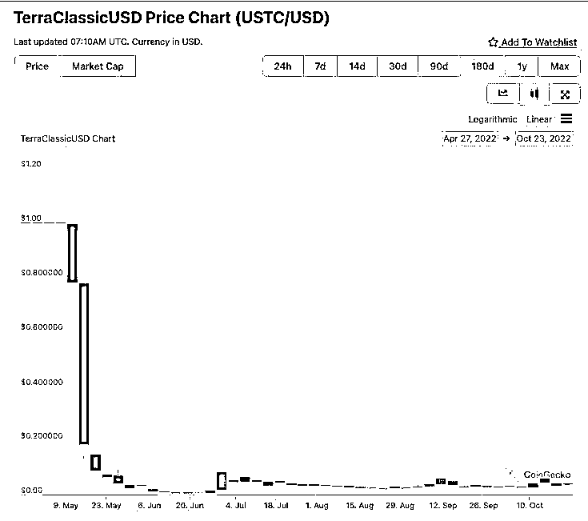
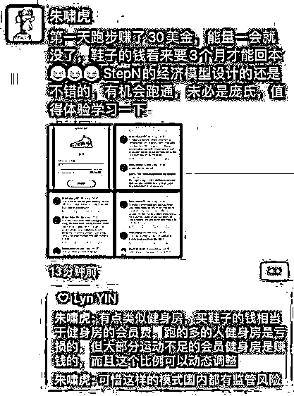
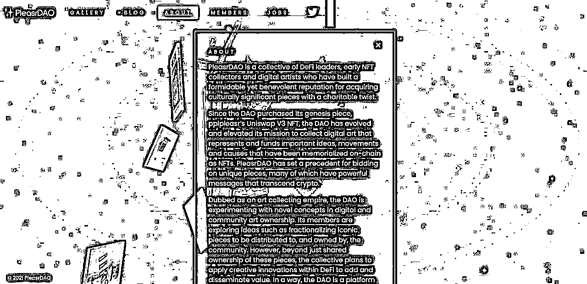

# 9 月航海｜ Web3 入门｜实战手册

> 来源：[https://ocn93f5d9olj.feishu.cn/docx/SJDbdav9eoIrg4xPxhLcKIm0neg](https://ocn93f5d9olj.feishu.cn/docx/SJDbdav9eoIrg4xPxhLcKIm0neg)

# 防失联+MM188166M（李李）长期更新

手册出品方：生财有术团队

出品时间：2024 年 9 月 5 日

手册使用说明：内容出品人排名不分先后。本文旨在向你展示一个项目的更多可能性，帮助你更好地理解或实操。

建议：如果需要快速定位到精确内容，可以使用快捷键 Ctrl + F/command + F 的形式，搜索「关键字/词」，查找你想要的内容。

# 写在前面

# 💡

Hi,

欢迎你来到 9 月航海 | Web3 入门 | 实战手册，相信在接下来的日子里，我们将在这里见面很多次。

划重点：

本次 9 月航海，我们邀请拥有丰富实操经验的 @阿布 Abo 老师，在手册的「十一、新手入门路径」里新增了新手需要注意的资产安全相关知识，并分享了如何找到正确的官网获取信息，感兴趣的小伙伴可以重点关注「11.5 官方信息」板块和「11.6 资产安全」板块。

在过去 2 年中，Web3 行业很大程度上是一个以建设为中心的行业。

时至今日，Web3 已成为一个包罗万象的术语，代表了一个新的、更好的互联网的愿景。Web3 的核心在于用户拥有自己在互联网上的信息产权。信息从用户产出的那一刻起，就确权给了用户。

Web3 是所有者的经济。

虽然很多朋友还不了解 Web3，但显而易见的是，这个赛道仍存在 10 倍+ 的增长机会，只有先了解，我们才有可能把握住未来。

本次航海的核心，就是带大家了解 Web3、入门 Web3，希望通过结构化的信息梳理，让大家能够对 Web3 形成自己系统化的了解，包括概念和这个行业的特点。

需要强调的一点是：本次航海与手册中，我们不会涉及任何的投资建议。

本手册将通过「信息结构化 + 案例分析」的模式，跟大家一起敲开 Web3 的大门。

去年 12 月航海，一位船员通过航海了解到 Web3 并结识了教练，后来自己又陆续加入一些社群，在今年 2 月份投入到这个赛道。仅过了 3 个月，他就拿到了自己人生第一个 100 万人民币的利润。

我们很为这个结果开心，也期待更多理性又愿意深耕的玩家，在 Web3 赛道中结出硕果。但在此之前，通过本次航海，希望你能逐渐具备对各类 Web3 项目的基础判断能力。

# 【更新提示】手册使用方式

在开始前，我们来简单了解一下这个手册的正确打开方式，方便你根据自己的情况来灵活使用。

在这里，手册整体的步骤顺序是按照从 0 - 1 了解 Web3 进行的，你可以参考航线图，按顺序开始学习。也可以根据自己的实际需求选择性阅读。

需要注意的是：本次手册相较于过往航海，进行了较大的改版。之前的手册尽可能的展示更多可能的玩法供大家自由选择，本次改版后的手册，分为必修和选修两个大的章节：

必修篇内容：为该项目从 0 到 1 跑通一个最小 MVP 的所有步骤，即航线图对应行动路径。如果你还在前期摸索中，想先完成一次整体的项目流程，那么建议从必修篇开始认真阅读和实操，不在玩法选择上做过多的纠结。

选修篇内容：则为该项目的更多玩法、案例和项目放大等相关内容。如果你已经跑通了项目的最小 MVP，想进一步了解该项目的更多可能，获得灵感，那么选修篇一定不要错过。

# 📌

如果你还未接触过，或只是简单接触过 Web3：

建议先从基础概念开始了解👇

✅必修篇：Web3 入门

# 📌

如果你对 Web3 已有基础了解，想进一步拓展认知：

在充分了解必修篇内容后，可以尝试学习选修篇的进阶内容👇

✅选修篇：Web3 进阶

# 📌

如果想要快速了解近期新增内容：

建议阅读👇

✅「11.5 官方信息」

✅「11.6 资产安全」

✅十一、新手入门路径

✅2.4.4 Layer1、Layer2

✅2.5 案例分析：比特币生态崛起

✅4.1.2.1 资产发行

✅4.2.3 如何选择稳定币？主流稳定币对比

✅8.2 各国监管政策

✅案例三：RWA 概念

✅14.1 站外资料

本航海项目的航线图如下：

⚠️需要注意的是，上述建议时间仅为了解手册内容所花费的时间，如果想对 Web3 有更深入了解，需要花更多时间「自行探索」 Web3 世界。

航线图和手册是高度关联的，因此你可以根据自己所在的环节，进行相关步骤的学习：

1.

每天根据自己当前的项目进度，确认自己在航海图的哪一步，接下来要做的是哪一步；

2.

点击对应要实操的步骤，跳转到航海手册的对应模块，即可了解相关实操步骤，并开始行动；

3.

完成当日行动后，完成日志打卡，进行相关行动的复盘，并计划下一步行动；

4.

航线图和项目关键路径强相关，如果你完成了航线图的所有动作，说明完成了最小 MVP ，接下来不要停止脚步，请继续重复第一阶段到第三阶段的动作。

完成航线图的所有动作后，建议大家不断学习精进，找到适合自己的入场方向，慎重且理智地投身 Web3 世界。

# 必修篇： Web3 入门

# 一、了解 Web3 @可达 Koda

# 💡

章节概要

这群自称是 Web3 的人在说啥？我怎么一句也听不懂？什么叫我要 Mint 一个 NFT？

当你遇到一些自称搞 Web3 的人，会不会突然觉得自己穿越了？自己也是个生在互联网时代的人，怎么他们说的话我一句也听不懂。

比如下面这些概念，大饼、以太、币安、智能合约、无聊猿、阿谢、跑鞋、公链，包括我们提到的一系列概念：DID、DeFi、NFT、GameFi、DAO 等等……是不是一个都不懂？

不要紧张，这非常正常。大多数人在刚进入到 Web3 的世界，都是一脸懵逼。

主要是因为：在进入一个新的领域以后，你遇到了已经在这个领域的人对于你的概念前置。

在一个新的概念，没有解释的时候就出现，正常人都是无法理解的。

不用焦虑，我们会从以下这些角度，带着大家逐一了解这些概念：

为什要了解 Web3？

Web3 是什么？

Web3 到底解决的是什么问题？

商业模式是什么？

发展现状什么样？

Web3 和 Web2 有什么区别？

……

来吧，打开通往 Web3 世界的第一扇大门。

划重点：

本次 9 月航海，我们邀请拥有丰富实操经验的 @阿布 Abo 老师，在手册的「十一、新手入门路径」里新增了新手需要注意的资产安全相关知识，并分享了如何找到正确的官网获取信息，感兴趣的小伙伴可以重点关注「11.5 官方信息」板块和「11.6 资产安全」板块。

# 1.1 2024 年， Web3 发生了哪些变化

在经历了 2021 年的高潮之后， Web3 行业在过去 2 年中，很大程度上是一个以建设为中心的行业。

2022 年，随着各路明星代言的天价 NFT、69000 美元的比特币、4800 美元的以太坊、埃隆马斯克的狗狗币等叙事狂热的消退， 顶级交易所 FTX 暴雷，LUNA 币 48 小时极限归零，很多人离开了 Web3 ，行业近乎跌至谷底。

2023 年，随着行情加密资产行情回暖，新叙事层出不穷， Web3 重新进入大众的视线。

2023 年，加密市场总市值相比年初增长超过 110%，增加超过 8700 亿美元。四季度迄今，市场上涨 55%（约 5960 亿美元）。

比特币经历了波澜壮阔的一年，从谷底的 15000 美元再次冲破 44000 美元，上涨 190%。比特币生态，Ordinals 和 BRC-20 的出现，使得比特币上首次可以部署、铸造和转移可替代代币，ORDI 币更是上涨近万倍。

以太坊生态持续创新，大而不倒，不断强化基础设施，孕育出新技术和细分方向市场，以太坊二层项目空投不断。

今年 2 月底的以太坊二层项目 starknet，给 129 万个地址空投了 7 亿枚代币，目前的二级价格是 2.2 美金，最高涨到 2.5 美金。单个账号最低空投代币数量为 500 个，换算成人民币，即最普通的低保号拿到的空投都有 7000-9000 元，而该项目单号占用的资金成本只需几百块，交互成本甚至不用超过 100 元。我个人也在此次 starknet 项目的空投中拿到了 6 位数 的结果。

最大的加密货币交易所币安和美国监管机构达成协议，接受 43 亿美元的天价罚款， Web3 正在逐步走向一个可监管的方向，多家基金巨头提出申请现货比特币 ETF ，可以预见的是，大量法币资金未来将可以合规地进入 Web3 市场。

宏观层面，美国利率处于 22 年来的最高水平，美联储降息的预期临近，欧洲通胀下降也使欧洲央行降息预期提前，这将成为 Web3 市场的一个积极利好因素。

随着加密市场的噪音越来越大，越来越多的人开始加入 Web3 市场，这个行业也孕育着众多新机会，下面我们就来看看为什么 Web3 值得大家学习和了解？

# 1.2 为什么我们觉得 Web3 值得大家学习和了解？

概括来说：我们看到了这个赛道 10 倍+ 的增长机会。

混沌大学的创始人李善友老师曾经在一次创业课程上讲过，对于创业者，当你看到了 10 倍+ 的增长时，那就是历史性的机会到来，要主动的扑上去拥抱它。

这句话不止对创业者者适用，对打工人和投资者也同样适用。

我们可以从微观正在发生的一些现象来看。

# 1.2.1 打工人的朝阳行业

前段时间，我们看到一篇知乎的帖子，在某安工作是怎么样的？（某安是 Web3 的头部公司，类似于 Web2 的腾讯和阿里），其中写到一句：这个工作按照时薪，应该是同级别互联网大厂拍马都追不上的。事实，也确实如此。

除此，支持全球分布式办公、什么是分布式办公？就是你可以非常灵活的远程工作。我认识的很多 Web3 创业者目前都是在家办公的。注意，这里这并不是想说，分布式办公的效率就会比集中办公高。反而，我个人觉得，分布式办公的效率大概率是没有集中办公高的。

但，即使在这种办公模式下，依然可以有这么高的薪资。说明啥？不卷。

并且， Web3 的门槛真的没有大家想象的那么高。如果你深入了解，会发现， Web3 目前无论在产品还是市场方面，都还是被 Web2 碾压的一个状态。

那为什么还会出现“高薪资、分布式办公”的情况呢？

因为人才很多，但了解 Web3 、并且投入其中的人才，还并不多。

后面的内容我们会有介绍，无论 Web2 还是 3 ，对人的底层工作能力要求并没有差别。重要的是认知和选择。

# 1.2.2 创业者的蓝海赛道

马斯克曾在一个采访中说：

我在大学时，思考的第一个问题是：什么可以影响人类的未来。

得到的答案是：互联网、人工智能、可再生能源、太空探索和地外生命、基因工程。

如果你是一个想做大的互联网创业者，最好看看目前 VC 的判断，VC 看赛道，创业者做经营。专业的人做专业的事。

VC 视角，现在的几个大赛道：国内看双碳、新能源、半导体等硬科技。海外看 Web3 。

# 1.2.3 投资者的新渠道

我们自己经历了股票、房产的投资以后，看到了 Web3 相关的投资，形成了鲜明的对比。这是看过去两年的历史。

如果看过去十年的历史，全球涨幅最大的资产是什么？毫无疑问是数字资产比特币。这些是数据，是客观发生的事实。

期间美股龙头：苹果 90 到 150，1.7 倍；谷歌：1460 到 2900，2 倍。A 和港，负增长。

正如我们在开篇时提到的，本手册不构成任何投资建议。这里只是提供给了我们一个投资理财配置的新渠道可能。

记得当年 BTC China 的 CEO 当时和还是 Web3 小白的赵长鹏的介绍数字资产时的对话挺有趣。拿出 10% 的资产换成 bitcoin，归 0 的可能性非常低，更可能的是翻 10 倍，如果 10 倍了，你的资产就翻倍了。

赵长鹏听到以后先是卖了自己上海的房子买了比特币，然后又开始了 Web3 创业。

现在，赵长鹏成为了 Web3 世界最有钱的男人。福布斯全球富豪榜 TOP 20。

# 1.3 Web3 是什么？

Web3 理念：去中心化、无需许可、原生支付、无需信任

时至今日， Web3 已成为一个包罗万象的术语，代表了一个新的、更好的互联网的愿景。 Web3 的核心是使用区块链、加密货币和 NFT， 以所有权的形式将权力交还给用户。

因为行业处于非常早期，尽管目前对 Web3 是什么，进行严格定义依然具有挑战，但仍然有一些核心原则指导着它的创建，主要包含以下四点：去中心化、无需许可、原生支付、无需信任

Web3 是去中心化的： Web3 网络不是由中心化实体控制和拥有的，其所有权属于构建者和用户。

Web3 是无需许可的：每个人都拥有有平等参与 Web3 的权限，没有人被排除在外。

Web3 具有原生支付功能：它使用加密货币在线消费和汇款，不依赖于传统银行或者其他有着类似于银行功能的第三方机构。

Web3 是无需信任的：它使用激励和经济机制运行，不依赖于受信任的第三方。

说到这里，大家可能还是比较蒙，不要紧，下面继续带大家抽丝剥茧，追本溯源。

为了更好的理解 Web3 是什么，我们可以先来看下 Web3 相对于 Web1 和 Web2 的定义对比。

Web1：只读网络

Web2：读写网络

Web3 ：读、写、拥有（价值网络）

按照目前的定义，概括来说，Web1 是只读网络，Web2 是既能读，又能写的网络；而 Web3 是既能读写，又能拥有网络信息产权的网络，也有很多人因此将 Web3 称为：价值网络。

展开来看从 Web1 到 Web3 的网络演进。

1989 年，在日内瓦的 CERN，Tim Berners-Lee 正忙于开发后来成为万维网的协议。他的想法是创建开放的、分散的协议，允许从地球上的任何地方共享信息。

Berners-Lee 的创造，现在被称为 “Web 1.0”，大约发生在 1990 年到 2004 年之间。Web 1.0 主要是公司拥有的静态网站，用户之间的互动接近于零 —— 个人很少产生内容 —— 它被称为只读网络。

随着社交媒体平台的出现，Web 2.0 时期开始于 2004 年。Web 不再是只读的，而是演变为可读写的。他们不再是公司向用户提供内容，而是开始提供平台来共享用户生成的内容并参与用户与用户的交互。

随着越来越多的人上网，少数顶级公司开始控制网络上产生的不成比例的流量和价值。Web 2.0 也催生了广告驱动的收入模式。虽然用户可以创建内容，但他们并不拥有它或从它的货币化中受益。

Web3 这个概念，是在 2014 年由两家头部的区块链公司，Polkadot 的创始人以及以太坊的联合创始人 Gavin Wood 在 2014 年提出的。他们提出的问题是：现在的 Web2 网络需要太多的信任。也就是说，今天人们所知道和使用的大多数网络，都依赖于信任少数的私营公司。希望通过 Web3 解决用户拥有网络信息所有权的问题。

所以 Web3 是什么？——价值网络，用户真正拥有其信息的所有权。

下面我们通过一些实例来理解 Web1、Web2、 Web3 的区别。

1）Web1 代表性的互联网产品，也就是在 PC 互联网时代的巨头，像海外雅虎、谷歌，国内的门户网站，搜狐、网易。这些网站的作用是用来聚合信息，然后用户可以在网站上点击浏览信息。

2）移动互联网的出现，让信息的产出不仅限于门户网站，全球数亿的用户成为了信息生产的节点，用户不仅能在互联网上获取信息，还可以自己生成信息。比较有代表性的产品，国外的 Facebook、Twitter，国内的微信、抖音，都是 Web2 时代的互联网产品。这些巨头平台，一端承载了足够多的用户，另一端对接商家通过广告实现商业化闭环。典型的平台型经济模型。本质上是平台通过给用户提供免费的服务获取海量用户，然后未经用户允许，把用户的信息卖给商家赚钱。

3）那 Web3 是什么呢？ Web3 的核心在于用户拥有自己在互联网上的信息产权。信息从用户产出的那一刻起，就确权给了用户。 Web3 是所有者的经济。现阶段，用户不需要依存于各大平台中自己注册账号。用户生成了自己钱包以后，就可以使用钱包在 Web3 世界的各类应用中畅游。钱包的概念和使用我们后面会解释。理论上来说，你的钱包只属于你自己，不属于任何的公司和组织。如果在 Web2，你玩的游戏被封号了，或者游戏公司倒闭了，那么你的虚拟资产也就损失了。但是在 Web3 不会，是你的就是你的，公司倒闭了，各类信息资产还是在你的钱包中。这，就是 Web3 的特点，核心是强调用户的信息所有权，原生的价值网络。

# 1.4 Web3 解决了什么问题？

上节我们给大家介绍了什么是 Web3 ，以及互联网从 Web1 到 Web3 的演进。这节，我们从 Web3 的视角来看，为什么需要 Web3 ， Web3 能解决 Web2 出现的哪些问题？

从 Web3 的视角来看，注意，是从 Web3 视角，你当然也可以有自己其他的视角去思考这些问题。目前 Web2 现在出现下面几个问题：

用户的数字身份受控于平台

数字资产所有权不属于用户

用户应得的数字收益被剥夺

平台和内容创作者之间的权利关系严重失衡

支付限制

1.

用户的数字身份受控于平台

在 Web2 的世界，如果你要进行互联网世界的各类活动，需要注册各大平台的账号，比如你要和别人聊天，需要注册微信和 QQ，你要玩网易游戏，需要注册游戏账号，在海外，如果要使用社交媒体，需要注册 Twitter、Facebook 等等。

总之，你的数字身份，从一开始，就产生于平台当中，从创建账号的那天起，你就相当于把你的身份信息售卖给了平台。

但是在 Web3 的世界则不同。从你生成了你的数字地址以后，你就有属于你自己的数字身份，使用这个地址，你可以访问各种 Web3 的应用。

2.

自然的，用户在各平台所有的数字资产，也不属于用户自己

就像我之前提到的，如果你在玩一个游戏，但是可能因为种种原因，你的游戏被封号了，或者游戏公司跑路了，这样你的数字资产就一起被带走了。本来属于你的资产，直接被平台剥夺。

这里还有个段子，据说，目前 Web3 最大生态公司，以太坊的创始人，出生于 1994 年的 V 神，从 13 岁就开始玩魔兽世界。但是在 2010 年某一天，由于暴雪的一次升级，小神童在魔兽世界中的角色特性被修改了，他悲痛欲绝，直接删掉了魔兽世界，可能这也为他后面创办以太坊埋下了思考的种子。

3.

数字资产不属于用户，自然的，数字资产带来的收入也不属于用户

可能很多人还没有了解数字资产的意思。其实我们每个人的微信，就是你自己数字资产，微信和房产本质没有区别。尤其是对于做自媒体的人来说。我们在各大平台产出内容，对大部分人来说，平台在售卖你的数字资产或者在收你数字资产租金的同时，是却没有给你任何的直接收益，这是典型的白嫖，但是用户却不自知。

4.

平台和内容创作者之间的权利关系严重失衡

这是显而易见的。现在的各大 Web2 平台，哪个不是说封就封。

前阵子，我们 RichDAO 的小助理，一个微信工作新号，用来加 Web3 的好友，那天，突然有将近 200 人加了小助理微信，小助理又要在群里组织活动，结果直接被微信给封了，至今还没有办法找回。小助理做了什么过分的事情么？没有。但却失去了他和新朋友连接的权利。背后，就是垄断型平台和用户之间的权利关系严重的失衡。

还有知识星球，我们为了给社区成员沉淀内容，把部分 Web3 的内容放到了免费的知识星球上，但是在申请成为正式的星球时，平台因为是 Web3 的内容，就不给审核通过了，而内容本身就是正常的学习资料。所以， Web3 的人认为，这个世界需要 Web3 的理念和精神。现有的平台权利需要被制衡了。

5.

支付限制

我们经常可以看到各个国家，比如美国，动不动就制裁某个国家或者个体。冻结他的银行资产等。 Web3 的出现，理论上可以减少这种限制问题。

说了这么多，简单来说， Web3 解决的问题就是用户数字资产所有权的问题。

今年 6 月底，7 月初的时候，有一篇叫 Web3 三问的文章，一度在 Web3 的圈子广为流传。这篇文章提出了这三个问题：

什么场景是在 Web2 不能完成，必须在 Web3 才能完成？

如果有，那这个场景下的 Web3 产品有多少人需要？

这个场景下 Web3 的产品解决问题的效率会更好么？

这三个问题的提出框架，主要还是从生产创造价值的角度去出发。有一定的局限性。除了这三个问题，我想再补充一个问题：

如果你觉得，没有什么问题一定需要用 Web3 来解决，那 Web3 还会发生么？为什么？

以上 Web3 四问，大家可以结合自己的认知与经验，尝试回答。

# 1.5 案例分析：Web2 vs Web3

上节，我们讲到了 Web3 解决了什么样的问题，从 Web3 的视角看目前 Web2 有什么问题，并提出了 4 个问题留给大家思考。

这节，我们聊下 Web2 和 Web3 的经典公司，以具体公司作为案例对 Web2 和 Web3 进行对比帮助大家来理解 Web2 和 Web3 有什么不同？

Web2 我们用的公司是谷歌，旗下有安卓操作系统、谷歌搜索引擎、YouTube 视频网站等系列产品，可以说是 Web2 世界的巨无霸。目前市值 1.3 万亿美金，在全球科技公司中，市值仅次于苹果和微软。

Web3 的公司，我们选取的是以太坊。是目前 Web3 最大的生态公司，市值 1600 亿美金，仅次于比特币，排在第二位。

为什么选这两家公司作为案例进行对比呢？因为这两家公司在一定程度上可以做类比，都是非常有代表性的生态公司。

之前经常有人问我，以太坊是什么？我如果说，以太坊是一家去中心化的开源的，使用智能合约的区块链平台大家肯定听不懂。所以我想来想去，用下面这种方式来解释，虽然不是最恰当的，但是很容易帮助不了解 Web3 的人理解：

以太坊是 Web3 的安卓。当然，在网络的架构上会有区别，这点在区块链技术和 Web3 基建这一章节上我们会详细讲解。大家可以先这样简单理解。

我们主要从下面的这个框架去看 Web2 和 Web3 的公司：

商业模式

扩张方式

融资方式

投资人获得什么？风险是什么？

1.

先来看商业模式

任何一家商业公司，其商业模式无外乎回答下面这个简单的问题：为什么人提供什么产品或服务，解决什么问题？出售什么？收多少钱？注意，这里面的要素缺一不可。

对商业没概念的同学，可以尝试自己套用下这个框架里的要素，问问是不是所有的商业公司都按照这个框架套进去。

有的同学可能会问，不对啊，我用谷歌、百度、抖音、微信这些，商家都没收我钱呀？那他们是不是在免费给我提供服务，没有收钱呢？答案是不是的。这是用户的视角。

任何一家商业公司，都是一定要盈利的。即使，他阶段性的免费，最后肯定也是要从你身上获取点什么的。

如果从平台的视角来看，我们以抖音为例：他的商业模式是，为用户提供短视频内容，然后出售用户的精力给商家，通过赚商家的广告费来变现。

这几乎是所有平台型互联网的商业模式。

回到谷歌，谷歌的安卓系统，也是一样的。用户虽然可以免费使用安卓操作系统，但是谷歌是要从商家收费的。本质还是把你的精力或者数字资产出售给商家变现。

那以太坊的商业模式是什么呢？简单来说，为商家和用户提供一个安全可信的网络。然后，以太坊不像 Web2 的公司那么鸡贼，挂羊头卖狗肉。而是在最开始的时候就说好收费规则，而且写到合同里，说好了就不改。

用户要使用我的网络，你就要支付手续费，商家要使用，也要支付手续费。就是这么简单。

2.

然后看扩张方式

无论是谷歌还是以太坊，都是有规模效应的。所谓的规模效应就是，你越强，用的人越多，平台越大，用户和商家都无法离开，进而形成垄断。或者说，使用的用户越多，平台能聚合的商家就越多，商家越多，用户体验越好，最后形成垄断。是非常好飞轮模型。

两家公司的增长方式，我觉得本质上没区别，都是花钱去优化产品，花钱做用户增长。前者用的是美元，我们通常将国家发行的货币叫法币。后者多数时候用的是自己发行的货币。

主要的区别在于理念。 Web3 的用户，是心中有去中心化理想的。

3.

融资方式

我觉得 Web2 和 Web3 的最大形式上不同，就是在融资方式。这是我的观点。大家可以自己思考下。

这里需要先给大家介绍两个概念。IPO 和 ICO 。

IPO 是首次公开募股的缩写，Initial Public Offerings。简单解释下就是，一个 Web2 的公司，向普通的投资者发行股票的过程。股票发行以后，普通投资者觉得这个公司的股票未来有增值空间，就可以花钱买了。虽然叫首次公开募股，但实际是发行之前，公司的股票就已经有一部分出售了机构。

普通的个人投资者在购买股票时，多数是在接机构的盘。这几个词的关键我觉得不在首次，而是在公开，公开募股意味着之前非公开卖给了机构。个人投资者是很难获得在股票交易市场上市前的公司股权的。尤其在 Web2 融资烧钱搞规模的商业模式下，都是以超高的估值上市，上市即割。

ICO，是 Web3 专有的名词。首次代币发行 （Initial coin offering）。这里的 coin，既是货币，又是股票。和 Web2 还是非常不同的。这是第一个不同点。

第二个不同点是，如果你把代币当作股票，这个首次是真的首次，直接面向 Web3 的普通用户发行。与其说是首次发行，不如翻译成众筹，这样可能会更好的理解。

第三点不同是，ICO 不需要牌照。目前 ICO 在国内是不被允许的，这里我们先不做展开，会在监管合规的部分详细说。

谷歌融资上市的模式没什么好说的。这里重点给大家讲下以太坊当年 ICO 的故事。

2013 年，那时 19 岁的以太坊创始人 Vitalik 去美国加州圣何塞参加了一个比特币相关的会议，听完了以后他觉得，自己的一个 idea 有得搞，回来就辍学了。

然后他花了 6 个月的时间，去世界各地见那时候叫区块链，现在叫 Web3 和他有类似想法的团队，以色列、加州、伦敦、洛杉矶、拉斯维加斯、阿姆斯特丹，他觉得大家目前的想法都没有解决比特币当前的缺陷，还是把区块链技术和应用限制在了金融领域。他认为，比特币加上图灵完备的编程语言，这样任何人就都能在上面开发去中心化应用了，而不是仅仅限于金融领域。

当时他把他的 idea 和大家说了以后，没有人理会他。最后他决定自己干，回到家用了 1 个月的时间，就把他的想法写成了白皮书，起名叫以太坊，Ethereum。

白皮书写好了后，他就给身边圈子里的朋友们看，也通过这个白皮书找到了他早期团队的合伙人。

又过了几个月，V 神在 Web3 的全球顶级会议之一：迈阿密的比特币大会上给参会者介绍了以太坊，引起了不小的轰动。然后开始 ICO，最终，为期 42 天的 ICO 募资 31000 枚比特币，售出以太币 60,102,216，以当时的汇率，募集资金约合 1840 万美元。

如果按照现在的比特币价格计算，大概是 6 亿美金，可以说是天价 ICO 了。

当然，早期买入了以太坊的并且长期持有的，现在都获得了超级丰厚的回报。以太坊 ICO 的价格不到 0.5 美金。现在的价格是 1300 美金。不到 10 年的时间，上涨了几千倍。

下面这是以太坊的历史价格走势。大家可以看下。是不是拍大腿。这种涨幅，你当时就算买个 1000 块，现在也有几百万了。 Web3 就是经常有这样的机会。

这里给大家个小的工具，大家因为还没有交易所，所以可以用这个网站去看加密资产的价格：coingeko：https://www.coingecko.com/

不过在 similar Web3 第三方网站排名更好，全球访问量更多的是下面这个网站，也附上给大家：

coinmarketcap: https://coinmarketcap.com/

1.

说到这里，剩下的一个问题，大家应该也比较清楚了。可以作为这一节的思考作业留给大家。

Web2 的投资机构和普通投资者获得什么？风险是什么？

# 1.6 「方法」从资本看 Web3

术业有专攻，专业的人做专业的事情。在看赛道、看公司方面，资本是最专业的。

这里，提供给大家一个方法或者说视角，来看看资本怎么看 Web3 ，都做了什么？我们如何知道一家 Web3 的公司都被哪些资本投资了？这是一个非常好的辅助我们去判断一家 Web3 公司质量的方法。

从有 Web3 这个赛道以来，2021 年，可以说是资本出手最为阔绰的一年。

根据 galaxy Digital 2021 年 12 月的报告，截止 2021 年 12 月底，风险投资公司对 Web3 相关企业投资规模高达 330 亿美元。

2021 年一整年的投资规模超过了往年对该领域的投资规模总和。

The Block 的这篇研究报告我们看到，整个 Web3 行业的独角兽公司也在 2021 年迎来了井喷式增长。各类 Web3 公司百花齐放，金融服务、交易所、基础设施、NFT、GameFi、数据分析等等。

之前我在做股票投资时，找优质的投资标的，有一个辅助的方法是用烯牛数据去看腾讯战略投资了哪些公司？这些专业机构的筛选，在一定程度上，给二级市场的投资带来了安全垫。

在 Web3 领域中，想要验证什么方向，什么公司更有潜力，我想这种辅助方法也是适用的。看看知名的 Web3 投资机构都投了什么项目？下图中，都是在 Web3 非常知名的资本以及他们投资的成功项目。

这些资本包括：Coinbase、Digital Currency、 Paradigm、 a16z、 红杉等等

如果你新知道了一家 Web3 的公司，想看下这家公司是否靠谱，可以用下面这个辅助的方法。

有一个网站叫 Cypherhunter，大家可以在上面看到，都有哪些资本投了这个项目：https://www.cypherhunter.com/en/

举个例子，比如我们上文提到的以太坊，你可以在搜索栏这里输入 Ethereum，然后就可以看到这里介绍说，以太坊是一个去中心化的平台，可以在上面使用智能合约和 Dapp。

再往下，是以太坊的团队以及他们的 Twitter 链接，我们往下翻，可以看到之前提到的 V 神，Vitalik。

然后是 portfolio，portfolio 是以太坊的投资组合，这家公司都投了哪些。

在最下面，我们就可以看到哪些投资人或机构投了以太坊了。

可以再看下最大的 NFT 交易平台，opensea，可以看到 opensea 的投资人和投资机构就非常多了，都是知名机构和投资人。NBA 小牛队的老板库班也投了 opensea。

今年以来，币安的投资公司 BinanceLabs 的投资质量也不错，看 Binance 都投了哪些公司，对我们判断 Web3 公司或者项目，是很有帮助的。

我们看 BinanceLab 的 Portfolio。包括我们前阵子说的 bnb 域名项目 SPACEID，今年的百倍投资项目跑鞋 STEPN 等等。

总结下，今天给大家提供了一个新的视角去看 Web3 ，从资本的视角去看。

概括来说就是， Web3 的那些知名投资机构，最近投了哪些类型的项目？或者一个新的 Web3 项目，被哪些机构投资了？

以上两点，都可以作为我们判断一个 Web3 项目质量的参考。如果自己要参与其投资，我想可以作为一比较好的安全垫。

# 1.7 小结

最后，我们来做个小结。

第一节，先简单了解 Web3 在 2023 年发生了哪些新变化？这些变化对我们的影响是什么？

第二节，分析为什么 Web3 值得关注？

第三节，介绍 Web3 是什么？

Web1（只读）网络、Web2（读写）网络、 Web3 价值网络（用户拥有数据所有权）

第四节，从 Web3 的视角详细分析了目前 Web2 有什么问题， Web3 解决什么问题？

包括：

用户的数字身份受控于平台

数字资产不属于用户

用户应得收益被剥夺

平台和内容创作者之间的权利关系严重失衡

支付限制

Web2 有什么问题

Web3 解决了什么问题

Web2 vs Web3

谷歌 vs 以太坊

第五节，以 Web2 和 Web3 的代表性生态，谷歌和以太坊作为案例对比。从商业模式、扩张方式、融资方式来帮大家理解 Web2 和 3 的不同。

第六节，给大家提供了一个从资本视角看 Web3 的方法。

整个第二节 Web3 概述，除了帮助大家理解 Web3 的概念。还给到了大家 2 个方法和 5 个思考问题。

如何查看加密资产的历史价格？可以使用 Coingecko 网站去看。

如何找到一些好的 Web3 项目？或者有了 Web3 项目如何对其进行判断？我们给到使用资本视角去看的一个辅助方法，使用 Cyberhunter 去看。

5 个思考问题作业是：

1.

什么场景是在 Web2 不能完成，必须在 Web3 才能完成？

2.

如果有，那这个场景下的 Web3 产品有多少人需要？

3.

这个场景下， Web3 的产品解决问题的效率会更好么？

4.

如果你觉得，没有什么问题一定需要用 Web3 来解决，那 Web3 还会发生么？为什么？

5.

Web2 和 Web3 的投资机构和普通投资者获得什么？风险是什么？

从下一节开始，我们将对 Web3 抽丝剥茧，从底层技术到热门应用展开介绍。

# 二、理解 Web3 的框架结构 @可达 Koda

# 💡

章节概要

本章是整个 Web3 入门中难度最大的一节，因为涉及到了 Web3 的底层技术区块链和基建。

期间，我们会提到：

Web3 从协议层到应用层的架构，帮助大家遇到各类概念后有一个分层的系统

区块链技术的产生源于比特币，比特币和区块链的诞生是为了解决双花问题

介绍去中心化平台以太坊

介绍当前公链的格局，以及两种思路的公链解决方案

介绍联盟链、私链的概念

……

别怕，我们会结合案例做拆解分析，辅助大家进行理解。

# 2.1 了解 Web3 的框架结构

先来一张图理解 Web3 的框架结构：

https://www.coinbase.com/blog/a-simple-guide-to-the- Web3 -stack

前面的内容中，我们提到了很多对大家来说可能比较陌生的概念，比如区块链、基建、智能合约、比特币、以太坊、DeFi、交易所、NFT、GameFi、DAO 等等。

这些都是构成 Web3 的要素。

这章节，我们就用这张结构图，先帮助大家对这些概念做个分层。这样大家在学习 Web3 时，就有了一个整体的框架。遇到一个新的概念，更容易对号入座。

简单来看， Web3 可以分为 4 层：自下而上，分别是协议层、基础设施层、应用层和接入层。这四层的结构，就和建筑物一样，每一层都建立在其下一层之上。

下面用类比法，帮助大家更好的理解这个分层。

我们还是用 Web2 中大家比较熟悉的产品腾讯系来做说明，不够精确，但是有助于理解。

1.

协议层

大家使用各类的互联网产品，实际上都是建立在互联网的协议基础之上的。什么是互联网协议呢？我理解它是一种大家有共识的语言标准。

为什么互联网可以连接全世界？因为全世界用的是这一套标准在交流。如同我们无法同一个不懂中文的人对话一样，能够连接和对话的前提是，大家都共识并且使用一套交流标准。这就是协议层。

2.

基建层

基础建设层。我们平时在使用腾讯旗下的微信、微信支付、QQ、游戏时，大家有没有想过其背后是怎么运转的？这就是基建层的作用。

我们的使用微信支付，需要后端的记账和处理，同时，我们的支付账户，也需要一套安全的体系去做保障，我们在这些应用上产生的数据要存在这家公司的服务中，数据不仅要存储，还要处理，这就涉及到一系列的工作。

这一类，我们统统将其归为基建层。没有这一层，我们就无法很好的使用我们平时的 APP 和网站。

3.

应用层

这一层是最容易理解的，因为离我们的生活最近。我们平时使用的腾讯生态的各类应用都可以算在这一层，无论是微信、QQ、还是游戏王者荣耀。

同理，我们使用的各类互联网产品，也都是按照这样的架构生产出来并给我们提供服务的。

4.

接入层

接入层，可以简单理解为，如果使用微信，你需要注册一个微信账号；使用淘宝，需要注册一个淘宝账号。总之，你需要有个身份来去使用各类应用，在 Web2 的世界，或是手机号，或是邮箱。

理解了上面的架构以后，我们再来对号入座 Web3 的各类产品。从架构的分层和演进来看， Web3 和 Web2 并无明显区别。但在具体的理念以及形式上有一定区别。

先来看协议层。协议层这里，我觉得是有一个明显的区别的。

在 Web3 目前有多张网络，每个网络都有自己的一套协议。我们前面提到的以太坊是一张网络，比特币也是一张网络，还有很多其他网络，比如图中的 solana、cosmos、币安，都有自己的一张网络。

Web3 的协议层，如果用多张网络来想不好理解，你也可以这样想：Web2 现在的两大移动端操作系统生态 IOS 和安卓，那 Web3 目前有很多这种生态。头部的是以太坊，币安这两年的币安生态发展的也很快。

Web3 中，我们把这种生态系统叫做链。这个链来源于区块链。分类可以为分为公链、私链、联盟链。这个我们后面的章节会展开讲解。以太坊是以太坊链。币安是币安链。

当然，每个网络也都需要自己基础建设层和应用层。于是，我们就看到 Web3 这张图中基建层和应用层的各类产品。基建层包括安全、存储、身份系统等，应用层目前主要包括游戏、社交、数字藏品、金融服务等。

在接入层，Web2 是我刚才说的你在各 Web2 平台注册的手机、邮箱，注册以后你的数字身份属于各个平台。但在 Web3 ，每个网络，只需要一个钱包地址，就可以访问全部的应用。

这一点和 Web2 是不一样的，你不需要使用微信的时候注册一个、使用淘宝的时候再注册一个、使用网上银行再注册一个。

有了钱包，你的钱就存在这里，可以用这个钱包地址访问这个网络中的所有应用。

总结下， Web3 的协议层，就像是我们地球的土地，基建层，相当于我们在地上盖了一座楼。

为什么要盖楼呢？因为楼里面要给人们提供各类的服务，比如游戏、建设、购物等等。对应的这些服务，就是应用层。

除此，这个楼还设置了门禁，需要验证下你的身份才能进入。这个身份，在 Web3 就是你的钱包地址。

这个分层架构图，应该可以帮助大家更好把 Web3 的各产品做归类了。以后我们遇到 Web3 的各类产品，就可以用这张图对号入座。

我们接下来的内容，也会按照这个架构，把其中代表性的产品给大家拆开讲解。

# 2.2 案例分析：区块链技术产生及应用

要了解 Web3 ，首先要知道 Web3 的关键技术，区块链是什么？

鉴于这是入门内容，这里不会讲具体的技术细节，大家想要深入学习了解的，我们给大家提供了深度阅读的材料，大家可以自行阅读，有问题我们可以在群中交流。

这个视频，会侧重于从该技术到底解决了什么问题以及解决问题的方式去给大家介绍。

区块链技术源于 Bitcoin 比特币，这篇文论是一个网名叫中本聪的极客，在 2008 年发表的。从其标题可以看出，这是一篇定义了一个新概念的文章。Bitcoin 比特币，一种点对点的电子货币系统。区块链的技术就是从这篇文章开始为人们所熟知。

这里附上《比特币白皮书》，作为大家的深度阅读作业，建议大家可以多读一读：

《比特币白皮书》英文版.pdf

《比特币白皮书》中文版.pdf

注：如果下载后无法打开，或文件名为乱码，请自己修改文件名，并添加后缀「。pdf」，并将「保存类型」选择为「所有文件」:

一遍读不懂很正常，可以多读几遍，慢慢就懂了。

这里会我们尝试回答下面几个问题：

比特币，区块链技术的提出想要解决什么问题？为什么需要区块链技术？

解决方案是什么？

区块链技术有哪些特点？

1.

首先来回答第一个问题：区块链的提出想要解决什么问题？

如果你去耐心阅读了比特币的白皮书，其实可以发现，中本聪当时提出比特币这个概念，想要解决是，一笔钱同时花到两个地方的问题。我们叫“双花”。为什么会出现这种情况？

首先，我们需要了解下，我们现有的货币体系是什么样的？

上面这张图，就是我们现有的货币体系，一个中心化的交易系统。这个系统中，有很多的用户和银行，背后大家都是通过一个记账、清算系统来完成的。

银行最核心的业务，如果用两个字概括来说就是：“记账”，不能记错，也不能记假账。

但在数字时代，中心化管理的数据库，是有各种可能被篡改的。

有哪些种可能呢？我们可以想象下下面的场景。

第一：中心化的银行真的可信么？我们的钱，在银行的记账系统中无非是一个数据。且这个数据对我们是不公开的。实际情况是什么，对个体来说是未知的。

第二：中心化银行真的足够安全么？为什么在经济危机时，一些国家的银行取不出钱了？

第三：guo/家背书靠谱么？银行的背后是 guo/家背书，像美国和中国这种强国，guo/家背书相对靠谱。但在一些第三世界的 guo/家，guo/家的局势很不稳定，他们 guo 家的货币的汇率波动可能比我们 guo/家的股市波动幅度还要大。或者有些 guo 家，直接破产了。那这样的背书还有意义么？这是现实存在的问题。

以上是我能想到的一些情况，当然还有其他更多的情况，大家也可以发散思考下。

于是，中本聪提出了，跨过中心化机构，直接在用户之间点对点支付的去中心化的货币系统的解决方案。

2.

接下来看，区块链技术到底是怎么解决这个问题的？

区块链这个词不太好理解。是直接从英文 blockchain 翻译过来的。

我们把他拆开。block 区块和 chain 链。block 可以理解为信息块。区块链，就是由前后连在一起的信息块构成。

替换成和大家生活有关联的词。区块就是一个不断生成的子账本。这些账本通过一种特定的算法（哈希算法）前后连起来，形成了一个总账本。通俗的讲，区块链技术并不神秘，就是一种不可篡改的新的记账技术而已。

简单概括来说，解决方案如下：

既然由中心化机构管理存在这种问题不靠谱，那么就不用他去管了

我把这个数据库的管理权交给所有人，大家一起记账维护这个账本

每个人手中的账本必须和其他人的一样才算有效账本

所以，网络中的每个账本都是一样的

且，没有人可以私自篡改账本

如果说中心化的方式是由一个人或者一个系统记账。那么区块链技术，就是用所有参与到这个网络中的人一起记账。发生了一笔交易，大家就全部都记录一次。记账的人可以分布在世界各地。

这种账本，需要吸引到足够多人来记账，也是可以形成规模效应的一种模式，来记账的人越多，网络就越安全健康。

接下来，需要解决的核心问题是：

一个普通人，为什么要做这个网络的建设者，参与记账？

无利不起早，比特币这个系统，吸引大家来参与网络建设的方式是，每 10 分钟给左右发一次红包。

因为这个分布式的记账网络，需要每 10 分钟完成一个子账簿，然后再把这个子账簿加到原来的总账本之中。生成、校验子账本，并确认无误的加入到原来的总账本的过程，需要网络中的计算机贡献算力。大家干了活以后，就有机会可以抢到比特币的红包。

比特币这个系统，通过不断的发红包，完成了他的货币发行。按照白皮书的中的设定，红包要持续发 142 年，开始每 10 分钟发 50 个比特币作为奖励，以后每 4 年减半一次，每个红包的比特币数量从 50 减少到 25 个，然后再减成 12.5，以此类推。

比特币的总量恒定为 2100 万个。红包发完了也不要紧，参与网络建设和维护的节点，依然可以通过网络使用者的交易手续费获益。

参与抢红包的过程，在 Web3 被形象的称为“挖矿”，参与网络建设的那些人被称为矿工。因为抢红包是个概率事件，所以矿工们会集中到一起去挖，集中到一起的计算节点，称为矿池。

这里就顺带把挖矿、矿工、矿池这三个概念给大家解释清楚了。

在比特币网络刚运行的时候，参与的人很少，总算力也很低，那时候随便一台笔记本电脑就可以挖出很多比特币。第一笔的比特币交易是，一个大兄弟用了 1 万个比特币买了 2 个披萨。现在 1 万个比特币的价值：2 亿美金，峰值是 7 亿美金，这两个披萨，可以堪称史上最贵的披萨了。

3.

有哪些特点

基于以上，如果我们非要概括下区块链的特征，我觉得只有两点：

分布式解决方案

不可篡改

至于去中心化，公开透明，我觉得都是分布式解决方案的结果。

这个技术的诞生，是为了解决中心化的问题，而采用了去中心化的解决方案，而不是为了在去中心化，而产生了区块链技术。

公开透明，所有人都参与记账了，自然是公开的。但完全公开透明就真的比部分公开透明要好么？我觉得有待商榷，大家可以各抒己见。

# 2.3 案例分析：公链之王以太坊

上一节，我们介绍了区块链技术的产生源于比特币：一种点对点的电子货币支付系统。

回答了比特币解决的是什么问题？解决方案是什么？有什么特点。

在之前《 Web2 和 Web3 经典公司对比》中，我们也和大家介绍过以太坊。不知道大家还有没有印象。

这章节，我们来详细分析下以太坊。

同样的，我们通过回答下面几个问题帮助大家来理解以太坊：

1.

以太坊是什么？解决的是什么问题？

2.

解决方案是什么？有什么问题？

3.

比特币和以太坊对比

# 2.3.1 以太坊解决什么问题？

相信通过前面的学习，大家对以太坊是什么已经有了初步的概念。这里我在重复一次，按照以太坊自己对自己的定义：以太坊是新一代的智能合约和去中心化应用平台。正如我之前介绍的，如果对此你不好理解，可以暂时把他理解成一个自带货币系统的安卓。

接下来看，为什么以太坊的创始人要创办以太坊，他发现了什么问题？

简单概括来说，比特币这个系统，解决仅仅是交易问题。有了比特币以后，人们可以立刻汇款给世界各地的用户，不用考虑国际边界的问题，并且收取可忽略不计或者说远低于现有国际交易的手续费。区块链技术的诞生，越来越多的人开始把注意放到金融、云计算、信息传输和需要分布式管理的应用开发上。

但，比特币的网络在设计之初，只是一个电子现金的交易系统解决方案，如果想要实现上面越来越多的去中心化需求，对于开发者很不友好。

于是，以太坊提出，我们提供一个好用的平台来创建这些去中心化的应用。是不是非常像去中心化的安卓？

# 2.3.2 解决方案是什么？

接下来，我们来看下，以太坊到底提出了什么样的解决方案？

1.

做标准，统一语言，简化协议

普通企业做产品，优秀企业做品牌，顶级企业制定标准。在这个新的领域，在解决上面的问题时，基于区块链技术，以太坊直接提出了自己的一套全球通用，简单易用的可编程区块链语言给有各类需求的开发者。这个语言叫 solidity 。

在协议上，如果你想发行一个自己的货币，在以太坊这个网络中，就要使用 ERC-20 这套协议标准，当然还有其他的协议标准。

2.

智能合约：规则、合同程序化

这个编程语言主要用来干嘛呢？用来写智能合约。智能合约是从英文 smartcontract 翻译过来的。大家可能不大容易理解。简单解释来说，就是一种一旦开始运行就不能更改的电子合同。

比如，你要租房，你和房东之间就会有一个合同，谁把房子租给谁，租客应该在什么时间支付给房东多少钱，这就是一个简单的合同，只不过，在这个合同中，运行是靠人工或者机构的电子系统进行控制的。而不是纯程序化。

智能合约就是把比特币的分布式记账，不可篡改的思路运用到了各类应用中。各类合同代码化、程序化。如果大家在开始的时候同意某一个方案和条件，那么一旦开始运行就不可篡改。

大家有没有想过，货币系统的核心功能，如果用代码来标识，异常的简单：

从 A 中减去 X 个单位并将 X 个单位添加给 B

条件是

（1） A 在交易之前至少有 X 个单位并且 （2） 交易由 A 批准。

实现代币系统所需要做的就是将此逻辑实现成代码就好了。

这里大家可以发散思考一下，我们人类社会，有哪些东西是开始制定好了以后，就可以一直不用修改的规则？上面交易的规则是一个，还有其他的哪些规则呢？

在落地上面的这种解决方案过程中，带来了什么呢？因为以太坊是基于区块链的技术，所以，比起 Web2 的应用开发平台像 IOS 和安卓。在其上开发的应用，自带货币开发系统。

但是，一个项目，不是你在合约中写了，我发行一个货币，大家就认同这个可以当钱花了对不对，如果这样，大街上随便一个人在纸上写个数都能当钱了。

为啥大家觉得美元人民币能当钱花？因为钱的背后，本质是信任共识。

于是，一个 Web3 的项目，可以先提出理念、白皮书，然后在平台上众筹发行自己的加密货币，有人用 BTC 或者 ETH 或者其他币去买，他就有了钱，可以启动项目。

换句话说，就是要把整个项目的各类各方利益分配，在最开始的时候就算清楚，然后写到合同里。

大家如果你觉得你这个项目的利益分配 OK，或者格局可以，就会用钱来支持你做这个项目。

这种形式，就是我们之前提到的 ICO，首次公开发币的概念。

之前跟大家讲过。以太坊当年的项目启动，用的就是 ICO 的融资方式。42 天，融了 31000 多个比特币，当时价值 1800 多万美金的巨额启动资金。

# 2.3.3 有什么问题？

The DAO 被盗事件和硬分叉

上面提到了，大家可以在以太坊上开发各类的去中心化应用，提前说好规则，一旦说好就能不能篡改，然后把规则程序化自动运行。有一种应用，就是去中心化的组织。

DAO 是由 Slock.It 创建的； 一支技术精湛的开发团队，包括以前的以太坊创始成员。Slock.It 将 DAO 视为基于社区为项目提供的资金的一种方式。类似于一个众筹投资组织。

其核心思想是，社区一起筛选项目，如果项目提案在社区获得通过。资金将从以太坊社区的投资者筹集，如果项目成功，那么投资者将获得一部分利润。

DAO 也是以太坊生态中的一个重要实验。参与者不是直接用以太坊来资助项目，而是将他们的以太币交换为 DAO 代币，有了这个代币，可以对项目进行投票，当然，这个代币也能换回以太币。

叫 DAO 的这个代币，2016 年 4 月开始众筹，不到 1 个月的时间，就筹集了总价值约 1.5 亿美元的资金，占据了当时全部以太坊存款的近 14％。

但，但凡语言和规则，就会有漏洞

树大招风，如此大的众筹项目，自然会被 Web3 世界的黑客盯上。6 月份，黑客利用这个项目合约中的漏洞，盗走了 360 万个以太币，约为这次项目筹集总资金的 1 / 3 。

这就好比，一个合同在设计之初，并没有想到在某一个种情况下，其中一方可以找到一个方式持续的进行套利。我记得之前有个彩票的规则，就是因为设计的漏洞，进而被掏空了奖池。

在这个场景下，以太坊的创始人，经过社区讨论，在不可篡改和被盗中，选择了平台方介入，把被盗的资金退了回去。这个处理方式，就是我们所说的硬分叉，在原有规则基础上，强行改变规则，做一条新的链。

当然，这也引发了非常大的争议。

一部分人认为，规则就是规则，区块链的精神就是去中心化，不可篡改。被盗也不可篡改。

另外一部分认为，社区需要正义的力量，不能让作恶方得逞，违法就要打击。当然，这样投资者也就不会蒙受被盗的损失。

最终的结果我们也看到了， 以太坊社区对分叉的决定获得了 85% 以上的票数。V 神站在了社区正义一边。由此次事件，也衍生出了两种以太坊代币。

# 2.3.3.1 硬分叉🔥

一种是 ETC，代表着区块链的不可篡改精神，账本形成了就是不能修改。

另外一种就是我们今天最常用的 ETH，创始人和社区，可以一起在极端情况出现时，修改规则。

有趣的一点是：原链网络和新的以太坊网络，都有对应的代币。原链的以太坊叫 ETC，分叉后的新链叫 ETH，我们可以看下币价。后者是目前大家在使用的。

而比特币呢？到目前为止可以说一个完全去中心化的网络。创建比特币网络的人，中本聪，没人知道他是谁，后来中本聪这个网名的人干脆直接在网络消失，所有的决策，都是按照那套发红包的规则持续的运转着，至今已运转了 10 多年。

对于比特币网络其实后面也有分叉，分叉的原因是为了解决比特币网络支付效率的问题。分出了 BCH 。但是，新链却并没有得到大家的共识。

比特币以不变应万变，大道至简，比特币就是比特币，现在已经成了一种 Web3 世界的符号，不需要演进和效率。

而以太坊的诞生之处，就是为了提高效率，其进化也演进本质也是需要不断的提升的效率的。

应该可以引发一些大家的思考。为什么这个世界，一些事物需要不断的进化，而一些事物却可以以不变应万变呢？

# 2.3.3.2 BTC vs ETH 不变和变 🔥

最后，我们可以对比下，目前 Web3 世界最具代表性的两个系统，顺便一起回顾下这两节我们的主要的内容。

比特币，由匿名网友中本聪在 2008 年创造，以太坊由计算机小天才 Vitalik 在 2013 年创造。

比特币不属于任何组织，而以太坊，虽然是 Web3 中目前最大的去中心化平台，但是我们可以看到，这家公司还是会受到社区和创始人的影响。

比特币的出现，提出了点对点支付的数字现金交易方式。

以太坊，比特币提出的区块链基础上，提出了智能合约，去中心化应用开发平台的概念，把区块链技术推向了更多领域的应用。

比特币的诞生，是没有融资的，有人有共识，就开始自动成为这个网络中的记账人，然后获得激励比特币。

而以太坊，是靠他的解决方案，拿到钱，然后开始搭建这张网络。

在激励机制方面，比特币使用的是 PoW Proof of work，工作量证明。

而以太坊，开始使用的 proof of work，今年 9 月完成了全网升级，改为了新的方式。

Proof of stake. Proof of stake 简单来说就是你持有这个网络的货币数量越多，参与记账可以获得的奖励就越多。

# 2.4 多链生态格局

这节我们来聊下 Web3 底层区块链的多链格局。

以太坊这三个字，我们可以这么理解：

首先，以太坊是一个公司或组织。这个组织的诞生，希望提高去中心化应用的开发问题，让区块链技术不仅限于比特币交易。

为了解决这个问题，他们搭建了以太坊这个平台，用于服务开发者，类似于安卓和 IOS 。这个平台可以叫做以太坊。这是第二层含义。

然后，和 Web2 的平台不同的是，这个平台是从协议层就注入了自己的金融体系，流通在以太坊生态体系中的代币，叫以太坊或者以太币，或者英文简写 ETH 。这是第三层含义。

代币是中文的翻译，我认为是不准确的。英文把这种流通在 Web3 平台中的代币，统称为 token ，通证，或者令牌，这种翻译是更有助于大家理解的。

因为这种流通在 Web3 网络体系中的代币，既有货币功能，也有债券、股票的功能，把它翻译成代币，会让很多人以为仅仅是货币的一种，不够准确。

当然， 因为这个平台或者叫系统，从底层协议就开始发挥作用，并且各类基建应用也都运行在这个系统之中，所以也可以把以太坊这个平台理解成一张 Web3 的网络，因为这种网络是基于区块链技术开发的，所以 Web3 和区块链行业将其称之为公链，公链，即大家都可以使用的链。

这种大格局的底层平台商业模式，肯定是在商业世界的必争之地。其他公司组织和资本自然是不甘心让以太坊一家独大，于是就出现了很多其他的链，竞相针对以太坊存在的一些问题，提出自己的解决方案。

我们可以再来回顾下在这一节最开始时我们看的这张架构图。

在最下层，实际是有很多链的的选择的。这章节，我们就来展开聊聊目前公链的格局。

从区块链的不可能三角，看公链生态的发展历史，大致了解各公链分别解决什么问题？怎么解决？

# 2.4.1 区块链的不可能三角

区块链的不可能三角指的就是一个区块链网络，无法同时满足下面这三个特性：可扩展性、去中心化、安全。

其中可扩展性，我认为也可以理解为效率。

比如我们之前提到的比特币这种经典网络，有较好的去中心化和安全属性，但是其牺牲了效率，转账的速度是比较慢的，慢的时候甚至需要多小时。

以太坊网络的发展，实际也遇到了不可能三角的问题。今年推出的以太坊二层的解决方案，就是为了解决以太坊网络发展遇到的算力瓶颈问题。

我们现在使用的 Web2 网络，可扩展性和安全性，可以说非常好了，这两者做做到了极致的同时，网络也变成了中心化的网络，用户失去了自己对网络的所有权。

包括现在对区块链的一种分类方式，就是按照去中心化程度，将区块链分成了公链、联盟链、私链。这个我们后面会讲到。

在区块链技术产生以后，各类公链网络，基本都是围绕着这三个属性，进行优化提效的，下面我们展开来看。

# 2.4.2 公链的发展历程：围绕效率提升不断推陈出新

我们先从时间轴来看公链的发展历程。

2008 年，诞生了比特币，在 2008 - 2012 年之间，以比特币、莱特币为代表；2013 年，以太坊诞生，并提出智能合约概念，自此开始，就出现了各类围绕着解决以太坊网络问题的平台网络。涉及共识机制、侧链、跨链、多链、Layer2 等多种解决方案。

# 2.4.3 以太坊网络的问题：慢、手续费高

我们先来看下，以太坊网络到底遇到了什么问题？

随着 Web3 的不断增长，以太坊网络上的应用和用户数也不断增长，在用户体验方面，主要出现了两个问题：网络速度慢，交易手续费高。

先看这个概念，TPS。TPS 是（Transaction Per Second，每秒交易笔数），以太坊网络这个指标是 15 左右。意味着，每秒可以处理的交易笔数是 15 左右。这种网络能力随着使用人数的增多，显然，是会遇到很大的问题。

交易手续费：根据网络情况不同，交易手续费也不同。以太坊一度被称为贵族链，因为在这个网络上完成一笔交易，少则几美金，多则几十上百美金不等的手续费。

这两个问题，直接关乎网络中的用户体验。所以各大网络，基于以太坊的这里两个问题，还是提出各类的解决方案，如何降低用户的交易手续费？如何提高网络的速度？然后就出现了今天的公链格局。

# 2.4.4 Layer1、Layer2 【新】

为了帮助大家理解，我们将各公链网络选出最具代表性的网络，进行分类解释来帮助大家理解：

我觉得这张图其背后的解决方案简单来说可以只分成两种即：自营和外包。

L1：网络不好用，我自己做一个用户体验更好的网络替代你。

L2：侧链和 L2 的思路本质是一样的，可以理解为外包。我做以太坊的小弟，和你对接，脏活累活我来做，你继续做贵族链。把费用低，速度慢的网络在我这边解决，解决完了以后，把关键的数据回传给以太坊验证。

在 L1 这一层，比如，

Binance Smart Chain：币安智能链，全球最大的加密货币交易所打造的区块链网络。币安智能链，适度的牺牲了去中心化，在保证安全的前提下，大幅增加了网络的性能。用户使用该网络的交易手续费几乎为 0，且速度极快。

Solana：创新的使用了 PoH（Proof of History）的共识机制，交易速度大幅提升，交易手续费相比于以太坊大幅降低。

比如以太坊的联合创始人，也是 Web3 概念的提出人之一 Gavin wood 就出来自己创办了波卡 Polkdot 这个网络，这个网络旨在解决区块链架构中的可拓展问题。希望通过这个网络把各个链连接在一起。

举个例子，在没有波卡之前，各链可以类比成中国三大运营商，移动、联通、电信，但是这三家之间并不能进行通话。但是波卡的出现，就解决了这个问题。解决所有区块链网络的互通问题，同时提升用户体验。

类似的有 cosmos，都是希望实现万链互联这一区块链的愿景。

L2 这一层，

AXIE 侧链是为了一款经典链游而诞生的网络，当时这个游戏的用户太多了，以太坊网络根本无法满足这个游戏的需求，于是，做了一个新链然后和以太坊对接。

包括今年火热的以太坊网络自己推出的二层解决方案， Op、Zk、Arb，都是类似的思路，只不过是数据打包和认证的机制不同而已。

下面我们简要分析一下以太坊网络自己推出的 3 个 L2 项目，在开始前，先明确一个概念——Rollup。

什么是 Rollup？

Rollup 意为归纳、整理、打包。

在前面的学习中，我们已经了解以太坊网络速度慢、交易手续费高的问题，特别是在网络交易过多，导致网络拥堵时，交易手续费甚至能够达到几百美金。

大家可以想象一下，平时我们工作日在家吃饭和节假日去旅游景区排队吃饭的体验，耗费的时间和资金成本是巨大的。

为什么会出现这样的问题？

因为以太坊网络的每一笔交易都包含了数据，每处理一项数据都需要交手续费，而以太坊网络限制了每个区块数据量和 TPS 的上限，所以，在大家都要进行交易的时候，当然给手续费多的人可以优先处理，其他给的少的自然要排队。

那么怎样解决这个问题呢？

既然每个区块的数据量和 TPS 不能再提高了，那么我少处理一些数据不就好了吗？只留一些关键数据放在以太坊网络中处理，杂七杂八的数据我放在其他地方处理，这就是前面提到的 L2 的外包思路。

而 Rollup 就是，将以太坊需要计算的内容复制下来，发送到以太坊之外连接的 Layer2 协议进行计算，然后，将计算后的结果信息压缩打包整理，重新发回到以太坊主网。

这就类似于，100 个人问老师问题，每个人都去直接问老师，老师挨个解答会耗费大量的时间，老师也会累的半死。这个时候大家推举 1 个课代表，对大家的问题进行汇总审核，集中处理，最后提交给老师一些关键的需要着重讲解的问题，极大的提高了效率。

这里，Rollup 协议充当的就是课代表的角色。

但是，这也会带来新的问题，不同的课代表水平不同，课代表的优势和靠谱程度，直接决定了交易的安全性和效率，下面我们就来看看几个有代表性的课代表。

ZK Rollup:

ZK Rollup 是指采用零知识证明（Zero Knowledge Proof）验证来进行 Rollup 环节的 L2 协议，那什么是零知识证明呢？

想象一下，现在有两个人 A 和 B，A 知道某个秘密，而 B 不知道这个秘密，A 想在不透露秘密内容的情况下，让 B 相信他真的知道这个秘密，这就是零知识证明。

最早有关零知识证明的例子，大约发生在 16 世纪，当时数学界正在寻求一元三次方程的解，有两位数学家同时声称自己找到了解，为了证明自己没有说谎，同时保证自己的求根公式不被泄露，于是双方提出，各列出 30 个方程给对方求解，要是真的找到了求根公式，那 30 个方程很快就可以算出来。最后结果也应验了，一个人解题成功，另一个则一题也没有解出来。

上面的这个故事，两个数学家互为对方的证明者，双方证明期间也都没有泄漏自己的求根公式，只需要在短时间内给出对方题目的解就好。

所以 ZK Rollup 的核心方法，就是通过严谨复杂的零知识证明算法，通过认证者（任何人都可以成为认证者）来认证不同数据的真实性，认证完毕后将结果打包发回以太坊网络。整个过程中，认证者不需要看到交易的具体数据，进而减少更多的工作量。

ZK Rollup 的优势是验证速度很快，安全性很高，非常适合用在支付等需要快速结算的场景下，也被很多人誉为“以太坊 L2 的终极形态”。但是 ZK 的算法非常复杂，应用开发的门槛很高，所以目前落地的应用也不多，仍然还有很长的路要走。

在目前落地的应用中，zkSync 生态是最具亮点的一个。

zkSync 是由 Matter Labs 团队开发的 ZK rollup 解决方案，由 a16z 等机构领投，总融资额 4.6 亿美金，目前已经迭代至 2.0 版本，即 zkSync Era。

zkSync Era 是一个强大的生态系统，目前已经有 300+ 应用在上面构建，TVL（总锁定价值，指项目中用户所抵押的数字资产总价值）稳定在 3 亿美元以上，长期活跃地址近 40 万。（zkSync 也是介绍的 3 个 L2 项目中唯一一个还没有发币的）

虽然 ZK Rollup 为 L2 提供了一个“终极形态”的设想，但是在算法和配套设施还不成熟的当下，有没有什么较为成熟的过渡方案呢？

这个时候，就需要提到采用欺诈证明的 Optimistic Rollup 了。

Optimistic Rollup:

Optimistic Rollup 采用的方法像它的名字一样，乐观的，即在最开始的时候认为所有发送的交易都是值得信赖且认证过的。

比如，我作为交易的认证者，首先我需要抵押先一笔费用作为保证金，每笔被打包的交易都有一个验证的保质期，如果说我先验证了一笔交易，判定这笔交易的数据是正确的，那么在验证保质期内，如果有其他认证者发现这笔交易有问题（即他认为我存在欺诈行为），那么这笔交易就会通过 L1 的智能合约来计算，判定谁是撒谎的那个人。

如果的确是我撒谎了，那么我的保证金就会被罚掉一部分，去奖励那个发现问题的人，而这笔有问题的交易，也会被退回重新打包。

和 ZK Rollup 不同的是，因为 OP Rollup 默认的前提是这些交易的认证者们不会撒谎，所以相比 ZK 中任何人都可以做认证者，OP 更倾向于选取一小部分值得信赖的人作为认证者，统一来监督整个打包交易的过程。

从 OP Rollup 所使用的证明方法不难看出，相比 ZK Rollup ，OP Rollup 的处理速度要慢很多，因为需要在交易的保质期内，给认证者去验证打包的真实性，发现问题的还要重新发回 L1 裁决后再发回 L2 处理，并且也存在认证者抱团欺诈的风险。

虽然 OP Rollup 存在上述的问题，但实现相对简单，技术成熟，并且其特性非常适合开发 dApp，几乎可以让开发者们无缝移植原本在 L1 上的项目，同时 OP Rollup 的开发者们也在不断升级技术，提升安全性和效率，因此 OP Rollup 当前也有很广泛的应用，其中，最具代表性的项目就是 Optimism 和 Arbitrum。

Arbitrum 由来自纽约的开发公司 Offchain Labs 创立，2019 年 -2021 年，总融资 1.23 亿美元，Optimism 是由 Jinglan Wang 带领的一组以太坊开发人员创立，总融资 1.75 亿美元，都远远少于前面提到的 zkSync。

但从 TVL 数据来看，Arbitrum 和 Optimism 对比 zkSync 却具有压倒性优势，并且生态建设的成熟性以及活跃地址数，对比 zkSync 也具有不小的优势。

这也侧面反映出，zk Rollup 协议的发展建设仍然有很多问题需要解决，对当下来说， OP Rollup 确实是一个更好的选择。

值得注意的是，Optimism 和 Arbitrum 都是已经发币的项目，通过持续的交互撸空投，很多人在这两个项目上都拿到了大结果。

Optimism 于 2022 年 5 月 31 日推出了自己的原生治理代币 OP，初始代币供应量约 43 亿枚，分别于 2022 年 5 月、2023 年 2 月、2023 年 9 月进行了 3 次空投，单个钱包地址空投上限是 10000 个 OP 代币，目前价值 21000 美金。

Arbitrum 于 2023 年 3 月推出自己的治理代币 ARB，总供应量 100 亿枚，单个钱包空投上限 10200 枚，发币后最高价值 18000 美元。

Optimism 和 Arbitrum 虽然都是采用的 OP Rollup 协议，但是还是有部分不同，Arbitrum 更像是 Optimism 的升级版，他们两个的不同在于：

Optimism 只进行一轮的欺诈认证，并且 L2 上的交易计算还需要打包到 L1 来执行；而 Arbitrum 会进行多轮的欺诈认证，同时，Arbitrum 的交易，不是打包到 L1 上执行的，而是在自己的虚拟机上进行，更加兼容以太坊网络。

L2 的搅局者：Blast

在加密市场中，加密货币从经济模型上可以大致分为两类，一类是比特币为代表的通缩型货币，即代币数量有固定上限，不再增发，像比特币就是 2100 万枚，总量不变；另一类是以太坊为代表的通胀型货币，即代币总量每年按固定的比例增发，这使得以太坊每年应该有大约 3%-4% 的稳定质押收益率。

但是大部分现有的 L2 账户上的资金只是在静态放置（即无风险收益率为 0%），这意味着这些资产正在因以太坊的通胀而被动贬值。

而 Blast 就是为了解决这一问题，为 L2 账户内的资金提供被动吃利息的可能。

具体来看，当用户将资金存入 Blast 后，Blast 会立即把锁定在 L1 上的对应 ETH 用于网络质押，并将所获得的 ETH 质押收益自动返还给 Blast 上对应的用户。

简而言之，如果你在 Blast 上的账户内持有 1 个 ETH，那么随着时间的推移，它可能会自动增长至 1.1、1.2 个 ETH。

除了可参与原生质押的 ETH 之外，Blast 可以吃稳定币的被动利息。

当用户将稳定币（如 USDC、USDT 和 DAI）转到 Blast 后，Blast 立即将把锁定于 L1 上对应的稳定币存入 RWA 协议（可参考选修部分 11.2.2 RWA 概念），并以 USDB（Blast 原生稳定币）的形式将收益自动返还给 Blast 之上的用户。

用户将资金存入 Blast 之后，不但可以立即享受 ETH 4% 或稳定币 5% 的被动生息，也可同时累积 Blast Points 奖励。

目前关于积分的描述，官方只透露出 Blast 计划于明年 2 月 24 日上线主网并开发提款，5 月 24 日开放 Blast Points 的「赎回」。

Blast 的出现彻底引爆了沉寂已久的 L2，上线 20 天，Blast 的 TVL 已经超过 7.6 亿美元，一举成为 L2 的搅局者，但其火爆的背后，也存在着一些争议。

从本质上看，Blast 也是一种 OP Rollup 协议下的项目，并无技术创新，甚至当下严格说来，他并不属于 L2。

先进入的人能够赚后进入的人的钱，组队抱团赚的更多，并且直接明牌空投积分的获取规则，再加上联合创始人 Pacman 和投资机构 Paradigm 的巨大流量，使得大量投机者趋之若鹜。

短期来看，Blast 会直接夺走其他 L2 项目本就稀缺的流动性。但长期来看，如何维持好这个旁氏模型，也需要经历考验。

拓展阅读：

Vitalik：Rollup 不完全指南（精选）

零知识证明

欺诈证明

Optimism 深度研究报告

新 L2 网络 Blast 撸空投教程

# 2.5 案例分析：比特币生态崛起

距 2009 年比特币问世，已经走过了 14 年。

在这期间，矿工（比特币区块链打包区块的人）的加入、网络技术的升级创新、众多新平台的逐步涌现，让比特币逐渐被更多人了解，越来越多的零售商开始接受比特币支付。

但从比特币的生态来看，却一直不温不火，直到今年 Ordinals 与 BRC20 的问世，矿工收入增加，开发者大量涌入，各项目团队开始从技术角度为比特币的发展提供支持，比特币生态又一次回到加密叙事舞台中央。

比特币在以往一直被当作是纯粹的数字黄金，发展相对比较保守，但比特币的开发者逐渐认识到在比特币上开发应用的市场需求，今年 Ordinals 和 BRC-20 的出现恰恰说明了 BTC 网络上是可以做生态应用的，这些项目也以一种新的方式推动了比特币生态的发展。

那么，什么是比特币生态呢？

比特币生态是指与比特币相关的整个生态系统，包括比特币本身以及建立在比特币区块链之上的一系列应用、工具和服务。

我们都知道以太坊有配套的主网、L2、钱包以及各种代币，比特币对应的也有这些产品和服务，是一个复杂而庞大的网络。

比特币生态既然已经建设了很久，为什么会在今年崛起呢？这就需要从 Ordinals 和 BRC-20 说起了。

# 2.5.1 打开比特币生态潘多拉魔盒的 Ordinals 和 BRC-20

先给大家补充一个基础概念，什么是聪？

一枚比特币可以分成 1 亿个单位，这个单位叫做“聪”（sats），也是比特币的最小面额。

1 个比特币可以被分为 1 亿聪，这意味着每聪价值 0.00000001 个比特币。

那么，什么是 Ordinals 呢？

2022 年 12 月，一个叫 Casey 的软件工程师提出了一个协议—— Ordinals ，2023 年 1 月，这个叫「Ordinals」的协议正式发布，Casey 提出了一个天才的想法：

由于比特币有 2100 万枚，所以总共有 2100 万亿“聪”，那么如果我们按照特定的顺序去排列这每一个“聪”，给他们从 0-2100 万亿标上序号，那这每一个“聪”不就变得可以追踪了吗？

进一步的，如果我在这每一个“聪”里面都存储上数据，像图片、文字、视频甚至是一串代码，那不就相当于能够创造 Web3 资产，并且安全实现资产发行和转移了嘛？

向“聪”上存储链上数据的过程，我们就称为铭刻（inscribe），铭刻出来的东西，就称为铭文。

Ordinals 的实现原理非常简单，完全是依赖 BTC 的基础功能，铭文的转账也完全由 BTC 网络来处理。

起初，Ordinals 主要是用来存储一些不同的、复杂的数据，即 NFT（非同质化代币，详细可以学习第五章），但是 2023 年 3 月 9 日，一个匿名开发者 Domo 在 Ordinals 的基础上提出，不光能够处理发行 NFT，还可以给他们规定统一的协议标准，进而实现发行代币，Domo 提出的这个新协议就是 BRC-20 协议。

BRC-20 协议实际上类似于一个比特币山寨币的发行协议，它规定了一种特定格式的 json 数据包，然后通过 Ordinals 协议铭刻到比特币上。

值得注意的是，BRC20 代币的部署谁都可以做到，非常公平，而且部署代币的人可以自行决定代币的总量和名称，但是要遵行先到先得的原则，别人部署了这个名字的代币，我再部署就无效了。

而现在上涨了近万倍的 $ORDI，就是 Domo 部署的第一个 BRC20 代币。

在 Ordinals 和 BRC20 协议出现之前，比特币是可以互换的，即区块链上的一个“聪”和另一个“聪”是无法区分开的，而经过巧妙的设计，每一个“聪”都是独一无二且可存储数据的，通过这样简单快捷的方式解决了在比特币网络上无法发行资产的大问题。

随着 BRC20 协议被越来越多人关注到，各类改进协议、仿盘协议也相继到来，比特币生态迅速壮大起来。

同时，得益于比特币铭文市场的快速发展，链上交易数的急剧增加，显著提高了矿工手续费收入的比例，比特币铭文已经成为矿工们的重要收入来源。

总得来说，Ordinals 和 BRC20 的出现，代表着比特币生态系统的深层次变革和技术进步，当前已经展现出来的强大潜力，或许将成为推动下一轮加密牛市的重要叙事。

# 2.5.2 闪电网络

提到 Layer2，我们马上想到的其实是上一章节介绍的以太坊的二层网络，主要原因是近几年以太坊 Layer2 发展的非常迅速，可用性非常高，这也让很多人误以为 Layer2 是以太坊网络的专属。

但实际上，Layer2 的概念最早是起源于比特币网络，甚至，中本聪在 2009 年提出比特币概念时，就已经设想了 Layer2 的雏形。

通过前面的学习，我们已经知道了 Layer2 的概念（将在主网上需要处理的复杂交易数据外包到二层网络中，主网只处理一些简单关键的数据，进而减缓主网的压力），也清楚了以太坊网络交易速度慢、交易手续费高的问题。

比特币网络同样面临这两个问题。

比特币网络中正常情况下大约每 10 分钟矿工会打包 1 个块，这个块里面能容纳的交易数量极其有限，是稀缺资源。因此用户之间必须互相竞价，谁给的手续费多，优先把谁的交易先打包确认。

在市场情绪不高时，这其实不会有太多的问题，即便你给的手续费低一点，在随后的几个区块中也会确认你的交易。

但在市场情绪狂热的时候，所有人都在拼命进行交易，甚至刻意拉高交易手续费，就是为了赶紧确认交易。这个时候，你给较低的手续费，矿工根本就不会理你，因为会有人不断抬高手续费确保优先处理自己的交易，你的交易就会处于一直未确认的情况。

有的时候在极短时间内，手续费极速拉高，矿工就会不断放弃打包正在处理的交易，转而去打包新的给更高手续费的交易，在这个趋利的过程中，链上就不会有新的区块被打包，（上述过程叫做卡块）直到手续费趋于稳定后，矿工才会稳定下来安心打包。

为了解决上面的问题，比特币 Layer2 登场了，而「闪电网络」，就是比特币 Layer2 协议中最知名的一个。

什么是闪电网络（Lightning Network）？

闪电网络是建立在比特币之上的一种解决交易处理速度慢、手续费高的方案，它支持用户快速发送和接收比特币，且几乎不收取任何费用。

那么它是如何做到的呢？

在闪电网络中，我们每个人第一次做交易的时候，会和对方建立一种智能合约，这个智能合约可以设想成我和他一起持有的私人账本。

我们可以直接在这个账本里面记录多笔交易，这些交易记录只有我们两个能看见，并且这些交易是不记录在比特币主网上的。这个只属于我们俩的私人账本，在闪电网络里，叫做——通道。

比如，我和张三分别向这个账本里各投入了 5 个比特币，所以现在，我和张三在账本上记录的余额就分别是 5 比特币。

如果我向张三转账 1 比特币，那我们的余额就变成了我 4 个比特币，张三 6 个比特币，这个结果就会传输回比特币主网，“我向张三转账 1 比特币”这笔交易则不会被计入比特币主网，只会记录在我们俩的账本里。

在结果发回主网记录的过程中，因为有私人账本的存在，无需等待比特币主网上的区块确认这个结果，我们就可以先实现支付和转账，等到区块确认后，再根据这个结果将相应的金额分配到双方的地址就好。

比特币主网正常的 tps 约为 7， 且经常会有卡块的时候，而通过闪电网络进行比特币交易，tps 可以达到百万级别，且每价值 100 美元的比特币交易，手续费不会超过 1 美分。极大提高了比特币的支付速度，降低了支付门槛，实现了更快速更便宜的比特币交易体验，在比特币全球支付的场景中获得了极大的成功。

# 2.5.3 其他

今年的比特币生态可谓是百花齐放，除了 Ordinals 和 BRC20，这里为大家再介绍几个有代表性的协议案例，作为加餐。

开始之前，先给大家介绍 2 个模型：账户模型和 UTXO 模型（Unspent Transaction Output，意为“未花费交易输出”）。

账户模型：

简单理解，就是银行账户那套系统，比如银行之间的转账，支付宝、微信的转账等等都属于账户模型。下面我举个例子：

假如 A 有 100 元 ，B 有 100 元，这时候 A 给 B 转账 50 块钱，在系统中的表现形式就是：

A -50 , B + 50

所以他们的余额：

A 50 , B 150

这是一笔转账。

再假如，A 还是有 100 元，他要给 100 个新开户的新人每人转账 1 元，这时需要 A 同时给 100 个人转账 1 块钱。

第 1 笔：A -1 ，第 1 个人 + 1。他们的余额变为：A 99 ，第 1 个人 1。

第 2 笔：A -1 ，第 2 个人 + 1。他们的余额变为：A 98 ，第 2 个人 1。以此类推……

第 100 笔：A -1 ，第 100 个人 + 1。他们的余额变为：A 0 ，第 100 个人 1

理论上要转账 100 次，而且下一次的转账都必须要先完成前一笔，不然账户余额就无法保证一致性，会混乱，出现不知道是不是多转钱了，余额还够不够转出等问题，并且，随着交易笔数的增长，执行所需要的时间就越多。

UTXO 模型：

而 UTXO 模型类似于我们生活中现金的概念，比特币使用的就是 UTXO 模型，另外，我们国家发行的数字人民币也是基于 UTXO 模型。

举个例子：

A 在现实世界中有一个钱包，里面分别有 1 元、 10 元以及 100 元面值现金各 1 张。

现在 A 要给 B、C、D 分别 1 块钱，他有三种方式：

第一种：拿出 1 元面值的钱给 B

第二种：拿出 10 元面值的钱给 C，找回 9 元

第三种：拿出 100 元面值的钱给 D，找回 99 元

这三种方式都可以把这次交易完成。

再回到链上，想象一下这里每一个面值的钱其实就是一个链上 UTXO，具体在使用过程中的 UTXO 并不是在转移的，而是在不断的销毁和重建，比如：

A 用第二种方式给 C 转钱， 10 元面值的 UTXO 会被销毁，系统会重新印出一张 1 元面值和一张 9 元面值的 UTXO， 1 元的给 C， 9 元的还给 A。

第三种方式也同理， 100 元的销毁，印出 1 张 1 元面值的和一张 99 元面值的 UTXO， 1 元的给 D， 99 元的还给 A。

这是 UTXO 和账户模型转账方式的不同，更牛逼的是，UTXO 模型可以并行转账，因为余额是通过分散的 UTXO 存在的，所以 1 元、10 元、100 元这 3 个面值的现金可以同时转账给不同的人，A 可以在一笔交易中同时转账给 B、C、D 钱，因为不会涉及到账户一致性问题，每个 UTXO 都是单独独立计算的。

我们再对比上面的账户模型，每一笔交易都必须依托于上一笔交易的完成，这其中的性能差距可想而知。

最后，再说回上面那个例子：

A 有 100 ，他要给 100 个新开户的新人转账 1 元，怎么转？

面值 100 的 UTXO 可以拆分成 100 个面值 1 块钱的 UTXO，然后在一笔交易中直接分给 100 个人，瞬间完成。

总之，把 UTXO 的面值想象成更加灵活的现金，在链上不断的销毁和重建。

想知道这个钱包地址到底有多少钱就需要统计底下有多少个余额的 UTXO 并求和。

掌握了 UTXO 模型的概念，我们来看一下今年比特币生态的其他协议。

1.

Atomicals & ARC20

Atomicals 是一个针对 Ordinals 和 BRC20 的优化协议，专注于代币，解决了 BRC20 过分依赖中心化链下索引的问题。

什么是中心化链下索引？

简单理解，要实现 Ordinals 协议，必须基于比特币网络之外的线下服务进行状态维护。如果底层的状态服务本身就有缺陷，可能会导致资产损失。

因为比特币网络没办法阻止无效的铭文上链，需要中心化的平台来判决谁的铭文是有效的，有效的这个就会进入铭文的合集。

这中间用到的技术方法并不是像智能合约那样公开透明的代码规则，所以 Ordinals 协议无法满足共识、防止双花等资金安全的需求。

而 Atomicals 协议是利用并扩展了比特币的 UTXO 模型，将每个“聪”的 UTXO 作为一个特定的 Atomical 代币或数字对象，从而在比特币上创建和管理复杂的数字对象和代币系统（ARC-20）。

Atomicals 协议在 2023 年 9 月推出后，第一个代币 ATOM 很快被挖完。与 BRC-20 相比，ARC20 铸造过程中引入了 POW 机制，铸造者必须计算出特定前缀字符的哈希值才能进行铸造，这是一种更去中心化的公平分发方式。

总结来说，Atomicals 作为 Ordinals 的竞争者，专注于同质化代币和数字对象的去中心化创建和管理，通过扩展比特币的 UTXO 模型，实现了更去中心化、更符合比特币文化的代币系统。ARC-20 代币标准凭借其技术优势和符合比特币原教旨主义的设计，有望获得比特币核心社区的支持，并为比特币生态带来更广泛的应用可能性。

2.

Runes & PIPE

Runes 构想是源自 Ordinals 创始人 Casey 针对 BRC20 不足之处的认识，也是一个基于比特币 UTXO 模型的代币协议构想。

Runes 的主要特点和设计理念包括：

基于 UTXO：Runes 余额存储于 UTXO，每个 UTXO 可包含任意数量的 Runes。

交易和协议信息：特定脚本的输出视为协议信息的一部分，定义了 Runes 的转移和分配方式。

灵活性：Runes 的转移通过解释交易中的数据推送来实现，提供灵活的分配方式。

发行机制：第二个数据推送视为发行事务，允许创造新 Runes。

简单性与去中心化：Runes 协议尽量简单，不依赖链下数据或原生代币，且适应比特币的 UTXO 模型。

符号分配：Runes 可关联符号，但协议不涉及符号抢注问题，以维持简单性。

尽管 Runes 目前仅存在于概念设计阶段，但一位活跃的比特币社区开发者 BennyTheDev 于 2023 年 10 月推出了基于 Runes 思想改进的 Pipe 协议，Pipe 协议的发布吸引了来自 BRC20 的炒作热情，并快速完成了首轮炒作。

总得来说，Runes 和 Pipe 协议的出现体现了比特币社区对同质化代币实现方式的不断探索与创新。尽管这些协议目前还处于早期阶段，但它们已经展现出潜在的可能性，未来有望为比特币生态带来更多的交易费收入、开发者和用户。

3.

Bitmap & BRC420

Bitmap.land 是比特币生态中首个元宇宙项目，它基于 Ordinals 协议和 Bitmap Theory（位图理论）。

什么是 Bitmap Theory？

Bitmap Theory 是由推特用户@blockamoto 在 2023 年 6 月 13 日提出。这一理论将比特币区块中的每笔交易输入映射成地块（Parcel），形成一个街区或区域（District）。不同交易输入的大小差异导致映射出的地块大小也不同。

Bitmap.land 采用了在地图上划分土地、绘制图案的方式，用户通过铭刻将数据写入“聪”，获得特定比特币区块的所有。

在比特币区块链上，每个区块都被划分为四个部分，以代表不同的减半周期。用户可以在 Bitmap.land 网站上查看每个区块的编号和颜色，不同颜色代表不同的售卖状态。

Bitmap 通过允许用户拥有和记录单个区块，为比特币区块链的每个区块提供了一个新的维度，比特币区块链上的任何区块都可以通过 Bitmap 成为元宇宙的一部分，为社区带来新的创造和所有权机会。

BRC-420 协议，自 2023 年 11 月 13 日以来，随着 Ordinals 总铭文数量超过 4000 万，已成为比特币生态中活跃的代币协议之一。与传统的代币协议不同，BRC-420 专注于链上铭文模块化，创造了比特币上全新的资产类型。

它的首个通证，俗称“蓝盒子”，已经实现了巨大的市场涨幅，从最初的 0.15 美元增长至 1000 美元，开发者在短时间内获得了丰厚的链上版税收入。

BRC-420 协议是基于 Bitmap 的资产协议，通过将多个铭文组合成一个复杂的资产，创造出了从小型角色、宠物到完整游戏脚本和虚拟机的各类资产。这些资产因其链上开源特性，任何客户端都可以运行或校验。

总的来说，BRC-420 协议和相关的 Bitmap 项目正在比特币生态中激发创新和活力。通过创造复杂、模块化的数字资产，BRC-420 正在为创作者、开发者和用户提供新的经济机会和交互体验。随着相关团队的不断努力，比特币生态的全链游戏和元宇宙概念正在逐步成为现实。

拓展阅读：

币安：什么是 Ordinals？

比特币闪电网络初学者指南

闪电网络白皮书英文版.pdf

闪电网络白皮书中文版.pdf

# 三、去中心化身份 DID 和钱包 @可达 Koda

# 3.1 去中心化身份相关的概念解释

DID，decentralized identifier，去中心化身份的简称。解决个人拥有其数字身份所有权、控制权以及管理权的问题。这些权利完全归用户所有。

前面的章节中有和大家提到过，在 Web2，你的数字身份是属于各大公司或者组织的，但是在 Web3 的世界，你的数字身份产权是属于你自己的。有了区块链技术和去中心化身份的概念，你的链上交互，全部都会保留下来，有据可依。

当然，这也是个双刃剑，因为所有的交易公开可查，你的链上资产以及其他操作，也就更容易被大家知道了。这是一个潜在的个人隐私问题。

去中心化身份这个概念，目前主要的载体是公钥和私钥这两个概念。这两个词由区块链当中的密码学规则产生的。

公钥可以理解为你的银行账户，你在区块链上生成了公钥就相当于你在银行开了户，而公钥的地址，就是那个以 0x 开头的一串字符，可以理解为你开的这个账户生成的银行卡号。

私钥是一串非常长的无序的数字和大小写字母的组合，通常是很难记住的。是去中心化身份中最重要的环节，私钥即产权。拥有私钥，你就拥有这个私钥下的数字资产产权，私钥只属于你自己，不属于任何组织和机构。在理解时，可以理解为你的银行卡密码。

钱包，是用来生成和存储你私钥的工具。经过我们的授权，才能调用钱包中存储的私钥进行我们数字资产的交易。

大部分人在注册钱包时，还遇到了助记词这个概念。

助记词，因为私钥很长，不方便记忆。所以就有了助记词，助记词可以理解为一种容易读和记住的私钥表现形式。比如你的密码是 12345，然后有个单词库，apple、orange、tom、june、july，数字和单词一一对应。单词的形式更加可读和好记。

因为整个区块链共用一套密码学规则，所以，即使，你用的那家钱包公司倒闭了，只要整个区块链网络还在运转，只要你知道自己的私钥，就可以用新的钱包工具登录管理你的资产。

在 Web2 的世界，如果你所在的公司或者平台破产、跑路了，你在其中的资产也就一起消失了。在 Web3 这个风险的可能性大大降低了。

在使用钱包时，还需要设置一个钱包的密码，这个密码，主要用于钱包这个应用的登录。类似于 Web2 各应用的密码。有一点不同的是，同一个私钥可以在不同设备的不同钱包中使用，且可以在不同设备中设置不同的登录用密码。

# 3.2 钱包的分类

关于钱包，涉及到几个概念：中心化钱包、去中心化钱包、热钱包、冷钱包。下面逐一解释。

按照私钥是否掌握在用户自己手里，钱包可以分为中心化钱包和去中心化钱包。

中心化的钱包私钥是掌握在机构的手里，去中心化的钱包，私匙掌握在用户手里。

中心化钱包，我们最常使用的场景是，在各大交易所中的钱包。以币安为例。如果你想要使用币安进行数字货币的交易，首先要注册账号密码，并且提供你在 Web2 世界的个人身份信息，和注册股票的证券交易所几乎是一样的。

这个过程中，相当于你信任交易所，把你的钱包委托了给交易所保管。

行业的现状，如果你的资产金额不是很大，头部的中心化钱包安全性是好于去中心化钱包的，因为币安的安全技术非常的强。当然也有不好的一点就是，会受到监管。有些人的账号可能因为监管被资产冻结。

去中心化钱包又可以分为冷钱包和热钱包。主要通过私钥存储是否触网来进行区分。

冷钱包指的是离线不触网钱包，常用的冷钱包就是硬件钱包，像银行的 U 盾一样。私钥的产生和使用，是不接触网络的，直接存储在这个不触网的设备中，安全系数更高。

热钱包，就是指生成和使用过程触网的钱包。比如我们最常用的钱包小狐狸钱包因为在创建和使用的过程中触网了。

关于到底使用中心化钱包好还是去中心化钱包好？中心化交易所钱包 + 冷钱包，是比较好的方式。

热钱包的安全性较差，且容易被钓鱼，不建议存放大额资产。

# 四、DeFi 去中心化金融与稳定币🔥

# 4.1 Web3 金融概述 @可达 Koda

# 4.1.1 去中心化金融 @可达 Koda @馋嘴猫

目前 Web3 的两大基石：区块链技术和金融。区块链技术算是密码学和计算机的分支，但各类金融产品，在 Web3 基本全覆盖了。

所以这一章节，我们就来初步了解一些 Web3 的金融概念和产品。

在 Web3 我们将金融称为去中心化的金融，英文：DeFi，全称是 Decentralized Finance

可能对于大多数人来说，现在的中心化金融已经发展得非常好了，各大银行信用卡、支付宝、微信这些使用起来都非常方便。

今天在这儿，我不强调那个很常规的理由：全球仍有 17 亿成年人未接触到金融系统，无法享受传统银行提供的金融服务，但加密货币可以让其中拥有智能手机的大部分人享受到现代金融的便利性。

当然，这些是正在发生的客观事实，加密货币在第三世界国家、跨境支付、某些特殊场合的支付确实存在很多真实的需求，而且，这个需求在不断增长。

但是，这些，似乎也不是那么地刚需，有了加密货币这个工具更好，如果没有的话，无非费用高一点，转账速度慢一点，第三世界的国家因为金融基础设施落后享受不到一些金融服务而已......

那么， Web3 里面到底有没有什么东西，是有很强的刚需的，是能稳定支撑 Web3 这个大厦的存在的？如果没有任何类似这样的东西的话， Web3 的地基是不牢的，可能只是一些人在吹泡泡，泡泡越吹越大，总有破灭的一天。

我觉得答案是肯定的。

从底层看，目前在 Web3 里面比较确定的东西，是比特币等去中心化资产的价值，这个价值是不可替代的，至少，从目前来看，还没有替代的东西出现。

请注意，我这边说的是，比特币等去中心化资产，不只是说比特币。其中核心是，去中心化资产，能真正掌握在自己手中的财富。

比特币算一个，但是，比特币的原罪是挖矿消耗大量能源，导致严重的环境问题，这个一直被诟病。以太坊自从今年 9 月份成功实现 PoW 转 PoS 共识机制之后，不再使用实体矿机挖矿，能源消耗减少了 99% 以上，更受传统机构巨头的欢迎。

而且，以太坊转 PoS 之后，从原来的每年固定大概 4.4% 通胀的状态，慢慢变成了通缩状态，已经开始显现出和比特币作为数字黄金争霸的苗头。

对拥有大额账面财富的那批人来说，配置一点真正能自己掌控的资产，似乎不需要太多理由。

前几天和几个老朋友聚会的时候，聊到比特币的估值，提到说，全球 1% 的富人所拥有的 1% 的资产总和，大概可以作为比特币的估值。如果这样估计的话，大家可以算算，比特币单价最高可能到达多少万美元？

这只是一个假设，当然，我觉得这个假设里面还有两点需要考虑到的：

一是，随着部分比特币助记词的遗失，目前有几百万枚比特币已经消失了，相当于比特币的总量不再有 2100 万枚，所以，这样估算起来，单价会更高。

二是，随着以太坊的崛起，比特币已经不是富豪们考虑的唯一加密资产，尤其以太坊的节能环保特性，比起比特币更受机构巨头的欢迎。所以，上面提到的「全球 1% 富人所拥有的 1% 资产」的总估值，不仅仅是比特币，而是部分比特币 + 部分以太坊，未来也可能出现其他的储备资产。

为什么是部分比特币和部分以太坊呢？在我看来，除了作为财富储备，比特币和以太坊还有其他价值，这些价值可以支撑起部分市值。

尤其是以太坊，随着公链生态的不断壮大，以太坊实际上正在慢慢变成世界计算机，运行在这个计算机上的所有 Dapp 应用，都要消耗以太坊代币作为汽油费，所以，这个系统越庞大，消耗的以太坊越多，会让以太坊变得越有价值。

传统的金融，掌握在政府或者金融组织中，去中心化金融，无论是比特币还是以太坊，理论上，钱的归属权都属于你自己的私钥。

在产品上，把传统的金融产品都照搬了一遍。

去中心化金融，和传统金融最大的区别就在于，传统金融是法币本位的，美元、欧元、人民币，各类政府组织的货币都可以称为法币。

而去中心化金融，是加密货币本位的，或是稳定币，我们将其简称为 U，或是比特币、以太坊等网络中的加密货币，英文叫 Crypto。

在 Web3 的去中心化金融中，目前有两个大类产品在承载，分别是中心化交易所，以及去中心化交易所。

中心化交易所，可以叫做加密货币交易所，一般由某家公司来经营，配合主权政府监管政策。

而去中心化交易所，其运行和比特币网络的原理差不多，由算法程序自动执行，不受人为干扰。

后文中，我们会带大家一起来了解稳定币及对应产品、中心化交易所及对应产品、去中心化交易所及对应产品。

部分内容来源：12 月 2 日《聊聊 Web3 世界最重要的应用——DeFi》@馋嘴猫

# 4.1.2 从 Web3 框架看 DeFi 的重要性 @可达 @馋嘴猫

在找到了去中心化资产这个比较坚实的需求点之后， 我们可以顺着这个捋一下其相关的一些上下游业务板块，至少，我觉得这些板块，是跟着去中心化资产这个底层需求走的，其建设是非常有意义且有必要的：

Web3 金融世界的演进规律，一直是在围绕着资产发行、资产存储、和资产流动不断地产出新的叙事，无论是比特币生态、以太坊生态、还是其他公链生态。

# 4.1.2.1 资产发行【新】

首先来看下资产发行的方式。

在前面的学习中我们已经了解了其中的一种—— ICO（首次代币发行，Initial coin offering），这一节我们来看一下 ICO 之后常见的 2 种资产发行方式。

1.

IDO（首次去中心化交易所发行，Initial DEX offering）

和 ICO 相比，最大的不同在于，IDO 是通过 DEX（去中心化交易所）来发行代币融资，也有人把 IDO 叫做“首次通过 DeFi 发行”。

要发币的项目方向 DEX 提供代币，用户质押资金到 DEX 的流动资金池中，DEX 根据用户质押资金的多少完成代币最后的分发和划转，全程通过智能合约操作，这就是 IDO 的整个过程。

IDO 优势在于：

对于用户来说，相比发币的项目方，靠谱的 DEX 显然安全性更高一些，并且 IDO 不需要做 KYC 身份认证，只需要钱包就可以参与，方便快捷。

对于规模较小、知名度较低的项目方来说，通过去中心化交易所发币要比中心化交易所更容易，也更便宜。

2.

IEO（首次中心化交易所发行，Initial Exchange offering）

IEO 和 IDO 的区别在于，交易所平台是否去中心化。币安的 Launchpad 就是典型的 IEO 方式。

用户参与 Launchpad 时，通过质押特定的资产进行项目挖矿，获得代币，二级市场开启后获利卖出。 有些币安 Launchpad 的明星项目代币，在上架后 24 小时的收盘价涨幅甚至会超过 3000%，这也是为什么大家对参与币安 IEO 的热情一直很高。

相比 IDO，IEO 对项目审查方面会更加严格，所有参与的用户必要通过交易所的 KYC 认证，安全性对比 IDO 和 ICO 是最高的。

下面这张表我们可以对比下 IDO、IEO 和 ICO 的不同：

# 4.1.2.2 资产存储

1）钱包、安全

钱包很好理解，要想安全保管去中心化的资产，放在中心化的交易所或者托管机构肯定是不够安全的，Not your keys， not your money。

所以，钱包这个产业是有需求、有市场的。

当然，我们上面提到了安全保管资产，安全相关板块，肯定也是必不可少的。

2）身份 DID、NFT、SocialFi

我们在「三、去中心化身份 DID 和钱包」提到过这一概念，为什么身份 DID 在资产存储这儿也重要呢？

很重要的一个原因是现在的钱包太难用了，对于新用户来说，安全保管资产是一个非常大的问题，所以，今年以太坊在哥伦比亚首都波哥大举办的 Dev 大会上，账户抽象成了非常关注的板块，就是解决账户安全这个问题的。

许多丢失比特币的情况，都是因为私钥没有保管好。

今年以太坊的创始人 V 神受到魔兽世界的启发，提出了灵魂绑定代币 SBT 这个概念，其实有一个重要的功能前景就是助记词丢失后的身份恢复问题，当然，这个里面涉及到线上的身份 DID（Decentralized Identification）以及社交关系等问题，所以，NFT、社交图谱、socialfi 也成了这个里面比较重要的板块。

内容来源：12 月 2 日《聊聊 Web3 世界最重要的应用——DeFi》@馋嘴猫

# 4.1.2.3 资产流动

资产会有自由流动的需求，去中心化的资产的自由流动，自然依赖去中心化的基础设施。

1）公链基础设施（Layer1，layer2，侧链等）

比特币交易速度 5-7 笔每秒，而且大概需要 10 分钟才能打包一个区块，等 6 个区块之后一笔交易才差不多真正完成。以太坊稍微高点，目前的状态下每秒也就 15-20 笔交易，效率非常低，所以有了新公链和扩容提速的需求，所以从 2017 年到现在，从 EOS 到 Solana 到现在的 Aptos，新公链的高 TPS 这个叙事一直都没有变过，而且屡试不爽。

Layer1、Layer2、侧链都是走的扩容路线，扩容也是目前这几年行业的大热板块，核心目标都是解决资产流动效率问题。

2）跨链

目前比特币生态发展还比较弱，如果要把比特币卖成稳定币或者赚点利息，又不想去中心化平台怎么办？这个时候跨链就派上用场了。

把比特币这条链上的资产，跨到以太坊生态或者其他生态里面，然后去抵押获得利息，或者抵押借出其他资产，提高比特币这个资产的利用效率。

当然，因为目前的公链众多，不同公链之间都需要跨链来相互通信，所以，跨链也是提升资产流动效率过程中不可忽视的重要一环。

3）预言机

这个词可能一般人比较陌生，因为主要是 tob 的业务形态，举一个简单的例子，你抵押了一个比特币在 AAVE（借贷平台）里面，借出了 1.5 万美金，当比特币的价格暴跌时 AAVE 会开始清算你的比特币，以免产生平台债务，那 AAVE 是从哪儿获得的价格呢？

答案是预言机，预言机会从各大中心化或去中心化的交易平台上调取比特币价格，提供给 AAVE。

目前预言机的龙头是 Chainlink，确实做的很不错，基本上没出过大的问题，最近币安也开始下场做预言机了，开始打破一家独大的现状，有竞争对行业来说是好事。

4）去中心化存储、隐私

存储也是非常重要的一个板块，主要用来存储重要的数据信息，目前包括 Dapp 的一些前端后端数据、NFT 图片元数据、某些公链数据备份、 Web3 相关数据代码以及去中心化社交平台数据。

不过目前去中心化存储应用范围还不是太广，盈利能力不强，龙头 Filcoin 也开始转战计算领域了。

隐私板块主要是保护相关交易信息、隐私数据等，不过隐私板块也一直没有大火起来，可能等以太坊的二层 ZKrollup 来带动了。

1.  DAO

这边提到的更多的是去中心化项目基金会组成的 DAO，用来保管项目代币、负责财务支出核算等，至于社区型的 DAO，目前来看运行机制还不太成熟。

更详细的关于 DAO 的内容，我们在后文「七、了解 DAO」中展开。

5）DeFi（Dex、去中心化借贷、去中心化衍生品、稳定币、去中心化保险等）

DeFi 的重要性自不必说，比特币这类去中心化资产，要想在脱离中心化机构的管控下实现资源效率的最大化，DeFi 是必不可少的。

从 DeFi 的分类来说，Dex（Uniswap、Pancake 等）是去中心化交易，除了交易之外，借贷（AAVE，Maker）、衍生品（Dydx、Gmx 等）、稳定币（航海手册中有详细介绍，不细说啦）、去中心化保险（目前基本上没发展起来，没有优质项目）等。

现在回过头去看第二大类「资产流动」里面的前面几项：公链基础设施，跨链，预言机，去中心化存储，隐私，DAO 等，都可以说是为 DeFi 服务的，甚至第一大类「资产保管」中的几项，也是 DeFi 必不可少的基础设施。

所以我们说，DeFi 是 Web3 世界最重要的应用，目前在建设的 Web3 世界的这些基础设施，绝大多数是围绕着 DeFi 在运行的。

从 Web3 的核心支撑需求「去中心化资产」我们延展出真正有价值的 Web3 框架，从这个框架我们看到， Web3 的各大刚需相关板块，和 DeFi 都不无关系，DeFi 是 Web3 中最重要的应用。

至此我们没有提到 GameFi，不过目前 GameFi 确实还没有找到确定的突破模式，不管是在现有的游戏中加入 DeFi 的元素，还是打造原生的 GameFi 项目，都没有优质持久的项目模式出来，GameFi 这条路还需要慢慢探索，或者说，这个需求是不是真实的？是重 Game、还是重 DeFi？如何突破？还需要再观望。

如果说 GameFi 和 DeFi 的关系的话，目前的 GameFi 可以算是 DeFi 应用的一个延展了。具体内容我们在后文「六、了解 GameFi」中拓展。把 GameFi 并进去的话，这基本上是目前行业里面流传甚广的一些 Web3 框架了。

当然，关于 Web3 的定义目前争议还非常多，但我觉得，从最底层的需求出发，找到 Web3 最重要的那个支撑点，然后顺着脉络梳理出来相关的板块，会更有底气和确定性。

内容来源：12 月 2 日《聊聊 Web3 世界最重要的应用——DeFi》@馋嘴猫

# 4.2 稳定币 @可达 Koda

这节内容我们主要解决下面几个问题：

什么是稳定币？

稳定币解决什么问题？

解决方案是什么？

如何选择稳定币？

在开始这一节前，先给大家解释一个概念：加密货币

英文叫 cryptocurrency，也可以简称为 crypto。通过之前的学习我们知道，无论是比特币 bitcoin，还是以太坊 ETH，这些概念背后都是有多层含义的。

而 cryptocurrency，指的是货币、股票、债券这些金融产品层的含义。比特币，以太币，都可以成为 cryptocurrency，加密货币。

加密货币这个中文翻译，我认为也是不准确的，因为其不只有货币的属性。除了货币，在一些场景下可以理解为股票，在一些场景下可以理解为债券。

# 4.2.1 什么是稳定币？稳定币解决什么问题？

稳定币，英文 stablecoin，也是加密货币的一种。这里所说的稳定，指的是其价格稳定。

通常，加密货币的价格是不稳定的，即使是头部的币种，比特币、以太坊，其价格波动幅度也是巨大的，并且 7 * 24 小时的在交易，其价格也随之波动。

如何获取加密货币？从比特币和以太坊网络的的激励机制中我们知道了，为网络做出建设，或者在网络中付出劳动，可以得到网络奖励给你的加密货币。

除此，作为一个金融产品，其自然产生出了，可以通过法币进行购买的方式。

如果通过法币购买，这时，就出现了下面的问题：

加密货币的价格 7 * 24 小时波动，且在区块链网路中运行，法币和加密货币的买卖双方很难直接达成交易。如果一个法币持有人，想要兑换比特币或者以太坊，他应该怎么办？

如果直接找人或者平台兑换，在双方达成交换协议的下一刻，没等买家进行转账，价格就变了。

另外，在 Web3 网络内部的各类金融和应用的交易，也有必须使用价格稳定的媒介货币的场景，比如发工资。

员工在一家 Web3 的公司打工，给员工发了美金等价的加密货币作为工资，但是第二天币价跌成了原来的 1 / 10，很多人是无法接受的。并不是所有的人都是加密货币本位的。

所以，就会有稳定币的需求。

另外，一些国家和地区的政策也不支持直接用法币购买加密货币。

为解决上面三个问题，稳定币就在 Web3 出现了。

简单来理解，稳定币就是钱， Web3 世界的美元。

因为目前最广泛使用的稳定币叫 USDT，所以我们也将稳定币简称为 U，这个也是大家经常遇到的一个问题，说你们说的 U 是什么？U 就是稳定币，和美元等价。

于是，如果想要购买加密货币，可以在中心化交易所换取稳定币，稳定币可以和美元 1:1 兑换。然后再用稳定币，在加密货币的交易所购买加密货币。

# 4.2.2 稳定币的分类

接下来大家可能会有疑问，我怎么确定稳定币和美元等价呢？你随便拿来了一个数据库，我怎么相信它是有价值的呢？为了实现稳定币和美元的价值等价，目前 Web3 主要有下面的解决方案。

# 4.2.2.1 法币稳定币

稳定方式：1:1 抵押美元

每质押 100 美金的现金，就发行 100 美金的稳定币。

以 USDT 这家公司为例，目前是市值最大的稳定币币种。

USDT 由总部位于香港的 bitfinex 加密货币交易所控制的泰达公司发行的，因为他承诺了，只要你在我这里买 1 美金，我就有 1 美元，于是，再你需要兑换成美元的时候，这家公司可以把美元还给你。由此构成了稳定机制。本质还是通过共识和中心化信任来实现的稳定。

但是这家公司到底存了多少美元，外界是不知道的。没有公开并接受审计。

优点：稳定性强

问题：中心化，发行方信用风险

代表币种：USDT、USDC、BUSD

# 4.2.2.2 加密货币稳定币

稳定方式：加密资产抵押

加密货币虽然价格波动幅度巨大，但也不是完全不能起到抵押的作用，比特币和以太坊，如果把他们的价格和美元换算，再加上一个安全系数，也能实现类似的功能。

以 DAI 为例，DAI 是由以太坊网络中的一个去中心化组织 MakerDAO 发行的稳定币。当一个人想要从 MakerDAO 这家公司获取 1000 美金的 DAI，这时，规则要求这个人需要在 MarkerDAO 这个组织里存 1500 美金的 ETH 或者 BTC。

当价格上涨，大家都安全，但是，如果质押的加密资产价格从 1500 美金变到了 1000 美金，其质押的资产就会被没收。用这套机制，来保证，DAI 给我手里的加密货币一直价值 1000 美金。

优点：适度去中心化、公开透明

问题：智能合约漏洞

# 4.2.2.3 算法稳定币

稳定方式：算法控制

通过供需调节的算法进行币价的控制。

当稳定币价格大于 1 美金时，增加发行量，使其价格下降；

当稳定币价格小于 1 美金时，销毁稳定币，使其价格上涨。

优点：完全去中心化

缺点：不稳定

到底怎么稳定呢？后面我们会有一个 Web3 的经典算法稳定币 UST 归 0 案例给大家做深入分析。

# 4.2.3 如何选择稳定币？主流稳定币对比【新】

稳定币对于个人来说，最重要的是稳定。

其实这种加密货币的出现，本身就是一种中心化和去中心化的接口。行业的这个阶段，就是需要信用来做背书的。基于此，我们可以看看，和美元 1:1 抵押的稳定币中，那个最好？

实际，这类的稳定币，只要考察一点，就是其承诺的抵押是否受到监管。目前市值前二大的稳定币分别是 USDT、USDC 。分别由二家中心化交易所发行。

其中 USDT 泰达公司储备的是现金和商业票据、企业债券、数字资产等。

USDC 的背后是美国最大的加密货币交易所 coinbase，储备的是现金、现金等价、储蓄、以及短期债券，且 USDC 是受到美国监管的。

虽然目前 USDT 的使用人数最多，但从交易所的可靠度，以及是否有监管做第三方背书来看，显然 USDC 是更好的选择。

下面是这三个市值最高的稳定币的历史价格走势，显然 USDC 的市场表现也是好于 USDT 的。

本章节中涉及到的内容，不构成任何投资建议。

拓展阅读：

Sector_Terra Ecosystem_Tony_PC_CN-39217846 (1).pdf

# 五、了解 NFT🔥 @可达 Koda @焦波｜水镜

这一节我们来了解一下，加密资产中的重要组成部分：NFT。

近一年来，大家一定在各种报道上看到 NFT 的新闻，包括国内的数字藏品平台和产品也越来越多。但是可能很多人对 NFT 还是有很多不了解的地方，为什么可以这么火爆？支撑它的价值点在哪里？它和数字藏品有什么区别？

当然，对于我们生财人，最关心的无非是这个市场有没有我们赚钱的机会？

接下来，我们来看一些 NFT 的工具配备和操作流程，以及普通人玩 NFT 的最佳姿势。作为新兴的市场，除了存在巨大的机会，也免不了要提醒大家这个市场存在的风险。

最低限度，我们可以不赚钱，但是一定不要亏钱。

# 5.1 NFT 是什么？

# 5.1.1 什么是 NFT？

NFT 这个名词，大家可能听到过。但 NFT 到底是一个什么东西？

我们来了解一下它的定义。

NFT，全称 Non-Fungible Token（非同质化代币），是一种架构在区块链技术上的，基于 ERC-721、ERC-1155 等通用标准的，不可复制、不可篡改、不可分割的加密数字权益证明。

每个 NFT 代表一份独特的数字资料，作为数字商品所有权的电子认证或证书，可以代表诸多数字资产比如画作、艺术品、音乐、视频、游戏中的项目或其他形式的创意作品。

虽然作品本身是可以无限复制的，但这些代表它们的 NFT 在其底层区块链上能被完整追踪，能够为买家提供所有权证明。

简单理解，NFT 就是一个去中心化的“数字资产或实物资产的数字所有权益书”。它就像你在区块链世界中的“房产证”。

由于区块链不可篡改的特性，NFT 作为一种数字资产或者权益，记录着你对这份资产的所有权，在链上公开透明可追溯，这份所有权是独一无二的。

基于上述特点，NFT 也就具备了两个优势：

每一个 NFT 都绑定的是持有者的某种收藏品，并且无法被复制，因而就天然具备了稀缺性；

NFT 就相当于一个公共账本，每个人都可以验证资产的真实性和所有权。

# 5.1.2 NFT 有没有“价值”？

看过前面的案例和定义，我们很容易产生一个疑问：NFT 作为一个资产，是否具备价值？甚至，NFT 能不能算作一个资产？

实际上，NFT 虽然跟我们常见的传统资产有区别，但对于它能不能算作资产这个问题，市场其实已经给出了最直接明确的回应。

NFT 本质上是一个具有特殊属性的 Token，也就是代币。

在区块链网络出现之前，世界上不存在这样一个不可篡改的平台，可以 24 小时不间断地、不分国际区域、无门槛地进行交易，这是非常关键的一个特性。

正是在这种流动性基础上，全世界的人随时随地都可以参与进来，有限的资金有限的资产在同一个市场博弈，让 NFT 具备了金融资产的属性。

那么，这种资产到底有没有“价值”？

外行人对 NFT 的一个常见调侃就是“点击右键保存”，比如库里花 18 万美金买的无聊猿，大家开玩笑说，我也可以右键保存当头像。

没错，你可以轻易获得一部分的使用权。但是注意，你保存的图片不是 NFT，而仅仅是这个完整 NFT 资产中的一部分信息。你无法获得所有权以及这份所有权带来的收益。

你可以把右键保存的小图片拿出来卖吗？不可以，没有人会买。

所以说到底，库里购买的是一个小图片的使用价值吗？不是的，是资产的所有权。库里花 18 万买，以后如果市场价变成 180 万呢？很多人都可以右键保存，但只有库里这一个人能卖出，获得这 180 万。

NFT 的核心是数字内容资产化，而数字内容资产化的一个关键理念，就是使用权和所有权的分离。比如无聊猿，它可以被无数人复制，但是真正拥有无聊猿的人，全世界就那么几千个。

大家也可以想一下，作为一项典型的资产，房产最重要的是什么，是它的使用权吗？其实并不是。你当然可以使用，也就是自己住；但你也可以不使用，空着；或者让别人拥有使用权，也就是租出去。

但最关键的，是你拥有这份资产的所有权。对不对？

在区块链的世界中，数字资产的所有权是被清晰记录的，公开透明可追溯。只有真正的所有者才能交易这份资产，并从中获得资产收益。

随着理解的不断深入，你可能会慢慢发现，这种理念才更接近资产的本质。

最后，NFT 到底有没有价值？你也可以做出自己的判断。有很多人今天依然对此表示怀疑。但现实摆在眼前，NFT 已经是一个百亿美金的市场，正在受到越来越多人的认可。我们作为投资者，值得关注。

# 5.2 NFT 交易市场 & NFT 藏品

这一节，我带大家看看 NFT 交易市场到底是什么样子。然后，拿一个具体的 NFT 藏品出来，教大家掌握 NFT 收藏需要知道的关键信息。这些都是大家在了解 NFT 过程中必备的、也是最基础的知识。

前面提到，目前全球最大的 NFT 交易市场是 OpenSea。作为入门手册，大家知道这一个交易市场就足够用了。

这是 OpenSea 的网址：https://opensea.io/

点击进入后，就是 OpenSea 的首页。可以看到，首页上每天会展示一些 NFT 项目。最上面是搜索框，可以在这里搜索自己想找的 NFT。

点击右边的 “STATS” 按钮，进来可以看到一个 NFT 的排名列表。OpenSea 会根据交易额、销售增长、地板价等关键指标，对平台内的所有 NFT 进行排名，这个排名是持续更新的。可以看到，排名第一的是 Bored Ape Yach Club，也就是著名的无聊猿，前面我们提到库里花 18 万美金买的就是这个。

点开来看一下，这里有一些关键的信息。

这些信息都是大家在投资一个 NFT 时必须要关注的：

Items 10K，意思是无聊猿系列一共有 10000 个 NFT

Creator fee，2.5%，也就是创作者收益 2.5%。你在卖出这个 NFT 时，创作者会获取 2.5% 的收益，每一笔交易都会收一次。

Total Volume，就是这个 NFT 系列截至目前的累计交易额。

Floor price，我们通常讲的地板价，指的是这个 NFT 系列中，当前上架可交易的藏品里的最低价，也就是最便宜的那个 NFT 的出价。可以看到现在地板价是 XX 个以太坊，大概 XXX 美金。无聊猿现在已经是整个 NFT 市场上的大蓝筹，很多明星持有，所以价格已经相当不菲了。但是 2021 年 5 月最初铸造的时候，无聊猿的价格是 0.08 个以太坊，按现在的地板价相当于涨了将近 1000 倍。

Listed，上架比例 7%，也就是说，在 10000 个无聊猿 NFT 里，现在上架可交易的占 7%，也就是 700 个左右。需要注意的是，上架比例在一定程度上代表持有人对这个 NFT 的价格信心。如果一个 NFT 的上架比例很高，说明很多持有者都想把它拿出来卖掉；而如果上架比例低，说明市场上大多数人想继续持有，并不想卖掉，也就一定程度上代表这个 NFT 价格更坚挺。当然这只是参考指标之一，NFT 的价格还取决于其他的很多因素。

Owners，这个数字代表这个 NFT 有多少独立的持有者。一般来说，持有者人数越多，意味着这个 NFT 受到越多人的认可，相对而言也就越有价值。

1.项目方之前出过不错的项目的情况下，后代的 NFT 系列数量越少，越可能有超额利润。

2.总量低于 10000 个，才适合多量。超过 10000 个，有可能散户参与得多导致开盘就抛。（纸手多

3.Total Volume，可以看出市场当天对于该项目的热度如何，以及买卖盘和换手率。

总量 10000 个，地板价 0.1btc，当天的 TV 是 30。300 次以上的买卖交替。300/24 10 多张/h。

4.挂单率，5%，500 个卖盘，每天动态交易 300 个。（上架比率也意味着市场对这个项目的预期。

预期高，持有；预期会挂掉，挂单卖出（锁定利润/及时止损）

5.没有人能避免卖飞（卖完它就起飞

6.持有人数，2k-3k 比较健康。

持有人数过多，抛压会增加；持有人数少，可能有庄（利：庄家可能会拉盘；弊：可能会砸盘

如果我们点开一个具体的 NFT，其中也有一些很重要的信息。如果你想购买一个 NFT，这些信息是必须知道的。

比如一个无聊猿的 NFT，第 XXX 号无聊猿。可以看到当前价格是 XX 个以太坊。

往下走，可以看到这个 NFT 在 OpenSea 的历史交易价格走势。下面的 offers，就是目前市场上其他人给出的报价。如果这个 NFT 是你的，你就可以选择接受其中的某个报价，然后就可以完成交易。

然后，我们重点看一下其这个 “Properties”，也就是这个 NFT 的特征。每个 NFT 都有自己独一无二的特征组合，而不同的特征组合构成了这个 NFT 的稀有度。一般来说，越稀有也就意味着越值钱。

可以看到，无聊猿有背景、衣服、耳环、眼睛、毛发、帽子等等特征，每一个特征下面都有一个百分比，代表着具备这个特征的无聊猿在总数 10000 个里所占的比例。比例越小，也就越稀有。

这里有一个问题：不同特征的稀有度不同，那怎么综合所有特征，来评估这个无聊猿的整体稀有度呢？

其实是有办法的：

一个是 NFTGO，用于查询 NFT，信息比 OpenSea 更全面。比如你可以查询无聊猿这个系列从创建以来的全部价格走势，这在 OpenSea 是无法实现的。

另一个是 BlockProbe，可以查询具体 NFT 的稀有度排名等信息，也是比较常用的。

往下走，“Details” 模块，就是这个 NFT 在区块链上最关键的信息：合约地址，Token ID 也就是这个 NFT 的编号，以及这个 NFT 的协议标准 ERC-721。

再往下走，就是这个 NFT 的历史交易记录，你可以看到谁给了什么样的报价，什么时候以什么样的价格成交，从哪个钱包转到了哪个钱包……这也是区块链上资产的一个重要特点：公开可溯源且不可篡改，这个资产过去的每一步变化，都在链上清晰可见，每个人都能够看到。

以上，就是目前全球最大的 NFT 市场 OpenSea，带大家体验一下真实的 NFT 市场、以及具体的 NFT 藏品是什么样子的。

NFT 和国内数字藏品的不同点

海外的 NFT 一般建立在以太坊等公链上，可以通过虚拟货币来进行二级市场上的交易，具备一定的金融属性。 国内的数字藏品，其实就是 NFT 的阉割版，一般都建立在联盟链上，比如说腾讯幻核发布的作品是基于至信链，这个作品目前是转送不到其他平台的，也就是说，不同平台铸造的数字藏品目前是无法实现流转的。

另外数字藏品不支持二次交易，一般用于收藏或者转赠，金融属性较弱。所以目前国内数字藏品的二级交易，都是不合法或者偷换概念的方式来做。还有比较明显的就是国内数字藏品，大部分是一种图卖几百份几千份，海外的 NFT 除了 PASS 卡类别，大部分是形象各不相同的。

综合来说，NFT 还是海外原生的机会较多，国内数字藏品也不是完全没有机会，但是接下来的阶段需要看政策的走向，以及正规军的打法还有实际落地的应用方式。

# 5.3 NFT 的盈利方式

现在的 NFT 项目，大家最常见的一种获利方式，就是一级市场铸造，然后在开盲盒之前择时卖出。其实这就很像我们熟知的港股打新逻辑，每个 NFT 项目就相当于一个个要在证券市场上市的股票，我们通过获取白名单，来获取购买资格，然后在上市阶段抛出获得收益。

目前大部分好的项目，一级市场的胜率都还是不错的，属于比较确定性的收益。因此围绕这些好的项目的购买资格，也就是白名单，大家也是卯足了劲。

最早的方式是通过花费自己的时间和精力去获取，也就是我们俗称的「肝」白名单。因为很多 NFT 项目太过热门，所以不得不设置比较高的门槛，例如要邀请比较多的人数，或者是你在服务器聊天要达到多少等级，可能花费数天甚至热门项目需要花费数周。达到条件后，可能需要向官方进行申请，如果官方审核通过，则可以获得白名单。

随着时间的演变，NFT 之前肝白名单的方式，逐渐转移到部分以抽奖形式为主，部分以填表申请为主结合的时代。抽奖平台主要是 Premint、Alphabot、Superful 等，可以通过绑定自己的 Discord、推特和钱包，完成一些交互的特定条件，来抽取某个项目的白名单。填表申请也常见于一些比较热门的项目，因为官方可以更好地通过审核机制来控制白名单的质量。

另外就是有一些人会雇佣其他人来完成这样繁琐和耗费精力的工作，常见的就是在经济水平较低的地区，雇佣一些时薪不高又能完成任务的兼职人员。

还有一种就是成为项目方的半官方人员，例如 Discord 管理员，通常也基本肯定会获得白名单奖励。

最后一种就是通过收购别人获得的白名单资格，获取购买的权利。当然这个方式的风险也是最大的，包括你购买白名单的价格，以及对方是否履约，和中途是否有可能的突发情况，都会影响到你最终的收益。

在预售阶段获得了白名单，可进可退。因为这个时候，一般在 NFT 的二级市场 Opensea 上，官方会公开对应的 NFT 合集，也就是大家可以在二级市场进行买卖了。那么，如果市场价格扣除手续费后高于你的铸造价格，就有一定的盈利空间。

例如市场价格是 1 个以太，铸造价格是 0.3 以太，那么扣除掉 Opeansea 的税费（假设是 10%）后，你的获利就是 1 * 0.9 - 0.3 = 0.6 以太，差不多是 400 美元。

另外如果获取了白名单，你也可以选择出售给想要的人。热门项目的白名单价值很可观，例如前一个月的 KPR 白名单价值 1000 美元，明天要发售的公鸡 NFT 也可以卖到 300 美元以上，只要白名单有价值，出售就是稳赚的方案，当然可能丧失了博取更大收益的可能性。

如果发现市场价格扣除手续费后，还低于铸造价格。这个情况其实港股打新也有，那这个 NFT 项目则进入「破发」阶段。这个阶段有可能会持续，也有可能会因为市场价格提升而摆脱。

就跟港股打新一样，选择到合适的项目，进行投入，最后获得比较好的收益，是大家一致的目标。所以 NFT 项目的标的选择就比较重要了，这也意味着，这里存在着巨大的信息差。很多项目比较热门，但是因为白名单获取成本太高，最后收益可能是一般的。

而一些人气没有那么高的项目，反而因为获取白名单较为容易，只要市场价差足够，反而可以获得比较不错的收益。

超额收益往往是在非共识中产生的。

NFT 衍生赚钱的机会

刚刚讲解了 NFT 市场基础的获取收益逻辑，也就是一级市场打新，那么还有哪些获益机会呢？

首先就是二级市场买卖。总是有一些 NFT，会存在价格低估的可能性。比如说开启盲盒之后，有一些稀有度不错的 NFT，因为卖家不知道它的价值，可能会以较低的价格出售。那么这个时候你以较低的价格买下，再出手后，有可能获取这部分价差的收益。另外在市场的牛熊转换之间，一些蓝筹的 NFT 同样会存在被低估的可能性，那么在熊市期间买入，牛市之时卖出，也会获得较为可观的收益。

然后是信息差的机会。一个项目可能是非常好的项目，但是知道的人不太多，或者坚定看好的人不太多，那么就可以通过在这个项目大量投入资金或者成本，来获得巨大的收益。

接着是劳力差的机会。之前讲的白名单获取，其实就是很明显的可以通过劳动力差，来进行规模性放大的一个机会。因为玩这个圈子的人普遍时间比较宝贵，对比起自己花费时间去邀请人、聊天、画画等，他们更愿意请别人来代为完成这些工作。而这里的一些基础工作，其实并没有太高的门槛，于是也诞生了很多代肝、代邀请等等这样的衍生产业链。

包括对应的 Discord 账号、推特账号等，也同样可以批量生产并且出售。一些项目为了提高门槛，也有限时开放 Discord 服务器的方式，所以甚至进入这些 Discord 的账号，也能够卖出几百元的价格。

然后就是流量的机会。同样的，这个领域的流量也是非常有价值的，特别是精准流量，那更是价值不菲。所以也有专门针对获取 NFT 用户的，例如在推特上面做一些 NFT 项目推广的账号，这样的获利方式。

社群的机会。通过提供项目的信息资讯、分析等，提高参与者的命中率，也是相当有价值的。因为这个领域的项目太多了，每天都会有十数个新项目冒出来，那么哪些项目值得投入？这些项目怎么投入性价比较高？都是大家关心的问题。另外为了提升获取在这些项目中的收益，怎么样批量去做号，也是非常关键的。所以一旦社群能够提供这样的价值，也会受到大家的认可和欢迎。

最后一个就是 NFT 项目方的机会。当然，这个前提是基于海外市场。目前暂时不做过多描述。

# 5.4 NFT 市场存在的风险

当然，这个领域也不可能避免会存在一些风险：

1）安全性问题

这个领域的黑客横行，也经常有大量的骗局。如果没有足够的警惕性和安全防范意识，很容易上当受骗。另外一些官方的自我保护意识不够或者技术水平不够，也容易让自己的 Discord 服务器被黑，从而引发一连串的粉丝上当受骗的问题。

我看到太多身边赚了不少财富但是因为安全问题而一夜失去的案例，所以一定要重视。

2）二级市场的风险

跟股票市场一样，大家总喜欢追涨杀跌。但是 NFT 市场对应的风险更高，因为市场变化更为迅速，有可能短时间内价格就翻倍或者腰斩。如果你在高点位进入，大部分最后的结果就是忍痛割肉。

3）没有流动性的风险

NFT 如果流动性不足，也就是即使再低的价格也没有人愿意继续买入，就会形成有价无市的情况。这样一些没有什么价值的 NFT，只会变成一堆在手里卖不出去的图片。

4）摩擦成本

如果玩以太坊的项目，铸造 NFT 的费用，除了本身的铸造费用外，还需要支付一笔不菲的 GAS 费用。所以如果在 GAS 高峰期铸造，很有可能需要多花费数十甚至数百美元的 GAS 费。频繁出手可能并不一定会增加你的收益，但是成本却大大增加了。

5）项目方作恶的风险

因为发行的入门门槛不高，很多项目方就是想来捞一波就走，并不是想真正在这个领域耕耘。所以他们往往做虚假的承诺和宣传，最后大家买完 NFT 之后发现，最终得到的只是没有价值的图片。

6）没有足够的项目辨别能力的风险

看不懂项目，别人说什么项目好就跟着玩什么项目，自己没有足够的了解和判断。遇到差的项目，自然不会有什么收益。即使是好的项目，一旦有遇到一些风险，就恐慌性抛出，非常容易亏损。

7）买到假货的风险

因为人人都可以铸造和上架 NFT，所以 Opensea 上充斥着很多非官方的假的 NFT，如果你没办法辨别真假，很有可能花了大价钱买到一个假的 NFT。

所以不是所有人都能玩得转这个领域的机会。那么什么样的人适合玩 NFT，什么样的人又不适合呢？

以下是不适合玩 NFT 的人：

1）期望通过 NFT 一夜暴富的人。这个市场，不乏一夜暴富的故事。但是请注意，这里存在幸存者偏差。只有赚了大钱的人才会宣传自己，而亏钱总是默默舔舐伤口。所以进入这个领域，不要天天指望一夜暴富，看到别人赚钱就患得患失，心态失衡。应该在这个过程中，不断迭代完善自己的认知，才有可能抓住大的机会。

2）没有执行力的人。只停留在看信息的阶段，但是却很少甚至没有进行实操。会觉得这个也麻烦，那个也麻烦，不想去琢磨。当捡钱的机会来临时，可能因为没有足够的条件或经验而无法抓住。

3）没有独立思考能力的人。见风就是雨，别人说什么就是什么，没有自己去思考背后的原因和逻辑，也没有足够深入了解一个项目。一旦风吹草动，很容易就恐慌和放弃。

4）没有基础问题解决能力的人。其实很多问题，在百度上搜索一下，很快就能得到答案，或者多次尝试各种可能性也能解决。如果基础问题自己不能解决，期待别人来帮你解答，一方面是效率太低，另外一方面，自己成长也会偏慢。

5）没有安全意识的人。从来不做安全保护，一些风险性极大的项目，也没有用小号钱包来尝试。

6）没有辨别能力的人。一些基本上很明显是骗局的手段，也无法分辨，很容易被利益诱惑，一冲动就容易上头。

7）赌性很强的人。经常没有做分析就 ALL IN 某一些项目，期待通过运气来获取高额收益。

当然，与上面罗列的相反特质的人，在这个领域更容易如鱼得水。如果你有不错的学习能力，有一定的执行力，可以在不断的实践中复盘迭代，提高自己的认知，进而提升项目的胜率。

# 六、了解 GameFi @可达 Koda

这节内容我们一起来学习一下什么是 GameFi。

# 6.1 什么是 GameFi？

GameFi，看到这个单词，我们就可以大概理解 GameFi 的含义了。

GameFi 可以拆解成两个词 game 和 fi 。这个「fi」来源于 DeFi ，就是去中心化金融。因为 GameFi 它最开始在诞生的时候就寄生在了价值网络上面，所以说它自带金融属性。

目前在 Web3 当中的 GameFi 主要有两个特征：

第一个特征是 DeFi 游戏化

第二个特征是游戏装备的 NFT 化

DeFi 的游戏化：在 Web3 当中遇到的这个游戏，到目前为止，大部分都是把 DeFi 去中心化的金融进行一定游戏场景的设计之后呈现给用户的。那它本质还是用户在这个游戏的过程当中，会通过这个游戏赚钱，那可能把用户质押代币或者是质押 NFT 或者是购买 NFT 获得收益的这种方式，通过游戏这样的一种形式包装出来，这就是 DeFi 游戏化。

游戏装备 NFT 化：区别于传统的游戏。GameFi 游戏，它所有的装备都是 NFT。既然是 NFT ，那就意味着这个资产属于用户。

在我们之前的章节当中提到过传统的游戏，有一个问题是，如果这家游戏公司想要没收你的装备或者封禁你游戏的账号，那你在这个游戏当中的装备或道具就消失不见了。也就是说你是没有这个游戏装备的、产权的；或者是游戏公司跑路了，那你的装备也就随之消失了。

但是在 Web3 里边，这个游戏装备本身就是属于你自己的，即使公司跑路也不耽误，因为这个游戏的装备是放在你的钱包当中的。

# 6.2 传统游戏和 GameFi 的对比

下面我们来看一下传统游戏和 GameFi 的详细对比，我们从以下这五方面来看：

1.

游戏资产归属权

传统的游戏归属于游戏公司，在 GameFi 当中，这个游戏的产权是归属于用户的，是归属于游戏的玩家的。

2.

购买方式

那游戏资产交易在传统的游戏是通过法币购买游戏币、充值或者用其他的形式，那整个的交易是在游戏内就完成了闭环。但是在 GameFi 当中这个游戏的装备是用 crypto 来购买的，就用加密货币来购买。

购买了以后，因为它是 NFT 或者是游戏的代币并且是在整个链上是通用的。那所以说它是可以在全网交易的。也就是说只要有交易平台，有人买你的这个游戏装备和游戏当中获得代币，就可以直接变成你的加密资产。

3.

游戏规则

这个游戏规则，传统的游戏是由游戏公司来制定的，但是在 GameFi 当中，这个游戏的规则是玩家和有治理权的用户，大家可以一起参与去迭代和制定这个游戏规则的。那这一点也体现了去中心化这样的一个理念。

4.

用户心智

这一点是传统游戏和 GameFi 游戏当中，最为不同的一点。

传统游戏本质上它已经是一个非常好的商业模式了。那用户玩传统游戏无非是想要在游戏当中获得快乐，获得心流，打怪升级，我能在游戏当中获得成就感。然后我愿意为这个游戏去花钱，通过游戏的机制设计，用户愿意为游戏去花钱。

但是 GameFi 呢， Web3 发展到现在，它的这个用户群体主要还是赚钱。和做 DeFi 的那群人本质上是一个群体，就是通过我买了 100 块钱，然后我一周能回本，我能赚回来 100，他根本就不想玩游戏。

到目前为止我没看到说哪个用户是朝着去玩游戏去使用 Gamefi 的，到目前为止还是一个 Defi 去赚钱的这部分群体。

5.

商业模式

商业模式上来看，传统游戏的这个商业模式是赚用户的钱。这个很直接，就是我通过提供游戏的这个服务，能给大家带来快乐、成就感。

我赚收取用户的这个钱，用户愿意在我这里买装备是非常好的一个商业模式。那 GameFi 它的商业模式其实也是赚用户的钱，只不过这个赚用户钱的方式是通过让用户认为自己能在游戏当中赚到钱，带给用户 NFT 以及游戏的代币来去赚取用户的钱，对目前是这样的一个形式。

至于这两种游戏哪一种游戏更好，这个也是我们接下来要讨论的一个问题。后面会有两个案例来和大家一起去分析。

# 七、了解 DAO @可达 Koda

下面给大家介绍下 Web3 世界的一种组织形式：DAO。

首先我们来看下，什么是 DAO？

# 7.1 什么是 DAO？

DAO 这个概念，在 2013 年以太坊白皮书中被 V 神首次提出。

DAO 的是英文：Decentralised Autonomous Organisation 的缩写。中文是去中心化自治组织。

有趣的一点是，DAO 这个词的发音和中文道德的道是一样的。V 神是个对中国文化很有研究的人。他在去中心化社会，寻找 Web3 的灵魂一文中，引用了老子的关于道的一句话：道者，万物之奥，善人之宝，不善人之所宝。

西方的 DAO 和东方道，冥冥之中还有着某种联系。

回到正题，我们可以直接从这三个英文单词直接拆解其含义，还是比较容易理解的：

Decentralised 去中心化的

Autonomous 自治的

Organisation 组织

按照组织的定义，组织是有一个共同目的的，所以，每一种 DAO，理论上也都是有一个共同的目标的。

目前为止，DAO 主要有以下四个特点：

1.

免信任

DAO 是一个免信任的网络组织，因为 DAO 是基于区块链技术、智能合约、数字钱包等，这个组织中的所有信息都将被记录在网络上。在这个网络上，不需要你对组织中其他人的信任，只需要相信去中心化组织的代码就够了。

2.

透明

DAO 是一个透明的网络组织。因为区块链的技术，使得这个网络组织的所有信息，都是公开透明的，信息披露的真实性、全面性和数量级，相比传统的组织形式，将会有大幅度的提升。

3.

使用权

进入 DAO 中的人，即拥有使用权。在这个组织中，没有公司的老板，只有组织的发起人。发起人在组织中有影响力和号召力，但是不拥有这个网络。

4.

无需许可

在这个组织的加入和推出，由本人决定，无需向任何申请。

# 7.2 去中心化组织和传统组织的对比

去中心化组织和传统组织，主要有以下不同方面：

1.

去中心化组织通常是平等的，并且完全民主。传统组织通常等级鲜明。

2.

去中心化组织需要成员投票才能实施任何更改。传统组织、可能部分人就能进行决策，也可能投票表决，具体取决于组织结构。

3.

去中心化组织不需要可信的中间人就可以自动计算投票、执行结果。传统组织 如果允许投票，则在内部计票，投票结果必须由人工处理。

4.

去中心化组织以去中心化方式自动提供服务（例如慈善基金的分配）。传统组织需要人工处理或自动集中控制，易受操纵。

5.

去中心化组织所有活动公开透明。传统组织活动通常是私密进行，不向公众开放。

# 7.3 第一个 DAO

理论上，满足上面四个特征的，都可以成为 DAO。我们可以把比特币理解成一个 DAO，也可以把以太坊理解成一个 DAO，未来甚至，任何的去中心化，由社区中的人自治管理的组织都可以称为 DAO。

2016 年，以太坊社区成员宣布发起创办世界上的第一个 DAO。这个 DAO 的名字也很简单，叫 The DAO。

The DAO 这个项目，是个投资 DAO，持有这个项目代币的人，可以参与投资的决策和分红。项目一经推出，28 天就筹集了 1270 万个以太币，总价值约 1.5 亿美金。

不过没过多久，这个项目就被黑客攻击，盗走了 360 多万个以太币。最终迫使以太坊硬分叉。

# 7.4 价值模型：NFT 和 token 共同承载 DAO 的价值

万象区块链的董事长曾断言，DAO 将会成为区块链应用大爆发时期非常重要的一个商业组织形式。

DAO 当中应该具备两个价值的标志物：

一个是 NFT，使用 NFT 可以记录 DAO 中成员的行为、贡献、产权。

在此基础上，发行代币 token，进行经济激励。概括来说就是，使用 NFT，赚取 token。Play NFT Earn Token.

# 八、 Web3 的监管 @可达 Koda

# 8.1 Web3 的监管逻辑

监管合规，是任何一个行业都不能回避的问题，尤其是 Web3 这样在金融领域进行革新，同时快速增长的行业。这章节，我们来一起了解下 Web3 的监管逻辑以及各国的监管政策以及目前监管相关的 Web3 公司。

首先我们尝试从国家政府的角度去理解，为什么要有监管？我觉得主要出于以下三点：

1.

金融管控

2.

民众维权

3.

税收

金融管控，我们知道比特币区块链技术的诞生，解决的就是去中心化，点对点支付的问题。

在现在的世界，一旦点对点支付，那么就必然会涉及到一些政府监管的盲区，比如洗钱、赌博、黑市交易、传销等问题。这类问题本来就属于传统的金融监管范畴，不管是在 web 几，都应该受到政府的监管。

对于这类问题，在 Web3 中目前也有两派，一派认为，完全的去中心化就是任何都可以交易流转，个人产权和隐私更重要，另外一派就是合规派，认为去中心化需要受到监管合规的约束。

因为 Web3 自带金融货币系统，参与到项目中的民众，自然就会有资产安全的问题。

比如我们之前举例的 UST 这个稳定币，民众把 UST 当作了美元，但是这种所谓的美元价值归 0 了，这时候就会有大量的民众开始找政府维权。我们也看到，Luna 崩盘事件后，韩国政府也开展了对 Terra 公司的调查。

所以一些 Web3 的公司，从最开始就做合规，比如 USDC，在政府监管背书的基础上，开展 Web3 相关业务。

Web3 的组织形式是 DAO，组织中通常流通的货币是加密货币，这也会涉及到很多税收问题。因为税收基于法币体系。不同国家，也开始建立相关的法律法规，有的国家要对 Web3 行业收税，有的国家免税，不同国家政策不同。

我们可以先来看下全球对加密货币的监管政策。红色是禁止，橙色是敌对、黄色是中立、浅绿色是支持、深绿色是全球领导者。这样我们就有了一个全局的视野。

# 8.2 各国监管政策

接下来，我们再来看详细看下全球代表性国家和地区的监管政策。

# 美国：多头监管快速跟进，支持行业创新，确保处于全球领先地位【新】

今年，一篇美国议员提案：确保 Web3 革命发生在美国的文章在圈内广为流传。以至于后来，我们经常可以看到各类的文案形式，比如确保 Web3 发生在湾区，确保 Web3 发生在大理，确保 Web3 发生在 XX 等等。

从这个提案的背后，我们可以看到，美国这个国家的监管逻辑还是创新驱动的，积极鼓励各类的创新，但是法律法规要快速跟进，服务于产业创新。

美国总统拜登在 2022 年 3 月签署的《关于确保负责任的发展数字资产的行政命令》中强调的是：负责任的创新，通过加强监管引导加密货币行业实现良性发展，以保持美国的领先地位。

整个监管政策从国家部门到地方落地的速度非常快。美国国会、证监会等部门先后推出多部涉及 Web3 的法律条文。州立法方面，科罗拉多州、怀俄明州、得克萨斯州、加利福尼亚州、俄亥俄州的立法都比较友好。

包括美国的一些传统证券交易所，也推出了一些购买加密货币的基金。

2023 年，美国监管政策继续快速推进落地，6 月，美国证券交易委员会（SEC）通过对 Coinbase、Binance 的诉讼案件，直接向美国司法、立法机构提出了一个争议最大的问题——什么样的加密资产是证券？

SEC 认为 95%～98%的 Token 都是证券，也就是所谓的 Security Token。以保护投资者为出发点，他们采取了执法行动，想要给 Web3 行业提供清晰的指引，发出强烈的信号，表明我们在监管这个行业，不会允许欺诈、洗钱，不会允许任何人滥用美国的金融体系。

同时，随着市场的不断规范，以及比特币商品定位的明确和价值的不断认可，都在进一步推动华尔街资本的入场，可以预见的是，大量法币资金将可以合规地进入 Web3 市场，这非常可能成为下一轮牛市的催化剂。

各个传统金融巨头蓄势待发，其中灰度、贝莱德 2 家全球头部基金已经就比特币现货 ETF 上市及交易规则和 SEC 进行多轮商议，比特币现货 ETF 的获批将成为一个冲锋的标志，拭目以待。

具体的落地执行，我们可以从下面的框架去看：定性、创新监管。

首先，一些常见属于传统监管范畴的问题，如赌博、金融诈骗、cx 等问题，不管在 web 几都应该受到监管，这里暂不讨论。

在定性和创新部分，各国目前政策不同。创新的部分，我们可以从金融、税收去展开来看。

【Token 定性】

非货币化财产商品

【金融】

主要包括，ICO 应当受到美国证监会的监管，美国财政部下属金融犯罪执法网络对加密货币交易进行跟踪，重点执行反洗钱和打击恐怖融资。商品期货交易委员会对未经注册的加密货币期货交易予以调查、处罚。各州需要持有金钱服务牌照才能从事相关交易。

【税收】

2021 年起将数字资产在税收方面定性为证券，从事加密货币交易的人应当主动申报。美国税收署会对区块链交易信息进行收集，打击加密货币逃税行为。

【其他】

除了上述监管外，还有美联储对加密货币的定性，通常不承认加密货币等资产是货币。美国财政部海外资产办公室会对一些列入美国制裁名单的人和组织，将其钱包列入黑名单，违反制裁规定者可能面临重大民事或刑事处罚。

# 中国：去币存链

我们知道， Web3 当中包括区块链技术和去中心化金融。中国的监管政策目前也很清晰。区块链部分大力支持，去中心化金融部分全面禁止。

在区块链部分，十四五规划中，区块链被列为十四五七大数字经济重点产业之一，成为发展数字经济和建设数字中国的重要载体。

技术创新、平台创新、应用创新、监管创新。区块链产业的具体发展规划：推动智能合约、共识算法、加密算法、分布式系统等技术创新。

各部委的发文也可以看出，需要积极拥抱区块链、元宇宙等技术，赋能产业升级和数字化转型。

对于的落地形式有联盟链、数字人民币。

从已有颁布的法规条文来看，关于创新部分，有如下行动：

【Token 定性】

不是货币，不具有法定货币同等的法律地位。

【金融监管】

交易、ICO 属于非法金融活动，相关业务全面禁止。挖矿类业务不符合节能减排，碳中和的战略方针，应当全面禁止。主体位于境外，但在境内从事相关业务的，可依法追求相关责任。

个人从事加密货币交易，财产安全不受法律保护。打着 Web3 旗号，涉及传统金融中的违法违规活动如：洗钱、赌博、传销、非法集资、网络诈骗等依法处理。另外，由于缺少对 token 的明确定性，在一些落地案例中，涉及到加密资产部分的纠纷，有的地方法院案例判定为合法标的物，有的将其认定为不合法标的物。

【税收监管】

主要针对联盟链的税收，暂不涉及加密货币。

# 欧盟：支持创新，环境友好

2020 年 9 月，瑞士议会就通过了《区块链法》，在瑞士法律中，交易加密货币，经营交易所等 Web3 相关业务具有合法性。自治市卢加诺市更是将比特币、USDT 等稳定币、以及自己发行的代币，均可以作为法币用于日常生活的使用中。

在瑞士的带动下，整个欧盟，对 Web3 、加密货币整体都是持非常开放的态度，政策也相对友好。

欧盟目前整体的政策如下：

【定性】

token 属于合法财产。

【金融监管】

加密货币可能具有以下四类属性：证券、货币、基金、虚拟货币，均有各属性的法规与其匹配。不同国家和地区也有相应的金融牌照。

【税收监管】

加密货币和法币之间的兑换应纳税，但暂归类为免税优惠。挖矿等服务，各成员国有一定差异。

# 韩国：全力支持合法化数字资产

韩国是世界主要的加密货币交易市场，加密货币在韩国非常火爆。2021 年初，韩国推出了 2237 亿韩元的元宇宙生态发展基金，立足搭建平台，培养相关人才。我们之前提到的全球大型稳定币项目 LUNA 和 UST 就是出自韩国之手。

但由于近年暴雷事件频发，也倒逼韩国政府加强对 Web3 的监管。尹锡悦新政府将于 2023 年颁布《数字资产基本法》，对机密货币予以统一监管。

【Token 定性】

虚拟资产而非法定货币，可合法持有和交易。

【金融监管】

禁止 ICO，加密货币交易所合法，由韩国政府审批注册，交易所用户需要完成实名认证，便于政府监管。

【税收监管】

2023 年 1 月 1 日开始，征收 20% 的资本利得税。

# 新加坡：友好支持，立法领域先行者

新加坡对区块链和加密货币的监管比较明确，对 Web3 持友好态度，是整个行业的先行者。汇聚了全球的 Web3 创业者，很多中国的 Web3 创业者，都聚集到了新加坡。

2022 年 4 月，新加坡金融管理局局长提出，希望新加坡成为一个负责的全球加密货币中心，有创新的参与者，但也有强大的风险管理能力，后续会进一步加强对相关风险的管理。

【Token 定性】

根据数字资产种类进行划分：证券型、支付型代币、实用型代币。

【金融监管】

新加坡金融监管局向符合监管条件的企业发放相关牌照，允许合规的数字加密货币业务开展。

【税收】

免征商品和服务税。

# 东南亚地区

东南亚地区，泰国、马来西亚、菲律宾，都是比较积极的国家，印度、越南持观望态度，印度尼西亚比较保守。AXIE 这个火爆全球的项目就是发起于越南，落地于菲律宾。

# 南美洲、非洲

南美洲和非洲的国家整体还是很积极拥抱 Web3 、加密货币的，因为这些国家自己国家的货币本身就很不稳定，严重依赖于美元，所以将加密货币看作是摆脱剥削的救命稻草。

比如萨尔瓦多这个国家，2021 年 9 月就正式将比特币认定为本国的法币，拥有和美元相同的地位。

采用该政策以来，2021 年实现了 10.3% 的 GDP 增长，旅游业增长了 30%。

今年，继萨尔瓦多之后，多米尼克也赋予了加密货币为法定货币的地位。并且和波场达成战略合作，波场网络成为该国的指定区块链设施。

# 8.3 Web3 数据安全类公司

前面提到过，面对监管合规， Web3 目前可以分为两派。一派认为，完全的去中心化就是任何都可以交易流转，个人产权和隐私更重要，另外一派就是合规派，认为去中心化需要收到监管合规的约束。

对应的，也就衍生了出两种类型的公司：

一类是强调隐私权，去中心化的公司，致力于保护个人隐私安全和资产安全；

另外一类是配合监管的执行者，帮助政府解决监管的问题。

第一类代表性的公司是 Tornado，这个公司提供的产品是一种链上资金混合器，用户把资金存入这个混合器后，用户相关的交易就无法被第三方查询。可以保障用户的转账等金融行为的隐私。

以太坊的创始人 V 神，在支持乌克兰进行捐款时，使用的就是这个产品。

但好景不长，在 2022 年 8 月，这个公司就被美国执行了制裁，禁止所有美国个人或实体为 tornado cash 协议提供相关服务，也禁止和相关的以太坊钱包地址进行交互。

通常，美国制裁的主要原因是，这家公司的业务涉及了外国政权、恐怖分子、国际毒品走私、大规模杀伤性武器扩散有关活动、对美国国家安全、外交政策或经济构成威胁。可见，这样的隐私工具，难免会触及主权政府的监管范畴。

在美国制裁以后，相关的 Web2 和 Web3 公司，也停止和 Tornado 公司的业务往来。

另外一派的公司业务本质就是服务于政府的需求。

比如针对制裁和反洗钱的需求而提供相应解决方案的公司：Elliptic（网址：https://www.elliptic.co/）

这家公司主要做的加密资产在链上反洗钱和制裁的链上合规分析。

提供的解决方案包括：钱包扫描、交易监控、相关调查等。

像 coinbase 这种大型的交易所就是典型的客户，以及其他各类需要配合各国政府监管政策的项目，都是他们的主要服务对象。

国内代表性的公司就是欧科云链，提供链上天眼的解决方案，配合国内公安机构侦破相关案件。

希望通过这部分的学习，大家能够对各国的监管政策有个初步的了解。能够对监管政策形成自己的独立思考。

# 九、未来及机遇 @可达 Koda

本章节，我们一起看下，对于个体来说， Web3 可能的机遇。

经过了前面章节的学习，相信，你已经发现， Web3 是一个有着巨大增长空间的赛道。作为个体，如果感兴趣，可以根据自己的兴趣和擅长加入进来。

但这个行业有非常多的镰刀，尤其是二级市场，以及一些所谓的 KOL，要独立思考。作为进入这个行业的新人，如果你决定进入，那么在这些不确定性中寻找确定性，可以作为一个核心的原则。

基于确定性，下面是可以在这个行业赚到钱的方式，现在看不懂的没关系，你可以先记下来。然后以后再回来看：

1.

在撸羊毛、打新、海外交易所返佣这三个生意中选择一个适合自己的，这是确定性非常高的生意，本质上通过提供流动性来赚项目的推广预算，和互联网时代的淘客等生意没有本质区别，只是这个行业一点也不卷，而且钱贼多。

2.

亦仁说的新人是猎物，主要应该指的是对散户来说没有确定性的二级市场，确实是四处都是镰刀。所以，不建议参加二级市场，除非你有丰富的投资经验。目前来看，二级市场确定性较高的只有比特币和以太坊。

3.

当然，在这个行业赚工资，也是有确定性的参与方式，比如打工。

本章节我们从以下三个角度切入，展示一些可能的赚钱方式，包括：创业、打工、投资。

# 9.1 了解机遇

一个生意或投资，如果不清楚自己赚的是什么钱，那么韭菜就是自己。

基于上述，我觉得参与 Web3 赚的钱主要可以分为两部分：

1）纯金融层面，我们在这个赛道赚的是先发优势

很多人不理解比特币、以太坊这些的价值，本质原因是对价值和金融的概念不清晰。想要把这些概念搞清楚，可以通过回答下面几个问题找到答案：

1.

货币解决的是什么问题？

2.

黄金为什么会有价值？

3.

金融解决的是什么问题？

4.

当今世界的货币有哪些用途？解决的是什么问题？

5.

web2 的发展，我们赚的是什么钱？

6.

比特币解决的是什么问题？以太坊解决的是什么问题？

这里我简单分享下我对上面几个问题的理解。

解答问题一：

在没有货币以前，事物的价值是没有量化标准的。在货币将事物进行定价后，事物就有了价值。这里的事物，既可以是有形的，也可以是无形。可以是有用的，可以是无用的。人类通常对无形、无用的事物更容易形成统一的共识。

解答问题二：

在几千年前，那时候还没有货币，这时候充当货币的是黄金。黄金的出现解决的是什么问题？ 当一个人想和另外一个人以物易物的时候。最原始的方式是：我 10 个斧子，你有 10 头牛。我有 2 个不用的斧子，要和你换两头牛。于是达成交易。如果这个拥有斧子的人想要换更多的资源，就出现了一个问题，并不是所有的人都需要斧子。这时候，慢慢黄金就杀出来了。人们都能接受各类物品对这种金属的兑换。于是，黄金就这样有了价值。

为什么黄金能从众多事物中杀出来成为价值标的物？因为黄金具备的下列属性符合人性：稀有 / 数量有限、稳定、恒久、便于携带、可分割。

解答问题三：

资产本质是什么？货币本身成为一种商品，这就是资本。如果把货币当作一种稀缺资源，那货币也可以生产出各种金融产品。货币给风险定价叫做保险和期货，货币给企业定价叫做股票或债券，货币给房子定价叫房产。在被货币定价以后，这些稀缺资源，就变成了我们一般人理解的资产。

这些金融产品，通过借本生息的商业模式，提高了整个社会的资源配置效率。某人的钱不用了，放在金融机构，金融机构把钱以一定的利息借出去，借本生息。这个商业模式非常厉害，一旦出现，很难消失。

解答问题四：

货币的铸造权在被中心化政府掌控以后，除了给事物定价外，执政时长有限决定了，大概率会使用通货膨胀来刺激经济。于是，新货币的产生，总是使得最初的货币使用者受益，而最后使用者受损。只是不被普通人察觉而已。通货膨胀是一把双刃剑。好处是经济繁荣速度加快。弊端是普通人的劳动价值被稀释。

解答问题五：

按照货币的定义，本来你有 1000 元，现在印钱，多送给你 100 元，那么你是赚了还是亏了？人的直觉会以为自己赚了，实际恰恰相反。

上一波互联网，钱从美联储印出来，到各大华尔街金融机构，分发到全世界。为什么很多互联网公司不赚钱，最终也能多倍估值上市变现？因为市场钱多，本质是在做货币的击鼓传花。这是过去两年垃圾互联网概念股暴跌的本质原因。

解答问题六：

Web3.0 概念的源头，比特币和区块链技术的出现，点对点的电子支付系统，解决的就是主权货币带来的弊端问题，仅此而已。而以太坊是将这种金融理念运用到其他体系的平台工具。详细的大家可以看手册，这里不展开。

如果将比特币类比于黄金，那么当比特币总市值等于黄金总市值的时候，比特币的价格是多少？

《当比特币总市值等于黄金总市值的时候，比特币的价格是多少？》， 这篇文章做了个简单的估算，大概是 50 万美金一个，现在的价格不到 2 万美金，25 倍空间。

如果把加密资产按照货币美元 M2 进行类比估算。下面是世界银行 2021 年统计的全球 GDP，将近 100 万亿美金。

各国政府广义发放的货币，在 2020 年，大概是 GDP 的 1.4 倍，我估计这两年疫情大放水，实际的数据可能是 GPD 的 2 倍。假设是 200 万亿美金。

如果最终加密货币占据广义货币的 30% 的市场份额，现在加密资产市值是 1 万亿美金，大盘还有 60 倍的空间。

这部分，我们赚得就是认知的先发优势的钱。先形成共识的人赚后形成共识人的钱。Web3 和 crypto 的出现，让普通人有了成为最初货币使用者机会。

说完了金融部分，我们再来看纯商业活动。

2）在商业创造价值层面，我们赚的是：Web3 生态中，那些快速增长，且能源源不断产生利润的公司的增长回报。

什么样的商业活动能创造价值？生产可以，创造可以，为什么生产和创造可以创造价值？因为这些活动解决了人类的问题，提高了生产效率。

我们要看 Web3 解决的是什么问题？

互联网解决的是什么问题？把信息流动的成本降到几乎为 0。

Web3.0 解决的是什么问题？把资产信息的成本降到几乎为 0，是互联网变革中最后的一个板块。

截止目前，互联网只提高了信息网络效率，没有提高价值网络效率。在这样赛道的背景下，我想细分领域一定会有百倍 + 增长的机会出现。

创造价值以后，货币会对此价值进行标记。体现出来的表征概括来说就是两个字：盈利。

如果一个公司能回答清楚下面的几个问题，我认为无论在 web 几都是非常好的。回答不清楚，无论在 web 几，都是垃圾公司。

为什么人，提供什么产品服务，收谁的钱，收多少钱？

在客单价、人群规模、转化率、复购率、转介绍率、毛利率这些指标上是否有长期优势？

比如币安，虽然是交易所，本质上和腾讯没有任何区别（赌场和游戏的运营本质没有区别，这类商业模式的结果就是高毛利润）。

毛利润高，做个平台，更多的用户使用，进而有更多的项目在平台发售，形成生态垄断，并投资更多的生态初创企业。但它的商业模式是典型的双边市场商业模式。

上次我去参加活动，得到这样一组数据，Web3 目前全球开发者月活不到 2 万。Web3 的国内投资活跃用户群体估计不到 20 万。全球用户在几百万的样子（从关注以太坊创始人 V 神的粉丝数也可以看出）。对于全球互联网用户来说，还是有巨大的增长空间。

像币安这类商业模式跑通的公司，以后一定会出现。这类公司是不发股票的，只有 Web3 世界自己共识 token，就是我们所说的加密资产。

目前 Web3 世界还处在非常早期。

# 9.2 入局方式一：创业

如果是一个想做大的互联网创业者，最好看看 VC 的判断，VC 看赛道，创业者做经营。专业的人做专业的事。VC 视角，Web3.0 是重点关注的方向之一。要在有钱的地方创业。

具体的落地切入点，我觉得需要结合自己的兴趣和比较优势。

这个因人而异，从 Web3 目前的演进架构上来看，而 web2 并无差别。从底层公链网络、基建、到应用层；无论是技术型创业者还是市场型创业者，总能找到一个适合自己的切入点。

像我自己对投资感兴趣且有积累，那么我的长期理想可能是做一家 Web3 的伯克希尔。

短期，我在内容营销和知识付费社群都有一定的积累，我就从 Web3 投资社群开始做，解决大家入门 Web3 的痛点问题，把 Web3 社区 RichDAO 的投资入门训练营和投资俱乐部的变现跑了起来。

其实小伙伴可能有的自己都不知道，我们在生财有术里，本来就在潜移默化的积累一套知识付费的商业技能，这就是一个比较优势。在 Web3 中，我发现生财出来的伙伴们，商业化和社群运营的能力都很强，这是生财有术的带给我们的优势。

大家如果对各类的从业者的赚钱方法感兴趣，我觉得这个文档总结的还挺全面，基本概括了目前 Web3 的主流赚钱方式：

币圈赚钱的十八般武艺.pdf

当然，真正适合创业的人，在人群中是极少数的。可能一部分是由基因决定的，我猜，喜欢创业的人，和常人相比，他们一定是有冒险、不循规蹈矩、不安于现状的基因的。

马云在给湖畔大学第一期创业者上的第一课就是如何面对失败，优衣库的创始人写过一本书，叫一胜九败。

创业，本身就是一个由不断的失败构成的商业活动，这同 web 几无关。创业者，天生的就有面对失败的乐观精神。

基于此，这就需要自己能不断的审视、识别，自己到底是哪一类人。

然后回到在 Web3 创业目前有哪些机会？

行业发展的每个阶段，都有属于那个阶段的机会。Web3 从比特币、区块链技术的诞生，到以太坊去中心化应用平台，到最近的公链、游戏、NFT 等项目大爆发。某种程度，是时代的产物。

万象区块链的董事长在最近的演讲中判断：目前基建层已经逐步趋于完善，应用层将迎来大爆发。

这一点我还是比较认同的。这个阶段，底层的公链网络和交易平台，已经形成了垄断效应，头部梯队手握大量资金，新入局赛道者，只要冒头，就可以被收购。且，目前的头部公司，已经做得很好。

底层网络搭建好后，基础建设层和应用层，都是有可能拿到大结果的细分赛道。去年在公链和游戏赛道爆发的团队，并不是一蹴而就，而是提前埋伏深耕了两三年，同理，现阶段，各类基建和应用也有着非常多的创业机会。

后来者，完全有机会通过现象级的应用切入，后面甚至有可能因为手握流量，进而反攻底层网络公链，进行颠覆。

到目前为止，Web3 的网络演进和 Web1、Web2 并无差别。都是从底层协议、到基础设施，后来 Web2 借助移动互联网，迎来了应用层的大爆发。

而 Web3 将会被什么引爆应用层的大爆发？还是价值网络能力的百倍提升？亦或是 VR、AR 还是其他的？我们不知道。

具体的，如果从人性底层来看，社交、游戏，是人的刚需，在任何时代都需要，但到底以什么形式进行颠覆，我们不知道。

这也正是一个增长中行业的魅力所在，让人有所期待。

# 9.3 入局方式二：打工

Web2 的增长已经到了天花板，有同学问，Web3 有哪些工作岗位？

Web3 的门槛真的有大家想象的那么高。在很多 web2 的人看来，Web3 目前无论在产品还是市场方面，都是被 web2 碾压的一个状态。对打工人来说，无论 web2 还是 3，任何工作，底层的工作能力不会有差别。

于是，对应的工作岗位，和 Web2 相比也不会有很大的区别。主要包括投资、技术开发、产品、数据分析、运营、设计等。

具体的，大家在获取 Web3 的招聘信息时，主要有下面的几个渠道：

1.

项目官网

2.

Web3 招聘网站

3.

社交媒体

4.

Web3 猎头

# 9.3.1 渠道 1：项目官网

如果发现了某个 Web3 项目不错，那么你肯定能顺藤摸瓜在他的官网上找到他们的相关招聘信息。

# 9.3.2 渠道 2：Web3 招聘网站

聚合类的 Web3 网站，也是一个高效的获取 Web3 招聘信息的渠道。

以 Web3.career（网址：https://Web3.career/）这个招聘网站为例，在主页可以看到最新发布的工作信息，我们可以看到，很多工作都是支持远程办公的。

岗位上，分为技术岗和非技术岗，以及兼职岗位，可以看到一些工资高或者很受欢迎的工作岗位。比如第一个开发岗位的薪资，可以达到 70 万 - 75 万美金一年。这是很高的一个薪资水平。

我们再来看下非技术的岗位：

包括市场拓展、社群运营、增长、HR、战略、营销等岗位，薪资在每年 10 几万美金到几十万美金不等。

设计师包含了产品设计，基金设计等岗位，很多也都是支持远程办公的。薪资在一年几万美金到 20 万美金不等。

具体的岗位要求可以概括为两点：岗位能力和行业能力。

岗位能力是一个人的底层工作能力，这个能力和在 web 几无关，无论你是做商业拓展、增长还是产品、运营、营销，这类底层能力是可以直接迁移的。

另外一部分就是行业能力，相信通过本手册的学习，你已经对这个行业有了初步的认知。Web3 因为整个行业还处在早期，行业门槛没有大家想象的那么高。如果你的学习能力很强，应该可以快速入行。

我身边的朋友，就有 21 年入行，22 年他所在的 Web3 项目就上市了，这是快速发展的行业带来的个体机会。后面大家可以通过加入相关团队，实践相关项目，持续学习，进而不断提升自己的行业认知。

# 9.3.3 渠道 3：社交媒体

社交媒体也是一个大家找工作的好阵地。像 twitter、各类 discord（小心骗子）、微信群，都有可能直接连接到项目团队的核心成员，同其交流寻找工作机会。

很多项目的创始人，Twitter 都是自己在经营的，老板都是有招人需求的，如果有你看好的项目，可以直接放心大胆的去私信交流。我身边就有朋友通过 Twitter 联系到创始人，然后找到了工作。

# 9.3.4 渠道 4：猎头

现在也有专业做 Web3 领域的猎头公司，但主要针对高薪的岗位。因为对于招人的公司来说，只有他们想招，但是难以招到的岗位人选，才会去找到第三方专业的猎头公司。

# 9.3.5 找工作的「道」

前面写了术的层面的东西，再写几点关于找工作的「道」。

我觉得无论在 web 几，查理芒格给到的下面几条原则都是适用的：

1.

不卖你不感兴趣的东西

2.

不和你不喜欢的人一起工作

3.

不为你不敬佩的人打工

如果不知道自己到底对什么感兴趣，可以先看自己对什么不感兴趣，然后排除；

或者，自己觉得打工就是个赚钱的工作，兴趣不重要，那就找自己擅长的，如果不知道自己擅长什么，那就找身边的人帮你判断你自己擅长什么。

上面的框架，应该可以辅助你找到理想的工作。

这里再给大家附上一些我们整理的 Web3 招聘网站：

8 个常用的 Web3 找工作网站

https://Web3.career/

https://cryptocurrencyjobs.co/

https://cryptojobslist.com/

https://crypto.jobs/

https://abetterWeb3.notion.site/

https://pompcryptojobs.com/

https://fintechgl.com/jobshttps://consensys.net/

https://www.paradigm.xyz/opportunities

# 9.4 入局方式三：投资

首先，再次强调一点：本文中任何内容，都不构成任何的投资建议。

最开始我们谈到，这是一个有 10 倍、百倍回报机会的赛道。但能不能抓住机会，还要看个体的能力。

这里的投资可以是你的时间和精力，也可以是钱。

如果没有本金，Web3 有很多需要花时间去交互的项目，通过这些项目的交互，你可以拿到一些代币，后面有可能变现。本质上和做美团骑手差不多，但是投入产出比，比骑手高。

如果用钱去投资，那么很重要的前提是：你自己有投资能力。

# 十、资产安全与投资理念🔥@可达 Koda @温格区块链

一个行业的发展通常是从无序到有序，然后再到无序的过程。这是这个世界任何事物的规律。

Web3 的早期，同样充满着混乱和无序。在这个离钱近但监管没有快速跟上的行业，一度，作恶是没有成本的。全球每天都有大量的盗窃和诈骗事件发生。

# 10.1 资产安全的重要性

据《区块链日报》记者不完全统计，截止 2022 年仅交易所已经发生的 28 起比特币被盗事件，损失就高达 120 万枚比特币，按照比特币 2 万美元结算，被盗金额达到 240 亿美元以上。这还没有计算个人钱包被盗。

除了被盗，还有因为管理不当造成的资产遗失。

区块链分析公司 Chainalysis 在 2020 年发布的一份报告称，至少有 370 万 BTC 至少有五年没有被触及。加密数据公司 Glassnode 估计，大约有 300 万比特币将永远丢失了（拓展阅读：《加密交易所历年被盗情况：超 120 万枚比特币、530 亿美元被盗》）。

丢失的原因包括遗忘了自己的钱包私钥，或者私钥物理丢失，造成资产永久无法召回，变成了沉默资产。

Web3 的历史上，每隔一段时间，就会出现一次大型的黑客盗窃事件。如门头沟事件、以太坊 DAO 硬分叉事件。

我身边很多人，都出现过因为操作不规范或失误，出现了资产被盗的情况，少则几千上万，多则几千万。

如果把资产比作 10000 这一串数字，那么安全，就是这一串数字中的那个 1，任何没有安全保障的投资，都有竹篮打水一场空的风险。

我经常举的一个例子就是有一个老板，在价格很低的时候囤了几十个比特币，囤了好几年。到去年，一颗比特币涨到了 6 万美金，约 40 多万人民币，但是因为把助记词放在线上笔记中，造成资产的丢失。几千万资产瞬间归 0。让人惋惜。

这一节，我们和大家一起学习下，如何尽量规避在 Web3 的资产风险问题，降低自己蒙受损失的可能性。

# 🏆10.2 去中心化钱包的资产安全

在开始学习之前，我们要先知道，诈骗、盗窃的原理。通过前面的章节学习，我们知道了，Web3 的资产由你的私钥掌控，这是别人诈骗盗取你资产的唯一方式。

目前，通过私钥做案的方式主要分为两种：

1.

骗走你的私钥

比如你把你的助记词存在了线上的记事本上，或者手机或电脑被病毒攻击，等诸多形式，都会可能造成别人获取到你的私钥信息。

私钥，助记词，是不会有任何一个项目方找你拿的。

私钥和助记词，相当于你的银行卡账号+银行卡密码+个人身份验证。

有了私钥和助记词，它就转走你的资产。（无需经过你的同意

bnbi，私钥直接导入到网站上打。打完就把钱全部取出来，同时把货转移到新钱包上。

2.

通过智能合约让你授权给盗窃方私钥的使用权

这种方式，主要通过不知不觉的让你在钱包中点击授权，进而获取你的私钥使用权。转移走全部资产。

不要随便点开地址（特别是不认识的人发的。哪怕是认识的人发的，也要通过找官方网站来进行交叉确认。

基于以上，我们简化五条去中心化钱包的资产安全心法，大家一定要牢记在心：

任何时候，保护好自己钱包钥、助记词，坚决不触网（不要放桌面 excel 飞书 印象笔记

任何不明链接，不随机点击、链接钱包，坚决不贪小便宜，记住天上不会掉馅饼

对 discord 和 twitter 、telegram 的私信，务必严阵以待，链接多为诈骗

不要将自己陷入信息孤岛，有问题第一时间联系身边朋友、社群求助

主要钱包的物理助记词，记得备份保存

接下来，选取几个经典的案例，帮助大家在各场景中防雷。

# 10.2.1 案例一：假冒蓝 V 钓鱼

人们容易对权威产生迷信，这是底层的心理学原理。这种心理，在 Web3 就体现在，面对大 V 失去独立思考和判断的能力。比如下面这个案例：

这个骗子，通过买假粉，把自己包装成了一个 Twitter 大 V，然后在他发布的内容中嵌入了钓鱼网站。很多人因此被盗，自己的钱包资产被转移走。

这里需要大家警示的点：

1.

有蓝 V 不一定可靠

2.

粉丝数和是否是骗子无关。Twitter 的粉丝数量非常容易造假，且成本非常低。我们看一个账号，要重点他的历史内容和和互动量。粉丝数，不重要。

3.

不要点击任何来源不明的网站

# 10.2.2 案例二：周杰伦的无聊猿被盗

2022 年 4 月，周杰伦发了一条 INS，哥被偷了。他的好友赠予其的无聊猿 BAYC #3738 被盗。

过程是这样的，4 月 1 日，周杰伦，将自己的钱包交给别人去参与新的热门项目交互，但是因为朋友遇到了钓鱼链接，最后导致了钱包中的资产损失。

经过专业团队分析，此次被盗，其中关键就在于，周杰伦的这个朋友，在操作钱包时，点击了 set approval for all 这一步的授权。

这个授权是什么意思呢？就是，在确认以后，被授权的人就有了转移你钱包所有资产的权限，就像拿到了你的保险柜钥匙一样。

我们在 opensea 上进行交易，也是需要这样的授权的，这样买卖双方才能更好的通过平台进行交易。

所以，对于不想让自己被盗的同学，可以在使用钱时，仔细看钱包交易时这里的小框框提示。如果遇到了这种授权转移走你全部资产的指令授权。那就要格外小心了。

除了 set approval to all 这类指令，还有其他的指令，也带大家一起学习了解下。

MINT：铸造一个 NFT

发送代币指令，sending ETH 就是发送 ETH：

授权某个地址管理某类 NFT，确认后，该地址可以转走此类 NFT 的所有 NFT。骗子经常会有这种指令，如果你不小心点了。你的资产就可能被全部转移走。

转移某个 NFT，确认后，你钱包的某个 NFT 会被转走：

# 10.2.3 案例三：Discord 骗局

在 discord 中有非常多的骗子，专骗 Web3 小白。常用的方式有两种。

第一种是，你加入的 discord 群，本来就是假冒的项目方，里面的内容都是为了骗你。曾经有人，花了很多钱，买了一堆假的 NFT，就是落入了这种假项目方的圈套。

第二种是，你加入了一个真的 discord 群，但是，会有人冒充群管理员来私信你

对于这两种场景，大家要做的：从官方渠道获取 discord 链接，确保自己进的是真的群。

在获取官方渠道时候也要小心。骗子冒充官方的方法非常多，比如假的官网，或者假的 opensea 官方认证。比如这个图中的图 1，这个蓝 V 认证，是在头像上自己 P 的，而不是真的获得了官方认证。

对于第二种，大家可以这样和自己说，主动来私信的，都是骗子。

在 discord 里有个安全私信设置，大家可以设置下，这样就能屏蔽掉那部分主动和你私信的骗子。

# 10.2.4 案例四：假官网，优化搜索排名，骗你输助记词

这个场景我就被骗过，好在，我当时的钱包里是没有资产的。

大家平时经常通过搜索引擎搜索各类信息，比如通过 Google 来找 opensea，排在第一的搜索结果直接进入。

进入网站之后，网站就要求你输入助记词，很多人受到话术的引导，想都没想就输入了。我们知道，助记词，就是你的资产，别人拿到了你的助记词，就可以转移走你的全部资产。很多人就是因为中了这个套路，自己的加密资产就全部被盗走了。

市场上有各种假冒网站，对官方进行高度模仿，然后通过谷歌广告投放，优化排名等方式，诱导新手掉坑。

这里大家要记住这样一个要点：任何网站，都不会让你去输入你的助记词。

# 10.3 中心化资产安全

中心化交易所，因为环境比较封闭，不需要经常进行项目交互，所以相对安全很多。大家只需要把中心化交易所中的安全设置全部都设置上就好了。

另外，这其中的谷歌验证器，如果丢失了会很麻烦，所以，最好有个备用的手机，两个手机中都装上谷歌验证器并同步。做安全冗余。

# 10.4 三条 Web3 资产安全锦囊 @温格区块链

# 第⼀条：官网下载，安全前提

Web3 应用，⼀定要到官网去下载。

说到这里，你可能会想，这不是⼀句废话么？但是我身边从去年到今年就有好几个⼈因为没有去官网下载而出现资产被盗事件。

这里我举个例子：

在去年 8 月份的某⼀天，社群的⼀个学员给我发信息，说他的三个钱包，从来没有领取过空投，也从来没有授权过任何应用，怎么无缘无故地在 8/5 日被盗走了 15 个 ETH 和 0.1 个 BTC （当时价值 34 万⼈民币左右） 问我是什么原因。

我说，会不会是之前你有将私钥或者助记词的截图保存到相册中，或者在社交工具有传输过私钥和助记词之类的行为。

他说，不可能的，他说自从上⼀次丢了以太坊之后 （上次丢币是因为他将他的钱包导入了⼀个很偏僻的小钱包，后来被盗了），他就非常小心了，而且专门下载了⼀个新钱包保存自己的资产。

我当时也感觉到很奇怪，我说，那你把被盗钱包的转出地址发给我看看。总共有两个以太坊地址和⼀个比特币地址，我打开了以太坊浏览器，查看后发现基本都是在 8/5 日这⼀天钱包有多次的转入，随后骗子将转入的资产全部通过 Uniswap 兑换成了以太坊。两个地址分别有 134 个 ETH 和 96 个 ETH，还有⼀个是比特币的地址，里面资产已经全部转移了。

如果说钱包是真的，没有问题，也没有做个任何授权，私钥助记词也没有泄露，那么怎么可能无缘无故地被盗呢？我当时也百思不得其解，我就建议这位学员你先把你的情况给 imtoken 客服发封邮件吧，看看 imtoken 怎么说。

结果邮件回来后，才真相大白。

原因还真是他使用了第三方渠道下载的 imtokenapp。当邮件发过来的时候，他才记起来了，的确是在 6 月份的时候又重新下载了⼀次 imtokenapp。当时就是在非小号上下载。

后来这件事，我尝试让他报警（虽然我内心知道报警追回的成功概率很小，但是还是让他去试试），他也去了，结果还是不出我所料，当地警方根本都不接，也不立案。

非小号是什么平台？是加密中文市场最大的行情数据查询平台。这样的平台都出现了这样的⺓蛾子。很多人起初是因为相信了非小号，所以直接在其上进行下载，结果没想到还是假的，最终还是没有逃脱掉虎口。

除了这个活生生的案例之外，还有好几个，比如下方这个，已经都是 4 年的老司机了，依然犯了⼀个不该犯的错误。丢失 57 个以太坊，当时价值 148 万。

# 第二条：分散存放，重视风控

这⼀条，我分享出来，凡是在这个圈子的应该都知道。11 月份这个圈子发生最大的事件就是全球排名前 3 的交易所 FTX 交易所暴雷了。暴雷的原因有多个方面，但是核心原因还是因创始⼈ SBF 挪用了用户资⾦造成的。

这件事起初被报料出来是因为 coindesk 上的⼀篇文章，当时这篇文章分析了 FTX 交易所和 alameda 的资产负债表有些异常，于是就开始了大厦将倾的发酵前奏。后来全球第⼀大所 binance 创始⼈ cz 也知道了这个情况之后，于是发推要全部售出其持有的 FTX 平台代币 FTT 以规避风险。

结果本来就有问题的 FTX，在 CZ 发推后，市场再次陷入恐慌。FTX 平台代币 2 天时间直接从 20 美⾦跌到了 2 美⾦。当然这中间还有⼀波三折，这里就不详述了。

而这个过程中，风控意识很到位的，可能第⼀时间听到这种消息，就早早提币了。风控意识差的，或者反应慢的可能就被埋了。我自己本⼈也是被埋的⼀个。当时也是大意，因为里面只有不到 1000 美⾦的山寨币资产了，所以也没放心上，当我觉得事情很不妙的时候，已经来不及了，不能提币了。

而和我⼀样的，就更多了，从金额上来看，我这⼀点什么都不算，身边几个其他社群我知道被埋不低于 50 万的就好⼀些。

而这些被埋的朋友中，当初没有提币的原因大概可以归纳为下面几条：

当初在 FTX 打新赚了小几⼗万，觉得这个交易所很不错，倒的概率很小；

当初在几美⾦买的 FTT 也赚了不少，所以觉得交易所很不错，倒的概率很小；

是美国两党爱护有佳的交易所，怎么可能倒呢 （创始⼈给两党捐了不少钱）

……

总之以上的原因就归纳为⼀点即：以为这个交易所不会出问题的。

可是最后的结果是不仅出问题了，而且还出大问题了。下方这个截图是电报群的某个群主的截图，很令人惋惜。

这件事给到我们最大的启示就是当交易所遇到数据⼀丁点异常的时候，这个时候我们的第⼀反应是提币！而不是本能以为「这么大交易所不可能吧、别被 FUD、创始人很厉害」等等。

因为这些都不是⼀个平台不倒的充分条件。而提币也就是几分钟而已，哪怕最后验证该平台没有问题了，再提过来，又有什么损失呢？

另外，还有⼀个非常重要的就是可以把资产大部分放入到钱包，小部分可以放到你常用的交易所 （大所），这样也方便也分散了。我的个人原则中，交易所存放的资产⼀般不会超过 1/3。

# 第三条：授权过后，及时取消

钱包若有过链上交互及时取消授权。

从 2020 年开始，链上生态越来越丰富，自然链上交易行为也越来越多。而在这个过程中，为了避免某些协议出现合约漏洞造成的资产风险，因此，建议有在链上参与⼀些活动的，及时进行授权的取消。

这里分享 2 个取消授权的网址，大家收藏：

https://revoke.cash/

https://etherscan.io/tokenapprovalchecker

当然除了以上我们最常见的安全高频发的，还有⼀些其他的安全注意事项，比如：

用钱包不要扫陌生二维码

陌生的不了解的空投不要领取

appstore 也有可能有假钱包

很多人以为 applestore 应该不存在这种假 app 吧，但是加密领域中，⼀个著名的 tokenpocket 钱包假的比真的做工还精良。大家可以看下图：

最要命的是，在当前这个阶段，真的 tokenpocket 竟然在 applestore 上搜索不到…

还有 YouTube 上的⼀些骗局，类资金盘的骗局，比如前几日我的⼀个社群成员遇到的：

# 10.5 写在最后

以下是一些心法，希望大家在入局 Web3 时都能渐渐具备平稳的心态。

1.

做正确的事，把事情做对

这是我非常喜欢的企业家、投资人段永平常说的一句话，要先做正确的事，然后才是把事情做对。换句话说，就是我们常听到的，选择大于努力。这世界上大部分人，喜欢在做事上下功夫，而不是选择，喧宾夺主。

如何才能做好选择呢？说起来也简单，就是先要知道有什么可以选。这就要求头脑极度开放，对新鲜事物进行大量的输入。

2.

输出是最好的学习方式

输出是最佳的学习方式。正如费曼学习法，把一个概念 / 知识讲到能让 8 岁的小朋友都能听懂才是真正的掌握。希望大家能够多输出，多多交流。这个过程也是帮助你自己学习消化理解的过程。

3.

悲观者也许正确，但乐观者成功

很多人在谈及 Web3 时喜欢说他的风险，和不确定性。

但，这难道不是任何新事物必然存在且个人主观无法改变的事实么？

我们能做得是提升自己的认知，尽可能的规避风险，在一个好的赛道，捕获自己的机会和成长。

悲观者也许正确，但乐观者往往成功。

# 十一、新手入门路径 🔥@阿布 Abo

这一节我们来了解一下，Web3 中同时兼具低成本高回报率的三大板块：撸空投，打新，套利。

如果按照"时间、资金、赔率"这个不可能三角来看的话，没有一件事情是可以同时满足"付出时间少，资金成本要求低，赔率高"。没有完美的事情，只能从中找到适合自己的路去走。

而撸空投、打新、套利，就是用"时间"来换取"资金和赔率"的典型。

你可以通过获取信息，去参与项目交互/项目打新，在 Web3 中拿到项目方的一级筹码，再根据情况（项目标的/大饼走势/市场情绪等情况）在交易所卖出，达到获利的目标。这是散户为数不多可以低成本获取到优质项目方一级筹码的路径。

所以本章节，我们将围绕「撸空投」和「打新」，还有「套利」，来为大家说明一下，这三个玩法是什么意思，以及有哪些注意事项。

为了让大家在面对市场变化时有更稳健的心态，我们在本章节还新增了「11.4 心态建设」板块，不论你当下是否尝试入局，都值得看看。

⚠️需要强调的是⚠️

以下内容均不涉及任何投资建议。在真正实操前，大家一定要建立资产安全意识，如果道心不稳，建议回看上一节「十、资产安全与投资理念」；

因为实操部分的内容较敏感，所以以下内容不涉及具体的项目教程、不做项目推荐；

部分名词或经历，现在看不懂的没关系，你可以先记下来，以后再回来慢慢看。

# 11.1 板块一：撸空投

# 11.1.1 什么是撸空投？

撸空投，又被称作撸毛，英文称为"Airdrop"。

空投，就是项目方将代币（又称 token）发送到用户的钱包，或者是项目方通知用户自行去网站领取的一种行为。一般都是项目方对项目早期参与者的一种奖励。

举个大家熟悉一点的例子，你或者你的孩子如果玩"吃鸡"这个游戏的话，就会发现系统每隔一段时间就会安排飞机在某个区域空投优质的武器物资，是同个道理。说白了就是"天上掉馅饼"。

在 Web3 中，项目方发空投，但是你要获取到空投，是有前提条件的。那就是你得在项目方划定的区域内才可能领得到空投。而这块区域则就是项目方所设定的各种条件，

比如：

加分条件：交易次数（transaction/tx），交易金额，交易时间……等等。

扣分甚至清零条件：极短时间内进行多次项目交互有博取空投的嫌疑，交互行为一致性高，交互间隔时间太短，快照时间后参与项目……等等。

同时，不同的项目方在加分和扣分条件上也会有不同，比如有的项目方会把 IP 当作女巫的标准之一。也就是说如果你用单个电脑进行操作，你在同一个 IP 内操作多个帐号，项目方会把你判定为"恶意刷空投"的用户而非真实用户。

# 11.1.2 项目方为什么要发空投？

你可能会好奇，为什么会有项目方空投这种东西，谁会愿意无缘无故发钱给别人？

"发空投"这件事放在游戏中还是可以理解的激励策略，但 Web3 中的项目方空投则是真金白银的发项目代币给用户，这不是纯亏损行为吗？所以项目方空投代币，站在商业的角度上看貌似漏洞百出，但实际上它的诞生和发展却是跟它所处的行业背景是息息相关的。

归根到底，是 Web2 和 Web3 两者的分配形式不一样的。

在传统的 Web2 中，公司如果要打广告，需要找电视台、媒体/自媒体来进行宣传，进而获得知名度和影响力。举个例子中，3 个主体，分别是：

公司 A：好枕头

媒介 B：电视平台

消费者 C：你

产品 A 这款好的枕头产品，如果想更好的触达到你，则必然需要通过给 媒介 B 一定的广告费用，通过打广告这种宣传形式来让大家知道公司 A 有一个好的枕头产品，这样一来公司 A 获取了知名度，媒介 B 获得到广告费用，而你消费者 C，则了解到 A 公司的枕头产品以及成为潜在的消费对象。

而在 Web3 的世界中，媒介 B 这个中间点直接就被砍掉了。

项目方想要获取「知名度、用户参与数、交易金额」等活跃数据，这些东西都是需要通过真实用户来真正的体验它们的生态，需要我们来为这个项目的生态贡献数据的。那项目方为什么要这些数据呢？是因为项目方的综合数据增加，就可能拿到更多的融资额，进而实现估值的上升。

项目方既然有想得，那就要付出点成本。这里的成本就是项目方的广告预算，项目方会将空投算入到广告预算中，进而获取到它所需的东西。恰好，Web3 中的加密钱包这点，满足了项目 A 到用户 B 之间到点对点发放，这是非常重要的一点。

所以与其说我们是来博取空投的，倒不如说我们是来体验项目的，主打就是一个项目体验官。

上面的说法是为了促进大家的理解所写的东西，但实际上还有一个更简单的理解，那就是：屁股决定脑袋。

Web3 的世界中，很多东西都还没有那么的完善，空投的标准都是项目方说了算，这种情况下，项目方团队的人有老鼠仓（内部的人在早期拿了低价筹码），这是一个说出来不好听但是极度符合人性的事情。

当一个项目，你知道内部消息，同时在没有监管的情况下，你就很可能用内部消息赚钱。因为它同时满足了 "成本低、风险低、收益高"这个不可能三角。

# 11.1.3 撸空投的投产比如何？

仅从 2023-2024 年 3 月的项目而言，市场通过空投分发了超过近百亿美金。

Arbitrum ：以太坊二层项目，价值 19 亿美金的空投，62 万个钱包满足领取空投条件；

Blur ：NFT 交易平台，价值 10 亿美金的空投，很多玩家在平台上买卖刷积分赚到了几十上百万；

Celestia ：模块化区块链，价值 10 亿美金的空投，58 万个钱包满足领取空投条件；

Strk ：以太坊二层项目，价值 14 亿美金的空投，129 万个钱包满足领取空投条件；

Wormhole ：跨链消息传递协议，价值 15 亿美金的空投，40 万个钱包满足领取空投条件。

上述所介绍的几个空投项目基本上每个号都有万元的收益，而单个项目的成本基本都不超几百块。所以说，一级撸空投依旧是对新人比较友好的。

# 11.1.4 项目方为什么要查女巫？

上面给大家介绍了什么是空投，为什么项目方会发空投，接下来跟大家讲一下女巫是什么？以及为什么项目方会查女巫？

还记得我在上一段内容给大家讲到，为什么项目方会发空投吗？是因为项目方希望以空投的形式吸引真实用户来参与该项目，而这些真实用户通过前期花钱消耗 gas 来体验这个项目的生态，这样可以给项目方获得用户量和交易金额等数据。

既然只要交互项目就可以获得空投，那么就一定会有人通过「大规模的多号批量操作」来达到撸项目方羊毛的目的。这是一个投产比还不错的事情。

那么女巫是什么意思呢：

女巫攻击（Sybil Attack）。其中，“Sybil”一词来自一位名叫 Shirley Ardell Mason 的艺术家，她曾被诊断出患有多重人格障碍。顾名思义，此类攻击往往发生在当一个用户使用了多个虚假身份（像极了具有多重身份的女巫），去破坏或以其他方式获得对于网络的控制。

项目方发空投的时候，就会想尽办法剔除女巫钱包。

所以项目方查女巫，是指项目方为了公平起见，会通过一定的标准来尽可能的过滤掉这些来薅羊毛的人，比如短时间内多帐号交互行为具有一致性，这里的一致性指的是金额上、时间上、具体交互项目操作上，又或者该项目的子项目会查 IP，项目方查女巫时直接用子项目的女巫地址……等等。

而拿到空投会有限制性指标，比如最近刚发空投的 Starknet，官方给出的拿到空投的标准是：

1.交易时间间隔超过 3 个月；（周末 swap nft

2.交易金额超过 100 美金；（30u，25u，swap 进去+出来2次， 2次。

3.交易次数不低于 6 次；（你swap一笔资金，进去+出来2次 3次。1分钟

4.钱包底金超过 0.005eth；（10多u

同时快照时间为 2023 年 11 月 15 日。

快照，可以简单的理解为，项目方在这个时间点拍一张照，记录你的帐号项目交互的数据。也就是说你的交互数据需要在 2023 年 11 月 15 日之前满足上述的 4 个标准，你的钱包才有领取空投的资格。

空投有限制性指标，自然也有加分指标。比如交易次数超过 x 笔；交易时间超过 x 个月；交易金额超过 x 个月。

注意：不同的项目方对于空投和女巫的标准不同。

# 11.1.5 如何避免被项目方查女巫？

还记得上面给大家介绍为什么项目方要查女巫吗？是因为项目方更多的想让真实用户而非空投猎人拿到空投。

关于项目方查女巫这件事，想要不被查，不是把重心放在想如何不被查，而是想"如何能够更好的模拟真实用户"。

查理芒格说过："如果我知道我会在哪里会死掉，那我就要避免陷入到那样的局面中。"

比如，真实用户不会：

1.多号同时进行一个子项目的交互体验；

2.多号以相同金额进行子项目交互体验；

3.在一台电脑上交互几十上百个帐号；

4.一个钱包给其他多个钱包转账分发资金；

5.拿到空投时均给同一个提币帐户进行资金汇集。

相对应的防女巫操作：

项目交互前：不要在同一时间、同一 IP 进行多钱包的注册；提现到钱包时金额保持相对随机性，比如你预期单号投入 30-35u，你可以 A 账号放 32.53u，B 账户放 34.2u。

项目交互时：尽量用指纹浏览器隔离 IP，不要用同步器；尽量打乱交互子项目顺序；使用 excel 飞书 notion 等工具制作项目管理表格进行项目记录。

项目交互后：钱包地址直接不相互转账，防止一个号被查到后，项目方查关联钱包；在 okx 上开设子账户用于拿到空投后的归集资金。

注意事项：

1）资金从交易所提现到钱包，是可以直接多账户进行资金分发的

资金从钱包汇集到交易所时，需要用 okx 设置子账户，防止被女巫。

背后的原理是：

你提现时交易所用它的热钱包给你转账，项目方会把交易所钱包地址设置为安全地址。不这样的话，几乎所有用户都是女巫对象，空投都发不出去，项目方还得被用户和社区骂死（项目的口碑也会反过来影响机构对项目的判断和评级，所以项目方不会做这种搬起石头砸自己脚的事情）。

但是如果你把钱从钱包地址转到你的交易所，这个你自己的地址是固定的。如果出现好几个地址都转钱给你，那大概率说明你是多号操作的用户，项目方就会女巫你。

2）指纹浏览器和 IP 的关系

指纹浏览器相当于帮你模拟一台电脑的配置，IP 相当于帮你换了一个地址。

指纹加 IP，相当于你可以在一台电脑上操控「不同地方、不同配置」的多台电脑，进而达到一人模拟多个电脑进行项目交互的目的，避免 IP 在这个维度上被查女巫。

选择好的/安全的指纹浏览器，并且不要同步数据。

3）不要去网站上买 IP

价格高是一回事（中文的ip网站），另一方面，网站上的 IP 很多还都是 1 个 IP 卖给多个人使用的，风险高。

网速和稳定性都会让你崩溃。

4）不要挂非安全国家的梯子和 IP，避免拿不到空投

比如美国、韩国、俄罗斯、古巴等，我自用荷兰和日本偏多。conlist

# 11.1.6 撸空投的注意事项有哪些？

刚撸空投时，先尽量选择那些成本比较低，或者是零成本的测试网去做项目交互。有了一定的经验之后，再投入资金去做项目。

不要想着什么都准备好才去做，只要觉得行得通就直接去参与，先尽量低成本跑通循环后再扩大规模。

撸空投，尽量做好项目管理表格，记录自己参与过哪些项目，拿到了哪些 NFT，这些可能都是后续项目方空投的权重。

ads指纹浏览器上面，全局管理-多开模式，浏览器设置中一般建议只保存标签页和 cookie 其他的都不要开。

在当下市场行情火热的背景下，用指纹浏览器注册多个钱包，0 成本撸空投的项目就要几十上百个号干进去。

去年闪电网络给白名单，只要有三件套的基建就可以去搞，0 成本，项目方空投给申请的用户，一个号 300u，后面涨到 1000u，当时偏见觉得 0 撸没大毛。结果朋友上了 50 个号，阶梯出货，一波就几十万人民币就到手了。（很多人都不看好，懒得去操作）

# 11.1.7 普通人应该如何通过撸空投赚到钱？

# 11.1.7.1 撸空投的卡点和时间窗口

新人撸空投，会遇到各种各样的卡点，包括但不限于：

三件套的获取和安全使用方式

指纹浏览器和 IP 的搭建、使用

各链资金之间如何转换

如何选择安全的网站进行交互

如何寻找有前景的项目进行交互

……

当下是牛市初期的阶段，很多项目方都在趁着这个好的时间段发币，争取卖个好价格，能蹭/赚到好行情的钱。

而这个时候，大家都忙着捡钱。所以如何解决上述这些问题，以及解决这些问题的时间周期，很大程度上影响着你在这轮牛市中能在撸空投上所能赚的钱。

# 11.1.7.2 新手入门难跨过的坎

新手在入门阶段最难的事情是：付出了成本，但没有那么快获取到正反馈。

这是一个"先相信后看见"还是“先看见再相信”的区别。

前者往往能做到，看到有机会，哪怕别人还不敢上，但自己能抓住时机先进场获利；

后者则是需要自己获取了正反馈，才会加大时间和精力的成本去投入其中。

一般而言，后者会更加稳妥点。但在牛市初期的大背景下，一味的求稳，会耽误挣钱。

根据成本和时间效率的不同，给大家推荐几个小方法：

1）养成获取信息的习惯

先尝试在工作没那么忙的时候，养成刷推特的习惯，替代刷微博、小红书、抖音（我手机是没有这三个软件的）。同样当做是娱乐，但是前者能让你获取到优质信息，后者大多是在消磨时间。

上班摸鱼时看看项目信息，在晚上/可支配时间，有电脑在身边就参与下项目，先把经验条慢慢积攒起来。

2）跟拿到结果的人学习

去认识那些有一定项目交互的经验并且拿到过结果的人，向别人请教学习，把这件事当作你花时间花金钱去进行的项目交互。这个方法是我入圈至今一直在做的操作，这也是为什么我能够有机会可以认识到一些 撸毛 KOL､ 撸毛大户和撸毛工作室，并且从他们身上学习和获取到优质项目信息的原因。

这个圈子，信息差和认知差永远存在，不断的学习和获取优质信息才更可能让你挣到钱。

信息渠道：

web3群里，搜 聊天记录“信息源”，名称是 阿布Abo（开船第一课

3）参加付费社群

付费社群，真正的作用不是搜集信息（一手渠道是推特的项目方官推），而是筛选信息。信息的获取和收集在推特上都是公开且免费的。难的是你要如何从中找到那些你能够吃到肉，同时还是相对确定性的机会。

这是我近一年来加那么多付费社群感触最深的一个点，即——

如果你认为自己能够获取到相关板块的优质信息，并且可以及时做出判断，同时还能在回调中拿住，从而拿到不错的结果（一般是指在以往有过赚这类钱的经历），那就不需要考虑付费社群。

而如果你跟我刚入圈时一样，希望可以得到别人的指导和获取优质信息，那这条路就是你可以考虑的。

举个例子，市场上有 ABCDE 五个项目，你判断后认为 ACE 这三个项目都值得参与，所以你给 ACE 三个项目各分配了三分之一的额度。也就是投入比例 33%:33%:33%；

而某个付费社群，可能经过投研后会觉得只有 C 这一个项目值得重点参与，你花 70%的时间和资金成本去参与。

在最终出结果的时候，你发现自己跑的 ACE 三个项目收益的倍数分别是 5:10:0。如果以 100 块来计算，投入成本 100 元，A 项目收益 165 元，C 项目收益 330 元，E 项目血本无归，整体获益是 495 元，接近 5 倍的投资回报率；

而按社群选中的项目去计算，投入成本 70 元，C 项目收益 700 元，10 倍的投资回报率。所付出的时间和资金成本，包括最后所拿到的项目结果，相差是很大的。

从后视镜的视角来看，我在几个优质项目上之所以敢大仓位干进去吃到项目红利，"有人指路"这点发挥了很大的作用。有些时候你明知这是个优质项目，但是因为自身对于信息的获取不够全面和客观，就不会也不敢配置一定的仓位，而等到项目起来的时候，大多数人只会说"这个项目我当时也参与了，早知道......".

广东粤语中有句话，叫做"早知就没乞丐"。

现实是，没有"早知道"，"早知道"本质上就是有了足够的信息来辅助，作为决策判断的依据，进而让你对这个标的的判断更加客观，进而根据实际情况选择及时止损，或者加大精力埋伏等待爆发。

# 11.2 版块二：打新

# 11.2.1 打新是什么？

打新，是指在早期参与项目方的项目，获取项目方低成本筹码的重要方式。

你可能会好奇：同样是做一级，打新和撸空投有什么区别呢？

相同点在于，打新和撸空投都是通过早期参与项目，来拿到项目方的一级筹码。

不同点，可以从以下几个维度看：

成本维度，打新>撸空投

风险维度，打新>撸空投

胜率维度，打新<撸空投

赔率维度，打新<撸空投

反馈维度，打新>撸空投

撸空投，是通过付出 gas 费用和时间，去体验该生态下属的子项目，来获取项目方的空投。除了三件套「指纹浏览器、IP、电报」这些基建成本，其余的成本基本是项目交互上所付出的 gas 费用（除非你参与质押类项目，前几天有个项目被黑客盗了2000wu）。项目发空投的周期是不确定的，快的话一两个月，慢的话一两年。也就是说撸空投的投入产出比会比较高，赔率会更高。

而打新，则是找到项目方刚发布的规则信息，在确认的时间点上，去相对应的网站进行 mint NFT/铭文，根据市场行情的不同，链上 gas 水平有高有低，打新的成本也是无法准确预估的。

如果标的选择得好的话，一个晚上可能就可以赚几倍。但标的选不好的话，风险也是很高的。

打新 NFT

1.吃投研

2.吃仓位管理

3.选择图片的眼光

4.出货时机

5.后续项目走势

打新和空投的结合：

Runestone 将在后续给 11 万多，在 btc 网络上 mint 过 3 张 NFT 地址进行空投，并且该项目方将父铭文打入中本聪的地址，没有人能够在控制这个父铭文，所以后续无法增发，不会通胀。

该空投单号的价格是 0.0422 btc ，折换成 u 超过 2800U ，也就是说市场白送你 20000 块 人民币，这还不包括后续的空投。

如图：

# 11.2.2 打新的类型和成本

当下主流的两种打新类型：NFT 打新，铭文/符文/分形btc打新。

从产生时间的维度，NFT 打新要早于铭文打新。

从投资回报的维度，分行情来说，NFT 打新标的选得好（前提条件），出市场就有 3-5 倍的投资回报率；而铭文爆发阶段时一天十倍是很正常。

从风险的维度，二者的风险相当。风险更多的是你对项目标的的筛选和判断，以及出货策略、仓位管理等策略的贯彻执行。

打新 NFT，一般分为白单轮和公售轮。

白单轮：

白单，即白名单。项目方一般会给以前参加过他们项目的用户地址、或者持有一些知名项目的 NFT 玩家地址，给予一定的白名单的份额。白名单的价格会比公售低，同时可以提前 mint NFT，避免这类用户在公售轮 mint 不到 NFT。

公售轮：

公售，顾名思义就是公开发售的意思。在这个时间段呢，市场上的人可以公平竞争去 mint NFT 。

在当下的链上热度上来说，mint 一张 NFT 的成本大概会是 30-60u 之间（以外国的项目为例），折算成人民币是 200-400 块左右。看似这个成本不低，实际上成本是跟收益相挂钩的。

这里以我上周刚打过的一张图为例，mint 的成本是 0.001btc，按当时的市场成本换算大概是 60u 左右：

晚上 23 点 mint NFT，第二天早上 8 点出市场，市场上的价格最高涨到 250u，相当于一个晚上 4 倍+。刚出市场的时候我人在外面，晚上回来挂单在成本价的 1.5 倍的时候卖出了。

而当时之所以打这个项目，是为了给一个朋友展示和带 ta 打新，所以并没有上仓位。正常来说，一个类似的项目，根据你控制的成本和卖出的策略的水平高低，一个项目赚个 4-5 位数不成问题。

# 11.2.3 打新的注意事项有哪些？

打新，在一开始只打一张图，先把流程给跑通再加大打新的数量。

要明白你是来赚钱的，不是来囤货的。不要死拿住图当作收藏。

寻找觉得还可以的标的再下手，不要随便看到有一张图就冲进去，容易亏钱。

构建和完善自己的信息源体系，不断获取优质信息（内部小圈子、kol 朋友、项目方朋友、付费社群、关系好）。

学习和优化自己对于成本的控制、仓位管理和出货策略，持续提升这些方面的能力和水平。

# 11.3 版块三：套利

# 11.3.1 套利是什么？

套利的定义有两层：

1.

在 A 市场购买代 b，迅速在 B 市场以更高的价格出售；

2.

同个市场上的同个标的，通过工具低买高卖赚差价。

你也可以简单的理解为八个字：低买高卖，赚取差价。

套利和打新/撸空投有什么区别？

套利，是发现了市场上存在相对低风险的项目后，进行的低买高卖行为，目的是赚取其中的差价；

打新，是在投研找到优质的一级标的后进行的打新行为，而后在二级市场卖出一级低价筹码；

空投，是你通过交互项目方的生态项目，它所给你的一个激励。也是低成本获取一级筹码在二级卖出。

说白了，打新和空投是一级的范畴，而套利是二级的范畴。

也就是说，打新和空投是你获取一级筹码到二级市场中卖出进而获利，而套利则是在二级市场搬砖赚取差价。

# 11.3.2 哪些人适合做套利？

套利，难度说高不高，但说低也不低。

最主要是看你自己有无二级的交易经验以及你自身的性格、执行力等等。

二级交易经验：

短期二级的经验，比如你会看 k 线，那就可以判断出在某个时间段内是上涨还是下跌的趋势，在这个趋势内去做波段，这是一种方式。

性格：

套利往往都是快进快出。而有的人的性格是偏慢的，就是做事情相对稳一点，这种的话我觉得就不是很适合套利。至于你是快的还是慢的，这个得根据你自己结合过的经历去做一个判断。

执行力：

执行力可以简单的归纳为一句话：在看到一条信息之后，你会不会立刻去判断他有无潜在的机会点。并且在看到机会点后会不会迅速的执行。

# 11.3.3 套利的类型

在我看来目前的比较容易上手的套利有三种：

（主要是分享操作思路，具体的实操受实际情况影响，暂时不做这类分享）

# 类型一：交易所新 b 套利

在讲套利之前，跟大家讲一下流动性。

流动性是套利的第一原则。

如果没有流动性，再大的差价，没有人买单，它就只是 2 个不同的数字罢了。账面看着很多，实际上一文不值。

新 b 上交易所后，一般有一个流动性高峰。

因为在 Web3 中实际上有很多人是不会链上操作的，很多人下载了交易所都只是拿它来炒 b 而不是进行链上操作（因为不会）。

大家不要觉得这是一个反常识的事情，可以想想自己现实生活中的朋友亲戚有多少人了解 Web3，又有多少人会链上操作，就可以大概推测出来了。

而有了交易所流量的加持，大家对新 b 的关注度也会提升，进而也会给它带来一些流动性。

我在这以最近刚在 bn 套利的 NOT 举例分析下，我的操作和事前的分析判断吧。

（注：仅作演示，不做投资建议）

我自己当时的操作是：在开盘前 10 秒买进，而后现价卖出，15 秒赚了 20%（小资金跑通流程）

在进行操作之前，我已经总结了 bn 新 b 榜中的所有新 b 的走势规律以及操作思路，我发现：

1、新上所的币，通常前面会暴跌，慢慢 1 小时内会达到 ATH（all time high:上所后价格新高），然后再慢慢一直跌。

基本是这个规律，但是具体情况要具体分析。

2、相对可确定性的操作：极早期的时候买入（我是在前十秒买入的）

而后挂单 20-30%的止盈单（但实际操作中，往往没有时间窗口去给你计算卖出点的，就会错过了卖出的时机，只能根据盘感或者市值，大概做价格预估而卖出，或者直接现价入、现价出）。

3、共性：任何一个 bn 的新币，一小时后大概率跌几十个点

其中有几个原因：大盘下跌，做市商洗盘吸筹……等等（后续可能会起来，但是跟当下的套利行为没太大关系了）。

4、冲 bn 的新币套利跟冲土狗有点类似，有几十个点甚至几个点的利润就该跑了（不要想着翻倍出本）。

5、从事后视角去看 k 线是会缺失一些真相的。

事后你只会去看「分线」而忽视了「秒线」，但是在秒线中，是有足够的时间窗口可以现价买入，或者在相对高点卖出的。

我盯盘看到 NOT 最低到了 0.0086，但是在 5.17 早上回看 k 线的分线，最低是 0.0098。说明分线的数据失真。

6、每一个标的的做市商都不同，不要想找一招鲜吃遍天（在实操中总结，找到共性后想办法放大规模）。

# 类型二：机器人策略套利

机器人套利，即你选定标的和设置参数，机器人自动帮你操作，通过低买高卖的形式来赚取其中的差价。

这种套利方式适合行情波动较大的时候试用，比如大饼横盘，山寨 b 起伏较大的情况下使用。

按目前的趋势来看，预计该策略还有 6 个月的时间窗口可以操作。

我自己实操下来的收益率还是可以的，标的和参数选得好的话，单月收益率可能超过 5%。

重点是风险相对较低（风险较低≠没风险，高收益的事情不可能没风险，想清楚这个道理再去做决策）

我目前开了 2 个策略（本小节写稿时间：24 年 6 月 6 日）：

一个是 1 月 26 日设置的，目前收益率 28.15%

另一个是 5 月 23 日设置的，目前收益率 0.55%

# 类型三：CEX/CEX，CEX/DEX，DEX/DEX 套利

CEX：中心化交易所（bn、okx

DEX：去中心化交易所（uniswap

bn 和 okx 有差价，如果有空投的一级筹码，在 bn 卖出会划算一些。

CEX 到 CEX（A 与 B 中心化交易所价格有差异，在价格低的买入，价格高的卖出）

DEX 到 CEX（C 与 B 去中心化交易所和中心化交易所价格有差异，在价格低的买入，价格高的卖出）

DEX 到 DEX（C 与 D 去中心化交易所价格有差异，在价格低的买入，价格高的卖出）

三角套利法：即 CEX 和 DEX 货币存在价格差异时，可以进行套利。

原理是：看 CEX 和 DEX 之间有无价差，有的话在低的地方买入，高的地方卖出。

风险是可能被拔网线，新 b 上所，CEX 可能会暂停掉提 b。

# 11.3.4 套利的注意事项有哪些？

1.套利对象/参数/平台的转换，都要提前做分析，测试后再制定策略；

2.设置好止盈点和止损点，到了就走，毫不犹豫，严格贯彻策略；

3.如果没用机器人，手动操作，几分钟甚至几十秒的时间内操作好；

4.看平台过往上代 b 数据预估它短时间内的走势（列客观数据即可）；

5.根据代 b 经济模型（项目融资情况 FDV 初始流通量 竞品）预估该 b 的上所价格；

6.卖飞是常态。制定策略和交易前就要想明白想好这个前提条件；

7.套利本身就是短期操作，不要错把套利标的当作长期持有标的；

1.  不同平台间的手续费才要考虑，单平台的套利「手续费磨损」基本可以忽略不计。

比如，单平台看 k 线，根据趋势挂买卖单赚差价；

又比如，跨平台，要看购买和提现的手续费高低，甚至是转账到账时间。

可以先实操小玩一两次，发现有利润后，再去进行套利操作。

# 11.3.5 我是怎么挖掘潜在机会的？

这个点是我新加的，跟大家分享下我套利 NOT 之前是先挣到什么钱/抓住了哪些机会，才发现交易所新 b 这个套利机会点。整个逻辑链都毫无保留的分享给大家。

# 1）赚钱的逻辑

要赚到钱，有三个差，分别是信息差/认知差/执行差。

信息差：你能不能获取别人获取不到的信息？

认知差：你能不能在这个信息中看到别人所看不见的点？

执行差：你能不能在看到机会后立刻就冲上去参与？

相对应的提升思路：

信息差，需要你有一个的优质的信息获取渠道，这个我在开船第一课（指路链接👉《开船第一课：新人如何入场 Web3（9 月航海更新）》）中分享过，在这就不赘述了。

另外官网也是一个很好的获取信息差的渠道，具体使用方法，后续可以看版块五：官方信息。

认知差，是需要你自己在事上磨练出来的，又或者有前人指路，教你如何识别和判断一条信息背后的价值；

执行差，认知差到了一定程度，执行基本不会差（如果认知到了，但没执行，那应该去解决时间/精力管理和拖延症）。

很多人所谓的执行力不够，实际上就是对这件事看得不够清晰。

如果说有一位拿到结果的前辈把投研/数据都给你看，再告诉你这个项目单号利润有多少钱。你还会犹豫不去上吗？你不会，因为你知道这是一个确定性的赚钱机会。

实际上，在做项目的过程中，没有人能保证每一个项目都有一个确定性强的结果。但是有的项目，根据一些内外部信息，以及思考清楚各方的利益点，确实是有这些机会的。归根到底是你能否找得到，找到之后能否判断它的价值，仅此而已。

# 2）利益分析法

大家来 Web3 都只是为了一件事，就是赚钱。但如果所有人都赚钱，那又是谁在亏钱呢？我们要做的是争取成为赚钱的部分人，而非亏钱的那部分人。

这就需要我们尽可能的思考清楚，捋清楚各方的利益点是什么，针对性的考虑能赚哪部分的钱。

举个例子，上个月 bn 搞了第一期 Megadrop，会上一个新 b（bounbit 的代 b：简称 BB）。

我从 bn 交易所/项目方/做市商/散户 多方的角度做分析：

① bn 交易所：交易所为什么要搞 Megadrop 活动？

bn 交易所之所以会推出 Megadrop，是因为 bn 想做市场的增长。

起因是它的竞争对手 okx 的 Web3 钱包做得很好，在铭文那一波吸引了大量的新人使用 okx 的 Web3 钱包，而从便利性角度思考，这些新人习惯了 okx 的 Web3 钱包，自然也就倾向于使用 okx 的交易所进行交易，在手机端的交易所和钱包的切换很丝滑。

而要吸引来人你的场子玩，需要先让散户尝到甜头，把名声打出去，这样才会有人愿意进来继续玩。这就注定了 bn 的活动不会找太垃圾的项目，这等同于砸自己的招牌。

② 项目方：BounceBit 为什么会愿意拿出一定份额的代 b 给交易所做活动？

项目方之所以会拿出一定份额的代 b 给 bn 交易所搞活动，是因为 bn 交易所有足够的流量。

跟宇宙第一交易所合作搞活动，牺牲一点代 b 换取名声和流量，是一件非常划算的事情。

③ 做市商/投资机构：上大所对做市商/投资机构有什么好处？

跟上一点一样，上了大所后，有足够的流动性，给了做市商更大的发挥空间。

有流量➡钱涌入➡流动性高➡更高市值➡做市商项目方//投资机构都开心

④ 散户：散户赚的是什么钱？（这个是咱们更应该重点思考的事情）

散户挣的就是交易所推广费用的钱。不太理解的小伙伴可以去回顾下前文👉11.1.2 项目方为什么要发空投？

交易所要推广，需要散户去发动身边的人操作，这就给交易所带来了流量，空投的钱就相当于是交易所给你的推广费用了。

可能很多人到这一步就截止了，所以只会上自己的号去操作。

但，往往就是对于项目的认知不同，导致上的账号数量也会有差异，进而导致最终拿到结果的不同。

比如我会从以下几个角度去做分析判断：

① 项目简介

② 融资金额

③ 投资机构

④ TVL 数据

⑤ 代 b 经济模型

⑥ 初始流通比例

⑦ 代 b 发行时间

⑧ 活动积分计算

⑨ 过往新 b 市值

⑩ 预估整体收益

做了上述的分析后，我算清楚了几个点：占用成本/磨损成本/利润率，得出的可量化数据告诉我，这个活动是一定要参与的。

# 3）实操中发现新机会

我一开始是发现了 Megadrop 的信息，通过分析判断后认定这是一个机会点。同时在卖出的时候观察发现了新 b 上所后具备套利空间。再延申去挖掘了 CEX/DEX 之间的套利机会。

也就是说，这个板块的套利操作，实际上就是由最初的一个空投项目所引申出来的，但大部分人都看不到其中的机会点，这恰恰是我的机会。信息差和认知差都有了，赚钱就是大概率事件了。

挖掘机会是一回事，如何通过挖掘到的机会进行相关的实践，让机会和实操转换成实实在在的金钱收益。同时将经验记录下来，便于下一次的复制拿到更大的结果。这些都是我在做的事情。

以上，是我在从 bn 的第一期 Megadrop 中所引申挖掘出的几个机会，包括但不限于：

1、bn 新 b 开盘极短期套利机会

2、流动性较高时段的套利机会

3、CEX/DEX 之间的套利机会

看到机会，抓住机会这件事也是需要锻炼的。也希望大家可以通过对于项目的分析判断和实操，不断提升自己抓住机会的能力。

# 11.4 版块四：心态建设

# 11.4.1 为什么需要心态建设？

在接受生财的邀请，写这个板块内容时，我其实是犹豫了挺久的。站在读者的角度，谁又会愿意听别人唠叨关于心态的话题呢？

正因为心态建设这个点不像撸空投/打新/套利这些，相对来说“看得见摸得着”，说白了就是可以更快的拿到正反馈。没法直接的带来收益的事情，自然而又就会降低很多人对于心态建设重视程度。

但实际上，心态建设对你的在做决策上的帮助/阻碍是大到超乎你的想象的。

一般做项目的逻辑链条是：广泛获取信息➡判断信息可靠性/项目含金量➡预估收益➡执行端的操作。

正常的逻辑是这样，但实际上心态在这其中是息息相关的。

以我自己和对身边人的观察，赚到钱和没赚到钱，很大的一个区别就是：

对于同一个项目，获取的信息不同，自身的经验不同，对板块了解的不同，会导致截然相反的操作行为。

你可能以为我要讲认知，但不是。我想聊的是性格以及心态方面对你做项目的影响，这方面的内容，才是同一个项目，不同人赚的钱多与少，甚至是有人赚钱有人亏钱的原因。

我前两天在书店偶然看到一本书，是乐嘉的《性格色彩原理》，其中讲到了说不同的人都会有其自身的一些优势，但优势过度就会变成劣势。

比如说一个人如果分析能力很强，那可能说明他的执行力不太行；

而如果一个人的执行力很强，那则有可能他思考的没有很全面，有可能有一些潜在的风险没有思考到。

这其实就是一个硬币的两面。这也是为什么心态建设说到底是跟自己的性格息息相关的原因。

背后的思维是息息相关的。看起来你的操作不会有很直接的关联，但实际上如果没有一个好的心态，哪怕你有的资源再丰富，你获取到最多的信息都没有办法真正的为你所用。

# 11.4.2 不同行情的心态变化及应对

# 1）疯狂上涨期

每天不是这个币新高就是那个币几十上百倍，主流币山寨币 meme 币都在疯涨，就自己的持仓不涨。

在这个时候，你会听到各种暴富故事，有人今天赚了几十上百万，有人财务自由想退圈等等等等。

而你看着自己手上的筹码，账面价值水涨船高，看到热度好，哪怕涨到了你的目标收益，也想卖在更高的位置。结果就是等着等着，泡沫被戳破时，利润回吐。竹篮打水一场空。

在疯狂上涨的期间，需要做的是，逐渐把在“行情震荡期”和“行情平淡期”所积攒的筹码，卖给那些跟着热度进来的机构或者散户接盘，而不是傻乎乎的死死握在手里（这里不指 btc 和 eth）。

没有兑换成 btc 或者 usdt 的，都默认不是你的真实收益。

“买在无人问津处，卖在人声鼎沸处”，这句话大家都听烂了。但就我自己的感受来说，无人问津的时候大家都觉得会跌到更低进而不想买入，人声鼎沸时大家都会觉得还能涨到更多而一直持有。人性使然。

结果就是，无论是赚到多少钱，内心依旧都不会满足。

这种时候最好的办法就是，尽量的屏蔽身边的声音，问问自己目前的目标收益满不满足，如果满足，就可以考虑逐步止盈离场了。

# 2）行情震荡期

大饼振荡，大盘也跟着震荡。不上不下最为折磨，对未来看不懂，不知道该进还是退。

行情震荡，分为 2 种情况，一种是上涨趋势，另一种是下跌趋势。

如果是确定性的上涨趋势，那其实只要你当下无论什么价格买入一个标的（公链/排名前几），基本上都不会太差。只是短期内的回调会给你带来一些心理压力罢了。

这种时候，子弹就可以慢慢打出去了，并且通过多种方式来降低自己的持仓压力。

比如说开机器人套利，又比如说转移注意力去运动健身写作。熬一熬就过了震荡期，最怕的是在回调中筹码被洗出去了。

# 3）行情平淡期

链上没有什么造富效应，大家都在无聊的行情中吃瓜和撸毛，以及学习新技能。

行情平淡，不应该做太多的操作，这种时候可能就是多做多错了。

Web3 这个行业是一个看天吃饭的行业，行情好的时候群魔乱舞，行情差的时候，黄金也会当作是镀金看待。

你可以考虑学习一些新技能来提升自己的竞争力，比如一级玩家可以学习二级的内容，比如如何看 K 线，如何搜索数据，又比如能否通过学习编程，提升自己做事的效率呢？

行情差的时候，往往就是你可以找到还可以的标的，持续的进行定投。

就像我最近看了一张去年的图，那时候某个公链的币是 0.25 左右，现在是 0.87，短短一年的时间涨了 350%。这种涨幅在传统的金融投资市场是非常可怕的，而在 Web3 中则是可以达成的事情。

但大家往往不敢也不愿在行情差的时候捡市场的优质筹码，而更愿意在市场好的时候花溢价去买一些不确定的筹码。人性就是厌恶风险，同时又想拥有高收益的，哈哈。

# 11.4.3 心态建设对赚/亏钱的影响

这个小板块，我聊聊前段时间很困扰，让我非常焦虑的一个事情吧。

我前段时间非常的焦虑，是一种无厘头的对比焦虑。习惯性的跟周围赚更多钱的朋友对比，然后厌恶自己赚的钱不够多，这种就是纯纯给自己添堵。

我最近想明白了几个道理：

1.人外有人，天外有天

只要你在向上走，你一定会认识更多更优秀的朋友。那只要你想对比，你就永远无法改变这种对比的焦虑感，因为永远有人比你更能挣钱，人外有人。

2.你只向上往，却忘了向下看

无论何种时候，如果你真的想客观的对比，你就会发现永远有人比你做得好，也永远有人做得不如你。但是你的眼光只会盯着那些做得比你好的人。

3.学会屏蔽噪音

你焦虑，可能是你在推特或者身边听到了太多的暴富故事了。

但，这些故事跟你自己又有什么关系呢？人家赚的钱不会分你一毛钱，人家亏的钱也不需要你去兜底。因为八竿子打不着的人和事让自己感到焦虑和紧张，就是浪费自己的时间去关注别人的事情。

时间都拿去内耗了，哪来的时间和心思去做投研和做项目呀？

所以说，推特的永赚博主该取关就取关，无聊没有价值的群该退就退。时间才是最大的金钱啊朋友们。

4.站在自身立场上思考问题，莫向外求

上个月跟一个前辈聊天，讲到说自己焦虑这件事。他问了我两个问题：

“你现在的资产比去年多吗？”

“你现在的经验/技能/人脉比去年少吗？”

他这两个问题一问出来，我一开始没啥感觉，后面把数据一列出来。内心一震。

自己内心回答了这个问题：

阿布，你现在的资产是你去年的很多倍了，而你当时要预期达到这个目标的时间段是更晚的，现在提前达成了反而不开心。归根到底是贪念和攀比心在影响着你。实际上你过去的自己要强很多了。

同时，你从只会撸毛，到会打铭文/符文/打新/套利/冲土狗等等，也在每个板块都可以挣到钱。对信息变得更加敏锐，懂得如何将信息变成机会让自己收益。

这些全都是你的收获啊。

为什么你就只盯着别人看而忽略了自身的优势呢？

我知道大家在当下这个行情下会觉得自己永远赚得不够多，但“多”又是如何定义的呢？

讲了那么多看似跟心态建设无关，实际都在讲心态建设的利弊分析。当我把思路写下来之后，我发现我的内心平静了许多，而心态平静才可能让你挣到钱。因为你的决策不是看到别人如何赚到钱想去复制的（这种 fomo 往往就是进去接盘），而是你客观的分析信息后所做出的决策与判断。

“钱会从内心急躁的人流向内心平静的人。”

赚钱的目的是为了让自己更好的生活。

祝大家也能找到合适自己的赚钱方式和过好生活，自洽很重要～

# 11.4.4 给新人心态建设的建议

# 1）心态平和，低成本尝试

这个板块，是专门写给新手朋友看的。

大家每次听到比特币就是暴富故事，很容易就听到身边有人在币圈赚到百万千万，动辄几十倍百倍的收益，听得你心痒痒。但我希望给大家过热的情绪适当的浇浇水。

因为币圈是一个 7x24 小时的国际市场，你之所以能听到有人可以在较短时间内赚到较高的收益，归根到底是因为币圈的效率比传统的金融市场高，效率高才有可能挣钱快，但反过来思考效率高，也有可能导致加快亏损。

Web3 是一个很有前景的赛道，是一个客观事实。但如果认知不够或者是操作不当，也是有风险会导致损失的。

在刚进入市场的时候，建议拿自己能承受归零的资金去做尝试，告诉自己这些钱是探索资金，跑流程感受项目是主要的，是赚到钱的垫脚石，心态放平。

也希望大家一鼓作气在一个小的时间段内不断的做项目，会大幅提高你拿到正反馈的概率。

在第 1 次拿到正反馈之后，去复盘反思自己做的哪些操作导致最终结果的盈利或者亏损。将这些经历和经验写进自己的复盘体系中，有助于你更好的在 Web3 中赚到钱。

同时，也需要大家有一点耐心。无论是对自己还是对这个市场，每天都有暴富故事不假，但也是需要你有一定的对于项目的经历和认知，在这个市场摸爬滚打过一段时间才能弄明白它的逻辑。这种事是没法做到一夜起飞的，是需要时间来沉淀的。

如果你的学习能力和获取信息能力比较强的话，你可以自己尝试着去搜索一些项目信息，再经过一定的判断筛选之后去参与，基本不会太差。如果自认为这些能力还不足的话，可以考虑去进一些付费社群多获取信息。

# 2）不要追求 100 分

我在带人的时候，有一个非常明显的感受，有的人做一件事的预期就是要做到满分 100 分。

但说实话，这是一个大概率做不成的事情。

一个新手，进入一个新的领域，要想把一个项目做到 100 分，那难度可以太大了。

给自己定 100 分的目标，哪怕你有 95 分，你依旧不会感觉到开心，因为这件事没有达到你的预期。

而如果你给自己定的目标是 60 分，只要跑完了整个项目闭环，哪怕磕磕碰碰做得一般，但你也绝对比那些一开始就想做到 100 分的人的结果要好。因为你的预期足够低，当你拿到 65 分时，你只会觉得这是惊喜。

所以说，一开始给自己定的目标最好就是 60 分。在实际的执行中，慢慢优化到 65 分，再到 70 分，再到 90 分，都是一步一个脚印走出来的路。不要去跟别人比，只要跟自己相比有进步就行了。

先做起来，再一点一点加深。

挑软柿子捏，做简单的项目获取正反馈。

而不是一开始就去追求所谓的完美和弄懂原理，这些都只会延长甚至阻碍你拿到正反馈。

一开始往往是 想得越多，执行越差。

# 3）成年人的学习要一鼓作气

成年人的学习，一定要将长期主义和短期冲刺结合起来。

长期主义，是你认定这是一个好的赛道，所以你要投入时间和心思，通过时间来积累经验，进而在这个赛道里面拿到大结果，这是方向上的指引。如果没有时间就没有积累，没有积累就不可能做好一件事。

短期冲刺，是你在比较短的时间段内完成了一个任务，进而收获到了反馈，无论好坏。

为什么要讲这部分内容呢？是因为成年人的时间都是碎片的，真正留给你去做项目的整块时间并不多。所以需要在做某个项目的时候一鼓作气来突破。

你可以回想一下，你以往成功经验里面有没有一个共同点，那就是：用比较短的时间完成了一个既定的任务。

比如，公司临时分发给你一个你过往没有接触过的任务，你集中学习几天，做了一个 60 分的方案递交了上去。

比如，你在考驾照，科目一科目四的前 1～2 天，集中学习刷题，拿到了一个足以通过的成绩。

你可以回想一下你以往做成事情的经验，是不是都是在短期冲刺达到的，而不是长期均匀的发力。

希望大家可以意识到一个点，成年人的进步是需要在最开始一鼓作气做一些事情的，要用短时间的目标来指导自己的行动（借用张君老师的话）。

新人想在 Web3 中赚到钱，最好的办法就是先找到个难度一般的项目作为目标。

首要目标就是先跑完这个项目的流程，不要管收益，不要管其他任何事情。只要项目跑完了，你就已经获得了一次正反馈，因为你实实在在的把这件事给做成了。

这也是为什么之前有生财的小伙伴，让我带他们做项目，我没有一步一步从理论的东西开始讲，而是在讲解最基础的概念和演示后，比如钱包/交易所怎么注册之后，就直接丢一个项目给他们了。

因为概念性的东西你学的越多，越不利于你执行。

概念学得再好，都没有你实实在在的操作过一次项目要感受更加深刻。

当然跑通项目流程的卡点，就需要你自己或者找专业人士去学习请教的事了。在这个阶段你还不需要学习项目投研这些太过深奥的东西，跟在拿到结果的人后面把他喂的饭给吃下去，吃多几次后，再考虑能不能自己做饭的事。

小结一下，如果想在一个领域拿到结果：

第一个是要找到个可以通过经验积累有复利的赛道；

第二个就是通过不断的小步快跑达到一个短期小目标，通过它来获得源源不断的正反馈，提升你的自信心和增强你的动力。

这些方法不止适用在 Web3 中，也同样适用在任何一个商业板块。底层的逻辑都是一样的，人都是得拿到正反馈后才会更加有动力去深耕下去的。如果一直苦哈哈没挣到钱，那可能是做事思路错了。

希望大家在 Web3 中都能尽快拿到正反馈～

# 11.5 版块五：官方信息🔥

# 11.5.1 为什么需要了解官方信息？

# 1）获取最新进展和公告

官方渠道（官方 Twitter、官网、文档、DC、TG）是获取项目最新进展、版本更新、合作伙伴关系以及重要公告的最佳途径。例如，新的协议更新、重要的战略合作或变更都可能影响项目的方向和价值。

比如，unisat 的 pizza 空投以及价格的涨跌，大家买卖 pizza，取决于是否看好 unisat，而 unisat 拿到了 bn 融资的信息一公布出来，利好消息出来，大家就更偏向于买入（因为预期它会涨）。

详细看后面的“如何将官方信息转化为有价值的情报”。

# 2）了解项目的愿景和目标

官方信息可以帮助你更好地理解项目的愿景、使命和长期目标。这些信息通常会在白皮书或项目网站上进行详细说明，可以帮助你判断项目是否符合自己的兴趣和价值观。

不同的类型和项目，阿布对于项目的要求也是不一样的。比如说 NFT 项目，我主要看 热度/图片质量/Roadmap（路线图）/背景/总量/价格/初始市值，这 7 个维度如果有多个满足我的标准，那我大概率就会参与。

需要说明的是，不同阶段，标准也是不一样的。行情好，可能垃圾图也能卖出黄金的价格；行情一般，好图的赔率也不一定高（得看总量和价格等因素综合做决策）。

# 3）保障安全性和避免诈骗

在 Web3 领域，存在大量的骗局和假冒信息。通过官方渠道获取信息，能够确保你所获得的信息是准确和可靠的，避免被欺诈网站或假冒社交媒体账户所误导。

阿布之前跟一个投资人 G 聊，他同时也是一个 KOL，有一个人在推特上跟他聊得很来，加微信聊了几个月，建立信任后说合作给对方的项目做推广。然后发了一份文件给 G，G 大额资产都在电脑上，出于谨慎性原则，用家里的备用电脑下载但是没打开，看到是 .exe 结尾，就知道是黑客想钓他鱼了。

所有你在公域（TG/TW/DC）认识的人，都需要小心谨慎，留个心眼总没错。

这部分的详细内容我放下一章节了，跳转链接：版块六：资产安全。

# 4）社区参与和支持

官方信息通常还包括社区活动（DC/TG 偏多）、开发者会议、AMA（Ask Me Anything，一般是在 TW 开 space）等，可以帮助你更深入地参与项目，了解团队动态，与其他社区成员建立联系。

一个优质的项目，一定不会是一个人拍板说了算的，决策者会考虑到社区建设者和参与者的情况，所以会进行广泛的征求意见。实质上还是为了项目能够更好的推进下去，这对于项目的参与者也是有很大的利处的。盘子做大，进来的人多，早期参与者可以分到的蛋糕就越大。

另外，要重点关注的一个项目的潜在购买力是什么人群。这跟你能获取到的收益息息相关。

Web3 领域而言，老外的盘子质量更好一些（从概率上说），无论是从胜率还是赔率的角度来说。

# 5）投资决策的依据

对于投资者而言，官方信息是评估项目潜力和风险的重要依据。项目的开发进度（是否有按规划推进）、团队变动（有无高管离职）、市场策略（token 的分配比例）等都可能影响项目的价值和发展方向。

一般是深度参与项目的参与者或者建设者要重点关注的。我们参与项目，归根到底还是来赚钱的。

如果说你在极早期看到一个项目，你就可以从上面阿布所说的几个平台（TW/TG/DC/官网/官方文档/白皮书）去关注这个项目，看项目的发展是否有按照路线图去发展，项目方/社区是否有在持续的建设和做事。

再从中找到自己的生态位，想清楚自己要赚的是什么钱，从这个角度去思考，你就已经比很多人要强了。

# 11.5.2 何处寻找正确的官方信息？

前面跟大家讲了官方信息的重要性，这一部分跟大家讲一下如何避免进入到钓鱼或者是诈骗网站。

我一般是采取多个方法结合，做信息的交叉验证。

# 方法一：双 C 确认（CMC 和 CG）

CMC，全称 Coinmarket

coinmarketcap.com

CG，全称 CoinGecko

coingecko.com

这两个网站的作用，都可以看到 b 价的实时变化和项目的各类数据，如：b 价的涨跌，智能合约地址，价格分析，相关新闻，官方信息（官方推特/官方网站/官方电报）等等。

均以 FTM 这个 b 种为例（非投资建议，仅作参考！！)

这两个的官网是官方提交的，基本不会出错。进到 TW（twitter）后，一般官方顶部链接中有一个官方信息的汇总，我们再点开进去。这个网站汇集了很多的官方信息，就是为了便于用户根据自己所需进入相对应的网站的。

比如 Twitter 就是官方发布信息的平台；TG 和 DC 一般就是项目方发布公告/凝聚社区共识/接受用户反馈的平台；官方文档是类似于使用手册；领英则是看项目方团队背景的平台 等等。

再在这里的网站中点开 TW，又会发现另一个 TW。也是官方的推特，你就可以这样一层一层的找到你所需要的一手信息。

# 方法二：Rootdata

rootdata.com/zh

这个网站的作用，我主要是拿来看项目方的融资金额和团队背景，还有近期的相关动作。以及项目方的官方信息。

注意：

1.  Rootdata 的数据更新比较快，FTM 更换为 Sonic 链了，所以给的推特也是 Sonic 的。

1.  不过在 sonic 的推特置顶链接中，linktr 的网站汇总也跟前面的双 C 是一致的。

# 方法三：Chatgpt

chatgpt.com

注意：

1.  推荐用 gpt4o，准确率和信息的时效性更新快。

1.  gpt 的信息大部分是正确的，但是太细致的可能也会答错，所以要结合多个信息渠道综合做判断。

# 方法四：熟人验证

如果上面的三种方法没有办法找到你想要的答案，或者你觉得答案不太对劲。

那么，我建议你：去问问身边的 web3 老手，尽可能问生财的小伙伴。

教练/领队/志愿者都是可以请教的对象，有时候多问几句，就可能帮自己避免掉进一个坑里了。

# 11.5.3 如何将官方信息转化为有价值的情报？

大的交易所和项目方在官方渠道上发布的信息，往往就是普通玩家为数不多所能获取到的一手信息了。

交易所在官方渠道发布信息，很可能会影响某个 b 种的价格走势。提前看到信息的人，实质上就收获了信息差。

举个近期的例子，7 月 4 号晚上 20 点，就出现了梦幻联动的场景。bn 和 unisat 公布了之间的一项融资行为，一下子带动了 pizza 的上涨。pizza 是 unisat 空投给 btc 生态玩家的铭文，低保是一个号 100 个，高点是 $8/个，现价是 $4/个，去中间值，相当于一个低保号送 $600，折算成人民币是 4500 块/号。

7 月 24 号晚上 20:07 的价格是 $3.1，两个小时后就涨到了 $3.67。两个小时涨幅 20%，更是在第二天情绪发酵的阶段后涨到短期高点 $6 相当于刚发布信息的 100% 涨幅（而这仅仅不到 24 小时）。

这种吃信息差和情绪发酵的钱，市场上一直都有这种机会。

# 11.6 版块六：资产安全🔥

# 11.6.1 为什么需要资产安全？

这个问题像是一个废话，资产安全不就是防止资金被盗走吗？

对的，不注重资产安全，钱就会被黑客盗走。很简单的一个道理，但就是很多人不知道，或者说知道了也容易踩坑。

当你好奇为啥要单独另开一个专题讲资产安全，你应该就能猜到阿布最近经历了什么了......我被黑客盗了 5000 美金。

web3 中，信息安全的重要性是 1，其余都是后面的 0。

哪怕是阿布这样的入圈几年且十分重视资产全的老韭菜，也还是踩坑了。

常在河边走，哪有不湿鞋？

不过幸运的是，阿布那时候刚换新电脑（win 系统）没多久，所以大头的链上资产并没有导入到新电脑上，被盗的钱也不至于让我伤筋动骨。而借这个机会重新梳理一下关于资产安全的内容，感触则会更加的深刻。

被盗的几天后，又下单了 M3 的 Macbook，从此开始了“双套使用”的习惯（具体可看后面的建议），设备安全方面的钱该花还是得花的。

# 11.6.2 如何最大限度保证资产安全？

# 11.6.2.1 软硬设备建议

# 建议一：硬件选择

硬件方面，我只有一个建议：如果条件允许，尽量使用苹果设备。

苹果“封闭”的生态以及它在信息安全领域的投入，让苹果产品真的是完美契合 web3er 的需求。

提示：仅仅从产品的使用层面给建议，不涉及立场方面的问题！！

阿布之前的主力机是华为的 mate 系列手机。但即使是华为的商务旗舰机，也有很多受限制的地方，特别是更新了鸿蒙系统后。。这个我不多说，如果有用鸿蒙系统的小伙伴，跟苹果一起验证一下，就明白我这段话啥意思了。

使用苹果设备，除了保持正常的警惕性外，还有另一个点需要注意：不要乱下载插件。

如果要下载插件，建议做浏览器隔离。比如说 浏览器 A 使用频率最高，那多下几个浏览器插件的工具无可厚非，但 浏览器 A 上的钱包就绝对不要放大额的资产，并且重要信息尽量也分开，比如邮箱信息。单独开另一个浏览器 B，chrome 多开是非常简单的事情，就是这个小习惯，可能就能帮你避免掉大额的损失。

如果从更加保险的角度，可以就跟我一样，直接设备隔离（win 做常见的交互，mac 负责交易）。

# 建议三：软件安装

苹果用户：任何 web3 相关的软件，都要在 非大陆区的 app store 下载（比如港区），大陆区你所能搜索到的 web3 交易所和相关软件，都可以认定是假的。

我现在是，2 个 apple 账号，一个是港区，一个是美区。

港区 ID，用来下载 web3 相关的软件，apple store 上的交易所之类都是正规的，保险起见你可以从交易所官推进入下载，它会自动给你跳转到 apple store 上，说明下载就是安全的。

美区 ID，我更多的拿它来续费 GPT4o，真的强烈推荐搞一个 4o。也可以下载 web3 相关软件，不过美国对加密也有一些限制，比如 美区 bn 和其他地方的 bn 就是不同的版本，别下载美区 bn。

安卓用户：交易所的下载，不要去百度/google 等渠道搜索，用上面 11.5.2 的多种方式去找到交易所的官推，从他们置顶的首页进去下载。

又或者找你信得过的人给官方的邀请链接，这个的安全性也很强（前提的你信得过的人），阿布第一次下载交易所，就是在一个付费社群里面找老大哥给的邀请码。

# 建议三：双套使用

阿布现在的使用习惯是，2 个账户，2 个手机，2 个电脑，2 个邮箱，2 个浏览器 等等。

所有涉及到链上资产的，苹果设备放大头。

盯链和做交易的电脑也是分开的，win 电脑盯盘/做项目，mac 笔记本则负责交易。

邮箱方面，除了用多重因素保护法外，我还会将绑定重要软件推送的邮箱，与日常的邮箱做区分。

在使用频率最高的 chrome 浏览器中，我也会做浏览器隔离。日常使用的浏览器，只登录有小额资产的钱包，如非必要的浏览器插件都不下载；而放重要信息的浏览器则是几乎不下载插件。

# 11.6.2.2 资产安全心法

# 心法一：主动则拒绝

在 web3 领域，我有一个原则：警惕被动接收的信息。

除非是 alpha 好友或者大佬主动私聊，给我推荐或者介绍项目，我会特别重视，会去主动跟进和了解项目。

其余的人或者群的发的信息，特别是 tw/tg/dc 私信我的人，我都会非常警惕（不认识的人，小心为上）。

接下来跟大家分享几种最为常见的诈骗方式：

① 不要在 google/百度 等公开搜索渠道下载任何关于 web3 的软件

我朋友的哥哥在百度上班，负责搜索平台审核板块，很多骗子包装一下网站的 UI，再付点营销费用给大公司，就能获得业务的增长。他们骗的就是不会搜索的人的钱。

② twitter 艾特或者私信你领取空投，骗子无疑，一律拉黑

空投都是主动领取的，没有说送你钱还要主动提醒你的程度。

③ discord 私信帮你解决问题，骗子无疑，一律拉黑

哪怕是项目方的 mod 和大使，都得你主动找他们，才会帮你解决问题。

一般的流程是：先在 dc 开票，在开票页面就会有项目方的人答复你，不要相信任何私信你的人。现实点说，没有人会无缘无故帮助你。

④ 电报机器人工作人员 私信帮你解决问题，骗子无疑，一律拉黑

最近土狗的赚钱效应还可以，而交易的机器人（也称 bot），大多都在电报上。很容易在不同的群里（哪怕是官方答疑群），都会混进骗子。

如果你说你有什么问题，他们就会主动私信说帮你解决，到最后无一例外都是需要你的私钥或者助记词，都是骗子。还是那句话，哪怕是官方工作人员，几乎全也是“不告不理”原则。没有说你出了问题还要人家工作人员主动找你这回事。

换个角度思考一下，如果你在网上买了件商品，出了问题，商家和客服都是不知道的。每天要处理的事情太多，哪有空 24 小时盯群主动帮你解决问题呀（除非是企业专门给高客单价客户配备的专门售后群），都是需要你向上反映的。

关于电报的 bot，2 个建议：

1、单独开一个文件，常用 bot 放里面或者置顶，这样看到非置顶的就知道是假的。

2、想用 bot 但是不知道去哪找，从官方推特的置顶链接进入，坚决不使用未知链接。

那你可能会问，那我如果出现这些问题，又不会找官网咋办，在群里说又被骗子盯上，我该怎么解决呢？

最简单的办法就是，不懂就问。

航海群里的教练/领队/志愿者/群友，都是 web3 的老手了，一个不行问两个。

生财的圈子的利他是大家有目共睹的。只要你表达清楚，我相信会的小伙伴会帮忙解答的。

关于如何表达，我在这里分享一个模板，无论是在 dc 跟项目方反馈还是问人，建议都先自己把思路捋清楚，尊重对方的时间。表达简洁高效，是加分项。

高效沟通，可以把我这段话当作模板：

1.  表达清楚你的问题

1.  表达清楚你的诉求

1.  给出证据（交易截图/交易哈希/付款地址）证明诉求合理性

1.  表达感谢

以我自己举个例子：

去年底我打了一个图，叫做 fuzzy foxes，单张图的成本 20 多 u/张。因为新平台的机制不一样，导致我打的图没有到账，但是钱付给了项目方。我去项目方的 dc 开票，它把钱都给我退了。（dc 开票退款我也写在打新板块的“NFT 打废/打重 退钱”了，有需要自己去看。不懂再问。)

后面项目起飞，我只拿了一张，卖了 410u，20 多倍的收益（看图 3）。最高好像涨到 800 多 u，但是我手上没筹码了，不然这个项目我就能赚到 5000u，当然这都是后话了。

项目方的 mod 也是人，高效沟通是一种能力。能够给对方节省时间，对方看着舒服可能也会先帮你解决。

相比于一上来直接说“我付款多了，把钱退我”。如果你是 mod，你会先解决谁的问题？当一个人的问题/诉求/证据都出示了，并且礼貌表达感谢。沟通和验证的时间更短，一般 mod 会偏向于优先解决表达清晰的人的问题。

我开票发的文字是：

Hey,l have a question.Two hours ago, l forged 10 fuzzy foxes.Due to the platform being different from the websites l used to create NFTs on, l am not aware of the rules.Then, when l transferred the money to your address, l didn't see 10 NFTs in my inscription.

嘿，我有个问题。两小时前，我锻造了 10 只毛茸茸的狐狸。由于该平台与我用来创建 NFT 的网站不同，我不知道这些规则。然后，当我把钱转到你的地址时，我的题词中没有看到 10 个 NFT。

l think maybe my NFT was unlocked and someone else minted it, but l didn't realize it. Can you return the money to me???

我想也许我的 NFT 被解锁了，是别人铸造的，但我没有意识到。你能把钱还给我吗？？？

Figure 1 shows the hash record, Figure 2 shows a photo of my mint at the time, Figure 3 shows the payment page and its price,and Figure 4 shows the screen where l jump after paying. l hope you can refund me to my payment address. Thank you.

图 1 显示了哈希记录，图 2 显示了我当时造币厂的照片，图 3 显示了支付页面及其价格，图 4 显示了我支付后跳转的屏幕。我希望你能把钱退到我的付款地址。非常感谢。

My address of payment is: bc1p......

我的支付地址是：bc1p......

This is the hash of transfer:......

我的转账哈希是：......

项目方 mod 的答复是：

yes, apparently they expired. We refunded the amount

是的，显然它们已经过期了。我们退还了金额

⑤ 要你输入助记词或者私钥的人/网站，骗子无疑，一律拉黑

无论是任何人/任何网站，只要涉及到要你助记词或者私钥的，你都可以马上拉黑。

哪怕是你参与了一个项目，遇到了问题，也只需要发 4 个内容即可。分别是：钱包地址/交易哈希/因为何种原因导致的什么情况/你的诉求是什么。只要写明了这 4 个点，做到了表达清晰，项目方的人是可以给你解决问题的。

刚好有位小伙伴就是中了 ④ 和 ⑤ 两种套路被盗，截图经本人同意后发出。

2 个坑：

1.群里自称工作人员主动私信帮忙解决问题

2.需要你输入私钥

永远记住一件事：任何要你私钥和助记词的，都是骗子！！！

# 心法二：多渠道确认

我们需要通过多渠道的确认和验证，保证自己进入的是正规的官网。

具体可看 章节 11.5.2 ，详细讲解了在哪里找到正确的官网这件事。

章节 11.6.2.1 详细讲解了如何安全的下载 web3 相关的软件。

之所以单独列一个板块写官方信息，就是因为除了官方信息的强大作用外，如果正确寻找这些网站，也是一个非常重要且容易被忽视的问题。

# 心法三：多重保护

多重因素保护阿布讲 2 种情况：

① 中心化交易所用双重验证

bn 用 Binance Authenticator，okx 用 Google Authenticator。

Okx 是近期才加上了 Google Authenticator，起因是有 okx 用户因为个人原因导致了账号信息泄露并且资产被盗，而过往 okx 的双重验证一般都是 SIM 卡和邮箱验证，这两者的安全性在我看来都没有加上 Authenticator 要高的。

② 主号的邮箱/discord 均开设双重认证

无论是 gmail 还是 QQ 邮箱，抑或是 outlook 等等，云端安全性都是足够强的。

但保险起见，还是建议在这些邮箱上开设双重保护验证，比如密码验证一遍，再用手机短信验证一遍再登录。不断增加黑客想要盗取信息的成本。

# 心法四：不贪不急

Web3 是一个非常矛盾而又神奇的地方，矛盾的地方在于——在做项目方面你需要激进一些去博取高收益，而在资产安全方面又需要你稍微放慢脚步多一点细心去避免踩中大坑。

不贪不急，推特上最近还兴起一种骗局，就是告诉你有一个无损的套利方法，但是需要你链接你带有 ETH 资产的钱包去做套利。收益是按日计算的高回报率。

我看了油管的视频，第一感觉是不对劲，我所知的机器人夹子都是非常赚钱的，这类技术垄断型且能带来持续性收入的事情，为什么会有人免费分享到公域还大肆宣传，甚至艾特你呢？（这个骗子直接艾特到我的推上通知区了）

后面问了懂技术的朋友和在推上搜索了一下，发现有很多人中招了。背后的逻辑是，通过宣传无损高收益套利的形式，让你把钱放到小狐狸钱包中，然后用他们提供的合约进行套利。而坑就是黑客在合约中留了后门，可以看到你的助记词或者私钥，进而就可以把你的钱给转走了。

无门槛/高收益/低风险，是一个不可能三角。当有人跟你说有一个项目/产品完美符合这三个点，直接拉黑就行了。

只要你“不贪不急”，对很多公域平台上你所认为的机会先习惯性的保持一点警惕之心，多问问几个经验相对丰富一点的老玩家，能帮你避免掉很多坑。

别人免费喂到你嘴里的所谓机会，其实是应该打个大大的问号的。

如果有机会往上走，你会发现一些顶级玩家对于信息的保密程度是非常高的，无论是现实生活还是 Web3，均是如此，有些很吃信息差的项目或者标的，压根就不会被传播到公域平台（如果你看到了，可能只是人家想让你看到罢了）。

在 Web3 的黑暗森林中，你是需要去学习很多东西的。包括但不限于 资产安全/项目交互/信息体系/alpha 好友/交易体系/决策思维/批判性思维 等等，Web3 赚钱相对于其他行业来说更快，背后是它的运转效率更高。这就需要你具备如果强的学习能力和迭代能力，这些都是你把路走得更远的关键。

# 选修篇：Web3 进阶

# 十二、【项目拓展】进一步了解 Web3

# 12.1 Web3 框架结构：公链、私链、联盟链 @可达 Koda

之前我们提到过，区块链网络，按照去中心化程度可以为分为公链、联盟链和私链。这章节，我们给大家具体提的解释下这三个概念。

公链，理论来说我们认为是完全去中心化的，任何人都可以随意参加到公链的网络中。最具代表性的就是比特币网络，这个世界上的第一个公链网络。任何人都可以参与到网络的使用和建设中去，链上的数据一旦生成就不可篡改，且对网络上的所有人公开。

受到比特币和区块链技术的启发。一些组织和机构，对这项技术做了自己的理解和改造。比如私链，和公链相比，私链是完全中心化的，仅用于某个组织机构的内容使用，其只使用了区块链当中的记账技术，但是保留了其中心化的权利。

还有一种介于公链和私链之间的链，我们称为联盟链。联盟链顾名思义，是由若干个组织或者机构组成的一个联盟共同来维护的区块链。联盟内的成员可以被允许维护该网络。也就是部分允许。

举个例子来帮助大家理解私链和联盟链。如果说比特币是一家去中心化的银行。那么私链就是现在的工商银行内部用的记账网络，而联盟链，就是工商银行和全世界各银行比如花旗、德意志银行、北欧银行等共同组成的银行联网网络。

数字人民币网络，实际上就可以归类于联盟链的范畴。

我们对公链、私链、联盟链做一个总结：

从去中心化程度上，公链是完全去中心化的，联盟链是多中心组合，私链是中心化。

准入条件上，公链无需许可自由进出，联盟链由联盟决定，私链仅限组织内部。

记账人，公链是所有参与者，联盟链和私链由联盟和组织定义

激励机制方面，公链使用代币进行激励，联盟链和私链用工资或者其他形式

共识机制方面，公链使用工作量证明、质押证明等机制，联盟链和私链使用其自制算法

公链的典型场景是比特币、以太坊网络等，联盟链是数字人民币，私链是各公司内的记账审计系统等。

# 12.2 进一步了解 DeFi @可达 Koda

# 12.2.1 Web3 金融概述

# 12.2.1.1 几个你不知道的金融事实

前面的内容中，有和大家讨论过一个问题：有哪些问题是 Web3 能解决，但 Web2 不能解决的？

这个问题的提出的背后思维框架，还是把 Web3 盯到到了互联网的范畴，我觉得可以格局更打开一些。

Web3 目前为止，主要解决的是金融的效率问题。基础盘，和没有触及金融的互联网，不在一个量级。

下面是世界银行 2021 年统计的全球 GDP，将近 100 万亿美金。互联网的产值，在不触碰金融这块领域的情况，是一定不会超过这个金额的。实际，当然要比这个小的多。

各国政府广义发放的货币，在 2020 年，大概是 GDP 的 1.4 倍，我估计这两年疫情大放水，实际的数据可能是 GDP 的 2 倍。假设是 200 万亿美金。

看到了这两个数据，就应该明白一个这个世界的事实：只要有金融体系在，资本收益必然大于劳动收益。《21 世纪资本论》这本书通篇讲的也就是这一观点。

全球有 17 亿人口还没有银行账户。

第三世界的自己国家的金融体系弱不禁风，很多国家的货币汇率波动幅度比我们国家的股市还要大，常年恶性通胀。全球几十亿居民没有可靠、方便、便宜的金融服务。

全球外汇交易金额每年是几十万亿美金的市场，全球跨境现金汇款转账+外汇兑换的摩擦损耗近 10%，在一些不发达地区，可能要几个工作日才能到账。

这些问题，都是有待解决的金融问题。

拓展阅读：《新形式的数字货币：对货币和金融稳定的影响》

# 12.2.1.2 金融是什么？

金融这个词是我们从外来的概念翻译出来的，我找了下面这个定义，简单概括来说就是和钱相关的活动。当然还有其他各类的定义，大家可以自己查找。

Finance is defined as the management of money and includes activities such as investing, borrowing, lending, budgeting, saving, and forecasting. There are three main types of finance: (1) personal, (2) corporate, and (3) public/government.

这里说下我的理解，各类金融产品很复杂，但本质上，金融活动也是一类商业活动。只不过这个商业活动中的商品就是钱本身。通常的商业模式就是找到利差，然后规模化复制。

以下这个框架同样适用于大家理解各类金融产品：即为什么人，提供什么服务/解决什么问题？赚谁的钱，收多少钱？

大家可以带着上面的这些问题，去理解我们在这本手册当中提到的各类产品（不做任何推荐与暗示）。

# 12.2.1.3 金融解决什么问题？

我们先来看下传统金融解决什么问题？

金融活动包括以下几类：支付、储蓄、借贷、投资、保险、外汇。

与之匹配的金融产品有：货币、股、债、保险、黄金以及其他有金融属性的产品。

对应的金融公司或组织有：银行、证券交易所、保险公司、投资理财机构、三方支付平台等。

这里说下我个人的理解：金融解决的是这个社会资源配置效率的问题。

不过，金融中的核心产品，钱，本身只是一种共识的概念。于是各类围绕钱的产品，实际，也是围绕共识产生的。

这是和实业不同的一点。比如你能看到实业带来的建筑物、机器、飞机、火箭这些。金融，更多的是从共识层面去实现问题的解决。

但因为金融是顺人性的，所以是个只要出现就很难消失的行业。

我们在看一个行业是否能活得久的，我觉得可以看一点，就是看这个行业，是顺人性还是反人性的。

白酒、香烟，都是利用人性的产品，所以会很长远，各类政策只能阶段性的限制，但行业不会消失。

教育这个行业，是反人性的，如果没有考试，没人愿意学习，所以，如果从事这类商业活动，政策就是要重点考虑的要素。

包括各类互联网提效的工具产品，绝大多数都不是人性的刚需，大部分人，能懒则懒，人天性抗拒变化。

在 Web3 我们将金融称为去中心化的金融，英文：DeFi，全称是 Decentralized Finance

可能对于大多数人来说，现在的中心化金融已经发展得非常好了，各大银行信用卡、支付宝、微信这些使用起来都非常方便。

今天在这儿，我不强调那个很常规的理由：全球仍有 17 亿成年人未接触到金融系统，无法享受传统银行提供的金融服务，但加密货币可以让其中拥有智能手机的大部分人享受到现代金融的便利性。

当然，这些是正在发生的客观事实，加密货币在第三世界国家、跨境支付、某些特殊场合的支付确实存在很多真实的需求，而且，这个需求在不断增长。

# 12.2.2 案例分析

# 案例一：稳定币 UST 归 0，百倍币 Luna 创始人套利 40 亿美金

历史回顾

上一节稳定币的分类中，我们提到了法币稳定币、质押稳定币和算法稳定币。

其中，算法稳定币的潜在问题在于，不稳定。

下面我们就来看看，算法稳定币不稳定的案例。

这章节和大家一起分析的案例，发生在今年 5 月，是可以写入 Web3 历史的一个重大事件，UST 稳定币归零事件。一个 400 多亿美金市值的公链项目，在 3 天之内灰飞烟灭。

2021 年是公链爆发的一年，各类公链的市值少则几十倍，多则上千倍的涨幅，在这些公链生态中，有这样一个独特公链叫，Terra。

使用算法稳定币的机制配合双币模型，市值一度到达 Web3 世界的前 10 名。

这个网络使用了生态代币 LUNA 和稳定币 UST。

Luna 的价格从 2021 年 1 美金左右涨至 100 多美金。在今年 5 月达到峰值后，3 天内崩盘。Luna 和 UST，两个生态代币加起来将近 400 亿美金几乎灰飞烟灭。

稳定币 UST，5 月 10 日开始托铆，5 月 14 日跌至 0.17 美元，之后开始阴跌归 0。

这里要注意，LUNA 归 0，波动大可以理解。但 UST，是一个稳定币，大家使用 UST 是把它当作美元用的。换句话说，如果这几天没关注加密货币市场的人，以为自己账户里存了 1000 万美金，但是 5 天之内就变成了 100 多万。这是非常夸张的。

币价崩盘现象的背后，我们看看到底发生了？为什么会崩？

起源：福布斯 30 under 30 商业精英再创业剑指 Web3 基建

Terra 成立于 2018 年，创始人是韩国 90 后精英创业者 Do Kwon，毕业于斯坦福大学，入选福布斯 30 位 30 岁以下商业精英榜。最初项目的定位是通过和一系列的法币挂钩，提供区块链的算法稳定币支付方案。

发展之初，terra 的方向是围绕韩国市场搭建稳定币支付业务，并向东南亚地区进军。

一度成为韩国国民稳定币平台，移动支付应用程序 chai 可以理解为支付宝，在韩国的监管下，连接了 15 家大型银行。

在一系列运作之下，Terra 生态的市值排名一度进入 Web3 世界的市值前 10 名。链上锁定的资金达到了 181 亿美金。

Terra 生态中，最核心的代币是 UST，一种稳定币。

围绕这个稳定币，开发了支付应用程序 chai，类似于支付宝；储蓄协议 Anchor，类似于银行，合成股票市场 Mirror 对标股市，以及在这些金融基础上衍生出来的各类应用，可以说是一家超级金融公司，这些应用，都将使用 UST 作为生态中的流通货币。

Terra 生态是怎么做到在一年之内市值增长 100 多倍的呢？

市场运作层面，创始人精英背景，且之前有成功的创业经历，很容易拿到大的资源。这是一方面。

除此，在整个生态系统的机制设计中，充分的利用人性贪婪。

我们打开来看这个生态的机制设计。

上节内容我们和大家讲过，算法稳定币的核心思路是通过供需来调节价格保持其维持在 1 美元。我们来看下 Terra 用的是什么机制。

UST 是一个目标锚定 1 美元的算法稳定币。锚定机制是：双币销毁铸造。

Luna 是 UST 的项目币，自由涨跌。不需要稳定。

UST 通过和 Luna 的 “双向销毁铸造” 来锚定 1 美元。

如何理解双向铸造？

当 UST 价格大于 1 时（例如 1.01 美元），可以通过销毁价值 1 美元 Luna，来得到 1 个 UST，然后卖出 1 UST 得到 1.01 美元，获利 0.01 美元。

反过来，当 UST 价格小于 1 时（例如 0.99 美元），可以用 0.99 美元买入 1 UST，销毁 1 个 UST，来得到价值 1 美元的 Luna，然后卖出 Luna 得到 1 美元，获利 0.01 美元。

因此，通过套利者的不断套利，只要 Luna 的总市值正常，UST 就能稳定在 1 美元。

而 UST 生态的发展，又会将交易费手续费等利润，反哺给 Luna（ Luna 本质上是这套系统的股权），提高 Luna 的总市值。

UST 生态怎么能快速发展呢？UST 的存款利率 20%。一个稳定币的存款利率 20%，这在 Web2 是不可想象的。

人们争先恐后的将自己的真金白银兑换成这个算法稳定币。当时，我身边很多人都把自己的钱抵押在里面，老韭菜，一般可以提前拿到一些消息，见势不好，第一时间跑。

经过：为什么会崩盘？

随着 UST 使用的人数越来越多，Luna 的币价也水涨船高，在脱锚前，最高到过 400 亿美元的总市值。

在 5 月 9 日脱锚前，UST 总市值为 187 亿美元，Luna 总市值为 204 亿美元。

看到这里，其实大家有没有发现，这种双币模型的一个 BUG，LUNA 的市值，并不是真的有这么多现金，但 UST 是和美金挂钩的，可以 1:1 兑换美金。

204 亿的 LUNA，实际能能套出来多少钱？在快速上涨的市场，可能全部都能套出来，但是在快速下跌的市场，可能只能套出来两亿。

这个原理和股市、房产的市值都是一个道理。

一个小区 100 套房，有 10 套在卖，第一套卖了 1000 万，然后整个小区的业主觉得自己的也都能卖 1000 万，于是市值是 10 个亿。但要真的实现这 10 个亿的交易，要整个小区所有的业务都卖到 1000 万的价格完成换手。

在行情好的时候，可能是这样，第二套卖了 1200 万，买家一看，1 周就涨了 100 万，我也要买。极端情况，100 套全部卖出，价格不断上升。

但是在行情不好的时候。1000 万即巅峰。剩下的 9 套想卖的人，挂 900 万，挂了 1 个月没人买，然后 800 ， 700 ， 600，可能，最终的成交价是 500 万，于是整个小区的市值变成了 5 个亿。

房子的流通数量比较少，流动性比较差，更好理解。股票和加密货币也是一样。把一个小区里面房子的套数换成股的数量或者币的数量就可以理解了。

当 UST 和 LUNA 达到这样的比例，显然 LUNA 是无法填坑 UST 的。行情一旦开始转差，204 亿的 LUNA，实际可能只能套出来 20 亿甚至更少的真金白银来买 UST，但 UST 的市值可是 187 亿。

别人把你这里当银行了，但是取不出钱了，信用坍塌，UST 大量卖出，价格脱锚。

而这期间，Terra 的创始人，在 LUNA 市值高点时，用假币换真币，套出了 40 亿美金，买了硬通货比特币，以及兑换成了其他稳定币。

复盘 Luna 事件

Luna 事件在今年上半年出圈，整个波澜壮阔的过程，创始人假币换真币，套利 40 亿美金，有人投资 Luna 赚了百倍高位离场，有人参与死亡螺旋加百倍杠杆一夜暴富，也有人资产归 0 或 1，抄底一夜破产。

但事件的背后，确实引发了我的很多思考。无论是从创始人角度，投资者角度，或者项目机制的设计，大家应该都有想要发表的观点。

作为一个讨论题留给大家：Luna 事件，引发了你哪些思考？

附 1 篇 Web3 专业机构头等舱关于 terra 的付费研报：

Terra生态赛道解析.pdf

# 案例二：了解 Uniswap 和 AAVE

说到 DeFi，就必须不得不说 Uniswap，它是截止目前，全球最大的去中心化交易所。其出现真正的颠覆了过去我们眼中传统的交易所。

这里为了我们更好的理解 Uniswap，我们先简单说说传统的中心化的交易所。

中心化交易所

目前全球最大的中心化交易所中，最著名的有两个，一个是 coinbase，一个是 binance（中文名币安）。

Coinbase 已于去年的 4 月份在纳斯达克上市，这是加密货币交易所第一个在证券市场上市的交易所。而 binance 则是目前全球交易量最大，用户数最多的一家交易所。

这类交易所我们统称为中心化交易所，即他们是被一个中心化的团体和组织所掌控。也因此，用户的资产在这些交易所存放，相当于委托他们保管。

同样，传统的交易所的买卖就必须要有一个角色就是做市商。对于传统的交易所，除了赚取正常的交易手续费外，做市商也会赚取一定的价差。

好，那么简单知道了传统的交易所后，我们今天来看 Uniswap。

自动做市商化（AMM）的去中心化交易所

Uniswap 被称之为开辟了自动做市商化（AMM）的去中心化交易所。

因为其是运行在以太坊区块链上的流动性协议，支持免信任的代币互换，也即是说，该交易所上的所有交易都是由智能合约自动执行的，用户无需依靠某个中介也无需信任某个第三方（传统交易所需要依靠做市商提供流动性）。

那么你可能就会问了，那么买卖双方怎么交易呢？这里有一个角色是专门干这件事的，叫做 liquidity provider（流动性提供者简称 LP）。即我们可以将自己的代币资产存入到 Uniswap 中提供流动性。

在 Uniswap 中，人人都可以成为 LP，而且成为 LP 还可以赚取 0.3% 的交易手续费（过去这部分可是被传统的中心化交易所做市商赚走了），今天在 Uniswap 上人人都可以分一杯羹。

在传统交易所中，有一个订单薄系统，每个资产的价格由最高买家和最低卖价决定。而在 Uniswap 中这种买与卖的供求关系则由一套数学方程式来代替：x*y=K。这里 x 和 y 分别代表的是我们提供的一组池子中两个代币的不同数量，而 K 则是一个恒定值。

这里我就不具体解释这个公式的具体计算方法和使用方法了，感兴趣的可以浏览这个视频，这里有详细说明：哔哩哔哩：AMM 自动做市商和流动池类型介绍 无常损失 Uniswap Curve Balancer Bancor

也是因为这套 AMM 自动做市商机制的出现，让 Uniswap 成为行业截止现在为止的交易量最大的去中心化交易所。

去中心化交易所的优势

因为去中心化交易所可以让用户不用担心自己的资产安全问题，所以从推出后，对于安全级别要求较高的用户，则非常喜欢 Uniswap 这一类交易所。

另外，Uniswap 还有一个很大的优势，就是人人都可以在其上线任意代币的交易对，这是大部分交易所所不具备的优势，因为中心化交易所上线代币交易对是需要较严格的审查以及一定的上币费用。而 Uniswap 则全部不需要。

在近期一周左右时间，因为全球前三的中心化交易所 FTX 暴雷，使得传统的中心化交易所出现了巨大的信任危机，而与此同时，去中心化交易所则得到了更多用户的青睐，截止我发稿的时候。Uniswap 上的用户再次突破前高。

接下来我们说说 DeFi 中又一个非常重要的应用：借贷协议。

借贷协议在这轮牛市中（2020 - 2021）也是大放异彩，原因很简单，因为其简易的借贷机制，让更多有资金需求，有杠杆需求的投资者利用这些平台进行抵押借贷。

在以太坊生态中，目前最知名的借贷协议有：MakerDAO、Compound 以及 Aave 了。

这里我们以 Aave 为例。

Aave：去中心化借贷协议

Aave 是一个去中心化的借贷系统，允许用户在不需要中间人的情况下借入、借出和赚取加密资产的利息。Aave 在以太坊区块链上运行，并使用智能合约系统进行自动化运行。因此，他们的用户不必信任某个机构或个人来处理他们的资金。

这里我用一个实用的场景来举例大家可能更容易理解。

比如在我们生活中，如果我们今天需要一笔较大额度的贷款，一般情况我们会怎么做呢？我们会找到银行或者相关的贷款机构。然后我们提供我们的房产证等相关证件，这个时候银行或者贷款机构会根据我们房子的价值进行评估以确定我们能贷款多少额度。

假设我的房子目前的市场价值 100 万，那么一般情况银行会给你审批不超过房子价值 70% 的贷款，也就是 70 万。

也就是说，从贷款日开始计息，假设借贷一年时间，假设利率是 10% 的话，那么年底还贷款的时候，就连本带息还 70 + 7 = 77 万。

这就是我们传统的贷款机构的一般贷款流程。

Aave 的借贷流程

在去中心化的世界中，有了 Aave 这样的工具，其实借贷就非常的简单了。不一样的是，我们抵押的是我们 Web3 世界中的可抵押的资产。对这里可抵押的资产是有限定的，也就是只有限定的一些数字资产是可以抵押的。

比如我现在手里有 10 个 BTC，但是我现在着急需要现金，怎么办？现在将我的 BTC 在二级市场进行售卖，此时价格只有 16500 美金，太便宜了，我觉得非常不划算，我觉得 3 年后至少可以到一枚 10 万美金，我不想这么早的卖掉。这个时候，aave 借贷工具就可以帮忙了。

这个时候，我们只需要将我们的 BTC 转换为 wBTC（和 BTC 1:1 兑换），然后将 10wBTC 通过 aave 进行抵押，这个时候我就可以借贷超过 80% 抵押额度的 usdt 出来（甚至可以超过 80%，只是为了不被轻易清算掉，所以一般我们会控制在 80% 以下）。

同样，从我借贷那一刻开始，系统也开始给我计息，而且一般来说，没有借贷的时间要求，你什么时候还都可以。还的时候，系统会自动为你结算你需要还的利息。一般利息要么通过平台币结算要么通过 usdt 结算（可以自由选择）。

那么这个时候，可能会有人说了，如果有一天我的抵押品因为市场再次下跌不够我借出的金额会发生什么呢？这个时候会进行清算。一般来说，当你的抵押品达到你的借贷金额的 95% 的时候系统就会提醒你，要么增加抵押品，要么归还借贷金额。如果你没有来得及增加抵押品或者归还借款，系统就会发生清算。即平台自动将你的抵押品在系统进行卖出。

因为清算的金额会低于你抵押的金额（会收取较高的手续费），所以一般我们不会主动等到我们的抵押品被清算。

这个时候你可能会问，那我借贷的资金是谁的呢？

因为这是一个借贷平台，其实你可以把他理解成为一个借贷撮合平台，也可以看作是 p2p。只是这个 p2p 平台是通过一套智能合约系统运行着。会自动执行借贷双方的借贷合同。

你可能会听过这么一句话，Web3 中有些钱是大风刮来的。哈哈，这个梗在 Web3 世界中会经常被人提起。其实在 defi 世界中的确是有很多这样的实际案例。

在 2020 年，很多的借贷协议还不被很多人所知，这些借贷平台为了让更多的用户知道他们，设计了一套代币经济模型。这些经济模型的确让很多人感受到了什么叫钱是大风刮来的。

无论是 makerdao、aave、compound 刚开始的时候，你借贷的金额不仅不用付利息，而且还给你奖励。

对，你没听错，还给你倒贴。准确的讲不是没有利息，而是利息大幅低于该平台给你的代币奖励。比如你在 compound 进行借贷，虽然会产生利息，但是平台因为你使用它的协议，他会给你奖励它的代币 $COMP， Aave 平台则是奖励 $AAVE 代币。而这些代币在 2020 年到 2021 年，有的涨了几十倍，有的涨了上百倍。

所以，这些涨价后的代币价值就远远大于当时的借贷利息了。而在 defi 中，这样的情况则非常的普遍。

好了，基本上借贷协议就到这里可以告一段落了。

当然在 defi 世界除了这些之外，还有很多其他的协议，比如 YFI、LINK 等，都曾经在 defi 领域中大放异彩，大家感兴趣的话，可以在 Google 上搜索相关的介绍，这里因为篇幅原因我们就不详细介绍了。

友情链接：

Uniswap 官网：https://uniswap.org/

Aave 官网：https://aave.com/

# 案例三：RWA 概念【新】

在之前的章节中，我们学习了 DeFi 的概念及其重要性，了解了 LUNA 暴雷、Uniswap、AAVE 几个代表性的案例，这一节我们来认识一下 2023 年人气渐高的后起之秀—— RWA 。

在大多数 DeFi 协议中，投资者赚取的收益率大多基于链上活动，如交易手续费、借贷费用、质押收益以及通胀收益等。牛市时，当链上活动频繁、加密货币价格上涨时，投资者可以获得丰厚的收益，并将收益再投资回 DeFi，进而形成正向循环。

像如今的上涨行情（2023 年 3-4 季度），比特币从 25000 美元快速上涨突破 44000 美元，就是众多投资者通过质押比特币不断借贷出 U，继续购买比特币，随着质押资产（比特币）价格的升值，能借贷出的 U 也会更多，继而购买更多的比特币用于质押，继续推动比特币价格上涨。

而熊市时，当链上活动萎靡，代币价格出现下跌，进一步加剧贷款清算，开始死亡螺旋，场内互割严重，DeFi 则变得毫无吸引力。

RWA 正是在这样的背景下进入人们的视野的。

什么是 RWA？

真实世界资产（Real World Assets，也叫现实世界资产）是指现实世界中的有形和无形资产（例如房地产、债券、大宗商品等），是存在于链外的资产。

而我们在 Web3 中常说的 RWA 其实是指的真实世界资产代币化或 NFT 化，即把现实世界的房地产、债券、股票等资产上链，转化为数字代币，拥有代币就代表在现实世界里有这个物品的所有权，你可以在链上进行贷款、出租、买卖等交易。我们常用的法币稳定币 USDT、USDC 就属于 RWA 概念，是把美元这一现实资产代币化。

2023 年上半年开始，各大机构和巨头纷纷开始布局，入场 RWA 板块。

首先是高盛宣布旗下数字资产平台 GS DAP 正式上线，而该平台已经帮助 EIB（欧洲投资银行）发行 1 亿欧元的两年期数字债券。

不久后，管理规模超 1000 亿的私募股权公司 Hamilton Lane 在 Polygon 网络上将其 21 亿美元旗舰股权基金的一部分代币化，向投资者出售。电气工程巨头西门子也在区块链上首次发行 6000 万欧元的数字债券。

其次，一些政府机构也开始试水 RWA，包括新加坡金融管理局 （MAS）将与摩根大通、星展银行合作。

为什么这些金融和传统行业巨头，甚至政府机构都纷纷开始拥抱 RWA？

最核心的原因在于 RWA 可以打通传统金融和加密金融，RWA 把链下金融资产引到链上，RWA 代币又能赎回线下资产，这样就打通了现实资产和 DeFi 的通路，极大提高了各类资产的流动性和市场效率。

传统的金融体系中，一直依赖由中间人、背景调查和法规制度组成的中介体系，虽然中介体系带来了一定程度的安全和秩序，但却极大牺牲了市场效率和资产持有人的机会，也增加更多的成本。

比如你作为资产持有人，你想要参与市场交易，如果你不向中间人支付费用，就会被市场的监管机构拒之门外，市场效率和机会就会减少。

通过前面章节的学习我们已经知道，DeFi 已经消除了很多的限制因素，极大提高了市场效率，也为资产持有人提供了更多的机会，也使散户投资者能够接触到很多投资门槛较高的资产，引爆了上一轮加密牛市。

虽然 DeFi 在不断走向成熟，但目前 DeFi 仍是一个相对封闭的环境，收益来自系统内部，而 RWA 可以让标的物更加多元，且可能是现实生活中的任意物品，也会催化更多的创新玩法。

RWA 是如何运作的？

既然 RWA 的潜力巨大，能够极大提高资产流动性和市场效率，那么这些真实世界资产是如何代币化的呢？

整个过程可以分为三个阶段：（1）链外规范化（2）信息桥接（3）RWA 协议需求和供应，我们逐个来看。

（1）链外规范化

要将真实世界资产引入 DeFi，首先必须在链外确认资产的价值，包括资产经济价值、资产所有权以及保护相关产品的法律程序。

资产经济价值可以通过资产在传统市场上的公平市价、近期数据或者其他任何经济指标来表示，重要的是具有公信力。

资产所有权通过契约、发票或任何能够证明个人持有情况的方式确定。

法律程序指考虑到和资产有关的任何法律后果所制定的解决程序，如资产清算、争议解决和强制执行相关的特定法律程序。

（2）信息桥接

接下来，上一步规范化的信息会被引入链上，存储在区块链中，涉及这样几个概念：

代币化：规范化的信息会被转化为代码，并以数字代币的元数据表示（理解为一种特定的编码形式就好）。我们可以通过区块链访问这些元数据，以实现资产经济价值和所有权的完全透明。下图中，已有很多提案试图为资产的代币化创建一个标准。

监管环节：对于某些需要监管监督，或可以被视为证券的资产，在代币化的过程中，需要不同机构协作提供多种技术，来实现监管。这些技术有助于以合法合规的方式将真实世界资产上链，提供这些监管技术的包括持牌证券代币发行商、加密货币 KYC 提供商等等。

Oracles（神谕）：在代币化的过程中，RWA 要准确反映真实资产的经济价值，一定会需要外部数据。但是因为区块链智能合约本身的限制，只能访问自身数字网络中包含的数据。而 Oracles 可以作为一种通信工具（本质上是数据库），可以将外部数据转换为智能合约能够识别的数字值，确保了代币化的正常进行。

（想详细了解神谕的可以拓展阅读：Oracle Problem）

（3）RWA 协议需求和供应

即找到或创建一个链接供需双方、促进资产交易的 DeFi 协议，贯穿 RWA 产品的全过程。在供应方面，DeFi 协议监督 RWA 的发起。在需求方面，DeFi 协议又增多投资者对于 RWA 的需求。

因此，大部分专门服务于 RWA 的 DeFi 协议，既是 RWA 雏形的起点，也是 RWA 产品的终端市场。

RWA 生态代表项目

（以下项目内容不构成任何投资建议）

（1）RealIT 不动产房地产

RealT 是一个将链下资产代币化的公司，通过将房地产代币化来解决房地产资产的流动性和交易成本问题，比如原本需要按套买卖的房产可以碎片化出售，让普通的投资者以持有部分所有权的形式参与投资。

当投资者购买它的代币 RealToken 后，就相当于投资了一份房地产资产，就能收到证明他拥有这部分资产的证明文件。即使 RealT 由于某些原因倒闭或消失了，RealToken 也仍然具有效力，RealToken 持有者的利益也不会受损。

而且 RealT 通过技术手段永久性地保存这些证明 RealToken 资产效力的文件，它们将永存并且不会被篡改，也不再需要依赖第三方机构保存这些文件。

当资产证明和数据都被安全储存后，还将存入的数据就是房屋价格。RealT 通过 Oracle 直接从市场获取关于房地产的真实评估数据，以便尽量客观真实地反映房地产的价格，做到房地产数据彻底的公开化和透明化。

（2）MakerDAO 债券

MakerDAO 是以太坊上的一个抵押债务平台，可以说在采用 RWA 方面取得了最大进展。

MakerDAO 是 2014 年在以太坊区块链上创建的开源去中心化自治组织，持有其代币 MKR 的人均可参与项目治理。此外，MakerDAO 发行了稳定币 DAI，DAI 如今已经成为全球市值第三的稳定币。

MakerDAO 发行了世界上首笔基于 DeFi 的现实资产贷款，早早布局 RWA 赛道。2020 年 MakerDAO 正式将 RWA 纳入战略重点并发布引入 RWA 的指南和计划。除了发行稳定币 DAI，MakerDAO 通过了 RWA 作为代币化房地产、发票和应收账款形式的抵押品的提案，以扩大 DAI 的发行。

MakerDAO 允许借款人将抵押资产存入“保险库"，这样他们就可以借出以该协议的原生美元稳定币 DAI 计价的债务。“保险库”只是一个智能合約，在借款人归还所有借入的 DAI 之前，它将持有借款人基于以太坊的抵押品。

只要抵押品的价值保持在特定阈值以上，借款人就可以完全控制其抵押品。但是，如果抵押品的价值下降到抵押不足的程度，保险库将通过拍卖程序自动变现抵押品，从而以无信任的方式偿还贷款。

在 2022 年 MakerDAO 还与 BlockTower Credit 联合推出 2.2 亿美元基金，为现实世界资产提供资金。MakerDAO 的 RWA 业务规模超过 6.8 亿美元，其中 5 亿美元的 RWA 抵押品就是美国国债，另外法国兴业银行从 MakerDAO 借了 700 万美元，由价值 4000 万欧元的 AAA 级债券作为 OFH 代币的支持。MakerDAO 2022 年 12 月约 60% 的收入来自 RWA。

MakerDAO 绝对算得上是 RWA 的早期入场者，但此前 RWA 的概念反应平平，一直没有创举不温不火。直到 23 年 DeFi 的规模有所回升，其他传统巨头机构入局后，RWA 才重回视野迎来了一波关注。

而早早布局铺垫的 MakerDAO 固然有更加丰富的经验，包括此前的合作，DAI 经济价值的支撑，发行代币的成功经验等，所以市场普遍对 MakerDAO 非常的期待看好。

（3）Centrifuge 私人信贷

Centrifuge 于 2017 年推出，是第一个在 MakerDAO 上做 RWA 的项目方，是一个用于结构化信贷的链上生态系统，专注于将之前流动性差的债务证券化和代币化。它旨在帮助中小企业更低门槛的融资，同时让投资者可以从真实资产中获取收入。

Centrifuge 基本模拟了传统金融中企业信贷的过程，只不过运用了 DeFi+NFT 消除了一部分中介方的参与以及链下的繁琐流程。

在 Centrifuge 上融资的过程大致可以概括为：借款人将其链下的真实资产打包上传，生成一个具有法律效应的 NFT 用于抵押，并获得带息 ERC 20 代币，投资者可以用 DAI 购买这些带息 ERC20 代币；发起人获得融资到期后赎回，投资人获得收益。

由带息 ERC20 代币生成的资金池也分为了初级和高级两种，初级资金池投资者收益高但风险也更高，高级资金池则收益和风险都相对更低。

此前官网数据披露，目前 Centrifuge 已经融资超过 3.85 亿美金，TVL 比去年增长了一倍。它的代币化资产已整合到整个 DeFi 中，包括 MakerDAO 上 2.2 亿美元的风险加权资产。

（4）Ondo Finance 公共债券

Ondo Finance 是由前高盛数字资产团队成员 Nathan Allman 与前高盛技术团队副总裁 Pinku Surana 创立的 DeFi 协议，目前已获得了 3400 万美元的投资，投资方有 Pantera Capital、Coinbase Ventures、Tiger Global、Wintermute 等等知名机构。

Ondo Finance 是通过资管巨头贝莱德和太平洋投资管理公司（PIMCO）等机构管理的大型高流动性 ETF，推出了四种代币化基金：美国货币市场基金（OMMF）、美国国债（OUSG）、短期债券（OSTB）、高收益债券（OHYG），然后，他们将这些投资基金代币化。

用户在拿到白名单，参与 KYC 流程，经过筛选后才能签署认购文件，之后便可使用稳定币或美元交易基金代币，并在许可的 DeFi 协议中使用这些基金代币，而 Ondo Finance 将收取每年 0.15% 的管理费。

Ondo Finance 尤其值得注意，它是少数几个构建公共信贷 RWA 市场的协议之一。允许访问区块链上的公共信贷，意味着在链上拥有大量资金的区块链用户可以将资金留在链上，同时在加密货币之外，通过相对更安全的固定收益产品赚取回报。

随着实际 DeFi 收益率的下降和公共信贷市场利率的上升，这项服务作为链上现金管理的一种手段，已成为人们的强烈需求。

RWA 内容拓展阅读：

RWA币安研报.pdf

# 12.2.3 DeFi 数据网站 @馋嘴猫

最后，推荐几个 DeFi 相关的数据网站，从这几个网站，大家可以看看 DeFi 都在做什么，有哪些龙头项目，以及在 DeFi 里面的这些人在怎么赚钱。这是 Web3 的好处，目前隐私计算还没发展起来， 数据基本上都是公开透明的，大家有兴趣可以去仔细挖掘。

DeFiLlama https://defillama.com/

Dune https://dune.com/browse/dashboards?tags=DeFi

DeFi 巨鲸跟踪网站：Nansen 在巨鲸追踪这块非常厉害，不过收费也非常高，如果浅浅了解的话，更推荐 Debank。

Debank https://debank.com/

内容来源：12 月 2 日《聊聊 Web3 世界最重要的应用——DeFi》@馋嘴猫

# 12.3 进一步了解 NFT

# 12.3.1 NFT 市场 @可达 Koda

2021 年可以说是 NFT 元年。2021 年 3 月，在佳士得的一场拍卖会上，数字艺术家 Beeple 的一件 NFT 作品以创纪录的 6025 万美元的价格售出，引发轰动。

之后，NFT 逐渐成为加密资产领域最火的赛道之一。大家可能还没接触过 NFT，给大家一组数据，从中可以初步感知一下这个市场的威力。

根据 NFT 数据公司 Nonfungible.com 的统计报告，2021 年全球 NFT 交易额达到 176 亿美元。也就是说，这已经是一个百亿美金级别的市场了。

其中，全球最大的 NFT 交易市场 OpenSea，2021 年交易额 140 亿美元，较上一年 2170 万美元增长了 646 倍。Opensea 从每一笔 NFT 买卖中抽取 2.5% 费用，光是收交易费，一年收了 3.5 亿美金， 20 多亿人民币。

随着 NFT 市场的发展，很多资金开始涌入，很多明星开始也加入进来。比如去年 8 月，NBA 巨星库里用 55 个以太坊购买了一个无聊猿，当时的价格大约 18 万美金。加密资产领域的很多新流量，都是被 NFT 吸引来的，越来越多的人开始关注 NFT。

2023 年 Q1 的 NFT 市场情况，用数据说话：

1、第一季度的 NFT 市场的总交易额已突破 600 亿美元，增长了约 67.9 亿美元。Ethereum 依旧是规模最大的 NFT 市场，以 583.8 亿美元的总交易额占据 96.7%的市场份额；从日均交易额来看，Ethereum 以超 648.6 万美元的日均交易额稳居首位，其次是 Solana 为 126.3 万美元，Polygon 则为 51.4 万美元，而 BNB Chain 仅为 43.3 万美元。

2、NFT 市场共新增了超 46.4 万个项目，Polygon 的上新项目占总数的 74.5%。

3、截至第一季度，NFT 市场共铸造了超 1 亿个 NFT 资产。其中，Polygon 和 BNB Chain 累计新铸造的 NFT 数量占总体的 76.7%，Ethereum 和 Solana 的日均新铸造量远低于平均值。

4、进入 Q1 以来，NFT 资产相关的交互钱包地址数超 9272.4 万个，BNB Chain 和 Polygon 的地址数分别以 31.8% 和 21.8% 的速度增长，两者总地址数占总体的 83.2%。

5、蓝筹项目市值和均价双下跌，且出现明显分化，但仍受市场资金青睐，整体成交量平均涨幅达 14.7%。

6、无论是交易额、销售量还是用户规模增长，Blur 获得了爆发式增长，但在活跃用户量上 OpenSea 仍以绝对优势稳坐市场龙头，具备显著优势。

所以整体 NFT 的市场不管是资产规模，还是用户规模，仍然处于快速发展的过程。但是最近市场上出现了大量传播恐慌的声音。这主要是因为“蓝筹三宝”（Moonbirds、CloneX、Doodles）持续创新低，并且不断被做空。由于市场缺乏新的故事主线，赚钱效应极差，人们纷纷讨论 NFT 是否已走向末日，这样的消极观念此起彼伏。然而，抛开情绪化的看法，这些事件给我们带来了哪些思考？

# 12.3.2 NFT 的应用场景 @可达 Koda

NFT 最广为人知的表现形式就是头像，俗称 PFP（Profile Picture），也就是你可以把 NFT 当成自己的头像，展示在各种社交页面上。但是除了换头像之外，NFT 还可以做什么，你知道吗？

1）首先是游戏

NFT 最早的落地尝试是游戏。基于区块链技术的 NFT 能够记录玩家在游戏内的状态和成就，保存游戏中获得的物品清单。NFT 能够确保记录不可篡改且无缝转移，保证游戏物品的所有权验证和真实性。同时，游戏物品也可以经过设计进行跨游戏使用，或使其具有一定兑换价值。传统游戏的问题在于不允许将这些物品进行转让，很少有游戏允许交易或出售收集物品，更不用说跨游戏使用。NFT 为这个问题提供了解决方案，允许游戏内资产转移到其他游戏中去。

2）然后是艺术品

NFT 另一越来越受欢迎的用例是艺术（数字艺术）。这种形式下，艺术家可以拥有自己艺术作品的版权，买家可以确保自己购买的艺术品真实权威，杜绝盗版造假。区块链可以解决所有权证明问题。艺术家不必再依赖第三方来获得作品保护，省去了中间人的媒介，确保艺术家能获得更多的收入。数字艺术的代币化使得创作、交易和从 NFT 获得版税变得更加容易。 原生加密艺术品 NFT 这部分目前海外最著名的平台是 Art Blocks。

3）接下来是音乐

在这个时代，音乐艺术家遇到的最大阻碍之一就是歌曲被播放时难以得到应有的报酬。在过去的几年里，非法下载最为猖狂，流媒体播放变得极为容易，整个音乐产业每年损失数百万。艺术家的主要收入来源是现场演出的门票销售，但疫情使音乐行业比以往任何时候都更加困难。随着区块链在音乐行业的引入，使用或聆听艺人在区块链上发布的音乐，将通过加密的、安全、不可更改的智能合约支付。 区块链可以看作一个透明的账本，显示了一首歌的每一笔交易和动向。在公共区块链上，艺术家和粉丝都可以查看一首歌在哪里和何时被播放。

4）门票

门票伪造和大量囤票是一个亟需解决的大问题。NFT 在分布式账本上保存的记录具有不可更改性，使得票据可以在区块链上进行独立验证和认证，避免了作弊方法。此外，为了防止大规模囤积，可以将门票购买与基于区块链的特定身份进行绑定，以实现销售限制。

5）域名

以太坊名称服务 （Ethereum Name Service） 将可读的名称映射到区块链和非区块链资源机器可以辨识的标识，如以太坊地址等。简单来说，ENS 是把 。eth 域名解析为以太坊地址。ENS 可以让以太坊地址更容易记忆，ENS 域名可以在二级市场上买卖。 现在也衍生了很多的 DID 赛道，类似 。bnb .bit .sol .nft 等等。

6）身份验证

NFT 包含特定商品或资产的独特信息，这使得 NFT 成为区块链上用于识别和认证的一个很好的用例。每个人都拥有独特属性和身份信息，所以 NFT 可以使病例、个人档案、教育信息、地址等信息数字化，让数据由用户自己轻松操控。随着区块链的应用越来越多，越来越多人将会使用 NFT 存储个人数据。

7）实体资产和文件记录

NFT 可以将现实世界中的资产、证明，如房产、股票、文件、资质、执照、病历、出生和死亡证明等，进行代币化。以房地产为例。传统的房地产行业记录所有的土地所有权和财产登记的文书十分繁杂。而 NFT 可以把整个流程数字化。房产可以在区块链网络上被代币化，成为可交易的代币，在二级市场中轻松交易。如此一来，便省去了经纪人、银行、代理商和律师等中间商。

8）DAO 组织和社群权益

随着社区的不断发展，许多传统运营模式正在向着成为一个完全去中心化的自治组织 （Decentralized Autonomous Organization 也就是 DAO） 转变。NFT 可以作为 DAO 组织或者社群的唯一证明，并且可以享受到社群私密信息、互动，以及可能的收益分红。

# 12.3.3 NFT 的发售流程 @可达 Koda

这里简单描述一下，一个 NFT 项目从开始发起到发售，以及发售后的各个阶段里的机会。

首先，当一个 NFT 项目准备发起时，一般会有自己的一个推特，来做项目的预告。官方会时不时在上面发一些 NFT 的预览图，以及举办一些发放白名单的活动。

什么是白名单？简单理解，就是获得可以提前购买 NFT 的资格证明。也就是你拥有了白名单，基本上就可以确定性地买到这个 NFT。有一些白名单还有额外的权限，例如免费的铸造权，或者打折购买的权利。

这个方式就有点类似于港股打新中你获得了申购新股的权力。

到了一定阶段，官方会开启 Discord 服务器。Discord 服务器有点类似我们的微信+论坛的综合体，相当于在一个服务器可以开很多个类似微信群的集合，是国外最流行的聊天工具，基本上也是所有 NFT 项目运营的标配。

在 Discord 服务器就可以有很多玩法，例如里面会开启很多聊天频道，例如综合聊天区、公告区、灌水区、粉丝作品区、地区语言交流区等等。想要获得白名单的用户，就通过在 Discord 服务器，完成官方指定的一系列任务，例如邀请人、提升聊天等级、提供美术作品等等，来争取获得白名单的资格。

然后就进入到预售和公售的流程。预售，其实就是拥有白名单的人，有资格在这个阶段优先铸造出 NFT。一般白名单数量占发行数量的 1/8 到 1/4 之间，例如一个发行量为 10000 的 NFT，那么常规会设置 2000 个以上的白名单。

等预售结束，一般是 24 小时内（也有可能更短），就进入到公售的阶段。这个时候，会开放给社会大众，大家都有机会购买。当然，热门的项目有可能出现几万个人抢几百个 NFT 的盛况，这就看谁的手快了。

目前常规的项目，一般售出的是盲盒状态的 NFT。公售后一段时间，官方会宣布什么时候进行揭秘盲盒，也就是俗称的开图。因为 NFT 是有稀有度设计的，越高稀有度价值则越高，类似限量款的则价格更是能达到顶峰。

一般在盲盒开图当天，交易量会来到顶峰。大家会把自己觉得一般的 NFT 挂售，鲸鱼玩家则买入比较稀有的 NFT。后续，根据官方提供的 ROADMAP （路线图），这个 NFT 可能也会有不同的发展和走向。有可能运作不如预期价格狂跌，也有可能蒸蒸日上，成为新一代蓝筹 NFT。

# 12.3.4 玩 NFT 的工具配备和操作流程 @焦波｜水镜

工具配备：

首先是钱包，一般玩以太坊或者 BSC 链的主要用小狐狸钱包。

其次是 Discord 账号，这也是玩 NFT 必须配备的。然后是推特账号和邮箱账号：

这些基础配备后，可以称为完成一组的账号。不过如果想获得更多收益的话，一般是配备数十组甚至数百组的账号。

操作流程：

1）通过 Discord 或者 Premint、推特参与到官方的白名单获取任务；

2）获取白名单后，在预售阶段确认市场情况。如果有确定性收益，则铸造出来（使用对应的钱包支付铸造费用和 GAS 费用），在二级市场观望价格到高点后售出；

3）如果是参与公售，一般以太坊的项目，需要支付超额的 GAS 费用给予矿工，让自己有机会更早成功地铸造出 NFT。

这里分享一篇 @陳拾柒｜Roy 在航行期做过的群内分享，模拟了 NFT 交易实战的流程，大家可以加强下理解：

12 月 9 日《NFT 交易在模拟环境下实战操作》@陳拾柒｜Roy

# 12.3.5 NFT 常见术语 @焦波｜水镜

有一些常见的术语大家可以了解下有个概念：

MINT：铸造，其实就生成 NFT 的动作。另外很多机翻 MINT 会叫做薄荷，因为这个是默认的翻译，你理解薄荷在 NFT 世界里就是铸造的意思就行。

FREE MINT：免费铸造，一般项目 FREE MINT 意味着不需要花费铸造费，只需要花费小额 GAS （手续费）来铸造，这种项目因为成本低，相对来说热度保证的情况，获利概率较高。

PFP：Profile Picture，指主要用作社交网络头像的 NFT（如：Cryptopunk、BoredApes）。

ETH：以太币，一般简称以太。以太币是最主流公链以太坊（Ethereum）的加密货币，一般我们主流玩的 NFT 都是架设在以太坊上面。现在一个以太币大概价值 1250 美元，约等于 8500 人民币。

Alpha 社区：Alpha 本身是投资领域中一个词，表示不管市场如何变化，都可以获得的收益。Alpha 社区一般就是寻找这些投资机会，分享给社群成员。而这种机会往往存在于项目早期的白名单阶段。

Scam：骗局，就是这个项目本身不对劲，可能会欺骗你的金钱或者盗取你的钱包。

Rug：全称为“Rug Pull”，中文直译为“抽地毯”，通常指卷款跑路。

Opensea：目前最常用的 NFT 交易平台，也简称为 OS。

蓝筹项目：也就是大家认可度比较高的 NFT 项目，一般指总量 10000 以上，地板长期大于 5ETH 的项目。

空投：英文为 Airdrop，大意是，给某些特定人员发 NFT/代币，比如 BAYC 的母公司给每个 BAYC 的持有人发了大约价值 100 万美元的土地空投和 Ape 代币空投。

MOD：全称为 Moderator，即 Discord 社区或单个频道的管理员。

开票：（Ticket/support），意思是与项目方单独沟通。在 Discord 网站中，项目方会开设专门的频道，如果用户遇到了技术和特殊问题，可以在这个专门的频道与项目方沟通。

版税：在 Opensea 或其他平台上交易 NFT 时，每次交易，都会扣除由发行 NFT 的项目方设置好的一定的税费，这就是版税（royalty），一般为 5%-10%。

LFG：（Let's fxxking go），类似军队中的冲锋口号，是 Discord 的讨论中会经常看到的聊天吹水词语。

FOMO：“Fear of Missing Out”的缩写，中文翻译为“害怕错过”。指很多时候人们因为害怕错过下一波市场行情而盲目买入的行为。

Diamond Hand：钻石手，意味着一个项目的长期持有者或坚定持有者。与之对应的是 Paper Hand，也就是纸手，铸造完 NFT 后有利润就无情抛售的玩家。

DYOR：Do Your Own Research，自己研究。

# 12.3.6 普通人玩 NFT 的最佳姿势 @焦波｜水镜

那什么样才是普通人玩 NFT 的正确姿势呢？

普通人的资金量较小，也经不起大的风险和频繁交易的手续费摩擦。所以最稳妥的方式还是一级市场。挑选较为优质的项目，尽可能早地获取到白名单，然后在铸造阶段，有确定性的市场收益之后，再出手。

初期练手的阶段，可以挑选 ETH 链上免费铸造的项目。因为免费铸造，只需要付出小额 GAS 费（常规 1～5 美元之间），可以多次尝试实操走流程来快速提升自己的经验。

还有一种就是获取白名单后，直接出售获得收益。这种安全系数更大，但是有可能也会损失潜在的收益。当然，如果短期项目非常热门，存在很高溢价的可能性，完全是可以出手的。

一些确定性收益的项目，抢到就是赚到的机会，尽量多参与。以太坊的项目可以用抢失败不扣 GAS 费的方法来避免损失，BSC 和 SOL 链的 NFT 手续费都很低，这种机会可以大胆上。

还有一些可能几乎是零成本捡钱的机会，尽可能多参加。例如一些填表就有可能获得白名单，而填表的限制不高，那么就可以大量填表单来提升自己获取白名单的机会。还有玩游戏就能获得 NFT，解谜获得白名单，诸如此类等等，不需要花费成本，尽可能去参与。

还有如果有一定的时间和英文沟通能力，可以尝试应聘 Discord 的管理员，一般是可以获得白名单作为回报。如果遇到好的项目能应聘上，收益也是不错的。

或者是不直接下场玩 NFT，但是为玩 NFT 的人送水，例如上文中提到的，批量生产账号，为别人做账号邀请、聊天、画画等任务，同样也能够获得不错的收益。

# 12.3.7 经典 NFT 项目一览 @可达 Koda @焦波｜水镜

这一节，我们挑出一些经典的 NFT 项目，给大家做个简单介绍。看过这些项目，大家就能对 NFT 项目建立起一个初步的感知。

说 NFT，首先就绕不过《Everydays: The First 5000 Days》。从 2007 年 5 月起，艺术家 Beeple 每天在网上创作和发布一件新的艺术作品。最终，耗费 5000 多天，用 5000 张作品图拼接成了这一幅作品。

2021 年 3 月，这幅作品在佳士得拍卖行以 6934 万美金的价格成交，约合人民币 4.5 亿。这是世界上第一件在传统拍卖行出售的纯数字作品，也是 NFT 历史上一个具有里程碑意义的作品，引发了之后的 NFT 热潮。

这是截至 2022 年 10 月 15 号，权威网站 NFTGO 列出的 NFT 市场 Top10 项目，排名依据是 NFT 历史累计交易额。

我们知道，在股票市场上有所谓的蓝筹股，指的是那些业绩良好、长期稳定增长、占据行业领先地位的公司股票。投资者通常认为这些公司的股票更有价值。

实际上，在 NFT 市场上也有类似的蓝筹 NFT，这些 NFT 通常价格坚挺、经过相对长时间的考验、被投资者广泛认可。

下面，我们挑出了 2 个非常有代表性的蓝筹 NFT 项目，给大家分享一下。

# 案例一：CryptoPunks

这也是一个具有里程碑意义的 NFT。

实际上，Punks 被认为是世界上第一个真正意义上的 NFT 系列。下图是 Punks 在 OpenSea 平台的首页，可以看到图片里有很多像素小头像。

这个系列 2017 年 6 月在以太坊链上发布，由 1 万个不规则像素头像组成，每个头像都有独一无二的特征属性。Punks 有男性/女性/僵尸/猿猴/外星人等不同类别，按类别和特征搭建起了一套稀缺性层级体系。

由于其“历史第一”的特殊历史意义，受到 NFT 市场的追捧，持有者被认为是加密世界的 OG 老炮。

Punks 在巅峰时期来到了 100 以太的地板价格，其中最便宜的一个 NFT 头像，价值高达 40 万美元，也就是 200 多万人民币。成交价最高的为 CryptoPunk #3100，达到了 4200 以太，约合美元 1600 万左右，人民币接近亿级别的水准，令人咂舌。能买得起这个 NFT 的群体非富即贵。

下图的这个 5822 号 Punk，就是是目前为止历史成交价最高的一个外星人 Punk。

2022 年 2 月 12 日，它被人以 8 千个以太坊的价格被买走，相当于 2300 万美金。而五年前 Punk 的首次交易价格是 8 个以太坊，按美金计算涨了 14000 多倍。

# 案例二：Bored Ape Yacht Club 无聊猿

Bored Ape Yacht Club，简称 BAYC，也就是著名的无聊猿。无聊猿的母公司 Yuga Labs 目前是 NFT 市场上最顶级的公司，前面提到的 CryptoPunks 也已经被他们收购。

无聊猿 2017 年 4 月发布在以太坊链上，由 10000 个猿猴 NFT 组成。猿猴有 7 种类别特征，不同特征组合构成了不同的稀有度：

自从发行以来，无聊猿已经不仅是一个 NFT 收藏，而是围绕 NFT 形成了一个庞大的社区——无聊猿游艇俱乐部，而 NFT 就相当于俱乐部的 VIP 门票。

例如，

NBA 球星斯蒂芬・库里早些时候以 55 以太（约合 18 万美元）的价格购买了一个穿着粗花西装的无聊猿；

著名的美国电视主持人吉米・法伦去年 12 月以近 22 万美元的价格，购买了一只穿着条纹 T 恤和心形墨镜的无聊猿的形象；

就在最近，获得奥斯卡奖的说唱歌手 Eminem 花了近 46 万美元买下了一只有点像他的猿猴。

还有大家熟知的一些明星，库里、内马尔、贾斯丁·比伯、麦当娜、周杰伦、林俊杰、余文乐、陈柏霖、吴建豪等都是无聊猿的持有者。

持有无聊猿还能持续不断收到新的价值赋能。比如 2022 年 3 月，无聊猿母公司发行了代币 APE，一发行就获得了几十亿美金的流通市值。在代币发行时，无聊猿的持有者都能收到空投代币，而这些代币都可以直接在市场上售出。当时有无聊猿的持有者就开玩笑说，一辆保时捷从天而降。

BAYC 还和阿迪达斯联名发布了元宇宙入场券，探索各种类型新的媒体机会，包括电影、电视剧、音乐和游戏。环球音乐也成立了 Kingship 虚拟乐队，其中乐队就是由一个变异猿和三个无聊猿角色组成。而且在大部分新的 NFT 项目，持有 BAYC 可以直接获得白名单权益，凸显了这个 NFT 的价值。

还有一件有意思的事儿。今年 4 月，李宁公司购买了 4102 号无聊猿，价格 120 个以太坊，大约人民币 240 万左右。李宁围绕这只无聊猿，进行了一系列的产品设计和宣传活动，这成为了一种全新的 IP 发展方式。NFT 绝不仅仅是一个简单的小图片收藏。

2021 年最初发布时，无聊猿的价格是 0.08 个以太坊，大概 190 美金。现在的地板价大概 80 个以太坊，作为一项资产，它的价格已经涨了超过 500 倍。

BAYC 为什么如此火爆？

一方面是形成了社群共识。随着 BAYC 的火爆，在互联网上形成了独特的猿猴社群文化。拥有 BAYC NFT 的玩家会将自己的无聊猿当成社交网络头像，用于标识身份。而其他拥有无聊猿的玩家则会迅速关注自己的「家人」，这也是为什么网络上有那么多人突然开始用猴子头像。拥有这种 NFT 本身就意味着你的身份和地位，另外同样档次的群体聚集在一起，也总能碰撞出火花。

拥有不同属性的猴子们都会组成自己的小团体，在 BAYC 的 Discord 社区里面有着众多不同分类的频道。在非官方群组中，他们也会建立自己独有的社区。一个活跃的、旺盛的社区是每一位加密世界居民都梦寐以求的，而无聊猿社区几乎能满足人们对社区的所有幻想，尤其在 NFT 领域。

更特别的是，BAYC 团队愿意将无聊猿的版权全部交给社区成员。无聊猿的持有者可以用自己拥有的 NFT 创作各种周边，比如二次创作的艺术品、衣服、扑克牌等等，而且销售收入完全归本人所有，无需返还给项目方。

# 其他主流公认蓝筹 NFT

目前主流公认的的蓝筹 NFT，除了以上两个，还有红豆 Azuki（圈友 @温虾米的头像就是红豆中的稀有款，价值不菲），MAYC（变异猿，是无聊猿衍生的系列），CLONEX（RTFKT 旗下的 3D NFT，被耐克收购），Doodles（卡通风格），Moonbirds（像素风格，俗称月鸟）等：

还有越来越多的海外大品牌都逐步布局 NFT 领域：

刚才提到的 CLONEX 系列就是耐克收购的，拓展他们在 Web3.0 运动品牌的布局；

阿迪达斯则推出了三万个 「Into the metaverse」的 NFT，即使售价不菲也是迅速被抢购一空；

Gucci 宣布和 Crypto Janky NFT 合作，销售限量系列的 NFT；

星巴克宣布旗下会员机制会跟 NFT 做深度的结合，以 Web3.0 的方式来拓展品牌价值；

保时捷、雷诺等汽车品牌的 NFT 项目也在启动中，即将揭开神秘面纱……

目前也有一些国内的 Web2.0 公司品牌出海进军 Web3.0，就是以 NFT 为起点，例如最早的 B 站、映客，后面还有王老吉以及近期的百度（Crypto Simeji、Dudulabs）、爱奇艺等。

还有明星为主题的 NFT，例如周杰伦的 Phanta Bear，伊能静的 Theirsverse 等。

有人说，NFT 市场充满着泡沫，泡沫总有一天会破灭。NFT 市场确实因为短暂过热，而产生了大量的泡沫。但是想想当初的互联网时代、移动互联网时代，是不是也有同样的言论出现呢？

只有高速发展的领域，才有可能产生泡沫，而在一轮又一轮挤泡沫的过程中，NFT 市场的价值，会越来越凸显。一些只赚快钱没有形成共识的 NFT 会被淘汰，而有长久价值的蓝筹 NFT 则会被保留下来，形成一个又一个的共识群体。

截至 2022 年，全球加密货币持有比例平均为 4.2%，全球拥有超过 3.2 亿加密用户。而这 4.2% 的人里，目前也只有 1% 的人有接触过 NFT。而 NFT 天生的特性，就比加密货币本身更容易出圈，而且更好地承载更多的价值。所以当前还存在非常大的市场增量，接下来的几年，一定是 NFT 市场飞速发展的时期。

同样的，作为大家最近经常讨论的元宇宙，说起来还是太虚无缥缈。但是 NFT 作为元宇宙的基础和核心元素，是毋庸置疑的了。因为 NFT 代表着你的数字资产所有权，谁也无法剥夺，只有这样的资产，才有可能成为你遨游各个平行元宇宙的通行证。

各大公司、品牌，也都在加速通过 NFT 的手段，提升自身的知名度、影响力，形成社群共识。NFT 的发行运营能力，会成为大部分公司/组织的常规配备。

另外很多 Web3.0 项目，包括一些公链、DAPP 等，也会通过 NFT 来吸引初期的用户，这样后期项目发空投时，NFT 的用户同样也会获得空投收益，就比如近期的 GAL 银河女孩 NFT，Aptos 的测试网 NFT，Hashflow 的 NFT 等，都给了不错的收益。这也是我们会重点探索的机会。

到 2023 年，NFT 有了更多新的发展与范式，我们对它的思考也更深入，详情可以查看 @焦波｜水镜老师在 5 月的高手分享：6 月 8 日《NFT 市场：PFP 已死？新的范式和机会展望》@焦波｜水镜

部分内容来源：12 月 7 日《聊聊 Web3.0 里 NFT 的机会》@焦波｜水镜、6 月 8 日《NFT 市场：PFP 已死？新的范式和机会展望》@焦波｜水镜

# 12.4 进一步了解 GameFi @可达 Koda

# 12.4.1 实用工具 @可达 Koda

有两个工具介绍给大家。大家在了解 GameFi 的时候可以用到这两个工具。

Coingecko 这个工具之前跟大家提到过，我们可以使用这个工具来看到游戏的排名，游戏的市值排名。

Footprint 主要就是用来看游戏的一个发展趋势，活跃用户数这些。Footprint 这个工具不只能用来看游戏，它还有一些其他的功能。我们今天就用游戏来做个演示，它其实是一个综合的数据分析平台，除了游戏之外，还可以分析 NFT 还可以分析一些其他的数据。

我们可以看到通过 Footprint 这个工具，能看到整个的这个日交易额，日交易额现在是熊市。所以整个的交易额不是很高，300 多万美金。每天的这个交易数量也不是很多，两千万两千万币。

“Daily Number of Gamers” 每天的游戏用户数是 88 万，这个和 Web2 游戏相比，想象空间是非常大的。我们可以看到整个游戏的这个体量，在牛市的时候非常的高，到了熊市又非常的低，这个和市场大环境是有很大关系的。

这一点我们可以注意一下，就是链游。

GameFi 链游，它的活跃项目数，我们之前有介绍过，目前这个最大的公链是以太坊。也就是说去中心化的这个公链，大家都很有共识和信仰的是以太坊。那币安是流量比较大的一条公链，之后在链游的这种项目上，我们可以看到币安这个智能链实际上是占据了非常大的市场份额的，它的市场份额是第一名的。

那为什么呢？其实我觉得主要有两点，第一是游戏它对效率的要求很高。它对你的交易手续费以及这个交易的速度，还有这个链的这个容量、链的性能要求都是非常高的。

所以目前，BNB 也就是说币安的智能链其实它的整体性能是非常好的，但是它在去中心化上不一定有以太坊好。按公链来划分的话，BNB 这个链，BNB 的这个数量是最高的，总共有 800 多万的游戏用户，而以太坊可以看到只有 70 多万。我觉得这个主要和以太坊的这个交易手续费高以及交易速度没有那么快，是有非常大的关系的。

GameFi 在 Web3 的架构中属于应用层，发展到目前为止，Web3 世界的 GameFi 链游有两个主要特征：

游戏道具 NFT 化

前面提到过，传统游戏中，游戏的道具的产权实际在游戏的发行方，平台可以没收你的游戏装备，如果平台跑路，那么你的游戏道具也将随之消失。但是链游不同，既然是 NFT 那么产权就归属于用户。

DEFI 游戏化

目前，绝大多数的 Web3 游戏，本质还是 DeFi，把 DeFi 当中的各种金融产品，通过一些游戏场景展示出来。主打在玩游戏的过程中用户能赚钱。

# 12.4.2 经典案例 @可达 Koda

# 案例一：2021 年 1000 倍 + GameFi 项目 AXIE

历史走势

这一节，我们一起来看一个 2021 年经典的链游，且存活至今的 GameFi 链游项目 AXIE（中文叫阿谢）

这张图中我们可以看到，这个项目在 2020 年 4 月的价格是 0.146 美金，到 2021 年 11 月，达到峰值 160 美金，1 年多的时间，涨幅在 1000 倍以上。非常夸张的一个项目。虽然币价跌成了峰值的 1/20，但项目至今还在运营。

但就价格走势，我觉得比中概股要好。就算都是泡沫，加密 1 年多就走完了周期，涨幅 1000 多倍，跌幅和中概股也差不多。而且龙头没有中概股跌的多。

侧面体现出了，Web3，这个 7 * 24 小时的金融市场，效率非常的高。

AXIE 是什么？

官方的介绍：Axie 是一款玩家可以用自己宠物 NFT，宠物可以成长、繁殖、战斗、建立王国的链游，具有开放的社区和边玩边赚钱的经济模型。

该游戏的使命是以社区和 player-owned 为基础，打造精彩的游戏体验。愿景是希望这里可以成为一个全世界都来玩、赚钱、生活的数字国家。

简单概括：QQ 宠物、神奇宝贝游戏

商业模型概括来说就是：先花钱买宠物才能参与游戏，然后，宠物可以帮你在游戏里打工赚钱。

这里给大家详细介绍下这个游戏的治理代币模型：整个系统的成分包含游戏、游戏玩家、游戏社区、代币持有者。可以用国家、百姓、政治家、资本家来类比。

政府制定规则：进入这个国家要先花代币买 3 只宠物作为入场券，生孩子繁殖也需要交钱，在国家里买卖交易要缴纳 4.25% 的税。代币用来激励百姓在国家里劳动，资本家锁仓可以获得代币的利息用来提高代币价格，形成价值正循环。

强调资产所有权归属于百姓，社区治理权归属于百姓。

国库数据是公开透明的，到截图的日期，使用上面的经济模型，Axie 国库已经创造了 13.6 亿美金的持仓的账面价值！

技术侧，是通过自己的以太坊侧链 Ronin 提升游戏的体验，这个侧链在之前的章节中有和大家讲过。就是为了解决当时以太坊网络能力不足以支撑游戏的问题。

上面的这些内容，我都是从项目的官方白皮书整理的。这里介绍给大家一个方法，想要了解 Web3 的项目，项目方的白皮书值得大家去看下，尤其是经典的项目。好的项目的白皮书，通常写的非常清晰。比如阿谢的白皮书有一点我印象深刻，其将自己的玩法设计灵感来源写了出来，可以看出团队的风格还是很坦诚的。

大家可以自己透过白皮书的文字感受项目方的质地。

为什么它会成为龙头项目？

阿谢的成功，我觉得可以归纳为下面三点：

1.

赛道、板块本身有 10 倍以上增长的空间

个体的爆发离不开大势。全球传统游戏近 30 亿用户，而链游，在 21 年火爆以前，全球可能只有几万的用户。从用户数来看，这不止是 10 倍，而是万倍级的增长空间。 Axie 是其中基本面非常好的排头兵。21 年一波行情带出了多个游戏经济实现几十倍上百倍增长的链游项目。

2.

团队价值观正，有能力落地

这个投资人说：无论做什么投资，团队本身都是第一要素。这一点我还是比较认同的。尤其是创业公司。

什么样的团队是大概率成功的团队？我觉得概括来说就是两点：价值观正、有能力落地。

价值观正就是这位投资人在同团队交流中感受到的团队氛围，团队价值观。其实这段文字我们看到，阿谢的成功不是一蹴而就，而是 2018 年就开始做了，在 20 年年初，融资 100 万美金都融不到。团队在熊市持续做事，熬过了冬天，迎来了春天。

有能力落地就是团队的基本面、基本功、基本素质。这些可以通过团队成员是否取得过相关领域的成绩和结果来判断。

3.

解决大家的副业收入问题，游戏公会快速起盘

疫情来临，菲律宾很多民众失去了工作，没有收入来源。这时候有人告诉他，通过玩游戏，一个月可以赚几百美元的收入，比当地工资高出 2 - 3 倍。

基于此，各类游戏公会快速崛起。游戏公会里有团长，组织很多人一起来通过打游戏赚钱。这个阶段的模式，通过打游戏赚钱的人的模式，有点像滴滴司机或者美团骑手。

对我们判断其他链游项目的启发有哪些？

在复盘的过程中发现，在 18 年项目起盘以来，头部媒体、投资机构的线上内容中都有涉及此项目，如何从众多项目中选出最头部的一个呢？

在项目选择时有以下方法启发，今天主要分享下从线上收集信息后的一些对项目判断的思考框架：

用头部投资机构和媒体筛选出第一批项目。可以看文章和他们当面去聊结合，大家通常会有一个排序的判断；

看这些筛选出来的项目官网，AXIE 白皮书框架中的每个问题都回答清楚了？信息的来源是否严谨？

加入游戏的社区和产品去观察感受，长期持续跟踪。在不能加入他们的团队感受的情况下，社区是最好的和团队接触的方式。甚至可以成为他们社群早期的 KOL。这样自然也就可以接触到核心团队，并作出判断。在游戏的早期加入社区要好于游戏已经规模很大的时候。以了解游戏的经济模型为目标去玩游戏，可以对其设计有更好的理解；

还可以看看他们团队核心成员，尤其是 CEO 的历史发言或者视频，也能对团队的质量做出判断。

# 案例二：2022 年 100 倍 + 项目 STEPN

背景

上一节我们介绍了开创了链游，涨幅 1000 倍的项目 AXIE，这节再简单给大家介绍一个今年上半年火爆的链游项目 Stpen。

这个项目主打的是 Move to Earn 概念，风靡一时，带入了很多新人进入到了 Web3。

什么是 move to earn 呢？简单来说就是，这个游戏在你手机里装了一款应用。能监测到你每天走路的步数。你要先花钱买虚拟的 NFT 鞋子，然后每天走路就能赚钱。这个游戏在刚开始推出的时候，买一双鞋子，一周就能走回本金。

知名风险投资人朱啸虎，也参与了一下这个项目。这是当时他对这个项目的评价：经济模型的设计还是不错的，有机会跑通，未必是旁氏，值得体验学习下。有点类似于健身房，买鞋子的钱相当于健身房的会员费，跑的多的人健身房是亏的，但大部分运动不足的健身房是赚的，而且这个比例可以动态调整。

可惜这样的模式国内都有监管风险。

在朱啸虎买了不久后，这个项目就崩盘了。崩盘的导火索，确实也是这个项目在国内被禁。

历史价格

不过，这个项目确实产生了巨大的造富效应。我们可以看下这个项目的历史价格走势。代币价格从 2022 年 3 月，0.15 美金左右，仅 3 个月的时间，就飙升至了将近 4 美金。代币上涨了几十倍。这是二级市场的价格。

一级市场在币安的开盘价是 0.01 美金。除了代币，鞋子的价格也一路飙升。一双 NFT 鞋的价格上万。

快的时候，买一双鞋子，几天就可以回本。人们疯狂的涌入，一些之前对 Web3 没有了解的老板上来就直接砸几十万上百万，还因此衍生出了带走的产业，专门有人像美团小哥一样，每天帮别人走，一天可以赚几百块。

不过，这些在市场最疯狂时涌入的人的结果最后可想而知，进场后就变成了，给你利息，要你本金的模式。开始是 1 周回本，2 天后变成了 1 个月回本。想着再坚持 1 个月就回本了，然后变成了 1 年回本，回本周期越来越长。

团队与项目运作

实际，我们认为 stepn 这个项目的成功并非偶然。如果从筛选项目的角度来看。这个项目的创始人 Jerry，之前是一个在游戏领域的持续创业者，已经拿到了一定结果。移民澳洲，基本财务自由。

但是又开始二次创业，这种项目的成功率会非常的高。

当时他们为什么会做 stepn 这个项目呢？团队的另外一个创始人 Yawn 在一次采访中透露：

创始人 Jerry 在 20 年左右搬到了和 Yawn 一条街上，成了他的邻居。Yawn 看到了 Jerry 车牌上写的 crypto，就知道 Jerry 是做币的，然后就认识了。这时候 Jerry 的游戏公司，已经自己跑起来，不大需要他操心。

这两个基本财务自由的哥俩，每天就是喝喝酒，晒晒太阳，没事扯淡，一起做做 Web3 的投资，过了一年多比较惬意的生活。

结果有有一天，Jerry 和 Yawn 聊 Axie 这个 2020 年的大热项目时，两个人聊出了 STEPN，找到了当年创业初期的激情，激动涌上心头。

两个一拍即合。2021 年 8 月左右产生想法，9 月立项，10 月就出了内测版本。

这里我们可以发现，如果没有两个创始人之前在游戏和 Web3 的丰富积累，是不可能这么快的推进项目的。

有了产品以后，他们是怎么获取第一批用户的呢？参加公链的创业大赛。帮助他们吸引到了第一批不到 3000 人的用户。然后他们不断的给用户发福利、做活动，送 STEPN 的代币，抽 iphone 这些都做，通过一系列的福利来做用户留存。

从这一点，我们也可以看到，Web3 目前人数还非常少。

深度的 Web3 的用户，更像是散户投资人 + 产品体验官的角色。遇到好的项目，花时间参与，用钱投票支持。

这里还可以印证一点，我们在上次的章节中讲到的，加入社区体验。一个有格局的 Web3 项目，在最开始的时候，一定会让他的第一批用户，赚得体满钵满。

拓展阅读：《朱啸虎买的虚拟球鞋 StepN，是不是庞氏骗局？》

# 12.4.3 延展资料 @可达 Koda

深度阅读推荐

Axie 的白皮书：https://whitepaper.axieinfinity.com/

Axie 研报

Axie研报.pdf

stepn 研报

Stepn研报.pdf

stepn 创始人访谈：https://foresightnews.pro/article/detail/5503

STEPN 项目分析：https://www.geekpark.net/news/303753

思考：未来还有哪些可能的链游形式？

先给到大家几种目前在 Web3 世界正在发展的链游形式：

1.

一种是 DEFI 的包装

2.

一类是主打游戏性，只是把资产和游戏币 NFT 和代币化。但目前这类游戏同 Web2 游戏的差距较大

3.

还有就是像 STEPN 这种的 X to earn，在 stepn 火爆以后，陆续推出了汽车 to earn，跳绳 to earn，唱歌 to earn，甚至还有睡觉 to earn 等一系列的概念。不过均未取得成功。

大家可以思考下为什么？另外未来还有哪些可能的链游形式？

# 12.5 进一步了解 DAO @可达 Koda

# 12.5.1 DAO 的生态和分类

Web3 发展至今，基于不同目的，出现了很多形式的 DAO。

下面这张图做了一个整理。通过这张图我们可以看到，有运营 DAO，有投资 DAO，有社交 DAO，媒体 DAO、有收集 NFT 的 DAO，还有服务 DAO。

理论上，Web2 的各类组织都可以通过区块链技术演变成我们所说的 DAO，去中心化组织。

目前各类 DAO，多是为了解决某一具体问题而聚拢的一个群体。只不过在 DAO 中，把这个框架用自动化的程序代替了。另外这里的钱，替换成了加密货币。

越简单的规则，越容易程序化，越复杂的规则，程序化问题越多。

我们一起来看看，Web3 当中，现在有哪些 DAO 的经典项目？

# 项目一：The LAO - 投融资

网址：https://www.thelao.io/

The LAO 这个项目，可以理解一个小型私募，提供对 Web3 项目的投资、融资服务。

这个项目实际是由美国特拉华州的一家公司在运营，虽然是 Web3 的所谓去中心化组织，但实际上，这家公司的运营是受到该州的监管和合规的。

这个 DAO 具体怎么运转的呢？

这个 DAO 上限只能有 99 人，加入这个 DAO 的人，需要提供 310 个 ETH，大约是 300 多万美金的资金进入投资的资金池，才能成为会员。可以提案项目并对项目有投票权。

310 个 ETH 对应 0.9% 的项目治理权或者股权，存的越多，权重越高。投的项目赚到钱了，分的也越多。

对于需要资金的项目，也可以填写自己的项目信息，让这个 DAO 中的成员发起投票，是否对其进行投资：https://docs.thelao.io/

# 项目二：PleasrDAO - NFT 投资

网址：https://pleasr.org/#

上面的 DAO 是投资 Web3 创业项目的，下面这个 DAO 是专门投资数字艺术品 NFT 的，由一些 Web3 的早期玩家和 NFT 爱好者组成，一起购买一些经典的 NFT 项目。最近也在尝试，把购买的 NFT 的产权在社区分散。

# 项目三：CityDAO - 买地

网址：https://www.citydao.io/

CityDAO 的成立目的是众筹买地，然后在买的地上建一座 Web3 的城市。

这件事情的背景是，美国怀俄明周在 2021 年 4 月通过了地方法律，承认了 DAO 可以作为一个合法的有限责任公司存在。

然后，一个互联网公司的创始人，在 twitter 上发布了自己的想法，建立一个 DAO，实现在这个州买地，然后把这个地上链，NFT 化。

随之有很多人加入，以售卖 NFT 的方式筹集买地的资金。不到 1 个月就筹集了超过 25 万美金。2 个月后，完成了第一块土地购买。

# 项目四：PartyDAO - NFT 众筹

网址：https://www.partybid.app/

对于一些资金体量小的 Web3 人来说，如果他十分看好一个 NFT，但是自己有没有那么多资金。那么就可以使用 PartyDAO 来众筹。

许多人一起购买并持有这个 NFT，很像是团购。

比如无聊猿，将近 100 万一个。但是买不起，就可以大家一起，一个人出 1000，有 1000 个人参与就可以了。

# 项目五：MakerDAO - 项目治理

这类主要是一些我们在 Web3 经常使用的一些应用背后的组织采用了 DAO 的形式运转。

知名的比如 MakerDAO，MakerDAO 我们之前提到过，是稳定币 DAI 的项目方，自己也有治理代币 MKR，持有 MKT 可以参与到社区组织的治理。

类似的项目还有最大的去中心化交易所 UNI，也同样是通过治理代币 UNI，形成了 DAO 的治理模式。

# 项目六：BanklessDAO - 知识付费

BanklessDAO，这个 DAO 的项目还是很经典的，从付费订阅做起，跑通了商业闭环，然后又通过去中心化银行的理念，知识付费的商业模式做起来了 DAO，也帮助了很多人赚到了钱。

RichDAO 的运营思路，有参考 Bankless。下面这篇文章，全面的介绍了 Bankless 这个组织：《进化速度恐怖，社区规模最大的 DAO：BanklessDAO》

# 12.5.2 关于 DAO 的思考

除了上面提到的 DAO，还有各类的基于解决某一个问题、以及兴趣的 DAO。

总之呢，Web3 的一切组织形式都可以称自己为 DAO，甚至是各国的政府，理论上也可以变成 DAO，DAO 是 Web3 建设的基石。

各类组织的机制的逐步完善，多数是逐步迭代出来的，尤其是商业组织。公司从小到大的过程，本来就伴随着机制的迭代升级。

而且，多数公司，在创业初期，通常是老板一个人拍板，随着公司规模的增加，老板开始搭建组织架构，沉淀组织能力，这个时候，组织才可能趋于去中心化。

包括我们在上章节提到的 Axie 和 stepn 这类热门的链游项目，在白皮书中也有提到，社区的运转，开始由项目团队主导，待项目逐步平稳后，将项目所有权全部转移到社区。

这里跟大家留个思考作业：

一个商业组织，是上来就去中心化好，还是从中心化过渡至去中心化好？亦或者一直中心化好？

# 十三、【案例分享】圈友实操经验分享🔥

以下是许多圈友的真实经历分享，他们在 Web3 世界的浪潮中起起伏伏，赚过也亏过，现在逐渐找到了适合自己的发力点。这些近在身边的案例分享，一方面是想帮大家打开一些入门的思路，另一方面也是希望大家能从中吸取更多教训与经验。

部分名词或经历，现在看不懂的没关系，你可以先记下来，以后再回来慢慢看。

👉需要强调的一点是：以下内容均不涉及任何投资建议。

# 13.1 空投和打新是最基础的赚钱方式 @Start | 9527

在我认知范围内，Web3 赛道几乎可以 0 成本获益万倍的项目比比皆是：

远了说大饼、以太

中期说狗狗、shib

近了说 brc20、pepe

这些都是有创造万倍故事的机会。

但是，我们就需要深入考虑两个问题：

① 你抓住机会了么？

② 你赚钱了么？

下面我会结合一些我做过的项目来谈，大家可以看看一个玩家在 Web3 这个赛场的起伏，也可以由此感受一下这个世界的多变。

babylon 是我花了近一万元参与的项目，目前归零，而且项目方已经完全听不到声音了。当时站在当时，项目团队，投资机构，项目的玩法等等几乎都是顶配。但是就是这么一个好的项目，却造成了大多数人亏损的结果；

GMR 是我特别 Fomo（怕错过）的一个项目，早期北京 Web3 活动知道我的伙伴应该都知道我是死忠，但是无论是代币还是 NFT 都是双双螺旋下跌，亏损极其严重；

Flow 是我入职大使的公链项目，我给我的社区成员开玩笑说，想听我的 Flow 故事么？一句话讲完：我一直是从 18 到 3，现在的价格是 0.7 单位是 U，可以用亏麻了形容；

Gdx 是今年我依然还会亏钱的项目，是 Arb 生态的一个类似 Dydx 的项目，其实我在这个项目上前期赚了一些的，可是没有及时套现，所以，又被套进去了。

这里的亏损，有的是因为信仰，有的是因为运气，有的是因为靠运气赚的钱凭实力又亏回去，有的是因为被假象蒙住了双眼。我相信我踩得坑，你也一定会遇到。

当然，经历很多的亏损之后，我还是做了一些正确的事情，就是如下的赚钱故事：

右上是去年八九月份的 APT 空投，0 成本每个账号 10k 元；

中间是今年一月份的 Blur 空投，小成本每个账号 10k 元；

右下是今年三月份的 Arb 空投，小成本每个账号 15k 元；

上中是今年三月份的 SpaceID 空投，小成本每个账号 0.7k 元；

左下是今年四月份的 Aidoge 空投，0 成本每个账号 10k 元；

左上是今年五月份的 Sui 打新，小成本每个账号 10k 元……

还有不少其他有的没的的小幸运，归一下类就是，它们都属于最基础简单的赚钱方式：空投及打新，这对于我们绝大数人来讲都是可以赚钱的机会。

而我自以为可以赚钱的那些投资却往往是让我亏了很多钱的坑。这句话，大家可以多看几遍。

当然还有一些这个赛道已经验证过的低风险参与方式，这里仅做参考。简单的做个分解：

有门槛较低的撸空投、打新等

这是我们这个赛道最有持续性故事的版块，远了说：UNI，ENS，Flow，Imx，近了说：APT，Blur，Arb，Sui，CC 等，都在空投和打新的版块创造了很多暴富的故事；

稍微高一些的 defi、NFT、链游等

这是我们这个赛道比较有叙事和创造性的本版块，远了说：Crv，Bayc，Axe，近了说：Gmx，小企鹅，Magic 等，也都是为 Web3 这个赛道创造了很多叙事的同时，也同时创造了很多的暴富神话；

更高一些的量化、工作室等

这是一个比较隐藏的版块，因为个人的暴富永远会凌驾于团体之上，我们听过的少，但是确实这个赛道中比较稳的财富故事的创造版块，量化团队的赚钱是不想象的，甚至无论是熊市还是牛市都可以稳定有收益。工作室就更神秘了，偶尔的几个群控屏幕的效果，就足以震撼到我们，但是这也是门槛较高，雷比较多的版块，谨慎为好。

但整个投资过程都离不开对于 Web3 生态的盘感，就是你得经历过，有自己的投资原则后才能拥有的。在你的理解里，你需要有这个感觉：什么值得投资，什么能有更高的回报，什么会是未来 10 年依然还存在的机会。

以投资人的视角去看待这个行业可能会有更好的收益。

但是这种盘感何其难也，无论是从 20 年前互联网发展来看现在的 Web3，还是从 13 年的 btc 发明至今的牛熊周期来看现在的 Web3，甚至从人类上下几千的历史文明来看现在的 Web3 似乎都不会预测下一步的机会到底是什么，所以，唯一的方式就是不下牌桌。

你需要参与各类项目，从 discord 的社区文化，推特的发文和 space 的传播方式，项目白皮书，经济模型，钱包的助记词到，项目的交互，整体的项目操作等等……

这过程中，你可以小成本试错，比如：

先可以试试测试网的交互，熟练了再真金白银的在主网交互

你可以先给某一个钱包一小笔钱转一下试试，没问题再大额的转

你可以先一小笔资金参与一个项目，跑一下它的 ROI，如果投产划算，再加大力度上号玩……

进入这个赛道就要去感受和了解它，多方去参与它，无论最后你的结论是庞氏骗局还是财富机会。只有参与过，你对这个赛道的论断才更有说服力，你不能啥都没有参与，就说这个赛道是骗局，这个项目是垃圾，得出这种不负责任的论断。

而当你在这个行业有了一个反馈，无论是正向的赚了钱还是负面的亏了钱，这时候你才算真的进入了这个行业的大门。

内容来源：5 月 25 日《我所理解的 Web3》@Start | 9527

# 13.2 切入 L2 链上数据，了解并参加项目 @阿布 Abo

我是 22 年 12 月入门的，入圈半年，投入资金 5k 左右，目前的投资回报率是 5 倍多。算上可预见的分红及其他权益，一年内的预期回报大概是 8-10w cny。还不算上未来二层有可能的两大项目空投，未来的收益毛估估都是比较可观的。

由于我的资金量不大，所以我只会去找确定性高、门槛相对不高、投资回报率高的领域去做。在经历过 NFT 买卖、二级买币等等的小成本试错后，发现适合自己的还是撸毛。

无论大家选择哪个方向探索，一定切记要根据自己的实际情况，计算好【投入资金】、【固定成本】、【可投入时间/精力】、【预估收益】、【能否承担极端风险】等相关因素后，再根据战略制定具体的执行计划：

比如说你是个本金有限但时间宽裕的刚毕业大学生，那“低成本”跟“高收益”的撸毛可能就是你适合你的路；

又比如你是个有本金但时间宝贵的老板，那“批量购买 NFT”、“屯币”可能是更为适合你的路；

又或者你是个有本金但时间宽裕的程序员，那你就可以自己写脚本去撸毛或者弄机器人套利等等......

现在的新老玩家都在撸毛，做 zksync 和 starknet 也是目前 Web3 撸毛人在下轮牛市前获取到一级筹码的低成本方式。以下内容就是以 L2 数据作为切入点，告诉大家如何了解并参与适合的项目。

# 13.2.1 必备插件

小狐狸插件（Web3 使用人数最多的钱包，适合新人使用）：https://metamask.io/

与小狐狸相搭配的网站（加其他链）：https://chainlist.org/

也可以用 okx 钱包，用这个钱包不需要多添加其他链。相比于小狐狸钱包，优点是可以一眼看到和复制各链的资产数量和公钥地址；缺点是不支持部分不知名的链。

如果只做二层项目交互，建议用 okx 钱包，对新人蛮友好。也可以小狐狸和 okx 钱包都体验一遍，看自己更喜欢哪个。

okx 钱包下载地址：https://chrome.google.com/webstore/detail/okx-wallet/mcohilncbfahbmgdjkbpemcciiolgcge?hl=zh-CN

gas fee 查询：gas fee，又称手续费。无论是挖矿、买卖 NFT、跨链等等，只要在链上的交易行为，大部分都需要支付手续费。

这里给大家分享一个可以查询实时 gas 的插件：https://www.blocknative.com/gas-estimator?utm_campaign=Gas%20Platform&utm_source=share-extension

还有一个我常用的手机电脑都可以查询 gas 的网站：https://mct.xyz/gasnow

# 13.2.2 必备网站

查项目融资网站：https://cryptorank.io/

这个查询项目融资的网站，可以让我们直观的了解到某一项目当前的融资额度、投资机构等等相关信息，从而了解到该项目方是否有钱。

比如一个项目方团队成员之前拿到过结果、市场上口碑也不错、融资数据也不错（主要看领投的机构和金额），那这样的项目大概率就是值得关注的。

币价查询网站：

https://www.coingecko.com/

https://coinmarketcap.com/

这两个网站的作用相当，任选一个使用即可。以下用 CoinMarketCap 举例，基本就是看数据，包括但不限于币价、官网、推、dc、白皮书、合约地址、市值、fdv、24 小时成交量、流通数量等信息。

Layer 2 分析研究网站：https://l2beat.com/scaling/tvl

该网站可以让我们直观的了解到很多热门项目当前的发展情况，比如 L2 和 eth 主网目前的交易数据高低、项目月交易量数据、官方网站、官方推特和 dc、背后的技术对比 等等相关信息，从而增进对该项目的判断。

各链上活跃程度汇总：https://app.artemis.xyz/dashboard

这个网站可以让我们很清晰的看到不同链上活跃用户和交易量的数据，进而判断出该项目的热度。在这就可以跟其他两个已经发币的二层项目的日活用户做一个比较。

举个例子，有些人好奇 sui 的操作，想看看 sui 现在是个什么水平，sui 当初可是号称 130 亿美金（fdv）的公链。大家可以在心理默默猜一下它现在的日活是多少？

5 月 28 日的日活数据是 333，对的，你没有看错，后面没有“k”。这也能从侧面看出，现在公链在大家的心目中是个什么水平。

又比如你想看当前已经发币的 L2 项目的日活数据，也可以在这一目了然的看到。虽然说只是单一的把活跃数拿出来对比可能没有那么全面跟客观，但以日活的数据来看，还是可以有一个大概的了解的。

查 IP 地址的质量高低：https://whoer.net/zh#

关于 IP 地址质量高低，目前关于是否需要配置 ip，大家并没有达成一致的共识。有人觉得说目前 L2 已经发币的两个项目，op 和 arb 都没有查 ip，那没必要浪费钱去买 ip 和配置指纹浏览器。又有人觉得说稳妥为主，还是需要以防一下万一。对了，有 ip 跟三件套需要的可以 dd 我 哈哈。

我的看法是：如果说你只做两个二层的项目，其余的小项目克制住不去做它；又比如你只有 3～5 个号，那什么 ip、指纹浏览器，就不是你现在需要考虑的事情。

直接用 chrome 浏览器多开就行了，具体操作：打开 chrome——点击右上角三个点“左边的 google 账号图标”——点击下面的“其他个人资料”的“添加”即可。

直接用谷歌多开做二层项目，影响不大。而且多开也是可以挂其他地区的 ip 而不用指纹浏览器的。受限于今天的分析内容长度，这部分就不展开细讲了。

取消授权网站：https://revoke.cash/zh

如果你问我 Web3 最需要注意的是什么，那最重要的无非是资金安全。因为今天的分享主题是 Web3 相关的网站，这部分我就不细讲，核心理念就是：君子不立于危墙之下。账户的安全永远是首位的，否则你赚再多的钱，也不过是给黑客打工罢了。

在交互不知名项目、领土狗空投的时候，操作完一般建议取消授权。

公链数据看板：

在链上做交互，往往离不开查看某个项目的数据，比如总交易量有多少、某个时间段的交易数量等等，由此可以看出大家对于某个项目是看多还是看空，卷的人多不多等等。

zk 整体数据：https://www.oklink.com/cn/zksync

该地址可以清晰的看到 zksync 的总交易数量（tx）、地址总数、活跃地址数等等数据。如果说你现在想做 zk 的号，你想了解目前人均的 tx，就可以用 tx 除以地址总数，有个预估。

zkSync era 看板：https://dune.com/gm365/era

zk 号的项目交互同步（来自 kol 北北）：https://bitboxtools.github.io/#/zksync

StarkNet 看板：https://dune.com/chaininsight/starknet-overview

LayerZero 看板：https://dune.com/kosk/stargate-amount-of-tx

L2 四大天王对比看板：https://dune.com/gm365/L2

# 13.2.3 如何使用上述网站了解和参与项目

了解完上述插件和网站后，我们需要做的，就是合理使用它们，探查你想要了解的项目信息。

举个例子：如果你想从 0 了解 starknet 这个项目和做项目交互，步骤如下。

第一步：先进 https://cryptorank.io/查询该项目的融资额。

一般来说，融资额高意味着项目方有钱，项目方有钱才有可能给用户发放空投。

① 右上角搜索“starknet”：

② 进去就可以看到该项目的融资情况和官方推、discord、白皮书等等：

第二步：StarkNet 看板：https://dune.com/chaininsight/starknet-overview，可以看到 starknet 目前的用户数及其交易数量等数据。

进入 https://foresightnews.pro/search/result?search=%20&search_type=mirror¶ms_type=article

搜“starknet 项目”，尽可能多的了解该项目的相关信息：

第三步：看几篇研报或者分析后，你就会对这个项目有一个大框架的了解后，后续想了解该项目如何进行实操交互，则在上述地址将搜索内容改为“starknet 教程”。

注意：

在了解项目的时候，日期不要限制；

而在搜教程的时候，时间最好限制在半年内，最好是 3 个月内。

因为项目在发展，有些子项目的前端页面的显示也会跟着改变，老教程有可能你就看不太懂了。

第四步：在 twitter 上搜索框搜关键词：“starknet 教程”，看看一些 kol 对这个项目近期的交互建议是什么？该项目汇总的信息有哪些等等。

# 13.2.4 如何自主寻找教程

授人以鱼不如授人以渔，以下分享几个我自己平时找教程和项目会用的搜索网站：

https://foresightnews.pro/search/result?search=%20&search_type=mirror¶ms_type=article

https://askmirror.xyz/

比如你想学习合约，直接搜关键词“合约+教程”；

又比如你想了解 zksync 项目，就搜“zksync 项目”，弹出来的 mirror 就可以自己去筛选判断。

站在前人的肩膀上去看世界，会远比自己探索要高效得多。

需要注意的是：

mirror 上的信息不可全信。mirror 是用户或者博主自发创作的，既然是人做的，那就有可能有主观上使坏的可能性。

所以我的建议是，把 mirror 上的一些项目教程都看一下，包括但不限于项目方信息、子项目信息、融资额度、投资机构等等。如果想关注官方的推、dc 这类，就直接在 https://cryptorank.io/上面找就行了。

在对项目有了基础的了解之后，如果有看到不理解的概念，也可以求助于 GPT，比如上述的前文提到的两个二层项目，你想深究 starknet 和 starkware 的区别，又或者 Zksync era 和 zksync lite 的区别，就可以直接给它提问：

在自己大概了解了一个项目后，建议再去找找身边的做过该项目的人，问一问他们对于该项目的看法和如何做交互等等。

实际上如果你认识的人到一定量级，哪怕以上内容你都不学，你可能都能获取到很多的优质信息。故而，多认识一些人，对自己在这个圈子里的发展是有益处的。

内容来源：5 月 30 日《手把手教你找 L2 链上数据及交互教程》@阿布 Abo

# 13.3 抓住 BRC20 生态，3 个月锁定 3 百万利润 @路遥知马力

我在今年 2023.2.7 入圈，抓住 BRC20 生态，3 个月锁定 3 百万利润。以下内容主要围绕：我作为一枚 Web3 新人，面对 BRC20 这种大机会，我的一些做法和思考。

# 13.3.1 短短 2 个多月，BRC20 经历了哪些阶段？

# 13.3.1.1 开荒阶段

随着推特上 BitCloutCat、eth520eth 等其他 kol 的宣传和社群推广，勇敢的开荒者们，用 2 刀 一张的成本，仅用 1 天就铸造完 ordi。并在随后的一段时间，很快铸造完 meme、pepe、punk、shib 等一批老牌 BRC20 代币。

此阶段我的做法和思考：「在有钱的地方，学有结果的人做事」

有钱的地方就是 Web3 嘛。2 月入圈，我加了包括生财在内的 4 个付费社区，因为我认为有价值的信息，要付出价值才能得到。

其中一个社区就提供了 brc20 的信息，我被按头 Mint 了 75 张 pepe 铭文，50 张 meme 铭文。

当时我并不懂 brc20 是否具备长期价值，还是投机品。但我仍会跟在有结果的人身后，勇于尝试。

# 13.3.1.2 otc 阶段

市场从不缺少 fomo（惧怕错事机会）和防身的勇敢者。看到这些新鲜的无主货币，不少勇敢者眼前一亮，于是产生了 otc（场外交易）的需求。

4 月中旬，otc 需求愈发强烈，彼时的市场价 ordi 达到 50 刀 一张。otc 生态茁壮成长，微信头部@Ca1aba93、dc（discord） 头部@ordswap，为市场贡献了大量流动性。

在这个阶段，新的 BRC20 无主代币仍在有条不紊地部署和铸造中。彼时仅需 2 聪，就可以在 30 分钟内，铸造完成 100 张 rssc。

此阶段我的做法和思考： 「信息差+执行力」

项目早期存在巨大信息差，通过推特、社群、dc，我获取了大量信息差。每多一个渠道，就多一个赚钱工具。

*   我曾把社群 5 刀/张 收到 wzrd，80 刀 卖给 dc 的法国人

*   也曾把 dc 里 5 刀/张 收到的 shib，20 刀 卖给过社群的国人

这样的换手，有时一天就能完成 10 笔。

# 13.3.1.3 恶庄进场阶段

新的叙事和财富效应，吸引源源不断新人入场的同时，也引来了豺狼。unisat 二级交易市场的上线，加剧了这种现象。

豺狼看着动辄 10 倍+的利润，挑选了一些名字容易炒作的代币，联合社区，提前铸造数千张。然后通过社群资源，巧用文案故事/图片/表情包，喊单吸引流量抬轿子，在价格高位时出货变现。

这个阶段，老一批狩猎者，找寻进庄的货币，借势 Mint 打新这些炒作币，在二级市场出货变现，加仓 ordi 等老牌币。而刚进场的新人，因为 fomo，很多在二级市场接盘。

面对豺狼喊单的炒作币，五六个豺狼，就能喊出千军万马的感觉。于是恶庄、狩猎者、新人都加入了 fomo 情绪飞涨的 gas 大战，来到 200+聪新世界。

此阶段我的做法和思考：「放下傲慢与偏见」

早期炒作币 nals 铸造时，我追踪其 mint 地址，发现后 20 页都是老鼠仓（非常小额）；

追踪大额买单地址，则是新币居多，购买人群画像是“新人 fomo 买”

当时因为偏见，没有去 mint，错过这个百倍炒作币。

后面也是调整思路：热点炒作币，拉高 50～100gas 抢，二级市场迅速卖掉，实现 10 倍+利润。调整思路后，也成功通过 insc，打新 500 刀，变现 1 万 刀。

# 13.3.1.4 gate 交易所进场阶段

5 月初，gate 宣布上线 ordi、pepe、meme 等主流币。BRC20 的老百姓一时间欢欣鼓舞，以为迎来了正规军。

ordi 上线前夜，uni 二级市场和 otc 交易迎来空前 fomo，meme 最高成交价为 1000 刀/张。不负众望，ordi 上线后短短半天，一张 ordi 的成交价最高来到 29000 刀/张。

但随着 gate 上线 bank 垃圾币 这手骚操作，人们发现好像来的不是正规军，特么是豺狼后面的虎豹。质疑的声音逐渐发酵，随着不能提现、频繁上币等一系列骚操作的出现。gate 的圈内口碑短短 5 天降至谷底，社区甚至出现反 gate 联盟，细数 gate 十宗罪。gate 和链上交易的差价，甚至达到了惊人的 20～30%。

链上 gas，永远是 fomo 情绪的照妖镜。

随着豺狼和虎豹这么一折腾，亏钱的人们不再执着于打新和二级接盘，gas 重新回到 30 聪。豺狼、虎豹、狩猎者、新人仿佛都在安静等待下一个出手的机会。

此阶段我的做法和思考：「在情绪中寻找机会」

*   不忘初心，及时变现

*   上涨行情，卖方市场，囤货优先

*   下跌行情，买方市场，现金流优先

我自己在 ordi28 刀 的时候出货一半仓位，7～13 刀 抄底 ordi，同时白嫖 100 张 pepe，300 张 meme。

当市场情绪造成 uni、gate 差价 30%的时候，搬砖 2 万刀，利润 30%。

# 13.3.1.5 土狗横行阶段

5 月中旬，群魔乱舞。

更多的协议亮相，orc20、ltc20、drc20、brc721 等等；

更多项目方登场，圈内大佬、精英创业、群友创业等等。

乱花渐欲迷人眼，面临数量激增的新机会，人们一时不知如何下手。

神奇的事发生了，brc20 赋予了那些推特大 V，喊单变现的能力。

往往一个新热点，通过大 V 的喊单和社群转发，新项目有时半个小时就售罄。

面对良莠不齐的大 V 推荐和信息源，人们进入盲目跟风的阶段。

此阶段我的做法和思考：「观察情绪、评估项目，总结打法」

市场情绪

社群的情绪，是很好的交易指标，买在谩骂质疑时，卖在人声鼎沸时

市场注意力，没有热点项目时，矮子里面的将军也会冲出来

项目评估

只打头矿，每个概念的第一股，胜率大幅提升

项目方的老外含量要多、关注人数要多、大 V 喊单要多、Mint 费用要低、运营节奏要舒服、叙事要有记忆点

这个阶段我重点参加头矿，拒绝二级解盘。

通过 ltc 、orc 、brc721 等头矿打新，oxbt 等优质新币，拿到多个百倍币的结果。

# 13.3.2 新/老币入手思路（DYOR）

接下来，我们来看 brc20 现阶段，新人应掌握哪些基础认知，去以小博大。

老币，我的仓位配置（DYOR！)

一梯队：ordi

二梯队：pepe、meme、OG

三梯队：SHIB、wzrd、domo、rssc、vmpx

四梯队：其他币，高位变现，换仓前三

记住你的目的：

1）及时变现，改善生活

2）及时回本，用利润玩，不要影响生活

新币 Mint，关注几项指标（DYOR！)

1）部署时间，越早越好

2）老外含量，越高越好

3）有项目方，越牛越好，如 rssc，wzrd，vmpx

4）持仓人数，越多越好，最低门槛 1000 人

5）代币数量分配，现在的流量，最低门槛 2.1 万份

6）是否有庄、热点炒作，如 OXBT、nals、piza、

# 13.3.3 新人入场的正确路径

1）熟练使用 unisat 和 xverse 钱包，接收并发送 btc/铭文

2）熟练使用两种 Mint 工具，至少体验 1 次 Mint 流程

3）学会查看链上 gas，根据拥堵情况，合理设置 gas，并在链上查看交易被确认

4）根据自身情况，配置老币 or 等待打新 or 参与游戏项目 or 参与 tw 的代币抽奖

5）道路千万条，安全第一条

确保你的钱包安全

尽量在市场完成交易

没人知道 BRC20 的叙事还能讲多久，用你可以接受归 0 的成本参与

勿忘初心，卖飞永赚，及时变现，不要影响生活

内容来源：6 月 1 日《BRC20，新人现阶段如何轻装上阵，以小博大？》@路遥知马力

# 十四、【实用工具】加餐资料包

# 14.1 站外资料

以太坊创始人 V 神最新阅读材料《My techno-optimism》：https://vitalik.eth.limo/general/2023/11/27/techno_optimism.html

22 本必读投资理财经典书单推荐：

【综述导读】

30 部必读的投资学经典

【价值流派】

聪明的投资者（格雷厄姆）

证券分析（格雷厄姆）

怎样选择成长股（费雪）

滚雪球（巴菲特传记）

巴菲特致股东的信（巴菲特）附：巴菲特致股东信 1957-2019（中英版）

穷查理宝典（查理芒格）

成功的投资（彼得林奇）

战胜华尔街（彼得林奇）

教你理财（彼得林奇）

时间的玫瑰（但斌）

投资最中简单的事（邱国鹭）

投资中不简单的事（邱国鹭）

现代化价值投资与中国（李录）

价值（张磊）

段永平投资问答录（段永平）

【非价值流派】

金融炼金术（索罗斯）

华尔街 45 年（江恩）

股票作手回忆录（利弗莫尔）

黑天鹅：如何应对不可知的未来（塔勒布）

反脆弱：从不确定性中获益（塔勒布）

随机漫步的傻瓜（塔勒布）

交易必读的 40 本｜帮你快速归零系列：

【新手推荐书单】4

股票作手回忆录（彼得·林奇点评版）

海龟交易法则（高清）

裸 K 线交易法

威科夫操盘法（新）-孟洪涛

A-E

澄明之境

聪明的投资者

定本酒田战法

洞见从科学到哲学打开人类的认知直相

短线交易秘诀原书第 2 版

断舍离 2019 年新版

F-J

非对称风险

高级波段技术分析_价格行为交易系统之区间分析。zip01

高级波段技术分析_价格行为交易系统之区间分析。zip02

高盛帝国套装上下册

How to DeFi（中文）

海龟交易法则 珍藏版

黑天鹅如何应对不可预知的未来升级版

灰犀牛如何应对大概率危机

K-U

纪律交易者

交易心理分析

克罗谈期货交易策略

量价分析：量价分析创始人威科夫的盘口解读方法

洛氏霍克交易法（清晰版）

期货交易的绝招：行情规模与标志性 K 线！

W-X

威科夫操盘法（新）-孟洪涛

威科夫操盘法

威科夫图表分析。zip01

威科夫图表分析。zip02

我靠吸引力法则赚到三千万

无止之境中国平安成长之路

香帅的北大金融学课

新金融怪杰华尔街精英访谈录（舵手经典）

薛兆丰经济学讲义

Y-Z

亚当理论

一个农民的亿万传奇

一个期货老人的苦口忠告

一个投机者的告白：安德烈·科斯托兰尼

原则

原则 2 应对变化中的世界秩序

止损

自律的交易者

其他各渠道的 Web3 资料，希望能给到大家更多启发：

《Web3 通识课》

《Web3 监督学习小组：入门指南》

【火币报告】2022-2023全球区块链产业全景与趋势.pdf

Layered Money_ From Gold and Do - Nik Bhatia zh.pdf

# 14.2 航海加餐

航海实战｜高手分享：

航海期间，我们邀请了多位老师分享了自己在 Web3 领域的沉淀与认知，部分内容已补充在上述正文当中。受限于篇幅，部分内容不做详细展示，大家可以点击以下链接，查看感兴趣的内容。

23 年 8 月航海期间：

9 月 21 日《Web3 撸空投打造精品号》@阿曾

9 月 14 日《Web3 链上套利与免代码套利工具》@青+五

9 月 13 日《生财有术 Web3 入门航海答疑专场》@焦波｜水镜

9 月 12 日《如何在 Web3 里面 work to earn》@饭先生

9 月 7 日《穿越 Web3 牛熊，这几个基础操作你必须知道》@Start| 9527

9 月 5 日《Web3 生存指南》@可达 Koda

23 年 5 月航海期间：

5 月 23 日《为什么 Web3 值得关注》@可达 Koda

5 月 25 日《我所理解的 Web3》@Start | 9527

5 月 30 日《手把手教你找 L2 链上数据及交互教程》@阿布 Abo

6 月 1 日《BRC20，新人现阶段如何轻装上阵，以小博大？》@路遥知马力

6 月 8 日《NFT 市场：PFP 已死？新的范式和机会展望》@焦波｜水镜

23 年 2 月航海期间：

3 月 3 日《如何在 Web3 领域寻找我们的机会？》@可达 Koda

3 月 6 日《新人进入 Web3 的正确姿势》@Start | 9527

3 月 8 日《普通人参与 Web3 的低门槛方式》@kangkang

3 月 10 日《NFT 打新的玩法》 @焦波｜水镜

3 月 13 日《Web3 空投研究》@温虾米

3 月 15 日《从技术的角度看币圈的一些赚钱机会》@子布

3 月 17 日《Web3 资产安全篇》@张秋兴

3 月 20 日《加密行业投资规律，交易所/钱包选择注意事项和建议》@Frank Lee #孔明

3 月 22 日《我的 Web3 入门之路》@邓皆斌

22 年 11 月航海期间：

12 月 2 日《聊聊 Web3 世界最重要的应用——DeFi》@馋嘴猫

12 月 5 日《我们在 Web3.0 的赚钱机会》@可达 Koda

12 月 7 日《聊聊 Web3.0 里 NFT 的机会》@焦波｜水镜

12 月 9 日《NFT 交易在模拟环境下实战操作》@陳拾柒｜Roy

12 月 12 日《Web3 新人如何更快的参与到 Web3 的建设》@Start | 9527

12 月 14 日《利用生财思维迅速在 Web3 掘金》@紫菜

12 月 16 日《Web3 套利最重要的事》@俊一

12 月 19 日《Web3 入门到职业玩家的个人心法》@kangkang

12 月 21 日《价值百万的三条 Web3 资产安全锦囊》@温格区块链