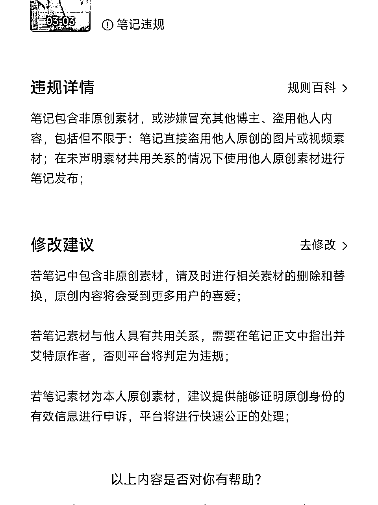
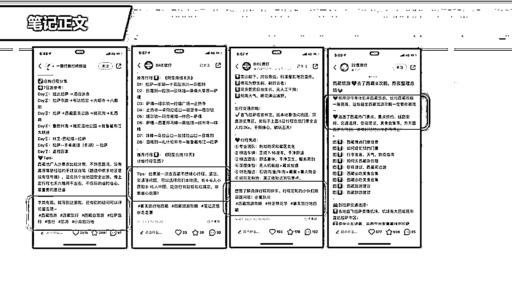
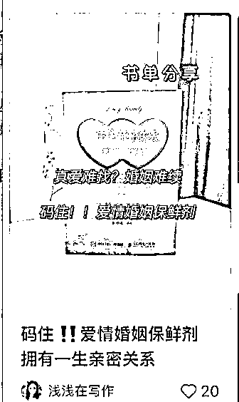
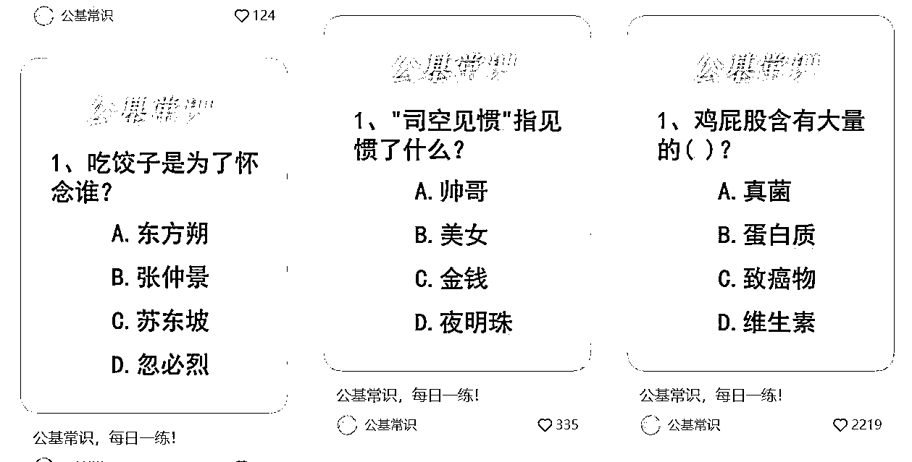

# 三、月航海 | 小红书达人变现 | 实战手册

> 来源：[`jviztcgxxfy.feishu.cn/docx/XqHXdIlSmopWZqxkWvOcaQ8vnZb`](https://jviztcgxxfy.feishu.cn/docx/XqHXdIlSmopWZqxkWvOcaQ8vnZb)

手册出品方：生财有术团队

出品时间：2024 年 3 月 18 日

手册使用说明：内容出品人排名不分先后。本文旨在向你展示一个项目的更多可能性，帮助你更好地理解和实操。

建议：如果需要快速定位到精确内容，可以使用快捷键 Ctrl + F/command + F 的形式，搜索「关键字/词」，查找你想要的内容

# 写在前面

### Hi,

欢迎大家来到 3 月航海 | 小红书达人变现 | 实战手册，相信在接下来的日子里，我们将在这里见面很多次。

在开始做小红书达人变现项目之前，让我们先来解决几个问题：

1）什么是小红书达人变现项目？

小红书达人变现，就是普通的小红书账号通过发笔记，涨到了 1000 以上粉丝，入驻蒲公英成为达人，从而收到各大品牌方和广告主的邀约，进行付费的广告笔记植入。小红书达人通过接广告合作获得收益，1 单最低是 100 元起。

简单来说，就是通过小红书涨粉丝然后接广告赚钱。

但这里需要注意两个点：

2）什么样的人适合做小红书达人变现？

如果你有一定网感、喜欢刷小红书，或是对在小红书上做内容输出感兴趣，基本都可以尝试本项目。

前期我们可以根据自身情况选赛道，如果不会选择，本手册不仅给出了方法「2.1.1 如何选择合适赛道」，也给出了新手推荐赛道「2.1.2 试水赛道」。

如果不会剪辑，我们可以先做图文笔记，例如文案、故事、星座、热评分享等，都是简单易上手的图文领域，不用花时间去琢磨自己不擅长的领域；

如果会视频剪辑，我们也可以运用该技能尝试更多赛道与玩法，可能性很多。

当然，心态上我们需要一定准备：不要太心急和过于焦虑，放平心态，和时间做朋友。

本项目最核心的一个目标，就是实现账号粉丝破千，才能入驻蒲公英接广。有时这个号可能涨粉慢，但持之以恒保持日更，或者换个账号再做尝试，总会突破瓶颈达到目标。

最后，希望大家可以在这次航行里收获成果外，结识一群战友。

以下内容由生财有术联合圈友制作而成，仅供航海船员以及生财有术星球圈友学习使用。

同时也欢迎圈友们在实践过程中持续反馈，和我们共同完善，可以联系鱼丸（yuwan387）提供修改建议～

# 【更新提示】新手册使用方式

在开始前，我们来简单了解一下这个手册的正确打开方式，方便你根据自己的情况来灵活使用。

在这里，手册整体的步骤顺序是按照从 0 - 1 跑通一个小红书达人变现项目进行的，你可以参考航线图，按顺序开始实操。也可以根据自己的实际需求选择性阅读。

需要注意的是：本次手册相较于过往航海，进行了较大的改版。之前的手册尽可能的展示更多可能的玩法供大家自由选择，本次改版后的手册，分为必修和选修两个大的章节：

如果你还未接触过小红书运营项目：

建议在正式实操前，先初步了解下项目全貌

【项目概述】了解小红书达人变现

如果你对项目整体已有大致的了解：

请开始完成航线图第一阶段的步骤，这个阶段你可以从手册的第二章开始阅读

【项目实操 1/3】明确赛道，搭建小红书账号

完成前期的准备后，即可开始完成航线图第二阶段，正式创作&发布笔记

【项目实操 2/3】创作爆款笔记，积累千粉，入驻蒲公英

在持续创作的过程中，我们最终逐渐完成项目闭环，赚到第一块钱

【项目实操 3/3】持续创作，接取广告，完成变现

经过上一个环节，你已经熟悉了这个项目的流程，那么接下来即可完成航线图的下一阶段，学习如何做出更好的成绩

【复盘优化】优化笔记与账号，提升变现

如果你已跑通 MVP ，想放大项目：

可以重点阅读以下选修篇章节，扩展更多玩法

【拓宽赛道】尝试更多达人赛道

【拓宽变现】尝试更多达人变现方式

本航海项目的航线图如下：

航线图和手册是高度关联的，因此你可以根据自己所在的环节，进行相关步骤的学习。

以上阶段中，所有的航线图步骤建议大家在航海前两周完成，完成航线图的所有动作后，建议继续重复关键动作，坚持日更，甚至增加新账号，持续经营，赚到第一块钱，甚至赚到更多的钱。

# 必修篇：跑通项目流程，完成达人号变现

#### 章节概要

必修篇中，我们将从认识「小红书达人变现」开始，一步步带你完成小红书达人变现整个项目流程的学习。你可以根据本篇的内容与步骤进行实操，跑通项目的最小 MVP。

如果你是本项目新手，建议在正式实操前，先初步了解下项目全貌：

【项目概述】了解小红书达人变现

如果你对项目整体有了大致了解，就可以按照项目核心步骤，开始学习实操：

【项目实操 1/3】明确赛道，搭建小红书账号

【项目实操 2/3】创作爆款笔记，积累千粉，入驻蒲公英

【项目实操 3/3】持续创作，接取广告，完成变现

如果你已经赚到第一块钱，可以积极复盘优化，争取完成更高的变现：

【复盘优化】优化笔记与账号，提升变现

必修篇中的内容与航线图内容与顺序相对应，只要按照手册的顺序进行学习，即可逐一完成航线图的各项任务。

在后续的每个关键步骤的章节概要中，我们也将提到相关航线图，提醒你完成相关步骤。

接下来就正式开始吧！

## 一、【项目概述】了解小红书达人变现 @周恩俊

### 1.1 什么是小红书达人变现

小红书达人变现就是普通的小红书账号，通过发笔记，涨到了 1000 以上粉丝，入驻蒲公英成为达人，从而会收到各大品牌方和广告主的邀约，进行付费的广告笔记植入。小红书达人通过接广告合作获得收益，1 单最低是 100 元起。

简单来说，就是通过小红书涨粉丝然后接广告赚钱。

但这里需要注意两个点

第一，达人变现项目与「小红书运营」不同：

本项目会给出推荐赛道，同时确定核心变现方式为「突破千粉，入驻蒲公英接广变现」，新手可以带着更明确的方向直接入场，减少纠结，直接开干；

第二，达人变现项目与「小红书 IP」不同：

本项目不需要你在小红书建立 IP，也不需要成为某个领域的大 V，我们更多是找到热门赛道、发爆款笔记来达成千粉，并入驻蒲公英接广，变现路径更短更快；

弊端在于，这样做的商单单价不如「小红书 IP 号」高，但优势在于，项目更简单、适合新手建立正反馈；

当然，通过本项目摸清小红书达人的玩法后，你也可以往进阶的 IP 号方向走，提高商单单价，打开更广阔的变现空间。

所以回到「小红书达人变现」项目上，我们可以从各类渠道获取图片或者混剪视频素材，选定一个热门的赛道，并通过笔记快速涨粉，成为小红书千粉以上的博主，然后在后台接品牌方广告，从中获取收益。

至于广告内容，品牌方会直接提供文案以及素材，我们只需在约定的时间里，发布好推广笔记，就能够获得品牌方广告主的投放费用。

这个项目运营的整体逻辑就是：

注册账号 > 选择合适赛道 > 养号 > 参考对标账号，完成账号包装 > 对标爆款并持续制作笔记 > 持续发布笔记 > 涨粉至 1000 以上 > 实名认证 > 入驻蒲公英 > 接广变现

项目平均变现周期：

找对赛道后，10 到 15 天左右逐渐开始涨粉，普遍 1 个月左右达成千粉目标，然后入驻蒲公英，开始接广告变现。单月单号平均变现区间，为 1500-2000 元左右。

佣金与提现：

一般广告邀约会在小红书消息栏提醒，有合适的邀约选择同意即可，按照商家要求进行发布，广告佣金是直接到小红书钱包，每月 9 号进行提现，只能提现到支付宝。

### 1.2 项目现状

因为上市的一再延缓，小红书这几年加紧了商业化的步伐，普通人也能够在小红书上面分得一杯羹。

在很多人的固有思维中，始终认为广告都是给予大博主的流量反馈，对于小博主而言根本就不可能，但今年小红书放宽了广告商入驻条件，以及博主接广告的隐形要求，现在只需千粉开通蒲公英平台，即可对接广告变现。

小红书的用户大多数集中在一二线城市，并且 70%以上都是女性，高知且付费意识强，可堪称优质流量的洼地，也因此无数个广告商都蜂拥而至，纷纷在小红书上面投放广告，小红书达人项目应运而生。

嗅觉敏锐的一批人，已经走在了前沿，通过小红书达人接广，变现了无数次，近几年绝对是小红书达人爆发式增长的时候，未来市场潜力无限。

目前有很多广告商纷纷在小红书上面投放广告，但小红书很多达人是想做 IP 大号，不想接广怕损伤羽毛，所以千粉素人号现在入驻都能接到不少广告邀约，下图是各账号近 30 天数据。

我们团队是去年 5 月开始实操做小红书达人，只有 5 个人操作，目前做到月 10W+的数据，刚开始测试的时候，为了多点收益，达到千粉的号都在猛接广，导致很多账号因为发布营销笔记太多，直接降为普通等级。

后面控制了接广次数，每个号刚入驻蒲公英当月接广次数控制在 10 条内，次月开始，再多接几条，这样账号能保持长期变现。

### 1.3 适合人群

「小红书达人变现」的素材来源非常广泛，全网都可以进行收集，基本不担心创作素材的问题。所以就门槛而言，并不算高，适合大多数想要创业或者做副业的普通人操作。作为了解小红书平台的入门项目也非常合适。

如果你有一定网感、喜欢刷小红书，或是对在小红书上做内容输出感兴趣，将会更容易跑通项目。

目前入驻小红书蒲公英接广的硬性要求有：

1.小红书账号满 1000 粉丝

2.需要实名认证且年满 18 周岁

年龄对大部分人不是问题，我们来说说涨粉。涨粉的前提需要发布小红书笔记。目前比较简单且有效能快速制作笔记的方式，就是找到对标，进行内容二创，不用自己绞尽脑子想纯原创内容。一天保持 2-5 条笔记，没时间也要保持日更 1 条。

当然，后期如果能逐渐找到方向和手感，对小红书平台与粉丝属性有一定了解，我们也鼓励大家积极尝试原创，打造自己的爆款内容，但前提是切勿自嗨。

达到千粉后不要着急入驻蒲公英，怕会有掉粉情况，最好等达到 1050 粉后再开始入驻。入驻后不能断更笔记，保持日更。笔记数据尽量在 1000 阅读量以上，这样邀约广告就会多些。

内容来源：《小红书达人变现项目，单人月入 2W，团队月入 10W+保姆级教程详细拆解》@周恩俊

## 二、【项目实操 1/3】明确赛道，搭建小红书账号

#### 章节概要

了解完小红书达人变现的整体情况后，我们就要正式开始启动项目了。

还记得项目整体的实操逻辑吗：

注册账号 > 选择合适赛道 > 养号 > 参考对标账号，完成账号包装 > 对标爆款并持续制作笔记 > 持续发布笔记 > 涨粉至 1000 以上 > 实名认证 > 入驻蒲公英 > 接广变现

本章节，我们主要攻克前 4 个环节，助大家做好项目基建。

章节 2.1 确定赛道

本小节中，我们会具体讲讲如何选择适合下场的赛道。为了减轻大家的选择成本，我们也给出了 2 个推荐赛道让大家先上手尝试。

章节 2.2 注册账号

注册账号和确定赛道，这两个动作没有先后之分，也可以同时进行。需要注意的是，建议大家一个小红书账号对应一个手机号，注册全程用流量完成操作。

章节 2.3 养号流程

养号对于本项目来说至关重要，一般需要养 2.5-3 天。正式发项目笔记前，我们可以先做个测试，例如发日常、风景、干货等笔记，次日小眼睛过 100 以上就算养号完成。

章节 2.4 积累对标账号

这个过程其实也是积累爆款素材的过程，我们可以通过刷小红书主页、灰豚数据等方式，积累各领域的对标账号与爆款素材。

章节 2.5 包装账号

账号的头像、昵称、简介等，我们都可以参考对标账号来做优化，从而完成账号包装。好的账号包装，也非常利于我们拉高账号权重、提升涨粉速度。

开始本章节的学习吧，希望在本阶段，大家能稳步前进，打好扎实的基础。

#### 本章航线图

完成本章节的学习和实操，即可完成航线图第一阶段。

第一阶段：明确赛道，搭建小红书账号（约 3 天）

1.寻找热门/合适赛道，了解赛道玩法（每天至少 15 分钟）

2.用流量注册小红书账号，一机一号登录（约 15 分钟）

3.刷同行笔记，模仿真人操作开始养号（每天约 1 小时）

4.学习同行，参考对标账号包装账号（约 30 分钟）

那么现在，就请开始踏上第一阶段的实操步骤吧。

### 2.1 确定赛道 @周恩俊

#### 2.1.1 如何选择合适赛道

有道是，选择比努力重要，做小红书达人项目亦是如此。

选择对的领域，涨粉的时间可能都会快很多，然后能快速领跑别的同行，快人一步入驻蒲公英接广变现。

根据我们团队实操的经验来看，目前涨粉快的赛道有：娱乐明星，影视剪辑，动漫解说，盘点，星座，公基常识，本地服务类，AI 绘画，抖音快手美食搬运，章鱼哥，正能量，情感，文案语录等等。

因为我们是矩阵式多号操作的，所以前期测试的时候，很多领域都有涉及，目前涨粉快的，不外乎这几个赛道，当然赛道的选择是一部分，笔记是否爆又是另外一部分。因为如果笔记不爆，无论选择哪个赛道都好，涨粉都会比较慢的，下文【三、创作爆款笔记，积累千粉，入驻蒲公英】也将会给大家分享制作爆款笔记的方法。

那么，我们为什么会选择这几个赛道呢，结合公基常识、章鱼哥这两个赛道给大家举例子说明。

注意：

分析过程一：公基常识赛道

首先是公基常识这个赛道，随机选择一个已经入驻蒲公英并且接广的账号给大家进行分析，这个账号目前已经 7000+的粉丝，这个号是 9 月中下旬起的号，在 11 月成功千粉入驻蒲公英，并且开始接了广告，截止到目前为止，一共接了 20 个广告，预计广告客单价 150-200 一单，这个账号已经成功变现了 3000-4000+，是普通人一个月的工资了，这个号单月均变现为 1500-2000 左右，如果多号操作的话，收益肯定会更可观。

这个公基常识账号的笔记是一篇笔记 3 道题目的形式，而这些题目我们可以搬运同行近期内爆的笔记题目，并且公基常识的图片模板非常简单，一张纯色的简洁模板或者简单底色的模板，再打上对应的题目即可，固定了模板之后，就剩题目搬运了，文字也是简单复制粘贴即可，一天下来，能制作出好多组图文素材，所以这个赛道相对来讲也是比较简单的，对于新手小白来讲，特别友好。

分析过程二：章鱼哥赛道

章鱼哥这个赛道也是简单的图文赛道，以人间清醒章鱼哥这个账号为例子，给大家进行分析，这个账号目前发的作品比较多，是今年 8 月份起的账号，目前已经有了 3.9W 的粉丝，因为爆得比较快，账号数据一直都比较好，截止目前为止已经接了 75+个广子，预计广告客单价 200-500 一单，这个账号目前已经变现了 15000-30000 左右，并且这种账号可以长期持续积累粉丝，以及后续可继续接广变现，这种账号价值就比较高。

那么，章鱼哥的笔记形式是怎么制作的呢？

首先我们可以在影视剧平台、B 站、微博以及百度等等平台去找到章鱼哥、海绵宝宝、蟹老板和派大星的图片，影视剧平台可以截取图片，然后可以小红书搜索同行，或者用灰豚进行搜索，看最新爆款的章鱼哥语录是哪些，再把对应的语录搬下来，我们可以用美图秀秀把两张章鱼哥的图片拼接在一起，再打上想要的文字，就是把最近火爆的语录搬下来，就做成了新的素材，然后就可以在小红书进行发布了。

总结一下，在选择赛道时，我们可以关注：

在此基础上，我们可以根据自身情况以及兴趣爱好进行选择：

如果你仍难以作出选择，不知道先做那个赛道比较好，可以看看接下来的两个试水赛道。

内容来源：《小红书达人变现项目，单人月入 2W，团队月入 10W+保姆级教程详细拆解》@周恩俊

#### 2.1.2 试水赛道

如何使用本章节的试水赛道

为了大家的降低行动门槛，结合最近小红书各赛道的数据表现，以及笔记产出的难易程度，我们为大家找了两个适合新手试水的赛道：热评分享赛道和娱乐赛道。

核心目的是让大家先找找正反馈，建立项目信心。

了解项目赛道的基础玩法后，大家需要积极在小红书寻找自己心仪的赛道，也可以参考选修篇【六、尝试更多达人赛道】的内容，选择其他赛道，勇敢尝试新玩法。

试水赛道 1：热评分享

推荐理由：赛道数据表现不错，能引起粉丝关注与讨论，且制作方式简单。

热评分享是指各大社交平台作品的高点赞评论，这类评论能吸引大量粉丝关注，成为热门话题，制作方式简单，在抖音/小红书/微博等平台关注热门话题，事件，对作品的高点赞评论进行截图即可。

下图这个账号一个月涨粉 4000+粉，最近一条点赞 1.8W，内容都是来源于抖音热门视频，涨粉速度极快。

下图这个热评领域账号广告报价 180-220，基本每天都接广，2 月接了 16 条广，变现 2800 左右。

试水赛道 2：娱乐赛道

推荐理由：符合小红书用户喜好，涨粉较快，且话题领域广，素材多，制作难度较低。

小红书人群女生和年轻人比较多，都喜欢关注明星、娱乐八卦、各种热点事件，这个领域广，涨粉速度会快很多。娱乐话题可以实时关注微博和抖音，出了热搜及时跟进制作素材，抢占小红书流量。

下图这个账号一个月涨粉 6000+粉，素材是搬运站外进行二创的，出了爆文涨粉速度更快，作品内容有日常生活娱乐，也有明星八卦。

下图这个账号是明星综艺娱乐内容，基本每天都在接广，广告报价 220-500，2 月接了 13 条广，变现 2800 左右。

### 2.2 注册账号 @周恩俊

选择好领域赛道之后，我们就可以注册账号。

#### 第一步：准备手机号

一般一个小红书账号对应一个手机号。如果你要铺设更多账号，那么可以用家人的，或者再去申请更多手机卡，线上就可以办理。新手时期可以先做一个号，基本学会项目流程后，可以多账号、多领域做矩阵测试。

电话卡推荐：

#### 第二步：注册账号

注册时建议全程用流量完成操作，注册完之后，就可以按照以下流程进行养号了。

注意：在这一步先不用做账号的实名认证，因为一个身份证只能认证一个账号，一旦认证成功，只有注销账号才能解绑。建议等你起号成功，账号突破千粉后，再做账号的实名认证。

### 2.3 养号流程 @周恩俊

第一天：注册账号时，一定要用流量，注册下来后，不要改包装，头像，昵称，简介，也不要刷笔记；

第二天：开始养号，刷要做的领域笔记，模仿真人操作，你要做什么领域就去刷什么领域笔记，要对同行笔记进行点赞收藏关注评论，这些操作要过 20-30 秒；

每天刷半小时到 1 小时左右，可以分时段刷，比如上午刷 15 分钟，下午刷 20 分钟，晚上刷 15 分钟，都可以。有空可以多刷多看。

第三天：上午继续养号，下午看下我们的发现页，同行的笔记占 70%就算号养成了，然后就可以开始给账号进行包装，改头像，改名字，改简介。

着急的话，改完包装就可以发笔记，不着急可以次日再发笔记。

提醒一下，一般垂直领域要先试发一篇日常生活、风景、干货笔记等去测试流量，次日小眼睛过 100 以上，就说明账号没问题，再开始发该领域笔记。

按照这个流程养完号之后，就可以发作品涨粉了，养号是必不可少的步骤，千万不要忽略了，否则直接发作品，账号没反应，起不来就很耗费时间了。

内容来源：《小红书达人变现项目，单人月入 2W，团队月入 10W+保姆级教程详细拆解》@周恩俊

### 2.4 积累对标账号 @周恩俊

怎样的账号值得我们对标呢？

一般来讲，热门领域的爆款笔记至少点赞量在 500+就可以了，一般领域，爆款笔记点赞量至少在 200 以上再进行参考。

#### 方法一：刷账号主页

除了帮助起号外，养号还有一个好处：我们在养号的时候，账号就养成了垂直度，这样找对标同行和参考笔记就简单多了，一刷新首页就可以看到不少同领域笔记。

所以完成养号后，我们可以多刷同行账号，积累对标账号，给自己更多正向的爆款参考方向。

#### 方法二：灰豚数据

如果我们刷新了首页，近期内的同领域笔记比较少的话，我们还可以工具进行爆款笔记的筛选和查找。

以「灰豚数据」为例，我们来讲讲，如何快速查找达人以及爆款笔记。

在灰豚进行筛选参考的时候，可以优先选择低粉爆文，如果近 7 天出来的素材少，可以再拓展到 30 天，60 天甚至 90 天都可以，这样我们能参考的素材就比较多。在用灰豚的时候，一般除了搜索笔记之外，我们还可以查找达人，看对应的同行，以及找一些比较靠谱的 MCN 机构。

查找低粉爆文时，时间越近越好，爆文素材我们不能直接参考，可以搜索该素材关键词，去抖音或其它平台，找到同话题不同素材，进行二创制作。

我们可以通过灰豚工具，在达人榜单，选择涨粉榜进行条件筛选，选择自己感兴趣的领域，看下该领域涨粉速度如何，从中找到好的同行对标。

其次，我们在灰豚查找对标达人的同时，还可以通过笔记查找，搜索同领域的关键词，然后通过各种条件筛选，找到爆款笔记去进行参考。

#### 方法三：其他数据平台

除了灰豚之外，如果我们有专业号，可以通过登录蒲公英后台，在后台找到同领域对标。

我们可以进入蒲公英，通过博主广场进行筛选领域博主，尽量选择粉丝数在 5000 内，近 30 天涨粉数据快的，这样能筛选出近期涨粉的优秀同行对标。

除了灰豚和蒲公英后台之外，我们还可以用以下方法去找同行对标和爆款素材，然后进行模仿。

小红书：通过小红书频道页或推荐发现页，去看种草广告，也可以通过小红书蒲公英商家/灰豚等后台，找到热门种草广告，通过广告找到最近起号爆款的素材，一个月爆的素材，点赞过 100，或两个月内达到千粉的账号等，都可以作为参考。

抖音：初定好要做的领域之后，抖音去搜索，一般在半年内，按点赞排行，只要在 100 点赞以上，都可以作为该领域素材参考。

快手：通过搜索领域关键词，按播放量，点赞量去排序，一个月，点赞在 100 以上，都可以作为该领域素材参考。

知乎：搜索要做的领域关键词，通过最多赞同，半年内，点赞在 100 以上，都是可以作为该领域素材参考。

内容来源：《小红书达人变现项目，单人月入 2W，团队月入 10W+保姆级教程详细拆解》@周恩俊

### 2.5 包装账号

账号的包装，就像开门迎客之前，要做店铺装修。这是粉丝对你的第一印象。

一个用户选择关注一个博主，往往不会只因为一篇优质笔记而关注。用户会看博主的主页，查看昵称、头像、个人简介、背景图以及之前发布的笔记等，然后再决定是否关注博主。

另外，对我们博主来说，完善账号信息还能提升账号权重。

因为账号信息越完善， 越有助于平台对账号贴标签。有标签的账号，发布的笔记获得的流量更加精准，流量精准后，更多用户会点开笔记，浏览量等会大幅提升，随之而来的就是账号的权重越来越高。

如何进行账号包装呢？参考我们前面找到的对标账号，根据领域进行修改，塑造领域人设。

#### 2.5.1 头像

不要太花俏，选择符合账号定位的。

制作方式：可以使用图怪兽等网站来进行图片的制作，将满意的图片作为头像。又或者找些无版权的图片：

注意事项：注意避免使用容易侵权的商标类图片。

#### 2.5.2 昵称

有辨析度、好记、有趣的名字，带有领域关键词能更有辨析度和真实可信。不要用复杂的符号或特殊语言。

比如美食领域，名字为”小溪教你做美食“，一眼就让粉丝知道这账号是做什么的。

有以下 4 种公式可作参考：

#### 2.5.3 简介

主要是告诉粉丝，关注你的账号可以给用户带来什么，比如穿搭领域，”小个子穿搭分享|感谢喜欢“。

一个写简介的公式：

有的账号出了上万点赞的爆款，但是粉丝只有 100 个，主要是账号内容不垂直，且个人简介没有写好，没有给粉丝关注的理由。

所以，写简介的时候千万不要谦虚，如果你不能展现出可以给粉丝提供的价值，他们凭什么关注你呢？

## 三、【项目实操 2/3】创作爆款笔记，积累千粉，入驻蒲公英

#### 章节概要

如标题所言，本章节的核心内容，就是持续创作小红书笔记，尝试打造出爆款笔记，直至一步步完成千粉的积累，达到入驻蒲公英的条件，并成功入驻蒲公英。

入驻蒲公英的条件是什么呢？

① 需要满足完成实名认证，且年龄≥18 岁 ② 需要粉丝数>1000

按照本章节的玩法实操，找对赛道后，10 到 15 天左右逐渐开始涨粉，大约 1 个月左右达成千粉目标。

拆解一下其中的核心动作，主要是：

以上关于创作笔记、入驻蒲公英的核心问题，我们都将在本章节为大家解决。

#### 本章航线图

完成本章节的学习和实操，即可完成航线图第二阶段。

第二阶段：创作爆款笔记，积累千粉，入驻蒲公英 （约 10-30 天）

1.按赛道建素材库，持续收集对标爆款笔记（每天约 1 小时）

2.搜集并拆解至少 3-5 篇对标爆款图文笔记（每天约 1-1.5 小时）

3.模仿对标爆款，发布第 1 篇图文笔记（约 1 小时）

4.搜集并拆解至少 3-5 篇对标爆款视频笔记（每天约 1-1.5 小时）

5.模仿对标爆款，发布第 1 篇视频笔记（约 2 小时）

6.日更至少 1 篇图文/视频笔记，直至突破千粉（每天约 1-1.5 小时）

7.入驻蒲公英，完成账号实名认证，设置报价（约 30 分钟）

那么现在，就请开始踏上第二阶段的实操步骤吧。

### 3.1 如何创作图文笔记 @周恩俊

#### 3.1.1 创作教程

素材来源于对标账号，积累对标账号就是积累素材的过程。如何找对标账号，大家可以复习一下前文：【2.4 积累对标账号】

选择素材的标准：近期内爆的图文笔记，点赞量至少在 100+

找到素材后，我们就可以对图片进行二创。常规的手法，总结起来就是以下几点（图示以美图秀秀为例，其他修图软件的操作界面大同小异，大家用自己习惯的软件进行操作即可）：

修改图片尺寸

首先，我们可以通过修改图片尺寸来实现二创。具体来说，就是将原始图片进行缩放或拉伸，从而生成一个新的、与原始图片略有不同的图片。这样做的好处是既保留了原始图片的主要内容，又增加了新鲜感，让读者眼前一亮。

更改颜色和饱和度

除了修改尺寸以外，我们还可以通过更改颜色和饱和度来实现二创。具体来说，就是将原始图片进行色彩调整，使其看起来与原始图片稍有不同。这样做的好处是能够增加图片的多样性，并且让文章看起来更加生动。

添加特效

另外，在实现二创时，我们还可以通过添加特效来让图片与众不同。比如，可以在图片上添加滤镜、光晕、阴影等特效，从而让图片看起来更加美观、独特。

替换背景

除了调整图片本身以外，我们还可以通过替换背景来实现二创。具体来说，就是将原始图片的背景进行替换，从而生成一个新的、与原始图片略有不同的图片。这样做的好处是能够增加图片的多样性，并且让文章看起来更加生动。

合并多张图片（或者拼图）

除了单独修改一张图片以外，我们还可以通过合并多张图片来实现二创。具体来说，就是将多张不同的图片进行合并，从而生成一个新的、与原始图片略有不同的图片。这样做的好处是能够增加图片的多样性，并且让文章看起来更加生动。

使用图片编辑工具

在实现二创时，我们还可以使用各种进阶的图片编辑工具，比如 Photoshop、GIMP 等，来对图片进行修改和优化。这样做的好处是能够让我们更加灵活地操作图片，并且能够实现更加复杂的修改效果。

当然，这个选择因人而异，不强求一定要学习 Photoshop、GIMP 等工具的使用方法。对于新手来说，前期会使用「美图秀秀」等修图软件即可。

图片二创总结起来就是：

模板变、内容不变，滤镜+调色（对比度，色调，高光等），叠加，镜像，文字，贴纸，拼图抠图等。除了前面的步骤之外，像图片还可以用一些简单的工具去处理，比如美图秀秀、图怪兽和稿定设计等。

具体如何实操呢？我们结合两个试水赛道来看看。

内容来源：《小红书达人变现项目，单人月入 2W，团队月入 10W+保姆级教程详细拆解》@周恩俊

#### 3.1.2 结合试水赛道，创作图文笔记

赛道一：热评分享赛道

为方便大家理解并学习，我们录制了视频教程：

热评分享赛道-图文笔记创作教程.mp4【在线播放】

本视频是讲解热评赛道图文笔记制作方法：

00:00-01:00 小红书找热评赛道笔记及同行，看同行笔记方式，选择一个爆文，到抖音搜索相关话题作品；

01:00-02:00 抖音搜索热门话题，进行作品截图；

02:00-03:30 美图秀秀制作作品素材，图片比例裁剪为小红书尺寸 3:4，对粉丝评论进行马赛克。

赛道二：娱乐赛道

为方便大家理解并学习，我们录制了视频教程：

娱乐赛道-图文笔记创作教程.mp4【在线播放】

本视频是讲解娱乐赛道图文笔记制作方法：

00:00-01:30 小红书搜索娱乐赛道笔记，参考同行图文笔记方式，同时也到抖音上，看抖音同行笔记方式，找到热门话题，进行模仿制作；

01:30-02:55 抖音筛选图文，找到合适的图片，复制抖音链接到微信去水印小程序，保存原图；

02:55-06:40 美图秀秀制作素材，选择拼图模式，选择背景调整尺寸 3:4，背景模糊，添加文字；

06:40-07:20 笔记正文从抖音或小红书上获取，参考点赞高的作品内容，利用 AI 等工具进行二创。

### 3.2 如何创作视频笔记 @周恩俊

#### 3.2.1 创作教程

素材来源于对标账号，积累对标账号就是积累素材的过程。如何找对标账号，大家可以复习一下前文：【2.4 积累对标账号】

选择素材的标准：近期内爆的视频，点赞量至少在 1000+

但单一的视频素材处理，很容易被小红书系统检测出来，会出现笔记违规或者笔记优化提示，次数多了会影响账号的权重以及专业号会掉灰，影响后续入驻蒲公英。

那么如何处理视频素材呢？建议大家一次混剪至少用 3 个以上的视频。因为只有多个视频同时混剪在一起处理，原创度才高。所以找到的三个视频同时导入剪映，进行二创处理即可。

视频二创的手法总结起来就是：

掐头去尾，加速，BGM，镜像，画中画，顺序打乱，抠图，文案贴纸，特效滤镜，转场，变音等。

具体教程不好展开来讲，这里附上生财有术「剪辑特训」航海的教程，对新手小白来讲很友好。大家可以针对上述提到的手法，在教程里直接找到对应教学视频并观看学习，比文字描述更加形象具体一些。

剪辑特训航海手册戳《3 月航海｜剪辑特训｜实战手册》

视频处理完了之后，就可以配上笔记文案和标签，在小红书进行发布了。

具体如何实操呢？我们结合两个试水赛道来看看。

内容来源：《小红书达人变现项目，单人月入 2W，团队月入 10W+保姆级教程详细拆解》@周恩俊

#### 3.2.2 结合试水赛道，创作视频笔记

赛道一：热评分享赛道

为方便大家理解并学习，我们录制了视频教程：

热评分享赛道-视频笔记创作教程.mp4【在线播放】

本视频是讲解热评赛道视频笔记制作方法：

00:00-00:40 参考同行笔记制作方式，主要为单图+背景音乐；

00:40-02:10 按照图文制作方式，把图片制作完，打开剪映，上传图片，设置时间变速，控制在 10 秒左右，添加抖音热门音乐。

赛道二：娱乐赛道

为方便大家理解并学习，我们录制了视频教程：

娱乐赛道-视频笔记创作教程.mp4【在线播放】

本视频是讲解娱乐赛道视频笔记制作方法：

00:00-01:25 小红书搜索娱乐赛道笔记，参考同行视频素材，多数为卡通背景，中间视频，置顶标题；

01:25-03:00 做娱乐赛道时，素材要选择近期爆的话题内容，还可以到抖音里去看热搜，其次看同行发该话题素材；

03:00-04:25 抖音搜索话题，找到合适的素材，复制抖音链接，到微信小程序搜索“提取视频内容”小程序，保存文案，这个文案是作为我们视频的字幕内容；

04:25-08.30 抖音搜索话题，找多个视频，到微信“去水印小程序”进行保存，视频素材要考虑剪辑后的尺寸问题；

08:30-12:20 导入全部视频素材，加上字幕，字幕可以转化为音频，或者把原音频转化为文字，再删除原音频，把文字生成新音频（选择文本朗读）；

12:20-13:51 设置素材背景图，比例调成 16:9，在画布样式选择背景，视频素材裁剪横屏 3:4；

13:51-17:06 视频置顶加标题，选择文字模板或者贴纸，调整整体视频效果。

### 3.3 检查笔记内容，避免违规 @周恩俊 @吴小二

完成笔记后，我们可以检查一下笔记的内容，避免违规，影响流量。

#### 3.3.1 常见违规情况

一般来说，视频违规的原因基本都是二创去重不彻底，触发了系统的笔记违规、笔记优化提示，需要进行整改，才会继续推流。这种常见的违规偶尔一两次就没事，但是如果你是经常违规，就会导致专业号掉灰，这样后续就入驻不了蒲公英，接不了广告，这样也是很麻烦的。

图文虽说不容易出现这种去重不彻底的问题，因为图片都是用新的模板去套，只是参考爆款内容，所以相对来讲，是比较安全的。

但是有些图文赛道也容易违规，比如情感、正能量、星座等赛道。有些朋友会因为某些敏感词，从而导致了违规，比如出现负能量传播、情绪价值偏激、封建迷信等等违规，一般出现这种违规，系统会提示你怎么进行整改的，按照要求整改即可，整改完了，基本就没啥影响了。

接下来我们具体看看，后台会收到的违规提示主要有哪些？如何处理？

情况一：搬运抄袭

这是大部分人会出现的问题，因为二创没有到位，导致同质化内容多被平台检测出来；

加大二创程度，最好方法就是文字二创，图片替换模板，视频打乱顺序，多个片段混剪。

情况二：引流违规

很多人觉得笔记没发引流内容就没事，但有时候会有粉丝私聊问链接、问微信，这种千万不能发，一旦发了，会被判定站外导流；

可以直接忽略此类消息，必要时候也可以拿小号去回复。

情况三：数据异常

有时候被粉丝连续点赞收藏，也会被平台判定为互动异常，这个时候可以在主页简介备注“请勿连赞”，或者在笔记/评论区中提示；

其次不能为了快速涨粉，或者笔记数据好，去刷数据，这是属于作弊行为，严重会直接封号，得不偿失。

情况四：内容涉及低俗/不宜未成年

一般是笔记素材或者内容涉及到敏感内容，在发布之前看下内容是否有敏感词、不雅图等，“性”、“裸露”、“暴力”、“SB”、“贱人”、“垃圾”等是常见敏感词，注意规避。

情况五：发布未报备广告

很多商家想私下发广，能节省一部分手续费，但未经过蒲公英发布的商业笔记，都称之为”非报备笔记“，发了之后，轻则限流，重则降等级，不建议新手私下接单。

#### 3.3.2 违规后如何申诉

如果是各种违规导致了专业号掉灰，我们需要及时去申诉回来了，一般如果是笔记原创性过低导致的，我们可以截图自己处理这个视频素材的记录去申诉，说是自己辛苦原创的，以此作为申诉依据，看看能不能申诉回来。能申诉回来，肯定是最好的。

这里简单解释下「专业号掉灰」：

申诉有两个入口：

第一个申诉入口，点击违规提醒，进去可以看到，第二个入口如下图所示：

两个一起申诉渠道需要一起申诉，可能不是同一批人处理的，标准不一样。

申诉话术参考：

薯大大，你好！这个账号，我真的花了很多心血在上面，本来每天制作作品就很辛苦了，居然还被系统限制了专业号功能，我真的好受打击，心情真的低落到了极点，尤其是辛苦创作却得不到肯定，以下是我剪辑视频的记录附图，在此希望薯大大能给个机会，高抬贵手，不要再限制我的专业号功能了，给我的一点美好生活希望吧，跪谢了。

这个申诉话术仅供参考，不过一般的申诉都是附图作为证据+卖惨，这样通过申诉的概率就会比较大一些。

#### 3.3.3 小红书内容规范

在笔记违规前，我们日常创作过程中可以多多关注小红书的内容规范，也可以在笔记发布前先用工具网查检查一下敏感词，从源头避免违规。

以下是针对小红书在内容上的规则/规范进行的相关整理，大家仔细查看，避免违规、犯错。

1.社区公约解读

社区公约解读：如何规范笔记内容

社区公约解读：如何规范商单笔记

2.审核规则解读

审核规则解读：如何规范笔记首图封面或标题

审核规则解读：如何避免出现水印问题

3.其他：推荐多关注以下几个地方

4.敏感词/违禁词在线检测工具推荐

针对笔记稿件，推荐使用多款不同的敏感词/违禁词在线检测工具进行检测，避免出现敏感词/违禁词，造成审核不通过和笔记违规。

推荐两个检测工具：

内容来源：《小红书达人变现项目，单人月入 2W，团队月入 10W+保姆级教程详细拆解》@周恩俊 《小红书新手资料引流，涨粉的细节分享》

### 3.4 铺设矩阵，多账号变现 @思蒙 @周恩俊

小红书达人变现项目比较简单，前期建议可以 2-3 个号起做。我们能多发作品就多发作品，能多起账号就多起账号。

对于门槛比较低的项目来说，本质上都是用数量博概率的游戏。在航海的过程中，大家会发现，有小伙伴的作品也许和你差不多，根本说不上多么优秀，但他的账号就是爆了。这就是概率的问题。

掌握了找对标和笔记制作技巧后，剩下的就是靠【量】了。

发一条笔记，能爆的概率是 1%，那发 10 条，或者有 10 个账号呢？每一个都是 1%，加起来是不是能爆的概率就大多了？

而且在这个过程中你会发现，有的号一开始流量就好，有的号却一直奄奄一息的样子（当然前提是质量都过关，作品水平一致）。这就是账号体质和概率的综合。

我们在矩阵中，可以筛选出一些素质好一点的号继续培养，差的就可以注销另换了。

需要注意的是，本项目的矩阵和常规的矩阵略有不同：

本质区别在于，我们所搭建的矩阵账号分别属于不同赛道。这样做的好处在于，我们能知道哪个领域涨粉快，自己对哪个赛道的内容更有嗅觉和手感，后面铺号的时候，就可以多铺这个领域。

赛道如何选择呢？新手可以先参考我们前文推荐的两个赛道，也可以从选修篇「六、尝试更多达人赛道」中选择更多适合自己的赛道进行尝试。

内容来源：6 月 8 日《短剧 CPS 的进阶技巧及常见问题答疑》@思蒙

### 3.5 达到千粉，入驻蒲公英

#### 3.5.1 入驻蒲公英的条件 @周恩俊

第一：需要满足完成实名认证，且年龄≥18 岁 第二：需要粉丝数>1000

找对赛道后，10 到 15 天左右逐渐开始涨粉，普遍 1 个月左右达成千粉目标，然后入驻蒲公英，开始接广告变现。单月单号平均变现区间，为 1500-2000 元左右。

达到千粉后不要着急入驻蒲公英，怕会有掉粉情况，最好等达到 1050 粉后再开始入驻。入驻后不能断更笔记，保持日更。笔记数据尽量在 1000 阅读量以上，这样邀约广告就会多些。

注意事项：实名认证在达成千粉后再认证就好了，不浪费名额，具体流程见「3.4.2 入驻流程」。后期可以借家人的身份来完成实名。

#### 3.5.2 入驻流程 @周恩俊

第一步：先升级个人专业号

点击“我”—“创作中心”—“更多服务”—“开通专业号”—“成为专业号”—选择“我是个人”—“立即认证”：

第二步：开通蒲公英“内容合作”

点击“合作中心”—“更多服务”—“博主合作”，然后按下文我们将说到的【3.3.3 设置报价】，填好你的报价与其他信息即可：

到此，我们就成功入驻蒲公英了。

#### 3.5.3 设置报价 @周恩俊 @北

报价没有固定公式。你可能看到市面上很多教学告诉你 10%粉丝数，然而，很不幸，这并不是一个通用公式。不同的赛道，不同的账号风格，不同的数据，不同的粉丝数，报价都是不一样的。

没有人能给出一个具体公式，但在合作过程中，慢慢就知道自己的价格合不合适了。核心还是供求关系。

如果你的报价，让你每月档期爆满，那显然，你的价格是可以提高的；

如果你的报价，没人合作，那显然，你需要降价，

所以这是个很灵活的东西，都是根据市场反馈不断调整的。

一般图文的报价（泛领域账号），刚开始建议设置为 150 元，不管系统同行均价是否为 170-180，都建议设置为 150，低于同行均价，这样前期才好接广，否则一开始就定比较高的价格，接广会比较少，甚至会出现接不到广这种情况。

视频报价随意（可以跟图文报价设置一样的价格），因为一般都是图文合作邀约，很少视频合作邀约。因为视频制作难，商家做图文广告能一次性做多张分发给其他博主。除非这个账号是做视频类型的，而且有广告位能植入的话，可能才会有视频广告。

如果到后面我们的账号粉丝越来越高了，到时候可以慢慢涨价的，蒲公英也支持改价，每月可改一次，当月改完，一般次月生效。

具体报价推荐：

具体报价可以通过商家版蒲公英后台/灰豚，根据该领域同行报价，进行参考。

内容来源：《小红书达人变现项目，单人月入 2W，团队月入 10W+保姆级教程详细拆解》@周恩俊 《如何提高小红书广告变现力，一条合作笔记报价 3-4W》@北

#### 3.5.4 注意事项 @周恩俊

入驻蒲公英之后，还需要填什么资料吗？多久能够接到广告呢？答案是设置完报价之后，基本就可以了，人设标签暂时不用管。

新锐博主快的话，一般 1 到 3 天左右就会收到品牌商家的广告邀约，慢则一周左右。

但是我们入驻蒲公英后不要掉以轻心，要保持日更，近期作品质量也要优秀些，最好阅读量平均数能达到 1K 以上，这样邀约广告就会多些。

除此之外：

这里简单解释下「专业号掉灰」：

内容来源：《小红书达人变现项目，单人月入 2W，团队月入 10W+保姆级教程详细拆解》@周恩俊

## 四、【项目实操 3/3】持续创作，接取广告，完成变现

#### 章节概要

通过蒲公英接取广告，是本项目实现变现的核心动作。

在前面的实操过程中，我们已经学习了赛道选择、养号、账号包装、制作笔记内容等，不断重复上述动作，我们就能逐渐达成入驻蒲公英的要求，后续就可以接取合适的广告，完成变现。

如何在蒲公英接广呢？

以上问题，我们都将在本章节为大家解决。

#### 本章航线图

完成本章节的学习和实操，即可完成航线图第三阶段的前半段。

第三阶段：持续创作，争取接广告变现（每天 2-4 小时）

1.接合适广告，按要求创作笔记并提交审核（约 1-3 小时）

2.发布广告笔记并注意评论区维护（约 10 分钟）

那么现在，就请开始踏上这一阶段的实操步骤吧。

### 4.1 接广流程概述 @周恩俊

对于达人自身来说，涉及的动作主要是：

1、粉丝达到 1000 后，开通小红书蒲公英内容合作

2、在商业合作通知中接受品牌方发起的合作邀约（或自行在广场报名招募）

3、添加品牌方微信，等待品牌方提供图文内容

4、确认合作订单，提交合作笔记，等待社区审核

5、社区审核通过后品牌方确认，发布合作笔记

6、7 天后系统自动确认订单，合作收益到账

7、次月 9-10 号可在小红书钱包中进行统一提现

内容来源：《小红书达人变现项目，单人月入 2W，团队月入 10W+保姆级教程详细拆解》@周恩俊

### 4.2 如何完成一次接广

官方视频教程：http://xhslink.com/f3hoBD

小红书-蒲公英接广合作流程.mp4【在线播放】

重点传送门：

#00:17#查收合作邀约信息

#00:44#提交合作笔记

#01:16#修改合作笔记

#01:44#正式发布合作笔记

归纳一下各步骤的重点。

#### 第一步：接受合作

品牌方会在蒲公英寻找合适的博主发起合作邀约，达人可以在 APP 端的「消息通知-商业合作」中，查看品牌合作邀约，点击「感兴趣」之后，就可以与品牌私信联系，获取对方微信，沟通合作详情。品牌方也可以跳过邀约环节，在后台直接发起合作，达人们就可以在 APP 端的消息通知中收到订单，并查看订单。

如果你觉得该商单合适，就可以接受合作，开始内容创作。

当然在 APP 端和 PC 端的蒲公英后台，也可以管理「待接受」的合作订单。

#### 第二步：创作笔记

添加商家（有时是 PR，但不影响整体流程）微信后，他们会给我们发广告素材。拿到素材后，可以自查下内容是否有敏感词等问题，或图片是否合适等。

以下是针对小红书在内容上的规则/规范进行的相关整理，大家仔细查看，避免违规、犯错。

1.社区公约解读

社区公约解读：如何规范笔记内容

社区公约解读：如何规范商单笔记

2.审核规则解读

审核规则解读：如何规范笔记首图封面或标题

审核规则解读：如何避免出现水印问题

3.其他：推荐多关注以下几个地方

4.敏感词/违禁词在线检测工具推荐

针对笔记稿件，推荐使用多款不同的敏感词/违禁词在线检测工具进行检测，避免出现敏感词/违禁词，造成审核不通过和笔记违规。

推荐两个检测工具：

如果有敏感词，或图片尺度较大、有夸大表述等问题，可以修改后与商家沟通，达成共识后发布笔记，提交审核；

如果没有问题，直接用商家给的素材发布笔记，提交审核即可。

注意点：这一步我们需要沟通好广告的发布时间。

比如一天来了 3 个邀约，怎么办呢？都发吗？我们建议新号最好是发完一条广告合作笔记之后，至少隔 1 天再发第 2 条。所以很多商家同时邀约的时候，我们可以在微信上面进行详谈，协商好其他发布时间。

#### 第三步：提交笔记，等待审核通过

那么如何去提交一篇合作笔记呢？我们在小红书 APP 编辑好笔记内容后，点击「高级选项-品牌合作」即可绑定订单。选择相应的合作订单，再回到发布笔记页面，就可以提交合作笔记了。

此时笔记尚未正式发布，处于其他用户不可见状态。提交后，笔记会进入平台和品牌的审核确认环节。

如果审核不通过，会在消息通知以及蒲公英后台中收到消息，我们需要按照要求修改笔记。

审核没过的话，可以联系商家，请他们重新提供素材，我们再重复「第二步：创作笔记」的步骤，完成笔记内容。

如果修改的是图文内容，可以直接在编辑页面中进行修改，重新发布合作笔记即可；

如果想要修改视频内容，那么我们需要先解除笔记与订单的关联。进入笔记的编辑页面，在高级选项中取消关联，回到发布笔记页面，重新发布笔记时再绑定订单就可以了。

但如果连续 3 次都没审核通过，建议这个广就不接了，可以取消合作。在后台找到该笔订单后取消合作即可，不会受到平台惩罚。

当然，哪怕取消，我们还是要维护好与商家或 PR 的关系，毕竟可能以后还有机会合作。

#### 第四步：发布笔记，等待订单完成

审核通过后，我们就可以进入笔记发布环节。在与品牌方协定好的时间，点击 APP「消息通知」中的前往发布笔记，或者笔记详情页面左上角的「合作品牌已确认」，就可以正式发布笔记了。

#### 第五步：收益到账，完成提现

品牌确认完成订单后，我们会收到合作款项。如果品牌方没有主动确认订单，7 天后系统也会自动确认订单，合作收益到账。

如果与我们对接的是商家，那么直接结算订单收益即可；

如果与我们对接的是 PR，对方可能会要求抽佣。

一般在添加微信后，如果对方是 PR，他会跟你聊广告内容以及返点佣金多少。一般抽返点价格是在 20-40 元左右，能接受就可以合作，不能接受这个返点拒绝合作就可以了。

但不是所有 PR 都会抽，除非这个 PR 是想自己赚点钱。后续等笔记发布完，收益到账，你就可以直接按谈好的分佣，直接私发给 PR 了。

提现：次月 9-10 号可在小红书钱包中进行统一提现，提现扣 10%的税。

### 4.3 注意事项 @周恩俊

有些商家可能会砍价，比如我们刚开始一单报价为 150，有些商家可能会砍到 120、130、140 这样子，如果商家的广告是日用百货或者其他非医疗类的商品，这个时候可以给他优惠的价格。

如果是医疗类的商品，或者把功效夸的老大的广告，那么我们就要慎接，因为这种类型的商品敏感词比较多，有些发了之后，可能会给账号带来不好的影响，当然这不是绝对的，不用过于担心。

比如一天来了 3 个邀约，怎么办呢？都发吗？我们建议新号最好是发完一条广告合作笔记之后，至少隔 1 天再发第 2 条。所以很多商家同时邀约的时候，我们可以在微信上面进行详谈，协商好其他发布时间。

新号最好不用连着发广告，频繁发广其实会影响到账号，以及后续的邀约，所以我们要适可而止，边发广子的同时，可以夹杂着我们账号的笔记内容去发，尽量将影响降到最低。

内容来源：《小红书达人变现项目，单人月入 2W，团队月入 10W+保姆级教程详细拆解》@周恩俊

## 五、【复盘优化】优化笔记与账号，提升变现

#### 章节概要

如何在每个项目中越赚越多？复盘优化是很重要的动作。

我们可以从中找出数据不佳的原因，加以整改；也可以找到自己的爆款规律，不断放大；对于本项目来说，你还可以找到一些提升账号变现力的方法。

本章节中，我们将从上述角度，为大家打开一些复盘优化的思路，期待你能进一步放大项目成果：

如何优化笔记，改善数据，提高爆文概率「5.1 优化笔记，提升数据」

如何用更少的时间做更多的事「5.2 提升内容创作效率」

3 个技巧，解决 0 广告的烦恼「5.3 接不到广告，如何解决？」

如何提升单个账号的变现效果「5.4 如何提高账号变现力？」

如何增加账号接到的广告数量「5.5 如何提高广告数量？」

以上问题，我们都将在本章节为大家解决。

#### 本章航线图

完成本章节的学习和实操，即可完成航线图第三阶段的后半段。

第三阶段：持续创作，争取接广告变现（每天 2-4 小时）

1.复盘账号各项数据，优化笔记，持续创作（每天约 2 小时）

2.搭建 SOP，提升笔记生产质量和效率（约 3-4 小时）

3.逐渐优化账号变现力，提升账号变现数据（每天约 1-2 小时）

那么现在，就请开始踏上这一阶段的实操步骤吧。

### 5.1 优化笔记，提升数据

#### 5.1.1 笔记数据不佳，如何优化？

有人问，我的一个浏览量在 100 到 300 ，300 到 500 这样的一个区间，是不是正常的？

很明确地告诉大家：这是正常的。

自己的浏览量不低于 50 ，在 50 到 500 这样一个区间，作为一个新号，发布内容的时候看的人偏少，是一个很正常、也很普遍的情况。

因为你不是一些很有名气博主，比如说别人有十万粉或者说甚至十万以上的粉丝基数，那么他一发笔记，有自己的固定粉丝作为受众，浏览高很正常的对吧？

所以心态很重要，一定要稳定好自己的心态。

其次，我们在做数据对比的时候，可以和正常的内容数据进行对比。

比如，你发了很多篇笔记，它都会存在一个数据对不对？那么你看自己发的一些笔记里，哪一些数据比较好，然后去尝试分析一下好的原因在哪里。

再次，你可以和自己同等级的博主进行内容数据上的对比。

所谓的同等级比，比如他的一个粉丝基数是 500 左右，你也是 500 粉左右，就能进行对比了。

你不可能自己只有 500 粉，硬要和 10000 粉的博主进行对比。这样的对比往往是没有参考意义的。

和别人对比的一个过程当中，你可以看自己的点赞收藏数，然后再看自己的评论区。

为什么别人的笔记里会有比较多的评论，或者说别人的笔记收藏会比较多？你可以看看他们的内容，然后看他引导互动的一些方式，尽可能地去模仿和学习。

如果确认数据不佳，我们可以从以下几个方面去反思和优化：

1）小眼睛（阅读量）不佳

一般发布后 2 - 3 小时内阅读量差，或者阅读量长期只有 100 - 200 甚至低于 100，可对照以下问题检查：

2）点赞、收藏、评论等互动数据不佳

互动数据不好的，排除违规和玄学问题，十有八九还是因为笔记内容质量不够好。

可对照以下问题检查：

3）发布后修改笔记的注意事项

经常会有人问：修改已发布的笔记是否会影响曝光量？

从观察的数据来看，修改后，阅读率确实会重新计算。但只要不频繁修改，是不影响这条笔记的。

但修改了笔记可能会重新审核，审核了没问题才会放出来。有时候笔记里有敏感词，改过后重新发，或者优化了标题等，数据会更好。

也有一些情况，本来审核过了，正常给流量了，修改后可能工作人员觉得有问题，反而开始限流，数据就不好。

如果有笔记爆了但是想修改，克制住，别动笔记，可以在置顶评论补充。

#### 5.1.2 如何提高爆文概率

方法一：像素级对标爆款账号 @比比先森

1544_1692583964.mp4【在线播放】

1）爆款图文账号特点

图文爆款特点：

对于已经在小红书上有一些经验的同学来说，可能会遇到这样的情况感到困惑：我已经尽力模仿得很好了，也认真制作了图片，但为什么别人的笔记能够引起轰动，而我的却只有很少的点赞数呢？

这里其实有一个核心的关键点，我们都说照猫画虎，猫找对了，虎可能压根没画好。

新手模仿爆款时，往往意外加入个人想法，导致最终作品大不相同。建议不擅长作图的同学先确认对标对象，尽量 1:1 复刻，提升审美和制图能力。模仿学习能体验细节，比单纯观察更有效。

2）如何按对标帐号创作爆款笔记

第一步：提升敏感度，寻精准对标

发现一个博主做纪录片的选题很好，封面和内页神似，数据都能达到千赞甚至万赞，发布日期在一个月内，最重要的是，和之前看过的同质化严重的纪录片选题风格完全不一样，不禁产生疑问：这是小红书近期的新风格吗？

分析过后，发现这其实精准满足了爆款笔记的四大维度特点：

第二步：像素级模仿，精准绘对标

深色背景，左上侧是白色标题，左下角是文字补充，右边主体是某影视女明星。

图片分析拆解后，找到比较火的影视剧女主，因为当时梦华录很热门，选择了刘亦菲来作为封面人物

因为稿定设计 APP 的背景模板特别丰富，我们因此找到了一个历史感特别浓重的模板，氛围感非常强烈，也非常适合纪录片的选题。

于是开始加字，一开始是按照自己的想法，做了这样一张图。

大家经常刷小红书的话可能会发现，爆款封面的花字，大多数都看起来非常清晰，凸出，而且黑白简洁有力，但是上面这个封面中，黑白的描边显得太过冗余。

于是找到黄油相机里一模一样的花字，并且着重省略了主标题，让主体更加放大，居于左半侧，且故意把“不愧是央视推荐的纪录片”调整为“不愧是”+“央视推荐的”

这样做，一行变两行，让封面的爆款引导词「不愧是」，得以放大和凸显！

并且也主动引导用户的视角，从「刘亦菲」—「不愧是」—「央视推荐的」—「背景或其他」— 成功引导点击封面

从最初封面到最终爆款封面的优化，总结为三点：

快速判断封面是否合适方法推荐：

发图片到微信聊天框，只给自己 1-2s 的观看停留时间，确认是否可以快速 GET 到封面的主体和标题关键词

如果可以，就说明封面内容是合适的

如果不能，还需要停留才能观察到，那就说明这个封面并不合适，排版，花字，需要优化改进

避免自嗨，少走弯路。

内容来源：《小红书新人博主，如何挖掘爆款的底层逻辑，打造 10w+赞爆款笔记？ 》

方法二：正文要埋互动理由 @许义

正文一定要埋互动理由，就是触发互动行为的要素，一篇笔记的互动指数高，才可以打开流量开关，有源源不断的流量进来。

比如下图是旅行赛道的笔记，大家也可以根据自己的赛道类型，勇敢设问，引发互动。不知道怎么做的直接多多参考对标账号：

内容来源：《小红书 3 天新号粉丝破千的运营方法论》

方法三：推拉式评论，诱引高互动 @比比先森

笔记第一天数据不是很好，第二天 8000+ 点赞量

这个时候，需要考虑如何让数据源源不断的涨起来，其中比较好的方式是回复所有评论。

但注意：不要老实回复，要「绕个弯子」，推拉一下，尝试勾引用户互动

先简单和大家说一下小红书的算法：

重点结论：用户的动作效果对于爆款笔记的积极影响：关注>评论＞收藏=点赞；互动量增加，整体数据会增长很快

当天的评这条笔记评论区的互动总结为三类：

建议不要按常规方式回复肯定句，可以参考「推拉式提问」的方式，抛出问题给用户，引导互动，提升互动量

参考回复方法：

推拉式评论表格形式展示

内容来源：《小红书新人博主，如何挖掘爆款的底层逻辑，打造 10w+赞爆款笔记？ 》

方法四：强化代入感 @梨云

我刷小红书的时候，看到了十万赞大爆款《公主学习法》，虽然觉得不喜欢，但敏锐的觉察力告诉我，这篇笔记不简单。

于是，我看完内容之后，真的好像体验了一把当公主的感觉，再看评论区，一片好评，目测这是一个爆款选题。

我立马以此为选题写了一篇，爆了，将近 10w 点赞。

没有欣喜若狂，我又陷入了思考，到底是什么造就了它的成功，评论区里那句高赞评论“很好，现在已经是公主了”引起了我的注意，这句话背后到底在表达什么？

读者把自己带进去了，就像看小说一样，结合学习的场景……

代入感！

没错，就是代入感！以知识号为例，没有学习状态、讨厌学习，是大多数学生的通病，而这种看似不正经的心理暗示，提升了学习的趣味，提升了学习了体验！

学习娱乐化，知识趣味化，如果我的假设是正确的，那么我会开辟一条新的细分赛道，成为唯一。

说干就干，我从评论区分析粉丝感兴趣的角色，然后进行创作，尝试发一些极具创意的学习法试水。

结果，篇篇原创，篇篇爆款！

于是，在比例上，我开始加大这种被娱乐化包装的学习方法，内容高度垂直统一，主页转粉率接近 30% ！

而这种垂直又爆款的内容，还引起了小红书官方的注意，让其直接为我在灵感笔记里单独开辟出了新的话题咖位：

从模仿到原创，依然篇篇爆款，我做对了什么？

内容来源：《小红书三个月涨粉 17w，变现 10w+，我做对什么？》

方法五：埋关键词 @云珞 YunL

思路：标题和正文用上关键词。

举例：你的定位是女频言情小说推荐。

如何找到关键词呢？有 3 种方法：

方法 1：

你在小红书搜索里输入关键词，找到下拉词，如图。

【女频言情小说推荐】是你输入的关键词，【女强言情小说推荐】、【女生言情小说推荐】等是你找到的下拉词，这些词语都可以用于标题和正文：

方法 2：

你输入的关键词是【小说】，综合、最热、最新下面这一排的关键词，如巨好看的小说、n 刷小说等关键词，都可以用于标题和正文：

方法 3：

点开一篇高赞笔记，看看它的标题和正文，测试它哪些词是关键词：

以这篇笔记为例，我推测【真的好绝】、【超级喜欢】、【甜文】、【双向奔赴】、【可冲】等词为这篇笔记的关键词。

如何使用关键词呢？

1）先把你自己为什么推荐这篇小说的理由写出来。

2）再把你收集的关键词，放到你写的内容适合的位置。

举例：我选了一本《 XX（书名）》言情小说作为我推荐的小说。这本小说我看过，我非常喜欢，怎么写标题和正文呢？

我会这样写——

第一稿：

标题：推荐一本女主言情争霸小说！！！

正文：

今天看了一本很好看的言情小说。

已经完结了。

这本书主要讲了女主穿越到异世界，带着金手指大杀四方。

女主本身非常有魅力，不止是金手指的作用。

以前看过类似的小说，女主拿到了金手指，却偏向于宅斗、宫斗，或者是辅助男主成为天下霸主。

但是，这本小说完全不一样，女主没有被古代同化，自己拿着金手指争霸天下，为百姓带去幸福的生活。

而且一点也不违和，非常符合常理。

男主男配们非常有魅力，感情戏也非常好看。

第二稿：

标题：N 刷！！巨好看的言情小说，绝对不能错过（注意：小红书笔记最多 20 字，16—18 字为佳）

正文：

今天看了一本巨好看巨上头的言情小说。

已经完结了，真的好绝，我超级喜欢。

这本书主要讲了女主穿越到异世界，带着金手指大杀四方。

女主本身非常有魅力，不止是金手指的作用。

以前看过类似的小说，女主拿到了金手指，却偏向于宅斗、宫斗，或者是辅助男主成为天下霸主。

但是，这本小说完全不一样，女主没有被古代同化，自己拿着金手指争霸天下，为百姓带去幸福的生活。

而且一点也不违和，非常符合常理。

男主男配们非常有魅力，感情戏也非常好看。

可冲！

你留意到第一稿和第二稿的区别了吗？

我把「n 刷、真的好绝、超级喜欢、可冲」等关键词放入了标题和正文。

靠着这个方法，我经历过一篇笔记 1 小时 100 赞，24 小时千赞。

如果一篇笔记能 1 小时 100 赞，那么，24 小时后，这篇笔记能千赞。

当然，这个方法不是百试百灵的，也要看你的内容是否符合自己的定位，是否符合读者的口味。

有时候，我的笔记是几天后到了千赞。有时候笔记只有几百赞。但是，这个方法让你点赞的概率更多。

比如说，你发了 100 个笔记，用这个方法，千赞笔记占 20%，几百赞笔记占 50%，几十个赞笔记占 30%（这个概率不准确，是我根据自己的笔记粗略计算出来的，但如果你做过小红书，就知道这个方法效率很高）。

为什么用上关键词法就可以让笔记如虎添翼呢？你看我写的案例，内容非常简单，就是把小说的亮点突出来了。

#### 5.1.3 涨粉慢怎么办 @周恩俊

小红书不是一下给流量，除非出了大爆文才会涨粉快，普遍是 20 天 -1 个月达到千粉。

所以刚开始做只发了几篇没涨粉是正常的，多发一周笔记，主页多笔记后，可以开始在笔记/评论区/简介引导大家关注。

笔记引导示例：

评论区引导示例：

简介引导示例：

总结一下，如果觉得自己涨粉慢：

1.参考前文「5.1.2 如何提高爆文概率」来创作笔记，出大爆文涨粉快；

2.在笔记/评论区/简介引导大家关注；

3.坚持日更，多发笔记，耐心积累，量变引起质变。

### 5.2 提升内容创作效率

#### 5.2.1 定期系统总结梳理 @子渝

在自媒体上为了能有持续，干货性的内容输出，一方面要持续总结自己的知识体系，做持续输出，另一方面必须得边输入边输出。

所以建议大家在内容创作的过程中，做个自己的素材库，方便快速调取所需素材。

素材来源：

即你储备的对标账号、对标笔记等。如何储备对标账号可看「2.4 积累对标账号」

如何整理：

内容来源：《中年宝妈“996”下班后当职场博主 聊聊我小红书从 0-1 到变现的过程》

#### 5.2.2 持续从优秀对标里汲取高点，获取灵感 @子渝

平台里的内容确实很多，做的好的牛人也很多。对于刚入局新手来说，唯有多学习，多琢磨，多对标优秀的人，学以致用地提高自己。

每天可以抽时间去浏览所在领域相关的专业内容，看看别人在说什么、想什么，找灵感，记录整理。提醒自己后续来完成。

内容来源：《中年宝妈“996”下班后当职场博主 聊聊我小红书从 0-1 到变现的过程》

#### 5.2.3 制作可批量制作内容的模板 @梨云

一个优秀的内容制作模板，不仅可以帮助我们批量生产内容，同样也能够帮助我们获取非常不错的数据。圈友 @梨云 独创了一种内容排版，并靠着这一排版形式取得了非常好的反馈，下面我们一起来学习一下吧：

排版上，跨领域参考了 1000+ 个排版，因为同行已经不能给到更多的灵感了。

接着发挥自己平面设计专业的优势，原创了一套模板，具体思路如下。

模板构成的要素无非就几个，每一个都进行迭代即可：

1）配色

选择了森系绿（因为太多人一看到这个配色排版就想起我，我立马取了梨云绿抢占心智），搭配阳光的暖黄和纯白色，给人一种温馨而岁月静好的感觉。

2）封面

选择简单粗暴的大字报排版，以两行字的形式突出标题重点，目的是为了更加聚焦关键词，让用户一目了然我这篇笔记要讲什么，从而快速做出点击选择。

3）内页

取消之前对标博主封面 + 文案排版的形式，改成全图流。

因为靠文字排版，结构感还是差了一点，容易视觉疲劳，而全图流还可以改变字体颜色、加贴纸图案，有很大的操作空间。

我采用大标题、导语、小标题、内容、底部标题的排版。

大标题：可以是对本页内容的大概括，给读者预判信息，知道这一页讲什么，也可以每一页都统一，目的是埋关键词，提高检索权重，它也是重要的广告位，写品牌名字的地方。

导语：铺垫作用，写下出这篇笔记的原因，承担一部分共鸣作用，同时也可以利用导语进行行为设计，比如我会说“宝子投稿”来暗示大家积极在评论区投稿，用留言数拉动曝光增长。

小标题：是对内容的概括，用四个字压缩一句话，减轻读者阅读负担。

内容：一般不差过 3 行，要做轻内容，提升阅读愉悦感，在行文表达时，我会用上小红书平台女生们都喜欢的爆款流行语、最近火热的梗，让内容显得灵动活泼，大家都爱看。

底部标题：这是一个非常重要的细节，也是我实践中摸索出来的，很多人模仿我，就忽略了这一点。它的作用是以游戏化口吻引导对方翻页，减少读者因为对本页不感兴趣而退出阅读。

形式是借鉴游戏中的指令性表达，句式为：开始 + 动词、马上 + 动词。

这个技巧特别好用，给人一种想要不停往下翻的冲动，只要内容没问题，阅读时长有了，赞藏评的概率也会大大提升。

这一顿操作之后，我就开始发笔记，结果第一篇，就是破千的爆款。

然后一发不可收拾，每一篇都是爆款。

为了乘胜追击这爆款来带了蝴蝶效应，我开始日更，日更了 50 天，涨到 10 万粉之后，才开始隔日更新，现在已经 17 了。

内容来源：《小红书三个月涨粉 17w，变现 10w+，我做对什么？》

#### 5.2.4 对流程进行 SOP 化 @杉木

注意：本小节为一个 SOP 的思路分享，大家可以参考该思路，将自己的笔记制作流程 SOP 化，简化制作流程。

如果你想效率更高一些，其中很多环节其实都可以做 SOP 流程化，压低时间成本。

拿拍摄和写内容举例。我一般会在周六日把下一周要发布的素材全部准备好，拍摄如果找模特去拍，我会提前把拍摄注意事项和案例整理好发给模特，免得拍一堆废片浪费时间。

内容来源：《我是如何通过小红书，两个月带货营收 30 万＋》

### 5.3 接不到广告，如何解决？@周恩俊 @北

#### 技巧一：保持日更

成功入驻蒲公英后，我们账号也要保持日更，至少日更 1-2 篇，保持账号的数据活跃，这样接广的速度会更快一些。

哪怕接到广之后，后续我们账号也要保持日更，维持活跃的数据，这样才会源源不断地有品牌广告商邀约。

#### 技巧二：粉丝互动

如果我们的阅读中位数比较低，但是又想要快速接到广，必须要花一些时间去跟我们账号的粉丝进行互动，比如看到粉丝有留言或者评论的时候，要及时去进行回复，不要整个人设都很高冷，啥都不回，这样肯定不行的，及时与粉丝进行互动，有利于提高账号的数据活跃度，也会更受品牌广告商青睐。

#### 技巧三：提升人设感和质感

人设感其实不用过多解释，这和上文提到的粉丝粘性和账号辨识度问题相似，账号体现不出人设，自然差异化也是比较低的。

而质感，我简单放几张图，如果你是品牌方，你想投哪个，你给哪个的预算高？

或者同一类博主吧，这样对比更明显，同一赛道，同一场景，同样粉丝数，你想投哪个？

答案很明显，质感高的。

因为产品放进去都显得更高级了。这种能让品牌变高级的笔记，一定是受广告主欢迎的。

内容来源：《小红书达人变现项目，单人月入 2W，团队月入 10W+保姆级教程详细拆解》@周恩俊 《如何提高小红书广告变现力，一条合作笔记报价 3-4W》@北

### 5.4 如何提高账号变现力？@北

有些人在运营时会发现自己广告不少，但价格总是提不上去，怎么办？

能在相同的创作时间内，获得更高的报酬，那肯定是极好的，这一部分，我们来讨论如何提高广告单价。

看起来高级的内容，总是让人觉得配得上更高的价格。所以同样的内容，不同的场景和拍摄风格，带来的报价都是不一样的。

除此之外，你要知道一点，大品牌相对小品牌，往往预算更多。而大品牌也往往更在意格调。即他们更倾向投放拍摄风格高级的账号。

#### 技巧一：笔记干净

在很多大牌合作的 bf 中，有关于拍摄要求，他们都提到了这点，无论是妆造、着装、拍摄场景，都尽可能希望干净整洁明亮大气，以下是部分要求截图。

场景干净，人干净，色彩干净。简约大方往往伴随着高级感。

看看你的拍摄场景里有没有杂七杂八的东西？收拾干净。

有没有过多的颜色？经常有人把场景整理整齐以后，还是觉得很乱，多半出在了颜色杂上。

你的场景应该有一个主色调，不要太乱。如果你对这方面一无所知，那就从学习开始。

去找背景布置好看的账号，看看他们都是如何布置的，向他们学习。

#### 技巧二：学习简单的拍摄构图

平常拍摄的时候，打开九宫格，会帮助你拍出更和谐的照片。

同时，要去学习常见的主体位置！刻意练习。

这部分并不难，小红书上就有大量教程案例可以学习。

#### 技巧三：学习修图

学会调颜色，让画面看起来更高级干净。

我曾经合作过一个知名电脑品牌，出稿子后，对方希望看起来更精致。

怎么改？

我当时是已经所有内容都通过了，所以这个时候，能改的就是滤镜。调了颜色以后发过去，品牌满意了。

这个技能也是很重要，我就不多说了，小红书上教程一大堆，搜调色教程就出来了。重点还是，平常多看好照片，培养审美，多修图，精进能力。

内容来源：《如何提高小红书广告变现力，一条合作笔记报价 3-4W》@北

### 5.5 如何提高广告数量？@北

#### 5.5.1 增加账号广告位

你能接到的广告数量，取决于你的广告位大小。

比如我一个大学生/高中生干货分享的赛道，很多人觉得接不到啥广告，最多也就是软件、课程类的广吧。

但实际上，我接的广告范围非常广，科技生活护肤全都有，比如电脑、平板、手机、床垫、显示器、眼霜、智能锁、代步车、汽车。

非常多，这里放一部分截图证明。

为啥一个非护肤博主的博主，能接到护肤品合作？为啥一个非科技博主的博主，能接到科技产品合作？

核心就是这句话“你能接到的广告数量，取决于你的广告位大小，而不局限于赛道”。

1）理解广告位

我的定义是：产品植入的空间。

下面我分成两个方向来讲，主动选择和被动增加。

2）被动增加广告位

很多时候，我们接广告是可以倒推的。

我记得之前跟一个学员聊天时，她说想买 iPad 配件，我跟她说完全不用买，你发个以 iPad 为载体的笔记就行了，不仅不用买，还能收到品牌的广告费。

这个转变非常简单，我举个例子，比如你本来要发一个不想学习能做的 x 件事，换成用 iPad 做的事，并拍下来对应画面就行了。

图里应该能看出来区别了，第一种是纯图配字，图为网图，且无场景，只为做背景。第二种则是实拍场景图，为 iiPad 使用场景。

当你想接 iPad 配件广告的时候，要思考的问题是：iPad 配件的植入空间在哪里？

当然是 iPad 旁边，那你的广告位就要把它露出来。自然而然就能接到对应的广告了。

用句夸张的话来说，当你懂得广告位导向的逻辑，很多东西都不需要买，都是可以达成合作的，不仅不用买，还能顺便赚钱。

3）主动增加广告位

如果你并没有想要某一品类产品合作的打算，日常如何增加广告位？

最简单的方法，出现场景，扩大场景。

正如我之前举的反面例子，很多人的笔记是没有场景的。如果你没有场景，那么要做的第一件事是增加场景。由自制图文，转变为实拍。

第二件事，扩大场景

我们举一个简单的例子，读书博主。

这个赛道，很多人都觉得广告变现空间小，只能接图书置换或小额推广费。但这其实取决于你怎么运营账号。

如果你这样做账号，自然广告变现空间小：

因为你的场景里只有书，没有其他。品牌方看不到与你合作的可能性。

如果你稍微扩大一下呢？把你的书桌拍进去。

那广告空间一下子就变大了，因为桌子上能放的东西太多了，书桌上可以有电子阅读器，可以有显示屏，可以有台灯，而这些可以有的东西，就都可能成为你的广告机会。

之前有个做读书博主的学员就是这样的，稍微一调整，就接到了显示器和台灯的合作。

所以，如果你想扩大自己的广告范围，可以尝试扩大拍摄场景。

内容来源：《如何提高小红书广告变现力，一条合作笔记报价 3-4W》@北

#### 5.5.2 增加广告复投率

方法一：提升品牌方体验感

比如你在执行过程中是否配合他们？有没有按时交稿？沟通态度是否友好？

如果你在整个过程中让他们感觉，跟你合作，很顺畅，很舒服，那自然希望再次跟你合作。

方法二：关注投放效果

如果品牌方跟你合作的数据很好，那自然倾向复投了。

内容上我们尽力做好就行，毕竟数据有时就是有玄学因素在，沟通上我们尽量顺利推进，尽人事嘛，把自己能做好的，尽量都做好。

我之前在朋友圈见到不少 PR/品牌方挂博主的，他们都有自己的圈子，是会一起交流避雷博主的。

如果每次合作都不给人家好好做的话，迟早会黄啊！

咱们一定要认真对待每一次合作，爱惜羽毛！

讲诚信，负责任? 拥有一个好的合作口碑。

内容来源：《如何提高小红书广告变现力，一条合作笔记报价 3-4W》@北

# 【选修篇】更多赛道与玩法

#### 章节概要

完成项目最小 MVP，基本掌握项目的操作流程后，大家可以尝试看看选修篇的内容。

无论是想要尝试更多赛道，还是挖掘更多玩法，都可以重点阅读本章节：

【拓宽赛道】尝试更多达人赛道

【拓宽变现】尝试更多达人变现方式

【高频问题】高频问题解答

如果学有余力，欢迎大家尝试选修篇的更多玩法，如果尚未学完前文，建议大家优先在必修篇练好基本功。

以下的内容将助力你进一步成长，来吧，开始你的冒险。

## 六、【拓宽赛道】尝试更多达人赛道 @周恩俊

#### 章节概要

对于小红书达人项目来说，可玩赛道其实非常丰富，但选择适合自己的、更受平台用户欢迎的赛道其实并不简单。

前文「2.1.2 试水赛道」中，我们为大家找到两个热门且适合新手尝试的赛道，但如果你想选择其他赛道，勇敢尝试新玩法，就可以参考本章节所写的「其他热门赛道解析」，它们都是目前在小红书上相对容易出结果的赛道。

例如，

赛道一：同城热点/本地服务

赛道二：公基常识

赛道三：情感、文案语录

赛道四：影视剪辑

赛道五：动漫解说

赛道六：星座

赛道七：章鱼哥

期待你在更多新赛道，玩出新天地。

### 赛道一：同城热点/本地服务

本地信息差领域的粉丝都很精准，无论是在哪个平台，看到同城的信息都会停留，反手一个关注，选择的城市在小红书上流量要大，这个领域可以矩阵做不同城市，内容从微博/抖音/公众号搜索，主要是当天的一些资讯。

小红书号：3647547168，昵称：小鱼在广州，7 天涨粉近 5000；

小红书号：8466789459，昵称：长安城记，30 天涨粉 7500；

小红书号：3607952117，昵称：长沙本地通，2 月接广变现 2400；

笔记链接：http://xhslink.com/qeqWJC

这个账号，封面统一模板+大字，下面标注日期，正文内容分享当地今日及近期的信息，都是固定了统一文本框，主要为“吃喝玩乐行”，内容来源于同城公众号、微博、抖音等平台。

### 赛道二：公基常识

公务员考试一直是热门话题，每年都有数百万人考试，哪里人多哪里流量就多，所以公基常识涨粉非常快，容易出爆文。内容可以从一些“公共基础知识”APP 里下载，用到我们素材模板中，这个领域后期还可以出售考公类资料。

小红书号：ywg9264，昵称：每日公基常识，7 天涨粉 7000；

小红书号：560639518，昵称：公基常识 每日一练，2 月变现 2700；

小红书号：8017983489，昵称：公基常识，1 月变现 3200；

笔记链接：http://xhslink.com/7WkWJC

这个公基常识账号的笔记是一篇笔记 3 道题目的形式，而这些题目我们可以参考同行近期内爆的笔记题目，或者从公共基础知识软件里复制出来。并且公基常识的图片模板非常简单，一张纯色的简洁模板或者简单底色的模板，再打上对应的题目即可。

固定了模板之后，就剩找题目了，文字也是简单复制粘贴即可，一天下来，能制作出好多组图文素材，所以这个赛道相对来讲也是比较简单的，对于新手小白来讲，特别友好。

### 赛道三：情感、文案语录

情感赛道流量大，不管是抖音微博还是小红书，这种文案内容能够引发情绪共鸣。素材广，可以从文案网站、抖音、微博、小红书等平台搬运，内容可以是些鸡汤故事、心理情感、情感语录、感情故事等。

小红书号：5197164243，昵称：三十，2 月变现 3400；

小红书号：9035682353，昵称：白茶清欢，2 月变现 1300；

小红书号：4717878578，昵称：治愈文案管，7 天涨 1000 粉

笔记链接：http://xhslink.com/LM8uKC

这个账号素材都是黑色背景+白色字体，每个笔记都是一张图，内容围绕着婚姻情感方面，容易触动人心，达到共鸣。制作方式简单，可以从稿定设计/美图秀秀等制图软件，选一个简约背景，提取同行爆文内容，用到我们模板上即可。

### 赛道四：影视剪辑

影视领域在抖音大家都有刷到过，男女老少都喜欢追剧，是自带爆款流量领域。但这个赛道想要做好，要会剪辑，最好选取影视片段的爆点，不会选取的话，就站外参考其他博主的视频，进行混剪二创。

小红书号：357097810，昵称：今天吃什么呢，30 天涨粉 2700；

小红书号：4829864915，昵称：羊咩咩爱聊剧，30 天涨粉 2.3W；

小红书号：2727645532，昵称：甜密观影，2 月变现 4080

笔记链接：http://xhslink.com/HchEKC

这个账号内容定位是老剧，从视频中可以看出是做了二创，主要是“视频垂直翻转，新增标题和字幕，加了星星爱心动画效果”，从而最大化加大原创效果。

### 赛道五：动漫解说

动漫解说是通过文字、音频或视频等，对动漫作品进行分析解说，比影视解说门槛低。因为它的文案、画面都是现成的，只需要它截图下来，然后用剪映剪辑一下，配音一下，作品就完成了。甚至可以利用 AI 工具，把解说文字稿放上去，它会自动生成动漫。

小红书号：3655783271，昵称：糖糖嗑漫，30 天涨粉 5600；

小红书号：744640531，昵称：青漫漫画，2 月变现 2200；

小红书号：6645887333，昵称：情茶说漫，2 月变现 2880

笔记链接：http://xhslink.com/fyY5KC

该账号用连载的方式去剪辑发布，能吸引粉丝关注观看下一集。内容是配上相关动漫图，加上解说音频，配上字幕和音乐制作而成。素材可在番茄小说等平台寻找片单，文案将对应片段的解说提取出来，转换文字即可，或者直接把爆款解说的音频提取出来，转换文字后，替换图片和解说声音，就是新的一个视频。

### 赛道六：星座

小红书很多人重度依赖星座看运势、看情感，发这类内容能抓住粉丝对于特定星座的情感认同，增加粘性度。十二个星座，适合矩阵号操作，素材直接到抖音、快手、小红书等平台找爆款内容，直接换模板套用即可，制作简单，适合新手操作。

小红书号：10705383641，昵称：星逃小玩子，30 天涨粉 1000；

小红书号：735581912，昵称：文咸鱼～，2 月变现 1400；

小红书号：2087306583，昵称：白羊座文案馆，2 月变现 1500

笔记链接：http://xhslink.com/kcmcLC

这个账号是做视频笔记，在抖音找个风景视频素材，同时搜集星座的爆文内容，把文字编辑放在视频里，加个人物解说和背景音乐，就制作完成了。

笔记链接：http://xhslink.com/ab0cLC

这个号做的是图文形式，都是统一模板，直接把爆款素材提取出来，换个模板套用即可。

### 赛道七：章鱼哥

这个领域主要是些用《海绵宝宝》的章鱼哥截图，配上治愈或符合当下年轻人真实生活的文案，只需上下拼接两张图，添加对应的文案即可。这种素材可以快速带来流量，因为文案能够引起大家情绪上的共鸣，且章鱼哥的工作态度与生活态度，非常符合打工人对自己的认知。

小红书号：6238058056，昵称：沫沫云，2 月变现 2100；

小红书号：6367008669，昵称：櫻桃丸釨的碎碎念，2 月变现 2500；

小红书号：2735142379，昵称：章鱼哥发疯日常，30 天涨粉 8433

笔记链接：http://xhslink.com/tznTCD

这个账号内容主要是治愈系和发疯文学，一个笔记有 5 张以上的图，都是上下拼接双图+文字，文案可以直接从抖音、小红书平台等搜集，也可以专门搜索《海绵宝宝》的经典语录。

## 七、【拓宽变现】尝试更多达人变现方式

强调：本次航海，优先建议大家尝试常规的达人变现路径，即达到千粉后入职蒲公英，接广变现。其他变现方式都或多或少有些风险，在对平台缺乏足够了解前，不建议轻易尝试。

当然，如果在阅读本章节时，你发现某种变现方式很适合自己当下情况，并对可能的风险有心理准备（例如引流导致限流或封号），也可以做尝试。

小红书对素人博主还是十分友好的，也因此吸引了越来越多的人来做小红书。但是没有货源、没有产品的博主，怎么才能承接住流量，实现流量变现？

在说变现之前，我们先来了解一下小红书博主的等级划分，根据粉丝数量多少，小红书博主大致可以分为五个等级：

素人博主：粉丝小于 5 千；

初级达人：粉丝 5 千到 5 万；

腰部达人：粉丝 5 万到 50 万；

头部达人：粉丝 50 万到 100 万；

知名 kol： 粉丝大于 100 万。

不同等级的博主，接广的价位也不同：

（蒲公英报价截图，供参考）

### 7.1 软广变现（无费）@谢无敌

有些商家预算不足，或者所售产品本身价值不是很高，就会和博主采用无费置换形式进行合作。

商家免费给博主提供产品或服务，让博主发体验笔记进行推广，除此之外不再产生其他额外费用。

比如出版社免费送书给博主，博主发读后感或者书单推荐类笔记；商家给探店博主免费提供吃喝等。 适合前期没什么粉丝的时候做。

### 7.2 软广变现（有费）@谢无敌

粉丝达到一定数量后，就会有商家私下联系你，让你发布软广笔记，并给予相应的报酬。

其中有费软广的合作形式包括：有费置换、有费寄拍、有费探店参展等。

行业不同，接广门槛也不一而足，有的行业，50 个粉丝就能接到广告合作，有的行业，可能需要 1W 以上粉丝。

但是粉丝数量越多，报价越高，一般广告报价为粉丝数量的 10%-20%，与你账号的近期活动量、垂直情况、品牌契合度、粉丝粘性等都有关系。

### 7.3 通告平台/微信通告群寻求合作 @谢无敌

相比于前面两种被动等待式接广，这种就属于主动出击型。

微信小程序里，有很多通告类平台，PR 和中介会在上面发布一些合作招募，寻找博主合作，例如螃蟹通告、萌通告、布偶通告、试盒等。

除此之外，可以在小红书上搜索“通告”或者“ PR ”等字眼，有意识的去加一些 PR 的微信通告群，PR 一旦有通告都会发在群里。

注意：以上三种方式，都属于非正规的合作方式，不被小红书平台允许。再加上合作方鱼龙混杂，质量无法保证，所以既有违规的风险，又有交易的风险，大家要注意甄别。

### 7.4 邮箱广告邀约 @大芝

除了官方蒲公英接广，还有很多是通过邮箱加过来的广告。避开平台接广，可以省掉平台 10%的抽成，合作报价实给。但对博主和品牌来说都少了一个第三方背书，存在一定风险。

不过特别需要提醒，在个人简介里放邮箱本质上是引流行为，有可能被官方检测到。粉丝少的时候如果留了邮箱，尽量就不再要频繁更改简介了。

我简介里原本一直写着邮箱，都没有问题。但视频爆了以后，我手贱去修改简介内容，提交后重新审核，就触发了检测机制。判定我有引流行为，简介清空。因为每周只能修改 3 次简介，而我的次数已经用完，所以这个周简介就空窗了，隐形损失掉一部分可能通过主页关注的粉丝。

内容来源：《低粉变现+打造爆款视频的秘籍》

### 7.5 好物体验 @谢无敌

个人主页左上角，点开后可以看到有个“好物推荐”，申请后如果被选中，只需要写一篇试用笔记就能免费获得该商品。

适用于几百到几千的小粉丝量博主，如果你的账号整体调性和产品匹配度高，就更容易被选中，虽然不是直接的变现，但也算是“媷羊毛”了。

### 7.6 知识变现 @谢无敌

这种变现方式主要是针对知识类博主，一般需要有自己成型的课程产品，通过开通专栏变现。

比如 PPT 课程、写作课程、瑜伽课程、育儿课程等等，通常来说，需要粉丝达到 1W 以上才能开通，几千粉也可以尝试申请，也有概率能通过。

开通之后，会在个人主页显示专栏入口。

### 7.7 带货变现（直播带货或小清单带货）@谢无敌

小红书带货主要包括直播带货或小清单带货，卖别人的产品赚取佣金。需要完成专业号认证，并且粉丝达到 1000 以上才能开通。 选品中心有不同类目的商品，每个商品旁都标注有佣金比例，点开可以看到具体的合作细则。

笔记带货模式 @木子蟹

最近小红书企业认证店铺，推出了店铺邀约达人带货的功能，类似抖音的精选联盟。

这对有商品网感，善于写爆文笔记的圈友是利好的模式。因为自己不用垫钱去采购商品、发货、售后等一系列问题

只需要跟商家谈好对应的带货佣金，领取免费样品，等样品到了进行拍摄、拆箱、测试、写好笔记，坐等笔记爆文分佣就行，建议用多账户进行矩阵起号来带货，可以获得更多的佣金。

内容来源：《小红书如何”开源节流”运营变现》

### 7.8 小红书店铺变现 @谢无敌

小红书实施“号店一体化”之后，0 粉就可以开通小红书店铺了。但目前，个人店铺对于类目的要求比较高，博主在申请的时候需要具体查看可经营类目。

小红书店铺的具体玩法，大家可以参考「小红书店铺」航海手册《12 月航海｜小红书店铺｜实战手册》

### 7.9 引流分销变现 @谢无敌

其实纯博主也可以尝试去选品，并且找一些不错的商家来进行合作。

比如说母婴博主，看好了一款奶瓶不错，就可以与卖奶瓶的商家谈分销合作。

谈好合作之后，母婴博主可以通过做优质的种草内容来吸引用户，一旦笔记爆了之后，大概率会有很多用户在笔记下留言问怎么买。

这时候博主就可以尝试把这些用户引流到自己或商家的私域，进行转化。

### 7.10 做探店达人或旅行达人变现 @木子蟹

通过下线探店或旅行分享体验，为实体商家进行引流，做同城化精准流量推送，为商家带来流量，从而进行流量变现。

那问题来了，这些素材从哪里来？

这个问题就很简单解决，打开 boss 直聘、实习僧、青团社，去针对大学生发布校内线上兼职，在上面咱们可以根据学历、专业，去筛选摄影专业的大学生

找有一定审美基础和设计能力的，稍微培训下就可以用。进行现场拍摄探店，这样的素材就有了，然后再跟进自己客户需求，来进行写笔记打卡变现。

内容来源：《小红书如何”开源节流”运营变现》

以上，就是除小红书达人变现外，目前常见的 10 种变现方式。 无论是哪一种变现方式，都需要用内容打底，真诚的分享+有价值的内容，才能打动用户，从而愿意为你买单。

需要注意的：部分带货变现方式需要满足平台指定要求，比如品牌合作权限需要粉丝达到 1K 才可以申请。知识付费变现需要你有产品、分销货源或者服务。

## 八、【高频问题】高频问题解答 @周恩俊

Q：小红书达人变现和小红书运营有什么区别？

A：本项目会给出推荐赛道，同时确定核心变现方式为「突破千粉，入驻蒲公英接广变现」，新手可以带着更明确的方向直接入场，减少纠结，直接开干。

Q：达人变现项目与小红书 IP 有什么区别？

A：本项目不需要在小红书建立 IP，也不需要成为某个领域的大 V，我们更多是找到热门赛道、发爆款笔记来达成千粉，并入驻蒲公英接广，变现路径更短更快；

弊端在于，这样做的商单单价不如「小红书 IP 号」高，但优势在于，项目更简单、适合新手建立正反馈；

当然，通过本项目摸清小红书达人的玩法后，你也可以往进阶的 IP 号方向走，提高商单单价，打开更广阔的变现空间。

Q：企业专业号是必须要开通的吗？

A：不用，用灰豚数据看也是可以的，只要看别人的一些爆款笔记做对标或者做定位用的。

Q：企业专业号需要千粉才可以开通蒲公英？

A：不用，企业专业号就是蓝 v 号，本身就有权限进入蒲公英，普通号才需要千粉以上。

Q：安卓机可以用多开吗？

A：建议一机一号，不太建议多开，容易异常影响流量。

Q：上万播放了的视频，违规了怎么办？

A：自查下二创程度高不高，如果有做二创且程度高的话，可以进行申诉；

申诉模板：笔记是自己原创编辑以及编辑的，并非搬运，下图是本人制作素材的记录，还望薯大大移除违规，谢谢。截图我们二创（剪辑）的记录，一起申诉。

Q：笔记删多了，对账号有没有影响？

A：删多了，容易影响账号权重，审核通过的就隐藏，不通过的就删除，反正能隐藏的就隐藏，尽量少一些删除。

Q：一个号不给浏览量的话，可以换类别吗？可以换类别的话 是不是又要重新刷几天视频养号后再发？

A：如果你才刚开始发，发的时间不久的话，可以不用先急着换类目的，我们可以观察一下，比如第二天再看一下它的浏览量。如果还是不行的话，再换也行，不过换的话是建议先养号，先养成你想要做的那个领域的一些喜好推荐，然后再发作品。

Q：如果正常操作的话，每天发多少条笔记？

A：个人操作 3～5 个号，每个号每天可以的情况下，各发 2 条笔记，如果时间不够的话，至少 1 条笔记，时间多的话每个号也可以多发。还有，我们可以参考同领域做得好的同行，看看他们前期一天几条笔记，我们也可以参考着发，有些同行的话，我们也有观察到，单个账号一条发 5-6 条的都有。

Q：只有点赞和评论，就是不涨粉，咋办？

A：在评论区，在视频结尾，在简介里，引导关注；我们新号刚开始主页没有那么多笔记内容，粉丝前期还不知道我们是做什么的，没关注是正常的；笔记内容最好是有分上中下集的素材，这样会吸引粉丝关注，坐等下一篇内容。

Q：发作品的话能用电脑定时发吗，对流量有影响吗？

A：不要定时发，会影响流量，尽量不要定时发或者存草稿箱发，做好立刻就发就可以了。

Q：蒲公英标准、普通、优秀等级，是如何定义？

A：优秀：代表帐号内容及流量状态健康，享有平台基础接单权限的同时，可获得更多平台主动推荐的品牌内容合作机会；

普通：代表帐号内容及流量状态不稳定，帐号近期存在部分平台不鼓励行为，如：发布不合适/导向不佳/无真实体验/违规推广内容、帐号数据作假、营销动机异常等；

异常：代表帐号内容及流量状态异常，帐号近期存在大量平台不鼓励行为，如：发布不实信息、不友好/不合适的内容、帐号数据作假等。

以上就是操作小红书达人项目所会遇到的一些常见的问题，以及解决问题的方法。

内容来源：《小红书达人变现项目，单人月入 2W，团队月入 10W+保姆级教程详细拆解》@周恩俊

