# 小红书旅游｜实战手册 202403

> 来源：[`jviztcgxxfy.feishu.cn/docx/DCIWdcxAvo5MO1xduk9cfoBBn9g`](https://jviztcgxxfy.feishu.cn/docx/DCIWdcxAvo5MO1xduk9cfoBBn9g)

3 月航海｜小红书旅游｜实战手册

手册出品方：生财有术团队

出品时间：2024 年 3 月 10 日

手册使用说明：内容出品人排名不分先后。本文旨在向你展示一个项目的更多可能性，帮助你更好地理解和实操。

建议：如果需要快速定位到精确内容，可以使用快捷键 Ctrl + F/command + F 的形式，搜索「关键字/词」，查找你想要的内容

# 写在前面

欢迎大家来到 12 月航海 | 小红书旅游 | 实战手册，相信在接下来的日子里，我们将在这里见面很多次。

在开始做小红书旅游项目之前，让我们先来解决几个问题：

1）小红书旅游是什么项目？现在做，有多大机会？

小红书旅游项目，可以理解成是为实体旅行社在小红书上做引流，你可以把客户引流到微信后，对接给旅行社做成交，当然如果你有比较丰富的旅游行业经验，也可以自己做成交，分佣更高。

从整个旅游行业来看：

口罩的结束，带来的是行业近两年的快速发展；2023 年上半年，国内旅游收入 2.3 万亿元，比上年增长 95.9%。2024 年，仅春节国内游旅游人次就高达 4.74 亿，出境游订单量更是增长 388%。境内外游全面开花，是新人入局的好时机。

从小红书平台来看：

QuestMobile 2020 年的数据表明，小红书的平均带货转化率高达 21.4%，这个数字远远超过了其他平台，抖音、快手、微博的转化率分别只有 8.1%、2.7%、9.1%。

同时，小红书也是影响用户旅游出行决策 Top.1 的平台，有高达 63.7% 的用户依赖小红书做旅游决策，平台的图文形式也被更多人接受；对于普通人来说，不仅入门门槛低，变现机会也大。

2）什么样的人适合做小红书旅游？

如果你想找一个长期可发展的副业项目，或者想在正处于爆发期的旅游赛道分一杯羹，那么小红书结合旅游是非常值得尝试的。需要说明的是，对于通过这一次航海入局小红书旅游赛道的新手来说，打好基础掌握引流技能，就是最好的航海目标。

需要特别注意的是：

小红书平台最近对“站外导流”审核愈加严格，新手在前期不熟悉平台规则的情况下，很容易会被系统判定违规，甚至封号的现象；所以建议大家准备至少 2 个账号，方便在其中一个账号出现问题时，项目仍可正常进行。

另外，为了让大家快速展开项目，本期航海将会提供 9 个供应商，目的地包括：长滩、澳洲、日本、斯里兰卡、西安、云南、贵州、北京、川藏，大家可以结合【章节 2.2】掌握选品方法后，自行选择 1 个目的地：旅行社名单 & 产品资料（3 月航海）

最后，希望大家可以在这次航行里收获成果外，结识一群战友。

以下内容由生财有术联合圈友制作而成，仅供航海船员以及生财有术星球圈友学习使用。

同时也欢迎圈友们在实践过程中持续反馈，和我们共同完善，可以联系鱼丸（yuwan387）提供修改建议～

# 【更新提示】新手册使用方式

在开始前，我们来简单了解一下这个手册的正确打开方式，方便你根据自己的情况来灵活使用。

在这里，手册整体的步骤顺序是按照从 0 - 1 跑通一个小红书旅游项目进行的，你可以参考航线图，按顺序开始实操。也可以根据自己的实际需求选择性阅读。

需要注意的是：本次手册相较于过往航海，进行了较大的改版。之前的手册尽可能的展示更多可能的玩法供大家自由选择，本次改版后的手册，分为【必修】和【选修】两个大的章节：

如果你还未接触过小红书旅游项目：

建议在正式实操前，先初步了解下项目全貌

【项目概述】小红书旅游赛道的机会和玩法

如果你对项目整体已有大致的了解：

请从航线图第一阶段的步骤开始实操，这个阶段你可以从手册的第二章开始阅读，逐步完成整个项目

【实操 1/3】确定 1 个旅游目的地&匹配供应商

【实操 2/3】打造小红书爆款引流笔记，批量引流到微信

【实操 3/3】微信成交

【复盘优化】持续迭代笔记，增加爆款数量

如果你已跑通 MVP ，想放大项目：

可以重点阅读以下章节，扩展更多玩法

【项目放大】4 种放大项目的方法

【项目拓展】更多变现方式

本航海项目的【航线图】如下：

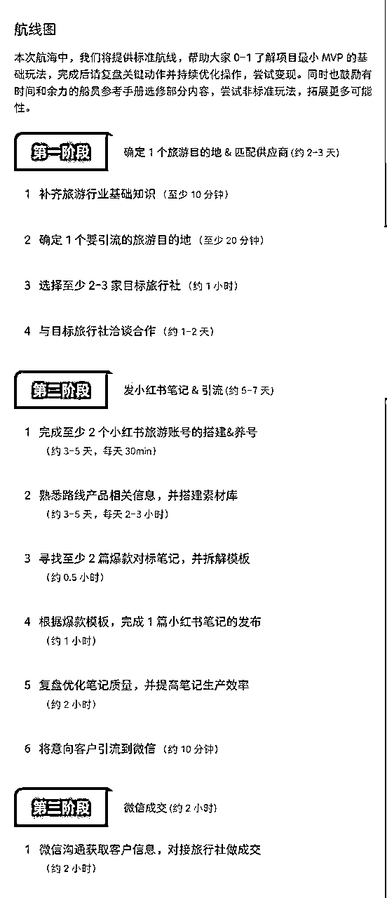

航线图和手册是高度关联的，因此你可以根据自己所在的环节，进行相关步骤的学习。

以上阶段中，第一二阶段的航线图步骤建议大家在航海前两周完成，完成后，建议以复盘&优化&提效为主，更多的发布优质笔记，扩大自己引流和出单的概率。

# 必修篇：跑通最小 MVP

### 章节概要

在必修篇，我们将从小红书旅游的【项目基本情况】和【项目基础玩法步骤】开始，让你对项目有一个全面了解，并按步骤完成项目的 0-1，跑通最小 MVP。

如果你是本项目新手，建议在正式实操前，先初步了解下项目全貌：

【项目概述】小红书旅游赛道的机会和玩法

如果你对项目整体有了大致了解，就可以按照项目核心步骤，开始学习实操：

【项目实操 1/3】确定 1 个旅游目的地&匹配供应商

【项目实操 2/3】打造小红书爆款引流笔记，批量引流到微信

【项目实操 3/3】微信成交

【复盘优化】持续迭代笔记 增加爆款数量

在必修篇，航线图和手册顺序相对应，你可以按照手册的顺序进行学习，即可逐一完成航线图的每一个任务。

在后续的每个关键步骤的章节概要中，我们也将提到相关航线图，提醒你完成相关步骤。

接下来就正式开始吧！

## 一、【项目概述】小红书旅游赛道的机会和玩法

### 章节概要

本章节中，我们将一起认识小红书旅游项目。为了让大家获得更多项目信息，我们会从以下两个角度进行分析:

1.小红书旅游赛道的红利有多大？

2.小红书旅游项目怎么玩？

了解完上述内容后，大家能够对小红书旅游建立起基本的认知，也能在一定程度上找到自己的发力点。

### 1.1 小红书旅游赛道的红利有多大？@渡

#### 1.1.1 旅游赛道的现状和机会

1.1.1.1 旅游赛道现状

先从整个旅游赛道来看，口罩结束后，大家的旅游需求迅速释放，热门景点人山人海，酒店民宿更是一房难求。

数据显示，23 年上半年，国内旅游总人次 23.84 亿，比上年同比增长 63.9%；国内旅游收入 2.3 万亿元，比上年增长 95.9%。上半年国内旅游人次和收入均增幅明显，旅游业正在稳步复苏。

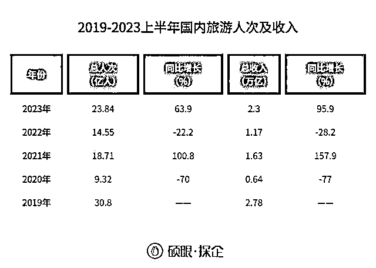

而旅游赛道又可以分为国内游和境外游，从国内游和境外游的角度，来说说这个行业目前的一个现状：

1）国内游

国内游现在整体比较卷，做的人多，产品同质化严重，客单较低，所以不建议大家去做低客单的国内跟团游，你会陷入客户不停比价的恶循环，而且佣金很低，一单几十一百，你每个月得成交几十上百单，才能拿到还不错的佣金。但是如果你想成交几十上百单，每个月至少得加几百上千个微信，对于新人来讲，这个难度是非常大的。

虽然国内游比较卷，客单低，但也不是完全不能做：

1.国内旅行社易链接。

相对境外游来讲，想要找到一家靠谱的国内旅行社进行合作，对于没有资源的新人来讲还是比较容易的；

2.国内游用户基数大。

国内游出行的客户基数非常大，小红书上写某些热门目的地的攻略帖，数据很容易就上万，关注的用户特别多，境外游想要达到这样的数据，非常难；

3.可以做高客单。

虽然国内低客单价格很卷，但是可以做高客单，比如定制游、高端小团、亲子研学等，客单一般也在几千上万，成交一单到手也能有几百上千。

2）境外游

从我个人的实操角度出发，境外游是目前旅游赛道较好切入的一个赛道，有 3 个原因：

1）对接境外游的难度较大，大多数人较难找到一个靠谱的可合作的旅行社（这同时也是一个门槛），所以在小红书上做境外游引流的人较少，同行竞争小；

2）境外游自由行难度大，用户报团的几率大。由于境外旅行的语言不通，生活习惯差异较大，因此大多数用户有出行意向时都会选择报团或者是定制游，这大大增加了用户的成交概率；

3）境外游客单高，佣金可观。虽然境外游的佣金比例和国内游差不多，但是由于整体客单高，且很少有单独出行的客户，因此成交一单跟团游，佣金大多都能上千，成交一单定制的话，佣金更可达到几千。

综合以上，如果国内能够跟做高客单且品质不错的旅行社合作，或者境外游能够对接到一个好的后端，至少在 2024 年来讲，旅游还是一个不错的副业项目。

需要注意的是：

虽然小红书旅游这个项目对新手非常友好，只要你肯投入精力去做，大概率能拿到反馈；但国内游总体比较卷，境外游成交周期长，从咨询到办签证、买机票、到付款，往往需要至少 1 个月，且成交有一定难度。

所以，对于新手来说，需要调整好心态，把它当做一个长期副业来做，这一期的小红书旅游航海，打好扎实的小红书引流基础就是最好的航海目标；当然如果你本身有旅游相关经验或资源，那么可以尝试更多的可能。

1.1.1.2 普通人入局机会

在这个旅游快速发展的时候，通过小红书去入局旅游赛道，会是个非常不错的机会，因为不仅市场需求量大，而且国家对旅行这个赛道有很大的扶持。

那普通人如何抓住旅游业的风口，从中分到一杯羹呢？

来看我跟一个导游的聊天记录：

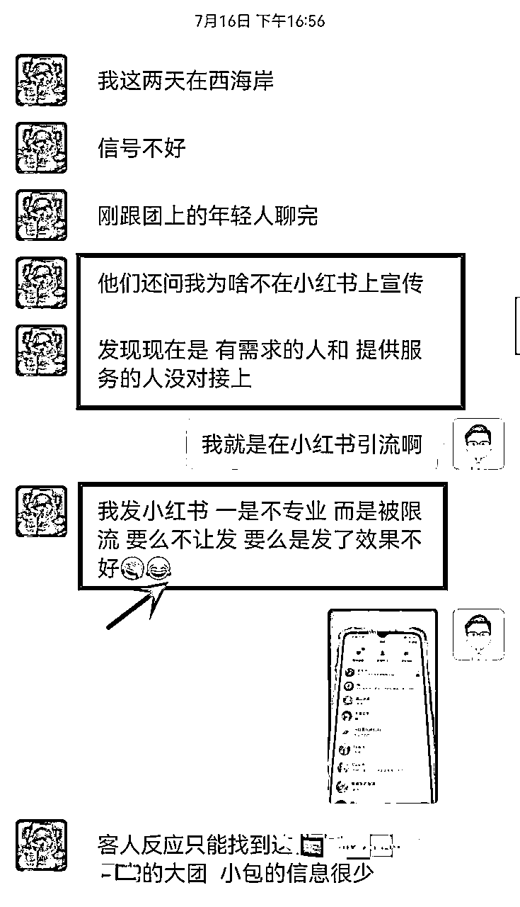

从聊天记录里，你有没有发现一个信息？

这也是我跟很多旅游行业的朋友沟通后，得到的一个信息：导游和旅行社，想做小红书，不会做！

我曾经教一个做旅游的朋友做小红书，她每天忙着联系车和导游、处理游客的问题，手机响个不停，忙得根本静不下心来做！很快就放弃了。

这就是我们的机会啊！给不会做、没时间做线上渠道的旅行社，做线上引流。

旅行社迫切需要你还有一个关键原因：

现在大量的流量，被携程和途牛等平台掌握，他们抽成非常高。旅行社就像美团上的商家，不跟携程和途牛合作，没生意，合作，还有点微利。累死累活的干，钱都给携程和途牛，旅行社们都是苦不堪言。

如果你能给他们带来生意，那就是他们的财神爷，旅行社会非常高兴跟你合作的。

#### 1.1.2 为什么建议选小红书平台？

既然要做旅行社的线上引流，那么选择一个合适的引流渠道非常重要，为什么选择小红书平台呢？

1.1.2.1 从平台数据来看

小红书的用户虽然在行业中不是最多的，但是它的转化率却非常惊人。

据 QuestMobile 2020 年的数据，小红书的平均带货转化率高达 21.4%，这个数字远远超过了其他平台，抖音、快手、微博的转化率分别只有 8.1%、2.7%、9.1%。

早在 2020 年，小红书就成为了影响用户旅游出行决策 Top.1 的平台，有高达 63.7% 的用户依赖小红书做旅游决策。

很多人在其他平台了解了产品，也会带着疑问来小红书了解细节，通过详细了解产品服务选择交易，用户完成使用后，又回到小红书发种草或吐槽笔记。

同时，82.2% 的用户更愿意参考短图文的内容形式，进行旅游决策，而短图文也是小红书的一大优势。

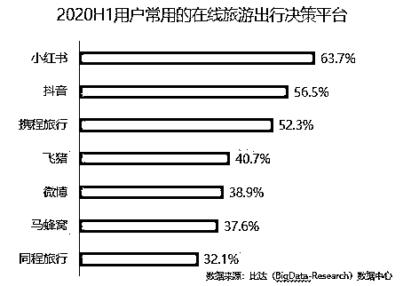

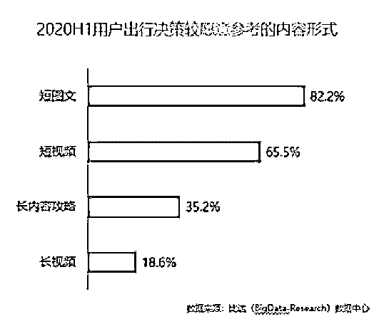

这几年小红书一直在持续发力旅游赛道，加上平台强烈的种草属性，小红书一直是旅游行业线上平台的巨头。在 2022 年小红书也成立了旅游公司，全力加大布局旅游业。

1.1.2.2 从行业经验来看

小红书做旅的红利，有多夸张？

我们一开始做小红书号，第一篇笔记发出去，才几十个小眼睛，就成交了一单！

当时就把我震惊了，我跟朋友说：这风口，都不是把猪吹起来了，是把大象都吹起来了！

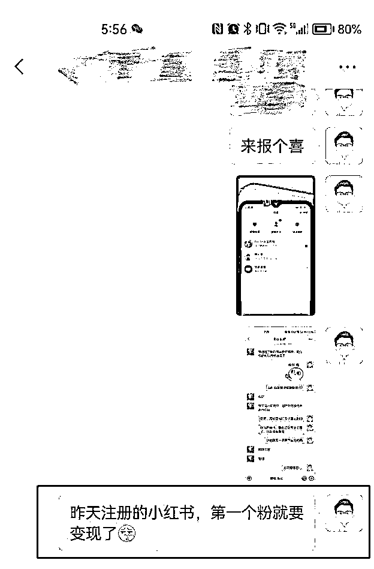

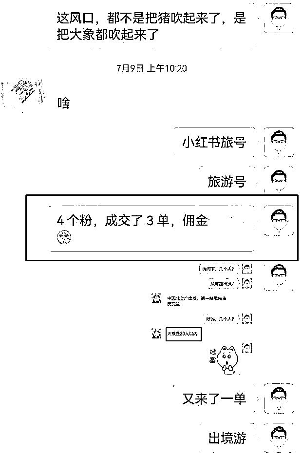

之前看到旅游同行写的一篇文章，提到：一个 20 人的旅行团，18 个人来自小红书报名。

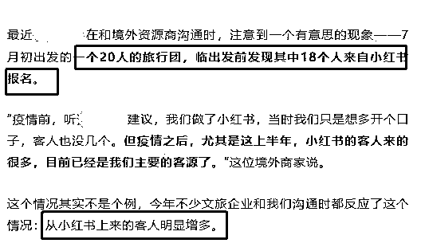

2023 年，毫无疑问，小红书是最佳触达用户决策的利器。

### 1.2 小红书旅游项目怎么玩？

#### 1.2.1 第一步：选择旅游目的地&匹配供应商 @易寒

正式引流前，我们要先选好 1 个目的地，以及对应的旅行社供应商。

为什么要先敲定目的地、以及合作旅行社呢？

首先，带货得选品，选品不仅跟我们小红书账号定位有关，也会影响到你的出单效率，比如选择低客单产品，出单速度快但收益低，高客单产品出单周期长，但收益相对高些，另外我们也需要根据季节选择对应旅游产品。选品相关内容，我们会在手册【章节 2.2】进行学习。

其次，由于我们是旅游行业新手，只会做小红书引流；对旅游路线的选择、笔记的图片素材准备、微信的成交不够专业，这些都需要旅行社的支持。

那旅行社在整个项目过程中，到底是怎么与我们协作的呢？

1.选品——推荐旅游路线的选择

由于不同季节，有不同的热门路线。比如：寒暑假，热门产品是亲子游。这时候可以让旅行社帮我们选定几条当季比较好卖的热门路线产品。

2.内容——提供小红书笔记素材

小红书笔记的素材，有一大部分是来源于旅行社提供的产品资料，主要包括路线介绍文案、景点高清图片。

3.成交——帮忙解答客户咨询问题

引流客户到微信后，就是答疑成交环节，客户会提问一些产品相关问题。遇到答不上来的，就需要请教工作人员，帮我们解答客户咨询、协助成交。

如果做跟团游的话，前期你把产品培训资料看完，基本上 90%的问题都能自己解答，解答不了的再找工作人员帮忙，这样效率更高。

本期航海给大家提供的旅行社，主要做高客单跟团或定制游，我们只需要引流到微信，然后拉群由旅行社负责成交，大大降低了我们的操作难度。

4.交付&返佣——旅行社的产品交付和佣金返回

客户完成支付后，后续的交付也交给旅行社就可以了；但由于旅游产品是面对面服务，不可控因素太多，收到手的钱不一定就是你的，只有完美交付后才能落袋为安。旅行社需要给客户一个满意的旅程，做好交付也非常重要。

佣金方面，一般是客人出发当天，旅行社会返还佣金给我们。

这里值得注意的是：

旅游的水比较深，旅行社如果不靠谱的话，游客投诉高，我们可能就会遇到佣金结算风险，比如佣金能否足额支付，能否及时返还？

有兴趣的可以去抖音看下 up 主“superB 太”最近发的云南游系列视频，一个坑接一个，让游客防不胜防。

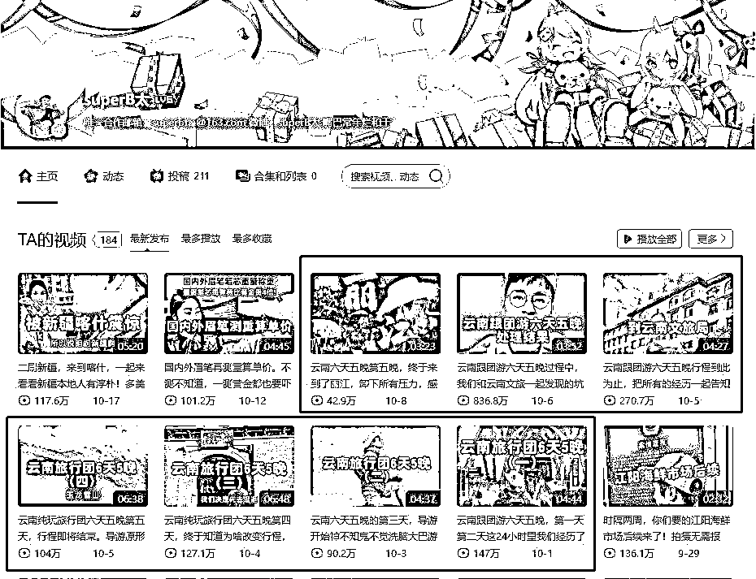

所以，选择一个有保障的旅行社合作，是项目顺利开展的关键要素。

为了让新手朋友更快出成绩，这次航海为大家筛选了几家合作旅行社；当然如果你想自己找旅行社，在后面实操章节我也会教大家具体的实操方法。

#### 1.2.2 第二步：小红书批量引流微信 @渡

小红书引流这个动作，在项目操作中占据了绝对关键位置，要知道，流量是 1，其他都是 0；同时这也是花费大家时间最多的一个环节。

因此，在整个航海期间，我们需要花费大半部分精力去做好一件事：小红书引流。

做小红书跟其他平台有什么不一样？

小红书的内容创作模式，主要是以 IP 为核心的 图片+文字 软种草，因此小红书：

1.更重 IP 人设

小红书平台非常重“人设”，作为一个种草平台，小红书博主扮演的角色大概就是：可以信任的陌生人。

如果小红书用户通过你主页和笔记来判断你是一个真实不造假的、可以值得信赖的或者专业的人，那么她就会愿意和你进行下一步连接，甚至达成交易。

2.内容更真实全面

小红书博主的账号由人设五件套（名字、头像、简介、背景图、个人资料）和笔记组成，用户通过某一篇笔记就可以和博主产生链接，然后通过主页查看其他笔记，每篇笔记输出的内容都会让博主的人设更加立体，也会让博主想表达的信息更加全面；

因为硬广会被平台限流，且不受平台用户喜欢，所以小红书的笔记会更偏向真实接地气的内容。

3.内容形式以图文为主

虽然小红书在扶持视频笔记的流量，但是小红书的阅读习惯还是以图文为主，而且图文制作起来难度没有视频那么大，很多创作者也会优先选择图文形式进行创作。

写笔记的时候，注意瞄准你的目标人群、围绕关键词去写，才容易出爆款。有了流量，埋钩子也很重要，这决定了多少意向客户会找你咨询；这时候我们需要把来咨询的意向客户，引流到微信私域再做成交。

这里需要注意的是：

小红书平台现在对引流的审核愈加严格，不过办法总比困难多；大家在引流的时候，除了可以看手册实操部分，也可以在群里多多交流。

#### 1.2.3 第三步：微信成交变现 @小掌柜

我们把用户从小红书引流到微信后，就要开始做成交了。这里涉及到 2 个关键步骤：

1.了解客户信息，推荐路线产品

客户加进来，我们要及时打招呼，通过了解客户的基本信息和需求，比如“什么日期来”、“几个人”、“想玩几天”，再去推荐对应的路线产品。

2.及时解答客户问题，引导成交

客户看完路线产品介绍后，肯定会有产品相关问题，这时候及时解答，也是完成成交的关键。

需要注意的是：

做引流和微信成交，最关键的风险就是“被封号”。哪几种情况容易被封号？如何避免被封号？我会在实操环节跟大家具体展开。

来源：0 基础做小红书旅游博主，第一周销售额 6w2 的成单秘籍！

## 二、【实操 1/3】确定 1 个旅游目的地&匹配供应商 @易寒 @渡

### 章节概要

前面说到，我们做小红书旅游项目，离不开旅行社的支持，找到一个优质的稳定的后端，可以大大提升我们的成交概率，也有助于后续项目的放大。

本章节，我们将通过学习如何选品，以及如何与旅行社洽谈，找到 1 家靠谱的后端：

选品和初次建联旅行社前，你需要掌握一些基础的行业知识，来跟旅行社对话；

选品，也就是选择 1 个旅游目的地，为我们的小红书账号定位做好准备；

建联旅行社其实并不难，但是找到一个好的后端，需要做层层沟通与筛选；

为了降低大家项目的试错成本，本次航海，生财会提供 7 家相对有保障的旅行社，给到大家选择，目的是帮助大家尽快开展项目并跑完最小 MVP。当然如果你自己有靠谱的旅行社资源，也可以参考本章节内容，去与旅行社洽谈合作。

### 本章航线图

完成本章节的学习和实操，即可完成航线图的 第一阶段：确定 1 个旅游目的地 & 匹配供应商（约 2-3 天）

1.补齐旅游行业基础知识（至少 10 分钟）

2.确定 1 个要引流的旅游目的地（至少 20 分钟）

3.选择至少 2-3 家目标旅行社（约 1 小时）

4.与目标旅行社洽谈合作（约 1-2 天）

那么现在，就请开始完成这几个步骤的筹备吧。

### 2.1 了解旅游行业基础知识

在找旅行社之前，我们需要有旅游的基础知识，了解行业术语。否则沟通起来会很困难，甚至没有旅行社愿意理你，更别谈合作了。

对于新手来说，只需要了解 2 个概念：

1.旅游行业基本的供应链关系

2.旅游行业主要的产品类型

#### 2.1.1 旅游行业基本的供应链关系

我们做小红书，打交道的主要是旅行社，旅行社分为组团社和地接社。

2.1.1.1 组团社

组团社是指客户在报名时，与客户签订合同的旅行社。组团社与客户签订合同后，交给别的旅行社。

比如：你在杭州 A 旅行社报了一个西安的旅游团，落地西安后，发现来接你的司机、导游和车，都是西安 B 旅行社的。

杭州 A 旅行社就是组团社，西安 B 旅行社就是地接社。

2.1.1.2 地接社

地接社都在旅游目的地，与当地的酒店、景点、车队、餐厅、司机、导游等，签订长期合作协议，享受优惠价格，由于地域优势，所提供的导游服务更专业，对客户的人身和财务安全有更好的保障。

地接社给出旅游产品的结算价，组团社加价卖出。

我们做小红书，可以直接找地接社，没有中间商赚差价。

#### 2.1.2 旅游行业主要的产品类型

旅游行业的产品类型，主要分为这 3 大类：散客拼团、独立成团、私人定制。

2.1.2.1 散客拼团

“散客拼团”又称为散拼团、跟团游，是旅行社组织的常规性旅游，在固定的时间内对某个旅游地区进行系统的参观游览，如“海南六日游”、“厦门五日游”。

这种旅行方式的特点是交通、住宿、饮食都是配套的，不用自己操心，去每个景点及日程安排都有导游，会免去人生地不熟带来的不安和麻烦。

“散客拼团”在产品设计上为了市场的推广，会选择大众化比较热门的景点，游览景点受限制，多为走马观花式的观赏、难以仔细欣赏沿途风光，但是也是各类旅游方式中最省钱的方式。

2.1.2.2 独立成团

“独立成团”又称为包团游，一般是指在 20 人以上的客户的团体性出游，出行时不与其他客户拼团，团内都是互相认识的人，旅行社根据客户提出的要求和费用预算定制旅行方案，交通、住宿、饮食都是可以根据客户的要求去安排的。

比如客户是团建、学习、考察、会议或其他需求，客户自己也无需过于操心，旅行社会设计出更为合理的方案，免去客户对当地情况的不熟悉的困扰。

根据客户所选择组团社的实力，组团社有可能直接选择与地接社合作，或将整团交接给合作的供应商，因为即使独立成团，这类客户常常因为旅游预算的限制，在产品设计上很难有很高提升，资源更经济实惠的一方，就成了组团社的主要合作对象。

如果前来咨询的客户出行人数较多，在预算方面又可以略高于“散客拼团”，旅行社会建议客户选择“独立成团”这类旅行方式。

2.1.2.3 私人定制

“私人定制”又称为小包团：几个亲朋好友或有共同旅游兴趣的客户，旅行社量身定制的旅游产品，在人数上一般不受限制，但是为了更佳的旅行体验感，以及旅游资源的限制，一般建议在 10 人以内，最多不超过 20 人，如果客户超过这个人数就建议分批出游了。

方案定制上会根据客户的需求更突出体验朋友欢聚的乐趣和无拘无束的自由空间的享受；产品更突出主体性，如亲近大自然、沉醉于城市风光、轻松游山玩水、惊险的极限挑战等旅游方式，亦或是到荒野中露营、到别墅去休养休憩......食宿也更有特色，一般非资源限制都会选择当地有特色的社会餐厅，在方案中要准确体现酒店、餐厅的具体名称及房间标准和菜单；

根据客户情况，考虑客户的爱好及时间、花费等方面的实际情况，制定更符合客户需求的产品，使旅行更有意义。（值得注意的是：行业内的部分旅行定制师有一个误区，就是认为安排当地最好的食宿就是私人定制，这个观点我个人不能认同）

对于“私人定制”产品，组团社会多渠道选择供应商或地接社，甚至在目的地直接采集旅游资源，为了完美的设计方案反复推敲或者提前实地考察，以实现客户更好的旅行体验为最终目的，各组团社都会把这类客户当成最重要的客户对待。

### 2.2 确定 1 个要引流的旅游目的地

#### 2.2.1 为什么要先选目的地？

带货得先选品，旅游目的地的选择就相当于选品，你只有先知道自己要做哪个目的地，才能根据目的地的景点和产品来设计怎么可以写出一篇小红书笔记，需要根据目的地去倒推：

#### 2.2.2 怎么选择合适的目的地？

选择不同的目的地对后面的成交是有一定影响的，不仅对成交有影响，目的地的选择也会对你笔记内容的呈现效果有影响。

那么如何选择合适的目的地？主要从以下 2 个维度来考虑：

1.你对目的地是否熟悉？

是否熟悉或喜欢这个目的地，意味着你能否更快地熟悉产品资料，并上手写笔记，能否更快解答客户问题并成交。

如果你对目的地非常的不熟悉，完全不了解，那么前期你就要多花些时间在熟悉目的地上了，否则你的笔记就相当于全是技巧没有感情，在内容呈现的时候就会相对较硬，转化率相对会差一些。

你越是熟悉你的目的地，你的文字就会更真实，更能让用户产生信任感，你在写笔记的时候，是会有带有情绪价值给到用户的；而且客户在询问你问题时，你也能更全面专业地解答，甚至可以直接跟客户语音沟通，语音建立的信任感，远大于冷冰冰的文字。

2.这个目的地卷不卷？

小红书的体量就那么大，每个目的地的目标人群数量是有限的，如果做一个目的地的人太多，就意味着你要跟很多人抢 1 个客户，难度比较大。

怎么看目的地卷不卷？

可以通过灰豚数据平台的【投放关键词分析】功能来看。以航海给大家准备的 9 个目的地为例，看下长滩、澳洲、日本、斯里兰卡、西安、云南、贵州、北京、川藏的数据。

入口：灰豚首页左边 - 热门内容 - 关键词分析 - 在搜索框输入目的地名

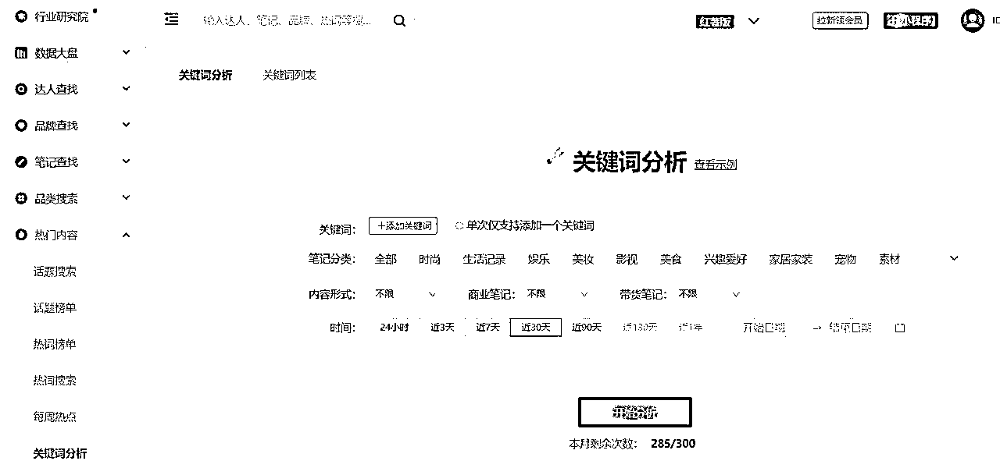

下面是我搜索出来的 9 个目的地的数据，其中：

我们重点参考 CPE（用户互动计费）、CPM（每千人展示成本）的数值，这两个数值主要代表该关键词的付费竞争情况，数值越大，说明竞争越强。

比如，日本的 CPE=0.12，CPM=10，澳洲的 CPE=0.2，CPM=10，可以初步推荐，澳洲比日本的竞争要大一些。

另外，也可参考笔记数量与阅读总量、互动总量的数据，阅读与互动总量越大，说明目标人群越多，越小则说明这个目的地比较小众。笔记数量/阅读总量 or 笔记数量/互动总量的比值越大，说明这个目的地的竞争力度越小。

比如，长滩的阅读总量=9w，互动总量=5593，澳洲的阅读总量=180.5w，互动总量=10.1w，说明澳洲的目标人群比长滩多，长滩相对小众些。

再比如，斯里兰卡的笔记数量/阅读总量=106/8.6w=0.12%，云南的笔记数量/阅读总量=3015/1299.6w=0.02%，斯里兰卡的比值更大，初步得出结论，斯里兰卡比云南的竞争力度更小。

从数据维度来看，建议新人选择竞争力度较小的目的地，但也要结合个人对目的地的熟悉程度来综合判断。

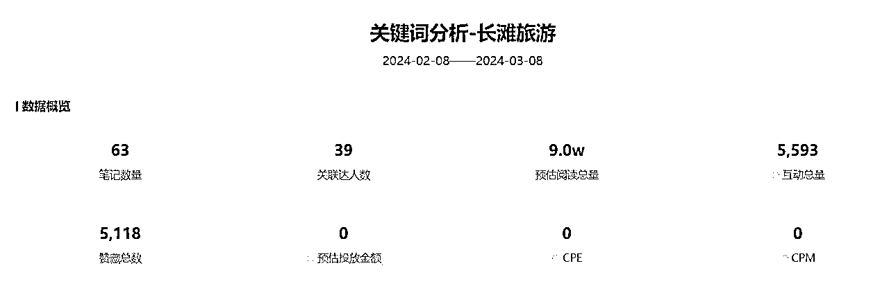

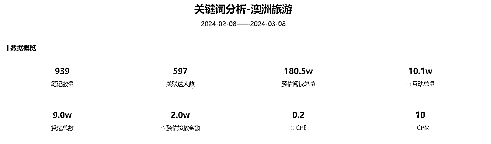

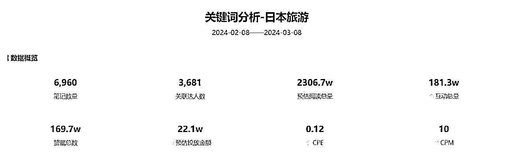

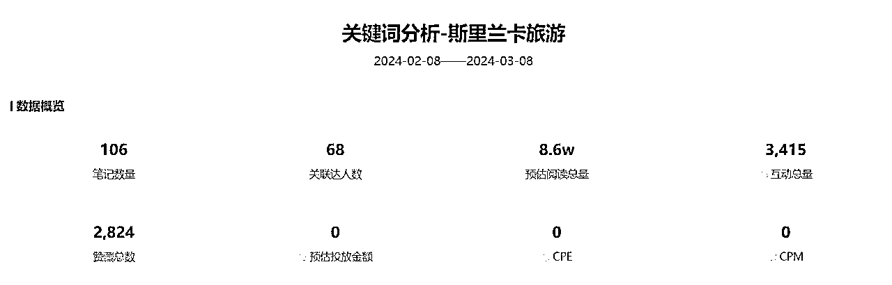

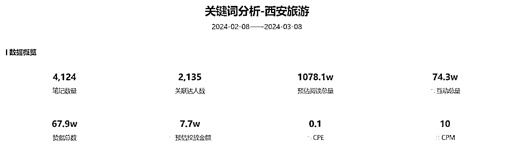

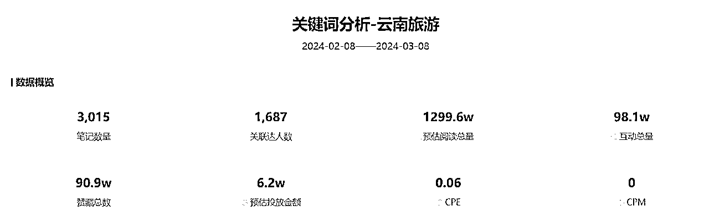

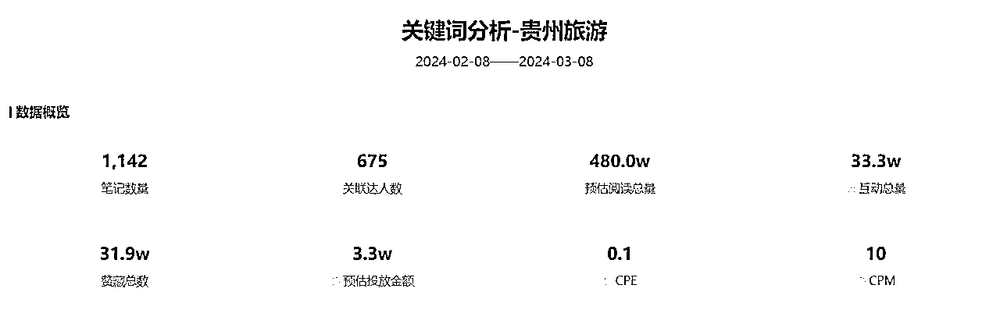

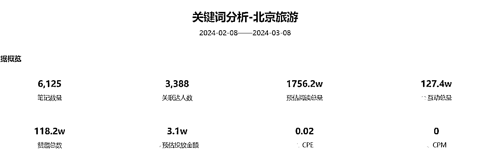

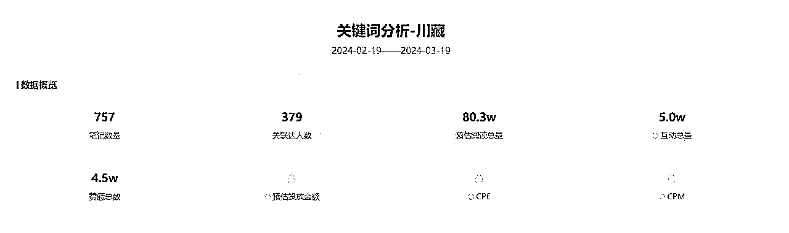

#### 2.2.3 为什么建议你只选 1 个目的地？

建议新手只选 1 个目的地的，是因为每个人的精力有限，选择好目的地之后，要学的东西还是挺多的，能把一个目的地的产品学精就已经会花费很多的时间和精力，再去学其他目的地的产品，反而贪多嚼不烂。

另外，也建议大家 1 个月内不要更换目的地，一个月时间本身就有限，中途再去学另一个目的地的产品，就又要花很多时间。

再从小红书的角度来讲，小红书账号讲究的就是垂直，越垂直粉丝越精准，变现也就越快，你一个新号，上来什么都发，短期内是很难建立信任感的。

为了让大家更好地聚焦在小红书笔记制作的能力提升上，我们帮大家筛选对接了 9 个 旅行社供应商，请大家按需选择 1 个，并熟悉下方产品相关资料。

产品资料链接： 旅行社名单 & 产品资料（3 月航海）

### 2.3 确定 1 家合作旅行社

#### 2.3.1 怎么选择旅行社？

旅行社的选择，跟旅游的淡旺季时间节点有关，我们需要选择当季热门目的地，选择对应的旅行社进行合作。

比如，西安，每年 4 月-10 月是旺季，其它时间是淡季。根据西安国旅的数据，淡季客流量只有旺季的 1/6 甚至 1/9；

比如，冬季，东北和三亚是旺季，我们就可以冬天做东北或三亚，其余时间做西安。

我们可以根据淡旺季，来选择合适的旅行社合作。

旅游的淡旺季，可以按自然季节划分，也可以按节假日划分：

相对而言，我们可以认为夏季&秋季（5 月至 10 月）是旅游旺季，而冬季&春季（11 月至次年 4 月）则是旅游淡季。

但是，由于我国幅员辽阔，不同地区的旅游旺季也存在差异。例如，东北的雪乡、海南三亚冬季正是其旅游旺季。

如果加上境外旅游，那么北半球的国家跟我们一样，而南半球（如澳大利亚、新西兰）的旅游淡旺季恰恰与我们相反，我们冬季的时候，他们是夏季。因此澳新两国，旅游旺季是从 10 月到次年 4 月，而旅游淡季是从 4 月到 10 月。

如果按照节假日的划分来确定旅游旺季的时间。那么元旦、春节、5.1、10.1 黄金周小长假、学生的寒假（1-2 月份）和暑假（7-8 月份）都是旅游旺季。

#### 2.3.2 去哪里找旅行社？

这里我把旅行社合作资源分为：国内旅行社、国外旅行社。

国内旅行社相较于国外会容易找一些。考虑到大家作为新手入局，本期给大家链接了几家旅行社来练手。

2.3.2.1 如何找国内旅行社

国内的新疆、云南、西安、贵州、北京、呼伦贝尔、东北等传统旅游热点目的地，都是游客井喷。

可以多问问家人朋友，你肯定能找到一个做旅游的朋友。实在不行，去目标城市的旅行社，上门跟老板聊一聊合作。他不用出一分钱，就能招到一个网络销售，何乐而不为呢？

此外，你也可以在万能的生财有术星球，发帖子找一下做旅游的圈友，相信你一定可以找到合适的旅行社。

也可以在小红书发帖，或者通过博主的账号找到对方，问他们需不需要分销。

2.3.2.2 如何找国外旅行社

你可以问下亲戚朋友，谁在国外留学或工作。多问问，肯定能找到的。让他把当地华人旅行社的微信找到，推给你。

注意了，旅行社的口碑很重要，因为跨国合作，保证服务质量，非常重要。得让你的这位朋友多打听打听。

#### 2.3.3 如何选择与旅行社的合作方式

跟旅行社合作佣金，有 2 种方式：引流合作、同行合作。

2.3.3.1 引流合作

引流合作，就是你在小红书加到客户微信后，把旅行社的工作人员一起拉个群。旅行社工作人员在群里成交，你只关注成交结果就行了。

成交了就有佣金，没成交就 0 佣金。

这种方式，佣金的比例较低，一般只能拿到 5%。

我们知道还有很多旅行社，找大学生和宝妈批量做号，10 块钱发一篇笔记，5 块钱买一个微信，甚至没有佣金。

2.3.3.2 同行合作

同行合作，就是你掌握旅行社专业知识，能独立回答客户咨询，从小红书发笔记直到客户付款，你一个人基本搞定，这种方式，佣金比例较高，一般是 15-20%。

同行合作，最简单的方式是做跟团游，这也是我们本期航海的推荐玩法。

跟团游，你只要对几个线路了解就行了。每条线路的吃住玩行，都是固定的。旅行社只需要花半天时间，给你做个产品培训，你就可以应对客人咨询了。

定制游相对难一点，本期航海的新手朋友，我先不做推荐。

因为你必须要对某个旅游目的地，比如西安、迪拜等，从酒店、景点、餐馆到行程等，要特别熟悉，这个必须有人带你学习。勤快点，最久 3 个月、最快 1 个月也能独立做定制游了。

当然，最简单的方法，就是去相关的旅行社上几个月班，免费学，还有工资。

如果业余学的话，找个旅行社的工作人员手把手带你，也是一样的。

我们都做过旅游攻略，定制游其实跟做旅游攻略一样的，门槛不高。但是，有个学习过程。

如果你选择同行合作模式，建议你开始只选 1 个旅游目的地，深入学习，更容易出单。千万不要同时选多个旅游目的地学习。

#### 2.3.4 旅行社合作洽谈的内容

2.3.4.1 产品佣金是多少？

每个旅游产品，佣金都不一样。一般来说，旅行社产品的佣金从 3%-20%不等，其中，散拼团的佣金大约是 8%-10%。

这里有个误区，并不是价格越高的产品，佣金就越高。

有些新的景点或者自费项目（比如文艺演出），还在推广期，给旅行社的返佣高，那么，包含这些新景点或者新自费项目的旅游产品，给的返佣就较高。

一些知名景点或演出，给的佣金就非常少（比如西安的长恨歌），甚至是 0 佣金（比如西安的兵马俑、华清池）。

有些产品没有固定价格，比如定制游，那就可以按销售额的比例算佣金；有些产品是有固定价格，比如散拼团，一般就会标明具体的佣金金额。

2.3.4.2 能否提供后端支持？

旅行社的后端支持主要包括：

2.3.4.3 佣金结算日期和支付方式

1.结算日期

一般是每个月结算一次佣金；也有单笔结算的，客人出发的当天，人出发账结清。

2.支付方式

一般都是微信转账：

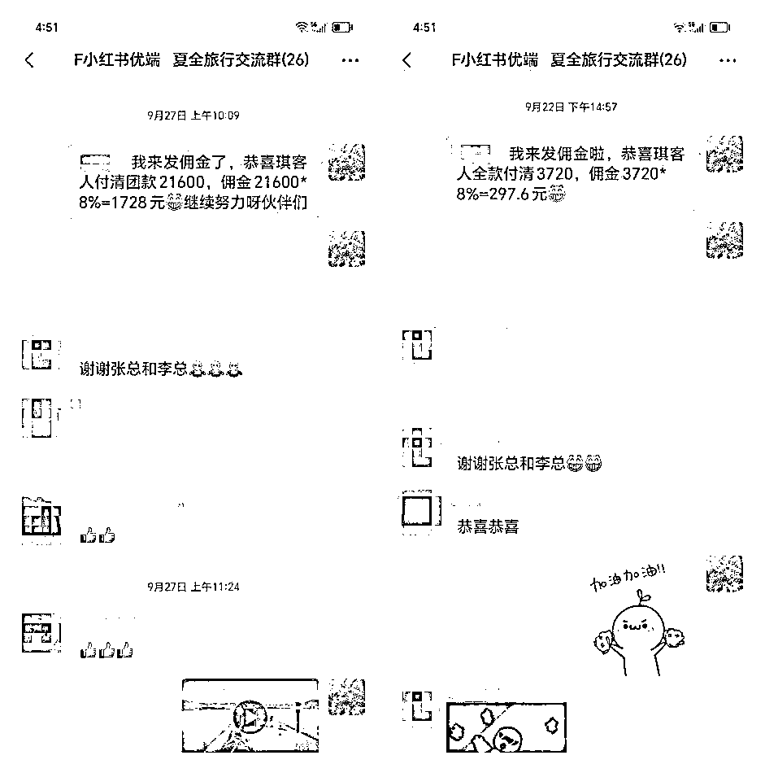

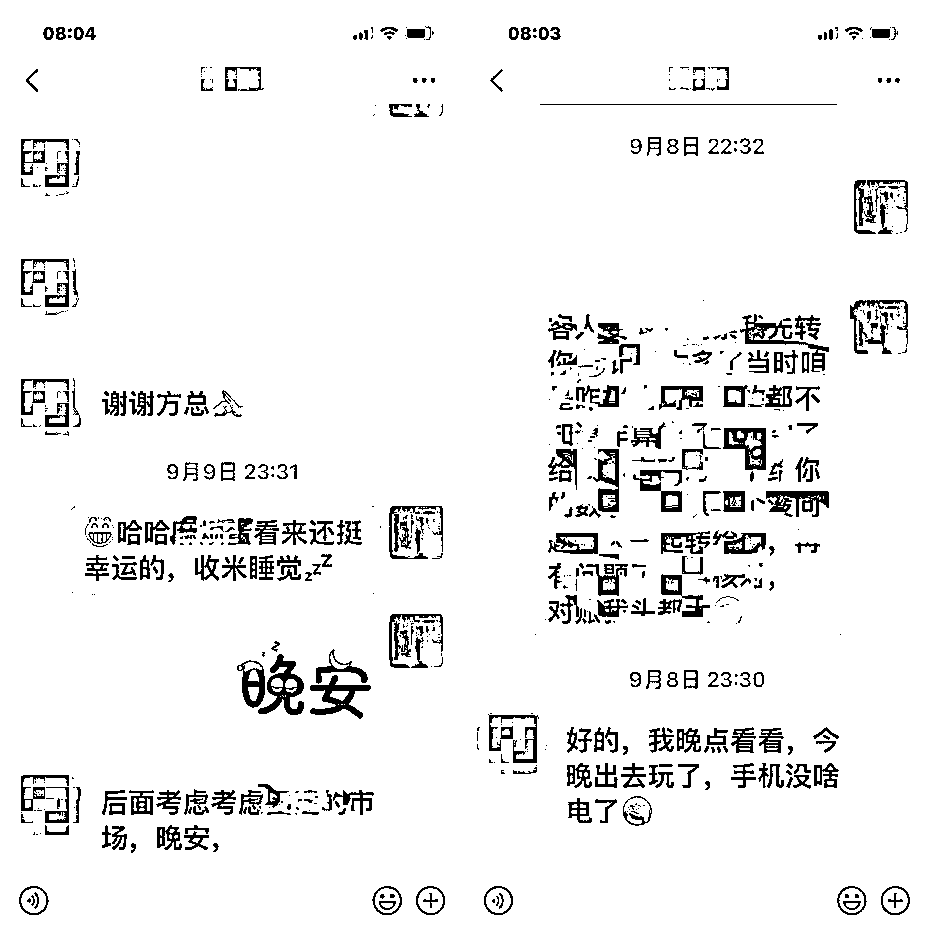

#### 2.3.5 旅行社洽谈的注意事项

2.3.5.1 旅行社是否正规？

先查旅行社资质，只要是有资质的旅行社，就可以放心合作。

第一步：登录国家文旅部官方查询网址：https://mr.mct.gov.cn/

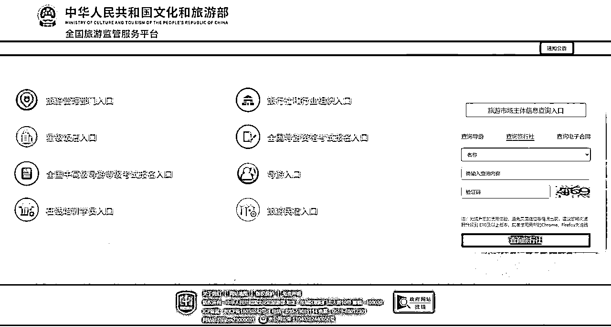

第二步：找到旅游市场主体信息查询入口 -> 查询旅行社 -> 输入旅行社的名称、经营许可证号、统一社会信用代码，三选一就可以了。

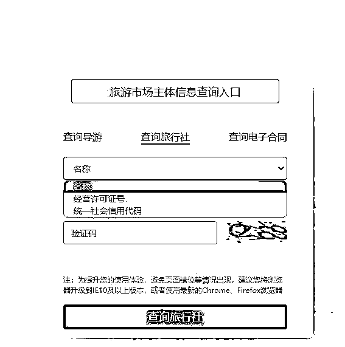

第三步：查看查询结果，正规旅行社肯定有经营许可证。

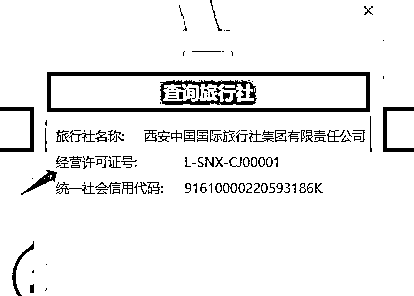

2.3.5.2 产品是不是 KB 团、推自费？

这里主要是考量旅行社的口碑。

KB（keepback，返点团）也就是我们熟知的购物团。KB 团的重灾区，在香港和云南，新闻报道层出不穷。

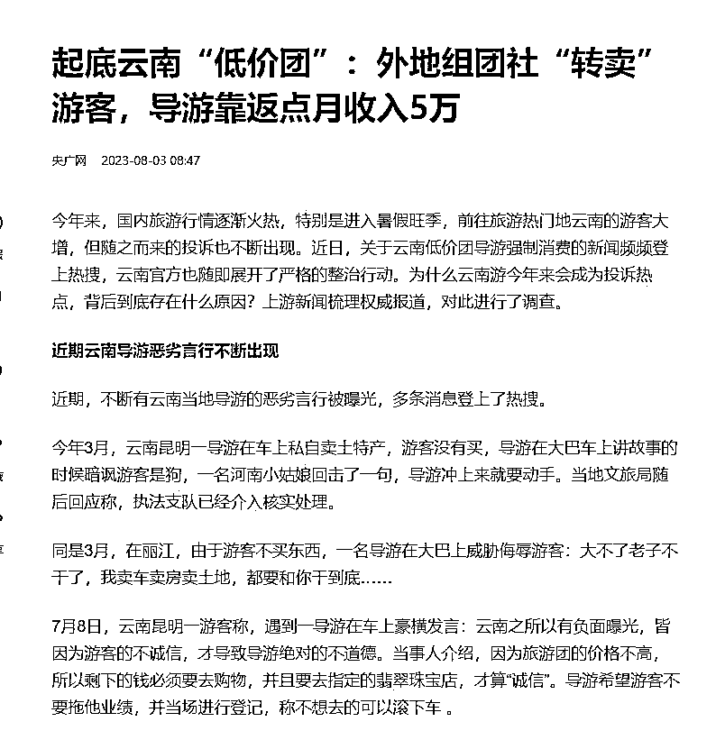

由于购物团臭名昭著，现在的方式升级了，更加隐蔽。比如，你去看抖音直播，很多低价团，都标明 0 购物纯玩团。

这种低价 0 购物纯玩团怎么盈利呢？业内叫“加点”，就是导游会在旅途中推自费项目。最后一算账，自费的钱远远超过了团费，导游吃回扣吃得满嘴油。

这两种团的评价不高，可能客户投诉较多。但是客户是跟旅行社签的合同，后续他只会去找旅行社。

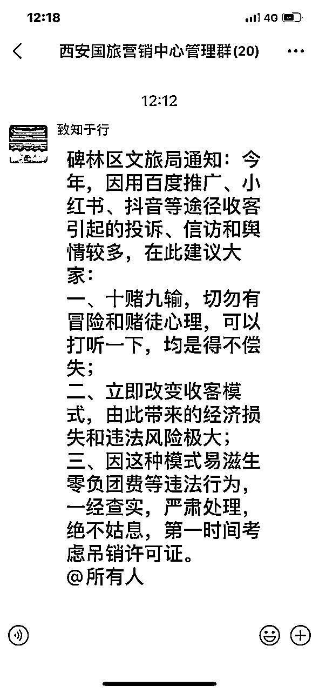

是否做这两种团，自行决定吧。

2.3.5.3 佣金是否能及时返还？

旅行社之间，拖欠款很严重的，甚至说，你不拖欠，就开不成旅行社。他很有可能把拖欠的习惯放在你的佣金上。

这里注意，客人是把钱打到旅行社账户上的，不可能打到你的私人账户上的。所以，如果旅行社拖欠佣金，你很难去制约。

想要避免佣金被拖欠，只有 2 个办法：

1.找口碑好的旅行社；

2.一开始就约好佣金单笔结算，如果这单佣金没结算，下单生意就先不给他了。

2.3.5.4 后续的服务质量

首先，一定要确保产品是 0 购物纯玩团。很多导游为了业绩，会做一些小动作，比如强制购物。这种行为非常伤害用户体验，购物团是最砸口碑的。

其次，游玩、住宿、团餐的质量要保证，特别是要与行程单的宣传一致，这些都要聊清楚。

最后，投诉和不满，一定要及时处理。否则，顾客不满意，小红书上写你的黑材料，完蛋了。

我们正在旅行的客人，不管是跟团游还是定制游，我每隔两天都要问一下。有任何情况，我会直接去找旅行社老板，及时解决问题，把游客的不满消灭在萌芽中。

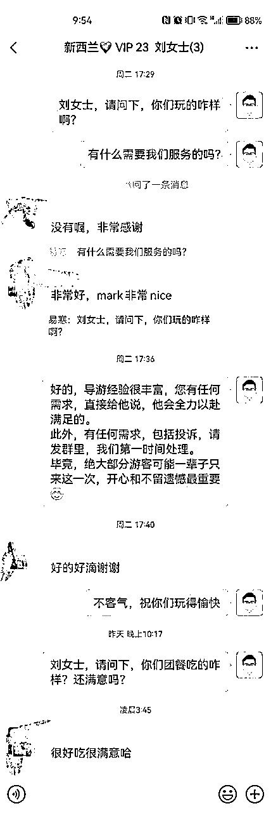

## 三、【实操 2/3】打造小红书爆款引流笔记，批量引流到微信 @渡

### 章节概要

毫无疑问，这是本项目最重要的一个章节，也是即将花费大家时间最多的一个环节，希望大家在掌握了旅游笔记创作流程后，能不断地复盘并发布更多笔记，来提高爆款笔记的数量。

本章节，我们将学习这些内容：

账号搭建与定位 - 发布笔记 - 引流客户到微信。

如果你有小红书运营的经验，相信很快就能上手；如果你是纯新手，也不用担心，跟着下面的步骤来操作，很快就能发布你的第一篇笔记。

### 本章航线图

完成本章节的学习和实操，即可完成航线图的 第二阶段：发小红书笔记 & 引流（约 5-7 天）

1.完成至少 2 个小红书旅游账号的搭建&养号（约 3-5 天，每天 30min）

2.熟悉路线产品相关信息，并搭建素材库（约 3-5 天，每天 2-3 小时）

3.寻找至少 2 篇爆款对标笔记，并拆解模板（约 0.5 小时）

4.根据爆款模板，完成 1 篇小红书笔记的发布（约 1 小时）

5.将意向客户引流到微信（约 10 分钟）

那么现在，就请开始完成这几个步骤吧。

### 3.1 搭建并完善小红书账号

#### 3.1.1 准备至少 2 个账号

小红书平台现在对于站外导流审核愈加严格，旅游赛道也是一个相对敏感的赛道，所以前期在不熟悉平台规则的情况下，很容易会被系统审核并出现违规，甚至封号的现象，所以我们至少注册 2 个账号，将其中一个账号作为小号，辅助主号进行导流。

第一步：准备手机号

注册 2 个账号，我们就需要 2 个手机号，如果你只有 1 个手机号，那么可以用家人的，或者再去申请 1 张手机卡，线上就可以办理。

我目前是用的电信副卡，1 张办电信宽带的卡，可以申请 2-3 张副卡（跟你的宽带等级有关），副卡和主卡的流量都是通用的，这点还是比较方便。

第二步：账号登录

同时运作 2 个账号，你可能会问：那我可以用 1 个手机登陆吗？

如果你的手机本身就有小红书应用分身（部分安卓手机有这个功能，比如红米），那么可以用一个手机登陆两个小红书号，我目前这样操作，账号还没出问题。

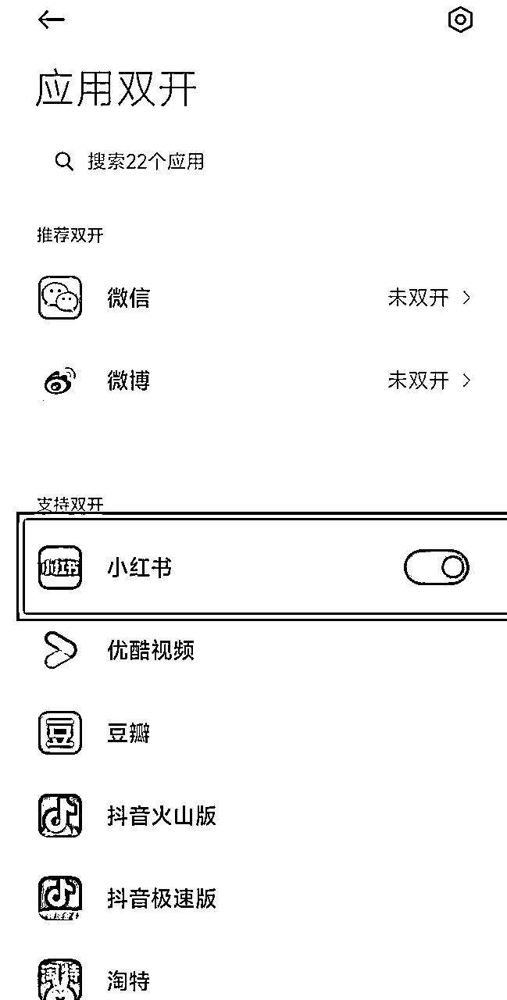

但如果你的手机没有这个功能，就不要去下载分身神器了，容易被封号，这种情况下就只能再准备一个手机用于登陆账号，可以去咸鱼或者拼多多上买二手手机，三四百块钱的就能满足日常需要了。

第三步：个人实名认证

小红书个人号可以认证为旅行博主，这里要注意：小红书实名认证，一个身份证只能认证一个账号，一旦认证成功之后，只有注销账号才能解绑。

一般我们会把主账号做下认证，引流用的小号不用认证。

认证旅行博主的路径：我 - 左上角三条杠 - 创作中心 - 创作服务的更多服务 - 开通专业号 - 成为专业号 - 选择个人点击立刻申请 - 输入实名认证信息 - 选择“出行-旅行博主”即可。

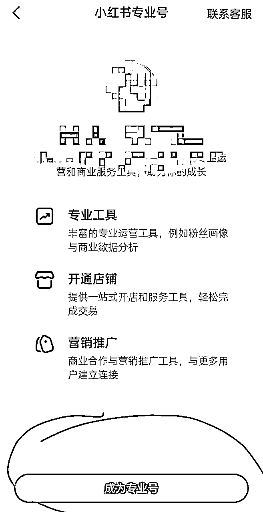

第四步：养号

新注册的账号，每天花至少半个小时去养号，需要你在小红书模拟正常用户，刷同领域相关的笔记内容，并进行关注、点赞或评论等行为。一般养 3-5 天差不多。

#### 3.1.2 做账号定位&包装

3.1.2.1 账号定位

在账号前期，40% 的精力要放在账号定位上，其次才是选题、内容、引流。

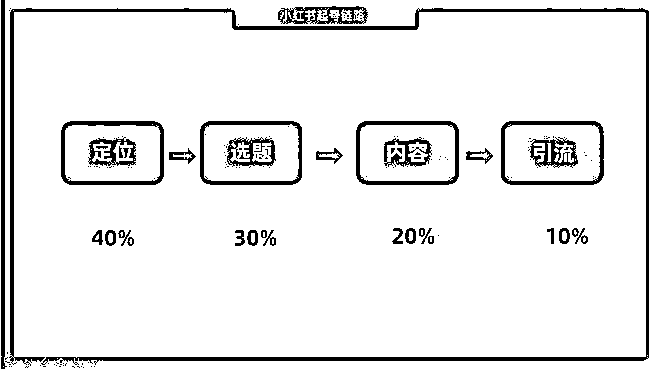

账号定位的核心思维：垂直、精准、细分。

寻找自身定位，本质上是寻找你的目标人群，你想吸引谁、你的内容要给谁看。

比如：我是做青年旅游的，目标客户群 18-28 的年轻人，我会把 IP 包装成我的客户群喜欢的样子，发他们可能会来询单成交的内容。

选到对应的细分领域之后，你包装 IP 和内容时都要瞄准这个领域的目标人群。

比如：我选定了做西安亲子游，我有西安亲子游的后端能做客户成交，那我会把 IP 包装成目标人群喜欢的样子，比如“爱遛娃的宝妈”，发宝妈们想看且可能会被种草的内容。

在小红书里，无论你选定哪个领域，你的定位都得垂直细分，这样才能更精准转化，实现变现。

3.1.2.2 账号包装

账号的包装，就像开门迎客之前，要做店铺装修。

包装原则是简单为主：比如你是做的云南旅游，那么你的头像昵称简介就要围绕云南为主。

一个用户选择关注一个博主，往往不会只因为一篇优质笔记而关注。用户会看博主的主页，查看昵称、头像、个人简介、背景图以及之前发布的笔记等，然后再决定是否关注博主。

因此，主页的展示是非常重要的，这不仅关系到用户对运营者的关注度，还是在一定程度上决定了用户是否愿意找你购买旅游产品。

另外，对我们博主来说，完善账号信息还能提升账号权重。

因为账号信息越完善， 越有助于平台对账号贴标签。有标签的账号，发布的笔记获得的流量更加精准，流量精准后，更多用户会点开笔记，浏览量等会大幅提升，随之而来的就是账号的权重越来越高。

接下来，我们就从账号的昵称、头像、简介、背景图、主页排版，来讲讲如何做账号包装：

昵称是用户认识了解我们的第一步，即用户首先是通过我们的账号昵称来认识和判断我们是谁，我们是做什么的。

昵称上非常容易犯的错误就是委婉，太过于个性化，让用户不能通过昵称来判断我们是做什么的，更甚至是用户压根看不懂，一个好的昵称是可以通过关键词给账号带来搜索量的。

给大家几个可以直接套用的昵称模板：

总之，我们的昵称最好直接能够体现你的定位，让用户对你能提供什么服务一目了然。

昵称这里需要注意的点：我们是个人号，所以昵称一定体现出来的是“人”的行为或定义。不要把昵称设置成大类目，比如：XX 旅行、XX 定制游、云南旅游、XX 周边游等，这些昵称一是不具备个人属性，二是只有企业号才能申请这类昵称。

头像可以采取文字形式或真人出镜形式。

文字形式的头像和昵称一样，能够让用户一眼就看出来你是做什么的；而真人出镜的头像则可以拉近和用户的距离，让用户感觉到真实，增强信任感。

特别是做 IP 人设的账号，强烈建议使用真人出镜的头像，也可以用你的昵称或者地域来做头像。

有很多小伙伴是喜欢用风景照来做头像的，虽然风景头像也是和我们赛道强相关的，但是只有风景，没有真人出镜，没有地域名称，你的头像辨识度和记忆点会很低，这里也不建议使用。

点进简介的用户一般是通过笔记进了你的主页，想更多了解你。所以，简介的内容是非常重要的，也是用户决定要不要关注你的重要依据。

一个好的简介，需要告诉用户你是谁？你是干什么的？为什么关注你？你能给 TA 提供什么？

举例：

1.我是谁、做什么的、我能提供什么：在新 8 年司导、私人订制行程、本地跟团、新西兰旅行服务团队

2.很厉害（有背书、专业）：新西兰旅游协会 TAANZ 会员

3.和别人有什么不一样：专注高品质纯玩、累计服务 5000 人+，包括陈道明、靳东等明星

简介的排版：3-4 行最佳；短句为主；适当用数字。

简介部分容易违规的点：可以单独写私人订制、定制游，或者专注 XX 旅游，但是不要写提供私人订制服务、专注私人订制旅行等，这些都是我们实测出来会违规的点，大家写简介的时候要注意一下。

跟产品、人设、场景有关的都可以设置为背景图。

1.可以用文字写上你能提供的服务

2.放好看的标志性景点，你做哪个目的地，就放该目的地相关的景点

3.放真人出镜的旅游照片，注意美感，不要太拥挤

4.放线下旅行社的门头照片

5.可以发一些类似朋友圈的生活和旅游打卡，尽量发跟你 IP 领域有关的，用来拉近和用户的距离。

笔记封面要体现你的风格和特色。风格尽量统一，色彩统一和谐不要太杂乱。可调整封面设计但不要一天一个样。

好的旅游账号装修举例：

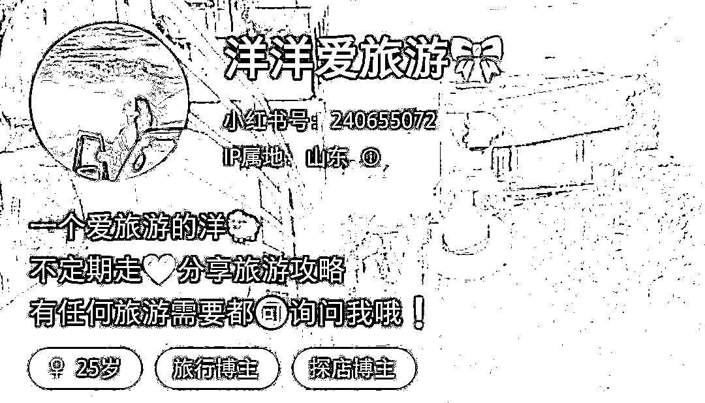

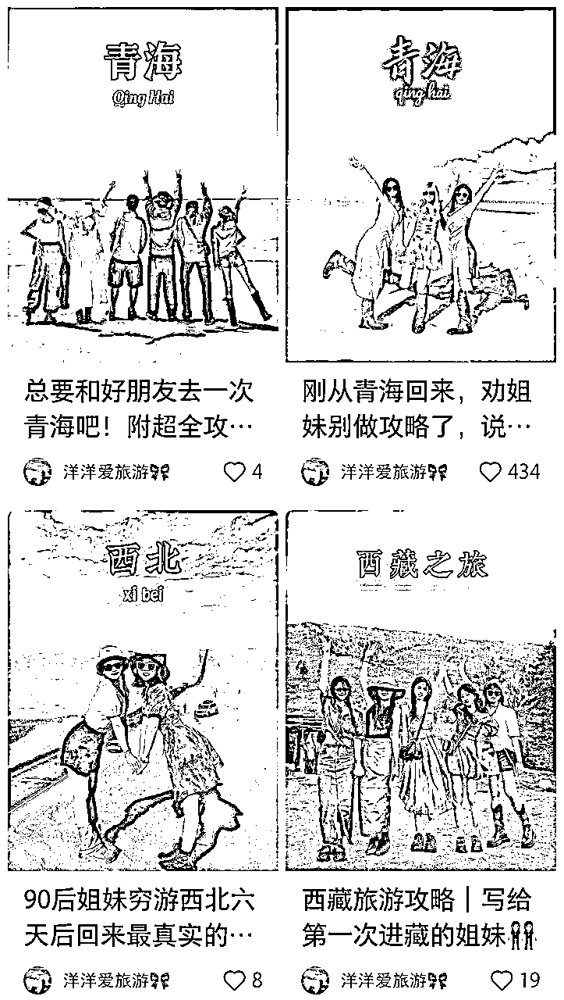

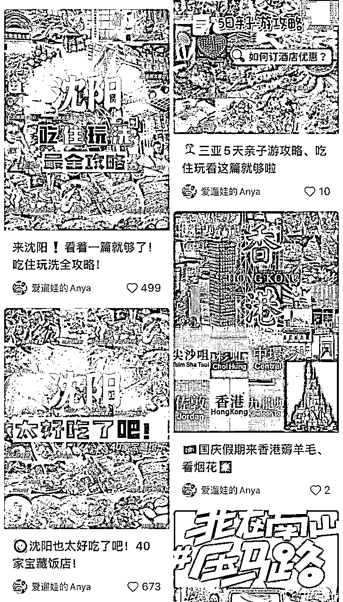

### 3.2 发布第一篇小红书引流笔记

### 小节概要

本章将带领大家完成第一篇小红书笔记的发布，也是本项目的一个重要里程碑，以下是本章节的关键任务：

熟悉所选路线产品的相关信息

学会素材库的搭建，且后续做到持续更新

掌握小红书旅游笔记的制作与发布完整流程

如果想要达到 10 分钟产出一篇笔记的功力，前期的练习必不可少，万事熟能生巧，爆款水到渠成。

#### 3.2.1 选择要引流的路线产品

前面我们已经选好要做的旅游目的地啦，而 1 个目的地对应有多条旅游路线产品。

所以现在我们要在写笔记前，选定具体的路线产品，你可以选 1 条路线产品来写，也可以选多条路线产品写合集。

#### 3.2.2 熟悉所选路线产品相关信息

写笔记前，咱们需要通过旅行社提供的路线资料进行学习；更多路线资料，也可以通过携程，途牛，百度等渠道去搜集。

以下是我们需要了解的散拼团信息：

1.该线路产品会游玩哪些景点？

2.这些景点有什么特色？

3.散拼团什么时间发团？

4.几点集合出发？

5.该团上限多少人？

6.价格多少？成人和儿童有什么区别？

7.有没有自由安排时间？

8.有没有导游讲解？

9.会不会接送？

#### 3.2.3 建立图片/景点介绍文案素材库

做旅游赛道，搭建自己的素材库是非常重要的，写一篇笔记最基本的内容就是景点介绍文案+景点图片。比如说你做西安散拼团，那你写笔记肯定得涉及到散拼团的景点，不同的景点有什么玩法，再加上相关的配图。

所以，在前期了解景点相关信息的时候，就可以同步把这些信息整理到文件库，方便后续写笔记的时候直接查阅，复制粘贴，而不是每次写笔记都得去百度景点介绍，某某景点有哪些玩法等，这样会非常浪费时间。

比如你做的西安散拼团，产品有华山一日游、兵马俑一日游，那你得分别建立一个华山一日游和兵马俑一日游的文档，将华山以及兵马俑景点的相关信息整合在里面。比如华山的文案介绍，华山有哪些玩法，西上北下和北上西下的区别等，这些都需要我们前期进行搜集整理到相应的素材库中，方便后续写笔记时直接套用。

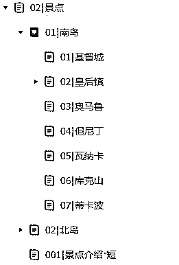

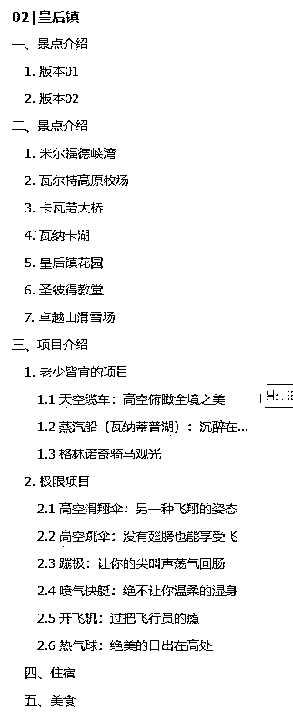

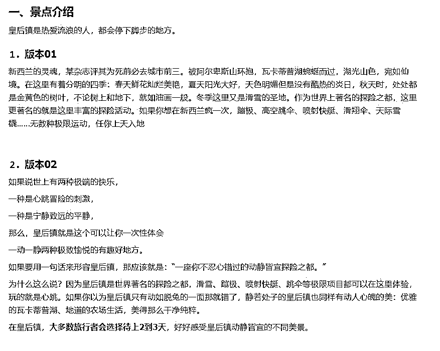

除了整理景点信息，把图片整理归类也是很重要的。一个目的地是有非常多景点的，每次发笔记，你都得给相关景点配图，临时去找的话也需要花很多时间，最好的方法就是一次性或者每次找到一张好看的相关景点图片就直接放到该景点的图片文件夹中，下次要用的时候直接上传就可以。

图片可以归类为两部分，一部分是以景点分类，另一部分就是每个景点会涉及到的餐饮美食、景点景色、酒店住宿、体验活动/游玩项目、用车情况等图片。

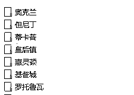

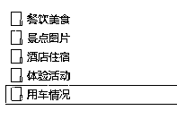

#### 3.2.4 笔记的创作与发布基本流程

怎么才能写出小红书优质笔记？你需要知道用户喜欢什么。而现成的爆款笔记就是用户的最爱，找对标找爆款笔记进行分析，是我们想在小红书快速起号必备的技能。

第一步：找到爆款对标笔记

1）怎么找对标笔记？

如我们做“华山一日游”，就在小红书搜索框里搜索相关关键词，通过主页出现的笔记去筛选适合自己的对标笔记。

我们点开互动数据较好的爆文笔记，笔记的文本框最下面都会带有话题标签，我们可以点开属于我们赛道的话题，顺着话题标签找到其他的爆款笔记。

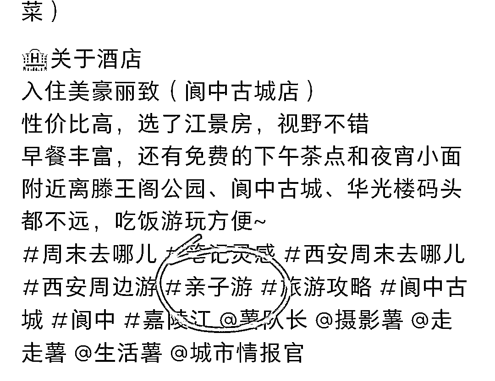

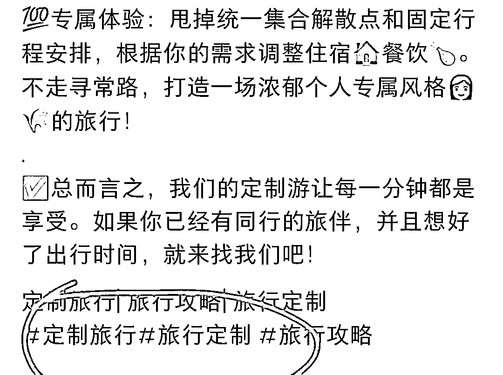

当我们不停地去刷一些和我们调性相符的笔记之后，系统会根据你的阅读偏好在在发现页给你推荐相似的内容，我们在根据笔记内容去筛选和我们调性相符的对标笔记。

通过灰豚数据、千瓜等数据平台去搜索低粉爆文笔记，模仿这类笔记，再次爆的概率会大很多。

（这个功能需要开通会员，可以去淘宝闲鱼买个账号，没有问题也不大）

2）什么样的笔记可以作为对标？

一般来说，互动数据大于 100 是小爆，大于 1000 是大爆，我们找对标笔试时，尽量找大爆的笔记作为对标。

有些笔记它的赞藏数据挺不起眼的，但是评论区全是精准询单，与赞藏的比例接近 1:1，甚至是赞藏的好几倍，这类笔记也可以作为我们的重点借鉴对象。

看一下笔记发布时间，笔记发布时间 3 个月内为最佳。不过如果是季节性的产品，比如冬天滑雪泡温泉，夏天避暑胜地等，就可以借鉴往年的爆款笔记。

如果是腰部甚至是头部百万粉丝博主的爆款笔记，那参考意义也不大。因为它笔记的数据大多都是粉丝做出来的，这个你借鉴不了。

【附】爆款笔记通用模板拆解

通过分析爆款笔记，我找到了旅游赛道爆款笔记的通用模板，照着发，你也能很快做出爆款笔记。

小红书上旅游笔记大概分为 3 类：产品笔记、攻略笔记、人设笔记。

这三种笔记各有特点：

产品笔记着重介绍你的产品或服务，比如某个地方的特色景点、酒店或旅行套餐。通过卖点介绍引导用户在你这里咨询购买。

攻略笔记就是给用户提供旅行攻略，怎么规划行程，去哪玩、怎么玩、哪些地方好玩、住哪里、吃什么等。这类笔记比较容易起流量，但转化低，需要与产品笔记打配合，才能提高转化率。

人设笔记就是介绍你的是谁，你是做什么的，你能提供什么，你和别人有什么不一样。通主要用来增强信任感，通常有一篇置顶就可以了。

这三种笔记中，大家要以【产品笔记】为主，时刻记得我们的目的是销售产品。

那么告诉用户你的产品是什么非常重要，这样就可以从笔记层面筛掉一些不是你产品的目标用户来咨询，减少你和旅行社的工作量，对合作旅行社来说，也提高他们的业务效率，合作也会更加愉快。

另外，我们在找对标笔记的过程中，一定要看对标笔记的产品和你是否一样，如果你做的是高客单产品，但是你的笔记借鉴的是低客单跟团游，那过来咨询的用户也大多是低客单跟团游的 ，就不是你的目标用户。

模板一：产品笔记

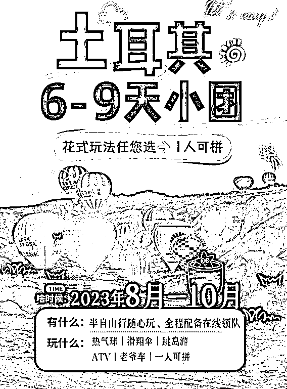

这类笔记的核心手法其实也是展示产品路线的特点，有哪些服务等”，首先产品笔记的目的是提高转化，直接描述产品，一般会以单条路线或者合集路线去展示， 点赞收藏的数量可能不高，但是他的评论数量是比较高的，内容以咨询路线信息为主，来的顾客相对比较精准。

这里以一篇典型笔记进行分析拆解：

1）笔记信息

链接：http://xhslink.com/6fYuSw

数据：赞：44 藏：43 评：233

2）标题分析

7~10 月土耳其夏日限定小团 1 人可拼

文案套路：日期+产品特点

“7-10 月“说明了游玩的季节，“限定小团” 说了团人数很少，整体的质量服务会更好，”1 人可拼“表明一个人也可以参加，报名没有人数限制

3）图片分析

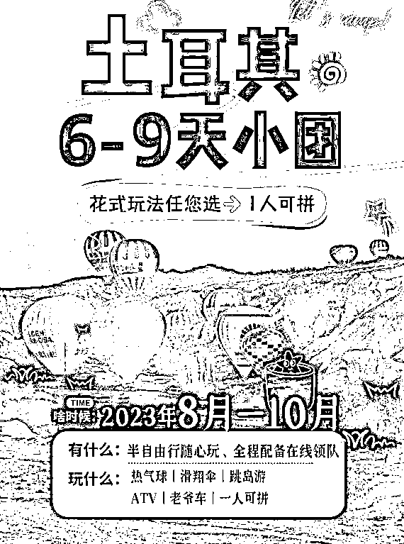

首图：以当地有特色热气球为背景，把相关的行程景点清晰的表达，游玩天数，小团形式，游玩月份，有哪些体验活动，以及提供什么服务保障等，让顾客一目了然的知道各方面的信息。 笔记的缺点在于没有其他照片的展示，只有一张图，可以布局几张别的景点的照片。

4）文本分析

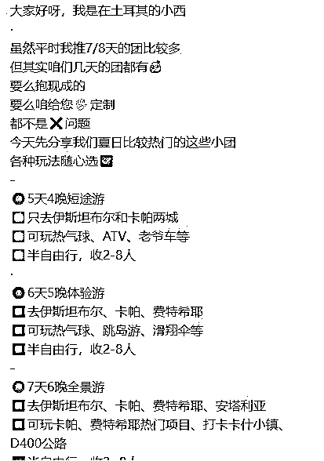

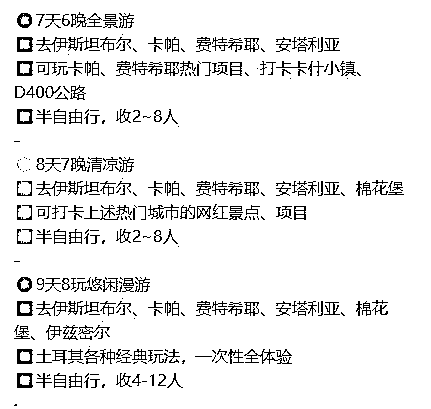

这是一篇产品笔记，内容是以多路线合集的方式展示的，开头比较简单的说明我们有很多路线和团期，也说明可以单独的定制，以及不同的主题玩法，展示了业务范围比较全面

接下来的内容都是把不同的游玩路线进行展示，合集的方式表达产品多样化，可选择的比较多。

缺点在于：结尾没有介绍一下关于他们的特色，比如多少年经验，服务过多少人，能提供哪些服务等介绍，进一步增加服务的信任度和专业，提高咨询转化。

5）评论区分析

这篇笔记博主本人置顶了一条评论，从产品的特点，以及能提供哪些服务来介绍，引导顾客评论和咨询。顾客的咨询数量以及评论数量就会多起来。

模板二：攻略笔记

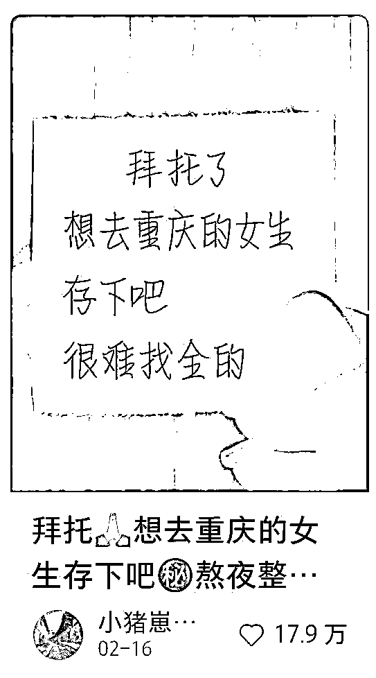

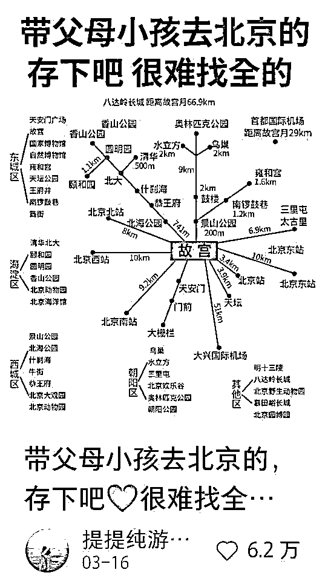

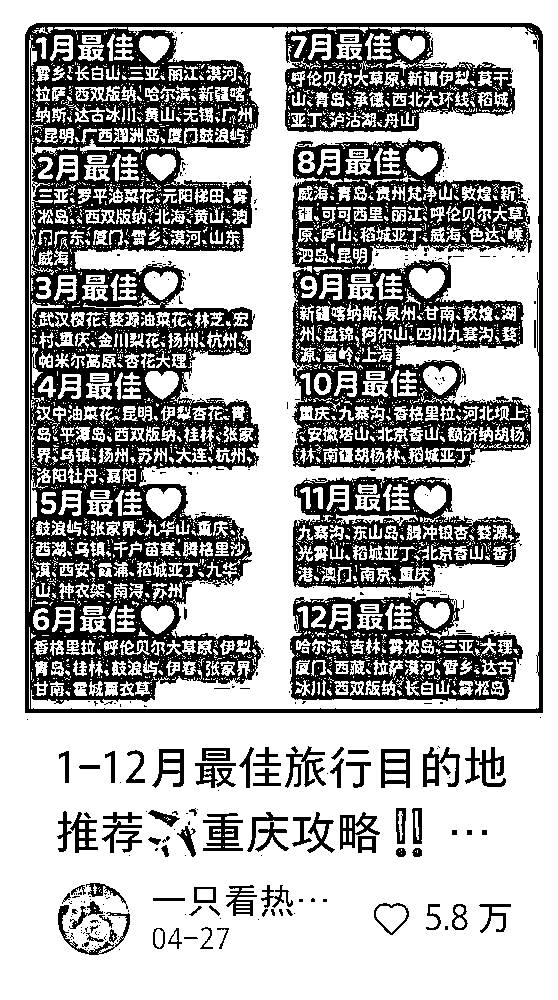

这类笔记的重点就是突出“多”“全”，在首图或者标题中通过内容展示或者文字来告诉用户“我的干货很多”，就这一点已经足够让大多数用户驻足了。

这里以一篇典型笔记进行分析拆解：

1）笔记信息

2）标题分析

谁懂啊！终于有人把土耳其旅游说清楚了

文案套路：情绪+好奇

“谁懂啊”把情绪拉满，“终于……说清楚” 增加大家的好奇心，吸引大家点进去

3）图片分析

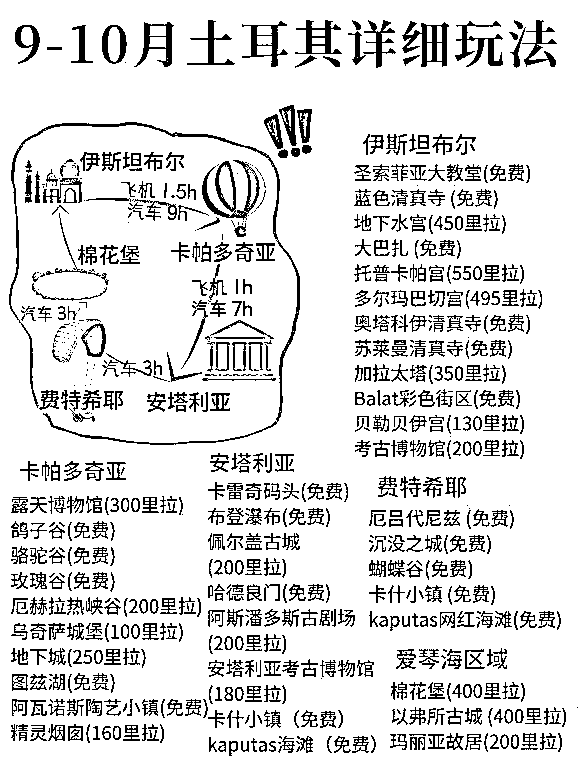

首图：以景点是否免费，行程图介绍为内容框架,让人一眼看到重点,如何游玩景点，觉得笔记内容很全全面,引导收藏。

其他图:后续图片围绕每个景点、天气情况、游玩注意事项以及必备物品等进行详细阐述,让人感觉内容很扎实,非常值得点赞+收藏。此类图文非常好批量制作和模仿,文字内容可结合自己亲身经历等来进行优化

4）文案分析

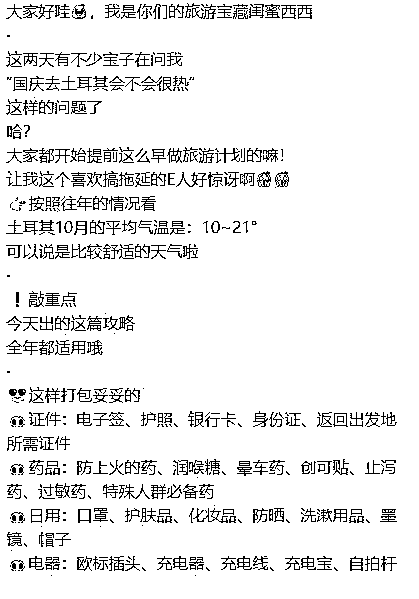

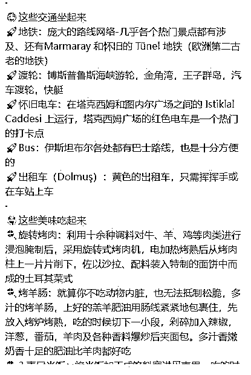

这类的文本内容以素人身份去介绍旅游的情况，从天气，交通，美食，行李清单等等去分享内容。

中间详细的展开介绍出行以后，当地的衣食住行情况，需要携带哪些物品，交通怎么行走，有哪些美食等内容，解决了大家的疑问。

5）评论区分析

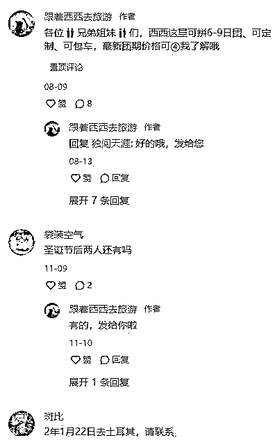

这篇笔记博主本人置顶了一条评论，从产品的特点，以及能提供哪些服务来介绍，引导顾客评论和咨询。顾客的咨询数量以及评论数量就会多起来。

模板三：人设笔记

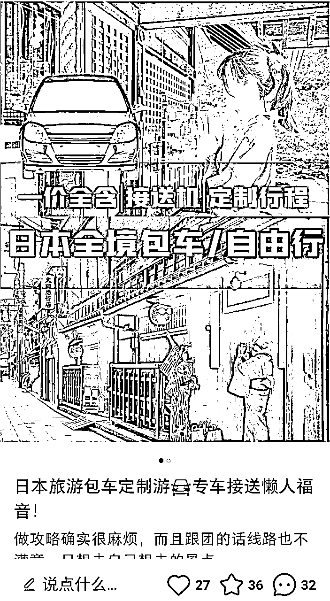

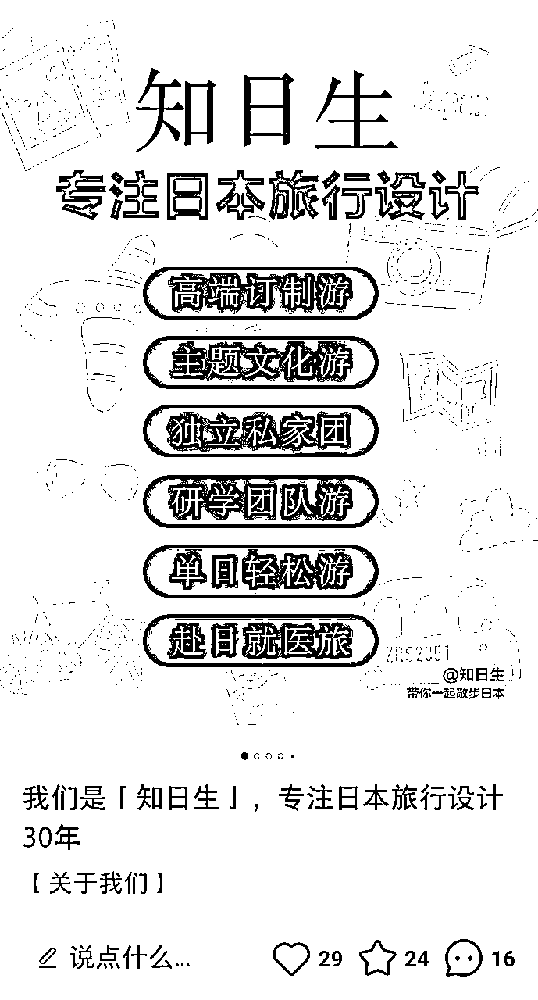

人设笔记的数据一般都不高，笔记的内容主要是提供”你是谁”“你是做什么的”“你能提供什么产品”“你有多专业”等信息，让用户通过这篇笔记对你产生信任。这类笔记用得好，可以极大的提高你的产品笔记的转化率。

这里以一篇典型笔记进行分析拆解：

1）笔记信息

2）标题分析

我们是「知日生」,专注日本旅行设计 30 年

文案套路：自我介绍+从业年限

“知日生”告诉大家我们是谁，“专注”体现了专业型和业务能力，“30 年”说明了从业的时间，反馈了行业的专业，水平专业，能力，经验等各方面都是有丰富的经历的，增加信任度

3）图片分析

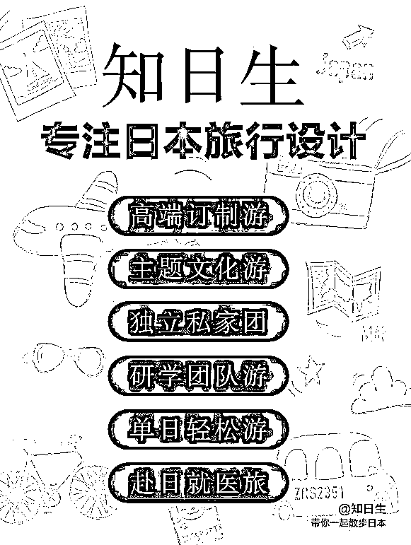

首图：介绍业务范围，主要做哪些服务的，特色主题是哪些，排版和文案内容简单明了，让顾客能快速的了解到你是做什么的，能提供哪些服务。

其他图:后续图片围绕当地的景点，饮食图片来展示，以纯风景图，美食图的方式展示旅游地的景色和饮食习惯，简单明了的表达，让顾客直接欣赏和感觉各个景点的情况。

4）文本分析

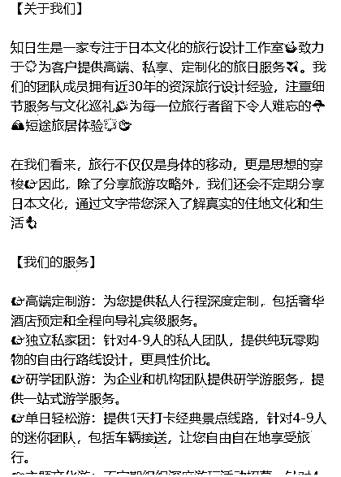

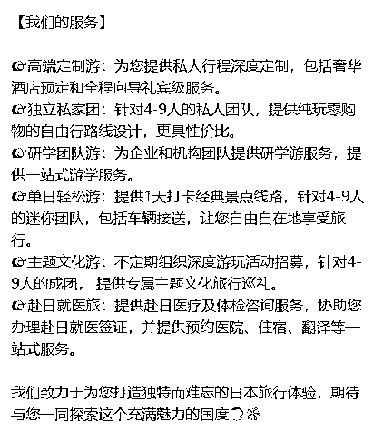

这篇笔记是人设类型的笔记，主要围绕我是谁，我有哪些特色，能给大家带来什么服务等几个方面进行展示

首先开头清晰的表达了我是谁？是一家专注日本旅行设计的工作室，拥有了 30 年的经验，增加顾客的信任度，以及自身的专业性，打消顾客的一部分疑惑和问题点。同时也展示了会深入的带大家了解当地文化和游玩景点，并不是走马观花。

接下来的内容，主要围绕服务来展示，我有什么特色路线，我的优势是什么，能给大家带来哪些体验服务以及我们的差异是什么。整篇笔记的内容可以让顾客快速的了解路线有哪些，服务有哪些，他们有什么经历。很不错的一篇人设笔记模板

5）评论区分析

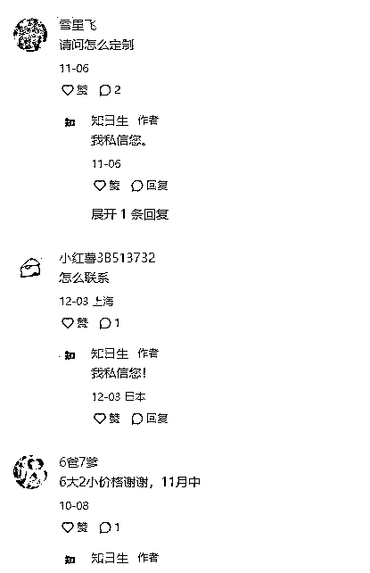

这类人设笔记可在评论区用小号或博主本人评论一下，咨询他们可以获取什么方案等话术，引导大家进行评论咨询，提高数据，虽然是人设笔记，但是顾客了解以后，无论是信任度还是精准度都是很高的，引导一下，对转化很有帮助。

第二步：准备相关素材

这一步，主要是根据对标笔记，准备图片和文本素材：

1）图片素材

图片可以在你自己搭建的素材库里找，也可以去百度，或者是去携程搜索，小红书搜索都是可以的，但这里要注意，除了旅行社对接给你的图片，其他的图片尽量不要用有真人出镜的。

需要注意：如果你实在想找真人出镜的图片，尽量不在国内的平台上找，容易被本人刷到被举报。你可以私信或者去博主的笔记下方留言，问他要授权，说可以备注图片来源，这样博主同意的概率还是蛮大的，也相当于他们多了一个曝光的机会。

2）文本素材

文本素材的来源大致分为两类：

①旅行社提供：旅行社会提供相关的产品资料，可以将资料内容整理到自己的素材库中。

②网上搜索：百度、携程、途牛、小红书、知乎等途径都可以搜到相关信息，也可以用 chatgpt 辅助。

第三步：制作图片

1.制作封面

如何对标爆款进行像素级拆解，制作封面？

像素级模仿，精准绘对标：

整个图片拆解为四部分：

1.四宫格真实景点拍摄+真人出镜

2.图片正中间主标题“XX6 日轻奢游”+副标题行程中涉及到的主要景点

3.主标题正下方“人均 1000+”的小标题，突出低价

4.主标题左上方内容：行程能提供的服务亮点

拆解完图片之后，我们就可以根据拆解的模板来选择对应的素材，相应的步骤是：

1.通过我们上面第二步搭建的素材库，从中找出 4 张偏真实性的目的地景点照片，其中一张有真人出镜（可以是背影，也可以正面，这里要注意是否侵权），通过稿定设计或 WPS 拼接成 4 宫格；

2.在首图正中间找一个笔刷图形素材作为底色，然后在底色上设计主标题+副标题的排版，内容为：

主标题：XX（目的地，可以是单个景点，如华山）几日（散拼团 1 日游居多）轻奢游；

副标题：目的地的下级小景点或玩法（如华山：索道、滑道、西上北下、东峰日出、山顶帐篷）。

3.主标题正下方：“人均 XXX（散拼团价格 300 左右居多）”。

4.主标题正上方：一日游能日工的服务（如：全程接送、吃喝门票一价全含）

从最初封面到最终爆款封面的优化，总结为三点：

快速判断封面是否合适的方法：

发图片到微信聊天框，只给自己 1-2s 的观看停留时间，确认是否可以快速 GET 到封面的主体和标题关键词。

如果可以，就说明封面内容是合适的；

如果不能，还需要停留才能观察到，那就说明这个封面并不合适，排版，花字，需要优化改进。

注意：避免自嗨，少走弯路。

1.制作其他图片（图片去重）

小红书图文笔记现在一共可以发布 18 张图片，除去首图，还有 17 张。

建议大家每条笔记多上传几张图片，让用户可以更全面的了解目的地相关的信息，包括攻略、景色美图、游玩项目美图、酒店、美食、车等，内容越丰富越全面越好。

那么，在制图图片的过程中，就会涉及图片从哪来，怎么制作，怎么去重的问题。

其中，图片的来源、制作，前面 3.2.4 第二步 以及本章节前面都有讲过。这里重点讲下图片去重：

第一个方法：添加滤镜，或改变尺寸。

（添加滤镜示例）

（改变尺寸示例）

第二个方法：把两张图拼接成一张图。

以下以新西兰但尼丁为例，比如我找了 4 张但尼丁的图，这 4 张图分别列为 1.2.3.4，那在作图时，可以 1.2 拼接成 1 张，1.3 拼接、1.4 拼接、2.3 拼接、2.4 拼接、3.4 拼接。这样的话，4 张图就可以组成 6 张不一样的图片。然后再在图片上标上文字，不同的笔记，文字的颜色、大小等也可以不一样，这些都可以达到很好的去重效果。

第四步：写文案

旅游赛道的内容框架简直不要太简单，主要由以下几个部分组成：

①用户痛点；②自我介绍；③景点介绍；④行程线路；⑤行程亮点；⑥产品细节；⑦亮点细节

基本上，所有的旅游笔记都逃不掉上面几个部分，我们可以根据自己的偏好来设计开头。

建议大家用以下 3 种开头：

第 1 种：痛点开头

什么是痛点切入？在开头点出去目的地景点可能会遇到的一些问题，比如人太多？太累？然后接入你这篇笔记想表达的主题。

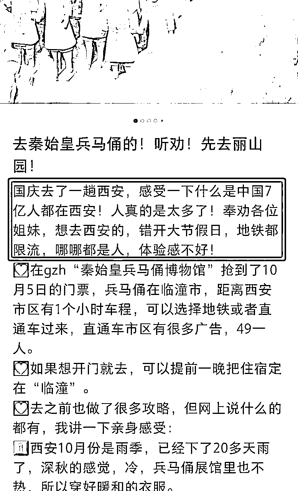

然后就可以接景点介绍+行程线路+行程亮点+产品细节+亮点细节，最后接自我介绍。

第 2 种：自我介绍开头

在笔记的一开头就跟用户打招呼，表明身份，让用户对你产生初步信任，然后引导下文。

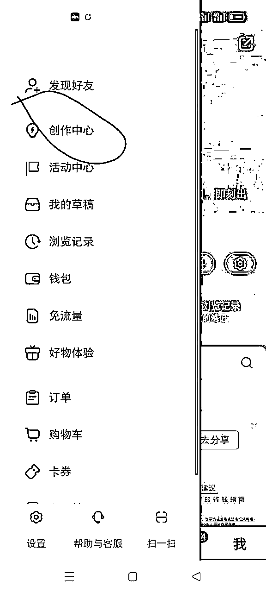

第 3 种：景点介绍开头

这类开头，是我目前在小红书刷到用的最多的开头，简单直接介绍你这篇笔记的目的地是哪里。

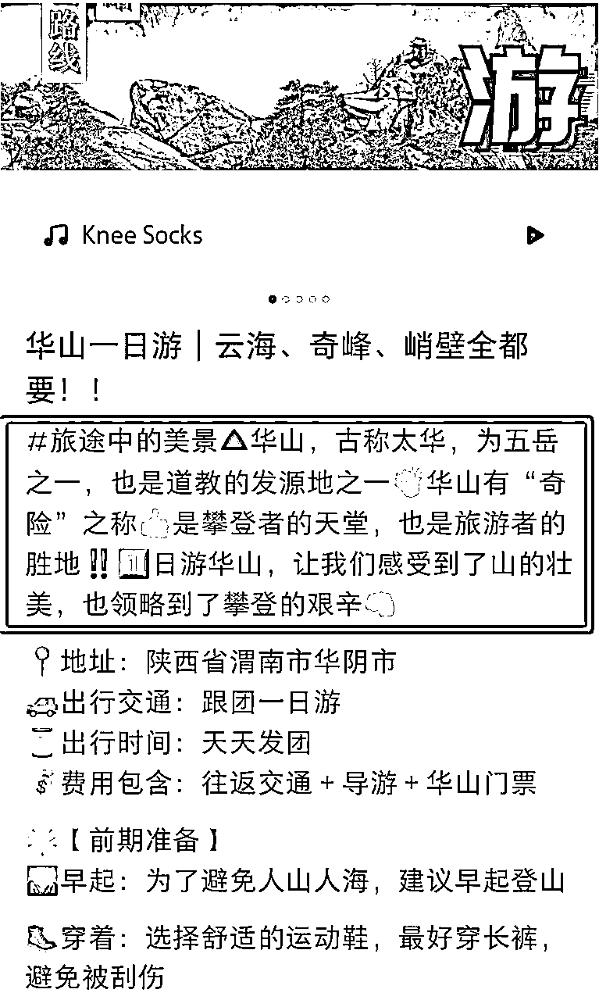

景点切入完之后，就还是接着行程线路、行程亮点、产品细节、亮点细节，最后再接自我介绍。

要注意的是：

景点介绍开头，不要直接像企业号一样，生搬景点介绍，容易像产品推销；可以改得稍微生动一些，避免被判营销违规。

大家发现没？

中间的部分基本上是没有换的，也就是说，大家只要生产好了这些模板，后期对景点及行程产品这一块熟悉之后，一篇笔记，你直接把内容往上面套就可以了，熟练之后，10 分钟就可以产出一篇高质量的赚钱笔记来。

旅游赛道的笔记，最花时间的就是找图和了解景点产品信息，只要这 3 部分你的素材足够了，做一篇笔记根本不怎么花时间；但是前期，这部分的时间投入是必须的，你需要花大量的时间来打造自己的素材库，打造好之后，就非常舒服了。

第五步：写标题

小红书账号标题是 20 个字，最好的方法是结合大关键词（eg.西安）+小关键词（eg.华山），或者罗列出所在领域中不同关键词的爆款标题记录提取，然后组合成新的标题。

旅游赛道的关键词主要有以下几个方面：

①地域：国内、国外；

②月份：1 月、2 月或者 12-1 月；

③节假日：寒假、暑假、国庆、五一、春节、元旦等；

④季节：春、夏、秋、冬；

⑤景点：大关键词（桂林、宁波、厦门、深圳、西安、云南、长沙）、小关键词（各目的地下的小景点，比如西安的华山、兵马俑）；

⑥天数：5 天 4 晚、2 天 1 晚等；

⑦主题：徒步、星空、露营、滑雪、蹦极等；

⑧酒店：星星酒店、野奢酒店（适合有一定知名度的酒店）；

⑨其他：各目的地的独有特色，比如西安的长恨歌表演；

这时候我们就可以去小红书搜关键词，你可以搜西安目的地的相关景点关键词，比如“兵马俑”，也可以搜其他任意一个景点关键词，比如大关键词”西安“，小关键词”华山“”长恨歌“等，根据关键词搜出来的笔记，来记录爆款标题：

这一步很重要，由于小红书的流量主要靠搜索，而搜索结果里要想出现我们的笔记，就需要内容和搜索词关联，标题对搜索词的权重占比很大。

此外，你也可以将「推荐、知识、分享、如何、搭配、新手、怎么做、必备、教程、技巧、步骤」等关键词灵活组合使用。

又或者数字型标题：善于用数字，如「 2 个方法、10 大、4 个要点」，比如：来新疆旅游必打卡的 3 个地方，取标题的讨论和公众号、知乎方法差不多。

结合以上方法，以旅游攻略类笔记为例，标题可以取成：

这里再给出一些负面的案例看一下，都是内容很好，标题没有打开理由，也就是内容的好用户看不到：

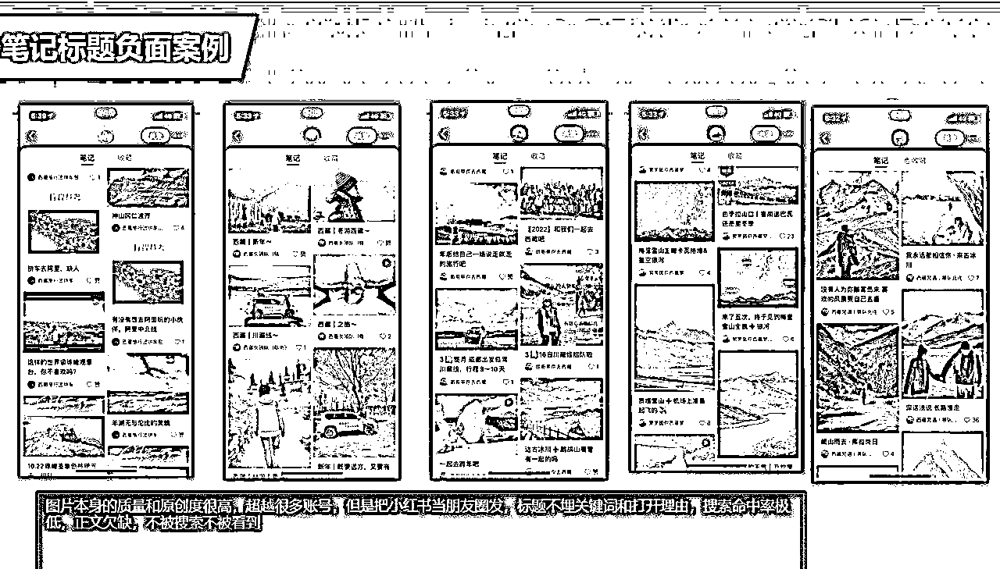

第六步：完成发布

以上步骤全部完成之后，我们可以根据目标人群的活跃时间来选择发布的时间点，或者观察同赛道爆款笔记的笔记发布时间，来判断目标人群的活跃时间，进行点击发布。

#### 3.2.5 散拼团旅游产品的笔记制作要点

3.2.5.1 突出低价

不管什么产品，“低价”都是绝对的流量密码。散拼团因为客单较低，所以完全可以把价格写到笔记里面，直接告知价格有助于提高转化率。

3.2.5.2 跟攻略笔记结合

攻略笔记也就是干货笔记，笔记的目的是为了起号、提升账号权重、吸引流量，攻略笔记在起号初期可以多发一点，因为这类笔记非常好起数据，比如，旅游攻略、避坑、景点介绍等。

3.2.5.3 埋转化钩子

1.在攻略笔记里插入行程安排建议，就是那种行程速览，每天从哪到哪；

2.在结尾做个自我介绍，我是 XXX，在什么情况下你能找我，我能给你提供什么，也就是一个简易的自我介绍，切记不要太直白，咱们写隐晦一点；

3.在评论区做小剧场，用小号或者让朋友在评论区去模仿正常用户留言，或者在笔记中写上“留下时间+人数”等引导信息，然后将评论置顶；

4.写产品笔记，当用户通过攻略笔记点进你的主页，然后查看你的产品笔记时，也是可以完成转化的。

### 3.3 如何合规地引流客户到微信？

### 小节概要

这里特别注意了“合规”这个词，因为小红书平台政策对引流并不友好，这其实是每个平台创作者的痛点，如果不了解规则，就很容易被判违规、甚至被封号。

但是别太担心，虽然平台不支持引流，但还是会留一些口子给创作者，用来留住创作者们，这是平台和创作者之间的一点点默契，所以只要知道口子在哪里，抓住它，我们依然可以通过个人号来获取目标客户。

那就让我们一起来看看，相对安全的引流方法，到底怎么操作？

#### 3.3.1 引流钩子怎么埋？

引流钩子可以用粉丝感兴趣的文档，通过内容来筛选客户，比如：

引导粉丝到小红书群聊，然后在群里做引流微信。

#### 3.3.2 引流方式有哪些？

小红书对交易引流，限制很严格。我们隔一段时间，就要换一个加微信的方法。

此外，既然要加微信，就要做好被封号的准备。同时做多个号，被封了一个，还有别的号。一机一卡一号，手机流量上网，千万不要同一个 WiFi，否则有可能一起被封。

目前测试下来，有几个效果还不错的引流方式，分享给大家：

注意：小红书对引流的风控动作变化很快，下面提供的几个引流方法，随时可能失效，大家多关注航海群，多与同行交流。

3.3.2.1 引流方式一：收藏夹

用小号发一篇带有微信号的笔记，再用大号去收藏这篇笔记，并公开收藏列表。

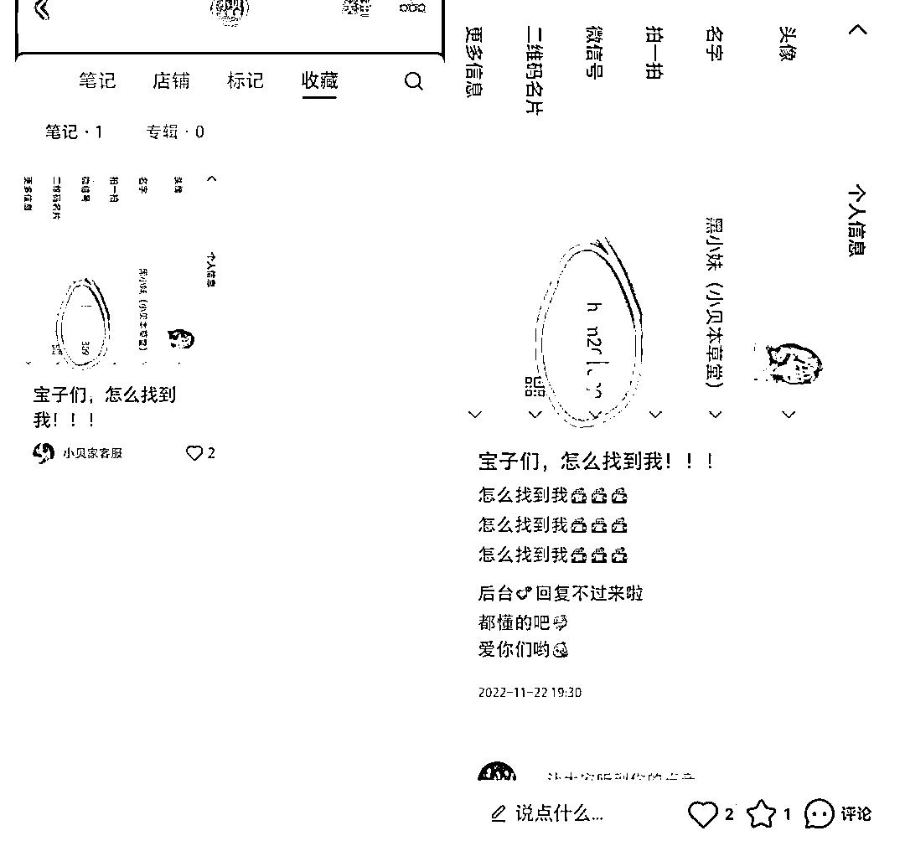

当有客户咨询时，话术引导去看收藏。

3.3.2.2 引流方式二：群聊+小助手

顾客私信咨询以后，简单聊一下就邀请顾客进群

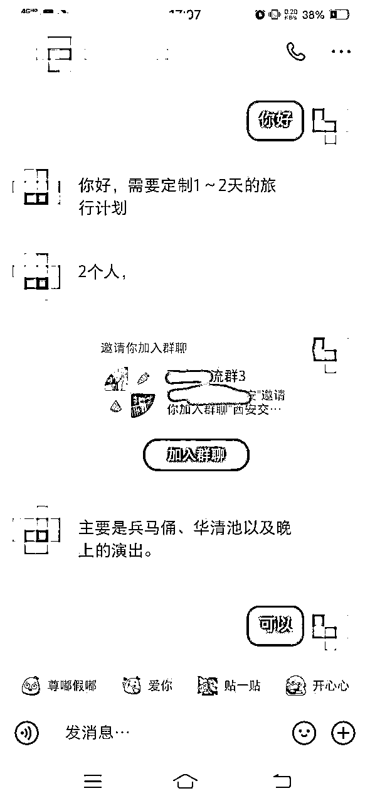

进群以后，就用小号在群里面和顾客聊天，通过图片的方式发送我们的微信，或者找顾客索要他的微信。

这里的微信要用同义词，不然会把屏蔽。同时要用图片去发微信，直接发微信也会被屏蔽不显示，或者把你的微信号分段发。

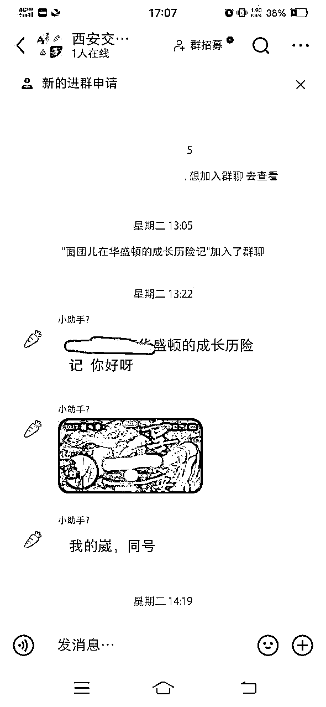

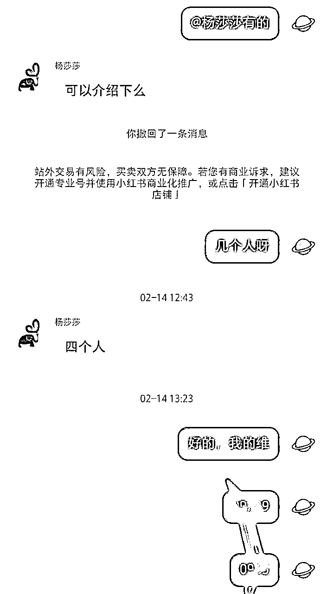

这里需要注意：和顾客咨询以后，给顾客发了邀请进群的链接，一定要及时的点同意进群，并在群里面用小号发送微信。要做到及时回复，不然加微信的通过率会非常的低，可能只有 30-40%左右。如果及时回复的话，微信通过率能做到 70-80%。

3.3.2.3 引流方式三：pk 组件

这种方式是把微信号藏在 PK 组件里，具体操作步骤如下：

打开小红书 -> 点击中间底部加号 -> 去添加图文笔记 -> 在笔记编辑页面找到并点击投票 -> 互动组件 -> 点击 PK 组件 -> 填写 PK 标题以及观点 -> 发布，即可查看到 PK 信息里藏的微信号。

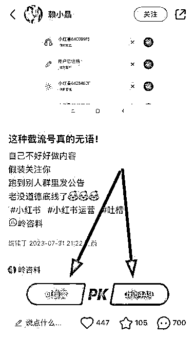

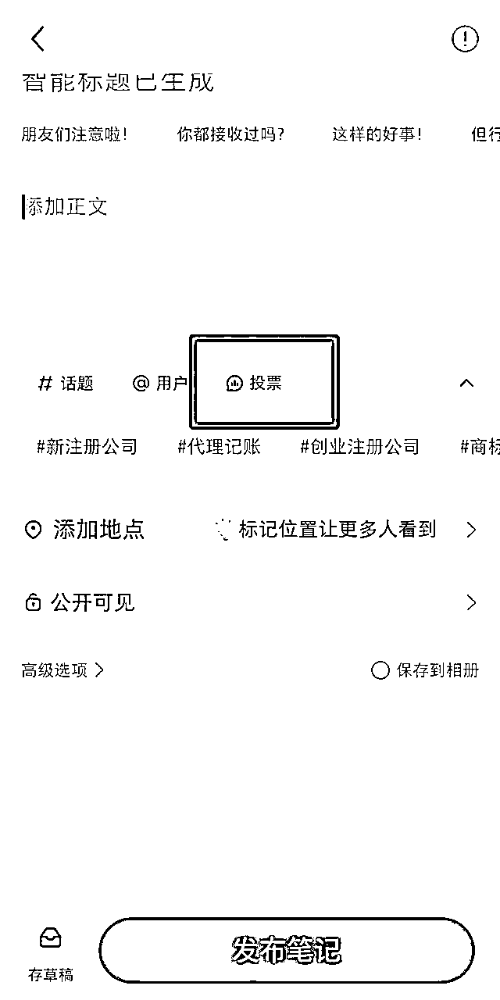

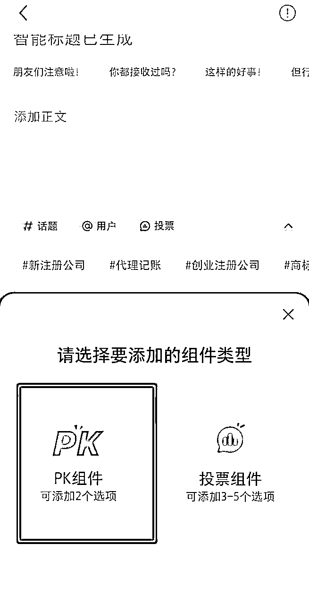

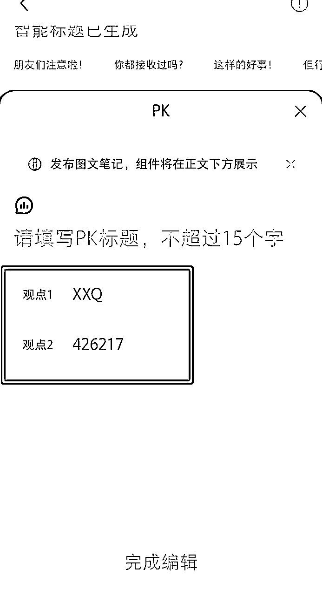

这里需要注意：

由于平台政策变动较快，手册内容更新可能不及时，引流上的问题大家可以多关注群内的讨论。

3.3.2.4 引流方式四：小红书 ID

将小红书号设置成微信号，然后私聊时引导用户看小红书 ID，比如：免费定制行程看小红书号或者看小红书号给你发具体的行程和报价，懂得用户都懂，就看她加不加你了。

不过，小红书的 ID 账号只能更改一次，可以改成自己的微信号，最好设置成英文+数字，或者纯英文，这样用户看了才容易反应过来这是你的微信号，纯数字的话用户分辨不出来，最好字数控制在 8 位数以内。

3.3.2.5 引流方式五：瞬间

瞬间是一个挺好的引流方式，可以根据自己的喜好和实际情况将微信融合进去。

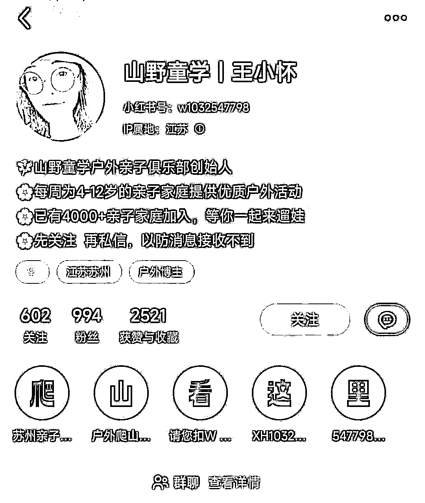

3.3.2.6 引流方式六：评论区+小号

评论区艾特小号并置顶，小号发一篇有微信的笔记。

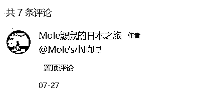

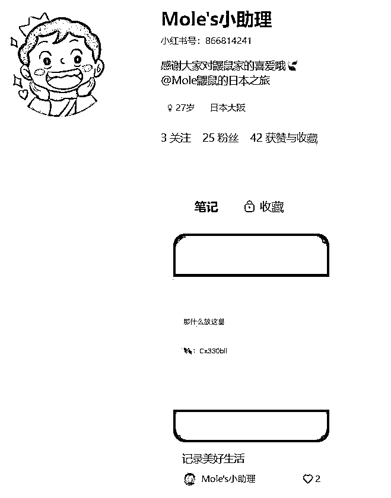

3.3.2.7 引流方式七：私聊 1v1

这个方法适合前期咨询不多的时候用，当用户私信咨询你时，直接问“你蔚多少，给你发具体的行程和报价”。

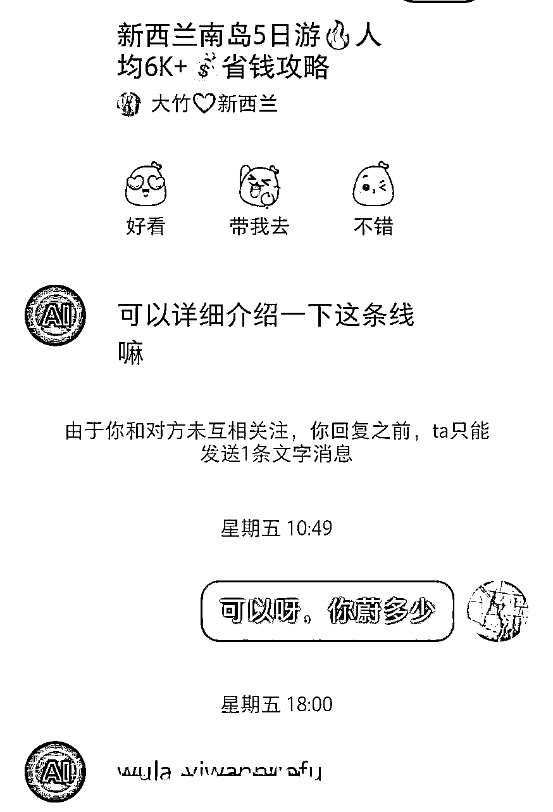

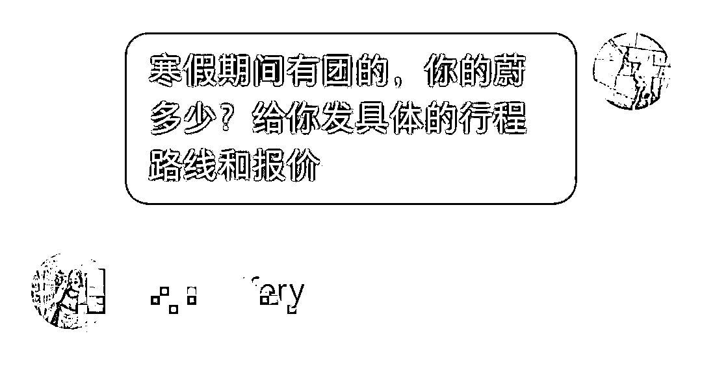

也可以发微信登录界面，以图像暗示用户加微。最好让用户分段发，否则有消息被吞的可能：

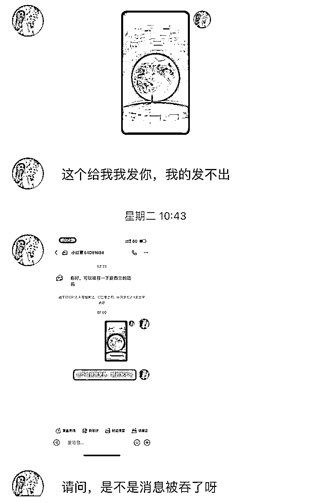

#### 3.3.3 一些引流避坑经验

1.选题内容太泛，导致引流客户不精准

由于本次航海我们做的是散拼团路线，那笔记的整个选题和文案介绍都要围绕这个内容来写，咨询的用户才会精准；

如果说你的笔记没有围绕散拼团主题进行编写，那来的用户就不精准，很难成交。不仅耗费了精力和时间，冒着风险引流一堆低质量客户，成单率还非常低。

2.文案内容生硬营销，导致限流

个人账号切记要以素人的体验去介绍，文字表达尽量口语化一些，不要太过生硬，同时要注意规避高危词，如果内容太过营销，被系统审核到之后容易被限流，甚至是提示违规，所以一定要非常注意。

个人号在文末尽量不要写“关注”“留言”等字眼，被检测到的概率很大。

3.引流时过度冒险，导致账号违规

在小红书私信引流客户时，不要为了一个顾客，冒险去发微信，一定要保护好账号。去引导顾客进群或者关注小红书 ID 等方式去引流，实在引导不了，那就放弃这个顾客。

注意：在小红书 1V1 私聊引流的话，一天不能引流超过 10 个，不然就会被检测到，可能导致违规或封号！！！

4.没有及时回复，导致客户流失

无论是小红书的回复，还是加好友，以及引导的微信以后，都要尽量做到及时回复。可以极大的提高好友通过率，订单成单率。

## 四、【实操 3/3】微信成交 @渡 @易寒

### 章节概要

由于本期推荐大家做的旅游产品客单价普遍较高，成交难度大，我们一般都是对接给旅行社工作人员去做成交，从中拿分佣，所以全完不用担心自己没有销售经验。我们要做的任务主要是：

通过沟通，获取客户基本信息和诉求

判断客户意向，再拉群对接给旅行社

其他的就交给旅行社的专业人员了。话不多说，我们来看看，客户引流到微信，具体什么怎么样的成交流程。

### 本章航线图

完成本章节的学习和实操，即可完成航线图的 第三阶段：微信成交（约 2 小时）

1.微信沟通获取客户信息，对接旅行社做成交（约 2 小时）

那么现在，就请开始完成这个步骤吧。

### 4.1 微信成交步骤与技巧

第一步：询问客人基本信息

客户加微之后，我们需要询问一些基础的信息，进行简单的了解和筛选，比如：客户的抵达日期、天数、人数、是否有老人儿童、希望游玩的景点、预算是多少等信息，意向较好的，即可同步这些信息给到旅行社相关人员，由旅行社对接人员负责后续的成交。

参考话术：

你好，请问是小红书过来想去 XX 旅游吗？

您什么日期出发呢？

几个人？玩几天？

有没有老人或儿童？

有哪些想去的景点？

想咨询跟团还是定制游？

定制游的预算是 XX 元/天，在您的预算范围内吗？

……

好，那我这边拉群，让我 XX 当地的同事/导游详细跟您详细介绍行程。

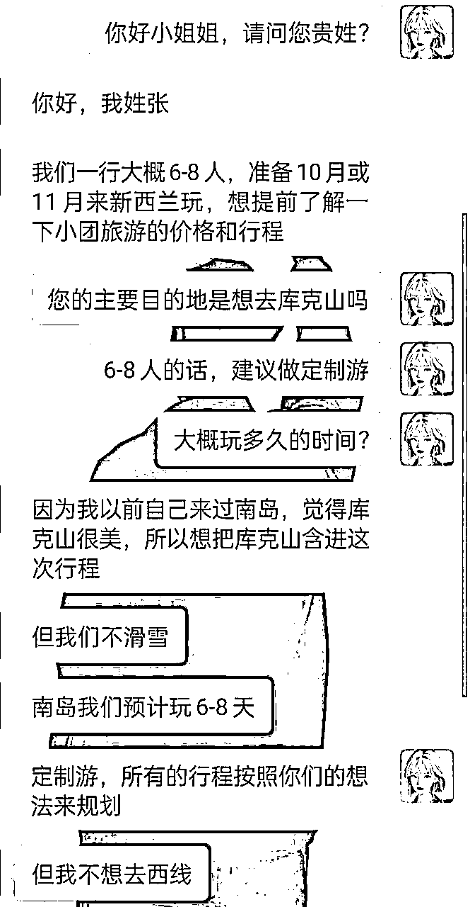

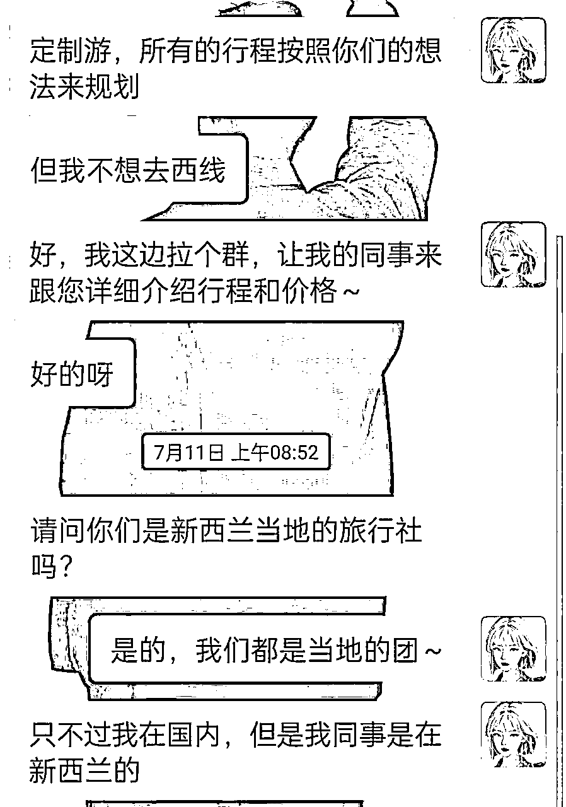

第二步：同步信息给旅行社相关人员

通过上述步骤初步了解客户信息和意向后，在航海大群内找到对应的旅行社负责人员加微，将和客户的聊天记录同步转发，由旅行社工作人员判断其意向，如果意向 OK，则可拉群。

第三步：拉群

将客户和旅行社工作人员拉个小群，艾特工作人员并对客户信息以及工作人员的身份进行简单的介绍，如：@旅行社工作人员 XX 导游您好，这个小姐姐想了解 2.1-2.10 日的跟团游具体行程，主要想去 XX 景点，不想去 XX 景点，麻烦您给介绍一下。

引导完之后，剩下的事情就由旅行社负责。

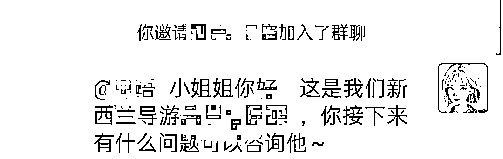

旅行社在群里完成成交后，一般是每个月结算一次佣金；也有单笔结算的，客人出发的当天，人出发账结清。

### 4.2 微信成交避坑经验

微信成交最关键的风险就是：被封号。哪几种情况容易被封号，如何避免被封号？

情况一：添加好友过于频繁

微信加好友，不管被动加还是主动加，旅游的顾客都是这几个入口：微信号、二维码、手机号、QQ 号；

其中主动加顾客手机号最为敏感，数量加多了肯定被限制。

当我们的笔记爆了以后，会有很多的客户想加好友，怎么办呢？

比较直接有效的方法是让顾客来加你，这种方法既安全，通过率也会高一些。我们一般都是给微信号让顾客来加我们，同时也能筛选意向不高的用户。

情况二：网络环境不健康

比如同一 wifi 下接入多个微信号，或者同一 ip 下死了很多号，ip 常年没有流动、换设备、异地登录等等行为；

或者比如总是群发广告、频繁加好友、异地收款、快进快出地转账等等，都会影响账户使用。

这种情况，及时更换网络环境或 ip 就好了。

情况三：新号立马批量加好友

注册的微信新账户，建议养养在使用，日常出去消费付费等生活使用，不然主动和被动加好友多了，也会被限制。

## 五、【复盘优化】持续迭代笔记 增加爆款数量

### 章节概要

在掌握笔记发布基本流程后，我们就要通过不停地迭代笔记质量、提高生产效率，来拿到更多的曝光，从而拿到更多客户。本章节，我们将通过以下 2 个方向进行迭代：

迭代笔记质量，这是做内容必不可少的环节，新手刚发布的几篇笔记可能数据不一定好，别着急，通过不断复盘和优化，相信大家都会迎来自己的爆款笔记；

提高生产效率，是希望通过量变引起质变，比起追求 1 篇大爆款，产出多篇小爆款对我们来说性价比更高，所以生产效率的提升也是笔记迭代的重要动作之一。

那么，怎么优化笔记质量？怎么提高生产效率？让我们一起看看下方的内容吧。

### 本章航线图

完成本章节的学习和实操，即可完成航线图的 第二阶段：发小红书引流笔记（约 5-7 天）中的【复盘优化】任务。

1.复盘优化笔记质量，并提高笔记生产效率（约 2 小时）

那么现在，就请开始完成这个步骤吧。

### 5.1 笔记数据不佳如何优化？

怎么判断自己的笔记数据好不好？

有人问：我的浏览量在 100-300 ，300-500 这样的一个区间，是不是限流了？

很明确地告诉大家：这是正常的。浏览量只要不低于 50 ，在 50-500 的区间，它基本上都是正常的，一般就是内容质量不佳导致的笔记数据不佳。

其次，我们在做数据对比的时候，可以和正常的内容数据进行对比。

比如你发了很多篇笔记，那么你去看自己发的这些笔记里面，哪一些数据比较好，然后去尝试分析一下好的原因在哪里。

再次，你可以和自己同等级的博主进行内容数据上的对比。

所谓的同等级比，比如他的粉丝基数是 500 左右，你也是 500 粉左右，就能进行对比了。你不可能自己只有 500 粉，硬要和 10000 粉的博主进行对比。这样的对比往往是没有参考意义的。

和别人对比的过程当中，你可以看自己的点赞收藏数，然后再看自己的评论区。

为什么别人的笔记里会有比较多的评论，或者说别人的笔记收藏会比较多？你可以看看他们的内容，然后看他引导互动的一些方式，尽可能地去模仿和学习。

如果确认数据不佳，我们可以从以下几个方面去反思和优化：

#### 5.1.1 小眼睛（阅读量）不佳

一般发布后 2-3 小时内阅读量差，或者阅读量长期只有 100-200 甚至低于 100，可对照以下问题检查：

#### 5.1.2 点赞、收藏、评论等互动数据不佳

互动数据不好的，排除违规和玄学问题，十有八九还是因为笔记内容质量不够好。

可对照以下问题检查：

#### 5.1.3 发布后修改笔记的注意事项

经常会有人问：修改已发布的笔记是否会影响曝光量？

从观察的数据来看，修改后，阅读率确实会重新计算。但只要不频繁修改，是不影响这条笔记的。

但修改了笔记可能会重新审核，审核了没问题才会放出来。有时候笔记里有敏感词，改过后重新发，或者优化了标题等，数据会更好。

也有一些情况，本来审核过了，正常给流量了，修改后可能工作人员觉得有问题，反而开始限流，数据就不好。

如果有笔记爆了但是想修改，克制住，别动笔记，可以在置顶评论补充。

### 5.2 笔记违规怎么处理？

小红书限流可以尝试连续申诉 3 天，或许可以解除；

小红书轻度违规，比如小眼睛一直在 50 以内，申诉 3 次同时联系客服尝试解除。

引流类的笔记火了后，很容易被判违规，基本上每个爆贴都被判违规过。不要放弃，一定要申诉。

申诉有两个入口：

两个申诉渠道需要一起申诉，因为可能不是同一批人处理的，标准不一样。

目前我的违规笔记，只有一条没申诉回复，其余都恢复了。

包括评论超过 5000 的笔记也都恢复了。

当然，话术还是需要你自己来总结的，大家方向不同，话术不能照搬。

比如我的违规经常出现的两个点：

我的申请内容，一般是这种：“我是按照咱们官方视频中推荐的让客户留下自己喜欢的产品，并未刻意引导，请官方核实。”（官方的确是有这个视频的，教如何正确引导评论）

我的申请内容，一般是这种：“我所发的图片上文字较多，可能是被机器识别出来误判了，实际上并没有违规，请人工核实后予以恢复，感谢官方。”

总之感觉只要不是特别明显的违规，基本都能申请通过，尽量把自己的违规向合理的方向引导。

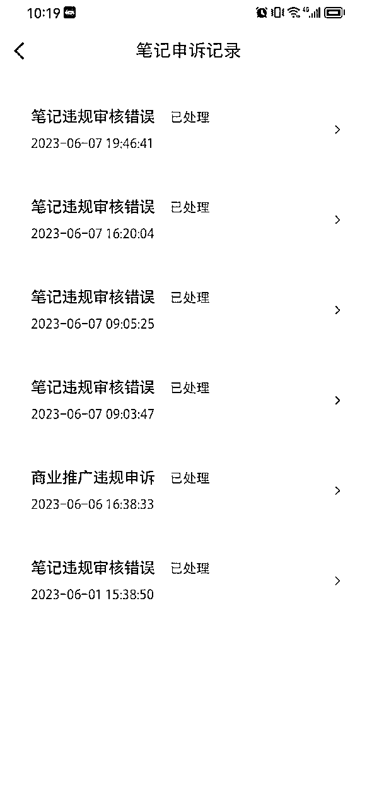

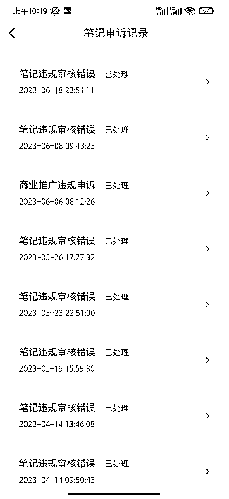

补充一点：账号如果发现数据明显低的异常，一周后依然没有恢复。注销吧，重新来。

我测试时，有一个 1.6w 的账号，连续一周每天才涨几十个粉丝，后面果断注销重新开始。用 10 篇帖子涨了 7600 粉。

### 5.3 如何提高笔记爆款率？

#### 5.3.1 流量优化

标题是给系统看的。

系统通过检索标题中的关键词，把笔记推送给精准的人群以及后续用户，在搜索笔记当中，能把你的笔记搜索并展现出来，这些都是通过系统去完成的。

所以在笔记标题的创作上，要符合系统以及满足用户的需求习惯。

至于怎么写出好的标题，这部分可以回顾【章节 3.2.4 第五步：写标题】，以及学习接下来的【章节 5.3.3 关键词优化】。

封面是给用户看的。

小红书旅游赛道和其他赛道不太一样，无论图片还是视频，一定要美，能够让用户产生想去的想法。

本身旅游这件事情就是让用户通过图片或者视频产生向往的一种情绪，如果说你的图片或者视频太 low 的话，那么是无法引起用户的这种情绪的。

有个朋友做法国旅游的，说很努力的发了不少笔记，但小眼睛只有几十。我看了下，首图做得不好，用户看到笔记，都没有点进去的欲望。

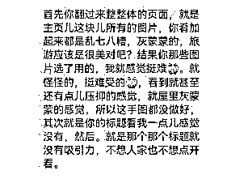

同类笔记在搜索列表页排列开，用户为什么要点你的笔记？

因为你的首图与其它笔记的首图有差异啊。用户是否打开你的笔记，唯美的首图可以说占了 90%的因素。

举个最简单的首图例子：这两个笔记首图，你会点开哪个？

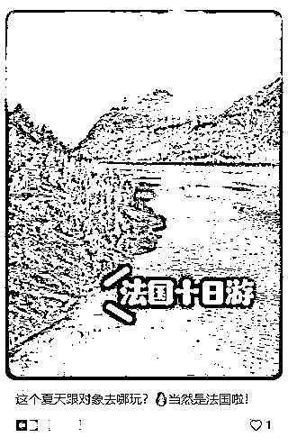

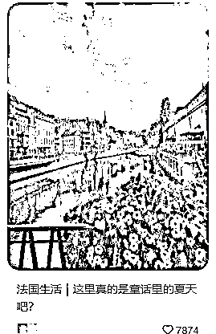

左图色彩阴暗，一看就很压抑，右图春光明媚，心情都变好了。

做小红书旅游博主，提升审美永远在路上。对于普通人来说，提升审美的最快方法就是，多观察多总结。

#### 5.3.2 做好评论区互动

笔记写完发布并不是结束，之后还有一个非常重要的动作——做好评论区。一个好的评论区是获得更多推荐流量和提高转化率的点睛之笔。

先简单和大家说一下小红书的算法：

重点结论：

用户的动作效果对于爆款笔记的积极影响：关注>评论＞收藏=点赞；

也就是说，互动量增加，整体数据会增长很快。

所以，笔记发布之后，可以先自己用小号或者让朋友帮忙在评论区留言，以此来增加笔记评分，让笔记获得更多的推荐流量。其次，如果有用户留言评论，尽量也要每条评论都进行回复，回复评论也会计算到 CES 评分里。

除了可增加笔记评分，做好评论区还有一个好处——提高转化率。

其实很多时候用户可能自己都不知道自己要什么，或者是压根没想到要来找你咨询，但是当你直接告诉他可以留言咨询，或者是他看到别人做出这个行为，他也更容易做出相同的行为；如果你想引导用户私聊或进你的粉丝群，也可先回复其中一条评论，让她私你或者进群，然后将这条评论置顶，这样后面来的用户就有更大的可能会采取相同的动作。

1.评论区主动留言互动

在评论区直接引导用户留言，然后将这条评论置顶，把转化信息放在评论区会减少放在文本框中被系统检测到营销引流动作的概率，也可以引导用户在评论区按照你的节奏留言。

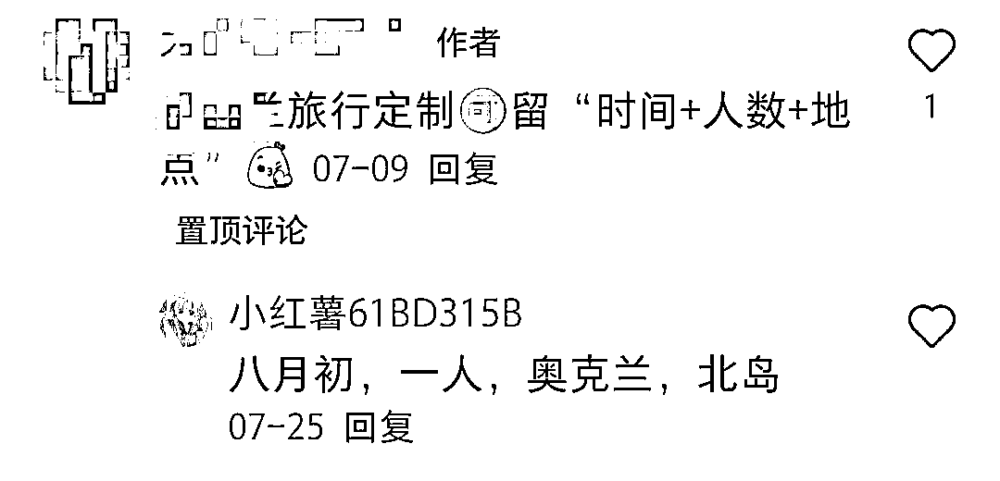

2.评论区回复引导

当有用户评论区留言，或者用自己的小号在评论区留言之后，可对评论进行回复，引导私聊或者引导进群，然后选择其中的一条置顶。

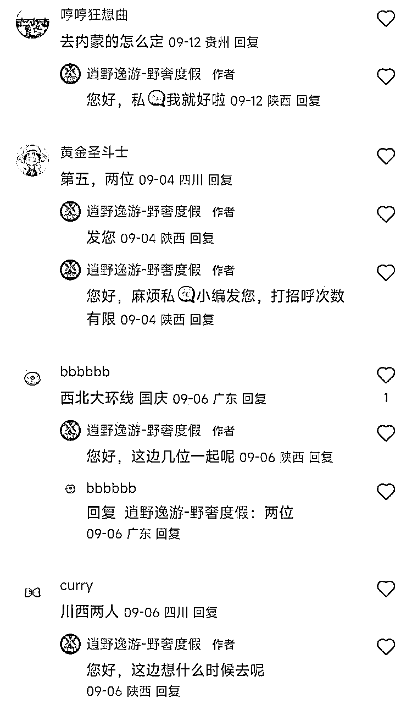

这里要注意：“私信”、“咨询我”这些词不能直接用，尽量模仿个人号来回复。不过我们测试过将“私信”中的“信”字换成符号，目前也是安全的。

#### 5.3.3 关键词优化

搜索是小红书旅游流量的主要来源，小红书搜索流量 85%以上都是精准的，而且几年前发的内容依然能被搜到。

很多女生，就是把小红书当百度和谷歌，遇到任何问题都上来搜一下。旅游也是，她们直接搜索目的地。

你只要做好根据挖掘出用户搜索的关键词，然后做好内容，等她来搜就行了。用户只要搜，就会看到你的笔记。

第一步：先找到行业各个领域的细分垂直关键词

除了前面【3.3.4 第五步】列举出的旅游赛道相关关键词，你也可以通过数据平台（以下拿灰豚数据举例）查看相关关键词，做更精细化的布局。

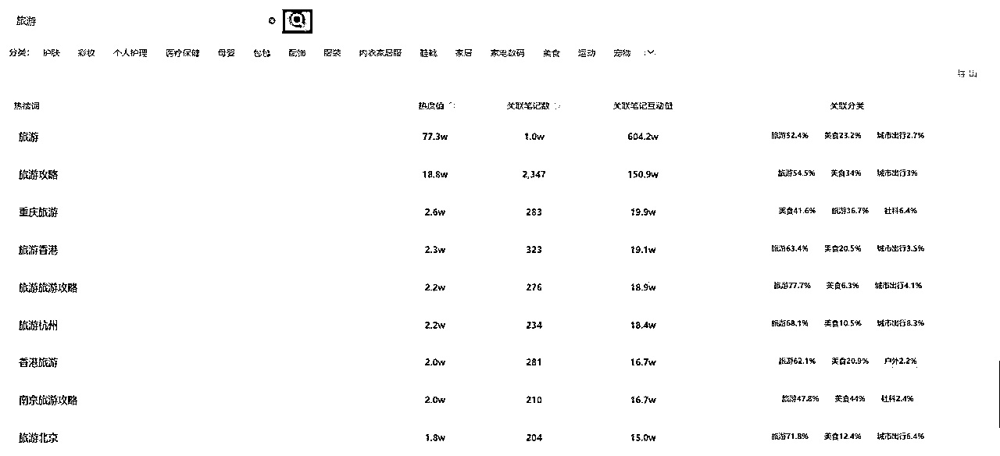

（这里需要开通平台会员，对于想要深耕做好这个赛道的圈友，建议可以开一个。）

第二步：有了关键词，我们就可以做关键词布局的优化了。

比如，关键词“重庆”的布局这样做：

1.在笔记的标题和正文中引用大关键词+小关键词；

2.在首图添加关键词。我们观察到目前小红书算法的推荐特性，图片在内容审核过程中的比重不断增加，通过在首图添加关键词，可以增加被系统推荐的可能性；

3.在文章结尾，也要记得添加相关的话题内容为笔记引流，加大笔记曝光率。

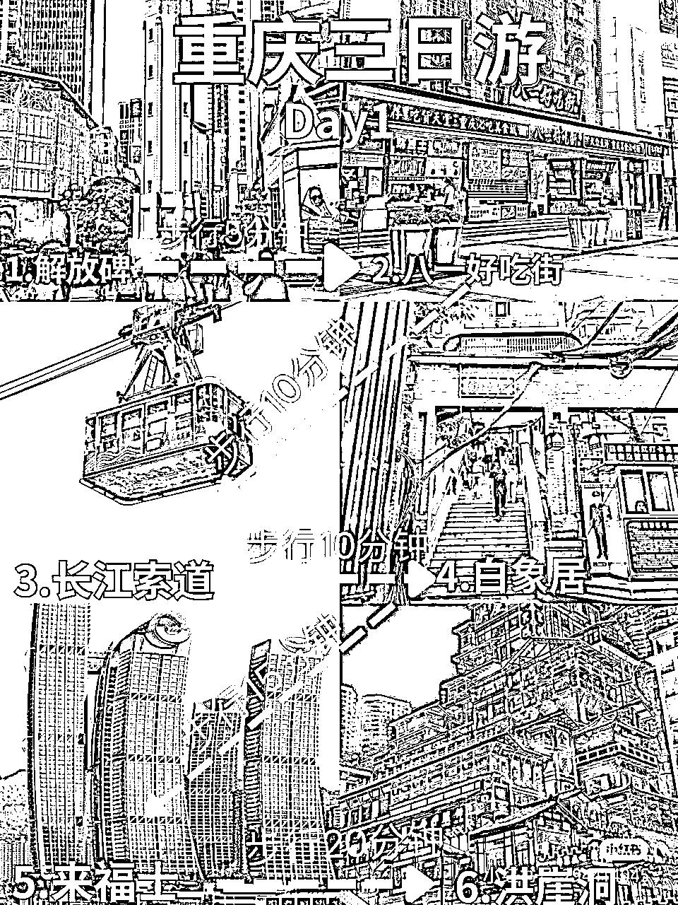

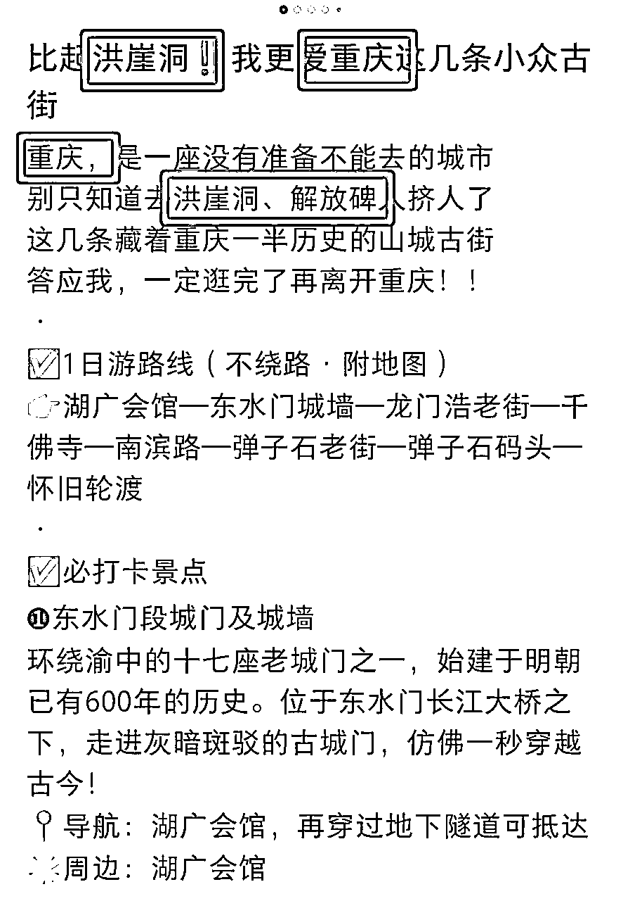

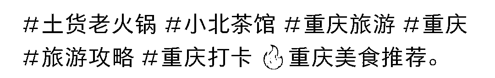

这里需要注意：一定要避免堆砌关键词。比如一篇笔记堆十几二十个关键词，这会被系统判定为广告，长期这样操作，账号会被系统降权。

第三步：关键词复盘

每发布一篇笔记，做一波数据分析，五篇笔记做一波笔记复盘，根据数据结果去优化下一步的关键词的布局。

数据分析方法：

通过“创作中心”里的数据中心分析笔记单篇笔记的数据。主要分析观众来源里的“首页推荐”和“搜索数据”。

“首页推荐”占观众来源高，说明笔记正在被算法推荐；“搜索”来源占比高，说明关键词的布局是没问题的。

如果搜索流量占比比较低，那有两种情况：一个就是你的笔记进入了推荐流量池，这时候你的笔记数据应该非常好；第二种情况就是你的关键词没布局好，需要根据上面第二步，重新优化关键词。

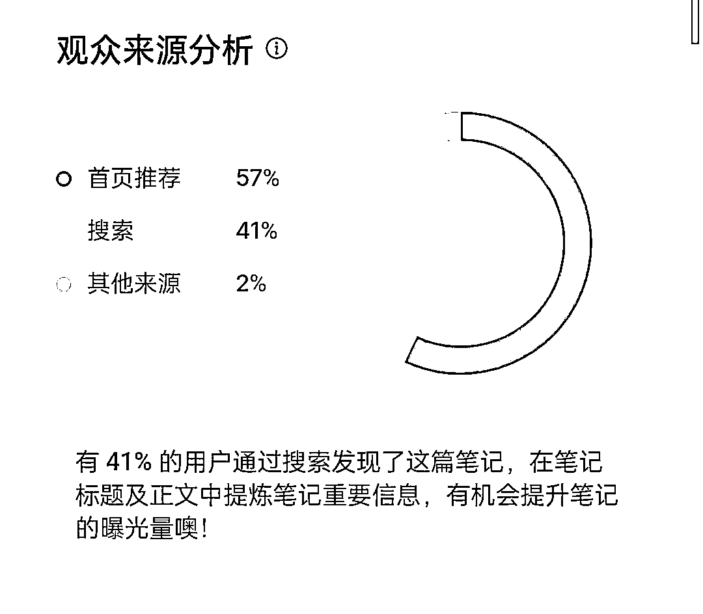

#### 5.3.4 不同类型笔记如何搭配使用

我大概把小红书旅游笔记分为 3 个类型：

第一种：流量笔记

也就是干货笔记，笔记的目的是为了起号、提升账号权重、吸引流量，流量笔记在起号初期可以多发一点，因为这类笔记非常好起数据，但是这类笔记的转化不强，大多数用户都是点赞收藏，就没有然后了，连评论都会很少。比如，旅游攻略、避坑、景点介绍等。

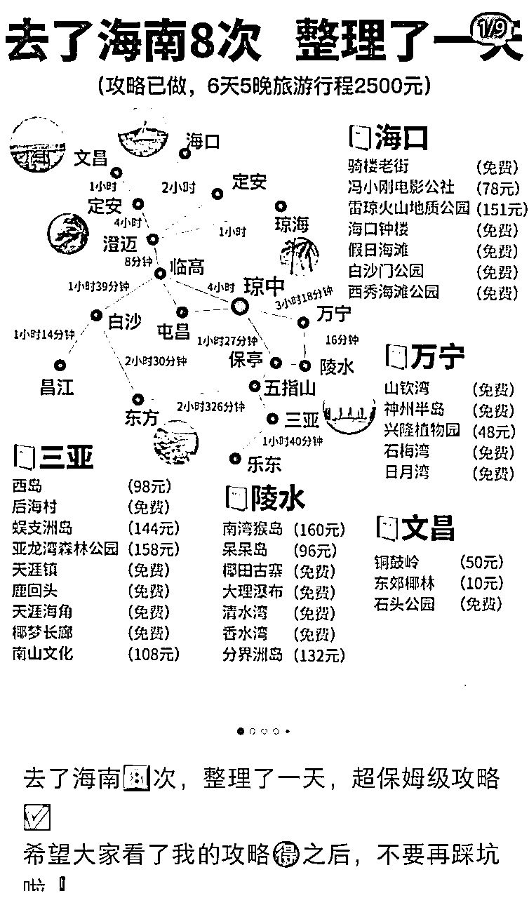

第二种：赚钱笔记

赚钱笔记有两种表现形式：一是直接展示产品，即产品笔记，比如 XX 景点、几天几夜、包含什么项目、什么价格等；二是展示和用户的聊天截图，用聊天截图去引导转化。

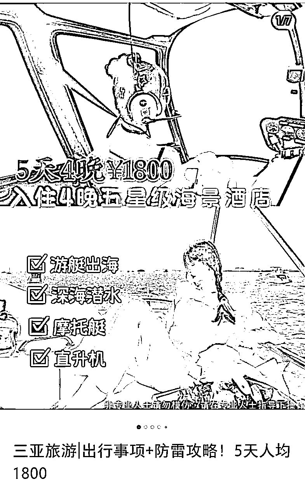

第三种：人设笔记

人设笔记的目的是增强用户的信任感，也称故事名片笔记。把你从业的经历、或者旅行社的相关资质放上去，然后置顶。这类笔记表面上看，数据不咋样，可能没什么人互动，点赞评论也很少，但是他在无形中传递给用户的信任感，是能大大的提高赚钱笔记的转化率的。

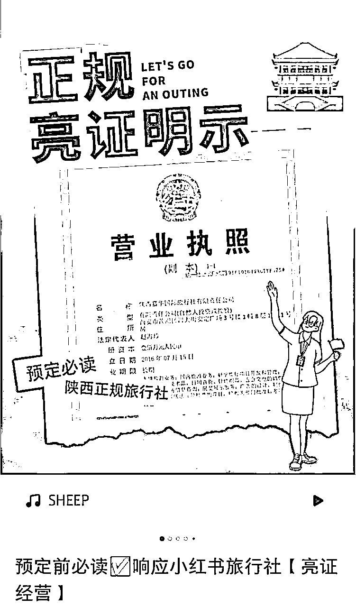

除了故事名片，其实我们也可以通过干货笔记去增强用户对我们的信任感，只要你的笔记内容足够真诚，足够专业，足够详细，给用户带来足够的价值，慢慢的也会让用户对你产生信任。

流量笔记、赚钱笔记、人设笔记。这三类笔记相辅相成，流量笔记和人设笔记就是给赚钱笔记保驾护航的保镖，要有流量和信任，用户才能通过赚钱笔记来找你成交。

这三种类型的笔记，故事名片笔记有一篇置顶就可以了，攻略类型的笔记总的占比 20%左右，但是前期多写一点，可以占个 40%左右，后期可以偶尔秀一下客户转账截图，剩下的就写展示产品的笔记。这个是个人号的玩法，等大家做起来之后，是建议大家注册企业号，搭配企业号一起玩的。

### 5.4 如何提高笔记生产速度？

#### 5.4.1 完善素材库

提高生产速度，就是学会批量制作笔记，它的精髓就是素材库，除了前面【章节 3.2.3】讲过的最基础的素材库（文案和图片）之外，还有选题、标题、关键词素材库：

1.选题库

平时刷对标账号，或者刷小红书主页时，刷到好的爆款笔记选题可以及时整理到自己的选题库中，这样方便写笔记时可直接参照，也方便团队成员进行相关的操作。

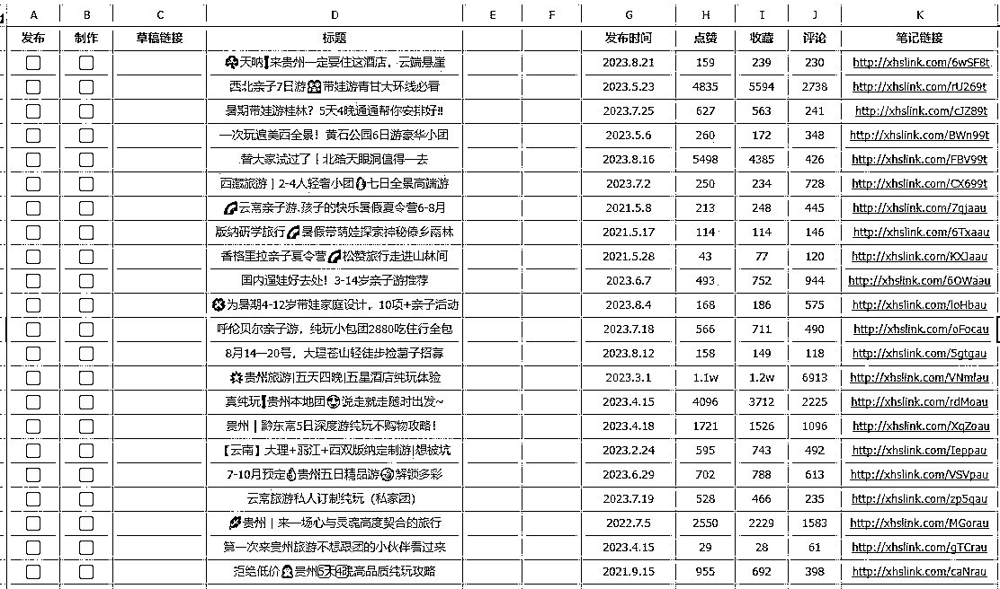

2.标题库

在小红书，标题是提高点击率的重要组成部分，但想要快速起一个爆款标题，对于新人来说还是相对困难的，这时我们可以搭建一个标题库，和选题库一样，平时遇到好的标题就整理进去，后面写笔记时套入核心关键词进行改写。

如下图，“带娃去北京请一定要慎重啊！！”就可以改成“带娃去西安请一定要慎重啊！！”或者改成其他目的地都可以，这样的话，制作一个爆款标题的时间甚至连 1 分钟都用不到。

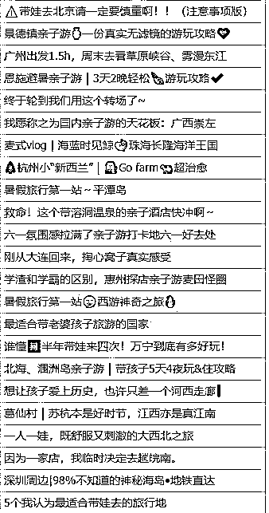

3.关键词库

前面【章节 3.2.4】部分有提到怎么去找关键词，并且旅游赛道有哪些高频的关键词。当我们找到这些关键词之后，可以将关键词也整理出来，方便后续写标题以及文本框关键词布局时使用。

#### 5.4.2 利用作图工具

1.WPS 作图

我本身不会 ps，审美也不达标，WPS 可以批量输出图片，用起来非常顺手，而且会员便宜，不用担心字体等版权。

比如，我用 WPS 编辑完成后，直接点击输出，就可以批量生成图片。无论你的资料类型是 word 还是 ppt。

我个人更倾向于使用 PPT 编辑小红书图片，非常便捷。

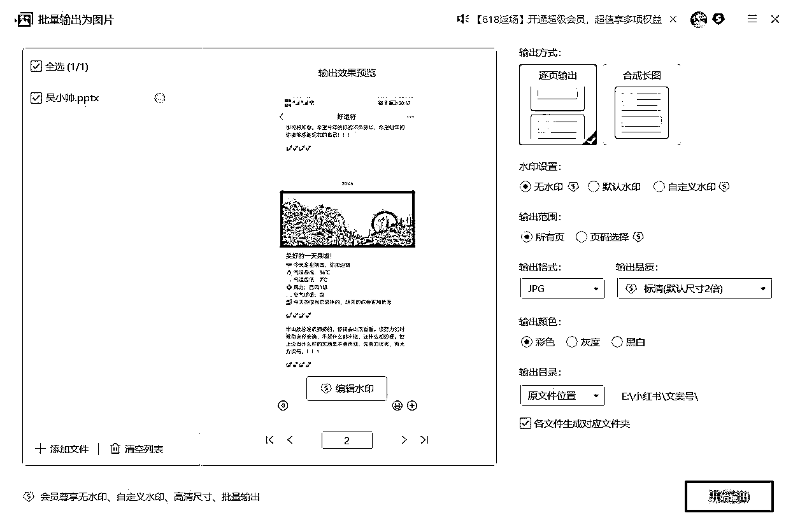

2.稿定设计作图

稿定设计是一款非常适合小红书新人创作者制图的软件，可以直接登陆网页版，也有相应的软件支持下载。

打开稿定设计，直接就可以在主页选择“小红书”板块，里面有非常多小红书爆款封面和好用的内页可供选择，然后直接在模板的基础上替换你想要替换的图片和文字内容即可。

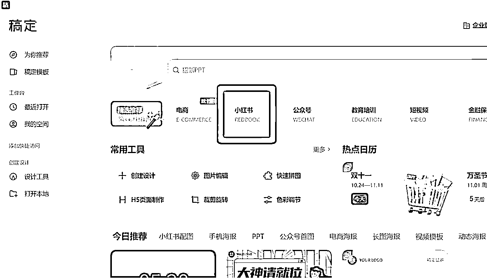

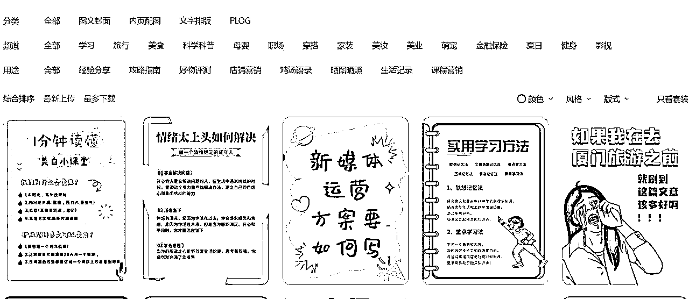

# 选修篇：更多玩法和赛道推荐

### 章节概要

当我们完成项目最小 MVP，基本掌握项目的操作流程后，可以尝试看看选修篇的内容。

无论你是想要进一步放大项目，还是挖掘更多玩法，都可以重点阅读本章节：

【项目放大】3 种放大项目的方法

【项目拓展】更多变现方式

现在，快来发掘项目的更多可能性~

## 六、【项目放大】4 种放大项目的方法

### 章节概要

如果你已经跑通了项目 0-1，且有能够稳定转化的后端旅行社，这时候就可以考虑做项目的放大了。

小红书旅游项目放大的 3 种玩法：

矩阵号运营

付费投放

小红书直播

朋友圈运营

下面我们一起来了解这几种放大玩法，尝试找到一款适合你的玩法吧~

### 6.1 矩阵号运营 @渡

如果想要深耕小红书旅游赛道，搭建矩阵号是必不可少的。以下将从 3 个方面来讲怎样做矩阵号运营。

#### 6.1.1 注册多个账号

这一步主要涉及手机号、手机的准备。

搭建矩阵账号的第一步，就是注册多个小红书账号，我们可以用自己或家人的手机号注册，和前面提到的两个账号注册流程一样，电信宽带可以一拖三，四个手机号的套餐共用，如果账号不够，也可以直接在网上办电信 29 一个月的卡，每月有 100 多 G 的流量。

手机可以在咸鱼、拼多多或者淘宝上买二手手机，不用买很贵的，3.4 百够用就行。或者买红米的手机，可以双开小红书，一部手机就能注册两个账号。

#### 6.1.2 批量制作笔记

6.1.2.1 单人批量操作

单人批量操作适合项目前期 all in，精力足够想要快速放大项目的个人操作，主要有 2 个核心操作：

①素材库搭建

前面【章节 3.2.3】 和 【章节 5.4.1】 讲过，搭建基础的图片库、文案库、以及选题库、标题库、关键词库，这里就不再赘述了。

②多账号发布：主账号+矩阵号

要确保有一个认真运营的主账号，这个主账号需要已经完成前期的笔记发布，笔记周更 2-3 篇，且已经成功引流到微信，那么接下来就可以批量化复制，同步运营矩阵号。

只要保证笔记的质量，首图、标题、关键词以及内容没什么太大的问题，一个账号周更 2-3 篇笔记是能拿到不错的流量的。那么多余的精力，就用来搭建矩阵号，通过搭建的素材库内容，批量化用其他的小号发笔记。

不需要把精力平均分配到每个账号上，这样你可能一个号都做不好，一个好的搭配就是 1+N 的形式：1 个主账号+N 个矩阵号。

但是，主账号一定会是流量的主要来源，也是后面你跟其他旅行社谈合作的门面担当，所以我们要用心经营，把有风险的动作可以都用其他矩阵号来完成，比如评论区引流、群内要微信等，导流成功一个算一个，成功一双算一双，如果被系统检测到了，那就注销之后重新注册。

这里还有一个重点，做矩阵号并不是每个账号都发一模一样的内容，账号主页风格和内容还是需要有差异化，否则这些同质化的内容容易被判定抄袭，每个账号的笔记最好保证一定程度上的原创度，比如不同的首图模板，不同的文本框架等。

以下为典型的差异化矩阵号举例：

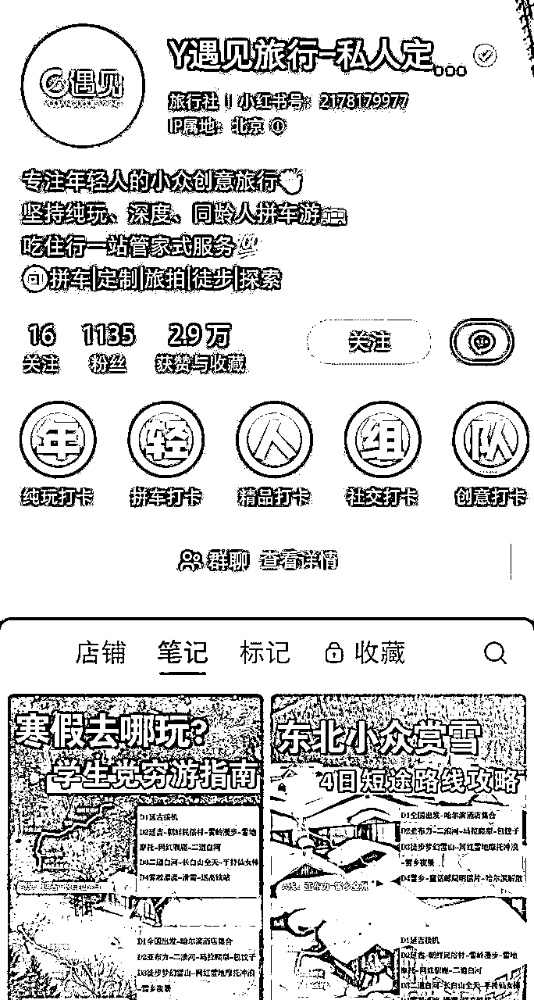

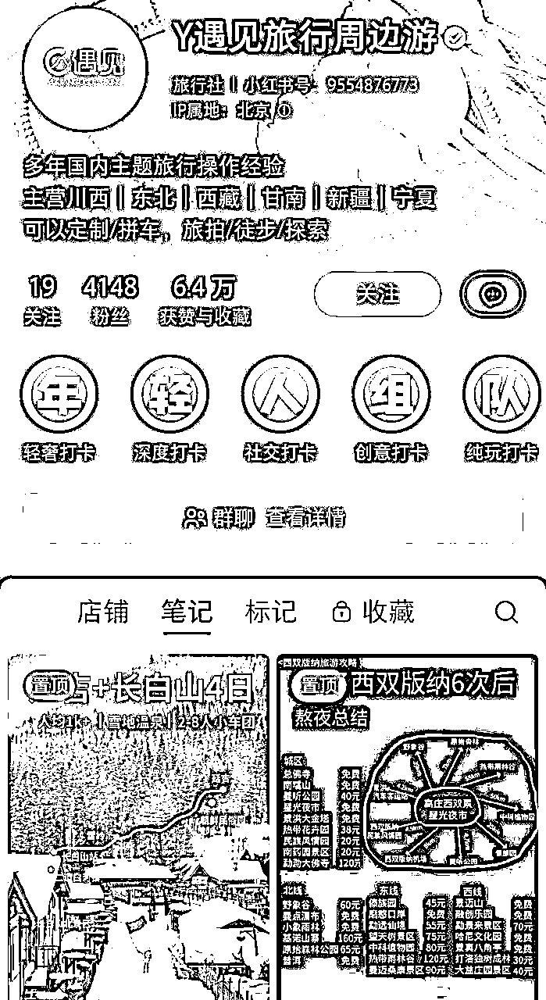

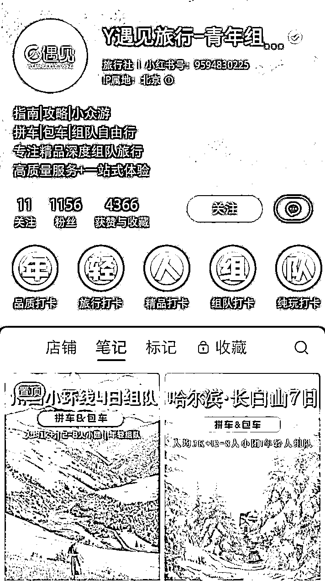

不同的账号定位可以切不同角度，包括首图风格、账号简介&笔记等内容，不要一模一样。

相反，什么是同质化，就是你不同的账号首图风格一样，内容也一样，基本没什么改动，只是把一篇笔记从 A 账号搬到了 B 账号，这种是会被判为抄袭的。

6.1.2.2 多人合作生产内容

如果你是团队操作，那就可以使用团队玩法，把整个小红书流量前端拆分成不同部分，然后分工合作。

小红书流量端主要有三个大的环节，大概需要 3 个人分工协作：

①写笔记（需 2 个人）

这个环节主要分为【素材库搭建＋撰写笔记】两部分。

1 个人负责素材库。素材库搭建是相对比较耗时，但是思考度不高的环节，可以单独有一个成员来负责这部分内容。在飞书上做好选题库、标题库、关键词库、图片库、文案库等，方便写笔记的学员直接使用。

1 个人负责撰写笔记。可以根据素材库的内容，每天批量制作不同风格不同框架的笔记，确保一定的差异化和原创度。

②发笔记

发笔记的步骤可以由撰写笔记的成员，或者是后续做引流的成员来操作都行。

进行引流的成员，手机以及账号是需要在 TA 手上的，因为后续要回复评论、私信、群聊引流转化等；

如果是写笔记的成员发布笔记，那就是电脑登陆发布；如果是负责引流的成员发布，那直接在手机上进行发布就可以了。

③引流（需 1 个人）

矩阵号引流，建议可以采用多账号共用一个群聊的方式，将不同账号的目标用户邀请到同一个群里，方便负责引流的学员统一通过群聊来引流转化。

### 6.2 付费投放 @陈铭 ivy @小掌柜

投放最新规则同步（关于私信导流问题）：

1.2024 年 1 月 2 日之前，可以按照目前的情况去私信导流；

2.2024 年 1 月 2-1 月 22 日会有个过渡期：满足 1000 消耗才能私信导流（1000 消耗客户需要手动开通专业号后台的私信通功能）

3.1 月 22 日之后想私信导流，需要满足 2 个条件：1000 消耗满足+私信通已开通。

#### 6.2.1 建议什么时候做付费投放？

1.后端转化稳定，想要进一步放大业务

付费投放的玩法，一定先确保你有个稳定转化的后端，再考虑通过投放买量来放大业务体量。

2.个人账户引流被限制，需要付费投放开通私信白名单

我们做账号的目的是为了引流，规模小的时候还好，稍微做大些账号就容易被限流、被封号；付费投放不但可以放心大胆地引流，整体笔记流量也更加稳定。（新手暂时不用考虑投放）

#### 6.2.2 怎么做小红书聚光投流？

6.2.2.1 第一步：开通聚光投流功能

由于只有企业号才能投聚光，因此我们需要先认证企业号。（这里注意：认证的企业经营范围需要和投放的广告类目保持一致。）

开通企业号后，会有小红书销售给你打电话，问你要不要充值聚光，直接在给你打电话的人里面找一个你喜欢的开户充值就可以，首充最低 5000。（充值后，如果钱花不完，是可以退的，需要写邮件给小红书官方邮箱，正常退款时间是一周左右）

一般连续投放三天后，就可以让小红书销售去跟社区沟通，私信开白，这样就可以直接发微信了，文字 or 图片都可，不会再提醒违规。

这里需要注意：为了避免被移除白名单，开启后每次投放的间隔时间不要超过 7 天，每周消耗不低于 100。

6.2.2.2 第二步：学习怎么算投放的账

要引流到私域成交的朋友们，可能都会有这样的疑问：

怎么判断自己投放花出去的钱值不值？ROI 怎么算？要不要继续投？

我给大家分享两种算法，判断你的投放值不值。

第一种，我们按投产比来算。

在聚光投放后台，你可以看到单个私信的价格。

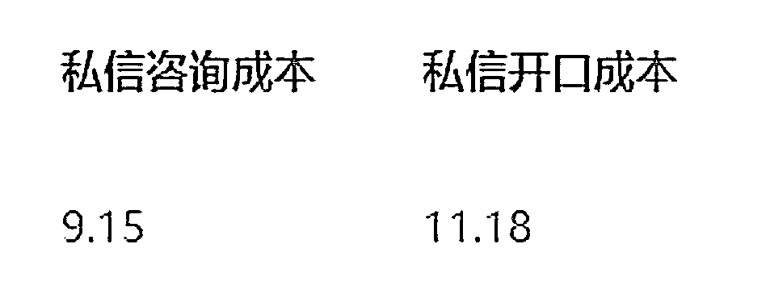

假设小明投放的私信价格是 10 元/个；

那么投放 1000 元，就可以获得 100 个私信；

按加微率 40%算，就会有 40 人加到微信；

再算上小明的成交率，假设是 10%，那么就会有 4 人成交；

假设客单价是 3000 元，4 人成交额为 12000 元，那么 ROI=1000：12000=1:12

算是一个比较不错的 ROI，可以继续投放。

第二种，按单流量价格算。

前面部分还是按 1000 元可以换取 40 人加微信算，那么每个加微的价格是 25 元。

假设小明的微信，每当有 10 人加过来，就可以成交 1 人，成交额 3000 元；

那么每个加微的价值就是 3000/10=300 元。

25/个买入流量，带来 300 的价值，ROI=25：300=1:12

算是一个比较不错的 ROI，可以继续投放。

算清楚账啦，我们就来看看到底怎么做投放~

6.2.2.3 第三步：开始投放

投放不建议找小红书官方运营，如果要找，一定要守死自己的价格底线！

我们主要是自己摸索，核算清楚每个私信和引流的成本，控好价格。

1.投放价格控制

价格分为两部分：

这个出价，可以根据前面算 ROI 的过程，反推出一个自己能接受的价格区间。

我个人建议可以设置 20-30 元/个私信。有些运营会建议你设置 50 元/个，如果你觉得太贵了接受不了，也可以直接拒绝，最终价格设置多少是由你自己决定的。

你也可以前期出价低一些，隔段时间根据数据进行提高出价。

一般官方运营会建议你用 3-5 个笔记，同时投放 3-5 个计划，先跑一周，每个计划每日低消是 100，这样算下来就是 100×3×7=2100，一周烧掉 2100。

运营可能还会跟你说，计划好不容易跑起来就不建议暂停，不然影响投放效果，一天两天的看不出效果，建议跑长期来看看，单个账号这么烧钱实在有点吓人，所以我给大家分享下省钱版玩法。

开始投放前可以先确定 3-5 篇笔记，用于投放，具体笔记怎么选择，可以看下文。

每篇笔记新建一个投放计划，每个计划可以设置不同的投放时间。

比如：

笔记 1，计划 1，投放时间为周一

笔记 2，计划 2，投放时间为周二

笔记 3，计划 3，投放时间为周三

...以此类推，也可以同一个计划，配置 3 篇笔记，同时跑，每日预算 100。

这样赛马机制的跑一周，总消费 500-700 元，你就可以很明显的看出，某个计划/笔记投放的效果，要远远优于其他的计划/笔记，接下来就反复投放数据好的就可以了。

或者你也可以选择一篇好的笔记，搭建不同的出价计划，看哪个出价的位置跑的数据最好，成本合适。

2.投放笔记选择

付费流量和免费流量的底层逻辑是非常不一样的，免费流量不需要考虑 ROI，发一些免费领资料的也可以，就算这些人来了很难转化，但是能帮你把账号粉丝/权重做上去，也是值得的。

但如果要投放，就一定要考虑，怎样的笔记，才能带来买单人，精准更重要。

所以当你在选择投放笔记的时候，要做的第一件事！就是看同行！

同行花钱持续在投哪些笔记，就说明这些笔记之间存在“可以带来买单人”的共性。他们已经在花钱投票了。

可以拿出一天时间专门刷你这个赛道的笔记，重点观察并用 excel 记录，同行投放的笔记（右下角有“赞助”两个字）。

记录好之后，开始分析，寻找共性。

比如这些笔记，都是什么主题？标题有什么特点？封面有什么共性元素？

提取出来之后，再加到你的投放笔记里面。

可以把之前本来就自然流不错的笔记，根据你提取的同行投放共性改改，再去投放，也可以重新写笔记。

我个人比较建议在之前的笔记上修改了再去投。

在观察同行的时候，有一个比较重要的点是，寻找异常值，并提取背后规律。

你可能会发现，同样的选题，但是有的笔记爆，有的笔记却不爆。

知道怎么做是正确的，很重要；但知道怎么做不正确，也同样重要，这样我们就可以避开错误做法。

同时，如果一个账号，大部分笔记数据都很差，但有一篇数据很好，这也是异常值，值得分析，为什么那篇数据会好，然后模仿。

分析完同行的笔记后，可以再分析一下自己的笔记。

比如哪些笔记曾经带来过比较多的买单人，那就可以尝试投放。

聚光后台可以看到每天的投放数据，我比较关注的主要是，每日消费，点击价格，点击率，评论，私信价格和私信开口价格。

可以建一个专门的 excel 表格，记录每个账号的账密，以及每天的投放笔记和投放数据。

刚开始投的时候，我一般会根据昨日的投放效果，来决定当日的投放笔记和金额。跑 1-2 周后，基本上可以摸清规律，即什么样的笔记配什么样的计划，可以跑出符合预期的效果，设置好计划就重复就行了，比较省事。

#### 6.2.3 聚光投流的避坑经验

6.2.3.1 聚光投放的坑

1.如果你的目标是导流私域，那么千万不要选择产品种草，不然会买到很多并没有用的点赞和收藏，直接选客资收集就行。

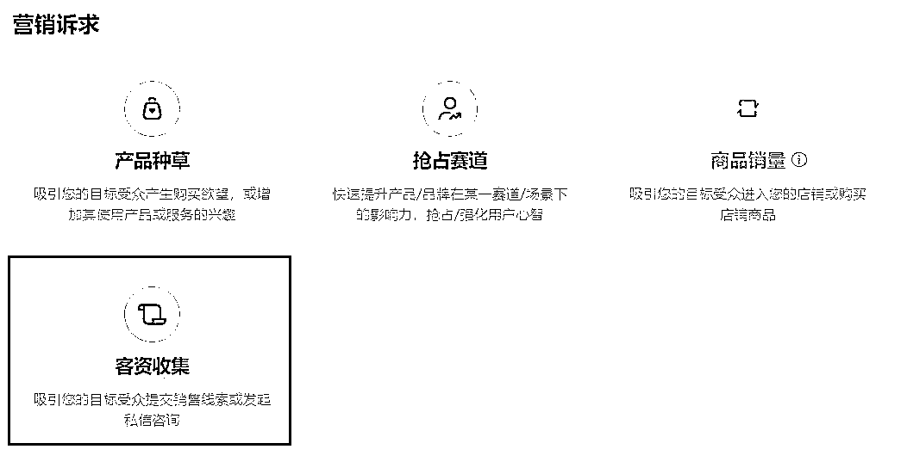

2.推广目标建议选择【私信开口量】，如果选择【私信咨询量】，私信开口就会贵一些。

（新账号前期可以跑咨询量，先把账户数据打开）

内容来源：如何让你的钱花的有价值？小红书聚光投放实战攻略

### 6.3 小红书直播 @易寒

#### 6.3.1 小红书直播的红利

2023 年下半年，小红书最大红利就是直播，因为官方对直播的扶持力度太大了。

但要特别指出：直播是锦上添花，不是雪中送炭。

先有了好笔记，才能去直播。如果不写笔记或者笔记不优质，直接开播是不行的。

首先，你要要通过发笔记，先把账号的标签打上，让平台知道要给你推什么流量；

其次，直播的政策是送笔记曝光流量，如果没有笔记或者笔记不优质，送的流量也是白白浪费掉。

#### 6.3.2 小红书如何做直播

我们先看一个典型的直播场景：

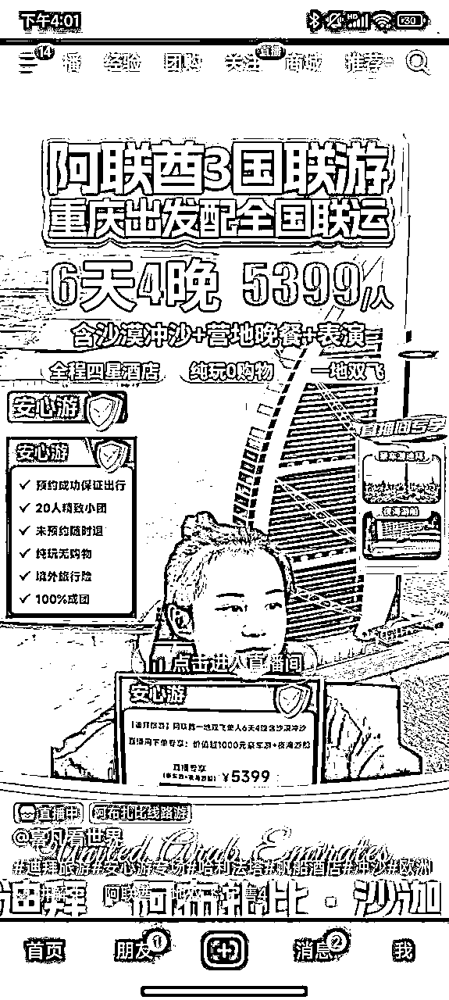

从后往前，我们看到共有 3 层画面：

这就是典型的旅游直播间的基本设置，可以参考这个标准来做。

至于直播软件，目前比较流行的是直播加加，可以直接在应用市场下载 APP。这 3 层画面具体怎么操作，在直播加加的使用帮助里面有详细的讲解，这里就不展开说了。

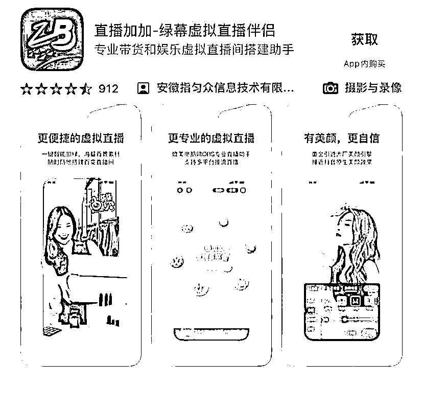

### 6.4 朋友圈运营（自己做成交）

高客单价的产品，一定一定一定要认真做好朋友圈运营、人设打造!

因为客户一上来，大概率是不会成交的，而且旅游这个赛道，可能都是一段时间后才出发，所以，你需要朋友圈来攻略他!

私域运营核心，为了增加专业度，靠谱，以及转介绍，复购。

所以围绕这几点，做私域运营。

下面我简单举一点例子。

1、客户评价（跟人设贴是一样的逻辑，体验服务，专业，以及靠谱，能够转介绍）

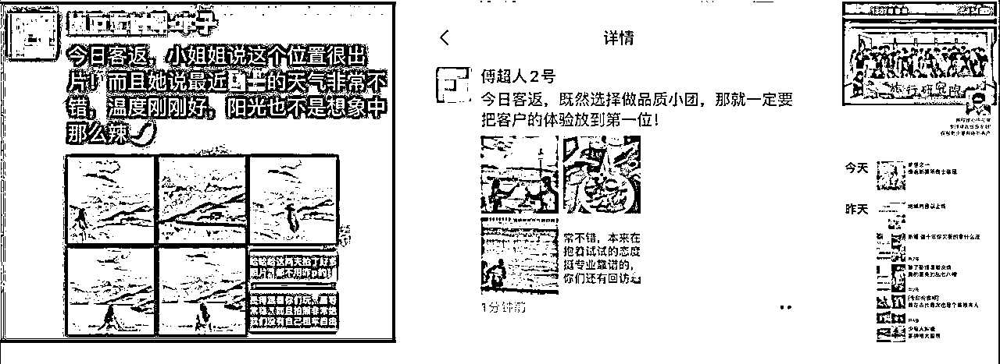

2、个人朋友圈（发自己日常琐事，吃饭，喝酒，玩），朋友圈是个活生生的人，不是专门发广告，一定要是女号！

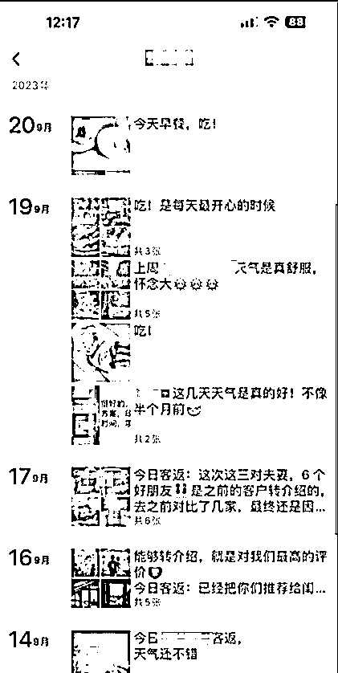

3、一些用户的共性问题，比如收付款方式、资质、安全问题，可以统一朋友圈提一下！

内容来源：高客单出境游，万字保姆级 SOP 教程，手把手带着做

## 七、【项目拓展】更多变现方式 @渡

### 章节概要

如果你已经掌握小红书旅游的玩法，对这个行业很感兴趣，想看看有没有更多的变现方式，那就看看我们为你总结的 7 种进阶玩法吧：

研学文旅

国内定制游

接商家广告

卖旅游卡

周末徒步

本地周末亲子游

亲子研学旅游

境外高客单游

接下来我们将一起学习这 7 种玩法，包括：商业路径是什么、适合谁做、操作上有哪些要注意。

### 7.1 研学文旅

#### 7.1.1 玩法介绍

1.什么是研学文旅？

研学文旅是一种将教育和旅游结合，并且重点在于学习，让孩子背上行囊去研学，为旅行赋予教育内涵，提升旅行产品附加值的一种模式。

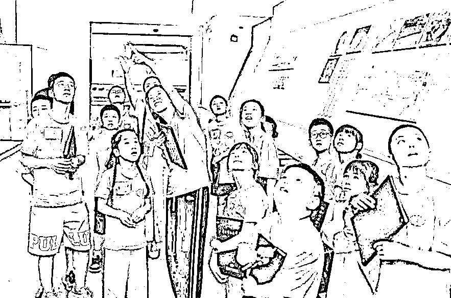

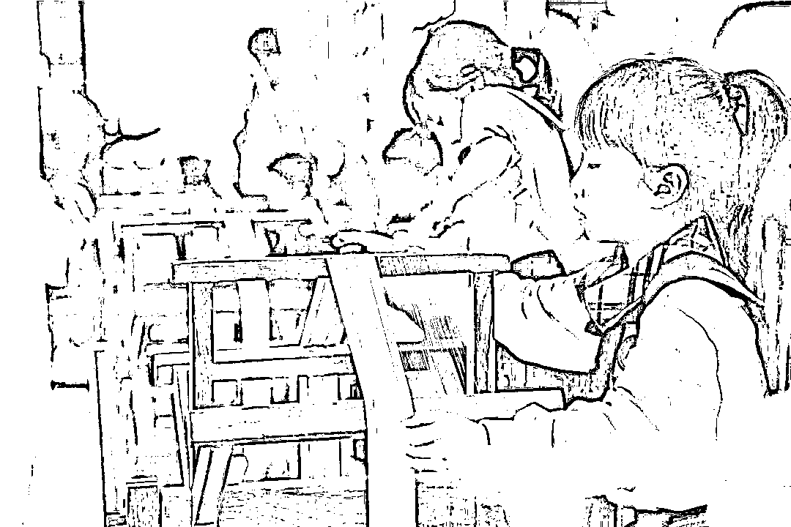

以旅行为载体，在旅行过程中参与教育实践活动。这类研学旅行，仍需要我们去不同的目的地旅游，但是在旅游的过程中，会有学习课程及体验活动，比如：

传统文化体验活动：纪念馆、博物馆、非遗手工、传统礼仪文化；

自然主题课程：跟着课本去旅行、地质环境、自然保护等；

地域特色文化：探访古村，考察名居建筑、民俗文化、宗姓祠堂等，了解地域传统文化。

以学习教育为主，旅行元素较少。比如参观清华北大，或者冬令营、夏令营等，基本就是固定待在某一个地方，进行学习教育活动。

2.怎么做研学文旅？

在小红书平台上面搭建旅游账号，通过发笔记的形式吸引目标用户加微进入私域，由专业的后端人员成交，你拿佣金。

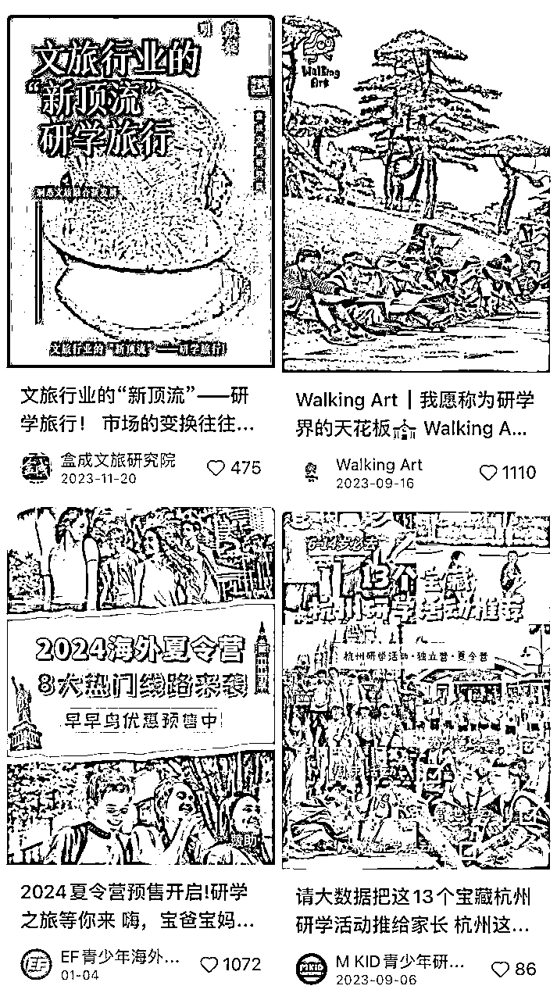

#### 7.1.2 适合谁做

1.有做研学文旅的旅行社资源；

2.了解研学文旅目标用户（父母）的需求；

#### 7.1.3 操作关键

1.找做研学文旅的旅行社合作

研学文旅属于旅游赛道的一个细分领域，目前市面上专业做研学文旅的后端比较少，规模大的像新东方文旅，普通人很难合作，规模较小的交付能做好的也不多，所以找靠谱的合作后端这一块有一些难度。

2.在小红书写笔记

在小红书写这类笔记时，一定要认真研究目标用户的需求是什么。和纯旅游不一样，研学旅行的目标用户大多是家长，侧重的点会在这场旅行孩子能学到什么、有哪些体验活动、对孩子成长、认知有什么帮助等。

### 7.2 定制游（国内）

#### 7.2.1 玩法介绍

1.什么是定制游？

定制游最开始是一种国外非常流行的旅游方式，是根据旅游者的需求，以旅游者为主导进行旅游行程的设计。通俗的说就是根据自己的喜好和需求定制行程的旅行方式。这种模式在业界的特点就是弱化了或者去除了中间商，能够给旅游者带来最个性化的服务。近年来，国内定制游的需求也在逐步上升。

2.怎么做定制游？

在小红书上发笔记，把定制游的目标用户引流到微信私域，由后端旅行社辅助成交，成交后根据用户的订单金额，我们抽取一定比例作为佣金。

#### 7.2.2 适合谁做

定制游适合有旅行社后端资源，对整个项目流程有一定了解，且有微信成交经验的人入局，或者有靠谱的旅行社后端愿意花时间来带你入局。

#### 7.2.3 操作关键

1.找供应链

定制游和散拼团一样，都是需要先找到靠谱的旅行社作为后端。找旅行社的方式和散拼团也一样，区别就是得询问清楚旅行社是否有定制游服务。定制游作为一种新兴的旅行方式，很多传统旅行社都没有这块业务。

2.小红书发笔记引流

围绕定制游设计人设 5 件套，可以打造定制师个人 IP 或者其他个人 IP，发布核心关键词为“定制游+目的地”的笔记：

1.人设型：“为什么要做私人定制游”晒旅行社营业执照“”

2.产品型：“定制游是什么”“XX 高端定制游 5 天 4 晚”

3.攻略型：“XX 必去的 10 个景点”“XX 旅游攻略大全”“XX 旅游省钱攻略”“定制游和跟团游有什么区别”

3.微信成交

首先快速了解顾客的信息：

不管顾客问哪些问题（有定制游吗？什么价格啊？能安排导游吗？…），你只需要简单回复“有的，需要了解一些你的信息”）。有些顾客上来就会说几个人等，如果缺少下面的几个信息，必须得问完：

1：什么日期来？

2：几个人（是否有小孩，65 以上的来人，如果 70 多的，不建议大家接待了 有些保险都没法购买）

3：游玩几天

4：想要有哪些景点？

通过这几个点，我们了解了顾客的基础信息，就能快速判断是否能做定制。

如果初步判断能做定制，那就介绍关于定制游的信息：

比如预算 800-1200 每天每人，是否能接受。然后给顾客介绍定制游的特点，以及定制游提供的服务（门票，导游，景点，车子司机等）

这个时候顾客如果还是合适，我们会根据顾客的要求，排一个初步行程，记住只是初步行程（因为有人会空手套行程）。如果初步行程合适，预算合适。那这个时候就要收定制费用了，打款以后，我们开始拉群，由旅行社专业的人员来进行介绍和定制详细的内容。

### 7.3 接商家广告

#### 7.3.1 玩法介绍

在小红书上做旅行纯博主，文字或者视频分享自己的旅行日记，记录旅行中的所见所闻所想，积累一定粉丝后，会有甲方爸爸来找你合作，或者粉丝数达到 1000，可以去官方申请成为达人，通过官方渠道接广告。

#### 7.3.2 适合谁做

喜欢去世界各地旅行的数字游民，喜欢带娃旅行或者旅居的宝妈，又或者一二线城市的本地人，喜爱外出，经常探索当地景点和玩法的人，有点类似于探店。

#### 7.3.3 操作关键

1.外出旅行+会拍照/剪辑

当旅行博主说难也难，说简单也简单，就是得出去玩，然后拍照或者录视频，再加工成笔记进行分享，打造一个真实的旅行 IP，如果长得好看那就更好了，颜值是旅行博主天然的优势。

2.积累粉丝

当纯博主接广告的话，对粉丝数量是有一定要求的，所以旅行博主前期变现会有些困难，需要前期多发高质量的笔记涨粉，出现爆款或者定位足够垂直，慢慢的就会有商家找上门来合作。当粉丝数过 1000 之后，可以申请成为达人，去官方渠道接广。

### 7.4 卖旅游卡

#### 7.4.1 玩法介绍

在小红书上发笔记卖旅游一卡通，有当地旅游卡，也有全国旅游卡，价格便宜，引流客户到微信成交。

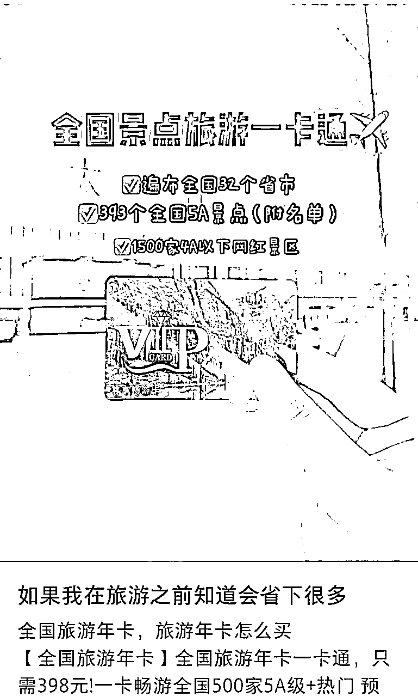

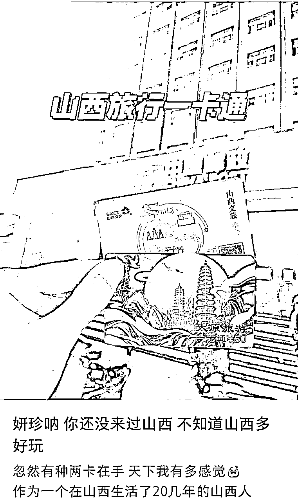

#### 7.4.2 适合谁做

1.旅行博主

2.有旅游一卡通渠道的新手

#### 7.4.3 操作关键

1.发小红书笔记

旅游一卡通的操作很简单，就是实拍一卡通，然后罗列出这张一卡通能去哪些景点，如果是景点较多，就罗列几个出名的景点，再用数字表明一共可以去多少景点（如畅游全国 500 家 5A 级），最后在写一下价格有多便宜，形成对比。

2.引流

在文本框和评论区引导用户知道你这里有一卡通资源，并且可在你这进行购买。

### 7.5 卖民宿酒店

#### 7.5.1 玩法介绍

在小红书上发民宿酒店的图片，将目标人群引流到私域，帮忙预定民宿或酒店，赚取中间差。

#### 7.5.2 适合谁做

1.民宿/酒店老板

2.能拿到民宿/酒店优惠价格的人

#### 7.5.3 操作关键

1.找到靠谱且好看的民宿/酒店资源

2.有足够多好看的图片发笔记（图片的美感非常重要）

### 7.6 周末徒步

#### 7.6.1 玩法介绍

在小红书上发本地周末徒步相关的图文或视频笔记。可以是做徒步纯博主，后期接广；也可以是自己是商家，招募本地常驻人口报名付费徒步活动。

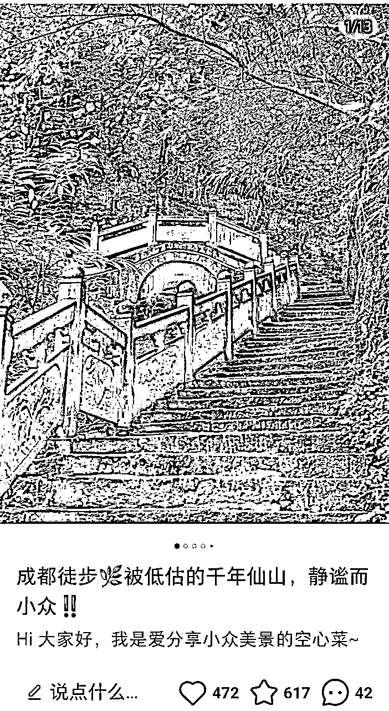

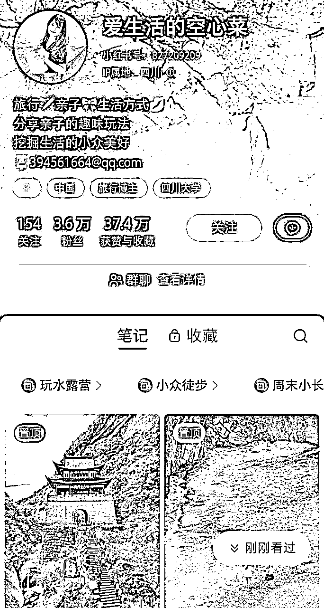

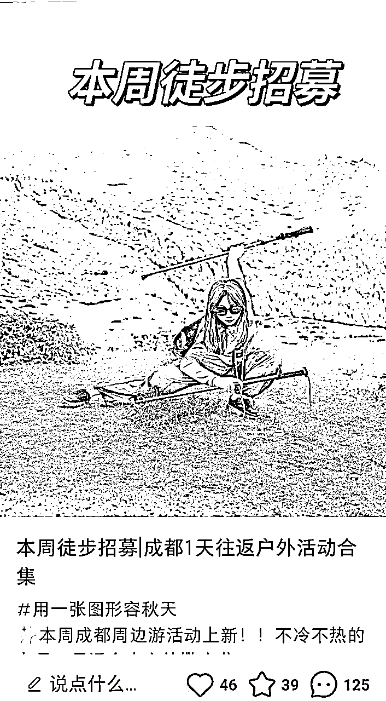

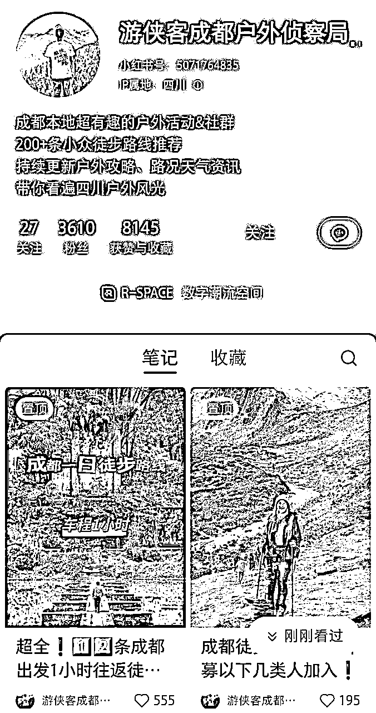

#### 7.6.2 适合谁做

1.自己是商家，专业的徒步机构

2.喜欢周末徒步的人

3.喜欢并且愿意组局招募一起徒步的人

#### 7.6.3 操作关键

1.明确自己的变现方式

接广 or 招募

2.从变现方式倒推该怎么设计笔记

如果变现方式是接广告，那就是真人出镜+真实分享，在标题中带上本地的 tag，方便本地商家博主找到你。

如果变现方式是招募他人一起参与徒步，那就可以以“每周一山”为选题来设计笔记，或者在笔记中带上具体的时间和地点，如“11.10 日，XXX 徒步招募”这样的信息，来引导在这个时间有时间且对徒步感兴趣的目标用户直接来咨询。

### 7.7 本地周末亲子游

#### 7.7.1 玩法介绍

本地周末亲子游和本地徒步的玩法很像，也是分为接广玩法和商家玩法。

接广玩法就是晒自己周末带着娃出去玩的相关路线、攻略分享，变现方式就是接本地涉及亲子项目的相关商家来找你合作；

商家玩法就是你自己是亲子游活动举办方，通过分享亲子活动的内容来吸引本地宝妈来参与你的亲子活动，进而变现。

#### 7.7.2 适合谁做

1.有娃且有时间遛娃的宝妈

2.亲子活动商家

#### 7.7.3 操作关键

1.明确自己的变现方式

接广 or 招募

2.从变现方式倒推该怎么设计笔记

如果变现方式是接广告，那就是带娃真人出镜+真实分享，在标题中带上本地的 tag，方便本地商家博主找到你。

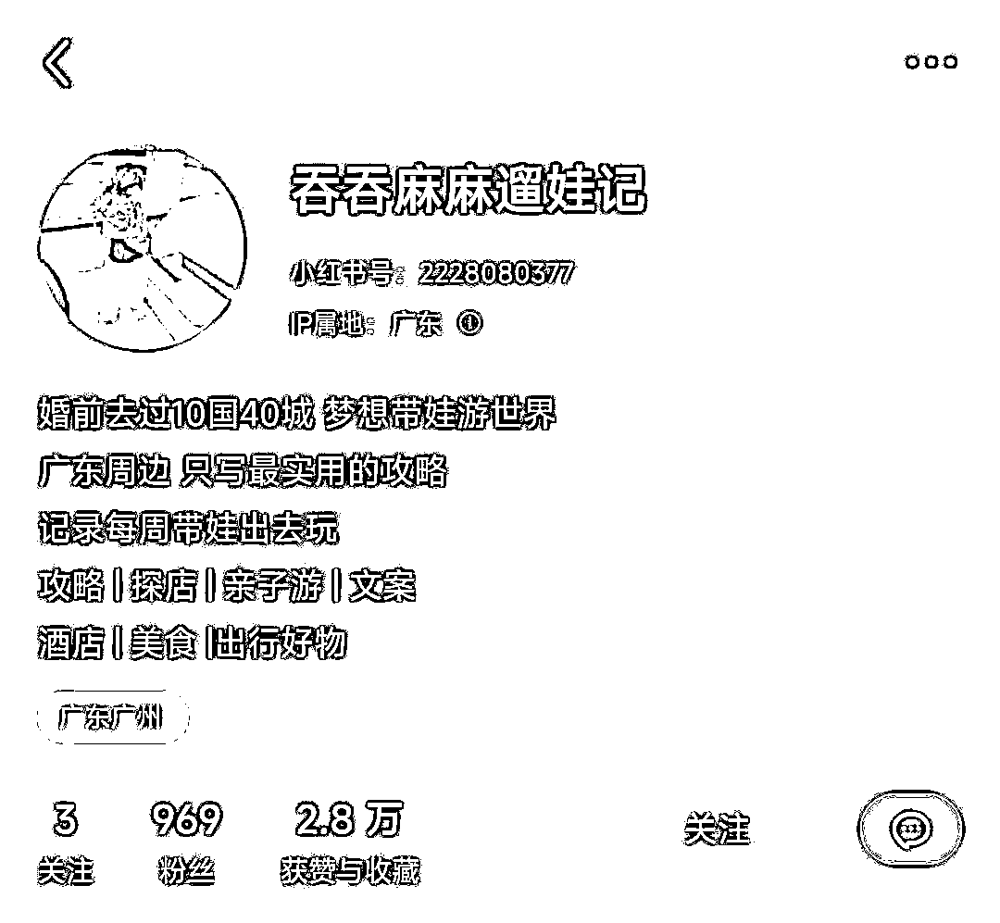

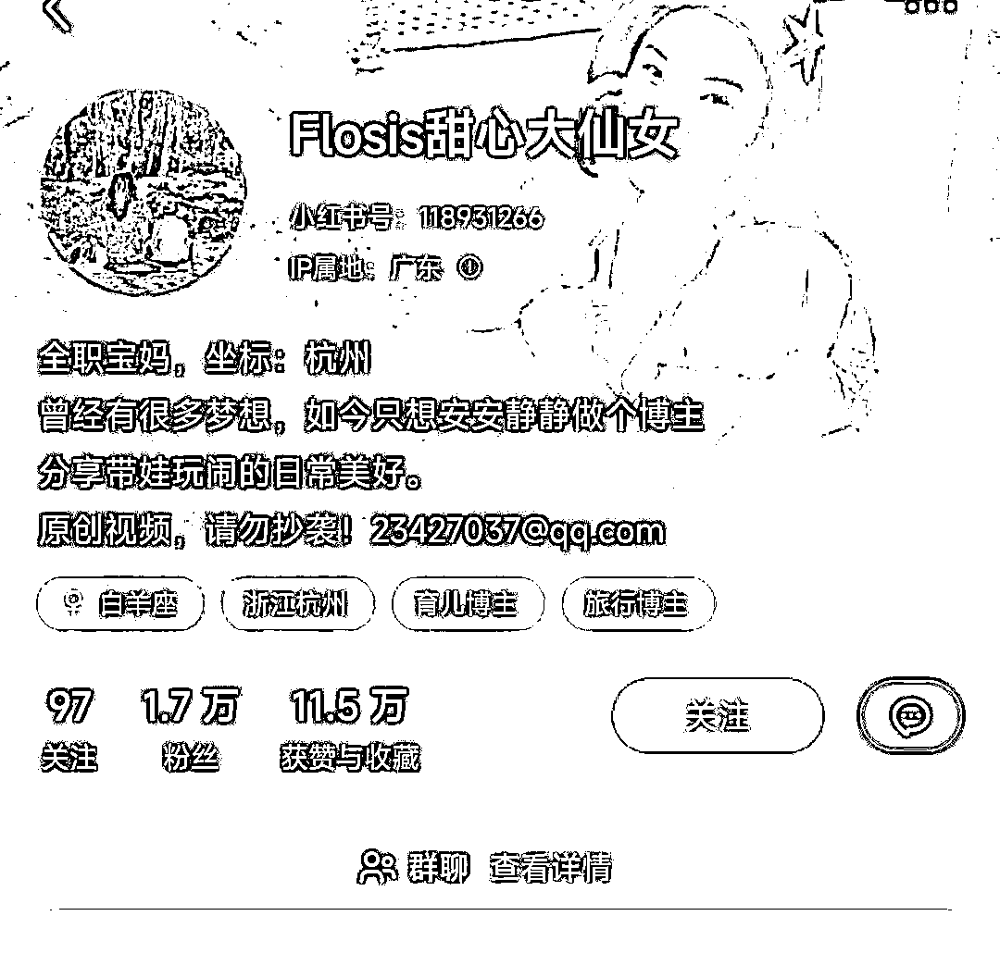

如果你本身是商家，那可以通过展示真实的活动反馈、介绍不同的亲子主题活动玩法、发布每周遛娃的招募信息等，来打造自己本地周末亲子游的 IP，再将小红书上的目标用户引流到微信。

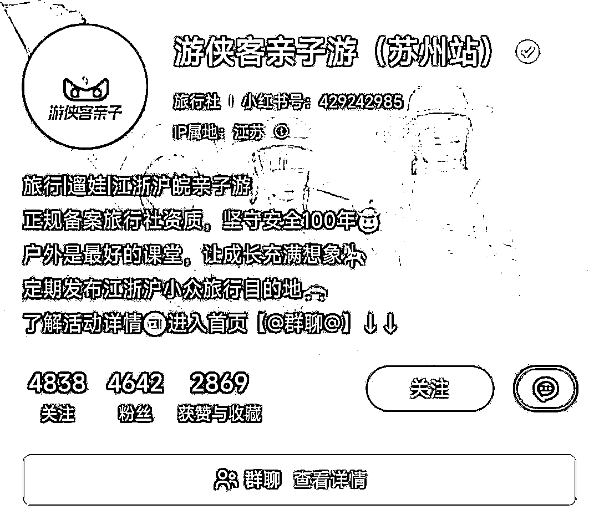

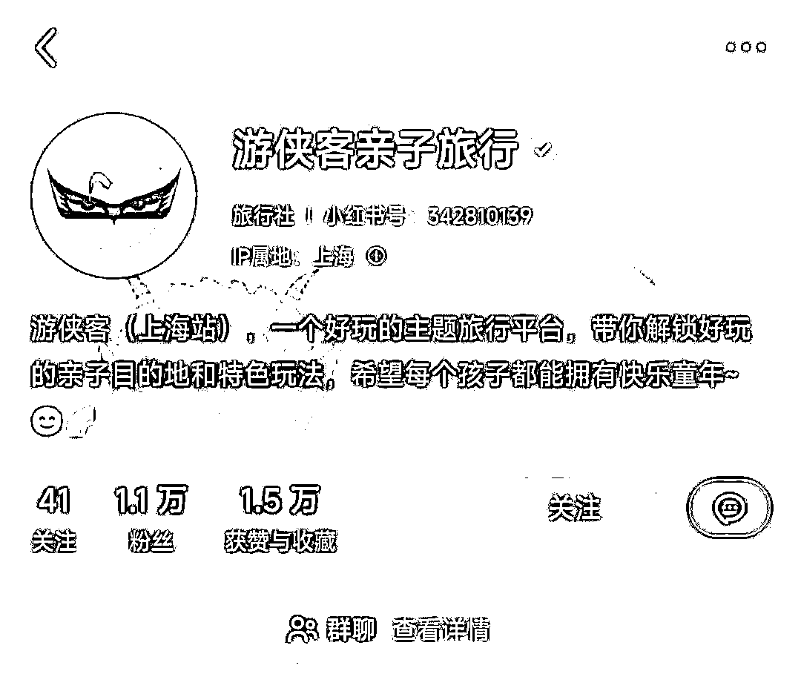

### 7.8 境外高客单游

#### 7.8.1 玩法介绍

通过小红书发布境外游相关产品，可以是跟团游，也可以是定制游（客单都挺高的），然后引导用户进入私域，进行成交。

#### 7.8.2 适合谁做

1.有境外旅行社供应链

2.有转化高客单能力的人

#### 7.8.3 操作关键

1.找境外旅行社合作

这个玩法最难的部分就是怎么找到愿意跟你对接的靠谱的境外旅行社，要么你就在当地，要么就是你有关系较硬的朋友可以帮你对接到旅行社，否则旅行社基本都不搭理你；

2.境外佣金汇款

能解决境外将佣金汇款到境内的问题，涉及到境内外资金的来往，也是一个难点；

3.微信成交

是否有当地的人帮你做客服成交用户，一般境外旅行社的人时薪都挺高的，他们不太会愿意帮你做转化，嫌麻烦。但是如果你没有该国的旅游或常驻经验，那你根本回答不了顾客的问题，成交就会很困难。

