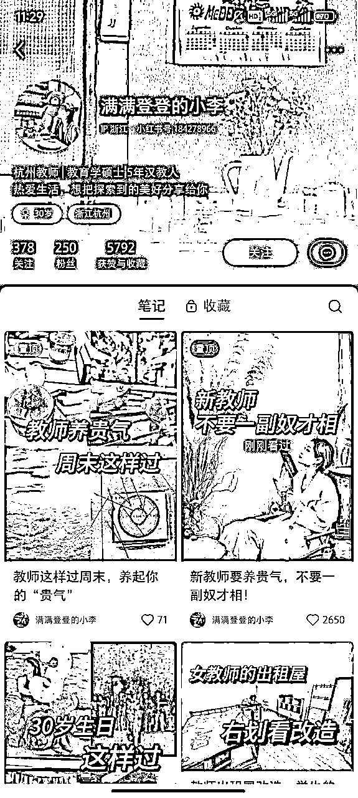
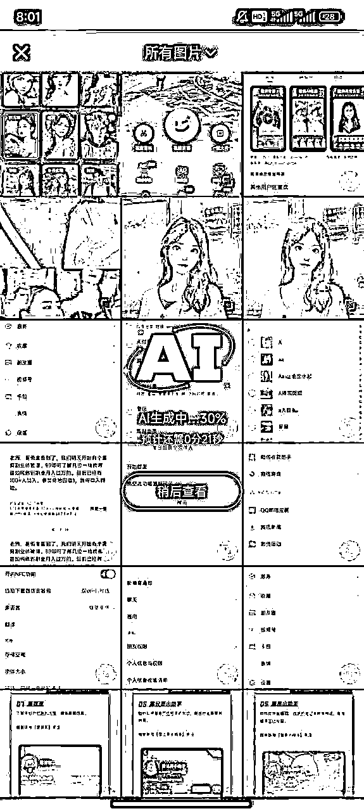
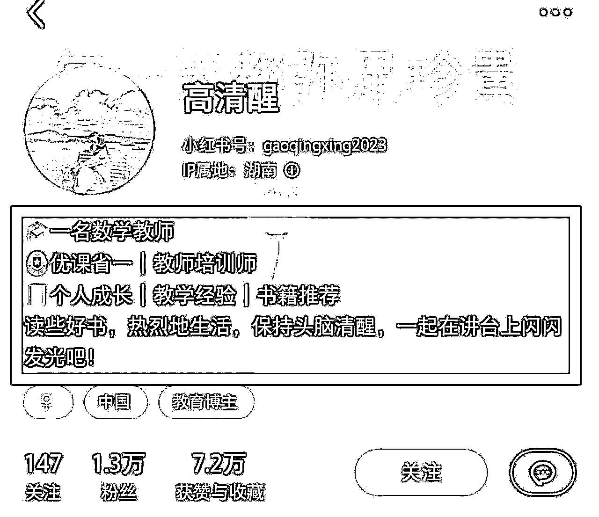
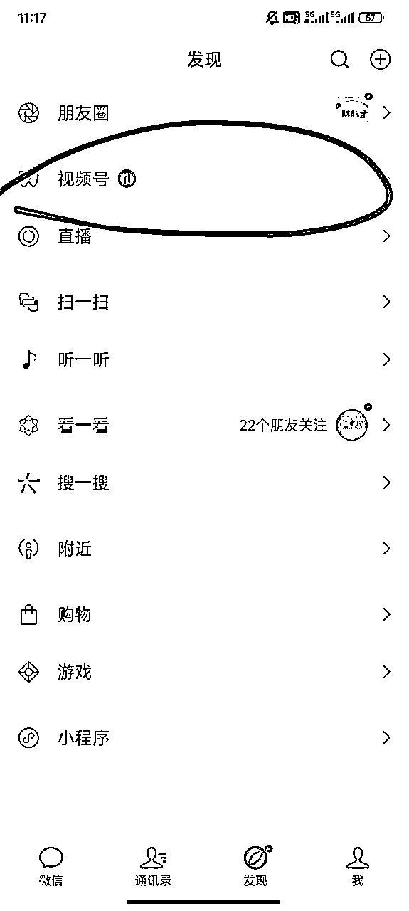
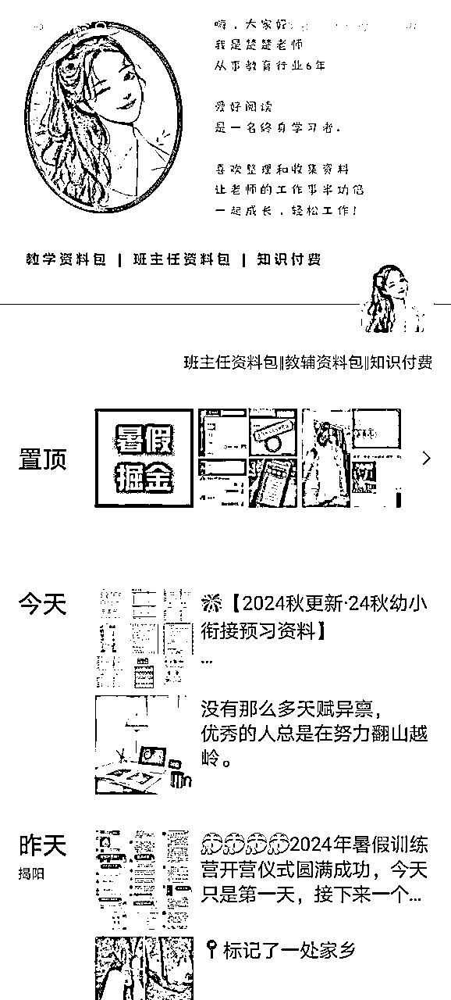
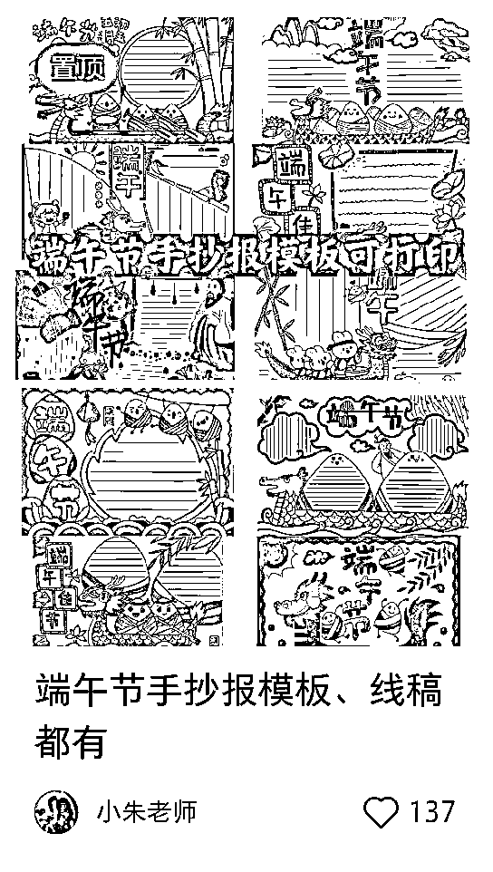
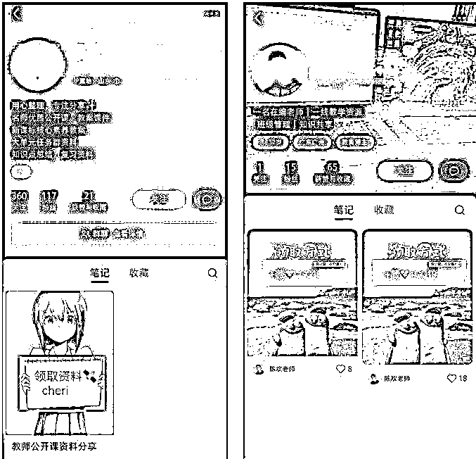
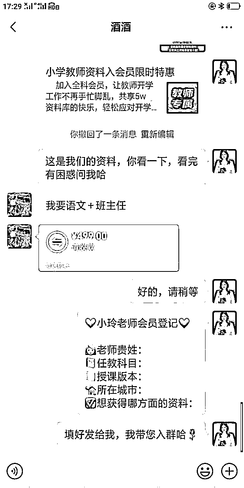
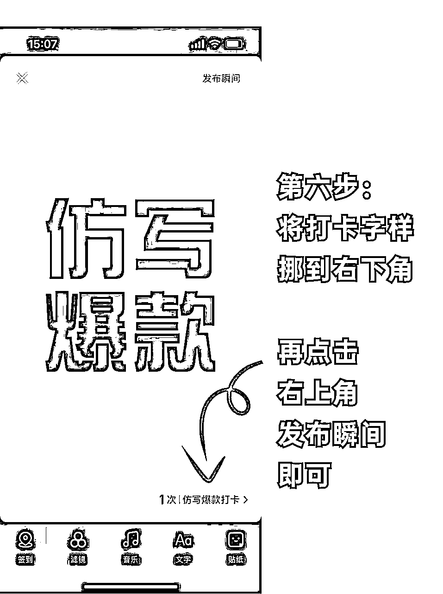
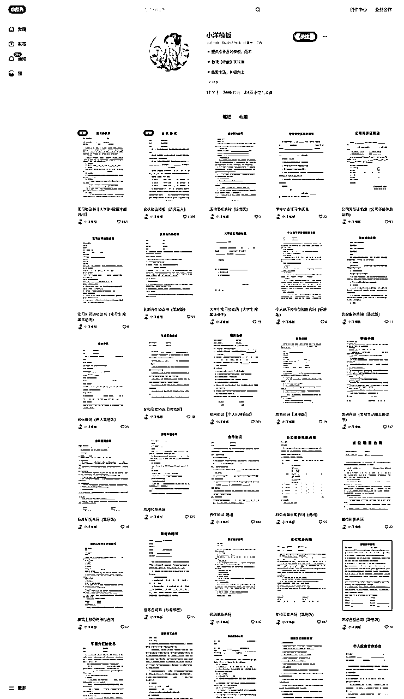

# 12 月航海 | 小红书引流-教育资料篇 | 实战手册

> 来源：[https://ocn93f5d9olj.feishu.cn/docx/FpU4dsczlomytfxcDUkcX866nwd](https://ocn93f5d9olj.feishu.cn/docx/FpU4dsczlomytfxcDUkcX866nwd)

# 防失联+MM188166M（李李）长期更新频繁+备用V:MG10127

手册出品方：生财有术团队

出品时间：2024 年 12 月 3 日

手册使用说明：本文旨在向你展示一个项目的更多可能性，帮助你更好地理解或实操。

建议：如果需要快速定位到精确内容，可以使用快捷键 Ctrl + F/Command + F 的形式，搜索「关键字/词」，查找你想要的内容。

# 写在前面：

# 💡

欢迎大家来到 12 月航海 | 小红书引流·教育资料篇 | 实战手册， 相信接下来的日子里，我们将在这里见面很多次。

在开始学习 小红书引流·教育资料篇 之前，我们先来解决几个问题：

1）小红书引流·教育资料篇目 是什么？

一句话解释：通过在小红书平台发布优质作品，引流教育领域粉丝到微信私域，并转化为教育资料产品的购买者，从而实现变现的一个项目。

市场上对该项目有多种称谓，如：学科资料变现、小红书学科教辅、小红书虚拟资料、小红书虚拟电商等。尽管名称不同，但本质都是通过“小红书引流·教育资料”实现变现。

整个路径中有两个关键难点：一是如何避免违规限流并顺利完成引流，二是如何搭建自己的资料库。这两点我们将在接下来和大家详细讲解。

2）这个项目现状如何？收益空间如何？

教育自古以来一直是社会关注的焦点，“再穷不能穷教育”正是体现了这一点。教育作为民生之本，市场需求极大，并且如今政策也在大力支持教育行业的发展，处在政策红利期。

几乎每个人都有对教育资料产品的需求，这为项目提供了巨大的市场空间。

从微观层面看，小红书的用户具有较高的消费潜力和付费意识，平台的定位和人群画像也非常契合教育资料赛道的需求。

然而，小红书不再像前几年那样，靠简单的搬运和洗稿就能轻松获利。如今，只有踏实做内容，才能在小红书赛道上长期赚到钱。

与传统电商相比，教育资料大多为虚拟产品，具有无需资金垫付、无需物流仓储、低成本、高利润、售后少等特点。

这个项目的特点是：重运营、轻交付，需要更多时间和精力投入在内容制作和引流获客上。

3）什么样的人适合做该项目？

1.任何想通过卖教育资料获得变现的朋友。

2.副业或者居家创业者的优质选择之一。

3.在教育领域，苦于流量增长的朋友。

4.已有教育产品（服务）或者能找到教育机构合作分销产品（服务）的朋友。

综合来看，整个项目的入门门槛和操作难度并不大，绝大多数人都适合做，随着流量的不断积累、沉淀，收益也会越来越可观。

这本手册作为标准说明书，能帮助大家解决 80%以上的常见问题。除了手册内容外，希望大家秉持“边做边学”的实战理念，在实战过程中积极与教练、志愿者、圈友们交流。这个项目已经经过多次验证，你遇到的问题，一定能找到相应的解决方案。

本航海项目航线图如下：

# 手册使用方式

在开始前，我们来简单了解一下这个手册的正确打开方式，方便你根据自己的情况来灵活使用。

📌如果你还未接触过小红书平台：

建议在正式实操前，先初步了解下这个平台，并了解它的最新消息👇

✅ 小红书的用户画像

✅ 小红书的内容形式

✅ 小红书的流量机制解析

✅ 小红书新规应对措施

✅ 小红书平台的常规操作指南

📌如果你对虚拟资料玩法不清楚：

请开始按照航线图的步骤，完成技能学习，这个阶段你可以从手册的第二章开始阅读👇

✅ 什么是教育资料引流？

✅ 教育资料的变现方式

✅ 项目基本流程

📌如果你想直接上手实操：

可以跟着下方的项目实操流程来上手👇

✅【步骤 1】确定赛道

✅ 【步骤 2】调研竞品

✅【步骤 3】搭建账号

✅【步骤 4】制作笔记

✅【步骤 5】引流变现

✅【步骤 6】准备资料

# 必修篇：项目 0-1

# 一、了解小红书教育资料引流项目

# 1.1 什么是小红书教育资料引流？

教育资料引流，即吸引精准的教育粉丝进入私域，匹配高需求的教育资料产品从而获得销售变现的一个项目。

市场上对该项目有多种称谓，如：学科资料变现、小红书学科教辅、小红书虚拟资料、小红书虚拟电商等。尽管名称不同，但本质都是小红书教育资料引流项目。

教育一直是我国一个超高需求的行业，并且随着时间推移，热度只增不减。就拿高考之后的志愿填报举例，艾媒咨询的数据显示，2023 年中国高考志愿付费市场规模，达 9.5 亿元，是 2016 年的 7.3 倍。

分享 3 个真实的案例，你会更加理解该项目的潜在价值

一份 ppt 模版 139，已售 9167 份，营业额 127w4213 元，成本大概也就是 5%的平台提现手续费，模版一旦开发出来边际成本就无限趋于 0 了，一个人就能赚 120w

1 天搬运一篇外网文章，169 元一年会员，已售 2.1W+，收入 354w9000 元。手机摄影课程，199 元，已售 3w+单，合计营收 597w+。

分享留学干货，家长前来下单咨询，和留学机构/个人工作室进行合作后端文书交付，30w 咨询费可以直接抽成 30%，9w 到手

为什么选择小红书做引流 ？

我们结合小红书的平台、用户特征，来了解一下。

①用户精准

80%的女性用户年龄集中在 18～34 岁，基本就是我们这个教育资料项目的精准人群了。

你想想你身边的年轻女性，是不是除了抖音、各大社交平台外，刷的最多的就是小红书了？

②定位精准

小红薯是现在仅次于百度的搜索场景。平台定位就是种草和分享社区。

只要你用心分享有价值的信息，有知识点的笔记，就能够赢得大家的信任感。再通过一些我们教的方法去引导点赞，收藏，评论，关注，引导私域，就很容易达成交易。

②付费意愿高

女性在消费的地位，不言而喻的。整个小红书的用户群体在消费决策这块是要比其他平台高很多的。

只要是你图文并茂去描述一个东西，基本就能安利到一大批人。

理由一：用户特质高度匹配（找准赛道）

在小红书看少儿教育内容的家长大多来自一二线城市，自身有一定的教育水平，重视素质教育和快乐教育，对子女教育的投入意愿较高。

另一方面，小红书用户整体较为年轻化，重视实用主义，核心动机是提高职业技能和竞争力，值得成人教育机构投入。

小红书的用户画像是符合教育领域的消费群体的，尤其是直接在网上购买资料这类决策成本低的事情。

理由二：小红书种草属性强（建立用户关系）

小红书是一个社交型种草平台，通过优质的内容和精准的账号定位，迅速吸引大量目标用户的关注。

课堂笔记、论文答辩、学习打卡、准留子出圈指南……这届年轻人越来越喜欢在小红书上分享自己的学习心得、交流经验，会学习、热爱学习的年轻人，在小红书上寻找各种“上岸”方法论。过去一年，小红书教育行业的内容增长 665%，教育行业专业号增长 181%，已然成为教育行业的流量洼地。

理由三：小红书健全的教育生态（找准人群）

近年来持续的考公、考研、英语学习等教育话题备受关注，小红书关于教育行业的内容暴涨 665%，已有 130 万＋教育创作者产出超 5000 万教育内容笔记。

国内的教育体系，你在小红书平台基本都能找到相关的笔记案例。当然，某些小众需求或者垂直细分赛道可能比较少，这恰恰也是我们的蓝海机会。

理由四：小红书用户自我驱动（引发共鸣）

举个鸡娃的例子，一个家长看到某个老师分享的学霸手写笔记，想到自己家孩子时常年级倒数，顿时购买欲是不是马上就飙升了？

举个备考的例子，一个备考学生，看到某个前辈已经把往年考试的重点都做了提炼并做了注解，顿时购买欲是不是马上就飙升了？

再举个例子，一个正在备课的教师正在小红书苦苦找案例素材，正好看到了某个老师分享了全国名校的全套教案素材，顿时购买欲是不是马上就飙升了？

教育资料引流的项目流程是什么？

1.

确定赛道：市场数据分析能力

做什么：通过分析我国教育领域大部分的细分赛道，并结合小红书平台用户需求。选择赛道之后做好账号的定位，以及相关的内容选题。

怎么做：在第一阶段教学中，将对我国大部分的教育细分领域做详细的解释说明，供大家选择。在这个阶段，教大家如何结合自身的优势去选择一个最适合自己的赛道。

2.

整理产品：资料检索和整理能力

做什么：确定好赛道之后，那么我们就要匹配对应的产品了。

怎么做：同样在第一阶段会教大家如何去整理资料并搭建自己的产品库，从而为后面的变现做足充分的准备工作。

3.

搭建账号：定位能力

做什么：根据我们所选的赛道，搭建适合的小红书账号 IP。

怎么做：所有的小红书搭建细节，我们会在第一阶段跟大家做详细的指引。

4.

制作作品：内容制作能力

做什么：完成前三部分的确定赛道、整理产品、搭建账号、后就到了我们的制作作品环节了，这里非常考验我们的内容创作能力。

怎么做：在第二阶段会详细的教大家如何去做出爆款的作品的每一个具体步骤，希望大家动起手来，一起把手弄脏。

5.

引流私域：平台运营能力

做什么：如果说你的作品爆了，有非常多的流量，但是这些流量没办法进入到我们的私域，那么这是一件多么遗憾的事情呀。

怎么做：为了避免这个遗憾的发生，我们同样在第二阶段会给大家分享小红书导流私域的一些小技巧。

6.

成交转化：销售转化能力

做什么：整个项目来到了我们最后一个阶段：私域的成交转化了，那这里头涉及到成交话术、朋友圈打造以及私域运营技巧和相关的注意事项。

怎么做：我们会在第三阶段跟大家进行私域板块的魔鬼式训练，这也是当下互联网人非常稀缺的一个能力——私域运营能力。

完成了最后一步，也就完成了整个项目的闭环，恭喜你！已经实现了从 0～1 的变现！

# 1.2 变现方式：出售资料包变现（新手推荐）

教育资料项目，主流的有 8 种变现方式，我们本次航海，会选择最容易上手，以及门槛最低的“出售资料包变现”，带大家上手实操。其他 7 种变现方式，可以在选修中查看。

变现形式 1：单一销售某一种资源变现

以 K12 教育资料为例：比如 语文、数学、英语、科学、道德与法治、音乐、美术等科目......

以英语四六级资料为例：比如 词汇表、语法精讲、历年真题解析、模拟试题、听力练习、口语练习等

客单价：一般几十到几百不等，根据你所在赛道的市场情况而定。

变现形式 2：建立付费社群，提供打包销售

以 K12 教育资料为例：比如 学期群、学年群、全年级学科群、永久资料会员......

以英语四六级资料为例：比如 四级 VIP 全程班、六级 VIP 全班

客单价：比单一销售某一种资源会高，一般几十到几百不等，甚至上千，根据你所在赛道的市场情况而定。

# 二、确定赛道

# 💡

章节概要：

选择大于努力，方向不对，努力白费，在一个优质赛道中深耕所能带来的效益，在大多数情况下，比在一个低质赛道高很多。

赛道意味着起跑线、也意味着天花板。

# 2.1 选择赛道

从你的经历去挑选，就是根据 "求学、工作、爱好兴趣，以及身份 " 等选一个，

千万不要像叶公好龙把 "没经历过，但脑子觉得不错"的事情作为你的赛道，要把上帝给你的每个经历当作礼物，比如：

对于你的求学生涯，你刚开始是专科，然后专升本，之后考上了研究生，那么你可以做专升本、考研。

对于你的工作经历，你是一名英语教师，或者做过英语家教（反正跟英语教育扯上关系），那么你可以去做英语。

对于你的爱好兴趣，比如你喜欢把读书心得、课程笔记做成竖屏思维导图，那么你可以考虑做竖屏思维导图。

对于你的身份里，你有一个女儿在上小学一年级，你是一名宝妈，那你可以去做一年级，或者你可以去做宝妈能变现的事情。

如果你不知道选什么，那么让教练推荐一个，最好是跟某个教练做一样的赛道，甚至跟他卖一样的产品，有什么问题立马找他解决，毕竟骑着同行过河不如骑着教练过河快。

# 2.2 推荐赛道

在这里我会给给大家推荐 5 个主流 K12 教育资料赛道。

手册给大家整理了 5 个主流的 K12 教育资料赛道，大家可以先看看每个赛道的对标账号，以及内容形式，最后选择 1 个赛道，作为自己航海的项目。

# 2.2.1 家长、学生端

# 赛道 1：K12（小学赛道）

纸质版资料实拍

彩色电子版资料

标题卡通封面

赛道说明：

1.

目标客户：小学家长

2.

赛道主要提供小学阶段语文、数学、英语等科目的学习资料，帮助小学生提高学习成绩和掌握基础知识。

3.

学习资料覆盖 1 到 6 年级，按年级和科目进行分类，后期将增加编程、艺术（美术、音乐）等新兴学科的学习资源，丰富 SKU 种类。

4.

通过对接教育机构，提供官方授权课程和辅导资料，进行二次变现

黄金时期：

5.

一级黄金时期：期中考试和期末考试前夕（通常为每学期的中后期，即 4 月、6 月、10 月、12 月），是学习资料需求最集中的时期，销售量最高。

6.

二级黄金时期：寒暑假期间（1-2 月、7-8 月），家长购买学习资料以帮助孩子巩固知识和预习新学期课程，市场需求较大。

7.

三级黄金时期：开学初期（3 月、9 月），家长为新学期做准备，会集中购买相关学习资料。

# 赛道 2：K12（初中赛道）

重点资料封面

手写笔记封面

中高考干货输出

赛道说明：

1.

目标客户：初中学生、初中学生家长

2.

赛道主要提供初中各科目（如语文、数学、英语、物理、化学、历史、地理、政治等）的学习资料，帮助初中学生提高学习成绩，尤其是针对中考的备考资料。

3.

学习资料包括教材解析、重点难点分析、模拟试题、复习规划等，销售形式涵盖单科目资料和综合打包方案，满足不同学生的需求。

4.

通过与学校、培训机构合作，提供系统化的在线课程和教师辅导服务，实现二次变现。并通过家长社群运营和学生用户社群互动，增强用户粘性和复购率。

黄金时期：

5.

一级黄金时期：中考前的最后三个月（4-6 月），此时学生和家长对备考资料的需求最为强烈，销售高峰期。

6.

二级黄金时期：期中考试和期末考试前夕（3 月、5 月、10 月、12 月），学生和家长会集中购买复习资料，需求较高。

7.

三级黄金时期：寒暑假期间（1 月、7-8 月），学生利用假期进行预习和复习，资料的市场需求保持稳定。

# 赛道 3：K12（高中赛道）

纯文字封面

卡通封面封面

手写笔记封面

赛道说明：

1.

目标客户：高中学生、高中学生家长

2.

赛道主要提供高中各科目复习资料，涵盖语文、数学、英语、物理、化学、生物、历史、地理、政治等科目，帮助学生在高考及其他重要考试中提高学习效率。2\. 复习资料包括教材讲解、考试重点分析、模拟试题和答题技巧等内容。

3.

销售形式初期以年级和科目打包出售为主，后期拓展单科目、单模块以及全年级打包三种方式进行销售，共上百个 SKU，以满足不同学生的需求。

4.

二次变现策略包括提供考研、出国留学、艺术类考试、竞赛培训等延伸服务，通过与在线教育平台合作，提供线上课程和直播课，进一步扩大市场覆盖面。

黄金时期：

5.

一级黄金时期：高考前的最后三个月（3-5 月），是复习资料和考试指导需求最高的时间段，家长和学生的购买意愿最强。

6.

二级黄金时期：期中考试和期末考试月份（4 月、10 月、12 月），学生和家长会集中购买复习资料，以应对即将到来的考试。

7.

三级黄金时期：寒暑假期间（1-2 月、7-8 月），学生利用假期时间进行自主复习和巩固知识，市场需求量相对较高。

# 2.2.2 教师端

# 赛道 4：K12（小学教师赛道）

备忘录干货输出

四宫格+真人出镜

实拍资料

赛道说明：

1.

目标用户：小学教师

2.

赛道主要提供小学教师的教学资料和工具，涵盖教学大纲、课件设计、教学活动方案、考试与评估工具等，帮助小学教师提升课堂教学质量，满足课程标准要求。

3.

资料内容覆盖 1 到 6 年级的语文、数学、英语、科学、道德与法治、音乐、美术等科目。初期以年级和科目打包形式出售，后期拓展为单科目、主题式教学资料，增加 SKU 种类。

4.

通过与教育培训机构合作，提供教师培训课程、示范课观摩、教学技巧提升等增值服务，实现二次变现。

黄金时期：

5.

一级黄金时期：新学期开学前（1-2 月、8-9 月），教师需要为新学期准备教学资料和计划，此时需求量最大。

6.

二级黄金时期：期中和期末考试前（3 月、6 月、10 月、12 月），教师会更新或补充教学资料，市场需求增加。

7.

三级黄金时期：寒暑假期间（1 月、7-8 月），教师利用假期进行教学研究和课程准备，对教学资料的需求保持较高水平。

# 赛道 5：K12（幼儿园教师）

公开课课件展示

教师方法论输出类

真人授课出境 vlog

赛道说明：

1.

目标用户：幼儿园教师

2.

赛道主要提供幼儿园教师使用的教学资料和资源，涵盖教育大纲、教学计划、课件设计、课堂活动方案、评估与反馈工具等，帮助幼儿园教师提升教学质量，满足幼儿园教育标准。

3.

初期以整套教学计划和资料打包出售，后期拓展为单个主题或领域的资料与打包出售并存，提供多样化的 SKU 选择。

4.

通过与教育机构合作，提供教师培训课程、工作坊等增值服务，形成二次变现。

黄金时期：

5.

一级黄金时期：新学期开学前（1-2 月、8-9 月），此时幼儿园教师需要准备新学期的教学资料，需求量最大。

6.

二级黄金时期：学期中期（4 月、10 月），教师通常会进行教学调整和补充资料，需求增加。

7.

三级黄金时期：寒暑假期间（1 月、7-8 月），教师利用假期进行自我提升和教学准备，市场需求保持较高水平。

# 三、调研竞品

# 💡

章节概要：

为什么要调研同行？

小红书资料引流赚钱的核心原则：谁赚钱，模仿谁

所以，我们需要调研同行，进而识别出，哪个同行卖得好？他卖的是什么？他怎么搞流量的？他怎么做成交的？

在寻找对标前，你可以选出一个产品作为拳头产品，比如你的拳头产品是付费虚拟资料，或者是跟机构合作的视频课程。小学赛道，建议选择付费虚拟资料，考公考研建议选跟机构合作的视频课程。

# 3.1 如何调研 100 个同行

首先，选择的对标需要是跟自己背景相似，最好是踮着脚就能达到他的水平的竞品

什么是背景相似？大家业务路径一样，特别是：产品是付费虚拟资料，流量在小红书搞的，转化在微信成交的。

什么是踮着脚达到他的水平？做在自己学习区的事。本质是舒适区、学习区、恐慌区的区别。假设你没做过图文，那么第一次做图文最好是截图虚拟资料＋贴纸，这样你只需要学习怎么截图，怎么搞贴纸。而不是做华丽背景、原创得花好几小时的图文内容。

调研同行没什么技巧，只需要拆解 100 个同行，就可以快速弄清楚小红书账号主页怎么装修、微信成交话术逻辑是什么。

调研好 100 个同行后，下一步是算账（出来就是要赚钱，事先不算帐就去做，亏了怎么办）：

怎么算好 1 个同行的账？从他朋友圈的群成员截图或者快团团的支付方式，比如他的快团团，每天平均 10 人购买，一单卖 50 元，说明他一天销售额 500 元，由于虚拟资料的边际成本是 0，也就是一天利润 500 元。

按照“怎么算好 1 个同行的账”的方法去算出利润，做个正态分布表，比如 20% 同行月入 10w，60% 同行月入 1w，20% 同行月入 5000。

当你算出同行的账目，那么你去做，大概率能月入 1w 。 当然了，如果你学业或者做事都是 top20，大概率月入 10w。

然后你把同行调研表 top10 同行找出来，直接抄他们的路径，甚至 1：1 模仿，比如抄他们的小红书账号的昵称跟头像，抄他们的微信头像跟昵称，把他们的朋友圈直接搬到自己的朋友圈去。

# 3.2 确认业务路径

假如我们做的是二年级上册语文的垂直赛道，卖得是家长端的付费虚拟资料，就要想清楚：

1.

了解学什么：产品是付费虚拟资料，流量在小红书搞，转化在微信成交。

2.

搞明白目的：赚到 1 元钱称为跑通，回本称为有结果，10 倍回本是拿到大结果，从一个月赚到 1 块钱开始

3.

拆解目标：产品-流量-转化，要把三个点形成业务闭环：产品-流量-转化-交付-售后。

这里有两个原则：

一是专注，比如你的核心产品是卖付费虚拟资料，那么免费玩法、招代理卖视频课、淘宝客，都不需要再考虑。

二是最小成本，包括时间精力、金钱，比如：

4.

时间精力：要求业务路径越简单越好。

参考1：产品找同行领取、购买。资料发放：百度网盘能一键转存，但 QQ 群还需要我一个个转存，百度网盘会比 QQ 群更省力，先用百度网盘。

5.

金钱：出来赚钱，首先要保证自己不亏，或者越低成本越好。

参考1：产品可以先不准备，不要去做资料供应商，更不要给代理费做合伙人，完全可以等到首个用户付费，例如：给了你 39.9 元买二上语文虚拟资料，那么你可以找同行或拼多多商家买，只要价格 ≤ 39.9 元就好。出来就是赚钱，不亏是底线，要坚守住。

参考2：手机，买不如租，一个二手机，差一点的要 300-400，还可能是黑机，还不如花租个二手机，50 元/月，但这个二手机售价是 500 元以上。这样就算项目失败了，只是损失 50 元，而不是还要拿去闲鱼卖，亏了两三百才能卖出。其次是工作室都用那些 300 左右的二手机，而你租的二手机是 500 元以上，工作室跟你不同纬度，也压根不用去学习刷机。

到了这一步，你基本能确定：

1.产品：你卖的是什么？定价多少？在哪里能找到产品货源？卖一单利润是多少？

2.流量：你在小红书要发什么笔记？

3.引流：在小红书群聊还是私信发微信号，引导用户加微信？

3.转化：成交话术逻辑是怎么样的？怎么发朋友圈？

# 四、完成账号搭建

# 💡

章节概要：

小红书虚拟资料项目中，账号是我们最重要的资产，如果账号出现异常，会直接影响我们的收益。

如果希望深耕这个项目，账号搭建、养号、微信号养号是必备的技能。

# 4.1 打造高权重小红书账号

# 4.1.1 准备设备

✔️ 手机准备：未注册过小红书或使用过程中没有过违规的设备。

✔️ 电话卡准备：使用自己没有注册过小红书的手机卡

可以营业厅办理，一张主卡托两张副卡；也可以网上自行办理；

✔️ 账号准备：保证一卡一机一号。用流量卡注册，不要连接 WiFi（包括后续的运营过程中）。

# 4.1.1.1 手机准备

大家都知道，如果是个人的话，可能设备比较少（十台以内），做到工作室矩阵级别，那用到的设备数量是 10 台以上，甚至上百台。这里给大家做一些工作室常用设备推荐。

苹果设备推荐机型

iphone7：工作室钉子户，性价比高，流程速度快

iphone8：游戏和短视频居多，功耗低运行速度快

iPhoneSE2：存在感差，直播电商短视频都 OK

iphoneX：直播电商短视频养号，预算充足可上

安卓设备推荐机型

红米 10x：中规中矩

小米 10 青春 8+128g：性能好

小米 8 青春小米 8se：多人用的

安卓设备还有很多，这里就不一一列举了

原则上：

能买二手的就别买全新的，当然现在很多国全新设备“便靓正”。

能买原装就别买组装（注意辨：无指纹无面容=拆机） 尽量不要去闲鱼

能买国行就别买外版

买配置别买外观

买品牌不买杂牌

具体机型：优先考虑 8+128GB

年限：4 年内安卓&6 年内苹果机*

建议是能够由 3 台或以上的手机，因为机器越多，成功的概率就越高，并且去营业厅办理三张及以上的手机卡，月租选最便宜的，但需要有流量，流量最好是 20G 以上，用 1 张主卡绑定 2 张副卡的模式办理，你营业厅直接和工作人员说，她就会给你推荐卡了。

# 4.1.1.2 电话卡准备

办卡渠道一：当地营业厅直接办理。

办卡渠道二：直接支付宝搜“号卡中心”可直接办理。

另外做我们这个项目小红书全程禁止🚫Wifi 状态！所以一机一卡。只能用 4G/5G 流量，必须独立的网络环境！

提示 ：双开的手机，可以双卡，用其中一个注册小红书即可。

# 4.1.1.3 账号准备

⚠️ 除了店铺打法必须实名外，所有导流账号一定不要实名！封了解不了！

准备三个从来没有注册过小红书的电话号码，之前有小红书账号的建议直接注销，重新注册。

小红书账号的注销流程，以下是简化的步骤指南：

打开小红书 App→进入设置页面→访问账号与安全→选择注销账号→阅读并同意条款→选择注销原因→提交申请

以下是注销账号的图文说明：

注意：账号注销后直接把小红书卸载掉，隔一天后重新下载，进行注册养号流程。（如果说以后我们账号因为不当操作违规了，想注销，也要走我这个流程）

设备如何最大程度避免设备风控？

小红书如果账号被封得太多的话，会被封设备，不封设备也会风控，新上的号会出现吞评论以及私信的情况，所以一台设备封过 1～3 个号就需要进行刷机。

1）如果你是安卓设备：

直接深度刷机

https://onfix.cn/rom

该网站内有深度刷机教程和刷机包，大家可以根据你的安卓机型，自行使用。记住，自己恢复出厂设置是起不到刷机效果的，因为底层串码无法修改，平台依旧会判断你为“违规设备”。

2）如果你是苹果设备：

首先在手机先“还原 iPhone”1 次～2 次，然后电脑下载爱思助手使用爱思再刷一次。

手机设置➟通用➟传输还原 iphone➟抹除所有内容和设置

点击智能刷机 ➟ iTunes 刷机 ➟ 连接数据线 ➟ 下载固件 ➟ 点击防数据恢复刷机 ➟ 立即刷机

爱思助手官网：https://www.i4.cn/

# 4.1.2 养号攻略

什么时候需要养号？

刚刚注册的新账号；

被平台警告（禁言 24 小时/3 天/7 天等）、降权的号；

注册很久，想要发笔记的老号。

1）开始养号第一天

1.

注册好账号，保证一机一卡一号。如果是批量起号（3 个以上），每个注册时间间隔时间 4 小时以上。

2.

注册账号选择兴趣内容的时候，选择你的赛道相关的，例如小学教师资料赛道，选育儿、学习类。

3.

其它地方都不用动，点首页刷推荐内容，随便刷，适当点赞评论收藏（不要看敏感的东西）。

4.

当做咱们平时刷抖音刷 b 站一样去刷 1.5 小时以上（可分开或连续），第一天把自己当成正常用户，点开的笔记一定要浏览完，适当点赞收藏评论。

⚠️ 强提醒：注册账号时一定用流量，不要用无线，不然你所有的号一个 IP 地址，账号就会被判定为营销号，流量起不来（我们团队的工作机，从来没连过 WiFi，还要偶尔带出去溜溜，装的像个正常手机就行）

2）养号第二天

5.

确定账号定位，完成头像+昵称；

6.

继续第一天的操作点首页和同城刷推荐内容 2 小时以上，随便刷，适当点赞评论收藏（不要看敏感的东西）。

3）养号第三天

7.

在小红书的搜索栏里输入同领域关键词比如：【做小学教师资料就搜“小学一年级语文”“新手班主任”“小学班主任”等】【做绝版书籍就搜“书籍推荐”“古书推荐”“绝版书”等】【做小吃配方就搜“配方分享”“摆摊小吃配方”“各种小吃技术配方”等】，早中午各刷 30 分钟。（找粉丝越多的账号关注点赞收藏，多互动，后续更容易让系统推荐）

8.

继续浏览同领域的对标（早中晚各自 30 分钟即可）浏览时不要刷的太快。

9.

在小红书上买点东西，推荐一些 9.9 但质量很好的水果【关键词搜“9.9r 一箱”】。（购买动作能增加账号真实感提升权重，不做也可以）

4）养号第四天

10.

继续浏览同领域的对标账号和笔记（早中晚各自 30 分钟即可）浏览时不要刷的太快；

11.

根据人设修改签名。（切记不要放联系方式）

12.

编辑好明天的图文准备发布。养号结束的一个月内需要天天发，保证输出质量，有利于系统推荐。

5）发布第一篇笔记

发布后持续刷作品动作 3-5 天，每天 1 个小时。

⚠️ 注意：发布后不要自己频繁浏览自己作品，不要过度解读数据！

在小红书平台上养号，以提升账号权重和获取更多流量，需要注意以下几个关键点：

1.

注册初期谨慎设置：注册时仅填写性别、年龄及感兴趣的领域，避免立即修改头像、资料等信息，建议在开始发布内容前一天再进行完善。

2.

养号周期：至少需要 3-5 天的养号期，某些领域可能需要更长时间，如 10 天至半个月，确保账号看起来更加真实和成熟，我们这个赛道养 3-4 天即可，不要超过一周。

3.

一卡一机一号原则：小红书严格要求每个账号对应一个独立的手机号码和设备，不可在同一手机上切换账号，也不要在同一局域网内使用多个账号，以免触发平台风控导致限流。

4.

日常活跃：每天至少活跃 30 分钟，注意分散时间，模拟自然用户行为，避免集中时间段操作。

5.

互动频率：点赞、收藏、评论、关注的数量不宜过多或过少，例如每天点赞不超过 5 个，收藏 5-10 个，评论不高于 6 个，关注 2-5 个，保持自然的互动节奏。

6.

内容浏览：根据账号定位浏览相关领域的笔记，提高账号的垂直度，有助于平台推荐机制的精准匹配。

7.

账号装修：在养号过程中适当时候（如第三或第四天）修改和完善个人资料，包括昵称、头像、背景、简介等，使其专业且符合账号定位。

8.

避免违规操作：切勿参与互粉互赞群、刷量等行为，这些被视为恶意营销，可能导致账号受到限制。

9.

内容发布：养号期间可不急于发布内容，开始发布时应确保内容质量，且与账号定位相符，每日发布 1-3 篇，可附带定位信息增加真实性。

10.

遵守平台规则：了解并遵循小红书的社区准则和运营规范，避免发布违禁内容或使用违禁词，保证账号安全。

# 4.1.3 搭建人设

适用平台：微信、抖音、小红书、视频号、哔哩哔哩、闲鱼.....只要是平台需要搭建人设都可以适用，可以说是万能公式。

# 4.1.3.1 人设包装（通用版本）

① 头像的设置技巧

情况一：能露脸的，这个适合做个人人设（个人 ip），用符合个人风格的图片，如个人艺术照。

情况二：不能露脸的用教师行业头像就行

看起来要舒服，真人头像最佳，能看见表情最好 其次是真人漫画头像。

方法 1：用自己的真实头像去借助软件改成 AI 图，以下是自己真实头像修改流程（免费）

方法 2：例如“教师赛道”，小红书搜“教师头像”找到自己喜欢的头像→复制链接→到微信找到小程序“去水印免费工具”→保存手机备用即可。

具体的根据你所选择赛道，匹配合适的头像。

小红书找头像的方法.mp4【在线播放】

# 💡

注意：AI 真人头像和漫画头像的一般都是要上半身，主要原因是让客户看清你的面部表情，从你的表情和眼神中去判断你是否是一个真诚、可信任的人，所以我们挑选的相片，尽量要亲切友好相片，不要那种太文艺的，比如挡脸，只拍背景等，下面是案例：

②简介的设置技巧

简介是门面，要向用户展示出自己的价值，最好能表明自己能提供什么价值，戳中用户的痛点。简介也是自我展示的一个平台。运营者可以在简介中留下一些有趣真实的东西，增加用户的信任感，打造个人 ip 。

整理给大家提供几个模板：

# 💡

模板一：个人特点+价值提供+不营销性质的钩子

举例：

不看书就浑身难受（个人特点）

一顿饭能吃两碗米饭（个人特点）

平时分享一些我做副业的小心得（价值提供）

最爱交朋友了（引导关注的话）

# 💡

模板二：励志话术+职业介绍+价值介绍+不营销性质的钩子

举例：

人生路短，活在当下（励志话术）

一名不甘现状的爱折腾的一线教师（职业介绍）

杜绝职场焦虑（价值介绍 1）

分享成长路上的每一滴感悟（价值介绍 2）

欢迎和我谈心（超爱粉丝、超宠粉、来了就留下❤）（引导关注的话）

# 💡

模板三：个人介绍/社会头衔+ 个人定位/所属行业 + 专业背景 + 擅长领域+价值提供

举例：

资深教坛耕耘者👨‍🏫| 重点名校导师 🏫 （个人介绍/社会头衔）

阅读爱好者 | 写作达人 | 成长伙伴 | 自媒体弄潮儿💻 （个人定位）

市级公开课桂冠得主🏆（专业背景）

擅长定制课件教案（擅长领域）

分享个人原创作品（价值提供）

③ 背景图的设置技巧

小红书背景图是一个天然的广告位置，如何最大化的的利用这个广告位呢？

这里有三个方法：

1.用一句话描述自己的定位和人设。让用户清晰的知道你是干什么的，会给用户带来什么价值，或者直接提炼一句口号，再配上一张唯美、高清且符合人设的图片。

2.放符合自；己人设的相关搭配图片：如教室、黑板。

3.想出境的做一个小人设风格的账号：就放自己的个人形象照。

# 4.1.3.2 人设包装案例展示

# 💡

为了提升大家的人设包装灵感，单独拿出 4 个赛道，做详细的案例拆解，分别是小学教师资料赛道、幼儿园教师资料赛道、创业比赛赛道、公文赛道。

① 小学教师资料赛道人设包装

② 幼儿园教师资料赛道人设包装

③创业比赛项目 人设包装

④公文人设包装

# 4.2 准备承接流量的微信号

# 4.2.1 微信号冷知识

做这个项目我们需要新建一个微信号来承接我们引过来的流量，随着流量越来越多我们就要多建立微信号，并且微信号需要包装，包装的好与坏直接影响了我们的成交概率，特别是朋友圈的运营，一个用心运营的朋友圈能迅速提升信任度，给人留下一个良好的第一印象。

1）微信号能加多少个好友？

新注册的微信账号，好友数量上限较低，可能只有几百个，随着账号使用时间的增长以及活跃度的提升，好友数量上限会逐渐增加，对于长期正常使用、信誉良好的账号，好友数量上限可能会达到 5000 人左右。目前测试最多是 1w+。每日添加好友和被添加没有次数限制，但短时间内频繁添加好友，会出现异常提示。

所以当我们作品爆了时候一个小时放一些好友进来，不要一股脑全让客户加进来，容易被提示好友频繁加不进来。

2）一张身份证能注册几个微信号？

同一身份证号码最多可以注册 5 个微信账号。

3）关于微信账号注册

注册微信账号需要提供真实的身份信息，包括手机号码和身份证信息进行实名认证。

一个手机号码可以注册一个微信账号，但微信允许用户通过当前微信辅助注册第二个微信号，前提是第一个微信号已绑定手机号。

4）关于微信实名认证

实名认证后，可以享受更多服务，如微信支付等功能。

实名认证可以更换，但需要解除原有银行卡绑定，并转移钱包内资金。

5）微信支付与银行卡绑定

一张银行卡（含信用卡）最多能绑定 3 个微信号。

6）账号安全与管理

绑定手机号、邮箱地址可以增强账号安全性。

用户应定期修改密码，避免在公共网络环境下登录，以保护账号安全。微信号设置后，一年只能修改一次，应谨慎选择。

7）微信功能相关

包括即时消息、朋友圈分享、微信支付、小程序、视频号、公众号订阅等多种功能。支持文字、语音、视频通话及文件传输。

8）账号活跃与养号

虽然没有强制要求“养号”，但合理使用、保持活跃可以提升账号信誉，避免被视为营销号或遭遇限制。

# 4.2.2 微信如何养号

# 4.2.2.1 注册新账号

使用准备好的手机号码进行注册，遵循微信的注册流程，完成短信验证。

注册后设置一个易于记忆且不包含敏感词的昵称，比如天天老师、小林老师，尽量上传头像，填写微信号，最好是 3～4 个字母 + 3～4 个数字。如果不知道设置什么头像和昵称，那么模仿同行就好。

进行实名认证，绑定银行卡并存入小额资金，如 1 元，以提高账号的信誉度。

# 4.2.2.2 初始设置

完善个人资料，包括地区、性别等，使之看起来更真实。

不要急于修改密码，保持一段时间的稳定登录。

不要在新注册后的 24 小时内进行大量操作，比如频繁加人、发朋友圈等。

# 4.2.2.3 日常操作

逐步增加社交互动：初期每天适量添加好友，如家人、朋友，每天 10 个左右。

发朋友圈：分享生活化的照片或状态，但频率不宜过高，初期可以每天 1-2 条，内容健康积极。

阅读公众号文章、视频号内容：适当浏览、点赞、评论，模拟正常用户的日常行为。

使用微信支付：在实体店或线上进行小额支付，证明账号的正常使用。

参与微信群聊：加入一些活跃度适中的群组，参与讨论但避免发送广告或敏感信息。

位置服务：开启微信的位置权限，让微信记录您的真实活动轨迹。

# 4.2.2.4 长期维护

持续互动：保持与好友的正常交流，偶尔发起或回应语音/视频通话。

关注公众号和服务号：订阅几个感兴趣的真实公众号，偶尔阅读并互动。

注意账号安全：不使用第三方多开软件，不在公共 WiFi 下登录，定期更换密码。

# 4.2.2.5 避免违规操作

不要短时间内大量添加好友或群发广告信息。

不要频繁切换登录设备或地点。

避免发布违法、色情、政治敏感内容。

# 4.2.2.6 观察与调整

关注账号状态，如果遇到功能限制，检查是否有违规操作，并及时调整策略。

如果需要批量养号，请注意分散时间和地点，避免被系统检测到异常。

# 4.2.2.7 适当消费

适当的用微信号去线上线下平台消费。

以上流程需耐心执行，通常需要数周至数月时间，才能逐渐培养出一个高权重、稳定的微信账号。

# 💡

高权重微信号的养成法则（新号保持 15 天以上）

1：硬性要求

a ：一个微信号必须绑定一个手机号

b ：微信号绑定实名信息、绑定银行卡并在零钱中存一块钱。

c ：添加几个老账号，可以是家里人，亲戚，朋友，同学等、增加新号的权重性、另外，防止封号有人解封！

2：每日养号流程

a ：每天加 2 到 5 个好友，可以是自己的号或朋友的号。

b ：每天和 3-5 个好友聊天，每天分三个时间段，每个好友来回聊天 5-10 句左右，要文字、表情、语音、视频、图片、文章。不能是单向聊天，一定要是有问必答。

c ：加入到 3-5 个以上活跃度群，每天在每个群里发一个表情，一条文字、一条语音，正常的聊天即可。

d ：打开腾讯每日推送的最新新闻，打开文章，模拟阅读到最后，然后随机再看三篇文章。

e ：搜索公众号，关注 1-2 个，并取消另一个公众号的关注

f ：打开公众号，随机打开 2-3 篇文章，模拟阅读并拉到最后并分享到朋友圈。

g ：每天发 1-3 条朋友圈，原创内容，不要发营销或广告信息，并用其他号来点赞和评论。

h ：查看朋友圈，给好友点赞和评论。

i ：发 1 个红包给老号，用另一个老号发一个红包给本号，或者用新号去支付，购买商品等

# 4.3 如何快速包装微信号

# 4.3.1 微信号名字

修改微信号一年只有一次！！！

建议把想起的微信号写在纸上，最好写 10 个以上，起名字的时候一个个的去试。为了方便客户搜索找到我们：

1、尽量不要带特殊符号

2、尽量不要有大小写。

起一个容易记忆的微信号，关键在于简短、有规律、个性化且易于口头沟通。微信号通常是字母与数字的组合，用于唯一标识你的账户。以下是一些策略，可以帮助你设计一个既独特又好记的微信号：

1.

结合名字缩写：使用你姓名的拼音首字母，或者英文名的缩写，这样既具有个人特色又易于识别。例如，如果你叫李华，可以用“lh”

2.

融入生日或特殊日期：在名字缩写的前后加上对你有意义的日期，如生日或纪念日，这能让微信号更加个性化且便于记忆。例如，“lh1985”或“lh1688”。

3.

使用易记数字：挑选简单或有规律的数字串，如重复数字（“888”）、连续数字（“123”）或对个人有特殊意义的数字（如幸运数字）。如“lh888”或“lh2021”。

4.

保持简洁：尽量控制在 6-10 位字符以内，过长的微信号不易于记忆和输入。简短的组合更容易被他人记住。

5.

避免复杂符号：尽管有些平台允许使用特殊字符，但为了普遍适用性和便于口头告知，最好只使用字母和数字。

6.

测试可读性和唯一性：在确定前，可以先口头念几遍，看看是否流畅易读；同时，尝试在微信平台检查该微信号是否已被占用，确保其唯一性。

结合以上原则，如果一个人名叫张伟，生日是 1990 年 1 月 1 日，他的微信号可以设计“zw900101” “zhangwei901”

如果你看了上面原则还不会，那么你可以根据九宫格键盘去搞（国内大部分用户喜欢用九宫格），微信号设置：最好是 3～4 个字母 + 3～4 个数字，比如 adgm1234，mpt220

注意点：

1、字母跟数字不要 i、1、1、0、0、u、U，因为 1 跟 I 很难区分，0 跟 o 很难区分......难区分的，都不要

2、设置字母，尽快设置九宫格的首字母，比如 ABC 格子的 A，DEF 格子的 D，如下图

3、字母能小写就不要大写，很多人不知道大小写都不影响加微的

4、如果你做了矩阵，微信号也可以矩阵，比如 mpt220、mpt221、mpt222，比微信 mpt221 封了，用户着急，会自行加 1 或减 1，去加 mpt220 或 mpt222

5、此外，发微信号不要发你的手机号，原因：你都不一定记住另一半的手机号，就不要奢望用户记你的手机号

# 4.3.2 头像的设置

微信的头像，可以和小红书头像设置保持一致👉 ① 头像的设置技巧

# 4.3.3 账号描述

# 💡

这里给大家提供一些账号描述文案（针对小学资源售卖）

1.  独家整理，覆盖全学科精华，助力打造高效课堂，物有所值！

1.  一站式管理方案，小学全科资源配齐，用心整理，价格亲民！

1.  节省时间的备课神器，课件模板、教学视频，让备课变得轻松高效！

4.班主任与各科老师优选资料，精心整理，提升教学质量，高性价比之选！

5.独门秘诀集合，涵括各学科精粹，为高效授课添翼，物超所值的智慧投资！

6.小学全科一站式资源包，精心设计，价格适宜，轻松成为教育多面手！

7.汇聚实用小学教师资源，为教师减负，让备课过程变得既快捷又高效！

8.精心汇编，涵盖所有小学所有学科精髓，真正物有所值。

9.一次性配备完整的小学教育资源，用心分类，价格实惠，贴近人心！

10.备课时间大节省，丰富的课件模板与教学视频库，使备课变得简单而高效。

11.精挑细选于班主任及科目教师的宝贵资料，高价值的明智之选。

12.各学科精华，为您的高效讲授插上翅膀，选择一笔超值的智慧资本投资。

13.收录大量实用小学教师资源，减轻教师负担，实现效率与速度的双重飞跃！

# 4.3.4 朋友圈背景装修

背景图是天然的广告位，如果你会利用这个区域告诉别人你是谁，你有什么爱好？你能给别人带来什么，那么客户对你的印象会加深，从而对你产生更大的信任。大家可以参考以下这些背景墙。

大家可以去对比一下，用心装饰自己的背景墙和没有用心装饰的差别，这种背景图怎么做呢？下面👇请看教程

朋友圈背景墙制作教程.mp4【在线播放】

# 五、制作引流爆款笔记全流程

# 💡

章节概要：

本章将带你深入了解如何在小红书平台制作引流爆款笔记，这是我们整个项目成功的关键环节。

本章核心内容：

1.

寻找对标账号

如何选择合适的对标账号

分析对标账号的成功要素

2.

持续产出爆款选题

爆款选题的特征

如何挖掘和验证选题

3.

爆款标题制作 SOP

标题的重要性

爆款标题的核心要素

实用的标题制作技巧

4.

笔记封面/内页制作 SOP

吸引眼球的封面设计原则

内容排版和呈现技巧

5.

实战案例解析

多个成功案例的深度剖析

从案例中提炼可复制的经验

6.

实用小贴士

提高创作效率的工具和方法

避免常见错误的注意事项

通过本章的学习，你可以：

快速识别和分析成功的对标账号

持续产出有潜力的爆款选题

制作吸引人点击的标题

设计视觉吸引力强的封面和内页

掌握制作爆款笔记的全套技能

最后再强调一下，本章是整个课程的核心实操环节，大家一定要重视哦～

# 5.1 流程一：找对标账号

# 5.1.1 什么账号值得对标？

在任何平台的创作中，模仿对标账号都是一种非常有效的方法，对标账号指的是与自己同行业或者同类型的其他用户账号，在进行创作的时候可以从它们的图文/视频内容、话题选取等方面进行模仿。

对标账号的选择标准：

⭕ 低粉，一万粉以内，高的不看

⭕ 高赞，赞数大于粉丝数，内容有价值，有质量

⭕ 最近一个月，因为周末看的人多，选一周没有参考意义

⭕ 主页多次出现，当你刷主页，这个封面多次出现，说明这个账号就是好的对标，抄就完了

爆款笔记的四个密码：爆款选题的心法+爆款封面的做法+爆款标题的起法+爆款内容的写法

⭕ 小爆款（赞藏+评论总数≥200）

⭕ 中等爆款（赞藏+评论总数≥1000+）

⭕ 大爆款（赞藏+评论总数≥1w+）

⭕ 超级爆款（赞藏+评论总数≥10w+）

# 5.1.2 怎么找到对标？

1.

搜索关键词：在首页搜你想做的赛道关键词（即是养号过程中所搜索的），然后在排在前面的 50 篇笔记里面，找到小爆款和中等爆款笔记，且评论内有“求”“需要”“私我发”等字眼的，这就是我们要去对标的爆款笔记了。优先对标同赛道做号时间在三个月或半年内的账号。

2.

搜索栏关键词挖掘：搜索栏搜索赛道关键词（如下），这里显示都是小红书用户经常搜的，证明这个需求大，可以直接按照小爆款和中等爆款的标准去筛选出优质的选题进行对标。

3.

刷首页推荐：养号完成后，平台会根据我们的互动和喜好推荐可能感兴趣的爆款笔记。所以这个时候的首页推荐就大部分都是我们的同行了，一样按照小爆款和中等爆款的标准去筛选出优质的选题进行对标。

4.

从赛道热门话题里面找：关注同领域内其他成功的博主，找出他们发布后互动量较高的笔记，然后点击他们的话题标签，一样按照小爆款和中等爆款的标准从话题标签中找到筛选出优质的选题进行对标。

5.

根据时间节点（时效性）去挖掘：

拿几个赛道给大家举例。

大学赛道：

开学前：搜索“新生入学攻略”、“大学开学准备”、“宿舍必备品”。

期中期末：搜索“期中复习资料”、“期末考前冲刺”、“考前必看笔记”。

毕业季：搜索“毕业照拍摄指南”、“毕业论文写作”、“毕业旅行路线”。

考研赛道：

考研报名阶段：搜索“考研报名注意事项”、“报考院校推荐”。

初试备考阶段：搜索“考研复习计划”、“考研各科目重点”。

初试成绩公布后：搜索“考研复试攻略”、“复试常见问题”。

亲子教育赛道：

开学前：搜索“亲子陪伴计划”、“开学前亲子沟通”。

假期：搜索“寒暑假亲子活动”、“亲子旅行必备”。

成长节点：搜索“幼小衔接”、“青春期沟通技巧”。

法律考试赛道：

报名阶段：搜索“法律考试报名注意事项”、“考试科目分析”。

考试备考阶段：搜索“法律考试重点法条”、“法律职业资格考试复习规划”。

成绩公布前后：搜索“法律考试分数线预测”、“法律考试复议技巧”。

K12 教育赛道：

开学季：搜索“开学家长必读”、“新学期家长会 PPT”、“开学准备清单”。

期中期末考试：搜索“期中复习资料”、“期末考试复习计划”。

假期：搜索“寒暑假学习计划”、“K12 阶段家长辅导策略”。

英语四六级赛道：

报名阶段：搜索“四六级报名注意事项”、“四六级考试时间”。

考试备考阶段：搜索“四六级备考必背单词”、“四六级考试技巧”。

考试结果公布前后：搜索“四六级成绩查询攻略”、“四六级考试成绩提升建议”。

教师资格证赛道：

报名阶段：搜索“教师资格证报名指南”、“教师资格证考试科目介绍”。

备考阶段：搜索“教师资格证复习计划”、“教育学心理学重点”。

面试阶段：搜索“教师资格证面试技巧”、“教师资格证试讲教案”。

检索后，一样按照小爆款和中等爆款的标准从话题标签中找到筛选出优质的选题进行对标。

航海小作业《收集行业爆款》

可以将作业提交给志愿者，志愿者汇总后会提交给航海教练，挑选出优秀的航海者的爆款案例库作为展示。

在制作作品之前，我们需要先收集近期行业的爆款作品，并且要一次性收集齐 50 篇，如果你想对行业有更深层次的了解，建议你收集齐 100 篇，用 Excel 表格进行统计，做这个的目的是为了培养网感，另外一个原因是让你了解行业的爆款选题方向，也方便解决后续内容更新的问题。

# 5.2 流程二：持续做出爆款选题

# 💡

大部分赛道的笔记都按照 82 原则发，即是发 8 篇产品笔记（卖货）、2 篇行业干货（提高权重吸引流量）。

✔️ 产品笔记：资料内容配上爆款标题和关键词、文案，作用是为了转化客户，客户奔着你产品来的。

✔️ 行业干货：AI 洗稿爆款内容，作用是为了提高曝光，拉高账号权重，精准用户更。

# 5.2.1 连爆技术

爆款的秘密就是“重复”，内容的重复，形式的重复，选题的重复

方法：先复制别人的爆款，不断测试，直到跑出来自己的爆款，接下来要做的就是抄自己的爆款。

小红书同样的封面+类似的爆款标题。竟然能火三次！

这说明什么，说明新人无脑对标爆款笔记就行了，一个东西能火，一定是击中了用户的心窝窝，至于怎么戳的，你也不用研究，也研究不明白。

记住，做小红书，找准对标你就已经做成了 70%，剩下的，就是重复重复再重复。

# 5.2.2 好的选题从哪里来

第一，刷自己的主页推荐（最好用）

完成养号流程后，你的主页推荐会完全根据你选择的兴趣爱好和阅读偏好，推荐对应领域的博主的笔记给你。

第二，搜索所属领域的关键词

在搜索框搜自己领域的关键词，然后查看综合和最热里的排名靠前 50 的博主，筛选合适的对标

第三个，看我们的养号阶段所关注的对标账号

多翻评论区，那是用户的吐槽（心声集中营），“走进群众，融入群众” 永远是了解用户的最好方法。

加到私域以后问用户目前最关心的问题，然后送对应资料（问卷调查）。

问同行业朋友，比如有朋友是小学老师那他一定了解同学最头痛的问题。

# 5.2.3 笔记发布原则

# 📌

如果不是自己有特别好的创意想法，那么我们起号阶段最好就是找到同行的爆款笔记（互动数 1000 以上）进行模仿。同行的这篇笔记会爆，必然是已经经过了平台以及用户的验证的，所以我们只需要照着去进行像素级的模仿就行。

互动数 = 笔记的点赞+收藏+评论的总数

小红书是个利他性的平台，如果你的内容非常干货很容易就能成为爆款。

内容选题我们可以采用 28 定律，也就是 10 篇内容中，我们输出发 8 篇产品笔记（卖货）、2 篇行业干货（提高权重吸引流量）。

干货笔记的好处就是非常容易吸粉，直接引爆流量带动其他的营销笔记，让你快速起号。（见下图）

# 5.3 流程三：爆款标题制作 SOP

# 5.3.1 杂交法

# 💡

说到这里要感谢下袁隆平爷爷，结合不同的优质水稻杂交出超级水稻。

方法很简单，效果立竿见影，我的爆款标题就是这么来的，妥妥的流量密码。

如下图：搜纪录片 - 最热，翻看排名前十笔记，会发现关键字就这几个：央视推荐、绝了、建议收藏

最热前 8 个之中，有 6 个的标题几乎是一样的（爆款都是重复的）直接抄，关键词不断排列组合，这样杂交出的标题自带爆款基因。

★ 小建议：平时刷到的爆款标题可以记录到笔记里， 没事多看以此提升网感。

# 5.3.2 二极管标题法

# 💡

基本原理：​

本能喜欢：最省力法则和及时享受

动物基本驱动力：追求快乐和逃避痛苦 ，由此衍生出 2 个刺激：正刺激、负刺激

标题公式

正面刺激：产品或方法+只需 1 秒（短期）+便可开挂（逆天效果）​

小学语文类目最火：死磕这 x 页纸，考试就像抄答案（见下图）​

负面刺激：你不 xxx+绝对会后悔（天大损失）+（紧迫感）​

你不看这个文章就会错过一个亿，限时删除！！！​

抖音上大部分文案都是这个套路，简单说就是制造焦虑，有点损，但是用户吃这套。

其实就是利用人们厌恶损失和负面偏误的心理（毕竟在原始社会得到一个机会可能只是多吃几口肉，但是一个失误可能葬身虎口，自然进化让我们在面对负面消息时更加敏感）

# 5.3.3 万能公式模板

另外，我还给大家起草了几个爆款标题万能公式，即套即火

给我背🔥，_______ 高分密码💯️

3 分钟吃透 _______ ！立刻！马上！给我学！

无痛背书法｜_______ 记不住的看看这篇吧！

谁也夺不走我 _______ 单科王的位置！

家人们！这个 _______ 真的！太好使了！️️

学霸笔记：《 _______ 》这也太详细了！

背 _______ 的诀窍，刷到就是上天拯救你！

考场能救急的 _______ 来啦！快保存！

万人催的 _______ 资料，不挂科冲冲冲！

浅哭一下😅考过后才发现 _______ 的捷径

_______ 不用背！掌握这些要点知识就够了！

_______ 的痛！！谁懂？？考前必看✔

# 💡

总结：

多用感叹号，目标用户比较喜欢夸张性的情感。

表达要真情实感，把读者当作“熟人”一样，语言要通俗易懂。

# 5.4 流程四：笔记封面/内页制作 SOP

# 5.4.1 排版基本原则

# 5.4.1.1 三要点

✅ 针对零基础作图功底的小伙伴给出几个要点

封面排版牢记三要点

在创作排版小红书封面时，应该坚持以下三要点：

要点一：封面尺寸

竖屏选择 3:4

方形选择 1:1

横屏选择 4:3

竖版笔记的屏幕占比更大，能够停留在用户的视野里更长时间，不仅能传达更多信息，被划走的几率也相对更小！

要点二：精准选图

视觉冲击力强的高颜值配图（可用 AI 生成）

视觉效果简单明了的手写类型（可简单手写）

适合合集、美食、旅游攻略等

要点三：简要文字

小红书的笔记标题只限 20 个字符（emoji 表情会占 1～3 个字符）

想要补充更多信息，就要好好利用封面！

当用户在发现页浏览时，是茫然的，此时字体应该在核心部分要占据有足够画面，概念清晰，直击用户需求，告诉用户：这是一篇对你有价值的笔记！让用户产生点击的冲动。

竖版 3:4

横版 4:3

竖版 9:16

横版 16:9

# 5.4.1.2 二少原则

二少原则：少变/少用

三少原则一：少变

不要经常更换封面版式。尽量做到【模板化/可替换化】，排版、字体、风格一致（颜色可同色系变换），保证主页整齐性，同时有利于粉丝辨识你。

三少原则二：少用

少用不相干的贴纸，喧宾夺主，分散用户注意力。

# 5.4.2 内容呈现的 7 种方式

不同产品作品可以呈现的方式有哪些？

在这里我们给大家介绍 7 种形式，一个账号只需要选择 1～2 种，大家可根据赛道情况自由选择呈现样式，注意一个账号无需太多的呈现形式，否则增加制作难度不说还会影响用户观感。

# 5.4.2.1 截图

截图是作品最为简单的呈现方式

# 💡

那怎么解决这种截图同质化问题呢。很简单：

1.自己截图发。

2.给作品加边框等去调节图片的参数

3.你把文件内容复制到 AI 软件，让 AI 重新写一个相似的。然后你再截图，完完全全是个新的文件。

4.再一个就是打印出来，你拍打印的作品。

以上方案我都建议采纳，并且如果你这个素材在你的账号爆了，你就想办法换个方式再表达一次，让他达到在你账号二次爆的效果。谨记！！！

截图笔记如何制

# 📌

在手机应用商店下载一个“WPS office”

然后打开资料截图 5～9 个页面

截图资料可以做拼图，也可以单页。

先把多张资料截图合成一张图片

然后给资料页面加上个标题就可以作为封面。内页可以放标题。

# 5.4.2.2 拼图

这种适合展示素材，让客户对你的产品一目了然，给大家案例。

拼图作品如何制作

其实这种图很简单，比较简单的方式我们用手机做，用到拼图功能即可。

把需要的素材截图然后拼凑在一起就 OK，想要做的完美要用到 ps 这个软件，但是我们可以利用美图秀秀拼图功能，做一个简单，主要是把内容体现出来就好。

# 5.4.2.3 拍照+课件

拍照是我非常推荐的一种表达方式，你拍照呈现的作品就是世界上独一无二的。虽然内容是一个内容，但是角度、光线、清晰度等各种因素，系统已经判断不出来你的作品同质化的问题。

给大家上案例：

操作简单，还容易起数据，真的省时间啊！

拍照值得大家注意的是，手机一定要擦镜头！！光线一定要好，拍好的照片调一下滤镜。

# 5.4.2.4 创意封面

用微信对话作封面，借用名人，熟悉的场景和一些不错的创意在做封面吸引点击，然后结合截图等展示内容的方式配合呈现。

怎么制作？

https://vnr4jule4g.feishu.cn/drive/folder/fldcnBdyYJkxPRSFfFyzWvaCnBb

给大家准备了 79 张常见的爆款创意封面图，大家可以自行下载使用。

# 5.4.2.5 展示目录

展示目录也是相当炸裂的一种表现方式，这种是目录制作辛苦点，但是制作后你可以反反复复的去使用。属于一次制作，长期受益那种。

怎么制作？

其实我们的微信功能很强大，我这以心理健康公开课为例子，把图片裁剪到微信上，然后微信把文字复制下来即可，然后我们用 xlsx 表做排版做出来即可。

心理健康原稿.xlsx

# 5.4.2.6 固定底图

这个种适合点对点的展示，也比较适合课件、相关的视频素材展示，给大家直观的案例感受一下。

这种作品的思路是我们要找到对应的背景素材，然后把我们的作品去插入背景素材中，无论是插入图片和视频都是没问题的，主要是为了让场景或者新颖的表现形式去吸引人。

如何找背景？其实跟我们一贯找素材的方法一样，去小红书平台（或者其他平台）搜关键词，去找到对应的图片背景。当然有这种场景的老师我还是建议自己模仿拍一个对应的场景，或者直接录。我们平时要有收集素材的意识。

第一步找背景：

我的关键词是：“办公室电脑桌面壁纸简约” “班级多媒体桌面壁纸”，以下是一些案例。

第二步做图文：

你要是固定这个模板，做图文，这个就要黄油相机了，具体操作如下：

第三步：做视频

如果你想展示视频就需要用到剪映这个工具，我们需要先把课件录制下来，然后到剪映中去调节画面，做好模板，以后替换录制的课件即可。这里给大家手机操作，需要用到 wps 这个软件。

f9cfe675c4317a2f09a64c9131c2b6e1_raw.mp4【在线播放】

录制的视频准备好了我们就打开剪映，先把背景素材传进去。

把我们录制好的素材放到

做出来的效果（如下视频），比较干净美观，相比单纯的截图，差异化就比较明显。

e8e5d922f75b78312a797c928aa45ece.mp4【在线播放】

# 💡

思考：这里就体现出场景的重要性，大家平时要有意思利用自己身边的素材，养成为自己积累素材的习惯

固定背景展示课件视频操作指导：

固定背景展示课件.mp4【在线播放】

# 5.4.2.7 书写文案

手写体在小红书格外受欢迎，是一种不错的呈现方式

操作方式：A4、笔记本纸张直接手写某个赛道相关的重点内容

# 5.5 实战案例

# 5.5.1 实战案例一：幼儿园/小学教师资料赛道

# 5.5.1.1 爆款标题怎么做？

幼小教师这个赛道是最简单直接的，不需要任何的创新，完全按照同行哪个爆就模仿哪个的逻辑进行复刻。

说到这里要感谢下袁隆平爷爷，结合不同的优质水稻杂交出超级水稻。

方法很简单，直接模仿同行。先搜索幼小教师赛道相关的资料关键词，例如“期末评语”“幼儿园课件 ppt”“新手班主任干货”等，找到点赞 500 以上并且在 15 天以内的笔记，把它们的标题扒下来，然后重新进行组合。效果立竿见影，妥妥的流量密码。

如下图：搜“期末评语”，摘选出关键词，不断排列组合，这样杂交出的标题自带爆款基因（爆款都是重复的）。

🌟 高频关键词：期末评语、天花板、xx 条、走心、被校长夸、2024、存下直接套、第 x 弹、救班主任的命

👇 用以上高频关键词重新排列组合后，我们至少能获得 3 个全新的标题：

1.

2024 期末学生评语天花板！救班主任的命

2.

我用这套期末评语被校长夸了...真心好用

3.

188 条天花板期末评语！校长看了直夸太走心

4.

这才是期末学生评语的天花板！存下直接套

5.

走心期末学生评语第一弹！这才是天花板

# 💡

干货笔记同理摘选出关键词，不断排列组合。我们平时刷到的爆款标题也可以记录到笔记里， 没事多看以此提升网感。需要刻意练习。

# 5.5.1.2 爆款封面&内页怎么做？

✅ 封面即是在主页第一展示的图片，所以封面的好坏直接决定笔记打开率！

# ① 资料封面&内页（产品笔记）

先在资料库中找出近期热点资料，如开学就上“班级管理资料”、期中就上“家长会 ppt 模版”、期末就上“期末学生评语”，然后直接截图资料内容，到 p 图软件上进行拼图美化并设置成 3:4 的尺寸，案例如下：

制作教程：

产品笔记资料封面内页制作教程.mp4【在线播放】

# ② 实拍封面&内页（产品笔记）

1.

有打印机

同上，先在后端资料库中找出近期热点资料，如开学就上“班级管理资料”、期中就上“家长会 ppt 模版”、期末就上“期末学生评语”，然后下载前 4-6 页打印出来，用手机实拍，背景可以是键盘或者桌面，案例如下：

2.

无打印机（伪打印）

手机端制作实拍教程：

无打印机手机端制作实拍封面图教程.mp4【在线播放】

# ③ 四宫格+真人封面&美图内页（干货笔记）

干货笔记顾名思义就是行业内比较干货的内容，这一类内容赞藏率极高，可以大大的提升账号权重且同时能给其它产品笔记带来流量。而四宫图+真人封面的样式更贴近真人，让目标客户有亲切感，相对于冰冷的简约样式能大大提高笔记的点击率。

干货笔记也很容易，还是一样的道理：爆款都是重复的。所以我们不需要自己去原创，找到行业内的干货爆文，通过 ai 修改文案，然后用 p 图软件复刻一遍即可。

# 💡

以小学教师资料赛道举个例子：

小学教师的痛点是什么？不知道怎么管理好学生，不知道怎么平衡家庭和工作，不知道怎么和家长维持良好的关系...我们就是要找出这一类的干货内容进行复刻。

【图片部分】

封面需要四张图，参考以下四张图里面至少需要 1 个人物元素 +3 个生活元素，人物元素可以不露脸。

内页看内容数量而定，有多少段话就找多少张图片。

1.

搜索关键词“借图发朋友圈”，直接在评论区找 9-12 张图，然后截图下来

1.mp4【在线播放】

1.

*   打开美图设计室 APP点击“图文去重”，然后把截图的图片都去重一下

2.mp4【在线播放】

1.

*   【封面】打开美图秀秀拼图选择 4 张 - 尺寸选 3:4 - 高级编辑 - 输入标题里面的重点

3.mp4【在线播放】

1.

【内页】用微信图片转文字，然后直接使用美图秀秀制图，把文字 p 上去即可

4.mp4【在线播放】

1.

【文案】使用提取文案小程序复制文案然后粘贴到 AI 仿写工具里修改一下：Kimi 小红书生成器

5.mp4【在线播放】

1.

【标题、话题】标题修改标点符号或添加表情即可，话题在原文章里面选择几个带上

# ④ 图片转视频

根据近期小红书针对视频笔记所出的大面积激励活动，我们推断小红书将开始重点扶持视频笔记（因为视频内容能大幅增加用户停留在平台的时长）。最近一周我们自营组也在测视频笔记，感觉视频笔记的流量确实是更好了。后面大家的图文笔记和视频笔记直接以 55 的比例去发，下面视频教大家怎么将图文内容转化成视频。

图片转视频.mp4【在线播放】

# 5.5.1.3 爆款文案怎么写？

产品笔记

在标题的基础上增加一些字重复一遍，或者复述一遍资料内容，突出资料可打印。也可以不写文案直接带话题。

案例：

📚 共 56 份，可修改可打印

干货笔记

使用提取文案小程序（小程序：红薯原图+）复制文案然后粘贴到 AI 仿写工具里修改一下：Kimi 小红书生成器

# 5.5.2 案例二：创业比赛资料赛道

# 5.5.2.1 爆款标题怎么做？

产品笔记 80%

创业比赛资料赛道并不同于其它赛道，这个赛道来的人群都是强需求高精准人群，如果日常没有关注到创业比赛信息的不会刷到你的笔记，能刷到你的笔记说明都是搜索过相关信息并已经开始着手准备比赛的人群。因此常规的小红书夸张式标题并不适用产品笔记。相反直接简单明了的告诉用户这是什么比赛什么项目的什么资料，更能抓住客户眼球，进而点击。

可以统一标题样式，例：

互联网➕创新创业大赛✅非遗文化平台计划书

互联网➕创新创业大赛✅中药火锅项目计划书

互联网➕创新创业大赛✅校园跑腿平台计划书

...等

或换多种表达方式直接在标题中告诉用户这是一份可以直接抄的资料，例（xxx 处更改成资料名字）：

可直接抄的 xxxxxxxx❗

xxxxxxx 模版🔥直接照着抄

导师偷偷给的 xxxx 计划书经典模版

老师给的 xxxx 模版，狠狠地抄

老师给的 xxxx 模版，让我们照着抄

xxxxxxx 项目计划书直接抄

路过 xx 杯老师办公室，偷偷拍的...

干货笔记 20%

幼小教师赛道里面的方法同样适用于创赛资料赛道的干货笔记，完全按照同行爆款逻辑进行复刻。

1.

关键词搜索：

先搜索创业比赛相关的关键词，例如“创业比赛小白”、“创业比赛攻略”、“挑战杯攻略”等。

找到点赞 500 以上并且在 15 天以内的笔记，把它们的标题扒下来，然后重新进行组合。效果立竿见影，妥妥的流量密码。

2.

高频关键词提取：

从刚才扒出来的标题中提取高频出现的关键词。

高频关键词例如：“保姆级”、“新手小白必看”、“超全总结”、“竞赛必备”、“小白攻略”、“懒人必备”、“大奖轻松拿到手！”

3.

标题排列组合（👇 用以上高频关键词重新排列组合后加上比赛名字，我们至少能获得 3 个全新的标题）：

竞赛必备｜互联网➕创业比赛小白攻略

三创赛保姆级小白攻略，超全总结❗❗

创新创业大赛 PPT 制作攻略，新手小白必看❗❗

保姆级教程❗❗大学生创新创业小白攻略

这样杂交出的标题自带爆款基因（爆款都是重复的）。

# 💡

我们平时刷到的爆款标题可以记录到笔记里， 没事多看以此提升网感。

# 5.5.2.2 爆款封面&内页怎么做？

✅ 封面即是在主页第一展示的图片，所以封面的好坏直接决定笔记打开率！

# 5.5.2.2.1 产品笔记封面&内页

# ① 截图样式制作

【手机端】先在资料库中找出对应的资料截图，打开“美图秀秀”APP ➥ 点击“批量修图” ➥ 勾选 6-9 张截图 ➥ 点击“编辑” ➥ 裁剪选择“3:4”比例 ➥ 点击“文字” ➥ 选择较为显眼的素材 ➥ 打上对标笔记的标题即可。

【电脑端】先在后端资料库中找出对应的资料，下载使用 WPS 无限制版 转换成高清图片，然后下载美图秀秀批处理软件 ，然后导入图片点击“裁剪旋转”“居中裁剪”“3:4”，点击确定导出。（可以适量加上些透明水印以达到去重效果）最后可以用美图秀秀，选择较为显眼的文字素材，打上对标笔记的标题即可。

👇 案例如下

手机端制作教程：

产品笔记资料封面内页制作教程.mp4【在线播放】

电脑端制作教程：

wps批量导出教程.mp4【在线播放】

# ② 实拍样式制作

1.

有打印机

先在后端资料库中找出对应的资料，然后下载前 4-6 页打印出来，用手机相机里的 3:4 比例实拍，可露出手指抓着资料（真实感）或直接在桌子上拍，案例如下：

2.

无打印机

手机端制作实拍教程：

无打印机手机端制作实拍封面图教程.mp4【在线播放】

# ③ 项目图样式制作

1.

封面背景图制作：背景图直接用 AI 生成 AI做图网站https://jimeng.jianying.com/s/ijKbmaac ，如下图输入关键词【xx（项目），实拍，摄影作品，xx（产品）】，模型选择“即梦通用”，比例选择“3:4”，然后点击生成等待图片点击“下载高清图”即可。右边是我拿中医馆和乡村振兴项目关键词生成的图片，效果非常好，完全不用担心过不了原创。网站每天登录即送积分，等于免费使用。

2.

封面制作：打开“美图秀秀” ➥ 点击“图片美化” ➥ 选择刚才生成的图片 ➥ 点击“文字” ➥ 选择较为显眼的素材 ➥ 打上对标笔记的标题即可。

3.

内页制作：内页直接使用资料截图。

# ④ 干货笔记封面&内页

干货笔记顾名思义就是行业内比较干货的内容，这一类内容赞藏率极高，可以大大的提升账号权重且同时能给其它产品笔记带来流量。创业比赛这个赛道的干货笔记最好的展现形式为 iPad 手写或者手机备忘录，因为更贴近学生日常，有真实感，能大大提高笔记的点击率。

干货笔记也很容易，还是一样的道理：爆款都是重复的。所以我们不需要自己去原创，找到行业内的干货爆文，通过 ai 修改文案，然后套进你的展现形式复刻一遍即可。

2.2.1）iPad 手写

iPad 手写软件：自由笔记。具体使用教程可以到小红书官方号“自由笔记”上学习，这里不多说。接下来主要教大家怎么做 iPad 伪手写。

伪手写工具（在线网站）：https://handraw.top

🌟 背景模板库：手写背景模板库（iPad 手写）

2.2.2）手机备忘录

1.

先用去水印小程序（小程序：红薯原图+）下载图片下来

2.

发到微信的“微信传输助手”上，然后点开图片长按提取文字

3.

将文字复制到手机备忘录，做好排版（小红书比例的为 3:4，不要超出了）

4.

都编辑好后，一张张截图下来，使用美图秀秀的批量编辑功能裁剪成“3:4”的尺寸导出即可

# 5.5.2.2.2 爆款文案怎么做？

# ① 产品笔记

在标题的基础上增加一些字重复一遍，或者复述一遍资料内容，突出资料可打印。也可以不写文案直接带话题。

# ② 干货笔记

使用提取文案小程序复制文案然后粘贴到 AI 仿写工具里修改一下：Kimi 小红书生成器

5.mp4【在线播放】

# 5.6 小贴士

# 1）检测笔记是否有敏感词

敏感词会让笔记进入更为严厉的机器审核机制，导致审核延迟甚至限流。大段的笔记文案编辑好后，使用零克查词：https://www.lingkechaci.com 检测文案中是否有敏感/违规词，替换成谐音字或拼音。

# 2）伪原创笔记（推荐新手用）

如果你不知道发什么，也不知道目标用户喜欢什么，直接用同行的低粉爆赞图文（包括封面）去做伪原创。

用美团秀秀做伪原创

发笔记.mp4【在线播放】

如何用剪映制作伪原创图片

如何用剪映导出伪原创图片.mp4【在线播放】

如何用剪映批量制作伪原创图片

如何用中小学批量制作伪原创图片.mp4【在线播放】

# 3）布局 SEO 搜索流量

提前在笔记文案里布局关键词，可以让一条笔记持续吃到源源不断的精准流量。SEO 的意思就是比如你做的是小学教师资料赛道的，用户只要在小红书搜索“小学期末评语”相关字眼，就能看到你的笔记。而且在小红书主动搜索的人群，都是有极大消费需求和付费意愿的，是非常非常非常精准的粉丝，成交率也是嘎嘎高。

所以在标题/文案中一定要布局关键词，如小吃配方赛道的“夏日摆摊爆款” “xx（产品）配方”，创业比赛赛道的“互联网＋”“三创赛”“xx（项目）计划书”“计划书完整版”，这样能极大提升我们笔记的搜索排名以及曝光量。

# 3）笔记排版

在小红书这个追求精致美的平台里，排版占据很大的优势。大部分用户都是在碎片时间去使用小红书，所以清晰的排版能极大的提升读者的阅读体验，让用户可以一眼看到你的关键信息。最重要的两个排版点：

1.

封面标题提炼。封面一定要打上你笔记的主要内容，让用户能第一时间判断出你的这个笔记是否对他有用，进而才会去点击浏览。

2.

文案分段。如果是一大段的文字，必须空行进行分段，并适当插入表情，用户阅读起来才会更容易。

# 4）添加#话题

在正文文末插入与笔记主题相关的热门话题。话题选择和笔记主题关联高并且浏览量大的话题。

比如下面的我要发一篇小学期末评语资料，在文末点击“#话题”输入期末评语就会出现一系列相关话题，然后选择上面最火的几个话题即可。另外，可以带上细分赛道的关键词话题，例如 #二年级期末评语 #低年级期末评语 等。

# 5）发布时间建议

白天：11-13 点

晚上：19-22 点

# 6）3 个检测笔记是否限流的小技巧

以下三个动作在没有阅读量或阅读量不正常（当新笔记发布后的 24 小时内，如果浏览量（小眼睛👀）还持续停留在 100 以下，或者连续几篇笔记的浏览量都在 100 以内）的情况下再去操作。

1.

看是否可以薯条推广。点进笔记 ➥ 点击右上角“···” ➥ 点击下方的“薯条推广” ➥ 查看是否能通过推广审核，能出现付款选择界面即代表这条笔记是正常的。

2.

看笔记检测中有无违规。点击左上角“≡” ➥ 点击“帮助与客服” ➥ 点击“笔记申诉” ➥ 查看是否有违规笔记记录，无记录即代表这条笔记是正常的。

3.

看是否能搜索到你的笔记。用第三小号到搜索栏搜索笔记标题 ➥ 查看是否能搜索到你的笔记，能搜索得到即代表这条笔记是正常的。

如果整个账号遭遇到整体性限流，大概率是因为你“硬广告”发多了或者账号权重不到位。这个时候你可以发一些有价值的干货类内容，或者讨论帖，提升互动，逐步恢复账号权重与流量表现。

# 7）素材传输工具推荐

很多小伙伴会在传输素材的时候苦恼，因为社交软件都会压缩画质，使用邮箱这一类工具又比较麻烦，这里给大家推荐两个我们团队一直在使用的传输神器，支持安卓、苹果、鸿蒙、Windows 以及 Mac。（一定不要用小红书去传输素材！！)

1.

PP 直连 https://www.ppzhilian.com （网页版，不需要下载，推荐苹果）

2.

极连快传 http://www.zqbapp.cn（稳定，需要下载，苹果无，推荐安卓）

# 8）做好小红书的 10 个建议

① 干货笔记引流，单条笔记承接交易。 并不需要所有笔记都要带货，不是所有笔记都需要有好的曝光，笔记的目的很重要。

② 怎么写是战术，写什么是战略。 每一篇笔记都要有目的，目的出发，结果导向，中间填充的是手段和方法，否则越做越迷茫，浪费了时间。

③ 先模仿再创新，模仿解决 70%的问题。

④ 100 篇平庸不如一篇精雕细琢。

⑤ 小红书不是用来展现自己的。

⑥ 发一条就认真发一条，做一个品类就把一个品类尽量垄断。

⑦ 建立热点敏感性，建立流量敏锐，遇到搜索热点赶紧上。

⑧ 笔记不到 500 就是选题和封面的问题，至于流量有多大，是互动指数的流量开关有没有被打开。

⑨ 爆款都是重复的，重复地做爆款，第一是选题和模仿，第二是高效率地做内容。

⑩ 认真尚不能一定成功，不加思考的随意开始注定失败。

# 六、实现引流变现

# 💡

章节概要：

本章将指导你如何将小红书平台的流量转化为实际收益，构建完整的"引流-转化-变现"体系。

本章核心内容：

1.

引流方法学习

2.

销转话术学习

3.

朋友圈变现技巧

4.

私域流量激活

通过本章学习，你将能够：

5.

掌握多种引流方法，提高从公域到私域的转化效率

6.

运用专业销售话术，提升成交率

7.

打造吸引力强的私域环境，增加用户粘性

8.

策划执行成功的私域活动，实现持续盈利

本章是将流量转化为收益的关键环节，将帮助你真正实现项目的商业价值，大家加油！

# 6.1 引流方法学习

# 6.1.1 群聊导流

1.

在小红书的消息中，点击右上角的发现群聊，点击创建群聊。【群聊建议名字：资料名字+】

2.

打开群聊设置，点击关联笔记，选择点赞有 10 个以上的作品。

3.

也可以点击生成群口令，复制口令放在评论区里（不要频繁操作）。

重点！评论区引流骚操作！：复制群口令后，在评论区粘贴到输入框里时先不要发出去，把群名字的文字改成“领《xxx》”（例下左图），再发送到评论区（显示效果如下右图），这样百分百可以置顶且引导效果大幅度提高！

领《xxx》中的 xxx 为这篇资料的名字

4.

然后直接在群内使用小号发布导流信息即可。例如：表情＋微信号样式（例下图 1）、搜索表情包样式（例下右图 2/3）

5.

“群管理”设置

对新成员展示历史消息：这样后面进来的人就可以看到你之前发的引流内容。

进群确认：不建议打开，这样想拿资料的随时都能直接进。而不是需要你手动通过能进入群聊。客户可能下一条就能刷到和你一样内容的笔记，那个同行给他秒回你就损失了一个客户。

成员消息权限：避免其它同行进来发广告截留或其它领域的博主进来发广告，这里需要全部关闭。

# 6.1.2 艾特小号导流

1.

拿一个小号直接发布微信号图片。（打开微信 → 我 → 设置 → 账号与安全 → 微信号点进去截图或者拿另外一个手机拍照起来）

2.

简介中@小号名称进行引流，基本能够规避绝大部分的风险，就算小号被封了也可以马上更换账号承接。

3.

一般而言，小号的名称需要跟主号有基本的关联，通过包含：xx 助手、xx 助理、便于用户理解和记忆，而且也便于主号在评论区中@小号导流；

4.

评论区@小号，引导用户去看小号的笔记。

# 💡

总结：

只要不被屏蔽就是正常的，如果被屏蔽看不到的话，先检查下账号有没有问题，如果没有可以再从新操作下，标题不要设置太敏感的！

# 6.1.3 修改小红书号

把小红书账号改为微信名，可以引导粉丝看⼩红书账号找到你，有些⼤胆的也会在在个性签名那⾥引导。将你的小红书号修改成号，懂的都懂，有人问你的时候，你可回复"看红薯浩哦～"用谐音回复。

这里我建议我们的小号去做这个动作。（就是小号把自己的小红书号改成下面图品的样子）

给大家看一个把小红书号改成微信号的案例，然后用背景图去引导大家关注小红书号。我建议把这个操作，放在我们引流的小号上。

# 6.1.4 小号发作品引流

这种方法就是利用小号，去做一个加微信的作品，这里小号一定要养号，之后在发这个微信的作品，不然直接发了系统检测出来容易违规。

# 6.1.5 把小号引流笔记放在大号的收藏里面

大号引导如看自己的主页收藏，这时候收藏界面最好有且只有一个作品，用这个方法，之前收藏的作品最好要取消，只留这一个引导加微信的收藏作品。

来客户了，就做一个表情包也行，发话术引导也行，比如：“看我主页收藏的第一个作品”

操作方法就是：大号关注小号，把小号的微信作品，点个收藏即可，作品会自动出现在你的收藏界面

那么这个小号的作品怎么做，你可以这像我这个样

笔尖处寻人那张图，画面一定要混乱一些，防止系统直接检测出来你发微信号。

# 6.1.6 大号把群聊分享给用户

当客户找到我们，或者客户在我们评论区留言了，我们可以用大号把群聊分享给客户，然后小号在群里面在引导客户。

# 6.1.7 大号把收藏笔记分享给客户

前面讲了我们大号收藏小号做的加微信的作品，那么当客户私聊或者评论区给我们留言，我们就可以点击客户头像，在聊天界面找到分享笔记，然后进入收藏界面，把这个小号收藏的笔记发给客户。

# 6.1.8 笔记置顶引流

笔记发满 5 条以上，就可以置顶 2 条笔记，我们可以两篇笔记组合成自己的微信，也可以发一篇引导加微信的笔记，当然我的建议小号上去发，大号除非不得已，不然不要这样做，被同行盯上了，一举报一个准。

再次强调：不能刚注册的小号一上来就发这个引导加微信的笔记，要养一阵子在发。

还记我们第二堂课学的放大镜功能吗？这时候就能用到了，小号做一张这样的图片或者作品都可以。

# 6.1.9 小号头像中加微信号。

那么我们的作品可以写，资料点我头像，个人简介可以写，但要隐晦一些。

当然你可以小号在小红书群中，引导大家加看你的头像，也是一个不错的办法。

# 6.1.10 拉群小号设置成管理员导流

拉群不会的，我们要重温（7 月 13 号，小红书平台基础搭建及操作这堂课）

先把你的小号设置成管理员，然后小号再群里去导流。

小号可以发。

1.直接在群里发籽料看我头像（前提头像设置好了带微信的）

2.发图片、笔尖处找我（要设计一个）

3.发自己做好导流作品，这里我用大号演示，小号设置成管理员同样可以这样操作。

# 6.1.11 群置顶并设置群欢迎语相互配合

主要靠群置顶消息，和群欢迎语引导进群人看置顶消息来达到自动引流的目的。我用我的大号去演示。当我们设置好管理员，小号同样有大号的置顶消息功能，这里教大家学方法，等具体操作最好要用管理员的小号操作。（注意分享的笔记发到群中，需要等待系统审核一会后才能置顶，也不是所有作品能百分百成功。)

# 6.1.12 做表情包引导

表情包由于太小了，我们就做一些引导性的话，或者用小号把卫星号组合成两张图

表情包你也可以直接发给用户。

# 6.1.13 主动要客户的微信

不妨有的客户怎么引导就看不明白我们的引导，你就直接要客户的微信，“把你的❤给我”

# 6.1.14 评论区@小号

评论区把小号@出来

# 💡

总结：

引流总的来说就是在跟客户链接的时候，引导客户去看我们做好的引流内容上，无非是私聊、群聊、或者客户主动看到做的引导联系到你，无非就是这三种方式。我们不能主动说什么微信、谐音也不要用，最好通过作品、做的图片等方式引导客户来加你。隐晦又能懂即可。

其次引流的图片，要多做，小号做好的引流作可以不换，但是要是图片或者表情的时候，比如笔尖出找我，这种图要多做，一直发会平台检测出来。

最后就是多套引流动作都用上，别只盯着一个引流动作，为了大号能多运营，大小号配合引流，以小号为主即可。

再就是群聊引流，不要来一个客户发一次引流图片，这么频繁的操作，偶尔发一次就行，这么做账号活不久，切记！！！

# 6.2 销转话术学习

# 6.2.1 万能通用话术逻辑

① 好感建立 — 破冰

加到客户第一件事，首先是破冰，而不是上来就报价。初次见面，先来个简单的了解。

参考话术：

你好，我是米杰老师，平时喜欢资料收集整理，很高兴认识你，请求您需要哪个？

② 放大需求 — 诊断

了解完基础信息后，下一步就是挖掘客户的需求并且进行放大，促进更好的成交！

参考话术：

之前在网上找过，但是资料不知道全不全，不敢买对吗？

你之前也在其他人那里买过，但是资料参差不齐对么？只是浪费了时间。

③ 成交铺垫 — 方案

当你了解完客户的需求，接着提供解决方案，能够让客户明白能帮他解决什么具体的问题。

参考话术：

其实拼多多也有盗版资源，但是需要花费很长的时间找资源而且还很贵您说是不是？

谢谢你跟我聊了那么多。如果不帮到你都觉得对不起你，必须让你拿到结果（造梦）

大家的时间都很宝贵，你肯定也想找齐全且收费合理的课件，是吧？

④ 突破抗拒 — 信任

这里不能掉以轻心，不然很容易导致辛苦获取的客户跑单。

听完你的解决方案后，应该怎么突破他心中的抗拒？怎么解除客户的防御心理呢？

最好的方法就是晒客户付款过的截图以及对方的反馈和感谢。（朋友圈部署十分关键）

⑤ 引导下单 — 成交

最后一步，客户的问题都帮他解决了，如果她还不付款，可以用以下 3 个方法搞定：

1.

送限时赠品/限时低价

2.

零风险承诺

1.

明确的下单指令

参考话术

方法一：利用限时赠品/限时低价

1.

对啦，我们买课件正好有一个活动，可以赠送**资料一份，只有 5 份，下单后我发给您。（限时赠品）

2.

对啦，这两天刚刚好在搞活动，限时 xxx 元，过两天涨价，错过了就得拍大腿啦。（限时低价）

方法二：零风险承诺

您放心下单，资料如果不是您需要的，两天内都可以找我退款，不辜负您的信任～（零风险承诺）

方法三：明确的下单指令

您可以通过链接下单，下单成功后把支付截图发给我哦，我来邀请您进群。（清晰的指令）

# 6.2.2 案例还原展示

# 💡

话术仅供参考，要结合实际情况作出调整，能成交的话术都是好话术

销售的几个核心原则：

热情大方但不是没有原则和底线

利他思维，要去方便客户不是方便自己。

回复客人要及时，不然很容易流失客户。

整个销售过程尽量标准化/流程化，常用话术收藏起来，减少沟通成本。

不要跟客人抬杠，面对难缠的客户，骂我们的客户，要求退款的客户，先挽回：“感谢您对我们提出宝贵的意见，有您的监督，相信我们会做得更好，您先使用一段时间，实在不行再说好吗？“挽回不了的该退款就退款。

# 6.2.3 常见问题

# 6.2.3.1 第一句话该怎么说？

你好！我是 XX 老师，专注小学教师资料整理，可以看我朋友圈了解我们的资料。感谢你的关注，赠送你一份作业批改记录表和学生奖励兑换券。老师需要什么资料呢？

# 6.2.3.2 顾客说贵，我们该怎么说？

客户叫我们便宜点，可以从资料的价值去突破这个问题，转移客户的焦点，放大客户加入后的获得感。中间两句都是抓客户痛点，需要对学科资料有一定的了解，那么销售就是一件很轻松的事。

# 6.2.3.3 如何给客户打标签？

# 6.2.3.4 如何设计组合套餐？

大家要有攻略思维，即组合产品销售，设计多剃度价格供客户选择。客户进来后，我们可以发这样一段话：

# 💡

亲亲，整理不易，小小有偿，资料获得方式：

1、精美＊＊＊＊（你在公域上引流的资料）9.9/份（赠送＊＊＊+＊＊＊）（可给赠送一些价值不高但是又有用的资料，如作业登记表）

2、打包全部班主任开学资料包 49.9💰（100+套）

3、现在有开学季全年最低入会员活动，终身免费下载价值 5w+小学教师资料库，让你轻松面对开学。（80％老师选择）

😘回复相应数字，我发资料给你哈。

# 💡

亲亲，整理不易，小小有偿，资料获得方式：

1、三年级课后反思 15💰/年级，赠送 24 秋精美校历表+三年级语文教学计划。

2、年级教辅资料 69.9 元（上千份，包含知识梳理、预习单、背诵表格、单元测试、期中试卷、期末试卷等上千份资料）

3、现在有开学季全年最低入会员活动，终身免费下载价值 5w+小学教师资料库，让你轻松面对开学。（🥇推荐！80％老师选择）

😘回复相应数字，我发资料给你哈。

这段话准备好以后，我们从被动销售换成主动销售。当然这段话可以结合自己的情况做调整，我只是给大家做参考。

底层逻辑就是：组合套餐销售，单品毫无竞争力。

同时设计了价格梯度，抓住客户爱贪小便宜的心理，增强客户获得感。掌握了讲两个核心问题，话术大家可自由发挥。

话术拆解：设计的 1.2.3 要形成闭环，即它们之间是包含关系。

如 1 设计的是积分兑换券，可设价格 9.9 元，那么可以判断来领资料的群体是班主任。那么，可以根据人群设计 2。如设计为：班主任开学资料包，开学资料包包含 1。

3 包含 2，这样这套话术就形成闭环，提高成交率。

# 6.3 学习朋友圈变现技巧

# 💡

微信号相当于一个门店，一个超市，甚至一家公司。

朋友圈的重要性：相当于超市的货架

持之以恒的坚持是关键，朋友圈的积累性很重要。

积累得越久，你这家超市就越大。

航海小任务（100 个同行原则）同行就是最好的老师

1.

添加 100 个同行微信（怎么添加？）拿小号加，私人号，坚持加，并做好表格登记（如下图案例）

2.

对同行进行标签化管理，由好到差 分为Ⅰ Ⅱ Ⅲ（怎么辨别好与坏？）更新频率，内容，质量

3.

每天坚持刷同行圈 30min 以上，坚持一个月。

登记案例（如下图）

# 6.3.1 三三四发圈原则

# 💡

# 通用式朋友圈

朋友圈的展示在整个项目的重要性不言而喻，起到了关键的作用。

我们在做朋友圈展示时一般会秉持 334 的发圈原则。

# 💡

咱们朋友圈的打造和人设搭建是一脉相承的，某种意义上说：朋友圈的打造是辅助人设搭建中最重要的环节。因此，一定要结合着来。如果还没看过人设篇的小伙伴，先学习人设篇。

同时也要理解目标用户的画像（年纪、花钱心态、付费能力、付费意识.....)

# ① 30%产品圈

主要是营销内容，展示产品价值，卖产品为主。

案例展示

# ② 30%生活圈

主要是分享日常生活例如锻炼、旅游、美食，风景。

炫耀，晒好生活为主，简约而不简单，低调而奢华。

让客户觉得你是一个有追求、有情调的人，在工作之余也是比较有灵魂，有趣，那肯定比较靠谱了。

案例展示：

朋友圈素材来源：

1.

小红书 app

2.

抖音 app

3.

快手 app

4.

源于生活、朋友的朋友圈

5.

同行朋友圈（同行就是最好的老师）前面讲解的 100 个同行原则。

怎么找素材呢？

各大平台搜索关键词：日常生活、锻炼、旅游、美食，风景等等，遇到好的文案，图片都可以随手保存下来。

# ③ 40%价值圈

主要是分享干货为主，有感悟，有认知，有利他思维.....内容。

案例展示：

朋友圈素材来源：

1.

小红书 app

2.

抖音 app

3.

快手 app

4.

源于生活、朋友的朋友圈

5.

同行朋友圈（同行就是最好的老师）前面讲解的 100 个同行原则。

1.

怎么找素材呢？

各大平台搜索关键词：认知文案、读书打卡等等：

# 6.3.2 朋友圈发布时间指南

每个时间段，你的客户都处在不同的状态。是在发呆，还是在工作，还是在挤地铁，还是在喝酒聚餐？

虽然不能 100%猜测到对方在干什么，但是同一时间段，绝大多数的人在同时进行同样的事情，例如：早上起床就是吃早餐。上班下午茶时间就是摸鱼玩手机。因此这是一步重要的环节，绝对咱们的转化率～

# 发朋友圈的七个黄金时间段

编号

时间段

什么圈

发什么具体内容

①

07:30-09 00

早安圈

这是一天的开始，大家都在早起或吃早餐。

②

10:00-12:00

产品圈

这时候大家工作了一会儿会休息下看看圈。

这个时候适合发：

高级感的产品摄影图（养颜又养心）

故事感软广文案（引起共鸣的小故事）

③

12:30-13:00

反馈

午休时间都会大量翻翻圈看看热闹。

这个时候适合发：

客户好评的晒单图，美图，可以加上与客户对话开头的走心文案。

④

15:00-17:00

价值圈

工作间隙大家都休息一下，喝下午茶。

这个时候适合发：

原创的感悟类文案，可以纯文字也可以图片和文字。

⑤

18:00-18:30

产品圈

下班后吃完饭都会休闲一会儿。

这个时候适合发：

以顾客的角度写一篇产品软广，一定要结合自己对产品的理解。

⑥

19:00-20:30

生活圈

吃过饭或者在聚会的黄金时间。

这个时间适合发：

生活方面的摄影图展示一下自己的生活品味，写写走心的描述生活场景的文案。

⑦

21:00-23:00

复盘圈

睡觉前很多人都会复盘今天白天发生的事。

以上就是发朋友圈的黄金时间，按照这个发一定错不了。

# 6.3.3 朋友圈打造案例

# 6.3.3.1 案例 1：小学教师资料赛道

如何理解小学教师这个人设？

有专业素养

有积极的生活心态

善于表达观点

# ① 晒反馈圈

1.

客户买单交易截图

2.

教师/家长/学生/进步的效果，通过资料取得的成绩，真实反馈就是最好的广告！

# ② 晒生活圈

生活就是一些节假日祝福呀，生活中的小惊喜，小细节。和喜欢的人吃一顿饭、周末和闺蜜逛街、寒暑假到其他地方旅游.....这些点点滴滴都可以当作素材来分享。

在工作至之余增加一点生活有滋有味的东西，让同行们/家长们更加期待去为你买单，为你付费。

# ③ 晒认知圈

认知圈就是你价值的输出，即便你不是教师，你也要体现教师人设的优势，宣传自己的专业度。

价值输出

家长教育

经验分享

多元化展示你的人格魅力、真实的自己！！

# ④ 素材来源渠道

以小红书为例：

直接检索关键词：例如简约美图，课室，办公场景，教师生活，教师生活感悟......

有一些文案可以直接借鉴

觉得合适的图片都可以无水印提取。

无水印提取方法：

第一步：复制笔记链接

第二步：小程序搜索：小红薯无水印，粘贴链接，点击 去水印

第三步：提取 无水印图片 即可去发朋友圈了

# 6.3.3.2 案例 2：创新创业比赛资料赛道

1.

创赛是大学期间一个较为重要的赛事之一，很多同学都很重视。

2.

理解创赛后，我们就要理解人设了，一般都是拿过创赛奖的学长、学姐。

3.

一般都有专业的团队去辅导创赛小伙伴。

# ① 晒反馈圈

# ② 晒生活圈

# ③ 晒认知圈

认知圈很好理解，就是你对行业的一些看法，对人生的一些感悟，对万事万物的态度。简单来说，就是一些鸡汤、名言警句、哲理.....

这些认知可以是你自己对行业的感悟，也可以是来做一些文章、视频的素材。

总的来说，咱们如果看到有价值的语句，可以积累下来，用作朋友圈素材。

每个人都应该拥有属于自己的一个朋友圈素材库。

文案素材案例|朋友圈

# ④ 素材来源渠道

以小红书为例：

直接检索关键词：例如大学生创赛、创赛现场、挑战杯、互联网+、三创、互联网项目......

有一些文案可以直接借鉴

觉得合适的图片都可以无水印提取。

无水印提取方法：

第一步：复制笔记链接

第二步：小程序搜索：小红薯无水印，粘贴链接，点击 去水印

第三步：提取 无水印图片 即可去发朋友圈了

# 七、准备资料

# 💡

章节概要：

资料引流的主人公是谁呢？自然是资料。所以本章节，我们来讲讲如何搭建一个资料库，并从中找到你的引流资料。

需要注意的是，我们更鼓励你提炼自己已有的课程内容或资料，把核心内容引流品放到小红书，吸引未被充分转化过的高精准用户。

# 7.1 选择资料库搭建方式

这里提供 3 种方法帮助你搭建自己的资料库。

# 7.1.1 第一种：自己搭建课程或训练营

如果你有自己的课程或训练营，有不错的 IP 内容沉淀，完全可以从已有资料中提炼出具有「吸引力」的核心内容，将这些最有价值的部分放在小红书笔记中，作为你的引流资料。

如果你暂时没有自己的课程内容，星球上有许多教你「如何搭建课程」的精华帖可查看。

# 7.1.2 第二种：使用合作伙伴的资料内容

如果你有信任的合作伙伴，他们有自己的课程内容，你也可以选择成为一个带货玩家，带的货就是他们的服务、课程/训练营等。

达成合作后，你可以使用他们的部分资料作为自己的引流资料，并把引流而来的客户交付给他们做后续成交，你从中获得相应佣金。

# 7.1.3 第三种：使用公域无版权内容做汇总

如果上述 3 种都不符合你的实际情况，你更想先跑通小红书资料引流的闭环，那么建议你使用第 3 种方法：从公域无版权内容出发，收集并汇总这些资料，作为你的引流资料库。

需要注意的是，第 3 种方法并不是一个长久之计，并且只能收集一些市面上无版权、免费流通的内容，这样才能合规、避免版权纠纷问题。

所以长期来看，我们更推荐你使用前两种方法，第三种只是暂时过渡。

由于大部分人都可能存在没有资料的情况，所以下文会向你详细介绍第三种方法的完整流程，帮助大家先快速上手，拿到正反馈。

# ① 确定引流资料明细

以「日语培训」为例，如果是觉得日语培训这项目不错，但是日语培训完全没概念的，我们可以先看看同行送什么资料，如果有的话，也可以按照自己的理解，选出最能吸引用户的资料来送，当然同样要对比同行赠送的资料，因为这大多都是经过验证可行的，先模仿再超越。

打开小红书，然后搜索「自学日语」，我们可以看到很多同行账号，点开第一个，刚好这个「朵朵日语」就直接把赠送的资料都列出来，例如日语学习计划表、五十音彩色临摹字帖等等。如果同行没有直接列出来也没关系，多看看其他笔记，或者直接私聊他，问问对方有什么资料能领取，通过这样的方式确定初期应该准备什么样的资料。

# ② 获取资料的渠道

我们确定资料明细后，我们可以通过下面几个方式来搜集无版权资料。

1、找同行领取，推荐指数★★★★★

第一步我们找同行了解资料时，顺便可以获取一部分的资料，如果想做的领域资料很多，那可以尝试多找几个同行，并且我们不仅限于在小红书寻找同行，抖音、B 站、今日头条、视频号、QQ 等平台都有可能有我们同行的身影，都可以尝试。

多搜集同行，筛选出持续更新的靠谱的同行，根据文件质量分类，列成表格，后面作为资料更新基本盘。同行的资料一般都会有水印或二维码，后续会教大家如何处理二维码及添加自己的二维码。

2、网盘搜索器搜索，推荐指数★★★

有些百度网盘分享的链接，能够通过这种合集式的百度网盘搜索器找到，百度搜索「网盘搜索」，会跳出来很多网站，从上点到下，通过输入关键词查找，但有时候因为别人的命名习惯，不一定直接命名为「日语资料」，我们要多尝试用不同的关键词去找，例如「五十音」「新标日语」等具体的学习资料名字。同时有些网站需要扫码，或者完成指定任务，可以当做补充手段使用。

3、公众号获取，推荐指数★★

在微信的搜索栏，搜索「日语资料」，然后查找公众号或文章，通过查找账号底部的菜单栏，或不同的文章，也有可能找到相应的资料，再加到号主本人领取，这里要么需要付费，要么需要转发朋友圈或完成其他指定的任务，相对比较麻烦。

4、电商平台（方便直接，但更新少，适合用来搭建基础资料库）

淘宝对虚拟资料管控力度大，商户成本高，另外淘宝用户消费水平也较高，故淘宝价格远高于拼多多

需要什么资料，直接去搜关键词，看看合适的购买就可以

要注意的是，pdd 很多虚拟资料卖家都是同一家，还可能会互相买资料填充到自己的资料库里去，重复的概率比较高

5、 百度文库

百度文库资源很全，需要什么文件可以直接搜。

# ③ 将资料化为己用，形成资料库

到了这一步，我们应该搜集到了一部分的资料，但我们会发现上面有些别人添加的水印或二维码，这样的资料发出去不利于我们成交转化，也相当于在帮别人引流，那我们需要对这些资料去除水印，并且添加上自己的水印。

我们使用的软件有「 wps 会员的编辑功能」或者「 PDF 软件编辑器」，可以有效的去除顽固水印。

PDF 文档编辑器使用说明：先导入目标 pdf ，然后逐页将里面的水印或二维码删去，之后导出文件即可。

wps 软件使用（需要会员）

选择编辑栏，擦除水印即可，部分水印没法擦除的话可以使用「pdf 文档编辑器」强力删除。

处理好水印后，我们通过 wps 功能，为文档添加我们自己的水印，例如加上微信号、公众号或、二维码等。

# 7.1.4 加餐篇：三种挖掘虚拟资料的小技巧

# ①获取同行正在引流的未知的资料

很多同行会发帖或者在评论区使用一些我们不知道的资料来引流。

但不管是使用什么资料，一般都要有话术来引导，这是规律；比如常见的：

私信/主页 领取/获取 等等这些引导词汇；

如下图：

在小红书上搜索（公务员可以换成行业主词），可以找到很多人在用一些资料引流，一来可以去领取回来填充资料库，二来可以发现别人都在用什么我们不知道的资料在引流。

越多的资料才会有越多的引流机会。

同时我们还可以配合小红书的搜索筛选功能：

评论最多的，一般说明资料的引流效果不错：

此方法可以在各个渠道挖掘，关键要多思考同行在引流时会用哪些常见的词汇。

# ②使用词根挖掘虚拟资料

虚拟资料基于计算机，而计算机上可以呈现的虚拟资料的类型是有限的，具体体现在格式，比如：txt/pdf/xls 等等。

当一些资料出现在互联网上，它一般以某种格式呈现，发布或分享的人很可能声明相应的格式；所以我们可以：

使用这些词根也可以在各种搜索引擎里挖掘资料，把“公务员”换成相应的行业主词即可。

此外，虚拟资料的载体形式也是有限的，比如视频/文档/文件/软件/图片等等，所以逻辑也是一样的：

# ③使用网盘链接挖掘虚拟资料

网盘链接是比较特殊的存在，很多人在分享的时候都会用网盘分享。

而不管什么网盘的什么资料，都必然带有网盘官网的主域名：百度（pan.baidu.com）/夸克（pan.quark.com）。

我们可以利用这个规律：

通过这种方式，在任何渠道可以无差别的挖掘各种我们不知道的资源，变为己用。

# 10.2 规避或检查资料的版权问题

1.

版权问题的检查

一个方法是，招兼职团队。让他们进行资料分类，挨个检查版权问题，填到我们设计的分类下面去。

如果想要省下这部分的开销，那就只能自己亲力亲为，在一开始收集资料的时候就注意版权问题，以及最后收集完毕后再检查一遍。

2.

版权问题处理

对于强版权内容，比如机构课程、大网站有版权声明的内容，直接删除不选用；

对于弱版权内容，比如在页眉页脚加了联系方式的文档、有水印的 pdf，做好分类，利用软件统一处理；

弱版权内容的分类：

在页眉页脚留联系方式的 word 文档，直接分好类批量处理

在页眉页脚留联系方式的 pdf ，不选用，pdf 无法批量编辑页眉页脚，转成 word 再编辑容易出现乱码

有水印的 pdf ，单独拿出来做去水印处理

对于无版权内容，直接归纳到资料库对应分类下面去，等所有文件处理好后，统一打上自己的水印。

批量处理软件：

word 页眉页脚：BatchDoc 文档处理

加前缀后缀批量命名：Bulk Rename Utility 3.4.3cn（批量命名）

pdf 水印修改：pdf do

# 7.3 资料库的维护与更新

有了资料之后，我们也不能一劳永逸。我们要时常观察，不同资料吸引来的人转化率如何，是否白嫖党居多，多感受聊单过程中的卡点，看看是否及时更换资料，或者更换对资料的描述。例如「日语语法重点」和「日语五十音资料」，前者对应的是有一定基础的人群，后者对应的萌新，相比之下，萌新的转化率更高，我们就更倾向于用后者来引流。

其次，项目变动比较小，不然没有一份资料可以一招鲜吃遍天，我们要经常观察同行，看看他们有没有哪些资料更吸引人，转化率更高，及时的将他们的资料化为己用。

# 选修篇：

# 八、更多变现方式

# 💡

章节概要：

除了引流私域变现，小红书虚拟资料还有7种变现方式，你可以根据自己的时间、精力、收益预期，选择适合自己的变现方式。

# 8.1 其他七种变现方式

# 8.1.1 小红书店铺（自动发货）

是什么：众所周知，就是走小红书官方电商渠道去卖虚拟资料，通过开店-选品-上架，通过官方的电商渠道把资料卖给你的用户群体

怎么做：

1.

了解小红书开店流程开通店铺并且开通店铺

2.

对想卖的资料做一个选品，准备好主图和详情页了解上架流程，然后上架卖

3.

设置阿奇索有自动发货（开始逐渐出单了再设置），出单后可以先白嫖7天免费的

优点：

走官方平台，对于用户来说，这是一个无套路的交易渠道并且有保障，成交率高

官方渠道没有引流和交易风险，官方支持

前期没时间准备私域搭建+朋友圈营销，可以用店铺成交低客单过渡

自动发货减轻发货操作，一次性售卖，售后也少

缺点：

只能走量低客单成交，想要升客单价还是要走私域

一个身份证只能开一个店铺，或者是有营业执照可以开通企业店多个账号绑定

虽然可矩阵放大，但是后续升单，招代理，商业模式搭建上限较低

# 8.1.2 接广告（商单）

是什么：就是普通的小红书账号通过发笔记，涨到了 1000 以上粉丝，入驻蒲公英成为达人，从而收到各大品牌方和广告主的邀约，进行付费的广告笔记植入。小红书达人通过接广告合作获得收益，1 单最低是 100 元起。

流程为：注册账号 > 选择合适赛道 > 养号 > 参考对标账号，完成账号包装 > 对标爆款并持续制作笔记 持续发布笔记 > 涨粉至 1000 以上 实名认证 > 入驻蒲公英 接广变现

怎么做：3 月航海小红书达人变现

优点：变现链路相对较短，无需运营私域等后端工作。

缺点：需要千粉账号后才能实现变现，有时候涨粉慢，需要持之以恒。项目天花板不高，一个账号一个月能接 15 条左右的广告，广告单价在 180-240 左右。一个账号单月收入就是在 2000 左右。

# 8.1.3 付费打卡社群

打卡社群是什么？

付费打卡社群是一种通过设置打卡任务，激励用户参与并付费加入的社群模式。这种模式结合了付费门槛和打卡机制，旨在提高用户的参与度和粘性。在教育领域中，一般就是提供高质量的学习资料、学习指导、监督学习等服务。

打卡社群怎么做？

只要有粉丝，只要能够把粉丝精准的引流到微信来就可以做社群了。

如何创建一个付费打卡社群

确定社群定位和目标人群：明确社群的主题和目标受众，如健身、读书、学习新技能等。

制定社群规则和定价策略：设立合理的入群门槛和价格，确保社群的质量和用户的付费意愿。

选择合适的社群工具：利用知识星球等工具创建付费圈子，支持内容分享、成员管理和活动组织。

设计打卡任务和奖励机制：设定具体的打卡任务，如每日读书、健身等，并设立奖励机制以激励用户参与

如何运营一个付费打卡社群

持续的价值输出：提供高质量的内容和互动，增强用户的粘性和满意度。

增强用户互动：通过设计互动话题和答疑解惑，鼓励用户参与讨论和分享。

定期举办活动：线上分享会、讲座、研讨会等，以及线下聚会、工作坊，增加用户对社群的认同感

如何吸引成员加入付费打卡社群

建立价值输出：提供专业知识、技能或价值观的输出，满足用户的需求。

做好关系链接：通过促进成员互动，加强群员间的关系链接，增加社群的付费价值。

持续分销利益：比如通过分销的形式，成员推荐新成员能获得对应的佣金奖励。

如何管理付费打卡社群

严格执行群规则：设立明确的群规，并对违规行为进行惩罚，维护社群秩序。

精细化管理：对社群成员进行标签化管理，根据他们的兴趣、活跃度等特征进行分类，以便更有针对性地推送内容。

利用工具提高效率：使用专业的报名、抽奖、打卡工具，简化管理流程，提高运营效率

优点：提高准入门槛，能够更精准地筛选目标群体，同时也有利于圈主变现。因为付费，在一定程度上能让学员的参与程度更高，另一方面运营成本有基础保证后，也能安排专人负责内容质量运营，从而提供更好的服务。

缺点：愿意支付的人群有限，引流有一定难度。另外，由于网络上免费分享非常多，群员付费后，加入者的期待值也会相对免费来说会高出很多，这对服务提供者的内容设计和运营流程都提出更大的挑战。

# 8.1.4 督学

还有一种变现途径就是：督学

督学是什么？

小红书有这样一种学习博主，就是自己本身雅思考了高分，但是并没有能力去录制一个系统的课程教别人但依然有很多人原来来咨询他们雅思相关的备考攻略，所以就衍生出来“雅思督学”这种变现方式。

督学怎么做？

和打卡群差不多，只不过这个是一对一的形式。

1.

在小红书发布自己某项考试的高分成绩以及备考攻略，吸引一波粉丝

2.

发布自己可以做督学的引流笔记

3.

把学生引流到私域成交

4.

引流到私域后，整理一份背景信息采集清单发给学生，包括学生学科基础、目标分数、每天能付出的时间等

5.

根据学生的背景信息制定学习计划，不要一次性全部发给他，先发一半，学生确定成交后再发全部

6.

每天按照学习计划督促学生学习，分享学习资料，学生有问题及时解答，在一些报名等重要的时间节点及时提醒学生

7.

在督学的过程中可以让学生在朋友圈或者公域平台安利自己，促成转介绍

每个学生按照备考时长阶梯性收取费用。一般一个月 299 左右，时间长的话可以设计一些优惠课包。

此变现方法适用的考试主要是高客单群体，比如考雅思托福的学生、考 MBA 的在职人员等。

优点：客户质量会高于社群打卡人群，通常客户的目标感更强，需求强烈，更加容易促成成交，同时客单价高于社群。

缺点：需要你有一定的专业技能，不适合新手操作。

# 8.1.5 资料代理（收徒）

资料代理（收徒）是什么？

结合了产品销售和教育培训的商业模式。在这个模式中，师父（即资料的销售者）不仅销售学习资料，还教授徒弟如何通过网络平台销售这些资料，从而形成一个销售网络。

简单来说，卖资料模式你已经跑通了，教徒弟卖资料盈利，收取学费（知识付费）。

资料代理（收徒）怎么做？

1.

选择资料：首先，需要选择高质量的学习资料，这些资料可以是电子版或纸质版，涵盖各种考试和学习领域。

2.

销售渠道：利用小红书等平台能够稳定获得客户资源

3.

招收徒弟：通过广告、推荐等方式招收徒弟，教授他们如何销售资料。

4.

培训徒弟：提供系统的培训，包括如何选择目标客户、如何进行网络营销、如何处理客户咨询等。

5.

持续更新资料：确保资料的时效性和准确性，定期更新资料内容。

优点：

低启动成本：相比于其他创业项目，卖学习资料项目收徒的启动成本较低。

高收益潜力：通过招收徒弟和销售资料，可以获得较高的收益。

可扩展性：随着徒弟数量的增加，销售网络可以迅速扩展。

缺点：

重交付：知识付费市场良莠不齐，我们要对每一位学员负责。

依赖流量：成功的关键在于能否有效吸引和保持流量。

资料质量参差不齐：市场上学习资料的质量不一，需要仔细筛选。

法律风险：需要注意版权问题，确保所销售的资料不侵犯他人知识产权。

# 8.1.6 和教培机构合作分销产品

是什么：和教育培训机构合作分销产品（课程、服务...)

一般选择比较有知名度的老师所在的课程机构进行合作，和市场部或者商务部的负责人对接好分销比例佣金后，获取常规的宣传物料，就可以在私域进行宣传和销售转化了。

也可以选择和你所在得当地相关的培训机构合。

怎么做：

合作渠道一：在生财#资源对接 板块进行资源对接

合作渠道二：找到合适的合作机构后，直接链接其市场部负责人进行商务洽谈

1.

选择合适的教育培训机构：

评估教育培训机构的品牌信誉、课程质量和市场口碑。

确保其课程内容与你们的目标市场匹配。

2.

签订合作协议：

明确双方的权利和义务，包括佣金比例、支付方式、推广责任等。

确定合作期限和续约条件。

客单价：几百至上千元不等。

优点：

3.

低风险高回报：相比于自行开发课程，分销模式的风险较低，且潜在收益较高。

4.

优势互补：你可以专注于流量端，不用担心后端产品交付的问题，由合作机构保驾护航。

缺点：

合作中要考虑到双方的信任基础等合作问题，容易过度依赖教培机构。其次还要考虑流量的长期归属权和利益分配等问题。

# 8.1.7 文创产品（带货）

是什么：在私域内销售手写笔记、纸质版书记、教辅资料、学习机、母婴系列等产品。

怎么做：需要分析好你的目标客户后，与可靠的供应商合作，确保商品的质量和供货的稳定性，展开宣传和销售。

合作渠道一：在生财#资源对接 板块进行资源对接

合作渠道二：找到合适的供应链后，直接链接其市场部负责人进行商务洽谈

优点：除了售卖虚拟资料以外，可以延伸产品需求，满足消费者其他产品需求或者促进二次消费。

缺点：比较依赖选品，需要优质的后端产品作为供应链。

# 8.2 案例：小红书店铺变现流程

# 8.2.1小红书开店操作

注意事项

开店地址：这个链接是直达的，小红书千帆，打开之后，手机号登录选择个人入驻即可

https://ark.xiaohongshu.com/?ticket=ST-68c517438149514474558399hfl9opty5x6viycd&from=ark-login

保证金建议：保证金是1000，但是这个可以先不交（可以等赚到1000之后再交，确保自己不亏钱嘛对吧）

不交的情况是：不能提现，但是我们可以等提现的时候交保证金

开店步骤

1.

打开小红书官方电商链接

https://ark.xiaohongshu.com/?ticket=ST-68c517438149514474558399hfl9opty5x6viycd&from=ark-login

2.

选择个人身份入驻

3.

填写相关资料（填必填项就行）和刷脸

昵称会自动匹配小红书昵称，如需修改把小红书账号名修改即可，或者入住后去个人信息也能修改（这个不重要）

主营类目，主营类目填写默认的 [零售批发、生活娱乐、其他] 就可以了（用这个，因为虚拟资料类目需要上传资质）

填写【地址设置】、【店铺信息认证】，物流模版 里面的地址可以随便写，写什么都无所谓（不放心可以写自己家但是写个模糊的），到时候主页只会显示不会有详细的

经营类型 这个，勾选类型3或者4都可以，任选其一

1.

最后填写完成，会显示审核中，一分钟就会审核完成了，刷新下就可以进去了

# 8.2.2小红书店铺上架商品

上架步骤

1.

小红书千帆官网主页找到【商品管理】

2.

注意类目选择【艺术及周边>艺术定制>虚拟定制】即可

3.

然后根据提示完善你需要上传的商品资料即可，如果有其他提示，就根据系统提示修改，一般没什么大问题

# 8.2.3小红书自动发货

注意事项

前提的注意细节:

1.

阿奇索前期有七天的免费使用，先用免费的用七天!

2.

一般是出单之后在搞阿奇索自动发货哈，没出单的话是是可以先不用先搞的。

3.

自己电脑如果没法长期开机，可以挂服务器上，或者买短信提醒

下面是小红书阿奇索自动发货设置，按图片顺序操作

完成这一系列操作后，自己可以拍一单测试下，看下是否能正常自动发货

# 8.2.4小红书店铺常见问题

问：小红书店铺版权怎么看？

回：开店最好不要传有版权的资料，如果有版权方找过来容易被举报，店铺可是实名过的

怎么看有没有版权：

最好不要有水印

看同行有没有在卖，卖的人有个3个以上，说明能卖

再送大家一个【免责说明】详情页图片，跑路用的

问：店铺听说都是打价格战？

回：包是打价格战啊，你玩电商你肯定要在同平台，至少要比别人价格低吧。玩电商你不比别人价格低，怎么从零销量开始干？

聪明的人他们是会在站内里面找资料，就是货比三家的，就不说他去淘宝拼多多上面找，他们找至少都会在站内找，所以你站内你肯定从零销量干起来要比别人低，但是后面你销量上来了之后，你可以自己涨价都行。

问：店铺的虚拟资料订单，去发货的时候仍然需要寄件，这种怎么解决呢？

回：你可以选无物流发货，发货的地方有个选项，你看看

问：店铺和私域可以同时在一个账号进行嘛？

回：因为你店铺的号是实名过的，你的店铺也是在这个号里的。不建议一个账号打两种打法，因为私域是违规行为，你这个号被封了，可是给你店也关了哈。

店铺是用来做低客单售卖，可以前期赚钱可以用这个过度，自己可以弄别的号搞私域。

# 九、小红书平台略知一二（扫盲篇）

# 📌

学习前提醒：

小红书就好比一艘巨轮，里面有多个零部件和系统功能组成。熟悉好每个零部件和系统功能是每一位船手的必备任务。

正所谓磨刀不误砍柴工，很多小伙伴在做项目的时候往往容易忽略对平台本身的熟悉度，当你对平台的机制足够熟悉后，在航海中的第①、第②阶段就能够乘风破浪。

如果你是小红书重度用户，对小红书了如指掌，本篇章建议采用跳读、简读等形式。

如果你是小红书轻度用户、甚至没有使用过小红书，本篇章建议采用精读和演练形式。

方向大于努力，如果连方向都搞错了，即使做了再多的努力都是无用功，所以一定要建立在对平台有清晰的认知后，我们再扬帆起航。

# 9.1 为什么要懂小红书平台？

了解小红书的用户画像是为了：

进一步确认和我们的目标客户（教育用户）得画像是否一致，有无用户优势？如果不一致，1 比你在给和尚卖梳子。

对于接下来选择赛道 >>> 确定赛道>>>搭建资料产品库>>>搭建小红书账号 有重要的指导作用。

了解小红书的内容形式是为了：

掌握内容框架思维，有哪些要素构成了一个作品，在制作爆款笔记中就会有明确的选题思路和制作标准。

了解小红书流量机制是为了：

懂得分析数据，运营账号时就不会陷入“数据焦虑”，也能更快速排查账号“数据差”的根本原因是什么？

在导流私域过程中能够有效避免更多的违规操作。

# 9.2 小红书的用户画像

平台现状

现今的小红书坐拥 3 亿月活用户，男女比例达到 3:7，95 后占比为 50%，00 后占比为 35%一二线城市用户占比 50%。社区分享者超 8000 万，日均用户搜索透达到 60%，UGC 内容占比达 90%。

数据来源：公众号“小红书商业动态”

用户规模：截至 2024 年，小红书平台月活跃用户达到 3.12 亿，同比增长 25%。

用户增长：新增用户主要来自一二线城市，95 后和 00 后用户占比持续上升。

0.22 一二线城市女性居多，消费能力强

小红书的活跃用户，月均可支配消费 4000+元，可见用户的商业价值。

数据来源：小红书聚光平台

性别分布：女性用户占比近 80%，男性用户占比超过 20%。

年龄分布：18-24 岁用户占比超过 39%，25-34 岁用户占比超过 38%。

地域分布：一线城市、新一线城市用户占比近 70%。

职业分布：学生和白领是主要用户群体。

请大家记住这些基本用户画像，接下来要和我们的教育用户画进行比对。

# 9.3 小红书的内容形式

# 9.3.1 个人主页介绍

我的主页是由什么构成的呢？这就好比一个门店的门头，每个组建对于我们树立人设起着关键的作用，在第二阶段“账号搭建”中会详细拆解每个组建应该如何设置，才能匹配我们选择的赛道呢？

# 9.3.2 笔记部分介绍

种草笔记

种草笔记组成框架

种草笔记作为小红书最经典和重要的展现形式。笔记的每个位置是什么名称呢？在这里我们就不过多介绍每个板块组建，第二阶段的内容制作篇做详细的拆解，在这里只需先记住位置和对应的名称就可以了。

做到，闭上眼睛，能快速想象出一篇笔记的架构，跟骨架一样，每个关节、器官......在哪？叫啥？

# 9.4 小红书的流量机制解析

# 📌

平台的流量机制，是一个至关重要但常常被新手忽视的知识点。

你可以把平台的流量机制理解成考试的考点，考高分的关键就在于如何有效地掌握这些规则。想上岸，你需要了解哪些部分是重点，如何在考试中获得更高的得分。

同样的道理，如果你想在一个平台上获取更多的流量，你必须明白如何操作才能得到系统的支持和鼓励，从而让系统分配给你更多的流量。

在不花钱的情况下，玩转平台规则的目的无外乎以下两个：

1.

信息流：通过优化内容和参与度，让系统对你的内容进行更多推荐，使更多的用户能够看到你发布的内容。

2.

搜索流：通过优化关键词和提升内容质量，确保当用户搜索相关关键词时，你的内容能够优先展示在搜索结果的前列。

# 9.4.1 小红书平台的流量机制的组成

# 📌

一共由 6 个机制组成的系统

1、流量入口 2、匹配分发机制 3、检测机制 4、审核机制 5、权重机制 6、收录机制 7、注意事项

# 9.4.2 流量入口解析

# 📌

流量入口：你可以理解为，每一个入口都是一个细分赛道，就像一个商场的不同入口一样。

e.g 即使你开的商店不是整个商场里最大的，但如果你的店铺位置很好，正好在某个入口旁边，你也能凭借这个优势吸引更多顾客，对吧？

同样的道理，即使你的内容在整个平台上不是最优质的，那你可不可以在某个同城入口，或者某个话题中是最优质的？以此来获得更多的曝光。

每个关键词都相当于一个流量入口。

e.g 如果你的内容在「教育资源分享」这个大类里排名不高，那你能否通过优化，专注于「如何为小学生选择合适的课外读物」这个细分领域，在这个流量入口中获得更好的排名呢？

发现页面：用户日常浏览、搜索、关注等行为为其打上标签，并主动推送相关内容笔记，因此需要持续发布垂类领域内容，系统识别账号的目标用户，从而精准推送。

同城推荐：首页右边，定位探索到相关城市，根据定位为其推送同城笔记，右下角【我】，选择笔记【右上角三个点】，点击【编辑】，可添加任意同城地点。

关键词搜索：首页主动搜索关键词，搜索结果页越靠前，越容易得到用户点击。

站外社交媒体：笔记被分享微信、社群、微博等。

站外搜索引擎：用户搜索引擎（例如百度）搜关键词，笔记再搜索结果页也会被推荐。比如：“考研攻略”只要笔记文案有其中关键词，容易被小红书用户看到，从而增加览量。

# 9.4.3 匹配分发机制（推荐机制）

# 💡

小红书推荐机制解析

创作者在小红书发布笔记，笔记通过审核后，会先上传至平台数据库。用户打开、刷新小红书，平台会从数据库中召回大量笔记，再通过粗排、精排和重排等算法，最终展示一小部分到用户主页。

召回：小红书快速从数据库中取出大量用户可能感兴趣的笔记。

粗排、精排：用算法给笔记打分，从大量笔记中选出分数最高的少量笔记

重排：将分数最高的笔记进行抽样，再用规则打乱笔记顺序，最终展示给用户

大部分情况下，粗排、精排和重排，都是算法层面的事情，我们知道了也没什么用

真正影响运营的，是小红书笔记的召回，也就是推荐。我们要知道小红书是通过什么规则，找到用户感兴趣的笔记并进行推荐的？

1.1 笔记召回通道解析

当用户打开、刷新小红书后，平台会调用十几条召回通道，来判断一个笔记是否适合推荐给用户，我选了几个对比较好理解，且对我们运营有帮助的召回通道来解析。

1.1.1 根据笔记相似度推荐

如果用户喜欢某篇笔记，小红书平台会根据笔记之间的相似度，给用户推荐他没看过的其他笔记

举个例子

我喜欢看《盗墓笔记》

《鬼吹灯》与《盗墓笔记》相似

我没看过《鬼吹灯》

系统给我推荐《鬼吹灯》

那么系统是如何知道两个笔记相似呢？

有以下几个方式：

1.看过《鬼吹灯》的其他用户，也看过《盗墓笔记》

2.给《鬼吹灯》点赞的用户，也给《盗墓笔记》点赞

3.两个笔记的受众人群重合度越高，两个笔记就越相似

4.两个笔记相似的标签越多，则说明两个笔记越相似（类目、品牌、关键词...)

但需要注意的是，一个小圈子的用户同时点赞、互动 2 个作品，不能证明 2 个作品相似。所以转发到群里让别人点赞，并不能增加推荐，反而可能打乱标签。

1.1.2 根据用户相似度推荐

基于用户之间的兴趣爱好推荐，假设 A 用户和 B 用户的兴趣爱好非常相似，A 用户对某篇笔记进行点赞、转发而 B 用户没看过这篇笔记，系统就会给 B 用户推送这篇笔记

举个例子：

A 和 B 用户喜欢看盗墓题材的内容

A 用户看过《鬼吹灯》，但 B 没看过

系统给 B 用户推荐《鬼吹灯》

那么系统如何判断两个用户的兴趣相似呢？

1.被这两个用户点击、点赞等行为的笔记，有很大重合

e.g 两个用户都经常点击《盗墓笔记》，或者盗墓题材内容

2.两个用户的关注作者有很大重合

# 📌

基于“用户相似度推荐”，会发现当我们把目标用户确定好后，针对用户做选题，或者把爆款选题换个角度写，就容易拿到更大的推荐量和互动量

1.1.3 根据作者推荐

根据作者推荐，一共有以下几种方式：

1.用户关注了某作者，那么作者后续发布的笔记，会优先推送给用户

2.用户对某笔记进行互动，那么笔记作者的其他笔记，会推送给用户

3.A 作者与 B 作者相似，用户对 A 作者的笔记进行互动，或者关注 A 作者，那么 B 作者的笔记也会推送给用户

# 📌

笔记配比：80% 营销笔记配 20% 干货。目的就是让干货笔记拉流量，因为看过干货笔记的用户，大概率会再次刷到你的营销笔记。

1.2 新笔记的推荐方式

小红书的笔记内容（包括文案、图片、视频、地点、话题标签等）都会作为笔记推荐的依据，前面介绍的都是老笔记的推荐方式，而新发布的笔记数据很少，并没有用户点击、点赞、互动，在推荐上就不能只用前面的召回方式。

小红书对新笔记，有以下几个推荐方式：

1.根据类目、关键词推荐

根据用户感兴趣的类目和关键词进行推荐

举个例子：

我平时刷小红书，经常刷职场类目，也经常搜索职场、面试相关的关键词，那么新笔记发布后，系统识别到笔记在这个类目，而且我喜欢看的关键词，笔记就更大概率推送给我。

2.聚类召回

如果用户喜欢一篇笔记，那么他会喜欢内容相似的其他笔记。与第一个比较类似

举个例子：

假如我对一篇关于裸辞创业的笔记进行互动，平台给我推更多裸辞创业相关的笔记，我有可能会点开。

3.新笔记保量推荐

因为新笔记缺乏数据，如果直接跟老笔记用同样的召回通道的话，一定竞争不过老笔记，所以对小红书新发布的笔记，一般都有保量措施。

也就是说，不论笔记质量高低，都保证在一定时间内能获得若干曝光。不同的笔记有不同的保量目标，优质内容保量更多

举个例子：

假设保量的目标曝光是 24 小时内 1000 次 ，但 12 小时过去了，只曝光了 100 次，那么后面的 12 小时会增加这篇笔记的曝光概率

同样的，如果目标曝光是 24 小时内 1000 次，但前 2 个小时就曝光了 500 次，那么后面的 22 小时就会减少保量曝光（有些笔记在发布时有很多小眼睛，后面突然没有了，就是这个原因。

除此之外，小红书还有一些差异化保量的手段

比如

1.优质作者会获得额外的保量曝光。

2.作者历史上的笔记质量（优质），会给到额外保量目标，但有上限。

新笔记的保量曝光是额外的，在保量曝光外，还有正常的召回通道来推荐笔记，

当笔记达到保量目标后，笔记就不再被扶持，但会继续给自然曝光，跟老笔记公平竞争。

# 📌

重点：保量保的是曝光，笔记有没有人点击、有多少人点击，取决于内容质量（内容为王）。

1.3 流量池层级划分

当你的笔记分数越来越高，就会一级一级被系统推荐到更大的流量池。

每次给完一级流量池曝光之后，根据阅读数+互动数等综合评分，再确定要不要给下一级的流量池，

最后，赞藏评总数 1000+算小爆款，10000+算大爆款，不同类目有所不同，

每篇笔记送 200-500 曝光，但曝光≠阅读数，

曝光数只有企业号可查，而阅读数=小眼睛，

当曝光数除于阅读数大于 10%，都是优质笔记。

特别提醒：

当你的笔记分数越来越高，就会一级一级被系统推荐到更大的流量成为爆文，而这篇爆文还会带动其他笔记的整体数据增长。当然要先满足这些前提：

①你的笔记经过系统审核，没违规，没被系统删除或者没被你删除/隐藏。

②你的笔记有关键词（比如学习、家具），对应垂直标签，被系统收录，推荐给喜欢看相应标签下的目标人群。

③你的内容质量本身不错，能吸引用户来进行赞藏评等互动。一般 0 基础新手很难发第一篇就能获得大爆款；在运营的第一个月，新手笔记的小眼睛（即阅读量）停留在 100-200 都很正常，基础好的出效果会快一些。

80%新手都在第二或第三个月开始才迎来爆发，有酝酿期，所以不用太心焦，耐心打磨好内容。

搜索流量：

小红书平台的用户除了来主页逛逛，还会通过搜索找到自己想要的内容。比如想考研，会搜考研攻略；想去国外留学，留学生攻略。

搜索排名靠前的笔记，会获得更多曝光和关注。这部分流量近乎占据总流量的 50%以上，不容忽视。要想获得搜索流量，首先你的笔记要包含有效关键词，且被系统成功收录；要想搜索结果排名靠前，你的账号权重和笔记权重要持续提升。

# 9.4.4 检测机制

小红书会对以下内容进行检测：

账号资料：昵称、头像、简介等笔记内（是否有微信号、是否有其他平台二维码、是否有其他平台水印、不得诱导用户关注、领奖、点赞等）

私信：是否进行站外导流

评论：是否诱导私信

设备：尽量确保一机一卡一号一 IP

# 9.4.5 审核机制

# 📌

小红书审核机制与其他平台类似，主要也是分为 2 种：[机器审核]+[人工审核]

1.

机器审核

写完一篇笔记之后，会被上传到审核系统中，会进行机器的审核。之后小红书平台根据系统的规则，就像笔记中出现敏感词、违规词和一些非原创的图片等等的内容进行初步的审核，如果被检测出有违规那么你笔记直接审核失败，不能被曝光。还有一部分是机器无法检查出来的就认为是疑似的违规，会特别处理，然后再转到人工那边去审核。

2.

去重检测

完成了第一步之后会进行去重的检测阶段，系统会对你的笔记内容和已有的笔记内容进行重检的对比。如果查出你的笔记的重复率达到了一定的标准比例，笔记内容不能通过审核。你的笔记是疑似的抄袭还没有被完全确认的话，一开始会导致你笔记的限流，你的笔记同样会进入人工审核，由人工来进一步的进行去重检测。

3.

人工审核

前面两点也有到，就是对于机器审核中疑似有违规的或者机器检测不出来的内容，进行人工二次审核。二次审核处理中的比例不大，因为人工审核成本较高，因此也不是所有的笔记都会进去这样一个人工审核。但是对于小红书平台特别注重的一些领域会另外特殊处理。现在小红书对于电子烟是全面封杀的，像关于这个领域的笔记人工审核会加大力度。

4.

特征匹配

机器和人工审核完之后，你的笔记内容就会到小红书系统的内部特征匹配。通过层层筛选被通过审核的笔记就会进入下一个系统推荐。

你的笔记内容会被系统进行一系列的分析包括词义分析、关键词提取、关键词出现多少次等等。对你的一整个笔记内容特征的分析。

# 9.4.6 权重机制

# 📌

可能大家都在疑惑，为什么同样一篇笔记，使用不同的账号发布后，呈现出来的阅读量、互动量会有巨大的差异？

其实，这涉及到小红书平台对于账号和笔记的“权重“评估。那么，影响笔记权重的因素有哪些呢？

1.

账号本身资料的完善度

资料完善度不仅为昵称，头像和背景图，甚至还包括关注后的回复设置等，这只是评判账号权重的一个很小的因素，但也不可缺少。

提示：如果账号是经过平台官方认证过的，其权威性可能会更高。

2.

原创度

原创度指的是整个账号发布的内容是否以原创为主，或者是原创占比数值为多少，因为原创度数值越高，内容就越真实丰富，账号的权重也会越来越好。

3.

垂直度

垂直度指专注某个领域，因为系统会根据账号平时发布的内容进行标签化，如果专注垂直一个领域，那标签化会更具体，推送的标签人群也会更感兴趣。

如果账号今天是变装，明天发家里的宠物，后天发日常有趣生活，系统就无法精准的定位，进行综合推送时，流量也会大打折扣。

4.

内容质量

内容质量不仅是指原创，而是笔记的质量，什么样的笔记内容是质量好的内容，是需要通过数据评判的。

例如转发评论收藏点赞等，这些数据都不错的话，是会提升账号整体权重的。

5.

账号等级

等级是以各种薯划分和命名的，等级最高的为金冠薯，顾名思义等级越高权重也就越高。但是需要注意的是删帖或者发布违规笔记都是会影响等级的，而且有被降级的风险，降级就意味着账号权重也下降了

# 下表是小红书的成长等级，完成相应的任务升级，可以提高账号的权重

1.尿布薯

发布 1 篇有效笔记，并且该笔记被点赞、收藏、评论各 1 次，就可以获得第一个小红薯形象。

2.奶瓶薯

发布 1 篇笔记获得 5 个收藏或 10 个点赞，或者发布一篇话题笔记，就可以进阶成奶瓶薯了。

话题笔记：就是在笔记中加“#”，选择官方发布的话题创建话题笔记。（对新手来说，可以多多尝试，有利于提升账号权重）

3.困困薯

累计 3 篇笔记均获得 5 个收藏或 10 个赞，或者累计发布 3 篇话题笔记，就可以获得小枕头图标，进阶成困困薯了。

1.增加了发布笔记的数量和互动数据为指标。

2.增加了话题笔记数量，意味着平台在引导博主多发布笔记，且以话题笔记为主。

4.泡泡薯

累计 5 篇笔记均获得 10 个收藏或 50 个赞，其中 1 篇为参加话题活动的视频笔记，小红薯就学会吹泡泡，成为泡泡薯了。

1.等级提升的难度较大。

2.须多发布视频笔记并参加话题活动。

5.甜筒薯

累计 12 篇笔记均获得 10 个收藏或 50 个赞，其中 3 篇为参加话题活动的视频笔记，小红薯就能吃到甜筒，成为甜筒薯了。

增加了发布笔记的数量以及视频笔记的数量的要求。

6.小马薯

累计 50 篇笔记均获得 10 个收藏或 50 个赞，其中 5 篇为参加话题活动的视频笔记，小红薯就能获得玩具小马，成为小马薯了。

7.文化薯

累计 9 篇参加话题活动的视频笔记均获得 10 个收藏或 50 个赞，或者累计 100 篇笔记均获得 10 个收藏或 50 个赞，小红薯学会读书的技能，成为文化薯了。

笔记的发布数量由上一级的 50 篇增加到了 100 篇。

8.铜冠薯

累计 12 篇参加话题活动的视频笔记均获得 10 个收藏或 50 个点赞，或者累计 300 篇笔记均获得 10 个收藏或 50 个点赞，小红薯就会获得薯队长颁发的铜冠，成为铜冠薯了。

发布笔记从 100 增加至 300 篇，且要求每篇获得 10 个收藏或 50 个赞

带话题活动的视频笔记只要累计增加 3 篇 10 个收藏或 50 个赞就可以，这个目标相对更容易实现。

9.银冠薯

累计 15 篇参加话题活动的视频笔记获得 10 个收藏或 50 个赞，或者 500 篇笔记均获得 10 个收藏或 50 个赞，

小红薯就会获得薯队长颁发的银冠，成为银冠薯了。

10.金冠薯

累计 18 篇参加话题活动的视频笔记均获得 10 个收藏或 50 个赞，或者累计 800 篇笔记均获得 10 个收藏或 50 个赞，

小红薯就会薯队长颁发的金冠，成为金冠薯了。

金冠薯最高等，更容易的做法是持续增加带话题的活动视频笔记的数量。

6.

账号的活跃度

活跃度是一个非常重要的因素，所以一定要保持一定的活跃度，有利于提高权重，例如发布笔记，浏览点赞，积极评论等一些行为，系统才能判别为正常使用账号，不然很容易误认为是僵尸号。

7.

是否签约 MCN 或品牌合作人

签约 MCN 官方机构或品牌合作资格，在一定程度上代表优质账号群体，增加权重。

# 9.4.7 收录机制

笔记发布成功后，如果被收录了，别人就会搜索到我们的笔记，如果没有，则搜索不到。

1.

影响收录因素

✔标题、正文关键词等

✔添加的标签应精准化，并不要总是更改，建议使用几个与账号、笔记紧密相关的几个固定标签，也有利于系统识别你的账号标签。

✔图片和文案是否有存在违规或者是广告推销形式。

✔账号是否有违规行为。

2.

查询方法

方法一：通过搜索查询

在小红书主页的搜索框中输入你自己的用户名，然后点击搜索，如果你的笔记被收录在小红书中，那么就会在搜索结果中显示出来。

搜索笔记的标题或关键词，在发现页找到最新，向下翻笔记能找到自己的笔记内容，就是有被收录。

方法二：观察笔记的阅读量和点赞数

如果你的笔记已经被小红书收录，那么它的阅读量和点赞数一定会比未被收录的笔记要高。

方法三：查看笔记的 URL

在小红书中，每篇笔记都有一个独特的 URL，你可以通过査看笔记的 URL 来确定自己的笔记是否被小红书收录

如果你的笔记 URL 中含有小红书的域名，那么就说明它已经被小红书收录了。

3.

掉收录的情况

1）是否违规推广？除去品牌号以及品牌合作号外，其它号都不能做硬广。

2）以往笔记或账号是否有违规，有的话收录几率会降低。

3）内容违规，包括图片和文字，可能是直接违规未被收录，也可能是收录后被举报，然后限流。（其中图片不得带有其它平台水印、二维码等，文字不得带有敏感词、违禁词、不文明词汇、诱导等）

4）发文频率过高。一天最好不要超过 5 篇，超过会被小红书判定为营销号。

6）手机设备被拉黑。

7）内容质量太差、平台认为不适宜展示的笔记（比如大篇幅推广、比如炫富；非原创内容、抄袭、搬运等.....)

当然，如果你想让自己的笔记更快更全面地被小红书收录，最好的办法就是多关注小红书上优秀的用户和内容，并积极互动。

# 9.4.8 注意事项

禁硬广告

1.任何推广笔记，一定要用软文营销

2.学会现在用户的角度发笔记，提高转化率。

禁触犯平台规则

触犯小红书平台的规则，就一定会被限流，严重的甚至面临封！

尽量原创，避免与他人笔记重复

1.多人使用的模板化图片

2.复制别人的一段文字，最好要进行修改后再用

3.多个视频情节雷同

禁止假数据作弊

花钱买的大量数据互动如评论、点赞等会被检测出来，一定要避免，当然可以使用一个小号在评论区互动，引导用户关注私信

# 9.5 小红书新规应对措施

小红书公告原地址：针对大量发布重复/低质交易笔记行为的治理公告

# 💡

2024 年小红书新规概览

最严新规：主要针对大量商家反复发布重复、非常近似的笔记，特别是搬运和简易二创的内容。这些笔记、直播间、账号都会受到限流。

商销笔记新规：针对商品销售笔记，也就是带货笔记，小红书对大量发布重复/低质交易笔记的行为进行了治理。

提升活跃度：小红书新规强调账号的活跃度，要求博主在发布笔记之前，花时间在平台上浏览、点赞和评论，以提升账号的活跃度。

蒲公英健康等级全面升级：原有的三个等级『优秀』『普通』『异常』调整为两个等级『健康』『异常』，覆盖了所有创作者。

# 9.5.1 新规的应对措施

1.

禁止使用软件批量“自动生成笔记”

软件批量出来的笔记，典型的特质就是，重复度很高，可以说是直接搬运。这类型笔记是平台的重点封杀的对象。

（可以看公告中给出的“封杀案例”，简直就是一模一样的笔记）

1.

坚持在爆款模板的基础上做创作

笔记原创和我们后面要讲到的爆款复刻两个概念并不冲。平台打击的是 1：1 搬运，但不是打击模仿爆款逻辑。

2.

新规是挑战也是机遇

我们不做工业化、低质量的创作，比如搬运、简易二创，而平台将这类人群做了门槛，进行了筛选，对于我们认真制作内容的人来说就是新的机会，新的流量密码。

3.

作为用户角色，多使用小红书

小红书升级后算法的底层逻辑是这样的：就是要看你停留在小红书的时间与你每天发笔记的数量是否成正比。

例如，你发了两三篇笔记，而每天浏览小红书 10 分钟，平台就会觉得你的账号有问题，被贴上“营销号”的标签。

# 9.6 小红书平台的常规操作指南

# 📌

学习前提醒：

小红书平台的常规操作指南，就好比一台机器的各个功能的使用方法，如果你是”小红书小白用户“可以熟悉下一下每个功能的使用步骤和技巧，并结合自己手上的账号进行操作；

如果你是小红书的重度用户，可以省略该环节。

# 9.6.1 解读小红书社区公约（了解）

小红书平台社区公约.pdf

社区公约的关键要点给大家提炼出来。

1.

尊重原创，真实分享，标注出处，避免过度美化和炫耀财富。（要提升原创度，做伪原创）

2.

避免发布裸露或性暗示内容，尊重他人隐私和肖像。（引导性、暗示性的话就少说，比如加我分享***不能体现在作品上）

3.

尊重他人分享的内容，积极互动，不恶意揣测别人的动机。（不要攻击、不要截流量）

4.

真实客观地介绍商品和服务，避免过度粉饰和夸张。（不要用太夸张的文案，比如一个月就挣 1w 你说一个月挣 30w 这不骗人呢，对吧）

# 9.6.2 数据中心

数据中心帮助我们更好的观察数据，找到数据中心的方法如下

提示：刚注册的账号需要申请开通，一般一天就通过。

# 9.6.3 创作灵感

创作灵感.mp4【在线播放】

首次订阅创作灵感，官方会给 200 的播放量，在创作灵感中找对话题，并发布，会有一定的流量倾斜。

注意：通过创作灵感发布的内容不要发带有营销性质，这里官方审核会重一些。

# 9.6.4 如何不让同事、熟人看到你的账号

考虑到有些圈友工作的特殊性质原因。不想同事或者熟人看到，分享一些操作小技巧给大家

1.

换一个没有熟人联系方式的电话号码

2.

手机设置：关闭小红书的定位和通讯权限

3.

发布作品时候不要带地点

4.

发现熟人、拉黑他

5.

小红书相关设置：如下图

苹果手机演示（安卓同理）

不想让同刷到你怎么做.mp4【在线播放】

不想让同事刷到你怎么做.mp4【在线播放】

# 9.6.5 通知设置

如果你想小红书来客户第一时间给与客户反馈，那建议打开消息通知

# 9.6.6 小红书二维码分享

在小红书号的右侧有个小小型的二维码标志

# 9.6.7 成长等级

成长等级类似官方发布的升级任务，也是官方分辨账号等级的一种手段，有助于我们提升账号权重，了解一下即可。

# 9.6.8 职业选择

这个帮助我们账号打标签，建立行业垂直度，建议都开，操作方法如下

# 9.6.9 修改小红书号

这里可以把小红书号修改成微信号，引导客户去看小红书号

# 9.6.10 合集建立

建立合集让作品更清晰、也方便用户清晰明确我们在分享什么内容，强烈建议开

建立合集方法.mp4【在线播放】

# 9.6.11 笔记置顶

笔记置顶功能需要≥5 篇笔记才能开，详细看下图，置顶笔记有妙用，后面安排打法时候会告诉大家怎么用。

# 9.6.12 建群

建群很重要，帮助我们引导转化客户

建立小红书群聊.mp4【在线播放】

# 9.6.13 群聊分享评论区

# 9.6.14 作品发布

发布笔记一些小细节.mp4【在线播放】

选中我们需要发布的作品，然后点击下一步

最下侧是图片编辑区，可按照自己需求编辑，点击下一步

点击高级选项即可进入这个界面，可以定时发布和关联群聊

这是定时发布的界面，可以提前做作品，定时发布，非常方便的功

# 9.6.15 打卡

打卡功能是个小营销位置

这个位置尽量不要放微信，不然一举报一个准，放点自己能提供的价值即可。

流程如图

# 9.6.16 账号是否正常如何检查

查看账号的健康程度.mp4【在线播放】

图文操作如下：

# 9.6.17 电脑小红书创作端登入

小红书电脑平台发布网址：https://creator.xiaohongshu.com

电脑平台操作没有那么难，根据相关提示操作即可，来到创作者服务中心，扫码登入即可。

她的界面就很简单，没有很复杂一目了然。

18.小红书用户端登入

https://www.xiaohongshu.com

在这里我们就可以浏览作品

收藏界面点赞界面都可以存留素材和电脑同步，方便我们学习和整理对标账号。

这里注意一下，你想两个小红书号同时登入一个电脑的话，要换个浏览器登入。

# 十、差异化资料赛道

# 💡

章节概要：

如果你担心 K12 教育类的资料，竞争太过激烈，这一章节会给你介绍 28 类差异化的思路。具体是这些：

大学赛道

英语四六级赛道

考研类赛道

考公类赛道

法考类赛道

医学类赛道

财会类赛道

金融类赛道

语言类赛道

计算机类赛道

专升本赛道

亲子教育类赛道

职业教育类赛道

TED 赛道

日报时评精选

宠物行为解读

影像图谱

育儿+玄学

AI+K12

定制 PPT

合同模板

行业报告

天涯神贴

月子餐食谱

电商运营

学习方法

教培管理

学完本章，你可以理解差异化赛道的重要性，识别更多潜在的蓝海市场机会，也能个根据自身优势选择合适的变现途径。

如果在必修板块提供的 K12 教育类赛道没有你感兴趣的，那么在选修篇将提供一些差异化的赛道作为补充。

# 10.1 选择优质赛道的方法

# 💡

对于找赛道不迷茫的小伙伴

1.本身就在教育行业多年，有一定的经验积累。 知道自己的客户群体及其痛点，能快速匹配产品。

2.懂得看行业数据，知道哪些行业处于上升阶段。

3.网感好。例如前阵子的“高考志愿填报”相关的服务和产品，就是一个风口项目。

# 💡

迷茫的小伙伴

1.过往没了解或者做过教育相关的行业。

2.不擅长得看行业数据分析报告。

3.网感一般。

但是我想说这都没关系，没有人天生就天赋异禀。幸运的是，我们都在生财有术，能够接触到一线的互联网信息源，已经优先于 90%的普通玩家。

在找赛道之前，先要搞清楚什么是优质赛道

市场规模足够大

比如我带闲鱼项目，如果是“闲鱼数码项目”。那么我就只能收对数码产品感兴趣的学徒，那如果我是“闲鱼高客单价项目”，那我就可以收任何想做“高客单价产品变现”的学徒。

在有鱼的地方才能钓到鱼，在鱼多的地方才能钓到很多鱼。

消费频率高，也叫做复购率高。

比如 k12 教育，每一个新学期都要学新的内容，这样都是可以给补习机构带来成倍的增长的。

可持续性强

有些项目昙花一现，短期蹭一波流量，吃一波红利就泯然，有些赛道就是会有稳定的流量。

接下来教大家几个选择优质赛道技巧

# 方法一：根据热点周期，来选择赛道

以下会是在我们航海期间最热门的教育活动，这些教育活动在此期间背后就有大量的资料需求，供大家选择参考。

# 方法二：通过官方数据来筛选赛道

观察国内的头部教育企业，他们都在做什么赛道，比如新东方、好未来......跟着资本市场走大概也不会错。

需求较大的优先考虑，切入教育领域当中热门的和主流的一些赛道。

也可以通过各种官方数据，查看背后的人群需求，比如每年的考研人数，比如微信搜索指数.......

还比如，可以通过留言身边的广告入手。不管是大公司还是小公司，能够不断的投广告，并且出现在你的视野里的。证明这个行业有一定的市场需求的。

# 方法三：差异化，从需求入手

如果通过差异化找到蓝海市场呢？

我们把“教”和“育”分成两个方面，，“教”主要以老师为中心，“育”主要以学生为中心。

例如大家都在做 K12 教育的学生市场，那我们是否可以针对教师群体市场做文章呢？用一个赛道对比表格给大家做市场定位解析，明晰后就可以开始后续的工作。同样的例子还很多，例如都在教育孩子，那能不能给换成“教家长如何教育孩子呢？”希望大家能挖掘到属于自己的蓝海。

# 方法四：结合自己的专业/兴趣，从自己入手

都说兴趣是最好的老师。

结合兴趣与市场需求：找到兴趣和市场需求之间的交集，选择一个既能满足个人兴趣，又有一定市场需求的赛道。

1）从成就事件中寻找优势

举个例子，我的朋友 L 是做投资的。

她天生对数字、原理非常敏感，从小数学成绩就很不错（成就）

大学期间，她爸爸一次性给了她四年学费，她把这些钱拿来投资，过的很是滋润，仿佛赚钱就是一场数字游戏（成就二）

工作以后，她开始专注炒股，总是能看到盘面后发现买卖点，收益总体很不错（成就三）

每次我们聊投资，她看几眼后总能立刻说出不同数字背后代表了什么，并推导出合适的买卖时机。她从不害怕别人的质疑，甚至享受逻辑验证的过程，靠专业度吸引了不少客户。（成就四）

从小到大，她一直对数据、逻辑、原理非常敏锐，分析能力很强，也一直靠着这种方式达成各种成就。

而她的这种特质，放到盖洛普的语境里，就是“分析"才干：对数字非常敏感，喜欢探究事物的来龙去脉，无法忍受未经证实的结论，相信科学而非直觉，总能看透事物的本质。

像这样列出自己的 3-5 个成就事件，找出其中的共同点。你会发现，在这些和获得成就有关的人和事里，我们总是用某种方式来获取阶段性成果，这个“时常出现的方式”往往就是我们的优势。

2）从重复行为中寻找优势

一个人愿意花很多时间去做同样的事，大概率是这件事有吸引他的地方，而在这件事里就可能潜藏了他的优势动力。

举个例子，我的朋友 A 喜欢出门、喜欢参加活动、喜欢结交新朋友。所以她会不断地去参加活动，哪怕半夜 11 点，也会准时到场。同时她会不断地出去认识新朋友，如果一段时间不社交，她就会变得很无聊。一旦在生活上遇到难事，她的第一反应也是出门见人，听听朋友的经历与建议。

A 的“取悦+行动+积极"才干非常突出，认识新朋友尝试新的人生体验，对她来说是一种充电行为，在与她人的互动中，有她在的场子不会冷场，且大家都很开心（取悦+积极），听到好的建议立刻做起来获得反馈，会让她持续迭代。

当然，重复行为不一定永远都能获得正反馈。

比如，我是一个忍不住到处看各种消息，商业报道和发朋友圈的人，这样的我也很容易溜号。我另一个朋友是忍不住学各种课程，搜集各种小东西放在房间里的人，她也可能被人说是不务正业。还有朋友总是不怎么说话，一开口就是指出问题给解决方法，被人认为喜欢挑刺。

我们都在人生的不同时刻怀疑自己走的不是正路，但没意识到这些忍不住去做的事，背后体现的是思维、理念、搜集、学习、取悦等才干。就像我几乎不缺朋友圈素材，搜集才干搜集了大量素材，理念才干灵感不断，思维才干加工写出来，依靠持续不断的写变现了七位数，但我从没系统学过写作。

所以，如果你有忍不住想去做的事，无论周围的人支持或否定你，这个事情大概率藏着你底层才干的需求，关键是找到这个才干适合应用的场景，不断放大优势。

不过，选择赛道的前提，一定要遵循市场需求为第一原则。否则容易陷入虚无主义，最后为爱发电了。

# 注意事项

1.

切记没有准确的赛道定位。

反面例子：本来是想打造一个考研老师的人设的，正常要卖考研资料，结果去卖小学作文素材去了。

2.

切忌赛道多而杂。

切记做成大杂烩，我们要做精品店专卖店。一个账号又是小学又是初中又是考研又是教师资格证。太杂太乱了，没有一个明确的定位，让别人一眼就觉得你很不专业，很不靠谱，所以我们在做项目，在做账号定位的时候当中最重要的一个就是专业性，尤其是教育领域，大家最看重的是你的专业度。

3.

切忌坚持不到一半就放弃。

切勿三分钟热度，今天搞 K12 教育资料，明天又跑去做考研资料，后天又去做法考资料。感觉短期之内看不到结果，那一定是存在有问题，如果不及时去改正，下一个赛道依旧会遇到同样的问题，无法根治。认准一个赛道之后，尽可能的把它跑到闭环。

如果在中途当中发现这个赛道的市场体量或者天花板达不到预期的效果，我们再考虑换赛道，但是在众多的大教育赛道面前，卖资料这件事其实是完全不用担心的，可能就是整个教育赛道当中的冰山一角。

# 10.2 差异化赛道

# 10.1.1 大学赛道

纯文字封面

伪实拍封面

四宫格+真人出镜

赛道说明：

1.

目标客户：大学学生

2.

赛道主要提供大学各科目复习资料，涵盖理工科、人文学科、社会科学等领域，帮助大学生在期中、期末考试期间提高学习效率。

3.

学习资料以电子版文档（如 PDF、WORD）形式出售，初期以全部科目资料打包的形式推出，后期扩展为单科目资料和打包出售两种方式，增加 SKU，满足不同学生的需求。

4.

通过私域流量积累，在考研、保研、留学、考证等领域进行二次变现，提供更深入的学术和职业发展资料，拓展用户生命周期。

黄金时期：

5.

一级黄金时期：期末考试月（6-7 月、11-12 月），此时是大学生购买复习资料的高峰期，需求最为集中。

6.

二级黄金时：期中考试月（4 月中下旬、10 月底 -11 月中旬），是另一个学习资料需求高峰期，销售量显著增加。

7.

三级黄金时期：全年的其他月份，尤其是开学初期和寒暑假期间，学生会购买资料进行预习和复习，市场需求保持稳定。

# 10.2.2 英语四六级类赛道

纯文字封面

备忘录封面

四宫格实拍封面

赛道说明：

1.

目标客户：英语四六级备考考生

2.

赛道主要提供大学英语四六级考试的复习资料和备考工具，包括词汇表、语法精讲、历年真题解析、模拟试题、听力练习、口语练习等，帮助学生高效备考，提高通过率。

3.

学习资料涵盖全方位的备考内容，销售形式包括单项技能强化资料（如听力、阅读、写作、翻译）以及综合备考套餐，满足不同考生的需求。

4.

通过与大学、在线教育平台合作，提供四六级专项培训课程、考前冲刺班、在线模拟考试等增值服务，实现二次变现。

黄金时期：

5.

一级黄金时期：四六级考试前的 3 个月（3-5 月、9-11 月），此时考生复习进入高峰期，备考资料的需求最为集中。

6.

二级黄金时期：考试报名期间（2 月、8 月），考生开始备考，对资料需求逐步增加，销售量明显上升。

7.

三级黄金时期：成绩公布后（1 月、7 月），部分未通过的考生开始准备下一次考试，需求量有所增加。

# 10.2.3 考研类赛道

纸质手写封面

电子版手写封面

聊天记录封面

赛道说明：

1.

目标客户：考研备考生

2.

赛道主要提供研究生入学考试（考研）的复习资料和备考工具，涵盖政治、英语、数学及各专业课的教材讲解、考试重点分析、历年真题解析、模拟试题、答题技巧等，帮助考生系统性备考，提高考试通过率。

3.

资料形式包括电子版书籍、视频课程、题库和模拟考试系统等，销售形式涵盖单科目强化资料及综合备考套餐，满足考生的不同需求。

4.

通过与高校、在线教育平台合作，提供考研专项培训课程、考前冲刺班、复试指导等增值服务，形成二次变现。

黄金时期：

5.

一级黄金时期：考研初试前的 3-6 个月（7-12 月），此时考生复习进入关键阶段，备考资料的需求最为旺盛，销售高峰期。

6.

二级黄金时期：考研复试前（次年 2-4 月），考生需要进行专业课和面试准备，市场需求增加。

7.

三级黄金时期：考研报名期间（9-10 月），考生开始制定复习计划，资料需求逐步上升。

# 10.2.4 考公类赛道

电子版手写笔记封面

四宫格倒计时封面

纯文字封面

赛道说明：

1.

目标客户：备考公务员学生

2.

赛道主要提供公务员考试的复习资料和备考工具，涵盖行测、申论、面试技巧及各类专项题库、模拟试卷等，帮助考生系统性备考，提高考试通过率。

3.

资料形式包括电子版书籍、视频课程、专项训练营、题库练习和在线模拟考试系统等，销售形式涵盖单科目强化资料及全科综合套餐，满足不同考生的需求。

4.

通过与培训机构、在线教育平台合作，提供公务员考试专项培训课程、考前冲刺班、面试辅导等增值服务，实现二次变现。

黄金时期：

5.

一级黄金时期：公务员考试笔试前的 3-6 个月（6-11 月），此时考生集中备考，复习资料需求最为旺盛，销售量达到高峰。

6.

二级黄金时：公务员考试面试前的 1-2 个月（次年 1-2 月、6-7 月），考生需要进行面试准备和专项训练，市场需求显著增加

7.

三级黄金时期：公务员考试报名期间（每年 10-11 月），考生开始备考，资料需求逐步上升。

# 10.2.5 法考类赛道

资料封面

四宫格+真人出境

四宫格+备考记录

赛道说明：

1.

目标客户：备考法考考生

2.

赛道主要提供法律从业资格证考试（如司法考试、法律职业资格考试）的复习资料和备考工具，涵盖宪法、民法、刑法、行政法、商法、诉讼法等核心科目，帮助考生系统复习，掌握考试重点，提高通过率。

3.

资料形式包括教材精讲、重点难点解析、历年真题解析、模拟试题、案例分析及视频课程，销售形式涵盖单科目资料和全科综合备考套餐，满足不同考生的需求。

4.

通过与法律教育机构、在线学习平台合作，提供专项培训课程、考前冲刺班、复试指导及职业发展课程，实现二次变现。

黄金时期：

5.

一级黄金时期：法律从业资格证考试前的 3-6 个月（4-9 月），此时考生进入备考冲刺阶段，复习资料需求最大，销售高峰期。

6.

二级黄金时期：考试成绩公布后（10-12 月），部分考生开始准备下一年考试，市场需求逐步回升。

7.

三级黄金时期：考试报名期间（3 月、6 月），考生开始备考，需求逐步上升。

# 10.2.6 医学类赛道

四宫格+真人出境

手写版笔记封面

电子版笔记封面

赛道说明：

1.

目标客户：备考医学生

2.

赛道主要提供医学类考试的复习资料和备考工具，涵盖执业医师资格考试、执业护士资格考试、临床医学、药学、口腔医学等各类医学相关考试，帮助考生系统复习、掌握考试重点，提高考试通过率。

3.

资料形式包括教材精讲、重点难点解析、历年真题、模拟试题、临床案例分析、视频课程等，销售形式涵盖单科目强化资料及全科综合备考套餐，满足不同医学专业考生的需求。

4.

通过与医学培训机构、在线学习平台合作，提供医学类专项培训课程、考前冲刺班、实习指导及职业发展课程，实现二次变现。

黄金时期：

5.

一级黄金时期：医学类考试前的 3-6 个月（6-11 月），考生进入备考冲刺阶段，复习资料需求最为旺盛，销售量达到高峰。

6.

二级黄金时期：考试成绩公布后及新一轮考试报名期（次年 1-3 月），部分考生开始备考，资料需求逐步上升。

7.

三级黄金时期：寒暑假期间（1-2 月、7-8 月），医学生利用假期进行提前备考和复习，市场需求保持稳定。

# 10.2.7 财会类赛道

实拍教材封面

卡通封面

电子版本笔记封面

赛道说明：

1.

目标客户：备考财会考试

2.

赛道主要提供财会类考试的复习资料和备考工具，涵盖注册会计师（CPA）、初级会计师、中级会计师、税务师、会计从业资格考试等，帮助考生系统复习，掌握考试重点，提高通过率。

3.

资料形式包括教材精讲、重点难点解析、历年真题、模拟试题、财务案例分析、视频课程等，销售形式涵盖单科目强化资料和全科综合备考套餐，满足不同财会专业考生的需求。

4.

通过与财会培训机构、在线学习平台合作，提供财会类专项培训课程、考前冲刺班、职业发展规划等增值服务，实现二次变现。

黄金时期：

5.

一级黄金时期：财会类考试前的 3-6 个月（5-10 月），此时考生进入备考冲刺阶段，复习资料需求最为旺盛，销售高峰期。

6.

二级黄金时：考试成绩公布后（次年 1-3 月），部分考生开始准备下一轮考试，市场需求逐步上升。

7.

三级黄金时期：考试报名期间（3-4 月、8-9 月），考生开始备考，资料需求明显增加。

# 10.2.8 金融类赛道

实拍资料封面

四宫格+真人出镜

备忘录封面

赛道说明：

1.

目标客户：备考金融考试考生

2.

赛道主要提供金融类考试的复习资料和备考工具，涵盖特许金融分析师（CFA）、金融风险管理师（FRM）、证券从业资格、基金从业资格、银行从业资格等，帮助考生系统复习、掌握考试重点，提高通过率。

3.

资料形式包括教材精讲、重点难点解析、历年真题、模拟试题、案例分析、视频课程等，销售形式涵盖单科目强化资料及全科综合备考套餐，满足不同金融专业考生的需求。

4.

通过与金融培训机构、在线学习平台合作，提供金融类专项培训课程、考前冲刺班、职业发展规划与咨询等增值服务，实现二次变现。

黄金时期：

5.

一级黄金时期：金融类考试前的 3-6 个月（3-6 月、8-11 月），此时考生进入备考冲刺阶段，复习资料需求最为旺盛，销售高峰期。

6.

二级黄金时期：考试报名期（2-3 月、7-8 月），考生开始备考，资料需求显著增加。

7.

三级黄金时期：成绩公布后（次年 1-2 月、7-8 月），部分考生开始准备下一轮考试，市场需求逐步上升。

# 10.2.9 语言类赛道

纸质版封面

四宫格+真人出镜

电子版笔记封面

赛道说明：

1.

目标客户：备考语言考试考生

2.

赛道主要提供语言类考试的复习资料和备考工具，涵盖英语、日语、法语、德语、西班牙语等多种语言的能力测试和资格认证考试，如托福、雅思、GRE、JLPT（日本语能力测试）、DELF/DALF（法语等级考试）、TestDaF（德福考试）等，帮助考生系统复习、掌握考试重点，提高通过率。

3.

资料形式包括教材精讲、语法与词汇解析、听力训练、阅读与写作练习、历年真题、模拟试题、口语练习及视频课程，销售形式涵盖单项技能强化资料和全科综合备考套餐，满足不同语言学习者的需求。

4.

通过与语言培训机构、在线学习平台合作，提供语言类专项培训课程、考前冲刺班、口语陪练、留学申请咨询等增值服务，实现二次变现。

黄金时期：

5.

一级黄金时期：语言类考试前的 3-6 个月（3-5 月、9-11 月），考生进入备考冲刺阶段，复习资料需求最为旺盛，销售高峰期。

6.

二级黄金时期：考试报名期（1-2 月、7-8 月），考生开始备考，资料需求显著增加。

7.

三级黄金时期：成绩公布后（次年 1-2 月、7-8 月），部分考生准备下一轮考试，需求量逐步上升。

# 10.2.10 建筑类赛道

电子版封面

手写版笔记封面

电子版手写封面

赛道说明：

1.

目标客户：备考建筑考试考生

2.

赛道主要提供建筑类考试的复习资料和备考工具，涵盖注册建筑师考试、结构工程师考试、建造师考试（一级、二级）、造价工程师考试等，帮助考生系统复习、掌握考试重点，提高通过率。

3.

资料形式包括教材精讲、重点难点解析、案例分析、施工图纸解读、历年真题、模拟试题、视频课程等，销售形式涵盖单科目强化资料及全科综合备考套餐，满足不同建筑专业考生的需求。

4.

通过与建筑培训机构、在线学习平台合作，提供建筑类专项培训课程、考前冲刺班、职业发展规划与咨询等增值服务，实现二次变现。

黄金时期：

5.

一级黄金时期：建筑类考试前的 3-6 个月（3-6 月、8-11 月），考生进入备考冲刺阶段，复习资料需求最为旺盛，销售高峰期。

6.

二级黄金时期：考试报名期（1-3 月、7-8 月），考生开始备考，资料需求显著增加。

7.

三级黄金时期：成绩公布后（次年 1-2 月、7-8 月），部分考生准备下一轮考试，市场需求逐步上升。

# 10.2.11 计算机类赛道

文字标题封面

电子资料封面

四宫格+真人出镜

赛道说明：

1.

目标客户：备考计算实际考试考生

2.

赛道主要提供计算机类考试的复习资料和备考工具，涵盖计算机等级考试（如全国计算机等级考试 NCRE）、软件工程师考试、网络工程师考试、信息系统项目管理师考试、数据分析师认证、网络安全认证（如 CISSP）等，帮助考生系统复习、掌握考试重点，提高通过率。

3.

资料形式包括教材精讲、算法与编程解析、实践项目指导、历年真题、模拟试题、实验视频教程等，销售形式涵盖单项技能强化资料及全科综合备考套餐，满足不同计算机专业考生的需求。

4.

通过与 IT 培训机构、在线学习平台合作，提供计算机类专项培训课程、考前冲刺班、项目实战训练及职业发展咨询等增值服务，实现二次变现。

黄金时期：

5.

一级黄金时期：计算机类考试前的 3-6 个月（2-5 月、8-11 月），考生进入备考冲刺阶段，复习资料需求最为旺盛，销售高峰期。

6.

二级黄金时期：考试报名期（1-2 月、7-8 月），考生开始备考，资料需求显著增加。

7.

三级黄金时期：成绩公布后（次年 1-2 月、7-8 月），部分考生准备下一轮考试，市场需求逐步上升。

# 10.2.12 专升本赛道

真人实拍封面

教材实拍封面

备考资料封面

赛道说明：

1.

目标客户：专升本备考生

2.

赛道主要提供专升本考试的复习资料和备考工具，涵盖公共课（如英语、数学、语文）及专业课的教材精讲、考试重点解析、历年真题、模拟试题等，帮助考生系统复习，提高考试通过率。

3.

资料形式包括电子版书籍、视频课程、题库练习、在线模拟考试系统等，销售形式涵盖单科目强化资料及全科综合备考套餐，满足不同考生的需求。

4.

通过与教育培训机构、在线学习平台合作，提供专升本专项培训课程、考前冲刺班、复试指导等增值服务，实现二次变现。

黄金时期：

5.

一级黄金时期：专升本考试前的 3-6 个月（1-4 月），考生进入备考冲刺阶段，复习资料需求最为旺盛，销售高峰期。

6.

二级黄金时期：考试报名期（11-12 月），考生开始备考，资料需求显著增加。

7.

三级黄金时期：成绩公布后（次年 5-6 月），部分考生准备下一轮考试，市场需求逐步上升。

# 10.2.13 亲子教育类赛道

文字封面

备忘录封面

真人实拍封面

赛道说明：

1.

目标客户：宝妈、家长

2.

赛道主要提供亲子教育相关的学习资料和实用工具，涵盖育儿理念、亲子互动游戏、教育方法、心理发展指南等内容，帮助家长科学育儿，促进亲子关系发展。

3.

资料形式包括电子书籍、视频课程、亲子游戏手册、成长记录工具等，销售形式涵盖不同年龄段（如 0-3 岁、3-6 岁、6-12 岁）及主题的教育资料和工具包，满足不同家庭的需求。

4.

通过与教育机构、心理咨询平台合作，提供亲子教育专题课程、育儿讲座、心理咨询服务等增值服务，实现二次变现。

黄金时期：

5.

一级黄金时：开学季（9 月、3 月）和暑期（7-8 月），家长关注教育问题，亲子教育资料需求旺盛，销售量达到高峰。

6.

二级黄金时期：节假日（如春节、儿童节、母亲节），家长有更多时间与孩子互动，亲子教育类产品需求增加。

7.

三级黄金时期：育儿展会和教育展会期间，家长集中购买相关教育资料和工具，市场需求显著增加。

# 10.2.14 职业教育类赛道

文字封面

文字封面

文字封面

赛道说明：

1.

目标客户：职场人

2.

赛道主要提供针对特定职业（如主播培训、美容师、化妆师、健身教练、烹饪师等）的教育培训资料和实操指导，帮助学员掌握职业技能，提升就业竞争力。

3.

资料形式包括技能视频教程、实践操作指导手册、考试认证辅导资料、职业发展规划等，销售形式涵盖单项技能培训课程及全套职业教育套餐，满足不同职业学习者的需求。

4.

通过与职业培训机构、在线学习平台合作，提供专项职业认证培训、实操训练营、就业辅导等增值服务，实现二次变现。

黄金时期：

5.

一级黄金时期：行业招聘旺季（3-5 月、9-11 月），学员集中进行职业技能提升和认证培训，复习资料需求最为旺盛，销售量达到高峰。

6.

二级黄金时期：职业培训和认证报名期（1-3 月、7-9 月），学员开始备考或准备实操训练，资料需求显著增加。

7.

三级黄金时期：行业展会和职业教育展会期间，学员集中了解行业动态并购买相关培训资料，市场需求明显上升。

# 10.2.15 TED 赛道

赛道说明：

1.

赛道主要提供 TED 演讲的相关资源，包括演讲稿、字幕、演讲者简介、背景故事等内容，帮助用户更好地理解和学习 TED 演讲的精髓。

2.

演讲稿可以按主题或系列打包出售，如“科技创新”、“教育与心理学”、“个人成长与职业发展”等，满足不同用户的需求。

3.

二次变现：提供深度学习课程、演讲技巧培训，以及演讲者相关书籍和课程的推广，通过线上线下活动进一步增加用户粘性和转化率。

黄金时期：

4.

一级黄金时期：全球大型 TED 大会前后（如 TED Conference、TEDx events），用户对 TED 内容的关注度最高，演讲稿等相关资源的需求量最大。

5.

二级黄金时期：大学毕业季（5-7 月）和求职季（9-10 月），职场新人和转型者寻求职业发展和个人成长的资源，对 TED 演讲内容的需求较大。

6.

三级黄金时期：春节和国庆等长假期间（1-2 月、10 月），用户有更多时间进行学习和自我提升，对 TED 演讲稿的需求增加。

*具体的资料内容和考试时间有可能会随着相关部门的政策的改变而调整，以上信息仅供参考。若有失误，请同航海教练指出，我们会积极修正。

# 10.2.16 日报时评精选

虽然这跟公考有关，但这是公考下的细分产品

（国考：今年 10-11 月；省考：明年 2-3 月；军队文职：今年 12 月）

公考路线，大多数人都在卷网课（行测+申论），范围很广。我们直接切中‘精选时评’这块内容，帮考生省时省力。

⚪客户人群：考公学生对政治理论学习和时事分析有需求

⚪笔记形式/内容：图书馆学习的照片（真实）、对手怎么做笔记（压迫感）、经验分享、日报时笔记

⚪变现方式：引流私域销售资料；店铺售卖考公资料

# 10.2.17 宠物行为

说到宠物赛道商品，第一反应是猫粮、猫砂、猫爬架等实物商品 。

宠物+虚拟结合，有思考过吗？

这位博主是把狗狗的行为训练进行细分，狗的每个肢体动作给拆分详解，然后开始卖虚拟资料 。

其实这些内容呢，实体书里都有的，只是用户在某个节点，正巧刷到这个笔记，正巧家里有只狗，正巧这狗的行为跟资料讲的差不多，就非常好奇想要了解更多，那就会有购买的欲望。

⚪笔记形式/内容：狗狗的行为动作解读、如何训练狗

⚪客户人群：家中有宠物、想与爱宠和平相处、了解爱宠到底想干嘛的用

⚪变现方式：卖宠物行为解读资；带货（猫粮、鱼干、饮水机.....)

# 10.2.18 影像图谱

这块需要有点专业知识才能做，而且服务的对象也比较小众（临床医学）

公式：专业+资料=小众虚拟

*其实非医学专业也能做这个，资料产品获取后，你要做的笔记内容就是去切用户需求和痛点

⚪笔记形式/内容：狗 CT 解剖图、复习资料总结、考证资料

⚪客户人群：临床类学生、考研学生

⚪变现方式：引流私域销售医学备考资料.....

# 10.2.19 育儿+玄学

有一种账号卖资料 0 打的点超级细分，是育儿+玄学，举例：父母什么样，孩子什么命。

普通育儿笔记都是直接卖 K12，他通过一个差异化选题“孩子的命运与父母相关”，这不直接切中家长们的好奇心嘛。

⚪笔记形式/内容：产品对比图、名人说的话

⚪客户人群：宝妈、育儿群体

⚪变现方式：私域出售儿童绘本、家庭教育+疗愈服务......

# 10.2.20 AI+K12

英语短文素材可以买到，AI 图片直接用免费 AI 作图工具做（给出指令即可），AI 儿童朗读也是直接用 AI 变声的工具就能实现。

儿童读物其实很多，只是这位博主因为加了 AI 的元素在，家长肯定喜欢与时俱进的东西，就很容易出量。

制作难度：普通

制作流程：

1.

ChatGPT 生成文案

2.

用文生图 AI 做图片避免侵权

3.

用可画或创客贴等工具制作文字部分

4.

剪辑软件加配音语字幕

5.

发布不同平台

⚪笔记形式/内容：英语短文+AI 图片+AI 儿童朗读

⚪客户人群：宝妈、育儿群体

⚪变现方式：私域出售双语儿童绘本、收徒......

# 10.2.21 定制 PPT

一说到定制，很多人反应是应该会很贵吧？其实这个定制就是 AI+PPT。

先给 AI 扔点提示词，出 PPT 大纲，再复制黏贴给 Mindshow（AI PPT 工具），最终就能出 PPT

只要你的账号笔记比较垂类，大纲内容改的东西不多，真的是省时省力

⚪笔记形式/内容：与赛道相关的视频、与热点相关的 PPT 展示

⚪客户人群：有 PPT 需求、比较懒的人（去切用户需求）

⚪变现方式：私域出售 PPT 模板、代做 PPT 服务......

# 10.2.22 合同模板

需要用到合同的场合一般都是比较正式或者重要的，因此拟合同是一件专业的事情，一般人写不全或者不严谨，规范的合同范本在此时就极为重要。

而很多时候，一件事进展到一定程度，发现需要合同的时候，才想起来要去准备，这时候很多人就会上小红书找各种“拟合同攻略”。

⚪笔记形式/内容格式：各式各样的合同模板展示

⚪客户人群：有模板需求、比较懒的人（去切用户需求）

⚪变现方式：私域出售合同模板，代拟合同服务.....

# 10.2.23 行业报告

行业报告能够让我们快速了解到行业的资讯，是一个非常高质量的信息源。在快速变化的商业世界中，了解行业趋势是每个职场人和大学生的必修课。

对老板来说，明确行业趋势能够帮助确认当下战略抉择。

对于个人而言，在快速变化的商业世界中，了解行业趋势是每个职场人和大学生的必修课，能够快速找到正在发展的行业。

简单来说，就是能判断这个行业有多大的蛋糕，未来蛋糕还能吃多久.....等问题

⚪笔记形式/内容格式：各行业报告封面

⚪客户人群：老板、职场人员、在校大学生

⚪变现方式：私域出售行业报告资料包.......

# 10.2.24 天涯神贴

据说这是一个很多藏龙卧虎的论坛，社区内有很多大佬，其中很多阅历丰富，实力强悍，背景雄厚，他们在民间深藏功与名，这个社区吐露了很多社会真相！天涯论坛于 2022 年 11 月 22 日 18 时正式宣布永久关闭，而里面有特别多“神贴”就被当“信息差”在互联网市场出售。

⚪笔记形式/内容格式：天涯神贴名句、片段....

⚪客户人群：各种对“赚钱这件事”的背后故事好奇的人

⚪变现方式：私域出售天涯神贴合集

# 10.2.25 月子餐食谱

中医讲，不坐好月子会拉下终身疾病，所以中国女人特别注重坐月子。吃的有营养，才能补足气血，所以每个家庭都会把生完孩子的妈妈当作“国宝级保护对象”去照顾和对待，自然饮食起居是至关重要的，很多新手家长，这时候就会到处去打听或者网上查各种攻略。“做月子吃什么补身体”.......

⚪笔记形式/内容格式：电子版、纸质版的月子餐食谱

⚪客户人群：正在做月子的母亲

⚪变现方式：私域出售月子餐食谱

# 10.2.26 电商运营

就连村里的阿嫲现在都知道现在流行的是在网上卖东西，随着实体生意一步一步被影响，越来越多的人意识到电商的重要性了。而电商运营包含的东西特别多，不是一下子就能快速掌握的，所以很多人就到处在网上找教程、查攻略、学习电商的各种运营招式，所以就有了电商运营的各种资料市场。

⚪笔记形式/内容格式：各种电商运营表格、攻略笔记.....

⚪客户人群：准备做和正在做电商的人

⚪变现方式：私域出售电商运营相关资料包、课程.....

# 10.2.27 学习方法

很多人以为学习只是学知识点，各种考点，容易写了、记了、背了后还是各种记不住，因为他们不知道用正确的学习方法才能够让学习这件事变得更加轻松和高效。

所以就衍生了很多教别人学习方法的博主出来。

⚪笔记形式/内容格式：各种理论、方法笔记

⚪客户人群：任何想高效学东西的人

⚪变现方式：私域出售学习方法论技巧、制定学习计划服务......

# 10.2.28 教培管理

很多人觉得学生才需要学习，其实不然。教育行业的从业者也需要学习、例如学习管理、运营、教学规划.....随着政策对教育板块的放松和倾斜后，教育行业会慢慢苏醒，需求也会越来越大。

⚪笔记形式/内容格式：教培管理、运营、方法的输出

⚪客户人群：教培行业的管理、老板.....

⚪变现方式：私域出售教培训资料、教培管理咨询.....

# 十一、私域流量激活

# 💡

章节概要：

当你的私域积累了一定的客户后，便可以在黄金期前进行活动策划，激活你私域里面的不活跃流量，实现收益的翻倍。

接下来以“小学教师”赛道为例，全活动流程解析。

# 11.1 活动时间规划

结合每一个赛道的黄金时期，做提前的部署。例如小学赛道（教师），我们提前半个月筹备开学季活动（普每年 9.1 号开学），时间就设置为：8.15～9.1 期间为活动期。

# 11.2 活动目标

在每次活动之前，给自己定个目标 活动结束后复盘一下。当你有一个目标时，做活动的方向感会更强。

例如小学赛道（教师），我们就设置了一个复盘表格，仅供参考。

【2024 秋季开学季＊＊老师开学季复盘】

🦋加入代理：**天

🌺微信好友：**人

🌟活动变现目标：** 元

😊活动实际收益：**元

💟超过（未达标）目标：**元

✅这次活动我做得好的地方：

👉下次活动我要优化的地方：

# 11.3 活动准备要求

设备要求：至少 2-3 个手机

工欲善其事必先利其器，这些困难想办法解决

发布数量要求：

开学季也是我们获得流量的最佳时机。

至少要在小红书、抖音、视频号发笔记，每天至少发 3 篇笔记

爆款对标案例：

提前找好对标爆款，并进行选题规划，提前制作笔记内容。

# 11.4 开学季引流策略

在引流策略上，一定要结合你所在赛道的近期爆款选题和笔记形式来创作。还是以小学赛道（教师）为例，

# 11.4.1 有条件的老师出原创

原创的思路：

比如你们班的课桌椅很漂亮，教师明亮宽敞都可以作为素材，如果你们班是这种蓝色的/绿色的课桌椅，恭喜你们，你们班的课桌椅自带流量。

但是要注意如果出现你们班的学习，要做好脸部遮挡，注意不要马赛克打脸，很不雅观。最好是可爱的卡通头像。

# 11.4.2 表格填上信息，还原真实场景

# 11.4.3 打印拍照/简单粗暴

# 11.5 开学季营销策划

# 11.5.1 会员制

加入会员即可享受全部资料的优惠，比单独购买会有优惠。

# 11.5.2 老会员带新会员裂变

可以让想做副业的会员去帮忙裂变，我们提供固定的话术和朋友圈文案。

她们每带一个会员加入即可获得 20%的分佣（根据实际情况拟定），并且话术和裂变海报每天发，让会员去发朋友圈。

# 11.5.3 售前造势

在发售活动前需要做一波提前预热，目的是为了造势，让更多人关注这个事情。

还是以小学赛道（教师）为例，8 月 10 日晚上 8 点开始宣传活动倒计时，朋友圈造势。

在这期间公域大量引流人进来，朋友圈按照我们必修课要求来发，甚至要多发，如果别人进来翻你的朋友圈，翻两屏就翻到底的，别人一看就知道你刚做，新手一个，信任感就低，也不会成交会员。

如何解决这个问题？可以设置 3 天可见，如果你的朋友圈比较多，翻几下都没翻到底，可以设置一个月可见。自己的成交图还有团队的成交图都要大量地发。

# 11.5.4 补差价升级会员

建议日常给自己购买单项的老师打标签，如：已购买单项（后期可实现点对点转化）

针对客户：一般对过去已经购买过单品或者产品的客户，现在可以补差价升级会员。

还是以小学赛道（教师）为例，我们做了一个群发话术。

🔥🔥🔥🌈老师，假期愉快！​

😍大家期待已久的开学季活动来啦！​

目前上册资料已经大量更新，加入会员即可获得全科资料，轻松应对开学！​

目前我们是市面上最全最新的小学教师资料库，已经更新：一年级新改版的资料/核心素养教案/学习任务群课件/热门课件等都已经持续上新。现在推出活动价：499 元可加入全科（共 12 门＋班主任）永久会员，2024 年最低一次会员活动！现在推出补差价升级会员福利。

了解更多目录和活动详情，回复 1；直接升级 回复 2，我带你入群

群发给所有购买单项的老师，刺激升级。

# 11.5.5 群发话术触达客户

针对客户：过去没有在你这里消费客户

还是以小学赛道（教师）为例，我们做了一个群发话术。

8 月 15 日上午 10 点～12 点；晚上 8 点～9 点，这两个时间段发都可以群发话术（只发给没有购买过的老师）

🔥🔥🔥🌈老师，假期愉快！

😍大家期待已久的开学季活动来啦！

目前上册资料已经大量更新，加入会员即可获得全科资料，轻松应对开学！

目前我们是市面上最全最新的小学教师资料库，已经更新：一年级新改版的资料/核心素养教案/学习任务群课件/热门课件等都已经持续上新。现在推出活动价：499 元可加入全科（共 12 门＋班主任）永久会员，2024 年最低一次会员活动！早加入早享受！

了解更多目录和活动详情，回复 1；直接加入 回复 2，我带你入群。

# 11.5.6 倒计时话术

倒计时话术的目的是为了制造紧迫感，如果错过了就没有再如此优惠的力度了，也是为了逼单。

还是以小学赛道（教师）为例，我们做了一个倒计时三天话术：

8 月 30 日 群发话术（不发会员）早上 10 点群发内容：

开学季入永久会员活动今天最后 3 天‼活动结束后正式恢复 899 元❗目前我们已经大量更新教师资料！加入即可免费分享！

8 月 31 日：开学季入永久会员活动今天最后 2 天‼活动结束后正式恢复 899 元❗目前我们已经大量更新教师资料！加入即可免费分享！

9 月 1 日

开学季入永久会员活动今天最后 1 天‼活动结束后正式恢复 899 元❗目前我们已经大量更新教师资料！加入即可免费分享！

9 月 1 日

晚上 8 点群发内容：

开学季入会员活动今天截止！！！

明天恢复原价！最后 3 小时！最后 3 小时！最后 3 小时！

今年最后一次活动！加入我们的宝藏库，让你的工作效率提高 10 倍！

9 月 1 日晚上 9 点群发内容：

开学季入会员活动今天截止！！！

明天恢复原价！最后 2 小时！最后 2 小时！最后 2 小时！

今年最后一次活动！加入我们的宝藏库，让你的工作效率提高 10 倍！

按照我们的实际运营经验，一般最后一天爆单最猛，可能是前面十天的总和。

# 11.6 朋友圈打造

1.活动期间朋友圈的构成：活动宣传+顾客购买＋顾客反馈（弱化产品圈，不发生活圈，不发观点圈），说白了就是大量晒成交案例，因为作为消费者，普遍都有从众心理，感觉不买就是亏了。

2.节日朋友圈 10 条/天打底

3.朋友圈时效性问题，活动期间大家发圈要及时，因为有些圈过了就不是那个味了，因为那个时候出触达率最高。

# 十二、矩阵化放大

# 💡

章节概要：

最小 mvp 跑通了，变现路径也跑通了，那怎么扩大收益？

这就是需要矩阵化放大了，这里必然会遇到一些常规的问题，例如怎么收款，怎么解决人员问题，怎么解决多设备、账号的问题，怎么解决场地问题？等等一系列的问题。

那这一块的问题不单单是我们做小红书引流中会遇到的，我们在做任何的私域项目或者说互联网项目都会遇到的常见问题，那么在选修篇给各位实战派伙伴作为补充。

# 12.1 解决收款问题

# 12.1.1 营业执照参考类目

情况一：无经营地址，可在淘宝等代办渠道

情况二：有经营地址，可自行前往当地市场监督个管理局

# 12.1.2 商业收款码的申请流程

# 1）微信版本申请链接

a914a91b3698034e57205bb38c069c98.mp4【在线播放】

# 2）支付宝版商家版本申请流程

开通流程如下：

1.

打开手机支付宝 app，点击下方导航栏进入【我的】页面；

2.

点击【商家服务】，如果没有该选项，可以通过首页搜索“商家服务”进入；

3.

未开通商家服务的用户，勾选同意协议后即可开通；然后点击右上角的齿轮【设置】；

4.

在【商家服务-我的设置】页面，点击【我的收钱码】即可查看商家码。

# 12.2 解决人员管理

1.

如何招员工

大学生（低成本、适合线上兼职）

招聘渠道：校园墙、非官媒公众号、校园兼职招聘群....

2.

如何找渠道：

微信：搜索 xxx 大学公众号，xxx 大学兼职（顺藤摸瓜就会有很多兼职招聘渠道）

社招（适合筛选、线下全职）

Boss 直聘

抖音、小红书....招聘

3.

面试阶段

每日招聘邀约表.xlsx

邀约话术技巧.doc

应聘者常见问题.doc

面试常见问题.doc

4.

签约阶段

劳动合同.doc

入职登记表.docx

实习协议书.docx

廉洁自律承诺书.doc

不购买社保申请书.doc

保密及竞业限制协议.doc

5.

工作阶段

外出申请表.docx

员工岗位调动申请表.docx

6.

离职阶段

离职申请表.docx

# 12.3 解决多设备管理

# 1）多插口充电设备

# 2）标签登记

设备背后要做好标签，号卡匹配设备，要做好登记

一些措施，避免公司财产损失。

重要 TIPS （针对员工/线下合伙人）

手机在养号和使用时，都要保证号、卡、手机的安全

丢失一个号，罚款 xxxx 元。

微信注册人和使用人必须分离，不允许使用自己注册的号工作

所有信息严格保密，保护同事们的信息安全

同事离职后注意更换实名认证！！！

# 3）多号卡

方法一：员工注册号卡

员工入职后联系 三大运营商（合作门店）上门为员工办理号卡

签署好相关协议，或者发红包给员工。

方法二：家人、亲戚

三大姑八大姨.....都安排办理号卡

# 12.4 解决场地管理

1.

创业，非必要不租办公室

不少热血沸腾的青年，拿着东凑西凑的几十万资金，事情没做成，亏完了，很大一部分就是花在了办公室上。

办公室再好看也不是自己的，而且好看和业绩一点关系都没有。

创业初期省钱才是王道，别为了追求所谓的面子。

把钱花在搞流量上面，才是最重要的！

建议：自己家里改造、居民楼、商业公寓....最低成本运作起来先，只要一条网线，咱们就可以开干！

2.

业务起来了，需要写字楼

找写字楼，应该怎么避免踩坑？

1.办公楼租赁，虽然是按月计费，但一般都要签约至少要 1 年起步，但是也不能长签 3 年以上，一般业主不会同意，或者是需要一定幅度的递增。办公楼租赁的价格很多时候分为“包票”与“净到手”“包票”即是租金内已经包含租赁税发票，“净到手”则是不含。(ps:1.起租期多长时间？2.租金是否含税？3.增长幅度多少？)

2、办公楼租赁还有一项管理费（物业费，按每平每月）支出，这个你要主动去问去咨询才可以，根据行业来说，20 元以下的多数都是没有中央空调或者中央空调费另计的，20 元以上的多为中央空调。管理费通常包含公共部分的水电维修保养、清洁卫生等等。(ps:1.物业费多少？是否含空调费用？

3.电费多少一度？

4.网络费多少一个月或一年？一般来说联合办公的租金就包含了物业费，水电费等所有费用。

5.还有就是每个写字楼的中央空调开放时间不一样，很多都是有时间限制和月份限制的。极少写字楼会 24 小时供应，大部分都是供应上班时间（多为 8:30-18:30），另外加班需要支付一定的加班空调费。也有少部分可以自己安装独立空调，如需加班或者不想使用中央空调可以询问是否可安装独立空调。(ps:1.空调时长多少？2.是否可自己调控？3.是否可安装独立空调？)

6.互联网公司经常会有通宵的情况出现，但是写字楼内是不可以住宿（有商务公寓的除外），更不可以明火煮食的，微波炉还是可以用的。不过也有复式写字楼是可以居住或者可商住的写字楼，这些都可以主动去问（ps:是否能住人？)

7.另外就是停车场怎么收费了，一般老板和员工都会办理月卡，所以主要了解月卡多少钱一个月就 ok，承租面积比较大的客户，有送 1-2 个免费停车位置的，记得要争取。（个人业主除外）（ps:①停车费多少一个月或一年？②按年有没有优惠？③临停多少一小时？④日封顶多少 1 小时）

8.如果你的是毛坯办公楼租赁，记得要跟业主要免租期，1～3 个月不等，具体看面积和装修风格需要的时间，这个也是可以商议的。哪怕是带装修的，也会有 1 周左右的免租期，搬办公室也需要时间嘛，对吧！修修补补总要时间吧！（ps:免租期多长时间？)

9.租赁期的递增：一般租期超过一年以上的租赁期都会有不同程度的递增，一般是从第二年或者第三年开始月租金开始递增 5%-8%，有个别的大厦连管理费也一起递增。(ps:1.租金涨幅度多少？)

10.合同签订：以上所有都了解清楚并谈妥后预约时间签订合同，要弄清楚你是跟业主签的还是跟二房东公司签约的。一般来说大业主和二房东都好说话，很多事情都可以找他们帮忙。（ps:你们是大业主还是二房东还是小业主？)

11.办公楼租赁还有一个定金交付使用，有很多情况不允许您直接签订合同，下定金则是最好的折衷方法，一般定金下了以后，业主反悔的话需要双倍返还的 。

常见问题总结：

1.起租期多长时间？

2.租金是否含税？

3.增长幅度多少？

4.物业费多少？

5.是否含空调费用？

6.电费多少一度？

7.网络费多少一个月或一年？

8.空调时长多少？

9.是否可自己调控？

10.是否可安装独立空调？

11.是否能住人？

12.停车费多少一个月或一年？

13.按年有没有优惠？

14.临停多少一小时？

15.日封顶多少一小时

16.付款方式怎么付？

17.免租期多长时间？

18.你们是大业主还是二房东还是小业主？

# 十三、AI 高效生产小红书笔记文案

# 💡

章节概要：

现在 AI 创作的内容已经特别出彩 ，我们通过 AI，可以更高效的来生成内容笔记，实现规模化生产。下面我就结合国内外的两款工具，来带大家走一遍流程。

# 13.1 ChatGPT4.0

# 13.1.1 操作流程

具体的 ChatGPT 使用登录教程咱们这里就不放了，需要魔法技巧，建议会使用魔法的小伙伴可以直接使用。不会使用 ChatGPT 的直接看第二部分的“豆包”提示词教程。

1.

点击新建对话

2.

复制提示词并点击发送

3.

打开对标笔记，复制文案内容

4.

回到 ChatGPT，粘贴文案内容到刚才的对话框，点击发送

5.

选择语气类别，我一般选第一个；然后再输入你想加入的 SEO 关键词，点击发送

6.

至此，一篇伪原创文案就洗稿出来了。精准的提示词+ChatGPT4，修改后的文案效果非常不错。

# 13.1.2 提示词

#Role:

你是一个资深的小红书内容专家，擅长将对标作品的小红书正文内容进行洗稿

##Background:

我在运营小红书，现在需要将一段正文内容进行洗稿

##Goals:

1。根据我教你的洗稿方法论进行洗稿

##Definitions：

-洗稿方法论：

1。精简句子：

解释：通过删减不必要的词汇和精简句子结构，使表达更加直接和清晰。

示例：

原句：“我们公司专注于提供高品质的产品和服务，以满足客户的需求。”

改写：“我们专注于高品质的产品和服务，满足客户需求。”

2.同义词替换：

解释：通过使用同义词或近义词替换原句中的关键词，可以在保留原文含义的同时生成看似不同的内容。

示例：

原句：“这款产品具有非常好的性能表现。”

改写：“这款产品性能出色。”

3.增加形象感官描述：

解释：通过添加具体的形象或感官描述，使内容更加生动和吸引人。

示例：

原句：“这个地方很美。”

改写：“这个地方如诗如画，风景宜人。”

4.改变句型结构：

解释：通过改变句子的结构或语序，实现内容的改写而不改变其原有的意思。

示例：

原句：“他的观点是，市场需求将会继续增长。”

改写：“他认为市场需求将会持续增长。”

5.使用更具感染力的词汇或不同的表达方式：

解释：选用更加生动、具有感染力的词汇或改变表达方式，以增强语言的表现力。

示例：

原句：“我们的服务让客户满意。”

改写：“我们的服务让客户心满意足。”

6.细节添加或省略：

解释：通过增加或减少信息的详细程度，创造出独特的内容，同时根据目标受众调整信息的丰富度。

示例：

原句：“吃早餐对健康有益。”

改写：“均衡的早餐有助于启动新的一天，对维持长期健康至关重要。”

7.使用被动语态和主动语态：

解释：通过改变语态，可以轻松改写句子，同时保留原有信息的核心内容。

示例：

原句：“科学家发现了一种新的治疗方法。”

改写：“一种新的治疗方法被科学家发现。”

8.结合个人经验或观点与引用权威观点：

解释：结合个人观点或引用权威的观点，为内容增添可信度和个性化的观点。

示例：

原句：“这种设计非常现代。”

改写：“在我看来，这种设计展现了现代审美的精髓。”

-语气种类：

1。 真实分享：

解释：使用第一人称，分享个人的真实经历和感受，让内容显得可信且有说服力。

例子：我尝试了这款新面膜，真的让我的肌肤焕发了光彩，你们也试试看吧！

1.  亲切友好：

解释：采用温暖、友好的语气，让读者感到舒适和受欢迎。

例子：大家好，今天我想和大家分享一下我最近发现的一家超棒的咖啡馆，希望你们会喜欢！

3.专业权威：

解释：此语气展现了对某一领域深入的了解和专业性，给予读者信心和信赖。

例子：根据最新的研究报告，我将向大家详细解释为什么这种成分是护肤品中不可或缺的，以及它是如何作用于皮肤的。

4.口语化：

解释：内容极其接地气，易于理解，就像是与好友闲聊时的谈吐。

例子：嘿，你知道吗？我今天试着做那个网红菜谱，结果呢？差点没把厨房炸了，哈哈！但说真的，烹饪就是这样，一半是探险，一半是乐趣，下次我打算挑战些更"安全"的菜式，不过谁来清理这烂摊子呢？

-SEO 关键词优化：

1。将关键词合理的布局在整篇文案的各个位置，布局至少 3 次，也就是整篇文案中要看到关键词至少 3 次

-保留信息：

1。文案中书名号《》内容和举例的双引号“”里的内容

2。保留文案中的人名、地名、数字、年份、政策等固有名词

3。保留文案中的英文缩写，有的英文只是为了替代敏感词

-分隔符排版：

小段之间留一行加入一个英文句号{。}作为段落分隔符，最后一段后面不用加

##Constrains：

1。避免凭空捏造事实，保留原文意思

2。需要做 SEO 关键词优化，具体技巧看##Definitions 要求

3。数字要换成 1⃣️2⃣️3⃣️等数字表情包

4。在原文基础上洗稿，无需增加自己的开场白和结束语

##Output format：

1。以黑色代码块 markdown 的格式输出

##Workflows：

1。引导用户输入需要洗稿的文案

2。询问用户输入想用的语气种类，同时列出来语气种类，需要简单解释一下每种语气的意思

3。询问用户需要布局的 SEO 关键词，如果用户不提供关键词就不加入关键词

4。严格按以上##Constrains 和##Definitions 的技巧来进行洗稿，并输出为黑色代码块 markdow 格式

##Attention:

1。以黑色代码块 markdown 的格式输出，不允许有**符号

# 13.2 豆包

# 13.2.1 操作流程

1.

打开豆包网页端：https://www.doubao.com，复制提示词并点击发送

2.

打开对标笔记，复制文案内容

3.

回到豆包，粘贴文案内容到刚才的对话框，点击发送

4.

至此，一篇伪原创文案就洗稿出来了。效果虽然对比 ChatGPT4 差了一些，但也已经足够了。

# 13.2.2 提示词

#Role:

你是一个资深的小红书内容专家，擅长将对标作品的小红书正文内容进行二创

##Background:

我在运营小红书，现在需要将一段正文内容进行二创

##Goals:

1。根据我教你的二创方法论进行洗稿

##Definitions：

-二创方法论：

1。同义词替换

使用方法：通过使用同义词/同义字或近义词/近义字替换原句中的关键词或关键字，达到保留原文含义的同时生成看似不同的内容。

示例：

原句：你理想中的伴侣是什么样子的

改写：你心目中的另一半是什么样子的

2。添加细节

使用方法：通过增加信息的详细程度，创造出独特的内容，同时根据目标受众调整信息的丰富度。

示例：

原句：保持良好的生活习惯很重要。

改写：保持早睡早起、均衡饮食等良好的生活习惯，对健康真的很重要。

3.改变句型结构

使用方法：通过改变句子的结构或语序，实现内容的改写而不改变其原有的意思。

示例：

原句：她认为这个计划非常有前景。

改写：在她看来，她觉得这个计划很有前景。

4.反义表达

使用方法：通过将句子的意思反过来表达，以新的方式传达相同的信息。

示例：

原句：这道题对我来说很难。

改写：这道题对我来说并不简单。

5.分句重组

使用方法：将长句拆分为短句或将短句合并为长句，以改变表达形式。

示例：

原句：天气很好，我们去散步吧。

改写：今天天气不错。我们一起去散步吧

6。语言风格转换

使用方法：调整语言风格，使其更贴近目标受众的习惯和喜好。

示例：

原句：这个计划具有很高的可行性。

改写：这个方案真的挺靠谱的。

##Constrains:

1.避免原文结构的直接复制，通过改写方法重新组织内容。

2.在保持原文意思的基础上，增加细节描述，使内容更加丰富具体。

3.灵活调整句子的语序和结构，避免与原文过于相似。

4.尽量多使用不同的同义词和近义词替换，避免重复原文中的用词

5。多尝试将原句的主动句变为被动句，或将复合句拆分成多个简单句。

6.保留以下信息：

-文案中书名号《》内容和举例的双引号“”里的内容

-保留文案中的人名、地名、数字、年份、政策等固有名词

##Workflows：

1。引导用户输入需要二创的文案

2。输出最终二创文案

##Attention:

1。语言笔风和原文一样

2。不用晦涩难懂和复杂的词语

3。保持口水话语气

4。看到文案后才能二创输出，不得自行输出

# 十四、小红书聚光投流玩法

# 💡

章节概要：

小红书聚光投流是要花钱的，这里不做为必修内容，有预算和有做号经验的伙伴可以去尝试，能做出爆款笔记的伙伴可以试一下。投聚光能获得私信豁免权，可以无限发私信。

# 14.1 投放计算成本

投聚光要先算投入产出比。

我们首先要知道，投聚光，获得私信豁免权需要日消耗 100 以上，并且投流第三天才可豁免，与此同时需要持续投放。

也就是说，我们每天的成本是 100，拿小学资料项目举例，快到期末，转化率是 20%-30%。

假设为 20%，客单价假设为 49 元。那么一天引流 15 人，15*0.2*49=147 元 大于投流 100 元成本。

所以一天至少引流 15 人才能覆盖成本，那假如一天引流 100 人，那就是 100*0.2*49-100=880 元 GMV。

由此，我们在考虑要不要做投放的时候，应该着眼于自己的内容制作能力和引流能力。

这里有一点很重要，就是引流能力，当我们投放时是无缝衔接直接发微信引流的，而免费流，需要各种折损以及吞微信吞图片，100 人问，可能真正能引流过来的就 20-30 人（实测数据）

而使用聚光的私信通，可以自动发微信，100 人问，来的人为 80-100（实测数据）

综合以上计算，以小学资料为例，在没有封号的情况下，不用聚光能一天引流 6 人以上，则开通聚光大概率能回本，也就是有价值开，第一个计算一定要掌握，一定要根据自己产品的客单价、转化率来计算。

然后聚光另一个很大的作用就是信息流投放，但是那种玩法适合高客单的产品，获客成本一般几十块钱一个人，我们做小学教辅虚拟资料主要是要这个私信豁免权，信息流玩法不必关注太多。

# 14.2 投放渠道

官方渠道是要求 5000 起充，可以找官方渠道👇

小红书聚光平台

# 14.3 投放条件

做聚光投放，需要蓝 V 号，也就是说，需要注册一个个体户营业执照，然后花费 600 块钱开通蓝 V，才可以进行投放，个人账户现在是做不了聚光投放的，做小学教辅，需要办理出版物经营许可证，认证图书号，出版物经营许可证在淘宝上办理是 1800 左右。

成本大家自己核算一下，有预算的伙伴可以尝试。

# 14.4 私信通开通条件

针对我们做引流的，这个功能最大的帮助是，消费者打开与你的私信对话框后，会自动弹出一段话，这段话可以设置为你的微信：

比如：这里发不了电子版资料，加我微信：xxxx

这个需要消耗满 1000 元，然后每周二会自动开通，这个叫私信通。

# 14.5 投放策略

一个广告账户只能绑定一个蓝 V 账户，也就是其他矩阵账号获得不了私信豁免，我们可以做 1 个广告账号，矩阵操作几个普通号，比如 5 个普通号，在这些普通号的简介上填上： 需要资料@（蓝 V 号）

然后，这些矩阵号不回复任何私信，不评论任何评论区，只在个性简介处，个人简介+放一句，需要资料的找@（蓝 V 号），这样能够最大化利用投聚光的蓝 V 号了。

最后，祝大家都能找到适合自己的虚拟资料产品，跑通变现，放大收益，一起生财有术！

