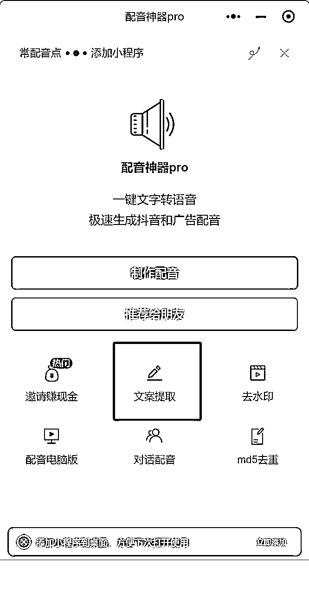
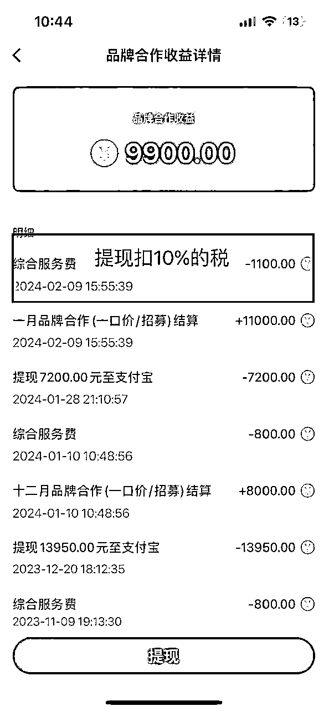
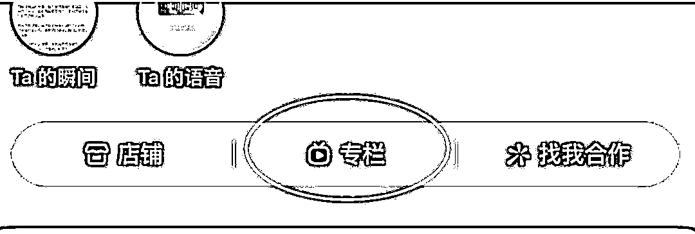

# 12 月航海 | 小红书自媒体-商单 | 实战手册

> 来源：[https://ocn93f5d9olj.feishu.cn/docx/DMZfd0WAPoR183xMg8vcMzxKnBb](https://ocn93f5d9olj.feishu.cn/docx/DMZfd0WAPoR183xMg8vcMzxKnBb)

# 防失联+MM188166M（李李）长期更新频繁+备用V:MG10127

手册出品方：生财有术团队

出品时间：2024 年 11 月 18 日

# 写在前面

# 💡

欢迎大家来到 12 月航海 | 小红书自媒体-商单 | 实战手册。

作为一款 MAU（月活跃用户数）达 2.6 亿、DAU（日活跃用户数）超过 1 亿、人均单日使用时长为55.31 分钟的产品，小红书吸引了越来越多优质用户的注意力。

在当下的注意力经济时代，越来越多的品牌方通过博主反复投放广告触达，把大众种草成消费者，商单合作已经成为小红书平台的主流变现方式之一。

在内容创作上，不仅有母婴、穿搭、护肤、美食等长青赛道，还有家居、养生、数码、AI 等热度持续上升的新兴赛道。内容种草的互动性也在增强，能更好地拉近博主与用户之间的距离。

虽然起号的红利期有所减弱，但只要紧跟这些趋势，打造有 IP 属性的账号，依然能实现稳定的变现。

# 一、【项目概述】了解小红书自媒体-商单

# 1.1 什么是小红书自媒体-商单

小红书自媒体-商单就是普通的小红书账号，通过发笔记，涨到了 1000 以上粉丝，入驻蒲公英成为达人，从而会收到各大品牌方和广告主的邀约，进行付费的广告笔记植入。

简单来说，就是通过小红书涨粉丝然后接广告赚钱。

⚠️这里需要注意的是，相比之前的【小红书达人变现】项目，【小红书自媒体-商单】具有以下差异：

运营策略

【小红书达人变现】：可以从别的渠道搬运图片或者混剪视频素材。核心策略是选定热门赛道，发布笔记快速涨粉，成为小红书千粉以上的博主，然后去接品牌方广告，从中获取收益。

【小红书自媒体-商单】：注重创作者结合自身特点，选择适合的细分赛道进行长期深耕，强调原创性和高质量内容的持续输出。

长期收益与价值

【小红书达人变现】：因为内容同质化和竞争激烈，项目的稳定性较低，商单单价不如带有人设属性的 IP 号高，更适合新手建立正反馈。

【小红书自媒体-商单】：专注于长期发展，随着创作者在细分领域的深耕，品牌方更愿意建立合作关系，从而带来持续、稳定的商单收入和成长空间。

创作者心态与成长

【小红书达人变现】：适合短期追求收益的创作者，可能缺乏对内容质量的长期投入。

【小红书自媒体-商单】：鼓励创作者保持稳定、踏实的心态，视自己为真正的自媒体人，积极学习摄影、剪辑等基础技能，并不断提高创作水平，专注于原创内容的积累和提升。

这个项目运营的整体逻辑是：

注册账号 > 选择合适赛道 > 养号 > 参考对标账号，完成账号包装 > 对标爆款并持续制作笔记 > 持续发布笔记 > 涨粉至 1000 以上 > 实名认证 > 入驻蒲公英 > 接广变现。

# 1.2 项目现状

因为上市的一再延缓，小红书这几年加紧了商业化的步伐，普通人也能够在小红书上面分得一杯羹。

在很多人的固有思维中，始终认为广告都是给予大博主的流量反馈，对于小博主而言根本就不可能，但今年小红书放宽了广告商入驻条件，以及博主接广告的隐形要求，现在只需千粉开通蒲公英平台，即可对接广告变现。

小红书的用户大多数集中在一二线城市，并且 70% 以上都是女性，高知且付费意识强，可堪称优质流量的洼地，也因此无数个广告商都蜂拥而至，纷纷在小红书上面投放广告，小红书达人项目应运而生。

嗅觉敏锐的一批人，已经走在了前沿，通过小红书达人接广，变现了无数次，近几年绝对是小红书达人爆发式增长的时候，未来市场潜力无限。

目前在小红书上虽说做泛领域搬运类型涨粉快，但广告单价低，普遍一两百，基本是接图文直发，对账号伤害大，容易违规，且不长久；

相反，做垂直 IP 人设号，前期起号需要花些时间心思，但后期广告单价高，几百上千不止，能接软广植入，对账号伤害也不大，能长期发展做。

# 1.3 适合人群

「小红书自媒体-商单」的适合人群包括两类：一类是天生具有网感的人，他们随便发布一条笔记就能收获大量点赞和评论，表明他们能够轻松融入平台生态；另一类则是通过坚持发布、不断复盘迭代、提升内容创作水平，最终打造出受欢迎爆款内容的人。

项目的方向选择很多，就入局门槛而言，并不算高，适合大多数想要创业或者做副业的普通人操作。作为了解小红书平台的入门项目也非常合适。

如果你有一定网感、喜欢浏览小红书，对内容创作有热情，愿意坚持学习拍摄、剪辑、文案撰写等技能，将有更大几率跑通项目。

目前入驻小红书蒲公英接广的硬性要求有：

1.

小红书账号满 1000 粉丝

2.

需要实名认证且年满 18 周岁

年龄限制对大部分人来说不是问题，关键在于如何涨粉。涨粉的前提需要发布小红书笔记。这里需要大家明确赛道，找到对标。并且有一定的耐心，保持更新频率，持续产出优质内容。在这个项目中，稳定的投入远胜于犹豫不决。即便红利逐渐消退，赚钱的人依然能继续实现收益。

# 二、【项目实操 1/3】明确赛道，搭建小红书账号

# 💡

# 章节概要

了解完小红书自媒体-商单的整体情况后，我们就要正式开始启动项目了。

还记得项目整体的实操逻辑吗：

注册账号 > 选择合适赛道 > 养号 > 参考对标账号，完成账号包装 > 对标爆款并持续制作笔记持续发布笔记 > 涨粉至 1000 以上实名认证 > 入驻蒲公英接广变现

本章节，我们主要攻克前 4 个环节，助大家做好项目基建。

👉章节 2.1 赛道选择

本小节中，我们会具体讲讲如何进行赛道选择。为了减轻大家的选择成本，我们也会给出 13 个变现潜力大的赛道作为参考。

👉章节 2.2 注册账号

注册账号和确定赛道，这两个动作没有先后之分，也可以同时进行。需要注意的是，建议大家一个小红书账号对应一个手机号，注册全程用流量完成操作。

🔥章节 2.3 养号流程

养号对于本项目来说至关重要，一般需要养 2.5-3 天。正式发项目笔记前，我们可以先做个测试，例如发日常、风景、干货等笔记，次日小眼睛过 100 以上就算养号完成。

🔥章节 2.4 积累对标账号

这个过程其实也是积累爆款素材的过程，我们可以通过刷小红书主页、灰豚数据等方式，积累各领域的对标账号与爆款素材。

👉章节 2.5 包装账号

账号的头像、昵称、简介等，我们都可以参考对标账号来做优化，从而完成账号包装。好的账号包装，也非常利于我们拉高账号权重、提升涨粉速度。

开始本章节的学习吧，希望在本阶段，大家能稳步前进，打好扎实的基础。

# 💡

# 本章航线图

完成本章节的学习和实操，即可完成航线图第一阶段。

第一阶段：明确定位，搭建小红书账号（约 3 天）

1.

寻找热门/合适赛道，了解赛道玩法（每天至少 15 分钟）

2.

用流量注册小红书账号，一机一号登录（约 15 分钟）

3.

刷同行笔记，模仿真人操作开始养号（每天约 1 小时）

4.

学习同行，参考对标账号包装账号（约 30 分钟）

那么现在，就请开始踏上第一阶段的实操步骤吧。

# 2.1 如何进行赛道选择 @李子木

# 2.1.1 参考赛道

# 📌

如何使用本章节的参考赛道

为了降低大家的行动门槛，结合最近小红书各赛道的数据表现，以及笔记产出的难易程度，我们为大家找了 13 个变现潜力大的赛道作为参考。

了解项目赛道的基础玩法后，大家需要积极在小红书寻找自己心仪的赛道，勇敢尝试新玩法。

# 参考赛道 1：中医养生

推荐理由：随着大环境的变化、亚健康群体越来越多，养生正在成为刚需。同时，随着中国传统文化兴起，中医养生开始受到热捧。在小红书上，中医养生相关内容近期的爆款率高、合作商单多、广告报价高，值得一做。

内容说明：

很多人担心，自己并非中医专业出身，或者没有相关资质，做不好养生博主。实际上，许多非专业出身的普通人，凭借自学和积累中医养生知识，在小红书上实现了快速增长，粉丝数突破10万+、月收入过万。

我们将从两种内容形式——视频和图文，提供实际成功案例，帮助你了解如何入门并成功运营中医养生账号。

# 账号示例 & 爆款笔记模板 01

账号：疯狂养生 max

类型：视频博主

主要内容形式：“学中医前 xx ”vs “学中医后 xx”

这种形式特别适合非专业人士，能够避免直接涉及专业性过强的内容，同时避免违规风险。例如，“学中医前的睡姿 vs 学中医后的睡姿”或“学中医前吃西瓜 vs 学中医后吃西瓜”，通过对比展示养生带来的变化和好处。此类“打破常识”的方式能够激发用户的好奇心，比单纯的陈述更吸引人。

另外，这种形式还可以扩展至多种内容，比如“甘蔗的3种吃法”、“1分钟消气操”等等，极具包容性，能让帐号内容更有系列感。

文字标题：

“学中医后才知道” + 视频内容概括。一般采用打破常识的标题（如：“多年甘蔗白啃了”、“多年苹果白吃了”），或突出效果（如：“睡姿越怪，睡得越快”、“掉秤居然这么容易”）。

视频结构（以“三段式”视频为主）：

开篇：学中医前是怎么做的，有哪些危害；

正片：学中医后，应该怎么吃，适合什么人吃，有什么好处，有什么注意事项；

结尾：引导用户收藏并互动。

参考笔记链接：http://xhslink.com/a/j7HXs0nZGeJZ

# 账号示例 & 爆款笔记模板 02

账号：图图爱养生

类型：图文博主

文字标题：

图图的内容多以“干货合集”形式呈现。在小红书上，带有数字的标题有一种的神奇力量，能够抓住用户的“贪心”心理，激发获取更多信息的欲望。例如：“越吃头发越多的8种食物”、“黄芪的13种搭配”、“身体的7种寒气”等。这类标题简洁明确，实用性强，非常适合吸引用户点击并收藏。

内容结构：

封面： 概括内容亮点，使用以下两种标题技巧：

方法+人群+效果： 吸引有需求的用户关注；

干货合集： 总结多个养生小知识，让用户觉得可以一次性获得大量实用信息。

正文：

文字部分，开头说明： 用一句话讲背景，一句话概括内容主题，并给出大纲；

图片部分： 详细阐释内容，如下图，每篇内容基本上都是这样的结构，让账号更体系化。

参考笔记链接：http://xhslink.com/a/QftbRMwnZ4MZ

# 参考赛道 2：家居

推荐理由：家居是今年小红书平台扶持的赛道，有流量倾斜。仅从广告合作来看，许多品牌方愿意为家居博主提供合作机会，且家居博主的广告报价通常比同粉丝量级的其他博主更高。除此之外，家居领域的带货数据也不错，具备很高的变现潜力。

内容说明：

今年非常火的一种家居内容形式是图文与 Plog 结合，许多博主通过这种方式实现了 7 天涨粉上千、甚至上万。这种形式特别适合那些本身具有文艺气质、热爱文学的博主。如果你喜欢通过文字和图片传达个人情感，家居赛道将是一个不错的选择。

以下我们将通过一个成功的账号案例，带你了解如何制作家居类内容并快速吸引关注。

# 账号示例 & 爆款笔记模板

账号：水北山南

类型：图文博主

主要内容形式：

暗调侘寂风格的家居拍摄为主，每张图片都配有诗意的文字描述。

选题方向：

水北山南的内容虽然充满浓烈的个人情绪，但她还会和小红书的热点话题结合。例如，MBTI 人格、情绪话题、独居生活、反社交等。

内容制作重点：

1.

画面风格：暗色调侘寂风

采用统一的暗色调，使你的内容与其他博主区分开来。无论是室内还是室外拍摄，整体风格统一，暖黄或暗色调的运用能够让主页更加和谐且具有强烈的个人特色。

2.

在家里布置一个理想生活角落

小红书今年提出了“一平米空间”概念，指的是在家里布置一个理想生活角落，无论空间大小，都能投射出理想的生活态度。例如，爱读书的人可以打造一个舒适的阅读角落，喜欢亲近自然的人可以布置一个绿意盎然的阳台一角。

这种布置不仅能为你提供持续的拍摄素材，避免拍摄时反复纠结封面设计，还能使主页保持统一的风格感。此外，这样的角落也是非常理想的广告位，可以容纳家居用品、食品等物品，从而增强账号的变现能力。

3.

细节打动人心：通过物品讲述故事

配文部分可以通过生活中的小物品，表达你对它们的情感。例如，描述自己喜欢的茶杯、一本书或某个小饰品，给这些物品赋予故事和情感，使内容更加生动、富有温度。这种细节化的描述能让粉丝产生共鸣，从而提升互动率和粉丝粘性。

参考笔记链接：http://xhslink.com/a/LI34WQ4Xv5MZ

# 参考赛道 3：美食

推荐理由：美食类内容普适性很强，自带强大的吸引力和互动性，是非常好接商单变现的大赛道之一。

内容说明：

今年美食赛道有许多新兴的火爆形式，其中最容易上手、制作成本最低的方式之一，是将美食 + 新中式审美 + 生活化养生相结合，做日常健康饮食分享。这种风格不仅符合现代审美，还贴近生活，适合大多数人学习和模仿。

下面我们将通过一个成功的账号示例，讲解如何通过这种方式制作美食内容，并提高变现能力。

# 账号示例 & 爆款笔记模板

账号：金金狗儿

类型：图文博主

主要内容形式：

一日三餐，通过图片和文字的结合，分享健康、美味、简单的日常餐食。

内容制作重点（这里以“然宝的日记铺”为例）：

1.

结合主流审美，调整封面细节

目前美食类内容中，最受欢迎的是新中式风格。在拍摄时需要注重细节，可以使用高质量、带有文化感的餐具，如陶瓷碗、木质托盘等；食物的色彩搭配要协调，避免过于单调。

2.

食物的呈现：食物看起来饱满、有食欲

美食内容的核心是让食物看起来充满诱惑力。这里的重点是食物的饱满感和颗粒分明。拍摄时要确保饭菜盛得满满的，不留空隙，食物细节清晰可见。

3.

图文类美食内容结构：

图片部分：

前 3 张：展示诱人的食物，封面照片拍摄整体，第二到第三张专注拍摄食物的细节。

接下来的 2-3 张：展示炒制或制作过程中的关键步骤，可以是食材准备、烹饪中的动作等。

最后一张：添加个性化的内容，比如与自己 IP 相关的独特标识或小物件。比如然宝的字好看，就会放信纸手写字。

文字部分：开头部分放菜名，中间可以将炒制步骤也放上，最后加一句符合 IP 性格的话。

参考笔记链接：http://xhslink.com/a/wDVKD4cZZ5MZ

# 参考赛道 4：女生独立生活

推荐理由：女生独立生活赛道算是近两年新起来的赛道，特别适合小红书这样以年轻女性为主的平台。在现代社会，随着不婚、晚婚趋势的上升，越来越多的女性开始关注独立生活所需的各种技能。因此，关于女生独立生活的内容需求不断增加，尤其是生活技巧类内容，具有强大的商业变现潜力。

内容说明：

去年，“女生独立指南”这类图文内容在小红书出了很多爆款，涌现出许多大号，不过都是图文类。今年，这个系列开始有视频类，而且数据表现远超图文内容，成为新一波的热门趋势。

接下来，我们会拆解一个几个月间，靠 200 条视频涨粉到 30w 粉丝的博主案例，分析如何通过视频内容快速积累粉丝并实现变现。

# 账号示例 & 爆款笔记模板

账号：独立女生进阶记

类型：视频博主

主要内容形式：

视频，类似教学视频，无需出镜，通过讲解和演示解决日常生活中遇到的问题。视频简洁直观，围绕解决实际生活中的问题展开，内容紧扣观众需求。

选题方向：

成功的选题通常来自于同赛道中的图文大号。将这些已经火爆的图文选题转化为视频形式，能够大大增加爆款的概率。

内容制作重点：

1.

内容简洁，植入主题，不拖沓，不废话

2.

镜头对准问题处，画面干净、不杂乱

3.

视频结构：

开头：提出生活中常见的问题，比如“卫生间瓷砖裂开了”、“冰箱异味难闻”等；

中间：简洁明了地介绍如何解决问题，包括使用哪些工具、具体的操作步骤和最终的处理效果；

结尾：总结解决方法的效果，鼓励观众尝试并评论互动。

4.

从第一条视频开始，如果修理过程中用到什么产品，可以自然地进行产品植入，更有利于后面接商单。

参考笔记链接：http://xhslink.com/a/uI5PN8VLm7LZ

# 参考赛道 5：护肤

推荐理由：没有哪个女生能拒绝拥有好皮肤的方法，尤其在小红书！护肤类作为小红书平台的长青赛道，无论是接商单、还是带货、当买手，都有很强的变现能力。

内容说明：

护肤内容的需求极大，但竞争也相对激烈。对于新手来说，起号的关键在于找到差异化的切入点。建议从两个方向入手：

垂直化：例如专注于痘痘肌的护理内容，深入某个细分领域以建立专业形象。

跨赛道结合：如中医与护肤的结合，借助流行趋势为内容注入新鲜感，提高用户关注度。

# 账号示例 & 爆款笔记模板

账号：小森林的小世界

类型：视频博主

主要内容形式：

视频，常通过前后对比，展示自己的护肤成果（尤其是“战痘”成果），再展开讲述可以跟着实操的方法。

选题方向：

围绕女生在护肤中的常见问题，如油性肌肤、痘痘肌的护理、闭口去除、皮肤屏障修复、防晒等。重点解决用户在护肤过程中容易遇到的痛点。

内容制作重点：

1.

封面标题：多用对比，比如：“烂脸战痘成妈生皮”是文字上的对比，护肤前的照片跟现在的状态是视觉上的对比。

2.

IP 故事公式：我本来怎样 + 那时的感觉 + 经过努力 + 现在怎样 + 现在的感觉 + 以后会分享我的经验

3.

重要关键词收集：

关键词①：便宜、有效、真实

示例：真实有效瘦小腿经验分享

示例：冷白皮养成干货（便宜、有效）

关键词②：直接抄作业

示例：练成流利口语（不花钱，直接抄作业）

示例：北欧风装修干货（直接抄作业）

关键词③：不花钱版

示例：马甲线练成注意事项（不花钱版）

示例：三天入门PS（不花钱版）

参考笔记链接：http://xhslink.com/a/yVPcTC5fWOSZ

# 参考赛道 6：穿搭

推荐理由：穿搭是小红书上最好变现的赛道之一，只要穿搭好看，就能吸引大量用户询问同款商品的链接，带货能力强且广告痕迹轻，因此具有极高的商业价值。

内容说明：

穿搭赛道竞争激烈，因此新人入场时应遵循两大原则：

1.

垂直细分：避开竞争激烈的主流穿搭方向，选择更有特色的细分领域，例如本案例中的策略。

2.

跨赛道结合：将穿搭与其他赛道结合，如穿搭 + 心情Plog，增加内容的独特性与吸引力。

另外，穿搭博主很容易涨粉，但是！一定要注意，吸引的不要是男粉。

过于裸露的、妖媚的封面图，都会快速吸引男粉，这样的账号，商业价值是不高的。所以，一定一定，要抵抗住发性感照会快速涨粉的诱惑，比如以下粉丝构成的账号，就很难接到广告：

# 账号示例 & 爆款笔记模板 01

账号：天天明星同款

类型：图文博主

主要内容形式：

扒明星穿搭的组合搭配，例如明星照片 + 穿搭单品图片。

选题方向：

从热门影视剧中挖掘明星的路透穿搭、机场照穿搭，热门综艺中明星的穿搭，自带流量。

内容制作重点：

1.

选择话题度 + 穿搭审美同时在线的明星。保证有流量的同时，具有较好的带货、植入、接广效果。

2.

内容结构：

封面：用字幕标出自身特点（如“腿围xxcm，有xx缺点”），简短说明情况，快速抓住用户注意力；

标题：综艺 / 时间 + 明星 + 穿搭风格（价格、风格等）；

正文内容：简单介绍下综艺或明星最近的热点情况，分享的这期穿搭特点即可。

参考视频链接：http://xhslink.com/a/SueEyhIxWiZZ

# 账号示例 & 爆款笔记模板 02

账号：拖沓刘天王

类型：视频博主

主要内容形式：

通过视频展示穿搭的前后对比，突出显著变化，吸引用户的关注与共鸣。

选题方向：

分享适合粗小腿的靴子和鞋子。这个方向不仅可以接商单，还很适合带货能力。例如，拖沓刘天王通过此类笔记和直播，实现了数千万的销售额。

内容制作重点：

1.

把身材的不完美转为流量密码，分享各种适合小腿粗壮姐妹的靴子、鞋子，能够精准戳中目标用户的痛点。

2.

视频结构：

开头：用字幕标出自身特点（如“腿围xxcm，有xx缺点”），简短说明情况，快速抓住用户注意力；

对比展示：采用近景镜头，一只腿穿靴子，另一只不穿，形成鲜明对比；

整体效果：拉远镜头，展示整套穿搭，呈现整体风格与效果。

参考笔记链接：http://xhslink.com/a/SoZgRWW0HRSZ

# 参考赛道 7：母婴

推荐理由：母婴是小红书的经典赛道，目标群体具有较强的消费能力、也有较高的消费意愿，是商单报价较高的赛道。

内容说明：母婴赛道，又分为以今年较火的“三拼图” Plog 类，主要记得日常感悟、孩子的成长；干货类，为宝妈们提供育儿及选购干货；以及好物测评类。这三类中，以好物测评的变现方式最为直接，带货效果最佳。

# 账号示例 & 爆款笔记模板

账号：宝藏麻麻安妮

类型：图文博主

选题方向：

1.

母婴居家必备用品的测评；

2.

热门购物节点/达人的攻略，如李佳琦双 11 直播囤货指南、李佳琦母婴节囤货指南等；

3.

孩子重要成长节点的养护干货。

测评内容结构：

1.

封面图：真人出镜 + 多个测评产品共同出镜，封面标题说明测评产品，花字说明测评的几个方面

2.

副图：

live 图组合，从几个测评的重点方面对比各个产品的不同

各个产品的照片、特点、点评

3.

正文：为什么要买这个产品 + 选购需要注意的几点 + 测评产品点评

参考笔记链接：http://xhslink.com/a/0mE1RpaPOiZZ

# 参考赛道 8：数码

推荐理由：在小红书上，数码赛道始终供不应求，是广告主青睐的热门选择。同时，这也是难得的男生女生都适合的赛道之一，特别在大促节点期间，具备极高的商业价值。

内容说明：以清单式图文测评为主，如果你以前做过知乎好物，那实在是太适合做小红书的这个赛道了。

# 账号示例 & 爆款笔记模板

账号：枫哥评测

类型：图文博主

主要内容形式：清单式测评，结合图片与详细文字说明。

选题方向：

家电与数码产品的选购攻略

多款热门产品的对比测评

双十一、618 等促销节点的必买清单

内容制作重点：

1.

封面图

标题需明确标注测评类目，传递核心信息

使用对比清晰的表格呈现多个产品的测评维度，让读者一眼了解测评范围

2.

副图与内容要点

突出选购指南和测评重点，帮助用户快速获取核心信息

每款产品配以参数列表和选购建议，结合实际使用场景展开点评

3.

正文结构

选购的难点痛点 + 选购指南 + 告知图xx~图xx是产品推荐

⚠️注意事项：此类账号在测评多个产品时，可通过电商平台（如京东、淘宝）的产品详情页和用户评论获取参考图和信息，不一定需要实际购买所有测评产品。

参考视频链接：http://xhslink.com/a/zrKSnCRwKiZZ

# 参考赛道 9：AI

推荐理由：AI 小红书近期重点扶持的热门赛道。而且 AI 热度居高不下，对于新手来说，也是很好的起号方向。

内容说明：如果你做 AI 赛道，不要单纯做 AI 热点，这样变现能力太低。要跟赚钱、AI 产品推荐、AI 使用场景等结合，才能具备更强的变现能力。

# 账号示例 & 爆款笔记模板

账号：马克张的 AI 宝库

类型：视频博主

选题方向：

1.

AI+赚钱：分享如何使用 AI 工具进行自媒体创作、副业开拓，吸引想要赚钱的人群；

2.

国产 AI 平替推荐：针对国内用户无法便捷使用 GPT 等大模型的问题，推荐好用的国产替代方案；

3.

AI重大热点新闻：关注并讲解 AI 领域的重要动态，吸引关注新技术的用户群体。

内容制作重点：

4.

画面：找素材 + 录屏 / 截图 ，适当添加文字快闪提升视觉效果；

5.

配音：采用文字生成配音，保证内容输出的一致性和节奏感。

6.

视频结构：

开头：用一句话概括视频核心内容，确保与标题和封面一致，吸引用户点击；

主体：详细介绍几款 AI 工具或讲解使用方法，给出实用建议或赚钱思路；

结尾：简要介绍自己并预告未来的相关内容，吸引用户持续关注。

参考视频链接：http://xhslink.com/a/55oBf5ImAiZZ

# 参考赛道 10：美妆

推荐理由：美妆是小红书的本命赛道，用户基础庞大，需求持续旺盛。即便竞争激烈，美妆赛道的变现能力依然十分强劲。

内容说明：

美妆和穿搭一样，是竞争特别大的赛道，美妆的细分方向比穿搭更少，因此需要结合跨赛道选题和独特人设来提升内容竞争力，增加看点。尤其是在年轻用户群体中，大学生占据了较大比例，他们具备较高的消费能力和对美妆内容的热情。因此，普通女大学生定位的美妆账号，更容易实现涨粉与变现。

# 账号示例 & 爆款笔记模板

账号：是花茶呀

类型：图文博主

主要内容形式：

用图片记录普通女大学生自学化妆 / 护肤的前后变化。

选题方向：

1.

人设类：普通女大学生通过自律、学习护肤和化妆，外貌发生了巨大的变化；

2.

干货类：适合普通女大学生的护肤品 / 化妆品测评、正确的护肤 / 化妆方法等。

内容制作重点：

3.

护肤 / 化妆前后对比强烈：对比手法在美妆赛道尤为适合，能清晰展示护肤或化妆带来的变化。选择前后差异明显的照片，确保真实感，避免显得不自然或过度修饰；

4.

符合人设的热点选题：上面第一条 1.4w 赞的图文，就是借鉴了另一个博主爆了的选题，套用自己的照片、故事，就可以做出一个爆款率高的笔记。

参考笔记链接：http://xhslink.com/a/m81RfdDaiiZZ

# 参考赛道 11：职场

推荐理由：从“大厂离职”到“发疯工牌”，再到“精神离职”……小红书为许多职场人士提供了一个情绪宣泄的出口。越来越多的人在这里寻求情绪上的解压，同时也关注兼职、副业、增加收入、情绪稳定等热门话题。

内容说明：

在职场赛道，你不仅可以分享职场相关的话题或搞笑段子，吸引大家互动，缓解情绪，还能分享职场提升技巧、工作指南等知识性内容，既能吸引关注，也能给观众带来有价值的职场建议。

# 账号示例 & 爆款笔记模板

账号：彤儿学姐

类型：视频博主 + 图文博主

主要内容形式：

通过视频引入一个职场痛点，并在视频中分享求职干货。只要内容言之有理、痛点明确，就可以吸引用户关注。爆款选题可以重复做，例如“年薪 70w 的大厂同事分享求职 SOP、面试 SOP”等，通过持续拆解求职细节，打造成系列干货内容。

选题方向：

借用背书强的人群的口吻分享求职、升职加薪干货。

内容制作重点：

1.

聚焦职场痛点：找准职场痛点是关键。例如，学历低的人难以找到工作，文科生找工作困难，面试答不上来等问题，提出相应的解决方案。

2.

标题和开头

a.

直接给出结论：例如“我发现找工作时，胆子越大，收到的 Offer 越多。”开门见山地给出结论，抓住观众兴趣。

b.

结果前置 + 利用背书：例如提到“大厂工作 10 年的高管”等，增加内容的可信度和吸引力。

3.

正文内容

a.

文案要直接给方法，讲干货，直接摆出自己的 SOP 思维导图或者求职笔记。

b.

视频内容不需要多么精致，只要有背书，有方法，让人觉得有道理、可以学习，就会为你点赞。

参考笔记链接：http://xhslink.com/a/SW7phFKWxlC0

# 参考赛道 12：文旅

推荐理由：2024 年，旅游赛道上充斥着各种攻略，但真正缺少的是具有灵魂的文旅 IP。将旅游与个人观点、故事相结合的内容，能够打造出更强的个人特色，从而增加粉丝粘性，提升商业价值。

内容说明：

文旅内容适合创意丰富、对世界有敏锐感知且具备一定内容创作经验的创作者。通过深度挖掘旅行中的细节和情感，将故事打造成有共鸣的作品，既能打动观众，又能建立长期的粉丝基础。

# 账号示例 & 爆款笔记模板

账号：元莱Yilia

类型：视频博主

主要内容形式：

通过视频，记录下旅行过程中，跟当地的人、动物、甚至植物的故事，自己的思考，而不是普通的旅行攻略。

选题方向：

自己在旅途中的故事，比如讲环球旅行是她的梦想，为此放弃了稳定的人生，讲和外公一起完成他的遗愿清单，讲如何拯救自己于水火……

内容制作重点：

1.

主题与观点：这是文旅博主最最最核心的部分，要有自己独特的、新颖的、同时又符合大众情绪需求的观点，并能体现你的情怀，比如元莱的“如果你也曾听过，大海的悲鸣”，将海边的风景，与对环保的感悟结合；比如“我救了一只小鸟，可最后我放弃了它”，将旅途中的故事，与对生命的思考结合；再比如“这泥泞的小路又短又长，这片麦田通往人世间”，将途中的景色，与人生思考结合。

2.

文案：将悬念或者金句前置，用短句而不是长句，注重细节描写，比如具体事物、内心感受和实际情景，让观众有更强的代入感。

3.

视频节奏，内容舒缓，但节奏不慢，将句子间的停顿剪短，使视频流畅如同轻快的音符，吸引观众持续观看。

参考笔记链接：http://xhslink.com/a/NFet2M0Ly0SZ

# 参考赛道 13：留学 / 国外生活 Plog

推荐理由：如果你在国外留学、工作，或拥有大量国外生活照片素材，这个赛道是不可错过的。它让你比大多数人更具内容创作优势，天然具有稀缺性。同时，因内容与日常生活密切相关，商业变现潜力极强。

内容说明：

这种内容形式在一定程度上也适合旅游赛道的博主，强调分享新事物、新观点、新见解等。适合有生活记录习惯、创意丰富的内容创作者。

# 账号示例 & 爆款笔记模板

以下参考账号，适合本身就比较有梗的年轻人。

账号：妈的欧洲账本

类型：图文博主

主要内容形式：

用照片与文字结合的形式，组成一个有剧情的、偏吐槽搞笑的照片故事流。

选题方向：

以留学、旅居过程中的槽点为主，用比较新奇的角度展示出来。

内容制作重点：

1.

文字带情绪，把吐槽变成笔记：内容很多都是特别气愤、感觉很奇葩的时候的吐槽。这些槽点，包含着满满的情绪，就好像小姐妹在实时跟你吐槽，让大家特别有浏览和互动的动力。当你特别生气、特别想吐槽、特别兴奋的时候，不要憋着，拿起手机，一边说一边录下来，这就是非常好的素材。然后，把它转成文字，等有空时，再整理成有逻辑的笔记，将一些重要的句子，写在图上，你就拥有了能够抓人的、情绪饱满的图文笔记。

2.

在图片上写段子：尝试图文段子，尤其是当你不想露脸的时候，通过“一张照片+三段式图文段子”的形式，可以拉满戏剧性效果。

3.

用游戏视觉打开旅游记录：使用沉浸式的游戏视角来构建内容，每张图是一个情景，文案如“今天，你踏上了一个人的北欧旅行”，“终于，你到达了民宿楼下”，让整个故事更有代入感。

参考笔记链接：http://xhslink.com/a/8dkFGTi6g0SZ

# 2.1.2 赛道选择 @梨云

了解到这些热门赛道之后，我们可以从多个维度来评估自己更倾向于做哪个赛道。

下面给你绘制了表格，方便你找到适合自己的赛道。

从兴趣擅长、对赛道和用户的了解，以及你的经验积累，可以划分出 10 个维度。

赛道兴趣程度：你对该赛道的兴趣程度越高，你的内在动力越足。

上手轻松程度：你越擅长这个赛道的制作形式，你制作笔记就越轻松。

学习制作意愿：如果你不擅长制作，有强烈的学习意愿后面会让你制作更轻松。

了解赛道程度：你越了解这个赛道，写内容的时候越轻松。

了解赛道意愿：如果你不了解这个赛道，有强烈的了解意愿后面会让你写内容更轻松。

了解用户程度：你越了解这些用户，做爆款选题就越得心应手。

了解用户意愿：如果你不了解这些用户，有强烈的了解意愿后面会让你做选题更轻松。

赛道相关经验：如果你的赛道相关经验越丰富，切入这个赛道就更轻松。

赛道背书强度：如果你的赛道背书越强，你越能获取粉丝的信任。

网感能力：如果你的网感能力越强，你做小红书的爆款概率就会更高。

每个维度满分10分，程度、意愿、经验、强度、能力越高，给分越多。

最后得出自己综合得分最高的前三个赛道，就是比较适合你的赛道啦！

内容来源：《小红书越做越没流量？像素级带你高效模仿爆款笔记》

# 2.2 注册账号 @周恩俊

选择好领域赛道之后，我们就可以注册账号。

# 2.2.1 准备手机号

一般一个小红书账号对应一个手机号。如果你要铺设更多账号，那么可以用家人的，或者再去申请更多手机卡，线上就可以办理。新手时期可以先做一个号，基本学会项目流程后，可以多账号、多领域做矩阵测试。

电话卡推荐：

三个运营商都可以办副卡，一个人注册认证 5 个号码，一拖 4 ，副号月租费 10 元；

移动的万能副卡，1 张 10 块钱月租，1 个身份证能领 2 个副卡，第一张卡和第二张卡要相隔 90 天，去营业厅能办理，App 办理也可以，但是营业厅可以操作免第一年月租；

中国电信 App 搜索无忧卡， 5 元一个月，基本都是第 2 天就送上门；

移动可以办理 8 块的保号套餐。

# 2.2.2 注册账号

注册时建议全程用流量完成操作，注册完之后，就可以按照以下流程进行养号了。

⚠️注意事项：在这一步先不用做账号的实名认证，因为一个身份证只能认证一个账号，一旦认证成功，只有注销账号才能解绑。建议等你起号成功，账号突破千粉后，再做账号的实名认证。

# 2.3 养号流程 @周恩俊

第一天：注册账号时，一定要用流量，注册下来后，不要改包装，头像，昵称，简介，也不要刷笔记；

第二天：开始养号，刷要做的领域笔记，模仿真人操作，你要做什么领域就去刷什么领域笔记，要对同行笔记进行点赞收藏关注评论，这些操作要过 20-30 秒；

每天刷半小时到 1 小时左右，可以分时段刷，比如上午刷 15 分钟，下午刷 20 分钟，晚上刷 15 分钟，都可以。有空可以多刷多看。

第三天：上午继续养号，下午看下我们的发现页，同行的笔记占 70% 就算号养成了，然后就可以开始给账号进行包装，改头像，改名字，改简介。

着急的话，改完包装就可以发笔记，不着急可以次日再发笔记。

提醒一下，一般垂直领域要先试发一篇日常生活、风景、干货笔记等去测试流量，次日小眼睛过 100 以上，就说明账号没问题，再开始发该领域笔记。

按照这个流程养完号之后，就可以发作品涨粉了，养号是必不可少的步骤，千万不要忽略了，否则直接发作品，账号没反应，起不来就很耗费时间了。

内容来源：《小红书达人变现项目，单人月入 2W，团队月入 10W+保姆级教程详细拆解》@周恩俊

# 2.4 积累对标账号

确定自身定位后，少不了的环节就是找对标账号。有了对标账号，你可以对照着打磨优化自己的 IP 包装，还可以参考别人的内容规划与输出。

# 2.4.1 找对标博主的方法推荐

1）搜所属领域的关键词（最好用）

在搜索框搜自己领域的关键词，然后查看综合和最热里的排名靠前 50 的博主，筛选合适的对标。

2）点击【频道】的对应类目

小红书二级导航有家居、美妆、穿搭等多个频道，你点击对应领域的频道，可以看到该领域下的博主的笔记，从里面筛选适合的对标博主。

# 2.4.2 如何判断对标是否合适你

我们在寻找对标时要注意筛选，不要看到明星、KOL 就盲目拿来对标，不是每个博主都适合你模仿参考。你们可以根据以下维度来衡量筛选：

1）类目定位

该博主的领域细分类目是否跟你相同或相似，比如，穿搭博主去对标美食博主就不太适合。另外，小众领域比较难找到完全一样的对标，一般可以参考领域相似的类目博主。

2）变现模式（变现效率、变现空间、你是否有能力或潜力做到）

纯博主和精准引流博主的内容规划和倾向是不一样的，因此找对标时要研究下这个博主的变现模式是什么：接广告，自己引流到私域带货或卖课程？是否跟自己目前或未来的变现模型相似？

3）粉丝级别（近期涨粉快的；或者本身粉丝不少，腰部比头部更值得对标）

看对标要留意粉丝级别，不要太少也不要太多，尽量选近期涨粉快的，或者起号迅速的。

对于小红书新手来说，腰部博主（粉丝 10 万+）往往比头部大博主（粉丝 50 万+）、明星博主更值得参考对标。头部的多数都被签到 MCN 旗下，有团队一起包装的，个人很难达到这种高度。

4）IP 内容调性

筛选对标博主要快速浏览他的主页内容，看下它的内容调性跟你的 IP 吻不吻合，你有无能力模仿输出相似的内容。难度太高、难以模仿的可以考虑放弃对标。

5）点赞比例 @星月

单篇点赞比总粉丝数多的笔记更值得借鉴，并不是点赞越高，代表笔记越好。还是上面说的，粉丝量高的账号会拉高笔记数据。

在刷对标的时候要多留意一些点赞数据看起来不是那么火的笔记（100-1000），一定要点进去看看他的账号粉丝量，而不是只看到那些点赞 5k、1w 的笔记才进去看。很多笔记 5000、1w 点赞，粉丝数 10w 、8w 的，这种数据参考意义不大。

把这些低粉高赞的笔记收藏起来 或者专门建立自己的选题库，这些都是自己源源不断的爆款素材

6）一个账号有多篇爆款 @星月

大家都知道 爆款具有偶然性。

一个账号出现一个爆款可能是因为运气成分，还不足以判断是否值得对标。但是持续出现爆款的话一定是有爆款基因的，可能是封面，也可能是选题。

7）时间距离 @星月

借鉴最近一个月做起来的笔记/账号会更有意义。

这个就要说到热度这个词了，在自媒体平台，热度比什么都重要。你会发现冬天搜羽绒服的多，情人节搜礼物的多，最近甲流、感冒药热度高。

你会发现不同时间段的热度词都是不一样的，所以要找最近、最热的账号或者笔记来做对标。值得一提的是，不同的关键词，除了市场反应，平台在给热度这方面也会随机宠粉。我们需要关注的是最近火起来的内容，尽量迎合平台的推流 。

1 个月是大概时间，也不是那么绝对，原则就是最好是近期爆发起来的。一周内是最好的，如果是 3 天内的那就更好了，还热乎呢！哈哈～

内容来源：《初阶 | 小红书-爆款笔记｜航海实战手册》《爆款对标账号 6 要素》

# 2.4.3 如何拆解对标账号？@梨云

找到对标账号后，我们要进行拆解分析。

1）看账号包装

拿我的账号举例。

1.

名字：云云【名字】+讲学习方法【账号提供的内容方向】

2.

简介

a.

核心标签是：学霸&卷王|研究学习方法3年|幽默风趣

b.

提供的内容是：学习干货|提分技巧|四六级|好物分享

c.

更新频率是：1 天 1 个

2）看内容选题

可以看账号的笔记分类文件夹，做的好的博主会像运营杂志一样运营自己的账号，文件夹分类就像杂志的专栏一样。一般一个专栏是一类主题，会持续更新。

这些类型必然都是用户喜欢的、数据好的，如果哪个品类试过 1、2 篇，反馈不好大概率也就不做了。

这些就是我们可以参考做的内容品类。

再进一步，尽可能把所有笔记都翻一遍，可以按照这个分类，总结每个分类内容的标题、封面、内容形式，这就是你的绝佳选题库&素材库。

3）看变现模式

三种变现方式：广告、卖货、私域。

广告：直接在数据平台，输入名字找到达人，点击品牌合作看情况，这种就是硬广。

还有另一种是软广，数据平台看不到，得去查阅他们的笔记，如果推荐一款产品，视频介绍篇幅超过 30 秒，笔记介绍不少于 2 页，那么 90% 是软文广告。

卖货：在主页点击【店铺】或者【专栏】，也可以蹲博主的直播，可以直接判断博主是否有带货变现。

私域：通过三步法判断博主是否引流变现。

一看图片区，是否放资料不放全，比如资料有 30 页，图片只放几页，这是一个暗钩，意思是：资料很多，我没放全，想要完整版来找我。

二看文字区，有没有明说或者暗示，如图是一个明钩：我有电子版，你们拿了可以打印。

三看评论区，有没有清一色的评论，很明显。你甚至可以去体验同行，充当粉丝领取资料，看他下一步的动作。

内容来源：《定位一换涨粉过万，如何利用数据分析在小红书精准定位》

# 2.5 包装账号

账号的包装，就像开门迎客之前，要做店铺装修。这是粉丝对你的第一印象。

一个用户选择关注一个博主，往往不会只因为一篇优质笔记而关注。用户会看博主的主页，查看昵称、头像、个人简介、背景图以及之前发布的笔记等，然后再决定是否关注博主。

另外，对我们博主来说，完善账号信息还能提升账号权重。

因为账号信息越完善， 越有助于平台对账号贴标签。有标签的账号，发布的笔记获得的流量更加精准，流量精准后，更多用户会点开笔记，浏览量等会大幅提升，随之而来的就是账号的权重越来越高。

如何进行账号包装呢？参考我们前面找到的对标账号，根据领域进行修改，塑造领域人设。

# 2.5.1 头像

不要太花俏，选择符合账号定位的。

制作方式：可以使用图怪兽等网站来进行图片的制作，将满意的图片作为头像。又或者找些无版权的图片：

图怪兽：https://818ps.com/

可画：https://canva.com/

创客贴：https://www.chuangkit.com/

⚠️注意事项：注意避免使用容易侵权的商标类图片。

# 2.5.2 昵称

有辨析度、好记、有趣的名字，带有领域关键词能更有辨析度和真实可信。不要用复杂的符号或特殊语言。

比如美食领域，名字为”小溪教你做美食“，一眼就让粉丝知道这账号是做什么的。

有以下 4 种公式可作参考：

昵称 + 个性：大鹅的七七八八

昵称 + 地区：姚老板在北京

昵称 + 专业：跟着拆哥看房

昵称 + 价值观：阿鱼爱学习

# 2.5.3 简介

主要是告诉粉丝，关注你的账号可以给用户带来什么，比如穿搭领域，”小个子穿搭分享|感谢喜欢“。

一个写简介的公式：

你是谁

你做过什么牛逼的事（如无可不写）

关注你有什么好处，或者分享哪些领域的内容

有的账号出了上万点赞的爆款，但是粉丝只有 100 个，主要是账号内容不垂直，且个人简介没有写好，没有给粉丝关注的理由。

所以，写简介的时候千万不要谦虚，如果你不能展现出可以给粉丝提供的价值，他们凭什么关注你呢？

# 三、【项目实操 2/3】创作爆款笔记，积累千粉，入驻蒲公英

# 💡

# 章节概要

如标题所言，本章节的核心内容，就是持续创作小红书笔记，尝试打造出爆款笔记，直至一步步完成千粉的积累，达到入驻蒲公英的条件，并成功入驻蒲公英。

入驻蒲公英的条件是什么呢？

① 需要满足完成实名认证，且年龄≥18 岁

② 需要粉丝数 > 1000

对于新手来说，可以先通过研究和对标爆款笔记，逐步找到创作的体感。在此基础上，持续优化笔记并提升内容创作效率，以实现数据的提升。

按照本章节提供的实操方法，选择合适的赛道后，预计在 10 到 15 天左右会逐渐开始涨粉，约 1 个月左右可达成千粉目标。

拆解一下其中的核心动作，主要是：

创作笔记，包括图文笔记或视频笔记

如何创作图文笔记，详见👉「3.1 如何创作图文笔记」

如何创作视频笔记，详见👉「3.2 如何创作视频笔记」

了解笔记常见违规情况与处理方法，避免违规，详见👉「3.3 检查笔记内容，避免违规」

达成千粉，入驻蒲公英，详见👉「3.4 达到千粉，入驻蒲公英」

以上关于创作笔记、入驻蒲公英的核心问题，我们都将在本章节为大家解决。

# 💡

# 本章航线图

完成本章节的学习和实操，即可完成航线图第二阶段。

第二阶段：创作爆款笔记，积累千粉，入驻蒲公英 （约 10-30 天）

1.

按赛道建素材库，持续收集对标爆款笔记（每天约 1 小时）

2.

搜集并拆解至少 3-5 篇对标爆款图文笔记（每天约 1-1.5 小时）

3.

模仿对标爆款，发布第 1 篇图文笔记（约 1 小时）

4.

搜集并拆解至少 3-5 篇对标爆款视频笔记（每天约 1-1.5 小时）

5.

模仿对标爆款，发布第 1 篇视频笔记（约 2 小时）

6.

日更至少 1 篇图文/视频笔记，直至突破千粉（每天约 1-1.5 小时）

7.

入驻蒲公英，完成账号实名认证，设置报价（约 30 分钟）

那么现在，就请开始踏上第二阶段的实操步骤吧。

# 3.1 如何创作图文笔记 @小玲玲

# 3.1.1 创作教程

素材来源于对标账号，积累对标账号就是积累素材的过程。如何找对标账号，大家可以复习一下前文：【2.4 积累对标账号】

选择素材的标准：近期内爆的图文笔记，点赞量至少在 100+

找到爆款笔记后，把文字内容提取出来，用 AI 进行改写；

制作一个背景图，作为自己的固定背景；

把改写后的文字，粘贴到背景图中，进行排版。

具体如何实操呢？我们结合 1 个赛道来看看。

# 3.1.2 结合参考赛道，创作图文笔记

# 举例：中医养生赛道

对标笔记链接：http://xhslink.com/a/Ti9KvhPXOMXZ

1）搜索关键词并分析同行爆文

在小红书平台输入领域相关关键词，如“中医养生”或“养生干货”，筛选出近期的热门笔记。重点关注点赞、评论较高的内容，并分析其排版、标题和文案风格。

2）使用辅助工具定位优质内容

借助工具（如灰豚数据）或直接在小红书平台搜索上述关键词，筛选点赞数高的近期笔记，确保内容贴近当前趋势，增加受欢迎的几率。

3）提取笔记文案

将选定笔记的链接复制到文案提取小程序中，或通过文字识别功能提取笔记内容，确保获取的文案完整清晰。

4）设计背景模板

选择一个符合养生领域的背景模板，可使用设计工具如稿定设计，确保整体风格符合养生主题，简洁大方，易于阅读。

5）模仿优秀排版

按照同行笔记的封面排版进行设计，保持封面布局和内容结构一致，以吸引相同目标用户的关注。

6）改写次图内容

利用 AI 工具（如豆包、文心一言等）对提取的文案进行改写，避免搬运抄袭违规。

7）排版与美化

将改写后的文案粘贴到背景模板中，添加相关贴纸或装饰元素。可通过百度搜索关键词找到合适的贴纸，也可以使用 AI 生成或在稿定设计等素材库中挑选。

# 3.2 如何创作视频笔记 @小玲玲

# 3.2.1 创作教程

素材来源于对标账号，积累对标账号就是积累素材的过程。如何找对标账号，大家可以复习一下前文：【2.4 积累对标账号】

选择素材的标准：找到近期内领域爆的视频，1个月内点赞量至少在 100+

把参考视频的文字，提取出来，修改成自己的文字稿，进行模仿拍摄；

用剪映进行剪辑视频，主要调整“文字，画面，音乐”。

这里附上生财有术「剪辑特训」航海的教程，对新手来讲很友好。大家可以针对上述提到的手法，在教程里直接找到对应教学视频并观看学习，比文字描述更加形象具体一些。

剪辑特训航海手册戳👉《3 月航海｜剪辑特训｜实战手册》

视频处理完了之后，就可以配上笔记文案和标签，在小红书进行发布了。

具体如何实操呢？我们结合 1 个参考赛道来看看。

# 3.2.2 结合参考赛道，创作视频笔记

# 举例：女性成长赛道

对标笔记链接：http://xhslink.com/a/rHpm0gCH9OXZ

1）提取爆文文案

在找到小红书平台上的爆文后，使用小程序提取其文字内容，确保获取完整的文案作为创作参考。

2）使用题词工具拍摄视频

借助“灵敢提词器”或“剪映”等题词工具进行视频拍摄。这些工具需要会员权限，确保提前准备好。

3）剪辑初步视频

将拍摄完成的视频导入剪映，第一步处理去头去尾，剪掉不流畅的片段，并进行自动文字识别，以提升观感。

4）字幕检查与修改

检查并修改识别出的字幕，修正错别字。在“编辑字幕”中进行修改，同时可以给重点文字做“画重点”，调整字体大小和颜色，使其更具视觉效果。

5）调整视频画面质感

调节视频的对比度、饱和度、色调和滤镜，增强整体画面质感，确保视觉效果更加吸引人。

6）添加合适的背景音乐

可以通过识别同行视频的背景音乐进行匹配，或者在剪映内选择合适的 vlog 专辑音乐，提升视频氛围。

7）设计封面

完成画面、字幕和音乐设置后，设计封面。模仿同行封面排版，适度添加表情和装饰元素，使封面更具吸引力。

# 3.3 检查笔记内容，避免违规 @周恩俊 @吴小二

完成笔记后，我们可以检查一下笔记的内容，避免违规，影响流量。

# 3.3.1 常见违规情况

一般来说，视频违规的原因基本都是二创去重不彻底，触发了系统的笔记违规、笔记优化提示，需要进行整改，才会继续推流。这种常见的违规偶尔一两次就没事，但是如果你是经常违规，就会导致专业号掉灰，这样后续就入驻不了蒲公英，接不了广告，这样也是很麻烦的。

图文虽说不容易出现这种去重不彻底的问题，因为图片都是用新的模板去套，只是参考爆款内容，所以相对来讲，是比较安全的。

但是有些图文赛道也容易违规，比如情感、正能量、星座等赛道。有些朋友会因为某些敏感词，从而导致了违规，比如出现负能量传播、情绪价值偏激、封建迷信等等违规，一般出现这种违规，系统会提示你怎么进行整改的，按照要求整改即可，整改完了，基本就没啥影响了。

接下来我们具体看看，后台会收到的违规提示主要有哪些？如何处理？

情况一：搬运抄袭

这是大部分人会出现的问题，因为二创没有到位，导致同质化内容多被平台检测出来；

加大二创程度，最好方法就是文字二创，图片替换模板，视频打乱顺序，多个片段混剪。

情况二：引流违规

很多人觉得笔记没发引流内容就没事，但有时候会有粉丝私聊问链接、问微信，这种千万不能发，一旦发了，会被判定站外导流；

可以直接忽略此类消息，必要时候也可以拿小号去回复。

情况三：数据异常

有时候被粉丝连续点赞收藏，也会被平台判定为互动异常，这个时候可以在主页简介备注“请勿连赞”，或者在笔记/评论区中提示；

其次不能为了快速涨粉，或者笔记数据好，去刷数据，这是属于作弊行为，严重会直接封号，得不偿失。

情况四：内容涉及低俗/不宜未成年

一般是笔记素材或者内容涉及到敏感内容，在发布之前看下内容是否有敏感词、不雅图等，“性”、“裸露”、“暴力”、“SB”、“贱人”、“垃圾”等是常见敏感词，注意规避。

情况五：发布未报备广告

很多商家想私下发广，能节省一部分手续费，但未经过蒲公英发布的商业笔记，都称之为”非报备笔记“，发了之后，轻则限流，重则降等级，不建议新手私下接单。

如果笔记小眼睛近期所发，一直处于20以下，可通过”账号检测“或”笔记薯条推广“进行检测账号/笔记，是否有异常

01：账号检测

02：笔记薯条推广检测

# 3.3.2 违规后如何申诉

如果是各种违规导致了专业号掉灰，我们需要及时去申诉回来了，一般如果是笔记原创性过低导致的，我们可以截图自己处理这个视频素材的记录去申诉，说是自己辛苦原创的，以此作为申诉依据，看看能不能申诉回来。能申诉回来，肯定是最好的。

这里简单解释下「专业号掉灰」：

每一个小红书号在入驻蒲公英前，都可以做这个检查，查看路径是「我」-「创作中心」-「更多服务」-「开通专业号」，点进去后如果发现「成为专业号」几个字是灰色，就说明掉灰了，无法申请入驻蒲公英；

这个时候我们先自查下问题，一般违规信息都会在主页的「信息」里有通知，常见的违规情况见👉「3.3.1 常见违规情况」；

知道违规原因后，进行申诉👉「3.3.2 违规后如何申诉」，养号👉「2.3 养号流程」，把专业号养回来后，再入驻蒲公英即可。入驻蒲公英的具体流程后面会讲👉「3.5 达到千粉，入驻蒲公英」

申诉有两个入口：

违规笔记提醒界面的申诉

客服界面的申诉

第一个申诉入口，点击违规提醒，进去可以看到，第二个入口如下图所示：

两个一起申诉渠道需要一起申诉，可能不是同一批人处理的，标准不一样。

申诉话术参考：

薯大大，你好！这个账号，我真的花了很多心血在上面，本来每天制作作品就很辛苦了，居然还被系统限制了专业号功能，我真的好受打击，心情真的低落到了极点，尤其是辛苦创作却得不到肯定，以下是我剪辑视频的记录附图，在此希望薯大大能给个机会，高抬贵手，不要再限制我的专业号功能了，给我的一点美好生活希望吧，跪谢了。

这个申诉话术仅供参考，不过一般的申诉都是附图作为证据+卖惨，这样通过申诉的概率就会比较大一些。

# 3.3.3 小红书内容规范

在笔记违规前，我们日常创作过程中可以多多关注小红书的内容规范，也可以在笔记发布前先用工具网查检查一下敏感词，从源头避免违规。

以下是针对小红书在内容上的规则/规范进行的相关整理，大家仔细查看，避免违规、犯错。

1.

社区公约解读

社区公约解读：如何规范笔记内容

社区公约解读：如何规范商单笔记

2.

审核规则解读

审核规则解读：如何规范笔记首图封面或标题

审核规则解读：如何避免出现水印问题

3.

其他：推荐多关注以下几个地方

规则中心

路径：小红书 App - 我 - 左上角图标 - 创作中心 - 规则中心

小红书创作学院

薯队长

薯管家

蒲公英小助手

小红书生态站

路径：小红书 App - 随手举报一篇笔记 - 消息 - 消息通知 - 进入生态站

4.

敏感词/违禁词在线检测工具推荐

针对笔记稿件，推荐使用多款不同的敏感词/违禁词在线检测工具进行检测，避免出现敏感词/违禁词，造成审核不通过和笔记违规。

推荐两个检测工具：

零克查词：违禁极限词/禁用词在线查询工具

链接🔗 http://ci.lingke.pro/

句易网：违禁词、违规词、敏感词在线检测工具

链接🔗 http://www.ju1.cn/#/

内容来源：《小红书达人变现项目，单人月入 2W，团队月入 10W+保姆级教程详细拆解》@周恩俊 《小红书新手资料引流，涨粉的细节分享》

# 3.4 达到千粉，入驻蒲公英

# 3.4.1 入驻蒲公英的条件 @周恩俊

第一：需要满足完成实名认证，且年龄≥18 岁

第二：需要粉丝数>1000

找对赛道后，10 到 15 天左右逐渐开始涨粉，普遍 1 个月左右达成千粉目标，然后入驻蒲公英，开始接广告变现。单月单号平均变现区间，为 1500-2000 元左右。

达到千粉后不要着急入驻蒲公英，怕会有掉粉情况，最好等达到 1050 粉后再开始入驻。入驻后不能断更笔记，保持日更。笔记数据尽量在 1000 阅读量以上，这样邀约广告就会多些。

⚠️注意事项：实名认证在达成千粉后再认证就好了，不浪费名额，具体流程见「3.4.2 入驻流程」。后期可以借家人的身份来完成实名。

# 3.4.2 入驻流程 @周恩俊

第一步：先升级个人专业号

点击“我”—“创作中心”—“更多服务”—“开通专业号”—“成为专业号”—选择“我是个人”—“立即认证”：

第二步：开通蒲公英“内容合作”

点击“合作中心”—“更多服务”—“博主合作”，然后按下文我们将说到的【3.4.3 设置报价】，填好你的报价与其他信息即可：

到此，我们就成功入驻蒲公英了。

# 3.4.3 设置报价 @漫漫mansi

1）基于粉丝消费能力和数据效果

不同赛道的报价策略应根据粉丝的消费能力和账号数据效果进行调整。例如，学习赛道的报价在 1 万粉以下时可能在 700-1000 元左右，10 万粉时报价可能提升至 1500-2000 元。但在学习赛道中，涨粉至 20 万后价格增长趋缓。

其他如美妆、护肤和母婴等赛道通常报价更高。数码科技产品的价格也较高，值得探索。

⚠️判断报价的方式：品牌方投放广告是为了转化用户，所以粉丝的消费能力越高，对品牌的吸引力越大，品牌也更愿意投入。品牌投放时看重 ROI，花 1000 投放能曝光 2w 肯定比花 2w 投放 2w 划算，这也就是为什么很多大博主去做小号用小号接单。

2）通过数据网站判断广告价格

建议使用数据网站查询行业标准和市场价格，了解后台报价，并在平台如蒲公英上的价格基础上适当调整。

千瓜要个人认证或者企业认证，大家个人认证就可以了，个人认证的话，就把博主当做一份职业去认证就可以了。

3）根据品牌的反馈调整价格

价格也可以在和品牌方谈判的过程中去调整。比如你报价之后品牌方一口答应那你的价格就是报低了，如果你报价之后品牌方和你来会砍价，最后看一个大概的数是多少，可能你就值那个市场价。

内容来源：《双十一小红书接广策略》

# 四、【项目实操 3/3】持续创作，接取广告，完成变现

# 💡

# 章节概要

通过蒲公英接取广告，是本项目实现变现的核心动作。

在前面的实操过程中，我们已经学习了赛道选择、养号、账号包装、制作笔记内容等，不断重复上述动作，我们就能逐渐达成入驻蒲公英的要求，后续就可以接取合适的广告，完成变现。

如何在蒲公英接广呢？

我们可以先看流程概述，做个简单了解👉「4.1 接广流程概述」

具体的接广步骤，与每个步骤中我们需要做哪些事，详见👉「4.2 如何完成一次接广」

当然，做好广告选择能让我们走的更远👉「4.3 如何进行广告选择」

最后，我们来看一些注意事项👉「4.4 注意事项」

以上问题，我们都将在本章节为大家解决。

# 💡

# 本章航线图

完成本章节的学习和实操，即可完成航线图第三阶段的前半段。

第三阶段：持续创作，争取接广告变现（每天 2-4 小时）

1.

接合适广告，按要求创作笔记并提交审核（约 1-3 小时）

2.

发布广告笔记并注意评论区维护（约 10 分钟）

那么现在，就请开始踏上这一阶段的实操步骤吧。

# 4.1 接广流程概述 @周恩俊

对于达人自身来说，涉及的动作主要是：

1、粉丝达到 1000 后，开通小红书蒲公英内容合作

2、在商业合作通知中接受品牌方发起的合作邀约（或自行在广场报名招募）

3、添加品牌方微信，等待品牌方提供图文内容

4、确认合作订单，提交合作笔记，等待社区审核

5、社区审核通过后品牌方确认，发布合作笔记

6、7 天后系统自动确认订单，合作收益到账

7、确认订单后7天，可在小红书钱包中进行统一提现

内容来源：《小红书达人变现项目，单人月入 2W，团队月入 10W+保姆级教程详细拆解》@周恩俊

# 4.2 如何完成一次接广

官方视频教程：http://xhslink.com/f3hoBD

小红书-蒲公英接广合作流程.mp4【在线播放】

🚪重点传送门：

#00:17#查收合作邀约信息

#00:44#提交合作笔记

#01:16#修改合作笔记

#01:44#正式发布合作笔记

归纳一下各步骤的重点。

# 第一步：接受合作

品牌方会在蒲公英寻找合适的博主发起合作邀约，达人可以在 APP 端的「消息通知-商业合作」中，查看品牌合作邀约，点击「感兴趣」之后，就可以与品牌私信联系，获取对方微信，沟通合作详情。品牌方也可以跳过邀约环节，在后台直接发起合作，达人们就可以在 APP 端的消息通知中收到订单，并查看订单。

如果你觉得该商单合适，就可以接受合作，开始内容创作。

当然在 APP 端和 PC 端的蒲公英后台，也可以管理「待接受」的合作订单。

# 第二步：创作笔记

添加商家（有时是 PR，但不影响整体流程）微信后，他们会给我们发广告素材。拿到素材后，可以自查下内容是否有敏感词等问题，或图片是否合适等。

以下是针对小红书在内容上的规则/规范进行的相关整理，大家仔细查看，避免违规、犯错。

1.

社区公约解读

社区公约解读：如何规范笔记内容

社区公约解读：如何规范商单笔记

2.

审核规则解读

审核规则解读：如何规范笔记首图封面或标题

审核规则解读：如何避免出现水印问题

3.

其他：推荐多关注以下几个地方

规则中心

路径：小红书 App - 我 - 左上角图标 - 创作中心 - 规则中心

小红书创作学院

薯队长

薯管家

蒲公英小助手

小红书生态站

路径：小红书 App - 随手举报一篇笔记 - 消息 - 消息通知 - 进入生态站

4.

敏感词/违禁词在线检测工具推荐

针对笔记稿件，推荐使用多款不同的敏感词/违禁词在线检测工具进行检测，避免出现敏感词/违禁词，造成审核不通过和笔记违规。

推荐两个检测工具：

句易网：违禁词、违规词、敏感词在线检测工具

链接🔗 http://www.ju1.cn/#/

零克查词：违禁极限词/禁用词在线查询工具

链接🔗 http://ci.lingke.pro/

如果有敏感词，或图片尺度较大、有夸大表述等问题，可以修改后与商家沟通，达成共识后发布笔记，提交审核；

如果没有问题，直接用商家给的素材发布笔记，提交审核即可。

注意点：这一步我们需要沟通好广告的发布时间。

比如一天来了 3 个邀约，怎么办呢？都发吗？我们建议新号最好是发完一条广告合作笔记之后，至少隔 1 天再发第 2 条。所以很多商家同时邀约的时候，我们可以在微信上面进行详谈，协商好其他发布时间。

# 第三步：提交笔记，等待审核通过

那么如何去提交一篇合作笔记呢？我们在小红书 APP 编辑好笔记内容后，点击「高级选项-品牌合作」即可绑定订单。选择相应的合作订单，再回到发布笔记页面，就可以提交合作笔记了。

此时笔记尚未正式发布，处于其他用户不可见状态。提交后，笔记会进入平台和品牌的审核确认环节。

如果审核不通过，会在消息通知以及蒲公英后台中收到消息，我们需要按照要求修改笔记。

审核没过的话，可以联系商家，请他们重新提供素材，我们再重复「第二步：创作笔记」的步骤，完成笔记内容。

如果修改的是图文内容，可以直接在编辑页面中进行修改，重新发布合作笔记即可；

如果想要修改视频内容，那么我们需要先解除笔记与订单的关联。进入笔记的编辑页面，在高级选项中取消关联，回到发布笔记页面，重新发布笔记时再绑定订单就可以了。

但如果连续 3 次都没审核通过，建议这个广就不接了，可以取消合作。在后台找到该笔订单后取消合作即可，不会受到平台惩罚。

当然，哪怕取消，我们还是要维护好与商家或 PR 的关系，毕竟可能以后还有机会合作。

# 第四步：发布笔记，等待订单完成

审核通过后，我们就可以进入笔记发布环节。在与品牌方协定好的时间，点击 APP「消息通知」中的前往发布笔记，或者笔记详情页面左上角的「合作品牌已确认」，就可以正式发布笔记了。

# 第五步：收益到账，完成提现

品牌确认完成订单后，我们会收到合作款项。如果品牌方没有主动确认订单，7 天后系统也会自动确认订单，合作收益到账。

如果与我们对接的是商家，那么直接结算订单收益即可；

如果与我们对接的是 PR，对方可能会要求抽佣。

一般在添加微信后，如果对方是 PR，他会跟你聊广告内容以及返点佣金多少。一般抽返点价格是在 20-40 元左右，能接受就可以合作，不能接受这个返点拒绝合作就可以了。

但不是所有 PR 都会抽，除非这个 PR 是想自己赚点钱。后续等笔记发布完，收益到账，你就可以直接按谈好的分佣，直接私发给 PR 了。

提现：订单确认后，7天后到小红书钱包中进行统一提现，提现扣 10%的税。

# 4.3 如何进行广告选择 @皮皮酱

我的号 10 条里都 9 条都是广告。然而一点都没有影响我涨粉 + 变现。

一是因为我的笔记数据很好很稳，二是因为我很挑，对广告很挑。

# 4.3.1 可以接的广告

1.

有预算投流的品牌（可提前和 PR 确认，或者去搜搜这个品已经发了的广告数据咋样）投流是品牌方花钱给你的笔记投放的意思很香!!很有可能会把原本数据不行的笔记，拉到干赞以上

2.

大品牌

a.

比如说母婴类目的帮宝适，飞鹤

b.

美妆护肤类目的欧莱雅，兰蔻

c.

家居类目的美的，戴森、3m

大品牌是自带流量的，不仅会提高搜索流量的概率，而且还能让更多大品牌 PR 看见你。

# 4.3.2 不要接的广告

接 1 条 10000 的广告比接 10 条 1000 的广告，可要香多了。以下这些我都是直接 pass 的：

没几个店铺在卖的杂牌，小牌子

图文直发（伤害号易违规）

医药类（专业性太强）

不符合消费观的（十几块钱一瓶的婴儿水啥的。。。智商税）

差评多的（会让路人转黑）

日系品牌（没原因，就是不喜欢！！）

脚本已经写好了，但品牌方硬要修改里面提及的缺点的（这个看个人）

返点要求离谱的（只有那种很水的买来的号，他们会给 30%-40% 甚至是 50% 很高的返点），我们大大方方做内容的，宁缺毋滥。

把更多时间留给自己打磨脚本，只接自己真正觉得实用好用的产品，博主路才能走的更远。

内容来源：《全职妈妈做博主·关于我把50块钱的商单翻了260倍的4年实操经验》

# 4.4 注意事项 @虾饼

合作的形式分为报备笔记和非报备笔记。报备笔记就是前面提到过的官方认可的品牌合作，是要被收取“保护费”的；非报备就是咱们私底下合作，悄咪咪打暗广。

非报备又可以分为单品跟合集，单品就是一篇笔记里只能含这个品的广告；合集就是同时有好多个品给你广告费来出现在你这篇笔记中。

单品里面还有个概念叫做伪合集，就是一篇笔记里看似出现了很多个产品，但真正给广告费的只有一家，这种就是在最大程度上避免被判定为私自推广。

跟 PR 聊的时候还得聊清楚以下几个问题：

档期：就是你出初稿、终稿、以及最后发布的日期。

授权转发：能否授权给品牌方在电商/内容平台上发布，是否免费，授权周期多长。尾部博主一般是免费授权，周期一般在三个月到半年。

授权投流：能否授权给品牌方在小红书里投流，是否免费，授权周期多长。虽然投流能帮博主涨数据，但如果品牌爆出丑闻，还继续拿我们的笔记去投流，对我们账号形象会有影响，所以最好定一个周期，比如一年内免费授权投流，一年后看情况是否继续授权，是否加费用。

笔记发布后的保留周期：一般是一年或永久。

排竞：在你发布这篇笔记的前几天到后几天，不能再发布该品牌方的竞品的相关笔记。

活动出席：美妆和穿搭类的品牌可能会邀请达人出席他们的产品发布会之类的。

内容来源：《职场小白裸辞做小红书宠物博主，一个月收入顶一年工资》

# 五、【复盘优化】优化笔记与账号，提升变现

# 💡

# 章节概要

如何在每个项目中越赚越多？复盘优化是很重要的动作。

我们可以从中找出数据不佳的原因，加以整改；也可以找到自己的爆款规律，不断放大；对于本项目来说，你还可以找到一些提升账号变现力的方法。

本章节中，我们将从上述角度，为大家打开一些复盘优化的思路，期待你能进一步放大项目成果：

✅如何优化笔记，改善数据，提高爆文概率👉「5.1 优化笔记，提升数据」

✅如何用更少的时间做更多的事👉「5.2 提升内容创作效率」

✅如何让广告也能有较高的流量 👉「5.3 提升广告流量」

✅如何增加账号接到的广告数量👉「5.4 增加广告数量」

以上问题，我们都将在本章节为大家解决。

# 💡

# 本章航线图

完成本章节的学习和实操，即可完成航线图第三阶段的后半段。

第三阶段：持续创作，争取接广告变现（每天 2-4 小时）

1.

复盘账号各项数据，优化笔记，持续创作（每天约 2 小时）

2.

搭建 SOP，提升笔记生产质量和效率（约 3-4 小时）

3.

逐渐优化账号变现力，提升账号变现数据（每天约 1-2 小时）

那么现在，就请开始踏上这一阶段的实操步骤吧。

# 5.1 优化笔记，提升数据

# 5.1.1 笔记数据不佳，如何优化？

有人问，我的一个浏览量在 100 到 300 ，300 到 500 这样的一个区间，是不是正常的？

很明确地告诉大家：这是正常的。

自己的浏览量不低于 50 ，在 50 到 500 这样一个区间，作为一个新号，发布内容的时候看的人偏少，是一个很正常、也很普遍的情况。

因为你不是一些很有名气博主，比如说别人有十万粉或者说甚至十万以上的粉丝基数，那么他一发笔记，有自己的固定粉丝作为受众，浏览高很正常的对吧？

所以心态很重要，一定要稳定好自己的心态。

其次，我们在做数据对比的时候，可以和正常的内容数据进行对比。

比如，你发了很多篇笔记，它都会存在一个数据对不对？那么你看自己发的一些笔记里，哪一些数据比较好，然后去尝试分析一下好的原因在哪里。

再次，你可以和自己同等级的博主进行内容数据上的对比。

所谓的同等级比，比如他的一个粉丝基数是 500 左右，你也是 500 粉左右，就能进行对比了。

你不可能自己只有 500 粉，硬要和 10000 粉的博主进行对比。这样的对比往往是没有参考意义的。

和别人对比的一个过程当中，你可以看自己的点赞收藏数，然后再看自己的评论区。

为什么别人的笔记里会有比较多的评论，或者说别人的笔记收藏会比较多？你可以看看他们的内容，然后看他引导互动的一些方式，尽可能地去模仿和学习。

如果确认数据不佳，我们可以从以下几个方面去反思和优化：

1）小眼睛（阅读量）不佳

一般发布后 2 - 3 小时内阅读量差，或者阅读量长期只有 100 - 200 甚至低于 100，可对照以下问题检查：

运营初期的正常现象，账号权重还太低；

笔记违规、触及敏感词、或者发布了平台本身就不会大力推荐的内容（比如医美、保险、社会负面、中国负面）；

选题、标题文案或者首图不吸引，尤其要重点检查选题角度和首图。

2）点赞、收藏、评论等互动数据不佳

用户会收藏这篇笔记，说明笔记内容有实用价值，现在或未来可以用上；

用户点赞或评论这篇笔记，说明笔记内容获得用户认可、引起情绪共鸣；

用户会因为笔记转粉，说明不仅认可你的笔记，还认可你本人，期待你未来产出更多优质内容。

互动数据不好的，排除违规和玄学问题，十有八九还是因为笔记内容质量不够好。

可对照以下问题检查：

完全文不对题，选题标题吸引，但点击来内容完全与主题无关

内容文字营销感太强，全部都是硬广、打广告

内容提供给用户的收获感不强，对用户来说实用性不够强

内容很像无意义的朋友圈，没提供情绪价值也没有提供实用价值

内容全是干巴巴的学术句子或者百度科普，难以引起阅读欲望

视频拍摄质量或者信息图片质感太差，用户阅读体验感差

3）发布后修改笔记的注意事项

经常会有人问：修改已发布的笔记是否会影响曝光量？

从观察的数据来看，修改后，阅读率确实会重新计算。但只要不频繁修改，是不影响这条笔记的。

但修改了笔记可能会重新审核，审核了没问题才会放出来。有时候笔记里有敏感词，改过后重新发，或者优化了标题等，数据会更好。

也有一些情况，本来审核过了，正常给流量了，修改后可能工作人员觉得有问题，反而开始限流，数据就不好。

如果有笔记爆了但是想修改，克制住，别动笔记，可以在置顶评论补充。

图文笔记全部都可以替换修改；视频笔记只能修改文本和首图，视频本身无法替换。

修改提交后平台审核系统会进行二次审核，没违规的都会照常通过。

若已经是爆款笔记，且热度仍在持续上升的阶段，不建议轻易修改，可能影响数据增长。

不要短时间内频繁改或者修改次数太多，否则笔记数据可能会不如之前。一般修改 2-3 次是 ok 的。

# 5.1.2 如何提高爆文概率 @梨云

用概率的思维来看，想要提升爆款，就要把握自己可控的爆款要素。

从全面的角度出发，内容运营、账号运营、用户运营、数据运营，这四块包含了基础的爆款要素。

如何得知自己对这些内容的了解呢？这里给大家整理了100 个小红书基础运营知识，飞书链接直达：小红书运营实战100问

当然了，在这所有的要素里面，对标爆款，是增加爆款概率，最快的捷径。

找到合适的对标爆款笔记特别简单，你只要锁定这三个地方就可以：搜索框、对标号、评论区。

1）搜索框

一生万物的关键词拓展法，谁用谁尖叫！

比如你是新手，要做养生赛道，啥也不知道，只知道【养生】这个关键词，怎么开局？

特别简单，只需要输入关键词，得到搜索结果后，再一次输入新的关键词。

它不仅仅可以用来找对标，还可以让你打开上帝视角，快速了解整个赛道的情况，具体操作我在这篇帖子展示过：《如何用GPT开发插件脚本，批量爬取小红书笔记，提升内容创作效率》

2）对标号

你顺着一条爆款笔记，就可以跟到一个博主的账号，点进它的主页，就是天然的选题库。

因为他一直在围绕他的定位、他的赛道，在进行输出。

这时候，就要看你和他赛道的重合度高不高了，如果完全重合，那么他出过的爆款选题，都值得你再对标一遍。

如果重合度低，就要进行筛选，找出他笔记中和你赛道重合度高的，进行对标模仿。

3）评论区

评论区也是一个挖选题的好地方，很多人都忽略了。前段时间，我们团队跑家电数码赛道，千粉单月能跑出 2000 的商单变现，就有采用评论区选题法。

当你浏览评论区的时候，就会发现，用户愿意在这里表达最真实的需求，爆款选题，也是切中了用户的需求，所以，我们可以通过评论区，挖掘爆款选题。

比如评论区里面有人问：8GB 够玩原神吗?我玩原神都用了 30GB。

这背后的需求，就是希望有能玩原神流畅的手机，最好有性价比。

那么，我们可以提炼一个选题出来：专门为原神游戏而生的手机。

你去搜索后会发现，真的有这个选题，并且爆款了，有需求且被验证，那么这个选题，你也可以写。

又比如评论区有人说：去app水印要交费18元。

这里表现的，就是对免费去水印这个有需求。

我们提炼选题：免费去水印工具推荐，同样发现它是一个被验证的爆款选题。

内容来源：《小红书越做越没流量？像素级带你高效模仿爆款笔记》

# 5.1.3 如何加深笔记人设 @七天假

单靠借鉴，无法形成自己的人设，也无法让用户对你有清晰的认知。这种时候，就需要通过一定的方法，产出原创让用户喜欢的内容。

接下来就会是 3W1H 内容框架法的详细讲解，里面会包含用户思维、数据分析等相关内容。

who：用户是谁？是哪些人群？他们的特点是什么？

what：他们的需求和痛点是什么？

why：为什么会存在这样的痛点和需求？

how：解决方法是什么，如何满足他们的需求，解决他们的痛点和问题？

1）who

用户是谁？他们的特点是什么？

我是做装修的，对于在小红书需要装修的用户，我会先简单的画出他们的用户画像：

① 25~30 岁，女性，主要用于结婚新房装修，会在意各种装修细节和装修中美的事物，大部分预算比较紧张，喜欢收集廉价好物或者平替好物。

② 30~40岁，女性，宝妈，主要用于改善型住房装修，预算较为充裕，装修过程中更关注孩子的所在的环境因素，会有针对孩子的选购需求，比如有熊孩子应该怎么选沙发？有熊孩子应该选那种颜色的乳胶漆不容易脏等。

当然，还有很多，我只是简单举几个例子。可以尽可能的细节描述，去代表一类人群。

我们想要产生优质的内容，一定要先清楚用户是谁，能为接下来产生用户感兴趣的内容打比较好的基础。

2）what

他们的需求和痛点是什么？

这个就很简单了，特别的固定。像装修，我会先用穷举法，把他们需要了解的东西或者需要购买的东西，全部列出来。

这个是啥？这个就是你的选题了，可以根据上面列的，各做一个内容系列。

OK，需求找到了，那如何找痛点？

我会从淘宝的提问、知乎相关专业贴的内容和评论，还有小红书相关爆款内容和底下的高赞评论去寻找。

比如说电视，我们来看看用户究竟在关心什么？

小红书直接搜电视，点开排名前 2 的电视相关笔记，查看下面的高赞评论，排除一些吐槽和询问内容，可以发现，用户在讨论关心电视的尺寸以及广告问题。

打开淘宝，搜电视，找销量和评价多的，在问大家页面，可以看到大家关心的东西，我这里看到的电视相关的，一个是质量，还有一个就是广告。

知乎也是类似的套路，找热门帖子，找高赞评论即可。这样你就能总结出用户在购买电视时，会遇到的问题：

① 应该买怎么样的电视

② 哪个电视质量好？质量好的电视有什么样的特质？

③ 电视广告多不多，哪个电视广告少，如何去除电视广告？

基于他们遇到的问题，我们其实就可以确认 N 个选题了，然后可以根据这 N 个选题，分别去制作内容。

3）why

为什么会存在这样的痛点和需求？

到 what 那一步，其实就已经明确选题了，why 和 who，其实是在了解内容结构，追根溯源，方便产出的内容能贴合用户心理。

对于为什么，记得多问自己几句为什么。还是拿上个例子举例：

用户为什么会嫌弃广告？因为用户不喜欢广告，对广告不感兴趣，他们只想快速看到自己想看的东西。既然用户不喜欢广告，电视厂家为什么一定要放广告？

① 为了盈利，但是这个理由不充分，他们完全可以把电视卖的更贵点但是通过无广告这个差异化来制造噱头，从而盈利。

② 因为电视本身没有视频资源，他需要依赖各大视频网站，而各大视频网站需要盈利，所以有广告。

这里好像遇到了死胡同，我们没有办法解决用户看电视没有广告的问题。因为这跟电视好像没有什么关系了。

这个时候就要另辟蹊径了，既然各大视频网站需要盈利所以有广告，那我们可不可以找一个不要广告的视频网站，来帮助用户解决看电视必须看广告的问题？

答案是可以的！市面上有很多类似的网站，但是很少有人知道。大家都只知道爱奇艺、腾讯视频等。

why 这一步，主要是多问自己为什么，从现象中，了解实物的本质，从而从根本上，解决问题。

4）how

解决方法是什么，如何满足他们的需求，解决他们的痛点和问题？

到了这里，其实是最简单的。只要你找对了痛点和问题，并且懂得搜索。其实很容易搜索到答案。

记住，搜索到的答案，不要复制黏贴，基于你的上面的分析，先做增删改查的操作，然后根据自己的风格，去定制内容。

这就是 3W1H 内容框架法的全貌了，但是听着简单，实操很难！主要就是难在寻找痛点和找出根源。

没有人引导的情况下，会判断失误或者看到比较浅层的问题。这个就需要真实环境去联系，练多了，能一眼看穿本质。

为了更方便大家的理解，这里再多举一个例子：

通过这个方法，可以通过需求，找到至少 2~3 个选题，其实还能继续衍生，只要你会思考和寻找。

内容来源：《我做小红书半年收入20W+的秘诀：切入品牌视角做流量实现爆商单》

# 5.2 提升内容创作效率

# 5.2.1 定期系统总结梳理 @子渝

在自媒体上为了能有持续，干货性的内容输出，一方面要持续总结自己的知识体系，做持续输出，另一方面必须得边输入边输出。

所以建议大家在内容创作的过程中，做个自己的素材库，方便快速调取所需素材。

素材来源：

即你储备的对标账号、对标笔记等。如何储备对标账号可看👉「2.4 积累对标账号」

如何整理：

对于搜集来的素材，我们可以记录它的标题、目标用户、笔记正文、图片素材、笔记标签、对标链接等……具体可以根据自己的实际使用情况调整；

一个赛道往往有几个不同的笔记方向，对于这些笔记，最好是按照专栏分类整理，比如，如果做的是职场技能类的账号，可以把素材库按照「技能提升」「求职面试」「加薪晋升」等专栏归类整理。

内容来源：《中年宝妈“996”下班后当职场博主 聊聊我小红书从 0-1 到变现的过程》

# 5.2.2 持续从优秀对标里汲取高点，获取灵感 @子渝

平台里的内容确实很多，做的好的牛人也很多。对于刚入局新手来说，唯有多学习，多琢磨，多对标优秀的人，学以致用地提高自己。

每天可以抽时间去浏览所在领域相关的专业内容，看看别人在说什么、想什么，找灵感，记录整理。提醒自己后续来完成。

内容来源：《中年宝妈“996”下班后当职场博主 聊聊我小红书从 0-1 到变现的过程》

# 5.2.3 制作可批量制作内容的模板 @梨云

一个优秀的内容制作模板，不仅可以帮助我们批量生产内容，同样也能够帮助我们获取非常不错的数据。圈友 @梨云 独创了一种内容排版，并靠着这一排版形式取得了非常好的反馈，下面我们一起来学习一下吧：

排版上，跨领域参考了 1000+ 个排版，因为同行已经不能给到更多的灵感了。

接着发挥自己平面设计专业的优势，原创了一套模板，具体思路如下。

模板构成的要素无非就几个，每一个都进行迭代即可：

1）配色

选择了森系绿（因为太多人一看到这个配色排版就想起我，我立马取了梨云绿抢占心智），搭配阳光的暖黄和纯白色，给人一种温馨而岁月静好的感觉。

2）封面

选择简单粗暴的大字报排版，以两行字的形式突出标题重点，目的是为了更加聚焦关键词，让用户一目了然我这篇笔记要讲什么，从而快速做出点击选择。

3）内页

取消之前对标博主封面 + 文案排版的形式，改成全图流。

因为靠文字排版，结构感还是差了一点，容易视觉疲劳，而全图流还可以改变字体颜色、加贴纸图案，有很大的操作空间。

我采用大标题、导语、小标题、内容、底部标题的排版。

大标题：可以是对本页内容的大概括，给读者预判信息，知道这一页讲什么，也可以每一页都统一，目的是埋关键词，提高检索权重，它也是重要的广告位，写品牌名字的地方。

导语：铺垫作用，写下出这篇笔记的原因，承担一部分共鸣作用，同时也可以利用导语进行行为设计，比如我会说“宝子投稿”来暗示大家积极在评论区投稿，用留言数拉动曝光增长。

小标题：是对内容的概括，用四个字压缩一句话，减轻读者阅读负担。

内容：一般不差过 3 行，要做轻内容，提升阅读愉悦感，在行文表达时，我会用上小红书平台女生们都喜欢的爆款流行语、最近火热的梗，让内容显得灵动活泼，大家都爱看。

底部标题：这是一个非常重要的细节，也是我实践中摸索出来的，很多人模仿我，就忽略了这一点。它的作用是以游戏化口吻引导对方翻页，减少读者因为对本页不感兴趣而退出阅读。

形式是借鉴游戏中的指令性表达，句式为：开始 + 动词、马上 + 动词。

这个技巧特别好用，给人一种想要不停往下翻的冲动，只要内容没问题，阅读时长有了，赞藏评的概率也会大大提升。

这一顿操作之后，我就开始发笔记，结果第一篇，就是破千的爆款。

然后一发不可收拾，每一篇都是爆款。

为了乘胜追击这爆款来带了蝴蝶效应，我开始日更，日更了 50 天，涨到 10 万粉之后，才开始隔日更新，现在已经 17 了。

内容来源：《小红书三个月涨粉 17w，变现 10w+，我做对什么？》

# 5.2.4 对流程进行 SOP 化 @杉木

⚠️注意：本小节为一个 SOP 的思路分享，大家可以参考该思路，将自己的笔记制作流程 SOP 化，简化制作流程。

如果你想效率更高一些，其中很多环节其实都可以做 SOP 流程化，压低时间成本。

拿拍摄和写内容举例。我一般会在周六日把下一周要发布的素材全部准备好，拍摄如果找模特去拍，我会提前把拍摄注意事项和案例整理好发给模特，免得拍一堆废片浪费时间。

内容来源：《我是如何通过小红书，两个月带货营收 30 万＋》

# 5.3 提升广告流量 @七天假

# 5.3.1 创造新奇的使用场景

创作内容时，切记不要站在品牌方的视角去介绍功能特点，这种太像营销文了，一看就很广，没有人会爱看！

需要结合产品的使用情况，把自己当做一个用户，真正使用之后，去分享使用感受和使用效果。最好还是新奇的有别于大众的使用感受。放几个案例：

这是科沃斯的空气净化器的广，核心卖点就是智能移动，哪里有问题就净化哪里。

基于这台机子，作者实际使用后发现，放个屁他会跟着走。这个就是实际的比较新奇的使用场景了，后面很自然的引入使用感受+功能介绍，一篇超级种菜的广告文就诞生了~

总结：新奇的使用场景+真实的使用感受+穿插的功能介绍

PS ：新奇的使用场景可以根据我提供的选题方法进行寻找，这个作者就是在淘宝提问入口找到的新奇选题。

# 5.3.2 使用欲抑先扬的手法

因为现在小红书种草的内容和广告实在是太多了，用户已经审美疲劳。他们不想知道这个东西多好多好，他们就想知道，这个东西哪里不好！

先说缺点，再谈优点。这样既能吸引那边比如对空气净化器感兴趣的用户，又不会真正劝退那些想买空气净化器的人。

PS ：灵感来源于一个好友，人家告诉我，现在想买什么东西，先去小红书搜：XXX避坑。

# 5.3.3 进行合集推荐

小红书的用户喜欢合集！这个结论是无数的前辈和我自己亲身实践都认证过的。所以接到商单，可以把你要推广的品放在合集里面，一起推荐。

可以把金主爸爸的品放前面并详细介绍。只要不是推荐竞品，金主爸爸一般是不会介意你推其他的品的。

内容来源：《我做小红书半年收入20W+的秘诀：切入品牌视角做流量实现爆商单》

# 5.4 增加广告数量 @北

# 5.4.1 增加账号广告位

你能接到的广告数量，取决于你的广告位大小。

比如我一个大学生/高中生干货分享的赛道，很多人觉得接不到啥广告，最多也就是软件、课程类的广吧。

但实际上，我接的广告范围非常广，科技生活护肤全都有，比如电脑、平板、手机、床垫、显示器、眼霜、智能锁、代步车、汽车。

非常多，这里放一部分截图证明。

为啥一个非护肤博主的博主，能接到护肤品合作？为啥一个非科技博主的博主，能接到科技产品合作？

核心就是这句话“你能接到的广告数量，取决于你的广告位大小，而不局限于赛道”。

1）理解广告位

我的定义是：产品植入的空间。

下面我分成两个方向来讲，主动选择和被动增加。

2）被动增加广告位

很多时候，我们接广告是可以倒推的。

我记得之前跟一个学员聊天时，她说想买 iPad 配件，我跟她说完全不用买，你发个以 iPad 为载体的笔记就行了，不仅不用买，还能收到品牌的广告费。

这个转变非常简单，我举个例子，比如你本来要发一个不想学习能做的 x 件事，换成用 iPad 做的事，并拍下来对应画面就行了。

图里应该能看出来区别了，第一种是纯图配字，图为网图，且无场景，只为做背景。第二种则是实拍场景图，为 iiPad 使用场景。

当你想接 iPad 配件广告的时候，要思考的问题是：iPad 配件的植入空间在哪里？

当然是 iPad 旁边，那你的广告位就要把它露出来。自然而然就能接到对应的广告了。

用句夸张的话来说，当你懂得广告位导向的逻辑，很多东西都不需要买，都是可以达成合作的，不仅不用买，还能顺便赚钱。

3）主动增加广告位

如果你并没有想要某一品类产品合作的打算，日常如何增加广告位？

最简单的方法，出现场景，扩大场景。

正如我之前举的反面例子，很多人的笔记是没有场景的。如果你没有场景，那么要做的第一件事是增加场景。由自制图文，转变为实拍。

第二件事，扩大场景

我们举一个简单的例子，读书博主。

这个赛道，很多人都觉得广告变现空间小，只能接图书置换或小额推广费。但这其实取决于你怎么运营账号。

如果你这样做账号，自然广告变现空间小：

因为你的场景里只有书，没有其他。品牌方看不到与你合作的可能性。

如果你稍微扩大一下呢？把你的书桌拍进去。

那广告空间一下子就变大了，因为桌子上能放的东西太多了，书桌上可以有电子阅读器，可以有显示屏，可以有台灯，而这些可以有的东西，就都可能成为你的广告机会。

之前有个做读书博主的学员就是这样的，稍微一调整，就接到了显示器和台灯的合作。

所以，如果你想扩大自己的广告范围，可以尝试扩大拍摄场景。

内容来源：《如何提高小红书广告变现力，一条合作笔记报价 3-4W》@北

# 5.4.2 增加广告复投率

1）提升品牌方体验感

比如你在执行过程中是否配合他们？有没有按时交稿？沟通态度是否友好？

如果你在整个过程中让他们感觉，跟你合作，很顺畅，很舒服，那自然希望再次跟你合作。

2）关注投放效果

如果品牌方跟你合作的数据很好，那自然倾向复投了。

内容上我们尽力做好就行，毕竟数据有时就是有玄学因素在，沟通上我们尽量顺利推进，尽人事嘛，把自己能做好的，尽量都做好。

我之前在朋友圈见到不少 PR/品牌方挂博主的，他们都有自己的圈子，是会一起交流避雷博主的。

如果每次合作都不给人家好好做的话，迟早会黄啊！

咱们一定要认真对待每一次合作，爱惜羽毛！

讲诚信，负责任 ✅ 拥有一个好的合作口碑。

内容来源：《如何提高小红书广告变现力，一条合作笔记报价 3-4W》@北

# 【选修篇】更多赛道与玩法

# 💡

# 章节概要

完成项目最小 MVP，基本掌握项目的操作流程后，大家可以尝试看看选修篇的内容。

如果你想挖掘更多小红书变现的玩法，可以重点阅读本章节：

✅【拓宽变现】尝试更多变现方式

如果学有余力，欢迎大家尝试选修篇的更多玩法，如果尚未学完前文，建议大家优先在必修篇练好基本功。

以下的内容将助力你进一步成长，来吧，开始你的冒险。

# 六、【拓宽变现】尝试更多变现方式

⚠️强调：本次航海，优先建议大家尝试常规的商单变现路径，即达到千粉后入职蒲公英，接广变现。其他变现方式都或多或少有些门槛 or 风险，在对平台缺乏足够了解前，不建议轻易尝试。

当然，如果在阅读本章节时，你发现某种变现方式很适合自己当下情况，并对可能的风险有心理准备（例如引流导致限流或封号），也可以做尝试。

# 6.1 好物体验 @谢无敌

个人主页左上角，点开后可以看到有个“好物推荐”，申请后如果被选中，只需要写一篇试用笔记就能免费获得该商品。

适用于几百到几千的小粉丝量博主，如果你的账号整体调性和产品匹配度高，就更容易被选中，虽然不是直接的变现，但也算是“媷羊毛”了。

# 6.2 知识变现 @谢无敌

这种变现方式主要是针对知识类博主，一般需要有自己成型的课程产品，通过开通专栏变现。

比如 PPT 课程、写作课程、瑜伽课程、育儿课程等等，通常来说，需要粉丝达到 1W 以上才能开通，几千粉也可以尝试申请，也有概率能通过。

开通之后，会在个人主页显示专栏入口。

# 6.3 带货变现（直播带货或小清单带货）@谢无敌

小红书带货主要包括直播带货或小清单带货，卖别人的产品赚取佣金。需要完成专业号认证，并且粉丝达到 1000 以上才能开通。

选品中心有不同类目的商品，每个商品旁都标注有佣金比例，点开可以看到具体的合作细则。

笔记带货模式 @木子蟹

最近小红书企业认证店铺，推出了店铺邀约达人带货的功能，类似抖音的精选联盟。

这对有商品网感，善于写爆文笔记的圈友是利好的模式。因为自己不用垫钱去采购商品、发货、售后等一系列问题。

只需要跟商家谈好对应的带货佣金，领取免费样品，等样品到了进行拍摄、拆箱、测试、写好笔记，坐等笔记爆文分佣就行，建议用多账户进行矩阵起号来带货，可以获得更多的佣金。

内容来源：《小红书如何”开源节流”运营变现》

# 6.4 小红书店铺变现 @谢无敌

小红书实施“号店一体化”之后，0 粉就可以开通小红书店铺了。但目前，个人店铺对于类目的要求比较高，博主在申请的时候需要具体查看可经营类目。

小红书店铺的具体玩法，大家可以参考「小红书店铺」航海手册👉《12 月航海｜小红书店铺｜实战手册》

# 6.5 引流分销变现 @谢无敌

其实纯博主也可以尝试去选品，并且找一些不错的商家来进行合作。

比如说母婴博主，看好了一款奶瓶不错，就可以与卖奶瓶的商家谈分销合作。

谈好合作之后，母婴博主可以通过做优质的种草内容来吸引用户，一旦笔记爆了之后，大概率会有很多用户在笔记下留言问怎么买。

这时候博主就可以尝试把这些用户引流到自己或商家的私域，进行转化。

# 6.6 直播变现 @谢无敌

继董洁、章小蕙、伊能静等明星纷纷入驻后，小红书直播再度迎来爆发式增长，吸引了越来越多的人加入到直播的行列。那么，如果你不是明星或达人，是否也能通过小红书直播实现变现呢？

我的答案是：完全可以。

几个月前，小红书发布了一组数据，揭示了平台上的“百大买手”榜单。令人惊讶的是，这些榜单上的人物中，除了少数大牌博主外，许多博主的粉丝量仅有千粉甚至万粉级别。

我自己也孵化了一位烘焙博主，她从去年开始在小红书进行直播，起初粉丝并不多。但她通过坚持和内容优化，逐渐打破了粉丝和观看量的瓶颈。如今，她的每场直播人均观看人数都能稳定在 3000+，最新一场的预估销量更是突破了 300+ 份！

这证明了一个事实：小红书直播不仅仅是明星和大V的专属舞台，每一个有热情和内容的普通博主，都有机会通过直播变现，实现自己的商业价值。

内容来源：《直播5小时创收141w！小红书卖货指南来啦~》

# 6.7 做探店达人或旅行达人变现 @木子蟹

通过下线探店或旅行分享体验，为实体商家进行引流，做同城化精准流量推送，为商家带来流量，从而进行流量变现。

那问题来了，这些素材从哪里来？

这个问题就很简单解决，打开 boss 直聘、实习僧、青团社，去针对大学生发布校内线上兼职，在上面咱们可以根据学历、专业，去筛选摄影专业的大学生

找有一定审美基础和设计能力的，稍微培训下就可以用。进行现场拍摄探店，这样的素材就有了，然后再跟进自己客户需求，来进行写笔记打卡变现。

内容来源：《小红书如何”开源节流”运营变现》

以上，就是除小红书自媒体-商单变现外，目前常见的 7 种变现方式。

无论是哪一种变现方式，都需要用内容打底，真诚的分享 + 有价值的内容，才能打动用户，从而愿意为你买单。

需要注意：部分带货变现方式需要满足平台指定要求，比如品牌合作权限需要粉丝达到 1K 才可以申请。知识付费变现需要你有产品、分销货源或者服务。

最后，祝大家在小红书自媒体的领域里持续深耕，放大收益，找到内容创作中的乐趣和意义，一起生财有术！

