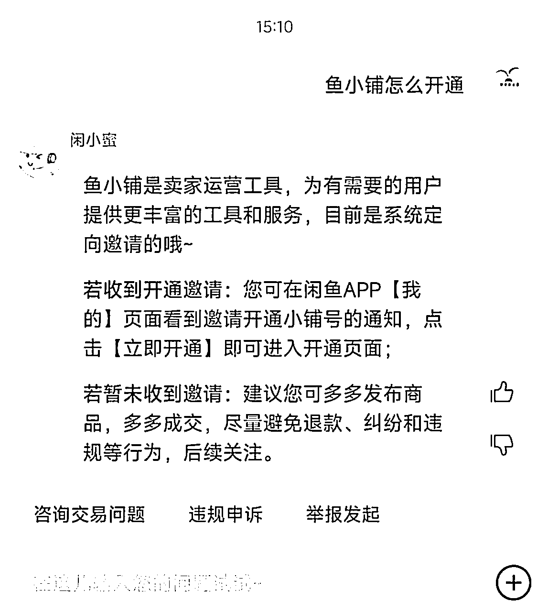
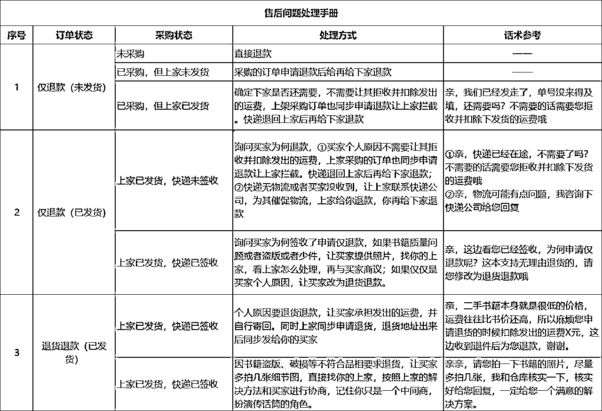
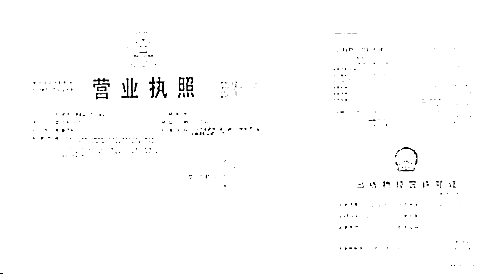
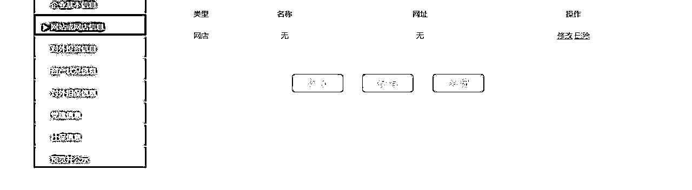
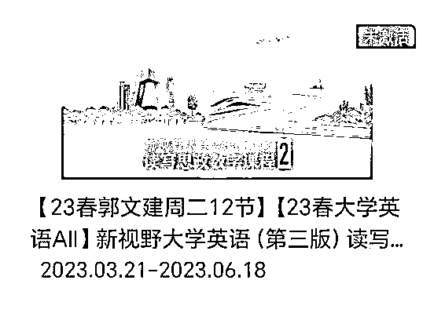

# 三、月航海 闲鱼二手书 实战手册

> 来源：[`jviztcgxxfy.feishu.cn/docx/KonHdBRlAoQNaGxHFtscJmLenic`](https://jviztcgxxfy.feishu.cn/docx/KonHdBRlAoQNaGxHFtscJmLenic)

闲鱼二手书

3 月航海 | 闲鱼二手书 | 实战手册

手册出品方：生财有术团队

出品时间：2024 年 2 月 27 日

手册使用说明：内容出品人排名不分先后。本文旨在向你展示一个项目的更多可能性，帮助你更好地理解和实操。

建议：如果需要快速定位到精确内容，可以使用快捷键 Ctrl + F/command + F 的形式，搜索「关键字/词」，查找你想要的内容

# 写在前面

欢迎大家来到 3 月航海 | 闲鱼二手书 | 实战手册，相信在接下来的日子里，我们将在这里见面很多次。

在开始做闲鱼二手书项目之前，让我们先来解决几个问题：

1）闲鱼二手书是什么项目？现在做，有多大机会？

在国家资源可回收利用的大政策下，随着全国各大高校教材的开放购买，很多大学生会选择购买二手书，同时也随着个人消费的降级，很多人被迫选择二手书。

而闲鱼在 2022 年 12 月开放图书类目商家在闲鱼的入驻，目前是闲鱼一个相对热门的小赛道。本次航海我们主要带大家了解闲鱼无货源二手书项目。这个玩法下，我们需要去各大图书网站/对标闲鱼二手书同行进行选品，上架到闲鱼，通过日常运营出单后，从孔夫子网站下单发送到闲鱼买家的地址。该玩法相较于有货源玩法难度低，比较容易获得正反馈。

首先需要着重说明的是，这个项目必须办理「出版物许可证」，否则无证经营将非常容易违规封号。

一般来说办理该证需要约 1 - 2 周时间，建议大家尽早开始办理，给后续上架经营留出更充裕的时间。具体的办理方法可以到 2.1 办理出版物许可证 进行了解。

2）什么样的人适合做闲鱼二手书？

① 适合新手作为第一份副业，目前闲鱼二手书处于红利期，比较容易拿到结果；

② 适合工作室作为稳定且长期的项目进行运营，由于出版物许可证的门槛，预估 2-3 年内不会太卷。

而且这个项目如果可以做到精细化运营，可以长久去做，不用每天都在选品，人工操作，不担心被封，上架后的链接也可以一直用。

虽然目前这个项目在红利期，但也有一些限制，希望在开始操作之前，你可以了解清楚：

1、天花板比较明显，不要期待能一夜暴富；

2、客单价不高，且需要手动上架，所以整体效率其实不会太高，客服比较忙，需回复用户问题，占用的时间比较多。

最后，希望大家可以在这次航行里收获成果外，结识一群战友。

以下内容由生财有术联合圈友制作而成，仅供航海船员以及生财有术星球圈友学习使用。

同时也欢迎圈友们在实践过程中持续反馈，和我们共同完善，可以联系鱼丸（yuwan387）提供修改建议～

# 【更新提示】新手册使用方式

在开始前，我们来简单了解一下这个手册的正确打开方式，方便你根据自己的情况来灵活使用。

在这里，手册整体的步骤顺序是按照从 0 - 1 跑通一个闲鱼无货源二手书项目进行的，你可以参考航线图，按顺序开始实操。也可以根据自己的实际需求选择性阅读。

需要注意的是：本次手册相较于过往航海，进行了较大的改版。之前的手册尽可能的展示更多可能的玩法供大家自由选择，本次改版后的手册，分为必修和选修两个大的章节：

如果你还未接触过闲鱼二手书项目：

建议在正式实操前，先初步了解下项目全貌

【项目概述】了解闲鱼二手书项目

如果你对项目整体已有大致的了解：

请开始完成航线图第一阶段的步骤，这个阶段你可以从手册的第二章开始阅读

【项目实操 1/3】完成账号准备和赛道确认

完成前期的准备后，即可开始完成航线图第二阶段，正式上书售卖

【项目实操 2/3】进行二手书选品和商品的上架销售

【项目实操 3/3】商品销售和发货

经过上一个环节，你已经熟悉了这个项目的流程，那么接下来即可完成航线图第三阶段，学习如何做出更好的成绩

【运营和优化】如何持续提高曝光和出单概率

如果你已跑通 MVP ，想放大项目：

可以重点阅读以下章节，扩展更多玩法

【项目拓展】更多的选品方法，拓展品类和货源

【项目放大】了解如何进一步放大生意

【案例拆解】了解当前比较热门的赛道情况

本航海项目的航线图如下：

航线图和手册是高度关联的，因此你可以根据自己所在的环节，进行相关步骤的学习。

以上阶段中，所有的航线图步骤建议大家在航海前两周完成，完成航线图的所有动作后，建议以实践为主，更多的选品和上架运营，扩大自己出单的概率。

# 必修篇：跑通最小 MVP

#### 章节概要

在这一章节，我们将从认识闲鱼平台开始，一步步带你完成闲鱼二手书整个项目流程的学习。你可以根据本章的步骤内容进行实操，跑通闲鱼二手书的最小 MVP。

如果你是本项目新手，建议在正式实操前，先初步了解下项目全貌：

【项目概述】了解闲鱼平台、了解闲鱼二手书项目

如果你对项目整体有了大致了解，就可以按照项目核心步骤，开始学习实操：

【项目实操 1/3】完成账号准备和多刷同行账号

【项目实操 2/3】进行二手书选品和商品的上架销售

【项目实操 3/3】掌握已上架商品的运营和优化技能

在必修篇，航线图和手册顺序相对应，你可以按照手册的顺序进行学习，即可逐一完成航线图的每一个任务。

在后续的每个关键步骤的章节概要中，我们也将提到相关航线图，提醒你完成相关步骤。

接下来就正式开始吧！

## 一、【项目概述】了解闲鱼二手书

#### 章节概要

本章节中，我们将一起逐渐认识闲鱼二手书无货源项目。

闲鱼平台目前如何？该平台有什么特点？目前二手书项目市场如何？为什么在闲鱼上做二手书无货源项目？……这些，都是我们在本章节中会解决的问题。

在这一章节，我们会通过对闲鱼市场趋势，和其他电商平台的对比来了解平台。

通过二手书市场分析，以及闲鱼二手书无货源玩法的优劣势分析来说明这个项目前景。

本次航海的重点，就是告诉大家如何从 0-1 跑通闲鱼二手书无货源项目。

那么对整体的项目概况了解是必不可少的，一起来了解一下吧。

### 1.1 认识闲鱼平台

#### 1.1.1 闲鱼市场趋势

目前闲鱼注册用户 4 亿多，月活跃用户突破 1 个亿，21 年全年交易额达到 5000 亿。而从年龄层次来看，用户出现非常年轻化的一个体现， 90 后超过 60%，95 后超过 36%，95 后折算超过 3300 万。这让闲鱼成为年轻用户比占比最高的一个主流 APP 之一。

而现在的闲鱼，通过扶植职业卖家，在确保自身货源稳定的同时，也为消费者提供了更丰富的商品选择，有效地推动了平台的标准化进程。

闲鱼从最初单一的 C2C 闲置交易平台，发展成现在 C2B2C 全链条模式的闲置经济生态，一个明显的特点是近两年平台上的职业卖家在不断地增长，许多职业卖家涌入闲鱼，说明平台也是需要更多有实力的商户入驻，带动平台的交易，及其带动闲鱼的市场。

外加电商也从前几年的城市，向着农村进展，普及度很高，民众方便，成本更低，而闲鱼算是电商里面成本更低的，市场类似于初期的淘宝。总的来说有这么几个优势：

1\. 制度比较宽松

2\. 可做的类目也比较多

3\. 容易上手，直接完善资料就可以进行操作

4\. 不强制交保证金

目前闲鱼在推广 7 天无理由退货和描述不符退货，分别需要 500 元和 200 元的保证金，但这个目前不是强制的，如果不需要设置这两个退货服务，也可不交保证金。如果上架期间，闲管家提示“不开通 7 天无理由，无法上架”时，再开通即可。保证金，后续如关闭服务，可提现退回。

5\. 闲鱼提供给各卖家的流量也相对较稳定

闲鱼给各个帐号之间流量差别不大，这阵子这个号出单多，过一阵子另一个号出单多一点，相对流量分发的比较公平。

#### 1.1.2 各类电商平台对比

闲鱼也属于电商平台，不过同比其他电商平台，操作更加简单，不用刷单，其次竞争较小，外加也不用保证金这些，而具体的一个主流电商对比，如下表，更加清晰，明了，方便对之有一个更好的认识。

闲鱼 VS 其他电商主流电商对比图。

以及和自媒体，短视频类的对比：

当然并不是说不好做，行行有状元，每个人找到适合自己的即可。

而闲鱼对比来说：

1.操作相对来说比较简单，不需要太多的文案，外加编辑，剪辑功底，按照接下来教到的方法，流程，进行操作即可；

2.单个手机就可以进行操作，随时随地都可以进行办公；

3.电商本身就距离直接变现比较近，可以及时获得正反馈。

比较适合没有怎么接触过互联网，准备尝试开展副业，获得一份额外收益变现的朋友。

总结一下闲鱼平台上做无货源项目的优势：

内容来源：《闲鱼电商｜小航海学习手册》

### 1.2 为什么做闲鱼二手书项目 @老瞿 Qu

一方面，我们上面说到，闲鱼平台的操作门槛较低；另一方面，从以下这几个方面，我们也可以感受到二手书的市场需求也越来越大：

（1）80% 以上的高校教材开放

据不完整统计，在国家鼓励对资源的可回收利用大政策的影响下，目前 80% 以上的高校已经放开了教材的预订，也就是大学生可以在学校预订教材，也可以自己解决，学校不做干预，这为大学生购买二手书提供可能。

（2）大学生对二手书的接受度提高

目前高校大学生对二手书的接受度越来越高，且每年都在递增，主要因为教材在大学的使用率较低，大家越来越接受二手书这种形式。

同时因为目前国家对盗版的打击比较厉害，这也为二手书提供了一波利好，二手书相对新书价格优势明显，一般为标价的 1-4 折。

（3）大环境下消费降级对二手的利好

这几年的经济环境大家有目共睹，目前经营闲鱼二手书店铺有个明显的感受，随着消费的降级，越来越多的家长开始给学生买二手字典，二手字典在闲鱼成为小爆款，供不应求。

（4）学校周边的二手书店倒闭，电商模式优势突出

一般在学校周边经营二手书店的老板，年纪较大，疫情这 3 年，绝大多数倒闭，因为学生无法出校，哪怕仅仅就隔了一个校门，同时因为经营者年纪太大，他们的电商运营能力较差，无法通过电商实现业绩的突破，而随着网购的普及，目前学生网购二手书的习惯已经形成。

而在二手书项目的几种玩法中，闲鱼无货源二手书项目，是目前最推荐的玩法。闲鱼平台处于红利期，而在淘宝和拼多多上做二手书，相对来说更难一些，不建议轻易入场。

如果你是一个人做，建议找一个家人的身份证，一起办理 2 个出版物许可证，开 6 个账号，管理 6 个账号基本上是一个人的极限了，精细化运营下来，预估一年的利润能达到 20-50 万。

比如开学季，我们单帐号每天的销售额在 1000-2000 元，平时在 500 左右，利润率在 30%-50% 。

闲鱼可发布的商品数量为 500 本，仅适合挑出爆款书籍售卖，所以更适合做无货源，避免压货。

另外官方可能在开学季会发布活动，可以关注相关活动动态，及时放大。比如之前有过活动：上架满 500 本书，同时开通 7 天无理由退货和不符合描述退货，就可以开通上架 3000 本的权限。

闲鱼二手书无货源玩法有这 5 点优势：

（1）目前处于红利期

一般人在闲鱼只能发布 5 本书，2020 年 9 月之前在网上有一个可以突破发布数量的 bug，现在已经修复。

闲鱼官方是在 2021 年邀请了 200 多个商家进行测试的，也就是进行出版物许可证的认证，就可以发布 3000 本书，2022 年申请通道一直处于关闭状态，直到 2022 年 12 月份才重新开放测试。

目前在闲鱼 APP 已支持申请出版物许可证认申请，可以确定有这个类目市场可做，不过有变化的是：一个号开了鱼小铺，最多发布 500 本书籍。

（2）书籍这种类型的商品，一旦上架，无需重复选品

闲鱼最畅销的是大学教材 + 小说，一般的大学教材至少 3-5 年才会更换版本，而小说的使用年限就更久了，所以一旦商品上架成功，后续这部分精力就可以省去，不用每天都在选品，忙个不停。

（3）售后较少

因为图书的商品属性以及价格偏低，所以售后问题基本上低于 10% ，我们实操下来，基本上低于 5% 的订单会有售后问题。之前也看到圈友在闲鱼卖投影仪这类型的商品，这种售后问题就会多很多。

（4）成本低

具备无货源的所有优势，不需要垫资，没有资金压力和库存风险。

（5）起号难度低

目前商家数量相对较少，起号比较容易，一个人第一个月做到 5K 的利润，第二个月利润过万，只要执行力在，问题不大（带人实测结果）。

但没有什么项目是十全十美的。讲完优势，也来讲讲这个项目的劣势：

（1）前期上书需要一定的时间积累，要有耐心

该项目推荐精细化运营，首图找实拍图效果更好，文案每个账号尽可能标准化且有所差异，每天上架 20-30 本书。

强烈不建议使用群控软件，效果较差，所以前期上架书籍有个积累过程。一般上架 300-500 本书以后，帐号就能相对比较稳定的出单。

（2）不能躺赢

平均客单价较低，大概在 20-30 元左右，所以订单多了以后，需要比较大的精力去买书发货，相对短视频带货等项目来说比较琐碎。

（3）不能搬运内容

不能直接搬运别人的账号，被举报以后容易被封号。

（4）单帐号天花板较低

目前跑通的最好的帐号在旺季利润在 1-2 万/月，淡季的话平均一个账号每个月的利润在 5000 元左右，跟短视频带货那种爆了一个视频，赚几十万没法比，赚的是辛苦钱。

内容来源：《深耕行业 2 年后，分享咸鱼二手书无货源、绝版二手书等 5 种项目玩法》

### 1.3 闲鱼二手书三个主要盈利模式@亦萌

闲鱼二手书单号的三个主要盈利模式：

低利润爆单：利润空间不高，但是爆单以后量大，单品一天能出 5-10 单。

套装高利润：同类书籍、教材+习题、小说套装、书单等，多品高利润。

垂类高利润：只做细分高利润赛道，出单量不多，但一本利润能做到 30-50。

这三点，做好一项就够吃。

如果一项都不占，那么在这次航海中你要选一项来优化。

如果已经做好了一项，后面我们要考虑的就是如何放大。

### 1.4 闲鱼平台高排名，高曝光，底层核心逻辑是什么？

很多闲鱼玩家都很好奇：如何增加曝光？

在这专门给大家说一下，闲鱼高排名，高曝光的底层逻辑是什么的。

其实用一句话说，就是：做对平台有贡献的事！

我们做了对平台有贡献的事，那么自然平台会持续不断给咱们供给更多的展现，带来更多的曝光，排名，因为这样，平台它自己会越来越好，知道的人多了，获得的好的反馈更多，对平台特别有帮助的一件事。

而具体如何做对平台有贡献的事：给平台用户一种好的体验，让用户更加信任平台。

落地到具体要做的事情，就是：

一切围绕着对平台做有贡献的事进行，接下来的内容也是围绕这个点具体展开，包含选品，编辑上架，客服，订单处理等各个环节的事宜。

内容来源：《闲鱼电商｜小航海学习手册》

## 二、【项目实操 1/3】完成前期准备

章节概要

了解完闲鱼无货源二手书项目的整体情况后，我们就要正式开始启动了。在闲鱼上运营的前提，是完成前期的资料准备和账号准备。

所以在这一章节，我们整理了运营售卖之前需要筹备的事项，包括：

办理出版物许可证

项目所需 APP 下载

闲鱼 APP 权限设置

闲鱼账号完善

在闲鱼开通书籍销售许可

多刷闲鱼二手书同行账号

其中出版物许可证是做这个项目必要的资料，大家一定要完成办理并在闲鱼上进行认证。如果没有出版物许可证就卖二手书，违规概率很高，且有很大概率会被直接封号。

#### 本章航线图

完成本章节的学习和实操，即可完成航线图的第一阶段：完成账号搭建，多刷同行链接（约 2 周）

1.办理出版物许可证（约 1-2 周）

2.完成 3 个闲鱼账号的包装和权限设置（约 1 小时）

3.将 3 个闲鱼账号开通书籍销售许可（约 1-2 天）

4.刷同行账号，了解各个书籍赛道（约 10 分钟/天）（约 1 小时）

那么现在，就请开始完成这几个步骤的筹备吧。

### 2.1 办理出版物许可证 @老瞿 Qu @一游

营业执照和出版许可证，是开通闲鱼图书店铺的必备条件，可以说是入局该领域的资格证，也算是一个有门槛的领域了，凡是有门槛的领域，必定能减少一半或一半以上竞争者。

做这个项目的第一步，就是要办理出版物许可证，注册闲鱼帐号。

一个人可以办理 3 个支付宝帐号，对应 3 个闲鱼帐号，要求出版物许可证、支付宝、闲鱼三者的主体要一致。目前在淘宝办证的价格大都在 1100 - 5000 元不等，也有再贵一些的，含一个个体户 + 一个出版物许可。

线下办理毫无疑问是最靠谱的，但是线下办理很难，办理个体户比较简单，有个商业地址就行。但是出版物对商铺的面积，消防都有一定的要求，而且有些较大的城市已经不办理了，所以导致线下办理周期特别长，费用基本上大几千，而且有些地址还需要每年再给几千。

所以不太推荐线下办理，有很多人试过，最后基本都放弃了。

网络上办证周期大概是 2 - 7 天，后期需要营业执照每年年报 50 元，出版物年检 150 元，如需注销，费用 150 元。

注意：需要鉴别真假，淘宝有假证，拿到证去官网验证、或者电话给工商局验证以后再确认收货，不要相信他们发给你的官网。他们的主要套路是建一个网站给你查询，所以要通过百度核实下是不是真的政府官网。

但营业执照 + 出版物许可证的费用，每家淘宝店办理的价格不一样，这时候就有个问题了，哪家办证靠谱？

根据目前了解，代办公司主要是靠一些政策的漏洞，或者他们有关系去办理的，一般刚开始办的时候，都没有什么问题，但是后续可能地址被注销，出现地址异常的问题。

一般代办公司会选择一个地址，一个比较偏远的地方，一旦一个大范围内，其中一家地址被投诉了，就有可能会牵连大范围地址的其他商户，就会被工商局整体调查，然后被批量注销。

所以市面上任何一个代办公司给你的保证都是不靠谱的，其实还是需要看运气，有没有被投诉，有没有引起政府层面的关注。

那么如何应对？

首先要承认这个行业就是擦边球，线下办理不了，又想赚钱，所以还是得找代办公司办理。

其次这个项目好的地方是，哪怕地址异常了，其实对这个闲鱼店铺的正常运营基本是没有什么影响的，闲鱼目前对这块的审核还比较松。

所以不用过多的纠结，赚自己能赚到的钱，遇到问题解决问题。找代办公司只需要有这几点要求：

1.找个自己认为价格合适的

2.下证时间快

3.有人已经用该证件通过闲鱼认证的

然后直接去办理就好了。

但还是需要再次强调，不一定认证通过了，这个代办的证件就是百分百靠谱的。但认证成功通过后，就可以先做起来，如果后续出现异常再进行处理。

也可以有个小建议，就是找一家相对稳定、靠谱、承诺售后问题的代办公司。如果证出问题了，最坏的结果就是付点年审的费用，大概 300 元，他们会帮你重新办理一个许可证，然后我们在不影响自己闲鱼店铺经营的情况下替换掉即可。

当然这种包售后的价格肯定会高一点的，毕竟大家都是为了赚钱，所以那种淘宝价格极低的，跑路的风险就越大。

风险提示：不要用办的证开微信收款码，可能会存在风险。

圈友 @老瞿也在星球分享了关于办证的相关问题解答，你可以进行参考：《闲鱼二手书航海，办理《出版物许可证》相关问题解答》

另外，有些小伙伴在办理许可证时，发现下证的速度受到了限制，其实不用恐慌，我们可以先上少量的书籍练手，熟悉整个项目流程。只是普通账号最多只能上架 5 本，可以先养账号，把鱼小铺在这个过程中开启，方便后面证书到后直接上手。

内容来源：《如何在闲鱼开通图书店铺之劝导新手办理营业执照加出版物许可证不纠结篇》、《深耕行业 2 年后，分享咸鱼二手书无货源、绝版二手书等 5 种项目玩法》

### 2.2 基本软件下载完善 @老瞿 Qu @小嵩

需要提前准备的软件 / 网站有：

闲鱼 APP 目前整体风控比较严格，建议一机一号，一台手机来回切换闲鱼账号的话，账号是很容易异常的，异常会导致闲鱼币不能使用，所以一机一号保险点。比如二手手机可以在闲鱼买 200 元左右的红米 7 或者 8 ，或者同等配置的手机即可。

闲鱼账号绑定的支付宝需要跟执照是同一人。

一个出版物许可证可以用在三个闲鱼账号上开店铺，每个店铺对应一个支付宝，而一个身份证可以注册三个支付宝。

也就是说，只用自己的身份信息做这个项目的话，只需要办理一个出版物许可证即可，不需要办理多个。

另外，也可以在电脑端使用闲管家统一管理，闲管家可以关联六个账号，在管理方面更加便利，不过闲管家的使用场景主要是在家或者工作室，平时上班还是需要将手机带好，这样能避免出现漏单的情况。

闲管家界面展示：

内容来源：《深耕行业 2 年后，分享咸鱼二手书无货源、绝版二手书等 5 种项目玩法》、《加入生财有术一年，终于实现副业月入过万》、5 月 30 日《单账号单周出 100 单，如何从 0-1 实现闲鱼二手书变现？》@一棵茶树

### 2.3 闲鱼 App 的权限设置

#### 2.3.1 定位权限

永不允许，不进行开通。（如果之前有下载使用闲鱼软件，定位权限已经开通了。或者需要使用闲鱼软件，购买当地一些产品，或者向附近朋友，出售一些自己不用的产品这种，可以不用管，打开也可以的）

#### 2.3.2 消息通知打开

很重要，务必打开，前期消息务必及时回复。

#### 2.3.3 允许后台 App 刷新

允许后台 App 刷新，外加所有照片权限。（截图了一个苹果的，安卓的按照提示进行即可。)

内容来源：《闲鱼电商｜小航海学习手册》

### 2.4 闲鱼账号完善

之前未下载使用过闲鱼的，可以直接借用自己常用的支付宝，淘宝账号登陆即可，比较简单。

#### 2.4.1 个人资料完善

登陆之后点击“我的”，进入点击“编辑资料”。

根据自身情况完善信息 85%以上，一般可以用书店名称去做头像，做一个名称的头像标志会更好，自己做，这个很简单，比如一三书屋，直接通过免费的字体设计，然后截图做成头像。另外也可以选择文艺点的卡通或者美女图像做成头像。剩下的根据自身情况设置即可。

#### 2.4.2 实名认证完善

继续往下拉，实人认证，支付宝实名认证，外加芝麻信用分，分别进行一个按照要求认证，授权即可。

#### 2.4.3 鱼小铺的开通@亦萌

新手刚做闲鱼的时候，可能会发现：有一些店铺可以开通多种规格的价格，而且还能设置很多个库存。很诧异，自己的店铺为什么没有这样的功能？

要实现多规格上架，需要开通“鱼小铺”的功能。那么鱼小铺如何开通呢？以下是官方给的回答。

目前测试来看，每天坚持上架 5 条链接，坚持 2~3 天，就会收到如下图所示的官方邀请。

收到邀请时，大家可以酌情开通。

是否要开通鱼小铺，有以下几个考量：

1.如果不开通的话，只能上架 50 个产品，并且库存默认都是 1 件。这也就意味着，如果有人下单拍了你的产品产品就会自动下架，你需要手动地去重新上架。

因为图书的种类很多，50 本是远远不够的；而且重新上架也需要额外的花费时间和精力，所以如果是做闲鱼二手书，还是建议大家去开通一下鱼小铺，开通过后，可以上架的数量变成了 500+，并且可以设置库存数量，客户拍完了以后，这个产品也会在架上，不会自动下架，方便爆单和后续成单。

2.如果不开通鱼小铺，只能设置一款价格，也就意味着，你没有办法通过多规格进行低价引流，或是卖高利润的套装。

闲鱼的客户普遍还是追求便宜，首页的初始价格决定了客户是否会点击你的链接；此外，很多图书是套装，比如说有 1234，或者教材加习题指导，如果我们一次性把价格写清，可以提高运营效率。所以还是建议大家开通一下鱼小铺。

3.唯一不开通鱼小铺的考量是，上架的产品过多，但是大多数没有动静的话，就会影响整个店铺的动销率，也就是说，会影响平台判断你是否是一个优质的店铺。

但跟前述所有的因素相比，还是开通鱼小铺，利大于弊。

开通鱼小铺时，资料填写，可以选择“二手书实体店店主”之类的，不太重要，不影响上架出单。

鱼小铺的常用功能：

1.深库存宝贝

在发布宝贝时，可添加宝贝规格（最多 2 个），并填写宝贝库存（小于 1 万件），对不同宝贝规格可设置不同 SKU 和价格，发布宝贝更丰富多元。

2.发布宝贝数

发布宝贝数量上限突破 50 个，可发布更多宝贝。「一键擦亮」最多擦亮 500 个宝贝。

3.宝贝分组

除 3 个系统分组外，还可对在线宝贝进行其他分组，我的-鱼小铺工作台-常用工具-管理创建分组。

4.宝贝专题

对在线宝贝可进行上新及自定义专题创建，我的-鱼小铺工作台-常用工具--管理创建专题。

5.宝贝置顶

拥有将宝贝置顶的功能，长按宝贝即可设置置顶。

#### 2.4.4 注意事项

芝麻信用分尽可能 650 以上，700 左右，自然越高越好。具体查询，打开支付宝，首页搜索“芝麻信用”点击即可。

如何提升自己的芝麻信用分？

下方有一个“去涨分”可以按照提示进行，外加平时多使用“花呗”支付，并且及时还款，外加补齐自己的一些身份信息来的。

一些信用分低的怎么办？

刚开始可以直接借用身边亲人，朋友，信用分高的进行使用。

内容来源：《闲鱼电商｜小航海学习手册》

### 2.5 申请开通书籍销售许可 @老瞿 Qu @小嵩

打开闲鱼 APP，在“我的”页面，点击下方的认证招商，选择【经营资质】，选择经营资质类型为【企业/个体工商户经营资质】，根据步骤上传执照。

现在经营资质认证申请已基本全面开放，认证申请会分为 2 种情况：

提交以后也会有不同的情况，有的审核只需要几分钟，有的审核可能需要 1 - 2 天，所以都不需要太焦虑。

要注意的是「出版物编号」是要把所有的文字 + 数字全部写上（如下图整个划红线处），而不是只写个数字。如果审核出现问题，一般主要是出版物编号写错了，所以这部分需要多多注意。

万一审核没有过，去看看具体原因就好，目前闲鱼对证照的审核还是相对容易过的。

具体申请入口如下（入口可能会随闲鱼版本发生变化，找到“认证招商-经营资质”即可）：

建议审核通过后的第二天开始上书。审核通过当天不建议上书，这个时候上书容易被判违规。因为系统可能存在延迟，如果第一天就上架很多书，系统会以为没有证导致误判，误判以后再去申诉是很麻烦的，所以安全起见，这里稳妥一点，第二天再上书。

内容来源：《加入生财有术一年，终于实现副业月入过万》

### 2.6 多刷同行账号，养号的同时，积累对标账号 @亦萌

同行，是我们最好的老师。

多刷同行账号，一方面可以帮助我们，找到更多的对标账号和好的选品；另一方面，也可以帮助闲鱼定位我们的喜好，向我们推荐更多的二手书选品。

以“二手书”为关键词，进行搜索，切换到“用户”列，找到二手书同行。

点进同行店铺，查看店铺内的二手书链接，特别是"想要"数多的链接。观察标题、内容、图片，分析它们好在哪里。一直做到"来到闲鱼的首页，系统就会自动给你推荐二手书"的程度。

这一步有两个目的：

1.让闲鱼知道，你是一个关注二手书的客户，所以会主动给你推荐更多的热门二手书选品。

2.通过观察大量店铺链接，对好链接的要素、好的店铺、好的选品有一个基础印象。

这里要注意：不要拿主号直接关注同行，会被对方拉黑，或者取消关注。

如果需要关注同行，可以用自己不常用的小号，或者建立一个对标账号库。

a.闲鱼首页，找到一个二手书的链接，点进去。就会跳转到一个连续推荐的页面，一直下滑，可以找到更多二手书产品，以及对标的同行。

b.选中某一个产品链接，进到详情页，一直下拉，会出现“为你推荐”，也会推荐同类的产品。

## 三、【项目实操 2/3】选品和上架

### 3.1 如何快速选品

#### 章节概要

账号准备完成后，我们就要开始准备上架二手书商品啦。这时就会有一个问题：既然做的是无货源，那么书籍从哪来？如何找到更好卖的书籍货源呢？

目前相对较好的选品方式就是：参考孔夫子二手书网站的畅销排行榜进行选品，以及参照闲鱼优秀同行的热卖品进行选品。

我们在选品时，需要注意不卖违禁书籍，避免封号；另外在选品发货时还要注意二手书的品相，以及孔网商家的避坑点，减少发生售后问题的可能。

#### 本章航线图

完成章节 3.1 的学习和实操，即可完成航线图的第二阶段：选品并上架销售（约 1 天）

1.到孔夫子网或者对照闲鱼同行至少选品 10 个（每天约 30 分钟）

接下来就开始选出你想上架的二手书商品吧。

由于在闲鱼上卖二手书时，仅能上 500 个商品 ，而书的种类特别多，几百万甚至上千万种，导致 SKU 很多，所以目前在闲鱼比较合适的操作模式，就是选择爆款，也就是畅销书去卖。

畅销书的信息主要来源于孔夫子销量排行榜。

#### 3.1.1 根据孔夫子的二手书畅销排行榜选品 @老瞿 Qu

这里选用教材为例，也是需求最大的市场。打开孔夫子网页： https://www.kongfz.com/

点击教材这块，进去后点击销量，我是按这个方法依次上书的。如果想在选品上有一定的差异化，可以考虑不选前几页，比如从第 10 页开始上书，这样效果有时候也挺好。

一页五十本，单教材这块就有一百页，一年都上不完。

目前大部分二手书货源，基本上都是孔夫子旧书网买的，利润率在 30-50%，因为上架图书的时候就是按照这个利润率控制价格去上架的，有时候因为这本书孔夫子卖完了，或者采购价格太高，我们就直接舍弃这个品，不卖这本。

#### 3.1.2 根据闲鱼同行的动态和评价选品@亦萌

这些都是经过市场验证，真正有人掏钱买单过的，而且是近期的热点书籍。优先上架这部分的书，特别是那些连续 2 天出单，或者同 1 天出过 2 单以上的，都属于小爆书籍。

看不到动态的，看评价。每一个评价，点进去，都能看到是出单了什么产品。

评价看不到近期的出单数量，因为不是每个出单的客户都会进行评价。但依旧有参考价值。

除此之外，还可以看想要数。我一般看想要数大于 30 的，这个数字可以适当放宽，大于 50，大于 100，看个人时间精力。时间精力越少，要求就要越高，提高筛选标准。

这些链接，不一定是最近的热门书籍，但可能会反复爆单，所以可以先挂着，等着流量爆发。

#### 3.1.3 选品注意事项：不卖违禁书籍 @老瞿 Qu

说完了选品的方法，似乎很多人已经磨刀霍霍准备开始实操了。而在具体实操之前，需要提前和大家说明在做这个项目时的相关注意点，避免因一部分原因，导致正式实操的时候出现账号违禁封号的情况。

不能上架的图书主要有这几类：宗教、政治、风水、股票、婴幼儿奶粉、保健品、酒水，这些均谨慎上架，另外 PDF 电子类、盗版影印类也要注意。详见参考以下的表格截图。

#### 3.1.4 孔夫子避坑商家 @flame

这个表格是圈友@flame 牵头，带着续航群船员一起更新的孔夫子商家避坑表格，表内记录了大家在孔网遇到的踩坑商家、以及踩坑点。

大家在选品的时候，可以看根据表格检查一下，是否遇到了违禁商家。在运营的过程中，如果你也遇到了踩坑的商家，欢迎大家也一起更新进来～

孔夫子商家避坑表

### 3.2 如何在闲鱼平台上架商品@老瞿@大闵

#### 章节概要

编辑上架的核心就是：尽可能让市场需要这个产品的用户，都到咱们店铺浏览，并最终完成下单付款。

那么如何让我们上架的商品，被更多人看到并成交呢？这就要说到怎么在闲鱼平台更好地上架商品。

在编辑上架这个步骤里，最重要的四个点是：

另外这里还整理了一些编辑小技巧以及编辑注意事项，帮你更顺利的完成商品上架。

这些模块具体是如何帮助获得更多的流量呢？请继续往下了解。

#### 本章航线图

完成本章节的学习和实操，即可完成航线图的第二阶段：选品并上架销售（每天约 4 小时）

1\. 在闲鱼至少编辑上架 10 个商品链接（每天约 1 小时）

接下来就开始把你选出的商品进行编辑上架吧。

#### 3.2.1 一个好的主图怎么制作

一个好的主图，一定能在第一眼就直接抓住闲鱼客户眼球，这类主图的特点：

好的主图长什么样？

以《三体》为例，可以看到排名靠前的，想要人数多的产品主图样式，一般都是产品处于主图正中央，且为实拍。至于详情页内的其他照片，可以参考动态出售好的，其他图片进行即可。

好的主图图片在孔夫子网找到合适的实拍图采用即可。

如何高效获取无水印图片？@亦萌

1、谷歌浏览器+油猴插件+孔夫子去水印

2、孔夫子/闲鱼同行图片+截掉水印

3、点击闲鱼同行图片放大，截图上下带黑边图片，裁剪黑边。

另外，还有一些图片小技巧：

#### 3.2.2 一个好的标题怎么制作

1.一个能获取较多流量的标题，通常可以通过堆积产品关键词的方法，让用户不论搜索产品任意名称，都尽可能出现，自家店铺产品。

满足基本的 SEO 就行（二手书相关的关键词），30 个字尽量写满，标题的意义是把用户可能搜索的词和吸引人的词写上去；如果你想优化 SEO，可以在星球内搜索关键词 “SEO” ，可以看到很多优化 SEO 的帖子。

比如书名 - 作者 - 出版社 ISBN 编码，把字数用满

标题参考：二手正版三体 3 死神永生三 刘慈欣 重庆出版社 9787229030933

2.二手正版、正版二手、正版好品相、毕业了卖书、正版捡漏等等作为开头，可以加【】这种符号强调，总之逻辑就是：在用户搜索完一本书之后，同样的图的情况下，最大可能的让它点击你；

3.书名+作者+第几版+出版社，基本这些写完了已经够标题的字数了，做标题是为了搜索。标题是一个可以展开讲一节课的话题，新手前期把重要信息写全就行了。书籍没有那么复杂的词，大家搜的时候都会搜书名为主，剩下的就是作者、第几版这种属性词，已经完全够用了。

参考闲鱼同类产品销量好的标题，外加淘宝同类产品销量好的标题，一般销量偏好的，标题都是经过优化过的，这里就可以参考借鉴，简单修改，变成自家产品标题即可。

如下图，当我们找到销量好的产品标题后，保留顺序以及二手书、正版、推荐等词语，把其中的书名，出版信息，作者，编号等等都替换为自己的书籍信息即可。

#### 3.2.3 一个好的产品介绍怎么制作

图片内容上面有说，参考闲鱼市场动态出售好的其他图片进行即可。这里主要讲解的是关于我们的产品文字版本介绍该怎么写。

1.万能公式

我们的产品介绍，有一个万能公式：

产品介绍足够详细，用户想知道的都已经看到，减少客服工作，降低我们的时间成本。

另外，如下图二的产品介绍简单明了，用户一眼就看到自己想要获得的信息，降低用户的决策成本，也可以提交我们产品的转化率。

2.对标同行 @大闵

看同行怎么写，这是最直接的，然后在同行的基础上进行优化。

打消顾虑，告诉他是正版；

告知品相和教材有字迹正常等话术降低心理预期；

售后政策、不讲价、偏远地区不包邮等，没有什么标准话术，把事情讲清楚了就行；

也可以加一些感性的话，坚定用户购买二手书的理由，例如童书，可以从环保、 支持正版有利于孩子的身心健康，盗版童书对孩子的伤害等等去写，这些话术，上网搜一下“给孩子买二手书的意义”等关键词，相信你一定可以组合出一段很好的话术，记住，百度其实能解决 90%以上的问题。

例如我卖二手绘本的话术最后加一句：

“我最怕看见诚实的人被迫说谎，正直的人被迫弯腰，直言者被迫噤声，理想主义者亲眼见到理想破碎。道远知骥，世伪知贤。我们改变不了别人，但我们可以做最好的自己，拒绝盗版，至少，我们要给孩子一个干干净净的美好世界。”

这种话术不是我自己写的，是我抄来的，每个人风格不一样，我是这样一个比较矫情的人所以我写这种话术，你也可以写属于你自己的。

另外不要写那种拒人于千里之外的描述，例如你上来就写个：二手书不是新书，事妈绕道，等等，大家是做生意的，不是天天想着怎么和用户 battle 的，没有必要，因为你不是个人大学生毕业了转让几本书，这是你的一个小事业。

3\. 编辑小技巧，助你快速出单盈利 @老瞿 Qu

1\. 可以设置多规模 SKU，价格低于 20 元的，可以设置单规格 SKU，价格高于 20 元的，设置多规格 SKU

2\. 提供一种服务，比如代找书，这样怕麻烦的人就会委托你帮忙找他想要的书

3\. 找身边朋友在对应的商品详情页刷几个想要，尽量让链接排名靠前

4\. 闲鱼编辑上架的注意事项 @老瞿 Qu

#### 3.2.4 如何定价 @大闵 @诗和远方 @豆仔

1.根据利润进行定价

其实二手书的定价相对来讲没有那么难，你只需要考虑前期的投入和人工成本。不是非要加价 30%。孔夫子的书不是全网最低价的书，有时候你会发现它的旧书的价格比新书还贵，那你加价 30%怎么卖呢？

没有什么必须的标准，因为店铺是你自己的，生意是你自己的，你对自己的盈亏负责，对自己的销量负责。有时候有的热门的一阵子的书，我可能加个 1 块钱就卖～ 不同场景不同分析。另外对比同行的时候参考淘宝同行的售价去做价格比对就行。

另外，孔网很多商家的低价书每次只上一本（有的确实只有一本，有的是故意引流），若按最低价格*预期利润定价，有可能我们上架的时候还有货，等有人想买的时候那个价格早被别人拍走了，我们还有可能倒赔钱。

建议建议大家看看要上架的书哪个价格区间的多一些，定一个相对稳定的基础价格再*利润作为自己的售价，避免纠纷或亏损。

2.设置多规格单本定价还是多规格合集定价

如果是多规格的书籍，当顾客点击你的链接首先看到的是价格区间，如果多规格中含有合集的价格，就会增大价格区间的最大值。这个时候要分情况去讨论。

①主图是单本书的实拍：主图是单本书的实拍图，但是多规格中设置合集的 sku，建议先去掉，这样顾客看到的价格最大值就是你这本书的真实值。如果他真的想要或者价格在考虑区间内会点我想要和你咨询。如果不去掉，有些顾客会误以为价格区间的最大值为书本的真实值。

②主图是合集书的实拍：如果主图为合集的实拍图，这种情况可以不用去掉合集的 sku。

内容来源：6 月 8 日《闲鱼二手书 照着抄就可以见到效果的实操干货》@大闵、7 月 6 日《在闲鱼卖教辅书的几种选品技巧》@诗和远方、6 月 27 日《闲鱼二手书新人 21 天跑通项目闭环的经验分享》@豆仔

#### 3.2.5 在闲鱼上书的步骤 @老瞿 Qu

使用电脑上架书籍，需要使用闲管家（闲鱼官方的后台管理工具）：https://www.goofish.pro/product/all。

手机也可以上架但是需要扫 ISBN 编码，电脑网页端上架效率更高。

前期店铺或者商品链接的流量没有起来之前，建议把加价范围控制在 10 - 20% ，等有了订单慢慢涨价，这样前期更容易把流量做起来。

等流量起来后日常上架，在孔夫子或者淘宝的基础上加价 30% - 50% 即可。

具体步骤：

【第一步】进入「闲管家」后台，点击店铺管理中的【创建店铺】。

01 选择行业中，选择图书行业，并点击下一步。

02 选择身份中，选择实体店主，并点击下一步。

03 完善信息中，填写你的店铺名称、简介、地址等信息。

04 绑定闲鱼号中，点击绑定闲鱼号，即可完成开店

接下来进行正常登录即可。

【第二步】登录闲鱼账号后，点击商品管理，新建商品。

【第三步】设置商品类型为一口价；商品分类为图书（这里以教材为例，选择学习考试）。

【第四步】在「发布的闲鱼号」处，选择你要发布的账号。

【第五步】完整的填写基本信息

其中：

【第六步】在「价格库存」这里，只需填写价格，修改下库存就可以。其中价格可以按孔夫子商家的售价（书本价格+运费）加上 40%定，确保利润在 30%以上。

以毛泽东思想和中国特色社会主义理论体系概论（2018 版）为例：点击价格排序，选择总价从低到高，品相选择八五品以上，以商家的售价做为参考加上 40%。

以上填写好后，点击「立即发布」，点击「确定」，这个书就上好了。

这一流程熟练后，一小时上 20 个链接很轻松。

其他方面同上述一样。

ISBN 码获取，有两种方法。

1、在家里找一本书，扫描 ISBN 码，在正文描述中，删除掉自动出现的内容，每次都这么操作。

2、更精准的方法是：

https://products.aspose.app/barcode/zh-hans/generate/isbn

生成码，截图，扫描选相册。

但有时闲鱼审核严格，会禁止扫描外部链接，所以更建议选择方法一 。

总体来说，用手机上架，相比于电脑，要麻烦很多。

建议大家尽量用方法一闲管家上架。

内容来源：《深耕行业 2 年后，分享咸鱼二手书无货源、绝版二手书等 5 种项目玩法》

## 四、【项目实操 3/3】商品销售和发货

#### 章节概要

当有顾客咨询，我们需要及时跟进，避免客户流失，而在出单后也需要尽快安排发货，尽量减少客户的等待时间，有助于提高客户的满意度。

这一章节，将会和大家讲讲如何做好商品售前售后客服的常用回复，以及怎么找到优质的货源：

闲鱼客服：及时回复、积极跟进处理售后问题

出单发货：及时在货源平台上下单，做好快递信息回填

具体每个细节怎么做，一起往下看。

#### 本章航线图

完成本章节的学习和实操，即可完成航线图的第二阶段：选品并上架销售（约 1 天）

1.建立售前售后话术库，及时回复顾客消息（约 1-2 小时）

2.出单后找优质货源，进行发货（约 10 分钟）

### 4.1 闲鱼客服回复话术 @老瞿 Qu

在闲鱼上，如果能做好及时回复，和有效回复，能大大提升我们的转化率。

我们做客服回复的核心：知道用户问的问题背后想了解什么，并引导客户，而不是被用户引导，尽可能 4 句话以内让他们付款。

最重要的：凡是来咨询的，尽可能都完成成交。

我把目前市面上常见的话术模板，经过测试后，觉得比较好用的，整理在这里，具体参考如下：

#### 4.1.1 售前相关问答话术回复

欢迎语设置：欢迎欢迎亲！小店专营各类正版书籍。直接下单即可哦。

客户：[书是全新或者正版吗]

回复：亲，书籍是从学生处回收并消毒翻新。书籍七-八-九成新，无破损、明显污渍、无法使用的情况，会有些许笔记，不影响使用。择优发货。

客户：[在吗？/你好/还有吗？]

回复：在的/你好/还有 能拍就是有货，拍下最迟 x 小时内发走，喜欢直接拍下就可以

客户：[多久发货发什么快递]

回复：一般下午 x 点前下单当天可发，快递根据库存随机，最迟最迟不超过 x 小时。

客户：[可以拍照吗]

回复：您好，仓库较远无法实现每本书都拍照哈，我们发货的时候会择优发货的，请您放心购买！

客户：[有货吗品相如何]

回复：能拍就说明有货，成色 7-9 成新，无破损、明显污渍、无法使用的情况，会有些许笔记，不影响使用。择优发货。

另外，如果出现修改价格，一直迟迟没有付款的，点击右上角 三个点“···”选择“关闭订单”最后按照下方选择，关闭即可。

如果客户想要其他的书，或者多本书，要我们新上链接。可以在该链接的基础上，让客户：拍下，不付款，我们来改价，改价之后再付款。

拍下不付款的意思，就是客户点“立即购买”，来到下单页面，选了下单，但是不付钱。

当客户拍下不付款，我们的右下角界面，就会出现修改价格。

我们改完价格，系统会给对方发一条信息，叫做价格已修改。改完以后，客户再付款就好了。

#### 4.1.2 售后问题相关话术回复

客户：[怎么没有快递物流消息？/还没有发货的吗？]

回复：仓库正在为您的货物进行出库、核实版本、封面以及打包哦，会尽快发出，如果有品相不好或者版本不准的情况发不了货，我们会尽快通知您！

客户：[我的快递还没送到怎么回事]

回复：亲，各个站点时效不一，还请您耐心等待，如果超过 3 天没有动静请给我留言，这边看到后第一时间向快递公司查询哦

客户：[书籍有空包/破损/无法使用的情况/客户直接差评回复]

回复：亲，麻烦您把快递包裹和书籍一并拍照，如果可以拒收请尽量拒收，这边核实是发货时没有检查出来还是快递途中破损导致，并尽快为您提出您满意的解决方案。

客户：[我不想要了可以退货退款吗]

回复 ：亲，如果您没收到货的话需要承担发货运费哦，二手书籍本身就是很低的价格，运费往往比书价还高，所以麻烦您申请退款的时候扣除运费并且拒收包裹，这边收到退件后为您退款，谢谢理解。如果您已签收包裹，支持 7 天无理由退货，运费自理哦。

客户：[包裹有拼多多卡片怎么回事]

处理方式：在平台商家采购的时候就可以说：给朋友买的，不要放价格单，也不要发短信，谢谢。另外尽量不在拼多多平台选择货源。

回复：如果还是发了如何给用户说到：我们不止这一个平台，那边也有，应该是新来的不小心给标注错了，很抱歉，已经提醒了，产品质量可以放心的，没有问题的哈。

如果最后发现拼多多更便宜，退差价即可，一般出现概率很低，1000 个里面几个这种，因为大家更多想要的是产品，而不是那个平台。

以上，是闲鱼上最常见的问题以及回答，其他具体问题，可以在航海中一起交流～

### 4.2 商品发货

#### 4.2.1 出单拍单发货流程 @老瞿 Qu @小嵩@亦萌

当有了订单以后，我们需要去孔夫子或者淘宝下单，等发货了以后再把单号填写到闲鱼进行发货即可。

顾客下单后，我们在等待发货这里查看顾客地址，点击订单详情。

复制地址，然后找上家（孔夫子网、淘宝对应店家）下单即可，上家发货后，我们再把快递单号复制过来发就可以了 。

填了单号，闲鱼显示：无法发货、单号已用等等，如何处理？

可以选我已寄件，其他，邮政/极兔/指定快递名称，填单号。

或者选无需寄件，我已发货，然后跟客户私聊发过去，再解释一下，闲鱼不显示这个单号，可以复制链接到浏览器查看。

话术：亲，您的订单已发货，单号是——，因为闲鱼平台不显示这个单号，请您复制单号到浏览器查看物流进度。

在手机端，使用闲鱼 app 发货。复制孔夫子单号，来到闲鱼。

我的-我卖出的-待发货-找到指定订单-去发货-我已寄出-填写单号-一般情况下，会自动跳出快递公司-提交确认即可。

内容来源：《深耕行业 2 年后，分享咸鱼二手书无货源、绝版二手书等 5 种项目玩法》、《加入生财有术一年，终于实现副业月入过万》

#### 4.2.2 找到优质货源 @老瞿 Qu @豆仔

不同的店里，二手书的品相可能有所不同，所以如何找到一个更好品相的二手书，降低出现售后问题的可能呢？这里主要给以孔夫子网来举例说明，综合品相、发货时长、成功完成率、店铺好评率几个指标（还可以看看中差评内容），综合选。其他平台也可以参考相关的数据来判断。

先按照「总价从低到高」排序，查看对应店铺的发货时间、成功完成交易率。时间越短越好，交易率越高越好。比如选 12 小时内发货、成功完成率和好评率在 90% 以上的。

点进某一个产品的详情页，找到「店铺评价」，好评率越高越好，建议也看几条具体评价内容，辅助判断。

注意点：如果商家标注的有缺页什么的，说明是残次品，不建议下单购买。

而且如果交谈时，店家表示店铺倒闭介意勿拍的，就真的不要拍，以免出现售后却无法快速找到商家解决的情况。

内容来源：6 月 27 日《闲鱼二手书新人 21 天跑通项目闭环的经验分享》@豆仔

#### 4.2.3 如何下单，可以减少成本？@亦萌

1.下单的时候，可以下载“孔夫子”app，用农业银行付款，没有手续费。目前我测试的只有农行没有手续费，大家也可以试试其他银行看看。

2.单本图书，优先从“书目”进去，找到对应的图片，把地址改为客户滴之后，总价从低到高排序。

如果找不到，可以尝试调整搜索关键词，减少框定词，如去掉版本之类，因为很多商家上架的时候比较粗糙，搜太细就找不到。

3.多本图书，可以尝试在同一家下单，可以减免邮费。

4.量大可以跟商家谈优惠，拍下不付款，商家可以改价，送我们优惠券。

### 4.3 售后处理流程 @老瞿 Qu @亦萌

1.售后处理常用流程。

记住一句话：我们是个中间人，心态放平。

所以没有必要去闲鱼和用户纠缠，出现售后，让用户及时提供快递盒面单和坏了产品在一块的照片。（确保产品是自家出售的，其次找商家也有证据）

然后将提供的照片给商家即可，商家需要怎么处理，我们反馈给用户，用户回复的消息，咱们再转发给商家即可，比较简单。

其次平台一般买东西，都会有运费险，而闲鱼的用户买了东西，是自己的原因而要退货的话，运费是由他们自己承担的，换个方向想，我们反而最后还赚了运费险。如果质量问题，按照上方转述消息给商家处理即可。

个人建议：多一事不如少一事，利润范围内协商处理，直接赔偿之类，将更多时间精力放到增加利润上。

附售后问题处理参考：

2.售后处理原则：把自己当成中间的传话筒。

客户怎么跟你说，你就怎么跟上家说，看上家回不回你。

如果他回你了，妥善解决了，有两种可能。

第一就是这本书挺贵的，商家来付退回邮费。

第二就是这本书本来也不值钱，商家让你仅退款。

还有一种可能，上家不理你，先给他留言，然后申请【仅退款】，退款申请里再留一波言：麻烦您看一下我给您的留言，问题是什么什么，您付邮费，我给您寄回去。

这样有两种可能，第一是他拒绝你了，但他得给理由，你也算联系上他了。

如果商家拒绝，却给不出有效的解决方案，我们可以选“投诉”，让孔夫子官方来处理。

第二是他没理你，到期了也会自动给你退款。

最后还有一种可能，就是商家他不认，他不觉得这个有问题，但是客户觉得有问题。

那么我们在中间呢，如果这个品价格不是很高，看看能不能给客户退点钱，让他收下。

如果他不愿意，一定要退呢，价格很高，就自掏邮费给上家寄过去，或者寄到你自己这里。

价格太低了，就认赔一本书。我一般 10 块钱以内的，不想折腾。但是这种情况也蛮少的，一般上家是讲理的，或者是买家是讲理的。遇到糟糕的卖家就人为拉黑他，下次不买了。

3.如何优质处理售后，反被动为主动，让客户满意甚至成为粉丝。

首先出现售后的情况，客户的态度一般都是比较焦虑和暴躁的，所以最重要的是，展现出我们的良好态度，安抚住客户的情绪。

“亲，你先别着急，我这边保证质量和服务的，你放心，我一定给你解决好。”

先给客户吃一粒定心丸，ta 的语气和情绪就能够平静下来。也才好方便，我们进行下一步的沟通。

接下来，就按照我之前说过的方法，去找商家沟通，并且及时跟买家同步进度。如果商家一时半会联系不上，且确定是商家的问题的话，我们可以联系客户优先补发或者退款。

补发的时候，如果有条件可以择优发货，在成本可以覆盖的情况下，升级 9 新或者 95 新。然后跟客户卖一个好，“我让其他的仓库给您及时安排补发，这次给您升级成色发货，给您添麻烦了，实在不好意思，感谢您的理解和支持。”

重点就是，我们的情绪要比客户的稳定，我们要给客户托底，无论是方案上的还是情绪上的。

在提供好的解决方案以后，要记得跟客户说一句，“您可以关注我一下，老客户复购都有优惠的，而且我这边服务和质量都有保证，你放心，以后我都给你安排好。”

不过，售后的处理不一定所有都是圆满的，因为客户的素质也参差不齐，我们每个人的沟通能力也参差不齐。所以尽量做好过程，对结果顺其自然，不必强求。

## 五、【运营和优化】如何持续提高曝光和出单概率

#### 章节概要

即使我们上架后的链接可以一直使用，但并不是完成上架后就可以放任不管了。我们进一步需要做的，就是维护好商品。商品维护运营这一环包含很多细节，可能某个细节就是影响转化率的因素。

这一章节，将会和大家讲讲如何让已经上架的商品产生更多的曝光，让更多的目标客户看到：

商品维护：每天擦亮商品、及时回复用户消息、做好提高曝光的任务

商品优化：根据情况进行降价、更新商品、人工干预等动作

本章节也向你展示了不同数据表现下，如何进行具体的优化，希望可以带给你一些启发。另外，在本章节的最后整理了一些想持续做该项目的注意事项。

#### 本章航线图

完成本章节的学习和实操，即可完成航线图的第三阶段：运营和优化，提高商品曝光

1.每日进行商品擦亮等运营动作，提高曝光（约 30 分钟）

2.了解除了日常运营之外的优化动作（至少 10 分钟）

3.对数据表现不好的商品进行优化（约 1-2 小时）

如果你已经上架经营了几本书，那么开始记录数据，尝试运营和优化吧~

### 5.1 闲鱼链接的三个关键指标@亦萌

曝光数：曝光在多少人的主页。

浏览数：被多少次点进来看文案。

想要数：被多少次点击我想要，沟通/查看价格/直接下单。

如何理解曝光？这也是大家常见的一个困惑。

关于曝光，我还是那个观点，没必要去一直追求曝光。以 14 天为一个周期观察，不用太关注。我们要追求的是，有效的曝光，是把曝光给到对的人。真正出单的人不一定曝光有多少，但是他的曝光都很精准。

曝光这件事情和真正出单，有关系，但关系不大。你真正做好了选品，应该是曝光一般，但你有出单。这才是常见的选品优质的情况。

那怎么提高这种曝光的精准性呢？

其实就是去做平台喜欢的事，给平台留下印象。

比如说，你上二手书的账号，就不要再上其他的闲置品，让平台知道你是一个专做二手书的账号。

那么这一轮下来，平台慢慢给你的流量，就是那些买二手书的人。

再往下，如果你的某一个二手书订单出单了，平台发现你这个链接是好的，是有人喜欢的，就会把你的链接推送给更多，有相关需求的人。

如果有人主动搜索，你的链接，可能也会被曝光在前面。

我们要的是这种有效的曝光。而不是说随便让一个不太需要的人也看到我们的链接。这种也算是曝光，但它无效。

所以总得来说，不用太使劲关注曝光量，去看看自己的基本功有没有做好，图片、标题、价格优不优化，选的品是不是应季的需求品。

这个比干看曝光量要更重要。坚持去做优化，加上上架，其他的不用管。产品、店铺和需求，都是有流量周期变化的，只要方法对了，时间拉长，就能拿到好结果。

但是不是说，曝光和出单没有任何的联系呢。在你不断优化，把曝光做成精准曝光以后，曝光和出单量之间就会显示出一定的正相关关系。

比如，有的同学会发现，只要我的曝光超过 6000 或者超过 1 万，就会出现爆单。但这种相关关系，是建立在精准曝光基础上的。

所以还是那句话，不要一味追逐高曝光，特别你还是新手的情况下。

先去把你的基本功打好，把链接做好，把该做的运营动作做掉，然后静等花开。

### 5.2 商品如何运营获得高曝光

#### 5.2.1 每天擦亮产品

可以选择晚上 00 点之后，也可以早上起来操作。

具体步骤：

首页，我的-我发布的-“一键擦亮”。

#### 5.2.2 前期消息及时回复 @老瞿 Qu、

关于闲鱼的通知打开，这样可以尽可能的及时回复。避免用户流失。如果有不知道如何回复的问题，可以去淘宝或者其它闲鱼店铺找到一样的商品去咨询，获得信息，同行就是你最好的客服和老师。

#### 5.2.3 快捷回复设置，提高运营效率@亦萌

我们首先可以进行步骤拆分，然后再针对每个步骤常见的问题，设置回复，使用输入法快捷回复，高效回应。

根据与客户接触的全流程，我们可以拆解为“售前咨询-售出回应-售后回应”，每个大环节里面，可以拆分出常见的问题，然后编辑一个通用的回复。

电脑里面存档用于 IM 聊天（闲管家提供的电脑版客服聊天软件）回复。

手机输入法里面都有一个“常用语设置”，我用的是讯飞输入法，其他应该也都有的，在常用语里面分类设置好，这样回复会非常高效。

一般售前咨询会问：是不是正版，宝贝还在吗，什么时候发货，多少钱，发什么快递，能不能便宜点。

下单发货过程中：怎么还没发货，物流怎么没有进度，我手机号错了，地址能改吗，我不要了能不能退。

售后咨询：成色不满意，感觉是盗版，我买错了需要退，上家发错货了。

这些内容，大家根据自己常见到的去分类，然后集中一段时间把常用的回复编辑好，到时候遇到了直接点两下就可以回复了，效率非常高，也不太费心。

不用太纠结于话术，你平常怎么回复就写进去就行了。

设置好以后，每次使用时，直接选择需要的常用语，直接回复就好。主打一个高效，把时间用去做精准选品，整体收益会增加。

#### 5.2.4 如何获得高曝光量

实话是没啥诀窍，就是做好细节：

#### 5.2.5 运营期间注意事项

1\. 运营小技巧

2\. 闲鱼违规封号点

以下整理了一些常见的违规封号点，建议大家避开。

内容来源：《闲鱼电商｜小航海学习手册》

### 5.3 如何通过优化获得高曝光

优化操作的核心作用：让平台「误以为」你的产品很受欢迎。

闲鱼主要靠自然流量，账号起步的时候，可以通过小号点击几个想要或者下几单做点数据；同时因为每个账号只能上架 500 个商品，书籍的种类很多，大概有几百万种，所以定期对没有销售数据的商品进行下架。

同时可以追一下近期的热点。比如最近《三体》、《灌篮高手》火了，那么这些二手书在这段时间就会比较畅销，所以也可以适当调整下热门的书籍，但整体畅销书籍变化不大。

因为只有这样，平台才会给你的产品源源不断的曝光，展现，自然最后出售的单量，利润也越来越大的。

#### 5.3.1 优化 3 大具体方法@老瞿 @诗和远方

5.3.1.1 商品更新降价优化

迎合平台规则提升曝光，比如：

1、每天下架没有流量的商品 20-30 个

2、每天上新 20-30 个

3、每天选取 20-30 个商品进行降价

4、每天选择 20-30 商品进行标题优化

5、用闲鱼币对部分商品进行推广

6、闲鱼币增加曝光

这里主要展开讲解三点

1）闲鱼币增加曝光

介绍：急速卖是使用使用闲鱼币进行推广的一种方式，每次使用 1000-6000 不等，根据推广的人数和时间而定。

方法：在闲鱼的首页找到右上角的闲鱼签到，在闲鱼签到里面找到页面下方左侧的急速卖，点击极速卖可以看到所有商品，可以对曝光量/浏览量<=25 的商品进行推广，否则不太推荐，不好的链接推荐还是先以优化曝光量、浏览量、我想要这些数据之后再考虑使用急速卖。

找到首页签到

找到急速卖

选择需要极速卖的产品

选择推广人数和时间

2）闲鱼币抵扣推广

作用介绍：闲鱼币抵扣推广就是在开启之后，一方面，用户可以在下单的时候根据自己已经有的闲鱼币额度来选择抵扣的比例，从而起到少支付 Money 的效果，相当于打折券。另外一方面，对于宝贝链接可以起到加速曝光的作用。

查找方法：在闲鱼的首页找到右上角的闲鱼签到，在闲鱼签到里面找到页面下方右侧的闲鱼币抵扣，点击闲鱼币抵扣可以看到未开启抵扣宝贝和已开始抵扣宝贝。可以对刚上架的商品全部点击闲鱼币抵扣，这样可以加速曝光。

建议：对于我想要数据>20 或 30 的宝贝关掉闲鱼币抵扣，对于我想要为 0 或者<10 或 20 的宝贝开启抵扣。具体的阈值可以根据具体的情况或者自己的标准做调整。

找到首页签到

找到闲鱼币抵扣

未开启抵扣宝贝

已开始抵扣宝贝

小技巧：隐藏我想要+加速曝光：刚上架的链接一般是没有什么我想要的，对于顾客来说在浏览商品的时候，商品的下方可以看到商品的价格，旁边就是显示的就是我想要的数据，如果没有我想要，顾客就没有主动点进去的欲望，除非主图和定价不错。如果开启抵扣推广，我想要数据看不到，而是看到可以抵扣的闲鱼币。这样可以起到一个隐瞒数据并增加曝光的作用。

3）对单规格、多规格书籍降价

原因：降价可以说是一键擦亮、急速卖或者闲鱼币抵扣中增加曝光最好的方法，如果出现大规模的降价在商品展示页的右下角还会出现累计降价 22%、48%这样的字眼，一方面可以遮挡不好看的我想要数据，另外也能起到加速曝光、吸引眼球的作用。

步骤：对于单规格的商品，直接每次优化的时候降价一分即可。而对于多规格的商品直接降低引流的 sku 的价格即可，起到的都是降价的作用。

单规格降价

多规格降价

小建议：对于在发布新品的时候，引流价可以设置的高点，例如 12 元 -16 元之间，发布商品之后可以手动调价到 6-8 元，这样就可以做到累计降价 xx%的效果。另外，引流价不建议低于 5 元以下，并不是越低越好。

5.3.1.2 人工干预优化

搜索，发布关键词为“一分钱”，“教训”的产品，外加下方留言“互”“虎”相关谐音字的商家。目的是借用闲鱼同行，完成人工干预，提升账号的活跃度，优化自家产品。

发布产品，留言的一般都相对来说知道这个方法，比较快点，所以直接找他们相对来说好些。

搜索找到发布“一分钱”“教训”，外加下方留言“互”“虎”的这些商家，下来点击“一分钱”，“教训”产品链接，或者点击留言图像，进入对方主页，点击任意产品进入。

点击产品链接，右下方，“我想要”私聊。

私发：“来 3 个” [一般，单个这种操作 3-5 个链接即可]

完了点击进入相对应商家的主页，下来点击他的另外产品链接进入。

私发：“还有吗？/在吗？/想要” 类似真实客户的咨询即可。

依次，点击主页，点击私聊即可，到操作最后一个产品的时候。

私发：“完了，记得及时来”（或者其他表达）

单天，找 3-8 个这种的商家完成人工干预即可，会有一些不回复之类，不过整体来说，量还是满足咱们需要的。

注意事项

1.可以优先找“想要数” 少的产品链接进入，外加找留言“互”相关谐音的商家。

2.按照上面说道的先找对人，给他人先操作了，很快，其次别人看到操作了，下回过来的几率更高。

3.自己发布“一分钱”“教训”外加留言，及其私发的时候，出现“互”“互相要”这次词，容易违规。

4.单天找这类商家 3-8 个即可，外加单个商家操作产品 3-5 个来的。

5.不用购买他们一分钱，就可以操作上面，如果必须要求操作的跳过。或者单天购买个别几个也问题不大。

5.3.1.3 好友互帮

可以找身边好友按照上方提示，对自家店铺进行操作，操作的时候，尽可能单独手机，用流量，或者单独 WIFI 操作进行。

找单个朋友，借用他的手机闲鱼给自己店铺的 3-5 个产品，按照一分钱，教训的操作方法进行操作即可，别太多，以免被平台检测，最后反而违规。

优化及其上传产品，最好的时间段都一样，晚上 8 点左右，早上 8 点左右，中午 11 点半左右，闲鱼人流量比较高的时候，也刚好避开了一些上班时间，建议这几个点操作。

上面几个方法作为参考，最后需要根据个人情况，挑选出最适合每个人，快速让产品获得大量曝光，浏览的方法。

内容来源：《闲鱼电商｜小航海学习手册》、《深耕行业 2 年后，分享咸鱼二手书无货源、绝版二手书等 5 种项目玩法》、7 月 11 日《闲鱼二手书的数据分析及优化方法》@诗和远方

#### 5.3.2 根据数据分析进行优化 @诗和远方

这里我要跟大家明确一下，做闲鱼比较重要的几个数据维度。

组合分析这些数据，可以获得意想不到的效果。

5.3.2.1 曝光高+浏览量高+我想要低

数据情况分析：这种情况说明已经通过主图、定价、关键词把顾客骗进来浏览宝贝的详情页了，至于我想要比较低有以下几种情况：

①商品定价太高

②只是点进来看看

③引流价和定价悬殊太大，感觉被欺骗。

优化前数据

优化后数据

案例分析：

比如这个图片中的《西方哲学史》曝光和浏览量数据都不错，但是我想要只有 3 个，主图和引流价设置的都不错，这本书也是市场需要的，但是当顾客点进来看到的是 6.66～42.86，发现最高价快相当于买一本新书了，买二手书还不如买新书，就会直接果断退出。

优化方法：

①可以这本书先不赚钱，或者只赚 1-2 块钱，等我想要数据起来了，再慢慢抬高价格，比如每次卖出去一本，抬高 5 毛钱这样。

②如果最高价格是合集 sku 的价格，建议先把合集的 sku 删除，这样顾客点进来看到只是一本书的价格，后期如果我想要增多了或者有顾客咨询合集，可以再去增加合集的 sku。

③每次降价 1 分钱即可，继续使用降价增加曝光。

④使用超级擦亮/急速卖/闲鱼币抵扣

优化案例分析

6.28 优化前

6.28 优化后

6.30 早上数据

7.1 早上数据

在上面的案例中，我选择了《生理学第 8 版》这本书，开始有 1518 的曝光、10 个浏览。

6 月 28 日对引流价进行大幅度降价，同时参考孔夫子旧书网的成本价降低产品的定价，随着后面一两天一两次的降低引流价的优化，到 6 月 30 号上午有 1809 的曝光，浏览 11 个，我想要 1 个。7 月 1 号，曝光量增加到 1959，而浏览量和我想要没有继续增加。

这本书的转化效果不好，个人觉得和当时主图选的不够好也有很大的关系。可以选择替换主图继续优化数据。

5.3.2.2 曝光高+浏览量高+我想要高+无成交

数据情况分析：这种情况可以说主图不错、引流价也合适、我想要也不错，但是为什么没有成交呢？

原因有几种可能：①来买的客户是来比价格的，您的书籍定价高于其他店铺。②来买的顾客就是来随便逛逛购买意愿不强。③书籍货源成本价本身就高，利润不多，成本+利润可能价格要到 40 多，这个时候顾客就会觉得还不如买新书。

举例分析

例如下面这本《托马斯微积分》孔夫子旧书网的拿货价最低是 35，定价 39.68 完全合理，这本书最早定价 45 以上，后面不断优化调整到 39.68。

书籍数据分析

主图：从主图来看是手持书，光线可以，也是主视图，主图挑选的没问题。

引流价：引流价定价 7.56 合理

曝光+浏览量：曝光 1069，浏览 49 这，曝光/浏览<=25 我觉得都不错。

我想要：10 个

数据

曝光+浏览量：曝光 1233，浏览 69

我想要：16 个

到 7 月 1 号，这本书依然没有成交过，至今为止只有一个顾客过来咨询。

竞对分析

搜索了一下闲鱼其他店铺，定价基本都高于我，在 30-88，卖 30 和 35 的各只有一家，都是个人卖家。

定价 30 元的卖家，65 次浏览，7 人我想要。不包邮。截止 6.29 日上午 11:40

定价 35 的卖家，18 次浏览，4 人想要，不包邮。截止 6.29 日上午 11:40

通过自己的数据和闲鱼同行对比，算是不错的，之所以没有成交，只能是买家的问题，大概率是买家的付费能力相对偏弱，可能会去购买影印版。

7.1 号数据

7.3 号数据

优化方法：

①修改这本书的定价为进货价或略微赚 0.5-2 元，先增加我想要和成交的概率。

②每天坚持修改引流价的 sku，每次降低一分钱。

③使用超级擦亮/急速卖

优化之后处理：

这种书一般很难有销量，坚持优化的投资回报低，如果时间比较多，可以每天坚持优化降低一分，如果没有时间可以不用管这个链接，放着就好。

5.3.2.3 曝光低+浏览低 / 无浏览

数据情况分析：

曝光低、浏览低或者无浏览，主要有下面几种情况：①是这本书本来就没有需求，或者需求很低，一般上架 1-2 天内没有什么曝光是比较正常的。②这本书卖的商家很多了，没有太多的曝光给你。

优化方法：

①大幅降引流价 sku:例如最开始的时候引流价设置的是 9.89，你可以直接将引流价格降为 6.86，这样大幅度降价在商品的首页，就会出现累计降价 22%、累计降价 48%、累计降价 52%这样的字样。

优点：如果主图还不错，当顾客看到大幅降价会有想点进来的冲动，这样降价曝光+浏览会慢慢将这个链接带起来。

②使用超级擦亮：超级擦亮每天只用一次，一次只能擦亮 10 本书，可以将这本没有曝光的书，使用超级擦亮增加曝光。可以结合着大幅降价引流价 sku 一起使用，如果过来几天依然没有什么浏览或者我想要考虑下架。

③使用急速卖/闲鱼币抵扣

优化之后处理：

如果优化之后，有曝光、浏览了并且数据不错的话可以按照其他分类继续优化，如果曝光依然<50 的话，可以选择下架。

5.3.2.4 利润低的商品优化

对于成交量还不错的书籍，但是定价的利润空间太小在 1-2 元，如果直接下架太可惜，不下架又赚的太少，可以通过以下办法提高利润的同时，增加链接的曝光。

优化方法：

①略微修改引流价的 sku：例如之前引流价的 sku 定价为 6.86，修改之后为 6.85

②修改售价：每出一单或者出两单价格往上面抬高 0.5-1 元。

上述①②步骤要同时进行，优化之后链接起到的是降价的效果，同时自己的利润又可以变多了，同时如果想要增加其他 sku 的时候，每次修改尽量引流价的 sku 都去降低一分，避免被系统误认为提价。

举例分析

例如我这本《新高中英语词汇》 八五新，这本书的成本有将近 10 元，而我的利润只有 3.97，这里我可以将售价改为 14.48，同时更多书籍咨询客服 sku 的定价略微降低改为 6.75。

修改前：

修改后：

内容来源：7 月 11 日《闲鱼二手书的数据分析及优化方法》@诗和远方

### 5.4 项目复盘注意事项 @老瞿 Qu

#### 章节概要

闲鱼无货源二手书项目难度虽然不大，但其实还是有一定的不确定性。在本章节整理了 5 个项目注意事项，汇总来说就是：遵守平台规则、精细化运营、不要轻易转实体行业……

希望大家可以提前了解相关情况，避免实操时踩坑。

也可能有你遇到过的一些其他避坑点，还没有汇总到这里，欢迎大家在航海期间，多多互相交流经验。

#### 5.4.1 做好会被封号的心理准备

当你心理准备不足，把一个项目想的太简单的时候，坚持了十几天没有达到你预期的时候，你就很容易放弃。但这个项目，就好像做短视频带货的，哪个不干废过几个号，做闲鱼二手书也一样，谁没干废过几个号，谁没被封过几个号。

#### 5.4.2 对平台的规则要有敬畏之心

这是一个信息爆炸的时代，也是一个浮躁的时代，很多人都想走捷径，比如干二手书，找个软件，批量铺货，一天下来几本违禁书，几个重复铺货的处罚后，直接封号 7 天。短暂的闲鱼二手书项目到此就结束了。

而现在一些成熟的平台都在打击暴力的玩法，我们只有充分遵守平台的规则，他才可能让你赚到钱。

#### 5.4.3 不要过度迷恋各种技术手段

遇到过很多做闲鱼二手书的人，都是一本本手动上书的，我们工作室也是全部找大学生，精选图片上书的，而同时期开始，那些一开始就各种技术手段的人，都没有拿到太大的结果。

有人会问为什么呢？举个例子，当用户来到闲鱼以后，第一步是搜索自己想要的一本书，会出现下图的界面。

先思考下，如果是你，看到这样的界面，你会选择点击进入哪个链接呢？

大概率大家会直接淘汰 1 和 3，在 2、4 里面选择一个点击进去，因为 1 和 3 一个想要都没有，价格还高，图片也没有亮点，选择 2 的理由，就是实拍图真实，而且还是热门榜，一般人都会有从众心理；选择 4 的理由，就是价格便宜，至少还有几个想要，图片看着也不错。

而系统采集上架的图书：

1、质量基本上跟手动的存在较大的差距；

2、批量铺货的人，一天上架几百本，也根本没有心情给一些商品稍微做点数据，比如抽几个商品点点想要；

3、批量铺货的人，更不可能在前期把价格压低，等有了销量和想要的数据后再慢慢涨价。

精细化运营，没有捷径。也不要卖盗版新书，官方会管控，容易封号。

#### 5.4.4 不要迷恋实体行业，轻易转做有货源玩法

可能有些小伙伴一上来就想做二手书仓库，各种美好的愿景。但我想说，虽然实业兴邦，但这些等我们有了能力以后再考虑吧，前期还是玩点轻成本一些的。

我 1000 平米的二手仓库，还不如我在小区开个工作室做 30 个闲鱼帐号卖二手书无货源赚的多。实体是投入又大，又累，成本又高，利润又低。

#### 5.4.5 自己要做项目的负责人

可能有些小伙伴会这样问有经验的人：我上架 500 本书一个月能赚多少钱？我做几个帐号才能月入过万？我想辞职去做二手书可行吗？我如果一上来就做工作室卖二手书一年赚 30 万可以吗？……

但其实这些问题，可能都不会有个定数，因为做项目是充满着不确定性的。在寻找这些问题的答案的时间，不如多做几步，先把账号注册好、把书籍上架，慢慢的，你会对这个项目的掌握感越来越强。

内容来源：《聊聊你做闲鱼二手书项目失败的 100 种可能性》、《闲鱼二手书无货源模式拆解（精细化运营）》

## 六、营业执照及出版物许可证相关 @老瞿 @大唐 @亦萌

做二手书项目的小伙伴们，经常收到当地政府的电话或者短信提醒做年审、申报或者说证照异常之类，不知道怎么办，找代办就是各种收费，根本摸不着头脑。

为了让大家更安心，也防止大家被坑，今天就跟大家详细聊一聊二手书项目门槛之一的“出版物经营许可证”从办证到年审到注销需要具体操作哪些，如何操作。

### 6.1 办证

出版物经营许可证的办理，分为线下办理和代办公司办理。

#### 6.1.1 线下办理

线下办理毫无疑问是最靠谱的，但是线下办理很难。

办理个体户的营业执照比较简单，有商业地址就行。

但是出版物许可证，首先你得有个仓库或者商铺，且对于商铺或者仓库的面积、消防都有定的要求，而且大的城市有些都已经不办理了。

这就导致线下办理周期特别长，费用基本上大几千，而且你如果用别人的地址，可能一年还要再给好几千。所以做无货源的二手书项目，不推荐线下办理，有很多人试过，最后基本都放弃了。

#### 6.1.2 代办公司办理

代办主要在淘宝上找或者朋友、群友介绍。

淘宝最好找店铺等级高、好评多的店铺。

根据目前了解，代办公司主要是靠一些政策的漏洞，或者他们在一些偏远的地区有关系去办理的。

一般刚开始办的时候，都没有什么问题，但是后续可能地址被注销，出现地址异常的问题。

所以，市面上任何一个代办公司给你的保证都是不靠谱的，就看运气。

有没有被投诉，有没有引起更高层面的关注，等等。

#### 6.1.3 代办有风险，要怎么找到靠谱的代办办证呢

首先要承认，代办这个行业就是擦边球。但是你线下也办理不了，你又想赚钱，所以，还是得找代办公司办理。

其次好的地方是:哪怕地址异常了，其实对你这个闲鱼店铺的正常运营，没有什么影响。闲鱼目前对这块的审核基本上等于没有，有证就行。先不要纠结，赚自己能赚到的钱，遇到问题解决问题。

所以，找一家相对稳定的和靠谱的或者身边朋友办过的、并承诺平台能审核通过正常使用的很重要。

并且最好走平台付款 (淘宝或者闲鱼) ，出了问题好售后。

你证出问题了，最坏的结果就是你付点年审的费用大概 300 元，他们给你重新办理一个，在不影响你闲鱼店铺经营的情况下，给替换了。当然这种包售后的价格肯定会高一点的，毕竟大家都是为了赚钱，所以那种淘宝价格极低的，跑路的风险就越大。

目前相对合理的市场价格在 1000-2000 左右，太高没有意义，承诺太多都是空的，太低的肯定是坑。

所以在你没有更好的选择的时候，接受一个特殊行业的存在，然后不要为这些太过烦心，遇到问题解决问题，把精力都花在最核心的问题上: 赚钱。

不能因为这个就不赚钱了，对吧

风险提示:不要用办的营业执照做其他商业用途，仅开店售卖书籍，否则可能会有其他风险。

### 6.2 证照每年的公示与审核

我们找代办，办理的是个体户营业执照+出版物经营许可证，两个证件。

两个证件分别要做的年审不同，具体如何操作，参见 6.2.1 营业执照年报 和 6.2.2 出版物许可证年审内容。

#### 6.2.1 营业执照:工商年报公示

自行操作，每年一次，6 月 30 日之前完成，0 申报即可。

6.2.1.1 具体操作指南

第一步：用电脑或平板打开浏览器搜索“国家企业信用信息公示系统（网址：https://www.gsxt.gov.cn/index.html）”

第二步：点击“企业信息填报”，选择“执照所在地区”。

第三步：这里以山西做演示（其他地区大差不差），使用工商联络员登录或者直接电子营业执照小程序扫码登录都可以（如电子营业执照小程序扫码没有相对执照可以先下载电子营业执照在选择扫码登录），联络员登录不知道账号密码可以点击重置来重新修改密码。

第四步：登录成功，点击“年度报告填写”。

第五步：填写相关信息，不会写的可以按照企查查、天眼查等来对着写。

1.特种设备信息，没有就写无或者 0 切记点保存。

2.企业基本信息，有需要修改的地方修改一下，切记点击保存。

3.网站网店信息，没有提交无，切记点保存

4.对外投资信息，没有提交无，切记点保存

5.资产状况信息，有就写没有就不写，切记点保存

6.对外担保信息，没有的默认填写无，切记保存

7.有就写没有就不写，切记点保存

8.社保信息，有就写没有就不写，切记点保存

9.预览下信息，没问题点保存公示即可。

第六步：提交就年报公示完成了

电话号码要求真实，不过一旦公示就会有很多骚扰电话，所以建议就是写真实的只是备用的号码。

6.2.1.2 填报注意事项:

①每个地区的申报界面、信息填报内容会略有不同，大差不差，0 申报即可

②每年 6 月是填报高峰期，可能界面会打不开，多刷新几次，尽早填报。

#### 6.2.2 出版物经营许可证: 证照年审

出版物经营许可证一般是第二年开始需要年审，根据证照办理日期决定截止日期，各地不一样。

一般是在每年的 1 月至 3 月之间完成。

年审需要线下去政务服务中心行政审批局提交资料，因此也是需要找代办公司解决，一般就 200-300 左右，可能根据市场会有点浮动。

### 6.3 税务申报

一般个体户营业执照办理之后，是不会开通税务的，代办也不可能给自己增加工作量，因此不需要担心税务申报的问题。

但是近期有圈友反映，有个别地区个体户营业执照出现自动开通税务的情况，这个时候首先和代办确认是否开通了税务，并且可以打当地税务局电话进行咨询核实，如开通了税务，需要登录当地税务局网站进行 0 申报。

“你好，近期发现江西安远的个体出现自动开通税务的情况，若江西安远个体执照还有经营的请自查一下是否已开通税务登记，可打江西安远县税务电话 07973732916 咨询核实，若开通税务登记就需要做税务申报，零申报也是正常申报。有不清楚的可随时咨询。”

#### 6.3.1 具体操作指南

一般，税务申报是一季度一次。

一年四次，分别是 1 月申报上一年的 10-12 月 (四季度)税务；

4 月申报 1-3 月 (一季度)税务；

7 月申报 4-6 月 (二季度) 税务；

10 月申报 7-9 月 (三季度) 税务。

具体操作如下:

1.百度搜索“国家税务总局 XX 省电子税务局”，证照是哪个省份的就搜哪个省，这里以江苏省为例。

2.点击右上角“登录”

3.下载 app 扫码登录或者输入企业信息登录，注意首次登录一定要输入法人信息，密码不知道可以点击“忘记密码”设置新密码。

4.登录进去之后会直接显示“待办”事项。

5.点击“进入申报”“一键 0 申报”申报完成。

注意:每个地区的申报界面、信息填报内容会有不同，记住，0 申报即可。

### 6.4 证照异常

#### 6.4.1 出版物经营许可证为什么会异常

办理出版物的时候，需要我们办理一个个体户，或者企业，然后用这个作为主体，去申请办理一个出版物许可证。也就是说，我们都需要一个经营地址才能办理这个出版物许可证，而这个地址就是我们办理的关键。

为什么我们有时候不得不选择代办公司去办理，就是因为在很多地方，办理出版物许可证，需要政府有关部门去经营地址实地考察的，甚至会对经营地址的面积、消防、有没有摆放书架、甚至书籍进货凭证提出很多要求，所以我们没有办法才找的代办。

代办的套路，基本上是在一些偏远的城市，利用一些政府的鼓励政策、政策漏洞、关系资源进行办理的，他们的地址基本上不是自己拥有的，很多都是租赁的地址，甚至虚假地址。这样一旦某个区域的出版物许可证的商家因为销售盗版、或者跟客户有订单纠纷被举报，举报多了就会受到政府的关注，甚至有的比较恶劣的会被政府一锅端，去年海南就属于这种情况。

可能有人会有以下几个疑问:

其实这批证全部是真的，只是被政府吊销以后，就相当于你没有证书了而已。为什么被吊销，就是被查处为违规办证。

你可以是开网店的，但是按照政府的要求，你必须有办公地址，而且是商业属性的房子，才能注册公司或者个体户的，这也是为了便于政府的管理。

代办公司为了让你办证，肯定会这么说，到底工商局会不会实地考察，取决于几个方面:

首先，就是有没有投诉，投诉多了必查；

其次，当地工商的勤奋度以及业绩是否需要；

最后，就是有没有因为其他同区域的商户被查，而引起整个区域的整改行动。

所以代办说得对，大概率不会被查，但是他们也不能保证的。

#### 6.4.2 出版物经营许可证异常以后怎么办

6.4.2.1 三年内注销即可

如接到政府相关电话，直接找代办公司，如果代办公司跑路了，可以找其他代办公司，看看能不能解决，如果不能，建议在异常后 1 年左右注销了，因为当地的工商局会可能会联系你，警告你不处理会上征信。

不用太害怕，他们也是工作需要，为了安全起见，建议三年内找代办注销掉，重新办理即可。目前个人有十几张证，还没有遇到信用问题。

6.4.2.2 证照异常以后，闲鱼还能用吗

亲身经历，哪怕已经注销了的证，闲鱼一般不会有影响。

如不幸遇到闲鱼检测到证照异常以后，只是扣 20 分，封了 7 天，可以本人重新办理一个证去替换掉。

如闲鱼号被永久封禁了，先试着注销，或者能和支付宝解绑也可以。

但有很大可能就是你没有办法注销，而且闲鱼和支付宝也没有办法解绑。

这样也就是哪怕你办理一个新的证回来，你这个闲鱼号都用不了了，相当于本来一个证可以运营 3 人闲鱼店铺，你只能运营 2 个了。如果还想开店，只能找其他人再去办理许可证开店。

6.4.2.3 证照异常以后，会影响征信吗

一般证照异常以后，只要你在三年之内，予以注销基本上问题不大，老瞿基本上的操作是异常以后 1-2 年内进行注销掉

6.4.2.4 证照异常以后，可以修复过来吗

一般不会进行异常修复。因为很多情况下，异常修复花费的代价比新办一个还高，所以基本上都是注销掉，目前证照注销的成本在 200-300 元左右，具体看地区。

当然你也可以选择跟之前那家给你办证的代办公司扯皮，这个就看这家代办公司的良心和你扯皮的能力了，有些会答应免费给你注销掉。

### 6.5 证照注销

#### 6.5.1 如何注销

想要注销出版物经营许可证，只需要找代办注销掉个体户营业执照即可。

营业执照注销掉之后，相对应的出版物经营许可证也会一并失效。

市面上注销营业执照一般在 200-300 之间，具体看地区。

#### 6.5.2 如何核实证照是否注销

按照代办要求提交资料注销之后，可在国家企业信用信息公示系统中核实。

步骤如下:

1、进入网 https://www.gsxt.gov.cn

2、输入证照名称/统一社会信用代码，查询(系统不稳定，有时候需要多刷新几次)

3、证照显示“注销”或者"撤销”，即证照已注销成功。

# 选修篇：更多玩法和赛道推荐

章节概要

当我们完成项目最小 MVP，基本掌握项目的操作流程后，可以尝试看看选修篇的内容，

无论是想要进一步放大项目，还是挖掘更多玩法，都可以重点阅读本章节：

【项目拓展】更多的选品方法，拓展品类和货源

【项目放大】了解如何进一步放大生意

【案例拆解】了解当前比较热门的赛道情况

现在，快来发掘项目的更多可能性~

## 七、【项目拓展】更多选品方法及具体步骤

章节概要

除了孔夫子网选品，还有其他的选品方法也可以尝试，这里整理出了 4 种选品方法：

根据淘宝店铺销量选品

对标优质闲鱼店铺选品

根据大学官网推荐书单选品

通过顾客推荐书单选品

如果你已经完全熟悉了孔夫子网的选品方式，就来试试这些新的选品方法吧。如果发现更多选品的方法，欢迎在航海群内分享讨论。

### 7.1 根据淘宝店铺销量选品 @老瞿 Qu

淘宝搜索二手书店铺，找一家淘宝专做二手书的大店铺，一样也是按销量排行，根据其销量排行版进行选品，依次上架。

### 7.2 直接对标闲鱼卖的好的店铺进行选品 @一游 @老瞿 Qu

找到一家优质同行，参考其所有的相关商品上架即可。这样的好处是：这些品已经经过同行筛选，同时能避免违规。

具体方法：

### 7.3 大学官网推荐书单@诗和远方

每个大学基本在开学前都会让大家去自行选购指定书目的教材，或者统一订购，如果知道他们的需求，也就知道上什么书容易出单。有需求才会有市场。

挑选方法：

每个大学都会有自己的官网，在官网上都会进行公告本学校选用的教材，在这些公告页面下面会提供附件下载，一般是 Excel 表格或者 PDF 文档。

这里直接百度搜索“2023 秋大学教材选用公示”，下面会跳出来各个学校的教材选用公示链接，这里以南京理工大学泰州科技学院为例，通过下图可以看到公告下面的附件：

附件：南京理工大学泰州科技学院 2023 年秋季学期拟选用教材清单。xls

根据以上方法可以去挑选其他学校的推荐书籍类目，偶然间发现，有的学校官网上面放了《2022 秋全国大中专教学用书汇编》的表格，后面就去搜索找到了《2023 秋全国大中专教学用书汇编》，这里面统计了 2023 届大一新生需要用到的书籍所有名单。表格我放在最后分享，需要的可以自行下载。

### 7.4 顾客推荐书单@诗和远方

大致可以把顾客按照身份分为几类：大一新生、考研备考生、专业考试生、个人专业爱好者。

1.大一新生推荐书单

大一新生：主要是根据他们提供的学校自购清单来帮他们选购书籍，这个可以参考《2023 秋全国大中专教学用书汇编》这个表格去按照最近销量不错的专业去上同专业的书籍。

购买特点：消费能力比较差，经常讨价还价，一般是 160 多的价格，直接问你 130 或者 100 行不行。

避坑：遇到大一新生团购尽量确认好要不要，再选择帮忙找。一般确定说要，后面价格即使他觉得不合适你也已经掌握了主动权。

大学新生书单：

2.考研备考生推荐书单

考研备考生：建议大家去主做考研人的生意，他们的购买意愿比较强，付费意识也不错，基本上找完合集的书籍都会直接下单，或者略微优惠一下。

购买特点：购书意愿强、多本下单、付费能力强、发货要求快。

成单技巧：报完价格之后，可以拍个彩虹屁，例如：提前祝您考研上岸，蒙的都对，考上自己心仪的大学。详见文章末尾销售话术。

考研备考生书单：

3.行业从业/职称考试生

群体分析：一般对于从业人员来说，也会有购买需求，例如做医药销售的人员，很多没有专业知识，就需要买相关书籍来拓宽自己的知识面，另外就是参加一些职称考试，或者专业证书考试的人，他们也会购买考试推荐书籍。像行业从业人员或者职称考试人员基本都是进入社会有工作经验，收入水平比较高，更容易成交。大概率都是直接下单。

从左边的截图可以看出，下单的顾客大概率是在医院上班，对于这种从业人员来说，自动成交的概率很大。这也是我们后期努力的方向。

购买特点：直接下单/不议价、对书本质量没有太高要求。

4.专业爱好者推荐书单

特点：要的书多、基本不议价，可报价高。

群体分析：有些顾客虽然没有从业或者也不是专业学这个的，买书只是个人兴趣爱好，一般这种顾客都会问某个专业相关的书籍有哪些，让你帮忙推荐，他们一般都不会指定书籍具体的名称、作者这些，因为要的书籍比较多，也会很少去一个个对比价格，所以在报价的时候可以相对报的高一点。

购买特点：直接下单/不议价、对书本质量没有太高要求。

附录 1：大学官网推荐书单

## 附录：大学官网推荐书单

23 秋《教目》电子数据.xlsx

2023-2024-1 学期全日制本科生教材选用情况公示.xlsx

2023-2024 第一学期教材征订表-物信学院.xls

2023-2024 学年第 01 学期本科课程教材选用表.xls

本科教材选用审批汇总表 2023-2024(1)（公示）.pdf

附件 2：2023-2024 学年第一学期本科选课表.xls

附件-数统学院 2023-2024-1 教材选用汇总表.pdf

中宣部 教育部组织编写的已出版马工程重点教材目录（2023 年 4 月）.xlsx

2023 秋全国大中专教学用书汇编.xlsx

附录 2：考研参考用书参考用书书单

## 附录 2：考研参考用书参考用书书单

23 考研参考书目

内容来源：《深耕行业 2 年后，分享咸鱼二手书无货源、绝版二手书等 5 种项目玩法》、7 月 6 日《在闲鱼卖教辅书的几种选品技巧》@诗和远方

## 八、【项目放大】4 种放大生意的方法 @老瞿 Qu

#### 章节概要

如果你已经稳定变现，那么是时候考虑通过放大项目，增加收益了。项目放大的主要方式有：

接下来就一起了解下具体怎么做吧。

### 8.1 多账号运营

由于单帐号的天花板比较低，淡季利润在 5000 元/月，旺季在 1-2 万/月，一个人上限大概可以精细化运营 6 个账号。

### 8.2 工作室运营

将书籍采购、发货等机械化的工作进行外包，即招募比较廉价的劳动力，比如我们现在工作室开在小区，招募的是本小区的宝妈，在南京仅给 3000 元/月，不用管吃住，不交社保和公积金。

### 8.3 多平台运营

1\. 转转

转转是目前的第二大二手交易平台，根据实战测试，流量大概是闲鱼的 3-5 分之一，如果不选择多做闲鱼帐号，可以同步在转转上进行发布，进一步提升销量。

2\. 淘宝

淘宝比较考量运营，二手书目前也比较卷，在没有货源的情况下不是太建议。拼多多更加是电商的坟墓。不过激活码比较适合淘宝和拼多多开店，只要你能找到货源，目前特别香。

### 8.4 转有货源做法

很多人都会考虑是不是自己也可以收一点二手书，根据实战的结果，在没有规模之前不是特别建议做实体仓库，主要原因如下：

1\. 二手书的链条比一般电商还要长，因为一般都电商不需要涉及到回收，不是你什么卖的好就可以去进货的，需要等毕业季回收，开学季销售，所以比较繁琐；

2\. 学校废品回收竞争激烈，需要搞定学校的废品收购站，或者学生的流量，需要一定的资源积累。

3\. 二手书种类特别多，而且是按吨回收，导致书籍的种类特别多，比如一个 10 万册的二手书仓库，可能有 2-4 万种书，所以对仓库管理的要求比较高，否则找不到书，这样发货的效率就会很低，而这些都是需要投入人工和系统成本的。

所以建议起码在 20-30 吨以上的体量再考虑建仓，否则各项成本都均摊不下来。

内容来源：《深耕行业 2 年后，分享咸鱼二手书无货源、绝版二手书等 5 种项目玩法》

## 九、【案例拆解】热门赛道拆解

#### 章节概要

在最后这一章节，我们请圈友们提供了一些目前常见的，相对容易跑通的二手书赛道，分别是：

大学教材、小说、文学

少儿期刊杂志

大学英语激活码

畅销套装书

有一个不是那么容易跑通的，但是如果你对这方面感兴趣，也可以做个参考：

绝版书有货源

并且在这一章节对这几个赛道进行了简单的分析和案例展示，希望这五个赛道案例可以带给大家一些参考。

目前根据大量的实操，闲鱼二手书最畅销的是大学教材、小说、文学。

大学教材会有一定的季节性，开学季是旺季，开学季过了以后到期末考试季前，相对是一个淡季。文学小说的销量相对来说会全年比较均衡。除此之外少儿杂志、激活码、畅销套装书等，也是二手书一个比较好的延伸的方向。

### 9.1 大学教材、文学、小说（最常见玩法）@老瞿@诗和远方

这种店铺以量取胜，尽可能开学季、毕业季多上架大学教材，这个时候正是教材的热门期，当平时适当增加一点热门的小说和文学维持店铺销量稳定，案例如下：

关于大学教材的选品、玩法以及回复话术，大家可以直接点击下方链接跳转，会有比较详细的内容

6.3 大学官网推荐书单@诗和远方

6.4 顾客推荐书单@诗和远方

小说类和文学类的书籍，选品方法可跳转以下链接：

3.1.1 根据孔夫子的二手书畅销排行榜选品 @老瞿 Qu

6.1 根据淘宝店铺销量选品 @老瞿 Qu

6.2 直接对标闲鱼卖的好的店铺进行选品 @一游 @老瞿 Qu

### 9.2 少儿期刊杂志@老瞿

有圈友实操，目前杂志方面的书籍比较火。

从出版社或者经销商处得到少儿杂志的授权或者货源，这个方向的优势在于可以转化到私域，建立信任以后进一步销售其他少儿杂志，甚至可以伴随孩子的成长一直预订杂志。从出版物直接发货，没有盗版等比较麻烦的事情，案例如下所示：

### 9.3 大学英语激活码@小嵩

激活码在淘宝做的好的店铺可以做到利润月入 10W+，目前闲鱼也有很多小的卖家开始在做，有些人是跟二手书店铺一起卖，也有人是开店只卖激活码。

只要能低价获得激活码的货源，激活码的好处在于无需物流，虚拟发货，没有售后问题，客户分分钟就可以确认收货并给好评。

下面小嵩教练将会给大家详细解说如何在闲鱼做激活码项目。案例如下：

1\. 大学英语激活码的优势

大学英语激活码相比于二手书，它的优势有哪些？

总结起来有以下几点：

1.激活码交易更精准，不用到处找图。

2.购买商品的顾客更精准。

3.只需要直接发送激活码给客户即可确认售后。

4.到账快

还有一点，收码相比于收二手书，种类更少，收码也更方便。

收码成本的高低取决于你是否有渠道

我尝试过联系一些大学生，但是都不太靠谱，不是要的时候联系不上，就是收的码是激活过或者过期的。

于是我换了一个想法，找个中间人来收。

我找的中间人是一位住在大学附近的宝妈，跟她谈好价格、利润，以及售后包解决这些问题。收码的问题结束解决后，我就只管卖就行了，省事多了。

收码时是把书本后面的激活码裁剪下来：

2\. 什么是大学生英语激活码

《新视野大学英语》是一套由外语教学与研究出版社出版的大学英语教材系列，其中第三版是指该系列教材的第三个版本。这套教材是当下各大院校大学生正在使用的一套英语教材。

这套教材主要分为四个级别：《新视野大学英语》第一册、第二册、第三册和第四册。每一册都分「读写」、「视听说」两种。

每本教材都包含课本以及课本背后的激活码。

该教材激活码用于激活新视野大学英语教材中的在线学习资源和服务。

学生购买教材时通常会获得一个激活码，这个激活码按照学习要求，用来提交作业，获得学分。

但是，这个激活码只有一个学期的激活期限，很多学生在使用激活码的时候，会发现激活码已经过期了，所以，需要重新购买激活码来激活课程，才能提交作业。

由此可见，市场上这种激活码基本属于供不应求的状态，

3\. 激活码实操详解

接下来给大家上实操详解

1 ）登录闲管家 —> 点击商品管理 —> 点击新建商品

商品分类选择图书 —> 学习考试

2）商品图片： 建议大家从孔夫子或者淘宝找书的图片再自己加上文字（不过更建议大家自己找图，避免同质化）

3）宝贝标题（可供参考，不仅于此）

新视野大学英语第三版 读写 视听说 思政智慧版 1 2 3 4 激活码

新视野大学英语第三版思政智慧视听说读写综合训练激活码注册码

新视野大学英语第三版 读写思政版 1 2 3 4 激活码 U 校园 智慧版

新视野大学英语 U 校园 读写 视听说教程 思政智慧版 1 2 3 4 激活码

4）宝贝详情（供参考，自行修改）

新视野大学英语 U 校园 读写 视听说教程

“思政智慧版” “智慧版” “U 卡通”

第 1 2 3 4 册验证码 激活码

不是书，下单后联系客服在线发送，无需物流

确定好版本，保证注册，无效退货

激活码拍下后在线发送，无需快递，保证激活，放心下单，

下单前务必核实清楚，若您知道用什么码，请直接拍下。

若不知道，请将课程中心带有“未激活”字样的可成图片截图给客服

否则拍错不支持退换。收到激活码后请立即激活，超出 7 天不售后。

下单后 请联系客服。

激活码刮开后不支持退换，谢谢理解

5）图书信息-ISBN 编码填写新视野大学英语的 ISBN 码就行

这里可以添加多个 sku

填好后点击立即发布—>确认

还有一个要注意的点！！！

激活码分 「智慧版」和「 思政智慧版」 两大类

两个大类别都有 「读写」 与 「视听说」 两个版本，价格也是不同的

细分下还有 1/2/3/4 册的区别 ，千万注意给客户发送码的时候不要给错版本。

前期卖激活码分不清版本，可以要求客户发送 U 校园未激活截图或者图书照片即可分辨。

这是 U 校园未激活截图和已刮开码的图书照片，可参考一下：

4\. 卖激活码技巧：

1）宝贝价格

宝贝上架后可选择标价 3.8-10.8 元进行低价引流，或者直接开 SKU 标注每个版本实际价格。建议选择前者，效果会更好

2）交易话术

为避免发错版本，请截图 U 校园未激活页面截图确认版本再报价。

激活码全新，不包含书本，包激活，不激活退款

3）交易方法：

因闲鱼不能发送带二维码的图片，直接把图片拍成视频发送给客户，或者提取激活码数串发送给客户。

4）售后技巧：

因激活码系统设置有时间限制，卖出激活码后，记得提醒客户及时激活，交作业。

客户询问价格折扣，可告知客户，多买可优惠。

采用这种方法优惠一到两元一张，提高销量，效果非常好。

激活成功后，点无需寄件发货。

5）好评话术：

激活成功后，请推荐给有需要的同学，希望得到同学一个好评，祝学习进步，学业有成，感谢支持！

5\. 其它问题详解：

1）激活码上架到什么类目？

建议上架到了学习考试类目。ISBN 码输入新视野大学的编码即可 9787513588188

任意版本激活码都属于新视野大学这本书的类目。不容易违规。

方案一：建议价格标到最低 3.88 不要太低，防止官方判定引流。

方案二：打开多规格 SKU 模式，把每个版本的价格都标注上。

以上两种方案任意选择，上传的宝贝详情图片，可以去淘宝或者多多各种平台搜，或者用书的图片，不建议大家都用一样的图片，避免限流。

2）具体拍哪个版本？

客户下单时，要求客户发送书本照片，或者 U 校园未激活截图，按照版本价格报价，看不懂版本的同学可以把图片发给淘宝或者拼多多卖家

买家拍下付款后，上淘宝拍一个同版本的再把激活码转发给买家

注意：闲鱼聊天不能直接发送带二维码的图片，会显示违规，切记不要发。可以将卖家发的图片拍成小视频发送给客户，或者图片提取文字后转成文字发送给客户，也可以截图把二维码打上马赛克再发，注意核对不要发错数字。

3）通中的聊天话术建议

当客户拍下时，可提前告知客户，为避免激活码过期，我们的码都是现刮的，请耐心等待，包激活，请放心。

发送激活码后，即可发送引导好评文字。

以上就是关于大学英语激活码的详细案例拆解

最后再说说这个项目在闲鱼上的缺点，有些闲鱼店上架就会被平台通知违规下架，有些就不会，这个看概率，如果你有货源，那么在其它平台销售优势会更大，已有大佬在淘宝上做到单日销售 2k+

内容来源：5 月 25 日 《二手书行业不经意发现的商机——大学英语激活码》@小嵩

### 9.4 畅销套装书@老瞿@豆仔

1）小说类

有些小说存在很多的粉丝，比如龙族，目前闲鱼也有部分玩家专注某个特定的书籍进行销售，但比如龙族盗版很多，对商家鉴别的能力或者货源渠道会有一定的考验，但是客单价高，利润高，案例如下：

2）其他类

教材类套装赛道比较卷，但套装的思路可以复用。

这个方法是可以做精细化运营的一个很好的方向。多 sku 本身可以增加流量概率+在某个领域要深入的人，套装书/系列书籍对他们来说是有用的+还能提升客单价。缺点是需要投入时间去找信息、找图等，相对费时间。

内容来源：内容来源：6 月 27 日《闲鱼二手书新人 21 天跑通项目闭环的经验分享》@豆仔

### 9.5 绝版书有货源玩法 @一游

目前还是更推荐大家做无货源的类目，有货源模式对于刚入门的新手而言还是太重了，很难操作起来。但如果是有货源的圈友们，也可以看看这个绝版书的玩法。

绝版书在市场上有一席之地，这种书极其抢手，且这个版本不再印刷了，能收到的量很少，加上这种书可能需要更高等级的鉴定、修复、清洁等环节，存在售价比原价高的情况。

下面将会从绝版书的前期筹备、选品、注意事项等给大家一一展开介绍。

1\. 平台介绍

一般绝版书的玩法，都离不开这两个平台——多抓鱼、孔夫子旧书网。绝版书，在任何平台都可以进行售卖，但通常情况下，我们都是在多抓鱼收书，去孔夫子卖书，具体原因下面会介绍。

多抓鱼介绍

1）多抓鱼平台

首先介绍一下这两个平台，关于孔夫子旧书网的介绍，航海手册里已经说得很清楚了，这里主要介绍一下多抓鱼。

多抓鱼（Duohuzhu.com）是一家专注于二手书回收和交易的平台，主要提供以下服务：

1.回收旧书：用户可以将自己的闲置书籍寄送到多抓鱼指定的仓库，多抓鱼会对其进行评估并给出回收价格。

2.线上购买：用户可以在多抓鱼平台上浏览、搜索并购买其他用户出售的二手书籍。

3.线下门店：多抓鱼在一些城市设有线下门店，用户可以直接前往门店挑选心仪的二手书籍。

4.快递取书：用户可以选择将书籍寄送到指定地址，多抓鱼会安排快递上门取件。

多抓鱼平台的优势在于它提供了一个便捷、高效、安全的二手书交易渠道，同时也帮助减少了浪费和环境污染。此外，多抓鱼还提供了专业的评估和鉴定服务，确保所售出的二手书籍的质量和真实性。

2）为什么要在多抓鱼买书？

5.价格优势：多抓鱼会对其回收的二手书籍进行评估，然后给出合理的价格，能够让我们以低廉的价格购买到绝版书籍

6.种类齐全：多抓鱼平台上有大量的二手书籍供用户选择，涵盖了各种类型、各个年龄段的图书，可以满足不同用户的需求，是目前所有二手书平台种类最齐全的了

7.方便快捷：手机电脑均可以操作，交易流程简单、快捷、便利。

8.品质有保证：多抓鱼有鉴定部门，会对所有售出的二手书籍进行质量检验和鉴定，保证书籍正版且有质量，品相至少八五新。

3）为什么要在孔夫子旧书网卖书？

9.用户精准：孔夫子旧书网是国内知名的二手书交易平台之一，覆盖面非常广，基本上所有书籍爱好者都会在该平台购书，简单来说，孔夫子上有很多愿意高价购买绝版书的人。反观闲鱼，什么都能卖，主打一个性价比，适合热销书籍，买书的人群大部分为宝妈，学生，白领，付费意愿比较低。所以相对来说，孔夫子旧书网会更适合卖绝版书。

10.可以获得更高的价格：孔夫子旧书网对售出的二手书籍进行严格的质量检验和鉴定，有强大的背书，打击售卖盗版书籍，确保书籍的真实性和品质，比别的平台，更受用户信任。

11.能够节省时间和精力：在孔夫子旧书网上卖书相对于传统的线下销售方式来说更加方便快捷。只需要在平台上发布信息即可，上传商品方便，只要扫一下书背后的编码二维码就会出来书的所有信息，自动填在书的信息栏，填写 3 个信息：书籍实拍图，价格和品相。

12.个人开店选择开书摊不需要营业执照、保证金，但是卖出去平台要抽 5%手续费，运费不收手续费。

孔夫子平台最大的好处对我来说，就是没有售前售后，用户已经形成默契，基本没有售前咨询，售后服务。适合时间较少但想要发展副业的人群。

2\. 找绝版书的方法

1）寻找绝版书的渠道

① 废品回收站

去找家附近的回收站，跟老板协商，以合适的价格进行选书，我一般是 2 元一斤挑选，可以用孔夫子的数据库，对书籍进行扫码，有利润的均可以拿下，该玩法仅合适一二三线城市。

② 孔夫子线上收书服务

打开孔夫子公众号，有一个孔网服务，点击上门收书，定位自己所在的位置，有闲置书出售的人群发布售卖书籍，可以根据其发的图片，进行查询，看是否有合适利润书籍，进行当地交易。

③ 闲鱼打包出售书籍

闲鱼也是利用当地资源，比如，输入关键字：搬家 书，很多人离开所在城市，会大批量打包出售自己所拥有过的书籍，同样利用孔夫子数据库，查询是否有利润

④ 图书馆换书（目前我只知道深圳）

这个只针对深圳小伙伴，深圳图书馆有换书活动，有在深圳的小伙伴可以查一下，我每个月都会去拿一些低成本书籍去图书馆换一些书，基本都是挑绝版书进行兑换

2）判断绝版书的方法

核心判断标准就是这本书目前的售价，高于书籍本身价格的书籍。

我们可以直接打开孔夫子 APP，扫描书籍背后条形码，选择最低价格，便可知其是否为绝版书籍。

3\. 选品

相信大家现在应该对绝版书玩法有了一定了解，接下来，我们需要选择利润合适的绝版二手书来卖，建议利润在 50 以上。

下面我会分享两种我常用的选品方式给大家，分别是通过【以书找店寻找同行店铺】和【图书条目找到绝版书】。这两种办法本质上都是通过孔夫子看书籍行情，确定有利可图后，就去多抓鱼低价收书。

1）以书找店寻找同行店铺

第一种方法是，拿一本绝版书去孔夫子搜，找到同行店铺点进去，看他们都在卖哪些书。再打开多抓鱼查看利润差，确定利润后再返回孔夫子复核，确认行情后，就可以去多抓鱼收书，没书的话就点到货提醒。

具体操作如下：

13.登录「孔夫子旧书网」输入一本绝版书籍，如《宋朝军制初探》，ISBN 码：9787101069754

14.选择一个店铺，点击进入，如

15.点击所有商品

16.打开多抓鱼网页版

17.复制店铺上的书籍名称到多抓鱼网页搜索栏，查看是否有利润差，如

18.确定有利润差后，可进行复核，再次确认是否真的可以售卖 262 元的价格

19.确认无误后，去多抓鱼点击到货提醒，如有货，可直接买下

注意事项：多抓鱼新号注册有权重优势，一个账号可以添加 1000 本到货提醒，最好能在一星期内完成，能够获得更多书籍

2）通过图书条目找到绝版书

第二种方法则是，通过孔夫子官网找绝版书，通过首页的图书分类条，可以随机找到价格合适的二手绝版书，只要售价高于原价，基本都是绝版书。后续收书的操作，跟第一种方法一致，这里不再赘述。

接下来讲讲具体操作：

20.打开孔夫子旧书网官网：https://www.kongfz.com/

21.随机选一个类目，点击进去

22.根据价格来找到绝版书书籍

3\. 注意事项

1）书籍上架到孔夫子旧书网

23.保证书籍品质：上传书籍时，应清楚地说明书籍的状况，包括是否有划线、破损、污渍等。不要隐瞒或掩盖任何问题

24.拍摄清晰的图片和详细描述：在上传书籍时必须提供至少 3 张清晰的图片以及详细的描述，如果可能的话，提供一些照片来展示书籍的实际情况。

25.标明价格：在描述中明确标明书籍的价格，并说明是否包含划线或其他损坏情况。这样可以让买家更好地了解书籍的实际价值，避免因为误解而导致不必要的纠纷。

26.不接受退换货：二手市场比较特殊，如果书籍没有什么问题，有权拒绝退货，如果人家态度好，真的有个人原因想退，还是可以给退，要记住退货的邮费是由买家自己出，我们不出邮费。

后面的上架、擦亮等步骤，航海手册里面有提到，我这边就不多展开讲解了，直接直接点击链接进行跳转：https://search01.shengcaiyoushu.com/docx/R8eUd7TcModS7RxYaogceiZgnOb

2）快递问题

短期可以直接使用孔夫子提供的在线发货，后期单子多了就需要你自己和本地的快递站谈，一般价格可以谈成 4-6 块之间。

以上就是关于有货源的绝版书玩法啦～如果你是有货源的同学，同时喜欢绝版书，那这个玩法你可以尝试一下

内容来源：6 月 1 日《二手书行业的另一种玩法——有货源的绝版书》@一游

