# 三、月航海｜闲鱼高客单带货｜实战手册

> 来源：[`jviztcgxxfy.feishu.cn/docx/JN3fde4amognunxEJ1LcoYI5nsh`](https://jviztcgxxfy.feishu.cn/docx/JN3fde4amognunxEJ1LcoYI5nsh)

手册出品方：生财有术团队

出品时间：2024 年 3 月 10 日

手册使用说明：内容出品人排名不分先后。本文旨在向你展示一个项目的更多可能性，帮助你更好地理解和实操。

建议：如果需要快速定位到精确内容，可以使用快捷键 Ctrl + F/command + F 的形式，搜索「关键字/词」，查找你想要的内容

# 写在前面

欢迎大家来到 3 月航海 | 闲鱼高客单带货 | 实战手册，相信在接下来的日子里，我们将在这里见面很多次。

在开始做闲鱼高客单带货项目之前，让我们先来解决几个问题：

1）闲鱼高客单带货是什么项目？现在做，有多大机会？

在闲鱼卖货，操作逻辑非常简单：我们只需要把合作商家（eg.拼多多商家）的产品，上架到闲鱼平台，在闲鱼出单后，再去合作商家那里下单即可。整个流程不需要囤货，做的是一件代发、赚差价的模式。

其中，【高客单玩法】相比【低客单玩法】，存在一定的差异：

利润高，投入时间相对没有低客单那么多。

对货源要求高，高客单比较考验货源是否靠谱、价格是否有优势。

为了提高大家的出单效率，本期航海将提供优质的高客单货源（详见【3.1.2 闲鱼高客单热门选品推荐】）

虽然闲鱼是个老项目了，但由于口罩原因，这两年经济下行，国人消费降级，能不花钱就不花钱的心态下，促进了二手市场的进一步发展。

2023 年 11 月，闲鱼升级为淘天集团的一级业务，闲鱼用户超过 5 亿，二手电商全面崛起，所以这个赛道依然有着无限可能。

2）什么样的人适合做闲鱼高客单带货？

适合新手作为第一份副业，闲鱼高客单带货，如果有优质的货源，还是比较容易拿到结果的。

想要全职发展的话，也可以全职来做，多开几家店铺，矩阵化运营放大。

虽然目前闲鱼电商正在崛起，但也有一些限制，希望在开始操作之前，你可以了解清楚：

1、天花板比较明显，不要期待能一夜暴富；

2、产品需要手动上架，客服比较忙，需要回复用户问题，占用时间比较多，整体效率其实不会太高。

最后，希望大家可以在这次航行里收获成果外，结识一群战友。

以下内容由生财有术联合圈友制作而成，仅供航海船员以及生财有术星球圈友学习使用。

同时也欢迎圈友们在实践过程中持续反馈，和我们共同完善，可以联系鱼丸（yuwan387）提供修改建议～

# 【更新提示】新手册使用方式

在开始前，我们来简单了解一下这个手册的正确打开方式，方便你根据自己的情况来灵活使用。

在这里，手册整体的步骤顺序是按照从 0 - 1 跑通一个闲鱼高客单带货项目进行的，你可以参考航线图，按顺序开始实操。也可以根据自己的实际需求选择性阅读。

需要注意的是：本次手册相较于过往航海，进行了较大的改版。之前的手册尽可能的展示更多可能的玩法供大家自由选择，本次改版后的手册，分为必修和选修两个大的章节：

如果你还未接触过闲鱼高客单带货项目：

建议在正式实操前，先初步了解下项目全貌

【项目概述】了解闲鱼高客单带货项目

如果你对项目整体已有大致的了解：

请开始完成航线图第一阶段的步骤，这个阶段你可以从手册的第二章开始阅读

【实操 1/3】完成项目准备工作

完成前期的准备后，即可开始完成航线图第二阶段，正式上架售卖

【实操 2/3】选品和上架

【实操 3/3】商品销售和发货

经过上一个环节，你已经熟悉了这个项目的流程，那么接下来即可完成航线图第三阶段，学习如何做出更好的成绩

【运营和优化】如何持续提高曝光和出单率

如果你已跑通 MVP ，想放大项目：

可以重点阅读以下章节，扩展更多玩法

更多选品方法

放大生意的方法

热门赛道案例拆解

本航海项目的航线图如下：

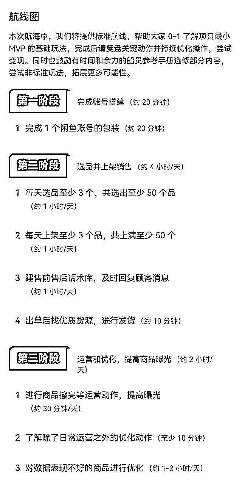

航线图和手册是高度关联的，因此你可以根据自己所在的环节，进行相关步骤的学习。

以上阶段中，所有的航线图步骤建议大家在航海前两周完成，完成航线图的所有动作后，建议以实践为主，更多的选品和上架运营，扩大自己出单的概率。

# 必修篇：跑通最小 MVP

#### 章节概要

在这一章节，我们将从认识闲鱼平台开始，一步步带你完成闲鱼高客单带货整个项目流程的学习。你可以根据本章的步骤内容进行实操，跑通闲鱼高客单带货的最小 MVP。

如果你是本项目新手，建议在正式实操前，先初步了解下项目全貌：

【项目概述】了解闲鱼高客单带货项目

如果你对项目整体有了大致了解，就可以按照项目核心步骤，开始学习实操：

【实操 1/3】完成项目准备工作

【实操 2/3】选品和上架

【实操 3/3】商品销售和发货

在必修篇，航线图和手册顺序相对应，你可以按照手册的顺序进行学习，即可逐一完成航线图的每一个任务。

在后续的每个关键步骤的章节概要中，我们也将提到相关航线图，提醒你完成相关步骤。

接下来就正式开始吧！

## 一、【项目概述】了解闲鱼高客单带货项目 @凌心

#### 章节概要

本章节中，我们将一起逐渐认识闲鱼高客单带货项目。

闲鱼平台目前发展如何？该平台有什么特点？新手怎么入门闲鱼电商？为什么在闲鱼上做高客单带货项目？……这些，都是我们在本章节中会解决的问题。

本次航海的重点，就是告诉大家如何从 0-1 跑通闲鱼高客单带货项目。

那么对整体的项目概况了解是必不可少的，一起来了解一下吧。

### 1.1 认识闲鱼平台

#### 1.1.1 闲鱼市场趋势

疫情之后，经济下行，国人消费降级，能少花钱，就少花钱，能不花钱就不花钱的心态下，促进了二手市场的进一步发展。

2023 年 11 月，1688 和闲鱼升级为淘天集团的一级业务，截至目前闲鱼用户规模突破 5 亿。目前，闲鱼微信小程序订单，已支持买家微信支付。官方也在积极尝试开发更多的支付方式。

闲鱼用户超过 5 亿，二手电商全面崛起，所以，2024 年闲鱼电商这个赛道依然是有无限可能性的。

#### 1.1.2 各类电商平台对比

闲鱼属于电商平台，同其他电商平台相比，操作更加简单，不用刷单，其次竞争较小，外加也不用保证金这些。各主流电商对比，如下表，更加清晰，明了，方便对之有一个更好的认识。

闲鱼 VS 其他电商主流电商对比图：

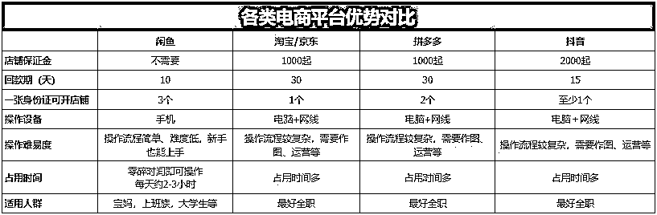

### 1.2 新手怎么入门闲鱼电商？

新手建议从杂货店入门，比一上来就做垂直店铺更容易出成绩。

什么是杂货店铺：一个闲鱼店铺里面什么产品都有。比如上架了串串柜、平冷操作台、工业除湿机、烘干机、爆米花机，也上架了行李箱、抽气泵、幕布、显示器、电磁炉等。既上架了养殖设备、宠物用品、五金工具、乐器等，也上架了玩具类、厨房家电、冷柜酒柜冰箱、商业办公等。 没有特别的品类限制，在闲鱼平台允许的规则之内上架不同的品类。

什么是垂直店铺：一个闲鱼店铺仅上架一个品类的产品。比如我做商用厨具，那么这个闲鱼店铺我只上架相应品类的产品。

为什么建议新手先做杂货店？

因为闲鱼本身就是二手属性的平台，和传统淘宝，拼多多，京东或者抖店是不一样的，二手属性就是杂乱的，闲鱼对于店铺是否垂直没有特殊的要求。

闲鱼是可以做垂直店铺的，但是不太适合新手，因为很多新手一开始是不知道自己或者自己店铺适合卖什么产品，就像我们上学时候一样，你学习了语文，数学，英语或者音乐美术体育等各个科目后你发现原来你更喜欢或者更擅长数学。

同理我们操作闲鱼店铺可能一开始你也不知道你这个店铺适合卖什么类型的产品，那我们就做杂货铺，什么产品都去上架测试（按照操作方法来），时间久了，你会慢慢发现你的店铺某一类的产品出单不错，那么后期你想做垂直，就可以慢慢向这个类目去靠拢，这样做成垂直店铺的概率会更高。

另外杂货铺是可以一直做下去的，至少我做了四年多的闲鱼杂货铺，一直做的还不错。

温馨提示：一定要做高价杂货，就是客单价在三位数或者四位数。

### 1.3 为什么在闲鱼做高客单？

在闲鱼卖低客单产品，虽然容易出单，但利润低，顾客比较计较，售后也比较多。一单利润 3-5 块钱，就算一天出一百单，利润也就三五百块钱。需要不停回复顾客、下单、上传单号，占用时间比较多，对于把闲鱼电商作为副业的圈友来说，需要花费一定的时间和精力。

而在闲鱼卖高客单产品，出单量相对低客单价产品来说会少一些，但是一单的利润还是比较高的。一单的利润可以高达三位数，四位数，甚至五位数。折算下来的时间成本比较低，哪怕一天出个一单，三位数的利润到手，对于把闲鱼电商作为副业的圈友来说比较合适。

### 1.4 闲鱼平台高排名&高曝光的底层逻辑

无论是闲鱼，还是小红书，抖音等平台，所有平台背后都是机器算法，我们在平台上去操作一定要符合这个平台的算法机制，如果按照平台的算法去操作，就会获得推流和曝光，获得比较不错的反馈，否则，推流和曝光就会相对较低。

做符合平台规则的事情，做平台喜欢的事情，做好产品的曝光，点击，和转化，提升自己的店铺权重，那么相应的在闲鱼平台就有不错的排名和曝光。

落地到具体要做的事情，就是：

## 二、【实操 1/3】完成项目准备工作 @凌心

章节概要

了解完闲鱼高客单带货项目的整体情况后，我们就要正式开始启动了。在闲鱼上卖货的前提，是完成前期的账号准备。

闲鱼高客单带货，一般不涉及资质类目，所以前期筹备比较简单，主要包括：

一部手机

一个正常使用的淘宝/支付宝账号

闲鱼 APP、拼多多下载

闲鱼 APP 权限设置

闲鱼账号注册与完善

完成账号搭建后，可以多刷刷同行账号，了解各个高客单赛道。

#### 本章航线图

完成本章节的学习和实操，即可完成航线图的第一阶段：完成账号搭建（约 20 分钟）

1.完成账号搭建（约 20 分钟）

那么现在，就请开始完成简单的筹备任务吧。

### 2.1 基本软件/工具准备

1.需要的设备：一部手机（一机一卡一号）

2.下载的软件：闲鱼 APP，拼多多

3.一个正常使用的淘宝或支付宝账号，用于注册闲鱼店铺

### 2.2 闲鱼 APP 的权限设置

以下以安卓手机举例，苹果手机可按照提示进行即可。

1\. 允许查看我的关注，粉丝列表

打开闲鱼 APP，点击右下角“我的”，右上角“设置”往下拉有个隐私设置。建议这里拉成灰色即可，保护自己的客户资源。

2\. 允许查看我的动态范围

同样在隐私设置里，建议选择不可见，顾客查询不到自己的上货动态，销售状态，同时也预防同行查看自己的爆款产品。

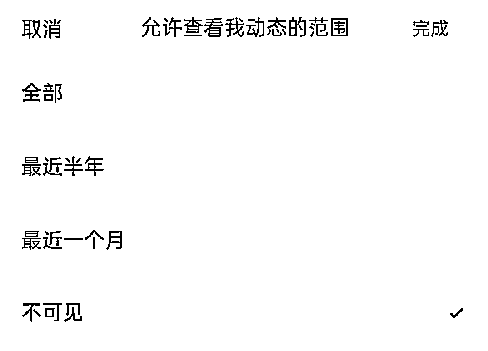

3\. 开启闲鱼消息通知

很重要，务必打开，前期消息务必及时回复。

路径：我的 -> 设置 -> 消息通知 -> 打开闲鱼消息通知

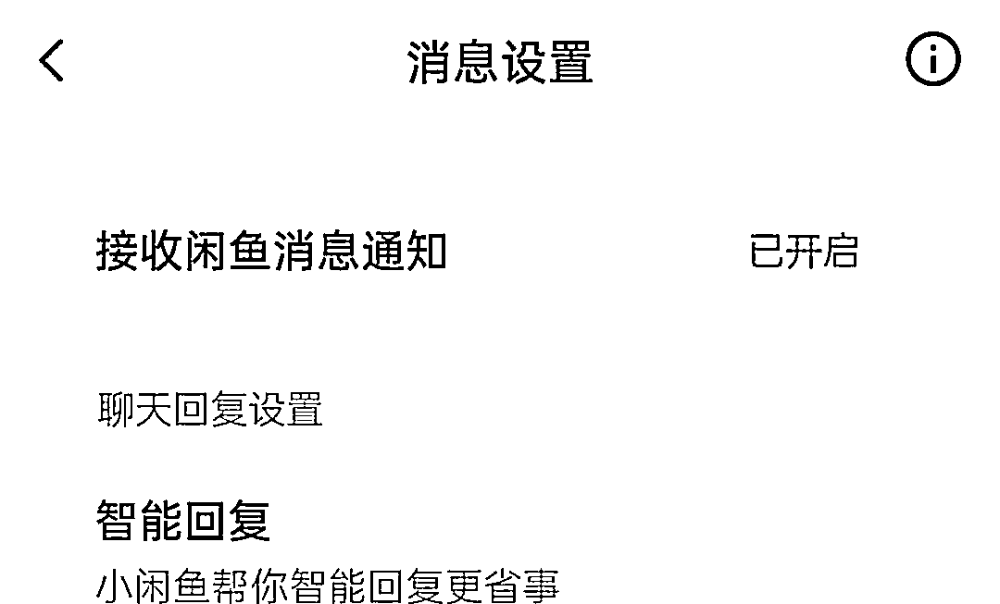

4\. 手机设置闲鱼消息的专属通知

打开手机设置 -> 通知与状态栏 -> 应用通知设置 -> 点击闲鱼软件图标 -> 打开允许通知 -> 在消息通知里设置闲鱼 APP 的专属铃声以及其他重要的设置，如：免打扰时允许通知提醒等。

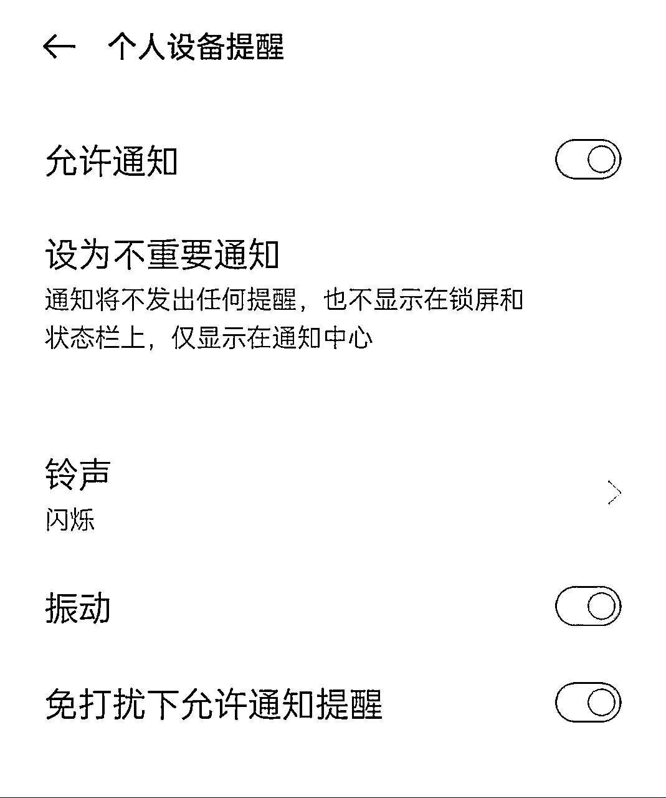

### 2.3 闲鱼账号完善

路径：我的 -> 设置 -> 个人资料

这里要完善信息百分之八九十以上，能填写的建议都填写下。具体步骤如下：

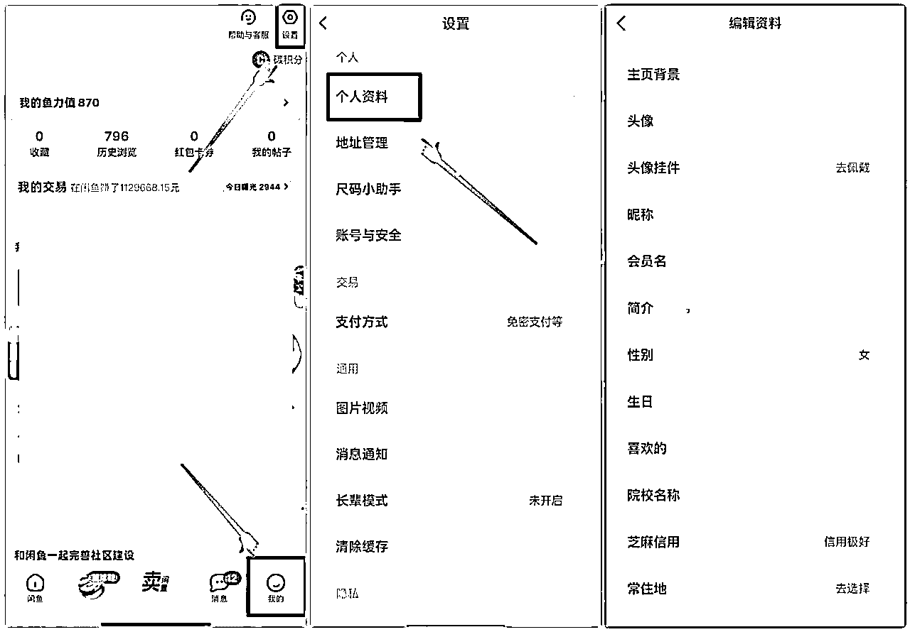

1.主页背景

杂货铺对于背景图没有过多的要求，可不更改或者自己喜欢的正能量的话。

2.头像 建议女性头像为主，经过测试，女性头像更容易出单。

3.昵称

用女性化的名字或者根据店铺的属性去设置名字，比如：某某杂货铺，，某某厂家，不做过多的要求。

4.简介

简介这里可以是自己的经营理念，也可以是对店铺的介绍。

比如：

厂家直营：专卖各种商用配套设备：平冷操作台、饮料柜、鲜花柜、麻辣烫柜等，需要咨询店主即可；

主做工厂门店清仓特价促销产品，品质放心有保障！

诚信经营，芝麻信用极好，请放心购买！

认识即缘分，也是一种朋友，坦诚相待，用心服务和经营，欢迎前来咨询下单！

……等等

## 三、【实操 2/3】选品和上架 @千城

### 3.1 如何快速选品

#### 章节概要

账号准备完成后，我们就要开始上架高客单商品啦。怎么选择好卖的商品呢？

闲鱼高客单选品其实没有那么复杂，最常用的方式就是：把自己当成买二手商品的用户，想想自己会搜哪些产品，或者日常生活中看到的一些高客单产品，都可以随时打开闲鱼，进行验证。把选品融入生活，把选品当成一个习惯。

具体怎么在闲鱼验证选品，本章节会给到具体的 5 个判断维度:

我们在选品时，需要注意不卖违禁商品，避免封号；另外，高客单的售后也较为关键，需要注意把控货源质量。

#### 本章航线图

完成章节 3.1 的学习和实操，即可完成航线图的第二阶段：选品并上架销售（约 4 天）

1.每天选品至少 3 个，共选出至少 50 个品（约 1 小时/天）

接下来就开始选出你想上架的高客单商品吧。

本期闲鱼航海带大家做的是高客单商品，那么下面给大家讲下，高客单选品的方法。

闲鱼的高客单选品跟普通选品方法，没有太大的区别，主要有 2 点小差异：

1.高客单选品时，需要筛选价格范围，价格太低（比如低于 100 元）的品就不用看；

2.高客单选品时，判断某个品能不能跟，判断标准（比如同行单天出售的件数、 想要数）可以适当降低，因为高客单商品单量等数据普遍会比低客单的单量少。

#### 3.1.1 高客单选品方法

首先，我们需要把自己当成买二手产品的用户，想想自己会去搜索、关注哪些产品，或者日常生活中看到一些高客单产品，都可以及时打开闲鱼，根据下面的判断维度，进行选品的判断。把选品融入生活，把选品当成一个习惯。

然后，我们就要去闲鱼结合数据来验证，这个选品我要不要上架。

闲鱼选品，不同于淘宝会有专门的生意参谋，小红书抖音会有蝉妈妈之类平台进行一个数据具体分析，而闲鱼选品这块，没有平台推出的数据参考，那么咱们进行选品，更多的是借助平台给出的一些数据进行验证。

一般来说，在闲鱼做高客单选品的判断标准主要参考的点有：

下面给大家解释下，一个不错的选品长什么样：

3.1.1.1 应季

应季，是闲鱼高客单选品判断的第一个维度，我们需要先从大局观上去分析这个产品是否适合当下用户的需求。

比如露营车，开年、开春、夏季都合适，而到了秋季，冬季，产量自然会下降；

再比如，夏天出售 电热毯，暖风机；冬季出售落地扇，吊扇，空调扇。很显然不合适。

当然电脑显示屏，货架这类四季可以出售的产品例外。

3.1.1.2 卡价格

因为我们需要选择的是高客单价的一些产品，自然这块价格会显的尤为重要。而我们在选品的时候，除过知道露营车，空调扇等这类大件明显属于高客单外，也需要通过一些常见热销的产品，筛选其中属于高客单价部分的规格产品。

那么这里进行卡价格就很重要，如下图所示，我们搜索产品的时候，可以根据选择的产品价格，去点击“筛选”里面有个“价格”，填写一个认为合适的最低价，然后进行查看。

比如手机壳，一般都是几块、几十块，但是通过筛选价格，我们得到了 多个具体规格的高客单手机壳。

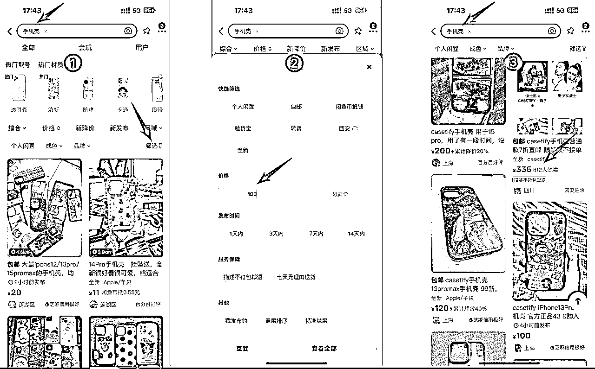

这个时候可以继续结合应季、想要数、同行动态、多家情况，去做进一步评定。

3.1.1.2 想要数

「想要数」代表这个产品市场如何，有多少用户咨询过这个产品。想要数越多，证明这个产品市场需求越大。不过具体这个产品是否可以，还需要结合下面两个依据进行判断得出结论。

补充一个点：如下图画圈所示的，没有直接显示想要数，一般主图好看，我们也可以进行一个点击查看，因为系统提示或者部分开通了闲鱼币抵扣所以隐藏了。

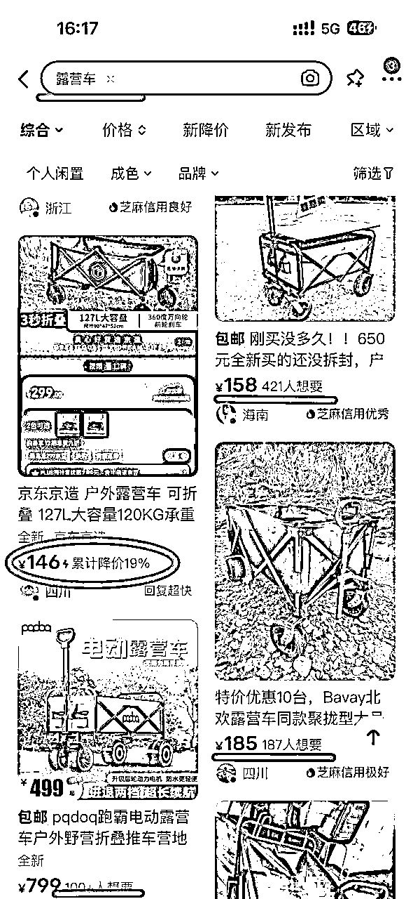

想要数:浏览数 ≥ 1:10

查看想要数的时候，点击进入产品，如果发现 想要数：浏览数 ≥ 1:10，或者接近这个比例的时候，相对来说这个产品市场需求更大，可操作的空间越大。相当于来了 10 个人，就有一个人咨询，外加可能付款的可能。

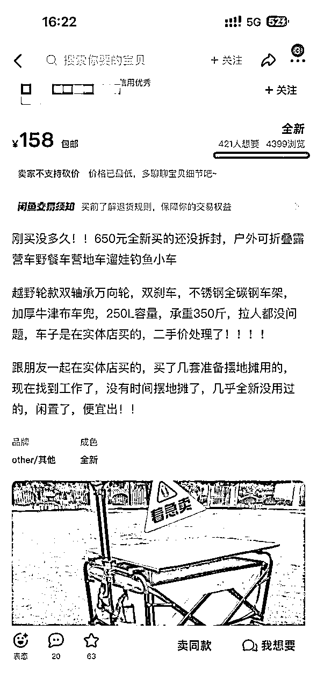

这个时候务必需要搭配「查看动态出售情况」，如果出售情况比较好，这种产品一般蓝海产品的可能性比较大，而具体判别蓝海产品，可以查看多家情况，少量满足，想要数：浏览数指数，外加动态出售可以的情况，这个品一般为蓝海品的，市场更好，优先可以操作。

3.1.1.3 同行动态

「同行动态」显示这个产品近期出售情况如何，也就是转化数据怎么样，近期越多，自然越好，选品的时候，更为重要。

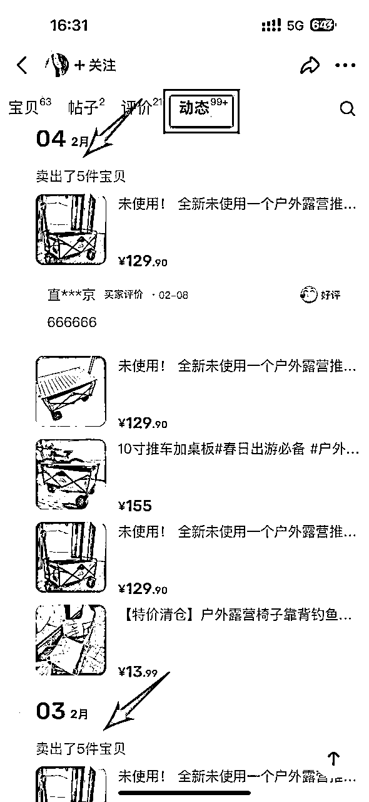

同行「单天出售大于 3 件」

判别市场是否可以，一般同行「2、3 天都做到单天出售大于 3 件」，相对来说都算不错，自然这块越多越好，而具体判别是否可以，需要查看下一个判断标准-「多家情况」，如果有至少 2,3 家也大于 3 件，这个产品就可以进行一个选择。

而单天出售过少，少于 2 件，查看多家也是这种情况，一般这种可以放弃。

同行动态不可见时，如何判断？

如下图所示，有些想要数高的店铺，设置了动态不可见，如何评定？

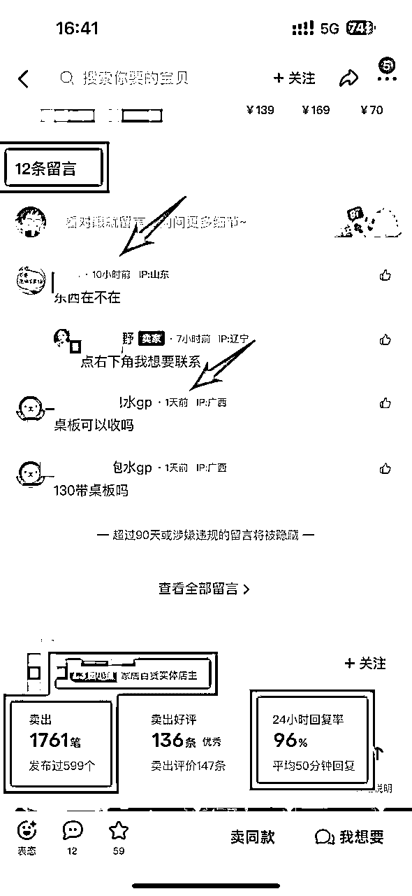

这种情况，可以根据店铺提供的其他数据进行一个补充评定，一般顺序如下：

1）鱼小铺等级 L3 以上：鱼小铺等级为商家出售产品用户给到好评量，进行的评定，一般 L3 也代表着近期出售产品较多，外加产品质量不错，所以可以作为第一个小的参考。

当然有一些暂时没有鱼小铺，但是后面几个评定也不错，也可以作为一个市场近期出售好的产品选择。

2）下方留言时间：代表着这个产品近期市场需求咨询如何。 7 天内如果有 2 条以上新的产品咨询也表示近期不错。

3）回复率 90%以上：回复率越高，也代表着店铺整体盈利情况不错，值得花心思时间进行，所以一般 90%以上的回复率也可以作为一个参考。低于 80%一般可以跳过。

4）卖出产品数：卖出产品数自然越高越好，如果只有个位数，且多家都是这个情况，说明这个品可能没什么市场，当然也不排除新上就爆单的情况，这个时候需要结合上面几个数据综合评定。

3.1.1.4 多家情况

一般单个案例容易出现偶然性，所以可以结合前面的方法，查看多家想要数都不错的，动态出售情况。

2、3 家同行单天出售都大于 3 件

如果有多家都满足上面提到的「同行动态」，2、3 家出售都大于 3 件，那么这个品就可以进行一个选择。

以上便是高客单闲鱼选品的方法论，讲完了方法论，大家也知道了如何去评定一个产品是否满足我们选择产品的要求。

#### 3.1.2 闲鱼高客单热门选品推荐（?附货源清单）

闲鱼可操作的高客单价类别比较多，为大家简单整理了一份关于目前闲鱼市场上，相对来说比较容易操作的高客单类目，如果是刚开始入局闲鱼，可以考虑从下面这些类目做起。（具体产品请根据 选品判断标准 进行一个判别）

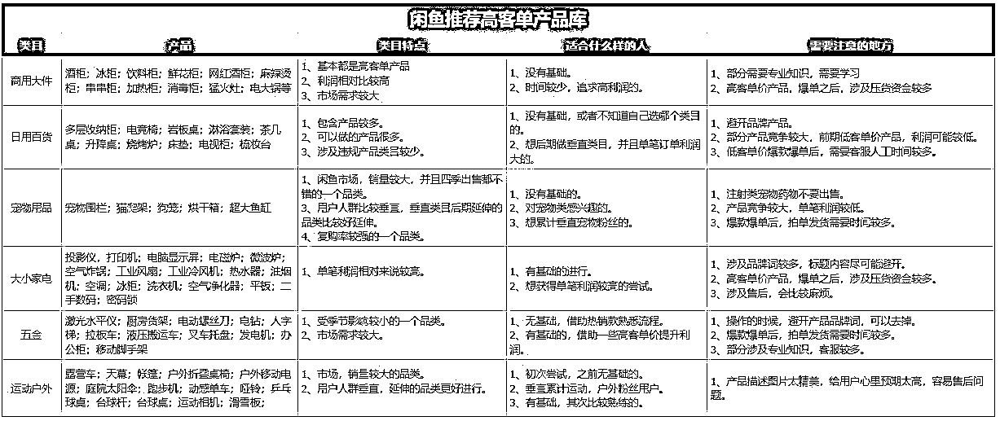

本期航海会给大家提供【商用大件】的选品和货源，提供的货源都是高客单价、高利润选品，出一单利润 3 位数，4 位数，批发单也有 5 位数的；线下实体店款，质量，售后都比较给力，老顾客推荐的也比较多，后续会越卖越省心。大家可以先学习选品方法（详见【3.1 如何快速选品】），再按需选择。

本期航海提供的货源清单如下：

闲鱼高客单带货 | 航海提供的货源清单（表格中仅为商品及价格展示）

需要的船员可前往该闲鱼店铺自取：

具体的货源链接，统一在闲鱼店铺“制冷设备工厂直销”中，直接在店铺下单，下单时对话框备注：生财航海下单 ，收件人填写客户的收获信息，即可一件代发。（闲鱼账号不作答疑，有问题随时在航海群里提问）

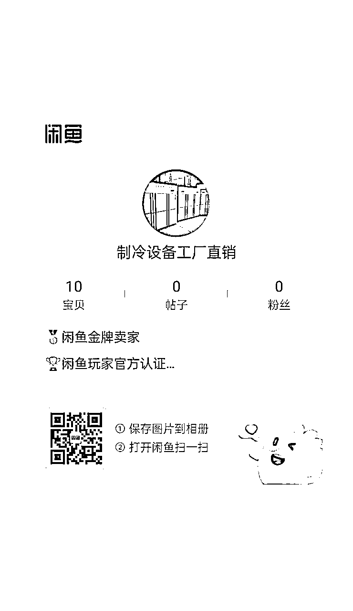

考虑到部分新手一开始选品容易缺少方向感，教练还帮大家整理了一些拼多多上的选品链接，供大家参考（非指定下单链接）拼多多精选选品合集

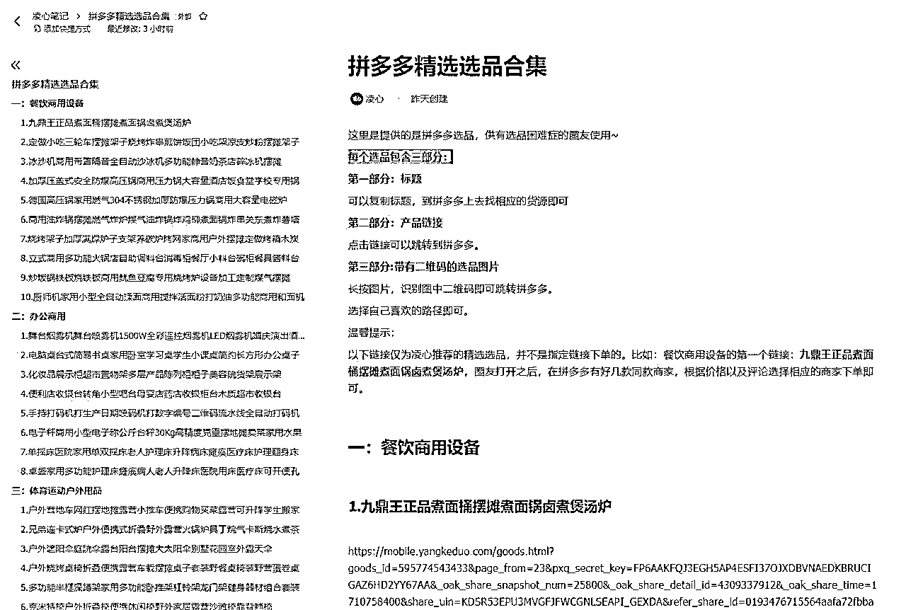

（建议使用手机打开，体验更好）

#### 3.1.3 闲鱼选品 违禁注意品

掌握了快速选品方法后，先别着急，为了避免大家实操时出现账号违规封号的情况，这里跟大家讲下闲鱼常见的违禁注意品：

完整的【违禁品清单】见附录：千城：闲鱼社区信息发布规范详情

### 3.2 如何在闲鱼平台上架商品

#### 章节概要

编辑上架的核心就是：尽可能让市场需要这个产品的用户，都到咱们店铺浏览，并最终完成下单付款。

那么如何让我们上架的商品，被更多人看到并成交呢？这就要说到怎么在闲鱼平台更好地上架商品。

在编辑上架这个步骤里，最重要的四个点是：

另外这里还整理了一些编辑小技巧以及编辑注意事项，帮你更顺利的完成商品上架。

这些模块具体是如何帮助获得更多的流量呢？请继续往下了解。

#### 本章航线图

完成本章节的学习和实操，即可完成航线图的第二阶段：选品并上架销售（每天约 4 小时）

1\. 每天上架至少 3 个品，共上满至少 50 个（约 1 小时/天）

接下来就开始把你选出的商品进行编辑上架吧。

高客单商品的上架方法，跟其他商品一样，下面我们来一起学习下：

#### 3.2.1 快速出单的上架重点

编辑上架的核心：尽可能让市场需要这个产品的用户，都到咱们店铺，并最终进行一个下单付款。

那么如何达到这个目的？换句话说，就是如何让我们上架的商品，获取更多平台的流量，被更多人看到，并成交。

上架商品这个步骤非常重要，其中最重要的是这三点：

其次，也可以按照下面说到的单个产品要求，将产品，换标题，换主图，上传多个链接，增加单品的曝光机会，获取更多流量（单品建议上传 4 个左右链接即可）。

#### 3.2.2 如何上架发布商品

3.2.2.1 一个好的主图怎么制作

一个好的主图，一定能在第一眼就直接抓住闲鱼客户眼球，这类主图的特点：

好的主图长什么样？

以“商用冰柜”为例，可以看到排名靠前的商品主图样式，一般都是产品处于主图正中央，款式和产品细节突出，让人想点击进入。

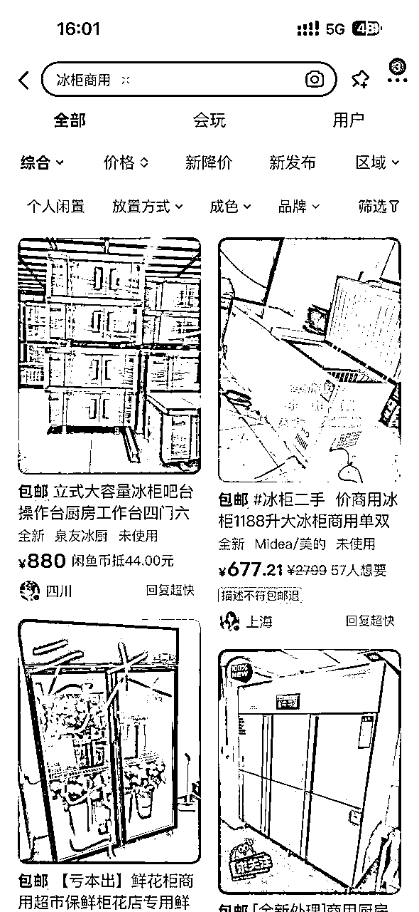

而一些「想要数」相对来说少点的，可以看到，图片不清晰，给用户的感觉很差，同比下来，肯定优先点击上方的，所以主图尽可能按照上方要求的进行来的。

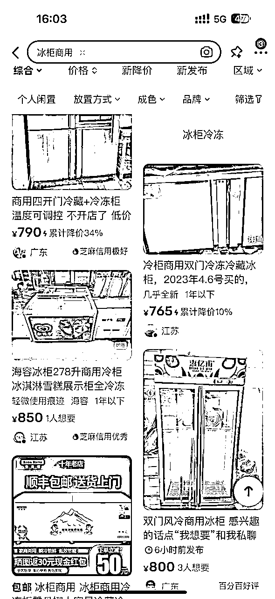

至于内容内的其他照片，可以参考动态出售好的，其他图片进行即可，比较简单。

好的主图图片在哪里找？

这里讲一个成本比较低的方法，我们可以直接去电商平台，比如淘宝，1688，拼多多，淘特等搜索产品，从产品介绍，外加用户评价里面找寻满足要求的。

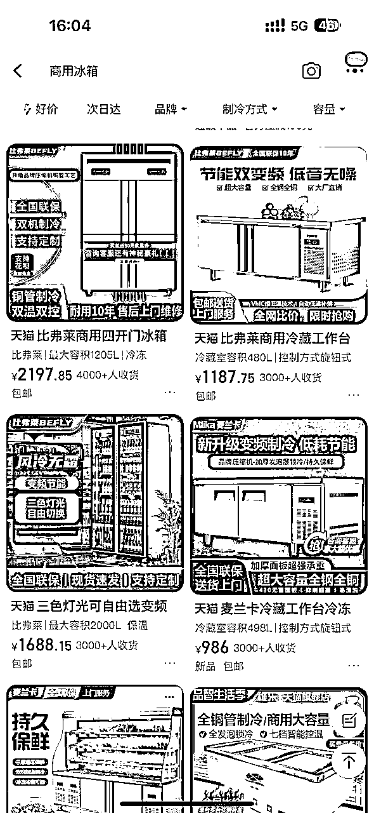

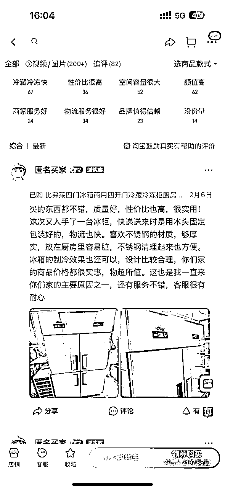

当然这只是一个非常基础的方法，作为一个闲鱼卖家已经够用，如果你想要打造差异化，可以在原图的基础上，进行二次加工，比如加特效、图片拼接等，这些效果可以借用市面上常见的 P 图软件，就能做到，这里就不展开说了。

3.2.2.2 一个好的标题怎么制作

好的标题长什么样？

一个能获取较多流量的标题，通常可以通过堆积产品关键词的方法，让用户不论搜索产品任意名称，都尽可能出现，自家店铺产品。

比如：商用冰箱

也叫 冰柜，冷藏冰柜，卧式冰柜，冰箱 那么就可以将这些词外加，用户可能会搜索的词：厂家直发；厨房，个人出，商超倒闭，全新 这些词组到一块就可以。

标题参考：全新包邮商用冰柜冷藏冰箱厂家直发厨房商超使用卧式冰柜大容量 （尽可能 30 个字符占满）

如何快速制作优质标题？

如何更方便快捷达到诉求：参考闲鱼同类产品销量好的标题，外加淘宝同类产品销量好的标题，一般销量偏好的，标题都是经过优化过的，这里就可以参考借鉴，简单修改，变成自家产品标题即可，比较简单。

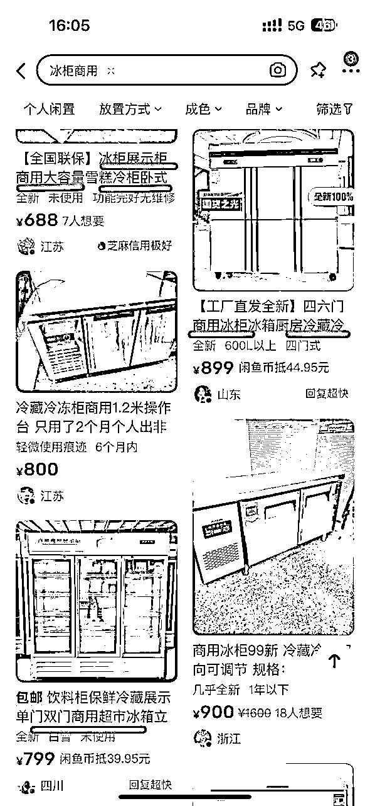

3.2.2.3 一个好的产品介绍怎么制作

图片内容上面有说，参考闲鱼市场动态出售好的其他图片进行即可。这里主要讲解的是关于我们的产品文字版本介绍该怎么写。

好的产品介绍长什么样？

如下方这样，介绍产品为什么出售，给用户一个理由，及其产品简单介绍；外加产品具体规格，外加价格；及其产品的一个售后情况。

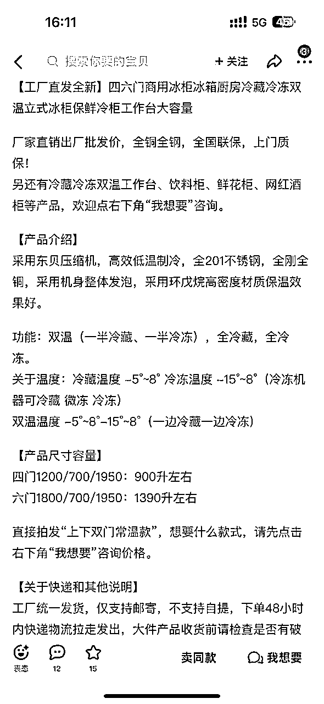

好的产品介绍如何制作？

我们的产品介绍，有一个万能公式：

产品介绍足够详细，用户想知道的都已经看到，减少客服工作，降低我们的时间成本。

另外，产品介绍简单明了，用户一眼就看到自己想要获得的信息，降低用户的决策成本，也可以提交我们产品的转化率。

如下图这样即可，简单明了，规格最多按照 3-5 规格进行即可，不要给客户太多选择，最后犹豫而跑单。（一些规格必须很多的，可以精简即可）

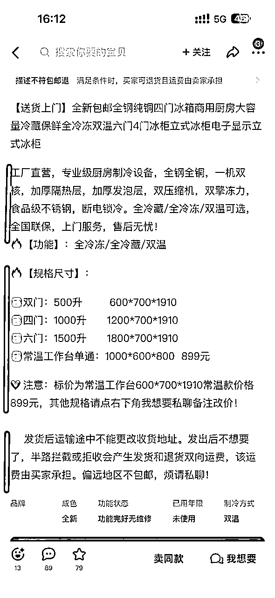

3.2.2.4 产品如何在闲鱼上发布

按照上面要求准备好图片，标题，产品介绍，下来就可以进行一个产品发布。

1\. 打开闲鱼主页，点击中间“卖闲置”按键。

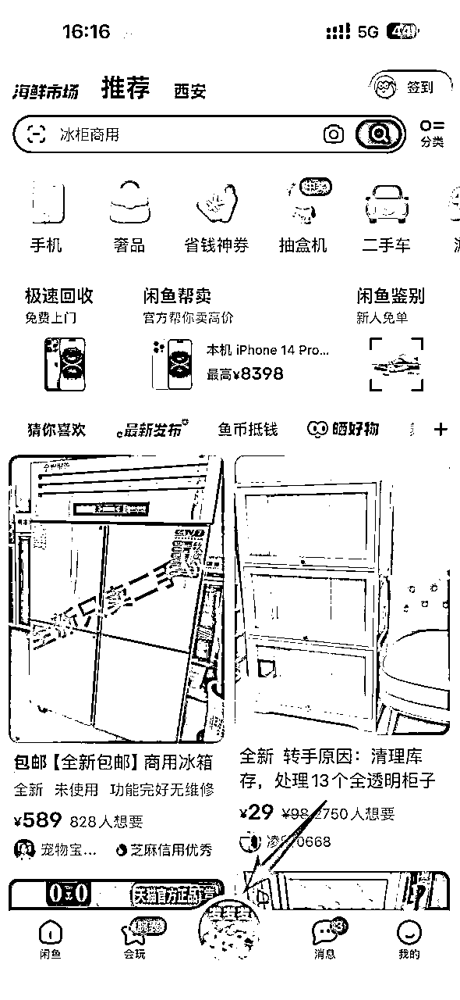

2\. 点击最下方“发闲置”进入。

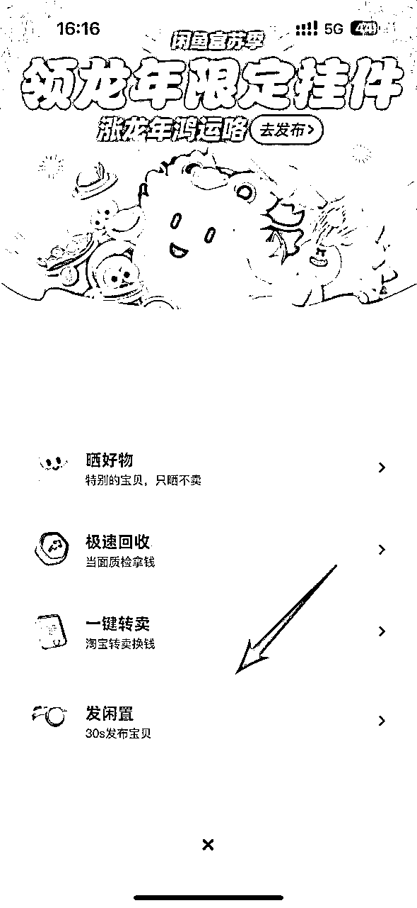

3\. 复制提前准备好的图片，和内容介绍，主图，以及图片顺序务必注意：

第 1 张是主图，要求实拍图比例尽量是一比一或者三比四，要求高清完整；

第 2-7 张，可以选择产品的完整图片，局部细节图，以及效果图；

第 8-9 张，可以附上产品的品牌参数，或者仓库图片，增强信任。

4\. 依次完善产品下方信息

定位：可以选你真实的产品发布地，也可以选人口比较多的一二线城市：杭州，上海，北京，深圳，广州等，不要发布到小城市。

分类：产品具体是什么就选什么

品牌：直接选择其他

成色：根据实际情况选择，一般都是全新

价格：发布最低规格产品的价格即可；其他规格如何拍下，在文案里做好提示；原价可以按照市场价设置，也可以不填写

运费：一般直接包邮

24 小时发货+描述不符包邮退：大件一般不建议开通，当然具体的根据各自情况进行调整。

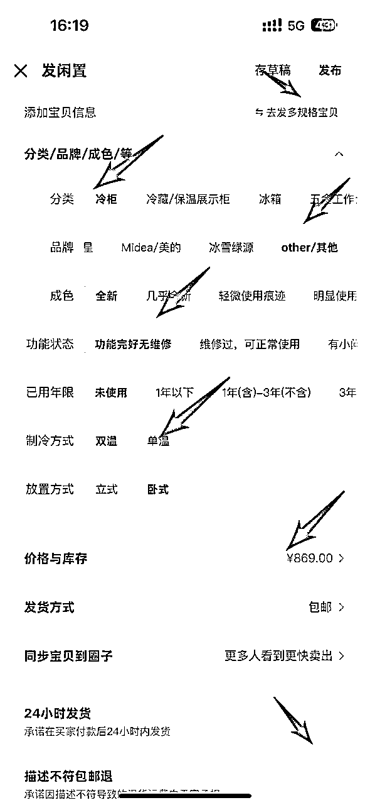

至于账号里出现的 “去发布多规格宝贝”及其“价格与库存”属于【鱼小铺】功能权限，基本上出个几单，就会收到官方邀约开通了。

但不建议新手前期去开通这个功能，开通后可能会影响商品店铺曝光和出单，详见【4.2.1 出单后第一个动作——重新上架】中的“为什么不建议新人开通鱼小铺”。

5\. 准备好了，点击右上角“发布”按钮即可

#### 3.2.3 编辑小技巧，无脑助你快速出单盈利

简单一句话概括：将闲鱼市场出售好的产品，价格压低，直接简单修改上传到自己店铺内。

具体的操作流程：

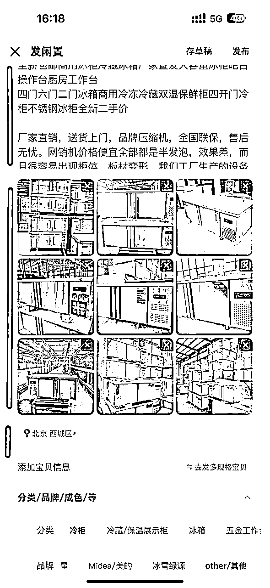

这种方式相对来说出单更快，也更加简单。

#### 3.2.4 闲鱼编辑上架的注意事项

1.标题内容里的品牌词，不要出现，图片也尽量别出现

2.内容标题内不要出现：无添加，联系，微信等一些引导闲鱼站外词

3.发布地可以选择一线人口居多城市

4.上传操作时间最好 8 点左右，其次晚上 8 点左右，最不济中午 11 点半左右

5.单天发布 5 个左右链接即可，不要太多，以防被认为营销号

内容来源：闲鱼电商 | 小航海学习手册

## 四、【实操 3/3】商品销售和发货 @凌心

#### 章节概要

当有顾客咨询，我们需要及时跟进，避免客户流失，而在出单后也需要尽快安排发货，尽量减少客户的等待时间，有助于提高客户的满意度。

这一章节，将会和大家讲讲如何做好商品售前售后客服的常用回复，以及两种货源（拼多多货源、航海货源）的发货方法：

闲鱼客服：及时回复、积极跟进处理售后问题

出单发货：及时在对应的货源平台上下单，做好快递信息回填

具体每个细节怎么做，一起往下看。

#### 本章航线图

完成本章节的学习和实操，即可完成航线图的第二阶段：选品并上架销售（约 4 天）

1.建售前售后话术库，及时回复顾客消息（约 1 小时/天）

2.出单后找优质货源，进行发货（约 10 分钟）

### 4.1 闲鱼客服回复话术

以下客户话术以“商用大件”为例，列举的闲鱼上最常见的问题以及回答，大家可以参考回答思路。

#### 4.1.1 售前话术

客户：[在吗？]

回复：在的，在的，让您久等了，不好意思，小的已经把键盘敲废啦，老板，您要哪款呢？

客户：[可以自提吗？]

回复：

话术 1：老板，咱们是厂家直营，不是门市，没法接待散客哦，实力厂家售后更有保障！产品给您包邮到家的，一般三天左右就到货了，需要您拍下，给您安排发货。

话术 2：老板，您这边急需吗？目前这里没货，您下单我马上找个离您最近的仓库发发货。三天左右到，需要的你就赶紧拍，我这边给您安排发货。

客户：[全新未拆封吗？]

回复：是的，产品都是全新的。咱们是厂家直发，质量，售后有保障，喜欢的话，您拍下，我这边给您早点安排发货。

客户：[你电话多少？打电话说]

回复：老板，您把您的发给我就好

注意：在闲鱼上发布电话或者微信是有违规封号风险的，这里不要给顾客电话或者微信，建议让顾客把他的电话发给你。

客户：[你不是发布在郑州吗？怎么是江苏发货？]

回复：

话术 1：老板，咱们是厂家直销，在郑州那边有很多老顾客，反馈都特别好，所以发布地就发布在郑州啦，产品您放心用，咱们是顺丰（某某快递）包邮到家的，基本上三天就到货了。

话术 2：老板，咱们是全国多仓库发货，郑州这边目前没有现货，需要从江苏调货，您需要可以直接拍下，给您安排加急。

话术 3：老板，发布地是系统随机的，咱们的的仓库是在江苏这边的。

客户：[某某产品多少钱？]

回复：老板，咱们的产品（此处用简洁的语言补充产品卖点+售后）+报价

客户：[某某产品最低多少钱？]

回复：老板，您要多大的，什么配置？要几个呢？收货地址是哪里？（挖掘顾客的需求，再报价，在保证利润的基础上可以报稍微低一些，客户就算要一台还是有利润的）

客户：[有淘宝店铺吗？有其他店铺吗？]

回复：老板，工厂现在不搞淘宝了，因为淘宝的经营成本太高了，羊毛出在羊身上，成本高了之后，那卖到客户手里的价格就高了。咱们厂主要以批发为主，为了走量，质量保证的同时价格上绝对有优势，在闲鱼上架，是因为闲鱼开店不需要掏钱，降低成本，你买到手价格更低，期待您收到货用的好了，帮推荐顾客呀~

客户：[哪一款好用]（纠结选择哪种款式）

回复：先介绍顾客纠结款式（A 款和 B 款）的优缺点，帮顾客做选择。A 款选择的顾客也有的，相对于 B 款价格更低一些，但是如果你想追求更好的体验，可以选择 B 款,顾客反馈都特别好，您看您喜欢哪款？您拍下，我改价，咱们早排单，早安排发货。

客户：[你家的比其他家比卖的贵]

回复：

话术 1：老板，卖啥产品都有高价和低价的，我们是工厂直发，做的是实体店品质，用料实在，质量有保障，非网红款，您放心拍。

话术 1：老板，有的同行确实比较卷，很多同行拿瑕疵品当做正品销售，售后没啥保障，时间久了，出问题，您找谁去？咱们是做实体店的直发厂家，用料，售后等您放心。

客户：[我再考虑一下哈]

回复：老板，我能理解您的顾虑，选择一件自己满意的产品确实需要慎重考虑下，我相信，咱家的产品，你也是比较喜欢的，要不您也不会和我聊这么久，您方便说下，对于这款产品，您目前考虑的是哪方面呢？是产品？还是价格呢？

客户：[怎么拍？价钱不对啊？]

回复：

①右上角点击一下立即购买。

②确认购买。

③会要你输入支付密码，不要输入 ，直接返回。

④稍等一会，我修改价格。最后付款就行了

催单话术：

话术 1：老板，产品如果您喜欢的话，直接拍下付款就好，这款吹产品卖的挺火的，您早拍下，我这边给您尽快安排发货！

话术 2：老板，您眼光真好，你选择的这款，是咱们厂里卖的最好的一款，很多顾客购买的，经常断货，目前数量只有两三台了，担心等会又没了，你拍下，我给您安排发货！

客户拍下未付款怎么办？

可以在下午发货前一两个小时，发消息问客户：老板，这个产品您还需要吗？今天拍下，我好给您安排打包发货。

#### 4.1.2 售后话术

显示派送：

老板，您好呀，我刚刚为您查询物流信息，您在小店里购买的宝贝已经到达您的所在地，快递小哥会在近期内为您安排配送，请注意信息哈，如有问题可以联系我，也可以直接联系快递小哥电话 XXXX 哈~

显示签收：

老板，您好呀，您的宝贝显示已经签收了呢，对于这个宝贝您还满意吗？满意的话希望您能够给我一个好评哈，非常感谢呢。

更多具体的售后问题处理，详见【4.3 售后处理流程】。

以上，就是闲鱼上最常见的问题以及回答。

如果有其他不知道如何回复的问题，可以采取这 2 种方式：

1.去淘宝或者其它闲鱼店铺找到一样的商品去咨询，获得信息，同行就是你最好的客服和老师；

2.可以在航海群里一起交流～

### 4.2 商品出单发货

#### 4.2.1 出单后第一个动作——重新上架

宝贝卖出去后第一件事就是重新上架：闲鱼我的-我发布的-右上角已下架宝贝中-重新发布就行，立马上架你的流量会非常大！！

这个动作适合没有开通鱼小铺的新手卖家。

鱼小铺是卖家运营工具，为有需要的用户提供更丰富的工具和服务，目前是系统定向邀请。基本上出个几单就会收到邀请了，新手前期先不建议开通鱼小铺。

为什么不建议新人前期开通鱼小铺？

官方是建议能开通鱼小铺的就去开通，理由是：

1.可以增加单个产品的上架库存数量，避免订单被拍下后还要重新上架

2.有数据分析之类的功能

3.可以上架 500 个品

但实际上我们测试过，至少目前开通鱼小铺的店铺，曝光和订单 80% 以上的都出现了很大的下滑，关闭后反而开始回升。

很多人开了鱼小铺流量降低，就是因为动销率低了。动销率低的意思就是，你一个月内，卖不出去的宝贝占你店铺总宝贝数量占比比较大，平台会认为你的店铺经营不是很好，也会减少对你店铺的推流，降低店铺的权重。

所以前期不建议开，先把 50 个产品上满，上满后不断的优化更新新的产品，淘汰删除老的差的链接，流量会越来越高。

一切以实操为主，实践是检验真理的唯一标准。

如果你 50 个产品都没有信心做好，为啥开通鱼小铺 500 个产品你就可以做好？数量越多并不代表出单的概率就越大，这个是有范围限制的，实际上我们精细化操作 50 个产品，单店产出破五位数是问题不大的。

#### 4.2.2 出单后的发货流程

我们说过，闲鱼带货做的是一件代发赚差价的生意，所以当我们在闲鱼出单后，需要尽快去货源处下单，这里的货源主要分为 2 种：

1.其他电商平台的货源（拼多多为主）

2.航海提供的货源

4.2.2.1 电商平台货源发货流程

1.客户在闲鱼平台下单后，你去相应的电商平台下单（以拼多多为例），收货地址填写顾客的，收货电话可以写自己的就好。

2.拼多多的商家发货后，我们把拼多多商家发货的单号填写到闲鱼上即可。

路径：闲鱼我的-我卖出的-（找到相应订单）点击去发货-我已寄出-填写上相应单号点击提交即可。

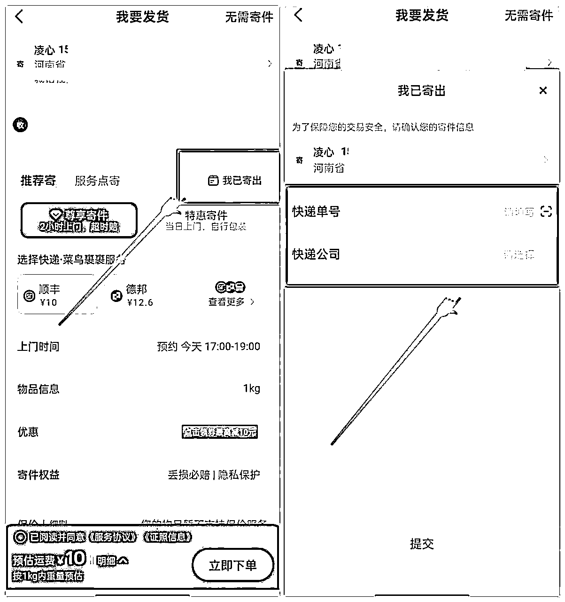

注意：这里牵扯到拼多多会给顾客发短信的问题，解决办法如下：

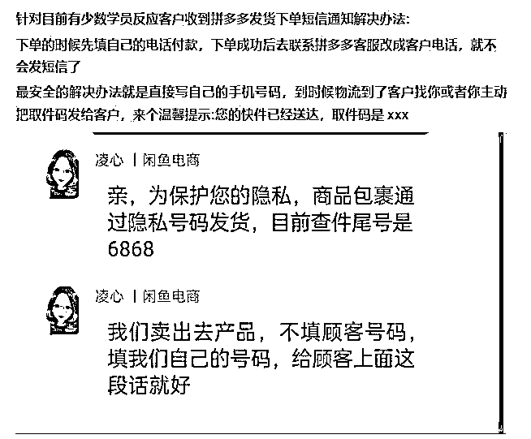

4.2.2.2 航海供给货源发货流程

本期航海给大家提供的【商用大件】优质货源，具体下单地址为厂家专门为航海开通的闲鱼店铺，请需要的船员扫描下方二维码、或搜索店铺名字： 制冷设备工厂直销，在厂家店铺下单就好。

（生财的伙伴，可以在聊天界面发送“生财”进行备注，以便区分）

注意：下单时填写的收件人信息，为客户的收件信息。

### 4.3 售后处理流程

售后分很多种情况，针对遇到的情况去处理即可，无论哪种售后，我们的定位就是：中间人，将客户反应的问题，反映给相应的商家即可！

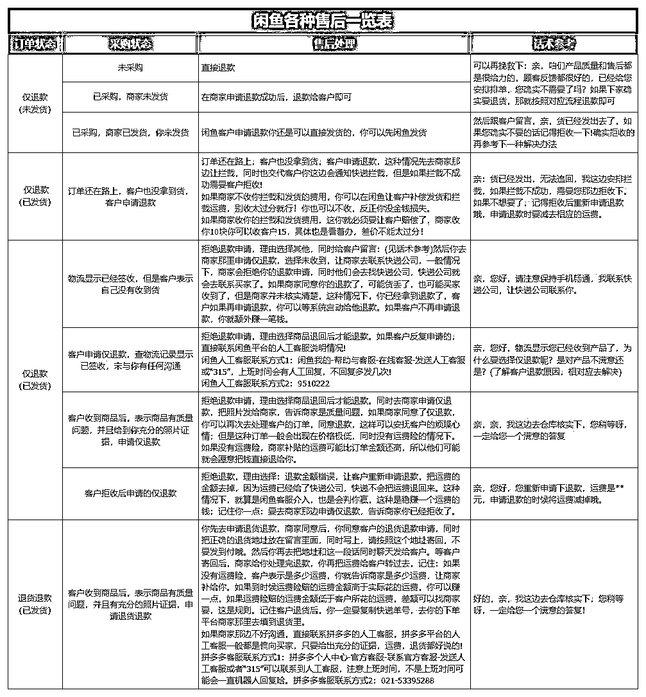

附表格源文件：闲鱼高客单带货 | 售后问题一览表 | 3 月航海

## 五、【运营和优化】如何持续提高曝光和出单率 @凌心 @老瞿

#### 章节概要

即使我们上架后的链接可以一直使用，但并不是完成上架后就可以放任不管了。我们进一步需要做的，就是维护好商品。商品维护运营这一环包含很多细节，可能某个细节就是影响转化率的因素。

这一章节，将会和大家讲讲如何让已经上架的商品产生更多的曝光，让更多的目标客户看到：

商品维护：每天擦亮商品、及时回复用户消息、做好提高曝光的任务

商品优化：根据情况进行降价、更新商品等动作

另外，在本章节的最后整理了一些想持续做该项目的注意事项、避坑事项，希望对你有用。

#### 本章航线图

完成本章节的学习和实操，即可完成航线图的第三阶段：运营和优化，提高商品曝光（约 2 小时/天）

1.进行商品擦亮等运营动作，提高曝光（约 30 分钟/天）

2.了解除了日常运营之外的优化动作（至少 10 分钟）

3.对数据表现不好的商品进行优化（约 1-2 小时/天）

如果你已经上架经营了几本书，那么开始记录数据，尝试运营和优化吧~

### 5.1 商品日常运营

#### 5.1.1 每天擦亮产品

可以晚上凌晨 0 点擦亮，也可以早上起来操作。

操作步骤：闲鱼我的—我发布的—左上角点击一键擦亮

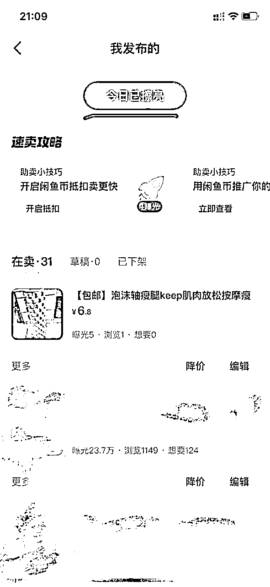

#### 5.1.2 前期消息及时回复

有客户询问，尽量做到及时回复。闲鱼 APP 以及手机做好相关的设置，详细步骤见【章节 2.2 闲鱼 APP 的权限设置】。

如果有不知道如何回复的问题，可以去淘宝或者其它闲鱼店铺找到一样的商品去咨询，获得信息，同行就是你最好的客服和老师。

#### 5.1.3 运营期间注意事项

1\. 运营小技巧

2\. 闲鱼违规封号点

以下整理了一些常见的违规封号点，建议大家避开。

### 5.2 如何通过优化获得高曝光

做好下面几点，可以帮助你的产品获得更高曝光：

1.每天发布至少 3 个品，新手至少发满 50 个品

2.图片要高清，比例尽量 1:1 或 3:4

3.写好产品标题

4.开启闲鱼币抵扣（即支持买家使用闲鱼币抵扣商品价格的 5%或 10%，可获得额外曝光）

5.急速卖（使用闲鱼币推广你的宝贝，提高成交几率；一般用于卖爆的产品，效果相对好一些）

6.根据数据分析进行优化（曝光低-咨询少，修改产品文案；2-3 天后还不行，就更换发布地址试试）

7.每个产品做好低价引流款，一般店铺商品由“低价引流款＋利润款”组成。

什么叫低价引流？怎么做低价引流？

比如：我们提供的选品，有个产品麻辣烫柜的销售价是 1999 元，但是我们去闲鱼搜索麻辣烫柜同行的时候发现有的同行卖 1300 元，那我们卖 1999 是不是没有任何优势（低价引流是相对于闲鱼同行的），怎么解决呢？

我们打开拼多多：搜索“麻辣烫柜”，然后随便找到一款价格在 1300 元左右的麻辣烫柜作为引流款，这就是低价引流策略。

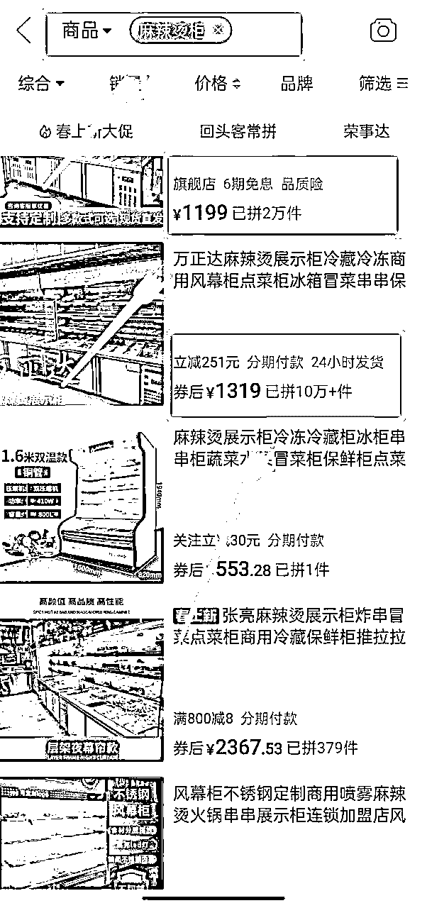

注意：低价引流不要太过分，价格太低或者价格相差太大可能会降低你的转化率，所以要把握好一个度。

### 5.3 复盘注意事项 @老瞿 @凌心

#### 5.3.1 做好短期内不出单的心态准备

当你心理准备不足，把一个项目想的太简单的时候，坚持了十几天没有达到你预期的时候，你就很容易放弃。闲鱼卖货项目，每个人的上货步骤，上货细节，所上选品，店铺推流不一样，出单有快有慢的，根据我这边操作的圈友来看，一般是三到十天出单，但是也有一个月才出单的，但是，闲鱼卖货项目，只要你执行操作，就一定可以开单变现。

#### 5.3.2 对平台的规则要有敬畏之心

这是一个信息爆炸的时代，也是一个浮躁的时代，很多人都想走捷径，比如有的圈友，做闲鱼高客单价赛道，总觉得上货慢，找个软件，多店铺批量铺货，一天上架了很多产品，但是没啥曝光，甚至有的被限流，封号，没有正反馈，也就放弃了。慢慢来，才能比较快。

而现在一些成熟的平台都在打击暴力的玩法，我们只有充分遵守平台的规则，他才可能让你赚到钱。

#### 5.3.3 点进来看的有多少人下单（转化率）

客户都点进来看了，怎么也不问一下你？就直接退出了呢？

大部分客户一开始都是通过你的【描述+图片】来了解你的产品的，人的大脑是惰性的，不喜欢思考，如果你的描述少，他要自己猜想很多问题，他会想你这个产品有没有什么什么功能，是什么材质啊等等乱七八糟和产品相关的问题……

一旦他要自己想这么多问题，他很有可能就会去别家看一看，并不会直接来问你。

而当你描述比较详细的时候，他至少不用猜，他知道这个有，但是可能还不太确定，这个时候就会问你一下。(有时候会碰到不少顾客，描述里明明写清楚了，但是她还是要来问你一下，这个时候其实并不是他没看描述，而是他看过了，想跟你确认一下)

所以做好转化率主要有两点，参考下图，左侧为反面案例，右侧是优秀案例：

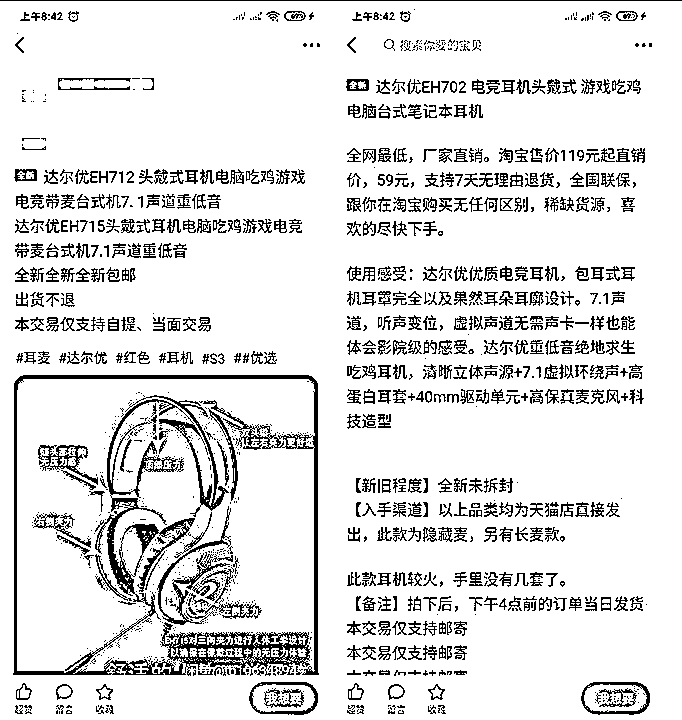

第一点：描述尽可能详细一点。

不会写的参照同行，参照淘宝里面的问大家，和淘宝评价

(问大家体现了顾客购买时会想了解哪些方面，评价体现了顾客购买回去的使用感受)

第二点：图片尽可能九张，还要有实拍图。

这个你做久了会有深刻体验，即使你前面的图再好看，顾客还是想看看实拍图。所以你一定要去拼多多或者淘宝评价里面挑选几张比较美观的实拍图放上来！

以上两点做好，基本上可以先留住顾客了。如果你描述里写的是，商品还在就可以直接拍的话，已经有顾客会直接下单了!

最后影响转化的还有一个重要因素：询单转化率。

就是顾客来咨询时，你接待的过程。既然顾客咨询了，基本上他已经有购买意向了，能不能让他下单，这就是考验个人能力的时候了。

一开始聊可能会失败率比较高，自己慢慢总结原因。关于聊天技巧的部分，这个提升慢一点是正常的，大家多多在群里交流技巧，我也会给一些建议。

但是有一些基础的，我们能迅速做好的，我们一定要去做：

第一点：接待及时

这个你们换位思考一下，你们自己买东西的时候，如果两家店商品差不多，一家立马回复你各种疑问，一家半天不回，你买哪家可能性大？这个大家闲着的就没事上闲鱼去看看，忙的就自己安排一下，比如晚上可以多盯一会。

第二点：事先对商品了解

这一点如果你在之前有好好写描述的话，商品大部分相关问题你应该都已经有个了解甚至已经写在详描述里了。比如你卖拖把，顾客很可能会问你，拖把是多少厘米的？如果你事先了解就能直接回答，这样一来成功率会大大增加。

这个一下子就能想到所有顾客想了解的点也是不可能的，但是一开始我们一定要思考，把最基础的那几个点了解一下，比如拖把的长度，水杯的容量，发货日期，发货地点之类的。后面的根据顾客的咨询慢慢优化就可以了。遇到不会的就直接去问淘宝或拼多多店铺客服!

以上是闲鱼上交易的整个环节，从顾客能不能看到你的产品，到顾客最后做决定，每一个环节都做好的话，出单就没有什么问题。只要有一个环节出现比较大的问题，你的闲鱼就做不好。

#### 5.3.4 不要迷恋实体行业，轻易转做有货源玩法

可能有些小伙伴一上来就想做囤货商家，自己发货，再招收一些下级经销商，各种美好的愿景。但我想说，虽然实业兴邦，但这些等我们有了能力以后再考虑吧，前期还是玩点轻成本一些的。

我 1000 平米的仓库，还不如我在小区开个工作室做 30 个闲鱼帐号赚的多。实体是投入又大，又累，成本又高，利润又低。

#### 5.3.5 自己要做项目的负责人

可能有些小伙伴会这样问有经验的人：我做一个闲鱼店铺一个月能赚多少钱？我做几个帐号才能月入过万？我想辞职去做闲鱼电商可行吗？我如果一上来就做工作室一年赚 30 万可以吗？……

但其实这些问题，可能都不会有个定数，因为做项目是充满着不确定性的。在寻找这些问题的答案的时间，不如多做几步，先把账号注册好、把产品上架，慢慢的，你会对这个项目的掌握感越来越强。

内容来源：《聊聊你做闲鱼二手书项目失败的 100 种可能性》、《闲鱼二手书无货源模式拆解（精细化运营）》

### 5.4 项目避坑建议

1\. 两个以上的闲鱼账号在同一个设备上来回切换

两个或两个以上的闲鱼账号，在同一个设备上频繁来回切换，很容易被系统检测到，可能导致账号降权或封号。

2\. 闲鱼出单后修改发布地址，一口价或者标题

任何时候只要你的闲鱼店铺出单过了或者曝光数据很好有咨询的情况下，产品的发布地址还有标题都是不能修改的，只要你修改你的产品权重就归零了。

举例说明，你本来叫张三在北京生活，大家都知道你是张三在北京生活，有一天你突然改名了叫李四了并且搬家到了上海，那你之前取得的名声可能就没有了基本就是这个道理。

3\. 直接修改一口价而不是让客户提交订单改价去付款！

有些新手刚刚开始做闲鱼的时候，店铺产品可能有不同的规格、不同的价格，有客户来咨询时，标价是 100，可能客户要的是另外一个规格价格是 150；

这个时候他就编辑了一下产品修改了价格然后让客户去下单，虽然当下这一单成交了，但是你会发现从此之后这个产品大概率就没有了咨询和订单。

因为店铺有个指标叫动销率，出单后动销率会增加，这个链接权重会增强，如果你重新编辑价格再发布，等于说这个链接的权重要从零重新开始。

关于链接权重，再提醒点：产品被拍下后，会自动变成“已下架”状态，这时候我们直接点击重新上架即可，不会改变链接权重。

4\. 只敢上架几块或者几十块的低价产品！

这也是一个偏见，大部分刚刚接触卖货的新手，总以为上架低价的产品容易出单，但是忽略了一个本质的问题：我们做闲鱼卖货的目的是啥？是利润还是订单量？

如果你一个订单赚 5 块钱，一天 100 个订单利润 500（而且忙的晕头转向），另外一种情况一个订单利润 200，3 个订单利润 600，轻松惬意，你要哪个？

5\. 上架了一个或者几个产品不出单后就放弃了！

经常有一些人来问我：教练，我闲鱼上架了几个产品曝光很少也没人咨询咋回事啊？

我说：几个产品了，上架多久了？

对方答：5 个吧，上架了一个月。

我想说的是，这是正常的情况，刚开始啥也不用说，按照方法和要求上架满 50 个品，有可能早早就出单了。

6\. 在闲鱼做站外引流！

市面上还有一种项目，就是教新手去闲鱼引流粉丝然后卖粉赚钱的，记住任何平台你去进行站外引流都是违规行为，逻辑很简单，谁也不想让自己的流量白白跑到其他平台上。

7\. 直接卖假货！

之前有个伙伴来找我说他付费的一个闲鱼团队，让他去卖一些高仿的产品，刚刚开始出单的确很猛，没过半个月就违规了，然后流量就很差。

我不去评价别人的行为，但是我对所有的伙伴都在讲，我们要做长期合法的事情，要做能细水长流的事儿，任何平台对于假货的打击都是很严格的，不要贪图一时快感。

# 选修篇：更多玩法和赛道推荐

章节概要

当我们完成项目最小 MVP，基本掌握项目的操作流程后，可以尝试看看选修篇的内容。

无论是想要进一步放大项目，还是挖掘更多玩法，都可以重点阅读本章节：

更多选品方法：拓展品类和货源

放大生意的方法：了解如何进一步放大生意

热门赛道案例拆解：了解当前比较热门的赛道情况

现在，快来发掘项目的更多可能性~

## 六、更多选品方法 @千城

章节概要

必修篇我们给到了最简单的高效选品法，这里给到了更多选品方法：

日常选品法

产品分类选品法

市场热销法

参考同行，源源不断选品法

如果你已经跑通了项目 0-1 ，就来试试这些新的选品方法吧。如果发现更多选品的方法，欢迎在航海群内分享讨论。

### 6.1 日常选品法（适用所有人）

以上几种情况都可以及时打开闲鱼，借助选品的判断标准（参考【3.1 如何快速选品】）进行判断。对生活保持好奇心，看到的每一个商品，都把它当作是你的一个可以卖爆的选品。把选品融入生活，把选品当成一个习惯。

而「日常选品法」算是比较简单，可以优先使用的一种方法。

注意点：不要仅仅局限于这一种，不然很容易陷入进去，效率不够高效，平时看到，想到可以及时记录，完了验证即可。

### 6.2 产品分类选品法（适用于没接触过以及有些基础的）

在闲鱼平台自带的类目里进行选品

闲鱼本身就有一个类别，点击「右上角」，进入之后，就可以看到，具体类别及其类别下的产品。这里会显示部分，还有部分没有显示。

可以根据大的类目，联想日常生活所选大的类目下面具体产品还有那些，进行一个思索，完了将具体产品，按照 2.1 选品的判断标准，进行一个产品搜索，筛选，选出满足要求，下来进行操作的产品。

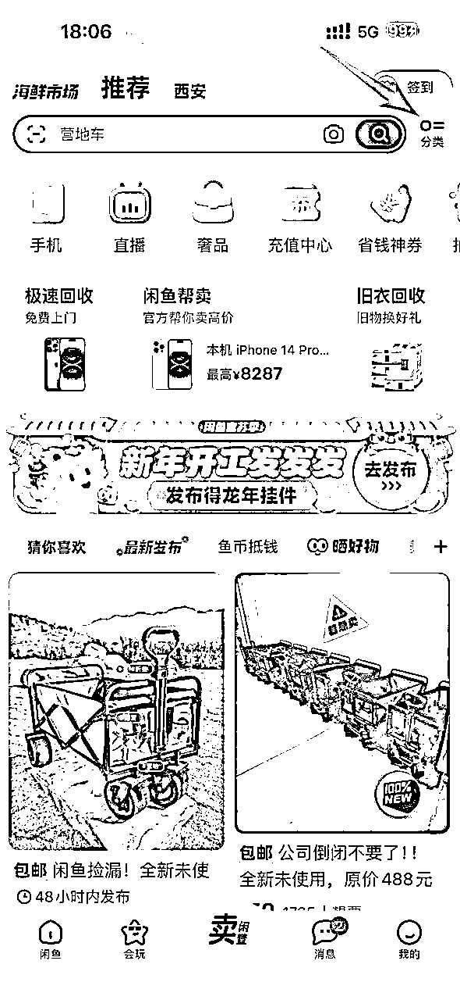

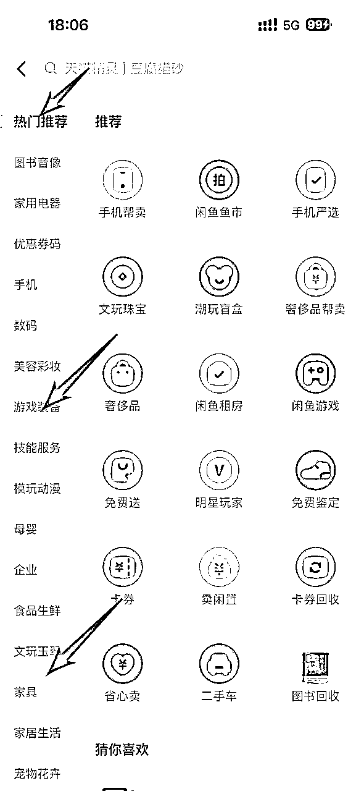

其次，也可以借助淘宝官方专门放出来的一个 TOP20 万无线端流量词汇，具体类目下近期热销，搜索大的产品，也可以进行一个选品参考。

（使用的时候筛选一个类目，会自动出现类目下具体的产品，下来进行验证即可。）

外加其他不错类目推荐：

各类机动车周边，电脑手机相机周边，数码配件，家访布艺，绿植及其周边，收纳整理，饰品，箱包，玩具，婴童用品，家具饰品，智能设备，灯具，厨房用品。

附件：淘宝 TOP20 万词汇下载

以上可以，根据自己兴趣进行搜索，验证查看。

#### 6.2.1 类目词选品法，适用于所有人

搜索大类目词“运动用品”，那么运动用品下的产品，也都会全部出来，这个时候将出现的一些产品，可以根据「想要数」多少，或者换位思考，将自己当成用户，思考是否会在平台上搜索出现的具体产品，进行一个搜索进行验证进行。

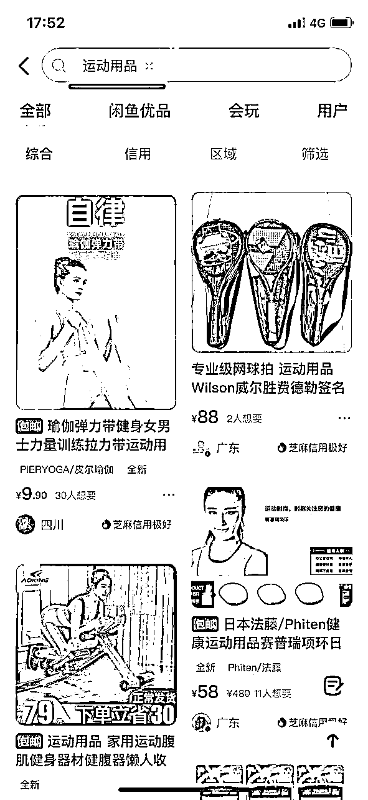

同样的，这种类目有很多，厨房用品，酒店用品，母婴用品等，换一个词，出来一批，足够找出很多想都想不到的品。

简单举两个例子，搜索往下拉并且查看出现的产品即可：

厨房用品出现了：夹缝收纳置物架，懒人抹布，不锈钢厨房置物架~~

酒店用品出现了：枕头，三件套，床单~

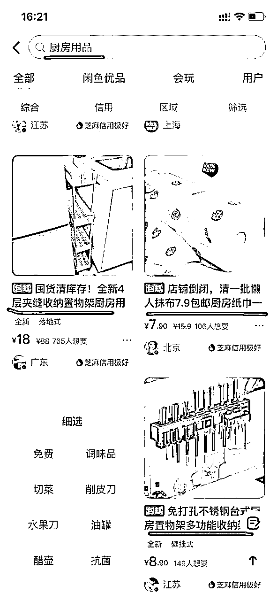

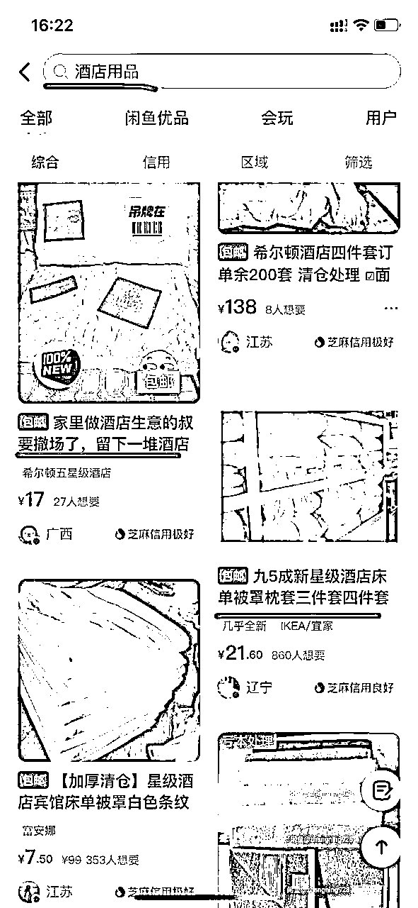

出现的产品，依次记录，完了返回首页，逐一进行搜索，按照选品 判断标准进行一个具体判别。

这个方法，相对来说会有一些难度，不过可以选择的类目更多，选出的产品也会变得更多，还是很值得推荐的。

注意点：按照方法挑选出好的产品，尽可能及时记录来的，不然很容易后面忘记。

### 6.3 市场热销法

也可以参考其他主流平台，如：

借助他们各自平台近期热销的产品，进行一个闲鱼验证。

近期热销的产品，会根据市场热度不断更新，过段时间又是一批新的热销品

以拼多多为例：

首页点击进入之后，点击上方一个大类，下方会呈现一个排行榜，点击进入，会出现具体这个类目下近期热销的产品，会根据市场热度不断更新的一个表单，过段时间又是一批新的热销产品。

那么在拼多多上近期搜索，及其购买量较大的，热销产品，在闲鱼按照判断标准验证，如果满足条件，也可以直接进行上架闲鱼。

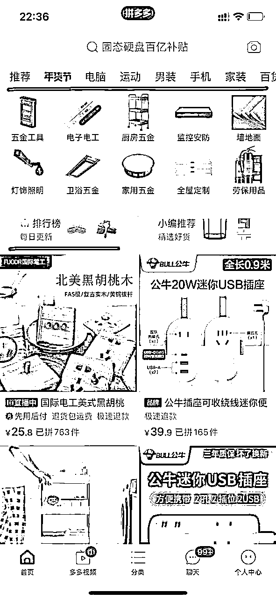

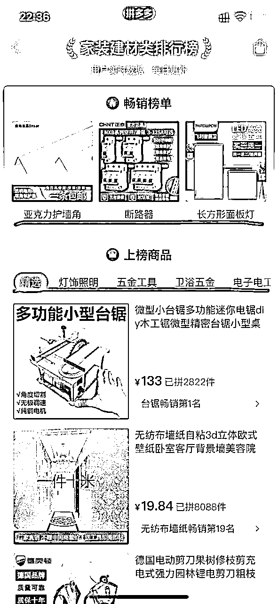

淘特，和拼多多进入渠道一样：

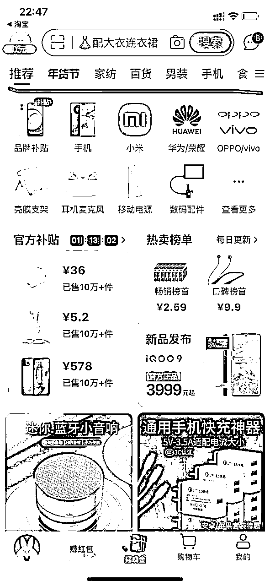

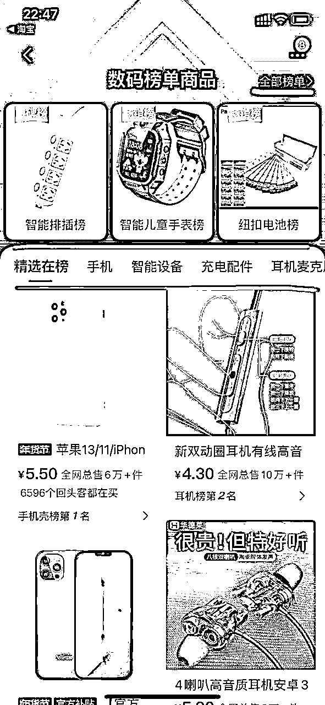

具体其他平台的，也可以关注各自平台首页，或者平台专门的数据工具，如淘宝的生意参谋，或者第三方商品查询工具。

第三方的，如市场用的抖查查，飞瓜，蝉妈妈等，自行搜索即可。

闲鱼市场爆款产品验证--借用闲鱼助手爆款产品采集

根据玩法开发的如翼闲鱼助手，每天采集闲鱼市场爆款产品，可进行筛选时间，想要数，价格，进行采集，也可作为选品参考。

有一定费用，根据个人情况，不过上面几种方法足够使用的。

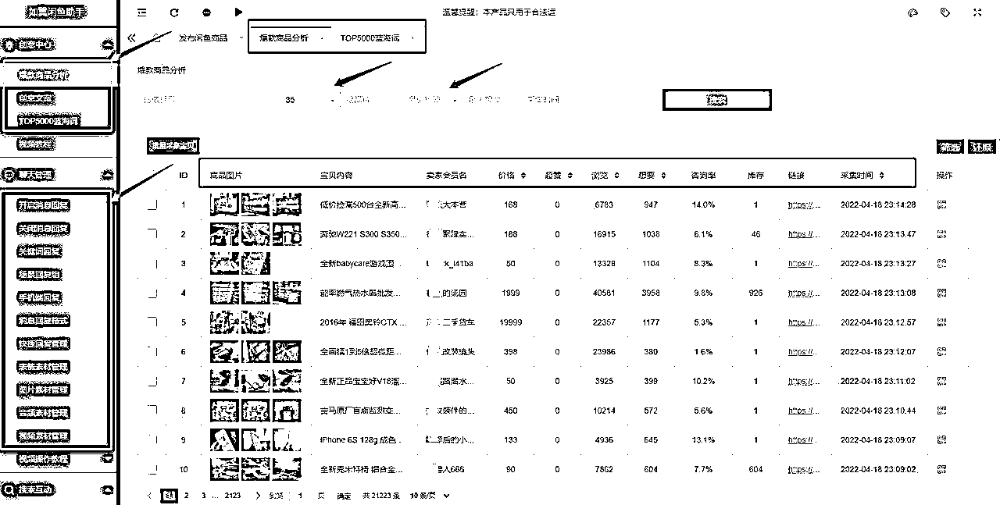

附件：软件介绍

### 6.4 参考同行，源源不断选品法，适用于所有人

可以任意结合上面说道的 3 个选品方法使用，在上面方法的基础上，找到同行，跟着又可以在同行的选品基础上，快速选取周边不错的产品来补充自己的选品库。

下来具体说明，这里以“滚轴”为例，搜索“滚轴”按照验证方法，查看同行动态的时候，发现同行动态里面出过滚轴出售的不错（单天 6 单以上），“弹力带”及其“瑜伽垫”也不错。

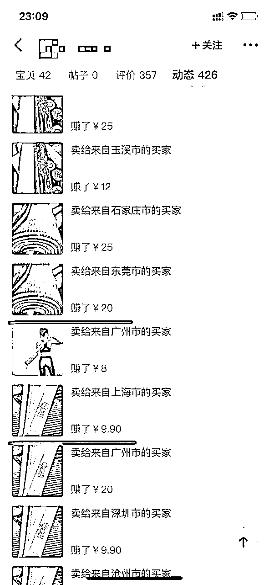

发现新品，及时记录，进行验证，再继续发现新品~

这个时候，是不是在之前发现一个产品的时候，又发现了 2 个新的品，下来新的品进行及时的记录，完了再去验证，验证的时候，又会在新的同行动态，发现其他出售好的品。

这样源源不断的发现周边不错的品，而同时又满足闲鱼选品验证条件的品， 将他们不断的补充到自己的选品库里。长此以往下来，你的选品库会越来越多，对于适合闲鱼的选品，你的判断也会越来越准确。

这个方法相对来说比较简单，可以和上面三个方法里的任意一个，进行结合使用，一般找到一个好的品的情况，很容易找到周边多个不错好的品的。

### 6.5 四种选品方法小结

四种方法难易程度：

1.换位思考，日常选品法--简单，适用所有人

2.借助产品分类选品法--有点难度，适用没接触过外加有些基础的

3.市场其他平台热销参考法--难度适中，适用有些基础的

4.同行，源源不断选品法--简单，适用所有人

第 4 个方法，可以结合上面任意一个方法搭配使用，比较简单，找到一个好的品的情况下，很容易找到很多不错的品。

之前没有接触过的建议可以选择方法 1,2,4 经常练习；有过接触，有部分经验的可以加上一个方法 3 进行练习，最后找到一两个最适合自己的即可，借此源源不断选出闲鱼上不错的品来的。

5.选品方法

拼多多找对标店铺的爆款（目前用不到付费工具）---包含在里面了，这部分可以不用写的。

## 七、放大生意的方法 @凌心

#### 章节概要

如果你已经稳定变现，那么是时候考虑通过放大项目，增加收益了。项目放大的主要方式有：

接下来就一起了解下具体怎么做吧。

### 7.1 多账号运营

高客单价产品，精细化运营的话，一个月单账号几千到一万多；我们也可以根据自己的时间和精力多账号运营，一个人的上限可以 7 到 8 个账号（一机一卡一网络）。这个是实践下来的数据。

操作上无非就是多花点精力，没有太大区别。

### 7.2 多平台运营

1\. 转转

转转是目前的第二大二手交易平台，根据实战测试，流量大概是闲鱼的 3-5 分之一，如果不选择多做闲鱼帐号，可以同步在转转上进行发布，进一步提升销量。

2\. 淘宝和拼多多

淘宝和拼多多比较考量运营，在没有给力货源的情况下不是太建议。

### 7.3 转有货源玩法

想要转有货源玩法，优化供应链是最关键的：需要与供应商建立稳定的合作关系，确保货源充足且质量可靠。

## 八、热门赛道案例拆解 @千城

#### 章节概要

在最后这一章节，我们请教练提供了一些目前常见的，相对比较优质的高客单赛道，分别是：

运动户外

宠物用品

日用百货

大小家电

五金

由于高客单不同类目赛道玩法差异并没有那么大，所以在这一章节对这几个赛道只是做了简单的说明和案例展示，希望这五个案例可以带给大家一些参考。

### 案例一：运营户外

户外产品 5 月刚好春季应季，销量会有所提升；但是秋冬之后销量会稍微下降，属于季节性产品。建议多拓展一些品类来卖，比如围炉煮茶的炉子，看看同行淡季在卖什么。

1.需要资质

户外类目可以做的产品还是不少的，有不少高客单价产品，并且无需任何资质。

例如：露营车，天幕，帐篷。

2.案例信息

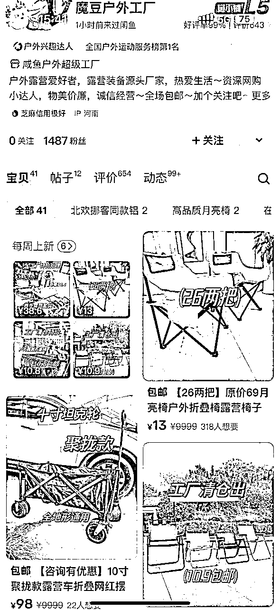

3.常见热门产品

户外折叠桌，天幕，帐篷，登山杖，睡袋

4.供应商来源

拼多多，1688

### 案例二：宠物用品

宠物用品，算是一年四季都可以出售的一个产品，尤其猫砂、尿垫这些易消耗品；当然高客单价的猫笼，狗笼，以及部分狗粮也是很不错的选品。但免不了存在一定竞争，比较建议先尝试小客单价，比如猫砂、猫粮这些重复消费率高的产品，再去做高客单产品更好些。

1.操作门槛

除过注射类的宠物用品，剩下吃的、用的无需任何资质。

2.案例信息

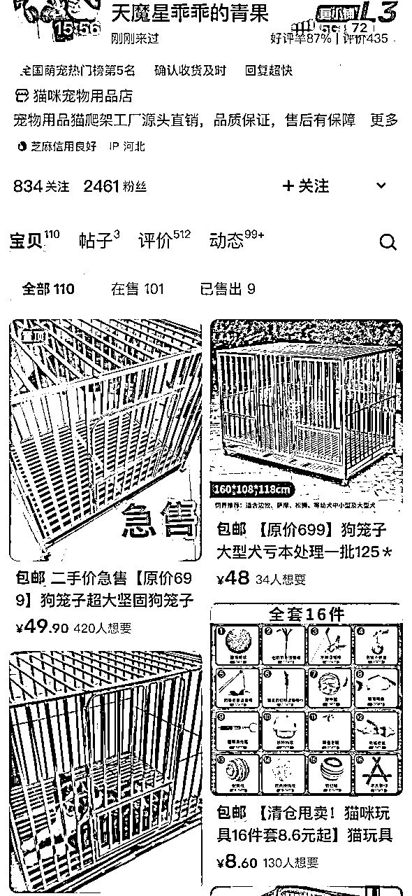

3.常见热门产品

猫爬架、猫笼子、狗笼子、乌龟、鱼缸、水泵；

偏贵的宠物：银渐层猫 缅因。

4.供应商来源

拼多多，1688

### 案例三：日用百货

这个类目需要看清产品规格大小，质量，材质，外加地址。提前核对到位，以免发生售后，大件售后还是比较麻烦的，发走之前必须检查到位。

1.操作门槛

算是所有电商里面，比较大的一个类目，包含产品超多。

医疗机械类这块别涉及，剩下如下的电竞椅这些都可以操作来的，并且无需任何资质。

2.案例信息

3.常见热门产品

电竞椅，岩板桌，货架，遮阳窗帘，床垫，升降写字桌，卫浴，吸顶灯

4.供应商来源

拼多多，1688

### 案例四：大小家电

同日用百货一样，大小，材质，务必提前检查好，也需要时刻关注产品最新评价，及时把控产品质量。另外，由于产品客单价高，投入资金会比较多，但是整体利润也相对更高。

1.操作门槛

闲鱼这块不需要什么 3C 证书之类，如下演示的风扇，无需任何资质，直接可以操作。

2.案例信息

3.常见热门产品

显示屏，电磁炉，微波炉，电视机，冰箱，空调，热水器

4.供应商来源

拼多多，1688

### 案例五：五金

五金整体属于一年四季的产品，操作关键是：产品质量必须把控到位，减少售后，店铺才能开得久。

1.操作门槛

很多人可能很少关注这个品类，不过这个品类不少产品还是很不错的，也属于一年四季都可以出售的产品。并且无需任何资质。

2.案例信息

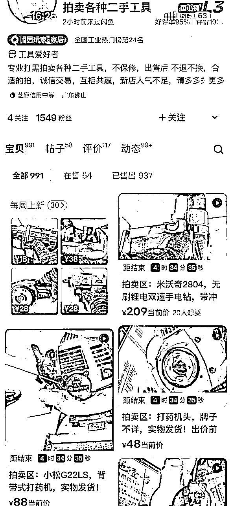

3.常见热门产品

电钻，电动扳手，水平仪，切割机

4.供应商来源

拼多多，1688，淘宝

