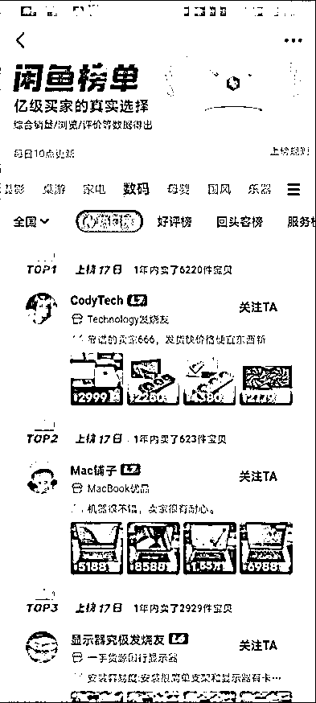

# 9 月航海｜闲鱼蓝海｜实战手册

> 来源：[https://ocn93f5d9olj.feishu.cn/docx/AgKGdHdXxohvfHx8sbvcWoLfnIc](https://ocn93f5d9olj.feishu.cn/docx/AgKGdHdXxohvfHx8sbvcWoLfnIc)

# 防失联+MM188166M（李李）长期更新

手册出品方：生财有术团队

出品时间：2024 年 9 月 6 日

手册使用说明：内容出品人排名不分先后。本文旨在向你展示一个项目的更多可能性，帮助你更好地理解和实操。

建议：如果需要快速定位到精确内容，可以使用快捷键 Ctrl + F/command + F 的形式，搜索「关键字/词」，查找你想要的内容

# 写在前面

# 💡

欢迎大家来到 9 月航海 | 闲鱼蓝海 | 实战手册，相信在接下来的日子里，我们将在这里见面很多次。

在开始做闲鱼蓝海项目之前，让我们先来解决几个问题：

1）闲鱼蓝海是什么项目？现在做，有多大机会？

在闲鱼卖货，操作逻辑非常简单：我们只需要把合作商家（eg.拼多多商家）的产品，上架到闲鱼平台，在闲鱼出单后，再去合作商家那里下单即可。整个流程不需要囤货，做的是一件代发、赚差价的模式。

但因为进入闲鱼赛道的人已经不少，我们作为新人再进入这个赛道，如果还在红海之中打价格战，比较难获得正反馈。

所以这期航海，我们将重点带大家学习【蓝海选品＋内容打磨】，通过选品策略寻找蓝海市场博取利润，通过内容优化去掠夺蓝海的大部分市场。

为了帮助大家更轻松地赚到第一块钱，本期航海，我们也将在航海群提供靠谱的二手手机货源。

选品的整体方向，我们依然会围绕【高客单】，它相比低客单玩法，存在一定的优势和差异：

✅利润高，投入时间相对没有低客单那么多。

✅对货源要求高，高客单比较考验货源是否靠谱、价格是否有优势。

虽然闲鱼是个老项目了，但由于口罩原因，这两年经济下行，国人消费降级，能不花钱就不花钱的心态下，促进了二手市场的进一步发展。

2023年11月，闲鱼升级为淘天集团的一级业务，闲鱼用户超过 5 亿，二手电商全面崛起，所以这个赛道依然有着无限可能。

2）什么样的人适合做闲鱼蓝海带货？

✅适合新手作为第一份副业，如果你有优质的货源，会更容易拿到结果。

✅想要全职发展的话，也可以全职来做，多开几家店铺，矩阵化运营放大。

虽然目前闲鱼电商正在崛起，但也有一些限制，希望在开始操作之前，你可以了解清楚：

1、天花板比较明显，不要期待能一夜暴富；

2、产品需要手动上架，客服比较忙，需要回复用户问题，占用时间比较多，整体效率其实不会太高。

最后，希望大家可以在这次航行里收获成果外，结识一群战友。

以下内容由生财有术联合圈友制作而成，仅供航海船员以及生财有术星球圈友学习使用。

# 【更新提示】新手册使用方式

在开始前，我们来简单了解一下这个手册的正确打开方式，方便你根据自己的情况来灵活使用。

在这里，手册整体的步骤顺序是按照从 0 - 1 跑通一个闲鱼蓝海带货项目进行的，你可以参考航线图，按顺序开始实操。也可以根据自己的实际需求选择性阅读。

需要注意的是：本次手册相较于过往航海，进行了较大的改版。之前的手册尽可能的展示更多可能的玩法供大家自由选择，本次改版后的手册，分为必修和选修两个大的章节：

必修篇内容：为该项目从 0 到 1 跑通一个最小 MVP 的所有步骤，即航线图对应行动路径。如果你还在前期摸索中，想先完成一次整体的项目流程，那么建议从必修篇开始认真阅读和实操，不在玩法选择上做过多的纠结。

选修篇内容：则为该项目的更多玩法、案例和项目放大等相关内容。如果你已经跑通了项目的最小 MVP，想进一步了解该项目的更多可能，获得灵感，那么选修篇一定不要错过。

# 📌

如果你还未接触过闲鱼蓝海带货项目：

建议在正式实操前，先初步了解下项目全貌👇

✅【项目概述】了解闲鱼蓝海项目

# 📌

如果你对项目整体已有大致的了解：

请开始完成航线图第一阶段的步骤，这个阶段你可以从手册的第二章开始阅读👇

✅【实操1/3】完成项目准备工作

完成前期的准备后，即可开始完成航线图第二阶段，正式上架售卖👇

✅【实操2/3】选品&上架运营

✅【实操 3/3】商品销售和发货

经过上一个环节，你已经熟悉了这个项目的流程，那么接下来即可完成航线图第三阶段，学习如何做出更好的成绩👇

✅【复盘优化】如何持续提高曝光和出单率

# 📌

如果你已跑通 MVP ，想放大项目：

可以重点阅读以下章节，扩展更多玩法👇

✅更多选品方法

✅放大生意的方法

✅热门赛道案例拆解

本航海项目的航线图如下：

航线图和手册是高度关联的，因此你可以根据自己所在的环节，进行相关步骤的学习。

以上阶段中，所有的航线图步骤建议大家在航海前两周完成，完成航线图的所有动作后，建议以实践为主，更多的选品和上架运营，扩大自己出单的概率。

# 必修篇：跑通最小 MVP

# 💡

# 章节概要

在这一章节，我们将从认识闲鱼平台开始，一步步带你完成闲鱼蓝海带货整个项目流程的学习。你可以根据本章的步骤内容进行实操，跑通闲鱼蓝海带货的最小 MVP。

如果你是本项目新手，建议在正式实操前，先初步了解下项目全貌：

✅【项目概述】了解闲鱼蓝海项目

如果你对项目整体有了大致了解，就可以按照项目核心步骤，开始学习实操：

✅【实操1/3】完成项目准备工作

✅【实操2/3】选品&上架运营

✅【实操3/3】商品销售和发货

在必修篇，航线图和手册顺序相对应，你可以按照手册的顺序进行学习，即可逐一完成航线图的每一个任务。

在后续的每个关键步骤的章节概要中，我们也将提到相关航线图，提醒你完成相关步骤。

接下来就正式开始吧！

# 一、【项目概述】了解闲鱼蓝海项目 @凌心 @陈不胖

# 💡

# 章节概要

本章节中，我们将一起逐渐认识闲鱼蓝海项目。

闲鱼平台目前发展如何？该平台有什么特点？新手怎么入门闲鱼电商？为什么在闲鱼上做蓝海高客单项目？……这些，都是我们在本章节中会解决的问题。

本次航海的重点，就是告诉大家如何从 0-1 跑通闲鱼蓝海项目。

那么对整体的项目概况了解是必不可少的，一起来了解一下吧。

# 1.1 认识闲鱼平台

# 1.1.1 闲鱼市场趋势

疫情之后，经济下行，国人消费降级，能少花钱，就少花钱，能不花钱就不花钱的心态下，促进了二手市场的进一步发展。

2023年11月，1688和闲鱼升级为淘天集团的一级业务，截至目前闲鱼用户规模突破5亿。目前，闲鱼微信小程序订单，已支持买家微信支付。官方也在积极尝试开发更多的支付方式。

闲鱼用户超过5亿，二手电商全面崛起，所以，2024年闲鱼电商这个赛道依然是有无限可能性的。

# 1.1.2 各类电商平台对比

闲鱼属于电商平台，同其他电商平台相比，操作更加简单，不用刷单，其次竞争较小，外加也不用保证金这些。各主流电商对比，如下表，更加清晰，明了，方便对之有一个更好的认识。

闲鱼 VS 其他电商主流电商对比图：

# 1.2 闲鱼平台高排名&高曝光的底层逻辑

无论是闲鱼，还是小红书，抖音等平台，所有平台背后都是机器算法，我们在平台上去操作一定要符合这个平台的算法机制，如果按照平台的算法去操作，就会获得推流和曝光，获得比较不错的反馈，否则，推流和曝光就会相对较低。

做符合平台规则的事情，做平台喜欢的事情，做好产品的曝光，点击，和转化，提升自己的店铺权重，那么相应的在闲鱼平台就有不错的排名和曝光。

流量=一个个用户汇集的海洋。

内容=我们跟用户沟通的桥梁。

几乎当下所有的公域平台都是通过系统推送流量，目前人工分配流量的平台几乎没有。

而系统分配流量的标准在于数据的优劣，系统通过对数据进行赛马机制来定义数据的好坏。

数据越好，流量越高。

而数据产生的诱因一定是因为我们的内容，主图好所以“浏览”数据高，文案配图好所以“想要”数据高，话术好所以“下单“数据高。

所以与其追逐流量，不如好好打磨内容（也就是产品链接的图片文案），通过内容去吸引真实的客户，产生真实的数据，流量自然越来越高。

落地到具体要做的事情，就是：

上平台用户需要的产品

按照平台用户的习惯编辑上传产品

及时回复用户的问题

订单及时进行处理

产品质量不错，用户好评增多

售后及时处理，并且减少售后

~~

# 1.3 为什么建议做蓝海高客单？

进入闲鱼赛道的人很多，我们作为新人再进入这个赛道，如果还在红海之中打价格战，比较难获得正反馈。

所以这期航海，我们将重点带大家学习【蓝海选品＋内容打磨】，通过选品策略寻找蓝海市场博取利润，通过内容优化去掠夺蓝海的大部分市场。

至于为什么做高客单？

在闲鱼卖低客单产品，虽然容易出单，但利润低，顾客比较计较，售后也比较多。一单利润3-5块钱，就算一天出一百单，利润也就三五百块钱。需要不停回复顾客、下单、上传单号，占用时间比较多，对于把闲鱼电商作为副业的圈友来说，需要花费一定的时间和精力。

而在闲鱼卖高客单产品，出单量相对低客单价产品来说会少一些，但是一单的利润还是比较高的。一单的利润可以高达三位数，四位数，甚至五位数。折算下来的时间成本比较低，哪怕一天出个一单，三位数的利润到手，对于把闲鱼电商作为副业的圈友来说比较合适。

# 1.4 为什么建议做垂直店铺？

做垂直店铺最大的意义在于它可以将店铺里其他的数据带动起来，从而达到流量多次使用实现流量在店铺内循环。

平台根据赛马机制的结果来进行分配流量，而评判的标准就是数据的好坏，你的数据好你就能进入下一个流量池。而垂直店铺的根源就是可以让你店铺里的其他链接拉高数据，从而跑赢同行获得流量。

比如：

户外的桌子和椅子两个产品，如果桌子的链接爆了，那其中就一定会有部分客户需要买椅子，那椅子的数据就会增加。

这个时候从数据层面来分析椅子的链接数据，那就是平台没有额外分配流量，但数据确实增加了，平台拿着我们椅子的数据去参与赛马机制，我们的椅子链接就有极大的概率会跑赢同行，那也就是说我们椅子的链接可以爆。

当椅子的链接爆了之后，依旧会有一部分客户需要买桌子，从而反哺数据给桌子也相当于变相的增加了桌子的数据，从而延长桌子链接的生命周期。

这里所说的垂直店铺，并不是垂直产品或垂直材料，而是垂直场景，只有同一场景才会让流量实现二转三转。

我们可以通过去看其他电商平台的标题，来判断产品到底有几个使用场景，然后去想在这个场景里，还有哪些产品出现，总之一个店铺就只做一个场景，尽量让客户把东西一次性购齐。

# 二、【实操1/3】完成项目准备工作 @凌心

# 💡

# 章节概要

了解完闲鱼蓝海项目的整体情况后，我们就要正式开始启动了。在闲鱼上卖货的前提，是完成前期的账号准备。

闲鱼电商，一般不涉及资质类目，所以前期筹备比较简单，主要包括：

✅一部手机

✅一个正常使用的淘宝/支付宝账号

✅闲鱼 APP、拼多多下载

✅闲鱼 APP 权限设置

✅闲鱼账号注册与完善

完成账号搭建后，可以多刷刷同行账号，了解各个高客单赛道。

# 💡

# 本章航线图

完成本章节的学习和实操，即可完成航线图的第一阶段：完成账号搭建（约 20 分钟）

1.

完成 1 个闲鱼账号的包装（约 20 分钟）

那么现在，就请开始完成简单的筹备任务吧。

# 2.1 基本软件/工具准备

1.

需要的设备：一部手机（一机一卡一号）

2.

下载的软件：闲鱼APP，拼多多

3.

一个正常使用的淘宝或支付宝账号，用于注册闲鱼店铺

# 2.2 闲鱼 APP 的权限设置

以下以安卓手机举例，苹果手机可按照提示进行即可。

1.  允许查看我的关注，粉丝列表

打开闲鱼APP，点击右下角“我的”，右上角“设置”往下拉有个隐私设置。建议这里拉成灰色即可，保护自己的客户资源。

1.  允许查看我的动态范围

同样在隐私设置里，建议选择不可见，顾客查询不到自己的上货动态，销售状态，同时也预防同行查看自己的爆款产品。

1.  开启闲鱼消息通知

很重要，务必打开，前期消息务必及时回复。

路径：我的 -> 设置 -> 消息通知 -> 打开闲鱼消息通知

1.  手机设置闲鱼消息的专属通知

打开手机设置 -> 通知与状态栏 -> 应用通知设置 -> 点击闲鱼软件图标 -> 打开允许通知 -> 在消息通知里设置闲鱼APP的专属铃声以及其他重要的设置，如：免打扰时允许通知提醒等。

# 2.3 闲鱼账号完善

路径：我的 -> 设置 -> 个人资料

这里要完善信息百分之八九十以上，能填写的建议都填写下。具体步骤如下：

1.主页背景

杂货铺对于背景图没有过多的要求，可不更改或者自己喜欢的正能量的话。

2.头像

建议女性头像为主，经过测试，女性头像更容易出单。

3.昵称

用女性化的名字或者根据店铺的属性去设置名字，比如：某某小铺，某某厂家，不做过多的要求。

注意：如果暂时没有找到想做的垂直赛道的话，就不用着急改名字，因为闲鱼的名字 30 天内只能改一次。

4.简介

简介这里可以是自己的经营理念，也可以是对店铺的介绍。

比如：

厂家直营：专卖各种商用配套设备：平冷操作台、饮料柜、鲜花柜、麻辣烫柜等，需要咨询店主即可；

主做工厂门店清仓特价促销产品，品质放心有保障！

诚信经营，芝麻信用极好，请放心购买！

认识即缘分，也是一种朋友，坦诚相待，用心服务和经营，欢迎前来咨询下单！

……等等

# 三、【实操2/3】选品&上架运营 @千城 @陈不胖

# 3.1 如何快速选品

# 💡

# 章节概要

账号准备完成后，我们就要开始上架商品啦。怎么选择好卖的商品呢？

这里分为 2 个维度进行选品：

一、蓝海选品思路

对于新手来说，在红海里打价格战，不仅赚不到钱还费力，不如多花点时间在蓝海选品上。本章我们会给到 3 个选品方法：蓝海选品参考标准、异常值、闲鱼榜单，帮助大家提升蓝海选品技能。

二、高客单选品方法

高客单选品其实没有那么复杂，最常用的方式就是：把自己当成买二手商品的用户，想想自己会搜哪些产品，或者日常生活中看到的一些高客单产品，都可以随时打开闲鱼，结合本章节内容进行验证。把选品融入生活，把选品当成一个习惯。

具体怎么在闲鱼验证选品，本章节会给到具体的 5 个判断维度:

应季

卡价格

想要数

同行动态

多家情况

我们在选品时，需要注意不卖违禁商品，避免封号；另外，高客单的售后也较为关键，需要注意把控货源质量。

# 💡

# 本章航线图

完成章节 3.1 的学习和实操，即可完成航线图的第二阶段：选品并上架销售（约 4 天）

1.

每天选品至少 3 个，共选出至少 50 个品**（约 1 小时/天）**

接下来就开始选出你想上架的高客单商品吧。

# 3.1.1 蓝海选品思路

# 3.1.1.1 蓝海选品的 3 个参考标准

1.  这个产品最高的想要数

客户一般点击想要，最低也是要看一下价格，这类客户的意愿比较强，所以看想要数就等于评估产品市场有多大。

1.  一周内有留言的爆款链接，它内容还有优化空间，就有机会

一般来说，市场在不断竞争，所以商品链接内容也是在不断迭代的，也就是说用户喜好是有变化的。

有些爆款可能数据高，但是是很久以前的爆款，不适用于当下市场，一般在数据体现上就是最新的留言停留在一个月前或更久。

因此，我们要看这个爆款链接【一周内有没有留言】，去判断它近期有没有推流；再去判断这个链接还有没有优化空间，因为内容质量决定流量高度，你认为可以优化就是有机会，你认为已经很好那就对你来说没机会。

1.  链接的标价是否低于卖价的50%?

点击是所有数据的开始，而决定客户是否点击的内容就是点击四要素，一般同行内容都是先卷主图，再卷价格，最后才卷标价，当标价低于实际卖价的50%的时候，就意味着竞争已经非常激烈啦。

至于这个品是蓝海还是红海，大家就能根据上面提到的问题，得出答案啦。

# 3.1.1.2 通过异常值选品

面对红海激烈的竞争，最好的方法就是避开锋芒，大差异化竞争。只要是成功的差异化，在数据上一定偏高，体现出来就是“异常值”。

所以说，同样的产品，异常值就是成功的差异化案例；不同的产品，异常值就意味旺盛的市场需求。

不同产品示例：

做实体产品的，一般较好的链接数据，浏览：想要的转化大概在10%，也就是10个浏览，就有1个想要的。

但像pdd砍一刀，浏览：想要的转化在20%以上，也就意味着市场需求更旺盛。

同类产品示例：

这种明显高于同类产品标准线之上的数据就是异常值，找到异常值之后就一定要多维度的去拆解去分析。

从主图，标题，营销词，文案，配图等多维角度去找到异常值产生的原因，并尝试把它应用在自己的实物产品上去。

如果说成功有捷径，那一定就是异常值。

异常值之所以隐藏着巨大的机会，原因无非于以下两点：

1，从数据上看，异常值本身就意味着已经被市场认可，被用户认可，是一个成功案例。

2，新鲜出炉，任何的差异化随着被同行不断的抄袭，差异化也会逐渐沦落成常态化，常态化在数据的体现中就不会具有异常值，所以每一次的异常值都是最新的机会。

所以如果没有能力做第一个吃螃蟹的人，不妨试试做第二个吃螃蟹的人吧，安全无害且有收获。

# 3.1.1.3 学会看闲鱼榜单

1.  闲鱼榜单

上面的店铺都做的非常垂直且优秀，基本都涵盖了一个领域内的大部分产品。这个方法适用于你在刚选择一个领域，不知道这个领域应该选哪些品的时候，可以帮你非常迅速地建立起一个领域的全品类概念。

1.  缺货榜单、新人榜单

目前闲鱼在商品排序上，已经把缺货榜的商品计算到商品排序中了。

而新人榜单中，有很多弱竞争的产品，也是蓝海产品的聚集地，非常适合用来起店。

# 3.1.1 蓝海高客单选品方法

由于本期闲鱼航海，推荐大家做的是高客单商品，那么下面给大家讲下，高客单选品的方法。

闲鱼的高客单选品跟普通选品方法，没有太大的区别，主要有 2 点小差异：

1.

高客单选品时，需要筛选价格范围，价格太低（比如低于100元）的品就不用看；

2.

高客单选品时，判断某个品能不能跟，判断标准（比如同行单天出售的件数、 想要数）可以适当降低，因为高客单商品单量等数据普遍会比低客单的单量少。

首先，我们需要把自己当成买二手产品的用户，想想自己会去搜索、关注哪些产品，或者日常生活中看到一些高客单产品，都可以及时打开闲鱼，根据下面的判断维度，进行选品的判断。把选品融入生活，把选品当成一个习惯。

然后，我们就要去闲鱼结合数据来验证，这个选品我要不要上架。

闲鱼选品，不同于淘宝会有专门的生意参谋，小红书抖音会有蝉妈妈之类平台进行一个数据具体分析，而闲鱼选品这块，没有平台推出的数据参考，那么咱们进行选品，更多的是借助平台给出的一些数据进行验证。

一般来说，在闲鱼做高客单选品的判断标准主要参考的点有：

应季

卡价格

想要数

同行动态

多家情况

下面给大家解释下，一个不错的选品长什么样：

# 3.1.1.1 应季

应季，是闲鱼高客单选品判断的第一个维度，我们需要先从大局观上去分析这个产品是否适合当下用户的需求。

比如露营车，开年、开春、夏季都合适，而到了秋季，冬季，产量自然会下降；

再比如，夏天出售 电热毯，暖风机；冬季出售落地扇，吊扇，空调扇。很显然不合适。

当然电脑显示屏，货架这类四季可以出售的产品例外。

# 3.1.1.2 卡价格

因为我们需要选择的是高客单价的一些产品，自然这块价格会显的尤为重要。而我们在选品的时候，除过知道露营车，空调扇等这类大件明显属于高客单外，也需要通过一些常见热销的产品，筛选其中属于高客单价部分的规格产品。

那么这里进行卡价格就很重要，如下图所示，我们搜索产品的时候，可以根据选择的产品价格，去点击“筛选”里面有个“价格”，填写一个认为合适的最低价，然后进行查看。

比如手机壳，一般都是几块、几十块，但是通过筛选价格，我们得到了 多个具体规格的高客单手机壳。

这个时候可以继续结合应季、想要数、同行动态、多家情况，去做进一步评定。

# 3.1.1.2 想要数

「想要数」代表这个产品市场如何，有多少用户咨询过这个产品。想要数越多，证明这个产品市场需求越大。不过具体这个产品是否可以，还需要结合下面两个依据进行判断得出结论。

补充一个点：如下图画圈所示的，没有直接显示想要数，一般主图好看，我们也可以进行一个点击查看，因为系统提示或者部分开通了闲鱼币抵扣所以隐藏了。

想要数:浏览数 ≥ 1:10

查看想要数的时候，点击进入产品，如果发现 想要数：浏览数 ≥ 1:10，或者接近这个比例的时候，相对来说这个产品市场需求更大，可操作的空间越大。相当于来了10个人，就有一个人咨询，外加可能付款的可能。

这个时候务必需要搭配「查看动态出售情况」，如果出售情况比较好，这种产品一般蓝海产品的可能性比较大，而具体判别蓝海产品，可以查看多家情况，少量满足，想要数：浏览数指数，外加动态出售可以的情况，这个品一般为蓝海品的，市场更好，优先可以操作。

# 3.1.1.3 同行动态

「同行动态」显示这个产品近期出售情况如何，也就是转化数据怎么样，近期越多，自然越好，选品的时候，更为重要。

同行「单天出售大于 3 件」

判别市场是否可以，一般同行「2、3 天都做到单天出售大于 3 件」，相对来说都算不错，自然这块越多越好，而具体判别是否可以，需要查看下一个判断标准-「多家情况」，如果有至少 2,3 家也大于 3 件，这个产品就可以进行一个选择。

而单天出售过少，少于 2 件，查看多家也是这种情况，一般这种可以放弃。

同行动态不可见时，如何判断？

如下图所示，有些想要数高的店铺，设置了动态不可见，如何评定？

这种情况，可以根据店铺提供的其他数据进行一个补充评定，一般顺序如下：

1）鱼小铺等级L3以上：鱼小铺等级为商家出售产品用户给到好评量，进行的评定，一般L3 也代表着近期出售产品较多，外加产品质量不错，所以可以作为第一个小的参考。

当然有一些暂时没有鱼小铺，但是后面几个评定也不错，也可以作为一个市场近期出售好的产品选择。

2）下方留言时间：代表着这个产品近期市场需求咨询如何。 7天内如果有2条以上新的产品咨询也表示近期不错。

3）回复率90%以上：回复率越高，也代表着店铺整体盈利情况不错，值得花心思时间进行，所以一般90%以上的回复率也可以作为一个参考。低于80%一般可以跳过。

4）卖出产品数：卖出产品数自然越高越好，如果只有个位数，且多家都是这个情况，说明这个品可能没什么市场，当然也不排除新上就爆单的情况，这个时候需要结合上面几个数据综合评定。

# 3.1.1.4 多家情况

一般单个案例容易出现偶然性，所以可以结合前面的方法，查看多家想要数都不错的，动态出售情况。

2、3 家同行单天出售都大于 3 件

如果有多家都满足上面提到的「同行动态」，2、3 家出售都大于 3 件，那么这个品就可以进行一个选择。

以上便是高客单闲鱼选品的方法论，讲完了方法论，大家也知道了如何去评定一个产品是否满足我们选择产品的要求。

# 3.1.2 闲鱼高客单热门选品推荐

闲鱼可操作的高客单价类别比较多，为大家简单整理了一份关于目前闲鱼市场上，相对来说比较容易操作的高客单类目，如果是刚开始入局闲鱼，可以考虑从下面这些类目做起。（具体产品请根据 选品判断标准 进行判别）

# 3.1.3 闲鱼选品 违禁注意品

掌握了快速选品方法后，先别着急，为了避免大家实操时出现账号违规封号的情况，这里跟大家讲下闲鱼常见的违禁注意品：

虚拟类----各类会员，卡卷，外加课程资料等。（部分可以按照要求进行，官方要求附录查看即可）

涉及品牌词的产品----完美日记，古驰等各类品牌。

再加工食品----各类零食。（初级农产品除外----花生，大蒜，柿子，水果）

完整的【违禁品清单】见附录：千城：闲鱼社区信息发布规范详情

# 3.2 如何在闲鱼平台上架商品

# 💡

# 章节概要

高客单商品的上架方法，跟普通品类一样。上架前，我们可以先去拼多多找到货源商家，参考商家的产品标题和图片，结合闲鱼平台进行优化上架。

商品上架的核心就是：尽可能让市场需要这个产品的用户，都到咱们店铺浏览，并最终完成下单付款。

那么如何让我们上架的商品，被更多人看到并成交呢？这就要说到怎么在闲鱼平台更好地上架商品。

在编辑上架这个步骤里，最重要的四个点是：

商品标题

商品主图

商品介绍内容

如何定价

另外这里还整理了一些编辑小技巧以及编辑注意事项，帮你更顺利的完成商品上架。

这些模块具体是如何帮助获得更多的流量呢？请继续往下了解。

# 💡

# 本章航线图

完成本章节的学习和实操，即可完成航线图的第二阶段：选品并上架销售（每天约 4 小时）

1.

每天上新产品链接 8 个（约 2-3 小时/天）

2.

上品以后，积极有效回复客户信息（约 30 分钟/天）

接下来就开始把你选出的商品进行编辑上架吧。

# 3.2.1 先去拼多多找货源商家

上架商品前，建议大家先去拼多多找到目标货源商家，确保出单后有合适的货源可以进行发货，同时也可以参考货源商家的产品标题和图片用于上架。（拼多多比较常用方便，你也可以去淘特、1688等平台，流程也是一样的）

怎么看商家是否符合优质货源标准呢？主要看以下 4 点：

1.

销量--上1000就可以（部分新店，几十，几百也可以）

2.

好评--查看近期动态，10个里面7个以上好评就算不错。

3.

利润--前期保证有利润就可以选择；后期熟悉流程方法、单天稳定 6 单以上，就可以选择利润率 ≥20% 的商家。

4.

商家产品数量--少于 100 个产品（一般正规商家几个产品，或者几十个产品）；像那种几千几万个产品的店铺，很可能是其他平台做无货源的商家。

那如何快速在拼多多找到低价质优的商家货源呢？这里给大家推荐 2 个最直接的方法：

方法一：借助搜索框，用图片搜索货源

方法二：观察平台推荐，找到货源

这里以“滚轴”举例，一起来看下我是怎么找到拼多多优质货源的（原理都是一样的）：

# 3.2.1.1 借助搜索框，用图片搜索货源

第一步：按照 3.3.1 高客单选品方法，找到「闲鱼」里，“滚轴”动态出售多的产品，点击链接进入，保存他的主图片。

第二步：打开「拼多多」，点击右上角的「拍照」，并选取上一步保存的图片

第三步：在搜索后呈现的页面里，按照销量排序，找到销量靠前的几家店铺（如果产品识别出来的，不是需要搜索产品的时候，按照截图所示“产品类型”点击筛选，或者重新按照步骤一选择产品其他照片来操作）

第四步：打开第一步保存的闲鱼店铺链接，对比它家不同规格滚轴的价格和拼多多上同样产品的价格之间的差异

第五步：满足拼多多的价格低于闲鱼价格的条件，就可以当做我们的意向货源，多看几家后，按照上述提到的「货源判断标准」，就可以找到适合我们的货源。

# 3.2.1.2 观察平台推荐，找到目标货源

第一步：跟方法一一样用图片搜索货源，不同的是这次我们借助平台的算法，在我们搜索的结果页下面，找到「相似商品」、「猜你喜欢」（不同平台的叫法不一样，但都是一个意思），那就是和我们搜索结果强关联、相似的产品。

第二步：查看这些平台推荐的产品，重点查看产品出售规格和价格，是否满足开头提到的「货源的判断标准」，不断重复这个过程，最终找到适合我们的货源。

以上便是 找货源渠道的方法，比较简单，找起来也比较快，方法也可以应用于其他平台（淘特，1688等）。

# 3.2.1.3 价格注意事项

不管是通过以图搜产品，还是找相似产品的方式，结合「货源的判断标准」，我们最终都会找到一些合适的货源。初步找到一批合适的货源后，我们需要特别注意价格的筛选：

1.

低于市场价格的商家至少准备 2 家，避免因为一家涨价，导致慌乱不知如何应对。

2.

选择货源的时候，如果闲鱼市场同行标注出售的产品规格较多，多个规格找商家不好找，如何应对？

闲鱼市场同行多种规格的时候，只需要看同行的最低规格最低价，确保我们找的货源价格低于市场出售最好的闲鱼同行即可，至于其他规格，一般单个产品上架 3-5 个规格即可，价格可以和闲鱼市场一样，或者有小范围起伏都行。

例如这里的滚轴：

如上，市场出售最低规格出售 7.9，我们最低规格设置 6.8；而其他多个规格，我们只需挑选出来3-5个进行出售就成，这样更方便用户进行一个选择，促进成交。

具体规格及其价格变动如下：

30厘米双面款 6.8元

33厘米月牙款 14.8元

45厘米月牙款 18.6元

去拼多多上面找供应商是一个循序渐进的筛选过程，一开始你闲鱼上的单个品出单后，可以多找几家拼多多商家下单（不要在同一家下单），这样方便我们根据商家的售后、物流等情况进行对比，挑选一家靠谱的商家作为后续重点下单店铺，甚至后面单量大了可以谈合作。

# 3.2.2 编辑上架发布商品

# 3.2.2.1 快速出单的上架重点

编辑上架的核心：尽可能让市场需要这个产品的用户，到咱们店铺，并最终进行一个下单付款。

那么如何达到这个目的？换句话说，就是如何让我们上架的商品，获取更多平台的流量，被更多人看到，并成交。

上架商品这个步骤非常重要，其中最重要的是这三点：

标题 复制拼多多或者淘宝的标题，一定修改下产品词语的顺序，30个字，一行半左右。

主图 采用1：1或者3：4的比例的实拍图，图片从拼多多或者淘宝的评论区找。

内容 转手原因，产品卖点，产品价格，发货售后做相应的补充即可。

其次，也可以按照下面说到的单个产品要求，将产品，换标题，换主图，上传多个链接，增加单品的曝光机会，获取更多流量（单品建议上传 4 个左右链接即可）。

# 3.2.2.2 一个好的主图怎么制作

一个好的主图，一定能在第一眼就直接抓住闲鱼客户眼球，这类主图的特点：

清晰

干净

体现产品特点，能直接告诉用户你卖的是什么

如果你做的是二手手机类目，那么手机产品图片可以直接在产品相册里获取，一个链接 8-9 张。

二手手机产品相册（需下载微商相册APP，扫码即可获取）：

由于二手手机的特殊性，不同的产品，会有不同的成色差异。产品图主要突出外观成色的细节，例如划痕，磕碰，透图等等。

第一张主图，都是选择亮屏开机后的主页面。

好的主图长什么样？

以“商用冰柜”为例，可以看到排名靠前的商品主图样式，一般都是产品处于主图正中央，款式和产品细节突出，让人想点击进入。

而一些「想要数」相对来说少点的，可以看到，图片不清晰，给用户的感觉很差，同比下来，肯定优先点击上方的，所以主图尽可能按照上方要求的进行来的。

至于内容内的其他照片，可以参考动态出售好的，其他图片进行即可，比较简单。

好的主图图片在哪里找？

这里讲一个成本比较低的方法，我们可以直接去电商平台，比如淘宝，1688，拼多多，淘特等搜索产品，从产品介绍，外加用户评价里面找寻满足要求的。

当然这只是一个非常基础的方法，作为一个闲鱼卖家已经够用，如果你想要打造差异化，可以在原图的基础上，进行二次加工，比如加特效、图片拼接等，这些效果可以借用市面上常见的 P 图软件，就能做到，这里就不展开说了。

# 3.2.2.3 一个好的标题怎么制作

好的标题长什么样？

一个能获取较多流量的标题，通常可以通过堆积产品关键词的方法，让用户不论搜索产品任意名称，都尽可能出现，自家店铺产品。

比如：商用冰箱

也叫 冰柜，冷藏冰柜，卧式冰柜，冰箱 那么就可以将这些词外加，用户可能会搜索的词：厂家直发；厨房，个人出，商超倒闭，全新 这些词组到一块就可以。

标题参考：全新包邮商用冰柜冷藏冰箱厂家直发厨房商超使用卧式冰柜大容量 （尽可能30个字符占满）

比如：二手手机

我们要考虑买家想要了解什么，要第一印象就给出答案。结合二手手机的特点，就是机型+颜色+内存+成色，卡关键字，简单明了。

如果一开始找不到感觉，不知道如何下手，最好的方法，就是借鉴同行的标题，把手机型号参数，直接修改后拿来用。

如何快速制作优质标题？

如何更方便快捷达到诉求：参考闲鱼同类产品销量好的标题，外加淘宝同类产品销量好的标题，一般销量偏好的，标题都是经过优化过的，这里就可以参考借鉴，简单修改，变成自家产品标题即可，比较简单。

# 3.2.2.4 一个好的产品介绍怎么制作

图片内容上面有说，参考闲鱼市场动态出售好的其他图片进行即可。这里主要讲解的是关于我们的产品文字版本介绍该怎么写。

好的产品介绍长什么样？

如下方这样，介绍产品为什么出售，给用户一个理由，及其产品简单介绍；外加产品具体规格，外加价格；及其产品的一个售后情况。

好的产品介绍如何制作？

我们的产品介绍，有一个万能公式：

第一段：告知为什么出售这个产品，外加产品的一些特点

第二段：规格和出售价格各自多少

第三段：发货时间，发货快递，及其一些售后安排

产品介绍足够详细，用户想知道的都已经看到，减少客服工作，降低我们的时间成本。

另外，产品介绍简单明了，用户一眼就看到自己想要获得的信息，降低用户的决策成本，也可以提交我们产品的转化率。

如下图这样即可，简单明了，规格最多按照3-5规格进行即可，不要给客户太多选择，最后犹豫而跑单。（一些规格必须很多的，可以精简即可）

# 3.2.2.5 产品如何在闲鱼上发布

按照上面要求准备好图片，标题，产品介绍，下来就可以进行一个产品发布。

1.  打开闲鱼主页，点击中间“卖闲置”按键。

1.  点击最下方“发闲置”进入。

1.  复制提前准备好的图片，和内容介绍，主图，以及图片顺序务必注意：

第 1 张是主图，要求实拍图比例尽量是一比一或者三比四，要求高清完整；

第 2-7 张，可以选择产品的完整图片，局部细节图，以及效果图；

第 8-9 张，可以附上产品的品牌参数，或者仓库图片，增强信任。

1.  依次完善产品下方信息

定位：可以选你真实的产品发布地，也可以选人口比较多的一二线城市：杭州，上海，北京，深圳，广州等，不要发布到小城市。

分类：产品具体是什么就选什么

品牌：直接选择其他

成色：根据实际情况选择，一般都是全新

价格：发布最低规格产品的价格即可；其他规格如何拍下，在文案里做好提示；原价可以按照市场价设置，也可以不填写（定价详见 3.2.1.3 价格注意事项）

运费：一般直接包邮

24小时发货+描述不符包邮退：大件一般不建议开通，当然具体的根据各自情况进行调整。

至于账号里出现的 “去发布多规格宝贝”及其“价格与库存”属于【鱼小铺】功能权限，基本上出个几单，就会收到官方邀约开通了。

1.  准备好了，点击右上角“发布”按钮即可

# 3.2.3 编辑小技巧，助你快速出单盈利

简单一句话概括：将闲鱼市场出售好的产品，价格压低，直接简单修改上传到自己店铺内。

具体的操作流程：

找到市场动态出售好的产品链接

去拼多多找到对应的商家，测算成本

在利润范围内，将最低规格价格调低

标题前后简单改变，主标题不变

主图简单裁剪，改变md5值（图片识别专属数值）

产品介绍，外加其他照片可以一样，也可以简单进行修改即可

最后编辑发布即可

这种方式相对来说出单更快，也更加简单。

# 3.2.4 闲鱼编辑上架的注意事项

1.

标题内容里的品牌词，不要出现，图片也尽量别出现

2.

内容标题内不要出现：无添加，联系，微信等一些引导闲鱼站外词

3.

发布地可以选择一线人口居多城市

4.

上传操作时间最好8点左右，其次晚上8点左右，最不济中午11点半左右

5.

单天发布5个左右链接即可，不要太多，以防被认为营销号

内容来源：闲鱼电商 | 小航海学习手册

# 3.3 商品日常运营

# 💡

# 章节概要

商品上架后不能放任不管。想要商品让更多目标客户看到并出单，我们必须对商品链接进行日常运营和维护，这里包含很多细节，可能某个细节就是影响转化率的因素，比如：

✅每天擦亮商品

✅及时回复用户消息

✅减少售后和差评……等

另外，在本章节的最后整理了一些想持续做该项目的注意事项、避坑事项，希望对你有用。

# 💡

# 本章航线图

完成本章节的学习和实操，即可完成航线图的第二阶段：选品并上架销售（约 4 小时/天）

1.

进行商品日常运营动作，提高曝光（约 30 分钟/天）

# 3.3.1 每天擦亮产品

可以晚上凌晨 0 点擦亮，也可以早上起来操作。

操作步骤：闲鱼我的—我发布的—左上角点击一键擦亮

# 3.3.2 前期消息及时回复

有客户询问，尽量做到及时回复。闲鱼APP以及手机做好相关的设置，详细步骤见【章节 2.2 闲鱼APP的权限设置】。

如果有不知道如何回复的问题，可以去淘宝或者其它闲鱼店铺找到一样的商品去咨询，获得信息，同行就是你最好的客服和老师。

# 3.3.3 运营期间注意事项

1.  运营小技巧

按正确方式上架产品，注意产品标题、文案、发布地址、产品标签

每天及时擦亮产品

及时回复用户咨询，尤其前期，消息通知及时打开

卖出产品及时上架产品

拍下 5 分钟内不付款的及时关闭交易订单，按照客服话术以退为进

及时回复评论，及其留言。给其他感兴趣用户一种负责的态度

订单及时处理

少售后，少差评，产品质量及时看着，如果多个差评，及时更换商家，外加售后及时妥协处理

1.  闲鱼违规封号点

以下整理了一些常见的违规封号点，建议大家避开。

选品选择了市场违禁品（详见【3.1.3 闲鱼选品 违禁注意品】）。

同一个手机登陆多个账号，外加单个手机切换账号使用。

客服聊天出现违禁词，以及同一句话多次使用。比如：转账多次，一单一结，皇，微信，联系，加，原味等一些常出现不注意的词）

售后太多，很多纠纷，多次拒绝后，用户直接申请小二介入。

# 四、【实操3/3】商品销售和发货 @凌心

# 💡

# 章节概要

当有顾客咨询，我们需要及时跟进，避免客户流失，而在出单后也需要尽快安排发货，尽量减少客户的等待时间，有助于提高客户的满意度。

这一章节，将会和大家讲讲如何做好商品售前售后客服的常用回复，以及发货流程：

✅闲鱼客服：及时回复、积极跟进处理售后问题

✅出单发货：及时在对应的货源平台上下单，做好快递信息回填

具体每个细节怎么做，一起往下看。

# 💡

# 本章航线图

完成本章节的学习和实操，即可完成航线图的第二阶段：选品并上架销售（约 4 小时/天）

1.

建售前售后话术库，及时回复顾客消息（约 1 小时/天）

2.

出单后去拼多多or进小群，对接发货（约 10 分钟）

# 4.1 闲鱼客服回复话术

在闲鱼做高客单商品，话术很重要，决定了当客户来咨询的时候，你能不能把商品卖出去。

下面列举了闲鱼上卖高客单商品，最常见的问题以及回答，大家可以参考。注意，话术它并不是固定死板的，我们主要是学习它的一个思路。

# 4.1.1 售前话术（高客单通用版）

客户：[在吗？]

回复：在的，在的，让您久等了，不好意思，小的已经把键盘敲废啦，老板，您要哪款呢？

客户：[可以自提吗？]

回复：

话术1：老板，咱们是厂家直营，不是门市，没法接待散客哦，实力厂家售后更有保障！产品给您包邮到家的，一般三天左右就到货了，需要您拍下，给您安排发货。

话术2：老板，您这边急需吗？目前这里没货，您下单我马上找个离您最近的仓库发发货。三天左右到，需要的你就赶紧拍，我这边给您安排发货。

客户：[全新未拆封吗？]

回复：是的，产品都是全新的。咱们是厂家直发，所以价格低一些。质量和售后都有保障，喜欢的话，您拍下，我这边给您早点安排发货。

客户：[你电话多少？打电话说]

回复：老板，您把您的发给我就好

注意：在闲鱼上发布电话或者微信是有违规封号风险的，这里不要给顾客电话或者微信，建议让顾客把他的电话发给你。

客户：[你不是发布在郑州吗？怎么是江苏发货？]

回复：

话术1：老板，咱们是厂家直销，在郑州那边有很多老顾客，反馈都特别好，所以发布地就发布在郑州啦，产品您放心用，咱们是顺丰（某某快递）包邮到家的，基本上三天就到货了。

话术2：老板，咱们是全国多仓库发货，郑州这边目前没有现货，需要从江苏调货，您需要可以直接拍下，给您安排加急。

话术3：老板，发布地是系统随机的，咱们的的仓库是在江苏这边的。

客户：[某某产品多少钱？]

回复：老板，咱们的产品（此处用简洁的语言补充产品卖点+售后）+报价

客户：[某某产品最低多少钱？]

回复：老板，您要多大的，什么配置？要几个呢？收货地址是哪里？（挖掘顾客的需求，再报价，在保证利润的基础上可以报稍微低一些，客户就算要一台还是有利润的）

客户：[有淘宝店铺吗？有其他店铺吗？]

回复：老板，工厂现在不搞淘宝了，因为淘宝的经营成本太高了，羊毛出在羊身上，成本高了之后，那卖到客户手里的价格就高了。咱们厂主要以批发为主，为了走量，质量保证的同时价格上绝对有优势，在闲鱼上架，是因为闲鱼开店不需要掏钱，降低成本，你买到手价格更低，期待您收到货用的好了，帮推荐顾客呀~

客户：[哪一款好用]（纠结选择哪种款式）

回复：先介绍顾客纠结款式（A款和B款）的优缺点，帮顾客做选择。A款选择的顾客也有的，相对于B款价格更低一些，但是如果你想追求更好的体验，可以选择B款,顾客反馈都特别好，您看您喜欢哪款？您拍下，我改价，咱们早排单，早安排发货。

（款式特点可以去拼多多详情页找到，套进话术里即可）

客户：[你家的比其他家比卖的贵]

回复：

话术1：老板，卖啥产品都有高价和低价的，我们是工厂直发，做的是实体店品质，用料实在，质量有保障，非网红款，您放心拍。

话术1：老板，有的同行确实比较卷，很多同行拿瑕疵品当做正品销售，售后没啥保障，时间久了，出问题，您找谁去？咱们是做实体店的直发厂家，用料，售后等您放心。

客户：[我再考虑一下哈]

回复：老板，我能理解您的顾虑，选择一件自己满意的产品确实需要慎重考虑下，我相信，咱家的产品，你也是比较喜欢的，要不您也不会和我聊这么久，您方便说下，对于这款产品，您目前考虑的是哪方面呢？是产品？还是价格呢？

客户：[怎么拍？价钱不对啊？]

回复：

①右上角点击一下立即购买。

②确认购买。

③会要你输入支付密码，不要输入 ，直接返回。

④稍等一会，我修改价格。最后付款就行了

催单话术：

话术1：老板，产品如果您喜欢的话，直接拍下付款就好，这款吹产品卖的挺火的，您早拍下，我这边给您尽快安排发货！

话术2：老板，您眼光真好，你选择的这款，是咱们厂里卖的最好的一款，很多顾客购买的，经常断货，目前数量只有两三台了，担心等会又没了，你拍下，我给您安排发货！

客户拍下未付款怎么办？

可以在下午发货前一两个小时，发消息问客户：老板，这个产品您还需要吗？今天拍下，我好给您安排打包发货。

遇到客户砍价怎么办？（案例思路）

1.  上来先认同对方挑的款式，赞美对方眼光好；

1.  先问要几个、发到哪里；

1.  回复话术：因为咱家这个是大件产品，物流运费比较贵（或者说以批发为主，单件利润很低）。您这边购买的话是给您包邮送过去的，我们都是薄利多销，价格已经给您到最低了；

1.  安排好评返现＋复购优惠券。（优惠金额具体看你产品利润）

遇到客户犹豫不决怎么促成交？（案例思路）

1.  上来先问客户要哪个款式，然后赞美对方眼光好；

1.  问需求，给出适当建议，这时候不要急于让他决定买还是不买；

1.  解决完需求，判断客户有购买意向之后，最后价格环节不要让顾客一直纠结，开始逼单（可以赠小礼品，或者说今天下单是一个福利价之类）。

# 4.1.2 售前话术（二手机版）

本期航海提供的二手手机货源，是自建库存，都是现货，并且提供售后，支持三天无理由，主板问题一年内保修。

二手产品，能提供完善的售后服务，大胆的买家需要实拍图或者视频，都可以直接找团队客服提供。并且都是真实机况，会如实描述手机存在的瑕疵以及问题，客户问什么，直接回复就行。

话术决定转化率。

可以用小号，多和同行聊，把买家问你的问题，问同行，逐渐形成自己的一套话术。

话术有一个框架，供大家参考：

买家：在吗

回复：在的，要多大内存的（确定要的内存，直接报价，节省时间）

买家：128G

回复：XXX元

买家接受就会继续聊，接受不了就直接不回复你了，咱们换一下。

买家：256G多少钱

回复：要一般的还是好一点的，成色不同价格不同。

买家：好点的

回复：XXX元，成色不错等等

买家问你手机情况，把产品相册中，对应机况告诉他就行，委婉的如实描述。

例如：

相册描述：内屏老化发黄

我们回复的描述：屏有一些发黄，但是触屏都是正常的，正常使用没问题。（把“内”字去掉）

话术不固定，多和同行聊。

注意事项：聊天中不可出现违禁词，会扣分限流，严重封号。

违禁词包含（微信，WX等任何淘宝系之外平台，谐音字也不行），不能主动发手机号，分身，多开，位置穿越等也不能发。

# 4.1.3 售后话术

售后话术相对售前话术，没有什么技巧，核心就是做一个“传话筒”。直接把客户发你的话，复制粘贴发给拼多多客服即可。

以下列举几个常用话术，供大家参考：

显示派送：

话术：老板，您好呀，我刚刚为您查询物流信息，您在小店里购买的宝贝已经到达您的所在地，快递小哥会在近期内为您安排配送，请注意信息哈，如有问题可以联系我，也可以直接联系快递小哥电话XXXX哈~

显示签收：

话术：老板，您好呀，您的宝贝显示已经签收了呢，对于这个宝贝您还满意吗？满意的话希望您能够给我一个好评哈，非常感谢呢。

客户验货再签收：

话术：亲，我们赠送了设备的运损险，大件商品货物运输不便可能出现小的磕碰，请您谅解。如果出现大的破损问题不要签收，任何凭据及时于我反馈，签收即视为产品完好，再出现破损快递公司/物流公司不再进行赔付。

改价（案例展示）：

如果实际商品价格跟你标的一口价不一样，需要改价，可以这样引导客户：

① 右上角点击一下立即购买

② 确认购买

③ 会要你输入支付密码，不要输入，直接返回

④ 稍等一会，我修改价格

更多具体的售后问题处理，详见【4.3 售后处理流程】。

以上，就是闲鱼上最常见的问题以及回答。

如果还有其他不知道如何回复的问题，可以采取这 2 种方式：

1.

去淘宝或者其它闲鱼店铺找到一样的商品去咨询，获得信息，同行就是你最好的客服和老师；

2.

可以在航海群里一起交流～

# 4.2 商品出单发货

# 4.2.1 出单后第一个动作——重新上架

宝贝卖出去后第一件事就是重新上架：闲鱼我的-我发布的-右上角已下架宝贝中-重新发布就行，立马上架你的流量会非常大！！

这个动作适合没有开通鱼小铺的新手卖家，如果你已经开通了鱼小铺，就不需要手动操作重新上架了。

鱼小铺是什么？

鱼小铺是卖家运营工具，为有需要的用户提供更丰富的工具和服务，目前是系统定向邀请，基本上出个几单就会收到邀请了。

开通鱼小铺，你就从个人出闲置的身份进入到专业卖家身份，就会进入鱼小铺商家的池子，流量竞争会有变化。因此很多卖家反馈刚开通的时候，店铺会有流量下滑的表现，其实核心原因还是在于你的链接质量打磨不够。

不过鱼小铺开通了，你就拥更多功能，操作更加方便：

1.

可以增加单个产品的上架库存数量，避免订单被拍下后还要重新上架

2.

可以直接上架多规格的产品，成交环节就不用再手动去改价，避免客户流失

3.

有数据分析之类的功能

4.

可以上架 500 个品

大家可以根据自身情况进行选择，什么时候开通鱼小铺。

# 4.2.2 出单后的发货流程

1.  拼多多选品发货流程

我们说过，闲鱼带货做的是一件代发赚差价的生意，所以当我们在闲鱼出单后，需要尽快去货源处下单，我们可以直接去拼多多下单，相对其他平台会更方便更好把控些。

具体流程如下：

1.

客户在闲鱼平台下单后，你去相应的电商平台下单（以拼多多为例），收货地址填写顾客的，收货电话写自己的。

2.

拼多多的商家发货后，我们把拼多多商家发货的单号填写到闲鱼上即可。

路径：闲鱼我的-我卖出的-（找到相应订单）点击去发货-我已寄出-填写上相应单号点击提交即可。

注意：这里牵扯到拼多多会给顾客发短信的问题，解决办法如下：

下单的时候先填自己的电话付款；下单成功后去联系拼多多客服，改成客户电话，就不会发短信了。

最安全的还是直接写自己的手机号码，跟客户那边可以这样解释：亲，为保护您的隐私，商品包裹通过隐私号码发货，目前查件尾号是 XXXX；快递到了可以把取件码主动发过去：您的快件已经送达，取件码是 XX。

1.  二手机发货流程

如果你用的是本期航海提供的二手机货源，可直接找你的志愿者申请进【二手机发货群】，对接负责货源的老师即可。

具体流程如下：

1、首次出单后，私聊你的志愿者申请进入【二手机发货群】

2、在群内@售后老师，提供相册里的产品编号，确保货源正常。

3、确认货源正常后，扫描群公告内的货款支付二维码完成支付。

3、将支付成功的订单截图和客户收件信息发到群内并@售后老师

4、售后老师安排发货后会将单号发在群内（18:00之前的订单当天发货，18:00之后的第二天发货）

5、在闲鱼回填运单后完成发货

6、客户确认收货后钱款到账。

注意：如出现售后问题，及时向发货群内的老师提问并解决。

# 4.3 售后处理流程

售后分很多种情况，针对遇到的情况去处理即可，无论哪种售后，我们的定位就是：中间人，将客户反应的问题，反映给相应的商家即可！

附表格源文件：闲鱼高客单带货 | 售后问题一览表 | 3月航海

# 五、【复盘优化】如何持续提高曝光和出单率 @凌心 @老瞿

# 💡

# 章节概要

为了让已经上架的商品产生更多曝光，让更多的目标客户看到，这一章节将会和大家讲讲：

✅ 提升商品曝光的关键任务

✅ 复盘注意事项

另外，在本章节的最后整理了一些项目经验之谈，希望对你有所帮助。

# 💡

# 本章航线图

完成本章节的学习和实操，即可完成航线图的第三阶段：运营和优化，提高商品曝光（约 2 小时/天）

1.

了解除了日常运营之外的优化动作（至少 10 分钟）

2.

对数据表现不好的商品进行优化（约 1-2 小时/天）

如果你上架的商品曝光不是很理想，那么开始记录数据，尝试优化吧~

# 5.1 如何通过优化获得高曝光

做好下面几点，可以帮助你的产品获得更高曝光：

1.

每天发布至少 3 个品，新手至少发满 50 个品

2.

图片要高清，比例尽量 1:1 或 3:4

3.

写好产品标题

4.

开启闲鱼币抵扣（即支持买家使用闲鱼币抵扣商品价格的5%或10%，可获得额外曝光）

5.

急速卖（使用闲鱼币推广你的宝贝，提高成交几率；一般用于卖爆的产品，效果相对好一些）

6.

根据数据分析进行优化（曝光低-咨询少，修改产品文案；2-3天后还不行，就更换发布地址试试）

7.

每个产品做好低价引流款，一般店铺商品由“低价引流款＋利润款”组成。

什么叫低价引流？怎么做低价引流？

⽐如在拼多多、淘宝买东西时，⾸⻚看见的价格有的会很低，但是点进去会发现，真正想买的不是这个价格，这就是低价引流，很常见，不要有负担，按照步骤执行就可以。

举例：

图⼀买家在搜索框搜索“360n7”后，系统会进行推荐，买东西会被价格低的吸引，这就是做低价引流的⽬的。他点进来会产⽣“浏览”，咨询后产⽣“想要”，这些对链接都有好处。

图⼀第2处标价。注意看这个标价是165元，商品的标题描述是6+128的。被吸引后点进来进⼊图二，看下⾯的标价框，拍下默认发64G，要128G私聊。这⾥写其他的也可以，⽐如标价是瑕疵机等。根据相册内的手机情况适当写。买家⼏乎不会看到这⾥，他会直接和你私聊，重点是我们描述了，买家问到，我们也好解释。

低价引流，需要有“强大”的心理素质，可能来100个咨询，能有一个下单。

图一

图二

注意：低价引流不要太过分，价格太低或者价格相差太大可能会降低你的转化率，所以要把握好一个度。

# 5.2 复盘注意事项 @老瞿 @凌心

# 5.2.1 做好短期内不出单的心态准备

当你心理准备不足，把一个项目想的太简单的时候，坚持了十几天没有达到你预期的时候，你就很容易放弃。闲鱼卖货项目，每个人的上货步骤，上货细节，所上选品，店铺推流不一样，出单有快有慢的，根据我这边操作的圈友来看，一般是三到十天出单，但是也有一个月才出单的，但是，闲鱼卖货项目，只要你执行操作，就一定可以开单变现。

# 5.2.2 对平台的规则要有敬畏之心

这是一个信息爆炸的时代，也是一个浮躁的时代，很多人都想走捷径，比如有的圈友，做闲鱼高客单价赛道，总觉得上货慢，找个软件，多店铺批量铺货，一天上架了很多产品，但是没啥曝光，甚至有的被限流，封号，没有正反馈，也就放弃了。慢慢来，才能比较快。

而现在一些成熟的平台都在打击暴力的玩法，我们只有充分遵守平台的规则，他才可能让你赚到钱。

# 5.2.3 点进来看的有多少人下单（转化率）

客户都点进来看了，怎么也不问一下你？就直接退出了呢？

大部分客户一开始都是通过你的【描述+图片】来了解你的产品的，人的大脑是惰性的，不喜欢思考，如果你的描述少，他要自己猜想很多问题，他会想你这个产品有没有什么什么功能，是什么材质啊等等乱七八糟和产品相关的问题……

一旦他要自己想这么多问题，他很有可能就会去别家看一看，并不会直接来问你。

而当你描述比较详细的时候，他至少不用猜，他知道这个有，但是可能还不太确定，这个时候就会问你一下。(有时候会碰到不少顾客，描述里明明写清楚了，但是她还是要来问你一下，这个时候其实并不是他没看描述，而是他看过了，想跟你确认一下)

所以做好转化率主要有两点，参考下图，左侧为反面案例，右侧是优秀案例：

第一点：描述尽可能详细一点。

不会写的参照同行，参照淘宝里面的问大家，和淘宝评价

(问大家体现了顾客购买时会想了解哪些方面，评价体现了顾客购买回去的使用感受)

第二点：图片尽可能九张，还要有实拍图。

这个你做久了会有深刻体验，即使你前面的图再好看，顾客还是想看看实拍图。所以你一定要去拼多多或者淘宝评价里面挑选几张比较美观的实拍图放上来！

以上两点做好，基本上可以先留住顾客了。如果你描述里写的是，商品还在就可以直接拍的话，已经有顾客会直接下单了!

最后影响转化的还有一个重要因素：询单转化率。

就是顾客来咨询时，你接待的过程。既然顾客咨询了，基本上他已经有购买意向了，能不能让他下单，这就是考验个人能力的时候了。

一开始聊可能会失败率比较高，自己慢慢总结原因。关于聊天技巧的部分，这个提升慢一点是正常的，大家多多在群里交流技巧，我也会给一些建议。

但是有一些基础的，我们能迅速做好的，我们一定要去做：

第一点：接待及时

这个你们换位思考一下，你们自己买东西的时候，如果两家店商品差不多，一家立马回复你各种疑问，一家半天不回，你买哪家可能性大？这个大家闲着的就没事上闲鱼去看看，忙的就自己安排一下，比如晚上可以多盯一会。

第二点：事先对商品了解

这一点如果你在之前有好好写描述的话，商品大部分相关问题你应该都已经有个了解甚至已经写在详描述里了。比如你卖拖把，顾客很可能会问你，拖把是多少厘米的？如果你事先了解就能直接回答，这样一来成功率会大大增加。

这个一下子就能想到所有顾客想了解的点也是不可能的，但是一开始我们一定要思考，把最基础的那几个点了解一下，比如拖把的长度，水杯的容量，发货日期，发货地点之类的。后面的根据顾客的咨询慢慢优化就可以了。遇到不会的就直接去问淘宝或拼多多店铺客服!

以上是闲鱼上交易的整个环节，从顾客能不能看到你的产品，到顾客最后做决定，每一个环节都做好的话，出单就没有什么问题。只要有一个环节出现比较大的问题，你的闲鱼就做不好。

# 5.2.4 不要迷恋实体行业，轻易转做有货源玩法

可能有些小伙伴一上来就想做囤货商家，自己发货，再招收一些下级经销商，各种美好的愿景。但我想说，虽然实业兴邦，但这些等我们有了能力以后再考虑吧，前期还是玩点轻成本一些的。

我 1000 平米的仓库，还不如我在小区开个工作室做 30 个闲鱼帐号赚的多。实体是投入又大，又累，成本又高，利润又低。

# 5.2.5 自己要做项目的负责人

可能有些小伙伴会这样问有经验的人：我做一个闲鱼店铺一个月能赚多少钱？我做几个帐号才能月入过万？我想辞职去做闲鱼电商可行吗？我如果一上来就做工作室一年赚 30 万可以吗？……

但其实这些问题，可能都不会有个定数，因为做项目是充满着不确定性的。在寻找这些问题的答案的时间，不如多做几步，先把账号注册好、把产品上架，慢慢的，你会对这个项目的掌握感越来越强。

内容来源：《聊聊你做闲鱼二手书项目失败的 100 种可能性》、《闲鱼二手书无货源模式拆解（精细化运营）》

# 5.4 项目避坑建议

1.  两个以上的闲鱼账号在同一个设备上来回切换

两个或两个以上的闲鱼账号，在同一个设备上频繁来回切换，很容易被系统检测到，可能导致账号降权或封号。

1.  闲鱼出单后修改发布地址，一口价或者标题

任何时候只要你的闲鱼店铺出单过了或者曝光数据很好有咨询的情况下，产品的发布地址还有标题都是不能修改的，只要你修改你的产品权重就归零了。

举例说明，你本来叫张三在北京生活，大家都知道你是张三在北京生活，有一天你突然改名了叫李四了并且搬家到了上海，那你之前取得的名声可能就没有了基本就是这个道理。

1.  直接修改一口价而不是让客户提交订单改价去付款！

有些新手刚刚开始做闲鱼的时候，店铺产品可能有不同的规格、不同的价格，有客户来咨询时，标价是100，可能客户要的是另外一个规格价格是150；

这个时候他就编辑了一下产品修改了价格然后让客户去下单，虽然当下这一单成交了，但是你会发现从此之后这个产品大概率就没有了咨询和订单。

因为店铺有个指标叫动销率，出单后动销率会增加，这个链接权重会增强，如果你重新编辑价格再发布，等于说这个链接的权重要从零重新开始。

关于链接权重，再提醒点：产品被拍下后，会自动变成“已下架”状态，这时候我们直接点击重新上架即可，不会改变链接权重。

1.  只敢上架几块或者几十块的低价产品！

这也是一个偏见，大部分刚刚接触卖货的新手，总以为上架低价的产品容易出单，但是忽略了一个本质的问题：我们做闲鱼卖货的目的是啥？是利润还是订单量？

如果你一个订单赚5块钱，一天100个订单利润500（而且忙的晕头转向），另外一种情况一个订单利润200，3个订单利润600，轻松惬意，你要哪个？

1.  上架了一个或者几个产品不出单后就放弃了！

经常有一些人来问我：教练，我闲鱼上架了几个产品曝光很少也没人咨询咋回事啊？

我说：几个产品了，上架多久了？

对方答：5个吧，上架了一个月。

我想说的是，这是正常的情况，刚开始啥也不用说，按照方法和要求上架满 50 个品，有可能早早就出单了。

1.  在闲鱼做站外引流！

市面上还有一种项目，就是教新手去闲鱼引流粉丝然后卖粉赚钱的，记住任何平台你去进行站外引流都是违规行为，逻辑很简单，谁也不想让自己的流量白白跑到其他平台上。

1.  直接卖假货！

之前有个伙伴来找我说他付费的一个闲鱼团队，让他去卖一些高仿的产品，刚刚开始出单的确很猛，没过半个月就违规了，然后流量就很差。

我不去评价别人的行为，但是我对所有的伙伴都在讲，我们要做长期合法的事情，要做能细水长流的事儿，任何平台对于假货的打击都是很严格的，不要贪图一时快感。

# 选修篇：更多玩法和赛道推荐

# 💡

章节概要

当我们完成项目最小 MVP，基本掌握项目的操作流程后，可以尝试看看选修篇的内容。

无论是想要进一步放大项目，还是挖掘更多玩法，都可以重点阅读本章节：

✅ 更多选品方法：拓展品类和货源

✅ 放大生意的方法：了解如何进一步放大生意

✅ 热门赛道案例拆解：了解当前比较热门的赛道情况

现在，快来发掘项目的更多可能性~

# 六、更多选品方法 @千城

# 💡

章节概要

必修篇我们给到了最简单的高效选品法，这里给到了更多选品方法：

✅日常选品法

✅产品分类选品法

✅市场热销法

✅参考同行，源源不断选品法

如果你已经跑通了项目 0-1 ，就来试试这些新的选品方法吧。如果发现更多选品的方法，欢迎在航海群内分享讨论。

# 6.1 日常选品法（适用所有人）

将自己当成买二手产品用户，自己会去搜索，关注那些产品；

日常生活中看到，想到的一些产品；

去超市，五金店看到那些产品

...

以上几种情况都可以及时打开闲鱼，借助选品的判断标准（参考【3.1.1 蓝海高客单选品方法】）进行判断。对生活保持好奇心，看到的每一个商品，都把它当作是你的一个可以卖爆的选品。把选品融入生活，把选品当成一个习惯。

而「日常选品法」算是比较简单，可以优先使用的一种方法。

注意点：不要仅仅局限于这一种，不然很容易陷入进去，效率不够高效，平时看到，想到可以及时记录，完了验证即可。

# 6.2 产品分类选品法（适用于没接触过以及有些基础的）

在闲鱼平台自带的类目里进行选品

闲鱼本身就有一个类别，点击「右上角」，进入之后，就可以看到，具体类别及其类别下的产品。这里会显示部分，还有部分没有显示。

可以根据大的类目，联想日常生活所选大的类目下面具体产品还有那些，进行一个思索，完了将具体产品，按照 3.1 选品的判断标准，进行一个产品搜索，筛选，选出满足要求，下来进行操作的产品。

其次，也可以借助淘宝官方专门放出来的一个 TOP20 万无线端流量词汇，具体类目下近期热销，搜索大的产品，也可以进行一个选品参考。

（使用的时候筛选一个类目，会自动出现类目下具体的产品，下来进行验证即可。）

外加其他不错类目推荐：

各类机动车周边，电脑手机相机周边，数码配件，家访布艺，绿植及其周边，收纳整理，饰品，箱包，玩具，婴童用品，家具饰品，智能设备，灯具，厨房用品。

附件：淘宝TOP20万词汇下载

以上可以，根据自己兴趣进行搜索，验证查看。

# 6.2.1 类目词选品法，适用于所有人

搜索大类目词“运动用品”，那么运动用品下的产品，也都会全部出来，这个时候将出现的一些产品，可以根据「想要数」多少，或者换位思考，将自己当成用户，思考是否会在平台上搜索出现的具体产品，进行一个搜索进行验证进行。

同样的，这种类目有很多，厨房用品，酒店用品，母婴用品等，换一个词，出来一批，足够找出很多想都想不到的品。

简单举两个例子，搜索往下拉并且查看出现的产品即可：

厨房用品出现了：夹缝收纳置物架，懒人抹布，不锈钢厨房置物架~~

酒店用品出现了：枕头，三件套，床单~

出现的产品，依次记录，完了返回首页，逐一进行搜索，按照选品 判断标准进行一个具体判别。

这个方法，相对来说会有一些难度，不过可以选择的类目更多，选出的产品也会变得更多，还是很值得推荐的。

注意点：按照方法挑选出好的产品，尽可能及时记录来的，不然很容易后面忘记。

# 6.3 市场热销法

也可以参考其他主流平台，如：

拼多多

淘特

淘宝

京东

抖音,小红书自媒体短视频社交平台

~~

借助他们各自平台近期热销的产品，进行一个闲鱼验证。

近期热销的产品，会根据市场热度不断更新，过段时间又是一批新的热销品

以拼多多为例：

首页点击进入之后，点击上方一个大类，下方会呈现一个排行榜，点击进入，会出现具体这个类目下近期热销的产品，会根据市场热度不断更新的一个表单，过段时间又是一批新的热销产品。

那么在拼多多上近期搜索，及其购买量较大的，热销产品，在闲鱼按照判断标准验证，如果满足条件，也可以直接进行上架闲鱼。

淘特，和拼多多进入渠道一样：

具体其他平台的，也可以关注各自平台首页，或者平台专门的数据工具，如淘宝的生意参谋，或者第三方商品查询工具。

第三方的，如市场用的抖查查，飞瓜，蝉妈妈等，自行搜索即可。

闲鱼市场爆款产品验证--借用闲鱼助手爆款产品采集

根据玩法开发的如翼闲鱼助手，每天采集闲鱼市场爆款产品，可进行筛选时间，想要数，价格，进行采集，也可作为选品参考。

有一定费用，根据个人情况，不过上面几种方法足够使用的。

附件：闲鱼放大必备软件：单人最多同时操作100台闲鱼店铺视频介绍 副本

# 6.4 参考同行，源源不断选品法，适用于所有人

可以任意结合上面说道的3个选品方法使用，在上面方法的基础上，找到同行，跟着又可以在同行的选品基础上，快速选取周边不错的产品来补充自己的选品库。

下来具体说明，这里以“滚轴”为例，搜索“滚轴”按照验证方法，查看同行动态的时候，发现同行动态里面出过滚轴出售的不错（单天6单以上），“弹力带”及其“瑜伽垫”也不错。

发现新品，及时记录，进行验证，再继续发现新品~

这个时候，是不是在之前发现一个产品的时候，又发现了2个新的品，下来新的品进行及时的记录，完了再去验证，验证的时候，又会在新的同行动态，发现其他出售好的品。

这样源源不断的发现周边不错的品，而同时又满足闲鱼选品验证条件的品， 将他们不断的补充到自己的选品库里。长此以往下来，你的选品库会越来越多，对于适合闲鱼的选品，你的判断也会越来越准确。

这个方法相对来说比较简单，可以和上面三个方法里的任意一个，进行结合使用，一般找到一个好的品的情况，很容易找到周边多个不错好的品的。

# 6.5 四种选品方法小结

四种方法难易程度：

1.

换位思考，日常选品法--简单，适用所有人

2.

借助产品分类选品法--有点难度，适用没接触过外加有些基础的

3.

市场其他平台热销参考法--难度适中，适用有些基础的

4.

同行，源源不断选品法--简单，适用所有人

第4个方法，可以结合上面任意一个方法搭配使用，比较简单，找到一个好的品的情况下，很容易找到很多不错的品。

之前没有接触过的建议可以选择方法1,2,4 经常练习；有过接触，有部分经验的可以加上一个方法3 进行练习，最后找到一两个最适合自己的即可，借此源源不断选出闲鱼上不错的品来的。

5.

选品方法

拼多多找对标店铺的爆款（目前用不到付费工具）---包含在里面了，这部分可以不用写的。

# 七、放大生意的方法 @凌心

# 💡

# 章节概要

如果你已经稳定变现，那么是时候考虑通过放大项目，增加收益了。项目放大的主要方式有：

多账号运营

多平台运营

转有货源玩法（对资金链和体量有较高要求）

接下来就一起了解下具体怎么做吧。

# 7.1 多账号运营

高客单价产品，精细化运营的话，一个月单账号几千到一万多；我们也可以根据自己的时间和精力多账号运营，一个人的上限可以 7 到 8 个账号（一机一卡一网络）。这个是实践下来的数据。

操作上无非就是多花点精力，没有太大区别。

# 7.2 多平台运营

1.  转转

转转是目前的第二大二手交易平台，根据实战测试，流量大概是闲鱼的 3-5 分之一，如果不选择多做闲鱼帐号，可以同步在转转上进行发布，进一步提升销量。

1.  淘宝和拼多多

淘宝和拼多多比较考量运营，在没有给力货源的情况下不是太建议。

# 7.3 转有货源玩法

想要转有货源玩法，优化供应链是最关键的：需要与供应商建立稳定的合作关系，确保货源充足且质量可靠。

# 八、热门赛道案例拆解 @千城

# 💡

# 章节概要

在最后这一章节，我们请教练提供了一些目前常见的，相对比较优质的高客单赛道，分别是：

✅运动户外

✅宠物用品

✅日用百货

✅大小家电

✅五金

由于高客单不同类目赛道玩法差异并没有那么大，所以在这一章节对这几个赛道只是做了简单的说明和案例展示，希望这五个案例可以带给大家一些参考。

# 案例一：运营户外

户外产品 5 月刚好春季应季，销量会有所提升；但是秋冬之后销量会稍微下降，属于季节性产品。建议多拓展一些品类来卖，比如围炉煮茶的炉子，看看同行淡季在卖什么。

1.

需要资质

户外类目可以做的产品还是不少的，有不少高客单价产品，并且无需任何资质。

例如：露营车，天幕，帐篷。

2.

案例信息

店铺名称：魔豆户外工厂

店铺链接：【闲鱼】https://m.tb.cn/h.gVLIzQs?tk=oFr7WxzBIc7 CZ3456 「魔豆户外工厂的闲鱼号，快来关注TA吧～」

点击链接直接打开

平均客单价：50块

利润空间：10元左右

利润率：10%-30%左右（具体根据产品，外加个人进货价格）

3.

常见热门产品

户外折叠桌，天幕，帐篷，登山杖，睡袋

4.

供应商来源

拼多多，1688

# 案例二：宠物用品

宠物用品，算是一年四季都可以出售的一个产品，尤其猫砂、尿垫这些易消耗品；当然高客单价的猫笼，狗笼，以及部分狗粮也是很不错的选品。但免不了存在一定竞争，比较建议先尝试小客单价，比如猫砂、猫粮这些重复消费率高的产品，再去做高客单产品更好些。

1.

操作门槛

除过注射类的宠物用品，剩下吃的、用的无需任何资质。

2.

案例信息

店铺名称：天魔星乖乖的青果

店铺链接：【闲鱼】https://m.tb.cn/h.gf1vGxn?tk=Zxw0WxzBoBX CZ0016 「天魔星乖乖的青果的闲鱼号，快来关注TA吧～」

点击链接直接打开

平均客单价：50块

利润空间：10元左右

3.

常见热门产品

猫爬架、猫笼子、狗笼子、乌龟、鱼缸、水泵；

偏贵的宠物：银渐层猫 缅因。

4.

供应商来源

拼多多，1688

# 案例三：日用百货

这个类目需要看清产品规格大小，质量，材质，外加地址。提前核对到位，以免发生售后，大件售后还是比较麻烦的，发走之前必须检查到位。

1.

操作门槛

算是所有电商里面，比较大的一个类目，包含产品超多。

医疗机械类这块别涉及，剩下如下的电竞椅这些都可以操作来的，并且无需任何资质。

2.

案例信息

店铺名称：工厂源头家具直销

店铺链接：【闲鱼】https://m.tb.cn/h.gf1CYdV?tk=bKYpWxAa35L CZ3460 「工厂源头家具直销的闲鱼号，快来关注TA吧～」

点击链接直接打开

平均客单价：150块

利润空间：10元起

3.

常见热门产品

电竞椅，岩板桌，货架，遮阳窗帘，床垫，升降写字桌，卫浴，吸顶灯

4.

供应商来源

拼多多，1688

# 案例四：大小家电

同日用百货一样，大小，材质，务必提前检查好，也需要时刻关注产品最新评价，及时把控产品质量。另外，由于产品客单价高，投入资金会比较多，但是整体利润也相对更高。

1.

操作门槛

闲鱼这块不需要什么3C证书之类，如下演示的风扇，无需任何资质，直接可以操作。

2.

案例信息

店铺名称：中华小家电

店铺链接：【闲鱼】https://m.tb.cn/h.g40Y6Hl?tk=GgB2WxzA8wS HU7632 「中华小家电的闲鱼号，快来关注TA吧～」

点击链接直接打开

平均客单价：50块

利润空间：10元起

3.

常见热门产品

显示屏，电磁炉，微波炉，电视机，冰箱，空调，热水器

4.

供应商来源

拼多多，1688

# 案例五：五金

五金整体属于一年四季的产品，操作关键是：产品质量必须把控到位，减少售后，店铺才能开得久。

1.

操作门槛

很多人可能很少关注这个品类，不过这个品类不少产品还是很不错的，也属于一年四季都可以出售的产品。并且无需任何资质。

2.

案例信息

店铺名称：拍卖各种二手工具

店铺链接：【闲鱼】https://m.tb.cn/h.gf1CF5i?tk=8UX2WxAZ9pr CZ0015 「拍卖各种二手工具的闲鱼号，快来关注TA吧～」

点击链接直接打开

平均客单价：300块

利润空间：20元起

3.

常见热门产品

电钻，电动扳手，水平仪，切割机

4.

供应商来源

拼多多，1688，淘宝

# 📌附：闲鱼高客单选品风向标合集

选品

赛道

收益信息

风向标链接

发布时间

工地用品

百货

一单利润大几百，售后厂家负责

https://wx.zsxq.com/dweb2/index/topic_detail/5122428584421824

2024.06.05

收录机

数码

客单价几百到小几千都有，交易量不小。

https://wx.zsxq.com/dweb2/index/topic_detail/2855455211211821

2024.06.03

大板桌

百货

普通的单价1200左右，利润在300+，一年几十w收入

https://wx.zsxq.com/dweb2/index/topic_detail/4844244512224528

2024.06.03

蛋糕店礼品卡

虚拟产品

客单在100-1000，节日销量比较高，可以长期做

https://wx.zsxq.com/dweb2/index/topic_detail/4844511554542218

2024.05.30

国产跑鞋

鞋服

客单100-500左右，需求量大，销量稳定，热门款跑鞋供不应求

https://wx.zsxq.com/dweb2/index/topic_detail/4844511185858418

2024.05.24

自选零食

百货

非标品为主，利润空间大，单店销量1万件以上

https://wx.zsxq.com/dweb2/index/topic_detail/5122584121154144

2024.05.24

电子显微镜

百货

客单价100-200，需求很大，很多学校学生需要做实验，货源在拼多多上找，利润还可以

https://wx.zsxq.com/dweb2/index/topic_detail/1522481281542822

2024.05.24

商用冷柜

百货

单价高，持续稳定出单，几个月就卖了279件

https://wx.zsxq.com/dweb2/index/topic_detail/4844515222522228

2024.05.23

防晒雨伞

百货

单笔利润20多，单天10单，利润也有一个200多

https://wx.zsxq.com/dweb2/index/topic_detail/2855212814242181

2024.05.22

夏季床笠

百货

单笔利润30，单天单店出单10单，利润300

https://wx.zsxq.com/dweb2/index/topic_detail/2855212814242181

2024.05.22

餐饮二手设备

餐饮

单价大几百到几千，一单利润上百，平均月营收过万

https://wx.zsxq.com/dweb2/index/topic_detail/1522451545814522

2024.04.24

各地旅游卡

旅游

单价约 200-700，单日卖出高达 25件，单日营收约 7000

https://wx.zsxq.com/dweb2/index/topic_detail/1522412554144112

2024.05.08

抽水泵

农业用品

客单 300-600元，夏季热门品，建议提前布局

https://wx.zsxq.com/dweb2/index/topic_detail/1522448242821422

2024.05.04

漫展门票

二次元

客单 100--400元，单日可卖出15单左右

https://wx.zsxq.com/dweb2/index/topic_detail/8855224428124112

2024.05.02

商用空调扇

百货

客单 300-900元，夏季热门品，建议提前布局

https://wx.zsxq.com/dweb2/index/topic_detail/4844552451521158

2024.04.29

拉步架

百货

客单 300-800元，蓝海品，竞争不大

https://wx.zsxq.com/dweb2/index/topic_detail/8855811451852412

2024.04.07

化粪池塑料桶

百货

客单 300-500元，出单月入几千没问题

https://wx.zsxq.com/dweb2/index/topic_detail/2855824114451211

2024.03.13