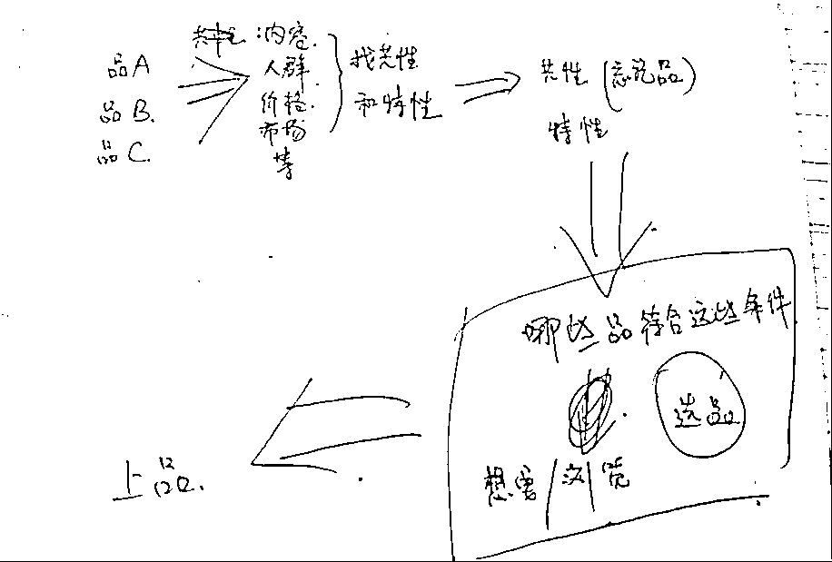
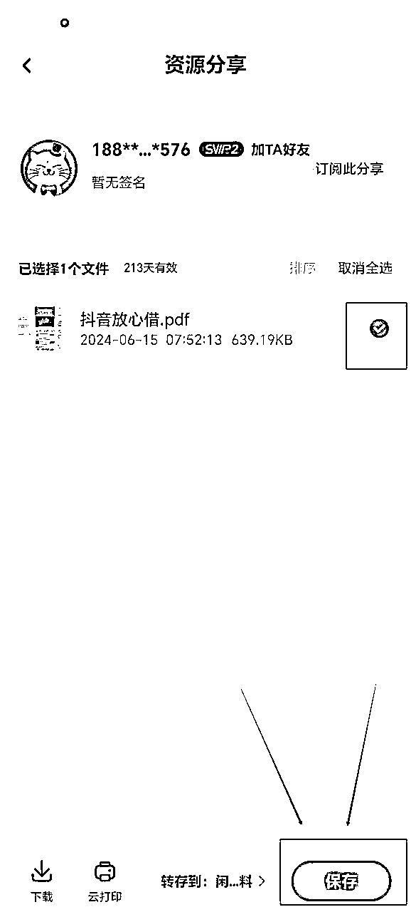

# 12 月航海｜闲鱼虚拟资料｜实战手册

> 来源：[https://ocn93f5d9olj.feishu.cn/docx/HLamd6qUmoDZEuxF4pBcp9B3nSe](https://ocn93f5d9olj.feishu.cn/docx/HLamd6qUmoDZEuxF4pBcp9B3nSe)

# 防失联+MM188166M（李李）长期更新频繁+备用V:MG10127

手册出品方：生财有术团队

出品时间：2024 年 12 月 2 日

手册使用说明：内容出品人排名不分先后。本文旨在向你展示一个项目的更多可能性，帮助你更好地理解和实操。

建议：如果需要快速定位到精确内容，可以使用快捷键 Ctrl + F/command + F 的形式，搜索「关键字/词」，查找你想要的内容

# 写在前面：

# 💡

欢迎大家来到 12 月航海 | 闲鱼虚拟资料 | 实战手册，相信在接下来的日子里，我们将见面很多次。

在开始做闲鱼虚拟资料项目之前，我们先来解决几个问题：

1）闲鱼虚拟资料是什么项目？现在做，有多大机会？

虚拟资料指的是一些公开、没有版权的无实物资料。比如：PPT模板、视频图片素材、合同模板、学习资料、各种考试的冲刺笔记、学霸笔记。

项目属于门槛低、投入低、操作简单、收益稳定、但上限不高。最大的优势是：可以自动发货、售后少，投入时间不多。

目前项目还处于红利期，闲鱼正在大力布局电商，而虚拟资料是闲鱼第一大类目，市场需求非常大，且在平台缺货榜 No.2，虚拟资料赛道有着无限可能。

2）什么样的人适合做闲鱼虚拟资料？

✅适合新手入门，快速拿到正反馈。

✅适合作为副业，赚点零花钱。

3）在正式开始操作之前，希望你可以了解以下信息：

1.

天花板比较明显，不要期待能一夜暴富；

2.

闲鱼卖虚拟资料，相比实体电商模式来说，收益上限可能要更低一些，如果每天能花 1-3 小时，按要求上架 5-10 个商品链接/天，目前测出来收入大概在 1000＋元/月/账号。

3.

虽然可以用工具实现自动发货，但遇到爆单还是要盯着回消息的。

4.

对于新手来说，前期不要想太多，先坚持日更上满 50 个商品链接，再去考虑优化，千万不要上了几个链接没有流量就开始内耗，再简单的项目也需要坚持执行！

最后，希望大家可以在这次航行里收获成果外，结识一群战友。

以下内容由生财有术联合圈友制作而成，仅供航海船员以及生财有术星球圈友学习使用。

# 【更新提示】新手册使用方式

在开始前，我们来简单了解一下这个手册的正确打开方式，方便你根据自己的情况来灵活使用。

在这里，手册整体的步骤顺序是按照从 0 - 1 跑通一个闲鱼蓝海带货项目进行的，你可以参考航线图，按顺序开始实操。也可以根据自己的实际需求选择性阅读。

需要注意的是，手册分为必修和选修两个大的章节：

必修篇内容：为该项目从 0 到 1 跑通一个最小 MVP 的所有步骤，即航线图对应行动路径。如果你还在前期摸索中，想先完成一次整体的项目流程，那么建议从必修篇开始认真阅读和实操，不在玩法选择上做过多的纠结。

选修篇内容：则为该项目的更多玩法、案例和项目放大等相关内容。如果你已经跑通了项目的最小 MVP，想进一步了解该项目的更多可能，获得灵感，那么选修篇一定不要错过。

# 📌

如果你还未接触过闲鱼虚拟资料项目：

建议在正式实操前，先初步了解下项目全貌👇

✅【项目概述】了解闲鱼虚拟资料项目

# 📌

如果你对项目整体已有大致的了解：

请开始完成航线图第一阶段的步骤，这个阶段你可以从手册的第二章开始阅读👇

✅【实操1/3】完成项目准备工作

完成前期的准备后，即可开始完成航线图第二阶段，正式上架售卖👇

✅【实操2/3】蓝海选品&上架运营

✅【实操 3/3】询单、出单发货、售后

经过上一个环节，你已经熟悉了这个项目的流程，那么接下来即可完成航线图第三阶段，学习如何做出更好的成绩👇

✅【复盘优化】

# 📌

如果你已跑通 MVP ，想放大项目：

可以重点阅读以下章节，扩展更多玩法👇

✅更多选品方法

✅更多变现方式

本航海项目的航线图如下：

航线图和手册是高度关联的，因此你可以根据自己所在的环节，进行相关步骤的学习。

以上阶段中，所有的航线图步骤建议大家在航海前两周完成，完成航线图的所有动作后，建议以实践为主，更多的选品和上架运营，扩大自己出单的概率。

# 必修篇：跑通最小 MVP

# 💡

# 章节概要

在这一章节，我们将从认识闲鱼平台开始，一步步带你完成闲鱼虚拟资料整个项目流程的学习。你可以根据本章的步骤内容进行实操，跑通闲鱼虚拟资料的最小 MVP。

如果你是本项目新手，建议在正式实操前，先初步了解下项目全貌：

✅【项目概述】了解闲鱼虚拟资料项目

如果你对项目整体有了大致了解，就可以按照项目核心步骤，开始学习实操：

✅【实操1/3】完成项目准备工作

✅【实操2/3】蓝海选品&上架运营

✅【实操 3/3】询单、出单发货、售后

在必修篇，航线图和手册顺序相对应，你可以按照手册的顺序进行学习，即可逐一完成航线图的每一个任务。

在后续的每个关键步骤的章节概要中，我们也将提到相关航线图，提醒你完成相关步骤。

接下来就正式开始吧！

# 一、【项目概述】了解闲鱼虚拟资料项目

# 💡

# 章节概要

本章节中，我们将一起逐渐认识闲鱼虚拟资料项目。

闲鱼平台目前发展如何？该平台有什么特点？新手怎么入门闲鱼虚拟资料？……这些，都是我们在本章节中会解决的问题。

本次航海的重点，就是告诉大家如何从 0-1 跑通闲鱼虚拟资料项目。

那么对整体的项目概况了解是必不可少的，一起来了解一下吧。

# 1.1 项目介绍

# 1.1.1 什么是闲鱼虚拟资料项目？

闲鱼虚拟资料，是指在闲鱼售卖【PPT模板、视频图片素材、合同模板、学习资料……】等一些公开、没有版权的非实物资料。

# 1.1.2 为什么在闲鱼做虚拟资料

先看看闲鱼平台当前现状与发展趋势：

近几年经济持续下行，国人消费降级，能少花钱就少花钱，能不花钱就不花钱的心态下，促进了二手市场的进一步发展，从而也促进了闲鱼平台的发展。

闲鱼作为淘天集团当前的一级业务，用户总规模突破了 5 个亿，今年在大力布局电商业务。且根据QuestMobile报告显示：闲鱼与小红书、哔哩哔哩并列，成为全网最受高值年轻人群喜爱APP，闲鱼在一二线高值年轻人群中的喜爱度超过B站。

截止2024年4月，中国闲置电商行业的月活用户总规模为1.78亿，近50%为30岁以下年轻人群，闲鱼月活用户已达1.62亿，同比增长19.1%，持续领先行业。

此外，闲鱼用户线上消费能力在2000元以上的高价值用户占比达52.7%，显著高于全网水平。

闲鱼自带商业属性，是离钱最近的平台。

为什么选择在闲鱼做虚拟资料：

虚拟资料项目，大家应该都知道，入门门槛低，非常适合新手拿正反馈。

至于为什么选择闲鱼这个平台：

像淘系和其他电商平台，虚拟赛道基本都是要交保证金的，比如拼多多的保证金；动辄上千，稍微一违规就会被扣除，对于普通人而言，这是一个不可忽视的成本。

而闲鱼是一个二手交易平台，任何人都可以注册账号，进行自由交易。流量方面，对卖家也基本是一视同仁，只要品对了，就会给推流、给曝光。而且不用刷单、不需要投流。

另外，今年 4 月开始，闲鱼平台对虚拟资料赛道放松了管控，加上闲鱼用户增长迅猛，虚拟资料需求很大！

给大家看几个案例感受下：

总结下闲鱼虚拟资料项目的机会点：

门槛低，没有电商经验的新手上手快

易操作，只要会用手机购物就能学会

变现快，实测数据，最快当天就能出单

成本低，虚拟资源，基本每一笔都是纯利润

收入稳，店铺搭建好之后，官方会持续给你推流、曝光

省时间，每天只需要1-3小时，无需一直在线

潜力大，每个人可注册多个号，进行矩阵放大

# 1.2 项目核心玩法

闲鱼虚拟资料 0-1 的新手最小 MVP 玩法，可以总结为这几个步骤：

1.

注册店铺

2.

账号搭建&养号

3.

每天 1 小时看品选品（关键）

4.

每天上新 ≥5 个链接 （关键）

5.

优化链接

6.

售前咨询交流

7.

出单发货&售后

其中，每天看品选品、上新 ≥5个链接是关键动作。需要强调的是：

8.

注册店铺环节：

新手建议刚开始开 1 个店即可，后期有精力，可以多店铺操作。

9.

看品选品环节：

建议新手选 1 个自己比较熟悉的赛道，这样对产品价值有认知，对怎么选品和定价更有把握。

另外，模仿是新手最快的学习方法，先学会模仿再进行微创新。建议新手从红海赛道低客单品（1-2元）开始，先大量的选品和出单，积累网感。先提升对本项目的信心，再不断精进选品能力，选择高客单蓝海赛道（品类）。

10.

每天上新≥5个链接：

新店不用着急想着优化，你先不管三七二十一，坚持上满 50 个品（没有开通鱼小铺的新店最多上 50 个品），再去做优化和上架删除。每天最多建议上架 10 个品，太多也容易违规。

# 1.3 闲鱼平台高排名&高曝光的底层逻辑

无论是闲鱼，还是小红书，抖音等平台，所有平台背后都是机器算法，我们在平台上去操作一定要符合这个平台的算法机制，如果按照平台的算法去操作，就会获得推流和曝光，获得比较不错的反馈，否则，推流和曝光就会相对较低。

做符合平台规则的事情，做平台喜欢的事情，做好产品的曝光，点击，和转化，提升自己的店铺权重，那么相应的在闲鱼平台就有不错的排名和曝光。

流量=一个个用户汇集的海洋。

内容=我们跟用户沟通的桥梁。

几乎当下所有的公域平台都是通过系统推送流量，目前人工分配流量的平台几乎没有。

而系统分配流量的标准在于数据的优劣，系统通过对数据进行赛马机制来定义数据的好坏。

数据越好，流量越高。

而数据产生的诱因一定是因为我们的内容，主图好所以“浏览”数据高，文案配图好所以“想要”数据高，话术好所以“下单“数据高。

所以与其追逐流量，不如好好打磨内容（也就是产品链接的图片文案），通过内容去吸引真实的客户，产生真实的数据，流量自然越来越高。

落地到具体要做的事情，就是：

上平台用户需要的产品

按照平台用户的习惯编辑上传产品

及时回复用户的问题

订单及时进行处理

产品质量不错，用户好评增多

售后及时处理，并且减少售后

~~

# 二、【实操1/3】完成项目准备工作

# 💡

# 章节概要

了解完闲鱼虚拟资料项目的整体情况后，我们就要正式开始启动了。在闲鱼上卖货的前提，是完成前期的账号准备。

闲鱼虚拟电商，一般不涉及资质类目，所以前期筹备比较简单，主要包括：

✅一部手机

✅一个正常使用的淘宝/支付宝账号

✅闲鱼 APP、拼多多下载

✅闲鱼 APP 权限设置

✅闲鱼账号注册与完善

完成账号搭建后，可以多刷刷同行账号，了解各个资料赛道。

# 💡

# 本章航线图

完成本章节的学习和实操，即可完成航线图的第一阶段：准备账号（约 1-2 天）

1.

完成 1 个闲鱼账号的包装&养号（约 1-2 天）

那么现在，就请开始完成简单的筹备任务吧。

# 2.1 基本软件/工具准备

1.

需要的设备

一部手机（一机一卡一号）

2.

下载的软件

闲鱼：实操交易平台。

支付宝：用于注册闲鱼店铺。

淘宝&拼多多：货源供应链渠道。

3.

注册闲鱼账号

至少注册一个账号。

注意：一机一号，不要切换，不要一机多号。

装个双开助手开第二个闲鱼，这也算一机多号，

尽量不要这样做，容易造成账号异常被封号。

一个人可以注册3个支付宝，每个支付宝可以注册一个闲鱼账号。

如果这个手机号之前做闲鱼被封了，

可以去考虑用家人的，再开一个号出来，

或者注销重来（开通了鱼小铺的号注销后90天内无法开通鱼小铺）

# 2.2 闲鱼 APP 的权限设置

以下以安卓手机举例，苹果手机可按照提示进行即可。

1.  关闭我的关注/粉丝列表

打开闲鱼APP，点击右下角“我的”，右上角“设置”往下拉有个隐私设置。建议这里拉成灰色即可，保护自己的客户资源，防止同行根据粉丝的动态搜你的爆品。

1.  关闭我的动态范围

同样在隐私设置里，建议选择不可见，顾客查询不到自己的上货动态，销售状态，同时也预防同行查看自己的爆款产品。

路径：我的＞设置＞隐私设置＞允许查看我的动态＞不可见

1.  自动回复设置：

路径：我的＞设置＞消息通知＞智能回复＞不在线回复＞所有宝贝默认回复

（自动回复话术，详见【章节4.1 闲鱼客服自动回复话术】）

# 2.3 闲鱼账号完善

路径：我的 -> 设置 -> 个人资料

这里要完善信息百分之八九十以上，能填写的建议都填写下。具体步骤如下：

1.主页背景

对于背景图没有过多的要求，可不更改或者自己喜欢的正能量的话。

2.头像

要求符合定位。头像尽量用美女，天然亲和感。

也可以根据自己的产品类目来制定，选择符合自身店铺定位形象的图片，或者用自己的账号名称作为头像。

建议根据对标账号去搭建，可以是可爱风、简约风等等等，人物头像、卡通头像均可。切忌不要花里胡哨。

3.昵称

垂直一点（重要），做哪个赛道就取哪个赛道的名字，比如：

生财HR

生财简历定制

饭饭职场分享

饭饭简历专家

尽量不要跟别人的重复，减少生僻词，影响用户搜索。

注意：如果暂时没有找到想做的垂直赛道的话，就不用着急改名字，因为闲鱼的名字 180 天内只能改一次。

4.简介

简介对标同行，学校和职业搞高大上一点，其他随意：

总之，保证设备干净，手机号干净，网络干净！

# 2.4 闲鱼养号

账号注册好之后，先去刷刷闲鱼找找感觉，只要符合虚拟资源方向的，都可以收藏关注。

点赞数据还有销量好的数据，重点标记。

注意：这个步骤非常关键的，我们之前遇见很危险的情况，就是新账号注册完成就立马上架产品强行干预，让产品出单，然后就会遇到闲鱼针对这个我们这个 账号去稽查，就遇见平台不扣分违规、商品审核、重复铺货、小二下架产品等情况，一定不要忽略这个细节。

养号成功的判断：推荐页全是虚拟资料产品就行。

# 养号的步骤：

【新手按照这个步骤操作就可】

1.完善个人资料（头像、昵称、简介、背景等）

2.坚持每天签到，领取闲鱼币、做任务、浏览、点赞、去评论等

3.浏览垂直领域的相关产品、并随机搜索“xx课程，xx资源等相关宝贝的文案，并点击”我想要“咨询出价等等

4.模拟真实用户，在闲鱼号上下单购买宝贝。有1-3个购买记录就可以，根据自己的需求来购买，如果在闲鱼上没有购物需求的就搜索“0.1壁纸”就会很多也在专门做养号的闲鱼玩家，买1毛钱的壁纸，然后就有购买记录了。

养号的时间：

3-5天效果比较好，这个根据自己的情况来（不是固定死的，1-2天也是可以）。

养号不足会出现的一些情况：

商品上架会被平台严格监管

账号的权重不够，商品链接容易被下架

权重不够的情况下如果同行针对，容易被同行举报成功

注意：养号期间，顺便可以建立自己的素材选品库，为后续上品做准备：

一个全力以赴搞项目的人，

不可能脱离项目本身，

一定要花时间刷！

# 三、【实操2/3】蓝海选品&上架运营

# 💡

# 章节概要

账号准备完成后，我们就要开始选品上架商品啦。怎么选择好卖的商品呢？

新手谨记 2 个选品思路：

1.

从红海赛道选品入门，快速出单闭环找找感觉，再做蓝海选品

2.

模仿是新手最快的学习方法，先学会模仿再进行微创新，这是最有效的办法

选好品之后，我们可以直接参考对标商品链接，进行二创，上架并发布商品即可。

上架步骤非常简单，需要稍微花点心思的是这两个：

商品标题

商品主图

注意：选品时，禁卖违禁商品，避免违规封号。

# 💡

# 本章航线图

完成章节 3.1 的学习和实操，即可完成航线图的第二阶段：选品并上架销售（约 2小时/天）

1.

学会基础选品，每天看品选品（约 1 小时/天）

2.

每天上新商品链接 ≥5 个（约 30 分钟/天）

3.

上架链接后，记得回复客户信息（碎片化时间）

4.

进行商品日常运营动作，提高曝光（约 15 分钟/天）

接下来就开始选品、上架你的第一个商品链接吧~

# 3.1 新手选品思路

新手选品思路，记住 2 个点就行：① 先选红海赛道；② 参考对标。

1.

从红海赛道选品入门，快速出单闭环找找感觉，再做蓝海选品

建议新手从红海赛道（品类）低客单品（1-2元）开始，先大量的选品和出单，积累网感。先提升对本项目的信心，再不断精进选品能力，选择高客单蓝海赛道（品类）。

这里补充下红海品、蓝海品的优劣势差异，更好理解：

优势

劣势

红海品

1.买家基数大，更容易出单，新手更容易拿到正反馈

2.客单价低，爆款多，选品的选择更多

3.爆单的概率更高

1.同行竞争更激烈

2.爆单后，客服咨询偏多

3.单品爆单的收益上限低（200-300元）

蓝海品

1.客单价高

2.前期同行竞争小

3.单品爆单的收益上限高，（平均300-500左右，最高客单1000）

1.选品难度高，对品类内容等认知要求高

2.爆单后，会出现更多低价的同行

3.客单高，更容易出现仅退款的订单

低客单选品参考：

低客单品没有特定的用户画像、特点。按照低价、(想要:浏览)≥(1:10)的标准去选品是效率最高的方法。

高客单选品参考：

每个赛道都有高客单的品类，需要对品的内容有足够的认知，最简单的方式就是通过关键词搜索，选择竞争少的品。

2.

模仿是新手最快的学习方法，先学会模仿再进行微创新，这是最有效的办法

模仿的思路很简单：

第一步：任意找到对标品 A、B、C，分析它们的买家画像，找共性、特性，然后用表格列出来。

第二步：再忘掉品 A、B、C，分析这些共性和特性跟出单有什么关系，这些因素如果能影响出单，那么哪些品有这些性质/共性。

第三步：然后再去闲鱼刷品，看想要/浏览，看同一个品不同的店是什么情况。

内容来源：一个账号收入放大5倍———不做矩阵，闲鱼虚拟资料项目也能办到！！！

# 3.2 新手选品方法

选品前可以先建立一个选品库，作为商品素材库：

# 第一步：找对标，选买家画像丰富的品

找对标店铺的作用是什么？

1.

选品的时候有参考范本

2.

可以直接跟品

找对标的思路：

3.

用逆向思维，卖家思维转换成买家思维，思考你作为买家，你在多个角色下是否有其他的需求或者公共的需求。

4.

选买家画像丰富的品。

什么是买家画像丰富的品？

举个例子，像 PPT 素材，它的买家人群有：学生、教师、文员……等；受众广、不同内容的素材需求高。

给大家几个对标店铺案例作为参考：

搜索下图中店铺名，点击对应头像进入店铺，就可以看到对标店铺卖的比较好的产品都有哪些。

# 第二步：看想要和浏览数据

打开闲鱼，在搜索框输入你想卖的品关键词，比如“工作总结PPT”，如果搜出来的商品普遍【想要数：浏览数 ≥ 1:10】，初步判断这个品市场需求比较大。我们继续往下看。

# 第三步：看同行动态

「同行动态」显示这个产品近期出售情况如何，也就是转化数据怎么样，近期越多，自然越好，选品的时候，更为重要。

判别市场是否可以，一般同行「多天不间断出单＞3天」，相对来说都算不错，自然这块越多越；

而具体判别是否可以，需要查看第二个判断标准-「不间断出单」，如果10天内有-5天出单≥1单，这个产品就可以进行一个选择。

同行动态不可见时，如何判断？

如下图所示，有些想要数高的店铺，设置了动态不可见，如何评定？

这种情况，可以根据店铺提供的其他数据进行一个补充评定，一般顺序如下：

1）开通了鱼小铺：鱼小铺等级为商家出售产品用户给到好评量，进行的评定，所以可以作为第一个小的参考。

当然有一些暂时没有鱼小铺，但是后面几个评定也不错，也可以作为一个市场近期出售好的产品选择。

2）下方留言时间：代表着这个产品近期市场需求咨询如何。 7天内如果有2条以上新的产品咨询也表示近期不错。

3）回复率90%以上：回复率越高，也代表着店铺整体盈利情况不错，值得花心思时间进行，所以一般90%以上的回复率也可以作为一个参考。低于80%一般可以跳过。

4）卖出产品数：卖出产品数自然越高越好，如果只有个位数，且多家都是这个情况，说明这个品可能没什么市场，当然也不排除新上就爆单的情况，这个时候需要结合上面几个数据综合评定。

# 第四步：看多家情况

一般单个案例容易出现偶然性，所以可以结合前面的方法，查看多家想要数都不错的，动态出售情况。

如果有多家都满足上面提到的「同行动态」，2、3 家出售都大于 3 件，那么这个品就可以进行一个选择。

# 3.3 闲鱼选品推荐⭐

下面是比较推荐新手去入门的几个类目，每个类目下面，都有非常多选品供大家挖掘。

# 类目

# 产品

# 适用人群

# 需要注意哪些

素材类

ppt模板、Excel表格、word模板、ps素材、淘宝店装修素材

学生、教师、职员

word字体违规

学习资料

各年段学习资料

学生、教师、家长

规避版权问题

合同类

租房合同、出租转让协议、离婚协议

中年人

选择功能性偏弱的合同，减少咨询

其中，比较推荐新手前期主做的品类是【素材类】，测试下来是相对更好出单的。

注意：

航海期间，我不会给大家做详细的选品推荐，因为闲鱼是二手平台，所以热卖产品会经常更换。咱们还是以低客单、杂货铺的方式多去选品，让正反馈和出单的时间变短。

通过跟平台热卖品的方式快速出单和爆单，符合前面提到的选品标准【想要:浏览 ≥1:10】，基本就可以直接上架到店铺。

# 3.4 闲鱼选品避坑（重要）⭐

掌握了选品方法后，先别着急，为了避免大家实操时出现账号违规封号的情况，这里跟大家讲下闲鱼虚拟常见的违禁注意品：

像带有品牌名、logo、涉及K12教育……等强版权的产品一律都不要碰。

一旦被平台发现，一般就是投诉扣分或警告，严重的还会有版权官司要打。

请大家仔细阅读这份【违禁品清单】：关于电商虚拟产品违规案例分析及注意事项

# 3.5 产品上架步骤

闲鱼虚拟资料的项目逻辑是：上架商品链接 - 用户咨询出单 - 再去找对标拍下资料用于发货。所以这里我们先进行商品的上架。

# 3.5.1 编辑上架步骤

上架很简单，找到对标商品链接-参考对标进行二创-即可发布。具体步骤如下：

# 第一步：找对标

在闲鱼首页搜索框，搜索产品名称关键词（比如PPT模板），按前面学到的选品方法来选择对标（关键是满足 想要:浏览≥1:10）。

找到对标后，我们参考对标进行以下修改，就可以发布啦。（修改是为了减少同质化、吸引买家）

# 第二步：写标题

一般只需要参考对标，进行修改即可，下面左图是对标的标题，右图是修改后的标题，大家可以参考。

# 【附】一个好的标题怎么写？

一个能获取较多流量的标题，通常可以通过堆积产品关键词的方法，让用户不论搜索产品任意名称，都尽可能出现，自家店铺产品。

比如：ppt模板

也可以用PPT高端模板、通用模板代替

标题参考：9999套PPT高端模板、通用模板，包含莫兰迪、古风、ins风等（尽可能30个字符占满）

# 第三步：制作主图

主题也是参考对标即可，闲鱼对搬运管控不严，目前直接用对标的图也是没问题的。

# 【附】一个好的主图怎么制作？

一个好的主图，一定能在第一眼就直接抓住闲鱼客户眼球，这类主图的特点：

清晰

干净

体现产品特点，卖点

以“小学资料”为例，可以看到排名靠前的商品主图样式，一般都是产品处于主图正中央，款式和产品细节突出，让人想点击进入。

而一些「想要数」相对来说少点的，可以看到，图片不清晰，给用户的感觉很差，同比下来，肯定优先点击上方的，所以主图尽可能按照上方要求的进行。

至于内容内的其他照片，可以参考动态出售好的，其他图片进行即可，比较简单。

好的主图图片在哪里找？

这里讲一个成本比较低的方法，我们可以直接去电商平台，比如淘宝，1688，拼多多，淘特等搜索产品，从产品介绍，外加用户评价里面找寻满足要求的。

当然这只是一个非常基础的方法，作为一个闲鱼卖家已经够用，如果你想要打造差异化，可以在原图的基础上，进行二次加工，比如加特效、图片拼接等，这些效果可以借用市面上常见的 P 图软件，就能做到，这里就不展开说了。

# 第四步：发布商品链接

找到对标文案和图片后，返回主页，点击卖闲置，按要求进行发布即可。

发布地可以选择一二线人口居多的城市

定价可以参考对标，或比对标低都可以，不建议 0.01 元，容易被判低价引流扣闲气值

发货方式选包邮即可（发货时可再选无需寄件）

# 3.5.2 闲鱼编辑上架的注意事项

1.

标题内容里的品牌词，不要出现，图片也尽量别出现

2.

内容标题内不要出现：无添加，联系，微信等一些引导闲鱼站外词

3.

发布地可以选择一线人口居多城市

4.

上传操作时间最好8点左右，其次晚上8点左右，最不济中午11点半左右

5.

单天发布5个左右链接即可，不要太多，以防被认为营销号

# 3.6 商品日常运营

# 3.6.1 每天擦亮产品

可以晚上凌晨 0 点擦亮，也可以早上起来操作。

操作步骤：闲鱼我的—我发布的—左上角点击一键擦亮

# 3.6.2 及时给买家评价（增加鱼力值）

出单后，记得及时给买家评价，一方面可以提醒对方也给你好评，另一方面可以通过这个动作增加鱼力值，鱼力值越高代表信用水平越好。

操作步骤如下：

# 3.6.3 运营期间注意事项

1.  运营小技巧

按正确方式上架产品，注意产品标题、文案、发布地址、产品标签

每天及时擦亮产品

及时回复用户咨询，尤其前期，消息通知及时打开

卖出产品及时上架产品

拍下 5 分钟内不付款的及时关闭交易订单，按照客服话术以退为进

及时回复评论，及其留言。给其他感兴趣用户一种负责的态度

订单及时处理

少售后，少差评，产品质量及时看着，如果多个差评，及时更换商家，外加售后及时妥协处理

1.  闲鱼违规封号点

以下整理了一些常见的违规封号点，建议大家避开。

选品选择了市场违禁品（详见【3.4 闲鱼选品避坑】）。

同一个手机登陆多个账号，外加单个手机切换账号使用。

客服聊天出现违禁词，以及同一句话多次使用。比如：转账多次，一单一结，皇，微信，联系，加，原味等一些常出现不注意的词）

售后太多，很多纠纷，多次拒绝后，用户直接申请小二介入。

# 四、【实操3/3】询单、出单发货、售后

# 💡

# 章节概要

当有顾客咨询，我们需要及时跟进，避免客户流失，而在出单后也需要尽快安排发货，尽量减少客户的等待时间，有助于提高客户的满意度。

这一章节，将会和大家讲讲如何做好商品售前售后客服的常用回复，以及发货流程：

✅闲鱼客服：及时回复、积极跟进处理售后问题

✅出单发货：及时找到对标下单，保存到自己网盘，然后去发货

具体每个细节怎么做，一起往下看。

# 💡

# 本章航线图

完成本章节的学习和实操，即可完成航线图的第二阶段：选品并上架销售（约 2 小时/天）

1.

上架链接后，记得回复客户信息（碎片化时间）

2.

稳定出单后，设置自动发货（约 10 分钟）

# 4.1 闲鱼客服自动回复话术

# 4.1.1 回复话术

虚拟资料的客服相对其他产品非常简单，因为没有物流问题。基本上都是问还能不能拍或者是产品内容相关问题，所以这里不做过多的描述。

最常见的问题就是：

客户：你好/在吗/还有吗/怎么买？

回复：在的，哥/姐！直接拍就行哦，百度/夸克网盘发货

# 4.1.2 客服经验总结

1.

给钱的是上帝，买家的任何合理的要求都满足。不要跟买家起冲突，没有性价比。

2.

不方便时，找个合理且不好拒绝的理由。比如“在开车”是我经常用的理由。正常买家都愿意等，同行或者难搞的买家会拒绝，所以也没必要给自己找麻烦，不必内耗。

# 4.1.3 常见案例

# 4.2 出单发货步骤

# 4.2.1 出单后，获取虚拟产品货源并发货

# 第一步：获取资料

搜索关键词，找到同行下单

复制网盘链接（以百度网盘为例），打开百度网盘app

转存到自己的网盘

# 第二步：生成自己的网盘链接

一般我们找对标同行拍下的资料，不太会有水印或二维码（除非是别人专门用来引流的资料），所以可以直接保存使用。而且绝大部分资料都没法编辑，如果不小心遇到带水印的资料，建议直接换一家。

# 第三步：完成发货

生成自己的网盘链接

点击去发货

选择无需寄件

把自己的网盘链接发过去

# 4.2.2 出单发货后操作

# 重新上架

出单后第一个动作----重新上架

路径：我的＞我发布的＞右上角已下架宝贝＞重新发布，立马上架你的流量会非常大

注意：开通鱼小铺的卖家不需要手动重新上架。

# 提醒收货

可做可不做，影响不大，早点收货早点落袋为安。

# 4.2.3 稳定出单后，设置自动发货

这里推荐 2 个比较好用的自动发货工具：阿奇索（鱼店长）和闲管家。

1.

阿奇索（鱼店长）

购买界面可以领 7 天试用

操作非常简单，跟着新手向导一步步完成设置即可：

2.

闲管家

（有更多附加的功能，需付费）

使用哪个软件看个人习惯，我个人觉得两者没太大区别，这里就不做推荐了。

# 4.2.4 出单后没有及时找到货源怎么办

我们可能会遇到出单后找不到货源/对标下架了的情况，总之发不出货怎么办？

解决方法：

及时跟买家说明现在无法发货，理由：网盘出了问题、在开车。

# 4.3 差评or仅退款如何应对

差评：

1.

差评需要联系闲鱼官方客服，提供材料证明是恶意差评，才能让官方帮忙删除评价。

2.

避免差评的方法没什么特别的，就是售后能退就退，千万别跟客户起争执，个别差评也不影响店铺。

仅退款：

3.

一般虚拟资料不退货，除非你没及时发货或者资料有问题，直接给退即可。

（话术参考：不好意思哥/姐，我现在给你退款。）

# 五、复盘优化

# 💡

# 本章航线图

完成本章节的学习和实操，即可完成航线图的第三阶段：优化运营，提高商品曝光

1.

分析数据，进行商品优化、上架、删除

如果你已经上满了 50 个商品链接，现在尝试去做优化吧~

对于新店来说，先上满 50 个品再去做优化。

当店铺有足够的品之后，我们再去针对数据不好的品进行下架删除处理，优先下架删除没有浏览的品，其次是曝光，最后是想要。

（优化公式：曝光＞浏览＞想要）

下架路径：我的→我发布的→在卖→管理→下架or删除

（下架之后还可以再点击“上架”重新发布，删除之后不可以。）

# 选修篇：项目精进与放大

# 💡

章节概要

当我们完成项目最小 MVP，基本掌握项目的操作流程后，可以尝试看看选修篇的内容。

无论是想要进一步放大项目，还是挖掘更多玩法，都可以重点阅读本章节：

✅ 更多选品方法：拓展品类和货源

✅ 更多变现方式：了解如何进一步放大生意

现在，快来发掘项目的更多可能性~

# 六、更多选品方法

# 6.1 蓝海选品的 3 个参考标准

1.  看这个产品最高的想要数

客户一般点击想要，最低也是要看一下价格，这类客户的意愿比较强，所以看想要数就等于评估产品市场有多大。

1.  一周内有留言的爆款链接，它内容还有优化空间，就有机会

一般来说，市场在不断竞争，所以商品链接内容也是在不断迭代的，也就是说用户喜好是有变化的。

有些爆款可能数据高，但是是很久以前的爆款，不适用于当下市场，一般在数据体现上就是最新的留言停留在一个月前或更久。

因此，我们要看这个爆款链接【一周内有没有留言】，去判断它近期有没有推流；再去判断这个链接还有没有优化空间，因为内容质量决定流量高度，你认为可以优化就是有机会，你认为已经很好那就对你来说没机会。

1.  看卖家数量和产品均价

用关键词或者标题搜索平台的同行和客单价。如果同行数量不超过10家，均价超过同类产品，说明竞争不激烈。

至于这个品是蓝海还是红海，大家就能根据上面提到的问题，得出答案啦。

# 方法一：通过异常值选品

面对红海激烈的竞争，最好的方法就是避开锋芒，大差异化竞争。只要是成功的差异化，在数据上一定偏高，体现出来就是“异常值”。

所以说，同样的产品，异常值就是成功的差异化案例；不同的产品，异常值就意味旺盛的市场需求。

不同产品示例：

做实体产品的，一般较好的链接数据，想要：浏览的转化大概在10%，也就是10个浏览，就有1个想要的。

但像pdd砍一刀，想要：浏览的转化在20%以上，也就意味着市场需求更旺盛。

同类产品示例：

这种明显高于同类产品标准线之上的数据就是异常值，找到异常值之后就一定要多维度的去拆解去分析。

从主图，标题，营销词，文案，配图等多维角度去找到异常值产生的原因，并尝试把它应用在自己的实物产品上去。

如果说成功有捷径，那一定就是异常值。

异常值之所以隐藏着巨大的机会，原因无非于以下两点：

1，从数据上看，异常值本身就意味着已经被市场认可，被用户认可，是一个成功案例。

2，新鲜出炉，任何的差异化随着被同行不断的抄袭，差异化也会逐渐沦落成常态化，常态化在数据的体现中就不会具有异常值，所以每一次的异常值都是最新的机会。

所以如果没有能力做第一个吃螃蟹的人，不妨试试做第二个吃螃蟹的人吧，安全无害且有收获。

# 方法二：学会看闲鱼榜单

1.  闲鱼榜单

上面的店铺都做的非常垂直且优秀，基本都涵盖了一个领域内的大部分产品。这个方法适用于你在刚选择一个领域，不知道这个领域应该选哪些品的时候，可以帮你非常迅速地建立起一个领域的全品类概念。

1.  缺货榜单、新人榜单

目前闲鱼在商品排序上，已经把缺货榜的商品计算到商品排序中了。

而新人榜单中，有很多弱竞争的产品，也是蓝海产品的聚集地，非常适合用来起店。

# 方法三：借助其他平台挖掘

比如在小红书上搜关键词

我们可以去挖掘下有什么这方面的虚拟资源可以操作

如下面案例，我们可以挖到一些试卷、资料库、表格、课程等。

整理好这些素材，搜集相关的产品，就可以常识性售卖。

# 方法四：主页推荐页

我们养号过程中，通过搜索关键词，让系统记住我们的喜好之后

首页就会一直出现你感兴趣的内容，

当我们发现流量好的案例时，

就可以把他们当作我们的对标账号去模仿.

1.

通过主页＞猜你喜欢/新发，找72小时/48小时等最新发布的产品，看想要数

2.

通过主页＞猜你喜欢/新发，通过标签“卖家信用极好”“回复快”

# 方法五：借助第三方平台数据搜索

抖查查、飞瓜、灰豚、禅妈妈、考古加。

# 七、更多变现方式

# 7.1 引流

私域为王。引流的目的就是为了把流量转到你的私域，然后通过一对一话术或者朋友圈去转化更多的sku、更高的客单价。

操作步骤就是正常的上品流程，其中价格设置、发货步骤有些差异：

1.

在闲鱼主页搜索关键词，比如“副业“、“赚钱”

2.

尽量找到想要人数多的对标商品链接

3.

复制对标的文案和图片

4.

设置商品价格（关键）

引流商品价格设置有些不同：可以价格设置 2 块，然后一小时左右降价 1 毛钱，一直降到 1 块就停，没人买也不用恢复到 2 块。

5.

发布地区：主要发布地区是一二线城市，但是不要太频繁去换

6.

发货（关键）

去买一份项目资料保存到自己的网盘，再把自己的私域联系方式或者二维码上传到网盘（也可以把转化话术制作成图片），生成一份网盘链接。下单就发给买家。

7.

话术参考

你好，小店新开只为好评，拍完不付款，我改价 0.1 出售即可，拍完回复“我已拍“我给您发货；

现在本人不在，请耐心等待一下哈，发完货之后觉得服务好，记得给个好评哈，或者直接点链接领取:「百度完整版打开即可」

# 7.2 网盘拉新

做闲鱼虚拟资料的时候，可以配合网盘拉新来做，增加额外的收益。（用户通过你分享的网盘链接转存或者开通会员就有佣金）

网盘拉新分为官方渠道和个人渠道。

1.

最后，祝大家都能找到适合自己的类目，跑通变现，放大收益，一起生财有术！

