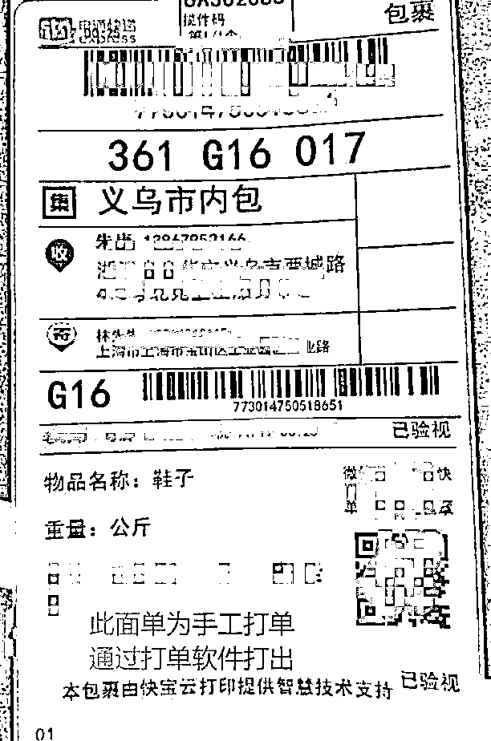
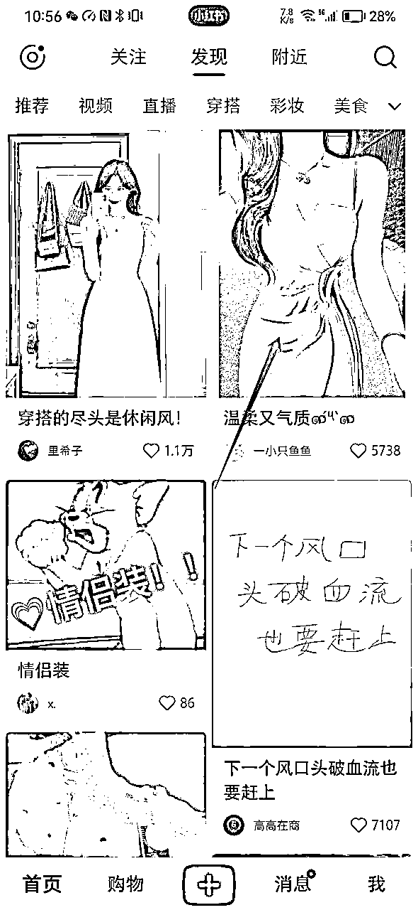

# 9 月航海｜小红书电商-女装垂类｜实战手册

> 来源：[https://auytvnjzru.feishu.cn/docx/FnPTdU0SyolFOQxtEbac50uJnbh](https://auytvnjzru.feishu.cn/docx/FnPTdU0SyolFOQxtEbac50uJnbh)

出品时间：2024 年 9 月 6 日

永久更新微信：6326696

手册使用说明：内容出品人排名不分先后。本文旨在向你展示一个项目的更多可能性，帮助你更好地理解和实操。

建议：如果需要快速定位到精确内容，可以使用快捷键 Ctrl + F/command + F 的形式，搜索「关键字/词」，查找你想要的内容。

# 写在前面

# 

欢迎大家来到 9 月航海 | 小红书电商-女装垂类 | 实战手册，相信在接下来的日子里，我们将在这里见面很多次。

在开始学习 小红书店铺 - 女装垂类 之前，让我们先来解决几个问题：

1）小红书店铺 - 女装垂类是什么项目？前景如何？

2024 年小红书电商步入发展红利期，下半年更是爆发期，因为小红书已经培养了一批优质用户，会到平台主动搜索自己的需求。平台也在大力的推广电商板块，对于我们来说是存在很大的红利机会的。

女装垂类赛道可以说是小红书最大的热门板块，利润高且受众与平台用户画像高度匹配，随着今年小红书用户剧增，搜索量暴涨，；而且 9 月即将入秋，马上可以卖秋冬服装，利润会比夏装更高。

本期航海，按教练提供的方法操作，预估退货率可以控制在40%-60%左右，且女装产品供应商多，一件代发的模式也减轻了不少压力。

2）小红书店铺项目有几种模式？

在小红书上开店，自己有产品的可以做自营，没有产品的可以找货源商家合作，但不建议做无合作的无货源代拍模式，现在平台对这种代拍模式有一定的处罚规则。

无货源模式的优点是投资少、灵活机动，风险点是可能会因为笔记爆而带来订单爆，合作货源商家可能供货不足。这时选择无货源模式的朋友，平时也需要多多留意一些其他自己可以合作的货源商家，作为备选。

❗注意：小红书平台现在开始对无货源代拍的模式进行查处了。详情可看官方产出的公告：《关于无货源代拍的专项治理公告》 。

3）什么样的人适合做小红书店铺 - 女装垂类？

和所有的电商项目一样，做小红书店铺也有一定的门槛（比如：需要有自己的产品，或者找到有产品的合作伙伴），可以尝试做这个项目。

至于女装垂类，如果你有一定的审美基础，以及图片拍摄制作能力，将有更大几率跑通项目。

另外，由于本次主要专注于女装赛道，因此手册在往期内容的基础上，重点补充了以下内容：

✅ 2.2 女装赛道如何选品

✅ 2.3 下单样品（物流1-4天）

✅ 三、【实操2/4】制作爆款图文带货笔记

✅ 6.1 如何降低女装退货率

最后，希望大家可以在这次航行里收获成果外，也能结识一群战友。

以下内容由生财有术联合圈友制作而成，仅供航海船员以及生财有术星球圈友学习使用。

同时也欢迎圈友们在实践过程中持续反馈，和我们共同完善，可以联系鱼丸（yuwan387）提供修改建议～

# 【更新提示】新手册使用方式

在开始前，我们来简单了解一下这个手册的正确打开方式，方便你根据自己的情况来灵活使用。

在这里，手册整体的步骤顺序是按照从 0 - 1 跑通一个小红书店铺项目进行的，你可以参考航线图，按顺序开始实操。也可以根据自己的实际需求选择性阅读。

需要注意的是：本次手册相较于过往航海，进行了较大的改版。之前的手册尽可能的展示更多可能的玩法供大家自由选择，本次改版后的手册，分为必修和选修两个大的章节：

必修篇内容：为该项目从 0 到 1 跑通一个最小 MVP 的所有步骤，即航线图对应行动路径。如果你还在前期摸索中，想先跟着步骤熟悉掌握，那么建议从必修篇开始认真阅读和实操，不在玩法选择上做过多的纠结。

选修篇内容：则为项目的更多玩法、案例等相关内容。如果你已经跑通了项目的最小 MVP，想进一步了解它的更多可能，获得灵感，那么选修篇一定不要错过。

📌如果你还未接触过小红书店铺项目：

建议在正式实操前，先初步了解下这个产品，并且了解它的最新消息👇

✅【项目概述】了解小红书店铺（女装）项目

📌如果你对项目已有大致的了解：

请从航线图第一阶段的步骤开始实操，这个阶段你可以从手册的第二章开始阅读，逐步完成整个项目👇

✅【实操 1/4】准备店铺并选品上架

✅【实操 2/4】制作爆款图文带货笔记，获取流量

✅【实操 3/4】找到优质稳定的供应商

✅【实操 4/4】店铺的售前、售中、售后管理

✅【复盘优化】运营优化，工具提效

📌如果你已跑通项目最小 MVP ，想放大项目：

可以重点阅读以下章节，扩展更多玩法👇

✅【选品拓展】更多选品方法

✅【项目放大】小红书SEO

✅【项目放大】矩阵

本航海项目的航线图如下：

航线图和手册是高度关联的，因此你可以根据自己所在的环节，进行相关步骤的学习。

以上阶段中，第一二阶段的航线图步骤建议大家在航海前两周完成，完成后，建议以复盘&优化&提效为主，更多的发布优质带货笔记，提高自己的爆款率和出单的概率。

# 必修篇：跑通最小 MVP

# 一、【项目概述】了解小红书店铺（女装）项目

# 章节概要

小红书现在是很多人消费前的搜索和决策工具，平台的电商板块正在加速发展，对于普通人来说，存在大量的红利机会。

本章节，我们会从平台和赛道这两个维度，为大家介绍小红书店铺-女装垂类这个长期可持续的优质项目。同时，也会带大家初步了解项目玩法，以及平台内容推荐机制，为大家制作爆款笔记打下基础。

# 1.1 项目现状与前景

# 1.1.1 小红书电商当前现状

小红书用户年龄集中在 18-34 岁，以女性用户为主，占比 70% 左右。多数都是分布在一线和新一线城市的都市白领、职场精英。“年轻”、“女性化”、“有钱”依然是该平台用户的三大标签。而 31-40 岁的用户群体也在逐年增加，他们更加注重品质生活，乐于分享自己的购物经验和生活点滴。

小红书的用户主要集中在经济较为发达的一、二线城市，这些地区的用户有着更高的消费水平，也更注重消费品质和体验。

（数据来源：千瓜数据）

当前小红书热门类目有：女装，饰品，女鞋，食品，家居百货，美妆工具，而女装是小红书市场最大类目之一，款式多样，爆款属性多。

目前平台一直在鼓励用户原创内容、鼓励种草博主类账号。随着平台的规则调整，大量的低质量混剪商家正在被清退，原创素材商家能获得官方更多流量扶持和曝光机会。

# 1.1.2 为什么在小红书做女装实拍

现今小红书坐拥 3 亿月活用户，男女比例达到 3:7，95后占比为 50%，00后占比为 35%，二线城市用户占比 50%。

社区分享者超 8000 万，日均用户搜索渗透达到 60 %，UGC 内容占比达 90%。“年轻有活力”、“国民生活指南”、“得天独厚的社区生态”，使小红书具备强大的人群穿透力和品牌普适性，成为培育、渗透消费者的主阵地。

小红书的活跃用户群体具有高度的个性化和细分化特征，这为女装赛道提供了精准的目标市场。女装穿搭人群关注焦点仍以身材、风格为主，“通勤、复古、休闲、显瘦、梨形”等依然是高热度内容。

比如下面这条裤子，单篇爆款笔记销售 3000+ 单，每单利润 39 元，利润率高达近 48.8%。

再比如这条牛仔裤，单篇爆款笔记单周销售 600＋ 单，每单利润 27 元，利润率高达 51.2%，一周赚到 16200 元，非常香。

还有这款衬衫，单篇爆款笔记销售 2w＋单，单利润39，利润率 55.4%，赚了 78w 元。

总的来说，小红书平台女性用户多，女装款式多，爆款也多，而且女装的利润也相对比较高，百元以内的单品利润能有 50% 以上。

但女装有个通病，就是售前售后频率高，需要及时回复客户消息；另外，出现售后需要做好客服，态度需表现良好，并准备优惠券送给客户；退换货需要和客户沟通好退换理由，以免店铺出现负反馈导致被限流。

至于笔记形式，本期我们主做【实拍】。原因如下：

1.  图片实拍相对简单高效，其中 live 图能获得更大流量；

1.  只要更换场景和拍摄模板，就不会出现违规或账号被举报限流，长尾流量更长，更容易出爆款。

# 1.2 项目核心玩法

小红书女装店铺 0-1 的新手最小 MVP 玩法，可以总结为这几个步骤：

注册账号开店 - 选品 - 下单样品 - 上架商品 - 拍摄并发布笔记 - 出单后找供应商 - 管理店铺 - 做好售后

其中，选品、发布笔记、售后是项目关键动作。需要强调的是：

1.

注册账号开店环节：

对于新手来说，建议开通至少 2 个账号和店铺，老手可以 7 个号轮动。

前期需要先定位女装赛道的细分人群，例如：小个子、微胖，或者账号想要做哪些细分类目的产品，例如毛衣、衬衫、外套。这样能在起步的时候抓住细分人群的流量，也能抓住更多长尾流量，让我们的起步更快。至于开通店铺，一天内就可以完成。

2.

选品环节：

在进行店铺开通之后，可以根据前面的定位来进行选品，可以优先选择【近期销量高评价低】的产品，进行选品测试。

为了帮助大家更好的抓住近期高销女装产品，本期航海也为大家准备了 女装选品清单 供大家参考（航海期间持续更新）。

3.

发布笔记环节：

在发布笔记前，一定要把细分品类的对标账号搜集起来，进行爆款拆解和模仿，更容易出成绩；笔记的制作方面，实拍是长期主义的首选，有条件的建议拍摄 live 图流量更高。

4.

售后环节：

女装类目的售前售后会比较多，我们需要熟悉女装售前售后话术，切记及时回复，并推荐客户适合的码数，提升客户转化率，做好客户售后及时处理，做好店铺评分，以免店铺负反馈被限流。

# 1.3 小红书内容推荐机制

# 1.3.1 笔记审核机制

用户发布笔记后，会经过一个"黑盒审核"的过程。

平台根据系统规则（详细规则可参考小红书官方号："薯管家"）对笔记进行初步审核，以检测敏感词、违规词和低质量图片等内容。

如果被检测出违规行为，该笔记将直接被审核失败，无法曝光。

还有一些内容是机器无法检测出的，这些内容会被判定为疑似违规，然后转交给人工审核。

未通过审核的笔记将被关进"小黑屋"，具体表现为限流。

其他用户无法在个人主页中看到你发布的该笔记可以通过将笔记分享到微信等平台来查看是否被限流。

一般情况下，笔记的黑盒审核时间为几分钟到十几分钟之间。

除非在笔记发布高峰时期，如果审核时间较长，那可能是因为正在进行人工审核阶段。

# 1.3.2 笔记推送机制

经过审核后，系统会根据你笔记的初始点赞、收藏、评论、转发分享、转粉数据来打分，评论、转发和转粉这三个的分数占比较高。

同时，算法将对发布的内容进行拆分，主要是为了对内容类型进行归类，并为其打上兴趣标签和收录关键词。

这里要提到小红书平台 2 个最核心的流量来源：【推荐流量】+ 【搜索流量】

1）推荐流量

获取推荐流量，你的笔记会被推送到粉丝和其他用户的首页。

这里有一个公式需要大家了解，是小红书内部评分体系：

CSS = 点赞数（1 分）+ 收藏数（1 分）+ 评论数（4 分）+ 关注数（8 分）

这个公式是衡量互动量和转化率的指标，公式的计算结果将持续影响首页推荐的频次。

当你的笔记分数越来越高，就会一级一级被系统推荐到更大的流量池，成为爆文（小爆款互动量 1000+，大爆款 10000+，不同类目有所不同）。

因此，前 100 个精准用户的点击或互动情况非常重要，而笔记发布后在 18-24 小时内的互动情况也将影响是否能进一步吸引更多流量。

而这篇爆文还会带动其他笔记的整体数据增长，当然要先满足这些前提：

① 你的笔记经过系统审核，没违规，没被系统删除或者没被你删除/隐藏。

② 你的笔记有关键词（比如穿搭、衬衫等），能对应垂直标签，能被系统识别收录，推 荐给喜欢看相应标签下的目标人群。

③ 你的内容质量本身不错，能吸引用户来进行赞藏评等互动。

特别提醒下：

一般 0 基础新手很难发第一篇就能获得大爆款；在运营的7-15天，新手笔记的小眼睛（即阅读量）停留在200-1000 都属于正常。

80% 新手都在第二或第三个月开始才迎来爆发，有酝酿期，所以不用太心焦，耐心打磨好内容。

2）搜索流量

小红书平台的用户除了来主页逛逛，还会通过搜索找到自己想要的内容。比如想买口红，会搜口红攻略；想去哪儿旅游，会搜旅游攻略。

搜索结果排名靠前的笔记，会获得更多曝光和关注。这部分流量近乎占据总流量的 50% 以上，不容忽视。

要想获得搜索流量，首先你的笔记要包含有效关键词，且被系统成功收录；

要想搜索结果排名靠前，你的账号权重和笔记权重要持续提升。

内容来源：《初阶 | 小红书-爆款笔记｜航海实战手册》

1.3.3 笔记权重

小红书的笔记权重其实可以总结为以下三点：

1.  原创度

原创度低于 60% 时，不仅会降低权重，还可能导致被限流。

1.  转化率

转化率是指笔记发布后的曝光率与互动率的比值。其中，转发、评论、收藏、点赞的权重关系依次为转发＞评论＞收藏＞点赞。

1.  内容

内容方面有两个要素。首先，关键词标签与整个内容的关联度，如果关联度较小，可能被认为是恶意引流，从而降低权重。

# 1.3.4 笔记排名机制

笔记排名是指在用户搜索关键词后，搜索结果页面中显示的笔记排序。排名越靠前，用户点击的可能性也就越大。

在了解笔记排名之前，首先要了解一个概念——收录。

收录是指搜索引擎爬取和储存笔记内容至数据库的过程，一般来说，经过审核通过的笔记会被收录，但也存在一些因素导致笔记无法被收录：

1.

账号问题

账号违规多次，整个账号会受到限制，笔记也将无法被收录。

2.

抄袭问题

如果笔记被系统检测出高重复率或非原创内容，将不会受到平台支持。

3.

营销问题

如果笔记中出现大量广告或营销用语，会被识别为推广笔记。

4.

多次修改

由于笔记的修改会再次进行审核，容易导致丧失收录。

# 二、【实操1/4】准备店铺 & 选品上架

# 章节概要

了解完小红书店铺项目的整体情况后，我们就要正式开始启动了。在小红书做电商的前提，是完成前期的店铺准备和选品。

所以在这一章节，我们整理了项目初期需要筹备的事项，包括：

✅ 准备手机号&手机

✅ 开通适合自己的店铺

✅ 完成女装赛道账号的包装

✅ 尝试第一次选品并了解测品方法

✅ 下单样品

✅ 将选到的品上架

其中，小红书不同店铺的入驻门槛不同，大家可以结合自身情况，了解清楚后，进入入驻流程。

另外，选品是本章节需要我们重点掌握的技能，下单样品是我们本章节重要任务。

对于女装赛道来说，最好用的选品方法就是：小红书平台内找爆款对标。在选品时，我们就要杜绝掉一些退货率高的品，可以有效降低退货率。完成选品后，需尽快下单样品用于拍摄实拍图。

# 本章航线图

完成本章节的学习和实操，即可完成航线图的：

第一阶段：开通店铺，选品并拍摄产品图（约 5 天）

1.

完成至少 2 家小红书店铺的开通（约 2 小时）

2.

了解女装赛道特点，找 10 个对标账号（约 2 小时）

3.

掌握选品方法，确定 5 个品（约 1 天）

4.

首次下单 5 个样品，进行图片拍摄（约 3-4 天）

第二阶段：上架商品并制作爆款带货笔记，获取流量（约 3 天）

5.

完成至少 1 个商品的上架与发布（约 30 分钟）

# 2.1 准备账号

# 2.1.1 准备至少 2 个账号

新手一般建议开通个人店铺，2 家个人店铺对应需要准备 2 个账号，具体包括：

1.

至少 2 部手机（不太建议 1 部手机多开，可能会被限流）

2.

至少 2 张电话卡（2 个小红书号需要 2 个实名，对应 2 张电话卡）

3.

至少 2 张身份证（可以用家人的）

电话卡推荐：

三个运营商都可以办副卡，一个人注册认证 5 个号码，一拖 4 ，副号月租费 10 元。

移动的万能副卡，1 张 10 块钱月租，1 张身份证能领 2 张副卡，第一张卡和第二张卡要相隔 90 天，去营业厅能办理，App 办理也可以，但是营业厅可以操作免第一年月租；

中国电信 App 搜索无忧卡， 5 元一个月，基本都是第 2 天就送上门；

移动可以办理 8 块的保号套餐。

（各地区可能有差异，建议在办理前通过APP查看最新的办理条件和指南，或咨询下客服）

手机推荐：

手机除了用于登录账号，也会用它做一些图片的拍摄。由于 live 图流量效果更好，建议有条件的使用苹果手机拍摄，同时为了保证图片高清度，一般建议苹果 11 及以上。

# 2.1.2 账号登录 & 养号 @渡

# 2.1.2.1 账号登录

同时运作 2 个账号，你可能会问：那我可以用 1 部手机登陆吗？

可以，但有一定风险。

如果你的手机本身就有小红书应用分身（部分安卓手机有这个功能，比如红米），那么可以用一个手机登陆两个小红书号，我目前这样操作，账号还没出问题。

但如果你的手机没有这个功能，就不要去下载分身神器了，容易被封号，这种情况下就只能再准备一个手机用于登陆账号，可以去咸鱼或者拼多多上买二手手机，三四百块钱的就能满足日常需要了。

# 2.1.2.2 实名认证

这里要注意：小红书实名认证，一个身份证只能认证一个账号，一旦认证成功之后，只有注销账号才能解绑。

认证路径：我 - 左上角三条杠 - 创作中心 - 创作服务的更多服务 - 开通专业号 - 成为专业号 - 选择个人点击立刻申请 - 输入实名认证信息即可。

# 2.1.2.3 养号

新注册的账号，每天可以刷 ＞30 分钟去养号，提高账号权重，这时候你可以根据所选赛道，去刷对标笔记。一般刷 1-3 天。

# 2.1.3 开通店铺

写在前面：

新手初阶一般建议开通个人店就行；进阶也可以开通个体店，主要方便后续项目放大，矩阵玩法开多店；而企业店一般适用于品牌店铺。

下面给大家介绍下小红书个人店（个人店&个体店）和企业店的区别，也可以看完后根据自己实际情况，再做选择：

# 2.1.3.1 小红书店铺分类

在入驻之前，首先要了解小红书店铺的种类，因为种类不同，权益上也会有所区别。

从大方向来说，小红书店铺有两种类型，一种是个人店铺，一种是企业店铺。

无论是哪一种店铺，首先都要认证专业号，因为小红书账号注册后，默认为非专业号，非专业号不能参加任何商业行为，包括薯条投放，开店铺等。

所以，要想在小红书变现，第一步就是先升级成专业号。

专业号也是分为两种，个人专业号和企业专业号。

个人专业号

个人专业号，身份标识为 XX 博主，比如时尚博主、美食博主等兴趣类的博主，基本上只要申请就能通过，而且不需要任何费用。

认证流程是：

点击【创作中心】—【更多服务】—【开通专业号】—【我是个人】-【实名认证】-选择身份证，填写相关信息即可。

但有些特殊的职业身份，比如医生、律师等，需要上传资质认证，还要缴纳 300 元费用：

个人专业号，可以申请开个人店铺或个体工商店。

店铺名称： XXX（昵称）的店

店铺保证金：最低 1000 元；

平台技术服务费：每出一单会根据对应类目的费率进行扣费。

具体费率见《2024小红书基础技术服务费费率标准》；

计算方式见 修订《小红书技术服务费规则》的公告 第四条。

企业专业号

申请企业专业号，需要上传营业执照，并缴纳 600 元费用，身份标识为 XX 品牌。

申请流程为：

点击【创作中心】—【更多服务】—【开通专业号】—【我是企业】-【填写基础信息】-【填写主体信息】-【资质公函上传】-【运营人信息填写】- 缴纳 600 元费用，等待审核。

填写注意事项见下图：

申请之后，大家要多加留意，因为申请有效期为 30 天，如果 30 天内没有完成申请，费用是不退回的。申请通过后，每年都会年审，并续费 600 元。

企业专业号，可以开普通企业店和专卖店/旗舰店。

名称为 XXX 专卖店/旗舰店；

店铺保证金：境内最低 2 万，境外 3500 美金；

平台技术服务费：每出一单会根据对应类目的费率进行扣费。

具体费率见《2024小红书基础技术服务费费率标准》；

计算方式见 修订《小红书技术服务费规则》的公告 第四条。

2023 年 9 月 10 日起，一个营业执照可以申请最多 2 个专业号、2 家店铺。

同一品牌只能开一家旗舰店，但可以同时开不同类型的店铺，比如一家旗舰店+一家专卖店，或者一家旗舰店+一家普通企业店。

企业专业号的营销权益，会比个人专业号更多一些，但两者只能二选一，大家可以根据需要自行选择。

一般来说，建议新手开【个人店】就可以，门槛较低；企业店主要是放大做矩阵的时候用到，平台对账号的宽容度也会更高。

# 2.1.3.2 【个人店】入驻门槛与流程

入驻门槛

个人型店铺又可以分为【个人店】和【个体工商户店】。个人店仅支持服装、百货等常见类目，个体工商店铺除了可以开常见类目，还支持奢侈品、珠宝等类目。

每个店铺类型，对应的可经营类目不同，打勾部分就是可以经营的类目，具体可在小红书学习中心 - 规则中心 - 经营总览中查阅：

开店还要缴纳保证金，个人店和个体工商户的保证金都是 1000 元，但是有些特殊类目，比如保健品、奢侈品类，保证金会贵一点。

客服接待角色，个人店铺可选择平台代运营和自主客服两种模式，要注意平台代运营是需要收费的，大家可根据自身情况进行选择。

平台佣金，又叫平台技术服务费：每出一单会根据对应类目的费率进行扣费。

具体费率见《2024小红书基础技术服务费费率标准》；

计算方式见 修订《小红书技术服务费规则》的公告 第四条。

目前小红书为了减轻个人店和个体工商户的开店负担，店铺入驻后无需缴纳保证金，即可发布商品上架售卖。

如果该店铺累计交易额超过 1 万元后，7 天内需要补缴保证金，真正实现“无门槛”开店。

入驻流程

选择个人店铺后，需要选择经营类目，之后只需要提供姓名、身份证号、手机号，并进行人脸识别，验证成功后店铺就开通了。

个体工商户店铺，需要提前准备好以下几点：

（1）公司信息的营业执照照片、公司名称、统一社会信用代码、经营地址以及营业执照有效期

（2）店铺运营授权书

注意：一个营业执照开两个个体工商户店，需先创建两个号升级为专业号后再开店，直接开店是没法开两个店的。

然后同样也是先选择店铺经营类目，然后根据提示上传相关的资料。

和个人店铺不同的是，个体工商户店的审核时间一般为两到三天。

审核期间可以自行登录入驻系统进行查询。若在入驻过程中有任何问题无法解决，都可以在 9 点到 24 点期间直接联系人工客服进行咨询。

# 2.1.3.3 【企业店】入驻门槛与流程

入驻门槛

企业型店铺，分为普通企业店、旗舰店、专卖店以及集合店。

普通企业店铺与个人店铺命名格式是一样的，“专业号账号名称+的店”。需要注意的是，企业专业号取名时要和商标对应，要不然会导致开不了店铺。

旗舰店名称是 xxx （品牌名）旗舰店，专卖店是 xxx 专卖店，集合店铺是 xxx 的海外店。

企业型店铺支持经营大部分类目，包括保健品、医药等特殊类目。

平台佣金，和上面的个人店铺一样，1w 以下不收费，超过部分按 5% 收取。

保证金根据类目不同，金额也是会略有差异，一般境内最低 2 万，境外 3500 美金。

如果你不知道如何选择，可以通过下面这张图快速判断：

入驻流程

企业型店铺需要准备的材料比较多，建议在电脑端小红书入驻系统操作，网址为：gaia.xiaohongshu.com

【普通企业店的入驻流程】

我们先来看普通企业店如何入驻。登陆后，大致需要 6 步。

第一步，首先选择店铺类型为：普通企业店。

第二步，填写公司信息，上传营业执照，营业执照要拍得清晰、完整，避免扫描错误。

然后，填写法人或店铺运营人信息，注意，联系人要与营业执照上的法人一致。

第三步，店铺名称填写，这个是系统自动抓取的。

店铺命名形式就是“昵称+的店”，所以直接跟你的昵称挂钩，需要修改的话得去专业号中心修改昵称。

第四步，选择经营类目，注意类目必须在商标注册证上的类目范围内。

第五步，等待审核。一般审核时间为 3 个工作日内，审核失败会有电话或邮件告知，期间有任何问题也可以联系在线客服咨询。

审核通过后，最后一步就是缴纳店铺保证金了，注意开卡账户是对公账户，而且开户人需与入驻时填写的经营人姓名一致。

【旗舰店 / 专卖店入驻流程】

其次，我们再来说旗舰店和专卖店的申请步骤，大体上和普通企业店差不多，需要注意四点：

1.  填写品牌相关信息

如果系统内没有你的品牌名称，就点击“新增品牌”添加，注意上传 logo 图片时，要与商标注册证上的完全一致。

1.  要区分自有品牌和代理品牌

如果是代理品牌，要确保有完整的授权链路，公司名称选择营业执照上的名称即可。

如果是自有品牌，就是说，商标持有者是自己公司或公司法人，注册类型可分为 R 标和 TM 标两种，R 标就是注册商标，TM 标就是商标这册申请受理通知书。

其中，如果你的商标注册类型为个人型 R 标，就需要上传商标注册证，以及商标权利人的身份证或护照复印件/扫描件。

同样，如果是个人型的 TM 标，需要上传商标注册申请受理通知书，以及权利人的身份证或护照复印件 / 扫描件。

而如果你申请的是企业型的 R 标或 TM 标，就只需要商标注册证或商标受理通知书就可以了。

1.  选择售卖品类时，注意谨慎选择“定制”品类。

1.  审核通过后，还需要签署合同

合同会以线上邮件形式，通过电话或验证码确认签署。

接下来也是缴纳保证金，注意事项同上面的普通企业型店铺。

最后再来说集合店，集合店只有平台邀约才能够入驻。收到邀约后，入驻流程跟旗舰店和专卖店步骤相同。

全部申请通过之后，就可以上传商品开店啦，在你的账号首页可以直接显示店铺和商品入口。

总的来说，企业型店铺的商业权益会比个人店铺更多一些，但维护费用也更高，大家可以根据自身情况选择。

另外关于入驻类目、审核等不懂的地方，建议大家第一时间联系“人工服务”进行咨询，商家客服回复的都比较及时，能够快速解决大家问题。

更多店铺入驻信息，大家可以前往小红书电商学习中心自行查询：

# 2.1.4 账号定位包装

小红书店铺的账号包装比较简单，一般在选好赛道后进行设置，我们本次主要做女装赛道，因此这里以女装账号举例：

第一步：找到对标账号

小红书商城搜索赛道关键词（比如“打底衫”）-> 点击查看高销量产品 -> 找到左下角头像进入账号主页。

第二步：模仿并完成定位包装

比如我的对标账号是“我是杨十七穿搭”，那么“我是十一穿搭”就是我模仿设置的账号。

# 2.2 女装赛道如何选品

# 2.2.1 女装赛道选品思路

小红书女装选品，我们主要关注这 2 个维度：

1.  找对标爆款

1.  找退货率低的

如何通过对标爆款进行选品？

小红书女装的选品方法比较简单，主要来源于站内：

低粉爆款对标笔记，跟款

及时查看对标账号的爆款笔记，并跟款

没有挂链接的笔记，评论区求购多蹲链接多（这种可以理解为用户需求多，只要及时找到款式并上架都能直接出单）

需要注意的是，小红书女装的爆款很大程度在于“季节性”，我们也需要及时关注行业风向或对标账号。

比如我们可以到热门平台（例如微博、抖音）查看热点，如果当天出现爆款产品，我们及时到小红书发布笔记进行跟款，能更容易做出爆款笔记。

如何筛选退货率低的品？

女装选品不要选择特别挑身材的，最好是通版。

新手不建议选择类似新中式，国风，连衣裙等等，虽然这些风格在小红书相对比较火，但不是大部分人都能穿，很大部分是自我感觉好看就下单，结果退货率非常高。

比较推荐的选品方向，例如：开衫，衬衫，裤子，背心，外套，打底衣，等等这类退货率相对较低。

# 2.2.2 常用选品方法

了解了小红书选品思路后，我们来正式开始选品：

# 方法一：对标账号跟爆款（最常用）

第一步：搜索关键词

搜索垂直关键词，比如裤子、衬衫、背心等。

第二步：搜集爆款对标

找到爆款对标账号、高销笔记，进行对标记录。

记得关注对标账号，可日常监控对标账号的爆款笔记，如当天出现爆款可及时买样实拍跟款，抓住爆款机会。

第三步：判断是否可跟款

需要 check 对标账号的爆款笔记是否符合【 7-15 天内爆款、高销低评价】，如果是可以判定为近期爆款，可跟款。

# 方法二：商城购物栏选爆款

账号确定垂直类目，逐渐养成垂直账号后，你的主页购物入口，就会推荐非常多近期正在爆的商品链接，可以在这里筛选出近期符合爆款标准的商品。

# 附：选品记录表 模板

新手可以参考这个选品记录模板，建一个自己的选品记录表，将爆款对标记录下来。

可以参考这个模板（一共 3 个表），也可以结合自己需求进行收集 小红书选品记录-模板

表1：这个表是记录发现页实时推送的爆款（包括爆款低粉账号的爆款笔记）：

表2：这个表用来记录对标账号爆款笔记，作为爆款内容参考：

表3：这个表用来记录商品链接近期 24 小时高加购爆款：

# 2.2.3 选品避坑指南

1.  尽量避免货源稀缺的款式，在笔记爆单的情况下，慎重让厂家生产，因为自主生产无法退货；

1.  避免特定人群款式，例如新中式、国风，挑人穿的款式退货率会达到 70-80% 甚至更高。

1.  产品低于市场平均价需慎重考虑拿货，会出现产品质量差退货率非常高，店铺负反馈严重。

1.  选品前可让商家发送产品实拍图细节图，直观感受产品质量，以免出现货不对板。

1.  选品注意查看商品评价，网图评价大于客户真实评价，考虑刷单做评价，质量需检查核对。

# 2.2.4 选品推荐清单

为了降低大家做项目的难度，本期航海请教练提供了女装的选品清单，航海期间会每日更新，大家可以作为选品参考：女装选品清单

# 2.3 下单样品——物流1-4天

完成选品后，建议新手第一批可下单 3-5 个品的样品，用于拍摄产品实拍图。

注意：这个环节可以先不谈代发，可以等出单了再谈。

下单样品的步骤：

第一步：确定要下单的选品，保存产品图片；

第二步：通过拼多多、1688、以图搜图，找到产品供货商，注意查看材质描述，款式是否和爆款商品描述一致；（找供应商方法详见【章节四：找到优质稳定的供应商】）

第三步：点击销量高的店铺，价格有利润空间在 30-50% 或以上的利润率即可。（比如这款产品：小红书卖价在78，拿货价39，利润率50%）

注意事项：

1.  记得查看商品描述，材质和商品规格是否和爆款一致，并咨询是否 24 小时内可发货；

1.  普通快递一般 3-4 天到货，同省一般 1-2 天到货；

1.  样品下单环节，直接在店铺拍单即可；后续如果想要长期合作，可以跟供应商确认下对接流程，是添加微信下单或走 ERP 下单。

这里补充说明下 2 种下单方式的区别：

微信下单是为了避免二次面单被平台判无货源；

ERP下单是为了单量多的时候，商家可以看到我们店铺后台订单直接发货；

建议新手前期（单量少）可以直接走微信下单即可。

# 2.4 完成商品上架

# 2.4.1 商品主图详情页

千万不要做淘宝那种特别专业的美工图，详情图，主图最好都是小红书风格的图片，更有真实性。如果你是实拍的图或者视频，建议把详情图也都换成笔记里实拍的风格，让用户有”所见即所得“的感觉。

比如下面这个账号，详情页和视频是同一种风格。

还有下方这个，详情图就直接用了主页笔记的图片，用户一看就知道你是实拍。

# 2.4.2 商品定价

很多人觉得把 pxx 商品搬到小红书提价 3 倍照样卖，但小红书的用户并没有那么傻。我有问过 50 多个女大学生，大部分人还是还是在淘宝，拼多多，得物下单，而且现在大学生很多都会去比价。

产品定价这块我会去搜淘宝和拼多多销量靠前的店铺，定价在这两个平台的区间范围内。很多用户即使比价后，发现价格比淘宝略便宜，考虑到我们图片是原创拍摄，打的”所见即所得“，她们基本上都不会在其他平台下单了。

比如上面是随便在 pxx 榜单里看到的一条牛仔裤，价格 39，去搜同款在淘宝，按照销量排序，看到月销 1000+ 的基本在 70-90 价格区间，当然也有 40 多的。这个时候我可能会定价在 59-69 这个价格，具体计算自己的利润率。

我们做女装类目的商品浏览到下单的转化率一般在 4%-7%，如果低于 4% 可以考虑调整下定价。

或定价前去小红书多刷一刷，观察同行爆文左下角挂的商品的累计销量。

在实操中，定价非常非常重要！！！特别是低客单价商品，很多伙伴有 2 个定价误区：

1.

认为小红书用户质量高，一个劲加价

2.

直接复制其他平台价格，不灵活调整

这里有一篇圈友 @V小刀 的星球帖，分享给到大家更细节的商品定价方法：小红书电商系列细节篇

# 2.4.3 商品买家秀

小红书虽然不需要刷单，但铺垫好买家秀会进一步刺激用户下单，特别是服饰、饰品、鞋包等类目。只需要提前找几个水军在店铺下单，让他们发布晒单笔记。

内容来源：《小红书店铺如何 1 个月做到月流水破 50w+》

# 2.4.4 商品发布流程

# 2.4.4.1 手机端发布商品

小红书 APP 和小红书商家版 APP 发布流程差不多，都是比较简单的，按操作流程来就可以。

下面是商品上架流程：

1）编辑商品

注意：

商品标题和商品主图是必选的。

商品主图官方有对规格做了限制，图片以清爽为主，不要加太多标注文字。

如果商品首图不符合规格将上架失败，如果不符合首页推荐规则，不会在商场首页推荐。

2）设置商品类目

里面显示的就是个人店铺可以上架的类目，可以用搜索框直接搜索“服饰鞋包 - 女装”。

3）填写商品规格

商品规格是，如果一个商品里面有多种型号需要进行设置，如果只有一个不用管。

4）设置商品售价

根据你上架的商品进行设置。

5）设置库存数量

根据你上架的商品进行设置。

6）填写商品属性

根据你上架的商品进行设置。

7）填写商品详情

上传商品详情页的图片。

商品描述非必要，可不填。

8）选择是否包邮

根据你上架的商品进行设置，可以选择是否包邮，系统目前默认两种：

全国包邮；

偏远地区不包邮（偏远地区：新疆维吾尔自治区/西藏自治区/宁夏回族自治区/青海省/海南省/内蒙古自治区/甘肃省）

自己设置运费模板，可以选择运费的价格，可以设置不同地区（只能在电脑端商家后台设置）。

先选默认的运费价格，然后再设置特殊地区的价格，可以根据件数，也可以根据重量。

9）设置发货时间

发货时间可以自己进行设置，建议设置 48-72h 内发货，如果不是现货在手，千万不要设置 24 小时发货。

上架完成后点立即发货就可以了。

小红书的审核是机器审核，速度非常快，如果没什么大问题，发布以后立马就上架上去了。

# 2.4.4.2 电脑端发布商品

小红书商家助手网页版地址：https://ark.xiaohongshu.com

电脑端发布商品有 2 种方法：可以使用软件来一键搬家，也可以自己手动发布。一开始可以体验下手动发布，后续量大可以用软件一键搬家。

1）后台手动上架

在小红书商家管理后台手动发布步骤如下：

① 根据自己产品的类目，选择好类目，点击下一步：

② 根据产品的属性，填对应的属性，带*的为必填，其他的选填项：

③ 填写完所有信息，就可以提交审核啦！

2）一键搬家软件

在店铺后台点击服务，进入服务市场选择一款搬家软件。一键搬家的软件在后台都可以试用，可以选择适合自己的进行软件搬家。

① 一键搬家软件入口：【小红书千帆】 →【服务】→【服务市场】→【前往服务市场】

② 点击妙手商品上货

③ 点击商品上架

④ 把商品链接复制进方框中，点击【开始抓取商品】，商品从1688 上获取，或者直接把对标账号店铺的商品链接复制进来

⑤ 打开后可以看到界面上会有很多信息，可以直接点击下面的【商品信息】

⑥ 商品信息设置

1-设置物流模板，可以先新建一个物流模板，地址随意填即可，也可以填自己所在地，等出单后找厂家要发货地址后再到后台进行修改即可，这样可以避免平台识别到 “无货源代发”；

2-运费模板可以先选择【非偏远地区包邮】，等出单后再询问厂家具体哪些地方发货需要加邮费，或者哪些地方不发货，然后再进行修改；

3-看到商品品牌这有个叉号，一般商品我们都不会加商品的品牌，鼠标移动到箭头的位置就会出现叉号，然后把品牌名删除即可；

4-选择 48 小时发货，这样可以增加我们的发货时限，减少发货超时带来的违规

5-选择恰当的类目，会自动识别上的，如果未识别上且选择不了此商品的类目

6- 点击【SKU信息】

⑦ 点击“开始搬家”，完成上架！

# 2.4.5 提升商品转化率小技巧（设置优惠券）

设置优惠券可以帮助我们提升商品转化率。

用户在下单的时候，如果看到商品有折扣，并且有时间限制，会觉得这款商品的价值高。

如何设置商品优惠券？

① 找到一款商品并上架

在【商品列表】里面找到刚刚搬过来的商品，点击【上架】即可在店铺主页里看到商品了，然后才能设置商品优惠券

② 创建优惠券

待商品上架后回到主页，点击【营销】→【优惠券中心】→点击【创建】

③ 设置优惠券信息

1-推广渠道选择【全网自动推广券】

2-优惠券名称就填该产品的名称，这样方便以后辨别

3-选择商品

4-然后点击添加商品，选择要设置优惠券的商品

5-可领取的时间设置当天开始，结束时间为一年或者更久一些都可以

④ 设置优惠券规则

根据产品设置大额优惠券提升转化（需注意的是把商品价格先调高再设置），发行总量不限，每人不限次数领，然后点击创建。

拓展资料：更多和产品上架相关的内容，可前往小红书商家课堂学习：

https://school.xiaohongshu.com/course/list?jumpFrom=school&categoryNo=20210515002

# 2.5 女装如何测品

图片拍摄完成后，我们就进入测品阶段。

# 2.5.1 测品在测什么？

首先和大家统一一下测品的定义。

很多小伙伴对于测品的认知在于看看这个品行不行。实际上，如果按照上面的选品方法选出来的品，品符合选品原则，大概率产品本身没有问题。

但是小红书是内容带货，产品和内容不可分割。

所以我们测品实际测的是：在当下的时间，以自己的内容制作能力，能不能把这个品卖爆。

同样的内容制作能力，在一个品刚爆起来的时候做，可能就起来了，爆了一段时间后开始做就起不来；同样的时间和产品，可能你的内容制作能力更好就跑起来了，别人不行。

这就是测品的意义。

# 2.5.2 女装的测品方式

目前针对女装类目，建议做 2 个号起，每个号在保证内容质量的情况下，每个品至少更新 3-5 条笔记。

每个笔记根据搜集的爆款封面和内图进行测试。

多找几个爆款笔记的封面+标题做组合测试，1 款产品测 5 条笔记，不同拍摄场景角度和不同的风格，灵活进行测试。

例：

现有模版 5 个：A.B.C.D.E；产品 5 款：1.2.3.4.5，我们进行交叉搭配测试：

可 1-A、2-A、3-A、4-A、5-A 进行产品的测试

可 1-A、1-B、1-C、1-D、1-E 进行模版的测试

测品的时候，要重点做到的细节如下：

1.  封面和脚本是小红书站内近期的爆款封面和脚本

如果你测试的产品还没有在小红书爆起来的封面和脚本，就去看过往同类型 / 同样功能产品的封面和脚本。

1.  要有数据意识，对比不同的封面、脚本、产品数据差异

比如我们在同样的账号上，发了 A 产品 2 条笔记，B 产品 2 条笔记。第二天通过数据反馈：B 产品数据明显高于 A，那后续一定是更多的时间精力和笔记放在 B 产品上。

同样的，同样一个产品，发现用了 A 封面的数据高于 B 封面的，那后面主要针对 A 封面的方向进行更多的测试。

很多人一直想要寻求一个确定性的答案：我一个产品测多少条不行就放弃？

理想状态下，一个产品要穷尽的测试过近期的爆款封面、脚本、素材，都没有起量，才能算是已经进行了完整测试，所以基本上要 5 条以上。

但实际上，我们还要根据数据反馈灵活进行调整，如果 10 条笔记都没有出单，必然就选择放弃了。

因为每条笔记就是你的一个资源位，测试就是不断测试出更优秀效果的笔记（含封面、选品等因素），给它们更多资源位，长期不产生价值的笔记进行舍弃。

更多测品细节，可以看 @V 小刀分享的这篇星球帖进行了解：《小红书电商测品方法解析》。

内容来源：《小红书电商测品方法解析》、《小红书上日入过万的那些爆款单品，到底要如何跟品测品呢！？》

# 三、【实操2/4】制作爆款图文带货笔记，获取流量

# 章节概要

前面我们了解到，整个项目有两个非常关键的步骤：选品和创作带货笔记。上一章我们了解了选品如何选，接下来我们就可以基于自己找到的品创作笔记了。

对于女装赛道，比较适合新手入门且可持续操作的笔记形式是：产品实拍图文。所以这次，我们将重点讲讲实拍图文笔记的制作流程：

✅ 找对标爆款 - 拆解爆款笔记 - 实拍图片素材 - 图片后期制作 - 发布笔记

除了笔记制作方法之外，本章节还提供了教练整理的《女装爆款文案/图片库》供参考。

希望这些方法，可以帮助大家做好笔记，完成这关键的一步。

# 本章航线图

完成本章节的学习和实操，即可完成航线图的第二阶段：上架商品并制作爆款带货笔记，获取流量（约 3 天）

1.

每个品找 ≥5 个爆款对标笔记，并拆解模板（约 30 分钟）

2.

模仿 5 个爆款笔记，至少拍出 15 张图（约 2 小时）

3.

第一周成功发布至少 5 篇带货笔记（约 2 小时）

# 3.1 第一步：找爆款对标

对于小红书的带货，大家选品后，相对于找对标帐号，更建议大家直接找对标笔记。

本期航海我们主要通过图文笔记获取流量，所以我们对标也找图文笔记，找对标笔记的目的是参考爆款内容的：主题+文字（即标题、正文）

寻找对标笔记的原则是「近期低粉爆款笔记」。这里有 3 个关键要素：近期 + 低粉 + 爆款。

其中爆款和近期的优先级 ＞ 低粉。即近期刚刚爆起来的内容，如果产品好，即使这个内容不是低粉账号，我们也可以进行模仿测试。

具体步骤如下：

1.

在小红书根据产品关键词（比如“裤子”），搜索最热视频

搜索关键词后，记得点击最热、筛选图文视频：

关键词可以参考搜索后下拉栏的这一排：

注意：

忽略对氛围感要求过高、或模特露脸类的笔记，这种一般很难复制；忽略只爆了2-3条的账号内容，无法作为长期可参考的对象。

2.

收集记录爆款笔记

筛选出爆款（高赞1000+评论区求购大于50），并适合自己拍摄的爆款主图风格。

# 3.2 第二步：拆解爆款笔记

对于图文类笔记来说，大家主要拆的是：标题、图片。

# 3.2.1 拆解标题

标题的重要作用：

用最有限、显眼的几个字，让用户在小红书的双瀑布流中，快速识别到你

标题的最终目的：

通过对用户的痛点、爽点去引发用户的好奇心，吸引用户的注意力，从而引起用户共鸣，提升笔记点击率

标题的关键要点：

标题里要突出关键词，能够让人一眼就 get 笔记里的关键内容或是产品特征。另外，标题中插入关键词，还能够帮助平台算法发现你的内容

高赞标题公式：

（1）用数字戳中用户痛点（用数字增加辨识度，让用户更直观地感受内容的价值，激发用户点开笔记的欲望）

eg：

Vocal！49r的开衫一口气入了3件！巨香！！！

挖到宝！反季59r的bm外套一口气入了2件！！！

（2）带有噱头的标题（教用户怎么怎么上用夸张的形容方式）

eg：

我称之为秋天氛围感的神

狠狠期待一下秋天的外套吧！！

（3）对号入座的标题

在标题中加入特定的人群标签和属性，达到圈定对标人群的效果

eg：

方圆脸!我愿称之为人生打底衫，贼显瘦…

# 3.2.2 拆解图片

# 图片形式

搜集出的爆款笔记可以尝试这几种最常用的形式——平铺（不同部位/角度、搭配方式、折叠方式）、人台展示（不同部位/角度）。

平铺：

人台展示：

# 图片数量

一般建议 5 张：全面展示、上身（不出镜则无）、细节、口袋、缝线

# 3.3 第三步：实拍图片素材

对于新手入门，初期拍摄可以参考爆款对标，1:1 复刻进行产品图片的拍摄，减少拍摄弯路。

对于有一定拍摄经历、可以复刻对标笔记图片的，可以尝试【进阶版live】拍摄，重点提升自己的审美技术。

实拍教程如下：

# 3.3.1 场地布置

对于服装这类产品，用户更偏向于柔软舒适的面料，则布景要尽量干净，视觉上更加和谐，也更有助于拍出衣服的质感、细节。（可以选择纯色地板、柔软的沙发、暖色系床品、毛绒地毯等）

# 3.3.2 光源选择

尽量选择在窗边、自然光线下、顺光条件下（人物面对光源的方向，顺光可以避免画面曝光或者发黑），这样拍摄出的衣服最高清、还原度最高。

# 3.3.3 拍摄工具的选择

尽量选择苹果手机，不会自动美颜，还原度较高。下面以苹果为例提供一些参数的参考。

# 3.3.4 拍摄角度与构图

根据衣服拍摄的大小款式选择是否放大/缩小拍摄。

如大衣、长开衫等单品，需要放到大环境里去展现；

如吊带、T恤比较小的单品需要放大1.2-1.5倍去呈现衣服质感。

# 3.3.5 四大拍摄注意点

1.图片清晰度：实拍素材的高清度是关键（苹果手机可以尝试上文的参数调整，非苹果手机拍摄时应关闭自动美颜等功能），在保证图片清晰度质量的情况下，不用过度关注爆款模板，大部分女装的图文都很简洁，越花里胡哨的模板，出货量越低。

2.突出功能性：突出功能性即解决用户的穿搭痛点，如梨形身材适合的裤装、裙装要注重收腰并增大臀部的放量，同时下裆部回落避免翘起尴尬。注重突出功能性会提高你账户的专业程度，同时提高顾客的信任度。

（裤子拍摄细节参考~笔记中也可以加入版型设计说明）

3.打光：打光是为了让拍摄效果更接近肉眼看到的视觉效果，切忌过度打光美化服装的色彩，选用靠近窗边的自然光源，色调最舒适，也能很好的避免货不对板。

阴天光线不足的情况下，可以这样打光：

4.衣服风格：确定衣物的风格及对标人群是选择实拍风格的关键。如学生党衣服适合清新、简约的图文风格，熟女适合大气、利落的图文风格。

# 3.4 第四步：图片后期制作

图片制作比较简单，不需要太复杂的后期：

1.  调色：目的和打光一样，都是为了还原肉眼色彩效果。这个没有统一的模板，不同图片的调色参数不同，可以小红书搜调色攻略，自己多试试，调到跟自己肉眼看到的图片颜色一致即可。

1.  磨皮/锐化：一般不建议过度添加，若手机美颜/锐化过度，可以适当调整（如苹果手机不同型号可能存在锐化过度的情况，那么就可以选择磨皮功能适当调节）

1.  花字：实拍图的花字不建议添加太多，如果一定要使用，建议选用一两个简短的词。文字太惹眼容易喧宾夺主，大图应注重服装主体。

# 3.5 第五步：发布笔记

可以提前把做好的笔记，储备在草稿箱里（不要定时发布，有可能影响流量）。

发布入口可以选择官方支持的不同入口进入，有可能获得额外流量。在活动淡季可以直接发布。（下面 5 个都可以用）

入口一：从【创作灵感】入口发布图文

入口二：关注小红书官方账号，跟着官方活动发

比如美妆薯、家居薯等会经常发布一些活动，有机会可以得到官方扶持，被他们转发也会获得巨额流量。

入口三：参与热门活动，选择热门话题发布

入口四：千帆后台的商品笔记

完成每周的发布任务，会获得一定的流量券。

入口五：平台隐藏福利：生日券、后台消息等（要在活动期限内用完）

# 3.6 女装赛道爆款笔记制作要点

1.  避免使用单一爆款模板，1 个模板用 5 次就差不多了，否则容易被平台限流。

1.  可以从对标账号中获得做图文实拍的灵感，但要避免完全照抄背景布局等，着眼于形成自己的有风格的笔记，有利于提高购买欲望与用户粘性。

1.  顺应用户的视觉购买习惯，图片一定要高清，才能抓住眼球。最好使用光线条件好的 live 图，更有真实性和质感。

1.  如果你拍摄的是真人出镜的图文笔记，注意降低图文虚假氛围感。

在有人出现的种草笔记中，切忌全都是“凹造型”式（如过度顶胯、妩媚叉腰）的展现方式，尽量选择拍摄【衣服的平铺图】、【普遍姿势下的试穿效果图】、【版型上的优势图】等直观的展示方式。

过度强调氛围感是造成目前女装退货率高的主要原因之一，很多衣服只在某一氛围下或者颜值加持下更适合穿着，大部分普通人并不能营造这样的氛围，进入了衣服不能服务于人的误区。

1.  笔记文字部分风险预防：

小红书笔记基础知识：标题20字以内（1个表情算2个字）；笔记文案1000字以内

查阅敏感词汇网址：零克查询——http://ci.lingke.pro/；句无忧——https://www.check51.com/

# 3.7 附：女装爆款文案/图片库

为了提高新手的上手速度，我们整理了一些女装赛道常见的爆款文案、图片，供大家参考。

女装爆款文案图片库（建议收藏，不定期更新）

# 四、【实操3/4】找到优质稳定的供应商

# 章节概要

笔记有流量、有询单后，就可以联系之前下单样品的供应商，合作货源了。

如果自己本身有货源，可以直接和对应的供货商合作；如果没有的话，本章节我们从以下几个方面，为大家提供了完整的供货商合作的一些经验：

✅ 找供应商的考虑因素

✅ 如何快速精准找到生产商

✅ 如何筛选找到的供应商

✅ 供应商沟通技巧

✅ 供应商对接工具

✅ 供应链避坑

希望这些方法，可以帮助大家做好后端建设，打造电商的变现闭环。

# 本章航线图

完成本章节的学习和实操，即可完成航线图的第三阶段：与供应商达成稳定合作，并学会运营管理小红书店铺（约 2 天）

1.

出单后找到至少 2 家稳定的供应商合作（约 4 小时）

# 4.1 找女装供应商要考虑哪些因素

前面我们在下单样品环节，其实已经找过供应商了。我们可以等出单后，再找对方具体聊代发合作。下面会给到大家更加完整的找供应商的方法和注意事项。

1.

单价

考虑供应商价格是否和我们上架的价格相比，有一定的利润空间；如果商家价格太高，对比同行我们没有太大的优势，可能会影响转化。

2.

款式、产品质量

对于款式和产品质量，可以让商家拍图确认，或者自己买样来诊断产品质量问题，找到产品优质的货，便于后期长期的合作。

3.

单量多是否可以走 ERP

单量多（100+）的时候就可以选择走 ERP 系统，有便于我们高效发货，不需要再导单出来再次给商家下单，商家可以直接在 ERP 系统看到我们的订单，直接发货打单节省环节，也能避免系统检测店铺无货源，同时也能打印小红书面单。

具体 ERP 的使用，后续可参考章节 4.5 供应商对接工具。

4.

是否可以走手工单，不走第三方电商平台面单

前期单量少的时候，可以不用 ERP，但要和商家确认打手工单，避免被平台检测到无货源，保证店铺的安全。

当然，向供应商咨询之前，可以表明自己做小红书电商可以长期合作多说几家店铺增加商家合作的意愿，让供应商觉得你是能长期合作、会下单的，而不是问问不买的人。

5.

货期

一定要先沟通清楚，商家是否接受退换货，避免有部分供应商只退 40%-80% 的货物。

# 4.2 快速精准找供应商的方法

1）以图搜图

很多时候这个做法很有用。但是，有时候你会搜不出来，可能图片的边缘太模糊，或者产品是由常规 A + B 完全结合在一起了，1688 识别不出来，如果你只是要单独 A / B，不妨想办法把他们拆解出来；

2）输入关键词

产品名称、款式、功能等等；

3）到对手的链接——页面介绍、评论里找更多信息

页面会有尺寸，材质，颜色等信息，评论里有更多真实、细节、放大的图片。

# 4.3 筛选找到的供应商

操作无货源模式的关键是：通过筛选商家，建立长期的合作关系，积累自身供应链。那如何筛选商家呢？

1.

通过多多平台找到价格合理的货源

上一步我们找到了很多个供应商，会发现大家价格各不相同，那么怎么去找到一个价格合理的供应商进行合作呢？

方法很简单：我们可以把商品在多多平台上搜索，看到这个商品在多多平台上各个价格，看到哪个价格是被设置的数量最多的，把这个商品价格*0.9，即为比较合理的货源价格。

2.

通过多多平台筛选出【能手工打单并且没有卡片】的商家

下面是手工单和非手工单的示例：

3.

筛选过程中让对方提供打包发货图片

如遇卖家咨询，可提供图片避免判定无货源，通过上面提供微信号来私域，让对方再次提供实拍单号，证明此商家本身是自家仓库发货并非无货源。

4.

初次交易可以走平台，微信下单，平台让对方给金额链接拍单

初期建立信任后期可通过微信直接下单，大额交易走订单发微信，整体交易额多多下单总金额，并且可以让加来微信的商家提供近期销量高的款式。

通过以上操作能和商家建立长期合作关系。

拿货价格会比平台稍微低一点，商家也会提供相应热销款式，如果每天订单不高通过这个方式直接在微信下单商家也会接受代发。

此过程需要筛选出合适的代发商家和产品质量，可以自己多多拍单回来查看，平台也有运费险，质量好可长期建立合作关系。

注意：发货地址需要和卖家发货地址保持一致。

# 4.4 供应商沟通技巧

尽可能从 1688 的沟通转移到微信，尽量电话沟通

如果觉得不靠谱，不要试着合作

多站在工厂的角度去考虑，不轻易责备

正视自己的位置，小单量找中小型厂家

# 4.5 供应商对接工具

对接供应商 ERP 有 2 个主要原因：

1.

可以避免二次物流被平台检测到无货源发货，导致冻结店铺（平台目前对无货源的管控越来越严）。

2.

可以大大节省下单时间，方便结算金额，且商家后台可以直接看到订单数量，便于商家直接打单。

我们一般用店管家 关联供应商店铺 ERP，这里给大家展示下关联步骤，方便理解：

（A 店铺 = 供应商店铺，B 店铺 = 我们自己的小红书店铺）

店管家 ERP 对接工具链接：http://www.dgjapp.com/

第一步：需要我们先通过店管家登录 B 店铺（称为子店铺）--->点击关联店铺--->复制关联代码

第二步：请供应商登录店管家，打开 A 店铺的关联店铺--->立即关联--->选择关联平台--->粘贴复制的 B 店铺的关联代码--->完成添加

第三步：关联成功后，A 店铺可显示 B 店铺订单数量，供应商可直接进行小红书面单发货

附：店管家 ERP 对接教程

商家对接教程：https://docs.qq.com/doc/DU0pySmR2WVRhakFs?&u=3d93683801c64dc5b28bfb3c55e94430

厂家对接教程：https://docs.qq.com/doc/DU1ZLVEJmbFFxdkZ1?&u=3d93683801c64dc5b28bfb3c55e94430

# 4.6 供应商避坑

如果做无货源，还没有完全从无货源代拍的模式，转变为货源合作模式 / 自有货源模式，以下的几个避坑点希望可以提供一些少走弯路的帮助。

1）如何避免淘宝或者拼多多给客户发短信

常用应对方式：

① 客户手机号不写真实的，在客户收件地址后面加真实电话，比如张三 1894263109，四川省成都武侯区玉林路 88 号小酒馆

拍单的时候改成：张三 18900001339，四川省成都武侯区玉林路 88 号小酒馆到了打 1894263109。（这种方式目前单量大的时候客户还是可能会收到短信，那就用第二种方法）

② 把数字变成字母，偷换概念。这个一说就懂，在手机号码里面选一两个数字换成字母，例如就把 1 打成 I，2 打字成 z，6 打字成 b，类似这样，平台检测不出完全的数字，但是快递小哥能看到。

最后大概就是这样张三 18900001339，四川省成都武侯区玉林路 88 号小酒馆到了打 I8942b3I09

③ 用中转仓。你上架下单的时候，地址填中转仓的，中转仓给你把包裹进行二次面单，二次面单就是客户的真实地址，再发出去。这就完全规避了客户收短信的问题，只是中间会多一两天的时间。

2）商家不发货，或者发的产品很差怎么办？

目前拼多多的无货源商家是最多的，因为多多无货源成本最低，所以很多商家是一个人几十家几百家的铺，当你在他店铺下单后，他可能又找不到这个产品，或者说容易亏本，那么商家就会不发货或者以次充好。

针对多多（其他平台道理一样）进货要学会辨别几点：

① 不看成交件数，尤其是 10W+成交的不看，只看评论数和最近评论数。

② 看发货时效，只要前面标记多少小时发货之类的这种商家，出货都比较快。

③ 看商家店铺的产品数量，如果产品数量非常多（图书食品类目除外），也尽量不选择，大多数为无货源或者经销商。

④ 看店铺爆款和店铺评分，店铺评分四星半以下的尽量不选。

⑤ 看店铺资质，点击店铺首图，能看到这家开店主体，如果你卖的产品涉及到打假的可能性比较高，尽量只选择公司主体的店铺。

内容来源：《月销百万选品宝典+供应链避坑+打假人辨别》

# 五、【实操4/4】店铺的售前、售中、售后管理

# 章节概要

售前售后，是电商中非常重要的一个环节，绝大部分的转化和复购都基于此。不仅如此，售前售后问题还关系到店铺权重和一些风险。

对于女装来说，做好售前售后，也可以帮助我们在一定程度上降低退货率。

本章节，我们针对售前、售中和售后，为大家整理了一些比较实用的方法和话术，另外也整理了一些销售期间的注意事项，希望可以帮助大家提升店铺销售效果。

# 本章航线图

完成本章节的学习和实操，即可完成航线图的第三阶段：与供应商达成稳定合作，并学会运营管理小红书店铺（约 2 天）

1.

完成售前客服管理，务必及时回复（约 1 小时）

2.

掌握发货等售中管理相关知识和方法（约 1 小时）

3.

掌握退换货/差评等售后管理知识和方法（约 0.5 小时）

# 5.1 售前客服管理（重要）

客户咨询务必及时回复！我们需要提前了解产品的参数和规格，对应身高体重适合的码数，便于给客户推荐合适码数，降低后续的退换货。

女装售前咨询最多的就是码数，其次是发什么快递，可以提前设置好相关的话术回复，可以提升回复效率。如遇相关款式无货，记得及时联系客户取消订单以免罚款。

在小红书商家App 里，把应用声音提醒打开，只要有客户咨询，就能收到声音提醒。平台会考核客服回复率（回复率≥80%），如果回复不及时店铺评分会下降。

考核详情如下表：

处罚方式：限制店铺及专业号公域流量 3 天，该处罚不支持申诉。

处罚通知方式：每自然周周二，平台将通过商家运营系统 > 站内信、小红书商家版 App > 消息、小红书用户版 App > 消息通知，三个渠道推送通知商家。

除了客服考核外，小红书官方还会有服务行为抽检。商家在服务的过程中，有违规情况，小红书官方也会对商家做出惩罚。具体违规详情和对应处罚方式见链接第七条：小红书商家自主客服服务管理规则

提高客服回复率的方法：

1）设置团队话术

小红书的用户有的关注非常多的人，加入很多的群，如果你没有及时回复，后面她可能就看不到信息了，所以尽量及时回复。

可以把经常要给客户说到的一些话设置成话术，这样子避免下次再打字。比如客户问到发货、库存等物料问题，就可以把发货、库存相关的问题解法设置成话术。下次就可以快捷编码，编辑为物流问题，那下次物流问题就是代表这个话术的快捷方式。

如果回复以后，客户一直没回复的，可以把用户昵称记下来，可以去看一下评论区，或者是新增关注有没有这个人，或者去搜索私信，但是小红书的昵称重名很多，找到的几率会比较小，而且比较耗费时间。

2）刷回复率

如果自己有多个账号，可以使用其他账号充当客户，来找客服沟通，这样回复快，提高回复率。

如果自己没有多个账号，可以请群内的朋友们互相咨询提高回复率。

注意：出现爆款后，一天都要回复

回复及时性，如果出爆款当天 10 个没回，隔天才回，隔天就会限流

不建议招客服，客服不耐烦回复时，负反馈多，账号就没了

不建议设置自动回复，小红书考核较严，手动回复不容易违规扣分

# 5.2 售中管理

# 5.2.1 女装发货标准

女装现货一般设置 48-72 小时内发货，如不是现货在手，千万不要设置 24 小时发货；

如无现货需和供应商洽谈货物周期，如是爆款缺货则设置预售 15 天发货。

# 5.2.2 超期发货（报备&触发方式）

超期发货是指：商家未在承诺给消费者的发货时效内发货，并未在平台内上传真实有效物流单号，由于不可抗力因素导致的超期发货，商家可通过小红书商家管理后台，进行订单延迟发货报备。

注：平台根据客观事实判断商家是否违规，除法律法规和平台管理规则明确规定的免责事由外，商家不得以自身不存在过错为由主张其不构成违规。

商家超期发货不报备的影响

1.

影响店铺服务分：当服务分低于一定水平，平台有权与商家终止合作

2.

影响店铺流量&积分：平台将视严重程度扣除店铺及专业号流量、扣除商家违规积分

3.

订单赔付：平台将从商家的结算货款、保证金等中扣除相应的赔付金额，向买家进行赔付

# 5.2.3 对接物流和打单发货

如自有货源的模式，对接物流以及打包发货是一个重要的环节。

如何对接物流

目前小红书平台有两种对接物流的方式：

1.

自己去和物流公司谈

比如顺丰、中通、圆通等，然后在千帆选择对应的快递公司开通后就可以直接打单，快递单号会自动回传到订单里，不需要手工填写。

2.

在线寄件

在线寄件可实现快速下单、自动发货，无需充值快递，系统自动结算

选择【在线寄件】-填写【寄件地址】及【预估重量】-点击【快递公司】进入物流选择页面。

物流选择页面展示可选【物流公司】及【预估价格】，选择【物流公司】-选择【取件时间】-点击【确认发货】。

注：快递员会到寄件地址取件，请确认地址准确。

发货成功后，商品订单会出现在【首页】-【全部订单】-【已发货】界面，点击【查看物流】即可查看商品物流信息。

打单发货流程

物流对接后就可以打单了，如何打单的流程如下：

打开小红书千帆后台 - 订单 - 电子面单。

第一步：申请电子面单 - 选择谈好的合作快递网点/已开通的官方对接快递

第二步：配置面单模板 - 下载运行小红书打印组件（免费）

第三步：选择订单打印

1.  第一步：打开订单 - 物流服务 - 新增合作，选择谈好的合作快递网点/已开通的官方对接快递

如果自己谈物流，请注意先和物流公司谈好价钱，再去千帆平台选择对应网点进行新增。

1.  第二步：配置面单模板 - 下载运行小红书打印组件（免费）

1.  第三步：选择订单进行打印

第四步：回传单号

完成上面步骤你的订单就会回传你刚刚打单的物流单号了，不需要人工填写物流单号

第五步：当面检查揽收情况

建议快递小哥必须当着面把物流单全部揽收了，他揽收的数量和我们发货打单的数量需要确保一致。没有一致再及时找原因。如果快递小哥拿回站点再统一打包，有可能出现数量对不上，合作起来就可能不够顺畅。

内容来源：《小红书店铺运营——有货源模式的玩法》、《Jing 的第 13 天航海日志》

# 5.3 售后管理

# 5.3.1 退换货

如果消费者退货理由选了“质量差”，我们要及时联系消费者，给他发优惠券，请他帮忙改下退货理由（否则账号容易限流）

# 5.3.2 差评

目前差评只会影响店铺服务分，分值高会有流量加权，反之会清退店铺。

差评的主要影响是影响商品转化，小红书不像其他购物平台，收到货后除非质量问题，一般不会主动来评价。不做评价的话，可能卖几百件都不一定会有用户留评，如果有差评带图片，会直接在商品购买页面显示图片，如果是爆款，尽量做好售后降低差评风险。（亲测销售 500+ 零评价）

小红书平台对点评回复率也有考核标准。平台将按照每两个自然周考核商家对负面点评的回复率，如一个审核周期（即两个自然周）内产生的负面点评的回复率低于 80%，每次扣除一般违规积分 2 分。建议商家在用户点评后的 24 小时内认真回复并切实解决消费者反馈的问题 。

若已有差评产生，可以参考以下方式降低伤害：

1） 可尝试在后台提交申诉

找到提交申诉入口的步骤：根据自己遇到的问题提交申诉

一般违规行为，商家需在平台发出违规通知之日起 7 日内对调查单进行确认或发起违规申诉。

7 日内未进行操作的，视为商家认可违规处理，违规处理将自动生效。

针对同一项违规处理，商家只有至多三次线上申诉的机会

提高申诉成功率，进行违规申诉时需按照小红书平台的要求提供完整、真实、有效的证明材料

聊天记录，截图，链接，照片，录音，快递单凭证等

详细内容见：小红书违规申诉管理规则

2）不过与夸大宣传商品

3）可致电消费者补删评论

# 5.4 女装店铺其他注意事项

可以参考官方文档：小红书服饰行业商品笔记运营手册

# 六、复盘优化与提效

章节概要

笔记数据、销量不达预期、退货率高怎么办？这是可能困扰每个人的问题，也是需要我们投入精力去研究的课题。

就小红书店铺而言，其需要关注的复盘动作主要包括：

✅笔记&选品的自检

✅笔记&选品的数据分析与优化

✅优化店铺引流方式

✅提升内容创作效率

就女装来说，主要关注的复盘动作为：

✅降低女装退货率

发完笔记后，要对数据做记录，及时复盘，不断的优化迭代。

同时，我们也需要通过工具的应用，提升我们内容创作的速度，提高测品效率。

下文为大家提供了一些优化思路，也欢迎大家多总结自己的经验，反哺更多人。

# 本章航线图

完成本章节的学习和实操，即可完成航线图的第三阶段：与供应商达成稳定合作，并学会运营管理小红书店铺（约 2 天）

1.

复盘优化笔记&选品，单账号日更 ≥3 条（约 2 小时/天）

# 6.1 如何降低女装退货率？

1.

选品：避免选择特定人群款式，例如新中式、国风，挑人的款式退货率会达到 70-80% 甚至更高（具体可以回顾【2.2.1 女装赛道选品思路】）

2.

运费险：开运费险会提升退货率，对于新手来说，前期可以不开运费险，根据用户咨询适当调整；如果开了运费险，需要及时查看退货率，高于 40% 以上，及时关闭运费险减少成本；

3.

售后：客服咨询售后问题时，记得及时回复，必要时可以创建店铺优惠券补偿客户。（具体可以回顾【5.3.1 退换货】）

# 6.2 笔记&选品的自检与复盘

# 6.2.1 内容复盘

# 6.2.1.1 看笔记数据

1.

阅读量

一般发布后 2-3 小时内阅读量差，或者阅读量长期只有 100-200 甚至低于 100，很可能出现以下情况：

运营初期的正常现象，账号权重还太低；

笔记违规、触及敏感词、或者发布了平台本身就不会大力推荐的内容；

选题、标题文案或者首图不吸引，尤其要重点检查选题角度和首图。

2.

赞藏和评论

1）点赞收藏合计高于 10，评论为 0 ，或只有点赞无收藏评论

代表本篇内容持续被推送但转化低，可以通过评论区引导用户下单。

评论区的优化方法：

可用其他账号引导购物车，比如：惊喜盒子，或评论已买，发购买截图。

2）收藏高于点赞

说明本篇内容干货类型较多，种草内容较少，需优化内容。

内容优化方法：

进行产品使用场景优化，或文字补充产品相关信息。

看完以上的笔记数据，如果发现数据不太理想，下面那我们再来逐一做下检查：

# 6.2.1.2 检查笔记整体内容

笔记是否做到爆款笔记 1:1 的程度。（可对照【章节 3.2】中的爆款笔记相关内容进行自检）

笔记是否存在违禁词（可借助工具 零克查词：http://ci.lingke.pro/）

单款产品的所有测品笔记的内容差异度。一般需要 5 条笔记进行一轮数据分析，确保 5 条笔记的选题和标题文案是有差异的，如 5 条内容同质化严重则需要优化。

# 6.2.1.3 检查笔记封面、标题

是否有参考爆款进行优化。

回顾下爆款内容判断标准：

评论数接近 1:1 ～ 1:2，评论越多越好，且评论内容报名求购意向高。

然后对照爆款进行检查：封面+标题

由此可见，爆款的封面和标题还会再爆，只需要提取出标题关键词、1:1 模仿爆款封面即可。

需提取出产品的关键词和产品符合的季节再结合热门关键词：

例：夏季或秋冬，衬衫，牛仔裤或（产品亮点）

由此，可以根据这核心关键词组合出更多爆款标题

# 6.2.1.4 看发送时间

每个品类，分别根据不同时间段进行测试调整。

比如：早上发数据不高，换晚上发数据增长，则需要记录晚上的发送时间，并进行多篇笔记测试。

# 6.2.2 选品复盘

# 6.2.2.1 先看选品是否符合爆品标准

第一步：看品的销量

月销量大于 1w，且多家店铺都有在销售，得出这个品为爆品，拥有很多爆款笔记。

近期销量 100-500，且在售店铺少于 5 家，得出这个品为近期爆品，少量商家在发送笔记获得流量。

月销量 1000-3000，且在售店铺不超过 3 家，得出这个品为少量自有货源品，或者投流产品。

以裤子为例：

商城搜索关键词“裤子”，筛选出销量高的产品，点击同款进入对标账号店铺查看笔记时间，然后点击进入账号主页查看爆款笔记时间周期进行分析。

第二步：分析品的笔记数据

通过以上标准，我们点击店铺，再来到账号的笔记数据做分析，以下笔记数据为选品实测参考：

笔记发送数据近 7 天，销量 1000+，爆品率为 80%

笔记发送数据近 30 天，销量 10000+，爆品率为 50%

笔记发送数据近 90 天，销量为 10000+，爆品率为 20%

如何找到爆品跟品？这里以裤子为例：

小红书商城搜索关键词“裤子”，看到店铺销量为 1w＋，并且近期加购1000+（最好是24小时加购）就可以跟品去发笔记，大概率能出单。

# 6.2.2.2 结合对标账号爆款进行选品分析

在找对标账号的时候，注意看选品周期，在选品周期内（3-90 天）的爆款，及时跟款。

什么是选品周期？

3-7 天内，对标账号的高销量品，为实时爆品；

30-90 天内，对标账号的高销量品，为小红书需求品，品的生命周期较长，还会再爆。

（如果是当下应季类产品，需要相应地缩短参考周期）

# 6.2.2.3 分析垂直账号发现页爆款

主页账号垂直后，小红书会直接在发现页内推送你所做相同类目的爆款，进入此笔记查看下发布日期，是否符合周期内（3-90 天）。

符合周期内的，再去查看小红书同款，看做的人多不多

如果做的人还不多，说民有机会，可以去淘宝等电商平台查同款，如果其他平台销量高，且小红书评论区求链接多的话，你就可以直接去跟品。

# 6.2.2.4 分析电商高销量款

淘宝、抖音、拼多多等平台，找销量高、评价好的，一般我直接对标店铺最高销量款；

再看小红书这边，没发现有人上此款，或者上的少的，可以及时上款，搜集相关素材做笔记。

# 6.3 整体数据分析与优化

整体的运营优化记录可以参考此表：

如果你以上自检动作都完成了，我们再来看看，如何结合数据分析做优化：

笔记发出后 24 小时为测试期，我们重点看下曝光量：

小眼睛 300-500 之间徘徊，或者 200 以下，则考虑换品测试；

小眼睛 500-1000 之间，继续测试满 5 条；

小眼睛高于 1000，可持续优化标题或者主图，直到出爆款笔记。

小眼睛 5000+，则可判定为有爆款趋势，增加笔记数量，跟紧热门选题，则会出爆款。

如果你的笔记数据在上升期间，出现访客高，转化低的情况，建议：

1.

设置高额单品优惠券，提高转化

比如：原价 59.9 调整为 99.9 设置单品优惠券 40，刺激用户下单；

2.

或通过调低价格，提高转化

单量每天有提升的情况下，再适当调价增加利润。

# 6.4 其他获取店铺流量小技巧

# 6.4.1 评论区小号互动晒图

评论区的优化方法：常见的就是用小号在评论区评论已买，发购买截图。

# 6.4.2 参加官方活动

不同的时期小红书官方都会举办一些促销活动，通过官方推荐的活动，发布相关商品笔记，可以有助于增加曝光，从而提升销售额。

在小红书商家版后台的首页就可以看到最新的活动入口

点击立即报名即可提报商品报名活动

# 6.4.3 抓近期爆款关键词、跟进热门标题

# 6.4.4 爆款产品带动其他产品

另外确实有爆款产品之后，会带动其他产品。

比如目前店铺一共铺了 400 件商品，铺的这些产品除爆单那款，其他产品出单的大概也有 7-8 款，总出单量也有 30 件左右，有一款出 10+ 件（比如评论区会问有没有类似的产品）那这个时候，相似款的作用就来了，我们稍微引导下，就会更容易提高转化。

具体的铺品节奏可以参考圈友 @月月的每日实操流程：

内容来源：《小红书店铺，月 GMV10w+的方法总结与复盘》、《新手 15 天突破 300 多单，当日纯利润💰2000＋的经验分享》

# 6.5 如何提升内容创作效率

# 6.5.1 搭建项目记录表 @曜文

以我自己的工作记录表为例：

表 1：记录每日执行内容，便于明确选品和内容方向

表 2：记录每日执行内容，便于复盘

表 3&4：记录相关爆款标题文案&关键词，提高写标题的速度

表 4：记录操作复盘，便于总结

表 5：记录爆款封面，提高作图效率

# 6.5.2 小红书内容创作工具

# 1\. 官方店铺运营课程

店铺基础运营：

小红书商家课堂 （xiaohongshu.com）

遇到店铺问题，可以在这里输入关键词查询。

1.  提取标题核心 lL 词 @吴一村

收集大量的爆款选题，却找不出核心词、吸引词，这里推荐个工具：https://fenci.weiciyun.com/cn/（微词云），几百个标题直接复制放到里面分词，会自动对标题分词并显示频次。

提取完关键词之后，我们开始结合选题组合成自己的标题。

1.  批量采集爆款封面 @吴一村

小红书每个赛道有不同的封面样式，职场干货密集型、减肥对比出境型、情感微信聊天式等等。

接下来分享两种封面批量采集的思路，搭建出本赛道爆款封面库，提升笔记封面设计灵感。

1） 结合 Fatkun 插件批量采集爆款封面

这里也给大家分享一下，一村的《小红书各行业内容数据库》：

（新）一村小红书爆款选题库

下面我们需要在自己浏览器 中安装 Fatkun 插件，插件内含独立小红书图片下载脚本，可以批量采集小红书封面和内容。插件软件分享给大家：

Fatkun图批量下载v5.7.7.crx

具体的采集教程：

在自己的爆款选题库中批量复制笔记链接，在浏览器中打开 Fatkun 插件图标，点击打开多个页面，将复制的链接直接粘贴到此。

然后再次点击 Fatkun 插件图标，点击下载所有页面，后出现如下面的右图。此时，我们就获取了批量笔记链接的所有图片，从中可以全选，点击下载就 OK。（全选后也可以删去自己不想要的图片）

2） 分享更加高效的方法，需要使用新红数据平台

小红书数据分析平台：https://xh.newrank.cn/ ，新人注册免费 7 天会员（没有接广告，纯属好用推荐）。注册成功后领取 7 天会员，然后我们在笔记搜索页面找到自己分类，然后选择时间、排序直接导出结果。

打开后发现，下载后的格式不是图片，这是因为小红书反爬取机制，对图片格式修改了，我们接下来用几行代码批量修改为 jpg 格式。

首先在文件中新建一个文本文档，文本中输入：ren * *。jpg，然后点击文件-保存，最后返回将这个文本后缀名修改为。bat 格式，最后点击是：

最后双击这个新建文本文档，下载的图片就都转为 jpg 格式了。

列：职场类爆款笔记封面和内页库，这样方便自己随时研究学习，在模仿中实践，是快速做出爆款的方法。

封面制作软件推荐：

稿定设计 https://www.gaoding.com/

创客贴 https://www.chuangkit.com/

黄油相机 APP

醒图 APP

Canva 可画 APP

Picsart APP

PPT

1.  敏感词检查工具 @吴一村

零克查词：http://ci.lingke.pro/

1.  常用 Emoji 工具 @云端行走

Emoji 下载地址：https://emojixd.com/

Emoji 复制地址：

https://www.xiaohongshu.com/discovery/item/61a0eb760000000001027ef3

https://www.xiaohongshu.com/discovery/item/6249d070000000002103d271

Emoji 快捷键：按【Win+；】或【Win+。】 即可打开表情包面板。

我们可以看到三个大类：表情符号、颜文字、符号。而每个大类又分了一些小类。如符号又分为：人、食品植物、庆祝物品等。根据需要选择即可。

1.  标题内容创作工具 @曜文

工具链接：https://xiezuocat.com/

点击 AI 写作：

选择小红书种草文案：

输入产品名称和产品描述关键词：

生成后选择适合的标题进入：

选择生成文案，可选择文案条数，可选择语气，有更多参考：

完成生成。生成后可结合关键词和热门笔记进行优化修改让语句更通顺，工具可节省基础文案编辑时间。

内容来源：《在小红书如何系统化做商业内容？数十位小红书行业博主从零变现 10000+的「小红书内容增长飞轮」帮你找到答案》

# 选修篇：更多玩法

# 章节概要

当我们完成项目最小 MVP，基本掌握项目的操作流程后，可以尝试看看选修篇的内容。

无论是想要进一步放大项目，还是提升选品能力，都可以重点阅读本章节：

✅ 更多选品方法：站内选品、抖音平台选品、传统电商平台选品

✅ 项目拓展放大-SEO：这是获取精准流量的一个不错的方式，有助于提升转化

✅ 项目拓展放大-矩阵：搭建矩阵号这个方法中，低成本快速的批量生成笔记是关键

# 七、更多选品方法

选品方法有很多，整体来讲不外乎三个大思路：

1、从小红书站内选品

即小红书上已经有的品里面找合适的产品。

这个时候我们常用的方法有：灰豚数据选品法、低粉爆款选品法等。

2、从抖音平台选品

即从跟小红书一样靠内容带货的平台找，目前建议从抖音找合适的产品。

这时候我们常用的方法有：考古加选品法、蝉妈妈选品法、抖音精选联盟的创意中心选品法等

3、从传统电商平台选品

即从淘宝、抖音等电商平台找到合适的品。

上面必修篇讲到了抖音平台选品的思路，这里再讲讲另外两个选品思路：小红书站内选品和传统电商平台选品。

# 7.1 站内低粉爆款选品法

什么叫低粉爆款？

一般来说指的是带货的小红书账号低于 200 粉丝，同时最近 7 天发的单篇带货笔记点赞过 100，同时该带货笔记商品销量大于 100 的产品，为低粉爆款品。

这个选品方法的真正目的，是找到小红书站内正在推且有潜力的爆品，进行第一时间跟品截流。

相比抖音创意中心选品法，这个方法比较建议做女性产品类目（更容易在小红书上先爆起来）的小伙伴重视，比如雪莉枚 U 型枕、发箍、帽子等爆款素材的首发都是小红书。

小红书站内招低粉爆款的品主要有 2 个方法：一个是利用灰豚数据；一个是手动刷。不同品类在具体应用的时候要观察选择更合适的选品方法，前期建议 2 个搭配使用，多维度观察。

# 7.1.1 灰豚数据低粉爆款选品法步骤 @书豪

工具只是实现我们诉求的手段，大家可以按照喜好使用：

第一步：打开灰豚数据

第二步：点击笔记查找，选择笔记搜索

第三步 ：勾选上【带货笔记：是】

第四步 ：勾选上【低粉爆文】

第五步：搜索你要的对标，比如想要做连衣裙，则搜索连衣裙。

即使是用灰豚数据，找的对标账号也应该选择粉丝在 200 以下的，点赞在 7 天内大于 100 以上的笔记，同时该带货笔记商品需要销量大于 100，才可以选这个品。同样使用低粉爆款法。

# 7.1.2 在小红书内手动刷

当确定你要做某一个品类以后（比如帽子），可以找一个小号，持续搜索这个帽子相关的内容。

这时候系统会给这个号打上对“帽子感兴趣”的标签，继续推送帽子相关内容。

在看系统推送的内容的时候，点进去这个笔记的主页，看是否是低粉丝（尽量小于 200），如果是记得点个关注、点个赞、评论一下。

这样系统会慢慢记录的的是喜欢低粉丝帐号的帽子，后续第一时间给你推送更多帽子的【低粉爆款】内容。

这样就可以每天通过刷小号，第一时间知道最近什么款式又出来了、什么样的文案和封面更容易有数据。

这个方式看起来是需要花点时间，但是在不停刷笔记的过程中也是在不断的培养品感和网感。

# 7.2 电商平台选品法 —— 推荐款式类产品使用

电商平台选品主要是指通过淘宝、拼多多等传统电商平台发现潜力爆款。

这里建议大家掌握的是“原创店铺新品截品”：即找到有原创能力（主要是产品素材原创）的店铺，盯紧她们的上新产品，直接把素材图拿来用（用之前查一下是否被别人发布过）。

大多数小伙们目前做小红书第一步还是混剪 / 二次创作，所以如果电商平台的品很不错，但是我们并没有相应素材等于白搭。

但是如果你做的品适合图文笔记，可以直接用商家新鲜出炉等商品图二创制作笔记，就可以考虑这个选品法。

我们通过这种形式选择的品类主要有发箍、手串、圣诞节香薰等。

当然，同样的截品思路也适合抖音，去抖音找到有原创能力但是没有做小红书平台的，第一时间跟进到小红书。

比如下图中的发箍，就是通过电商平台选品法，爆了 4 个号， 5 个款式。

# 7.3 对标帐号选品法—截品

当确定要做的品类以后，可以用小号关注大量同行帐号，同行就是最好的老师。

然后每天花 20 分钟去把他们今日上新的商品看一下，主要盯紧差不多时间发布但是数据更好的品，如下图红色框内示意。

如果上新的商品有数据表现不错的，立马跟进。

# 7.4 不同选手的选品侧重点参考

# 7.4.1 新手选品：跟最新爆品

建议新手不要一开始就只选择自己想卖的商品，而是跟紧近期热度商品。

越新爆起来的越好。

在 1.0 阶段，给大家一个基础的判断方法：就是去做在抖音创意中心爆款榜上的产品。（可以复习一下抖音创意中心选品法）

注意：不要过于追求数据的绝对值，比如一定要销量大于 xxx、点赞大于 xxx，出现在抖音创意中心榜单上的都是表现很好的产品了。

新手阶段切忌贪多，想要掌握非常复杂的选品方法。其实一个创意中心选品法用好了，已经足够跑通正反馈，跑通以后再不断进阶自己的选品能力，跟别人做出差异化。

# 7.4.2 进阶型选手：同步跟小红书站内爆品

进阶型的选手，具体指：素材制作能力强、有较好的封面制作能力，已经跑通过正反馈的朋友们。

这个阶段我们可以去同步看小红书站内爆品（低粉爆款选品）。

这个跟 1.0 阶段的区别在于，如果发现这个品在小红书站内已经开始爆了，证明这个品不仅仅在抖音爆在小红书也可以爆，进一步验证了爆品在小红书的适配性。

但是同步的问题是：别人已经爆了，也就意味着平台内已经存在竞争，需要我们跟品的速度以及素材的制作能力更过关，才会更容易脱颖而出。

# 7.4.3 更天赋的选手：提前挖掘需求产品 / 高爆品

对于能力更强的，能预判爆品的当然要挖掘产品。

一方面可以提前布局：

比如在秋冬天之前，开始陆续布局季节产品，如手膜、脚膜、暖手袋。

比如在节假日之前，开始布局出行类型产品，如化妆收纳包、高铁搭子（毛毯啊、u 型枕之类的）。

比如夏天之前，开始布局拖鞋、减肥运动器材（如滚腿神器等）

一方面可以针对爆品发力：

爆过的产品一定可以再爆。如果我们的技能更高，可以不依靠于别人的爆款素材和封面，而是可以创造爆款封面和素材，那我们就是新手模仿的对象了。

每一个爆款都是经过天赋选手对之前爆款内容的加工而成。

# 八、项目放大：SEO

# 8.2.1 小红书 SEO 的底层逻辑

SEO 全称 Search Engine Optimization，即搜索引擎优化。

小红书 SEO，就是通过优化笔记关键词来提升笔记的搜索排名。

大家都知道，小红书现在已经是很多人心中的“百度”，70% 的用户都喜欢用小红书的搜索功能，吃喝玩乐前会查一查相关的攻略。

比如圣诞节，我想送点礼物给朋友，就会去小红书搜索“圣诞礼物”。

然后依次点开相关笔记，尤其是前面几篇比较吸引我的笔记，如果内容打动了我，我就会跟着博主去买同款，完成从内容种草到产品拔草的过程。

所以，搜索入口来的用户一般消费意愿都比较强，搜索流量=超精准流量=躺着赚钱的流量。

某个搜索词下，你的笔记排名越靠前，你的产品就越有机会被用户看到，也会更容易主导用户的消费决策。

这就是小红书 SEO 的底层逻辑所在。

# 8.2.2 小红书 SEO 流量介绍

明白了底层逻辑，我们再来说说做小红书 SEO 的三个好处。

1）流量精准，用户转化率高

无论你是纯博主还是商家博主，关注的焦点不外乎两个：一是流量，二是变现。

流量又是变现的必要条件，所以如何拿捏流量，是每个博主的重要课题。

小红书最主要的流量入口有三个，首页推荐页、关注页和搜索页。

首页推荐页是默认打开的页面，所以这里的流量最大，同时竞争也最激烈，普通人上这个页面比较有难度，需要你内容足够优质。

还有一个是关注页，大家打开这个页面的频率普遍不高，尤其是关注的人数比较多时，你可能早就被挤没影了。

剩下还有一个搜索页，更适合普通人突围，因为只要你有一篇笔记靠前，就能给你整个账号带来持续不断的流量。

而且前面的底层逻辑我们也讲了，搜索流量来的用户属于主动种草型，大都带着明确目的来的，所以流量更精准，转化率也更高。

我们的很多账号，搜索端的粉丝来源都占了一半以上。

2）免费流量，不拿白不拿

通常来说，一篇笔记的自然推荐周期为 3-7 天左右，即使是爆款，随着时间的推移，系统给你在首页推荐页流量也会逐渐减少。

因为平台要留住用户，需要不断地补充新鲜的内容，如果你想在首页继续占位，只能通过广告投放去维持。

但是搜索流量不同，只要你的关键词铺对，而且笔记没有违规，你的笔记就可以一直被用户搜索到。

两三个月前，甚至一年前的笔记仍然能够给你带来用户。

这就相当于在平台放了一个个长期有效的广告，关键是还不收费，这么香的流量，不拿白不拿！

3）矩阵运营，占领赛道流量

我经常跟学员说，建议大家做矩阵号运营，尤其是商家博主。

原因有两点：

第一，降低账号风险，因为商家博主很多都有引流需求，而平台为了生态环境和自身利益考量，禁止一切导流。

那对有引流需求的博主来说，常在河边走，难免会湿鞋。违规还是小事，最怕的是账号被封，如果 all in 在一个账号上，风险系数太大了。

第二，多一个号就是多一个流量入口，同时也满足了用户的“比价”心理。

如果账号铺得够多，用户“货比三家”之后其实进的还是你的账号。

当然，前提是你要铺对关键词，如果用户搜不到你的笔记，那你有再多的账号也没有用。

所以，做小红书 SEO 很有必要。

# 8.2.3 影响 SEO 排名的因素

在说小红书 SEO 方法论之前，首先要了解，哪些因素会影响笔记的搜索排名。

从大方向来看，影响因素主要就两个：账号权重和笔记权重。

权重这个词，很多人否认它，但其实我们确确实实能感觉到。

你账号的活跃度、原创率、垂直率等会影响账号权重，而笔记的发布时间、点击率、互动率等会影响笔记权重，权重越高，越容易被用户搜索到。

而笔记的权重，要比账号的权重对排名影响更大。

比如说，新人账号权重相对比较低，但如果关键词铺对、内容质量过关，完全有可能第一篇笔记就写爆。

而当你有一篇笔记爆了，你会发现你其他的笔记也能被带动起来，整个账号权重也会提升。

只要账号没有严重违规，正常的笔记都是可以被搜索到的。

当然了，前提还是你的笔记里要包含用户搜索的那些关键词。

那么，什么样的词是用户搜索得多，我们去哪里找这样的词呢？

# 8.2.4 挖掘高热度行业搜索词 @谢无敌 @蓝弈

用户的搜索行为虽然带有很大的主观性，但也有规律可循，我们来看看大致有哪些类型的搜索词。

# 8.2.4.1 选词策略

1）必要项：核心关键词

核心关键词是一个产品、一篇笔记的核心，一般是产品词或类目词。

以护肤品为例，核心词可以是洗面奶、面霜、乳液等。比如你要写一篇洗面奶种草笔记，那你的标题、图片、脚本或正文里，至少有一样要含有“洗面奶”三个字。

2）蓝海词

选少量蓝海词，蓝海词数量 100 个以内。关键词的月搜索量平均在几万左右，发布内容始终围绕这些来做。

做完一轮之后，可以再来一个账号，再来做一遍这些关键词，实现关键词的霸屏效果。

3）关联关键词

顾名思义，关联关键词就是与核心关键词相关的一类词，结构为：核心关键词+关联标签。

有时候也叫它长尾关键词，比如洗面奶的关联词有：氨基酸洗面奶、敏感肌洗面奶、洗面奶测评等。

4）高转化词

高转化词就是购买意向强烈的词，比如：平价洗面奶推荐、洗面奶怎么买、xx 洗面奶好不好用等等。

5）热搜词

热搜词又分为热点类热搜词和行业热搜词，前者一般热度更高，但不一定符合我们的定位，比如近期比较热的“阳了”、“小阳人”。

所以我们通常要找的是行业热搜词，一般是跟节日、人群和功效相关。

还是以洗面奶为例，热搜词可能有：学生党洗面奶、xx 品牌洗面奶等。

它的特点是流量不稳定，一直会有变化。

# 8.2.4.2 关键词挖掘方式

1）第一种：聚光平台关键词规划工具

聚光平台的关键词规划工具非常好用，你可以从笔记推词、以词推词、上下游推词、行业推词等五个维度来选词。

比如以词推词，输入你想要的关键词后，它会给你推荐蓝海词、同行买词、黑马词和高点击词，其中蓝海词和黑马词都是竞争力小，需求量又大的好词。

因为聚光平台是官方平台，统计出来的数据相对都是比较精准有效的。

但缺点是，目前只有企业号，并且是已经认证开通广告功能的企业号，才能登陆使用。

2）千瓜数据

千瓜是专注于小红书的数据分析平台，里面的关键词排名、对比和下载功能也很齐全。

点击左侧工具栏“热搜词搜索”，输入你的关键词，会出现很多关联关键词，每个关键词还有热度值和笔记数量。

大家可以自己做个表格，记录下各个关键词的数据，用热度值除以笔记数量算出比例，找比例值大的，因为搜索的人多，竞争压力又小，适合作为目标关键词。

再比如有“热搜词榜”，可以看到热词增量榜、总量榜。

两个搜索方法都可以直接导出，非常方便统计整理。

但缺点是需要收费，会员价一个月好几千，对普通人来说成本有点高。

3）小红书平台

这是一种免费的挖词方法，但需要你花一些时间去挖掘。主要途径有以下三种：

① 搜索栏下拉框

在小红书搜索页，直接输入你要搜索的关键词，比如“洗面奶”，下方会出现一长串的关键词。

这些都是系统根据近期搜索频率，总结出来的关联关键词，挑选自己适合的去铺就可以。

有的时候，我们也需要做取舍，比如“洗面奶推荐”和“洗面奶氨基酸”，到底选哪个？

一般来说，越靠前的词，热度越高，也就是说搜索“洗面奶推荐”的人比搜“洗面奶氨基酸”人更多。

但是当你把两个关键词分别输入搜索栏，下方会出现相应的笔记数量。

显然，“洗面奶推荐”虽然热度更高，但是平台已经有 107w+ 笔记，竞争压力大，而“洗面奶氨基酸”只有 23w+，竞争压力小很多，更适合我们去布局。

② 搜索结果页面

输入关键词后，点击进入搜索页面，你会看到有很多地方出现关联性的关键词。

一个是顶部的标签栏，会显示一行和搜索词相关的词，左滑还可以看到更多，可以选几个和你的搜索词组合使用。

还有一个是浏览页面往下拉，页面会出现一栏“大家都在搜”，这个不仅可以作为关键词使用，还可以作为笔记选题来做。

③ 标签浏览量

一般笔记的文本框都会加话题标签，点击进入话题，可以查看该话题的浏览量和相关笔记。

大家可以去同行的笔记页面进行统计收集。

④ 笔记灵感

路径：主页“我”-->创作中心-->下滑“笔记灵感”。

每一个推荐灵感都是笔记所属领域，在适合自己的领域中选择发布量高的关键词。比如说：上班早餐、通勤穿搭、闺蜜的冰激凌、本地美食、本地人爱吃的店。

⑤ 社区热搜词

路径：小红书商家版，主页下滑到 “社区热搜词”

⑥ 爆款笔记评论区 / 用户私信咨询问题

案例：北京落户

需求热度：根据评论区点赞量判断

需求 1：父母投靠子女需要哪些材料；

需求 2：北京落户+必须无业或农户

需求 3：北京落户多久审批下来

以上就是常用的几种挖词方法，通过这些方式找出来的词，都比较客观，而且是经过验证的，避免了自己臆想造词却没人看的局面。

# 8.2.4.3 如何批量挖掘关键词

上面说了这么多种的关键词的来源，当真正要去整理这些关键词的时候，一个一个来收集的话是麻烦

而小红书作为主流自媒体平台，自然有很多工具可以借鉴。这里用我最最最熟悉的关键词挖掘工具，5118 来进行举例：

1）行业关键词挖掘：https://www.5118.com/ciku/index

2、流量关键词挖掘：https://www.5118.com/traffic

3、下拉关键词挖掘：https://yx.5118.com/suggestdig

4、长尾关键词挖掘：https://www.5118.com/ci/xhs

5、下拉联想词拓展：https://www.5118.com/suggest

以上是几个可以挖掘不同种类关键词的挖掘，大家可以根据个人需要来进行选择，挖掘适合自己的关键词。找到了关键词，接下来就到了关键步骤：如何正确布局关键词。

内容来源：《如何做好小红书 SEO 》

# 8.2.5 如何布局关键词 @谢无敌 @月月

关键词布局不仅仅指大家熟知的标题和文案，还可以通过其他多个维度来展开。

# 8.2.5.1 昵称和简介

最常见的就是行业关键词+IP 的取名方式。

另外我们起名时不要有生僻字以及复杂的英文名，一定要过目不忘简单容易记的，这样下次别人想要找你就记得住、搜得出来，但是也不能同名太多。

性别最好是女性，以闺蜜的人设更能吸引姐妹来购物，名字能带自己产品的就带上，这样的名字自带搜索流量。比如你卖水果的可以叫 xx 果园水果啥的，卖衣服的可以叫 xxx 穿搭服饰之类的。

比如这位，化妆师 Sisi。当大家搜索化妆相关的博主时，只要她的粉丝量和近期互动不错，很容易排在用户搜索前排。

注册店铺的时候注意到小红书上去搜索一下用户名，名字一定不要重复，如果重复了，你看一下同名的有没有开店。

如果说有人用这个名字已开有店铺了，那么你就不能用这个名字开店铺，而且改名字要等 7 天，这个就非常浪费时间了。

# 8.2.5.2 图片上的文字

图片上的文字也是能被系统识别出来的，所以大家别忘了这个通道。

一般需要核心关键词+关联词，比如上图中的“养生零食”、“营养师补充剂”。

# 8.2.5.3 评论区

评论区里的文字也是参与权重搜索的，用千瓜搜索热门笔记，就有一个专门按照评论来搜索的入口。

# 8.2.5.4 话题标题

每篇笔记文案的末端，添加相关的话题标签，一般是关联关键词。

不需要太多，10 个以内就足够了，也不要加一些完全不相关的话题。

# 8.2.5.5 笔记内容

内容中布局关键词，大家就记住一个原则：要有层次地铺词，切忌堆砌。

同样的关键词隔行、分段分布，比如下面这篇笔记👇👇

每一篇笔记中，核心词、关联词、高转化词和热搜词可以组合起来使用。

但是一定要自然布局，不要密集堆砌，不然会影响阅读体验。阅读体验如果不好，笔记完读率就差，直接影响笔记的数据和权重。

# 8.2.5.6 标题

最后一个是标题，之所以放到最后，是因为它最重要。

标题的三个主要作用：

一是概括笔记内容，让用户迅速抓到重点；

二是影响点击率，好的标题，懂得抓住用户需求，吸引点击；

三是有利于搜索，正确的标题关键词布局，有利于系统对笔记分类，推送给精准人群。

标题的关键词布局，通常需要四种搜索词中至少一种，比如：

核心词：迷你披萨❤️君君辅食记

转化词：闭口黑头怎么办？看看李佳琦是怎么做的吧

热搜词：小🐑人亲测有效！！喉咙的刀片取出来了！！

关联词：不夸张的彩色睫毛大测评！心机又特别！

也可以用核心关键词和其他词搭配，比如：

场景词：提升幸福感❗️100 个办公室养生好物🌟

人群词：梨形👭进｜请收下今日份敷衍痩腿运动✅

价格词：均 10💰好物合集‼️清洁/提亮/润唇/卸妆

品牌词：MAC 眼影盘平替！天王老子来了都说是亲姐妹，

功效词：10 元冬季国货护手霜太🐂了！保湿防开裂！

本地词：杭州拱墅店的小猫求抱抱太可爱了

需要注意的是，我们不能为了搜索流量，为了吸引眼球，去铺一些跟自己的产品或笔记内容不相关的搜索词，题文不符，会让用户感觉被欺骗，也是平台不鼓励的。

前期的挖掘和布局可能需要你花费一些时间和精力，但是做好了之后，真的可以最大化地利用小红书的免费流量，让用户源源不断地找上门来。

内容来源：《做对小红书关键词布局，拿捏消息 99+的流量密码！》

# 8.2.5.7 账号矩阵@蓝弈

用多账号，抢占关键词排名！

一个账号可以抢占的排名位置有限，多个账号可以增加排名的概率，提高被搜索的概率！

矩阵方法：

1）可以一个品类多账号布局；

2）核心关键词单独账号布局；

内容来源：《如何做好小红书 SEO 》

# 8.2.6 店铺 SEO 案例 @蓝弈

第一步：由于小红书店铺的名字和账号名称是统一的，所以可以直接在账号名称中布局关键词，这样店铺也就顺带着布局了（账号名称布局的方法在上面讲了）；

第二步：在商品名中布局相应的关键词，这样可以提高商品被搜索到的概率；比如：

第三步：在布局商品名时，可以先写上商品的品牌名，除品牌名外，剩下的前 10 个字就要优先布局核心关键词。

下面是几个案例，大家可以参考一下：

【案例一】

商品：美甲；核心关键词：2023 年夏季新款

优化后的商品名：

奕妃 · 2023 年夏季新款夏日美甲多巴胺女孩组合显白爆款糖果爆闪网红美甲 · 夏日美甲-多巴胺女孩组合

这里还有一个布局技巧，就是 “多关键词布局”。比如这个案例中就用到了以下多个关键词：

2023 年夏季新款、夏日美甲、多巴胺女孩、显白爆款、糖果爆闪网红美甲、网红美甲、多巴胺女孩组合

【案例二】

商品：折叠衣架；核心关键词：旅游出行

优化后的商品名：

宜洁· 旅游出行 便携旅行折叠衣架（带夹）旅行出游 x 3

这里一样是用到的多个关键词：旅游出行、便携旅行、折叠衣架、旅行出游、带夹折叠衣架。

【案例三】

商品：夏天男装；核心关键词：夏季男生穿搭

优化后的商品名：

L-jrun · 男生穿搭夏季男装搭配男士衬衫条纹外套 ins 百搭港风衬衣套装男潮 · 套装一（不含鞋子）L [165 穿搭夏季/小个子衣服一套夏/成熟气质夏天/夏裤子]

这个案例中，除了用到多关键词布局外，还增加了产品特点的关键词布局：

1、多关键词：男生穿搭、夏季男装搭配、男士衬衫条纹外套、ins 百搭、港风衬衣套装、男潮

2、产品特点：套装一（不含鞋子）L [165 穿搭夏季/小个子衣服一套夏/成熟气质夏天/夏裤子]

内容来源：《如何做好小红书 SEO 》

# 九、项目放大：矩阵

# 8.3.1 一个人如何管理多个账号

我们可以通过自己做矩阵号，放大收益。建议一开始就注册 3 个企业号。

❗这里提醒一下，务必坚持一机一卡一网络原则，避免账号关联，导致一个号违规，全军覆没。矩阵号之间也不要互相点赞，尽量做好隔离。

如果要走批量矩阵化操作，就要尽量“降低生产”成本，因为后期要考虑如何“放大”，所以在这一点上，内容的创作形式要足够“轻”，而这里就需要一些运营技巧。

需要注意的是，内容依旧是你这篇笔记是否有阅读量的根基，并不说为了数量就不用质量。

# 8.3.2 如何批量生产内容

低成本生产优质内容的关键是要找到对标，模仿封面形式，收集爆文选题和标题。所以可以找到你的对标账号，然后看他们做什么选题是爆款的，就往这个方向去创作新内容。

先做选题的计划：

找到 3～5 个对标号，粉丝数都在 3-5 万以下的，然后每个号找出 3-5 个爆款选题，这样你就差不多有 10-20 个题目了。

还可以汇总起来，形成一个自己随时调用的选题和标题库：

搞定选题方向后，我们就来搞定如何批量式生产内容。

批量生产内容：

先说一个重点，每个平台有自己不同的规则，而小红书对于内容的重合和查重还是比较低。所以，可以通过各大平台或论坛、去找到符合的垂直领域，去找优质内容或爆款内容，组合一下，就成了一篇“新”内容。

大概操作方式为：

找到要写的选题关键词后，去 xxxx 搜，如果是视频高赞的，就用视频转换为文字工具，有了文字后，按照自己的大白话修修改改。

而这个 XX，包括但不限于：

抖音搜

小红书站搜

知乎搜

5118 搜

百度搜

微信搜

必应搜

垂直领域的网站/论坛搜

.....

或者可以借助 ChatGPT，给到优质内容或爆款内容，让它改写出更多类似的内容，我们再进行适当的修改。（小红书平台对 ChatGPT 直接写出的内容可能会限流，建议还是要进行人工修改。)

有了这个思路，基本不愁写什么内容，甚至可以找大学生实习生帮忙写内容，即使jj他不是这个专业领域，同样也能产出内容。

封面模板准备：

写完一篇文章后，难道就只能发一次笔记吗？不是的。

当写完一篇笔记后，我们还可以通过不同形式的小红书封面风格来套进去。而且如果这篇笔记爆了，意味着选题和内容都是不错的，那我们就采取不同的「展现风格」，大概率还会再爆一次。

方法一：

在小红书搜你这个类目的关键词，可以多搜几个，点最热，再点图文，浏览点赞量高的笔记。

收集几个你能模仿的封面模板，看下笔记的发布时间，尽量选最近的，再点开主页，看下是不是整个账号都是同一类封面模板。

如果是就保存下来，算做一个对标模板，分配给一个企业号测试。接着用同样的方法给其他几个企业号找封面模板。

如果你的类目词很小，最热 tab 那里的笔记数据都不太好，可以试下其他类似行业的词去找，这里卡的不是很严，类似行业下面的爆文封面，都有参考价值，同样选一个数据优秀的你又能模仿的，把它当做你的封面模板去测试。

方法二：

用软件或者手动收集的方式，导出类目关键词的笔记 Excel 表格，按点赞数和时间排序，选近期点赞高的笔记，打开链接收集封面，用前面的方法找对标模板。

方法三：

在小红书搜类目词，点开用户 tab，只看那些粉丝高的企业号。

点开主页浏览，看下有没有规律性封面模板，没有也没关系，看高赞笔记，如果有好几篇高赞笔记都是类似的封面，那这个封面模板也是可以借鉴的。

当选好一个账号的封面模板之后，用同样方法选另外 2 个号的封面模板，不同矩阵号用不同排版风格。

这样同一选题可以给 3 个号共用，做到低成本复制的矩阵操作，提高爆文概率。

每个号单独做封面和选标题。平台对图片内容的查重审核没那么严格，只要标题和正文稍微调整一下，一般都不会有没什么问题。

所以很多时候，我们的爆款内容是重复加工的段落组合，把原本三四篇文章拼拼改改变成 10 多篇笔记，依旧是有流量，不会违规。

注意：

不是让你一个号经常换封面风格，而是让你一篇内容换不同的风格发到不同的号上。有时候这个号没流量，另外一个号就有了。

持续增加笔记数量：

等所有企业号都选用了各自的爆文封面模板，用近期的爆文选题制作封面，再用标题库里的参考写标题。这条笔记的基础数据就不会太差，有爆文的潜力。

只要坚持发笔记，一天 2-3 条，不出几天大概率有一个账号会出爆文，引流数据应该也会不错。

所以，这个阶段就是做好前面 2 个步骤后，坚持每天铺量不断更，不断根据每天每篇笔记的数据反馈，调整优化笔记封面和内容。

还可以在原封面的基础上吸取其他优秀封面的优点进行改进，再根据数据的反馈和近期平台热门内容去调整跟进选题。

企业号起号也是有成功率的，同行经验在 50%，供参考。

所以不必追求每个号的数据都好，3 个号有 1 个数据不错的号就算不错了。

数据好的账号就可以放多点精力去优化，每天发布的笔记数量也可以增加，其他数据较差的账号，就保持更新，持续优化就好。

如果 1-2 个月数据还是起不来，就注销再来，重新注册新的企业号，继续上面的操作。

所以，一个运作良好的企业号矩阵，就是在不断起号，测试新号，注销再来，不断循环的过程，不断的积累成功的账号。

只要起号流程顺畅，不断有新号跑出来，也就不怕违规封号和数据不稳定了。

