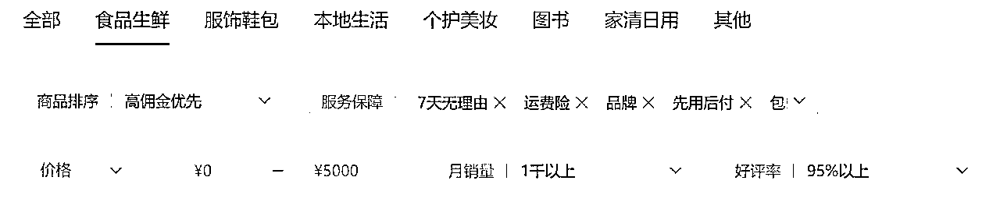
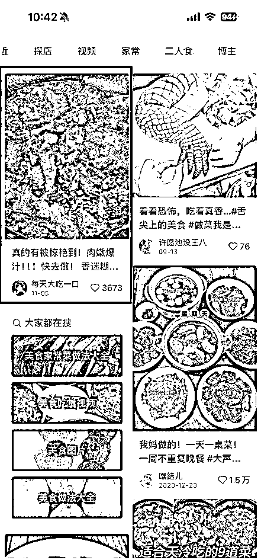
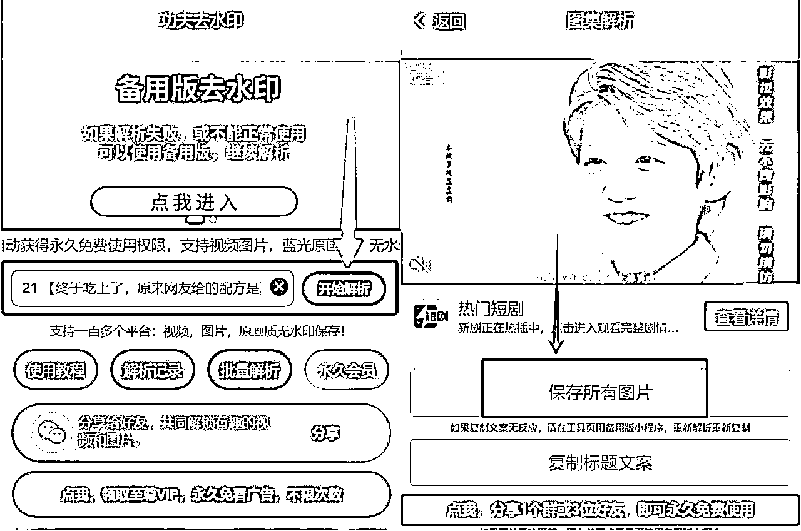

# 12月/航海/小绿书带货/实战手册

> 来源：[https://ocn93f5d9olj.feishu.cn/docx/ZMcldZIYUoutmQxK6ItcOaHsn5g](https://ocn93f5d9olj.feishu.cn/docx/ZMcldZIYUoutmQxK6ItcOaHsn5g)

# 防失联+MM188166M（李李）长期更新频繁+备用V:MG10127

手册出品方：生财有术团队

出品时间：2024 年 12 月 2 日

手册使用说明：内容出品人排名不分先后。本文旨在向你展示一个项目的更多可能性，帮助你更好地理解和实操。

建议：如果需要快速定位到精确内容，可以使用快捷键 Ctrl + F/command + F 的形式，搜索「关键字/词」，查找你想要的内容

# 写在前面：

# 💡

欢迎大家来到 12 月航海 | 小绿书带货 | 实战手册，相信在接下来的日子里，我们将见面很多次。

在开始做小绿书带货项目之前，我们先来解决几个问题：

1）小绿书带货是什么项目？现在做，有多大机会？

小绿书，是微信公众平台推出的一种【图片＋文案】的内容发布形式，在公众号后台发布文章时，选择“图片/文字”就是小绿书，在图文中插入商品链接，就可以实现小绿书带货。

变现方式除了图文带货，同时还有流量主收益（需满 500 粉），一鱼两吃，或者有私域产品的也可以通过小绿书做引流。

小绿书带货项目近期平台调整变化很多，说明这将是微信生态接下来要重点发展的方向。（微信一直想做自己的电商）

但最近流量处在低迷震荡期，有单篇爆款带货佣金上千的，也有熬了一个月没有爆的都很正常。航海期间很可能会没有爆款和出单。

因此，建议大家从一开始就抱着【在平台调整阶段/项目初期尽早入局，但不一定能拿到结果】的心态，把它当做一个长期项目，至少坚持日更满 1 个月，提升内容能力，蓄势待发。

先拿到“入场门票”，抗住周期，才能赚钱。

2）什么样的人适合做小绿书带货？

✅有公众号爆文经验、小红书图文带货经验的更容易拿结果

✅希望找个长期副业，愿意承担做一个月没有收益的风险

最后，希望大家可以在这次航行里收获成果外，结识一群战友。

以下内容由生财有术联合圈友制作而成，仅供航海船员以及生财有术星球圈友学习使用。由于小绿书带货项目变化较快，所以手册中部分内容可能会过时，请大家持续关注最新动态，开船后多在群里交流，紧跟平台最新趋势。

# 一、【项目概述】了解小绿书带货项目

# 💡

# 章节概要

本章节中，我们将一起逐渐认识小绿书带货项目。

小绿书本质上是微信公众号的一种新形势，那么它目前现状和前景如何？有什么特点？新手怎么入门？……这些，都是我们在本章节中会解决的问题。

本次航海的重点，就是告诉大家如何从 0-1 跑通小绿书带货项目。

那么对整体的项目概况了解是必不可少的，一起来了解一下吧。

# 1.1 什么是小绿书？

# 1.1.1 小绿书介绍

什么是小绿书？

小绿书，是微信公众平台推出的一种【图片＋文案】的内容发布形式，在公众号后台发布文章时，选择“图片/文字”就是小绿书，在图文中插入商品链接，就可以实现小绿书带货。

小绿书在哪里可以看到？

目前只能通过手机中的服务号+小绿书底部推荐+订阅号中找到部分小绿书。

服务号：主要展现企业版小绿书，也存在个人版小绿书。

底部推荐：每篇小绿书底部均会展现相同领域的小绿书。

订阅号推荐：订阅号中可以刷到部分小绿书，无法主动搜索到小绿书。

服务号与订阅号的区别在注册方式与流量导向。

小绿书的特点如下：

1.

使用公众号的流量资源：使用公众号的推荐算法、排版设计、推送机制。

2.

适用公众号的爆款逻辑：信息增量+情绪传递仍然是小绿书运营中需要关注的。

3.

适用公众号的运营规范：适用相关的运营规范，小绿书中可能遇见的违规问题在下文中详细阐述。

《微信公众平台运营规范》：mp.weixin.qq.com

《微信公众号推荐运营规范》：mp.weixin.qq.com

《公众号流量主运营规范》：ad.weixin.qq.com

《外部平台侵权投诉指引》：mp.weixin.qq.com

# 💡

小贴士：

1.

小绿书目前并无设置“原创声明”功能，并不意味着可以侵权，仍然需要合规运营。

2.

小绿书特别适用《外部平台侵权投诉指引》，尤其是针对外部平台抄袭、搬运投诉。

3.

小绿书仍然监管严格，禁止出现违法、违规内容，尽量少出现非官方的广告引流。

内容来源：小绿书带货万字精细化操作变现指南@越越

# 1.1.2 小绿书与小红书的差异

小红书与小绿书的呈现很类似，参考下方图片：

表格中列举了小绿书与小红书两者的具体差异：

内容来源：小绿书带货万字精细化操作变现指南@越越

# 1.1.3 小绿书的现状与趋势变化

最近【小绿书带货】的风很大，市面上培训产品此起彼伏，原因是这段时间微信一直在调整内测：

8 月微信开启了小绿书灰度测试

9 月微信闭门大会重点提到了“小绿书”板块

10 月新增流量入口搜一搜

10 月底个人可以开通服务号

11 月留言区开通植入商品链接功能

……

这些举动，说明小绿书大概率将是微信生态接下来要发展的重点方向之一。虽然短时间内因平台调整导致流量不太稳定，但长期来看，依然是个非常不错的信号。

有速度快的圈友已经跑出了很不错的成绩，单篇爆款带货能赚1000＋；但最近更多的都是熬一个月也没爆的情况。

⚠️目前疯狂搬运爆款的野蛮生长期基本已经过去，官方开始进行规范化调整，很可能到 12 月底都会处在流量低迷期，很多都是熬一个月都没有爆也很正常。

建议早期入局的圈友调整心态，保持正常日更节奏至少 1 个月起，重点提升自己的优质内容创作能力，蓄势待发，熬过周期，未来的你一定会感谢当下努力的自己~

# 1.2 小绿书的核心玩法

# 1.2.1 小绿书有哪些变现方式

小绿书的变现形式包括：

底部流量主：满500粉就可以开通，可以跟带货同步来做

底部橱窗带货：视频号缴纳100元保证金开通橱窗功能，公众号绑定视频号即可

评论区带货（新增）：没有粉丝要求，不需要视频号橱窗，发布图文爆了之后，在评论区放商品链接即可

引流私域变现：更适合 IP 玩法

本期航海，我们主要带大家做的是“橱窗带货玩法”，方法基本都是通的，大家掌握后，同样可以开通流量主获取收益、或尝试引流变现。

内容来源：小绿书带货万字精细化操作变现指南

# 1.2.2 小绿书带货怎么玩

首先，小绿书属于公众号下的一个新功能，适用公众号爆款逻辑，而公众号爆不爆有些玄学，有坚持日更一个月不爆的，也有大爆后掉出流量池的，所以建议新手准备至少 2 个号。

小绿书带货项目0-1的关键路径为：

确定赛道 > 搭建账号 > 开通带货功能 > 选品 > 找对标 > 搭建对标库 > 制作并发布带货图文 > 复盘优化 > 成交

实操过程中，找选品、对标、搭建素材库、制作并发布带货图文，是本项目的关键动作。

关键动作一：选品

选品主要在视频号选品中心/微信小店，大家可以参考视频号带货爆品、或中老年热门赛道、或小红书带货爆品，多多尝试，遵循“实用＋特色＋猎奇”的选品标准。品选得好，阅读量个位数也能出单。

关键动作二：找对标

选好赛道后，可以在小绿书、小红书找爆款对标，重点关注并拆解小绿书对标账号和爆款，因为小红书和小绿书人群还是存在一些差异，完全照搬小红书不一定能出爆款。

前期一定要多花时间找对标，养成找对标积累素材的好习惯，很多人自媒体做不下去就是缺选题缺素材！每天找 5-10 个左右，把数据进行整理，并关注对标账号，发文会收到通知。

小绿书项目变化很快，只有每天刷对标，才能及时掌握近期爆款内容和选品，知道什么样的内容可能会爆、什么样的品能出单，不会因为自己的胡思乱想失去方向。

关键动作三：制作并发布带货图文

参考对标爆款，原创或二创优质的图片和文字内容，建议控制在10-500字以内，太长影响卖货。

不要过度依赖AI用具或搬运，平台已经开始打击劣质/搬运内容，注意提高自己的内容创作能力。

# 1.3 小绿书爆款&出单的底层逻辑

# 1.3.1 爆款逻辑（流量推荐机制）

小绿书遵循公众号爆文的流量推荐逻辑，关键是：信息增量+情绪传递：

清晰明了：封面图、主图清晰明了，一张图尽量只表达一个观点。

突出重点：重点内容采用特殊字体、字号、颜色进行重点标注强调。

解决痛点：解决实际问题，选择攻略、情感等与生活密切相关的领域。

满足痒点：图片、标题、正文部分需要与生活、金钱、人性密切相关。

合法合规：禁止出现暴力引流、低俗色情、过度营销等违法违规内容。

公众号流量推荐逻辑，具体可以点击查看：《9月航海 | 公众号爆文（自动化原创）| 实战手册》章节1.3-推荐机制

注意：目前小绿书平台推荐流量不太稳定，存在概率问题，需要多找对标、多发多测，出爆款后使劲怼。

# 1.3.2 出单逻辑（选品）

目前小绿书比较热门的选品，比如：养生、宝妈育儿、图书、美食……整体跟视频号热门选品还是比较契合的，选品核心是实用＋特色＋猎奇。（不建议完全照搬小红书爆款，要看公众号推流的赛道）

大家可以借鉴视频号爆款，以及小绿书爆款对标账号，来进行选品。对于新手来说，抄对标是最快的。

目前小绿书出单带货还没形成规模化，还处在比较初期，可以多多尝试，多去选品和测品。

业内还有一个测试结论，不一定准确，大家可以参考：

流量主有流量的内容和定位，带货有带货的内容和定位，二者不完全一致，不建议同时做，这样收益会比较少。

可以发流量主小绿书图文（不带商品链接），图文爆了之后，再在评论区放商品链接。

# 二、【实操1/3】确定赛道&学习选品

# 💡

# 章节概要

了解完小绿书带货项目的整体情况后，我们就要正式开始启动了。第一步就是选择适合自己的赛道，同时掌握选品技能。

小绿书带货，对于大多数人，需要坚持日更至少 1 个月，才能逐渐有流量，所以不建议轻易换赛道。

接下来我们就来看看，如何选赛道&选品。

# 💡

# 本章航线图

完成本章节的学习和实操，即可完成航线图的第一阶段：确定赛道，完成准备工作（约 3-5 天）

1.

选择 1 个带货赛道，确认账号定位（约 30 分钟）

2.

掌握选品思路和技巧，至少选 2 个品（约 1 天）

那么现在，就请开始完成准备工作吧。

# 2.1 选赛道&账号定位

# 2.1.1 如何选择赛道

因为小绿书跟公众号一样，是个长期项目，所以选择一个适合自己的赛道，也非常重要。对于新手来说，建议优先考虑：感兴趣的、擅长的。

赛道选择标准参考：

1.

做跟自己业务相关的

比如你是做减脂减肥的，做国学的，美容的，都可以去尝试。

有些品类做不了，因为自然流量跑不出去，行业内卷严重，一般表现为平台推的广告（花钱才有流量）

有些品类，是灰黑产的，什么祛痘，美容，玄学的，平台重点打击，搞不了。

其他的正规的方向，做职场规划，学科资料，闲鱼电商等等类似的，都可以结合自己的受众人群和产品端，去搜关键词，找到自己的个人定位。

2.

做自己擅长的

你擅长的领域，可能就是跟你的身份，兴趣，职业等这些相关的，比如历史，地理，讲故事，聊家庭，找准你的核心优势和你的擅长点。

3.

做自己感兴趣的

一定要感兴趣，不感兴趣你做着没感觉，也积累不起来，感兴趣就会事半功倍。

4.

做细分的

不要做特宏大的主题，一会这个，一会那个，一定要细分下去，主题的细分，人群的细分，然后二者组合起来。

举个例子：

上班族 快速做饭，好上手

减肥的 减肥减脂，健康

宝妈 营养，小朋友爱吃

美食 地方特产 特色

# 2.1.2 如何做账号定位

前期一定要把定位搞明白，到底这个账号定位是什么、垂类选题怎么做，不然一会儿给你流量了，你都不知道怎么赚钱。

美食，养生，家居、运动……等等，这些定位都可以去做，但是一定要垂直，一个定位能先稳定频次更新至少半个月以上，才能看到结果。

这个过程，要主动反馈，寻找问题，及时调整，不要每天拿很低质的内容去发，还是公众号的那个逻辑，内容质量很重要，及时调整很重要。

内容来源：小绿书补充部分@辰风

# 2.2 热门赛道推荐

下面是目前大家测出来，能够拿到流量的赛道和品，供大家参考：

（新手可以考虑从养生、美食、读书这些领域开始）

# 赛道

也有圈友在电脑端选品中心，拉取商品相关数据，进行本地分析后，得出以下排行，供大家参考：

拉取的数据有：店铺名称、商品名称、商品价格、商品佣金、佣金比例、商品评分、商品评分等级、商品销量。

根据大数据分析：佣金率最高是图书，销量最高是食品生鲜。

通过次幂数据里推荐的爆文品类，如果按小绿书爆款账号来看，排名前 6 名如下：

下面是小绿书 15 类热门账号及内容方向参考：

（数据来源：https://mp.weixin.qq.com/s/F62oHVSVmGV3ZJnqoJ2nuQ）

大家可以结合多方信息参考，以及个人兴趣特长，选择一个适合自己的赛道，坚持很重要。

# 2.3 选品的方法

# 2.3.1 选品的核心逻辑

# 找对标快速跟品

对于新手来说，最快的入门方法就是在确定账号定位之后，在小绿书/小红书，找爆款对标账号，然后跟品。一定要多刷！（找对标的方法详见【4.1.1 怎么找对标】）

根据前期的实验结果来看，选择以下领域，可以适当减少违规风险，以及美化数据。

可供小绿书选择的领域有:

娱乐、教育、情感、健康、家居、人文、历史、时尚、美食、搞笑、星座、旅游、摄影。

可供参考的小红书中的领域:

教育、美食、穿搭、彩妆、影视、职场、情感、家居、游戏、旅行、健身。

如果暂时没有确定你想带的品的关键词，可以去小红书官网（地址：https://www.xiaohongshu.com/），点击搜索框下面的【领域】，直接获取对应领域下的帖子。

比如，你想带书籍类，但不知道带哪本，一看，可能是《遥远的救世主》排名比较高，就可以去选这个品试试。

目前在小绿书带货比较好出单的品有个特点——高复购低客单，价格在100元以下，比如美食-红薯、好物-洗衣液……等，新手可以从这些常规品入门；同时注意提升选品能力，逐渐去挖掘一些【实用、特色、猎奇】的差异化品。

高复购低客单

100元以下，多试试9.9/19.9~59.9

性价比

差异化

一些比较好出单的新奇特爆品举例：

这个品就很新奇，容易吸引人点进去看，满足人们的猎奇欲望，测试期间出了 13 单。

诸如此类的还有这一款，首先主图+标题，就非常吸引人眼球，从而引爆流量。

# 掌握选品底层逻辑

如何提升自己的选品能力？多做爆款的拆解分析，掌握选品的底层逻辑👇

选品最重要的三要素是什么？

人群、类目、价格。

在微信生态选品的底层逻辑：

先确定一个自己想要做的目标用户人群

找这个目标用户人群他们的需求

然后细分类目，根据各种方法找到匹配高的产品

差异化选品，比如跳绳、插排、毛笔……主打一个“意料之外”

我们其实也可以参考视频号带货的热门选品：

食品类： 生鲜产品、地方特产、滋补功效品、俄罗斯食品、梨膏糖

书籍类：国学书籍、健康养生、名人传记、婴幼儿绘本等；

服饰类：大码女装、头饰发饰、围巾丝巾、脚链等；

家居百货类：房子防水材料、防水产品、面条机、老花眼镜、定时提醒的药盒、老人购物车、老人防走失用品、穿针器、拐杖、广场舞音响、老人收音机等；

绿植类：绿萝、绣球、兰花、营养液、营养土、种植铲、种植围栏

百货类：收纳盒、收纳柜、厨房好物、卫生间好物

美护类：洗发水、发膜、乳液、洗面奶、面膜

运动户外：运动拉伸用品、运动汗巾、运动护腕、户外渔具鱼饵鱼钩

其他：老人手机、多功能护理床、三农工具

完整的视频号选品逻辑，可以参考：《6月航海 | 视频号带货 | 实战手册》章节2.1-选赛道的方法~章节2.2-选品的方法

# 2.3.2 选品操作流程

选品前请先开通带货功能，详见【3.4 开通带货功能】

# 手机端选品流程

路径：打开手机视频号 - 管理橱窗 - 去选品 - 选择一个品点击“加橱窗”即可。

可根据选品中心的畅销货品进行选择小红书内容，也可以根据热门小红书选择畅销货品，前提是内容与商品高度相关，能够解决读者的痛点或者满足爽点。

按照显示的条件进行筛选，选择符合自己的小绿书的商品，优先选好评率高、支持七天无理由、销量高、佣金高、店铺评分高的。

新手不知道怎么选品的话，可以直接按榜单来选：

类目前列基本为畅销领域，直接加橱窗即可：

添加商品后，后期可在下图中进行管理查看：

# 电脑端选品流程

路径：电脑打开视频号助手网址 - 登录已开通带货权限的微信账号 - 进入选品中心 - 按需求筛选。

（视频号助手网址：https://channels.weixin.qq.com/login.html）

同样的，好评率高、支持七天无理由、销量高、佣金高、店铺评分高的商品往往会受欢迎。

可以直接在选品中心，进行条件筛选，比如：高佣金优先，支持七天无理由、运费险、品牌、先用后付、包邮等等。

# 2.3.3 选品推荐

根据次幂数据推荐的爆文品类，得出目前比较火的选品如下：

美妆类，集中在国货不知名美妆，平均客单价为43元。

其他像美食、家居百货类目的二级分类，无明显重点区分，可根据平台的人群喜好推品，平均客单价为53元。

你也可以自行去看对标、分析对标。

查找公众号对标账号的方法：用已被折叠服务号的手机找，目前内测主要是安卓机为主。

内容来源：小绿书如何写出多篇10w+、不到一个月赚到1万多？

# 2.3.4 选品避坑

选品的时候，注意鉴别这个商品背后的商家质量，遇到不靠谱的商家，出了单迟迟不发货就很难受了；可以优先选销量高、评分高、店铺品类相对聚焦的。

如果有认识的靠谱货源，也可以直接挂对方的微信小店商品，或者上架到自己微信小店。

这里理出几个微信平台选品必须要避开的坑：

中医、医药类相关的选品，不能上（医药类在任何平台都是严打）

评分低的商家尽量别选，各种问题导致用户退款率高，出单了也是白忙活；

选好品了，结果选品中心没有怎么办？可以对接做后端店铺的人合作。

内容来源：小绿书带货万字精细化操作变现指南

# 三、【实操2/3】完成至少 2 个公众号搭建

# 💡

# 章节概要

前期准备工作，除了选择适合自己的赛道，还要【准备账号＋开通带货权限】。

对于新手来说，建议开通至少 2 个账号，来对抗流量的不确定性，避免打击项目信心。

# 💡

# 本章航线图

完成本章节的学习和实操，即可完成航线图的第一阶段：确定赛道，完成准备工作（约 3-5 天）

1.

完成至少 2 个公众号的搭建&包装（约 30 分钟）

2.

开通账号带货功能（约 15 分钟）

那么现在，就请开始完成准备工作吧。

# 3.1 注册公众号

注册公众号前，建议先确定账号定位（详见【2.1 选赛道&账号定位】），因为注册过程会填写公众号名称，而个人公众号一年只可以修改两次名称。

# 3.1.1 选择公众号类型

公众号目前有 3 个类型：

1.

个人订阅号：个人就能开通，每天可以群发通知 1 次（发文次数不限）；

2.

个人服务号（推荐）：10月底新增的功能，也是个人就能开通，一个月只能群发通知 4 次（发文次数不限）；

3.

企业服务号：需个体工商户资质or企业资质，一个月只能群发通知 4 次（发文次数不限）。一个个体户可以注册 2 个公众号（订阅号和服务号都可），一个人可以办 5 张以上个体户营业执照；一个企业可以注册 50 个公众号（订阅号和服务号都可），但一次只能注册5-10个，需要分批申请提升数量。

首先要强调的是，不管你是什么主体、注册的什么账号类型，只要内容优质，都会有流量。但涉及到小绿书带货，更建议注册服务号，因为服务号被折叠后，整个推荐流有倾斜给到小绿书。

因此，对于个人新手玩家来说，比较建议注册个人服务号。还有一个原因是 10 月底腾讯调整了规则，个人也可以开服务号，说明平台在降低门槛鼓励更多人去做小绿书的，我们可以顺应平台变化；同时个人服务号不需要任何资质认证，开通非常简单。

详见：微信服务号功能更新及介绍

# 3.1.2 准备身份证＋配套银行卡

对于新手来说，建议准备 2 个公众号。

准备 2 个号，一方面是用于规避账号违规风险；另一方面主要是为了对抗不确定性，当你 1 个账号迟迟没有流量时，你不会因为只有 1 个账号而陷入深深的自我怀疑。

注意：1 个身份证及其配套银行卡，只能注册 1 个公众号。

也就是说，个人只能注册 1 个订阅号或个人服务号（除非你是个体工商户/企业/其他组织 可注册 2 个账号，政府和媒体可以注册 50 个）。

注册 2 个号的话，可以借用下家人的身份证就行。

# 3.1.3 完成注册

注册方式：

方式一：微信扫一扫「服务号助手」小程序二维码

方式二：微信内搜索「服务号助手」

实名验证：

个人服务号在部分环节需要进行实名验证，例如：

已关注用户数达到1万；

开通带货、付费、赞赏、流量主等功能时；

进行账号迁移时。

建议大家注册完就去完成实名验证，以免影响功能使用。

实名验证路径：登录微信公众平台 → 账号信息 → 账号详情 → 主体信息 → 详情，如下图。

# 3.2 装修账号

可以参考公众号的账号包装，也可以参考可参考小红书中博主昵称，并不复杂，主要涉及：账号名称、简介。

对于大部分新手来说，选取一个好记、并且和自己做的领域相关的名称和简介即可。

对于深耕本赛道的圈友来说，账号包装也可以涉及公众号 SEO，并非本次航海重点，所以这里就不展开说了。

有余力的圈友，可以看下圈友 @郭耀天 的这篇公众号 SEO：《最新公众号 SEO 核心玩法，自动引流躺着赚钱》

# 3.3 功能学习

# 3.3.1 编辑页面学习

使用管理员微信扫码登录账号后台（后台地址 https://mp.weixin.qq.com/）

点击首页中的“图片|文字”选项，进入小绿书编辑页面：

以上内容属于小绿书发表内容，以下内容属于细分操作，请仔细阅读。

添加超链接，操作如下：

上传图片及在线编辑图片，支持多选上传：

# 3.3.2 图片水印功能

为了微信公众账号得到更好的推广，获得更多的粉丝关注，目前在微信公众平台上传图片时，会默认显示水印，该水印内容会显示公众账号的微信号ID或公众号昵称，水印支持设置显示微信号或昵称，同时支持取消。

水印设置方法：登录公众号，点击【设置与开发】->【公众号设置】->【功能设置】->【图片水印】->【设置】

微信公众号上传图片时，需将图片上传至服务器方可显示图片水印（须点击“图片”按钮进行上传，如下图），若直接将复制的图片粘贴至正文内容，图片则不会显示水印。

# 3.3.3 隐私设置功能

登录微信公众号，点击【设置与开发】->【公众号设置】->【功能设置】->【隐私设置】，点击隐私设置选项卡的设置即可。

设置禁止用户通过昵称搜到该账号后，粉丝通过公众账号的微信号和扫描二维码还是可以搜到该账号

设置成功，半小时后即可生效

可避免被同行搜索

内容来源：小绿书带货万字精细化操作变现指南@越越

# 3.4 开通带货功能

先说说开通小绿书达人带货功能的好处：

不需要自己运营店铺，只进行选品上架即可。

不需要负责售后服务，不需要负责发货服务。

不需要负责提供客服咨询，不需要把关质量。

支持多店铺商品上架，支持手机客户端操作。

橱窗带货无粉丝数限制，联盟带货需要公众号100基础粉丝。

结合微信生态，资金、售后、服务有安全保障。

支持小绿书与带货商品结合发布，同时赚取流量主、卖货分佣。

根据微信官方开通指引，我们需要准备与公众号账号认证一致的管理员微信视频号（认证管理员是指公众号注册主体，即公众号注册主体与微信视频号主体一致。）

因此，开通达人带货需要满足以下条件：

注册微信视频号（与公众号管理员同一个微信）

开通视频号橱窗功能（需¥100保证金）

视频号绑定公众号

具体步骤如下：

# 微信视频号注册认证

未注册视频号的用户可以根据以下流程进行：

打开微信视频号：

请完成视频号实名认证：

请根据实际经营主体信息进行填写，该认证信息做后续提现账户信息校验使用，即提现所使用的银行卡主体需与此处认证主体信息保持一致，且认证后认证信息暂不支持进行修改。

即收款账号实名认证信息需要与视频号认证主体一致。

# 开通达人橱窗功能

先在公众号后台 - 收入变现 - 带货，开通联盟商品功能：

视频号橱窗带货本身无粉丝数限制，但开通联盟商品可能需要公众号粉丝＞100

在视频号中的创作者中心开通达人橱窗：

再次进入选品中心，继续完成橱窗开设。

开设联盟账户后，可能会出现粉丝数大于100的要求。

# 账号互绑

将公众号与视频号相互绑定，特别注意：

所绑定的公众号主体需要与视频号主体一致，视频号管理员可以修改（一年五次）

一个实名主体可以注册两个视频号，前提是视频号所对应的微信主体要一致，即需要同一个身份证号注册。

视频号管理员修改前需要结清所有资产：

绑定完成后，就可以按照选品流程，在选品中心进行选品→在文章里插入商品小卡片进行带货啦。（选品详见【2.3.2 选品操作流程】）

内容来源：小绿书带货万字精细化操作变现指南@越越

# 四、【实操3/3】每天发布 ≥5 条带货图文

# 💡

# 章节概要

完成所有准备工作后，我们来学习下如何发布带货图文。

新手谨记：

1.

还没坚持日更 ≥1 个月，先别谈流量，别动不动怀疑限流

2.

模仿是新手最快的学习方法，记得每天刷对标

3.

注意积累对标素材库，源源不断的素材对日更很重要

图文编辑非常简单，影响数据的关键因素是这三个：

标题

首图

选品

注意：先完成，再完美。一定要尽快发布作品，再慢慢迭代优化，前期发布量很重要。

# 💡

# 本章航线图

完成章节 3.1 的学习和实操，即可完成航线图的第二阶段：制作并发布带货图文（坚持≥1个月）

1.

找到至少 1 个对标账号（约 0.5 小时）

2.

拆解至少 2篇对标爆款图文（约 0.5 小时）

3.

根据所选类目，搭建对标库（约 1-3 小时）

4.

模仿对标爆款二创，发布第一篇图文（约 20 分钟）

5.

利用 AI 提效怼量，日更 >5 篇图文（约 1 小时/天）

接下来就开始制作发布你的第一篇图文作品吧~

# 4.1 找爆款对标

# 4.1.1 怎么找对标

找对标可以从小红书、小绿书来找。找到后可以参考对标进行二创，千万不要搬运，平台已经开始打击直接搬运的低质量内容和账号了。

小红书找对标的方式：

查找目标：找到低粉爆款的账号

参考类目：教育、美食、穿搭、彩妆、影视、职场、情感、家居、游戏、旅行、健身。

方式一：主页刷

1.

根据类目关键词，在小红书主页搜索（比如“美食”）

2.

选择细分赛道（比如“家常”）

3.

找到发布时间临近的爆款笔记（点赞过千）

4.

点进主页确认是否为低粉爆款，是的话可以对标（粉丝量过高的爆款的可参考性没那么高）

5.

坚持刷同一类目，刷多了之后，主页会自动推荐该类目下最新爆款

方式二：灰豚数据后台

笔记查找- 笔记榜单 - 低粉爆文榜 - 美食 - 图文笔记 - 时间选近24小时/3天/7天都可以。

（灰豚需要开通会员使用，效率比方法一高，可以根据个人需求选择）

小绿书找对标的方式：

查找目标：找到低粉爆款的账号

参考类目：娱乐、教育、情感、健康、家居、人文、历史、时尚、美食、搞笑、星座、旅游、摄影。

方法一：刷推荐

6.

确定好自己的赛道，比如美食

7.

微信搜索“美食”找到一篇美食类小绿书，或自己发一篇，点开后往下滑，就会刷到很多同类型https://mp.weixin.qq.com/s/KzuNahlbDz_Dwz3FbukDRA

8.

选择右下角阅读量高的，点进去看账号其他内容，如果有个别几篇数据非常好，但大部分数据较低，说明是低粉爆款，可以对标

方法二：次幂数据后台

爆文素材 - 低粉爆文 - 领域选择小绿书 - 账号注册和发布时间选就近。

（次幂数据后台需要买会员才能使用，领域不能多选，且没有导出功能，可以根据个人需求购买）

# 4.1.2 怎么拆解对标爆款

小绿书爆不爆的关键，主要是封面、标题、其次才是正文。

# 封面拆解

高点击率封面的核心秘诀是什么呢？

要么美到窒息，要么关键词直击心灵，要么让人好奇到不行！总得占一样吧。

另外，高点击封面都有个共同点——素人感。就是说，别太营销，要像真实用户随手分享的那样！有时候，粗糙点、表情包封面也能火。总之，就要看起来没有那么强的营销感，看起来像是一个用户在分享。

封面的尺寸为 3:4，分为无文字封面、有文字封面：

无文字封面

清晰度要高，颜色凸显，主题明确与标题呼应，图片好看or奇特，能引发好奇心（美食类都是展示诱人食物的图片）

有文字封面

字数要少，标题要简单，关键词明确，颜色凸显，字体要大，能够在一张图中展示完全。

再给大家展示几个案例感受下：

书籍类：

1、封面补充标题的不足：标题述说总结性内容，而封面展示内容更具体。

2、增强标题的说服力

3、封面和标题用已经爆过的宽泛大多笔记都能用的文案。

产品-书籍《刚刚说过》

产品-书籍《人间小满》

养生类：

1、封面补充标题的不足：标题述说总结性内容，而封面展示内容更具体。

2、增强标题的说服力

3、封面和标题用已经爆过的宽泛大多笔记都能用的文案。

产品-泡脚粉

产品-茉莉花茶

产品-蒲公英菊花决明子茶

产品-黄芪党参豆浆粉

美食类：

美食类都是展示诱人的食物图片，无任何文字。重点用首图吸引用户点击。

产品-黄油手抓饼

产品-黑猪肉火腿

产品-红烧肉调味料

# 标题拆解

标题的关键要素：

性、金钱、权利、反差、悬念、对比、数字。

标题的 2 个格式：

情绪＋目标人群＋技巧

问题＋结果＋解决方案

标题格式

具体解释

适用品类

标题举例

情绪+目标人群+技巧

情绪：在标题中表达情绪，让标题更具有冲击力；

目标人群：寻找目标人群的痛点，即是看对方缺少什么，一个人越缺少什么，他就会越关注什么。

书籍类

求求你们了（情绪）！不要再对孩子说“你必须这样”（事件+技巧）

你永远（情绪）玩不过（事件+技巧）一个读了xxxx的女孩

美食类

讲真！女孩子一定要多吃这个！巨巨巨好吃！

答应我‼️有烤箱的都去试试这个红薯烤蛋奶

养生类

懒的背后是虚!女生一定要会补的气血方法

问题+结果+解决方案

问题：提出有冲击力的问题，引起人思考；

结果+解决方案：给出解决方案，同时留有悬念，引导用户点击进笔记。

书籍类

如果觉得生活熬不下去，就读读这本书吧！

美食类

冬天怎么少了白菜？？分享九款白菜做法！

4~13分钟水煮蛋大测评！你喜欢吃煮几分钟的蛋？

养生类

早上空腹喝水=吃细菌⁉️这3种喝法真的伤身‼

下面总结了一些各领域爆款标题案例，给大家感受下：

文旅类

1、四川被严重低估的冷门古镇

2、我很少用震惊形容一个地方

3、去北京玩了五天，我的消费观真的崩塌了!

4、比起婺源，我更喜欢这个不要门票的千年古村!

5、《黑神话》山西取景地，从第一个就开始震撼了!

6、无意闯入了电视剧里的仙侠世界...

7、来北京，看这一篇就够了!

8、徐霞客没骗我向比起黄山，我更推荐爬这座山

9、江西上饶:探索国家地理推荐的小城魅力

10、朋友圈都问疯了!这里真不是国外

职场类

1、在国企央企中，只有两种人可以往上爬

2、央企国企里，混得好的可能是一群戏子

3、同事之间，说话请带点脑子!

4、职场里的女生一定要学会装!

5、“哇塞”女孩接得住话才能接得住机会

6、有点脏但很挣钱的8种工作

7、为什么你没有领导气场?

8、领导最看重的，并不是工作能力

9、【职场真相】6年摸爬滚打，我悟出了这个秘密!

10、和领导再熟，这些话也千万不要说

美妆类

1、这是天选爱豆吗?暴汗妆解析~

2、露思宝贝的新剧又美出新高度了哎!

3、为什么有的女生一看就很贵?

4、黑色短发+复古红唇=港风绝杀!

5、终于明白为什么富豪狂追她四年了!不标题党!李小冉真的赢麻了…

6、宋雨琦16岁-24岁妆造风格变美思路

7、20+、30+女孩如何变美?抓住这7个关键点!

8、适合普通人的变美思路!

9、你不知道的，30个去黄的冷知识!

10、明星们最爱的面部抗老5个好习惯!越来越美!

育儿类

1、人民日报:孩子最渴望听到父亲说的5句话，你有说过吗(建议收藏)

2、妈妈是吗性格，孩子就什么命，这三种妈妈最可怕

3、孩子不出色，跟父亲关系很大

4、弘一法师:少跟孩子生气吧

5、陪读六年我后悔了!千万不要浪费孩子的小学时间

6、“妈妈，别打我”，看完后你就不会再想打孩子了

7、【每日一育】家教是人生的底色，立规矩要趁早

8、1200句“彩虹屁”夸出内驱力!别人家优秀的孩子都是夸出来的

9、罗翔:父母的无边界感，正式孩子痛苦的根源

影视类

1、《天道》为什么禁播?

2、哈利·波特电影中唯一一个让罗琳落泪的布景!

3、你知道吗?甄嬛有3次向果子暗示双生子是他的孩子

4、这应该是是甄嬛传中，最让人觉得可悲的一幕

5、关于天道被禁15年的真相《甄嬛传》VS《如传》没有对比就没有伤害

6、新剧来了!看了预告就笑疯了!

7、救命!!这部剧的颜值太绝了吧!!期待

8、《玫瑰的故事》:追不到母亲追求女儿，他才是隐藏的“渣”王

9、鲨疯了!悬疑新剧!王宝强演恶人!

穿搭类

1、35岁+还让我忍不住偷拍的女人

2、你可以不够有钱，但不能看起来很廉价

3、经济下行，35+女性开始花钱而不是存钱了!

4、明明穿得很普通，但就是让人感觉很美

5、赵露思 许妍 一波职场丽人穿搭范本!吴谨言领证的私服释出，裙子百元很接地气

6、简简单单的搭配，普通的颜色也能穿出高级感!

7、王玉雯新穿搭，背心穿搭简单且帅气我家那闺女 朱旺旺 时髦打工人穿搭get~

8、40+女人的魅力 都融进这条连衣裙里了

美食类

1、常见的万能做饭公式到底是谁发明的这个吃法?

2、真的配享太庙破防了，这玩意真的巨巨巨掉秤!相信我，这真的比路边摊还好吃!

3、我爸做了十几年的配方，巨巨巨好吃!

4、讲真!!女孩子一定要学会煮这个!!

5、么噶!厦门烧烤有点太超前了吧!

6、感觉以前的土豆都白吃了

7、第一次去老丈人家，炫了100个饺子，这辣子绝了

8、听劝!立秋后这10样东西少碰!

成长感情类

1、50岁以后，才明白的人性铁律

2、弘一法师:要善待你的母亲，她下辈子不会再来了!

3、梁永安说:谈恋爱并不是亲一下抱一下，也不是频繁聊天，整天腻在一起，什么都不做，互相耽误，那是过家家

4、长期缺爱的女人身上有的9种表现，看看你身上有吗 ?

5、突然被这段话治愈了

6、男生很掉价的8个行为!!!

7、用好这些，人生就算是开挂了!

8、30岁，我用这5种管理表，从摆烂到无痛自律

9、复旦教授梁永安教你谈恋爱，太多金句引深思

10、爱人别超过四次

知识分享类

1、《红楼梦》最经典一句诗，说透人情世故逼自己背下来!

2、《西游记》6句顶级哲理，读懂已是中年人

3、贾平凹作品金句精选

4、刘震云《一句顶一万句》金句集萃(茅盾文学奖获奖作品)

5、中石油和中石化的区别，你会选择哪个?董宇辉推荐至少读三遍的八本书!

6、太治愈了，内耗就去读《我的外婆，从不内耗》

7、你的姓氏起源于哪个世家?

热点资讯类

1、荧幕与现实:霸凌现象的对比剖析《黑神话·悟空》里的《西游记》10句话

2、堪称封神!

3、我以为玩黑神话VS实际玩黑神话!

4、小鹏mona这价格，没救了!

5、大众终于妥协了，新车从23万跌至13.9万

6、真的很喜欢陈若琳:迷茫，不快乐时，我就会冥想

7、只要胆子大，理想造半挂

8、震惊世界的悲剧:深度还原印度女医生在医院内遇害事件，事件骇人听闻

9、全红婵告诉所有人的一句话:你再平凡也是人间限量版

10、巴黎奥运会后身价暴涨的运动员

总结：

1、穿搭和美妆类的标题直接体现面向的年龄层，容易圈住精准人群对号入座;

明星也是穿搭和美妆类的经典标题选择；

2、职场类的切入点一定要够具体，具体才能引发共鸣;

3、知识分享类要么分享的内容足够硬核或者普适，要么就需要借名人的力;

4、影视类找爆火的剧，找别人没有找到细节和切入点，找大家没有分享的观点;

5、美食类、运动类三大法则:懒人、低脂、场景化;

6、育儿类标题经典手法:制造恐惧;

7、成长情感类的主旋律:自尊、自爱、自律、自信、自强、自愈

8、文旅类标题关键词:宝藏、震撼、小众、低估、震惊、崩塌、国家地理、朋友圈问疯

# 正文拆解

内容结构主要有以下2种：

1.

目标人群法+场景设置法+产品核心卖点法。

重点适用类目为：书籍类。

根据目标人群的痛点，即是看对方缺少什么，一个人越缺少什么，他就会越关注什么。根据目标用户关注的事项，将具体场景作为笔记内容，营造合理的氛围与前提条件，激发用户的需求。

2.

目标人群法+干货知识法+产品核心卖点法。

重点适用类目为：美食类、减脂类、护肤美妆类。

有些品类是需要用内容，提升笔记的可读性和带给用户的利益点，让用户看到并了解产品卖点后产生购买行为。

下面给大家展示几个案例：

书籍类：

产品名称

爆款文案举例

《人情世故》

✨如何做一个懂人情世故的高手呢？

如果你在与人打交道和沟通的过程中，

常常吃亏，请认真读完这本书《人情世故》

✨这本书就像是一把钥匙，帮助我们解锁人际交往中的复杂密码。它教会我们如何在保持真诚的基础上，更加灵活和智慧地处理各种关系。

✨在这个充满变数的世界里，让我们通过《人情世故》这本书，学会更智慧、更灵活地与人相处，成为更好的自己。

《人情世故》

女孩，你的格局越大，身边的破事越少！

📮这本书中我最喜欢的就是这句：决定你的上限的不是你的能力，而是格局！你是永远赚不到认知以外的钱的，就算是靠运气赚到了，最后你也会凭自己的实力花掉。

✨大千世界芸芸众生，不同的人有着不同的命运，而格局则能左右我们的命运。格局并不是先天带来的，而是后天形成的。曾国藩曾说：“谋大事者，首重格局”格局是一种为人处世的姿态，是一种大视角看待人生。

👑一句我曾经的领导跟我说过的话，送给职场中的姐妹：“你把自己放在什么位置，就会做什么样的事情。”姐妹们把眼光放高一点，把自己的位置摆高一点。

减脂类：

产品名称

爆款文案举例

紫薯

“不装了，摊牌了，减脂早餐这样吃，给我瘦！！”

🥳宝子们呀，减脂期的时候早餐那可老重要啦！😎

✨给大家推荐个搭配哈：见图片

⚠️注意事项来喽：高糖高热量的食物咱可不能碰。早餐必须得吃，这可是开启一天代谢的关键呢。😃咱睡了一晚上，身体正急需能量补充，要是不吃早餐，代谢就变慢啦，那可就不利于减脂喽。💪所以呀，坚持好的早餐搭配，咱一起瘦瘦瘦，美美的迎接更好的自己。

另外推荐一款自己在吃的紫薯，我自己是比较喜欢吃紫薯的相对于红薯而言，糖分没有那么高吧，算是我的“常客”了

黄芪党参豆浆粉

女孩子学会这些自然就瘦了🔥

🍒女孩子自然而然变瘦很吸引人的，我们可以从多个方面入手

📝今天给大家整理了一些方法：

🌈减肥如何选择食物

🌈体重不断下降的小习惯

🌈每天边吃边瘦小妙招

🌈减肥期间情绪管理

努力让自己成为更好的人， 这比什么都重要

变瘦变美期间，最不能亏待的是自己，最不能落下的是营养❗️

我闺蜜一直在使用的这款黄芪党参豆浆粉🥛，很适合熬夜蜡黄、手冰脚凉、气血不足姐的妹🍒

堪称女神浆豆粉！！每天一杯，脸红色润，气越色来越好 药食同源 无蔗！糖无香精！色无素！👍补气养，血改善掉发，容美养颜

口感细腻香！醇丝滑！甜而不腻！都是对女好性的食材 脸暗色黄、姨妈量少的姐妹们，定一要安起排来

无绳跳绳

世界公认的间歇跳绳减肥法，跟练一个月后惊人变化！！

世界公认的最牛跳绳减肥法，一开始我也半信半疑，但是跟练一个月后，我的身体出现了惊人变化！！😱

跳绳的过程中，身体的脂肪在燃烧，心肺功能也得到了极大的提升。💪它的间歇模式，让减肥不再枯燥，还能加速新陈代谢。

😖虽然在实行的过程中会有点累，每一次快速地跳跃，每一组高强度的动作切换，都会让身体感受到明显的疲惫，汗水不停地流淌，呼吸也变得急促起来。但是只要咬咬牙坚持下来，你就会发现效果真的超级棒！💪原本松垮的肉肉逐渐变得紧实，身体线条开始变得优美，精神状态也越来越好，整个人焕发出自信和活力，仿佛重获新生一般！

美食类：

产品名称

爆款文案举例

盐焗粉

巨巨巨好吃，求你们去做！隔壁小孩都馋哭了!

鸡腿🍗这样做太好吃了！

盐焗鸡腿肉！一口就停不下来了！

做法简单，干净卫生！

食材：鸡腿

做法如图所示！

同款盐焗粉点击下方链接购买！

手抓饼

十分钟搞定早餐：葱花火腿鸡蛋软饼，超简单

这个鸡蛋软饼真的很好吃，做法还特别简单，而且不容易失败，可以单吃，或者卷菜，软乎又劲道😋

做法👇

1.

250克中筋面粉，500克清水，鸡蛋2个，火腿肠 葱花切碎，盐 鸡精 五香粉少许。

2.

先把面粉和鸡蛋搅拌成糊糊，再加入火腿碎和葱花搅匀，最后倒入清水，加盐和鸡精五香粉调味。

3.

平底锅加热刷一层油，倒入面糊后马上转动锅摊平，等表面凝固起泡边缘微微起焦后翻面继续煎一分钟即可。

♨️♨️

面粉和水的比例是1:2。 面糊下锅后要马上转动锅底摊开，速度要快，否则定型后就推不开了。

全程用中小火，摊好一个饼大约两分钟左右。

给孩子吃的时候火腿我换成了这款~

养生类：

产品名称

爆款文案举例

黄芪豆浆

看掌识健康!3秒测试你的健康状态!

手掌不同颜色代表着不同的身体状况。快来测测你属于哪种情况?

如果手掌颜色红润，有光泽，那说明你的身体比较健康。😉如果手掌颜色苍白，可能是气血不足。气血不足的问题，还表现为脸色苍白、容易疲劳、手脚冰凉等。

看到倪海厦老师说，气血不足是最好食补的，只需要每天早餐在豆浆里加点黄芪粉，坚持一段时间就能看到气色改善。我就去了解了一下，原来黄芪具有补气升阳、固表止汗、利水消肿等功效。豆浆则富含蛋白质、钙、铁等营养成分，和黄芪搭配在一起，不仅口感美味，还能起到很好的补气血作用。💖

于是我找了这款黄芪豆浆当做早餐吃了一段时间明显感觉脸色红润有光泽，身体也更有活力了🥰。

内容参考：小绿书补充部分小绿书如何写出多篇10w+、不到一个月赚到1万多？

# 4.2 建立对标库

选好赛道后，养成找对标的好习惯，前期一定要多花时间找对标，前期建议每天找大约 5 个账号＋10 篇图文（记得关注对标账号，发文会收到通知）。

下面是对标库的模板参考（小红书对标也是一样），大家可以结合自己实际情况进行调整：

小绿书项目变化很快，只有每天刷对标，才能及时掌握近期爆款内容和选品，知道什么样的内容可能会爆、什么样的品能出单，不会因为自己的胡思乱想失去方向。

# 4.3 编辑小绿书图文

关于在哪里编辑小绿书，还不熟悉的圈友可以复习下【3.3.1 编辑页面学习】，这里就不再赘述了。

# 4.3.1 爆款标题怎么写

模仿爆款对标来写是最快的，参考【4.1.1 怎么找对标】找到对标后，进行改写。

字数控制在24字内（含标点符号），用户能一眼知晓是什么，感兴趣会立即点击进去；最后再将各爆款标题揉碎重组，不要做全部原创的内容。

比如：爆款标题【高情商的女人，从不因为别人感到焦虑】

改写：

1.

换形容词：聪明的女人、高智商的女人……

2.

换谓语：高情商的女人，懂得断舍离；高情商的女人，比谁都绝情……

蹭流量小技巧：

选题/标题能“蹭热度”就尽量蹭，蹭自带流量的明星、名人、热点事件。

比如：

减肥就蹭贾玲、马思纯；

养生就蹭伊能静、曾黎、倪海厦；

# 4.3.2 图片怎么制作

图片最重要的是封面，需要让用户看到封面就无脑点击，需要做好有吸引力的图。

图片快速处理方式：找到爆款对标后，进行二创。（千万不要直接照搬，有能力的鼓励大家尽量原创）

# 第一步：下载对标图片、去水印

一般去小红书找对标，下载图片素材比较方便。

这里用到工具：微信直接搜小程序【功夫去水印】、【图片去水印助手】、【清晰度增强】这几个都可以用（可以看广告免费用）

比如功夫去水印，只需要：复制笔记链接 - 解析 - 保存所有图片。

或者用电脑打开小红书，下载图片，也是没有水印的。

# 第二步：修改图片MD5值

做自媒体的应该都知道，修改MD5值，能比较有效地避免平台原创审核。如果只是简单的加滤镜、贴纸、调亮度，现在有些平台还是能查出来的，因为图片的MD5值变化不大，保险起见，可以借助工具来修改。

工具推荐：龙猫工具大师，可以批量导入修改。

# 第三步：二创去重

1.

增加清晰度，美图秀秀APP，或微信搜小程序“清晰度增强”

2.

裁剪，手机自带功能

3.

加滤镜、加边框、加贴纸，可以用美图秀秀APP

# 第四步：换背景图（保险起见）

在醒图做一张纯色背景图，存为模板，把搬运的图片导入

还有一种 1:1 模仿作图的方式：

1.

保存对标的封面图，打开修图软件或PPT。

2.

把对标封面当底板，直接在上面调整字体、大小和颜色，直到和对方一样。

3.

最后换上自己的背景色，一张“高仿”封面就做好了。

这个方法适合简单封面设计，特别适合账号刚起步的阶段。

⚠️图片处理注意点：

4.

保证首图质量：务必保证清晰度，可以用修图软件比如美图秀秀/醒图拉下清晰度，还能一定程度上去重；

5.

带货的图文，可以在最后一张图加上购买引导，因为很多人不会滑到文章最下面，比如这种：

6.

美食的封面图要大要满，颜色要饱和；

7.

觉得单点不够爆就写合集，啥叫单点呢？就是某个单品，比如某个美食、某个星座、某个旅游地。

8.

发布的时候，封面图很重要，注意在发布选图片比例那里，选择最吸引人的部分。

# 4.3.3 正文怎么写

前期需要坚持怼量，为了保证每日产出量，在掌握爆文能力基础上，AI 提效很有必要。所以这里会用到 AI 工具辅助，目前比较常用的是 Kimi、白瓜（

https://baigua.com/apps/xiaohongshu-gaixie）。

# 方式一：借助 AI 进行爆款二创

复制小红书爆款笔记正文，丢给 AI 修改，prompt参考：

把以下内容换种风格表达出来，顺带加点表情和排版，好看点，语气为面向30-40岁女性：

“……”

帮我仿写这段话，要比它写得更好、更吸引人、更接地气，更让人有冲动购买的欲望，但不要直接说购买之类的字眼：

“……”

然后再结合自己的风格，稍微改动一下。

# 方式二：直接用 AI 生成

prompt参考一：

帮我写一个要卖跳绳的营销文案，切入点以用户痛点为切入口，比如要减肥，比如瘦大腿，瘦腰等，写一段 500 字以内的文案。

要求:

1.开头以金句/故事/痛点开头

2.文风亲切，利他、口语化

3.要具体给到实操性比较强的建议，并分点

4.最好有详细的数据做支撑

5.最后要以"我”的体验作为分享，引导大家下单，同时言语上看起来要利他

6.不要说假大空的话，用户痛点要足够痛，让人看到你的这篇笔记，就觉得"是这样”你能理解我”这篇笔记有收藏、实用价值“我需要这个商品"

prompt参考二：

假设你是一个公众号带货达人，同时拥有 5 年的写作带货经验，很懂怎么在公众号上产出爆文、利他性干货文字，同时带货。

请你以“”为主题，思考一个标题，同时写一篇 300字左右简短但有力的文字，带货目标是“”

要求：

1.

开头要引人入胜，用户一句富有哲理且简洁的话作为开头，直接点明主题

2.

生动的比喻：通过生动形象的对比，形象地说明了会说话的重要性，同时也为后文推荐书籍做了铺垫。

3.

明确的推荐理由：直接指出这本书对于提高和主题有关的重要性，特别是对于特定的人群，具有很强的针对性和吸引力。

4.

丰富的内容展示：通过列举书的优点、对“我”有什么好处，让读者对书籍内容有了具体的了解，增强了购买的欲望。

5.

强烈的情感共鸣：使用描述，让读者感受到间读此书后能够带来的积极变化和自信提升，激发了读者的共鸣。

# 如何去除 AI 味（提示词分享）

增加例子：

问题:段落中的论总缺乏实际例子的支持，可能不够有说服力。

指令:请为这一段落增加一个具体的例子，以增强论点的说服力和现实感。

删除冗余：

问题:段落内客中包含重复或不必要的信息，使文章显得冗长。

指令:删除段落中重复或不必要的信息，使其更简洁明了，避免累赘。

扩展论据：

问题:某个论点的论据不足,未能充分支撑观众。

指令:请扩展这个论点，提供更多的支持性论据，以增强说服力。

引入对比：

问题:段落中动观点缺乏对比，可能显得单薄。

指令:引入一个与当前观点相反的观点进行对比，以增强讨论深度。

简化开头：

问题:文章开头过于复杂，可能导致读者失去兴趣。

指令:清简化文章的开头，便读者更容易进入主题，提升阅读兴趣。

调整段落顺序：

问题:段落顺序不合理，影响内容的逻辑流畅性。

指令:清根据内容的重要性或时间顺序重新排列段落顺序，便文章逻辑更加清晰。

段落分割：

问题:段落过长，信息密集，阅读1体验不佳。

指令:请将这个过长的段落分割为多个较短的段落，使阅读更轻松。

添加小标题：

问题:文章段落较多,缺乏明确的小标题，难以快速定位信息。

指令:为段落添加适当的小标题，便文章结构更清晰，方便读者查阅。

运用比喻和类比：

问题:表达过于直自缺乏形象化的描述。

指令:请在适当的地方运用比喻和类比，以增强表达效果，便内容更生动形象。

引用名言：

问题:论还缺乏权威性支持，可能显得不够有说服力。

指令:请在适当的地方引用相关的名言或经典语问，以增强说服力和文章的涤度。

增强画面感：

问题:内容描还较为抽象难以在读者脑海中形成画面感。

指令:请增强描述的视觉化，使内容更具体体生动，便于读者理解和想象。

增加趣味性

问题:文章内容枯燥,可能导致读者失去兴趣。

指令:请在适当的地方增加一些有趣的内客或幽默元素，使文章更具吸引力，增强读者的阅读体验。

# ⚠️正文注意点：

1.

AI 产出后一定要自己加工修改，直接复制可能会被系统检测出来，影响流量。

2.

发布前，别忘了查敏感词，使用“零克查词”工具，排查敏感内容，保证笔记安全上线。

3.

正文字数建议在 10-500 字内，太长影响卖货，很多人滑不到文章末尾。

4.

正文注意排版分段、加表情包，方便阅读。

内容来源：小绿书带货【实操手册】安七

# 4.3.4 产品卖点怎么写

一篇好的小绿书笔记，是干湿结合的。不能只爆文，不出单啊！

产品卖点务必要与正文内容结合，关联性不大的话，即便10w＋也可能出不了单。

这里给大家一个【爆文＋出单】的正文结构公式，供大家参考：

# 💡

开头：金句/痛点/故事开头

文中：干货

结尾：以“我”的视角走心分享/说产品对“你”的帮助

来一起拆解一篇爆文（10月11日发布，9.3w阅读量）：

# 4.3.5 插入商品链接

有 2 种插入商品链接的方式：

① 在正文里插入商品卡片

② 在评论区留言卖货

过往大家用的主要是方式①，有圈友提出，最近这种带商品卡片的图文不太有流量，所以改为了方式②，即做不带货的爆文，图文火了之后，再在评论区留言卖货。平台规则随时还会调整，大家可以多多尝试。

方式一：在正文里插入商品链接

正文＋引导转化的话术&表情包＋商品卡片

电脑版操作步骤：

根据【2.2.2 选品操作流程】完成选品后，在公众号后台发布图文页面 - 进入橱窗 - 选择商品 - 插入商品。

手机版操作步骤：

下载“订阅号助手”，登录绑定公众号，点击图片|文字——点击+号——点击商品——选择商品+选择卡片——发送预览——确认效果。

方式二：在评论区添加商品链接

做流量主爆文，笔记火了之后，再在评论区留言卖货。可以卖任何商城的产品，比如快团团帮卖的小程序链接、淘宝分销链接都可以。

# 4.4 完成发布

发布节奏：

小绿书目前没有发布次数限制，但基于内容质量及其他不可控因素，建议每天发布至少 5 条。

可以写好后保存在手机APP-订阅号助手中，随时随地修改发布，或使用定时发布功能。

注意不要连发，建议每次发布间隔至少 5 分钟以上。

发布时间：

有圈友分析了近 200 篇爆款笔记的发表时间，大家可以参考：

高峰：15:00 - 15:30（重点时间）

次高峰：9:00 - 10:30、11:00 - 11:30、15:30 - 18:00、20:00 - 21:30

发布注意：

发布时，服务号可以不通知全员（服务号 1 个月只有 4次机会，有重要信息时再用全员通知）

内容来源：小绿书如何写出多篇10w+、不到一个月赚到1万多？

# 五、【复盘优化】提升爆款和出单

# 💡

# 章节概要

如果你已经发布了一个月，流量还是平平，那么我们来检查下问题可能出在哪里：

✅发布量够不够

✅头图是否吸引人

✅完读率

✅平均停留时长

还有的圈友图文爆了，但是商品没有出单，在这个章节我们也一起做下排查。

# 💡

# 本章航线图

完成本章节的学习和实操，即可完成航线图的第三阶段：复盘优化，提高曝光，争取出单（约 1 小时）

1.

复盘优化内容和选品，争取变现（约1 小时）

如果你已经日更了 1 个月，现在尝试去做优化吧~

# 5.1 阅读量一直停留在零和个位数

阅读量低可能是这几个原因，重点做下优化：

# 发布的量不够

小绿书可以用量对抗概率，如果你还没有发满 1 个月（至少 150 篇），不要着急抱怨，继续接着发。

# 点击率低（头图不吸引人）

一般一个号，在当下的机制下，是可以拿到大概 100-200 的初始曝光，但这个初始曝光量 ≠ 阅读量，因为可能你的头图做的不吸引人，导致点击差。

比如这篇，它的初始曝光有 2000 多，但点击只有 22（点击率0.81%），就是因为首图不吸引人，要优化首图。

这张图，清晰度不够，是直接的一个影响因素。

具体怎么优化封面，多看看爆款拆解【4.1.2-1 封面拆解】。

# 完读率低

做过公众号爆文的伙伴都知道，完读率很重要，小绿书也是有完读率的。

润宇老师：“因为本身是图文，它的文章也不长，基本你完读率都要干到 40-50% 以上。”

那么怎么提高完读率？答：控制文章篇幅。

如果你是只有一张图的话，那么就需要控制一下文章篇幅，不要超过 800 字，建议 10-500 字左右就可以。

它是图文不是文章，有的伙伴会写的很长，但其实没有什么人有耐心完整地看完。

还有一个细节要注意的是：

有的伙伴为了提高商品购买量，会在一篇正文中插入多个商品图，导致每隔 2-3 段就有一个商品出现。

这样的话，其实是会影响用户观感的，适得其反。

# 平均停留时长

一般大爆款，平均停留时长能达到 1 分钟，甚至更高。

那怎么拉长平均停留时长？

一个小细节：

你可以在首图和其他图片右下角，增加一句：向右滑，看更多精彩内容。

之类的话语都可以，这样就能引导他不断往下翻。

综上，以上 4 个点都做到后，就看发布后的【互动】情况了。

互动数据，目前小红书是比较公开透明的，小绿书目前还没公开，但是润宇老师也提到了一个公式，可以参考：评论＞分享＞点赞＞在看。

内容来源：如何提高小绿书爆文出单概率？

# 5.2 图文爆了但没出单

图文爆了但没出单，检查下是不是这两个动作没做到位：

① 选品本身没做好，没有遵循“实用＋特色＋猎奇”的选品标准

② 产品和文案没有关联起来，没有体现出产品卖点

① 选品

对于新手来说，参考爆文品类进行选品是最快的：2.3.3 选品推荐

长期来看，选品能力也需要持续提升，可以参考：《6月航海 | 视频号带货 | 实战手册》章节2.1-选赛道的方法~章节2.2-选品的方法

② 产品卖点

很多人会用公众号流量主爆文的逻辑，去写文章，然后随便挂一个品，这种肯定出不了单；或者产品和内容关联度不高，也比较难出单。

来看个反面案例：

这个作者选的品本身就不是热销品，加上图文内容跟产品场景关联得并不好，卖点也没体现出来，没有引起下单欲望。

再来个正面案例：

这个作者，把产品部分内容直接体现在了图文中，标题和正文体现产品卖点，客单价合适，有需求的人群看到后很容易下单。

# 5.3 如何借助 AI 进一步提效

AI 的目的是解放创作者双手，提高创作效率，绝不是让 AI 直接帮我们做项目，请大家在掌握爆款和出单技能后，再来做提效。

具体可以参考越越、陈序员大康，这两位圈友的帖子进行实操：

十款小绿书必备RPA工具操作合集

借助AI+RPA实现小绿书图片一键生成自动发布，可矩阵（小白级详细讲解，附：影刀脚本）

# 六、带货佣金提现

手机端中打开创作者中心，即可看到数据看板。

数据看板中“今日数据”显示的数据为销售额，并不是纯佣金。

点击【带货中心】-【佣金】-【收款明细】，可以查看待打款和已打款的明细；点击【订单详情】可查看订单状态和结算状态佣金，可进行人工提现，提现需要扣除 1% 服务费。

点击【带货中心】-【佣金】-【订单详情】，可查看所有带货订单，点击订单可查看订单状态和结算状态。

最后，祝大家都能找到适合自己的赛道，跑通变现，放大收益，一起生财有术！

