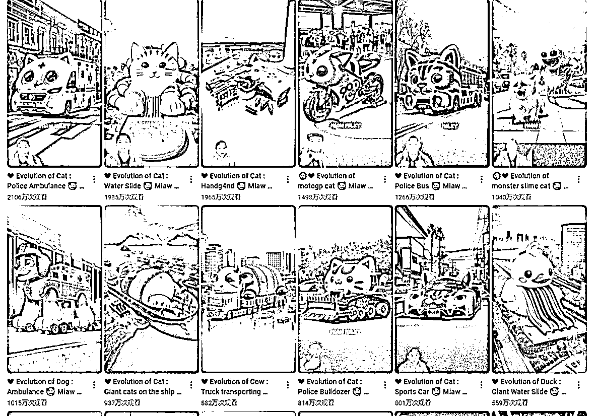
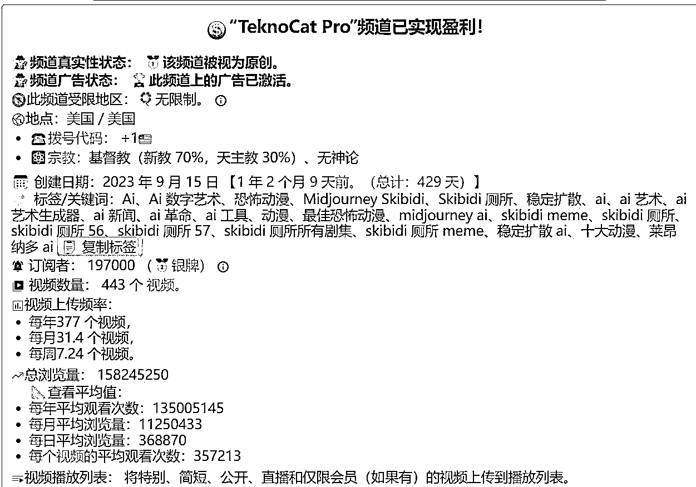
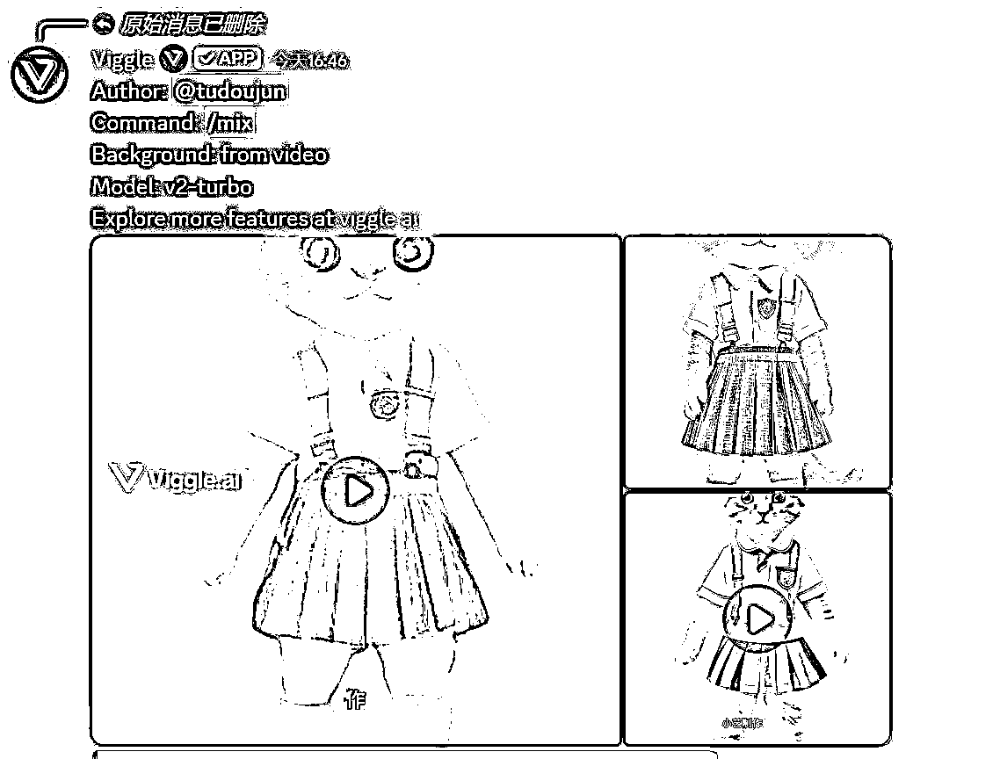
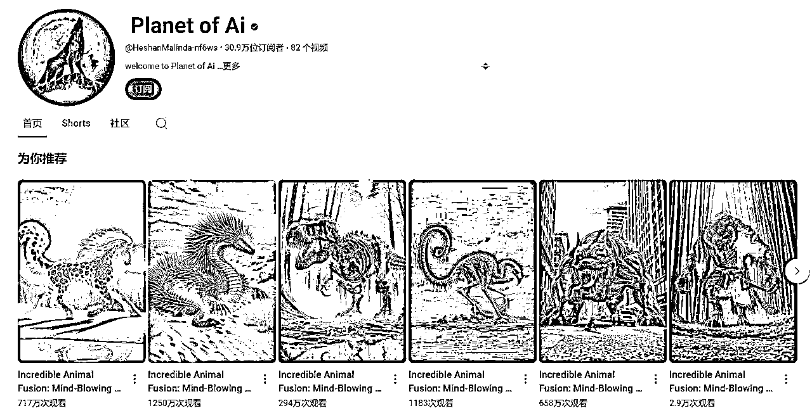
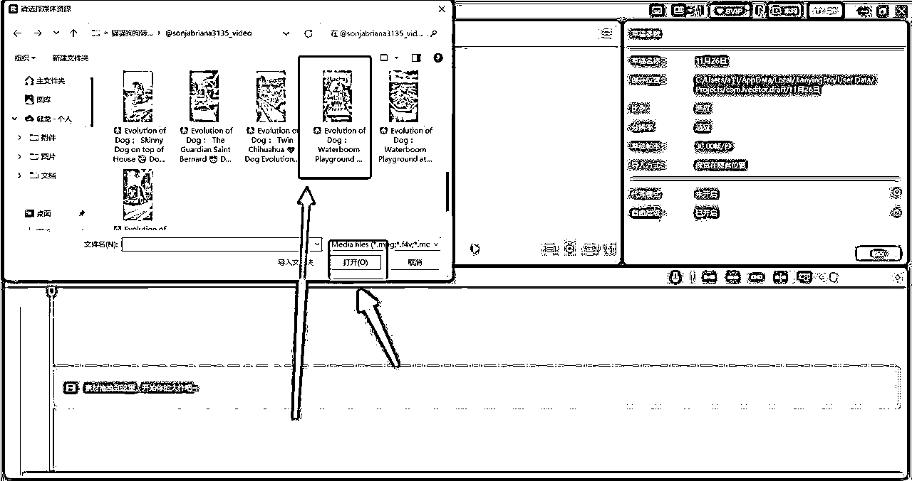
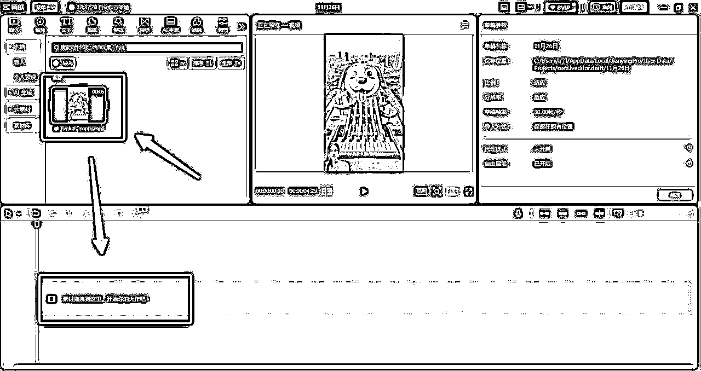
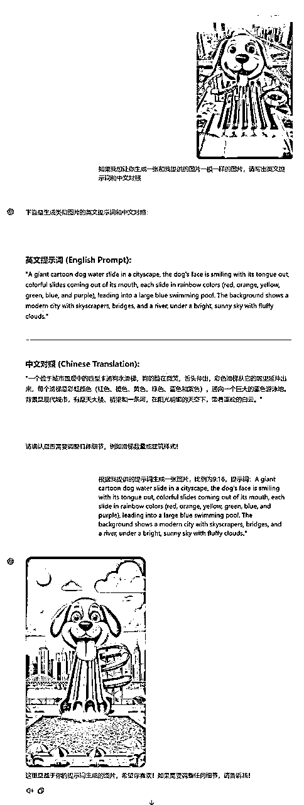
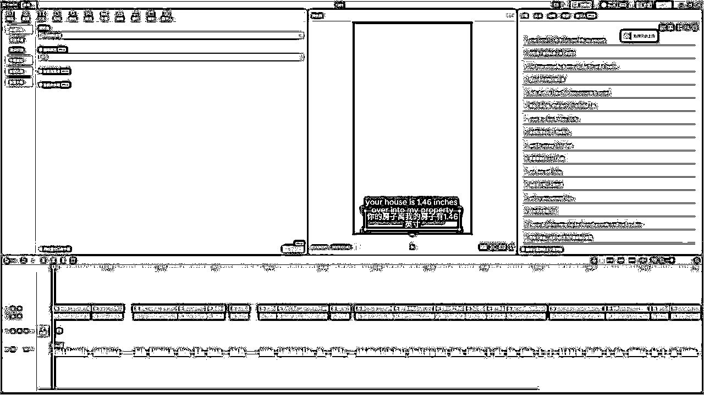

# 12 月航海 | YouTube shorts | 实战手册

> 来源：[https://ocn93f5d9olj.feishu.cn/docx/Mxb7deF8boAIJIxqppfc0B4fnXh](https://ocn93f5d9olj.feishu.cn/docx/Mxb7deF8boAIJIxqppfc0B4fnXh)

# 防失联+MM188166M（李李）长期更新频繁+备用V:MG10127

写在前面

# 💡

欢迎大家来到 12 月航海 | YouTube shorts | 实战手册，相信在接下来的日子里，我们将在这里见面很多次。

首先需要说明的是：

现在 Shorts 可以更快的涨粉，内容创作速度也更快，以前平均要 2 年达到合作伙伴计划（YPP）的 要求，实现靠视频播放量盈利，现在最快 1-3 个月也是有机会达成的。

虽然 YouTube shorts 目前处于风口，虽然开通 YPP 的时间有所缩短，但从整体来看，还是建议大家抱着长期主义的心态，做好 3-6 个月，甚至 1 年以上开通 YPP 的准备。

另外，想在 YouTube 平台获得更多流量，稳定更新优质的内容依旧是非常重要的因素，请务必注重内容的优化，提高拿到项目结果的决心和可能性。

因此 21 天时间我们可能无法跑完整个项目的 0-1，但可以带大家了解整体流程，包括 YouTube 平台，变现方式以及视频内容创作思路等。因此需要大家建立好预期，带着打持久仗的想法加入进来，这次航海主要是带大家入门。

在开始学习之前，让我们先来解决几个问题：

1）YouTube shorts 是什么项目？前景如何？

为了与 TikTok 抢夺短视频市场，YouTube 推出了 Shorts 功能，并投入了大量的流量扶持：

流量倾斜：Shorts 是 YouTube 的战略重点，平台会优先推荐短视频，特别是创作者的新内容。现在一个优质的 Shorts 视频可能在一周内获得上万次播放，快速积累粉丝。

合作伙伴计划：YouTube 为 Shorts 创作者提供广告分成，进一步降低新手的入门门槛。

AI 助力：AI 的发展，使得大家做优质内容的门槛降低，现在即使没有拍摄、设计等能力，也可以通过 AI 工具来实现内容创作。

与此同时，看到机会的同时，也请记得：

长期主义：YouTube 是全球头部的视频平台，每天有大量的内容上传，平台更喜欢稳定、优质的创作者，才会给到更多流量和激励，因此前期可能有一段时间数据表现平淡，甚至可能碰到 0 播，请放平心态，根据反馈调整，坚持输出优质内容，相信你会在不久后开通 YPP 获得收益。

3）什么样的人适合做 YouTube shorts 项目？

任何人都可以在 YouTube 上建立自己的频道，通过持续的发布优质内容，达成合作伙伴计划并获得收益。

当然，如果有 AI 创作的能力，有录视频、剪辑等能力，能够稳定的更新优质内容，将会更容易跑通项目。

⚠注意事项：该项目需注册谷歌账号&查阅海外信息，另外手册中会有一些 YouTube 官方文档和频道案例链接供你补充阅读，因此需要一个能看到外部信息的网络，风险原因本手册不做这方面的讲解和推荐，请自行准备。

且因为热门内容变化较多较快，所以手册中的部分内容可能会过时，请大家持续关注最新动态、多在群里交流，紧跟平台最新趋势。

最后，希望大家可以在这次航行里收获成果外，也能结识一群战友。

以下内容由生财有术联合圈友制作而成，仅供航海船员以及生财有术星球圈友学习使用。


# 【更新提示】新手册使用方式

在开始前，我们来简单了解一下这个手册的正确打开方式，方便你根据自己的情况来灵活使用。

在这里，手册整体的步骤顺序是按照从 0 - 1 跑通一个 YouTube shorts 项目进行的，你可以参考航线图，按顺序开始实操。也可以根据自己的实际需求选择性阅读。

手册分为必修和选修两个大的章节：

必修篇内容：为该项目从 0 到 1 跑通一个最小 MVP 的所有步骤，即航线图对应行动路径。如果你还在前期摸索中，想先跟着步骤熟悉掌握，那么建议从必修篇开始认真阅读和实操，不在玩法选择上做过多的纠结。

选修篇内容：则为项目的更多玩法、案例等相关内容。如果你已经跑通了项目的最小 MVP，想进一步了解它的更多可能，获得灵感，那么选修篇一定不要错过。

📌如果你还未接触过 YouTube ：

建议在正式实操前，先初步了解下这个平台，并且了解它的最新消息👇

✅【项目概述】了解 YouTube

📌如果你对项目已有大致的了解：

请从航线图第一阶段的步骤开始实操，这个阶段你可以从手册的第二章开始阅读，逐步完成整个项目👇

✅【实操 1/5】账号运营

✅【实操 2/5】确定赛道，分析对标

✅【实操 3/5】生产 Shorts 视频

✅【实操 4/5】数据分析

✅【实操 5/5】开通 YPP ，获得收益

📌如果你已跑通项目最小 MVP ，想放大项目：

可以重点阅读以下章节，扩展更多玩法👇

✅【拓展】中长视频 faceless 赛道

✅【项目拓展】 自动化

本航海项目的航线图如下：


航线图和手册是高度关联的，因此你可以根据自己所在的环节，进行相关步骤的学习。

# 必修篇：跑通最小 MVP

# 💡

# 章节概要

在这一章节，我们将从认识 YouTube 平台开始，一步步带你完成整个项目流程的学习。

如果你是本项目新手，建议在正式实操前，先初步了解下项目全貌：

✅【项目概述】了解 YouTube

如果你对项目整体有了大致了解，就可以按照项目核心步骤，开始学习实操：

✅【实操 1/5】账号运营

✅【实操 2/5】确定赛道，分析对标

✅【实操 3/5】生产 Shorts 视频

✅【实操 4/5】数据分析

✅【实操 5/5】开通 YPP ，获得收益

在必修篇，航线图和手册顺序相对应，你可以按照手册的顺序进行学习，即可逐一完成航线图的每一个任务。

在后续的每个关键步骤的章节概要中，我们也将提到相关航线图，提醒你完成相关步骤。

接下来就正式开始吧！


# 一、【项目概述】了解 YouTube

# 💡

# 章节概要

目前在大家广泛讨论的出海赛道中，在 YouTube 上通过流量赚钱是长期存在的机会，无论从用户量看，还是从平台潜力来看，YouTube 都是名列前茅的。

此次航海，我们将会带领大家充分了解 YouTube 平台以及要做好 YouTube shorts 项目需要做好哪些准备。

本版块中，我们从以下 4 个方面介绍，希望能帮助大家更好地了解这个项目：

✅ 为什么推荐你做 YouTube？

✅ YouTube 推流机制解析

✅ YouTube 平台主要的变现方式：包括广告变现、会员收益、电商变现、其他合作等变现方式

✅ 开始前的注意事项

提示：有相关基础知识的朋友，可以跳过直接进入下一章。

# 💡

# 本章航线图

完成第二章的学习和实操，即可完成航线图的第一阶段：了解平台，准备 YouTube 账号（约 1 天）

1.

了解 YouTube 平台以及主要变现路径（约 1 小时）

2.

了解 YPP 开通规则（约 1 小时）

接下来请正式开始，跟着步骤完成第一章内容学习，记得在航海日志中打卡记录进度哦～


# 1.1 为什么推荐你做 YouTube？@亦仁

10 月 24 日，亦仁在星球发布了第二条超级标：通过 AI 生成的各种视频，上传到 YouTube 和 Shorts，获取广告分成，空间无限大。

1.

这是一个超级巨大的市场和空间。12 年我作为第一批在 YouTube 上开始赚钱的人，那个时候就已经感受到巨大的流量价值不对等，同样的播放，在国内视频平台可能一文不值，在 YouTube 上可能有几千美金的收益。

2.

背后是 Google 广告平台的巨大商家量，以及 Google 为了自己的内容生态，把广告收益的一部分分给了内容制作者。

3.

各种 AI 工具的出现，让咱们生财有术的圈友可以实现快速制作视频的能力，以前的大多数视频需要露脸，或者需要有比较强的口播表达能力，现在，都可以通过 AI 工具来解决。

4.

为了和 TikTok 竞争，YouTube 推出了 Shorts，Shorts 又开通了广告分成计划，且已经看到一些中国人在 Shorts 上赚钱和导流的案例。

5.

在 Shorts 上已经出现了非常多的大流量的 AI 生成的爆款视频，且你可以顺藤摸瓜找到非常多的细分类目，也欢迎大家去研究挖掘写帖子来分享。

6.

这是一个非常长周期的事情，从我那个时期开始做，已经十年过去了，仍然可以在 YouTube 赚钱，而且越来越强，值得你当作事业认真去做，当然，肯定不简单，请永远记住：赚钱的多少和你克服的困难大小成正比。

7.

宝宝巴士靠把自己的视频上传到 YouTube，一年获得的广告分成是多少你知道吗？ 5000 万美金。

除了宝宝巴士这个案例可以看出平台的收益空间之大，还有近期复出的李子柒，虽沉寂三年多，但断更期粉丝却不减反增，涨粉 500 多万，10 月底从数据平台 socialblade.com 看到一个月依旧有约 30 万的收益，可见 YouTube 平台长尾效应是非常明显的，值得作为一个长期投入的项目去做。

国内视频创作板块如此卷，不如出海去。

内容来源：《超级标 02：通过 AI 生成的各种视频，上传到 YouTube 和 shorts，获取广告分成》


# 1.2 平台机制

无论是 Shorts 还是长视频的推流逻辑，核心都是算法驱动。而算法是结合用户行为和内容表现，来决定视频能否被更多人看到。但短视频创作不仅仅是靠运气，更多的是对内容的持续打磨和对平台规则的深刻理解。

因此可以说：

算法奖励的是让用户喜欢的内容。

# 1.2.1 Shorts 推流机制

# 1.2.1.1 Shorts 推流的三个阶段

和国内抖音类似，一个视频发出后，YouTube Shorts 也有 3 个不同的流量池阶段。

① 第一阶段：冷启动

每当上传一条 Shorts，YouTube 的算法会首先把视频推荐给一小部分用户（通常是几百到几千人），通常是与频道标签、内容相关性较高的观众，这些可能包括：

已订阅的观众（但并不是所有订阅者都会收到推送）

对相似内容感兴趣的用户（比如经常观看与你赛道相关视频的观众）

在该视频标签和关键词领域活跃的短视频用户（这些人对你的内容主题更有可能产生兴趣）

在这个阶段，算法的目标是衡量视频的初始反馈，关键指标包括：

完播率：是否有较高比例的观众完整观看了视频（通常 70% 或更高是好成绩）。

互动率：点赞、评论、分享等行为是否积极。

如果视频在这小范围内的表现优异，算法会将其推送到更大规模的用户群体，进入下一轮推荐。相反，如果数据反馈较差，推流范围可能会被限制，视频的传播潜力也会受到影响。

冷启动测试是 Shorts 推流逻辑的第一步，表现良好的视频才能在接下来的阶段中获得更多曝光。这也是为什么优化视频的开头、主题和标签非常重要，因为冷启动决定了你视频的起跑线能跑多远。

② 第二阶段：扩大推荐范围

当视频通过冷启动测试后，YouTube 的算法会将其推荐给更大范围的目标用户，进入扩大推荐范围阶段。此时，平台会根据冷启动的表现，进一步推送视频给更广泛的观众，例如：

与内容相关的潜在用户：算法会根据视频的标签、标题和关键词，寻找对相似内容感兴趣但与你频道没有直接关联的新观众。

不同地区或语言的观众：尤其是具备普适性、无语言障碍的视频，可能被推荐给国际用户。

Shorts Feed 中的高流量用户：视频有机会出现在更多用户的 Shorts 流中，覆盖范围进一步扩大。

平台会重点关注核心指标，如完播率、互动率（点赞、评论、分享）以及观众停留时间。如果数据表现依然强劲，算法会持续放大推荐范围；若指标下降，则推流可能受限。

在扩大推荐范围阶段，视频已经从“小规模试探”迈向“大规模传播”。这是短视频能否成为真正爆款的关键一步，决定了它的覆盖广度和带来的长尾效应。因此，持续保持内容表现的优异性，抓住观众的注意力，是这个阶段的核心策略。

③ 第三阶段：大规模爆发

当视频在扩大推荐范围阶段持续表现出色后，YouTube 会将其推送至更广泛的用户群体，进入大规模爆发阶段。这时，视频可能出现在 Shorts Feed 的高曝光区域，甚至被推荐到热门视频版块，让流量实现指数级增长。

在这一阶段，推荐的受众可能包括：

几乎所有相关兴趣用户：算法会优先匹配与你视频标签、关键词契合的观众。

非核心兴趣用户：平台会测试视频对更广泛用户群的吸引力。

高互动用户：经常点赞、评论短视频的观众更可能收到推荐。

YouTube 会继续追踪视频的关键数据：

高完播率：吸引更多用户完整观看，避免大规模流量中产生过多观看中断。

高互动率：爆发阶段的互动量（特别是评论和分享）是持续推流的重要信号。

如果视频在大规模观众中依然表现优异，它的生命周期会延长，甚至进入长尾流量阶段，持续带来观看和订阅增长，还能为频道整体权重带来长期提升。


# 1.2.1.2 哪些数据决定推流？

YouTube 的算法会根据以下几个核心指标判断你的内容是否值得推送给更多人：

① 完播率

完播率是短视频表现的最重要指标之一。视频越短，越容易提高完播率，通常建议 Shorts 时长保持在 15-30 秒 左右。平均完播率达到 70%-80% 会显著增加被推流的概率。

② 互动率

算法特别关注观众是否与视频互动，其中「点赞」、「评论」和「分享」是权重较高的互动行为。所以说，如果用户看完视频后还愿意转发给朋友或在评论区讨论，算法会判断内容具备高吸引力。

③ 停留时间

尽管 Shorts 视频时长短，YouTube 仍然希望用户在你的内容上花更多时间。所以「循环观看」是一个加分项：如果观众看完后又重播了几次，算法会认为视频有吸引力。另外，「连续观看频道内容」也会提高频道的整体推荐权重。

④ CTR（点击率）

Shorts 没有封面，但算法会分析观众是否愿意点开完整视频。这和标题、标签以及前几秒的吸引力有关。短视频前三秒决定生死，设置一个能抓住用户注意力的开头是至关重要的。

⑤ 其他因素

除了核心数据指标外，以下因素也可能间接影响视频的推流效果：

发布时间：YouTube 的活跃用户分布全球，选对目标受众的活跃时段很重要。

赛道选择：热门领域（比如搞笑、生活小技巧、萌宠）更容易吸引广泛用户，但竞争也激烈。小众领域（如手工艺、工具评测）更容易形成稳定的受众。趋势性内容（如热点新闻或挑战话题）更容易获得短期爆发，但持续吸引力较弱。

标签和标题优化：精准的关键词和标签可以帮助算法理解内容主题。另外，虽然 Shorts 没有封面，但标题的吸引力仍然很重要，要简洁直观，突出看点。

YouTube 的算法会参考频道的整体权重。活跃的更新频率、持续增长的订阅数，以及其他视频的表现，都会对推流有帮助。


# 1.2.2 长视频推流机制

YouTube 长视频的推流逻辑与 Shorts 短视频有很多相似之处，但核心差异在于观看深度和内容定位的重要性。

比如相比 Shorts 关注点赞评论等行为，长视频更加关注观看时长和留存率。用户是否愿意完整观看视频，甚至重播，是影响推流的关键。

而且长视频的推流周期更长，初始推荐之外，还依赖搜索、相关视频、和频道权重的稳定积累；推荐来源更广，包括首页、推荐视频、和搜索结果，甚至数月后还能持续获得流量。

所以说，长视频更像是一场“耐力赛”，而短视频则是一场“速度赛”，我们要针对它们不同的侧重点来准备内容。


# 1.3 变现方式

# 1.3.1 加入 YPP 获得广告变现

# 1.3.1.1 广告变现路径解析

在 YouTube 上赚广告费，核心在于理解两个关键点：Google AdSense 和广告形式。接下来，我们用简单清晰的方式搞懂广告变现的全过程。

Google AdSense：创作者的“收银台”

Google AdSense 是 YouTube 为创作者提供的广告收入管理系统，可以简单理解为“收银台”。广告商在 Google 上投放广告，YouTube 会根据观众的观看行为，将广告收益分配给创作者。

举个例子：

某商家花 1000 美元投广告。如果我们的频道帮他展示了 100 美元的广告价值，就可以分到 55 美元，剩下 45 美元归 YouTube。

无需我们找广告商或设置广告位置，YouTube 全程搞定，而我们只需专注于创作优质视频。

长视频广告类型解析

YouTube 广告分为 4 类，创作者可以选择在视频播放之前、播放期间还是播放之后展示广告：

可跳过的视频广告：对于可跳过的视频广告，观看者可以在 5 秒种后跳过广告。

不可跳过的视频广告：对于不可跳过的视频广告，用户必须看完广告才能观看视频。

导视广告：最长 6 秒钟的不可跳过的简短视频广告，用户必须看完广告才能观看视频。

重叠式广告：重叠式图片或文字广告，显示在视频下部 20%的区域内。

Shorts 广告类型解析

短视频的广告变现方式与传统长视频不同，主要依赖以下多种形式：

Shorts Feed 中的广告：在 Feed 中插入广告，产生的收益按比例分配给所有符合条件的创作者。广告收益与具体视频的播放量没有直接绑定，而是基于整个 Shorts Feed 的观看表现，属于共享模式。

展示广告：用户进入 Shorts 页面的顶部或侧边可能会看到静态展示广告，这些广告收益也计入 Shorts 的休闲池中。

不可跳过广告：部分广告在进入 Shorts Feed 前展示，此类广告的收入也归入 Shorts 广告收益池。

YouTube 的特别之处在于，优质视频可以实现持续变现。即使视频发布已久，平台依然会根据算法权重推荐给新观众。只要有人看广告，你的收入就源源不断。

但广告收益的差距也会受一些因素的影响：

观看地区：发达国家 CPM 远高于发展中国家，比如美国的观看报酬通常会很高

频道领域：某些领域的内容有更高的 CPM。

视频时长：超过 8 分钟的视频可以无限插入广告，收益更多。


# 1.3.1.2 广告变现规则

想开启广告变现，必须先加入 YouTube 合作伙伴计划（YouTube Partner Program， YPP）。让我们来看下需要达成什么样的申请条件：

在过去 12 个月内获得 1000 名订阅者，并且有效公开视频观看时长达到 4000 小时。

或者，在过去 90 天内获得 1000 名订阅者，并且有效公开 Shorts 短视频观看次数达到 1000 万次。


拥有可关联的 Adsense 账号，直接注册关联就可以了。

账号要设置成可获利的国家地区，中国大陆账号无法获利，需要修改账号所在国家或地区。

无违规记录：频道需遵守 YouTube 的社区准则和广告友好政策，避免敏感或违法内容。

广告适配内容：视频内容必须适合广告展示（不含暴力、成人或其他限制类话题）。

注意：不要通过购买粉丝或者播放时长来加入 YPP，因为这些流量并不会为你的频道带来实际变现，而且如果被 YouTube 官方查出，就会降低频道评级。

建议关注 YouTube 官方文档了解更多细节，及时获取最新信息：

《YouTube 合作伙伴计划》

《YouTube 合作伙伴计划概览与资格要求》

《YouTube Shorts 创收政策》


# 1.3.1.2 广告变现案例分享

案例一：Catlyn's Story

频道类型：AI 猫咪故事


广告收入：月收入估算 1k～2w 美元

案例二：BabyMagic

频道类型：AI 怪兽合成

广告收入：月收入约在 1-10 w 美元


案例三：小高姐的 Magic Ingredients（中长视频案例）

频道类型：美食制作与生活分享

广告收入：月收入约在 1-5 万美元


# 1.3.2 会员收益

从 2023 年 6 月中旬起，YouTube 平台拓展了 YouTube 合作伙伴计划，让更多创作者可以抢先体验粉丝赞助功能和部分购物功能。也就是接下来要讲到的频道会员收益和电商变现。

位于符合条件的国家/地区的创作者只要达到以下任一资格要求，即可申请加入拓展后的 YouTube 合作伙伴计划：

过去 90 天内上传了 3 个有效的公开视频并获得 500 位订阅者，同时过去 12 个月内的有效公开视频观看时长达到 3,000 小时。

或者，过去 90 天内上传了 3 个有效的公开视频并获得 500 位订阅者，同时过去 90 天内的有效公开 Shorts 短视频观看次数达到 300 万次。


点击官方文档查看当前支持的国家，以及可开通的变现功能等更多细节：《拓展后的 YouTube 合作伙伴计划概览》。


# 1.3.2.1 频道会员收益

创作者可以在频道免费订阅的基础上，增设频道会员（Channel Membership），加入频道会员的粉丝每月定期支付一定费用，可获得创作者提供的特别福利。创作者也可以根据不同的福利设定不同的会员等级，具体费用由创作者设定，从几百到上千不等。

YouTube 从会员费中抽取 30%作为平台佣金，创作者获得剩余的 70%。例如：观众支付$10 的月费，创作者实际收入为$7。

# 1.3.2.2 付费会员收益

订阅付费会员服务（YouTube Premium）的人可以享受跳过广告等服务及其他权益，使用体验感会更好，当这类用户观看你的视频时，视频创作者也可以获得 YouTube 赞助的额外收益，而且根据时长获得相应的会费分成。

需注意：开启付费会员服务的条件，和 1.3.1.2 广告变现规则的条件一致。


# 1.3.2.3 会员收益案例分享

这里我们分享一个非常经典的频道案例：「老高与小茉」

他的频道在开通会员后，成为了整个 YouTube“频道会员增长速度全球最快”的频道。当时，老高的频道总订阅才刚突破 130 万，而现在已经过 600 万，会员只会更多。


从评论区的直观感受来看，会员比例挺高的。ID 旁边有头像的都是会员，头像是频道主制作或使用平台提供的，根据会员时间长短，头像会有区别，体现不同等级。

由于我们无法从 YouTube 得到具体量化的数据，这里我们借用一名博主的数据分析来推测老高的频道会员收入：

1.

会员人数估算：

普通视频评论/粉丝比为 0.0677%，会员视频平均评论数为 430。通过评论数据推算，会员人数为 63.5 万。

考虑会员评论活跃度更高（假设 5 倍），实际会员数估算约为 12.7 万。点赞数据进一步支持会员数接近 10 万的推测。

2.

收入测算：

会员价格按 5 美元，平台分成 30%。月收入为 12.7 万×5×70% = 44.45 万美元，年收入约 533 万美元。

这是 2022 年年底的推测，现在这个数字只会更高。


# 1.3.3 电商变现

除了广告和会员收益，还可以通过销售自己的商品来变现。当前 YouTube 也正在增强直播电商和商品货架功能，方便创作者直接在平台内完成销售，售卖展示的方式主要有两种：

1.

YouTube 小黄车：可在视频下方展示自家商品（需加入 1.3.2 会员收益中讲到的 YouTube 合作伙伴计划）。

2.

独立电商平台：如 Shopify、Etsy 等，通过外链导流销售，当然，平台会审核你要导流的商品，确保符合平台规则。

了解更多关于 YouTube Shopping 功能讲解，请看官方相关内容：

《YouTube Shopping：从您的商店中添加链接商品并展示》

《在 YouTube 上管理、关联和解除关联您的商店》

# 1.3.4 其他变现方式

# 1.3.4.1 广告商合作

即创作者与品牌合作，在视频中直接推广产品，创作者按视频条数收费或按销售提成。常见的内容形式有：测评与推荐、使用场景展示、特别优惠推广（如限时折扣码）。

YouTube 的广告价码没有一个正式的标准，但国外有一个以粉丝数作为参考的平均行情：

超过 1 万订阅的，每个广告可报到 200 美元。

超过 10 万订阅的，每个广告可报到 2000 美元。

破百万订阅的，每个广告最低报价 2 万美元。

这个算是门槛偏高的变现方式，因为对订阅数有要求，如果账号才刚起步，粉丝还不多的话，建议先用那些不看重粉丝数的方式去变现。


# 1.3.4.2 联盟 CPS

如果你没有自己的商品，但想在 YouTube 上做电商，可以通过在视频描述或固定评论中嵌入商品链接，观众点击并购买后，创作者可获得销售佣金，不用自己囤货或垫付货款，只需观众引导购买。

支持的平台有：亚马逊联盟、CJ Affiliate、ShareASale 、乐天等

常见的内容形式有：产品开箱与评测、实用教程（操作视频）、排名推荐


# 1.3.4.3 知识付费变现

知识付费变现指通过分享专业技能或知识内容，吸引观众购买相关课程、咨询或专属服务，从而获得收入。

相比传统广告和联盟营销，知识付费变现的核心是以价值吸引付费，特别是适合拥有专业领域知识或经验的创作者。

知识付费变现的形式主要有以下几种：

1.

在线课程销售：将课程上传到第三方平台（如 Teachable、Udemy）或自己的独立网站，通过视频引流观众购买。

2.

会员专属内容：使用 YouTube 提供的会员订阅功能，观众支付月费可观看独家内容。

3.

一对一咨询或服务：通过描述栏引导观众预约个人咨询（如 Zoom、Google Meet），按小时或项目收费。

4.

知识电子书或工具销售：通过视频推广电子书、模板或工具包，观众通过链接购买下载。

内容来源：《航海实战 | YouTube - 视频创作 | 实战手册》


# 1.4 开始之前的注意事项

接下来就要开始实操了，在进入下一章之前，我们希望你能抱着一个长期主义，持续经营的心态开始。

1.

不要急于求成。YouTube 创作是一个长期过程，以前长视频开通 YPP 的平均周期是 2 年，现在认真输出优质内容，可能需要 3-6 个月才可开通。记得专注于提升内容质量和与观众互动，而非仅仅追求数据增长。

2.

前期的内容可能不够完美，但不要害怕失败，重要的是持续创作与学习。最初可能一个月甚至几个月都没有多少观看量或订阅数，这是正常的。定期查看 YouTube 提供的分析数据（如观看时长、受众数据等），从数据中学习，逐步调整和优化。

3.

选择你真正感兴趣的领域，否则在遇到困难时很难坚持下去。

4.

理解版权法的重要性。YouTube 对于版权非常敏感。上传他人的内容（如音乐、影视片段、图像）可能导致视频被删除、账号被警告，甚至失去变现资格。

5.

规避常见的版权雷区

音乐：避免使用受版权保护的歌曲，除非获得许可。可以选择 YouTube 提供的音频库，其中有免费的音乐和音效。

图片和素材：使用无版权限制的图片或视频（如 Unsplash、Pixabay 或 Pexels），或确保你拥有素材的商业使用权。

影视、游戏片段：即使只用了几秒钟，也可能触发版权警告，特别是热门影视和游戏内容。


# 二、【实操 1/5】账号运营

# 💡

# 章节概要

了解完整体情况后，我们就要正式开始启动了。在 YouTube 发布内容的前提，是完成前期的账号准备。

所以在这一章节，我们整理了项目初期需要筹备的事项，包括：

✅ 注册 YouTube 账号

✅ 开通频道并完成装修

✅ 了解 shorts 的视频发布流程

其中，注册账号这部分不做展开讲解，大家需要自行完成注册或者找一个成品账号。

在这里，频道装修还不需要很精美，只要初步建立好账号就可以尽快进入到视频内容创作的阶段了。现在开始准备一个账号，并且开始浏览视频，感受 YouTube 平台吧。

# 💡

# 本章航线图

完成第二章的学习和实操，即可完成航线图的第一阶段：了解平台，准备 YouTube 账号（约 1 天）

1.

准备网络，注册 YouTube 账号（约 1 小时）

2.

完成账号基础设置，了解视频发布流程（约 1 小时）

接下来请正式开始，跟着步骤完成第二章内容学习，记得在航海日志中打卡记录进度哦～


# 2.1 确定注册什么类型的账号

# 2.1.1 个人账号

用你个人谷歌账号创建的，需要单独设置用户名和密码。

# 2.1.2 品牌账号

品牌账号其实就是一个企业账号，可以展示企业信息、产品等。

这类用企业信息创建的账号，可以通过「Google+」或者「Google 我的商家」等方式创建，不需要单独设置用户名和密码，可以有多个所有者和管理员。


# 2.2 注册账号

Step1：国内无法访问 YouTube，需要使用可查看外部信息的网络工具。风险原因本次航海不展开说明，请先自行搞定网络，确保可以正常访问。

Step2：注册一个谷歌的邮箱账号，下载手机版 QQ 邮箱，点击添加帐户，选择 Gmail 邮箱，创建账号，依次填写相关资料，输入 +86 的电话号码，即可成功注册。（近期有出现电话号码无法使用的情况，换一个号码试一下，或者可以用接码平台尝试注册)

Step3：打开 YouTube 官网，用刚注册的 Gmail 账号登陆。

你也可以参考这个 YouTube 视频，尝试完成自己账号的注册：https://www.YouTube.com/watch?v=8hk5V2P_72U

注册完之后，就可以开始以正常用户的状态使用 YouTube 了，可以在平台上大量浏览，点赞，评论等互动，让 YouTube 感知到你是一个真人在使用这个账号。

建议先养号养几天再发视频，账号会更稳定一些，否则刚注册就发视频，是有账号被删除的可能的。

另外，记得把这里的位置设置为支持获利的国家，包括美国、欧洲大部分国家、日本、韩国、印度和南美主要国家。

但我们也不用太过于纠结，因为 YouTube 的流量推送机制并不取决于这个，而是基于频道内容的目标受众。


# 2.3 开通 YouTube 频道

Step1：点击官网首页右上角的 Create a Channel 选项。

Step2：选择创建个人频道或品牌频道。

Step3：为频道命名， 一般会使用公司/品牌/产品名称命名，完成创建后就可以发布新的视频了。

完整的频道装修由多个元素构成：频道头像、频道名称、频道横幅、宣传片、播放列表、封面图、频道简介等。点击右上角头像进入“YouTube 工作室”，在右侧导航栏中找到“自定义”就能修改频道的个人资料了。


在这一步，圈友@方波妮的心态值得学习：

不要被 “头像怎么弄？封面怎么制作？我做的视频好丑？我怎么这么笨？” 卡住进度。

头像不会制作，手机相册找一张宠物的，或者风景照，或者 MJ 制作一张，先完成再优化，封面同理。

停止“我觉得 xxx”，模仿爆款让市场检验下，非常好的原创，也有可能打不过丑丑的模仿爆款，事实证明丑的东西也有人喜欢。

放掉这种念头，接纳刚开始的不完美，视频发起来，技术都是慢慢优化起来的。

# 2.3.1 频道头像

头像尺寸：98x98px，大小不超过 4MB 的 png 或 gif 图

头像类型：人物照、萌宠、风景、品牌 logo、卡通等。

头像风格：清晰，最好使用真人形象。

制作方式：不会做图的可以通过做图网站来制作头像，或者找些无版权的图片。

图怪兽：https://818ps.com/

可画：https://canva.com/

创客贴：https://www.chuangkit.com/

AI 工具创作头像：具体操作步骤可参考 AI 特效直播的航海手册：AI 头像壁纸号

注意事项：避免使用容易侵权的商标类图片。

# 2.3.2 频道名称&标识名

尽量简洁好记

突出视频内容特色或行业特征

可以是个人名字的延伸

中文+英文（注解）

标识名也可以作为你的 YouTube URL 链接后缀，方便用户查找

注意这两项都是每 14 天只可更改 2 次。


# 2.3.3 频道横幅

横幅尺寸不低于 2048*1152px，大小不能超过 6MB，因为海外有很多人都是通过电视观看 YouTube 的，所以清晰度一定要足够高，横幅内容明确显示出频道的主题。

可引导订阅

可添加简洁的频道介绍

可加平台链接

# 2.3.4 播放列表

有一定视频数量后，一定要进行分类，比如创建播放列表。在设置播放列表的名称时，建议使用和用户搜索意图相关的短语或者问句，建议创造多个播放列表。

播放列表中的视频是自动播放的，这样可以引导用户观看更多视频，有助于增加视频的浏览量，还能吸引潜在的目标用户。


# 2.3.5 封面图

封面图会在频道的显眼位置出现，一定要用心做，因为很多时候人都是靠第一感觉点击的，好的封面有利于增加打开率。

提供几个优化封面的建议：

大众熟悉的东西+制造悬念，因为熟悉的东西可以产生信任感，悬念能引发人的好奇心。

尽量用图片、表情、数字等元素

文字标题内容不宜过多，干扰主题

腾出放频道链接的位置（封面图的右下角）

推荐工具：

Canva https://www.canva.cn/

稿定设计 https://www.gaoding.com/

AI 工具创作封面：《3 月航海 | AI 绘画特训 | 实战手册》


# 2.3.6 频道简介

一句简洁又能概括频道的标语

介绍自己的基本信息、能给大家带来什么，以及更新频率

建议双语版本

可加其他社交媒体的链接

内容来源：《航海实战 | YouTube - 视频创作 | 实战手册》


# 2.4 Shorts 发布流程

Shorts 内容制作周期短，建议每天发布 1 条优质的 Shorts 视频。

# 2.4.1 手机端发布教程

1.

第一步：打开 YouTube App，点击右上角的 “+” 按钮。

2.

第二步：选择 “创建 Shorts” 或直接上传已制作好的视频文件。

3.

第三步：进入编辑页面，检查视频是否符合比例和时长要求：

时长在 60 秒以内，采用 9:16 竖屏比例，推荐分辨率为 1080×1920（高清）。

使用清晰的画面、适当的背景音乐，并确保有吸引人的开场内容（前 3 秒决定观众是否留下）。

另外，编辑界面的其他模块内容也建议优化，辅助视频播放量增长：

标题：简洁吸引人，建议带有关键词。

示例：10 秒学会最酷舞步！🔥 #Shorts

描述：简要说明视频内容，并添加相关信息，如话题或频道链接。可加入与视频内容相关的关键字，提升搜索排名。

标签（Tags）：添加相关主题标签（如 #Shorts，#DIY，#Fitness）。注意：要确保标签与视频内容高度相关，避免使用误导性标签。

缩略图：如果系统自动生成的缩略图不满意，我们也可以上传自定义设计的图片。记得要保持清晰、色彩对比明显，从吸引用户点击的角度出发来设计。


# 2.4.2 电脑端发布教程

电脑端发布的步骤和发长视频的步骤一致：

1.

第一步：登录 YouTube Studio。

2.

第二步：点击右上角的 “创建” 按钮，选择 “上传视频”。

3.

第三步：将视频拖入上传框，系统会自动检测为 Shorts（如果视频符合时长与比例要求）。

但注意：为了保证上传后是出现在 Shorts 板块，我们需要在标题栏或者说明栏处加一个“#Shorts”的标签，视频长度和尺寸必须符合 Shorts 的要求。

发布前后，记得都要作为一个正常的 YouTube 使用者刷刷视频，不要发了视频就退出。测试证明，发布前后多刷刷视频有助于平台对账号增加信任，更有可能给到更多推荐，如果直接退出，平台会担心你是不是真实的使用者，从而更加谨慎的分配流量，增加 0 播的可能。


# 三、【实操 2/5】确定赛道，分析对标

# 💡

# 章节概要

刷了一段时间的视频之后，相信你对平台上内容的风格、热门内容特点以及自己可能想做的方向有了初步的感受。

但要知道，每天 YouTube 平台会有大量的内容上传，想要成为热门，脱颖而出，选好赛道至关重要。我们不仅要选择受众广的热门赛道，也要了解在这个赛道下可以开通 YPP 盈利的对标，来决定自己是否要做。

所以在这一章节将通过一个具体的案例思路，来展示如何分析对标，确定要做的方向，包括：

✅ 看热门视频

✅ 参考往期 AI 航海手册

✅ 学习头部博主的赛道选择方法

✅ 学习如何找到对标账号并分析拆解

✅ 了解什么频道是不能作为对标的

建议不要追求找到一个别人都没做过且很有机会的赛道而迟迟不发视频，这时候更重要的是找到一个自己想做的赛道，找到想要对标的方向，坚持的做下去，在做的过程中，慢慢的探索出自己的风格、自己差异化的方向。

# 💡

# 本章航线图

完成第三章的学习和实操，即可完成航线图的第二阶段：确定赛道，制作视频内容并发布（约 2 天）

1.

了解热门赛道，确定要做的赛道方向（约 1 小时）

2.

在对应赛道找到对标账号并进行分析（约 2 小时）

接下来请正式开始，跟着步骤完成第三章内容学习，记得在航海日志中打卡记录进度哦～

# 3.1.1 如何确定要做的赛道

# 3.1.1.1 看 YouTube 平台上的热门视频 @亦仁 @老马内容出海 @钱塘江鲤

选择一条对的赛道极为重要，因为时间成本是最高的。

这同行跟咱的路子搭不搭？

这条赛道人多不多？

还能不能走下去？

开通收益难不难？

说白了，就是要选好利基市场，也就是咱们常说的赛道。

那作为一个新人，该如何选择赛道？到底什么样的 Shorts 内容能够获得盈利呢？

亦仁在超级标的最后有提到：“如何挖掘到已经在 Shorts 和 YouTube 上火爆的 AI 视频？通过找到一个视频，进入对方的描述区，通过他的 tag，描述，以及评论，找到更多关键词，通过这些关键词进一步向外扩展，最后你就能找到成千上万个别人已经验证好有流量的类目词。”

圈友@钱塘江鲤 根据这个思路采集了注册时间在一年内且粉丝大于 1000 的频道，点击《1 万个 YouTube AI Shorts 对标账号》查看。

随后，圈友@老马内容出海使用这个采集的信息，以 AI 方向为例来演示了自己是如何拆解赛道的：

第一步

明确一个目标：市场被验证过，但不是很拥挤，还有一定创新空间，能够快速模仿的赛道为基准。

第二步

寻找 5-10 个对标账号，同类型风格，同类型选题以及文案，同样的画面展现，亦或者同样情绪价值。

用圈友 @钱塘江鲤 采集出来的标签随便来找，抽出两个词：Cute、Spiderman


第三步

在 YouTube 上搜索关键词，看看其中疑似 AI 视频的内容。


第四步

每个我们都打开看一下，会发现大部分输出的有两个 AI 赛道：

1\. 第一组是一种类型，AI 可爱萌娃走秀，加上对口型驱动会更加生动些；

2\. 第二组和第三组本质上属于同一种，都是图片风格的转绘+简单特效转场+热门音乐+为了过重的人头抠图。

Runway show +口型驱动（不对口型）


图片风格转绘+人头（或者不加）




再来看看 Spider Man（图片风格转绘+人头（或者不加）+恶搞 IP）：


如果认为这个赛道自己可以做，那么接下来就可以确定具体的对标账号进行分析了。

内容来源：《【生财技能】如何选择自己合适的匿名 Shorts 赛道》、《利用 RPA 自动化流程分析 YouTube Shorts 上的热门 AI 视频》


# 3.1.1.2 参考往期 AI 航海的手册 @方波妮

另外，你也可以看看往期的 AI 航海项目，参考 2024 年 9 月热平的 AI 航海：《9 月航海 | AI 特效直播变现 | 实战手册》

航海文档放眼望去都是项目：AI 老照片、AI 写真、AI 宝宝走秀，AI 赛博机车、AI 头像、AI 壁纸等等，国内短视频“无缝衔接"到 YouTube，选一个你喜欢的先干了再说，想太多也是空想。

内容来源：《YouTube Shorts 项目实操：从 0 到 1 跑通账号，12 天收获 2700+订阅与 90 万+播放》


# 3.1.1.3 参考头部 YouTube 博主的方法 @浅笑

YouTuber@老高与小茉的赛道选择方法论，无论是 Shorts 还是长视频频道，都可以参考，这里分享给大家：

1.做你想做的

选择你愿意长期坚持的内容，

参考类似频道，学习如何扩展内容。

横向扩展：关联题材；纵向扩展：深挖题材。

2.做你擅长的

选择你比一般人做得好的内容，

擅长的事情更容易出量，失败可能性小。

3.做你喜欢看的内容

如果没有想做或擅长的内容，选择你感兴趣的内容，模仿你喜欢的内容，可能会发现新的兴趣点。

4.做播放量大的内容

如果前三个原则都无法确定，选择播放量大的内容，但要注意，播放量高并不一定意味着适合你。

内容来源：《YouTube 数据与前景及博主方法论分享》


# 3.1.1.4 根据通用定位方法做调整 @一页书

如何定位可总结为如下步骤：

市场当前和历史数据采集与初筛

数据分析

这是一群什么用户群体，他们数量有多大？

他们有什么需求，或者有什么待解决的问题？

他们愿意为解决问题付费吗，付费能力如何？

供应者是如何满足这种需求的，问题解决得如何？

如果我来做，能否做的一样好甚至更好？

我讨厌做这个事吗？

数据整合、筛选与排序

得到适合自己的几个定位

具体到 YouTube 平台，对上述通用方法做些调整：

数据采集：生财 @钱塘江鲤 是个擅长 RPA 自动抓取和分析数据的高手，早期直接用他做好的数据（1万个YouTube AI shorts 对标账号），后面再学会他的方法自己做数据。

根据 Shorts 特点做的调整

早期不用纠结清晰的用户画像，把用户和需求并到一起，关注需求是什么（往往是精神/心理上的），以及为什么某些需求的量很大

早期可以忽略用户付费意愿和能力的问题（因为 Shorts 共享广告收益池），只需专心做爆款内容即

总结：根据高手的 Shorts 数据，分析如下问题（前三个最重要）

需求层面：播放量大的，是什么需求被满足了？有这个需求的用户量大吗？

供给层面：玩家多吗？他们如何满足的需求？有创新空间吗？

实现层面：需要哪些技能，我能做吗？能做的更好吗？

我讨厌做这个事吗？

最后再把数据汇总整理，得到适合自己起步的定位

内容来源：《【生财技能】万字总结：YouTube Shorts 频道定位调研与视频制作实操》


# 3.1.2 在所选赛道下分析对标 @老马内容出海

# 3.1.2.1 如何找到对标账号

下一步，我们抽两个类型的赛道，准备 5-10 个频道，我们每个赛道先准备五个：

常规采集方法

通过标签，或者关键词搜索到的初始对标，进行关注，视频点赞操作，反复点击首页，Shorts，不停地去刷 1。找到新的继续反复循环。新号会比较好操作，手机比浏览器的 Shorts 页面刷到的几率更大，有历史记录的账号，之前有推荐逻辑需要耐心完成。

继续根据钱塘江鲤大佬整理的 AI 相关标签文档手动寻找，或者分享的代码，自行采集

页面周围同类推荐展现（单独 shorts 页面无法展现）


热门音乐采集方法

通过这两组频道视频中，热门音乐来找到高度垂直的账号，也可以通过热门音乐拓展其他细分赛道。

图片风格转绘+人头（或者不加）热门音乐展示：

千万别觉得左下方加人头很奇怪，这个方法最早是点评视频，证明观点类视频的变体，然后做 TK 中视频的影视切片，用了加人头过原创，又火了一波，第三次变体就放在了这里，因为 AI 类不容易开通 YPP，所以把这个方法又拿出来了～


Runway show 热门音乐展示：

这个是近期的新赛道，AI 视频生成的迭代升级，给了 AI 赛道新的活力。


OK，我们得到了两组能够高度垂直赛道的信息渠道，那么我们筛选整理一些符合要求的出来：

筛选的要求：

1.

总播放量大于 1000W

2.

近期频道（3 个月内）

（这个近期，不是频道注册，而是点击最早视频，跟你这个赛道垂直的视频的第一条的三个月或者近期的视频有高爆内容）

3.

不是印度频道


Runway show:

https://www.YouTube.com/@littleclassics7988

https://www.YouTube.com/@AloAiTec

https://www.YouTube.com/@CarterSophia

https://www.YouTube.com/@BabyViralTrend

AI 视频转绘：

https://YouTube.com/@MiawMilky

https://www.YouTube.com/@sonjabriana3135

https://www.YouTube.com/@BalluWala

https://www.YouTube.com/@TeknoCatPro

https://www.YouTube.com/@MrMajesty2

# 3.1.2.2 开始分析拆解

这里我们会用到货币化查询工具：https://ytlarge.com/YouTube/monetization-checker/

注意：以下所有拆解以及判断，不代表百分百准确，预估值，给自己一个锚点研究下去的理由，并且掌握一个研究分析对标的方法，油管目前没有百分百准确查询渠道。

第一步：用这个工具把上面 10 个频道都查看一遍





第二步：我们来从一些状态上来做几个可能性判断

THE CHANNEL "Mr. Majesty 2" IS MONETIZED!

频道"Mr。 Majesty 2”已经实现盈利！.

Channel Authenticity Status: This channel is perceived as original.

频道真实性状态： 此频道被认为是原创的。

Channel Advertising Status: Ads are active on this channel.

频道广告状态： 该频道上的广告正在投放。

货币化：即为开通收益

原创度：频道整体原创度的百分占比

频道广告状态：视频广告的投放状态（更多针对于长视频）

那么出现以下可能性：

1.

三个全绿：

万事大吉，极大概率这个赛道在人工审核，机器审核的层面上不会有太大问题。

2.

货币化开启或关闭但非原创，有广告/无广告：

这种赛道大概率出在内容上，过不去 YPP，账号或许是购买的收益号，后期改动后转型在这个赛道，这个频道之前过了 YPP，但在后面的过程中被发现违规，侵权，不适应观看，被处罚了，Shadow Ban，就会限流，关掉收益等等处罚。

3.

实现盈利，原创，部分广告：

音乐版权分走了一部分


第三步：完成判断最后收尾

货币化完毕后，我们肯定选择的是三绿内容的赛道，那有了大概的判断，我会在去看它的天花板是怎么样的，它的爆款内容，是否处于平稳，最热门的视频前几排的掉量是不是很快。

（YouTube shorts 的特殊性，它就吃爆款搞钱，你就别想每天靠 1W、2W 播放，后期收益号日落西山，都是养老的收益，所以我需要靠爆款，那我就得知道我感兴趣赛道的爆款上限）


# 3.1.2.3 不能选择的对标频道

同样是千万播放的频道，最热门排序之间的差距太大，这种频道，不管是选题，画面还是文案，都不是首选，如果这个赛道只有极个别频道是这样，那还是可以继续选择，只能说这个做的不好，不能说整个赛道不行。


不能选择有很多种因素，可能是这个赛道饱和度太高，YPP 就不好过，也可能因为大量侵权素材，判定非原创无法过，一个账号能成功开通 YPP 的周期可能在 1-3 个月，如果好不容易达标了，却因为某种原因不让过收益，那就真的哭了，所以先选好路比较重要。

内容来源：《【生财技能】如何选择自己合适的匿名 Shorts 赛道》


# 3.1.3 YouTube Shorts 频道收益估算 @老马内容出海

看收入，一是为了确定这个赛道有利可图，二是为了树立信心，坚持不下去的时候，打开计算器，扣一扣，算一算，抹把泪继续干。

用一个三绿频道作为对标：www.YouTube.com/@NicksWorld01


我们看下数据：

8 月 10 日注册，美国地区，84 个视频，152W 订阅

说明是短期内账号，解说类，快速爆量，现在 1.1 亿播放量。之前是 0.02-0.08 千播，现在 0.15 左右，算个最低值，0.1 万播 1 刀，*10000=1 万刀。

货币化网站下方有一个估算，不能以这个为主，但仅供参考。


那如果一个频道，有长视频，也有 shorts，这个收益该怎么算？

简单，先点一下 Shorts，最热门，去看他前几行大概播放量，减去 1000W*1 或者你开心就*3。

长视频减去刚才估算 Shorts 最热门的前几排播放量，在看这个赛道是什么选题，什么类型，去*它所在领域的单价，就是大概收入，双方一加，大差不差，觉得有出入*0.8，觉得太少*1.2。怎么开心怎么来，真正的收入只有作者自己知道。

需要注意的是：不要认为一开始就能找到一个别人都没做过的很有机会的赛道，YouTube 上已经有大量的内容，每个赛道，每天都有人爆发、有人沉寂。因此更重要的是找到一个自己想做的赛道，找到想要对标的方向，坚持的做下去，在做的过程中，慢慢的探索出自己的风格、自己差异化的方向。

内容来源：《【生财技能】如何选择自己合适的匿名 Shorts 赛道》


# 四、【实操 3/5】生产 Shorts 视频

# 💡

# 章节概要

当看到这里，我们就要进入视频制作阶段了。

Shorts 视频的赛道非常丰富：美食、ASMR、AI 萌宠、AI 宝宝走秀、解说、口播、好物分享……而考虑到上手难度和制作门槛，在本章节我们主要以 AI 和解说相关赛道的 faceless 的视频内容制作为主，展示视频创作过程。包括：

✅ AI 类：AI 走秀、AI 萌宠跳舞、AI 故事、AI 怪兽合成、AI 转绘

✅ 故事类：Reddit 风故事号、短信风故事号

✅ 解说类：科普解说、爆款视频解说

影视解说因版权问题比较多不在这里讲解。

每个类型都用一个具体的案例复现了制作过程，你可以根据自己的需求选择某个内容来学习制作。

注意：1。 创作过程中一定要规避版权问题；2\. 不是所有的 AI 创作的内容都是可以过 YPP 的，大家还是要提供更多优质内容，同一个内容多次发可能 YPP 也会被回收。

期待你的第一个视频！如果你有在尝试更多内容形式，欢迎在航海群或在星球分享交流，一起扩宽思路。

# 💡

# 本章航线图

完成第三章的学习和实操，即可完成航线图的第二阶段：确定赛道，制作视频内容并发布（约 2 天）

1.

确定 10 个要做的内容选题（约 2 小时）

2.

用其中一个选题开始创作内容并发布（约 1 天）

接下来请正式开始，跟着步骤完成第四章内容学习，记得在航海日志中打卡记录进度哦～


# 4.1 AI 类内容

# 4.1.1 AI 走秀类内容实操步骤 @竹子。

AI 走秀类内容前段时间非常火，我们也可以在 YouTube 平台上看到非常多的对标账号。这里以一个具体的视频内容为例，梳理出创作的步骤，供大家举一反三。

# 4.1.1.1 第一步：找到对标账号的某个爆款播放视频

这个账号注册于今年 5 月，一共 47 条 shorts，目前 36 万粉丝。

视频内容主要为 AI 宝宝走秀，胖胖的小女孩形象，时尚风格，室外走秀，有的会搭配可爱的小宠物（小猫小狗）每条视频的播放量都很高。


综合来看，相似的内容中，集合萌宝+萌宠的内容会数据更好，所以我们可以选择从萌宝+萌宠走秀的选题出发可以是和狗狗或者小猫一起走，或者抱着狗狗/小猫一起走。


# 4.1.1.2 第二步：用 MJ 画图

首先是画图，如果你自己不能写出来这个提示词的话，可以用 Midjoumney 的 /describe 功能（或其他 AI 绘画工具的相似功能），截取一张图片，去倒推提示词。

然后就可以得到 4 个提示词--

我们借助翻译工具，去掉不需要的部分，总结下来能用的部分，可以加一个 --cref + 需要参考的图片链接（ MJ 的保持角色一致性功能），这样会和参考的角色更像，提示词加粗的地方，可以自由更改服装、发型等内容，其他的保持不变就行，你可以让 kimi 按照这个格式帮你生成很多条有创意的服装搭配～

可爱的胖胖外国女婴，面对镜头，皮肤白皙，脸圆，穿着时髦的西装，像个小模特，全身照，穿着公主鞋，牵着漂亮的小狗走在街上，大眼睛，长头发，蓬松的发髻发型，蝴蝶结发夹，美丽的脸庞，采用高清摄影拍摄，高分辨率，高细节，高品质，锐焦和 30 兆像素摄像头

Cute fat foreign baby girl, facing the camera, with white skin and round face, wearing a fashionablesuit, like a little model, full body photo, wearing princess shoes, walking on the street holding abeautiful puppy, Big eyes, long hair, fluffy bun hair style, bow hairpin, beautiful face, shot with HDphotography, high resolution, high details, high quality, sharp focus and 30 megapixel camera. --ar9:16 --cref https://s.mj.run/Rz829y6xqSI --v 6.1

画出来的图：

即梦 AI 画图参考，也还挺可爱，但是需要高清输出，不然清晰度不太好：


选择好看的图片保存好，就可以进行下一步 AI 生成视频啦！


# 4.1.1.3 第三步：用 runway 制作视频

视频生成工具我用的是 Runway，在淘宝上先买个 3 天的账号 6 块钱试一下，没问题就可以继续买时间更长的共享账号。共享账号的缺点就是人比较多，要排队。有条件的小伙伴可以买独享账号或者和朋友拼车，这样方便一些。也可以先买共享的低成本跑起来再说。

Runway 生成视频的提示词，有 GPT4 的小伙伴可以去搜索 Runway 的提示词生成的 gpts，没有的话就和我一样自己手搓提示词吧，提示词参考：

简单版：

小女孩和小狗笑着向前走

Little girl and puppy smiling and walking forward

进阶版：

Create a video on AI Runway gen3 starting with the scene depicted in thr uploaded image where A little girl walks down the street with gusto,accompanied by the wind blowing her hair and her armsswinging like a normal human being, smiling joyfully,her eyes blinking once every 4 seconds slowlyThe camera always keeps the character in the center of the frame, wide angle

从上传的图像中描绘的场景开始，创建一个关于 AI Runway gen3 的视频，一个小女孩兴高采烈地走在街上，伴随着风吹着她的头发，她的手臂像正常人一样摆动，快乐地微笑着，她的眼睛每 4 秒眨一次，慢慢地。摄像机始终将角色保持在画面的中心，广角

不是每条视频都很稳定，有时候会跑起来，有时候会往后走，需要多抽几次卡。

# 4.1.1.4 第四步：剪辑视频

音乐：piupiupiu，剪映里就可以找到

可以打开 AI 踩节拍，这样可以看到音乐的节奏，把每一段的视频长度调整到卡点上：


如果想要人物白一点，可以加点滤镜，棠梨这个就比较显白，可以调一下程度，不要拉太满。

视频的节奏可以根据你生成的视频质量来调整，如果跑得比较快，你就调慢速一点。

视频发布文案，和国内平台一样，去对标别人的标题和话题就行，比如：

Cute baby fashion show

Parents' Guide to Baby Fashion: Cute & Cozy Styles for Fall #babycollection #babywear

内容来源：《【项目实操】YouTube Shorts 实操指南：AI 宝宝走秀与 Magic 变身视频制作》


# 4.1.2 AI 萌宠跳舞 @土豆君

# 4.1.2.1 对标案例参考

账号一：https://www.YouTube.com/@CatKitten99

这是国人的油管账号，第一条视频 7 月 18 号发布的，2000w 的观看量。


账号二：https://www.YouTube.com/@serenovive

8 月 12 号开始转做猫猫跳舞视频。

账号三：https://www.YouTube.com/@AnimalsShorts-h1f

9 月 11 号注册，单个 shorts 视频流量 5w+以上。


账号四：https://www.YouTube.com/@furry-cornerz

7 月 7 号开始转做猫猫跳舞视频


# 4.1.2.2 所用工具

以上案例都是通过 AI 图片生成宠物 + 工具生成热门舞蹈视频实现的。AI 图片的创作就不多说了，MJ、即梦 AI、DELL3 等等工具都可以做出萌宠图片，这里主要讲讲舞蹈视频是用什么工具生成的：

工具一：通义千问 App

通义千文里面的全民舞王频道可以免费生成跳舞视频。


工具二：Viggle

Viggle 平台可以输入图片和示例视频制作跳舞视频。平台官网每天免费 10 次，Discord 目前免费。

1.

地址：https://viggle.ai/

2.

模板：https://viggle.ai/prompt

3.

Discord: https://discord.gg/viggle



工具三：ComfyUI

ComfyUI 工作流，结合阿里开放的 UniAnimate 模型制作动物跳舞视频。

模型官网：

4.

节点：https://github.com/Isi-dev/ComfyUI-UniAnimate-W

5.

模型：https://www.modelscope.cn/models/iic/UniAnimate


个人感受，通义千问 App 的全民舞王效果最稳定。而 Viggle 效果测试效果差很多。

ComfyUI 不能直接在哩布哩布平台在线跑，工作流需要自己下模型，解决报错问题，比较麻烦。


# 4.1.2.3 视频制作过程演示

接下来就以全民舞王作为猫猫跳舞视频制作演示：

进入全民舞王，在创意广场选择一个模板，选择做同款，导入一张做好的 AI 萌宠图片，点击立即生成就行。


生成效果，基本还是比较真实的。


X1lIRuYmAL-RkFxFamJD2LAQ1732896370632.mp4【在线播放】


如果要产出的动作视频没有模板，则需要导入一个视频先制作模板（可免费 10 次），然后再生成相似视频。


生成的效果如下，视频效果相比上一个自带的模板稍微差一些：

左边是原视频：https://www.tiktok.com/@animaldance0711/video/7421795597981601042

内容来源：《【生财技能】AI Shorts 两类视频复刻教程（怪物融合+动物跳舞）》


# 4.1.3 AI 故事 @土豆君

# 4.1.3.1 第一步：对标案例参考

YouTube 频道：Rabbit's Quest

我是 9 月初看到这个账号的，当时起号才 3 个月，每条视频都是几百万的播放，故事模式又特别简单。Socialblade 能看到的一个预估收入，其实很不准确，但是只要视频是近三个月能出爆款的，就一定值得尝试。


这个账号视频都是 1 分钟的 Shorts，形式是图片 PPT 默剧讲述一个小兔子克服困难帮助其他动物的故事。故事模板化，开头某个动物落难，中间相遇一起吃饭玩耍，高潮克服困难，结尾歌颂友情。

从评论能发现观众基本都是偏小孩子（还可以点击头像看他们的频道进一步分析），小孩子喜欢看动物故事。萌萌的宠物形象是吸引的亮点，加上还有十分正确积极向上的价值观。


视频复刻我是在 9 月 10 号尝试的，当时选的是这个视频：https://www.YouTube.com/shorts/FSagPjcmFFg

我的思路是用 GPT 创作故事然后用自带的 Dall-E3 生成每个分镜图，然后用剪映拼接一下。


# 4.1.3.2 第二步：故事内容分镜创作

GPT 创作故事：用提示词让 GPT 写出了五个故事，然后我选择了其中的一个，提示词如下：

写五个儿童绘本故事，可爱的小猫咪为主角去帮助其他物种动物故事，首先因为动物落难而相遇，获救后描述他们一起生活的一面（回家一起吃饭、睡觉等），接着为了故事高潮需要设计遇到一些自然界的危险（包括自然灾害、遇到天敌等），便于突出猫咪为了友谊的勇敢精神，最后结尾表现出两个生命之间的友情。

注意：

动物落难要尽可能的能通过画面表现出来的方式描述，而不是通过气氛、声音这些来描述，要一看画面就能明白。

友情可以通过两个生命贴在一起来表现。

语言描述一定要容易用画面表现，可以尽可能夸张一些。

故事剧情容易让小孩理解并为友情而感动。


我敲定了故事 2，让 GPT 帮我生成 25 个场景。

故事 2: 小猫咪帮助小松鼠 根据这个故事 2 生成 25 张的画面描述分镜图的的 Dall-E 中文提示词（我会用 Dall-E 的提示词生成画面），可以更改剧情，方便用画面描述，可以尽可能夸张一些。


生成的这 25 个场景画面后面直接用来生成图片。


# 4.1.3.3 第三步：故事分镜 AI 生图

画图使用的是 Dalle-E3，其实 MJ、SD 都有测试过，但是 Dalle-E3 的语义理解能力是最强的，其他的画图的工具完全比不上，它不需要你去单独写提示词，你只要把你想要画的内容告诉它，就能直接画出来。

这也是为什么我前面要生成 25 张分镜图，就是为了直接把脚本转为 AI 图片。

Dalle-E3，登录网页版的 ChatGPT，在 探索 GPTs 里面找到 Dall-E3。

也可以直接复制粘贴这个链接：https://chatgpt.com/g/g-2fkFE8rbu-dall-e

怎么解决角色一致性？

其实我原来也遇到这个问题很头疼，后面看到卡兹克的文章有一篇说过了，OpenAI 自带的绘画工具 DALL-E3 图片其实都有个 gen_id，利用这个 gen_id 可以控制这个角色一致性。

但是实际上在生成故事分镜的时候，gen_id也不是一直管用，有时候会失效，关键还是要保证角色外观尽量使用不同的颜色。比如两只猫的故事，就分别使用橘猫和狸花猫，这样就便于区分角色。

因此，角色一致性我的办法是：优先选择使用不同角色的外观 + gen_id 辅助。

但是需要注意，这个 gen_id 只在一个聊天窗口中有效，不能跨窗口使用。而且，如果使用 Dall-E3 API 来绘图也是没有办法使用 gen_id 来控制角色一致性的，因为每次 API 的对话就是一次性数据。所以我没有采取写代码调用 API 的方式来生图，而是直接用的网页版。

gen_id 的用法还可以在 GPT 中尝试使用这个提示词：

从现在开始，你的核心目标就是保持角色一致性。必须使用与上一张图像相同的提示和 gen_id 来制作相同角色的新图像，以保证人物一致，且能适配更多的表情、动态、服装与场景。做的好的话我给你 1000 美元小费。明白的话请回复明白。

提示词复制👉 https://gitee.com/tudoujunha/rpa-gpt/blob/master/prompt_genid.txt

当然，像当前的这个场景，两个主体人物都是不同的动物差异较大，如果一致性要求没那么高，确实就可以直接用 国内中转的 DALL-E3 API 生图了。


后面当我想要复用这个角色的时候，直接告诉他使用这个 gen_id 就行了。


# 4.1.3.4 第四步：剪辑

把图片都导入到剪映，配上自动放大的效果，就可以了。为了尽量还原，还需要加上一些音效、特效的画面效果。

这些只要做好一次，下次直接找到剪映草稿源图片的位置，替换源图片后再打开剪映就可以实现一键复用剪辑效果提高效率。


而 BGM 我是用手机版的 YouTube 自带的语音识别，直接搜索对标视频的音乐，就可以找到源 BGM，用工具下载下来就行了。一般只需要下载一个视频，在这个网站下就行了，基本支持所有的自媒体：https://tiqu.cc/

不过因为是尝试的原创整个流程，而不是直接重绘图片，所以跟对标的视频只有故事相似，其他都不一样，而且我也没有加入一些声音去精细化打磨。

其实这只是个初版，视频创作有很大的提升空间，也需要打磨故事脚本和剪辑特效。现在的话，还可以引入 AI 视频。


# 4.1.3.5 其他对标账号参考

Cute Animals Story: https://wx.zsxq.com/group/1824528822/topic/1525442481188482

7 月 23 日发布第一个视频，同样是 AI 动物故事，先做的 shorts 然后转长视频开通 YPP 变现。shorts 更容易涨粉，而用长视频积累视频时长开通 YPP 会更简单些。


Meow Story: https://www.YouTube.com/@MeowStory1234

这个频道 8 月 21 日才注册的，还是 PPT 讲故事的形式没有生成 AI 视频，已经 10.9w 粉了。


Cat's Wonderland: https://www.YouTube.com/@CatsWonderland289

2024 年 7 月 23 日注册的，AI 视频生成的猫猫短片故事


内容来源：《【生财技能】AI 动物故事视频复刻与批量生产》


# 4.1.4 AI 怪兽合成 @Gary @土豆君

# 4.1.4.1 对标案例参考

AI 类短视频有一类是融合怪，通过 AI 视频生成两三种动物的融合效果，比如：

https://www.YouTube.com/hashtag/fusion/shorts


如果要做融合怪视频，可以参考下对标账号，大约有这几种类型（这里对标只是举例子，具体的对标账号需要根据自己的情况选择。) :

【第一类】动物融合，纯图片，不使用 AI 生成视频：https://www.YouTube.com/@HeshanMalinda-nf6ws



【第二类】动物融合，包含 AI 视频生成怪物融合过程：https://www.YouTube.com/shorts/XU0yhFEnzrQ


【第三类】人与动物融合：https://www.YouTube.com/@AnimolFacts/featured

【第四类】人与动物融合达人秀，加入一些达人秀的 视频剪辑：https://www.YouTube.com/@TalentSnap


这里展示两个视频：

左边的这个对标视频是纯图片生成，比较简单，可以用 Dalle3 和 Midjourney 生成类似图片。

右边这个视频就加入了融合过程，需要使用首尾帧视频生成。


# 4.1.4.2 第一步：脚本设计

动物类型：跟什么动物变身

动作类型：做什么动作，跳舞、转圈等等

场景布置：在什么场景完成整个视频，如舞台、户外等

服装配色：穿什么衣服、什么颜色

这个环节可以直接用 KIMI、GPT 等 AI 工具辅助设计，提供对应需要的要素，让 AI 来排列组合可


# 4.1.4.3 第二步：文生图

一共需要四张图，对应四个关键帧，期间只需要替换动作和人物形象相关的提示词，背景等不需要动。这里以我视频号的千万播放视频作为案例，这个视频在各平台播放量都不错，应该具备一定的通用参考价值。


1.

人物主体和动物主体，动作随意

示例：full body，facing the camera，a breathtakingly beautiful 20-year-old woman in a very delegant white formal dress dress dance next to a big seal on brightly thick ice，barefoot，realistic，sunshine，bright，Slip dresses，ice and snow，long，blurred background，include as much detail as possible， ultra-high image quality， 4K，shot on canon a7c2 --no sexy --ar 9:16 --v 6.1


2.

人物主体和动物主体，动作随意，但最好和第一个类似，或者有连贯性，否则视频效果会很差

示例：同上，discord 里可以直接按这个按钮生成相似图片，V 几就是根据第几张图生成


3.

人物主体和动作主体，最好是抱在一起或者非常接近，否则视频生成会很费劲

示例：full body，facing the camera，a breathtakingly beautiful 20-year-old woman in a very delegant white formal dress dress hugging a big seal on brightly thick ice，barefoot，realistic，sunshine，bright，Slip dresses，ice and snow，long，blurred background，include as much detail as possible， ultra-high image quality， 4K，shot on canon a7c2 --v 6.1 --no sexy --ar 9:16


4.

融合后的主体，最好是站立，方便视频生成

示例：垫图链接 full body，facing the camera，a big tall seal in an elegant white dress stading on brightly thick ice，barefoot，realistic，sunshine，bright，Slip dresses，ice and snow，long，blurred background，include as much detail as possible， ultra-high image quality， 4K，shot on canon a7c2 --no sexy --ar 9:16 --v 6.1 --personalize hlfxj7l


期间有整体不错但是细节有问题比如手指和肢体错乱，可以点这个按钮局部重绘，在弹框页面选择区域后重新生成即可。


凑够四张关键帧图片后进入图生视频步骤。


# 4.1.4.4 第三步：图生视频

使用 Runway AI 工具，左边上传图片填写提示词，右边显示结果。视频一共四段。


关键帧 1→关键帧 2：a beauty 【dance】 （on tiptoes） next to a 【XXX】，（bare feet），camera rolate，dynamic motion

打（）括号的是根据“踮脚”“光脚”补充的提示词，根据图片的实际情况填写；【】括号的是动作和动物主体，根据实际情况替换；加粗的是对镜头画面的全局提示，分别表示镜头旋转和动态画面，有助于稳定出图效果；有好的动作种子记得保留下来下次用

1.

关键帧 2→关键帧 3：动作有变化就把第一段里的动作替换掉

2.

关键帧 3→关键帧 4：a beauty fuse with the XXX ，camera rolate to the right，dynamic motion。动作变化大就补充变化的动作，否则直接把原有的动作替换为 fuse（融合）即可

3.

关键帧 4→跳舞：这一步只需要上传一张图片即关键帧 4，a XXX dance in a dress，camera follow，dynamic motion 。用最简单的描述即可

熟悉了这几个步骤之后，提示词完全可以自己写，一次次地出图等待 4 个好的结果出来就行了。

你也可以用即梦 AI 或可灵 AI 的「首尾帧视频生成」功能来实现。

目前是即梦 AI 免费生成不用排队，更推荐尝试一下。

即梦 AI：

国内版：https://jimeng.jianying.com/

海外版（不推荐，目前功能不全）：https://dreamina.capcut.com/

可灵 AI：

国内版：https://klingai.kuaishou.com/

海外版：https://klingai.com/

这里左边用的是即梦 AI（视频模型 1.2），右边用的是可灵 AI：


生成三张图片

生成一张美女和白马的图

舞台上一个美女和一匹白马走在一起

即梦 AI 会生成四张图片，选一张合适的就行，我这里使用了第二张图，欧美人脸。


然后生成融合后的结果图，我选择了第二张图。

舞台上，一个长着马耳朵的欧美人美女，穿着白色礼服，留着金色的长发


生成的融合前的图片，这里我使用了参考图。

舞台上，一匹白马和一个穿着白色礼服的欧美人美女靠在一起。


2.

生成三段视频

生成融合过程的视频：


生成融合前的视频：


生成融合后的视频：


# 4.1.4.5 第四步：剪辑

我们把对标视频的剪辑画面保留，只需要用到剪映的基础功能，注意好对齐音乐卡点的节奏，时长控制在 18s 内。

像惊讶的画面也可以用 AI 生成，去其他视频截图都可以，我这里就直接保留原视频的画面。然后 AI 生成的视频用自己的替换，使用同样的音乐，视频就生成好了。


内容来源：《【生财技能】AI Shorts 两类视频复刻教程（怪物融合+动物跳舞）》、《24 天 7w 粉开通 YPP 收益 108 刀，我的 AI 达人秀变身千万播放视频制作流分享》


# 4.1.5 AI 转绘 @龙

# 4.1.5.1 什么是 AI 转绘类视频？

AI 转绘类视频，就是用 AI 生成两张主体一致但风格不同的图片，然后借助剪辑技术和比较魔性的 BGM 来制造一种反差的效果。

由于这类视频利用剪辑技术让两张风格不同的图片慢慢展现，勾住观众的好奇心，同时总时长很短（5 秒左右），因此这类视频通常完播率比较高，观众平均会观看 2 次及以上，从而将视频的播放量持在一个比较好的平均线上（平均每条视频 1w 播放起步）


这是我实操下来的后台数据，每条视频时长 5s，观众平均观看时长为 10s 及以上，也就是观众平均观看次数至少为 2 次及以上。

这类视频的爆款上限也比较高，下面是两个对标账号的数据，爆款视频的数据基本上都能达到千万级别


其他对标账号的频道数据及视频数据（百万播放量及以上）详见下面的 Excel 文件，已经帮大家采集好了


AI转绘对标数据.xlsx

这个赛道开通 YPP 也是没有问题的，大多数对标账号都已经开通 YPP，没开的我也列了一个。


看上去，这个赛道的视频制作简单、开通 YPP 前景良好，好像很蓝海，但其实也存在一个问题：

在这个赛道中，大多数对标账号的所在地区为印度或者印度尼西亚（有一个开通 YPP 的是美国的，但不多）

我自己账号后台的数据也显示，视频的观众多为印度用户


这意味着，如果开通 YPP，我们的收益可能会比较低，如果不能接受这一点的圈友们，可以考虑换个赛道。

接下来我给大家详细拆解这类视频是如何制作的。


# 4.1.5.2 第一步：获取对标视频

我们先把对标账号的爆款视频下载下来，方便后续操作。这里有两种方法：

第一种：用现成的在线 YouTube 下载网站，这个不限次数+免费，效果还不错，大家直接把我分享的 Excel 文件里的“url”那一列的链接放上去就可以，或者打开你想下载的对标视频，把链接复制粘贴过去即可。

第二种：我自己用 cursor 写了一个 python 程序，可以用 Excel 批量导入视频链接并自动下载，封装好的软件放在百度网盘里了，大家可以自行下载使用。

百度网盘链接：https://pan.baidu.com/s/1_zFUb72xeABeVpldlqambQ?pwd=xrmc

提取码：xrmc

使用说明：Youtube自动化工具分享 & 开发复盘


# 4.1.5.3 第二步：获取静态帧

下载好对标视频之后，第二步就是从对标视频里把两张风格不一样的图片截取出来，方便我们使用。

这里同样有三种方法：

第一种：直接点击对标视频播放，win+shift+s 截图（这是 windows 系统的方法，mac 暂时不太清楚）

第二种：用剪映或者 capcut 的“导出静态画面”功能。

首先，我们打开剪映，点击左上角的“导入”，找到我们的对标视频，选中，点击“打开”导入剪映里面




然后，我们把对标视频从左上方拖进轨道里面




接着，我们把时间轴拉到视频最开始，然后点击视频右上角的三条横杠，选择“导出静帧画面”，选择好保存的位置之后，就可以把你在窗口中看到的这张图片保存下来，这就是我们第一张要用到的风格图片


最后，我们依法炮制，把时间轴拉到视频末尾，同样导出第二张风格图片，这样就能得到两张对标视频的风格图片作为备用。


第三种：用 @老馬🐎内容出海 开发的视频帧截取软件，使用教程详见：【点击这里直接跳转】


# 4.1.5.4 第三步：用 GPT-4o 或 DALL E 进行复刻

准备好两张对标视频的风格图片之后，下一步就是 1:1 复刻，这一步会用到 ChatGPT 的 GPT-4o 或 DALL E 模型。（MJ 我试下来效果不如 GPT，也有可能是我提示词没到位，熟悉 MJ 的圈友可以尝试探索下）

首先，我们进入 GPT 官网：https://chatgpt.com/

（我做 AI 转绘基本用的是官网原生模型，中转或套壳站我没尝试过，效果不保证，大家有条件还是尽量用官网）

然后，我们点击左上角“探索 GPT”，往下滑，找到 DALL E 模型（如果之前用过的话，会直接显示在侧边栏）


下面就正式开始复刻，我用 DALL E 模型来给大家演示一遍（也建议大家优先用 DALL E，次选 GPT-4o）

首先，我们打开 DALL E，点击聊天框左边的回形针，上传我们要复刻的图片


这里有个注意点，我一般会选择复刻色彩比较接近生活的对标图片，而不是带有比较浓重的风格色彩的对标图片。

比如，下面四张图片，我会选择复刻第一张和第三张，而第二张和第四张转换风格后的图片，我会用即梦 AI 来实现（后面会讲）


因为第一张和第三张的颜色和我们平时见到的差不多（柯基犬以橙色为主，牛牛以白色和粉色为主），而第二张和第四张带有比较重的风格色彩（彩虹风格、废墟风格），我就不会选择优先复刻。

上传好图片之后，我们输入下列提示词：

如果我想让你生成一张和我提供的图片一模一样的图片，请写出英文提示词和中文对照


发送之后，DALL E 会给我们输出英文提示词和中文对照

之所以要 DALL E 输出英文提示词和中文对照，是因为下面两点：

第一，我自己实操下来，用英文提示词让 DALL E 生图的效果会比用中文提示词更好。

第二，让 DALL E 提供中文对照，是为了让我们可以看懂英文提示词，防止因为画面细节太多，DALL E 可能忘了描述，如果我们从中文对照里发现 DALL E 提供的英文提示词少了一些元素，就可以让它加进去。

DALL E 提供好提示词之后，我们输入以下提示词：

根据我提供的提示词生成一张图片，比例为 9:16，提示词：（这里粘贴刚刚 DALL E 给我们的英文提示词）

不需要提供对标图片，DALL E 也能只根据提示词就生成比较类似的图片出来，如下图：


效果还蛮好的，和对标很像，当然，不可能是 100% 完全相同，只要相似就 OK，我们就拿这张图继续下一步

注意

1.

大概率需要多次生成才能得到满意的图片

这次测试只是比较幸运，一次就生成了相似的效果比较好的图片，但在实操过程中，这种幸运不会每次都发生，更常出现的情况其实是，DALL E 生成的其实和你想要的还是有些偏差，需要反复抽卡才能生成自己比较满意的。

如何多次生成？把提示词复制粘贴一遍，再发给 DALL E 就好。

2.

以下是可能出现的意外情况，也需要多次对话生成

（1） 有时候我们让 GPT 生成 16:9 的图片，它可能会给你生成一张横向的图片，这时候我们可以再把提示词复制粘贴一遍，发给 GPT，直到它生成方向正常的图片为止，如果你让它生成竖屏的 16:9，GPT 大概率不能理解（案例如下图）


（2） 如果我们用的不是 DALL E 模型，而是 GPT-4o，如果直接把提示词给 GPT-4o，让它生成图片。有可能会出现 GPT-4o 说自己无法生成图片的情况

之所以会出现这种情况，其实是操作顺序不对，解决这个问题的方法是：先上传对标图片，让 GPT-4o 生成提示词，然后再给提示词让它生成图片即可。



这次其实就没能一次抽出我们想要的图片，GPT-4o 的生图能力相比 DALL E 来说还是有点差距的。


# 4.1.5.5 第四步：用即梦 AI 更换图片风格

生成好正常色彩的图片之后，下一步就是生成一张造型一致、但风格完全不同的图片。

这一步我们会用到即梦 AI，其实 DALL E 也有可能完成这种操作，但我暂时没摸索出来，而即梦的效果相对比较稳定，我自己也是用即梦，所以就介绍这种方法。

下图我是尝试用 DALL E 一次性生成两张造型一致、风格不同的图片的尝试，后面找到即梦的方法我就没有继续探索了，有兴趣的圈友可以尝试下，从 DALL E 生成的左图来看，是有可能一步到位的。


用即梦 AI 换风格的操作可能有点复杂，我这里直接用视频来分享

即梦 AI 官网：https://jimeng.jianying.com/ai-tool/home/

# 4.1.5.6 第五步：剪辑

用即梦完成换风格的操作之后，最后一步就是剪辑，这一步我们会用到剪映 /capcut 的“蒙版”和“关键帧”功能

BGM 的话，我们直接用对标视频的 BGM 就可以，实操下来不影响播放，也没有版权问题，直接用剪映的“分离音频”就可以，操作如下：

选中对标视频，右键，选择“音频分离”即可


至于左下角要不要加人头，对标账号很多都加了，但我自己做是没有加的，没加人头其实也不影响播放量，但我不确定是否会影响 YPP，按照@老馬🐎内容出海的说法，加人头这种操作是为了过原创，因为 AI 类不好过 YPP。

以上内容来自@老馬🐎内容出海的文章《如何选择自己合适的匿名 Shorts 赛道》

如果大家要模仿的话，其实操作也不难，在剪辑教程的最后有介绍要怎么操作，从 8:00 开始看就可以。


# 4.2 故事号 @老馬🐎内容出海

# 4.2.1 什么是故事号

故事号，就是基于其他文字社媒平台，采集一些文案，做二次创作的视频。类似国内抖音上，知乎贴文，天涯神贴，贴吧神帖这种展现形式，但又区别小说推文这些赛道。

故事号大部分以搞笑，狗血，恐怖，为主的素材主题，配上解压素材的混剪，展现形式有三种大类，普通故事风，reddit 风，以及短信风。

也可以是一人饰演两角色的搞笑对话，也可以基于搞笑对话素材的二次创作。类似国内，一些博主的搞笑对话，通过二次创作成沙雕动画，是一个逻辑，这些的底色都是故事号。

故事号的特点也是具备更多商业延展的账号类型，可以吃视频收益，也可以做 CPS，CPA，推广产品，以及其他商单，创作难度低，重点仅仅只是在素材的收集上。那我们来看故事号到底具备哪些优势，哪些劣势？

优点：

1.

可拓展能力强，故事模版不变，故事的选题可以千变万化。

2.

故事选题不变，视频的展现形式可以千变万化。

3.

商业模型多变，可以接一些推广 CPA 商单，在没有开通收益之前撑住收益，让自己有持续下去的东西。

4.

剪辑方式简单，适合新手上手，快速加深对平台，流量，规则，基础功能的理解。

5.

Shorts 的新规“三分钟内容”更适合故事号的发展，未来还会持续发力，属于潜伏于地下的老赛道。

6.

一般不会有标签，除了加一个音乐以外，可能只有一个标题，极其难采集到，但是当你找一个到两个，那么你也就撬开了这类大门。

难点：

成长缓慢，需要熟悉海外社交媒体，克服采集素材以及文案的能力，能够有效理解文化差异的梗。吃透这些，账号起步会更快。

注意：以下所有文案训练方法，没有给到限制字数以及对话次数这些，可能会存在配音结束后，去除气口后，超出一分钟的情况，这种情况自行修改提示词，以及手动删减内容或者对话内容，缩短时长，如果做 tiktok 不影响。Shorts 彻底更新后，大约在 12 月初或者中旬，也不受影响，三分钟内。


# 4.2.2 Reddit 风故事号

为什么叫 Reddit 风呢？这种账号一般是通过传统线上媒介平台，也就是文字类平台，采集到的文案，进行二创的，在这其中，Reddit 平台传出来的内容更多。

Reddit：美国社交新闻、讨论和内容评分网站，类似与我们国内的贴吧以及豆瓣。通过一些特定的社交群组，找到这些贴主分享的故事以及段子制作二创视频。

# 第一步：准备故事来源

美国有很多类型的交互性媒体网站，Reddit，Quora，The Moth，4chan，8kun，Discord 这类平台。Reddit 体量最大，也可以匿名，所以在这里面能收集到的素材是最多的。后面如果涉及到采集故事，我们就以 Reddit 举例。

Reddit：加入一些群组，比如：Story， AITAH。

怎么找到这些群组？

可以点开翻译去寻找对应的，下方有很多类似的交流群。


这里给到一些我经常再用的：

https://www.reddit.com/r/BestofRedditorUpdates/

https://www.reddit.com/r/AITAH/

https://www.reddit.com/r/AmItheAsshole/

https://www.reddit.com/r/TrueOffMyChest/

https://www.reddit.com/r/self/

https://www.reddit.com/r/nosleep/

# 第二步：Reddit 开头模版（如果不需要的话可以略过）

先看看是这个模版的样子：


你看到这张图会想着咋做？把这张图截取走，然后抹掉文字和头像，自己咋 p 图？还是找稿定设计，canva 之类的看看有没有模版？

可以使用这个网站自己制作模版，figma，它里面有现成的。

搜索社区有一个 reddit 的模版可以直接用，只不过是横版，需要你自己修改。


这个网站的社区里面有各种模版，搜索 Reddit 可以找到，里面组件非常全面，对海外模版什么的有需求的，也可以在这里面找找：https://www.figma.com/community ##模版界面

模版功能介绍：


对着头像三次双击，可以替换头像。


下载图片按钮

双击这里替换文案

其他都是对应操作了，可以自己研究一下可以添加一些图标什么的，改成自己喜欢的。

不想改的，我这里的改好模版你可以打开这个网址直接用：https://www.figma.com/community/file/1434129226221600298

# 第三步：准备解压素材

获取渠道：Ins，YouTube，TikTok，抖音。

不要使用淘宝那些买的多少钱多少 T 的，大部分都用烂了，还有一些是实时卖给你的，也是从海外采集过来的。解压素材很重要，特别是高清素材，合格的素材，它决定了你会不会 0 播，会不会过重的重要原因。

解压类内容，大部分关键词主要搜索的是「AMSR」，国内搜「空耳」。尽量使用海外素材，因为很多国内的素材都带文字，去重起来特别麻烦，裁剪就又变了味。如果遇到国内的一些无字幕的素材，那完全是可以的。

这里我们选择找一手海外素材，来英语课堂开课了：

「AMSR」这个词太大类，容易找出来有人声的，毕竟一些博主在做这件事情，我们要挖更深一点。

深层词：

Sandart：沙子艺术，San（沙子），Art（艺术），从这里就可以延伸出更多细分领域；

XXXart：比如，蛋糕艺术（cakeart），木雕艺术（Woodcarving），纸张艺术（PaperArt），金属艺术（MetalArt）

Satisfying：字面意思令人满意的，令人愉悦的，比如「A satisfyingly crunchy sound」，一种令人满足的脆响。

Oddlysatisfying：指的是一些看似奇怪，但能让人感到满足和愉悦的事物，它们通常具有视觉或听觉上的特殊性，并能激发人们的好奇心和审美情趣。

看，有了这些词的拓展，是不是就好找很多了？不抓瞎了吧，这么多细分赛道的素材，在加上混剪总能去重了吧？那么根据这种细分的关键词，你就能找到更多的解压素材，INS 上首选，其次才是 YouTube 和 TikTok。

如果你不想找没关系，我这里有一批对标，整理好的，可以拿起来练手，但可能需要多混剪，因为都用过，可以追新发的来剪：故事号素材收集库

想要做好一个故事号，拥有自己的素材库是必不可少的。你可以根据我的对标，用一个新号都关注一波，然后慢慢刷出来新的，然后建立属于你自己的素材库。

# 第四步：用 ChatGPT 协助准备文案

文案分正练和逆练：

正练：通过在 Reddit 上找到的故事，浓缩或者改写成符合 60 秒以下的标准文案

逆练：通过对标的文案，进行改写，根据自身调节好的模版，生成新的文案

# ① 正练方式

第一步：我们去 Reddit 上找一个文章，比如这个选题：


第二步：理解故事

它属于一个搞笑的有趣段子，我们来理解一下他这些梗：

1.

警察本以为是抓到了一群无聊的超速司机（"hooning around"是澳大利亚俚语，指鲁莽驾驶），摆出一副严肃执法的姿态。

2.

但当看到致命漏斗网蜘蛛后，警察瞬间从执法者变成了救援者，甚至带头超速护送。

3.

最讽刺的是结局：这群人追着警车飙车，创下了他们开车最快的记录，而这次"违法飙车"恰恰是在警察的带领下完成的。

这种执法者带头"违法"的反转，以及紧急情况下人性化执法的展现，构成了幽默的核心。

第三步：用 AI 工具改文

那接下来我们就要改文，我们把以上文案提取出来，然后把精华放在开头，然后根据精华重新梳理这个故事，这样达到了去重，并且让故事更加有趣。

这类文案我们可以用这种提示词来改写：

我需要你帮我改写原文故事，改写规则：[字数控制：新文案字数≤原文字数×1.1] + [结构：精华开篇+细节递进+转折+点题] + [保留：人称关系、核心事件] + [替换：每段最多 2 个关键词重复，用新鲜比喻和动作描写代替常见表达] + [语言：简练句式，清晰主干]

1.  明确的字数限制

1.  必要的改写架构

1.  核心保留要素

1.  替换原则

1.  语言要求

确保改写既保持故事精髓，又避免冗长。

以下是原文，请给我改写后中英文对照：

效果如下：


Claude 3.5 和 Chatgpt4o 分别表现：


通过对比，我们可以了解自己提示词是否有所偏差，在不同的模型平台我们要如何调整，比如 Claude 里面，它的表达出了问题，换成了第三人称，那我们要在提示词上下文中给到修正，达到认为输出比较不错的格式。

# ② 逆练方式

逆练文案和正练同理，只不过一个是原创，一个是直接用别人的文案。

第一步：选择视频，转录成文案，然后进行改写。

提炼文案如下：


这是一个很悲伤的故事，配上悲伤的音乐，就很容易得到情感共鸣，那我们来尝试改写一下：

提示词：

我需要你帮我改写原文故事，改写规则：[字数控制：新文案字数≤原文字数×1.1] + [结构：精华开篇+细节递进+转折+点题] + [保留：人称关系、核心事件] + [替换：每段最多 2 个关键词重复，用新鲜比喻和动作描写代替常见表达] + [语言：简练句式，清晰主干]```确保改写既保持故事精髓，又避免冗长。最重要的，人称描述视角不要改变。

以下是原文，请给我改写后中英文对照：


最后改完的文案如下：

# 第五步：配音

文案音频制作参考 4.4.1 给自己的视频配音。

# 第六步：剪辑

剪辑软件：推荐使用 cupcut，其中的字幕特效是非常方便的功能，国内剪映的功能它都有，但针对海外内容创作，它更强，淘宝买也便宜会员版本不超过 50 一个月。

① 导入素材

清理音频气口，把一些不必要的东西东西删除。


导入解压素材：


制作并且导入 Reddit 模版，打开我制作好的模版：https://www.figma.com/community/file/1434129226221600298


对应更换文案以及账号名字：


滑动调整框架比例，然后输出图片：


只保留这个输出，点击 export，导入卡片在 cupcut 中。


② 开始剪辑

画布调节成 9 比 16：

先清理解压片段，保留解压片段中的精华部分，要多个片段拼接，这样达到去重的目的，并且消音。

你要做一下动作：

1.

保留片段中精华部分

2.

整体所有片段增加镜像

3.

通过智能分割在不同切割片段中加入转场。

4.

适当扩大原视频的比例

5.

增加智能调色功能，或者改动色温饱和度，锐化，以及曲线等参数。

6.

适当给不同片段整体变速


当我们把素材处理完毕以后，剩下的就是我们处理文案以及音频的事情。

首先，导入 Reddit 模版作为开头，并且把音频转换成字幕文件，对照模版开头的字幕清除。


音频中「and I lied about his last words」这句话之前的字幕清除，因为我们的模版里面的文字，放置的就是这些。

并且要保持模版的对齐！

接下来，我们来做一下开头模版的动效，渐变放大。

插入关键帧，在这个模版的第一帧缩小，然后在最后一帧放大一些比例，最后点击动画，选择出场，选择渐隐。

之后，我们来调整字幕特效，以美观度最合适为主。这个没有统一标准，审美不同。

导入 BGM，响度统一，根据音频声音，调整 BGM 大小，或者配音大小。

这中间模版的里面，小图标的动效可以根 Reddit 的制作模版中在更换，素材的质感也可以根据自身找到的对标素材加以更换，其余的逻辑基本一模一样，没有任何区别。

那么以上，就是制作故事号 Reddit 风格类型的全部操作步骤，不太理解的话，可以反复观看，按照步骤尝试一下。


# 4.2.3 短信风故事号

在开始之前需要提醒你：这个内容会比较复杂和繁琐，但它能够给你带来更好的反馈，越是门槛低的东西，越是门槛高。虽然很绕，但我相信你会理解的。如果下定决心走这块儿，可以反复观看，你可以提升，提示词的运用技巧，剪辑技巧，以及提升对海外文化的感知度。

对标账号参考：

同样的，这样的风格我们需要借助 Reddit 的一些故事，改写成对话，这是正练，我们通过对标的对话，拆出来角色，二次改写创造，这是逆练。那我们需要的东西是：

1.

对话文稿

2.

对话音频

3.

短信成品特效视频

4.

剪辑时用到的音效

# 第一步：准备文案素材

故事来源和 4.2.1.2 相同，我们直接讲讲如何把故事格式化成对话即可。


这个故事描述了一位丈夫在婚姻中感受到的被忽视和不被重视。尽管他们的婚姻总体来说很好，但在一些日常小事上，妻子总是优先考虑自己，而很少考虑到丈夫的需求。例如，吃饭时妻子会只为自己准备餐具和饮料，周末自己做早餐后也不会为丈夫留下任何东西。

丈夫尝试过不同的沟通方式，但都以失败告终。直接沟通妻子会道歉但不会改变，轻松的提醒会让妻子觉得他小题大做，而沉默则会被误解为生气。这让丈夫感到沮丧和受伤，因为他觉得自己在妻子心中不是优先考虑的对象，甚至像不存在一样。

尽管这个问题看似微不足道，但它持续存在，并且丈夫的努力没有得到任何回应，这让他开始怀疑自己是否反应过度，以及如何才能有效地与妻子沟通，让她理解自己的感受。他担心如果停止对妻子的付出，会造成更大的隔阂和 resentment，因为他过去的类似经历导致了感情的破裂。

核心在于，丈夫渴望在婚姻中感受到被重视和被照顾，希望妻子能够像他对她一样，也考虑到他的需求，而不是仅仅关注自己。

# 第二步：用 ChatGPT 协助创作文案

# ① 正练方式

我们要给到 AI 一些提示词，让它根据这个故事基准，来形成对话的模式，在文案生成内容中，推荐使用克劳德，我觉得比 4o 强。

拆解提示词如下：

这是我的一个故事，我想做成对话形式的风格，这种对话是基于双方短信交流的基础上形成的内容，我会把你输出的对话通过 ai 配音，剪辑成视频发布在平台短影片中，所以我需要你具备以下拆解的能力：

1.先理解故事的内核 总结重要剧情，并且把亮点的剧情前置放在开头，根据亮点剧情，梳理新的对话线。

2.- 总对话数不少于 25 轮 - 每个阶段必须包含至少 1 个令人意外的梗点 - 至少 3 次重要反转，且每次反转要出人意料 - 鼓励使用黑色幽默 - 避免过于理想化的结局 - 可以使用夸张手法 - 允许角色性格缺陷 - 强调戏剧冲突而非完美解决 - 对话节奏要有张力

3.情绪递增 比如，基础情绪链： 疑惑→震惊→愤怒→大笑→反转 或 困惑→意外→荒谬→反转→更大反转

4.在对话创作中，非必要时不要超过 3 个角色，尽量保持两个角色的输出。

5.输出以后，你要先给我 1 2 3 分析的内容，当你输出分析的时候要给我中文，然后在给我中英文对话对照，先给完整的英文，再给我完整的中文。 以下是我的故事：

通过提示词我们吐出来的内容如下：


但我觉得结局并不满意，太平淡了，不足够出彩， 我们需要二次修改让对话更加的疯狂以及反逻辑反常识一些。

那我会在给到二次的提示词为：

情绪链设计： 困惑（日常琐事）→烦躁（积累不满）→愤怒（爆发）→醒悟（理解）→和解（但带着现实的不完美） 这点不够夸张 没有感受到强烈反转 出人意料的结局 以及笑点 避免过于理想化的结局


好，这个段子，对我来说是及格的，天马行空多层反转，可以留住观众，那么下一步我该怎么做，我需要把对话整理好，A 和 B，分开，这样方便配音，在后期的时候手动一句话一句话剪出来。

现在我们根据对话来提炼文本：

提炼对话提示词：

"请将对话文本按照以下要求整理：

1.  识别出所有对话角色

1.  按照每个角色分别整理其所有对话内容

1.  每个角色的对话独立成部分

1.  每句对话独立成行

1.  去除所有表情符号"

以下是内容：

输出如下：


正练的好处是，我们通过一个故事的选题能够拓展更加丰富有趣的对话内容，那这样我们就可以区别同质化，让自己无限有趣的内容可以输出，通过原创内容抽奖博概率。

如果我们想增大这个概率，通过逆练的手法也是不错的选择。

# ② 逆练方式

即借鉴爆款的对话内容，简单改写，重新二次创作，一比一模仿。正确的事情模仿着做，你也容易达成这样的标准。

但是逆练的手法会比较难把控，首先我们要通过音频来猜对话角色，梳理对话故事情节，然后再来改写情节，但好处是，我们能够把控故事精髓以及核心爆款逻辑，毕竟市场验证过的内容，底层情绪都不会差的。

那么逆练功法的步骤就是，拆解文本对话，创造新的文本对话，重新整理对话角色。

原文如下：


拆解提示词：

这是一个爆款短信风格的对话文本，请你根据对话的文本，来猜测，它里面有几个角色呢？我只需要对话的角色，提到的其他人物，如果没有对话的表达，那么就不算在角色中，另外你要详细拆解表达的故事情节，以及情感链条是怎么样的？以下是文本：

在第一段分析完毕以后，我会给到这样的提示词：

请你这两个角色完整的对话内容列举出来，根据角色来分别整理，要先给整段英文再给整段中文。


第一段提示词吐出


第二段提示词吐出


第二段提示词吐出

好，我们来根据对话，拆解出更有意思的内容，接下来先来看看他的本意：

这个故事讽刺了那些对财产界限斤斤计较、蛮不讲理的邻居。故事中，邻居仅仅因为 1.46 英寸（约 3.7 厘米）地方，就要求对方在一天之内搬走房子，并且威胁要报警和起诉，这显然是无理取闹。 "BOOM" 和其他拟声词的运用突出了这个邻居的咄咄逼人和蛮横无理。

那我们根据这个核心来增加新的内容，让他增加一些反转，变得更加有趣。

提示词：

我想改进一下对话，让冲突更加激烈，增加一些反转之类的，让情感链条更加的夸张 出人意料的结局 但要保持原文剧情的结尾核心 以及笑点 你有什么想法吗？ 出场对话角色固定，要更加夸张一些的对话以及剧情。情感链条重新梳理一下给我看看？


这样我们得到了这样的情感链条以及新的元素，但是有些不对，首先，我们尽量是两个人的对话，这样我们在做聊天截图的时候，不至于太麻烦，而且更加容易理解，另外我们在新的元素中看到了这个反转，我觉得挺有趣，那就可以利用下去。

本身的对话，是邻居无理取闹，现在的对话，增加了新的内容，房东通过摄像头反制，举报邻居疯狂的举动，私闯民宅违反法律，那这样多一层反转，就很有趣。 好，那我们开始在调整一下他们的对话。


但我觉得结局不是很好，不如之前原版的解决，那就再次优化一下。


可是他忘记了我想要的那个新的元素，私闯民宅，那我就需要让他再次加入进去。

那我们就得到了这次修改后比较完美的对话：

接下来就是根据完整对话，去建立短信的截图。

# 第三步：制作短信截图效果

我们使用这个工具，方便快捷：短信聊天截图工具


挨个输入对话，每句的大段最好分割成小的句来发布，有几个坑点：

1.

它无法调整顺序，所以前面删除的就无法再补，你要从头再做。

2.

发件人和收件人也要看清楚，不要弄乱了。最好前期手动先明白制作原理，在考虑自动化问题。

3.

无法生成长图，所以要一张图一张图的来截图，这也是比较麻烦的点。

但费不了太久，请耐心做一下～

好，根据制作出来的对话，我们截取了五张图，作为等下剪辑需要用到的素材。


# 第四步：配音

文案音频制作参考 4.3.1 给自己的视频配音。

建议一段段配，这样好剪辑。

关于音效：一般我们用到的音效比较少，无非就是 bong，pang，嘣，啪这些东西，我们可以通过原素材分离出来，也可以通过 AI 音效制作出来，也可以通过一些音效素材库筛选出来。

分享一下我的音乐素材网盘给各位，有点大。

通过网盘分享的文件：音效库

链接： https://pan.baidu.com/s/1UZZjfOeL7kZgNKNYKw7rpA?pwd=5a5r 提取码： 5a5r

# 第五步：处理配音素材

新人建议直接把素材拉下来做字幕识别和翻译成中文，这样看的明白。但还是要结合生成的对话内容来对照裁剪音频。



这样很明显就能发现每句话的结束在哪里，可以直接切掉，这里可以设置一些剪映的快捷键，比如分割设置成 1，按一下直接切掉。


女完了就开始男的，记得女完毕以后锁住，在轨道左边有选项，然后在静音，才可以识别男的，这样不会混乱。


当我们切出来男生和女生，接下来就对照原稿来拼接音频。


我们把它合在了一起，然后，创建复合片段，在给到加速成 60 秒以内。


# 第六步：处理解压素材


就像之前故事号剪辑处理方式一样，全部智能分割，镜像，调色，然后保留非露脸，精华片段。忘记的可以跳转到 4.2.1.3 第六步。

之后我们变速对齐音频即可。

# 第七步：处理截图素材

我们需要根据对话，来调整截图的素材，要音频对照素材弹出的效果，这里推荐使用 cupcut 的蒙版，线性蒙版，点击关键帧，拖动展现新的画面。

如果相隔较远的对话，关键帧展现新的截图画面会比较缓慢，那么可以在音频即将讲话的时候，插入关键帧，然后按键盘→，把线性蒙版往下拉，这样就实现了对话效果。


放大可以看到，其实这种效果就是在近距离之间插入两个关键帧得到的。

以上就是短信故事风格的全部详细拆解内容，希望各位能够耐心阅读反复观看学习，创造更多不同的变体风格。

内容来源：《详细拆解 YouTube shorts 故事号类型》


# 4.3 解说类内容 @老馬🐎内容出海

# 4.3.1 什么是解说类账号

它是通过原视频以及拼接不同素材的视频，再加上自己二次创作的解说词，融合在一起形成新的视频这种风格，均属于解说类，科普解说，游戏攻略解说，爆款视频解说，动物解说，动漫解说，电影解说等等这些类目都属于这种类别。

它很明显的特点，就是要说出来，讲出来。短平快，三秒内拉住你的停留，并且通过吸引人的画面，消耗掉你的 60 秒，甚至更多的 60 秒。

详细类别的拆解可以看这个星球帖：《【项目实操】从 TikTok 到 YouTube：创作者平台的商业模型与选择》

接下来我会详细拆解两个类别：科普解说，爆款视频解说，来带你掌握解说类内容创作的技能。


# 4.3.2 科普解说（拼接类解说）

很多人会认为，科普解说是科学科普，地理人文这种讲解的视频，其实不是，如果我们换个概念来理解的话，它就是十万个为什么，没见过的东西，现象，事物，都可以解说出来。

我们通过当下这个视频的选题，采集围绕这个选题不同的素材，通过拼接放在一起的手法，这种我把它称为拼接类解说，那么便于理解，它也属于科普解说。

拼接类解说的好处很明显，它基本上不会出现 0 播、低播的情况，当完成了标准化流程的建立，各个视频都是万播。除非选题、素材清晰度、展现画面吸引度和文案太差了，不然万播就是标准值。

但也有缺点，那就是它太稳重了，天天万播，一点波澜都没有。只是说不定哪天一个月前视频会被挖坟，然后跑的很高，属于单兵作战比较强劲的那种。这种类型，对比后面要讲解的爆款视频解说（原视频解说）而言，流量会低一些，但胜在稳定。

# 4.3.2.1 第一步：产出文案

# ① 正练方式

第一步：确定选题

通过看科普解说类型的对标内容，选择 10-50 个文案，丢给克劳德，让它先理解并输出说明这类型的选题是什么。

提示词：

我需要你根据我这十个文案，详细拆解一下都是什么选题


第二步：创造选题

我们要给到进阶提示词，让他去创造选题，以及基础文案，和寻找素材的关键词。

提示词：

请帮我创作[数量]个 shortsvideo 选题创意，要求如下：

1.

内容结构：

每个选题必须包含：

主题标题

完整分行文案（150 到 200 英文，200-300 字中文）

中文关键词 5 个（用于素材搜索）

英文关键词 5 个（用于素材搜索）

选题类型说明（科普/文化/生活等）

2.

文案要求：

每句话需要分行书写

语言通俗易懂

突出新奇性和知识性

结尾加入互动引导

适合 30-50 秒短视频呈现

文案要先给到完整英文，在给到完整中文。

3.

选题标准：

话题具有新鲜感和传播性

容易获取相关视频素材

适合视觉化展示

能激发用户评论互动

符合 shorts video 平台调性

4.

关键词标准：

关键词要具体且实用

符合各平台搜索习惯

中英文关键词相对应

便于实际素材搜索

尽量选择高搜索量词汇

目标受众：[目标年龄段]

传播平台：[具体平台]

内容领域：[具体领域]

文案风格：[提供情绪]

请确保每个选题都能引发观众兴趣，易于制作，适合传播。

以下就是 2 个选题：


第三步：判断选题是否可做

那我们来根据给到的关键词搜索一下有没有相关素材，再配合文案感受一下是不是那个意思。

# 📌

重点！！！

拼接类剪辑素材可以直接在 YouTube 上寻找并且混剪进去，不用害怕，只要你不把原作者的脸露出来，大概率不会有问题，这是合理利用版权，美国版权法第 107 条允许的事情。

第一个选题：Kintsugi art / 金缮修复


可以看到，素材有播放量，同类型素材也多，因此我们可以判断出来这条选题成立。

第二个选题：粘菌实验/Slime mold

同样的，我们看到这个选题也是合格的。

第四步：文案二次训练

这次的文案二次进化，我们力求：

1.

开头前三秒留住人，具备夸张性开头特点；

2.

后面的部分要具备以下特色：口语化，简洁明朗没有废话。

我们把每一次写出来的文案丢进去，来套用模版二次进化：

得到了完全体文案：

# ② 逆练方式

逆练拼接类解说文案很简单，你只需要完成一下工作：

1.

寻找对标，把他的文案保存下来

2.

转录成英文

3.

How high is the temperature of seemingly ordinary steel coils? An interesting phenomenon occurred when throwing snowflakes into the steel coils. The snowflakes evaporated instantly. In fact, these steel coils that seemed cold were just produced by the factory. The temperature was 3000 Fahrenheit. After cooling a bit, these hot steel coils are placed outdoors to let them cool naturally. The freshly baked hot rolls are still hot after being stored in the warehouse for several days.

可以使用飞书妙记，也可以使用其他的 AI 转录工具，功能实现即可，这个不过多描述了。

第三步：改写

改写模版如下：

# 4.3.2.2 第二步：根据文案找对应素材

拼接类素材的选择，我们有 2 点需要注意：

1.

长视频也可用，在长视频中，某一个亮点片段下载下来单独裁剪。

2.

在 YouTube 中搜索寻找素材的时候，可以不用点进去视频，鼠标放在视频上，它会有预览，下方也有进度条，可以通过这个拉动进度条看看这个长视频是否是自己需要的，节省点进去在开广告跳过的时间。

在我们寻找素材的时候，这几个方法很方便：

# ① 平台主动搜索关键词

首先，我们先来提炼关键词，我们以刚才逆练的文案来举例：

接下来我们来根据文案去寻找合适的素材。

从第一个开始搜：Steel coils，直接就发现了这个对标视频。

但是这个搜索词不太对，讲的是刚下生产线的金属卷材。那就先跳过它，去搜索其他关键词。我发现这个词还是不对，AI 提炼的关键词有问题，讲到的是雪花以及下生产线的钢卷。

这时候我先不修改提示词，先尝试根据原文直接复制第一段话，看看能不能找到强相关的选题视频素材。

If you throw snowflakes at steel coils

好，那这个方法很有效，我发现了雪花融化，以及高温钢卷的内容，那我就开始收集这些视频。

我一共找到了这些素材，但他并不能足以支撑我剪辑整个片段。

毕竟配音文件 44 秒，我担心不够，所以我还需要其他拓展词，来搜索没有那么强相关的素材，比如热钢卷，冷却钢卷，熔炼钢卷等等，那么我可以回到上一步搜索更多关键词，让 GPT 给词，或者中文翻译成英文直接搜索。

我通过关键词搜索不到我想要的视频素材怎么办，比如这个：

看起来很好看，我就特别想要。 那我就可以使用第二个方法：谷歌识图功能。

# ② 谷歌识图功能/百度识图

我们把上面这个画面截图丢给谷歌识图，让他去帮我找，这里面就能找到很多素材。

但有一些还是同行的解说，尽量不去选择他们里面的素材，除非真的没有了，找不到了，再用同行的视频素材中一部分抽取出来。

比如：

我觉得它很不错，可他是一个购物站，一些平台解析接口没办法找到这个视频下载，那可以尝试右键点击源代码，ctrl+f，搜索 。mp4，我看到了这个，然后我复制单独打开看看是不是，最后发现是我想要的东西。

这是一种方法，当然更多的是通过这个谷歌识图来寻找到原素材。

# ③ 通过对标视频中暴露的信息来获取

有些在对标视频中已经暴露出来，他们为了不被原博主找事情，主动做@原博主的视频，或者有一些在评论区会有人提到这个是 XXXX，那么可以根据这些信息去找到这个博主。

1.

标题以及描述说明中

2.

评论区


# 4.3.2.3 第三步：配音

文案音频制作参考 4.4.1 给自己的视频配音。


# 4.3.2.4 第四步：剪辑

好我们拿逆练出来的一套素材来举例，在剪辑前，我们需要准备好所有素材：原视频，原文，改后文，配音文件，以及寻找到围绕选题的视频素材。

视频素材最好准备 55-10 个，方便剪辑，并且未来如果这个选题爆炸了，你还可以多次通过素材拼接成为新的视频，一个选题多次利用，我们把这些素材全部放进 capcut 里面。

# ① 导入音频，并且识别字幕

导入音频时记得切气口

# ② 根据音频每句话的气口，添加对应画面

识别字幕以后，根据每句话来做一个分割

那么在我们分割的这些地方，就是可以插入我们对应的画面。

在处理画面的时候，我们可以使用以下技巧：

1.

镜像

2.

加减变速

3.

智能调色（曲线调整，锐化等）

4.

放大缩小选框

5.

如果是长视频，素材清晰，可以直接拉成竖屏（如果拉完以后主体还存在），或者拉成 4 比 5，做画中画效果

6.

如果觉得原素材的音效能提升视频的感觉，可以放出来一些。

做好如下：

# ③ 画面间隔做转场特效 + 转场音效

可以做转场特效，也可以做视频的入场特效

# ④ 调整字幕特效

# ⑤ 导出成品

校对没问题，就可以直接导出成品了。


# 4.3.3 爆款视频解说（原视频解说）

爆款视频解说也叫原视频解说。在操作手法上，是以爆款视频深度二创去重，或者一个博主的多个视频剪辑在一起的创作手法。

好处：借鉴的都是爆款视频，经过二创去重以后再次跑了一遍，流量也会相对更好；

缺点：当遇到一个小气的博主，可能会碰到博主过来 diss 、版权警告、要赔偿、要求删掉视频之类的情况。

所以在我们选择爆款视频的时候，要么不以人物为主体，要么以国内的爆款素材为主体，这样就避免了很多的风险。

爆款视频解说在素材收集以及剪辑手法上和科普解说非常类似，只是一些小细节略微有差异。所以重复的内容就不在讲了，主要讲一下不同区别的操作。大概是正练的描述手法，以及文案模版，和剪辑的时候不同的操作细节。

# 4.3.3.1 第一步：找到爆款视频

这里不需要 AI 出选题， 我们需要寻找到已有的爆款视频的选题。这一步可以通过建立自己的素材库，逐渐积累一批爆款对标。

我们做的是 Shorts，它属于 YouTube，那除了这里，其他的平台都属于站外，国内抖音，快手，海外推特，INS，TikTok，都是可以获取到的视频来源。

我们要建立自己的素材库，比如：

做爆款视频解说，就要抢爆款视频的二创首发机会；

做拼接类解说，就要收集同类型题材的素材。

相信我，初期很难，但当构建好这些体系，制作这两种赛道的内容简直不要太简单。

那么，这里讲解一下大概步骤：

先建立平台采集的根据地。比如，我先锚定 TikTok、X、INS 这三个平台，复选国内抖音、快手。国内的素材大部分加入的文字很多，去重去水印时会很麻烦。

另外注意：要了解赛道属性。

很多爆款视频解说和事物、人物相关，使用海外的人物视频素材做解说，就会面临侵权的风险。遇到小气的素材作者，当我们视频爆了时他可能会过来找麻烦，比如版权警告删除，要赔偿等等。

所以如果做爆款视频解说，我优先选择国内的爆款视频素材，这样能降低更多的风险。

对于科普解说而言，拼接类素材去重，合理利用版权基本上是允许的，所以基本上不会有任何的版权风险，获取素材的源头就可以首选海外平台。

举例：

X：现在做一个爆款视频内容（排除人物这种素材），那需要先确定一个搜索内容比如“Animals”，在推特的 Top 里面我发现了这个视频：

200 多万播放的一个视频，先别着急拿它的视频，先看看它是不是同行。

OK，我们可以判定它也是内容创作者，也是个二创，以温馨动物，治愈系为主，那我们二话不说上来就一个关注点赞。诸如此类，再继续挖掘更多的作者。

那如果我们的爆款视频账号选题大部分都是动物类型，这种账号就是源源不断的能源。当关注了大量的这样的账号。第二天打开主页推荐，推荐习惯会给你带来更多新的内容素材的作者。

不同的平台属性推流的机制和用户行为习惯也不同，所以很多内容在 Shorts 里面可能它就没有，这种就很适合二创。

TikTok 和 ins 是素材的重灾区，内容和 YouTube shorts 高度相似，尽量少选择，但可以用作补充素材或者根据推荐逻辑找到了相关作者，监控他，抢二创首发权，那就好很多。

怎么沉淀一批这样的作者？

搜索关键词，关注同类型账号，休息一会儿或者第二天在通过推荐页面刷新找到更多同类型账号。

注意：最好是新号，容易建立信息茧房，不要用网页刷，刷不出来的，用手机刷，你在国内做抖音怎么找对标，这里同样适用。


# 4.3.3.2 第二步：准备文案

# ① 正练文案

通过爆款素材，手动去写描述词，或者根据之前我拆解 AI 赛道时使用的工具，把视频抽出来图片，挨个发给 GPT 或者克劳德，让他描述整体情节，再套用解说词模版完成文案二次进化。

生财圈友专属视频场景拆解工具。rar

百度网盘链接：https://pan.baidu.com/s/1AJrJIX4DLudvbneAhMQPIA?pw...

提取码：62j4

爆款视频解说词模版：

# ② 逆练文案

操作流程同上 科普解说逆练工作流。

# 4.3.3.3 第三步：剪辑

剪辑原视频解说你需要准备以下素材：

1.

改写后中文文案

2.

对标视频的原视频素材

3.

改写后配音

# ① 导入音频，并且识别字幕

导入音频的时候，切气口。

# ② 导入原视频做处理

我们会发现有时候轨道不同，解说词可能会多，也可能比原视频的时间轴少。

解说词比视频长：这时候可以调慢原视频的速度，或者把一些片段反复复制一下镜像倒放补充时长，或者通过类似片段代替，比如弄一些空镜头之类的；

解说词比视频短：可以删减片段，或者加速匹配音频。

# ③ 处理原视频

首先对原视频进行智能场景分割，并且选择镜像，然后挨个对每个片段进行局中显示摆放在画布的中央，一些字体符号，可以通过裁剪的方式去除，然后对整个视频进行画中画的效果，也就是背景填充-模糊。

比如：

全部处理完以后，创建复合片段调整对齐音频时间轴，通过加减速的方式。

# ④ 给复合片段智能调色

智能调色（曲线调整，锐化等）

锐化参数

色温饱和度色调

曲线-亮度-红色通道-蓝色通道-绿色通道

如果觉得原素材的音效能提升视频的感觉，可以放出来一些。

# ⑤ 调整字幕特效

这个就是原素材视频解说的重点。原素材要进行视频深度混剪，如果有大量使用这个素材的创作者，那很有可能会遇到 0 播 的问题，就是没有过重，那么字幕特效就是很好的过重方式。

所以字幕特效是至关重要的，我们尽量在字幕特效上下功夫，可以根据每句话手动添加一些 emjio 表情包。

# ⑥ 手动添加 emjio 表情包

这里推荐这个网站，能够满足你所有 emjio 的需求：https://emojis.sh/

通过文案可以丢给 AI 提炼出来每句话 emoji 的关键词，然后对应下载，别觉得麻烦，当 emoji 素材足够多的时候就不需要了再下载了，因为原有的库已经足够使用了。

通过 capcut 字幕特效完成 emoji 表情：

这几种都属于 emoji 表情字幕特效，他会根据文案自动分配一些表情包添加在字幕上端。

以上就是爆款视频解说也就是原视频解说的全部操作手法。

# 附：更多剪辑技巧可以看《剪辑特训航海手册》。

内容来源：《详细拆解以及实操：科普解说，爆款视频解说》

# 4.4 配音

# 4.4.1 给自己的视频配音

# 4.4.1.1 收费高质量配音

当我们根据文案提炼出来角色对话，或者故事号所需要的配音素材，那我们就可以使用 elevenlabs 来进行配音，故事号如何配音很简单把文本输入进去即可。

llElevenLabs: https://elevenlabs.io/

（如果为了方便 elevenlabs 也有 api 可以调用使用）

可以去淘宝买一些，70 多，我记得是 10W 字符的。

常规使用角色：（第二行是 API 的 ID）

Kevin W. Krause

(Kiruw49gT6bkHBiboXKX)

Mark

(WTUK291rZZ9CLPCiFTfh)

Nick Colter

(pUT9rBL4dkCeuqxqLWVZ)

Alex - Young American Male

(yl2ZDV1MzN4HbQJbMihG)

Alexander Kensington - Studio Quality

(mZ8K1MPRiT5wDQaasg3i)

第一步：提炼要配音的对话

这里重点讲一下短信风格配音的实操，当我们提炼出对话以后是这样：

Neighbor 的对话：

Your house is 1.46 inches over into my property. I've been measuring it every day for the past 6 months!

FACTS DON'T LIE! I have 182 measurements to prove it! Move it or lose it!

I have photos! Want to see my Excel sheet? You have until Friday! And my measurement diary! I come at 3 AM every day for the most accurate readings!

For science! I even made a PowerPoint! Page 47 analyzes the moon's effect on house shadows!

That's not important! What's important is 1.46 inches! I'm calling the cops!

The cops are already here! I told them about your house trespassing!

That... that's not important! They'll arrest you! Guess who's going to jail!

But... but... 1.46 inches! They're going to take you to jail!

Wait... trespassing... 182 times... oh no...

But... but... your house is still over the line...

...no...

Homeowner 的对话：

Wait... you've been measuring my house daily for 6 months? That's... concerning.

Let me get this straight - you spent 182 days measuring 1.46 inches?

You break into my yard at 3 AM to measure?

So you're admitting to trespassing on my property 182 times?

Call them? Go ahead.

Are you sure you want to do this? Maybe think about what breaking into private property 182 times means?

I'm guessing not me. I have security footage of 182 nights.

Don't worry, jail won't take up your 1.46 inches of space.

Oh, and remember - don't drop the soap in jail.

邻居和房主各自的对话，我们需要分别来配，这样我们后期切音频的时候更方便一些。因为我们需要两个角色的声音来配对。

另外为了更加具有戏剧性，我们在配音的时候调整参数，参数越低它的情绪表达更加的丰富和夸张，参数越高，它的情绪更加稳定。

第二步：确定配音角色，调节参数

男：

Adam (Legacy)

pNInz6obpgDQGcFmaJgB

Matt - Clear & Conversational

FISo3sWdWP0bALUdgh5x

女：

Natasha - Valley girl

ZHlhddGv3tWiXOJSZrwc

那我们以男 Adam ，女 Natasha 来配音：

分别对应了模型，和精细度，之前提到，我们为了夸张表达，我们把稳定性调低，这样会有更多有趣的情绪展现。

我们来听一下调节稳定性和相似度的区别：

先来女生 Natasha 的区别：

Stability%20 + Similarity 50%

ElevenLabs_2024-11-30T17_06_27_Natasha - Valley girl_gen_s20_sb51_se0_b_m2.mp3

Stability%50 + Similarity 50%

ElevenLabs_2024-11-30T17_07_53_Natasha - Valley girl_gen_s51_sb51_se0_b_m2.mp3

再来听听男生 Adam 调整的区别：

Stability%20 + Similarity 50%

ElevenLabs_2024-11-30T17_09_49_Adam_pre_s20_sb50_se0_b_m2.mp3

Stability%50 + Similarity 50%

ElevenLabs_2024-11-30T17_10_25_Adam_pre_s50_sb50_se0_b_m2.mp3

当我们在创作音频的时候，不管你做什么项目，如果你想创建更多不同的情绪，不妨尝试使用这种方法，能够帮你解决一些问题。当然一些能够有强情绪的开源模型也不错，但我推荐使用商业化产品，更加成熟稳定。

注意事项：在配音的时候，尽量把语句切成小段一句一句话来配，更方便你剪辑。

# 4.4.1.2 不花钱调用自身电脑性能（个人版）

可以使用：GPT-SoVITS

不会安装的可以开 B 站博主的视频自行学习：GPT-SovitsV2，支持多语种，多音字优化，更好的音色，ZeroShot（WIN/MAC）


# 4.4.2 给自己的视频配乐

在运营 YouTube 频道时，音乐的选择至关重要。

YouTube 对版权保护有严格的规定，如果随意添加了有版权的音乐，可能面临平台的警告，甚至如果警告超过 3 次，频道可能会被封禁。即使暂时没被警告，视频收益是全部归音乐版权方所有，我们不能获得这个视频所产生的相关收益。

但是视频没有音乐又显得太单调枯燥了，那么我们怎么添加无版权音乐呢？以下这几个渠道是主要的无版权音乐来源：

# 4.4.2.1 YouTube 音乐库

Shorts：在上传视频的过程中，可以在上方点击「添加音效」，来添加音乐库的音乐，这里的音乐都是可以用的。

长视频：点击右上角头像 - YouTube 工作室 - 音频库，即可找到大量的音乐和音效素材，在这里你可以进行试听和下载。

点击内容 - 对应视频的编辑图标，即可在 YouTube 里操作修改视频，添加 YouTube 音乐库里的音乐，但有些需要在视频说明中进行署名。（Shorts 不支持从这里进入修改音乐，只能修改视频说明）


# 4.4.2.2 爱给网

地址：https://www.aigei.com/

点击「配乐」 - 「免费商用（cc 协议）」，这下面的音乐就可以试听、下载使用了。需要注意的是，要看清楚对应音乐的引用要求。

如果引用要求中，说明需要署名，则在视频发布时，在「视频说明」中写明来源，格式参考如下：

本视频中使用的音乐名称：XXXX

作者：XXXX

来源：https://www.aigei.com/music/song/


# 4.4.2.3 Sound Cloud

地址：https://soundcloud.com/

这个网站上有很多优秀的创作者，但不是所有的音乐都是无版权的。

因此你需要在搜索栏搜索自己想要的音乐相关关键词，然后在搜索结果处选择「Tracks」- 「To listen to」-「To use commercially」，这样就可以找到可以使用的音乐了，在这里你可以试听、下载、找到这个作者下的更多音乐。

如果你发现有些音乐没有下载入口，可以使用这个 SoundCloud Downloader 工具，点击音乐前的头像进入新页面，复制链接到这个工具中即可下载。


# 4.4.2.4 优质的 YouTube 音乐频道

可直接搜索筛选一些音乐频道，比如：

1.

ROYALTY FREE MUSIC

2.

Audio Library

3.

FreeMusicWave - No Copyright Music

4.

Vlog No Copyright Music


# 4.4.3 版权规避注意事项

以上几个渠道里，最安全的是 YouTube 音乐库。

其他的几个渠道里，虽然当前是无版权音乐，但如果创作者突然某天注册了版权，YouTube 平台会扫描所有使用他音乐的内容并且把相关收益给到他。这种事情发生的概率并不大，但有发生过，因此这个风险也不能完全忽视。

如果想要规避这个风险，也可以找一些付费的版权音乐网站。

当然，如果是自己创作的音乐，或者用 AI 工具做的音乐版权归属于自己（比如付费版 Suno 制作的音乐），那么也是可以使用的。

关于 AI 音乐以及翻唱相关的版权讲解，可以拓展阅读以下两个 UP 的视频：

1.

AI 音乐版权问题，如何正确发布到音乐平台

2.

翻唱歌曲或演奏音乐不能赚钱？

内容来源：《详细拆解 YouTube shorts 故事号类型》

# 五、【实操 4/5】数据分析

# 💡

# 章节概要

我们都知道 YouTube 更欢迎优质的内容出现在平台上，因此他的推流数据会反映出你的内容是否受观众欢迎，从而决定是否继续扩大推流。

而大部分人刚开始发布的视频都不是完美的，在不断更新内容的同时也在优化迭代，这时候会分析播放等数据反馈出来的信息，将会给我们的迭代带来指导方向。

本章节将展示我们主要关注哪几个指标，包括：

✅ 整体指标

✅ 覆盖人数指标

✅ 参与度指标

✅ 观众指标

✅ 营收数据指标

另外在第四场高手领航直播，我们也会通过后台展示来带大家过一遍数据分析的思路。聊聊什么样的数据是好的，什么样的数据是异常的。比如：0 播不一定是账号问题，如果后台显示有推流但没人观看，则是内容问题。

通过看后台数据为自己的内容优化方向做指导，是每个 YouTuber 必备的技能，请结合自己的视频数据进行分析，做出更好的内容吧！

# 💡

# 本章航线图

完成第三章的学习和实操，即可完成航线图的第三阶段：稳定更新，开通 YPP，获取收益（每天约 3 小时）

1.

持续积累选题，创作内容并稳定发布（每天约 3 小时）

2.

对视频数据进行分析复盘，持续迭代内容（每天约 1 小时）

接下来请正式开始，跟着步骤完成第五章内容学习，记得在航海日志中打卡记录进度哦～


# 5.1 如何在平台分析数据

Step 1：登录 YouTube，点击右上角 Profile Icon（头像标志），选择 YouTube Studio。

Step 2：在右侧面板中能看到指标总结，查看详细分析可点击 GoTo Channel Analytics 或在左侧菜单栏中选择 Analytics。

Step 3：根据需要，可查看 Overview、Reach、Engagement、Audience 及 Revenue 这几个指标。

Step 4：点击 Advanced Mode，可进行更加详尽的数据分析和各个视频的数据指标情况。

Step 5：在 Advanced Mode 中选择想要追踪的数据，点击右上角的下载箭头，选择 Google Sheets 或 。csvfile 生成报告。在 Advanced Mode 中点击右上角 Compare To，可查看每年频道增长情况、视频发布后 24 小时内的表现情况。

推荐几个 YouTube 数据分析平台 SEO 工具：

Keywords Everywhere （扩充功能）

Tubebuddy （有付费工具+扩充功能）

VidIQ （有付费工具+扩充功能）

YouTube 公式（下载查看）：


# 5.2 关键指标解读

# 5.2.1 整体指标

可以了解平台的整体表现、识别平均趋势等。


# 5.2.2 覆盖人数指标

可以了解用户是怎么找到你的视频，什么时候打开或者退出。


# 5.2.3 参与度指标

可以了解用户的互动情况：


# 5.2.4 观众指标

可以了解观看视频的用户情况：


# 5.2.5 营收数据指标

如果账号开通了货币化功能，可以通过 Revenue 查看营收：

*   内容来源：《航海实战 | YouTube视频创作 | 实战手册》


# 六、【实操 5/5】开通 YPP ，获得收益

# 💡

# 章节概要

当开始跟着这个章节操作时，恭喜你！你离开始盈利非常近了！

当满足了开通 YPP 的要求后，YouTube 后台将会提醒你进行开通流程。

本章节将展示开通 YPP 的流程以及如何回款的流程，包括：

✅ 创建 AdSense 账号

✅ 填写收款、税务等信息

✅ 收到 PIN 码信件，回填 PIN 码进行验证审核

✅ 回款的节奏、银行卡选择以及绑定流程

✅ 其中每个步骤的关键点和注意事项

开通需要一定的时间，请耐心等待，每个步骤不要填错。当你账户内有 100 以上的美金时，恭喜你将到手第一笔 YouTube 广告分成收入，跑通 0-1！

# 💡

# 本章航线图

完成第三章的学习和实操，即可完成航线图的第三阶段：稳定更新，开通 YPP，获取收益（每天约 3 小时）

1.

达成 YPP 开通条件，按步骤开通（约 2 小时）

2.

了解回款流程（约 1 小时）

接下来请正式开始，跟着步骤完成第六章内容学习，记得在航海日志中打卡记录进度哦～

打开 YouTube Studio，点击左侧菜单中的「创收」，即可查看当前是否满足了开通条件。

在目前，当我们达到 1.2.2 会员收益 中讲的开通条件时，就可以开始注册 AdSense 了。意味着相较于以前「YPP 达标后再创建 AdSense 账号」，现在我们可以更早的完成这一步骤。

注意：如果之前没有设置两步验证，在申请前需要补上，增加账户安全，这样才能申请 YPP。

我们先通过一张图看看整体步骤：

# 6.1 开通 YPP 流程

AdSense 账号就是 Google 的流量主账号，一般一个 Google 账号就会有一个 AdSense 账号，这个需要填写我们真实的地址，在中国就填写中国的真实地址，后面收 PIN 码时会用到。

# 6.1.1 创建 AdSense 账号

点击上图的第二步，系统就会引导创建 AdSense 账号，这一步要选择「不，我还没有账号」。

若是通过 YouTube 自动跳转，频道网址会自动填写；

若手动注册，需复制粘贴频道链接。


# 6.2.2 填写收款信息

这里国家要填写真实能接收邮件的地址（如中国）。

地址第 1 行 要写完整的地址，并在后面加上电话号码。地址第 2 行不用写。

示例：浙江省杭州市余杭区 XX 街道 XX 号 XX 室 133XXXX1111

邮编一定要准确，可以通过 邮编库 查询。

两个注意点：

1.

信息填好后不能改，特别是国家选项

2.

一定要在地址后加上自己的电话信息，这样快递员可以联系到你。

填完后会收到提示邮件「付款联系信息有变动」，不要担心，这是正常流程。


# 6.2.3 填写税务信息 （重点！)

进入自己的 AdSense，点击左下角「收款」-「管理税务信息」-「添加税务信息」，选择你的账号类型，回答不是美国公民，填写 W-8BEN 表格。

这里面有几个要点需要注意：

姓名：拼音格式为 姓在前名在后（如：ZHANG SAN），并且需要和要绑定的银行卡一致。

地址和邮编：邮编需要和前面保持一致，街道地址需要用英文。

手机号码：需要是能收到短信的实名号码。

税收优惠：选择 “与美国签订所得税条约的国家”，地区选 中国，服务选"第七条第一段"。

税率设置：选 0%，电影电视和其他版税选 10%。否则可能扣 30% 税。

也可以参考这个 YouTube 视频完成税务信息填写：《收到 Pin 码之后，如何填写 YouTube 的美国税务信息？》

另外每隔几年，创作者需要重新提交他们的美国税表给 AdSense for YouTube，以确保他们的信息正确，并且对他们的收入潜在的预扣税准确。2021 年提交的表格将于 2024 年 12 月 31 日到期。

如果你之前已经开通了 YPP，就可以定期的关注官方的提醒，及时更新信息，具体看官方发的帖：《税务表格更新提醒》。

# 6.2.4 验证 PIN 码

收益达到 100 美元后，Google 会寄送 PIN 码邮件（通常 3 周内收到）。这个不要丢，因为要在 AdSense 后台输入 PIN 码验证后，才能正常提现。

收到 PIN 码后，在验证检查这里输入验证即可。

重要提醒：

所有信息必须真实，地址要确保可收到邮件。另外，为了降低国外快递丢件问题的发生可能性，你可以尝试提前做一些测试，比如：

在淘宝搜一下平信，买一封平信来测试地址是否可以收到。

建议填写详细且可靠的大城市地址，以减少收信失败的风险。

通过让银行每个月寄一个纸质的信用卡账单，来确保是可以收到的。

收信的参考时间 1-4 周左右，各地区不同，所以仅供参考。

PIN 码有三次重新发送机会，必须在 4 个月内完成验证。

整个注册和审核过程约需 1-2 个月，请保持耐心。

一个人只要有一个 AdSense 账号就可以了。

# 6.2.5 等待审核通过

YPP 的审核时间通常是 1 周 - 1 个月，如果被拒，可在 30 天后重新申请。

审核重点内容：

最近上传的视频

播放量最高的视频

观看时长最多的视频

视频标题、缩略图是否符合规范

常见拒绝原因：

版权侵权

重复或无价值内容

含有暴力、仇恨、或其他违规内容

审核通过后，就会收到 “恭喜加入 YouTube 合作伙伴计划” 的邮件，返回 YouTube Studio，启用「通过广告和 YouTube Premium 创收」就可以开始赚广告费了！

# 6.2.5 其他注意事项

1.

注册 AdSense 时，确保浏览器只登录一个账号，多账号登录可能引发系统警告或审核问题。

2.

确保注册手机号能接收验证码，避免因无法验证被锁定账号。

3.

遵守 YouTube 创收政策，不发布违规或虚假内容。审核前要检查频道近期视频（尤其高播放量视频内容）是否合规，以免审核受阻。

4.

优先通过 YouTube 创收选项入口进行申请，而不是直接注册。

5.

保持 AdSense 账号干净，避免任何违规行为。


# 6.2 如何回款

# 6.2.1 汇款节奏

当频道一个月广告收益达到 100 美元以上就可以操作打款了。

在下个月 10 号前，Google 会先对流量进行一次审核，主要是看有没有无效播放或者恶意点击的行为。如果一切正常，这笔钱会在 11-16 号之间打到 AdSense 账号里。到了 26 号左右，AdSense 会把收益转到绑定的银行卡里。

如果收益不到 100 美金，就会累积到下个月，直到金额够了才会打款。

当然，如果觉得每个月结算太麻烦，也可以在 AdSense 里设置打款频率，比如半年或者一年结算一次。

不过前提是要提前把银行卡信息填写完整。如果没填，收益会一直留在 AdSense 里，等到填了正确的银行卡信息后，才会正式发到银行卡账户上。

所以说，确保收益顺利到手，记得及时完善银行卡信息，也要注意遵守平台规则，不要有无效流量或违规操作，这样才能让广告收入更稳妥。

附：如果你用的是美国公司账户，流程会稍微不同：

验证时选择企业认证，并将地区设置为美国。

税务信息按照美国标准填写。

收款账户可直接使用美国公司银行账户。


# 6.2.2 银行卡选择和添加

收款方式可以选择直接银行转账或通过第三方平台，具体要取决于所在地区政策。

但在各家银行以及第三方结汇等各种渠道中，当前最推荐的是使用「有外币权限的招商银行一卡通」。

不是所有的网点都有外汇的权限，所以最好提前电话咨询一下自己当地城市的网点，在有对应权限的网点办卡。

有了卡之后就可以看是填写付款信息了。在 AdSense 后台点击「付款」-「付款信息」-「添加付款方式」，即可开始填写表单。

特别提醒：一定要勾选“设为主要付款方式”，否则可能会影响打款流程。

其中银行名称和 Swift 码可以通过在手机银行或银行官网查询，如果找不到，可直接拨打银行客服电话确认。务必确保 Swift 码填写准确，否则可能导致打款失败。

*   招商银行为例：进入招商银行官网点击左上角 客服 - 个人业务 - 搜索「境外汇入路径」-「总行接收境外汇款的路径」即可获取。

中转银行可以不填写，如果要填写，也可以问客服获取中转银行的信息填入到表格中。

# 6.2.3 如何结汇

打开招商银行 APP 首页，点击「全部」-「跨境金融」-「外汇结汇」-「美元」-「填写结汇金额和来源」，点击确定即可完成结汇。

建议选择在汇率比较好的时候再换。另外，换汇时留意手续费，避免不必要的损失。

收到第一笔款项时可能需要 2-3 个工作日，到账后记得及时确认。如果出现问题，应立即联系银行解决。

# 6.2.4 其他补充证明

有些小伙伴使用其他银行卡，可能会需要提供证明。这里列一下大家会用到的一些证明信息从哪里可以找到。

打开 电汇常见问题解答，找到「通过电汇接收付款」，可以下载关于合同相关的证明。

找到「添加用于电汇的银行账户信息」，可以下载付款性质相关信息，记得所在地选自己的所在地。

在 AdSense 后台，找到 「收款」-「收款信息」-「付款」-「交易」，就可以找到 Google 的付款记录以及付款收据，收据上的金额和后台显示、以及银行打款金额是一致的。


# 选修篇：更多玩法推荐

# 💡

# 章节概要

当我们完成项目最小 MVP，基本掌握项目的操作流程后，可以尝试看看选修篇的内容

无论是想要了解更多玩法，还是了解更多信息，都可以重点阅读本章节：

✅【项目拓展】中长视频 faceless 赛道

现在，快来发掘项目的更多可能性～


# 七、【项目拓展】 faceless 中长视频案例

# 7.1 赛道：影视解说@A 😇路途

# 7.1.1 第一步：找素材

解说类的作品节奏一定要快，我建议的是选择一些比较吸引人的题材，比如科幻、猎奇、搞笑类的作品。

那怎么去找到这类作品呢？

我们打开抖音官网通过多刷主页视频并且互动，让系统算法给你推送，如果自己的主页刷不到，就可以搜索如【影视解说】这样的关键词，就能找到很多对应的博主

你会发现有些作品的发布时间比较久了，这个时候可以通过时间选，我们尽量选择比较近期的作品，这样很大概率这些作品是没有被人剪辑过的。

同样的，我们可以根据我们在别的地方看到的作品，针对性的去搜索。比如说我在 TIKTOK 或者 YouTube 上看到某个作品播放不错，我也想去剪辑，那么你就可以搜索指定的作品。

如【小鬼当街】 这个时候你就能找到很多关于这个作品的解说，选择一个适合你的作品下载

同时你在找到视频的同时，也可以进去关注作者的其他作品，从而给你找到更多的题材选择，就是通过这个方法，我们可以收集很多的优秀博主，和优秀的解说作品。

而有时候抖音这个平台太大了，很多优秀的小博主的视频根本很难找到，就算是搜索的检索界面也不一定能找得到，所以你也可以多在一些其他平台如视频号搜索，之后呢去抖音上找到对应的博主。因为一些优秀的小博主，可能在抖音上之默默无闻的存在，但这些作品的往往是没有人下载过的。

# 7.1.2 第二步：下载素材和原片作品

那么上一步我们已经找到了我们要做的作品了，那么下一步我们就可以把这些作品下载下来，可以直接使用官方下载链接进行下载

有不允许下载的我们可以通过一些下载工具或者网站进行下载

而我们做原创则还需要下载电影的原片，这里涉及到版权问题不详细介绍，不过大家可以去安装一个浏览器插件，豆瓣资源下载大师，安装以后在对应的网页的右侧，会有如下图所示的链接，跳转就可以找到你想要的资源啦。

# 7.1.3 第三步：提取并简单修改文案

接下来我们要把刚刚上一步我们抖音下载的解说作品，提取他的文案并且进行修改成我们自己的

怎么做呢？这一步需要用到我们的剪映，我们打开剪映，把我们下载的视频拉进去

之后点击识别字幕，提取它的视频文案

识别出的文案以后，我们要对文案进行一些修改

首先我们要明白我们识别这些这个文案的目的是什么？我们是要把这个文案修改成一个自己的文案，然后再翻译成目标语言比如英语，进行配音。之后再通过这个配音去剪辑和匹配作品画面。

那么这个时候，原始的这个中文文案就很关键了，因为有一些文案可能识别错了

这个时候你就需要手动修改一下，不然你翻译出来的语言也是牛头不对马嘴。还有一些情况则是，过于本土化的中文语言可能在翻译的过程中会造成歧义，另外有些作品是会混合一些电影原声，也要进行处理，不然就会都被识别出来了

比如说有一句解说对白，简直不要太酸爽，酸爽的翻译可能就会有很多歧义了，比如说口感酸爽，这个时候你就要给它做一下修改

根据语境可以表达为，“简直不要太痛苦”“简直不要太爽”我就直接给它改成“简直不要太开心”

还有字幕里有一些原声片段，比如说，有个角色“啊”的大叫了一声。而这个内容我们是不需要配音的，后期我们也可以把原片的内容剪辑进去就行了，

像这种我们就要把它删除了

同样的，有一些语句你觉得有一些其他的表达方式全都修改一遍，这样相当于我们重新改了一遍稿子，等到完全筛查一遍字幕没问题以后，我们就要导出好我们已经修改好的文案了

点击导出以后，只选择字幕，并且选择 TXT 格式导出。

# 7.1.4 第四步：AI 改写并翻译

怎么样上面的步骤都不难吧，接下来，我们就要把刚刚取得的文案做一个翻译，那用什么工具进行翻译最好呢？当然是 A1 语言类最强，Chatgpt 啦

大家先准备好下面这个文案，意思和内容呢可以大家可以按这个意思表达，不一定要求一样。

之后呢准备好一个 chatgpt 账号并登陆，并且把刚刚的文案发送给 AI（没有 chatgpt 的也有很多替代性的 AI 工具，可以考虑一下豆包）

这样我们就翻译完成了，非常简单，但是我们还需要进行检验一下翻译的是否正确，我们可以使用 DEEPL 或者 任意的翻译工具，把刚刚获得的译文，再翻译成中文看下表达的意思是否正确。

对照译文，如果翻译的内容基本一致，那么这个译文我们就可以用了，如果有翻译的不太好的地方，我们需要调整一下原文再重新翻译，直到你比较满意为止

# 7.1.5 第五步：给文案配音并调整

这里的配音的话，大家依然是可以选择自己熟悉的配音方式，这里的操作比较简单，大家可以选择下面这个平台，直接把文案复制进去，一键就可以完成配音了

得到的配音是一个 MP3 文件，我们要把它放进前面准备工作里提到的软件 AU，Adobe Audition，这里我们的目的是什么呢？

因为配音平台的配音虽然你可以设置语速，但往往每句话的停顿间隔时间不太好控制，可能比较长。

而一个解说视频最重要的是节奏要快，慢吞吞的很多时候观众就走了。但是我们不能通过加速的方式来做，因为语速快了跟炮弹一样也会影响观感，所以我们可以使用 AU 来调整每句话的停顿间隔，

把声音拖进 AU，之后在左侧的面板里选择诊断，之后设置为删除静音

按下图方式设置后以后，点击扫描，之后点击【全部缩短】

这个时候，基本就完成了，然后点击左上角的文件。保存，就处理好了。

处理完可以自己听一下，看下是否满意

# 7.1.6 第六步：提取新配音的字幕并翻译

再下一步，就是我们要把刚配好音的作品，再做一下前面的提取字幕操作？

为什么又要提取呢？这个时候我们要明白我们的目的是什么。

首先这个配音好的文件，是我们要做的目标语言，我们是听不懂的。所以我们可以怎么做呢？先把它的字幕文案提取出来，并且给它做一个翻译，之后对照这时间戳，我们就能知道这个配音每句话讲的是啥意思了，也就可以给这个配音配画面了。

我们把这个配音再次放到剪映里面，同样的识别并且导出字幕，这个时候，我们导出字幕格式为 SRT 格式。SRT 格式是带时间戳的，也就是说这个字幕可以精确的显示每句字幕在哪个位置对应哪句话。

类似下面这种格式，但我还是看不懂这句话要表达什么意思，怎么办？所以接下来我们就要把这个文案再去做一下翻译。

这里的方法就比较多了，最简单的方式还是使用一些现成的网站进行翻译，比如下面这个，我们只要把上面的英文 SRT 文件上传

选择目标语言为中文，之后它就可以直接给你生成一个中文的字幕 SRT 文件

# 7.1.7 第七步：剪辑视频

这里的话我们可以选择 PR，也可以选择剪映，一会我都会演示一下，两者的做法基本是一致的。

我先用 PR 演示，这里我们先把前面取得的字幕和配音文件先拉进。看下面，这个时候放进去了 2 个字幕，一个中文的一个英文的，还有刚刚取得的配音文件

放大一点，我们发现，发现字幕上的文字，准确的描述了第一个画面的场景

也就是说，在这里我们只要放上我们对应内容的画面是不是就匹配上了？比如说第一个字幕是【我从未见过如此聪明的小宝宝】，所以在这里我们只要放上一个比较对应这个文案的画面，是不是就可以了？

怎么样是不是恍然大悟，然后你懂了，找了一个匹配的画面，放了进去。这个时候你又发现，怎么长度匹配不上。有些画面的长度比字幕的要长，有些则要短一点？

那怎么办？这个时候就要用到 PR 的一个功能--调速，我们按下快捷键 R，这个时候在视频轨道的后面光标会显示下面的样式

按住之后往前或者往后拖动。

这个时候你会发现，这个画面就跟你的配音完美的匹配上了，这个实现的原理呢，其实很简单，就是通过调整画面的速度，把它调快或者调慢来匹配上配音的内容

那同样的内容，剪映如何实现呢？

同样的，在剪映里按下 ctrl+R，之后光标移动到需要调整的视频片段末尾，出现白色双向箭头以后，向前后拖动，就可以完成匹配了

如果你剪映里的快捷键不一致的话，可以在设置里，把快捷键设置为 Premiere Pro 就可以了

如果是想直接搬运修改，那直接按这个方法，把原来的解说视频画面的内容去对这个配音就剪辑好了。比如说原来的画面里已经告诉你这个户名，你只要截取出来再拉到对应的位置和长度就可以了，没两下就剪辑完这个作品了。

但如果我想要剪辑原片呢？我想要做纯原创，拿一个影视的原作品来剪辑，怎么操作更快呢？

首先我们先新创建一个序列，设置为横屏 1920*1080 的横屏序列，之后把我们的要剪辑的影视原片拉进去

如下图，新创建的序列会显示在中间的一行标签栏，按住它，拖到下方的蓝色区域

这个时候界面就分为两个任务轨道了。下面的为原片序列，上面的是我们要剪辑的成品作品序列。我们先看上面序列的字幕轨道里需要什么样的画面，这个时候就可以在下方原片里找到对应的画面，直接裁剪了往上拖，之后如果画面过长的就提速，画面太短的就降速，跟上面说的方法一样

等你慢慢把所有字幕画面匹配完成了，你的视频也就基本做完了，再把画面的色彩，还有字幕等等元素调整一下就可以了

在导出作品，这个时候就可以选择发送到 ME，让软件后台渲染，就可以继续剪辑下一个作品了～

内容来源：《从 0 到 1：影视解说视频生产流程及 YouTube 与 TikTok 变现策略》


# 7.2 赛道：AI 疗愈音乐@老彭

# 7.2.1 第一步：找对标

对标一：

1 个月前开始发布，账号创建于 9 月中下旬

收益预判最高每月 2.2 万美元

对标二：

1 个月前开始发布，账号创建于 10 月份

收益预判最高每月 3.3 万美元

类似这样的对标还有很多：

https://www.YouTube.com/channel/UCkK2B6D3imy6EnpqfrYm-5A

https://www.YouTube.com/@HealingWithMe.

https://www.YouTube.com/@Lofi1980s

https://www.YouTube.com/@LofiKittychannel

https://www.YouTube.com/@CalmCity-channel

我筛选的标准大概是这样：一年内订阅数不超过 10w 的素人号，已经开通 ypp，然后视频制作难度不大，最好是 AI 制作的，并且视频小白也能模仿，没有技术壁垒的

# 7.2.2 第二步：拆解对标

以对标一作为举例：

1）缩略图：即封面 图片加大字 简单 略过

2）图片：治愈插画 可用 AI 完成像素级模仿

1）歌曲：两首 Lofi clam 音乐风格 循环 拉时长

2）画面：特效 开场淡入 开屏文字 爆款元素

# 7.2.3 第三步：生成图片

选择我们要复刻的爆款视频，拿对标的举例，通常是筛选视频里的最热门（也是筛选爆款选题的过程）

选择好爆款视频后，打开全屏，点击播放，两秒钟后标题和时间序会淡出，这时候 Alt+A 截图保存

然后打开 ChatGPT，点击左侧“探索 GPT”，然后搜索栏输入“DALL”，找到“DALL， Eの 3 Prompt Craft”

接着上传图片，并根据像素级模仿的需求进行提问，话术仅供参考：

现在设定你是一名精通图片制作、精通文生图口令的专家，请你分析这张图片的特点，并给出一段可以生成 90%相似度的口令

最后打开快手可灵，选择文生图板块，输入获取到的口令，以及上传图片作为垫图，生成图片

可灵网站：https://klingai.kuaishou.com/

可灵会赠送几百个积分，文生图一次最多 1 积分，完全够用到精通掌握

其实用 midjourney 可能更好，但最后还是选择了一种免费的方式

至于图片水印，用美图秀秀就可以了，通常我还会给图片加一层滤镜，诸如亚暗或治愈，用剪映也可以加滤镜，总之就是让图片变得更自然更符合自己想要的效果即可。

# 7.2.4 第四步：生成音乐

# 7.2.4.1 获取音乐口令

打开 ChatGPT，在“探索 GPT”里找到“suno prompt”，如果曾经用过会直接显示在 ChatGPT 的下方，然后上传图片和话术，获取符合图片意境的音乐口令，以下是参考话术：

现在设定你是一名 suno prompt 的顶级专家，请你根据这张图片的意境，生成一首舒服放松、没有歌词的音乐，请告诉我你的口令是什么

# 7.2.4.2 用 Suno 生成音乐

打开 Suno，点击左侧的“创造”，然后输入口令，记得打开“器乐”选项才能生成纯音乐，最后会生成两首歌曲，一般是三四分钟，觉得好听可以延长（如果不满意，针对性的修改口令，重新生成即可）

Suno 官网：suno.com

要买会员，音乐才能商用，但不贵，我是上闲鱼买的，才 10 块一个月

满意的音乐，可以鼠标右键音乐进行下载

# 7.2.5 第五步：制作可视化模块

在 suno 找到两首满意的音乐后，导入剪映，都设置淡入淡出 10s，让音乐衔接更自然，然后合并导出。

打开音乐可视化工具网站 Tuneform，找到如下图的光谱

网站链接：https://tuneform.com/

按照提示流程，上传音乐文件，第一个颜色通常选白色，第二个颜色通常选深色，文字随便填，后面都会扣掉。

与快手可灵一样，刚开始都有积分赠送，可以免费生成。

# 7.2.6 第六步：剪映剪辑

先导入图片和音频，并将图片拉长至同样时长，并根据画面适当地添加特效和贴纸

然后导入可视化模块，并放置在最上方

对可视化模块进行编辑，点击“抠像-色度抠图”，鼠标移至蓝色画面会自动消失

然后点击“蒙版-矩形”，框住一条长方形的可视化模块，再点击“基础-放大”，然后将模块移至屏幕最下方（对了，记得把它的音乐声量调成静音）

最后将这些画面合成一个片段，不断复制粘贴，延长至 1h 小时左右

最后可以模仿同行给音频添加了一些爆款元素，比如白噪音、开头的入场画面、能引起共鸣的文字等，想办法在前三秒留住用户。

内容来源：《【适合新手】小白入局 YouTube 长视频，0 基础也能上手的 AI 音乐玩法》


# 7.3 励志成长赛道 @SunDay

在励志成长赛道中，我研究了以下一些利基中的一些频道。

励志演讲短片

名人名言 格言警句

暗黑心理学

如何追求女性

反派励志

最终选择以反派励志这个利基，以此展开分析。

最初是看到一个频道的视频列表中，关于电影动漫中反派恶棍的言论混剪，播放量远高于该频道内其他视频，基于这个异常值，在视频播放页面右侧的推荐栏目进一步寻找，发现了更多，

比如以下这种，小丑也是也是反派中的例子之一，小丑或者其他反派作为背景视频，加上励志语录。

视频话题：转变，孤独，恐惧，接受自己，如何处理孤立，如何处理一系列可能的心理问题等等。

视频复刻流程请看原帖第三章节：《【生财技能】YouTube 长视频的频道调研、视频复刻、工具分享》

# 八、【项目拓展】 自动化

# 8.1 RPA 自动化流程分析热门 AI 食品 @钱塘江鲤

在超级标的最后，亦仁说道："如何挖掘到已经在 shorts 和 YouTube 上火爆的 ai 视频？通过找到一个视频，进入对方的描述区，通过他的 tag，描述，以及评论，找到更多关键词，通过这些关键词进一步向外扩展，最后你就能找到成千上万个别人已经验证好有流量的类目词。"

基于亦仁提供的这一思路，我写了一个 RPA 自动化流程分析 YouTube shorts 上的热门 AI 视频。

首先定位到一些对标视频之后，采集视频详情，收集所有的描述和 tag 信息；

通过描述和 tag 搜索 short；

点击 tag 页采集 short；

扩展 tag 后不断循环，最后进入到对应的 channel 采集详情；

在采集过程中使用了不同国家和地区的 IP，尽可能兼顾到不同文化下的各类 meme。

经过筛选最后收集到了一万个左右的 channel 账号信息，其中注册时间在一年内且粉丝大于 1000 的有 1657 条。对于每个 channel，都保留了原始信息，包括 channel 基本信息、注册时间、总视频数、总订阅数、总观看数、所在地区、推特 ig 个人信息等字段，方便进一步筛选和找精准对标。

另外对采集到的高观看量和高点赞量的视频描述进行分词，列出了每个分词对应的视频数量和总观看量，很大程度上可以作为流量类目词使用，方便充分发掘 YouTube Shorts AI 视频的流量机会。

篇幅原因，实现流程与数据信息请看原帖：《利用 RPA 自动化流程分析 YouTube Shorts 上的热门 AI 视频》。

# 8.2 Selenium 方式自动化采集 @老馬🐎内容出海

我用的是 selenium 的方式，但是这个方法对我来说还是很麻烦，又要对接指纹浏览器又要找到一些定位元素。

毕竟自己每日采集的数据量不大，我们是每天在跟踪一些我们筛选后的对标，所以我换了另一种方法，使用的正是江鲤大佬所提到的油管官方的 api，好处是真方便，缺点是每天只有一万的额度。

但这个方法对于一些采集量不大，并且想直接能够上手用的新手入局来说，是不错的选择。

我在调用官方 api 的时候，它可以通过输入 YouTube 频道名称（例如@hublotbaggins），自动获取该频道所有视频的标题、发布时间、播放量，然后在通过数据筛选，抽取近期百万播放的视频链接以及相关信息。

代码的详细解读以及官方油管 api 调用请看原帖：《【生财技能】YouTube 官方 api 调用以及 selenium 方式采集》。


# 8.3 cursor + AI 实现自动化 @钱塘江鲤

目前除了人工介入筛选图片，筛选视频外，从采集、对标视频复刻、创意生成到图片与视频生成、剪辑和多账号矩阵运营都已经实现了自动化，当然我之前也尝试了全自动无人参与，但是总体质量并不高，所以后面慢慢加入了反推图片筛选和生成视频筛选等几个人工介入的节点，主打一个饱和式生成，最后筛选。

目前一个视频的成本根据使用的图片模型不同大概在几分钱到几毛钱之间，当然成本可以进一步压缩，但是就没办法保证质量了，所以在保证质量的前提下，目前的这个成本总体还是能接受的。

使用的工具有

提示词反推：midjourney describe 和 gpt4o-mini，​

图片生成：flux+comfy/midjourney

视频生成：即梦/可灵/海螺。

具体拆解以及建立自动化流程的过程请看原帖：《【项目实操】借助 Cursor 与 AI 实现 YouTube Shorts 高效自动化运营流程》


# 8.4 RPA 提效各个环节 @土豆君

# 8.4.1 RPA 自动化生图

我这里使用的 RPA 是使用 Python playwright 库的方式，当然你也可以用影刀实现。

为了方便使用 python 脚本调用 GPT 网页直接输入提示词自动化生成，我需要对分镜进行处理。

我先是使用 Notepad++ 这类文本处理工具，把主体对象直接全部替换。

猫咪 替换为 猫咪[使用 gen_id 为 3341FlYXeg6gntgN 的角色]

松鼠 替换为 松鼠[使用 gen_id 为 WnwEz3UhzQnro6qt 的角色]

然后我就用 Claude3.5 写了个类似 RPA 的 Python 脚本，自动检测发送按钮是否能够点击，自动发送给 Dalle-E3 就可以了。

为了使 Dall-E3 生成的画风是一致的，我添加了一个「--prompt_style」提示词前后缀的功能。前后缀的功能在「CONFIG」这里先写好就行了。

其他几个参数是中断后可以从第几行的提示词开始生成，或者重新生成某些画面，就不重要。

大部分情况生成的效果基本还可以，当然也会有一些效果不好、画风突变的画面，重新抽卡就好。

# 8.4.2 剪辑提效方法

把图片都导入到剪映，配上自动放大的效果，就可以了。（为了尽量还原，还需要加上一些音效、特效的画面效果）这些只要做好一次，下次直接找到剪映草稿源图片的位置，替换源图片后再打开剪映就可以实现一键复用剪辑效果提高效率。

而 BGM 我是用手机版的 YouTube 自带的语音识别，直接搜索对标视频的音乐，就可以找到源 BGM，用工具下载下来就行了。一般只需要下载一个视频，在这个网站下就行了，基本支持所有的自媒体：https://tiqu.cc/

# 8.4.3 如何批量产出

我没有做到一键生成视频，但是可以拆分多个步骤，每个步骤批量产出。故事分镜创作可以用 GPT 生成几百个故事，AI 生图我分享了 RPA 自动化生图方案，也有 API 调用的方式，所以也是可以批量产出的。

剪辑可能麻烦一点，但我分享了一个提效的方法，固定一个模板替换图片可以大大加快剪辑的效率，基本上批量的问题就解决了。

如果需要图生视频，我最近其实还做了个指纹浏览器的海螺的 RPA 工作流，适合批量多账号跑视频，这块可以下次分享下～（帖子已经写好啦👉https://t.zsxq.com/7kM5x)

内容来源：《【生财技能】AI动物故事视频复刻与批量生产》

最后，祝大家都能建立自己的 YouTube 频道，开通 YPP 赚美金，一起生财有术！